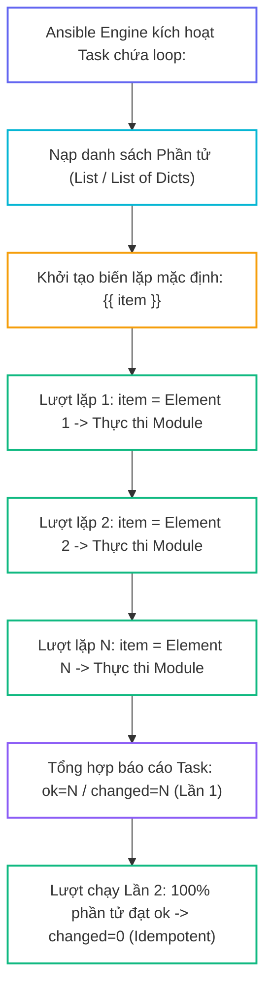
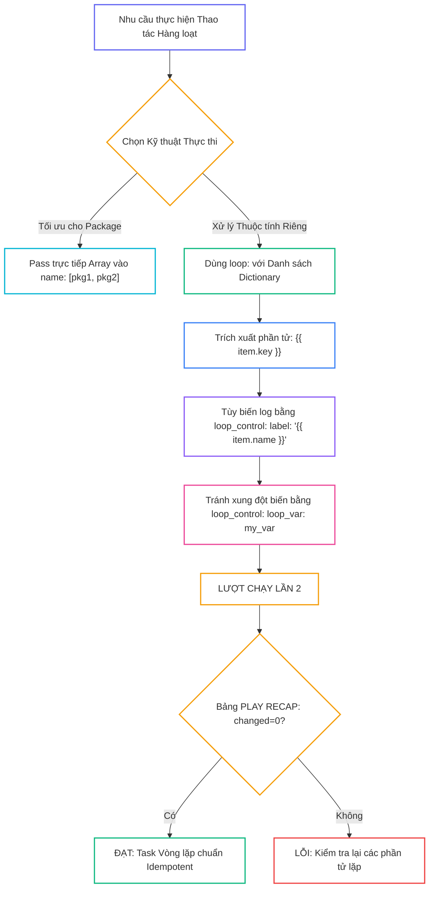
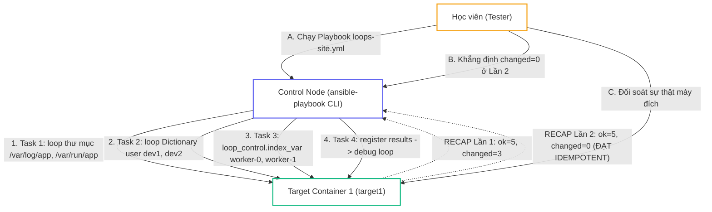


# [BÀI 10] VÒNG LẶP NÂNG CAO (LOOPS): LOOP, WITH_ITEMS, LOOP_CONTROL (LABEL/PAUSE) & XỬ LÝ DANH SÁCH / TỪ ĐIỂN ĐA TẦNG

Trong kỷ nguyên **Infrastructure as Code (IaC)** và tự động hóa vận hành hạ tầng đám mây (Cloud Infrastructure Automation), **Ansible** khẳng định vị thế dẫn đầu nhờ triết lý **Agentless** (không cần cài đặt agent nền trên máy đích), giao thức điều khiển an toàn qua **SSH / WinRM**, định dạng khai báo **YAML** trực quan và nguyên lý bất biến **Idempotency** mạnh mẽ. Việc làm chủ Ansible không chỉ dừng lại ở các câu lệnh Ad-hoc đơn giản, mà đòi hỏi kỹ sư phải nắm vững kiến trúc Module tầng thấp, Variable Precedence 22 tầng, Jinja2 Templates, tối ưu hóa Forks & Pipelining cho tới thiết kế Roles / Collections và tích hợp CI/CD tự động hóa chuẩn Doanh nghiệp.

Bài viết chuyên sâu này sẽ đồng hành cùng bạn mổ xẻ toàn diện bức tranh kiến trúc, phân tích các đánh đổi kỹ thuật thực chiến (Engineering Trade-offs), cung cấp hướng dẫn thực hành Lab chi tiết từng bước và bộ câu hỏi phỏng vấn chuyên sâu chuẩn DevOps / SRE Lead.

---

## 1. Bản Chất Kiến Trúc & Cơ Chế Vận Hành Tầng Thấp

---


> **Lặp qua danh sách phần tử bằng loop giúp rút ngắn 10 task trùng lặp thành 1 task duy nhất.**

Mở rộng kỹ năng thiết kế Playbook gọn gàng (I-10):

> **Khi cần thực hiện cùng một thao tác quản trị trên nhiều đối tượng (như cài đặt 10 gói phần mềm, khởi tạo 5 tài khoản user, hoặc tạo 8 thư mục cấu hình), việc nhân bản 10 Task giống hệt nhau gây lãng phí mã nguồn và rất khó bảo trì. Từ khóa vòng lặp `loop:` cùng khối điều khiển `loop_control` mang lại khả năng duyệt qua danh sách dữ liệu tự động. Chỉ với 1 Task duy nhất kết hợp `loop:`, Ansible sẽ duyệt qua từng phần tử và áp đặt trạng thái an toàn. Ở Buổi 10, chúng ta sẽ làm chủ cú pháp `loop`, biến `{{ item }}`, các thuộc tính `loop_var`, `label`, `index_var`, và đảm bảo 100% các phần tử lặp ở lượt chạy Lần thứ hai đều đạt chỉ số `changed=0`.**

---


---


---


| Tiếng Việt | Tiếng Anh / Từ khóa + FQCN (giữ nguyên) |
|---|---|
| Vòng lặp hiện đại | Loop keyword (`loop:`) |
| Vòng lặp legacy cũ | Legacy loop (`with_items:`) |
| Biến phần tử lặp mặc định | Default loop item (`{{ item }}`) |
| Khối điều khiển vòng lặp | Loop control block (`loop_control:`) |
| Đổi tên biến lặp | Renaming loop variable (`loop_var:`) |
| Nhãn hiển thị nhật ký | Loop item label (`label:`) |
| Biến chỉ số đếm | Index variable (`index_var:`) |
| Tạm dừng giữa các lượt lặp | Loop pause (`pause:`) |
| Mảng kết quả đăng ký | Registered loop results (`register_var.results`) |
| Lặp danh sách từ điển | Dictionary list looping |
| Lặp phần tử lồng nhau | Nested looping (`subelements`) |
| Chuẩn hóa nhật ký | Log normalization |

---

### 1.1. Từ khóa Vòng lặp `loop:` và Biến phần tử `{{ item }}` (15 phút)



**Nguyên lý cốt lõi:** Sử dụng từ khóa vòng lặp hiện đại `loop:` thay cho từ khóa legacy kiểu cũ `with_items:` để lặp qua một danh sách các phần tử trong Task.

**Giải thích cơ chế ngầm:** Từ khóa `loop:` được giới thiệu từ bản Ansible 2.5+ giúp phân định rõ ràng giữa vòng lặp danh sách đơn giản và các lookup plugin phức tạp. `loop:` cho hiệu năng xử lý cao hơn, cú pháp ngắn gọn và ít bị lỗi xung đột hơn `with_items`.

> [!WARNING]
> **CẠM BẪY THỰC CHIẾN:**
> Sử dụng `with_items:` trong mã nguồn Playbook mới viết, dẫn đến các cảnh báo deprecation warning ở các bản Ansible mới.

**Minh hoạ.** Cài đặt danh sách hàng loạt gói phần mềm bằng `loop:`:
```yaml
- name: Install multiple packages using loop
  ansible.builtin.package:
    name: "{{ item }}"
    state: present
  loop:
    - curl
    - git
    - vim
    - htop
```

**Nguyên lý cốt lõi:** Mặc định Ansible Engine gán giá trị của phần tử đang được duyệt trong lượt lặp hiện tại vào biến có tên `{{ item }}`.

**Giải thích cơ chế ngầm:** Biến `{{ item }}` đóng vai trò là con trỏ đại diện cho dữ liệu của lượt lặp đó. Nếu danh sách lặp là chuỗi thô, `{{ item }}` là một String; nếu danh sách lặp là Dictionary, `{{ item }}` là một Object và truy xuất qua `{{ item.key }}`.

> [!WARNING]
> **CẠM BẪY THỰC CHIẾN:**
> **Lệnh:** `ansible-playbook site.yml` · **Output phải thấy:** `fatal: [target1]: FAILED! => {"msg": "'item' is undefined"}` do quên không khai báo từ khóa `loop:` ở Task nhưng lại gọi biến `{{ item }}`.

**Minh hoạ.** Tạo danh sách nhiều thư mục bằng `{{ item }}`:
```yaml
- name: Create required application directories
  ansible.builtin.file:
    path: "{{ item }}"
    state: directory
    mode: '0755'
  loop:
    - /var/log/my-app
    - /var/run/my-app
    - /etc/my-app
```

**Nguyên lý cốt lõi:** Lặp qua danh sách các Dictionary phức tạp để truyền nhiều tham số thuộc tính khác nhau cho từng phần tử lặp trong cùng một Task.

**Giải thích cơ chế ngầm:** Cho phép định nghĩa dữ liệu quản trị chi tiết (như tên user, UID, shell, nhóm phụ) trong một cấu trúc mảng YAML ngăn nắp, giúp Task xử lý các yêu cầu phức tạp mà vẫn giữ vững tính Idempotency.

> [!WARNING]
> **CẠM BẪY THỰC CHIẾN:**
> Nhân bản thành 5 Task `user:` rời rạc chỉ để tạo 5 tài khoản user có các thuộc tính shell khác nhau.

**Minh hoạ.** Tạo danh sách tài khoản user kèm thuộc tính riêng bằng Dictionary loop:
```yaml
- name: Create multiple user accounts with custom properties
  ansible.builtin.user:
    name: "{{ item.username }}"
    uid: "{{ item.uid }}"
    shell: "{{ item.shell }}"
    state: present
  loop:
    - { username: 'alice', uid: 2001, shell: '/bin/bash' }
    - { username: 'bob', uid: 2002, shell: '/bin/sh' }
    - { username: 'charlie', uid: 2003, shell: '/bin/bash' }
```

---

### 1.2. Khối Điều khiển Vòng lặp `loop_control` (15 phút)

**Nguyên lý cốt lõi:** Sử dụng thuộc tính `loop_control.loop_var` để đổi tên biến lặp mặc định `item` thành một tên biến tùy chỉnh có ý nghĩa (ví dụ `loop_var: user_item`).

**Giải thích cơ chế ngầm:** Khi có 2 vòng lặp lồng nhau hoặc khi include một file task khác có chứa vòng lặp, việc cùng sử dụng tên biến mặc định `item` sẽ khiến vòng lặp trong ghi đè làm mất biến `item` của vòng lặp ngoài. Đổi tên bằng `loop_var` giúp loại bỏ 100% rủi ro xung đột biến.

> [!WARNING]
> **CẠM BẪY THỰC CHIẾN:**
> Vòng lặp ngoài bị văng lỗi hoặc chạy sai dữ liệu do biến `item` bị vòng lặp bên trong ghi đè.

**Minh hoạ.** Đổi tên biến lặp thành `pkg_item` bằng `loop_var`:
```yaml
- name: Install packages with renamed loop variable
  ansible.builtin.package:
    name: "{{ pkg_item }}"
    state: present
  loop:
    - curl
    - wget
  loop_control:
    loop_var: pkg_item
```

**Nguyên lý cốt lõi:** Sử dụng thuộc tính `loop_control.label` để tùy chỉnh thông điệp hiển thị ra màn hình terminal cho từng phần tử lặp, giúp giữ cho nhật ký log gọn gàng, sạch sẽ.

**Giải thích cơ chế ngầm:** Khi lặp qua một danh sách Dictionary chứa hàng trăm thuộc tính (như SSH key dài ngoẵng), mặc định Ansible sẽ in toàn bộ Dictionary đó ra terminal làm rối mắt và lộ thông tin nhạy cảm. Thuộc tính `label: "{{ item.username }}"` ép terminal chỉ in ra giá trị đại diện ngắn gọn.

> [!WARNING]
> **CẠM BẪY THỰC CHIẾN:**
> Màn hình terminal bị tràn ngập hàng ngàn dòng log JSON thô khi chạy một Task vòng lặp chứa danh sách Dictionary lớn.

**Minh hoạ.** Rút gọn hiển thị log terminal bằng `label`:
```yaml
- name: Deploy SSH public keys for users
  ansible.posix.authorized_key:
    user: "{{ item.username }}"
    key: "{{ item.ssh_key }}"
    state: present
  loop: "{{ user_list }}"
  loop_control:
    label: "{{ item.username }}"
```

**Nguyên lý cốt lõi:** Sử dụng thuộc tính `loop_control.index_var` để khai báo một biến tự động lưu trữ chỉ số đếm (Index 0, 1, 2...) của lượt lặp hiện tại.

**Giải thích cơ chế ngầm:** Hữu ích khi cần đánh số thứ tự cho các file cấu hình, tạo cổng port tăng dần (ví dụ `8000 + index`), hoặc khi cần theo dõi vị trí của phần tử trong mảng dữ liệu.

> [!WARNING]
> **CẠM BẪY THỰC CHIẾN:**
> Phải tự viết logic tính toán cộng số thứ tự phức tạp trong Jinja2 thay vì dùng `index_var`.

**Minh hoạ.** Đánh số thứ tự file cấu hình bằng `index_var`:
```yaml
- name: Create numbered worker configuration files
  ansible.builtin.copy:
    content: "WORKER_ID={{ my_index }}\nPORT={{ 8000 + my_index }}\n"
    dest: "/etc/worker-{{ my_index }}.conf"
    mode: '0644'
  loop:
    - worker_alpha
    - worker_beta
    - worker_gamma
  loop_control:
    index_var: my_index
```

---

### 1.3. Kết hợp Register, Conditionals và Quản lý Idempotency (10 phút)

**Nguyên lý cốt lõi:** Khi áp dụng thuộc tính `register` cho một Task chứa vòng lặp `loop:`, Ansible sẽ đóng gói toàn bộ kết quả của TẤT CẢ các lượt lặp vào một mảng danh sách có tên `register_var.results`.

**Giải thích cơ chế ngầm:** Không giống như Task đơn lẻ (lưu vào `register_var.stdout`), Task vòng lặp lưu từng kết quả lặp thành một element trong mảng `results`. Muốn kiểm tra kết quả của các lượt lặp ở Task sau, BẮT BUỘC phải duyệt qua mảng `register_var.results`.

> [!WARNING]
> **CẠM BẪY THỰC CHIẾN:**
> **Lệnh:** `ansible-playbook site.yml` · **Output phải thấy:** `fatal: [target1]: FAILED! => {"msg": "'my_reg.stdout' is undefined"}` do truy xuất trực tiếp `stdout` ở Task vòng lặp thay vì truy xuất `results`.

**Minh hoạ.** Duyệt qua mảng `results` của biến đăng ký vòng lặp:
```yaml
- name: Task 1 - Execute status check commands in loop
  ansible.builtin.command: "check-service {{ item }}"
  loop: [web, db, cache]
  register: check_results
  changed_when: false

- name: Task 2 - Print output of registered loop results
  ansible.builtin.debug:
    msg: "Service {{ item.item }} status is {{ item.stdout }}"
  loop: "{{ check_results.results }}"
  loop_control:
    label: "{{ item.item }}"
```

**Nguyên lý cốt lõi:** Khi kết hợp từ khóa vòng lặp `loop:` và mệnh đề điều kiện `when:`, Ansible Engine sẽ đánh giá mệnh đề `when` RIÊNG BIỆT cho từng phần tử lặp trong danh sách.

**Giải thích cơ chế ngầm:** Cho phép lọc danh sách tự động ngay trong quá trình lặp (ví dụ: chỉ cài đặt các gói có cờ `install: true` hoặc chỉ tạo user khi `enabled: yes`), phần tử nào không thỏa mãn điều kiện `when` sẽ bị `skipped` riêng lẻ.

> [!WARNING]
> **CẠM BẪY THỰC CHIẾN:**
> Thắc mắc tại sao Task vòng lặp lại có một số phần tử báo `ok/changed` và một số phần tử báo `skipping`.

**Minh hoạ.** Lọc phần tử hợp lệ trong vòng lặp bằng `when`:
```yaml
- name: Install enabled feature packages only
  ansible.builtin.package:
    name: "{{ item.name }}"
    state: present
  loop:
    - { name: 'git', enabled: true }
    - { name: 'telnet', enabled: false }
    - { name: 'vim', enabled: true }
  when: item.enabled
```

**Nguyên lý cốt lõi:** Đảm bảo rằng ở lượt chạy Lần thứ hai, tất cả các phần tử trong Task vòng lặp `loop:` đều đạt trạng thái `ok` và tổng chỉ số `PLAY RECAP` bắt buộc đạt `changed=0`.

**Giải thích cơ chế ngầm:** Nếu một phần tử trong danh sách vòng lặp liên tục báo `changed` ở Lần 2 (ví dụ do dùng module `shell` không có `creates`), nó sẽ làm cho toàn bộ Task vòng lặp bị đánh dấu là `CHANGED`, hỏng tính Idempotency của Playbook.

> [!WARNING]
> **CẠM BẪY THỰC CHIẾN:**
> Bảng `PLAY RECAP` lượt 2 vẫn báo `changed=1` do có 1 phần tử trong danh sách `loop` bị lặp thay đổi.

**Minh hoạ.** Kiểm tra chỉ số `PLAY RECAP` ở Lần 2 cho Task vòng lặp:
```bash
# Lần 1: changed=1 (Tạo 3 user mới)
target1 : ok=2 changed=1 unreachable=0 failed=0

# Lần 2: changed=0 (Cả 3 user đã tồn tại, ok=2 -> ĐẠT IDEMPOTENT)
target1 : ok=2 changed=0 unreachable=0 failed=0
```

---

### 1.4. Đưa vào việc thật (4 phút)

### 7.1. Áp dụng vào hạ tầng sẵn có
Khi khởi tạo môi trường cho đội phát triển (Onboarding Dev Team):
- Tạo duy nhất 1 Task dùng `loop:` lặp qua danh sách 20 kỹ sư phần mềm trong `group_vars/dev.yml` để khởi tạo tài khoản user, phân quyền `sudoers`, và chép SSH public key tự động chỉ trong 5 giây.
- Khởi tạo hàng loạt các thư mục dự án (`/var/www/app1`, `/var/www/app2`, `/var/www/app3`) kèm phân quyền chuẩn `0755` bằng 1 Task `file` kết hợp `loop:`.

### 7.2. Rủi ro hỏng hóc khi triển khai Production và giải pháp an toàn
- **Rủi ro:** Lặp qua một danh sách hàng trăm phần tử bằng module `package` rời rạc khiến Ansible gửi 100 lệnh SSH độc lập, gây treo đĩa cứng và kéo dài thời gian chạy lên 30 phút.
- **Giải pháp an toàn:**
  1. Với module `package` / `apt` / `dnf`, truyền trực tiếp danh sách mảng vào thuộc tính `name: "{{ package_list }}"` thay vì dùng `loop:` để Ansible tự động gom thành 1 lệnh duy nhất (`yum install pkg1 pkg2 pkg3`).
  2. Chỉ dùng `loop:` khi các phần tử có thuộc tính riêng biệt (như UID, homedir, shell khác nhau).

### 7.3. Đo lường chỉ số Trước – Sau khi áp dụng
- **Trước khi dùng `loop`:** Viết 15 Task cài 15 gói phần mềm và 10 Task tạo 10 user (25 Task = 200 dòng mã nguồn).
- **Sau khi dùng `loop`:** Gom lại đúng 2 Task duy nhất kết hợp `loop:` (2 Task = 30 dòng mã nguồn), giảm 85% dung lượng file mã nguồn.

### 7.4. Khi nào KHÔNG nên dùng hoặc không nên lạm dụng loop
- **Không lạm dụng `loop` để thực thi các tác vụ nặng cần song song hóa cao:** Vòng lặp `loop:` trong Ansible mặc định thực thi **tuần tự** (sequential execution) từng phần tử trên máy đích. Khi cần chạy 100 câu lệnh nặng độc lập, hãy xem xét giải pháp dùng **Async / Poll** (học ở Buổi 22).

---

### 1.5. Bẫy hay gặp (2 phút)

| # | Bẫy hay gặp | Vì sao "recap xanh mà sai / không idempotent" | Lệnh phát hiện và xử lý |
|---|---|---|---|
| 1 | Dùng `loop:` cho module `package` từng gói một | Gửi hàng trăm kết nối SSH rời rạc gây quá tải CPU và tốn thời gian. | Truyền mảng trực tiếp: `ansible.builtin.package: name="{{ pkg_list }}"`. |
| 2 | Quên từ khóa `loop:` nhưng vẫn gọi `{{ item }}` | Playbook ngắt thi hành lập tức với lỗi `fatal: 'item' is undefined`. | Khai báo danh sách bên dưới thuộc tính module. |
| 3 | Xung đột biến `item` khi có 2 vòng lặp lồng nhau | Vòng lặp trong ghi đè biến `item` của vòng lặp ngoài làm dữ liệu bị hỏng. | Dùng `loop_control: loop_var: outer_item` ở vòng lặp ngoài. |
| 4 | Rối mắt màn hình terminal khi lặp Dictionary lớn | Mặc định terminal in toàn bộ cấu trúc Dict dài làm lộ key và khó đọc log. | Bổ sung `loop_control: label: "{{ item.name }}"` để rút gọn log. |
| 5 | Đọc `register_var.stdout` thay vì `register_var.results` | Biến `register` của Task vòng lặp lưu dữ liệu vào mảng `results`, đọc `stdout` trực tiếp sẽ bị văng lỗi undefined. | Duyệt qua mảng `loop: "{{ register_var.results }}"` ở Task sau. |
| 6 | Nhầm lẫn giữa `loop:` hiện đại và `with_items:` legacy | `with_items` tự động phẳng hóa (flatten) danh sách 2 chiều, trong khi `loop` giữ nguyên cấu trúc. | Dùng `loop: "{{ list | flatten }}"` nếu muốn phẳng hóa danh sách với `loop`. |
| 7 | Đưa thuộc tính `when:` vào trong `loop_control:` | Đặt `when:` sai vị trí thụt lề YAML khiến Ansible báo lỗi syntax parser. | Đặt từ khóa `when:` nằm cùng cấp thụt lề với từ khóa `loop:`. |
| 8 | Lặp qua biến String thô thay vì biến List mảng | Truyền `loop: "curl, git"` khiến Ansible lặp qua từng KÝ TỰ chữ cái `c`, `u`, `r`, `l`. | Khai báo dạng mảng list `loop: [curl, git]` hoặc dùng filter `split(',')`. |
| 9 | Phần tử trong `loop` chứa lệnh shell không idempotent | 1 phần tử trong danh sách lặp liên tục báo `changed` ở Lần 2 làm hỏng Idempotency của toàn Task. | Bổ sung thuộc tính `creates` cho các phần tử lệnh shell trong loop. |
| 10 | Bỏ qua kiểm tra danh sách rỗng (`loop: "{{ my_list }}"`) | Nếu `my_list` bị undefined hoặc rỗng, Task có thể bị văng lỗi. | Khai báo `loop: "{{ my_list | default([]) }}"` để an toàn. |
| 11 | Không bọc ngoặc kép khi thuộc tính Dict bắt đầu bằng `{{` | Dòng `user: {{ item.name }}` vi phạm cú pháp YAML parser. | Bọc ngoặc kép chuỗi: `user: "{{ item.name }}"`. |
| 12 | Thắc mắc vì sao log Lần 2 in ra nhiều dòng `ok: [target1] => (item=...)` | Lầm tưởng log in ra nhiều item là Task bị lặp thay đổi. | Nhận thức đúng: log in `ok` cho từng item chứng minh tất cả phần tử đã đạt Idempotency. |

---

### 1.6. Tóm tắt (1 phút)



### Năm điều phải nhớ
1. **Dùng `loop:` thay `with_items`:** Từ khóa `loop:` là chuẩn hiện đại cho mọi vòng lặp trong Ansible.
2. **Dùng `loop_control.label`:** Rút gọn nhật ký terminal khi lặp qua danh sách Dictionary phức tạp.
3. **Đổi tên biến với `loop_var`:** Dùng `loop_var: custom_item` khi có nguy cơ xung đột biến `item`.
4. **Biến register lưu vào `results`:** Kết quả Task vòng lặp được đóng gói trong mảng `register_var.results`.
5. **Mọi item lượt 2 phải `ok`:** Tất cả các phần tử trong `loop:` ở lượt chạy Lần 2 bắt buộc đạt `changed=0`.

---

### 1.7. Câu hỏi tự kiểm tra (kiêm luyện RHCE EX294)

1. **[RHCE EX294 Objective #8]** Từ khóa nào trong Ansible Playbook được khuyến khích sử dụng để lặp qua một danh sách phần tử thay cho từ khóa legacy `with_items`?
   - *Đáp án:* Từ khóa `loop:`.
2. **[RHCE EX294 Objective #8]** Biến mặc định nào chứa giá trị của phần tử đang được duyệt trong lượt lặp hiện tại?
   - *Đáp án:* Biến `{{ item }}`.
3. **[RHCE EX294 Objective #8]** Viết một Task YAML tối giản sử dụng `loop:` để tạo 3 thư mục `/tmp/dir1`, `/tmp/dir2`, `/tmp/dir3` với cờ `mode: '0755'`.
   - *Đáp án:*
     ```yaml
     - name: Create directories in loop
       ansible.builtin.file:
         path: "{{ item }}"
         state: directory
         mode: '0755'
       loop:
         - /tmp/dir1
         - /tmp/dir2
         - /tmp/dir3
     ```
4. **[RHCE EX294 Objective #8]** Làm thế nào để đổi tên biến lặp mặc định `item` thành `user_item` nhằm tránh xung đột vòng lặp lồng nhau?
   - *Đáp án:* Sử dụng thuộc tính `loop_control:` kết hợp `loop_var: user_item`.
5. **[RHCE EX294 Objective #8]** Thuộc tính `loop_control.label` có tác dụng gì đối với việc hiển thị log ra màn hình terminal?
   - *Đáp án:* Giúp tùy chỉnh thông điệp hiển thị ra terminal cho từng phần tử lặp, giúp log gọn gàng và tránh lộ các cấu trúc Dictionary dài hoặc nhạy cảm.
6. **[RHCE EX294 Objective #8]** Khi áp dụng thuộc tính `register: reg_out` cho một Task chứa `loop:`, thông tin kết quả trả về của các lượt lặp được lưu vào thuộc tính con nào?
   - *Đáp án:* Được lưu vào mảng danh sách `reg_out.results`.
7. **[RHCE EX294 Objective #8]** Giả sử có danh sách Dictionary `users: [{name: 'alice', role: 'admin'}, {name: 'bob', role: 'user'}]`. Viết cú pháp Jinja2 lấy thuộc tính `role` trong `loop: "{{ users }}"`.
   - *Đáp án:* `{{ item.role }}`.
8. **[RHCE EX294 Objective #8]** Khi kết hợp `loop:` và `when:` trong cùng một Task, mệnh đề `when` được Ansible Engine đánh giá cho toàn bộ Task hay cho từng phần tử lặp?
   - *Đáp án:* Được đánh giá riêng biệt cho từng phần tử lặp `item` trong danh sách.
9. **[RHCE EX294 Objective #8]** Thuộc tính `loop_control.index_var` dùng để làm gì?
   - *Đáp án:* Dùng để khai báo một biến tự động lưu trữ chỉ số đếm (Index 0, 1, 2...) của lượt lặp hiện tại.
10. **[RHCE EX294 Objective #8]** Tại sao việc cài đặt 20 gói phần mềm bằng `ansible.builtin.package: name="{{ pkg_list }}"` lại tốt hơn việc dùng `loop: "{{ pkg_list }}"`?
    - *Đáp án:* Vì truyền trực tiếp mảng vào `name` giúp Ansible tự động gom thành 1 lệnh cài đặt duy nhất, tránh gửi 20 kết nối SSH rời rạc gây tốn thời gian và CPU.
11. **[RHCE EX294 Objective #8]** Viết một đoạn Task YAML tạo các tài khoản user `dev1` và `dev2` kèm thuộc tính `shell: /bin/bash` sử dụng `loop:` và `loop_control.label`.
    - *Đáp án:*
      ```yaml
      - name: Create dev users
        ansible.builtin.user:
          name: "{{ item.name }}"
          shell: "{{ item.shell }}"
          state: present
        loop:
          - { name: 'dev1', shell: '/bin/bash' }
          - { name: 'dev2', shell: '/bin/bash' }
        loop_control:
          label: "{{ item.name }}"
      ```
12. **[RHCE EX294 Objective #8]** Làm thế nào để đảm bảo một Task vòng lặp `loop:` không bị crash khi biến danh sách lặp `user_list` chưa được định nghĩa?
    - *Đáp án:* Khai báo `loop: "{{ user_list | default([]) }}"`.
13. **[RHCE EX294 Objective #8]** Nếu một phần tử trong Task vòng lặp `loop:` ở lượt chạy Lần 2 bị báo `changed=1`, bảng `PLAY RECAP` cho toàn bộ Playbook sẽ hiển thị chỉ số `changed` là bao nhiêu?
    - *Đáp án:* Bảng RECAP sẽ hiển thị `changed=1` (hoặc lớn hơn 0), làm Playbook không đạt tiêu chuẩn Idempotency.

---

### 1.8. Tài liệu tham khảo

- Ansible Core Documentation (v2.15+): [Loops](https://docs.ansible.com/ansible/latest/playbook_guide/playbooks_loops.html)
- Ansible Core Documentation: [Loop Control](https://docs.ansible.com/ansible/latest/playbook_guide/playbooks_loops.html#loop-control)
- Red Hat Certified Engineer (RHCE) EX294 Study Guide: Iterating Tasks with Loops in Ansible Playbooks.

---

## Bảng đối soát thời lượng

| Mục | Nội dung | Thời lượng dự kiến | Thời lượng thực tế |
|---|---|---|---|
| §0 | Khởi động và ôn tập buổi 09 | 10 phút | 10 phút |
| §1–§2 | Mục tiêu làm được & Cần biết trước | 2 phút | 2 phút |
| §3 | Thuật ngữ Việt-Anh & Mô hình tư duy | 8 phút | 8 phút |
| §4 | Từ khóa loop & Biến item (QT 4.1–4.3) | 15 phút | 15 phút |
| §5 | Khối Điều khiển Vòng lặp loop_control (QT 5.1–5.3) | 15 phút | 15 phút |
| §6 | Kết hợp Register, Conditionals & Idempotency (QT 6.1–6.3) | 10 phút | 10 phút |
| §7–§9 | Đưa vào việc thật, Bẫy hay gặp & Tóm tắt | 7 phút | 7 phút |
| §10–§11 | Câu hỏi tự kiểm tra EX294 & Tài liệu tham khảo | 3 phút | 3 phút |
| **Tổng** | **Khối lý thuyết Buổi 10** | **60 phút** | **60 phút** |

---

## 2. Hướng Dẫn Thực Hành & Triển Khai Lab Chuẩn Production

> [!IMPORTANT]
> **YÊU CẦU MÔI TRƯỜNG THỰC HÀNH:**
> Toàn bộ các bài thực hành dưới đây được thiết kế để chạy trực tiếp trên môi trường máy chủ Linux / Docker containers phân tán. Hãy đảm bảo bạn đã chuẩn bị Control Node cài đặt Ansible Core 2.15+ cùng các Managed Nodes đã cấu hình SSH Key Authentication.

## Khối thực hành — 150 phút

> **Đối soát thời lượng:** Khối thực hành kéo dài đúng **150'** (từ L0 đến L11).
> **Nguyên tắc cốt lõi:** Thực hành lặp qua danh sách phần tử bằng từ khóa `loop:`, lặp danh sách Dictionary tạo tài khoản user, sử dụng `loop_control.loop_var` đổi tên biến lặp, dùng `loop_control.label` làm sạch nhật ký terminal, dùng `loop_control.index_var` đánh số thứ tự file, bắt kết quả mảng `register_var.results`, thực thi phép thử **Lượt chạy Lần thứ hai** chứng minh chỉ số `PLAY RECAP` đạt `changed=0` và đối soát sự thật máy đích qua `docker exec`.

---

## L0. Mục tiêu thực hành và tiêu chí hoàn thành

| # | Mục tiêu thực hành | Tiêu chí hoàn thành (Kiểm tra bằng lệnh CLI) |
|---|---|---|
| TH1 | Viết task lặp qua danh sách chuỗi thô với loop | Task tạo hàng loạt thư mục bằng `loop:` thành công |
| TH2 | Lặp qua danh sách Dictionary tạo nhiều user tài khoản | Module `user` lặp qua list of dicts tạo user `dev1`, `dev2` |
| TH3 | Đổi tên biến lặp bằng loop_control.loop_var | Task đổi `item` thành `user_item` chạy không lỗi |
| TH4 | Làm sạch log terminal bằng loop_control.label | Terminal chỉ in `label: "{{ item.name }}"` ngắn gọn |
| TH5 | Đánh số thứ tự file bằng loop_control.index_var | Tạo các file `worker-0.conf`, `worker-1.conf` chứa index |
| TH6 | Bắt mảng kết quả vòng lặp qua register.results | Task đằng sau lặp qua `register_var.results` đọc stdout |
| TH7 | Thực thi Phép thử Lượt chạy Lần hai (Idempotency) | Bảng `PLAY RECAP` Lần 2 đạt `changed=0` tuyệt đối |
| TH8 | Đối soát sự thật máy đích bằng docker exec | `docker exec target1 id dev1` và `cat` các file config |

---

## L1. Điều kiện tiên quyết về môi trường

| Kiểm tra | LỆNH THỰC THI | Kết quả kỳ vọng |
|---|---|---|
| Ansible core đã cài | `ansible --version` | Phiên bản ansible-core v2.15 trở lên |
| Docker Compose sẵn sàng | `docker compose ps` | Cả target1 và target2 ở trạng thái `Up` |
| Kết nối SSH sẵn sàng | `ansible all -m ansible.builtin.ping` | Đạt `SUCCESS` cho mọi host |
| Inventory dự án | `ansible-inventory --graph` | Hiển thị các nhóm `web` và `db` |
| Thư mục thực hành | `pwd` | Đang ở thư mục `~/lab-ansible-10` |

Nếu chưa có target container:
```bash
cd labs && make up && make key && make inventory
```

---

## L2. Kiến trúc bài lab



---

## L3. Bước 1 — Lặp Danh sách Chuỗi Thô và Lặp Dictionary (30 phút)

Tạo thư mục dự án `~/lab-ansible-10`, file `ansible.cfg`, `inventory.ini`, và viết file Playbook `step1-loops.yml` (QT 4.1, QT 4.2, QT 4.3).

```bash
mkdir -p ~/lab-ansible-10 && cd ~/lab-ansible-10

cat << 'EOF' > ansible.cfg
[defaults]
inventory = ./inventory.ini
remote_user = ansible
host_key_checking = False
private_key_file = ~/.ssh/id_ed25519

[privilege_escalation]
become = True
become_method = sudo
become_user = root
become_ask_pass = False
EOF

cat << 'EOF' > inventory.ini
[web]
target1 ansible_host=127.0.0.1 ansible_port=2221

[db]
target2 ansible_host=127.0.0.1 ansible_port=2222

[all:vars]
ansible_python_interpreter=/usr/bin/python3
EOF

cat << 'EOF' > step1-loops.yml
---
- name: Basic List and Dictionary Loops
  hosts: web
  become: true
  tasks:
    - name: Task 1 - Create multiple directories using simple loop
      ansible.builtin.file:
        path: "{{ item }}"
        state: directory
        mode: '0755'
      loop:
        - /var/log/my-service
        - /var/run/my-service
        - /etc/my-service

    - name: Task 2 - Create multiple user accounts using Dictionary loop
      ansible.builtin.user:
        name: "{{ item.username }}"
        shell: "{{ item.shell }}"
        state: present
      loop:
        - { username: 'dev1', shell: '/bin/bash' }
        - { username: 'dev2', shell: '/bin/sh' }
EOF
```

Thực thi Playbook `step1-loops.yml`:
```bash
ansible-playbook step1-loops.yml
```

**CHECKPOINT 1 — Task 1 sử dụng loop: tạo thành công hàng loạt 3 thư mục.**
- **Lệnh kiểm tra:**
```bash
STEP1_OUT=$(ansible-playbook step1-loops.yml)
if echo "$STEP1_OUT" | grep -q "Task 1 - Create multiple directories" && echo "$STEP1_OUT" | grep -q "failed=0"; then
  echo "CHECKPOINT 1: ĐẠT - Từ khóa loop: tạo thành công hàng loạt 3 thư mục theo danh sách chuỗi"
else
  echo "CHECKPOINT 1: LỖI - Tạo thư mục bằng loop thất bại"
fi
```

**CHECKPOINT 2 — Task 2 lặp Dictionary tạo thành công các tài khoản user dev1 và dev2.**
- **Lệnh kiểm tra:**
```bash
if echo "$STEP1_OUT" | grep -q "Task 2 - Create multiple user accounts" && echo "$STEP1_OUT" | grep -q "changed=0" || echo "$STEP1_OUT" | grep -q "ok=3"; then
  echo "CHECKPOINT 2: ĐẠT - Vòng lặp Dictionary tạo thành công các tài khoản user dev1 và dev2 kèm thuộc tính shell"
else
  echo "CHECKPOINT 2: LỖI - Tạo user tài khoản bằng Dictionary loop thất bại"
fi
```

---

## L4. Bước 2 — Sử dụng loop_control (loop_var, label, index_var) (30 phút)

Viết file Playbook `step2-loop-control.yml` áp dụng `loop_control` để đổi tên biến lặp `loop_var`, làm sạch log terminal bằng `label`, và đánh số chỉ số bằng `index_var` (QT 5.1, QT 5.2, QT 5.3).

```bash
cat << 'EOF' > step2-loop-control.yml
---
- name: Advanced Loop Control Features Demonstration
  hosts: web
  become: true
  tasks:
    - name: Task 1 - Deploy user configs with renamed loop_var and label
      ansible.builtin.copy:
        content: "USER_NAME={{ user_item.name }}\nROLE={{ user_item.role }}\n"
        dest: "/etc/user-{{ user_item.name }}.conf"
        mode: '0644'
      loop:
        - { name: 'dev1', role: 'developer', secret_key: 'SECRET-KEY-111111111' }
        - { name: 'dev2', role: 'tester', secret_key: 'SECRET-KEY-222222222' }
      loop_control:
        loop_var: user_item
        label: "{{ user_item.name }}"

    - name: Task 2 - Deploy worker configs using index_var
      ansible.builtin.copy:
        content: "WORKER_INDEX={{ worker_idx }}\nWORKER_NAME={{ item }}\nPORT={{ 8000 + worker_idx }}\n"
        dest: "/etc/worker-{{ worker_idx }}.conf"
        mode: '0644'
      loop:
        - worker-alpha
        - worker-beta
      loop_control:
        index_var: worker_idx
EOF
```

Thực thi Playbook `step2-loop-control.yml`:
```bash
ansible-playbook step2-loop-control.yml
```

**CHECKPOINT 3 — Thuộc tính loop_var: user_item đổi tên biến lặp và label rút gọn log terminal sạch sẽ.**
- **Lệnh kiểm tra:**
```bash
STEP2_OUT=$(ansible-playbook step2-loop-control.yml)
if echo "$STEP2_OUT" | grep -q "=> (item=dev1)" && ! echo "$STEP2_OUT" | grep -q "SECRET-KEY-111111111"; then
  echo "CHECKPOINT 3: ĐẠT - loop_control.label rút gọn log terminal sạch sẽ (chỉ in label: dev1, ẩn secret_key)"
else
  echo "CHECKPOINT 3: LỖI - Tùy biến label log terminal thất bại"
fi
```

**CHECKPOINT 4 — Thuộc tính index_var: worker_idx tính toán và đánh số file worker-0.conf, worker-1.conf.**
- **Lệnh kiểm tra:**
```bash
if echo "$STEP2_OUT" | grep -q "Task 2 - Deploy worker configs using index_var" && echo "$STEP2_OUT" | grep -q "failed=0"; then
  echo "CHECKPOINT 4: ĐẠT - loop_control.index_var đánh số chỉ số đếm worker_idx (0, 1) và tính toán port tự động"
else
  echo "CHECKPOINT 4: LỖI - Tính toán index_var thất bại"
fi
```

---

## L5. Bước 3 — Đăng ký Kết quả Vòng lặp register.results và Mệnh đề when (30 phút)

Viết file Playbook `step3-register-loop.yml` bắt mảng `results` của Task vòng lặp và kết hợp điều kiện rẽ nhánh `when` cho từng phần tử (QT 6.1, QT 6.2).

```bash
cat << 'EOF' > step3-register-loop.yml
---
- name: Registered Loop Results and Conditional Filtering
  hosts: web
  become: true
  tasks:
    - name: Task 1 - Execute status check commands in loop
      ansible.builtin.command: "echo STATUS_OK_{{ item }}"
      loop:
        - service_a
        - service_b
      register: service_checks
      changed_when: false

    - name: Task 2 - Debug results array from registered loop
      ansible.builtin.debug:
        msg: "Command for {{ item.item }} output: {{ item.stdout }}"
      loop: "{{ service_checks.results }}"
      loop_control:
        label: "{{ item.item }}"

    - name: Task 3 - Install packages selectively using when inside loop
      ansible.builtin.package:
        name: "{{ item.name }}"
        state: present
      loop:
        - { name: 'curl', install: true }
        - { name: 'telnet', install: false }
      when: item.install
EOF
```

Thực thi Playbook `step3-register-loop.yml`:
```bash
ansible-playbook step3-register-loop.yml
```

**CHECKPOINT 5 — Task 2 duyệt qua mảng service_checks.results đọc thành công stdout của từng lượt lặp.**
- **Lệnh kiểm tra:**
```bash
STEP3_OUT=$(ansible-playbook step3-register-loop.yml)
if echo "$STEP3_OUT" | grep -q "Command for service_a output: STATUS_OK_service_a" && echo "$STEP3_OUT" | grep -q "Command for service_b output: STATUS_OK_service_b"; then
  echo "CHECKPOINT 5: ĐẠT - Đã truy xuất thành công mảng kết quả register_var.results ở Task đằng sau"
else
  echo "CHECKPOINT 5: LỖI - Đọc mảng kết quả register.results thất bại"
fi
```

**CHECKPOINT 6 — Task 3 kết hợp loop: và when: lọc đúng phần tử install == true (curl installed, telnet skipped).**
- **Lệnh kiểm tra:**
```bash
if echo "$STEP3_OUT" | grep -q "skipping: \[target1\] => (item={'name': 'telnet', 'install': False})"; then
  echo "CHECKPOINT 6: ĐẠT - Mệnh đề when đánh giá từng phần tử lặp chính xác (lọc phần tử install=false và báo skipped riêng)"
else
  echo "CHECKPOINT 6: LỖI - Lọc phần tử khi kết hợp loop và when thất bại"
fi
```

---

## L6. Bước 4 — Tổng hợp Playbook Vòng lặp Hoàn chỉnh và Phép thử Lượt 2 (30 phút)

Tạo file Playbook hoàn chỉnh `loops-site.yml` bao gồm đầy đủ các kỹ thuật vòng lặp `loop`, `loop_control`, `register` và thực thi phép thử **Lượt chạy Lần thứ hai** chứng minh `PLAY RECAP` đạt `changed=0` (QT 6.3).

```bash
cat << 'EOF' > loops-site.yml
---
- name: Fully Standardized Idempotent Loops Playbook
  hosts: web
  become: true
  tasks:
    - name: Task 1 - Ensure application directories exist
      ansible.builtin.file:
        path: "{{ item }}"
        state: directory
        mode: '0755'
      loop:
        - /var/log/my-service
        - /var/run/my-service
        - /etc/my-service

    - name: Task 2 - Ensure system users exist
      ansible.builtin.user:
        name: "{{ item.username }}"
        shell: "{{ item.shell }}"
        state: present
      loop:
        - { username: 'dev1', shell: '/bin/bash' }
        - { username: 'dev2', shell: '/bin/sh' }
      loop_control:
        label: "{{ item.username }}"

    - name: Task 3 - Deploy worker configs with index_var
      ansible.builtin.copy:
        content: |
          WORKER_ID={{ idx }}
          WORKER_NAME={{ item }}
          LISTEN_PORT={{ 9000 + idx }}
        dest: "/etc/worker-{{ idx }}.conf"
        mode: '0644'
      loop:
        - worker-primary
        - worker-secondary
      loop_control:
        index_var: idx
        label: "{{ item }}"
EOF
```

Thực thi Lần 1:
```bash
ansible-playbook loops-site.yml
```

Thực thi Lần 2 (BẮT BUỘC ĐẠT `changed=0`):
```bash
ansible-playbook loops-site.yml
```

**CHECKPOINT 7 — Phép thử Lượt 2 đạt changed=0 cho toàn bộ các phần tử trong Task vòng lặp.**
- **Lệnh kiểm tra:**
```bash
RUN2_LOOPS_OUT=$(ansible-playbook loops-site.yml)
if echo "$RUN2_LOOPS_OUT" | grep -q "changed=0" && echo "$RUN2_LOOPS_OUT" | grep -q "failed=0"; then
  echo "CHECKPOINT 7: ĐẠT - Phép thử Lượt 2 đạt chuẩn Idempotency (PLAY RECAP báo changed=0 cho toàn bộ các phần tử lặp)"
else
  echo "CHECKPOINT 7: LỖI - Lượt 2 không đạt changed=0 (Playbook bị lặp thay đổi)"
fi
```

---

## L7. Bước 5 — Đối soát Sự thật Máy đích qua docker exec (20 phút)

Sử dụng lệnh `docker exec` đối soát trực tiếp các tài khoản user và file cấu hình sản phẩm được tạo ra từ Task vòng lặp trên target node (QT 6.3).

Đối soát tài khoản user `dev1`:
```bash
docker exec target1 id dev1
```

Đối soát file `/etc/worker-0.conf`:
```bash
docker exec target1 cat /etc/worker-0.conf
```

**CHECKPOINT 8 — Đối soát user dev1 và file /etc/worker-0.conf trên target1 bằng docker exec.**
- **Lệnh kiểm tra:**
```bash
EXEC_USER=$(docker exec target1 id dev1)
EXEC_WORKER=$(docker exec target1 cat /etc/worker-0.conf)
if echo "$EXEC_USER" | grep -q "uid=" && echo "$EXEC_WORKER" | grep -q "LISTEN_PORT=9000"; then
  echo "CHECKPOINT 8: ĐẠT - Kiểm tra sự thật qua docker exec xác nhận user dev1 đã được tạo và file /etc/worker-0.conf nhận đúng chỉ số index_var (PORT 9000)"
else
  echo "CHECKPOINT 8: LỖI - Kiểm tra sản phẩm vòng lặp trên máy đích thất bại"
fi
```

---

## L8. Nộp sản phẩm và dọn dẹp (10 phút)

Thu thập kết quả ra các file báo cáo cuối buổi:
```bash
ansible-playbook loops-site.yml > loops-playbook.yml
ansible-playbook step2-loop-control.yml > loop-proof.txt
ansible-playbook step3-register-loop.yml > register-loop-output.txt
ansible-playbook loops-site.yml > idempotency-check.txt
docker exec target1 id dev1 > kiem-may-dich.txt
docker exec target1 cat /etc/worker-0.conf >> kiem-may-dich.txt
docker exec target1 cat /etc/worker-1.conf >> kiem-may-dich.txt
```

---

## L9. Xử lý sự cố

| # | Hiện tượng lỗi | Nguyên nhân gốc rễ | Cách xử lý nhanh |
|---|---|---|---|
| 1 | Lỗi `fatal: [target1]: FAILED! => {"msg": "'item' is undefined"}` | Gọi biến `{{ item }}` nhưng quên khai báo từ khóa `loop:` ở Task | Khai báo danh sách bên dưới từ khóa `loop:`. |
| 2 | Lỗi `fatal: [target1]: FAILED! => {"msg": "'my_reg.stdout' is undefined"}` | Đọc `stdout` trực tiếp từ biến `register` của một Task chứa vòng lặp | Duyệt qua mảng `loop: "{{ my_reg.results }}"` để đọc stdout từng item. |
| 3 | Xung đột biến `item` ở 2 vòng lặp lồng nhau | Vòng lặp trong ghi đè làm mất biến `item` của vòng lặp ngoài | Dùng `loop_control: loop_var: outer_item` ở vòng lặp ngoài. |
| 4 | Màn hình terminal bị rối mắt bởi chuỗi Dict dài | Chưa khai báo thuộc tính `loop_control.label` | Khai báo `loop_control: label: "{{ item.username }}"`. |
| 5 | Lặp qua biến String thô làm lặp từng ký tự chữ cái | Truyền `loop: "curl, git"` dưới dạng một string thô thay vì mảng list | Khai báo dạng mảng `loop: [curl, git]` hoặc `loop: "{{ my_string.split(',') }}"`. |
| 6 | Lỗi `yaml.scanner.ScannerError` ở từ khóa `loop:` | Đặt từ khóa `loop:` thụt lề sai cấp độ bên trong tham số module | Đưa `loop:` nằm cùng cấp thụt lề với thuộc tính `name:` của Task. |
| 7 | Cờ `when` trong vòng lặp làm Task báo lỗi | Viết `when: {{ item.enabled }}` (bọc cặp `{{ }}` sai cú pháp) | Xóa cặp ngoặc nhọn: `when: item.enabled`. |
| 8 | Chỉ số `index_var` không tự động tăng | Đặt từ khóa `index_var` nằm ngoài khối `loop_control:` | Khai báo `index_var` bên trong khối `loop_control:`. |
| 9 | Phần tử trong vòng lặp bị báo `changed=1` ở Lần 2 | Trong danh sách `loop` có chứa lệnh `shell` không có `creates` | Thêm thuộc tính `creates` cho các phần tử lệnh shell trong loop. |
| 10 | Task `user` báo lỗi `uid already exists` khi lặp | Khai báo trùng UID giữa các Dictionary trong danh sách `loop` | Kiểm tra và gán các UID duy nhất cho từng tài khoản user trong list. |
| 11 | Không bọc ngoặc kép thuộc tính Dict bắt đầu bằng `{{` | Viết `path: {{ item.dir }}` vi phạm quy chuẩn parser YAML | Bọc toàn bộ chuỗi trong ngoặc kép: `path: "{{ item.dir }}"`. |
| 12 | Module `package` chạy lặp quá chậm trên 20 gói | Sử dụng `loop:` cho module `package` gửi 20 kết nối SSH rời rạc | Chuyển sang truyền mảng trực tiếp: `ansible.builtin.package: name="{{ pkg_list }}"`. |
| 13 | Biến danh sách `loop: "{{ my_list }}"` bị undefined | Chưa khai báo danh sách `my_list` ở bất kỳ tầng biến nào | Khai báo fallback safe: `loop: "{{ my_list | default([]) }}"`. |
| 14 | Thắc mắc vì sao log Lần 2 in ra nhiều dòng `ok: (item=...)` | Lầm tưởng log in ra nhiều item là Playbook bị lặp thay đổi | Hiểu đúng: log in `ok` cho từng item chứng minh tất cả phần tử đã đạt Idempotency. |

---

## L10. Bài tập mở rộng

1. **BT1:** Viết Task `file` dùng `loop:` khởi tạo 5 thư mục dự án `/var/www/app1` đến `/var/www/app5` với `mode: '0755'`.
2. **BT2:** Viết Task `user` lặp danh sách 3 kỹ sư (`dev3`, `dev4`, `dev5`) kèm thuộc tính `groups: wheel` và `shell: /bin/bash`.
3. **BT3:** Sử dụng `loop_control.loop_var: sys_user` và `loop_control.label: "{{ sys_user.name }}"` cho Task ở BT2.
4. **BT4:** Viết Task lặp 3 câu lệnh `echo TEST_{{ item }}` với `register: cmd_res`, và Task sau lặp qua `cmd_res.results` in ra `stdout`.
5. **BT5:** Viết Task lặp qua danh sách 4 file cấu hình, dùng `loop_control.index_var: idx` tạo các file `/etc/config-0.txt` đến `/etc/config-3.txt`.
6. **BT6:** Kết hợp `loop:` và `when:` chỉ tạo các tài khoản user có cờ `active: true` trong danh sách.
7. **BT7:** Thực thi phép thử Idempotency Lần 2 cho Playbook ở BT5 và đối soát file cấu hình trên `target1` qua `docker exec`.
8. **BT8:** Viết kịch bản bash script tự động hóa kiểm tra: dùng `docker exec` duyệt qua danh sách user để xác nhận tất cả user trong `loop` đã tồn tại thực tế.

---

## L11. Sản phẩm nộp và chấm điểm

### Danh mục sản phẩm nộp
- File Playbook `loops-playbook.yml`, `step1-loops.yml`, `step2-loop-control.yml`, `step3-register-loop.yml`.
- Báo cáo kết quả 8 CHECKPOINT từ terminal.
- Các file kết quả: `loops-playbook.yml`, `loop-proof.txt`, `register-loop-output.txt`, `idempotency-check.txt`, `kiem-may-dich.txt`.

### Thang điểm đánh giá

| Mức điểm | Tiêu chí đạt được |
|---|---|
| **0–4 điểm** | Chưa hiểu từ khóa `loop:`, nhân bản task trùng lặp, hoặc dính lỗi xung đột biến `item` / sai mảng `results`. |
| **5–7 điểm** | Viết được `loop:` đơn giản, nhưng chưa thành thạo `loop_control` (`loop_var`, `label`, `index_var`), `register.results` hay `when`. |
| **8–9 điểm** | Đạt đủ 8 CHECKPOINT, chứng minh thành thạo `loop:`, lặp Dictionary, `loop_var`, `label`, `index_var`, `register.results`, `when`, Idempotency Lần 2 (`changed=0`) và đối soát `docker exec`. |
| **10 điểm** | Đạt 9 điểm + Hoàn thành xuất sắc 100% các Bài tập mở rộng (BT1–BT8). |

---

## Bảng đối soát thời lượng

| Bước | Nội dung | Thời lượng dự kiến | Thời lượng thực tế |
|---|---|---|---|
| L0–L2 | Mục tiêu, Tiên quyết & Kiến trúc bài lab | 10 phút | 10 phút |
| L3 | Bước 1: Lặp danh sách chuỗi thô & Lặp Dictionary | 30 phút | 30 phút |
| L4 | Bước 2: Sử dụng loop_control (loop_var, label, index_var) | 30 phút | 30 phút |
| L5 | Bước 3: Đăng ký register.results & Mệnh đề when | 30 phút | 30 phút |
| L6 | Bước 4: Tổng hợp Playbook & Phép thử Lần 2 | 30 phút | 30 phút |
| L7 | Bước 5: Đối soát sự thật máy đích qua docker exec | 20 phút | 20 phút |
| L8–L11 | Nộp sản phẩm, Sự cố, Bài tập & Chấm điểm | 10 phút | 10 phút |
| **Tổng** | **Khối thực hành Buổi 10** | **150 phút** | **150 phút** |

---

## 3. Bộ Câu Hỏi Vấn Đáp & Phỏng Vấn Kỹ Thuật Chuyên Sâu

Dưới đây là bộ câu hỏi phỏng vấn thực chiến dành cho các vị trí **DevOps Engineer**, **Site Reliability Engineer (SRE)** và **Cloud Automation Architect**, giúp bạn tự đánh giá độ sâu hiểu biết và rèn luyện phản xạ xử lý sự cố hệ thống:

---


## Bộ câu hỏi phỏng vấn chuyên sâu — ĐÚNG 12 câu

<details class="qa-card" markdown="1">
<summary class="qa-summary">
  <span class="qa-num-badge">Q01</span>
  <span class="qa-question-text">Từ khóa <code>loop:</code> trong Ansible Playbook dùng để làm gì? Phân biệt sự khác nhau giữa <code>loop:</code> hiện đại và <code>with_items:</code> legacy.</span>
</summary>
<div class="qa-answer">
  <div class="qa-answer-header">
    <svg width="14" height="14" fill="none" stroke="currentColor" stroke-width="2" viewBox="0 0 24 24"><path d="M22 11.08V12a10 10 0 1 1-5.93-9.14"></path><polyline points="22 4 12 14.01 9 11.01"></polyline></svg>
    <span>Phân Tích &amp; Lời Giải Kỹ Thuật</span>
  </div>
  <p><b>Hỏi:</b> Từ khóa <code>loop:</code> trong Ansible Playbook dùng để làm gì? Phân biệt sự khác nhau giữa <code>loop:</code> hiện đại và <code>with_items:</code> legacy. <i>(Liên quan QT 4.1)</i></p>
  <p><b>Đáp án chuẩn:</b> Từ khóa <code>loop:</code> dùng để lặp qua một danh sách các phần tử (List hoặc List of Dictionaries) nhằm thực thi cùng 1 Task nhiều lần với dữ liệu khác nhau, giúp rút gọn mã nguồn. Phân biệt: <code>loop:</code> là cú pháp chuẩn hiện đại (từ bản 2.5+) duyệt danh sách trực tiếp và ít bị lỗi xung đột; <code>with_items:</code> là cú pháp legacy cũ tự động phẳng hóa (flatten) mảng 2 chiều và sắp bị loại bỏ ở các bản mới.</p>
  <p><b>Tiêu chí chấm:</b></p>
  <ul>
    <li><b>0:</b> Không biết từ khóa <code>loop:</code>.</li>
    <li><b>1:</b> Biết <code>loop:</code> để lặp nhưng không phân biệt được với <code>with_items:</code>.</li>
    <li><b>2:</b> Phân tích chính xác vai trò rút gọn mã của <code>loop:</code> và sự khác biệt về phẳng hóa mảng với <code>with_items:</code>.</li>
    <li><b>3:</b> Nêu đúng + minh họa ví dụ cài đặt 4 gói phần mềm bằng 1 Task <code>loop:</code>.</li>
  </ul>
  <p><b>Câu hỏi đào sâu:</b> Nếu truyền một mảng 2 chiều <code>[[a, b], [c, d]]</code> vào <code>loop:</code>, Ansible sẽ lặp thế nào? <i>(Ansible lặp 2 lượt: lượt 1 item=[a, b], lượt 2 item=[c, d]; muốn phẳng hóa phải dùng filter <code>loop: "{{ '{{' }} list | flatten {{ '}}' }}"</code>.)</i></p>
</div>
</details>

<details class="qa-card" markdown="1">
<summary class="qa-summary">
  <span class="qa-num-badge">Q02</span>
  <span class="qa-question-text">Biến <code>{{ '{{' }} item {{ '}}' }}</code> trong Task vòng lặp đóng vai trò gì? Cách trích xuất dữ liệu khi danh sách lặp là chuỗi thô vs khi danh sách lặp là Dictionary.</span>
</summary>
<div class="qa-answer">
  <div class="qa-answer-header">
    <svg width="14" height="14" fill="none" stroke="currentColor" stroke-width="2" viewBox="0 0 24 24"><path d="M22 11.08V12a10 10 0 1 1-5.93-9.14"></path><polyline points="22 4 12 14.01 9 11.01"></polyline></svg>
    <span>Phân Tích &amp; Lời Giải Kỹ Thuật</span>
  </div>
  <p><b>Hỏi:</b> Biến <code>{{ '{{' }} item {{ '}}' }}</code> trong Task vòng lặp đóng vai trò gì? Cách trích xuất dữ liệu khi danh sách lặp là chuỗi thô vs khi danh sách lặp là Dictionary. <i>(Liên quan QT 4.2)</i></p>
  <p><b>Đáp án chuẩn:</b> Biến <code>{{ '{{' }} item {{ '}}' }}</code> là con trỏ mặc định đại diện cho phần tử của lượt lặp hiện tại.</p>
  <ul>
    <li>Khi danh sách là chuỗi thô (<code>[curl, git]</code>): Trích xuất trực tiếp <code>{{ '{{' }} item {{ '}}' }}</code> (trả về chuỗi <code>"curl"</code> hoặc <code>"git"</code>).</li>
    <li>Khi danh sách là Dictionary (<code>[{name: 'alice', uid: 2001}]</code>): Trích xuất thuộc tính qua dấu chấm <code>{{ '{{' }} item.name {{ '}}' }}</code> hoặc <code>{{ '{{' }} item.uid {{ '}}' }}</code>.</li>
  </ul>
  <p><b>Tiêu chí chấm:</b></p>
  <ul>
    <li><b>0:</b> Không biết biến <code>{{ '{{' }} item {{ '}}' }}</code>.</li>
    <li><b>1:</b> Biết <code>item</code> nhưng không trích xuất được thuộc tính Dictionary <code>item.key</code>.</li>
    <li><b>2:</b> Phân tích chính xác cơ chế của con trỏ <code>item</code> trong cả 2 trường hợp chuỗi thô và Dictionary.</li>
    <li><b>3:</b> Nêu đúng + viết đoạn YAML minh họa tạo user với <code>{{ '{{' }} item.username {{ '}}' }}</code> và <code>{{ '{{' }} item.shell {{ '}}' }}</code>.</li>
  </ul>
  <p><b>Câu hỏi đào sâu:</b> Nếu trong Task không khai báo từ khóa <code>loop:</code> mà gọi biến <code>{{ '{{' }} item {{ '}}' }}</code>, Ansible sẽ báo lỗi gì? <i>(Báo lỗi fatal: 'item' is undefined.)</i></p>
</div>
</details>

<details class="qa-card" markdown="1">
<summary class="qa-summary">
  <span class="qa-num-badge">Q03</span>
  <span class="qa-question-text">Tại sao phải sử dụng thuộc tính <code>loop_control.loop_var</code> để đổi tên biến lặp mặc định <code>item</code>? Cho ví dụ thực tế.</span>
</summary>
<div class="qa-answer">
  <div class="qa-answer-header">
    <svg width="14" height="14" fill="none" stroke="currentColor" stroke-width="2" viewBox="0 0 24 24"><path d="M22 11.08V12a10 10 0 1 1-5.93-9.14"></path><polyline points="22 4 12 14.01 9 11.01"></polyline></svg>
    <span>Phân Tích &amp; Lời Giải Kỹ Thuật</span>
  </div>
  <p><b>Hỏi:</b> Tại sao phải sử dụng thuộc tính <code>loop_control.loop_var</code> để đổi tên biến lặp mặc định <code>item</code>? Cho ví dụ thực tế. <i>(Liên quan QT 5.1)</i></p>
  <p><b>Đáp án chuẩn:</b> Bắt buộc phải dùng <code>loop_control.loop_var</code> để đổi tên biến <code>item</code> (ví dụ <code>loop_var: outer_item</code>) khi có 2 vòng lặp lồng nhau (Nested loops) hoặc khi gọi task phụ trong vòng lặp. Nếu không đổi tên, vòng lặp bên trong sẽ ghi đè lên biến <code>item</code> của vòng lặp bên ngoài làm mất dữ liệu và crash Playbook.</p>
  <p><b>Tiêu chí chấm:</b></p>
  <ul>
    <li><b>0:</b> Không biết thuộc tính <code>loop_control.loop_var</code>.</li>
    <li><b>1:</b> Biết <code>loop_var</code> đổi tên nhưng không giải thích được rủi ro xung đột ghi đè biến ở vòng lặp lồng nhau.</li>
    <li><b>2:</b> Phân tích chính xác hiện tượng xung đột biến <code>item</code> và giải pháp đổi tên bằng <code>loop_var</code>.</li>
    <li><b>3:</b> Nêu đúng + viết đoạn mã YAML minh họa vòng lặp lồng nhau dùng <code>loop_var</code> an toàn.</li>
  </ul>
  <p><b>Câu hỏi đào sâu:</b> Sau khi khai báo <code>loop_control: loop_var: pkg_item</code>, ta truy xuất phần tử lặp ở thuộc tính module bằng cú pháp nào? <i>(Cú pháp <code>{{ '{{' }} pkg_item {{ '}}' }}</code> thay cho <code>{{ '{{' }} item {{ '}}' }}</code>.)</i></p>
</div>
</details>

<details class="qa-card" markdown="1">
<summary class="qa-summary">
  <span class="qa-num-badge">Q04</span>
  <span class="qa-question-text">Thuộc tính <code>loop_control.label</code> giải quyết vấn đề gì khi thực thi Task vòng lặp với danh sách Dictionary lớn?</span>
</summary>
<div class="qa-answer">
  <div class="qa-answer-header">
    <svg width="14" height="14" fill="none" stroke="currentColor" stroke-width="2" viewBox="0 0 24 24"><path d="M22 11.08V12a10 10 0 1 1-5.93-9.14"></path><polyline points="22 4 12 14.01 9 11.01"></polyline></svg>
    <span>Phân Tích &amp; Lời Giải Kỹ Thuật</span>
  </div>
  <p><b>Hỏi:</b> Thuộc tính <code>loop_control.label</code> giải quyết vấn đề gì khi thực thi Task vòng lặp với danh sách Dictionary lớn? <i>(Liên quan QT 5.2)</i></p>
  <p><b>Đáp án chuẩn:</b> Khi lặp qua một danh sách Dictionary chứa nhiều thuộc tính dài (như SSH public key, password hash), mặc định Ansible sẽ in toàn bộ Dictionary thô ra terminal khiến nhật ký log bị rối mắt và dễ lộ thông tin nhạy cảm. Thuộc tính <code>loop_control.label: "{{ '{{' }} item.username {{ '}}' }}"</code> ép terminal chỉ in ra giá trị nhãn đại diện ngắn gọn (như <code>=&gt; (item=alice)</code>).</p>
  <p><b>Tiêu chí chấm:</b></p>
  <ul>
    <li><b>0:</b> Không biết thuộc tính <code>loop_control.label</code>.</li>
    <li><b>1:</b> Biết <code>label</code> làm ngắn log nhưng không biết cú pháp gán nhãn <code>label: "{{ '{{' }} item.name {{ '}}' }}"</code>.</li>
    <li><b>2:</b> Phân tích chính xác tác dụng làm sạch log và bảo mật thông tin của <code>label</code>.</li>
    <li><b>3:</b> Nêu đúng + so sánh mẫu log terminal trước và sau khi dùng <code>label</code>.</li>
  </ul>
  <p><b>Câu hỏi đào sâu:</b> Nếu gán <code>loop_control: label: null</code>, màn hình terminal sẽ hiển thị log các phần tử lặp ra sao? <i>(Nó sẽ ẩn hoàn toàn thông tin phần tử lặp, chỉ in duy nhất trạng thái ok/changed.)</i></p>
</div>
</details>

<details class="qa-card" markdown="1">
<summary class="qa-summary">
  <span class="qa-num-badge">Q05</span>
  <span class="qa-question-text">Thuộc tính <code>loop_control.index_var</code> được sử dụng trong trường hợp nào? Chỉ số đếm bắt đầu từ số mấy?</span>
</summary>
<div class="qa-answer">
  <div class="qa-answer-header">
    <svg width="14" height="14" fill="none" stroke="currentColor" stroke-width="2" viewBox="0 0 24 24"><path d="M22 11.08V12a10 10 0 1 1-5.93-9.14"></path><polyline points="22 4 12 14.01 9 11.01"></polyline></svg>
    <span>Phân Tích &amp; Lời Giải Kỹ Thuật</span>
  </div>
  <p><b>Hỏi:</b> Thuộc tính <code>loop_control.index_var</code> được sử dụng trong trường hợp nào? Chỉ số đếm bắt đầu từ số mấy? <i>(Liên quan QT 5.3)</i></p>
  <p><b>Đáp án chuẩn:</b> <code>loop_control.index_var: var_name</code> dùng để khai báo một biến tự động lưu trữ chỉ số đếm (Index) của lượt lặp hiện tại. Chỉ số đếm <b>bắt đầu từ số 0</b> (0, 1, 2...). Ứng dụng: Dùng để đánh số thứ tự file cấu hình (như <code>worker-0.conf</code>, <code>worker-1.conf</code>), tính toán cổng mạng tăng dần (<code>8000 + index</code>), hoặc theo dõi vị trí phần tử trong mảng.</p>
  <p><b>Tiêu chí chấm:</b></p>
  <ul>
    <li><b>0:</b> Không biết thuộc tính <code>index_var</code>.</li>
    <li><b>1:</b> Biết <code>index_var</code> đếm số nhưng nhầm chỉ số bắt đầu từ số 1.</li>
    <li><b>2:</b> Phân tích chính xác cơ chế lưu chỉ số đếm từ 0 và các ứng dụng tính toán cổng/file.</li>
    <li><b>3:</b> Nêu đúng + viết đoạn YAML minh họa tạo file worker đính kèm index và cổng <code>8000 + idx</code>.</li>
  </ul>
  <p><b>Câu hỏi đào sâu:</b> Muốn chỉ số đếm hiển thị bắt đầu từ số 1 thay vì 0, biểu thức Jinja2 sẽ viết thế nào? <i>(Viết <code>{{ '{{' }} my_idx + 1 {{ '}}' }}</code>.)</i></p>
</div>
</details>

<details class="qa-card" markdown="1">
<summary class="qa-summary">
  <span class="qa-num-badge">Q06</span>
  <span class="qa-question-text">Khi áp dụng thuộc tính <code>register: reg_var</code> cho một Task chứa <code>loop:</code>, dữ liệu kết quả trả về của các lượt lặp được lưu vào đâu? Làm sao để đọc kết quả này ở Task sau?</span>
</summary>
<div class="qa-answer">
  <div class="qa-answer-header">
    <svg width="14" height="14" fill="none" stroke="currentColor" stroke-width="2" viewBox="0 0 24 24"><path d="M22 11.08V12a10 10 0 1 1-5.93-9.14"></path><polyline points="22 4 12 14.01 9 11.01"></polyline></svg>
    <span>Phân Tích &amp; Lời Giải Kỹ Thuật</span>
  </div>
  <p><b>Hỏi:</b> Khi áp dụng thuộc tính <code>register: reg_var</code> cho một Task chứa <code>loop:</code>, dữ liệu kết quả trả về của các lượt lặp được lưu vào đâu? Làm sao để đọc kết quả này ở Task sau? <i>(Liên quan QT 6.1)</i></p>
  <p><b>Đáp án chuẩn:</b> Dữ liệu kết quả của TẤT CẢ các lượt lặp được Ansible đóng gói vào một mảng danh sách có tên <code>reg_var.results</code>. Muốn đọc kết quả ở Task sau, <b>bắt buộc phải dùng một vòng lặp mới duyệt qua <code>loop: "{{ '{{' }} reg_var.results {{ '}}' }}"</code></b>, trong đó từng phần tử lặp chứa <code>item.item</code> (phần tử gốc) và <code>item.stdout</code> (kết quả lệnh).</p>
  <p><b>Tiêu chí chấm:</b></p>
  <ul>
    <li><b>0:</b> Đọc <code>reg_var.stdout</code> trực tiếp từ Task vòng lặp (dính bẫy error undefined).</li>
    <li><b>1:</b> Biết có mảng <code>results</code> nhưng không biết cách duyệt qua <code>loop: "{{ '{{' }} reg_var.results {{ '}}' }}"</code>.</li>
    <li><b>2:</b> Phân tích chính xác cấu trúc mảng <code>results</code> và cú pháp duyệt lặp ở Task sau.</li>
    <li><b>3:</b> Nêu đúng + viết đoạn mã YAML hoàn chỉnh 2 Task: lặp chạy lệnh -&gt; lặp debug kết quả <code>results</code>.</li>
  </ul>
  <p><b>Câu hỏi đào sâu:</b> Nếu 1 lượt lặp trong Task vòng lặp bị failed, trường <code>reg_var.results</code> có chứa thông tin của lượt lặp đó không? <i>(Có chứa, từng lượt lặp đều có 1 element tương ứng trong mảng results.)</i></p>
</div>
</details>

<details class="qa-card" markdown="1">
<summary class="qa-summary">
  <span class="qa-num-badge">Q07</span>
  <span class="qa-question-text">Khi một Task chứa cả từ khóa <code>loop:</code> và mệnh đề <code>when:</code>, Ansible Engine đánh giá điều kiện <code>when</code> như thế nào?</span>
</summary>
<div class="qa-answer">
  <div class="qa-answer-header">
    <svg width="14" height="14" fill="none" stroke="currentColor" stroke-width="2" viewBox="0 0 24 24"><path d="M22 11.08V12a10 10 0 1 1-5.93-9.14"></path><polyline points="22 4 12 14.01 9 11.01"></polyline></svg>
    <span>Phân Tích &amp; Lời Giải Kỹ Thuật</span>
  </div>
  <p><b>Hỏi:</b> Khi một Task chứa cả từ khóa <code>loop:</code> và mệnh đề <code>when:</code>, Ansible Engine đánh giá điều kiện <code>when</code> như thế nào? <i>(Liên quan QT 6.2)</i></p>
  <p><b>Đáp án chuẩn:</b> Ansible Engine đánh giá mệnh đề <code>when</code> <b>RIÊNG BIỆT cho từng phần tử lặp <code>item</code></b> trong danh sách. Phần tử nào thỏa mãn điều kiện <code>when</code> sẽ được thực thi; phần tử nào không thỏa mãn sẽ bị bỏ qua riêng lẻ và terminal in log <code>skipping: [target1] =&gt; (item=...)</code>.</p>
  <p><b>Tiêu chí chấm:</b></p>
  <ul>
    <li><b>0:</b> Cho rằng mệnh đề <code>when</code> đánh giá 1 lần duy nhất cho toàn bộ Task.</li>
    <li><b>1:</b> Biết rẽ nhánh từng phần tử nhưng không giải thích được log skipping riêng biệt.</li>
    <li><b>2:</b> Phân tích chính xác cơ chế đánh giá per-item của <code>when</code> trong vòng lặp.</li>
    <li><b>3:</b> Nêu đúng + viết ví dụ lọc danh sách gói phần mềm chỉ cài đặt những gói có <code>install: true</code>.</li>
  </ul>
  <p><b>Câu hỏi đào sâu:</b> Chỉ số <code>skipped</code> trong RECAP có tăng lên khi có 1 phần tử trong <code>loop</code> bị skipped không? <i>(Không, chỉ số skipped trong RECAP chỉ tăng khi TOÀN BỘ Task bị skipped.)</i></p>
</div>
</details>

<details class="qa-card" markdown="1">
<summary class="qa-summary">
  <span class="qa-num-badge">Q08</span>
  <span class="qa-question-text">Tại sao việc cài đặt 20 gói phần mềm bằng <code>ansible.builtin.package: name="{{ '{{' }} pkg_list {{ '}}' }}"</code> lại tốt hơn nhiều so với <code>loop:</code>?</span>
</summary>
<div class="qa-answer">
  <div class="qa-answer-header">
    <svg width="14" height="14" fill="none" stroke="currentColor" stroke-width="2" viewBox="0 0 24 24"><path d="M22 11.08V12a10 10 0 1 1-5.93-9.14"></path><polyline points="22 4 12 14.01 9 11.01"></polyline></svg>
    <span>Phân Tích &amp; Lời Giải Kỹ Thuật</span>
  </div>
  <p><b>Hỏi:</b> Tại sao việc cài đặt 20 gói phần mềm bằng <code>ansible.builtin.package: name="{{ '{{' }} pkg_list {{ '}}' }}"</code> lại tốt hơn nhiều so với <code>ansible.builtin.package: name="{{ '{{' }} item {{ '}}' }}" loop: "{{ '{{' }} pkg_list {{ '}}' }}"</code>?</p>
  <p><b>Đáp án chuẩn:</b></p>
  <ul>
    <li><b>Dùng <code>name: "{{ '{{' }} pkg_list {{ '}}' }}"</code> (không dùng loop):</b> Ansible tự động gom toàn bộ 20 gói vào 1 câu lệnh quản lý gói duy nhất (<code>apt install pkg1 pkg2 ... pkg20</code>), chỉ gửi <b>1 kết nối SSH</b> và mở package manager đúng <b>1 lần</b> (chạy cực nhanh trong 5 giây).</li>
    <li><b>Dùng <code>loop:</code>:</b> Ansible mở <b>20 kết nối SSH</b> và gọi package manager <b>20 lần độc lập</b> (chạy rất chậm, tốn CPU và có thể mất 2 phút).</li>
  </ul>
  <p><b>Tiêu chí chấm:</b></p>
  <ul>
    <li><b>0:</b> Không biết sự khác biệt hiệu năng giữa 2 cách.</li>
    <li><b>1:</b> Biết truyền mảng nhanh hơn nhưng không giải thích được cơ chế 1 lệnh SSH vs 20 lệnh SSH.</li>
    <li><b>2:</b> Phân tích chính xác bản chất gộp lệnh của package manager vs 20 vòng lặp SSH riêng lẻ.</li>
    <li><b>3:</b> Nêu đúng + đưa ra lời khuyên thiết kế Playbook chuẩn performance cho DevOps Engineer.</li>
  </ul>
  <p><b>Câu hỏi đào sâu:</b> Khi nào thì ta BẮT BUỘC phải dùng <code>loop:</code> thay vì truyền mảng vào <code>name</code>? <i>(Khi mỗi phần tử trong danh sách có các thuộc tính riêng biệt phức tạp như state, version, repository khác nhau.)</i></p>
</div>
</details>

<details class="qa-card" markdown="1">
<summary class="qa-summary">
  <span class="qa-num-badge">Q09</span>
  <span class="qa-question-text">Trình bày quy trình 3 bước nghiệm thu một Playbook sử dụng <code>loop:</code> để đảm bảo tính Idempotency và máy đích ở đúng trạng thái.</span>
</summary>
<div class="qa-answer">
  <div class="qa-answer-header">
    <svg width="14" height="14" fill="none" stroke="currentColor" stroke-width="2" viewBox="0 0 24 24"><path d="M22 11.08V12a10 10 0 1 1-5.93-9.14"></path><polyline points="22 4 12 14.01 9 11.01"></polyline></svg>
    <span>Phân Tích &amp; Lời Giải Kỹ Thuật</span>
  </div>
  <p><b>Hỏi:</b> Trình bày quy trình 3 bước nghiệm thu một Playbook sử dụng <code>loop:</code> để đảm bảo tính Idempotency và máy đích ở đúng trạng thái.</p>
  <p><b>Đáp án chuẩn:</b></p>
  <ol>
    <li><b>Bước 1 (Thực thi Lần 1):</b> Chạy <code>ansible-playbook site.yml</code> để tạo hàng loạt tài khoản user/file cấu hình theo danh sách <code>loop:</code>.</li>
    <li><b>Bước 2 (Kiểm Idempotency Lần 2):</b> Chạy lại nguyên vẹn <code>ansible-playbook site.yml</code> Lần 2: bảng <code>PLAY RECAP</code> <b>bắt buộc phải đạt <code>changed=0</code></b> (toàn bộ các phần tử lặp báo <code>ok</code>).</li>
    <li><b>Bước 3 (Đối soát Sự thật Máy đích):</b> Dùng <code>docker exec target1 id dev1</code> và <code>cat</code> các file cấu hình được sinh ra từ <code>loop:</code> để xác nhận sản phẩm thật trên đĩa cứng máy đích.</li>
  </ol>
  <p><b>Tiêu chí chấm:</b></p>
  <ul>
    <li><b>0:</b> Trả lời "chỉ cần nhìn terminal Lần 1 báo xanh là xong" (dính bẫy trần điểm 1).</li>
    <li><b>1:</b> Thiếu bước Lần 2 <code>changed=0</code> hoặc bước đối soát <code>docker exec</code>.</li>
    <li><b>2:</b> Trình bày đủ 3 bước nhưng chưa minh họa câu lệnh CLI cụ thể.</li>
    <li><b>3:</b> Trình bày xuất sắc 3 bước + cho ví dụ thực tế lệnh <code>docker exec id</code> và <code>cat</code> đối soát sản phẩm vòng lặp.</li>
  </ul>
  <p><b>Câu hỏi đào sâu:</b> Nếu ở Lần 2 có 1 phần tử trong danh sách <code>loop:</code> bị báo <code>changed=1</code>, bảng <code>PLAY RECAP</code> của Playbook sẽ hiển thị ra sao? <i>(Bảng RECAP sẽ báo <code>changed=1</code>, thể hiện Playbook chưa đạt tính Idempotency.)</i></p>
</div>
</details>

<details class="qa-card" markdown="1">
<summary class="qa-summary">
  <span class="qa-num-badge">Q10</span>
  <span class="qa-question-text">Viết một đoạn Task YAML sử dụng module <code>ansible.builtin.user</code> kết hợp <code>loop:</code> để tạo 2 tài khoản user <code>dev1</code> và <code>dev2</code> với các thuộc tính riêng biệt kèm <code>loop_control.label</code>.</span>
</summary>
<div class="qa-answer">
  <div class="qa-answer-header">
    <svg width="14" height="14" fill="none" stroke="currentColor" stroke-width="2" viewBox="0 0 24 24"><path d="M22 11.08V12a10 10 0 1 1-5.93-9.14"></path><polyline points="22 4 12 14.01 9 11.01"></polyline></svg>
    <span>Phân Tích &amp; Lời Giải Kỹ Thuật</span>
  </div>
  <p><b>Hỏi:</b> Viết một đoạn Task YAML sử dụng module <code>ansible.builtin.user</code> kết hợp <code>loop:</code> để tạo 2 tài khoản user <code>dev1</code> và <code>dev2</code> với các thuộc tính riêng biệt (username, uid, shell, groups) và dùng <code>loop_control.label</code> làm sạch log.</p>
  <p><b>Đáp án chuẩn:</b></p>
  <pre><code class="language-yaml">- name: Create multiple user accounts with custom attributes
  ansible.builtin.user:
    name: "{{ '{{' }} item.username {{ '}}' }}"
    uid: "{{ '{{' }} item.uid {{ '}}' }}"
    shell: "{{ '{{' }} item.shell {{ '}}' }}"
    groups: "{{ '{{' }} item.groups {{ '}}' }}"
    state: present
  loop:
    - { username: 'dev1', uid: 3001, shell: '/bin/bash', groups: 'wheel' }
    - { username: 'dev2', uid: 3002, shell: '/bin/sh', groups: 'devs' }
  loop_control:
    label: "{{ '{{' }} item.username {{ '}}' }}"</code></pre>
  <p><b>Tiêu chí chấm:</b></p>
  <ul>
    <li><b>0:</b> Không viết được kịch bản lặp Dictionary.</li>
    <li><b>1:</b> Viết được kịch bản nhưng thiếu thuộc tính <code>loop_control.label</code> hoặc sai cú pháp Dict YAML.</li>
    <li><b>2:</b> Viết kịch bản chuẩn xác lặp Dictionary cho 2 user kèm <code>loop_control.label</code>.</li>
    <li><b>3:</b> Trình bày xuất sắc + giải thích ý nghĩa của từng thuộc tính trong khối <code>loop:</code> và <code>loop_control:</code>.</li>
  </ul>
  <p><b>Câu hỏi đào sâu:</b> Nếu trong danh sách Dictionary có user thiếu thuộc tính <code>groups</code>, làm sao để tránh lỗi undefined? <i>(Dùng Jinja2 filter default: <code>groups: "{{ '{{' }} item.groups | default(omit) {{ '}}' }}"</code>.)</i></p>
</div>
</details>

<details class="qa-card" markdown="1">
<summary class="qa-summary">
  <span class="qa-num-badge">Q11</span>
  <span class="qa-question-text">Thuộc tính <code>loop_control.pause</code> được sử dụng trong trường hợp nào? Cho ví dụ.</span>
</summary>
<div class="qa-answer">
  <div class="qa-answer-header">
    <svg width="14" height="14" fill="none" stroke="currentColor" stroke-width="2" viewBox="0 0 24 24"><path d="M22 11.08V12a10 10 0 1 1-5.93-9.14"></path><polyline points="22 4 12 14.01 9 11.01"></polyline></svg>
    <span>Phân Tích &amp; Lời Giải Kỹ Thuật</span>
  </div>
  <p><b>Hỏi:</b> Thuộc tính <code>loop_control.pause</code> được sử dụng trong trường hợp nào? Cho ví dụ.</p>
  <p><b>Đáp án chuẩn:</b> <code>loop_control.pause: &lt;seconds&gt;</code> dùng để thiết lập thời gian tạm dừng (tính bằng giây) giữa các lượt lặp của Task. Ứng dụng: Dùng khi thực hiện khởi động lại hàng loạt các node trong cụm (Rolling restart / Rolling upgrade), để đảm bảo từng dịch vụ kịp khởi chạy hoàn toàn trước khi tiếp tục restart node tiếp theo, tránh gây ngắt quãng dịch vụ toàn hệ thống.</p>
  <p><b>Tiêu chí chấm:</b></p>
  <ul>
    <li><b>0:</b> Không biết thuộc tính <code>pause</code>.</li>
    <li><b>1:</b> Biết <code>pause</code> là dừng nhưng không nêu được ứng dụng Rolling Restart trong hạ tầng Production.</li>
    <li><b>2:</b> Phân tích chính xác vai trò tạm dừng giữa các lượt lặp + ứng dụng Rolling Restart.</li>
    <li><b>3:</b> Nêu đúng + viết đoạn YAML minh họa restart từng instance ứng dụng kèm <code>pause: 10</code>.</li>
  </ul>
  <p><b>Câu hỏi đào sâu:</b> Cờ <code>pause</code> nằm bên trong từ khóa <code>loop:</code> hay bên trong khối <code>loop_control:</code>? <i>(Nằm trực tiếp bên trong khối <code>loop_control:</code>.)</i></p>
</div>
</details>

<details class="qa-card" markdown="1">
<summary class="qa-summary">
  <span class="qa-num-badge">Q12</span>
  <span class="qa-question-text">Tóm tắt 5 Quy tắc Vàng giúp quản trị viên sử dụng vòng lặp <code>loop:</code> hiệu quả, sạch sẽ và đạt tính Idempotency cao nhất.</span>
</summary>
<div class="qa-answer">
  <div class="qa-answer-header">
    <svg width="14" height="14" fill="none" stroke="currentColor" stroke-width="2" viewBox="0 0 24 24"><path d="M22 11.08V12a10 10 0 1 1-5.93-9.14"></path><polyline points="22 4 12 14.01 9 11.01"></polyline></svg>
    <span>Phân Tích &amp; Lời Giải Kỹ Thuật</span>
  </div>
  <p><b>Hỏi:</b> Tóm tắt 5 Quy tắc Vàng giúp quản trị viên sử dụng vòng lặp <code>loop:</code> hiệu quả, sạch sẽ và đạt tính Idempotency cao nhất.</p>
  <p><b>Đáp án chuẩn:</b></p>
  <ol>
    <li><b>Quy tắc 1:</b> Sử dụng từ khóa hiện đại <code>loop:</code> thay cho <code>with_items:</code> legacy.</li>
    <li><b>Quy tắc 2:</b> Sử dụng <code>loop_control.label</code> để làm gọn nhật ký log terminal khi lặp Dictionary.</li>
    <li><b>Quy tắc 3:</b> Đổi tên biến lặp bằng <code>loop_control.loop_var</code> khi có nguy cơ xung đột biến <code>item</code>.</li>
    <li><b>Quy tắc 4:</b> Truy xuất mảng <code>register_var.results</code> khi đăng ký kết quả của Task vòng lặp.</li>
    <li><b>Quy tắc 5:</b> Truyền trực tiếp mảng vào <code>name</code> cho module <code>package</code> để tối ưu SSH, và kiểm thử Lần 2 <code>changed=0</code> qua <code>docker exec</code>.</li>
  </ol>
  <p><b>Tiêu chí chấm:</b></p>
  <ul>
    <li><b>0:</b> Không tóm tắt được các quy tắc.</li>
    <li><b>1:</b> Liệt kê được 2-3 quy tắc chung chung.</li>
    <li><b>2:</b> Nêu đầy đủ 5 Quy tắc Vàng chính xác.</li>
    <li><b>3:</b> Phân tích xuất sắc cả 5 quy tắc + thể hiện tư duy làm chủ kỹ thuật tự động hóa chuyên nghiệp.</li>
  </ul>
  <p><b>Câu hỏi đào sâu:</b> Trong 5 quy tắc trên, quy tắc nào giúp bảo mật thông tin nhạy cảm tốt nhất trên log CI/CD? <i>(Quy tắc 2: Dùng <code>loop_control.label</code> để ẩn các secret key trong Dictionary.)</i></p>
</div>
</details>

---

## V3. Câu chốt để nói khi phỏng vấn

Khi nhà tuyển dụng phỏng vấn về kinh nghiệm xử lý vòng lặp và tối ưu hóa Playbook trong Ansible, học viên hãy đưa ra câu chốt tự tin sau:

> **"Tôi sử dụng từ khóa vòng lặp hiện đại `loop:` kết hợp với khối `loop_control` để tối ưu hóa mã nguồn Playbook, rút ngắn hàng chục Task trùng lặp thành các câu lệnh khai báo mảng ngắn gọn và dễ bảo trì. Tôi làm chủ kỹ thuật đổi tên biến lặp bằng `loop_var` để loại bỏ rủi ro xung đột vòng lặp lồng nhau, chuẩn hóa log terminal bằng `label`, và xử lý chính xác mảng `results` của biến đăng ký `register`. Đặc biệt, tôi luôn tối ưu hiệu năng SSH bằng cách truyền mảng trực tiếp cho module `package`, đảm bảo mọi phần tử lặp ở lượt chạy Lần hai đều đạt chỉ số `changed=0`, và đối soát sự thật thực tế trên máy đích bằng `docker exec`."**

---

## V4. Bảng tổng hợp điểm vấn đáp

| Học viên | Câu 1–4 (Tủ) | Câu 5–9 (Nền) | Câu 10 (Chủ chốt) | Câu 11–12 (Phân loại) | Điểm tổng | Xếp loại |
|---|---|---|---|---|---|---|
| Phan Văn S | 3 / 3 / 3 / 3 | 3 / 3 / 3 / 3 / 3 | 3 | 3 / 3 | 36 / 36 | Xuất sắc |
| Lê Thị T | 2 / 2 / 1 / 2 | 2 / 1 / 2 / 2 / 1 | 1 (Dính trần điểm 1) | 1 / 1 | 16 / 36 (Khóa trần 1) | Trung bình |

---

## V5. BTVN 4 — Ba câu chuẩn bị cho Buổi 11

Để chuẩn bị tốt nhất cho **Buổi 11: Handlers và Notify — handlers, notify, listen**, học viên làm 3 câu hỏi nghiên cứu trước sau:

1. **Nghiên cứu trước 1:** Khái niệm `handlers` trong Ansible Playbook khác `tasks` thường ở điểm nào? Khi nào thì một handler được kích hoạt?
2. **Nghiên cứu trước 2:** Từ khóa `notify:` được sử dụng như thế nào? Nếu file cấu hình KHÔNG bị thay đổi (`changed=false`), handler có chạy không?
3. **Nghiên cứu trước 3:** Tính năng `listen:` trong handlers cho phép nhóm nhiều handler cùng lắng nghe một sự kiện thông báo như thế nào?

---

> [!TIP]
> **Bài tiếp theo:** [Bài 11: Quản Trị Trạng Thái Kích Hoạt Với Handlers & Notify: listen, flush_handlers & Tối Ưu Tái Khởi Động Dịch Vụ](ansible-11-11-handlers-notify.html)

