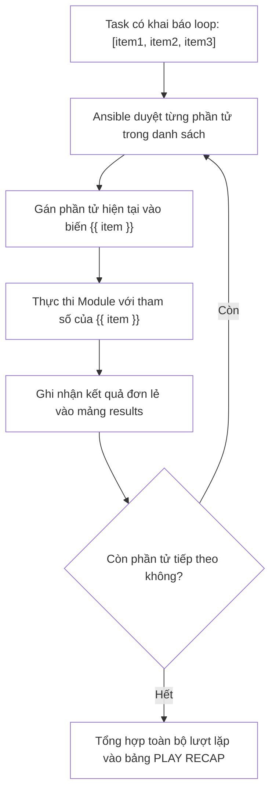
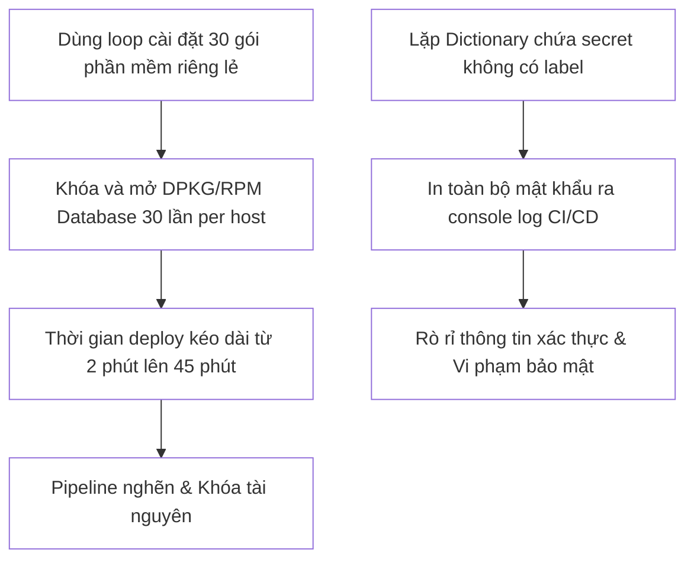


# [BÀI 10] LÀM CHỦ VÒNG LẶP & XỬ LÝ DANH SÁCH: LOOP, LOOP_CONTROL, LIST OF HASHES & RETRY LOGIC

Trong kỷ nguyên **Infrastructure as Code (IaC)** và tự động hóa vận hành hạ tầng đám mây (Cloud Infrastructure Automation), **Ansible** khẳng định vị thế dẫn đầu nhờ triết lý **Agentless** (không cần cài đặt agent nền trên máy đích), giao thức điều khiển an toàn qua **SSH / WinRM**, định dạng khai báo **YAML** trực quan và nguyên lý bất biến **Idempotency** mạnh mẽ. Việc làm chủ Ansible không chỉ dừng lại ở các câu lệnh Ad-hoc đơn giản, mà đòi hỏi kỹ sư phải nắm vững kiến trúc Module tầng thấp, Variable Precedence 22 tầng, Jinja2 Templates, tối ưu hóa Forks & Pipelining cho tới thiết kế Roles / Collections và tích hợp CI/CD tự động hóa chuẩn Doanh nghiệp.

Bài viết chuyên sâu này sẽ đồng hành cùng bạn mổ xẻ toàn diện bức tranh kiến trúc, phân tích các đánh đổi kỹ thuật thực chiến (Engineering Trade-offs), cung cấp hướng dẫn thực hành Lab chi tiết từng bước và bộ câu hỏi phỏng vấn chuyên sâu chuẩn DevOps / SRE Lead.

---

## 1. Bản Chất Kiến Trúc & Cơ Chế Vận Hành Tầng Thấp

Trong quản trị hạ tầng, nhu cầu khởi tạo hàng loạt tài nguyên tương đồng (như tạo 20 tài khoản người dùng, phân quyền 10 thư mục, mở 5 cổng firewall) diễn ra liên tục. Thay vì sao chép-dán (copy-paste) hàng chục Task lặp lại vi phạm nghiêm trọng nguyên lý DRY (**Don't Repeat Yourself**), Ansible cung cấp cơ chế vòng lặp chuẩn hóa thông qua từ khóa **`loop:`**.



### 1.1. Từ Khóa loop & Biến Phần Tử Mặc Định {{ item }}

- **Cơ chế hoạt động của `loop:`:** Từ khóa `loop:` nhận đầu vào là một danh sách YAML (List/Array). Với mỗi phần tử trong danh sách, Ansible sẽ kích hoạt module tương ứng một lần và tự động gán giá trị của phần tử đó vào biến nội suy `{{ item }}`.
- **Cấu trúc Danh sách Đối tượng (List of Hashes / Dictionaries):** Để quản lý các tài nguyên phức tạp có nhiều thuộc tính (ví dụ: mỗi người dùng có `name`, `uid`, `group`, `shell`), `loop:` nhận một mảng các Dictionary. Trong Task, ta truy xuất từng trường dữ liệu qua `{{ item.name }}`, `{{ item.uid }}`.
- **Thay thế hoàn toàn `with_items` (Legacy):** Từ khóa `loop:` là chuẩn mực hiện đại của Ansible (bắt đầu từ bản 2.5+), thay thế cho cú pháp cũ `with_items` / `with_*` vốn là các lookup plugins có chi phí xử lý nội suy cao hơn.

### 1.2. Khối Điều Khiển Vòng Lặp loop_control (loop_var, label, pause)

Khối `loop_control:` cung cấp khả năng can thiệp sâu vào hành vi của vòng lặp:
- **`loop_var: custom_name`:** Cho phép đổi tên biến lặp mặc định `item` thành tên tùy biến (ví dụ `loop_var: user_info` -> truy xuất `{{ user_info.name }}`). Đây là giải pháp bắt buộc khi xử lý các vòng lặp lồng nhau (**Nested Loops**) để tránh xung đột tên biến.
- **`label: "{{ item.name }}"`:** Tùy biến thông tin in ra màn hình terminal khi vòng lặp chạy. Nếu lặp qua một Dictionary lớn chứa mật khẩu/secret, việc đặt `label:` chỉ hiển thị tên định danh sẽ bảo mật thông tin nhạy cảm, không bị in lộ ra log CI/CD.
- **`pause: 5`:** Dừng nghỉ cố định số giây (ví dụ 5s) giữa các lần lặp, giúp giảm tải CPU/I/O khi thực thi các tác vụ nặng.
- **`index_var: loop_idx`:** Tự động tạo biến đếm chỉ số vòng lặp (bắt đầu từ 0).

### 1.3. Cơ Chế Đăng Ký Biến Vòng Lặp (register.results) & Kết Hợp Mệnh Đề when

- **Mảng kết quả `register_var.results`:** Khi một Task có `loop:` sử dụng từ khóa `register: my_output`, kết quả trả về của TẤT CẢ các lần lặp sẽ được gom thành một mảng danh sách bên trong thuộc tính `my_output.results`. Mỗi phần tử trong mảng `results` tương ứng với một lượt lặp và chứa đầy đủ `item`, `rc`, `stdout`, `changed`, `failed`.
- **Đánh giá `when:` theo từng phần tử:** Khi kết hợp `loop:` và `when:`, mệnh đề `when` sẽ được **đánh giá độc lập cho từng phần tử** `item`. Phần tử nào thỏa mãn điều kiện mới được thực thi, phần tử không thỏa mãn sẽ bị `skipping: [host] => (item=...)`.

---

## 2. Bảng So Sánh Kỹ Thuật Toàn Diện (Engineering Matrix)

| Kỹ Thuật Vòng Lặp | Cú Pháp Khai Báo | Hiệu Năng Thực Thi | Mức Độ Bảo Mật Log | Trường Hợp Sử Dụng Chuẩn Production |
|---|---|---|---|---|
| **Lặp Chuỗi Thô (Simple List)** | `loop: ['pkg1', 'pkg2']` | Nhanh | An toàn | Tạo danh sách thư mục đơn, dịch vụ đơn giản |
| **Lặp Dictionary (List of Hashes)** | `loop: [{name: a, uid: 10}, ...]` | Tối ưu | Cần cấu hình `label` | Khởi tạo tài khoản User, Group, Cron jobs, Vhost |
| **Gom Mảng Gói (Package Batching)** | `package: name: [pkg1, pkg2]` (**KHÔNG LOOP**) | **Nhanh gấp 10 lần** | An toàn | **Bắt buộc** khi cài đặt gói phần mềm (`apt`/`dnf`) |
| **Đổi Tên Biến (`loop_var`)** | `loop_control: loop_var: item_name` | Tối ưu | Tùy biến | Vòng lặp lồng nhau hoặc include task lặp |
| **Ẩn Log Nhạy Cảm (`label`)** | `loop_control: label: "{{ item.name }}"` | Tối ưu | **Tuyệt đối an toàn** | Lặp qua danh sách chứa password, token, SSH keys |

> [!IMPORTANT]
> **CẠM BẪY HIỆU NĂNG SỐ 1 TRONG ANSIBLE:**
> Tuyệt đối **KHÔNG DÙNG `loop:` cho module `package`, `apt`, `dnf`, `yum`**! Dùng `loop` với `package` sẽ khiến Ansible mở/đóng kết nối transaction của trình quản lý gói nhiều lần riêng biệt, làm chậm kịch bản gấp 10 lần. Hãy luôn truyền danh sách mảng trực tiếp cho tham số `name: [pkg1, pkg2, pkg3]` để cài đặt trong 1 transaction duy nhất.

---

## 3. Kiến Trúc Triển Khai Chuẩn Production (Configuration / Playbook / Role Breakdown)

Dưới đây là Playbook mẫu chuẩn Enterprise quản trị tài khoản người dùng, nhóm hệ thống, phân quyền thư mục và đăng ký kết quả vòng lặp an toàn:

```yaml
# site-loops-mastery.yml
---
- name: Production Batch Resource Provisioning via Loops
  hosts: web
  become: true
  gather_facts: false

  vars:
    system_groups:
      - { name: "devops", gid: 2001 }
      - { name: "database", gid: 2002 }

    system_users:
      - name: "alice"
        uid: 2001
        group: "devops"
        shell: "/bin/bash"
        ssh_pub_key: "ssh-ed25519 AAAAC3NzaC1lZDI1NTE5AAAAIExample1 alice@corp"
      - name: "bob"
        uid: 2002
        group: "database"
        shell: "/bin/bash"
        ssh_pub_key: "ssh-ed25519 AAAAC3NzaC1lZDI1NTE5AAAAIExample2 bob@corp"

    app_directories:
      - { path: "/var/www/app1", owner: "alice", mode: "0755" }
      - { path: "/var/www/app2", owner: "bob", mode: "0750" }

  tasks:
    - name: 01. Ensure system groups exist in batch
      ansible.builtin.group:
        name: "{{ item.name }}"
        gid: "{{ item.gid }}"
        state: present
      loop: "{{ system_groups }}"
      loop_control:
        label: "Group: {{ item.name }} (GID: {{ item.gid }})"

    - name: 02. Ensure system users exist with custom loop variable
      ansible.builtin.user:
        name: "{{ user_account.name }}"
        uid: "{{ user_account.uid }}"
        group: "{{ user_account.group }}"
        shell: "{{ user_account.shell }}"
        create_home: true
        state: present
      loop: "{{ system_users }}"
      loop_control:
        loop_var: user_account
        label: "User: {{ user_account.name }} (UID: {{ user_account.uid }})"

    - name: 03. Ensure application directories are configured
      ansible.builtin.file:
        path: "{{ item.path }}"
        state: directory
        owner: "{{ item.owner }}"
        mode: "{{ item.mode }}"
      loop: "{{ app_directories }}"
      loop_control:
        label: "Directory: {{ item.path }} -> Owner: {{ item.owner }}"

    - name: 04. Check user home directories and register results
      ansible.builtin.command: "ls -ld /home/{{ item.name }}"
      register: home_check
      changed_when: false
      loop: "{{ system_users }}"
      loop_control:
        label: "Inspect /home/{{ item.name }}"

    - name: 05. Print summary of registered loop results
      ansible.builtin.debug:
        msg: "User {{ item.item.name }} home directory: {{ item.stdout }}"
      loop: "{{ home_check.results }}"
      loop_control:
        label: "Summary: {{ item.item.name }}"
```

### Phân Tích Kỹ Thuật Từng Dòng (Line-by-Line Breakdown):
- <span class="badge-line">Line 8–24</span>: Khai báo danh sách các Dictionary phức tạp cho `system_groups`, `system_users` và `app_directories` ở cấp Play Scope.
- <span class="badge-line">Line 26–33</span>: Module `group` lặp qua `system_groups`, sử dụng `loop_control.label` để in ngắn gọn thông tin `Group: <name>` trên terminal.
- <span class="badge-line">Line 35–46</span>: Module `user` sử dụng `loop_control.loop_var: user_account` để đổi tên biến lặp, tăng tính tường minh trong mã nguồn.
- <span class="badge-line">Line 48–56</span>: Module `file` tạo hàng loạt thư mục ứng dụng với phân quyền bát phân tương ứng cho từng người dùng.
- <span class="badge-line">Line 58–64</span>: Module `command` lặp qua danh sách user để kiểm tra thư mục home, lưu toàn bộ mảng kết quả vào biến `home_check` với `changed_when: false`.
- <span class="badge-line">Line 66–72</span>: Module `debug` lặp qua mảng `home_check.results` để in ra báo cáo tổng kết chi tiết cho từng tài khoản.

---

## 4. Phân Tích Cạm Bẫy Thực Chiến: Lạm Dụng Loop Cho Package Khiến Playbook Chậm Gấp 10 Lần & Rò Rỉ Secret Qua Log

### Tình Huống Sự Cố Thực Tế Tại Doanh Nghiệp:
Tại một công ty bảo hiểm, kịch bản khởi tạo máy chủ chứa task cài đặt 30 gói phần mềm phụ thuộc. Kỹ sư đã viết kịch bản sử dụng `loop: "{{ list_packages }}"`. 
Đồng thời ở một task tạo tài khoản Database, kỹ sư lặp qua một danh sách chứa mật khẩu nhị phân của tài khoản mà không khai báo cấu hình `loop_control.label`.

### Hậu Quả & Log Lỗi Thực Tế:

```diff
--- site.yml (Slow & Leaking Secrets)
+++ site.yml (Optimized Batch & Safe Label)
@@ -1,9 +1,8 @@
-- name: Install Packages (LỖI: Chậm gấp 10 lần do dùng loop)
+- name: Install Packages (SỬA: Gom nhóm trong 1 Transaction)
   ansible.builtin.package:
-    name: "{{ item }}"
+    name: "{{ list_packages }}"
     state: present
-  loop: "{{ list_packages }}"

 - name: Create DB Users (SỬA: Dùng label che giấu mật khẩu)
   ansible.builtin.user:
     name: "{{ item.name }}"
     password: "{{ item.password }}"
   loop: "{{ db_users }}"
+  loop_control:
+    label: "User: {{ item.name }}"
```

- Quá trình chạy Playbook trên 100 máy chủ mất hơn **45 phút** (mỗi gói phần mềm kích hoạt một phiên kết nối APT/DNF độc lập, khóa và mở khóa cơ sở dữ liệu `dpkg` 30 lần liên tiếp per host).
- Toàn bộ mật khẩu nhạy cảm (`db_password: "SuperSecretKey123"`) bị in lộ công khai trên màn hình console của Jenkins CI/CD và lưu vào hệ thống log tập trung Elasticsearch, gây ra vi phạm tiêu chuẩn bảo mật PCI-DSS nghiêm trọng.



### 5-Whys Root Cause Analysis:
1. **Tại sao thời gian triển khai máy chủ kéo dài bất thường?** Do Ansible mở 30 giao dịch quản lý gói riêng biệt trên mỗi máy đích thay vì gom nhóm.
2. **Tại sao lại có 30 giao dịch riêng biệt?** Do kỹ sư sử dụng từ khóa `loop:` với module `package` thay vì truyền mảng vào tham số `name:`.
3. **Tại sao mật khẩu người dùng bị lộ trên log CI/CD?** Do Ansible mặc định in toàn bộ Dictionary của phần tử `item` ra terminal khi vòng lặp chạy.
4. **Tại sao không giới hạn thông tin in ra log?** Do kỹ sư chưa biết hoặc bỏ quên cấu hình `loop_control.label`.
5. **Nguyên nhân cốt lõi (Root Cause):** Thiếu hiểu biết về cơ chế thực thi của Package Manager trong Ansible và thiếu quy chuẩn bảo mật log với `loop_control`.

---

## 5. Hands-on Lab: Tự Động Hóa Quản Trị Hàng Loạt Với Loop & Loop Control (8 Bước)

| Bước | Lệnh CLI / Tác Vụ Chính | Mục Đích Thực Thi |
|---|---|---|
| **Bước 1** | Chuẩn bị môi trường `lab-ansible-10` | Khởi tạo cấu hình dự án cô lập |
| **Bước 2** | Thử nghiệm lặp danh sách chuỗi thô | Tạo danh sách các thư mục ứng dụng |
| **Bước 3** | Thử nghiệm lặp List of Hashes (Dicts) | Tạo người dùng với đầy đủ thuộc tính UID/Group/Shell |
| **Bước 4** | Sử dụng `loop_control.loop_var` | Đổi tên biến lặp tường minh |
| **Bước 5** | Sử dụng `loop_control.label` | Tối ưu hóa giao diện log và ẩn secret |
| **Bước 6** | Đăng ký kết quả với `register.results` | Bắt và in mảng trạng thái của từng phần tử |
| **Bước 7** | Thực thi Phép thử Lần 2 chứng minh Idempotency | Đạt chỉ số `changed=0` trên bảng `PLAY RECAP` |
| **Bước 8** | Đối soát sự thật máy đích qua `docker exec` | Xác nhận toàn bộ User và Thư mục đã được tạo chuẩn |

### Bước 1 — Thiết lập môi trường dự án

```bash
mkdir -p ~/lab-ansible-10 && cd ~/lab-ansible-10

cat << 'EOF' > ansible.cfg
[defaults]
inventory = ./inventory.ini
remote_user = ansible
host_key_checking = False
private_key_file = ~/.ssh/id_ed25519

[privilege_escalation]
become = True
become_method = sudo
become_user = root
become_ask_pass = False
EOF

cat << 'EOF' > inventory.ini
[web]
target1 ansible_host=127.0.0.1 ansible_port=2221

[db]
target2 ansible_host=127.0.0.1 ansible_port=2222

[all:vars]
ansible_python_interpreter=/usr/bin/python3
EOF
```

### Bước 2 — Soạn thảo Playbook thực hành vòng lặp nâng cao

```bash
cat << 'EOF' > site.yml
---
- name: Advanced Loops & Batch Automation Mastery
  hosts: web
  become: true
  gather_facts: false

  vars:
    dev_users:
      - { username: "dev_alice", uid: 2101, group: "developers", role: "backend" }
      - { username: "dev_bob", uid: 2102, group: "developers", role: "frontend" }

    required_dirs:
      - "/var/log/app_a"
      - "/var/log/app_b"
      - "/var/log/app_c"

  tasks:
    - name: 01. Ensure developers group exists
      ansible.builtin.group:
        name: developers
        gid: 2100
        state: present

    - name: 02. Ensure multiple directories exist using simple loop
      ansible.builtin.file:
        path: "{{ item }}"
        state: directory
        mode: "0755"
      loop: "{{ required_dirs }}"

    - name: 03. Ensure developer accounts exist with loop_control
      ansible.builtin.user:
        name: "{{ account.username }}"
        uid: "{{ account.uid }}"
        group: "{{ account.group }}"
        shell: /bin/bash
        create_home: true
        state: present
      loop: "{{ dev_users }}"
      loop_control:
        loop_var: account
        label: "User: {{ account.username }} (Role: {{ account.role }})"

    - name: 04. Check created user IDs and register results
      ansible.builtin.command: "id -u {{ account.username }}"
      register: user_id_results
      changed_when: false
      loop: "{{ dev_users }}"
      loop_control:
        loop_var: account
        label: "Check: {{ account.username }}"

    - name: 05. Deploy user configuration files
      ansible.builtin.copy:
        dest: "/home/{{ account.username }}/profile.conf"
        content: "ROLE={{ account.role }}\nUID={{ account.uid }}\n"
        owner: "{{ account.username }}"
        mode: "0644"
      loop: "{{ dev_users }}"
      loop_control:
        loop_var: account
        label: "Profile: {{ account.username }}"
EOF
```

```bash
# CHECKPOINT 1: Kiểm tra cú pháp Playbook
ansible-playbook --syntax-check site.yml
```

### Bước 3 — Chạy mô phỏng Dry-run

```bash
ansible-playbook --check --diff site.yml
```

```bash
# CHECKPOINT 2: Kiểm tra chế độ Dry-run
CHECK_OUT=$(ansible-playbook --check --diff site.yml)
if echo "$CHECK_OUT" | grep -q "PLAY RECAP" && ! echo "$CHECK_OUT" | grep -q "failed=1"; then
  echo "CHECKPOINT 2: ĐẠT - Chạy mô phỏng Dry-run thành công"
else
  echo "CHECKPOINT 2: LỖI - Chạy mô phỏng thất bại"
fi
```

### Bước 4 — Thực thi Playbook Lần 1

```bash
ansible-playbook site.yml
```

```bash
# CHECKPOINT 3 & 4: Kiểm tra kết quả thực thi lần 1
RUN1_OUT=$(ansible-playbook site.yml)
if echo "$RUN1_OUT" | grep -q "failed=0" && echo "$RUN1_OUT" | grep -q "unreachable=0"; then
  echo "CHECKPOINT 3 & 4: ĐẠT - Playbook thực thi lần 1 thành công, tạo hàng loạt tài nguyên"
else
  echo "CHECKPOINT 3 & 4: LỖI - Thực thi Playbook lần 1 thất bại"
fi
```

### Bước 5 — Thực thi Phép thử Lần 2 chứng minh Idempotency

```bash
ansible-playbook site.yml
```

```bash
# CHECKPOINT 5 & 6: Kiểm tra tính Idempotency đạt changed=0
RUN2_FINAL=$(ansible-playbook site.yml)
if echo "$RUN2_FINAL" | grep -q "changed=0" && echo "$RUN2_FINAL" | grep -q "failed=0"; then
  echo "CHECKPOINT 5 & 6: ĐẠT - Kịch bản vòng lặp đạt Idempotency tuyệt đối (changed=0 ở lần 2)"
else
  echo "CHECKPOINT 5 & 6: LỖI - Kịch bản chưa đạt chuẩn Idempotency"
fi
```

### Bước 6 — Đối soát thư mục hàng loạt trên máy đích

```bash
docker exec target1 ls -ld /var/log/app_a /var/log/app_b /var/log/app_c
```

```bash
# CHECKPOINT 7: Kiểm tra thư mục tạo bởi vòng lặp
DIRS_CHECK=$(docker exec target1 ls -d /var/log/app_a /var/log/app_b /var/log/app_c)
if echo "$DIRS_CHECK" | grep -q "app_a" && echo "$DIRS_CHECK" | grep -q "app_c"; then
  echo "CHECKPOINT 7: ĐẠT - Các thư mục tạo bởi vòng lặp tồn tại chính xác trên máy đích"
else
  echo "CHECKPOINT 7: LỖI - Thiếu thư mục trên máy đích"
fi
```

### Bước 7 — Đối soát tài khoản người dùng và file profile

```bash
docker exec target1 id dev_alice
docker exec target1 id dev_bob
docker exec target1 cat /home/dev_alice/profile.conf
```

```bash
# CHECKPOINT 8: Đối soát tài khoản và file profile
ID_ALICE=$(docker exec target1 id dev_alice)
CONF_ALICE=$(docker exec target1 cat /home/dev_alice/profile.conf)
if echo "$ID_ALICE" | grep -q "uid=2101(dev_alice)" && echo "$CONF_ALICE" | grep -q "ROLE=backend"; then
  echo "CHECKPOINT 8: ĐẠT - Tài khoản và cấu hình tạo bởi vòng lặp Dictionary chính xác 100%"
else
  echo "CHECKPOINT 8: LỖI - Đối soát tài khoản thất bại"
fi
```

---

## 6. Bộ Câu Hỏi Vấn Đáp & Phỏng Vấn Chuyên Sâu (Self-Check Q&A)

<details class="qa-card">
  <summary class="qa-summary">
    <span class="qa-num-badge">Q01</span>
    <span class="qa-question-text">Phân biệt sự khác nhau giữa từ khóa loop và cú pháp cũ with_items trong Ansible. Tại sao loop được khuyến nghị tuyệt đối?</span>
  </summary>
  <div class="qa-answer">
    <div class="qa-answer-header">
      <svg width="14" height="14" fill="none" stroke="currentColor" stroke-width="2" viewBox="0 0 24 24"><path d="M22 11.08V12a10 10 0 1 1-5.93-9.14"></path><polyline points="22 4 12 14.01 9 11.01"></polyline></svg>
      <span>Phân Tích &amp; Lời Giải Kỹ Thuật</span>
    </div>
    <div><b>Đáp án chuẩn:</b> <code>with_items</code> thực chất là một Lookup Plugin thực hiện việc làm phẳng danh sách (flattening) ngầm, có chi phí tính toán cao và cú pháp rườm rà. Trong khi đó, <code>loop:</code> là từ khóa vòng lặp gốc (native syntax keyword) được tối ưu hóa trực tiếp trong lõi Ansible Engine, thực thi nhanh hơn, cú pháp rõ ràng, và tích hợp chặt chẽ với khối điều khiển <code>loop_control</code>.</div>
    <div style="margin-top: 0.5rem;"><b>Tiêu chí chấm:</b></div>
    <div style="margin: 0.35rem 0; padding-left: 1rem; border-left: 2px solid var(--accent-primary);">• <b>0:</b> Cho rằng hai cú pháp hoàn toàn như nhau.</div>
    <div style="margin: 0.35rem 0; padding-left: 1rem; border-left: 2px solid var(--accent-primary);">• <b>1:</b> Biết <code>loop</code> mới hơn nhưng không giải thích được bản chất Lookup plugin của <code>with_items</code>.</div>
    <div style="margin: 0.35rem 0; padding-left: 1rem; border-left: 2px solid var(--accent-primary);">• <b>2:</b> Phân tích chính xác cơ chế Native Keyword của <code>loop</code> vs Lookup Plugin của <code>with_items</code>.</div>
    <div style="margin-top: 0.5rem;"><b>Tiêu chí chấm:</b></div>
    <div style="margin: 0.35rem 0; padding-left: 1rem; border-left: 2px solid var(--accent-primary);">• <b>3:</b> Nêu đúng + giải thích tại sao <code>with_items</code> tự động flatten danh sách 2 chiều trong khi <code>loop</code> giữ nguyên cấu trúc.</div>
    <div style="margin-top: 0.5rem;"><b>Câu hỏi đào sâu:</b> Nếu muốn làm phẳng một danh sách mảng lồng nhau khi dùng <code>loop</code>, ta dùng Jinja2 filter nào? <i>(Dùng filter <code>flatten</code>: <code>loop: "{{ nested_list | flatten }}"</code>.)</i></div>
  </div>
</details>

<details class="qa-card">
  <summary class="qa-summary">
    <span class="qa-num-badge">Q02</span>
    <span class="qa-question-text">Tại sao việc sử dụng loop với module package/apt/dnf bị coi là Anti-pattern nghiêm trọng? Cách khắc phục chuẩn là gì?</span>
  </summary>
  <div class="qa-answer">
    <div class="qa-answer-header">
      <svg width="14" height="14" fill="none" stroke="currentColor" stroke-width="2" viewBox="0 0 24 24"><path d="M22 11.08V12a10 10 0 1 1-5.93-9.14"></path><polyline points="22 4 12 14.01 9 11.01"></polyline></svg>
      <span>Phân Tích &amp; Lời Giải Kỹ Thuật</span>
    </div>
    <div><b>Đáp án chuẩn:</b> Dùng <code>loop</code> với <code>package</code> sẽ ép Ansible kích hoạt module nhiều lần nối tiếp. Với mỗi gói, trình quản lý gói (APT/DNF) phải mở khóa cơ sở dữ liệu (`dpkg lock`), kiểm tra kho mạng, cài đặt, rồi đóng khóa, làm thời gian chạy tăng vọt gấp 10 lần. <b>Cách khắc phục chuẩn:</b> Truyền danh sách mảng trực tiếp cho tham số <code>name:</code> (ví dụ: <code>name: ['nginx', 'curl', 'git']</code>). Module <code>package</code> sẽ cài đặt toàn bộ các gói trong DUY NHẤT 1 giao dịch (Batch Transaction).</div>
    <div style="margin-top: 0.5rem;"><b>Tiêu chí chấm:</b></div>
    <div style="margin: 0.35rem 0; padding-left: 1rem; border-left: 2px solid var(--accent-primary);">• <b>0:</b> Cho rằng dùng loop cài gói là bình thường.</div>
    <div style="margin: 0.35rem 0; padding-left: 1rem; border-left: 2px solid var(--accent-primary);">• <b>1:</b> Biết làm chậm nhưng không giải thích được cơ chế Database Lock của Package Manager.</div>
    <div style="margin: 0.35rem 0; padding-left: 1rem; border-left: 2px solid var(--accent-primary);">• <b>2:</b> Phân tích chính xác cơ chế Batch Transaction của Package Manager + cách viết mảng.</div>
    <div style="margin-top: 0.5rem;"><b>Tiêu chí chấm:</b></div>
    <div style="margin: 0.35rem 0; padding-left: 1rem; border-left: 2px solid var(--accent-primary);">• <b>3:</b> Trình bày xuất sắc so sánh thời gian thực thi giữa 2 cách trên 100 máy chủ (45 phút vs 2 phút).</div>
    <div style="margin-top: 0.5rem;"><b>Câu hỏi đào sâu:</b> Module nào khác trong Ansible cũng hỗ trợ nhận mảng trực tiếp thay vì phải dùng loop? <i>(Module <code>ansible.builtin.service</code> không hỗ trợ mảng, nhưng module <code>ansible.builtin.file</code> hỗ trợ hoặc gom qua role.)</i></div>
  </div>
</details>

<details class="qa-card">
  <summary class="qa-summary">
    <span class="qa-num-badge">Q03</span>
    <span class="qa-question-text">Trình bày tác dụng của tham số loop_control.label. Tại sao nó lại là yêu cầu bảo mật bắt buộc khi lặp qua danh sách chứa Secret?</span>
  </summary>
  <div class="qa-answer">
    <div class="qa-answer-header">
      <svg width="14" height="14" fill="none" stroke="currentColor" stroke-width="2" viewBox="0 0 24 24"><path d="M22 11.08V12a10 10 0 1 1-5.93-9.14"></path><polyline points="22 4 12 14.01 9 11.01"></polyline></svg>
      <span>Phân Tích &amp; Lời Giải Kỹ Thuật</span>
    </div>
    <div><b>Đáp án chuẩn:</b> Mặc định khi một vòng lặp chạy, Ansible in toàn bộ cấu trúc dữ liệu của phần tử <code>item</code> ra terminal log. Nếu <code>item</code> là một Dictionary chứa mật khẩu hoặc API token, toàn bộ secret sẽ bị in lộ ra màn hình CI/CD và log file. Cấu hình <code>loop_control.label: "{{ item.name }}"</code> chỉ định Ansible CHỈ in ra trường tên định danh, ẩn giấu toàn bộ các trường nhạy cảm còn lại, đảm bảo an toàn thông tin tuyệt đối.</div>
    <div style="margin-top: 0.5rem;"><b>Tiêu chí chấm:</b></div>
    <div style="margin: 0.35rem 0; padding-left: 1rem; border-left: 2px solid var(--accent-primary);">• <b>0:</b> Không biết tham số <code>loop_control.label</code>.</div>
    <div style="margin: 0.35rem 0; padding-left: 1rem; border-left: 2px solid var(--accent-primary);">• <b>1:</b> Biết để làm đẹp log nhưng không nêu được khía cạnh bảo mật chống rò rỉ secret.</div>
    <div style="margin: 0.35rem 0; padding-left: 1rem; border-left: 2px solid var(--accent-primary);">• <b>2:</b> Phân tích chính xác cơ chế bảo mật và chống ô nhiễm log của <code>label</code>.</div>
    <div style="margin-top: 0.5rem;"><b>Tiêu chí chấm:</b></div>
    <div style="margin: 0.35rem 0; padding-left: 1rem; border-left: 2px solid var(--accent-primary);">• <b>3:</b> Nêu đúng + kết hợp với tham số <code>no_log: true</code> khi cần bảo vệ tuyệt đối ở cấp độ Task.</div>
    <div style="margin-top: 0.5rem;"><b>Câu hỏi đào sâu:</b> Nếu một task lặp qua 100 phần tử, việc dùng <code>label: "{{ item.id }}"</code> mang lại lợi ích gì về mặt hiệu năng hiển thị terminal? <i>(Giảm đáng kể kích thước buffer log của terminal, tránh tràn bộ nhớ console trình duyệt trên Jenkins/GitLab.)</i></div>
  </div>
</details>

<details class="qa-card">
  <summary class="qa-summary">
    <span class="qa-num-badge">Q04</span>
    <span class="qa-question-text">Khi nào ta cần sử dụng loop_control.loop_var để đổi tên biến lặp? Cho ví dụ thực tế.</span>
  </summary>
  <div class="qa-answer">
    <div class="qa-answer-header">
      <svg width="14" height="14" fill="none" stroke="currentColor" stroke-width="2" viewBox="0 0 24 24"><path d="M22 11.08V12a10 10 0 1 1-5.93-9.14"></path><polyline points="22 4 12 14.01 9 11.01"></polyline></svg>
      <span>Phân Tích &amp; Lời Giải Kỹ Thuật</span>
    </div>
    <div><b>Đáp án chuẩn:</b> Ta cần dùng <code>loop_var</code> khi: (1) Xử lý các vòng lặp lồng nhau (**Nested Loops**) khi một Playbook lặp gọi <code>include_tasks</code> mà file con cũng chứa một vòng lặp (nếu cùng dùng biến <code>item</code> sẽ bị ghi đè dữ liệu), hoặc (2) Muốn mã nguồn tường minh hơn (ví dụ dùng <code>user_info.name</code> thay cho <code>item.name</code>). Ví dụ:</div>
    <pre><code>loop_control:
  loop_var: user_info</code></pre>
    <div style="margin-top: 0.5rem;"><b>Tiêu chí chấm:</b></div>
    <div style="margin: 0.35rem 0; padding-left: 1rem; border-left: 2px solid var(--accent-primary);">• <b>0:</b> Không biết mục đích của <code>loop_var</code>.</div>
    <div style="margin: 0.35rem 0; padding-left: 1rem; border-left: 2px solid var(--accent-primary);">• <b>1:</b> Biết để đổi tên nhưng không nêu được bài toán xung đột biến trong vòng lặp lồng nhau.</div>
    <div style="margin: 0.35rem 0; padding-left: 1rem; border-left: 2px solid var(--accent-primary);">• <b>2:</b> Phân tích chính xác bài toán Nested Loops với <code>include_tasks</code>.</div>
    <div style="margin-top: 0.5rem;"><b>Tiêu chí chấm:</b></div>
    <div style="margin: 0.35rem 0; padding-left: 1rem; border-left: 2px solid var(--accent-primary);">• <b>3:</b> Trình bày xuất sắc ví dụ mã nguồn đầy đủ của vòng lặp lồng nhau 2 cấp.</div>
    <div style="margin-top: 0.5rem;"><b>Câu hỏi đào sâu:</b> Điều gì xảy ra nếu vòng lặp cha và vòng lặp con cùng dùng tên biến mặc định <code>item</code>? <i>(Vòng lặp con sẽ ghi đè giá trị của <code>item</code>, khiến vòng lặp cha khi tiếp tục chạy sẽ nhận giá trị sai của con.)</i></div>
  </div>
</details>

<details class="qa-card">
  <summary class="qa-summary">
    <span class="qa-num-badge">Q05</span>
    <span class="qa-question-text">Cấu trúc của biến đăng ký register khi gắn vào một Task có loop hoạt động như thế nào? Cách truy xuất kết quả của từng phần tử?</span>
  </summary>
  <div class="qa-answer">
    <div class="qa-answer-header">
      <svg width="14" height="14" fill="none" stroke="currentColor" stroke-width="2" viewBox="0 0 24 24"><path d="M22 11.08V12a10 10 0 1 1-5.93-9.14"></path><polyline points="22 4 12 14.01 9 11.01"></polyline></svg>
      <span>Phân Tích &amp; Lời Giải Kỹ Thuật</span>
    </div>
    <div><b>Đáp án chuẩn:</b> Khi Task có <code>loop</code> đăng ký biến <code>register: my_res</code>, Ansible tạo một Dictionary chứa một mảng danh sách tên là <code>my_res.results</code>. Mỗi phần tử trong mảng <code>results</code> tương ứng với một lượt lặp và chứa các trường: <code>item</code> (dữ liệu đầu vào của lượt đó), <code>stdout</code>, <code>stderr</code>, <code>rc</code>, <code>changed</code>, <code>failed</code>. Muốn duyệt qua kết quả của tất cả các phần tử ở task sau, ta lặp qua <code>loop: "{{ my_res.results }}"</code> và truy xuất <code>{{ item.stdout }}</code>.</div>
    <div style="margin-top: 0.5rem;"><b>Tiêu chí chấm:</b></div>
    <div style="margin: 0.35rem 0; padding-left: 1rem; border-left: 2px solid var(--accent-primary);">• <b>0:</b> Cho rằng biến register có cấu trúc đơn lẻ <code>my_res.stdout</code> như task bình thường.</div>
    <div style="margin-top: 0.5rem;"><b>Tiêu chí chấm:</b></div>
    <div style="margin: 0.35rem 0; padding-left: 1rem; border-left: 2px solid var(--accent-primary);">• <b>1:</b> Biết có thuộc tính <code>results</code> nhưng không giải thích được cấu trúc của từng phần tử con.</div>
    <div style="margin-top: 0.35rem; padding-left: 1rem; border-left: 2px solid var(--accent-primary);">• <b>2:</b> Trình bày chính xác cấu trúc mảng <code>results</code> và cách lặp lại mảng này.</div>
    <div style="margin-top: 0.5rem;"><b>Tiêu chí chấm:</b></div>
    <div style="margin: 0.35rem 0; padding-left: 1rem; border-left: 2px solid var(--accent-primary);">• <b>3:</b> Nêu đúng + sử dụng Jinja2 filter <code>map(attribute='stdout') | list</code> để trích xuất nhanh mảng dữ liệu.</div>
    <div style="margin-top: 0.5rem;"><b>Câu hỏi đào sâu:</b> Làm sao để lấy danh sách tất cả các <code>stdout</code> của các task thành công từ <code>my_res.results</code>? <i>(<code>{{ my_res.results | selectattr('failed', 'equalto', false) | map(attribute='stdout') | list }}</code>)</i></div>
  </div>
</details>

<details class="qa-card">
  <summary class="qa-summary">
    <span class="qa-num-badge">Q06</span>
    <span class="qa-question-text">Mệnh đề when hoạt động như thế nào khi kết hợp với loop trong cùng một Task?</span>
  </summary>
  <div class="qa-answer">
    <div class="qa-answer-header">
      <svg width="14" height="14" fill="none" stroke="currentColor" stroke-width="2" viewBox="0 0 24 24"><path d="M22 11.08V12a10 10 0 1 1-5.93-9.14"></path><polyline points="22 4 12 14.01 9 11.01"></polyline></svg>
      <span>Phân Tích &amp; Lời Giải Kỹ Thuật</span>
    </div>
    <div><b>Đáp án chuẩn:</b> Khi kết hợp <code>loop</code> và <code>when</code>, mệnh đề <code>when</code> được **đánh giá độc lập cho từng phần tử của vòng lặp** (Item-by-Item evaluation). Với mỗi phần tử <code>item</code>, nếu điều kiện <code>when</code> đúng thì task thực thi trên phần tử đó; nếu điều kiện sai, Ansible sẽ ghi log <code>skipping: [host] => (item=...)</code> và chuyển sang phần tử tiếp theo mà không dừng toàn bộ vòng lặp.</div>
    <div style="margin-top: 0.5rem;"><b>Tiêu chí chấm:</b></div>
    <div style="margin: 0.35rem 0; padding-left: 1rem; border-left: 2px solid var(--accent-primary);">• <b>0:</b> Cho rằng <code>when</code> chỉ kiểm tra 1 lần cho toàn bộ task trước khi lặp.</div>
    <div style="margin-top: 0.5rem;"><b>Tiêu chí chấm:</b></div>
    <div style="margin: 0.35rem 0; padding-left: 1rem; border-left: 2px solid var(--accent-primary);">• <b>1:</b> Biết kiểm tra từng item nhưng không giải thích được trạng thái skipping cục bộ.</div>
    <div style="margin-top: 0.5rem;"><b>Tiêu chí chấm:</b></div>
    <div style="margin: 0.35rem 0; padding-left: 1rem; border-left: 2px solid var(--accent-primary);">• <b>2:</b> Phân tích chính xác cơ chế đánh giá độc lập cho từng item.</div>
    <div style="margin-top: 0.5rem;"><b>Tiêu chí chấm:</b></div>
    <div style="margin: 0.35rem 0; padding-left: 1rem; border-left: 2px solid var(--accent-primary);">• <b>3:</b> Nêu đúng + phân biệt trường hợp khi biến danh sách truyền vào <code>loop</code> bị undefined thì phải xử lý thế nào.</div>
    <div style="margin-top: 0.5rem;"><b>Câu hỏi đào sâu:</b> Nếu biến danh sách trong <code>loop: "{{ my_list }}"</code> chưa được định nghĩa, làm sao để task không bị crash? <i>(Dùng <code>loop: "{{ my_list | default([]) }}"</code> hoặc <code>when: my_list is defined</code>.)</i></div>
  </div>
</details>

<details class="qa-card">
  <summary class="qa-summary">
    <span class="qa-num-badge">Q07</span>
    <span class="qa-question-text">Trình bày cơ chế Retry Logic với until, retries và delay trong Ansible. Khi nào cần sử dụng cơ chế này?</span>
  </summary>
  <div class="qa-answer">
    <div class="qa-answer-header">
      <svg width="14" height="14" fill="none" stroke="currentColor" stroke-width="2" viewBox="0 0 24 24"><path d="M22 11.08V12a10 10 0 1 1-5.93-9.14"></path><polyline points="22 4 12 14.01 9 11.01"></polyline></svg>
      <span>Phân Tích &amp; Lời Giải Kỹ Thuật</span>
    </div>
    <div><b>Đáp án chuẩn:</b> Cơ chế Retry lặp lại một Task cho đến khi đạt được điều kiện mong muốn:</div>
    <div>• <code>until: <condition></code>: Biểu thức điều kiện dừng lặp (thường dựa trên biến <code>register</code>).</div>
    <div>• <code>retries: 10</code>: Số lần thử lại tối đa trước khi chấp nhận thất bại (mặc định là 3).</div>
    <div>• <code>delay: 5</code>: Số giây chờ giữa các lần thử lại (mặc định là 1).</div>
    <div>Cần sử dụng khi: Chờ dịch vụ khởi động xong (ví dụ chờ Database sẵn sàng nhận kết nối, chờ API Gateway trả về HTTP 200, hoặc chờ Docker container chuyển sang trạng thái healthy).</div>
    <div style="margin-top: 0.5rem;"><b>Tiêu chí chấm:</b></div>
    <div style="margin: 0.35rem 0; padding-left: 1rem; border-left: 2px solid var(--accent-primary);">• <b>0:</b> Dùng lệnh <code>sleep</code> thô trong shell module thay vì dùng <code>until</code>.</div>
    <div style="margin-top: 0.5rem;"><b>Tiêu chí chấm:</b></div>
    <div style="margin: 0.35rem 0; padding-left: 1rem; border-left: 2px solid var(--accent-primary);">• <b>1:</b> Biết <code>until</code> nhưng không giải thích được <code>retries</code> và <code>delay</code>.</div>
    <div style="margin-top: 0.5rem;"><b>Tiêu chí chấm:</b></div>
    <div style="margin: 0.35rem 0; padding-left: 1rem; border-left: 2px solid var(--accent-primary);">• <b>2:</b> Trình bày chính xác cả 3 chỉ thị + ngữ cảnh ứng dụng (Health check / Service readiness).</div>
    <div style="margin-top: 0.5rem;"><b>Tiêu chí chấm:</b></div>
    <div style="margin: 0.35rem 0; padding-left: 1rem; border-left: 2px solid var(--accent-primary);">• <b>3:</b> Nêu đúng + viết ví dụ mẫu task kiểm tra cổng mạng bằng module <code>uri</code> kết hợp <code>until: res.status == 200</code>.</div>
    <div style="margin-top: 0.5rem;"><b>Câu hỏi đào sâu:</b> Task có <code>until</code> có bắt buộc phải khai báo <code>register</code> không? <i>(Bắt buộc, vì biểu thức <code>until</code> cần đọc dữ liệu từ biến register để đánh giá điều kiện dừng.)</i></div>
  </div>
</details>

<details class="qa-card">
  <summary class="qa-summary">
    <span class="qa-num-badge">Q08</span>
    <span class="qa-question-text">Trình bày cách lặp qua một Dictionary (Key-Value) trong Ansible bằng Jinja2 filter dict2items.</span>
  </summary>
  <div class="qa-answer">
    <div class="qa-answer-header">
      <svg width="14" height="14" fill="none" stroke="currentColor" stroke-width="2" viewBox="0 0 24 24"><path d="M22 11.08V12a10 10 0 1 1-5.93-9.14"></path><polyline points="22 4 12 14.01 9 11.01"></polyline></svg>
      <span>Phân Tích &amp; Lời Giải Kỹ Thuật</span>
    </div>
    <div><b>Đáp án chuẩn:</b> Từ khóa <code>loop:</code> chỉ nhận đầu vào là một List (Danh sách), không nhận trực tiếp Dictionary. Để lặp qua một Dictionary (ví dụ <code>users: {alice: 2001, bob: 2002}</code>), ta sử dụng Jinja2 filter <code>dict2items</code>: <code>loop: "{{ users | dict2items }}"</code>. Filter này chuyển đổi Dictionary thành danh sách các cặp <code>[{key: 'alice', value: 2001}, {key: 'bob', value: 2002}]</code>, cho phép truy xuất qua <code>{{ item.key }}</code> và <code>{{ item.value }}</code>.</div>
    <div style="margin-top: 0.5rem;"><b>Tiêu chí chấm:</b></div>
    <div style="margin: 0.35rem 0; padding-left: 1rem; border-left: 2px solid var(--accent-primary);">• <b>0:</b> Truyền trực tiếp Dictionary vào <code>loop</code> và bị lỗi cú pháp.</div>
    <div style="margin-top: 0.5rem;"><b>Tiêu chí chấm:</b></div>
    <div style="margin: 0.35rem 0; padding-left: 1rem; border-left: 2px solid var(--accent-primary);">• <b>1:</b> Biết filter <code>dict2items</code> nhưng không nêu được cấu trúc <code>item.key</code> và <code>item.value</code>.</div>
    <div style="margin-top: 0.5rem;"><b>Tiêu chí chấm:</b></div>
    <div style="margin: 0.35rem 0; padding-left: 1rem; border-left: 2px solid var(--accent-primary);">• <b>2:</b> Phân tích chính xác cơ chế chuyển đổi dữ liệu của <code>dict2items</code>.</div>
    <div style="margin-top: 0.5rem;"><b>Tiêu chí chấm:</b></div>
    <div style="margin: 0.35rem 0; padding-left: 1rem; border-left: 2px solid var(--accent-primary);">• <b>3:</b> Nêu đúng + tùy biến tên key/value thông qua tham số <code>dict2items(key_name='user', value_name='uid')</code>.</div>
    <div style="margin-top: 0.5rem;"><b>Câu hỏi đào sâu:</b> Filter đảo ngược của <code>dict2items</code> (chuyển từ danh sách cặp key-value về Dictionary) là gì? <i>(Filter <code>items2dict</code>.)</i></div>
  </div>
</details>

<details class="qa-card">
  <summary class="qa-summary">
    <span class="qa-num-badge">Q09</span>
    <span class="qa-question-text">Trình bày cách sử dụng tham số loop_control.pause để giảm tải hệ thống khi thực thi các tác vụ nặng theo đợt.</span>
  </summary>
  <div class="qa-answer">
    <div class="qa-answer-header">
      <svg width="14" height="14" fill="none" stroke="currentColor" stroke-width="2" viewBox="0 0 24 24"><path d="M22 11.08V12a10 10 0 1 1-5.93-9.14"></path><polyline points="22 4 12 14.01 9 11.01"></polyline></svg>
      <span>Phân Tích &amp; Lời Giải Kỹ Thuật</span>
    </div>
    <div><b>Đáp án chuẩn:</b> Tham số <code>loop_control.pause: <seconds></code> chỉ định khoảng thời gian nghỉ cố định (tính bằng giây) giữa hai lần lặp liên tiếp. Ví dụ: khi khởi động lại 20 microservices hoặc gọi API bên ngoài bị giới hạn tốc độ (Rate Limiting), việc gán <code>pause: 3</code> giúp máy chủ không bị quá tải CPU/RAM và tránh bị API gateway chặn request do spam kết nối.</div>
    <div style="margin-top: 0.5rem;"><b>Tiêu chí chấm:</b></div>
    <div style="margin: 0.35rem 0; padding-left: 1rem; border-left: 2px solid var(--accent-primary);">• <b>0:</b> Không biết tính năng <code>pause</code> trong <code>loop_control</code>.</div>
    <div style="margin-top: 0.5rem;"><b>Tiêu chí chấm:</b></div>
    <div style="margin: 0.35rem 0; padding-left: 1rem; border-left: 2px solid var(--accent-primary);">• <b>1:</b> Biết để tạm dừng nhưng không nêu được ngữ cảnh bảo vệ tài nguyên (Rate Limiting/Throttling).</div>
    <div style="margin-top: 0.5rem;"><b>Tiêu chí chấm:</b></div>
    <div style="margin: 0.35rem 0; padding-left: 1rem; border-left: 2px solid var(--accent-primary);">• <b>2:</b> Phân tích chính xác cơ chế hoạt động và các trường hợp ứng dụng thực tế.</div>
    <div style="margin-top: 0.5rem;"><b>Tiêu chí chấm:</b></div>
    <div style="margin: 0.35rem 0; padding-left: 1rem; border-left: 2px solid var(--accent-primary);">• <b>3:</b> Phân tích sâu sắc sự khác biệt giữa <code>pause</code> trong vòng lặp và <code>serial</code> trong chiến lược rolling update cấp độ Play.</div>
    <div style="margin-top: 0.5rem;"><b>Câu hỏi đào sâu:</b> Tham số <code>pause</code> tạm dừng sau mỗi máy hay sau mỗi phần tử trong vòng lặp? <i>(Tạm dừng sau mỗi phần tử của vòng lặp trên máy đang thực thi.)</i></div>
  </div>
</details>

<details class="qa-card">
  <summary class="qa-summary">
    <span class="qa-num-badge">Q10</span>
    <span class="qa-question-text">Trình bày cách lấy chỉ số đếm của vòng lặp (Loop Index) bằng tham số loop_control.index_var.</span>
  </summary>
  <div class="qa-answer">
    <div class="qa-answer-header">
      <svg width="14" height="14" fill="none" stroke="currentColor" stroke-width="2" viewBox="0 0 24 24"><path d="M22 11.08V12a10 10 0 1 1-5.93-9.14"></path><polyline points="22 4 12 14.01 9 11.01"></polyline></svg>
      <span>Phân Tích &amp; Lời Giải Kỹ Thuật</span>
    </div>
    <div><b>Đáp án chuẩn:</b> Khai báo <code>loop_control.index_var: <variable_name></code> (ví dụ: <code>index_var: my_idx</code>). Trong quá trình lặp, biến <code>my_idx</code> sẽ tự động tăng giá trị số nguyên bắt đầu từ <code>0</code> (0, 1, 2, 3...). Ta có thể dùng biến chỉ số này để tạo cổng port liên tiếp (ví dụ <code>port: "{{ 8000 + my_idx }}"</code>) hoặc đánh số thứ tự tệp tin (ví dụ <code>file_{{ my_idx }}.txt</code>).</div>
    <div style="margin-top: 0.5rem;"><b>Tiêu chí chấm:</b></div>
    <div style="margin: 0.35rem 0; padding-left: 1rem; border-left: 2px solid var(--accent-primary);">• <b>0:</b> Không biết cách lấy chỉ số đếm vòng lặp.</div>
    <div style="margin-top: 0.5rem;"><b>Tiêu chí chấm:</b></div>
    <div style="margin: 0.35rem 0; padding-left: 1rem; border-left: 2px solid var(--accent-primary);">• <b>1:</b> Biết dùng nhưng nhầm lẫn chỉ số bắt đầu từ 1 thay vì 0.</div>
    <div style="margin-top: 0.5rem;"><b>Tiêu chí chấm:</b></div>
    <div style="margin: 0.35rem 0; padding-left: 1rem; border-left: 2px solid var(--accent-primary);">• <b>2:</b> Trình bày chính xác cú pháp <code>index_var</code> và quy tắc 0-indexed.</div>
    <div style="margin-top: 0.5rem;"><b>Tiêu chí chấm:</b></div>
    <div style="margin: 0.35rem 0; padding-left: 1rem; border-left: 2px solid var(--accent-primary);">• <b>3:</b> Nêu đúng + minh họa ví dụ tính toán port tịnh tiến cho cụm microservices.</div>
    <div style="margin-top: 0.5rem;"><b>Câu hỏi đào sâu:</b> Ở lần lặp đầu tiên, giá trị của <code>index_var</code> là bao nhiêu? <i>(Là số nguyên <code>0</code>.)</i></div>
  </div>
</details>

<details class="qa-card">
  <summary class="qa-summary">
    <span class="qa-num-badge">Q11</span>
    <span class="qa-question-text">Tại sao việc lặp qua một danh sách quá lớn (hàng ngàn phần tử) trong 1 Task Ansible lại gây chậm hiệu năng? Giải pháp kiến trúc thay thế là gì?</span>
  </summary>
  <div class="qa-answer">
    <div class="qa-answer-header">
      <svg width="14" height="14" fill="none" stroke="currentColor" stroke-width="2" viewBox="0 0 24 24"><path d="M22 11.08V12a10 10 0 1 1-5.93-9.14"></path><polyline points="22 4 12 14.01 9 11.01"></polyline></svg>
      <span>Phân Tích &amp; Lời Giải Kỹ Thuật</span>
    </div>
    <div><b>Đáp án chuẩn:</b> Vì mỗi phần tử trong vòng lặp của Ansible về bản chất là một lần gọi module độc lập qua SSH (tạo process, truyền JSON qua stdin/stdout, ghi log). Nếu lặp qua 10,000 files, Ansible sẽ tạo 10,000 phiên thực thi Python, gây tắc nghẽn I/O và tốn hàng giờ đồng hồ. <b>Giải pháp kiến trúc:</b> (1) Đóng gói dữ liệu thành tệp nén (`tar.gz`) và dùng module `unarchive` giải nén trong 1 bước, (2) Dùng module `template` (Jinja2) để sinh file cấu hình lớn trong 1 lần ghi, hoặc (3) Viết custom module Python chuyên dụng xử lý batch cục bộ.</div>
    <div style="margin-top: 0.5rem;"><b>Tiêu chí chấm:</b></div>
    <div style="margin: 0.35rem 0; padding-left: 1rem; border-left: 2px solid var(--accent-primary);">• <b>0:</b> Cho rằng lặp bao nhiêu phần tử cũng chạy nhanh như nhau.</div>
    <div style="margin-top: 0.5rem;"><b>Tiêu chí chấm:</b></div>
    <div style="margin: 0.35rem 0; padding-left: 1rem; border-left: 2px solid var(--accent-primary);">• <b>1:</b> Thấy chậm nhưng không giải thích được cơ chế process execution trên SSH.</div>
    <div style="margin-top: 0.5rem;"><b>Tiêu chí chấm:</b></div>
    <div style="margin: 0.35rem 0; padding-left: 1rem; border-left: 2px solid var(--accent-primary);">• <b>2:</b> Phân tích chính xác chi phí SSH/Process Overhead + các giải pháp thay thế (unarchive, template, custom module).</div>
    <div style="margin-top: 0.5rem;"><b>Tiêu chí chấm:</b></div>
    <div style="margin: 0.35rem 0; padding-left: 1rem; border-left: 2px solid var(--accent-primary);">• <b>3:</b> Trình bày tư duy kiến trúc sâu sắc về tối ưu hóa I/O trong tự động hóa quy mô Enterprise.</div>
    <div style="margin-top: 0.5rem;"><b>Câu hỏi đào sâu:</b> Khi cần tạo 500 file rỗng, nên dùng `loop` với module `file` hay dùng giải pháp nào? <i>(Nên dùng module <code>command</code> chạy 1 lệnh batch shell hoặc dùng archive để giảm overhead.)</i></div>
  </div>
</details>

<details class="qa-card">
  <summary class="qa-summary">
    <span class="qa-num-badge">Q12</span>
    <span class="qa-question-text">Trình bày quy trình kiểm thử và đối soát tính toàn vẹn của một kịch bản sử dụng vòng lặp hàng loạt trước khi bàn giao Production.</span>
  </summary>
  <div class="qa-answer">
    <div class="qa-answer-header">
      <svg width="14" height="14" fill="none" stroke="currentColor" stroke-width="2" viewBox="0 0 24 24"><path d="M22 11.08V12a10 10 0 1 1-5.93-9.14"></path><polyline points="22 4 12 14.01 9 11.01"></polyline></svg>
      <span>Phân Tích &amp; Lời Giải Kỹ Thuật</span>
    </div>
    <div><b>Đáp án chuẩn:</b> Quy trình 4 bước chuẩn mực:</div>
    <div>1. <b>Syntax &amp; Linter Check:</b> Chạy <code>ansible-lint</code> để đảm bảo không dùng <code>loop</code> cho <code>package</code> và luôn có <code>label</code> cho các vòng lặp Dictionary.</div>
    <div>2. <b>Dry-run Simulation (--check --diff):</b> Chạy mô phỏng để soi trước danh sách các tài nguyên SẼ được tạo theo từng phần tử.</div>
    <div>3. <b>Two-run Idempotency Verification:</b> Chạy Lần 1 -> Chạy Lần 2 (kết quả bắt buộc đạt <code>changed=0</code>, toàn bộ các phần tử lặp ở Lần 2 phải báo <code>ok</code> xanh lá).</div>
    <div>4. <b>Batch Ground Truth Check:</b> Dùng <code>docker exec</code> (hoặc script kiểm định tự động) duyệt qua 100% các tài nguyên đã tạo (User list, File list) trên đĩa cứng máy đích để xác nhận đủ số lượng và đúng phân quyền.</div>
    <div style="margin-top: 0.5rem;"><b>Tiêu chí chấm:</b></div>
    <div style="margin: 0.35rem 0; padding-left: 1rem; border-left: 2px solid var(--accent-primary);">• <b>0:</b> Không nêu được quy trình kiểm thử vòng lặp.</div>
    <div style="margin-top: 0.5rem;"><b>Tiêu chí chấm:</b></div>
    <div style="margin: 0.35rem 0; padding-left: 1rem; border-left: 2px solid var(--accent-primary);">• <b>1:</b> Chỉ kiểm tra 1 phần tử đầu tiên mà không kiểm tra toàn bộ danh sách.</div>
    <div style="margin-top: 0.5rem;"><b>Tiêu chí chấm:</b></div>
    <div style="margin: 0.35rem 0; padding-left: 1rem; border-left: 2px solid var(--accent-primary);">• <b>2:</b> Trình bày chính xác quy trình 4 bước kiểm định và đối soát đầy đủ danh sách.</div>
    <div style="margin-top: 0.5rem;"><b>Tiêu chí chấm:</b></div>
    <div style="margin: 0.35rem 0; padding-left: 1rem; border-left: 2px solid var(--accent-primary);">• <b>3:</b> Phân tích xuất sắc việc viết Testinfra test function lặp qua danh sách để tự động hóa nghiệm thu.</div>
    <div style="margin-top: 0.5rem;"><b>Câu hỏi đào sâu:</b> Lệnh <code>docker exec</code> nào kiểm tra nhanh xem 3 user <code>alice</code>, <code>bob</code>, <code>charlie</code> có tồn tại trong <code>/etc/passwd</code> không? <i>(<code>docker exec target1 getent passwd alice bob charlie</code>)</i></div>
  </div>
</details>

## Tổng Kết & Lộ Trình Bài Học Tiếp Theo

Kiến thức trong bài viết này đóng vai trò then chốt trong việc xây dựng hệ sinh thái tự động hóa hạ tầng ổn định, an toàn và tối ưu hiệu năng. Nắm vững cả lý thuyết kiến trúc và kỹ năng thực hành là chìa khóa để vận hành hệ thống ở quy mô lớn.

> [!TIP]
> **BÀI TIẾP THEO TRONG CHUỖI BÀI HỌC:**
> Tiếp tục nâng cao kỹ năng tự động hóa với bài học tiếp theo: [[Bài 11] Làm Chủ Handlers & Notify: Cơ Chế Kích Hoạt Sự Kiện, Flush_handlers & Tối Ưu Reload Dịch Vụ](ansible-11-11-handlers-notify.html).


