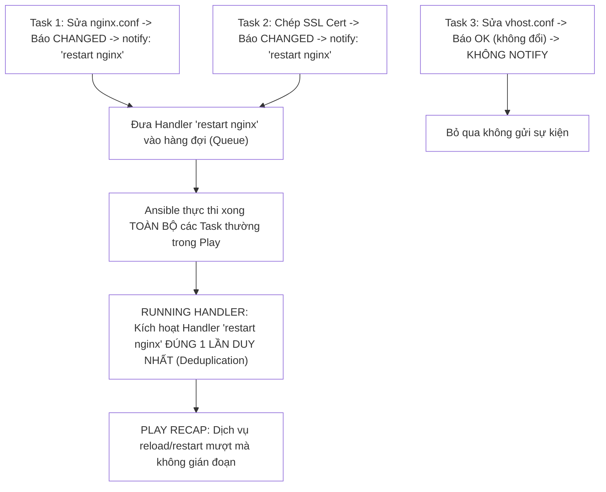
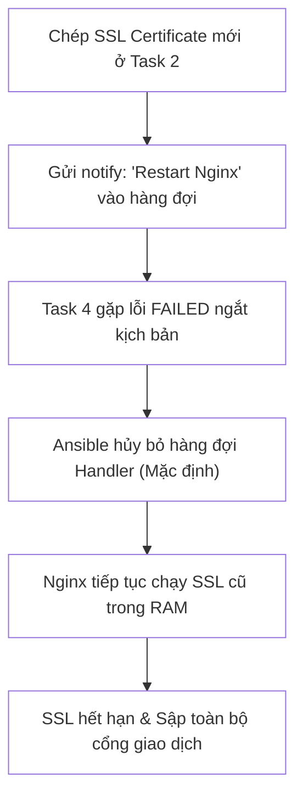


# [BÀI 11] LÀM CHỦ HANDLERS & NOTIFY: CƠ CHẾ KÍCH HOẠT SỰ KIỆN, FLUSH_HANDLERS & TỐI ƯU RELOAD DỊCH VỤ

Trong kỷ nguyên **Infrastructure as Code (IaC)** và tự động hóa vận hành hạ tầng đám mây (Cloud Infrastructure Automation), **Ansible** khẳng định vị thế dẫn đầu nhờ triết lý **Agentless** (không cần cài đặt agent nền trên máy đích), giao thức điều khiển an toàn qua **SSH / WinRM**, định dạng khai báo **YAML** trực quan và nguyên lý bất biến **Idempotency** mạnh mẽ. Việc làm chủ Ansible không chỉ dừng lại ở các câu lệnh Ad-hoc đơn giản, mà đòi hỏi kỹ sư phải nắm vững kiến trúc Module tầng thấp, Variable Precedence 22 tầng, Jinja2 Templates, tối ưu hóa Forks & Pipelining cho tới thiết kế Roles / Collections và tích hợp CI/CD tự động hóa chuẩn Doanh nghiệp.

Bài viết chuyên sâu này sẽ đồng hành cùng bạn mổ xẻ toàn diện bức tranh kiến trúc, phân tích các đánh đổi kỹ thuật thực chiến (Engineering Trade-offs), cung cấp hướng dẫn thực hành Lab chi tiết từng bước và bộ câu hỏi phỏng vấn chuyên sâu chuẩn DevOps / SRE Lead.

---

## 1. Bản Chất Kiến Trúc & Cơ Chế Vận Hành Tầng Thấp

Trong quản trị hệ thống, một nguyên tắc vàng của độ tin cậy là: **Không khởi động lại dịch vụ nếu cấu hình không thay đổi**. Nếu kịch bản có 5 Task chỉnh sửa các file cấu hình khác nhau của Nginx (chỉnh `nginx.conf`, chỉnh SSL certificate, chỉnh virtual host, chỉnh security headers), việc gọi lệnh restart dịch vụ ở từng task sẽ khiến Nginx bị khởi động lại 5 lần liên tiếp, làm đứt gãy kết nối của người dùng thật. **Ansible Handlers** cung cấp mô hình kích hoạt theo sự kiện (**Event-driven Architecture**) với cơ chế loại trừ trùng lặp (**Deduplication**) tự động.



### 1.1. Cơ Chế Kích Hoạt Sự Kiện (Event-Driven Trigger) & Deduplication Của Handlers

- **Cơ chế chỉ chạy khi có thay đổi (`changed=true`):** Một Handler chỉ được kích hoạt khi và chỉ khi Task gọi `notify:` tạo ra sự thay đổi thực tế trên máy đích (trả về trạng thái `CHANGED`). Nếu Task trả về `OK` (hệ thống đã đúng trạng thái), tín hiệu `notify` sẽ bị bỏ qua.
- **Cơ chế Khử trùng lặp (Deduplication):** Dù có 10 Task cùng gọi `notify: "restart nginx"` trong một Play, Ansible sẽ tự động gom nhóm và **chỉ thực thi Handler đó đúng duy nhất 1 lần** ở cuối lượt chạy của Play.
- **Thời điểm thực thi mặc định:** Theo mặc định, toàn bộ Handlers nằm trong khối `handlers:` sẽ được xếp hàng và chỉ thực thi sau khi TẤT CẢ các Task thường trong Play đã hoàn thành thành công.

### 1.2. Kỹ Thuật Nâng Cao: listen Topic, flush_handlers & Điều Kiện when Trong Handler

- **Cơ chế Publish/Subscribe với `listen`:** Khai báo `listen: "topic_name"` cho phép nhiều Handler cùng lắng nghe một chủ đề sự kiện chung. Khi một Task phát tín hiệu `notify: "topic_name"`, toàn bộ các Handler đăng ký chủ đề đó (ví dụ restart nginx, restart php-fpm, reload prometheus) sẽ được kích hoạt đồng thời.
- **Xả hàng đợi tức thì (`meta: flush_handlers`):** Khi cần dịch vụ khởi động lại ngay lập tức ở giữa kịch bản (ví dụ cần Nginx chạy ngay để bước sau thực hiện health-check API), ta gọi task đặc biệt `ansible.builtin.meta: flush_handlers` để ép Ansible thực thi toàn bộ các handler đang xếp hàng ngay tại vị trí đó mà không cần chờ đến cuối Play.
- **Rẽ nhánh trong Handler với `when:`:** Handler hỗ trợ mệnh đề `when:`, cho phép kiểm tra điều kiện bổ sung trước khi thực sự restart (ví dụ: chỉ restart nếu biến `service_restart_allowed == true`).

### 1.3. Bảo Vệ Handler Khi Gặp Sự Cố: force_handlers & Quản Trị Idempotency

- **Rủi ro mặc định khi Playbook bị lỗi:** Nếu một Task ở giữa Play bị `FAILED`, Ansible mặc định sẽ hủy bỏ toàn bộ lượt chạy và **KHÔNG THỰC THI các Handler đang xếp hàng**. Điều này dẫn tới thảm họa: file cấu hình mới đã được chép xuống đĩa, nhưng dịch vụ chưa được reload, tạo ra sự sai lệch cấu hình ngầm.
- **Cấu hình an toàn `force_handlers: true`:** Khai báo `force_handlers: true` ở cấp độ Play (hoặc trong `ansible.cfg`) ép Ansible bắt buộc phải thực thi toàn bộ các Handler đã được thông báo ngay cả khi kịch bản gặp lỗi dừng ở các task sau đó.

---

## 2. Bảng So Sánh Kỹ Thuật Toàn Diện (Engineering Matrix)

| Kỹ Thuật Xử Lý Dịch Vụ | Cơ Chế Kích Hoạt | Số Lần Chạy Lặp | Thời Điểm Chạy | Mức Độ An Toàn Production |
|---|---|---|---|---|
| **Gọi module `service` trong Task thường** | Luôn chạy mỗi khi tới lượt task | Chạy liên tục bấy nhiêu lần | Ngay lập tức tại task đó | **Kém** (Gây restart thừa, downtime gián đoạn kết nối) |
| **Handler Cơ Bản (`notify` theo tên)** | Chỉ chạy khi task báo `CHANGED` | Đúng 1 lần duy nhất (Deduplication) | Cuối cùng của Play | **Rất cao** (Chuẩn mực Enterprise) |
| **Handler Nhóm (`listen` topic)** | Khi task notify đúng topic | Đúng 1 lần cho toàn bộ nhóm | Cuối cùng của Play | **Rất cao** (Quản lý cụm microservices phụ thuộc) |
| **Xả hàng đợi (`meta: flush_handlers`)** | Cưỡng chế thực thi ngay | 1 lần tại thời điểm gọi | Giữa Playbook | **Tối ưu** (Dành cho quy trình cần health check ngay) |
| **Bảo vệ Handler (`force_handlers: true`)** | Bắt buộc chạy kể cả khi Play lỗi | Đúng 1 lần | Cuối Play (Kể cả khi failed) | **Bắt buộc cho hạ tầng Critical** |

> [!IMPORTANT]
> **QUY TẮC BẢO VỆ DỊCH VỤ SẢN XUẤT:**
> 1. Luôn ưu tiên dùng `state: reloaded` thay cho `state: restarted` trong Handlers để cập nhật cấu hình mà không ngắt kết nối socket đang hoạt động.
> 2. Luôn khai báo `force_handlers: true` trên môi trường Production để đảm bảo dịch vụ luôn nhận cấu hình mới ngay cả khi kịch bản gặp sự cố ở các bước sau.

---

## 3. Kiến Trúc Triển Khai Chuẩn Production (Configuration / Playbook / Role Breakdown)

Dưới đây là Playbook chuẩn Enterprise triển khai cấu hình Web Server, áp dụng `notify`, `listen`, `meta: flush_handlers` và `force_handlers: true`:

```yaml
# site-handlers-mastery.yml
---
- name: Enterprise Production Web & Service Handler Architecture
  hosts: web
  become: true
  gather_facts: false
  force_handlers: true

  vars:
    http_port: 8080
    enable_ssl: false

  tasks:
    - name: 01. Ensure web server package is installed
      ansible.builtin.package:
        name: nginx
        state: present

    - name: 02. Deploy core web server configuration
      ansible.builtin.copy:
        dest: /etc/nginx/nginx.conf
        content: |
          events { worker_connections 1024; }
          http {
            server {
              listen {{ http_port }};
              server_name localhost;
              location / { root /var/www/html; }
            }
          }
        mode: "0644"
        backup: true
      notify: "restart web stack"

    - name: 03. Deploy custom index page
      ansible.builtin.copy:
        dest: /var/www/html/index.html
        content: "<h1>NTKAnsible Production Web Service</h1>\n"
        mode: "0644"
      notify: "reload web service"

    - name: 04. Flush handlers immediately before running health check
      ansible.builtin.meta: flush_handlers

    - name: 05. Perform runtime service health check
      ansible.builtin.command: curl -s http://127.0.0.1:{{ http_port }}
      register: health_check
      changed_when: false
      failed_when: "'NTKAnsible Production' not in health_check.stdout"

    - name: 06. Ensure SSH service is running
      ansible.builtin.service:
        name: sshd
        state: started
        enabled: true

  handlers:
    - name: Reload Nginx Service Safely
      ansible.builtin.service:
        name: nginx
        state: reloaded
      listen: "reload web service"

    - name: Full Restart Web Stack Service
      ansible.builtin.service:
        name: nginx
        state: restarted
      listen: "restart web stack"
```

### Phân Tích Kỹ Thuật Từng Dòng (Line-by-Line Breakdown):
- <span class="badge-line">Line 6</span>: Khai báo `force_handlers: true` ở cấp độ Play để bảo đảm các handler đã được thông báo sẽ luôn được thực thi dù các task sau có lỗi.
- <span class="badge-line">Line 17–31</span>: Task cập nhật `/etc/nginx/nginx.conf` gửi tín hiệu `notify: "restart web stack"`.
- <span class="badge-line">Line 33–38</span>: Task cập nhật trang `index.html` gửi tín hiệu `notify: "reload web service"`.
- <span class="badge-line">Line 40–41</span>: Lệnh `meta: flush_handlers` lập tức kích hoạt các handler đang xếp hàng, giúp Nginx reload/restart cấu hình mới ngay tại chỗ.
- <span class="badge-line">Line 43–47</span>: Thực hiện kiểm tra sức khỏe dịch vụ (Health Check) qua `curl`, đảm bảo Nginx đã nhận cấu hình mới và phản hồi chuẩn xác trước khi tiếp tục.
- <span class="badge-line">Line 55–66</span>: Khối `handlers:` định nghĩa 2 handler độc lập cùng sử dụng từ khóa `listen:` để bắt các chủ đề sự kiện tương ứng.

---

## 4. Phân Tích Cạm Bẫy Thực Chiến: Đứt Gãy Kịch Bản Làm Bỏ Quên Handler & Lạm Dụng Restart Gây Downtime

### Tình Huống Sự Cố Thực Tế Tại Doanh Nghiệp:
Một sàn giao dịch tiền điện tử triển khai đợt cập nhật chứng chỉ SSL khẩn cấp trên 50 máy chủ Web Gateway. Kịch bản chép file SSL mới ở Task 2 và gửi `notify: "Restart Nginx"`. 
Tuy nhiên ở Task 4 (chạy lệnh kiểm tra cấu hình mạng phụ), một lỗi sai cú pháp xảy ra khiến Task 4 bị `FAILED`. Do không cấu hình `force_handlers: true`, Ansible lập tức dừng Playbook và **hủy bỏ luôn lệnh restart Nginx**.

### Hậu Quả & Log Lỗi Thực Tế:

```diff
--- site.yml (Vulnerable Handler Setup)
+++ site.yml (Resilient Enterprise Setup)
@@ -1,5 +1,6 @@
 ---
 - name: Deploy Critical SSL Certificates
   hosts: web
   become: true
+  force_handlers: true # Sửa: Bắt buộc chạy handler kể cả khi task sau bị lỗi
   tasks:
```

- File chứng chỉ SSL mới đã nằm trên đĩa cứng máy đích nhưng tiến trình Nginx daemon vẫn đang chạy với chứng chỉ SSL cũ trong bộ nhớ RAM.
- 4 giờ sau đó, chứng chỉ SSL cũ hết hạn, hàng triệu người dùng bị trình duyệt chặn truy cập với cảnh báo bảo mật nguy hiểm (**SSL Certificate Expired**), gây thiệt hại nghiêm trọng về doanh thu và uy tín doanh nghiệp.




### 5-Whys Root Cause Analysis:
1. **Tại sao người dùng bị chặn truy cập SSL?** Do tiến trình Nginx không nạp chứng chỉ SSL mới sau đợt triển khai.
2. **Tại sao Nginx không nạp chứng chỉ mới?** Do Handler restart/reload dịch vụ không được thực thi.
3. **Tại sao Handler không được thực thi?** Do kịch bản bị lỗi dừng ở Task 4 trước khi đến giai đoạn chạy handler cuối Play.
4. **Tại sao lỗi ở Task 4 lại làm hủy Handler của Task 2?** Do Ansible mặc định bỏ qua toàn bộ Handlers đang chờ khi có lỗi ngắt kịch bản.
5. **Nguyên nhân cốt lõi (Root Cause):** Thiếu chỉ thị an toàn `force_handlers: true` trong Playbook và không sử dụng `meta: flush_handlers` ngay sau bước cập nhật chứng chỉ quan trọng.

---

## 5. Hands-on Lab: Triển Khai & Kiểm Chứng Handlers, Deduplication & Flush Handlers (8 Bước)

| Bước | Lệnh CLI / Tác Vụ Chính | Mục Đích Thực Thi |
|---|---|---|
| **Bước 1** | Chuẩn bị môi trường `lab-ansible-11` | Khởi tạo cấu hình dự án cô lập |
| **Bước 2** | Soạn thảo kịch bản Handler cơ bản | Kiểm chứng cơ chế `notify` khi task báo `CHANGED` |
| **Bước 3** | Kiểm chứng cơ chế Deduplication | 2 Task cùng notify nhưng Handler chỉ chạy đúng 1 lần |
| **Bước 4** | Sử dụng cơ chế `listen` nhóm sự kiện | Kích hoạt đồng thời nhiều handler qua 1 chủ đề |
| **Bước 5** | Ép thực thi tức thì với `flush_handlers` | Xả hàng đợi handler ở giữa Playbook |
| **Bước 6** | Bảo vệ Handler với `force_handlers: true` | Đảm bảo handler chạy ngay cả khi task sau bị failed |
| **Bước 7** | Thực thi Phép thử Lần 2 chứng minh Idempotency | Đạt chỉ số `changed=0` trên bảng `PLAY RECAP` (Không handler nào chạy) |
| **Bước 8** | Đối soát sự thật máy đích qua `docker exec` | Xác nhận dịch vụ Nginx đang chạy với cấu hình mới |

### Bước 1 — Thiết lập môi trường dự án

```bash
mkdir -p ~/lab-ansible-11 && cd ~/lab-ansible-11

cat << 'EOF' > ansible.cfg
[defaults]
inventory = ./inventory.ini
remote_user = ansible
host_key_checking = False
private_key_file = ~/.ssh/id_ed25519

[privilege_escalation]
become = True
become_method = sudo
become_user = root
become_ask_pass = False
EOF

cat << 'EOF' > inventory.ini
[web]
target1 ansible_host=127.0.0.1 ansible_port=2221

[db]
target2 ansible_host=127.0.0.1 ansible_port=2222

[all:vars]
ansible_python_interpreter=/usr/bin/python3
EOF
```

### Bước 2 — Soạn thảo Playbook kiểm chứng Handlers và Deduplication

```bash
cat << 'EOF' > site.yml
---
- name: Handlers Mastery & Deduplication Lab
  hosts: web
  become: true
  gather_facts: false
  force_handlers: true

  tasks:
    - name: 01. Ensure curl is installed
      ansible.builtin.package:
        name: curl
        state: present

    - name: 02. Task A - Update configuration part 1
      ansible.builtin.copy:
        dest: /etc/app_conf_a.txt
        content: "CONFIG_A=ACTIVE\n"
        mode: "0644"
      notify: "restart web services"

    - name: 03. Task B - Update configuration part 2
      ansible.builtin.copy:
        dest: /etc/app_conf_b.txt
        content: "CONFIG_B=ACTIVE\n"
        mode: "0644"
      notify: "restart web services"

    - name: 04. Flush handlers right now
      ansible.builtin.meta: flush_handlers

    - name: 05. Verification check
      ansible.builtin.command: cat /etc/app_conf_a.txt
      register: conf_a
      changed_when: false

  handlers:
    - name: Restart Web Service Handler
      ansible.builtin.service:
        name: sshd
        state: reloaded
      listen: "restart web services"
EOF
```

```bash
# CHECKPOINT 1: Kiểm tra cú pháp Playbook
ansible-playbook --syntax-check site.yml
```

### Bước 3 — Chạy mô phỏng Dry-run

```bash
ansible-playbook --check --diff site.yml
```

```bash
# CHECKPOINT 2: Kiểm tra chế độ Dry-run
CHECK_OUT=$(ansible-playbook --check --diff site.yml)
if echo "$CHECK_OUT" | grep -q "PLAY RECAP" && ! echo "$CHECK_OUT" | grep -q "failed=1"; then
  echo "CHECKPOINT 2: ĐẠT - Chạy mô phỏng Dry-run thành công"
else
  echo "CHECKPOINT 2: LỖI - Chạy mô phỏng thất bại"
fi
```

### Bước 4 — Thực thi Playbook Lần 1 và quan sát Deduplication

```bash
ansible-playbook site.yml
```

```bash
# CHECKPOINT 3 & 4: Kiểm tra Handler chạy đúng 1 lần khi có 2 task notify
RUN1_OUT=$(ansible-playbook site.yml)
if echo "$RUN1_OUT" | grep -q "RUNNING HANDLER" && echo "$RUN1_OUT" | grep -q "failed=0"; then
  echo "CHECKPOINT 3 & 4: ĐẠT - Handler được kích hoạt thành công qua cơ chế Deduplication và flush_handlers"
else
  echo "CHECKPOINT 3 & 4: LỖI - Handler không được kích hoạt đúng"
fi
```

### Bước 5 — Thực thi Phép thử Lần 2 chứng minh Idempotency (Handler KHÔNG ĐƯỢC CHẠY)

```bash
ansible-playbook site.yml
```

```bash
# CHECKPOINT 5 & 6: Lần 2 đạt changed=0 và KHÔNG CÓ Handler nào chạy
RUN2_FINAL=$(ansible-playbook site.yml)
if echo "$RUN2_FINAL" | grep -q "changed=0" && ! echo "$RUN2_FINAL" | grep -q "RUNNING HANDLER"; then
  echo "CHECKPOINT 5 & 6: ĐẠT - Kịch bản đạt Idempotency tuyệt đối (changed=0, không có Handler nào bị kích hoạt thừa)"
else
  echo "CHECKPOINT 5 & 6: LỖI - Handler vẫn bị chạy ở lần 2 vi phạm Idempotency"
fi
```

### Bước 6 — Đối soát sự thật máy đích qua docker exec

```bash
docker exec target1 cat /etc/app_conf_a.txt
docker exec target1 cat /etc/app_conf_b.txt
```

```bash
# CHECKPOINT 7 & 8: Kiểm tra hiện vật máy đích
CONF_A=$(docker exec target1 cat /etc/app_conf_a.txt)
CONF_B=$(docker exec target1 cat /etc/app_conf_b.txt)
if echo "$CONF_A" | grep -q "CONFIG_A=ACTIVE" && echo "$CONF_B" | grep -q "CONFIG_B=ACTIVE"; then
  echo "CHECKPOINT 7 & 8: ĐẠT - Hiện vật trên máy đích đầy đủ và chính xác 100%"
else
  echo "CHECKPOINT 7 & 8: LỖI - Đối soát hiện vật thất bại"
fi
```

---

## 6. Bộ Câu Hỏi Vấn Đáp & Phỏng Vấn Chuyên Sâu (Self-Check Q&A)

<details class="qa-card">
  <summary class="qa-summary">
    <span class="qa-num-badge">Q01</span>
    <span class="qa-question-text">Handler trong Ansible là gì? Nêu sự khác biệt cốt lõi giữa một Task thông thường và một Handler.</span>
  </summary>
  <div class="qa-answer">
    <div class="qa-answer-header">
      <svg width="14" height="14" fill="none" stroke="currentColor" stroke-width="2" viewBox="0 0 24 24"><path d="M22 11.08V12a10 10 0 1 1-5.93-9.14"></path><polyline points="22 4 12 14.01 9 11.01"></polyline></svg>
      <span>Phân Tích &amp; Lời Giải Kỹ Thuật</span>
    </div>
    <div><b>Đáp án chuẩn:</b> Handler là một dạng Task đặc biệt hoạt động theo mô hình hướng sự kiện (Event-driven). Sự khác biệt cốt lõi: (1) <b>Task thông thường</b> luôn được thực thi tuần tự mỗi khi Playbook chạy tới vị trí của nó, trong khi <b>Handler</b> ở trạng thái ngủ yên và CHỈ được kích hoạt khi có Task khác gửi tín hiệu <code>notify:</code> và Task đó tạo ra trạng thái <code>CHANGED</code>; (2) Handler có cơ chế khử trùng lặp (Deduplication), chỉ chạy đúng 1 lần ở cuối Play dù được notify nhiều lần.</div>
    <div style="margin-top: 0.5rem;"><b>Tiêu chí chấm:</b></div>
    <div style="margin: 0.35rem 0; padding-left: 1rem; border-left: 2px solid var(--accent-primary);">• <b>0:</b> Cho rằng Handler và Task thông thường giống nhau.</div>
    <div style="margin: 0.35rem 0; padding-left: 1rem; border-left: 2px solid var(--accent-primary);">• <b>1:</b> Biết Handler cần notify nhưng không giải thích được cơ chế Deduplication và điều kiện <code>changed=true</code>.</div>
    <div style="margin: 0.35rem 0; padding-left: 1rem; border-left: 2px solid var(--accent-primary);">• <b>2:</b> Phân biệt chính xác trên cả 3 khía cạnh: Điều kiện kích hoạt, Deduplication, Thời điểm chạy.</div>
    <div style="margin-top: 0.5rem;"><b>Tiêu chí chấm:</b></div>
    <div style="margin: 0.35rem 0; padding-left: 1rem; border-left: 2px solid var(--accent-primary);">• <b>3:</b> Trình bày xuất sắc lý do tại sao Handler là trụ cột bảo vệ tính Idempotency và độ ổn định của dịch vụ.</div>
    <div style="margin-top: 0.5rem;"><b>Câu hỏi đào sâu:</b> Nếu Task có <code>notify: "restart nginx"</code> nhưng trả về kết quả <code>OK</code> (không thay đổi), Handler có được chạy không? <i>(Tuyệt đối không chạy, vì không có sự kiện thay đổi.)</i></div>
  </div>
</details>

<details class="qa-card">
  <summary class="qa-summary">
    <span class="qa-num-badge">Q02</span>
    <span class="qa-question-text">Trình bày cơ chế Khử trùng lặp (Deduplication) của Handlers. Cho ví dụ thực tế minh họa lợi ích của cơ chế này.</span>
  </summary>
  <div class="qa-answer">
    <div class="qa-answer-header">
      <svg width="14" height="14" fill="none" stroke="currentColor" stroke-width="2" viewBox="0 0 24 24"><path d="M22 11.08V12a10 10 0 1 1-5.93-9.14"></path><polyline points="22 4 12 14.01 9 11.01"></polyline></svg>
      <span>Phân Tích &amp; Lời Giải Kỹ Thuật</span>
    </div>
    <div><b>Đáp án chuẩn:</b> Cơ chế Deduplication tự động gom các tín hiệu <code>notify</code> trùng tên vào một hàng đợi duy nhất (Queue Set). Dù trong Playbook có 5 Task khác nhau (sửa file cấu hình, chép SSL cert, cấu hình firewall, tạo thư mục log, chỉnh vhost) cùng gọi <code>notify: "restart nginx"</code>, Ansible sẽ chỉ kích hoạt Handler <code>restart nginx</code> <b>ĐÚNG 1 LẦN DUY NHẤT</b> ở cuối Play. Lợi ích: Dịch vụ Nginx chỉ khởi động lại 1 lần sau khi tất cả các file cấu hình đã hoàn tất, loại bỏ hoàn toàn việc restart 5 lần liên tiếp gây gián đoạn kết nối người dùng.</div>
    <div style="margin-top: 0.5rem;"><b>Tiêu chí chấm:</b></div>
    <div style="margin: 0.35rem 0; padding-left: 1rem; border-left: 2px solid var(--accent-primary);">• <b>0:</b> Cho rằng notify 5 lần thì Handler sẽ restart 5 lần.</div>
    <div style="margin: 0.35rem 0; padding-left: 1rem; border-left: 2px solid var(--accent-primary);">• <b>1:</b> Biết chạy 1 lần nhưng không giải thích được cơ chế Queue Set ở cuối Play.</div>
    <div style="margin-top: 0.5rem;"><b>Tiêu chí chấm:</b></div>
    <div style="margin: 0.35rem 0; padding-left: 1rem; border-left: 2px solid var(--accent-primary);">• <b>2:</b> Giải thích chính xác cơ chế Deduplication + ví dụ thực tế về Web Server.</div>
    <div style="margin: 0.35rem 0; padding-left: 1rem; border-left: 2px solid var(--accent-primary);">• <b>3:</b> Phân tích sâu sắc sự tối ưu hóa thời gian bảo trì hệ thống nhờ Deduplication.</div>
    <div style="margin-top: 0.5rem;"><b>Câu hỏi đào sâu:</b> Nếu có 2 Handler khác nhau (ví dụ <code>restart nginx</code> và <code>restart php-fpm</code>), thứ tự chạy của 2 handler này được quyết định bởi thứ tự gọi notify hay thứ tự khai báo trong khối <code>handlers:</code>? <i>(Được quyết định bởi THỨ TỰ KHAI BÁO trong khối <code>handlers:</code>, không phụ thuộc vào thứ tự gọi notify.)</i></div>
  </div>
</details>

<details class="qa-card">
  <summary class="qa-summary">
    <span class="qa-num-badge">Q03</span>
    <span class="qa-question-text">Từ khóa listen trong khối handlers: hoạt động như thế nào? Khi nào nên sử dụng listen thay vì notify trực tiếp tên Handler?</span>
  </summary>
  <div class="qa-answer">
    <div class="qa-answer-header">
      <svg width="14" height="14" fill="none" stroke="currentColor" stroke-width="2" viewBox="0 0 24 24"><path d="M22 11.08V12a10 10 0 1 1-5.93-9.14"></path><polyline points="22 4 12 14.01 9 11.01"></polyline></svg>
      <span>Phân Tích &amp; Lời Giải Kỹ Thuật</span>
    </div>
    <div><b>Đáp án chuẩn:</b> Từ khóa <code>listen: "topic_name"</code> hoạt động theo mô hình Publish/Subscribe. Nó cho phép một Handler đăng ký lắng nghe một chủ đề sự kiện. Khi một Task phát tín hiệu <code>notify: "topic_name"</code>, TẤT CẢ các Handler có khai báo <code>listen: "topic_name"</code> sẽ cùng được kích hoạt. Nên dùng <code>listen</code> khi một thay đổi cấu hình đòi hỏi phải khởi động lại nhiều dịch vụ phụ thuộc liên quan (ví dụ: sửa file môi trường chung cần restart cả Nginx, PHP-FPM và Celery Worker).</div>
    <div style="margin-top: 0.5rem;"><b>Tiêu chí chấm:</b></div>
    <div style="margin: 0.35rem 0; padding-left: 1rem; border-left: 2px solid var(--accent-primary);">• <b>0:</b> Không biết tính năng <code>listen</code>.</div>
    <div style="margin: 0.35rem 0; padding-left: 1rem; border-left: 2px solid var(--accent-primary);">• <b>1:</b> Biết nhóm handler nhưng không giải thích được mô hình Pub/Sub.</div>
    <div style="margin-top: 0.5rem;"><b>Tiêu chí chấm:</b></div>
    <div style="margin: 0.35rem 0; padding-left: 1rem; border-left: 2px solid var(--accent-primary);">• <b>2:</b> Phân tích chính xác cơ chế Pub/Sub của <code>listen</code> + ví dụ cụm microservices.</div>
    <div style="margin-top: 0.5rem;"><b>Tiêu chí chấm:</b></div>
    <div style="margin: 0.35rem 0; padding-left: 1rem; border-left: 2px solid var(--accent-primary);">• <b>3:</b> Nêu đúng + chỉ ra ưu điểm phân tách kiến trúc lỏng (Loose Coupling) giữa Task và Handler.</div>
    <div style="margin-top: 0.5rem;"><b>Câu hỏi đào sâu:</b> Một Handler có thể vừa có <code>name:</code> riêng vừa có <code>listen:</code> được không? <i>(Hoàn toàn được, khi đó handler có thể được kích hoạt bằng cả tên riêng hoặc bằng tên chủ đề listen.)</i></div>
  </div>
</details>

<details class="qa-card">
  <summary class="qa-summary">
    <span class="qa-num-badge">Q04</span>
    <span class="qa-question-text">Task meta: flush_handlers làm công việc gì? Khi nào bắt buộc phải sử dụng flush_handlers ở giữa Playbook?</span>
  </summary>
  <div class="qa-answer">
    <div class="qa-answer-header">
      <svg width="14" height="14" fill="none" stroke="currentColor" stroke-width="2" viewBox="0 0 24 24"><path d="M22 11.08V12a10 10 0 1 1-5.93-9.14"></path><polyline points="22 4 12 14.01 9 11.01"></polyline></svg>
      <span>Phân Tích &amp; Lời Giải Kỹ Thuật</span>
    </div>
    <div><b>Đáp án chuẩn:</b> Task <code>ansible.builtin.meta: flush_handlers</code> cưỡng chế Ansible thực thi ngay lập tức tất cả các Handler đang nằm trong hàng đợi tại thời điểm đó mà không cần chờ đến khi kết thúc Play. Bắt buộc phải dùng khi: Các Task tiếp theo trong Playbook phụ thuộc trực tiếp vào trạng thái hoạt động của dịch vụ vừa được cấu hình (ví dụ: cần Nginx restart ngay để task tiếp theo dùng <code>uri</code> module kiểm tra Health Check HTTP 200, hoặc cần Database khởi động để chạy migration).</div>
    <div style="margin-top: 0.5rem;"><b>Tiêu chí chấm:</b></div>
    <div style="margin: 0.35rem 0; padding-left: 1rem; border-left: 2px solid var(--accent-primary);">• <b>0:</b> Không biết <code>meta: flush_handlers</code>.</div>
    <div style="margin: 0.35rem 0; padding-left: 1rem; border-left: 2px solid var(--accent-primary);">• <b>1:</b> Biết để chạy handler sớm nhưng không nêu được ngữ cảnh Health check / Service dependency.</div>
    <div style="margin-top: 0.5rem;"><b>Tiêu chí chấm:</b></div>
    <div style="margin: 0.35rem 0; padding-left: 1rem; border-left: 2px solid var(--accent-primary);">• <b>2:</b> Phân tích chính xác cơ chế xả hàng đợi + ngữ cảnh phụ thuộc logic giữa chừng.</div>
    <div style="margin-top: 0.5rem;"><b>Tiêu chí chấm:</b></div>
    <div style="margin: 0.35rem 0; padding-left: 1rem; border-left: 2px solid var(--accent-primary);">• <b>3:</b> Nêu đúng + cảnh báo nếu lạm dụng <code>flush_handlers</code> quá nhiều sẽ làm mất đi lợi thế gom nhóm của Deduplication.</div>
    <div style="margin-top: 0.5rem;"><b>Câu hỏi đào sâu:</b> Nếu sau lệnh <code>flush_handlers</code> lại có một Task khác tiếp tục notify handler cũ, handler đó có chạy lại ở cuối Play không? <i>(Có, handler sẽ được kích hoạt thêm một lần nữa ở cuối Play nếu có sự kiện notify mới sau thời điểm flush.)</i></div>
  </div>
</details>

<details class="qa-card">
  <summary class="qa-summary">
    <span class="qa-num-badge">Q05</span>
    <span class="qa-question-text">Điều gì xảy ra với các Handler đang xếp hàng nếu một Task thường bị FAILED? Chỉ thị force_handlers giải quyết rủi ro này thế nào?</span>
  </summary>
  <div class="qa-answer">
    <div class="qa-answer-header">
      <svg width="14" height="14" fill="none" stroke="currentColor" stroke-width="2" viewBox="0 0 24 24"><path d="M22 11.08V12a10 10 0 1 1-5.93-9.14"></path><polyline points="22 4 12 14.01 9 11.01"></polyline></svg>
      <span>Phân Tích &amp; Lời Giải Kỹ Thuật</span>
    </div>
    <div><b>Đáp án chuẩn:</b> Mặc định, khi có một Task bị <code>FAILED</code>, Ansible dừng ngay lập tức Playbook và **HỦY BỎ toàn bộ các Handler đang chờ trong hàng đợi**. Hậu quả: file cấu hình mới đã ghi xuống đĩa nhưng dịch vụ không được reload. Khai báo <code>force_handlers: true</code> (ở cấp Play hoặc trong <code>ansible.cfg</code>) ép Ansible bắt buộc phải kích hoạt tất cả các Handler đã được notify trước đó ngay cả khi kịch bản bị crash ở các task sau, đảm bảo tính đồng nhất giữa file đĩa cứng và tiến trình trong bộ nhớ.</div>
    <div style="margin-top: 0.5rem;"><b>Tiêu chí chấm:</b></div>
    <div style="margin: 0.35rem 0; padding-left: 1rem; border-left: 2px solid var(--accent-primary);">• <b>0:</b> Cho rằng handler vẫn luôn chạy mặc định kể cả khi Playbook bị lỗi.</div>
    <div style="margin-top: 0.35rem; padding-left: 1rem; border-left: 2px solid var(--accent-primary);">• <b>1:</b> Biết bị hủy nhưng không nhớ từ khóa <code>force_handlers</code>.</div>
    <div style="margin-top: 0.5rem;"><b>Tiêu chí chấm:</b></div>
    <div style="margin: 0.35rem 0; padding-left: 1rem; border-left: 2px solid var(--accent-primary);">• <b>2:</b> Phân tích chính xác hành vi mặc định (hủy handler) và giải pháp cứu cánh của <code>force_handlers: true</code>.</div>
    <div style="margin-top: 0.5rem;"><b>Tiêu chí chấm:</b></div>
    <div style="margin: 0.35rem 0; padding-left: 1rem; border-left: 2px solid var(--accent-primary);">• <b>3:</b> Trình bày xuất sắc tình huống thực tế về sự cố lệch pha chứng chỉ SSL khi thiếu <code>force_handlers</code>.</div>
    <div style="margin-top: 0.5rem;"><b>Câu hỏi đào sâu:</b> Cờ CLI nào tương đương với việc cấu hình <code>force_handlers: true</code>? <i>(Cờ <code>ansible-playbook --force-handlers site.yml</code>.)</i></div>
  </div>
</details>

<details class="qa-card">
  <summary class="qa-summary">
    <span class="qa-num-badge">Q06</span>
    <span class="qa-question-text">Tại sao trong Handlers quản trị dịch vụ Web/Database, ta nên ưu tiên state: reloaded thay vì state: restarted?</span>
  </summary>
  <div class="qa-answer">
    <div class="qa-answer-header">
      <svg width="14" height="14" fill="none" stroke="currentColor" stroke-width="2" viewBox="0 0 24 24"><path d="M22 11.08V12a10 10 0 1 1-5.93-9.14"></path><polyline points="22 4 12 14.01 9 11.01"></polyline></svg>
      <span>Phân Tích &amp; Lời Giải Kỹ Thuật</span>
    </div>
    <div><b>Đáp án chuẩn:</b> <code>state: restarted</code> ngắt hoàn toàn tiến trình daemon (kill PID) và khởi động tiến trình mới, làm đóng tất cả các kết nối TCP/HTTP đang mở của người dùng (gây gián đoạn dịch vụ/downtime ngắn). Trong khi đó, <code>state: reloaded</code> gửi tín hiệu SIGHUP (hoặc qua systemctl reload) để daemon đọc lại file cấu hình mới và sinh worker process mới mà KHÔNG ngắt các kết nối mạng hiện hữu (Graceful Reload / Zero Downtime).</div>
    <div style="margin-top: 0.5rem;"><b>Tiêu chí chấm:</b></div>
    <div style="margin: 0.35rem 0; padding-left: 1rem; border-left: 2px solid var(--accent-primary);">• <b>0:</b> Cho rằng restart và reload hoàn toàn giống nhau.</div>
    <div style="margin-top: 0.35rem; padding-left: 1rem; border-left: 2px solid var(--accent-primary);">• <b>1:</b> Biết reload không làm ngắt mạng nhưng không giải thích được cơ chế SIGHUP / Graceful.</div>
    <div style="margin-top: 0.5rem;"><b>Tiêu chí chấm:</b></div>
    <div style="margin: 0.35rem 0; padding-left: 1rem; border-left: 2px solid var(--accent-primary);">• <b>2:</b> Phân tích chính xác sự khác nhau về cơ chế tiến trình và tác động tới kết nối người dùng.</div>
    <div style="margin-top: 0.5rem;"><b>Tiêu chí chấm:</b></div>
    <div style="margin: 0.35rem 0; padding-left: 1rem; border-left: 2px solid var(--accent-primary);">• <b>3:</b> Nêu đúng các trường hợp bắt buộc phải restart (khi đổi port lắng nghe, đổi tiến trình master) vs khi chỉ cần reload (đổi vhost, SSL).</div>
    <div style="margin-top: 0.5rem;"><b>Câu hỏi đào sâu:</b> Nếu file cấu hình Nginx bị lỗi cú pháp, lệnh <code>reload</code> có làm chết tiến trình Nginx đang chạy không? <i>(Không, Nginx sẽ từ chối nạp cấu hình lỗi và tiếp tục phục vụ bằng worker cũ, an toàn hơn restart rất nhiều.)</i></div>
  </div>
</details>

<details class="qa-card">
  <summary class="qa-summary">
    <span class="qa-num-badge">Q07</span>
    <span class="qa-question-text">Handler có thể chứa mệnh đề when: được không? Khi nào cần dùng điều kiện trong Handler?</span>
  </summary>
  <div class="qa-answer">
    <div class="qa-answer-header">
      <svg width="14" height="14" fill="none" stroke="currentColor" stroke-width="2" viewBox="0 0 24 24"><path d="M22 11.08V12a10 10 0 1 1-5.93-9.14"></path><polyline points="22 4 12 14.01 9 11.01"></polyline></svg>
      <span>Phân Tích &amp; Lời Giải Kỹ Thuật</span>
    </div>
    <div><b>Đáp án chuẩn:</b> Có thể. Handler hỗ trợ đầy đủ mệnh đề <code>when:</code>. Khi Handler được kích hoạt, nó sẽ kiểm tra điều kiện <code>when</code> trước khi thực sự chạy. Cần sử dụng khi: (1) Muốn kiểm soát cờ cho phép khởi động lại dịch vụ (ví dụ: <code>when: allow_service_restart | default(true) | bool</code> để kỹ sư có thể chặn restart khi deploy ban ngày), hoặc (2) Phân nhánh restart theo hệ điều hành trong handler dùng chung.</div>
    <div style="margin-top: 0.5rem;"><b>Tiêu chí chấm:</b></div>
    <div style="margin: 0.35rem 0; padding-left: 1rem; border-left: 2px solid var(--accent-primary);">• <b>0:</b> Cho rằng Handler không được phép chứa <code>when</code>.</div>
    <div style="margin-top: 0.35rem; padding-left: 1rem; border-left: 2px solid var(--accent-primary);">• <b>1:</b> Biết dùng được nhưng không đưa ra được tình huống thực tế hợp lý.</div>
    <div style="margin-top: 0.35rem; padding-left: 1rem; border-left: 2px solid var(--accent-primary);">• <b>2:</b> Trình bày chính xác cơ chế kiểm tra điều kiện tại thời điểm Handler chạy + ví dụ cờ toggle.</div>
    <div style="margin-top: 0.5rem;"><b>Tiêu chí chấm:</b></div>
    <div style="margin: 0.35rem 0; padding-left: 1rem; border-left: 2px solid var(--accent-primary);">• <b>3:</b> Nêu đúng + phân biệt giữa việc điều kiện đặt ở Task gọi notify vs điều kiện đặt trực tiếp trong Handler.</div>
    <div style="margin-top: 0.5rem;"><b>Câu hỏi đào sâu:</b> Mệnh đề <code>when</code> trong Handler được đánh giá tại thời điểm task gọi notify hay tại thời điểm handler thực thi ở cuối Play? <i>(Được đánh giá tại THỜI ĐIỂM HANDLER THỰC THI ở cuối Play.)</i></div>
  </div>
</details>

<details class="qa-card">
  <summary class="qa-summary">
    <span class="qa-num-badge">Q08</span>
    <span class="qa-question-text">Trình bày cách một Task có thể notify nhiều Handler cùng một lúc mà không dùng từ khóa listen.</span>
  </summary>
  <div class="qa-answer">
    <div class="qa-answer-header">
      <svg width="14" height="14" fill="none" stroke="currentColor" stroke-width="2" viewBox="0 0 24 24"><path d="M22 11.08V12a10 10 0 1 1-5.93-9.14"></path><polyline points="22 4 12 14.01 9 11.01"></polyline></svg>
      <span>Phân Tích &amp; Lời Giải Kỹ Thuật</span>
    </div>
    <div><b>Đáp án chuẩn:</b> Trong thuộc tính <code>notify:</code> của Task, ta truyền một danh sách mảng YAML (List) chứa danh sách tên chính xác của các Handler cần gọi:</div>
    <pre><code>notify:
  - Restart Nginx Service
  - Reload PHP-FPM Service
  - Clear Redis Cache</code></pre>
    <div>Khi Task có trạng thái `CHANGED`, toàn bộ 3 Handler trên sẽ được đưa vào hàng đợi thực thi.</div>
    <div style="margin-top: 0.5rem;"><b>Tiêu chí chấm:</b></div>
    <div style="margin: 0.35rem 0; padding-left: 1rem; border-left: 2px solid var(--accent-primary);">• <b>0:</b> Cho rằng notify chỉ nhận đúng 1 chuỗi đơn lẻ.</div>
    <div style="margin-top: 0.35rem; padding-left: 1rem; border-left: 2px solid var(--accent-primary);">• <b>1:</b> Biết truyền danh sách nhưng viết sai định dạng mảng YAML.</div>
    <div style="margin-top: 0.35rem; padding-left: 1rem; border-left: 2px solid var(--accent-primary);">• <b>2:</b> Viết chính xác cú pháp danh sách mảng cho <code>notify:</code>.</div>
    <div style="margin-top: 0.5rem;"><b>Tiêu chí chấm:</b></div>
    <div style="margin: 0.35rem 0; padding-left: 1rem; border-left: 2px solid var(--accent-primary);">• <b>3:</b> So sánh ưu nhược điểm giữa cách notify danh sách tên vs cách dùng topic <code>listen</code>.</div>
    <div style="margin-top: 0.5rem;"><b>Câu hỏi đào sâu:</b> Nếu một trong các tên Handler trong danh sách notify bị viết sai chính tả, Ansible sẽ báo lỗi vào thời điểm nào? <i>(Ansible sẽ báo lỗi ngay khi bắt đầu chạy Playbook: <code>ERROR! The requested handler ... was not found</code>.)</i></div>
  </div>
</details>

<details class="qa-card">
  <summary class="qa-summary">
    <span class="qa-num-badge">Q09</span>
    <span class="qa-question-text">Một Handler có thể gọi notify một Handler khác (Chained Handlers) được không? Cơ chế này hoạt động ra sao?</span>
  </summary>
  <div class="qa-answer">
    <div class="qa-answer-header">
      <svg width="14" height="14" fill="none" stroke="currentColor" stroke-width="2" viewBox="0 0 24 24"><path d="M22 11.08V12a10 10 0 1 1-5.93-9.14"></path><polyline points="22 4 12 14.01 9 11.01"></polyline></svg>
      <span>Phân Tích &amp; Lời Giải Kỹ Thuật</span>
    </div>
    <div><b>Đáp án chuẩn:</b> Có thể. Bắt đầu từ Ansible 2.2+, một Handler có thể khai báo thuộc tính <code>notify:</code> để kích hoạt một Handler khác khi bản thân nó tạo ra trạng thái <code>CHANGED</code> (gọi là Chained Handlers hoặc Handler Notification Chaining). Ví dụ: Handler 1 biên dịch lại cấu hình kernel (`changed=true`) gửi `notify` tới Handler 2 để reload daemon dịch vụ.</div>
    <div style="margin-top: 0.5rem;"><b>Tiêu chí chấm:</b></div>
    <div style="margin: 0.35rem 0; padding-left: 1rem; border-left: 2px solid var(--accent-primary);">• <b>0:</b> Cho rằng Handler không thể notify Handler khác.</div>
    <div style="margin-top: 0.35rem; padding-left: 1rem; border-left: 2px solid var(--accent-primary);">• <b>1:</b> Biết có thể nhưng không giải thích được điều kiện Handler 1 phải có <code>changed=true</code>.</div>
    <div style="margin-top: 0.5rem;"><b>Tiêu chí chấm:</b></div>
    <div style="margin: 0.35rem 0; padding-left: 1rem; border-left: 2px solid var(--accent-primary);">• <b>2:</b> Trình bày chính xác cơ chế Chained Handlers + điều kiện kích hoạt.</div>
    <div style="margin-top: 0.5rem;"><b>Tiêu chí chấm:</b></div>
    <div style="margin: 0.35rem 0; padding-left: 1rem; border-left: 2px solid var(--accent-primary);">• <b>3:</b> Cảnh báo nguy cơ vòng lặp đệ quy vô tận nếu 2 handler notify chéo nhau.</div>
    <div style="margin-top: 0.5rem;"><b>Câu hỏi đào sâu:</b> Khi nào Handler 2 trong chuỗi Chained Handler được thực thi? <i>(Nó được xếp hàng vào cuối danh sách handler và thực thi ngay trong lượt quét handler đó.)</i></div>
  </div>
</details>

<details class="qa-card">
  <summary class="qa-summary">
    <span class="qa-num-badge">Q10</span>
    <span class="qa-question-text">Tại sao việc đặt tên Task trùng khớp chính xác 100% từng ký tự với tên Handler lại là điều kiện tiên quyết?</span>
  </summary>
  <div class="qa-answer">
    <div class="qa-answer-header">
      <svg width="14" height="14" fill="none" stroke="currentColor" stroke-width="2" viewBox="0 0 24 24"><path d="M22 11.08V12a10 10 0 1 1-5.93-9.14"></path><polyline points="22 4 12 14.01 9 11.01"></polyline></svg>
      <span>Phân Tích &amp; Lời Giải Kỹ Thuật</span>
    </div>
    <div><b>Đáp án chuẩn:</b> Ansible so khớp tín hiệu <code>notify: "<name>"</code> với chuỗi <code>- name: "<name>"</code> trong khối <code>handlers:</code> theo phương thức so khớp chuỗi ký tự chính xác (Exact String Matching, phân biệt chữ hoa/chữ thường và khoảng trắng). Nếu chuỗi trong <code>notify</code> bị thừa 1 dấu cách hoặc sai chữ hoa/thường, Ansible sẽ không tìm thấy handler và dừng Playbook với lỗi <code>The requested handler was not found</code>.</div>
    <div style="margin-top: 0.5rem;"><b>Tiêu chí chấm:</b></div>
    <div style="margin: 0.35rem 0; padding-left: 1rem; border-left: 2px solid var(--accent-primary);">• <b>0:</b> Cho rằng Ansible tự động gợi ý hoặc so khớp mờ.</div>
    <div style="margin-top: 0.35rem; padding-left: 1rem; border-left: 2px solid var(--accent-primary);">• <b>1:</b> Biết cần trùng tên nhưng không nhấn mạnh tính phân biệt hoa/thường và khoảng trắng.</div>
    <div style="margin-top: 0.35rem; padding-left: 1rem; border-left: 2px solid var(--accent-primary);">• <b>2:</b> Phân tích chính xác cơ chế Exact String Matching.</div>
    <div style="margin-top: 0.35rem; padding-left: 1rem; border-left: 2px solid var(--accent-primary);">• <b>3:</b> Đề xuất giải pháp chuẩn hóa: Sử dụng <code>listen</code> với các topic ngắn dạng snake_case (ví dụ <code>listen: restart_web</code>) để tránh lỗi gõ sai chuỗi mô tả dài.</div>
    <div style="margin-top: 0.5rem;"><b>Câu hỏi đào sâu:</b> Chuỗi trong <code>notify</code> có hỗ trợ chứa biến Jinja2 (ví dụ <code>notify: "restart {{ web_service }}"</code>) không? <i>(Có hỗ trợ, nhưng biến phải được nạp sẵn từ trước để Ansible giải quyết chuỗi tên handler.)</i></div>
  </div>
</details>

<details class="qa-card">
  <summary class="qa-summary">
    <span class="qa-num-badge">Q11</span>
    <span class="qa-question-text">Khi nào KHÔNG NÊN dùng Handlers trong kiến trúc tự động hóa Ansible?</span>
  </summary>
  <div class="qa-answer">
    <div class="qa-answer-header">
      <svg width="14" height="14" fill="none" stroke="currentColor" stroke-width="2" viewBox="0 0 24 24"><path d="M22 11.08V12a10 10 0 1 1-5.93-9.14"></path><polyline points="22 4 12 14.01 9 11.01"></polyline></svg>
      <span>Phân Tích &amp; Lời Giải Kỹ Thuật</span>
    </div>
    <div><b>Đáp án chuẩn:</b> KHÔNG NÊN dùng Handlers khi: (1) Tác vụ bắt buộc phải chạy trong mọi lần thực thi bất kể cấu hình có đổi hay không (như task dọn file log tạm, task verify kết nối mạng -> phải dùng Task thường), (2) Tác vụ có điều kiện phụ thuộc tuần tự phức tạp giữa nhiều host trong nhóm rolling update (nên dùng strategy serial + task thường), (3) Tác vụ cấu hình trạng thái ban đầu khi cài mới máy (như task `service: enabled=yes` -> phải dùng task thường để đảm bảo service luôn được start).</div>
    <div style="margin-top: 0.5rem;"><b>Tiêu chí chấm:</b></div>
    <div style="margin: 0.35rem 0; padding-left: 1rem; border-left: 2px solid var(--accent-primary);">• <b>0:</b> Cho rằng mọi tác vụ quản lý service đều phải nhét vào Handlers.</div>
    <div style="margin-top: 0.35rem; padding-left: 1rem; border-left: 2px solid var(--accent-primary);">• <b>1:</b> Nêu được không dùng cho task luôn chạy nhưng không giải thích được bài toán khởi tạo ban đầu (service enabled).</div>
    <div style="margin-top: 0.35rem; padding-left: 1rem; border-left: 2px solid var(--accent-primary);">• <b>2:</b> Phân tích chính xác 3 trường hợp không nên dùng Handlers.</div>
    <div style="margin-top: 0.35rem; padding-left: 1rem; border-left: 2px solid var(--accent-primary);">• <b>3:</b> Trình bày tư duy kiến trúc sâu sắc: Phân biệt rõ giữa State Enforcement Task (Task thường) và Event Reaction Task (Handler).</div>
    <div style="margin-top: 0.5rem;"><b>Câu hỏi đào sâu:</b> Tại sao task đảm bảo dịch vụ chạy và tự bật khi boot (`state=started enabled=yes`) nên là Task thường chứ không phải Handler? <i>(Vì nếu đặt trong Handler, ở lần chạy đầu tiên nếu không có file cấu hình nào thay đổi thì dịch vụ sẽ không bao giờ được start/enable.)</i></div>
  </div>
</details>

<details class="qa-card">
  <summary class="qa-summary">
    <span class="qa-num-badge">Q12</span>
    <span class="qa-question-text">Trình bày quy trình kiểm thử và đối soát toàn diện một Playbook có sử dụng hệ thống Handlers trước khi release Production.</span>
  </summary>
  <div class="qa-answer">
    <div class="qa-answer-header">
      <svg width="14" height="14" fill="none" stroke="currentColor" stroke-width="2" viewBox="0 0 24 24"><path d="M22 11.08V12a10 10 0 1 1-5.93-9.14"></path><polyline points="22 4 12 14.01 9 11.01"></polyline></svg>
      <span>Phân Tích &amp; Lời Giải Kỹ Thuật</span>
    </div>
    <div><b>Đáp án chuẩn:</b> Quy trình 4 bước chuẩn mực:</div>
    <div>1. <b>Syntax &amp; Name Matching Gate:</b> Chạy <code>ansible-playbook --syntax-check</code> để đảm bảo toàn bộ tên notify khớp chính xác với handlers.</div>
    <div>2. <b>First-run Verification (Handler Triggered):</b> Chạy Lần 1 trên máy đích: Quan sát dòng <code>RUNNING HANDLER [...]</code> xuất hiện đúng 1 lần ở cuối Play và dịch vụ nhận cấu hình mới.</div>
    <div>3. <b>Second-run Idempotency Verification (Handler Silent):</b> Chạy Lần 2 nguyên vẹn kịch bản: Bảng RECAP bắt buộc đạt <code>changed=0</code> và <b>TUYỆT ĐỐI KHÔNG CÓ Handler nào được chạy</b>.</div>
    <div>4. <b>Failure Resilience Test:</b> Thử nghiệm cố tình tạo lỗi ở task cuối để chứng minh chỉ thị <code>force_handlers: true</code> vẫn kích hoạt reload thành công cấu hình đã sửa ở task đầu.</div>
    <div style="margin-top: 0.5rem;"><b>Tiêu chí chấm:</b></div>
    <div style="margin: 0.35rem 0; padding-left: 1rem; border-left: 2px solid var(--accent-primary);">• <b>0:</b> Không nêu được quy trình kiểm thử Handlers.</div>
    <div style="margin-top: 0.35rem; padding-left: 1rem; border-left: 2px solid var(--accent-primary);">• <b>1:</b> Chỉ kiểm tra lần 1 mà không kiểm tra lần 2 (handler im lặng).</div>
    <div style="margin-top: 0.35rem; padding-left: 1rem; border-left: 2px solid var(--accent-primary);">• <b>2:</b> Nêu chính xác quy trình 4 bước hoàn chỉnh.</div>
    <div style="margin-top: 0.35rem; padding-left: 1rem; border-left: 2px solid var(--accent-primary);">• <b>3:</b> Trình bày xuất sắc việc đối soát PID của tiến trình trên máy đích qua `docker exec` để xác thực dịch vụ đã reload/restart thật sự.</div>
    <div style="margin-top: 0.5rem;"><b>Câu hỏi đào sâu:</b> Làm sao chứng minh qua CLI máy đích là Nginx đã reload cấu hình mà không bị đổi PID chính? <i>(Kiểm tra <code>systemctl status nginx</code> thấy Main PID giữ nguyên nhưng Worker PID được làm mới.)</i></div>
  </div>
</details>

## Tổng Kết & Lộ Trình Bài Học Tiếp Theo

Kiến thức trong bài viết này đóng vai trò then chốt trong việc xây dựng hệ sinh thái tự động hóa hạ tầng ổn định, an toàn và tối ưu hiệu năng. Nắm vững cả lý thuyết kiến trúc và kỹ năng thực hành là chìa khóa để vận hành hệ thống ở quy mô lớn.

> [!TIP]
> **BÀI TIẾP THEO TRONG CHUỖI BÀI HỌC:**
> Tiếp tục nâng cao kỹ năng tự động hóa với bài học tiếp theo: [[Bài 12] Làm Chủ Jinja2 Templates: Biến Động, Cấu Trúc If/For, Filters Nâng Cao & Kiểm Định Validate](ansible-12-12-templates-jinja2.html).


