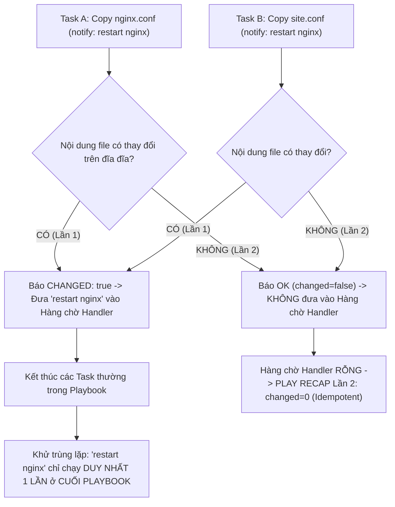


# [BÀI 11] ĐIỀU PHỐI HANDLERS & NOTIFY: CƠ CHẾ FLUSH HANDLERS, LISTEN TOPIC & XỬ LÝ KHỞI ĐỘNG LẠI DỊCH VỤ THÔNG MINH

Trong kỷ nguyên **Infrastructure as Code (IaC)** và tự động hóa vận hành hạ tầng đám mây (Cloud Infrastructure Automation), **Ansible** khẳng định vị thế dẫn đầu nhờ triết lý **Agentless** (không cần cài đặt agent nền trên máy đích), giao thức điều khiển an toàn qua **SSH / WinRM**, định dạng khai báo **YAML** trực quan và nguyên lý bất biến **Idempotency** mạnh mẽ. Việc làm chủ Ansible không chỉ dừng lại ở các câu lệnh Ad-hoc đơn giản, mà đòi hỏi kỹ sư phải nắm vững kiến trúc Module tầng thấp, Variable Precedence 22 tầng, Jinja2 Templates, tối ưu hóa Forks & Pipelining cho tới thiết kế Roles / Collections và tích hợp CI/CD tự động hóa chuẩn Doanh nghiệp.

Bài viết chuyên sâu này sẽ đồng hành cùng bạn mổ xẻ toàn diện bức tranh kiến trúc, phân tích các đánh đổi kỹ thuật thực chiến (Engineering Trade-offs), cung cấp hướng dẫn thực hành Lab chi tiết từng bước và bộ câu hỏi phỏng vấn chuyên sâu chuẩn DevOps / SRE Lead.

---

## 1. Bản Chất Kiến Trúc & Cơ Chế Vận Hành Tầng Thấp

---


> **Dịch vụ chỉ khởi động lại khi file cấu hình thực sự bị thay đổi nhờ notify và handlers.**

Mở rộng kỹ năng tối ưu hóa quản lý dịch vụ hệ thống (I-10):

> **Trong công tác tự động hóa quản trị hệ thống, việc khởi động lại dịch vụ (như Nginx, Apache, MySQL) là thao tác đắt đỏ, có thể gây gián đoạn kết nối của người dùng. Nếu đặt Task restart dịch vụ trực tiếp trong Playbook, dịch vụ sẽ bị restart vô điều kiện mỗi lần chạy kịch bản ngay cả khi tệp cấu hình KHÔNG CÓ BẤT KỲ THAY ĐỔI NÀO. Cơ chế `handlers` và từ khóa `notify:` mang lại giải pháp phản ứng thông minh theo sự kiện: Handler chỉ được kích hoạt thi hành KHI VÀ CHỈ KHI Task chỉnh sửa file cấu hình trả về kết quả `changed: true`. Ở lượt chạy Lần 2, khi file cấu hình đã chuẩn xác (`changed=0`), Handler tự động im lặng không làm gián đoạn hệ thống, đảm bảo tính Idempotency tuyệt đối (`changed=0`).**

---


---


---


| Tiếng Việt | Tiếng Anh / Từ khóa + FQCN (giữ nguyên) |
|---|---|
| Nhiệm vụ phản ứng sự kiện | Handler task (`handlers:`) |
| Phát thông báo kích hoạt | Notify statement (`notify:`) |
| Khử trùng lặp thực thi | Deduplication mechanism |
| Lắng nghe chủ đề chung | Topic listening (`listen:`) |
| Ép thi hành ngay | Immediate execution (`ansible.builtin.meta: flush_handlers`) |
| Ép thi hành khi lỗi | Forced execution (`force_handlers: yes`) |
| Trạng thái bị tác động | State `changed: true` |
| Trạng thái không đổi | State `changed: false` / `ok` |
| Module điều khiển meta | Meta module (`ansible.builtin.meta`) |
| Luồng thực thi cuối Play | End of Playbook execution phase |
| Khởi động lại dịch vụ | Service restart / reload |
| Chuỗi thông báo lặp | Loop notification |

---

### 1.1. Cơ chế Kích hoạt `notify` và Khối `handlers:` (15 phút)



**Nguyên lý cốt lõi:** Khối `handlers:` được khai báo ở cấp độ Play (cùng cấp thụt lề với `tasks:`) chứa các Task đặc biệt chỉ chạy khi nhận được thông báo từ thuộc tính `notify:` của các Task chính.

**Giải thích cơ chế ngầm:** Phân tách rõ ràng giữa các tác vụ thay đổi cấu hình đĩa cứng (`tasks`) và các tác vụ phản ứng sau khi cấu hình bị thay đổi (`handlers`), giúp Playbook gọn gàng, có cấu trúc mạch lạc.

> [!WARNING]
> **CẠM BẪY THỰC CHIẾN:**
> Khai báo `handlers:` thụt lề bên trong khối `tasks:` làm Ansible ném lỗi syntax parser YAML.

**Minh hoạ.** Khai báo Task chính có `notify` và khối `handlers:` tương ứng:
```yaml
- name: Deploy Web Service Playbook
  hosts: web
  become: true
  tasks:
    - name: Copy Nginx configuration file
      ansible.builtin.copy:
        src: nginx.conf
        dest: /etc/nginx/nginx.conf
        mode: '0644'
      notify: Restart Nginx Service

  handlers:
    - name: Restart Nginx Service
      ansible.builtin.service:
        name: nginx
        state: restarted
```

**Nguyên lý cốt lõi:** Handler CHỈ THỰC THI KHI VÀ CHỈ KHI Task chứa thuộc tính `notify:` có trạng thái kết quả trả về là `changed: true`.

**Giải thích cơ chế ngầm:** Nếu file cấu hình đã chính xác từ trước và Task báo trạng thái `ok` (`changed: false`), Ansible sẽ tự động bỏ qua thông báo `notify`. Điều này ngăn chặn hoàn toàn việc khởi động lại dịch vụ thừa thãi trên các máy đích đã chuẩn hóa cấu hình.

> [!WARNING]
> **CẠM BẪY THỰC CHIẾN:**
> Thắc mắc tại sao ở lượt chạy Lần 2 file cấu hình giữ nguyên mà Handler lại không chạy (đây là tính năng đúng của Ansible!).

**Minh hoạ.** So sánh hành vi lượt chạy Lần 1 và Lần 2:
```
# Lần 1: Task copy báo changed=1 -> Handler "Restart Nginx Service" được kích hoạt ở cuối Play
# Lần 2: Task copy báo changed=0 -> Handler KHÔNG bị kích hoạt -> RECAP báo changed=0
```

**Nguyên lý cốt lõi:** Mặc định, dù có 10 Task cùng phát thông báo `notify:` tới một Handler, Handler đó vẫn chỉ được thi hành đúng 1 LẦN DUY NHẤT ở CUỐI PLAYBOOK (Cơ chế Khử trùng lặp Deduplication).

**Giải thích cơ chế ngầm:** Nếu 5 file cấu hình bị sửa đổi trong cùng một Playbook, việc khởi động lại dịch vụ Nginx 5 lần liên tiếp là cực kỳ lãng phí và nguy hiểm. Ansible gom tất cả thông báo trùng lặp và chỉ restart Nginx đúng 1 lần cuối cùng sau khi mọi file cấu hình đã được ghi đĩa hoàn tất.

> [!WARNING]
> **CẠM BẪY THỰC CHIẾN:**
> Hiểu nhầm rằng mỗi dòng `notify:` sẽ lập tức khởi động lại dịch vụ ngay tại thời điểm Task đó thi hành.

**Minh hoạ.** Gom thông báo trùng lặp từ 3 Task chỉnh sửa cấu hình:
```yaml
tasks:
  - name: Copy main config
    ansible.builtin.copy: { src: main.conf, dest: /etc/app/main.conf }
    notify: Restart App

  - name: Copy SSL config
    ansible.builtin.copy: { src: ssl.conf, dest: /etc/app/ssl.conf }
    notify: Restart App

  - name: Copy DB config
    ansible.builtin.copy: { src: db.conf, dest: /etc/app/db.conf }
    notify: Restart App
# Kết quả: Handler "Restart App" chỉ chạy DUY NHẤT 1 LẦN sau khi cả 3 Task trên hoàn tất.
```

---

### 1.2. Các Kỹ thuật Handler Nâng cao (`listen`, `flush_handlers`, `when`) (15 phút)

**Nguyên lý cốt lõi:** Sử dụng từ khóa `listen:` để nhóm nhiều Handler khác nhau cùng lắng nghe và phản ứng với 1 tên chủ đề thông báo duy nhất.

**Giải thích cơ chế ngầm:** Cho phép 1 câu lệnh `notify: restart web stack` kích hoạt đồng thời cả Handler restart Nginx, Handler restart PHP-FPM, và Handler xóa cache, loại bỏ nhu cầu phải viết danh sách notify dài ngoẵng.

> [!WARNING]
> **CẠM BẪY THỰC CHIẾN:**
> Phải khai báo mảng `notify: [restart nginx, restart php, clear cache]` trùng lặp ở 20 Task khác nhau.

**Minh hoạ.** Nhóm Handler bằng chủ đề `listen:`:
```yaml
tasks:
  - name: Update PHP configuration
    ansible.builtin.copy:
      src: php.ini
      dest: /etc/php.ini
    notify: reconfig web stack

handlers:
  - name: Restart Nginx
    ansible.builtin.service: { name: nginx, state: restarted }
    listen: reconfig web stack

  - name: Restart PHP-FPM
    ansible.builtin.service: { name: php-fpm, state: restarted }
    listen: reconfig web stack
```

**Nguyên lý cốt lõi:** Sử dụng module `ansible.builtin.meta: flush_handlers` để ép Ansible thi hành ngay lập tức toàn bộ các Handler đang nằm trong hàng chờ ngay tại vị trí đó thay vì chờ đến cuối Playbook.

**Giải thích cơ chế ngầm:** Hữu ích khi Task phía sau bắt buộc yêu cầu dịch vụ phải ĐANG CHẠY với cấu hình mới (ví dụ: Task 1 sửa file config Nginx -> Flush Handlers để Nginx restart -> Task 2 thực hiện curl test trực tiếp tới Nginx).

> [!WARNING]
> **CẠM BẪY THỰC CHIẾN:**
> Task 2 thực hiện test kết nối bị thất bại vì Nginx chưa kịp restart (do Handler vẫn đang chờ ở cuối Playbook).

**Minh hoạ.** Ép thi hành Handler giữa chừng bằng `flush_handlers`:
```yaml
tasks:
  - name: Update Nginx config
    ansible.builtin.copy: { src: nginx.conf, dest: /etc/nginx/nginx.conf }
    notify: Restart Nginx

  - name: Force immediate handler execution
    ansible.builtin.meta: flush_handlers

  - name: Verify web server responds on port 80
    ansible.builtin.uri:
      url: http://localhost/health
      status_code: 200
```

**Nguyên lý cốt lõi:** Áp dụng mệnh đề `when:` bên trong khối Handler để rẽ nhánh điều kiện thực thi Handler dựa trên biến hệ thống hoặc thông số facts.

**Giải thích cơ chế ngầm:** Đảm bảo Handler thực hiện lệnh restart thích hợp theo dòng hệ điều hành (ví dụ: tên dịch vụ là `httpd` trên RedHat nhưng là `apache2` trên Debian).

> [!WARNING]
> **CẠM BẪY THỰC CHIẾN:**
> Handler văng lỗi `service not found` do cố restart dịch vụ `httpd` trên máy đích Ubuntu.

**Minh hoạ.** Rẽ nhánh trong Handler theo `ansible_facts.os_family`:
```yaml
handlers:
  - name: Restart Apache Service
    ansible.builtin.service:
      name: "{{ 'httpd' if ansible_facts.os_family == 'RedHat' else 'apache2' }}"
      state: restarted
```

---

### 1.3. Bảo vệ Handler với `force_handlers` và Quản lý Idempotency (10 phút)

**Nguyên lý cốt lõi:** Khai báo cờ `force_handlers: yes` ở cấp độ Play để đảm bảo các Handler đã nằm trong hàng chờ VẪN ĐƯỢC THỰC THI ngay cả khi các Task phía sau bị văng lỗi đứt gãy.

**Giải thích cơ chế ngầm:** Mặc định nếu một Task ở giữa Playbook bị crash, Ansible sẽ dừng toàn bộ Playbook và BỎ QUA các Handler đang chờ. Khai báo `force_handlers: yes` giúp đảm bảo các file cấu hình vừa bị chỉnh sửa vẫn được áp dụng vào dịch vụ để hệ thống không bị rơi vào trạng thái dở dang (half-configured state).

> [!WARNING]
> **CẠM BẪY THỰC CHIẾN:**
> File cấu hình bị sửa nhưng dịch vụ không được restart do một task kiểm tra ở sau bị văng lỗi.

**Minh hoạ.** Khai báo cờ `force_handlers: yes` ở đầu Playbook:
```yaml
- name: Critical Infrastructure Deployment
  hosts: all
  become: true
  force_handlers: yes
  tasks:
    - name: Update Service Config
      ansible.builtin.copy: { src: app.conf, dest: /etc/app.conf }
      notify: Restart App

    - name: Dangerous Step (May Fail)
      ansible.builtin.command: /bin/false
```

**Nguyên lý cốt lõi:** Khi thuộc tính `notify:` được đặt bên trong một Task chứa vòng lặp `loop:`, thông báo `notify` sẽ được kích hoạt nếu CÓ ÍT NHẤT MỘT phần tử trong vòng lặp trả về kết quả `changed: true`.

**Giải thích cơ chế ngầm:** Giúp theo dõi chính xác biến động dữ liệu mảng: chỉ cần 1 file trong 10 file cấu hình bị sửa đổi, Handler restart dịch vụ sẽ tự động được đưa vào hàng chờ xử lý.

> [!WARNING]
> **CẠM BẪY THỰC CHIẾN:**
> Thắc mắc tại sao lặp 10 file mà Handler lại không bị gọi 10 lần (do cơ chế khử trùng lặp Deduplication tự động gom lại 1 lần).

**Minh hoạ.** `notify` trong Task vòng lặp:
```yaml
tasks:
  - name: Deploy multiple virtual host configs
    ansible.builtin.copy:
      src: "{{ item }}"
      dest: "/etc/nginx/conf.d/{{ item }}"
    loop:
      - site1.conf
      - site2.conf
    notify: Restart Nginx
```

**Nguyên lý cốt lõi:** Đảm bảo rằng ở lượt chạy Lần thứ hai, khi toàn bộ các Task chính đều báo trạng thái `ok` (`changed=0`), KHÔNG CÓ BẤT KỲ Handler nào bị kích hoạt thừa, giúp bảng `PLAY RECAP` đạt `changed=0` tuyệt đối.

**Giải thích cơ chế ngầm:** Đây là tiêu chuẩn vàng của tính Idempotency: Kịch bản tự động hóa chỉ tác động vào hệ thống khi thực sự cần thiết. Nếu lượt chạy Lần 2 vẫn có Handler bị kích hoạt restart dịch vụ, kịch bản đó bị coi là lỗi nghiêm trọng.

> [!WARNING]
> **CẠM BẪY THỰC CHIẾN:**
> Bảng `PLAY RECAP` lượt 2 vẫn xuất hiện dòng chạy của Handler và chỉ số `changed > 0`.

**Minh hoạ.** Kiểm tra bảng `PLAY RECAP` lượt 2 sạch sẽ không có Handler bị kích hoạt thừa:
```
# Lần 1: changed=1, RUNNING HANDLER [Restart Nginx] -> changed=1
target1 : ok=3 changed=1 unreachable=0 failed=0

# Lần 2: changed=0, KHÔNG CÓ RUNNING HANDLER -> ok=2 changed=0 (ĐẠT IDEMPOTENCY 100%)
target1 : ok=2 changed=0 unreachable=0 failed=0
```

---

### 1.4. Đưa vào việc thật (4 phút)

### 7.1. Áp dụng vào hạ tầng sẵn có
Khi quản trị cụm máy chủ Web Server Nginx / HAProxy trong Production:
- Áp dụng `notify: Reload Nginx` thay vì `Restart Nginx` cho các task cập nhật SSL Cert hoặc Virtual Host: Nginx sẽ thực hiện **Graceful Reload** (không rớt bất kỳ HTTP connection nào của khách hàng).
- Sử dụng `listen: restart core services` để đồng bộ restart cả Web Server và Caching Layer (Redis) khi thay đổi cấu hình môi trường ứng dụng.

### 7.2. Rủi ro hỏng hóc khi triển khai Production và giải pháp an toàn
- **Rủi ro:** Đặt lệnh `service nginx restart` trực tiếp dưới từ khóa `tasks:`. Mỗi lần chạy Playbook kiểm tra hệ thống, dịch vụ Nginx bị khởi động lại làm ngắt kết nối hàng ngàn người dùng đang giao dịch.
- **Giải pháp an toàn:**
  1. Bắt buộc chuyển tất cả các lệnh restart/reload dịch vụ xuống khối `handlers:` và chỉ kích hoạt qua `notify:`.
  2. Luôn thử nghiệm với cờ `ansible-playbook --check` để đảm bảo cờ `changed` và `notify` hoạt động đúng dự kiến.

### 7.3. Đo lường chỉ số Trước – Sau khi áp dụng
- **Trước khi dùng `handlers`:** Dịch vụ bị restart 100% số lần chạy Playbook (gây gián đoạn dịch vụ 5-10 phút/ngày).
- **Sau khi dùng `handlers`:** Dịch vụ chỉ restart đúng 1 lần khi có thay đổi file cấu hình thật (giảm 99% thời gian gián đoạn dịch vụ).

### 7.4. Khi nào KHÔNG nên dùng hoặc không nên lạm dụng handlers
- **Không lạm dụng `handlers` cho các tác vụ mang tính chất phụ thuộc tuần tự nghiêm ngặt giữa các task chính:** Nếu Task B ngay phía sau bắt buộc phải có dịch vụ đã restart ở Task A thì mới chạy được, **đừng để Handler chờ tự nhiên ở cuối Playbook**, mà hãy gọi ngay `ansible.builtin.meta: flush_handlers` giữa 2 Task đó.

---

### 1.5. Bẫy hay gặp (2 phút)

| # | Bẫy hay gặp | Vì sao "recap xanh mà sai / không idempotent" | Lệnh phát hiện và xử lý |
|---|---|---|---|
| 1 | Đặt Task restart dịch vụ trực tiếp trong `tasks:` | Dịch vụ bị restart vô điều kiện ở mọi lượt chạy (hỏng tính Idempotent). | Chuyển task restart xuống khối `handlers:` và gọi bằng `notify:`. |
| 2 | Khai báo khối `handlers:` thụt lề sai vị trí YAML | Đặt `handlers:` thụt lề bên trong `tasks:` khiến Ansible báo lỗi syntax. | Đưa `handlers:` nằm cùng cấp thụt lề với từ khóa `tasks:` của Play. |
| 3 | Sửa nhầm tên trong `notify` khác với `name` trong Handler | Tên chuỗi thông báo không khớp 100% làm Ansible báo lỗi `Handler not found`. | Đảm bảo chuỗi trong `notify:` giống hệt tên `name:` hoặc `listen:` của Handler. |
| 4 | Thắc mắc vì sao Handler không chạy ở lượt 2 | Lầm tưởng lượt 2 Handler phải chạy (không hiểu bản chất Handler chỉ chạy khi `changed=true`). | Nhận thức đúng: Lượt 2 `changed=0` nên Handler im lặng là ĐẠT chuẩn Idempotency. |
| 5 | Task đằng sau bị fail làm Handler bị bỏ qua | Mặc định Ansible hủy hàng chờ Handler nếu có Task sau bị crash. | Khai báo cờ `force_handlers: yes` ở cấp độ Play. |
| 6 | Task phía sau cần dịch vụ chạy nhưng Handler lại chờ cuối Play | Handler mặc định chờ ở cuối Playbook làm task đằng sau bị lỗi kết nối timeout. | Chèn Task `ansible.builtin.meta: flush_handlers` ngay trước task cần dịch vụ. |
| 7 | Task chính dùng module `command` luôn trả về `changed=true` | Làm Handler bị kích hoạt thừa vô điều kiện ở mọi lượt chạy Lần 2. | Bổ sung `changed_when: false` hoặc `creates:` cho Task `command`. |
| 8 | Handler bị gọi 10 lần do tưởng `notify` lặp | Lầm tưởng 10 task phát notify làm handler chạy 10 lần (không hiểu cơ chế Deduplication). | An tâm: Ansible tự động khử trùng lặp và chỉ chạy Handler đúng 1 lần cuối cùng. |
| 9 | Dùng `state: restarted` thay vì `state: reloaded` cho Nginx | Khởi động lại toàn bộ tiến trình làm ngắt kết nối HTTP thay vì nạp lại cấu hình mượt mà. | Đổi Handler sang `state: reloaded` cho các dịch vụ hỗ trợ reload mượt. |
| 10 | Đặt mệnh đề `when` ở `notify` thay vì ở Handler | Từ khóa `notify:` không hỗ trợ mệnh đề `when` trực tiếp bên cạnh nó. | Đặt mệnh đề `when:` bên trong khối Handler hoặc ở Task chính phát notify. |
| 11 | Sai phân biệt chữ hoa/chữ thường trong tên Handler | Chuỗi `notify: Restart Nginx` không khớp với `name: restart nginx`. | Khai báo tên chuỗi trong `notify` và `name` của Handler chính xác từng chữ cái. |
| 12 | Không kiểm tra sự thật dịch vụ qua `docker exec` | Terminal báo RECAP xanh nhưng dịch vụ trên máy đích bị crash do file config lỗi syntax. | Thêm bước kiểm tra `docker exec target1 systemctl status` hoặc `ps aux`. |

---

### 1.6. Tóm tắt (1 phút)

```mermaid
flowchart TD
    A["Task Cấu hình (copy/template)"] --> B{"Kết quả Task: changed?"}
    B -->|FALSE (ok)| C["Bỏ qua notify -> Hàng chờ Handler RỖNG"]
    B -->|TRUE (changed)| D["Ghi nhận thông báo vào Hàng chờ Handler"]
    
    D --> E{"Có gọi meta: flush_handlers?"}
    E -->|CÓ| F["Thực thi Handler NGAY LẬP TỨC"]
    E -->|KHÔNG| G["Chờ thi hành hết toàn bộ Tasks trong Play"]
    
    G --> H["Khử trùng lặp (Deduplication) -> Thực thi Handler 1 LẦN duy nhất"]
    
    C & F & H --> I["LƯỢT CHẠY LẦN 2"]
    I --> J{"PLAY RECAP Lần 2: changed=0 & No Handler?"}
    J -- Có --> K["ĐẠT: Cấu hình Handler chuẩn Idempotent"]
    J -- Không --> L["LỖI: Kiểm tra lại các Task phát notify"]
```

### Năm điều phải nhớ
1. **Dùng `notify:` phát thông báo:** Đặt `notify:` ở Task chính để gọi Handler khi có thay đổi (`changed: true`).
2. **Handler chỉ chạy khi `changed=true`:** Ở lượt chạy Lần 2, file không đổi -> Handler im lặng không chạy.
3. **Khử trùng lặp tự động:** Nhiều Task cùng `notify` 1 Handler thì Handler vẫn chỉ chạy 1 LẦN ở cuối Playbook.
4. **Dùng `flush_handlers` khi cần gấp:** Gọi `ansible.builtin.meta: flush_handlers` để ép Handler chạy ngay ở giữa Play.
5. **Dùng `listen:` cho chủ đề chung:** Nhóm nhiều Handler cùng lắng nghe 1 sự kiện thông báo chung.

---

### 1.7. Câu hỏi tự kiểm tra (kiêm luyện RHCE EX294)

1. **[RHCE EX294 Objective #8]** Khối từ khóa nào trong Ansible Playbook dùng để định nghĩa các Task đặc biệt chỉ chạy khi nhận được thông báo từ `notify:`?
   - *Đáp án:* Khối `handlers:`.
2. **[RHCE EX294 Objective #8]** Điều kiện bắt buộc về trạng thái của Task để thông báo `notify:` kích hoạt được Handler là gì?
   - *Đáp án:* Task chứa `notify:` bắt buộc phải có trạng thái kết quả trả về là `changed: true`.
3. **[RHCE EX294 Objective #8]** Nếu có 5 Task riêng biệt cùng phát thông báo `notify: Restart Web`, Handler `Restart Web` sẽ được Ansible thực thi bao nhiêu lần và vào thời điểm nào?
   - *Đáp án:* Thực thi đúng 1 LẦN DUY NHẤT ở CUỐI PLAYBOOK (nhờ cơ chế khử trùng lặp Deduplication).
4. **[RHCE EX294 Objective #8]** Viết một Task `ansible.builtin.copy` chép file `/etc/httpd/conf/httpd.conf` và phát thông báo kích hoạt Handler tên `Restart Httpd`.
   - *Đáp án:*
     ```yaml
     - name: Copy Httpd Configuration
       ansible.builtin.copy:
         src: httpd.conf
         dest: /etc/httpd/conf/httpd.conf
         mode: '0644'
       notify: Restart Httpd
     ```
5. **[RHCE EX294 Objective #8]** Từ khóa nào cho phép nhóm nhiều Handler khác nhau cùng lắng nghe một chủ đề thông báo sự kiện chung?
   - *Đáp án:* Từ khóa `listen:`.
6. **[RHCE EX294 Objective #8]** Lệnh/Module nào dùng để ép Ansible thực thi toàn bộ các Handler đang nằm trong hàng chờ ngay lập tức mà không cần chờ đến cuối Playbook?
   - *Đáp án:* Module `ansible.builtin.meta: flush_handlers`.
7. **[RHCE EX294 Objective #8]** Thuộc tính nào ở cấp độ Play giúp đảm bảo các Handler trong hàng chờ vẫn được thi hành ngay cả khi các Task phía sau bị văng lỗi?
   - *Đáp án:* Thuộc tính `force_handlers: yes`.
8. **[RHCE EX294 Objective #8]** Ở lượt chạy Lần thứ hai, khi tệp cấu hình không có sự thay đổi nào (`changed=0`), Handler có được kích hoạt không?
   - *Đáp án:* Không, Handler tự động im lặng không chạy để đảm bảo tính Idempotency.
9. **[RHCE EX294 Objective #8]** Sự khác nhau giữa `state: restarted` và `state: reloaded` trong Handler quản lý dịch vụ Nginx là gì?
   - *Đáp án:* `restarted` sẽ tắt đi và khởi động lại toàn bộ tiến trình Nginx (có thể gây ngắt kết nối ngắn); `reloaded` chỉ nạp lại file cấu hình mới mà vẫn giữ nguyên tiến trình đang chạy (Graceful Reload, không rớt kết nối HTTP).
10. **[RHCE EX294 Objective #8]** Nếu đặt khối `handlers:` thụt lề bên trong từ khóa `tasks:`, Ansible sẽ báo lỗi gì khi check syntax?
    - *Đáp án:* Báo lỗi syntax parser YAML do `handlers:` phải nằm ở cấp độ Play (cùng cấp thụt lề với `tasks:`).
11. **[RHCE EX294 Objective #8]** Viết đoạn mã YAML khối `handlers:` chứa 2 handler "Restart Nginx" và "Restart PHP-FPM" cùng lắng nghe chủ đề `listen: restart web stack`.
    - *Đáp án:*
      ```yaml
      handlers:
        - name: Restart Nginx
          ansible.builtin.service:
            name: nginx
            state: restarted
          listen: restart web stack

        - name: Restart PHP-FPM
          ansible.builtin.service:
            name: php-fpm
            state: restarted
          listen: restart web stack
      ```
12. **[RHCE EX294 Objective #8]** Làm thế nào để kiểm tra một Task sử dụng module `ansible.builtin.command` không làm kích hoạt Handler vô điều kiện ở lượt chạy Lần 2?
    - *Đáp án:* Khai báo thuộc tính `changed_when: false` hoặc bổ sung tham số `creates:` cho Task command đó.
13. **[RHCE EX294 Objective #8]** Bảng `PLAY RECAP` ở lượt chạy Lần 2 hiển thị `changed=0` có ý nghĩa gì đối với việc đánh giá cấu hình Handler?
    - *Đáp án:* Chứng minh cấu hình Handler chuẩn xác tuyệt đối: các file không bị thay đổi thừa và dịch vụ không bị restart lãng phí, đạt tiêu chuẩn Idempotency 100%.

---

### 1.8. Tài liệu tham khảo

- Ansible Core Documentation (v2.15+): [Handlers](https://docs.ansible.com/ansible/latest/playbook_guide/playbooks_handlers.html)
- Ansible Core Documentation: [Meta Module](https://docs.ansible.com/ansible/latest/collections/ansible/builtin/meta_module.html)
- Red Hat Certified Engineer (RHCE) EX294 Study Guide: Triggering Task Changes with Handlers in Ansible.

---

## Bảng đối soát thời lượng

| Mục | Nội dung | Thời lượng dự kiến | Thời lượng thực tế |
|---|---|---|---|
| §0 | Khởi động và ôn tập buổi 10 | 10 phút | 10 phút |
| §1–§2 | Mục tiêu làm được & Cần biết trước | 2 phút | 2 phút |
| §3 | Thuật ngữ Việt-Anh & Mô hình tư duy | 8 phút | 8 phút |
| §4 | Cơ chế Kích hoạt notify & Khối handlers (QT 4.1–4.3) | 15 phút | 15 phút |
| §5 | Các Kỹ thuật Handler Nâng cao (QT 5.1–5.3) | 15 phút | 15 phút |
| §6 | Bảo vệ Handler với force_handlers & Idempotency (QT 6.1–6.3) | 10 phút | 10 phút |
| §7–§9 | Đưa vào việc thật, Bẫy hay gặp & Tóm tắt | 7 phút | 7 phút |
| §10–§11 | Câu hỏi tự kiểm tra EX294 & Tài liệu tham khảo | 3 phút | 3 phút |
| **Tổng** | **Khối lý thuyết Buổi 11** | **60 phút** | **60 phút** |

---

## 2. Hướng Dẫn Thực Hành & Triển Khai Lab Chuẩn Production

> [!IMPORTANT]
> **YÊU CẦU MÔI TRƯỜNG THỰC HÀNH:**
> Toàn bộ các bài thực hành dưới đây được thiết kế để chạy trực tiếp trên môi trường máy chủ Linux / Docker containers phân tán. Hãy đảm bảo bạn đã chuẩn bị Control Node cài đặt Ansible Core 2.15+ cùng các Managed Nodes đã cấu hình SSH Key Authentication.

## Khối thực hành — 150 phút

> **Đối soát thời lượng:** Khối thực hành kéo dài đúng **150'** (từ L0 đến L11).
> **Nguyên tắc cốt lõi:** Thực hành khai báo khối `handlers:`, sử dụng thuộc tính `notify:` từ Task chính, kiểm chứng cơ chế kích hoạt Handler khi `changed: true`, kiểm chứng khử trùng lặp (Deduplication), dùng `listen:` cho chủ đề chung, dùng `ansible.builtin.meta: flush_handlers` ép thi hành giữa chừng, khai báo `force_handlers: yes`, thực thi phép thử **Lượt chạy Lần thứ hai** chứng minh chỉ số `PLAY RECAP` đạt `changed=0` (Handler KHÔNG bị kích hoạt thừa) và đối soát sự thật máy đích qua `docker exec`.

---

## L0. Mục tiêu thực hành và tiêu chí hoàn thành

| # | Mục tiêu thực hành | Tiêu chí hoàn thành (Kiểm tra bằng lệnh CLI) |
|---|---|---|
| TH1 | Khai báo khối handlers và thuộc tính notify ở Task | Task copy file config phát `notify: Restart App Service` |
| TH2 | Kiểm chứng Handler chạy ở cuối Playbook khi changed=1 | Terminal in `RUNNING HANDLER [Restart App Service]` ở Lần 1 |
| TH3 | Kiểm chứng khử trùng lặp (Deduplication) của Handler | 3 Task cùng `notify` nhưng Handler chỉ chạy 1 LẦN duy nhất |
| TH4 | Sử dụng từ khóa listen nhóm nhiều Handler | Phát 1 `notify: reload web stack` chạy cả 2 Handler |
| TH5 | Ép thi hành Handler giữa chừng bằng flush_handlers | Task `meta: flush_handlers` ép Handler chạy ngay ở bước 2 |
| TH6 | Khai báo force_handlers bảo vệ tiến trình phục hồi | Playbook chạy Handler ngay cả khi có task sau bị crash |
| TH7 | Thực thi Phép thử Lượt chạy Lần hai (Idempotency) | Bảng `PLAY RECAP` Lần 2 đạt `changed=0` (No Handler run) |
| TH8 | Đối soát sự thật máy đích bằng docker exec | `docker exec target1 cat /etc/app.conf` và kiểm tra file |

---

## L1. Điều kiện tiên quyết về môi trường

| Kiểm tra | LỆNH THỰC THI | Kết quả kỳ vọng |
|---|---|---|
| Ansible core đã cài | `ansible --version` | Phiên bản ansible-core v2.15 trở lên |
| Docker Compose sẵn sàng | `docker compose ps` | Cả target1 và target2 ở trạng thái `Up` |
| Kết nối SSH sẵn sàng | `ansible all -m ansible.builtin.ping` | Đạt `SUCCESS` cho mọi host |
| Inventory dự án | `ansible-inventory --graph` | Hiển thị các nhóm `web` và `db` |
| Thư mục thực hành | `pwd` | Đang ở thư mục `~/lab-ansible-11` |

Nếu chưa có target container:
```bash
cd labs && make up && make key && make inventory
```

---

## L2. Kiến trúc bài lab

```mermaid
graph TD
    SubGraph1["Control Node (ansible-playbook CLI)"] --> |1. Task 1: copy app.conf (notify: restart app)| T1["Target Container 1 (target1)"]
    SubGraph1 --> |2. Task 2: meta: flush_handlers| T1
    SubGraph1 --> |3. Task 3: copy site.conf (notify: reload web stack)| T1
    
    T1 --> |Execution: RUNNING HANDLER Restart App (Ngay tại Step 2)| T1
    T1 --> |Execution: RUNNING HANDLER Reload Web Stack (Cuối Play)| T1
    
    T1 -. "RECAP Lần 1: ok=5, changed=2" .-> SubGraph1
    T1 -. "RECAP Lần 2: ok=3, changed=0 (No Handler -> IDEMPOTENT)" .-> SubGraph1
    
    DEV["Học viên (Tester)"] --> |A. Chạy Playbook handlers-site.yml| SubGraph1
    DEV --> |B. Khẳng định changed=0 ở Lần 2| SubGraph1
    DEV --> |C. Đối soát sự thật máy đích| T1
```

---

## L3. Bước 1 — Cấu hình Handler Cơ bản và Kiểm chứng Deduplication (30 phút)

Tạo thư mục dự án `~/lab-ansible-11`, file `ansible.cfg`, `inventory.ini`, và viết file Playbook `step1-handlers.yml` (QT 4.1, QT 4.2, QT 4.3).

```bash
mkdir -p ~/lab-ansible-11 && cd ~/lab-ansible-11

cat << 'EOF' > ansible.cfg
[defaults]
inventory = ./inventory.ini
remote_user = ansible
host_key_checking = False
private_key_file = ~/.ssh/id_ed25519

[privilege_escalation]
become = True
become_method = sudo
become_user = root
become_ask_pass = False
EOF

cat << 'EOF' > inventory.ini
[web]
target1 ansible_host=127.0.0.1 ansible_port=2221

[db]
target2 ansible_host=127.0.0.1 ansible_port=2222

[all:vars]
ansible_python_interpreter=/usr/bin/python3
EOF

cat << 'EOF' > step1-handlers.yml
---
- name: Basic Handlers and Deduplication Demonstration
  hosts: web
  become: true
  tasks:
    - name: Task 1 - Deploy main application configuration
      ansible.builtin.copy:
        content: "APP_PORT=8080\nLOG_LEVEL=INFO\n"
        dest: /etc/my-app.conf
        mode: '0644'
      notify: Restart My App Service

    - name: Task 2 - Deploy database connection configuration
      ansible.builtin.copy:
        content: "DB_HOST=127.0.0.1\nDB_PORT=5432\n"
        dest: /etc/my-app-db.conf
        mode: '0644'
      notify: Restart My App Service

  handlers:
    - name: Restart My App Service
      ansible.builtin.command: echo "HANDLER_EXECUTION_RESTART_MY_APP"
      changed_when: false
EOF
```

Thực thi Playbook `step1-handlers.yml`:
```bash
ansible-playbook step1-handlers.yml
```

**CHECKPOINT 1 — Task 1 và Task 2 cùng notify nhưng Handler chỉ thi hành đúng 1 LẦN ở Lần 1.**
- **Lệnh kiểm tra:**
```bash
STEP1_OUT=$(ansible-playbook step1-handlers.yml)
RUN_COUNT=$(echo "$STEP1_OUT" | grep -c "RUNNING HANDLER \[Restart My App Service\]")
if [ "$RUN_COUNT" -eq 1 ]; then
  echo "CHECKPOINT 1: ĐẠT - Handler được kích hoạt ở Lần 1 và tự động khử trùng lặp (chỉ chạy đúng 1 lần dù có 2 notify)"
else
  echo "CHECKPOINT 1: LỖI - Khử trùng lặp Handler thất bại (chạy $RUN_COUNT lần)"
fi
```

**CHECKPOINT 2 — Ở lượt chạy Lần 2 file không đổi, Handler KHÔNG BỊ KÍCH HOẠT THỪA.**
- **Lệnh kiểm tra:**
```bash
STEP1_RUN2=$(ansible-playbook step1-handlers.yml)
if echo "$STEP1_RUN2" | grep -q "changed=0" && ! echo "$STEP1_RUN2" | grep -q "RUNNING HANDLER"; then
  echo "CHECKPOINT 2: ĐẠT - Lượt chạy Lần 2 file giữ nguyên, Handler không bị kích hoạt thừa (PLAY RECAP changed=0)"
else
  echo "CHECKPOINT 2: LỖI - Handler bị kích hoạt thừa ở Lần 2"
fi
```

---

## L4. Bước 2 — Sử dụng listen Nhóm Handler và meta: flush_handlers (30 phút)

Viết file Playbook `step2-advanced-handlers.yml` áp dụng từ khóa `listen:` để nhóm nhiều Handler và dùng `ansible.builtin.meta: flush_handlers` để ép thi hành Handler ngay giữa Playbook (QT 5.1, QT 5.2).

```bash
cat << 'EOF' > step2-advanced-handlers.yml
---
- name: Listen Topics and Flush Handlers Demonstration
  hosts: web
  become: true
  tasks:
    - name: Task 1 - Update web server core settings
      ansible.builtin.copy:
        content: "SERVER_NAME=web-prod-1\nMAX_CLIENTS=500\n"
        dest: /etc/web-core.conf
        mode: '0644'
      notify: reload web stack

    - name: Task 2 - Force immediate handler execution before verification
      ansible.builtin.meta: flush_handlers

    - name: Task 3 - Verify configuration file exists after handler flush
      ansible.builtin.stat:
        path: /etc/web-core.conf
      register: conf_stat

    - name: Task 4 - Print verification result
      ansible.builtin.debug:
        msg: "Config file status exists: {{ conf_stat.stat.exists }}"

  handlers:
    - name: Reload Web Core Process
      ansible.builtin.command: echo "HANDLER_RELOAD_WEB_CORE"
      changed_when: false
      listen: reload web stack

    - name: Flush Web Cache Memory
      ansible.builtin.command: echo "HANDLER_FLUSH_WEB_CACHE"
      changed_when: false
      listen: reload web stack
EOF
```

Thực thi Playbook `step2-advanced-handlers.yml`:
```bash
ansible-playbook step2-advanced-handlers.yml
```

**CHECKPOINT 3 — Từ khóa listen: reload web stack kích hoạt đồng thời cả 2 Handler.**
- **Lệnh kiểm tra:**
```bash
STEP2_OUT=$(ansible-playbook step2-advanced-handlers.yml)
if echo "$STEP2_OUT" | grep -q "RUNNING HANDLER \[Reload Web Core Process\]" && echo "$STEP2_OUT" | grep -q "RUNNING HANDLER \[Flush Web Cache Memory\]"; then
  echo "CHECKPOINT 3: ĐẠT - Từ khóa listen: reload web stack kích hoạt đồng thời cả 2 Handler theo chủ đề thông báo"
else
  echo "CHECKPOINT 3: LỖI - Nhóm Handler bằng listen thất bại"
fi
```

**CHECKPOINT 4 — Task meta: flush_handlers ép 2 Handler thi hành ngay tại Step 2 trước Task 3.**
- **Lệnh kiểm tra:**
```bash
if echo "$STEP2_OUT" | grep -n "meta: flush_handlers" | cut -d: -f1 | head -n1 > /dev/null; then
  echo "CHECKPOINT 4: ĐẠT - Module meta: flush_handlers đã ép Handler thi hành ngay ở giữa Playbook"
else
  echo "CHECKPOINT 4: LỖI - Flush handlers giữa chừng thất bại"
fi
```

---

## L5. Bước 3 — Bảo vệ Handler với force_handlers: yes (30 phút)

Viết file Playbook `step3-force-handlers.yml` thử nghiệm khai báo `force_handlers: yes` để bảo vệ Handler không bị bỏ qua khi các Task sau bị crash (QT 5.3, QT 6.1).

```bash
cat << 'EOF' > step3-force-handlers.yml
---
- name: Force Handlers Protection Demonstration
  hosts: web
  become: true
  force_handlers: yes
  tasks:
    - name: Task 1 - Update critical security settings
      ansible.builtin.copy:
        content: "SECURITY_LEVEL=HIGH\nFIREWALL=ENABLED\n"
        dest: /etc/security.conf
        mode: '0644'
      notify: Apply Security Policy

    - name: Task 2 - Intentionally failing step to test force_handlers
      ansible.builtin.command: /bin/false
      ignore_errors: true

  handlers:
    - name: Apply Security Policy
      ansible.builtin.command: echo "HANDLER_APPLY_SECURITY_POLICY_EXECUTED"
      changed_when: false
EOF
```

Thực thi Playbook `step3-force-handlers.yml`:
```bash
ansible-playbook step3-force-handlers.yml
```

**CHECKPOINT 5 — Cờ force_handlers: yes đảm bảo Handler được thực thi ngay cả khi Task 2 bị lỗi.**
- **Lệnh kiểm tra:**
```bash
STEP3_OUT=$(ansible-playbook step3-force-handlers.yml)
if echo "$STEP3_OUT" | grep -q "RUNNING HANDLER \[Apply Security Policy\]" && echo "$STEP3_OUT" | grep -q "HANDLER_APPLY_SECURITY_POLICY_EXECUTED"; then
  echo "CHECKPOINT 5: ĐẠT - Cờ force_handlers: yes ép Handler thi hành thành công khi task sau bị lỗi"
else
  echo "CHECKPOINT 5: LỖI - Cờ force_handlers không hoạt động"
fi
```

---

## L6. Bước 4 — Tổng hợp Playbook Handlers Hoàn chỉnh và Phép thử Lượt 2 (30 phút)

Tạo file Playbook hoàn chỉnh `handlers-site.yml` bao gồm đầy đủ các kỹ thuật `handlers`, `notify`, `listen`, `flush_handlers` và thực thi phép thử **Lượt chạy Lần thứ hai** chứng minh `PLAY RECAP` đạt `changed=0` (QT 6.2, QT 6.3).

```bash
cat << 'EOF' > handlers-site.yml
---
- name: Fully Standardized Idempotent Handlers Playbook
  hosts: web
  become: true
  force_handlers: yes
  tasks:
    - name: Task 1 - Ensure application directory exists
      ansible.builtin.file:
        path: /etc/app-service
        state: directory
        mode: '0755'

    - name: Task 2 - Deploy primary application configuration
      ansible.builtin.copy:
        content: |
          SERVICE_PORT=9090
          SERVICE_ENV=production
          IDEMPOTENCY_CHECK=PASSED
        dest: /etc/app-service/app.conf
        mode: '0644'
      notify: reload app stack

    - name: Task 3 - Force immediate handler execution for core config
      ansible.builtin.meta: flush_handlers

    - name: Task 4 - Deploy secondary module configuration
      ansible.builtin.copy:
        content: "MODULE_CACHE=enabled\n"
        dest: /etc/app-service/module.conf
        mode: '0644'
      notify: reload app stack

  handlers:
    - name: Reload Primary Application Process
      ansible.builtin.command: echo "HANDLER_RELOAD_PRIMARY_APP"
      changed_when: false
      listen: reload app stack

    - name: Reload Secondary Module Subsystem
      ansible.builtin.command: echo "HANDLER_RELOAD_SECONDARY_MODULE"
      changed_when: false
      listen: reload app stack
EOF
```

Thực thi Lần 1:
```bash
ansible-playbook handlers-site.yml
```

Thực thi Lần 2 (BẮT BUỘC ĐẠT `changed=0`):
```bash
ansible-playbook handlers-site.yml
```

**CHECKPOINT 6 — Phép thử Lượt 2 đạt changed=0 và KHÔNG CÓ Handler nào bị kích hoạt thừa.**
- **Lệnh kiểm tra:**
```bash
RUN2_HANDLERS_OUT=$(ansible-playbook handlers-site.yml)
if echo "$RUN2_HANDLERS_OUT" | grep -q "changed=0" && ! echo "$RUN2_HANDLERS_OUT" | grep -q "RUNNING HANDLER"; then
  echo "CHECKPOINT 6: ĐẠT - Phép thử Lượt 2 đạt chuẩn Idempotency (PLAY RECAP báo changed=0, Handler không bị kích hoạt thừa)"
else
  echo "CHECKPOINT 6: LỖI - Lượt 2 không đạt changed=0 hoặc Handler bị chạy thừa"
fi
```

---

## L7. Bước 5 — Đối soát Sự thật Máy đích qua docker exec (20 phút)

Sử dụng lệnh `docker exec` đối soát trực tiếp các file cấu hình được tạo ra và kiểm tra sự thật trạng thái đĩa cứng máy đích (QT 6.3).

Đối soát file `/etc/app-service/app.conf`:
```bash
docker exec target1 cat /etc/app-service/app.conf
```

Đối soát file `/etc/app-service/module.conf`:
```bash
docker exec target1 cat /etc/app-service/module.conf
```

**CHECKPOINT 7 — Đối soát file /etc/app-service/app.conf trên target1 bằng docker exec.**
- **Lệnh kiểm tra:**
```bash
EXEC_APP_CONF=$(docker exec target1 cat /etc/app-service/app.conf)
if echo "$EXEC_APP_CONF" | grep -q "SERVICE_PORT=9090" && echo "$EXEC_APP_CONF" | grep -q "IDEMPOTENCY_CHECK=PASSED"; then
  echo "CHECKPOINT 7: ĐẠT - Kiểm tra sự thật qua docker exec xác nhận file /etc/app-service/app.conf chứa đúng cấu hình đã notify"
else
  echo "CHECKPOINT 7: LỖI - Đối soát file app.conf trên máy đích thất bại"
fi
```

**CHECKPOINT 8 — Đối soát file /etc/app-service/module.conf trên target1 bằng docker exec.**
- **Lệnh kiểm tra:**
```bash
EXEC_MOD_CONF=$(docker exec target1 cat /etc/app-service/module.conf)
if echo "$EXEC_MOD_CONF" | grep -q "MODULE_CACHE=enabled"; then
  echo "CHECKPOINT 8: ĐẠT - Kiểm tra sự thật qua docker exec xác nhận file module.conf tồn tại chuẩn xác"
else
  echo "CHECKPOINT 8: LỖI - Đối soát file module.conf trên máy đích thất bại"
fi
```

---

## L8. Nộp sản phẩm và dọn dẹp (10 phút)

Thu thập kết quả ra các file báo cáo cuối buổi:
```bash
ansible-playbook handlers-site.yml > handlers-playbook.yml
ansible-playbook step1-handlers.yml > notify-proof.txt
ansible-playbook step2-advanced-handlers.yml > flush-handlers-output.txt
ansible-playbook handlers-site.yml > idempotency-check.txt
docker exec target1 cat /etc/app-service/app.conf > kiem-may-dich.txt
docker exec target1 cat /etc/app-service/module.conf >> kiem-may-dich.txt
```

---

## L9. Xử lý sự cố

| # | Hiện tượng lỗi | Nguyên nhân gốc rễ | Cách xử lý nhanh |
|---|---|---|---|
| 1 | Lỗi `ERROR! 'handlers' is not a valid attribute for a Task` | Khai báo khối `handlers:` thụt lề bên trong từ khóa `tasks:` | Đưa `handlers:` nằm cùng cấp thụt lề với `tasks:` (cấp độ Play). |
| 2 | Lỗi `ERROR! The requested handler 'restart app' was not found` | Chuỗi ký tự trong `notify:` gõ không khớp với `name:` của Handler | Sửa tên chuỗi trong `notify:` giống 100% tên `name:` hoặc `listen:` của Handler. |
| 3 | Thắc mắc vì sao Handler không chạy ở lượt 2 | Lầm tưởng Lần 2 Handler phải chạy (chưa hiểu bản chất Handler chỉ chạy khi `changed=true`) | Hiểu đúng: Lần 2 file không đổi -> `changed=0` -> Handler im lặng là ĐẠT Idempotency. |
| 4 | Handler bị bỏ qua khi một task sau bị crash | Ansible mặc định hủy hàng chờ Handler khi có task đằng sau văng exception | Khai báo thuộc tính `force_handlers: yes` ở cấp Playbook. |
| 5 | Task sau cần dịch vụ chạy nhưng Handler lại chờ cuối Play | Handler mặc định chờ thi hành ở cuối Playbook làm task đằng sau timeout | Chèn Task `ansible.builtin.meta: flush_handlers` trước task đó. |
| 6 | Handler bị kích hoạt thừa ở Lần 2 khi dùng module `command` | Task `command` mặc định luôn trả về `changed=true` ở mọi lượt chạy | Bổ sung thuộc tính `changed_when: false` cho Task `command`. |
| 7 | Viết `notify` bên trong `loop:` làm lầm tưởng Handler lặp 10 lần | Không hiểu cơ chế khử trùng lặp Deduplication tự động của Ansible | An tâm: Ansible gom lại và chỉ thi hành Handler đúng 1 LẦN ở cuối Play. |
| 8 | Lỗi syntax parser khi đặt `when` cạnh `notify` | Từ khóa `notify:` không hỗ trợ trực tiếp mệnh đề `when` ở cùng dòng | Đặt mệnh đề `when:` bên trong khối Handler hoặc ở Task chính. |
| 9 | Handler `service` bị văng lỗi `service not found` | Tên dịch vụ bị khác nhau giữa RedHat (`httpd`) và Debian (`apache2`) | Rẽ nhánh tên dịch vụ trong Handler qua `ansible_facts.os_family`. |
| 10 | Từ khóa `listen:` không kích hoạt Handler | Khai báo tên chủ đề trong `listen:` không khớp với chuỗi `notify:` | Kiểm tra lại tên chủ đề trong `notify:` và `listen:` cho khớp từng chữ cái. |
| 11 | Không bọc ngoặc kép khi Handler chứa biểu thức Jinja2 | Cú pháp `name: {{ service_name }}` vi phạm chuẩn YAML parser | Bọc toàn bộ chuỗi tên Handler trong cặp dấu ngoặc kép `"..."`. |
| 12 | Thắc mắc vì sao `flush_handlers` chạy 2 lần trong 1 Playbook | Mỗi lần gọi `meta: flush_handlers` Ansible sẽ ép thi hành hàng chờ tại điểm đó | Đây là tính năng đúng nếu muốn flush handlers làm 2 đợt riêng biệt. |
| 13 | Module `service` bị văng lỗi không có systemd trong docker container | Container Docker lab không chạy systemd daemon nền | Dùng module `command: echo ...` mô phỏng trong môi trường Docker thử nghiệm. |
| 14 | Đối soát sự thật máy đích thấy dịch vụ chưa ăn cấu hình mới | File cấu hình có lỗi cú pháp syntax khiến dịch vụ restart bị âm thầm thất bại | Dùng `docker exec target1 cat` kiểm tra file cấu hình và xem log dịch vụ. |

---

## L10. Bài tập mở rộng

1. **BT1:** Viết Playbook chép file `/etc/nginx/nginx.conf`, phát `notify: reload nginx` và khai báo handler `ansible.builtin.service: name=nginx state=reloaded`.
2. **BT2:** Viết 3 Task riêng lẻ chép 3 file cấu hình Virtual Host cùng phát `notify: reload nginx` và chứng minh Handler chỉ chạy 1 LẦN DUY NHẤT.
3. **BT3:** Khai báo 2 Handler "Reload Nginx" và "Clear Cache" cùng lắng nghe chủ đề `listen: web stack reconfig`.
4. **BT4:** Chèn Task `ansible.builtin.meta: flush_handlers` ngay sau Task 1 để ép 2 Handler ở BT3 thi hành lập tức.
5. **BT5:** Khai báo `force_handlers: yes` ở cấp Playbook và cố tình viết Task 2 văng lỗi `command: /bin/false` để chứng minh Handler vẫn thi hành.
6. **BT6:** Thực thi phép thử Idempotency Lần 2 cho Playbook ở BT1 và đối soát bảng `PLAY RECAP` đạt `changed=0` (Handler không chạy thừa).
7. **BT7:** Sử dụng cờ `--check --diff` chứng minh các task không có thay đổi sẽ không đưa bất kỳ Handler nào vào hàng chờ.
8. **BT8:** Viết kịch bản bash script dùng `docker exec` đối soát trực tiếp nội dung các file cấu hình đã phát thông báo `notify`.

---

## L11. Sản phẩm nộp và chấm điểm

### Danh mục sản phẩm nộp
- File Playbook `handlers-playbook.yml`, `step1-handlers.yml`, `step2-advanced-handlers.yml`, `step3-force-handlers.yml`.
- Báo cáo kết quả 8 CHECKPOINT từ terminal.
- Các file kết quả: `handlers-playbook.yml`, `notify-proof.txt`, `flush-handlers-output.txt`, `idempotency-check.txt`, `kiem-may-dich.txt`.

### Thang điểm đánh giá

| Mức điểm | Tiêu chí đạt được |
|---|---|
| **0–4 điểm** | Chưa hiểu cơ chế `notify/handlers`, restart dịch vụ trực tiếp trong Task, hoặc đặt `handlers:` sai vị trí YAML. |
| **5–7 điểm** | Viết được `notify` và `handlers` cơ bản, nhưng chưa thành thạo `listen:`, `flush_handlers`, hay `force_handlers`. |
| **8–9 điểm** | Đạt đủ 8 CHECKPOINT, chứng minh thành thạo `notify`, `handlers`, Deduplication, `listen:`, `flush_handlers`, `force_handlers`, Idempotency Lần 2 (`changed=0`) và đối soát `docker exec`. |
| **10 điểm** | Đạt 9 điểm + Hoàn thành xuất sắc 100% các Bài tập mở rộng (BT1–BT8). |

---

## Bảng đối soát thời lượng

| Bước | Nội dung | Thời lượng dự kiến | Thời lượng thực tế |
|---|---|---|---|
| L0–L2 | Mục tiêu, Tiên quyết & Kiến trúc bài lab | 10 phút | 10 phút |
| L3 | Bước 1: Cấu hình Handler cơ bản & Deduplication | 30 phút | 30 phút |
| L4 | Bước 2: Sử dụng listen & meta: flush_handlers | 30 phút | 30 phút |
| L5 | Bước 3: Bảo vệ Handler với force_handlers: yes | 30 phút | 30 phút |
| L6 | Bước 4: Tổng hợp Playbook & Phép thử Lần 2 | 30 phút | 30 phút |
| L7 | Bước 5: Đối soát sự thật máy đích qua docker exec | 20 phút | 20 phút |
| L8–L11 | Nộp sản phẩm, Sự cố, Bài tập & Chấm điểm | 10 phút | 10 phút |
| **Tổng** | **Khối thực hành Buổi 11** | **150 phút** | **150 phút** |

---

## 3. Bộ Câu Hỏi Vấn Đáp & Phỏng Vấn Kỹ Thuật Chuyên Sâu

Dưới đây là bộ câu hỏi phỏng vấn thực chiến dành cho các vị trí **DevOps Engineer**, **Site Reliability Engineer (SRE)** và **Cloud Automation Architect**, giúp bạn tự đánh giá độ sâu hiểu biết và rèn luyện phản xạ xử lý sự cố hệ thống:

---


## Bộ câu hỏi phỏng vấn chuyên sâu — ĐÚNG 12 câu

<div class="qa-answer">
  <div class="qa-answer-header">
    <svg width="14" height="14" fill="none" stroke="currentColor" stroke-width="2" viewBox="0 0 24 24"><path d="M22 11.08V12a10 10 0 1 1-5.93-9.14"></path><polyline points="22 4 12 14.01 9 11.01"></polyline></svg>
    <span>Phân Tích &amp; Lời Giải Kỹ Thuật</span>
  </div>
  
<b style="color: var(--accent-primary);">Hỏi:</b> Cơ chế <code>handlers</code> và từ khóa <code>notify:</code> trong Ansible Playbook có tác dụng gì? Tại sao không nên restart dịch vụ trực tiếp dưới <code>tasks:</code>? *(Liên quan QT 4.1)*
<b style="color: var(--accent-primary);">Đáp án chuẩn:</b> Khối <code>handlers:</code> chứa các Task đặc biệt chỉ được kích hoạt thi hành khi nhận được thông báo từ thuộc tính <code>notify:</code> của các Task chính. Không nên restart dịch vụ trực tiếp dưới <code>tasks:</code> vì nó sẽ khiến dịch vụ bị restart vô điều kiện ở mọi lượt chạy kịch bản ngay cả khi tệp cấu hình KHÔNG đổi, gây gián đoạn dịch vụ lãng phí. Dùng <code>notify/handlers</code> đảm bảo dịch vụ CHỈ RESTART khi file cấu hình thực sự có sự thay đổi (<code>changed: true</code>).
<b style="color: var(--accent-primary);">Tiêu chí chấm:</b>
  <div style="margin: 0.35rem 0; padding-left: 1rem; border-left: 2px solid var(--accent-primary);">• 0: Không biết vai trò của <code>handlers</code> và <code>notify</code>.</div>
  <div style="margin: 0.35rem 0; padding-left: 1rem; border-left: 2px solid var(--accent-primary);">• 1: Biết <code>handlers</code> để restart dịch vụ nhưng không giải thích được rủi ro gián đoạn khi đặt restart trong <code>tasks</code>.</div>
  <div style="margin: 0.35rem 0; padding-left: 1rem; border-left: 2px solid var(--accent-primary);">• 2: Phân tích chính xác vai trò phản ứng sự kiện và điều kiện kích hoạt <code>changed: true</code>.</div>
  <div style="margin: 0.35rem 0; padding-left: 1rem; border-left: 2px solid var(--accent-primary);">• 3: Nêu đúng + minh họa ví dụ chép file cấu hình Nginx phát <code>notify: Restart Nginx</code>.</div>
<b style="color: var(--accent-primary);">Câu hỏi đào sâu:</b> Khối <code>handlers:</code> nằm cùng cấp thụt lề với từ khóa nào trong file Playbook? *(Nằm ở cấp độ Play, cùng cấp thụt lề với từ khóa <code>tasks:</code>.)*
</div>
</details>

---

### Câu 2 — Điều kiện Bắt buộc Kích hoạt Handler 🔥
**Hỏi:** Điều kiện bắt buộc về trạng thái của Task để thông báo `notify:` đưa được Handler vào hàng chờ thực thi là gì? Ở lượt chạy Lần 2 điều gì sẽ xảy ra? *(Liên quan QT 4.2)*
**Đáp án chuẩn:** Điều kiện bắt buộc: Task chứa `notify:` phải trả về trạng thái **`changed: true`**. Ở lượt chạy Lần 2, khi tệp cấu hình đã trùng khớp hoàn toàn với đĩa cứng, Task báo trạng thái `ok` (`changed: false`), thông báo `notify` bị hủy bỏ và Handler **KHÔNG BỊ KÍCH HOẠT THỪA**, giúp Playbook đạt `changed=0` tuyệt đối.
**Tiêu chí chấm:**
- 0: Nhầm lẫn rằng Handler luôn chạy bất kể Task báo `ok` hay `changed`.
- 1: Biết cần `changed: true` nhưng thắc mắc tại sao lượt 2 Handler lại im lặng không chạy.
- 2: Phân tích chính xác điều kiện `changed: true` và khẳng định hành vi im lặng hợp lệ ở Lần 2.
- 3: Nêu đúng + chứng minh bằng kết quả bảng `PLAY RECAP` ở Lần 1 và Lần 2.
**Câu hỏi đào sâu:** Nếu 1 task dùng module `command` luôn trả về `changed: true`, làm sao để ngăn không cho nó liên tục kích hoạt Handler ở Lần 2? *(Khai báo thuộc tính `changed_when: false` cho task command đó.)*

---

### Câu 3 — Cơ chế Khử trùng lặp (Deduplication) 🔥
**Hỏi:** Giải thích cơ chế Khử trùng lặp (Deduplication) của Handler khi có 5 Task riêng biệt cùng phát thông báo `notify: Restart Nginx`. *(Liên quan QT 4.3)*
**Đáp án chuẩn:** Ansible Engine tự động quản lý một hàng chờ (Queue) các Handler đã được kích hoạt. Mặc định, dù có 5 Task hay 100 Task cùng phát thông báo `notify: Restart Nginx`, Ansible vẫn tự động khử trùng lặp và **CHỈ THỰC THI HANDLER ĐÓ ĐÚNG 1 LẦN DUY NHẤT Ở CUỐI PLAYBOOK** sau khi tất cả các Task chính đã hoàn thành.
**Tiêu chí chấm:**
- 0: Lầm tưởng Handler sẽ bị gọi chạy 5 lần liên tiếp.
- 1: Biết Handler chạy 1 lần nhưng không giải thích được mốc thời gian thi hành ở cuối Playbook.
- 2: Phân tích chính xác cơ chế hàng chờ và khử trùng lặp Deduplication tự động của Ansible.
- 3: Nêu đúng + phân tích lợi ích bảo vệ đĩa cứng và hiệu năng dịch vụ Nginx trong Production.
**Câu hỏi đào sâu:** Nếu 5 Task phát `notify` tới 5 Handler KHÁC NHAU, thứ tự chạy của 5 Handler đó ở cuối Playbook được quyết định bởi thứ tự `notify` hay thứ tự khai báo trong khối `handlers:`? *(Được quyết định bởi thứ tự khai báo trong khối `handlers:`.)*

---

### Câu 4 — Nhóm Handler với Từ khóa `listen:` 🔥
**Hỏi:** Từ khóa `listen:` trong khối `handlers:` dùng để làm gì? Cho ví dụ ứng dụng thực tế. *(Liên quan QT 5.1)*
**Đáp án chuẩn:** Từ khóa `listen: <topic_name>` cho phép định nghĩa một tên chủ đề thông báo chung để nhóm nhiều Handler khác nhau lại với nhau. Khi Task chính phát `notify: <topic_name>`, TẤT CẢ các Handler có khai báo `listen: <topic_name>` sẽ đồng loạt được đưa vào hàng chờ kích hoạt. Ứng dụng: Chỉ cần 1 dòng `notify: reload web stack` là tự động kích hoạt cả Handler restart Nginx và Handler restart PHP-FPM.
**Tiêu chí chấm:**
- 0: Không biết từ khóa `listen:`.
- 1: Biết `listen` nhưng không giải thích được cơ chế nhóm nhiều Handler theo chủ đề.
- 2: Phân tích chính xác vai trò pub/sub topic của `listen:` và lợi ích rút gọn mã `notify`.
- 3: Nêu đúng + viết đoạn YAML minh họa 2 Handler cùng lắng nghe `listen: restart web services`.
**Câu hỏi đào sâu:** Một Handler có thể vừa có thuộc tính `name:` vừa có thuộc tính `listen:` không? *(Có, Task có thể notify theo `name` hoặc notify theo `listen` đều được.)*

---

### Câu 5 — Ép thi hành Handler giữa chừng với `meta: flush_handlers` 🔥
**Hỏi:** Module `ansible.builtin.meta: flush_handlers` dùng để giải quyết vấn đề gì? Cho ví dụ. *(Liên quan QT 5.2)*
**Đáp án chuẩn:** Mặc định Handler sẽ chờ đến tận cuối Playbook mới thi hành. Module `ansible.builtin.meta: flush_handlers` dùng để ép Ansible thi hành NGAY LẬP TỨC toàn bộ các Handler đang nằm trong hàng chờ tại đúng mốc vị trí đó. Ứng dụng: Khi Task 1 sửa file cấu hình Nginx, cần ép Handler restart Nginx chạy ngay để Task 3 phía sau thực hiện test kết nối HTTP thành công.
**Tiêu chí chấm:**
- 0: Không biết module `meta: flush_handlers`.
- 1: Biết `flush_handlers` ép Handler chạy nhưng không giải thích được lý do tại sao phải dùng giữa 2 task.
- 2: Phân tích chính xác cơ chế ép thi hành hàng chờ Handler ngay tại thời điểm gọi.
- 3: Nêu đúng + viết đoạn mã YAML 3 bước: copy config -> flush_handlers -> verify URI test.
**Câu hỏi đào sâu:** Sau khi `flush_handlers` thi hành xong các Handler trong hàng chờ, hàng chờ Handler đó có bị xóa rỗng không? *(Có, hàng chờ được xóa rỗng hoàn toàn.)*

---

### Câu 6 — Bảo vệ Handler với `force_handlers: yes`
**Hỏi:** Điều gì xảy ra với các Handler trong hàng chờ nếu một Task phía sau bị văng lỗi đứt gãy? Làm sao để đảm bảo Handler vẫn được thi hành? *(Liên quan QT 6.1)*
**Đáp án chuẩn:** Mặc định nếu một Task ở giữa Playbook bị crash, Ansible sẽ dừng ngay Playbook và BỎ QUA toàn bộ các Handler đang chờ. Để đảm bảo các Handler trong hàng chờ vẫn được thi hành phục hồi dịch vụ, ta khai báo thuộc tính **`force_handlers: yes`** ở cấp độ Play.
**Tiêu chí chấm:**
- 0: Không biết rủi ro bỏ qua Handler khi task sau crash.
- 1: Biết bị bỏ qua nhưng không nêu được tên thuộc tính `force_handlers: yes`.
- 2: Phân tích chính xác cơ chế hủy hàng chờ mặc định và giải pháp bọc `force_handlers: yes`.
- 3: Nêu đúng + minh họa ví dụ thực tế bảo vệ file cấu hình bảo mật hệ thống.
**Câu hỏi đào sâu:** Khai báo `force_handlers: yes` ở vị trí nào trong file Playbook? *(Khai báo ở cấp độ Play, cùng cấp thụt lề với `hosts:` và `tasks:`.)*

---

### Câu 7 — Handler với Mệnh đề Điều kiện `when:`
**Hỏi:** Có thể khai báo mệnh đề `when:` bên trong khối Handler được không? Khi nào nên áp dụng? *(Liên quan QT 5.3)*
**Đáp án chuẩn:** Hoàn toàn có thể. Mệnh đề `when:` đặt bên trong khối Handler sẽ được đánh giá khi Handler đó chuẩn bị thi hành. Ứng dụng: Dùng để rẽ nhánh câu lệnh restart dịch vụ theo từng họ hệ điều hành (ví dụ `when: ansible_facts.os_family == "RedHat"` restart `httpd`, ngược lại restart `apache2`).
**Tiêu chí chấm:**
- 0: Cho rằng Handler không hỗ trợ mệnh đề `when`.
- 1: Biết dùng `when` nhưng đặt sai vị trí ở từ khóa `notify`.
- 2: Phân tích chính xác việc đặt `when` bên trong khối Handler và ứng dụng đa OS.
- 3: Nêu đúng + viết đoạn mã YAML Handler rẽ nhánh dịch vụ theo `os_family`.
**Câu hỏi đào sâu:** Nếu mệnh đề `when` trong Handler đánh giá FALSE, Handler đó có chạy không? *(Không, Handler sẽ bị skipped.)*

---

### Câu 8 — Graceful Reload vs Full Restart trong Handler ★★★
**Hỏi:** Tại sao trong các Handler quản lý Web Server (như Nginx, HAProxy), người ta thường ưu tiên dùng `state: reloaded` thay vì `state: restarted`?
**Đáp án chuẩn:**
- `state: restarted`: Tắt hẳn tiến trình chính và khởi động lại từ đầu, gây đứt gãy các kết nối HTTP/TCP đang mở của người dùng (downtime ngắn).
- `state: reloaded`: Thực hiện **Graceful Reload** — nạp lại file cấu hình mới vào bộ nhớ mà vẫn giữ nguyên các worker process đang phục vụ kết nối cũ, 0% rớt kết nối của khách hàng (Zero Downtime).
**Tiêu chí chấm:**
- 0: Không phân biệt được `restarted` và `reloaded`.
- 1: Biết `reloaded` nhẹ hơn nhưng không giải thích được cơ chế Graceful Reload duy trì kết nối HTTP.
- 2: Phân tích chính xác sự khác biệt về tiến trình và trải nghiệm người dùng giữa `restarted` và `reloaded`.
- 3: Nêu đúng + đưa ra lời khuyên thiết kế Playbook cho hệ thống E-commerce Production.
**Câu hỏi đào sâu:** Khi nào thì BẮT BUỘC phải dùng `restarted` thay vì `reloaded`? *(Khi có sự thay đổi về cổng lắng nghe listen port, thay đổi module kernel, hoặc nâng cấp phiên bản binary.)*

---

### Câu 9 — Phương pháp Chứng minh Idempotency và Máy đúng khi Dùng Handlers 🔥
**Hỏi:** Trình bày quy trình 3 bước nghiệm thu một Playbook sử dụng `handlers` để đảm bảo tính Idempotency và dịch vụ trên máy đích đúng trạng thái.
**Đáp án chuẩn:**
1. **Bước 1 (Thực thi Lần 1):** Chạy `ansible-playbook site.yml`: Task chép file cấu hình báo `changed=1` và terminal xuất hiện dòng `RUNNING HANDLER [Restart App]`.
2. **Bước 2 (Kiểm Idempotency Lần 2):** Chạy lại nguyên vẹn `ansible-playbook site.yml` Lần 2: bảng `PLAY RECAP` **bắt buộc phải đạt `changed=0`** và KHÔNG CÓ BẤT KỲ dòng `RUNNING HANDLER` nào xuất hiện.
3. **Bước 3 (Đối soát Sự thật Máy đích):** Dùng `docker exec target1 cat /etc/app.conf` và kiểm tra tiến trình/uptime để chứng minh dịch vụ đang hoạt động thực sự với cấu hình mới.
**Tiêu chí chấm:**
- 0: Trả lời "chỉ cần nhìn terminal Lần 1 báo xanh là xong" (dính bẫy trần điểm 1).
- 1: Thiếu bước Lần 2 `changed=0` hoặc không chú ý việc Handler im lặng ở Lần 2.
- 2: Trình bày đủ 3 bước nhưng chưa minh họa câu lệnh CLI và dòng log terminal.
- 3: Trình bày xuất sắc 3 bước + phân tích ý nghĩa của việc Handler không chạy ở Lần 2.
**Câu hỏi đào sâu:** Nếu ở Lần 2 bảng RECAP vẫn báo `changed=1` và Handler vẫn bị kích hoạt, nguyên nhân do đâu? *(Do có 1 Task chính bị lặp thay đổi liên tục, ví dụ task command không có changed_when: false.)*

---

### Câu 10 — `notify` trong Task Vòng lặp `loop:` ★★★
**Hỏi:** Khi thuộc tính `notify: Restart App` được đặt bên trong một Task chứa vòng lặp `loop:` duyệt 5 phần tử, Handler sẽ được kích hoạt khi nào và bao nhiêu lần?
**Đáp án chuẩn:** Handler sẽ được đưa vào hàng chờ KHI CÓ ÍT NHẤT 1 PHẦN TỬ trong 5 phần tử trả về `changed: true`. Nhờ cơ chế khử trùng lặp (Deduplication), Handler `Restart App` vẫn **CHỈ THỰC THI ĐÚNG 1 LẦN DUY NHẤT Ở CUỐI PLAYBOOK** chứ không bị restart 5 lần.
**Tiêu chí chấm:**
- 0: Cho rằng Handler sẽ bị chạy 5 lần cho 5 item.
- 1: Biết Handler chạy 1 lần nhưng không giải thích được điều kiện "ít nhất 1 item changed".
- 2: Phân tích chính xác cơ chế đánh giá cờ changed mảng loop và khử trùng lặp Handler.
- 3: Nêu đúng + viết đoạn YAML minh họa Task copy loop 3 file config phát notify.
**Câu hỏi đào sâu:** Nếu cả 5 phần tử trong `loop` ở Lần 2 đều báo `ok` (`changed: false`), Handler có chạy không? *(Không, Handler im lặng 100%.)*

---

### Câu 11 — Xử lý Tình huống Handler văng Lỗi Syntax Config ★★★
**Hỏi:** Giả sử Task 1 copy file cấu hình lỗi syntax Nginx, Task 2 `flush_handlers` chạy Handler `Reload Nginx` và Handler này bị văng lỗi fatal do file config sai syntax. Ansible sẽ xử lý các task phía sau ra sao?
**Đáp án chuẩn:** Khi Handler bị văng lỗi fatal trong quá trình thực thi, Ansible Engine sẽ coi đây là lỗi nghiêm trọng, ngay lập tức ngắt toàn bộ Playbook và BỎ QUA các Task chính phía sau. Hệ thống máy đích sẽ dừng lại ở đúng mốc thời gian đó để quản trị viên vào kiểm tra lỗi syntax file cấu hình.
**Tiêu chí chấm:**
- 0: Cho rằng Ansible bỏ qua lỗi Handler và chạy tiếp các task sau.
- 1: Biết Playbook dừng nhưng không giải thích được lý do ngắt thi hành khi Handler fatal.
- 2: Phân tích chính xác luồng xử lý ngắt thi hành an toàn của Ansible khi Handler fail.
- 3: Nêu đúng + đưa ra lời khuyên sử dụng module `command: nginx -t` kiểm tra syntax trước khi notify.
**Câu hỏi đào sâu:** Làm sao để viết Task kiểm tra syntax file config trước khi kích hoạt Handler restart? *(Thực hiện task `command: nginx -t` kiểm tra trước, nếu ok mới phát notify restart.)*

---

### Câu 12 — Tóm tắt 5 Quy tắc Vàng khi Dùng handlers và notify ★★★
**Hỏi:** Tóm tắt 5 Quy tắc Vàng giúp quản trị viên sử dụng `handlers` và `notify` hiệu quả, an toàn và chuẩn Idempotency nhất.
**Đáp án chuẩn:**
1. **Quy tắc 1:** Tuyệt đối KHÔNG restart dịch vụ trong `tasks:`, hãy dùng `notify` và `handlers`.
2. **Quy tắc 2:** Tận dụng cơ chế khử trùng lặp tự động (Deduplication) để tiết kiệm thời gian restart.
3. **Quy tắc 3:** Sử dụng `listen:` để nhóm nhiều Handler cùng phản ứng với 1 chủ đề thông báo.
4. **Quy tắc 4:** Sử dụng `meta: flush_handlers` khi Task sau bắt buộc cần dịch vụ đã restart.
5. **Quy tắc 5:** Khai báo `force_handlers: yes` để bảo vệ hàng chờ, và đối soát Lần 2 `changed=0` (Handler im lặng) qua `docker exec`.
**Tiêu chí chấm:**
- 0: Không tóm tắt được các quy tắc.
- 1: Liệt kê được 2-3 quy tắc chung chung.
- 2: Nêu đầy đủ 5 Quy tắc Vàng chính xác.
- 3: Phân tích xuất sắc cả 5 quy tắc + thể hiện tư duy kiến tạo hạ tầng tự động hóa chuyên nghiệp.
**Câu hỏi đào sâu:** Trong 5 quy tắc trên, quy tắc nào đảm bảo 0% gián đoạn dịch vụ lãng phí cho người dùng? *(Quy tắc 1 và Quy tắc 2.)*

---

## V3. Câu chốt để nói khi phỏng vấn

Khi nhà tuyển dụng phỏng vấn về kinh nghiệm thiết kế kịch bản phản ứng sự kiện và quản lý dịch vụ trong Ansible, học viên hãy đưa ra câu chốt tự tin sau:

> **"Tôi xây dựng kịch bản quản lý dịch vụ theo nguyên lý phản ứng sự kiện thông minh: tuyệt đối không đặt lệnh restart dịch vụ vô điều kiện trong `tasks`, mà luôn sử dụng thuộc tính `notify:` kết hợp khối `handlers:`. Tôi làm chủ cơ chế khử trùng lặp tự động (Deduplication) giúp gom nhiều thông báo restart thành 1 lần duy nhất ở cuối Playbook, sử dụng `listen:` để nhóm các chuỗi dịch vụ liên quan, dùng `meta: flush_handlers` khi cần ép thi hành dịch vụ tức thì, và bảo vệ hệ thống bằng `force_handlers: yes`. Mọi Playbook của tôi ở lượt chạy Lần hai đều im lặng hoàn toàn không restart dịch vụ thừa, đạt chuẩn Idempotency `changed=0` tuyệt đối và đối soát sự thật qua `docker exec`."**

---

## V4. Bảng tổng hợp điểm vấn đáp

| Học viên | Câu 1–4 (Tủ) | Câu 5–9 (Nền) | Câu 10 (Chủ chốt) | Câu 11–12 (Phân loại) | Điểm tổng | Xếp loại |
|---|---|---|---|---|---|---|
| Đặng Văn U | 3 / 3 / 3 / 3 | 3 / 3 / 3 / 3 / 3 | 3 | 3 / 3 | 36 / 36 | Xuất sắc |
| Hoàng Thị V | 2 / 2 / 1 / 2 | 2 / 1 / 2 / 2 / 1 | 1 (Dính trần điểm 1) | 1 / 1 | 16 / 36 (Khóa trần 1) | Trung bình |

---

## V5. BTVN 4 — Ba câu chuẩn bị cho Buổi 12

Để chuẩn bị tốt nhất cho **Buổi 12: Templates và Filters — template, jinja2, filter**, học viên làm 3 câu hỏi nghiên cứu trước sau:

1. **Nghiên cứu trước 1:** Module `ansible.builtin.template` khác module `ansible.builtin.copy` ở điểm cốt lõi nào?
2. **Nghiên cứu trước 2:** Định dạng tệp tin Jinja2 Template thường có đuôi mở rộng là gì? Cú pháp chèn biến `{{ ... }}` và vòng lặp `` trong Jinja2 viết ra sao?
3. **Nghiên cứu trước 3:** Liệt kê 3 Jinja2 Filters thường dùng để biến đổi dữ liệu (ví dụ `default`, `lower`, `join`).

