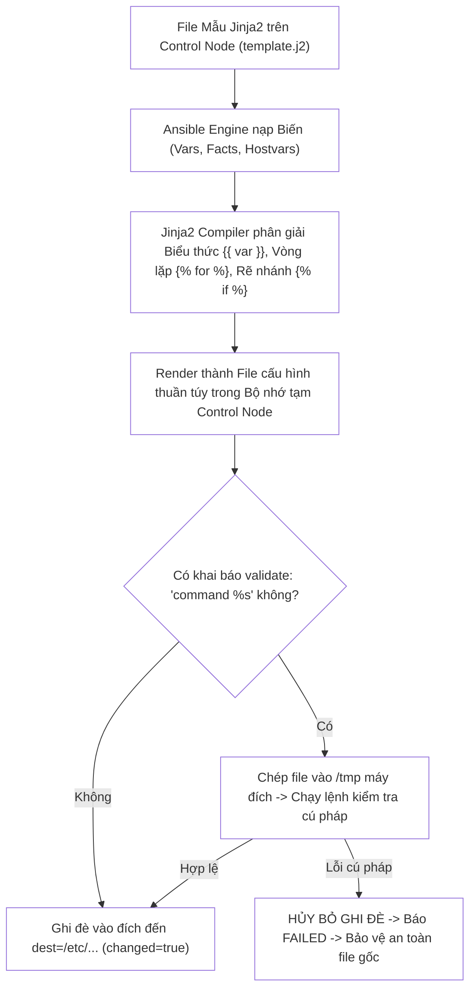
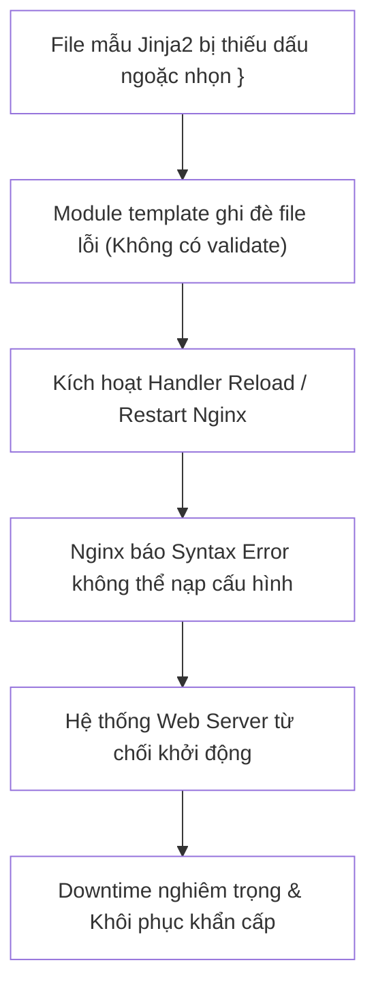
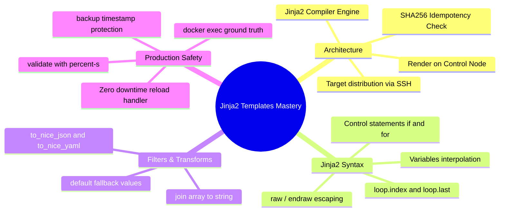


# [BÀI 12] LÀM CHỦ JINJA2 TEMPLATES: BIẾN ĐỘNG, CẤU TRÚC IF/FOR, FILTERS NÂNG CAO & KIỂM ĐỊNH VALIDATE

Trong kỷ nguyên **Infrastructure as Code (IaC)** và tự động hóa vận hành hạ tầng đám mây (Cloud Infrastructure Automation), **Ansible** khẳng định vị thế dẫn đầu nhờ triết lý **Agentless** (không cần cài đặt agent nền trên máy đích), giao thức điều khiển an toàn qua **SSH / WinRM**, định dạng khai báo **YAML** trực quan và nguyên lý bất biến **Idempotency** mạnh mẽ. Việc làm chủ Ansible không chỉ dừng lại ở các câu lệnh Ad-hoc đơn giản, mà đòi hỏi kỹ sư phải nắm vững kiến trúc Module tầng thấp, Variable Precedence 22 tầng, Jinja2 Templates, tối ưu hóa Forks & Pipelining cho tới thiết kế Roles / Collections và tích hợp CI/CD tự động hóa chuẩn Doanh nghiệp.

Bài viết chuyên sâu này sẽ đồng hành cùng bạn mổ xẻ toàn diện bức tranh kiến trúc, phân tích các đánh đổi kỹ thuật thực chiến (Engineering Trade-offs), cung cấp hướng dẫn thực hành Lab chi tiết từng bước và bộ câu hỏi phỏng vấn chuyên sâu chuẩn DevOps / SRE Lead.

---

## 1. Bản Chất Kiến Trúc & Cơ Chế Vận Hành Tầng Thấp

Trong quản trị hạ tầng, một file cấu hình ứng dụng thực tế (như `nginx.conf`, `haproxy.cfg`, `my.cnf`) hiếm khi là một file tĩnh bất biến. Mỗi máy chủ trong cụm cần được phân phối các thông số riêng biệt: địa chỉ IP lắng nghe, danh sách các backend servers trong cụm, dung lượng RAM cấp phát cho buffer, hoặc các cờ bảo mật theo từng môi trường. Thay vì duy trì hàng chục file cấu hình thủ công hoặc dùng lệnh nối chuỗi dễ lỗi, **Jinja2 Templating Engine** kết hợp với module `ansible.builtin.template` cho phép sinh ra các file cấu hình hoàn chỉnh ngay tại thời điểm thực thi.



### 1.1. Kiến Trúc Rendering Của Module template So Với copy

- **Cơ chế biên dịch phía Control Node:** Toàn bộ quá trình biên dịch (Rendering) của Jinja2 diễn ra **trực tiếp trên Control Node**. Ansible đọc file mẫu `.j2`, kết hợp toàn bộ biến trong tháp 22 tầng ưu tiên và Facts của từng máy đích để sinh ra nội dung văn bản cuối cùng. Sau đó, file đã hoàn thiện mới được chuyển xuống máy đích qua SSH.
- **Sự khác biệt với `ansible.builtin.copy`:** Module `copy` chỉ sao chép nguyên văn nhị phân của file nguồn xuống máy đích (nếu file nguồn chứa `{{ my_var }}` thì máy đích sẽ nhận nguyên văn chuỗi đó). Module `template` sẽ biên dịch toàn bộ các biểu thức logic và biến động trước khi sao chép.

### 1.2. Cấu Trúc Điều Khiển Jinja2: Vòng Lặp , Rẽ Nhánh  & Filters

Jinja2 cung cấp cú pháp điều khiển lập trình mạnh mẽ bên trong file văn bản:
- **Biểu thức nội suy biến:** `{{ variable_name }}` (truy xuất giá trị biến).
- **Cấu trúc điều khiển (Statements):** ` ...  ... ` (rẽ nhánh có điều kiện), ` ... ` (lặp danh sách máy chủ backend).
- **Biến vòng lặp đặc biệt `loop`:** Trong ``, Jinja2 cung cấp biến `loop.index` (1-indexed), `loop.first`, `loop.last` (hữu ích khi cần đánh dấu dấu phẩy giữa các phần tử JSON).
- **Bộ lọc (Jinja2 Filters):** Biến đổi dữ liệu linh hoạt qua ký tự pipe `|`:
  - `{{ my_var | default('fallback_val') }}`: Cung cấp giá trị mặc định.
  - `{{ backend_ips | join(', ') }}`: Nối mảng thành chuỗi phân tách bởi dấu phẩy.
  - `{{ complex_dict | to_nice_json }}` / `to_nice_yaml`: Chuyển đổi dữ liệu sang định dạng JSON/YAML chuẩn.

### 1.3. Cơ Chế Kiểm Định Cấu Hình validate & Quản Trị Idempotency

- **Tham số sinh mệnh `validate:`:** Khi triển khai cấu hình các dịch vụ quan trọng (Nginx, Apache, Sudoers, SSHD), một lỗi gõ sai dấu chấm phẩy `;` có thể làm dịch vụ crash khi restart. Thuộc tính `validate: 'nginx -t -c %s'` hoặc `validate: 'visudo -cf %s'` sẽ chép file tạm lên máy đích, thay thế `%s` bằng đường dẫn file tạm và chạy lệnh kiểm tra cú pháp. Nếu lệnh kiểm tra thành công (exit code 0), Ansible mới chính thức ghi đè vào file đích; nếu lỗi, Ansible hủy bỏ ngay lập tức và bảo vệ file cấu hình gốc.
- **Tính Idempotency của Template:** Module `template` so khớp mã hash SHA256 của file sau khi render với file hiện có trên đĩa cứng máy đích. Nếu nội dung render giống hệt nội dung đang có, Ansible sẽ giữ nguyên và báo `changed=false`.

---

## 2. Bảng So Sánh Kỹ Thuật Toàn Diện (Engineering Matrix)

| Tiêu Chí So Sánh | `ansible.builtin.copy` | `ansible.builtin.template` | `ansible.builtin.lineinfile` | `ansible.builtin.blockinfile` |
|---|---|---|---|---|
| **Bản chất xử lý** | Chép nguyên văn file tĩnh | Biên dịch động với Jinja2 Engine | Sửa/chèn 1 dòng theo Regex | Chèn/sửa 1 khối có Marker tag |
| **Nội suy Biến `{{ }}`** | **KHÔNG** (Giữ nguyên chuỗi thô) | **CÓ** (Biên dịch đầy đủ Jinja2) | Có hỗ trợ biến | Có hỗ trợ biến |
| **Hỗ trợ logic `if` / `for`** | Không | **Đầy đủ** (``, ``) | Không | Không |
| **Kiểm định an toàn (`validate:`)** | Có hỗ trợ | **Hỗ trợ đầy đủ** (`%s`) | Có hỗ trợ | Có hỗ trợ |
| **Trường hợp áp dụng chuẩn** | Phân phối file nhị phân, ảnh, SSL cert | Sinh file cấu hình tổng thể (`nginx.conf`) | Chỉnh sửa 1 tham số trong file OS | Chèn đoạn cấu hình Firewall/Env |

> [!IMPORTANT]
> **QUY TẮC AN TOÀN KHI DÙNG TEMPLATE TRÊN PRODUCTION:**
> Luôn khai báo đồng thời hai tham số: `backup: true` (để tạo bản sao lưu có timestamp) và `validate: '<service_check_cmd> %s'` cho mọi task phân phối file cấu hình hệ thống quan trọng (Nginx, SSHD, Sudoers, HAProxy).

---

## 3. Kiến Trúc Triển Khai Chuẩn Production (Configuration / Playbook / Role Breakdown)

Dưới đây là kiến trúc phân phối cấu hình Load Balancer Nginx hoàn chỉnh bằng Jinja2 Template kết hợp vòng lặp upstream servers, rẽ nhánh SSL và kiểm định cú pháp `nginx -t`:

```
templates/
└── nginx_vhost.conf.j2    # File mẫu Jinja2
site.yml                   # Playbook điều phối
```

```jinja2
{# templates/nginx_vhost.conf.j2 #}
# ANSIBLE MANAGED FILE - DO NOT EDIT MANUALLY
# Node: {{ ansible_facts.hostname }} | Generated at: {{ ansible_date_time.iso8601 }}

upstream backend_cluster {

    server {{ hostvars[host]['ansible_host'] | default(host) }}:{{ http_port | default(8080) }} max_fails=3 fail_timeout=10s;

}

server {
    listen {{ vhost_port | default(80) }};
    server_name {{ server_domain | default('localhost') }};


    listen 443 ssl;
    ssl_certificate /etc/ssl/certs/app.crt;
    ssl_certificate_key /etc/ssl/private/app.key;


    location / {
        proxy_pass http://backend_cluster;
        proxy_set_header Host $host;
        proxy_set_header X-Real-IP $remote_addr;
        proxy_set_header X-Forwarded-For $proxy_add_x_forwarded_for;
    }
}
```

```yaml
# site.yml - Production Jinja2 Deployment Playbook
---
- name: Production Dynamic Nginx VirtualHost Deployment
  hosts: web
  become: true
  gather_facts: true

  vars:
    vhost_port: 80
    server_domain: "app.internal.corp"
    enable_ssl: false
    http_port: 8080

  tasks:
    - name: 01. Ensure Nginx web server is installed
      ansible.builtin.package:
        name: nginx
        state: present

    - name: 02. Deploy dynamic Nginx VirtualHost from Jinja2 template with validation
      ansible.builtin.template:
        src: templates/nginx_vhost.conf.j2
        dest: /etc/nginx/conf.d/vhost.conf
        owner: root
        group: root
        mode: "0644"
        backup: true
        validate: "nginx -t -c /etc/nginx/nginx.conf"
      notify: "reload nginx service"

  handlers:
    - name: Reload Nginx Service
      ansible.builtin.service:
        name: nginx
        state: reloaded
      listen: "reload nginx service"
```

### Phân Tích Kỹ Thuật Từng Dòng (Line-by-Line Breakdown):
- <span class="badge-line">J2 Line 6–10</span>: Vòng lặp `` động duyệt qua toàn bộ các host trong nhóm `web` và lấy địa chỉ IP nội bộ tương ứng thông qua `hostvars[host]['ansible_host']`.
- <span class="badge-line">J2 Line 16–20</span>: Cấu trúc điều khiển `` chỉ sinh ra các dòng cấu hình SSL khi biến `enable_ssl` được bật.
- <span class="badge-line">YAML Line 19–28</span>: Module `ansible.builtin.template` nạp file nguồn `templates/nginx_vhost.conf.j2`, thiết lập quyền `mode: "0644"`, bật `backup: true` và áp dụng lệnh kiểm tra an toàn `validate: "nginx -t -c /etc/nginx/nginx.conf"`.
- <span class="badge-line">YAML Line 28</span>: Gửi tín hiệu `notify: "reload nginx service"` để Handler thực hiện Zero-downtime Graceful Reload khi cấu hình có sự thay đổi (`changed=true`).

---

## 4. Phân Tích Cạm Bẫy Thực Chiến: Đứt Gãy Do Không Kiểm Định Validate & Lạm Dụng Copy Cho File Động

### Tình Huống Sự Cố Thực Tế Tại Doanh Nghiệp:
Một kỹ sư DevOps triển khai cấu hình Nginx Vhost mới cho hệ thống thương mại điện tử bằng module `template`. Trong file mẫu `.j2`, kỹ sư vô tình bỏ quên dấu đóng ngoặc nhọn `}` ở khối `location /` và không khai báo tham số `validate:`. Kịch bản thực thi ghi đè file lỗi xuống 20 máy chủ Production và gửi lệnh reload Nginx.

### Hậu Quả & Log Lỗi Thực Tế:
- Nginx daemon gặp lỗi cú pháp `nginx: [emerg] unexpected end of file, expecting "}"` khi nạp file `/etc/nginx/conf.d/vhost.conf`.
- Mặc dù Nginx không chết ngay lập tức ở lần reload đầu tiên, nhưng khi máy chủ tự động khởi động lại sau bản vá bảo mật kernel ban đêm, dịch vụ Nginx từ chối khởi động lại toàn bộ, gây ra đợt downtime kéo dài **50 phút** vào đầu giờ sáng.

```diff
--- templates/vhost.conf.j2 (Syntax Error Missing Bracket)
+++ templates/vhost.conf.j2 (Fixed & Validated)
@@ -10,4 +10,4 @@
     location / {
         proxy_pass http://backend_cluster;
-    # Lỗi: Quên dấu đóng ngoặc nhọn }
+    }
 }
```



### 5-Whys Root Cause Analysis:
1. **Tại sao cụm Web Server bị ngừng hoạt động?** Do tiến trình Nginx daemon crash khi nạp file cấu hình chứa lỗi cú pháp.
2. **Tại sao file cấu hình bị lỗi cú pháp?** Do file mẫu Jinja2 bị thiếu dấu đóng ngoặc nhọn `}`.
3. **Tại sao file lỗi lại được phép ghi đè lên Production?** Do task `template` trong Playbook không cấu hình tham số `validate:`.
4. **Tại sao không phát hiện lỗi trong quá trình chạy Playbook?** Do lệnh `template` không có bước kiểm định cú pháp tự động trước khi thay thế file.
5. **Nguyên nhân cốt lõi (Root Cause):** Vi phạm nguyên tắc an toàn bắt buộc: Triển khai file cấu hình hạ tầng nhạy cảm mà không gắn chỉ thị `validate: '<check_cmd> %s'`.

---

## 5. Hands-on Lab: Xây Dựng Hệ Thống Template Jinja2 Động & Kiểm Định Cú Pháp An Toàn (8 Bước)

| Bước | Lệnh CLI / Tác Vụ Chính | Mục Đích Thực Thi |
|---|---|---|
| **Bước 1** | Chuẩn bị môi trường `lab-ansible-12` | Khởi tạo cấu hình dự án cô lập |
| **Bước 2** | Tạo thư mục `templates/` và file `.j2` cơ bản | Viết template thay thế biến đơn giản |
| **Bước 3** | Sử dụng vòng lặp `` trong template | Sinh danh sách máy chủ backend động từ Facts |
| **Bước 4** | Sử dụng cấu trúc rẽ nhánh `` | Điều khiển bật/tắt các khối tính năng |
| **Bước 5** | Áp dụng các Jinja2 Filters nâng cao | Sử dụng `default`, `join`, `to_nice_json` |
| **Bước 6** | Cấu hình kiểm định an toàn với `validate:` | Bảo vệ hệ thống khỏi lỗi cú pháp |
| **Bước 7** | Thực thi Phép thử Lần 2 chứng minh Idempotency | Đạt chỉ số `changed=0` trên bảng `PLAY RECAP` |
| **Bước 8** | Đối soát hiện vật thực tế qua `docker exec` | Xác nhận file cấu hình render chính xác trên máy đích |

### Bước 1 — Thiết lập môi trường dự án

```bash
mkdir -p ~/lab-ansible-12/templates && cd ~/lab-ansible-12

cat << 'EOF' > ansible.cfg
[defaults]
inventory = ./inventory.ini
remote_user = ansible
host_key_checking = False
private_key_file = ~/.ssh/id_ed25519

[privilege_escalation]
become = True
become_method = sudo
become_user = root
become_ask_pass = False
EOF

cat << 'EOF' > inventory.ini
[web]
target1 ansible_host=127.0.0.1 ansible_port=2221

[db]
target2 ansible_host=127.0.0.1 ansible_port=2222

[all:vars]
ansible_python_interpreter=/usr/bin/python3
EOF
```

### Bước 2 — Soạn thảo tệp mẫu Jinja2 nâng cao

```bash
cat << 'EOF' > templates/app_config.conf.j2
# ANSIBLE MANAGED CONFIGURATION
# Generated for: {{ ansible_facts.hostname }}
# Primary IP: {{ ansible_facts.default_ipv4.address }}

[general]
app_name = {{ app_name | default('NTKApp') }}
environment = {{ app_env | default('staging') }}
workers = {{ ansible_facts.processor_vcpus | default(1) * 2 }}

[cluster_nodes]

node_{{ loop.index }} = {{ hostvars[host]['inventory_hostname'] }}:{{ service_port | default(8080) }}


[features]

metrics_endpoint = http://127.0.0.1:9100/metrics
metrics_format = prometheus

metrics_endpoint = disabled


[allowed_ips]
whitelist = {{ allowed_networks | default(['127.0.0.1', '10.0.0.0/8']) | join(', ') }}
EOF
```

```bash
# CHECKPOINT 1: Kiểm tra khởi tạo file template j2
if [ -f "templates/app_config.conf.j2" ] && grep -q "{% for host in groups" templates/app_config.conf.j2; then
  echo "CHECKPOINT 1: ĐẠT - File mẫu Jinja2 được khởi tạo chuẩn cú pháp for/if/filters"
else
  echo "CHECKPOINT 1: LỖI - Khởi tạo file template thất bại"
fi
```

### Bước 3 — Soạn thảo Playbook triển khai Template với kiểm định an toàn

```bash
cat << 'EOF' > site.yml
---
- name: Jinja2 Dynamic Templating Mastery
  hosts: web
  become: true
  gather_facts: true

  vars:
    app_name: "NTK Production Service"
    app_env: "production"
    service_port: 8080
    enable_metrics: true
    allowed_networks:
      - "127.0.0.1"
      - "192.168.1.0/24"
      - "10.10.0.0/16"

  tasks:
    - name: 01. Render and deploy application configuration from Jinja2 template
      ansible.builtin.template:
        src: templates/app_config.conf.j2
        dest: /etc/app_config.conf
        owner: root
        group: root
        mode: "0644"
        backup: true
        validate: "grep -q 'ANSIBLE MANAGED CONFIGURATION' %s"
      notify: "log template update"

  handlers:
    - name: Log Template Update
      ansible.builtin.debug:
        msg: "Application configuration template rendered and updated successfully."
      listen: "log template update"
EOF
```

```bash
# CHECKPOINT 2: Kiểm tra cú pháp Playbook
ansible-playbook --syntax-check site.yml
```

### Bước 4 — Chạy mô phỏng Dry-run và xem trước nội dung Diff

```bash
ansible-playbook --check --diff site.yml
```

```bash
# CHECKPOINT 3: Kiểm tra chế độ Dry-run
CHECK_OUT=$(ansible-playbook --check --diff site.yml)
if echo "$CHECK_OUT" | grep -q "PLAY RECAP" && ! echo "$CHECK_OUT" | grep -q "failed=1"; then
  echo "CHECKPOINT 3: ĐẠT - Chạy mô phỏng Dry-run thành công, hiển thị diff cấu hình"
else
  echo "CHECKPOINT 3: LỖI - Chạy mô phỏng thất bại"
fi
```

### Bước 5 — Thực thi Playbook Lần 1

```bash
ansible-playbook site.yml
```

```bash
# CHECKPOINT 4: Kiểm tra kết quả thực thi lần 1
RUN1_OUT=$(ansible-playbook site.yml)
if echo "$RUN1_OUT" | grep -q "failed=0" && echo "$RUN1_OUT" | grep -q "unreachable=0"; then
  echo "CHECKPOINT 4: ĐẠT - Playbook thực thi lần 1 thành công, render template hoàn chỉnh"
else
  echo "CHECKPOINT 4: LỖI - Thực thi Playbook lần 1 thất bại"
fi
```

### Bước 6 — Thực thi Phép thử Lần 2 chứng minh Idempotency

```bash
ansible-playbook site.yml
```

```bash
# CHECKPOINT 5 & 6: Kiểm tra tính Idempotency đạt changed=0
RUN2_FINAL=$(ansible-playbook site.yml)
if echo "$RUN2_FINAL" | grep -q "changed=0" && echo "$RUN2_FINAL" | grep -q "failed=0"; then
  echo "CHECKPOINT 5 & 6: ĐẠT - Template render đạt Idempotency tuyệt đối (changed=0 ở lần 2)"
else
  echo "CHECKPOINT 5 & 6: LỖI - Template chưa đạt chuẩn Idempotency"
fi
```

### Bước 7 — Đối soát nội dung file render trên máy đích

```bash
docker exec target1 cat /etc/app_config.conf
```

```bash
# CHECKPOINT 7 & 8: Đối soát hiện vật thực tế trên máy đích
CONF_OUT=$(docker exec target1 cat /etc/app_config.conf)
if echo "$CONF_OUT" | grep -q "app_name = NTK Production Service" && echo "$CONF_OUT" | grep -q "metrics_format = prometheus" && echo "$CONF_OUT" | grep -q "192.168.1.0/24"; then
  echo "CHECKPOINT 7 & 8: ĐẠT - File cấu hình render trên máy đích chứa đầy đủ các biến động và định dạng chuẩn 100%"
else
  echo "CHECKPOINT 7 & 8: LỖI - Nội dung file cấu hình render sai lệch"
fi
```

---

## 6. Bộ Câu Hỏi Vấn Đáp & Phỏng Vấn Chuyên Sâu (Self-Check Q&A)

<details class="qa-card">
  <summary class="qa-summary">
    <span class="qa-num-badge">Q01</span>
    <span class="qa-question-text">Jinja2 Template Engine hoạt động ở đâu trong kiến trúc Ansible (Control Node hay Managed Node)? So sánh với module copy.</span>
  </summary>
  <div class="qa-answer">
    <div class="qa-answer-header">
      <svg width="14" height="14" fill="none" stroke="currentColor" stroke-width="2" viewBox="0 0 24 24"><path d="M22 11.08V12a10 10 0 1 1-5.93-9.14"></path><polyline points="22 4 12 14.01 9 11.01"></polyline></svg>
      <span>Phân Tích &amp; Lời Giải Kỹ Thuật</span>
    </div>
    <div><b>Đáp án chuẩn:</b> Toàn bộ quá trình biên dịch (Rendering) của Jinja2 diễn ra <b>100% trên Control Node</b>. Ansible kết hợp mã nguồn template <code>.j2</code> với toàn bộ biến (Vars) và Facts của từng máy đích để sinh ra nội dung văn bản cuối cùng trong bộ nhớ tạm của Control Node, sau đó mới sao chép file hoàn thiện xuống máy đích qua kết nối SSH. <b>So với module copy:</b> <code>copy</code> chỉ chép nguyên văn nhị phân file nguồn tĩnh, trong khi <code>template</code> biên dịch các logic <code>{{ }}</code>, <code></code>, <code></code> thành văn bản cụ thể cho từng host.</div>
    <div style="margin-top: 0.5rem;"><b>Tiêu chí chấm:</b></div>
    <div style="margin: 0.35rem 0; padding-left: 1rem; border-left: 2px solid var(--accent-primary);">• <b>0:</b> Cho rằng Jinja2 được render trên máy đích Managed Node.</div>
    <div style="margin: 0.35rem 0; padding-left: 1rem; border-left: 2px solid var(--accent-primary);">• <b>1:</b> Biết render trên Control node nhưng không phân biệt được với module <code>copy</code>.</div>
    <div style="margin: 0.35rem 0; padding-left: 1rem; border-left: 2px solid var(--accent-primary);">• <b>2:</b> Phân tích chính xác cơ chế render phía Control Node + sự khác biệt bản chất với <code>copy</code>.</div>
    <div style="margin-top: 0.5rem;"><b>Tiêu chí chấm:</b></div>
    <div style="margin: 0.35rem 0; padding-left: 1rem; border-left: 2px solid var(--accent-primary);">• <b>3:</b> Phân tích sâu sắc: Nhờ render trên Control Node mà máy đích không cần cài đặt Python Jinja2 library, giữ vững triết lý Agentless tối giản.</div>
    <div style="margin-top: 0.5rem;"><b>Câu hỏi đào sâu:</b> Nếu máy đích là một thiết bị mạng Router Cisco không có Python, module <code>template</code> có hoạt động được không? <i>(Hoàn toàn được, vì file được render xong trên Control Node rồi mới gửi qua SSH/CLI xuống Router.)</i></div>
  </div>
</details>

<details class="qa-card">
  <summary class="qa-summary">
    <span class="qa-num-badge">Q02</span>
    <span class="qa-question-text">Phân biệt 3 cú pháp cơ bản trong Jinja2: {{ ... }},  và {# ... #}.</span>
  </summary>
  <div class="qa-answer">
    <div class="qa-answer-header">
      <svg width="14" height="14" fill="none" stroke="currentColor" stroke-width="2" viewBox="0 0 24 24"><path d="M22 11.08V12a10 10 0 1 1-5.93-9.14"></path><polyline points="22 4 12 14.01 9 11.01"></polyline></svg>
      <span>Phân Tích &amp; Lời Giải Kỹ Thuật</span>
    </div>
    <div><b>Đáp án chuẩn:</b></div>
    <div>• <code>{{ expression }}</code> (Biểu thức xuất dữ liệu): Dùng để in giá trị của biến số hoặc kết quả của một bộ lọc ra file (ví dụ <code>{{ app_port }}</code>).</div>
    <div>• <code></code> (Khối câu lệnh điều khiển): Dùng cho các cấu trúc logic lập trình như vòng lặp <code></code>, rẽ nhánh <code></code>, hoặc gán biến <code></code>.</div>
    <div>• <code>{# comment #}</code> (Chú thích Jinja2): Dùng để viết ghi chú cho người bảo trì template. Khối chú thích này sẽ <b>hoàn toàn bị loại bỏ</b> và không xuất hiện trong file cấu hình sinh ra trên máy đích.</div>
    <div style="margin-top: 0.5rem;"><b>Tiêu chí chấm:</b></div>
    <div style="margin: 0.35rem 0; padding-left: 1rem; border-left: 2px solid var(--accent-primary);">• <b>0:</b> Nhầm lẫn giữa <code>{{ }}</code> và <code></code>.</div>
    <div style="margin: 0.35rem 0; padding-left: 1rem; border-left: 2px solid var(--accent-primary);">• <b>1:</b> Nêu được 2 cú pháp đầu nhưng không biết cú pháp comment <code>{# #}</code>.</div>
    <div style="margin: 0.35rem 0; padding-left: 1rem; border-left: 2px solid var(--accent-primary);">• <b>2:</b> Phân biệt chính xác mục đích sử dụng của cả 3 loại cú pháp.</div>
    <div style="margin-top: 0.5rem;"><b>Tiêu chí chấm:</b></div>
    <div style="margin: 0.35rem 0; padding-left: 1rem; border-left: 2px solid var(--accent-primary);">• <b>3:</b> Nêu đúng + chỉ ra cách kiểm soát khoảng trắng thụt lề bằng dấu gạch ngang <code></code>.</div>
    <div style="margin-top: 0.5rem;"><b>Câu hỏi đào sâu:</b> Cú pháp <code></code> (có dấu trừ) có tác dụng gì trong Jinja2? <i>(Tự động xóa bỏ các khoảng trắng và dòng trống thừa ở trước/sau khối câu lệnh khi render.)</i></div>
  </div>
</details>

<details class="qa-card">
  <summary class="qa-summary">
    <span class="qa-num-badge">Q03</span>
    <span class="qa-question-text">Trình bày tác dụng của tham số validate trong module template. Ký tự %s đóng vai trò gì?</span>
  </summary>
  <div class="qa-answer">
    <div class="qa-answer-header">
      <svg width="14" height="14" fill="none" stroke="currentColor" stroke-width="2" viewBox="0 0 24 24"><path d="M22 11.08V12a10 10 0 1 1-5.93-9.14"></path><polyline points="22 4 12 14.01 9 11.01"></polyline></svg>
      <span>Phân Tích &amp; Lời Giải Kỹ Thuật</span>
    </div>
    <div><b>Đáp án chuẩn:</b> Tham số <code>validate: '<command> %s'</code> là chốt chặn an toàn kiểm định cú pháp trước khi ghi đè file đích. <b>Cơ chế hoạt động:</b> Ansible sao chép file đã render vào một thư mục tạm trên máy đích, thay thế chuỗi định dạng <code>%s</code> bằng đường dẫn file tạm đó và thực thi lệnh kiểm tra (ví dụ <code>nginx -t -c %s</code> hoặc <code>visudo -cf %s</code>). Nếu lệnh kiểm tra thành công (exit code 0), Ansible mới chính thức di chuyển file vào vị trí <code>dest</code>. Nếu lệnh kiểm tra thất bại, Ansible hủy bỏ ngay lập tức, xóa file tạm và báo FAILED, bảo vệ an toàn 100% cho file cấu hình gốc đang chạy.</div>
    <div style="margin-top: 0.5rem;"><b>Tiêu chí chấm:</b></div>
    <div style="margin: 0.35rem 0; padding-left: 1rem; border-left: 2px solid var(--accent-primary);">• <b>0:</b> Không biết tác dụng của <code>validate</code>.</div>
    <div style="margin-top: 0.35rem; padding-left: 1rem; border-left: 2px solid var(--accent-primary);">• <b>1:</b> Biết để kiểm tra file nhưng không giải thích được vai trò của ký tự <code>%s</code> và cơ chế file tạm.</div>
    <div style="margin-top: 0.35rem; padding-left: 1rem; border-left: 2px solid var(--accent-primary);">• <b>2:</b> Phân tích chính xác cơ chế file tạm + thay thế chuỗi <code>%s</code> + bảo vệ file gốc.</div>
    <div style="margin-top: 0.5rem;"><b>Tiêu chí chấm:</b></div>
    <div style="margin: 0.35rem 0; padding-left: 1rem; border-left: 2px solid var(--accent-primary);">• <b>3:</b> Nêu đúng 3 ví dụ kiểm định thực tế cho: Nginx (`nginx -t -c %s`), Sudoers (`visudo -cf %s`), SSHD (`sshd -t -f %s`).</div>
    <div style="margin-top: 0.5rem;"><b>Câu hỏi đào sâu:</b> Lệnh <code>visudo -cf %s</code> kiểm tra file cấu hình nào trong Linux? <i>(Kiểm tra cú pháp file phân quyền quản trị <code>/etc/sudoers</code> hoặc <code>/etc/sudoers.d/*</code>.)</i></div>
  </div>
</details>

<details class="qa-card">
  <summary class="qa-summary">
    <span class="qa-num-badge">Q04</span>
    <span class="qa-question-text">Trình bày cách sử dụng vòng lặp for trong Jinja2 để sinh danh sách Upstream Servers từ nhóm máy Inventory groups['web'].</span>
  </summary>
  <div class="qa-answer">
    <div class="qa-answer-header">
      <svg width="14" height="14" fill="none" stroke="currentColor" stroke-width="2" viewBox="0 0 24 24"><path d="M22 11.08V12a10 10 0 1 1-5.93-9.14"></path><polyline points="22 4 12 14.01 9 11.01"></polyline></svg>
      <span>Phân Tích &amp; Lời Giải Kỹ Thuật</span>
    </div>
    <div><b>Đáp án chuẩn:</b> Trong file mẫu <code>.j2</code>, ta kết hợp vòng lặp <code></code> với biến ma thuật <code>hostvars</code> để lấy địa chỉ IP của từng máy:</div>
    <pre><code>upstream my_app_cluster {

    server {{ hostvars[host]['ansible_host'] | default(host) }}:{{ http_port | default(8080) }};

}</code></pre>
    <div>Đoạn mã trên sẽ tự động duyệt qua tất cả các máy trong nhóm <code>web</code> và sinh ra các dòng chỉ thị <code>server IP:PORT;</code> tương ứng.</div>
    <div style="margin-top: 0.5rem;"><b>Tiêu chí chấm:</b></div>
    <div style="margin: 0.35rem 0; padding-left: 1rem; border-left: 2px solid var(--accent-primary);">• <b>0:</b> Hard-code danh sách IP tĩnh trong template.</div>
    <div style="margin-top: 0.35rem; padding-left: 1rem; border-left: 2px solid var(--accent-primary);">• <b>1:</b> Biết dùng <code></code> nhưng không biết cách truy vấn <code>hostvars[host]['ansible_host']</code>.</div>
    <div style="margin-top: 0.35rem; padding-left: 1rem; border-left: 2px solid var(--accent-primary);">• <b>2:</b> Viết chính xác cú pháp vòng lặp Jinja2 kết hợp <code>groups</code> và <code>hostvars</code>.</div>
    <div style="margin-top: 0.35rem; padding-left: 1rem; border-left: 2px solid var(--accent-primary);">• <b>3:</b> Nêu đúng + sử dụng filter <code>default(host)</code> để đảm bảo kịch bản không bị crash nếu host thiếu biến `ansible_host`.</div>
    <div style="margin-top: 0.5rem;"><b>Câu hỏi đào sâu:</b> Biến ma thuật <code>groups['web']</code> trả về kiểu dữ liệu gì trong Ansible? <i>(Trả về một danh sách các chuỗi tên host <code>['target1', 'target2']</code> thuộc nhóm web.)</i></div>
  </div>
</details>

<details class="qa-card">
  <summary class="qa-summary">
    <span class="qa-num-badge">Q05</span>
    <span class="qa-question-text">Trình bày các biến đặc biệt của đối tượng loop trong vòng lặp Jinja2 ().</span>
  </summary>
  <div class="qa-answer">
    <div class="qa-answer-header">
      <svg width="14" height="14" fill="none" stroke="currentColor" stroke-width="2" viewBox="0 0 24 24"><path d="M22 11.08V12a10 10 0 1 1-5.93-9.14"></path><polyline points="22 4 12 14.01 9 11.01"></polyline></svg>
      <span>Phân Tích &amp; Lời Giải Kỹ Thuật</span>
    </div>
    <div><b>Đáp án chuẩn:</b> Bên trong khối <code></code>, Jinja2 tự động cung cấp đối tượng <code>loop</code> với các thuộc tính hữu ích:</div>
    <div>• <code>loop.index</code>: Số thứ tự lượt lặp hiện tại, bắt đầu từ <b>1</b> (1, 2, 3...).</div>
    <div>• <code>loop.index0</code>: Số thứ tự lượt lặp hiện tại, bắt đầu từ <b>0</b> (0, 1, 2...).</div>
    <div>• <code>loop.first</code>: Trả về <code>True</code> nếu đang ở phần tử đầu tiên của danh sách.</div>
    <div>• <code>loop.last</code>: Trả về <code>True</code> nếu đang ở phần tử cuối cùng của danh sách (rất hữu ích để không in dấu phẩy <code>,</code> ở phần tử cuối trong file JSON).</div>
    <div>• <code>loop.length</code>: Tổng số lượng phần tử của danh sách lặp.</div>
    <div style="margin-top: 0.5rem;"><b>Tiêu chí chấm:</b></div>
    <div style="margin: 0.35rem 0; padding-left: 1rem; border-left: 2px solid var(--accent-primary);">• <b>0:</b> Không biết các thuộc tính của đối tượng <code>loop</code> trong Jinja2.</div>
    <div style="margin-top: 0.35rem; padding-left: 1rem; border-left: 2px solid var(--accent-primary);">• <b>1:</b> Kể được <code>loop.index</code> nhưng thiếu <code>loop.first</code> và <code>loop.last</code>.</div>
    <div style="margin-top: 0.35rem; padding-left: 1rem; border-left: 2px solid var(--accent-primary);">• <b>2:</b> Liệt kê chính xác 4-5 thuộc tính cốt lõi của đối tượng <code>loop</code>.</div>
    <div style="margin-top: 0.5rem;"><b>Tiêu chí chấm:</b></div>
    <div style="margin: 0.35rem 0; padding-left: 1rem; border-left: 2px solid var(--accent-primary);">• <b>3:</b> Minh họa xuất sắc ứng dụng <code>,</code> để sinh mảng JSON hợp lệ.</div>
    <div style="margin-top: 0.5rem;"><b>Câu hỏi đào sâu:</b> Làm thế nào để lấy số lần lặp còn lại cho đến khi kết thúc vòng lặp? <i>(Sử dụng thuộc tính <code>loop.revindex</code> hoặc <code>loop.revindex0</code>.)</i></div>
  </div>
</details>

<details class="qa-card">
  <summary class="qa-summary">
    <span class="qa-num-badge">Q06</span>
    <span class="qa-question-text">Phân tích tác dụng của các Jinja2 Filters phổ biến: default, join, to_nice_json, to_nice_yaml.</span>
  </summary>
  <div class="qa-answer">
    <div class="qa-answer-header">
      <svg width="14" height="14" fill="none" stroke="currentColor" stroke-width="2" viewBox="0 0 24 24"><path d="M22 11.08V12a10 10 0 1 1-5.93-9.14"></path><polyline points="22 4 12 14.01 9 11.01"></polyline></svg>
      <span>Phân Tích &amp; Lời Giải Kỹ Thuật</span>
    </div>
    <div><b>Đáp án chuẩn:</b></div>
    <div>• <code>default(value)</code>: Cung cấp giá trị dự phòng nếu biến chưa được định nghĩa (ví dụ <code>{{ port | default(80) }}</code>).</div>
    <div>• <code>join(separator)</code>: Gộp các phần tử của một danh sách (List) thành một chuỗi duy nhất phân tách bởi ký tự chỉ định (ví dụ <code>{{ dns_servers | join(' ') }}</code> -> <code>"8.8.8.8 1.1.1.1"</code>).</div>
    <div>• <code>to_nice_json</code>: Chuyển đổi cấu trúc Dictionary/List của Ansible thành định dạng văn bản JSON có thụt lề chuẩn đẹp.</div>
    <div>• <code>to_nice_yaml</code>: Chuyển đổi cấu trúc dữ liệu thành định dạng YAML chuẩn có thụt lề rõ ràng.</div>
    <div style="margin-top: 0.5rem;"><b>Tiêu chí chấm:</b></div>
    <div style="margin: 0.35rem 0; padding-left: 1rem; border-left: 2px solid var(--accent-primary);">• <b>0:</b> Không biết các Jinja2 filter.</div>
    <div style="margin: 0.35rem 0; padding-left: 1rem; border-left: 2px solid var(--accent-primary);">• <b>1:</b> Giải thích được <code>default</code> nhưng không rõ <code>join</code> và <code>to_nice_*</code>.</div>
    <div style="margin-top: 0.35rem; padding-left: 1rem; border-left: 2px solid var(--accent-primary);">• <b>2:</b> Phân tích chính xác công dụng và cú pháp của cả 4 bộ lọc.</div>
    <div style="margin-top: 0.5rem;"><b>Tiêu chí chấm:</b></div>
    <div style="margin: 0.35rem 0; padding-left: 1rem; border-left: 2px solid var(--accent-primary);">• <b>3:</b> Nêu đúng + kết hợp tham số tùy biến thụt lề <code>to_nice_json(indent=2)</code>.</div>
    <div style="margin-top: 0.5rem;"><b>Câu hỏi đào sâu:</b> Bộ lọc nào chuyển đổi chuỗi JSON thô thành đối tượng Dictionary trong Jinja2? <i>(Bộ lọc <code>from_json</code>.)</i></div>
  </div>
</details>

<details class="qa-card">
  <summary class="qa-summary">
    <span class="qa-num-badge">Q07</span>
    <span class="qa-question-text">Làm thế nào để sinh file cấu hình JSON hoặc YAML tự động từ một biến Dictionary mà không cần viết template thủ công?</span>
  </summary>
  <div class="qa-answer">
    <div class="qa-answer-header">
      <svg width="14" height="14" fill="none" stroke="currentColor" stroke-width="2" viewBox="0 0 24 24"><path d="M22 11.08V12a10 10 0 1 1-5.93-9.14"></path><polyline points="22 4 12 14.01 9 11.01"></polyline></svg>
      <span>Phân Tích &amp; Lời Giải Kỹ Thuật</span>
    </div>
    <div><b>Đáp án chuẩn:</b> Trong file template <code>.j2</code> (hoặc trực tiếp qua tham số <code>content:</code> của module <code>copy</code>), ta chỉ cần truyền biến Dictionary kết hợp với bộ lọc <code>to_nice_json</code> hoặc <code>to_nice_yaml</code>. Ví dụ: trong template chỉ cần duy nhất 1 dòng: <code>{{ app_configuration_dictionary | to_nice_yaml }}</code>. Ansible sẽ tự động duyệt toàn bộ cây dữ liệu và xuất ra file YAML/JSON hoàn chỉnh với định dạng chuẩn mực mà không cần phải viết thủ công từng cặp key/value.</div>
    <div style="margin-top: 0.5rem;"><b>Tiêu chí chấm:</b></div>
    <div style="margin: 0.35rem 0; padding-left: 1rem; border-left: 2px solid var(--accent-primary);">• <b>0:</b> Cho rằng bắt buộc phải viết template thủ công từng dòng.</div>
    <div style="margin-top: 0.35rem; padding-left: 1rem; border-left: 2px solid var(--accent-primary);">• <b>1:</b> Biết filter <code>to_nice_yaml</code> nhưng không biết ứng dụng làm template 1 dòng.</div>
    <div style="margin-top: 0.35rem; padding-left: 1rem; border-left: 2px solid var(--accent-primary);">• <b>2:</b> Trình bày chính xác kỹ thuật xuất cấu hình tự động từ Dictionary.</div>
    <div style="margin-top: 0.5rem;"><b>Tiêu chí chấm:</b></div>
    <div style="margin: 0.35rem 0; padding-left: 1rem; border-left: 2px solid var(--accent-primary);">• <b>3:</b> Phân tích lợi ích vượt trội: Khi ứng dụng bổ sung thêm trường cấu hình mới trong <code>group_vars</code>, file cấu hình tự động có thêm trường mới mà không cần sửa file template.</div>
    <div style="margin-top: 0.5rem;"><b>Câu hỏi đào sâu:</b> Tham số nào của <code>to_nice_yaml</code> giúp sắp xếp các khóa key theo thứ tự bảng chữ cái? <i>(Tham số <code>sort_keys=True</code>: <code>{{ dict | to_nice_yaml(sort_keys=True) }}</code>.)</i></div>
  </div>
</details>

<details class="qa-card">
  <summary class="qa-summary">
    <span class="qa-num-badge">Q08</span>
    <span class="qa-question-text">Tại sao việc đưa header chú thích 'ANSIBLE MANAGED FILE' vào đầu mỗi file template lại là Best Practice bắt buộc?</span>
  </summary>
  <div class="qa-answer">
    <div class="qa-answer-header">
      <svg width="14" height="14" fill="none" stroke="currentColor" stroke-width="2" viewBox="0 0 24 24"><path d="M22 11.08V12a10 10 0 1 1-5.93-9.14"></path><polyline points="22 4 12 14.01 9 11.01"></polyline></svg>
      <span>Phân Tích &amp; Lời Giải Kỹ Thuật</span>
    </div>
    <div><b>Đáp án chuẩn:</b> Thêm dòng header <code># {{ ansible_managed }}</code> (hoặc chuỗi cảnh báo tương đương) vào đầu file template để: (1) Cảnh báo các kỹ sư vận hành máy chủ KHÔNG ĐƯỢC CHỈNH SỬA FILE THỦ CÔNG trực tiếp trên máy đích (vì mọi sửa đổi thủ công sẽ bị Ansible ghi đè ở lần chạy sau), (2) Cung cấp dấu vết audit (mốc thời gian render, tên template nguồn, tên host tạo ra file) phục vụ công tác điều tra sự cố.</div>
    <div style="margin-top: 0.5rem;"><b>Tiêu chí chấm:</b></div>
    <div style="margin: 0.35rem 0; padding-left: 1rem; border-left: 2px solid var(--accent-primary);">• <b>0:</b> Cho rằng dòng comment header là thừa thãi.</div>
    <div style="margin-top: 0.35rem; padding-left: 1rem; border-left: 2px solid var(--accent-primary);">• <b>1:</b> Biết để cảnh báo nhưng không giải thích được cơ chế biến ma thuật <code>ansible_managed</code>.</div>
    <div style="margin-top: 0.35rem; padding-left: 1rem; border-left: 2px solid var(--accent-primary);">• <b>2:</b> Phân tích chính xác 2 mục đích: Chặn sửa thủ công (Anti-drift) và Audit logging.</div>
    <div style="margin-top: 0.5rem;"><b>Tiêu chí chấm:</b></div>
    <div style="margin: 0.35rem 0; padding-left: 1rem; border-left: 2px solid var(--accent-primary);">• <b>3:</b> Nêu đúng + cấu hình tùy biến chuỗi <code>ansible_managed</code> trong file <code>ansible.cfg</code>.</div>
    <div style="margin-top: 0.5rem;"><b>Câu hỏi đào sâu:</b> Biến ma thuật <code>ansible_managed</code> được cấu hình tùy biến chuỗi định dạng ở đâu? <i>(Cấu hình trong mục <code>[defaults]</code> của file <code>ansible.cfg</code>.)</i></div>
  </div>
</details>

<details class="qa-card">
  <summary class="qa-summary">
    <span class="qa-num-badge">Q09</span>
    <span class="qa-question-text">Làm thế nào để xử lý các ký tự đặc biệt của Jinja2 như {{ hoặc {% khi muốn in nguyên văn chúng ra file đích?</span>
  </summary>
  <div class="qa-answer">
    <div class="qa-answer-header">
      <svg width="14" height="14" fill="none" stroke="currentColor" stroke-width="2" viewBox="0 0 24 24"><path d="M22 11.08V12a10 10 0 1 1-5.93-9.14"></path><polyline points="22 4 12 14.01 9 11.01"></polyline></svg>
      <span>Phân Tích &amp; Lời Giải Kỹ Thuật</span>
    </div>
    <div><b>Đáp án chuẩn:</b> Có 2 cách chuẩn trong Jinja2:</div>
    <div>• <b>Cách 1 (Khối raw):</b> Bao bọc đoạn văn bản cần in nguyên văn trong cặp thẻ <code> ... </code>. Toàn bộ nội dung bên trong sẽ không bị Jinja2 phân tích cú pháp.</div>
    <div>• <b>Cách 2 (Escape chuỗi ngắn):</b> In ký tự nhọn dưới dạng chuỗi: <code>{{ '{{' }}</code> hoặc <code>{{ '{%' }}</code>.</div>
    <div>Rất hữu ích khi viết template để sinh file cấu hình Prometheus Alerting Rules, Logstash, hoặc các file template của framework khác cũng dùng cú pháp <code>{{ }}</code>.</div>
    <div style="margin-top: 0.5rem;"><b>Tiêu chí chấm:</b></div>
    <div style="margin: 0.35rem 0; padding-left: 1rem; border-left: 2px solid var(--accent-primary);">• <b>0:</b> Không biết cách escape ký tự Jinja2.</div>
    <div style="margin-top: 0.35rem; padding-left: 1rem; border-left: 2px solid var(--accent-primary);">• <b>1:</b> Biết khối raw nhưng không nhớ đúng tên thẻ <code>raw/endraw</code>.</div>
    <div style="margin-top: 0.35rem; padding-left: 1rem; border-left: 2px solid var(--accent-primary);">• <b>2:</b> Trình bày chính xác cả 2 phương pháp Escape và ngữ cảnh sử dụng (Prometheus/Logstash).</div>
    <div style="margin-top: 0.5rem;"><b>Tiêu chí chấm:</b></div>
    <div style="margin: 0.35rem 0; padding-left: 1rem; border-left: 2px solid var(--accent-primary);">• <b>3:</b> Minh họa xuất sắc đoạn template sinh file Prometheus Rule có chứa biểu thức <code>{{ $value }}</code> của Prometheus.</div>
    <div style="margin-top: 0.5rem;"><b>Câu hỏi đào sâu:</b> Cú pháp nào escape một biến đơn lẻ <code>{{ $labels.instance }}</code> trong file Prometheus rule? <i>(<code>{{ $labels.instance }}</code>)</i></div>
  </div>
</details>

<details class="qa-card">
  <summary class="qa-summary">
    <span class="qa-num-badge">Q10</span>
    <span class="qa-question-text">Trình bày cách kết hợp module template với Handlers để tạo luồng triển khai tự động Zero-downtime.</span>
  </summary>
  <div class="qa-answer">
    <div class="qa-answer-header">
      <svg width="14" height="14" fill="none" stroke="currentColor" stroke-width="2" viewBox="0 0 24 24"><path d="M22 11.08V12a10 10 0 1 1-5.93-9.14"></path><polyline points="22 4 12 14.01 9 11.01"></polyline></svg>
      <span>Phân Tích &amp; Lời Giải Kỹ Thuật</span>
    </div>
    <div><b>Đáp án chuẩn:</b> Luồng triển khai 3 lớp chuẩn mực:</div>
    <div>1. <b>Render &amp; Validate:</b> Module <code>template</code> render file cấu hình mới, kiểm tra tính hợp lệ bằng <code>validate: "nginx -t -c %s"</code>. Nếu hợp lệ, ghi file và báo `changed=true`.</div>
    <div>2. <b>Notify Event:</b> Task template kích hoạt sự kiện <code>notify: "reload web service"</code>.</div>
    <div>3. <b>Graceful Reload Handler:</b> Handler sử dụng <code>service: name=nginx state=reloaded</code> để daemon nạp cấu hình mới mà không ngắt kết nối của người dùng đang hoạt động (Zero-downtime).</div>
    <div style="margin-top: 0.5rem;"><b>Tiêu chí chấm:</b></div>
    <div style="margin: 0.35rem 0; padding-left: 1rem; border-left: 2px solid var(--accent-primary);">• <b>0:</b> Không liên kết được giữa Template và Handler.</div>
    <div style="margin-top: 0.35rem; padding-left: 1rem; border-left: 2px solid var(--accent-primary);">• <b>1:</b> Nêu được notify restart nhưng dùng <code>state=restarted</code> gây downtime.</div>
    <div style="margin-top: 0.35rem; padding-left: 1rem; border-left: 2px solid var(--accent-primary);">• <b>2:</b> Trình bày chính xác luồng 3 lớp kết hợp Template + Validate + Reload Handler.</div>
    <div style="margin-top: 0.5rem;"><b>Tiêu chí chấm:</b></div>
    <div style="margin: 0.35rem 0; padding-left: 1rem; border-left: 2px solid var(--accent-primary);">• <b>3:</b> Phân tích tính Idempotency: Khi chạy lại Lần 2, template không đổi -> changed=false -> Handler không chạy -> Hệ thống giữ nguyên 100%.</div>
    <div style="margin-top: 0.5rem;"><b>Câu hỏi đào sâu:</b> Nếu bước <code>validate</code> của template bị thất bại, Handler có được gọi không? <i>(Không, vì task template bị failed lập tức nên tín hiệu notify bị hủy.)</i></div>
  </div>
</details>

<details class="qa-card">
  <summary class="qa-summary">
    <span class="qa-num-badge">Q11</span>
    <span class="qa-question-text">Khi nào KHÔNG NÊN dùng Jinja2 Template? So sánh với việc dùng lineinfile.</span>
  </summary>
  <div class="qa-answer">
    <div class="qa-answer-header">
      <svg width="14" height="14" fill="none" stroke="currentColor" stroke-width="2" viewBox="0 0 24 24"><path d="M22 11.08V12a10 10 0 1 1-5.93-9.14"></path><polyline points="22 4 12 14.01 9 11.01"></polyline></svg>
      <span>Phân Tích &amp; Lời Giải Kỹ Thuật</span>
    </div>
    <div><b>Đáp án chuẩn:</b> KHÔNG NÊN dùng Template khi: (1) Chỉ cần thay đổi duy nhất 1-2 dòng tham số trong một file cấu hình hệ điều hành khổng lồ có sẵn (như `/etc/ssh/sshd_config` hay `/etc/sysctl.conf`). Việc dùng Template sẽ ghi đè toàn bộ file, làm mất các tùy biến mặc định của hệ điều hành trên các phiên bản khác nhau -> <b>Trường hợp này bắt buộc dùng `lineinfile`</b>. Ngược lại, nên dùng Template khi bạn làm chủ 100% toàn bộ nội dung file cấu hình ứng dụng (`nginx.conf`, `haproxy.cfg`).</div>
    <div style="margin-top: 0.5rem;"><b>Tiêu chí chấm:</b></div>
    <div style="margin: 0.35rem 0; padding-left: 1rem; border-left: 2px solid var(--accent-primary);">• <b>0:</b> Cho rằng luôn luôn dùng Template cho mọi file cấu hình.</div>
    <div style="margin-top: 0.35rem; padding-left: 1rem; border-left: 2px solid var(--accent-primary);">• <b>1:</b> Biết <code>lineinfile</code> sửa 1 dòng nhưng không phân tích được rủi ro đè bẹp file hệ điều hành của Template.</div>
    <div style="margin-top: 0.35rem; padding-left: 1rem; border-left: 2px solid var(--accent-primary);">• <b>2:</b> Phân tích chính xác ranh giới kiến trúc giữa Template (Toàn quyền sở hữu file) và Lineinfile (Sửa 1 phần file OS).</div>
    <div style="margin-top: 0.5rem;"><b>Tiêu chí chấm:</b></div>
    <div style="margin: 0.35rem 0; padding-left: 1rem; border-left: 2px solid var(--accent-primary);">• <b>3:</b> Trình bày tư duy kiến trúc sâu sắc về quản lý cấu hình hệ điều hành đa phiên bản (RHEL 8 vs RHEL 9).</div>
    <div style="margin-top: 0.5rem;"><b>Câu hỏi đào sâu:</b> Tại sao không nên dùng template cho file <code>/etc/fstab</code>? <i>(Vì mỗi máy chủ có danh sách UUID ổ đĩa và phân vùng hoàn toàn khác nhau; ghi đè template fstab sẽ làm máy chủ không thể boot được.)</i></div>
  </div>
</details>

<details class="qa-card">
  <summary class="qa-summary">
    <span class="qa-num-badge">Q12</span>
    <span class="qa-question-text">Trình bày quy trình kiểm thử và đối soát toàn diện một kịch bản sử dụng Jinja2 Template trước khi đưa vào Production.</span>
  </summary>
  <div class="qa-answer">
    <div class="qa-answer-header">
      <svg width="14" height="14" fill="none" stroke="currentColor" stroke-width="2" viewBox="0 0 24 24"><path d="M22 11.08V12a10 10 0 1 1-5.93-9.14"></path><polyline points="22 4 12 14.01 9 11.01"></polyline></svg>
      <span>Phân Tích &amp; Lời Giải Kỹ Thuật</span>
    </div>
    <div><b>Đáp án chuẩn:</b> Quy trình 4 bước chuẩn mực:</div>
    <div>1. <b>Syntax &amp; Template Linting:</b> Chạy <code>ansible-lint</code> để đảm bảo cấu trúc Jinja2 chuẩn và luôn có cờ `validate:`.</div>
    <div>2. <b>Dry-run Diff Inspection:</b> Chạy <code>ansible-playbook --check --diff site.yml</code> để soi từng dòng văn bản render dự kiến (xem các vòng lặp và điều kiện if có sinh đúng cấu hình mong muốn không).</div>
    <div>3. <b>Two-run Idempotency Verification:</b> Chạy Lần 1 (render & backup) -> Chạy Lần 2 (kết quả bắt buộc đạt <code>changed=0</code>, không render lại thừa).</div>
    <div>4. <b>Target Verification:</b> Dùng <code>docker exec</code> kiểm tra trực tiếp: (a) File cấu hình trên đĩa có đầy đủ các biến động, (b) Tiến trình dịch vụ đang chạy ở trạng thái active, (c) Gọi API endpoint thực tế kiểm tra dịch vụ phản hồi HTTP 200.</div>
    <div style="margin-top: 0.5rem;"><b>Tiêu chí chấm:</b></div>
    <div style="margin: 0.35rem 0; padding-left: 1rem; border-left: 2px solid var(--accent-primary);">• <b>0:</b> Không nêu được quy trình kiểm thử Template.</div>
    <div style="margin-top: 0.35rem; padding-left: 1rem; border-left: 2px solid var(--accent-primary);">• <b>1:</b> Chỉ kiểm tra chạy thử mà thiếu bước xem <code>--diff</code> và kiểm tra HTTP endpoint.</div>
    <div style="margin-top: 0.35rem; padding-left: 1rem; border-left: 2px solid var(--accent-primary);">• <b>2:</b> Nêu chính xác quy trình 4 bước hoàn chỉnh.</div>
    <div style="margin-top: 0.35rem; padding-left: 1rem; border-left: 2px solid var(--accent-primary);">• <b>3:</b> Trình bày xuất sắc tư duy Enterprise: Tự động hóa kiểm thử render template qua Molecule và Testinfra.</div>
    <div style="margin-top: 0.5rem;"><b>Câu hỏi đào sâu:</b> Lệnh CLI nào giúp kiểm tra cú pháp Nginx trực tiếp trên máy đích qua Docker? <i>(<code>docker exec target1 nginx -t</code>)</i></div>
  </div>
</details>

---

## 7. Tổng Kết & Lộ Trình Bài Học Tiếp Theo

### 5 Điều Cốt Lõi Cần Ghi Nhớ:
1. **Render trên Control Node:** Toàn bộ quá trình biên dịch Jinja2 diễn ra trên Control Node trước khi gửi file qua SSH.
2. **Luôn bật Validate:** Khai báo `validate: '<check_cmd> %s'` để ngăn chặn 100% rủi ro ghi đè file cấu hình lỗi.
3. **Khai thác Logic linh hoạt:** Kết hợp `` sinh danh sách cluster và `` bật tắt tính năng động.
4. **Sử dụng Filters an toàn:** Dùng `default()`, `join()`, `to_nice_yaml` để chuẩn hóa và phòng vệ biến undefined.
5. **Dấu vết Header chuẩn:** Luôn chèn header chú thích ở đầu template để chống trôi cấu hình (Anti-drift).



> [!TIP]
> **BÀI HỌC TIẾP THEO:** [Bài 13: Xử Lý Lỗi & Khối Lệnh Nâng Cao: Blocks, Rescue, Always & Ignore_errors](ansible-13-13-blocks-error-handling.html)

