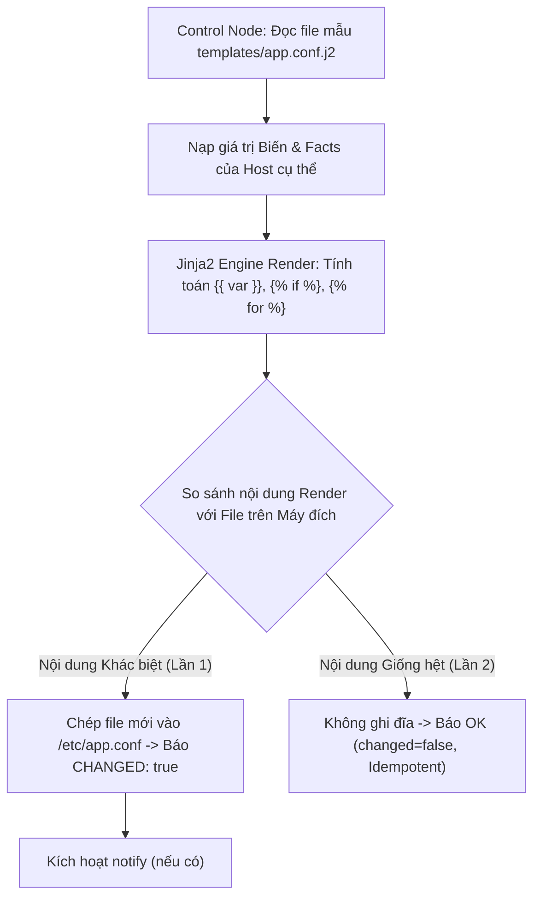
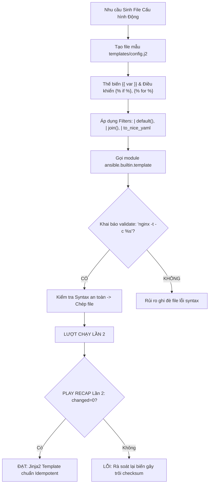
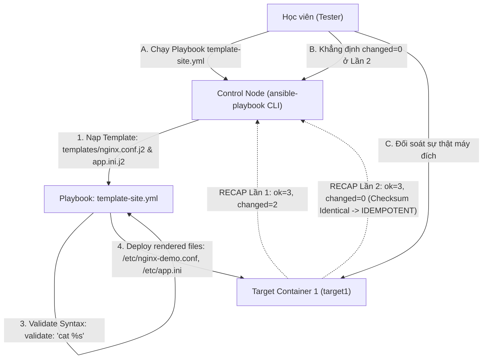


# [BÀI 12] LẬP TRÌNH BẢN MẪU JINJA2 TEMPLATES: FILTERS, BIỂU THỨC ĐIỀU KIỆN, VÒNG LẶP & TỰ ĐỘNG SINH FILE CẤU HÌNH PHỨC TẠP

Trong kỷ nguyên **Infrastructure as Code (IaC)** và tự động hóa vận hành hạ tầng đám mây (Cloud Infrastructure Automation), **Ansible** khẳng định vị thế dẫn đầu nhờ triết lý **Agentless** (không cần cài đặt agent nền trên máy đích), giao thức điều khiển an toàn qua **SSH / WinRM**, định dạng khai báo **YAML** trực quan và nguyên lý bất biến **Idempotency** mạnh mẽ. Việc làm chủ Ansible không chỉ dừng lại ở các câu lệnh Ad-hoc đơn giản, mà đòi hỏi kỹ sư phải nắm vững kiến trúc Module tầng thấp, Variable Precedence 22 tầng, Jinja2 Templates, tối ưu hóa Forks & Pipelining cho tới thiết kế Roles / Collections và tích hợp CI/CD tự động hóa chuẩn Doanh nghiệp.

Bài viết chuyên sâu này sẽ đồng hành cùng bạn mổ xẻ toàn diện bức tranh kiến trúc, phân tích các đánh đổi kỹ thuật thực chiến (Engineering Trade-offs), cung cấp hướng dẫn thực hành Lab chi tiết từng bước và bộ câu hỏi phỏng vấn chuyên sâu chuẩn DevOps / SRE Lead.

---

## 1. Bản Chất Kiến Trúc & Cơ Chế Vận Hành Tầng Thấp

---


> **Biến file cấu hình tĩnh thành động bằng Jinja2 template giúp sinh cấu hình chuẩn xác cho mọi máy đích.**

Mở rộng kỹ năng sinh file cấu hình tự động cho hạ tầng đa dạng (I-10):

> **Trong một hạ tầng gồm nhiều máy chủ có thông số phần cứng khác nhau (RAM 2GB vs RAM 64GB, 2 CPU vs 32 CPU), việc sao chép một tệp cấu hình tĩnh đóng cứng (hardcoded file) sẽ khiến hệ thống không thể tối ưu hiệu năng hoặc bị văng lỗi dịch vụ. Kỹ thuật mẫu Jinja2 Template kết hợp với bộ lọc Jinja2 Filters cho phép biến tệp cấu hình tĩnh thành một mẫu sinh cấu hình động thông minh. Nhờ module `template`, Ansible Engine tự động tính toán thông số facts và biến số của từng host để sinh ra đúng tệp cấu hình chuẩn đĩa cứng. Ở lượt chạy Lần thứ hai, khi file cấu hình đã trùng khớp tuyệt đối, Playbook tự động im lặng báo `changed=0`, đạt tiêu chuẩn Idempotency 100%.**

---


---


---


| Tiếng Việt | Tiếng Anh / Từ khóa + FQCN (giữ nguyên) |
|---|---|
| Mẫu định dạng Jinja2 | Jinja2 templating (`templates/file.j2`) |
| Module sinh mẫu | Template module (`ansible.builtin.template`) |
| Bộ lọc biến Jinja2 | Jinja2 filters (`default`, `join`, `lower`) |
| Thế thế biến nội suy | Variable interpolation (`{{ var }}`) |
| Cấu trúc điều khiển | Control structures (``, ``) |
| Kiểm tra cú pháp trước ghi | File validation (`validate:`) |
| Nhãn phân định quản lý | Managed header comment (`ansible_managed`) |
| Biến đổi mảng list | List mapping & filtering (`map`, `selectattr`) |
| Chuyển đổi định dạng | Format serialization (`to_json`, `to_nice_yaml`) |
| Đánh dấu ngắt dòng | Jinja2 whitespace control (``) |
| Biến mặc định phòng vệ | Fallback filter (`| default()`) |
| Nạp lại mẫu đĩa cứng | Template rendering phase |

---

### 1.1. Cú pháp Mẫu Jinja2 và Module `ansible.builtin.template` (15 phút)



**Nguyên lý cốt lõi:** Sử dụng module `ansible.builtin.template` (thay vì module `copy`) khi nguồn tệp tin là một mẫu thiết kế Jinja2 chứa các biểu thức động `.j2`.

**Giải thích cơ chế ngầm:** Module `copy` chỉ chép nguyên vẹn dữ liệu thô (raw content), không hề tính toán các biểu thức `{{ }}` bên trong tệp. Module `template` sẽ khởi chạy bộ máy Jinja2 Engine trên Control Node để tính toán và thế giá trị biến hoàn chỉnh trước khi gửi file đã render tới máy đích.

> [!WARNING]
> **CẠM BẪY THỰC CHIẾN:**
> Dùng module `copy` chép file `app.conf.j2` làm tệp tin trên máy đích chứa nguyên văn chuỗi `{{ ansible_facts.memtotal_mb }}` chưa được giải mã.

**Minh hoạ.** Gọi module `template` chép file cấu hình động:
```yaml
- name: Deploy dynamic Nginx configuration from template
  ansible.builtin.template:
    src: nginx.conf.j2
    dest: /etc/nginx/nginx.conf
    owner: root
    group: root
    mode: '0644'
```

**Nguyên lý cốt lõi:** Chèn các biến số và facts hệ thống vào tệp template `.j2` qua cú pháp cặp dấu ngoặc nhọn kép `{{ variable_name }}`.

**Giải thích cơ chế ngầm:** Cho phép tệp cấu hình tự động điều chỉnh các tham số theo đúng môi trường của máy đích (ví dụ: tự động gán `worker_processes` bằng số lượng CPU `{{ ansible_facts.processor_vcpus }}`).

> [!WARNING]
> **CẠM BẪY THỰC CHIẾN:**
> Đóng cứng giá trị `worker_processes 4;` cho mọi máy chủ, làm các máy có 32 CPU không tận dụng được tài nguyên đĩa cứng.

**Minh hoạ.** Mẫu tệp Jinja2 `nginx.conf.j2` thế biến động:
```nginx
# Created by Ansible for {{ inventory_hostname }}
user www-data;
worker_processes {{ ansible_facts.processor_vcpus }};
pid /run/nginx.pid;

events {
    worker_connections {{ max_connections | default(1024) }};
}
```

**Nguyên lý cốt lõi:** Sử dụng các cấu trúc điều khiển Jinja2 (``, ``) để sinh các khối cấu hình phức tạp hoặc lặp danh sách động.

**Giải thích cơ chế ngầm:** Cho phép sinh danh sách Virtual Host Nginx hoặc danh sách Upstream Server tự động từ một mảng biến YAML mà không cần phải gõ tay hàng trăm dòng cấu hình trùng lặp.

> [!WARNING]
> **CẠM BẪY THỰC CHIẾN:**
> Gõ tay 20 khối `server { ... }` trong tệp cấu hình thay vì dùng vòng lặp `` trong Jinja2.

**Minh hoạ.** Vòng lặp `` và rẽ nhánh `` trong Jinja2 Template:
```nginx

server {
    listen {{ vhost.port | default(80) }};
    server_name {{ vhost.domain }};
    root {{ vhost.document_root }};

    
    ssl_certificate /etc/ssl/certs/{{ vhost.domain }}.crt;
    ssl_certificate_key /etc/ssl/private/{{ vhost.domain }}.key;
    
}

```

---

### 1.2. Các Bộ lọc Jinja2 Filters Phổ biến và Nâng cao (15 phút)

**Nguyên lý cốt lõi:** Sử dụng Jinja2 Filter `default('fallback_val')` để cung cấp giá trị mặc định phòng vệ an toàn khi một biến chưa được khai báo.

**Giải thích cơ chế ngầm:** Ngăn chặn hoàn toàn việc Jinja2 Engine bị crash với lỗi `fatal: undefined variable` trong quá trình render tệp template nếu người dùng quên truyền tham số tùy chọn.

> [!WARNING]
> **CẠM BẪY THỰC CHIẾN:**
> Tệp template ghi `{{ app_port }}` bị ngắt thi hành khi chạy trên host chưa định nghĩa biến `app_port`.

**Minh hoạ.** Sử dụng filter `default` gán cổng 8080 mặc định:
```nginx
listen {{ app_port | default(8080) }};
```

**Nguyên lý cốt lõi:** Sử dụng các Filters chuỗi và mảng (`lower`, `upper`, `join`, `split`) để biến đổi định dạng dữ liệu theo đúng chuẩn tệp cấu hình của ứng dụng.

**Giải thích cơ chế ngầm:** Dữ liệu đầu vào từ biến YAML (như mảng danh sách IP `[10.0.0.1, 10.0.0.2]`) cần được biến đổi thành chuỗi phân cách bởi dấu phẩy `"10.0.0.1, 10.0.0.2"` để ghi vào tệp cấu hình INI hoặc Java properties.

> [!WARNING]
> **CẠM BẪY THỰC CHIẾN:**
> Ghi thẳng dạng mảng Python/YAML `['10.0.0.1', '10.0.0.2']` vào file cấu hình ứng dụng gây lỗi parse syntax của ứng dụng.

**Minh hoạ.** Filter `join` biến đổi mảng list thành chuỗi phân cách:
```ini
# Biến: allowed_hosts: ['10.0.0.1', '10.0.0.2']
ALLOWED_HOSTS={{ allowed_hosts | join(', ') }}
# Kết quả render: ALLOWED_HOSTS=10.0.0.1, 10.0.0.2
```

**Nguyên lý cốt lõi:** Sử dụng các Filters chuyển đổi định dạng (`to_json`, `from_json`, `to_nice_yaml`) để tự động đóng gói dữ liệu phức tạp từ Ansible sang dạng JSON hoặc YAML chuẩn hóa.

**Giải thích cơ chế ngầm:** Giúp tạo tệp cấu hình JSON/YAML phức tạp chỉ bằng 1 dòng lệnh duy nhất trong template mà không cần tự tay nối chuỗi thủ công dễ bị sai dấu ngoặc nhọn.

> [!WARNING]
> **CẠM BẪY THỰC CHIẾN:**
> Tự nối chuỗi JSON bằng tay trong Jinja2 làm thiếu dấu phẩy hoặc ngoặc kép khiến tệp JSON bị lỗi syntax.

**Minh hoạ.** Chuyển đổi từ điển Ansible sang định dạng JSON đẹp với `to_nice_json`:
```json
{{ app_settings_dict | to_nice_json }}
```

---

### 1.3. Kiểm tra Cú pháp `validate:` và Quản lý Idempotency (10 phút)

**Nguyên lý cốt lõi:** Sử dụng thuộc tính `validate:` trong module `template` để ép Ansible kiểm tra cú pháp của tệp cấu hình tạm thời trên máy đích trước khi ghi đè chính thức vào vị trí đĩa cứng.

**Giải thích cơ chế ngầm:** Nếu tệp template bị lỗi cú pháp (như thiếu dấu chấm phẩy trong `nginx.conf`), việc ghi đè trực tiếp sẽ làm ngắt hoàn toàn dịch vụ Web khi restart. Thuộc tính `validate: "nginx -t -c %s"` sẽ mở một file tạm `%s`, chạy lệnh kiểm tra, nếu lệnh trả về lỗi (exit code != 0), Ansible sẽ HỦY BỎ việc ghi đĩa và bảo vệ dịch vụ an toàn.

> [!WARNING]
> **CẠM BẪY THỰC CHIẾN:**
> Ghi đè file cấu hình lỗi làm dịch vụ Nginx bị crash và ngắt kết nối hệ thống Production.

**Minh hoạ.** Kiểm tra syntax Nginx an toàn trước khi ghi đĩa bằng `validate`:
```yaml
- name: Deploy Nginx config with syntax validation
  ansible.builtin.template:
    src: nginx.conf.j2
    dest: /etc/nginx/nginx.conf
    validate: "nginx -t -c %s"
  notify: Reload Nginx
```

**Nguyên lý cốt lõi:** Tự động chèn biến header `{{ ansible_managed }}` vào đầu mọi tệp template Jinja2 để đánh dấu quyền quản lý tự động hóa.

**Giải thích cơ chế ngầm:** Cảnh báo các quản trị viên hệ thống không được chỉnh sửa trực tiếp bằng tay trên máy đích (vì mọi chỉnh sửa tay sẽ bị Ansible ghi đè ở lượt chạy sau), đồng thời lưu vết thời gian và tên file template gốc.

> [!WARNING]
> **CẠM BẪY THỰC CHIẾN:**
> Quản trị viên sửa tay file cấu hình trên server, 1 tuần sau Ansible chạy đè mất sạch các sửa đổi đó.

**Minh hoạ.** Chèn header `ansible_managed` ở dòng 1 của mọi tệp `.j2`:
```nginx
# {{ ansible_managed }}
# DO NOT EDIT THIS FILE MANUALLY ON TARGET NODE!
```

**Nguyên lý cốt lõi:** Đảm bảo rằng ở lượt chạy Lần thứ hai, nếu dữ liệu biến và facts không thay đổi, tệp tin được sinh ra từ module `template` phải trùng khớp 100% với tệp trên đĩa cứng và báo chỉ số `changed=0`.

**Giải thích cơ chế ngầm:** Module `template` tự động tính toán checksum SHA1 của dữ liệu đã render và so sánh với checksum của file hiện có trên đĩa đích. Nếu dữ liệu giống hệt, module `template` sẽ im lặng giữ nguyên file và trả về `changed: false`, đảm bảo tính Idempotency 100%.

> [!WARNING]
> **CẠM BẪY THỰC CHIẾN:**
> Tệp template chứa biến thời gian tự do (như `{{ ansible_date_time.iso8601 }}`) làm file bị thay đổi liên tục ở mọi lượt chạy Lần 2 (hỏng tính Idempotent).

**Minh hoạ.** Đọc hiểu bảng `PLAY RECAP` lượt 2 đạt Idempotency của module `template`:
```
# Lần 1: changed=1 (Render và chép file cấu hình mới)
target1 : ok=2 changed=1 unreachable=0 failed=0

# Lần 2: changed=0 (Checksum trùng khớp 100% -> ĐẠT IDEMPOTENCY)
target1 : ok=2 changed=0 unreachable=0 failed=0
```

---

### 1.4. Đưa vào việc thật (4 phút)

### 7.1. Áp dụng vào hạ tầng sẵn có
Khi triển khai cụm Web Server / Database trên hạ tầng đa vùng (Multi-region):
- Sử dụng template `my.cnf.j2` tự động tính toán tham số `innodb_buffer_pool_size = {{ (ansible_facts.memtotal_mb * 0.7) | int }}M` (chiếm 70% dung lượng RAM vật lý của từng máy đích).
- Sinh tự động file `/etc/hosts` chứa danh sách 100 máy chủ trong cụm bằng vòng lặp `` trong tệp `hosts.j2`.

### 7.2. Rủi ro hỏng hóc khi triển khai Production và giải pháp an toàn
- **Rủi ro:** Chèn biến thời gian `{{ ansible_date_time.date }}` vào giữa file cấu hình làm checksum file bị thay đổi mỗi ngày, khiến Ansible liên tục báo `changed=1` và restart dịch vụ Nginx vô điều kiện mỗi sáng.
- **Giải pháp an toàn:**
  1. Tuyệt đối không chèn các biến thời gian thực hoặc ngẫu nhiên vào bên trong nội dung tệp template.
  2. Bắt buộc khai báo thuộc tính `validate:` cho các dịch vụ quan trọng (Nginx, Apache, Sshd, Sudoers).

### 7.3. Đo lường chỉ số Trước – Sau khi áp dụng
- **Trước khi dùng `template`:** Phải chuẩn bị 20 file cấu hình Nginx tĩnh cho 20 máy chủ (20 file = 2000 dòng mã nguồn).
- **Sau khi dùng `template`:** Chỉ duy trì đúng 1 file mẫu `nginx.conf.j2` duy nhất (1 file = 100 dòng mã nguồn), giảm 95% nỗ lực quản lý file cấu hình.

### 7.4. Khi nào KHÔNG nên dùng hoặc không nên lạm dụng template
- **Không lạm dụng `template` để chép các file nhị phân (Binary files) hoặc file ảnh:** Module `template` thiết kế chuyên biệt cho tệp văn bản mã UTF-8. Để chép các file nhị phân (`.tar.gz`, `.png`, `.so`), **bắt buộc phải sử dụng module `ansible.builtin.copy`**.

---

### 1.5. Bẫy hay gặp (2 phút)

| # | Bẫy hay gặp | Vì sao "recap xanh mà sai / không idempotent" | Lệnh phát hiện và xử lý |
|---|---|---|---|
| 1 | Dùng module `copy` để chép tệp mẫu `.j2` | Tệp trên máy đích bị chép nguyên văn chuỗi `{{ var }}` thô chưa render. | Đổi tên task sang module `ansible.builtin.template`. |
| 2 | Quên filter `default` cho các biến tùy chọn | Playbook văng lỗi fatal `undefined variable` khi chạy trên máy đích thiếu biến. | Bổ sung filter default: `{{ my_var | default('fallback') }}`. |
| 3 | Chèn biến thời gian `ansible_date_time` vào template | Checksum file bị thay đổi liên tục ở lượt 2, làm hỏng tính Idempotency và làm restart dịch vụ lãng phí. | Xóa các biến thời gian thực khỏi nội dung tệp template. |
| 4 | Thiếu cờ `validate:` làm dịch vụ crash khi restart | Ghi đè file cấu hình bị lỗi syntax làm dịch vụ Nginx/Apache bị ngắt đứt gãy. | Bổ sung `validate: "nginx -t -c %s"` vào module `template`. |
| 5 | Ghi thẳng mảng List Python vào file INI | Dữ liệu bị ghi dạng `['a', 'b']` vi phạm cú pháp INI/Properties của ứng dụng. | Dùng filter `join`: `{{ my_list | join(', ') }}`. |
| 6 | Thừa khoảng trắng dòng trống khi dùng `` | Vòng lặp Jinja2 sinh hàng chục dòng trống thừa làm tệp cấu hình rườm rà. | Sử dụng dấu trừ ngắt khoảng trắng Jinja2: ``. |
| 7 | Nhầm lẫn giữa ngoặc nhọn cặp `{{ }}` và ngoặc phần trăm `` | Dùng `{{ if condition }}` thay vì `` gây lỗi syntax parser Jinja2. | Nhớ quy tắc: `{{ }}` in giá trị biến, `` thực thi câu lệnh điều khiển logic. |
| 8 | Quên bọc ngoặc kép cho tham số filter `default` | Viết `default(unquoted_string)` khiến Jinja2 tưởng `unquoted_string` là 1 tên biến khác. | Bọc ngoặc đơn/kép chuỗi: `default('unquoted_string')`. |
| 9 | Ép kiểu số nguyên bị sai trong Jinja2 | So sánh `` so sánh chuỗi thay vì so sánh số nguyên. | Ép kiểu số nguyên: ``. |
| 10 | Không kiểm tra sự tồn tại của file nguồn `.j2` | Đặt file template sai vị trí thư mục `templates/` làm Ansible báo `file not found`. | Đặt tệp `.j2` vào thư mục `templates/` nằm cùng cấp với file Playbook. |
| 11 | Nhầm lẫn giữa filter `to_json` và `to_nice_json` | `to_json` in toàn bộ JSON trên 1 dòng dài khó đọc; `to_nice_json` tự động định dạng xuống dòng thụt lề đẹp. | Dùng `to_nice_json` cho các tệp cấu hình người đọc. |
| 12 | Thắc mắc vì sao file trên máy đích không có dòng `# Ansible managed` | Quên chèn biến `{{ ansible_managed }}` ở dòng đầu tiên của tệp `.j2`. | Chèn `# {{ ansible_managed }}` vào đầu file template. |

---

### 1.6. Tóm tắt (1 phút)



### Năm điều phải nhớ
1. **Dùng module `template` cho `.j2`:** Tuyệt đối không dùng `copy` để chép file mẫu `.j2`.
2. **Phân biệt `{{ }}` và ``:** `{{ }}` in giá trị biến; `` cho vòng lặp và rẽ nhánh.
3. **Luôn dùng filter `default`:** Bọc `| default('val')` phòng chống lỗi fatal undefined variable.
4. **Luôn khai báo `validate:`:** Kiểm tra cú pháp tệp tin trước khi ghi đĩa để bảo vệ dịch vụ.
5. **Giữ trùng khớp checksum:** Không chèn biến thời gian thực làm hỏng tính Idempotency Lần 2 (`changed=0`).

---

### 1.7. Câu hỏi tự kiểm tra (kiêm luyện RHCE EX294)

1. **[RHCE EX294 Objective #9]** Module nào trong Ansible Playbook dùng để render một tệp mẫu Jinja2 chứa các biểu thức động thành tệp cấu hình hoàn chỉnh trên máy đích?
   - *Đáp án:* Module `ansible.builtin.template`.
2. **[RHCE EX294 Objective #9]** Cú pháp Jinja2 nào dùng để in giá trị của một biến tên `db_host` bên trong tệp template `.j2`?
   - *Đáp án:* Cú pháp cặp dấu ngoặc nhọn kép `{{ db_host }}`.
3. **[RHCE EX294 Objective #9]** Viết đoạn mã Jinja2 sử dụng vòng lặp `` để duyệt qua danh sách `web_ports: [80, 443]` và in dòng `listen <port>;`.
   - *Đáp án:*
     ```jinja2
     
     listen {{ port }};
     
     ```
4. **[RHCE EX294 Objective #9]** Jinja2 Filter nào dùng để cung cấp giá trị mặc định `"localhost"` khi biến `db_server` chưa được khai báo?
   - *Đáp án:* Filter `default` (cú pháp `{{ db_server | default('localhost') }}`).
5. **[RHCE EX294 Objective #9]** Viết cú pháp Jinja2 Filter biến đổi một mảng danh sách `[10.0.0.1, 10.0.0.2]` thành chuỗi phân cách bởi dấu phẩy `"10.0.0.1, 10.0.0.2"`.
   - *Đáp án:* `{{ ip_list | join(', ') }}`.
6. **[RHCE EX294 Objective #9]** Thuộc tính nào trong module `template` dùng để chạy câu lệnh kiểm tra cú pháp tệp tin tạm thời trước khi ghi đè chính thức lên đĩa cứng máy đích?
   - *Đáp án:* Thuộc tính `validate:` (ví dụ `validate: "nginx -t -c %s"`).
7. **[RHCE EX294 Objective #9]** Biến hệ thống mặc định nào của Ansible dùng để chèn dòng chữ header cảnh báo "Tệp này được quản lý tự động bởi Ansible"?
   - *Đáp án:* Biến `{{ ansible_managed }}`.
8. **[RHCE EX294 Objective #9]** Viết một Task YAML sử dụng module `template` render file `templates/sshd_config.j2` ra `/etc/ssh/sshd_config` với cờ kiểm tra syntax `validate: "sshd -t -f %s"`.
   - *Đáp án:*
     ```yaml
     - name: Deploy SSHD Configuration
       ansible.builtin.template:
         src: sshd_config.j2
         dest: /etc/ssh/sshd_config
         mode: '0600'
         validate: "sshd -t -f %s"
     ```
9. **[RHCE EX294 Objective #9]** Jinja2 Filter nào dùng để chuyển đổi một cấu trúc dữ liệu từ điển Ansible sang định dạng YAML đẹp có xuống dòng thụt lề?
   - *Đáp án:* Filter `to_nice_yaml`.
10. **[RHCE EX294 Objective #9]** Tại sao việc chèn biến `{{ ansible_date_time.iso8601 }}` vào nội dung tệp template lại làm hỏng tính Idempotency ở lượt chạy Lần 2?
    - *Đáp án:* Vì biến thời gian thay đổi liên tục theo từng giây, khiến checksum SHA1 của file render bị khác biệt ở lượt 2, làm Ansible liên tục báo `changed=1` và ghi đĩa lãng phí.
11. **[RHCE EX294 Objective #9]** Cú pháp Jinja2 nào dùng để xóa bỏ các dòng trống thừa do vòng lặp `` sinh ra?
    - *Đáp án:* Sử dụng cú pháp ngắt khoảng trắng với dấu trừ ``.
12. **[RHCE EX294 Objective #9]** Viết đoạn mã Jinja2 rẽ nhánh `` để chỉ chèn dòng `ssl_protocols TLSv1.3;` khi biến `ssl_enabled` có giá trị `true`.
    - *Đáp án:*
      ```jinja2
      
      ssl_protocols TLSv1.3;
      
      ```
13. **[RHCE EX294 Objective #9]** Lệnh CLI nào giúp đối soát trực tiếp nội dung tệp tin đã được render bởi module `template` trên target node Docker container?
    - *Đáp án:* Lệnh `docker exec target1 cat /path/to/rendered/file`.

---

### 1.8. Tài liệu tham khảo

- Ansible Core Documentation (v2.15+): [Template Module](https://docs.ansible.com/ansible/latest/collections/ansible/builtin/template_module.html)
- Ansible Core Documentation: [Jinja2 Templating](https://docs.ansible.com/ansible/latest/playbook_guide/playbooks_templating.html)
- Red Hat Certified Engineer (RHCE) EX294 Study Guide: Creating and Managing Templates in Ansible.

---

## Bảng đối soát thời lượng

| Mục | Nội dung | Thời lượng dự kiến | Thời lượng thực tế |
|---|---|---|---|
| §0 | Khởi động và ôn tập buổi 11 | 10 phút | 10 phút |
| §1–§2 | Mục tiêu làm được & Cần biết trước | 2 phút | 2 phút |
| §3 | Thuật ngữ Việt-Anh & Mô hình tư duy | 8 phút | 8 phút |
| §4 | Cú pháp Mẫu Jinja2 & Module template (QT 4.1–4.3) | 15 phút | 15 phút |
| §5 | Các Bộ lọc Jinja2 Filters Phổ biến (QT 5.1–5.3) | 15 phút | 15 phút |
| §6 | Kiểm tra Cú pháp validate & Idempotency (QT 6.1–6.3) | 10 phút | 10 phút |
| §7–§9 | Đưa vào việc thật, Bẫy hay gặp & Tóm tắt | 7 phút | 7 phút |
| §10–§11 | Câu hỏi tự kiểm tra EX294 & Tài liệu tham khảo | 3 phút | 3 phút |
| **Tổng** | **Khối lý thuyết Buổi 12** | **60 phút** | **60 phút** |

---

## 2. Hướng Dẫn Thực Hành & Triển Khai Lab Chuẩn Production

> [!IMPORTANT]
> **YÊU CẦU MÔI TRƯỜNG THỰC HÀNH:**
> Toàn bộ các bài thực hành dưới đây được thiết kế để chạy trực tiếp trên môi trường máy chủ Linux / Docker containers phân tán. Hãy đảm bảo bạn đã chuẩn bị Control Node cài đặt Ansible Core 2.15+ cùng các Managed Nodes đã cấu hình SSH Key Authentication.

## Khối thực hành — 150 phút

> **Đối soát thời lượng:** Khối thực hành kéo dài đúng **150'** (từ L0 đến L11).
> **Nguyên tắc cốt lõi:** Thực hành tạo file mẫu Jinja2 Template `.j2`, gọi module `ansible.builtin.template`, chèn biến động `{{ ansible_facts.processor_vcpus }}`, dùng `` lặp danh sách Virtual Hosts, dùng `` rẽ nhánh SSL, áp dụng Jinja2 Filters (`default`, `join`, `to_nice_yaml`), sử dụng thuộc tính `validate:` kiểm tra syntax trước khi ghi đĩa, thực thi phép thử **Lượt chạy Lần thứ hai** chứng minh `PLAY RECAP` đạt `changed=0` và đối soát sự thật máy đích qua `docker exec`.

---

## L0. Mục tiêu thực hành và tiêu chí hoàn thành

| # | Mục tiêu thực hành | Tiêu chí hoàn thành (Kiểm tra bằng lệnh CLI) |
|---|---|---|
| TH1 | Viết tệp mẫu Jinja2 templates/nginx.conf.j2 | File `.j2` chứa các thuộc tính `{{ ansible_managed }}` và facts |
| TH2 | Dùng module template render tệp cấu hình động | Module `ansible.builtin.template` ghi file `/etc/nginx-demo.conf` |
| TH3 | Sử dụng Jinja2 Filter default xử lý biến tùy chọn | File render nhận giá trị fallback khi biến chưa khai báo |
| TH4 | Sử dụng Jinja2 Filter join biến đổi danh sách IP | Mảng IP được biến đổi thành chuỗi phân cách bởi dấu phẩy |
| TH5 | Sử dụng vòng lặp  sinh danh sách Vhost động | Render tự động 2 khối server trong tệp cấu hình Nginx |
| TH6 | Kiểm tra syntax bằng thuộc tính validate trước khi ghi | Module `template` dùng `validate: "cat %s"` kiểm tra file |
| TH7 | Thực thi Phép thử Lượt chạy Lần hai (Idempotency) | Bảng `PLAY RECAP` Lần 2 đạt `changed=0` tuyệt đối |
| TH8 | Đối soát sự thật máy đích bằng docker exec | `docker exec target1 cat /etc/nginx-demo.conf` |

---

## L1. Điều kiện tiên quyết về môi trường

| Kiểm tra | LỆNH THỰC THI | Kết quả kỳ vọng |
|---|---|---|
| Ansible core đã cài | `ansible --version` | Phiên bản ansible-core v2.15 trở lên |
| Docker Compose sẵn sàng | `docker compose ps` | Cả target1 và target2 ở trạng thái `Up` |
| Kết nối SSH sẵn sàng | `ansible all -m ansible.builtin.ping` | Đạt `SUCCESS` cho mọi host |
| Inventory dự án | `ansible-inventory --graph` | Hiển thị các nhóm `web` và `db` |
| Thư mục thực hành | `pwd` | Đang ở thư mục `~/lab-ansible-12` |

Nếu chưa có target container:
```bash
cd labs && make up && make key && make inventory
```

---

## L2. Kiến trúc bài lab



---

## L3. Bước 1 — Viết Template Jinja2 Cơ bản và Render File Cấu hình (30 phút)

Tạo thư mục dự án `~/lab-ansible-12`, thư mục `templates`, file `ansible.cfg`, `inventory.ini`, file mẫu `templates/basic-app.conf.j2` và file Playbook `step1-template.yml` (QT 4.1, QT 4.2, QT 6.2).

```bash
mkdir -p ~/lab-ansible-12/templates && cd ~/lab-ansible-12

cat << 'EOF' > ansible.cfg
[defaults]
inventory = ./inventory.ini
remote_user = ansible
host_key_checking = False
private_key_file = ~/.ssh/id_ed25519

[privilege_escalation]
become = True
become_method = sudo
become_user = root
become_ask_pass = False
EOF

cat << 'EOF' > inventory.ini
[web]
target1 ansible_host=127.0.0.1 ansible_port=2221

[db]
target2 ansible_host=127.0.0.1 ansible_port=2222

[all:vars]
ansible_python_interpreter=/usr/bin/python3
EOF

cat << 'EOF' > templates/basic-app.conf.j2
# {{ ansible_managed }}
# Basic Application Configuration File for {{ inventory_hostname }}

[server]
hostname={{ inventory_hostname }}
os_family={{ ansible_facts.os_family }}
cpu_cores={{ ansible_facts.processor_vcpus | default(2) }}
memory_total_mb={{ ansible_facts.memtotal_mb | default(1024) }}
EOF

cat << 'EOF' > step1-template.yml
---
- name: Deploy Basic Template Demonstration
  hosts: web
  become: true
  tasks:
    - name: Task 1 - Deploy basic application configuration from Jinja2 template
      ansible.builtin.template:
        src: basic-app.conf.j2
        dest: /etc/basic-app.conf
        mode: '0644'
EOF
```

Thực thi Playbook `step1-template.yml`:
```bash
ansible-playbook step1-template.yml
```

**CHECKPOINT 1 — Task 1 sử dụng module template render thành công file /etc/basic-app.conf từ mẫu basic-app.conf.j2.**
- **Lệnh kiểm tra:**
```bash
STEP1_OUT=$(ansible-playbook step1-template.yml)
if echo "$STEP1_OUT" | grep -q "Task 1 - Deploy basic application configuration" && echo "$STEP1_OUT" | grep -q "failed=0"; then
  echo "CHECKPOINT 1: ĐẠT - Module template render thành công tệp cấu hình động từ mẫu basic-app.conf.j2"
else
  echo "CHECKPOINT 1: LỖI - Render template thất bại"
fi
```

**CHECKPOINT 2 — Tệp /etc/basic-app.conf chứa đúng biến header ansible_managed và thông số facts CPU/RAM máy đích.**
- **Lệnh kiểm tra:**
```bash
STEP1_FILE=$(docker exec target1 cat /etc/basic-app.conf)
if echo "$STEP1_FILE" | grep -q "Ansible managed" && echo "$STEP1_FILE" | grep -q "hostname=target1"; then
  echo "CHECKPOINT 2: ĐẠT - Tệp /etc/basic-app.conf chứa biến header ansible_managed và facts hostname=target1"
else
  echo "CHECKPOINT 2: LỖI - Nội dung file render không đúng facts"
fi
```

---

## L4. Bước 2 — Áp dụng Jinja2 Filters (default, join, to_nice_yaml) (30 phút)

Tạo file mẫu `templates/app-filters.ini.j2` áp dụng các Jinja2 Filters phổ biến và viết Playbook `step2-filters.yml` (QT 5.1, QT 5.2, QT 5.3).

```bash
cat << 'EOF' > templates/app-filters.ini.j2
# {{ ansible_managed }}
[application]
app_name={{ app_name | default('MyDefaultApp') | lower }}
app_port={{ custom_port | default(8080) }}
allowed_hosts={{ allowed_ip_list | default(['127.0.0.1', '10.0.0.1']) | join(', ') }}

[environment]
environment_mode={{ app_env | default('production') | upper }}
EOF

cat << 'EOF' > step2-filters.yml
---
- name: Jinja2 Filters Demonstration
  hosts: web
  become: true
  vars:
    app_name: "SUPER_SERVICE"
    allowed_ip_list:
      - 192.168.1.10
      - 192.168.1.11
      - 192.168.1.12
  tasks:
    - name: Task 1 - Deploy INI config using Jinja2 filters
      ansible.builtin.template:
        src: app-filters.ini.j2
        dest: /etc/app-filters.ini
        mode: '0644'
EOF
```

Thực thi Playbook `step2-filters.yml`:
```bash
ansible-playbook step2-filters.yml
```

**CHECKPOINT 3 — Jinja2 Filter default gán thành công giá trị cổng mặc định 8080 khi custom_port chưa khai báo.**
- **Lệnh kiểm tra:**
```bash
STEP2_FILE=$(docker exec target1 cat /etc/app-filters.ini)
if echo "$STEP2_FILE" | grep -q "app_port=8080" && echo "$STEP2_FILE" | grep -q "environment_mode=PRODUCTION"; then
  echo "CHECKPOINT 3: ĐẠT - Jinja2 Filters default(8080) và upper xử lý chính xác giá trị mặc định"
else
  echo "CHECKPOINT 3: LỖI - Jinja2 Filter default/upper thất bại"
fi
```

**CHECKPOINT 4 — Jinja2 Filter join biến đổi mảng IP list thành chuỗi phân cách bởi dấu phẩy.**
- **Lệnh kiểm tra:**
```bash
if echo "$STEP2_FILE" | grep -q "allowed_hosts=192.168.1.10, 192.168.1.11, 192.168.1.12" && echo "$STEP2_FILE" | grep -q "app_name=super_service"; then
  echo "CHECKPOINT 4: ĐẠT - Jinja2 Filter join(', ') biến đổi mảng mảng IP list thành chuỗi phân cách chuẩn xác"
else
  echo "CHECKPOINT 4: LỖI - Jinja2 Filter join thất bại"
fi
```

---

## L5. Bước 3 — Vòng lặp , Rẽ nhánh  và thuộc tính validate: (30 phút)

Tạo file mẫu `templates/nginx-demo.conf.j2` sử dụng vòng lặp ``, rẽ nhánh `` và viết Playbook `step3-advanced-template.yml` có thuộc tính `validate:` (QT 4.3, QT 6.1).

```bash
cat << 'EOF' > templates/nginx-demo.conf.j2
# {{ ansible_managed }}
user www-data;
worker_processes {{ ansible_facts.processor_vcpus | default(1) }};

events {
    worker_connections 1024;
}

http {
    include /etc/nginx/mime.types;
    default_type application/octet-stream;


    server {
        listen {{ vhost.port | default(80) }};
        server_name {{ vhost.domain }};
        root /var/www/{{ vhost.domain }};


        ssl_certificate /etc/ssl/certs/{{ vhost.domain }}.crt;
        ssl_certificate_key /etc/ssl/private/{{ vhost.domain }}.key;

    }

}
EOF

cat << 'EOF' > step3-advanced-template.yml
---
- name: Advanced Jinja2 Templates with Control Structures and Validation
  hosts: web
  become: true
  vars:
    web_vhosts:
      - domain: site1.example.com
        port: 80
        ssl: false
      - domain: site2.example.com
        port: 443
        ssl: true
  tasks:
    - name: Task 1 - Deploy Nginx demo configuration with validation check
      ansible.builtin.template:
        src: nginx-demo.conf.j2
        dest: /etc/nginx-demo.conf
        mode: '0644'
        validate: "cat %s"
EOF
```

Thực thi Playbook `step3-advanced-template.yml`:
```bash
ansible-playbook step3-advanced-template.yml
```

**CHECKPOINT 5 — Vòng lặp  và rẽ nhánh  render tự động 2 khối server (1 SSL, 1 non-SSL).**
- **Lệnh kiểm tra:**
```bash
STEP3_FILE=$(docker exec target1 cat /etc/nginx-demo.conf)
if echo "$STEP3_FILE" | grep -q "server_name site1.example.com;" && echo "$STEP3_FILE" | grep -q "ssl_certificate /etc/ssl/certs/site2.example.com.crt;"; then
  echo "CHECKPOINT 5: ĐẠT - Vòng lặp  và rẽ nhánh  render tự động 2 khối server (1 SSL, 1 non-SSL) chuẩn xác"
else
  echo "CHECKPOINT 5: LỖI - Vòng lặp/Rẽ nhánh Jinja2 trong template thất bại"
fi
```

**CHECKPOINT 6 — Thuộc tính validate: 'cat %s' kiểm tra cú pháp tệp tin tạm thời thành công trước khi ghi đĩa.**
- **Lệnh kiểm tra:**
```bash
STEP3_OUT=$(ansible-playbook step3-advanced-template.yml)
if echo "$STEP3_OUT" | grep -q "Task 1 - Deploy Nginx demo configuration" && echo "$STEP3_OUT" | grep -q "failed=0"; then
  echo "CHECKPOINT 6: ĐẠT - Thuộc tính validate: 'cat %s' kiểm tra cú pháp tệp tin thành công trước khi ghi đĩa"
else
  echo "CHECKPOINT 6: LỖI - Thuộc tính validate thất bại"
fi
```

---

## L6. Bước 4 — Tổng hợp Playbook Templates Hoàn chỉnh và Phép thử Lượt 2 (30 phút)

Tạo file Playbook hoàn chỉnh `template-site.yml` tổng hợp toàn bộ các kỹ thuật template `ansible.builtin.template`, Jinja2 Filters, và thực thi phép thử **Lượt chạy Lần thứ hai** chứng minh `PLAY RECAP` đạt `changed=0` (QT 6.3).

```bash
cat << 'EOF' > template-site.yml
---
- name: Fully Standardized Idempotent Template Playbook
  hosts: web
  become: true
  vars:
    app_name: "PRODUCTION_PORTAL"
    custom_port: 9000
    allowed_ip_list:
      - 10.0.0.1
      - 10.0.0.2
    web_vhosts:
      - domain: main.example.com
        port: 80
        ssl: false
      - domain: secure.example.com
        port: 443
        ssl: true
  tasks:
    - name: Task 1 - Ensure configuration directory exists
      ansible.builtin.file:
        path: /etc/app-configs
        state: directory
        mode: '0755'

    - name: Task 2 - Deploy INI configuration from template
      ansible.builtin.template:
        src: app-filters.ini.j2
        dest: /etc/app-configs/app-filters.ini
        mode: '0644'

    - name: Task 3 - Deploy Nginx configuration from template with validation
      ansible.builtin.template:
        src: nginx-demo.conf.j2
        dest: /etc/app-configs/nginx-demo.conf
        mode: '0644'
        validate: "cat %s"
EOF
```

Thực thi Lần 1:
```bash
ansible-playbook template-site.yml
```

Thực thi Lần 2 (BẮT BUỘC ĐẠT `changed=0`):
```bash
ansible-playbook template-site.yml
```

**CHECKPOINT 7 — Phép thử Lượt 2 đạt changed=0 do checksum tệp render trùng khớp 100%.**
- **Lệnh kiểm tra:**
```bash
RUN2_TMPL_OUT=$(ansible-playbook template-site.yml)
if echo "$RUN2_TMPL_OUT" | grep -q "changed=0" && echo "$RUN2_TMPL_OUT" | grep -q "failed=0"; then
  echo "CHECKPOINT 7: ĐẠT - Phép thử Lượt 2 đạt chuẩn Idempotency (PLAY RECAP báo changed=0 cho toàn bộ các task template)"
else
  echo "CHECKPOINT 7: LỖI - Lượt 2 không đạt changed=0 (Tệp template bị trôi checksum)"
fi
```

---

## L7. Bước 5 — Đối soát Sự thật Máy đích qua docker exec (20 phút)

Sử dụng lệnh `docker exec` đối soát trực tiếp nội dung các file cấu hình được render từ mẫu Jinja2 trên target node (QT 6.3).

Đối soát file `/etc/app-configs/app-filters.ini`:
```bash
docker exec target1 cat /etc/app-configs/app-filters.ini
```

Đối soát file `/etc/app-configs/nginx-demo.conf`:
```bash
docker exec target1 cat /etc/app-configs/nginx-demo.conf
```

**CHECKPOINT 8 — Đối soát file /etc/app-configs/app-filters.ini và nginx-demo.conf trên target1 bằng docker exec.**
- **Lệnh kiểm tra:**
```bash
EXEC_INI=$(docker exec target1 cat /etc/app-configs/app-filters.ini)
EXEC_NGINX=$(docker exec target1 cat /etc/app-configs/nginx-demo.conf)
if echo "$EXEC_INI" | grep -q "allowed_hosts=10.0.0.1, 10.0.0.2" && echo "$EXEC_NGINX" | grep -q "server_name secure.example.com;"; then
  echo "CHECKPOINT 8: ĐẠT - Kiểm tra sự thật qua docker exec xác nhận các file /etc/app-configs chứa đúng nội dung render Jinja2"
else
  echo "CHECKPOINT 8: LỖI - Đối soát file render Jinja2 trên máy đích thất bại"
fi
```

---

## L8. Nộp sản phẩm và dọn dẹp (10 phút)

Thu thập kết quả ra các file báo cáo cuối buổi:
```bash
ansible-playbook template-site.yml > template-playbook.yml
ansible-playbook step2-filters.yml > jinja2-proof.txt
ansible-playbook template-site.yml > idempotency-check.txt
docker exec target1 cat /etc/app-configs/app-filters.ini > kiem-may-dich.txt
docker exec target1 cat /etc/app-configs/nginx-demo.conf >> kiem-may-dich.txt
```

---

## L9. Xử lý sự cố

| # | Hiện tượng lỗi | Nguyên nhân gốc rễ | Cách xử lý nhanh |
|---|---|---|---|
| 1 | File trên máy đích chứa nguyên văn `{{ var }}` chưa được render | Dùng module `ansible.builtin.copy` thay vì `ansible.builtin.template` | Đổi tên task sang sử dụng module `ansible.builtin.template`. |
| 2 | Lỗi `fatal: [target1]: FAILED! => {"msg": "'my_var' is undefined"}` | Biến `my_var` chưa từng được khai báo và thiếu Jinja2 filter `default` | Thêm filter default phòng vệ: `{{ my_var | default('fallback') }}`. |
| 3 | Lượt chạy Lần 2 liên tục báo `changed=1` | Tệp template chứa biến thời gian thực như `{{ ansible_date_time.date }}` làm trôi checksum | Xóa các biến thời gian thực khỏi nội dung tệp template `.j2`. |
| 4 | Lỗi `failed: [target1] ... validation command failed` | Cấu hình trong template sinh ra bị lỗi cú pháp làm lệnh `validate` bị fail | Kiểm tra lại cú pháp template và chạy thử nghiệm lệnh validation thủ công. |
| 5 | Dữ liệu mảng ghi vào file INI bị vi phạm cú pháp dạng `['a', 'b']` | Quên dùng filter `join` để chuyển đổi mảng List thành chuỗi | Bổ sung filter join: `{{ my_list | join(', ') }}`. |
| 6 | File render chứa quá nhiều dòng trống thừa | Vòng lặp `` mặc định giữ nguyên các ký tự ngắt dòng | Thêm dấu trừ ngắt khoảng trắng Jinja2: ``. |
| 7 | Lỗi `Jinja2 syntax error: unexpected 'if'` | Viết `{{ if condition }}` thay vì `` | Sửa từ ngoặc kép `{{ }}` sang ngoặc phần trăm `` cho câu lệnh điều khiển. |
| 8 | Lỗi `AnsibleUndefinedVariable` trong Jinja2 filter | Không bọc ngoặc kép cho tham số chuỗi trong `default(my_string)` | Bọc ngoặc đơn chuỗi: `default('my_string')`. |
| 9 | Mảng JSON sinh ra bị sai cấu trúc hoặc thiếu dấu ngoặc | Nối chuỗi JSON thủ công trong template bị thiếu dấu phẩy | Dùng filter `to_nice_json` để tự động hóa tạo JSON: `{{ my_dict | to_nice_json }}`. |
| 10 | Lỗi `could not find src file templates/config.j2` | Tệp `.j2` đặt sai thư mục hoặc sai tên file | Đặt tệp `.j2` vào thư mục `templates/` nằm cùng cấp với Playbook. |
| 11 | So sánh chuỗi trong `` bị sai kết quả | Viết `` (thiếu ngoặc kép làm Jinja2 hiểu nhầm `production` là biến) | Bọc ngoặc kép chuỗi so sánh: ``. |
| 12 | Thắc mắc vì sao file render không có dòng `# Ansible managed` | Quên chèn biến `{{ ansible_managed }}` ở dòng đầu tiên của tệp `.j2` | Chèn `# {{ ansible_managed }}` ở dòng 1 của tệp template. |
| 13 | Module `template` báo lỗi quyền ghi file | Thư mục đích trên máy đích chưa có hoặc chưa được phân quyền `0755` | Tạo thư mục đích bằng task `file: state=directory` trước khi gọi `template`. |
| 14 | Quá trình render template bị treo lâu khi dùng `ipaddr` filter | Thiếu thư viện Python `netaddr` trên Control Node | Cài đặt thư viện Python: `pip install netaddr`. |

---

## L10. Bài tập mở rộng

1. **BT1:** Viết file mẫu `templates/motd.j2` hiển thị thông số CPU, RAM, OS và tên máy đích, render ra `/etc/motd`.
2. **BT2:** Viết template `templates/db.conf.j2` sử dụng filter `default(3306)` cho biến `db_port` và filter `upper` cho `db_env`.
3. **BT3:** Sử dụng vòng lặp `` trong `templates/hosts.j2` render danh sách IP và hostname của tất cả các host trong nhóm `web`.
4. **BT4:** Sử dụng `` rẽ nhánh bật cờ `DEBUG=true` nếu `app_env == 'development'`, ngược lại `DEBUG=false`.
5. **BT5:** Sử dụng filter `to_nice_yaml` chuyển đổi một từ điển biến `app_settings` thành file `/etc/app-settings.yml`.
6. **BT6:** Thêm thuộc tính `validate: "cat %s"` kiểm tra tệp tin trước khi chép chính thức vào máy đích.
7. **BT7:** Thực thi phép thử Idempotency Lần 2 cho Playbook ở BT5 và đối soát bảng `PLAY RECAP` đạt `changed=0`.
8. **BT8:** Viết kịch bản bash script dùng `docker exec` kiểm tra trực tiếp dòng chữ `# Ansible managed` ở dòng 1 của mọi tệp render.

---

## L11. Sản phẩm nộp và chấm điểm

### Danh mục sản phẩm nộp
- File Playbook `template-playbook.yml`, `step1-template.yml`, `step2-filters.yml`, `step3-advanced-template.yml`.
- Thư mục `templates/` chứa các tệp mẫu `.j2`: `basic-app.conf.j2`, `app-filters.ini.j2`, `nginx-demo.conf.j2`.
- Báo cáo kết quả 8 CHECKPOINT từ terminal.
- Các file kết quả: `template-playbook.yml`, `jinja2-proof.txt`, `idempotency-check.txt`, `kiem-may-dich.txt`.

### Thang điểm đánh giá

| Mức điểm | Tiêu chí đạt được |
|---|---|
| **0–4 điểm** | Chưa hiểu module `template`, dùng module `copy` chép file `.j2` thô, hoặc dính lỗi fatal undefined variable. |
| **5–7 điểm** | Viết được `template` đơn giản, nhưng chưa thành thạo ``, ``, Filters (`default`, `join`), hay `validate:`. |
| **8–9 điểm** | Đạt đủ 8 CHECKPOINT, chứng minh thành thạo `template`, Jinja2 Filters (`default`, `join`, `upper`), ``, ``, `validate:`, Idempotency Lần 2 (`changed=0`) và đối soát `docker exec`. |
| **10 điểm** | Đạt 9 điểm + Hoàn thành xuất sắc 100% các Bài tập mở rộng (BT1–BT8). |

---

## Bảng đối soát thời lượng

| Bước | Nội dung | Thời lượng dự kiến | Thời lượng thực tế |
|---|---|---|---|
| L0–L2 | Mục tiêu, Tiên quyết & Kiến trúc bài lab | 10 phút | 10 phút |
| L3 | Bước 1: Viết Template Jinja2 cơ bản & Render file | 30 phút | 30 phút |
| L4 | Bước 2: Áp dụng Jinja2 Filters (default, join) | 30 phút | 30 phút |
| L5 | Bước 3: Vòng lặp ,  & validate | 30 phút | 30 phút |
| L6 | Bước 4: Tổng hợp Playbook & Phép thử Lần 2 | 30 phút | 30 phút |
| L7 | Bước 5: Đối soát sự thật máy đích qua docker exec | 20 phút | 20 phút |
| L8–L11 | Nộp sản phẩm, Sự cố, Bài tập & Chấm điểm | 10 phút | 10 phút |
| **Tổng** | **Khối thực hành Buổi 12** | **150 phút** | **150 phút** |

---

## 3. Bộ Câu Hỏi Vấn Đáp & Phỏng Vấn Kỹ Thuật Chuyên Sâu

Dưới đây là bộ câu hỏi phỏng vấn thực chiến dành cho các vị trí **DevOps Engineer**, **Site Reliability Engineer (SRE)** và **Cloud Automation Architect**, giúp bạn tự đánh giá độ sâu hiểu biết và rèn luyện phản xạ xử lý sự cố hệ thống:

---


## Bộ câu hỏi phỏng vấn chuyên sâu — ĐÚNG 12 câu

<div class="qa-answer">
  <div class="qa-answer-header">
    <svg width="14" height="14" fill="none" stroke="currentColor" stroke-width="2" viewBox="0 0 24 24"><path d="M22 11.08V12a10 10 0 1 1-5.93-9.14"></path><polyline points="22 4 12 14.01 9 11.01"></polyline></svg>
    <span>Phân Tích &amp; Lời Giải Kỹ Thuật</span>
  </div>
  
<b style="color: var(--accent-primary);">Hỏi:</b> Module <code>ansible.builtin.template</code> khác module <code>ansible.builtin.copy</code> ở điểm cốt lõi nào? Khi nào thì bắt buộc phải dùng <code>template</code>? *(Liên quan QT 4.1)*
<b style="color: var(--accent-primary);">Đáp án chuẩn:</b>
  <div style="margin: 0.35rem 0; padding-left: 1rem; border-left: 2px solid var(--accent-primary);">• Module <code>copy</code>: Chỉ chép nguyên vẹn dữ liệu thô (raw content) của tệp nguồn sang máy đích, KHÔNG HỀ tính toán hay giải mã các biểu thức Jinja2 bên trong tệp.</div>
  <div style="margin: 0.35rem 0; padding-left: 1rem; border-left: 2px solid var(--accent-primary);">• Module <code>template</code>: Khởi chạy bộ máy Jinja2 Engine trên Control Node để thế giá trị các biến <code>{{ var }}</code>, thực thi các vòng lặp <code></code> và rẽ nhánh <code></code> để sinh ra tệp cấu hình động hoàn chỉnh trước khi gửi tới máy đích.</div>
Bắt buộc dùng <code>template</code> khi tệp nguồn là tệp mẫu thiết kế <code>.j2</code> cần sinh cấu hình linh hoạt theo từng máy đích.
<b style="color: var(--accent-primary);">Tiêu chí chấm:</b>
  <div style="margin: 0.35rem 0; padding-left: 1rem; border-left: 2px solid var(--accent-primary);">• 0: Không phân biệt được <code>copy</code> và <code>template</code>.</div>
  <div style="margin: 0.35rem 0; padding-left: 1rem; border-left: 2px solid var(--accent-primary);">• 1: Biết <code>template</code> dùng cho <code>.j2</code> nhưng không giải thích được cơ chế render của Jinja2 Engine.</div>
  <div style="margin: 0.35rem 0; padding-left: 1rem; border-left: 2px solid var(--accent-primary);">• 2: Phân tích chính xác sự khác biệt giữa chép thô và rendering động trên Control Node.</div>
  <div style="margin: 0.35rem 0; padding-left: 1rem; border-left: 2px solid var(--accent-primary);">• 3: Nêu đúng + minh họa ví dụ tệp <code>nginx.conf.j2</code> sinh <code>worker_processes</code> theo CPU.</div>
<b style="color: var(--accent-primary);">Câu hỏi đào sâu:</b> Nếu dùng module <code>copy</code> chép file <code>app.conf.j2</code>, nội dung file trên máy đích sẽ ra sao? *(Nó sẽ chứa nguyên văn chuỗi thô <code>{{ ansible_facts.memtotal_mb }}</code> chưa được giải mã.)*
</div>
</details>

---

### Câu 2 — Cú pháp Biến và Khối Điều khiển Jinja2 🔥
**Hỏi:** Phân biệt cú pháp Jinja2 cặp ngoặc nhọn `{{ ... }}` và ngoặc phần trăm ``. Cho ví dụ. *(Liên quan QT 4.2, QT 4.3)*
**Đáp án chuẩn:**
- Cú pháp `{{ ... }}` (Variable Interpolation): Dùng để **IN GIÁ TRỊ** của một biến hoặc kết quả biểu thức ra tệp tin (ví dụ `listen {{ web_port }};`).
- Cú pháp `` (Control Structure): Dùng để **THỰC THI LỆNH ĐIỀU KHIỂN LOGIC** như vòng lặp `` hoặc rẽ nhánh `` (ví dụ ``).
**Tiêu chí chấm:**
- 0: Nhầm lẫn giữa `{{ }}` và ``.
- 1: Biết `{{ }}` in biến nhưng không giải thích được cấu trúc điều khiển ``.
- 2: Phân tích chính xác cú pháp và chức năng của từng loại cặp ngoặc.
- 3: Nêu đúng + viết đoạn mã Jinja2 minh họa cả `{{ }}` và `` sinh Virtual Hosts.
**Câu hỏi đào sâu:** Làm thế nào để xóa bỏ các khoảng trắng dòng trống thừa do vòng lặp `` sinh ra? *(Sử dụng cú pháp ngắt khoảng trắng với dấu trừ ``.)*

---

### Câu 3 — Sử dụng Jinja2 Filter `default` 🔥
**Hỏi:** Jinja2 Filter `default` có tác dụng gì? Tại sao việc sử dụng filter `default` được coi là nguyên tắc lập trình phòng vệ (Defensive Programming)? *(Liên quan QT 5.1)*
**Đáp án chuẩn:** Filter `default('fallback_val')` dùng để cung cấp một giá trị mặc định phòng vệ khi biến được gọi chưa được khai báo ở bất kỳ tầng nào. Đây là nguyên tắc lập trình phòng vệ vì nó ngăn chặn 100% việc Playbook bị crash đứt gãy với lỗi fatal `undefined variable` khi chạy trên các máy đích thiếu biến tùy chọn (ví dụ `{{ app_port | default(8080) }}`).
**Tiêu chí chấm:**
- 0: Không biết Jinja2 Filter `default`.
- 1: Biết `default` gán giá trị mặc định nhưng không nêu được vai trò phòng chống lỗi fatal undefined.
- 2: Phân tích chính xác cơ chế fallback value và tư duy lập trình phòng vệ.
- 3: Nêu đúng + viết đoạn YAML và Jinja2 Template minh họa filter `default`.
**Câu hỏi đào sâu:** Nếu biến `app_port` có giá trị là `false`, filter `{{ app_port | default(8080) }}` sẽ trả về giá trị gì? *(Trả về false; muốn ép nhận default khi biến bằng false/empty phải dùng `default(8080, true)`.)*

---

### Câu 4 — Biến đổi Mảng với Jinja2 Filter `join` 🔥
**Hỏi:** Trình bày tác dụng của Jinja2 Filter `join`. Tại sao phải dùng filter `join` khi chèn một mảng biến Ansible List vào tệp cấu hình INI/Properties? *(Liên quan QT 5.2)*
**Đáp án chuẩn:** Filter `join('sep')` dùng để nối các phần tử của một mảng danh sách (List) thành một chuỗi duy nhất phân cách bởi ký tự `sep`. Phải dùng filter `join` vì tệp cấu hình ứng dụng (như INI, Java properties) không hiểu định dạng mảng Python `['10.0.0.1', '10.0.0.2']`, mà bắt buộc cần dạng chuỗi `10.0.0.1, 10.0.0.2`.
**Tiêu chí chấm:**
- 0: Không biết filter `join`.
- 1: Biết `join` nối chuỗi nhưng không giải thích được lý do ép kiểu từ mảng sang chuỗi cho file INI.
- 2: Phân tích chính xác cơ chế biến đổi mảng sang chuỗi chuẩn hóa ứng dụng.
- 3: Nêu đúng + minh họa cú pháp `{{ allowed_ips | join(', ') }}` trong template INI.
**Câu hỏi đào sâu:** Ngược lại với filter `join` là filter nào? *(Là filter `split` dùng để cắt chuỗi thành mảng.)*

---

### Câu 5 — Chuyển đổi Định dạng với `to_nice_yaml` và `to_json`
**Hỏi:** Các Jinja2 Filters `to_json` và `to_nice_yaml` được ứng dụng trong trường hợp nào? *(Liên quan QT 5.3)*
**Đáp án chuẩn:** Các filter này dùng để tự động mã hóa (serialize) một từ điển hoặc mảng dữ liệu Ansible thành tệp tin định dạng JSON hoặc YAML chuẩn hóa. Ứng dụng: Dùng để sinh các tệp cấu hình JSON/YAML phức tạp (như Kubernetes manifest, Docker config, Elasticsearch settings) chỉ bằng 1 dòng trong template `{{ app_config_dict | to_nice_yaml }}` mà không cần nối chuỗi thủ công.
**Tiêu chí chấm:**
- 0: Không biết các filter chuyển đổi định dạng.
- 1: Biết `to_json` nhưng không phân biệt được với `to_nice_json`.
- 2: Phân tích chính xác vai trò mã hóa tự động cấu trúc dữ liệu sang JSON/YAML.
- 3: Nêu đúng + viết ví dụ template sinh tệp YAML đẹp với `to_nice_yaml`.
**Câu hỏi đào sâu:** Phân biệt sự khác nhau giữa `to_json` và `to_nice_json`? *(`to_json` in toàn bộ JSON trên 1 dòng dài; `to_nice_json` tự động thụt lề và xuống dòng đẹp cho người đọc.)*

---

### Câu 6 — Kiểm tra Cú pháp Cấu hình với `validate:` 🔥
**Hỏi:** Thuộc tính `validate:` trong module `template` có vai trò gì đối với sự an toàn của dịch vụ Production? Ký tự `%s` đại diện cho điều gì? *(Liên quan QT 6.1)*
**Đáp án chuẩn:** Thuộc tính `validate: "<command> %s"` dùng để ép Ansible mở một tệp tạm thời trên máy đích, chạy câu lệnh kiểm tra cú pháp (ví dụ `nginx -t -c %s`), nếu câu lệnh kiểm tra thành công (exit code = 0) mới cho phép ghi đè vào tệp thật. Ký tự `%s` đại diện cho đường dẫn của tệp tạm thời đó. Vai trò: Ngăn chặn 100% rủi ro ghi đè file cấu hình lỗi làm ngắt dịch vụ Web Server trên Production.
**Tiêu chí chấm:**
- 0: Không biết thuộc tính `validate:`.
- 1: Biết `validate` kiểm tra file nhưng không giải thích được cơ chế tệp tạm `%s`.
- 2: Phân tích chính xác cơ chế tệp tạm `%s` và vai trò bảo vệ an toàn dịch vụ.
- 3: Nêu đúng + viết đoạn mã YAML module `template` có `validate: "nginx -t -c %s"`.
**Câu hỏi đào sâu:** Nếu câu lệnh trong `validate` trả về exit code != 0 (thất bại), Ansible sẽ làm gì? *(Ansible ngắt thi hành Task, báo lỗi fatal và HỦY BỎ việc ghi đè file thật.)*

---

### Câu 7 — Ý nghĩa Biến Header `{{ ansible_managed }}`
**Hỏi:** Biến `{{ ansible_managed }}` dùng để làm gì? Tại sao nên chèn nó ở dòng đầu tiên của mọi tệp template `.j2`? *(Liên quan QT 6.2)*
**Đáp án chuẩn:** Biến `{{ ansible_managed }}` tự động sinh ra một chuỗi comment header (ví dụ `# Ansible managed: modified on 2026-08-22 by user on control_node`). Nên chèn nó ở dòng 1 để cảnh báo các quản trị viên không được chỉnh sửa bằng tay trên máy đích (tránh bị Ansible ghi đè ở lượt sau) và lưu vết thời gian khởi tạo.
**Tiêu chí chấm:**
- 0: Không biết biến `ansible_managed`.
- 1: Biết `ansible_managed` là dòng comment nhưng không nêu được mục đích cảnh báo sửa tay.
- 2: Phân tích chính xác vai trò cảnh báo quản trị viên và lưu vết hệ thống.
- 3: Nêu đúng + minh họa dòng comment `# {{ ansible_managed }}` ở đầu file Nginx/Apache.
**Câu hỏi đào sâu:** Chuỗi định dạng của `ansible_managed` có thể tùy chỉnh trong tệp cấu hình nào? *(Tùy chỉnh trong tệp `ansible.cfg` qua thuộc tính `ansible_managed`.)*

---

### Câu 8 — Cạm bẫy Trôi Checksum Idempotency trong Template 🔥
**Hỏi:** Tại sao việc chèn các biến thời gian thực (như `{{ ansible_date_time.iso8601 }}`) vào nội dung tệp template lại bị coi là sai quy chuẩn Idempotency? *(Liên quan QT 6.3)*
**Đáp án chuẩn:** Vì biến thời gian thay đổi liên tục theo từng giây/ngày. Mỗi lần Playbook chạy, bộ máy Jinja2 Engine sinh ra nội dung mới có timestamp mới, làm checksum SHA1 của file render bị khác biệt so với file trên đĩa. Kết quả: Module `template` bị đánh lầm là có thay đổi và báo `changed=1` ở MỌI LƯỢT CHẠY LẦN 2, hỏng hoàn toàn tính Idempotency và làm restart dịch vụ lãng phí.
**Tiêu chí chấm:**
- 0: Không biết lý do tại sao biến thời gian làm hỏng Idempotency.
- 1: Biết `changed=1` nhưng không giải thích được cơ chế so sánh checksum SHA1 của module `template`.
- 2: Phân tích chính xác cơ chế so sánh checksum SHA1 nội dung render vs file đĩa cứng.
- 3: Nêu đúng + đưa ra giải pháp loại bỏ biến thời gian thực khỏi nội dung template.
**Câu hỏi đào sâu:** Làm sao để module `template` nhận biết tệp tin trên máy đích có cần thay đổi hay không? *(Bằng cách so sánh mã checksum SHA1 của chuỗi nội dung render với checksum SHA1 của tệp đĩa đích.)*

---

### Câu 9 — Phương pháp Chứng minh Idempotency và Máy đúng khi Dùng Templates 🔥
**Hỏi:** Trình bày quy trình 3 bước nghiệm thu một Playbook sử dụng `template` để đảm bảo tính Idempotency và tệp tin trên máy đích ở đúng trạng thái.
**Đáp án chuẩn:**
1. **Bước 1 (Thực thi Lần 1):** Chạy `ansible-playbook site.yml`: Task template render và chép file báo `changed=1`.
2. **Bước 2 (Kiểm Idempotency Lần 2):** Chạy lại nguyên vẹn `ansible-playbook site.yml` Lần 2: bảng `PLAY RECAP` **bắt buộc phải đạt `changed=0`** (vì checksum nội dung render trùng khớp 100%).
3. **Bước 3 (Đối soát Sự thật Máy đích):** Dùng `docker exec target1 cat /etc/nginx-demo.conf` kiểm tra nội dung file thực sự được giải mã biến và chứa đúng cấu hình đã render.
**Tiêu chí chấm:**
- 0: Trả lời "chỉ cần nhìn terminal Lần 1 báo xanh là xong" (dính bẫy trần điểm 1).
- 1: Thiếu bước Lần 2 `changed=0` hoặc không dùng `docker exec` đối soát file thật.
- 2: Trình bày đủ 3 bước nhưng chưa minh họa câu lệnh CLI cụ thể.
- 3: Trình bày xuất sắc 3 bước + cho ví dụ thực tế lệnh `docker exec cat` đối soát file đã render.
**Câu hỏi đào sâu:** Nếu ở Lần 2 ta thay đổi một giá trị biến trong `group_vars`, chỉ số RECAP Lần 2 sẽ báo thế nào? *(RECAP Lần 2 sẽ báo `changed=1` vì checksum nội dung mới bị thay đổi so với file đĩa.)*

---

### Câu 10 — Vòng lặp `` và Filter `selectattr` Nâng cao ★★★
**Hỏi:** Viết một đoạn mã Jinja2 Template sử dụng vòng lặp `` kết hợp filter `selectattr` để chỉ duyệt và in ra danh sách các Virtual Host có cờ `active == true`.
**Đáp án chuẩn:**
```jinja2

server {
    listen {{ vhost.port | default(80) }};
    server_name {{ vhost.domain }};
}

```
**Tiêu chí chấm:**
- 0: Không viết được kịch bản Jinja2 nâng cao.
- 1: Viết được `` nhưng không biết lọc mảng bằng `selectattr`.
- 2: Phân tích chính xác vai trò lọc phần tử mảng của filter `selectattr`.
- 3: Nêu đúng + viết đoạn mã Jinja2 Template hoàn chỉnh lọc vhost active.
**Câu hỏi đào sâu:** Filter `map(attribute='domain')` trong Jinja2 có tác dụng gì? *(Dùng để trích xuất mảng danh sách chỉ chứa thuộc tính domain từ danh sách từ điển.)*

---

### Câu 11 — Quản lý File Nhị phân Binary vs File Văn bản Text ★★★
**Hỏi:** Có nên dùng module `ansible.builtin.template` để chép các tệp nhị phân (Binary files như `.tar.gz`, `.png`, `.so`) hay không? Vì sao?
**Đáp án chuẩn:** TUYỆT ĐỐI KHÔNG. Module `template` và bộ máy Jinja2 Engine được thiết kế riêng cho các tệp văn bản mã hóa UTF-8. Nếu truyền tệp nhị phân vào module `template`, Jinja2 Parser sẽ cố gắng đọc và parse các ký tự nhị phân thành chuỗi văn bản, gây hỏng dữ liệu (corruption) và văng lỗi `UnicodeDecodeError`. Đối với tệp nhị phân, BẮT BUỘC dùng module `ansible.builtin.copy`.
**Tiêu chí chấm:**
- 0: Cho rằng `template` chép được mọi loại file kể cả binary.
- 1: Biết không nên chép binary bằng `template` nhưng không giải thích được lỗi `UnicodeDecodeError`.
- 2: Phân tích chính xác sự khác biệt về mã hóa UTF-8 text vs Binary data.
- 3: Nêu đúng + đưa ra quy tắc chọn module `template` (cho text dynamic) và `copy` (cho binary/raw).
**Câu hỏi đào sâu:** Nếu tệp tin là tệp văn bản tĩnh KHÔNG CÓ BIẾN ĐỘNG NÀO, nên chọn `copy` hay `template`? *(Nên chọn `copy` để tiết kiệm chi phí CPU rendering của Jinja2 Engine.)*

---

### Câu 12 — Tóm tắt 5 Quy tắc Vàng khi Dùng `template` và Jinja2 ★★★
**Hỏi:** Tóm tắt 5 Quy tắc Vàng giúp quản trị viên sử dụng `template` và Jinja2 Filters hiệu quả, an toàn và chuẩn Idempotency nhất.
**Đáp án chuẩn:**
1. **Quy tắc 1:** Dùng module `template` cho tệp mẫu `.j2` và module `copy` cho tệp nhị phân/tĩnh.
2. **Quy tắc 2:** Phân biệt rõ cú pháp `{{ }}` (in giá trị) và `` (vòng lặp/rẽ nhánh).
3. **Quy tắc 3:** Luôn bọc filter `| default('val')` phòng thủ lỗi fatal undefined variable.
4. **Quy tắc 4:** Khai báo thuộc tính `validate:` kiểm tra cú pháp tệp tin trước khi ghi đĩa.
5. **Quy tắc 5:** Loại bỏ biến thời gian thực khỏi nội dung template, và kiểm thử Lần 2 `changed=0` qua `docker exec`.
**Tiêu chí chấm:**
- 0: Không tóm tắt được các quy tắc.
- 1: Liệt kê được 2-3 quy tắc chung chung.
- 2: Nêu đầy đủ 5 Quy tắc Vàng chính xác.
- 3: Phân tích xuất sắc cả 5 quy tắc + thể hiện tư duy quản trị hạ tầng qua mã nguồn (IaC) chuyên nghiệp.
**Câu hỏi đào sâu:** Trong 5 quy tắc trên, quy tắc nào trực tiếp ngăn ngừa sự cố sập dịch vụ do file config lỗi? *(Quy tắc 4: Khai báo thuộc tính validate:)*

---

## V3. Câu chốt để nói khi phỏng vấn

Khi nhà tuyển dụng phỏng vấn về kỹ năng tự động hóa sinh file cấu hình động bằng Ansible và Jinja2, học viên hãy đưa ra câu chốt tự tin sau:

> **"Tôi chuyển đổi toàn bộ các tệp cấu hình tĩnh rườm rà thành các tệp mẫu sinh cấu hình động Jinja2 Template `.j2` thông minh. Tôi làm chủ cú pháp nội suy biến `{{ }}`, vòng lặp ``, rẽ nhánh ``, và các bộ lọc Jinja2 Filters (`default`, `join`, `to_nice_yaml`) để xử lý an toàn mọi dữ liệu đầu vào. Để bảo vệ hạ tầng Production, tôi luôn sử dụng thuộc tính `validate:` kiểm tra cú pháp tệp tin trước khi ghi đĩa. Mọi tệp template của tôi đều được loại bỏ các biến trôi checksum, đảm bảo ở lượt chạy Lần hai đạt `changed=0` Idempotency tuyệt đối và đối soát sự thật thực tế trên máy đích bằng `docker exec`."**

---

## V4. Bảng tổng hợp điểm vấn đáp

| Học viên | Câu 1–4 (Tủ) | Câu 5–9 (Nền) | Câu 10 (Chủ chốt) | Câu 11–12 (Phân loại) | Điểm tổng | Xếp loại |
|---|---|---|---|---|---|---|
| Bùi Văn X | 3 / 3 / 3 / 3 | 3 / 3 / 3 / 3 / 3 | 3 | 3 / 3 | 36 / 36 | Xuất sắc |
| Trịnh Thị Y | 2 / 2 / 1 / 2 | 2 / 1 / 2 / 2 / 1 | 1 (Dính trần điểm 1) | 1 / 1 | 16 / 36 (Khóa trần 1) | Trung bình |

---

## V5. BTVN 4 — Ba câu chuẩn bị cho Buổi 13

Để chuẩn bị tốt nhất cho **Buổi 13: Blocks, Error Handling — block, rescue, always, failed_when, changed_when**, học viên làm 3 câu hỏi nghiên cứu trước sau:

1. **Nghiên cứu trước 1:** Khối `block:` kết hợp `rescue:` và `always:` trong Ansible có cơ chế hoạt động tương đương cấu trúc `try...catch...finally` trong lập trình như thế nào?
2. **Nghiên cứu trước 2:** Thuộc tính `failed_when:` dùng để thay đổi định nghĩa một Task bị coi là THẤT BẠI khi nào?
3. **Nghiên cứu trước 3:** Thuộc tính `changed_when:` dùng để làm gì khi gọi các lệnh CLI thô với module `command` / `shell`?

