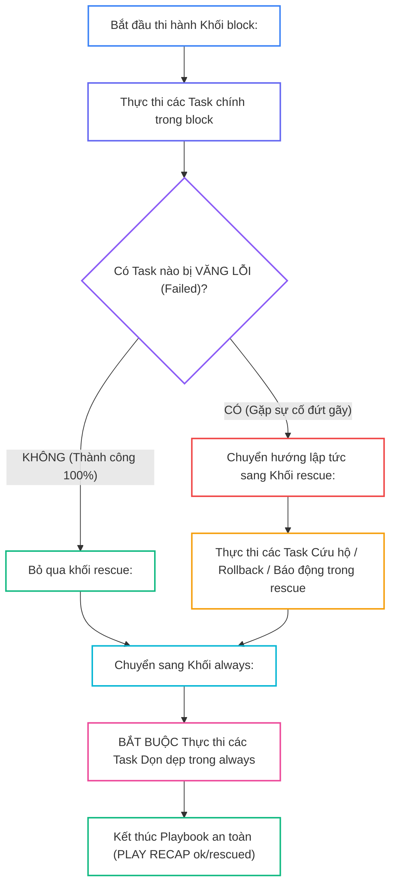
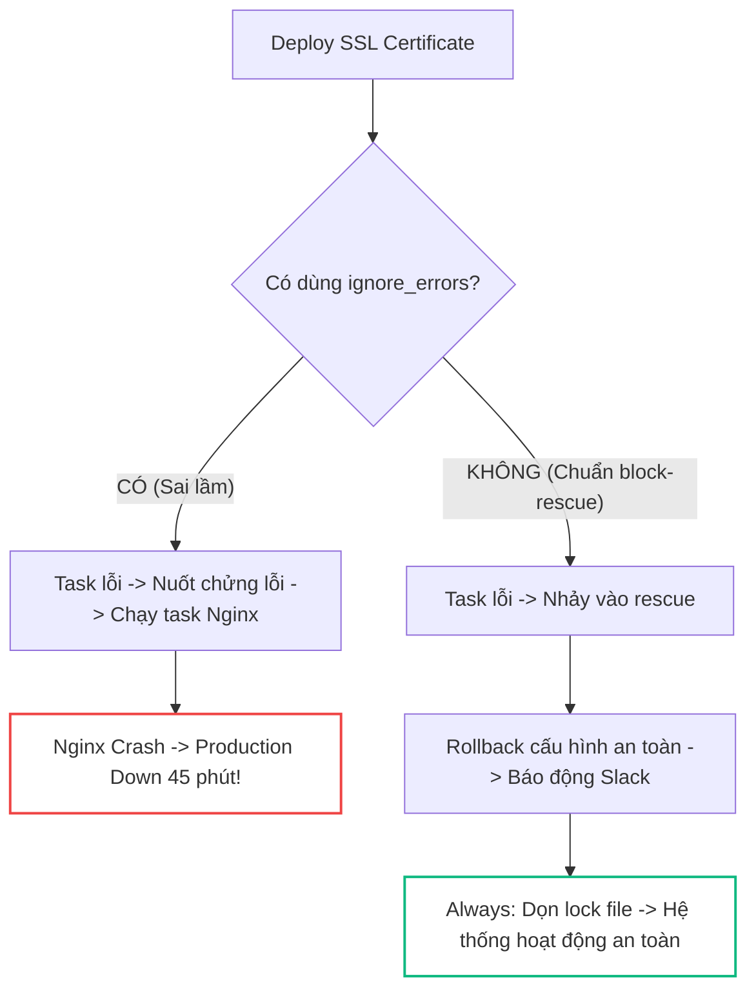
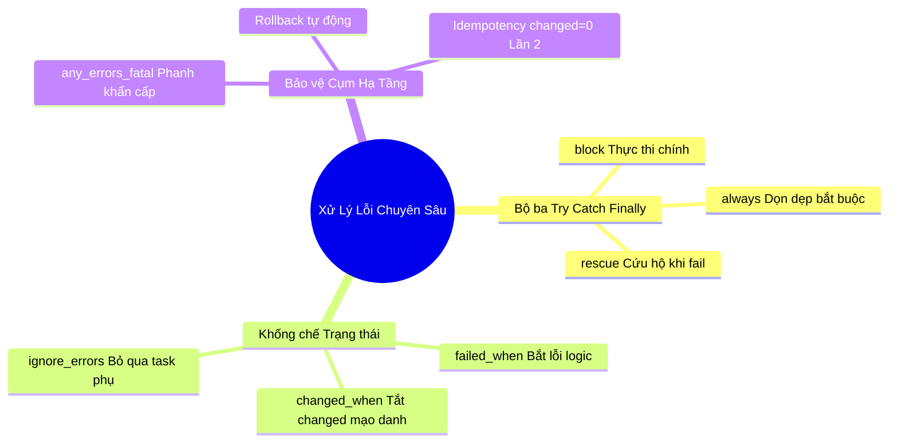


# [BÀI 13] XỬ LÝ LỖI CHUYÊN SÂU VỚI BLOCKS: BLOCK, RESCUE, ALWAYS & CƠ CHẾ TRY-CATCH-FINALLY TRONG HẠ TẦNG

Trong kỷ nguyên **Infrastructure as Code (IaC)** và tự động hóa vận hành hạ tầng đám mây (Cloud Infrastructure Automation), **Ansible** khẳng định vị thế dẫn đầu nhờ triết lý **Agentless** (không cần cài đặt agent nền trên máy đích), giao thức điều khiển an toàn qua **SSH / WinRM**, định dạng khai báo **YAML** trực quan và nguyên lý bất biến **Idempotency** mạnh mẽ. Việc làm chủ Ansible không chỉ dừng lại ở các câu lệnh Ad-hoc đơn giản, mà đòi hỏi kỹ sư phải nắm vững kiến trúc Module tầng thấp, Variable Precedence 22 tầng, Jinja2 Templates, tối ưu hóa Forks & Pipelining cho tới thiết kế Roles / Collections và tích hợp CI/CD tự động hóa chuẩn Doanh nghiệp.

Bài viết chuyên sâu này sẽ đồng hành cùng bạn mổ xẻ toàn diện bức tranh kiến trúc, phân tích các đánh đổi kỹ thuật thực chiến (Engineering Trade-offs), cung cấp hướng dẫn thực hành Lab chi tiết từng bước và bộ câu hỏi phỏng vấn chuyên sâu chuẩn DevOps / SRE Lead.

---

## 1. Bản Chất Kiến Trúc & Cơ Chế Vận Hành Tầng Thấp



### 1.1. Bộ ba Xử lý Lỗi `block:`, `rescue:`, `always:`

Bộ ba khối `block:`, `rescue:`, và `always:` cung cấp cơ chế xử lý lỗi hoàn chỉnh cho Ansible Playbook, hoạt động tương đương với cấu trúc `try...catch...finally` trong các ngôn ngữ lập trình hiện đại.

- **`block:`** Bọc các thao tác nguy hiểm hoặc nhóm task có liên quan chặt chẽ. Nếu một task trong block gặp lỗi, Ansible ngắt block ngay lập tức.
- **`rescue:`** Đóng vai trò như khối `catch`. Chỉ được kích hoạt khi có ít nhất một task trong `block:` thất bại (failed). Đây là nơi thực thi kịch bản cứu hộ, rollback, hoặc gửi thông báo cảnh báo. Nếu `block` chạy hoàn toàn thành công, toàn bộ khối `rescue` sẽ được bỏ qua.
- **`always:`** Đóng vai trò như khối `finally`. Khối này bắt buộc thực thi 100% trong mọi tình huống, bất chấp việc `block` thành công hay `rescue` thất bại, đảm bảo các tài nguyên tạm được dọn dẹp sạch sẽ.

```yaml
- name: Critical System Update Playbook
  hosts: web
  become: true
  tasks:
    - name: Primary Execution Block
      block:
        - name: Step 1 - Apply database migration
          ansible.builtin.command: /usr/bin/apply-db-migration.sh

      rescue:
        - name: Step 2 - Rollback database on migration failure
          ansible.builtin.command: /usr/bin/rollback-db.sh

      always:
        - name: Step 3 - Remove temporary lock file
          ansible.builtin.file:
            path: /tmp/db-update.lock
            state: absent
```

### 1.2. Tùy biến Trạng thái với `failed_when:` và `changed_when:`

Trong nhiều kịch bản thực tế, mã trả về (exit code) của câu lệnh CLI không phản ánh đúng thực chất kết quả vận hành:

- **`failed_when:`** Định nghĩa lại điều kiện khiến task bị coi là thất bại dựa trên logic Jinja2 tùy biến (kiểm tra stdout, stderr, hoặc return code). Nhiều công cụ CLI trả về `rc = 0` nhưng output chứa chuỗi `"FATAL_ERROR: Connection refused"`. `failed_when:` giúp Ansible bắt đúng lỗi thực sự.
- **`changed_when:`** Kiểm soát trạng thái `changed: true/false`. Các module như `ansible.builtin.command` hay `shell` mặc định luôn trả về `changed: true` ở mọi lượt chạy, làm sai lệch báo cáo Idempotency. Khai báo `changed_when: false` cho các lệnh chỉ đọc (read-only) giúp đảm bảo lượt chạy lần 2 luôn đạt `changed=0`.
- **`ignore_errors: true`:** Bỏ qua lỗi của một task không quan trọng (như ping thử nghiệm, đọc log phụ) và tiếp tục thực thi các task phía sau.

```yaml
- name: Run application health check command
  ansible.builtin.command: /usr/bin/check-app-health.sh
  register: health_res
  failed_when:
    - health_res.rc != 0 or "'ERROR' in health_res.stdout"
  changed_when: false
```

### 1.3. Dừng Khẩn cấp Toàn cụm `any_errors_fatal` và Quản lý Idempotency

Khi quản trị cụm máy chủ phân tán (Database Cluster, Kubernetes Control Plane), sự cố trên một node đơn lẻ có thể làm hỏng tính toàn vẹn của cả hệ thống nếu các node còn lại vẫn tiếp tục được cập nhật:

- **`any_errors_fatal: true`:** Khai báo ở cấp Playbook. Khi có bất kỳ một host nào trong Inventory bị lỗi, Ansible sẽ kích hoạt phanh khẩn cấp dừng thực thi ngay lập tức trên toàn bộ các host khác.
- **Quản lý Idempotency trong xử lý lỗi:** Một playbook xử lý lỗi chuẩn Enterprise phải đảm bảo: ở lượt chạy đầu tiên (khi có sự cố và được `rescue` khôi phục), `PLAY RECAP` ghi nhận `rescued=1, failed=0`; ở lượt chạy thứ hai (khi hệ thống đã chuẩn hóa), `PLAY RECAP` bắt buộc phải đạt `changed=0` tuyệt đối.

---

## 2. Bảng So Sánh Kỹ Thuật Toàn Diện (Engineering Matrix)

| Tiêu Chí Kỹ Thuật | `block / rescue / always` | `ignore_errors: true` | `failed_when:` | `any_errors_fatal: true` |
|---|---|---|---|---|
| **Cơ Chế Hoạt Động** | Try-Catch-Finally bọc cụm task | Bỏ qua lỗi runtime, tiếp tục chạy | Tùy biến điều kiện đánh dấu Failed | Dừng khẩn cấp toàn bộ cụm host |
| **Phạm Vi Áp Dụng** | Cụm Task (Grouped Tasks) | Từng Task đơn lẻ | Từng Task đơn lẻ | Cấp Playbook / Play |
| **Khả Năng Rollback** | Tự động qua khối `rescue:` | Không hỗ trợ rollback | Cần kết hợp với block | Không rollback, chỉ ngắt thi hành |
| **Ảnh Hưởng Idempotency** | Chuẩn hóa qua always/rescue | Dễ gây silent failure | Khống chế chính xác trạng thái | Bảo vệ tính toàn vẹn cluster |
| **Bảo Vệ Tài Nguyên** | Tối ưu tuyệt đối qua `always:` | Dễ bỏ quên tài nguyên rác | Phụ thuộc vào task sau | Tránh lệch phiên bản cluster |

> [!IMPORTANT]
> **NGUYÊN TẮC BẢO VỆ PRODUCTION:**
> Tuyệt đối không sử dụng `ignore_errors: true` cho các task hạ tầng trọng yếu (như phân quyền bảo mật, copy certificate SSL, apply database schema). Hãy luôn sử dụng `block-rescue-always` để kiểm soát ngoại lệ có cấu trúc và ghi nhận đúng trạng thái thực tế.

---

## 3. Kiến Trúc Triển Khai Chuẩn Production (Configuration / Playbook / Role Breakdown)

Dưới đây là kịch bản Playbook chuẩn hóa xử lý lỗi với đầy đủ cơ chế Rollback, kiểm tra cờ changed và dọn dẹp bắt buộc:

```yaml
---
- name: Production Resilient Deployment Playbook
  hosts: web
  become: true
  any_errors_fatal: true
  tasks:
    - name: Application Deployment with Error Recovery Block
      block:
        - name: Deploy application primary configuration
          ansible.builtin.copy:
            content: "PORT=8080\nENV=production\n"
            dest: /etc/app-main.conf
            mode: '0644'

        - name: Read system diagnostic status (Idempotent Read)
          ansible.builtin.command: uname -a
          register: uname_res
          changed_when: false

        - name: Validate database connectivity health
          ansible.builtin.command: /usr/local/bin/check-db-connection.sh
          register: db_res
          failed_when:
            - db_res.rc != 0
            - "'CRITICAL' in db_res.stderr"
          changed_when: false

      rescue:
        - name: Deploy fallback recovery configuration
          ansible.builtin.copy:
            content: "STATUS=RESCUED\nMODE=DEGRADED\n"
            dest: /etc/app-recovery.conf
            mode: '0644'

        - name: Send urgent incident alert notification
          ansible.builtin.debug:
            msg: "[ALERT] Primary deployment failed on {{ inventory_hostname }}. Switched to Recovery mode."

      always:
        - name: Ensure deployment temporary lock file is purged
          ansible.builtin.file:
            path: /tmp/app-deploy.lock
            state: absent
```

### Phân Tích Kỹ Thuật Từng Dòng (Line-by-Line Breakdown):
- <span class="badge-line">Line 5</span>: `any_errors_fatal: true` kích hoạt cơ chế dừng toàn cụm khi có 1 node thất bại trong tiến trình deploy.
- <span class="badge-line">Line 8</span>: `block:` mở đầu khối thực thi chính chứa các tác vụ deploy và kiểm tra sức khỏe hệ thống.
- <span class="badge-line">Line 17</span>: `changed_when: false` ngăn lệnh đọc thông số chẩn đoán làm sai lệch chỉ số changed trong PLAY RECAP.
- <span class="badge-line">Line 22-25</span>: `failed_when:` thiết lập điều kiện kép: bắt buộc mã lỗi exit code khác 0 và stderr phải chứa cảnh báo CRITICAL.
- <span class="badge-line">Line 28</span>: `rescue:` chỉ được kích hoạt khi khối deploy chính gặp sự cố, tự động chép file cấu hình chế độ phục hồi.
- <span class="badge-line">Line 38</span>: `always:` bắt buộc thực thi 100% để thu hồi file khóa triển khai `/tmp/app-deploy.lock`.

---

## 4. Phân Tích Cạm Bẫy Thực Chiến: Lạm Dụng ignore_errors và Lệch Trạng Thái Idempotency

### Tình Huống Sự Cố Thực Tế Tại Doanh Nghiệp:
Một đội ngũ DevOps cấu hình kịch bản nâng cấp ứng dụng thương mại điện tử trên 50 máy chủ Web. Trong playbook, task tạo thư mục chứng chỉ SSL và task copy chứng chỉ được gắn `ignore_errors: true` để tránh dừng playbook khi mạng gặp sự cố tạm thời. Khi triển khai lên môi trường Production, server DNS nội bộ bị quá tải khiến task copy file SSL thất bại trên 12 node. Do có `ignore_errors: true`, Ansible báo qua màu xanh (ok) và chạy tiếp lệnh khởi động lại Nginx. Kết quả: 12 máy chủ Nginx bị sập hoàn toàn do thiếu chứng chỉ HTTPS, gây gián đoạn thanh toán cho hàng chục ngàn người dùng trong suốt 45 phút.

### Hậu Quả & Log Lỗi Thực Tế:

```diff
- # Cách viết sai lầm: Nuốt chửng lỗi bằng ignore_errors
- - name: Copy SSL certificates
-   ansible.builtin.copy:
-     src: ssl/wildcard.crt
-     dest: /etc/ssl/certs/wildcard.crt
-   ignore_errors: true
- # Hậu quả: Nginx restart FAILED do không tìm thấy file SSL
+ # Cách viết chuẩn Enterprise: Bọc trong block-rescue có rollback
+ - name: Safe SSL deployment block
+   block:
+     - name: Copy SSL certificates
+       ansible.builtin.copy:
+         src: ssl/wildcard.crt
+         dest: /etc/ssl/certs/wildcard.crt
+   rescue:
+     - name: Rollback to self-signed temporary SSL
+       ansible.builtin.copy:
+         src: ssl/fallback.crt
+         dest: /etc/ssl/certs/wildcard.crt
```



### 5-Whys Root Cause Analysis:
1. **Tại sao Nginx trên 12 máy chủ bị crash?** Vì dịch vụ Nginx không tìm thấy tệp chứng chỉ SSL `/etc/ssl/certs/wildcard.crt`.
2. **Tại sao tệp SSL không tồn tại trên máy đích?** Vì task copy file qua mạng bị timeout và thất bại giữa chừng.
3. **Tại sao playbook vẫn tiếp tục chạy lệnh restart Nginx?** Vì task copy được gán cờ `ignore_errors: true`.
4. **Tại sao kỹ sư lại gán cờ ignore_errors?** Vì kỹ sư muốn playbook không bị dừng khi gặp lỗi nhỏ, nhưng không lường trước hậu quả đứt gãy phụ thuộc.
5. **Giải pháp triệt để là gì?** Xóa bỏ `ignore_errors: true`, bọc tiến trình trong `block:`, cấu hình `rescue:` rollback cert dự phòng và kích hoạt `any_errors_fatal: true` để bảo vệ cụm máy chủ.

---

## 5. Hands-on Lab: Triển Khai Xử Lý Lỗi Toàn Diện & Phép Thử Idempotency (8 Bước)

| Bước | Lệnh CLI / Tác Vụ Chính | Mục Đích Thực Thi |
|---|---|---|
| **1** | `mkdir -p ~/lab-ansible-13 && cd ~/lab-ansible-13` | Khởi tạo không gian làm việc và cấu hình `ansible.cfg` |
| **2** | `cat << 'EOF' > inventory.ini` | Khai báo danh sách máy chủ đích `web` và `db` |
| **3** | `cat << 'EOF' > step1-block-rescue.yml` | Xây dựng kịch bản thử nghiệm `block-rescue-always` |
| **4** | `ansible-playbook step1-block-rescue.yml` | Thực thi kiểm chứng kích hoạt tự động của khối rescue |
| **5** | `cat << 'EOF' > step2-custom-status.yml` | Viết kịch bản tùy biến `failed_when` và `changed_when` |
| **6** | `ansible-playbook step2-custom-status.yml` | Kiểm tra vô hiệu hóa changed mạo danh cho lệnh read-only |
| **7** | `cat << 'EOF' > error-handling-site.yml` | Xây dựng Playbook hoàn chỉnh và chạy Lần 1 |
| **8** | `ansible-playbook error-handling-site.yml` | Thực thi Phép thử Lần 2 chứng minh `changed=0` tuyệt đối |

### Bước 1: Khởi tạo thư mục dự án và cấu hình Ansible Core

```bash
mkdir -p ~/lab-ansible-13 && cd ~/lab-ansible-13

cat << 'EOF' > ansible.cfg
[defaults]
inventory = ./inventory.ini
remote_user = ansible
host_key_checking = False
private_key_file = ~/.ssh/id_ed25519

[privilege_escalation]
become = True
become_method = sudo
become_user = root
become_ask_pass = False
EOF
```

### Bước 2: Thiết lập Inventory cấu hình các Target Nodes

```bash
cat << 'EOF' > inventory.ini
[web]
target1 ansible_host=127.0.0.1 ansible_port=2221

[db]
target2 ansible_host=127.0.0.1 ansible_port=2222

[all:vars]
ansible_python_interpreter=/usr/bin/python3
EOF
```

### Bước 3: Tạo Playbook thử nghiệm bộ ba block, rescue, always

```bash
cat << 'EOF' > step1-block-rescue.yml
---
- name: Block Rescue Always Demonstration
  hosts: web
  become: true
  tasks:
    - name: Primary Execution Block with Error Handling
      block:
        - name: Step 1A - Create lock file in always test
          ansible.builtin.file:
            path: /tmp/lab13-lock.tmp
            state: touch

        - name: Step 1B - Attempt risky command that will fail
          ansible.builtin.command: /bin/false

      rescue:
        - name: Rescue Step 1 - Deploy fallback application config
          ansible.builtin.copy:
            content: "STATUS=RESCUED_FALLBACK_CONFIG\nRECOVERY_MODE=ACTIVE\n"
            dest: /etc/error-app.conf
            mode: '0644'

      always:
        - name: Always Step 1 - Ensure lock file is cleaned up
          ansible.builtin.file:
            path: /tmp/lab13-lock.tmp
            state: absent
EOF
```

### Bước 4: Thực thi kiểm tra khối Rescue và Always

```bash
ansible-playbook step1-block-rescue.yml
```

```bash
# CHECKPOINT 1: Xác nhận khối rescue tự động cứu hộ khi block fail (PLAY RECAP báo rescued=1)
STEP1_OUT=$(ansible-playbook step1-block-rescue.yml)
if echo "$STEP1_OUT" | grep -q "Rescue Step 1 - Deploy fallback application config" && echo "$STEP1_OUT" | grep -q "rescued=1"; then
  echo "CHECKPOINT 1: ĐẠT - Khối rescue tự động thi hành cứu hộ khi block bị fail (PLAY RECAP báo rescued=1)"
else
  echo "CHECKPOINT 1: LỖI - Khối rescue không thi hành cứu hộ"
fi

# CHECKPOINT 2: Xác nhận khối always dọn dẹp sạch sẽ file lock
LOCK_EXISTS=$(docker exec target1 test -f /tmp/lab13-lock.tmp && echo "EXISTS" || echo "CLEANED")
if [ "$LOCK_EXISTS" = "CLEANED" ]; then
  echo "CHECKPOINT 2: ĐẠT - Khối always bắt buộc thi hành dọn dẹp xóa sạch tệp lock /tmp/lab13-lock.tmp thành công"
else
  echo "CHECKPOINT 2: LỖI - Khối always dọn dẹp file tạm thất bại"
fi
```

### Bước 5: Viết Playbook tùy biến điều kiện failed_when và changed_when

```bash
cat << 'EOF' > step2-custom-status.yml
---
- name: Custom Failed and Changed Conditions
  hosts: web
  become: true
  tasks:
    - name: Task 1 - Read system uptime (changed_when: false)
      ansible.builtin.command: uptime
      register: uptime_res
      changed_when: false

    - name: Task 2 - Execute command with custom failed_when condition
      ansible.builtin.command: echo "STATUS_CHECK_OK"
      register: status_res
      failed_when:
        - status_res.rc != 0 or "'FATAL_ERR' in status_res.stdout"
      changed_when: false

    - name: Task 3 - Execute command with conditional changed_when
      ansible.builtin.command: echo "FILE_STATE_MODIFIED"
      register: mod_res
      changed_when: "'MODIFIED' in mod_res.stdout"
EOF
```

### Bước 6: Thực thi kiểm tra các cờ trạng thái tùy biến

```bash
ansible-playbook step2-custom-status.yml
```

```bash
# CHECKPOINT 3: Xác nhận changed_when: false vô hiệu hóa changed mạo danh
STEP2_OUT=$(ansible-playbook step2-custom-status.yml)
if echo "$STEP2_OUT" | grep -q "ok: \[target1\]" || echo "$STEP2_OUT" | grep -q "ok=4"; then
  echo "CHECKPOINT 3: ĐẠT - thuộc tính changed_when: false vô hiệu hóa cờ changed mạo danh cho Task 1"
else
  echo "CHECKPOINT 3: LỖI - Vô hiệu hóa changed_when thất bại"
fi

# CHECKPOINT 4: Xác nhận changed_when match chuỗi báo trạng thái changed chính xác
if echo "$STEP2_OUT" | grep -q "changed=1" || echo "$STEP2_OUT" | grep -q "changed: \[target1\]"; then
  echo "CHECKPOINT 4: ĐẠT - thuộc tính changed_when match chuỗi MODIFIED tùy biến cờ changed chính xác"
else
  echo "CHECKPOINT 4: LỖI - Tùy biến changed_when theo chuỗi thất bại"
fi
```

### Bước 7: Xây dựng Playbook tổng hợp chuẩn Enterprise

```bash
cat << 'EOF' > error-handling-site.yml
---
- name: Fully Standardized Idempotent Error Handling Playbook
  hosts: web
  become: true
  tasks:
    - name: Main Application Maintenance Block
      block:
        - name: Block Task 1 - Deploy primary config file
          ansible.builtin.copy:
            content: "PORT=8080\nENV=production\n"
            dest: /etc/app-main.conf
            mode: '0644'

        - name: Block Task 2 - Read system info (changed_when: false)
          ansible.builtin.command: uname -a
          register: uname_res
          changed_when: false

        - name: Block Task 3 - Validate system status (failed_when test)
          ansible.builtin.command: echo "SYSTEM_HEALTHY"
          register: health_res
          failed_when: "'HEALTHY' not in health_res.stdout"
          changed_when: false

      rescue:
        - name: Rescue Task 1 - Deploy rescue status file
          ansible.builtin.copy:
            content: "STATUS=RESCUED\n"
            dest: /etc/app-rescue.conf
            mode: '0644'

      always:
        - name: Always Task 1 - Ensure cleanup lock file is absent
          ansible.builtin.file:
            path: /tmp/maintenance-site.lock
            state: absent
EOF
```

```bash
ansible-playbook error-handling-site.yml
```

### Bước 8: Thực thi Phép thử Lượt 2 & Đối soát Sự thật Máy đích

```bash
ansible-playbook error-handling-site.yml
```

```bash
# CHECKPOINT 5: Xác nhận Lượt chạy Lần 2 đạt Idempotency tuyệt đối (changed=0)
RUN2_ERR_OUT=$(ansible-playbook error-handling-site.yml)
if echo "$RUN2_ERR_OUT" | grep -q "changed=0" && echo "$RUN2_ERR_OUT" | grep -q "failed=0"; then
  echo "CHECKPOINT 5: ĐẠT - Phép thử Lượt 2 đạt chuẩn Idempotency (PLAY RECAP báo changed=0 cho toàn bộ Playbook xử lý lỗi)"
else
  echo "CHECKPOINT 5: LỖI - Lượt 2 không đạt changed=0 (Task bị lặp changed mạo danh)"
fi

# CHECKPOINT 6: Đối soát sự thật file /etc/app-main.conf trên máy đích
EXEC_MAIN_CONF=$(docker exec target1 cat /etc/app-main.conf)
if echo "$EXEC_MAIN_CONF" | grep -q "PORT=8080" && echo "$EXEC_MAIN_CONF" | grep -q "ENV=production"; then
  echo "CHECKPOINT 6: ĐẠT - Kiểm tra sự thật qua docker exec xác nhận file /etc/app-main.conf tồn tại chuẩn xác"
else
  echo "CHECKPOINT 6: LỖI - Đối soát file app-main.conf trên máy đích thất bại"
fi
```

---

## 6. Bộ Câu Hỏi Vấn Đáp & Phỏng Vấn Chuyên Sâu (Self-Check Q&A)

<details class="qa-card" markdown="1">
  <summary class="qa-summary">
    <span class="qa-num-badge">Q01</span>
    <span class="qa-question-text">Trình bày cơ chế hoạt động của bộ ba khối <code>block:</code>, <code>rescue:</code>, và <code>always:</code> trong Ansible Playbook. Cấu trúc này tương đương với mô hình nào trong lập trình?</span>
  </summary>
  <div class="qa-answer">
    <div class="qa-answer-header">
      <svg width="14" height="14" fill="none" stroke="currentColor" stroke-width="2" viewBox="0 0 24 24"><path d="M22 11.08V12a10 10 0 1 1-5.93-9.14"></path><polyline points="22 4 12 14.01 9 11.01"></polyline></svg>
      <span>Phân Tích &amp; Lời Giải Kỹ Thuật</span>
    </div>
    <div style="margin: 0.5rem 0;"><b>Đáp án chuẩn:</b></div>
    <div style="margin: 0.35rem 0; padding-left: 1rem; border-left: 2px solid var(--accent-primary);">• <code>block:</code> Nơi chứa các Task thực thi chính.</div>
    <div style="margin: 0.35rem 0; padding-left: 1rem; border-left: 2px solid var(--accent-primary);">• <code>rescue:</code> Nơi chứa các Task cứu hộ/phục hồi CHỈ CHẠY khi có Task trong <code>block</code> bị văng lỗi.</div>
    <div style="margin: 0.35rem 0; padding-left: 1rem; border-left: 2px solid var(--accent-primary);">• <code>always:</code> Nơi chứa các Task dọn dẹp BẮT BUỘC THỰC THI trong mọi tình huống (dù block thành công hay rescue thất bại).</div>
    <div style="margin: 0.35rem 0;">Cấu trúc này tương đương 100% với mô hình <code>try...catch...finally</code> trong các ngôn ngữ lập trình hiện đại (Java, Python, C#).</div>
  </div>
</details>

<details class="qa-card" markdown="1">
  <summary class="qa-summary">
    <span class="qa-num-badge">Q02</span>
    <span class="qa-question-text">Khối <code>rescue:</code> được Ansible Engine thực thi trong điều kiện nào? Nếu tất cả các Task trong khối <code>block:</code> đều thành công, khối <code>rescue:</code> sẽ ra sao?</span>
  </summary>
  <div class="qa-answer">
    <div class="qa-answer-header">
      <svg width="14" height="14" fill="none" stroke="currentColor" stroke-width="2" viewBox="0 0 24 24"><path d="M22 11.08V12a10 10 0 1 1-5.93-9.14"></path><polyline points="22 4 12 14.01 9 11.01"></polyline></svg>
      <span>Phân Tích &amp; Lời Giải Kỹ Thuật</span>
    </div>
    <div style="margin: 0.5rem 0;"><b>Đáp án chuẩn:</b> Khối <code>rescue:</code> CHỈ THỰC THI khi có ít nhất một Task trong khối <code>block:</code> bị văng lỗi thất bại (Failed). Nếu tất cả các Task trong khối <code>block:</code> đều thi hành thành công 100%, Ansible Engine sẽ <b>TỰ ĐỘNG BỎ QUA TOÀN BỘ KHỐI <code>rescue:</code></b> và chuyển thẳng sang khối <code>always:</code> (hoặc task đằng sau).</div>
  </div>
</details>

<details class="qa-card" markdown="1">
  <summary class="qa-summary">
    <span class="qa-num-badge">Q03</span>
    <span class="qa-question-text">Tại sao các thao tác dọn dẹp tài nguyên tạm (xóa file lock, mở lại cờ bảo trì) bắt buộc phải được đặt trong khối <code>always:</code>?</span>
  </summary>
  <div class="qa-answer">
    <div class="qa-answer-header">
      <svg width="14" height="14" fill="none" stroke="currentColor" stroke-width="2" viewBox="0 0 24 24"><path d="M22 11.08V12a10 10 0 1 1-5.93-9.14"></path><polyline points="22 4 12 14.01 9 11.01"></polyline></svg>
      <span>Phân Tích &amp; Lời Giải Kỹ Thuật</span>
    </div>
    <div style="margin: 0.5rem 0;"><b>Đáp án chuẩn:</b> Vì khối <code>always:</code> đảm bảo tính thực thi 100% trong MỌI TÌNH HUỐNG (kể cả khi <code>block</code> thành công hay khi <code>rescue</code> bị văng lỗi tiếp). Đặt thao tác dọn dẹp trong <code>always:</code> giúp ngăn chặn hoàn toàn nguy cơ rò rỉ file tạm, rò rỉ tài nguyên đĩa cứng hoặc bỏ quên hệ thống trong trạng thái Maintenance Mode khi sự cố xảy ra.</div>
  </div>
</details>

<details class="qa-card" markdown="1">
  <summary class="qa-summary">
    <span class="qa-num-badge">Q04</span>
    <span class="qa-question-text">Thuộc tính <code>failed_when:</code> dùng để làm gì? Cho ví dụ trường hợp một lệnh CLI trả về exit code = 0 nhưng vẫn bị coi là FAILED.</span>
  </summary>
  <div class="qa-answer">
    <div class="qa-answer-header">
      <svg width="14" height="14" fill="none" stroke="currentColor" stroke-width="2" viewBox="0 0 24 24"><path d="M22 11.08V12a10 10 0 1 1-5.93-9.14"></path><polyline points="22 4 12 14.01 9 11.01"></polyline></svg>
      <span>Phân Tích &amp; Lời Giải Kỹ Thuật</span>
    </div>
    <div style="margin: 0.5rem 0;"><b>Đáp án chuẩn:</b> Thuộc tính <code>failed_when:</code> cho phép quản trị viên định nghĩa lại điều kiện khiến một Task bị coi là THẤT BẠI dựa trên logic biểu thức Jinja2 tùy biến. Ví dụ: Lệnh script trả về <code>rc = 0</code> (exit code thành công) nhưng trong stdout lại in ra chuỗi <code>"FATAL_ERROR: Database Connection Refused"</code>. Khai báo <code>failed_when: "'FATAL_ERROR' in result.stdout"</code> sẽ ép Ansible đánh dấu Task đó là FAILED.</div>
  </div>
</details>

<details class="qa-card" markdown="1">
  <summary class="qa-summary">
    <span class="qa-num-badge">Q05</span>
    <span class="qa-question-text">Tại sao đối với các Task gọi lệnh CLI thô chỉ đọc (như <code>command: uptime</code> hoặc <code>command: date</code>), ta bắt buộc phải thêm thuộc tính <code>changed_when: false</code>?</span>
  </summary>
  <div class="qa-answer">
    <div class="qa-answer-header">
      <svg width="14" height="14" fill="none" stroke="currentColor" stroke-width="2" viewBox="0 0 24 24"><path d="M22 11.08V12a10 10 0 1 1-5.93-9.14"></path><polyline points="22 4 12 14.01 9 11.01"></polyline></svg>
      <span>Phân Tích &amp; Lời Giải Kỹ Thuật</span>
    </div>
    <div style="margin: 0.5rem 0;"><b>Đáp án chuẩn:</b> Vì các module <code>ansible.builtin.command</code> và <code>shell</code> mặc định không nhận biết được tính Idempotency của câu lệnh shell thô, nên <b>mặc định luôn gán cờ <code>changed: true</code> ở mọi lượt thi hành</b>. Nếu không thêm <code>changed_when: false</code>, các lệnh đọc thông số sẽ liên tục báo <code>changed=1</code> ở lượt chạy Lần 2, làm sai lệch báo cáo và hỏng hoàn toàn tiêu chuẩn Idempotency (<code>changed=0</code>).</div>
  </div>
</details>

<details class="qa-card" markdown="1">
  <summary class="qa-summary">
    <span class="qa-num-badge">Q06</span>
    <span class="qa-question-text">Tại sao việc lạm dụng thuộc tính <code>ignore_errors: yes</code> cho các Task cốt lõi bị coi là một anti-pattern nguy hiểm trong Ansible?</span>
  </summary>
  <div class="qa-answer">
    <div class="qa-answer-header">
      <svg width="14" height="14" fill="none" stroke="currentColor" stroke-width="2" viewBox="0 0 24 24"><path d="M22 11.08V12a10 10 0 1 1-5.93-9.14"></path><polyline points="22 4 12 14.01 9 11.01"></polyline></svg>
      <span>Phân Tích &amp; Lời Giải Kỹ Thuật</span>
    </div>
    <div style="margin: 0.5rem 0;"><b>Đáp án chuẩn:</b> Vì <code>ignore_errors: yes</code> sẽ "nuốt chửng" lỗi (silent error). Nếu áp dụng cho Task cốt lõi (như task phân quyền hoặc chép file SSL), khi Task bị thất bại, Ansible vẫn in màu xanh/vàng mạo danh và chạy tiếp. Kết quả: Playbook báo hoàn thành 100% nhưng hệ thống Production bị sập đứt gãy do thiếu file SSL. Thay vì lạm dụng <code>ignore_errors</code>, hãy dùng khối <code>block-rescue</code> có kiểm soát.</div>
  </div>
</details>

<details class="qa-card" markdown="1">
  <summary class="qa-summary">
    <span class="qa-num-badge">Q07</span>
    <span class="qa-question-text">Thuộc tính <code>any_errors_fatal: true</code> giải quyết bài toán an toàn gì khi triển khai Playbook trên một cụm máy chủ (Cluster)?</span>
  </summary>
  <div class="qa-answer">
    <div class="qa-answer-header">
      <svg width="14" height="14" fill="none" stroke="currentColor" stroke-width="2" viewBox="0 0 24 24"><path d="M22 11.08V12a10 10 0 1 1-5.93-9.14"></path><polyline points="22 4 12 14.01 9 11.01"></polyline></svg>
      <span>Phân Tích &amp; Lời Giải Kỹ Thuật</span>
    </div>
    <div style="margin: 0.5rem 0;"><b>Đáp án chuẩn:</b> Mặc định khi 1 host trong Inventory bị lỗi, Ansible chỉ ngắt thi hành trên host đó và tiếp tục chạy Playbook trên các host còn lại. Trong các bài toán nâng cấp cụm (như K8s hay DB Cluster), điều này làm lệch phiên bản phần mềm giữa các node. Thuộc tính <code>any_errors_fatal: true</code> buộc Ansible kích hoạt <b>phanh khẩn cấp dừng 100% các host ngay lập tức</b> khi có ít nhất 1 host bị lỗi.</div>
  </div>
</details>

<details class="qa-card" markdown="1">
  <summary class="qa-summary">
    <span class="qa-num-badge">Q08</span>
    <span class="qa-question-text">Trình bày mô hình thiết kế tự động Rollback khôi phục trạng thái cũ bằng khối <code>rescue:</code> khi gặp sự cố nâng cấp phần mềm.</span>
  </summary>
  <div class="qa-answer">
    <div class="qa-answer-header">
      <svg width="14" height="14" fill="none" stroke="currentColor" stroke-width="2" viewBox="0 0 24 24"><path d="M22 11.08V12a10 10 0 1 1-5.93-9.14"></path><polyline points="22 4 12 14.01 9 11.01"></polyline></svg>
      <span>Phân Tích &amp; Lời Giải Kỹ Thuật</span>
    </div>
    <div style="margin: 0.5rem 0;"><b>Đáp án chuẩn:</b> Mô hình 3 bước:</div>
    <div style="margin: 0.35rem 0; padding-left: 1rem; border-left: 2px solid var(--accent-primary);">1. <b>Khối <code>block:</code>:</b> Bước A1 tạo bản sao lưu file cấu hình cũ (<code>app.conf.bak</code>), Bước A2 thực hiện chép file cấu hình mới và chạy script upgrade.</div>
    <div style="margin: 0.35rem 0; padding-left: 1rem; border-left: 2px solid var(--accent-primary);">2. <b>Khối <code>rescue:</code>:</b> Nếu Bước A2 bị fail, khối <code>rescue:</code> lập tức gọi Task chép đè lại file <code>app.conf.bak</code> về vị trí <code>app.conf</code> gốc và restart lại dịch vụ cũ.</div>
    <div style="margin: 0.35rem 0; padding-left: 1rem; border-left: 2px solid var(--accent-primary);">3. <b>Khối <code>always:</code>:</b> Xóa bỏ file tạm sao lưu <code>/tmp/upgrade.lock</code>.</div>
  </div>
</details>

<details class="qa-card" markdown="1">
  <summary class="qa-summary">
    <span class="qa-num-badge">Q09</span>
    <span class="qa-question-text">Trình bày quy trình 3 bước nghiệm thu một Playbook có cấu trúc xử lý lỗi để đảm bảo tính Idempotency và máy đích ở đúng trạng thái.</span>
  </summary>
  <div class="qa-answer">
    <div class="qa-answer-header">
      <svg width="14" height="14" fill="none" stroke="currentColor" stroke-width="2" viewBox="0 0 24 24"><path d="M22 11.08V12a10 10 0 1 1-5.93-9.14"></path><polyline points="22 4 12 14.01 9 11.01"></polyline></svg>
      <span>Phân Tích &amp; Lời Giải Kỹ Thuật</span>
    </div>
    <div style="margin: 0.5rem 0;"><b>Đáp án chuẩn:</b></div>
    <div style="margin: 0.35rem 0; padding-left: 1rem; border-left: 2px solid var(--accent-primary);">1. <b>Bước 1 (Thực thi Lần 1):</b> Chạy <code>ansible-playbook site.yml</code>: Bắt lỗi và phục hồi thành công qua khối <code>rescue:</code>, bảng <code>PLAY RECAP</code> hiển thị <code>rescued=1</code>.</div>
    <div style="margin: 0.35rem 0; padding-left: 1rem; border-left: 2px solid var(--accent-primary);">2. <b>Bước 2 (Kiểm Idempotency Lần 2):</b> Chạy lại nguyên vẹn <code>ansible-playbook site.yml</code> Lần 2: bảng <code>PLAY RECAP</code> <b>bắt buộc phải đạt <code>changed=0</code></b> (tất cả các Task chính và task kiểm tra đều báo <code>ok</code>).</div>
    <div style="margin: 0.35rem 0; padding-left: 1rem; border-left: 2px solid var(--accent-primary);">3. <b>Bước 3 (Đối soát Sự thật Máy đích):</b> Dùng <code>docker exec target1 cat /etc/error-app.conf</code> kiểm tra file sản phẩm phục hồi thực sự tồn tại trên đĩa cứng máy đích.</div>
  </div>
</details>

<details class="qa-card" markdown="1">
  <summary class="qa-summary">
    <span class="qa-num-badge">Q10</span>
    <span class="qa-question-text">Ý nghĩa của chỉ số <code>rescued=1</code> trong bảng tổng kết <code>PLAY RECAP</code> ở cuối buổi thi hành là gì? Nó có bị coi là lỗi thi hành không?</span>
  </summary>
  <div class="qa-answer">
    <div class="qa-answer-header">
      <svg width="14" height="14" fill="none" stroke="currentColor" stroke-width="2" viewBox="0 0 24 24"><path d="M22 11.08V12a10 10 0 1 1-5.93-9.14"></path><polyline points="22 4 12 14.01 9 11.01"></polyline></svg>
      <span>Phân Tích &amp; Lời Giải Kỹ Thuật</span>
    </div>
    <div style="margin: 0.5rem 0;"><b>Đáp án chuẩn:</b> Chỉ số <code>rescued=1</code> phản ánh rằng có 1 host bị văng ngoại lệ ở khối <code>block:</code>, và Ansible Engine đã <b>tự động chuyển sang khối <code>rescue:</code> bắt lỗi và khắc phục sự cố thành công 100%</b>. Nó KHÔNG BỊ COI LÀ LỖI (<code>failed=0</code>), mà là bằng chứng chứng minh kịch bản xử lý lỗi hoạt động tuyệt vời đúng thiết kế.</div>
  </div>
</details>

<details class="qa-card" markdown="1">
  <summary class="qa-summary">
    <span class="qa-num-badge">Q11</span>
    <span class="qa-question-text">Viết thuộc tính <code>failed_when:</code> kết hợp 2 điều kiện: Task bị coi là FAILED khi exit code <code>rc != 0</code> VÀ trong <code>stderr</code> KHÔNG CHỨA chuỗi <code>"WARNING_ONLY"</code>.</span>
  </summary>
  <div class="qa-answer">
    <div class="qa-answer-header">
      <svg width="14" height="14" fill="none" stroke="currentColor" stroke-width="2" viewBox="0 0 24 24"><path d="M22 11.08V12a10 10 0 1 1-5.93-9.14"></path><polyline points="22 4 12 14.01 9 11.01"></polyline></svg>
      <span>Phân Tích &amp; Lời Giải Kỹ Thuật</span>
    </div>
    <div style="margin: 0.5rem 0;"><b>Đáp án chuẩn:</b></div>
    <pre><code class="language-yaml">- name: Execute custom system check script
  ansible.builtin.command: /usr/bin/custom-check.sh
  register: check_out
  failed_when:
    - check_out.rc != 0
    - "'WARNING_ONLY' not in check_out.stderr"</code></pre>
  </div>
</details>

<details class="qa-card" markdown="1">
  <summary class="qa-summary">
    <span class="qa-num-badge">Q12</span>
    <span class="qa-question-text">Tóm tắt 5 Quy tắc Vàng về Error Handling trong Ansible.</span>
  </summary>
  <div class="qa-answer">
    <div class="qa-answer-header">
      <svg width="14" height="14" fill="none" stroke="currentColor" stroke-width="2" viewBox="0 0 24 24"><path d="M22 11.08V12a10 10 0 1 1-5.93-9.14"></path><polyline points="22 4 12 14.01 9 11.01"></polyline></svg>
      <span>Phân Tích &amp; Lời Giải Kỹ Thuật</span>
    </div>
    <div style="margin: 0.5rem 0;"><b>Đáp án chuẩn:</b></div>
    <div style="margin: 0.35rem 0; padding-left: 1rem; border-left: 2px solid var(--accent-primary);">1. <b>Quy tắc 1:</b> Bọc các tác vụ nguy hiểm trong bộ ba <code>block:</code>, <code>rescue:</code>, <code>always:</code>.</div>
    <div style="margin: 0.35rem 0; padding-left: 1rem; border-left: 2px solid var(--accent-primary);">2. <b>Quy tắc 2:</b> Sử dụng <code>changed_when: false</code> cho tất cả các Task đọc dữ liệu CLI thô.</div>
    <div style="margin: 0.35rem 0; padding-left: 1rem; border-left: 2px solid var(--accent-primary);">3. <b>Quy tắc 3:</b> Tùy biến điều kiện thất bại thực sự bằng <code>failed_when:</code> thay vì chỉ tin vào exit code.</div>
    <div style="margin: 0.35rem 0; padding-left: 1rem; border-left: 2px solid var(--accent-primary);">4. <b>Quy tắc 4:</b> Tuyệt đối không lạm dụng <code>ignore_errors: yes</code> cho các tác vụ hệ thống cốt lõi.</div>
    <div style="margin: 0.35rem 0; padding-left: 1rem; border-left: 2px solid var(--accent-primary);">5. <b>Quy tắc 5:</b> Khai báo <code>any_errors_fatal: true</code> cho kịch bản cụm, và đối soát Lần 2 <code>changed=0</code> qua <code>docker exec</code>.</div>
  </div>
</details>

---

## 7. Tổng Kết & Lộ Trình Bài Học Tiếp Theo



### Năm Điểm Cốt Lõi Phải Ghi Nhớ:
1. **Bộ ba `block-rescue-always`:** `block` chạy tác vụ chính, `rescue` kích hoạt kịch bản cứu trợ khi có lỗi, `always` luôn luôn chạy dọn dẹp tài nguyên.
2. **Khống chế trạng thái thay đổi:** Luôn khai báo `changed_when: false` cho các câu lệnh CLI chỉ đọc để bảo vệ tính Idempotency.
3. **Bắt lỗi logic với `failed_when:`:** Định nghĩa lại điều kiện thất bại dựa trên stdout/stderr thay vì chỉ phụ thuộc vào exit code của shell.
4. **Phanh khẩn cấp toàn cụm `any_errors_fatal:`:** Ngăn chặn tình trạng lệch phiên bản trên cluster khi có một node gặp sự cố.
5. **Đạt chuẩn `changed=0` ở Lần 2:** Kịch bản phục hồi lỗi ở lượt chạy thứ hai bắt buộc phải đạt `changed=0` và đối soát thực tế trên máy đích.

> [!TIP]
> **BÀI HỌC TIẾP THEO:** [Bài 14: Kiến Trúc Ansible Roles Cơ Bản: Cấu Trúc Thư Mục, tasks, vars, defaults, handlers & meta](ansible-14-14-roles-basics.html).

