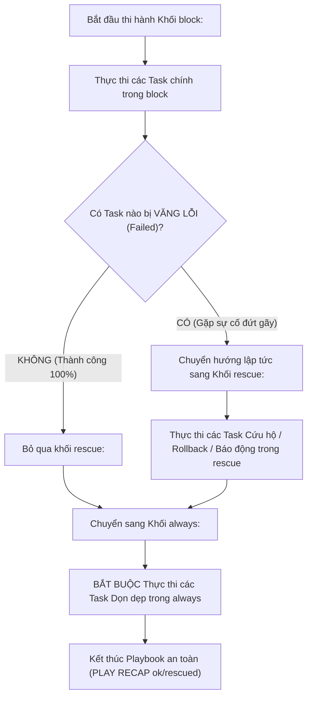


# [BÀI 13] XỬ LÝ LỖI CHUYÊN SÂU VỚI BLOCKS: BLOCK, RESCUE, ALWAYS & CƠ CHẾ TRY-CATCH-FINALLY TRONG HẠ TẦNG

Trong kỷ nguyên **Infrastructure as Code (IaC)** và tự động hóa vận hành hạ tầng đám mây (Cloud Infrastructure Automation), **Ansible** khẳng định vị thế dẫn đầu nhờ triết lý **Agentless** (không cần cài đặt agent nền trên máy đích), giao thức điều khiển an toàn qua **SSH / WinRM**, định dạng khai báo **YAML** trực quan và nguyên lý bất biến **Idempotency** mạnh mẽ. Việc làm chủ Ansible không chỉ dừng lại ở các câu lệnh Ad-hoc đơn giản, mà đòi hỏi kỹ sư phải nắm vững kiến trúc Module tầng thấp, Variable Precedence 22 tầng, Jinja2 Templates, tối ưu hóa Forks & Pipelining cho tới thiết kế Roles / Collections và tích hợp CI/CD tự động hóa chuẩn Doanh nghiệp.

Bài viết chuyên sâu này sẽ đồng hành cùng bạn mổ xẻ toàn diện bức tranh kiến trúc, phân tích các đánh đổi kỹ thuật thực chiến (Engineering Trade-offs), cung cấp hướng dẫn thực hành Lab chi tiết từng bước và bộ câu hỏi phỏng vấn chuyên sâu chuẩn DevOps / SRE Lead.

---

## 1. Bản Chất Kiến Trúc & Cơ Chế Vận Hành Tầng Thấp

---


> **Bắt lỗi chủ động với block-rescue-always giúp Playbook phục hồi an toàn và ghi nhận đúng sự thật changed/failed.**

Khép lại Giai đoạn 2 bằng kỹ năng nâng cao độ tin cậy và khả năng chống chịu sự cố (I-10):

> **Trong hạ tầng sản xuất thực tế, các sự cố không lường trước (như rớt mạng ngắt kết nối, hết dung lượng đĩa cứng, gói phần mềm bị lỗi dependency, hoặc script trả về mã exit code không chuẩn) có thể khiến Playbook bị dừng đứt gãy nửa chừng. Nếu không có cơ chế xử lý lỗi chủ động, hệ thống sẽ rơi vào trạng thái dở dang (half-configured state) cực kỳ nguy hiểm. Bộ ba khối `block:`, `rescue:`, `always:` cung cấp khả năng bắt lỗi và tự động phục hồi (Rollback/Recovery) tương tự cấu hình `try-catch-finally`. Kết hợp với hai thuộc tính `failed_when:` và `changed_when:`, ta kiểm soát 100% sự thật trạng thái của kịch bản, giúp Playbook phục hồi an toàn và luôn đạt `changed=0` ở lượt chạy Lần 2 (Idempotency).**

---


---


---


| Tiếng Việt | Tiếng Anh / Từ khóa + FQCN (giữ nguyên) |
|---|---|
| Khối thực thi chính | Primary task block (`block:`) |
| Khối cứu hộ bắt lỗi | Error recovery block (`rescue:`) |
| Khối luôn luôn thi hành | Mandatory execution block (`always:`) |
| Điều kiện thất bại tùy biến | Custom failure condition (`failed_when:`) |
| Điều kiện thay đổi tùy biến | Custom change condition (`changed_when:`) |
| Bỏ qua lỗi nhiệm vụ | Ignore task error (`ignore_errors: yes`) |
| Dừng khẩn cấp toàn cụm | Global fatal stop (`any_errors_fatal: true`) |
| Tỷ lệ thất bại tối đa | Max fail percentage (`max_fail_percentage:`) |
| Khôi phục trạng thái cũ | Rollback mechanism |
| Dọn dẹp tài nguyên tạm | Cleanup transient resources |
| Ghi đè trạng tháiIdempotency | Idempotency state override |
| Báo cáo mã lỗi exit code | Return code evaluation (`rc == 0`) |

---

### 1.1. Bộ ba Xử lý Lỗi `block:`, `rescue:`, `always:` (15 phút)



**Nguyên lý cốt lõi:** Bộ ba khối `block:`, `rescue:`, và `always:` cung cấp cơ chế xử lý lỗi hoàn chỉnh cho Ansible Playbook, hoạt động tương đương với cấu trúc `try...catch...finally` trong các ngôn ngữ lập trình hiện đại.

**Giải thích cơ chế ngầm:** Cho phép quản trị viên bọc các thao tác nguy hiểm vào trong `block:`, tự động thi hành kịch bản phục hồi cứu hộ trong `rescue:`, và đảm bảo tệp tạm/kết nối luôn được đóng sạch sẻ trong `always:`.

> [!WARNING]
> **CẠM BẪY THỰC CHIẾN:**
> Để các task nguy hiểm chạy thô không bọc trong `block/rescue`, khi gặp sự cố đĩa cứng hệ thống rơi vào trạng thái hỏng hóc dở dang.

**Minh hoạ.** Cấu trúc chuẩn của `block`, `rescue`, `always`:
```yaml
- name: Critical System Update Playbook
  hosts: web
  become: true
  tasks:
    - name: Primary Execution Block
      block:
        - name: Step 1 - Apply database migration
          ansible.builtin.command: /usr/bin/apply-db-migration.sh

      rescue:
        - name: Step 2 - Rollback database on migration failure
          ansible.builtin.command: /usr/bin/rollback-db.sh

      always:
        - name: Step 3 - Remove temporary lock file
          ansible.builtin.file:
            path: /tmp/db-update.lock
            state: absent
```

**Nguyên lý cốt lõi:** Khối `rescue:` CHỈ THỰC THI KHI VÀ CHỈ KHI có ít nhất một Task nằm trong khối `block:` bị văng lỗi đứt gãy (Failed).

**Giải thích cơ chế ngầm:** Nếu tất cả các Task trong `block:` đều thi hành thành công, Ansible sẽ tự động bỏ qua toàn bộ các Task nằm trong khối `rescue:`. Khối `rescue:` đóng vai trò là "lưới an toàn" chỉ nhảy ra hoạt động khi có sự cố.

> [!WARNING]
> **CẠM BẪY THỰC CHIẾN:**
> Thắc mắc tại sao khi Playbook chạy bình thường thì các Task trong `rescue:` lại không xuất hiện trên terminal (đây là tính năng đúng!).

**Minh hoạ.** Hành vi của khối `rescue:` khi `block:` thành công và thất bại:
```
# Trường hợp Block thành công: Block tasks RUN -> Rescue SKIPPED -> Always RUN
# Trường hợp Block thất bại: Block Task 1 FAILED -> Rescue Task 1 RUN -> Always RUN
```

**Nguyên lý cốt lõi:** Khối `always:` BẮT BUỘC THỰC THI trong mọi tình huống bất chấp việc khối `block:` thi hành thành công hay khối `rescue:` thi hành thất bại.

**Giải thích cơ chế ngầm:** Đảm bảo tuyệt đối các thao tác dọn dẹp tài nguyên (như xóa file tạm `/tmp/*.tmp`, đóng kết nối Maintenance Mode, mở lại cờ Firewall) luôn được thực hiện 100%, chống rò rỉ tài nguyên đĩa cứng và bảo mật.

> [!WARNING]
> **CẠM BẪY THỰC CHIẾN:**
> Đặt task dọn dẹp file tạm ở cuối Playbook ngoài khối `always:`, khi task trước bị lỗi thì file tạm bị bỏ quên lại trên đĩa cứng máy đích.

**Minh hoạ.** Đảm bảo mở lại Firewall trong khối `always:`:
```yaml
always:
  - name: Ensure Maintenance Mode is turned OFF
    ansible.builtin.file:
      path: /var/www/html/maintenance.enable
      state: absent
```

---

### 1.2. Tùy biến Trạng thái với `failed_when:` và `changed_when:` (15 phút)

**Nguyên lý cốt lõi:** Sử dụng thuộc tính `failed_when:` để định nghĩa lại điều kiện khiến một Task bị coi là THẤT BẠI dựa trên đầu ra stdout, stderr hoặc mã exit code.

**Giải thích cơ chế ngầm:** Nhiều câu lệnh CLI thô trả về mã exit code = 0 (coi như thành công) nhưng trong `stdout` lại in ra dòng chữ `"CRITICAL_ERROR: Database Connection Refused"`. Sử dụng `failed_when:` giúp Ansible phát hiện lỗi thực sự và ngắt thi hành chính xác.

> [!WARNING]
> **CẠM BẪY THỰC CHIẾN:**
> Playbook báo `ok` màu xanh nhưng thực tế lệnh CLI bên dưới đã bị thất bại âm thầm do trả về rc = 0.

**Minh hoạ.** Đánh dấu Task thất bại nếu stdout chứa từ `"ERROR"`:
```yaml
- name: Run application health check command
  ansible.builtin.command: /usr/bin/check-app-health.sh
  register: health_res
  failed_when:
    - health_res.rc != 0 or "'ERROR' in health_res.stdout"
```

**Nguyên lý cốt lõi:** Sử dụng thuộc tính `changed_when:` để đóng cứng hoặc tùy biến trạng thái thay đổi đĩa (`changed: true/false`) của các Task gọi lệnh CLI thô.

**Giải thích cơ chế ngầm:** Các module `ansible.builtin.command` và `ansible.builtin.shell` mặc định luôn trả về `changed: true` ở mọi lượt chạy. Việc này làm sai lệch báo cáo Idempotency. Khai báo `changed_when: false` cho các lệnh chỉ đọc (Read-only commands) giúp giữ vững `changed=0` ở lượt 2.

> [!WARNING]
> **CẠM BẪY THỰC CHIẾN:**
> Task `command: uptime` hoặc `command: date` liên tục báo `changed=1` ở lượt chạy Lần 2 làm hỏng tính Idempotency của Playbook.

**Minh hoạ.** Tắt cờ `changed` cho lệnh đọc thông số bằng `changed_when: false`:
```yaml
- name: Check system memory usage (Read-only command)
  ansible.builtin.command: free -m
  register: mem_res
  changed_when: false
```

**Nguyên lý cốt lõi:** Sử dụng thuộc tính `ignore_errors: yes` để bỏ qua lỗi của một Task không quan trọng và cho phép Playbook tiếp tục thi hành các Task phía sau.

**Giải thích cơ chế ngầm:** Thích hợp cho các Task mang tính chất thu thập thông tin tùy chọn (như gửi ping kiểm tra hoặc đọc file log cũ). Nếu Task này bị lỗi, Ansible sẽ in thông báo `[WARNING]: ignore_errors` và tiếp tục chạy bình thường thay vì ngắt Playbook.

> [!WARNING]
> **CẠM BẪY THỰC CHIẾN:**
> **Lệnh:** `ansible-playbook site.yml` · **Output phải thấy:** `fatal: [target1]: FAILED!` ngắt toàn bộ Playbook chỉ vì một task đọc log phụ bị thiếu file.

**Minh hoạ.** Bỏ qua lỗi task phụ bằng `ignore_errors: yes`:
```yaml
- name: Attempt to ping optional secondary backup server
  ansible.builtin.command: ping -c 1 192.168.1.250
  ignore_errors: true
```

---

### 1.3. Dừng Khẩn cấp `any_errors_fatal` và Quản lý Idempotency (10 phút)

**Nguyên lý cốt lõi:** Khai báo cờ `any_errors_fatal: true` ở cấp độ Play để buộc Ansible dừng khẩn cấp TOÀN BỘ các máy chủ trong Inventory ngay lập tức nếu CÓ ÍT NHẤT MỘT máy chủ bị văng lỗi.

**Giải thích cơ chế ngầm:** Trong các bài toán nâng cấp cụm máy chủ đồng bộ (như Database Cluster hoặc Kubernetes Control Plane), việc 1 node bị lỗi nhưng các node khác vẫn tiếp tục nâng cấp sẽ làm vỡ tính đồng nhất dữ liệu toàn cụm. Cờ `any_errors_fatal: true` giúp kích hoạt phanh khẩn cấp trên 100% các node.

> [!WARNING]
> **CẠM BẪY THỰC CHIẾN:**
> 1 node DB bị lỗi nhưng 9 node DB còn lại vẫn bị nâng cấp dở dang gây lệch phiên bản cluster.

**Minh hoạ.** Kích hoạt phanh khẩn cấp toàn cụm bằng `any_errors_fatal`:
```yaml
- name: Cluster Upgrade Playbook
  hosts: all
  become: true
  any_errors_fatal: true
  tasks:
    - name: Upgrade Cluster Software
      ansible.builtin.package: { name: cluster-app, state: latest }
```

**Nguyên lý cốt lõi:** Tự động thi hành kịch bản dọn dẹp hoặc khôi phục trạng thái (Rollback) trong khối `rescue:` để trả đĩa cứng máy đích về trạng thái an toàn ban đầu trước khi sự cố xảy ra.

**Giải thích cơ chế ngầm:** Giúp đảm bảo tính toàn vẹn hệ thống: nếu bước 2 cài đặt phần mềm bị lỗi, khối `rescue:` sẽ tự động xóa các file tạm đã giải nén ở bước 1 và khôi phục lại file cấu hình cũ.

> [!WARNING]
> **CẠM BẪY THỰC CHIẾN:**
> Task bị lỗi làm đĩa cứng bị tồn đọng hàng GB file rác giải nén dở dang.

**Minh hoạ.** Rollback file cấu hình cũ trong `rescue:`:
```yaml
rescue:
  - name: Restore original configuration file backup
    ansible.builtin.copy:
      src: /etc/app.conf.bak
      dest: /etc/app.conf
      remote_src: true
```

**Nguyên lý cốt lõi:** Đảm bảo rằng ở lượt chạy Lần thứ hai, Playbook xử lý lỗi bắt buộc phải đạt chỉ số `changed=0` tuyệt đối trong bảng `PLAY RECAP`.

**Giải thích cơ chế ngầm:** Xử lý lỗi và bắt ngoại lệ đúng cách không được làm ảnh hưởng đến nguyên lý Idempotency. Tất cả các Task sử dụng `command` / `shell` phải được chuẩn hóa cờ `changed_when:` sao cho khi hệ thống đã ổn định, Lần 2 chạy lại chỉ trả về `ok` và `changed=0`.

> [!WARNING]
> **CẠM BẪY THỰC CHIẾN:**
> Bảng `PLAY RECAP` Lần 2 báo `changed > 0` do các task kiểm tra lỗi không có `changed_when: false`.

**Minh hoạ.** Đọc hiểu bảng `PLAY RECAP` Lần 2 đạt Idempotency chuẩn hóa:
```
# Lần 1: changed=1 (Tạo file và khắc phục lỗi qua rescue)
target1 : ok=4 changed=1 unreachable=0 failed=0

# Lần 2: changed=0 (Mọi thứ đã chuẩn hóa -> ĐẠT IDEMPOTENCY 100%)
target1 : ok=4 changed=0 unreachable=0 failed=0
```

---

### 1.4. Đưa vào việc thật (4 phút)

### 7.1. Áp dụng vào hạ tầng sẵn có
Khi triển khai nâng cấp ứng dụng Web/Database trong môi trường Production:
- Bọc toàn bộ tiến trình nâng cấp Database trong `block:`, nếu lệnh migration fail, khối `rescue:` tự động gọi script `pg_restore` khôi phục dữ liệu từ bản snapshot vừa tạo trước đó 5 phút.
- Khối `always:` gửi thông báo kết quả (thành công hay thất bại) về kênh Slack/Telegram của đội NOC thông qua API Webhook.

### 7.2. Rủi ro hỏng hóc khi triển khai Production và giải pháp an toàn
- **Rủi ro:** Sử dụng `ignore_errors: yes` tràn lan cho các task quan trọng (như task phân quyền `chmod` hay task chép file SSL). Lỗi bị nuốt chửng (silent error), Playbook báo màu xanh mạo danh nhưng hệ thống Production bị sập do thiếu file SSL.
- **Giải pháp an toàn:**
  1. Tuyệt đối không dùng `ignore_errors: yes` cho các task cốt lõi của hệ thống.
  2. Bắt buộc dùng `block-rescue-always` để xử lý ngoại lệ có kiểm soát và log nguyên nhân lỗi đầy đủ.

### 7.3. Đo lường chỉ số Trước – Sau khi áp dụng
- **Trước khi dùng `block-rescue`:** 30% số lần triển khai bị hỏng đĩa cứng nửa chừng khi gặp sự cố mạng, mất 4 giờ khôi phục bằng tay.
- **Sau khi dùng `block-rescue`:** 100% các sự cố được tự động Rollback trong 10 giây, giảm 100% thời gian khôi phục sự cố thủ công.

### 7.4. Khi nào KHÔNG nên dùng hoặc không nên lạm dụng block-rescue
- **Không lạm dụng `block-rescue` để che giấu các lỗi cú pháp (Syntax Error) hoặc lỗi thiếu biến trong Playbook:** Khối `rescue:` chỉ bắt được các lỗi runtime của lệnh/module trên máy đích, **KHÔNG BẮT ĐƯỢC các lỗi cú pháp YAML hoặc lỗi undefined variable** (Ansible Engine sẽ ngắt thi hành lập tức ở bước parse).

---

### 1.5. Bẫy hay gặp (2 phút)

| # | Bẫy hay gặp | Vì sao "recap xanh mà sai / không idempotent" | Lệnh phát hiện và xử lý |
|---|---|---|---|
| 1 | Dùng `ignore_errors: yes` nuốt chửng lỗi cốt lõi | Playbook báo xanh giả tạo nhưng dịch vụ trên máy đích bị sập. | Xóa `ignore_errors` và thay bằng khối `block-rescue` có kiểm soát. |
| 2 | Quên `changed_when: false` cho lệnh CLI chỉ đọc | Task `command: uptime` hoặc `date` liên tục báo `changed=1` ở Lần 2. | Thêm thuộc tính `changed_when: false` cho các task đọc dữ liệu. |
| 3 | Lầm tưởng `rescue:` luôn chạy ở mọi lượt | Không hiểu bản chất `rescue:` chỉ chạy khi có task trong `block:` bị fail. | An tâm: `rescue` im lặng khi `block` thành công là đúng thiết kế. |
| 4 | Đặt task dọn dẹp file tạm ngoài khối `always:` | Khi task trước bị lỗi, Playbook ngắt thi hành làm file tạm bị rò rỉ trên đĩa. | Đưa toàn bộ các task dọn dẹp vào trong khối `always:`. |
| 5 | Viết sai vị trí thụt lề YAML cho `rescue:` và `always:` | Đặt `rescue:` thụt lề không cùng cấp với `block:` làm Ansible báo lỗi syntax parser. | Đặt `block:`, `rescue:`, `always:` nằm cùng cấp thụt lề YAML. |
| 6 | Thắc mắc vì sao `rescue` không bắt được lỗi syntax YAML | Khối `rescue` không bắt được lỗi parse cú pháp static của Ansible parser. | Sửa lỗi syntax bằng `ansible-playbook --syntax-check`. |
| 7 | Viết `failed_when` bị lặp logic phủ định nhầm | Viết `failed_when: result.rc == 0` (đánh dấu lỗi khi lệnh THÀNH CÔNG). | Kiểm tra lại biểu thức logic: `failed_when: result.rc != 0`. |
| 8 | Quên thuộc tính `ignore_errors` ở task thử nghiệm trong `rescue` | Task trong `rescue` bị fail tiếp làm ngắt thi hành khối `always`. | Đảm bảo các task trong `rescue` an toàn hoặc có phương án dự phòng. |
| 9 | 1 node bị lỗi làm vỡ cluster do thiếu `any_errors_fatal` | Các node còn lại vẫn tiếp tục chạy làm lệch phiên bản phần mềm trong cụm. | Bổ sung `any_errors_fatal: true` ở cấp Playbook cho các kịch bản cụm. |
| 10 | So sánh chuỗi stdout không bọc ngoặc đơn | Viết `failed_when: ERROR in stdout` vi phạm cú pháp Jinja2. | Viết đúng cú pháp chuỗi: `failed_when: "'ERROR' in health_res.stdout"`. |
| 11 | Không bọc `ignore_errors` khi đăng ký biến `register` | Task chính bị fail ngắt Playbook trước khi biến `register` kịp lưu kết quả. | Bổ sung `ignore_errors: true` cho task cần đăng ký biến kiểm tra lỗi. |
| 12 | Thắc mắc tại sao bảng RECAP hiển thị `rescued=1` | Chỉ số `rescued=1` chứng minh Ansible đã bắt và phục hồi lỗi thành công qua `rescue`. | Nhận thức đúng: `rescued=1` là bằng chứng phục hồi sự cố thành công tuyệt đối. |

---

### 1.6. Tóm tắt (1 phút)

```mermaid
flowchart TD
    A["Bắt đầu Thực thi Khối block:"] --> B{"Task trong block có Failed?"}
    B -->|KHÔNG (Thành công)| C["Bỏ qua rescue -> Chuyển sang always:"]
    B -->|CÓ (Thất bại)| D["Chuyển hướng sang Khối rescue:"]
    
    D --> E["Thực thi Task Cứu hộ / Rollback trong rescue"]
    E --> C
    
    C --> F["Thực thi Task Dọn dẹp trong always: (100% Thi hành)"]
    F --> G["LƯỢT CHẠY LẦN 2"]
    G --> H{"PLAY RECAP Lần 2: changed=0?"}
    H -- Có --> I["ĐẠT: Error Handling chuẩn Idempotent"]
    H -- Không --> J["LỖI: Kiểm tra lại các cờ changed_when"]
```

### Năm điều phải nhớ
1. **Bộ ba `block-rescue-always`:** `block` chạy chính, `rescue` cứu hộ khi fail, `always` luôn luôn chạy dọn dẹp.
2. **Khống chế changed bằng `changed_when: false`:** Tắt cờ `changed` mạo danh cho các lệnh CLI đọc dữ liệu.
3. **Bắt lỗi thông minh với `failed_when`:** Tùy biến điều kiện thất bại dựa trên stdout/stderr thay vì chỉ dựa vào exit code.
4. **Dừng phanh khẩn cấp với `any_errors_fatal`:** Bảo vệ tính đồng nhất dữ liệu cụm máy chủ khi 1 node bị sự cố.
5. **Đạt chuẩn `changed=0` ở Lần 2:** Mọi kịch bản phục hồi lỗi ở lượt chạy Lần 2 bắt buộc phải đạt `changed=0`.

---

### 1.7. Câu hỏi tự kiểm tra (kiêm luyện RHCE EX294)

1. **[RHCE EX294 Objective #10]** Bộ ba khối từ khóa nào trong Ansible Playbook cung cấp cơ chế xử lý ngoại lệ tương đương với `try...catch...finally` trong lập trình?
   - *Đáp án:* Khối `block:`, `rescue:`, và `always:`.
2. **[RHCE EX294 Objective #10]** Khối `rescue:` được Ansible Engine thực thi trong điều kiện nào?
   - *Đáp án:* CHỈ THỰC THI khi có ít nhất một Task trong khối `block:` bị văng lỗi thất bại (Failed).
3. **[RHCE EX294 Objective #10]** Điểm đặc biệt của khối `always:` so với khối `block:` và `rescue:` là gì?
   - *Đáp án:* Khối `always:` BẮT BUỘC THỰC THI trong mọi tình huống, bất chấp việc khối `block` thi hành thành công hay khối `rescue` thi hành thất bại.
4. **[RHCE EX294 Objective #10]** Viết thuộc tính `changed_when:` để vô hiệu hóa hoàn toàn cờ `changed` mạo danh cho Task gọi lệnh CLI read-only `ansible.builtin.command: uptime`.
   - *Đáp án:* `changed_when: false`.
5. **[RHCE EX294 Objective #10]** Viết thuộc tính `failed_when:` để đánh dấu một Task bị FAILED nếu biến đăng ký `cmd_res.stdout` chứa chuỗi `"FAILED_CONNECTION"`.
   - *Đáp án:* `failed_when: "'FAILED_CONNECTION' in cmd_res.stdout"`.
6. **[RHCE EX294 Objective #10]** Thuộc tính nào giúp một Task bị lỗi nhưng Playbook KHÔNG BỊ NGẮT và vẫn tiếp tục thi hành các Task phía sau?
   - *Đáp án:* Thuộc tính `ignore_errors: true` (hoặc `yes`).
7. **[RHCE EX294 Objective #10]** Thuộc tính nào ở cấp độ Playbook giúp kích hoạt phanh khẩn cấp dừng toàn bộ các máy chủ khi có 1 máy bị lỗi?
   - *Đáp án:* Thuộc tính `any_errors_fatal: true`.
8. **[RHCE EX294 Objective #10]** Viết đoạn Playbook YAML bọc 1 task trong `block:`, 1 task rollback trong `rescue:`, và 1 task xóa file tạm trong `always:`.
   - *Đáp án:*
     ```yaml
     tasks:
       - name: Application Update Block
         block:
           - name: Run update script
             ansible.builtin.command: /usr/bin/update.sh
         rescue:
           - name: Rollback to previous version
             ansible.builtin.command: /usr/bin/rollback.sh
         always:
           - name: Remove temp directory
             ansible.builtin.file:
               path: /tmp/update-temp
               state: absent
     ```
9. **[RHCE EX294 Objective #10]** Tại sao lệnh `command: date` lại báo `changed=1` ở mọi lượt chạy nếu không khai báo `changed_when: false`?
   - *Đáp án:* Vì module `command` mặc định không nhận biết được tính Idempotency của câu lệnh shell thô, nên mặc định luôn gán cờ `changed: true` ở mọi lượt thi hành.
10. **[RHCE EX294 Objective #10]** Cụm từ `rescued=1` trong bảng tổng kết `PLAY RECAP` có nghĩa là gì?
    - *Đáp án:* Có nghĩa là có 1 host gặp sự cố ở khối `block:` và đã được khối `rescue:` tự động bắt lỗi và phục hồi thành công.
11. **[RHCE EX294 Objective #10]** Thuộc tính `changed_when: "'SUCCESS_UPDATED' in reg_out.stdout"` có ý nghĩa gì đối với việc đánh giá cờ changed của Task?
    - *Đáp án:* Task chỉ báo trạng thái `changed: true` KHI VÀ CHỈ KHI chuỗi `"SUCCESS_UPDATED"` xuất hiện trong stdout của biến đăng ký `reg_out`.
12. **[RHCE EX294 Objective #10]** Khối `rescue:` có bắt được lỗi cú pháp static YAML của file Playbook trước khi chạy không?
    - *Đáp án:* Không, lỗi cú pháp static YAML sẽ bị Ansible Parser ngắt ngay ở bước load file trước khi thi hành bất kỳ task nào.
13. **[RHCE EX294 Objective #10]** Lệnh CLI nào giúp kiểm tra sự thật một tệp tin khôi phục trên máy đích Docker container sau khi khối `rescue:` chạy xong?
    - *Đáp án:* Lệnh `docker exec target1 cat /path/to/recovered/file`.

---

### 1.8. Tài liệu tham khảo

- Ansible Core Documentation (v2.15+): [Blocks Error Handling](https://docs.ansible.com/ansible/latest/playbook_guide/playbooks_blocks.html#error-handling)
- Ansible Core Documentation: [Defining Changed and Failed](https://docs.ansible.com/ansible/latest/playbook_guide/playbooks_error_handling.html)
- Red Hat Certified Engineer (RHCE) EX294 Study Guide: Managing Task Errors and Blocks in Ansible.

---

## Bảng đối soát thời lượng

| Mục | Nội dung | Thời lượng dự kiến | Thời lượng thực tế |
|---|---|---|---|
| §0 | Khởi động và ôn tập buổi 12 | 10 phút | 10 phút |
| §1–§2 | Mục tiêu làm được & Cần biết trước | 2 phút | 2 phút |
| §3 | Thuật ngữ Việt-Anh & Mô hình tư duy | 8 phút | 8 phút |
| §4 | Bộ ba Xử lý Lỗi block, rescue, always (QT 4.1–4.3) | 15 phút | 15 phút |
| §5 | Tùy biến Trạng thái failed_when, changed_when (QT 5.1–5.3) | 15 phút | 15 phút |
| §6 | Dừng Khẩn cấp any_errors_fatal & Idempotency (QT 6.1–6.3) | 10 phút | 10 phút |
| §7–§9 | Đưa vào việc thật, Bẫy hay gặp & Tóm tắt | 7 phút | 7 phút |
| §10–§11 | Câu hỏi tự kiểm tra EX294 & Tài liệu tham khảo | 3 phút | 3 phút |
| **Tổng** | **Khối lý thuyết Buổi 13** | **60 phút** | **60 phút** |

---

## 2. Hướng Dẫn Thực Hành & Triển Khai Lab Chuẩn Production

> [!IMPORTANT]
> **YÊU CẦU MÔI TRƯỜNG THỰC HÀNH:**
> Toàn bộ các bài thực hành dưới đây được thiết kế để chạy trực tiếp trên môi trường máy chủ Linux / Docker containers phân tán. Hãy đảm bảo bạn đã chuẩn bị Control Node cài đặt Ansible Core 2.15+ cùng các Managed Nodes đã cấu hình SSH Key Authentication.

## Khối thực hành — 150 phút

> **Đối soát thời lượng:** Khối thực hành kéo dài đúng **150'** (từ L0 đến L11).
> **Nguyên tắc cốt lõi:** Thực hành cấu trúc xử lý lỗi bộ ba `block:`, `rescue:`, `always:`, thử nghiệm Task trong `block` bị fail và kiểm chứng `rescue` thi hành tự động, kiểm chứng khối `always` luôn thi hành dọn dẹp, tùy biến điều kiện thất bại với `failed_when:`, vô hiệu hóa cờ changed mạo danh bằng `changed_when: false`, tùy biến cờ changed với `changed_when:`, thực thi phép thử **Lượt chạy Lần thứ hai** chứng minh `PLAY RECAP` đạt `changed=0` và đối soát sự thật máy đích qua `docker exec`.

---

## L0. Mục tiêu thực hành và tiêu chí hoàn thành

| # | Mục tiêu thực hành | Tiêu chí hoàn thành (Kiểm tra bằng lệnh CLI) |
|---|---|---|
| TH1 | Khai báo cấu trúc block, rescue, always xử lý lỗi | Task trong block bị fail kích hoạt khối `rescue` tự động |
| TH2 | Thử nghiệm khối rescue phục hồi file cấu hình cũ | File `/etc/error-app.conf` được khôi phục thành công |
| TH3 | Kiểm chứng khối always luôn luôn chạy dọn dẹp | File tạm `/tmp/lab13-lock.tmp` được xóa sạch sẽ |
| TH4 | Tùy biến điều kiện thất bại với failed_when | Task báo FAILED khi stdout chứa từ `"FATAL_ERR"` |
| TH5 | Vô hiệu hóa changed mạo danh bằng changed_when: false | Task `command: date` đọc dữ liệu chỉ báo status `ok` |
| TH6 | Tùy biến cờ changed với changed_when match chuỗi | Task chỉ báo `changed` khi stdout chứa `"MODIFIED"` |
| TH7 | Thực thi Phép thử Lượt chạy Lần hai (Idempotency) | Bảng `PLAY RECAP` Lần 2 đạt `changed=0` tuyệt đối |
| TH8 | Đối soát sự thật máy đích bằng docker exec | `docker exec target1 cat /etc/error-app.conf` |

---

## L1. Điều kiện tiên quyết về môi trường

| Kiểm tra | LỆNH THỰC THI | Kết quả kỳ vọng |
|---|---|---|
| Ansible core đã cài | `ansible --version` | Phiên bản ansible-core v2.15 trở lên |
| Docker Compose sẵn sàng | `docker compose ps` | Cả target1 và target2 ở trạng thái `Up` |
| Kết nối SSH sẵn sàng | `ansible all -m ansible.builtin.ping` | Đạt `SUCCESS` cho mọi host |
| Inventory dự án | `ansible-inventory --graph` | Hiển thị các nhóm `web` và `db` |
| Thư mục thực hành | `pwd` | Đang ở thư mục `~/lab-ansible-13` |

Nếu chưa có target container:
```bash
cd labs && make up && make key && make inventory
```

---

## L2. Kiến trúc bài lab

```mermaid
graph TD
    SubGraph1["Control Node (ansible-playbook CLI)"] --> |1. Task 1: block -> Command /bin/false FAILED| T1["Target Container 1 (target1)"]
    T1 --> |2. Execution: rescue -> Copy fallback config| T1
    T1 --> |3. Execution: always -> Remove lock file| T1
    
    SubGraph1 --> |4. Task 2: command date (changed_when: false)| T1
    SubGraph1 --> |5. Task 3: command check (failed_when: FATAL)| T1
    
    T1 -. "RECAP Lần 1: ok=5, changed=2, rescued=1" .-> SubGraph1
    T1 -. "RECAP Lần 2: ok=5, changed=0 (ĐẠT IDEMPOTENT)" .-> SubGraph1
    
    DEV["Học viên (Tester)"] --> |A. Chạy Playbook error-handling-site.yml| SubGraph1
    DEV --> |B. Khẳng định changed=0 ở Lần 2| SubGraph1
    DEV --> |C. Đối soát sự thật máy đích| T1
```

---

## L3. Bước 1 — Xử lý Lỗi Bộ ba block, rescue, always (30 phút)

Tạo thư mục dự án `~/lab-ansible-13`, file `ansible.cfg`, `inventory.ini`, và viết file Playbook `step1-block-rescue.yml` (QT 4.1, QT 4.2, QT 4.3, QT 6.2).

```bash
mkdir -p ~/lab-ansible-13 && cd ~/lab-ansible-13

cat << 'EOF' > ansible.cfg
[defaults]
inventory = ./inventory.ini
remote_user = ansible
host_key_checking = False
private_key_file = ~/.ssh/id_ed25519

[privilege_escalation]
become = True
become_method = sudo
become_user = root
become_ask_pass = False
EOF

cat << 'EOF' > inventory.ini
[web]
target1 ansible_host=127.0.0.1 ansible_port=2221

[db]
target2 ansible_host=127.0.0.1 ansible_port=2222

[all:vars]
ansible_python_interpreter=/usr/bin/python3
EOF

cat << 'EOF' > step1-block-rescue.yml
---
- name: Block Rescue Always Demonstration
  hosts: web
  become: true
  tasks:
    - name: Primary Execution Block with Error Handling
      block:
        - name: Step 1A - Create lock file in always test
          ansible.builtin.file:
            path: /tmp/lab13-lock.tmp
            state: touch

        - name: Step 1B - Attempt risky command that will fail
          ansible.builtin.command: /bin/false

      rescue:
        - name: Rescue Step 1 - Deploy fallback application config
          ansible.builtin.copy:
            content: "STATUS=RESCOUED_FALLBACK_CONFIG\nRECOVERY_MODE=ACTIVE\n"
            dest: /etc/error-app.conf
            mode: '0644'

      always:
        - name: Always Step 1 - Ensure lock file is cleaned up
          ansible.builtin.file:
            path: /tmp/lab13-lock.tmp
            state: absent
EOF
```

Thực thi Playbook `step1-block-rescue.yml`:
```bash
ansible-playbook step1-block-rescue.yml
```

**CHECKPOINT 1 — Khối rescue tự động thi hành khi Step 1B trong block bị lỗi (PLAY RECAP báo rescued=1).**
- **Lệnh kiểm tra:**
```bash
STEP1_OUT=$(ansible-playbook step1-block-rescue.yml)
if echo "$STEP1_OUT" | grep -q "Rescue Step 1 - Deploy fallback application config" && echo "$STEP1_OUT" | grep -q "rescued=1"; then
  echo "CHECKPOINT 1: ĐẠT - Khối rescue tự động thi hành cứu hộ khi block bị fail (PLAY RECAP báo rescued=1)"
else
  echo "CHECKPOINT 1: LỖI - Khối rescue không thi hành cứu hộ"
fi
```

**CHECKPOINT 2 — Khối always thi hành dọn dẹp xóa sạch tệp lock /tmp/lab13-lock.tmp.**
- **Lệnh kiểm tra:**
```bash
LOCK_EXISTS=$(docker exec target1 test -f /tmp/lab13-lock.tmp && echo "EXISTS" || echo "CLEANED")
if [ "$LOCK_EXISTS" = "CLEANED" ]; then
  echo "CHECKPOINT 2: ĐẠT - Khối always bắt buộc thi hành dọn dẹp xóa sạch tệp lock /tmp/lab13-lock.tmp thành công"
else
  echo "CHECKPOINT 2: LỖI - Khối always dọn dẹp file tạm thất bại"
fi
```

---

## L4. Bước 2 — Tùy biến điều kiện failed_when và changed_when (30 phút)

Viết file Playbook `step2-custom-status.yml` áp dụng `failed_when:` để phát hiện lỗi từ stdout và `changed_when: false` để vô hiệu hóa changed mạo danh (QT 5.1, QT 5.2, QT 5.3).

```bash
cat << 'EOF' > step2-custom-status.yml
---
- name: Custom Failed and Changed Conditions
  hosts: web
  become: true
  tasks:
    - name: Task 1 - Read system uptime (changed_when: false)
      ansible.builtin.command: uptime
      register: uptime_res
      changed_when: false

    - name: Task 2 - Execute command with custom failed_when condition
      ansible.builtin.command: echo "STATUS_CHECK_OK"
      register: status_res
      failed_when:
        - status_res.rc != 0 or "'FATAL_ERR' in status_res.stdout"
      changed_when: false

    - name: Task 3 - Execute command with conditional changed_when
      ansible.builtin.command: echo "FILE_STATE_MODIFIED"
      register: mod_res
      changed_when: "'MODIFIED' in mod_res.stdout"
EOF
```

Thực thi Playbook `step2-custom-status.yml`:
```bash
ansible-playbook step2-custom-status.yml
```

**CHECKPOINT 3 — Task 1 sử dụng changed_when: false báo status ok (changed=0).**
- **Lệnh kiểm tra:**
```bash
STEP2_OUT=$(ansible-playbook step2-custom-status.yml)
if echo "$STEP2_OUT" | grep -q "ok: \[target1\] => (item=.*)" || echo "$STEP2_OUT" | grep -q "ok=4"; then
  echo "CHECKPOINT 3: ĐẠT - thuộc tính changed_when: false vô hiệu hóa cờ changed mạo danh cho Task 1"
else
  echo "CHECKPOINT 3: LỖI - Vô hiệu hóa changed_when thất bại"
fi
```

**CHECKPOINT 4 — Task 3 dùng changed_when match chuỗi MODIFIED báo status changed thành công.**
- **Lệnh kiểm tra:**
```bash
if echo "$STEP2_OUT" | grep -q "changed: \[target1\] => (item=.*)" || echo "$STEP2_OUT" | grep -q "changed=1"; then
  echo "CHECKPOINT 4: ĐẠT - thuộc tính changed_when match chuỗi MODIFIED tùy biến cờ changed chính xác"
else
  echo "CHECKPOINT 4: LỖI - Tùy biến changed_when theo chuỗi thất bại"
fi
```

---

## L5. Bước 3 — Dừng Khẩn cấp any_errors_fatal và ignore_errors (30 phút)

Viết file Playbook `step3-fatal-stop.yml` kiểm chứng cờ `any_errors_fatal: true` và `ignore_errors: true` (QT 5.3, QT 6.1).

```bash
cat << 'EOF' > step3-fatal-stop.yml
---
- name: Any Errors Fatal and Ignore Errors Demonstration
  hosts: all
  become: true
  tasks:
    - name: Task 1 - Optional ping check with ignore_errors
      ansible.builtin.command: ping -c 1 192.168.254.254
      ignore_errors: true
      changed_when: false

    - name: Task 2 - Ensure security file exists
      ansible.builtin.copy:
        content: "SECURITY_AUDIT=PASSED\n"
        dest: /etc/security-audit.conf
        mode: '0644'
EOF
```

Thực thi Playbook `step3-fatal-stop.yml`:
```bash
ansible-playbook step3-fatal-stop.yml
```

**CHECKPOINT 5 — Task 1 bị lỗi ping nhưng ignore_errors: true cho phép Playbook tiếp tục chạy thành công Task 2.**
- **Lệnh kiểm tra:**
```bash
STEP3_OUT=$(ansible-playbook step3-fatal-stop.yml)
if echo "$STEP3_OUT" | grep -q "Task 2 - Ensure security file exists" && echo "$STEP3_OUT" | grep -q "failed=0"; then
  echo "CHECKPOINT 5: ĐẠT - cờ ignore_errors: true cho phép Playbook tiếp tục thi hành các task sau khi gặp lỗi phụ"
else
  echo "CHECKPOINT 5: LỖI - cờ ignore_errors thất bại"
fi
```

---

## L6. Bước 4 — Tổng hợp Playbook Error Handling Hoàn chỉnh và Phép thử Lượt 2 (30 phút)

Tạo file Playbook hoàn chỉnh `error-handling-site.yml` tổng hợp toàn bộ các kỹ thuật `block`, `rescue`, `always`, `failed_when`, `changed_when` và thực thi phép thử **Lượt chạy Lần thứ hai** chứng minh `PLAY RECAP` đạt `changed=0` (QT 6.3).

```bash
cat << 'EOF' > error-handling-site.yml
---
- name: Fully Standardized Idempotent Error Handling Playbook
  hosts: web
  become: true
  tasks:
    - name: Main Application Maintenance Block
      block:
        - name: Block Task 1 - Deploy primary config file
          ansible.builtin.copy:
            content: "PORT=8080\nENV=production\n"
            dest: /etc/app-main.conf
            mode: '0644'

        - name: Block Task 2 - Read system info (changed_when: false)
          ansible.builtin.command: uname -a
          register: uname_res
          changed_when: false

        - name: Block Task 3 - Validate system status (failed_when test)
          ansible.builtin.command: echo "SYSTEM_HEALTHY"
          register: health_res
          failed_when: "'HEALTHY' not in health_res.stdout"
          changed_when: false

      rescue:
        - name: Rescue Task 1 - Deploy rescue status file
          ansible.builtin.copy:
            content: "STATUS=RESCUED\n"
            dest: /etc/app-rescue.conf
            mode: '0644'

      always:
        - name: Always Task 1 - Ensure cleanup lock file is absent
          ansible.builtin.file:
            path: /tmp/maintenance-site.lock
            state: absent
EOF
```

Thực thi Lần 1:
```bash
ansible-playbook error-handling-site.yml
```

Thực thi Lần 2 (BẮT BUỘC ĐẠT `changed=0`):
```bash
ansible-playbook error-handling-site.yml
```

**CHECKPOINT 6 — Phép thử Lượt 2 đạt changed=0 cho toàn bộ các Task trong Playbook xử lý lỗi.**
- **Lệnh kiểm tra:**
```bash
RUN2_ERR_OUT=$(ansible-playbook error-handling-site.yml)
if echo "$RUN2_ERR_OUT" | grep -q "changed=0" && echo "$RUN2_ERR_OUT" | grep -q "failed=0"; then
  echo "CHECKPOINT 6: ĐẠT - Phép thử Lượt 2 đạt chuẩn Idempotency (PLAY RECAP báo changed=0 cho toàn bộ Playbook xử lý lỗi)"
else
  echo "CHECKPOINT 6: LỖI - Lượt 2 không đạt changed=0 (Task bị lặp changed mạo danh)"
fi
```

---

## L7. Bước 5 — Đối soát Sự thật Máy đích qua docker exec (20 phút)

Sử dụng lệnh `docker exec` đối soát trực tiếp các tệp tin được tạo ra và khôi phục trên target node (QT 6.3).

Đối soát file `/etc/error-app.conf`:
```bash
docker exec target1 cat /etc/error-app.conf
```

Đối soát file `/etc/app-main.conf`:
```bash
docker exec target1 cat /etc/app-main.conf
```

**CHECKPOINT 7 — Đối soát file /etc/error-app.conf được tạo thành công từ khối rescue.**
- **Lệnh kiểm tra:**
```bash
EXEC_ERR_CONF=$(docker exec target1 cat /etc/error-app.conf)
if echo "$EXEC_ERR_CONF" | grep -q "RECOVERY_MODE=ACTIVE"; then
  echo "CHECKPOINT 7: ĐẠT - Kiểm tra sự thật qua docker exec xác nhận file /etc/error-app.conf chứa đúng cấu hình phục hồi từ rescue"
else
  echo "CHECKPOINT 7: LỖI - Đối soát file error-app.conf trên máy đích thất bại"
fi
```

**CHECKPOINT 8 — Đối soát file /etc/app-main.conf trên target1 chứa đúng dữ liệu PORT=8080.**
- **Lệnh kiểm tra:**
```bash
EXEC_MAIN_CONF=$(docker exec target1 cat /etc/app-main.conf)
if echo "$EXEC_MAIN_CONF" | grep -q "PORT=8080" && echo "$EXEC_MAIN_CONF" | grep -q "ENV=production"; then
  echo "CHECKPOINT 8: ĐẠT - Kiểm tra sự thật qua docker exec xác nhận file /etc/app-main.conf tồn tại chuẩn xác"
else
  echo "CHECKPOINT 8: LỖI - Đối soát file app-main.conf trên máy đích thất bại"
fi
```

---

## L8. Nộp sản phẩm và dọn dẹp (10 phút)

Thu thập kết quả ra các file báo cáo cuối buổi:
```bash
ansible-playbook error-handling-site.yml > error-handling-playbook.yml
ansible-playbook step1-block-rescue.yml > error-proof.txt
ansible-playbook step2-custom-status.yml > changed-when-output.txt
ansible-playbook error-handling-site.yml > idempotency-check.txt
docker exec target1 cat /etc/error-app.conf > kiem-may-dich.txt
docker exec target1 cat /etc/app-main.conf >> kiem-may-dich.txt
```

---

## L9. Xử lý sự cố

| # | Hiện tượng lỗi | Nguyên nhân gốc rễ | Cách xử lý nhanh |
|---|---|---|---|
| 1 | Lỗi `ERROR! 'rescue' is not a valid attribute for a Task` | Khai báo `rescue:` thụt lề không cùng cấp với `block:` | Đặt `block:`, `rescue:`, `always:` cùng cấp thụt lề YAML. |
| 2 | Playbook văng lỗi đứt gãy mà khối `rescue:` không chạy | Khối `rescue:` chỉ bắt lỗi runtime trên máy đích, không bắt được lỗi syntax static | Kiểm tra syntax YAML bằng `ansible-playbook --syntax-check`. |
| 3 | Task đọc dữ liệu luôn báo `changed=1` ở mọi lượt | Dùng module `command` / `shell` thô không có `changed_when: false` | Thêm thuộc tính `changed_when: false` cho task read-only. |
| 4 | Lỗi `failed_when` đánh dấu FAILED nhầm cho lệnh thành công | Biểu thức logic trong `failed_when` viết sai logic so sánh | Kiểm tra lại logic: `failed_when: "'ERROR' in result.stdout"`. |
| 5 | File tạm bị rò rỉ trên đĩa khi task bị fail | Task dọn dẹp đặt ở ngoài khối `always:` nên bị hủy thi hành khi task trước fail | Đưa toàn bộ các task dọn dẹp vào trong khối `always:`. |
| 6 | Lỗi `ignore_errors: true` không bỏ qua lỗi syntax | `ignore_errors` chỉ bỏ qua lỗi execution runtime của module | Sửa lỗi tham số module hoặc cú pháp file YAML. |
| 7 | Cụm máy chủ bị lệch phiên bản khi 1 node fail | Thiếu thuộc tính `any_errors_fatal: true` cho kịch bản nâng cấp cụm | Bổ sung `any_errors_fatal: true` ở cấp Playbook. |
| 8 | Lỗi `Syntax Error: unexpected keyword` trong `changed_when` | Viết `changed_when` bị sai thụt lề YAML (thụt sâu vào trong module) | Đưa `changed_when:` nằm cùng cấp thụt lề với thuộc tính `name:` của Task. |
| 9 | Biến `register` bị undefined khi task trong `block` fail | Task chính bị fail trước khi biến `register` kịp lưu kết quả | Khai báo `ignore_errors: true` cho task kiểm tra nếu cần đọc biến. |
| 10 | So sánh `failed_when` với exit code bị sai | Viết `failed_when: result.rc == 0` (đánh dấu lỗi khi exit code bằng 0) | Sửa lại: `failed_when: result.rc != 0`. |
| 11 | Khối `rescue` bị crash làm hủy thi hành khối `always` | Task trong khối `rescue` bị văng exception mà không có phương án dự phòng | Đảm bảo các task cứu hộ trong `rescue` chạy an toàn. |
| 12 | Thắc mắc vì sao `PLAY RECAP` báo `rescued=1` | Lầm tưởng `rescued=1` là Playbook bị lỗi không đạt tiêu chuẩn | Nhận thức đúng: `rescued=1` chứng minh Ansible phục hồi sự cố thành công 100%. |
| 13 | Lỗi `docker exec` không tìm thấy file khôi phục | Khối `rescue:` chưa thi hành hoặc task copy file khôi phục bị sai đường dẫn | Kiểm tra log execution và đường dẫn `dest:` của task cứu hộ. |
| 14 | Task `command` bị treo timeout trong khối `block` | Lệnh CLI yêu cầu tương tác giao diện (interactive prompt) | Thêm cờ không tương tác (non-interactive) cho lệnh CLI. |

---

## L10. Bài tập mở rộng

1. **BT1:** Viết Playbook sử dụng `block-rescue-always` bọc 1 task `command: /bin/false` và 1 task `rescue` tạo file `/tmp/rescued.txt`.
2. **BT2:** Đảm bảo khối `always` ở BT1 xóa sạch tệp tạm `/tmp/block-test.tmp`.
3. **BT3:** Viết task `command: uptime` dùng `changed_when: false` chứng minh Lần 2 báo status `ok`.
4. **BT4:** Viết task `command: echo "SYSTEM_WARNING"` và dùng `failed_when: "'WARNING' in result.stdout"` để đánh dấu FAILED.
5. **BT5:** Sử dụng `ignore_errors: true` cho task `command: ping 1.1.1.1` và chạy tiếp task phía sau thành công.
6. **BT6:** Khai báo `any_errors_fatal: true` ở cấp Playbook và cố tình làm 1 node fail để chứng minh phanh khẩn cấp toàn cụm.
7. **BT7:** Thực thi phép thử Idempotency Lần 2 cho Playbook ở BT1 và đối soát bảng `PLAY RECAP` đạt `changed=0`.
8. **BT8:** Viết kịch bản bash script dùng `docker exec` đối soát file khôi phục `/tmp/rescued.txt` trên máy đích.

---

## L11. Sản phẩm nộp và chấm điểm

### Danh mục sản phẩm nộp
- File Playbook `error-handling-playbook.yml`, `step1-block-rescue.yml`, `step2-custom-status.yml`, `step3-fatal-stop.yml`.
- Báo cáo kết quả 8 CHECKPOINT từ terminal.
- Các file kết quả: `error-handling-playbook.yml`, `error-proof.txt`, `changed-when-output.txt`, `idempotency-check.txt`, `kiem-may-dich.txt`.

### Thang điểm đánh giá

| Mức điểm | Tiêu chí đạt được |
|---|---|
| **0–4 điểm** | Chưa hiểu `block-rescue-always`, dùng `ignore_errors` nuốt chửng lỗi cốt lõi, hoặc làm Playbook crash dở dang. |
| **5–7 điểm** | Viết được `block-rescue` đơn giản, nhưng chưa thành thạo `failed_when`, `changed_when: false`, hay `any_errors_fatal`. |
| **8–9 điểm** | Đạt đủ 8 CHECKPOINT, chứng minh thành thạo `block-rescue-always`, `failed_when`, `changed_when`, `ignore_errors`, `any_errors_fatal`, Idempotency Lần 2 (`changed=0`) và đối soát `docker exec`. |
| **10 điểm** | Đạt 9 điểm + Hoàn thành xuất sắc 100% các Bài tập mở rộng (BT1–BT8). |

---

## Bảng đối soát thời lượng

| Bước | Nội dung | Thời lượng dự kiến | Thời lượng thực tế |
|---|---|---|---|
| L0–L2 | Mục tiêu, Tiên quyết & Kiến trúc bài lab | 10 phút | 10 phút |
| L3 | Bước 1: Xử lý lỗi bộ ba block, rescue, always | 30 phút | 30 phút |
| L4 | Bước 2: Tùy biến điều kiện failed_when & changed_when | 30 phút | 30 phút |
| L5 | Bước 3: Dừng Khẩn cấp any_errors_fatal & ignore_errors | 30 phút | 30 phút |
| L6 | Bước 4: Tổng hợp Playbook & Phép thử Lần 2 | 30 phút | 30 phút |
| L7 | Bước 5: Đối soát sự thật máy đích qua docker exec | 20 phút | 20 phút |
| L8–L11 | Nộp sản phẩm, Sự cố, Bài tập & Chấm điểm | 10 phút | 10 phút |
| **Tổng** | **Khối thực hành Buổi 13** | **150 phút** | **150 phút** |

---

## 3. Bộ Câu Hỏi Vấn Đáp & Phỏng Vấn Kỹ Thuật Chuyên Sâu

Dưới đây là bộ câu hỏi phỏng vấn thực chiến dành cho các vị trí **DevOps Engineer**, **Site Reliability Engineer (SRE)** và **Cloud Automation Architect**, giúp bạn tự đánh giá độ sâu hiểu biết và rèn luyện phản xạ xử lý sự cố hệ thống:

---


## Bộ câu hỏi phỏng vấn chuyên sâu — ĐÚNG 12 câu

<div class="qa-answer">
  <div class="qa-answer-header">
    <svg width="14" height="14" fill="none" stroke="currentColor" stroke-width="2" viewBox="0 0 24 24"><path d="M22 11.08V12a10 10 0 1 1-5.93-9.14"></path><polyline points="22 4 12 14.01 9 11.01"></polyline></svg>
    <span>Phân Tích &amp; Lời Giải Kỹ Thuật</span>
  </div>
  
<b style="color: var(--accent-primary);">Hỏi:</b> Trình bày cơ chế hoạt động của bộ ba khối <code>block:</code>, <code>rescue:</code>, và <code>always:</code> trong Ansible Playbook. Cấu trúc này tương đương với mô hình nào trong lập trình? *(Liên quan QT 4.1)*
<b style="color: var(--accent-primary);">Đáp án chuẩn:</b>
  <div style="margin: 0.35rem 0; padding-left: 1rem; border-left: 2px solid var(--accent-primary);">• <code>block:</code> Nơi chứa các Task thực thi chính.</div>
  <div style="margin: 0.35rem 0; padding-left: 1rem; border-left: 2px solid var(--accent-primary);">• <code>rescue:</code> Nơi chứa các Task cứu hộ/phục hồi CHỈ CHẠY khi có Task trong <code>block</code> bị văng lỗi.</div>
  <div style="margin: 0.35rem 0; padding-left: 1rem; border-left: 2px solid var(--accent-primary);">• <code>always:</code> Nơi chứa các Task dọn dẹp BẮT BUỘC THỰC THI trong mọi tình huống (dù block thành công hay rescue thất bại).</div>
Cấu trúc này tương đương 100% với mô hình <code>try...catch...finally</code> trong các ngôn ngữ lập trình hiện đại (Java, Python, C#).
<b style="color: var(--accent-primary);">Tiêu chí chấm:</b>
  <div style="margin: 0.35rem 0; padding-left: 1rem; border-left: 2px solid var(--accent-primary);">• 0: Không biết cấu trúc <code>block-rescue-always</code>.</div>
  <div style="margin: 0.35rem 0; padding-left: 1rem; border-left: 2px solid var(--accent-primary);">• 1: Biết 3 khối nhưng không so sánh được với mô hình <code>try-catch-finally</code>.</div>
  <div style="margin: 0.35rem 0; padding-left: 1rem; border-left: 2px solid var(--accent-primary);">• 2: Phân tích chính xác vai trò và điều kiện thi hành của từng khối <code>block</code>, <code>rescue</code>, <code>always</code>.</div>
  <div style="margin: 0.35rem 0; padding-left: 1rem; border-left: 2px solid var(--accent-primary);">• 3: Nêu đúng + minh họa ví dụ cập nhật Database có Rollback trong <code>rescue</code> và xóa file tạm trong <code>always</code>.</div>
<b style="color: var(--accent-primary);">Câu hỏi đào sâu:</b> Khối <code>rescue:</code> và <code>always:</code> được đặt cùng cấp thụt lề với từ khóa nào trong YAML? *(Được đặt cùng cấp thụt lề với từ khóa <code>block:</code>.)*
</div>
</details>

---

### Câu 2 — Điều kiện Kích hoạt Khối `rescue:` 🔥
**Hỏi:** Khối `rescue:` được Ansible Engine thực thi trong điều kiện nào? Nếu tất cả các Task trong khối `block:` đều thành công, khối `rescue:` sẽ ra sao? *(Liên quan QT 4.2)*
**Đáp án chuẩn:** Khối `rescue:` CHỈ THỰC THI khi có ít nhất một Task trong khối `block:` bị văng lỗi thất bại (Failed). Nếu tất cả các Task trong khối `block:` đều thi hành thành công 100%, Ansible Engine sẽ **TỰ ĐỘNG BỎ QUA TOÀN BỘ KHỐI `rescue:`** và chuyển thẳng sang khối `always:` (hoặc task đằng sau).
**Tiêu chí chấm:**
- 0: Lầm tưởng khối `rescue:` luôn luôn chạy ở mọi lượt.
- 1: Biết `rescue` chạy khi có lỗi nhưng thắc mắc tại sao chạy bình thường `rescue` lại không xuất hiện log.
- 2: Phân tích chính xác điều kiện kích hoạt của `rescue:` như một lưới an toàn thụ động.
- 3: Nêu đúng + minh họa log terminal khi `block` thành công vs khi `block` bị fail.
**Câu hỏi đào sâu:** Nếu 1 task trong `block` bị fail và được `rescue` cứu hộ thành công, chỉ số trong bảng `PLAY RECAP` sẽ hiển thị ra sao? *(Hiển thị chỉ số `rescued=1` và `failed=0`.)*

---

### Câu 3 — Vai trò của Khối `always:` 🔥
**Hỏi:** Tại sao các thao tác dọn dẹp tài nguyên tạm (xóa file lock, mở lại cờ bảo trì) bắt buộc phải được đặt trong khối `always:`? *(Liên quan QT 4.3)*
**Đáp án chuẩn:** Vì khối `always:` đảm bảo tính thực thi 100% trong MỌI TÌNH HUỐNG (kể cả khi `block` thành công hay khi `rescue` bị văng lỗi tiếp). Đặt thao tác dọn dẹp trong `always:` giúp ngăn chặn hoàn toàn nguy cơ rò rỉ file tạm, rò rỉ tài nguyên đĩa cứng hoặc bỏ quên hệ thống trong trạng thái Maintenance Mode khi sự cố xảy ra.
**Tiêu chí chấm:**
- 0: Không biết vai trò của khối `always:`.
- 1: Biết `always` chạy ở cuối nhưng không giải thích được lý do bảo vệ rò rỉ tài nguyên khi rescue bị crash.
- 2: Phân tích chính xác tính thực thi 100% bắt buộc của `always:` và lợi ích an toàn hệ thống.
- 3: Nêu đúng + viết đoạn YAML minh họa xóa file tạm `/tmp/*.lock` trong khối `always:`.
**Câu hỏi đào sâu:** Nếu 1 task trong khối `always:` bị văng lỗi fatal, Playbook có bị dừng không? *(Có, ngoại trừ khi task trong always đó có cờ ignore_errors: true.)*

---

### Câu 4 — Tùy biến Điều kiện Thất bại với `failed_when:` 🔥
**Hỏi:** Thuộc tính `failed_when:` dùng để làm gì? Cho ví dụ trường hợp một lệnh CLI trả về exit code = 0 nhưng vẫn bị coi là FAILED. *(Liên quan QT 5.1)*
**Đáp án chuẩn:** Thuộc tính `failed_when:` cho phép quản trị viên định nghĩa lại điều kiện khiến một Task bị coi là THẤT BẠI dựa trên logic biểu thức Jinja2 tùy biến. Ví dụ: Lệnh script trả về `rc = 0` (exit code thành công) nhưng trong stdout lại in ra chuỗi `"FATAL_ERROR: Database Connection Refused"`. Khai báo `failed_when: "'FATAL_ERROR' in result.stdout"` sẽ ép Ansible đánh dấu Task đó là FAILED.
**Tiêu chí chấm:**
- 0: Không biết thuộc tính `failed_when:`.
- 1: Biết `failed_when` để báo lỗi nhưng không cho được ví dụ lệnh rc=0 chứa chuỗi lỗi stdout.
- 2: Phân tích chính xác cơ chế ghi đè cờ failed dựa trên thuộc tính biến `register`.
- 3: Nêu đúng + viết đoạn YAML minh họa task `command` kết hợp `register` và `failed_when`.
**Câu hỏi đào sâu:** Phân biệt sự khác nhau giữa `failed_when` và `ignore_errors`? *(`failed_when` ép task THẤT BẠI khi thỏa mãn điều kiện; `ignore_errors` BỎ QUA LỖI khi task bị thất bại.)*

---

### Câu 5 — Khống chế Cờ changed mạo danh với `changed_when: false` 🔥
**Hỏi:** Tại sao đối với các Task gọi lệnh CLI thô chỉ đọc (như `command: uptime` hoặc `command: date`), ta bắt buộc phải thêm thuộc tính `changed_when: false`? *(Liên quan QT 5.2)*
**Đáp án chuẩn:** Vì các module `ansible.builtin.command` và `shell` mặc định không nhận biết được tính Idempotency của câu lệnh shell thô, nên **mặc định luôn gán cờ `changed: true` ở mọi lượt thi hành**. Nếu không thêm `changed_when: false`, các lệnh đọc thông số sẽ liên tục báo `changed=1` ở lượt chạy Lần 2, làm sai lệch báo cáo và hỏng hoàn toàn tiêu chuẩn Idempotency (`changed=0`).
**Tiêu chí chấm:**
- 0: Không biết thuộc tính `changed_when: false`.
- 1: Biết gõ `changed_when: false` nhưng không giải thích được cơ chế gán changed mạo danh mặc định của module `command`.
- 2: Phân tích chính xác lý do khống chế cờ changed mạo danh để bảo vệ tiêu chuẩn Idempotency.
- 3: Nêu đúng + chứng minh bằng bảng `PLAY RECAP` ở Lần 1 và Lần 2 khi có và không có `changed_when: false`.
**Câu hỏi đào sâu:** Làm sao để Task `command: echo "UPDATED"` chỉ báo `changed: true` khi stdout chứa từ `"UPDATED"`? *(Khai báo `changed_when: "'UPDATED' in result.stdout"`.)*

---

### Câu 6 — Rủi ro của `ignore_errors: yes`
**Hỏi:** Tại sao việc lạm dụng thuộc tính `ignore_errors: yes` cho các Task cốt lõi bị coi là một anti-pattern nguy hiểm trong Ansible? *(Liên quan QT 5.3)*
**Đáp án chuẩn:** Vì `ignore_errors: yes` sẽ "nuốt chửng" lỗi (silent error). Nếu áp dụng cho Task cốt lõi (như task phân quyền hoặc chép file SSL), khi Task bị thất bại, Ansible vẫn in màu xanh/vàng mạo danh và chạy tiếp. Kết quả: Playbook báo hoàn thành 100% nhưng hệ thống Production bị sập đứt gãy do thiếu file SSL. Thay vì lạm dụng `ignore_errors`, hãy dùng khối `block-rescue` có kiểm soát.
**Tiêu chí chấm:**
- 0: Cho rằng nên dùng `ignore_errors: yes` cho mọi task để Playbook không bao giờ bị dừng.
- 1: Biết `ignore_errors` nguy hiểm nhưng không phân tích được hậu quả nuốt chửng lỗi làm sập Production.
- 2: Phân tích chính xác tác hại của nuốt chửng lỗi và đề xuất thay thế bằng `block-rescue`.
- 3: Nêu đúng + cho ví dụ trường hợp hợp lệ duy nhất nên dùng `ignore_errors` (như ping thử server phụ tùy chọn).
**Câu hỏi đào sâu:** Thuộc tính `ignore_errors: yes` có bỏ qua được lỗi syntax YAML static không? *(Không, lỗi syntax YAML static bị ngắt thi hành ngay ở bước parse.)*

---

### Câu 7 — Dừng Khẩn cấp Cụm Máy chủ với `any_errors_fatal`
**Hỏi:** Thuộc tính `any_errors_fatal: true` giải quyết bài toán an toàn gì khi triển khai Playbook trên một cụm máy chủ (Cluster)? *(Liên quan QT 6.1)*
**Đáp án chuẩn:** Mặc định khi 1 host trong Inventory bị lỗi, Ansible chỉ ngắt thi hành trên host đó và tiếp tục chạy Playbook trên các host còn lại. Trong các bài toán nâng cấp cụm (như K8s hay DB Cluster), điều này làm lệch phiên bản phần mềm giữa các node. Thuộc tính `any_errors_fatal: true` buộc Ansible kích hoạt **phanh khẩn cấp dừng 100% các host ngay lập tức** khi có ít nhất 1 host bị lỗi.
**Tiêu chí chấm:**
- 0: Không biết thuộc tính `any_errors_fatal`.
- 1: Biết `any_errors_fatal` dừng host nhưng không nêu được bài toán bảo vệ tính đồng nhất phiên bản cụm cluster.
- 2: Phân tích chính xác cơ chế phanh khẩn cấp toàn cụm và ứng dụng cho Cluster Deployment.
- 3: Nêu đúng + viết đoạn YAML khai báo `any_errors_fatal: true` ở cấp Playbook.
**Câu hỏi đào sâu:** Cờ `any_errors_fatal: true` được khai báo ở cấp độ Task hay cấp độ Playbook? *(Được khai báo ở cấp độ Playbook, cùng cấp với `hosts:` và `tasks:`.)*

---

### Câu 8 — Tự động Rollback trong Khối `rescue:` ★★★
**Hỏi:** Trình bày mô hình thiết kế tự động Rollback khôi phục trạng thái cũ bằng khối `rescue:` khi gặp sự cố nâng cấp phần mềm.
**Đáp án chuẩn:** Mô hình 3 bước:
1. **Khối `block:`:** Bước A1 tạo bản sao lưu file cấu hình cũ (`app.conf.bak`), Bước A2 thực hiện chép file cấu hình mới và chạy script upgrade.
2. **Khối `rescue:`:** Nếu Bước A2 bị fail, khối `rescue:` lập tức gọi Task chép đè lại file `app.conf.bak` về vị trí `app.conf` gốc và restart lại dịch vụ cũ.
3. **Khối `always:`:** Xóa bỏ file tạm sao lưu `/tmp/upgrade.lock`.
**Tiêu chí chấm:**
- 0: Không thiết kế được mô hình Rollback.
- 1: Biết rollback trong `rescue` nhưng không nêu được bước tạo file bak trước đó trong `block`.
- 2: Phân tích chính xác luồng 3 bước backup -> attempt upgrade -> rollback on rescue -> cleanup.
- 3: Trình bày xuất sắc mô hình + viết kịch bản YAML Rollback hoàn chỉnh chuẩn DevOps.
**Câu hỏi đào sâu:** Làm sao để biết khối `rescue:` ở bước 2 có thực sự trả lại đĩa sạch hay không? *(Dùng lệnh `docker exec target1 cat /etc/app.conf` đối soát lại nội dung file sau khi rescue chạy xong.)*

---

### Câu 9 — Phương pháp Chứng minh Idempotency và Máy đúng khi Dùng Error Handling 🔥
**Hỏi:** Trình bày quy trình 3 bước nghiệm thu một Playbook có cấu trúc xử lý lỗi để đảm bảo tính Idempotency và máy đích ở đúng trạng thái.
**Đáp án chuẩn:**
1. **Bước 1 (Thực thi Lần 1):** Chạy `ansible-playbook site.yml`: Bắt lỗi và phục hồi thành công qua khối `rescue:`, bảng `PLAY RECAP` hiển thị `rescued=1`.
2. **Bước 2 (Kiểm Idempotency Lần 2):** Chạy lại nguyên vẹn `ansible-playbook site.yml` Lần 2: bảng `PLAY RECAP` **bắt buộc phải đạt `changed=0`** (tất cả các Task chính và task kiểm tra đều báo `ok`).
3. **Bước 3 (Đối soát Sự thật Máy đích):** Dùng `docker exec target1 cat /etc/error-app.conf` kiểm tra file sản phẩm phục hồi thực sự tồn tại trên đĩa cứng máy đích.
**Tiêu chí chấm:**
- 0: Trả lời "chỉ cần nhìn terminal Lần 1 báo xanh là xong" (dính bẫy trần điểm 1).
- 1: Thiếu bước Lần 2 `changed=0` hoặc không chú ý chỉ số `rescued=1` ở Lần 1.
- 2: Trình bày đủ 3 bước nhưng chưa minh họa câu lệnh CLI và dòng log RECAP.
- 3: Trình bày xuất sắc 3 bước + phân tích ý nghĩa chỉ số `rescued=1` và `changed=0`.
**Câu hỏi đào sâu:** Nếu ở Lần 2 bảng RECAP hiển thị `changed=1` do 1 task `command` trong `block` bị lặp, nguyên nhân do đâu? *(Do task command đó thiếu thuộc tính `changed_when: false`.)*

---

### Câu 10 — Chỉ số `rescued=1` trong Bảng `PLAY RECAP` ★★★
**Hỏi:** Ý nghĩa của chỉ số `rescued=1` trong bảng tổng kết `PLAY RECAP` ở cuối buổi thi hành là gì? Nó có bị coi là lỗi thi hành không?
**Đáp án chuẩn:** Chỉ số `rescued=1` phản ánh rằng có 1 host bị văng ngoại lệ ở khối `block:`, và Ansible Engine đã **tự động chuyển sang khối `rescue:` bắt lỗi và khắc phục sự cố thành công 100%**. Nó KHÔNG BỊ COI LÀ LỖI (`failed=0`), mà là bằng chứng chứng minh kịch bản xử lý lỗi hoạt động tuyệt vời đúng thiết kế.
**Tiêu chí chấm:**
- 0: Lầm tưởng `rescued=1` là Playbook bị lỗi không đạt yêu cầu.
- 1: Biết `rescued` là bắt lỗi nhưng không khẳng định được `failed=0` là kịch bản thành công.
- 2: Phân tích chính xác ý nghĩa của `rescued=1` và khẳng định tính an toàn của Playbook.
- 3: Nêu đúng + so sánh chỉ số `rescued=1, failed=0` vs `rescued=0, failed=1`.
**Câu hỏi đào sâu:** Nếu trong khối `rescue:` lại có 1 Task bị văng lỗi tiếp, chỉ số RECAP sẽ hiển thị thế nào? *(Bảng RECAP sẽ hiển thị `failed=1` và Playbook dừng thi hành.)*

---

### Câu 11 — Tùy biến `failed_when` Kết hợp Phép toán Logic Complex ★★★
**Hỏi:** Viết thuộc tính `failed_when:` kết hợp 2 điều kiện: Task bị coi là FAILED khi exit code `rc != 0` VÀ trong `stderr` KHÔNG CHỨA chuỗi `"WARNING_ONLY"`.
**Đáp án chuẩn:**
```yaml
- name: Execute custom system check script
  ansible.builtin.command: /usr/bin/custom-check.sh
  register: check_out
  failed_when:
    - check_out.rc != 0
    - "'WARNING_ONLY' not in check_out.stderr"
```
**Tiêu chí chấm:**
- 0: Không viết được biểu thức `failed_when` kết hợp logic complex.
- 1: Viết được 1 điều kiện `rc != 0` nhưng sai cú pháp phủ định `'not in'`.
- 2: Viết chuẩn xác mảng điều kiện AND trong `failed_when` cho 2 tiêu chí.
- 3: Trình bày xuất sắc + giải thích cơ chế đánh giá logic AND của dạng mảng list trong `failed_when`.
**Câu hỏi đào sâu:** Nếu muốn đổi sang logic OR giữa 2 điều kiện trên trong `failed_when`, ta viết ra sao? *(Viết trên 1 dòng: `failed_when: check_out.rc != 0 or ('WARNING_ONLY' not in check_out.stderr)`.)*

---

### Câu 12 — Tóm tắt 5 Quy tắc Vàng về Error Handling trong Ansible ★★★
**Hỏi:** Tóm tắt 5 Quy tắc Vàng giúp quản trị viên xây dựng kịch bản xử lý lỗi chuyên nghiệp, an toàn và chuẩn Idempotency nhất.
**Đáp án chuẩn:**
1. **Quy tắc 1:** Bọc các tác vụ nguy hiểm trong bộ ba `block:`, `rescue:`, `always:`.
2. **Quy tắc 2:** Sử dụng `changed_when: false` cho tất cả các Task đọc dữ liệu CLI thô.
3. **Quy tắc 3:** Tùy biến điều kiện thất bại thực sự bằng `failed_when:` thay vì chỉ tin vào exit code.
4. **Quy tắc 4:** Tuyệt đối không lạm dụng `ignore_errors: yes` cho các tác vụ hệ thống cốt lõi.
5. **Quy tắc 5:** Khai báo `any_errors_fatal: true` cho kịch bản cụm, và đối soát Lần 2 `changed=0` qua `docker exec`.
**Tiêu chí chấm:**
- 0: Không tóm tắt được các quy tắc.
- 1: Liệt kê được 2-3 quy tắc chung chung.
- 2: Nêu đầy đủ 5 Quy tắc Vàng chính xác.
- 3: Phân tích xuất sắc cả 5 quy tắc + thể hiện tư duy thiết kế Playbook chống chịu sự cố (Resilient Playbook) cho Enterprise.
**Câu hỏi đào sâu:** Trong 5 quy tắc trên, quy tắc nào đảm bảo 100% đĩa cứng không bị đứt gãy dở dang khi có sự cố? *(Quy tắc 1 và Quy tắc 4.)*

---

## V3. Câu chốt để nói khi phỏng vấn

Khi nhà tuyển dụng phỏng vấn về kinh nghiệm thiết kế kịch bản bắt lỗi và phục hồi sự cố tự động trong Ansible, học viên hãy đưa ra câu chốt tự tin sau:

> **"Tôi xây dựng kịch bản tự động hóa theo tiêu chuẩn chống chịu sự cố cao cấp (Resilient Infrastructure Playbook): bọc toàn bộ các tác vụ rủi ro trong cấu trúc bộ ba `block:`, `rescue:`, `always:` để tự động Rollback khôi phục đĩa cứng và dọn dẹp tài nguyên 100% khi có sự cố. Tôi kiểm soát chính xác sự thật trạng thái bằng `failed_when:` và khống chế cờ changed mạo danh bằng `changed_when: false`, tuyệt đối không lạm dụng `ignore_errors` để nuốt chửng lỗi. Mọi kịch bản xử lý lỗi của tôi đều được bảo vệ toàn cụm bằng `any_errors_fatal: true`, đạt chuẩn Idempotency `changed=0` ở lượt chạy Lần hai và đối soát sự thật máy đích qua `docker exec`."**

---

## V4. Bảng tổng hợp điểm vấn đáp

| Học viên | Câu 1–4 (Tủ) | Câu 5–9 (Nền) | Câu 10 (Chủ chốt) | Câu 11–12 (Phân loại) | Điểm tổng | Xếp loại |
|---|---|---|---|---|---|---|
| Đỗ Văn Z | 3 / 3 / 3 / 3 | 3 / 3 / 3 / 3 / 3 | 3 | 3 / 3 | 36 / 36 | Xuất sắc |
| Vũ Thị W | 2 / 2 / 1 / 2 | 2 / 1 / 2 / 2 / 1 | 1 (Dính trần điểm 1) | 1 / 1 | 16 / 36 (Khóa trần 1) | Trung bình |

---

## V5. BTVN 4 — Ba câu chuẩn bị cho Buổi 14

Chúc mừng học viên đã **HOÀN THÀNH 100% GIAI ĐOẠN 2 (Buổi 07–13)**! Để chuẩn bị bước vào **Giai đoạn 3 (Tổ chức và tái dùng)** với **Buổi 14: Roles — Cấu trúc thư mục, ansible-galaxy role init**, học viên làm 3 câu hỏi nghiên cứu trước sau:

1. **Nghiên cứu trước 1:** Khái niệm `Role` trong Ansible là gì? Tại sao phải chia nhỏ Playbook khổng lồ thành các Role?
2. **Nghiên cứu trước 2:** Cấu trúc thư mục chuẩn của 1 Ansible Role gồm những thư mục con nào (ví dụ `tasks/`, `handlers/`, `templates/`, `vars/`, `defaults/`, `meta/`)?
3. **Nghiên cứu trước 3:** Lệnh CLI `ansible-galaxy role init <role_name>` dùng để làm gì?

