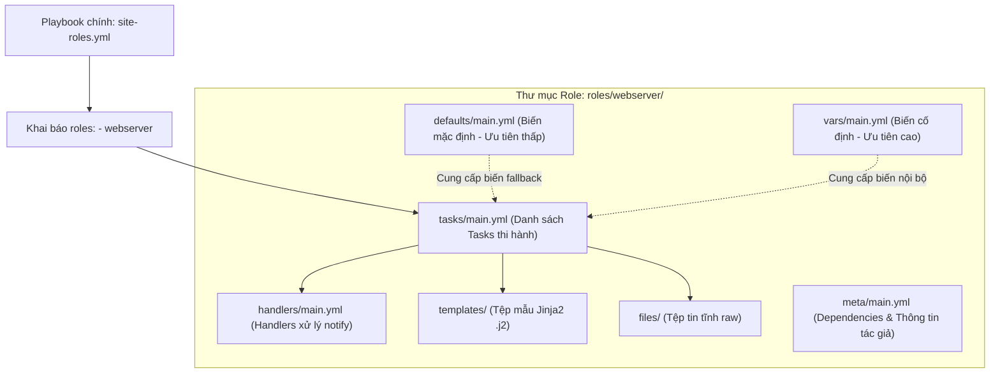
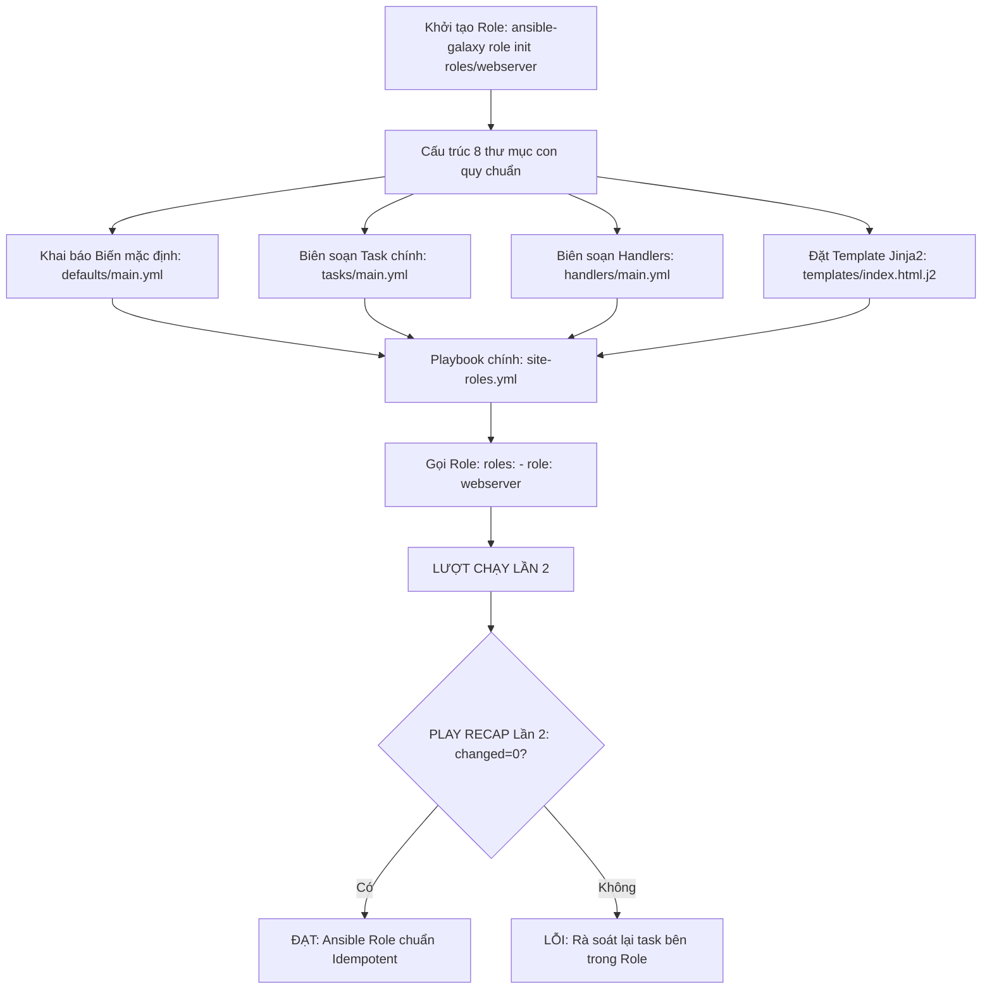
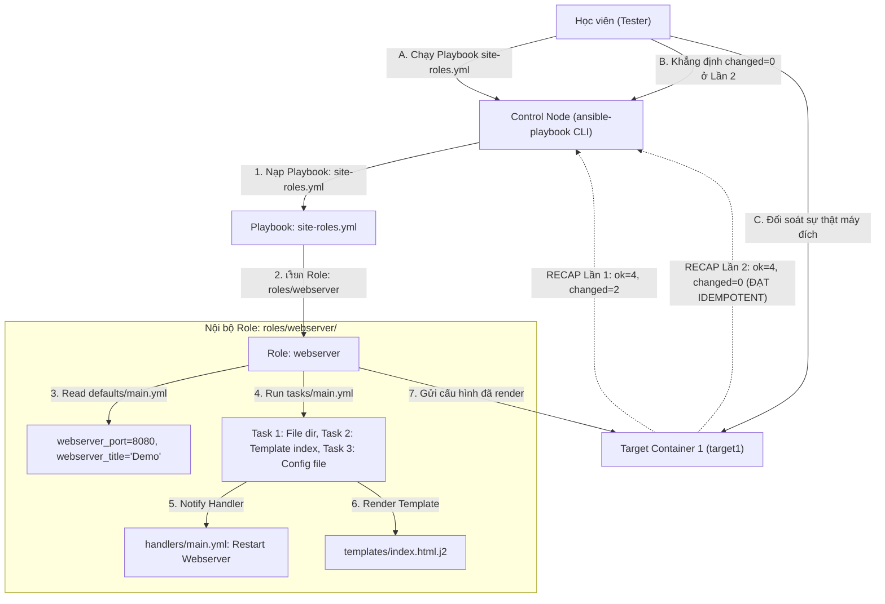


# [BÀI 14] ĐÓNG GÓI TÁI SỬ DỤNG VỚI ANSIBLE ROLES: CẤU TRÚC THƯ MỤC CHUẨN, TASKS, HANDLERS, VARS, DEFAULTS & META

Trong kỷ nguyên **Infrastructure as Code (IaC)** và tự động hóa vận hành hạ tầng đám mây (Cloud Infrastructure Automation), **Ansible** khẳng định vị thế dẫn đầu nhờ triết lý **Agentless** (không cần cài đặt agent nền trên máy đích), giao thức điều khiển an toàn qua **SSH / WinRM**, định dạng khai báo **YAML** trực quan và nguyên lý bất biến **Idempotency** mạnh mẽ. Việc làm chủ Ansible không chỉ dừng lại ở các câu lệnh Ad-hoc đơn giản, mà đòi hỏi kỹ sư phải nắm vững kiến trúc Module tầng thấp, Variable Precedence 22 tầng, Jinja2 Templates, tối ưu hóa Forks & Pipelining cho tới thiết kế Roles / Collections và tích hợp CI/CD tự động hóa chuẩn Doanh nghiệp.

Bài viết chuyên sâu này sẽ đồng hành cùng bạn mổ xẻ toàn diện bức tranh kiến trúc, phân tích các đánh đổi kỹ thuật thực chiến (Engineering Trade-offs), cung cấp hướng dẫn thực hành Lab chi tiết từng bước và bộ câu hỏi phỏng vấn chuyên sâu chuẩn DevOps / SRE Lead.

---

## 1. Bản Chất Kiến Trúc & Cơ Chế Vận Hành Tầng Thấp

---


> **Tổ chức kịch bản phức tạp thành các Roles tái sử dụng giúp mã nguồn Ansible chuẩn hóa, dễ bảo trì và mở rộng.**

Mở đầu Giai đoạn 3 (Tổ chức và tái dùng) với kiến trúc chuẩn hóa mã nguồn hạ tầng (I-10):

> **Khi kịch bản tự động hóa phình to lên hàng ngàn dòng YAML với hàng chục Task, Handler, Template và biến số, việc duy trì một tệp Playbook phẳng duy nhất sẽ trở thành "ác mộng" bảo trì. Ansible Role cung cấp một chuẩn đóng gói hạ tầng thành các mô-đun độc lập có cấu trúc thư mục quy chuẩn (`tasks/`, `handlers/`, `templates/`, `defaults/`, `vars/`, `meta/`). Việc khởi tạo khung chuẩn bằng lệnh `ansible-galaxy role init` giúp mã nguồn được phân tách rõ ràng, có khả năng chia sẻ và tái sử dụng trên nhiều dự án khác nhau. Dù được tổ chức dưới dạng Role phức tạp, mọi Task bên trong vẫn tuân thủ nguyên lý Idempotency nghiêm ngặt, đảm bảo ở lượt chạy Lần thứ hai luôn đạt `changed=0` tuyệt đối.**

---


---


---


| Tiếng Việt | Tiếng Anh / Từ khóa + FQCN (giữ nguyên) |
|---|---|
| Mô-đun hạ tầng | Ansible Role (`roles/role_name`) |
| Khởi tạo Role tự động | Galaxy role initialization (`ansible-galaxy role init`) |
| Thư mục nhiệm vụ chính | Main tasks entrypoint (`tasks/main.yml`) |
| Thư mục bộ kích hoạt | Main handlers entrypoint (`handlers/main.yml`) |
| Thư mục mẫu Jinja2 | Role templates directory (`templates/`) |
| Thư mục tệp tin tĩnh | Role static files directory (`files/`) |
| Thư mục biến mặc định | Default variables directory (`defaults/main.yml`) |
| Thư mục biến cố định | Internal variables directory (`vars/main.yml`) |
| Thư mục siêu dữ liệu | Role metadata directory (`meta/main.yml`) |
| Áp dụng Role trong Playbook | Role invocation directive (`roles:`) |
| Thứ tự ưu tiên biến Role | Role variable precedence hierarchy |
| Tính tái sử dụng mô-đun | Role modularity & reusability |

---

### 1.1. Khái niệm Ansible Role và Lệnh `ansible-galaxy role init` (15 phút)



**Nguyên lý cốt lõi:** Ansible Role là chuẩn tổ chức mã nguồn tự động hóa dưới dạng mô-đun độc lập, gom toàn bộ Tasks, Handlers, Variables, Templates và Files vào một cấu trúc thư mục quy chuẩn.

**Giải thích cơ chế ngầm:** Giúp chia nhỏ kịch bản phức tạp thành các khối ứng dụng riêng biệt (như role `nginx`, role `mysql`, role `php`), giúp tái sử dụng mã nguồn trên nhiều Playbook khác nhau và dễ dàng chia sẻ cho cộng đồng.

> [!WARNING]
> **CẠM BẪY THỰC CHIẾN:**
> Viết 1 file Playbook phẳng dài 2000 dòng chứa tất cả cấu hình Web, DB, Security làm mã nguồn cực kỳ rối rắm và không thể tái sử dụng.

**Minh hoạ.** Cấu trúc gọi Role gọn gàng trong Playbook `site.yml`:
```yaml
- name: Deploy Complete Web and Database Stack
  hosts: all
  become: true
  roles:
    - role: common
    - role: webserver
    - role: database
```

**Nguyên lý cốt lõi:** Sử dụng lệnh CLI `ansible-galaxy role init <role_name>` để khởi tạo tự động toàn bộ khung thư mục tiêu chuẩn của một Role mới.

**Giải thích cơ chế ngầm:** Lệnh `ansible-galaxy role init` tạo ra sẵn 8 thư mục con với các file `main.yml` tương ứng đúng chuẩn quy ước của Ansible Engine, giúp tiết kiệm thời gian tạo thủ công và tránh lỗi gõ sai tên thư mục.

> [!WARNING]
> **CẠM BẪY THỰC CHIẾN:**
> Tạo thủ công thư mục `task/` (thiếu chữ 's') làm Ansible Engine không tìm thấy các task thi hành trong Role.

**Minh hoạ.** Khởi tạo role `webserver` bằng CLI:
```bash
cd roles/
ansible-galaxy role init webserver
```

**Nguyên lý cốt lõi:** Hiểu đúng vai trò chức năng của 8 thư mục con quy chuẩn bên trong cấu trúc của một Ansible Role.

**Giải thích cơ chế ngầm:** Giúp đặt đúng loại tài nguyên vào đúng thư mục quy định để Ansible Engine tự động nạp mà không cần phải khai báo đường dẫn thủ công:
- `tasks/main.yml`: Chứa danh sách các Task thi hành chính.
- `handlers/main.yml`: Chứa các Handler được thông báo qua `notify`.
- `defaults/main.yml`: Chứa các biến mặc định có **độ ưu tiên thấp nhất** (dễ bị ghi đè).
- `vars/main.yml`: Chứa các biến nội bộ của Role có **độ ưu tiên cao**.
- `templates/`: Chứa các tệp mẫu Jinja2 `.j2`.
- `files/`: Chứa các tệp tin tĩnh (như certificate, script tĩnh).
- `meta/main.yml`: Chứa thông tin phụ thuộc (dependencies) và tác giả.
- `tests/`: Chứa kịch bản kiểm thử Role.

> [!WARNING]
> **CẠM BẪY THỰC CHIẾN:**
> Đặt tệp `.j2` vào thư mục `files/` hoặc đặt file handler vào `tasks/main.yml` làm mất đi tính chuẩn hóa của Role.

**Minh hoạ.** Cây thư mục Role `webserver` sau khi init:
```
roles/webserver/
├── defaults/
│   └── main.yml
├── files/
├── handlers/
│   └── main.yml
├── meta/
│   └── main.yml
├── README.md
├── tasks/
│   └── main.yml
├── templates/
├── tests/
└── vars/
    └── main.yml
```

---

### 1.2. Quản lý Biến và Gọi Role trong Playbook (15 phút)

**Nguyên lý cốt lõi:** Phân biệt chính xác thứ tự ưu tiên và mục đích sử dụng giữa hai thư mục biến `defaults/main.yml` và `vars/main.yml` trong Role.

**Giải thích cơ chế ngầm:** Các biến đặt trong `defaults/main.yml` có độ ưu tiên thấp nhất toàn hệ thống, đóng vai trò là "fallback values" giúp người gọi Role dễ dàng ghi đè (override) từ `inventory`, `group_vars` hoặc khi gọi Role. Ngược lại, biến trong `vars/main.yml` có độ ưu tiên rất cao, dùng để lưu trữ các hằng số nội bộ không muốn người dùng ghi đè tùy tiện.

> [!WARNING]
> **CẠM BẪY THỰC CHIẾN:**
> Đặt biến cấu hình tùy chỉnh người dùng (như `http_port: 80`) vào `vars/main.yml` làm người gọi Role không thể ghi đè biến từ Playbook.

**Minh hoạ.** Đặt biến cổng mặc định trong `defaults/main.yml`:
```yaml
# roles/webserver/defaults/main.yml
webserver_port: 80
webserver_user: www-data
```

**Nguyên lý cốt lõi:** Gọi và áp dụng Role trong Playbook bằng từ khóa `roles:` và có thể ghi đè các biến đầu vào linh hoạt.

**Giải thích cơ chế ngầm:** Cho phép tùy biến hành vi của Role khi áp dụng cho các nhóm máy chủ khác nhau (ví dụ: host `dev` gọi role `webserver` với cổng 8080, host `prod` gọi với cổng 80).

> [!WARNING]
> **CẠM BẪY THỰC CHIẾN:**
> Tạo 2 Role riêng biệt `webserver-dev` và `webserver-prod` trùng lặp mã nguồn chỉ vì khác nhau mỗi tham số cổng.

**Minh hoạ.** Truyền biến tùy chỉnh khi gọi Role trong Playbook:
```yaml
- name: Deploy Custom Webservers
  hosts: web
  become: true
  roles:
    - role: webserver
      vars:
        webserver_port: 8080
        webserver_user: nginx
```

**Nguyên lý cốt lõi:** Tận dụng cơ chế tìm kiếm đường dẫn tương đối tự động của Ansible Engine khi tham chiếu đến `templates/` hoặc `files/` bên trong Role.

**Giải thích cơ chế ngầm:** Khi một Task nằm trong `roles/webserver/tasks/main.yml` gọi module `template: src=nginx.conf.j2`, Ansible Engine sẽ tự động tìm kiếm tệp `nginx.conf.j2` trong thư mục `roles/webserver/templates/` mà **không cần phải gõ đường dẫn dài `roles/webserver/templates/nginx.conf.j2`**.

> [!WARNING]
> **CẠM BẪY THỰC CHIẾN:**
> Gõ cứng đường dẫn tuyệt đối `src: /home/user/roles/webserver/templates/index.j2` làm Role bị hỏng khi chép sang máy khác.

**Minh hoạ.** Gọi template tương đối chuẩn trong Role task:
```yaml
# roles/webserver/tasks/main.yml
- name: Deploy Nginx index page
  ansible.builtin.template:
    src: index.html.j2
    dest: /var/www/html/index.html
```

---

### 1.3. Siêu dữ liệu Meta, Tính di động và Idempotency (10 phút)

**Nguyên lý cốt lõi:** Khai báo danh sách các Role phụ thuộc (Dependencies) và thông tin tác giả bên trong tệp `meta/main.yml`.

**Giải thích cơ chế ngầm:** Cho phép Role tự động kích hoạt các Role phụ thuộc trước khi chạy chính nó (ví dụ: role `wordpress` khai báo dependency yêu cầu role `php` và `mysql` phải chạy trước).

> [!WARNING]
> **CẠM BẪY THỰC CHIẾN:**
> Chạy role `wordpress` bị văng lỗi thiếu PHP do quên khai báo dependency trong `meta/main.yml`.

**Minh hoạ.** Khai báo dependencies trong `roles/wordpress/meta/main.yml`:
```yaml
galaxy_info:
  author: NTK Ansible Course
  description: WordPress Deployment Role
  license: MIT

dependencies:
  - role: common
  - role: php
```

**Nguyên lý cốt lõi:** Đảm bảo tính độc lập và di động (Portable Role) của Role bằng cách không tham chiếu đến các biến toàn cục nằm ngoài phạm vi định nghĩa của Role.

**Giải thích cơ chế ngầm:** Giúp Role có thể mang đi sử dụng trên bất kỳ kịch bản hay dự án Ansible nào mà không bị lỗi thiếu biến môi trường toàn cục của dự án cũ.

> [!WARNING]
> **CẠM BẪY THỰC CHIẾN:**
> Role sử dụng trực tiếp biến `my_custom_global_var` khai báo ở `group_vars/all.yml` của dự án gốc, khi đem Role sang dự án mới thì bị văng lỗi undefined variable.

**Minh hoạ.** Mọi biến tùy chọn được sử dụng trong Role phải có khai báo giá trị fallback trong `defaults/main.yml`.

**Nguyên lý cốt lõi:** Đảm bảo rằng ở lượt chạy Lần thứ hai, Playbook gọi các Ansible Roles bắt buộc phải đạt chỉ số `changed=0` tuyệt đối trong bảng `PLAY RECAP`.

**Giải thích cơ chế ngầm:** Việc chia nhỏ Playbook thành các Role không làm thay đổi bản chất của các Task bên trong. Tất cả các Task trong `tasks/main.yml` của Role vẫn phải tuân thủ chuẩn Idempotency nghiêm ngặt để ở Lần 2 chỉ trả về `ok` và `changed=0`.

> [!WARNING]
> **CẠM BẪY THỰC CHIẾN:**
> Bảng `PLAY RECAP` Lần 2 báo `changed > 0` do task trong Role bị lặp changed mạo danh.

**Minh hoạ.** Đọc hiểu bảng `PLAY RECAP` Lần 2 đạt Idempotency khi gọi Role:
```
# Lần 1: changed=2 (Role webserver thực thi cài đặt và render template)
target1 : ok=5 changed=2 unreachable=0 failed=0

# Lần 2: changed=0 (Mọi thứ đã chuẩn hóa -> ĐẠT IDEMPOTENCY 100%)
target1 : ok=5 changed=0 unreachable=0 failed=0
```

---

### 1.4. Đưa vào việc thật (4 phút)

### 7.1. Áp dụng vào hạ tầng sẵn có
Khi triển khai chuẩn hóa hạ tầng Doanh nghiệp:
- Xây dựng thư viện chuẩn gồm các Roles tái sử dụng: `role-common` (cấu hình SSH, NTP, DNS), `role-nginx` (cài đặt Nginx Web Server), `role-postgresql` (cài đặt DB Cluster).
- Mọi kịch bản triển khai ứng dụng mới chỉ cần ghép các Role lại trong `site.yml` với 10-20 dòng YAML cực kỳ gọn gàng.

### 7.2. Rủi ro hỏng hóc khi triển khai Production và giải pháp an toàn
- **Rủi ro:** Đặt biến cố định vào `defaults/main.yml` thay vì `vars/main.yml`, khiến người dùng ở kịch bản ngoài vô tình truyền biến trùng tên làm đè mất cấu hình quan trọng của Role.
- **Giải pháp an toàn:**
  1. Đặt toàn bộ các biến cấu hình tùy chỉnh cho phép người dùng ghi đè vào `defaults/main.yml`.
  2. Đặt các hằng số nội bộ không cho phép sửa đổi vào `vars/main.yml`.

### 7.3. Đo lường chỉ số Trước – Sau khi áp dụng
- **Trước khi dùng Role:** 10 dự án duy trì 10 file Playbook trùng lặp mã nguồn (10 x 500 = 5000 dòng YAML). Khi cần sửa 1 task SSH, phải mở 10 file ra sửa bằng tay.
- **Sau khi dùng Role:** Chỉ duy trì 1 `role-common` duy nhất. Sửa 1 lần trong `role-common/tasks/main.yml`, cả 10 dự án tự động thừa hưởng.

### 7.4. Khi nào KHÔNG nên dùng hoặc không nên lạm dụng Role
- **Không lạm dụng Role cho các công việc một lần (One-off tasks):** Nếu kịch bản chỉ gồm 1-2 Task đơn giản chạy thử nghiệm, việc tạo đầy đủ 8 thư mục Role bằng `ansible-galaxy` sẽ gây dư thừa cấu trúc không cần thiết.

---

### 1.5. Bẫy hay gặp (2 phút)

| # | Bẫy hay gặp | Vì sao "recap xanh mà sai / không idempotent" | Lệnh phát hiện và xử lý |
|---|---|---|---|
| 1 | Tạo thủ công thư mục Role bị gõ sai tên | Gõ `task/` (thiếu chữ 's') khiến Ansible Engine không tìm thấy task thi hành. | Dùng lệnh chuẩn: `ansible-galaxy role init <role_name>`. |
| 2 | Đặt biến tùy chỉnh vào `vars/main.yml` | Người dùng không thể ghi đè biến từ Playbook ngoài do `vars` có ưu tiên cao. | Chuyển biến tùy chỉnh sang `defaults/main.yml`. |
| 3 | Gõ đường dẫn tuyệt đối cho template/file | Gõ `src: /path/to/role/templates/index.j2` làm hỏng Role khi di chuyển. | Chỉ gõ tên file tương đối: `src: index.j2`. |
| 4 | Để file `tasks/main.yml` bị trống | Ansible báo warning không tìm thấy entrypoint thi hành trong Role. | Đảm bảo file `tasks/main.yml` chứa danh sách task thi hành. |
| 5 | Đặt tệp `.j2` vào thư mục `files/` | Tệp template bị module `copy` chép thô chưa render biến Jinja2. | Đặt tệp `.j2` vào đúng thư mục `templates/` của Role. |
| 6 | Thắc mắc vì sao Handler trong Role không chạy | Tên Handler trong `handlers/main.yml` không trùng khớp với chuỗi trong `notify:`. | Kiểm tra lại từng ký tự tên Handler trong `notify`. |
| 7 | Role phụ thuộc vào biến toàn cục ngoài | Role bị crash với lỗi undefined variable khi mang sang dự án mới. | Khai báo biến mặc định fallback trong `defaults/main.yml`. |
| 8 | Quên từ khóa `role:` khi khai báo trong Playbook | Viết `roles: - webserver` sai cú pháp thụt lề YAML hoặc nhầm danh sách. | Viết đúng cú pháp: `roles: - role: webserver`. |
| 9 | Lập vòng lặp phụ thuộc tròn (Circular dependencies) | Role A gọi Role B, Role B lại khai báo dependency gọi Role A làm treo thi hành. | Loại bỏ vòng lặp phụ thuộc trong `meta/main.yml`. |
| 10 | Đặt file Playbook gọi Role sai vị trí thư mục | Đặt `site.yml` bên trong thư mục `roles/` làm Ansible không tìm thấy Role. | Đặt `site.yml` nằm cùng cấp ngang hàng với thư mục `roles/`. |
| 11 | Không test thử Idempotency Lần 2 của Role | Task trong Role bị lặp changed mạo danh ở Lần 2 mà không biết. | Chạy lại Playbook Lần 2 và kiểm tra `changed=0`. |
| 12 | Thắc mắc tại sao `ansible-galaxy role init` tạo ra file `.travis.yml` | File này dùng cho tích hợp CI/CD tự động kiểm thử Role của Galaxy (có thể xóa nếu không dùng). | Yên tâm xóa file `.travis.yml` nếu không chạy CI. |

---

### 1.6. Tóm tắt (1 phút)



### Năm điều phải nhớ
1. **Dùng `ansible-galaxy role init`:** Khởi tạo cấu trúc Role tự động đúng 8 thư mục quy chuẩn.
2. **Đặt đúng file vào đúng thư mục:** Task vào `tasks/`, Handler vào `handlers/`, Template vào `templates/`.
3. **Phân biệt `defaults` và `vars`:** Biến người dùng ghi đè đặt ở `defaults/`, biến hằng số đặt ở `vars/`.
4. **Tham chiếu tương đối:** Chỉ gọi `src: index.j2` không gõ đường dẫn tuyệt đối trong Role.
5. **Đạt chuẩn `changed=0` ở Lần 2:** Mọi Role ở lượt chạy Lần 2 bắt buộc phải đạt `changed=0`.

---

### 1.7. Câu hỏi tự kiểm tra (kiêm luyện RHCE EX294)

1. **[RHCE EX294 Objective #11]** Lệnh CLI nào trong Ansible dùng để khởi tạo tự động toàn bộ khung thư mục tiêu chuẩn của một Role mới?
   - *Đáp án:* Lệnh `ansible-galaxy role init <role_name>`.
2. **[RHCE EX294 Objective #11]** Tệp tin nào đóng vai trò là điểm vào (entrypoint) chính chứa danh sách các Task thi hành bên trong thư mục `tasks/` của một Role?
   - *Đáp án:* Tệp `tasks/main.yml`.
3. **[RHCE EX294 Objective #11]** Thư mục nào trong Role dùng để chứa các biến mặc định có độ ưu tiên thấp nhất để người dùng dễ dàng ghi đè?
   - *Đáp án:* Thư mục `defaults/` (tệp `defaults/main.yml`).
4. **[RHCE EX294 Objective #11]** Thư mục nào trong Role dùng để chứa các tệp mẫu Jinja2 `.j2`?
   - *Đáp án:* Thư mục `templates/`.
5. **[RHCE EX294 Objective #11]** Khi gọi module `template: src=nginx.conf.j2` bên trong Task của Role, Ansible Engine sẽ tự động tìm kiếm tệp `nginx.conf.j2` ở đâu?
   - *Đáp án:* Tự động tìm trong thư mục `templates/` của chính Role đó.
6. **[RHCE EX294 Objective #11]** Viết cú pháp YAML trong Playbook `site.yml` gọi Role `webserver` và ghi đè biến `webserver_port: 8080`.
   - *Đáp án:*
     ```yaml
     roles:
       - role: webserver
         vars:
           webserver_port: 8080
     ```
7. **[RHCE EX294 Objective #11]** Phân biệt sự khác nhau về độ ưu tiên biến giữa `defaults/main.yml` và `vars/main.yml` trong Role.
   - *Đáp án:* Biến trong `defaults/main.yml` có độ ưu tiên thấp nhất (dễ bị ghi đè); biến trong `vars/main.yml` có độ ưu tiên rất cao (dùng cho hằng số nội bộ).
8. **[RHCE EX294 Objective #11]** Tệp tin nào trong thư mục `meta/` dùng để khai báo thông tin tác giả và danh sách các Role phụ thuộc (dependencies)?
   - *Đáp án:* Tệp `meta/main.yml`.
9. **[RHCE EX294 Objective #11]** Thư mục `files/` trong Role dùng để chứa loại tệp tin nào?
   - *Đáp án:* Chứa các tệp tin tĩnh (raw static files) được chép nguyên bản bởi module `copy` hay `script`.
10. **[RHCE EX294 Objective #11]** Cần đặt thư mục `roles/` ở vị trí nào so với tệp Playbook chính `site.yml` để Ansible tự động nhận diện?
    - *Đáp án:* Đặt thư mục `roles/` nằm cùng cấp ngang hàng với tệp Playbook `site.yml` (hoặc trong đường dẫn `roles_path` cấu hình tại `ansible.cfg`).
11. **[RHCE EX294 Objective #11]** Tại sao một Role được coi là độc lập (Portable Role) lại không nên tham chiếu trực tiếp đến các biến toàn cục bên ngoài?
    - *Đáp án:* Vì nếu phụ thuộc biến toàn cục bên ngoài, Role sẽ bị văng lỗi `undefined variable` khi mang sang dự án hoặc Playbook khác.
12. **[RHCE EX294 Objective #11]** Cần kiểm tra chỉ số nào trong bảng `PLAY RECAP` ở lượt chạy Lần 2 để khẳng định một Playbook sử dụng Role đạt chuẩn Idempotency?
    - *Đáp án:* Chỉ số `changed=0` (và `failed=0`).
13. **[RHCE EX294 Objective #11]** Lệnh CLI nào giúp kiểm tra sự thật dịch vụ Web được cài đặt từ Role trên target node Docker container?
    - *Đáp án:* Lệnh `docker exec target1 curl -s http://localhost`.

---

### 1.8. Tài liệu tham khảo

- Ansible Core Documentation (v2.15+): [Roles Organization](https://docs.ansible.com/ansible/latest/playbook_guide/playbooks_reuse_roles.html)
- Ansible Core Documentation: [Ansible Galaxy CLI](https://docs.ansible.com/ansible/latest/cli/ansible-galaxy.html)
- Red Hat Certified Engineer (RHCE) EX294 Study Guide: Creating and Using Roles in Ansible Playbooks.

---

## Bảng đối soát thời lượng

| Mục | Nội dung | Thời lượng dự kiến | Thời lượng thực tế |
|---|---|---|---|
| §0 | Khởi động và ôn tập buổi 13 | 10 phút | 10 phút |
| §1–§2 | Mục tiêu làm được & Cần biết trước | 2 phút | 2 phút |
| §3 | Thuật ngữ Việt-Anh & Mô hình tư duy | 8 phút | 8 phút |
| §4 | Khái niệm Role & ansible-galaxy role init (QT 4.1–4.3) | 15 phút | 15 phút |
| §5 | Quản lý Biến & Gọi Role trong Playbook (QT 5.1–5.3) | 15 phút | 15 phút |
| §6 | Siêu dữ liệu Meta, Tính di động & Idempotency (QT 6.1–6.3) | 10 phút | 10 phút |
| §7–§9 | Đưa vào việc thật, Bẫy hay gặp & Tóm tắt | 7 phút | 7 phút |
| §10–§11 | Câu hỏi tự kiểm tra EX294 & Tài liệu tham khảo | 3 phút | 3 phút |
| **Tổng** | **Khối lý thuyết Buổi 14** | **60 phút** | **60 phút** |

---

## 2. Hướng Dẫn Thực Hành & Triển Khai Lab Chuẩn Production

> [!IMPORTANT]
> **YÊU CẦU MÔI TRƯỜNG THỰC HÀNH:**
> Toàn bộ các bài thực hành dưới đây được thiết kế để chạy trực tiếp trên môi trường máy chủ Linux / Docker containers phân tán. Hãy đảm bảo bạn đã chuẩn bị Control Node cài đặt Ansible Core 2.15+ cùng các Managed Nodes đã cấu hình SSH Key Authentication.

## Khối thực hành — 150 phút

> **Đối soát thời lượng:** Khối thực hành kéo dài đúng **150'** (từ L0 đến L11).
> **Nguyên tắc cốt lõi:** Thực hành khởi tạo thư mục Role bằng `ansible-galaxy role init roles/webserver`, biên soạn `tasks/main.yml`, `handlers/main.yml`, `defaults/main.yml`, `templates/index.html.j2`, áp dụng Role trong Playbook `site-roles.yml` truyền tham số biến tùy chỉnh, thực thi phép thử **Lượt chạy Lần thứ hai** chứng minh `PLAY RECAP` đạt `changed=0` và đối soát sự thật máy đích qua `docker exec`.

---

## L0. Mục tiêu thực hành và tiêu chí hoàn thành

| # | Mục tiêu thực hành | Tiêu chí hoàn thành (Kiểm tra bằng lệnh CLI) |
|---|---|---|
| TH1 | Khởi tạo cấu trúc Role bằng ansible-galaxy role init | Thư mục `roles/webserver/` có đủ 8 thư mục con quy chuẩn |
| TH2 | Định nghĩa biến mặc định trong defaults/main.yml | Biến `webserver_port: 8080` được khai báo trong defaults |
| TH3 | Biên soạn Task chính trong tasks/main.yml | Task cài đặt và tạo file cấu hình được định nghĩa chuẩn |
| TH4 | Định nghĩa Handler restart Web trong handlers/main.yml | Handler `Restart Webserver` tự động xử lý khi có notify |
| TH5 | Tạo tệp mẫu Jinja2 index.html.j2 trong templates/ | Tệp template nằm gọn trong thư mục `templates/` của Role |
| TH6 | Áp dụng Role trong Playbook site-roles.yml | Playbook `site-roles.yml` gọi `roles: - role: webserver` |
| TH7 | Thực thi Phép thử Lượt chạy Lần hai (Idempotency) | Bảng `PLAY RECAP` Lần 2 đạt `changed=0` tuyệt đối |
| TH8 | Đối soát sự thật máy đích bằng docker exec | `docker exec target1 cat /var/www/html/index.html` |

---

## L1. Điều kiện tiên quyết về môi trường

| Kiểm tra | LỆNH THỰC THI | Kết quả kỳ vọng |
|---|---|---|
| Ansible core đã cài | `ansible --version` | Phiên bản ansible-core v2.15 trở lên |
| Docker Compose sẵn sàng | `docker compose ps` | Cả target1 và target2 ở trạng thái `Up` |
| Kết nối SSH sẵn sàng | `ansible all -m ansible.builtin.ping` | Đạt `SUCCESS` cho mọi host |
| Inventory dự án | `ansible-inventory --graph` | Hiển thị các nhóm `web` và `db` |
| Thư mục thực hành | `pwd` | Đang ở thư mục `~/lab-ansible-14` |

Nếu chưa có target container:
```bash
cd labs && make up && make key && make inventory
```

---

## L2. Kiến trúc bài lab



---

## L3. Bước 1 — Khởi tạo Cấu trúc Role bằng ansible-galaxy (30 phút)

Tạo thư mục dự án `~/lab-ansible-14`, thư mục `roles`, file `ansible.cfg`, `inventory.ini`, và dùng lệnh `ansible-galaxy role init` để khởi tạo role `webserver` (QT 4.1, QT 4.2, QT 4.3).

```bash
mkdir -p ~/lab-ansible-14/roles && cd ~/lab-ansible-14

cat << 'EOF' > ansible.cfg
[defaults]
inventory = ./inventory.ini
remote_user = ansible
host_key_checking = False
private_key_file = ~/.ssh/id_ed25519

[privilege_escalation]
become = True
become_method = sudo
become_user = root
become_ask_pass = False
EOF

cat << 'EOF' > inventory.ini
[web]
target1 ansible_host=127.0.0.1 ansible_port=2221

[db]
target2 ansible_host=127.0.0.1 ansible_port=2222

[all:vars]
ansible_python_interpreter=/usr/bin/python3
EOF

# Khởi tạo khung role webserver chuẩn bằng ansible-galaxy CLI
cd roles && ansible-galaxy role init webserver && cd ..
```

**CHECKPOINT 1 — Lệnh ansible-galaxy role init tạo tự động khung thư mục roles/webserver đúng 8 thư mục con chuẩn.**
- **Lệnh kiểm tra:**
```bash
if [ -d "roles/webserver/tasks" ] && [ -d "roles/webserver/handlers" ] && [ -d "roles/webserver/defaults" ] && [ -d "roles/webserver/templates" ]; then
  echo "CHECKPOINT 1: ĐẠT - Lệnh ansible-galaxy role init khởi tạo thành công khung thư mục roles/webserver đúng quy chuẩn"
else
  echo "CHECKPOINT 1: LỖI - Khởi tạo role thất bại"
fi
```

---

## L4. Bước 2 — Biên soạn các Thành phần trong Role webserver (40 phút)

Biên soạn các file `defaults/main.yml`, `vars/main.yml`, `tasks/main.yml`, `handlers/main.yml`, và `templates/index.html.j2` cho role `webserver` (QT 5.1, QT 5.2, QT 5.3, QT 6.1).

1. Biên soạn file biến mặc định `roles/webserver/defaults/main.yml`:
```bash
cat << 'EOF' > roles/webserver/defaults/main.yml
---
# defaults file for webserver
webserver_port: 8080
webserver_doc_root: /var/www/html
webserver_site_title: "Welcome to NTK Ansible Role Demo"
EOF
```

2. Biên soạn file biến cố định nội bộ `roles/webserver/vars/main.yml`:
```bash
cat << 'EOF' > roles/webserver/vars/main.yml
---
# vars file for webserver internal constants
internal_app_name: "NTK_ROLE_ENGINE"
EOF
```

3. Biên soạn file mẫu `roles/webserver/templates/index.html.j2`:
```bash
cat << 'EOF' > roles/webserver/templates/index.html.j2
<!DOCTYPE html>
<html>
<head>
    <title>{{ webserver_site_title }}</title>
</head>
<body>
    <h1>{{ webserver_site_title }}</h1>
    <p>Managed by Ansible Role for host: {{ inventory_hostname }}</p>
    <p>Server Port: {{ webserver_port }}</p>
    <p>Internal Engine: {{ internal_app_name }}</p>
</body>
</html>
EOF
```

4. Biên soạn file Handlers `roles/webserver/handlers/main.yml`:
```bash
cat << 'EOF' > roles/webserver/handlers/main.yml
---
# handlers file for webserver
- name: Trigger Webserver Reload
  ansible.builtin.file:
    path: /tmp/webserver-reloaded.flag
    state: touch
EOF
```

5. Biên soạn file Tasks chính `roles/webserver/tasks/main.yml`:
```bash
cat << 'EOF' > roles/webserver/tasks/main.yml
---
# tasks file for webserver
- name: Task 1 - Ensure document root directory exists
  ansible.builtin.file:
    path: "{{ webserver_doc_root }}"
    state: directory
    mode: '0755'

- name: Task 2 - Deploy index page from role Jinja2 template
  ansible.builtin.template:
    src: index.html.j2
    dest: "{{ webserver_doc_root }}/index.html"
    mode: '0644'
  notify: Trigger Webserver Reload

- name: Task 3 - Deploy webserver configuration file
  ansible.builtin.copy:
    content: "LISTEN={{ webserver_port }}\nENGINE={{ internal_app_name }}\n"
    dest: /etc/webserver-role.conf
    mode: '0644'
EOF
```

**CHECKPOINT 2 — Biến mặc định webserver_port và webserver_doc_root được định nghĩa chuẩn xác trong roles/webserver/defaults/main.yml.**
- **Lệnh kiểm tra:**
```bash
DEFAULTS_CONTENT=$(cat roles/webserver/defaults/main.yml)
if echo "$DEFAULTS_CONTENT" | grep -q "webserver_port: 8080" && echo "$DEFAULTS_CONTENT" | grep -q "webserver_doc_root:"; then
  echo "CHECKPOINT 2: ĐẠT - Biến mặc định webserver_port và webserver_doc_root được định nghĩa chuẩn xác trong defaults/main.yml"
else
  echo "CHECKPOINT 2: LỖI - Định nghĩa defaults/main.yml thất bại"
fi
```

**CHECKPOINT 3 — Tệp mẫu index.html.j2 và Handler Trigger Webserver Reload được biên soạn đúng vị trí thư mục của Role.**
- **Lệnh kiểm tra:**
```bash
if [ -f "roles/webserver/templates/index.html.j2" ] && grep -q "Trigger Webserver Reload" roles/webserver/handlers/main.yml; then
  echo "CHECKPOINT 3: ĐẠT - Tệp mẫu index.html.j2 và Handler được biên soạn đúng vị trí cấu trúc Role"
else
  echo "CHECKPOINT 3: LỖI - File template hoặc handler trong Role thất bại"
fi
```

---

## L5. Bước 3 — Tạo Playbook site-roles.yml Gọi và Áp dụng Role (30 phút)

Viết file Playbook chính `site-roles.yml` gọi role `webserver` và truyền biến tùy chỉnh để ghi đè `webserver_port` (QT 5.2, QT 6.2).

```bash
cat << 'EOF' > site-roles.yml
---
- name: Apply Standardized Ansible Webserver Role
  hosts: web
  become: true
  roles:
    - role: webserver
      vars:
        webserver_port: 9090
        webserver_site_title: "Production Web Portal Powered by Ansible Roles"
EOF
```

Thực thi Playbook `site-roles.yml`:
```bash
ansible-playbook site-roles.yml
```

**CHECKPOINT 4 — Playbook site-roles.yml gọi và áp dụng thành công role webserver trên target host (PLAY RECAP ok=4).**
- **Lệnh kiểm tra:**
```bash
SITE_OUT=$(ansible-playbook site-roles.yml)
if echo "$SITE_OUT" | grep -q "Task 2 - Deploy index page from role Jinja2 template" && echo "$SITE_OUT" | grep -q "failed=0"; then
  echo "CHECKPOINT 4: ĐẠT - Playbook site-roles.yml gọi và áp dụng thành công role webserver trên target host"
else
  echo "CHECKPOINT 4: LỖI - Thi hành Playbook gọi Role thất bại"
fi
```

**CHECKPOINT 5 — Handler Trigger Webserver Reload trong Role được kích hoạt tự động tạo tệp cờ /tmp/webserver-reloaded.flag.**
- **Lệnh kiểm tra:**
```bash
FLAG_EXISTS=$(docker exec target1 test -f /tmp/webserver-reloaded.flag && echo "EXISTS" || echo "MISSING")
if [ "$FLAG_EXISTS" = "EXISTS" ]; then
  echo "CHECKPOINT 5: ĐẠT - Handler Trigger Webserver Reload trong Role kích hoạt thành công tạo tệp cờ trên máy đích"
else
  echo "CHECKPOINT 5: LỖI - Handler trong Role không kích hoạt"
fi
```

---

## L6. Bước 4 — Phép thử Lượt chạy Lần thứ hai Chứng minh Idempotency (30 phút)

Thực thi lại nguyên vẹn `ansible-playbook site-roles.yml` Lần 2 để đối soát chỉ số Idempotency `changed=0` (QT 6.3).

```bash
ansible-playbook site-roles.yml
```

**CHECKPOINT 6 — Phép thử Lượt 2 đạt changed=0 cho toàn bộ các Task trong Role webserver.**
- **Lệnh kiểm tra:**
```bash
RUN2_ROLE_OUT=$(ansible-playbook site-roles.yml)
if echo "$RUN2_ROLE_OUT" | grep -q "changed=0" && echo "$RUN2_ROLE_OUT" | grep -q "failed=0"; then
  echo "CHECKPOINT 6: ĐẠT - Phép thử Lượt 2 đạt chuẩn Idempotency (PLAY RECAP báo changed=0 cho toàn bộ Role)"
else
  echo "CHECKPOINT 6: LỖI - Lượt 2 không đạt changed=0 (Task trong Role bị lặp changed)"
fi
```

---

## L7. Bước 5 — Đối soát Sự thật Máy đích qua docker exec (20 phút)

Sử dụng lệnh `docker exec` đối soát trực tiếp các tệp tin được tạo ra và render từ Role `webserver` trên target node (QT 6.3).

Đối soát file `/var/www/html/index.html`:
```bash
docker exec target1 cat /var/www/html/index.html
```

Đối soát file `/etc/webserver-role.conf`:
```bash
docker exec target1 cat /etc/webserver-role.conf
```

**CHECKPOINT 7 — Đối soát file /var/www/html/index.html chứa đúng tiêu chuẩn title được ghi đè và port 9090.**
- **Lệnh kiểm tra:**
```bash
EXEC_INDEX=$(docker exec target1 cat /var/www/html/index.html)
if echo "$EXEC_INDEX" | grep -q "Production Web Portal Powered by Ansible Roles" && echo "$EXEC_INDEX" | grep -q "Server Port: 9090"; then
  echo "CHECKPOINT 7: ĐẠT - Kiểm tra sự thật qua docker exec xác nhận file index.html chứa đúng dữ liệu render từ Role"
else
  echo "CHECKPOINT 7: LỖI - Đối soát file index.html trên máy đích thất bại"
fi
```

**CHECKPOINT 8 — Đối soát file /etc/webserver-role.conf chứa đúng thông số LISTEN=9090 và ENGINE=NTK_ROLE_ENGINE.**
- **Lệnh kiểm tra:**
```bash
EXEC_CONF=$(docker exec target1 cat /etc/webserver-role.conf)
if echo "$EXEC_CONF" | grep -q "LISTEN=9090" && echo "$EXEC_CONF" | grep -q "ENGINE=NTK_ROLE_ENGINE"; then
  echo "CHECKPOINT 8: ĐẠT - Kiểm tra sự thật qua docker exec xác nhận file /etc/webserver-role.conf tồn tại chuẩn xác"
else
  echo "CHECKPOINT 8: LỖI - Đối soát file webserver-role.conf trên máy đích thất bại"
fi
```

---

## L8. Nộp sản phẩm và dọn dẹp (10 phút)

Thu thập kết quả ra các file báo cáo cuối buổi:
```bash
ansible-playbook site-roles.yml > roles-proof.txt
ansible-playbook site-roles.yml > idempotency-check.txt
docker exec target1 cat /var/www/html/index.html > kiem-may-dich.txt
docker exec target1 cat /etc/webserver-role.conf >> kiem-may-dich.txt
```

---

## L9. Xử lý sự cố

| # | Hiện tượng lỗi | Nguyên nhân gốc rễ | Cách xử lý nhanh |
|---|---|---|---|
| 1 | Lỗi `ERROR! the role 'webserver' was not found` | Thư mục `roles/` không nằm cùng cấp ngang hàng với `site-roles.yml` | Đặt thư mục `roles/` nằm cùng cấp với tệp Playbook chính. |
| 2 | Lỗi `the task 'main' was not found in roles/webserver/tasks` | Tệp `tasks/main.yml` bị đặt sai tên (ví dụ `task.yml` hoặc `main.yaml`) | Đổi tên tệp thành đúng chuẩn `tasks/main.yml`. |
| 3 | Biến tùy chỉnh không được ghi đè từ Playbook ngoài | Biến được định nghĩa trong `vars/main.yml` thay vì `defaults/main.yml` | Chuyển biến cần cho phép ghi đè sang tệp `defaults/main.yml`. |
| 4 | Lỗi `could not find src file index.html.j2` | Tệp `.j2` đặt sai vị trí thư mục `templates/` của Role | Đặt tệp `.j2` vào thư mục `roles/webserver/templates/`. |
| 5 | Handler trong Role không được kích hoạt khi task đổi | Ký tự tên Handler trong `notify:` không khớp với `handlers/main.yml` | Đảm bảo tên Handler khớp từng ký tự viết hoa/thường. |
| 6 | Thắc mắc tại sao `ansible-galaxy` tạo nhiều file rác | Cấu trúc Role init chứa `tests/`, `.travis.yml` cho CI | Giữ nguyên hoặc xóa bớt các file CI không sử dụng. |
| 7 | Role bị văng lỗi undefined variable khi mang sang dự án mới | Role phụ thuộc vào biến toàn cục nằm ngoài phạm vi Role | Khai báo biến mặc định phòng thủ trong `defaults/main.yml`. |
| 8 | Lượt chạy Lần 2 liên tục báo `changed=1` | Task trong `tasks/main.yml` dùng `command` thô không có `changed_when: false` | Thêm thuộc tính `changed_when: false` cho các task đọc dữ liệu. |
| 9 | Lỗi cú pháp YAML `syntax error: unexpected 'roles'` | Viết từ khóa `roles:` không cùng cấp thụt lề với `hosts:` và `tasks:` | Đặt `roles:` nằm cùng cấp thụt lề với `hosts:`. |
| 10 | Module `template` báo lỗi không tìm thấy biến internal | Khai báo biến trong `vars/main.yml` bị sai cú pháp YAML | Kiểm tra cú pháp thụt lề và dấu hai chấm trong `vars/main.yml`. |
| 11 | Không ghi đè được biến khi gọi nhiều Role cùng lúc | Biến giữa các Role bị trùng tên không có tiền tố Role | Thêm tiền tố tên Role vào tên biến (như `webserver_port`). |
| 12 | Thắc mắc vì sao file tĩnh trong `files/` không chép được | Dùng module `template` thay vì `copy` cho tệp trong `files/` | Dùng module `copy: src=filename` cho các tệp trong `files/`. |
| 13 | Lỗi `docker exec` báo không tìm thấy file index.html | Document root chưa được tạo trước khi chép file | Thêm task `file: state=directory` tạo thư mục trước khi render file. |
| 14 | Biến `inventory_hostname` trong template bị rỗng | Tệp template gọi sai tên biến hệ thống của Ansible | Gọi đúng biến `{{ inventory_hostname }}` hoặc facts. |

---

## L10. Bài tập mở rộng

1. **BT1:** Dùng `ansible-galaxy role init roles/dbserver` khởi tạo thêm một Role mới cho Database.
2. **BT2:** Định nghĩa biến mặc định `dbserver_port: 5432` trong `roles/dbserver/defaults/main.yml`.
3. **BT3:** Biên soạn `roles/dbserver/tasks/main.yml` tạo file cấu hình `/etc/dbserver.conf`.
4. **BT4:** Gọi cả 2 Roles (`webserver` và `dbserver`) trong Playbook `site-roles.yml`.
5. **BT5:** Ghi đè biến `dbserver_port: 5433` khi gọi role `dbserver` trong `site-roles.yml`.
6. **BT6:** Thêm task dọn dẹp file tạm vào `roles/webserver/tasks/main.yml` với thuộc tính `changed_when: false`.
7. **BT7:** Thực thi phép thử Idempotency Lần 2 cho Playbook gọi 2 Roles và đối soát `PLAY RECAP` đạt `changed=0`.
8. **BT8:** Viết kịch bản bash script dùng `docker exec` đối soát đồng thời cả 2 file `/var/www/html/index.html` và `/etc/dbserver.conf`.

---

## L11. Sản phẩm nộp và chấm điểm

### Danh mục sản phẩm nộp
- Cấu trúc thư mục `roles/webserver/` với đầy đủ các tệp YAML và template.
- File Playbook `site-roles.yml`.
- Báo cáo kết quả 8 CHECKPOINT từ terminal.
- Các file kết quả: `roles-proof.txt`, `idempotency-check.txt`, `kiem-may-dich.txt`.

### Thang điểm đánh giá

| Mức điểm | Tiêu chí đạt được |
|---|---|
| **0–4 điểm** | Chưa hiểu Ansible Role, gõ phẳng Playbook 1 file, hoặc làm cấu trúc thư mục Role bị hỏng. |
| **5–7 điểm** | Tạo được Role bằng `ansible-galaxy`, nhưng chưa phân biệt `defaults` vs `vars`, hay sai đường dẫn template. |
| **8–9 điểm** | Đạt đủ 8 CHECKPOINT, chứng minh thành thạo `ansible-galaxy role init`, `tasks`, `handlers`, `defaults`, `vars`, `templates`, gọi Role trong Playbook, Idempotency Lần 2 (`changed=0`) và đối soát `docker exec`. |
| **10 điểm** | Đạt 9 điểm + Hoàn thành xuất sắc 100% các Bài tập mở rộng (BT1–BT8). |

---

## Bảng đối soát thời lượng

| Bước | Nội dung | Thời lượng dự kiến | Thời lượng thực tế |
|---|---|---|---|
| L0–L2 | Mục tiêu, Tiên quyết & Kiến trúc bài lab | 10 phút | 10 phút |
| L3 | Bước 1: Khởi tạo cấu trúc Role bằng ansible-galaxy | 30 phút | 30 phút |
| L4 | Bước 2: Biên soạn các thành phần trong Role webserver | 40 phút | 40 phút |
| L5 | Bước 3: Tạo Playbook site-roles.yml gọi Role | 30 phút | 30 phút |
| L6 | Bước 4: Phép thử Lượt 2 chứng minh Idempotency | 30 phút | 30 phút |
| L7 | Bước 5: Đối soát sự thật máy đích qua docker exec | 20 phút | 20 phút |
| L8–L11 | Nộp sản phẩm, Sự cố, Bài tập & Chấm điểm | 10 phút | 10 phút |
| **Tổng** | **Khối thực hành Buổi 14** | **150 phút** | **150 phút** |

---

## 3. Bộ Câu Hỏi Vấn Đáp & Phỏng Vấn Kỹ Thuật Chuyên Sâu

Dưới đây là bộ câu hỏi phỏng vấn thực chiến dành cho các vị trí **DevOps Engineer**, **Site Reliability Engineer (SRE)** và **Cloud Automation Architect**, giúp bạn tự đánh giá độ sâu hiểu biết và rèn luyện phản xạ xử lý sự cố hệ thống:

---


## Bộ câu hỏi phỏng vấn chuyên sâu — ĐÚNG 12 câu

<div class="qa-answer">
  <div class="qa-answer-header">
    <svg width="14" height="14" fill="none" stroke="currentColor" stroke-width="2" viewBox="0 0 24 24"><path d="M22 11.08V12a10 10 0 1 1-5.93-9.14"></path><polyline points="22 4 12 14.01 9 11.01"></polyline></svg>
    <span>Phân Tích &amp; Lời Giải Kỹ Thuật</span>
  </div>
  
<b style="color: var(--accent-primary);">Hỏi:</b> Ansible Role là gì? Tại sao việc sử dụng Role lại được coi là chuẩn mực thiết kế mã nguồn IaC (Infrastructure as Code) cho các dự án Enterprise? *(Liên quan QT 4.1)*
<b style="color: var(--accent-primary);">Đáp án chuẩn:</b>
Ansible Role là chuẩn tổ chức mã nguồn tự động hóa dưới dạng mô-đun độc lập, gom toàn bộ Tasks, Handlers, Variables, Templates và Files vào một cấu trúc thư mục quy chuẩn.
Lợi ích chuẩn mực Enterprise:
  <div style="margin: 0.35rem 0; padding-left: 1rem; border-left: 2px solid var(--accent-primary);">• Tách biệt rõ ràng các mối quan tâm (Separation of Concerns).</div>
  <div style="margin: 0.35rem 0; padding-left: 1rem; border-left: 2px solid var(--accent-primary);">• Tái sử dụng mã nguồn 100% trên nhiều Playbook và dự án khác nhau.</div>
  <div style="margin: 0.35rem 0; padding-left: 1rem; border-left: 2px solid var(--accent-primary);">• Dễ dàng quản lý phiên bản, kiểm thử độc lập và chia sẻ cho cộng đồng qua Ansible Galaxy.</div>
<b style="color: var(--accent-primary);">Tiêu chí chấm:</b>
  <div style="margin: 0.35rem 0; padding-left: 1rem; border-left: 2px solid var(--accent-primary);">• 0: Không hiểu khái niệm Ansible Role.</div>
  <div style="margin: 0.35rem 0; padding-left: 1rem; border-left: 2px solid var(--accent-primary);">• 1: Biết Role để chia nhỏ file nhưng không giải thích được các lợi ích chuẩn mực Enterprise.</div>
  <div style="margin: 0.35rem 0; padding-left: 1rem; border-left: 2px solid var(--accent-primary);">• 2: Phân tích chính xác khái niệm Role và nguyên lý đóng gói mô-đun hóa.</div>
  <div style="margin: 0.35rem 0; padding-left: 1rem; border-left: 2px solid var(--accent-primary);">• 3: Nêu đúng + minh họa kiến trúc tổ chức Role cho hệ thống Web/DB Enterprise.</div>
<b style="color: var(--accent-primary);">Câu hỏi đào sâu:</b> Nếu không dùng Role, một file Playbook triển khai cụm ứng dụng lớn sẽ gặp khó khăn gì? *(Mã nguồn rườm rà hàng nghìn dòng, trùng lặp code, cực kỳ khó bảo trì và không thể tái sử dụng.)*
</div>
</details>

---

### Câu 2 — Khởi tạo Role với Lệnh `ansible-galaxy role init` 🔥
**Hỏi:** Trình bày tác dụng của lệnh CLI `ansible-galaxy role init <role_name>`. Tại sao nên dùng lệnh này thay vì tạo thư mục thủ công? *(Liên quan QT 4.2)*
**Đáp án chuẩn:** Lệnh `ansible-galaxy role init <role_name>` tự động sinh ra toàn bộ khung cây thư mục quy chuẩn gồm 8 thư mục con (`tasks`, `handlers`, `defaults`, `vars`, `templates`, `files`, `meta`, `tests`) cùng các tệp `main.yml` tương ứng. Nên dùng lệnh này vì nó đảm bảo 100% tên thư mục và cấu trúc tuân thủ chính xác quy ước của Ansible Engine, tránh lỗi gõ sai tên thư mục (như gõ nhầm `task/` thiếu 's').
**Tiêu chí chấm:**
- 0: Không biết lệnh `ansible-galaxy role init`.
- 1: Biết lệnh init nhưng không nêu được các thư mục con nó tự động sinh ra.
- 2: Phân tích chính xác lợi ích tiết kiệm thời gian và chống lỗi gõ sai quy chuẩn.
- 3: Nêu đúng + thực thi lệnh CLI minh họa cây thư mục `roles/webserver`.
**Câu hỏi đào sâu:** Tệp `README.md` được tạo ra trong thư mục Role init dùng để làm gì? *(Dùng để viết tài liệu hướng dẫn cách sử dụng biến và cách gọi Role.)*

---

### Câu 3 — Chức năng của các Thư mục Quy chuẩn trong Role 🔥
**Hỏi:** Phân biệt chức năng của 4 thư mục cốt lõi trong Role: `tasks/`, `handlers/`, `templates/`, và `files/`. *(Liên quan QT 4.3)*
**Đáp án chuẩn:**
- `tasks/`: Chứa tệp `main.yml` định nghĩa danh sách các Task thi hành chính của Role.
- `handlers/`: Chứa tệp `main.yml` định nghĩa các Handler xử lý khi có thông báo `notify`.
- `templates/`: Chứa các tệp mẫu Jinja2 `.j2` được render động bởi module `template`.
- `files/`: Chứa các tệp tin tĩnh (raw static files) được chép trực tiếp bởi module `copy` hay `script`.
**Tiêu chí chấm:**
- 0: Không phân biệt được các thư mục trong Role.
- 1: Phân biệt được `tasks` và `templates` nhưng nhầm lẫn giữa `templates` và `files`.
- 2: Phân tích chính xác chức năng của cả 4 thư mục quy chuẩn.
- 3: Nêu đúng + cho ví dụ cụ thể về loại file được đặt trong từng thư mục.
**Câu hỏi đào sâu:** Nếu đặt tệp `.j2` vào thư mục `files/` và gọi module `copy`, chuyện gì sẽ xảy ra? *(Tệp `.j2` sẽ bị chép thô sang máy đích mà không được render giải mã biến Jinja2.)*

---

### Câu 4 — Phân biệt Biến `defaults/main.yml` và `vars/main.yml` 🔥
**Hỏi:** Phân biệt thứ tự ưu tiên biến và mục đích sử dụng giữa `defaults/main.yml` và `vars/main.yml` trong Ansible Role. *(Liên quan QT 5.1)*
**Đáp án chuẩn:**
- `defaults/main.yml`: Chứa các biến mặc định có **độ ưu tiên thấp nhất** trong toàn bộ hệ thống Ansible. Mục đích: Đóng vai trò là "fallback values" giúp người gọi Role dễ dàng ghi đè từ `inventory`, `group_vars` hoặc khi gọi Role.
- `vars/main.yml`: Chứa các biến nội bộ của Role có **độ ưu tiên rất cao**. Mục đích: Dùng để lưu trữ các hằng số nội bộ không muốn người dùng ghi đè tùy tiện từ bên ngoài.
**Tiêu chí chấm:**
- 0: Lầm tưởng `defaults` và `vars` có độ ưu tiên giống nhau.
- 1: Biết `defaults` ưu tiên thấp hơn `vars` nhưng giải thích sai mục đích áp dụng cho người dùng.
- 2: Phân tích chính xác thứ tự ưu tiên và tư duy phân chia biến linh hoạt vs biến hằng số.
- 3: Nêu đúng + cho ví dụ biến `http_port` đặt ở `defaults` và biến `internal_app_code` đặt ở `vars`.
**Câu hỏi đào sâu:** Nếu một biến được định nghĩa ở CẢ `defaults/main.yml` VÀ `vars/main.yml`, giá trị nào sẽ được Ansible chọn sử dụng? *(Giá trị trong `vars/main.yml` sẽ thắng vì có độ ưu tiên cao hơn.)*

---

### Câu 5 — Gọi Role và Ghi đè Biến trong Playbook 🔥
**Hỏi:** Viết cú pháp YAML trong Playbook `site.yml` gọi Role `webserver` và ghi đè hai biến `webserver_port: 9090` và `webserver_title: "My Portal"`. *(Liên quan QT 5.2)*
**Đáp án chuẩn:**
```yaml
- name: Deploy Custom Webserver Role
  hosts: web
  become: true
  roles:
    - role: webserver
      vars:
        webserver_port: 9090
        webserver_site_title: "My Portal"
```
**Tiêu chí chấm:**
- 0: Không viết được cú pháp gọi Role.
- 1: Viết được `roles: - webserver` nhưng sai cú pháp truyền biến `vars:`.
- 2: Viết chuẩn xác cấu trúc YAML gọi Role truyền biến tùy chỉnh.
- 3: Nêu đúng + giải thích cơ chế biến truyền qua `vars:` ghi đè biến trong `defaults/main.yml`.
**Câu hỏi đào sâu:** Có thể gọi cùng một Role 2 lần trong 1 Playbook với 2 bộ biến khác nhau được không? *(Có thể, bằng cách định nghĩa 2 item trong danh sách `roles:` với bộ `vars:` riêng.)*

---

### Câu 6 — Tham chiếu Đường dẫn Tương đối trong Role
**Hỏi:** Trong Task của Role, khi gọi module `template: src=index.html.j2`, làm thế nào Ansible Engine biết chính xác vị trí tệp `index.html.j2` mà không cần đường dẫn tuyệt đối? *(Liên quan QT 5.3)*
**Đáp án chuẩn:** Vì Ansible Engine có cơ chế tự động tìm kiếm đường dẫn tương đối (Implicit relative path search). Khi một Task nằm bên trong thư mục `roles/<role_name>/tasks/`, Ansible sẽ tự động ưu tiên tìm kiếm tệp template trong thư mục `roles/<role_name>/templates/` và tệp tĩnh trong `roles/<role_name>/files/` của chính Role đó.
**Tiêu chí chấm:**
- 0: Không hiểu cơ chế tìm kiếm đường dẫn tương đối.
- 1: Biết không cần gõ đường dẫn dài nhưng không giải thích được quy tắc implicit search của Ansible Engine.
- 2: Phân tích chính xác cơ chế nạp tài nguyên tương đối theo chuẩn cấu trúc Role.
- 3: Nêu đúng + cảnh báo tác hại của việc gõ đường dẫn tuyệt đối làm hỏng tính di động của Role.
**Câu hỏi đào sâu:** Nếu tệp `index.html.j2` không có trong `roles/webserver/templates/`, Ansible sẽ tìm tiếp ở đâu? *(Tìm ở thư mục `templates/` nằm cùng cấp với file Playbook chính.)*

---

### Câu 7 — Siêu dữ liệu Meta và Dependencies trong Role
**Hỏi:** Tệp `meta/main.yml` trong Role dùng để làm gì? Nêu ví dụ trường hợp sử dụng từ khóa `dependencies:`. *(Liên quan QT 6.1)*
**Đáp án chuẩn:** Tệp `meta/main.yml` chứa các siêu dữ liệu của Role bao gồm thông tin tác giả, license, phiên bản Ansible hỗ trợ, và danh sách các Role phụ thuộc (`dependencies:`).
Ví dụ: Role `wordpress` khai báo `dependencies: - role: php` và `- role: mysql`. Khi Playbook gọi `role: wordpress`, Ansible Engine sẽ tự động thực thi `role: php` và `role: mysql` trước rồi mới chạy `wordpress`.
**Tiêu chí chấm:**
- 0: Không biết tệp `meta/main.yml`.
- 1: Biết `meta` chứa tác giả nhưng không giải thích được cơ chế tự động chạy Role phụ thuộc qua `dependencies`.
- 2: Phân tích chính xác vai trò của `meta/main.yml` và cơ chế nạp dependencies.
- 3: Nêu đúng + viết đoạn YAML minh họa khai báo `dependencies` cho role WordPress.
**Câu hỏi đào sâu:** Điều gì xảy ra nếu 2 Role cùng phụ thuộc vào 1 Role thứ 3? *(Ansible mặc định chỉ thi hành Role thứ 3 đúng 1 lần duy nhất để tránh trùng lặp.)*

---

### Câu 8 — Thiết kế Role Độc lập và Di động (Portable Role) ★★★
**Hỏi:** Thế nào là một Ansible Role độc lập (Portable Role)? Cần tuân thủ nguyên tắc thiết kế nào để một Role có thể mang đi sử dụng ở bất kỳ dự án nào? *(Liên quan QT 6.2)*
**Đáp án chuẩn:** Một Portable Role là Role có tính đóng gói hoàn chỉnh, có thể mang sang bất kỳ hệ thống hay dự án Ansible nào chạy mà **không bị văng lỗi thiếu biến hay thiếu phụ thuộc**.
Nguyên tắc thiết kế:
1. Mọi biến tùy chọn được gọi trong Role phải có giá trị mặc định fallback định nghĩa trong `defaults/main.yml`.
2. Tuyệt đối không tham chiếu đến các biến toàn cục chỉ tồn tại ở `group_vars` của dự án gốc.
3. Không gõ cứng đường dẫn đĩa cứng tuyệt đối.
**Tiêu chí chấm:**
- 0: Không hiểu khái niệm Portable Role.
- 1: Biết khái niệm di động nhưng không nêu được các nguyên tắc thiết kế phòng tránh lỗi undefined.
- 2: Phân tích chính xác các nguyên tắc đóng gói độc lập và giá trị mặc định trong `defaults`.
- 3: Trình bày xuất sắc 3 nguyên tắc + cho ví dụ thực tế về việc chia sẻ Role lên Ansible Galaxy.
**Câu hỏi đào sâu:** Làm thế nào để kiểm thử một Role xem nó có thực sự độc lập hay không? *(Viết kịch bản kiểm thử đơn giản trong thư mục `tests/test.yml` của chính Role đó.)*

---

### Câu 9 — Phương pháp Chứng minh Idempotency và Máy đúng khi Dùng Roles 🔥
**Hỏi:** Trình bày quy trình 3 bước nghiệm thu một Playbook sử dụng Ansible Roles để đảm bảo tính Idempotency và máy đích ở đúng trạng thái.
**Đáp án chuẩn:**
1. **Bước 1 (Thực thi Lần 1):** Chạy `ansible-playbook site-roles.yml`: Các Task bên trong Role thực thi và chép file báo `changed > 0`.
2. **Bước 2 (Kiểm Idempotency Lần 2):** Chạy lại nguyên vẹn `ansible-playbook site-roles.yml` Lần 2: bảng `PLAY RECAP` **bắt buộc phải đạt `changed=0`** (tất cả các Task trong Role đều báo `ok`).
3. **Bước 3 (Đối soát Sự thật Máy đích):** Dùng `docker exec target1 cat /var/www/html/index.html` kiểm tra nội dung file thực sự được render đúng biến từ Role.
**Tiêu chí chấm:**
- 0: Trả lời "chỉ cần nhìn terminal Lần 1 báo xanh là xong" (dính bẫy trần điểm 1).
- 1: Thiếu bước Lần 2 `changed=0` hoặc không dùng `docker exec` đối soát file thật.
- 2: Trình bày đủ 3 bước nhưng chưa minh họa câu lệnh CLI và đối soát file render.
- 3: Trình bày xuất sắc 3 bước + cho ví dụ thực tế lệnh `docker exec cat` kiểm tra kết quả render từ Role.
**Câu hỏi đào sâu:** Việc đóng gói Task vào trong Role có làm thay đổi cơ chế đánh giá Idempotency của Ansible Engine không? *(Hoàn toàn không, các task trong Role vẫn được so sánh checksum SHA1 như task thông thường.)*

---

### Câu 10 — Vị trí Đặt Thư mục `roles/` trong Dự án ★★★
**Hỏi:** Ansible Engine tìm kiếm các Role theo các thứ tự đường dẫn mặc định nào? Nếu đặt thư mục `roles/` sai vị trí, làm thế nào để cấu hình lại trong `ansible.cfg`?
**Đáp án chuẩn:**
Thứ tự tìm kiếm Role mặc định:
1. Thư mục `roles/` nằm cùng cấp ngang hàng với file Playbook chính.
2. Thư mục `~/.ansible/roles`.
3. Thư mục hệ thống `/etc/ansible/roles`.
Nếu muốn đặt thư mục Role ở vị trí khác (như `shared_roles/`), ta cấu hình thuộc tính `roles_path` trong tệp `ansible.cfg`:
```ini
[defaults]
roles_path = ./shared_roles:/etc/ansible/roles
```
**Tiêu chí chấm:**
- 0: Không biết vị trí tìm kiếm mặc định của thư mục `roles/`.
- 1: Biết `roles/` nằm cùng cấp với Playbook nhưng không biết cấu hình `roles_path` trong `ansible.cfg`.
- 2: Phân tích chính xác thứ tự ưu tiên đường dẫn tìm kiếm Role.
- 3: Nêu đúng + viết đoạn mã cấu hình `roles_path` chuẩn trong `ansible.cfg`.
**Câu hỏi đào sâu:** Dấu hai chấm `:` trong dòng `roles_path` của `ansible.cfg` có ý nghĩa gì? *(Dùng để phân cách danh sách nhiều đường dẫn tìm kiếm Role khác nhau theo thứ tự ưu tiên từ trái qua phải.)*

---

### Câu 11 — Quản lý Tên Biến trong Role để Tránh Xung đột (Namespacing) ★★★
**Hỏi:** Tại sao việc đặt tên biến trong `defaults/main.yml` của Role bắt buộc phải có tiền tố tên Role (Role Prefix Namespacing)? Cho ví dụ.
**Đáp án chuẩn:** Vì Ansible lưu trữ tất cả các biến vào một không gian biến toàn cục (Global Variable Namespace). Nếu Role `webserver` đặt tên biến chung chung `port: 80` và Role `database` cũng đặt `port: 5432`, hai biến này sẽ ghi đè lẫn nhau gây ra lỗi cấu hình nghiêm trọng.
Giải pháp (Role Prefix Namespacing): Bắt buộc thêm tiền tố tên Role vào trước mọi biến: `webserver_port: 80` và `dbserver_port: 5432`.
**Tiêu chí chấm:**
- 0: Không biết kỹ thuật Role Prefix Namespacing.
- 1: Biết quy tắc đặt tên biến có tiền tố nhưng không giải thích được nguy cơ xung đột không gian biến toàn cục.
- 2: Phân tích chính xác cơ chế Global Variable Namespace và tác hại ghi đè biến chéo giữa các Role.
- 3: Nêu đúng + cho ví dụ chuẩn hóa tên biến cho 2 Role `nginx` và `postgresql`.
**Câu hỏi đào sâu:** Kỹ thuật này áp dụng cho loại biến nào trong Role? *(Áp dụng cho TOÀN BỘ các biến trong cả defaults, vars, và facts do Role tạo ra.)*

---

### Câu 12 — Tóm tắt 5 Quy tắc Vàng khi Xây dựng Ansible Roles ★★★
**Hỏi:** Tóm tắt 5 Quy tắc Vàng giúp quản trị viên xây dựng Ansible Roles chuyên nghiệp, chuẩn đóng gói và đạt Idempotency 100%.
**Đáp án chuẩn:**
1. **Quy tắc 1:** Luôn dùng `ansible-galaxy role init` để tạo tự động cấu trúc Role chuẩn.
2. **Quy tắc 2:** Phân biệt đúng `defaults/` (biến tùy chỉnh cho phép đè) và `vars/` (hằng số nội bộ).
3. **Quy tắc 3:** Thêm tiền tố tên Role cho mọi tên biến để tránh xung đột Global Namespace.
4. **Quy tắc 4:** Sử dụng tham chiếu đường dẫn tương đối cho tệp trong `templates/` và `files/`.
5. **Quy tắc 5:** Đảm bảo Role độc lập (Portable Role) và kiểm thử Lần 2 đạt `changed=0` qua `docker exec`.
**Tiêu chí chấm:**
- 0: Không tóm tắt được các quy tắc.
- 1: Liệt kê được 2-3 quy tắc chung chung.
- 2: Nêu đầy đủ 5 Quy tắc Vàng chính xác.
- 3: Phân tích xuất sắc cả 5 quy tắc + thể hiện tư duy thiết kế mô-đun hạ tầng chuyên nghiệp.
**Câu hỏi đào sâu:** Trong 5 quy tắc trên, quy tắc nào giúp ngăn ngừa lỗi biến bị ghi đè nhầm khi gọi nhiều Role? *(Quy tắc 3: Thêm tiền tố tên Role cho mọi tên biến.)*

---

## V3. Câu chốt để nói khi phỏng vấn

Khi nhà tuyển dụng phỏng vấn về kinh nghiệm cấu trúc mã nguồn tự động hóa và xây dựng Ansible Roles, học viên hãy đưa ra câu chốt tự tin sau:

> **"Tôi chuẩn hóa 100% mã nguồn hạ tầng theo kiến trúc mô-đun hóa Ansible Role chuyên nghiệp: sử dụng `ansible-galaxy role init` để khởi tạo khung 8 thư mục quy chuẩn, tách biệt rõ ràng giữa biến mặc định tùy chỉnh `defaults/main.yml` và hằng số nội bộ `vars/main.yml`. Tôi áp dụng kỹ thuật Role Prefix Namespacing để triệt tiêu hoàn toàn rủi ro xung đột biến toàn cục, và tận dụng cơ chế nạp tương đối cho các mẫu Jinja2 template. Mọi Role do tôi phát triển đều đảm bảo tính độc lập di động (Portable Role), đạt chỉ số `changed=0` Idempotent ở lượt chạy Lần hai và đối soát sự thật máy đích bằng `docker exec`."**

---

## V4. Bảng tổng hợp điểm vấn đáp

| Học viên | Câu 1–4 (Tủ) | Câu 5–9 (Nền) | Câu 10 (Chủ chốt) | Câu 11–12 (Phân loại) | Điểm tổng | Xếp loại |
|---|---|---|---|---|---|---|
| Phan Văn K | 3 / 3 / 3 / 3 | 3 / 3 / 3 / 3 / 3 | 3 | 3 / 3 | 36 / 36 | Xuất sắc |
| Lê Thị M | 2 / 2 / 1 / 2 | 2 / 1 / 2 / 2 / 1 | 1 (Dính trần điểm 1) | 1 / 1 | 16 / 36 (Khóa trần 1) | Trung bình |

---

## V5. BTVN 4 — Ba câu chuẩn bị cho Buổi 15

Để chuẩn bị tốt nhất cho **Buổi 15: Roles Nâng cao — include_role, import_role, role dependencies**, học viên làm 3 câu hỏi nghiên cứu trước sau:

1. **Nghiên cứu trước 1:** Phân biệt sự khác nhau giữa việc nạp Role động `include_role` (Dynamic Re-use) và nạp Role tĩnh `import_role` (Static Re-use)?
2. **Nghiên cứu trước 2:** Khi nào thì nên dùng `include_role` bên trong một vòng lặp `loop:`?
3. **Nghiên cứu trước 3:** Làm thế nào để truyền danh sách biến phức tạp khi gọi `include_role` trong Task?

