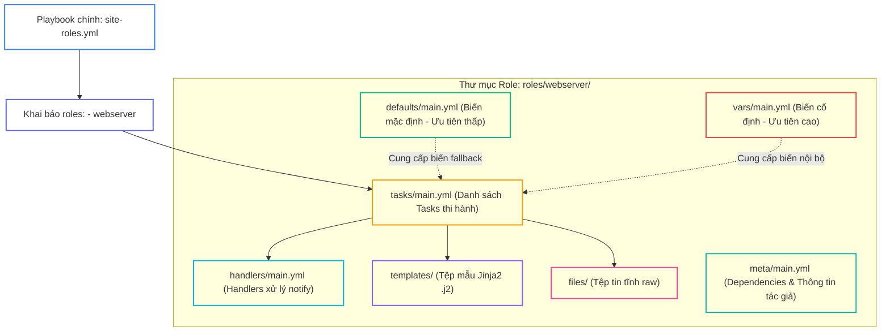
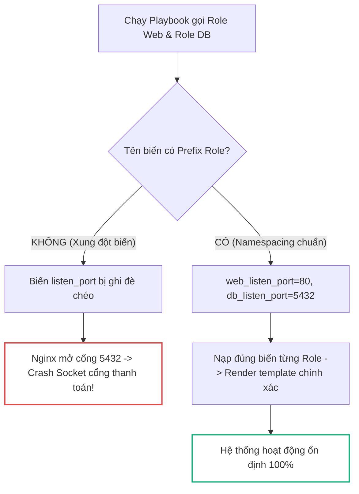


# [BÀI 14] ĐÓNG GÓI TÁI SỬ DỤNG VỚI ANSIBLE ROLES: CẤU TRÚC THƯ MỤC CHUẨN, TASKS, HANDLERS, VARS, DEFAULTS & META

Trong kỷ nguyên **Infrastructure as Code (IaC)** và tự động hóa vận hành hạ tầng đám mây (Cloud Infrastructure Automation), **Ansible** khẳng định vị thế dẫn đầu nhờ triết lý **Agentless** (không cần cài đặt agent nền trên máy đích), giao thức điều khiển an toàn qua **SSH / WinRM**, định dạng khai báo **YAML** trực quan và nguyên lý bất biến **Idempotency** mạnh mẽ. Việc làm chủ Ansible không chỉ dừng lại ở các câu lệnh Ad-hoc đơn giản, mà đòi hỏi kỹ sư phải nắm vững kiến trúc Module tầng thấp, Variable Precedence 22 tầng, Jinja2 Templates, tối ưu hóa Forks & Pipelining cho tới thiết kế Roles / Collections và tích hợp CI/CD tự động hóa chuẩn Doanh nghiệp.

Bài viết chuyên sâu này sẽ đồng hành cùng bạn mổ xẻ toàn diện bức tranh kiến trúc, phân tích các đánh đổi kỹ thuật thực chiến (Engineering Trade-offs), cung cấp hướng dẫn thực hành Lab chi tiết từng bước và bộ câu hỏi phỏng vấn chuyên sâu chuẩn DevOps / SRE Lead.

---

## 1. Bản Chất Kiến Trúc & Cơ Chế Vận Hành Tầng Thấp



### 1.1. Khái niệm Ansible Role và Lệnh `ansible-galaxy role init`

Ansible Role là chuẩn tổ chức mã nguồn tự động hóa dưới dạng mô-đun độc lập, gom toàn bộ Tasks, Handlers, Variables, Templates và Files vào một cấu trúc thư mục quy chuẩn:

- **Tách biệt mối quan tâm (Separation of Concerns):** Thay vì một playbook phẳng dài hàng nghìn dòng, Role chia nhỏ hệ thống thành các khối độc lập (`webserver`, `database`, `common`).
- **Khởi tạo tự động bằng CLI:** Sử dụng lệnh `ansible-galaxy role init <role_name>` để tạo ra sẵn 8 thư mục con quy chuẩn đúng quy ước của Ansible Engine:
  - `tasks/main.yml`: Entrypoint chứa danh sách các Task thi hành chính.
  - `handlers/main.yml`: Chứa các Handler được thông báo qua `notify`.
  - `defaults/main.yml`: Chứa các biến mặc định có **độ ưu tiên thấp nhất** (dễ bị ghi đè).
  - `vars/main.yml`: Chứa các biến nội bộ của Role có **độ ưu tiên cao**.
  - `templates/`: Chứa các tệp mẫu Jinja2 `.j2`.
  - `files/`: Chứa các tệp tin tĩnh (static raw files).
  - `meta/main.yml`: Chứa thông tin phụ thuộc (dependencies) và tác giả.
  - `tests/`: Chứa kịch bản kiểm thử độc lập cho Role.

### 1.2. Quản lý Biến và Cơ Chế Tìm Kiếm Tương Đối

Việc quản lý biến và tài nguyên trong Role tuân thủ các quy tắc thiết kế nghiêm ngặt:

- **Phân định `defaults/` và `vars/`:** Các biến đặt trong `defaults/main.yml` đóng vai trò là giá trị fallback cho phép người dùng dễ dàng ghi đè từ Playbook hoặc Inventory. Ngược lại, biến trong `vars/main.yml` lưu trữ hằng số nội bộ không cho phép ghi đè tùy tiện.
- **Cơ chế tìm kiếm đường dẫn tương đối (Implicit relative path):** Khi task trong Role gọi `template: src=index.html.j2` hoặc `copy: src=config.txt`, Ansible Engine tự động tìm kiếm trực tiếp trong `templates/` hoặc `files/` của chính Role đó mà không cần chỉ định đường dẫn tuyệt đối.
- **Role Prefix Namespacing:** Vì Ansible lưu biến trong một không gian toàn cục (Global Variable Namespace), tất cả các biến của Role bắt buộc phải có tiền tố tên Role (ví dụ: `webserver_port`, `webserver_doc_root`) để tránh ghi đè nhầm lẫn giữa các Role.

```yaml
# roles/webserver/tasks/main.yml
- name: Deploy index page from role Jinja2 template
  ansible.builtin.template:
    src: index.html.j2
    dest: "{{ webserver_doc_root }}/index.html"
    mode: '0644'
  notify: Trigger Webserver Reload
```

### 1.3. Siêu Dữ Liệu Meta, Tính Độc Lập và Idempotency

- **Dependencies trong `meta/main.yml`:** Khai báo danh sách các Role phụ thuộc mà Ansible phải thực thi trước khi chạy Role hiện tại (ví dụ: role `wordpress` khai báo phụ thuộc `php` và `mysql`).
- **Portable Role (Tính độc lập di động):** Một Role chuẩn Enterprise không bao giờ được tham chiếu trực tiếp đến các biến toàn cục ngoài phạm vi của nó. Mọi tham số cấu hình phải có giá trị mặc định phòng thủ trong `defaults/main.yml`.
- **Idempotency trong Role:** Việc phân rã thành Role không làm thay đổi bản chất của các Task bên trong. Toàn bộ Task trong `tasks/main.yml` phải đảm bảo ở lượt chạy lần 2 luôn trả về `changed=0` tuyệt đối.

---

## 2. Bảng So Sánh Kỹ Thuật Toàn Diện (Engineering Matrix)

| Tiêu Chí Kỹ Thuật | Playbook Phẳng (Monolithic) | Task Include (`tasks/*.yml`) | Ansible Roles (`roles/*`) | Ansible Collections (`collections/*`) |
|---|---|---|---|---|
| **Cấu Trúc Thư Mục** | Đơn tệp, không quy chuẩn | Phân chia tệp thủ công | Chuẩn hóa 8 thư mục qua Galaxy | Chuẩn đóng gói Role + Module + Plugin |
| **Khả Năng Tái Sử Dụng** | Rất thấp (Copy-Paste mã) | Trung bình (trong 1 dự án) | Cao (Chia sẻ đa dự án) | Rất cao (Phân phối Enterprise) |
| **Quản Lý Biến** | Khó kiểm soát, dễ đè biến | Phụ thuộc biến Playbook | Rõ ràng (`defaults` vs `vars`) | Quản lý Namespaced chặt chẽ |
| **Tự Động Nạp Tài Nguyên** | Phải gõ đường dẫn đầy đủ | Cần chỉ định path tương đối | Tự động qua implicit search | Tự động theo chuẩn FQCN |
| **Bảo Trì & Kiểm Thử** | Cực kỳ phức tạp khi mở rộng | Phức tạp, dễ đứt gãy path | Dễ dàng kiểm thử qua Molecule | Tối ưu hóa CI/CD quy mô lớn |

> [!IMPORTANT]
> **NGUYÊN TẮC NAMESPACING BIẾN TRONG ROLES:**
> Luôn đặt tiền tố tên Role trước mọi biến trong `defaults/main.yml` và `vars/main.yml` (ví dụ: `nginx_http_port`, `postgres_data_dir`). Điều này ngăn ngừa hoàn toàn tình trạng hai Role độc lập cùng dùng biến `port` dẫn đến xung đột âm thầm trên hệ thống Production.

---

## 3. Kiến Trúc Triển Khai Chuẩn Production (Configuration / Playbook / Role Breakdown)

Dưới đây là kịch bản Playbook chuẩn Enterprise gọi Role `webserver` với các biến được ghi đè an toàn:

```yaml
---
- name: Production Web Stack Deployment via Roles
  hosts: web
  become: true
  roles:
    - role: webserver
      vars:
        webserver_port: 9090
        webserver_site_title: "Production Web Portal Powered by Ansible Roles"
        webserver_doc_root: /var/www/html
```

### Cấu Trúc File Bên Trong Role `roles/webserver/`:

```yaml
# roles/webserver/defaults/main.yml
---
webserver_port: 8080
webserver_doc_root: /var/www/html
webserver_site_title: "Default Web Portal"
```

```yaml
# roles/webserver/tasks/main.yml
---
- name: Ensure web document root exists
  ansible.builtin.file:
    path: "{{ webserver_doc_root }}"
    state: directory
    mode: '0755'

- name: Deploy web index template
  ansible.builtin.template:
    src: index.html.j2
    dest: "{{ webserver_doc_root }}/index.html"
    mode: '0644'
  notify: Trigger Webserver Reload

- name: Deploy webserver runtime configuration
  ansible.builtin.copy:
    content: "LISTEN={{ webserver_port }}\nENGINE=ENTERPRISE_ROLE\n"
    dest: /etc/webserver-role.conf
    mode: '0644'
```

### Phân Tích Kỹ Thuật Từng Dòng (Line-by-Line Breakdown):
- <span class="badge-line">Line 6-10</span>: Khai báo gọi `role: webserver` và ghi đè các tham số `webserver_port` cùng `webserver_site_title` tại cấp Playbook.
- <span class="badge-line">Line 15-18</span>: Khai báo biến fallback trong `defaults/main.yml` đảm bảo Role luôn có giá trị mặc định hợp lệ.
- <span class="badge-line">Line 23-27</span>: Task đảm bảo thư mục web tồn tại với quyền 0755 trước khi render template.
- <span class="badge-line">Line 29-34</span>: Module `template` tự động tìm kiếm `index.html.j2` trong thư mục `templates/` của Role và phát tín hiệu `notify` tới Handler.
- <span class="badge-line">Line 36-40</span>: Ghi tệp cấu hình runtime `/etc/webserver-role.conf` với cổng đã được ghi đè chính xác (9090).

---

## 4. Phân Tích Cạm Bẫy Thực Chiến: Đặt Sai Vị Trí Biến và Xung Đột Global Namespace

### Tình Huống Sự Cố Thực Tế Tại Doanh Nghiệp:
Một doanh nghiệp FinTech sử dụng đồng thời 2 Role: `role-web` và `role-db` trong cùng một Playbook triển khai cổng thanh toán. Cả hai Role đều sử dụng biến không có tiền tố là `listen_port: 80` (trong `role-web`) và `listen_port: 5432` (trong `role-db`). Khi Playbook thực thi, do Ansible gộp tất cả các biến vào Global Variable Namespace, giá trị `listen_port: 5432` của Role sau đã ghi đè toàn bộ cấu hình của Role trước. Kết quả: Web server Nginx được cấu hình lắng nghe trên cổng 5432 của cơ sở dữ liệu, gây sập toàn bộ cổng thanh toán và xung đột socket dịch vụ.

### Hậu Quả & Log Lỗi Thực Tế:

```diff
- # Cách viết sai lầm: Không namespacing và đặt biến trong vars/main.yml
- # roles/web/defaults/main.yml -> listen_port: 80
- # roles/db/defaults/main.yml -> listen_port: 5432
- # Hậu quả: Nginx bị render lắng nghe cổng 5432 -> Crash Socket!
+ # Cách viết chuẩn Enterprise: Namespacing biến theo tên Role
+ # roles/web/defaults/main.yml
+ web_listen_port: 80
+ # roles/db/defaults/main.yml
+ db_listen_port: 5432
```



### 5-Whys Root Cause Analysis:
1. **Tại sao Nginx không thể khởi động?** Vì Nginx cố gắng bind vào cổng 5432 vốn đã bị chiếm dụng bởi PostgreSQL.
2. **Tại sao file cấu hình Nginx lại chứa cổng 5432?** Vì biến `listen_port` trong template Nginx nhận giá trị 5432.
3. **Tại sao biến `listen_port` lại bằng 5432?** Vì Role DB định nghĩa `listen_port: 5432` sau Role Web và ghi đè biến trong không gian toàn cục.
4. **Tại sao hai Role lại dùng chung tên biến?** Vì các kỹ sư phát triển Role độc lập mà không tuân thủ chuẩn Role Prefix Namespacing.
5. **Giải pháp triệt để là gì?** Bắt buộc thêm tiền tố tên Role cho toàn bộ biến (`web_listen_port`, `db_listen_port`) và thiết lập lint rule kiểm tra tự động trước khi commit.

---

## 5. Hands-on Lab: Khởi Tạo, Đóng Gói và Áp Dụng Ansible Roles Chuẩn Enterprise (8 Bước)

| Bước | Lệnh CLI / Tác Vụ Chính | Mục Đích Thực Thi |
|---|---|---|
| **1** | `mkdir -p ~/lab-ansible-14/roles && cd ~/lab-ansible-14` | Khởi tạo môi trường làm việc và cấu hình `ansible.cfg` |
| **2** | `cat << 'EOF' > inventory.ini` | Khai báo danh sách target nodes trong cụm |
| **3** | `cd roles && ansible-galaxy role init webserver && cd ..` | Khởi tạo cấu trúc 8 thư mục quy chuẩn của Role |
| **4** | `cat << 'EOF' > roles/webserver/defaults/main.yml` | Định nghĩa các biến mặc định có thể ghi đè |
| **5** | `cat << 'EOF' > roles/webserver/templates/index.html.j2` | Tạo template Jinja2 động trong thư mục `templates/` |
| **6** | `cat << 'EOF' > roles/webserver/tasks/main.yml` | Biên soạn danh sách các tác vụ chính và Handlers |
| **7** | `cat << 'EOF' > site-roles.yml && ansible-playbook site-roles.yml` | Xây dựng Playbook gọi Role và thực thi Lần 1 |
| **8** | `ansible-playbook site-roles.yml` | Thực thi Phép thử Lần 2 chứng minh `changed=0` tuyệt đối |

### Bước 1: Khởi tạo môi trường làm việc và file cấu hình Ansible

```bash
mkdir -p ~/lab-ansible-14/roles && cd ~/lab-ansible-14

cat << 'EOF' > ansible.cfg
[defaults]
inventory = ./inventory.ini
remote_user = ansible
host_key_checking = False
private_key_file = ~/.ssh/id_ed25519

[privilege_escalation]
become = True
become_method = sudo
become_user = root
become_ask_pass = False
EOF
```

### Bước 2: Thiết lập Inventory danh sách máy chủ đích

```bash
cat << 'EOF' > inventory.ini
[web]
target1 ansible_host=127.0.0.1 ansible_port=2221

[db]
target2 ansible_host=127.0.0.1 ansible_port=2222

[all:vars]
ansible_python_interpreter=/usr/bin/python3
EOF
```

### Bước 3: Khởi tạo khung thư mục Role bằng ansible-galaxy CLI

```bash
cd roles && ansible-galaxy role init webserver && cd ..
```

```bash
# CHECKPOINT 1: Xác nhận 8 thư mục quy chuẩn của Role webserver được khởi tạo
if [ -d "roles/webserver/tasks" ] && [ -d "roles/webserver/handlers" ] && [ -d "roles/webserver/defaults" ] && [ -d "roles/webserver/templates" ]; then
  echo "CHECKPOINT 1: ĐẠT - Lệnh ansible-galaxy role init khởi tạo thành công khung thư mục roles/webserver đúng quy chuẩn"
else
  echo "CHECKPOINT 1: LỖI - Khởi tạo role thất bại"
fi
```

### Bước 4: Khai báo biến mặc định và biến nội bộ trong Role

```bash
cat << 'EOF' > roles/webserver/defaults/main.yml
---
# defaults file for webserver (fallback values)
webserver_port: 8080
webserver_doc_root: /var/www/html
webserver_site_title: "Welcome to NTK Ansible Role Demo"
EOF

cat << 'EOF' > roles/webserver/vars/main.yml
---
# vars file for webserver internal constants
internal_app_name: "NTK_ROLE_ENGINE"
EOF
```

```bash
# CHECKPOINT 2: Xác nhận biến mặc định được định nghĩa chính xác
DEFAULTS_CONTENT=$(cat roles/webserver/defaults/main.yml)
if echo "$DEFAULTS_CONTENT" | grep -q "webserver_port: 8080" && echo "$DEFAULTS_CONTENT" | grep -q "webserver_doc_root:"; then
  echo "CHECKPOINT 2: ĐẠT - Biến mặc định webserver_port và webserver_doc_root được định nghĩa chuẩn xác trong defaults/main.yml"
else
  echo "CHECKPOINT 2: LỖI - Định nghĩa defaults/main.yml thất bại"
fi
```

### Bước 5: Tạo tệp mẫu Jinja2 động và Handlers

```bash
cat << 'EOF' > roles/webserver/templates/index.html.j2
<!DOCTYPE html>
<html>
<head>
    <title>{{ webserver_site_title }}</title>
</head>
<body>
    <h1>{{ webserver_site_title }}</h1>
    <p>Managed by Ansible Role for host: {{ inventory_hostname }}</p>
    <p>Server Port: {{ webserver_port }}</p>
    <p>Internal Engine: {{ internal_app_name }}</p>
</body>
</html>
EOF

cat << 'EOF' > roles/webserver/handlers/main.yml
---
# handlers file for webserver
- name: Trigger Webserver Reload
  ansible.builtin.file:
    path: /tmp/webserver-reloaded.flag
    state: touch
EOF
```

```bash
# CHECKPOINT 3: Xác nhận template và handler nằm đúng vị trí
if [ -f "roles/webserver/templates/index.html.j2" ] && grep -q "Trigger Webserver Reload" roles/webserver/handlers/main.yml; then
  echo "CHECKPOINT 3: ĐẠT - Tệp mẫu index.html.j2 và Handler được biên soạn đúng vị trí cấu trúc Role"
else
  echo "CHECKPOINT 3: LỖI - File template hoặc handler trong Role thất bại"
fi
```

### Bước 6: Biên soạn Tasks chính trong tasks/main.yml

```bash
cat << 'EOF' > roles/webserver/tasks/main.yml
---
# tasks file for webserver
- name: Task 1 - Ensure document root directory exists
  ansible.builtin.file:
    path: "{{ webserver_doc_root }}"
    state: directory
    mode: '0755'

- name: Task 2 - Deploy index page from role Jinja2 template
  ansible.builtin.template:
    src: index.html.j2
    dest: "{{ webserver_doc_root }}/index.html"
    mode: '0644'
  notify: Trigger Webserver Reload

- name: Task 3 - Deploy webserver configuration file
  ansible.builtin.copy:
    content: "LISTEN={{ webserver_port }}\nENGINE={{ internal_app_name }}\n"
    dest: /etc/webserver-role.conf
    mode: '0644'
EOF
```

### Bước 7: Xây dựng Playbook chính site-roles.yml và Thực thi Lần 1

```bash
cat << 'EOF' > site-roles.yml
---
- name: Apply Standardized Ansible Webserver Role
  hosts: web
  become: true
  roles:
    - role: webserver
      vars:
        webserver_port: 9090
        webserver_site_title: "Production Web Portal Powered by Ansible Roles"
EOF
```

```bash
ansible-playbook site-roles.yml
```

```bash
# CHECKPOINT 4: Xác nhận Playbook gọi Role thành công
SITE_OUT=$(ansible-playbook site-roles.yml)
if echo "$SITE_OUT" | grep -q "Task 2 - Deploy index page from role Jinja2 template" && echo "$SITE_OUT" | grep -q "failed=0"; then
  echo "CHECKPOINT 4: ĐẠT - Playbook site-roles.yml gọi và áp dụng thành công role webserver trên target host"
else
  echo "CHECKPOINT 4: LỖI - Thi hành Playbook gọi Role thất bại"
fi

# CHECKPOINT 5: Xác nhận Handler kích hoạt tạo tệp cờ trên máy đích
FLAG_EXISTS=$(docker exec target1 test -f /tmp/webserver-reloaded.flag && echo "EXISTS" || echo "MISSING")
if [ "$FLAG_EXISTS" = "EXISTS" ]; then
  echo "CHECKPOINT 5: ĐẠT - Handler Trigger Webserver Reload trong Role kích hoạt thành công tạo tệp cờ trên máy đích"
else
  echo "CHECKPOINT 5: LỖI - Handler trong Role không kích hoạt"
fi
```

### Bước 8: Thực thi Phép thử Lượt 2 & Đối soát Sự thật Máy đích

```bash
ansible-playbook site-roles.yml
```

```bash
# CHECKPOINT 6: Xác nhận Lượt chạy Lần 2 đạt Idempotency tuyệt đối (changed=0)
RUN2_ROLE_OUT=$(ansible-playbook site-roles.yml)
if echo "$RUN2_ROLE_OUT" | grep -q "changed=0" && echo "$RUN2_ROLE_OUT" | grep -q "failed=0"; then
  echo "CHECKPOINT 6: ĐẠT - Phép thử Lượt 2 đạt chuẩn Idempotency (PLAY RECAP báo changed=0 cho toàn bộ Role)"
else
  echo "CHECKPOINT 6: LỖI - Lượt 2 không đạt changed=0 (Task trong Role bị lặp changed)"
fi

# CHECKPOINT 7: Đối soát file index.html được render đúng biến ghi đè từ Playbook
EXEC_INDEX=$(docker exec target1 cat /var/www/html/index.html)
if echo "$EXEC_INDEX" | grep -q "Production Web Portal Powered by Ansible Roles" && echo "$EXEC_INDEX" | grep -q "Server Port: 9090"; then
  echo "CHECKPOINT 7: ĐẠT - Kiểm tra sự thật qua docker exec xác nhận file index.html chứa đúng dữ liệu render từ Role"
else
  echo "CHECKPOINT 7: LỖI - Đối soát file index.html trên máy đích thất bại"
fi
```

---

## 6. Bộ Câu Hỏi Vấn Đáp & Phỏng Vấn Chuyên Sâu (Self-Check Q&A)

<details class="qa-card" markdown="1">
  <summary class="qa-summary">
    <span class="qa-num-badge">Q01</span>
    <span class="qa-question-text">Ansible Role là gì? Tại sao việc sử dụng Role lại được coi là chuẩn mực thiết kế mã nguồn IaC (Infrastructure as Code) cho các dự án Enterprise?</span>
  </summary>
  <div class="qa-answer">
    <div class="qa-answer-header">
      <svg width="14" height="14" fill="none" stroke="currentColor" stroke-width="2" viewBox="0 0 24 24"><path d="M22 11.08V12a10 10 0 1 1-5.93-9.14"></path><polyline points="22 4 12 14.01 9 11.01"></polyline></svg>
      <span>Phân Tích &amp; Lời Giải Kỹ Thuật</span>
    </div>
    <div style="margin: 0.5rem 0;"><b>Đáp án chuẩn:</b></div>
    <div style="margin: 0.5rem 0;">Ansible Role là chuẩn tổ chức mã nguồn tự động hóa dưới dạng mô-đun độc lập, gom toàn bộ Tasks, Handlers, Variables, Templates và Files vào một cấu trúc thư mục quy chuẩn.</div>
    <div style="margin: 0.5rem 0;">Lợi ích chuẩn mực Enterprise:</div>
    <div style="margin: 0.35rem 0; padding-left: 1rem; border-left: 2px solid var(--accent-primary);">• Tách biệt rõ ràng các mối quan tâm (Separation of Concerns).</div>
    <div style="margin: 0.35rem 0; padding-left: 1rem; border-left: 2px solid var(--accent-primary);">• Tái sử dụng mã nguồn 100% trên nhiều Playbook và dự án khác nhau.</div>
    <div style="margin: 0.35rem 0; padding-left: 1rem; border-left: 2px solid var(--accent-primary);">• Dễ dàng quản lý phiên bản, kiểm thử độc lập và chia sẻ cho cộng đồng qua Ansible Galaxy.</div>
  </div>
</details>

<details class="qa-card" markdown="1">
  <summary class="qa-summary">
    <span class="qa-num-badge">Q02</span>
    <span class="qa-question-text">Trình bày tác dụng của lệnh CLI <code>ansible-galaxy role init &lt;role_name&gt;</code>. Tại sao nên dùng lệnh này thay vì tạo thư mục thủ công?</span>
  </summary>
  <div class="qa-answer">
    <div class="qa-answer-header">
      <svg width="14" height="14" fill="none" stroke="currentColor" stroke-width="2" viewBox="0 0 24 24"><path d="M22 11.08V12a10 10 0 1 1-5.93-9.14"></path><polyline points="22 4 12 14.01 9 11.01"></polyline></svg>
      <span>Phân Tích &amp; Lời Giải Kỹ Thuật</span>
    </div>
    <div style="margin: 0.5rem 0;"><b>Đáp án chuẩn:</b> Lệnh <code>ansible-galaxy role init &lt;role_name&gt;</code> tự động sinh ra toàn bộ khung cây thư mục quy chuẩn gồm 8 thư mục con (<code>tasks</code>, <code>handlers</code>, <code>defaults</code>, <code>vars</code>, <code>templates</code>, <code>files</code>, <code>meta</code>, <code>tests</code>) cùng các tệp <code>main.yml</code> tương ứng. Nên dùng lệnh này vì nó đảm bảo 100% tên thư mục và cấu trúc tuân thủ chính xác quy ước của Ansible Engine, tránh lỗi gõ sai tên thư mục (như gõ nhầm <code>task/</code> thiếu 's').</div>
  </div>
</details>

<details class="qa-card" markdown="1">
  <summary class="qa-summary">
    <span class="qa-num-badge">Q03</span>
    <span class="qa-question-text">Phân biệt chức năng của 4 thư mục cốt lõi trong Role: <code>tasks/</code>, <code>handlers/</code>, <code>templates/</code>, và <code>files/</code>.</span>
  </summary>
  <div class="qa-answer">
    <div class="qa-answer-header">
      <svg width="14" height="14" fill="none" stroke="currentColor" stroke-width="2" viewBox="0 0 24 24"><path d="M22 11.08V12a10 10 0 1 1-5.93-9.14"></path><polyline points="22 4 12 14.01 9 11.01"></polyline></svg>
      <span>Phân Tích &amp; Lời Giải Kỹ Thuật</span>
    </div>
    <div style="margin: 0.5rem 0;"><b>Đáp án chuẩn:</b></div>
    <div style="margin: 0.35rem 0; padding-left: 1rem; border-left: 2px solid var(--accent-primary);">• <code>tasks/</code>: Chứa tệp <code>main.yml</code> định nghĩa danh sách các Task thi hành chính của Role.</div>
    <div style="margin: 0.35rem 0; padding-left: 1rem; border-left: 2px solid var(--accent-primary);">• <code>handlers/</code>: Chứa tệp <code>main.yml</code> định nghĩa các Handler xử lý khi có thông báo <code>notify</code>.</div>
    <div style="margin: 0.35rem 0; padding-left: 1rem; border-left: 2px solid var(--accent-primary);">• <code>templates/</code>: Chứa các tệp mẫu Jinja2 <code>.j2</code> được render động bởi module <code>template</code>.</div>
    <div style="margin: 0.35rem 0; padding-left: 1rem; border-left: 2px solid var(--accent-primary);">• <code>files/</code>: Chứa các tệp tin tĩnh (raw static files) được chép trực tiếp bởi module <code>copy</code> hay <code>script</code>.</div>
  </div>
</details>

<details class="qa-card" markdown="1">
  <summary class="qa-summary">
    <span class="qa-num-badge">Q04</span>
    <span class="qa-question-text">Phân biệt thứ tự ưu tiên biến và mục đích sử dụng giữa <code>defaults/main.yml</code> và <code>vars/main.yml</code> trong Ansible Role.</span>
  </summary>
  <div class="qa-answer">
    <div class="qa-answer-header">
      <svg width="14" height="14" fill="none" stroke="currentColor" stroke-width="2" viewBox="0 0 24 24"><path d="M22 11.08V12a10 10 0 1 1-5.93-9.14"></path><polyline points="22 4 12 14.01 9 11.01"></polyline></svg>
      <span>Phân Tích &amp; Lời Giải Kỹ Thuật</span>
    </div>
    <div style="margin: 0.5rem 0;"><b>Đáp án chuẩn:</b></div>
    <div style="margin: 0.35rem 0; padding-left: 1rem; border-left: 2px solid var(--accent-primary);">• <code>defaults/main.yml</code>: Chứa các biến mặc định có <b>độ ưu tiên thấp nhất</b> trong toàn bộ hệ thống Ansible. Mục đích: Đóng vai trò là "fallback values" giúp người gọi Role dễ dàng ghi đè từ <code>inventory</code>, <code>group_vars</code> hoặc khi gọi Role.</div>
    <div style="margin: 0.35rem 0; padding-left: 1rem; border-left: 2px solid var(--accent-primary);">• <code>vars/main.yml</code>: Chứa các biến nội bộ của Role có <b>độ ưu tiên rất cao</b>. Mục đích: Dùng để lưu trữ các hằng số nội bộ không muốn người dùng ghi đè tùy tiện từ bên ngoài.</div>
  </div>
</details>

<details class="qa-card" markdown="1">
  <summary class="qa-summary">
    <span class="qa-num-badge">Q05</span>
    <span class="qa-question-text">Viết cú pháp YAML trong Playbook <code>site.yml</code> gọi Role <code>webserver</code> và ghi đè hai biến <code>webserver_port: 9090</code> và <code>webserver_title: "My Portal"</code>.</span>
  </summary>
  <div class="qa-answer">
    <div class="qa-answer-header">
      <svg width="14" height="14" fill="none" stroke="currentColor" stroke-width="2" viewBox="0 0 24 24"><path d="M22 11.08V12a10 10 0 1 1-5.93-9.14"></path><polyline points="22 4 12 14.01 9 11.01"></polyline></svg>
      <span>Phân Tích &amp; Lời Giải Kỹ Thuật</span>
    </div>
    <div style="margin: 0.5rem 0;"><b>Đáp án chuẩn:</b></div>
    <pre><code class="language-yaml">- name: Deploy Custom Webserver Role
  hosts: web
  become: true
  roles:
    - role: webserver
      vars:
        webserver_port: 9090
        webserver_site_title: "My Portal"</code></pre>
  </div>
</details>

<details class="qa-card" markdown="1">
  <summary class="qa-summary">
    <span class="qa-num-badge">Q06</span>
    <span class="qa-question-text">Trong Task của Role, khi gọi module <code>template: src=index.html.j2</code>, làm thế nào Ansible Engine biết chính xác vị trí tệp <code>index.html.j2</code> mà không cần đường dẫn tuyệt đối?</span>
  </summary>
  <div class="qa-answer">
    <div class="qa-answer-header">
      <svg width="14" height="14" fill="none" stroke="currentColor" stroke-width="2" viewBox="0 0 24 24"><path d="M22 11.08V12a10 10 0 1 1-5.93-9.14"></path><polyline points="22 4 12 14.01 9 11.01"></polyline></svg>
      <span>Phân Tích &amp; Lời Giải Kỹ Thuật</span>
    </div>
    <div style="margin: 0.5rem 0;"><b>Đáp án chuẩn:</b> Vì Ansible Engine có cơ chế tự động tìm kiếm đường dẫn tương đối (Implicit relative path search). Khi một Task nằm bên trong thư mục <code>roles/&lt;role_name&gt;/tasks/</code>, Ansible sẽ tự động ưu tiên tìm kiếm tệp template trong thư mục <code>roles/&lt;role_name&gt;/templates/</code> và tệp tĩnh trong <code>roles/&lt;role_name&gt;/files/</code> của chính Role đó.</div>
  </div>
</details>

<details class="qa-card" markdown="1">
  <summary class="qa-summary">
    <span class="qa-num-badge">Q07</span>
    <span class="qa-question-text">Tệp <code>meta/main.yml</code> trong Role dùng để làm gì? Nêu ví dụ trường hợp sử dụng từ khóa <code>dependencies:</code>.</span>
  </summary>
  <div class="qa-answer">
    <div class="qa-answer-header">
      <svg width="14" height="14" fill="none" stroke="currentColor" stroke-width="2" viewBox="0 0 24 24"><path d="M22 11.08V12a10 10 0 1 1-5.93-9.14"></path><polyline points="22 4 12 14.01 9 11.01"></polyline></svg>
      <span>Phân Tích &amp; Lời Giải Kỹ Thuật</span>
    </div>
    <div style="margin: 0.5rem 0;"><b>Đáp án chuẩn:</b> Tệp <code>meta/main.yml</code> chứa các siêu dữ liệu của Role bao gồm thông tin tác giả, license, phiên bản Ansible hỗ trợ, và danh sách các Role phụ thuộc (<code>dependencies:</code>).<br>Ví dụ: Role <code>wordpress</code> khai báo <code>dependencies: - role: php</code> và <code>- role: mysql</code>. Khi Playbook gọi <code>role: wordpress</code>, Ansible Engine sẽ tự động thực thi <code>role: php</code> và <code>role: mysql</code> trước rồi mới chạy <code>wordpress</code>.</div>
  </div>
</details>

<details class="qa-card" markdown="1">
  <summary class="qa-summary">
    <span class="qa-num-badge">Q08</span>
    <span class="qa-question-text">Thế nào là một Ansible Role độc lập (Portable Role)? Cần tuân thủ nguyên tắc thiết kế nào để một Role có thể mang đi sử dụng ở bất kỳ dự án nào?</span>
  </summary>
  <div class="qa-answer">
    <div class="qa-answer-header">
      <svg width="14" height="14" fill="none" stroke="currentColor" stroke-width="2" viewBox="0 0 24 24"><path d="M22 11.08V12a10 10 0 1 1-5.93-9.14"></path><polyline points="22 4 12 14.01 9 11.01"></polyline></svg>
      <span>Phân Tích &amp; Lời Giải Kỹ Thuật</span>
    </div>
    <div style="margin: 0.5rem 0;"><b>Đáp án chuẩn:</b> Một Portable Role là Role có tính đóng gói hoàn chỉnh, có thể mang sang bất kỳ hệ thống hay dự án Ansible nào chạy mà <b>không bị văng lỗi thiếu biến hay thiếu phụ thuộc</b>.</div>
    <div style="margin: 0.5rem 0;">Nguyên tắc thiết kế:</div>
    <div style="margin: 0.35rem 0; padding-left: 1rem; border-left: 2px solid var(--accent-primary);">1. Mọi biến tùy chọn được gọi trong Role phải có giá trị mặc định fallback định nghĩa trong <code>defaults/main.yml</code>.</div>
    <div style="margin: 0.35rem 0; padding-left: 1rem; border-left: 2px solid var(--accent-primary);">2. Tuyệt đối không tham chiếu đến các biến toàn cục chỉ tồn tại ở <code>group_vars</code> của dự án gốc.</div>
    <div style="margin: 0.35rem 0; padding-left: 1rem; border-left: 2px solid var(--accent-primary);">3. Không gõ cứng đường dẫn đĩa cứng tuyệt đối.</div>
  </div>
</details>

<details class="qa-card" markdown="1">
  <summary class="qa-summary">
    <span class="qa-num-badge">Q09</span>
    <span class="qa-question-text">Trình bày quy trình 3 bước nghiệm thu một Playbook sử dụng Ansible Roles để đảm bảo tính Idempotency và máy đích ở đúng trạng thái.</span>
  </summary>
  <div class="qa-answer">
    <div class="qa-answer-header">
      <svg width="14" height="14" fill="none" stroke="currentColor" stroke-width="2" viewBox="0 0 24 24"><path d="M22 11.08V12a10 10 0 1 1-5.93-9.14"></path><polyline points="22 4 12 14.01 9 11.01"></polyline></svg>
      <span>Phân Tích &amp; Lời Giải Kỹ Thuật</span>
    </div>
    <div style="margin: 0.5rem 0;"><b>Đáp án chuẩn:</b></div>
    <div style="margin: 0.35rem 0; padding-left: 1rem; border-left: 2px solid var(--accent-primary);">1. <b>Bước 1 (Thực thi Lần 1):</b> Chạy <code>ansible-playbook site-roles.yml</code>: Các Task bên trong Role thực thi và chép file báo <code>changed &gt; 0</code>.</div>
    <div style="margin: 0.35rem 0; padding-left: 1rem; border-left: 2px solid var(--accent-primary);">2. <b>Bước 2 (Kiểm Idempotency Lần 2):</b> Chạy lại nguyên vẹn <code>ansible-playbook site-roles.yml</code> Lần 2: bảng <code>PLAY RECAP</code> <b>bắt buộc phải đạt <code>changed=0</code></b> (tất cả các Task trong Role đều báo <code>ok</code>).</div>
    <div style="margin: 0.35rem 0; padding-left: 1rem; border-left: 2px solid var(--accent-primary);">3. <b>Bước 3 (Đối soát Sự thật Máy đích):</b> Dùng <code>docker exec target1 cat /var/www/html/index.html</code> kiểm tra nội dung file thực sự được render đúng biến từ Role.</div>
  </div>
</details>

<details class="qa-card" markdown="1">
  <summary class="qa-summary">
    <span class="qa-num-badge">Q10</span>
    <span class="qa-question-text">Ansible Engine tìm kiếm các Role theo các thứ tự đường dẫn mặc định nào? Nếu đặt thư mục <code>roles/</code> sai vị trí, làm thế nào để cấu hình lại trong <code>ansible.cfg</code>?</span>
  </summary>
  <div class="qa-answer">
    <div class="qa-answer-header">
      <svg width="14" height="14" fill="none" stroke="currentColor" stroke-width="2" viewBox="0 0 24 24"><path d="M22 11.08V12a10 10 0 1 1-5.93-9.14"></path><polyline points="22 4 12 14.01 9 11.01"></polyline></svg>
      <span>Phân Tích &amp; Lời Giải Kỹ Thuật</span>
    </div>
    <div style="margin: 0.5rem 0;"><b>Đáp án chuẩn:</b></div>
    <div style="margin: 0.5rem 0;">Thứ tự tìm kiếm Role mặc định:</div>
    <div style="margin: 0.35rem 0; padding-left: 1rem; border-left: 2px solid var(--accent-primary);">1. Thư mục <code>roles/</code> nằm cùng cấp ngang hàng với file Playbook chính.</div>
    <div style="margin: 0.35rem 0; padding-left: 1rem; border-left: 2px solid var(--accent-primary);">2. Thư mục <code>~/.ansible/roles</code>.</div>
    <div style="margin: 0.35rem 0; padding-left: 1rem; border-left: 2px solid var(--accent-primary);">3. Thư mục hệ thống <code>/etc/ansible/roles</code>.</div>
    <div style="margin: 0.5rem 0;">Nếu muốn đặt thư mục Role ở vị trí khác (như <code>shared_roles/</code>), ta cấu hình thuộc tính <code>roles_path</code> trong tệp <code>ansible.cfg</code>:</div>
    <pre><code class="language-ini">[defaults]
roles_path = ./shared_roles:/etc/ansible/roles</code></pre>
  </div>
</details>

<details class="qa-card" markdown="1">
  <summary class="qa-summary">
    <span class="qa-num-badge">Q11</span>
    <span class="qa-question-text">Tại sao việc đặt tên biến trong <code>defaults/main.yml</code> của Role bắt buộc phải có tiền tố tên Role (Role Prefix Namespacing)? Cho ví dụ.</span>
  </summary>
  <div class="qa-answer">
    <div class="qa-answer-header">
      <svg width="14" height="14" fill="none" stroke="currentColor" stroke-width="2" viewBox="0 0 24 24"><path d="M22 11.08V12a10 10 0 1 1-5.93-9.14"></path><polyline points="22 4 12 14.01 9 11.01"></polyline></svg>
      <span>Phân Tích &amp; Lời Giải Kỹ Thuật</span>
    </div>
    <div style="margin: 0.5rem 0;"><b>Đáp án chuẩn:</b> Vì Ansible lưu trữ tất cả các biến vào một không gian biến toàn cục (Global Variable Namespace). Nếu Role <code>webserver</code> đặt tên biến chung chung <code>port: 80</code> và Role <code>database</code> cũng đặt <code>port: 5432</code>, hai biến này sẽ ghi đè lẫn nhau gây ra lỗi cấu hình nghiêm trọng.<br>Giải pháp (Role Prefix Namespacing): Bắt buộc thêm tiền tố tên Role vào trước mọi biến: <code>webserver_port: 80</code> và <code>dbserver_port: 5432</code>.</div>
  </div>
</details>

<details class="qa-card" markdown="1">
  <summary class="qa-summary">
    <span class="qa-num-badge">Q12</span>
    <span class="qa-question-text">Tóm tắt 5 Quy tắc Vàng khi Xây dựng Ansible Roles.</span>
  </summary>
  <div class="qa-answer">
    <div class="qa-answer-header">
      <svg width="14" height="14" fill="none" stroke="currentColor" stroke-width="2" viewBox="0 0 24 24"><path d="M22 11.08V12a10 10 0 1 1-5.93-9.14"></path><polyline points="22 4 12 14.01 9 11.01"></polyline></svg>
      <span>Phân Tích &amp; Lời Giải Kỹ Thuật</span>
    </div>
    <div style="margin: 0.5rem 0;"><b>Đáp án chuẩn:</b></div>
    <div style="margin: 0.35rem 0; padding-left: 1rem; border-left: 2px solid var(--accent-primary);">1. <b>Quy tắc 1:</b> Luôn dùng <code>ansible-galaxy role init</code> để tạo tự động cấu trúc Role chuẩn.</div>
    <div style="margin: 0.35rem 0; padding-left: 1rem; border-left: 2px solid var(--accent-primary);">2. <b>Quy tắc 2:</b> Phân biệt đúng <code>defaults/</code> (biến tùy chỉnh cho phép đè) và <code>vars/</code> (hằng số nội bộ).</div>
    <div style="margin: 0.35rem 0; padding-left: 1rem; border-left: 2px solid var(--accent-primary);">3. <b>Quy tắc 3:</b> Thêm tiền tố tên Role cho mọi tên biến để tránh xung đột Global Namespace.</div>
    <div style="margin: 0.35rem 0; padding-left: 1rem; border-left: 2px solid var(--accent-primary);">4. <b>Quy tắc 4:</b> Sử dụng tham chiếu đường dẫn tương đối cho tệp trong <code>templates/</code> và <code>files/</code>.</div>
    <div style="margin: 0.35rem 0; padding-left: 1rem; border-left: 2px solid var(--accent-primary);">5. <b>Quy tắc 5:</b> Đảm bảo Role độc lập (Portable Role) và kiểm thử Lần 2 đạt <code>changed=0</code> qua <code>docker exec</code>.</div>
  </div>
</details>

## Tổng Kết & Lộ Trình Bài Học Tiếp Theo

Kiến thức trong bài viết này đóng vai trò then chốt trong việc xây dựng hệ sinh thái tự động hóa hạ tầng ổn định, an toàn và tối ưu hiệu năng. Nắm vững cả lý thuyết kiến trúc và kỹ năng thực hành là chìa khóa để vận hành hệ thống ở quy mô lớn.

> [!TIP]
> **BÀI TIẾP THEO TRONG CHUỖI BÀI HỌC:**
> Tiếp tục nâng cao kỹ năng tự động hóa với bài học tiếp theo: [[Bài 15] Kỹ Thuật Role Nâng Cao: Role Dependencies, Search Paths, Parameterized Roles & Tái Cấu Trúc Playbook Quy Mô Lớn](ansible-15-15-roles-advanced.html).


