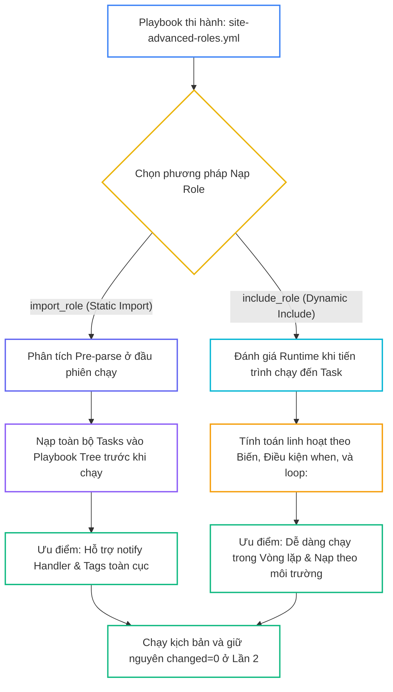
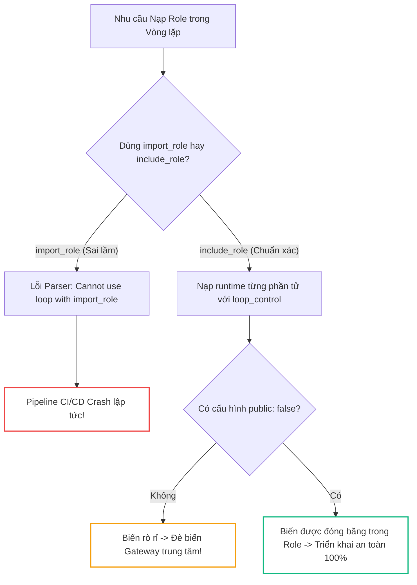
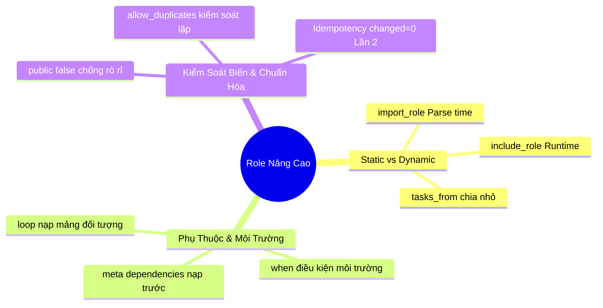


# [BÀI 15] KỸ THUẬT ROLE NÂNG CAO: ROLE DEPENDENCIES, SEARCH PATHS, PARAMETERIZED ROLES & TÁI CẤU TRÚC PLAYBOOK QUY MÔ LỚN

Trong kỷ nguyên **Infrastructure as Code (IaC)** và tự động hóa vận hành hạ tầng đám mây (Cloud Infrastructure Automation), **Ansible** khẳng định vị thế dẫn đầu nhờ triết lý **Agentless** (không cần cài đặt agent nền trên máy đích), giao thức điều khiển an toàn qua **SSH / WinRM**, định dạng khai báo **YAML** trực quan và nguyên lý bất biến **Idempotency** mạnh mẽ. Việc làm chủ Ansible không chỉ dừng lại ở các câu lệnh Ad-hoc đơn giản, mà đòi hỏi kỹ sư phải nắm vững kiến trúc Module tầng thấp, Variable Precedence 22 tầng, Jinja2 Templates, tối ưu hóa Forks & Pipelining cho tới thiết kế Roles / Collections và tích hợp CI/CD tự động hóa chuẩn Doanh nghiệp.

Bài viết chuyên sâu này sẽ đồng hành cùng bạn mổ xẻ toàn diện bức tranh kiến trúc, phân tích các đánh đổi kỹ thuật thực chiến (Engineering Trade-offs), cung cấp hướng dẫn thực hành Lab chi tiết từng bước và bộ câu hỏi phỏng vấn chuyên sâu chuẩn DevOps / SRE Lead.

---

## 1. Bản Chất Kiến Trúc & Cơ Chế Vận Hành Tầng Thấp



### 1.1. Nạp Role Tĩnh `import_role` vs Nạp Role Động `include_role`

Trong quản trị hạ tầng quy mô lớn, việc nạp Role không chỉ dừng lại ở danh sách tĩnh `roles:`, mà đòi hỏi sự phân tách giữa hai cơ chế nạp:

- **`ansible.builtin.import_role` (Static Pre-parse):** Được xử lý tĩnh ngay tại thời điểm parse Playbook trước khi chạy. Toàn bộ các Task của Role được chèn vào cây thực thi ban đầu, cho phép thừa hưởng cờ `tags` và `handlers` toàn cục. Tuy nhiên, `import_role` không thể kết hợp với vòng lặp `loop:` hoặc biến tính toán tại runtime.
- **`ansible.builtin.include_role` (Dynamic Runtime):** Được đánh giá động khi tiến trình chạy đến đúng vị trí của Task. Cho phép kết hợp linh hoạt với vòng lặp `loop:` để áp dụng Role cho một mảng danh sách từ điển và phân nhánh môi trường với điều kiện `when:`.

```yaml
# Nạp tĩnh Static Import
- name: Static Role Import
  ansible.builtin.import_role:
    name: common

# Nạp động Dynamic Include
- name: Dynamic Role Include
  ansible.builtin.include_role:
    name: webserver
  when: env_type == 'production'
```

### 1.2. Tùy Biến Nạp Tệp Task, Handler, Biến và Role Dependencies

- **Chỉ định tệp thực thi với `tasks_from:`:** Cho phép nạp một tệp task cụ thể (như `configure.yml`, `cleanup.yml`) trong thư mục `tasks/` thay vì entrypoint mặc định `main.yml`. Tương tự, `handlers_from:` và `vars_from:` giúp nạp Handler hoặc tệp biến chuyên biệt theo hệ điều hành (ví dụ: `vars_from: "{{ ansible_facts.os_family }}.yml"`).
- **Role Dependencies trong `meta/main.yml`:** Khai báo danh sách các Role phụ thuộc mà Ansible Engine bắt buộc phải thực thi trước khi chạy Role hiện tại.
- **Quản lý lặp với `loop:` và `loop_control:`:** Sử dụng `include_role` kết hợp `loop:` để khởi tạo nhiều cấu hình ảo (Virtual Hosts, DB instances) mà không phải lặp lại mã nguồn.

```yaml
- name: Deploy Multiple Virtual Hosts using include_role loop
  ansible.builtin.include_role:
    name: webserver
  loop:
    - { vhost_name: 'site1.com', vhost_port: 8081 }
    - { vhost_name: 'site2.com', vhost_port: 8082 }
  loop_control:
    loop_var: vhost_item
```

### 1.3. Quản Lý Nạp Trùng Lặp, Phạm Vi Biến và Idempotency

- **`allow_duplicates:`:** Mặc định (`allow_duplicates: false`), nếu một Role đã chạy 1 lần trong Play, Ansible sẽ bỏ qua các lần gọi sau. Khai báo `allow_duplicates: true` trong `meta/main.yml` nếu cần thực thi lại Role nhiều lần.
- **Giới hạn phạm vi biến với `public: false`:** Mặc định các biến truyền vào `include_role` sẽ rò rỉ ra toàn bộ Playbook. Khai báo `public: false` giúp đóng băng biến chỉ trong phạm vi Role được nạp.
- **Tính Idempotency mốc 50% khóa học:** Mọi kịch bản nạp Role nâng cao bắt buộc phải đạt `changed=0` tuyệt đối ở lượt chạy Lần thứ hai, khẳng định trạng thái hạ tầng bất biến.

---

## 2. Bảng So Sánh Kỹ Thuật Toàn Diện (Engineering Matrix)

| Tiêu Chí Kỹ Thuật | `roles:` Directive | `import_role` (Static) | `include_role` (Dynamic) |
|---|---|---|---|
| **Thời Điểm Nạp** | Khởi tạo Playbook (Parse-time) | Parse-time (Tiền xử lý tĩnh) | Runtime (Thực thi động khi gặp task) |
| **Hỗ Trợ Vòng Lặp `loop:`** | Không hỗ trợ | Không hỗ trợ (Báo lỗi Parser) | Hỗ trợ 100% |
| **Hỗ Trợ Điều Kiện `when:`** | Áp dụng lên từng Task bên trong | Áp dụng lên từng Task bên trong | Đánh giá toàn bộ khối include |
| **Thừa Hưởng Tags & Handlers** | Tự động toàn cục | Tự động toàn cục | Cần khai báo thuộc tính `apply:` |
| **Tùy Biến `tasks_from:`** | Không hỗ trợ | Hỗ trợ | Hỗ trợ |
| **Hiệu Năng & Overhead** | Tối ưu nhất | Rất nhanh (Không tính toán runtime) | Có độ trễ tính toán nhỏ (~vài ms) |

> [!IMPORTANT]
> **QUY TẮC NẠP DỮ LIỆU ĐA MÔI TRƯỜNG:**
> Khi cần triển khai Role theo điều kiện môi trường hoặc lặp qua danh sách đối tượng, **BẮT BUỘC dùng `include_role` (Dynamic)**. Chỉ dùng `import_role` khi cần kế thừa thẻ `tags` hoặc Handler toàn cục từ đầu Playbook.

---

## 3. Kiến Trúc Triển Khai Chuẩn Production (Configuration / Playbook / Role Breakdown)

Dưới đây là kịch bản Playbook nâng cao chuẩn hóa quy trình triển khai đa môi trường và lặp mảng Virtual Hosts:

```yaml
---
- name: Advanced Multi-Tier Orchestration Playbook
  hosts: web
  become: true
  vars:
    env_type: "production"
    vhost_list:
      - name: "app_vhost_1"
        port: 8091
      - name: "app_vhost_2"
        port: 8092
  tasks:
    - name: Task 1 - Import base system role statically
      ansible.builtin.import_role:
        name: common

    - name: Task 2 - Include app_server role dynamically with custom task file
      ansible.builtin.include_role:
        name: app_server
        tasks_from: configure.yml
        public: false
      vars:
        app_name: "DYNAMIC_PRODUCTION_APP"
        app_port: 9999
      when: env_type == 'production'

    - name: Task 3 - Provision virtual hosts via looped include_role
      ansible.builtin.include_role:
        name: app_server
        tasks_from: configure.yml
      loop: "{{ vhost_list }}"
      loop_control:
        loop_var: current_vhost
      vars:
        app_name: "{{ current_vhost.name }}"
        app_port: "{{ current_vhost.port }}"
```

### Cấu Trúc File Dependency Trong Role `roles/app_server/meta/main.yml`:

```yaml
---
allow_duplicates: false
galaxy_info:
  author: NTK Ansible Course
  description: Application Server Role with Common Dependency

dependencies:
  - role: common
    vars:
      common_sys_env: "app_server_base"
```

### Phân Tích Kỹ Thuật Từng Dòng (Line-by-Line Breakdown):
- <span class="badge-line">Line 13-15</span>: `import_role` nạp tĩnh role `common` ngay ở bước parse, đảm bảo toàn bộ host nhận cấu hình nền tảng.
- <span class="badge-line">Line 17-25</span>: `include_role` nạp động `app_server` với `tasks_from: configure.yml`, giới hạn phạm vi biến qua `public: false` và chỉ chạy khi `env_type == 'production'`.
- <span class="badge-line">Line 27-36</span>: `include_role` lặp qua danh sách `vhost_list`, đổi tên biến vòng lặp thành `current_vhost` bằng `loop_control` để tránh đè biến `item`.
- <span class="badge-line">Line 43-48</span>: Khai báo dependency trong `meta/main.yml` tự động gọi role `common` trước khi `app_server` được thi hành.

---

## 4. Phân Tích Cạm Bẫy Thực Chiến: Dùng import_role Trong Vòng Lặp & Rò Rỉ Biến Toàn Cục

### Tình Huống Sự Cố Thực Tế Tại Doanh Nghiệp:
Một công ty viễn thông thực hiện tự động hóa cấp phát 20 cấu hình định tuyến (Route Instances) cho các chi nhánh. Kỹ sư sử dụng `import_role` kết hợp với vòng lặp `loop: "{{ branches }}"`. Khi chạy kiểm thử CI/CD, Ansible Parser văng lỗi nghiêm trọng `Cannot use loop with import_role` làm tê liệt pipeline triển khai. Sau đó, khi đổi sang `include_role`, kỹ sư quên đặt `public: false`, dẫn đến biến cấu hình của chi nhánh cuối cùng bị rò rỉ ra ngoài và ghi đè lên cấu hình của Gateway trung tâm, gây nghẽn định tuyến toàn mạng.

### Hậu Quả & Log Lỗi Thực Tế:

```diff
- # Cách viết sai lầm: Dùng import_role trong loop và rò rỉ biến
- - name: Provision branch routes
-   ansible.builtin.import_role:
-     name: route_manager
-   loop: "{{ branches }}"
- # Hậu quả: Parser Error: Cannot use loop with import_role!
+ # Cách viết chuẩn Enterprise: Dùng include_role, loop_control và public: false
+ - name: Provision branch routes
+   ansible.builtin.include_role:
+     name: route_manager
+     public: false
+   loop: "{{ branches }}"
+   loop_control:
+     loop_var: branch_item
```



### 5-Whys Root Cause Analysis:
1. **Tại sao Gateway trung tâm bị sai cấu hình định tuyến?** Vì biến cấu hình `route_ip` nhận giá trị của chi nhánh cuối cùng thay vì địa chỉ IP trung tâm.
2. **Tại sao biến `route_ip` lại bị thay đổi?** Vì biến truyền vào `include_role` bị rò rỉ (leak) sang task cấu hình Gateway ở cuối Playbook.
3. **Tại sao biến lại bị rò rỉ?** Vì `include_role` mặc định đặt `public: true`, chia sẻ biến vào không gian toàn cục của Play.
4. **Tại sao trước đó pipeline bị crash?** Vì kỹ sư ban đầu dùng `import_role` vốn là module tiền xử lý tĩnh không tương thích với `loop:`.
5. **Giải pháp triệt để là gì?** Sử dụng `include_role` cho vòng lặp, thiết lập `public: false` để bảo vệ phạm vi biến và đổi tên biến lặp bằng `loop_control.loop_var`.

---

## 5. Hands-on Lab: Triển Khai Roles Nâng Cao Với Dependencies & Include Động (8 Bước)

| Bước | Lệnh CLI / Tác Vụ Chính | Mục Đích Thực Thi |
|---|---|---|
| **1** | `mkdir -p ~/lab-ansible-15/roles && cd ~/lab-ansible-15` | Khởi tạo môi trường làm việc và cấu hình `ansible.cfg` |
| **2** | `cat << 'EOF' > inventory.ini` | Khai báo danh sách target nodes trong cụm |
| **3** | `ansible-galaxy role init common && ansible-galaxy role init app_server` | Khởi tạo cấu trúc 2 Roles `common` và `app_server` |
| **4** | `cat << 'EOF' > roles/app_server/meta/main.yml` | Khai báo Role Dependency tự động nạp `roles/common` |
| **5** | `cat << 'EOF' > roles/app_server/tasks/configure.yml` | Tạo tệp task chuyên biệt cho thuộc tính `tasks_from:` |
| **6** | `cat << 'EOF' > site-advanced-roles.yml` | Viết Playbook tổng hợp kết hợp `import_role` và `include_role` |
| **7** | `ansible-playbook site-advanced-roles.yml` | Thực thi Playbook và kiểm tra các checkpoints |
| **8** | `ansible-playbook site-advanced-roles.yml` | Thực thi Phép thử Lần 2 chứng minh `changed=0` (Mốc 50% Khóa Học) |

### Bước 1: Khởi tạo môi trường làm việc và cấu hình Ansible Core

```bash
mkdir -p ~/lab-ansible-15/roles && cd ~/lab-ansible-15

cat << 'EOF' > ansible.cfg
[defaults]
inventory = ./inventory.ini
remote_user = ansible
host_key_checking = False
private_key_file = ~/.ssh/id_ed25519

[privilege_escalation]
become = True
become_method = sudo
become_user = root
become_ask_pass = False
EOF
```

### Bước 2: Thiết lập Inventory cấu hình Target Nodes

```bash
cat << 'EOF' > inventory.ini
[web]
target1 ansible_host=127.0.0.1 ansible_port=2221

[db]
target2 ansible_host=127.0.0.1 ansible_port=2222

[all:vars]
ansible_python_interpreter=/usr/bin/python3
EOF
```

### Bước 3: Khởi tạo 2 Roles common và app_server

```bash
cd roles
ansible-galaxy role init common
ansible-galaxy role init app_server
cd ..
```

```bash
# CHECKPOINT 1: Xác nhận 2 roles common và app_server được tạo thành công
if [ -d "roles/common/tasks" ] && [ -d "roles/app_server/tasks" ]; then
  echo "CHECKPOINT 1: ĐẠT - Lệnh ansible-galaxy role init khởi tạo 2 roles common và app_server thành công"
else
  echo "CHECKPOINT 1: LỖI - Khởi tạo 2 roles thất bại"
fi
```

### Bước 4: Khai báo nội dung Role common và Dependency trong app_server

```bash
cat << 'EOF' > roles/common/defaults/main.yml
---
common_sys_env: "base_infrastructure"
EOF

cat << 'EOF' > roles/common/tasks/main.yml
---
- name: Common Task 1 - Deploy base system identifier file
  ansible.builtin.copy:
    content: "SYS_ENV={{ common_sys_env }}\nSYSTEM_STATUS=INITIALIZED\n"
    dest: /etc/common-sys.conf
    mode: '0644'
EOF

cat << 'EOF' > roles/app_server/meta/main.yml
---
allow_duplicates: false
galaxy_info:
  author: NTK Ansible Course
  description: Application Server Role with Common Dependency

dependencies:
  - role: common
    vars:
      common_sys_env: "app_server_base"
EOF
```

```bash
# CHECKPOINT 2: Xác nhận khai báo dependency trong meta/main.yml
META_CONTENT=$(cat roles/app_server/meta/main.yml)
if echo "$META_CONTENT" | grep -q "role: common" && echo "$META_CONTENT" | grep -q "common_sys_env:"; then
  echo "CHECKPOINT 2: ĐẠT - File meta/main.yml của role app_server khai báo dependency tự động nạp role common chuẩn xác"
else
  echo "CHECKPOINT 2: LỖI - Khai báo dependency trong meta/main.yml thất bại"
fi
```

### Bước 5: Biên soạn tasks_from riêng biệt configure.yml trong app_server

```bash
cat << 'EOF' > roles/app_server/tasks/main.yml
---
- name: App Server Main Task 1 - Deploy default app file
  ansible.builtin.copy:
    content: "APP_MODE=DEFAULT_MAIN\n"
    dest: /etc/app-main.conf
    mode: '0644'
EOF

cat << 'EOF' > roles/app_server/tasks/configure.yml
---
- name: App Server Config Task 1 - Deploy custom app server config file
  ansible.builtin.copy:
    content: "APP_SERVER_NAME={{ app_name | default('NTK_APP_PROD') }}\nAPP_PORT={{ app_port | default(9000) }}\n"
    dest: /etc/app-server.conf
    mode: '0644'
EOF
```

```bash
# CHECKPOINT 3: Xác nhận tệp tasks/configure.yml hỗ trợ tasks_from
if [ -f "roles/app_server/tasks/configure.yml" ] && grep -q "APP_SERVER_NAME" roles/app_server/tasks/configure.yml; then
  echo "CHECKPOINT 3: ĐẠT - Tệp tasks/configure.yml được tạo riêng lẻ trong role app_server hỗ trợ thuộc tính tasks_from:"
else
  echo "CHECKPOINT 3: LỖI - Tạo tệp tasks/configure.yml thất bại"
fi
```

### Bước 6: Xây dựng Playbook tổng hợp site-advanced-roles.yml

```bash
cat << 'EOF' > site-advanced-roles.yml
---
- name: Advanced Roles Demonstration Playbook
  hosts: web
  become: true
  vars:
    env_type: "production"
    vhost_list:
      - name: "app_vhost_1"
        port: 8091
      - name: "app_vhost_2"
        port: 8092
  tasks:
    - name: Task 1 - Import common role statically using import_role
      ansible.builtin.import_role:
        name: common

    - name: Task 2 - Include app_server role dynamically with tasks_from and when
      ansible.builtin.include_role:
        name: app_server
        tasks_from: configure.yml
      vars:
        app_name: "DYNAMIC_PRODUCTION_APP"
        app_port: 9999
      when: env_type == 'production'

    - name: Task 3 - Include app_server role with loop over vhost_list
      ansible.builtin.include_role:
        name: app_server
        tasks_from: configure.yml
      loop: "{{ vhost_list }}"
      loop_control:
        loop_var: current_vhost
      vars:
        app_name: "{{ current_vhost.name }}"
        app_port: "{{ current_vhost.port }}"
EOF
```

### Bước 7: Thực thi Playbook và kiểm tra kết quả Lần 1

```bash
ansible-playbook site-advanced-roles.yml
```

```bash
# CHECKPOINT 4: Xác nhận import_role nạp tĩnh role common thành công
ADV_OUT=$(ansible-playbook site-advanced-roles.yml)
if echo "$ADV_OUT" | grep -q "Common Task 1 - Deploy base system identifier file" && echo "$ADV_OUT" | grep -q "failed=0"; then
  echo "CHECKPOINT 4: ĐẠT - Playbook thi hành thành công import_role nạp tĩnh role common"
else
  echo "CHECKPOINT 4: LỖI - Thi hành import_role thất bại"
fi

# CHECKPOINT 5: Xác nhận include_role nạp động với tasks_from và condition when
if echo "$ADV_OUT" | grep -q "App Server Config Task 1 - Deploy custom app server config file"; then
  echo "CHECKPOINT 5: ĐẠT - Module include_role nạp động role app_server với tasks_from: configure.yml và điều kiện when: chuẩn xác"
else
  echo "CHECKPOINT 5: LỖI - Thi hành include_role với tasks_from hoặc when thất bại"
fi
```

### Bước 8: Thực thi Phép thử Lần 2 (Mốc 50% Khóa học) & Đối soát Máy đích

```bash
ansible-playbook site-advanced-roles.yml
```

```bash
# CHECKPOINT 6: Xác nhận Lượt chạy Lần 2 đạt Idempotency tuyệt đối (changed=0)
RUN2_ADV_OUT=$(ansible-playbook site-advanced-roles.yml)
if echo "$RUN2_ADV_OUT" | grep -q "changed=0" && echo "$RUN2_ADV_OUT" | grep -q "failed=0"; then
  echo "CHECKPOINT 6: ĐẠT - Phép thử Lượt 2 đạt chuẩn Idempotency (PLAY RECAP báo changed=0 cho toàn bộ Playbook Roles nâng cao - MỐC 50% KHÓA HỌC)"
else
  echo "CHECKPOINT 6: LỖI - Lượt 2 không đạt changed=0 (Task bị lặp changed)"
fi

# CHECKPOINT 7: Đối soát nội dung file cấu hình /etc/app-server.conf trên máy đích
EXEC_APP=$(docker exec target1 cat /etc/app-server.conf)
if echo "$EXEC_APP" | grep -q "APP_SERVER_NAME=app_vhost_2" && echo "$EXEC_APP" | grep -q "APP_PORT=8092"; then
  echo "CHECKPOINT 7: ĐẠT - Kiểm tra sự thật qua docker exec xác nhận file /etc/app-server.conf chứa đúng dữ liệu từ include_role loop"
else
  echo "CHECKPOINT 7: LỖI - Đối soát file app-server.conf trên máy đích thất bại"
fi
```

---

## 6. Bộ Câu Hỏi Vấn Đáp & Phỏng Vấn Chuyên Sâu (Self-Check Q&A)

<details class="qa-card" markdown="1">
  <summary class="qa-summary">
    <span class="qa-num-badge">Q01</span>
    <span class="qa-question-text">So sánh sự khác nhau cốt lõi về thời điểm thi hành (Execution Time) và hành vi giữa <code>ansible.builtin.import_role</code> và <code>ansible.builtin.include_role</code>.</span>
  </summary>
  <div class="qa-answer">
    <div class="qa-answer-header">
      <svg width="14" height="14" fill="none" stroke="currentColor" stroke-width="2" viewBox="0 0 24 24"><path d="M22 11.08V12a10 10 0 1 1-5.93-9.14"></path><polyline points="22 4 12 14.01 9 11.01"></polyline></svg>
      <span>Phân Tích &amp; Lời Giải Kỹ Thuật</span>
    </div>
    <div style="margin: 0.5rem 0;"><b>Đáp án chuẩn:</b></div>
    <div style="margin: 0.35rem 0; padding-left: 1rem; border-left: 2px solid var(--accent-primary);">• <code>import_role</code> (Static Import): Nạp tĩnh tại thời điểm <b>Parse Playbook</b> (Pre-parse). Toàn bộ các Task của Role được chèn trực tiếp vào cây Playbook trước khi chạy. Hỗ trợ đầy đủ cờ <code>tags</code> và <code>handlers</code> toàn cục.</div>
    <div style="margin: 0.35rem 0; padding-left: 1rem; border-left: 2px solid var(--accent-primary);">• <code>include_role</code> (Dynamic Include): Nạp động tại thời điểm <b>Runtime</b> khi tiến trình chạy đến đúng Task đó. Cho phép kết hợp linh hoạt với vòng lặp <code>loop:</code> và điều kiện <code>when:</code>.</div>
  </div>
</details>

<details class="qa-card" markdown="1">
  <summary class="qa-summary">
    <span class="qa-num-badge">Q02</span>
    <span class="qa-question-text">Cơ chế Role Dependencies trong tệp <code>meta/main.yml</code> hoạt động như thế nào? Nêu lợi ích của nó trong quản lý mô-đun hạ tầng Doanh nghiệp.</span>
  </summary>
  <div class="qa-answer">
    <div class="qa-answer-header">
      <svg width="14" height="14" fill="none" stroke="currentColor" stroke-width="2" viewBox="0 0 24 24"><path d="M22 11.08V12a10 10 0 1 1-5.93-9.14"></path><polyline points="22 4 12 14.01 9 11.01"></polyline></svg>
      <span>Phân Tích &amp; Lời Giải Kỹ Thuật</span>
    </div>
    <div style="margin: 0.5rem 0;"><b>Đáp án chuẩn:</b></div>
    <div style="margin: 0.5rem 0;">Cơ chế: Khi một Role chính (như <code>app_server</code>) khai báo danh sách các Role phụ thuộc (<code>dependencies: - role: common</code>) trong <code>meta/main.yml</code>, Ansible Engine sẽ <b>tự động nhận biết và thực thi toàn bộ các Role phụ thuộc đó TRƯỚC KHI các Task của Role chính chạy</b>.</div>
    <div style="margin: 0.5rem 0;">Lợi ích: Đảm bảo 100% các máy chủ ứng dụng tự động được cài đặt sẵn hạ tầng nền tảng (như Security, NTP, Logging) mà không cần người dùng phải khai báo thủ công <code>role: common</code> trong mọi Playbook.</div>
  </div>
</details>

<details class="qa-card" markdown="1">
  <summary class="qa-summary">
    <span class="qa-num-badge">Q03</span>
    <span class="qa-question-text">Trình bày cách kết hợp module <code>ansible.builtin.include_role</code> với từ khóa vòng lặp <code>loop:</code>. Tại sao không thể dùng <code>import_role</code> với <code>loop:</code>?</span>
  </summary>
  <div class="qa-answer">
    <div class="qa-answer-header">
      <svg width="14" height="14" fill="none" stroke="currentColor" stroke-width="2" viewBox="0 0 24 24"><path d="M22 11.08V12a10 10 0 1 1-5.93-9.14"></path><polyline points="22 4 12 14.01 9 11.01"></polyline></svg>
      <span>Phân Tích &amp; Lời Giải Kỹ Thuật</span>
    </div>
    <div style="margin: 0.5rem 0;"><b>Đáp án chuẩn:</b></div>
    <div style="margin: 0.35rem 0; padding-left: 1rem; border-left: 2px solid var(--accent-primary);">• Cách kết hợp: Dùng <code>include_role</code> với <code>loop: {{ my_list }}</code> để nạp và thực thi lại Role cho từng phần tử trong danh sách, biến từng phần tử thành một bộ tham số đè cho Role.</div>
    <div style="margin: 0.35rem 0; padding-left: 1rem; border-left: 2px solid var(--accent-primary);">• Không dùng được <code>import_role</code> với <code>loop:</code> vì <code>import_role</code> là nạp tĩnh ở thời điểm Parse Playbook (Pre-parse), lúc này các biến vòng lặp <code>loop:</code> chưa được Ansible Engine tính toán.</div>
  </div>
</details>

<details class="qa-card" markdown="1">
  <summary class="qa-summary">
    <span class="qa-num-badge">Q04</span>
    <span class="qa-question-text">Thuộc tính <code>tasks_from:</code> trong <code>include_role</code> / <code>import_role</code> dùng để làm gì? Nêu trường hợp sử dụng thực tế.</span>
  </summary>
  <div class="qa-answer">
    <div class="qa-answer-header">
      <svg width="14" height="14" fill="none" stroke="currentColor" stroke-width="2" viewBox="0 0 24 24"><path d="M22 11.08V12a10 10 0 1 1-5.93-9.14"></path><polyline points="22 4 12 14.01 9 11.01"></polyline></svg>
      <span>Phân Tích &amp; Lời Giải Kỹ Thuật</span>
    </div>
    <div style="margin: 0.5rem 0;"><b>Đáp án chuẩn:</b> Thuộc tính <code>tasks_from: &lt;file.yml&gt;</code> dùng để chỉ định nạp một tệp Task cụ thể nằm trong thư mục <code>tasks/</code> của Role thay vì tệp mặc định <code>tasks/main.yml</code>.<br>Trường hợp sử dụng: Khi Role được chia nhỏ thành nhiều công đoạn riêng biệt (như <code>install.yml</code>, <code>configure.yml</code>, <code>cleanup.yml</code>), người dùng có thể gọi riêng <code>tasks_from: cleanup.yml</code> để thực hiện tác vụ dọn dẹp mà không cần chạy lại toàn bộ tiến trình cài đặt.</div>
  </div>
</details>

<details class="qa-card" markdown="1">
  <summary class="qa-summary">
    <span class="qa-num-badge">Q05</span>
    <span class="qa-question-text">Có những cách nào để truyền biến tùy chỉnh khi nạp Role bằng <code>include_role</code> hoặc <code>import_role</code>? Cách nào có độ ưu tiên cao nhất?</span>
  </summary>
  <div class="qa-answer">
    <div class="qa-answer-header">
      <svg width="14" height="14" fill="none" stroke="currentColor" stroke-width="2" viewBox="0 0 24 24"><path d="M22 11.08V12a10 10 0 1 1-5.93-9.14"></path><polyline points="22 4 12 14.01 9 11.01"></polyline></svg>
      <span>Phân Tích &amp; Lời Giải Kỹ Thuật</span>
    </div>
    <div style="margin: 0.5rem 0;"><b>Đáp án chuẩn:</b></div>
    <div style="margin: 0.5rem 0;">Có 2 cách truyền biến chính:</div>
    <pre><code class="language-yaml"># 1. Truyền trực tiếp dưới từ khóa vars của include_role:
include_role:
  name: webserver
vars:
  webserver_port: 8080

# 2. Truyền dạng tham số inline:
include_role: name=webserver webserver_port=8080</code></pre>
    <div style="margin: 0.5rem 0;">Khối biến truyền trực tiếp dưới <code>vars:</code> của task nạp có <b>độ ưu tiên rất cao</b>, ghi đè toàn bộ các biến trong <code>defaults/main.yml</code> của Role.</div>
  </div>
</details>

<details class="qa-card" markdown="1">
  <summary class="qa-summary">
    <span class="qa-num-badge">Q06</span>
    <span class="qa-question-text">Làm thế nào để tự động nạp các tệp biến số khác nhau (<code>vars/RedHat.yml</code> vs <code>vars/Debian.yml</code>) trong Role dựa trên hệ điều hành của máy đích?</span>
  </summary>
  <div class="qa-answer">
    <div class="qa-answer-header">
      <svg width="14" height="14" fill="none" stroke="currentColor" stroke-width="2" viewBox="0 0 24 24"><path d="M22 11.08V12a10 10 0 1 1-5.93-9.14"></path><polyline points="22 4 12 14.01 9 11.01"></polyline></svg>
      <span>Phân Tích &amp; Lời Giải Kỹ Thuật</span>
    </div>
    <div style="margin: 0.5rem 0;"><b>Đáp án chuẩn:</b> Sử dụng thuộc tính <code>vars_from:</code> kết hợp với Ansible Facts <code>ansible_facts.os_family</code>:</div>
    <pre><code class="language-yaml">- name: Load OS specific variables
  ansible.builtin.include_role:
    name: common
    vars_from: "{{ ansible_facts.os_family }}.yml"</code></pre>
    <div style="margin: 0.5rem 0;">Ansible sẽ tự động giải mã biến và nạp đúng tệp <code>vars/RedHat.yml</code> trên CentOS/RHEL hoặc <code>vars/Debian.yml</code> trên Ubuntu.</div>
  </div>
</details>

<details class="qa-card" markdown="1">
  <summary class="qa-summary">
    <span class="qa-num-badge">Q07</span>
    <span class="qa-question-text">Mặc định khi một Role đã thi hành 1 lần, nếu Playbook gọi lại Role đó lần thứ 2, Ansible Engine sẽ xử lý thế nào? Làm sao để bắt buộc Role chạy lại?</span>
  </summary>
  <div class="qa-answer">
    <div class="qa-answer-header">
      <svg width="14" height="14" fill="none" stroke="currentColor" stroke-width="2" viewBox="0 0 24 24"><path d="M22 11.08V12a10 10 0 1 1-5.93-9.14"></path><polyline points="22 4 12 14.01 9 11.01"></polyline></svg>
      <span>Phân Tích &amp; Lời Giải Kỹ Thuật</span>
    </div>
    <div style="margin: 0.5rem 0;"><b>Đáp án chuẩn:</b></div>
    <div style="margin: 0.35rem 0; padding-left: 1rem; border-left: 2px solid var(--accent-primary);">• Mặc định: Ansible Engine áp dụng cơ chế chống trùng lặp (<code>allow_duplicates: false</code>), sẽ <b>IM LẶNG BỎ QUA</b> lượt gọi thứ 2 để tiết kiệm tài nguyên.</div>
    <div style="margin: 0.35rem 0; padding-left: 1rem; border-left: 2px solid var(--accent-primary);">• Muốn bắt buộc Role chạy lại: Khai báo thuộc tính <code>allow_duplicates: true</code> trong tệp <code>meta/main.yml</code> của Role đó.</div>
  </div>
</details>

<details class="qa-card" markdown="1">
  <summary class="qa-summary">
    <span class="qa-num-badge">Q08</span>
    <span class="qa-question-text">Trình bày kỹ thuật nạp Role linh hoạt theo môi trường triển khai (Dev/Prod) bằng thuộc tính <code>when:</code> trong <code>include_role</code>.</span>
  </summary>
  <div class="qa-answer">
    <div class="qa-answer-header">
      <svg width="14" height="14" fill="none" stroke="currentColor" stroke-width="2" viewBox="0 0 24 24"><path d="M22 11.08V12a10 10 0 1 1-5.93-9.14"></path><polyline points="22 4 12 14.01 9 11.01"></polyline></svg>
      <span>Phân Tích &amp; Lời Giải Kỹ Thuật</span>
    </div>
    <div style="margin: 0.5rem 0;"><b>Đáp án chuẩn:</b></div>
    <div style="margin: 0.5rem 0;">Kỹ thuật: Kết hợp <code>include_role</code> với điều kiện <code>when:</code> để kiểm tra biến môi trường <code>env_type</code>.</div>
    <pre><code class="language-yaml">- name: Deploy SSL Security Role on Production Only
  ansible.builtin.include_role:
    name: ssl_security
  when: env_type == 'production'</code></pre>
    <div style="margin: 0.5rem 0;">Ý nghĩa: Ngăn ngừa tuyệt đối việc thực thi các tác vụ Production đắt tiền hoặc nguy hiểm (như đăng ký SSL thật) trên các máy chủ Local Dev.</div>
  </div>
</details>

<details class="qa-card" markdown="1">
  <summary class="qa-summary">
    <span class="qa-num-badge">Q09</span>
    <span class="qa-question-text">Trình bày quy trình 3 bước nghiệm thu một Playbook sử dụng nạp Role nâng cao để đảm bảo tính Idempotency và máy đích ở đúng trạng thái (kỷ niệm mốc 50% khóa học).</span>
  </summary>
  <div class="qa-answer">
    <div class="qa-answer-header">
      <svg width="14" height="14" fill="none" stroke="currentColor" stroke-width="2" viewBox="0 0 24 24"><path d="M22 11.08V12a10 10 0 1 1-5.93-9.14"></path><polyline points="22 4 12 14.01 9 11.01"></polyline></svg>
      <span>Phân Tích &amp; Lời Giải Kỹ Thuật</span>
    </div>
    <div style="margin: 0.5rem 0;"><b>Đáp án chuẩn:</b></div>
    <div style="margin: 0.35rem 0; padding-left: 1rem; border-left: 2px solid var(--accent-primary);">1. <b>Bước 1 (Thực thi Lần 1):</b> Chạy <code>ansible-playbook site-advanced-roles.yml</code>: Các Role nạp động/tĩnh thi hành và chép file báo <code>changed &gt; 0</code>.</div>
    <div style="margin: 0.35rem 0; padding-left: 1rem; border-left: 2px solid var(--accent-primary);">2. <b>Bước 2 (Kiểm Idempotency Lần 2):</b> Chạy lại nguyên vẹn <code>ansible-playbook site-advanced-roles.yml</code> Lần 2: bảng <code>PLAY RECAP</code> <b>bắt buộc phải đạt <code>changed=0</code></b> (tất cả các Task nạp qua import/include đều báo <code>ok</code>).</div>
    <div style="margin: 0.35rem 0; padding-left: 1rem; border-left: 2px solid var(--accent-primary);">3. <b>Bước 3 (Đối soát Sự thật Máy đích):</b> Dùng <code>docker exec target1 cat /etc/app-server.conf</code> kiểm tra nội dung file chứa đúng dữ liệu từ <code>include_role</code> loop.</div>
  </div>
</details>

<details class="qa-card" markdown="1">
  <summary class="qa-summary">
    <span class="qa-num-badge">Q10</span>
    <span class="qa-question-text">Thuộc tính <code>public: false</code> trong module <code>ansible.builtin.include_role</code> có tác dụng gì đối với phạm vi biến (Variable Scope)?</span>
  </summary>
  <div class="qa-answer">
    <div class="qa-answer-header">
      <svg width="14" height="14" fill="none" stroke="currentColor" stroke-width="2" viewBox="0 0 24 24"><path d="M22 11.08V12a10 10 0 1 1-5.93-9.14"></path><polyline points="22 4 12 14.01 9 11.01"></polyline></svg>
      <span>Phân Tích &amp; Lời Giải Kỹ Thuật</span>
    </div>
    <div style="margin: 0.5rem 0;"><b>Đáp án chuẩn:</b> Mặc định (<code>public: true</code>), các biến và defaults được nạp từ <code>include_role</code> sẽ tồn tại và lan truyền (leak) sang tất cả các Task phía sau trong cùng một Play. Khi khai báo <code>public: false</code>, toàn bộ biến của Role đó sẽ <b>BỊ GIỚI HẠN PHẠM VI CHỈ NẰM TRONG BẢN THÂN ROLE ĐÓ</b>, giúp chống ô nhiễm không gian biến toàn cục của Playbook.</div>
  </div>
</details>

<details class="qa-card" markdown="1">
  <summary class="qa-summary">
    <span class="qa-num-badge">Q11</span>
    <span class="qa-question-text">Làm thế nào để áp dụng một thuộc tính task (như <code>tags:</code> hoặc <code>become:</code>) cho TOÀN BỘ các Task bên trong một Role nạp động bằng <code>include_role</code>?</span>
  </summary>
  <div class="qa-answer">
    <div class="qa-answer-header">
      <svg width="14" height="14" fill="none" stroke="currentColor" stroke-width="2" viewBox="0 0 24 24"><path d="M22 11.08V12a10 10 0 1 1-5.93-9.14"></path><polyline points="22 4 12 14.01 9 11.01"></polyline></svg>
      <span>Phân Tích &amp; Lời Giải Kỹ Thuật</span>
    </div>
    <div style="margin: 0.5rem 0;"><b>Đáp án chuẩn:</b> Sử dụng thuộc tính <code>apply:</code> bên trong <code>include_role</code>:</div>
    <pre><code class="language-yaml">- name: Include Webserver Role with global tags
  ansible.builtin.include_role:
    name: webserver
    apply:
      tags:
        - web_deploy
      become: true</code></pre>
    <div style="margin: 0.5rem 0;">Toàn bộ các Task được nạp động từ role <code>webserver</code> sẽ tự động thừa hưởng thẻ <code>tags: ['web_deploy']</code> và quyền <code>become: true</code>.</div>
  </div>
</details>

<details class="qa-card" markdown="1">
  <summary class="qa-summary">
    <span class="qa-num-badge">Q12</span>
    <span class="qa-question-text">Tóm tắt 5 Quy tắc Vàng về Tổ chức Role Nâng cao.</span>
  </summary>
  <div class="qa-answer">
    <div class="qa-answer-header">
      <svg width="14" height="14" fill="none" stroke="currentColor" stroke-width="2" viewBox="0 0 24 24"><path d="M22 11.08V12a10 10 0 1 1-5.93-9.14"></path><polyline points="22 4 12 14.01 9 11.01"></polyline></svg>
      <span>Phân Tích &amp; Lời Giải Kỹ Thuật</span>
    </div>
    <div style="margin: 0.5rem 0;"><b>Đáp án chuẩn:</b></div>
    <div style="margin: 0.35rem 0; padding-left: 1rem; border-left: 2px solid var(--accent-primary);">1. <b>Quy tắc 1:</b> Chọn đúng module: dùng <code>import_role</code> cho static tags/handlers, dùng <code>include_role</code> cho <code>loop:</code> và <code>when:</code>.</div>
    <div style="margin: 0.35rem 0; padding-left: 1rem; border-left: 2px solid var(--accent-primary);">2. <b>Quy tắc 2:</b> Khai báo tự động giải quyết phụ thuộc trong <code>meta/main.yml</code> (<code>dependencies:</code>).</div>
    <div style="margin: 0.35rem 0; padding-left: 1rem; border-left: 2px solid var(--accent-primary);">3. <b>Quy tắc 3:</b> Chia nhỏ công đoạn bằng <code>tasks_from: &lt;file.yml&gt;</code> để tăng tính mô-đun hóa.</div>
    <div style="margin: 0.35rem 0; padding-left: 1rem; border-left: 2px solid var(--accent-primary);">4. <b>Quy tắc 4:</b> Sử dụng <code>public: false</code> hoặc Role Prefix Namespacing để tránh rò rỉ và xung đột biến.</div>
    <div style="margin: 0.35rem 0; padding-left: 1rem; border-left: 2px solid var(--accent-primary);">5. <b>Quy tắc 5:</b> Kiểm soát <code>allow_duplicates</code> và đảm bảo Lần 2 đạt <code>changed=0</code> Idempotent qua <code>docker exec</code>.</div>
  </div>
</details>

---

## 7. Tổng Kết & Lộ Trình Bài Học Tiếp Theo



### Năm Điểm Cốt Lõi Phải Ghi Nhớ:
1. **Phân biệt Static và Dynamic:** Sử dụng `import_role` cho các task cần kế thừa tag/handler tĩnh và `include_role` cho vòng lặp `loop:` hoặc phân nhánh `when:`.
2. **Khai báo phụ thuộc trong `meta/main.yml`:** Tự động hóa chuẩn bị nền tảng trước khi thực thi Role ứng dụng.
3. **Mô-đun hóa với `tasks_from:`:** Chia nhỏ kịch bản Role thành nhiều tệp task độc lập (`configure.yml`, `cleanup.yml`).
4. **Bảo vệ phạm vi biến với `public: false`:** Ngăn chặn biến nạp động rò rỉ làm ô nhiễm không gian toàn cục của Playbook.
5. **Đạt chuẩn `changed=0` ở Lần 2:** Khẳng định chất lượng kịch bản mô-đun hóa nâng cao ở mốc 50% khóa học.

> [!TIP]
> **BÀI HỌC TIẾP THEO:** [Bài 16: Quản Lý Phụ Thuộc Với Ansible Galaxy: Tải Roles, Collections & Cấu Hình requirements.yml](ansible-16-16-ansible-galaxy.html).

