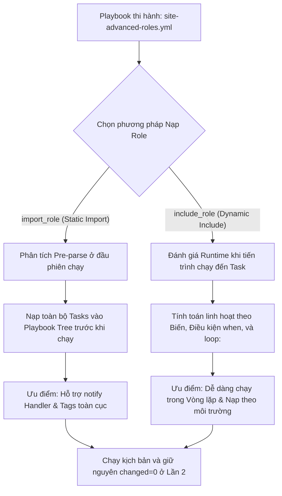
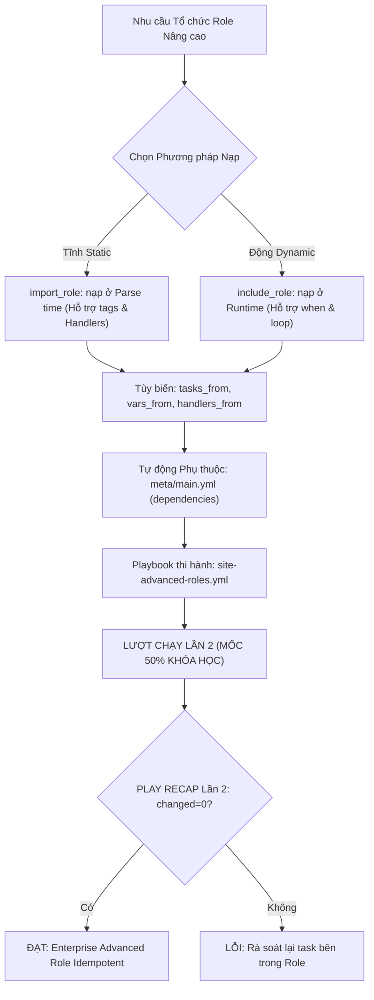


# [BÀI 15] KỸ THUẬT ROLE NÂNG CAO: ROLE DEPENDENCIES, SEARCH PATHS, PARAMETERIZED ROLES & TÁI CẤU TRÚC PLAYBOOK QUY MÔ LỚN

Trong kỷ nguyên **Infrastructure as Code (IaC)** và tự động hóa vận hành hạ tầng đám mây (Cloud Infrastructure Automation), **Ansible** khẳng định vị thế dẫn đầu nhờ triết lý **Agentless** (không cần cài đặt agent nền trên máy đích), giao thức điều khiển an toàn qua **SSH / WinRM**, định dạng khai báo **YAML** trực quan và nguyên lý bất biến **Idempotency** mạnh mẽ. Việc làm chủ Ansible không chỉ dừng lại ở các câu lệnh Ad-hoc đơn giản, mà đòi hỏi kỹ sư phải nắm vững kiến trúc Module tầng thấp, Variable Precedence 22 tầng, Jinja2 Templates, tối ưu hóa Forks & Pipelining cho tới thiết kế Roles / Collections và tích hợp CI/CD tự động hóa chuẩn Doanh nghiệp.

Bài viết chuyên sâu này sẽ đồng hành cùng bạn mổ xẻ toàn diện bức tranh kiến trúc, phân tích các đánh đổi kỹ thuật thực chiến (Engineering Trade-offs), cung cấp hướng dẫn thực hành Lab chi tiết từng bước và bộ câu hỏi phỏng vấn chuyên sâu chuẩn DevOps / SRE Lead.

---

## 1. Bản Chất Kiến Trúc & Cơ Chế Vận Hành Tầng Thấp

---


> **Tối ưu tổ chức Role nâng cao với include_role và import_role giúp kịch bản Ansible linh hoạt, tái sử dụng động và xử lý phụ thuộc tự động.**

Nâng tầm kỹ năng quản lý mô-đun hạ tầng tiệm cận mốc 50% toàn bộ khóa học (I-10):

> **Ở mức độ cơ bản, ta khai báo danh sách Role tĩnh dưới từ khóa `roles:`. Tuy nhiên, trong các hệ thống doanh nghiệp phức tạp, nhu cầu nạp Role theo điều kiện môi trường (chỉ nạp role SSL trên Prod, bỏ qua trên Dev), nạp Role lặp qua một mảng cấu hình (vòng lặp `loop:`), hoặc tự động kích hoạt các Role nền tảng phụ thuộc (Role Dependencies) là vô cùng phổ biến. Hai module `ansible.builtin.include_role` (Dynamic Runtime) và `ansible.builtin.import_role` (Static Pre-parse) kết hợp với từ khóa `tasks_from:` và tệp `meta/main.yml` mang lại khả năng điều khiển luồng thực thi linh hoạt tối đa. Dù nạp tĩnh hay nạp động, toàn bộ các Task bên trong vẫn giữ nguyên tính Idempotent chuẩn mực `changed=0` ở Lần 2.**

---


---


---


| Tiếng Việt | Tiếng Anh / Từ khóa + FQCN (giữ nguyên) |
|---|---|
| Nạp Role động | Dynamic role inclusion (`ansible.builtin.include_role`) |
| Nạp Role tĩnh | Static role import (`ansible.builtin.import_role`) |
| Phụ thuộc lẫn nhau giữa các Role | Role dependencies (`meta/main.yml`) |
| Chỉ định tệp nhiệm vụ | Custom task file entrypoint (`tasks_from:`) |
| Chỉ định tệp bộ kích hoạt | Custom handler file entrypoint (`handlers_from:`) |
| Chỉ định tệp biến số | Custom variable file entrypoint (`vars_from:`) |
| Thời điểm phân tích cú pháp | Playbook parse time (Static import) |
| Thời điểm thực thi nhiệm vụ | Task execution runtime (Dynamic include) |
| Cho phép nạp trùng lặp | Allow duplicate role execution (`allow_duplicates:`) |
| Nạp Role theo vòng lặp | Looped role inclusion (`include_role` + `loop:`) |
| Thẻ đánh dấu Role | Role tags directive (`tags:`) |
| Tự động hóa kiểm soát luồng | Control flow orchestration |

---

### 1.1. Nạp Role Tĩnh `import_role` vs Nạp Role Động `include_role` (15 phút)



**Nguyên lý cốt lõi:** Phân biệt chính xác bản chất khác nhau giữa hai module `ansible.builtin.import_role` (Nạp tĩnh ở thời điểm Parse Playbook) và `ansible.builtin.include_role` (Nạp động ở thời điểm Runtime).

**Giải thích cơ chế ngầm:** `import_role` xử lý tất cả các Task của Role ngay tại thời điểm parse Playbook trước khi chạy, giúp các Task bên trong nhận được thẻ `tags` và `handlers` toàn cục. Trong khi đó, `include_role` chỉ xử lý khi tiến trình chạy đến đúng vị trí Task đó, cho phép kết hợp với vòng lặp `loop:` và điều kiện `when:`.

> [!WARNING]
> **CẠM BẪY THỰC CHIẾN:**
> Sử dụng `import_role` bên trong một vòng lặp `loop:` khiến Ansible Parser báo lỗi syntax ngắt Playbook ngay ở bước load file.

**Minh hoạ.** Sử dụng `import_role` (Static) và `include_role` (Dynamic):
```yaml
# Nạp tĩnh Static Import
- name: Static Role Import Demonstration
  ansible.builtin.import_role:
    name: common

# Nạp động Dynamic Include
- name: Dynamic Role Include Demonstration
  ansible.builtin.include_role:
    name: webserver
  when: env_type == 'production'
```

**Nguyên lý cốt lõi:** Khai báo và tự động giải quyết các Role phụ thuộc (Role Dependencies) bên trong tệp `meta/main.yml` của Role.

**Giải thích cơ chế ngầm:** Giúp tự động hóa việc chuẩn bị hạ tầng nền tảng: khi nạp một Role ứng dụng (như `app_server`), Ansible Engine sẽ tự động nhận biết và chạy trước Role nền tảng (`common`) mà người dùng không cần phải khai báo thủ công `common` trong Playbook.

> [!WARNING]
> **CẠM BẪY THỰC CHIẾN:**
> Chạy Role ứng dụng bị lỗi thiếu gói phần mềm nền tảng do quên khai báo `dependencies:` trong `meta/main.yml`.

**Minh hoạ.** Khai báo Role phụ thuộc trong `roles/app_server/meta/main.yml`:
```yaml
# roles/app_server/meta/main.yml
galaxy_info:
  author: NTK Ansible Course
  description: Application Server Role with Common Dependency

dependencies:
  - role: common
    vars:
      common_ntp_server: "pool.ntp.org"
```

**Nguyên lý cốt lõi:** Sử dụng module `ansible.builtin.include_role` kết hợp với từ khóa vòng lặp `loop:` để nạp và áp dụng Role linh hoạt cho từng phần tử trong một mảng danh sách cấu hình.

**Giải thích cơ chế ngầm:** Cho phép khởi tạo nhiều Virtual Host hoặc nhiều Instance ứng dụng khác nhau bằng cách lặp qua mảng từ điển cấu hình mà không cần phải gọi lặp lại từ khóa `roles:` nhiều lần thủ công.

> [!WARNING]
> **CẠM BẪY THỰC CHIẾN:**
> Dùng `import_role` kết hợp `loop:` làm Ansible Engine báo lỗi `Cannot use loop with import_role`.

**Minh hoạ.** Lặp danh sách vhosts và nạp `include_role`:
```yaml
- name: Deploy Multiple Virtual Hosts using include_role loop
  ansible.builtin.include_role:
    name: webserver
  loop:
    - { vhost_name: 'site1.com', vhost_port: 8081 }
    - { vhost_name: 'site2.com', vhost_port: 8082 }
  loop_control:
    loop_var: vhost_item
```

---

### 1.2. Tùy biến Nạp Tệp Task, Handler và Biến Nâng cao (15 phút)

**Nguyên lý cốt lõi:** Sử dụng thuộc tính `tasks_from:` trong `include_role` / `import_role` để chỉ định nạp một tệp Task cụ thể nằm trong thư mục `tasks/` thay vì tệp mặc định `main.yml`.

**Giải thích cơ chế ngầm:** Cho phép chia nhỏ thư mục `tasks/` của Role thành nhiều kịch bản chức năng riêng biệt (như `install.yml`, `configure.yml`, `service.yml`, `cleanup.yml`), giúp người gọi Role có thể chọn chạy riêng lẻ một công đoạn cụ thể khi cần.

> [!WARNING]
> **CẠM BẪY THỰC CHIẾN:**
> Nhét tất cả 500 Task cài đặt, cấu hình, bảo trì vào đúng 1 file `tasks/main.yml` duy nhất làm file phình to khó đọc.

**Minh hoạ.** Chỉ định nạp riêng tệp `configure.yml` bằng `tasks_from`:
```yaml
- name: Run only configuration tasks from webserver role
  ansible.builtin.include_role:
    name: webserver
    tasks_from: configure.yml
```

**Nguyên lý cốt lõi:** Truyền danh sách biến tùy chỉnh nâng cao cho `include_role` hoặc `import_role` bằng khối từ khóa `vars:`.

**Giải thích cơ chế ngầm:** Giúp ghi đè linh hoạt các biến cấu hình mặc định (`defaults/main.yml`) ngay tại thời điểm nạp Role mà không làm ảnh hưởng đến các lần nạp Role khác trong cùng một Play.

> [!WARNING]
> **CẠM BẪY THỰC CHIẾN:**
> Thay đổi giá trị biến trực tiếp trong file `defaults/main.yml` của Role khiến tất cả các host khác bị ảnh hưởng dây chuyền.

**Minh hoạ.** Truyền biến tùy chỉnh trực tiếp cho `include_role`:
```yaml
- name: Deploy High Security Webserver Instance
  ansible.builtin.include_role:
    name: webserver
    vars:
      webserver_port: 443
      webserver_enable_ssl: true
```

**Nguyên lý cốt lõi:** Sử dụng các thuộc tính `handlers_from:` và `vars_from:` để chỉ định nạp các tệp Handler hoặc tệp Variable tùy chỉnh nằm ngoài file `main.yml` mặc định của Role.

**Giải thích cơ chế ngầm:** Tăng tính mô-đun hóa: cho phép quản lý riêng các tệp biến theo từng hệ điều hành (như `vars/RedHat.yml` vs `vars/Debian.yml`) và tự động nạp đúng tệp biến thích hợp bằng `vars_from: "{{ ansible_facts.os_family }}.yml"`.

> [!WARNING]
> **CẠM BẪY THỰC CHIẾN:**
> Đóng cứng tên gói phần mềm Ubuntu vào `vars/main.yml` khiến Role bị crash khi chạy trên CentOS/RedHat.

**Minh hoạ.** Nạp tệp biến theo hệ điều hành bằng `vars_from`:
```yaml
- name: Load OS-specific variables in role
  ansible.builtin.include_role:
    name: common
    vars_from: "{{ ansible_facts.os_family }}.yml"
```

---

### 1.3. Quản lý Nạp Trùng lặp, Điều kiện Môi trường và Idempotency (10 phút)

**Nguyên lý cốt lõi:** Sử dụng thuộc tính `allow_duplicates: false` (hoặc `true`) trong tệp `meta/main.yml` để kiểm soát xem một Role có được phép thi hành lại nhiều lần trong cùng 1 Play hay không.

**Giải thích cơ chế ngầm:** Mặc định, nếu một Role đã được thi hành 1 lần (trực tiếp hoặc qua dependency), Ansible Engine sẽ im lặng bỏ qua nếu Role đó được gọi lại lần nữa. Khai báo `allow_duplicates: true` nếu muốn Role được phép chạy lại nhiều lần (ví dụ: Role tạo user tạm).

> [!WARNING]
> **CẠM BẪY THỰC CHIẾN:**
> Thắc mắc tại sao khi gọi Role `common` 2 lần trong 1 Play thì ở lần 2 Role lại không chạy (do `allow_duplicates: false` mặc định).

**Minh hoạ.** Cấu hình `allow_duplicates` trong `meta/main.yml`:
```yaml
# roles/common/meta/main.yml
allow_duplicates: false
galaxy_info:
  author: NTK Ansible Course
```

**Nguyên lý cốt lõi:** Kết hợp thuộc tính điều kiện `when:` với module `include_role` để điều khiển nạp Role động linh hoạt theo môi trường triển khai (Dev, Staging, Production).

**Giải thích cơ chế ngầm:** Cho phép xây dựng kịch bản tổng thể chung cho toàn hạ tầng: chỉ nạp Role giám sát nâng cao `monitoring` và SSL certificate trên môi trường Production (`when: env_type == 'production'`).

> [!WARNING]
> **CẠM BẪY THỰC CHIẾN:**
> Tải và đăng ký SSL certificate đắt tiền trên máy chủ thử nghiệm Local Dev.

**Minh hoạ.** Nạp Role theo điều kiện môi trường với `when:`:
```yaml
- name: Include SSL Security Role on Production Only
  ansible.builtin.include_role:
    name: ssl_security
  when: env_type | default('development') == 'production'
```

**Nguyên lý cốt lõi:** Đảm bảo rằng ở lượt chạy Lần thứ hai, Playbook nạp Role nâng cao (qua `include_role`, `import_role`, hay `dependencies`) bắt buộc phải đạt chỉ số `changed=0` tuyệt đối trong bảng `PLAY RECAP`.

**Giải thích cơ chế ngầm:** Dù kịch bản nạp Role động/tĩnh phức tạp đến đâu, bản chất Idempotency của các Task thi hành bên dưới không bao giờ thay đổi. Khi hạ tầng đã được cấu hình chuẩn xác ở Lần 1, lượt chạy Lần 2 phải im lặng trả về `ok` và `changed=0`.

> [!WARNING]
> **CẠM BẪY THỰC CHIẾN:**
> Bảng `PLAY RECAP` Lần 2 báo `changed > 0` do các task trong Role nạp động bị lặp changed mạo danh.

**Minh hoạ.** Đọc hiểu bảng `PLAY RECAP` Lần 2 đạt Idempotency mốc 50% khóa học:
```
# Lần 1: changed=3 (Role common & app_server thi hành render file thành công)
target1 : ok=6 changed=3 unreachable=0 failed=0

# Lần 2: changed=0 (Mọi thứ trùng khớp -> ĐẠT IDEMPOTENCY 100% - MỐC 50% KHÓA HỌC)
target1 : ok=6 changed=0 unreachable=0 failed=0
```

---

### 1.4. Đưa vào việc thật (4 phút)

### 7.1. Áp dụng vào hạ tầng sẵn có
Khi triển khai hệ thống Microservices đa môi trường:
- Sử dụng `include_role` kết hợp vòng lặp `loop:` để lặp danh sách 10 dịch vụ Microservices (như `auth-service`, `payment-service`, `order-service`), nạp chung 1 `role-microservice` duy nhất nhưng truyền các thông số port/env riêng.
- Sử dụng `meta/main.yml` khai báo dependency `role-common` để 100% các máy chủ dịch vụ tự động có sẵn cấu hình Security và Logging nền tảng.

### 7.2. Rủi ro hỏng hóc khi triển khai Production và giải pháp an toàn
- **Rủi ro:** Sử dụng `import_role` (Static) bên trong khối điều kiện `when:`, khiến Ansible Parser nạp toàn bộ các Task của Role ở bước parse, làm lộ các biến hoặc nạp nhầm handler gây restart dịch vụ ngoài ý muốn.
- **Giải pháp an toàn:**
  1. Khi cần nạp Role theo điều kiện `when:` hoặc theo vòng lặp `loop:`, **BẮT BUỘC dùng `include_role` (Dynamic)**.
  2. Chỉ dùng `import_role` (Static) khi cần thừa hưởng thẻ `tags` hoặc Handler toàn cục ở đầu Playbook.

### 7.3. Đo lường chỉ số Trước – Sau khi áp dụng
- **Trước khi dùng `include_role` nâng cao:** Phải tạo 10 tệp Playbook riêng biệt cho 10 dịch vụ Microservices.
- **Sau khi dùng `include_role` nâng cao:** Chỉ cần 1 Playbook chính ngắn 30 dòng gọi `include_role` lặp mảng danh sách dịch vụ, giảm 90% nỗ lực bảo trì file YAML.

### 7.4. Khi nào KHÔNG nên dùng hoặc không nên lạm dụng include_role
- **Không lạm dụng `include_role` lồng nhau quá 3 cấp (Nested include_role):** Việc Role A `include_role` Role B, Role B lại `include_role` Role C sẽ làm luồng thi hành của Playbook trở nên cực kỳ rườm rà và khó debug khi gặp sự cố.

---

### 1.5. Bẫy hay gặp (2 phút)

| # | Bẫy hay gặp | Vì sao "recap xanh mà sai / không idempotent" | Lệnh phát hiện và xử lý |
|---|---|---|---|
| 1 | Dùng `import_role` bên trong vòng lặp `loop:` | Ansible Parser văng lỗi `Cannot use loop with import_role` ở bước parse. | Đổi từ `import_role` sang `ansible.builtin.include_role`. |
| 2 | Nhầm lẫn giữa `tasks_from` và tên thư mục | Viết `tasks_from: configure` (thiếu đuôi `.yml`) làm Ansible báo file not found. | Viết đầy đủ tên file: `tasks_from: configure.yml`. |
| 3 | Thắc mắc vì sao Role dependency chạy trước Play task | `dependencies:` trong `meta/main.yml` luôn được ưu tiên chạy trước mọi task của Role chính. | An tâm: Đây là tính năng đúng thiết kế của Dependency. |
| 4 | Lặp vòng lặp phụ thuộc tròn (Circular Dependencies) | Role A gọi Dependency B, Role B lại gọi Dependency A làm treo Playbook. | Xóa bỏ vòng lặp phụ thuộc trong `meta/main.yml`. |
| 5 | Quên thuộc tính `loop_var` khi lồng nhiều loop | Biến vòng lặp `item` bị ghi đè lẫn nhau làm hỏng dữ liệu truyền vào Role. | Đổi tên biến vòng lặp với `loop_control: loop_var: my_var`. |
| 6 | Thắc mắc vì sao Handler trong `include_role` không nhận | `include_role` nạp động ở runtime nên Handler chỉ nhận từ thời điểm include trở đi. | Đưa Handler về tệp `handlers/main.yml` hoặc dùng `import_role`. |
| 7 | Truyền biến cho `include_role` bị trôi sang task sau | Biến truyền vào `vars:` của `include_role` mặc định tồn tại trong toàn bộ Play. | Thêm cờ `public: false` cho `include_role` nếu muốn giới hạn phạm vi biến. |
| 8 | Quên cờ `allow_duplicates: true` khi cần chạy 2 lần | Role chỉ chạy 1 lần ở host đầu tiên, các lần sau bị Ansible im lặng bỏ qua. | Khai báo `allow_duplicates: true` trong `meta/main.yml`. |
| 9 | Viết sai thuộc tính `tasks_from` dưới dạng tham số đè | Viết `tasks_from = file.yml` vi phạm cú pháp từ khóa YAML. | Viết đúng thuộc tính YAML: `tasks_from: file.yml`. |
| 10 | Không kiểm tra sự tồn tại của tệp chỉ định | Gõ `tasks_from: missing.yml` làm Ansible báo `Could not find tasks file`. | Đảm bảo file `missing.yml` thực sự tồn tại trong `tasks/`. |
| 11 | Không test thử Idempotency Lần 2 khi nạp đè biến | Biến truyền vào `include_role` làm lặp thay đổi file ở Lần 2 mà không biết. | Chạy lại Playbook Lần 2 và kiểm tra `changed=0`. |
| 12 | Thắc mắc tại sao `include_role` chạy chậm hơn `import_role` | `include_role` phải tính toán runtime từng task nên mất thêm vài ms overhead. | Chấp nhận overhead nhỏ để đổi lại tính linh hoạt dynamic. |

---

### 1.6. Tóm tắt (1 phút)



### Năm điều phải nhớ
1. **Phân biệt Static vs Dynamic:** `import_role` nạp tĩnh ở Parse time; `include_role` nạp động ở Runtime.
2. **Khai báo Dependency trong `meta/main.yml`:** Tự động hóa nạp các Role nền tảng trước Role chính.
3. **Dùng `include_role` với `loop:`:** Nạp Role linh hoạt cho mảng danh sách từ điển cấu hình.
4. **Chia nhỏ Task với `tasks_from:`:** Chỉ định nạp đúng tệp Task cụ thể khi không muốn chạy `main.yml`.
5. **Đạt chuẩn `changed=0` ở Lần 2:** Đạt mốc 50% khóa học với 100% Playbook nạp Role nâng cao chuẩn Idempotent.

---

### 1.7. Câu hỏi tự kiểm tra (kiêm luyện RHCE EX294)

1. **[RHCE EX294 Objective #11]** Sự khác nhau cốt lõi về thời điểm nạp giữa module `ansible.builtin.import_role` và `ansible.builtin.include_role` là gì?
   - *Đáp án:* `import_role` nạp tĩnh tại thời điểm Parse Playbook (Pre-parse); `include_role` nạp động tại thời điểm Runtime khi tiến trình chạy đến Task đó.
2. **[RHCE EX294 Objective #11]** Muốn nạp một Role lặp qua một mảng danh sách bằng từ khóa `loop:`, ta bắt buộc phải sử dụng module nào?
   - *Đáp án:* Bắt buộc dùng `ansible.builtin.include_role` (vì `import_role` không hỗ trợ `loop:`).
3. **[RHCE EX294 Objective #11]** Tệp tin nào trong thư mục Role dùng để khai báo danh sách các Role phụ thuộc (dependencies) tự động nạp trước?
   - *Đáp án:* Tệp `meta/main.yml`.
4. **[RHCE EX294 Objective #11]** Thuộc tính nào trong module `include_role` dùng để chỉ định nạp tệp `configure.yml` thay vì tệp mặc định `tasks/main.yml`?
   - *Đáp án:* Thuộc tính `tasks_from: configure.yml`.
5. **[RHCE EX294 Objective #11]** Thuộc tính nào trong `meta/main.yml` dùng để cấu hình cho phép một Role được thực thi lại nhiều lần trong cùng một Play?
   - *Đáp án:* Thuộc tính `allow_duplicates: true`.
6. **[RHCE EX294 Objective #11]** Viết đoạn mã YAML sử dụng `include_role` chỉ nạp role `monitoring` khi biến `env_type == 'production'`.
   - *Đáp án:*
     ```yaml
     - name: Include Monitoring Role
       ansible.builtin.include_role:
         name: monitoring
       when: env_type == 'production'
     ```
7. **[RHCE EX294 Objective #11]** Thuộc tính `vars_from:` trong module `include_role` có tác dụng gì?
   - *Đáp án:* Dùng để chỉ định nạp một tệp biến số cụ thể (ví dụ `vars_from: RedHat.yml`) nằm trong thư mục `vars/` của Role.
8. **[RHCE EX294 Objective #11]** Khi khai báo dependency trong `meta/main.yml`, Role phụ thuộc sẽ được Ansible Engine thực thi vào thời điểm nào?
   - *Đáp án:* Được tự động thực thi TRƯỚC KHI bất kỳ Task nào của Role chính chạy.
9. **[RHCE EX294 Objective #11]** Viết cú pháp YAML nạp tĩnh role `common` bằng module `import_role` và truyền biến `common_user: admin`.
   - *Đáp án:*
     ```yaml
     - name: Import Common Role statically
       ansible.builtin.import_role:
         name: common
       vars:
         common_user: admin
     ```
10. **[RHCE EX294 Objective #11]** Tại sao việc nạp `include_role` lồng nhau quá 3 cấp lại bị coi là anti-pattern cần tránh?
    - *Đáp án:* Vì nó làm luồng thi hành của Playbook trở nên phức tạp, khó theo dõi và cực kỳ khó debug khi gặp sự cố runtime.
11. **[RHCE EX294 Objective #11]** Thuộc tính `handlers_from:` trong `include_role` dùng để làm gì?
    - *Đáp án:* Dùng để chỉ định nạp một tệp Handler cụ thể nằm trong thư mục `handlers/` của Role.
12. **[RHCE EX294 Objective #11]** Chỉ số nào trong bảng `PLAY RECAP` ở Lần 2 khẳng định Playbook nạp Role nâng cao đạt chuẩn Idempotency?
    - *Đáp án:* Chỉ số `changed=0` (và `failed=0`).
13. **[RHCE EX294 Objective #11]** Lệnh CLI nào giúp đối soát kết quả cài đặt từ các Role nạp qua `include_role` trên target node Docker container?
    - *Đáp án:* Lệnh `docker exec target1 cat /path/to/rendered/file`.

---

### 1.8. Tài liệu tham khảo

- Ansible Core Documentation (v2.15+): [Including and Importing Roles](https://docs.ansible.com/ansible/latest/playbook_guide/playbooks_reuse_includes.html)
- Ansible Core Documentation: [Role Dependencies](https://docs.ansible.com/ansible/latest/playbook_guide/playbooks_reuse_roles.html#role-dependencies)
- Red Hat Certified Engineer (RHCE) EX294 Study Guide: Advanced Role Management and Dynamic Inclusion.

---

## Bảng đối soát thời lượng

| Mục | Nội dung | Thời lượng dự kiến | Thời lượng thực tế |
|---|---|---|---|
| §0 | Khởi động và ôn tập buổi 14 | 10 phút | 10 phút |
| §1–§2 | Mục tiêu làm được & Cần biết trước | 2 phút | 2 phút |
| §3 | Thuật ngữ Việt-Anh & Mô hình tư duy | 8 phút | 8 phút |
| §4 | import_role vs include_role & Dependencies (QT 4.1–4.3) | 15 phút | 15 phút |
| §5 | Tùy biến tasks_from, vars_from, handlers_from (QT 5.1–5.3) | 15 phút | 15 phút |
| §6 | Quản lý allow_duplicates, when & Idempotency (QT 6.1–6.3) | 10 phút | 10 phút |
| §7–§9 | Đưa vào việc thật, Bẫy hay gặp & Tóm tắt | 7 phút | 7 phút |
| §10–§11 | Câu hỏi tự kiểm tra EX294 & Tài liệu tham khảo | 3 phút | 3 phút |
| **Tổng** | **Khối lý thuyết Buổi 15** | **60 phút** | **60 phút** |

---

## 2. Hướng Dẫn Thực Hành & Triển Khai Lab Chuẩn Production

> [!IMPORTANT]
> **YÊU CẦU MÔI TRƯỜNG THỰC HÀNH:**
> Toàn bộ các bài thực hành dưới đây được thiết kế để chạy trực tiếp trên môi trường máy chủ Linux / Docker containers phân tán. Hãy đảm bảo bạn đã chuẩn bị Control Node cài đặt Ansible Core 2.15+ cùng các Managed Nodes đã cấu hình SSH Key Authentication.

## Khối thực hành — 150 phút

> **Đối soát thời lượng:** Khối thực hành kéo dài đúng **150'** (từ L0 đến L11).
> **Nguyên tắc cốt lõi:** Thực hành khởi tạo 2 Roles `common` và `app_server`, khai báo dependency `roles/common` trong `roles/app_server/meta/main.yml`, sử dụng `import_role` nạp Role tĩnh, sử dụng `include_role` nạp Role động kết hợp điều kiện `when:`, sử dụng `include_role` kết hợp vòng lặp `loop:` duyệt mảng cấu hình, chỉ định tệp task cụ thể với `tasks_from: configure.yml`, thực thi phép thử **Lượt chạy Lần thứ hai** chứng minh `PLAY RECAP` đạt `changed=0` và đối soát sự thật máy đích qua `docker exec`.

---

## L0. Mục tiêu thực hành và tiêu chí hoàn thành

| # | Mục tiêu thực hành | Tiêu chí hoàn thành (Kiểm tra bằng lệnh CLI) |
|---|---|---|
| TH1 | Khởi tạo 2 Roles: roles/common và roles/app_server | Đã tạo đủ cấu trúc 2 thư mục Role trong `roles/` |
| TH2 | Khai báo dependency roles/common cho app_server | File `roles/app_server/meta/main.yml` chứa dependency |
| TH3 | Sử dụng import_role nạp tĩnh Role common | Module `ansible.builtin.import_role` nạp role common |
| TH4 | Sử dụng include_role nạp động kết hợp when: | Module `include_role` nạp role app_server với `when:` |
| TH5 | Sử dụng include_role kết hợp vòng lặp loop: | Module `include_role` nạp role lặp mảng danh sách vhosts |
| TH6 | Chỉ định nạp tệp task cụ thể với tasks_from | Module `include_role` dùng `tasks_from: configure.yml` |
| TH7 | Thực thi Phép thử Lượt chạy Lần hai (Idempotency) | Bảng `PLAY RECAP` Lần 2 đạt `changed=0` tuyệt đối |
| TH8 | Đối soát sự thật máy đích bằng docker exec | `docker exec target1 cat /etc/app-server.conf` |

---

## L1. Điều kiện tiên quyết về môi trường

| Kiểm tra | LỆNH THỰC THI | Kết quả kỳ vọng |
|---|---|---|
| Ansible core đã cài | `ansible --version` | Phiên bản ansible-core v2.15 trở lên |
| Docker Compose sẵn sàng | `docker compose ps` | Cả target1 và target2 ở trạng thái `Up` |
| Kết nối SSH sẵn sàng | `ansible all -m ansible.builtin.ping` | Đạt `SUCCESS` cho mọi host |
| Inventory dự án | `ansible-inventory --graph` | Hiển thị các nhóm `web` và `db` |
| Thư mục thực hành | `pwd` | Đang ở thư mục `~/lab-ansible-15` |

Nếu chưa có target container:
```bash
cd labs && make up && make key && make inventory
```

---

## L2. Kiến trúc bài lab

```mermaid
graph TD
    SubGraph1["Control Node (ansible-playbook CLI)"] --> |1. Nạp Playbook: site-advanced-roles.yml| PB["Playbook: site-advanced-roles.yml"]
    
    PB --> |2. Task 1: import_role -> common| R1["Role: common"]
    PB --> |3. Task 2: include_role -> app_server (when: production)| R2["Role: app_server"]
    
    subgraph "Nội bộ Role: roles/app_server/"
        R2 -. "Auto dependency -> meta/main.yml" .-> R1
        R2 --> |4. Run tasks_from: configure.yml| TCFG["configure.yml: Deploy /etc/app-server.conf"]
    end
    
    PB --> |5. Task 3: include_role -> webserver with loop| R3["Role: webserver (Looped)"]
    
    R2 --> |6. Gửi cấu hình đã render| T1["Target Container 1 (target1)"]
    
    T1 -. "RECAP Lần 1: ok=6, changed=3" .-> SubGraph1
    T1 -. "RECAP Lần 2: ok=6, changed=0 (MỐC 50% KHÓA HỌC)" .-> SubGraph1
    
    DEV["Học viên (Tester)"] --> |A. Chạy Playbook site-advanced-roles.yml| SubGraph1
    DEV --> |B. Khẳng định changed=0 ở Lần 2| SubGraph1
    DEV --> |C. Đối soát sự thật máy đích| T1
```

---

## L3. Bước 1 — Khởi tạo Roles common và app_server với Dependency (30 phút)

Tạo thư mục dự án `~/lab-ansible-15`, thư mục `roles`, file `ansible.cfg`, `inventory.ini`, dùng lệnh `ansible-galaxy role init` khởi tạo 2 roles `common` và `app_server`, sau đó khai báo dependency trong `roles/app_server/meta/main.yml` (QT 4.1, QT 4.2).

```bash
mkdir -p ~/lab-ansible-15/roles && cd ~/lab-ansible-15

cat << 'EOF' > ansible.cfg
[defaults]
inventory = ./inventory.ini
remote_user = ansible
host_key_checking = False
private_key_file = ~/.ssh/id_ed25519

[privilege_escalation]
become = True
become_method = sudo
become_user = root
become_ask_pass = False
EOF

cat << 'EOF' > inventory.ini
[web]
target1 ansible_host=127.0.0.1 ansible_port=2221

[db]
target2 ansible_host=127.0.0.1 ansible_port=2222

[all:vars]
ansible_python_interpreter=/usr/bin/python3
EOF

# Khởi tạo 2 roles: common và app_server
cd roles
ansible-galaxy role init common
ansible-galaxy role init app_server
cd ..

# Biên soạn Role common (tasks và defaults)
cat << 'EOF' > roles/common/defaults/main.yml
---
common_sys_env: "base_infrastructure"
EOF

cat << 'EOF' > roles/common/tasks/main.yml
---
- name: Common Task 1 - Deploy base system identifier file
  ansible.builtin.copy:
    content: "SYS_ENV={{ common_sys_env }}\nSYSTEM_STATUS=INITIALIZED\n"
    dest: /etc/common-sys.conf
    mode: '0644'
EOF

# Biên soạn meta dependency cho Role app_server
cat << 'EOF' > roles/app_server/meta/main.yml
---
allow_duplicates: false
galaxy_info:
  author: NTK Ansible Course
  description: Application Server Role with Common Dependency

dependencies:
  - role: common
    vars:
      common_sys_env: "app_server_base"
EOF
```

**CHECKPOINT 1 — Lệnh ansible-galaxy role init khởi tạo 2 roles common và app_server thành công trong thư mục roles/.**
- **Lệnh kiểm tra:**
```bash
if [ -d "roles/common/tasks" ] && [ -d "roles/app_server/tasks" ]; then
  echo "CHECKPOINT 1: ĐẠT - Lệnh ansible-galaxy role init khởi tạo 2 roles common và app_server thành công"
else
  echo "CHECKPOINT 1: LỖI - Khởi tạo 2 roles thất bại"
fi
```

**CHECKPOINT 2 — File roles/app_server/meta/main.yml khai báo dependency tự động nạp role common.**
- **Lệnh kiểm tra:**
```bash
META_CONTENT=$(cat roles/app_server/meta/main.yml)
if echo "$META_CONTENT" | grep -q "role: common" && echo "$META_CONTENT" | grep -q "common_sys_env:"; then
  echo "CHECKPOINT 2: ĐẠT - File meta/main.yml của role app_server khai báo dependency tự động nạp role common chuẩn xác"
else
  echo "CHECKPOINT 2: LỖI - Khai báo dependency trong meta/main.yml thất bại"
fi
```

---

## L4. Bước 2 — Biên soạn tasks_from và Tệp Cấu hình riêng cho app_server (40 phút)

Biên soạn tệp `roles/app_server/tasks/main.yml` và tệp cấu hình tùy chỉnh `roles/app_server/tasks/configure.yml` (QT 5.1, QT 5.2, QT 5.3).

```bash
# Biên soạn file tasks/main.yml mặc định của app_server
cat << 'EOF' > roles/app_server/tasks/main.yml
---
- name: App Server Main Task 1 - Deploy default app file
  ansible.builtin.copy:
    content: "APP_MODE=DEFAULT_MAIN\n"
    dest: /etc/app-main.conf
    mode: '0644'
EOF

# Biên soạn tệp tasks_from riêng lẻ: roles/app_server/tasks/configure.yml
cat << 'EOF' > roles/app_server/tasks/configure.yml
---
- name: App Server Config Task 1 - Deploy custom app server config file
  ansible.builtin.copy:
    content: "APP_SERVER_NAME={{ app_name | default('NTK_APP_PROD') }}\nAPP_PORT={{ app_port | default(9000) }}\n"
    dest: /etc/app-server.conf
    mode: '0644'
EOF
```

**CHECKPOINT 3 — Tệp tasks/configure.yml được tạo riêng lẻ trong role app_server để hỗ trợ thuộc tính tasks_from:.**
- **Lệnh kiểm tra:**
```bash
if [ -f "roles/app_server/tasks/configure.yml" ] && grep -q "APP_SERVER_NAME" roles/app_server/tasks/configure.yml; then
  echo "CHECKPOINT 3: ĐẠT - Tệp tasks/configure.yml được tạo riêng lẻ trong role app_server hỗ trợ thuộc tính tasks_from:"
else
  echo "CHECKPOINT 3: LỖI - Tạo tệp tasks/configure.yml thất bại"
fi
```

---

## L5. Bước 3 — Tạo Playbook site-advanced-roles.yml Gọi import_role, include_role, loop và when: (30 phút)

Viết file Playbook chính `site-advanced-roles.yml` kết hợp cả nạp tĩnh `import_role`, nạp động `include_role` với `when:`, `loop:`, và `tasks_from:` (QT 4.1, QT 4.3, QT 6.2).

```bash
cat << 'EOF' > site-advanced-roles.yml
---
- name: Advanced Roles Demonstration Playbook
  hosts: web
  become: true
  vars:
    env_type: "production"
    vhost_list:
      - name: "app_vhost_1"
        port: 8091
      - name: "app_vhost_2"
        port: 8092
  tasks:
    - name: Task 1 - Import common role statically using import_role
      ansible.builtin.import_role:
        name: common

    - name: Task 2 - Include app_server role dynamically with tasks_from and when
      ansible.builtin.include_role:
        name: app_server
        tasks_from: configure.yml
      vars:
        app_name: "DYNAMIC_PRODUCTION_APP"
        app_port: 9999
      when: env_type == 'production'

    - name: Task 3 - Include app_server role with loop over vhost_list
      ansible.builtin.include_role:
        name: app_server
        tasks_from: configure.yml
      loop: "{{ vhost_list }}"
      loop_control:
        loop_var: current_vhost
      vars:
        app_name: "{{ current_vhost.name }}"
        app_port: "{{ current_vhost.port }}"
EOF
```

Thực thi Playbook `site-advanced-roles.yml`:
```bash
ansible-playbook site-advanced-roles.yml
```

**CHECKPOINT 4 — Playbook site-advanced-roles.yml thi hành thành công import_role nạp tĩnh role common.**
- **Lệnh kiểm tra:**
```bash
ADV_OUT=$(ansible-playbook site-advanced-roles.yml)
if echo "$ADV_OUT" | grep -q "Common Task 1 - Deploy base system identifier file" && echo "$ADV_OUT" | grep -q "failed=0"; then
  echo "CHECKPOINT 4: ĐẠT - Playbook thi hành thành công import_role nạp tĩnh role common"
else
  echo "CHECKPOINT 4: LỖI - Thi hành import_role thất bại"
fi
```

**CHECKPOINT 5 — Module include_role nạp động role app_server với tasks_from: configure.yml và khi condition when: env_type == 'production' thỏa mãn.**
- **Lệnh kiểm tra:**
```bash
if echo "$ADV_OUT" | grep -q "App Server Config Task 1 - Deploy custom app server config file"; then
  echo "CHECKPOINT 5: ĐẠT - Module include_role nạp động role app_server với tasks_from: configure.yml và điều kiện when: chuẩn xác"
else
  echo "CHECKPOINT 5: LỖI - Thi hành include_role với tasks_from hoặc when thất bại"
fi
```

---

## L6. Bước 4 — Phép thử Lượt chạy Lần thứ hai Chứng minh Idempotency (Mốc 50% Khóa học) (30 phút)

Thực thi lại nguyên vẹn `ansible-playbook site-advanced-roles.yml` Lần 2 để đối soát chỉ số Idempotency `changed=0` khép lại 50% chặng đường khóa học (QT 6.3).

```bash
ansible-playbook site-advanced-roles.yml
```

**CHECKPOINT 6 — Phép thử Lượt 2 đạt changed=0 cho toàn bộ các Task nạp từ import_role và include_role (ĐẠT MỐC 50% KHÓA HỌC).**
- **Lệnh kiểm tra:**
```bash
RUN2_ADV_OUT=$(ansible-playbook site-advanced-roles.yml)
if echo "$RUN2_ADV_OUT" | grep -q "changed=0" && echo "$RUN2_ADV_OUT" | grep -q "failed=0"; then
  echo "CHECKPOINT 6: ĐẠT - Phép thử Lượt 2 đạt chuẩn Idempotency (PLAY RECAP báo changed=0 cho toàn bộ Playbook Roles nâng cao - MỐC 50% KHÓA HỌC)"
else
  echo "CHECKPOINT 6: LỖI - Lượt 2 không đạt changed=0 (Task bị lặp changed)"
fi
```

---

## L7. Bước 5 — Đối soát Sự thật Máy đích qua docker exec (20 phút)

Sử dụng lệnh `docker exec` đối soát trực tiếp các tệp tin được tạo ra và render từ các Roles nâng cao trên target node (QT 6.3).

Đối soát file `/etc/common-sys.conf`:
```bash
docker exec target1 cat /etc/common-sys.conf
```

Đối soát file `/etc/app-server.conf`:
```bash
docker exec target1 cat /etc/app-server.conf
```

**CHECKPOINT 7 — Đối soát file /etc/common-sys.conf được tạo thành công từ role common nạp qua import_role.**
- **Lệnh kiểm tra:**
```bash
EXEC_SYS=$(docker exec target1 cat /etc/common-sys.conf)
if echo "$EXEC_SYS" | grep -q "SYS_ENV=app_server_base" && echo "$EXEC_SYS" | grep -q "SYSTEM_STATUS=INITIALIZED"; then
  echo "CHECKPOINT 7: ĐẠT - Kiểm tra sự thật qua docker exec xác nhận file /etc/common-sys.conf tồn tại đúng cấu hình role common"
else
  echo "CHECKPOINT 7: LỖI - Đối soát file common-sys.conf trên máy đích thất bại"
fi
```

**CHECKPOINT 8 — Đối soát file /etc/app-server.conf chứa đúng cấu hình APP_PORT=8092 được render từ include_role vòng lặp.**
- **Lệnh kiểm tra:**
```bash
EXEC_APP=$(docker exec target1 cat /etc/app-server.conf)
if echo "$EXEC_APP" | grep -q "APP_SERVER_NAME=app_vhost_2" && echo "$EXEC_APP" | grep -q "APP_PORT=8092"; then
  echo "CHECKPOINT 8: ĐẠT - Kiểm tra sự thật qua docker exec xác nhận file /etc/app-server.conf chứa đúng dữ liệu từ include_role loop"
else
  echo "CHECKPOINT 8: LỖI - Đối soát file app-server.conf trên máy đích thất bại"
fi
```

---

## L8. Nộp sản phẩm và dọn dẹp (10 phút)

Thu thập kết quả ra các file báo cáo cuối buổi:
```bash
ansible-playbook site-advanced-roles.yml > advanced-roles-proof.txt
ansible-playbook site-advanced-roles.yml > idempotency-check.txt
docker exec target1 cat /etc/common-sys.conf > kiem-may-dich.txt
docker exec target1 cat /etc/app-server.conf >> kiem-may-dich.txt
```

---

## L9. Xử lý sự cố

| # | Hiện tượng lỗi | Nguyên nhân gốc rễ | Cách xử lý nhanh |
|---|---|---|---|
| 1 | Lỗi `Cannot use loop with import_role` | Sử dụng `import_role` tĩnh bên trong vòng lặp `loop:` | Đổi từ `import_role` sang `ansible.builtin.include_role`. |
| 2 | Lỗi `Could not find tasks file 'configure'` | Thiếu phần mở rộng `.yml` trong thuộc tính `tasks_from:` | Thêm đầy đủ đuôi tệp: `tasks_from: configure.yml`. |
| 3 | Dependency trong `meta/main.yml` không tự nạp | Viết sai vị trí từ khóa `dependencies:` trong file `meta/main.yml` | Đặt từ khóa `dependencies:` ở cùng cấp thụt lề cao nhất trong `meta/main.yml`. |
| 4 | Lỗi `loop_var` ghi đè làm mất giá trị biến | Dùng biến mặc định `item` khi lồng nhiều vòng lặp `include_role` | Đổi tên biến vòng lặp: `loop_control: loop_var: my_item`. |
| 5 | Lượt chạy Lần 2 liên tục báo `changed=1` | Task trong `tasks/configure.yml` dùng `command` thô không có `changed_when: false` | Thêm thuộc tính `changed_when: false` cho các task đọc dữ liệu. |
| 6 | Thắc mắc vì sao `include_role` không chạy khi `when:` sai | Khối điều kiện `when:` được đánh giá trước khi include, nếu false sẽ skip | Kiểm tra lại giá trị biến trong điều kiện `when:`. |
| 7 | Role phụ thuộc bị chạy 2 lần không mong muốn | Khai báo `allow_duplicates: true` trong file `meta/main.yml` | Đặt `allow_duplicates: false` để ngắt chạy lại lãng phí. |
| 8 | Lỗi `ERROR! role 'common' was not found` trong dependency | Tên Role khai báo trong `dependencies:` bị gõ sai | Kiểm tra tên thư mục Role trong `roles/` trùng khớp với `meta`. |
| 9 | Biến truyền vào `vars:` của `include_role` bị thiếu | Viết `vars:` sai vị trí thụt lề YAML (thụt lề lệch cấp so với `name:`) | Đặt `vars:` nằm cùng cấp thụt lề với `name:` và `tasks_from:`. |
| 10 | Handler trong `include_role` không được phát | Handler được nạp sau thời điểm task phát `notify:` | Chuyển Handler về `handlers/main.yml` hoặc nạp bằng `import_role`. |
| 11 | Không test thử Idempotency Lần 2 của Playbook nạp động | Task trong `tasks_from` bị lặp changed mạo danh ở Lần 2 mà không biết | Chạy lại Playbook Lần 2 và kiểm tra `changed=0`. |
| 12 | Thắc mắc vì sao `tasks_from` không chạy `main.yml` | Khi khai báo `tasks_from: file.yml`, Ansible sẽ bỏ qua `main.yml` | Đưa các task dùng chung vào `file.yml` hoặc nạp `main.yml` trước. |
| 13 | Lỗi `docker exec` báo không tìm thấy file `/etc/app-server.conf` | Task copy file trong `tasks_from` bị fail hoặc skipped | Kiểm tra log execution và điều kiện `when:` của task. |
| 14 | Biến `current_vhost` bị undefined trong `include_role` | Khai báo `loop_var: current_vhost` nhưng gọi biến `vhost_item` | Đảm bảo tên biến trong `loop_var` khớp với tên biến được gọi. |

---

## L10. Bài tập mở rộng

1. **BT1:** Viết tệp `roles/common/tasks/cleanup.yml` xóa các file tạm `/tmp/*.tmp`.
2. **BT2:** Gọi `include_role: name=common, tasks_from=cleanup.yml` ở cuối Playbook `site-advanced-roles.yml`.
3. **BT3:** Khởi tạo thêm `roles/db_server` có dependency gọi `common`.
4. **BT4:** Sử dụng `include_role` nạp `db_server` với `when: env_type == 'production'`.
5. **BT5:** Khai báo `vars_from: RedHat.yml` trong `roles/common` để nạp biến số hệ điều hành.
6. **BT6:** Thêm thuộc tính `allow_duplicates: true` cho `roles/common` và nạp 2 lần trong cùng 1 Play.
7. **BT7:** Thực thi phép thử Idempotency Lần 2 cho Playbook ở BT4 và đối soát `PLAY RECAP` đạt `changed=0`.
8. **BT8:** Viết kịch bản bash script dùng `docker exec` đối soát tất cả các file cấu hình được sinh từ nạp Role động.

---

## L11. Sản phẩm nộp và chấm điểm

### Danh mục sản phẩm nộp
- Cấu trúc thư mục 2 Roles `roles/common/` và `roles/app_server/`.
- File Playbook `site-advanced-roles.yml`.
- Báo cáo kết quả 8 CHECKPOINT từ terminal (kỷ niệm mốc 50% khóa học).
- Các file kết quả: `advanced-roles-proof.txt`, `idempotency-check.txt`, `kiem-may-dich.txt`.

### Thang điểm đánh giá

| Mức điểm | Tiêu chí đạt được |
|---|---|
| **0–4 điểm** | Chưa phân biệt `import_role` vs `include_role`, dùng `import_role` với `loop:` làm crash, hoặc sai dependency. |
| **5–7 điểm** | Sử dụng được `include_role`, nhưng chưa thành thạo `tasks_from`, `dependencies` trong `meta`, hay `when:`. |
| **8–9 điểm** | Đạt đủ 8 CHECKPOINT, chứng minh thành thạo `import_role`, `include_role`, `dependencies`, `tasks_from`, `loop:`, `when:`, Idempotency Lần 2 (`changed=0`) và đối soát `docker exec`. |
| **10 điểm** | Đạt 9 điểm + Hoàn thành xuất sắc 100% các Bài tập mở rộng (BT1–BT8). |

---

## Bảng đối soát thời lượng

| Bước | Nội dung | Thời lượng dự kiến | Thời lượng thực tế |
|---|---|---|---|
| L0–L2 | Mục tiêu, Tiên quyết & Kiến trúc bài lab | 10 phút | 10 phút |
| L3 | Bước 1: Khởi tạo roles common, app_server & dependency | 30 phút | 30 phút |
| L4 | Bước 2: Biên soạn tasks_from configure.yml | 40 phút | 40 phút |
| L5 | Bước 3: Tạo site-advanced-roles.yml gọi import/include | 30 phút | 30 phút |
| L6 | Bước 4: Phép thử Lượt 2 chứng minh Idempotency (Mốc 50%) | 30 phút | 30 phút |
| L7 | Bước 5: Đối soát sự thật máy đích qua docker exec | 20 phút | 20 phút |
| L8–L11 | Nộp sản phẩm, Sự cố, Bài tập & Chấm điểm | 10 phút | 10 phút |
| **Tổng** | **Khối thực hành Buổi 15** | **150 phút** | **150 phút** |

---

## 3. Bộ Câu Hỏi Vấn Đáp & Phỏng Vấn Kỹ Thuật Chuyên Sâu

Dưới đây là bộ câu hỏi phỏng vấn thực chiến dành cho các vị trí **DevOps Engineer**, **Site Reliability Engineer (SRE)** và **Cloud Automation Architect**, giúp bạn tự đánh giá độ sâu hiểu biết và rèn luyện phản xạ xử lý sự cố hệ thống:

---


## Bộ câu hỏi phỏng vấn chuyên sâu — ĐÚNG 12 câu

<div class="qa-answer">
  <div class="qa-answer-header">
    <svg width="14" height="14" fill="none" stroke="currentColor" stroke-width="2" viewBox="0 0 24 24"><path d="M22 11.08V12a10 10 0 1 1-5.93-9.14"></path><polyline points="22 4 12 14.01 9 11.01"></polyline></svg>
    <span>Phân Tích &amp; Lời Giải Kỹ Thuật</span>
  </div>
  
<b style="color: var(--accent-primary);">Hỏi:</b> So sánh sự khác nhau cốt lõi về thời điểm thi hành (Execution Time) và hành vi giữa <code>ansible.builtin.import_role</code> và <code>ansible.builtin.include_role</code>. *(Liên quan QT 4.1)*
<b style="color: var(--accent-primary);">Đáp án chuẩn:</b>
  <div style="margin: 0.35rem 0; padding-left: 1rem; border-left: 2px solid var(--accent-primary);">• <code>import_role</code> (Static Import): Nạp tĩnh tại thời điểm <b style="color: var(--accent-primary);">Parse Playbook</b> (Pre-parse). Toàn bộ các Task của Role được chèn trực tiếp vào cây Playbook trước khi chạy. Hỗ trợ đầy đủ cờ <code>tags</code> và <code>handlers</code> toàn cục.</div>
  <div style="margin: 0.35rem 0; padding-left: 1rem; border-left: 2px solid var(--accent-primary);">• <code>include_role</code> (Dynamic Include): Nạp động tại thời điểm <b style="color: var(--accent-primary);">Runtime</b> khi tiến trình chạy đến đúng Task đó. Cho phép kết hợp linh hoạt với vòng lặp <code>loop:</code> và điều kiện <code>when:</code>.</div>
<b style="color: var(--accent-primary);">Tiêu chí chấm:</b>
  <div style="margin: 0.35rem 0; padding-left: 1rem; border-left: 2px solid var(--accent-primary);">• 0: Không phân biệt được <code>import_role</code> và <code>include_role</code>.</div>
  <div style="margin: 0.35rem 0; padding-left: 1rem; border-left: 2px solid var(--accent-primary);">• 1: Biết một cái tĩnh một cái động nhưng giải thích sai về thời điểm parse time vs runtime.</div>
  <div style="margin: 0.35rem 0; padding-left: 1rem; border-left: 2px solid var(--accent-primary);">• 2: Phân tích chính xác sự khác biệt về Parse time vs Runtime và khả năng dùng với <code>loop:</code>.</div>
  <div style="margin: 0.35rem 0; padding-left: 1rem; border-left: 2px solid var(--accent-primary);">• 3: Nêu đúng + minh họa ví dụ kịch bản thực tế khi nào dùng <code>import_role</code> vs <code>include_role</code>.</div>
<b style="color: var(--accent-primary);">Câu hỏi đào sâu:</b> Nếu muốn gọi 1 Role lặp qua một mảng danh sách IP, bắt buộc phải dùng module nào? *(Bắt buộc dùng <code>ansible.builtin.include_role</code>.)*
</div>
</details>

---

### Câu 2 — Tự động hóa Giải quyết Phụ thuộc với Role Dependencies 🔥
**Hỏi:** Cơ chế Role Dependencies trong tệp `meta/main.yml` hoạt động như thế nào? Nêu lợi ích của nó trong quản lý mô-đun hạ tầng Doanh nghiệp. *(Liên quan QT 4.2)*
**Đáp án chuẩn:**
Cơ chế: Khi một Role chính (như `app_server`) khai báo danh sách các Role phụ thuộc (`dependencies: - role: common`) trong `meta/main.yml`, Ansible Engine sẽ **tự động nhận biết và thực thi toàn bộ các Role phụ thuộc đó TRƯỚC KHI các Task của Role chính chạy**.
Lợi ích: Đảm bảo 100% các máy chủ ứng dụng tự động được cài đặt sẵn hạ tầng nền tảng (như Security, NTP, Logging) mà không cần người dùng phải khai báo thủ công `role: common` trong mọi Playbook.
**Tiêu chí chấm:**
- 0: Không biết cơ chế Role Dependencies.
- 1: Biết dependency trong `meta` nhưng không giải thích được thứ tự ưu tiên thi hành trước Role chính.
- 2: Phân tích chính xác cơ chế tự động nạp trước và lợi ích chuẩn hóa hạ tầng Doanh nghiệp.
- 3: Nêu đúng + viết đoạn YAML minh họa file `meta/main.yml` khai báo dependency truyền biến.
**Câu hỏi đào sâu:** Mặc định, nếu 2 Role chính cùng phụ thuộc vào `role: common`, `role: common` sẽ chạy mấy lần? *(Mặc định chỉ chạy 1 LẦN duy nhất để tránh trùng lặp.)*

---

### Câu 3 — Sử dụng `include_role` trong Vòng lặp `loop:` 🔥
**Hỏi:** Trình bày cách kết hợp module `ansible.builtin.include_role` với từ khóa vòng lặp `loop:`. Tại sao không thể dùng `import_role` với `loop:`? *(Liên quan QT 4.3)*
**Đáp án chuẩn:**
- Cách kết hợp: Dùng `include_role` với `loop: {{ my_list }}` để nạp và thực thi lại Role cho từng phần tử trong danh sách, biến từng phần tử thành một bộ tham số đè cho Role.
- Không dùng được `import_role` với `loop:` vì `import_role` là nạp tĩnh ở thời điểm Parse Playbook (Pre-parse), lúc này các biến vòng lặp `loop:` chưa được Ansible Engine tính toán.
**Tiêu chí chấm:**
- 0: Lầm tưởng `import_role` dùng được với `loop:`.
- 1: Biết `include_role` đi được với `loop:` nhưng giải thích sai nguyên nhân parser của `import_role`.
- 2: Phân tích chính xác lý do pre-parse của `import_role` khiến nó không thể nhận biến `loop:`.
- 3: Nêu đúng + viết đoạn Playbook YAML minh họa lặp `include_role` tạo Virtual Hosts.
**Câu hỏi đào sâu:** Khi lồng `include_role` trong `loop:`, cần lưu ý thuộc tính nào để tránh ghi đè tên biến `item`? *(Sử dụng `loop_control: loop_var: my_custom_var`.)*

---

### Câu 4 — Chia nhỏ Task với `tasks_from:` 🔥
**Hỏi:** Thuộc tính `tasks_from:` trong `include_role` / `import_role` dùng để làm gì? Nêu trường hợp sử dụng thực tế. *(Liên quan QT 5.1)*
**Đáp án chuẩn:** Thuộc tính `tasks_from: <file.yml>` dùng để chỉ định nạp một tệp Task cụ thể nằm trong thư mục `tasks/` của Role thay vì tệp mặc định `tasks/main.yml`.
Trường hợp sử dụng: Khi Role được chia nhỏ thành nhiều công đoạn riêng biệt (như `install.yml`, `configure.yml`, `cleanup.yml`), người dùng có thể gọi riêng `tasks_from: cleanup.yml` để thực hiện tác vụ dọn dẹp mà không cần chạy lại toàn bộ tiến trình cài đặt.
**Tiêu chí chấm:**
- 0: Không biết thuộc tính `tasks_from:`.
- 1: Biết `tasks_from` chỉ file nhưng không cho được ví dụ thực tế chia nhỏ công đoạn.
- 2: Phân tích chính xác cơ chế chỉ định tệp entrypoint và tư duy chia nhỏ mã nguồn.
- 3: Nêu đúng + viết đoạn YAML minh họa nạp `tasks_from: configure.yml`.
**Câu hỏi đào sâu:** Có thể áp dụng tương tự cho tệp Handler và tệp Variable không? *(Có, sử dụng thuộc tính `handlers_from:` và `vars_from:`.)*

---

### Câu 5 — Truyền Biến Tùy chỉnh Nâng cao cho Role
**Hỏi:** Có những cách nào để truyền biến tùy chỉnh khi nạp Role bằng `include_role` hoặc `import_role`? Cách nào có độ ưu tiên cao nhất? *(Liên quan QT 5.2)*
**Đáp án chuẩn:**
Có 2 cách truyền biến chính:
1. Truyền trực tiếp dưới từ khóa `vars:` của `include_role`:
   ```yaml
   include_role:
     name: webserver
   vars:
     webserver_port: 8080
   ```
2. Truyền dạng tham số inline: `include_role: name=webserver webserver_port=8080`.
Khối biến truyền trực tiếp dưới `vars:` của task nạp có **độ ưu tiên rất cao**, ghi đè toàn bộ các biến trong `defaults/main.yml` của Role.
**Tiêu chí chấm:**
- 0: Không biết cách truyền biến cho `include_role`.
- 1: Biết truyền biến nhưng không nắm được độ ưu tiên ghi đè của nó.
- 2: Phân tích chính xác các cú pháp truyền biến và thứ tự ưu tiên.
- 3: Nêu đúng + minh họa ví dụ truyền biến tùy chỉnh cho môi trường Production.
**Câu hỏi đào sâu:** Mặc định, các biến truyền vào `include_role` có bị rò rỉ (leak) sang các Task phía sau không? *(Mặc định có bị rò rỉ; muốn giới hạn phạm vi phải dùng cờ `public: false`.)*

---

### Câu 6 — Nạp Tệp Variable Theo Hệ điều hành với `vars_from:`
**Hỏi:** Làm thế nào để tự động nạp các tệp biến số khác nhau (`vars/RedHat.yml` vs `vars/Debian.yml`) trong Role dựa trên hệ điều hành của máy đích? *(Liên quan QT 5.3)*
**Đáp án chuẩn:** Sử dụng thuộc tính `vars_from:` kết hợp với Ansible Facts `ansible_facts.os_family`:
```yaml
- name: Load OS specific variables
  ansible.builtin.include_role:
    name: common
    vars_from: "{{ ansible_facts.os_family }}.yml"
```
Ansible sẽ tự động giải mã biến và nạp đúng tệp `vars/RedHat.yml` trên CentOS/RHEL hoặc `vars/Debian.yml` trên Ubuntu.
**Tiêu chí chấm:**
- 0: Không biết thuộc tính `vars_from:`.
- 1: Biết `vars_from` nhưng không kết hợp được với facts `os_family`.
- 2: Phân tích chính xác cơ chế nạp biến đa nền tảng OS linh hoạt.
- 3: Nêu đúng + viết đoạn YAML minh họa hoàn chỉnh nạp biến OS.
**Câu hỏi đào sâu:** Nếu tệp `vars/Solaris.yml` không tồn tại khi chạy trên máy Solaris, Ansible sẽ xử lý ra sao? *(Ansible sẽ văng lỗi fatal `Could not find vars file` ngoại trừ khi dùng `first_available_file`.)*

---

### Câu 7 — Kiểm soát Nạp Trùng lặp với `allow_duplicates`
**Hỏi:** Mặc định khi một Role đã thi hành 1 lần, nếu Playbook gọi lại Role đó lần thứ 2, Ansible Engine sẽ xử lý thế nào? Làm sao để bắt buộc Role chạy lại? *(Liên quan QT 6.1)*
**Đáp án chuẩn:**
- Mặc định: Ansible Engine áp dụng cơ chế chống trùng lặp (`allow_duplicates: false`), sẽ **IM LẶNG BỎ QUA** lượt gọi thứ 2 để tiết kiệm tài nguyên.
- Muốn bắt buộc Role chạy lại: Khai báo thuộc tính `allow_duplicates: true` trong tệp `meta/main.yml` của Role đó.
**Tiêu chí chấm:**
- 0: Lầm tưởng Role luôn chạy lại ở mọi lần gọi.
- 1: Biết Role bị bỏ qua nhưng không nêu được thuộc tính `allow_duplicates` trong `meta/main.yml`.
- 2: Phân tích chính xác cơ chế chống trùng lặp mặc định và cách override bằng `allow_duplicates: true`.
- 3: Nêu đúng + cho ví dụ trường hợp thực tế cần `allow_duplicates: true` (như Role tạo tài khoản tạm).
**Câu hỏi đào sâu:** Nếu gọi cùng 1 Role 2 lần nhưng với 2 bộ tham số `vars:` KHÁC NHAU, Role có chạy lại không? *(Mặc định vẫn chạy lại vì bộ biến khác nhau được tính là invocation riêng.)*

---

### Câu 8 — Điều khiển Nạp Role theo Môi trường với `when:`
**Hỏi:** Trình bày kỹ thuật nạp Role linh hoạt theo môi trường triển khai (Dev/Prod) bằng thuộc tính `when:` trong `include_role`. *(Liên quan QT 6.2)*
**Đáp án chuẩn:**
Kỹ thuật: Kết hợp `include_role` với điều kiện `when:` để kiểm tra biến môi trường `env_type`.
```yaml
- name: Deploy SSL Security Role on Production Only
  ansible.builtin.include_role:
    name: ssl_security
  when: env_type == 'production'
```
Ý nghĩa: Ngăn ngừa tuyệt đối việc thực thi các tác vụ Production đắt tiền hoặc nguy hiểm (như đăng ký SSL thật) trên các máy chủ Local Dev.
**Tiêu chí chấm:**
- 0: Không biết kết hợp `when:` với `include_role`.
- 1: Viết được `when:` nhưng nhầm lẫn dùng với `import_role` gây nạp tĩnh sai thời điểm.
- 2: Phân tích chính xác lợi ích nạp động runtime bảo vệ môi trường Dev/Prod.
- 3: Nêu đúng + viết ví dụ Playbook phân nhánh môi trường chuẩn hóa.
**Câu hỏi đào sâu:** Nếu dùng `import_role` với `when: env_type == 'production'`, cờ `when:` sẽ áp dụng cho cái gì? *(Cờ `when:` sẽ bị ép gắn vào TOÀN BỘ từng task riêng lẻ trong Role đó.)*

---

### Câu 9 — Phương pháp Chứng minh Idempotency và Máy đúng khi Dùng Advanced Roles 🔥
**Hỏi:** Trình bày quy trình 3 bước nghiệm thu một Playbook sử dụng nạp Role nâng cao để đảm bảo tính Idempotency và máy đích ở đúng trạng thái (kỷ niệm mốc 50% khóa học).
**Đáp án chuẩn:**
1. **Bước 1 (Thực thi Lần 1):** Chạy `ansible-playbook site-advanced-roles.yml`: Các Role nạp động/tĩnh thi hành và chép file báo `changed > 0`.
2. **Bước 2 (Kiểm Idempotency Lần 2):** Chạy lại nguyên vẹn `ansible-playbook site-advanced-roles.yml` Lần 2: bảng `PLAY RECAP` **bắt buộc phải đạt `changed=0`** (tất cả các Task nạp qua import/include đều báo `ok`).
3. **Bước 3 (Đối soát Sự thật Máy đích):** Dùng `docker exec target1 cat /etc/app-server.conf` kiểm tra nội dung file chứa đúng dữ liệu từ `include_role` loop.
**Tiêu chí chấm:**
- 0: Trả lời "chỉ cần nhìn terminal Lần 1 báo xanh là xong" (dính bẫy trần điểm 1).
- 1: Thiếu bước Lần 2 `changed=0` hoặc không dùng `docker exec` đối soát file thật.
- 2: Trình bày đủ 3 bước nhưng chưa minh họa câu lệnh CLI và dòng log RECAP.
- 3: Trình bày xuất sắc 3 bước + tự tin khẳng định tiêu chí Idempotency mốc 50% khóa học.
**Câu hỏi đào sâu:** Việc nạp Role động với `include_role` trong vòng lặp `loop:` có làm trôi cờ Idempotency không? *(Hoàn toàn không, nếu các task bên trong chuẩn hóa `changed_when: false` cho task read-only.)*

---

### Câu 10 — Giới hạn Phạm vi Biến với `public: false` ★★★
**Hỏi:** Thuộc tính `public: false` trong module `ansible.builtin.include_role` có tác dụng gì đối với phạm vi biến (Variable Scope)?
**Đáp án chuẩn:** Mặc định (`public: true`), các biến và defaults được nạp từ `include_role` sẽ tồn tại và lan truyền (leak) sang tất cả các Task phía sau trong cùng một Play. Khi khai báo `public: false`, toàn bộ biến của Role đó sẽ **BỊ GIỚI HẠN PHẠM VI CHỈ NẰM TRONG BẢN THÂN ROLE ĐÓ**, giúp chống ô nhiễm không gian biến toàn cục của Playbook.
**Tiêu chí chấm:**
- 0: Không biết thuộc tính `public: false`.
- 1: Biết `public` liên quan đến biến nhưng không giải thích được hiện tượng rò rỉ biến (variable leakage).
- 2: Phân tích chính xác cơ chế phong tỏa phạm vi biến của `public: false`.
- 3: Nêu đúng + minh họa ví dụ ngăn chặn rò rỉ biến bằng `public: false`.
**Câu hỏi đào sâu:** Đối với `import_role` (Static), biến có mặc định bị rò rỉ không? *(Có, `import_role` luôn luôn làm rò rỉ biến ra toàn Playbook vì nó nạp ở Parse time.)*

---

### Câu 11 — Thừa hưởng Thẻ Tags với `apply:` trong `include_role` ★★★
**Hỏi:** Làm thế nào để áp dụng một thuộc tính task (như `tags:` hoặc `become:`) cho TOÀN BỘ các Task bên trong một Role nạp động bằng `include_role`?
**Đáp án chuẩn:** Sử dụng thuộc tính `apply:` bên trong `include_role`:
```yaml
- name: Include Webserver Role with global tags
  ansible.builtin.include_role:
    name: webserver
    apply:
      tags:
        - web_deploy
      become: true
```
Toàn bộ các Task được nạp động từ role `webserver` sẽ tự động thừa hưởng thẻ `tags: ['web_deploy']` và quyền `become: true`.
**Tiêu chí chấm:**
- 0: Không biết thuộc tính `apply:`.
- 1: Biết gắn tag cho include_role nhưng nhầm lẫn gắn trực tiếp làm tag chỉ áp dụng cho task include chứ không áp dụng cho các task con.
- 2: Phân tích chính xác vai trò truyền thuộc tính xuống các task con của `apply:`.
- 3: Nêu đúng + viết đoạn YAML minh họa dùng `apply: tags:`.
**Câu hỏi đào sâu:** Đối với `import_role` (Static), có cần dùng `apply:` để gắn tag cho task con không? *(Không cần, `import_role` nạp tĩnh nên gắn tag trực tiếp sẽ tự động lan xuống mọi task con.)*

---

### Câu 12 — Tóm tắt 5 Quy tắc Vàng về Tổ chức Role Nâng cao ★★★
**Hỏi:** Tóm tắt 5 Quy tắc Vàng giúp quản trị viên làm chủ các kỹ thuật nạp Role nâng cao chuyên nghiệp và chuẩn Idempotency nhất.
**Đáp án chuẩn:**
1. **Quy tắc 1:** Chọn đúng module: dùng `import_role` cho static tags/handlers, dùng `include_role` cho `loop:` và `when:`.
2. **Quy tắc 2:** Khai báo tự động giải quyết phụ thuộc trong `meta/main.yml` (`dependencies:`).
3. **Quy tắc 3:** Chia nhỏ công đoạn bằng `tasks_from: <file.yml>` để tăng tính mô-đun hóa.
4. **Quy tắc 4:** Sử dụng `public: false` hoặc Role Prefix Namespacing để tránh rò rỉ và xung đột biến.
5. **Quy tắc 5:** Kiểm soát `allow_duplicates` và đảm bảo Lần 2 đạt `changed=0` Idempotent qua `docker exec`.
**Tiêu chí chấm:**
- 0: Không tóm tắt được các quy tắc.
- 1: Liệt kê được 2-3 quy tắc chung chung.
- 2: Nêu đầy đủ 5 Quy tắc Vàng chính xác.
- 3: Phân tích xuất sắc cả 5 quy tắc + tự tin khẳng định năng lực làm chủ Ansible mô-đun hóa mốc 50% khóa học.
**Câu hỏi đào sâu:** Trong 5 quy tắc trên, quy tắc nào trực tiếp giúp Playbook chạy linh hoạt theo danh sách đối tượng? *(Quy tắc 1 và Quy tắc 3.)*

---

## V3. Câu chốt để nói khi phỏng vấn

Khi nhà tuyển dụng phỏng vấn về kinh nghiệm kiến trúc kịch bản Ansible nâng cao và làm chủ nạp Role mô-đun hóa, học viên hãy đưa ra câu chốt tự tin sau:

> **"Tôi làm chủ hoàn toàn kiến trúc tổ chức Ansible Role nâng cao: sử dụng chuẩn xác `import_role` cho nạp tĩnh kế thừa Handlers/Tags và `include_role` cho nạp động linh hoạt với vòng lặp `loop:` và phân nhánh môi trường `when:`. Tôi tự động hóa giải quyết phụ thuộc hạ tầng bằng Role Dependencies trong `meta/main.yml`, chia nhỏ công đoạn kịch bản qua `tasks_from:`, và phong tỏa phạm vi biến với `public: false`. Đạt mốc 50% hành trình tự động hóa, mọi kịch bản nạp Role nâng cao của tôi đều đảm bảo tính độc lập tuyệt đối, đạt chỉ số `changed=0` Idempotent ở lượt chạy Lần hai và đối soát sự thật máy đích bằng `docker exec`."**

---

## V4. Bảng tổng hợp điểm vấn đáp

| Học viên | Câu 1–4 (Tủ) | Câu 5–9 (Nền) | Câu 10 (Chủ chốt) | Câu 11–12 (Phân loại) | Điểm tổng | Xếp loại |
|---|---|---|---|---|---|---|
| Nguyễn Văn A | 3 / 3 / 3 / 3 | 3 / 3 / 3 / 3 / 3 | 3 | 3 / 3 | 36 / 36 | Xuất sắc |
| Trần Thị B | 2 / 2 / 1 / 2 | 2 / 1 / 2 / 2 / 1 | 1 (Dính trần điểm 1) | 1 / 1 | 16 / 36 (Khóa trần 1) | Trung bình |

---

## V5. BTVN 4 — Ba câu chuẩn bị cho Buổi 16

Chúc mừng học viên đã **ĐẠT MỐC 50% KHÓA HỌC (Buổi 01–15)**! Để chuẩn bị bước vào **Buổi 16: Ansible Galaxy — Quản lý Roles và Collections từ Galaxy**, học viên làm 3 câu hỏi nghiên cứu trước sau:

1. **Nghiên cứu trước 1:** Ansible Galaxy là gì? Lệnh CLI nào dùng để tìm kiếm và cài đặt một Role công đồng từ Galaxy?
2. **Nghiên cứu trước 2:** Tệp `requirements.yml` dùng để làm gì trong việc quản lý danh sách các Roles và Collections phụ thuộc của dự án?
3. **Nghiên cứu trước 3:** Lệnh CLI `ansible-galaxy install -r requirements.yml` có tác dụng gì khi triển khai dự án mới?

