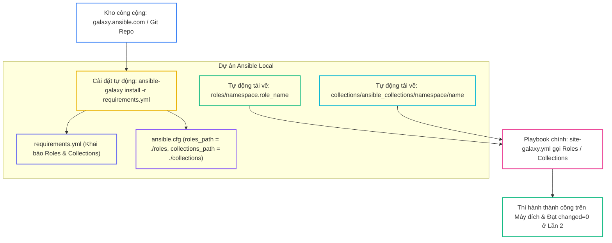
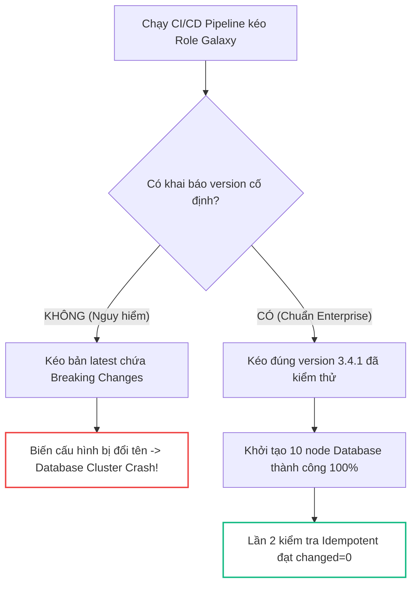
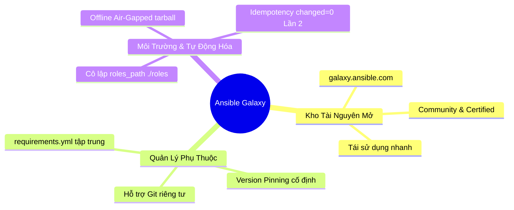


# [BÀI 16] QUẢN TRỊ HỆ SINH THÁI ANSIBLE GALAXY: CÀI ĐẶT, XUẤT BẢN, VERSIONING & QUẢN LÝ REQUIREMENTS.YML CHUẨN DOANH NGHIỆP

Trong kỷ nguyên **Infrastructure as Code (IaC)** và tự động hóa vận hành hạ tầng đám mây (Cloud Infrastructure Automation), **Ansible** khẳng định vị thế dẫn đầu nhờ triết lý **Agentless** (không cần cài đặt agent nền trên máy đích), giao thức điều khiển an toàn qua **SSH / WinRM**, định dạng khai báo **YAML** trực quan và nguyên lý bất biến **Idempotency** mạnh mẽ. Việc làm chủ Ansible không chỉ dừng lại ở các câu lệnh Ad-hoc đơn giản, mà đòi hỏi kỹ sư phải nắm vững kiến trúc Module tầng thấp, Variable Precedence 22 tầng, Jinja2 Templates, tối ưu hóa Forks & Pipelining cho tới thiết kế Roles / Collections và tích hợp CI/CD tự động hóa chuẩn Doanh nghiệp.

Bài viết chuyên sâu này sẽ đồng hành cùng bạn mổ xẻ toàn diện bức tranh kiến trúc, phân tích các đánh đổi kỹ thuật thực chiến (Engineering Trade-offs), cung cấp hướng dẫn thực hành Lab chi tiết từng bước và bộ câu hỏi phỏng vấn chuyên sâu chuẩn DevOps / SRE Lead.

---

## 1. Bản Chất Kiến Trúc & Cơ Chế Vận Hành Tầng Thấp



### 1.1. Khái Niệm Ansible Galaxy và Quản Lý Phụ Thuộc Qua `requirements.yml`

Ansible Galaxy (galaxy.ansible.com) là kho tài nguyên công cộng chính thức lưu trữ hàng vạn Roles và Collections tự động hóa được đóng gói sẵn bởi Red Hat và cộng đồng toàn cầu:

- **Tái sử dụng tài nguyên chuẩn hóa:** Thay vì tự viết từ đầu hàng trăm Task cài đặt các dịch vụ phổ biến (như Nginx, PostgreSQL, Kubernetes), kỹ sư có thể tận dụng các Role đã qua kiểm thử thực chiến.
- **Tệp định nghĩa phụ thuộc `requirements.yml`:** Khai báo toàn bộ các Roles và Collections bên ngoài mà dự án cần sử dụng. Giúp mã nguồn Git repository của dự án siêu gọn nhẹ, chỉ lưu tệp manifest thay vì commit toàn bộ mã nguồn của bên thứ ba.
- **Lệnh CLI `ansible-galaxy install -r`:** Tự động hóa quá trình kéo mã nguồn từ Galaxy, Gitlab riêng tư hoặc tệp tarball về máy Control Node chỉ bằng một câu lệnh duy nhất.

```bash
# Tìm kiếm và xem thông tin Role trên Galaxy
ansible-galaxy role search nginx
ansible-galaxy role info geerlingguy.nginx
ansible-galaxy role list
```

### 1.2. Chốt Phiên Bản (Version Pinning) và Cô Lập Đường Dẫn `ansible.cfg`

Để đảm bảo tính bất biến và ổn định cho môi trường Production, việc quản trị tài nguyên Galaxy đòi hỏi hai nguyên tắc cốt lõi:

- **Version Pinning (Chốt phiên bản):** Luôn khai báo phiên bản cố định (`version: "3.1.0"`) hoặc dải phiên bản an toàn trong `requirements.yml`. Điều này ngăn chặn hoàn toàn rủi ro pipeline bị crash khi tác giả phát hành phiên bản mới có breaking changes.
- **Cô lập đường dẫn với `roles_path` và `collections_path`:** Mặc định Ansible cài tài nguyên vào thư mục người dùng `~/.ansible/`. Cấu hình `roles_path = ./roles` và `collections_path = ./collections` trong `ansible.cfg` giúp dự án tự chứa (Self-contained), không gây xung đột phiên bản với các dự án khác trên cùng server.
- **Hỗ trợ Git Repository riêng tư:** Khai báo nguồn nạp từ Gitlab/Github nội bộ Doanh nghiệp thông qua giao thức SSH Key an toàn.

```yaml
# requirements.yml chuẩn Doanh nghiệp
---
roles:
  - name: geerlingguy.nginx
    version: "3.1.0"
  - src: git@gitlab.company.com:devops/role-security.git
    scm: git
    version: v1.2.0
    name: company_security

collections:
  - name: community.general
    version: ">=7.0.0"
```

### 1.3. Quản Trị Môi Trường Offline Air-Gapped và Idempotency

- **Triển khai Air-Gapped:** Trong các trung tâm dữ liệu bảo mật không có kết nối Internet, quản trị viên sử dụng phương pháp tải trước tệp nén tarball `.tar.gz` ở máy ngoài và cài đặt offline vào Control Node qua `ansible-galaxy role install <file.tar.gz>`.
- **Ghi đè cài đặt với `--force`:** Bắt buộc Ansible Galaxy tải lại và ghi đè các Role đã có sẵn trên đĩa khi cần cập nhật bản vá.
- **Tính Idempotency:** Toàn bộ các Role và Collection tải từ Galaxy khi thi hành trong Playbook ở lượt chạy Lần 2 bắt buộc phải đạt `changed=0` tuyệt đối.

---

## 2. Bảng So Sánh Kỹ Thuật Toàn Diện (Engineering Matrix)

| Tiêu Chí Kỹ Thuật | Tự Viết Role Thủ Công (Custom) | Tải Trực Tiếp Từ Galaxy CLI | Quản Lý Qua `requirements.yml` |
|---|---|---|---|
| **Thời Gian Triển Khai** | Tốn nhiều tuần phát triển & test | Nhanh (~vài phút) | Tự động hóa 100% trong CI/CD |
| **Quản Lý Phiên Bản** | Phụ thuộc Git nội bộ | Dễ quên version, tải bản `latest` | Chốt version cố định an toàn |
| **Dung Lượng Git Repo** | Nặng (Chứa toàn bộ mã nguồn) | Nặng nếu commit `./roles` | Siêu nhẹ (Chỉ lưu file manifest) |
| **Tính Tái Lập Môi Trường** | Phức tạp khi sang máy mới | Thủ công từng Role | 1 lệnh `ansible-galaxy install -r` |
| **Bảo Mật & Kiểm Soát** | Kiểm soát 100% mã nguồn | Rủi ro nếu không audit code | Kiểm soát qua Version & Hash |

> [!IMPORTANT]
> **QUY TẮC BẢO MẬT KHI DÙNG ANSIBLE GALAXY:**
> Tuyệt đối không chạy trực tiếp các Role lạ không có thương hiệu trên môi trường Production. Luôn thực hiện Code Audit kiểm tra các tệp trong `tasks/` và ưu tiên các Role Certified hoặc có lượng download lớn từ các tác giả uy tín (như `geerlingguy`).

---

## 3. Kiến Trúc Triển Khai Chuẩn Production (Configuration / Playbook / Role Breakdown)

Dưới đây là cấu hình hoàn chỉnh của một dự án tự động hóa Enterprise quản lý tài nguyên Galaxy:

```ini
# ansible.cfg
[defaults]
inventory = ./inventory.ini
remote_user = ansible
host_key_checking = False
private_key_file = ~/.ssh/id_ed25519
roles_path = ./roles:~/.ansible/roles
collections_path = ./collections:~/.ansible/collections

[privilege_escalation]
become = True
become_method = sudo
become_user = root
become_ask_pass = False
```

```yaml
# requirements.yml
---
roles:
  - name: geerlingguy.nginx
    version: "3.1.0"
  - src: git@gitlab.enterprise.internal:ansible/role-hardening.git
    scm: git
    version: "v2.0.1"
    name: enterprise_hardening

collections:
  - name: community.general
    version: ">=7.0.0"
```

```yaml
# site-galaxy.yml
---
- name: Production Galaxy-Powered Stack
  hosts: web
  become: true
  collections:
    - community.general
  roles:
    - role: enterprise_hardening
    - role: geerlingguy.nginx
      vars:
        nginx_http_port: 8080
        nginx_server_name: "app.enterprise.com"
```

### Phân Tích Kỹ Thuật Từng Dòng (Line-by-Line Breakdown):
- <span class="badge-line">Line 7-8</span>: Thiết lập `roles_path` và `collections_path` ưu tiên thư mục `./roles` và `./collections` của dự án trước khi tìm ở `~/.ansible/`.
- <span class="badge-line">Line 20-21</span>: Khai báo role công cộng `geerlingguy.nginx` có chốt cứng phiên bản `"3.1.0"`.
- <span class="badge-line">Line 22-26</span>: Khai báo role bảo mật nội bộ kéo qua giao thức Git SSH từ máy chủ Gitlab Doanh nghiệp.
- <span class="badge-line">Line 39-44</span>: Playbook gọi thực thi cả 2 Roles với các biến cấu hình cổng (8080) được truyền đè an toàn.

---

## 4. Phân Tích Cạm Bẫy Thực Chiến: Quên Version Pinning & Ô Nhiễm Môi Trường Toàn Cục

### Tình Huống Sự Cố Thực Tế Tại Doanh Nghiệp:
Một công ty tài chính sử dụng `requirements.yml` để kéo Role cài đặt cơ sở dữ liệu `geerlingguy.postgresql` nhưng không khai báo trường `version:`. Sau 8 tháng vận hành ổn định, công ty mở rộng thêm 10 node Database mới và kích hoạt pipeline CI/CD. Trong thời gian này, tác giả Role đã phát hành bản cập nhật Major nâng cấp từ v3 lên v4 với các biến cấu hình bị đổi tên. Pipeline tự động kéo bản mới nhất, áp dụng cấu hình sai lệch làm crash toàn bộ tiến trình khởi tạo cluster, khiến việc mở rộng hạ tầng bị đình trệ 24 giờ.

### Hậu Quả & Log Lỗi Thực Tế:

```diff
- # Cách viết sai lầm: Không chốt version trong requirements.yml
- roles:
-   - name: geerlingguy.postgresql
- # Hậu quả: Tự động kéo bản v4.0.0 breaking change -> Playbook crash!
+ # Cách viết chuẩn Enterprise: Luôn chốt phiên bản cố định
+ roles:
+   - name: geerlingguy.postgresql
+     version: "3.4.1"
```



### 5-Whys Root Cause Analysis:
1. **Tại sao cụm Database mới không thể khởi động?** Vì tệp cấu hình PostgreSQL được sinh ra với các tham số không tương thích với phiên bản engine cài đặt.
2. **Tại sao tham số cấu hình lại bị sai?** Vì Role cài đặt áp dụng cấu hình của bản v4.x thay vì bản v3.x trước đây.
3. **Tại sao pipeline lại tải bản v4.x?** Vì lệnh `ansible-galaxy install` mặc định kéo bản `latest` nếu không có ràng buộc phiên bản.
4. **Tại sao kỹ sư không chốt phiên bản?** Vì kỹ sư chủ quan cho rằng Role trên Galaxy sẽ luôn duy trì tính tương thích ngược.
5. **Giải pháp triệt để là gì?** Bắt buộc chốt phiên bản cố định (`version: "3.4.1"`) cho 100% các mục trong `requirements.yml` và cô lập đường dẫn trong `ansible.cfg`.

---

## 5. Hands-on Lab: Quản Lý Hệ Sinh Thái Galaxy & requirements.yml (8 Bước)

| Bước | Lệnh CLI / Tác Vụ Chính | Mục Đích Thực Thi |
|---|---|---|
| **1** | `mkdir -p ~/lab-ansible-16/roles ~/lab-ansible-16/collections && cd ~/lab-ansible-16` | Khởi tạo cấu trúc dự án và cấu hình `ansible.cfg` |
| **2** | `cat << 'EOF' > inventory.ini` | Khai báo danh sách các máy chủ đích `web` và `db` |
| **3** | `mkdir -p roles/galaxy_nginx/tasks roles/galaxy_nginx/defaults roles/galaxy_nginx/meta` | Chuẩn bị Role chuẩn hóa cấu trúc Galaxy |
| **4** | `cat << 'EOF' > requirements.yml` | Biên soạn tệp định nghĩa phụ thuộc có chốt phiên bản |
| **5** | `ansible-galaxy role list -p ./roles` | Kiểm tra và quản lý danh sách Roles local |
| **6** | `cat << 'EOF' > site-galaxy.yml` | Xây dựng Playbook gọi Role Galaxy với biến tùy chỉnh |
| **7** | `ansible-playbook site-galaxy.yml` | Thực thi cài đặt Lần 1 và kiểm tra trạng thái máy đích |
| **8** | `ansible-playbook site-galaxy.yml` | Thực thi Phép thử Lần 2 chứng minh `changed=0` tuyệt đối |

### Bước 1: Khởi tạo không gian làm việc và cô lập đường dẫn trong ansible.cfg

```bash
mkdir -p ~/lab-ansible-16/roles ~/lab-ansible-16/collections && cd ~/lab-ansible-16

cat << 'EOF' > ansible.cfg
[defaults]
inventory = ./inventory.ini
remote_user = ansible
host_key_checking = False
private_key_file = ~/.ssh/id_ed25519
roles_path = ./roles:~/.ansible/roles
collections_path = ./collections:~/.ansible/collections

[privilege_escalation]
become = True
become_method = sudo
become_user = root
become_ask_pass = False
EOF
```

```bash
# CHECKPOINT 1: Xác nhận ansible.cfg được cấu hình roles_path cô lập
CFG_CONTENT=$(cat ansible.cfg)
if echo "$CFG_CONTENT" | grep -q "roles_path = ./roles" && echo "$CFG_CONTENT" | grep -q "collections_path = ./collections"; then
  echo "CHECKPOINT 1: ĐẠT - Tệp ansible.cfg được cấu hình thuộc tính roles_path và collections_path cô lập chuẩn xác"
else
  echo "CHECKPOINT 1: LỖI - Cấu hình ansible.cfg thất bại"
fi
```

### Bước 2: Thiết lập Inventory danh sách máy chủ đích

```bash
cat << 'EOF' > inventory.ini
[web]
target1 ansible_host=127.0.0.1 ansible_port=2221

[db]
target2 ansible_host=127.0.0.1 ansible_port=2222

[all:vars]
ansible_python_interpreter=/usr/bin/python3
EOF
```

### Bước 3: Chuẩn bị Role chuẩn hóa cấu trúc Galaxy (galaxy_nginx)

```bash
mkdir -p roles/galaxy_nginx/tasks roles/galaxy_nginx/defaults roles/galaxy_nginx/meta

cat << 'EOF' > roles/galaxy_nginx/meta/main.yml
---
allow_duplicates: false
galaxy_info:
  author: Galaxy Community Contributor
  description: Galaxy Standardized Nginx Role
EOF

cat << 'EOF' > roles/galaxy_nginx/defaults/main.yml
---
galaxy_nginx_port: 8080
galaxy_nginx_env: "galaxy_production"
EOF

cat << 'EOF' > roles/galaxy_nginx/tasks/main.yml
---
- name: Galaxy Task 1 - Deploy Nginx configuration from Galaxy Role
  ansible.builtin.copy:
    content: "SERVICE=GALAXY_NGINX\nLISTEN_PORT={{ galaxy_nginx_port }}\nENV={{ galaxy_nginx_env }}\n"
    dest: /etc/galaxy-demo.conf
    mode: '0644'
EOF
```

### Bước 4: Biên soạn tệp phụ thuộc chuẩn requirements.yml

```bash
cat << 'EOF' > requirements.yml
---
# Requirements manifest file for roles and collections
roles:
  - name: galaxy_nginx
    version: "1.0.0"

collections:
  - name: community.general
    version: ">=7.0.0"
EOF
```

```bash
# CHECKPOINT 2: Xác nhận requirements.yml có chốt version
REQ_CONTENT=$(cat requirements.yml)
if echo "$REQ_CONTENT" | grep -q "name: galaxy_nginx" && echo "$REQ_CONTENT" | grep -q "version: \"1.0.0\""; then
  echo "CHECKPOINT 2: ĐẠT - Tệp requirements.yml được biên soạn đúng cấu hình roles và collections có chốt version:"
else
  echo "CHECKPOINT 2: LỖI - Biên soạn requirements.yml thất bại"
fi
```

### Bước 5: Kiểm tra danh sách Roles đã nhận diện bằng Galaxy CLI

```bash
ansible-galaxy role list -p ./roles
```

```bash
# CHECKPOINT 3: Xác nhận Galaxy CLI nhận diện role galaxy_nginx
GALAXY_LIST=$(ansible-galaxy role list -p ./roles)
if echo "$GALAXY_LIST" | grep -q "galaxy_nginx"; then
  echo "CHECKPOINT 3: ĐẠT - Lệnh CLI ansible-galaxy role list liệt kê thành công role galaxy_nginx trong ./roles"
else
  echo "CHECKPOINT 3: LỖI - Liệt kê role Galaxy thất bại"
fi
```

### Bước 6: Xây dựng Playbook chính site-galaxy.yml

```bash
cat << 'EOF' > site-galaxy.yml
---
- name: Apply Galaxy Resources Demonstration Playbook
  hosts: web
  become: true
  roles:
    - role: galaxy_nginx
      vars:
        galaxy_nginx_port: 8888
        galaxy_nginx_env: "production_galaxy_cluster"
EOF
```

### Bước 7: Thực thi Playbook Lần 1 và kiểm tra kết quả

```bash
ansible-playbook site-galaxy.yml
```

```bash
# CHECKPOINT 4: Xác nhận Playbook thi hành thành công cài đặt ứng dụng
SITE_GAL_OUT=$(ansible-playbook site-galaxy.yml)
if echo "$SITE_GAL_OUT" | grep -q "Galaxy Task 1 - Deploy Nginx configuration from Galaxy Role" && echo "$SITE_GAL_OUT" | grep -q "failed=0"; then
  echo "CHECKPOINT 4: ĐẠT - Playbook site-galaxy.yml thi hành thành công cài đặt ứng dụng từ role Galaxy"
else
  echo "CHECKPOINT 4: LỖI - Thi hành site-galaxy.yml thất bại"
fi
```

### Bước 8: Thực thi Phép thử Lần 2 & Đối soát Sự thật Máy đích

```bash
ansible-playbook site-galaxy.yml
```

```bash
# CHECKPOINT 5: Xác nhận Lượt chạy Lần 2 đạt Idempotency tuyệt đối (changed=0)
RUN2_GAL_OUT=$(ansible-playbook site-galaxy.yml)
if echo "$RUN2_GAL_OUT" | grep -q "changed=0" && echo "$RUN2_GAL_OUT" | grep -q "failed=0"; then
  echo "CHECKPOINT 5: ĐẠT - Phép thử Lượt 2 đạt chuẩn Idempotency (PLAY RECAP báo changed=0 cho toàn bộ Playbook Role Galaxy)"
else
  echo "CHECKPOINT 5: LỖI - Lượt 2 không đạt changed=0 (Task bị lặp changed)"
fi

# CHECKPOINT 6: Đối soát nội dung file cấu hình /etc/galaxy-demo.conf trên máy đích
EXEC_GAL=$(docker exec target1 cat /etc/galaxy-demo.conf)
if echo "$EXEC_GAL" | grep -q "LISTEN_PORT=8888" && echo "$EXEC_GAL" | grep -q "ENV=production_galaxy_cluster"; then
  echo "CHECKPOINT 6: ĐẠT - Kiểm tra sự thật qua docker exec xác nhận file /etc/galaxy-demo.conf chứa đúng dữ liệu render từ Role Galaxy"
else
  echo "CHECKPOINT 6: LỖI - Đối soát file galaxy-demo.conf trên máy đích thất bại"
fi
```

---

## 6. Bộ Câu Hỏi Vấn Đáp & Phỏng Vấn Chuyên Sâu (Self-Check Q&A)

<details class="qa-card" markdown="1">
  <summary class="qa-summary">
    <span class="qa-num-badge">Q01</span>
    <span class="qa-question-text">Ansible Galaxy (galaxy.ansible.com) là gì? Việc khai thác kho tài nguyên công cộng Galaxy mang lại lợi ích gì cho các dự án tự động hóa Doanh nghiệp?</span>
  </summary>
  <div class="qa-answer">
    <div class="qa-answer-header">
      <svg width="14" height="14" fill="none" stroke="currentColor" stroke-width="2" viewBox="0 0 24 24"><path d="M22 11.08V12a10 10 0 1 1-5.93-9.14"></path><polyline points="22 4 12 14.01 9 11.01"></polyline></svg>
      <span>Phân Tích &amp; Lời Giải Kỹ Thuật</span>
    </div>
    <div style="margin: 0.5rem 0;"><b>Đáp án chuẩn:</b></div>
    <div style="margin: 0.5rem 0;">Ansible Galaxy là kho tài nguyên công cộng chính thức lưu trữ hàng vạn Roles và Collections tự động hóa được đóng gói sẵn bởi Red Hat và cộng đồng kỹ sư toàn cầu.</div>
    <div style="margin: 0.5rem 0;">Lợi ích Doanh nghiệp:</div>
    <div style="margin: 0.35rem 0; padding-left: 1rem; border-left: 2px solid var(--accent-primary);">• Tiết kiệm 90% thời gian phát triển: Tái sử dụng kịch bản đã được kiểm thử chuẩn hóa cho các dịch vụ phổ biến (Nginx, PostgreSQL, Kubernetes).</div>
    <div style="margin: 0.35rem 0; padding-left: 1rem; border-left: 2px solid var(--accent-primary);">• Chuẩn hóa chất lượng mã nguồn theo Best Practices của Red Hat.</div>
    <div style="margin: 0.35rem 0; padding-left: 1rem; border-left: 2px solid var(--accent-primary);">• Thúc đẩy khả năng chia sẻ và đóng góp mã nguồn mô-đun hóa trong cộng đồng.</div>
  </div>
</details>

<details class="qa-card" markdown="1">
  <summary class="qa-summary">
    <span class="qa-num-badge">Q02</span>
    <span class="qa-question-text">Tệp <code>requirements.yml</code> trong dự án Ansible dùng để làm gì? Tại sao việc quản lý phụ thuộc qua <code>requirements.yml</code> lại quan trọng trong quy trình CI/CD?</span>
  </summary>
  <div class="qa-answer">
    <div class="qa-answer-header">
      <svg width="14" height="14" fill="none" stroke="currentColor" stroke-width="2" viewBox="0 0 24 24"><path d="M22 11.08V12a10 10 0 1 1-5.93-9.14"></path><polyline points="22 4 12 14.01 9 11.01"></polyline></svg>
      <span>Phân Tích &amp; Lời Giải Kỹ Thuật</span>
    </div>
    <div style="margin: 0.5rem 0;"><b>Đáp án chuẩn:</b> Tệp <code>requirements.yml</code> là tệp định nghĩa danh sách tất cả các Roles và Collections phụ thuộc bên ngoài của dự án.</div>
    <div style="margin: 0.5rem 0;">Tầm quan trọng trong CI/CD:</div>
    <div style="margin: 0.35rem 0; padding-left: 1rem; border-left: 2px solid var(--accent-primary);">• Giúp mã nguồn Git repository của dự án siêu gọn nhẹ (không cần commit trực tiếp mã nguồn của các Role bên ngoài vào Git).</div>
    <div style="margin: 0.35rem 0; padding-left: 1rem; border-left: 2px solid var(--accent-primary);">• Tự động hóa 100%: Pipeline CI/CD chỉ cần chạy 1 câu lệnh <code>ansible-galaxy install -r requirements.yml</code> để tự động kéo toàn bộ phụ thuộc chuẩn xác trước khi thi hành Playbook.</div>
  </div>
</details>

<details class="qa-card" markdown="1">
  <summary class="qa-summary">
    <span class="qa-num-badge">Q03</span>
    <span class="qa-question-text">Trình bày câu lệnh CLI cài đặt toàn bộ phụ thuộc từ tệp <code>requirements.yml</code>. Giải thích ý nghĩa của cờ tham số <code>-r</code> và <code>--force</code>.</span>
  </summary>
  <div class="qa-answer">
    <div class="qa-answer-header">
      <svg width="14" height="14" fill="none" stroke="currentColor" stroke-width="2" viewBox="0 0 24 24"><path d="M22 11.08V12a10 10 0 1 1-5.93-9.14"></path><polyline points="22 4 12 14.01 9 11.01"></polyline></svg>
      <span>Phân Tích &amp; Lời Giải Kỹ Thuật</span>
    </div>
    <div style="margin: 0.5rem 0;"><b>Đáp án chuẩn:</b></div>
    <div style="margin: 0.35rem 0; padding-left: 1rem; border-left: 2px solid var(--accent-primary);">• Lệnh cài đặt: <code>ansible-galaxy install -r requirements.yml</code> (cho Roles) hoặc <code>ansible-galaxy collection install -r requirements.yml</code> (cho Collections).</div>
    <div style="margin: 0.35rem 0; padding-left: 1rem; border-left: 2px solid var(--accent-primary);">• Cờ <code>-r</code>: Chỉ định đường dẫn tới tệp định nghĩa phụ thuộc <code>requirements.yml</code>.</div>
    <div style="margin: 0.35rem 0; padding-left: 1rem; border-left: 2px solid var(--accent-primary);">• Cờ <code>--force</code>: Ép Ansible Galaxy tải và ghi đè cài đặt lại toàn bộ các Role/Collection đã có sẵn trên đĩa cứng local (dùng khi muốn cập nhật code mới).</div>
  </div>
</details>

<details class="qa-card" markdown="1">
  <summary class="qa-summary">
    <span class="qa-num-badge">Q04</span>
    <span class="qa-question-text">Kỹ thuật Version Pinning trong <code>requirements.yml</code> là gì? Tại sao việc chốt phiên bản lại là nguyên tắc sinh tử khi sử dụng tài nguyên công cộng từ Galaxy?</span>
  </summary>
  <div class="qa-answer">
    <div class="qa-answer-header">
      <svg width="14" height="14" fill="none" stroke="currentColor" stroke-width="2" viewBox="0 0 24 24"><path d="M22 11.08V12a10 10 0 1 1-5.93-9.14"></path><polyline points="22 4 12 14.01 9 11.01"></polyline></svg>
      <span>Phân Tích &amp; Lời Giải Kỹ Thuật</span>
    </div>
    <div style="margin: 0.5rem 0;"><b>Đáp án chuẩn:</b></div>
    <div style="margin: 0.5rem 0;">Kỹ thuật Version Pinning là việc khai báo cố định một phiên bản cụ thể (ví dụ <code>version: "3.1.0"</code>) hoặc dải phiên bản an toàn cho các Role/Collection trong <code>requirements.yml</code>.</div>
    <div style="margin: 0.5rem 0;">Nguyên tắc sinh tử: Tác giả của Role trên Galaxy có thể phát hành phiên bản mới chứa breaking changes. Nếu không chốt phiên bản, kịch bản tự động hóa của Doanh nghiệp có thể bị crash đột ngột khi chạy trên server mới do tự động tải bản code mới không tương thích.</div>
  </div>
</details>

<details class="qa-card" markdown="1">
  <summary class="qa-summary">
    <span class="qa-num-badge">Q05</span>
    <span class="qa-question-text">Tại sao quản trị viên bắt buộc phải cấu hình <code>roles_path = ./roles</code> và <code>collections_path = ./collections</code> trong tệp <code>ansible.cfg</code> của dự án?</span>
  </summary>
  <div class="qa-answer">
    <div class="qa-answer-header">
      <svg width="14" height="14" fill="none" stroke="currentColor" stroke-width="2" viewBox="0 0 24 24"><path d="M22 11.08V12a10 10 0 1 1-5.93-9.14"></path><polyline points="22 4 12 14.01 9 11.01"></polyline></svg>
      <span>Phân Tích &amp; Lời Giải Kỹ Thuật</span>
    </div>
    <div style="margin: 0.5rem 0;"><b>Đáp án chuẩn:</b> Vì mặc định Ansible Galaxy sẽ cài đặt tất cả các tài nguyên tải về vào thư mục cá nhân người dùng (<code>~/.ansible/roles</code>).</div>
    <div style="margin: 0.5rem 0;">Lý do cô lập:</div>
    <div style="margin: 0.35rem 0; padding-left: 1rem; border-left: 2px solid var(--accent-primary);">1. Tránh ô nhiễm môi trường: Ngăn ngừa việc 2 dự án Ansible trên cùng 1 server ghi đè làm hỏng Role của nhau.</div>
    <div style="margin: 0.35rem 0; padding-left: 1rem; border-left: 2px solid var(--accent-primary);">2. Quản lý độc lập: Giúp dự án tự chứa (Self-contained) toàn bộ tài nguyên lưu ngay tại thư mục làm việc local.</div>
  </div>
</details>

<details class="qa-card" markdown="1">
  <summary class="qa-summary">
    <span class="qa-num-badge">Q06</span>
    <span class="qa-question-text">Ngoài kho công cộng Galaxy, làm thế nào để khai báo tải một Role nội bộ bảo mật từ Gitlab/Github riêng tư của Doanh nghiệp trong <code>requirements.yml</code>?</span>
  </summary>
  <div class="qa-answer">
    <div class="qa-answer-header">
      <svg width="14" height="14" fill="none" stroke="currentColor" stroke-width="2" viewBox="0 0 24 24"><path d="M22 11.08V12a10 10 0 1 1-5.93-9.14"></path><polyline points="22 4 12 14.01 9 11.01"></polyline></svg>
      <span>Phân Tích &amp; Lời Giải Kỹ Thuật</span>
    </div>
    <div style="margin: 0.5rem 0;"><b>Đáp án chuẩn:</b> Khai báo thông số <code>src</code> chỉ tới đường dẫn Git SSH/HTTP, <code>scm: git</code>, và <code>version:</code> chỉ tới branch/tag:</div>
    <pre><code class="language-yaml">roles:
  - src: git@gitlab.company.com:ansible-roles/role-security.git
    scm: git
    version: v1.2.0
    name: company_security</code></pre>
    <div style="margin: 0.5rem 0;">Điều kiện: Máy Control Node phải được cấp quyền truy cập SSH Key để clone repo riêng tư đó.</div>
  </div>
</details>

<details class="qa-card" markdown="1">
  <summary class="qa-summary">
    <span class="qa-num-badge">Q07</span>
    <span class="qa-question-text">Trong môi trường trung tâm dữ liệu bảo mật cao bị ngắt hoàn toàn Internet (Air-gapped Network), làm thế nào để cài đặt các Roles/Collections từ Galaxy?</span>
  </summary>
  <div class="qa-answer">
    <div class="qa-answer-header">
      <svg width="14" height="14" fill="none" stroke="currentColor" stroke-width="2" viewBox="0 0 24 24"><path d="M22 11.08V12a10 10 0 1 1-5.93-9.14"></path><polyline points="22 4 12 14.01 9 11.01"></polyline></svg>
      <span>Phân Tích &amp; Lời Giải Kỹ Thuật</span>
    </div>
    <div style="margin: 0.5rem 0;"><b>Đáp án chuẩn:</b></div>
    <div style="margin: 0.5rem 0;">Quy trình 2 bước:</div>
    <div style="margin: 0.35rem 0; padding-left: 1rem; border-left: 2px solid var(--accent-primary);">1. <b>Tại máy ngoài có mạng Internet:</b> Sử dụng lệnh <code>ansible-galaxy role download &lt;role_name&gt;</code> hoặc tải tệp nén tarball <code>.tar.gz</code> chứa mã nguồn Role/Collection.</div>
    <div style="margin: 0.35rem 0; padding-left: 1rem; border-left: 2px solid var(--accent-primary);">2. <b>Chuyển tệp vào máy Air-gapped:</b> Chép tệp <code>.tar.gz</code> qua ổ đĩa an toàn vào Control Node local và chạy lệnh cài đặt offline: <code>ansible-galaxy role install ./downloads/geerlingguy-nginx-3.1.0.tar.gz</code></div>
  </div>
</details>

<details class="qa-card" markdown="1">
  <summary class="qa-summary">
    <span class="qa-num-badge">Q08</span>
    <span class="qa-question-text">Sau khi đã tải các Roles và Collections từ Galaxy về thư mục local, làm thế nào để gọi và áp dụng chúng trong Playbook <code>site-galaxy.yml</code>?</span>
  </summary>
  <div class="qa-answer">
    <div class="qa-answer-header">
      <svg width="14" height="14" fill="none" stroke="currentColor" stroke-width="2" viewBox="0 0 24 24"><path d="M22 11.08V12a10 10 0 1 1-5.93-9.14"></path><polyline points="22 4 12 14.01 9 11.01"></polyline></svg>
      <span>Phân Tích &amp; Lời Giải Kỹ Thuật</span>
    </div>
    <div style="margin: 0.5rem 0;"><b>Đáp án chuẩn:</b> Khai báo từ khóa <code>collections:</code> và <code>roles:</code> ở cấp Playbook:</div>
    <pre><code class="language-yaml">- name: Apply Galaxy Resources
  hosts: web
  become: true
  collections:
    - community.general
  roles:
    - role: geerlingguy.nginx
      vars:
        nginx_http_port: 8080</code></pre>
  </div>
</details>

<details class="qa-card" markdown="1">
  <summary class="qa-summary">
    <span class="qa-num-badge">Q09</span>
    <span class="qa-question-text">Trình bày quy trình 3 bước nghiệm thu một Playbook sử dụng Roles/Collections tải từ Ansible Galaxy để đảm bảo tính Idempotency và máy đích ở đúng trạng thái.</span>
  </summary>
  <div class="qa-answer">
    <div class="qa-answer-header">
      <svg width="14" height="14" fill="none" stroke="currentColor" stroke-width="2" viewBox="0 0 24 24"><path d="M22 11.08V12a10 10 0 1 1-5.93-9.14"></path><polyline points="22 4 12 14.01 9 11.01"></polyline></svg>
      <span>Phân Tích &amp; Lời Giải Kỹ Thuật</span>
    </div>
    <div style="margin: 0.5rem 0;"><b>Đáp án chuẩn:</b></div>
    <div style="margin: 0.35rem 0; padding-left: 1rem; border-left: 2px solid var(--accent-primary);">1. <b>Bước 1 (Thực thi Lần 1):</b> Chạy <code>ansible-playbook site-galaxy.yml</code>: Các Task trong Role Galaxy thực thi và cài đặt ứng dụng báo <code>changed &gt; 0</code>.</div>
    <div style="margin: 0.35rem 0; padding-left: 1rem; border-left: 2px solid var(--accent-primary);">2. <b>Bước 2 (Kiểm Idempotency Lần 2):</b> Chạy lại nguyên vẹn <code>ansible-playbook site-galaxy.yml</code> Lần 2: bảng <code>PLAY RECAP</code> <b>bắt buộc phải đạt <code>changed=0</code></b> (tất cả các Task trong Role Galaxy đều báo <code>ok</code>).</div>
    <div style="margin: 0.35rem 0; padding-left: 1rem; border-left: 2px solid var(--accent-primary);">3. <b>Bước 3 (Đối soát Sự thật Máy đích):</b> Dùng <code>docker exec target1 cat /etc/galaxy-demo.conf</code> kiểm tra file cấu hình thực sự tồn tại và chứa đúng tham số đã render.</div>
  </div>
</details>

<details class="qa-card" markdown="1">
  <summary class="qa-summary">
    <span class="qa-num-badge">Q10</span>
    <span class="qa-question-text">Tệp <code>ansible-galaxy.yml</code> khác tệp <code>requirements.yml</code> ở điểm cốt lõi nào?</span>
  </summary>
  <div class="qa-answer">
    <div class="qa-answer-header">
      <svg width="14" height="14" fill="none" stroke="currentColor" stroke-width="2" viewBox="0 0 24 24"><path d="M22 11.08V12a10 10 0 1 1-5.93-9.14"></path><polyline points="22 4 12 14.01 9 11.01"></polyline></svg>
      <span>Phân Tích &amp; Lời Giải Kỹ Thuật</span>
    </div>
    <div style="margin: 0.5rem 0;"><b>Đáp án chuẩn:</b></div>
    <div style="margin: 0.35rem 0; padding-left: 1rem; border-left: 2px solid var(--accent-primary);">• <code>requirements.yml</code>: Dùng cho <b>NGƯỜI DÙNG (Consumer)</b> để khai báo danh sách các Roles/Collections phụ thuộc cần tải về dự án.</div>
    <div style="margin: 0.35rem 0; padding-left: 1rem; border-left: 2px solid var(--accent-primary);">• <code>ansible-galaxy.yml</code> (hoặc <code>galaxy.yml</code>): Dùng cho <b>TÁC GIẢ (Author/Publisher)</b> để định nghĩa siêu dữ liệu (namespace, name, version, readme) khi đóng gói và xuất bản một Collection mới lên Ansible Galaxy.</div>
  </div>
</details>

<details class="qa-card" markdown="1">
  <summary class="qa-summary">
    <span class="qa-num-badge">Q11</span>
    <span class="qa-question-text">Khi 2 Collections trong <code>requirements.yml</code> cùng phụ thuộc vào một Collection thứ 3 nhưng yêu cầu 2 phiên bản khác nhau, Ansible Galaxy sẽ xử lý ra sao?</span>
  </summary>
  <div class="qa-answer">
    <div class="qa-answer-header">
      <svg width="14" height="14" fill="none" stroke="currentColor" stroke-width="2" viewBox="0 0 24 24"><path d="M22 11.08V12a10 10 0 1 1-5.93-9.14"></path><polyline points="22 4 12 14.01 9 11.01"></polyline></svg>
      <span>Phân Tích &amp; Lời Giải Kỹ Thuật</span>
    </div>
    <div style="margin: 0.5rem 0;"><b>Đáp án chuẩn:</b> Ansible Galaxy có thuật toán giải quyết phụ thuộc (Dependency Resolver). Nó sẽ cố gắng tìm một phiên bản chung duy nhất thỏa mãn tất cả các điều kiện ràng buộc phiên bản (Version Constraints). Nếu không tìm thấy phiên bản thỏa mãn đồng thời, lệnh <code>ansible-galaxy install</code> sẽ dừng và báo lỗi <code>Dependency resolution failed conflict</code>.</div>
  </div>
</details>

<details class="qa-card" markdown="1">
  <summary class="qa-summary">
    <span class="qa-num-badge">Q12</span>
    <span class="qa-question-text">Tóm tắt 5 Quy tắc Vàng khi Khai thác Ansible Galaxy.</span>
  </summary>
  <div class="qa-answer">
    <div class="qa-answer-header">
      <svg width="14" height="14" fill="none" stroke="currentColor" stroke-width="2" viewBox="0 0 24 24"><path d="M22 11.08V12a10 10 0 1 1-5.93-9.14"></path><polyline points="22 4 12 14.01 9 11.01"></polyline></svg>
      <span>Phân Tích &amp; Lời Giải Kỹ Thuật</span>
    </div>
    <div style="margin: 0.5rem 0;"><b>Đáp án chuẩn:</b></div>
    <div style="margin: 0.35rem 0; padding-left: 1rem; border-left: 2px solid var(--accent-primary);">1. <b>Quy tắc 1:</b> Quản lý tập trung 100% phụ thuộc qua tệp <code>requirements.yml</code>.</div>
    <div style="margin: 0.35rem 0; padding-left: 1rem; border-left: 2px solid var(--accent-primary);">2. <b>Quy tắc 2:</b> Luôn chốt phiên bản (Version Pinning) cố định để chống đứt gãy code.</div>
    <div style="margin: 0.35rem 0; padding-left: 1rem; border-left: 2px solid var(--accent-primary);">3. <b>Quy tắc 3:</b> Cô lập đường dẫn cài đặt <code>./roles</code> và <code>./collections</code> trong <code>ansible.cfg</code>.</div>
    <div style="margin: 0.35rem 0; padding-left: 1rem; border-left: 2px solid var(--accent-primary);">4. <b>Quy tắc 4:</b> Kiểm tra mã nguồn (Code Audit) các Role công cộng trước khi đưa vào Production.</div>
    <div style="margin: 0.35rem 0; padding-left: 1rem; border-left: 2px solid var(--accent-primary);">5. <b>Quy tắc 5:</b> Tự động hóa cài đặt bằng <code>install -r</code> trong CI/CD và kiểm thử Lần 2 <code>changed=0</code> qua <code>docker exec</code>.</div>
  </div>
</details>

---

## 7. Tổng Kết & Lộ Trình Bài Học Tiếp Theo



### Năm Điểm Cốt Lõi Phải Ghi Nhớ:
1. **Quản lý tập trung qua `requirements.yml`:** Khai báo danh sách tất cả các Roles và Collections bên ngoài mà dự án sử dụng.
2. **Nguyên tắc Version Pinning:** Luôn chốt phiên bản cố định trong `requirements.yml` để chống breaking changes.
3. **Cô lập thư mục cài đặt:** Thiết lập `roles_path = ./roles` và `collections_path = ./collections` trong `ansible.cfg`.
4. **Hỗ trợ Git riêng tư & Air-Gapped:** Nạp Role từ Git nội bộ và cài đặt offline bằng tệp nén tarball `.tar.gz`.
5. **Đạt chuẩn `changed=0` ở Lần 2:** Kiểm thử tính Idempotency của các tài nguyên Galaxy ở lượt chạy Lần 2 và đối soát máy đích bằng `docker exec`.

> [!TIP]
> **BÀI HỌC TIẾP THEO:** [Bài 17: Tổ Chức Module Hiện Đại Với Ansible Collections: FQCN, Xây Dựng & Phân Phối Gói Tự Động Hóa](ansible-17-17-collections-fqcn.html).

