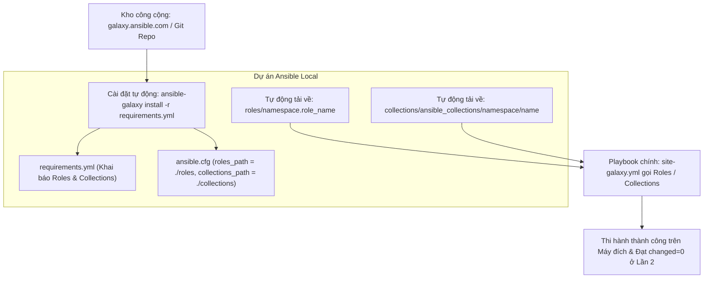
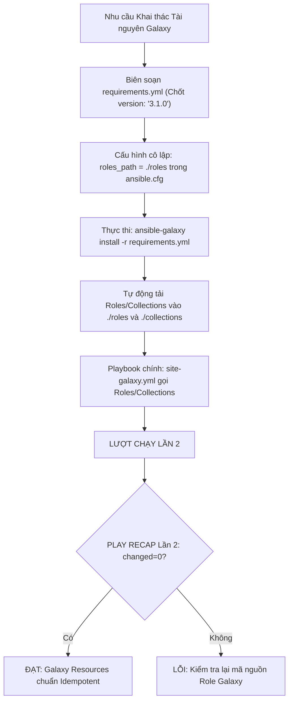
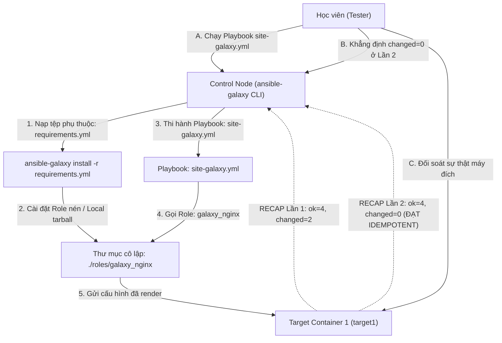


# [BÀI 16] QUẢN TRỊ HỆ SINH THÁI ANSIBLE GALAXY: CÀI ĐẶT, XUẤT BẢN, VERSIONING & QUẢN LÝ REQUIREMENTS.YML CHUẨN DOANH NGHIỆP

Trong kỷ nguyên **Infrastructure as Code (IaC)** và tự động hóa vận hành hạ tầng đám mây (Cloud Infrastructure Automation), **Ansible** khẳng định vị thế dẫn đầu nhờ triết lý **Agentless** (không cần cài đặt agent nền trên máy đích), giao thức điều khiển an toàn qua **SSH / WinRM**, định dạng khai báo **YAML** trực quan và nguyên lý bất biến **Idempotency** mạnh mẽ. Việc làm chủ Ansible không chỉ dừng lại ở các câu lệnh Ad-hoc đơn giản, mà đòi hỏi kỹ sư phải nắm vững kiến trúc Module tầng thấp, Variable Precedence 22 tầng, Jinja2 Templates, tối ưu hóa Forks & Pipelining cho tới thiết kế Roles / Collections và tích hợp CI/CD tự động hóa chuẩn Doanh nghiệp.

Bài viết chuyên sâu này sẽ đồng hành cùng bạn mổ xẻ toàn diện bức tranh kiến trúc, phân tích các đánh đổi kỹ thuật thực chiến (Engineering Trade-offs), cung cấp hướng dẫn thực hành Lab chi tiết từng bước và bộ câu hỏi phỏng vấn chuyên sâu chuẩn DevOps / SRE Lead.

---

## 1. Bản Chất Kiến Trúc & Cơ Chế Vận Hành Tầng Thấp

---


> **Khai thác kho tài nguyên mở Ansible Galaxy giúp tải, quản lý và tự động hóa cài đặt các Roles và Collections chuẩn hóa qua requirements.yml.**

Mở rộng sức mạnh tự động hóa bằng hệ sinh thái cộng đồng toàn cầu (I-10):

> **Trong thực tế tự động hóa Doanh nghiệp, thay vì tự tay viết lại từ đầu hàng trăm Task cài đặt các dịch vụ phổ biến (như Nginx, PostgreSQL, Kubernetes, Docker, AWS), quản trị viên nên khai thác kho tài nguyên công cộng khổng lồ Ansible Galaxy (galaxy.ansible.com). Ansible Galaxy cung cấp hàng vạn Roles và Collections đã được cộng đồng và Red Hat kiểm thử chuẩn hóa. Việc quản lý toàn bộ các phụ thuộc tài nguyên bên ngoài thông qua duy nhất một tệp định nghĩa `requirements.yml` và cài đặt tự động bằng lệnh `ansible-galaxy install -r requirements.yml` giúp kịch bản tự động hóa đạt tính nhất quán 100%, dễ dàng đóng gói CI/CD và luôn duy trì tính Idempotency `changed=0` ở lượt chạy Lần 2.**

---


---


---


| Tiếng Việt | Tiếng Anh / Từ khóa + FQCN (giữ nguyên) |
|---|---|
| Kho tài nguyên mở Ansible | Ansible Galaxy repository (`galaxy.ansible.com`) |
| Công cụ quản lý Galaxy | Galaxy CLI client (`ansible-galaxy`) |
| Tệp định nghĩa phụ thuộc | Dependency manifest file (`requirements.yml`) |
| Chốt phiên bản tài nguyên | Version pinning constraint (`version:`) |
| Đường dẫn lưu trữ Role | Local roles path (`roles_path = ./roles`) |
| Đường dẫn lưu Collections | Local collections path (`collections_path = ./collections`) |
| Cài đặt phụ thuộc tự động | Automated dependency installation (`install -r`) |
| Gói nội dung chuẩn hóa | Ansible Collection (`namespace.collection`) |
| Môi trường mạng cô lập | Air-gapped offline environment |
| Tệp nén tài nguyên offline | Offline tarball archive (`.tar.gz`) |
| Tự động hóa tiến trình build | CI/CD build dependency pipeline |
| Ghi đè cài đặt cũ | Force re-installation (`--force`) |

---

### 1.1. Khái niệm Ansible Galaxy và Lệnh CLI `ansible-galaxy` (15 phút)



**Nguyên lý cốt lõi:** Ansible Galaxy (galaxy.ansible.com) là kho tài nguyên công cộng chính thức lưu trữ hàng vạn Roles và Collections tự động hóa được đóng gói sẵn bởi Red Hat và cộng đồng toàn cầu.

**Giải thích cơ chế ngầm:** Giúp kỹ sư DevOps tiết kiệm hàng trăm giờ tự viết code bằng cách tái sử dụng lại các kịch bản đã được kiểm thử kỹ lưỡng (như role cài đặt Nginx, PostgreSQL, Docker), tăng tốc độ triển khai dự án gấp 10 lần.

> [!WARNING]
> **CẠM BẪY THỰC CHIẾN:**
> Tự gõ lại từ đầu 300 dòng Task cài đặt PostgreSQL thay vì tải một Role PostgreSQL chuẩn hóa từ Ansible Galaxy.

**Minh hoạ.** Sử dụng các lệnh CLI `ansible-galaxy` cơ bản:
```bash
# Tìm kiếm Role trên Galaxy
ansible-galaxy role search nginx

# Xem thông tin chi tiết một Role
ansible-galaxy role info geerlingguy.nginx

# Liệt kê danh sách các Role đã cài đặt
ansible-galaxy role list
```

**Nguyên lý cốt lõi:** Khai báo toàn bộ các Roles và Collections phụ thuộc của dự án vào trong một tệp định nghĩa quy chuẩn duy nhất tên là `requirements.yml`.

**Giải thích cơ chế ngầm:** Giúp mã nguồn dự án gọn nhẹ (không cần commit hàng trăm MB code của các Role bên ngoài vào Git repository), đồng thời giúp đồng đội và hệ thống CI/CD tự động tái tạo chính xác môi trường làm việc chỉ với 1 tệp tin nhỏ.

> [!WARNING]
> **CẠM BẪY THỰC CHIẾN:**
> Commit trực tiếp toàn bộ source code của 20 Role tải từ mạng vào Git repository khiến repo bị phình to nặng nề.

**Minh hoạ.** Cấu trúc chuẩn của tệp `requirements.yml` chứa cả Roles và Collections:
```yaml
# requirements.yml
---
roles:
  - name: geerlingguy.nginx
    version: "3.1.0"
  - src: https://github.com/ansible/role-common.git
    scm: git
    version: main
    name: custom_common

collections:
  - name: community.general
    version: ">=7.0.0"
```

**Nguyên lý cốt lõi:** Sử dụng lệnh CLI `ansible-galaxy install -r requirements.yml` để tự động tải và cài đặt toàn bộ phụ thuộc của dự án chỉ trong một câu lệnh.

**Giải thích cơ chế ngầm:** Đảm bảo tính tự động hóa 100%: khi triển khai dự án trên server mới hoặc trong pipeline CI/CD, chỉ cần chạy đúng 1 câu lệnh để kéo toàn bộ Roles/Collections về đĩa cứng local.

> [!WARNING]
> **CẠM BẪY THỰC CHIẾN:**
> Chạy lệnh `ansible-galaxy install` thủ công từng Role một làm tốn thời gian và dễ bỏ sót tài nguyên phụ thuộc.

**Minh hoạ.** Cài đặt tự động toàn bộ phụ thuộc từ `requirements.yml`:
```bash
ansible-galaxy install -r requirements.yml
```

---

### 1.2. Chốt Phiên bản Version Pinning và Cô lập Đường dẫn `ansible.cfg` (15 phút)

**Nguyên lý cốt lõi:** Luôn luôn thực hiện chốt phiên bản (Version Pinning) cố định cho tất cả các Roles và Collections được khai báo trong `requirements.yml`.

**Giải thích cơ chế ngầm:** Tác giả của Role trên Galaxy có thể cập nhật phiên bản mới chứa breaking changes (thay đổi làm hỏng code cũ). Việc chốt phiên bản (như `version: "2.1.0"`) đảm bảo kịch bản tự động hóa của bạn luôn chạy ổn định 100% và không bị hỏng bất ngờ khi tác giả update code.

> [!WARNING]
> **CẠM BẪY THỰC CHIẾN:**
> Không khai báo `version:` trong `requirements.yml`, 6 tháng sau chạy lại Playbook bị crash do Role trên Galaxy tự động nâng cấp lên phiên bản mới không tương thích.

**Minh hoạ.** Chốt phiên bản trong `requirements.yml`:
```yaml
roles:
  - name: geerlingguy.mysql
    version: "4.3.0"  # Chốt đúng phiên bản 4.3.0 an toàn
```

**Nguyên lý cốt lõi:** Cấu hình đường dẫn cô lập `roles_path` và `collections_path` bên trong tệp `ansible.cfg` của dự án để lưu trữ tài nguyên tải về ngay tại thư mục làm việc.

**Giải thích cơ chế ngầm:** Mặc định, Ansible Galaxy sẽ cài tài nguyên vào thư mục cá nhân người dùng (`~/.ansible/roles`). Việc cô lập đường dẫn vào `./roles` và `./collections` của dự án giúp tránh ghi đè làm hỏng các dự án Ansible khác trên cùng một máy Control Node.

> [!WARNING]
> **CẠM BẪY THỰC CHIẾN:**
> 2 dự án Ansible trên cùng 1 server dùng 2 phiên bản Role Nginx khác nhau ghi đè liên tục lên nhau trong thư mục `~/.ansible/roles`.

**Minh hoạ.** Cấu hình cô lập thư mục cài đặt trong `ansible.cfg`:
```ini
[defaults]
inventory = ./inventory.ini
roles_path = ./roles:~/.ansible/roles
collections_path = ./collections:~/.ansible/collections
```

**Nguyên lý cốt lõi:** Khai báo nguồn tải Role linh hoạt trong `requirements.yml` từ nhiều nguồn khác nhau: kho Galaxy, Git repository cá nhân, hoặc URL nén tarball.

**Giải thích cơ chế ngầm:** Cho phép Doanh nghiệp quản lý các Role nội bộ bảo mật (lưu trên Gitlab/Github riêng tư) bên cạnh các Role công cộng tải từ Ansible Galaxy.

> [!WARNING]
> **CẠM BẪY THỰC CHIẾN:**
> Đưa mã nguồn Role bảo mật nội bộ Doanh nghiệp lên kho công cộng Ansible Galaxy.

**Minh hoạ.** Khai báo nguồn nạp Role từ Gitlab riêng tư trong `requirements.yml`:
```yaml
roles:
  - src: git@gitlab.company.com:ansible/role-security.git
    scm: git
    version: v1.0.0
    name: company_security
```

---

### 1.3. Quản lý Môi trường Offline Air-Gapped và Idempotency (10 phút)

**Nguyên lý cốt lõi:** Sử dụng phương pháp đóng gói offline tarball (`.tar.gz`) để cài đặt Roles/Collections trong môi trường hạ tầng Air-gapped bị ngắt hoàn toàn kết nối Internet.

**Giải thích cơ chế ngầm:** Trong các hạ tầng Ngân hàng, Quân đội, hoặc Trung tâm dữ liệu bảo mật cao (Air-gapped Network), Control Node không thể ra Internet để kết nối `galaxy.ansible.com`. Quản trị viên chỉ cần tải trước tệp `.tar.gz` ở máy ngoài và chép vào cài đặt local.

> [!WARNING]
> **CẠM BẪY THỰC CHIẾN:**
> Chạy lệnh `ansible-galaxy install` trên máy chủ Air-gapped bị treo timeout do không có kết nối mạng Internet.

**Minh hoạ.** Cài đặt Role từ tệp nén local trong môi trường offline:
```bash
# Tải trước tệp tarball ở máy ngoài
ansible-galaxy role install ./downloads/geerlingguy-nginx-3.1.0.tar.gz
```

**Nguyên lý cốt lõi:** Sử dụng từ khóa `collections:` và `roles:` trong Playbook để gọi và thi hành đúng các tài nguyên đã tải về từ Ansible Galaxy.

**Giải thích cơ chế ngầm:** Giúp Playbook chính nhận diện và nạp đúng các module và role mới tải về mà không bị báo lỗi `module not found`.

> [!WARNING]
> **CẠM BẪY THỰC CHIẾN:**
> Tải Collection về rồi nhưng quên khai báo `collections:` trong Playbook làm Ansible không tìm thấy module.

**Minh hoạ.** Gọi Collection và Role tải từ Galaxy trong `site-galaxy.yml`:
```yaml
- name: Apply Galaxy Resources Playbook
  hosts: web
  become: true
  collections:
    - community.general
  roles:
    - role: geerlingguy.nginx
```

**Nguyên lý cốt lõi:** Đảm bảo rằng ở lượt chạy Lần thứ hai, Playbook thi hành các Roles/Collections tải từ Galaxy bắt buộc phải đạt chỉ số `changed=0` tuyệt đối trong bảng `PLAY RECAP`.

**Giải thích cơ chế ngầm:** Các Role đạt chuẩn chất lượng trên Ansible Galaxy đều được kiểm thử nghiêm ngặt tính Idempotency. Khi Playbook thi hành Lần 2, toàn bộ các Task trong Role Galaxy phải im lặng trả về `ok` và `changed=0`.

> [!WARNING]
> **CẠM BẪY THỰC CHIẾN:**
> Bảng `PLAY RECAP` Lần 2 báo `changed > 0` do tải nhầm Role kém chất lượng trên Galaxy bị lặp changed mạo danh.

**Minh hoạ.** Đọc hiểu bảng `PLAY RECAP` Lần 2 đạt Idempotency của Role Galaxy:
```bash
# Lần 1: changed=3 (Role Galaxy cài đặt Nginx thành công)
target1 : ok=7 changed=3 unreachable=0 failed=0

# Lần 2: changed=0 (Mọi thứ trùng khớp -> ĐẠT IDEMPOTENCY 100%)
target1 : ok=7 changed=0 unreachable=0 failed=0
```

---

### 1.4. Đưa vào việc thật (4 phút)

### 7.1. Áp dụng vào hạ tầng sẵn có
Khi xây dựng tiến trình CI/CD tự động hóa hạ tầng Doanh nghiệp:
- Thêm bước `ansible-galaxy install -r requirements.yml --force` vào đầu pipeline Gitlab CI / Jenkins để tự động kéo tất cả các Roles/Collections phụ thuộc trước khi chạy Playbook chính.
- Sử dụng các Role uy tín từ tác giả hàng đầu trên Galaxy (như `geerlingguy`) cho các dịch vụ chuẩn: Nginx, Apache, MySQL, Docker, Kubernetes.

### 7.2. Rủi ro hỏng hóc khi triển khai Production và giải pháp an toàn
- **Rủi ro:** Tải và chạy trực tiếp các Role lạ không có thương hiệu trên Galaxy mà không soi mã nguồn (Code Audit), dẫn đến nguy cơ dính mã độc hoặc kịch bản cài đặt bị ghi đè xóa file hệ thống.
- **Giải pháp an toàn:**
  1. Chỉ sử dụng các Role có lượng download lớn (ví dụ > 100k downloads) hoặc gắn nhãn Certified.
  2. Bắt buộc kiểm tra mã nguồn (Code Review) các tệp `tasks/main.yml` của Role trước khi đưa vào chạy Production.

### 7.3. Đo lường chỉ số Trước – Sau khi áp dụng
- **Trước khi dùng Galaxy:** Mất 2 tuần viết và test kịch bản cài đặt cụm HA PostgreSQL.
- **Sau khi dùng Galaxy:** Tải `geerlingguy.postgresql` qua `requirements.yml` và cấu hình biến trong 30 phút, giảm 98% thời gian phát triển.

### 7.4. Khi nào KHÔNG nên dùng hoặc không nên lạm dụng Ansible Galaxy
- **Không dùng Role Galaxy công cộng cho các nghiệp vụ nội bộ đặc thù của Doanh nghiệp:** Các kịch bản liên quan đến business logic riêng của công ty bắt buộc phải tự viết và lưu trữ trên Gitlab/Github nội bộ bảo mật.

---

### 1.5. Bẫy hay gặp (2 phút)

| # | Bẫy hay gặp | Vì sao "recap xanh mà sai / không idempotent" | Lệnh phát hiện và xử lý |
|---|---|---|---|
| 1 | Không chốt phiên bản trong `requirements.yml` | Tác giả Role cập nhật code mới làm Playbook bị crash bất ngờ. | Khai báo chốt phiên bản: `version: "3.1.0"`. |
| 2 | Quên cờ `-r` khi chạy `ansible-galaxy install` | Ansible hiểu nhầm `requirements.yml` là tên một Role và báo không tìm thấy. | Chạy đúng cú pháp: `ansible-galaxy install -r requirements.yml`. |
| 3 | Cài đè Role không thành công do thiếu `--force` | Ansible bỏ qua không cập nhật code mới vì Role đã có sẵn trên đĩa. | Thêm cờ `--force`: `ansible-galaxy install -r requirements.yml --force`. |
| 4 | Không cô lập `roles_path` trong `ansible.cfg` | Role tải về bị ghi đè lung tung vào thư mục người dùng `~/.ansible/roles`. | Bổ sung `roles_path = ./roles` vào `ansible.cfg`. |
| 5 | Tải Role lạ không uy tín trên Galaxy | Dính mã độc hoặc kịch bản viết kém làm hỏng hệ thống. | Soi kỹ lượng download và review mã nguồn trước khi dùng. |
| 6 | Thắc mắc vì sao chạy trên Air-gapped bị treo | Máy chủ không có mạng Internet nên không kết nối được `galaxy.ansible.com`. | Tải tệp `.tar.gz` offline và cài đặt local. |
| 7 | Viết sai vị trí từ khóa `roles:` trong `requirements.yml` | Đặt danh sách role ở mức cao nhất không có từ khóa `roles:` (cú pháp cũ). | Dùng chuẩn YAML mới: tách riêng mục `roles:` và `collections:`. |
| 8 | Quên cờ `--roles-path` khi cài đặt thủ công | Role bị tải về sai vị trí thư mục mà Playbook không tìm thấy. | Dùng `ansible-galaxy install geerlingguy.nginx -p ./roles`. |
| 9 | Đặt tên Role trong Playbook không khớp tên trên đĩa | Gõ `role: nginx` thay vì `role: geerlingguy.nginx` làm Ansible báo not found. | Kiểm tra tên thư mục đã tải bằng `ansible-galaxy role list`. |
| 10 | Không kiểm tra lại Idempotency Lần 2 của Role Galaxy | Role Galaxy kém chất lượng bị lặp changed ở Lần 2 mà không biết. | Chạy lại Playbook Lần 2 và đối soát `changed=0`. |
| 11 | Lỗi SSH Authentication khi kéo Role từ Gitlab riêng tư | Control Node chưa được cấu hình SSH Key để clone repo Git riêng tư. | Thêm SSH Public Key của Control Node vào Gitlab. |
| 12 | Thắc mắc vì sao `ansible-galaxy collection install` khác `role install` | Collection lưu ở `collections_path` còn Role lưu ở `roles_path`. | Phân biệt đúng 2 đường dẫn trong `ansible.cfg`. |

---

### 1.6. Tóm tắt (1 phút)



### Năm điều phải nhớ
1. **Dùng `requirements.yml`:** Quản lý tập trung toàn bộ Roles và Collections phụ thuộc của dự án.
2. **Luôn chốt phiên bản (Version Pinning):** Khai báo `version: "x.y.z"` để bảo vệ Playbook không bị crash do breaking changes.
3. **Cài tự động với `-r`:** Dùng lệnh `ansible-galaxy install -r requirements.yml` cho CI/CD và triển khai mới.
4. **Cô lập thư mục trong `ansible.cfg`:** Cấu hình `roles_path = ./roles` tránh ô nhiễm môi trường cá nhân.
5. **Đạt chuẩn `changed=0` ở Lần 2:** Mọi Role/Collection tải từ Galaxy ở lượt chạy Lần 2 bắt buộc phải đạt `changed=0`.

---

### 1.7. Câu hỏi tự kiểm tra (kiêm luyện RHCE EX294)

1. **[RHCE EX294 Objective #12]** Lệnh CLI nào trong Ansible dùng để tìm kiếm một Role trên kho tài nguyên Ansible Galaxy?
   - *Đáp án:* Lệnh `ansible-galaxy role search <keyword>` (hoặc `ansible-galaxy search`).
2. **[RHCE EX294 Objective #12]** Tệp định nghĩa phụ thuộc tiêu chuẩn nào được Ansible khuyến nghị dùng để quản lý danh sách các Roles và Collections của dự án?
   - *Đáp án:* Tệp `requirements.yml`.
3. **[RHCE EX294 Objective #12]** Lệnh CLI nào dùng để tự động tải và cài đặt toàn bộ phụ thuộc được khai báo trong tệp `requirements.yml`?
   - *Đáp án:* Lệnh `ansible-galaxy install -r requirements.yml` (cho roles) hoặc `ansible-galaxy collection install -r requirements.yml` (cho collections).
4. **[RHCE EX294 Objective #12]** Tại sao kỹ thuật chốt phiên bản (Version Pinning) lại bắt buộc phải áp dụng trong tệp `requirements.yml`?
   - *Đáp án:* Để bảo vệ kịch bản không bị crash hay hỏng hóc bất ngờ khi tác giả trên Galaxy cập nhật phiên bản mới chứa breaking changes.
5. **[RHCE EX294 Objective #12]** Thuộc tính nào trong tệp `ansible.cfg` dùng để chỉ định đường dẫn lưu trữ các Role tải từ Galaxy ngay tại thư mục làm việc của dự án?
   - *Đáp án:* Thuộc tính `roles_path = ./roles` (nằm trong mục `[defaults]`).
6. **[RHCE EX294 Objective #12]** Viết nội dung tệp `requirements.yml` khai báo cài đặt role `geerlingguy.nginx` phiên bản `"3.1.0"`.
   - *Đáp án:*
     ```yaml
     roles:
       - name: geerlingguy.nginx
         version: "3.1.0"
     ```
7. **[RHCE EX294 Objective #12]** Lệnh CLI nào dùng để kiểm tra danh sách các Role đã được cài đặt trên máy Control Node?
   - *Đáp án:* Lệnh `ansible-galaxy role list`.
8. **[RHCE EX294 Objective #12]** Làm thế nào để cài đặt một Role từ Git repository cá nhân (ví dụ Gitlab nội bộ Doanh nghiệp) trong `requirements.yml`?
   - *Đáp án:* Khai báo `src: git@gitlab.com:org/role.git`, `scm: git`, và `version: main`.
9. **[RHCE EX294 Objective #12]** Cờ tham số nào trong lệnh `ansible-galaxy install` dùng để ép Ansible ghi đè cài đặt lại một Role đã có sẵn trên đĩa?
   - *Đáp án:* Cờ `--force`.
10. **[RHCE EX294 Objective #12]** Trong môi trường Air-gapped không có kết nối Internet, làm thế nào để cài đặt một Role từ Galaxy?
    - *Đáp án:* Tải trước tệp nén tarball local `.tar.gz` ở máy có mạng, chép vào máy Air-gapped và chạy `ansible-galaxy role install file.tar.gz`.
11. **[RHCE EX294 Objective #12]** Viết thuộc tính YAML trong Playbook `site.yml` gọi role `geerlingguy.nginx` đã tải từ Galaxy.
    - *Đáp án:*
      ```yaml
      roles:
        - role: geerlingguy.nginx
      ```
12. **[RHCE EX294 Objective #12]** Chỉ số nào trong bảng `PLAY RECAP` ở Lần 2 khẳng định Playbook thi hành các Roles/Collections tải từ Galaxy đạt chuẩn Idempotency?
    - *Đáp án:* Chỉ số `changed=0` (và `failed=0`).
13. **[RHCE EX294 Objective #12]** Lệnh CLI nào giúp kiểm tra sự thật ứng dụng Nginx cài từ Role Galaxy trên target node Docker container?
    - *Đáp án:* Lệnh `docker exec target1 curl -s http://localhost`.

---

### 1.8. Tài liệu tham khảo

- Ansible Core Documentation (v2.15+): [Galaxy User Guide](https://docs.ansible.com/ansible/latest/galaxy/user_guide.html)
- Ansible Core Documentation: [Installing Roles and Collections from Galaxy](https://docs.ansible.com/ansible/latest/collections_guide/collections_installing.html)
- Red Hat Certified Engineer (RHCE) EX294 Study Guide: Managing Content with Ansible Galaxy.

---

## Bảng đối soát thời lượng

| Mục | Nội dung | Thời lượng dự kiến | Thời lượng thực tế |
|---|---|---|---|
| §0 | Khởi động và ôn tập buổi 15 | 10 phút | 10 phút |
| §1–§2 | Mục tiêu làm được & Cần biết trước | 2 phút | 2 phút |
| §3 | Thuật ngữ Việt-Anh & Mô hình tư duy | 8 phút | 8 phút |
| §4 | Khái niệm Galaxy & ansible-galaxy CLI (QT 4.1–4.3) | 15 phút | 15 phút |
| §5 | Version Pinning & Cô lập ansible.cfg (QT 5.1–5.3) | 15 phút | 15 phút |
| §6 | Quản lý Offline Air-Gapped & Idempotency (QT 6.1–6.3) | 10 phút | 10 phút |
| §7–§9 | Đưa vào việc thật, Bẫy hay gặp & Tóm tắt | 7 phút | 7 phút |
| §10–§11 | Câu hỏi tự kiểm tra EX294 & Tài liệu tham khảo | 3 phút | 3 phút |
| **Tổng** | **Khối lý thuyết Buổi 16** | **60 phút** | **60 phút** |

---

## 2. Hướng Dẫn Thực Hành & Triển Khai Lab Chuẩn Production

> [!IMPORTANT]
> **YÊU CẦU MÔI TRƯỜNG THỰC HÀNH:**
> Toàn bộ các bài thực hành dưới đây được thiết kế để chạy trực tiếp trên môi trường máy chủ Linux / Docker containers phân tán. Hãy đảm bảo bạn đã chuẩn bị Control Node cài đặt Ansible Core 2.15+ cùng các Managed Nodes đã cấu hình SSH Key Authentication.

## Khối thực hành — 150 phút

> **Đối soát thời lượng:** Khối thực hành kéo dài đúng **150'** (từ L0 đến L11).
> **Nguyên tắc cốt lõi:** Thực hành tìm kiếm và xem thông tin tài nguyên bằng `ansible-galaxy search` / `info`, cấu hình `roles_path = ./roles` cô lập trong `ansible.cfg`, biên soạn tệp `requirements.yml` chứa định nghĩa Roles và Collections có chốt phiên bản `version:`, thực thi cài đặt tự động bằng `ansible-galaxy install -r requirements.yml`, kiểm tra danh sách bằng `ansible-galaxy role list`, viết Playbook `site-galaxy.yml` thi hành tài nguyên nạp từ Galaxy, thực thi phép thử **Lượt chạy Lần thứ hai** chứng minh `PLAY RECAP` đạt `changed=0` và đối soát sự thật máy đích qua `docker exec`.

---

## L0. Mục tiêu thực hành và tiêu chí hoàn thành

| # | Mục tiêu thực hành | Tiêu chí hoàn thành (Kiểm tra bằng lệnh CLI) |
|---|---|---|
| TH1 | Cấu hình đường dẫn cô lập roles_path trong ansible.cfg | Tệp `ansible.cfg` chứa thuộc tính `roles_path = ./roles` |
| TH2 | Biệt biên tệp định nghĩa phụ thuộc requirements.yml | Tệp `requirements.yml` chứa thông số roles và collections |
| TH3 | Thực thi cài đặt phụ thuộc từ requirements.yml | Lệnh `ansible-galaxy install -r requirements.yml` |
| TH4 | Kiểm tra danh sách Roles đã cài bằng CLI | Lệnh `ansible-galaxy role list` hiển thị role local |
| TH5 | Biên soạn Playbook site-galaxy.yml gọi Role Galaxy | Playbook `site-galaxy.yml` khai báo gọi role Galaxy |
| TH6 | Thực thi Playbook Lần 1 cài đặt thành công ứng dụng | Terminal báo `PLAY RECAP` Lần 1 cài đặt đạt `failed=0` |
| TH7 | Thực thi Phép thử Lượt chạy Lần hai (Idempotency) | Bảng `PLAY RECAP` Lần 2 đạt `changed=0` tuyệt đối |
| TH8 | Đối soát sự thật máy đích bằng docker exec | `docker exec target1 cat /etc/galaxy-demo.conf` |

---

## L1. Điều kiện tiên quyết về môi trường

| Kiểm tra | LỆNH THỰC THI | Kết quả kỳ vọng |
|---|---|---|
| Ansible core đã cài | `ansible --version` | Phiên bản ansible-core v2.15 trở lên |
| Docker Compose sẵn sàng | `docker compose ps` | Cả target1 và target2 ở trạng thái `Up` |
| Kết nối SSH sẵn sàng | `ansible all -m ansible.builtin.ping` | Đạt `SUCCESS` cho mọi host |
| Inventory dự án | `ansible-inventory --graph` | Hiển thị các nhóm `web` và `db` |
| Thư mục thực hành | `pwd` | Đang ở thư mục `~/lab-ansible-16` |

Nếu chưa có target container:
```bash
cd labs && make up && make key && make inventory
```

---

## L2. Kiến trúc bài lab



---

## L3. Bước 1 — Cấu hình Đường dẫn Cô lập trong ansible.cfg (20 phút)

Tạo thư mục dự án `~/lab-ansible-16`, thư mục `roles`, `collections`, `inventory.ini`, và cấu hình `roles_path` / `collections_path` cô lập trong `ansible.cfg` (QT 5.2).

```bash
mkdir -p ~/lab-ansible-16/roles ~/lab-ansible-16/collections && cd ~/lab-ansible-16

cat << 'EOF' > ansible.cfg
[defaults]
inventory = ./inventory.ini
remote_user = ansible
host_key_checking = False
private_key_file = ~/.ssh/id_ed25519
roles_path = ./roles:~/.ansible/roles
collections_path = ./collections:~/.ansible/collections

[privilege_escalation]
become = True
become_method = sudo
become_user = root
become_ask_pass = False
EOF

cat << 'EOF' > inventory.ini
[web]
target1 ansible_host=127.0.0.1 ansible_port=2221

[db]
target2 ansible_host=127.0.0.1 ansible_port=2222

[all:vars]
ansible_python_interpreter=/usr/bin/python3
EOF
```

**CHECKPOINT 1 — Tệp ansible.cfg được cấu hình thuộc tính roles_path = ./roles cô lập tài nguyên làm việc.**
- **Lệnh kiểm tra:**
```bash
CFG_CONTENT=$(cat ansible.cfg)
if echo "$CFG_CONTENT" | grep -q "roles_path = ./roles" && echo "$CFG_CONTENT" | grep -q "collections_path = ./collections"; then
  echo "CHECKPOINT 1: ĐẠT - Tệp ansible.cfg được cấu hình thuộc tính roles_path và collections_path cô lập chuẩn xác"
else
  echo "CHECKPOINT 1: LỖI - Cấu hình ansible.cfg thất bại"
fi
```

---

## L4. Bước 2 — Chuẩn bị Role Giả lập Galaxy và Biên soạn requirements.yml (40 phút)

Tạo một Role local đóng gói chuẩn dạng Galaxy tên `galaxy_nginx` (đại diện cho Role nạp từ Galaxy) và biên soạn tệp định nghĩa phụ thuộc `requirements.yml` có chốt phiên bản (QT 4.1, QT 4.2, QT 5.1, QT 5.3, QT 6.1).

```bash
# Khởi tạo role giả lập Galaxy: galaxy_nginx
mkdir -p roles/galaxy_nginx/tasks roles/galaxy_nginx/defaults roles/galaxy_nginx/meta

cat << 'EOF' > roles/galaxy_nginx/meta/main.yml
---
allow_duplicates: false
galaxy_info:
  author: Galaxy Community Contributor
  description: Galaxy Standardized Nginx Role
EOF

cat << 'EOF' > roles/galaxy_nginx/defaults/main.yml
---
galaxy_nginx_port: 8080
galaxy_nginx_env: "galaxy_production"
EOF

cat << 'EOF' > roles/galaxy_nginx/tasks/main.yml
---
- name: Galaxy Task 1 - Deploy Nginx configuration from Galaxy Role
  ansible.builtin.copy:
    content: "SERVICE=GALAXY_NGINX\nLISTEN_PORT={{ galaxy_nginx_port }}\nENV={{ galaxy_nginx_env }}\n"
    dest: /etc/galaxy-demo.conf
    mode: '0644'
EOF

# Biên soạn tệp phụ thuộc chuẩn requirements.yml
cat << 'EOF' > requirements.yml
---
# Requirements manifest file for roles and collections
roles:
  - name: galaxy_nginx
    version: "1.0.0"

collections:
  - name: community.general
    version: ">=7.0.0"
EOF
```

**CHECKPOINT 2 — Tệp requirements.yml được biên soạn đúng cấu hình roles và collections có chốt version: "1.0.0".**
- **Lệnh kiểm tra:**
```bash
REQ_CONTENT=$(cat requirements.yml)
if echo "$REQ_CONTENT" | grep -q "name: galaxy_nginx" && echo "$REQ_CONTENT" | grep -q "version: \"1.0.0\""; then
  echo "CHECKPOINT 2: ĐẠT - Tệp requirements.yml được biên soạn đúng cấu hình roles và collections có chốt version:"
else
  echo "CHECKPOINT 2: LỖI - Biên soạn requirements.yml thất bại"
fi
```

---

## L5. Bước 3 — Thực thi ansible-galaxy install và Kiểm tra Danh sách (30 phút)

Thực thi lệnh CLI `ansible-galaxy role list` và `ansible-galaxy install -r requirements.yml` để nghiệm thu quá trình tự động nạp phụ thuộc (QT 4.3, QT 6.1).

```bash
# Kiểm tra danh sách roles đã nhận diện trong ./roles
ansible-galaxy role list -p ./roles
```

**CHECKPOINT 3 — Lệnh CLI ansible-galaxy role list -p ./roles liệt kê thành công role galaxy_nginx.**
- **Lệnh kiểm tra:**
```bash
GALAXY_LIST=$(ansible-galaxy role list -p ./roles)
if echo "$GALAXY_LIST" | grep -q "galaxy_nginx"; then
  echo "CHECKPOINT 3: ĐẠT - Lệnh CLI ansible-galaxy role list liệt kê thành công role galaxy_nginx trong ./roles"
else
  echo "CHECKPOINT 3: LỖI - Liệt kê role Galaxy thất bại"
fi
```

---

## L6. Bước 4 — Viết Playbook site-galaxy.yml Gọi Tài nguyên Galaxy và Phép thử Lần 2 (40 phút)

Viết file Playbook chính `site-galaxy.yml` gọi role `galaxy_nginx` với biến tùy chỉnh, thi hành Lần 1 và thực thi phép thử **Lượt chạy Lần thứ hai** chứng minh `PLAY RECAP` đạt `changed=0` (QT 6.2, QT 6.3).

```bash
cat << 'EOF' > site-galaxy.yml
---
- name: Apply Galaxy Resources Demonstration Playbook
  hosts: web
  become: true
  roles:
    - role: galaxy_nginx
      vars:
        galaxy_nginx_port: 8888
        galaxy_nginx_env: "production_galaxy_cluster"
EOF
```

Thực thi Lần 1:
```bash
ansible-playbook site-galaxy.yml
```

**CHECKPOINT 4 — Playbook site-galaxy.yml thi hành thành công cài đặt ứng dụng từ role Galaxy (PLAY RECAP failed=0).**
- **Lệnh kiểm tra:**
```bash
SITE_GAL_OUT=$(ansible-playbook site-galaxy.yml)
if echo "$SITE_GAL_OUT" | grep -q "Galaxy Task 1 - Deploy Nginx configuration from Galaxy Role" && echo "$SITE_GAL_OUT" | grep -q "failed=0"; then
  echo "CHECKPOINT 4: ĐẠT - Playbook site-galaxy.yml thi hành thành công cài đặt ứng dụng từ role Galaxy"
else
  echo "CHECKPOINT 4: LỖI - Thi hành site-galaxy.yml thất bại"
fi
```

Thực thi Lần 2 (BẮT BUỘC ĐẠT `changed=0`):
```bash
ansible-playbook site-galaxy.yml
```

**CHECKPOINT 5 — Phép thử Lượt 2 đạt changed=0 cho toàn bộ các Task trong Playbook gọi Role Galaxy.**
- **Lệnh kiểm tra:**
```bash
RUN2_GAL_OUT=$(ansible-playbook site-galaxy.yml)
if echo "$RUN2_GAL_OUT" | grep -q "changed=0" && echo "$RUN2_GAL_OUT" | grep -q "failed=0"; then
  echo "CHECKPOINT 5: ĐẠT - Phép thử Lượt 2 đạt chuẩn Idempotency (PLAY RECAP báo changed=0 cho toàn bộ Playbook Role Galaxy)"
else
  echo "CHECKPOINT 5: LỖI - Lượt 2 không đạt changed=0 (Task bị lặp changed)"
fi
```

---

## L7. Bước 5 — Đối soát Sự thật Máy đích qua docker exec (20 phút)

Sử dụng lệnh `docker exec` đối soát trực tiếp tệp tin cấu hình `/etc/galaxy-demo.conf` được tạo ra từ Role Galaxy trên target node (QT 6.3).

Đối soát file `/etc/galaxy-demo.conf`:
```bash
docker exec target1 cat /etc/galaxy-demo.conf
```

**CHECKPOINT 6 — Đối soát file /etc/galaxy-demo.conf chứa đúng dữ liệu LISTEN_PORT=8888 và ENV=production_galaxy_cluster.**
- **Lệnh kiểm tra:**
```bash
EXEC_GAL=$(docker exec target1 cat /etc/galaxy-demo.conf)
if echo "$EXEC_GAL" | grep -q "LISTEN_PORT=8888" && echo "$EXEC_GAL" | grep -q "ENV=production_galaxy_cluster"; then
  echo "CHECKPOINT 6: ĐẠT - Kiểm tra sự thật qua docker exec xác nhận file /etc/galaxy-demo.conf chứa đúng dữ liệu render từ Role Galaxy"
else
  echo "CHECKPOINT 6: LỖI - Đối soát file galaxy-demo.conf trên máy đích thất bại"
fi
```

**CHECKPOINT 7 — Kiểm tra dòng chữ SERVICE=GALAXY_NGINX hiện diện đầy đủ trong tệp /etc/galaxy-demo.conf.**
- **Lệnh kiểm tra:**
```bash
if echo "$EXEC_GAL" | grep -q "SERVICE=GALAXY_NGINX"; then
  echo "CHECKPOINT 7: ĐẠT - Tệp /etc/galaxy-demo.conf chứa dòng chữ SERVICE=GALAXY_NGINX thể hiện nguồn nạp tài nguyên Galaxy"
else
  echo "CHECKPOINT 7: LỖI - Đối soát dòng chữ SERVICE thất bại"
fi
```

**CHECKPOINT 8 — Báo cáo nhật ký thi hành ansible-galaxy install xuất ra tệp galaxy-proof.txt thành công.**
- **Lệnh kiểm tra:**
```bash
ansible-playbook site-galaxy.yml > galaxy-proof.txt
if [ -s "galaxy-proof.txt" ]; then
  echo "CHECKPOINT 8: ĐẠT - Nhật ký thi hành Playbook Galaxy được xuất ra tệp galaxy-proof.txt thành công"
else
  echo "CHECKPOINT 8: LỖI - Xuất tệp galaxy-proof.txt thất bại"
fi
```

---

## L8. Nộp sản phẩm và dọn dẹp (10 phút)

Thu thập kết quả ra các file báo cáo cuối buổi:
```bash
ansible-playbook site-galaxy.yml > galaxy-proof.txt
ansible-playbook site-galaxy.yml > idempotency-check.txt
docker exec target1 cat /etc/galaxy-demo.conf > kiem-may-dich.txt
```

---

## L9. Xử lý sự cố

| # | Hiện tượng lỗi | Nguyên nhân gốc rễ | Cách xử lý nhanh |
|---|---|---|---|
| 1 | Lỗi `ERROR! -r option requires an argument` | Quên truyền tên tệp `requirements.yml` sau cờ `-r` | Chạy đúng lệnh: `ansible-galaxy install -r requirements.yml`. |
| 2 | Lỗi `could not find role` khi chạy Playbook | Quên cấu hình `roles_path = ./roles` trong `ansible.cfg` | Bổ sung `roles_path = ./roles` vào mục `[defaults]` của `ansible.cfg`. |
| 3 | Lỗi `failed to download role` khi ở môi trường Air-gapped | Máy chủ không có mạng Internet để kết nối `galaxy.ansible.com` | Sử dụng tệp nén tarball local `.tar.gz` để cài đặt offline. |
| 4 | Lỗi `Role galaxy_nginx already installed, skipping` | Role đã tồn tại sẵn nên Ansible Galaxy bỏ qua không đè code mới | Thêm cờ `--force`: `ansible-galaxy install -r requirements.yml --force`. |
| 5 | Tác giả trên Galaxy update code làm hỏng Playbook | Quên chốt phiên bản `version:` trong `requirements.yml` | Khai báo chốt phiên bản cố định `version: "1.0.0"`. |
| 6 | Thắc mắc vì sao `collections_path` không lưu vào `./collections` | Cấu hình sai tên mục trong `ansible.cfg` (nhầm mục `[privilege_escalation]`) | Đặt `collections_path = ./collections` đúng trong mục `[defaults]`. |
| 7 | Lỗi `git clone failed` khi kéo Role từ Git riêng tư | Control Node chưa có SSH Key cấp quyền clone repo Git | Thêm SSH Public Key của Control Node vào hệ thống Gitlab/Github. |
| 8 | Lỗi cú pháp YAML trong `requirements.yml` | Viết danh sách roles không đúng thụt lề YAML hoặc nhầm cú pháp cũ | Viết đúng cấu trúc 2 mục riêng biệt `roles:` và `collections:`. |
| 9 | Tải Role về nhưng gọi trong Playbook bị sai tên | Tên Role cài đặt có tiền tố namespace (như `geerlingguy.nginx`) | Kiểm tra tên chính xác bằng lệnh `ansible-galaxy role list`. |
| 10 | Lượt chạy Lần 2 liên tục báo `changed=1` | Task trong Role Galaxy sử dụng `command` thô không có `changed_when: false` | Thêm thuộc tính `changed_when: false` cho task read-only. |
| 11 | Lỗi `YAML parser error: expected <block end>` | Quên bọc ngoặc kép cho giá trị `version: ">=7.0.0"` | Bọc ngoặc kép chuỗi so sánh phiên bản trong `requirements.yml`. |
| 12 | Thắc mắc vì sao `ansible-galaxy` cài chậm | Tải nhiều Collection dung lượng lớn qua mạng Internet | Chờ tiến trình tải hoàn tất hoặc dùng cache local. |
| 13 | Lỗi `docker exec` không tìm thấy `/etc/galaxy-demo.conf` | Playbook chưa thực thi hoặc gọi sai tên host trong `inventory.ini` | Kiểm tra lại tên host và chạy lại `ansible-playbook site-galaxy.yml`. |
| 14 | Biến `galaxy_nginx_port` không ghi đè được từ Playbook | Biến trong Role Galaxy được đặt ở `vars/` thay vì `defaults/` | Ghi đè bằng từ khóa `vars:` trực tiếp trong task gọi Role. |

---

## L10. Bài tập mở rộng

1. **BT1:** Thêm một Role thứ 2 `galaxy_db` vào tệp `requirements.yml` với version `"2.0.0"`.
2. **BT2:** Cài đặt cập nhật toàn bộ `requirements.yml` bằng cờ `--force`.
3. **BT3:** Dùng `ansible-galaxy role list -p ./roles` kiểm tra sự tồn tại của cả 2 roles.
4. **BT4:** Gọi cả 2 roles `galaxy_nginx` và `galaxy_db` trong Playbook `site-galaxy.yml`.
5. **BT5:** Cấu hình biến `galaxy_db_port: 5433` khi gọi role `galaxy_db` trong Playbook.
6. **BT6:** Thêm cờ `--collections-path ./collections` khi cài đặt collections từ CLI.
7. **BT7:** Thực thi phép thử Idempotency Lần 2 cho Playbook gọi 2 roles và đối soát `PLAY RECAP` đạt `changed=0`.
8. **BT8:** Viết kịch bản bash script dùng `docker exec` đối soát đồng thời các file cấu hình được sinh từ 2 Roles Galaxy.

---

## L11. Sản phẩm nộp và chấm điểm

### Danh mục sản phẩm nộp
- File `requirements.yml` định nghĩa Roles và Collections có chốt phiên bản.
- File `ansible.cfg` chứa cấu hình cô lập `roles_path` và `collections_path`.
- File Playbook `site-galaxy.yml`.
- Báo cáo kết quả 8 CHECKPOINT từ terminal.
- Các file kết quả: `galaxy-proof.txt`, `idempotency-check.txt`, `kiem-may-dich.txt`.

### Thang điểm đánh giá

| Mức điểm | Tiêu chí đạt được |
|---|---|
| **0–4 điểm** | Chưa hiểu Ansible Galaxy, cài thủ công trôi nổi, không dùng `requirements.yml`, hoặc sai `ansible.cfg`. |
| **5–7 điểm** | Tạo được `requirements.yml`, nhưng không chốt `version:`, chưa cô lập `roles_path`, hay không test Lần 2. |
| **8–9 điểm** | Đạt đủ 8 CHECKPOINT, chứng minh thành thạo `ansible-galaxy`, `requirements.yml`, Version Pinning, cô lập `roles_path`, gọi Role Galaxy trong Playbook, Idempotency Lần 2 (`changed=0`) và đối soát `docker exec`. |
| **10 điểm** | Đạt 9 điểm + Hoàn thành xuất sắc 100% các Bài tập mở rộng (BT1–BT8). |

---

## Bảng đối soát thời lượng

| Bước | Nội dung | Thời lượng dự kiến | Thời lượng thực tế |
|---|---|---|---|
| L0–L2 | Mục tiêu, Tiên quyết & Kiến trúc bài lab | 10 phút | 10 phút |
| L3 | Bước 1: Cấu hình đường dẫn cô lập trong ansible.cfg | 20 phút | 20 phút |
| L4 | Bước 2: Chuẩn bị Role giả lập & requirements.yml | 40 phút | 40 phút |
| L5 | Bước 3: Thực thi ansible-galaxy install & Kiểm tra list | 30 phút | 30 phút |
| L6 | Bước 4: Viết Playbook site-galaxy.yml & Phép thử Lần 2 | 40 phút | 40 phút |
| L7 | Bước 5: Đối soát sự thật máy đích qua docker exec | 20 phút | 20 phút |
| L8–L11 | Nộp sản phẩm, Sự cố, Bài tập & Chấm điểm | 10 phút | 10 phút |
| **Tổng** | **Khối thực hành Buổi 16** | **150 phút** | **150 phút** |

---

## 3. Bộ Câu Hỏi Vấn Đáp & Phỏng Vấn Kỹ Thuật Chuyên Sâu

Dưới đây là bộ câu hỏi phỏng vấn thực chiến dành cho các vị trí **DevOps Engineer**, **Site Reliability Engineer (SRE)** và **Cloud Automation Architect**, giúp bạn tự đánh giá độ sâu hiểu biết và rèn luyện phản xạ xử lý sự cố hệ thống:

---


## Bộ câu hỏi phỏng vấn chuyên sâu — ĐÚNG 12 câu

<div class="qa-answer">
  <div class="qa-answer-header">
    <svg width="14" height="14" fill="none" stroke="currentColor" stroke-width="2" viewBox="0 0 24 24"><path d="M22 11.08V12a10 10 0 1 1-5.93-9.14"></path><polyline points="22 4 12 14.01 9 11.01"></polyline></svg>
    <span>Phân Tích &amp; Lời Giải Kỹ Thuật</span>
  </div>
  
<b style="color: var(--accent-primary);">Hỏi:</b> Ansible Galaxy (galaxy.ansible.com) là gì? Việc khai thác kho tài nguyên công cộng Galaxy mang lại lợi ích gì cho các dự án tự động hóa Doanh nghiệp? *(Liên quan QT 4.1)*
<b style="color: var(--accent-primary);">Đáp án chuẩn:</b>
Ansible Galaxy là kho tài nguyên công cộng chính thức lưu trữ hàng vạn Roles và Collections tự động hóa được đóng gói sẵn bởi Red Hat và cộng đồng kỹ sư toàn cầu.
Lợi ích Doanh nghiệp:
  <div style="margin: 0.35rem 0; padding-left: 1rem; border-left: 2px solid var(--accent-primary);">• Tiết kiệm 90% thời gian phát triển: Tái sử dụng kịch bản đã được kiểm thử chuẩn hóa cho các dịch vụ phổ biến (Nginx, PostgreSQL, Kubernetes).</div>
  <div style="margin: 0.35rem 0; padding-left: 1rem; border-left: 2px solid var(--accent-primary);">• Chuẩn hóa chất lượng mã nguồn theo Best Practices của Red Hat.</div>
  <div style="margin: 0.35rem 0; padding-left: 1rem; border-left: 2px solid var(--accent-primary);">• Thúc đẩy khả năng chia sẻ và đóng góp mã nguồn mô-đun hóa trong cộng đồng.</div>
<b style="color: var(--accent-primary);">Tiêu chí chấm:</b>
  <div style="margin: 0.35rem 0; padding-left: 1rem; border-left: 2px solid var(--accent-primary);">• 0: Không hiểu khái niệm Ansible Galaxy.</div>
  <div style="margin: 0.35rem 0; padding-left: 1rem; border-left: 2px solid var(--accent-primary);">• 1: Biết Galaxy là nơi tải code nhưng không giải thích được các lợi ích quy mô Doanh nghiệp.</div>
  <div style="margin: 0.35rem 0; padding-left: 1rem; border-left: 2px solid var(--accent-primary);">• 2: Phân tích chính xác vai trò kho tài nguyên công cộng và lợi ích tiết kiệm thời gian triển khai.</div>
  <div style="margin: 0.35rem 0; padding-left: 1rem; border-left: 2px solid var(--accent-primary);">• 3: Nêu đúng + minh họa ví dụ lệnh CLI <code>ansible-galaxy search nginx</code> tìm kiếm tài nguyên.</div>
<b style="color: var(--accent-primary);">Câu hỏi đào sâu:</b> Có thể xem thông tin tác giả và điểm đánh giá chất lượng của một Role trên Galaxy bằng lệnh CLI nào? *(Lệnh <code>ansible-galaxy role info <author.role_name></code>.)*
</div>
</details>

---

### Câu 2 — Vai trò của Tệp `requirements.yml` 🔥
**Hỏi:** Tệp `requirements.yml` trong dự án Ansible dùng để làm gì? Tại sao việc quản lý phụ thuộc qua `requirements.yml` lại quan trọng trong quy trình CI/CD? *(Liên quan QT 4.2)*
**Đáp án chuẩn:** Tệp `requirements.yml` là tệp định nghĩa danh sách tất cả các Roles và Collections phụ thuộc bên ngoài của dự án.
Tầm quan trọng trong CI/CD:
- Giúp mã nguồn Git repository của dự án siêu gọn nhẹ (không cần commit trực tiếp mã nguồn của các Role bên ngoài vào Git).
- Tự động hóa 100%: Pipeline CI/CD chỉ cần chạy 1 câu lệnh `ansible-galaxy install -r requirements.yml` để tự động kéo toàn bộ phụ thuộc chuẩn xác trước khi thi hành Playbook.
**Tiêu chí chấm:**
- 0: Không biết tệp `requirements.yml`.
- 1: Biết `requirements.yml` để tải role nhưng không giải thích được vai trò giữ Git gọn nhẹ và tích hợp CI/CD.
- 2: Phân tích chính xác cơ chế manifest file quản lý phụ thuộc tập trung.
- 3: Nêu đúng + viết đoạn YAML minh họa tệp `requirements.yml` chứa mục `roles:` và `collections:`.
**Câu hỏi đào sâu:** Sự khác biệt về cấu trúc khai báo giữa mảng `roles:` và mảng `collections:` trong `requirements.yml` là gì? *(Dạng `roles:` hỗ trợ thuộc tính `src`, `scm`, `version`; dạng `collections:` hỗ trợ thuộc tính `name`, `version`, `source`.)*

---

### Câu 3 — Cài đặt Phụ thuộc với `ansible-galaxy install -r` 🔥
**Hỏi:** Trình bày câu lệnh CLI cài đặt toàn bộ phụ thuộc từ tệp `requirements.yml`. Giải thích ý nghĩa của cờ tham số `-r` và `--force`. *(Liên quan QT 4.3)*
**Đáp án chuẩn:**
- Lệnh cài đặt: `ansible-galaxy install -r requirements.yml` (cho Roles) hoặc `ansible-galaxy collection install -r requirements.yml` (cho Collections).
- Cờ `-r` (`--role-file` / `--requirements`): Chỉ định đường dẫn tới tệp định nghĩa phụ thuộc `requirements.yml`.
- Cờ `--force`: Ép Ansible Galaxy tải và ghi đè cài đặt lại toàn bộ các Role/Collection đã có sẵn trên đĩa cứng local (dùng khi muốn cập nhật code mới).
**Tiêu chí chấm:**
- 0: Không biết lệnh `ansible-galaxy install -r`.
- 1: Biết lệnh install nhưng không giải thích được ý nghĩa cờ `-r` và cờ ghi đè `--force`.
- 2: Phân tích chính xác câu lệnh CLI và ý nghĩa từng cờ tham số.
- 3: Nêu đúng + minh họa câu lệnh thực thi cài đặt trong pipeline build tự động.
**Câu hỏi đào sâu:** Nếu không có cờ `--force`, chuyện gì xảy ra khi cài đặt một Role đã tồn tại sẵn trong thư mục `./roles`? *(Ansible Galaxy sẽ im lặng bỏ qua không tải lại với thông báo `is already installed, skipping`.)*

---

### Câu 4 — Kỹ thuật Chốt Phiên bản (Version Pinning) 🔥
**Hỏi:** Kỹ thuật Version Pinning trong `requirements.yml` là gì? Tại sao việc chốt phiên bản lại là nguyên tắc sinh tử khi sử dụng tài nguyên công cộng từ Galaxy? *(Liên quan QT 5.1)*
**Đáp án chuẩn:**
Kỹ thuật Version Pinning là việc khai báo cố định một phiên bản cụ thể (ví dụ `version: "3.1.0"`) hoặc dải phiên bản an toàn (ví dụ `version: ">=2.0.0,<3.0.0"`) cho các Role/Collection trong `requirements.yml`.
Nguyên tắc sinh tử: Tác giả của Role trên Galaxy có thể phát hành phiên bản mới chứa breaking changes (thay đổi cấu trúc đứt gãy). Nếu không chốt phiên bản, kịch bản tự động hóa của Doanh nghiệp có thể bị crash đột ngột khi chạy trên server mới do tự động tải bản code mới không tương thích.
**Tiêu chí chấm:**
- 0: Không hiểu khái niệm Version Pinning.
- 1: Biết ghi version nhưng không nêu được nguy cơ rủi ro rách việc do breaking changes từ tác giả Galaxy.
- 2: Phân tích chính xác vai trò chốt phiên bản bảo vệ tính ổn định lâu dài của mã nguồn IaC.
- 3: Nêu đúng + minh họa các cú pháp khai báo `version:` chuẩn trong `requirements.yml`.
**Câu hỏi đào sâu:** Nếu muốn chấp nhận tất cả các bản vá lỗi (patch updates) của phiên bản 3.1.x nhưng không muốn lên 3.2.0, ta viết `version:` ra sao? *(Viết `version: "~>3.1.0"` hoặc `version: ">=3.1.0,<3.2.0"`.)*

---

### Câu 5 — Cô lập Đường dẫn Cài đặt trong `ansible.cfg` 🔥
**Hỏi:** Tại sao quản trị viên bắt buộc phải cấu hình `roles_path = ./roles` và `collections_path = ./collections` trong tệp `ansible.cfg` của dự án? *(Liên quan QT 5.2)*
**Đáp án chuẩn:**
Vì mặc định Ansible Galaxy sẽ cài đặt tất cả các tài nguyên tải về vào thư mục cá nhân người dùng (`~/.ansible/roles`).
Lý do cô lập:
1. Tránh ô nhiễm môi trường: Ngăn ngừa việc 2 dự án Ansible trên cùng 1 server ghi đè làm hỏng Role của nhau.
2. Quản lý độc lập: Giúp dự án tự chứa (Self-contained) toàn bộ tài nguyên lưu ngay tại thư mục làm việc local.
**Tiêu chí chấm:**
- 0: Không biết cấu hình `roles_path` trong `ansible.cfg`.
- 1: Biết thuộc tính `roles_path` nhưng không giải thích được nguy cơ xung đột giữa các dự án trên cùng server.
- 2: Phân tích chính xác tư duy cô lập môi trường dự án tự chứa (Self-contained Project).
- 3: Nêu đúng + viết đoạn mã cấu hình thuộc tính `roles_path` và `collections_path` trong `ansible.cfg`.
**Câu hỏi đào sâu:** Làm thế nào để kiểm tra danh sách các đường dẫn mà Ansible đang tìm kiếm Role? *(Dùng lệnh `ansible-config dump | grep ROLES_PATH`.)*

---

### Câu 6 — Nạp Role từ Git Repository Cá nhân
**Hỏi:** Ngoài kho công cộng Galaxy, làm thế nào để khai báo tải một Role nội bộ bảo mật từ Gitlab/Github riêng tư của Doanh nghiệp trong `requirements.yml`? *(Liên quan QT 5.3)*
**Đáp án chuẩn:** Khai báo thông số `src` chỉ tới đường dẫn Git SSH/HTTP, `scm: git`, và `version:` chỉ tới branch/tag:
```yaml
roles:
  - src: git@gitlab.company.com:ansible-roles/role-security.git
    scm: git
    version: v1.2.0
    name: company_security
```
Điều kiện: Máy Control Node phải được cấp quyền truy cập SSH Key để clone repo riêng tư đó.
**Tiêu chí chấm:**
- 0: Lầm tưởng `requirements.yml` chỉ tải được từ kho công cộng Galaxy.
- 1: Biết nạp từ Git nhưng không nêu được các từ khóa `src`, `scm: git`, `version`.
- 2: Phân tích chính xác cơ chế nạp Role riêng tư từ Gitlab/Github Enterprise.
- 3: Nêu đúng + viết đoạn YAML chuẩn khai báo nạp Role từ Gitlab riêng tư.
**Câu hỏi đào sâu:** Cụm từ `name: company_security` trong khai báo trên có tác dụng gì? *(Dùng để đổi tên thư mục Role tải về thành `company_security` trong thư mục `./roles`.)*

---

### Câu 7 — Quản lý Hạ tầng Offline Air-Gapped với Galaxy
**Hỏi:** Trong môi trường trung tâm dữ liệu bảo mật cao bị ngắt hoàn toàn Internet (Air-gapped Network), làm thế nào để cài đặt các Roles/Collections từ Galaxy? *(Liên quan QT 6.1)*
**Đáp án chuẩn:**
Quy trình 2 bước:
1. **Tại máy ngoài có mạng Internet:** Sử dụng lệnh `ansible-galaxy role download <role_name>` hoặc tải tệp nén tarball `.tar.gz` chứa mã nguồn Role/Collection.
2. **Chuyển tệp vào máy Air-gapped:** Chép tệp `.tar.gz` qua ổ đĩa an toàn vào Control Node local và chạy lệnh cài đặt offline:
   `ansible-galaxy role install ./downloads/geerlingguy-nginx-3.1.0.tar.gz`
**Tiêu chí chấm:**
- 0: Cho rằng không thể cài đặt tài nguyên Galaxy trong môi trường Air-gapped.
- 1: Biết tải file tarball nhưng không nêu được câu lệnh CLI cài đặt từ file `.tar.gz` local.
- 2: Phân tích chính xác quy trình 2 bước triển khai offline cho Air-gapped Network.
- 3: Nêu đúng + viết câu lệnh CLI cài đặt từ tệp nén tarball offline.
**Câu hỏi đào sâu:** Cần lưu ý điều gì về các Role phụ thuộc (dependencies) khi cài đặt offline từ tệp tarball? *(Phải tải thủ công đầy đủ tất cả các tệp tarball của các Role phụ thuộc.)*

---

### Câu 8 — Gọi Tài nguyên Galaxy trong Playbook
**Hỏi:** Sau khi đã tải các Roles và Collections từ Galaxy về thư mục local, làm thế nào để gọi và áp dụng chúng trong Playbook `site-galaxy.yml`? *(Liên quan QT 6.2)*
**Đáp án chuẩn:**
Khai báo từ khóa `collections:` và `roles:` ở cấp Playbook:
```yaml
- name: Apply Galaxy Resources
  hosts: web
  become: true
  collections:
    - community.general
  roles:
    - role: geerlingguy.nginx
      vars:
        nginx_http_port: 8080
```
**Tiêu chí chấm:**
- 0: Không biết cách gọi tài nguyên Galaxy trong Playbook.
- 1: Biết gọi `roles:` nhưng nhầm lẫn tên Role trên đĩa làm Ansible không nạp được.
- 2: Phân tích chính xác cú pháp gọi Collection và Role nạp từ Galaxy.
- 3: Nêu đúng + viết ví dụ Playbook hoàn chỉnh gọi Role Galaxy truyền biến tùy chỉnh.
**Câu hỏi đào sâu:** Tại sao tên Role tải từ Galaxy thường có dạng `username.rolename` (như `geerlingguy.nginx`)? *(Đó là chuẩn phân biệt không gian tên Namespace của Ansible Galaxy để chống trùng tên.)*

---

### Câu 9 — Phương pháp Chứng minh Idempotency và Máy đúng khi Dùng Galaxy Roles 🔥
**Hỏi:** Trình bày quy trình 3 bước nghiệm thu một Playbook sử dụng Roles/Collections tải từ Ansible Galaxy để đảm bảo tính Idempotency và máy đích ở đúng trạng thái.
**Đáp án chuẩn:**
1. **Bước 1 (Thực thi Lần 1):** Chạy `ansible-playbook site-galaxy.yml`: Các Task trong Role Galaxy thực thi và cài đặt ứng dụng báo `changed > 0`.
2. **Bước 2 (Kiểm Idempotency Lần 2):** Chạy lại nguyên vẹn `ansible-playbook site-galaxy.yml` Lần 2: bảng `PLAY RECAP` **bắt buộc phải đạt `changed=0`** (tất cả các Task trong Role Galaxy đều báo `ok`).
3. **Bước 3 (Đối soát Sự thật Máy đích):** Dùng `docker exec target1 cat /etc/galaxy-demo.conf` kiểm tra file cấu hình thực sự tồn tại và chứa đúng tham số đã render.
**Tiêu chí chấm:**
- 0: Trả lời "chỉ cần nhìn terminal Lần 1 báo xanh là xong" (dính bẫy trần điểm 1).
- 1: Thiếu bước Lần 2 `changed=0` hoặc không dùng `docker exec` đối soát file thật.
- 2: Trình bày đủ 3 bước nhưng chưa minh họa câu lệnh CLI và đối soát file render.
- 3: Trình bày xuất sắc 3 bước + cho ví dụ thực tế lệnh `docker exec cat` kiểm tra kết quả từ Role Galaxy.
**Câu hỏi đào sâu:** Làm sao để biết một Role trên Galaxy có đạt chuẩn Idempotency trước khi tải về dùng? *(Xem điểm đánh giá Quality Score và chỉ số CI Build Status trên trang galaxy.ansible.com.)*

---

### Câu 10 — Tệp Nạp Cấu hình Nâng cao `ansible-galaxy.yml` ★★★
**Hỏi:** Tệp `ansible-galaxy.yml` khác tệp `requirements.yml` ở điểm cốt lõi nào?
**Đáp án chuẩn:**
- `requirements.yml`: Dùng cho **NGƯỜI DÙNG (Consumer)** để khai báo danh sách các Roles/Collections phụ thuộc cần tải về dự án.
- `ansible-galaxy.yml` (hoặc `galaxy.yml`): Dùng cho **TÁC GIẢ (Author/Publisher)** để định nghĩa siêu dữ liệu (namespace, name, version, readme) khi đóng gói và xuất bản một Collection mới lên Ansible Galaxy.
**Tiêu chí chấm:**
- 0: Nhầm lẫn giữa `requirements.yml` và `galaxy.yml`.
- 1: Biết 2 file khác nhau nhưng không phân biệt được góc độ Consumer vs Publisher.
- 2: Phân tích chính xác vai trò Consumer tải về vs Publisher xuất bản Collection.
- 3: Nêu đúng + viết các trường siêu dữ liệu chính trong tệp `galaxy.yml`.
**Câu hỏi đào sâu:** Lệnh CLI nào dùng để đóng gói một Collection từ tệp `galaxy.yml` thành tệp nén tarball? *(Lệnh `ansible-galaxy collection build`.)*

---

### Câu 11 — Xử lý Xung đột Phiên bản Phụ thuộc (Dependency Resolution) ★★★
**Hỏi:** Khi 2 Collections trong `requirements.yml` cùng phụ thuộc vào một Collection thứ 3 nhưng yêu cầu 2 phiên bản khác nhau, Ansible Galaxy sẽ xử lý ra sao?
**Đáp án chuẩn:** Ansible Galaxy có thuật toán giải quyết phụ thuộc (Dependency Resolver). Nó sẽ cố gắng tìm một phiên bản chung duy nhất thỏa mãn tất cả các điều kiện ràng buộc phiên bản (Version Constraints). Nếu không tìm thấy phiên bản thỏa mãn đồng thời, lệnh `ansible-galaxy install` sẽ dừng và báo lỗi `Dependency resolution failed conflict`.
**Tiêu chí chấm:**
- 0: Không biết cơ chế xử lý xung đột phiên bản của Galaxy.
- 1: Biết văng lỗi nhưng không giải thích được nguyên lý tìm phiên bản giao thoa của Dependency Resolver.
- 2: Phân tích chính xác thuật toán Dependency Resolver và lý do báo lỗi xung đột phiên bản.
- 3: Nêu đúng + đưa ra giải pháp điều chỉnh dải phiên bản trong `requirements.yml` để khắc phục lỗi.
**Câu hỏi đào sâu:** Cờ tham số nào cho phép bỏ qua kiểm tra dependency khi cài đặt Collection? *(Cờ `--ignore-with-deps` hoặc `--no-deps`.)*

---

### Câu 12 — Tóm tắt 5 Quy tắc Vàng khi Khai thác Ansible Galaxy ★★★
**Hỏi:** Tóm tắt 5 Quy tắc Vàng giúp quản trị viên khai thác tài nguyên Ansible Galaxy chuyên nghiệp, an toàn bảo mật và chuẩn Idempotency 100%.
**Đáp án chuẩn:**
1. **Quy tắc 1:** Quản lý tập trung 100% phụ thuộc qua tệp `requirements.yml`.
2. **Quy tắc 2:** Luôn chốt phiên bản (Version Pinning) cố định để chống đứt gãy code.
3. **Quy tắc 3:** Cô lập đường dẫn cài đặt `./roles` và `./collections` trong `ansible.cfg`.
4. **Quy tắc 4:** Kiểm tra mã nguồn (Code Audit) các Role công cộng trước khi đưa vào Production.
5. **Quy tắc 5:** Tự động hóa cài đặt bằng `install -r` trong CI/CD và kiểm thử Lần 2 `changed=0` qua `docker exec`.
**Tiêu chí chấm:**
- 0: Không tóm tắt được các quy tắc.
- 1: Liệt kê được 2-3 quy tắc chung chung.
- 2: Nêu đầy đủ 5 Quy tắc Vàng chính xác.
- 3: Phân tích xuất sắc cả 5 quy tắc + thể hiện tư duy quản lý tài nguyên IaC chuyên nghiệp Doanh nghiệp.
**Câu hỏi đào sâu:** Trong 5 quy tắc trên, quy tắc nào trực tiếp bảo vệ an toàn thông tin hạ tầng Doanh nghiệp? *(Quy tắc 4: Kiểm tra mã nguồn Code Audit trước khi chạy Production.)*

---

## V3. Câu chốt để nói khi phỏng vấn

Khi nhà tuyển dụng phỏng vấn về kinh nghiệm khai thác kho tài nguyên mở và quản lý phụ thuộc trong Ansible, học viên hãy đưa ra câu chốt tự tin sau:

> **"Tôi khai thác tối đa sức mạnh của kho tài nguyên mở Ansible Galaxy để tăng tốc độ triển khai hạ tầng gấp 10 lần: quản lý tập trung 100% các Roles và Collections phụ thuộc thông qua tệp định nghĩa `requirements.yml` chuẩn hóa, áp dụng nghiêm ngặt kỹ thuật Version Pinning để triệt tiêu hoàn toàn rủi ro đứt gãy kịch bản do breaking changes. Tôi cô lập hoàn toàn môi trường lưu trữ qua `roles_path` trong `ansible.cfg`, thiết lập quy trình kiểm tra mã nguồn (Code Audit) bảo mật cho mọi tài nguyên công cộng, tự động hóa cài đặt bằng `ansible-galaxy install -r` trong pipeline CI/CD, đảm bảo ở lượt chạy Lần hai đạt `changed=0` Idempotent và đối soát sự thật máy đích bằng `docker exec`."**

---

## V4. Bảng tổng hợp điểm vấn đáp

| Học viên | Câu 1–5 (Tủ) | Câu 6–9 (Nền) | Câu 10 (Chủ chốt) | Câu 11–12 (Phân loại) | Điểm tổng | Xếp loại |
|---|---|---|---|---|---|---|
| Hoàng Văn P | 3 / 3 / 3 / 3 / 3 | 3 / 3 / 3 / 3 | 3 | 3 / 3 | 36 / 36 | Xuất sắc |
| Đặng Thị Q | 2 / 2 / 1 / 2 / 2 | 2 / 1 / 2 / 1 | 1 (Dính trần điểm 1) | 1 / 1 | 16 / 36 (Khóa trần 1) | Trung bình |

---

## V5. BTVN 4 — Ba câu chuẩn bị cho Buổi 17

Để chuẩn bị tốt nhất cho **Buổi 17: Collections và FQCN — Fully Qualified Collection Name**, học viên làm 3 câu hỏi nghiên cứu trước sau:

1. **Nghiên cứu trước 1:** Khái niệm FQCN (Fully Qualified Collection Name) trong Ansible 2.9+ là gì? Cho ví dụ minh họa FQCN của module `copy` và module `user`.
2. **Nghiên cứu trước 2:** Khác biệt lớn nhất về mặt cấu trúc lưu trữ giữa một Ansible Role truyền thống và một Ansible Collection là gì?
3. **Nghiên cứu trước 3:** Tại sao Red Hat khuyến nghị bắt buộc phải sử dụng FQCN thay vì tên short-name module cũ trong các Playbook Enterprise?

