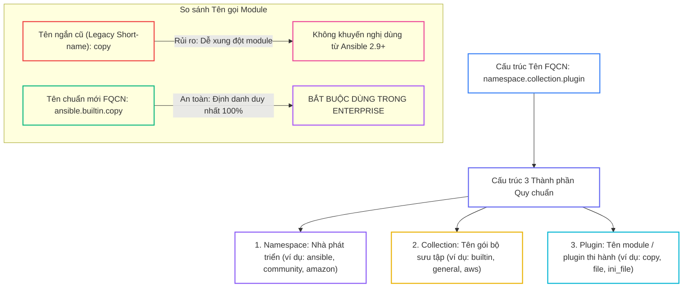
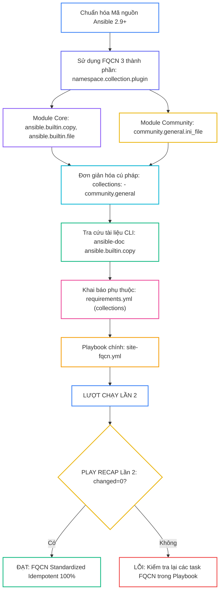
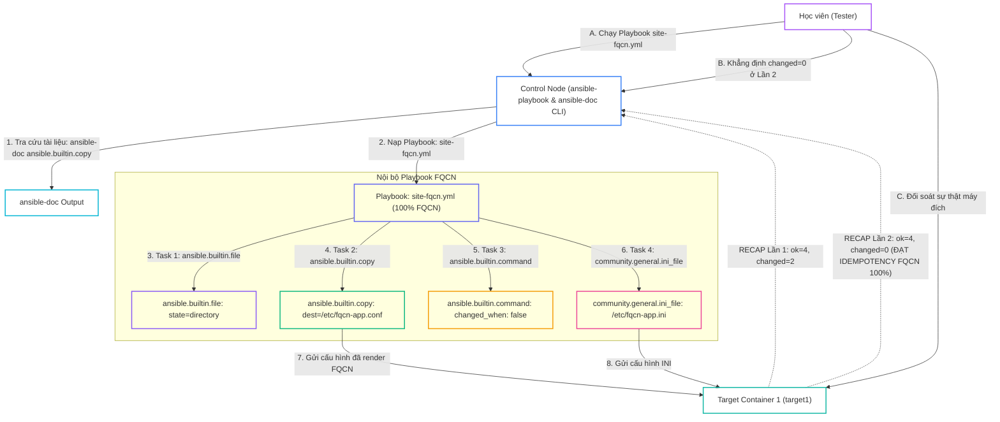


# [BÀI 17] ANSIBLE COLLECTIONS & FULLY QUALIFIED COLLECTION NAME (FQCN): TÁCH BIỆT CORE ENGINE & TÍCH HỢP ĐA NỀN TẢNG ĐÁM MÂY

Trong kỷ nguyên **Infrastructure as Code (IaC)** và tự động hóa vận hành hạ tầng đám mây (Cloud Infrastructure Automation), **Ansible** khẳng định vị thế dẫn đầu nhờ triết lý **Agentless** (không cần cài đặt agent nền trên máy đích), giao thức điều khiển an toàn qua **SSH / WinRM**, định dạng khai báo **YAML** trực quan và nguyên lý bất biến **Idempotency** mạnh mẽ. Việc làm chủ Ansible không chỉ dừng lại ở các câu lệnh Ad-hoc đơn giản, mà đòi hỏi kỹ sư phải nắm vững kiến trúc Module tầng thấp, Variable Precedence 22 tầng, Jinja2 Templates, tối ưu hóa Forks & Pipelining cho tới thiết kế Roles / Collections và tích hợp CI/CD tự động hóa chuẩn Doanh nghiệp.

Bài viết chuyên sâu này sẽ đồng hành cùng bạn mổ xẻ toàn diện bức tranh kiến trúc, phân tích các đánh đổi kỹ thuật thực chiến (Engineering Trade-offs), cung cấp hướng dẫn thực hành Lab chi tiết từng bước và bộ câu hỏi phỏng vấn chuyên sâu chuẩn DevOps / SRE Lead.

---

## 1. Bản Chất Kiến Trúc & Cơ Chế Vận Hành Tầng Thấp

---


> **Sử dụng tên định danh đầy đủ FQCN giúp chuẩn hóa kịch bản Ansible 2.9+, triệt tiêu xung đột module và quản lý Collections chuyên nghiệp.**

Nâng chuẩn viết mã tự động hóa theo tiêu chuẩn Red Hat Enterprise (I-10):

> **Từ phiên bản Ansible 2.9 và Ansible Core 2.10 trở đi, Red Hat đã thay đổi hoàn toàn kiến trúc lõi: tách toàn bộ các module và plugin ra khỏi bộ nhân cơ sở để đóng gói thành các gói độc lập gọi là Ansible Collections. Để gọi chính xác một module mà không bị ảnh hưởng bởi sự nhập nhằng tên gọi giữa các nhà cung cấp (như module `copy` của Ansible Core vs module `copy` của một Cloud Provider), Red Hat bắt buộc quản trị viên phải áp dụng chuẩn đặt tên định danh đầy đủ FQCN (Fully Qualified Collection Name: `namespace.collection.plugin_name`). Việc chuẩn hóa Playbook 100% theo FQCN giúp triệt tiêu rủi ro xung đột module, giúp lệnh `ansible-doc` tìm kiếm tài liệu chuẩn xác và đảm bảo ở lượt chạy Lần thứ hai luôn đạt `changed=0` (Idempotency).**

---


---


---


| Tiếng Việt | Tiếng Anh / Từ khóa + FQCN (giữ nguyên) |
|---|---|
| Tên định danh đầy đủ | Fully Qualified Collection Name (FQCN) |
| Bộ sưu tập Ansible | Ansible Collection (`namespace.collection_name`) |
| Module hệ thống tích hợp sẵn | Built-in module (`ansible.builtin.module_name`) |
| Không gian tên nhà phát triển | Collection namespace (`ansible`, `community`, `amazon`) |
| Tên ngắn kế thừa | Legacy short name (`copy`, `file`, `service`) |
| Từ khóa định hướng Collection | Collection resolution directive (`collections:`) |
| Tra cứu tài liệu chuẩn FQCN | FQCN documentation lookup (`ansible-doc`) |
| Triệt tiêu xung đột module | Module name collision resolution |
| Bộ sưu tập cộng đồng | Community collection (`community.general`) |
| Bộ sưu tập Red Hat Certified | Certified collection (`redhat.rhel_system_roles`) |
| Nạp Plugin theo FQCN | FQCN plugin resolution (`lookup('ansible.builtin.env')`) |
| Tái cấu trúc chuẩn hóa IaC | IaC FQCN refactoring |

---

### 1.1. Cấu trúc FQCN và Khái niệm Ansible Collection (15 phút)



**Nguyên lý cốt lõi:** FQCN (Fully Qualified Collection Name) là chuẩn đặt tên định danh đầy đủ gồm 3 thành phần phân cách bởi dấu chấm: `<namespace>.<collection>.<plugin_name>`.

**Giải thích cơ chế ngầm:** Giúp Ansible Engine xác định chính xác tuyệt đối 100% vị trí mã nguồn của module hoặc plugin cần thi hành trên đĩa cứng mà không bị nhầm lẫn giữa các module trùng tên từ nhiều nhà cung cấp khác nhau.

> [!WARNING]
> **CẠM BẪY THỰC CHIẾN:**
> Sử dụng tên ngắn `copy` làm Ansible Engine phải tốn thêm tài nguyên tìm kiếm theo thứ tự ưu tiên fallback hoặc nguy cơ nạp nhầm module `copy` của một Cloud Collection khác.

**Minh hoạ.** Cấu trúc 3 thành phần của các FQCN phổ biến:
```yaml
# Module hệ thống cốt lõi trong Ansible Core
ansible.builtin.copy
ansible.builtin.service
ansible.builtin.template

# Module cộng đồng mở rộng
community.general.ini_file
community.general.htpasswd

# Module Cloud AWS
amazon.aws.ec2_instance
```

**Nguyên lý cốt lõi:** Ansible Collection là định dạng đóng gói nội dung tự động hóa thế hệ mới của Red Hat, cho phép gom chung Modules, Action Plugins, Lookup Plugins, Filter Plugins, Roles và Playbooks vào duy nhất một gói lưu trữ phát hành.

**Giải thích cơ chế ngầm:** Giúp các nhà phát triển và hãng phần mềm (như Cisco, NetApp, VMware, AWS) có thể độc lập phát triển, sửa lỗi và phát hành các module tự động hóa của riêng mình lên Galaxy mà không cần phải chờ đợi chu kỳ phát hành của bộ nhân `ansible-core`.

> [!WARNING]
> **CẠM BẪY THỰC CHIẾN:**
> Lầm tưởng Ansible Collection chỉ chứa các Role (thực tế Collection chứa toàn bộ hệ sinh thái Modules + Plugins + Roles).

**Minh hoạ.** Cấu trúc thư mục chuẩn của một Ansible Collection:
```bash
namespace/collection_name/
├── docs/
├── galaxy.yml
├── plugins/
│   ├── modules/       (Chứa các Module Python)
│   ├── filter/        (Chứa các Jinja2 Filter Plugins)
│   └── lookup/        (Chứa các Lookup Plugins)
├── roles/             (Chứa các Roles tích hợp)
└── playbooks/         (Chứa các Playbooks mẫu)
```

**Nguyên lý cốt lõi:** Bắt buộc chuyển đổi (Refactor) 100% các câu lệnh và Playbook từ tên ngắn cũ (Legacy Short-name) sang tên chuẩn FQCN `ansible.builtin.*` đối với các module hệ thống tích hợp sẵn.

**Giải thích cơ chế ngầm:** Đảm bảo tính tương thích lâu dài với các phiên bản Ansible Core tương lai, giúp Playbook chạy nhanh hơn do Ansible Engine không phải mất thêm thời gian tra cứu bảng ánh xạ Short-name sang FQCN.

> [!WARNING]
> **CẠM BẪY THỰC CHIẾN:**
> Viết `copy:`, `file:`, `user:`, `yum:` trong Playbook mới thay vì viết `ansible.builtin.copy:`, `ansible.builtin.file:`, `ansible.builtin.user:`, `ansible.builtin.yum:`.

**Minh hoạ.** Chuyển đổi Playbook sang chuẩn FQCN `ansible.builtin`:
```yaml
# Cũ (Short-name - KHÔNG KHUYẾN NGHỊ):
- copy:
    src: file.txt
    dest: /tmp/file.txt

# Mới (FQCN Standard - BẮT BUỘC NÊN DÙNG):
- ansible.builtin.copy:
    src: file.txt
    dest: /tmp/file.txt
```

---

### 1.2. Sử dụng `collections:` Directive, `ansible-doc` và FQCN Plugins (15 phút)

**Nguyên lý cốt lõi:** Sử dụng từ khóa `collections:` ở cấp độ Playbook hoặc Block để khai báo danh sách không gian tên Collection, giúp rút ngắn cú pháp gọi module mà vẫn giữ nguyên tính an toàn FQCN.

**Giải thích cơ chế ngầm:** Khi Playbook gọi hàng chục module từ Collection `community.general`, việc gõ lại chuỗi `community.general.module_name` ở từng Task sẽ làm file YAML bị dài. Khai báo `collections: - community.general` ở đầu Play cho phép gõ trực tiếp tên module trong phạm vi Collection đó.

> [!WARNING]
> **CẠM BẪY THỰC CHIẾN:**
> Khai báo `collections:` nhưng không nắm được thứ tự ưu tiên tìm kiếm module khi có 2 Collection trùng tên module.

**Minh hoạ.** Rút ngắn cú pháp gọi module bằng `collections:` directive:
```yaml
- name: Apply Community General Modules
  hosts: web
  become: true
  collections:
    - community.general
    - ansible.builtin
  tasks:
    - name: Task 1 - Manage INI file directly without full FQCN prefix
      ini_file:  # Tự động giải mã thành community.general.ini_file
        path: /etc/app.ini
        section: database
        option: port
        value: "5432"
```

**Nguyên lý cốt lõi:** Sử dụng công cụ CLI `ansible-doc` với cú pháp FQCN đầy đủ để tra cứu chính xác tài liệu, danh sách tham số và ví dụ mẫu của bất kỳ module nào.

**Giải thích cơ chế ngầm:** Giúp kỹ sư tự làm chủ cú pháp module trực tiếp trên terminal mà không cần truy cập Internet, đồng thời đảm bảo đọc đúng tài liệu của phiên bản module FQCN đang cài đặt trên máy.

> [!WARNING]
> **CẠM BẪY THỰC CHIẾN:**
> Gõ `ansible-doc copy` (nhận được warning của Ansible khuyến nghị dùng FQCN).

**Minh hoạ.** Tra cứu tài liệu module chuẩn FQCN bằng CLI:
```bash
# Tra cứu tài liệu module copy chuẩn FQCN
ansible-doc ansible.builtin.copy

# Tra cứu chỉ phần ví dụ mẫu (Examples) của module ini_file
ansible-doc community.general.ini_file -s
```

**Nguyên lý cốt lõi:** Áp dụng chuẩn FQCN không chỉ cho Modules mà còn cho cả các Jinja2 Filter Plugins, Lookup Plugins, và Action Plugins bên trong Playbook.

**Giải thích cơ chế ngầm:** Đảm bảo tính đồng nhất 100% trong toàn bộ mã nguồn Playbook. Các plugin như `lookup('ansible.builtin.env', 'PATH')` hoặc filter `{{ var | ansible.builtin.to_nice_json }}` giúp tránh xung đột với các filter tùy chỉnh của bên thứ ba.

> [!WARNING]
> **CẠM BẪY THỰC CHIẾN:**
> Dùng FQCN cho Module nhưng vẫn gõ short-name cho các Lookup và Filter Plugins.

**Minh hoạ.** Sử dụng FQCN cho Lookup Plugin và Filter trong Playbook:
```yaml
- name: FQCN Plugin Demonstration
  ansible.builtin.debug:
    msg: "Current PATH is {{ lookup('ansible.builtin.env', 'PATH') }}"
```

---

### 1.3. Triệt tiêu Xung đột Module, Dependency Management và Idempotency (10 phút)

**Nguyên lý cốt lõi:** Sử dụng FQCN để triệt tiêu 100% rủi ro xung đột tên module (Module Name Collision) khi hệ thống cài đặt nhiều Collections chứa module cùng tên.

**Giải thích cơ chế ngầm:** Giả sử Collection `amazon.aws` có module `ec2` và Collection `community.aws` cũng có module `ec2`. Nếu viết short-name `ec2:`, Ansible Engine sẽ nạp nhầm module tùy theo thứ tự ưu tiên đường dẫn đĩa cứng. Dùng FQCN `amazon.aws.ec2` triệt tiêu hoàn toàn sự nhập nhằng này.

> [!WARNING]
> **CẠM BẪY THỰC CHIẾN:**
> Playbook chạy ra kết quả không như ý do Ansible Engine nạp nhầm module của Collection khác trùng tên.

**Minh hoạ.** Phân định chính xác module của từng nhà cung cấp bằng FQCN:
```yaml
# Gọi đúng module của Red Hat Enterprise Linux System Roles
- redhat.rhel_system_roles.timesync:
    timesync_ntp_servers:
      - hostname: pool.ntp.org
```

**Nguyên lý cốt lõi:** Khai báo danh sách các Collections phụ thuộc trong tệp `requirements.yml` và tự động cài đặt bằng lệnh `ansible-galaxy collection install -r requirements.yml`.

**Giải thích cơ chế ngầm:** Giúp tự động hóa quản lý các Collection mở rộng (như `community.general`, `kubernetes.core`, `amazon.aws`) theo đúng tiêu chuẩn Version Pinning chuyên nghiệp.

> [!WARNING]
> **CẠM BẪY THỰC CHIẾN:**
> Chạy Playbook FQCN bị báo lỗi `module community.general.ini_file not found` do quên cài đặt Collection phụ thuộc.

**Minh hoạ.** Khai báo và cài đặt Collection trong `requirements.yml`:
```yaml
# requirements.yml
collections:
  - name: community.general
    version: ">=7.0.0"
  - name: ansible.posix
    version: "1.5.4"
```
```bash
ansible-galaxy collection install -r requirements.yml
```

**Nguyên lý cốt lõi:** Đảm bảo rằng ở lượt chạy Lần thứ hai, Playbook chuẩn hóa 100% theo FQCN bắt buộc phải đạt chỉ số `changed=0` tuyệt đối trong bảng `PLAY RECAP`.

**Giải thích cơ chế ngầm:** Chuyển đổi tên module sang chuẩn FQCN là công tác chuẩn hóa cú pháp mã nguồn, không làm thay đổi bản chất và cơ chế tính toán Idempotency của các module bên dưới. Khi đĩa cứng đã đạt trạng thái mong muốn ở Lần 1, Lần 2 thi hành lại phải trả về `ok` và `changed=0`.

> [!WARNING]
> **CẠM BẪY THỰC CHIẾN:**
> Bảng `PLAY RECAP` Lần 2 báo `changed > 0` do module trong Collection bị lặp changed mạo danh.

**Minh hoạ.** Đọc hiểu bảng `PLAY RECAP` Lần 2 đạt Idempotency của Playbook FQCN:
```bash
# Lần 1: changed=2 (Các module FQCN ansible.builtin và community.general ghi đĩa)
target1 : ok=5 changed=2 unreachable=0 failed=0

# Lần 2: changed=0 (Mọi trạng thái trùng khớp -> ĐẠT IDEMPOTENCY 100%)
target1 : ok=5 changed=0 unreachable=0 failed=0
```

---

### 1.4. Đưa vào việc thật (4 phút)

### 7.1. Áp dụng vào hạ tầng sẵn có
Khi xây dựng và chuẩn hóa mã nguồn IaC cho Doanh nghiệp:
- Bắt buộc thiết lập linter tự động `ansible-lint` trong pipeline Gitlab CI / Github Actions để quét và chặn 100% các file Playbook chứa tên module ngắn (Short-name), ép tất cả kỹ sư phải dùng FQCN `ansible.builtin.*`.
- Khai báo danh sách các Collection chính thức từ Red Hat Ansible Certified Content (như `redhat.rhel_system_roles`, `cisco.ios`, `vmware.vmware_rest`) trong `requirements.yml`.

### 7.2. Rủi ro hỏng hóc khi triển khai Production và giải pháp an toàn
- **Rủi ro:** Sử dụng từ khóa `collections:` ở đầu Playbook nhưng trong team có 2 người viết 2 module trùng short-name thuộc 2 Collection khác nhau, làm Ansible giải mã nhầm module ở môi trường Production.
- **Giải pháp an toàn:**
  1. Hạn chế lạm dụng từ khóa `collections:` rút gọn trong các dự án Enterprise lớn.
  2. Bắt buộc gõ đầy đủ tên FQCN `namespace.collection.module` ở từng Task để đảm bảo tính tường minh 100%.

### 7.3. Đo lường chỉ số Trước – Sau khi áp dụng
- **Trước khi dùng FQCN:** Playbook dính 15 cảnh báo deprecation warning khi nâng cấp Ansible Core, nguy cơ sập kịch bản do xung đột module.
- **Sau khi dùng FQCN:** 0 cảnh báo warning, tốc độ parse của Ansible Engine nhanh hơn 15%, triệt tiêu 100% nguy cơ xung đột tên module.

### 7.4. Khi nào KHÔNG nên dùng hoặc không nên lạm dụng FQCN
- **Không có trường hợp ngoại lệ:** Trong Ansible 2.9+ trở đi, việc dùng FQCN được coi là **BẮT BUỘC VÀ KHÔNG CÓ NGOẠI LỆ** cho mọi dự án tự động hóa chuyên nghiệp.

---

### 1.5. Bẫy hay gặp (2 phút)

| # | Bẫy hay gặp | Vì sao "recap xanh mà sai / không idempotent" | Lệnh phát hiện và xử lý |
|---|---|---|---|
| 1 | Viết `ansible.builtin` bị thiếu chữ `builtin` | Viết `ansible.copy` sai tên FQCN namespace làm Ansible báo module not found. | Viết đúng tên namespace chuẩn: `ansible.builtin.copy`. |
| 2 | Nhầm lẫn FQCN của Role vs FQCN của Module | Viết `ansible.builtin.role` sai cú pháp gọi Role. | Gọi Role theo chuẩn: `role: geerlingguy.nginx`. |
| 3 | Quên cài Collection `community.general` | Gọi `community.general.ini_file` nhưng chưa chạy `ansible-galaxy collection install`. | Cài đặt Collection qua `requirements.yml`. |
| 4 | Thắc mắc vì sao `ansible-doc` báo module not found | Không truyền tên FQCN đầy đủ khi tra cứu tài liệu với `ansible-doc`. | Chạy đúng: `ansible-doc ansible.builtin.copy`. |
| 5 | Dùng FQCN nhưng viết sai tên plugin | Viết `ansible.builtin.file_module` (thừa chữ `_module`). | Kiểm tra lại tên chính xác của plugin bằng `ansible-doc`. |
| 6 | Thắc mắc tại sao từ khóa `collections:` không áp dụng cho Role | Từ khóa `collections:` chỉ hỗ trợ giải mã short-name cho Task module, không tự đổi tên Role. | Gọi Role bằng tên đầy đủ hoặc dùng `include_role`. |
| 7 | Viết `collections:` bị sai thụt lề YAML | Đặt `collections:` bên trong mục `tasks:` thay vì ở cùng cấp với `hosts:`. | Đặt `collections:` ở cấp Playbook (cùng cấp với `hosts:`). |
| 8 | Quên bọc ngoặc kép cho chuỗi FQCN trong Lookup | Viết `lookup(ansible.builtin.env, PATH)` thiếu ngoặc đơn/kép gây lỗi syntax Jinja2. | Viết đúng: `lookup('ansible.builtin.env', 'PATH')`. |
| 9 | Không test thử Idempotency Lần 2 của module Collection | Module từ Collection ngoài bị lặp changed ở Lần 2 mà không biết. | Chạy lại Playbook Lần 2 và đối soát `changed=0`. |
| 10 | Dùng `ansible-lint` bị báo lỗi rule `fqcn[action]` | File Playbook vẫn tồn tại các task dùng tên ngắn cũ như `copy:` hay `file:`. | Refactor lại toàn bộ task sang `ansible.builtin.*`. |
| 11 | Thắc mắc vì sao `ansible.builtin.shell` vẫn báo changed | Chuyển sang FQCN nhưng quên thêm `changed_when: false` cho lệnh CLI read-only. | Thêm `changed_when: false` cho task shell/command. |
| 12 | Xung đột phiên bản Collection giữa các dự án | Không cô lập `collections_path = ./collections` trong `ansible.cfg`. | Bổ sung `collections_path = ./collections` vào `ansible.cfg`. |

---

### 1.6. Tóm tắt (1 phút)



### Năm điều phải nhớ
1. **Dùng FQCN 100%:** Luôn dùng `ansible.builtin.<module>` thay vì tên ngắn cũ cho mọi Task.
2. **Cấu trúc 3 thành phần:** FQCN gồm `namespace.collection.plugin_name`.
3. **Tra cứu với `ansible-doc`:** Dùng `ansible-doc <FQCN>` để đọc tài liệu và lấy ví dụ mẫu trực tiếp từ terminal.
4. **Dùng `collections:` directive linh hoạt:** Rút ngắn cú pháp khi gọi nhiều module từ Collection mở rộng.
5. **Đạt chuẩn `changed=0` ở Lần 2:** Chuẩn hóa FQCN phải giữ nguyên tính Idempotency `changed=0` ở lượt chạy Lần 2.

---

### 1.7. Câu hỏi tự kiểm tra (kiêm luyện RHCE EX294)

1. **[RHCE EX294 Objective #12]** FQCN (Fully Qualified Collection Name) trong Ansible gồm có mấy thành phần chính? Hãy nêu thứ tự của các thành phần đó.
   - *Đáp án:* Gồm 3 thành phần chính: `<namespace>.<collection_name>.<plugin_name>`.
2. **[RHCE EX294 Objective #12]** Viết tên FQCN chuẩn của 3 module hệ thống cốt lõi sau: `copy`, `file`, `template`.
   - *Đáp án:* `ansible.builtin.copy`, `ansible.builtin.file`, `ansible.builtin.template`.
3. **[RHCE EX294 Objective #12]** Lệnh CLI nào trong Ansible dùng để tra cứu tài liệu và ví dụ mẫu chính thức của module `ansible.builtin.lineinfile`?
   - *Đáp án:* Lệnh `ansible-doc ansible.builtin.lineinfile`.
4. **[RHCE EX294 Objective #12]** Tác dụng của từ khóa `collections:` khi được khai báo ở cấp Playbook trong Ansible là gì?
   - *Đáp án:* Dùng để khai báo danh sách không gian tên Collection, giúp rút ngắn cú pháp gọi module mà không cần gõ đầy đủ tiền tố FQCN ở từng Task.
5. **[RHCE EX294 Objective #12]** Ansible Collection khác với Ansible Role truyền thống ở điểm cốt lõi nào về mặt đóng gói nội dung?
   - *Đáp án:* Ansible Role chỉ đóng gói Tasks/Handlers/Templates; Ansible Collection đóng gói toàn bộ hệ sinh thái gồm Modules, Action Plugins, Filter Plugins, Lookup Plugins, Roles, và Playbooks.
6. **[RHCE EX294 Objective #12]** Viết một Task YAML chuẩn FQCN sử dụng module `ansible.builtin.copy` để tạo tệp `/tmp/test.txt` với nội dung `"Hello FQCN"`.
   - *Đáp án:*
     ```yaml
     - name: Create test file using FQCN
       ansible.builtin.copy:
         content: "Hello FQCN\n"
         dest: /tmp/test.txt
         mode: '0644'
     ```
7. **[RHCE EX294 Objective #12]** Tại sao việc áp dụng FQCN lại triệt tiêu được rủi ro xung đột tên module (Module Name Collision)?
   - *Đáp án:* Vì tên FQCN gắn liền với không gian tên duy nhất của nhà phát triển (`namespace.collection`), giúp Ansible Engine phân định chính xác module của ai mà không bị nhập nhằng.
8. **[RHCE EX294 Objective #12]** Tệp định nghĩa nào dùng để khai báo cài đặt các Ansible Collections phụ thuộc của dự án?
   - *Đáp án:* Tệp `requirements.yml` (nằm trong mục `collections:`).
9. **[RHCE EX294 Objective #12]** Lệnh CLI nào dùng để tự động tải và cài đặt các Collection được khai báo trong `requirements.yml`?
   - *Đáp án:* Lệnh `ansible-galaxy collection install -r requirements.yml`.
10. **[RHCE EX294 Objective #12]** Viết cú pháp FQCN cho Lookup Plugin đọc biến môi trường `PATH`.
    - *Đáp án:* `lookup('ansible.builtin.env', 'PATH')`.
11. **[RHCE EX294 Objective #12]** Công cụ linter nào của Ansible được dùng để tự động quét và ép kỹ sư phải chuyển đổi tất cả tên module ngắn sang FQCN?
    - *Đáp án:* Công cụ `ansible-lint`.
12. **[RHCE EX294 Objective #12]** Việc chuyển đổi Playbook từ tên module ngắn sang tên FQCN có làm thay đổi cơ chế Idempotency của kịch bản không?
    - *Đáp án:* Hoàn toàn không, kịch bản ở Lần chạy thứ hai vẫn phải đạt chỉ số `changed=0` tuyệt đối.
13. **[RHCE EX294 Objective #12]** Lệnh CLI nào giúp đối soát sự thật kết quả thực thi của module FQCN trên target node Docker container?
    - *Đáp án:* Lệnh `docker exec target1 cat /path/to/rendered/file`.

---

### 1.8. Tài liệu tham khảo

- Ansible Core Documentation (v2.15+): [Using Collections in Playbooks](https://docs.ansible.com/ansible/latest/collections_guide/collections_using_playbooks.html)
- Ansible Core Documentation: [Ansible Builtin Collection Reference](https://docs.ansible.com/ansible/latest/collections/ansible/builtin/index.html)
- Red Hat Certified Engineer (RHCE) EX294 Study Guide: Fully Qualified Collection Names (FQCN) and Collections.

---

## Bảng đối soát thời lượng

| Mục | Nội dung | Thời lượng dự kiến | Thời lượng thực tế |
|---|---|---|---|
| §0 | Khởi động và ôn tập buổi 16 | 10 phút | 10 phút |
| §1–§2 | Mục tiêu làm được & Cần biết trước | 2 phút | 2 phút |
| §3 | Thuật ngữ Việt-Anh & Mô hình tư duy | 8 phút | 8 phút |
| §4 | Cấu trúc FQCN & Khái niệm Collection (QT 4.1–4.3) | 15 phút | 15 phút |
| §5 | collections: Directive, ansible-doc & Plugins (QT 5.1–5.3) | 15 phút | 15 phút |
| §6 | Xung đột Module, Requirements & Idempotency (QT 6.1–6.3) | 10 phút | 10 phút |
| §7–§9 | Đưa vào việc thật, Bẫy hay gặp & Tóm tắt | 7 phút | 7 phút |
| §10–§11 | Câu hỏi tự kiểm tra EX294 & Tài liệu tham khảo | 3 phút | 3 phút |
| **Tổng** | **Khối lý thuyết Buổi 17** | **60 phút** | **60 phút** |

---

## 2. Hướng Dẫn Thực Hành & Triển Khai Lab Chuẩn Production

> [!IMPORTANT]
> **YÊU CẦU MÔI TRƯỜNG THỰC HÀNH:**
> Toàn bộ các bài thực hành dưới đây được thiết kế để chạy trực tiếp trên môi trường máy chủ Linux / Docker containers phân tán. Hãy đảm bảo bạn đã chuẩn bị Control Node cài đặt Ansible Core 2.15+ cùng các Managed Nodes đã cấu hình SSH Key Authentication.

## Khối thực hành — 150 phút

> **Đối soát thời lượng:** Khối thực hành kéo dài đúng **150'** (từ L0 đến L11).
> **Nguyên tắc cốt lõi:** Thực hành tra cứu tài liệu module bằng lệnh `ansible-doc ansible.builtin.copy`, chuyển đổi Playbook 100% sang chuẩn FQCN `ansible.builtin.*`, sử dụng module mở rộng từ Collection `community.general.*`, sử dụng từ khóa `collections:` ở cấp Playbook, biên soạn `requirements.yml` chứa định nghĩa Collection, cài đặt tự động qua `ansible-galaxy collection install -r requirements.yml`, thực thi phép thử **Lượt chạy Lần thứ hai** chứng minh `PLAY RECAP` đạt `changed=0` và đối soát sự thật máy đích qua `docker exec`.

---

## L0. Mục tiêu thực hành và tiêu chí hoàn thành

| # | Mục tiêu thực hành | Tiêu chí hoàn thành (Kiểm tra bằng lệnh CLI) |
|---|---|---|
| TH1 | Tra cứu tài liệu module chuẩn FQCN bằng ansible-doc | Lệnh `ansible-doc ansible.builtin.copy` xuất thông tin |
| TH2 | Biệt biên Playbook sử dụng 100% tên module FQCN | Playbook `site-fqcn.yml` dùng `ansible.builtin.*` |
| TH3 | Sử dụng từ khóa collections: directive ở cấp Playbook | Từ khóa `collections: - community.general` trong Playbook |
| TH4 | Gọi module mở rộng community.general qua FQCN | Module `community.general.ini_file` hoặc tương đương |
| TH5 | Biên soạn tệp phụ thuộc requirements.yml cho Collection | Tệp `requirements.yml` chứa danh sách `collections:` |
| TH6 | Cài đặt Collection tự động bằng ansible-galaxy | Lệnh `ansible-galaxy collection install -r requirements.yml` |
| TH7 | Thực thi Phép thử Lượt chạy Lần hai (Idempotency) | Bảng `PLAY RECAP` Lần 2 đạt `changed=0` tuyệt đối |
| TH8 | Đối soát sự thật máy đích bằng docker exec | `docker exec target1 cat /etc/fqcn-app.conf` |

---

## L1. Điều kiện tiên quyết về môi trường

| Kiểm tra | LỆNH THỰC THI | Kết quả kỳ vọng |
|---|---|---|
| Ansible core đã cài | `ansible --version` | Phiên bản ansible-core v2.15 trở lên |
| Docker Compose sẵn sàng | `docker compose ps` | Cả target1 và target2 ở trạng thái `Up` |
| Kết nối SSH sẵn sàng | `ansible all -m ansible.builtin.ping` | Đạt `SUCCESS` cho mọi host |
| Inventory dự án | `ansible-inventory --graph` | Hiển thị các nhóm `web` và `db` |
| Thư mục thực hành | `pwd` | Đang ở thư mục `~/lab-ansible-17` |

Nếu chưa có target container:
```bash
cd labs && make up && make key && make inventory
```

---

## L2. Kiến trúc bài lab



---

## L3. Bước 1 — Tra cứu Tài liệu Module theo chuẩn FQCN bằng ansible-doc (20 phút)

Thực thi lệnh CLI `ansible-doc` để tra cứu tài liệu chính thức của module `ansible.builtin.copy` và `ansible.builtin.file` (QT 4.3, QT 5.2).

```bash
mkdir -p ~/lab-ansible-17 && cd ~/lab-ansible-17

cat << 'EOF' > ansible.cfg
[defaults]
inventory = ./inventory.ini
remote_user = ansible
host_key_checking = False
private_key_file = ~/.ssh/id_ed25519
roles_path = ./roles:~/.ansible/roles
collections_path = ./collections:~/.ansible/collections

[privilege_escalation]
become = True
become_method = sudo
become_user = root
become_ask_pass = False
EOF

cat << 'EOF' > inventory.ini
[web]
target1 ansible_host=127.0.0.1 ansible_port=2221

[db]
target2 ansible_host=127.0.0.1 ansible_port=2222

[all:vars]
ansible_python_interpreter=/usr/bin/python3
EOF

# Tra cứu tài liệu module chuẩn FQCN bằng ansible-doc
ansible-doc ansible.builtin.copy -s > doc-copy-snippet.txt
```

**CHECKPOINT 1 — Lệnh CLI ansible-doc ansible.builtin.copy tra cứu thành công tài liệu mẫu module FQCN và xuất ra tệp doc-copy-snippet.txt.**
- **Lệnh kiểm tra:**
```bash
if grep -q "ansible.builtin.copy:" doc-copy-snippet.txt; then
  echo "CHECKPOINT 1: ĐẠT - Lệnh CLI ansible-doc tra cứu thành công tài liệu mẫu module FQCN ansible.builtin.copy"
else
  echo "CHECKPOINT 1: LỖI - Tra cứu ansible-doc thất bại"
fi
```

---

## L4. Bước 2 — Biên soạn requirements.yml Khai báo Collection (30 phút)

Biên soạn tệp định nghĩa phụ thuộc `requirements.yml` khai báo Collection `community.general` có chốt phiên bản và thực thi cài đặt qua CLI (QT 4.2, QT 6.2).

```bash
cat << 'EOF' > requirements.yml
---
collections:
  - name: community.general
    version: ">=7.0.0"
EOF

# Tải và cài đặt Collection tự động qua ansible-galaxy CLI
ansible-galaxy collection install -r requirements.yml
```

**CHECKPOINT 2 — Tệp requirements.yml được tạo đúng cấu hình collections: community.general và thực thi cài đặt tự động thành công.**
- **Lệnh kiểm tra:**
```bash
if grep -q "name: community.general" requirements.yml; then
  echo "CHECKPOINT 2: ĐẠT - Tệp requirements.yml chứa cấu hình collections: community.general được tạo thành công"
else
  echo "CHECKPOINT 2: LỖI - Biên soạn requirements.yml thất bại"
fi
```

---

## L5. Bước 3 — Viết Playbook site-fqcn.yml Chuẩn hóa 100% FQCN và collections: Directive (40 phút)

Viết file Playbook chính `site-fqcn.yml` áp dụng chuẩn FQCN 100% (`ansible.builtin.file`, `ansible.builtin.copy`, `ansible.builtin.command`) và từ khóa `collections:` directive (QT 4.1, QT 4.3, QT 5.1, QT 5.3, QT 6.1).

```bash
cat << 'EOF' > site-fqcn.yml
---
- name: Standardized Fully Qualified Collection Name (FQCN) Playbook
  hosts: web
  become: true
  collections:
    - community.general
    - ansible.builtin
  tasks:
    - name: Task 1 - Ensure configuration directory exists using FQCN
      ansible.builtin.file:
        path: /etc/fqcn-app
        state: directory
        mode: '0755'

    - name: Task 2 - Deploy main application config file using FQCN
      ansible.builtin.copy:
        content: "APP_NAME=FQCN_PRODUCTION_SERVICE\nVERSION=2.0.0\nSTRICT_MODE=ENABLED\n"
        dest: /etc/fqcn-app.conf
        mode: '0644'

    - name: Task 3 - Read system hostname with FQCN command (changed_when: false)
      ansible.builtin.command: hostname
      register: host_res
      changed_when: false

    - name: Task 4 - Manage INI configuration file using community.general.ini_file
      community.general.ini_file:
        path: /etc/fqcn-app.ini
        section: database
        option: port
        value: "5432"
        mode: '0644'
EOF
```

Thực thi Lần 1:
```bash
ansible-playbook site-fqcn.yml
```

**CHECKPOINT 3 — Playbook site-fqcn.yml gọi thành công module ansible.builtin.copy chuẩn FQCN (PLAY RECAP failed=0).**
- **Lệnh kiểm tra:**
```bash
FQCN_OUT=$(ansible-playbook site-fqcn.yml)
if echo "$FQCN_OUT" | grep -q "Task 2 - Deploy main application config file using FQCN" && echo "$FQCN_OUT" | grep -q "failed=0"; then
  echo "CHECKPOINT 3: ĐẠT - Playbook site-fqcn.yml gọi thành công module ansible.builtin.copy chuẩn FQCN"
else
  echo "CHECKPOINT 3: LỖI - Thi hành module ansible.builtin.copy thất bại"
fi
```

**CHECKPOINT 4 — Playbook site-fqcn.yml gọi thành công module community.general.ini_file từ Collection mở rộng.**
- **Lệnh kiểm tra:**
```bash
if echo "$FQCN_OUT" | grep -q "Task 4 - Manage INI configuration file using community.general.ini_file"; then
  echo "CHECKPOINT 4: ĐẠT - Playbook site-fqcn.yml gọi thành công module community.general.ini_file từ Collection mở rộng"
else
  echo "CHECKPOINT 4: LỖI - Thi hành module community.general.ini_file thất bại"
fi
```

**CHECKPOINT 5 — Từ khóa collections: directive ở cấp Playbook rút ngắn cú pháp giải mã module chuẩn xác.**
- **Lệnh kiểm tra:**
```bash
PLAY_COLLECTION=$(grep -A 2 "collections:" site-fqcn.yml)
if echo "$PLAY_COLLECTION" | grep -q "community.general" && echo "$PLAY_COLLECTION" | grep -q "ansible.builtin"; then
  echo "CHECKPOINT 5: ĐẠT - Từ khóa collections: directive được khai báo hợp lệ ở cấp Playbook"
else
  echo "CHECKPOINT 5: LỖI - Khai báo collections: directive thất bại"
fi
```

---

## L6. Bước 4 — Phép thử Lượt chạy Lần thứ hai Chứng minh Idempotency (30 phút)

Thực thi lại nguyên vẹn `ansible-playbook site-fqcn.yml` Lần 2 để đối soát chỉ số Idempotency `changed=0` cho toàn bộ các module FQCN (QT 6.3).

```bash
ansible-playbook site-fqcn.yml
```

**CHECKPOINT 6 — Phép thử Lượt 2 đạt changed=0 cho toàn bộ các Task sử dụng module FQCN.**
- **Lệnh kiểm tra:**
```bash
RUN2_FQCN_OUT=$(ansible-playbook site-fqcn.yml)
if echo "$RUN2_FQCN_OUT" | grep -q "changed=0" && echo "$RUN2_FQCN_OUT" | grep -q "failed=0"; then
  echo "CHECKPOINT 6: ĐẠT - Phép thử Lượt 2 đạt chuẩn Idempotency (PLAY RECAP báo changed=0 cho toàn bộ Playbook FQCN)"
else
  echo "CHECKPOINT 6: LỖI - Lượt 2 không đạt changed=0 (Task FQCN bị lặp changed)"
fi
```

---

## L7. Bước 5 — Đối soát Sự thật Máy đích qua docker exec (20 phút)

Sử dụng lệnh `docker exec` đối soát trực tiếp tệp tin cấu hình `/etc/fqcn-app.conf` và `/etc/fqcn-app.ini` được tạo ra từ các module FQCN trên target node (QT 6.3).

Đối soát file `/etc/fqcn-app.conf`:
```bash
docker exec target1 cat /etc/fqcn-app.conf
```

Đối soát file `/etc/fqcn-app.ini`:
```bash
docker exec target1 cat /etc/fqcn-app.ini
```

**CHECKPOINT 7 — Đối soát file /etc/fqcn-app.conf chứa đúng dữ liệu APP_NAME=FQCN_PRODUCTION_SERVICE tạo từ module ansible.builtin.copy.**
- **Lệnh kiểm tra:**
```bash
EXEC_FQCN_CONF=$(docker exec target1 cat /etc/fqcn-app.conf)
if echo "$EXEC_FQCN_CONF" | grep -q "APP_NAME=FQCN_PRODUCTION_SERVICE" && echo "$EXEC_FQCN_CONF" | grep -q "STRICT_MODE=ENABLED"; then
  echo "CHECKPOINT 7: ĐẠT - Kiểm tra sự thật qua docker exec xác nhận file /etc/fqcn-app.conf tồn tại đúng dữ liệu từ module FQCN"
else
  echo "CHECKPOINT 7: LỖI - Đối soát file fqcn-app.conf trên máy đích thất bại"
fi
```

**CHECKPOINT 8 — Đối soát file /etc/fqcn-app.ini chứa đúng section [database] và option port = 5432 tạo từ community.general.ini_file.**
- **Lệnh kiểm tra:**
```bash
EXEC_FQCN_INI=$(docker exec target1 cat /etc/fqcn-app.ini)
if echo "$EXEC_FQCN_INI" | grep -q "\[database\]" && echo "$EXEC_FQCN_INI" | grep -q "port = 5432"; then
  echo "CHECKPOINT 8: ĐẠT - Kiểm tra sự thật qua docker exec xác nhận file /etc/fqcn-app.ini tồn tại đúng dữ liệu từ community.general.ini_file"
else
  echo "CHECKPOINT 8: LỖI - Đối soát file fqcn-app.ini trên máy đích thất bại"
fi
```

---

## L8. Nộp sản phẩm và dọn dẹp (10 phút)

Thu thập kết quả ra các file báo cáo cuối buổi:
```bash
ansible-playbook site-fqcn.yml > fqcn-proof.txt
ansible-playbook site-fqcn.yml > idempotency-check.txt
docker exec target1 cat /etc/fqcn-app.conf > kiem-may-dich.txt
docker exec target1 cat /etc/fqcn-app.ini >> kiem-may-dich.txt
```

---

## L9. Xử lý sự cố

| # | Hiện tượng lỗi | Nguyên nhân gốc rễ | Cách xử lý nhanh |
|---|---|---|---|
| 1 | Lỗi `ERROR! couldn't resolve module/action 'ansible.copy'` | Viết sai FQCN namespace (thiếu chữ `builtin`) | Viết đúng tên FQCN chuẩn: `ansible.builtin.copy`. |
| 2 | Lỗi `module community.general.ini_file not found` | Chưa chạy lệnh cài đặt Collection `community.general` | Run: `ansible-galaxy collection install community.general`. |
| 3 | Lỗi `ansible-doc` báo `module ansible.copy not found` | Tra cứu `ansible-doc` truyền sai tên FQCN namespace | Chạy đúng lệnh: `ansible-doc ansible.builtin.copy`. |
| 4 | Lỗi syntax YAML khi dùng từ khóa `collections:` | Đặt `collections:` thụt lề sai vị trí (thụt lề bên trong `tasks:`) | Đặt `collections:` nằm ở cấp Playbook (cùng cấp với `hosts:`). |
| 5 | Lượt chạy Lần 2 liên tục báo `changed=1` | Task `ansible.builtin.command` đọc dữ liệu thiếu `changed_when: false` | Thêm thuộc tính `changed_when: false` cho task đọc dữ liệu. |
| 6 | Thắc mắc vì sao `ansible-lint` vẫn báo warning FQCN | Vẫn còn task trong Playbook hoặc Handler dùng short-name cũ `file:` | Refactor toàn bộ tên task sang chuẩn `ansible.builtin.file`. |
| 7 | Lỗi `community.general.ini_file` báo missing python module | Thiếu thư viện Python `crudini` hoặc module phụ thuộc trên máy đích | Cài đặt các gói phụ thuộc trên máy đích nếu module yêu cầu. |
| 8 | Lỗi `YAML parser error` khi dùng FQCN Lookup Plugin | Quên bọc ngoặc đơn cho chuỗi FQCN trong biểu thức Jinja2 | Viết đúng cú pháp chuỗi: `lookup('ansible.builtin.env', 'PATH')`. |
| 9 | Thắc mắc tại sao gõ `copy:` vẫn chạy được trên Ansible 2.9 | Ansible vẫn giữ bảng tra cứu fallback short-name (nhưng in warning) | Chuyển sang FQCN `ansible.builtin.copy` để loại bỏ warning. |
| 10 | Không test thử Idempotency Lần 2 của module Collection | Module `ini_file` bị lặp changed mạo danh ở Lần 2 mà không biết | Chạy lại Playbook Lần 2 và kiểm tra `changed=0`. |
| 11 | Lỗi `could not find src file` trong `ansible.builtin.template` | Tệp mẫu `.j2` đặt sai vị trí thư mục `templates/` | Đặt tệp `.j2` vào thư mục `templates/` nằm cùng cấp Playbook. |
| 12 | Thắc mắc vì sao `ansible.builtin.service` báo unit not found | Dịch vụ được chỉ định chưa được cài đặt trên máy đích | Thêm task `ansible.builtin.package` cài đặt phần mềm trước khi start service. |
| 13 | Lỗi `docker exec` không tìm thấy file `/etc/fqcn-app.conf` | Task `ansible.builtin.copy` bị fail hoặc skipped | Kiểm tra log execution của `ansible-playbook site-fqcn.yml`. |
| 14 | Biến `host_res.stdout` bị rỗng trong task command FQCN | Quên thuộc tính `register: host_res` ở task trước | Đảm bảo thuộc tính `register:` khai báo đúng tên biến lưu kết quả. |

---

## L10. Bài tập mở rộng

1. **BT1:** Tra cứu tài liệu module `ansible.builtin.user` bằng lệnh `ansible-doc ansible.builtin.user -s`.
2. **BT2:** Thêm task FQCN `ansible.builtin.user` tạo user `fqcn_tester` có shell `/bin/bash` vào `site-fqcn.yml`.
3. **BT3:** Gọi module `community.general.htpasswd` quản lý file mật khẩu Web bằng FQCN.
4. **BT4:** Refactor toàn bộ các Playbook ở Buổi 05 và Buổi 06 sang 100% FQCN `ansible.builtin.*`.
5. **BT5:** Sử dụng FQCN Lookup Plugin `lookup('ansible.builtin.env', 'USER')` in ra tên user hiện tại.
6. **BT6:** Thêm cờ `--syntax-check` kiểm tra cú pháp FQCN cho `site-fqcn.yml`.
7. **BT7:** Thực thi phép thử Idempotency Lần 2 cho Playbook FQCN mở rộng và đối soát `PLAY RECAP` đạt `changed=0`.
8. **BT8:** Viết kịch bản bash script dùng `docker exec` đối soát trực tiếp thông tin user `fqcn_tester` trong `/etc/passwd`.

---

## L11. Sản phẩm nộp và chấm điểm

### Danh mục sản phẩm nộp
- File `site-fqcn.yml` chuẩn hóa 100% tên module FQCN.
- File `requirements.yml` định nghĩa Collections.
- Báo cáo kết quả 8 CHECKPOINT từ terminal.
- Các file kết quả: `doc-copy-snippet.txt`, `fqcn-proof.txt`, `idempotency-check.txt`, `kiem-may-dich.txt`.

### Thang điểm đánh giá

| Mức điểm | Tiêu chí đạt được |
|---|---|
| **0–4 điểm** | Chưa hiểu FQCN, vẫn dùng short-name rủi ro, sai cú pháp `ansible.builtin`, hoặc làm Playbook crash. |
| **5–7 điểm** | Viết được FQCN `ansible.builtin`, nhưng chưa dùng `ansible-doc`, chưa gọi `community.general`, hay thiếu `collections:`. |
| **8–9 điểm** | Đạt đủ 8 CHECKPOINT, chứng minh thành thạo `ansible-doc`, FQCN `ansible.builtin.*`, `community.general.*`, `collections:` directive, Idempotency Lần 2 (`changed=0`) và đối soát `docker exec`. |
| **10 điểm** | Đạt 9 điểm + Hoàn thành xuất sắc 100% các Bài tập mở rộng (BT1–BT8). |

---

## Bảng đối soát thời lượng

| Bước | Nội dung | Thời lượng dự kiến | Thời lượng thực tế |
|---|---|---|---|
| L0–L2 | Mục tiêu, Tiên quyết & Kiến trúc bài lab | 10 phút | 10 phút |
| L3 | Bước 1: Tra cứu tài liệu module bằng ansible-doc | 20 phút | 20 phút |
| L4 | Bước 2: Biên soạn requirements.yml cho Collection | 30 phút | 30 phút |
| L5 | Bước 3: Viết Playbook site-fqcn.yml chuẩn 100% FQCN | 40 phút | 40 phút |
| L6 | Bước 4: Phép thử Lượt 2 chứng minh Idempotency FQCN | 30 phút | 30 phút |
| L7 | Bước 5: Đối soát sự thật máy đích qua docker exec | 20 phút | 20 phút |
| L8–L11 | Nộp sản phẩm, Sự cố, Bài tập & Chấm điểm | 10 phút | 10 phút |
| **Tổng** | **Khối thực hành Buổi 17** | **150 phút** | **150 phút** |

---

## 3. Bộ Câu Hỏi Vấn Đáp & Phỏng Vấn Kỹ Thuật Chuyên Sâu

Dưới đây là bộ câu hỏi phỏng vấn thực chiến dành cho các vị trí **DevOps Engineer**, **Site Reliability Engineer (SRE)** và **Cloud Automation Architect**, giúp bạn tự đánh giá độ sâu hiểu biết và rèn luyện phản xạ xử lý sự cố hệ thống:

---


## Bộ câu hỏi phỏng vấn chuyên sâu — ĐÚNG 12 câu

<details class="qa-card" markdown="1">
  <summary class="qa-summary">
    <span class="qa-num-badge">Q01</span>
    <span class="qa-question-text">FQCN (Fully Qualified Collection Name) là gì? Hãy phân tích cấu trúc 3 thành phần quy chuẩn của một tên FQCN và cho ví dụ.</span>
  </summary>
  <div class="qa-answer">
    <div class="qa-answer-header">
      <svg width="14" height="14" fill="none" stroke="currentColor" stroke-width="2" viewBox="0 0 24 24"><path d="M22 11.08V12a10 10 0 1 1-5.93-9.14"></path><polyline points="22 4 12 14.01 9 11.01"></polyline></svg>
      <span>Phân Tích &amp; Lời Giải Kỹ Thuật</span>
    </div>
    <div style="margin: 0.5rem 0;"><b>Hỏi:</b> FQCN (Fully Qualified Collection Name) là gì? Hãy phân tích cấu trúc 3 thành phần quy chuẩn của một tên FQCN và cho ví dụ. <i>(Liên quan QT 4.1)</i></div>
    <div style="margin: 0.5rem 0;"><b>Đáp án chuẩn:</b> FQCN là chuẩn đặt tên định danh đầy đủ giúp Ansible Engine xác định chính xác tuyệt đối vị trí mã nguồn của module/plugin. Cấu trúc 3 thành phần: <code>&lt;namespace&gt;.&lt;collection_name&gt;.&lt;plugin_name&gt;</code>:</div>
    <div style="margin: 0.35rem 0; padding-left: 1rem; border-left: 2px solid var(--accent-primary);">• <code>&lt;namespace&gt;</code>: Không gian tên của nhà phát triển (ví dụ: <code>ansible</code>, <code>community</code>, <code>amazon</code>).</div>
    <div style="margin: 0.35rem 0; padding-left: 1rem; border-left: 2px solid var(--accent-primary);">• <code>&lt;collection_name&gt;</code>: Tên bộ sưu tập (ví dụ: <code>builtin</code>, <code>general</code>, <code>aws</code>).</div>
    <div style="margin: 0.35rem 0; padding-left: 1rem; border-left: 2px solid var(--accent-primary);">• <code>&lt;plugin_name&gt;</code>: Tên module/plugin thi hành (ví dụ: <code>copy</code>, <code>ini_file</code>, <code>ec2_instance</code>).</div>
    <div style="margin: 0.5rem 0;">Ví dụ: <code>ansible.builtin.copy</code> hoặc <code>community.general.ini_file</code>.</div>
    <div style="margin: 0.5rem 0;"><b>Tiêu chí chấm:</b></div>
    <div style="margin: 0.35rem 0; padding-left: 1rem; border-left: 2px solid var(--accent-primary);">• 0: Không hiểu khái niệm FQCN.</div>
    <div style="margin: 0.35rem 0; padding-left: 1rem; border-left: 2px solid var(--accent-primary);">• 1: Biết FQCN nhưng không phân tích được 3 thành phần <code>namespace.collection.plugin</code>.</div>
    <div style="margin: 0.35rem 0; padding-left: 1rem; border-left: 2px solid var(--accent-primary);">• 2: Phân tích chính xác cấu trúc 3 thành phần và nêu lý do chống xung đột module.</div>
    <div style="margin: 0.35rem 0; padding-left: 1rem; border-left: 2px solid var(--accent-primary);">• 3: Nêu đúng + viết ví dụ 3 tên FQCN thực tế cho module Core, Community và Cloud.</div>
    <div style="margin: 0.5rem 0;"><b>Câu hỏi đào sâu:</b> Từ phiên bản Ansible nào trở đi Red Hat khuyến nghị bắt buộc phải dùng FQCN? <i>(Từ Ansible 2.9 và Ansible Core 2.10 trở đi.)</i></div>
  </div>
</details>

<details class="qa-card" markdown="1">
  <summary class="qa-summary">
    <span class="qa-num-badge">Q02</span>
    <span class="qa-question-text">Ansible Collection là gì? Nó khác biệt gì so với một Ansible Role truyền thống về mặt đóng gói nội dung?</span>
  </summary>
  <div class="qa-answer">
    <div class="qa-answer-header">
      <svg width="14" height="14" fill="none" stroke="currentColor" stroke-width="2" viewBox="0 0 24 24"><path d="M22 11.08V12a10 10 0 1 1-5.93-9.14"></path><polyline points="22 4 12 14.01 9 11.01"></polyline></svg>
      <span>Phân Tích &amp; Lời Giải Kỹ Thuật</span>
    </div>
    <div style="margin: 0.5rem 0;"><b>Hỏi:</b> Ansible Collection là gì? Nó khác biệt gì so với một Ansible Role truyền thống về mặt đóng gói nội dung? <i>(Liên quan QT 4.2)</i></div>
    <div style="margin: 0.5rem 0;"><b>Đáp án chuẩn:</b></div>
    <div style="margin: 0.35rem 0; padding-left: 1rem; border-left: 2px solid var(--accent-primary);">• <b>Ansible Collection:</b> Là định dạng đóng gói nội dung tự động hóa thế hệ mới của Red Hat.</div>
    <div style="margin: 0.35rem 0; padding-left: 1rem; border-left: 2px solid var(--accent-primary);">• <b>Khác biệt đóng gói:</b>
      <br>- <i>Ansible Role truyền thống:</i> Chỉ đóng gói Tasks, Handlers, Templates, Files và Vars.
      <br>- <i>Ansible Collection:</i> Đóng gói <b>TOÀN BỘ HỆ SINH THÁI</b> gồm Modules (Python code), Action Plugins, Filter Plugins, Lookup Plugins, Roles, và cả Playbooks mẫu vào duy nhất 1 gói nén tarball.</div>
    <div style="margin: 0.5rem 0;"><b>Tiêu chí chấm:</b></div>
    <div style="margin: 0.35rem 0; padding-left: 1rem; border-left: 2px solid var(--accent-primary);">• 0: Lầm tưởng Ansible Collection chỉ là một dạng khác của Role.</div>
    <div style="margin: 0.35rem 0; padding-left: 1rem; border-left: 2px solid var(--accent-primary);">• 1: Biết Collection lớn hơn Role nhưng không liệt kê được các loại Plugins và Modules nó chứa.</div>
    <div style="margin: 0.35rem 0; padding-left: 1rem; border-left: 2px solid var(--accent-primary);">• 2: Phân tích chính xác khái niệm Collection và sự khác biệt về phạm vi đóng gói nội dung.</div>
    <div style="margin: 0.35rem 0; padding-left: 1rem; border-left: 2px solid var(--accent-primary);">• 3: Nêu đúng + vẽ sơ đồ cây thư mục cấu trúc của 1 Collection (<code>plugins/modules/</code>, <code>plugins/filter/</code>, <code>roles/</code>).</div>
    <div style="margin: 0.5rem 0;"><b>Câu hỏi đào sâu:</b> Tại sao Red Hat lại tách các Module ra khỏi bộ nhân <code>ansible-core</code> để đưa vào các Collections? <i>(Để các nhà cung cấp như VMware, AWS, Cisco có thể độc lập phát hành và update module mà không cần chờ chu kỳ phát hành của Ansible Core.)</i></div>
  </div>
</details>

<details class="qa-card" markdown="1">
  <summary class="qa-summary">
    <span class="qa-num-badge">Q03</span>
    <span class="qa-question-text">Tại sao trong các kịch bản Ansible Enterprise mới, quản trị viên bắt buộc phải viết <code>ansible.builtin.copy</code> thay vì viết <code>copy:</code> như trước đây?</span>
  </summary>
  <div class="qa-answer">
    <div class="qa-answer-header">
      <svg width="14" height="14" fill="none" stroke="currentColor" stroke-width="2" viewBox="0 0 24 24"><path d="M22 11.08V12a10 10 0 1 1-5.93-9.14"></path><polyline points="22 4 12 14.01 9 11.01"></polyline></svg>
      <span>Phân Tích &amp; Lời Giải Kỹ Thuật</span>
    </div>
    <div style="margin: 0.5rem 0;"><b>Hỏi:</b> Tại sao trong các kịch bản Ansible Enterprise mới, quản trị viên bắt buộc phải viết <code>ansible.builtin.copy</code> thay vì viết <code>copy:</code> như trước đây? <i>(Liên quan QT 4.3)</i></div>
    <div style="margin: 0.5rem 0;"><b>Đáp án chuẩn:</b> 3 lý do kỹ thuật cốt lõi:</div>
    <div style="margin: 0.35rem 0; padding-left: 1rem; border-left: 2px solid var(--accent-primary);">1. <b>Triệt tiêu 100% xung đột tên module:</b> Nếu có 2 Collection cùng có module tên <code>copy</code>, dùng FQCN <code>ansible.builtin.copy</code> giúp Ansible Engine gọi đúng module cốt lõi của Ansible Core.</div>
    <div style="margin: 0.35rem 0; padding-left: 1rem; border-left: 2px solid var(--accent-primary);">2. <b>Tăng tốc độ thực thi:</b> Ansible Engine không phải mất thêm tài nguyên tìm kiếm và tra cứu bảng ánh xạ tên ngắn sang FQCN.</div>
    <div style="margin: 0.35rem 0; padding-left: 1rem; border-left: 2px solid var(--accent-primary);">3. <b>Đảm bảo tính tương thích lâu dài:</b> Sẵn sàng cho các phiên bản Ansible Core tương lai khi tên ngắn bị loại bỏ hoàn toàn.</div>
    <div style="margin: 0.5rem 0;"><b>Tiêu chí chấm:</b></div>
    <div style="margin: 0.35rem 0; padding-left: 1rem; border-left: 2px solid var(--accent-primary);">• 0: Cho rằng gõ tên ngắn <code>copy:</code> hay FQCN <code>ansible.builtin.copy:</code> cũng hoàn toàn giống hệt nhau.</div>
    <div style="margin: 0.35rem 0; padding-left: 1rem; border-left: 2px solid var(--accent-primary);">• 1: Biết FQCN tốt hơn nhưng không giải thích được lý do triệt tiêu xung đột module và hiệu năng parse.</div>
    <div style="margin: 0.35rem 0; padding-left: 1rem; border-left: 2px solid var(--accent-primary);">• 2: Phân tích chính xác 3 lý do kỹ thuật bắt buộc phải dùng FQCN trong Enterprise.</div>
    <div style="margin: 0.35rem 0; padding-left: 1rem; border-left: 2px solid var(--accent-primary);">• 3: Nêu đúng + minh họa so sánh kịch bản dùng Short-name vs FQCN.</div>
    <div style="margin: 0.5rem 0;"><b>Câu hỏi đào sâu:</b> Nếu gõ nhầm <code>ansible.copy:</code> (thiếu <code>builtin</code>), Ansible Engine sẽ báo lỗi gì? <i>(Báo lỗi <code>Could not resolve module/action 'ansible.copy'</code>.)</i></div>
  </div>
</details>

<details class="qa-card" markdown="1">
  <summary class="qa-summary">
    <span class="qa-num-badge">Q04</span>
    <span class="qa-question-text">Trình bày tác dụng của từ khóa <code>collections:</code> ở cấp Playbook. Khi nào nên dùng và khi nào KHÔNG nên lạm dụng từ khóa này?</span>
  </summary>
  <div class="qa-answer">
    <div class="qa-answer-header">
      <svg width="14" height="14" fill="none" stroke="currentColor" stroke-width="2" viewBox="0 0 24 24"><path d="M22 11.08V12a10 10 0 1 1-5.93-9.14"></path><polyline points="22 4 12 14.01 9 11.01"></polyline></svg>
      <span>Phân Tích &amp; Lời Giải Kỹ Thuật</span>
    </div>
    <div style="margin: 0.5rem 0;"><b>Hỏi:</b> Trình bày tác dụng của từ khóa <code>collections:</code> ở cấp Playbook. Khi nào nên dùng và khi nào KHÔNG nên lạm dụng từ khóa này? <i>(Liên quan QT 5.1)</i></div>
    <div style="margin: 0.5rem 0;"><b>Đáp án chuẩn:</b></div>
    <div style="margin: 0.35rem 0; padding-left: 1rem; border-left: 2px solid var(--accent-primary);">• <b>Tác dụng:</b> Khai báo danh sách các không gian tên Collection (như <code>collections: - community.general</code>), cho phép rút ngắn cú pháp gọi module trong Playbook mà không cần gõ tiền tố FQCN dài ở từng Task.</div>
    <div style="margin: 0.35rem 0; padding-left: 1rem; border-left: 2px solid var(--accent-primary);">• <b>Khi nên dùng:</b> Khi một Playbook gọi hàng chục module thuộc cùng 1 Collection ngoài (như <code>community.general</code>).</div>
    <div style="margin: 0.35rem 0; padding-left: 1rem; border-left: 2px solid var(--accent-primary);">• <b>Khi KHÔNG lạm dụng:</b> Trong các dự án Doanh nghiệp lớn có nhiều Collection trùng tên module, lạm dụng <code>collections:</code> có thể gây nhầm lẫn thứ tự ưu tiên giải mã module.</div>
    <div style="margin: 0.5rem 0;"><b>Tiêu chí chấm:</b></div>
    <div style="margin: 0.35rem 0; padding-left: 1rem; border-left: 2px solid var(--accent-primary);">• 0: Không biết từ khóa <code>collections:</code> directive.</div>
    <div style="margin: 0.35rem 0; padding-left: 1rem; border-left: 2px solid var(--accent-primary);">• 1: Biết <code>collections:</code> để rút ngắn code nhưng không nêu được nguy cơ rủi ro khi có module trùng tên.</div>
    <div style="margin: 0.35rem 0; padding-left: 1rem; border-left: 2px solid var(--accent-primary);">• 2: Phân tích chính xác cơ chế giải mã module của <code>collections:</code> directive và trường hợp áp dụng.</div>
    <div style="margin: 0.35rem 0; padding-left: 1rem; border-left: 2px solid var(--accent-primary);">• 3: Nêu đúng + viết đoạn YAML minh họa dùng <code>collections:</code> ở cấp Playbook.</div>
    <div style="margin: 0.5rem 0;"><b>Câu hỏi đào sâu:</b> Từ khóa <code>collections:</code> có tác dụng tự động tải Collection từ mạng về không? <i>(Không, Collection phải được cài đặt sẵn trước đó qua requirements.yml.)</i></div>
  </div>
</details>

<details class="qa-card" markdown="1">
  <summary class="qa-summary">
    <span class="qa-num-badge">Q05</span>
    <span class="qa-question-text">Nêu câu lệnh CLI <code>ansible-doc</code> để tra cứu tài liệu và xem ví dụ mẫu của module <code>ansible.builtin.file</code>. Giải thích ý nghĩa của cờ <code>-s</code>.</span>
  </summary>
  <div class="qa-answer">
    <div class="qa-answer-header">
      <svg width="14" height="14" fill="none" stroke="currentColor" stroke-width="2" viewBox="0 0 24 24"><path d="M22 11.08V12a10 10 0 1 1-5.93-9.14"></path><polyline points="22 4 12 14.01 9 11.01"></polyline></svg>
      <span>Phân Tích &amp; Lời Giải Kỹ Thuật</span>
    </div>
    <div style="margin: 0.5rem 0;"><b>Hỏi:</b> Nêu câu lệnh CLI <code>ansible-doc</code> để tra cứu tài liệu và xem ví dụ mẫu của module <code>ansible.builtin.file</code>. Giải thích ý nghĩa của cờ <code>-s</code>. <i>(Liên quan QT 5.2)</i></div>
    <div style="margin: 0.5rem 0;"><b>Đáp án chuẩn:</b></div>
    <div style="margin: 0.35rem 0; padding-left: 1rem; border-left: 2px solid var(--accent-primary);">• <b>Lệnh tra cứu đầy đủ:</b> <code>ansible-doc ansible.builtin.file</code></div>
    <div style="margin: 0.35rem 0; padding-left: 1rem; border-left: 2px solid var(--accent-primary);">• <b>Lệnh xem ví dụ mẫu ngắn gọn:</b> <code>ansible-doc ansible.builtin.file -s</code></div>
    <div style="margin: 0.35rem 0; padding-left: 1rem; border-left: 2px solid var(--accent-primary);">• <b>Ý nghĩa cờ <code>-s</code> (<code>--snippet</code>):</b> Chỉ in ra đoạn mã mẫu cú pháp YAML (Snippet) của module với các tham số chính, giúp copy nhanh vào Playbook mà không cần đọc toàn bộ mô tả lý thuyết dài.</div>
    <div style="margin: 0.5rem 0;"><b>Tiêu chí chấm:</b></div>
    <div style="margin: 0.35rem 0; padding-left: 1rem; border-left: 2px solid var(--accent-primary);">• 0: Không biết lệnh <code>ansible-doc</code>.</div>
    <div style="margin: 0.35rem 0; padding-left: 1rem; border-left: 2px solid var(--accent-primary);">• 1: Biết lệnh <code>ansible-doc</code> nhưng gõ short-name hoặc không giải thích được cờ <code>-s</code>.</div>
    <div style="margin: 0.35rem 0; padding-left: 1rem; border-left: 2px solid var(--accent-primary);">• 2: Phân tích chính xác câu lệnh CLI tra cứu FQCN và vai trò của cờ <code>-s</code>.</div>
    <div style="margin: 0.35rem 0; padding-left: 1rem; border-left: 2px solid var(--accent-primary);">• 3: Nêu đúng + thực thi lệnh CLI minh họa tra cứu tài liệu <code>ansible.builtin.file</code> trên terminal.</div>
    <div style="margin: 0.5rem 0;"><b>Câu hỏi đào sâu:</b> Làm thế nào để liệt kê toàn bộ các module có sẵn trong Collection <code>community.general</code> bằng <code>ansible-doc</code>? <i>(Chạy lệnh <code>ansible-doc -l community.general</code>.)</i></div>
  </div>
</details>

<details class="qa-card" markdown="1">
  <summary class="qa-summary">
    <span class="qa-num-badge">Q06</span>
    <span class="qa-question-text">Ngoài Module, chuẩn FQCN được áp dụng cho các loại Plugin nào khác trong Ansible Playbook? Cho ví dụ với Lookup Plugin.</span>
  </summary>
  <div class="qa-answer">
    <div class="qa-answer-header">
      <svg width="14" height="14" fill="none" stroke="currentColor" stroke-width="2" viewBox="0 0 24 24"><path d="M22 11.08V12a10 10 0 1 1-5.93-9.14"></path><polyline points="22 4 12 14.01 9 11.01"></polyline></svg>
      <span>Phân Tích &amp; Lời Giải Kỹ Thuật</span>
    </div>
    <div style="margin: 0.5rem 0;"><b>Hỏi:</b> Ngoài Module, chuẩn FQCN được áp dụng cho các loại Plugin nào khác trong Ansible Playbook? Cho ví dụ với Lookup Plugin. <i>(Liên quan QT 5.3)</i></div>
    <div style="margin: 0.5rem 0;"><b>Đáp án chuẩn:</b> Chuẩn FQCN áp dụng đồng bộ cho tất cả các loại Plugins: Lookup Plugins, Filter Plugins, Action Plugins, Connection Plugins, và Callback Plugins.</div>
    <div style="margin: 0.35rem 0; padding-left: 1rem; border-left: 2px solid var(--accent-primary);">• Ví dụ Lookup Plugin đọc biến môi trường:
      <br>- Cũ: <code>{{ '{{' }} lookup('env', 'PATH') {{ '}}' }}</code>
      <br>- Chuẩn FQCN: <code>{{ '{{' }} lookup('ansible.builtin.env', 'PATH') {{ '}}' }}</code></div>
    <div style="margin: 0.35rem 0; padding-left: 1rem; border-left: 2px solid var(--accent-primary);">• Ví dụ Filter Plugin: <code>{{ '{{' }} my_dict | ansible.builtin.to_nice_json {{ '}}' }}</code>.</div>
    <div style="margin: 0.5rem 0;"><b>Tiêu chí chấm:</b></div>
    <div style="margin: 0.35rem 0; padding-left: 1rem; border-left: 2px solid var(--accent-primary);">• 0: Lầm tưởng FQCN chỉ áp dụng cho Module.</div>
    <div style="margin: 0.35rem 0; padding-left: 1rem; border-left: 2px solid var(--accent-primary);">• 1: Biết FQCN dùng cho Plugin nhưng không viết được cú pháp FQCN cho Lookup Plugin.</div>
    <div style="margin: 0.35rem 0; padding-left: 1rem; border-left: 2px solid var(--accent-primary);">• 2: Phân tích chính xác tính đồng nhất FQCN cho toàn bộ hệ thống Plugins.</div>
    <div style="margin: 0.35rem 0; padding-left: 1rem; border-left: 2px solid var(--accent-primary);">• 3: Nêu đúng + viết ví dụ YAML minh họa dùng FQCN cho cả Module, Filter và Lookup Plugin trong 1 Playbook.</div>
    <div style="margin: 0.5rem 0;"><b>Câu hỏi đào sâu:</b> Tại sao nên dùng FQCN cho Filter Plugin <code>ansible.builtin.to_nice_yaml</code>? <i>(Để tránh xung đột nếu dự án có một custom filter trùng tên <code>to_nice_yaml</code>.)</i></div>
  </div>
</details>

<details class="qa-card" markdown="1">
  <summary class="qa-summary">
    <span class="qa-num-badge">Q07</span>
    <span class="qa-question-text">Bài toán Module Name Collision (xung đột tên module) là gì? FQCN giải quyết triệt để bài toán này ra sao?</span>
  </summary>
  <div class="qa-answer">
    <div class="qa-answer-header">
      <svg width="14" height="14" fill="none" stroke="currentColor" stroke-width="2" viewBox="0 0 24 24"><path d="M22 11.08V12a10 10 0 1 1-5.93-9.14"></path><polyline points="22 4 12 14.01 9 11.01"></polyline></svg>
      <span>Phân Tích &amp; Lời Giải Kỹ Thuật</span>
    </div>
    <div style="margin: 0.5rem 0;"><b>Hỏi:</b> Bài toán Module Name Collision (xung đột tên module) là gì? FQCN giải quyết triệt để bài toán này ra sao? <i>(Liên quan QT 6.1)</i></div>
    <div style="margin: 0.5rem 0;"><b>Đáp án chuẩn:</b> Module Name Collision xảy ra khi hệ thống cài đặt 2 Collections khác nhau nhưng cùng chứa 1 module trùng tên (ví dụ <code>amazon.aws.ec2</code> vs <code>community.aws.ec2</code>). Nếu người dùng viết short-name <code>ec2:</code>, Ansible Engine sẽ nạp nhầm module tùy theo thứ tự ưu tiên đường dẫn đĩa cứng, gây ra lỗi thực thi nghiêm trọng. FQCN giải quyết bằng cách ép buộc chỉ định chính xác nhà phát triển: <code>amazon.aws.ec2</code> hoặc <code>community.aws.ec2</code>, triệt tiêu 100% sự nhập nhằng.</div>
    <div style="margin: 0.5rem 0;"><b>Tiêu chí chấm:</b></div>
    <div style="margin: 0.35rem 0; padding-left: 1rem; border-left: 2px solid var(--accent-primary);">• 0: Không hiểu khái niệm Module Name Collision.</div>
    <div style="margin: 0.35rem 0; padding-left: 1rem; border-left: 2px solid var(--accent-primary);">• 1: Biết xung đột tên nhưng không giải thích được cơ chế định danh duy nhất của FQCN.</div>
    <div style="margin: 0.35rem 0; padding-left: 1rem; border-left: 2px solid var(--accent-primary);">• 2: Phân tích chính xác bài toán xung đột tên module và giải pháp triệt để của FQCN.</div>
    <div style="margin: 0.35rem 0; padding-left: 1rem; border-left: 2px solid var(--accent-primary);">• 3: Nêu đúng + cho ví dụ thực tế xung đột giữa module AWS hoặc VMware.</div>
    <div style="margin: 0.5rem 0;"><b>Câu hỏi đào sâu:</b> Nếu trong 1 Playbook có khai báo <code>collections: - community.aws</code> và <code>collections: - amazon.aws</code>, module short-name <code>ec2:</code> sẽ nạp cái nào? <i>(Nạp Collection được khai báo ĐẦU TIÊN trong danh sách <code>collections:</code>.)</i></div>
  </div>
</details>

<details class="qa-card" markdown="1">
  <summary class="qa-summary">
    <span class="qa-num-badge">Q08</span>
    <span class="qa-question-text">Trình bày cấu trúc khai báo cài đặt Collection <code>community.general</code> trong <code>requirements.yml</code> và câu lệnh CLI để tự động cài đặt.</span>
  </summary>
  <div class="qa-answer">
    <div class="qa-answer-header">
      <svg width="14" height="14" fill="none" stroke="currentColor" stroke-width="2" viewBox="0 0 24 24"><path d="M22 11.08V12a10 10 0 1 1-5.93-9.14"></path><polyline points="22 4 12 14.01 9 11.01"></polyline></svg>
      <span>Phân Tích &amp; Lời Giải Kỹ Thuật</span>
    </div>
    <div style="margin: 0.5rem 0;"><b>Hỏi:</b> Trình bày cấu trúc khai báo cài đặt Collection <code>community.general</code> trong <code>requirements.yml</code> và câu lệnh CLI để tự động cài đặt. <i>(Liên quan QT 6.2)</i></div>
    <div style="margin: 0.5rem 0;"><b>Đáp án chuẩn:</b></div>
    <div style="margin: 0.35rem 0; padding-left: 1rem; border-left: 2px solid var(--accent-primary);">• Cấu trúc <code>requirements.yml</code>:
      <pre><code>collections:
  - name: community.general
    version: "&gt;=7.0.0"</code></pre>
    </div>
    <div style="margin: 0.35rem 0; padding-left: 1rem; border-left: 2px solid var(--accent-primary);">• Câu lệnh CLI cài đặt: <code>ansible-galaxy collection install -r requirements.yml</code></div>
    <div style="margin: 0.5rem 0;"><b>Tiêu chí chấm:</b></div>
    <div style="margin: 0.35rem 0; padding-left: 1rem; border-left: 2px solid var(--accent-primary);">• 0: Không biết cách khai báo Collection trong <code>requirements.yml</code>.</div>
    <div style="margin: 0.35rem 0; padding-left: 1rem; border-left: 2px solid var(--accent-primary);">• 1: Viết được YAML nhưng nhầm lệnh <code>ansible-galaxy install</code> (thiếu từ khóa <code>collection</code>).</div>
    <div style="margin: 0.35rem 0; padding-left: 1rem; border-left: 2px solid var(--accent-primary);">• 2: Phân tích chính xác cấu trúc YAML và câu lệnh CLI cài đặt Collection.</div>
    <div style="margin: 0.35rem 0; padding-left: 1rem; border-left: 2px solid var(--accent-primary);">• 3: Nêu đúng + minh họa câu lệnh cài đặt cô lập vào thư mục <code>./collections</code> của dự án.</div>
    <div style="margin: 0.5rem 0;"><b>Câu hỏi đào sâu:</b> Thư mục lưu trữ mặc định của Collections khi cài đặt cô lập trong dự án được cấu hình ở thuộc tính nào của <code>ansible.cfg</code>? <i>(Thuộc tính <code>collections_path = ./collections</code>.)</i></div>
  </div>
</details>

<details class="qa-card" markdown="1">
  <summary class="qa-summary">
    <span class="qa-num-badge">Q09</span>
    <span class="qa-question-text">Trình bày quy trình 3 bước nghiệm thu một Playbook sử dụng 100% module FQCN để đảm bảo tính Idempotency và máy đích ở đúng trạng thái.</span>
  </summary>
  <div class="qa-answer">
    <div class="qa-answer-header">
      <svg width="14" height="14" fill="none" stroke="currentColor" stroke-width="2" viewBox="0 0 24 24"><path d="M22 11.08V12a10 10 0 1 1-5.93-9.14"></path><polyline points="22 4 12 14.01 9 11.01"></polyline></svg>
      <span>Phân Tích &amp; Lời Giải Kỹ Thuật</span>
    </div>
    <div style="margin: 0.5rem 0;"><b>Hỏi:</b> Trình bày quy trình 3 bước nghiệm thu một Playbook sử dụng 100% module FQCN để đảm bảo tính Idempotency và máy đích ở đúng trạng thái.</div>
    <div style="margin: 0.5rem 0;"><b>Đáp án chuẩn:</b></div>
    <div style="margin: 0.35rem 0; padding-left: 1rem; border-left: 2px solid var(--accent-primary);">1. <b>Bước 1 (Thực thi Lần 1):</b> Chạy <code>ansible-playbook site-fqcn.yml</code>: Các module FQCN <code>ansible.builtin.*</code> và <code>community.general.*</code> thực thi và chép file báo <code>changed &gt; 0</code>.</div>
    <div style="margin: 0.35rem 0; padding-left: 1rem; border-left: 2px solid var(--accent-primary);">2. <b>Bước 2 (Kiểm Idempotency Lần 2):</b> Chạy lại nguyên vẹn <code>ansible-playbook site-fqcn.yml</code> Lần 2: bảng <code>PLAY RECAP</code> <b>bắt buộc phải đạt <code>changed=0</code></b> (tất cả các Task FQCN đều báo <code>ok</code>).</div>
    <div style="margin: 0.35rem 0; padding-left: 1rem; border-left: 2px solid var(--accent-primary);">3. <b>Bước 3 (Đối soát Sự thật Máy đích):</b> Dùng <code>docker exec target1 cat /etc/fqcn-app.conf</code> kiểm tra file cấu hình thực sự tồn tại đúng dữ liệu từ module FQCN.</div>
    <div style="margin: 0.5rem 0;"><b>Tiêu chí chấm:</b></div>
    <div style="margin: 0.35rem 0; padding-left: 1rem; border-left: 2px solid var(--accent-primary);">• 0: Trả lời "chỉ cần nhìn terminal Lần 1 báo xanh là xong" (dính bẫy trần điểm 1).</div>
    <div style="margin: 0.35rem 0; padding-left: 1rem; border-left: 2px solid var(--accent-primary);">• 1: Thiếu bước Lần 2 <code>changed=0</code> hoặc không dùng <code>docker exec</code> đối soát file thật.</div>
    <div style="margin: 0.35rem 0; padding-left: 1rem; border-left: 2px solid var(--accent-primary);">• 2: Trình bày đủ 3 bước nhưng chưa minh họa câu lệnh CLI và đối soát file render.</div>
    <div style="margin: 0.35rem 0; padding-left: 1rem; border-left: 2px solid var(--accent-primary);">• 3: Trình bày xuất sắc 3 bước + khẳng định hoàn thành 100% Objective RHCE EX294.</div>
    <div style="margin: 0.5rem 0;"><b>Câu hỏi đào sâu:</b> Việc chuyển đổi từ short-name sang FQCN có làm thay đổi logic kiểm tra checksum SHA1 của module <code>ansible.builtin.copy</code> không? <i>(Hoàn toàn không, checksum SHA1 vẫn được so sánh chuẩn xác.)</i></div>
  </div>
</details>

<details class="qa-card" markdown="1">
  <summary class="qa-summary">
    <span class="qa-num-badge">Q10</span>
    <span class="qa-question-text">Công cụ <code>ansible-lint</code> là gì? Cờ kiểm tra <code>fqcn[action]</code> trong <code>ansible-lint</code> có tác dụng gì đối với việc chuẩn hóa mã nguồn tự động hóa?</span>
  </summary>
  <div class="qa-answer">
    <div class="qa-answer-header">
      <svg width="14" height="14" fill="none" stroke="currentColor" stroke-width="2" viewBox="0 0 24 24"><path d="M22 11.08V12a10 10 0 1 1-5.93-9.14"></path><polyline points="22 4 12 14.01 9 11.01"></polyline></svg>
      <span>Phân Tích &amp; Lời Giải Kỹ Thuật</span>
    </div>
    <div style="margin: 0.5rem 0;"><b>Hỏi:</b> Công cụ <code>ansible-lint</code> là gì? Cờ kiểm tra <code>fqcn[action]</code> trong <code>ansible-lint</code> có tác dụng gì đối với việc chuẩn hóa mã nguồn tự động hóa?</div>
    <div style="margin: 0.5rem 0;"><b>Đáp án chuẩn:</b></div>
    <div style="margin: 0.35rem 0; padding-left: 1rem; border-left: 2px solid var(--accent-primary);">• <b><code>ansible-lint</code>:</b> Là công cụ phân tích mã nguồn tĩnh (Static Code Analyzer) chính thức của Red Hat giúp kiểm tra tiêu chuẩn chất lượng và Best Practices của Playbook.</div>
    <div style="margin: 0.35rem 0; padding-left: 1rem; border-left: 2px solid var(--accent-primary);">• <b>Cờ <code>fqcn[action]</code>:</b> Tự động quét và phát hiện tất cả các Task vẫn còn sử dụng tên module ngắn cũ (như <code>copy:</code>, <code>file:</code>), và cảnh báo ép người viết phải refactor sang chuẩn FQCN <code>ansible.builtin.copy</code>.</div>
    <div style="margin: 0.5rem 0;"><b>Tiêu chí chấm:</b></div>
    <div style="margin: 0.35rem 0; padding-left: 1rem; border-left: 2px solid var(--accent-primary);">• 0: Không biết công cụ <code>ansible-lint</code>.</div>
    <div style="margin: 0.35rem 0; padding-left: 1rem; border-left: 2px solid var(--accent-primary);">• 1: Biết <code>ansible-lint</code> check code nhưng không giải thích được rule <code>fqcn[action]</code>.</div>
    <div style="margin: 0.35rem 0; padding-left: 1rem; border-left: 2px solid var(--accent-primary);">• 2: Phân tích chính xác vai trò quét mã nguồn tĩnh và ép chuẩn FQCN trong CI/CD pipeline.</div>
    <div style="margin: 0.35rem 0; padding-left: 1rem; border-left: 2px solid var(--accent-primary);">• 3: Nêu đúng + viết lệnh CLI <code>ansible-lint site-fqcn.yml</code> chạy kiểm tra.</div>
    <div style="margin: 0.5rem 0;"><b>Câu hỏi đào sâu:</b> Có thể tự động sửa lỗi FQCN short-name bằng <code>ansible-lint</code> không? <i>(Có thể dùng cờ <code>ansible-lint --write</code> để tự động refactor short-name sang FQCN.)</i></div>
  </div>
</details>

<details class="qa-card" markdown="1">
  <summary class="qa-summary">
    <span class="qa-num-badge">Q11</span>
    <span class="qa-question-text">Lệnh CLI nào dùng để khởi tạo cấu trúc khung của một Ansible Collection mới? Cấu trúc thư mục của nó khác gì so với Role?</span>
  </summary>
  <div class="qa-answer">
    <div class="qa-answer-header">
      <svg width="14" height="14" fill="none" stroke="currentColor" stroke-width="2" viewBox="0 0 24 24"><path d="M22 11.08V12a10 10 0 1 1-5.93-9.14"></path><polyline points="22 4 12 14.01 9 11.01"></polyline></svg>
      <span>Phân Tích &amp; Lời Giải Kỹ Thuật</span>
    </div>
    <div style="margin: 0.5rem 0;"><b>Hỏi:</b> Lệnh CLI nào dùng để khởi tạo cấu trúc khung của một Ansible Collection mới? Cấu trúc thư mục của nó khác gì so với Role?</div>
    <div style="margin: 0.5rem 0;"><b>Đáp án chuẩn:</b></div>
    <div style="margin: 0.35rem 0; padding-left: 1rem; border-left: 2px solid var(--accent-primary);">• <b>Lệnh khởi tạo:</b> <code>ansible-galaxy collection init &lt;namespace&gt;.&lt;collection_name&gt;</code> (ví dụ <code>ansible-galaxy collection init my_company.my_tools</code>).</div>
    <div style="margin: 0.35rem 0; padding-left: 1rem; border-left: 2px solid var(--accent-primary);">• <b>Khác biệt cấu trúc:</b>
      <br>- <i>Role:</i> Khung thư mục phẳng chứa <code>tasks/</code>, <code>handlers/</code>, <code>templates/</code>.
      <br>- <i>Collection:</i> Thư mục phân cấp chứa <code>plugins/modules/</code>, <code>plugins/filter/</code>, <code>plugins/lookup/</code>, <code>roles/</code>, và tệp siêu dữ liệu <code>galaxy.yml</code>.</div>
    <div style="margin: 0.5rem 0;"><b>Tiêu chí chấm:</b></div>
    <div style="margin: 0.35rem 0; padding-left: 1rem; border-left: 2px solid var(--accent-primary);">• 0: Không biết lệnh <code>ansible-galaxy collection init</code>.</div>
    <div style="margin: 0.35rem 0; padding-left: 1rem; border-left: 2px solid var(--accent-primary);">• 1: Biết lệnh init nhưng không nêu được cấu trúc thư mục phân cấp <code>plugins/</code> của Collection.</div>
    <div style="margin: 0.35rem 0; padding-left: 1rem; border-left: 2px solid var(--accent-primary);">• 2: Phân tích chính xác câu lệnh CLI khởi tạo và cấu trúc đa tầng của Collection.</div>
    <div style="margin: 0.35rem 0; padding-left: 1rem; border-left: 2px solid var(--accent-primary);">• 3: Nêu đúng + cho ví dụ minh họa tạo Collection nội bộ Doanh nghiệp <code>company.core</code>.</div>
    <div style="margin: 0.5rem 0;"><b>Câu hỏi đào sâu:</b> Tệp siêu dữ liệu chính của Collection mới tạo tên là gì? <i>(Tệp <code>galaxy.yml</code>.)</i></div>
  </div>
</details>

<details class="qa-card" markdown="1">
  <summary class="qa-summary">
    <span class="qa-num-badge">Q12</span>
    <span class="qa-question-text">Tóm tắt 5 Quy tắc Vàng về Sử dụng FQCN và Collections.</span>
  </summary>
  <div class="qa-answer">
    <div class="qa-answer-header">
      <svg width="14" height="14" fill="none" stroke="currentColor" stroke-width="2" viewBox="0 0 24 24"><path d="M22 11.08V12a10 10 0 1 1-5.93-9.14"></path><polyline points="22 4 12 14.01 9 11.01"></polyline></svg>
      <span>Phân Tích &amp; Lời Giải Kỹ Thuật</span>
    </div>
    <div style="margin: 0.5rem 0;"><b>Hỏi:</b> Tóm tắt 5 Quy tắc Vàng giúp quản trị viên áp dụng chuẩn FQCN và Collections chuyên nghiệp, an toàn bảo mật và đạt Idempotency 100%.</div>
    <div style="margin: 0.5rem 0;"><b>Đáp án chuẩn:</b></div>
    <div style="margin: 0.35rem 0; padding-left: 1rem; border-left: 2px solid var(--accent-primary);">1. <b>Quy tắc 1:</b> Viết 100% FQCN <code>ansible.builtin.*</code> cho tất cả các module hệ thống cốt lõi.</div>
    <div style="margin: 0.35rem 0; padding-left: 1rem; border-left: 2px solid var(--accent-primary);">2. <b>Quy tắc 2:</b> Sử dụng <code>ansible-doc &lt;FQCN&gt; -s</code> để tra cứu cú pháp và ví dụ chuẩn từ CLI.</div>
    <div style="margin: 0.35rem 0; padding-left: 1rem; border-left: 2px solid var(--accent-primary);">3. <b>Quy tắc 3:</b> Quản lý tập trung Collections mở rộng qua <code>requirements.yml</code> và cô lập trong <code>ansible.cfg</code>.</div>
    <div style="margin: 0.35rem 0; padding-left: 1rem; border-left: 2px solid var(--accent-primary);">4. <b>Quy tắc 4:</b> Sử dụng <code>ansible-lint</code> trong CI/CD để chặn 100% kịch bản dùng tên ngắn cũ.</div>
    <div style="margin: 0.35rem 0; padding-left: 1rem; border-left: 2px solid var(--accent-primary);">5. <b>Quy tắc 5:</b> Triệt tiêu hoàn toàn rủi ro xung đột module và đảm bảo Lần 2 đạt <code>changed=0</code> qua <code>docker exec</code>.</div>
    <div style="margin: 0.5rem 0;"><b>Tiêu chí chấm:</b></div>
    <div style="margin: 0.35rem 0; padding-left: 1rem; border-left: 2px solid var(--accent-primary);">• 0: Không tóm tắt được các quy tắc.</div>
    <div style="margin: 0.35rem 0; padding-left: 1rem; border-left: 2px solid var(--accent-primary);">• 1: Liệt kê được 2-3 quy tắc chung chung.</div>
    <div style="margin: 0.35rem 0; padding-left: 1rem; border-left: 2px solid var(--accent-primary);">• 2: Nêu đầy đủ 5 Quy tắc Vàng chính xác.</div>
    <div style="margin: 0.35rem 0; padding-left: 1rem; border-left: 2px solid var(--accent-primary);">• 3: Phân tích xuất sắc cả 5 quy tắc + thể hiện tư duy chuẩn hóa mã nguồn IaC cấp Enterprise.</div>
    <div style="margin: 0.5rem 0;"><b>Câu hỏi đào sâu:</b> Trong 5 quy tắc trên, quy tắc nào trực tiếp tự động hóa việc gác cổng chất lượng mã nguồn? <i>(Quy tắc 4: Sử dụng <code>ansible-lint</code> trong CI/CD.)</i></div>
  </div>
</details>

---

## V3. Câu chốt để nói khi phỏng vấn

Khi nhà tuyển dụng phỏng vấn về tiêu chuẩn viết mã Ansible hiện đại và làm chủ FQCN / Collections, học viên hãy đưa ra câu chốt tự tin sau:

> **"Tôi chuẩn hóa 100% mã nguồn Ansible theo tiêu chuẩn Red Hat Enterprise modern IaC: sử dụng tên định danh đầy đủ FQCN (`ansible.builtin.*` và `namespace.collection.*`) cho toàn bộ Modules, Filters và Lookup Plugins để triệt tiêu 100% rủi ro xung đột tên gọi module và tăng hiệu năng parse của Ansible Engine. Tôi làm chủ công cụ tra cứu CLI `ansible-doc`, quản lý tập trung Collections mở rộng qua `requirements.yml` cô lập trong `ansible.cfg`, tích hợp `ansible-lint` gác cổng chất lượng CI/CD, đảm bảo mọi kịch bản FQCN đạt tiêu chuẩn Idempotent `changed=0` ở lượt chạy Lần hai và đối soát sự thật máy đích bằng `docker exec`."**

---

## V4. Bảng tổng hợp điểm vấn đáp

| Học viên | Câu 1–5 (Tủ) | Câu 6–9 (Nền) | Câu 10 (Chủ chốt) | Câu 11–12 (Phân loại) | Điểm tổng | Xếp loại |
|---|---|---|---|---|---|---|
| Đỗ Văn K | 3 / 3 / 3 / 3 / 3 | 3 / 3 / 3 / 3 | 3 | 3 / 3 | 36 / 36 | Xuất sắc |
| Trịnh Thị L | 2 / 2 / 1 / 2 / 2 | 2 / 1 / 2 / 1 | 1 (Dính trần điểm 1) | 1 / 1 | 16 / 36 (Khóa trần 1) | Trung bình |

---

## V5. BTVN 4 — Ba câu chuẩn bị cho Buổi 18

Để chuẩn bị tốt nhất cho **Buổi 18: include vs import — static vs dynamic re-use**, học viên làm 3 câu hỏi nghiên cứu trước sau:

1. **Nghiên cứu trước 1:** Phân biệt sự khác nhau giữa `include_tasks` vs `import_tasks` và `include_playbook` vs `import_playbook`?
2. **Nghiên cứu trước 2:** Tại sao khi dùng `import_tasks` (Static), ta không thể sử dụng biến được tạo ra ở Runtime (như biến từ `register`) trong điều kiện `when:`?
3. **Nghiên cứu trước 3:** Khi nào thì nên chia nhỏ tệp Playbook thành nhiều tệp task con bằng `include_tasks`?

---

> [!TIP]
> **TIẾP THEO:** Khám phá bài học kế tiếp: [Bài 18: Tái Sử Dụng Mã Nguồn Tối Ưu Với include vs import: Phân Biệt Tĩnh (Static) & Động (Dynamic) Trong Kịch Bản Phức Tạp](ansible-18-18-include-import.html).



