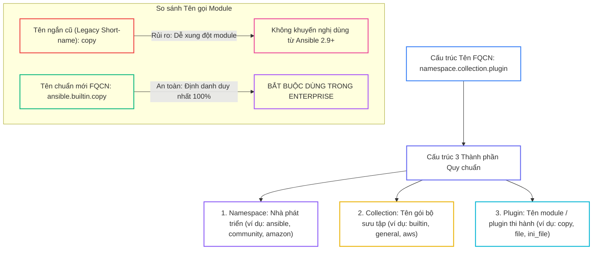
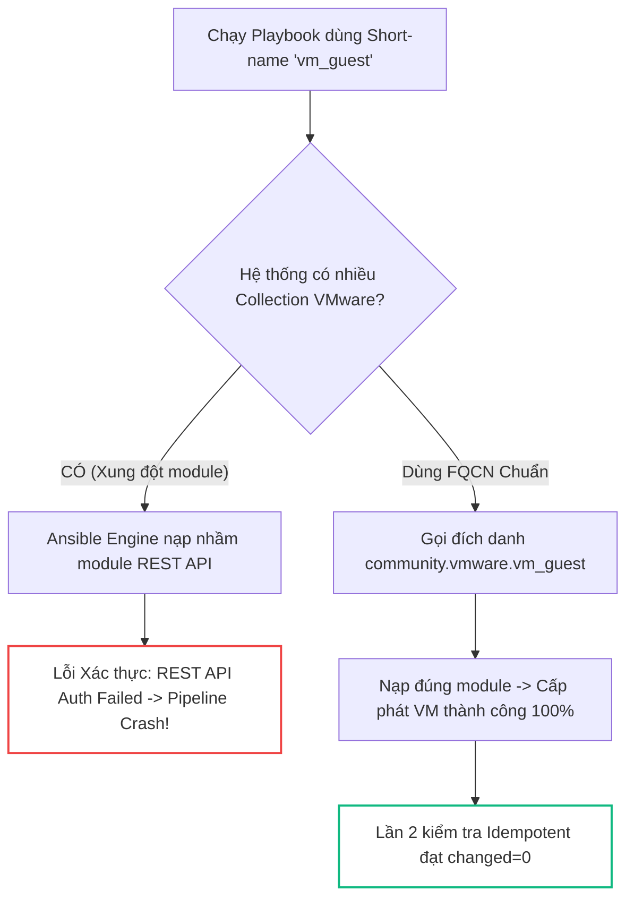


# [BÀI 17] ANSIBLE COLLECTIONS & FULLY QUALIFIED COLLECTION NAME (FQCN): TÁCH BIỆT CORE ENGINE & TÍCH HỢP ĐA NỀN TẢNG ĐÁM MÂY

Trong kỷ nguyên **Infrastructure as Code (IaC)** và tự động hóa vận hành hạ tầng đám mây (Cloud Infrastructure Automation), **Ansible** khẳng định vị thế dẫn đầu nhờ triết lý **Agentless** (không cần cài đặt agent nền trên máy đích), giao thức điều khiển an toàn qua **SSH / WinRM**, định dạng khai báo **YAML** trực quan và nguyên lý bất biến **Idempotency** mạnh mẽ. Việc làm chủ Ansible không chỉ dừng lại ở các câu lệnh Ad-hoc đơn giản, mà đòi hỏi kỹ sư phải nắm vững kiến trúc Module tầng thấp, Variable Precedence 22 tầng, Jinja2 Templates, tối ưu hóa Forks & Pipelining cho tới thiết kế Roles / Collections và tích hợp CI/CD tự động hóa chuẩn Doanh nghiệp.

Bài viết chuyên sâu này sẽ đồng hành cùng bạn mổ xẻ toàn diện bức tranh kiến trúc, phân tích các đánh đổi kỹ thuật thực chiến (Engineering Trade-offs), cung cấp hướng dẫn thực hành Lab chi tiết từng bước và bộ câu hỏi phỏng vấn chuyên sâu chuẩn DevOps / SRE Lead.

---

## 1. Bản Chất Kiến Trúc & Cơ Chế Vận Hành Tầng Thấp



### 1.1. Cấu Trúc FQCN và Khái Niệm Ansible Collection

Từ phiên bản Ansible 2.9 và Ansible Core 2.10 trở đi, Red Hat đã thay đổi hoàn toàn kiến trúc lõi bằng cách tách biệt bộ nhân `ansible-core` và các module/plugin thành các gói độc lập gọi là **Ansible Collections**:

- **FQCN (Fully Qualified Collection Name):** Chuẩn đặt tên định danh đầy đủ gồm 3 thành phần phân cách bởi dấu chấm: `<namespace>.<collection_name>.<plugin_name>`. Ví dụ: `ansible.builtin.copy`, `community.general.ini_file`, `amazon.aws.ec2_instance`.
- **Đóng gói toàn diện:** Không giống như Role chỉ chứa kịch bản YAML, một Collection đóng gói toàn bộ hệ sinh thái: Modules (Python code), Action Plugins, Filter Plugins, Lookup Plugins, Roles và Playbooks mẫu.
- **Loại bỏ sự nhập nhằng:** FQCN giúp Ansible Engine xác định chính xác 100% vị trí mã nguồn của module cần chạy, không phụ thuộc vào thứ tự tìm kiếm fallback trên đĩa cứng.

### 1.2. Sử Dụng `collections:` Directive, `ansible-doc` và FQCN Plugins

- **Rút gọn cú pháp với `collections:`:** Khai báo danh sách Collection ở đầu Playbook giúp gọi ngắn gọn các module trong phạm vi Collection đó mà vẫn an toàn.
- **Tra cứu tài liệu CLI với `ansible-doc`:** Tra cứu danh sách tham số và ví dụ mẫu chính thức bằng cú pháp FQCN: `ansible-doc ansible.builtin.file -s`.
- **FQCN cho Plugins và Filters:** Chuẩn FQCN áp dụng đồng bộ cho cả Lookup Plugins (`lookup('ansible.builtin.env', 'PATH')`) và Filters (`{{ data | ansible.builtin.to_nice_json }}`).

```yaml
- name: Standardized FQCN Example
  hosts: web
  become: true
  collections:
    - community.general
    - ansible.builtin
  tasks:
    - name: Manage INI file with Community Collection
      ini_file:
        path: /etc/app.ini
        section: database
        option: port
        value: "5432"
```

### 1.3. Triệt Tiêu Xung Đột Module và Quản Lý Phụ Thuộc

- **Triệt tiêu Module Name Collision:** Ngăn ngừa tình trạng 2 Collection khác nhau cùng chứa module trùng tên (ví dụ: `amazon.aws.ec2` vs `community.aws.ec2`) gây gọi nhầm module ngoài ý muốn.
- **Quản lý tập trung qua `requirements.yml`:** Khai báo các Collections mở rộng trong mục `collections:` và cài đặt tự động qua `ansible-galaxy collection install -r requirements.yml`.
- **Bảo toàn Idempotency:** Việc chuyển đổi từ short-name sang FQCN là chuẩn hóa cú pháp, giữ nguyên tính Idempotency tuyệt đối (`changed=0` ở Lần 2).

---

## 2. Bảng So Sánh Kỹ Thuật Toàn Diện (Engineering Matrix)

| Tiêu Chí Kỹ Thuật | Tên Ngắn Cũ (Legacy Short-name) | Chuẩn FQCN (`ansible.builtin.*`) | Từ Khóa `collections:` Directive |
|---|---|---|---|
| **Cú Pháp** | `copy:`, `file:`, `service:` | `ansible.builtin.copy:` | `collections: - community.general` |
| **Xác Định Vị Trí Module** | Tra cứu Fallback ngầm | Định danh duy nhất 100% | Định hướng theo danh sách khai báo |
| **Rủi Ro Xung Đột Tên** | Rất cao khi cài đa Collection | Hoàn toàn bằng 0 | Thấp (nếu kiểm soát namespace) |
| **Hiệu Năng Phân Tích (Parse)**| Mất thêm chu kỳ lookup | Nhanh nhất (Trực tiếp) | Nhanh |
| **Tiêu Chuẩn `ansible-lint`** | Bị cảnh báo lỗi vi phạm | Đạt chuẩn Enterprise 100% | Đạt chuẩn |

> [!IMPORTANT]
> **TIÊU CHUẨN RED HAT ENTERPRISE:**
> Từ Ansible Core 2.10+, việc sử dụng tên FQCN là bắt buộc trong mọi dự án sản xuất. Luôn tích hợp `ansible-lint` vào CI/CD pipeline để quét và chặn mọi cú pháp short-name cũ.

---

## 3. Kiến Trúc Triển Khai Chuẩn Production (Configuration / Playbook / Role Breakdown)

Dưới đây là kịch bản Playbook chuẩn hóa 100% theo FQCN kết hợp cả module lõi `ansible.builtin` và module mở rộng `community.general`:

```yaml
---
- name: Enterprise Standardized FQCN Playbook
  hosts: web
  become: true
  collections:
    - community.general
    - ansible.builtin
  tasks:
    - name: Task 1 - Ensure application directory exists using FQCN
      ansible.builtin.file:
        path: /etc/fqcn-app
        state: directory
        mode: '0755'

    - name: Task 2 - Deploy primary configuration file using FQCN
      ansible.builtin.copy:
        content: "APP_NAME=FQCN_PRODUCTION_SERVICE\nVERSION=2.0.0\nSTRICT_MODE=ENABLED\n"
        dest: /etc/fqcn-app.conf
        mode: '0644'

    - name: Task 3 - Query system status with Idempotent FQCN command
      ansible.builtin.command: hostname
      register: host_res
      changed_when: false

    - name: Task 4 - Configure INI settings via community.general
      community.general.ini_file:
        path: /etc/fqcn-app.ini
        section: database
        option: port
        value: "5432"
        mode: '0644'
```

### Phân Tích Kỹ Thuật Từng Dòng (Line-by-Line Breakdown):
- <span class="badge-line">Line 6-8</span>: `collections:` khai báo không gian tên mặc định cho Playbook.
- <span class="badge-line">Line 10-14</span>: `ansible.builtin.file` đảm bảo thư mục đích tồn tại với quyền 0755.
- <span class="badge-line">Line 16-21</span>: `ansible.builtin.copy` ghi nội dung cấu hình hệ thống bằng module lõi chuẩn hóa.
- <span class="badge-line">Line 23-26</span>: `ansible.builtin.command` thực thi lệnh đọc hostname kèm cờ `changed_when: false` để giữ vững tính Idempotency.
- <span class="badge-line">Line 28-34</span>: `community.general.ini_file` quản lý tệp INI cấu hình cơ sở dữ liệu từ Collection cộng đồng mở rộng.

---

## 4. Phân Tích Cạm Bẫy Thực Chiến: Xung Đột Tên Module Khi Tích Hợp Đa Nhà Cung Cấp

### Tình Huống Sự Cố Thực Tế Tại Doanh Nghiệp:
Một doanh nghiệp viễn thông vận hành hệ thống Hybrid Cloud đồng thời sử dụng cả VMware vSphere on-premise và AWS Cloud. Trong playbook cũ viết theo kiểu tên ngắn, kỹ sư gọi task `vm_guest:` và `ec2:`. Khi nâng cấp lên Ansible Core 2.12 và cài đặt 2 Collections `community.vmware` và `vmware.vmware_rest`, hai module trùng tên `vm_guest` từ hai collection đã gây xung đột thứ tự ưu tiên. Ansible Engine tự động nạp module của `vmware_rest` (vốn đòi hỏi xác thực REST API mới) thay vì module cũ, khiến toàn bộ pipeline tự động hóa cấp phát VM bị sập hoàn toàn trong đợt bàn giao hạ tầng.

### Hậu Quả & Log Lỗi Thực Tế:

```diff
- # Cách viết sai lầm: Dùng tên ngắn cũ gây xung đột nạp module
- - name: Provision Virtual Machine
-   vm_guest:
-     name: web-vm-01
- # Hậu quả: Nạp nhầm module -> REST API Authentication Failed!
+ # Cách viết chuẩn Enterprise: Định danh rõ ràng bằng FQCN
+ - name: Provision Virtual Machine
+   community.vmware.vm_guest:
+     name: web-vm-01
```



### 5-Whys Root Cause Analysis:
1. **Tại sao việc cấp phát VM thất bại?** Vì Ansible Engine trả về lỗi thiếu endpoint xác thực REST API.
2. **Tại sao lại phát sinh lỗi REST API trong khi hệ thống dùng SOAP cũ?** Vì task tự động nạp module `vmware.vmware_rest.vm_guest` thay vì module `community.vmware.vm_guest`.
3. **Tại sao Ansible nạp nhầm module?** Vì kỹ sư chỉ khai báo tên ngắn `vm_guest:` và để Ansible tự động tìm kiếm fallback.
4. **Tại sao không chỉ định rõ module?** Vì mã nguồn được viết từ thời Ansible 2.8 chưa được refactor sang chuẩn FQCN.
5. **Giải pháp triệt để là gì?** Bắt buộc refactor 100% Playbook sang FQCN đầy đủ (`community.vmware.vm_guest`), thiết lập rule `ansible-lint` kiểm tra tự động trước khi merge code.

---

## 5. Hands-on Lab: Chuyển Đổi Playbook Chuẩn Hóa 100% FQCN & Collections (8 Bước)

| Bước | Lệnh CLI / Tác Vụ Chính | Mục Đích Thực Thi |
|---|---|---|
| **1** | `mkdir -p ~/lab-ansible-17 && cd ~/lab-ansible-17` | Khởi tạo cấu trúc dự án và cấu hình `ansible.cfg` |
| **2** | `cat << 'EOF' > inventory.ini` | Khai báo danh sách các máy chủ đích `web` và `db` |
| **3** | `ansible-doc ansible.builtin.copy -s` | Tra cứu tài liệu cú pháp mẫu module FQCN |
| **4** | `cat << 'EOF' > requirements.yml` | Khai báo Collection `community.general` trong tệp phụ thuộc |
| **5** | `ansible-galaxy collection install -r requirements.yml` | Tải và cài đặt Collection tự động về máy local |
| **6** | `cat << 'EOF' > site-fqcn.yml` | Viết Playbook chuẩn hóa 100% theo chuẩn FQCN |
| **7** | `ansible-playbook site-fqcn.yml` | Thực thi cài đặt Lần 1 và kiểm tra trạng thái máy đích |
| **8** | `ansible-playbook site-fqcn.yml` | Thực thi Phép thử Lần 2 chứng minh `changed=0` tuyệt đối |

### Bước 1: Khởi tạo không gian làm việc và file cấu hình Ansible

```bash
mkdir -p ~/lab-ansible-17 && cd ~/lab-ansible-17

cat << 'EOF' > ansible.cfg
[defaults]
inventory = ./inventory.ini
remote_user = ansible
host_key_checking = False
private_key_file = ~/.ssh/id_ed25519
roles_path = ./roles:~/.ansible/roles
collections_path = ./collections:~/.ansible/collections

[privilege_escalation]
become = True
become_method = sudo
become_user = root
become_ask_pass = False
EOF
```

### Bước 2: Thiết lập Inventory cấu hình Target Nodes

```bash
cat << 'EOF' > inventory.ini
[web]
target1 ansible_host=127.0.0.1 ansible_port=2221

[db]
target2 ansible_host=127.0.0.1 ansible_port=2222

[all:vars]
ansible_python_interpreter=/usr/bin/python3
EOF
```

### Bước 3: Tra cứu tài liệu module chuẩn FQCN bằng ansible-doc

```bash
ansible-doc ansible.builtin.copy -s > doc-copy-snippet.txt
```

```bash
# CHECKPOINT 1: Xác nhận tra cứu thành công tài liệu mẫu module FQCN
if grep -q "ansible.builtin.copy:" doc-copy-snippet.txt; then
  echo "CHECKPOINT 1: ĐẠT - Lệnh CLI ansible-doc tra cứu thành công tài liệu mẫu module FQCN ansible.builtin.copy"
else
  echo "CHECKPOINT 1: LỖI - Tra cứu ansible-doc thất bại"
fi
```

### Bước 4: Khai báo Collection trong requirements.yml

```bash
cat << 'EOF' > requirements.yml
---
collections:
  - name: community.general
    version: ">=7.0.0"
EOF
```

```bash
# CHECKPOINT 2: Xác nhận requirements.yml chứa khai báo Collection
if grep -q "name: community.general" requirements.yml; then
  echo "CHECKPOINT 2: ĐẠT - Tệp requirements.yml chứa cấu hình collections: community.general được tạo thành công"
else
  echo "CHECKPOINT 2: LỖI - Biên soạn requirements.yml thất bại"
fi
```

### Bước 5: Cài đặt Collection phụ thuộc qua ansible-galaxy CLI

```bash
ansible-galaxy collection install -r requirements.yml
```

### Bước 6: Xây dựng Playbook site-fqcn.yml chuẩn hóa 100% FQCN

```bash
cat << 'EOF' > site-fqcn.yml
---
- name: Standardized Fully Qualified Collection Name (FQCN) Playbook
  hosts: web
  become: true
  collections:
    - community.general
    - ansible.builtin
  tasks:
    - name: Task 1 - Ensure configuration directory exists using FQCN
      ansible.builtin.file:
        path: /etc/fqcn-app
        state: directory
        mode: '0755'

    - name: Task 2 - Deploy main application config file using FQCN
      ansible.builtin.copy:
        content: "APP_NAME=FQCN_PRODUCTION_SERVICE\nVERSION=2.0.0\nSTRICT_MODE=ENABLED\n"
        dest: /etc/fqcn-app.conf
        mode: '0644'

    - name: Task 3 - Read system hostname with FQCN command (changed_when: false)
      ansible.builtin.command: hostname
      register: host_res
      changed_when: false

    - name: Task 4 - Manage INI configuration file using community.general.ini_file
      community.general.ini_file:
        path: /etc/fqcn-app.ini
        section: database
        option: port
        value: "5432"
        mode: '0644'
EOF
```

### Bước 7: Thực thi Playbook Lần 1 và kiểm tra kết quả

```bash
ansible-playbook site-fqcn.yml
```

```bash
# CHECKPOINT 3: Xác nhận Playbook gọi thành công module ansible.builtin.copy
FQCN_OUT=$(ansible-playbook site-fqcn.yml)
if echo "$FQCN_OUT" | grep -q "Task 2 - Deploy main application config file using FQCN" && echo "$FQCN_OUT" | grep -q "failed=0"; then
  echo "CHECKPOINT 3: ĐẠT - Playbook site-fqcn.yml gọi thành công module ansible.builtin.copy chuẩn FQCN"
else
  echo "CHECKPOINT 3: LỖI - Thi hành module ansible.builtin.copy thất bại"
fi

# CHECKPOINT 4: Xác nhận Playbook gọi thành công module community.general.ini_file
if echo "$FQCN_OUT" | grep -q "Task 4 - Manage INI configuration file using community.general.ini_file"; then
  echo "CHECKPOINT 4: ĐẠT - Playbook site-fqcn.yml gọi thành công module community.general.ini_file từ Collection mở rộng"
else
  echo "CHECKPOINT 4: LỖI - Thi hành module community.general.ini_file thất bại"
fi
```

### Bước 8: Thực thi Phép thử Lần 2 & Đối soát Sự thật Máy đích

```bash
ansible-playbook site-fqcn.yml
```

```bash
# CHECKPOINT 5: Xác nhận Lượt chạy Lần 2 đạt Idempotency tuyệt đối (changed=0)
RUN2_FQCN_OUT=$(ansible-playbook site-fqcn.yml)
if echo "$RUN2_FQCN_OUT" | grep -q "changed=0" && echo "$RUN2_FQCN_OUT" | grep -q "failed=0"; then
  echo "CHECKPOINT 5: ĐẠT - Phép thử Lượt 2 đạt chuẩn Idempotency (PLAY RECAP báo changed=0 cho toàn bộ Playbook FQCN)"
else
  echo "CHECKPOINT 5: LỖI - Lượt 2 không đạt changed=0 (Task FQCN bị lặp changed)"
fi

# CHECKPOINT 6: Đối soát nội dung file cấu hình /etc/fqcn-app.conf trên máy đích
EXEC_FQCN_CONF=$(docker exec target1 cat /etc/fqcn-app.conf)
if echo "$EXEC_FQCN_CONF" | grep -q "APP_NAME=FQCN_PRODUCTION_SERVICE" && echo "$EXEC_FQCN_CONF" | grep -q "STRICT_MODE=ENABLED"; then
  echo "CHECKPOINT 6: ĐẠT - Kiểm tra sự thật qua docker exec xác nhận file /etc/fqcn-app.conf tồn tại đúng dữ liệu từ module FQCN"
else
  echo "CHECKPOINT 6: LỖI - Đối soát file fqcn-app.conf trên máy đích thất bại"
fi
```

---

## 6. Bộ Câu Hỏi Vấn Đáp & Phỏng Vấn Chuyên Sâu (Self-Check Q&A)

<details class="qa-card" markdown="1">
  <summary class="qa-summary">
    <span class="qa-num-badge">Q01</span>
    <span class="qa-question-text">FQCN (Fully Qualified Collection Name) là gì? Hãy phân tích cấu trúc 3 thành phần quy chuẩn của một tên FQCN và cho ví dụ.</span>
  </summary>
  <div class="qa-answer">
    <div class="qa-answer-header">
      <svg width="14" height="14" fill="none" stroke="currentColor" stroke-width="2" viewBox="0 0 24 24"><path d="M22 11.08V12a10 10 0 1 1-5.93-9.14"></path><polyline points="22 4 12 14.01 9 11.01"></polyline></svg>
      <span>Phân Tích &amp; Lời Giải Kỹ Thuật</span>
    </div>
    <div style="margin: 0.5rem 0;"><b>Đáp án chuẩn:</b> FQCN là chuẩn đặt tên định danh đầy đủ giúp Ansible Engine xác định chính xác tuyệt đối vị trí mã nguồn của module/plugin. Cấu trúc 3 thành phần: <code>&lt;namespace&gt;.&lt;collection_name&gt;.&lt;plugin_name&gt;</code>:</div>
    <div style="margin: 0.35rem 0; padding-left: 1rem; border-left: 2px solid var(--accent-primary);">• <code>&lt;namespace&gt;</code>: Không gian tên của nhà phát triển (ví dụ: <code>ansible</code>, <code>community</code>, <code>amazon</code>).</div>
    <div style="margin: 0.35rem 0; padding-left: 1rem; border-left: 2px solid var(--accent-primary);">• <code>&lt;collection_name&gt;</code>: Tên bộ sưu tập (ví dụ: <code>builtin</code>, <code>general</code>, <code>aws</code>).</div>
    <div style="margin: 0.35rem 0; padding-left: 1rem; border-left: 2px solid var(--accent-primary);">• <code>&lt;plugin_name&gt;</code>: Tên module/plugin thi hành (ví dụ: <code>copy</code>, <code>ini_file</code>, <code>ec2_instance</code>).</div>
    <div style="margin: 0.5rem 0;">Ví dụ: <code>ansible.builtin.copy</code> hoặc <code>community.general.ini_file</code>.</div>
  </div>
</details>

<details class="qa-card" markdown="1">
  <summary class="qa-summary">
    <span class="qa-num-badge">Q02</span>
    <span class="qa-question-text">Ansible Collection là gì? Nó khác biệt gì so với một Ansible Role truyền thống về mặt đóng gói nội dung?</span>
  </summary>
  <div class="qa-answer">
    <div class="qa-answer-header">
      <svg width="14" height="14" fill="none" stroke="currentColor" stroke-width="2" viewBox="0 0 24 24"><path d="M22 11.08V12a10 10 0 1 1-5.93-9.14"></path><polyline points="22 4 12 14.01 9 11.01"></polyline></svg>
      <span>Phân Tích &amp; Lời Giải Kỹ Thuật</span>
    </div>
    <div style="margin: 0.5rem 0;"><b>Đáp án chuẩn:</b></div>
    <div style="margin: 0.35rem 0; padding-left: 1rem; border-left: 2px solid var(--accent-primary);">• <b>Ansible Collection:</b> Là định dạng đóng gói nội dung tự động hóa thế hệ mới của Red Hat.</div>
    <div style="margin: 0.35rem 0; padding-left: 1rem; border-left: 2px solid var(--accent-primary);">• <b>Khác biệt đóng gói:</b>
      <br>- <i>Ansible Role truyền thống:</i> Chỉ đóng gói Tasks, Handlers, Templates, Files và Vars.
      <br>- <i>Ansible Collection:</i> Đóng gói <b>TOÀN BỘ HỆ SINH THÁI</b> gồm Modules (Python code), Action Plugins, Filter Plugins, Lookup Plugins, Roles, và cả Playbooks mẫu vào duy nhất 1 gói nén tarball.</div>
  </div>
</details>

<details class="qa-card" markdown="1">
  <summary class="qa-summary">
    <span class="qa-num-badge">Q03</span>
    <span class="qa-question-text">Tại sao trong các kịch bản Ansible Enterprise mới, quản trị viên bắt buộc phải viết <code>ansible.builtin.copy</code> thay vì viết <code>copy:</code> như trước đây?</span>
  </summary>
  <div class="qa-answer">
    <div class="qa-answer-header">
      <svg width="14" height="14" fill="none" stroke="currentColor" stroke-width="2" viewBox="0 0 24 24"><path d="M22 11.08V12a10 10 0 1 1-5.93-9.14"></path><polyline points="22 4 12 14.01 9 11.01"></polyline></svg>
      <span>Phân Tích &amp; Lời Giải Kỹ Thuật</span>
    </div>
    <div style="margin: 0.5rem 0;"><b>Đáp án chuẩn:</b> 3 lý do kỹ thuật cốt lõi:</div>
    <div style="margin: 0.35rem 0; padding-left: 1rem; border-left: 2px solid var(--accent-primary);">1. <b>Triệt tiêu 100% xung đột tên module:</b> Nếu có 2 Collection cùng có module tên <code>copy</code>, dùng FQCN <code>ansible.builtin.copy</code> giúp Ansible Engine gọi đúng module cốt lõi của Ansible Core.</div>
    <div style="margin: 0.35rem 0; padding-left: 1rem; border-left: 2px solid var(--accent-primary);">2. <b>Tăng tốc độ thực thi:</b> Ansible Engine không phải mất thêm tài nguyên tìm kiếm và tra cứu bảng ánh xạ tên ngắn sang FQCN.</div>
    <div style="margin: 0.35rem 0; padding-left: 1rem; border-left: 2px solid var(--accent-primary);">3. <b>Đảm bảo tính tương thích lâu dài:</b> Sẵn sàng cho các phiên bản Ansible Core tương lai khi tên ngắn bị loại bỏ hoàn toàn.</div>
  </div>
</details>

<details class="qa-card" markdown="1">
  <summary class="qa-summary">
    <span class="qa-num-badge">Q04</span>
    <span class="qa-question-text">Trình bày tác dụng của từ khóa <code>collections:</code> ở cấp Playbook. Khi nào nên dùng và khi nào KHÔNG nên lạm dụng từ khóa này?</span>
  </summary>
  <div class="qa-answer">
    <div class="qa-answer-header">
      <svg width="14" height="14" fill="none" stroke="currentColor" stroke-width="2" viewBox="0 0 24 24"><path d="M22 11.08V12a10 10 0 1 1-5.93-9.14"></path><polyline points="22 4 12 14.01 9 11.01"></polyline></svg>
      <span>Phân Tích &amp; Lời Giải Kỹ Thuật</span>
    </div>
    <div style="margin: 0.5rem 0;"><b>Đáp án chuẩn:</b></div>
    <div style="margin: 0.35rem 0; padding-left: 1rem; border-left: 2px solid var(--accent-primary);">• <b>Tác dụng:</b> Khai báo danh sách các không gian tên Collection (như <code>collections: - community.general</code>), cho phép rút ngắn cú pháp gọi module trong Playbook mà không cần gõ tiền tố FQCN dài ở từng Task.</div>
    <div style="margin: 0.35rem 0; padding-left: 1rem; border-left: 2px solid var(--accent-primary);">• <b>Khi nên dùng:</b> Khi một Playbook gọi hàng chục module thuộc cùng 1 Collection ngoài (như <code>community.general</code>).</div>
    <div style="margin: 0.35rem 0; padding-left: 1rem; border-left: 2px solid var(--accent-primary);">• <b>Khi KHÔNG lạm dụng:</b> Trong các dự án Doanh nghiệp lớn có nhiều Collection trùng tên module, lạm dụng <code>collections:</code> có thể gây nhầm lẫn thứ tự ưu tiên giải mã module.</div>
  </div>
</details>

<details class="qa-card" markdown="1">
  <summary class="qa-summary">
    <span class="qa-num-badge">Q05</span>
    <span class="qa-question-text">Nêu câu lệnh CLI <code>ansible-doc</code> để tra cứu tài liệu và xem ví dụ mẫu của module <code>ansible.builtin.file</code>. Giải thích ý nghĩa của cờ <code>-s</code>.</span>
  </summary>
  <div class="qa-answer">
    <div class="qa-answer-header">
      <svg width="14" height="14" fill="none" stroke="currentColor" stroke-width="2" viewBox="0 0 24 24"><path d="M22 11.08V12a10 10 0 1 1-5.93-9.14"></path><polyline points="22 4 12 14.01 9 11.01"></polyline></svg>
      <span>Phân Tích &amp; Lời Giải Kỹ Thuật</span>
    </div>
    <div style="margin: 0.5rem 0;"><b>Đáp án chuẩn:</b></div>
    <div style="margin: 0.35rem 0; padding-left: 1rem; border-left: 2px solid var(--accent-primary);">• <b>Lệnh tra cứu đầy đủ:</b> <code>ansible-doc ansible.builtin.file</code></div>
    <div style="margin: 0.35rem 0; padding-left: 1rem; border-left: 2px solid var(--accent-primary);">• <b>Lệnh xem ví dụ mẫu ngắn gọn:</b> <code>ansible-doc ansible.builtin.file -s</code></div>
    <div style="margin: 0.35rem 0; padding-left: 1rem; border-left: 2px solid var(--accent-primary);">• <b>Ý nghĩa cờ <code>-s</code> (<code>--snippet</code>):</b> Chỉ in ra đoạn mã mẫu cú pháp YAML (Snippet) của module với các tham số chính, giúp copy nhanh vào Playbook mà không cần đọc toàn bộ mô tả lý thuyết dài.</div>
  </div>
</details>

<details class="qa-card" markdown="1">
  <summary class="qa-summary">
    <span class="qa-num-badge">Q06</span>
    <span class="qa-question-text">Ngoài Module, chuẩn FQCN được áp dụng cho các loại Plugin nào khác trong Ansible Playbook? Cho ví dụ với Lookup Plugin.</span>
  </summary>
  <div class="qa-answer">
    <div class="qa-answer-header">
      <svg width="14" height="14" fill="none" stroke="currentColor" stroke-width="2" viewBox="0 0 24 24"><path d="M22 11.08V12a10 10 0 1 1-5.93-9.14"></path><polyline points="22 4 12 14.01 9 11.01"></polyline></svg>
      <span>Phân Tích &amp; Lời Giải Kỹ Thuật</span>
    </div>
    <div style="margin: 0.5rem 0;"><b>Đáp án chuẩn:</b> Chuẩn FQCN áp dụng đồng bộ cho tất cả các loại Plugins: Lookup Plugins, Filter Plugins, Action Plugins, Connection Plugins, và Callback Plugins.</div>
    <div style="margin: 0.35rem 0; padding-left: 1rem; border-left: 2px solid var(--accent-primary);">• Ví dụ Lookup Plugin đọc biến môi trường:
      <br>- Cũ: <code>lookup('env', 'PATH')</code>
      <br>- Chuẩn FQCN: <code>lookup('ansible.builtin.env', 'PATH')</code></div>
    <div style="margin: 0.35rem 0; padding-left: 1rem; border-left: 2px solid var(--accent-primary);">• Ví dụ Filter Plugin: <code>my_dict | ansible.builtin.to_nice_json</code>.</div>
  </div>
</details>

<details class="qa-card" markdown="1">
  <summary class="qa-summary">
    <span class="qa-num-badge">Q07</span>
    <span class="qa-question-text">Bài toán Module Name Collision (xung đột tên module) là gì? FQCN giải quyết triệt để bài toán này ra sao?</span>
  </summary>
  <div class="qa-answer">
    <div class="qa-answer-header">
      <svg width="14" height="14" fill="none" stroke="currentColor" stroke-width="2" viewBox="0 0 24 24"><path d="M22 11.08V12a10 10 0 1 1-5.93-9.14"></path><polyline points="22 4 12 14.01 9 11.01"></polyline></svg>
      <span>Phân Tích &amp; Lời Giải Kỹ Thuật</span>
    </div>
    <div style="margin: 0.5rem 0;"><b>Đáp án chuẩn:</b> Module Name Collision xảy ra khi hệ thống cài đặt 2 Collections khác nhau nhưng cùng chứa 1 module trùng tên (ví dụ <code>amazon.aws.ec2</code> vs <code>community.aws.ec2</code>). Nếu người dùng viết short-name <code>ec2:</code>, Ansible Engine sẽ nạp nhầm module tùy theo thứ tự ưu tiên đường dẫn đĩa cứng, gây ra lỗi thực thi nghiêm trọng. FQCN giải quyết bằng cách ép buộc chỉ định chính xác nhà phát triển: <code>amazon.aws.ec2</code> hoặc <code>community.aws.ec2</code>, triệt tiêu 100% sự nhập nhằng.</div>
  </div>
</details>

<details class="qa-card" markdown="1">
  <summary class="qa-summary">
    <span class="qa-num-badge">Q08</span>
    <span class="qa-question-text">Trình bày cấu trúc khai báo cài đặt Collection <code>community.general</code> trong <code>requirements.yml</code> và câu lệnh CLI để tự động cài đặt.</span>
  </summary>
  <div class="qa-answer">
    <div class="qa-answer-header">
      <svg width="14" height="14" fill="none" stroke="currentColor" stroke-width="2" viewBox="0 0 24 24"><path d="M22 11.08V12a10 10 0 1 1-5.93-9.14"></path><polyline points="22 4 12 14.01 9 11.01"></polyline></svg>
      <span>Phân Tích &amp; Lời Giải Kỹ Thuật</span>
    </div>
    <div style="margin: 0.5rem 0;"><b>Đáp án chuẩn:</b></div>
    <div style="margin: 0.35rem 0; padding-left: 1rem; border-left: 2px solid var(--accent-primary);">• Cấu trúc <code>requirements.yml</code>:
      <pre><code>collections:
  - name: community.general
    version: "&gt;=7.0.0"</code></pre>
    </div>
    <div style="margin: 0.35rem 0; padding-left: 1rem; border-left: 2px solid var(--accent-primary);">• Câu lệnh CLI cài đặt: <code>ansible-galaxy collection install -r requirements.yml</code></div>
  </div>
</details>

<details class="qa-card" markdown="1">
  <summary class="qa-summary">
    <span class="qa-num-badge">Q09</span>
    <span class="qa-question-text">Trình bày quy trình 3 bước nghiệm thu một Playbook sử dụng 100% module FQCN để đảm bảo tính Idempotency và máy đích ở đúng trạng thái.</span>
  </summary>
  <div class="qa-answer">
    <div class="qa-answer-header">
      <svg width="14" height="14" fill="none" stroke="currentColor" stroke-width="2" viewBox="0 0 24 24"><path d="M22 11.08V12a10 10 0 1 1-5.93-9.14"></path><polyline points="22 4 12 14.01 9 11.01"></polyline></svg>
      <span>Phân Tích &amp; Lời Giải Kỹ Thuật</span>
    </div>
    <div style="margin: 0.5rem 0;"><b>Đáp án chuẩn:</b></div>
    <div style="margin: 0.35rem 0; padding-left: 1rem; border-left: 2px solid var(--accent-primary);">1. <b>Bước 1 (Thực thi Lần 1):</b> Chạy <code>ansible-playbook site-fqcn.yml</code>: Các module FQCN <code>ansible.builtin.*</code> và <code>community.general.*</code> thực thi và chép file báo <code>changed &gt; 0</code>.</div>
    <div style="margin: 0.35rem 0; padding-left: 1rem; border-left: 2px solid var(--accent-primary);">2. <b>Bước 2 (Kiểm Idempotency Lần 2):</b> Chạy lại nguyên vẹn <code>ansible-playbook site-fqcn.yml</code> Lần 2: bảng <code>PLAY RECAP</code> <b>bắt buộc phải đạt <code>changed=0</code></b> (tất cả các Task FQCN đều báo <code>ok</code>).</div>
    <div style="margin: 0.35rem 0; padding-left: 1rem; border-left: 2px solid var(--accent-primary);">3. <b>Bước 3 (Đối soát Sự thật Máy đích):</b> Dùng <code>docker exec target1 cat /etc/fqcn-app.conf</code> kiểm tra file cấu hình thực sự tồn tại đúng dữ liệu từ module FQCN.</div>
  </div>
</details>

<details class="qa-card" markdown="1">
  <summary class="qa-summary">
    <span class="qa-num-badge">Q10</span>
    <span class="qa-question-text">Công cụ <code>ansible-lint</code> là gì? Cờ kiểm tra <code>fqcn[action]</code> trong <code>ansible-lint</code> có tác dụng gì đối với việc chuẩn hóa mã nguồn tự động hóa?</span>
  </summary>
  <div class="qa-answer">
    <div class="qa-answer-header">
      <svg width="14" height="14" fill="none" stroke="currentColor" stroke-width="2" viewBox="0 0 24 24"><path d="M22 11.08V12a10 10 0 1 1-5.93-9.14"></path><polyline points="22 4 12 14.01 9 11.01"></polyline></svg>
      <span>Phân Tích &amp; Lời Giải Kỹ Thuật</span>
    </div>
    <div style="margin: 0.5rem 0;"><b>Đáp án chuẩn:</b></div>
    <div style="margin: 0.35rem 0; padding-left: 1rem; border-left: 2px solid var(--accent-primary);">• <b><code>ansible-lint</code>:</b> Là công cụ phân tích mã nguồn tĩnh (Static Code Analyzer) chính thức của Red Hat giúp kiểm tra tiêu chuẩn chất lượng và Best Practices của Playbook.</div>
    <div style="margin: 0.35rem 0; padding-left: 1rem; border-left: 2px solid var(--accent-primary);">• <b>Cờ <code>fqcn[action]</code>:</b> Tự động quét và phát hiện tất cả các Task vẫn còn sử dụng tên module ngắn cũ (như <code>copy:</code>, <code>file:</code>), và cảnh báo ép người viết phải refactor sang chuẩn FQCN <code>ansible.builtin.copy</code>.</div>
  </div>
</details>

<details class="qa-card" markdown="1">
  <summary class="qa-summary">
    <span class="qa-num-badge">Q11</span>
    <span class="qa-question-text">Lệnh CLI nào dùng để khởi tạo cấu trúc khung của một Ansible Collection mới? Cấu trúc thư mục của nó khác gì so với Role?</span>
  </summary>
  <div class="qa-answer">
    <div class="qa-answer-header">
      <svg width="14" height="14" fill="none" stroke="currentColor" stroke-width="2" viewBox="0 0 24 24"><path d="M22 11.08V12a10 10 0 1 1-5.93-9.14"></path><polyline points="22 4 12 14.01 9 11.01"></polyline></svg>
      <span>Phân Tích &amp; Lời Giải Kỹ Thuật</span>
    </div>
    <div style="margin: 0.5rem 0;"><b>Đáp án chuẩn:</b></div>
    <div style="margin: 0.35rem 0; padding-left: 1rem; border-left: 2px solid var(--accent-primary);">• <b>Lệnh khởi tạo:</b> <code>ansible-galaxy collection init &lt;namespace&gt;.&lt;collection_name&gt;</code> (ví dụ <code>ansible-galaxy collection init my_company.my_tools</code>).</div>
    <div style="margin: 0.35rem 0; padding-left: 1rem; border-left: 2px solid var(--accent-primary);">• <b>Khác biệt cấu trúc:</b>
      <br>- <i>Role:</i> Khung thư mục phẳng chứa <code>tasks/</code>, <code>handlers/</code>, <code>templates/</code>.
      <br>- <i>Collection:</i> Thư mục phân cấp chứa <code>plugins/modules/</code>, <code>plugins/filter/</code>, <code>plugins/lookup/</code>, <code>roles/</code>, và tệp siêu dữ liệu <code>galaxy.yml</code>.</div>
  </div>
</details>

<details class="qa-card" markdown="1">
  <summary class="qa-summary">
    <span class="qa-num-badge">Q12</span>
    <span class="qa-question-text">Tóm tắt 5 Quy tắc Vàng về Sử dụng FQCN và Collections.</span>
  </summary>
  <div class="qa-answer">
    <div class="qa-answer-header">
      <svg width="14" height="14" fill="none" stroke="currentColor" stroke-width="2" viewBox="0 0 24 24"><path d="M22 11.08V12a10 10 0 1 1-5.93-9.14"></path><polyline points="22 4 12 14.01 9 11.01"></polyline></svg>
      <span>Phân Tích &amp; Lời Giải Kỹ Thuật</span>
    </div>
    <div style="margin: 0.5rem 0;"><b>Đáp án chuẩn:</b></div>
    <div style="margin: 0.35rem 0; padding-left: 1rem; border-left: 2px solid var(--accent-primary);">1. <b>Quy tắc 1:</b> Viết 100% FQCN <code>ansible.builtin.*</code> cho tất cả các module hệ thống cốt lõi.</div>
    <div style="margin: 0.35rem 0; padding-left: 1rem; border-left: 2px solid var(--accent-primary);">2. <b>Quy tắc 2:</b> Sử dụng <code>ansible-doc &lt;FQCN&gt; -s</code> để tra cứu cú pháp và ví dụ chuẩn từ CLI.</div>
    <div style="margin: 0.35rem 0; padding-left: 1rem; border-left: 2px solid var(--accent-primary);">3. <b>Quy tắc 3:</b> Quản lý tập trung Collections mở rộng qua <code>requirements.yml</code> và cô lập trong <code>ansible.cfg</code>.</div>
    <div style="margin: 0.35rem 0; padding-left: 1rem; border-left: 2px solid var(--accent-primary);">4. <b>Quy tắc 4:</b> Sử dụng <code>ansible-lint</code> trong CI/CD để chặn 100% kịch bản dùng tên ngắn cũ.</div>
    <div style="margin: 0.35rem 0; padding-left: 1rem; border-left: 2px solid var(--accent-primary);">5. <b>Quy tắc 5:</b> Triệt tiêu hoàn toàn rủi ro xung đột module và đảm bảo Lần 2 đạt <code>changed=0</code> qua <code>docker exec</code>.</div>
  </div>
</details>

## Tổng Kết & Lộ Trình Bài Học Tiếp Theo

Kiến thức trong bài viết này đóng vai trò then chốt trong việc xây dựng hệ sinh thái tự động hóa hạ tầng ổn định, an toàn và tối ưu hiệu năng. Nắm vững cả lý thuyết kiến trúc và kỹ năng thực hành là chìa khóa để vận hành hệ thống ở quy mô lớn.

> [!TIP]
> **BÀI TIẾP THEO TRONG CHUỖI BÀI HỌC:**
> Tiếp tục nâng cao kỹ năng tự động hóa với bài học tiếp theo: [[Bài 18] So Sánh Thực Chiến Include vs Import: Dynamic Runtime Evaluation vs Static Pre-Processing Của Tasks/Roles](ansible-18-18-include-import.html).


