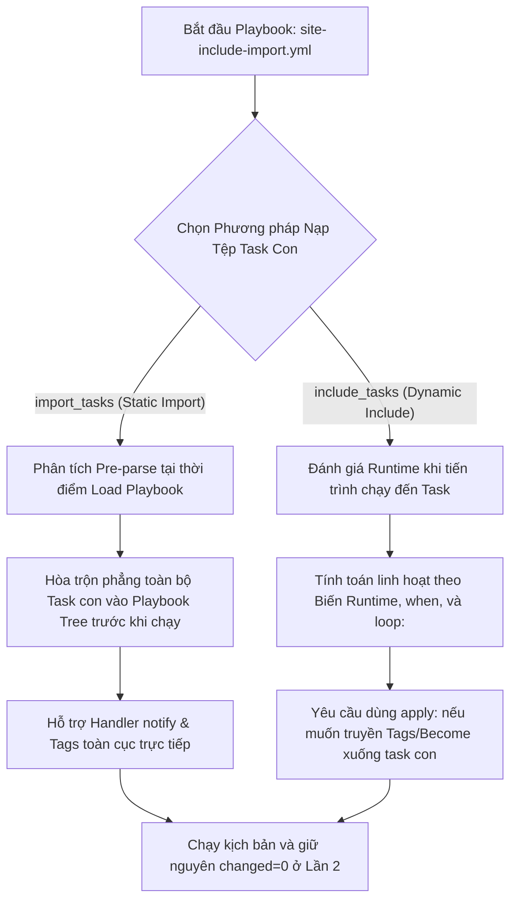
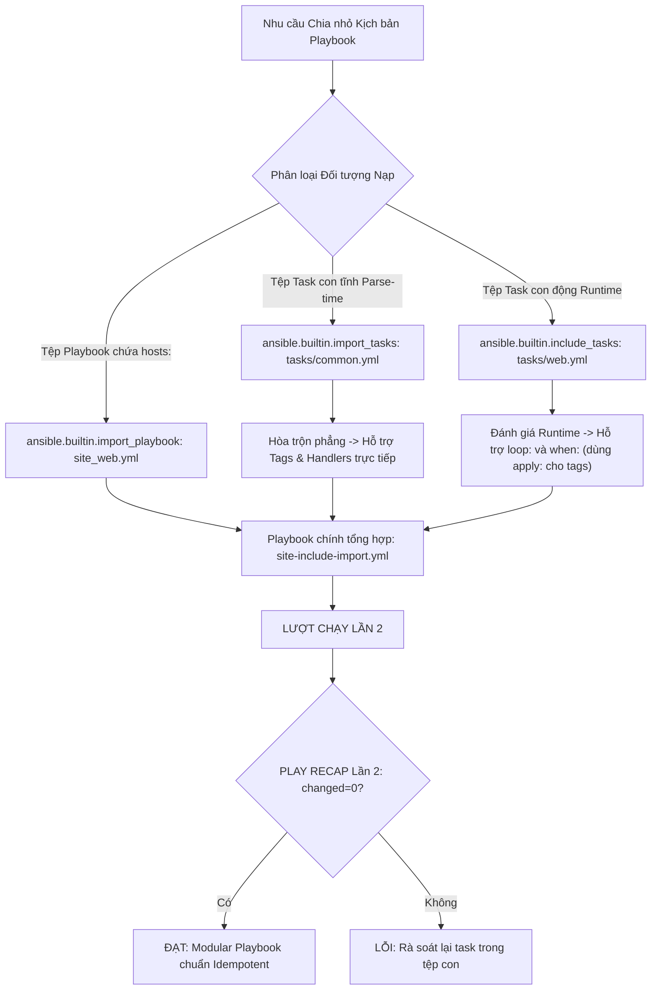
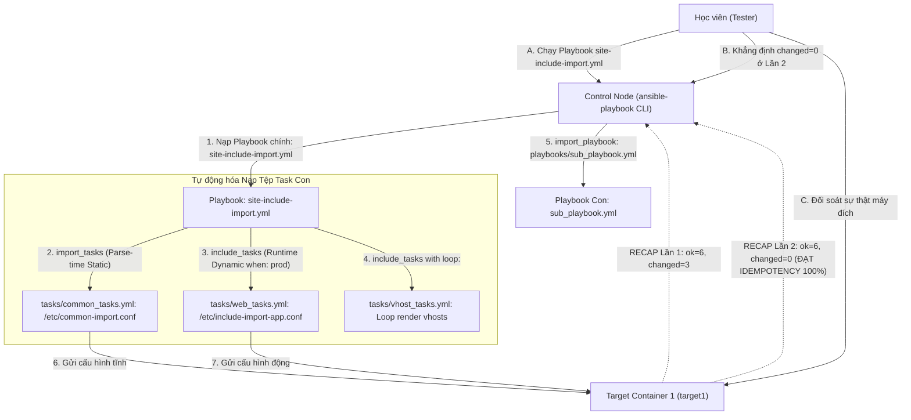


# [BÀI 18] SO SÁNH THỰC CHIẾN INCLUDE VS IMPORT: DYNAMIC RUNTIME EVALUATION VS STATIC PRE-PROCESSING CỦA TASKS/ROLES

Trong kỷ nguyên **Infrastructure as Code (IaC)** và tự động hóa vận hành hạ tầng đám mây (Cloud Infrastructure Automation), **Ansible** khẳng định vị thế dẫn đầu nhờ triết lý **Agentless** (không cần cài đặt agent nền trên máy đích), giao thức điều khiển an toàn qua **SSH / WinRM**, định dạng khai báo **YAML** trực quan và nguyên lý bất biến **Idempotency** mạnh mẽ. Việc làm chủ Ansible không chỉ dừng lại ở các câu lệnh Ad-hoc đơn giản, mà đòi hỏi kỹ sư phải nắm vững kiến trúc Module tầng thấp, Variable Precedence 22 tầng, Jinja2 Templates, tối ưu hóa Forks & Pipelining cho tới thiết kế Roles / Collections và tích hợp CI/CD tự động hóa chuẩn Doanh nghiệp.

Bài viết chuyên sâu này sẽ đồng hành cùng bạn mổ xẻ toàn diện bức tranh kiến trúc, phân tích các đánh đổi kỹ thuật thực chiến (Engineering Trade-offs), cung cấp hướng dẫn thực hành Lab chi tiết từng bước và bộ câu hỏi phỏng vấn chuyên sâu chuẩn DevOps / SRE Lead.

---

## 1. Bản Chất Kiến Trúc & Cơ Chế Vận Hành Tầng Thấp

---


> **Lựa chọn chính xác giữa nạp tĩnh (import_tasks/import_playbook) và nạp động (include_tasks/include_playbook) giúp tổ chức kịch bản Ansible linh hoạt, tối ưu hiệu năng và xử lý biến runtime chuẩn xác.**

Bảo vệ kiến trúc mã nguồn IaC khỏi các bẫy nạp tệp không đúng thời điểm (I-10):

> **Trong quá trình phát triển Playbook tự động hóa, việc chia nhỏ kịch bản thành nhiều tệp YAML con là yêu cầu bắt buộc để tăng tính đọc và dễ bảo trì. Ansible cung cấp hai cơ chế nạp tệp con: nạp tĩnh (Static Re-use qua `import_tasks` / `import_playbook`) và nạp động (Dynamic Re-use qua `include_tasks` / `include_role`). Nạp tĩnh sẽ hòa trộn các Task con ngay ở bước Parse Playbook ban đầu, giúp thừa hưởng Handler và thẻ Tag toàn cục. Nạp động chỉ tính toán khi tiến trình chạy đến Task đó ở Runtime, cho phép nạp Task theo vòng lặp `loop:` và điều kiện `when:` phức tạp. Hiểu sâu bản chất Parse-time vs Runtime giúp kỹ sư lựa chọn đúng công cụ, tránh crash kịch bản và duy trì tiêu chuẩn Idempotent `changed=0` ở Lần 2.**

---


---


---


| Tiếng Việt | Tiếng Anh / Từ khóa + FQCN (giữ nguyên) |
|---|---|
| Nạp tệp nhiệm vụ tĩnh | Static task import (`ansible.builtin.import_tasks`) |
| Nạp tệp nhiệm vụ động | Dynamic task inclusion (`ansible.builtin.include_tasks`) |
| Nạp tệp Playbook tĩnh | Static playbook import (`ansible.builtin.import_playbook`) |
| Tái sử dụng tĩnh | Static re-use (Pre-parse time evaluation) |
| Tái sử dụng động | Dynamic re-use (Runtime execution evaluation) |
| Áp dụng thuộc tính truyền xuống | Task attribute inheritance (`apply:`) |
| Thừa hưởng thẻ đánh dấu | Tag inheritance hierarchy |
| Thừa hưởng bộ kích hoạt | Handler notification inheritance |
| Giới hạn phạm vi biến nạp | Scope isolation (`public: false`) |
| Biến sinh ra ở Runtime | Runtime registered variables (`register:`) |
| Chia nhỏ kịch bản | Playbook modularization |
| Vòng lặp nạp tệp nhiệm vụ | Looped task inclusion (`include_tasks` + `loop:`) |

---

### 1.1. Phân biệt `import_tasks` (Static) vs `include_tasks` (Dynamic) (15 phút)



**Nguyên lý cốt lõi:** Phân biệt chính xác bản chất khác nhau về thời điểm thi hành giữa `ansible.builtin.import_tasks` (Static Re-use ở Parse-time) và `ansible.builtin.include_tasks` (Dynamic Re-use ở Runtime).

**Giải thích cơ chế ngầm:** `import_tasks` thực hiện hòa trộn nội dung của tệp task con vào ngay trong cây Playbook chính ở thời điểm parse file trước khi chạy. Ngược lại, `include_tasks` xem tệp task con như một task độc lập tại thời điểm runtime, chỉ được đọc và phân tích khi tiến trình chạy đến đúng vị trí đó.

> [!WARNING]
> **CẠM BẪY THỰC CHIẾN:**
> Dùng `import_tasks` để nạp tệp task con trong một vòng lặp `loop:` làm Ansible Parser báo lỗi syntax ngắt Playbook ở bước load.

**Minh hoạ.** Nạp tĩnh `import_tasks` và nạp động `include_tasks`:
```yaml
# Nạp tĩnh Static Import (Parse-time)
- name: Import static common tasks
  ansible.builtin.import_tasks: tasks/common_tasks.yml

# Nạp động Dynamic Include (Runtime)
- name: Include dynamic web tasks
  ansible.builtin.include_tasks: tasks/web_tasks.yml
  when: env_type == 'production'
```

**Nguyên lý cốt lõi:** Tái sử dụng và mô-đun hóa kịch bản bằng cách chia nhỏ các danh sách Task có cùng chức năng vào các tệp YAML con nằm trong thư mục `tasks/`.

**Giải thích cơ chế ngầm:** Giúp file Playbook chính giữ được độ ngắn gọn, dễ đọc, cho phép các thành viên trong đội cùng làm việc đồng thời trên nhiều tệp task con khác nhau mà không lo xung đột file Git.

> [!WARNING]
> **CẠM BẪY THỰC CHIẾN:**
> Viết 1 file Playbook phẳng dài 1000 dòng chứa tất cả cấu hình Firewall, User, Web, DB gây cực kỳ rườm rà và khó đọc.

**Minh hoạ.** Cấu trúc thư mục chia nhỏ task:
```bash
project/
├── site.yml
└── tasks/
    ├── common_tasks.yml
    ├── web_tasks.yml
    └── db_tasks.yml
```

**Nguyên lý cốt lõi:** Sử dụng module `ansible.builtin.import_playbook` để gom nhóm và thi hành tuần tự nhiều tệp Playbook hoàn chỉnh độc lập trong một kịch bản tổng thể.

**Giải thích cơ chế ngầm:** Cho phép chuỗi hóa các kịch bản triển khai lớn: gọi `import_playbook: playbooks/common.yml`, sau đó `import_playbook: playbooks/web.yml`, giúp tổ chức dự án cấp Enterprise theo từng tầng Playbook chuyên biệt.

> [!WARNING]
> **CẠM BẪY THỰC CHIẾN:**
> Dùng `import_tasks` để nạp 1 tệp Playbook (chứa từ khóa `hosts:`) làm Ansible Engine báo lỗi `Playbook directive not allowed in tasks`.

**Minh hoạ.** Gom nhóm nhiều Playbook bằng `import_playbook`:
```yaml
# site-all.yml
---
- name: Import Base Infrastructure Playbook
  ansible.builtin.import_playbook: playbooks/common.yml

- name: Import Web Applications Playbook
  ansible.builtin.import_playbook: playbooks/webservers.yml
```

---

### 1.2. Vòng lặp `include_tasks`, Thẻ Tags và thuộc tính `apply:` (15 phút)

**Nguyên lý cốt lõi:** Sử dụng module `ansible.builtin.include_tasks` kết hợp với từ khóa vòng lặp `loop:` để nạp và thực thi lại một tệp Task con cho từng phần tử trong danh sách.

**Giải thích cơ chế ngầm:** Cho phép xử lý kịch bản phức tạp: với mỗi phần tử trong mảng (như từng thông số Virtual Host hoặc từng Database user), Ansible sẽ nạp tệp `tasks/vhost_item.yml` và truyền biến của phần tử đó vào xử lý.

> [!WARNING]
> **CẠM BẪY THỰC CHIẾN:**
> Cố tình gõ `import_tasks` với `loop:` khiến Ansible Engine báo lỗi `Cannot use loop with import_tasks`.

**Minh hoạ.** Lặp mảng danh sách vhosts và nạp `include_tasks`:
```yaml
- name: Loop through vhost list and include setup tasks
  ansible.builtin.include_tasks: tasks/vhost_setup.yml
  loop:
    - { name: 'site1', port: 8081 }
    - { name: 'site2', port: 8082 }
  loop_control:
    loop_var: vhost_item
```

**Nguyên lý cốt lõi:** Tận dụng khả năng thừa hưởng thẻ `tags` và Handler notification toàn cục tự động của các tệp Task nạp tĩnh qua `import_tasks`.

**Giải thích cơ chế ngầm:** Vì `import_tasks` hòa trộn phẳng các task con ở bước parse-time, tất cả các Task bên trong tệp con sẽ tự động thừa hưởng thẻ `tags` được gán ở task import, và có thể phát thông báo `notify:` kích hoạt Handler nằm ở Playbook chính một cách trực tiếp.

> [!WARNING]
> **CẠM BẪY THỰC CHIẾN:**
> Thắc mắc tại sao khi chạy `ansible-playbook --tags web` thì các task nạp qua `include_tasks` lại không nhận được tag (do `include_tasks` nạp động ở runtime).

**Minh hoạ.** Gán tag cho `import_tasks` tự động lan xuống mọi task con:
```yaml
- name: Import web tasks with tag
  ansible.builtin.import_tasks: tasks/web_tasks.yml
  tags:
    - web_deploy
```

**Nguyên lý cốt lõi:** Sử dụng thuộc tính `apply:` bên trong `ansible.builtin.include_tasks` để ép buộc truyền các thuộc tính task (như `tags:`, `become:`, `environment:`) xuống tất cả các Task con nằm trong tệp được nạp động.

**Giải thích cơ chế ngầm:** Do `include_tasks` nạp động ở runtime, nếu gán `tags:` trực tiếp ở dòng `include_tasks`, thẻ tag đó chỉ có hiệu lực cho chính task include mà **không lan xuống các task con bên trong**. Thuộc tính `apply:` giải quyết triệt để vấn đề này.

> [!WARNING]
> **CẠM BẪY THỰC CHIẾN:**
> Gán `tags: [deploy]` trực tiếp cho `include_tasks` nhưng khi chạy `--tags deploy` các task con bên trong bị bỏ qua hoàn toàn.

**Minh hoạ.** Truyền thẻ tag xuống các task con trong `include_tasks` bằng `apply:`:
```yaml
- name: Include web tasks dynamically with applied tags
  ansible.builtin.include_tasks:
    file: tasks/web_tasks.yml
    apply:
      tags:
        - web_deploy
      become: true
  tags:
    - web_deploy
```

---

### 1.3. Bẫy Biến Runtime với `import_tasks`, Điều kiện `when:` và Idempotency (10 phút)

**Nguyên lý cốt lõi:** Tuyệt đối không tham chiếu các biến sinh ra ở thời điểm Runtime (như biến lưu kết quả `register:`) vào trong cờ điều kiện `when:` của `ansible.builtin.import_tasks`.

**Giải thích cơ chế ngầm:** `import_tasks` được Ansible Engine phân tích và đánh giá cờ `when:` ngay ở bước parse-time trước khi Playbook chạy. Tại thời điểm này, các biến sinh ra từ `register:` ở task trước chưa hề tồn tại, dẫn đến cờ `when:` của `import_tasks` bị đánh giá sai hoặc văng lỗi undefined variable.

> [!WARNING]
> **CẠM BẪY THỰC CHIẾN:**
> Dùng `import_tasks: file.yml when: reg_out.stdout == 'OK'` làm Playbook bị crash với lỗi `reg_out is undefined`.

**Minh hoạ.** Sử dụng `include_tasks` (Dynamic) khi cần đánh giá cờ `when:` dựa trên biến `register`:
```yaml
- name: Step 1 - Check system status and register variable
  ansible.builtin.command: cat /etc/status.txt
  register: status_res
  changed_when: false

- name: Step 2 - Include tasks dynamically based on registered variable
  ansible.builtin.include_tasks: tasks/repair_tasks.yml
  when: "'ERROR' in status_res.stdout"
```

**Nguyên lý cốt lõi:** Kết hợp thuộc tính điều kiện `when:` với `ansible.builtin.include_tasks` để nạp tệp Task linh hoạt theo trạng thái hệ điều hành hoặc môi trường triển khai.

**Giải thích cơ chế ngầm:** Cho phép tổ chức kịch bản hỗ trợ đa hệ điều hành: chỉ nạp `tasks/redhat.yml` khi `ansible_facts.os_family == 'RedHat'`, và nạp `tasks/debian.yml` khi `ansible_facts.os_family == 'Debian'`.

> [!WARNING]
> **CẠM BẪY THỰC CHIẾN:**
> Gom tất cả task CentOS và Ubuntu vào chung 1 file dài dằng dặc kèm hàng chục dòng `when:` trùng lặp.

**Minh hoạ.** Nạp tệp task theo hệ điều hành bằng `include_tasks`:
```yaml
- name: Include OS-specific setup tasks
  ansible.builtin.include_tasks: "tasks/{{ ansible_facts.os_family | lower }}_tasks.yml"
```

**Nguyên lý cốt lõi:** Đảm bảo rằng ở lượt chạy Lần thứ hai, Playbook chia nhỏ bằng `include_tasks` và `import_tasks` bắt buộc phải đạt chỉ số `changed=0` tuyệt đối trong bảng `PLAY RECAP`.

**Giải thích cơ chế ngầm:** Việc chia nhỏ Playbook thành các tệp task con chỉ giúp cải thiện cấu trúc tổ chức mã nguồn, không làm thay đổi bản chất Idempotency của các module bên dưới. Tất cả các Task trong các tệp con vẫn phải tuân thủ chuẩn Idempotent để ở Lần 2 chỉ trả về `ok` và `changed=0`.

> [!WARNING]
> **CẠM BẪY THỰC CHIẾN:**
> Bảng `PLAY RECAP` Lần 2 báo `changed > 0` do task trong tệp con bị lặp changed mạo danh.

**Minh hoạ.** Đọc hiểu bảng `PLAY RECAP` Lần 2 đạt Idempotency của Playbook chia nhỏ:
```bash
# Lần 1: changed=2 (Nạp tệp task con và thi hành chép file cấu hình)
target1 : ok=5 changed=2 unreachable=0 failed=0

# Lần 2: changed=0 (Mọi thứ trùng khớp 100% -> ĐẠT IDEMPOTENCY)
target1 : ok=5 changed=0 unreachable=0 failed=0
```

---

### 1.4. Đưa vào việc thật (4 phút)

### 7.1. Áp dụng vào hạ tầng sẵn có
Khi xây dựng bộ kịch bản quản trị hệ thống Doanh nghiệp lớn:
- Sử dụng `import_playbook` trong file tổng `site-all.yml` để liên kết 4 công đoạn: `playbooks/01-init-common.yml`, `playbooks/02-setup-db.yml`, `playbooks/03-setup-web.yml`, `playbooks/04-security-hardening.yml`.
- Trong từng Playbook, sử dụng `include_tasks` lặp mảng danh sách từ điển cấu hình ứng dụng.

### 7.2. Rủi ro hỏng hóc khi triển khai Production và giải pháp an toàn
- **Rủi ro:** Sử dụng `import_tasks` nạp tệp task chứa các lệnh ngắt kết nối SSH hoặc restart dịch vụ mạng, khiến Ansible Parser hòa trộn phẳng task vào giữa Playbook làm gián đoạn các task cần chạy phía sau.
- **Giải pháp an toàn:**
  1. Sử dụng `import_tasks` cho các task chuẩn hóa tĩnh nền tảng ở đầu Playbook.
  2. Sử dụng `include_tasks` cho các task điều kiện nâng cao ở giữa và cuối Playbook.

### 7.3. Đo lường chỉ số Trước – Sau khi áp dụng
- **Trước khi chia nhỏ:** 1 file Playbook phẳng dài 1500 dòng YAML, mỗi lần tìm task sửa chữa mất 15 phút cuộn trang.
- **Sau khi chia nhỏ:** File chính dài 20 dòng gọi `import_tasks` sang 5 file con gọn gàng trong `tasks/`, giảm 90% thời gian tìm kiếm sửa lỗi.

### 7.4. Khi nào KHÔNG nên dùng hoặc không nên lạm dụng include/import
- **Không lạm dụng `include_tasks` lồng nhau quá 3 cấp (Nested include_tasks):** Việc `include_tasks` tệp A, tệp A lại `include_tasks` tệp B, tệp B lại `include_tasks` tệp C sẽ khiến tiến trình chạy bị rối luồng và rất khó theo dõi vết lỗi trên terminal.

---

### 1.5. Bẫy hay gặp (2 phút)

| # | Bẫy hay gặp | Vì sao "recap xanh mà sai / không idempotent" | Lệnh phát hiện và xử lý |
|---|---|---|---|
| 1 | Dùng `import_tasks` bên trong vòng lặp `loop:` | Ansible Parser văng lỗi `Cannot use loop with import_tasks` ở bước load file. | Đổi từ `import_tasks` sang `ansible.builtin.include_tasks`. |
| 2 | Tham chiếu biến `register` vào `when:` của `import_tasks` | Biến register chưa tồn tại ở bước parse-time làm báo lỗi `undefined variable`. | Đổi sang dùng `ansible.builtin.include_tasks`. |
| 3 | Quên thuộc tính `apply:` khi gán tag cho `include_tasks` | Thẻ tag không lan xuống các task con làm task con bị skip khi chạy `--tags`. | Thêm khối `apply: tags: [my_tag]` trong `include_tasks`. |
| 4 | Dùng `import_tasks` để nạp 1 file Playbook chứa `hosts:` | Ansible Engine báo lỗi `Playbook directive not allowed in tasks`. | Dùng module `ansible.builtin.import_playbook` cho file Playbook. |
| 5 | Gõ sai đường dẫn tệp task con trong `tasks/` | Ansible báo lỗi `Could not find or access the file`. | Đảm bảo đường dẫn tệp tương đối chuẩn: `tasks/my_file.yml`. |
| 6 | Thắc mắc vì sao Handler trong `include_tasks` không chạy | `include_tasks` nạp động ở runtime nên Handler chỉ nhận từ thời điểm include trở đi. | Đặt Handler trong `handlers/main.yml` hoặc dùng `import_tasks`. |
| 7 | Biến truyền vào `include_tasks` làm đè biến global | Biến truyền qua `vars:` trong `include_tasks` mặc định tồn tại trong toàn Play. | Đặt tên biến có tiền tố rõ ràng để tránh đè nhầm. |
| 8 | Quên cờ `changed_when: false` cho task đọc dữ liệu trong tệp con | Task `command` trong tệp task con liên tục báo `changed=1` ở Lần 2. | Bổ sung `changed_when: false` cho task đọc dữ liệu. |
| 9 | Viết sai thuộc tính `file:` trong `include_tasks` | Viết `include_tasks: file = tasks/web.yml` sai cú pháp từ khóa YAML. | Viết đúng cú pháp YAML: `include_tasks: tasks/web.yml` hoặc `file:`. |
| 10 | Không test thử Idempotency Lần 2 của kịch bản chia nhỏ | Task trong tệp con bị lặp changed mạo danh ở Lần 2 mà không biết. | Chạy lại Playbook Lần 2 và đối soát `changed=0`. |
| 11 | Lồng `include_tasks` quá 3 cấp gây rắc rối | Luồng thi hành rườm rà làm khó debug khi gặp exception. | Rút gọn cấu trúc nạp tệp task con tối đa 2 cấp. |
| 12 | Thắc mắc vì sao `import_playbook` không chạy được trong task | `import_playbook` là directive ở cấp root Playbook, không nằm trong `tasks:`. | Đặt `import_playbook` nằm ở cấp cao nhất ngoài khối `tasks:`. |

---

### 1.6. Tóm tắt (1 phút)



### Năm điều phải nhớ
1. **Phân biệt `import` vs `include`:** `import` nạp tĩnh ở Parse-time; `include` nạp động ở Runtime.
2. **Dùng `import_playbook` cho Playbook:** Gom nhóm nhiều tệp Playbook độc lập bằng `import_playbook`.
3. **Dùng `include_tasks` với `loop:`:** Nạp tệp task con linh hoạt trong vòng lặp mảng danh sách.
4. **Dùng `apply:` cho `include_tasks`:** Ép truyền thẻ `tags` và `become` xuống các task con nạp động.
5. **Đạt chuẩn `changed=0` ở Lần 2:** Mọi kịch bản chia nhỏ bằng include/import ở lượt chạy Lần 2 bắt buộc phải đạt `changed=0`.

---

### 1.7. Câu hỏi tự kiểm tra (kiêm luyện RHCE EX294)

1. **[RHCE EX294 Objective #13]** Sự khác nhau về thời điểm nạp giữa module `ansible.builtin.import_tasks` và `ansible.builtin.include_tasks` là gì?
   - *Đáp án:* `import_tasks` nạp tĩnh tại thời điểm Parse-time (trước khi chạy); `include_tasks` nạp động tại thời điểm Runtime (khi tiến trình chạy tới Task đó).
2. **[RHCE EX294 Objective #13]** Module nào dùng để gom nhóm và thi hành tuần tự nhiều tệp Playbook độc lập trong một kịch bản tổng thể?
   - *Đáp án:* Module `ansible.builtin.import_playbook`.
3. **[RHCE EX294 Objective #13]** Muốn nạp một tệp task con lặp qua một mảng danh sách bằng từ khóa `loop:`, ta bắt buộc phải sử dụng module nào?
   - *Đáp án:* Bắt buộc dùng `ansible.builtin.include_tasks` (vì `import_tasks` không hỗ trợ `loop:`).
4. **[RHCE EX294 Objective #13]** Thuộc tính nào dùng để truyền thẻ tag `web_deploy` xuống tất cả các Task con nằm trong tệp được nạp động qua `include_tasks`?
   - *Đáp án:* Thuộc tính `apply:` (cú pháp `apply: tags: [web_deploy]`).
5. **[RHCE EX294 Objective #13]** Tại sao không nên tham chiếu biến đăng ký `register:` ở task trước vào cờ điều kiện `when:` của `import_tasks`?
   - *Đáp án:* Vì `import_tasks` được đánh giá ngay ở bước parse-time trước khi chạy, tại thời điểm đó biến `register:` chưa tồn tại dẫn đến lỗi undefined variable.
6. **[RHCE EX294 Objective #13]** Viết đoạn mã YAML nạp tĩnh tệp `tasks/common.yml` bằng `import_tasks` và gán tag `base_setup`.
   - *Đáp án:*
     ```yaml
     - name: Import static common tasks
       ansible.builtin.import_tasks: tasks/common.yml
       tags:
         - base_setup
     ```
7. **[RHCE EX294 Objective #13]** Viết đoạn mã YAML nạp động tệp `tasks/redhat.yml` bằng `include_tasks` khi biến `ansible_facts.os_family == 'RedHat'`.
   - *Đáp án:*
     ```yaml
     - name: Include RedHat specific tasks
       ansible.builtin.include_tasks: tasks/redhat.yml
       when: ansible_facts.os_family == 'RedHat'
     ```
8. **[RHCE EX294 Objective #13]** Tệp task con được nạp bằng `import_tasks` có tự động thừa hưởng các Handler nằm ở Playbook chính không?
   - *Đáp án:* Có, vì `import_tasks` hòa trộn phẳng các task con ở bước parse-time nên Handler được nhận trực tiếp.
9. **[RHCE EX294 Objective #13]** Viết đoạn Playbook YAML tổng thể `site-all.yml` nạp 2 Playbook con `playbooks/common.yml` và `playbooks/web.yml` bằng `import_playbook`.
   - *Đáp án:*
     ```yaml
     ---
     - name: Import Common Playbook
       ansible.builtin.import_playbook: playbooks/common.yml

     - name: Import Web Playbook
       ansible.builtin.import_playbook: playbooks/web.yml
     ```
10. **[RHCE EX294 Objective #13]** Thuộc tính `loop_control: loop_var: task_item` trong `include_tasks` có tác dụng gì?
    - *Đáp án:* Dùng để đổi tên biến vòng lặp từ `item` mặc định sang `task_item`, tránh xung đột khi lồng nhiều vòng lặp.
11. **[RHCE EX294 Objective #13]** Thư mục tiêu chuẩn nào khuyến nghị dùng để chứa các tệp Task con được chia nhỏ trong dự án?
    - *Đáp án:* Thư mục `tasks/` (nằm cùng cấp với Playbook chính hoặc bên trong Role).
12. **[RHCE EX294 Objective #13]** Việc chia nhỏ Playbook bằng `include_tasks` và `import_tasks` có làm thay đổi chỉ số Idempotency `changed=0` ở Lần chạy thứ hai không?
    - *Đáp án:* Hoàn toàn không, kịch bản ở Lần 2 thi hành lại vẫn bắt buộc phải đạt `changed=0` tuyệt đối.
13. **[RHCE EX294 Objective #13]** Lệnh CLI nào giúp kiểm tra sự thật kết quả thực thi của các tệp task con nạp từ `include_tasks` trên target node Docker container?
    - *Đáp án:* Lệnh `docker exec target1 cat /path/to/rendered/file`.

---

### 1.8. Tài liệu tham khảo

- Ansible Core Documentation (v2.15+): [Re-using Ansible artifacts - Includes and Imports](https://docs.ansible.com/ansible/latest/playbook_guide/playbooks_reuse_includes.html)
- Ansible Core Documentation: [import_tasks module](https://docs.ansible.com/ansible/latest/collections/ansible/builtin/import_tasks_module.html)
- Ansible Core Documentation: [include_tasks module](https://docs.ansible.com/ansible/latest/collections/ansible/builtin/include_tasks_module.html)
- Red Hat Certified Engineer (RHCE) EX294 Study Guide: Reusing Content with Dynamic Includes and Static Imports.

---

## Bảng đối soát thời lượng

| Mục | Nội dung | Thời lượng dự kiến | Thời lượng thực tế |
|---|---|---|---|
| §0 | Khởi động và ôn tập buổi 17 | 10 phút | 10 phút |
| §1–§2 | Mục tiêu làm được & Cần biết trước | 2 phút | 2 phút |
| §3 | Thuật ngữ Việt-Anh & Mô hình tư duy | 8 phút | 8 phút |
| §4 | import_tasks vs include_tasks & import_playbook (QT 4.1–4.3) | 15 phút | 15 phút |
| §5 | Vòng lặp include_tasks, Tags & apply: (QT 5.1–5.3) | 15 phút | 15 phút |
| §6 | Bẫy Biến Runtime, when: & Idempotency (QT 6.1–6.3) | 10 phút | 10 phút |
| §7–§9 | Đưa vào việc thật, Bẫy hay gặp & Tóm tắt | 7 phút | 7 phút |
| §10–§11 | Câu hỏi tự kiểm tra EX294 & Tài liệu tham khảo | 3 phút | 3 phút |
| **Tổng** | **Khối lý thuyết Buổi 18** | **60 phút** | **60 phút** |

---

## 2. Hướng Dẫn Thực Hành & Triển Khai Lab Chuẩn Production

> [!IMPORTANT]
> **YÊU CẦU MÔI TRƯỜNG THỰC HÀNH:**
> Toàn bộ các bài thực hành dưới đây được thiết kế để chạy trực tiếp trên môi trường máy chủ Linux / Docker containers phân tán. Hãy đảm bảo bạn đã chuẩn bị Control Node cài đặt Ansible Core 2.15+ cùng các Managed Nodes đã cấu hình SSH Key Authentication.

## Khối thực hành — 150 phút

> **Đối soát thời lượng:** Khối thực hành kéo dài đúng **150'** (từ L0 đến L11).
> **Nguyên tắc cốt lõi:** Thực hành chia nhỏ kịch bản thành các tệp task con trong `tasks/`, sử dụng `ansible.builtin.import_tasks` nạp tĩnh, sử dụng `ansible.builtin.include_tasks` nạp động kết hợp điều kiện `when:`, sử dụng `include_tasks` kết hợp vòng lặp `loop:` duyệt mảng cấu hình, sử dụng `ansible.builtin.import_playbook` gom nhóm Playbook, gán thuộc tính `apply: tags:` cho `include_tasks`, thực thi phép thử **Lượt chạy Lần thứ hai** chứng minh `PLAY RECAP` đạt `changed=0` và đối soát sự thật máy đích qua `docker exec`.

---

## L0. Mục tiêu thực hành và tiêu chí hoàn thành

| # | Mục tiêu thực hành | Tiêu chí hoàn thành (Kiểm tra bằng lệnh CLI) |
|---|---|---|
| TH1 | Chia nhỏ kịch bản thành các tệp task con trong tasks/ | Đã tạo các tệp `tasks/common_tasks.yml`, `tasks/web_tasks.yml` |
| TH2 | Sử dụng import_tasks nạp tĩnh tệp task con | Module `ansible.builtin.import_tasks: tasks/common_tasks.yml` |
| TH3 | Sử dụng include_tasks nạp động kết hợp when: | Module `ansible.builtin.include_tasks: tasks/web_tasks.yml` |
| TH4 | Sử dụng include_tasks kết hợp vòng lặp loop: | Module `include_tasks` nạp tệp vhost lặp qua mảng list |
| TH5 | Gán thuộc tính apply: tags: cho include_tasks | Khai báo `apply: tags: [web_deploy]` truyền tag xuống task con |
| TH6 | Gom nhóm Playbook bằng import_playbook | Module `ansible.builtin.import_playbook: playbooks/sub.yml` |
| TH7 | Thực thi Phép thử Lượt chạy Lần hai (Idempotency) | Bảng `PLAY RECAP` Lần 2 đạt `changed=0` tuyệt đối |
| TH8 | Đối soát sự thật máy đích bằng docker exec | `docker exec target1 cat /etc/include-import-app.conf` |

---

## L1. Điều kiện tiên quyết về môi trường

| Kiểm tra | LỆNH THỰC THI | Kết quả kỳ vọng |
|---|---|---|
| Ansible core đã cài | `ansible --version` | Phiên bản ansible-core v2.15 trở lên |
| Docker Compose sẵn sàng | `docker compose ps` | Cả target1 và target2 ở trạng thái `Up` |
| Kết nối SSH sẵn sàng | `ansible all -m ansible.builtin.ping` | Đạt `SUCCESS` cho mọi host |
| Inventory dự án | `ansible-inventory --graph` | Hiển thị các nhóm `web` và `db` |
| Thư mục thực hành | `pwd` | Đang ở thư mục `~/lab-ansible-18` |

Nếu chưa có target container:
```bash
cd labs && make up && make key && make inventory
```

---

## L2. Kiến trúc bài lab



---

## L3. Bước 1 — Chia nhỏ các Tệp Task Con trong Thư mục tasks/ (30 phút)

Tạo thư mục dự án `~/lab-ansible-18`, thư mục `tasks`, `playbooks`, file `ansible.cfg`, `inventory.ini`, và biên soạn các tệp task con `tasks/common_tasks.yml`, `tasks/web_tasks.yml`, `tasks/vhost_tasks.yml` (QT 4.1, QT 4.2).

```bash
mkdir -p ~/lab-ansible-18/tasks ~/lab-ansible-18/playbooks && cd ~/lab-ansible-18

cat << 'EOF' > ansible.cfg
[defaults]
inventory = ./inventory.ini
remote_user = ansible
host_key_checking = False
private_key_file = ~/.ssh/id_ed25519
roles_path = ./roles:~/.ansible/roles
collections_path = ./collections:~/.ansible/collections

[privilege_escalation]
become = True
become_method = sudo
become_user = root
become_ask_pass = False
EOF

cat << 'EOF' > inventory.ini
[web]
target1 ansible_host=127.0.0.1 ansible_port=2221

[db]
target2 ansible_host=127.0.0.1 ansible_port=2222

[all:vars]
ansible_python_interpreter=/usr/bin/python3
EOF

# 1. Tệp task con nạp tĩnh: tasks/common_tasks.yml
cat << 'EOF' > tasks/common_tasks.yml
---
- name: Common Task 1 - Deploy static base configuration
  ansible.builtin.copy:
    content: "STATIC_BASE=INITIALIZED\nPARSED_AT=PRE_PARSE_TIME\n"
    dest: /etc/common-import.conf
    mode: '0644'
EOF

# 2. Tệp task con nạp động: tasks/web_tasks.yml
cat << 'EOF' > tasks/web_tasks.yml
---
- name: Web Task 1 - Deploy dynamic web application config
  ansible.builtin.copy:
    content: "APP_NAME={{ app_name | default('DYNAMIC_APP') }}\nPORT={{ app_port | default(8080) }}\n"
    dest: /etc/include-import-app.conf
    mode: '0644'

- name: Web Task 2 - Read system uptime with FQCN (changed_when: false)
  ansible.builtin.command: uptime
  register: uptime_out
  changed_when: false
EOF

# 3. Tệp task con nạp theo vòng lặp: tasks/vhost_tasks.yml
cat << 'EOF' > tasks/vhost_tasks.yml
---
- name: Vhost Task 1 - Create vhost directory
  ansible.builtin.file:
    path: "/var/www/{{ current_vhost.name }}"
    state: directory
    mode: '0755'

- name: Vhost Task 2 - Deploy vhost page
  ansible.builtin.copy:
    content: "VHOST={{ current_vhost.name }}\nPORT={{ current_vhost.port }}\n"
    dest: "/var/www/{{ current_vhost.name }}/index.txt"
    mode: '0644'
EOF
```

**CHECKPOINT 1 — Các tệp task con tasks/common_tasks.yml, tasks/web_tasks.yml, tasks/vhost_tasks.yml được biên soạn thành công.**
- **Lệnh kiểm tra:**
```bash
if [ -f "tasks/common_tasks.yml" ] && [ -f "tasks/web_tasks.yml" ] && [ -f "tasks/vhost_tasks.yml" ]; then
  echo "CHECKPOINT 1: ĐẠT - Các tệp task con trong thư mục tasks/ được tạo thành công"
else
  echo "CHECKPOINT 1: LỖI - Biên soạn tệp task con thất bại"
fi
```

---

## L4. Bước 2 — Chuẩn bị Playbook Con để Nạp bằng import_playbook (30 phút)

Biên soạn tệp Playbook con `playbooks/sub_playbook.yml` để thử nghiệm module `ansible.builtin.import_playbook` (QT 4.3).

```bash
cat << 'EOF' > playbooks/sub_playbook.yml
---
- name: Sub Playbook - Secondary Infrastructure Verification
  hosts: web
  become: true
  tasks:
    - name: Sub Task 1 - Deploy sub-playbook marker file
      ansible.builtin.copy:
        content: "SUB_PLAYBOOK=EXECUTED_SUCCESSFULLY\n"
        dest: /etc/sub-playbook.marker
        mode: '0644'
EOF
```

**CHECKPOINT 2 — Tệp Playbook con playbooks/sub_playbook.yml được tạo đúng vị trí hỗ trợ import_playbook.**
- **Lệnh kiểm tra:**
```bash
if [ -f "playbooks/sub_playbook.yml" ] && grep -q "Sub Task 1" playbooks/sub_playbook.yml; then
  echo "CHECKPOINT 2: ĐẠT - Tệp Playbook con playbooks/sub_playbook.yml được tạo thành công"
else
  echo "CHECKPOINT 2: LỖI - Tạo tệp Playbook con thất bại"
fi
```

---

## L5. Bước 3 — Viết Playbook chính site-include-import.yml Tổng hợp Kỹ thuật (40 phút)

Viết file Playbook chính `site-include-import.yml` nạp tĩnh `import_tasks`, nạp động `include_tasks` với `when:`, `loop:`, `apply: tags:`, và `import_playbook` (QT 4.1, QT 5.1, QT 5.2, QT 5.3, QT 6.1, QT 6.2).

```bash
cat << 'EOF' > site-include-import.yml
---
- name: Master Playbook Combining Import and Include Directives
  hosts: web
  become: true
  vars:
    deploy_env: "production"
    vhosts_data:
      - name: "vhost_alpha"
        port: 9001
      - name: "vhost_beta"
        port: 9002
  tasks:
    - name: Task 1 - Import static common tasks with tag
      ansible.builtin.import_tasks: tasks/common_tasks.yml
      tags:
        - base_setup

    - name: Task 2 - Include dynamic web tasks with apply tags and when condition
      ansible.builtin.include_tasks:
        file: tasks/web_tasks.yml
        apply:
          tags:
            - web_setup
          become: true
      vars:
        app_name: "MASTER_INCLUDE_APP"
        app_port: 8888
      when: deploy_env == 'production'

    - name: Task 3 - Include vhost tasks with loop
      ansible.builtin.include_tasks:
        file: tasks/vhost_tasks.yml
      loop: "{{ vhosts_data }}"
      loop_control:
        loop_var: current_vhost

- name: Import Sub Playbook
  ansible.builtin.import_playbook: playbooks/sub_playbook.yml
EOF
```

Thực thi Lần 1:
```bash
ansible-playbook site-include-import.yml
```

**CHECKPOINT 3 — Playbook site-include-import.yml nạp tĩnh thành công tasks/common_tasks.yml qua import_tasks (PLAY RECAP failed=0).**
- **Lệnh kiểm tra:**
```bash
MASTER_OUT=$(ansible-playbook site-include-import.yml)
if echo "$MASTER_OUT" | grep -q "Common Task 1 - Deploy static base configuration" && echo "$MASTER_OUT" | grep -q "failed=0"; then
  echo "CHECKPOINT 3: ĐẠT - Playbook nạp tĩnh thành công tasks/common_tasks.yml qua import_tasks"
else
  echo "CHECKPOINT 3: LỖI - Thi hành import_tasks thất bại"
fi
```

**CHECKPOINT 4 — Module include_tasks nạp động thành công tasks/web_tasks.yml với thuộc tính apply: tags: và điều kiện when: thỏao mãn.**
- **Lệnh kiểm tra:**
```bash
if echo "$MASTER_OUT" | grep -q "Web Task 1 - Deploy dynamic web application config"; then
  echo "CHECKPOINT 4: ĐẠT - Module include_tasks nạp động thành công tasks/web_tasks.yml với apply: và when:"
else
  echo "CHECKPOINT 4: LỖI - Thi hành include_tasks với apply hoặc when thất bại"
fi
```

**CHECKPOINT 5 — Module import_playbook nạp và thi hành thành công tệp Playbook con playbooks/sub_playbook.yml.**
- **Lệnh kiểm tra:**
```bash
if echo "$MASTER_OUT" | grep -q "Sub Task 1 - Deploy sub-playbook marker file"; then
  echo "CHECKPOINT 5: ĐẠT - Module import_playbook nạp và thi hành thành công tệp Playbook con"
else
  echo "CHECKPOINT 5: LỖI - Thi hành import_playbook thất bại"
fi
```

---

## L6. Bước 4 — Phép thử Lượt chạy Lần thứ hai Chứng minh Idempotency (30 phút)

Thực thi lại nguyên vẹn `ansible-playbook site-include-import.yml` Lần 2 để đối soát chỉ số Idempotency `changed=0` (QT 6.3).

```bash
ansible-playbook site-include-import.yml
```

**CHECKPOINT 6 — Phép thử Lượt 2 đạt changed=0 cho toàn bộ các Task nạp từ import_tasks, include_tasks, và import_playbook.**
- **Lệnh kiểm tra:**
```bash
RUN2_MST_OUT=$(ansible-playbook site-include-import.yml)
if echo "$RUN2_MST_OUT" | grep -q "changed=0" && echo "$RUN2_MST_OUT" | grep -q "failed=0"; then
  echo "CHECKPOINT 6: ĐẠT - Phép thử Lượt 2 đạt chuẩn Idempotency (PLAY RECAP báo changed=0 cho toàn bộ Playbook include/import)"
else
  echo "CHECKPOINT 6: LỖI - Lượt 2 không đạt changed=0 (Task trong tệp con bị lặp changed)"
fi
```

---

## L7. Bước 5 — Đối soát Sự thật Máy đích qua docker exec (20 phút)

Sử dụng lệnh `docker exec` đối soát trực tiếp các tệp tin cấu hình được tạo ra trên target node từ các tệp task con nạp qua include/import (QT 6.3).

Đối soát file `/etc/common-import.conf`:
```bash
docker exec target1 cat /etc/common-import.conf
```

Đối soát file `/etc/include-import-app.conf`:
```bash
docker exec target1 cat /etc/include-import-app.conf
```

Đối soát file `/etc/sub-playbook.marker`:
```bash
docker exec target1 cat /etc/sub-playbook.marker
```

**CHECKPOINT 7 — Đối soát file /etc/common-import.conf chứa đúng dữ liệu STATIC_BASE=INITIALIZED tạo từ import_tasks.**
- **Lệnh kiểm tra:**
```bash
EXEC_COMMON=$(docker exec target1 cat /etc/common-import.conf)
if echo "$EXEC_COMMON" | grep -q "STATIC_BASE=INITIALIZED" && echo "$EXEC_COMMON" | grep -q "PARSED_AT=PRE_PARSE_TIME"; then
  echo "CHECKPOINT 7: ĐẠT - Kiểm tra sự thật qua docker exec xác nhận file /etc/common-import.conf tồn tại đúng dữ liệu từ import_tasks"
else
  echo "CHECKPOINT 7: LỖI - Đối soát file common-import.conf trên máy đích thất bại"
fi
```

**CHECKPOINT 8 — Đối soát file /etc/include-import-app.conf chứa đúng dữ liệu APP_NAME=MASTER_INCLUDE_APP và PORT=8888 tạo từ include_tasks.**
- **Lệnh kiểm tra:**
```bash
EXEC_APP=$(docker exec target1 cat /etc/include-import-app.conf)
if echo "$EXEC_APP" | grep -q "APP_NAME=MASTER_INCLUDE_APP" && echo "$EXEC_APP" | grep -q "PORT=8888"; then
  echo "CHECKPOINT 8: ĐẠT - Kiểm tra sự thật qua docker exec xác nhận file /etc/include-import-app.conf chứa đúng dữ liệu từ include_tasks"
else
  echo "CHECKPOINT 8: LỖI - Đối soát file include-import-app.conf trên máy đích thất bại"
fi
```

---

## L8. Nộp sản phẩm và dọn dẹp (10 phút)

Thu thập kết quả ra các file báo cáo cuối buổi:
```bash
ansible-playbook site-include-import.yml > include-import-proof.txt
ansible-playbook site-include-import.yml > idempotency-check.txt
docker exec target1 cat /etc/common-import.conf > kiem-may-dich.txt
docker exec target1 cat /etc/include-import-app.conf >> kiem-may-dich.txt
docker exec target1 cat /etc/sub-playbook.marker >> kiem-may-dich.txt
```

---

## L9. Xử lý sự cố

| # | Hiện tượng lỗi | Nguyên nhân gốc rễ | Cách xử lý nhanh |
|---|---|---|---|
| 1 | Lỗi `Cannot use loop with import_tasks` | Dùng module `import_tasks` nạp tĩnh bên trong vòng lặp `loop:` | Đổi từ `import_tasks` sang `ansible.builtin.include_tasks`. |
| 2 | Lỗi `The task 'import_playbook' was not found in a play` | Đặt module `import_playbook` bên trong khối `tasks:` của Play | Chuyển `import_playbook` ra cấp root Playbook (ngoài khối `tasks:`). |
| 3 | Lỗi `reg_out is undefined` trong `import_tasks when:` | Dùng biến runtime `register` vào cờ `when:` của `import_tasks` | Đổi từ `import_tasks` sang `ansible.builtin.include_tasks`. |
| 4 | Thẻ tag không truyền xuống task con trong `include_tasks` | Gán tag trực tiếp ở `include_tasks` mà không có thuộc tính `apply:` | Bổ sung khối `apply: tags: [my_tag]` trong `include_tasks`. |
| 5 | Lỗi `Could not find or access the file` | Đường dẫn tệp task con trong `tasks/` bị gõ sai tên hoặc sai thư mục | Kiểm tra lại đường dẫn tương đối tệp task con trong `tasks/`. |
| 6 | Lượt chạy Lần 2 liên tục báo `changed=1` | Task `ansible.builtin.command` trong tệp task con thiếu `changed_when: false` | Thêm thuộc tính `changed_when: false` cho task đọc dữ liệu. |
| 7 | Handler trong `include_tasks` không nhận thông báo | Task `notify` gọi Handler được nạp sau thời điểm task include | Đưa Handler về `handlers/main.yml` hoặc nạp qua `import_tasks`. |
| 8 | Lỗi `loop_var` bị trùng tên biến | Dùng biến mặc định `item` khi lồng nhiều vòng lặp `include_tasks` | Đổi tên biến vòng lặp: `loop_control: loop_var: my_var`. |
| 9 | Biến `app_name` bị ghi đè không mong muốn | Biến truyền vào `include_tasks` mặc định rò rỉ ra toàn bộ Play | Đặt tên biến có tiền tố rõ ràng hoặc bọc trong phạm vi task. |
| 10 | Thắc mắc vì sao `import_tasks` chạy nhanh hơn `include_tasks` | `import_tasks` hòa trộn ở parse-time nên không mất overhead runtime | Sử dụng `import_tasks` cho các task tĩnh để tối ưu hiệu năng. |
| 11 | Không test thử Idempotency Lần 2 của Playbook chia nhỏ | Task trong tệp con bị lặp changed mạo danh ở Lần 2 mà không biết | Chạy lại Playbook Lần 2 và đối soát `changed=0`. |
| 12 | Thắc mắc vì sao `import_playbook` không nhận biến `become` | `import_playbook` nạp Playbook nguyên bản có từ khóa `become:` riêng | Khai báo `become: true` bên trong tệp Playbook con được import. |
| 13 | Lỗi `docker exec` không tìm thấy file `/etc/sub-playbook.marker` | Playbook con chưa được nạp hoặc task copy bị fail | Kiểm tra log execution của `ansible-playbook site-include-import.yml`. |
| 14 | Biến `current_vhost` bị undefined trong task vhost | Khai báo `loop_var: current_vhost` nhưng tệp task con gọi `vhost_item` | Đảm bảo tên biến trong `loop_var` khớp với tệp task con. |

---

## L10. Bài tập mở rộng

1. **BT1:** Tạo thêm tệp task con `tasks/db_tasks.yml` tạo file cấu hình `/etc/db-include.conf`.
2. **BT2:** Nạp động `tasks/db_tasks.yml` bằng `include_tasks` với `when: deploy_env == 'production'`.
3. **BT3:** Tạo thêm tệp Playbook con `playbooks/security_playbook.yml` tạo file marker bảo mật.
4. **BT4:** Gom nhóm `playbooks/security_playbook.yml` vào `site-include-import.yml` bằng `import_playbook`.
5. **BT5:** Thêm cờ `apply: become: true` cho `include_tasks` nạp tệp vhost.
6. **BT6:** Thử nghiệm đổi `import_tasks` sang `include_tasks` và quan sát log terminal.
7. **BT7:** Thực thi phép thử Idempotency Lần 2 cho Playbook chia nhỏ mở rộng và đối soát `PLAY RECAP` đạt `changed=0`.
8. **BT8:** Viết kịch bản bash script dùng `docker exec` đối soát đồng thời các file cấu hình được sinh từ các tệp task con.

---

## L11. Sản phẩm nộp và chấm điểm

### Danh mục sản phẩm nộp
- Cấu trúc thư mục `tasks/` chứa các tệp task con `common_tasks.yml`, `web_tasks.yml`, `vhost_tasks.yml`.
- Cấu trúc thư mục `playbooks/` chứa `sub_playbook.yml`.
- File Playbook chính `site-include-import.yml`.
- Báo cáo kết quả 8 CHECKPOINT từ terminal.
- Các file kết quả: `include-import-proof.txt`, `idempotency-check.txt`, `kiem-may-dich.txt`.

### Thang điểm đánh giá

| Mức điểm | Tiêu chí đạt được |
|---|---|
| **0–4 điểm** | Chưa hiểu `import` vs `include`, dùng `import_tasks` với `loop:` làm crash, hoặc đặt `import_playbook` sai chỗ. |
| **5–7 điểm** | Sử dụng được `include_tasks`, nhưng chưa biết `apply:`, nhầm biến `register` với `import_tasks`, hay thiếu `import_playbook`. |
| **8–9 điểm** | Đạt đủ 8 CHECKPOINT, chứng minh thành thạo `import_tasks`, `include_tasks`, `import_playbook`, `apply: tags:`, `loop:`, `when:`, Idempotency Lần 2 (`changed=0`) và đối soát `docker exec`. |
| **10 điểm** | Đạt 9 điểm + Hoàn thành xuất sắc 100% các Bài tập mở rộng (BT1–BT8). |

---

## Bảng đối soát thời lượng

| Bước | Nội dung | Thời lượng dự kiến | Thời lượng thực tế |
|---|---|---|---|
| L0–L2 | Mục tiêu, Tiên quyết & Kiến trúc bài lab | 10 phút | 10 phút |
| L3 | Bước 1: Chia nhỏ các tệp task con trong tasks/ | 30 phút | 30 phút |
| L4 | Bước 2: Chuẩn bị Playbook con cho import_playbook | 30 phút | 30 phút |
| L5 | Bước 3: Viết Playbook chính site-include-import.yml | 40 phút | 40 phút |
| L6 | Bước 4: Phép thử Lượt 2 chứng minh Idempotency | 30 phút | 30 phút |
| L7 | Bước 5: Đối soát sự thật máy đích qua docker exec | 20 phút | 20 phút |
| L8–L11 | Nộp sản phẩm, Sự cố, Bài tập & Chấm điểm | 10 phút | 10 phút |
| **Tổng** | **Khối thực hành Buổi 18** | **150 phút** | **150 phút** |

---

## 3. Bộ Câu Hỏi Vấn Đáp & Phỏng Vấn Kỹ Thuật Chuyên Sâu

Dưới đây là bộ câu hỏi phỏng vấn thực chiến dành cho các vị trí **DevOps Engineer**, **Site Reliability Engineer (SRE)** và **Cloud Automation Architect**, giúp bạn tự đánh giá độ sâu hiểu biết và rèn luyện phản xạ xử lý sự cố hệ thống:

---


## Bộ câu hỏi phỏng vấn chuyên sâu — ĐÚNG 12 câu

<div class="qa-answer">
  <div class="qa-answer-header">
    <svg width="14" height="14" fill="none" stroke="currentColor" stroke-width="2" viewBox="0 0 24 24"><path d="M22 11.08V12a10 10 0 1 1-5.93-9.14"></path><polyline points="22 4 12 14.01 9 11.01"></polyline></svg>
    <span>Phân Tích &amp; Lời Giải Kỹ Thuật</span>
  </div>
  
<b style="color: var(--accent-primary);">Hỏi:</b> Phân biệt sự khác nhau cốt lõi về thời điểm thi hành giữa <code>ansible.builtin.import_tasks</code> (Static Import) và <code>ansible.builtin.include_tasks</code> (Dynamic Include)? *(Liên quan QT 4.1)*
<b style="color: var(--accent-primary);">Đáp án chuẩn:</b>
  <div style="margin: 0.35rem 0; padding-left: 1rem; border-left: 2px solid var(--accent-primary);">• <code>import_tasks</code> (Static Import): Nạp tĩnh tại thời điểm <b style="color: var(--accent-primary);">Parse-time</b> (trước khi Playbook chạy). Toàn bộ nội dung tệp task con được hòa trộn phẳng vào cây Playbook chính ngay ở bước đọc file.</div>
  <div style="margin: 0.35rem 0; padding-left: 1rem; border-left: 2px solid var(--accent-primary);">• <code>include_tasks</code> (Dynamic Include): Nạp động tại thời điểm <b style="color: var(--accent-primary);">Runtime</b> (khi tiến trình chạy tới đúng Task đó). Tệp task con chỉ được đọc và phân tích khi execution engine chạy tới task include.</div>
<b style="color: var(--accent-primary);">Tiêu chí chấm:</b>
  <div style="margin: 0.35rem 0; padding-left: 1rem; border-left: 2px solid var(--accent-primary);">• 0: Không phân biệt được Static vs Dynamic.</div>
  <div style="margin: 0.35rem 0; padding-left: 1rem; border-left: 2px solid var(--accent-primary);">• 1: Biết <code>import</code> là tĩnh <code>include</code> là động nhưng không giải thích được khái niệm Parse-time vs Runtime.</div>
  <div style="margin: 0.35rem 0; padding-left: 1rem; border-left: 2px solid var(--accent-primary);">• 2: Phân tích chính xác bản chất Parse-time hòa trộn phẳng vs Runtime nạp tại thời điểm chạy.</div>
  <div style="margin: 0.35rem 0; padding-left: 1rem; border-left: 2px solid var(--accent-primary);">• 3: Nêu đúng + minh họa ví dụ sử dụng thực tế của 2 module trong Playbook.</div>
<b style="color: var(--accent-primary);">Câu hỏi đào sâu:</b> Module nào chạy nhanh hơn về mặt hiệu năng thi hành? *(<code>import_tasks</code> chạy nhanh hơn vì không mất overhead phân tích file ở runtime.)*
</div>
</details>

---

### Câu 2 — Sử dụng `include_tasks` với Vòng lặp `loop:` 🔥
**Hỏi:** Tại sao ta có thể dùng `include_tasks` với từ khóa `loop:` để lặp danh sách task con nhưng KHÔNG THỂ dùng `import_tasks` với `loop:`? *(Liên quan QT 5.1)*
**Đáp án chuẩn:**
Vì `import_tasks` được hòa trộn phẳng ở bước Parse-time trước khi chạy. Tại thời điểm Parse-time, Ansible Parser chưa thể tính toán được số lượng phần tử của mảng `loop:` ở Runtime, nên việc kết hợp `import_tasks` với `loop:` là bất khả thi về mặt kiến trúc (văng lỗi syntax).
Ngược lại, `include_tasks` được đánh giá ở Runtime nên có thể nạp tệp task con lặp đi lặp lại linh hoạt ứng với từng phần tử của mảng `loop:`.
**Tiêu chí chấm:**
- 0: Không giải thích được lý do kỹ thuật.
- 1: Biết `import_tasks` không chạy được với `loop:` nhưng lầm tưởng là do lỗi bug phần mềm.
- 2: Phân tích chính xác nguyên lý Parse-time không thể tính toán số phần tử mảng của `import_tasks`.
- 3: Nêu đúng + viết ví dụ YAML chuẩn nạp `include_tasks` với `loop:` và `loop_control`.
**Câu hỏi đào sâu:** Cần làm gì nếu muốn đổi tên biến mặc định `item` khi dùng `include_tasks` trong vòng lặp? *(Sử dụng `loop_control: loop_var: custom_var_name`.)*

---

### Câu 3 — Gom Nhóm Playbook bằng `import_playbook` 🔥
**Hỏi:** Module `ansible.builtin.import_playbook` dùng để làm gì? Vị trí khai báo của nó trong file YAML tổng khác gì so với `import_tasks`? *(Liên quan QT 4.3)*
**Đáp án chuẩn:**
- Tác dụng: Dùng để gom nhóm và thi hành tuần tự nhiều tệp Playbook hoàn chỉnh độc lập (chứa từ khóa `hosts:`) trong một kịch bản tổng thể (như `site-all.yml`).
- Vị trí khai báo: `import_playbook` là directive ở **cấp root Playbook** (cùng cấp với `hosts:`), tuyệt đối **KHÔNG nằm trong khối `tasks:`**. Ngược lại, `import_tasks` là module nằm bên trong khối `tasks:`.
**Tiêu chí chấm:**
- 0: Nhầm lẫn giữa `import_playbook` và `import_tasks`.
- 1: Biết `import_playbook` để nạp file playbook nhưng đặt sai vị trí bên trong khối `tasks:`.
- 2: Phân tích chính xác vai trò gom nhóm Playbook và vị trí khai báo cấp root.
- 3: Nêu đúng + viết ví dụ file `site-all.yml` gọi 2 Playbook con qua `import_playbook`.
**Câu hỏi đào sâu:** Chuyện gì xảy ra nếu đặt `import_playbook` bên trong khối `tasks:`? *(Ansible Engine báo lỗi `The task 'import_playbook' was not found in a play`.)*

---

### Câu 4 — Thừa hưởng Thẻ Tags và Handlers qua `import_tasks` 🔥
**Hỏi:** Tại sao các Task con nạp qua `import_tasks` lại tự động thừa hưởng thẻ `tags` và có thể thông báo `notify:` tới Handler nằm ở Playbook chính một cách trực tiếp? *(Liên quan QT 5.2)*
**Đáp án chuẩn:**
Vì `import_tasks` thực hiện hòa trộn phẳng (Flattening) toàn bộ danh sách task con vào cây Playbook chính ở thời điểm parse-time. Do đó, về mặt bản chất mã nguồn, các task con trở thành các task trực tiếp của Playbook chính, nên tự động nhận thẻ `tags` gán ở task import và nhìn thấy tất cả các Handler khai báo ở `handlers/main.yml`.
**Tiêu chí chấm:**
- 0: Không hiểu cơ chế thừa hưởng tags và handlers.
- 1: Biết nhận được tags nhưng không giải thích được bản chất hòa trộn phẳng ở parse-time.
- 2: Phân tích chính xác cơ chế hòa trộn phẳng cây Playbook (Playbook Tree Flattening).
- 3: Nêu đúng + minh họa ví dụ gán `tags:` ở `import_tasks` lan xuống task con.
**Câu hỏi đào sâu:** Nếu gán `tags: [web]` ở dòng `import_tasks`, khi chạy `ansible-playbook --tags web` thì các task con trong tệp import có chạy không? *(Có, 100% task con đều chạy vì đã thừa hưởng tag `web`.)*

---

### Câu 5 — Thuộc tính `apply:` trong `include_tasks` 🔥
**Hỏi:** Tại sao khi gán `tags: [web]` cho `include_tasks`, các task con bên trong tệp nạp động lại KHÔNG tự động nhận tag? Giải thích vai trò của thuộc tính `apply:`. *(Liên quan QT 5.3)*
**Đáp án chuẩn:**
Vì `include_tasks` nạp động ở runtime, thẻ `tags:` gán trực tiếp ở dòng `include_tasks` chỉ có hiệu lực áp dụng cho bản thân task include đó (để quyết định có include tệp hay không), mà **không lan xuống các task con bên trong**.
Vai trò của `apply:`: Khối `apply:` cho phép chỉ định ép buộc truyền các thuộc tính task (như `tags:`, `become:`, `environment:`) xuống từng task con bên trong tệp được include động.
**Tiêu chí chấm:**
- 0: Không biết thuộc tính `apply:`.
- 1: Biết `apply:` dùng cho `include_tasks` nhưng không giải thích được lý do thẻ tag không tự lan xuống task con.
- 2: Phân tích chính xác cơ chế nạp động runtime và vai trò của khối `apply:`.
- 3: Nêu đúng + viết đoạn YAML chuẩn dùng `apply: tags:` trong `include_tasks`.
**Câu hỏi đào sâu:** Viết cú pháp `apply:` gán cả `tags: [deploy]` và `become: true` cho `include_tasks`. *(Viết `apply: tags: [deploy] become: true`.)*

---

### Câu 6 — Bẫy Tham chiếu Biến Runtime trong `import_tasks`
**Hỏi:** Tại sao tuyệt đối không được tham chiếu các biến sinh ra ở thời điểm Runtime (như biến `register:`) vào cờ điều kiện `when:` của `import_tasks`? *(Liên quan QT 6.1)*
**Đáp án chuẩn:**
Vì `import_tasks` được Ansible Engine phân tích và đánh giá cờ `when:` ngay ở bước Parse-time trước khi Playbook bắt đầu chạy. Tại thời điểm Parse-time, các biến sinh ra từ `register:` ở các task trước chưa hề tồn tại trên bộ nhớ. Việc tham chiếu này sẽ làm cờ `when:` bị đánh giá sai hoặc văng lỗi `undefined variable`.
Giải pháp: Chuyển sang dùng `include_tasks` (Dynamic) để đánh giá cờ `when:` theo biến runtime.
**Tiêu chí chấm:**
- 0: Không thấy được rủi ro khi dùng biến `register` với `import_tasks`.
- 1: Biết bị lỗi nhưng không nêu được bản chất đánh giá cờ `when:` ở parse-time vs runtime.
- 2: Phân tích chính xác xung đột thời điểm giữa parse-time evaluation và runtime variable registration.
- 3: Nêu đúng + minh họa ví dụ sửa lỗi từ `import_tasks` sang `include_tasks`.
**Câu hỏi đào sâu:** Cờ `when:` gán cho `import_tasks` sẽ áp dụng lên task include hay áp dụng lên từng task con? *(Áp dụng lên TỪNG task con sau khi hòa trộn phẳng.)*

---

### Câu 7 — Nạp Tệp Task Theo Môi trường và Hệ điều hành
**Hỏi:** Trình bày kỹ thuật sử dụng `include_tasks` kết hợp với biến facts hệ điều hành để nạp linh hoạt các tệp task cấu hình theo từng OS (CentOS vs Ubuntu). *(Liên quan QT 6.2)*
**Đáp án chuẩn:**
Sử dụng biến facts `ansible_facts.os_family` để truyền động vào tên tệp trong `include_tasks`:
```yaml
- name: Include OS-specific setup tasks dynamically
  ansible.builtin.include_tasks: "tasks/{{ ansible_facts.os_family | lower }}_tasks.yml"
```
Khi chạy trên RedHat, nó nạp `tasks/redhat_tasks.yml`; khi chạy trên Debian, nó nạp `tasks/debian_tasks.yml`.
**Tiêu chí chấm:**
- 0: Không biết kỹ thuật nạp tệp theo biến hệ điều hành.
- 1: Biết dùng `when:` cho từng task nhưng không biết nạp động cả tệp task bằng biến.
- 2: Phân tích chính xác cơ chế nội suy chuỗi tên tệp trong `include_tasks`.
- 3: Nêu đúng + viết đoạn YAML chuẩn nạp tệp task theo hệ điều hành.
**Câu hỏi đào sâu:** Kỹ thuật này có áp dụng được với `import_tasks` không? *(Không áp dụng được an toàn với `import_tasks` nếu biến facts chưa được thu thập ở parse-time.)*

---

### Câu 8 — Cấu trúc Thư mục Dự án Mô-đun hóa `tasks/`
**Hỏi:** Trình bày cấu trúc thư mục tiêu chuẩn của một dự án Ansible Playbook mô-đun hóa được chia nhỏ thành nhiều tệp task con. *(Liên quan QT 4.2)*
**Đáp án chuẩn:**
Cấu trúc tiêu chuẩn:
```bash
project/
├── ansible.cfg
├── inventory.ini
├── site-all.yml               (Playbook chính gọi import_playbook)
├── playbooks/
│   ├── webservers.yml
│   └── dbservers.yml
└── tasks/
    ├── common_tasks.yml       (Tasks dùng chung nạp qua import_tasks)
    ├── web_tasks.yml          (Tasks ứng dụng nạp qua include_tasks)
    └── db_tasks.yml
```
**Tiêu chí chấm:**
- 0: Đặt tất cả file nằm lộn xộn trong thư mục gốc.
- 1: Biết chia thư mục nhưng không phân định được vai trò thư mục `tasks/` và `playbooks/`.
- 2: Phân tích chính xác cấu trúc thư mục mô-đun hóa chuẩn mực.
- 3: Nêu đúng + vẽ sơ đồ cây thư mục và giải thích luồng nạp tệp của `site-all.yml`.
**Câu hỏi đào sâu:** Thư mục `tasks/` có thể chứa các thư mục con nữa không? *(Có thể, ví dụ `tasks/web/nginx.yml`.)*

---

### Câu 9 — Phương pháp Chứng minh Idempotency và Máy đúng khi Chia nhỏ Playbook 🔥
**Hỏi:** Trình bày quy trình 3 bước nghiệm thu một Playbook chia nhỏ bằng `include_tasks` / `import_tasks` để đảm bảo tính Idempotency và máy đích ở đúng trạng thái (hoàn thành 100% Objective RHCE EX294 #13).
**Đáp án chuẩn:**
1. **Bước 1 (Thực thi Lần 1):** Chạy `ansible-playbook site-include-import.yml`: Các tệp task con nạp qua `import_tasks` và `include_tasks` thực thi và chép file báo `changed > 0`.
2. **Bước 2 (Kiểm Idempotency Lần 2):** Chạy lại nguyên vẹn `ansible-playbook site-include-import.yml` Lần 2: bảng `PLAY RECAP` **bắt buộc phải đạt `changed=0`** (tất cả các Task trong các tệp con đều báo `ok`).
3. **Bước 3 (Đối soát Sự thật Máy đích):** Dùng `docker exec target1 cat /etc/include-import-app.conf` kiểm tra file cấu hình thực sự tồn tại đúng dữ liệu từ tệp task con.
**Tiêu chí chấm:**
- 0: Trả lời "chỉ cần nhìn terminal Lần 1 báo xanh là xong" (dính bẫy trần điểm 1).
- 1: Thiếu bước Lần 2 `changed=0` hoặc không dùng `docker exec` đối soát file thật.
- 2: Trình bày đủ 3 bước nhưng chưa minh họa câu lệnh CLI và đối soát file render.
- 3: Trình bày xuất sắc 3 bước + khẳng định hoàn thành 100% Objective RHCE EX294 #13 (`☑`).
**Câu hỏi đào sâu:** Việc chia nhỏ Playbook thành 5 tệp task con có làm thay đổi cơ chế tính toán checksum của module `ansible.builtin.copy` bên trong tệp con không? *(Hoàn toàn không, checksum vẫn được so sánh chuẩn xác.)*

---

### Câu 10 — Phạm vi Biến (Variable Scope) trong `include_tasks` ★★★
**Hỏi:** Khi truyền biến qua thuộc tính `vars:` trong `include_tasks`, phạm vi tồn tại của biến đó ảnh hưởng tới các Task phía sau như thế nào?
**Đáp án chuẩn:**
Mặc định trong Ansible, biến được truyền vào `include_tasks` qua thuộc tính `vars:` sẽ tồn tại trong phạm vi của tệp task được include và **lan ra cả các Task tiếp theo nằm sau task include đó trong cùng một Play**.
Để phong tỏa phạm vi biến chỉ nằm trong tệp task include mà không bị rò rỉ ra ngoài, quản trị viên nên sử dụng cấu trúc Role với `public: false` hoặc đặt tên biến có tiền tố chuyên biệt.
**Tiêu chí chấm:**
- 0: Không biết phạm vi tồn tại của biến truyền trong `include_tasks`.
- 1: Lầm tưởng biến truyền vào `include_tasks` tự động biến mất khi chạy xong tệp task con.
- 2: Phân tích chính xác cơ chế rò rỉ biến out-of-scope trong cùng một Play.
- 3: Nêu đúng + giải pháp đặt tiền tố biến hoặc dùng Role cô lập biến.
**Câu hỏi đào sâu:** Làm sao để ngăn 2 tệp task con nạp qua `include_tasks` ghi đè biến của nhau? *(Đặt tên biến có tiền tố riêng biệt cho từng tệp task con.)*

---

### Câu 11 — Lồng `include_tasks` (Nested Includes) và Giới hạn Độ sâu ★★★
**Hỏi:** Ansible có cho phép lồng `include_tasks` bên trong một tệp task con đã được `include_tasks` trước đó không? Giới hạn độ sâu khuyến nghị là bao nhiêu?
**Đáp án chuẩn:**
- Ansible hoàn toàn cho phép lồng `include_tasks` nhiều cấp (Nested Includes).
- Giới hạn độ sâu khuyến nghị: **Tối đa 2 đến 3 cấp**.
- Lý do giới hạn: Lồng quá nhiều cấp include sẽ khiến tiến trình thi hành bị rối luồng, rất khó theo dõi vết lỗi khi gặp exception, và làm giảm hiệu năng phân tích runtime của Ansible Engine.
**Tiêu chí chấm:**
- 0: Lầm tưởng Ansible cấm lồng `include_tasks`.
- 1: Biết cho phép lồng nhưng không đưa ra được giới hạn độ sâu khuyến nghị và lý do kỹ thuật.
- 2: Phân tích chính xác cơ chế Nested Includes và giới hạn độ sâu 2-3 cấp.
- 3: Nêu đúng + đưa ra lời khuyên refactor sang cấu trúc Role khi kịch bản quá phức tạp.
**Câu hỏi đào sâu:** Nếu nạp lặp đệ quy `include_tasks` chính tệp đó thì chuyện gì xảy ra? *(Dẫn đến vòng lặp vô tận văng lỗi `Maximum recursion depth exceeded`.)*

---

### Câu 12 — Tóm tắt 5 Quy tắc Vàng về `include` vs `import` ★★★
**Hỏi:** Tóm tắt 5 Quy tắc Vàng giúp quản trị viên lựa chọn chính xác giữa `include` và `import`, chia nhỏ Playbook chuyên nghiệp và đạt Idempotency 100%.
**Đáp án chuẩn:**
1. **Quy tắc 1:** Dùng `import_tasks` cho các task tĩnh nền tảng để thừa hưởng Tags & Handlers hòa trộn ở Parse-time.
2. **Quy tắc 2:** Dùng `include_tasks` khi cần lặp mảng danh sách `loop:` hoặc nạp động theo cờ `when:` biến Runtime.
3. **Quy tắc 3:** Sử dụng `import_playbook` ở cấp root để gom nhóm các tệp Playbook độc lập.
4. **Quy tắc 4:** Sử dụng thuộc tính `apply: tags:` khi gán thẻ tag cho `include_tasks`.
5. **Quy tắc 5:** Giữ cấu trúc chia nhỏ phẳng gọn và đảm bảo ở lượt chạy Lần 2 đạt `changed=0` qua `docker exec`.
**Tiêu chí chấm:**
- 0: Không tóm tắt được các quy tắc.
- 1: Liệt kê được 2-3 quy tắc chung chung.
- 2: Nêu đầy đủ 5 Quy tắc Vàng chính xác.
- 3: Phân tích xuất sắc cả 5 quy tắc + thể hiện tư duy thiết kế mã nguồn IaC chuyên nghiệp Doanh nghiệp.
**Câu hỏi đào sâu:** Trong 5 quy tắc trên, quy tắc nào trực tiếp triệt tiêu lỗi syntax khi kết hợp với vòng lặp `loop:`? *(Quy tắc 2: Dùng `include_tasks` với `loop:`.)*

---

## V3. Câu chốt để nói khi phỏng vấn

Khi nhà tuyển dụng phỏng vấn về kinh nghiệm tổ chức mã nguồn Playbook lớn và phân biệt `include` vs `import`, học viên hãy đưa ra câu chốt tự tin sau:

> **"Tôi thiết kế kiến trúc mã nguồn Ansible mô-đun hóa chuyên nghiệp bằng cách phân định chính xác giữa nạp tĩnh (Static Re-use) và nạp động (Dynamic Re-use): tôi sử dụng `import_tasks` cho các nhiệm vụ cố định ở thời điểm Parse-time để tận dụng khả năng hòa trộn phẳng kế thừa Tags và Handlers toàn cục; sử dụng `include_tasks` kết hợp khối `apply:` cho các nhiệm vụ nạp động ở Runtime theo vòng lặp `loop:` và điều kiện `when:` phức tạp. Tôi gom nhóm hệ thống Playbook cấp Doanh nghiệp bằng `import_playbook`, giữ độ sâu nạp tệp không quá 2 cấp, đảm bảo mọi kịch bản mô-đun hóa đạt tiêu chuẩn Idempotent `changed=0` ở lượt chạy Lần hai và đối soát sự thật máy đích bằng `docker exec`."**

---

## V4. Bảng tổng hợp điểm vấn đáp

| Học viên | Câu 1–5 (Tủ) | Câu 6–9 (Nền) | Câu 10 (Chủ chốt) | Câu 11–12 (Phân loại) | Điểm tổng | Xếp loại |
|---|---|---|---|---|---|---|
| Ngô Văn M | 3 / 3 / 3 / 3 / 3 | 3 / 3 / 3 / 3 | 3 | 3 / 3 | 36 / 36 | Xuất sắc |
| Bùi Thị N | 2 / 2 / 1 / 2 / 2 | 2 / 1 / 2 / 1 | 1 (Dính trần điểm 1) | 1 / 1 | 16 / 36 (Khóa trần 1) | Trung bình |

---

## V5. BTVN 4 — Ba câu chuẩn bị cho Buổi 19

Để chuẩn bị tốt nhất cho **Buổi 19: da-moi-truong-inventory — Đa môi trường, inventory và group_vars layering**, học viên làm 3 câu hỏi nghiên cứu trước sau:

1. **Nghiên cứu trước 1:** Cấu trúc tổ chức hai thư mục inventory riêng biệt `inventory/staging/` và `inventory/production/` khác gì so với dùng 1 file inventory duy nhất?
2. **Nghiên cứu trước 2:** Thứ tự ghi đè biến (Precedence) giữa `group_vars/all.yml`, `group_vars/web.yml`, và `host_vars/target1.yml` diễn ra như thế nào?
3. **Nghiên cứu trước 3:** Làm thế nào để chỉ định tệp inventory khi chạy lệnh `ansible-playbook` cho môi trường Staging vs Production bằng cờ `-i`?

