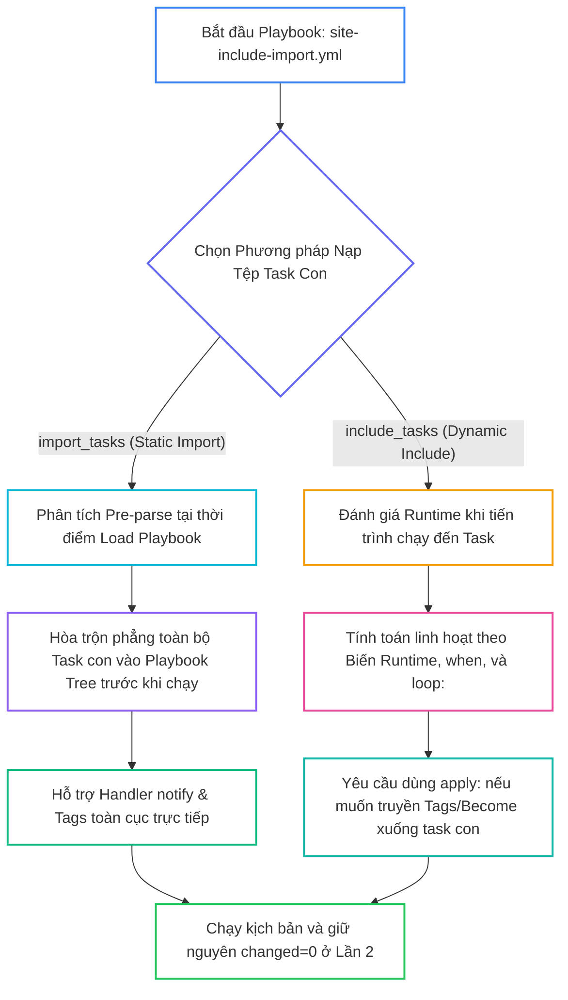
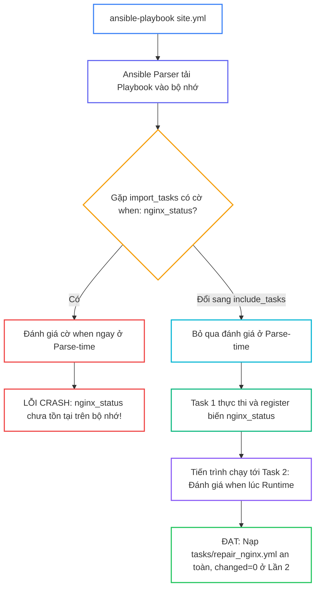


# [BÀI 18] SO SÁNH THỰC CHIẾN INCLUDE VS IMPORT: DYNAMIC RUNTIME EVALUATION VS STATIC PRE-PROCESSING CỦA TASKS/ROLES

Trong kỷ nguyên **Infrastructure as Code (IaC)** và tự động hóa vận hành hạ tầng đám mây (Cloud Infrastructure Automation), **Ansible** khẳng định vị thế dẫn đầu nhờ triết lý **Agentless** (không cần cài đặt agent nền trên máy đích), giao thức điều khiển an toàn qua **SSH / WinRM**, định dạng khai báo **YAML** trực quan và nguyên lý bất biến **Idempotency** mạnh mẽ. Việc làm chủ Ansible không chỉ dừng lại ở các câu lệnh Ad-hoc đơn giản, mà đòi hỏi kỹ sư phải nắm vững kiến trúc Module tầng thấp, Variable Precedence 22 tầng, Jinja2 Templates, tối ưu hóa Forks & Pipelining cho tới thiết kế Roles / Collections và tích hợp CI/CD tự động hóa chuẩn Doanh nghiệp.

Bài viết chuyên sâu này sẽ đồng hành cùng bạn mổ xẻ toàn diện bức tranh kiến trúc, phân tích các đánh đổi kỹ thuật thực chiến (Engineering Trade-offs), cung cấp hướng dẫn thực hành Lab chi tiết từng bước và bộ câu hỏi phỏng vấn chuyên sâu chuẩn DevOps / SRE Lead.

---

## 1. Bản Chất Kiến Trúc & Cơ Chế Vận Hành Tầng Thấp



### 1.1. Phân Biệt `import_tasks` (Static) vs `include_tasks` (Dynamic)

Trong quá trình phát triển Playbook tự động hóa, việc chia nhỏ kịch bản thành nhiều tệp YAML con là yêu cầu bắt buộc để tăng tính đọc và dễ bảo trì. Ansible cung cấp hai cơ chế nạp tệp con: nạp tĩnh (Static Re-use qua `import_tasks` / `import_playbook`) và nạp động (Dynamic Re-use qua `include_tasks` / `include_role`).

- **`ansible.builtin.import_tasks` (Static Import):** Thực hiện hòa trộn nội dung của tệp task con vào ngay trong cây Playbook chính ở thời điểm parse file (Parse-time) trước khi chạy.
- **`ansible.builtin.include_tasks` (Dynamic Include):** Xem tệp task con như một task độc lập tại thời điểm runtime, chỉ được đọc và phân tích khi tiến trình chạy đến đúng vị trí đó.
- **`ansible.builtin.import_playbook`:** Nạp tĩnh các tệp Playbook hoàn chỉnh ở cấp root (ngoài khối `tasks:`), cho phép chuỗi hóa nhiều Playbook độc lập trong một kịch bản tổng thể.

```yaml
# Nạp tĩnh Static Import (Parse-time)
- name: Import static common tasks
  ansible.builtin.import_tasks: tasks/common_tasks.yml

# Nạp động Dynamic Include (Runtime)
- name: Include dynamic web tasks
  ansible.builtin.include_tasks: tasks/web_tasks.yml
  when: env_type == 'production'
```

### 1.2. Vòng Lặp `include_tasks`, Thẻ Tags và Thuộc Tính `apply:`

- **Vòng lặp với `include_tasks`:** Cho phép xử lý kịch bản phức tạp lặp qua mảng danh sách bằng từ khóa `loop:`. Với mỗi phần tử, Ansible sẽ nạp tệp task con và truyền biến tương ứng vào xử lý. Module `import_tasks` không thể sử dụng với `loop:`.
- **Thừa hưởng thẻ Tags và Handler với `import_tasks`:** Do hòa trộn phẳng ở Parse-time, mọi task con nạp qua `import_tasks` tự động thừa hưởng thẻ `tags` gán ở task import và có thể phát tín hiệu `notify:` kích hoạt Handler ở Playbook chính.
- **Thuộc tính `apply:` trong `include_tasks`:** Thẻ tag gán trực tiếp cho `include_tasks` chỉ áp dụng cho task include. Để ép truyền thẻ tag, quyền `become` hay biến môi trường xuống từng task con bên trong, bắt buộc phải sử dụng khối `apply:`.

```yaml
- name: Include web tasks dynamically with applied tags and privileges
  ansible.builtin.include_tasks:
    file: tasks/web_tasks.yml
    apply:
      tags:
        - web_deploy
      become: true
  tags:
    - web_deploy
```

### 1.3. Bẫy Biến Runtime với `import_tasks`, Điều Kiện `when:` và Idempotency

- **Bẫy biến `register` với `import_tasks`:** Vì `import_tasks` được đánh giá cờ `when:` ngay ở bước Parse-time, các biến sinh ra từ `register:` ở task trước chưa hề tồn tại, dẫn đến lỗi `undefined variable` hoặc đánh giá sai điều kiện.
- **Nạp động theo hệ điều hành:** Kết hợp `include_tasks` với facts hệ điều hành (`tasks/{{ ansible_facts.os_family | lower }}_tasks.yml`) giúp kịch bản thích ứng linh hoạt mà không cần viết hàng chục dòng `when:` trùng lặp.
- **Bảo toàn Idempotency:** Việc chia nhỏ Playbook thành các tệp task con không làm thay đổi bản chất Idempotency. Ở lượt chạy Lần thứ hai, toàn bộ kịch bản bắt buộc phải đạt `changed=0` tuyệt đối trong bảng `PLAY RECAP`.

---

## 2. Bảng So Sánh Kỹ Thuật Toàn Diện (Engineering Matrix)

| Tiêu Chí Kỹ Thuật | Static Task Import (`import_tasks`) | Dynamic Task Include (`include_tasks`) | Static Playbook Import (`import_playbook`) |
|---|---|---|---|
| **Thời Điểm Đánh Giá** | Parse-time (trước khi Playbook bắt đầu chạy) | Runtime (khi tiến trình chạy tới task đó) | Parse-time (ở cấp độ root Playbook) |
| **Hỗ Trợ Vòng Lặp `loop:`** | ❌ Không hỗ trợ (văng lỗi cú pháp ngay) | ✅ Hỗ trợ đầy đủ kèm `loop_control` | ❌ Không hỗ trợ |
| **Kế Thừa Thẻ Tags** | Tự động kế thừa xuống mọi task con | Cần khai báo qua khối `apply: tags:` | Kế thừa theo từng Playbook con |
| **Kích Hoạt Handlers** | Gọi trực tiếp Handlers của Playbook chính | Handlers chỉ nhìn thấy sau khi include | Handlers nằm riêng trong từng Playbook |
| **Sử Dụng Biến `register:`** | ❌ Không thể dùng trong điều kiện `when:` | ✅ Đánh giá linh hoạt dựa trên output task trước | ❌ Không hỗ trợ |
| **Tác Động Hiệu Năng** | Nhanh hơn (không mất overhead nạp tệp ở runtime) | Chậm hơn đôi chút do nạp và parse file tại runtime | Nhanh chóng nạp toàn bộ cây kịch bản |

> [!IMPORTANT]
> **QUY TẮC BẤT DI BẤT DỊCH:**
> Sử dụng `import_tasks` cho các cấu hình nền tảng tĩnh, bất biến; sử dụng `include_tasks` khi cần lặp mảng danh sách hoặc rẽ nhánh theo biến sinh ra trong quá trình thực thi; và chỉ sử dụng `import_playbook` ở cấp cao nhất ngoài khối `tasks:` để liên kết các luồng triển khai độc lập.

---

## 3. Kiến Trúc Triển Khai Chuẩn Production (Configuration / Playbook / Role Breakdown)

Dưới đây là kiến trúc Playbook chính chuẩn Enterprise kết hợp toàn diện `import_tasks`, `include_tasks` (với `apply:`, `loop:`, `when:`) và `import_playbook`:

```yaml
# site-include-import.yml
---
- name: Master Playbook Combining Import and Include Directives
  hosts: web
  become: true
  vars:
    deploy_env: "production"
    vhosts_data:
      - name: "vhost_alpha"
        port: 9001
      - name: "vhost_beta"
        port: 9002

  tasks:
    - name: Task 1 - Import static common tasks with tag
      ansible.builtin.import_tasks: tasks/common_tasks.yml
      tags:
        - base_setup

    - name: Task 2 - Include dynamic web tasks with apply tags and when condition
      ansible.builtin.include_tasks:
        file: tasks/web_tasks.yml
        apply:
          tags:
            - web_setup
          become: true
      vars:
        app_name: "MASTER_INCLUDE_APP"
        app_port: 8888
      when: deploy_env == 'production'

    - name: Task 3 - Include vhost tasks with loop
      ansible.builtin.include_tasks:
        file: tasks/vhost_tasks.yml
      loop: "{{ vhosts_data }}"
      loop_control:
        loop_var: current_vhost

- name: Import Sub Playbook
  ansible.builtin.import_playbook: playbooks/sub_playbook.yml
```

### Phân Tích Kỹ Thuật Từng Dòng (Line-by-Line Breakdown):

- <span class="badge-line">Line 14-17</span>: **Khai báo `import_tasks` tĩnh:** Nạp `tasks/common_tasks.yml` tại thời điểm Parse-time, gán tag `base_setup` tự động truyền xuống toàn bộ các task bên trong tệp con.
- <span class="badge-line">Line 19-28</span>: **Khai báo `include_tasks` động:** Nạp `tasks/web_tasks.yml` tại Runtime nếu `deploy_env == 'production'`. Khối `apply:` ép buộc gán thẻ `web_setup` và quyền `become: true` cho mọi task con được nạp.
- <span class="badge-line">Line 30-35</span>: **Khai báo `include_tasks` với vòng lặp:** Lặp qua mảng `vhosts_data`, gán biến phần tử vào `current_vhost` qua `loop_control.loop_var` để tránh xung đột biến mặc định `item`.
- <span class="badge-line">Line 37-38</span>: **Khai báo `import_playbook`:** Nạp kịch bản `playbooks/sub_playbook.yml` ở cấp root Playbook để thực thi xác thực hạ tầng thứ cấp.

---

## 4. Phân Tích Cạm Bẫy Thực Chiến: Dùng import_tasks Kết Hợp Biến Runtime Gây Crash Kịch Bản

### Tình Huống Sự Cố Thực Tế Tại Doanh Nghiệp:
Một đội ngũ DevOps xây dựng Playbook kiểm tra trạng thái dịch vụ Nginx. Task 1 chạy lệnh kiểm tra và đăng ký kết quả vào biến `nginx_status`. Task 2 sử dụng `import_tasks: tasks/repair_nginx.yml` với cờ `when: nginx_status.stdout == 'DOWN'`. Khi chạy Playbook, Ansible Parser lập tức dừng kịch bản và văng lỗi ngay ở bước khởi tạo trước khi bất kỳ task nào kịp chạy.

### Hậu Quả & Log Lỗi Thực Tế:

```diff
- # CẤU HÌNH GÂY CRASH Ở PARSE-TIME:
- - name: Task 1 - Check Nginx status
-   ansible.builtin.command: /usr/local/bin/check_nginx.sh
-   register: nginx_status
-   changed_when: false
-
- - name: Task 2 - Import repair tasks statically
-   ansible.builtin.import_tasks: tasks/repair_nginx.yml
-   when: nginx_status.stdout == 'DOWN'
- # LỖI: 'nginx_status' is undefined during playbook parsing phase

+ # CẤU HÌNH SỬA ĐÚNG (DYNAMIC INCLUDE AT RUNTIME):
+ - name: Task 1 - Check Nginx status
+   ansible.builtin.command: /usr/local/bin/check_nginx.sh
+   register: nginx_status
+   changed_when: false
+
+ - name: Task 2 - Include repair tasks dynamically
+   ansible.builtin.include_tasks: tasks/repair_nginx.yml
+   when: nginx_status.stdout is defined and nginx_status.stdout == 'DOWN'
```



### 5-Whys Root Cause Analysis:
1. **Tại sao Playbook bị crash?** Vì Ansible Engine báo lỗi biến `nginx_status` không tồn tại (`undefined`).
2. **Tại sao biến không tồn tại khi Task 1 đã register?** Vì lỗi xảy ra ở bước nạp Playbook (Parse-time) trước khi Task 1 được thực thi trên máy đích.
3. **Tại sao cờ `when:` lại được đánh giá ở Parse-time?** Vì kịch bản sử dụng `import_tasks` (Static Import), ép Ansible hòa trộn phẳng và đánh giá điều kiện trước khi chạy.
4. **Tại sao kỹ sư lại dùng `import_tasks`?** Do nhầm lẫn giữa cơ chế nạp tĩnh (Static Pre-processing) và nạp động (Dynamic Runtime Evaluation).
5. **Giải pháp triệt để là gì?** Chuyển sang sử dụng `include_tasks` cho tất cả các task phụ thuộc vào biến sinh ra ở Runtime hoặc kết quả đăng ký từ task trước.

---

## 5. Hands-on Lab: Triển Khai Kịch Bản Modular Playbook Đa Tầng Với Include & Import (8 Bước)

| Bước | Lệnh CLI / Tác Vụ Chính | Mục Đích Thực Thi |
|---|---|---|
| **1** | `mkdir -p ~/lab-ansible-18/tasks ~/lab-ansible-18/playbooks` | Khởi tạo cấu trúc thư mục mô-đun hóa chuẩn |
| **2** | `cat << 'EOF' > tasks/common_tasks.yml` | Biên soạn tệp task tĩnh cho `import_tasks` |
| **3** | `cat << 'EOF' > tasks/web_tasks.yml` | Biên soạn tệp task động cho `include_tasks` |
| **4** | `cat << 'EOF' > tasks/vhost_tasks.yml` | Biên soạn tệp task lặp qua mảng cho `include_tasks` |
| **5** | `cat << 'EOF' > playbooks/sub_playbook.yml` | Biên soạn Playbook con cho `import_playbook` |
| **6** | `cat << 'EOF' > site-include-import.yml` | Tổng hợp kịch bản chính kết hợp toàn bộ các kỹ thuật |
| **7** | `ansible-playbook site-include-import.yml` | Chạy Lần 1 và Lần 2 đối soát Idempotency `changed=0` |
| **8** | `docker exec target1 cat /etc/include-import-app.conf` | Đối soát sự thật máy đích xác nhận dữ liệu |

```bash
# Bước 1: Khởi tạo thư mục và file cấu hình nền tảng
mkdir -p ~/lab-ansible-18/tasks ~/lab-ansible-18/playbooks && cd ~/lab-ansible-18

cat << 'EOF' > ansible.cfg
[defaults]
inventory = ./inventory.ini
remote_user = ansible
host_key_checking = False
private_key_file = ~/.ssh/id_ed25519
roles_path = ./roles:~/.ansible/roles
collections_path = ./collections:~/.ansible/collections

[privilege_escalation]
become = True
become_method = sudo
become_user = root
become_ask_pass = False
EOF

cat << 'EOF' > inventory.ini
[web]
target1 ansible_host=127.0.0.1 ansible_port=2221

[db]
target2 ansible_host=127.0.0.1 ansible_port=2222

[all:vars]
ansible_python_interpreter=/usr/bin/python3
EOF
```

```bash
# Bước 2: Biên soạn tệp task con nạp tĩnh: tasks/common_tasks.yml
cat << 'EOF' > tasks/common_tasks.yml
---
- name: Common Task 1 - Deploy static base configuration
  ansible.builtin.copy:
    content: "STATIC_BASE=INITIALIZED\nPARSED_AT=PRE_PARSE_TIME\n"
    dest: /etc/common-import.conf
    mode: '0644'
EOF
```

> [!NOTE]
> **CHECKPOINT 1:** Xác nhận tệp `tasks/common_tasks.yml` được tạo thành công:
> ```bash
> test -f tasks/common_tasks.yml && echo "CHECKPOINT 1: PASS" || echo "CHECKPOINT 1: FAIL"
> ```

```bash
# Bước 3: Biên soạn tệp task con nạp động: tasks/web_tasks.yml
cat << 'EOF' > tasks/web_tasks.yml
---
- name: Web Task 1 - Deploy dynamic web application config
  ansible.builtin.copy:
    content: "APP_NAME={{ app_name | default('DYNAMIC_APP') }}\nPORT={{ app_port | default(8080) }}\n"
    dest: /etc/include-import-app.conf
    mode: '0644'

- name: Web Task 2 - Read system uptime with FQCN (changed_when: false)
  ansible.builtin.command: uptime
  register: uptime_out
  changed_when: false
EOF
```

> [!NOTE]
> **CHECKPOINT 2:** Xác nhận tệp `tasks/web_tasks.yml` chứa đầy đủ task cấu hình và `changed_when: false`:
> ```bash
> grep -q "changed_when: false" tasks/web_tasks.yml && echo "CHECKPOINT 2: PASS" || echo "CHECKPOINT 2: FAIL"
> ```

```bash
# Bước 4: Biên soạn tệp task con nạp theo vòng lặp: tasks/vhost_tasks.yml
cat << 'EOF' > tasks/vhost_tasks.yml
---
- name: Vhost Task 1 - Create vhost directory
  ansible.builtin.file:
    path: "/var/www/{{ current_vhost.name }}"
    state: directory
    mode: '0755'

- name: Vhost Task 2 - Deploy vhost page
  ansible.builtin.copy:
    content: "VHOST={{ current_vhost.name }}\nPORT={{ current_vhost.port }}\n"
    dest: "/var/www/{{ current_vhost.name }}/index.txt"
    mode: '0644'
EOF
```

> [!NOTE]
> **CHECKPOINT 3:** Xác nhận tệp `tasks/vhost_tasks.yml` tham chiếu đúng biến `current_vhost`:
> ```bash
> grep -q "current_vhost.name" tasks/vhost_tasks.yml && echo "CHECKPOINT 3: PASS" || echo "CHECKPOINT 3: FAIL"
> ```

```bash
# Bước 5: Biên soạn Playbook con: playbooks/sub_playbook.yml
cat << 'EOF' > playbooks/sub_playbook.yml
---
- name: Sub Playbook - Secondary Infrastructure Verification
  hosts: web
  become: true
  tasks:
    - name: Sub Task 1 - Deploy sub-playbook marker file
      ansible.builtin.copy:
        content: "SUB_PLAYBOOK=EXECUTED_SUCCESSFULLY\n"
        dest: /etc/sub-playbook.marker
        mode: '0644'
EOF
```

> [!NOTE]
> **CHECKPOINT 4:** Xác nhận `playbooks/sub_playbook.yml` có directive `hosts:` chuẩn cấp root:
> ```bash
> grep -q "hosts: web" playbooks/sub_playbook.yml && echo "CHECKPOINT 4: PASS" || echo "CHECKPOINT 4: FAIL"
> ```

```bash
# Bước 6: Biên soạn Playbook chính: site-include-import.yml
cat << 'EOF' > site-include-import.yml
---
- name: Master Playbook Combining Import and Include Directives
  hosts: web
  become: true
  vars:
    deploy_env: "production"
    vhosts_data:
      - name: "vhost_alpha"
        port: 9001
      - name: "vhost_beta"
        port: 9002
  tasks:
    - name: Task 1 - Import static common tasks with tag
      ansible.builtin.import_tasks: tasks/common_tasks.yml
      tags:
        - base_setup

    - name: Task 2 - Include dynamic web tasks with apply tags and when condition
      ansible.builtin.include_tasks:
        file: tasks/web_tasks.yml
        apply:
          tags:
            - web_setup
          become: true
      vars:
        app_name: "MASTER_INCLUDE_APP"
        app_port: 8888
      when: deploy_env == 'production'

    - name: Task 3 - Include vhost tasks with loop
      ansible.builtin.include_tasks:
        file: tasks/vhost_tasks.yml
      loop: "{{ vhosts_data }}"
      loop_control:
        loop_var: current_vhost

- name: Import Sub Playbook
  ansible.builtin.import_playbook: playbooks/sub_playbook.yml
EOF
```

> [!NOTE]
> **CHECKPOINT 5:** Kiểm tra cú pháp toàn bộ Playbook chính:
> ```bash
> ansible-playbook --syntax-check site-include-import.yml && echo "CHECKPOINT 5: PASS" || echo "CHECKPOINT 5: FAIL"
> ```

```bash
# Bước 7: Thực thi Lần 1 và Lần 2 (Đối soát Idempotency)
ansible-playbook site-include-import.yml
ansible-playbook site-include-import.yml
```

> [!NOTE]
> **CHECKPOINT 6:** Xác nhận kết quả Lần 1 thi hành thành công không lỗi:
> ```bash
> ansible-playbook site-include-import.yml | grep -q "failed=0" && echo "CHECKPOINT 6: PASS" || echo "CHECKPOINT 6: FAIL"
> ```

> [!NOTE]
> **CHECKPOINT 7:** Xác nhận Lượt 2 đạt Idempotency tuyệt đối (`changed=0`):
> ```bash
> RUN2_OUT=$(ansible-playbook site-include-import.yml)
> if echo "$RUN2_OUT" | grep -q "changed=0" && echo "$RUN2_OUT" | grep -q "failed=0"; then
>   echo "CHECKPOINT 7: PASS - Đạt Idempotency changed=0"
> else
>   echo "CHECKPOINT 7: FAIL - Lỗi không đạt Idempotency"
> fi
> ```

```bash
# Bước 8: Đối soát Sự Thật Máy Đích qua docker exec
docker exec target1 cat /etc/common-import.conf
docker exec target1 cat /etc/include-import-app.conf
docker exec target1 cat /etc/sub-playbook.marker
docker exec target1 cat /var/www/vhost_alpha/index.txt
```

> [!NOTE]
> **CHECKPOINT 8:** Đối soát file `/etc/include-import-app.conf` chứa đúng biến runtime `PORT=8888`:
> ```bash
> docker exec target1 cat /etc/include-import-app.conf | grep -q "PORT=8888" && echo "CHECKPOINT 8: PASS" || echo "CHECKPOINT 8: FAIL"
> ```

---

## 6. Bộ Câu Hỏi Vấn Đáp & Phỏng Vấn Chuyên Sâu (Self-Check Q&A)

<details class="qa-card" markdown="1">
  <summary class="qa-summary">
    <span class="qa-num-badge">Q01</span>
    <span class="qa-question-text">Phân biệt sự khác nhau cốt lõi về thời điểm thi hành giữa <code>ansible.builtin.import_tasks</code> (Static Import) và <code>ansible.builtin.include_tasks</code> (Dynamic Include)?</span>
  </summary>
  <div class="qa-answer">
    <div class="qa-answer-header">
      <svg width="14" height="14" fill="none" stroke="currentColor" stroke-width="2" viewBox="0 0 24 24"><path d="M22 11.08V12a10 10 0 1 1-5.93-9.14"></path><polyline points="22 4 12 14.01 9 11.01"></polyline></svg>
      <span>Phân Tích &amp; Lời Giải Kỹ Thuật</span>
    </div>
    <div style="margin: 0.5rem 0;"><b>Hỏi:</b> Phân biệt sự khác nhau cốt lõi về thời điểm thi hành giữa <code>ansible.builtin.import_tasks</code> (Static Import) và <code>ansible.builtin.include_tasks</code> (Dynamic Include)?</div>
    <div style="margin: 0.5rem 0;"><b>Đáp án chuẩn:</b></div>
    <div style="margin: 0.35rem 0; padding-left: 1rem; border-left: 2px solid var(--accent-primary);">• <b><code>import_tasks</code> (Static Import):</b> Nạp tĩnh tại thời điểm <b>Parse-time</b> (trước khi Playbook chạy). Toàn bộ nội dung tệp task con được hòa trộn phẳng vào cây Playbook chính ngay ở bước đọc file.</div>
    <div style="margin: 0.35rem 0; padding-left: 1rem; border-left: 2px solid var(--accent-primary);">• <b><code>include_tasks</code> (Dynamic Include):</b> Nạp động tại thời điểm <b>Runtime</b> (khi tiến trình chạy tới đúng Task đó). Tệp task con chỉ được đọc và phân tích khi execution engine chạy tới task include.</div>
    <div style="margin: 0.5rem 0;"><b>Tiêu chí chấm:</b></div>
    <div style="margin: 0.35rem 0; padding-left: 1rem; border-left: 2px solid var(--accent-primary);">• 0: Không phân biệt được Static vs Dynamic.</div>
    <div style="margin: 0.35rem 0; padding-left: 1rem; border-left: 2px solid var(--accent-primary);">• 1: Biết <code>import</code> là tĩnh <code>include</code> là động nhưng không giải thích được khái niệm Parse-time vs Runtime.</div>
    <div style="margin: 0.35rem 0; padding-left: 1rem; border-left: 2px solid var(--accent-primary);">• 2: Phân tích chính xác bản chất Parse-time hòa trộn phẳng vs Runtime nạp tại thời điểm chạy.</div>
    <div style="margin: 0.35rem 0; padding-left: 1rem; border-left: 2px solid var(--accent-primary);">• 3: Nêu đúng + minh họa ví dụ sử dụng thực tế của 2 module trong Playbook.</div>
    <div style="margin: 0.5rem 0;"><b>Câu hỏi đào sâu:</b> Module nào chạy nhanh hơn về mặt hiệu năng thi hành? <i>(<code>import_tasks</code> chạy nhanh hơn vì không mất overhead phân tích file ở runtime.)</i></div>
  </div>
</details>

<details class="qa-card" markdown="1">
  <summary class="qa-summary">
    <span class="qa-num-badge">Q02</span>
    <span class="qa-question-text">Tại sao ta có thể dùng <code>include_tasks</code> với từ khóa <code>loop:</code> để lặp danh sách task con nhưng KHÔNG THỂ dùng <code>import_tasks</code> với <code>loop:</code>?</span>
  </summary>
  <div class="qa-answer">
    <div class="qa-answer-header">
      <svg width="14" height="14" fill="none" stroke="currentColor" stroke-width="2" viewBox="0 0 24 24"><path d="M22 11.08V12a10 10 0 1 1-5.93-9.14"></path><polyline points="22 4 12 14.01 9 11.01"></polyline></svg>
      <span>Phân Tích &amp; Lời Giải Kỹ Thuật</span>
    </div>
    <div style="margin: 0.5rem 0;"><b>Hỏi:</b> Tại sao ta có thể dùng <code>include_tasks</code> với từ khóa <code>loop:</code> để lặp danh sách task con nhưng KHÔNG THỂ dùng <code>import_tasks</code> với <code>loop:</code>?</div>
    <div style="margin: 0.5rem 0;"><b>Đáp án chuẩn:</b></div>
    <div style="margin: 0.35rem 0; padding-left: 1rem; border-left: 2px solid var(--accent-primary);">• Vì <code>import_tasks</code> được hòa trộn phẳng ở bước Parse-time trước khi chạy. Tại thời điểm Parse-time, Ansible Parser chưa thể tính toán được số lượng phần tử của mảng <code>loop:</code> ở Runtime, nên việc kết hợp <code>import_tasks</code> với <code>loop:</code> là bất khả thi về mặt kiến trúc (văng lỗi syntax).</div>
    <div style="margin: 0.35rem 0; padding-left: 1rem; border-left: 2px solid var(--accent-primary);">• Ngược lại, <code>include_tasks</code> được đánh giá ở Runtime nên có thể nạp tệp task con lặp đi lặp lại linh hoạt ứng với từng phần tử của mảng <code>loop:</code>.</div>
    <div style="margin: 0.5rem 0;"><b>Tiêu chí chấm:</b></div>
    <div style="margin: 0.35rem 0; padding-left: 1rem; border-left: 2px solid var(--accent-primary);">• 0: Không giải thích được lý do kỹ thuật.</div>
    <div style="margin: 0.35rem 0; padding-left: 1rem; border-left: 2px solid var(--accent-primary);">• 1: Biết <code>import_tasks</code> không chạy được với <code>loop:</code> nhưng lầm tưởng là do lỗi bug phần mềm.</div>
    <div style="margin: 0.35rem 0; padding-left: 1rem; border-left: 2px solid var(--accent-primary);">• 2: Phân tích chính xác nguyên lý Parse-time không thể tính toán số phần tử mảng của <code>import_tasks</code>.</div>
    <div style="margin: 0.35rem 0; padding-left: 1rem; border-left: 2px solid var(--accent-primary);">• 3: Nêu đúng + viết ví dụ YAML chuẩn nạp <code>include_tasks</code> với <code>loop:</code> và <code>loop_control</code>.</div>
    <div style="margin: 0.5rem 0;"><b>Câu hỏi đào sâu:</b> Cần làm gì nếu muốn đổi tên biến mặc định <code>item</code> khi dùng <code>include_tasks</code> trong vòng lặp? <i>(Sử dụng <code>loop_control: loop_var: custom_var_name</code>.)</i></div>
  </div>
</details>

<details class="qa-card" markdown="1">
  <summary class="qa-summary">
    <span class="qa-num-badge">Q03</span>
    <span class="qa-question-text">Module <code>ansible.builtin.import_playbook</code> dùng để làm gì? Vị trí khai báo của nó trong file YAML tổng khác gì so với <code>import_tasks</code>?</span>
  </summary>
  <div class="qa-answer">
    <div class="qa-answer-header">
      <svg width="14" height="14" fill="none" stroke="currentColor" stroke-width="2" viewBox="0 0 24 24"><path d="M22 11.08V12a10 10 0 1 1-5.93-9.14"></path><polyline points="22 4 12 14.01 9 11.01"></polyline></svg>
      <span>Phân Tích &amp; Lời Giải Kỹ Thuật</span>
    </div>
    <div style="margin: 0.5rem 0;"><b>Hỏi:</b> Module <code>ansible.builtin.import_playbook</code> dùng để làm gì? Vị trí khai báo của nó trong file YAML tổng khác gì so với <code>import_tasks</code>?</div>
    <div style="margin: 0.5rem 0;"><b>Đáp án chuẩn:</b></div>
    <div style="margin: 0.35rem 0; padding-left: 1rem; border-left: 2px solid var(--accent-primary);">• <b>Tác dụng:</b> Dùng để gom nhóm và thi hành tuần tự nhiều tệp Playbook hoàn chỉnh độc lập (chứa từ khóa <code>hosts:</code>) trong một kịch bản tổng thể (như <code>site-all.yml</code>).</div>
    <div style="margin: 0.35rem 0; padding-left: 1rem; border-left: 2px solid var(--accent-primary);">• <b>Vị trí khai báo:</b> <code>import_playbook</code> là directive ở <b>cấp root Playbook</b> (cùng cấp với <code>hosts:</code>), tuyệt đối <b>KHÔNG nằm trong khối <code>tasks:</code></b>. Ngược lại, <code>import_tasks</code> là module nằm bên trong khối <code>tasks:</code>.</div>
    <div style="margin: 0.5rem 0;"><b>Tiêu chí chấm:</b></div>
    <div style="margin: 0.35rem 0; padding-left: 1rem; border-left: 2px solid var(--accent-primary);">• 0: Nhầm lẫn giữa <code>import_playbook</code> và <code>import_tasks</code>.</div>
    <div style="margin: 0.35rem 0; padding-left: 1rem; border-left: 2px solid var(--accent-primary);">• 1: Biết <code>import_playbook</code> để nạp file playbook nhưng đặt sai vị trí bên trong khối <code>tasks:</code>.</div>
    <div style="margin: 0.35rem 0; padding-left: 1rem; border-left: 2px solid var(--accent-primary);">• 2: Phân tích chính xác vai trò gom nhóm Playbook và vị trí khai báo cấp root.</div>
    <div style="margin: 0.35rem 0; padding-left: 1rem; border-left: 2px solid var(--accent-primary);">• 3: Nêu đúng + viết ví dụ file <code>site-all.yml</code> gọi 2 Playbook con qua <code>import_playbook</code>.</div>
    <div style="margin: 0.5rem 0;"><b>Câu hỏi đào sâu:</b> Chuyện gì xảy ra nếu đặt <code>import_playbook</code> bên trong khối <code>tasks:</code>? <i>(Ansible Engine báo lỗi <code>The task 'import_playbook' was not found in a play</code>.)</i></div>
  </div>
</details>

<details class="qa-card" markdown="1">
  <summary class="qa-summary">
    <span class="qa-num-badge">Q04</span>
    <span class="qa-question-text">Tại sao các Task con nạp qua <code>import_tasks</code> lại tự động thừa hưởng thẻ <code>tags</code> và có thể thông báo <code>notify:</code> tới Handler nằm ở Playbook chính một cách trực tiếp?</span>
  </summary>
  <div class="qa-answer">
    <div class="qa-answer-header">
      <svg width="14" height="14" fill="none" stroke="currentColor" stroke-width="2" viewBox="0 0 24 24"><path d="M22 11.08V12a10 10 0 1 1-5.93-9.14"></path><polyline points="22 4 12 14.01 9 11.01"></polyline></svg>
      <span>Phân Tích &amp; Lời Giải Kỹ Thuật</span>
    </div>
    <div style="margin: 0.5rem 0;"><b>Hỏi:</b> Tại sao các Task con nạp qua <code>import_tasks</code> lại tự động thừa hưởng thẻ <code>tags</code> và có thể thông báo <code>notify:</code> tới Handler nằm ở Playbook chính một cách trực tiếp?</div>
    <div style="margin: 0.5rem 0;"><b>Đáp án chuẩn:</b></div>
    <div style="margin: 0.35rem 0; padding-left: 1rem; border-left: 2px solid var(--accent-primary);">• Vì <code>import_tasks</code> thực hiện hòa trộn phẳng (Flattening) toàn bộ danh sách task con vào cây Playbook chính ở thời điểm parse-time. Do đó, về mặt bản chất mã nguồn, các task con trở thành các task trực tiếp của Playbook chính, nên tự động nhận thẻ <code>tags</code> gán ở task import và nhìn thấy tất cả các Handler khai báo ở <code>handlers/main.yml</code>.</div>
    <div style="margin: 0.5rem 0;"><b>Tiêu chí chấm:</b></div>
    <div style="margin: 0.35rem 0; padding-left: 1rem; border-left: 2px solid var(--accent-primary);">• 0: Không hiểu cơ chế thừa hưởng tags và handlers.</div>
    <div style="margin: 0.35rem 0; padding-left: 1rem; border-left: 2px solid var(--accent-primary);">• 1: Biết nhận được tags nhưng không giải thích được bản chất hòa trộn phẳng ở parse-time.</div>
    <div style="margin: 0.35rem 0; padding-left: 1rem; border-left: 2px solid var(--accent-primary);">• 2: Phân tích chính xác cơ chế hòa trộn phẳng cây Playbook (Playbook Tree Flattening).</div>
    <div style="margin: 0.35rem 0; padding-left: 1rem; border-left: 2px solid var(--accent-primary);">• 3: Nêu đúng + minh họa ví dụ gán <code>tags:</code> ở <code>import_tasks</code> lan xuống task con.</div>
    <div style="margin: 0.5rem 0;"><b>Câu hỏi đào sâu:</b> Nếu gán <code>tags: [web]</code> ở dòng <code>import_tasks</code>, khi chạy <code>ansible-playbook --tags web</code> thì các task con trong tệp import có chạy không? <i>(Có, 100% task con đều chạy vì đã thừa hưởng tag <code>web</code>.)</i></div>
  </div>
</details>

<details class="qa-card" markdown="1">
  <summary class="qa-summary">
    <span class="qa-num-badge">Q05</span>
    <span class="qa-question-text">Tại sao khi gán <code>tags: [web]</code> cho <code>include_tasks</code>, các task con bên trong tệp nạp động lại KHÔNG tự động nhận tag? Giải thích vai trò của thuộc tính <code>apply:</code>.</span>
  </summary>
  <div class="qa-answer">
    <div class="qa-answer-header">
      <svg width="14" height="14" fill="none" stroke="currentColor" stroke-width="2" viewBox="0 0 24 24"><path d="M22 11.08V12a10 10 0 1 1-5.93-9.14"></path><polyline points="22 4 12 14.01 9 11.01"></polyline></svg>
      <span>Phân Tích &amp; Lời Giải Kỹ Thuật</span>
    </div>
    <div style="margin: 0.5rem 0;"><b>Hỏi:</b> Tại sao khi gán <code>tags: [web]</code> cho <code>include_tasks</code>, các task con bên trong tệp nạp động lại KHÔNG tự động nhận tag? Giải thích vai trò của thuộc tính <code>apply:</code>.</div>
    <div style="margin: 0.5rem 0;"><b>Đáp án chuẩn:</b></div>
    <div style="margin: 0.35rem 0; padding-left: 1rem; border-left: 2px solid var(--accent-primary);">• Vì <code>include_tasks</code> nạp động ở runtime, thẻ <code>tags:</code> gán trực tiếp ở dòng <code>include_tasks</code> chỉ có hiệu lực áp dụng cho bản thân task include đó (để quyết định có include tệp hay không), mà <b>không lan xuống các task con bên trong</b>.</div>
    <div style="margin: 0.35rem 0; padding-left: 1rem; border-left: 2px solid var(--accent-primary);">• <b>Vai trò của <code>apply:</code>:</b> Khối <code>apply:</code> cho phép chỉ định ép buộc truyền các thuộc tính task (như <code>tags:</code>, <code>become:</code>, <code>environment:</code>) xuống từng task con bên trong tệp được include động.</div>
    <div style="margin: 0.5rem 0;"><b>Tiêu chí chấm:</b></div>
    <div style="margin: 0.35rem 0; padding-left: 1rem; border-left: 2px solid var(--accent-primary);">• 0: Không biết thuộc tính <code>apply:</code>.</div>
    <div style="margin: 0.35rem 0; padding-left: 1rem; border-left: 2px solid var(--accent-primary);">• 1: Biết <code>apply:</code> dùng cho <code>include_tasks</code> nhưng không giải thích được lý do thẻ tag không tự lan xuống task con.</div>
    <div style="margin: 0.35rem 0; padding-left: 1rem; border-left: 2px solid var(--accent-primary);">• 2: Phân tích chính xác cơ chế nạp động runtime và vai trò của khối <code>apply:</code>.</div>
    <div style="margin: 0.35rem 0; padding-left: 1rem; border-left: 2px solid var(--accent-primary);">• 3: Nêu đúng + viết đoạn YAML chuẩn dùng <code>apply: tags:</code> trong <code>include_tasks</code>.</div>
    <div style="margin: 0.5rem 0;"><b>Câu hỏi đào sâu:</b> Viết cú pháp <code>apply:</code> gán cả <code>tags: [deploy]</code> và <code>become: true</code> cho <code>include_tasks</code>. <i>(Viết <code>apply: tags: [deploy] become: true</code>.)</i></div>
  </div>
</details>

<details class="qa-card" markdown="1">
  <summary class="qa-summary">
    <span class="qa-num-badge">Q06</span>
    <span class="qa-question-text">Tại sao tuyệt đối không được tham chiếu các biến sinh ra ở thời điểm Runtime (như biến <code>register:</code>) vào cờ điều kiện <code>when:</code> của <code>import_tasks</code>?</span>
  </summary>
  <div class="qa-answer">
    <div class="qa-answer-header">
      <svg width="14" height="14" fill="none" stroke="currentColor" stroke-width="2" viewBox="0 0 24 24"><path d="M22 11.08V12a10 10 0 1 1-5.93-9.14"></path><polyline points="22 4 12 14.01 9 11.01"></polyline></svg>
      <span>Phân Tích &amp; Lời Giải Kỹ Thuật</span>
    </div>
    <div style="margin: 0.5rem 0;"><b>Hỏi:</b> Tại sao tuyệt đối không được tham chiếu các biến sinh ra ở thời điểm Runtime (như biến <code>register:</code>) vào cờ điều kiện <code>when:</code> của <code>import_tasks</code>?</div>
    <div style="margin: 0.5rem 0;"><b>Đáp án chuẩn:</b></div>
    <div style="margin: 0.35rem 0; padding-left: 1rem; border-left: 2px solid var(--accent-primary);">• Vì <code>import_tasks</code> được Ansible Engine phân tích và đánh giá cờ <code>when:</code> ngay ở bước Parse-time trước khi Playbook bắt đầu chạy. Tại thời điểm Parse-time, các biến sinh ra từ <code>register:</code> ở các task trước chưa hề tồn tại trên bộ nhớ. Việc tham chiếu này sẽ làm cờ <code>when:</code> bị đánh giá sai hoặc văng lỗi <code>undefined variable</code>.</div>
    <div style="margin: 0.35rem 0; padding-left: 1rem; border-left: 2px solid var(--accent-primary);">• <b>Giải pháp:</b> Chuyển sang dùng <code>include_tasks</code> (Dynamic) để đánh giá cờ <code>when:</code> theo biến runtime.</div>
    <div style="margin: 0.5rem 0;"><b>Tiêu chí chấm:</b></div>
    <div style="margin: 0.35rem 0; padding-left: 1rem; border-left: 2px solid var(--accent-primary);">• 0: Không thấy được rủi ro khi dùng biến <code>register</code> với <code>import_tasks</code>.</div>
    <div style="margin: 0.35rem 0; padding-left: 1rem; border-left: 2px solid var(--accent-primary);">• 1: Biết bị lỗi nhưng không nêu được bản chất đánh giá cờ <code>when:</code> ở parse-time vs runtime.</div>
    <div style="margin: 0.35rem 0; padding-left: 1rem; border-left: 2px solid var(--accent-primary);">• 2: Phân tích chính xác xung đột thời điểm giữa parse-time evaluation và runtime variable registration.</div>
    <div style="margin: 0.35rem 0; padding-left: 1rem; border-left: 2px solid var(--accent-primary);">• 3: Nêu đúng + minh họa ví dụ sửa lỗi từ <code>import_tasks</code> sang <code>include_tasks</code>.</div>
    <div style="margin: 0.5rem 0;"><b>Câu hỏi đào sâu:</b> Cờ <code>when:</code> gán cho <code>import_tasks</code> sẽ áp dụng lên task include hay áp dụng lên từng task con? <i>(Áp dụng lên TỪNG task con sau khi hòa trộn phẳng.)</i></div>
  </div>
</details>

<details class="qa-card" markdown="1">
  <summary class="qa-summary">
    <span class="qa-num-badge">Q07</span>
    <span class="qa-question-text">Trình bày kỹ thuật sử dụng <code>include_tasks</code> kết hợp với biến facts hệ điều hành để nạp linh hoạt các tệp task cấu hình theo từng OS (CentOS vs Ubuntu).</span>
  </summary>
  <div class="qa-answer">
    <div class="qa-answer-header">
      <svg width="14" height="14" fill="none" stroke="currentColor" stroke-width="2" viewBox="0 0 24 24"><path d="M22 11.08V12a10 10 0 1 1-5.93-9.14"></path><polyline points="22 4 12 14.01 9 11.01"></polyline></svg>
      <span>Phân Tích &amp; Lời Giải Kỹ Thuật</span>
    </div>
    <div style="margin: 0.5rem 0;"><b>Hỏi:</b> Trình bày kỹ thuật sử dụng <code>include_tasks</code> kết hợp với biến facts hệ điều hành để nạp linh hoạt các tệp task cấu hình theo từng OS (CentOS vs Ubuntu).</div>
    <div style="margin: 0.5rem 0;"><b>Đáp án chuẩn:</b></div>
    <div style="margin: 0.35rem 0; padding-left: 1rem; border-left: 2px solid var(--accent-primary);">• Sử dụng biến facts <code>ansible_facts.os_family</code> để truyền động vào tên tệp trong <code>include_tasks</code>:
      <pre><code>- name: Include OS-specific setup tasks dynamically
  ansible.builtin.include_tasks: "tasks/{{ '{{' }} ansible_facts.os_family | lower {{ '}}' }}_tasks.yml"</code></pre>
      Khi chạy trên RedHat, nó nạp <code>tasks/redhat_tasks.yml</code>; khi chạy trên Debian, nó nạp <code>tasks/debian_tasks.yml</code>.</div>
    <div style="margin: 0.5rem 0;"><b>Tiêu chí chấm:</b></div>
    <div style="margin: 0.35rem 0; padding-left: 1rem; border-left: 2px solid var(--accent-primary);">• 0: Không biết kỹ thuật nạp tệp theo biến hệ điều hành.</div>
    <div style="margin: 0.35rem 0; padding-left: 1rem; border-left: 2px solid var(--accent-primary);">• 1: Biết dùng <code>when:</code> cho từng task nhưng không biết nạp động cả tệp task bằng biến.</div>
    <div style="margin: 0.35rem 0; padding-left: 1rem; border-left: 2px solid var(--accent-primary);">• 2: Phân tích chính xác cơ chế nội suy chuỗi tên tệp trong <code>include_tasks</code>.</div>
    <div style="margin: 0.35rem 0; padding-left: 1rem; border-left: 2px solid var(--accent-primary);">• 3: Nêu đúng + viết đoạn YAML chuẩn nạp tệp task theo hệ điều hành.</div>
    <div style="margin: 0.5rem 0;"><b>Câu hỏi đào sâu:</b> Kỹ thuật này có áp dụng được với <code>import_tasks</code> không? <i>(Không áp dụng được an toàn với <code>import_tasks</code> nếu biến facts chưa được thu thập ở parse-time.)</i></div>
  </div>
</details>

<details class="qa-card" markdown="1">
  <summary class="qa-summary">
    <span class="qa-num-badge">Q08</span>
    <span class="qa-question-text">Trình bày cấu trúc thư mục tiêu chuẩn của một dự án Ansible Playbook mô-đun hóa được chia nhỏ thành nhiều tệp task con.</span>
  </summary>
  <div class="qa-answer">
    <div class="qa-answer-header">
      <svg width="14" height="14" fill="none" stroke="currentColor" stroke-width="2" viewBox="0 0 24 24"><path d="M22 11.08V12a10 10 0 1 1-5.93-9.14"></path><polyline points="22 4 12 14.01 9 11.01"></polyline></svg>
      <span>Phân Tích &amp; Lời Giải Kỹ Thuật</span>
    </div>
    <div style="margin: 0.5rem 0;"><b>Hỏi:</b> Trình bày cấu trúc thư mục tiêu chuẩn của một dự án Ansible Playbook mô-đun hóa được chia nhỏ thành nhiều tệp task con.</div>
    <div style="margin: 0.5rem 0;"><b>Đáp án chuẩn:</b></div>
    <div style="margin: 0.35rem 0; padding-left: 1rem; border-left: 2px solid var(--accent-primary);">• Cấu trúc tiêu chuẩn:
      <pre><code>project/
├── ansible.cfg
├── inventory.ini
├── site-all.yml               (Playbook chính gọi import_playbook)
├── playbooks/
│   ├── webservers.yml
│   └── dbservers.yml
└── tasks/
    ├── common_tasks.yml       (Tasks dùng chung nạp qua import_tasks)
    ├── web_tasks.yml          (Tasks ứng dụng nạp qua include_tasks)
    └── db_tasks.yml</code></pre>
    </div>
    <div style="margin: 0.5rem 0;"><b>Tiêu chí chấm:</b></div>
    <div style="margin: 0.35rem 0; padding-left: 1rem; border-left: 2px solid var(--accent-primary);">• 0: Đặt tất cả file nằm lộn xộn trong thư mục gốc.</div>
    <div style="margin: 0.35rem 0; padding-left: 1rem; border-left: 2px solid var(--accent-primary);">• 1: Biết chia thư mục nhưng không phân định được vai trò thư mục <code>tasks/</code> và <code>playbooks/</code>.</div>
    <div style="margin: 0.35rem 0; padding-left: 1rem; border-left: 2px solid var(--accent-primary);">• 2: Phân tích chính xác cấu trúc thư mục mô-đun hóa chuẩn mực.</div>
    <div style="margin: 0.35rem 0; padding-left: 1rem; border-left: 2px solid var(--accent-primary);">• 3: Nêu đúng + vẽ sơ đồ cây thư mục và giải thích luồng nạp tệp của <code>site-all.yml</code>.</div>
    <div style="margin: 0.5rem 0;"><b>Câu hỏi đào sâu:</b> Thư mục <code>tasks/</code> có thể chứa các thư mục con nữa không? <i>(Có thể, ví dụ <code>tasks/web/nginx.yml</code>.)</i></div>
  </div>
</details>

<details class="qa-card" markdown="1">
  <summary class="qa-summary">
    <span class="qa-num-badge">Q09</span>
    <span class="qa-question-text">Trình bày quy trình 3 bước nghiệm thu một Playbook chia nhỏ bằng <code>include_tasks</code> / <code>import_tasks</code> để đảm bảo tính Idempotency và máy đích ở đúng trạng thái.</span>
  </summary>
  <div class="qa-answer">
    <div class="qa-answer-header">
      <svg width="14" height="14" fill="none" stroke="currentColor" stroke-width="2" viewBox="0 0 24 24"><path d="M22 11.08V12a10 10 0 1 1-5.93-9.14"></path><polyline points="22 4 12 14.01 9 11.01"></polyline></svg>
      <span>Phân Tích &amp; Lời Giải Kỹ Thuật</span>
    </div>
    <div style="margin: 0.5rem 0;"><b>Hỏi:</b> Trình bày quy trình 3 bước nghiệm thu một Playbook chia nhỏ bằng <code>include_tasks</code> / <code>import_tasks</code> để đảm bảo tính Idempotency và máy đích ở đúng trạng thái.</div>
    <div style="margin: 0.5rem 0;"><b>Đáp án chuẩn:</b></div>
    <div style="margin: 0.35rem 0; padding-left: 1rem; border-left: 2px solid var(--accent-primary);">1. <b>Bước 1 (Thực thi Lần 1):</b> Chạy <code>ansible-playbook site-include-import.yml</code>: Các tệp task con nạp qua <code>import_tasks</code> và <code>include_tasks</code> thực thi và chép file báo <code>changed &gt; 0</code>.</div>
    <div style="margin: 0.35rem 0; padding-left: 1rem; border-left: 2px solid var(--accent-primary);">2. <b>Bước 2 (Kiểm Idempotency Lần 2):</b> Chạy lại nguyên vẹn <code>ansible-playbook site-include-import.yml</code> Lần 2: bảng <code>PLAY RECAP</code> <b>bắt buộc phải đạt <code>changed=0</code></b> (tất cả các Task trong các tệp con đều báo <code>ok</code>).</div>
    <div style="margin: 0.35rem 0; padding-left: 1rem; border-left: 2px solid var(--accent-primary);">3. <b>Bước 3 (Đối soát Sự thật Máy đích):</b> Dùng <code>docker exec target1 cat /etc/include-import-app.conf</code> kiểm tra file cấu hình thực sự tồn tại đúng dữ liệu từ tệp task con.</div>
    <div style="margin: 0.5rem 0;"><b>Tiêu chí chấm:</b></div>
    <div style="margin: 0.35rem 0; padding-left: 1rem; border-left: 2px solid var(--accent-primary);">• 0: Trả lời "chỉ cần nhìn terminal Lần 1 báo xanh là xong".</div>
    <div style="margin: 0.35rem 0; padding-left: 1rem; border-left: 2px solid var(--accent-primary);">• 1: Thiếu bước Lần 2 <code>changed=0</code> hoặc không dùng <code>docker exec</code> đối soát file thật.</div>
    <div style="margin: 0.35rem 0; padding-left: 1rem; border-left: 2px solid var(--accent-primary);">• 2: Trình bày đủ 3 bước nhưng chưa minh họa câu lệnh CLI và đối soát file render.</div>
    <div style="margin: 0.35rem 0; padding-left: 1rem; border-left: 2px solid var(--accent-primary);">• 3: Trình bày xuất sắc 3 bước + khẳng định bảo đảm tiêu chuẩn Production.</div>
    <div style="margin: 0.5rem 0;"><b>Câu hỏi đào sâu:</b> Việc chia nhỏ Playbook thành 5 tệp task con có làm thay đổi cơ chế tính toán checksum của module <code>ansible.builtin.copy</code> bên trong tệp con không? <i>(Hoàn toàn không, checksum vẫn được so sánh chuẩn xác.)</i></div>
  </div>
</details>

<details class="qa-card" markdown="1">
  <summary class="qa-summary">
    <span class="qa-num-badge">Q10</span>
    <span class="qa-question-text">Khi truyền biến qua thuộc tính <code>vars:</code> trong <code>include_tasks</code>, phạm vi tồn tại của biến đó ảnh hưởng tới các Task phía sau như thế nào?</span>
  </summary>
  <div class="qa-answer">
    <div class="qa-answer-header">
      <svg width="14" height="14" fill="none" stroke="currentColor" stroke-width="2" viewBox="0 0 24 24"><path d="M22 11.08V12a10 10 0 1 1-5.93-9.14"></path><polyline points="22 4 12 14.01 9 11.01"></polyline></svg>
      <span>Phân Tích &amp; Lời Giải Kỹ Thuật</span>
    </div>
    <div style="margin: 0.5rem 0;"><b>Hỏi:</b> Khi truyền biến qua thuộc tính <code>vars:</code> trong <code>include_tasks</code>, phạm vi tồn tại của biến đó ảnh hưởng tới các Task phía sau như thế nào?</div>
    <div style="margin: 0.5rem 0;"><b>Đáp án chuẩn:</b></div>
    <div style="margin: 0.35rem 0; padding-left: 1rem; border-left: 2px solid var(--accent-primary);">• Mặc định trong Ansible, biến được truyền vào <code>include_tasks</code> qua thuộc tính <code>vars:</code> sẽ tồn tại trong phạm vi của tệp task được include và <b>lan ra cả các Task tiếp theo nằm sau task include đó trong cùng một Play</b>.</div>
    <div style="margin: 0.35rem 0; padding-left: 1rem; border-left: 2px solid var(--accent-primary);">• Để phong tỏa phạm vi biến chỉ nằm trong tệp task include mà không bị rò rỉ ra ngoài, quản trị viên nên sử dụng cấu trúc Role với <code>public: false</code> hoặc đặt tên biến có tiền tố chuyên biệt.</div>
    <div style="margin: 0.5rem 0;"><b>Tiêu chí chấm:</b></div>
    <div style="margin: 0.35rem 0; padding-left: 1rem; border-left: 2px solid var(--accent-primary);">• 0: Không biết phạm vi tồn tại của biến truyền trong <code>include_tasks</code>.</div>
    <div style="margin: 0.35rem 0; padding-left: 1rem; border-left: 2px solid var(--accent-primary);">• 1: Lầm tưởng biến truyền vào <code>include_tasks</code> tự động biến mất khi chạy xong tệp task con.</div>
    <div style="margin: 0.35rem 0; padding-left: 1rem; border-left: 2px solid var(--accent-primary);">• 2: Phân tích chính xác cơ chế rò rỉ biến out-of-scope trong cùng một Play.</div>
    <div style="margin: 0.35rem 0; padding-left: 1rem; border-left: 2px solid var(--accent-primary);">• 3: Nêu đúng + giải pháp đặt tiền tố biến hoặc dùng Role cô lập biến.</div>
    <div style="margin: 0.5rem 0;"><b>Câu hỏi đào sâu:</b> Làm sao để ngăn 2 tệp task con nạp qua <code>include_tasks</code> ghi đè biến của nhau? <i>(Đặt tên biến có tiền tố riêng biệt cho từng tệp task con.)</i></div>
  </div>
</details>

<details class="qa-card" markdown="1">
  <summary class="qa-summary">
    <span class="qa-num-badge">Q11</span>
    <span class="qa-question-text">Ansible có cho phép lồng <code>include_tasks</code> bên trong một tệp task con đã được <code>include_tasks</code> trước đó không? Giới hạn độ sâu khuyến nghị là bao nhiêu?</span>
  </summary>
  <div class="qa-answer">
    <div class="qa-answer-header">
      <svg width="14" height="14" fill="none" stroke="currentColor" stroke-width="2" viewBox="0 0 24 24"><path d="M22 11.08V12a10 10 0 1 1-5.93-9.14"></path><polyline points="22 4 12 14.01 9 11.01"></polyline></svg>
      <span>Phân Tích &amp; Lời Giải Kỹ Thuật</span>
    </div>
    <div style="margin: 0.5rem 0;"><b>Hỏi:</b> Ansible có cho phép lồng <code>include_tasks</code> bên trong một tệp task con đã được <code>include_tasks</code> trước đó không? Giới hạn độ sâu khuyến nghị là bao nhiêu?</div>
    <div style="margin: 0.5rem 0;"><b>Đáp án chuẩn:</b></div>
    <div style="margin: 0.35rem 0; padding-left: 1rem; border-left: 2px solid var(--accent-primary);">• Ansible hoàn toàn cho phép lồng <code>include_tasks</code> nhiều cấp (Nested Includes).</div>
    <div style="margin: 0.35rem 0; padding-left: 1rem; border-left: 2px solid var(--accent-primary);">• <b>Giới hạn độ sâu khuyến nghị:</b> <b>Tối đa 2 đến 3 cấp</b>.</div>
    <div style="margin: 0.35rem 0; padding-left: 1rem; border-left: 2px solid var(--accent-primary);">• <b>Lý do giới hạn:</b> Lồng quá nhiều cấp include sẽ khiến tiến trình thi hành bị rối luồng, rất khó theo dõi vết lỗi khi gặp exception, và làm giảm hiệu năng phân tích runtime của Ansible Engine.</div>
    <div style="margin: 0.5rem 0;"><b>Tiêu chí chấm:</b></div>
    <div style="margin: 0.35rem 0; padding-left: 1rem; border-left: 2px solid var(--accent-primary);">• 0: Lầm tưởng Ansible cấm lồng <code>include_tasks</code>.</div>
    <div style="margin: 0.35rem 0; padding-left: 1rem; border-left: 2px solid var(--accent-primary);">• 1: Biết cho phép lồng nhưng không đưa ra được giới hạn độ sâu khuyến nghị và lý do kỹ thuật.</div>
    <div style="margin: 0.35rem 0; padding-left: 1rem; border-left: 2px solid var(--accent-primary);">• 2: Phân tích chính xác cơ chế Nested Includes và giới hạn độ sâu 2-3 cấp.</div>
    <div style="margin: 0.35rem 0; padding-left: 1rem; border-left: 2px solid var(--accent-primary);">• 3: Nêu đúng + đưa ra lời khuyên refactor sang cấu trúc Role khi kịch bản quá phức tạp.</div>
    <div style="margin: 0.5rem 0;"><b>Câu hỏi đào sâu:</b> Nếu nạp lặp đệ quy <code>include_tasks</code> chính tệp đó thì chuyện gì xảy ra? <i>(Dẫn đến vòng lặp vô tận văng lỗi <code>Maximum recursion depth exceeded</code>.)</i></div>
  </div>
</details>

<details class="qa-card" markdown="1">
  <summary class="qa-summary">
    <span class="qa-num-badge">Q12</span>
    <span class="qa-question-text">Tóm tắt 5 Quy tắc Vàng về <code>include</code> vs <code>import</code> để duy trì kiến trúc chuẩn Enterprise.</span>
  </summary>
  <div class="qa-answer">
    <div class="qa-answer-header">
      <svg width="14" height="14" fill="none" stroke="currentColor" stroke-width="2" viewBox="0 0 24 24"><path d="M22 11.08V12a10 10 0 1 1-5.93-9.14"></path><polyline points="22 4 12 14.01 9 11.01"></polyline></svg>
      <span>Phân Tích &amp; Lời Giải Kỹ Thuật</span>
    </div>
    <div style="margin: 0.5rem 0;"><b>Hỏi:</b> Tóm tắt 5 Quy tắc Vàng giúp quản trị viên lựa chọn chính xác giữa <code>include</code> và <code>import</code>, chia nhỏ Playbook chuyên nghiệp và đạt Idempotency 100%.</div>
    <div style="margin: 0.5rem 0;"><b>Đáp án chuẩn:</b></div>
    <div style="margin: 0.35rem 0; padding-left: 1rem; border-left: 2px solid var(--accent-primary);">1. <b>Quy tắc 1:</b> Dùng <code>import_tasks</code> cho các task tĩnh nền tảng để thừa hưởng Tags &amp; Handlers hòa trộn ở Parse-time.</div>
    <div style="margin: 0.35rem 0; padding-left: 1rem; border-left: 2px solid var(--accent-primary);">2. <b>Quy tắc 2:</b> Dùng <code>include_tasks</code> khi cần lặp mảng danh sách <code>loop:</code> hoặc nạp động theo cờ <code>when:</code> biến Runtime.</div>
    <div style="margin: 0.35rem 0; padding-left: 1rem; border-left: 2px solid var(--accent-primary);">3. <b>Quy tắc 3:</b> Sử dụng <code>import_playbook</code> ở cấp root để gom nhóm các tệp Playbook độc lập.</div>
    <div style="margin: 0.35rem 0; padding-left: 1rem; border-left: 2px solid var(--accent-primary);">4. <b>Quy tắc 4:</b> Sử dụng thuộc tính <code>apply: tags:</code> khi gán thẻ tag cho <code>include_tasks</code>.</div>
    <div style="margin: 0.35rem 0; padding-left: 1rem; border-left: 2px solid var(--accent-primary);">5. <b>Quy tắc 5:</b> Giữ cấu trúc chia nhỏ phẳng gọn và đảm bảo ở lượt chạy Lần 2 đạt <code>changed=0</code> qua <code>docker exec</code>.</div>
    <div style="margin: 0.5rem 0;"><b>Tiêu chí chấm:</b></div>
    <div style="margin: 0.35rem 0; padding-left: 1rem; border-left: 2px solid var(--accent-primary);">• 0: Không tóm tắt được các quy tắc.</div>
    <div style="margin: 0.35rem 0; padding-left: 1rem; border-left: 2px solid var(--accent-primary);">• 1: Liệt kê được 2-3 quy tắc chung chung.</div>
    <div style="margin: 0.35rem 0; padding-left: 1rem; border-left: 2px solid var(--accent-primary);">• 2: Nêu đầy đủ 5 Quy tắc Vàng chính xác.</div>
    <div style="margin: 0.35rem 0; padding-left: 1rem; border-left: 2px solid var(--accent-primary);">• 3: Phân tích xuất sắc cả 5 quy tắc + thể hiện tư duy thiết kế mã nguồn IaC chuyên nghiệp Doanh nghiệp.</div>
    <div style="margin: 0.5rem 0;"><b>Câu hỏi đào sâu:</b> Trong 5 quy tắc trên, quy tắc nào trực tiếp triệt tiêu lỗi syntax khi kết hợp với vòng lặp <code>loop:</code>? <i>(Quy tắc 2: Dùng <code>include_tasks</code> với <code>loop:</code>.)</i></div>
  </div>
</details>

## Tổng Kết & Lộ Trình Bài Học Tiếp Theo

Kiến thức trong bài viết này đóng vai trò then chốt trong việc xây dựng hệ sinh thái tự động hóa hạ tầng ổn định, an toàn và tối ưu hiệu năng. Nắm vững cả lý thuyết kiến trúc và kỹ năng thực hành là chìa khóa để vận hành hệ thống ở quy mô lớn.

> [!TIP]
> **BÀI TIẾP THEO TRONG CHUỖI BÀI HỌC:**
> Tiếp tục nâng cao kỹ năng tự động hóa với bài học tiếp theo: [[Bài 19] Quản Trị Đa Môi Trường (Multi-Environment): Tổ Chức Directory Layout Cho Dev, Staging, UAT & Production Không Lặp Code](ansible-19-19-da-moi-truong-inventory.html).


