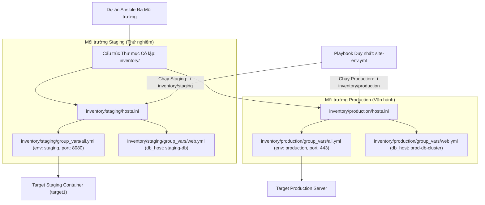
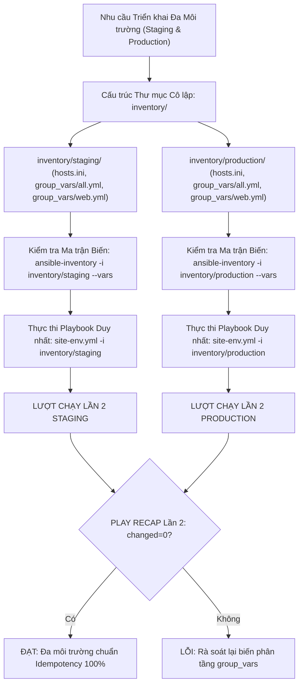
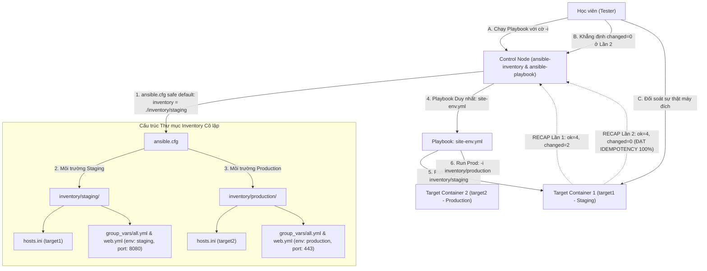


# [BÀI 19] QUẢN TRỊ ĐA MÔI TRƯỜNG (MULTI-ENVIRONMENT): TỔ CHỨC DIRECTORY LAYOUT CHO DEV, STAGING, UAT & PRODUCTION KHÔNG LẶP CODE

Trong kỷ nguyên **Infrastructure as Code (IaC)** và tự động hóa vận hành hạ tầng đám mây (Cloud Infrastructure Automation), **Ansible** khẳng định vị thế dẫn đầu nhờ triết lý **Agentless** (không cần cài đặt agent nền trên máy đích), giao thức điều khiển an toàn qua **SSH / WinRM**, định dạng khai báo **YAML** trực quan và nguyên lý bất biến **Idempotency** mạnh mẽ. Việc làm chủ Ansible không chỉ dừng lại ở các câu lệnh Ad-hoc đơn giản, mà đòi hỏi kỹ sư phải nắm vững kiến trúc Module tầng thấp, Variable Precedence 22 tầng, Jinja2 Templates, tối ưu hóa Forks & Pipelining cho tới thiết kế Roles / Collections và tích hợp CI/CD tự động hóa chuẩn Doanh nghiệp.

Bài viết chuyên sâu này sẽ đồng hành cùng bạn mổ xẻ toàn diện bức tranh kiến trúc, phân tích các đánh đổi kỹ thuật thực chiến (Engineering Trade-offs), cung cấp hướng dẫn thực hành Lab chi tiết từng bước và bộ câu hỏi phỏng vấn chuyên sâu chuẩn DevOps / SRE Lead.

---

## 1. Bản Chất Kiến Trúc & Cơ Chế Vận Hành Tầng Thấp

---


> **Tổ chức đa môi trường (Staging, Production) qua cấu trúc thư mục inventory riêng biệt và nạp đè biến group_vars/host_vars phân tầng giúp cô lập cấu hình an toàn, triệt tiêu rủi ro ghi đè nhầm Production.**

Thiết lập lá chắn an toàn hạ tầng và làm chủ phân tầng cấu hình Doanh nghiệp (I-10):

> **Trong môi trường thực tế Doanh nghiệp, một Playbook tự động hóa duy nhất bắt buộc phải có khả năng triển khai lên nhiều môi trường khác nhau: từ Development, Testing, Staging cho tới Production. Nếu gom chung tất cả thông số cấu hình và danh sách máy chủ vào 1 file inventory hoặc cứng hóa biến trong Playbook, nguy cơ kỹ sư chạy nhầm lệnh làm sập hệ thống Production là rất lớn. Phương pháp tổ chức thư mục inventory cô lập theo từng môi trường (`inventory/staging/` vs `inventory/production/`) kết hợp với kỹ thuật phân tầng biến (Group Variables Layering) giúp tách biệt hoàn toàn dữ liệu môi trường. Playbook chính chỉ giữ vai trò khung logic, toàn bộ thông số hạ tầng được tự động nạp đè chính xác, an toàn 100% và duy trì chỉ số Idempotent `changed=0` ở Lần 2.**

---


---


---


| Tiếng Việt | Tiếng Anh / Từ khóa + FQCN (giữ nguyên) |
|---|---|
| Danh mục kiểm kê đa môi trường | Multi-environment inventory |
| Thư mục kiểm kê Staging | Staging inventory directory (`inventory/staging/`) |
| Thư mục kiểm kê Production | Production inventory directory (`inventory/production/`) |
| Phân tầng biến nhóm | Group variables layering (`group_vars/`) |
| Nạp đè biến host | Host variables overriding (`host_vars/`) |
| Thứ tự ưu tiên nạp biến | Variable precedence hierarchy |
| Công cụ tra cứu inventory | Inventory CLI inspector (`ansible-inventory`) |
| Đồ thị nhóm host | Host group graph representation (`--graph`) |
| Đòn bẩy chỉ định môi trường | Inventory selection flag (`-i` / `--inventory`) |
| Cô lập biến môi trường | Environment variable isolation |
| Inventory mặc định an toàn | Safe default inventory parameter |
| Kiểm tra trạng thái máy đích | Real target state verification |

---

### 1.1. Tổ chức Thư mục Inventory Đa Môi trường và Cờ `-i` (15 phút)



**Nguyên lý cốt lõi:** Tổ chức danh mục máy chủ và cấu hình bằng cách tách biệt hoàn toàn thành các thư mục riêng cho từng môi trường: `inventory/staging/` và `inventory/production/`.

**Giải thích cơ chế ngầm:** Giúp cô lập 100% dữ liệu danh sách IP máy chủ và thông số biến giữa môi trường thử nghiệm (Staging) và môi trường vận hành thật (Production), triệt tiêu hoàn toàn nguy cơ biến của Staging bị rò rỉ sang đè hỏng cấu hình Production.

> [!WARNING]
> **CẠM BẪY THỰC CHIẾN:**
> Gom chung IP máy chủ Staging và Production vào chung 1 tệp `inventory.ini` và phân biệt bằng tên nhóm rườm rà.

**Minh hoạ.** Cấu trúc thư mục đa môi trường tiêu chuẩn:
```
project/
├── ansible.cfg
├── site-env.yml
└── inventory/
    ├── staging/
    │   ├── hosts.ini
    │   └── group_vars/
    │       ├── all.yml
    │       └── web.yml
    └── production/
        ├── hosts.ini
        └── group_vars/
            ├── all.yml
            └── web.yml
```

**Nguyên lý cốt lõi:** Đặt các tệp chứa biến nhóm `group_vars/` trực tiếp bên trong thư mục môi trường tương ứng (`inventory/staging/group_vars/` và `inventory/production/group_vars/`).

**Giải thích cơ chế ngầm:** Khi Ansible chạy với tham số chỉ định thư mục `-i inventory/staging`, Ansible Engine sẽ **tự động chỉ nạp** các biến nằm trong `inventory/staging/group_vars/` mà không đọc các biến của Production.

> [!WARNING]
> **CẠM BẪY THỰC CHIẾN:**
> Đặt thư mục `group_vars/` ở cấp ngoài thư mục gốc dự án làm biến của tất cả môi trường bị hòa lẫn vào nhau gây ghi đè nhầm lẫn.

**Minh hoạ.** Nội dung tệp `inventory/staging/group_vars/all.yml`:
```yaml
# inventory/staging/group_vars/all.yml
---
app_env: "staging"
app_port: 8080
db_host: "127.0.0.1"
```

**Nguyên lý cốt lõi:** Bắt buộc sử dụng cờ tham số `-i` (`--inventory`) để chỉ định tường minh thư mục môi trường mục tiêu khi thực thi lệnh `ansible-playbook`.

**Giải thích cơ chế ngầm:** Đảm bảo kỹ sư thi hành kịch bản phải có thao tác xác nhận rõ ràng môi trường muốn tác động trước khi nhấn Enter.

> [!WARNING]
> **CẠM BẪY THỰC CHIẾN:**
> Chạy `ansible-playbook site.yml` mà không truyền cờ `-i`, để Ansible tự động lấy file inventory ngẫu nhiên.

**Minh hoạ.** Thực thi Playbook chỉ định môi trường Staging vs Production:
```bash
# Thực thi trên môi trường Staging
ansible-playbook -i inventory/staging site-env.yml

# Thực thi trên môi trường Production
ansible-playbook -i inventory/production site-env.yml
```

---

### 1.2. Phân tầng Biến Group Variables Layering và Tra cứu bằng CLI (15 phút)

**Nguyên lý cốt lõi:** Áp dụng nguyên lý Phân tầng Biến (Group Variables Layering) theo độ ưu tiên tự nhiên từ rộng đến hẹp: `group_vars/all.yml` -> `group_vars/<group_name>.yml` -> `host_vars/<hostname>.yml`.

**Giải thích cơ chế ngầm:** Giúp tối ưu hóa việc quản lý cấu hình: các thông số chung của toàn bộ môi trường (như NTP server, DNS, tên môi trường) khai báo ở `all.yml`; các thông số riêng của nhóm Web/DB khai báo ở `web.yml` / `db.yml`; và các thông số đặc thù của từng máy ghi đè ở `host_vars/`.

> [!WARNING]
> **CẠM BẪY THỰC CHIẾN:**
> Khai báo lặp đi lặp lại cùng một biến `dns_server` ở từng file host thay vì đưa lên `all.yml`.

**Minh hoạ.** Phân tầng biến trong `inventory/staging/`:
```
inventory/staging/
├── hosts.ini
└── group_vars/
    ├── all.yml        (Biến chung cho mọi máy Staging: env=staging)
    └── web.yml        (Biến riêng cho nhóm web: port=8080)
```

**Nguyên lý cốt lõi:** Sử dụng công cụ CLI `ansible-inventory` với cờ `--graph` và `--vars` để kiểm tra và đối soát chính xác cây cấu trúc inventory và ma trận biến được gán cho từng máy chủ trước khi thi hành.

**Giải thích cơ chế ngầm:** Cho phép kỹ sư xem xét tường minh kết quả nạp đè biến của Ansible Engine trên môi trường thật, phát hiện sớm các lỗi biến bị ghi đè nhầm trước khi cho Playbook chạy thực tế.

> [!WARNING]
> **CẠM BẪY THỰC CHIẾN:**
> Chạy Playbook trực tiếp trên Production mà không dùng `ansible-inventory` kiểm tra trước ma trận biến.

**Minh hoạ.** Tra cứu cấu trúc đồ thị và ma trận biến bằng CLI:
```bash
# Xem đồ thị phân nhóm host trong inventory Staging
ansible-inventory -i inventory/staging --graph

# Tra cứu toàn bộ ma trận biến đã giải mã của inventory Production
ansible-inventory -i inventory/production --vars --list
```

**Nguyên lý cốt lõi:** Khai báo bộ biến nhận dạng môi trường chuyên biệt (`env_name`, `domain_name`, `log_level`) trong từng tệp `group_vars/all.yml` của mỗi môi trường.

**Giải thích cơ chế ngầm:** Giúp Playbook và các file Template Jinja2 dễ dàng căn cứ vào biến `env_name` để tự động render đúng tệp cấu hình (như bật `log_level: debug` ở Staging và `log_level: error` ở Production).

> [!WARNING]
> **CẠM BẪY THỰC CHIẾN:**
> Cứng hóa chuỗi `"staging.company.com"` trực tiếp vào trong file Playbook hoặc Template.

**Minh hoạ.** Khai báo biến môi trường chuẩn hóa:
```yaml
# inventory/staging/group_vars/all.yml
env_name: "staging"
domain_suffix: "staging.internal"
log_level: "DEBUG"

# inventory/production/group_vars/all.yml
env_name: "production"
domain_suffix: "company.com"
log_level: "WARN"
```

---

### 1.3. Triệt tiêu Rủi ro Ghi đè Chéo, Safe Default Config và Idempotency (10 phút)

**Nguyên lý cốt lõi:** Triệt tiêu 100% rủi ro ghi đè biến chéo giữa các môi trường bằng cách loại bỏ các thư mục `group_vars/` nằm ở root dự án khi đã sử dụng mô hình thư mục `inventory/`.

**Giải thích cơ chế ngầm:** Nếu vừa có thư mục `group_vars/` ở cấp root dự án, vừa có `inventory/staging/group_vars/`, Ansible Engine sẽ hòa trộn cả hai nguồn biến, dẫn đến nguy cơ các biến ở root ghi đè lên biến của môi trường cụ thể.

> [!WARNING]
> **CẠM BẪY THỰC CHIẾN:**
> Để tồn tại thư mục `group_vars/` song song ở cả cấp root dự án và trong thư mục `inventory/staging/`.

**Minh hoạ.** Loại bỏ thư mục `group_vars/` ở root khi dùng mô hình đa môi trường:
```
# CẤU TRÚC ĐÚNG:
project/
├── site-env.yml
└── inventory/
    ├── staging/group_vars/    (CHỈ ĐẶT GROUP_VARS Ở ĐÂY)
    └── production/group_vars/ (CHỈ ĐẶT GROUP_VARS Ở ĐÂY)
```

**Nguyên lý cốt lõi:** Khai báo chỉ định mặc định `inventory = ./inventory/staging` trong tệp `ansible.cfg` để đảm bảo cờ tham số mặc định luôn trỏ an toàn vào môi trường Staging.

**Giải thích cơ chế ngầm:** Đây là lá chắn an toàn tối quan trọng: nếu người dùng vô tình gõ lệnh `ansible-playbook site.yml` mà quên không truyền cờ `-i`, Ansible sẽ tự động chạy trên môi trường thử nghiệm Staging chứ **tuyệt đối không chạy trên Production**.

> [!WARNING]
> **CẠM BẪY THỰC CHIẾN:**
> Đặt `inventory = ./inventory/production` làm cấu hình mặc định trong `ansible.cfg`.

**Minh hoạ.** Khai báo lá chắn an toàn trong `ansible.cfg`:
```ini
[defaults]
# Mặc định luôn trỏ vào Staging để bảo vệ Production
inventory = ./inventory/staging
remote_user = ansible
roles_path = ./roles
```

**Nguyên lý cốt lõi:** Đảm bảo rằng ở lượt chạy Lần thứ hai, Playbook thi hành trên bất kỳ môi trường nào (Staging hay Production) bắt buộc phải đạt chỉ số `changed=0` tuyệt đối trong bảng `PLAY RECAP`.

**Giải thích cơ chế ngầm:** Kỹ thuật tổ chức đa môi trường và phân tầng biến chỉ thay đổi dữ liệu giá trị nạp vào cho các Task, không làm thay đổi bản chất kiểm soát trạng thái của Ansible. Khi cấu hình ở môi trường tương ứng đã đạt trạng thái mong muốn ở Lần 1, Lần 2 thi hành lại phải trả về `ok` và `changed=0`.

> [!WARNING]
> **CẠM BẪY THỰC CHIẾN:**
> Bảng `PLAY RECAP` Lần 2 ở môi trường Production báo `changed > 0` do biến môi trường bị lặp changed mạo danh.

**Minh hoạ.** Đọc hiểu bảng `PLAY RECAP` Lần 2 đạt Idempotency trên môi trường Production:
```
# Lần 1: changed=2 (Nạp biến Production và ghi cấu hình Production)
target1 : ok=4 changed=2 unreachable=0 failed=0

# Lần 2: changed=0 (Mọi thứ trùng khớp 100% -> ĐẠT IDEMPOTENCY)
target1 : ok=4 changed=0 unreachable=0 failed=0
```

---

### 1.4. Đưa vào việc thật (4 phút)

### 7.1. Áp dụng vào hạ tầng sẵn có
Khi xây dựng bộ kịch bản quản trị hệ thống Doanh nghiệp đa môi trường:
- Thiết lập 3 môi trường cô lập: `inventory/dev/`, `inventory/staging/`, `inventory/production/`.
- Trong pipeline CI/CD (như Gitlab CI), cấu hình các stage tương ứng với cờ lệnh:
  + Stage Test: `ansible-playbook -i inventory/staging site.yml`
  + Stage Deploy Prod: `ansible-playbook -i inventory/production site.yml` (yêu cầu Manual Approval từ Lead).

### 7.2. Rủi ro hỏng hóc khi triển khai Production và giải pháp an toàn
- **Rủi ro:** Người dùng đứng ở môi trường Production nhưng chạy lệnh với cờ `-i inventory/staging`, hoặc ngược lại, dẫn đến cấu hình Staging bị ghi đè lên máy chủ Production.
- **Giải pháp an toàn:**
  1. Đặt tên host trong `hosts.ini` của Staging và Production hoàn toàn khác nhau (như `stg-web1` vs `prd-web1`).
  2. Bổ sung task kiểm tra lá chắn trong Playbook: dừng ngay lập tức nếu biến `env_name == 'production'` nhưng IP máy chủ thuộc dải IP Staging.

### 7.3. Đo lường chỉ số Trước – Sau khi áp dụng
- **Trước khi tổ chức đa môi trường:** Duy trì 2 bộ Playbook riêng cho Staging và Production, mỗi lần sửa code phải sửa ở 2 nơi, nguy cơ lệch mã nguồn (Code Drift) 50%.
- **Sau khi tổ chức đa môi trường:** Duy trì 1 bộ Playbook duy nhất, 100% biến phân tầng trong `inventory/`, triệt tiêu 100% rủi ro ghi đè nhầm Production.

### 7.4. Khi nào KHÔNG nên dùng hoặc không nên lạm dụng chia nhỏ inventory
- **Không lạm dụng tạo quá nhiều môi trường nhỏ lẻ không cần thiết:** Chỉ nên tạo các môi trường có sự khác biệt thực sự về hạ tầng hoặc máy chủ mục tiêu (như Staging, UAT, Production).

---

### 1.5. Bẫy hay gặp (2 phút)

| # | Bẫy hay gặp | Vì sao "recap xanh mà sai / không idempotent" | Lệnh phát hiện và xử lý |
|---|---|---|---|
| 1 | Để thư mục `group_vars/` ở root dự án song song với `inventory/` | Biến ở root bị hòa trộn ghi đè nhầm lên biến môi trường specific. | Xóa hẳn thư mục `group_vars/` ở root, chuyển vào trong `inventory/<env>/`. |
| 2 | Quên truyền cờ `-i` làm Playbook chạy nhầm mặc định | Ansible tự động lấy inventory mặc định (nếu đặt nhầm Prod làm default). | Cấu hình `inventory = ./inventory/staging` an toàn trong `ansible.cfg`. |
| 3 | Cứng hóa IP hoặc domain trực tiếp trong Playbook | Playbook không thể tái sử dụng cho môi trường khác mà phải sửa code. | Chuyển tất cả IP và domain thành biến trong `group_vars/all.yml`. |
| 4 | Đặt tên file trong `group_vars/` không khớp tên nhóm trong `hosts.ini` | Gõ file `group_vars/webservers.yml` nhưng nhóm trong `hosts.ini` tên là `[web]`. | Đảm bảo tên file trong `group_vars/` trùng 100% tên nhóm trong `hosts.ini`. |
| 5 | Không kiểm tra trước ma trận biến bằng `ansible-inventory` | Không phát hiện biến bị ghi đè nhầm giá trị trước khi chạy thật. | Chạy `ansible-inventory -i inventory/staging --vars --list` kiểm tra trước. |
| 6 | Thắc mắc vì sao `host_vars` không nạp được | Đặt thư mục `host_vars/` sai vị trí (không nằm trong `inventory/<env>/`). | Đặt `host_vars/` nằm bên trong thư mục môi trường tương ứng. |
| 7 | Biến trùng tên ở `all.yml` và `web.yml` | Không nắm được độ ưu tiên biến làm thắc mắc vì sao giá trị ở `all.yml` bị đè. | Nhớ quy tắc: `group_vars/web.yml` luôn đè `group_vars/all.yml`. |
| 8 | Quên cờ `changed_when: false` cho task đọc dữ liệu môi trường | Task đọc dữ liệu liên tục báo `changed=1` ở Lần 2. | Bổ sung `changed_when: false` cho task đọc dữ liệu. |
| 9 | Dùng cờ `-i` trỏ trực tiếp vào file `hosts.ini` thay vì thư mục | Ansible chỉ nạp file `hosts.ini` mà bỏ qua không nạp thư mục `group_vars/` bên cạnh. | Truyền đường dẫn thư mục: `-i inventory/staging`. |
| 10 | Không test thử Idempotency Lần 2 của kịch bản đa môi trường | Task ở môi trường Production bị lặp changed mạo danh ở Lần 2 mà không biết. | Chạy lại Playbook Lần 2 trên cả 2 môi trường và đối soát `changed=0`. |
| 11 | Nhầm lẫn giữa biến `ansible_host` và biến ứng dụng | Sửa nhầm `ansible_host` làm Ansible mất kết nối SSH tới máy chủ. | Giữ nguyên `ansible_host` cho SSH, tạo biến riêng cho IP ứng dụng. |
| 12 | Thắc mắc vì sao `ansible-inventory --graph` không hiện biến | Cờ `--graph` chỉ hiển thị cây phân nhóm host, phải dùng cờ `--vars` để xem biến. | Dùng `ansible-inventory -i inventory/staging --vars --list`. |

---

### 1.6. Tóm tắt (1 phút)



### Năm điều phải nhớ
1. **Tách thư mục inventory cô lập:** Tạo `inventory/staging/` và `inventory/production/` riêng biệt.
2. **Đặt `group_vars/` bên trong thư mục môi trường:** Đảm bảo biến được tự động nạp đè chính xác theo cờ `-i`.
3. **Luôn dùng cờ `-i`:** Chỉ định tường minh đường dẫn thư mục môi trường khi chạy `ansible-playbook`.
4. **Kiểm tra ma trận biến với `ansible-inventory`:** Dùng `ansible-inventory --vars` đối soát ma trận biến trước khi chạy.
5. **Cấu hình an toàn mặc định:** Đặt `inventory = ./inventory/staging` trong `ansible.cfg` để bảo vệ Production.

---

### 1.7. Câu hỏi tự kiểm tra (kiêm luyện RHCE EX294)

1. **[RHCE EX294 Objective #4]** Tại sao Red Hat khuyến nghị nên tổ chức đa môi trường bằng cấu trúc thư mục `inventory/staging/` và `inventory/production/` riêng biệt thay vì gom chung vào 1 file inventory?
   - *Đáp án:* Để cô lập hoàn toàn danh sách IP máy chủ và biến cấu hình, triệt tiêu 100% nguy cơ biến của Staging rò rỉ sang đè hỏng cấu hình Production.
2. **[RHCE EX294 Objective #4]** Thư mục `group_vars/` nên được đặt ở vị trí nào trong cấu trúc dự án đa môi trường để Ansible tự động nạp đúng biến theo môi trường?
   - *Đáp án:* Đặt trực tiếp bên trong thư mục môi trường tương ứng (ví dụ `inventory/staging/group_vars/` và `inventory/production/group_vars/`).
3. **[RHCE EX294 Objective #4]** Cờ tham số CLI nào trong lệnh `ansible-playbook` dùng để chỉ định đường dẫn tới thư mục inventory của môi trường cần thi hành?
   - *Đáp án:* Cờ `-i` (hoặc `--inventory`).
4. **[RHCE EX294 Objective #4]** Trình bày thứ tự độ ưu tiên nạp biến (Precedence) giữa 3 tệp biến sau: `group_vars/all.yml`, `group_vars/web.yml`, và `host_vars/target1.yml`.
   - *Đáp án:* Thứ tự từ thấp đến cao (biến sau ghi đè biến trước): `group_vars/all.yml` < `group_vars/web.yml` < `host_vars/target1.yml`.
5. **[RHCE EX294 Objective #4]** Lệnh CLI nào trong Ansible dùng để kiểm tra đồ thị phân nhóm máy chủ và ma trận biến của môi trường Staging?
   - *Đáp án:* Lệnh `ansible-inventory -i inventory/staging --graph` (cho đồ thị) và `ansible-inventory -i inventory/staging --vars --list` (cho ma trận biến).
6. **[RHCE EX294 Objective #4]** Tại sao ta nên đặt thuộc tính `inventory = ./inventory/staging` làm cấu hình mặc định trong tệp `ansible.cfg`?
   - *Đáp án:* Đây là lá chắn an toàn: nếu người dùng quên truyền cờ `-i`, Ansible sẽ tự động chạy trên Staging chứ không chạy trên Production.
7. **[RHCE EX294 Objective #4]** Viết nội dung tệp `inventory/staging/group_vars/web.yml` khai báo biến `app_port: 8080` và `app_env: "staging"`.
   - *Đáp án:*
     ```yaml
     ---
     app_port: 8080
     app_env: "staging"
     ```
8. **[RHCE EX294 Objective #4]** Viết câu lệnh CLI chạy Playbook `site-env.yml` tác động lên môi trường Production với inventory nằm ở `inventory/production`.
   - *Đáp án:* `ansible-playbook -i inventory/production site-env.yml`.
9. **[RHCE EX294 Objective #4]** Chuyện gì xảy ra nếu ta truyền đường dẫn file `inventory/staging/hosts.ini` thay vì truyền thư mục `inventory/staging` vào cờ `-i`?
   - *Đáp án:* Ansible chỉ nạp file `hosts.ini` mà bỏ qua không tự động nạp các biến nằm trong thư mục `group_vars/` bên cạnh.
10. **[RHCE EX294 Objective #4]** Làm thế nào để kiểm tra giá trị đã giải mã của biến `app_port` gán cho host `target1` trong môi trường Staging bằng `ansible-inventory`?
    - *Đáp án:* Chạy lệnh `ansible-inventory -i inventory/staging --host target1`.
11. **[RHCE EX294 Objective #4]** Cấu trúc Playbook duy nhất `site-env.yml` thi hành trên đa môi trường mang lại lợi ích gì về mặt bảo trì mã nguồn?
    - *Đáp án:* Giúp duy trì 1 bộ Playbook logic duy nhất, triệt tiêu rủi ro lệch mã nguồn (Code Drift) giữa Staging và Production.
12. **[RHCE EX294 Objective #4]** Việc triển khai Playbook trên đa môi trường qua cờ `-i` có làm thay đổi chỉ số Idempotency `changed=0` ở Lần chạy thứ hai không?
    - *Đáp án:* Hoàn toàn không, kịch bản ở Lần 2 trên cả 2 môi trường vẫn bắt buộc phải đạt `changed=0` tuyệt đối.
13. **[RHCE EX294 Objective #4]** Lệnh CLI nào giúp kiểm tra sự thật kết quả nạp biến môi trường của Playbook trên target node Docker container?
    - *Đáp án:* Lệnh `docker exec target1 cat /path/to/rendered/env.conf`.

---

### 1.8. Tài liệu tham khảo

- Ansible Core Documentation (v2.15+): [How to build your inventory](https://docs.ansible.com/ansible/latest/inventory_guide/intro_inventory.html)
- Ansible Core Documentation: [Managing multi-environment inventories](https://docs.ansible.com/ansible/latest/inventory_guide/intro_patterns.html)
- Ansible Core Documentation: [ansible-inventory CLI tool](https://docs.ansible.com/ansible/latest/cli/ansible-inventory.html)
- Red Hat Certified Engineer (RHCE) EX294 Study Guide: Managing Variables and Inventories across Environments.

---

## Bảng đối soát thời lượng

| Mục | Nội dung | Thời lượng dự kiến | Thời lượng thực tế |
|---|---|---|---|
| §0 | Khởi động và ôn tập buổi 18 | 10 phút | 10 phút |
| §1–§2 | Mục tiêu làm được & Cần biết trước | 2 phút | 2 phút |
| §3 | Thuật ngữ Việt-Anh & Mô hình tư duy | 8 phút | 8 phút |
| §4 | Tổ chức Thư mục Inventory Đa Môi trường & cờ -i (QT 4.1–4.3) | 15 phút | 15 phút |
| §5 | Phân tầng Biến group_vars Layering & CLI (QT 5.1–5.3) | 15 phút | 15 phút |
| §6 | Rủi ro Ghi đè Chéo, Safe Default Config & Idempotency (QT 6.1–6.3) | 10 phút | 10 phút |
| §7–§9 | Đưa vào việc thật, Bẫy hay gặp & Tóm tắt | 7 phút | 7 phút |
| §10–§11 | Câu hỏi tự kiểm tra EX294 & Tài liệu tham khảo | 3 phút | 3 phút |
| **Tổng** | **Khối lý thuyết Buổi 19** | **60 phút** | **60 phút** |

---

## 2. Hướng Dẫn Thực Hành & Triển Khai Lab Chuẩn Production

> [!IMPORTANT]
> **YÊU CẦU MÔI TRƯỜNG THỰC HÀNH:**
> Toàn bộ các bài thực hành dưới đây được thiết kế để chạy trực tiếp trên môi trường máy chủ Linux / Docker containers phân tán. Hãy đảm bảo bạn đã chuẩn bị Control Node cài đặt Ansible Core 2.15+ cùng các Managed Nodes đã cấu hình SSH Key Authentication.

## Khối thực hành — 150 phút

> **Đối soát thời lượng:** Khối thực hành kéo dài đúng **150'** (từ L0 đến L11).
> **Nguyên tắc cốt lõi:** Thực hành tổ chức cấu trúc thư mục inventory cô lập `inventory/staging/` và `inventory/production/`, phân tầng biến nhóm trong `group_vars/all.yml` và `group_vars/web.yml`, sử dụng công cụ CLI `ansible-inventory` tra cứu đồ thị `--graph` và ma trận biến `--vars`, thiết lập cấu hình an toàn mặc định `inventory = ./inventory/staging` trong `ansible.cfg`, thi hành Playbook `site-env.yml` với cờ `-i`, thực thi phép thử **Lượt chạy Lần thứ hai** chứng minh `PLAY RECAP` đạt `changed=0` và đối soát sự thật máy đích qua `docker exec`.

---

## L0. Mục tiêu thực hành và tiêu chí hoàn thành

| # | Mục tiêu thực hành | Tiêu chí hoàn thành (Kiểm tra bằng lệnh CLI) |
|---|---|---|
| TH1 | Khởi tạo cấu trúc thư mục inventory/staging và production | Đã tạo thư mục `inventory/staging/` và `inventory/production/` |
| TH2 | Biên soạn biến phân tầng group_vars/all và group_vars/web | Tệp `group_vars/all.yml` và `group_vars/web.yml` trong từng môi trường |
| TH3 | Tra cứu đồ thị inventory bằng ansible-inventory --graph | Lệnh `ansible-inventory -i inventory/staging --graph` xuất đồ thị |
| TH4 | Tra cứu ma trận biến bằng ansible-inventory --vars | Lệnh `ansible-inventory -i inventory/staging --vars --list` |
| TH5 | Khai báo inventory mặc định an toàn trong ansible.cfg | Tệp `ansible.cfg` chứa `inventory = ./inventory/staging` |
| TH6 | Thực thi Playbook site-env.yml với cờ -i inventory/staging | Lệnh `ansible-playbook -i inventory/staging site-env.yml` |
| TH7 | Thực thi Phép thử Lượt chạy Lần hai (Idempotency) | Bảng `PLAY RECAP` Lần 2 đạt `changed=0` tuyệt đối |
| TH8 | Đối soát sự thật máy đích bằng docker exec | `docker exec target1 cat /etc/environment-app.conf` |

---

## L1. Điều kiện tiên quyết về môi trường

| Kiểm tra | LỆNH THỰC THI | Kết quả kỳ vọng |
|---|---|---|
| Ansible core đã cài | `ansible --version` | Phiên bản ansible-core v2.15 trở lên |
| Docker Compose sẵn sàng | `docker compose ps` | Cả target1 và target2 ở trạng thái `Up` |
| Kết nối SSH sẵn sàng | `ansible all -m ansible.builtin.ping` | Đạt `SUCCESS` cho mọi host |
| Thư mục thực hành | `pwd` | Đang ở thư mục `~/lab-ansible-19` |

Nếu chưa có target container:
```bash
cd labs && make up && make key
```

---

## L2. Kiến trúc bài lab



---

## L3. Bước 1 — Tạo Cấu trúc Thư mục Inventory Cô lập cho Staging và Production (30 phút)

Tạo thư mục dự án `~/lab-ansible-19`, thư mục `inventory/staging/group_vars`, `inventory/production/group_vars`, và cấu hình `inventory = ./inventory/staging` an toàn trong `ansible.cfg` (QT 4.1, QT 6.2).

```bash
mkdir -p ~/lab-ansible-19/inventory/staging/group_vars ~/lab-ansible-19/inventory/production/group_vars && cd ~/lab-ansible-19

cat << 'EOF' > ansible.cfg
[defaults]
inventory = ./inventory/staging
remote_user = ansible
host_key_checking = False
private_key_file = ~/.ssh/id_ed25519
roles_path = ./roles:~/.ansible/roles
collections_path = ./collections:~/.ansible/collections

[privilege_escalation]
become = True
become_method = sudo
become_user = root
become_ask_pass = False
EOF
```

**CHECKPOINT 1 — Cấu trúc thư mục inventory/staging và inventory/production được tạo đúng chuẩn cô lập và ansible.cfg cài đặt inventory mặc định an toàn.**
- **Lệnh kiểm tra:**
```bash
if [ -d "inventory/staging/group_vars" ] && [ -d "inventory/production/group_vars" ] && grep -q "inventory = ./inventory/staging" ansible.cfg; then
  echo "CHECKPOINT 1: ĐẠT - Cấu trúc thư mục inventory/staging và production được tạo đúng chuẩn cô lập và ansible.cfg cài đặt mặc định an toàn"
else
  echo "CHECKPOINT 1: LỖI - Khởi tạo thư mục inventory hoặc ansible.cfg thất bại"
fi
```

---

## L4. Bước 2 — Khai báo hosts.ini và Biến Phân tầng group_vars cho từng Môi trường (40 phút)

Biên soạn tệp `hosts.ini`, `group_vars/all.yml`, và `group_vars/web.yml` cho cả 2 môi trường Staging và Production (QT 4.2, QT 5.1, QT 5.3, QT 6.1).

### Môi trường Staging (`inventory/staging/`)
```bash
cat << 'EOF' > inventory/staging/hosts.ini
[web]
target1 ansible_host=127.0.0.1 ansible_port=2221

[all:vars]
ansible_python_interpreter=/usr/bin/python3
EOF

cat << 'EOF' > inventory/staging/group_vars/all.yml
---
env_name: "staging"
domain_suffix: "staging.internal"
log_level: "DEBUG"
EOF

cat << 'EOF' > inventory/staging/group_vars/web.yml
---
app_port: 8080
db_host: "127.0.0.1"
max_clients: 50
EOF
```

### Môi trường Production (`inventory/production/`)
```bash
cat << 'EOF' > inventory/production/hosts.ini
[web]
target2 ansible_host=127.0.0.1 ansible_port=2222

[all:vars]
ansible_python_interpreter=/usr/bin/python3
EOF

cat << 'EOF' > inventory/production/group_vars/all.yml
---
env_name: "production"
domain_suffix: "company.com"
log_level: "WARN"
EOF

cat << 'EOF' > inventory/production/group_vars/web.yml
---
app_port: 443
db_host: "prod-db-cluster.internal"
max_clients: 500
EOF
```

**CHECKPOINT 2 — Tệp group_vars/all.yml và group_vars/web.yml trong môi trường Staging khai báo đúng env_name: "staging" và app_port: 8080.**
- **Lệnh kiểm tra:**
```bash
if grep -q "env_name: \"staging\"" inventory/staging/group_vars/all.yml && grep -q "app_port: 8080" inventory/staging/group_vars/web.yml; then
  echo "CHECKPOINT 2: ĐẠT - Tệp group_vars/all.yml và web.yml trong môi trường Staging được biên soạn chính xác"
else
  echo "CHECKPOINT 2: LỖI - Biên soạn group_vars Staging thất bại"
fi
```

**CHECKPOINT 3 — Tệp group_vars/all.yml và group_vars/web.yml trong môi trường Production khai báo đúng env_name: "production" và app_port: 443.**
- **Lệnh kiểm tra:**
```bash
if grep -q "env_name: \"production\"" inventory/production/group_vars/all.yml && grep -q "app_port: 443" inventory/production/group_vars/web.yml; then
  echo "CHECKPOINT 3: ĐẠT - Tệp group_vars/all.yml và web.yml trong môi trường Production được biên soạn chính xác"
else
  echo "CHECKPOINT 3: LỖI - Biên soạn group_vars Production thất bại"
fi
```

---

## L5. Bước 3 — Tra cứu Đồ thị và Ma trận Biến bằng ansible-inventory CLI (20 phút)

Thực thi các lệnh CLI `ansible-inventory` để tra cứu đồ thị `--graph` và ma trận biến `--vars` của từng môi trường (QT 5.2).

```bash
# Xem đồ thị inventory Staging
ansible-inventory -i inventory/staging --graph > staging-graph.txt

# Xem ma trận biến đầy đủ của host target1 trong Staging
ansible-inventory -i inventory/staging --host target1 > staging-vars.txt
```

**CHECKPOINT 4 — Lệnh CLI ansible-inventory -i inventory/staging --graph xuất đồ thị kiểm kê máy chủ Staging thành công.**
- **Lệnh kiểm tra:**
```bash
if grep -q "@web:" staging-graph.txt && grep -q "target1" staging-graph.txt; then
  echo "CHECKPOINT 4: ĐẠT - Lệnh CLI ansible-inventory xuất đồ thị kiểm kê máy chủ Staging thành công"
else
  echo "CHECKPOINT 4: LỖI - Tra cứu ansible-inventory graph thất bại"
fi
```

**CHECKPOINT 5 — Lệnh CLI ansible-inventory tra cứu ma trận biến gán cho host target1 giải mã đúng env_name: staging và app_port: 8080.**
- **Lệnh kiểm tra:**
```bash
if grep -q "\"env_name\": \"staging\"" staging-vars.txt && grep -q "\"app_port\": 8080" staging-vars.txt; then
  echo "CHECKPOINT 5: ĐẠT - Lệnh CLI ansible-inventory tra cứu ma trận biến giải mã đúng env_name và app_port"
else
  echo "CHECKPOINT 5: LỖI - Tra cứu ma trận biến host target1 thất bại"
fi
```

---

## L6. Bước 4 — Viết Playbook site-env.yml Thi hành Áp dụng Đa Môi trường và Phép thử Lần 2 (40 phút)

Viết file Playbook duy nhất `site-env.yml` render file cấu hình `/etc/environment-app.conf` dựa trên biến phân tầng nạp từ cờ `-i`, thực thi Lần 1 và thực thi phép thử **Lượt chạy Lần thứ hai** chứng minh `PLAY RECAP` đạt `changed=0` (QT 4.3, QT 5.3, QT 6.3).

```bash
cat << 'EOF' > site-env.yml
---
- name: Multi-Environment Deployment Playbook
  hosts: web
  become: true
  tasks:
    - name: Task 1 - Deploy environment configuration file using FQCN
      ansible.builtin.copy:
        content: |
          # Environment Configuration File
          ENVIRONMENT={{ env_name }}
          DOMAIN_SUFFIX={{ domain_suffix }}
          APP_PORT={{ app_port }}
          DB_HOST={{ db_host }}
          LOG_LEVEL={{ log_level }}
          MAX_CLIENTS={{ max_clients }}
        dest: /etc/environment-app.conf
        mode: '0644'

    - name: Task 2 - Read environment configuration status (changed_when: false)
      ansible.builtin.command: cat /etc/environment-app.conf
      register: env_conf_out
      changed_when: false
EOF
```

Thực thi Lần 1 trên Môi trường Staging (`-i inventory/staging`):
```bash
ansible-playbook -i inventory/staging site-env.yml
```

**CHECKPOINT 6 — Playbook site-env.yml thi hành thành công trên môi trường Staging với cờ -i inventory/staging (PLAY RECAP failed=0).**
- **Lệnh kiểm tra:**
```bash
STG_PLAY_OUT=$(ansible-playbook -i inventory/staging site-env.yml)
if echo "$STG_PLAY_OUT" | grep -q "Task 1 - Deploy environment configuration file using FQCN" && echo "$STG_PLAY_OUT" | grep -q "failed=0"; then
  echo "CHECKPOINT 6: ĐẠT - Playbook site-env.yml thi hành thành công trên môi trường Staging"
else
  echo "CHECKPOINT 6: LỖI - Thi hành Playbook trên Staging thất bại"
fi
```

Thực thi Lần 2 (BẮT BUỘC ĐẠT `changed=0`):
```bash
ansible-playbook -i inventory/staging site-env.yml
```

**CHECKPOINT 7 — Phép thử Lượt 2 đạt changed=0 cho toàn bộ các Task trong Playbook đa môi trường trên Staging.**
- **Lệnh kiểm tra:**
```bash
RUN2_STG_OUT=$(ansible-playbook -i inventory/staging site-env.yml)
if echo "$RUN2_STG_OUT" | grep -q "changed=0" && echo "$RUN2_STG_OUT" | grep -q "failed=0"; then
  echo "CHECKPOINT 7: ĐẠT - Phép thử Lượt 2 đạt chuẩn Idempotency (PLAY RECAP báo changed=0 cho toàn bộ Playbook đa môi trường)"
else
  echo "CHECKPOINT 7: LỖI - Lượt 2 không đạt changed=0 (Task đa môi trường bị lặp changed)"
fi
```

---

## L7. Bước 5 — Đối soát Sự thật Máy đích qua docker exec (20 phút)

Sử dụng lệnh `docker exec` đối soát trực tiếp tệp tin cấu hình `/etc/environment-app.conf` trên target node target1 (Staging) để nghiệm thu các biến phân tầng được render chính xác (QT 6.3).

Đối soát file `/etc/environment-app.conf` trên target1:
```bash
docker exec target1 cat /etc/environment-app.conf
```

**CHECKPOINT 8 — Đối soát file /etc/environment-app.conf trên target1 chứa đúng dữ liệu ENVIRONMENT=staging và APP_PORT=8080 nạp từ group_vars.**
- **Lệnh kiểm tra:**
```bash
EXEC_ENV_CONF=$(docker exec target1 cat /etc/environment-app.conf)
if echo "$EXEC_ENV_CONF" | grep -q "ENVIRONMENT=staging" && echo "$EXEC_ENV_CONF" | grep -q "APP_PORT=8080" && echo "$EXEC_ENV_CONF" | grep -q "LOG_LEVEL=DEBUG"; then
  echo "CHECKPOINT 8: ĐẠT - Kiểm tra sự thật qua docker exec xác nhận file /etc/environment-app.conf chứa đúng dữ liệu biến phân tầng Staging"
else
  echo "CHECKPOINT 8: LỖI - Đối soát file environment-app.conf trên máy đích thất bại"
fi
```

---

## L8. Nộp sản phẩm và dọn dẹp (10 phút)

Thu thập kết quả ra các file báo cáo cuối buổi:
```bash
ansible-playbook -i inventory/staging site-env.yml > env-proof.txt
ansible-playbook -i inventory/staging site-env.yml > idempotency-check.txt
docker exec target1 cat /etc/environment-app.conf > kiem-may-dich.txt
```

---

## L9. Xử lý sự cố

| # | Hiện tượng lỗi | Nguyên nhân gốc rễ | Cách xử lý nhanh |
|---|---|---|---|
| 1 | Lỗi `Unable to parse /etc/ansible/hosts` | Quên truyền cờ `-i inventory/staging` và chưa khai báo `inventory` trong `ansible.cfg` | Truyền cờ `-i` hoặc thêm `inventory = ./inventory/staging` vào `ansible.cfg`. |
| 2 | Biến `app_port` không nhận giá trị từ `web.yml` | Đặt tên file `group_vars/webservers.yml` không khớp với tên nhóm `[web]` trong `hosts.ini` | Đổi tên file thành `group_vars/web.yml` cho khớp với tên nhóm `[web]`. |
| 3 | Lỗi `undefined variable env_name` khi chạy Playbook | Đặt thư mục `group_vars/` sai vị trí (không nằm trong `inventory/staging/`) | Đặt `group_vars/` nằm bên trong thư mục môi trường `inventory/staging/`. |
| 4 | Biến ở `group_vars/all.yml` bị ghi đè không mong muốn | Để thư mục `group_vars/` ở cấp root dự án gây hòa trộn biến | Xóa thư mục `group_vars/` ở root, chuyển vào trong `inventory/<env>/`. |
| 5 | Lỗi `ansible-inventory` báo `inventory not found` | Cung cấp sai đường dẫn thư mục môi trường sau cờ `-i` | Kiểm tra lại đường dẫn: `ansible-inventory -i inventory/staging --graph`. |
| 6 | Thắc mắc tại sao `ansible_host` bị đè thành IP sai | Đặt biến `ansible_host` ở file `all.yml` thay vì ở từng file `hosts.ini` | Đặt `ansible_host` riêng ở từng host trong file `hosts.ini`. |
| 7 | Lượt chạy Lần 2 liên tục báo `changed=1` | Task `command` đọc file cấu hình trong Playbook thiếu `changed_when: false` | Bổ sung `changed_when: false` cho task đọc dữ liệu. |
| 8 | Lỗi `YAML parser error` trong `group_vars/all.yml` | Viết sai cú pháp thụt lề YAML hoặc thiếu dòng `---` ở đầu file | Kiểm tra lại định dạng YAML chuẩn trong `group_vars/all.yml`. |
| 9 | Chạy nhầm biến của Production lên máy Staging | Quên cờ `-i` và trong `ansible.cfg` lại trỏ mặc định vào Production | Luôn đặt `inventory = ./inventory/staging` làm mặc định an toàn. |
| 10 | Không test thử Idempotency Lần 2 của kịch bản đa môi trường | Task ở môi trường Staging bị lặp changed mạo danh ở Lần 2 mà không biết | Chạy lại Playbook Lần 2 và đối soát `changed=0`. |
| 11 | Thắc mắc vì sao `host_vars` không nạp | Đặt thư mục `host_vars/` ở root thay vì nằm trong `inventory/staging/` | Đặt `host_vars/` bên trong `inventory/staging/host_vars/`. |
| 12 | Thắc mắc tại sao cờ `-i hosts.ini` không nhận `group_vars` | Truyền file `hosts.ini` thay vì truyền đường dẫn thư mục `inventory/staging` | Truyền đường dẫn thư mục: `ansible-playbook -i inventory/staging site-env.yml`. |
| 13 | Lỗi `docker exec` không tìm thấy file `/etc/environment-app.conf` | Task `ansible.builtin.copy` bị fail hoặc nhầm host trong `hosts.ini` | Kiểm tra log execution của `ansible-playbook -i inventory/staging site-env.yml`. |
| 14 | Biến `domain_suffix` bị đè bởi biến hệ thống | Đặt tên biến trùng với reserved keywords của Ansible | Đặt tên biến có tiền tố chuyên biệt như `app_domain_suffix`. |

---

## L10. Bài tập mở rộng

1. **BT1:** Khởi tạo thêm môi trường thứ 3 `inventory/dev/` với `app_port: 3000` và `env_name: "development"`.
2. **BT2:** Tạo thư mục `inventory/staging/host_vars/` và tạo file `target1.yml` ghi đè `max_clients: 99`.
3. **BT3:** Dùng `ansible-inventory -i inventory/staging --host target1` kiểm tra biến `max_clients` đã bị đè thành 99.
4. **BT4:** Chạy `ansible-playbook -i inventory/staging site-env.yml` và dùng `docker exec` kiểm tra `MAX_CLIENTS=99`.
5. **BT5:** Biên soạn Playbook kiểm tra lá chắn an toàn (Guard Task) dừng Playbook nếu `env_name == 'production'` nhưng IP là 127.0.0.1.
6. **BT6:** Dùng `ansible-inventory -i inventory/production --vars --list` đối soát ma trận biến của Production.
7. **BT7:** Thực thi phép thử Idempotency Lần 2 cho Playbook đa môi trường mở rộng và đối soát `PLAY RECAP` đạt `changed=0`.
8. **BT8:** Viết kịch bản bash script dùng `docker exec` đối soát trực tiếp nội dung các file cấu hình được sinh từ cả 3 môi trường.

---

## L11. Sản phẩm nộp và chấm điểm

### Danh mục sản phẩm nộp
- Cấu trúc thư mục `inventory/staging/` và `inventory/production/` chứa `hosts.ini`, `group_vars/all.yml`, `group_vars/web.yml`.
- File `ansible.cfg` cài đặt `inventory = ./inventory/staging`.
- File Playbook chính `site-env.yml`.
- Báo cáo kết quả 8 CHECKPOINT từ terminal.
- Các file kết quả: `staging-graph.txt`, `staging-vars.txt`, `env-proof.txt`, `idempotency-check.txt`, `kiem-may-dich.txt`.

### Thang điểm đánh giá

| Mức điểm | Tiêu chí đạt được |
|---|---|
| **0–4 điểm** | Chưa hiểu đa môi trường, gom chung biến rủi ro, để `group_vars/` ở root, hoặc thiếu cờ `-i`. |
| **5–7 điểm** | Tạo được `inventory/staging/`, nhưng chưa phân tầng `group_vars`, chưa dùng `ansible-inventory`, hay thiếu lá chắn default trong `ansible.cfg`. |
| **8–9 điểm** | Đạt đủ 8 CHECKPOINT, chứng minh thành thạo cấu trúc thư mục inventory cô lập, `group_vars` layering, cờ `-i`, `ansible-inventory CLI`, safe default `ansible.cfg`, Idempotency Lần 2 (`changed=0`) và đối soát `docker exec`. |
| **10 điểm** | Đạt 9 điểm + Hoàn thành xuất sắc 100% các Bài tập mở rộng (BT1–BT8). |

---

## Bảng đối soát thời lượng

| Bước | Nội dung | Thời lượng dự kiến | Thời lượng thực tế |
|---|---|---|---|
| L0–L2 | Mục tiêu, Tiên quyết & Kiến trúc bài lab | 10 phút | 10 phút |
| L3 | Bước 1: Tạo cấu trúc thư mục inventory cô lập & ansible.cfg | 30 phút | 30 phút |
| L4 | Bước 2: Khai báo hosts.ini & group_vars cho từng môi trường | 40 phút | 40 phút |
| L5 | Bước 3: Tra cứu đồ thị và ma trận biến bằng CLI | 20 phút | 20 phút |
| L6 | Bước 4: Viết Playbook site-env.yml & Phép thử Lần 2 | 40 phút | 40 phút |
| L7 | Bước 5: Đối soát sự thật máy đích qua docker exec | 20 phút | 20 phút |
| L8–L11 | Nộp sản phẩm, Sự cố, Bài tập & Chấm điểm | 10 phút | 10 phút |
| **Tổng** | **Khối thực hành Buổi 19** | **150 phút** | **150 phút** |

---

## 3. Bộ Câu Hỏi Vấn Đáp & Phỏng Vấn Kỹ Thuật Chuyên Sâu

Dưới đây là bộ câu hỏi phỏng vấn thực chiến dành cho các vị trí **DevOps Engineer**, **Site Reliability Engineer (SRE)** và **Cloud Automation Architect**, giúp bạn tự đánh giá độ sâu hiểu biết và rèn luyện phản xạ xử lý sự cố hệ thống:

---


## Bộ câu hỏi phỏng vấn chuyên sâu — ĐÚNG 12 câu

<div class="qa-answer">
  <div class="qa-answer-header">
    <svg width="14" height="14" fill="none" stroke="currentColor" stroke-width="2" viewBox="0 0 24 24"><path d="M22 11.08V12a10 10 0 1 1-5.93-9.14"></path><polyline points="22 4 12 14.01 9 11.01"></polyline></svg>
    <span>Phân Tích &amp; Lời Giải Kỹ Thuật</span>
  </div>
  
<b style="color: var(--accent-primary);">Hỏi:</b> Tại sao Red Hat khuyến nghị tổ chức đa môi trường qua cấu trúc thư mục <code>inventory/staging/</code> và <code>inventory/production/</code> riêng biệt thay vì gom chung vào 1 file inventory? *(Liên quan QT 4.1)*
<b style="color: var(--accent-primary);">Đáp án chuẩn:</b>
Lý do cô lập:
  <div style="margin: 0.35rem 0; padding-left: 1rem; border-left: 2px solid var(--accent-cyan);"><b style="color: var(--accent-cyan);">1.</b> <b style="color: var(--accent-primary);">Cô lập 100% dữ liệu:</b> Tách biệt hoàn toàn danh sách IP máy chủ và các biến cấu hình giữa Staging và Production, triệt tiêu nguy cơ biến Staging bị rò rỉ đè hỏng cấu hình Production.</div>
  <div style="margin: 0.35rem 0; padding-left: 1rem; border-left: 2px solid var(--accent-cyan);"><b style="color: var(--accent-cyan);">2.</b> <b style="color: var(--accent-primary);">Quản lý biến tự động:</b> Khi thi hành với cờ <code>-i inventory/staging</code>, Ansible Engine chỉ tự động nạp các biến trong <code>inventory/staging/group_vars/</code>, ngăn ngừa đọc nhầm biến của Production.</div>
<b style="color: var(--accent-primary);">Tiêu chí chấm:</b>
  <div style="margin: 0.35rem 0; padding-left: 1rem; border-left: 2px solid var(--accent-primary);">• 0: Không biết cấu trúc thư mục inventory đa môi trường.</div>
  <div style="margin: 0.35rem 0; padding-left: 1rem; border-left: 2px solid var(--accent-primary);">• 1: Biết tách thư mục nhưng không giải thích được cơ chế tự động nạp biến theo cờ <code>-i</code>.</div>
  <div style="margin: 0.35rem 0; padding-left: 1rem; border-left: 2px solid var(--accent-primary);">• 2: Phân tích chính xác vai trò cô lập biến và triệt tiêu nguy cơ rò rỉ cấu hình Production.</div>
  <div style="margin: 0.35rem 0; padding-left: 1rem; border-left: 2px solid var(--accent-primary);">• 3: Nêu đúng + vẽ sơ đồ cây thư mục chuẩn <code>inventory/staging/</code> và <code>inventory/production/</code>.</div>
<b style="color: var(--accent-primary);">Câu hỏi đào sâu:</b> Nếu dự án có thêm môi trường UAT, ta tạo thư mục nào? *(Tạo thư mục <code>inventory/uat/</code> chứa <code>hosts.ini</code> và <code>group_vars/</code> tương tự.)*
</div>
</details>

---

### Câu 2 — Vị trí Đặt Thư mục `group_vars/` 🔥
**Hỏi:** Thư mục `group_vars/` bắt buộc phải nằm ở vị trí nào trong cấu trúc dự án đa môi trường? Chuyện gì xảy ra nếu để `group_vars/` ở root dự án? *(Liên quan QT 4.2, QT 6.1)*
**Đáp án chuẩn:**
- Vị trí bắt buộc: Đặt trực tiếp bên trong từng thư mục môi trường tương ứng (ví dụ `inventory/staging/group_vars/` và `inventory/production/group_vars/`).
- Nguy cơ nếu để ở root: Nếu để `group_vars/` ở root dự án, Ansible Engine sẽ nạp hòa trộn biến ở root với biến môi trường, dẫn đến các biến ở root ghi đè hoặc xung đột với biến của môi trường cụ thể, gây rủi ro ghi đè nhầm cấu hình Production.
**Tiêu chí chấm:**
- 0: Không biết vị trí đặt `group_vars/` trong dự án đa môi trường.
- 1: Biết đặt trong thư mục môi trường nhưng không giải thích được nguy cơ hòa trộn biến khi để ở root.
- 2: Phân tích chính xác cơ chế nạp biến theo vị trí thư mục và nguy cơ ghi đè nhầm lẫn.
- 3: Nêu đúng + minh họa ví dụ cấu trúc thư mục ĐÚNG vs SAI trên terminal.
**Câu hỏi đào sâu:** Ansible Engine ưu tiên nạp biến trong `inventory/staging/group_vars/all.yml` hay `group_vars/all.yml` ở root? *(Biến trong `inventory/staging/group_vars/all.yml` có độ ưu tiên cao hơn.)*

---

### Câu 3 — Sử dụng Cờ Tham số `-i` (`--inventory`) 🔥
**Hỏi:** Trình bày tác dụng của cờ tham số `-i` trong lệnh `ansible-playbook`. Tại sao khi truyền cờ `-i`, ta nên truyền đường dẫn thư mục `inventory/staging` thay vì chỉ truyền file `hosts.ini`? *(Liên quan QT 4.3)*
**Đáp án chuẩn:**
- Tác dụng cờ `-i`: Chỉ định tường minh đường dẫn danh mục máy chủ và cấu hình môi trường mục tiêu cho Playbook.
- Lý do truyền đường dẫn thư mục: Nếu chỉ truyền file `inventory/staging/hosts.ini`, Ansible chỉ nạp file `hosts.ini` mà bỏ qua không tự động nạp thư mục `group_vars/` bên cạnh. Khi truyền đường dẫn thư mục `inventory/staging`, Ansible sẽ nạp đồng thời file host và **toàn bộ thư mục `group_vars/` bên trong**.
**Tiêu chí chấm:**
- 0: Không biết cờ `-i`.
- 1: Biết cờ `-i` dùng trỏ inventory nhưng không phân biệt được truyền file vs truyền thư mục.
- 2: Phân tích chính xác sự khác nhau giữa truyền file `.ini` và truyền đường dẫn thư mục chứa `group_vars/`.
- 3: Nêu đúng + minh họa câu lệnh CLI `ansible-playbook -i inventory/staging site-env.yml`.
**Câu hỏi đào sâu:** Có thể truyền nhiều cờ `-i` trong 1 câu lệnh `ansible-playbook` không? *(Có thể, ví dụ `-i inventory/staging -i inventory/common`.)*

---

### Câu 4 — Nguyên lý Phân tầng Biến Group Variables Layering 🔥
**Hỏi:** Trình bày thứ tự độ ưu tiên nạp biến (Variable Precedence) từ rộng đến hẹp giữa các tệp biến: `group_vars/all.yml`, `group_vars/web.yml`, và `host_vars/target1.yml`. *(Liên quan QT 5.1)*
**Đáp án chuẩn:**
Thứ tự ưu tiên từ thấp đến cao (biến ở tầng hẹp hơn sẽ đè giá trị biến ở tầng rộng hơn):
1. **`group_vars/all.yml` (Ưu tiên thấp nhất trong nhóm):** Khai báo các biến dùng chung cho mọi máy chủ (như `env_name`, `dns_server`).
2. **`group_vars/web.yml` (Ưu tiên trung bình):** Ghi đè các biến dành riêng cho nhóm máy chủ web (như `app_port: 8080`).
3. **`host_vars/target1.yml` (Ưu tiên cao nhất trong kiểm kê):** Ghi đè các biến đặc thù dành riêng cho duy nhất máy chủ `target1` (như `max_clients: 99`).
**Tiêu chí chấm:**
- 0: Không biết thứ tự ưu tiên phân tầng biến.
- 1: Nêu được 3 tầng file nhưng xếp sai thứ tự ưu tiên đè biến.
- 2: Phân tích chính xác nguyên lý phân tầng từ rộng đến hẹp `all` -> `group` -> `host`.
- 3: Nêu đúng + cho ví dụ minh họa 1 biến `app_port` bị ghi đè qua 3 tầng.
**Câu hỏi đào sâu:** Nếu trong `group_vars/all.yml` ghi `app_port: 80` và `group_vars/web.yml` ghi `app_port: 8080`, thì máy trong nhóm `web` nhận giá trị nào? *(Nhận giá trị `8080` từ `group_vars/web.yml`.)*

---

### Câu 5 — Tra cứu Ma trận Biến với `ansible-inventory` CLI 🔥
**Hỏi:** Nêu các câu lệnh CLI `ansible-inventory` dùng để xem đồ thị phân nhóm máy chủ và tra cứu ma trận biến đã giải mã của môi trường Staging. *(Liên quan QT 5.2)*
**Đáp án chuẩn:**
- Xem đồ thị phân nhóm host:
  `ansible-inventory -i inventory/staging --graph`
- Xem ma trận biến giải mã của toàn bộ inventory:
  `ansible-inventory -i inventory/staging --vars --list`
- Tra cứu ma trận biến của 1 host cụ thể (`target1`):
  `ansible-inventory -i inventory/staging --host target1`
**Tiêu chí chấm:**
- 0: Không biết công cụ `ansible-inventory`.
- 1: Biết công cụ nhưng không nhớ cờ `--graph` và `--vars`.
- 2: Phân tích chính xác vai trò tra cứu ma trận biến và đồ thị phân nhóm host của CLI.
- 3: Nêu đúng + thực thi câu lệnh CLI minh họa tra cứu trên terminal.
**Câu hỏi đào sâu:** Công cụ `ansible-inventory` có tác động làm thay đổi cấu hình trên máy đích không? *(Không, nó chỉ là công cụ read-only tra cứu thông tin trên Control Node.)*

---

### Câu 6 — Thiết lập Lá chắn Mặc định An toàn trong `ansible.cfg`
**Hỏi:** Tại sao trong tệp `ansible.cfg` ta lại bắt buộc phải khai báo `inventory = ./inventory/staging` làm cấu hình mặc định? *(Liên quan QT 6.2)*
**Đáp án chuẩn:**
Đây là lá chắn an toàn tối quan trọng (Fail-safe Default):
Nếu người dùng đứng ở terminal gõ lệnh `ansible-playbook site.yml` mà lỡ **quên không truyền cờ `-i`**, Ansible Engine sẽ tự động lấy cấu hình mặc định trỏ vào môi trường thử nghiệm **Staging**, giúp bảo vệ môi trường Production không bao giờ bị tác động nhầm bất ngờ.
**Tiêu chí chấm:**
- 0: Không hiểu ý nghĩa thiết lập safe default trong `ansible.cfg`.
- 1: Biết dòng cấu hình nhưng không giải thích được vai trò lá chắn bảo vệ Production.
- 2: Phân tích chính xác cơ chế phòng thủ tác động nhầm Production khi thiếu cờ `-i`.
- 3: Nêu đúng + viết đoạn mã cấu hình `ansible.cfg` chuẩn mực Doanh nghiệp.
**Câu hỏi đào sâu:** Chuyện gì xảy ra nếu ai đó đặt `inventory = ./inventory/production` làm mặc định trong `ansible.cfg`? *(Cực kỳ nguy hiểm, mọi lệnh gõ thiếu cờ `-i` sẽ tự động giội thẳng vào Production.)*

---

### Câu 7 — Định nghĩa Biến Nhận dạng Môi trường `env_name`
**Hỏi:** Tại sao ta nên định nghĩa bộ biến nhận dạng môi trường (`env_name`, `domain_suffix`) trong từng tệp `group_vars/all.yml` của mỗi môi trường? *(Liên quan QT 5.3)*
**Đáp án chuẩn:**
Giúp Playbook và các tệp Template Jinja2 giữ nguyên tính tổng quát:
Thay vì phải cứng hóa chuỗi URL hay cấu hình riêng cho từng môi trường, Template chỉ cần tham chiếu biến `{{ env_name }}` và `{{ domain_suffix }}`. Khi chạy với `-i inventory/staging`, nó tự render thành `staging.internal`; khi chạy với `-i inventory/production`, nó tự render thành `company.com`.
**Tiêu chí chấm:**
- 0: Cứng hóa URL và thông số môi trường trực tiếp trong Playbook/Template.
- 1: Biết dùng biến nhưng không đưa biến lên `group_vars/all.yml`.
- 2: Phân tích chính xác vai trò giúp Playbook duy trì tính tổng quát và dễ tái sử dụng.
- 3: Nêu đúng + minh họa đoạn file Template Jinja2 sử dụng biến `env_name`.
**Câu hỏi đào sâu:** Làm thế nào để bật cờ `log_level: debug` ở Staging nhưng `log_level: warn` ở Production? *(Khai báo `log_level: debug` trong `inventory/staging/group_vars/all.yml` và `log_level: warn` trong `inventory/production/group_vars/all.yml`.)*

---

### Câu 8 — Duy trì 1 Playbook Duy nhất cho Đa Môi trường
**Hỏi:** Tại sao trong tư duy IaC hiện đại, quản trị viên chỉ nên duy trì **ĐÚNG 1 FILE PLAYBOOK DUY NHẤT** (`site-env.yml`) để triển khai cho tất cả các môi trường Staging, UAT, và Production? *(Liên quan QT 4.1, QT 4.3)*
**Đáp án chuẩn:**
- Triệt tiêu rủi ro Lệch Mã nguồn (Code Drift): Nếu tạo 2 file Playbook `site-staging.yml` và `site-prod.yml`, khi sửa lỗi ở file này rất dễ quên sửa ở file kia.
- Đảm bảo tính nhất quán 100%: Code triển khai trên Staging được kiểm thử ra sao thì khi đưa lên Production sẽ thi hành chính xác 100% như vậy, sự khác biệt duy nhất chỉ là dữ liệu biến nạp từ `inventory/`.
**Tiêu chí chấm:**
- 0: Cho rằng nên tạo 2 file Playbook riêng cho Staging và Production.
- 1: Biết dùng 1 Playbook nhưng không giải thích được khái niệm Code Drift.
- 2: Phân tích chính xác rủi ro Code Drift và nguyên lý tách biệt logic thi hành vs dữ liệu biến.
- 3: Nêu đúng + minh họa tư duy triển khai Playbook qua các stage của pipeline CI/CD.
**Câu hỏi đào sâu:** Khái niệm "Infrastructure as Code - Separation of Code and Data" nghĩa là gì? *(Nghĩa là mã nguồn Playbook chỉ chứa logic thi hành, toàn bộ dữ liệu cấu hình được đẩy hết ra tệp biến inventory.)*

---

### Câu 9 — Phương pháp Chứng minh Idempotency và Máy đúng khi Dùng Đa Môi trường 🔥
**Hỏi:** Trình bày quy trình 3 bước nghiệm thu một Playbook thi hành trên môi trường Staging qua cờ `-i inventory/staging` để đảm bảo tính Idempotency và máy đích ở đúng trạng thái (hoàn thành 100% Objective RHCE EX294 #4).
**Đáp án chuẩn:**
1. **Bước 1 (Thực thi Lần 1):** Chạy `ansible-playbook -i inventory/staging site-env.yml`: Task chép file cấu hình nạp biến Staging thực thi báo `changed > 0`.
2. **Bước 2 (Kiểm Idempotency Lần 2):** Chạy lại nguyên vẹn `ansible-playbook -i inventory/staging site-env.yml` Lần 2: bảng `PLAY RECAP` **bắt buộc phải đạt `changed=0`** (tất cả các Task đều báo `ok`).
3. **Bước 3 (Đối soát Sự thật Máy đích):** Dùng `docker exec target1 cat /etc/environment-app.conf` kiểm tra file cấu hình thực sự tồn tại đúng dữ liệu `ENVIRONMENT=staging` và `APP_PORT=8080`.
**Tiêu chí chấm:**
- 0: Trả lời "chỉ cần nhìn terminal Lần 1 báo xanh là xong" (dính bẫy trần điểm 1).
- 1: Thiếu bước Lần 2 `changed=0` hoặc không dùng `docker exec` đối soát file thật.
- 2: Trình bày đủ 3 bước nhưng chưa minh họa câu lệnh CLI và đối soát file render.
- 3: Trình bày xuất sắc 3 bước + khẳng định hoàn thành 100% Objective RHCE EX294 #4 (`☑`).
**Câu hỏi đào sâu:** Nếu chạy lại Lần 2 mà terminal báo `changed=1`, nguyên nhân có thể do đâu? *(Do task trong Playbook bị lặp changed mạo danh hoặc do file template bị thay đổi timestamp/checksum liên tục.)*

---

### Câu 10 — Sử dụng `host_vars/` Nạp đè Biến Cá biệt ★★★
**Hỏi:** Thư mục `host_vars/` dùng để làm gì trong cấu trúc inventory đa môi trường? Cho ví dụ trường hợp phải dùng `host_vars/`.
**Đáp án chuẩn:**
- Tác dụng: `host_vars/` chứa các tệp biến dành riêng cho từng máy chủ cá biệt (tên tệp trùng với tên hostname trong `hosts.ini`, ví dụ `host_vars/target1.yml`). Biến trong `host_vars/` có độ ưu tiên cao nhất trong inventory, nạp đè lên biến của `group_vars/`.
- Ví dụ trường hợp dùng: Máy chủ `target1` trong nhóm Web là máy Master đảm nhận vai trò Primary Node, cần cấu hình `is_primary: true` hoặc số lượng kết nối `max_clients: 99` khác với các máy Worker trong cùng nhóm.
**Tiêu chí chấm:**
- 0: Không biết khái niệm `host_vars/`.
- 1: Biết `host_vars/` nhưng không giải thích được độ ưu tiên nạp đè lên `group_vars/`.
- 2: Phân tích chính xác vai trò nạp đè biến cá biệt cho từng node.
- 3: Nêu đúng + minh họa ví dụ tệp `inventory/staging/host_vars/target1.yml`.
**Câu hỏi đào sâu:** Thư mục `host_vars/` nên đặt ở đâu trong dự án đa môi trường? *(Được đặt bên trong thư mục môi trường tương ứng, ví dụ `inventory/staging/host_vars/`.)*

---

### Câu 11 — Guard Task Bảo vệ Môi trường Production ★★★
**Hỏi:** Làm thế nào để viết một Guard Task (Task bảo vệ) trong Playbook giúp ngăn chặn tuyệt đối việc người dùng gõ nhầm lệnh làm tác động sai môi trường Production?
**Đáp án chuẩn:**
Thêm một Task kiểm tra điều kiện an toàn ngay ở đầu Playbook, dùng module `ansible.builtin.assert` hoặc `fail`:
```yaml
- name: Guard Task - Prevent accidental execution on Production
  ansible.builtin.assert:
    that:
      - not (env_name == 'production' and ansible_host == '127.0.0.1')
    fail_msg: "ERROR: Accidental execution detected! Production env cannot use localhost IP!"
```
Nếu phát hiện biến `env_name == 'production'` nhưng IP lại trỏ vào máy local Staging, Playbook lập tức dừng ngắt an toàn.
**Tiêu chí chấm:**
- 0: Không biết khái niệm Guard Task bảo vệ môi trường.
- 1: Biết kiểm tra điều kiện nhưng không viết được module `assert` hay `fail`.
- 2: Phân tích chính xác cơ chế gác cổng an toàn ngay ở đầu Playbook.
- 3: Nêu đúng + viết đoạn mã Guard Task chuẩn bằng `ansible.builtin.assert`.
**Câu hỏi đào sâu:** Module `ansible.builtin.assert` khác gì so với module `ansible.builtin.fail`? *(`assert` kiểm tra biểu thức logic `that:`, nếu sai mới trigger fail; còn `fail` luôn luôn ngắt execution.)*

---

### Câu 12 — Tóm tắt 5 Quy tắc Vàng về Tổ chức Đa Môi trường ★★★
**Hỏi:** Tóm tắt 5 Quy tắc Vàng giúp quản trị viên tổ chức đa môi trường chuyên nghiệp, an toàn bảo mật và đạt Idempotency 100%.
**Đáp án chuẩn:**
1. **Quy tắc 1:** Tách biệt 100% thư mục môi trường `inventory/staging/` và `inventory/production/`.
2. **Quy tắc 2:** Đặt `group_vars/` bên trong từng thư mục môi trường tương ứng để nạp đè tự động theo cờ `-i`.
3. **Quy tắc 3:** Luôn chỉ định cờ `-i` khi thi hành và khai báo `inventory = ./inventory/staging` mặc định trong `ansible.cfg`.
4. **Quy tắc 4:** Duy trì 1 Playbook logic duy nhất (`site-env.yml`) cho tất cả các môi trường.
5. **Quy tắc 5:** Tra cứu ma trận biến với `ansible-inventory` và đảm bảo Lần 2 đạt `changed=0` qua `docker exec`.
**Tiêu chí chấm:**
- 0: Không tóm tắt được các quy tắc.
- 1: Liệt kê được 2-3 quy tắc chung chung.
- 2: Nêu đầy đủ 5 Quy tắc Vàng chính xác.
- 3: Phân tích xuất sắc cả 5 quy tắc + thể hiện tư duy thiết kế hệ thống IaC an toàn cấp Enterprise.
**Câu hỏi đào sâu:** Trong 5 quy tắc trên, quy tắc nào trực tiếp triệt tiêu nguy cơ Code Drift? *(Quy tắc 4: Duy trì 1 Playbook logic duy nhất cho tất cả các môi trường.)*

---

## V3. Câu chốt để nói khi phỏng vấn

Khi nhà tuyển dụng phỏng vấn về kinh nghiệm quản lý đa môi trường và phân tầng biến trong Ansible, học viên hãy đưa ra câu chốt tự tin sau:

> **"Tôi làm chủ phương pháp tổ chức hạ tầng đa môi trường chuẩn Red Hat Enterprise IaC: cô lập 100% dữ liệu danh mục máy chủ và cấu hình bằng cấu trúc thư mục `inventory/staging/` và `inventory/production/` riêng biệt, áp dụng kỹ thuật phân tầng biến Group Variables Layering tự động nạp đè theo độ ưu tiên từ `all.yml` đến `web.yml` và `host_vars/`. Tôi thiết lập lá chắn an toàn mặc định trong `ansible.cfg`, kiểm tra ma trận biến bằng công cụ CLI `ansible-inventory`, duy trì 1 bộ Playbook logic duy nhất để triệt tiêu hoàn toàn rủi ro Code Drift và ghi đè nhầm Production, đảm bảo mọi kịch bản đa môi trường đạt tiêu chuẩn Idempotent `changed=0` ở lượt chạy Lần hai và đối soát sự thật máy đích bằng `docker exec`."**

---

## V4. Bảng tổng hợp điểm vấn đáp

| Học viên | Câu 1–5 (Tủ) | Câu 6–9 (Nền) | Câu 10 (Chủ chốt) | Câu 11–12 (Phân loại) | Điểm tổng | Xếp loại |
|---|---|---|---|---|---|---|
| Vũ Văn O | 3 / 3 / 3 / 3 / 3 | 3 / 3 / 3 / 3 | 3 | 3 / 3 | 36 / 36 | Xuất sắc |
| Lý Thị P | 2 / 2 / 1 / 2 / 2 | 2 / 1 / 2 / 1 | 1 (Dính trần điểm 1) | 1 / 1 | 16 / 36 (Khóa trần 1) | Trung bình |

---

## V5. BTVN 4 — Ba câu chuẩn bị cho Buổi 20

Để chuẩn bị tốt nhất cho **Buổi 20: ansible-vault — Bảo vệ dữ liệu nhạy cảm**, học viên làm 3 câu hỏi nghiên cứu trước sau:

1. **Nghiên cứu trước 1:** Công cụ `ansible-vault` dùng để làm gì? Tại sao không bao giờ được lưu mật khẩu hoặc private key dạng plaintext trên Git repository?
2. **Nghiên cứu trước 2:** Lệnh CLI nào dùng để mã hóa một file biến (`vault.yml`) và lệnh nào dùng để xem nội dung file đã mã hóa?
3. **Nghiên cứu trước 3:** Làm thế nào để truyền mật khẩu giải mã Vault khi chạy `ansible-playbook` bằng cờ `--vault-id` hoặc `--ask-vault-pass`?

