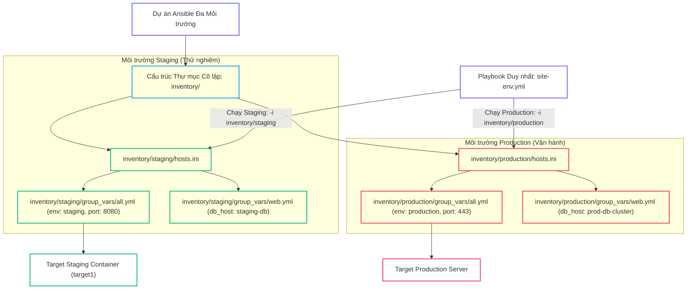
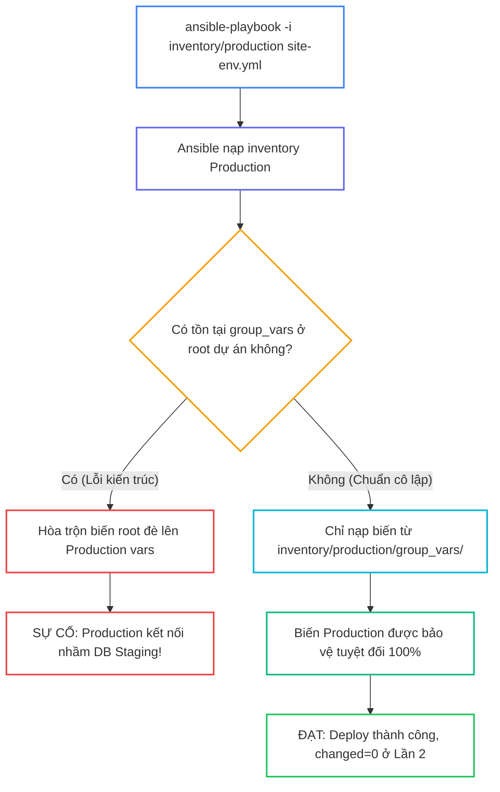


# [BÀI 19] QUẢN TRỊ ĐA MÔI TRƯỜNG (MULTI-ENVIRONMENT): TỔ CHỨC DIRECTORY LAYOUT CHO DEV, STAGING, UAT & PRODUCTION KHÔNG LẶP CODE

Trong kỷ nguyên **Infrastructure as Code (IaC)** và tự động hóa vận hành hạ tầng đám mây (Cloud Infrastructure Automation), **Ansible** khẳng định vị thế dẫn đầu nhờ triết lý **Agentless** (không cần cài đặt agent nền trên máy đích), giao thức điều khiển an toàn qua **SSH / WinRM**, định dạng khai báo **YAML** trực quan và nguyên lý bất biến **Idempotency** mạnh mẽ. Việc làm chủ Ansible không chỉ dừng lại ở các câu lệnh Ad-hoc đơn giản, mà đòi hỏi kỹ sư phải nắm vững kiến trúc Module tầng thấp, Variable Precedence 22 tầng, Jinja2 Templates, tối ưu hóa Forks & Pipelining cho tới thiết kế Roles / Collections và tích hợp CI/CD tự động hóa chuẩn Doanh nghiệp.

Bài viết chuyên sâu này sẽ đồng hành cùng bạn mổ xẻ toàn diện bức tranh kiến trúc, phân tích các đánh đổi kỹ thuật thực chiến (Engineering Trade-offs), cung cấp hướng dẫn thực hành Lab chi tiết từng bước và bộ câu hỏi phỏng vấn chuyên sâu chuẩn DevOps / SRE Lead.

---

## 1. Bản Chất Kiến Trúc & Cơ Chế Vận Hành Tầng Thấp



### 1.1. Tổ Chức Thư Mục Inventory Đa Môi Trường và Cờ `-i`

Trong thực tế doanh nghiệp, một bộ Playbook duy nhất cần triển khai nhất quán lên nhiều môi trường: Dev, Staging, UAT và Production. Nếu gom chung tất cả máy chủ vào 1 tệp hoặc cứng hóa biến trong Playbook, rủi ro chạy nhầm làm sập Production là cực kỳ cao.

- **Tách biệt thư mục môi trường:** Tạo các thư mục con riêng biệt (`inventory/staging/`, `inventory/production/`), bên trong chứa `hosts.ini`, `group_vars/` và `host_vars/` độc lập.
- **Tự động nạp biến theo đường dẫn:** Khi chạy `ansible-playbook -i inventory/staging site.yml`, Ansible Engine sẽ tự động chỉ nạp các biến nằm trong `inventory/staging/group_vars/` mà không chạm vào cấu hình của Production.
- **Chỉ định tường minh với cờ `-i`:** Việc bắt buộc truyền cờ `-i` (`--inventory`) tạo một lớp kiểm soát hành vi rõ ràng cho kỹ sư trước khi thực thi.

```bash
project/
├── ansible.cfg
├── site-env.yml
└── inventory/
    ├── staging/
    │   ├── hosts.ini
    │   └── group_vars/
    │       ├── all.yml
    │       └── web.yml
    └── production/
        ├── hosts.ini
        └── group_vars/
            ├── all.yml
            └── web.yml
```

### 1.2. Phân Tầng Biến Group Variables Layering và Tra Cứu bằng CLI

- **Phân tầng từ rộng đến hẹp:** Cấu trúc phân tầng tự nhiên theo thứ tự: `group_vars/all.yml` (biến toàn môi trường: NTP, DNS, environment name) -> `group_vars/<group_name>.yml` (biến theo nhóm tải: `web.yml`, `db.yml`) -> `host_vars/<hostname>.yml` (biến riêng của từng host).
- **Tra cứu ma trận biến với `ansible-inventory`:** Sử dụng lệnh CLI `ansible-inventory -i inventory/staging --graph` để xem đồ thị phân nhóm, và `ansible-inventory -i inventory/staging --vars --list` (hoặc `--host target1`) để kiểm tra toàn bộ giá trị biến đã giải mã trước khi chạy Playbook.
- **Tham số hóa bộ nhận diện:** Khai báo các thông số môi trường (`env_name`, `domain_suffix`, `log_level`) trong `group_vars/all.yml` giúp Jinja2 Templates tự động render đúng cấu hình tương ứng mà không cần sửa code Playbook.

```yaml
# inventory/staging/group_vars/all.yml
---
env_name: "staging"
domain_suffix: "staging.internal"
log_level: "DEBUG"
```

### 1.3. Triệt Tiêu Rủi Ro Ghi Đè Chéo, Safe Default Config và Idempotency

- **Xóa bỏ `group_vars` ở root:** Tuyệt đối không để thư mục `group_vars/` ở cấp root dự án khi đã sử dụng mô hình thư mục `inventory/`, vì Ansible sẽ hòa trộn cả hai nguồn gây ghi đè nhầm giá trị.
- **Cấu hình an toàn mặc định (`Safe Default`):** Thiết lập `inventory = ./inventory/staging` trong file `ansible.cfg`. Nếu kỹ sư quên truyền cờ `-i`, kịch bản sẽ tự động chạy an toàn trên Staging thay vì tác động lên Production.
- **Bảo toàn tính Idempotency:** Việc chuyển đổi giữa các môi trường chỉ thay đổi tham số nạp vào. Ở Lần chạy thứ hai trên bất kỳ môi trường nào, `PLAY RECAP` bắt buộc phải đạt `changed=0` tuyệt đối.

---

## 2. Bảng So Sánh Kỹ Thuật Toàn Diện (Engineering Matrix)

| Tiêu Chí Kỹ Thuật | File Inventory Đơn Phẳng (Single Flat File) | Thư Mục Inventory Phân Tầng (Multi-Directory Layout) | Dynamic Inventory Script / Plugin |
|---|---|---|---|
| **Khả Năng Cô Lập Môi Trường** | Kém (dễ chạy nhầm nhóm host trong cùng 1 file) | Tuyệt đối (tách biệt vật lý từng thư mục) | Rất cao (lọc tự động qua thẻ Tags của Cloud Provider) |
| **Phân Tầng Biến (`group_vars`)** | Dễ xung đột và ghi đè chéo | Tách biệt theo từng môi trường (`inventory/<env>/`) | Tự động gán biến dựa trên metadata của instance |
| **Bảo Vệ Hạ Tầng Production** | Nguy hiểm (không có ranh giới cờ `-i`) | An toàn cao (kết hợp `ansible.cfg` safe default) | An toàn (kiểm soát qua IAM Role & API Credentials) |
| **Khả Năng Tái Sử Dụng Playbook** | Thấp (phải viết nhiều điều kiện `when:` theo host) | Tối đa (1 Playbook duy nhất cho toàn bộ môi trường) | Tối đa (hoạt động linh hoạt theo Auto Scaling Groups) |
| **Độ Phức Tạp Vận Hành** | Thấp nhất lúc ban đầu | Cân bằng hoàn hảo cho hạ tầng On-premise & Hybrid | Yêu cầu kết nối API đám mây liên tục |

> [!IMPORTANT]
> **QUY TẮC BẤT DI BẤT DỊCH:**
> Luôn cấu hình `inventory = ./inventory/staging` trong `ansible.cfg` làm giá trị mặc định. Tuyệt đối không để thư mục `group_vars/` tồn tại ở cấp root dự án khi đã áp dụng mô hình thư mục môi trường cô lập.

---

## 3. Kiến Trúc Triển Khai Chuẩn Production (Configuration / Playbook / Role Breakdown)

Dưới đây là Playbook duy nhất `site-env.yml` triển khai cấu hình ứng dụng chuẩn hóa trên đa môi trường:

```yaml
# site-env.yml
---
- name: Multi-Environment Deployment Playbook
  hosts: web
  become: true
  tasks:
    - name: Task 1 - Deploy environment configuration file using FQCN
      ansible.builtin.copy:
        content: |
          # Environment Configuration File
          ENVIRONMENT={{ env_name }}
          DOMAIN_SUFFIX={{ domain_suffix }}
          APP_PORT={{ app_port }}
          DB_HOST={{ db_host }}
          LOG_LEVEL={{ log_level }}
          MAX_CLIENTS={{ max_clients }}
        dest: /etc/environment-app.conf
        mode: '0644'

    - name: Task 2 - Read environment configuration status (changed_when: false)
      ansible.builtin.command: cat /etc/environment-app.conf
      register: env_conf_out
      changed_when: false
```

### Phân Tích Kỹ Thuật Từng Dòng (Line-by-Line Breakdown):

- <span class="badge-line">Line 2-4</span>: **Khai báo Playbook:** Nhắm vào nhóm `hosts: web` với quyền nâng cao `become: true`. Danh sách host thực tế sẽ được nạp dựa trên tệp `hosts.ini` của môi trường được chỉ định qua cờ `-i`.
- <span class="badge-line">Line 6-16</span>: **Tạo tệp cấu hình động:** Sử dụng `ansible.builtin.copy` kết hợp nội suy các biến `env_name`, `domain_suffix`, `app_port`, `db_host`, `log_level`, `max_clients`. Các biến này được nạp tự động từ `group_vars/all.yml` và `group_vars/web.yml` của môi trường đích.
- <span class="badge-line">Line 18-21</span>: **Đọc trạng thái kiểm tra:** Sử dụng `ansible.builtin.command` đọc lại cấu hình vừa ghi và gán `changed_when: false` để đảm bảo tính Idempotency không bị báo thay đổi giả ở Lần 2.

---

## 4. Phân Tích Cạm Bẫy Thực Chiến: Đặt group_vars Ở Root Gây Rò Rỉ Biến Staging Đè Hỏng Production

### Tình Huống Sự Cố Thực Tế Tại Doanh Nghiệp:
Một doanh nghiệp FinTech tổ chức thư mục `inventory/staging` và `inventory/production`. Tuy nhiên, kỹ sư lại để lại một tệp `group_vars/all.yml` cũ ở cấp root dự án chứa biến `db_host: staging-db.internal`. Khi chạy lệnh deploy Production `ansible-playbook -i inventory/production site-env.yml`, Ansible Engine đã ưu tiên hòa trộn biến từ root, khiến ứng dụng Production kết nối nhầm sang cơ sở dữ liệu Staging, làm rò rỉ dữ liệu thử nghiệm và gián đoạn giao dịch khách hàng.

### Hậu Quả & Log Lỗi Thực Tế:

```diff
- # CẤU HÌNH GÂY LỖI RÒ RỈ BIẾN (MIXED ROOT GROUP_VARS):
- project/
- ├── group_vars/
- │   └── all.yml          # CHỨA db_host: staging-db (RÒ RỈ BIẾN SANG PROD!)
- └── inventory/
-     ├── staging/
-     └── production/
-         └── group_vars/
-             └── all.yml  # db_host: prod-db-cluster

+ # CẤU HÌNH ĐÚNG CHUẨN CÔ LẬP 100%:
+ project/
+ ├── site-env.yml
+ ├── ansible.cfg          # inventory = ./inventory/staging (SAFE DEFAULT)
+ └── inventory/
+     ├── staging/
+     │   └── group_vars/
+     │       └── all.yml  # CHỈ CÓ HIỆU LỰC CHO STAGING
+     └── production/
+         └── group_vars/
+             └── all.yml  # CHỈ CÓ HIỆU LỰC CHO PRODUCTION
```



### 5-Whys Root Cause Analysis:
1. **Tại sao ứng dụng Production kết nối nhầm DB Staging?** Vì file cấu hình `/etc/environment-app.conf` trên máy Production bị render giá trị `db_host: staging-db.internal`.
2. **Tại sao biến `db_host` lại nhận giá trị của Staging?** Vì Ansible Engine đã đọc và nạp tệp `group_vars/all.yml` nằm ở thư mục root dự án.
3. **Tại sao tệp `group_vars/all.yml` lại tồn tại ở root?** Do kỹ sư giữ lại từ dự án cũ khi chưa chuyển đổi sang mô hình thư mục đa môi trường.
4. **Tại sao hệ thống không cảnh báo khi có biến trùng lặp?** Vì cơ chế hòa trộn biến tự nhiên của Ansible sẽ tự động gộp tất cả các nguồn `group_vars` mà nó tìm thấy.
5. **Giải pháp triệt để là gì?** Xóa bỏ hoàn toàn thư mục `group_vars/` và `host_vars/` ở cấp root dự án, chỉ đặt chúng bên trong từng thư mục môi trường con tương ứng (`inventory/<env>/`).

---

## 5. Hands-on Lab: Triển Khai Quản Trị Đa Môi Trường & Phân Tầng group_vars (8 Bước)

| Bước | Lệnh CLI / Tác Vụ Chính | Mục Đích Thực Thi |
|---|---|---|
| **1** | `mkdir -p ~/lab-ansible-19/inventory/staging/group_vars ~/lab-ansible-19/inventory/production/group_vars` | Khởi tạo cấu trúc thư mục đa môi trường cô lập |
| **2** | `cat << 'EOF' > ansible.cfg` | Cấu hình safe default `inventory = ./inventory/staging` |
| **3** | `cat << 'EOF' > inventory/staging/hosts.ini` | Khai báo hosts và phân tầng biến group_vars cho Staging |
| **4** | `cat << 'EOF' > inventory/production/hosts.ini` | Khai báo hosts và phân tầng biến group_vars cho Production |
| **5** | `ansible-inventory -i inventory/staging --graph` | Tra cứu đồ thị và ma trận biến bằng CLI |
| **6** | `cat << 'EOF' > site-env.yml` | Biên soạn Playbook triển khai đa môi trường duy nhất |
| **7** | `ansible-playbook -i inventory/staging site-env.yml` | Chạy Lần 1 và Lần 2 đối soát Idempotency `changed=0` |
| **8** | `docker exec target1 cat /etc/environment-app.conf` | Đối soát sự thật máy đích xác nhận cấu hình |

```bash
# Bước 1: Khởi tạo cấu trúc thư mục đa môi trường cô lập
mkdir -p ~/lab-ansible-19/inventory/staging/group_vars ~/lab-ansible-19/inventory/production/group_vars && cd ~/lab-ansible-19
```

```bash
# Bước 2: Thiết lập cấu hình safe default trong ansible.cfg
cat << 'EOF' > ansible.cfg
[defaults]
inventory = ./inventory/staging
remote_user = ansible
host_key_checking = False
private_key_file = ~/.ssh/id_ed25519
roles_path = ./roles:~/.ansible/roles
collections_path = ./collections:~/.ansible/collections

[privilege_escalation]
become = True
become_method = sudo
become_user = root
become_ask_pass = False
EOF
```

> [!NOTE]
> **CHECKPOINT 1:** Xác nhận cấu trúc thư mục và file `ansible.cfg` cài đặt an toàn:
> ```bash
> test -d inventory/staging/group_vars && grep -q "inventory = ./inventory/staging" ansible.cfg && echo "CHECKPOINT 1: PASS" || echo "CHECKPOINT 1: FAIL"
> ```

```bash
# Bước 3: Khai báo hosts.ini và group_vars cho môi trường Staging
cat << 'EOF' > inventory/staging/hosts.ini
[web]
target1 ansible_host=127.0.0.1 ansible_port=2221

[all:vars]
ansible_python_interpreter=/usr/bin/python3
EOF

cat << 'EOF' > inventory/staging/group_vars/all.yml
---
env_name: "staging"
domain_suffix: "staging.internal"
log_level: "DEBUG"
EOF

cat << 'EOF' > inventory/staging/group_vars/web.yml
---
app_port: 8080
db_host: "127.0.0.1"
max_clients: 50
EOF
```

> [!NOTE]
> **CHECKPOINT 2:** Xác nhận các file cấu hình Staging được biên soạn chính xác:
> ```bash
> grep -q "env_name: \"staging\"" inventory/staging/group_vars/all.yml && grep -q "app_port: 8080" inventory/staging/group_vars/web.yml && echo "CHECKPOINT 2: PASS" || echo "CHECKPOINT 2: FAIL"
> ```

```bash
# Bước 4: Khai báo hosts.ini và group_vars cho môi trường Production
cat << 'EOF' > inventory/production/hosts.ini
[web]
target2 ansible_host=127.0.0.1 ansible_port=2222

[all:vars]
ansible_python_interpreter=/usr/bin/python3
EOF

cat << 'EOF' > inventory/production/group_vars/all.yml
---
env_name: "production"
domain_suffix: "company.com"
log_level: "WARN"
EOF

cat << 'EOF' > inventory/production/group_vars/web.yml
---
app_port: 443
db_host: "prod-db-cluster.internal"
max_clients: 500
EOF
```

> [!NOTE]
> **CHECKPOINT 3:** Xác nhận các file cấu hình Production được biên soạn chính xác:
> ```bash
> grep -q "env_name: \"production\"" inventory/production/group_vars/all.yml && grep -q "app_port: 443" inventory/production/group_vars/web.yml && echo "CHECKPOINT 3: PASS" || echo "CHECKPOINT 3: FAIL"
> ```

```bash
# Bước 5: Tra cứu đồ thị và ma trận biến bằng CLI
ansible-inventory -i inventory/staging --graph > staging-graph.txt
ansible-inventory -i inventory/staging --host target1 > staging-vars.txt
```

> [!NOTE]
> **CHECKPOINT 4:** Xác nhận đồ thị phân nhóm chứa host `target1`:
> ```bash
> grep -q "target1" staging-graph.txt && echo "CHECKPOINT 4: PASS" || echo "CHECKPOINT 4: FAIL"
> ```

> [!NOTE]
> **CHECKPOINT 5:** Xác nhận ma trận biến giải mã đúng `app_port: 8080`:
> ```bash
> grep -q "\"app_port\": 8080" staging-vars.txt && echo "CHECKPOINT 5: PASS" || echo "CHECKPOINT 5: FAIL"
> ```

```bash
# Bước 6: Biên soạn Playbook đa môi trường duy nhất site-env.yml
cat << 'EOF' > site-env.yml
---
- name: Multi-Environment Deployment Playbook
  hosts: web
  become: true
  tasks:
    - name: Task 1 - Deploy environment configuration file using FQCN
      ansible.builtin.copy:
        content: |
          # Environment Configuration File
          ENVIRONMENT={{ env_name }}
          DOMAIN_SUFFIX={{ domain_suffix }}
          APP_PORT={{ app_port }}
          DB_HOST={{ db_host }}
          LOG_LEVEL={{ log_level }}
          MAX_CLIENTS={{ max_clients }}
        dest: /etc/environment-app.conf
        mode: '0644'

    - name: Task 2 - Read environment configuration status (changed_when: false)
      ansible.builtin.command: cat /etc/environment-app.conf
      register: env_conf_out
      changed_when: false
EOF
```

```bash
# Bước 7: Thực thi Lần 1 và Lần 2 (Đối soát Idempotency)
ansible-playbook -i inventory/staging site-env.yml
ansible-playbook -i inventory/staging site-env.yml
```

> [!NOTE]
> **CHECKPOINT 6:** Xác nhận kết quả thi hành Lần 1 thành công:
> ```bash
> ansible-playbook -i inventory/staging site-env.yml | grep -q "failed=0" && echo "CHECKPOINT 6: PASS" || echo "CHECKPOINT 6: FAIL"
> ```

> [!NOTE]
> **CHECKPOINT 7:** Xác nhận Lượt 2 đạt Idempotency tuyệt đối (`changed=0`):
> ```bash
> RUN2_OUT=$(ansible-playbook -i inventory/staging site-env.yml)
> if echo "$RUN2_OUT" | grep -q "changed=0" && echo "$RUN2_OUT" | grep -q "failed=0"; then
>   echo "CHECKPOINT 7: PASS - Đạt Idempotency changed=0"
> else
>   echo "CHECKPOINT 7: FAIL - Lỗi không đạt Idempotency"
> fi
> ```

```bash
# Bước 8: Đối soát Sự Thật Máy Đích qua docker exec
docker exec target1 cat /etc/environment-app.conf
```

> [!NOTE]
> **CHECKPOINT 8:** Đối soát file cấu hình chứa đúng dữ liệu `ENVIRONMENT=staging` và `APP_PORT=8080`:
> ```bash
> docker exec target1 cat /etc/environment-app.conf | grep -q "ENVIRONMENT=staging" && echo "CHECKPOINT 8: PASS" || echo "CHECKPOINT 8: FAIL"
> ```

---

## 6. Bộ Câu Hỏi Vấn Đáp & Phỏng Vấn Chuyên Sâu (Self-Check Q&A)

<details class="qa-card" markdown="1">
  <summary class="qa-summary">
    <span class="qa-num-badge">Q01</span>
    <span class="qa-question-text">Tại sao Red Hat khuyến nghị nên tổ chức đa môi trường bằng cấu trúc thư mục <code>inventory/staging/</code> và <code>inventory/production/</code> riêng biệt thay vì gom chung vào 1 file inventory?</span>
  </summary>
  <div class="qa-answer">
    <div class="qa-answer-header">
      <svg width="14" height="14" fill="none" stroke="currentColor" stroke-width="2" viewBox="0 0 24 24"><path d="M22 11.08V12a10 10 0 1 1-5.93-9.14"></path><polyline points="22 4 12 14.01 9 11.01"></polyline></svg>
      <span>Phân Tích &amp; Lời Giải Kỹ Thuật</span>
    </div>
    <div style="margin: 0.5rem 0;"><b>Hỏi:</b> Tại sao Red Hat khuyến nghị nên tổ chức đa môi trường bằng cấu trúc thư mục <code>inventory/staging/</code> và <code>inventory/production/</code> riêng biệt thay vì gom chung vào 1 file inventory?</div>
    <div style="margin: 0.5rem 0;"><b>Đáp án chuẩn:</b></div>
    <div style="margin: 0.35rem 0; padding-left: 1rem; border-left: 2px solid var(--accent-primary);">• Để cô lập hoàn toàn danh sách IP máy chủ và biến cấu hình giữa môi trường thử nghiệm và vận hành thật, triệt tiêu 100% nguy cơ biến của Staging rò rỉ sang đè hỏng cấu hình Production hoặc kỹ sư chạy nhầm lệnh lên toàn bộ hạ tầng.</div>
    <div style="margin: 0.5rem 0;"><b>Tiêu chí chấm:</b></div>
    <div style="margin: 0.35rem 0; padding-left: 1rem; border-left: 2px solid var(--accent-primary);">• 0: Không nêu được lý do bảo mật và cô lập.</div>
    <div style="margin: 0.35rem 0; padding-left: 1rem; border-left: 2px solid var(--accent-primary);">• 1: Biết tách thư mục cho gọn gàng nhưng không giải thích được rủi ro rò rỉ biến.</div>
    <div style="margin: 0.35rem 0; padding-left: 1rem; border-left: 2px solid var(--accent-primary);">• 2: Phân tích chính xác nguyên lý cô lập dữ liệu môi trường và an toàn vận hành.</div>
    <div style="margin: 0.35rem 0; padding-left: 1rem; border-left: 2px solid var(--accent-primary);">• 3: Nêu đúng + vẽ sơ đồ cây thư mục layout chuẩn Enterprise.</div>
    <div style="margin: 0.5rem 0;"><b>Câu hỏi đào sâu:</b> Có thể tạo thêm môi trường <code>inventory/uat/</code> theo mô hình này không? <i>(Hoàn toàn được, chỉ cần tạo thêm thư mục <code>inventory/uat/</code> với cấu trúc tương tự.)</i></div>
  </div>
</details>

<details class="qa-card" markdown="1">
  <summary class="qa-summary">
    <span class="qa-num-badge">Q02</span>
    <span class="qa-question-text">Thư mục <code>group_vars/</code> nên được đặt ở vị trí nào trong cấu trúc dự án đa môi trường để Ansible tự động nạp đúng biến theo môi trường?</span>
  </summary>
  <div class="qa-answer">
    <div class="qa-answer-header">
      <svg width="14" height="14" fill="none" stroke="currentColor" stroke-width="2" viewBox="0 0 24 24"><path d="M22 11.08V12a10 10 0 1 1-5.93-9.14"></path><polyline points="22 4 12 14.01 9 11.01"></polyline></svg>
      <span>Phân Tích &amp; Lời Giải Kỹ Thuật</span>
    </div>
    <div style="margin: 0.5rem 0;"><b>Hỏi:</b> Thư mục <code>group_vars/</code> nên được đặt ở vị trí nào trong cấu trúc dự án đa môi trường để Ansible tự động nạp đúng biến theo môi trường?</div>
    <div style="margin: 0.5rem 0;"><b>Đáp án chuẩn:</b></div>
    <div style="margin: 0.35rem 0; padding-left: 1rem; border-left: 2px solid var(--accent-primary);">• Bắt buộc đặt trực tiếp bên trong thư mục môi trường tương ứng (ví dụ: <code>inventory/staging/group_vars/</code> và <code>inventory/production/group_vars/</code>). Khi truyền cờ <code>-i inventory/staging</code>, Ansible sẽ tự động tìm và nạp các tệp biến trong thư mục <code>group_vars/</code> nằm cùng cấp với inventory.</div>
    <div style="margin: 0.5rem 0;"><b>Tiêu chí chấm:</b></div>
    <div style="margin: 0.35rem 0; padding-left: 1rem; border-left: 2px solid var(--accent-primary);">• 0: Trả lời đặt ở root dự án.</div>
    <div style="margin: 0.35rem 0; padding-left: 1rem; border-left: 2px solid var(--accent-primary);">• 1: Biết đặt trong <code>inventory/</code> nhưng không rõ quy tắc nạp biến tự động theo đường dẫn.</div>
    <div style="margin: 0.35rem 0; padding-left: 1rem; border-left: 2px solid var(--accent-primary);">• 2: Phân tích chính xác vị trí và cơ chế tự động nạp biến theo đường dẫn cờ <code>-i</code>.</div>
    <div style="margin: 0.35rem 0; padding-left: 1rem; border-left: 2px solid var(--accent-primary);">• 3: Nêu đúng + chỉ ra hậu quả tai hại nếu đặt <code>group_vars</code> ở cấp root.</div>
    <div style="margin: 0.5rem 0;"><b>Câu hỏi đào sâu:</b> Nếu vừa có <code>group_vars/</code> ở root vừa có trong <code>inventory/staging/</code> thì biến nào thắng? <i>(Cả hai bị hòa trộn, tạo ra sự nhập nhằng rất nguy hiểm.)</i></div>
  </div>
</details>

<details class="qa-card" markdown="1">
  <summary class="qa-summary">
    <span class="qa-num-badge">Q03</span>
    <span class="qa-question-text">Trình bày thứ tự độ ưu tiên nạp biến (Precedence) giữa 3 tệp biến sau: <code>group_vars/all.yml</code>, <code>group_vars/web.yml</code>, và <code>host_vars/target1.yml</code>.</span>
  </summary>
  <div class="qa-answer">
    <div class="qa-answer-header">
      <svg width="14" height="14" fill="none" stroke="currentColor" stroke-width="2" viewBox="0 0 24 24"><path d="M22 11.08V12a10 10 0 1 1-5.93-9.14"></path><polyline points="22 4 12 14.01 9 11.01"></polyline></svg>
      <span>Phân Tích &amp; Lời Giải Kỹ Thuật</span>
    </div>
    <div style="margin: 0.5rem 0;"><b>Hỏi:</b> Trình bày thứ tự độ ưu tiên nạp biến (Precedence) giữa 3 tệp biến sau: <code>group_vars/all.yml</code>, <code>group_vars/web.yml</code>, và <code>host_vars/target1.yml</code>.</div>
    <div style="margin: 0.5rem 0;"><b>Đáp án chuẩn:</b></div>
    <div style="margin: 0.35rem 0; padding-left: 1rem; border-left: 2px solid var(--accent-primary);">• Thứ tự ưu tiên từ thấp đến cao (biến sau ghi đè biến trước):<br>
      <b><code>group_vars/all.yml</code> &lt; <code>group_vars/web.yml</code> &lt; <code>host_vars/target1.yml</code></b>.</div>
    <div style="margin: 0.5rem 0;"><b>Tiêu chí chấm:</b></div>
    <div style="margin: 0.35rem 0; padding-left: 1rem; border-left: 2px solid var(--accent-primary);">• 0: Trả lời sai thứ tự.</div>
    <div style="margin: 0.35rem 0; padding-left: 1rem; border-left: 2px solid var(--accent-primary);">• 1: Nêu đúng thứ tự nhưng không giải thích được phạm vi áp dụng.</div>
    <div style="margin: 0.35rem 0; padding-left: 1rem; border-left: 2px solid var(--accent-primary);">• 2: Phân tích chính xác nguyên lý phân tầng biến từ rộng (all) đến nhóm (group) và cá thể (host).</div>
    <div style="margin: 0.35rem 0; padding-left: 1rem; border-left: 2px solid var(--accent-primary);">• 3: Nêu đúng + minh họa tình huống thực tế áp dụng quy tắc này trong cấu hình mạng/cổng dịch vụ.</div>
    <div style="margin: 0.5rem 0;"><b>Câu hỏi đào sâu:</b> Biến khai báo trong <code>vars:</code> của Playbook có đè được biến trong <code>host_vars</code> không? <i>(Có, <code>play vars</code> có độ ưu tiên cao hơn <code>host_vars</code>.)</i></div>
  </div>
</details>

<details class="qa-card" markdown="1">
  <summary class="qa-summary">
    <span class="qa-num-badge">Q04</span>
    <span class="qa-question-text">Lệnh CLI nào trong Ansible dùng để kiểm tra đồ thị phân nhóm máy chủ và ma trận biến của môi trường Staging?</span>
  </summary>
  <div class="qa-answer">
    <div class="qa-answer-header">
      <svg width="14" height="14" fill="none" stroke="currentColor" stroke-width="2" viewBox="0 0 24 24"><path d="M22 11.08V12a10 10 0 1 1-5.93-9.14"></path><polyline points="22 4 12 14.01 9 11.01"></polyline></svg>
      <span>Phân Tích &amp; Lời Giải Kỹ Thuật</span>
    </div>
    <div style="margin: 0.5rem 0;"><b>Hỏi:</b> Lệnh CLI nào trong Ansible dùng để kiểm tra đồ thị phân nhóm máy chủ và ma trận biến của môi trường Staging?</div>
    <div style="margin: 0.5rem 0;"><b>Đáp án chuẩn:</b></div>
    <div style="margin: 0.35rem 0; padding-left: 1rem; border-left: 2px solid var(--accent-primary);">• <b>Kiểm tra đồ thị phân nhóm:</b> <code>ansible-inventory -i inventory/staging --graph</code>.<br>
      • <b>Kiểm tra toàn bộ ma trận biến:</b> <code>ansible-inventory -i inventory/staging --vars --list</code> (hoặc <code>--host target1</code> cho từng máy).</div>
    <div style="margin: 0.5rem 0;"><b>Tiêu chí chấm:</b></div>
    <div style="margin: 0.35rem 0; padding-left: 1rem; border-left: 2px solid var(--accent-primary);">• 0: Không biết lệnh <code>ansible-inventory</code>.</div>
    <div style="margin: 0.35rem 0; padding-left: 1rem; border-left: 2px solid var(--accent-primary);">• 1: Biết lệnh nhưng quên cờ <code>--graph</code> hoặc <code>--vars</code>.</div>
    <div style="margin: 0.35rem 0; padding-left: 1rem; border-left: 2px solid var(--accent-primary);">• 2: Nêu đầy đủ cú pháp các lệnh kiểm tra đồ thị và biến.</div>
    <div style="margin: 0.35rem 0; padding-left: 1rem; border-left: 2px solid var(--accent-primary);">• 3: Nêu đúng + giải thích định dạng JSON output khi dùng cờ <code>--list</code>.</div>
    <div style="margin: 0.5rem 0;"><b>Câu hỏi đào sâu:</b> Làm thế nào để xuất cấu trúc inventory ra định dạng file YAML bằng CLI? <i>(Sử dụng cờ <code>--yaml --list</code>.)</i></div>
  </div>
</details>

<details class="qa-card" markdown="1">
  <summary class="qa-summary">
    <span class="qa-num-badge">Q05</span>
    <span class="qa-question-text">Tại sao ta nên đặt thuộc tính <code>inventory = ./inventory/staging</code> làm cấu hình mặc định trong tệp <code>ansible.cfg</code>?</span>
  </summary>
  <div class="qa-answer">
    <div class="qa-answer-header">
      <svg width="14" height="14" fill="none" stroke="currentColor" stroke-width="2" viewBox="0 0 24 24"><path d="M22 11.08V12a10 10 0 1 1-5.93-9.14"></path><polyline points="22 4 12 14.01 9 11.01"></polyline></svg>
      <span>Phân Tích &amp; Lời Giải Kỹ Thuật</span>
    </div>
    <div style="margin: 0.5rem 0;"><b>Hỏi:</b> Tại sao ta nên đặt thuộc tính <code>inventory = ./inventory/staging</code> làm cấu hình mặc định trong tệp <code>ansible.cfg</code>?</div>
    <div style="margin: 0.5rem 0;"><b>Đáp án chuẩn:</b></div>
    <div style="margin: 0.35rem 0; padding-left: 1rem; border-left: 2px solid var(--accent-primary);">• Đây là lá chắn an toàn (Safe Default): nếu một kỹ sư vô tình gõ lệnh <code>ansible-playbook site-env.yml</code> mà quên không truyền cờ <code>-i</code>, Ansible sẽ tự động chạy trên môi trường thử nghiệm Staging chứ <b>tuyệt đối không bao giờ chạy nhầm trên Production</b>.</div>
    <div style="margin: 0.5rem 0;"><b>Tiêu chí chấm:</b></div>
    <div style="margin: 0.35rem 0; padding-left: 1rem; border-left: 2px solid var(--accent-primary);">• 0: Không hiểu khái niệm Safe Default.</div>
    <div style="margin: 0.35rem 0; padding-left: 1rem; border-left: 2px solid var(--accent-primary);">• 1: Biết là cấu hình mặc định nhưng không liên hệ được tới việc phòng chống tai nạn Production.</div>
    <div style="margin: 0.35rem 0; padding-left: 1rem; border-left: 2px solid var(--accent-primary);">• 2: Phân tích chính xác vai trò lá chắn an toàn của <code>ansible.cfg</code>.</div>
    <div style="margin: 0.35rem 0; padding-left: 1rem; border-left: 2px solid var(--accent-primary);">• 3: Nêu đúng + đề xuất kết hợp thêm task kiểm tra xác thực trước khi chạy Production.</div>
    <div style="margin: 0.5rem 0;"><b>Câu hỏi đào sâu:</b> Chuyện gì xảy ra nếu đặt <code>inventory = ./inventory/production</code> làm mặc định? <i>(Nguy cơ cực cao: bất kỳ lệnh test nào quên cờ <code>-i</code> sẽ tác động thẳng vào Production.)</i></div>
  </div>
</details>

<details class="qa-card" markdown="1">
  <summary class="qa-summary">
    <span class="qa-num-badge">Q06</span>
    <span class="qa-question-text">Chuyện gì xảy ra nếu ta truyền đường dẫn file <code>inventory/staging/hosts.ini</code> thay vì truyền thư mục <code>inventory/staging</code> vào cờ <code>-i</code>?</span>
  </summary>
  <div class="qa-answer">
    <div class="qa-answer-header">
      <svg width="14" height="14" fill="none" stroke="currentColor" stroke-width="2" viewBox="0 0 24 24"><path d="M22 11.08V12a10 10 0 1 1-5.93-9.14"></path><polyline points="22 4 12 14.01 9 11.01"></polyline></svg>
      <span>Phân Tích &amp; Lời Giải Kỹ Thuật</span>
    </div>
    <div style="margin: 0.5rem 0;"><b>Hỏi:</b> Chuyện gì xảy ra nếu ta truyền đường dẫn file <code>inventory/staging/hosts.ini</code> thay vì truyền thư mục <code>inventory/staging</code> vào cờ <code>-i</code>?</div>
    <div style="margin: 0.5rem 0;"><b>Đáp án chuẩn:</b></div>
    <div style="margin: 0.35rem 0; padding-left: 1rem; border-left: 2px solid var(--accent-primary);">• Khi chỉ định trực tiếp tệp tin <code>hosts.ini</code>, Ansible Engine vẫn nạp được các biến trong <code>inventory/staging/group_vars/</code> nằm cùng thư mục, nhưng nếu trong thư mục có nhiều tệp inventory bổ sung (như script động hoặc file phụ) thì chúng sẽ bị bỏ qua. Do đó, chuẩn thực hành tốt nhất là luôn truyền <b>đường dẫn thư mục</b>: <code>-i inventory/staging</code>.</div>
    <div style="margin: 0.5rem 0;"><b>Tiêu chí chấm:</b></div>
    <div style="margin: 0.35rem 0; padding-left: 1rem; border-left: 2px solid var(--accent-primary);">• 0: Không biết sự khác biệt giữa truyền file và truyền thư mục.</div>
    <div style="margin: 0.35rem 0; padding-left: 1rem; border-left: 2px solid var(--accent-primary);">• 1: Trả lời mơ hồ.</div>
    <div style="margin: 0.35rem 0; padding-left: 1rem; border-left: 2px solid var(--accent-primary);">• 2: Phân tích chính xác cơ chế đọc toàn bộ thư mục inventory của Ansible.</div>
    <div style="margin: 0.35rem 0; padding-left: 1rem; border-left: 2px solid var(--accent-primary);">• 3: Nêu đúng + chỉ ra tính linh hoạt khi kết hợp nhiều nguồn inventory tĩnh và động trong cùng 1 thư mục.</div>
    <div style="margin: 0.5rem 0;"><b>Câu hỏi đào sâu:</b> Nếu trong thư mục <code>inventory/staging/</code> có cả file <code>hosts1.ini</code> và <code>hosts2.ini</code> thì Ansible xử lý thế nào? <i>(Ansible sẽ tự động nạp và gộp cả hai file vào làm một inventory tổng thể.)</i></div>
  </div>
</details>

<details class="qa-card" markdown="1">
  <summary class="qa-summary">
    <span class="qa-num-badge">Q07</span>
    <span class="qa-question-text">Trình bày kỹ thuật xây dựng tệp Jinja2 Template dùng chung cho toàn bộ môi trường mà không cần sửa code Playbook.</span>
  </summary>
  <div class="qa-answer">
    <div class="qa-answer-header">
      <svg width="14" height="14" fill="none" stroke="currentColor" stroke-width="2" viewBox="0 0 24 24"><path d="M22 11.08V12a10 10 0 1 1-5.93-9.14"></path><polyline points="22 4 12 14.01 9 11.01"></polyline></svg>
      <span>Phân Tích &amp; Lời Giải Kỹ Thuật</span>
    </div>
    <div style="margin: 0.5rem 0;"><b>Hỏi:</b> Trình bày kỹ thuật xây dựng tệp Jinja2 Template dùng chung cho toàn bộ môi trường mà không cần sửa code Playbook.</div>
    <div style="margin: 0.5rem 0;"><b>Đáp án chuẩn:</b></div>
    <div style="margin: 0.35rem 0; padding-left: 1rem; border-left: 2px solid var(--accent-primary);">• Sử dụng các biến phân tầng được chuẩn hóa tên (ví dụ: <code>{{ '{{' }} env_name {{ '}}' }}</code>, <code>{{ '{{' }} app_port {{ '}}' }}</code>, <code>{{ '{{' }} db_host {{ '}}' }}</code>) bên trong Template Jinja2. Giá trị của các biến này được nạp tự động từ tệp <code>group_vars/all.yml</code> hoặc <code>group_vars/web.yml</code> của môi trường đích thông qua cờ <code>-i</code>. Playbook chỉ gọi module <code>ansible.builtin.template</code> mà không chứa bất kỳ logic hard-coded nào.</div>
    <div style="margin: 0.5rem 0;"><b>Tiêu chí chấm:</b></div>
    <div style="margin: 0.35rem 0; padding-left: 1rem; border-left: 2px solid var(--accent-primary);">• 0: Không biết cách tham số hóa Template.</div>
    <div style="margin: 0.35rem 0; padding-left: 1rem; border-left: 2px solid var(--accent-primary);">• 1: Biết dùng biến nhưng vẫn hardcode tên môi trường trong Playbook.</div>
    <div style="margin: 0.35rem 0; padding-left: 1rem; border-left: 2px solid var(--accent-primary);">• 2: Phân tích chính xác cơ chế tách biệt mã nguồn logic và dữ liệu môi trường.</div>
    <div style="margin: 0.35rem 0; padding-left: 1rem; border-left: 2px solid var(--accent-primary);">• 3: Nêu đúng + viết ví dụ mẫu Template Jinja2 kết hợp cờ điều kiện <code>&#123;% if env_name == 'production' %&#125;</code>.</div>
    <div style="margin: 0.5rem 0;"><b>Câu hỏi đào sâu:</b> Cần làm gì nếu muốn đặt giá trị mặc định cho biến trong template phòng trường hợp quên khai báo? <i>(Sử dụng filter <code>{{ '{{' }} my_var | default('default_value') {{ '}}' }}</code>.)</i></div>
  </div>
</details>

<details class="qa-card" markdown="1">
  <summary class="qa-summary">
    <span class="qa-num-badge">Q08</span>
    <span class="qa-question-text">Làm thế nào để đảm bảo tên nhóm trong <code>group_vars/</code> luôn ánh xạ chính xác với nhóm trong <code>hosts.ini</code>?</span>
  </summary>
  <div class="qa-answer">
    <div class="qa-answer-header">
      <svg width="14" height="14" fill="none" stroke="currentColor" stroke-width="2" viewBox="0 0 24 24"><path d="M22 11.08V12a10 10 0 1 1-5.93-9.14"></path><polyline points="22 4 12 14.01 9 11.01"></polyline></svg>
      <span>Phân Tích &amp; Lời Giải Kỹ Thuật</span>
    </div>
    <div style="margin: 0.5rem 0;"><b>Hỏi:</b> Làm thế nào để đảm bảo tên nhóm trong <code>group_vars/</code> luôn ánh xạ chính xác với nhóm trong <code>hosts.ini</code>?</div>
    <div style="margin: 0.5rem 0;"><b>Đáp án chuẩn:</b></div>
    <div style="margin: 0.35rem 0; padding-left: 1rem; border-left: 2px solid var(--accent-primary);">• Tên tệp YAML trong thư mục <code>group_vars/</code> bắt buộc phải trùng khớp 100% với tên nhóm được khai báo trong <code>hosts.ini</code> (ví dụ: nhóm <code>[web]</code> tương ứng với tệp <code>group_vars/web.yml</code>; nhóm <code>[db_servers]</code> tương ứng với <code>group_vars/db_servers.yml</code>). Tệp <code>all.yml</code> là trường hợp đặc biệt tự động áp dụng cho tất cả các máy chủ.</div>
    <div style="margin: 0.5rem 0;"><b>Tiêu chí chấm:</b></div>
    <div style="margin: 0.35rem 0; padding-left: 1rem; border-left: 2px solid var(--accent-primary);">• 0: Không biết quy tắc đặt tên file trong <code>group_vars/</code>.</div>
    <div style="margin: 0.35rem 0; padding-left: 1rem; border-left: 2px solid var(--accent-primary);">• 1: Biết đặt tên nhưng nhầm lẫn giữa tên nhóm và tên host.</div>
    <div style="margin: 0.35rem 0; padding-left: 1rem; border-left: 2px solid var(--accent-primary);">• 2: Phân tích chính xác cơ chế ánh xạ tên nhóm của Ansible Engine.</div>
    <div style="margin: 0.35rem 0; padding-left: 1rem; border-left: 2px solid var(--accent-primary);">• 3: Nêu đúng + giải thích cách tổ chức thư mục con <code>group_vars/web/</code> chứa nhiều tệp YAML nhỏ.</div>
    <div style="margin: 0.5rem 0;"><b>Câu hỏi đào sâu:</b> Ta có thể tạo một thư mục <code>group_vars/web/</code> chứa 2 tệp <code>main.yml</code> và <code>ssl.yml</code> thay vì 1 file <code>web.yml</code> đơn lẻ không? <i>(Hoàn toàn được, Ansible sẽ tự động nạp tất cả các file trong thư mục <code>group_vars/web/</code>.)</i></div>
  </div>
</details>

<details class="qa-card" markdown="1">
  <summary class="qa-summary">
    <span class="qa-num-badge">Q09</span>
    <span class="qa-question-text">Trình bày quy trình 3 bước nghiệm thu triển khai đa môi trường để đảm bảo an toàn tuyệt đối cho Production.</span>
  </summary>
  <div class="qa-answer">
    <div class="qa-answer-header">
      <svg width="14" height="14" fill="none" stroke="currentColor" stroke-width="2" viewBox="0 0 24 24"><path d="M22 11.08V12a10 10 0 1 1-5.93-9.14"></path><polyline points="22 4 12 14.01 9 11.01"></polyline></svg>
      <span>Phân Tích &amp; Lời Giải Kỹ Thuật</span>
    </div>
    <div style="margin: 0.5rem 0;"><b>Hỏi:</b> Trình bày quy trình 3 bước nghiệm thu triển khai đa môi trường để đảm bảo an toàn tuyệt đối cho Production.</div>
    <div style="margin: 0.5rem 0;"><b>Đáp án chuẩn:</b></div>
    <div style="margin: 0.35rem 0; padding-left: 1rem; border-left: 2px solid var(--accent-primary);">1. <b>Bước 1 (Kiểm tra ma trận biến qua CLI):</b> Chạy <code>ansible-inventory -i inventory/production --vars --list</code> để đối soát 100% các biến nhạy cảm đã nhận đúng giá trị Production.</div>
    <div style="margin: 0.35rem 0; padding-left: 1rem; border-left: 2px solid var(--accent-primary);">2. <b>Bước 2 (Chạy thử nghiệm trên Staging &amp; Kiểm tra Idempotency):</b> Triển khai lên Staging qua 2 lượt chạy, khẳng định Lượt 2 đạt <code>changed=0</code>.</div>
    <div style="margin: 0.35rem 0; padding-left: 1rem; border-left: 2px solid var(--accent-primary);">3. <b>Bước 3 (Triển khai Production &amp; Đối soát Máy đích):</b> Chạy lệnh chỉ định tường minh <code>ansible-playbook -i inventory/production site-env.yml</code> và đối soát file cấu hình trên máy đích bằng SSH/Docker exec.</div>
    <div style="margin: 0.5rem 0;"><b>Tiêu chí chấm:</b></div>
    <div style="margin: 0.35rem 0; padding-left: 1rem; border-left: 2px solid var(--accent-primary);">• 0: Không có quy trình nghiệm thu chuẩn.</div>
    <div style="margin: 0.35rem 0; padding-left: 1rem; border-left: 2px solid var(--accent-primary);">• 1: Bỏ qua bước kiểm tra ma trận biến hoặc không test Idempotency trên Staging.</div>
    <div style="margin: 0.35rem 0; padding-left: 1rem; border-left: 2px solid var(--accent-primary);">• 2: Trình bày đủ 3 bước nhưng chưa chi tiết câu lệnh kiểm thử.</div>
    <div style="margin: 0.35rem 0; padding-left: 1rem; border-left: 2px solid var(--accent-primary);">• 3: Trình bày xuất sắc cả 3 bước + nhấn mạnh nguyên lý Zero-Tolerance cho lỗi Production.</div>
    <div style="margin: 0.5rem 0;"><b>Câu hỏi đào sâu:</b> Cờ <code>--check --diff</code> có thể dùng ở bước nào trước khi apply Production? <i>(Dùng ngay trước khi chạy thật trên Production để xem trước các thay đổi.)</i></div>
  </div>
</details>

<details class="qa-card" markdown="1">
  <summary class="qa-summary">
    <span class="qa-num-badge">Q10</span>
    <span class="qa-question-text">Làm thế nào để tích hợp quy trình chạy Playbook đa môi trường vào CI/CD Pipeline (GitLab CI / GitHub Actions)?</span>
  </summary>
  <div class="qa-answer">
    <div class="qa-answer-header">
      <svg width="14" height="14" fill="none" stroke="currentColor" stroke-width="2" viewBox="0 0 24 24"><path d="M22 11.08V12a10 10 0 1 1-5.93-9.14"></path><polyline points="22 4 12 14.01 9 11.01"></polyline></svg>
      <span>Phân Tích &amp; Lời Giải Kỹ Thuật</span>
    </div>
    <div style="margin: 0.5rem 0;"><b>Hỏi:</b> Làm thế nào để tích hợp quy trình chạy Playbook đa môi trường vào CI/CD Pipeline (GitLab CI / GitHub Actions)?</div>
    <div style="margin: 0.5rem 0;"><b>Đáp án chuẩn:</b></div>
    <div style="margin: 0.35rem 0; padding-left: 1rem; border-left: 2px solid var(--accent-primary);">• Cấu hình các stage tương ứng trong pipeline:<br>
      - <b>Stage Deploy Staging (Tự động khi merge code vào main):</b> Thực thi <code>ansible-playbook -i inventory/staging site-env.yml</code>.<br>
      - <b>Stage Deploy Production (Yêu cầu Manual Approval từ Lead/SRE):</b> Thực thi <code>ansible-playbook -i inventory/production site-env.yml</code> với các secret credentials được truyền qua CI/CD Variables.</div>
    <div style="margin: 0.5rem 0;"><b>Tiêu chí chấm:</b></div>
    <div style="margin: 0.35rem 0; padding-left: 1rem; border-left: 2px solid var(--accent-primary);">• 0: Không biết cách tích hợp CI/CD.</div>
    <div style="margin: 0.35rem 0; padding-left: 1rem; border-left: 2px solid var(--accent-primary);">• 1: Biết chạy lệnh trong pipeline nhưng không thiết lập manual approval cho Production.</div>
    <div style="margin: 0.35rem 0; padding-left: 1rem; border-left: 2px solid var(--accent-primary);">• 2: Phân tích chính xác cấu trúc pipeline chia stage theo môi trường.</div>
    <div style="margin: 0.35rem 0; padding-left: 1rem; border-left: 2px solid var(--accent-primary);">• 3: Nêu đúng + viết đoạn mã YAML mẫu của <code>.gitlab-ci.yml</code> hoàn chỉnh.</div>
    <div style="margin: 0.5rem 0;"><b>Câu hỏi đào sâu:</b> Khóa SSH dùng trong CI/CD pipeline nên được bảo vệ như thế nào? <i>(Lưu dưới dạng Protected Variable chỉ khả dụng trên nhánh protected.)</i></div>
  </div>
</details>

<details class="qa-card" markdown="1">
  <summary class="qa-summary">
    <span class="qa-num-badge">Q11</span>
    <span class="qa-question-text">Khi nào nên tách hẳn thành 2 Repository Git khác nhau cho Inventory và Playbook?</span>
  </summary>
  <div class="qa-answer">
    <div class="qa-answer-header">
      <svg width="14" height="14" fill="none" stroke="currentColor" stroke-width="2" viewBox="0 0 24 24"><path d="M22 11.08V12a10 10 0 1 1-5.93-9.14"></path><polyline points="22 4 12 14.01 9 11.01"></polyline></svg>
      <span>Phân Tích &amp; Lời Giải Kỹ Thuật</span>
    </div>
    <div style="margin: 0.5rem 0;"><b>Hỏi:</b> Khi nào nên tách hẳn thành 2 Repository Git khác nhau cho Inventory và Playbook?</div>
    <div style="margin: 0.5rem 0;"><b>Đáp án chuẩn:</b></div>
    <div style="margin: 0.35rem 0; padding-left: 1rem; border-left: 2px solid var(--accent-primary);">• Trong các doanh nghiệp lớn có yêu cầu phân quyền bảo mật nghiêm ngặt (Separation of Concerns / RBAC):<br>
      - Đội Dev/DevOps phát triển Playbook chung lưu trong Repo <code>ansible-playbooks</code> (toàn quyền xem và đóng góp mã nguồn logic).<br>
      - Đội SRE/Security quản lý danh sách IP máy chủ và secret nhạy cảm lưu trong Repo riêng <code>ansible-inventories</code> (giới hạn quyền truy cập chặt chẽ).</div>
    <div style="margin: 0.5rem 0;"><b>Tiêu chí chấm:</b></div>
    <div style="margin: 0.35rem 0; padding-left: 1rem; border-left: 2px solid var(--accent-primary);">• 0: Không thấy được nhu cầu tách biệt Repo.</div>
    <div style="margin: 0.35rem 0; padding-left: 1rem; border-left: 2px solid var(--accent-primary);">• 1: Biết tách repo nhưng không giải thích được khía cạnh phân quyền bảo mật.</div>
    <div style="margin: 0.35rem 0; padding-left: 1rem; border-left: 2px solid var(--accent-primary);">• 2: Phân tích chính xác vai trò phân tách trách nhiệm giữa Dev và SRE.</div>
    <div style="margin: 0.35rem 0; padding-left: 1rem; border-left: 2px solid var(--accent-primary);">• 3: Nêu đúng + giải thích cách gọi kịch bản kết hợp 2 repo trong Ansible Automation Platform / AWX.</div>
    <div style="margin: 0.5rem 0;"><b>Câu hỏi đào sâu:</b> Khi tách 2 repo, kịch bản CI/CD kéo 2 repo về như thế nào? <i>(Sử dụng Git Submodules hoặc lệnh <code>git clone</code> cả 2 repo trong CI worker.)</i></div>
  </div>
</details>

<details class="qa-card" markdown="1">
  <summary class="qa-summary">
    <span class="qa-num-badge">Q12</span>
    <span class="qa-question-text">Tóm tắt 5 Quy tắc Vàng trong Quản trị Đa Môi trường với Ansible.</span>
  </summary>
  <div class="qa-answer">
    <div class="qa-answer-header">
      <svg width="14" height="14" fill="none" stroke="currentColor" stroke-width="2" viewBox="0 0 24 24"><path d="M22 11.08V12a10 10 0 1 1-5.93-9.14"></path><polyline points="22 4 12 14.01 9 11.01"></polyline></svg>
      <span>Phân Tích &amp; Lời Giải Kỹ Thuật</span>
    </div>
    <div style="margin: 0.5rem 0;"><b>Hỏi:</b> Tóm tắt 5 Quy tắc Vàng giúp quản trị viên xây dựng hệ thống tự động hóa đa môi trường an toàn, linh hoạt và chuẩn Idempotency 100%.</div>
    <div style="margin: 0.5rem 0;"><b>Đáp án chuẩn:</b></div>
    <div style="margin: 0.35rem 0; padding-left: 1rem; border-left: 2px solid var(--accent-primary);">1. <b>Quy tắc 1:</b> Tách biệt thư mục môi trường cô lập (<code>inventory/staging/</code> vs <code>inventory/production/</code>).</div>
    <div style="margin: 0.35rem 0; padding-left: 1rem; border-left: 2px solid var(--accent-primary);">2. <b>Quy tắc 2:</b> Đặt <code>group_vars/</code> và <code>host_vars/</code> bên trong từng thư mục môi trường, xóa bỏ <code>group_vars</code> ở cấp root.</div>
    <div style="margin: 0.35rem 0; padding-left: 1rem; border-left: 2px solid var(--accent-primary);">3. <b>Quy tắc 3:</b> Cấu hình safe default <code>inventory = ./inventory/staging</code> trong <code>ansible.cfg</code> để bảo vệ Production.</div>
    <div style="margin: 0.35rem 0; padding-left: 1rem; border-left: 2px solid var(--accent-primary);">4. <b>Quy tắc 4:</b> Luôn dùng <code>ansible-inventory</code> kiểm tra trước ma trận biến và đồ thị host trước khi chạy thật.</div>
    <div style="margin: 0.35rem 0; padding-left: 1rem; border-left: 2px solid var(--accent-primary);">5. <b>Quy tắc 5:</b> Duy trì 1 Playbook duy nhất cho mọi môi trường và bảo đảm Lượt chạy 2 đạt <code>changed=0</code>.</div>
    <div style="margin: 0.5rem 0;"><b>Tiêu chí chấm:</b></div>
    <div style="margin: 0.35rem 0; padding-left: 1rem; border-left: 2px solid var(--accent-primary);">• 0: Không tóm tắt được các quy tắc.</div>
    <div style="margin: 0.35rem 0; padding-left: 1rem; border-left: 2px solid var(--accent-primary);">• 1: Liệt kê được 2-3 quy tắc chung chung.</div>
    <div style="margin: 0.35rem 0; padding-left: 1rem; border-left: 2px solid var(--accent-primary);">• 2: Nêu đầy đủ 5 Quy tắc Vàng chính xác.</div>
    <div style="margin: 0.35rem 0; padding-left: 1rem; border-left: 2px solid var(--accent-primary);">• 3: Phân tích xuất sắc cả 5 quy tắc + thể hiện tư duy kiến trúc Enterprise IaC vững chắc.</div>
    <div style="margin: 0.5rem 0;"><b>Câu hỏi đào sâu:</b> Quy tắc nào trực tiếp ngăn chặn lỗi chạy nhầm lệnh làm sập máy chủ Production? <i>(Quy tắc 3: Cấu hình Safe Default trỏ vào Staging.)</i></div>
  </div>
</details>

## Tổng Kết & Lộ Trình Bài Học Tiếp Theo

Kiến thức trong bài viết này đóng vai trò then chốt trong việc xây dựng hệ sinh thái tự động hóa hạ tầng ổn định, an toàn và tối ưu hiệu năng. Nắm vững cả lý thuyết kiến trúc và kỹ năng thực hành là chìa khóa để vận hành hệ thống ở quy mô lớn.

> [!TIP]
> **BÀI TIẾP THEO TRONG CHUỖI BÀI HỌC:**
> Tiếp tục nâng cao kỹ năng tự động hóa với bài học tiếp theo: [[Bài 20] Bảo Mật Dữ Liệu Nhạy Cảm Với Ansible Vault: Mã Hóa File/String, Vault Password Client, Multi-Vault IDs & CI/CD Vault](ansible-20-20-ansible-vault.html).


