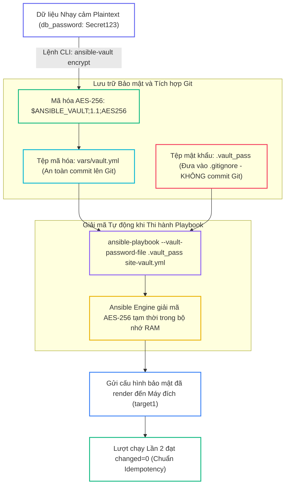
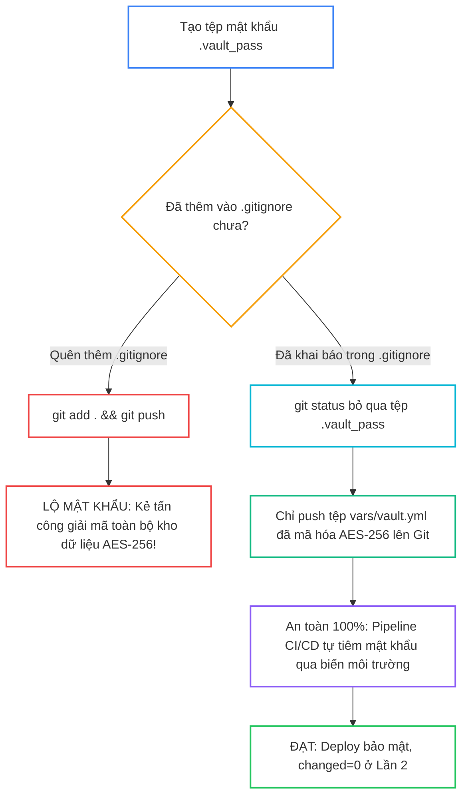
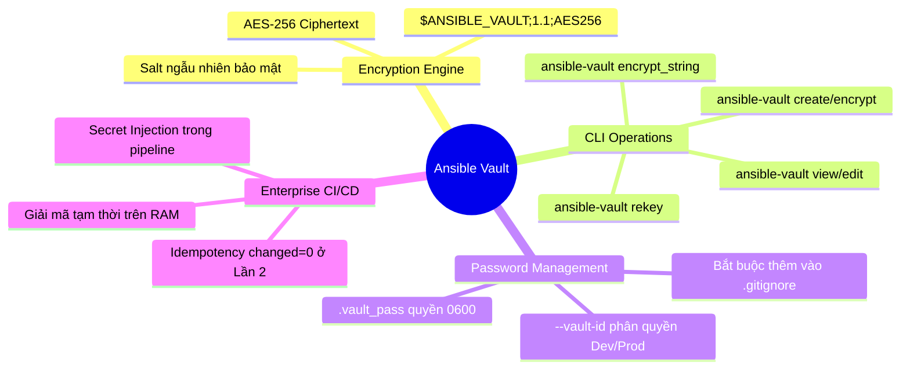


# [BÀI 20] BẢO MẬT DỮ LIỆU NHẠY CẢM VỚI ANSIBLE VAULT: MÃ HÓA FILE/STRING, VAULT PASSWORD CLIENT, MULTI-VAULT IDS & CI/CD VAULT

Trong kỷ nguyên **Infrastructure as Code (IaC)** và tự động hóa vận hành hạ tầng đám mây (Cloud Infrastructure Automation), **Ansible** khẳng định vị thế dẫn đầu nhờ triết lý **Agentless** (không cần cài đặt agent nền trên máy đích), giao thức điều khiển an toàn qua **SSH / WinRM**, định dạng khai báo **YAML** trực quan và nguyên lý bất biến **Idempotency** mạnh mẽ. Việc làm chủ Ansible không chỉ dừng lại ở các câu lệnh Ad-hoc đơn giản, mà đòi hỏi kỹ sư phải nắm vững kiến trúc Module tầng thấp, Variable Precedence 22 tầng, Jinja2 Templates, tối ưu hóa Forks & Pipelining cho tới thiết kế Roles / Collections và tích hợp CI/CD tự động hóa chuẩn Doanh nghiệp.

Bài viết chuyên sâu này sẽ đồng hành cùng bạn mổ xẻ toàn diện bức tranh kiến trúc, phân tích các đánh đổi kỹ thuật thực chiến (Engineering Trade-offs), cung cấp hướng dẫn thực hành Lab chi tiết từng bước và bộ câu hỏi phỏng vấn chuyên sâu chuẩn DevOps / SRE Lead.

---

## 1. Bản Chất Kiến Trúc & Cơ Chế Vận Hành Tầng Thấp



### 1.1. Khái Niệm Ansible Vault, Mã Hóa AES-256 và Lệnh CLI

Trong quá trình vận hành hạ tầng tự động hóa Production, kịch bản Ansible bắt buộc phải xử lý nhiều thông tin nhạy cảm: mật khẩu root, mật khẩu cơ sở dữ liệu, SSH Private Keys và API Tokens kết nối Cloud. Lưu trữ các bí mật này ở dạng văn bản thuần (Plaintext) trên Git là rủi ro an ninh nghiêm trọng.

- **Mã hóa đối xứng AES-256:** Ansible Vault sử dụng thuật toán AES-256 để biến đổi tệp tin hoặc chuỗi biến thành chuỗi mã hóa `$ANSIBLE_VAULT;1.1;AES256`, cho phép lưu trữ an toàn trong kho mã nguồn Git.
- **Bộ lệnh quản lý CLI chuyên sâu:**
  - `ansible-vault create <file>`: Khởi tạo tệp mã hóa mới.
  - `ansible-vault encrypt <file>`: Mã hóa tệp plaintext sẵn có.
  - `ansible-vault view <file>`: Xem nội dung giải mã mà không ghi đè file trên đĩa.
  - `ansible-vault edit <file>`: Giải mã trong bộ nhớ đệm để chỉnh sửa và tự động mã hóa lại khi lưu.
  - `ansible-vault rekey <file>`: Thay đổi mật khẩu giải mã Vault.
- **Mã hóa chuỗi biến đơn lẻ (`encrypt_string`):** Cho phép mã hóa từng giá trị biến đơn lẻ và nhúng trực tiếp dạng `!vault |` vào trong file `group_vars`, giữ cho các biến không nhạy cảm khác vẫn đọc được rõ ràng.

```bash
# Mã hóa chuỗi biến đơn lẻ
ansible-vault encrypt_string 'MySuperSecretDBPassword123' --name 'db_password'
```

### 1.2. Quản Lý Mật Khẩu Vault qua `.vault_pass`, `.gitignore` và `--vault-id`

- **Tệp mật khẩu `.vault_pass`:** Lưu mật khẩu giải mã cục bộ trên Control Node với quyền truy cập nghiêm ngặt `chmod 0600 .vault_pass`.
- **Khai báo trong `ansible.cfg`:** Cấu hình `vault_password_file = ./.vault_pass` giúp tự động giải mã khi chạy Playbook mà không cần gõ mật khẩu thủ công.
- **Quy tắc sinh tử với `.gitignore`:** Bắt buộc phải đưa `.vault_pass` vào `.gitignore` để ngăn chặn việc vô tình đẩy khóa giải mã lên Git.
- **Phân quyền đa mật khẩu với `--vault-id`:** Cho phép quản lý nhiều mật khẩu khác nhau theo môi trường hoặc phòng ban (ví dụ: `--vault-id dev@.vault_dev` và `--vault-id prod@.vault_prod`).

```ini
[defaults]
inventory = ./inventory/staging
roles_path = ./roles
vault_password_file = ./.vault_pass
```

### 1.3. Giải Mã Tự Động Trong CI/CD và Idempotency

- **Giải mã trong bộ nhớ RAM:** Khi thi hành lệnh `ansible-playbook`, Ansible Engine chỉ giải mã các bí mật tạm thời trên RAM để render template hoặc truyền tham số cho module, tuyệt đối không ghi file plaintext ra đĩa cứng máy đích.
- **Tích hợp CI/CD Pipeline an toàn:** Tiêm mật khẩu Vault qua Secret Variables của hệ thống CI/CD (như GitLab CI, GitHub Actions) để tự động sinh tệp `.vault_pass` tạm thời trong runner.
- **Bảo toàn tính Idempotency:** Việc giải mã Vault không ảnh hưởng đến logic so sánh trạng thái của module. Ở lượt chạy Lần thứ hai, bảng `PLAY RECAP` vẫn bắt buộc phải đạt `changed=0` tuyệt đối.

---

## 2. Bảng So Sánh Kỹ Thuật Toàn Diện (Engineering Matrix)

| Tiêu Chí Kỹ Thuật | Lưu Plaintext Không Mã Hóa | Mã Hóa Toàn Tệp (`ansible-vault encrypt`) | Mã Hóa Chuỗi Inline (`encrypt_string`) | Tích Hợp HashiCorp Vault / Secrets Manager |
|---|---|---|---|---|
| **Mức Độ Bảo Mật** | ❌ Nguy hiểm cực cao | ✅ Rất cao (AES-256) | ✅ Rất cao (AES-256) | ⭐ Tối đa (Dynamic Secrets, Auto-Rotation) |
| **Khả Năng Đọc Mã Nguồn** | Rõ ràng 100% | Kém (toàn bộ file biến bị mã hóa) | Tốt (chỉ mã hóa đúng trường nhạy cảm) | Tốt (chỉ chứa đường dẫn URI lookup) |
| **Kiểm Soát Lịch Sử Git Diff** | Dễ quan sát từng dòng | Khó (mỗi lần sửa đổi diff đổi toàn bộ) | Dễ thấy các biến không nhạy cảm | Rất tốt (không lưu secret trong repo) |
| **Độ Phức Tạp Triển Khai** | Không có | Rất đơn giản qua CLI | Đơn giản, tích hợp trực tiếp YAML | Cần hạ tầng Vault Server riêng biệt |
| **Khả Năng Tự Động Hóa CI/CD** | Tự động nhưng mất an toàn | Dễ dàng qua file `.vault_pass` | Dễ dàng qua file `.vault_pass` | Yêu cầu cấu hình AppRole / OIDC Token |

> [!IMPORTANT]
> **QUY TẮC BẤT DI BẤT DỊCH:**
> Luôn phân quyền `chmod 0600 .vault_pass` và thêm ngay vào `.gitignore` trước khi thực hiện commit đầu tiên. Không bao giờ sử dụng `ansible-vault decrypt` để sửa file rồi để quên file plaintext trên đĩa — hãy luôn sử dụng `ansible-vault edit`!

---

## 3. Kiến Trúc Triển Khai Chuẩn Production (Configuration / Playbook / Role Breakdown)

Dưới đây là Playbook chính `site-vault.yml` nạp đồng thời biến từ tệp Vault đã mã hóa và biến chuỗi inline:

```yaml
# site-vault.yml
---
- name: Secure Playbook with Ansible Vault Integration
  hosts: web
  become: true
  vars_files:
    - vars/vault.yml
    - vars/inline_vault.yml
  tasks:
    - name: Task 1 - Deploy secure configuration file using Vault variables
      ansible.builtin.copy:
        content: |
          # Secure Application Configuration
          DATABASE_PASSWORD={{ vault_db_password }}
          API_KEY_TOKEN={{ vault_api_key }}
          INLINE_TOKEN={{ inline_secret_token }}
          VAULT_ENCRYPTION=AES256_ACTIVE
        dest: /etc/vault-app.conf
        mode: '0600'

    - name: Task 2 - Read secure configuration status (changed_when: false)
      ansible.builtin.command: cat /etc/vault-app.conf
      register: vault_conf_out
      changed_when: false
```

### Phân Tích Kỹ Thuật Từng Dòng (Line-by-Line Breakdown):

- <span class="badge-line">Line 5-7</span>: **Nạp tệp biến mã hóa:** Sử dụng `vars_files` để nạp cả tệp đã mã hóa toàn phần `vars/vault.yml` và tệp chứa chuỗi mã hóa inline `vars/inline_vault.yml`. Ansible Engine sẽ tự động giải mã các tệp này nhờ `vault_password_file` trong `ansible.cfg`.
- <span class="badge-line">Line 9-18</span>: **Ghi cấu hình bảo mật:** Sử dụng `ansible.builtin.copy` render các biến giải mã (`vault_db_password`, `vault_api_key`, `inline_secret_token`) vào tệp `/etc/vault-app.conf` và gán phân quyền chặt chẽ `mode: '0600'`.
- <span class="badge-line">Line 20-23</span>: **Kiểm tra trạng thái:** Đọc tệp cấu hình vừa tạo và khai báo `changed_when: false` để bảo vệ chỉ số Idempotency `changed=0` ở Lần chạy thứ hai.

---

## 4. Phân Tích Cạm Bẫy Thực Chiến: Quên .gitignore Làm Lộ File Mật Khẩu .vault_pass Lên Git Public

### Tình Huống Sự Cố Thực Tế Tại Doanh Nghiệp:
Một kỹ sư tạo tệp `.vault_pass` để thuận tiện chạy lệnh và mã hóa toàn bộ tệp `vars/vault.yml` chứa thông tin kết nối AWS Root Keys và DB Production. Tuy nhiên, kỹ sư quên thêm `.vault_pass` vào tệp `.gitignore`. Khi thực hiện lệnh `git add .` và `git push origin main`, tệp mật khẩu đã bị đẩy thẳng lên kho mã nguồn GitHub public của công ty. Kẻ tấn công đã sử dụng tệp mật khẩu để giải mã toàn bộ tệp `vars/vault.yml` và chiếm quyền kiểm soát hạ tầng đám mây chỉ sau 30 phút.

### Hậu Quả & Log Lỗi Thực Tế:

```diff
- # TÌNH TRẠNG NGUY HIỂM TRƯỚC SỰ CỐ:
- $ git status
- Untracked files:
-   .vault_pass          # CHƯA ĐƯỢC BẢO VỆ BỞI .gitignore!
-   vars/vault.yml
- $ git add . && git commit -m "Add vault config" && git push
- # LỖI: MẬT KHẨU GIẢI MÃ ĐÃ BỊ CÔNG KHAI TRÊN GIT REPO

+ # CẤU HÌNH BẢO VỆ CHUẨN AN TOÀN:
+ $ cat .gitignore
+ .vault_pass
+ .vault_*
+ *.key
+ $ chmod 0600 .vault_pass
+ $ git status
+ Untracked files:
+   vars/vault.yml       # TỆP .vault_pass ĐÃ ĐƯỢC ẨN HOÀN TOÀN KHỎI GIT
```



### 5-Whys Root Cause Analysis:
1. **Tại sao bí mật của hệ thống bị lộ?** Vì tệp mật khẩu `.vault_pass` xuất hiện trên GitHub public repository.
2. **Tại sao tệp mật khẩu lại bị push lên GitHub?** Vì lệnh `git add .` đã bao gồm tệp `.vault_pass` vào commit.
3. **Tại sao `git add .` lại nạp tệp này?** Vì tệp `.gitignore` chưa được cấu hình dòng `.vault_pass`.
4. **Tại sao kỹ sư không kiểm tra lại `git status` trước khi push?** Do thao tác commit vội vàng và thiếu quy trình kiểm soát mã nguồn bảo mật (Pre-commit hooks).
5. **Giải pháp triệt để là gì?** Bắt buộc tạo `.gitignore` chứa `.vault_pass` ngay khi khởi tạo dự án, phân quyền `0600`, và cài đặt Git Pre-commit Hook để ngăn chặn commit các tệp chứa chuỗi nhạy cảm.

---

## 5. Hands-on Lab: Triển Khai Bảo Mật Dữ Liệu Nhạy Cảm Với Ansible Vault (8 Bước)

| Bước | Lệnh CLI / Tác Vụ Chính | Mục Đích Thực Thi |
|---|---|---|
| **1** | `echo "MyVaultSecretPass2026" > .vault_pass && chmod 0600 .vault_pass` | Khởi tạo tệp mật khẩu local bảo mật |
| **2** | `cat << 'EOF' > .gitignore && cat << 'EOF' > ansible.cfg` | Thiết lập .gitignore và cấu hình `vault_password_file` |
| **3** | `ansible-vault encrypt vars/vault.yml` | Mã hóa toàn bộ tệp biến bằng thuật toán AES-256 |
| **4** | `ansible-vault view vars/vault.yml` | Tra cứu dữ liệu đã mã hóa mà không ghi đè đĩa cứng |
| **5** | `ansible-vault encrypt_string 'InlineSecretToken999' --name 'inline_secret_token'` | Mã hóa chuỗi biến đơn lẻ dạng `!vault \|` |
| **6** | `ansible-vault rekey vars/vault.yml` | Thực hiện quy trình thay đổi mật khẩu định kỳ (Rekeying) |
| **7** | `ansible-playbook site-vault.yml` | Chạy Lần 1 và Lần 2 đối soát Idempotency `changed=0` |
| **8** | `docker exec target1 cat /etc/vault-app.conf` | Đối soát sự thật máy đích xác nhận dữ liệu giải mã |

```bash
# Bước 1: Khởi tạo thư mục và tệp mật khẩu cục bộ với quyền 0600
mkdir -p ~/lab-ansible-20/vars && cd ~/lab-ansible-20

echo "MyVaultSecretPass2026" > .vault_pass
chmod 0600 .vault_pass
```

```bash
# Bước 2: Tạo tệp .gitignore và cấu hình ansible.cfg
cat << 'EOF' > .gitignore
.vault_pass
.vault_new_pass
*.retry
*.log
EOF

cat << 'EOF' > ansible.cfg
[defaults]
inventory = ./inventory.ini
remote_user = ansible
host_key_checking = False
private_key_file = ~/.ssh/id_ed25519
roles_path = ./roles:~/.ansible/roles
collections_path = ./collections:~/.ansible/collections
vault_password_file = ./.vault_pass

[privilege_escalation]
become = True
become_method = sudo
become_user = root
become_ask_pass = False
EOF

cat << 'EOF' > inventory.ini
[web]
target1 ansible_host=127.0.0.1 ansible_port=2221

[all:vars]
ansible_python_interpreter=/usr/bin/python3
EOF
```

> [!NOTE]
> **CHECKPOINT 1:** Xác nhận tệp `.vault_pass` có quyền 0600 và được ghi vào `.gitignore`:
> ```bash
> test -f .vault_pass && grep -q ".vault_pass" .gitignore && grep -q "vault_password_file = ./.vault_pass" ansible.cfg && echo "CHECKPOINT 1: PASS" || echo "CHECKPOINT 1: FAIL"
> ```

```bash
# Bước 3: Tạo tệp biến và mã hóa toàn phần bằng ansible-vault
cat << 'EOF' > vars/vault.yml
---
vault_db_password: "SuperSecretDBPassword2026"
vault_api_key: "API_KEY_998877665544332211"
EOF

ansible-vault encrypt vars/vault.yml
```

> [!NOTE]
> **CHECKPOINT 2:** Xác nhận tệp `vars/vault.yml` chứa header AES-256:
> ```bash
> grep -q "\$ANSIBLE_VAULT;1.1;AES256" vars/vault.yml && echo "CHECKPOINT 2: PASS" || echo "CHECKPOINT 2: FAIL"
> ```

```bash
# Bước 4: Xem nội dung giải mã bằng lệnh ansible-vault view
ansible-vault view vars/vault.yml > /tmp/vault_view_test.txt
```

> [!NOTE]
> **CHECKPOINT 3:** Xác nhận lệnh `ansible-vault view` xuất đúng nội dung:
> ```bash
> grep -q "vault_db_password: \"SuperSecretDBPassword2026\"" /tmp/vault_view_test.txt && echo "CHECKPOINT 3: PASS" || echo "CHECKPOINT 3: FAIL"
> ```

```bash
# Bước 5: Mã hóa chuỗi biến đơn lẻ và lưu vào vars/inline_vault.yml
ansible-vault encrypt_string 'InlineSecretToken999' --name 'inline_secret_token' > vars/inline_vault.yml
```

> [!NOTE]
> **CHECKPOINT 4:** Xác nhận tệp `vars/inline_vault.yml` chứa từ khóa `!vault |`:
> ```bash
> grep -q "inline_secret_token: !vault |" vars/inline_vault.yml && echo "CHECKPOINT 4: PASS" || echo "CHECKPOINT 4: FAIL"
> ```

```bash
# Bước 6: Thử nghiệm đổi mật khẩu giải mã Rekeying
echo "TempNewPass2026" > .vault_new_pass
ansible-vault rekey vars/vault.yml --new-vault-password-file .vault_new_pass
ansible-vault rekey vars/vault.yml --vault-password-file .vault_new_pass --new-vault-password-file .vault_pass
rm -f .vault_new_pass
```

> [!NOTE]
> **CHECKPOINT 5:** Xác nhận tệp `vars/vault.yml` vẫn giải mã trơn tru sau quá trình rekey:
> ```bash
> ansible-vault view vars/vault.yml | grep -q "vault_db_password" && echo "CHECKPOINT 5: PASS" || echo "CHECKPOINT 5: FAIL"
> ```

```bash
# Bước 7: Biên soạn Playbook site-vault.yml và thực thi đối soát Idempotency
cat << 'EOF' > site-vault.yml
---
- name: Secure Playbook with Ansible Vault Integration
  hosts: web
  become: true
  vars_files:
    - vars/vault.yml
    - vars/inline_vault.yml
  tasks:
    - name: Task 1 - Deploy secure configuration file using Vault variables
      ansible.builtin.copy:
        content: |
          # Secure Application Configuration
          DATABASE_PASSWORD={{ vault_db_password }}
          API_KEY_TOKEN={{ vault_api_key }}
          INLINE_TOKEN={{ inline_secret_token }}
          VAULT_ENCRYPTION=AES256_ACTIVE
        dest: /etc/vault-app.conf
        mode: '0600'

    - name: Task 2 - Read secure configuration status (changed_when: false)
      ansible.builtin.command: cat /etc/vault-app.conf
      register: vault_conf_out
      changed_when: false
EOF

ansible-playbook site-vault.yml
ansible-playbook site-vault.yml
```

> [!NOTE]
> **CHECKPOINT 6:** Xác nhận Playbook giải mã tự động và chạy thành công ở Lần 1:
> ```bash
> ansible-playbook site-vault.yml | grep -q "failed=0" && echo "CHECKPOINT 6: PASS" || echo "CHECKPOINT 6: FAIL"
> ```

> [!NOTE]
> **CHECKPOINT 7:** Xác nhận Lượt 2 đạt Idempotency tuyệt đối (`changed=0`):
> ```bash
> RUN2_VLT_OUT=$(ansible-playbook site-vault.yml)
> if echo "$RUN2_VLT_OUT" | grep -q "changed=0" && echo "$RUN2_VLT_OUT" | grep -q "failed=0"; then
>   echo "CHECKPOINT 7: PASS - Đạt Idempotency changed=0"
> else
>   echo "CHECKPOINT 7: FAIL - Lỗi không đạt Idempotency"
> fi
> ```

```bash
# Bước 8: Đối soát Sự Thật Máy Đích qua docker exec
docker exec target1 cat /etc/vault-app.conf
```

> [!NOTE]
> **CHECKPOINT 8:** Đối soát file `/etc/vault-app.conf` chứa đúng mật khẩu giải mã từ Vault:
> ```bash
> docker exec target1 cat /etc/vault-app.conf | grep -q "DATABASE_PASSWORD=SuperSecretDBPassword2026" && echo "CHECKPOINT 8: PASS" || echo "CHECKPOINT 8: FAIL"
> ```

---

## 6. Bộ Câu Hỏi Vấn Đáp & Phỏng Vấn Chuyên Sâu (Self-Check Q&A)

<details class="qa-card" markdown="1">
  <summary class="qa-summary">
    <span class="qa-num-badge">Q01</span>
    <span class="qa-question-text">Ansible Vault sử dụng thuật toán mã hóa tiêu chuẩn nào để bảo vệ dữ liệu nhạy cảm? Cơ chế lưu trữ ciphertext diễn ra như thế nào?</span>
  </summary>
  <div class="qa-answer">
    <div class="qa-answer-header">
      <svg width="14" height="14" fill="none" stroke="currentColor" stroke-width="2" viewBox="0 0 24 24"><path d="M22 11.08V12a10 10 0 1 1-5.93-9.14"></path><polyline points="22 4 12 14.01 9 11.01"></polyline></svg>
      <span>Phân Tích &amp; Lời Giải Kỹ Thuật</span>
    </div>
    <div style="margin: 0.5rem 0;"><b>Hỏi:</b> Ansible Vault sử dụng thuật toán mã hóa tiêu chuẩn nào để bảo vệ dữ liệu nhạy cảm? Cơ chế lưu trữ ciphertext diễn ra như thế nào?</div>
    <div style="margin: 0.5rem 0;"><b>Đáp án chuẩn:</b></div>
    <div style="margin: 0.35rem 0; padding-left: 1rem; border-left: 2px solid var(--accent-primary);">• Ansible Vault sử dụng thuật toán <b>mã hóa đối xứng AES-256 (Advanced Encryption Standard 256-bit)</b> kết hợp chuẩn băm SHA-256 và Salt ngẫu nhiên.</div>
    <div style="margin: 0.35rem 0; padding-left: 1rem; border-left: 2px solid var(--accent-primary);">• Tệp sau khi mã hóa được bắt đầu bằng header nhận dạng <code>$ANSIBLE_VAULT;1.1;AES256</code> theo sau là các khối chuỗi hex ma trận an toàn, cho phép lưu trữ trực tiếp trên Git.</div>
    <div style="margin: 0.5rem 0;"><b>Tiêu chí chấm:</b></div>
    <div style="margin: 0.35rem 0; padding-left: 1rem; border-left: 2px solid var(--accent-primary);">• 0: Không biết tên thuật toán mã hóa.</div>
    <div style="margin: 0.35rem 0; padding-left: 1rem; border-left: 2px solid var(--accent-primary);">• 1: Biết là AES nhưng không nêu được độ dài khóa 256-bit và cấu trúc header.</div>
    <div style="margin: 0.35rem 0; padding-left: 1rem; border-left: 2px solid var(--accent-primary);">• 2: Phân tích chính xác thuật toán AES-256 và cấu trúc file header.</div>
    <div style="margin: 0.35rem 0; padding-left: 1rem; border-left: 2px solid var(--accent-primary);">• 3: Nêu đúng + giải thích vai trò của Salt ngẫu nhiên tạo ra ciphertext khác nhau ở mỗi lần mã hóa.</div>
    <div style="margin: 0.5rem 0;"><b>Câu hỏi đào sâu:</b> Nếu hai lần mã hóa cùng một nội dung thì chuỗi cipher sinh ra có giống nhau không? <i>(Khác nhau hoàn toàn do Ansible Vault tạo Salt ngẫu nhiên ở mỗi lần mã hóa.)</i></div>
  </div>
</details>

<details class="qa-card" markdown="1">
  <summary class="qa-summary">
    <span class="qa-num-badge">Q02</span>
    <span class="qa-question-text">Phân biệt sự khác nhau giữa hai lệnh <code>ansible-vault encrypt</code> và <code>ansible-vault encrypt_string</code>. Khi nào nên dùng từng loại?</span>
  </summary>
  <div class="qa-answer">
    <div class="qa-answer-header">
      <svg width="14" height="14" fill="none" stroke="currentColor" stroke-width="2" viewBox="0 0 24 24"><path d="M22 11.08V12a10 10 0 1 1-5.93-9.14"></path><polyline points="22 4 12 14.01 9 11.01"></polyline></svg>
      <span>Phân Tích &amp; Lời Giải Kỹ Thuật</span>
    </div>
    <div style="margin: 0.5rem 0;"><b>Hỏi:</b> Phân biệt sự khác nhau giữa hai lệnh <code>ansible-vault encrypt</code> và <code>ansible-vault encrypt_string</code>. Khi nào nên dùng từng loại?</div>
    <div style="margin: 0.5rem 0;"><b>Đáp án chuẩn:</b></div>
    <div style="margin: 0.35rem 0; padding-left: 1rem; border-left: 2px solid var(--accent-primary);">• <b><code>ansible-vault encrypt</code> (File-level):</b> Mã hóa toàn bộ tệp tin YAML thành ciphertext. Phù hợp khi tệp chứa toàn bộ các thông tin mật (như <code>vars/vault.yml</code> hoặc SSL certificates).</div>
    <div style="margin: 0.35rem 0; padding-left: 1rem; border-left: 2px solid var(--accent-primary);">• <b><code>ansible-vault encrypt_string</code> (Variable-level):</b> Chỉ mã hóa một chuỗi văn bản đơn lẻ và xuất ra khối <code>!vault |</code>. Phù hợp khi nhúng vào các tệp cấu hình chung (như <code>group_vars/web.yml</code>) để người khác vẫn đọc được các biến thông thường.</div>
    <div style="margin: 0.5rem 0;"><b>Tiêu chí chấm:</b></div>
    <div style="margin: 0.35rem 0; padding-left: 1rem; border-left: 2px solid var(--accent-primary);">• 0: Không phân biệt được 2 lệnh.</div>
    <div style="margin: 0.35rem 0; padding-left: 1rem; border-left: 2px solid var(--accent-primary);">• 1: Biết một loại mã hóa file một loại mã hóa chuỗi nhưng không nêu được use-case phù hợp.</div>
    <div style="margin: 0.35rem 0; padding-left: 1rem; border-left: 2px solid var(--accent-primary);">• 2: Phân tích chính xác ưu/nhược điểm và tình huống sử dụng của từng lệnh.</div>
    <div style="margin: 0.35rem 0; padding-left: 1rem; border-left: 2px solid var(--accent-primary);">• 3: Nêu đúng + viết ví dụ cú pháp YAML nhúng khối <code>!vault |</code> vào biến.</div>
    <div style="margin: 0.5rem 0;"><b>Câu hỏi đào sâu:</b> Cú pháp dòng lệnh nào giúp mã hóa chuỗi trực tiếp từ pipeline stdin? <i>(Dùng <code>ansible-vault encrypt_string --stdin-name 'my_var'</code>.)</i></div>
  </div>
</details>

<details class="qa-card" markdown="1">
  <summary class="qa-summary">
    <span class="qa-num-badge">Q03</span>
    <span class="qa-question-text">Tại sao nên dùng <code>ansible-vault edit</code> hoặc <code>ansible-vault view</code> thay vì chạy <code>decrypt</code> rồi <code>encrypt</code> lại?</span>
  </summary>
  <div class="qa-answer">
    <div class="qa-answer-header">
      <svg width="14" height="14" fill="none" stroke="currentColor" stroke-width="2" viewBox="0 0 24 24"><path d="M22 11.08V12a10 10 0 1 1-5.93-9.14"></path><polyline points="22 4 12 14.01 9 11.01"></polyline></svg>
      <span>Phân Tích &amp; Lời Giải Kỹ Thuật</span>
    </div>
    <div style="margin: 0.5rem 0;"><b>Hỏi:</b> Tại sao nên dùng <code>ansible-vault edit</code> hoặc <code>ansible-vault view</code> thay vì chạy <code>decrypt</code> rồi <code>encrypt</code> lại?</div>
    <div style="margin: 0.5rem 0;"><b>Đáp án chuẩn:</b></div>
    <div style="margin: 0.35rem 0; padding-left: 1rem; border-left: 2px solid var(--accent-primary);">• <b>Ngăn ngừa rò rỉ Plaintext trên đĩa:</b> Khi chạy <code>ansible-vault decrypt</code>, tệp sẽ bị ghi ra đĩa cứng ở dạng plaintext không mã hóa. Nếu kỹ sư quên không chạy lại lệnh <code>encrypt</code> hoặc vô tình commit lên Git, toàn bộ bí mật sẽ bị lộ.</div>
    <div style="margin: 0.35rem 0; padding-left: 1rem; border-left: 2px solid var(--accent-primary);">• <b>Tiện lợi và an toàn:</b> <code>ansible-vault view</code> chỉ giải mã xem tạm trên terminal; <code>ansible-vault edit</code> mở trình soạn thảo trong RAM và tự động mã hóa lại tệp ngay khi lưu.</div>
    <div style="margin: 0.5rem 0;"><b>Tiêu chí chấm:</b></div>
    <div style="margin: 0.35rem 0; padding-left: 1rem; border-left: 2px solid var(--accent-primary);">• 0: Không thấy được rủi ro khi dùng lệnh <code>decrypt</code>.</div>
    <div style="margin: 0.35rem 0; padding-left: 1rem; border-left: 2px solid var(--accent-primary);">• 1: Biết <code>edit</code> tiện hơn nhưng không nêu được nguy cơ rò rỉ dữ liệu trên đĩa.</div>
    <div style="margin: 0.35rem 0; padding-left: 1rem; border-left: 2px solid var(--accent-primary);">• 2: Phân tích chính xác rủi ro bảo mật và cơ chế hoạt động an toàn của <code>view</code> / <code>edit</code>.</div>
    <div style="margin: 0.35rem 0; padding-left: 1rem; border-left: 2px solid var(--accent-primary);">• 3: Nêu đúng + nhấn mạnh nguyên tắc cấm dùng lệnh <code>decrypt</code> trên môi trường Production.</div>
    <div style="margin: 0.5rem 0;"><b>Câu hỏi đào sâu:</b> Trình soạn thảo nào được Ansible Vault gọi mặc định khi chạy <code>ansible-vault edit</code>? <i>(Sử dụng biến môi trường <code>$EDITOR</code>, mặc định là vi hoặc nano.)</i></div>
  </div>
</details>

<details class="qa-card" markdown="1">
  <summary class="qa-summary">
    <span class="qa-num-badge">Q04</span>
    <span class="qa-question-text">Lệnh <code>ansible-vault rekey</code> dùng để làm gì? Trình bày quy trình thực hiện rekey cho một tệp biến Vault.</span>
  </summary>
  <div class="qa-answer">
    <div class="qa-answer-header">
      <svg width="14" height="14" fill="none" stroke="currentColor" stroke-width="2" viewBox="0 0 24 24"><path d="M22 11.08V12a10 10 0 1 1-5.93-9.14"></path><polyline points="22 4 12 14.01 9 11.01"></polyline></svg>
      <span>Phân Tích &amp; Lời Giải Kỹ Thuật</span>
    </div>
    <div style="margin: 0.5rem 0;"><b>Hỏi:</b> Lệnh <code>ansible-vault rekey</code> dùng để làm gì? Trình bày quy trình thực hiện rekey cho một tệp biến Vault.</div>
    <div style="margin: 0.5rem 0;"><b>Đáp án chuẩn:</b></div>
    <div style="margin: 0.35rem 0; padding-left: 1rem; border-left: 2px solid var(--accent-primary);">• <b>Mục đích:</b> Dùng để thay đổi mật khẩu giải mã Vault (Password Rotation) định kỳ hoặc khi có thành viên rời khỏi đội ngũ mà không làm mất nội dung dữ liệu bên trong.</div>
    <div style="margin: 0.35rem 0; padding-left: 1rem; border-left: 2px solid var(--accent-primary);">• <b>Quy trình thực hiện:</b> Chạy lệnh <code>ansible-vault rekey vars/vault.yml</code>. Ansible sẽ yêu cầu nhập mật khẩu hiện tại (Current password), sau đó nhập và xác nhận mật khẩu mới (New password).</div>
    <div style="margin: 0.5rem 0;"><b>Tiêu chí chấm:</b></div>
    <div style="margin: 0.35rem 0; padding-left: 1rem; border-left: 2px solid var(--accent-primary);">• 0: Không biết lệnh <code>rekey</code>.</div>
    <div style="margin: 0.35rem 0; padding-left: 1rem; border-left: 2px solid var(--accent-primary);">• 1: Biết đổi mật khẩu nhưng không nêu được quy trình nhập pass cũ / pass mới.</div>
    <div style="margin: 0.35rem 0; padding-left: 1rem; border-left: 2px solid var(--accent-primary);">• 2: Phân tích chính xác vai trò Password Rotation và quy trình tương tác CLI.</div>
    <div style="margin: 0.35rem 0; padding-left: 1rem; border-left: 2px solid var(--accent-primary);">• 3: Nêu đúng + viết cú pháp rekey sử dụng cờ <code>--new-vault-password-file</code> tự động.</div>
    <div style="margin: 0.5rem 0;"><b>Câu hỏi đào sâu:</b> Có thể rekey đồng thời 10 tệp mã hóa Vault trong 1 câu lệnh duy nhất không? <i>(Hoàn toàn được: <code>ansible-vault rekey file1.yml file2.yml ...</code>.)</i></div>
  </div>
</details>

<details class="qa-card" markdown="1">
  <summary class="qa-summary">
    <span class="qa-num-badge">Q05</span>
    <span class="qa-question-text">Trình bày cơ chế hoạt động của tham số <code>--vault-id</code> (Multi-Vault IDs) và lợi ích trong việc phân quyền bảo mật doanh nghiệp.</span>
  </summary>
  <div class="qa-answer">
    <div class="qa-answer-header">
      <svg width="14" height="14" fill="none" stroke="currentColor" stroke-width="2" viewBox="0 0 24 24"><path d="M22 11.08V12a10 10 0 1 1-5.93-9.14"></path><polyline points="22 4 12 14.01 9 11.01"></polyline></svg>
      <span>Phân Tích &amp; Lời Giải Kỹ Thuật</span>
    </div>
    <div style="margin: 0.5rem 0;"><b>Hỏi:</b> Trình bày cơ chế hoạt động của tham số <code>--vault-id</code> (Multi-Vault IDs) và lợi ích trong việc phân quyền bảo mật doanh nghiệp.</div>
    <div style="margin: 0.5rem 0;"><b>Đáp án chuẩn:</b></div>
    <div style="margin: 0.35rem 0; padding-left: 1rem; border-left: 2px solid var(--accent-primary);">• <b>Cơ chế:</b> Cho phép gán nhãn định danh (Label ID) kèm theo nguồn mật khẩu tương ứng (ví dụ: <code>--vault-id dev@prompt</code> hoặc <code>--vault-id prod@/path/to/prod_pass</code>). Tệp mã hóa sẽ ghi nhớ nhãn này trong header.</div>
    <div style="margin: 0.35rem 0; padding-left: 1rem; border-left: 2px solid var(--accent-primary);">• <b>Lợi ích RBAC:</b> Phân tách quyền truy cập tuyệt đối: Đội phát triển chỉ sở hữu mật khẩu <code>dev</code> để giải mã môi trường Staging, còn mật khẩu <code>prod</code> chỉ do SRE Lead nắm giữ.</div>
    <div style="margin: 0.5rem 0;"><b>Tiêu chí chấm:</b></div>
    <div style="margin: 0.35rem 0; padding-left: 1rem; border-left: 2px solid var(--accent-primary);">• 0: Không biết tính năng <code>--vault-id</code>.</div>
    <div style="margin: 0.35rem 0; padding-left: 1rem; border-left: 2px solid var(--accent-primary);">• 1: Biết dùng nhiều mật khẩu nhưng không giải thích được cú pháp <code>label@source</code>.</div>
    <div style="margin: 0.35rem 0; padding-left: 1rem; border-left: 2px solid var(--accent-primary);">• 2: Phân tích chính xác cơ chế Label Identity và lợi ích phân quyền RBAC.</div>
    <div style="margin: 0.35rem 0; padding-left: 1rem; border-left: 2px solid var(--accent-primary);">• 3: Nêu đúng + viết ví dụ Playbook chạy đồng thời 2 Vault ID khác nhau.</div>
    <div style="margin: 0.5rem 0;"><b>Câu hỏi đào sâu:</b> Cú pháp nào dùng để yêu cầu nhập mật khẩu tương tác từ bàn phím cho một Vault ID cụ thể? <i>(Sử dụng cú pháp <code>--vault-id my_label@prompt</code>.)</i></div>
  </div>
</details>

<details class="qa-card" markdown="1">
  <summary class="qa-summary">
    <span class="qa-num-badge">Q06</span>
    <span class="qa-question-text">Tại sao việc thêm <code>.vault_pass</code> vào <code>.gitignore</code> và phân quyền <code>0600</code> là bắt buộc sinh tử?</span>
  </summary>
  <div class="qa-answer">
    <div class="qa-answer-header">
      <svg width="14" height="14" fill="none" stroke="currentColor" stroke-width="2" viewBox="0 0 24 24"><path d="M22 11.08V12a10 10 0 1 1-5.93-9.14"></path><polyline points="22 4 12 14.01 9 11.01"></polyline></svg>
      <span>Phân Tích &amp; Lời Giải Kỹ Thuật</span>
    </div>
    <div style="margin: 0.5rem 0;"><b>Hỏi:</b> Tại sao việc thêm <code>.vault_pass</code> vào <code>.gitignore</code> và phân quyền <code>0600</code> là bắt buộc sinh tử?</div>
    <div style="margin: 0.5rem 0;"><b>Đáp án chuẩn:</b></div>
    <div style="margin: 0.35rem 0; padding-left: 1rem; border-left: 2px solid var(--accent-primary);">• <b>Thêm vào <code>.gitignore</code>:</b> Ngăn chặn hoàn toàn việc vô tình commit tệp chứa khóa giải mã lên Git repository công cộng làm vô hiệu hóa 100% lớp bảo vệ AES-256.</div>
    <div style="margin: 0.35rem 0; padding-left: 1rem; border-left: 2px solid var(--accent-primary);">• <b>Phân quyền <code>0600</code> (rw-------):</b> Đảm bảo chỉ có duy nhất tài khoản người dùng hiện tại trên Control Node mới có quyền đọc tệp mật khẩu, ngăn chặn các tài khoản user khác trên cùng máy chủ đọc trộm.</div>
    <div style="margin: 0.5rem 0;"><b>Tiêu chí chấm:</b></div>
    <div style="margin: 0.35rem 0; padding-left: 1rem; border-left: 2px solid var(--accent-primary);">• 0: Không giải thích được lý do bảo mật.</div>
    <div style="margin: 0.35rem 0; padding-left: 1rem; border-left: 2px solid var(--accent-primary);">• 1: Chỉ nhắc đến Git mà quên đề cập đến phân quyền local Linux 0600.</div>
    <div style="margin: 0.35rem 0; padding-left: 1rem; border-left: 2px solid var(--accent-primary);">• 2: Phân tích đầy đủ cả 2 khía cạnh: bảo vệ trên Git và cô lập quyền truy cập local file system.</div>
    <div style="margin: 0.35rem 0; padding-left: 1rem; border-left: 2px solid var(--accent-primary);">• 3: Nêu đúng + đề xuất phương án sử dụng Git hook quét secret trước khi commit.</div>
    <div style="margin: 0.5rem 0;"><b>Câu hỏi đào sâu:</b> Nếu lỡ commit tệp <code>.vault_pass</code> lên Git thì xóa commit bằng <code>git rm</code> có an toàn không? <i>(Không an toàn, phải xóa lịch sử Git hoặc rekey đổi mật khẩu ngay lập tức.)</i></div>
  </div>
</details>

<details class="qa-card" markdown="1">
  <summary class="qa-summary">
    <span class="qa-num-badge">Q07</span>
    <span class="qa-question-text">Trình bày quy trình tự động hóa giải mã Ansible Vault trong CI/CD Pipeline (GitLab CI / Jenkins) mà không lộ mật khẩu trong mã nguồn.</span>
  </summary>
  <div class="qa-answer">
    <div class="qa-answer-header">
      <svg width="14" height="14" fill="none" stroke="currentColor" stroke-width="2" viewBox="0 0 24 24"><path d="M22 11.08V12a10 10 0 1 1-5.93-9.14"></path><polyline points="22 4 12 14.01 9 11.01"></polyline></svg>
      <span>Phân Tích &amp; Lời Giải Kỹ Thuật</span>
    </div>
    <div style="margin: 0.5rem 0;"><b>Hỏi:</b> Trình bày quy trình tự động hóa giải mã Ansible Vault trong CI/CD Pipeline (GitLab CI / Jenkins) mà không lộ mật khẩu trong mã nguồn.</div>
    <div style="margin: 0.5rem 0;"><b>Đáp án chuẩn:</b></div>
    <div style="margin: 0.35rem 0; padding-left: 1rem; border-left: 2px solid var(--accent-primary);">1. Lưu mật khẩu Vault trong mục <b>CI/CD Masked &amp; Protected Variables</b> (ví dụ biến <code>$ANSIBLE_VAULT_PASS</code>).</div>
    <div style="margin: 0.35rem 0; padding-left: 1rem; border-left: 2px solid var(--accent-primary);">2. Trong bước <code>before_script</code> của pipeline, tạo tệp <code>.vault_pass</code> tạm thời: <code>echo "$ANSIBLE_VAULT_PASS" &gt; .vault_pass &amp;&amp; chmod 0600 .vault_pass</code>.</div>
    <div style="margin: 0.35rem 0; padding-left: 1rem; border-left: 2px solid var(--accent-primary);">3. Thực thi <code>ansible-playbook --vault-password-file .vault_pass site.yml</code> và xóa tệp mật khẩu trong khối <code>after_script</code>.</div>
    <div style="margin: 0.5rem 0;"><b>Tiêu chí chấm:</b></div>
    <div style="margin: 0.35rem 0; padding-left: 1rem; border-left: 2px solid var(--accent-primary);">• 0: Không biết quy trình tích hợp CI/CD.</div>
    <div style="margin: 0.35rem 0; padding-left: 1rem; border-left: 2px solid var(--accent-primary);">• 1: Biết dùng biến CI/CD nhưng không tạo file tạm hoặc để lộ secret trong log.</div>
    <div style="margin: 0.35rem 0; padding-left: 1rem; border-left: 2px solid var(--accent-primary);">• 2: Trình bày chính xác 3 bước tích hợp chuẩn SecOps trong CI/CD.</div>
    <div style="margin: 0.35rem 0; padding-left: 1rem; border-left: 2px solid var(--accent-primary);">• 3: Nêu đúng + viết đoạn YAML mẫu của <code>.gitlab-ci.yml</code> hoàn chỉnh.</div>
    <div style="margin: 0.5rem 0;"><b>Câu hỏi đào sâu:</b> Làm sao để cấm GitLab CI in giá trị biến mật khẩu ra log terminal? <i>(Bật thuộc tính <b>Masked</b> cho biến trong phần Settings CI/CD.)</i></div>
  </div>
</details>

<details class="qa-card" markdown="1">
  <summary class="qa-summary">
    <span class="qa-num-badge">Q08</span>
    <span class="qa-question-text">Sử dụng biến giải mã từ Ansible Vault có ảnh hưởng gì tới chỉ số Idempotency <code>changed=0</code> ở Lần chạy thứ hai không? Giải thích cơ chế.</span>
  </summary>
  <div class="qa-answer">
    <div class="qa-answer-header">
      <svg width="14" height="14" fill="none" stroke="currentColor" stroke-width="2" viewBox="0 0 24 24"><path d="M22 11.08V12a10 10 0 1 1-5.93-9.14"></path><polyline points="22 4 12 14.01 9 11.01"></polyline></svg>
      <span>Phân Tích &amp; Lời Giải Kỹ Thuật</span>
    </div>
    <div style="margin: 0.5rem 0;"><b>Hỏi:</b> Sử dụng biến giải mã từ Ansible Vault có ảnh hưởng gì tới chỉ số Idempotency <code>changed=0</code> ở Lần chạy thứ hai không? Giải thích cơ chế.</div>
    <div style="margin: 0.5rem 0;"><b>Đáp án chuẩn:</b></div>
    <div style="margin: 0.35rem 0; padding-left: 1rem; border-left: 2px solid var(--accent-primary);">• <b>Hoàn toàn không ảnh hưởng:</b> Việc mã hóa Vault chỉ là phương thức đóng gói dữ liệu lưu trữ trên đĩa cứng của Control Node.</div>
    <div style="margin: 0.35rem 0; padding-left: 1rem; border-left: 2px solid var(--accent-primary);">• <b>Cơ chế:</b> Khi Playbook chạy, biến được giải mã thành plaintext trong RAM và truyền vào module. Module vẫn tính toán checksum SHA-1 của tệp đích như bình thường. Nếu tệp trên máy đích đã khớp dữ liệu giải mã ở Lần 1, Lần 2 sẽ báo <code>ok</code> và giữ nguyên <code>changed=0</code>.</div>
    <div style="margin: 0.5rem 0;"><b>Tiêu chí chấm:</b></div>
    <div style="margin: 0.35rem 0; padding-left: 1rem; border-left: 2px solid var(--accent-primary);">• 0: Lầm tưởng mã hóa Vault làm mất tính Idempotency.</div>
    <div style="margin: 0.35rem 0; padding-left: 1rem; border-left: 2px solid var(--accent-primary);">• 1: Trả lời không ảnh hưởng nhưng không giải thích được cơ chế so sánh checksum trong RAM.</div>
    <div style="margin: 0.35rem 0; padding-left: 1rem; border-left: 2px solid var(--accent-primary);">• 2: Phân tích chính xác cơ chế giải mã trong bộ nhớ RAM và bảo toàn tính Idempotency.</div>
    <div style="margin: 0.35rem 0; padding-left: 1rem; border-left: 2px solid var(--accent-primary);">• 3: Nêu đúng + minh họa log <code>PLAY RECAP</code> Lần 2 đạt <code>changed=0</code>.</div>
    <div style="margin: 0.5rem 0;"><b>Câu hỏi đào sâu:</b> Nếu tệp Vault được rekey đổi mật khẩu nhưng nội dung biến giữ nguyên thì Lần 2 có bị báo <code>changed=1</code> không? <i>(Không, vì giá trị giải mã bên trong không đổi nên checksum máy đích vẫn khớp.)</i></div>
  </div>
</details>

<details class="qa-card" markdown="1">
  <summary class="qa-summary">
    <span class="qa-num-badge">Q09</span>
    <span class="qa-question-text">Trình bày cấu trúc một tệp biến kết hợp giữa biến công khai và biến mã hóa inline <code>!vault |</code> trong cùng 1 tệp YAML.</span>
  </summary>
  <div class="qa-answer">
    <div class="qa-answer-header">
      <svg width="14" height="14" fill="none" stroke="currentColor" stroke-width="2" viewBox="0 0 24 24"><path d="M22 11.08V12a10 10 0 1 1-5.93-9.14"></path><polyline points="22 4 12 14.01 9 11.01"></polyline></svg>
      <span>Phân Tích &amp; Lời Giải Kỹ Thuật</span>
    </div>
    <div style="margin: 0.5rem 0;"><b>Hỏi:</b> Trình bày cấu trúc một tệp biến kết hợp giữa biến công khai và biến mã hóa inline <code>!vault |</code> trong cùng 1 tệp YAML.</div>
    <div style="margin: 0.5rem 0;"><b>Đáp án chuẩn:</b></div>
    <div style="margin: 0.35rem 0; padding-left: 1rem; border-left: 2px solid var(--accent-primary);">• Cấu trúc tệp YAML:
      <pre><code>---
# Biến công khai đọc hiểu bình thường
app_port: 8080
db_host: "10.0.0.50"
db_username: "app_user"

# Biến nhạy cảm mã hóa inline AES-256
db_password: !vault |
          $ANSIBLE_VAULT;1.1;AES256
          636437346332306233303863333735336338303130373238613437363435343461623838
          33300a656661333735393033626233323066343564343161313634323237303038333333</code></pre>
    </div>
    <div style="margin: 0.5rem 0;"><b>Tiêu chí chấm:</b></div>
    <div style="margin: 0.35rem 0; padding-left: 1rem; border-left: 2px solid var(--accent-primary);">• 0: Không biết cấu trúc kết hợp.</div>
    <div style="margin: 0.35rem 0; padding-left: 1rem; border-left: 2px solid var(--accent-primary);">• 1: Biết dùng <code>!vault</code> nhưng viết sai cú pháp thụt lề YAML.</div>
    <div style="margin: 0.35rem 0; padding-left: 1rem; border-left: 2px solid var(--accent-primary);">• 2: Viết chuẩn xác cấu trúc kết hợp biến plaintext và chuỗi inline mã hóa.</div>
    <div style="margin: 0.35rem 0; padding-left: 1rem; border-left: 2px solid var(--accent-primary);">• 3: Nêu đúng + giải thích lý do cấu trúc này tối ưu cho việc review Pull Request trên Git.</div>
    <div style="margin: 0.5rem 0;"><b>Câu hỏi đào sâu:</b> Cờ <code>--name 'my_var'</code> trong lệnh <code>encrypt_string</code> có tác dụng gì? <i>(Tự động in kèm tên biến và thụt dòng đúng chuẩn YAML.)</i></div>
  </div>
</details>

<details class="qa-card" markdown="1">
  <summary class="qa-summary">
    <span class="qa-num-badge">Q10</span>
    <span class="qa-question-text">Làm thế nào để truyền một script Python / Bash tùy chỉnh vào làm Vault Password Client thay vì một tệp text tĩnh?</span>
  </summary>
  <div class="qa-answer">
    <div class="qa-answer-header">
      <svg width="14" height="14" fill="none" stroke="currentColor" stroke-width="2" viewBox="0 0 24 24"><path d="M22 11.08V12a10 10 0 1 1-5.93-9.14"></path><polyline points="22 4 12 14.01 9 11.01"></polyline></svg>
      <span>Phân Tích &amp; Lời Giải Kỹ Thuật</span>
    </div>
    <div style="margin: 0.5rem 0;"><b>Hỏi:</b> Làm thế nào để truyền một script Python / Bash tùy chỉnh vào làm Vault Password Client thay vì một tệp text tĩnh?</div>
    <div style="margin: 0.5rem 0;"><b>Đáp án chuẩn:</b></div>
    <div style="margin: 0.35rem 0; padding-left: 1rem; border-left: 2px solid var(--accent-primary);">• Ansible Vault hỗ trợ chỉ định một script thực thi (Executable Script) làm nguồn mật khẩu. Quản trị viên chỉ cần phân quyền thực thi <code>chmod +x get_vault_pass.sh</code> và cấu hình <code>vault_password_file = ./get_vault_pass.sh</code>.</div>
    <div style="margin: 0.35rem 0; padding-left: 1rem; border-left: 2px solid var(--accent-primary);">• Script này có thể kết nối tới AWS Secrets Manager hoặc HashiCorp Vault qua API và in mật khẩu ra stdout để Ansible Engine đọc.</div>
    <div style="margin: 0.5rem 0;"><b>Tiêu chí chấm:</b></div>
    <div style="margin: 0.35rem 0; padding-left: 1rem; border-left: 2px solid var(--accent-primary);">• 0: Không biết tính năng Password Client script.</div>
    <div style="margin: 0.35rem 0; padding-left: 1rem; border-left: 2px solid var(--accent-primary);">• 1: Biết dùng script nhưng quên cấp quyền thực thi <code>chmod +x</code>.</div>
    <div style="margin: 0.35rem 0; padding-left: 1rem; border-left: 2px solid var(--accent-primary);">• 2: Phân tích chính xác cơ chế đọc mật khẩu từ stdout của script thực thi.</div>
    <div style="margin: 0.35rem 0; padding-left: 1rem; border-left: 2px solid var(--accent-primary);">• 3: Nêu đúng + viết đoạn script mẫu lấy mật khẩu từ biến môi trường hoặc AWS CLI.</div>
    <div style="margin: 0.5rem 0;"><b>Câu hỏi đào sâu:</b> Script này có nhận được tham số tên Vault ID khi thực thi không? <i>(Có, Ansible sẽ truyền tham số <code>--vault-id</code> vào script nếu có.)</i></div>
  </div>
</details>

<details class="qa-card" markdown="1">
  <summary class="qa-summary">
    <span class="qa-num-badge">Q11</span>
    <span class="qa-question-text">Chuyện gì xảy ra nếu quản trị viên làm mất mật khẩu Vault? Có thể khôi phục lại dữ liệu bằng backdoor không?</span>
  </summary>
  <div class="qa-answer">
    <div class="qa-answer-header">
      <svg width="14" height="14" fill="none" stroke="currentColor" stroke-width="2" viewBox="0 0 24 24"><path d="M22 11.08V12a10 10 0 1 1-5.93-9.14"></path><polyline points="22 4 12 14.01 9 11.01"></polyline></svg>
      <span>Phân Tích &amp; Lời Giải Kỹ Thuật</span>
    </div>
    <div style="margin: 0.5rem 0;"><b>Hỏi:</b> Chuyện gì xảy ra nếu quản trị viên làm mất mật khẩu Vault? Có thể khôi phục lại dữ liệu bằng backdoor không?</div>
    <div style="margin: 0.5rem 0;"><b>Đáp án chuẩn:</b></div>
    <div style="margin: 0.35rem 0; padding-left: 1rem; border-left: 2px solid var(--accent-primary);">• <b>Không có cửa sau (No Backdoor):</b> Thuật toán AES-256 là mã hóa đối xứng chuẩn quân sự, tuyệt đối không có cơ chế khôi phục hoặc bẻ khóa nếu làm mất mật khẩu.</div>
    <div style="margin: 0.35rem 0; padding-left: 1rem; border-left: 2px solid var(--accent-primary);">• Toàn bộ dữ liệu trong tệp Vault coi như bị khóa vĩnh viễn và bắt buộc phải tạo lại từ đầu. Vì vậy, việc sao lưu mật khẩu vào Password Manager Doanh nghiệp là yêu cầu bắt buộc.</div>
    <div style="margin: 0.5rem 0;"><b>Tiêu chí chấm:</b></div>
    <div style="margin: 0.35rem 0; padding-left: 1rem; border-left: 2px solid var(--accent-primary);">• 0: Lầm tưởng Ansible có công cụ hỗ trợ reset mật khẩu.</div>
    <div style="margin: 0.35rem 0; padding-left: 1rem; border-left: 2px solid var(--accent-primary);">• 1: Biết mất là hỏng nhưng không nhấn mạnh tính bất biến của AES-256.</div>
    <div style="margin: 0.35rem 0; padding-left: 1rem; border-left: 2px solid var(--accent-primary);">• 2: Phân tích chính xác nguyên lý toán học của AES-256 và cảnh báo rủi ro.</div>
    <div style="margin: 0.35rem 0; padding-left: 1rem; border-left: 2px solid var(--accent-primary);">• 3: Nêu đúng + đưa ra quy trình backup và quản lý khóa Vault chuẩn Enterprise.</div>
    <div style="margin: 0.5rem 0;"><b>Câu hỏi đào sâu:</b> Phương pháp nào giúp giảm rủi ro mất mật khẩu Vault của dự án? <i>(Sử dụng Password Manager Doanh nghiệp và phân quyền cho tối thiểu 2 SRE Leads.)</i></div>
  </div>
</details>

<details class="qa-card" markdown="1">
  <summary class="qa-summary">
    <span class="qa-num-badge">Q12</span>
    <span class="qa-question-text">Tóm tắt 5 Quy tắc Vàng về Bảo Mật Dữ Liệu với Ansible Vault.</span>
  </summary>
  <div class="qa-answer">
    <div class="qa-answer-header">
      <svg width="14" height="14" fill="none" stroke="currentColor" stroke-width="2" viewBox="0 0 24 24"><path d="M22 11.08V12a10 10 0 1 1-5.93-9.14"></path><polyline points="22 4 12 14.01 9 11.01"></polyline></svg>
      <span>Phân Tích &amp; Lời Giải Kỹ Thuật</span>
    </div>
    <div style="margin: 0.5rem 0;"><b>Hỏi:</b> Tóm tắt 5 Quy tắc Vàng giúp quản trị viên bảo mật dữ liệu nhạy cảm tuyệt đối với Ansible Vault và duy trì tính Idempotency 100%.</div>
    <div style="margin: 0.5rem 0;"><b>Đáp án chuẩn:</b></div>
    <div style="margin: 0.35rem 0; padding-left: 1rem; border-left: 2px solid var(--accent-primary);">1. <b>Quy tắc 1:</b> Mã hóa 100% mật khẩu, API tokens và SSH keys bằng Ansible Vault trước khi commit Git.</div>
    <div style="margin: 0.35rem 0; padding-left: 1rem; border-left: 2px solid var(--accent-primary);">2. <b>Quy tắc 2:</b> Phân quyền <code>chmod 0600 .vault_pass</code> và luôn thêm <code>.vault_pass</code> vào <code>.gitignore</code>.</div>
    <div style="margin: 0.35rem 0; padding-left: 1rem; border-left: 2px solid var(--accent-primary);">3. <b>Quy tắc 3:</b> Sử dụng <code>ansible-vault view</code> và <code>ansible-vault edit</code>, tuyệt đối không dùng <code>decrypt</code> trên đĩa.</div>
    <div style="margin: 0.35rem 0; padding-left: 1rem; border-left: 2px solid var(--accent-primary);">4. <b>Quy tắc 4:</b> Phân tách mật khẩu môi trường bằng <code>--vault-id</code> và tiêm secret an toàn trong CI/CD.</div>
    <div style="margin: 0.35rem 0; padding-left: 1rem; border-left: 2px solid var(--accent-primary);">5. <b>Quy tắc 5:</b> Thực hiện đổi mật khẩu định kỳ bằng <code>ansible-vault rekey</code> và bảo đảm Lần 2 đạt <code>changed=0</code>.</div>
    <div style="margin: 0.5rem 0;"><b>Tiêu chí chấm:</b></div>
    <div style="margin: 0.35rem 0; padding-left: 1rem; border-left: 2px solid var(--accent-primary);">• 0: Không tóm tắt được các quy tắc.</div>
    <div style="margin: 0.35rem 0; padding-left: 1rem; border-left: 2px solid var(--accent-primary);">• 1: Liệt kê được 2-3 quy tắc chung chung.</div>
    <div style="margin: 0.35rem 0; padding-left: 1rem; border-left: 2px solid var(--accent-primary);">• 2: Nêu đầy đủ 5 Quy tắc Vàng chính xác.</div>
    <div style="margin: 0.35rem 0; padding-left: 1rem; border-left: 2px solid var(--accent-primary);">• 3: Phân tích xuất sắc cả 5 quy tắc + thể hiện tư duy bảo mật SecOps chuyên nghiệp.</div>
    <div style="margin: 0.5rem 0;"><b>Câu hỏi đào sâu:</b> Quy tắc nào trực tiếp triệt tiêu lỗi lộ mật khẩu giải mã lên kho mã nguồn công cộng? <i>(Quy tắc 2: Thêm <code>.vault_pass</code> vào <code>.gitignore</code>.)</i></div>
  </div>
</details>

---

## 7. Tổng Kết & Lộ Trình Bài Học Tiếp Theo

### 5 Điều Cốt Lõi Cần Ghi Nhớ:
1. **Luôn mã hóa dữ liệu nhạy cảm:** Dùng Ansible Vault mã hóa 100% mật khẩu và SSH keys bằng AES-256 trước khi commit Git.
2. **Quản lý bằng CLI:** Nắm vững các lệnh `create`, `encrypt`, `view`, `edit`, `rekey`, và `encrypt_string`.
3. **Thêm `.vault_pass` vào `.gitignore`:** Phân quyền 0600 và tuyệt đối không bao giờ push tệp chứa mật khẩu Vault lên kho Git.
4. **Tự động hóa giải mã trong CI/CD:** Tiêm mật khẩu Vault qua Secret Variables của hệ thống CI/CD để tự động sinh file mật khẩu tạm thời.
5. **Đạt chuẩn `changed=0` ở Lần 2:** Sử dụng biến giải mã từ Vault phải giữ nguyên tính Idempotency `changed=0` ở Lần chạy thứ hai.



> [!TIP]
> **BÀI HỌC TIẾP THEO:** [Bài 21: Quản Trị Hệ Thống Nâng Cao Với RHEL System Roles: Tự Động Hóa SELinux, Firewall, Timesync & Storage](ansible-21-21-system-roles-selinux.html)


