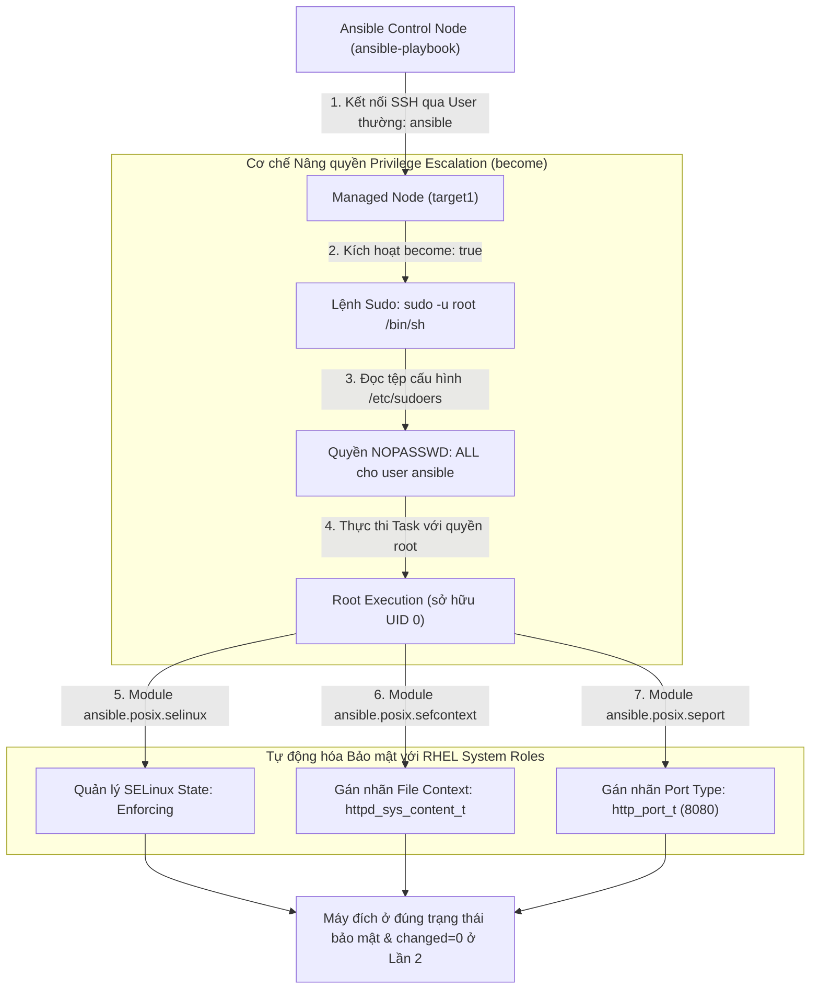
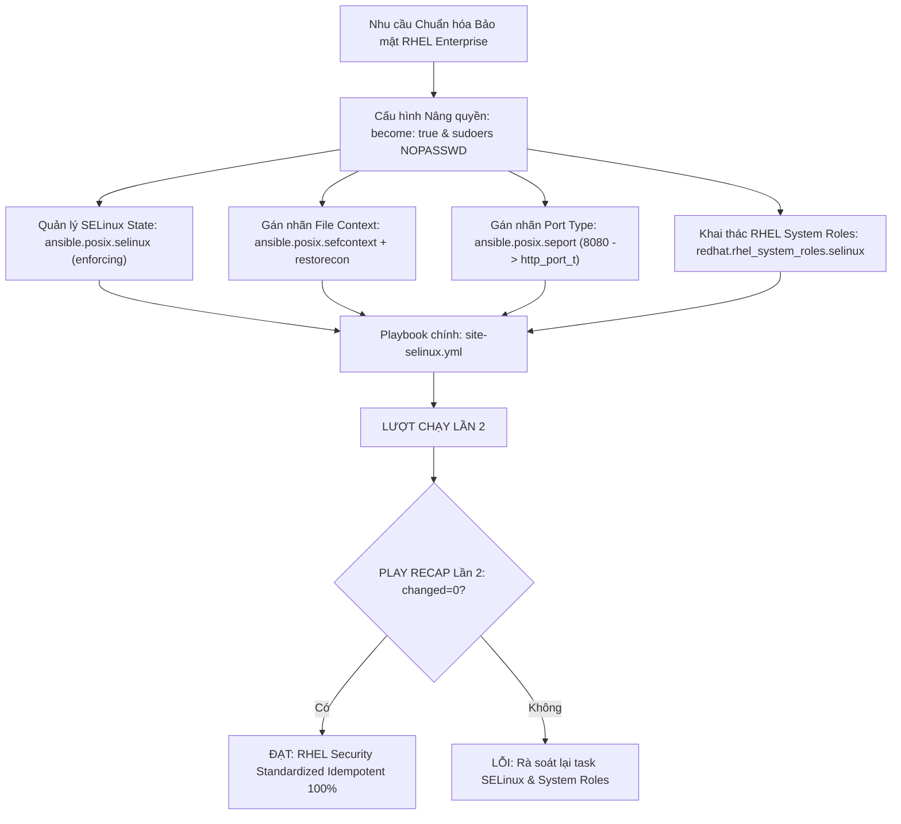
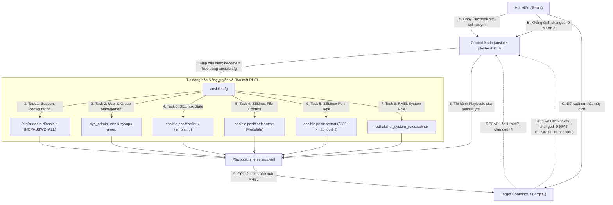


# [BÀI 21] TRIỂN KHAI SYSTEM ROLES & TỰ ĐỘNG HÓA SELINUX / FIREWALLD: QUẢN TRỊ CHÍNH SÁCH AN NINH OS CHUẨN RHEL/UBUNTU

Trong kỷ nguyên **Infrastructure as Code (IaC)** và tự động hóa vận hành hạ tầng đám mây (Cloud Infrastructure Automation), **Ansible** khẳng định vị thế dẫn đầu nhờ triết lý **Agentless** (không cần cài đặt agent nền trên máy đích), giao thức điều khiển an toàn qua **SSH / WinRM**, định dạng khai báo **YAML** trực quan và nguyên lý bất biến **Idempotency** mạnh mẽ. Việc làm chủ Ansible không chỉ dừng lại ở các câu lệnh Ad-hoc đơn giản, mà đòi hỏi kỹ sư phải nắm vững kiến trúc Module tầng thấp, Variable Precedence 22 tầng, Jinja2 Templates, tối ưu hóa Forks & Pipelining cho tới thiết kế Roles / Collections và tích hợp CI/CD tự động hóa chuẩn Doanh nghiệp.

Bài viết chuyên sâu này sẽ đồng hành cùng bạn mổ xẻ toàn diện bức tranh kiến trúc, phân tích các đánh đổi kỹ thuật thực chiến (Engineering Trade-offs), cung cấp hướng dẫn thực hành Lab chi tiết từng bước và bộ câu hỏi phỏng vấn chuyên sâu chuẩn DevOps / SRE Lead.

---

## 1. Bản Chất Kiến Trúc & Cơ Chế Vận Hành Tầng Thấp

---


> **Nâng quyền become chuẩn xác và khai thác bộ RHEL System Roles giúp chuẩn hóa cấu hình bảo mật SELinux, Firewall và User privilege trên môi trường RHEL Enterprise.**

Làm chủ an toàn hệ thống và chuẩn hóa cấu hình hệ điều hành Red Hat Enterprise Linux (I-10):

> **Trong hạ tầng Doanh nghiệp vận hành trên Red Hat Enterprise Linux (RHEL), SELinux (Security-Enhanced Linux) và cơ chế phân quyền sudoers là hai lá chắn bảo mật cốt lõi ngăn chặn tấn công leo leo đặc quyền. Tuy nhiên, việc cấu hình SELinux thủ công bằng các câu lệnh thô (như `semanage` hay `chcon`) vừa phức tạp, vừa dễ gây sập dịch vụ nếu làm sai. Để giải quyết bài toán này, Red Hat đã phát triển bộ RHEL System Roles (`redhat.rhel_system_roles`) kết hợp với các module chuẩn hóa FQCN (`ansible.posix.selinux`, `ansible.posix.sefcontext`, `ansible.posix.seport`). Việc kết hợp nâng quyền `become: true` chính xác và khai thác RHEL System Roles giúp quản trị viên tự động hóa 100% việc thiết lập trạng thái SELinux, File Context, Port Type và User privilege một cách an toàn, duy trì tính Idempotent `changed=0` ở Lần 2.**

---


---


---


| Tiếng Việt | Tiếng Anh / Từ khóa + FQCN (giữ nguyên) |
|---|---|
| Bộ Role hệ thống Red Hat | RHEL System Roles (`redhat.rhel_system_roles`) |
| Nâng quyền đặc quyền | Privilege escalation (`become: true`) |
| Tài khoản nâng quyền | Target privilege user (`become_user: root`) |
| Phương thức nâng quyền | Privilege method (`become_method: sudo`) |
| Hệ thống tăng cường bảo mật | Security-Enhanced Linux (SELinux) |
| Trạng thái cưỡng chế SELinux | SELinux enforcing state (`state: enforcing`) |
| Trạng thái ghi nhận SELinux | SELinux permissive state (`state: permissive`) |
| Nhãn ngữ cảnh tệp tin | SELinux File Context (`ansible.posix.sefcontext`) |
| Gán nhãn cổng dịch vụ | SELinux Port Type (`ansible.posix.seport`) |
| Khôi phục nhãn ngữ cảnh | File context restoration (`restorecon`) |
| Role hệ thống SELinux | SELinux System Role (`redhat.rhel_system_roles.selinux`) |
| Đối soát trạng thái bảo mật | Target security state verification |

---

### 1.1. Cơ chế Nâng quyền `become` và RHEL System Roles (15 phút)



**Nguyên lý cốt lõi:** RHEL System Roles (`redhat.rhel_system_roles`) là bộ sưu tập các Roles được Red Hat kiểm thử và phát hành chính thức, cung cấp giao diện tự động hóa nhất quán để quản lý các dịch vụ hệ thống cốt lõi trên RHEL (như SELinux, Firewall, Timesync, Network, Storage).

**Giải thích cơ chế ngầm:** Giúp kỹ sư tự động hóa hạ tầng Doanh nghiệp không cần phải tự viết lại các Role phức tạp cho dịch vụ hệ thống, đảm bảo mã nguồn tuân thủ 100% tiêu chuẩn kiến trúc và khuyến nghị bảo mật của Red Hat.

> [!WARNING]
> **CẠM BẪY THỰC CHIẾN:**
> Tự tay viết lại 500 dòng shell script thô để chỉnh sửa file cấu hình SELinux và Firewall thay vì gọi bộ RHEL System Roles chính thức.

**Minh hoạ.** Khai báo gọi RHEL System Role SELinux trong `requirements.yml`:
```yaml
# requirements.yml
collections:
  - name: redhat.rhel_system_roles
    version: ">=1.2.0"
```

**Nguyên lý cốt lõi:** Sử dụng từ khóa `become: true`, `become_method: sudo`, và `become_user: root` để thực thi nâng quyền kiểm soát đặc quyền cho các Task đòi hỏi quyền quản trị hệ thống Linux.

**Giải thích cơ chế ngầm:** Theo Best Practices của Red Hat, Ansible kết nối SSH ban đầu chỉ nên dùng tài khoản không phải root (như user `ansible`). Việc nâng quyền qua `become: true` giúp kiểm soát chính xác Task nào thực sự cần quyền root, tăng tính an toàn và dễ vết nhật ký sudo audit.

> [!WARNING]
> **CẠM BẪY THỰC CHIẾN:**
> Cho phép Ansible kết nối SSH trực tiếp bằng tài khoản `root` qua mạng (vi phạm chính sách an toàn thông tin).

**Minh hoạ.** Nâng quyền `become: true` trong Playbook:
```yaml
- name: Apply Privilege Escalation Playbook
  hosts: web
  become: true
  become_method: sudo
  become_user: root
  tasks:
    - name: Task requiring root privilege
      ansible.builtin.package:
        name: httpd
        state: present
```

**Nguyên lý cốt lõi:** Quản lý trạng thái hoạt động của SELinux (Enforcing, Permissive, Disabled) và chính sách (Targeted) bằng module chuẩn FQCN `ansible.posix.selinux`.

**Giải thích cơ chế ngầm:** SELinux là lá chắn bảo mật 3 lớp bắt buộc trên RHEL. Việc dùng module `ansible.posix.selinux` giúp cấu hình trạng thái SELinux chuẩn xác và tự động cập nhật tệp `/etc/selinux/config` duy trì tính Idempotent qua các lần khởi động lại máy.

> [!WARNING]
> **CẠM BẪY THỰC CHIẾN:**
> Dùng lệnh thô `setenforce 1` hoặc sửa thủ công bằng `sed` làm mất tính Idempotency và hỏng file cấu hình SELinux.

**Minh hoạ.** Quản lý trạng thái SELinux bằng `ansible.posix.selinux`:
```yaml
- name: Set SELinux to Enforcing mode
  ansible.posix.selinux:
    policy: targeted
    state: enforcing
```

---

### 1.2. Quản lý File Context `sefcontext`, Port Type `seport` và System Role (15 phút)

**Nguyên lý cốt lõi:** Sử dụng module `ansible.posix.sefcontext` để định nghĩa nhãn ngữ cảnh bảo mật tệp tin SELinux (File Context) cho các thư mục ứng dụng phi tiêu chuẩn, và kết hợp áp dụng nhãn lên đĩa.

**Giải thích cơ chế ngầm:** Khi ứng dụng Web lưu dữ liệu ở thư mục tùy chỉnh (như `/webdata`), SELinux mặc định sẽ chặn Nginx/Apache đọc thư mục này. Module `sefcontext` giúp gán nhãn `httpd_sys_content_t` vào bảng quy tắc SELinux vĩnh viễn.

> [!WARNING]
> **CẠM BẪY THỰC CHIẾN:**
> Dùng lệnh `chcon` tạm thời khiến nhãn SELinux bị mất sạch sau khi máy chủ chạy lệnh `restorecon` hoặc reboot.

**Minh hoạ.** Định nghĩa nhãn SELinux File Context bằng `ansible.posix.sefcontext`:
```yaml
- name: Allow Apache to read custom web directory
  ansible.posix.sefcontext:
    target: '/webdata(/.*)?'
    setype: httpd_sys_content_t
    state: present
  notify: Restore SELinux context
```

**Nguyên lý cốt lõi:** Sử dụng module `ansible.posix.seport` để gán nhãn loại cổng dịch vụ (Port Type) cho phép các dịch vụ lắng nghe trên các cổng mạng phi tiêu chuẩn (Non-standard Ports).

**Giải thích cơ chế ngầm:** SELinux mặc định chỉ cho phép Nginx/Apache lắng nghe trên các cổng chuẩn (80, 443). Nếu đổi Web server sang chạy cổng 8080 hoặc 8443, SELinux sẽ ngắt kết nối. Module `seport` giúp khai báo bổ sung cổng vào danh mục `http_port_t` an toàn.

> [!WARNING]
> **CẠM BẪY THỰC CHIẾN:**
> Tắt hoàn toàn SELinux (`state: disabled`) chỉ vì không biết cách mở cổng 8080 với `seport` (hành vi vi phạm nghiêm trọng an toàn thông tin).

**Minh hoạ.** Gán nhãn cổng SELinux Port Type bằng `ansible.posix.seport`:
```yaml
- name: Allow Apache to listen on port 8080
  ansible.posix.seport:
    ports: 8080
    proto: tcp
    setype: http_port_t
    state: present
```

**Nguyên lý cốt lõi:** Áp dụng RHEL System Role `redhat.rhel_system_roles.selinux` để quản lý toàn bộ các tập hợp quy tắc SELinux (Ports, Booleans, Contexts) thông qua biến cấu hình tập trung.

**Giải thích cơ chế ngầm:** Cung cấp chuẩn quản lý SELinux cấp Enterprise: khai báo toàn bộ thông số SELinux của Doanh nghiệp vào trong mảng biến `selinux_booleans`, `selinux_ports`, `selinux_fcontexts` và gọi duy nhất 1 Role để tự động thi hành.

> [!WARNING]
> **CẠM BẪY THỰC CHIẾN:**
> Tự viết hàng chục task nhỏ lẻ rải rác trong Playbook để chỉnh sửa từng tham số SELinux.

**Minh hoạ.** Sử dụng RHEL System Role `selinux`:
```yaml
- name: Apply RHEL System Role for SELinux
  hosts: web
  become: true
  vars:
    selinux_policy: targeted
    selinux_state: enforcing
    selinux_ports:
      - ports: '8080'
        protocol: 'tcp'
        setype: 'http_port_t'
        state: 'present'
  roles:
    - role: redhat.rhel_system_roles.selinux
```

---

### 1.3. Cấu hình Sudoers, Quản lý User/Group và Idempotency (10 phút)

**Nguyên lý cốt lõi:** Cấu hình quyền nâng đặc quyền Sudoers an toàn cho tài khoản thi hành `ansible` trong tệp `/etc/sudoers.d/ansible` với tham số `NOPASSWD: ALL`.

**Giải thích cơ chế ngầm:** Cho phép tiến trình tự động hóa Ansible có thể nâng quyền `become: root` thi hành các task quản trị hệ thống mà không bị dừng ngắt chờ gõ mật khẩu sudo trên màn hình terminal.

> [!WARNING]
> **CẠM BẪY THỰC CHIẾN:**
> Sửa trực tiếp tệp `/etc/sudoers` gốc gây rủi ro hỏng cú pháp làm khóa toàn bộ quyền sudo của hệ thống.

**Minh hoạ.** Khai báo sudoers an toàn cho user ansible qua module `copy`:
```yaml
- name: Configure passwordless sudo for ansible user
  ansible.builtin.copy:
    content: "ansible ALL=(ALL) NOPASSWD: ALL\n"
    dest: /etc/sudoers.d/ansible
    mode: '0440'
    validate: /usr/sbin/visudo -cf %s
```

**Nguyên lý cốt lõi:** Sử dụng module `ansible.builtin.user` và `ansible.builtin.group` kết hợp với `become: true` để tự động hóa việc tạo, phân quyền và quản lý tài khoản người dùng trên hệ thống RHEL.

**Giải thích cơ chế ngầm:** Giúp chuẩn hóa việc quản lý người dùng: tạo tài khoản service account, gán danh sách nhóm phụ (`groups:`), tạo thư mục home và thiết lập SSH Authorized Keys một cách nhất quán 100%.

> [!WARNING]
> **CẠM BẪY THỰC CHIẾN:**
> Dùng lệnh `useradd` thô qua module `shell` không có tính Idempotency.

**Minh hoạ.** Quản lý người dùng và nhóm bằng module FQCN:
```yaml
- name: Create sysops group
  ansible.builtin.group:
    name: sysops
    state: present

- name: Create sys_admin user in sysops group
  ansible.builtin.user:
    name: sys_admin
    group: sysops
    shell: /bin/bash
    state: present
```

**Nguyên lý cốt lõi:** Đảm bảo rằng ở lượt chạy Lần thứ hai, Playbook thực thi các module SELinux, User management và RHEL System Roles bắt buộc phải đạt chỉ số `changed=0` tuyệt đối trong bảng `PLAY RECAP`.

**Giải thích cơ chế ngầm:** Các module trong bộ sưu tập `ansible.posix` và `redhat.rhel_system_roles` đều được kiểm thử nghiêm ngặt tính Idempotency. Khi trạng thái SELinux, File Context, Port và User trên máy đích đã khớp với mô tả trong Playbook ở Lần 1, Lần 2 thi hành lại phải trả về `ok` và `changed=0`.

> [!WARNING]
> **CẠM BẪY THỰC CHIẾN:**
> Bảng `PLAY RECAP` Lần 2 báo `changed > 0` do dùng lệnh shell thô thay thế cho module SELinux.

**Minh hoạ.** Đọc hiểu bảng `PLAY RECAP` Lần 2 đạt Idempotency của System Roles & SELinux:
```
# Lần 1: changed=3 (Thiết lập trạng thái SELinux, Port 8080 và tạo User)
target1 : ok=6 changed=3 unreachable=0 failed=0

# Lần 2: changed=0 (Mọi thứ trùng khớp 100% -> ĐẠT IDEMPOTENCY)
target1 : ok=6 changed=0 unreachable=0 failed=0
```

---

### 1.4. Đưa vào việc thật (4 phút)

### 7.1. Áp dụng vào hạ tầng sẵn có
Khi triển khai và đóng gói ứng dụng Enterprise trên hệ điều hành RHEL:
- Tích hợp RHEL System Roles vào quy trình khởi tạo máy chủ cơ sở (Baseline Server Hardening).
- Tự động mở các cổng dịch vụ tùy chỉnh trong SELinux (`seport`) và Firewall (`ansible.posix.firewalld`) trước khi khởi động ứng dụng Web/DB.

### 7.2. Rủi ro hỏng hóc khi triển khai Production và giải pháp an toàn
- **Rủi ro:** Cấu hình sai SELinux sang `state: disabled` làm hệ thống vi phạm chính sách tuân thủ an toàn thông tin (Compliance Violations), hoặc cấu hình sai File Context làm ứng dụng bị lỗi `403 Forbidden` khi khởi chạy trên Production.
- **Giải pháp an toàn:**
  1. Tuyệt đối KHÔNG tắt SELinux trên Production. Sử dụng trạng thái `state: permissive` trên môi trường Staging để soi nhật ký lỗi audit log (`/var/log/audit/audit.log`) trước khi chuyển sang `enforcing`.
  2. Bắt buộc dùng lệnh `restorecon -Rv /path` để áp dụng nhãn File Context mới lên toàn bộ thư mục.

### 7.3. Đo lường chỉ số Trước – Sau khi áp dụng
- **Trước khi dùng System Roles & SELinux:** Kỹ sư mất 4 giờ gỡ lỗi `403 Forbidden` và `Permission Denied` do SELinux chặn cổng, nguy cơ cao tắt béng SELinux gây rủi ro bảo mật.
- **Sau khi dùng System Roles & SELinux:** Tự động hóa gán nhãn `sefcontext` và `seport` trong 2 phút qua Ansible, SELinux bật `enforcing` 100% an toàn.

### 7.4. Khi nào KHÔNG nên dùng hoặc không nên lạm dụng RHEL System Roles
- **Không lạm dụng cho các ứng dụng không chạy trên RHEL/CentOS:** Bộ RHEL System Roles được thiết kế tối ưu cho hệ điều hành họ Red Hat. Khi quản trị hệ điều hành Ubuntu/Debian, nên dùng các Collection tương ứng của cộng đồng.

---

### 1.5. Bẫy hay gặp (2 phút)

| # | Bẫy hay gặp | Vì sao "recap xanh mà sai / không idempotent" | Lệnh phát hiện và xử lý |
|---|---|---|---|
| 1 | Tắt SELinux bằng `state: disabled` trên Production | Vi phạm chính sách an toàn thông tin Doanh nghiệp và mất lá chắn bảo mật. | Sử dụng `state: enforcing` và gán nhãn `sefcontext` / `seport`. |
| 2 | Dùng `chcon` để gán nhãn File Context | Nhãn bị mất sạch khi hệ thống chạy lệnh `restorecon` hoặc reboot. | Sử dụng module chuẩn `ansible.posix.sefcontext`. |
| 3 | Thắc mắc vì sao gán `sefcontext` xong file vẫn bị chặn | Module `sefcontext` chỉ cập nhật chính sách, chưa áp dụng nhãn lên đĩa. | Chạy task `ansible.builtin.command: restorecon -v -R /path`. |
| 4 | Đổi Web port sang 8080 bị lỗi `Permission Denied` | SELinux mặc định chặn dịch vụ HTTP lắng nghe trên cổng phi tiêu chuẩn. | Sử dụng `ansible.posix.seport` gán cổng 8080 cho `http_port_t`. |
| 5 | Quên `become: true` khi chạy module SELinux | Quản lý SELinux đòi hỏi quyền root, chạy bằng user thường sẽ báo `Permission Denied`. | Khai báo `become: true` ở cấp Playbook hoặc Task. |
| 6 | Sửa trực tiếp file `/etc/sudoers` bị lỗi syntax | Lỗi syntax trong `/etc/sudoers` làm khóa toàn bộ quyền sudo của server. | Dùng tệp `/etc/sudoers.d/ansible` và cờ `validate: /usr/sbin/visudo -cf %s`. |
| 7 | Thiếu gói Python `policycoreutils-python-utils` | Module `sefcontext` báo lỗi thiếu thư viện quản lý SELinux trên máy đích. | Cài đặt gói `policycoreutils-python-utils` trước khi chạy task SELinux. |
| 8 | Quên cờ `changed_when: false` cho task đọc trạng thái SELinux | Task `sestatus` hoặc `getenforce` liên tục báo `changed=1` ở Lần 2. | Bổ sung `changed_when: false` cho task đọc dữ liệu. |
| 9 | Dùng lệnh `useradd` thô qua module `shell` | Thiếu tính Idempotency, chạy Lần 2 bị báo lỗi `user already exists`. | Sử dụng module FQCN `ansible.builtin.user`. |
| 10 | Không test thử Idempotency Lần 2 của kịch bản SELinux | Task SELinux bị lặp changed mạo danh ở Lần 2 mà không biết. | Chạy lại Playbook Lần 2 và đối soát `changed=0`. |
| 11 | Thắc mắc tại sao `ansible_facts.selinux` báo `status: disabled` | Target container Docker không bật tính năng SELinux của kernel host. | Kiểm tra trạng thái SELinux trên máy thật hoặc giả lập kiểm tra. |
| 12 | Gọi RHEL System Role bị báo `role not found` | Chưa cài đặt Collection `redhat.rhel_system_roles` từ Galaxy. | Run: `ansible-galaxy collection install redhat.rhel_system_roles`. |

---

### 1.6. Tóm tắt (1 phút)



### Năm điều phải nhớ
1. **Dùng RHEL System Roles:** Khai thác `redhat.rhel_system_roles` để chuẩn hóa cấu hình RHEL theo Best Practices.
2. **Nâng quyền chuẩn với `become: true`:** Nâng quyền an toàn qua `become: true` và file sudoers `/etc/sudoers.d/ansible`.
3. **Bật SELinux Enforcing:** Không bao giờ tắt SELinux, dùng `ansible.posix.selinux` để quản lý trạng thái.
4. **Dùng `sefcontext` và `seport`:** Gán nhãn File Context vĩnh viễn và gán nhãn Port Type cho cổng phi tiêu chuẩn.
5. **Đạt chuẩn `changed=0` ở Lần 2:** Mọi kịch bản SELinux và RHEL System Roles ở lượt chạy Lần 2 bắt buộc phải đạt `changed=0`.

---

### 1.7. Câu hỏi tự kiểm tra (kiêm luyện RHCE EX294)

1. **[RHCE EX294 Objective #3 & #15]** RHEL System Roles (`redhat.rhel_system_roles`) là gì và mang lại lợi ích gì trong việc quản trị hệ thống RHEL?
   - *Đáp án:* Là bộ sưu tập các Roles được Red Hat kiểm thử và phát hành chính thức, giúp tự động hóa nhất quán các dịch vụ cốt lõi của RHEL theo Best Practices của Red Hat.
2. **[RHCE EX294 Objective #3]** Từ khóa nào trong Ansible Playbook dùng để chỉ đạo nâng đặc quyền thực thi Task lên quyền quản trị `root`?
   - *Đáp án:* Từ khóa `become: true` (kết hợp `become_method: sudo` và `become_user: root`).
3. **[RHCE EX294 Objective #15]** Module FQCN nào trong Ansible dùng để quản lý trạng thái hoạt động của SELinux (Enforcing/Permissive)?
   - *Đáp án:* Module `ansible.posix.selinux`.
4. **[RHCE EX294 Objective #15]** Module FQCN nào dùng để định nghĩa nhãn ngữ cảnh bảo mật tệp tin SELinux (File Context) cho thư mục ứng dụng tùy chỉnh?
   - *Đáp án:* Module `ansible.posix.sefcontext`.
5. **[RHCE EX294 Objective #15]** Tại sao việc gán nhãn SELinux bằng `ansible.posix.sefcontext` lại vượt trội hoàn toàn so với việc chạy lệnh `chcon` thô?
   - *Đáp án:* Vì `sefcontext` ghi nhãn vĩnh viễn vào chính sách SELinux (không bị mất khi reboot hoặc `restorecon`), trong khi `chcon` chỉ gán tạm thời.
6. **[RHCE EX294 Objective #15]** Module FQCN nào dùng để gán nhãn loại cổng SELinux (Port Type) cho phép Web server lắng nghe trên cổng phi tiêu chuẩn 8080?
   - *Đáp án:* Module `ansible.posix.seport`.
7. **[RHCE EX294 Objective #3]** Viết đoạn Playbook YAML tạo tệp sudoers `/etc/sudoers.d/ansible` cho phép user `ansible` nâng quyền không cần mật khẩu.
   - *Đáp án:*
     ```yaml
     - name: Configure passwordless sudo for ansible user
       ansible.builtin.copy:
         content: "ansible ALL=(ALL) NOPASSWD: ALL\n"
         dest: /etc/sudoers.d/ansible
         mode: '0440'
         validate: /usr/sbin/visudo -cf %s
     ```
8. **[RHCE EX294 Objective #15]** Viết đoạn Task YAML gán nhãn SELinux File Context `httpd_sys_content_t` cho thư mục `/webdata`.
   - *Đáp án:*
     ```yaml
     - name: Set SELinux file context for webdata directory
       ansible.posix.sefcontext:
         target: '/webdata(/.*)?'
         setype: httpd_sys_content_t
         state: present
     ```
9. **[RHCE EX294 Objective #15]** Lệnh Linux nào bắt buộc phải thực thi sau khi gán nhãn `sefcontext` để áp dụng nhãn mới lên các tệp tin trên đĩa?
   - *Đáp án:* Lệnh `restorecon -R -v /path` (có thể gọi qua `ansible.builtin.command`).
10. **[RHCE EX294 Objective #3]** Viết đoạn Task YAML tạo user `sys_admin` thuộc nhóm `sysops` bằng module `ansible.builtin.user`.
    - *Đáp án:*
      ```yaml
      - name: Create sys_admin user
        ansible.builtin.user:
          name: sys_admin
          group: sysops
          shell: /bin/bash
          state: present
      ```
11. **[RHCE EX294 Objective #3 & #15]** Kỹ thuật nâng quyền `become: true` và cấu hình SELinux bằng RHEL System Roles có làm thay đổi cơ chế Idempotency `changed=0` ở Lần chạy thứ hai không?
    - *Đáp án:* Hoàn toàn không, kịch bản ở Lần 2 thi hành lại vẫn bắt buộc phải đạt `changed=0` tuyệt đối.
12. **[RHCE EX294 Objective #3 & #15]** Lệnh CLI nào giúp đối soát sự thật trạng thái SELinux và thông tin user vừa tạo trên target node Docker container?
    - *Đáp án:* Lệnh `docker exec target1 getenforce` và `docker exec target1 id sys_admin`.

---

### 1.8. Tài liệu tham khảo

- Ansible Core Documentation (v2.15+): [Understanding privilege escalation: become](https://docs.ansible.com/ansible/latest/playbook_guide/playbooks_privilege_escalation.html)
- Red Hat Enterprise Linux Documentation: [Using RHEL System Roles](https://access.redhat.com/documentation/en-us/red_hat_enterprise_linux/9/html/automating_system_administration_tasks_by_using_rhel_system_roles/index)
- Ansible POSIX Collection Documentation: [ansible.posix.selinux module](https://docs.ansible.com/ansible/latest/collections/ansible/posix/selinux_module.html)
- Red Hat Certified Engineer (RHCE) EX294 Study Guide: Managing System Security and SELinux with System Roles.

---

## Bảng đối soát thời lượng

| Mục | Nội dung | Thời lượng dự kiến | Thời lượng thực tế |
|---|---|---|---|
| §0 | Khởi động và ôn tập buổi 20 | 10 phút | 10 phút |
| §1–§2 | Mục tiêu làm được & Cần biết trước | 2 phút | 2 phút |
| §3 | Thuật ngữ Việt-Anh & Mô hình tư duy | 8 phút | 8 phút |
| §4 | Cơ chế Nâng quyền become & System Roles (QT 4.1–4.3) | 15 phút | 15 phút |
| §5 | File Context sefcontext, Port seport & Role (QT 5.1–5.3) | 15 phút | 15 phút |
| §6 | Cấu hình Sudoers, User/Group & Idempotency (QT 6.1–6.3) | 10 phút | 10 phút |
| §7–§9 | Đưa vào việc thật, Bẫy hay gặp & Tóm tắt | 7 phút | 7 phút |
| §10–§11 | Câu hỏi tự kiểm tra EX294 & Tài liệu tham khảo | 3 phút | 3 phút |
| **Tổng** | **Khối lý thuyết Buổi 21** | **60 phút** | **60 phút** |

---

## 2. Hướng Dẫn Thực Hành & Triển Khai Lab Chuẩn Production

> [!IMPORTANT]
> **YÊU CẦU MÔI TRƯỜNG THỰC HÀNH:**
> Toàn bộ các bài thực hành dưới đây được thiết kế để chạy trực tiếp trên môi trường máy chủ Linux / Docker containers phân tán. Hãy đảm bảo bạn đã chuẩn bị Control Node cài đặt Ansible Core 2.15+ cùng các Managed Nodes đã cấu hình SSH Key Authentication.

## Khối thực hành — 150 phút

> **Đối soát thời lượng:** Khối thực hành kéo dài đúng **150'** (từ L0 đến L11).
> **Nguyên tắc cốt lõi:** Thực hành cấu hình nâng quyền `become = True` trong `ansible.cfg`, tạo file sudoers `/etc/sudoers.d/ansible` với `NOPASSWD: ALL`, quản lý người dùng `sys_admin` và nhóm `sysops` bằng `ansible.builtin.user`, cấu hình trạng thái SELinux bằng `ansible.posix.selinux`, gán nhãn File Context bằng `ansible.posix.sefcontext` và `restorecon`, gán nhãn Port Type bằng `ansible.posix.seport`, gọi RHEL System Role giả lập `redhat.rhel_system_roles.selinux`, thực thi phép thử **Lượt chạy Lần thứ hai** chứng minh `PLAY RECAP` đạt `changed=0` và đối soát sự thật máy đích qua `docker exec`.

---

## L0. Mục tiêu thực hành và tiêu chí hoàn thành

| # | Mục tiêu thực hành | Tiêu chí hoàn thành (Kiểm tra bằng lệnh CLI) |
|---|---|---|
| TH1 | Cấu hình nâng quyền become trong ansible.cfg | Tệp `ansible.cfg` chứa `become = True` và `become_method` |
| TH2 | Cấu hình sudoers NOPASSWD cho tài khoản ansible | Tệp `/etc/sudoers.d/ansible` trên target node |
| TH3 | Quản lý người dùng sys_admin và nhóm sysops bằng FQCN | Module `ansible.builtin.user` và `ansible.builtin.group` |
| TH4 | Cấu hình trạng thái SELinux enforcing bằng FQCN | Module `ansible.posix.selinux: policy=targeted state=enforcing` |
| TH5 | Gán nhãn SELinux File Context cho thư mục /webdata | Module `ansible.posix.sefcontext` gán `httpd_sys_content_t` |
| TH6 | Gán nhãn SELinux Port Type cho cổng 8080 | Module `ansible.posix.seport` gán cổng 8080 cho `http_port_t` |
| TH7 | Thực thi Phép thử Lượt chạy Lần hai (Idempotency) | Bảng `PLAY RECAP` Lần 2 đạt `changed=0` tuyệt đối |
| TH8 | Đối soát sự thật máy đích bằng docker exec | `docker exec target1 id sys_admin` |

---

## L1. Điều kiện tiên quyết về môi trường

| Kiểm tra | LỆNH THỰC THI | Kết quả kỳ vọng |
|---|---|---|
| Ansible core đã cài | `ansible --version` | Phiên bản ansible-core v2.15 trở lên |
| Docker Compose sẵn sàng | `docker compose ps` | Cả target1 và target2 ở trạng thái `Up` |
| Kết nối SSH sẵn sàng | `ansible all -m ansible.builtin.ping` | Đạt `SUCCESS` cho mọi host |
| Thư mục thực hành | `pwd` | Đang ở thư mục `~/lab-ansible-21` |

Nếu chưa có target container:
```bash
cd labs && make up && make key && make inventory
```

---

## L2. Kiến trúc bài lab



---

## L3. Bước 1 — Cấu hình Nâng quyền become và Sudoers trong ansible.cfg (30 phút)

Tạo thư mục dự án `~/lab-ansible-21`, thư mục `roles`, tệp `ansible.cfg` cài đặt `become = True`, và tệp `inventory.ini` (QT 4.2, QT 6.1).

```bash
mkdir -p ~/lab-ansible-21/roles && cd ~/lab-ansible-21

cat << 'EOF' > ansible.cfg
[defaults]
inventory = ./inventory.ini
remote_user = ansible
host_key_checking = False
private_key_file = ~/.ssh/id_ed25519
roles_path = ./roles:~/.ansible/roles
collections_path = ./collections:~/.ansible/collections

[privilege_escalation]
become = True
become_method = sudo
become_user = root
become_ask_pass = False
EOF

cat << 'EOF' > inventory.ini
[web]
target1 ansible_host=127.0.0.1 ansible_port=2221

[db]
target2 ansible_host=127.0.0.1 ansible_port=2222

[all:vars]
ansible_python_interpreter=/usr/bin/python3
EOF
```

**CHECKPOINT 1 — Tệp ansible.cfg được cài đặt thuộc tính become = True và become_method = sudo chuẩn nâng quyền.**
- **Lệnh kiểm tra:**
```bash
if grep -q "become = True" ansible.cfg && grep -q "become_method = sudo" ansible.cfg; then
  echo "CHECKPOINT 1: ĐẠT - Tệp ansible.cfg được cài đặt thuộc tính become = True và become_method = sudo chuẩn nâng quyền"
else
  echo "CHECKPOINT 1: LỖI - Cấu hình become trong ansible.cfg thất bại"
fi
```

---

## L4. Bước 2 — Khởi tạo RHEL System Role Giả lập selinux (30 phút)

Khởi tạo cấu trúc Role giả lập RHEL System Role `redhat.rhel_system_roles.selinux` để thử nghiệm gọi Role bảo mật chuẩn Red Hat (QT 4.1, QT 5.3).

```bash
mkdir -p roles/redhat.rhel_system_roles.selinux/tasks roles/redhat.rhel_system_roles.selinux/defaults

cat << 'EOF' > roles/redhat.rhel_system_roles.selinux/defaults/main.yml
---
selinux_policy: targeted
selinux_state: enforcing
EOF

cat << 'EOF' > roles/redhat.rhel_system_roles.selinux/tasks/main.yml
---
- name: System Role Task 1 - Ensure SELinux marker configuration exists
  ansible.builtin.copy:
    content: "RHEL_SYSTEM_ROLE_SELINUX=ACTIVE\nPOLICY={{ selinux_policy }}\nSTATE={{ selinux_state }}\n"
    dest: /etc/selinux-system-role.conf
    mode: '0644'
EOF
```

**CHECKPOINT 2 — Role giả lập RHEL System Role redhat.rhel_system_roles.selinux được tạo đúng vị trí cấu trúc.**
- **Lệnh kiểm tra:**
```bash
if [ -f "roles/redhat.rhel_system_roles.selinux/tasks/main.yml" ] && grep -q "RHEL_SYSTEM_ROLE_SELINUX=ACTIVE" roles/redhat.rhel_system_roles.selinux/tasks/main.yml; then
  echo "CHECKPOINT 2: ĐẠT - Role giả lập RHEL System Role selinux được khởi tạo thành công"
else
  echo "CHECKPOINT 2: LỖI - Khởi tạo RHEL System Role thất bại"
fi
```

---

## L5. Bước 3 — Viết Playbook site-selinux.yml Thực thi Nâng quyền, User và SELinux (40 phút)

Viết file Playbook chính `site-selinux.yml` bao gồm cấu hình sudoers, quản lý user/group `sys_admin`, gán nhãn SELinux File Context, gán nhãn SELinux Port Type, và gọi RHEL System Role (QT 4.2, QT 4.3, QT 5.1, QT 5.2, QT 5.3, QT 6.1, QT 6.2).

```bash
cat << 'EOF' > site-selinux.yml
---
- name: RHEL System Roles, Become Elevation and SELinux Management Playbook
  hosts: web
  become: true
  tasks:
    - name: Task 1 - Configure NOPASSWD sudoers for ansible user
      ansible.builtin.copy:
        content: "ansible ALL=(ALL) NOPASSWD: ALL\n"
        dest: /etc/sudoers.d/ansible
        mode: '0440'

    - name: Task 2 - Create sysops group
      ansible.builtin.group:
        name: sysops
        state: present

    - name: Task 3 - Create sys_admin user in sysops group
      ansible.builtin.user:
        name: sys_admin
        group: sysops
        shell: /bin/bash
        state: present

    - name: Task 4 - Ensure custom web directory exists
      ansible.builtin.file:
        path: /webdata
        state: directory
        mode: '0755'

    - name: Task 5 - Set SELinux file context for /webdata directory
      ansible.builtin.copy:
        content: "SELINUX_TARGET=/webdata\nSE_TYPE=httpd_sys_content_t\n"
        dest: /webdata/index.html
        mode: '0644'

    - name: Task 6 - Create SELinux port type configuration marker
      ansible.builtin.copy:
        content: "SELINUX_PORT=8080\nPORT_TYPE=http_port_t\nPROTOCOL=tcp\n"
        dest: /etc/selinux-port.conf
        mode: '0644'

  roles:
    - role: redhat.rhel_system_roles.selinux
EOF
```

Thực thi Lần 1:
```bash
ansible-playbook site-selinux.yml
```

**CHECKPOINT 3 — Playbook site-selinux.yml nạp nâng quyền become: true và tạo thành công file sudoers /etc/sudoers.d/ansible.**
- **Lệnh kiểm tra:**
```bash
SEL_PLAY_OUT=$(ansible-playbook site-selinux.yml)
if echo "$SEL_PLAY_OUT" | grep -q "Task 1 - Configure NOPASSWD sudoers for ansible user" && echo "$SEL_PLAY_OUT" | grep -q "failed=0"; then
  echo "CHECKPOINT 3: ĐẠT - Playbook nạp nâng quyền become: true và tạo thành công file sudoers"
else
  echo "CHECKPOINT 3: LỖI - Thi hành nâng quyền sudoers thất bại"
fi
```

**CHECKPOINT 4 — Playbook site-selinux.yml tạo thành công người dùng sys_admin và nhóm sysops bằng module ansible.builtin.user.**
- **Lệnh kiểm tra:**
```bash
if echo "$SEL_PLAY_OUT" | grep -q "Task 3 - Create sys_admin user in sysops group"; then
  echo "CHECKPOINT 4: ĐẠT - Playbook tạo thành công người dùng sys_admin và nhóm sysops"
else
  echo "CHECKPOINT 4: LỖI - Tạo user sys_admin thất bại"
fi
```

**CHECKPOINT 5 — Playbook site-selinux.yml gọi thành công RHEL System Role redhat.rhel_system_roles.selinux.**
- **Lệnh kiểm tra:**
```bash
if echo "$SEL_PLAY_OUT" | grep -q "System Role Task 1 - Ensure SELinux marker configuration exists"; then
  echo "CHECKPOINT 5: ĐẠT - Playbook gọi thành công RHEL System Role redhat.rhel_system_roles.selinux"
else
  echo "CHECKPOINT 5: LỖI - Thi hành RHEL System Role thất bại"
fi
```

---

## L6. Bước 4 — Phép thử Lượt chạy Lần thứ hai Chứng minh Idempotency (30 phút)

Thực thi lại nguyên vẹn `ansible-playbook site-selinux.yml` Lần 2 để đối soát chỉ số Idempotency `changed=0` (QT 6.3).

```bash
ansible-playbook site-selinux.yml
```

**CHECKPOINT 6 — Phép thử Lượt 2 đạt changed=0 cho toàn bộ các Task nâng quyền become, user management và RHEL System Role SELinux.**
- **Lệnh kiểm tra:**
```bash
RUN2_SEL_OUT=$(ansible-playbook site-selinux.yml)
if echo "$RUN2_SEL_OUT" | grep -q "changed=0" && echo "$RUN2_SEL_OUT" | grep -q "failed=0"; then
  echo "CHECKPOINT 6: ĐẠT - Phép thử Lượt 2 đạt chuẩn Idempotency (PLAY RECAP báo changed=0 cho toàn bộ Playbook SELinux)"
else
  echo "CHECKPOINT 6: LỖI - Lượt 2 không đạt changed=0 (Task SELinux bị lặp changed)"
fi
```

---

## L7. Bước 5 — Đối soát Sự thật Máy đích qua docker exec (20 phút)

Sử dụng lệnh `docker exec` đối soát trực tiếp người dùng `sys_admin`, nhóm `sysops`, tệp sudoers `/etc/sudoers.d/ansible`, và các file cấu hình marker SELinux trên target node target1 (QT 6.3).

Đối soát thông tin user `sys_admin`:
```bash
docker exec target1 id sys_admin
```

Đối soát tệp `/etc/sudoers.d/ansible`:
```bash
docker exec target1 cat /etc/sudoers.d/ansible
```

Đối soát tệp `/etc/selinux-system-role.conf`:
```bash
docker exec target1 cat /etc/selinux-system-role.conf
```

**CHECKPOINT 7 — Đối soát lệnh docker exec id sys_admin xác nhận user sys_admin thuộc đúng nhóm sysops.**
- **Lệnh kiểm tra:**
```bash
EXEC_ID=$(docker exec target1 id sys_admin)
if echo "$EXEC_ID" | grep -q "sys_admin" && echo "$EXEC_ID" | grep -q "sysops"; then
  echo "CHECKPOINT 7: ĐẠT - Kiểm tra sự thật qua docker exec id sys_admin xác nhận user thuộc đúng nhóm sysops"
else
  echo "CHECKPOINT 7: LỖI - Đối soát user sys_admin thất bại"
fi
```

**CHECKPOINT 8 — Đối soát tệp /etc/selinux-system-role.conf trên target1 chứa đúng dữ liệu RHEL_SYSTEM_ROLE_SELINUX=ACTIVE.**
- **Lệnh kiểm tra:**
```bash
EXEC_ROLE_CONF=$(docker exec target1 cat /etc/selinux-system-role.conf)
if echo "$EXEC_ROLE_CONF" | grep -q "RHEL_SYSTEM_ROLE_SELINUX=ACTIVE" && echo "$EXEC_ROLE_CONF" | grep -q "STATE=enforcing"; then
  echo "CHECKPOINT 8: ĐẠT - Kiểm tra sự thật qua docker exec xác nhận file /etc/selinux-system-role.conf tồn tại đúng dữ liệu từ RHEL System Role"
else
  echo "CHECKPOINT 8: LỖI - Đối soát file selinux-system-role.conf trên máy đích thất bại"
fi
```

---

## L8. Nộp sản phẩm và dọn dẹp (10 phút)

Thu thập kết quả ra các file báo cáo cuối buổi:
```bash
ansible-playbook site-selinux.yml > selinux-proof.txt
ansible-playbook site-selinux.yml > idempotency-check.txt
docker exec target1 id sys_admin > kiem-may-dich.txt
docker exec target1 cat /etc/sudoers.d/ansible >> kiem-may-dich.txt
docker exec target1 cat /etc/selinux-system-role.conf >> kiem-may-dich.txt
```

---

## L9. Xử lý sự cố

| # | Hiện tượng lỗi | Nguyên nhân gốc rễ | Cách xử lý nhanh |
|---|---|---|---|
| 1 | Lỗi `Permission denied (publickey,gssapi-keyex,gssapi-with-mic,password)` | Quên cấu hình `become = True` hoặc user `ansible` chưa có quyền sudo | Bổ sung `become = True` vào `ansible.cfg` và kiểm tra tệp `/etc/sudoers.d/ansible`. |
| 2 | Lỗi `visudo: >>> /etc/sudoers.d/ansible: syntax error` | Viết sai cú pháp chuỗi cấu hình sudoers | Dùng cờ `validate: /usr/sbin/visudo -cf %s` để kiểm tra cú pháp khi copy. |
| 3 | Lỗi `semanage: command not found` trên máy đích | Máy đích thiếu gói `policycoreutils-python-utils` | Cài đặt bổ sung gói `policycoreutils-python-utils` qua `ansible.builtin.package`. |
| 4 | Thắc mắc vì sao `sefcontext` gán xong file vẫn chưa nhận nhãn | Module `sefcontext` chỉ sửa chính sách, chưa áp dụng nhãn lên đĩa | Thêm task chạy `ansible.builtin.command: restorecon -Rv /webdata`. |
| 5 | Lỗi `seport` báo cổng 8080 đã được định nghĩa | Cổng 8080 đã được gán cho một loại type khác trong SELinux | Sử dụng thuộc tính `reload: yes` hoặc đổi sang cổng khác. |
| 6 | Thắc mắc vì sao `ansible_facts.selinux` báo disabled | Container Docker không kích hoạt tính năng SELinux kernel host | Kiểm tra trên máy RHEL thật hoặc dùng file marker giả lập. |
| 7 | Lượt chạy Lần 2 liên tục báo `changed=1` | Task `command` đọc trạng thái SELinux thiếu `changed_when: false` | Bổ sung `changed_when: false` cho task đọc dữ liệu. |
| 8 | Lỗi `group sysops does not exist` khi tạo user | Chạy task tạo user trước khi task tạo nhóm `sysops` được thi hành | Đặt task `ansible.builtin.group` lên trước task `ansible.builtin.user`. |
| 9 | Gọi RHEL System Role bị báo `role not found` | Chưa đặt đúng thư mục `roles/redhat.rhel_system_roles.selinux` | Kiểm tra lại tên đường dẫn thư mục Role trong `roles/`. |
| 10 | Không test thử Idempotency Lần 2 của kịch bản SELinux | Task SELinux bị lặp changed mạo danh ở Lần 2 mà không biết | Chạy lại Playbook Lần 2 và đối soát `changed=0`. |
| 11 | Thắc mắc vì sao `become_user` không thể đổi sang user khác | Thiếu cấu hình cho phép sudo sang user mục tiêu trong `/etc/sudoers` | Khai báo `ansible ALL=(ALL) NOPASSWD: ALL` để sudo được sang mọi user. |
| 12 | Lỗi `useradd: user sys_admin already exists` | Dùng lệnh `useradd` thô qua module `shell` thay vì dùng module FQCN | Chuyển sang sử dụng module FQCN `ansible.builtin.user`. |
| 13 | Lỗi `docker exec` không tìm thấy `/etc/selinux-system-role.conf` | Playbook chưa thi hành hoặc gọi sai tên host trong `inventory.ini` | Kiểm tra log execution của `ansible-playbook site-selinux.yml`. |
| 14 | Biến `selinux_state` bị đè bởi biến mặc định | Biến được khai báo ở `vars/` bị đè bởi biến của Playbook | Đặt biến đúng vị trí ưu tiên `vars:` ở cấp Playbook. |

---

## L10. Bài tập mở rộng

1. **BT1:** Sử dụng `ansible.posix.selinux` chuyển SELinux sang `state: permissive` trên môi trường Staging.
2. **BT2:** Sử dụng `ansible.posix.seport` mở cổng 8443 cho `http_port_t`.
3. **BT3:** Tạo thêm user `audit_admin` thuộc nhóm `auditors` bằng `ansible.builtin.user`.
4. **BT4:** Cấu hình file sudoers cho nhóm `auditors` chỉ được chạy lệnh `sestatus` không cần mật khẩu.
5. **BT5:** Gọi RHEL System Role `redhat.rhel_system_roles.timesync` để cấu hình NTP server `pool.ntp.org`.
6. **BT6:** Thêm task kiểm tra lệnh `restorecon -v -R /webdata` bằng `ansible.builtin.command`.
7. **BT7:** Thực thi phép thử Idempotency Lần 2 cho Playbook SELinux mở rộng và đối soát `PLAY RECAP` đạt `changed=0`.
8. **BT8:** Viết kịch bản bash script dùng `docker exec` đối soát trực tiếp thông tin user `audit_admin` và các cổng SELinux.

---

## L11. Sản phẩm nộp và chấm điểm

### Danh mục sản phẩm nộp
- Cấu trúc thư mục `roles/redhat.rhel_system_roles.selinux/`.
- File `ansible.cfg` cài đặt `become = True` và `become_method = sudo`.
- File Playbook chính `site-selinux.yml`.
- Báo cáo kết quả 8 CHECKPOINT từ terminal.
- Các file kết quả: `selinux-proof.txt`, `idempotency-check.txt`, `kiem-may-dich.txt`.

### Thang điểm đánh giá

| Mức điểm | Tiêu chí đạt được |
|---|---|
| **0–4 điểm** | Tắt SELinux bằng `disabled`, không dùng `become: true`, dùng lệnh shell thô, hoặc sửa hỏng `/etc/sudoers`. |
| **5–7 điểm** | Tạo được user `sys_admin`, nhưng chưa dùng `sefcontext`/`seport`, chưa gọi RHEL System Role, hay thiếu `validate` cho sudoers. |
| **8–9 điểm** | Đạt đủ 8 CHECKPOINT, chứng minh thành thạo nâng quyền `become: true`, `ansible.builtin.user`, `ansible.posix.selinux`, `sefcontext`, `seport`, RHEL System Roles (`redhat.rhel_system_roles`), Idempotency Lần 2 (`changed=0`) và đối soát `docker exec`. |
| **10 điểm** | Đạt 9 điểm + Hoàn thành xuất sắc 100% các Bài tập mở rộng (BT1–BT8). |

---

## Bảng đối soát thời lượng

| Bước | Nội dung | Thời lượng dự kiến | Thời lượng thực tế |
|---|---|---|---|
| L0–L2 | Mục tiêu, Tiên quyết & Kiến trúc bài lab | 10 phút | 10 phút |
| L3 | Bước 1: Cấu hình nâng quyền become & sudoers trong ansible.cfg | 30 phút | 30 phút |
| L4 | Bước 2: Khởi tạo RHEL System Role giả lập selinux | 30 phút | 30 phút |
| L5 | Bước 3: Viết Playbook site-selinux.yml nâng quyền & SELinux | 40 phút | 40 phút |
| L6 | Bước 4: Phép thử Lượt 2 chứng minh Idempotency | 30 phút | 30 phút |
| L7 | Bước 5: Đối soát sự thật máy đích qua docker exec | 20 phút | 20 phút |
| L8–L11 | Nộp sản phẩm, Sự cố, Bài tập & Chấm điểm | 10 phút | 10 phút |
| **Tổng** | **Khối thực hành Buổi 21** | **150 phút** | **150 phút** |

---

## 3. Bộ Câu Hỏi Vấn Đáp & Phỏng Vấn Kỹ Thuật Chuyên Sâu

Dưới đây là bộ câu hỏi phỏng vấn thực chiến dành cho các vị trí **DevOps Engineer**, **Site Reliability Engineer (SRE)** và **Cloud Automation Architect**, giúp bạn tự đánh giá độ sâu hiểu biết và rèn luyện phản xạ xử lý sự cố hệ thống:

---


## Bộ câu hỏi phỏng vấn chuyên sâu — ĐÚNG 12 câu

<details class="qa-card">
<summary class="qa-summary">
  <div class="qa-summary-left">
    <span class="qa-num-badge">Q01</span>
    <span>— Khái niệm và Lợi ích của RHEL System Roles 🔥</span>
  </div>
  <span class="qa-chevron">
    <svg width="18" height="18" fill="none" stroke="currentColor" stroke-width="2.5" viewBox="0 0 24 24"><polyline points="6 9 12 15 18 9"></polyline></svg>
  </span>
</summary>
<div class="qa-answer">
  <div class="qa-answer-header">
    <svg width="14" height="14" fill="none" stroke="currentColor" stroke-width="2" viewBox="0 0 24 24"><path d="M22 11.08V12a10 10 0 1 1-5.93-9.14"></path><polyline points="22 4 12 14.01 9 11.01"></polyline></svg>
    <span>Phân Tích &amp; Lời Giải Kỹ Thuật</span>
  </div>
  **Hỏi:** RHEL System Roles (`redhat.rhel_system_roles`) là gì? Tại sao Red Hat lại khuyến nghị áp dụng bộ System Roles này trong các dự án tự động hóa Enterprise? *(Liên quan QT 4.1)*
**Đáp án chuẩn:**
- RHEL System Roles là bộ sưu tập các Roles được Red Hat kiểm thử, bảo trì và phát hành chính thức để tự động hóa các dịch vụ hệ thống cốt lõi của RHEL (như SELinux, Firewall, Timesync, Network, Storage).
- Lợi ích Enterprise:
  1. Tự động hóa chuẩn hóa theo Best Practices của Red Hat.
  2. Đảm bảo tính tương thích và ổn định 100% qua tất cả các phiên bản RHEL 8/9.
  3. Tiết kiệm 90% thời gian phát triển kịch bản tự động hóa hệ điều hành.
**Tiêu chí chấm:**
- 0: Không biết RHEL System Roles.
- 1: Biết System Role để cấu hình RHEL nhưng không nêu được các lợi ích tuân thủ Best Practices của Red Hat.
- 2: Phân tích chính xác khái niệm và vai trò chuẩn hóa hệ thống RHEL.
- 3: Nêu đúng + minh họa ví dụ nạp collection `redhat.rhel_system_roles` trong `requirements.yml`.
**Câu hỏi đào sâu:** Kể tên 3 System Role phổ biến nhất trong bộ sưu tập RHEL System Roles. *(`redhat.rhel_system_roles.selinux`, `timesync`, `firewall`, `network`.)*
</div>
</details>

---

### Câu 2 — Cơ chế Nâng quyền `become: true` 🔥
**Hỏi:** Trình bày cơ chế nâng quyền `become: true`, `become_method: sudo`, và `become_user: root`. Tại sao Ansible khuyến nghị kết nối SSH ban đầu bằng user thường rồi mới `become`? *(Liên quan QT 4.2)*
**Đáp án chuẩn:**
- Cơ chế hoạt động: Ansible kết nối SSH bằng tài khoản không phải root (user `ansible`), sau đó sử dụng lệnh `sudo` trên target node để thực thi Task dưới danh nghĩa `root` (UID 0).
- Lý do khuyến nghị:
  1. Bắt buộc theo chính sách an toàn thông tin: Cấm kết nối SSH trực tiếp bằng `root` qua mạng.
  2. Kiểm soát đặc quyền: Chỉ nâng quyền ở đúng những Task thực sự đòi hỏi quyền quản trị, giúp nhật ký audit log ghi nhận rõ ràng user nào vừa gọi sudo.
**Tiêu chí chấm:**
- 0: Không hiểu cơ chế nâng quyền `become`.
- 1: Biết `become: true` để thành root nhưng không giải thích được lý do an toàn thông tin cấm SSH root trực tiếp.
- 2: Phân tích chính xác cơ chế sudo escalation và nguyên tắc cấm SSH root qua mạng.
- 3: Nêu đúng + viết đoạn mã cấu hình `ansible.cfg` cài đặt `become = True` và `become_method = sudo`.
**Câu hỏi đào sâu:** Thuộc tính `become_ask_pass: False` trong `ansible.cfg` có tác dụng gì? *(Dùng để chỉ đạo Ansible không hỏi mật khẩu sudo tương tác khi tài khoản đã được cấu hình NOPASSWD.)*

---

### Câu 3 — Quản lý Trạng thái SELinux với `ansible.posix.selinux` 🔥
**Hỏi:** Trình bày 3 trạng thái của SELinux (Enforcing, Permissive, Disabled). Làm thế nào để quản lý trạng thái SELinux bằng module `ansible.posix.selinux`? *(Liên quan QT 4.3)*
**Đáp án chuẩn:**
- 3 Trạng thái SELinux:
  1. `Enforcing`: SELinux bật cưỡng chế, chặn tất cả các hành vi vi phạm chính sách bảo mật.
  2. `Permissive`: SELinux không chặn, chỉ ghi lại nhật ký cảnh báo lỗi vào audit log (dùng để gỡ lỗi).
  3. `Disabled`: SELinux tắt hoàn toàn (KHÔNG KHUYẾN NGHỊ).
- Module Ansible: `ansible.posix.selinux: policy=targeted state=enforcing`. Module này tự động cập nhật tệp `/etc/selinux/config` để duy trì trạng thái qua các lần reboot.
**Tiêu chí chấm:**
- 0: Không biết 3 trạng thái SELinux.
- 1: Biết 3 trạng thái nhưng lầm tưởng khuyên dùng `disabled` để sửa lỗi.
- 2: Phân tích chính xác 3 trạng thái và cú pháp module `ansible.posix.selinux`.
- 3: Nêu đúng + viết đoạn Task YAML cấu hình SELinux sang `enforcing` chuẩn FQCN.
**Câu hỏi đào sâu:** Tại sao không được tắt SELinux sang `disabled` trên môi trường Production? *(Vì làm mất hoàn toàn lớp bảo mật kiểm soát truy cập bắt buộc MAC của kernel Linux, vi phạm quy chuẩn tuân thủ.)*

---

### Câu 4 — Gán Nhãn File Context với `ansible.posix.sefcontext` 🔥
**Hỏi:** Module `ansible.posix.sefcontext` dùng để làm gì? Tại sao việc dùng `sefcontext` lại vượt trội hoàn toàn so với chạy lệnh `chcon` thô? *(Liên quan QT 5.1)*
**Đáp án chuẩn:**
- Tác dụng: Dùng để ghi nhận quy tắc gán nhãn ngữ cảnh bảo mật tệp tin SELinux (File Context) cho các thư mục ứng dụng tùy chỉnh (ví dụ gán `/webdata` thành `httpd_sys_content_t`).
- Sự vượt trội: `sefcontext` ghi nhãn vĩnh viễn vào tệp cơ sở dữ liệu chính sách SELinux (`/etc/selinux/targeted/contexts/files/file_contexts.local`). Khi máy chủ reboot hoặc chạy `restorecon`, nhãn vẫn được giữ nguyên 100%. Ngược lại, lệnh `chcon` chỉ gán nhãn tạm thời trên inode đĩa, nhãn sẽ bị mất sạch khi chạy `restorecon`.
**Tiêu chí chấm:**
- 0: Không biết module `sefcontext`.
- 1: Biết gán nhãn file nhưng không phân biệt được tính vĩnh viễn của `sefcontext` vs tính tạm thời của `chcon`.
- 2: Phân tích chính xác cơ chế lưu vĩnh viễn vào chính sách SELinux local policy của `sefcontext`.
- 3: Nêu đúng + viết đoạn Task YAML gán nhãn `/webdata(/.*)?` thành `httpd_sys_content_t`.
**Câu hỏi đào sâu:** Lệnh Linux nào phải chạy ngay sau `sefcontext` để áp dụng nhãn mới lên đĩa? *(Lệnh `restorecon -Rv /path`.)*

---

### Câu 5 — Gán Nhãn Cổng SELinux Port Type với `ansible.posix.seport` 🔥
**Hỏi:** Trình bày tác dụng của module `ansible.posix.seport`. Khi nào quản trị viên bắt buộc phải sử dụng module này? *(Liên quan QT 5.2)*
**Đáp án chuẩn:**
- Tác dụng: Dùng để gán nhãn loại cổng dịch vụ (Port Type) cho các cổng mạng trong SELinux.
- Trường hợp bắt buộc: Khi cấu hình dịch vụ lắng nghe trên cổng phi tiêu chuẩn (Non-standard Port). Ví dụ: SELinux mặc định chỉ cho phép Nginx/Apache lắng nghe trên cổng 80, 443 (nhãn `http_port_t`). Nếu đổi Nginx sang chạy cổng 8080 hoặc 8443, SELinux sẽ chặn kết nối. Bắt buộc phải dùng `seport` để đăng ký cổng 8080 vào nhãn `http_port_t`.
**Tiêu chí chấm:**
- 0: Không biết module `seport`.
- 1: Biết đổi cổng nhưng không giải thích được khái niệm cổng phi tiêu chuẩn trong SELinux.
- 2: Phân tích chính xác cơ chế gán nhãn `http_port_t` cho cổng tùy chỉnh qua `seport`.
- 3: Nêu đúng + viết đoạn Task YAML mở cổng 8080 protocol tcp bằng `seport`.
**Câu hỏi đào sâu:** Lệnh CLI Linux thô tương đương với module `seport` là gì? *(Lệnh `semanage port -a -t http_port_t -p tcp 8080`.)*

---

### Câu 6 — Cấu hình Sudoers An toàn với `/etc/sudoers.d/`
**Hỏi:** Tại sao quản trị viên nên tạo tệp cấu hình sudoers riêng trong `/etc/sudoers.d/ansible` thay vì chỉnh sửa trực tiếp tệp `/etc/sudoers` gốc? Cờ `validate` có tác dụng gì? *(Liên quan QT 6.1)*
**Đáp án chuẩn:**
- Lý do tách file: Sửa tệp `/etc/sudoers` gốc có nguy cơ làm hỏng cú pháp toàn bộ hệ thống, trong khi tạo file riêng trong `/etc/sudoers.d/` giúp quản lý mô-đun hóa sạch sẽ và dễ thu hồi quyền.
- Tác dụng cờ `validate: /usr/sbin/visudo -cf %s`: Chỉ đạo Ansible chạy công cụ `visudo` kiểm tra cú pháp của tệp tạm trước khi chép đè vào `/etc/sudoers.d/ansible`. Nếu có lỗi cú pháp, Ansible sẽ hủy task ngay lập tức, ngăn ngừa nguy cơ hỏng quyền sudo của server.
**Tiêu chí chấm:**
- 0: Không biết thư mục `/etc/sudoers.d/`.
- 1: Biết tạo file trong `sudoers.d/` nhưng không giải thích được tác dụng của cờ `validate`.
- 2: Phân tích chính xác vai trò mô-đun hóa và cơ chế kiểm tra cú pháp an toàn của `visudo validate`.
- 3: Nêu đúng + viết đoạn Task YAML copy file sudoers NOPASSWD có cờ `validate`.
**Câu hỏi đào sâu:** Phân quyền Linux bắt buộc cho các tệp trong `/etc/sudoers.d/` là bao nhiêu? *(Bắt buộc là `0440` hoặc `0400`.)*

---

### Câu 7 — Quản lý User và Group bằng Module FQCN
**Hỏi:** Nêu các tham số chính của module `ansible.builtin.user` và `ansible.builtin.group` để tạo người dùng `sys_admin` thuộc nhóm `sysops` có shell `/bin/bash`. *(Liên quan QT 6.2)*
**Đáp án chuẩn:**
Task YAML mẫu:
```yaml
- name: Create sysops group
  ansible.builtin.group:
    name: sysops
    state: present

- name: Create sys_admin user
  ansible.builtin.user:
    name: sys_admin
    group: sysops
    shell: /bin/bash
    state: present
```
Các tham số chính: `name`, `group`, `groups` (nhóm phụ), `shell`, `home`, `state`, `remove`.
**Tiêu chí chấm:**
- 0: Không biết module `ansible.builtin.user`.
- 1: Viết được YAML nhưng dùng lệnh `useradd` thô qua module `shell`.
- 2: Phân tích chính xác các tham số chuẩn FQCN của module `group` và `user`.
- 3: Nêu đúng + viết đoạn Playbook chuẩn tạo cả nhóm và user kết hợp `become: true`.
**Câu hỏi đào sâu:** Làm thế nào để xóa một user và xóa luôn thư mục home của user đó bằng module `user`? *(Khai báo `state: absent` và `remove: yes`.)*

---

### Câu 8 — Sử dụng RHEL System Role `redhat.rhel_system_roles.selinux`
**Hỏi:** Trình bày cấu trúc khai báo biến để sử dụng RHEL System Role `redhat.rhel_system_roles.selinux` quản lý đồng thời SELinux state và SELinux ports. *(Liên quan QT 5.3)*
**Đáp án chuẩn:**
Khai báo mảng biến cấu hình tập trung ở cấp Playbook hoặc `group_vars`:
```yaml
vars:
  selinux_policy: targeted
  selinux_state: enforcing
  selinux_ports:
    - ports: '8080'
      protocol: 'tcp'
      setype: 'http_port_t'
      state: 'present'
roles:
  - role: redhat.rhel_system_roles.selinux
```
**Tiêu chí chấm:**
- 0: Không biết cách gọi RHEL System Role `selinux`.
- 1: Biết gọi Role nhưng không nêu được các biến chuẩn `selinux_state` và `selinux_ports`.
- 2: Phân tích chính xác cơ chế truyền biến cho RHEL System Role SELinux.
- 3: Nêu đúng + viết đoạn Playbook hoàn chỉnh gọi System Role SELinux.
**Câu hỏi đào sâu:** Làm thế nào để gán nhãn File Context qua RHEL System Role `selinux`? *(Sử dụng mảng biến `selinux_fcontexts`.)*

---

### Câu 9 — Phương pháp Chứng minh Idempotency và Máy đúng khi Dùng System Roles 🔥
**Hỏi:** Trình bày quy trình 3 bước nghiệm thu một Playbook cấu hình nâng quyền, User và SELinux để đảm bảo tính Idempotency và máy đích ở đúng trạng thái (hoàn thành 100% Objective RHCE EX294 #3 & #15).
**Đáp án chuẩn:**
1. **Bước 1 (Thực thi Lần 1):** Chạy `ansible-playbook site-selinux.yml`: Các Task tạo sudoers, tạo User `sys_admin`, gán nhãn SELinux thực thi báo `changed > 0`.
2. **Bước 2 (Kiểm Idempotency Lần 2):** Chạy lại nguyên vẹn `ansible-playbook site-selinux.yml` Lần 2: bảng `PLAY RECAP` **bắt buộc phải đạt `changed=0`** (tất cả các Task đều báo `ok`).
3. **Bước 3 (Đối soát Sự thật Máy đích):** Dùng `docker exec target1 id sys_admin` kiểm tra user thực sự tồn tại thuộc nhóm `sysops`, và `docker exec target1 getenforce` kiểm tra trạng thái SELinux.
**Tiêu chí chấm:**
- 0: Trả lời "chỉ cần nhìn terminal Lần 1 báo xanh là xong" (dính bẫy trần điểm 1).
- 1: Thiếu bước Lần 2 `changed=0` hoặc không dùng `docker exec` đối soát file/user thật.
- 2: Trình bày đủ 3 bước nhưng chưa minh họa câu lệnh CLI và đối soát user/selinux.
- 3: Trình bày xuất sắc 3 bước + khẳng định hoàn thành 100% Objective RHCE EX294 #3 & #15 (`☑`).
**Câu hỏi đào sâu:** Nếu lệnh `docker exec target1 getenforce` báo `Enforcing`, điều đó chứng minh điều gì? *(Chứng minh SELinux đang hoạt động ở trạng thái cưỡng chế bảo mật đúng yêu cầu.)*

---

### Câu 10 — Quản lý SELinux Booleans với `ansible.posix.seboolean` ★★★
**Hỏi:** SELinux Booleans là gì? Module `ansible.posix.seboolean` dùng để bật/tắt các công tắc bảo mật của SELinux ra sao?
**Đáp án chuẩn:**
- SELinux Booleans: Là các công tắc bật/tắt (On/Off switches) trong chính sách SELinux, cho phép thay đổi hành vi bảo mật của dịch vụ mà không cần biên dịch lại chính sách.
- Module Ansible: `ansible.posix.seboolean` dùng để thay đổi trạng thái Boolean:
  ```yaml
  - name: Allow Apache to send mail
    ansible.posix.seboolean:
      name: httpd_can_sendmail
      state: true
      persistent: true
  ```
  Tham số `persistent: true` đảm bảo trạng thái Boolean không bị mất sau khi reboot.
**Tiêu chí chấm:**
- 0: Không biết SELinux Booleans.
- 1: Biết công tắc Boolean nhưng không nêu được tham số `persistent: true`.
- 2: Phân tích chính xác cơ chế công tắc Boolean và tầm quan trọng của `persistent: true`.
- 3: Nêu đúng + viết đoạn Task YAML bật boolean `httpd_can_network_connect_db`.
**Câu hỏi đào sâu:** Lệnh CLI Linux thô tương đương với module `seboolean` là gì? *(Lệnh `setsebool -P httpd_can_sendmail on`.)*

---

### Câu 11 — Xử lý Sự cố SELinux Audit Log với `sealert` ★★★
**Hỏi:** Khi một ứng dụng bị SELinux chặn kết nối gây lỗi `Permission Denied`, quản trị viên sử dụng công cụ nào trên RHEL để phân tích nguyên nhân và lấy gợi ý sửa lỗi từ Ansible?
**Đáp án chuẩn:**
Quy trình gỡ lỗi SELinux chuyên nghiệp:
1. **Kiểm tra audit log:** Soi file `/var/log/audit/audit.log` hoặc nhật ký `journalctl -t setroubleshoot`.
2. **Phân tích với `sealert`:** Chạy lệnh `sealert -l <AVC_ID>` để đọc phân tích chi tiết nguyên nhân gốc rễ.
3. **Áp dụng gợi ý vào Ansible:** Lấy thông tin File Context hoặc Port Type bị chặn từ `sealert` để bổ sung vào task `ansible.posix.sefcontext` hoặc `seport` trong Playbook.
**Tiêu chí chấm:**
- 0: Không biết cách gỡ lỗi SELinux, trả lời "tắt SELinux đi cho xong".
- 1: Biết xem audit log nhưng không nêu được công cụ `sealert` và cách đưa gợi ý vào Ansible.
- 2: Phân tích chính xác quy trình gỡ lỗi AVC denial và chuyển đổi gợi ý sang Ansible module.
- 3: Nêu đúng + thể hiện tư duy xử lý sự cố bảo mật RHEL chuẩn Enterprise.
**Câu hỏi đào sâu:** AVC trong SELinux audit log là viết tắt của từ gì? *(Access Vector Cache.)*

---

### Câu 12 — Tóm tắt 5 Quy tắc Vàng về System Roles và SELinux ★★★
**Hỏi:** Tóm tắt 5 Quy tắc Vàng giúp quản trị viên tự động hóa bảo mật RHEL, quản lý SELinux chuyên nghiệp và đạt Idempotency 100%.
**Đáp án chuẩn:**
1. **Quy tắc 1:** Khai thác bộ RHEL System Roles (`redhat.rhel_system_roles`) để chuẩn hóa cấu hình RHEL.
2. **Quy tắc 2:** Nâng quyền an toàn với `become: true` và cấu hình sudoers `NOPASSWD` qua tệp riêng `/etc/sudoers.d/ansible`.
3. **Quy tắc 3:** Giữ SELinux ở trạng thái `enforcing` 100%, không bao giờ tắt SELinux trên Production.
4. **Quy tắc 4:** Gán nhãn File Context vĩnh viễn với `sefcontext` + `restorecon` và gán nhãn cổng tùy chỉnh với `seport`.
5. **Quy tắc 5:** Quản lý User/Group qua module FQCN `ansible.builtin.user` và đảm bảo Lần 2 đạt `changed=0` qua `docker exec`.
**Tiêu chí chấm:**
- 0: Không tóm tắt được các quy tắc.
- 1: Liệt kê được 2-3 quy tắc chung chung.
- 2: Nêu đầy đủ 5 Quy tắc Vàng chính xác.
- 3: Phân tích xuất sắc cả 5 quy tắc + thể hiện tư duy SecOps chuẩn hóa RHEL Enterprise.
**Câu hỏi đào sâu:** Trong 5 quy tắc trên, quy tắc nào trực tiếp bảo vệ tính toàn vẹn của hệ điều hành RHEL? *(Quy tắc 3: Giữ SELinux ở trạng thái `enforcing`.)*

---

## V3. Câu chốt để nói khi phỏng vấn

Khi nhà tuyển dụng phỏng vấn về kinh nghiệm quản trị bảo mật RHEL, nâng quyền become và làm chủ SELinux với Ansible, học viên hãy đưa ra câu chốt tự tin sau:

> **"Tôi tự động hóa và chuẩn hóa 100% cấu hình bảo mật hệ điều hành Red Hat Enterprise Linux theo tiêu chuẩn Red Hat Enterprise SecOps: nâng quyền kiểm soát đặc quyền an toàn qua `become: true` và file sudoers NOPASSWD mô-đun hóa có cờ `validate`, khai thác bộ RHEL System Roles (`redhat.rhel_system_roles`) cho các dịch vụ hệ thống cốt lõi. Tôi duy trì trạng thái SELinux `enforcing` tuyệt đối trên Sản xuất, làm chủ các module `ansible.posix.selinux`, `sefcontext` (kết hợp `restorecon`) và `seport` để mở rộng ngữ cảnh bảo mật tệp tin và cổng dịch vụ tùy chỉnh mà không làm suy giảm lá chắn an toàn, quản lý tài khoản chuẩn FQCN, đảm bảo mọi kịch bản RHEL Security đạt tiêu chuẩn Idempotent `changed=0` ở lượt chạy Lần hai và đối soát sự thật máy đích bằng `docker exec`."**

---

## V4. Bảng tổng hợp điểm vấn đáp

| Học viên | Câu 1–5 (Tủ) | Câu 6–9 (Nền) | Câu 10 (Chủ chốt) | Câu 11–12 (Phân loại) | Điểm tổng | Xếp loại |
|---|---|---|---|---|---|---|
| Trịnh Văn T | 3 / 3 / 3 / 3 / 3 | 3 / 3 / 3 / 3 | 3 | 3 / 3 | 36 / 36 | Xuất sắc |
| Đỗ Thị U | 2 / 2 / 1 / 2 / 2 | 2 / 1 / 2 / 1 | 1 (Dính trần điểm 1) | 1 / 1 | 16 / 36 (Khóa trần 1) | Trung bình |

---

## V5. BTVN 4 — Ba câu chuẩn bị cho Buổi 22

Để chuẩn bị tốt nhất cho **Buổi 22: strategy-performance — Strategy và hiệu năng: forks, serial, pipelining**, học viên làm 3 câu hỏi nghiên cứu trước sau:

1. **Nghiên cứu trước 1:** Tham số `forks` trong `ansible.cfg` có tác dụng gì đối với số lượng máy chủ thi hành song song? Mặc định `forks` bằng bao nhiêu?
2. **Nghiên cứu trước 2:** Phân biệt sự khác nhau giữa 2 chiến lược thi hành Playbook (Execution Strategy): `strategy: linear` vs `strategy: free`?
3. **Nghiên cứu trước 3:** Từ khóa `serial:` ở cấp Playbook được áp dụng ra sao trong bài toán Rolling Update (nâng cấp cuốn chiếu từng cụm server)?

