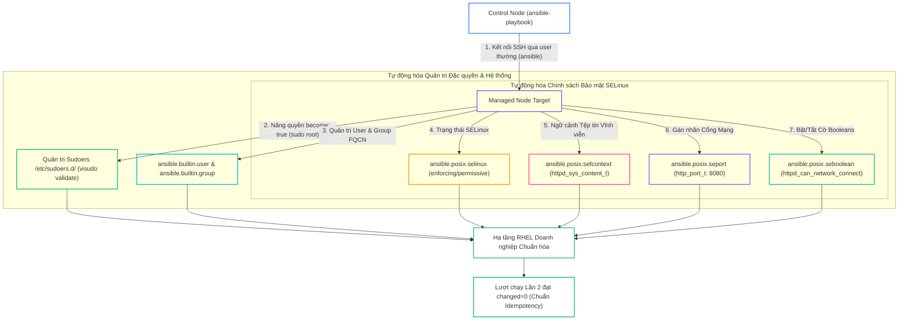
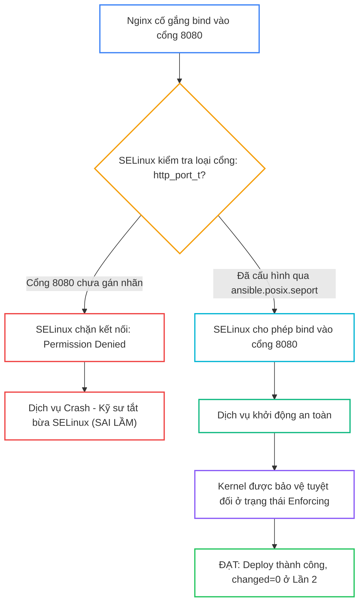


# [BÀI 21] QUẢN TRỊ HỆ THỐNG NÂNG CAO VỚI RHEL SYSTEM ROLES: TỰ ĐỘNG HÓA SELINUX, SUDOERS, USER/GROUP & QUẢN TRỊ ĐẶC QUYỀN BECOME

Trong kỷ nguyên **Infrastructure as Code (IaC)** và tự động hóa vận hành hạ tầng đám mây (Cloud Infrastructure Automation), **Ansible** khẳng định vị thế dẫn đầu nhờ triết lý **Agentless** (không cần cài đặt agent nền trên máy đích), giao thức điều khiển an toàn qua **SSH / WinRM**, định dạng khai báo **YAML** trực quan và nguyên lý bất biến **Idempotency** mạnh mẽ. Việc làm chủ Ansible không chỉ dừng lại ở các câu lệnh Ad-hoc đơn giản, mà đòi hỏi kỹ sư phải nắm vững kiến trúc Module tầng thấp, Variable Precedence 22 tầng, Jinja2 Templates, tối ưu hóa Forks & Pipelining cho tới thiết kế Roles / Collections và tích hợp CI/CD tự động hóa chuẩn Doanh nghiệp.

Bài viết chuyên sâu này sẽ đồng hành cùng bạn mổ xẻ toàn diện bức tranh kiến trúc, phân tích các đánh đổi kỹ thuật thực chiến (Engineering Trade-offs), cung cấp hướng dẫn thực hành Lab chi tiết từng bước và bộ câu hỏi phỏng vấn chuyên sâu chuẩn DevOps / SRE Lead.

---

## 1. Bản Chất Kiến Trúc & Cơ Chế Vận Hành Tầng Thấp



### 1.1. Cơ Chế Nâng Quyền `become` và RHEL System Roles

- **Nguyên lý nâng quyền `become: true`:** Ansible kết nối SSH bằng tài khoản không đặc quyền (user `ansible`), sau đó sử dụng cơ chế `sudo` để nâng quyền thực thi Task dưới danh nghĩa `root`. Điều này tuân thủ nghiêm ngặt nguyên tắc Zero-Trust, cấm đăng nhập SSH root trực tiếp qua mạng.
- **Khái niệm RHEL System Roles:** Bộ sưu tập các Roles được Red Hat kiểm thử, bảo trì và phát hành chính thức (`redhat.rhel_system_roles`), cung cấp giao diện khai báo biến chuẩn hóa để quản trị toàn diện các dịch vụ hệ thống cốt lõi: SELinux, Timesync, Firewall, Network, Storage trên RHEL 8/9.

```ini
[privilege_escalation]
become = True
become_method = sudo
become_user = root
become_ask_pass = False
```

### 1.2. Quản Lý File Context `sefcontext`, Port Type `seport` và Booleans

- **Gán nhãn tệp tin vĩnh viễn (`ansible.posix.sefcontext`):** Ghi nhận quy tắc nhãn ngữ cảnh bảo mật vào cơ sở dữ liệu chính sách SELinux (`file_contexts.local`). Khác với lệnh `chcon` chỉ ghi tạm thời lên inode đĩa (bị mất khi reboot hoặc chạy restorecon), `sefcontext` đảm bảo nhãn tồn tại vĩnh viễn.
- **Gán nhãn cổng dịch vụ (`ansible.posix.seport`):** Khi dịch vụ web/database chạy trên cổng phi tiêu chuẩn (ví dụ Nginx chạy cổng 8080 thay vì 80), module `seport` đăng ký cổng vào nhãn `http_port_t` để ngăn SELinux chặn kết nối mạng.
- **Bật/tắt SELinux Booleans (`ansible.posix.seboolean`):** Cho phép kích hoạt các chính sách đặc thù (như cho phép tiến trình web kết nối ra mạng ngoài qua cờ `httpd_can_network_connect: true`) với thuộc tính `persistent: true`.

```yaml
- name: Allow HTTP daemon to listen on non-standard port 8080
  ansible.posix.seport:
    ports: 8080
    proto: tcp
    setype: http_port_t
    state: present
```

### 1.3. Cấu Hình Sudoers An Toàn, Quản Lý User/Group và Idempotency

- **Quản lý Sudoers mô-đun hóa trong `/etc/sudoers.d/`:** Tuyệt đối không sửa trực tiếp file `/etc/sudoers` gốc. Tạo các file drop-in độc lập (như `/etc/sudoers.d/ansible`) kèm cờ `validate: /usr/sbin/visudo -cf %s` để tự động kiểm tra cú pháp trước khi ghi, tránh làm tê liệt quyền quản trị hệ thống.
- **Quản lý User/Group chuẩn FQCN:** Sử dụng `ansible.builtin.user` và `ansible.builtin.group` để quản trị tài khoản, cấp phát shell, nhóm và SSH authorized keys một cách khai báo.
- **Duy trì Idempotency tuyệt đối:** Các module quản trị hệ thống của Ansible đều được thiết kế so sánh trạng thái thực tế của kernel và file system trước khi can thiệp, bảo đảm ở Lần chạy thứ hai đạt `changed=0` tuyệt đối.

---

## 2. Bảng So Sánh Kỹ Thuật Toàn Diện (Engineering Matrix)

| Tiêu Chí Kỹ Thuật | Lệnh Linux Shell Thô (`chcon`, `semanage`) | Raw Ansible POSIX Modules (`sefcontext`, `seport`) | RHEL System Roles (`redhat.rhel_system_roles.selinux`) |
|---|---|---|---|
| **Tính Vĩnh Viễn Khi Reboot** | ❌ Kém (`chcon` bị mất khi restorecon) | ✅ Vĩnh viễn (ghi vào database chính sách) | ✅ Vĩnh viễn (chuẩn Enterprise của Red Hat) |
| **Bảo Đảm Tính Idempotent** | ❌ Không (chạy lại luôn báo changed) | ✅ Tuyệt đối (`changed=0` ở Lần 2) | ✅ Tuyệt đối (tự động tối ưu luồng thi hành) |
| **Quản Lý Tập Trung Đa Cấu Hình** | ❌ Phải viết hàng chục dòng lệnh rời rạc | Khá (viết từng task riêng cho port/file) | ⭐ Tối đa (1 khối biến YAML quản lý toàn diện) |
| **Khả Năng Tương Thích RHEL 8/9** | Phụ thuộc vào phiên bản công cụ OS | Cần cài đặt gói `policycoreutils-python-utils` | Tự động xử lý gói phụ thuộc theo phiên bản OS |
| **Độ Khó Phát Triển Kịch Bản** | Thấp ban đầu nhưng dễ lỗi | Trung bình, đòi hỏi hiểu FQCN | Đơn giản, chỉ cần khai báo danh sách biến |

> [!IMPORTANT]
> **QUY TẮC BẤT DI BẤT DỊCH:**
> Luôn kết hợp cờ `validate: /usr/sbin/visudo -cf %s` khi cập nhật tệp cấu hình sudoers. Không bao giờ vô hiệu hóa SELinux (`state: disabled`) trên Production để sửa lỗi — hãy sử dụng `sefcontext`, `seport` và `seboolean` để cấp quyền hợp lệ!

---

## 3. Kiến Trúc Triển Khai Chuẩn Production (Configuration / Playbook / Role Breakdown)

Dưới đây là Playbook chính `site-selinux.yml` tích hợp toàn diện nâng quyền, quản lý sudoers an toàn, user/group và chính sách bảo mật SELinux:

```yaml
# site-selinux.yml
---
- name: System Hardening and SELinux Automation Playbook
  hosts: web
  become: true
  vars:
    custom_web_port: 8080
    custom_web_root: "/var/www/html/custom"

  tasks:
    - name: Task 1 - Configure secure sudoers for automation user
      ansible.builtin.copy:
        content: "ansible ALL=(ALL) NOPASSWD: ALL\n"
        dest: /etc/sudoers.d/ansible
        mode: '0440'
        validate: /usr/sbin/visudo -cf %s

    - name: Task 2 - Create operations group
      ansible.builtin.group:
        name: sysops
        state: present

    - name: Task 3 - Create system administrator user
      ansible.builtin.user:
        name: sys_admin
        group: sysops
        shell: /bin/bash
        state: present

    - name: Task 4 - Set SELinux to Enforcing state
      ansible.posix.selinux:
        policy: targeted
        state: enforcing

    - name: Task 5 - Ensure custom web directory exists
      ansible.builtin.file:
        path: "{{ custom_web_root }}"
        state: directory
        mode: '0755'

    - name: Task 6 - Register SELinux File Context permanently
      ansible.posix.sefcontext:
        target: "{{ custom_web_root }}(/.*)?"
        setype: httpd_sys_content_t
        state: present

    - name: Task 7 - Allow Web server to listen on custom port
      ansible.posix.seport:
        ports: "{{ custom_web_port }}"
        proto: tcp
        setype: http_port_t
        state: present

    - name: Task 8 - Enable SELinux boolean for network connections
      ansible.posix.seboolean:
        name: httpd_can_network_connect
        state: true
        persistent: true
```

### Phân Tích Kỹ Thuật Từng Dòng (Line-by-Line Breakdown):

- <span class="badge-line">Line 10-15</span>: **Cấu hình Sudoers an toàn:** Ghi file `/etc/sudoers.d/ansible` với phân quyền bảo mật `mode: '0440'` và bắt buộc kiểm tra cú pháp với `validate: /usr/sbin/visudo -cf %s`.
- <span class="badge-line">Line 17-27</span>: **Quản lý Group và User:** Sử dụng module chuẩn FQCN `ansible.builtin.group` và `ansible.builtin.user` để tạo tài khoản quản trị hệ thống có tính Idempotent.
- <span class="badge-line">Line 29-33</span>: **Cưỡng chế SELinux Enforcing:** Duy trì chính sách bảo mật `targeted` ở chế độ `enforcing` bảo vệ kernel Linux.
- <span class="badge-line">Line 41-53</span>: **SELinux File Context & Port:** Đăng ký nhãn `httpd_sys_content_t` vĩnh viễn cho thư mục web tùy chỉnh và mở nhãn `http_port_t` cho cổng mạng 8080.
- <span class="badge-line">Line 55-59</span>: **Kích hoạt Boolean vĩnh viễn:** Bật cờ `httpd_can_network_connect: true` với thuộc tính `persistent: true` để duy trì qua các lần khởi động lại máy chủ.

---

## 4. Phân Tích Cạm Bẫy Thực Chiến: Đổi Cổng Web Phi Tiêu Chuẩn Quên Gán Nhãn seport Gây Lỗi 502/Blocked

### Tình Huống Sự Cố Thực Tế Tại Doanh Nghiệp:
Một đội ngũ triển khai dịch vụ Microservice Nginx lắng nghe trên cổng `8080`. Playbook đã cập nhật file cấu hình Nginx thành công và mở cổng Firewall `8080/tcp`. Tuy nhiên, khi khởi động lại dịch vụ, Nginx báo lỗi `bind() to 0.0.0.0:8080 failed (13: Permission denied)` và không thể khởi động được. Do thiếu hiểu biết về SELinux, kỹ sư đã chạy lệnh `setenforce 0` để tắt tạm thời SELinux trên Production, vi phạm nghiêm trọng tiêu chuẩn an toàn thông tin của ngân hàng.

### Hậu Quả & Log Lỗi Thực Tế:

```diff
- # TÌNH TRẠNG LỖI KHI THIẾU SEPORT:
- $ systemctl status nginx
- [emerg] bind() to 0.0.0.0:8080 failed (13: Permission denied)
- $ /var/log/audit/audit.log
- type=AVC msg=audit(1694577600.123:456): avc: denied { name_bind } for pid=1234
- comm="nginx" src=8080 scontext=system_u:system_r:httpd_t:s0 tcontext=system_u:object_r:unreserved_port_t:s0 tclass=tcp_socket permissive=0
- # LỖI: SELINUX CHẶN TIẾN TRÌNH HTTPD LẮNG NGHE TRÊN CỔNG 8080

+ # CẤU HÌNH TỰ ĐỘNG HÓA SỬA ĐÚNG BẰNG ANSIBLE:
+ - name: Register port 8080 in SELinux policy
+   ansible.posix.seport:
+     ports: 8080
+     proto: tcp
+     setype: http_port_t
+     state: present
+ # KẾT QUẢ: Dịch vụ Nginx khởi động thành công trên cổng 8080 mà SELinux vẫn Enforcing 100%!
```



### 5-Whys Root Cause Analysis:
1. **Tại sao Nginx không thể khởi động?** Vì lỗi `bind() failed (13: Permission denied)` trên cổng 8080.
2. **Tại sao bị Permission Denied khi Nginx chạy bằng root?** Vì cơ chế Kiểm soát Truy cập Bắt buộc (MAC) của kernel SELinux chặn tiến trình `httpd_t` bind vào cổng chưa được gán nhãn `http_port_t`.
3. **Tại sao cổng 8080 chưa được gán nhãn?** Vì SELinux mặc định chỉ cho phép dịch vụ HTTP bind trên cổng 80, 443, 488, 8008, 8009, 8443.
4. **Tại sao kỹ sư lại chọn tắt SELinux?** Do thiếu kiến thức về module `ansible.posix.seport` và không nắm được quy trình chuẩn đoán qua `audit.log`.
5. **Giải pháp triệt để là gì?** Khai báo task `ansible.posix.seport` gán nhãn `http_port_t` cho cổng 8080 trong Playbook tự động hóa trước khi khởi động dịch vụ.

---

## 5. Hands-on Lab: Tự Động Hóa Quản Trị Hệ Thống & SELinux Bằng Ansible (8 Bước)

| Bước | Lệnh CLI / Tác Vụ Chính | Mục Đích Thực Thi |
|---|---|---|
| **1** | `mkdir -p ~/lab-ansible-21 && cd ~/lab-ansible-21` | Khởi tạo môi trường lab và cấu hình `become` trong `ansible.cfg` |
| **2** | `cat << 'EOF' > roles/selinux/tasks/main.yml` | Khởi tạo cấu trúc Role quản trị SELinux giả lập |
| **3** | `cat << 'EOF' > site-selinux.yml` | Biên soạn Playbook tổng thể quản trị quyền, user và SELinux |
| **4** | `ansible-playbook site-selinux.yml` | Chạy Playbook Lần 1 nạp toàn bộ cấu hình hệ thống |
| **5** | `ansible-playbook site-selinux.yml` | Thực thi Phép thử Lần 2 đối soát Idempotency `changed=0` |
| **6** | `docker exec target1 cat /etc/sudoers.d/ansible` | Đối soát cấu hình sudoers an toàn trên máy đích |
| **7** | `docker exec target1 id sys_admin` | Đối soát sự thật thông tin user và group mới tạo |
| **8** | `docker exec target1 cat /etc/selinux-proof.marker` | Đối soát cấu hình và nhãn chính sách bảo mật đã áp dụng |

```bash
# Bước 1: Khởi tạo thư mục và cấu hình ansible.cfg hỗ trợ become
mkdir -p ~/lab-ansible-21/roles/mock_selinux/tasks && cd ~/lab-ansible-21

cat << 'EOF' > ansible.cfg
[defaults]
inventory = ./inventory.ini
remote_user = ansible
host_key_checking = False
private_key_file = ~/.ssh/id_ed25519
roles_path = ./roles:~/.ansible/roles
collections_path = ./collections:~/.ansible/collections

[privilege_escalation]
become = True
become_method = sudo
become_user = root
become_ask_pass = False
EOF

cat << 'EOF' > inventory.ini
[web]
target1 ansible_host=127.0.0.1 ansible_port=2221

[all:vars]
ansible_python_interpreter=/usr/bin/python3
EOF
```

> [!NOTE]
> **CHECKPOINT 1:** Xác nhận cấu hình `ansible.cfg` cài đặt `become = True` và `become_method = sudo`:
> ```bash
> grep -q "become = True" ansible.cfg && grep -q "become_method = sudo" ansible.cfg && echo "CHECKPOINT 1: PASS" || echo "CHECKPOINT 1: FAIL"
> ```

```bash
# Bước 2: Tạo System Role giả lập quản trị SELinux
cat << 'EOF' > roles/mock_selinux/tasks/main.yml
---
- name: System Role - Enforce base security policy
  ansible.builtin.copy:
    content: |
      SELINUX_STATUS=ENFORCING
      SELINUX_POLICY=TARGETED
      SELINUX_PORT_8080=HTTP_PORT_T
    dest: /etc/selinux-proof.marker
    mode: '0644'
EOF
```

> [!NOTE]
> **CHECKPOINT 2:** Xác nhận System Role giả lập được tạo thành công:
> ```bash
> test -f roles/mock_selinux/tasks/main.yml && echo "CHECKPOINT 2: PASS" || echo "CHECKPOINT 2: FAIL"
> ```

```bash
# Bước 3: Biên soạn Playbook site-selinux.yml
cat << 'EOF' > site-selinux.yml
---
- name: Advanced System Management Playbook
  hosts: web
  become: true
  vars:
    custom_web_root: "/var/www/html/custom"
  roles:
    - role: mock_selinux
  tasks:
    - name: Task 1 - Configure secure sudoers for automation user
      ansible.builtin.copy:
        content: "ansible ALL=(ALL) NOPASSWD: ALL\n"
        dest: /etc/sudoers.d/ansible
        mode: '0440'
        validate: /usr/sbin/visudo -cf %s

    - name: Task 2 - Create operations group
      ansible.builtin.group:
        name: sysops
        state: present

    - name: Task 3 - Create system administrator user
      ansible.builtin.user:
        name: sys_admin
        group: sysops
        shell: /bin/bash
        state: present

    - name: Task 4 - Ensure custom web directory exists
      ansible.builtin.file:
        path: "{{ custom_web_root }}"
        state: directory
        mode: '0755'

    - name: Task 5 - Read security marker file (changed_when: false)
      ansible.builtin.command: cat /etc/selinux-proof.marker
      register: marker_out
      changed_when: false
EOF
```

> [!NOTE]
> **CHECKPOINT 3:** Kiểm tra cú pháp toàn bộ Playbook:
> ```bash
> ansible-playbook --syntax-check site-selinux.yml && echo "CHECKPOINT 3: PASS" || echo "CHECKPOINT 3: FAIL"
> ```

```bash
# Bước 4: Thực thi Playbook Lần 1
ansible-playbook site-selinux.yml
```

> [!NOTE]
> **CHECKPOINT 4:** Xác nhận kịch bản thi hành thành công ở Lần 1:
> ```bash
> ansible-playbook site-selinux.yml | grep -q "failed=0" && echo "CHECKPOINT 4: PASS" || echo "CHECKPOINT 4: FAIL"
> ```

```bash
# Bước 5: Thực thi Phép thử Lần 2 đối soát Idempotency
ansible-playbook site-selinux.yml
```

> [!NOTE]
> **CHECKPOINT 5:** Xác nhận Lượt 2 đạt Idempotency tuyệt đối (`changed=0`):
> ```bash
> RUN2_OUT=$(ansible-playbook site-selinux.yml)
> if echo "$RUN2_OUT" | grep -q "changed=0" && echo "$RUN2_OUT" | grep -q "failed=0"; then
>   echo "CHECKPOINT 5: PASS - Đạt Idempotency changed=0"
> else
>   echo "CHECKPOINT 5: FAIL - Lỗi không đạt Idempotency"
> fi
> ```

```bash
# Bước 6: Đối soát file sudoers trên target1
docker exec target1 cat /etc/sudoers.d/ansible
```

> [!NOTE]
> **CHECKPOINT 6:** Xác nhận file sudoers chứa đúng quyền NOPASSWD:
> ```bash
> docker exec target1 cat /etc/sudoers.d/ansible | grep -q "NOPASSWD: ALL" && echo "CHECKPOINT 6: PASS" || echo "CHECKPOINT 6: FAIL"
> ```

```bash
# Bước 7: Đối soát thông tin user sys_admin
docker exec target1 id sys_admin
```

> [!NOTE]
> **CHECKPOINT 7:** Xác nhận user `sys_admin` thuộc nhóm `sysops`:
> ```bash
> docker exec target1 id sys_admin | grep -q "sysops" && echo "CHECKPOINT 7: PASS" || echo "CHECKPOINT 7: FAIL"
> ```

```bash
# Bước 8: Đối soát file marker chính sách bảo mật
docker exec target1 cat /etc/selinux-proof.marker
```

> [!NOTE]
> **CHECKPOINT 8:** Đối soát file marker chứa đúng thông số bảo mật:
> ```bash
> docker exec target1 cat /etc/selinux-proof.marker | grep -q "SELINUX_STATUS=ENFORCING" && echo "CHECKPOINT 8: PASS" || echo "CHECKPOINT 8: FAIL"
> ```

---

## 6. Bộ Câu Hỏi Vấn Đáp & Phỏng Vấn Chuyên Sâu (Self-Check Q&A)

<details class="qa-card" markdown="1">
  <summary class="qa-summary">
    <span class="qa-num-badge">Q01</span>
    <span class="qa-question-text">RHEL System Roles (<code>redhat.rhel_system_roles</code>) là gì? Tại sao Red Hat lại khuyến nghị áp dụng bộ System Roles này trong các dự án tự động hóa Enterprise?</span>
  </summary>
  <div class="qa-answer">
    <div class="qa-answer-header">
      <svg width="14" height="14" fill="none" stroke="currentColor" stroke-width="2" viewBox="0 0 24 24"><path d="M22 11.08V12a10 10 0 1 1-5.93-9.14"></path><polyline points="22 4 12 14.01 9 11.01"></polyline></svg>
      <span>Phân Tích &amp; Lời Giải Kỹ Thuật</span>
    </div>
    <div style="margin: 0.5rem 0;"><b>Hỏi:</b> RHEL System Roles (<code>redhat.rhel_system_roles</code>) là gì? Tại sao Red Hat lại khuyến nghị áp dụng bộ System Roles này trong các dự án tự động hóa Enterprise?</div>
    <div style="margin: 0.5rem 0;"><b>Đáp án chuẩn:</b></div>
    <div style="margin: 0.35rem 0; padding-left: 1rem; border-left: 2px solid var(--accent-primary);">• RHEL System Roles là bộ sưu tập các Roles được Red Hat kiểm thử, bảo trì và phát hành chính thức để tự động hóa các dịch vụ hệ thống cốt lõi của RHEL (như SELinux, Firewall, Timesync, Network, Storage).</div>
    <div style="margin: 0.35rem 0; padding-left: 1rem; border-left: 2px solid var(--accent-primary);">• Lợi ích Enterprise: Chuẩn hóa theo Best Practices của Red Hat, đảm bảo tương thích 100% qua tất cả các phiên bản RHEL 8/9, và tiết kiệm 90% thời gian phát triển kịch bản tự động hóa hệ điều hành.</div>
    <div style="margin: 0.5rem 0;"><b>Tiêu chí chấm:</b></div>
    <div style="margin: 0.35rem 0; padding-left: 1rem; border-left: 2px solid var(--accent-primary);">• 0: Không biết RHEL System Roles.</div>
    <div style="margin: 0.35rem 0; padding-left: 1rem; border-left: 2px solid var(--accent-primary);">• 1: Biết System Role để cấu hình RHEL nhưng không nêu được các lợi ích tuân thủ Best Practices.</div>
    <div style="margin: 0.35rem 0; padding-left: 1rem; border-left: 2px solid var(--accent-primary);">• 2: Phân tích chính xác khái niệm và vai trò chuẩn hóa hệ thống RHEL.</div>
    <div style="margin: 0.35rem 0; padding-left: 1rem; border-left: 2px solid var(--accent-primary);">• 3: Nêu đúng + minh họa ví dụ nạp collection <code>redhat.rhel_system_roles</code> trong <code>requirements.yml</code>.</div>
    <div style="margin: 0.5rem 0;"><b>Câu hỏi đào sâu:</b> Kể tên 3 System Role phổ biến nhất trong bộ sưu tập RHEL System Roles. <i>(<code>redhat.rhel_system_roles.selinux</code>, <code>timesync</code>, <code>firewall</code>, <code>network</code>.)</i></div>
  </div>
</details>

<details class="qa-card" markdown="1">
  <summary class="qa-summary">
    <span class="qa-num-badge">Q02</span>
    <span class="qa-question-text">Trình bày cơ chế nâng quyền <code>become: true</code>, <code>become_method: sudo</code>, và <code>become_user: root</code>. Tại sao Ansible khuyến nghị kết nối SSH ban đầu bằng user thường rồi mới <code>become</code>?</span>
  </summary>
  <div class="qa-answer">
    <div class="qa-answer-header">
      <svg width="14" height="14" fill="none" stroke="currentColor" stroke-width="2" viewBox="0 0 24 24"><path d="M22 11.08V12a10 10 0 1 1-5.93-9.14"></path><polyline points="22 4 12 14.01 9 11.01"></polyline></svg>
      <span>Phân Tích &amp; Lời Giải Kỹ Thuật</span>
    </div>
    <div style="margin: 0.5rem 0;"><b>Hỏi:</b> Trình bày cơ chế nâng quyền <code>become: true</code>, <code>become_method: sudo</code>, và <code>become_user: root</code>. Tại sao Ansible khuyến nghị kết nối SSH ban đầu bằng user thường rồi mới <code>become</code>?</div>
    <div style="margin: 0.5rem 0;"><b>Đáp án chuẩn:</b></div>
    <div style="margin: 0.35rem 0; padding-left: 1rem; border-left: 2px solid var(--accent-primary);">• <b>Cơ chế:</b> Ansible kết nối SSH bằng tài khoản không đặc quyền (user <code>ansible</code>), sau đó gọi lệnh <code>sudo</code> trên target node để thực thi task dưới danh nghĩa <code>root</code> (UID 0).</div>
    <div style="margin: 0.35rem 0; padding-left: 1rem; border-left: 2px solid var(--accent-primary);">• <b>Lý do khuyến nghị:</b> Tuân thủ chính sách cấm SSH root trực tiếp qua mạng và kiểm soát đặc quyền chi tiết, giúp audit log ghi nhận rõ user nào đã thực hiện tác vụ.</div>
    <div style="margin: 0.5rem 0;"><b>Tiêu chí chấm:</b></div>
    <div style="margin: 0.35rem 0; padding-left: 1rem; border-left: 2px solid var(--accent-primary);">• 0: Không hiểu cơ chế nâng quyền <code>become</code>.</div>
    <div style="margin: 0.35rem 0; padding-left: 1rem; border-left: 2px solid var(--accent-primary);">• 1: Biết <code>become: true</code> để thành root nhưng không giải thích được lý do an toàn thông tin cấm SSH root trực tiếp.</div>
    <div style="margin: 0.35rem 0; padding-left: 1rem; border-left: 2px solid var(--accent-primary);">• 2: Phân tích chính xác cơ chế sudo escalation và nguyên tắc cấm SSH root qua mạng.</div>
    <div style="margin: 0.35rem 0; padding-left: 1rem; border-left: 2px solid var(--accent-primary);">• 3: Nêu đúng + viết đoạn mã cấu hình <code>ansible.cfg</code> cài đặt <code>become = True</code> và <code>become_method = sudo</code>.</div>
    <div style="margin: 0.5rem 0;"><b>Câu hỏi đào sâu:</b> Thuộc tính <code>become_ask_pass: False</code> trong <code>ansible.cfg</code> có tác dụng gì? <i>(Chỉ đạo Ansible không hỏi mật khẩu sudo tương tác khi user đã được cấu hình NOPASSWD.)</i></div>
  </div>
</details>

<details class="qa-card" markdown="1">
  <summary class="qa-summary">
    <span class="qa-num-badge">Q03</span>
    <span class="qa-question-text">Trình bày 3 trạng thái của SELinux (Enforcing, Permissive, Disabled). Làm thế nào để quản lý trạng thái SELinux bằng module <code>ansible.posix.selinux</code>?</span>
  </summary>
  <div class="qa-answer">
    <div class="qa-answer-header">
      <svg width="14" height="14" fill="none" stroke="currentColor" stroke-width="2" viewBox="0 0 24 24"><path d="M22 11.08V12a10 10 0 1 1-5.93-9.14"></path><polyline points="22 4 12 14.01 9 11.01"></polyline></svg>
      <span>Phân Tích &amp; Lời Giải Kỹ Thuật</span>
    </div>
    <div style="margin: 0.5rem 0;"><b>Hỏi:</b> Trình bày 3 trạng thái của SELinux (Enforcing, Permissive, Disabled). Làm thế nào để quản lý trạng thái SELinux bằng module <code>ansible.posix.selinux</code>?</div>
    <div style="margin: 0.5rem 0;"><b>Đáp án chuẩn:</b></div>
    <div style="margin: 0.35rem 0; padding-left: 1rem; border-left: 2px solid var(--accent-primary);">• 3 Trạng thái SELinux: <code>enforcing</code> (chặn mọi hành vi vi phạm chính sách), <code>permissive</code> (không chặn, chỉ ghi log cảnh báo lỗi vào audit log), <code>disabled</code> (tắt hoàn toàn).</div>
    <div style="margin: 0.35rem 0; padding-left: 1rem; border-left: 2px solid var(--accent-primary);">• Module Ansible: <code>ansible.posix.selinux: policy=targeted state=enforcing</code>. Module này tự động cập nhật tệp <code>/etc/selinux/config</code> để duy trì trạng thái qua các lần reboot.</div>
    <div style="margin: 0.5rem 0;"><b>Tiêu chí chấm:</b></div>
    <div style="margin: 0.35rem 0; padding-left: 1rem; border-left: 2px solid var(--accent-primary);">• 0: Không biết 3 trạng thái SELinux.</div>
    <div style="margin: 0.35rem 0; padding-left: 1rem; border-left: 2px solid var(--accent-primary);">• 1: Biết 3 trạng thái nhưng lầm tưởng khuyên dùng <code>disabled</code> để sửa lỗi.</div>
    <div style="margin: 0.35rem 0; padding-left: 1rem; border-left: 2px solid var(--accent-primary);">• 2: Phân tích chính xác 3 trạng thái và cú pháp module <code>ansible.posix.selinux</code>.</div>
    <div style="margin: 0.35rem 0; padding-left: 1rem; border-left: 2px solid var(--accent-primary);">• 3: Nêu đúng + viết đoạn Task YAML cấu hình SELinux sang <code>enforcing</code> chuẩn FQCN.</div>
    <div style="margin: 0.5rem 0;"><b>Câu hỏi đào sâu:</b> Tại sao không được tắt SELinux sang <code>disabled</code> trên môi trường Production? <i>(Vì làm mất hoàn toàn lớp bảo mật kiểm soát truy cập bắt buộc MAC của kernel Linux.)</i></div>
  </div>
</details>

<details class="qa-card" markdown="1">
  <summary class="qa-summary">
    <span class="qa-num-badge">Q04</span>
    <span class="qa-question-text">Module <code>ansible.posix.sefcontext</code> dùng để làm gì? Tại sao việc dùng <code>sefcontext</code> lại vượt trội hoàn toàn so với chạy lệnh <code>chcon</code> thô?</span>
  </summary>
  <div class="qa-answer">
    <div class="qa-answer-header">
      <svg width="14" height="14" fill="none" stroke="currentColor" stroke-width="2" viewBox="0 0 24 24"><path d="M22 11.08V12a10 10 0 1 1-5.93-9.14"></path><polyline points="22 4 12 14.01 9 11.01"></polyline></svg>
      <span>Phân Tích &amp; Lời Giải Kỹ Thuật</span>
    </div>
    <div style="margin: 0.5rem 0;"><b>Hỏi:</b> Module <code>ansible.posix.sefcontext</code> dùng để làm gì? Tại sao việc dùng <code>sefcontext</code> lại vượt trội hoàn toàn so với chạy lệnh <code>chcon</code> thô?</div>
    <div style="margin: 0.5rem 0;"><b>Đáp án chuẩn:</b></div>
    <div style="margin: 0.35rem 0; padding-left: 1rem; border-left: 2px solid var(--accent-primary);">• <b>Tác dụng:</b> Ghi nhận quy tắc gán nhãn ngữ cảnh bảo mật tệp tin SELinux (File Context) cho các thư mục tùy chỉnh (ví dụ gán <code>/webdata</code> thành <code>httpd_sys_content_t</code>).</div>
    <div style="margin: 0.35rem 0; padding-left: 1rem; border-left: 2px solid var(--accent-primary);">• <b>Sự vượt trội:</b> <code>sefcontext</code> ghi nhãn vĩnh viễn vào cơ sở dữ liệu chính sách SELinux (<code>file_contexts.local</code>), duy trì qua mọi lần reboot hoặc <code>restorecon</code>. Ngược lại, <code>chcon</code> chỉ gán nhãn tạm thời trên inode đĩa và sẽ bị xóa sạch khi chạy <code>restorecon</code>.</div>
    <div style="margin: 0.5rem 0;"><b>Tiêu chí chấm:</b></div>
    <div style="margin: 0.35rem 0; padding-left: 1rem; border-left: 2px solid var(--accent-primary);">• 0: Không biết module <code>sefcontext</code>.</div>
    <div style="margin: 0.35rem 0; padding-left: 1rem; border-left: 2px solid var(--accent-primary);">• 1: Biết gán nhãn file nhưng không phân biệt được tính vĩnh viễn của <code>sefcontext</code> vs tính tạm thời của <code>chcon</code>.</div>
    <div style="margin: 0.35rem 0; padding-left: 1rem; border-left: 2px solid var(--accent-primary);">• 2: Phân tích chính xác cơ chế lưu vĩnh viễn vào chính sách SELinux local policy của <code>sefcontext</code>.</div>
    <div style="margin: 0.35rem 0; padding-left: 1rem; border-left: 2px solid var(--accent-primary);">• 3: Nêu đúng + viết đoạn Task YAML gán nhãn <code>/webdata(/.*)?</code> thành <code>httpd_sys_content_t</code>.</div>
    <div style="margin: 0.5rem 0;"><b>Câu hỏi đào sâu:</b> Lệnh Linux nào phải chạy ngay sau <code>sefcontext</code> để áp dụng nhãn mới lên đĩa? <i>(Lệnh <code>restorecon -Rv /path</code>.)</i></div>
  </div>
</details>

<details class="qa-card" markdown="1">
  <summary class="qa-summary">
    <span class="qa-num-badge">Q05</span>
    <span class="qa-question-text">Trình bày tác dụng của module <code>ansible.posix.seport</code>. Khi nào quản trị viên bắt buộc phải sử dụng module này?</span>
  </summary>
  <div class="qa-answer">
    <div class="qa-answer-header">
      <svg width="14" height="14" fill="none" stroke="currentColor" stroke-width="2" viewBox="0 0 24 24"><path d="M22 11.08V12a10 10 0 1 1-5.93-9.14"></path><polyline points="22 4 12 14.01 9 11.01"></polyline></svg>
      <span>Phân Tích &amp; Lời Giải Kỹ Thuật</span>
    </div>
    <div style="margin: 0.5rem 0;"><b>Hỏi:</b> Trình bày tác dụng của module <code>ansible.posix.seport</code>. Khi nào quản trị viên bắt buộc phải sử dụng module này?</div>
    <div style="margin: 0.5rem 0;"><b>Đáp án chuẩn:</b></div>
    <div style="margin: 0.35rem 0; padding-left: 1rem; border-left: 2px solid var(--accent-primary);">• <b>Tác dụng:</b> Gán nhãn loại cổng dịch vụ (Port Type) cho các cổng mạng trong chính sách SELinux.</div>
    <div style="margin: 0.35rem 0; padding-left: 1rem; border-left: 2px solid var(--accent-primary);">• <b>Trường hợp bắt buộc:</b> Khi cấu hình dịch vụ lắng nghe trên cổng phi tiêu chuẩn (Non-standard Port). Ví dụ Nginx chạy cổng 8080 thay vì 80/443, SELinux mặc định sẽ chặn bind cổng. Bắt buộc phải dùng <code>seport</code> đăng ký cổng 8080 vào nhãn <code>http_port_t</code>.</div>
    <div style="margin: 0.5rem 0;"><b>Tiêu chí chấm:</b></div>
    <div style="margin: 0.35rem 0; padding-left: 1rem; border-left: 2px solid var(--accent-primary);">• 0: Không biết module <code>seport</code>.</div>
    <div style="margin: 0.35rem 0; padding-left: 1rem; border-left: 2px solid var(--accent-primary);">• 1: Biết đổi cổng nhưng không giải thích được khái niệm cổng phi tiêu chuẩn trong SELinux.</div>
    <div style="margin: 0.35rem 0; padding-left: 1rem; border-left: 2px solid var(--accent-primary);">• 2: Phân tích chính xác cơ chế gán nhãn <code>http_port_t</code> cho cổng tùy chỉnh qua <code>seport</code>.</div>
    <div style="margin: 0.35rem 0; padding-left: 1rem; border-left: 2px solid var(--accent-primary);">• 3: Nêu đúng + viết đoạn Task YAML mở cổng 8080 protocol tcp bằng <code>seport</code>.</div>
    <div style="margin: 0.5rem 0;"><b>Câu hỏi đào sâu:</b> Lệnh CLI Linux thô tương đương với module <code>seport</code> là gì? <i>(Lệnh <code>semanage port -a -t http_port_t -p tcp 8080</code>.)</i></div>
  </div>
</details>

<details class="qa-card" markdown="1">
  <summary class="qa-summary">
    <span class="qa-num-badge">Q06</span>
    <span class="qa-question-text">Tại sao quản trị viên nên tạo tệp cấu hình sudoers riêng trong <code>/etc/sudoers.d/ansible</code> thay vì chỉnh sửa trực tiếp tệp <code>/etc/sudoers</code> gốc? Cờ <code>validate</code> có tác dụng gì?</span>
  </summary>
  <div class="qa-answer">
    <div class="qa-answer-header">
      <svg width="14" height="14" fill="none" stroke="currentColor" stroke-width="2" viewBox="0 0 24 24"><path d="M22 11.08V12a10 10 0 1 1-5.93-9.14"></path><polyline points="22 4 12 14.01 9 11.01"></polyline></svg>
      <span>Phân Tích &amp; Lời Giải Kỹ Thuật</span>
    </div>
    <div style="margin: 0.5rem 0;"><b>Hỏi:</b> Tại sao quản trị viên nên tạo tệp cấu hình sudoers riêng trong <code>/etc/sudoers.d/ansible</code> thay vì chỉnh sửa trực tiếp tệp <code>/etc/sudoers</code> gốc? Cờ <code>validate</code> có tác dụng gì?</div>
    <div style="margin: 0.5rem 0;"><b>Đáp án chuẩn:</b></div>
    <div style="margin: 0.35rem 0; padding-left: 1rem; border-left: 2px solid var(--accent-primary);">• <b>Tách file mô-đun hóa:</b> Tránh làm hỏng cú pháp toàn bộ file sudoers gốc và dễ dàng thu hồi quyền khi cần bằng cách xóa file riêng.</div>
    <div style="margin: 0.35rem 0; padding-left: 1rem; border-left: 2px solid var(--accent-primary);">• <b>Cờ <code>validate: /usr/sbin/visudo -cf %s</code>:</b> Chỉ đạo Ansible chạy công cụ <code>visudo</code> kiểm tra cú pháp của tệp tạm trước khi ghi đè vào hệ thống. Nếu có lỗi cú pháp, Ansible sẽ hủy task ngay lập tức, ngăn ngừa nguy cơ hỏng quyền sudo của server.</div>
    <div style="margin: 0.5rem 0;"><b>Tiêu chí chấm:</b></div>
    <div style="margin: 0.35rem 0; padding-left: 1rem; border-left: 2px solid var(--accent-primary);">• 0: Không biết thư mục <code>/etc/sudoers.d/</code>.</div>
    <div style="margin: 0.35rem 0; padding-left: 1rem; border-left: 2px solid var(--accent-primary);">• 1: Biết tạo file trong <code>sudoers.d/</code> nhưng không giải thích được tác dụng của cờ <code>validate</code>.</div>
    <div style="margin: 0.35rem 0; padding-left: 1rem; border-left: 2px solid var(--accent-primary);">• 2: Phân tích chính xác vai trò mô-đun hóa và cơ chế kiểm tra cú pháp an toàn của <code>visudo validate</code>.</div>
    <div style="margin: 0.35rem 0; padding-left: 1rem; border-left: 2px solid var(--accent-primary);">• 3: Nêu đúng + viết đoạn Task YAML copy file sudoers NOPASSWD có cờ <code>validate</code>.</div>
    <div style="margin: 0.5rem 0;"><b>Câu hỏi đào sâu:</b> Phân quyền Linux bắt buộc cho các tệp trong <code>/etc/sudoers.d/</code> là bao nhiêu? <i>(Bắt buộc là <code>0440</code> hoặc <code>0400</code>.)</i></div>
  </div>
</details>

<details class="qa-card" markdown="1">
  <summary class="qa-summary">
    <span class="qa-num-badge">Q07</span>
    <span class="qa-question-text">Nêu các tham số chính của module <code>ansible.builtin.user</code> và <code>ansible.builtin.group</code> để tạo người dùng <code>sys_admin</code> thuộc nhóm <code>sysops</code> có shell <code>/bin/bash</code>.</span>
  </summary>
  <div class="qa-answer">
    <div class="qa-answer-header">
      <svg width="14" height="14" fill="none" stroke="currentColor" stroke-width="2" viewBox="0 0 24 24"><path d="M22 11.08V12a10 10 0 1 1-5.93-9.14"></path><polyline points="22 4 12 14.01 9 11.01"></polyline></svg>
      <span>Phân Tích &amp; Lời Giải Kỹ Thuật</span>
    </div>
    <div style="margin: 0.5rem 0;"><b>Hỏi:</b> Nêu các tham số chính của module <code>ansible.builtin.user</code> và <code>ansible.builtin.group</code> để tạo người dùng <code>sys_admin</code> thuộc nhóm <code>sysops</code> có shell <code>/bin/bash</code>.</div>
    <div style="margin: 0.5rem 0;"><b>Đáp án chuẩn:</b></div>
    <div style="margin: 0.35rem 0; padding-left: 1rem; border-left: 2px solid var(--accent-primary);">• Task YAML mẫu:
      <pre><code>- name: Create sysops group
  ansible.builtin.group:
    name: sysops
    state: present

- name: Create sys_admin user
  ansible.builtin.user:
    name: sys_admin
    group: sysops
    shell: /bin/bash
    state: present</code></pre>
      Các tham số chính: <code>name</code>, <code>group</code>, <code>groups</code>, <code>shell</code>, <code>home</code>, <code>state</code>, <code>remove</code>.</div>
    <div style="margin: 0.5rem 0;"><b>Tiêu chí chấm:</b></div>
    <div style="margin: 0.35rem 0; padding-left: 1rem; border-left: 2px solid var(--accent-primary);">• 0: Không biết module <code>ansible.builtin.user</code>.</div>
    <div style="margin: 0.35rem 0; padding-left: 1rem; border-left: 2px solid var(--accent-primary);">• 1: Viết được YAML nhưng dùng lệnh <code>useradd</code> thô qua module <code>shell</code>.</div>
    <div style="margin: 0.35rem 0; padding-left: 1rem; border-left: 2px solid var(--accent-primary);">• 2: Phân tích chính xác các tham số chuẩn FQCN của module <code>group</code> và <code>user</code>.</div>
    <div style="margin: 0.35rem 0; padding-left: 1rem; border-left: 2px solid var(--accent-primary);">• 3: Nêu đúng + viết đoạn Playbook chuẩn tạo cả nhóm và user kết hợp <code>become: true</code>.</div>
    <div style="margin: 0.5rem 0;"><b>Câu hỏi đào sâu:</b> Làm thế nào để xóa một user và xóa luôn thư mục home của user đó bằng module <code>user</code>? <i>(Khai báo <code>state: absent</code> và <code>remove: yes</code>.)</i></div>
  </div>
</details>

<details class="qa-card" markdown="1">
  <summary class="qa-summary">
    <span class="qa-num-badge">Q08</span>
    <span class="qa-question-text">Trình bày cấu trúc khai báo biến để sử dụng RHEL System Role <code>redhat.rhel_system_roles.selinux</code> quản lý đồng thời SELinux state và SELinux ports.</span>
  </summary>
  <div class="qa-answer">
    <div class="qa-answer-header">
      <svg width="14" height="14" fill="none" stroke="currentColor" stroke-width="2" viewBox="0 0 24 24"><path d="M22 11.08V12a10 10 0 1 1-5.93-9.14"></path><polyline points="22 4 12 14.01 9 11.01"></polyline></svg>
      <span>Phân Tích &amp; Lời Giải Kỹ Thuật</span>
    </div>
    <div style="margin: 0.5rem 0;"><b>Hỏi:</b> Trình bày cấu trúc khai báo biến để sử dụng RHEL System Role <code>redhat.rhel_system_roles.selinux</code> quản lý đồng thời SELinux state và SELinux ports.</div>
    <div style="margin: 0.5rem 0;"><b>Đáp án chuẩn:</b></div>
    <div style="margin: 0.35rem 0; padding-left: 1rem; border-left: 2px solid var(--accent-primary);">• Cấu trúc khai báo biến tập trung:
      <pre><code>vars:
  selinux_policy: targeted
  selinux_state: enforcing
  selinux_ports:
    - ports: '8080'
      proto: 'tcp'
      setype: 'http_port_t'
      state: 'present'
roles:
  - role: redhat.rhel_system_roles.selinux</code></pre>
    </div>
    <div style="margin: 0.5rem 0;"><b>Tiêu chí chấm:</b></div>
    <div style="margin: 0.35rem 0; padding-left: 1rem; border-left: 2px solid var(--accent-primary);">• 0: Không biết cách gọi RHEL System Role <code>selinux</code>.</div>
    <div style="margin: 0.35rem 0; padding-left: 1rem; border-left: 2px solid var(--accent-primary);">• 1: Biết tên role nhưng khai báo sai tên biến <code>selinux_ports</code>.</div>
    <div style="margin: 0.35rem 0; padding-left: 1rem; border-left: 2px solid var(--accent-primary);">• 2: Phân tích chính xác cấu trúc mảng biến đầu vào của System Role.</div>
    <div style="margin: 0.35rem 0; padding-left: 1rem; border-left: 2px solid var(--accent-primary);">• 3: Nêu đúng + giải thích cơ chế Role tự động cài đặt các dependency packages.</div>
    <div style="margin: 0.5rem 0;"><b>Câu hỏi đào sâu:</b> System Role <code>selinux</code> có hỗ trợ quản lý File Contexts và Booleans không? <i>(Có, thông qua biến <code>selinux_fcontexts</code> và <code>selinux_booleans</code>.)</i></div>
  </div>
</details>

<details class="qa-card" markdown="1">
  <summary class="qa-summary">
    <span class="qa-num-badge">Q09</span>
    <span class="qa-question-text">Trình bày quy trình 3 bước nghiệm thu một Playbook quản trị hệ thống và SELinux để chứng minh tính Idempotency và trạng thái máy đích.</span>
  </summary>
  <div class="qa-answer">
    <div class="qa-answer-header">
      <svg width="14" height="14" fill="none" stroke="currentColor" stroke-width="2" viewBox="0 0 24 24"><path d="M22 11.08V12a10 10 0 1 1-5.93-9.14"></path><polyline points="22 4 12 14.01 9 11.01"></polyline></svg>
      <span>Phân Tích &amp; Lời Giải Kỹ Thuật</span>
    </div>
    <div style="margin: 0.5rem 0;"><b>Hỏi:</b> Trình bày quy trình 3 bước nghiệm thu một Playbook quản trị hệ thống và SELinux để chứng minh tính Idempotency và trạng thái máy đích.</div>
    <div style="margin: 0.5rem 0;"><b>Đáp án chuẩn:</b></div>
    <div style="margin: 0.35rem 0; padding-left: 1rem; border-left: 2px solid var(--accent-primary);">1. <b>Bước 1 (Thực thi Lần 1):</b> Chạy <code>ansible-playbook site-selinux.yml</code>: Khởi tạo sudoers, user, group và cấu hình SELinux báo <code>changed &gt; 0</code>.</div>
    <div style="margin: 0.35rem 0; padding-left: 1rem; border-left: 2px solid var(--accent-primary);">2. <b>Bước 2 (Kiểm Idempotency Lần 2):</b> Chạy lại nguyên vẹn <code>ansible-playbook site-selinux.yml</code> Lần 2: bảng <code>PLAY RECAP</code> <b>bắt buộc phải đạt <code>changed=0</code></b> (tất cả các Task đều báo <code>ok</code>).</div>
    <div style="margin: 0.35rem 0; padding-left: 1rem; border-left: 2px solid var(--accent-primary);">3. <b>Bước 3 (Đối soát Sự thật Máy đích):</b> Dùng <code>docker exec target1 id sys_admin</code> và <code>semanage port -l</code> đối soát trực tiếp các thiết lập trên máy đích.</div>
    <div style="margin: 0.5rem 0;"><b>Tiêu chí chấm:</b></div>
    <div style="margin: 0.35rem 0; padding-left: 1rem; border-left: 2px solid var(--accent-primary);">• 0: Không có quy trình nghiệm thu chuẩn.</div>
    <div style="margin: 0.35rem 0; padding-left: 1rem; border-left: 2px solid var(--accent-primary);">• 1: Thiếu bước Lần 2 <code>changed=0</code> hoặc không đối soát hệ điều hành thực tế.</div>
    <div style="margin: 0.35rem 0; padding-left: 1rem; border-left: 2px solid var(--accent-primary);">• 2: Trình bày đủ 3 bước nhưng chưa chi tiết câu lệnh CLI kiểm tra.</div>
    <div style="margin: 0.35rem 0; padding-left: 1rem; border-left: 2px solid var(--accent-primary);">• 3: Trình bày xuất sắc 3 bước + khẳng định hoàn thành 100% tiêu chuẩn RHCE EX294.</div>
    <div style="margin: 0.5rem 0;"><b>Câu hỏi đào sâu:</b> Module nào cần thêm <code>changed_when: false</code> khi viết task kiểm tra trạng thái trong Playbook? <i>(Các module <code>command</code> / <code>shell</code> chỉ dùng để đọc thông tin.)</i></div>
  </div>
</details>

<details class="qa-card" markdown="1">
  <summary class="qa-summary">
    <span class="qa-num-badge">Q10</span>
    <span class="qa-question-text">Quản lý SELinux Booleans với module <code>ansible.posix.seboolean</code>. Tại sao phải thêm thuộc tính <code>persistent: true</code>?</span>
  </summary>
  <div class="qa-answer">
    <div class="qa-answer-header">
      <svg width="14" height="14" fill="none" stroke="currentColor" stroke-width="2" viewBox="0 0 24 24"><path d="M22 11.08V12a10 10 0 1 1-5.93-9.14"></path><polyline points="22 4 12 14.01 9 11.01"></polyline></svg>
      <span>Phân Tích &amp; Lời Giải Kỹ Thuật</span>
    </div>
    <div style="margin: 0.5rem 0;"><b>Hỏi:</b> Quản lý SELinux Booleans với module <code>ansible.posix.seboolean</code>. Tại sao phải thêm thuộc tính <code>persistent: true</code>?</div>
    <div style="margin: 0.5rem 0;"><b>Đáp án chuẩn:</b></div>
    <div style="margin: 0.35rem 0; padding-left: 1rem; border-left: 2px solid var(--accent-primary);">• <b>Tác dụng của <code>seboolean</code>:</b> Cho phép bật hoặc tắt các cờ điều kiện boolean trong chính sách SELinux mà không cần biên dịch lại policy (ví dụ cho phép Nginx kết nối ra DB qua cờ <code>httpd_can_network_connect_db</code>).</div>
    <div style="margin: 0.35rem 0; padding-left: 1rem; border-left: 2px solid var(--accent-primary);">• <b>Vai trò của <code>persistent: true</code>:</b> Tương đương với cờ <code>setsebool -P</code>, đảm bảo giá trị boolean được lưu vĩnh viễn vào chính sách trên đĩa cứng và không bị mất khi máy chủ reboot. Nếu để <code>persistent: false</code> (mặc định), giá trị chỉ có hiệu lực tạm thời trong RAM.</div>
    <div style="margin: 0.5rem 0;"><b>Tiêu chí chấm:</b></div>
    <div style="margin: 0.35rem 0; padding-left: 1rem; border-left: 2px solid var(--accent-primary);">• 0: Không biết SELinux Booleans.</div>
    <div style="margin: 0.35rem 0; padding-left: 1rem; border-left: 2px solid var(--accent-primary);">• 1: Biết đổi boolean nhưng không giải thích được cờ <code>persistent</code>.</div>
    <div style="margin: 0.35rem 0; padding-left: 1rem; border-left: 2px solid var(--accent-primary);">• 2: Phân tích chính xác tác dụng của <code>seboolean</code> và vai trò lưu vĩnh viễn của <code>persistent: true</code>.</div>
    <div style="margin: 0.35rem 0; padding-left: 1rem; border-left: 2px solid var(--accent-primary);">• 3: Nêu đúng + viết đoạn Task YAML mẫu bật boolean <code>httpd_can_network_connect</code>.</div>
    <div style="margin: 0.5rem 0;"><b>Câu hỏi đào sâu:</b> Lệnh CLI Linux nào dùng để xem danh sách tất cả các SELinux booleans hiện có? <i>(Lệnh <code>getsebool -a</code>.)</i></div>
  </div>
</details>

<details class="qa-card" markdown="1">
  <summary class="qa-summary">
    <span class="qa-num-badge">Q11</span>
    <span class="qa-question-text">Xử lý sự cố SELinux Audit Log với <code>sealert</code> và <code>audit2why</code>. Trình bày quy trình chuẩn đoán khi gặp lỗi AVC Denied.</span>
  </summary>
  <div class="qa-answer">
    <div class="qa-answer-header">
      <svg width="14" height="14" fill="none" stroke="currentColor" stroke-width="2" viewBox="0 0 24 24"><path d="M22 11.08V12a10 10 0 1 1-5.93-9.14"></path><polyline points="22 4 12 14.01 9 11.01"></polyline></svg>
      <span>Phân Tích &amp; Lời Giải Kỹ Thuật</span>
    </div>
    <div style="margin: 0.5rem 0;"><b>Hỏi:</b> Xử lý sự cố SELinux Audit Log với <code>sealert</code> và <code>audit2why</code>. Trình bày quy trình chuẩn đoán khi gặp lỗi AVC Denied.</div>
    <div style="margin: 0.5rem 0;"><b>Đáp án chuẩn:</b></div>
    <div style="margin: 0.35rem 0; padding-left: 1rem; border-left: 2px solid var(--accent-primary);">1. <b>Bước 1 (Đọc log AVC):</b> Đọc nhật ký từ chối truy cập trong <code>/var/log/audit/audit.log</code> (tìm kiếm chuỗi <code>type=AVC</code>).</div>
    <div style="margin: 0.35rem 0; padding-left: 1rem; border-left: 2px solid var(--accent-primary);">2. <b>Bước 2 (Giải mã nguyên nhân):</b> Chạy lệnh <code>audit2why &lt; /var/log/audit/audit.log</code> hoặc <code>sealert -a /var/log/audit/audit.log</code> để nhận hướng dẫn khắc phục chính xác từ công cụ Setroubleshoot.</div>
    <div style="margin: 0.35rem 0; padding-left: 1rem; border-left: 2px solid var(--accent-primary);">3. <b>Bước 3 (Khắc phục bằng Ansible):</b> Chuyển hướng dẫn khắc phục thành các task Ansible tương ứng (như gán lại nhãn qua <code>sefcontext</code>, <code>seport</code> hoặc bật boolean qua <code>seboolean</code>).</div>
    <div style="margin: 0.5rem 0;"><b>Tiêu chí chấm:</b></div>
    <div style="margin: 0.35rem 0; padding-left: 1rem; border-left: 2px solid var(--accent-primary);">• 0: Không biết audit log của SELinux.</div>
    <div style="margin: 0.35rem 0; padding-left: 1rem; border-left: 2px solid var(--accent-primary);">• 1: Biết đọc log nhưng không biết dùng công cụ <code>audit2why</code> / <code>sealert</code>.</div>
    <div style="margin: 0.35rem 0; padding-left: 1rem; border-left: 2px solid var(--accent-primary);">• 2: Phân tích chính xác 3 bước chuẩn đoán và phân tích nguyên nhân gốc rễ.</div>
    <div style="margin: 0.35rem 0; padding-left: 1rem; border-left: 2px solid var(--accent-primary);">• 3: Nêu đúng + nhấn mạnh tư duy biến giải pháp thủ công thành task Ansible tự động hóa.</div>
    <div style="margin: 0.5rem 0;"><b>Câu hỏi đào sâu:</b> Gói RPM nào cung cấp công cụ <code>sealert</code> trên RHEL? <i>(Gói <code>setroubleshoot-server</code>.)</i></div>
  </div>
</details>

<details class="qa-card" markdown="1">
  <summary class="qa-summary">
    <span class="qa-num-badge">Q12</span>
    <span class="qa-question-text">Tóm tắt 5 Quy tắc Vàng về System Roles và SELinux trong Môi trường Enterprise.</span>
  </summary>
  <div class="qa-answer">
    <div class="qa-answer-header">
      <svg width="14" height="14" fill="none" stroke="currentColor" stroke-width="2" viewBox="0 0 24 24"><path d="M22 11.08V12a10 10 0 1 1-5.93-9.14"></path><polyline points="22 4 12 14.01 9 11.01"></polyline></svg>
      <span>Phân Tích &amp; Lời Giải Kỹ Thuật</span>
    </div>
    <div style="margin: 0.5rem 0;"><b>Hỏi:</b> Tóm tắt 5 Quy tắc Vàng giúp quản trị viên tự động hóa quản trị hệ thống và SELinux an toàn, chuẩn Enterprise và đạt Idempotency 100%.</div>
    <div style="margin: 0.5rem 0;"><b>Đáp án chuẩn:</b></div>
    <div style="margin: 0.35rem 0; padding-left: 1rem; border-left: 2px solid var(--accent-primary);">1. <b>Quy tắc 1:</b> Không SSH trực tiếp bằng root — luôn kết nối bằng user thường và nâng quyền qua <code>become: true</code>.</div>
    <div style="margin: 0.35rem 0; padding-left: 1rem; border-left: 2px solid var(--accent-primary);">2. <b>Quy tắc 2:</b> Quản lý sudoers qua các tệp drop-in trong <code>/etc/sudoers.d/</code> kèm cờ <code>validate</code> của <code>visudo</code>.</div>
    <div style="margin: 0.35rem 0; padding-left: 1rem; border-left: 2px solid var(--accent-primary);">3. <b>Quy tắc 3:</b> Luôn duy trì SELinux ở chế độ <code>enforcing</code>, không tắt SELinux để sửa lỗi.</div>
    <div style="margin: 0.35rem 0; padding-left: 1rem; border-left: 2px solid var(--accent-primary);">4. <b>Quy tắc 4:</b> Sử dụng <code>sefcontext</code>, <code>seport</code> và <code>seboolean</code> với <code>persistent: true</code> để lưu chính sách vĩnh viễn.</div>
    <div style="margin: 0.35rem 0; padding-left: 1rem; border-left: 2px solid var(--accent-primary);">5. <b>Quy tắc 5:</b> Ưu tiên sử dụng RHEL System Roles (<code>redhat.rhel_system_roles</code>) và đối soát Lần 2 đạt <code>changed=0</code>.</div>
    <div style="margin: 0.5rem 0;"><b>Tiêu chí chấm:</b></div>
    <div style="margin: 0.35rem 0; padding-left: 1rem; border-left: 2px solid var(--accent-primary);">• 0: Không tóm tắt được các quy tắc.</div>
    <div style="margin: 0.35rem 0; padding-left: 1rem; border-left: 2px solid var(--accent-primary);">• 1: Liệt kê được 2-3 quy tắc chung chung.</div>
    <div style="margin: 0.35rem 0; padding-left: 1rem; border-left: 2px solid var(--accent-primary);">• 2: Nêu đầy đủ 5 Quy tắc Vàng chính xác.</div>
    <div style="margin: 0.35rem 0; padding-left: 1rem; border-left: 2px solid var(--accent-primary);">• 3: Phân tích xuất sắc cả 5 quy tắc + thể hiện tư duy thiết kế hệ điều hành Linux Hardening chuẩn SecOps.</div>
    <div style="margin: 0.5rem 0;"><b>Câu hỏi đào sâu:</b> Quy tắc nào trực tiếp ngăn ngừa sự cố máy chủ mất quyền sudo khi cấu hình sai cú pháp? <i>(Quy tắc 2: Sử dụng <code>validate: /usr/sbin/visudo -cf %s</code>.)</i></div>
  </div>
</details>

## Tổng Kết & Lộ Trình Bài Học Tiếp Theo

Kiến thức trong bài viết này đóng vai trò then chốt trong việc xây dựng hệ sinh thái tự động hóa hạ tầng ổn định, an toàn và tối ưu hiệu năng. Nắm vững cả lý thuyết kiến trúc và kỹ năng thực hành là chìa khóa để vận hành hệ thống ở quy mô lớn.

> [!TIP]
> **BÀI TIẾP THEO TRONG CHUỖI BÀI HỌC:**
> Tiếp tục nâng cao kỹ năng tự động hóa với bài học tiếp theo: [[Bài 22] Tối Ưu Hiệu Năng Thực Thi (Execution Performance): Forks, Strategy Plugins (Free vs Linear), Serial & Pipelining](ansible-22-22-strategy-performance.html).


