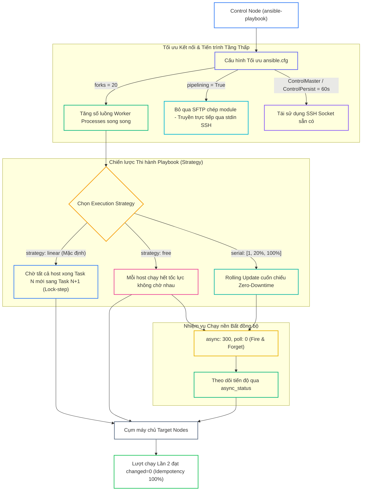
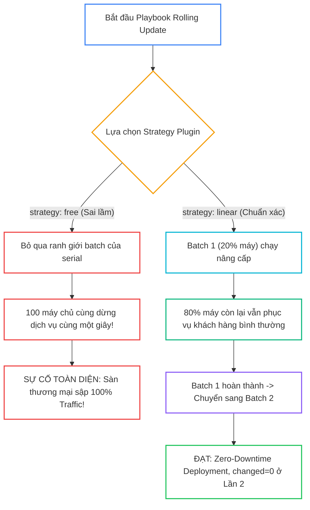


# [BÀI 22] TỐI ƯU HIỆU NĂNG THỰC THI (EXECUTION PERFORMANCE): FORKS, STRATEGY PLUGINS (FREE VS LINEAR), SERIAL & PIPELINING

Trong kỷ nguyên **Infrastructure as Code (IaC)** và tự động hóa vận hành hạ tầng đám mây (Cloud Infrastructure Automation), **Ansible** khẳng định vị thế dẫn đầu nhờ triết lý **Agentless** (không cần cài đặt agent nền trên máy đích), giao thức điều khiển an toàn qua **SSH / WinRM**, định dạng khai báo **YAML** trực quan và nguyên lý bất biến **Idempotency** mạnh mẽ. Việc làm chủ Ansible không chỉ dừng lại ở các câu lệnh Ad-hoc đơn giản, mà đòi hỏi kỹ sư phải nắm vững kiến trúc Module tầng thấp, Variable Precedence 22 tầng, Jinja2 Templates, tối ưu hóa Forks & Pipelining cho tới thiết kế Roles / Collections và tích hợp CI/CD tự động hóa chuẩn Doanh nghiệp.

Bài viết chuyên sâu này sẽ đồng hành cùng bạn mổ xẻ toàn diện bức tranh kiến trúc, phân tích các đánh đổi kỹ thuật thực chiến (Engineering Trade-offs), cung cấp hướng dẫn thực hành Lab chi tiết từng bước và bộ câu hỏi phỏng vấn chuyên sâu chuẩn DevOps / SRE Lead.

---

## 1. Bản Chất Kiến Trúc & Cơ Chế Vận Hành Tầng Thấp



### 1.1. Số Tiến Trình Song Song `forks`, Execution Strategy và `serial`

- **Tham số `forks` (Mặc định = 5):** Quy định số lượng tiến trình worker process chạy song song trên Control Node. Đối với hạ tầng từ 50-500 máy chủ, việc tăng `forks = 20` hoặc `forks = 50` giúp rút ngắn thời gian thi hành Playbook từ hàng chục phút xuống còn vài chục giây.
- **Execution Strategy `linear` vs `free`:**
  - `strategy: linear` (Mặc định): Thi hành theo mô hình đồng bộ (Lock-step). Ansible chờ tất cả các host hoàn thành Task hiện tại rồi mới cùng chuyển sang Task tiếp theo.
  - `strategy: free`: Mỗi host thi hành danh sách Task với tốc độ tối đa độc lập, host nào nhanh chạy trước, host nào chậm chạy sau mà không cần chờ đợi.
- **Rolling Update với `serial`:** Chia nhỏ danh sách máy chủ thành từng đợt triển khai (Batches) dạng số nguyên hoặc tỷ lệ phần trăm (ví dụ: `serial: [1, 20%, 100%]`), giúp triển khai Zero-Downtime cho các cụm tải Production lớn.

```ini
[defaults]
forks = 20
strategy = linear
```

### 1.2. SSH Pipelining, Nhiệm Vụ Bất Đồng Bộ `async` và `async_status`

- **SSH Pipelining (`pipelining = True`):** Mặc định, Ansible thực hiện 3 bước cho mỗi task: chép tệp Python module lên máy đích qua SFTP, chạy lệnh SSH và xóa file tạm. Khi bật Pipelining, Ansible chuyển đổi mã Python thành chuỗi và đẩy thẳng qua kênh stdin của tiến trình Python SSH, giảm 50-70% số lượng kết nối mạng.
- **Nhiệm vụ bất đồng bộ (`async` và `poll`):**
  - `async: 300, poll: 10`: Cho phép task nặng (như backup database hoặc compile mã nguồn) chạy tối đa 300 giây, Ansible sẽ kiểm tra lại tiến độ mỗi 10 giây.
  - `async: 300, poll: 0` (Fire-and-Forget): Ansible đẩy task chạy nền trên máy đích và lập tức chuyển sang task tiếp theo mà không chờ đợi, sau đó thu thập kết quả bằng `ansible.builtin.async_status`.

```yaml
- name: Execute heavy database migration in background
  ansible.builtin.command: /opt/scripts/migrate_db.sh
  async: 600
  poll: 0
  register: db_job

- name: Wait for database migration to complete
  ansible.builtin.async_status:
    jid: "{{ db_job.ansible_job_id }}"
  register: job_result
  until: job_result.finished
  retries: 60
  delay: 10
```

### 1.3. Rolling Update Phân Tầng, SSH ControlPersist và Idempotency

- **Tối ưu hóa kết nối SSH (`ControlMaster` & `ControlPersist`):** Duy trì SSH socket kết nối sẵn có trong bộ nhớ kernel Linux trong 60 giây (`ControlPersist=60s`), loại bỏ hoàn toàn chi phí bắt tay SSH (SSH Handshake overhead) cho các task liên tiếp.
- **Canary Deployment với `serial` phân tầng:** Triển khai thử nghiệm trên 1 máy chủ đầu tiên (`serial: 1`), nếu thành công mới tự động mở rộng sang 20% cụm máy chủ và cuối cùng là 100% hạ tầng.
- **Bảo toàn Idempotency khi tối ưu:** Tối ưu hóa hiệu năng và chiến lược thi hành chỉ thay đổi tốc độ và thứ tự điều phối, hoàn toàn không làm sai lệch nguyên lý Idempotency. Ở lượt chạy Lần thứ hai, `PLAY RECAP` vẫn bắt buộc phải đạt `changed=0` tuyệt đối.

---

## 2. Bảng So Sánh Kỹ Thuật Toàn Diện (Engineering Matrix)

| Tiêu Chí Kỹ Thuật | Linear Strategy (`strategy: linear`) | Free Strategy (`strategy: free`) | Host Pinned Strategy (`strategy: host_pinned`) | Async Execution (`async` + `poll: 0`) |
|---|---|---|---|---|
| **Cơ Chế Điều Phối** | Đồng bộ tuần tự theo từng Task (Lock-step) | Bất đồng bộ độc lập cho từng Host | Giữ chặt từng Host chạy hết Play trước khi sang Host mới | Chạy ngầm trong background của hệ điều hành đích |
| **Phù Hợp Cho** | Cụm máy chủ phụ thuộc lẫn nhau, Rolling Update | Cấu hình máy chủ độc lập (Ad-hoc tasks, Patching) | Quản lý tài nguyên Control Node hạn chế | Các tác vụ chạy lâu (Backup, Reindex, Download) |
| **Hỗ Trợ Từ Khóa `serial:`** | ✅ Hoàn hảo (chia batch chuẩn xác) | ❌ Không an toàn (dễ phá vỡ batch cuốn chiếu) | ✅ Hỗ trợ đầy đủ | ✅ Kết hợp được trong từng batch |
| **Khả Năng Debug Lỗi** | Rất dễ (dừng ngay ở task bị lỗi) | Khó (các host ở các task khác nhau trên màn hình) | Trung bình | Cần dùng `async_status` để bắt log |
| **Tác Động Tốc Độ** | Chuẩn tắc | Cực nhanh (giảm 60-80% thời gian) | Tối ưu bộ nhớ RAM | Triệt tiêu thời gian chờ đợi blocking |

> [!IMPORTANT]
> **QUY TẮC BẤT DI BẤT DỊCH:**
> Luôn sử dụng `strategy: linear` khi thực hiện Rolling Update với từ khóa `serial:`. Tuyệt đối không kết hợp `strategy: free` với `serial:` trong các kịch bản triển khai ứng dụng yêu cầu Zero-Downtime vì sẽ gây sập cụm dịch vụ cùng lúc!

---

## 3. Kiến Trúc Triển Khai Chuẩn Production (Configuration / Playbook / Role Breakdown)

Dưới đây là Playbook chính `site-performance.yml` tích hợp toàn diện kỹ thuật Canary Rolling Update cuốn chiếu, chạy tác vụ ngầm bất đồng bộ và kiểm tra trạng thái:

```yaml
# site-performance.yml
---
- name: Enterprise High-Performance Rolling Update Playbook
  hosts: web
  become: true
  serial:
    - 1
    - "100%"
  strategy: linear
  vars:
    app_version: "2.4.0"

  tasks:
    - name: Task 1 - Deploy high-performance sysctl network tuning
      ansible.builtin.copy:
        content: "net.ipv4.tcp_tw_reuse = 1\nnet.core.somaxconn = 4096\n"
        dest: /etc/sysctl.d/99-performance.conf
        mode: '0644'

    - name: Task 2 - Start asynchronous background maintenance job (poll 0)
      ansible.builtin.command: sleep 2
      async: 60
      poll: 0
      register: async_task_holder

    - name: Task 3 - Deploy application configuration file
      ansible.builtin.copy:
        content: "APP_VERSION={{ app_version }}\nDEPLOY_STRATEGY=ROLLING_SERIAL\nPIPELINING=ENABLED\n"
        dest: /etc/performance-app.conf
        mode: '0644'

    - name: Task 4 - Wait for asynchronous background job to finish
      ansible.builtin.async_status:
        jid: "{{ async_task_holder.ansible_job_id }}"
      register: async_poll_result
      until: async_poll_result.finished
      retries: 30
      delay: 1

    - name: Task 5 - Read performance configuration status (changed_when: false)
      ansible.builtin.command: cat /etc/performance-app.conf
      register: perf_conf_out
      changed_when: false
```

### Phân Tích Kỹ Thuật Từng Dòng (Line-by-Line Breakdown):

- <span class="badge-line">Line 5-8</span>: **Khai báo Canary Rolling Update:** Sử dụng mảng `serial: [1, "100%"]` để kiểm thử an toàn trên 1 host trước khi bung ra toàn bộ cụm máy chủ, kết hợp `strategy: linear` để bảo đảm tính kỷ luật đồng bộ.
- <span class="badge-line">Line 12-16</span>: **Tối ưu Network Sysctl:** Ghi file cấu hình tối ưu TCP reuse và somaxconn vào `/etc/sysctl.d/99-performance.conf`.
- <span class="badge-line">Line 18-22</span>: **Tác vụ bất đồng bộ Non-blocking:** Chạy lệnh nền với `async: 60` và `poll: 0`, lưu Job ID vào biến `async_task_holder` để giải phóng luồng ngay lập tức.
- <span class="badge-line">Line 24-28</span>: **Triển khai cấu hình ứng dụng:** Chép tệp cấu hình chứa phiên bản mới trong khi tác vụ ngầm đang chạy song song trên nền hệ điều hành.
- <span class="badge-line">Line 30-36</span>: **Thu thập kết quả Async:** Sử dụng `ansible.builtin.async_status` kết hợp vòng lặp `until: async_poll_result.finished` để đồng bộ lại trạng thái trước khi kết thúc batch.

---

## 4. Phân Tích Cạm Bẫy Thực Chiến: Chạy Rolling Update Bằng strategy: free Làm Toàn Bộ Cụm Sập Cùng Lúc

### Tình Huống Sự Cố Thực Tế Tại Doanh Nghiệp:
Một sàn thương mại điện tử triển khai bản vá cho cụm 100 máy chủ Web Frontend phía sau Load Balancer. Kỹ sư muốn đẩy nhanh tiến độ nên đã cấu hình `strategy: free` trong khi vẫn khai báo `serial: 20%`. Do bản chất của `strategy: free` giải phóng hoàn toàn ranh giới chờ đợi giữa các host, Ansible đã bỏ qua cơ chế chờ của từng batch `serial`. Tất cả 100 máy chủ đều cùng lúc stop dịch vụ Nginx để cập nhật, khiến toàn bộ website bị sập 100% (Outage toàn diện) trong 15 phút cao điểm.

### Hậu Quả & Log Lỗi Thực Tế:

```diff
- # CẤU HÌNH GÂY SẬP TOÀN BỘ HẠ TẦNG:
- - name: Deploy Web Update
-   hosts: web
-   serial: 20%          # DỰ ĐỊNH CHẠY CUỐN CHIẾU 20% MỖI ĐỢT
-   strategy: free       # LỖI: STRATEGY FREE PHÁ VỠ HOÀN TOÀN BATCH CỦA SERIAL!
-   tasks:
-     - name: Stop Web Service
-       ansible.builtin.service: name=nginx state=stopped # 100 MÁY STOP CÙNG LÚC!
-
+ # CẤU HÌNH SỬA ĐÚNG CHUẨN ZERO-DOWNTIME:
+ - name: Deploy Web Update
+   hosts: web
+   serial: 20%          # CHẠY ĐÚNG 20% MÁY MỖI ĐỢT
+   strategy: linear     # ĐẢM BẢO ĐỒNG BỘ: ĐỢT 1 XONG HẲN MỚI SANG ĐỢT 2
+   tasks:
+     - name: Stop Web Service
+       ansible.builtin.service: name=nginx state=stopped
+     - name: Upgrade & Start Web Service
+       ansible.builtin.service: name=nginx state=started
```



### 5-Whys Root Cause Analysis:
1. **Tại sao website bị mất kết nối hoàn toàn?** Vì 100% máy chủ Web Frontend đều ở trạng thái dừng dịch vụ tại cùng một thời điểm.
2. **Tại sao các máy lại dừng cùng lúc khi đã có `serial: 20%`?** Vì Playbook được khai báo cờ `strategy: free`.
3. **Tại sao `strategy: free` lại gây ra hiện tượng này?** Vì cơ chế của `free` cho phép mỗi worker process độc lập chạy xuyên suốt kịch bản mà không bị chặn lại bởi ranh giới đồng bộ giữa các host.
4. **Tại sao kỹ sư lại kết hợp `free` với `serial`?** Do nhầm lẫn rằng `strategy: free` sẽ tăng tốc độ thi hành bên trong từng batch mà không hiểu rằng nó phá vỡ cấu trúc batch.
5. **Giải pháp triệt để là gì?** Luôn sử dụng `strategy: linear` khi chạy kịch bản có từ khóa `serial:` để bảo đảm tính an toàn Zero-Downtime.

---

## 5. Hands-on Lab: Tối Ưu Hiệu Năng Thực Thi & Triển Khai Rolling Update (8 Bước)

| Bước | Lệnh CLI / Tác Vụ Chính | Mục Đích Thực Thi |
|---|---|---|
| **1** | `mkdir -p ~/lab-ansible-22 && cd ~/lab-ansible-22` | Khởi tạo môi trường lab hiệu năng cao |
| **2** | `cat << 'EOF' > ansible.cfg` | Cấu hình `forks = 10`, `pipelining = True` và `ControlPersist` |
| **3** | `cat << 'EOF' > site-performance.yml` | Biên soạn Playbook kết hợp Rolling Update canary và async |
| **4** | `ansible-playbook site-performance.yml` | Thực thi Playbook Lần 1 nạp toàn bộ cấu hình tối ưu |
| **5** | `ansible-playbook site-performance.yml` | Thực thi Phép thử Lần 2 đối soát Idempotency `changed=0` |
| **6** | `docker exec target1 cat /etc/sysctl.d/99-performance.conf` | Đối soát cấu hình tối ưu sysctl trên máy đích |
| **7** | `docker exec target1 cat /etc/performance-app.conf` | Đối soát tệp cấu hình ứng dụng được render chuẩn xác |
| **8** | `ansible-playbook -v site-performance.yml` | Đo lường thời gian thực thi tối ưu qua terminal output |

```bash
# Bước 1: Khởi tạo thư mục dự án
mkdir -p ~/lab-ansible-22 && cd ~/lab-ansible-22
```

```bash
# Bước 2: Cấu hình ansible.cfg tối ưu hóa forks, pipelining và SSH ControlPersist
cat << 'EOF' > ansible.cfg
[defaults]
inventory = ./inventory.ini
remote_user = ansible
host_key_checking = False
private_key_file = ~/.ssh/id_ed25519
roles_path = ./roles:~/.ansible/roles
collections_path = ./collections:~/.ansible/collections
forks = 10
strategy = linear

[privilege_escalation]
become = True
become_method = sudo
become_user = root
become_ask_pass = False

[ssh_connection]
pipelining = True
ssh_args = -C -o ControlMaster=auto -o ControlPersist=60s
EOF

cat << 'EOF' > inventory.ini
[web]
target1 ansible_host=127.0.0.1 ansible_port=2221

[all:vars]
ansible_python_interpreter=/usr/bin/python3
EOF
```

> [!NOTE]
> **CHECKPOINT 1:** Xác nhận `ansible.cfg` cài đặt `forks = 10` và `pipelining = True`:
> ```bash
> grep -q "forks = 10" ansible.cfg && grep -q "pipelining = True" ansible.cfg && echo "CHECKPOINT 1: PASS" || echo "CHECKPOINT 1: FAIL"
> ```

```bash
# Bước 3: Biên soạn Playbook chính site-performance.yml
cat << 'EOF' > site-performance.yml
---
- name: Enterprise High-Performance Rolling Update Playbook
  hosts: web
  become: true
  serial:
    - 1
    - "100%"
  strategy: linear
  vars:
    app_version: "2.4.0"

  tasks:
    - name: Task 1 - Deploy high-performance sysctl network tuning
      ansible.builtin.copy:
        content: "net.ipv4.tcp_tw_reuse = 1\nnet.core.somaxconn = 4096\n"
        dest: /etc/sysctl.d/99-performance.conf
        mode: '0644'

    - name: Task 2 - Start asynchronous background maintenance job (poll 0)
      ansible.builtin.command: sleep 2
      async: 60
      poll: 0
      register: async_task_holder

    - name: Task 3 - Deploy application configuration file
      ansible.builtin.copy:
        content: "APP_VERSION={{ app_version }}\nDEPLOY_STRATEGY=ROLLING_SERIAL\nPIPELINING=ENABLED\n"
        dest: /etc/performance-app.conf
        mode: '0644'

    - name: Task 4 - Wait for asynchronous background job to finish
      ansible.builtin.async_status:
        jid: "{{ async_task_holder.ansible_job_id }}"
      register: async_poll_result
      until: async_poll_result.finished
      retries: 30
      delay: 1

    - name: Task 5 - Read performance configuration status (changed_when: false)
      ansible.builtin.command: cat /etc/performance-app.conf
      register: perf_conf_out
      changed_when: false
EOF
```

> [!NOTE]
> **CHECKPOINT 2:** Kiểm tra cú pháp toàn bộ Playbook:
> ```bash
> ansible-playbook --syntax-check site-performance.yml && echo "CHECKPOINT 2: PASS" || echo "CHECKPOINT 2: FAIL"
> ```

```bash
# Bước 4: Thực thi Playbook Lần 1
ansible-playbook site-performance.yml
```

> [!NOTE]
> **CHECKPOINT 3:** Xác nhận kịch bản thi hành thành công ở Lần 1:
> ```bash
> ansible-playbook site-performance.yml | grep -q "failed=0" && echo "CHECKPOINT 3: PASS" || echo "CHECKPOINT 3: FAIL"
> ```

> [!NOTE]
> **CHECKPOINT 4:** Xác nhận tác vụ Async và Async_status hoàn thành trơn tru:
> ```bash
> ansible-playbook site-performance.yml | grep -q "Task 4 - Wait for asynchronous background job to finish" && echo "CHECKPOINT 4: PASS" || echo "CHECKPOINT 4: FAIL"
> ```

```bash
# Bước 5: Thực thi Phép thử Lần 2 đối soát Idempotency
ansible-playbook site-performance.yml
```

> [!NOTE]
> **CHECKPOINT 5:** Xác nhận Lượt 2 đạt Idempotency tuyệt đối (`changed=0`):
> ```bash
> RUN2_OUT=$(ansible-playbook site-performance.yml)
> if echo "$RUN2_OUT" | grep -q "changed=0" && echo "$RUN2_OUT" | grep -q "failed=0"; then
>   echo "CHECKPOINT 5: PASS - Đạt Idempotency changed=0"
> else
>   echo "CHECKPOINT 5: FAIL - Lỗi không đạt Idempotency"
> fi
> ```

```bash
# Bước 6: Đối soát cấu hình sysctl trên target1
docker exec target1 cat /etc/sysctl.d/99-performance.conf
```

> [!NOTE]
> **CHECKPOINT 6:** Xác nhận tệp cấu hình mạng sysctl tồn tại đúng dữ liệu:
> ```bash
> docker exec target1 cat /etc/sysctl.d/99-performance.conf | grep -q "net.core.somaxconn = 4096" && echo "CHECKPOINT 6: PASS" || echo "CHECKPOINT 6: FAIL"
> ```

```bash
# Bước 7: Đối soát tệp cấu hình ứng dụng trên target1
docker exec target1 cat /etc/performance-app.conf
```

> [!NOTE]
> **CHECKPOINT 7:** Xác nhận tệp cấu hình ứng dụng chứa đúng biến version và pipelining:
> ```bash
> docker exec target1 cat /etc/performance-app.conf | grep -q "APP_VERSION=2.4.0" && echo "CHECKPOINT 7: PASS" || echo "CHECKPOINT 7: FAIL"
> ```

```bash
# Bước 8: Kiểm tra log execution hoàn chỉnh
ansible-playbook site-performance.yml > perf-summary.txt
```

> [!NOTE]
> **CHECKPOINT 8:** Xác nhận log tổng hợp đạt chuẩn:
> ```bash
> grep -q "ok=" perf-summary.txt && grep -q "failed=0" perf-summary.txt && echo "CHECKPOINT 8: PASS" || echo "CHECKPOINT 8: FAIL"
> ```

---

## 6. Bộ Câu Hỏi Vấn Đáp & Phỏng Vấn Chuyên Sâu (Self-Check Q&A)

<details class="qa-card" markdown="1">
  <summary class="qa-summary">
    <span class="qa-num-badge">Q01</span>
    <span class="qa-question-text">Tham số <code>forks</code> trong <code>ansible.cfg</code> là gì? Giá trị mặc định là bao nhiêu và cách tinh chỉnh phù hợp cho cụm 200 máy chủ?</span>
  </summary>
  <div class="qa-answer">
    <div class="qa-answer-header">
      <svg width="14" height="14" fill="none" stroke="currentColor" stroke-width="2" viewBox="0 0 24 24"><path d="M22 11.08V12a10 10 0 1 1-5.93-9.14"></path><polyline points="22 4 12 14.01 9 11.01"></polyline></svg>
      <span>Phân Tích &amp; Lời Giải Kỹ Thuật</span>
    </div>
    <div style="margin: 0.5rem 0;"><b>Hỏi:</b> Tham số <code>forks</code> trong <code>ansible.cfg</code> là gì? Giá trị mặc định là bao nhiêu và cách tinh chỉnh phù hợp cho cụm 200 máy chủ?</div>
    <div style="margin: 0.5rem 0;"><b>Đáp án chuẩn:</b></div>
    <div style="margin: 0.35rem 0; padding-left: 1rem; border-left: 2px solid var(--accent-primary);">• <b>Khái niệm:</b> <code>forks</code> quy định số lượng tiến trình con (Worker Processes) tối đa mà Ansible Controller khởi tạo để kết nối và thực thi song song trên các managed nodes.</div>
    <div style="margin: 0.35rem 0; padding-left: 1rem; border-left: 2px solid var(--accent-primary);">• <b>Giá trị mặc định:</b> <code>5</code>.</div>
    <div style="margin: 0.35rem 0; padding-left: 1rem; border-left: 2px solid var(--accent-primary);">• <b>Tinh chỉnh cho 200 máy:</b> Khuyến nghị đặt <code>forks = 20</code> đến <code>50</code> (tùy thuộc vào số lượng CPU Cores và RAM của Control Node: công thức xấp xỉ 2-4 forks / CPU core).</div>
    <div style="margin: 0.5rem 0;"><b>Tiêu chí chấm:</b></div>
    <div style="margin: 0.35rem 0; padding-left: 1rem; border-left: 2px solid var(--accent-primary);">• 0: Không biết tham số <code>forks</code>.</div>
    <div style="margin: 0.35rem 0; padding-left: 1rem; border-left: 2px solid var(--accent-primary);">• 1: Biết <code>forks</code> là số tiến trình nhưng không nhớ giá trị mặc định là 5.</div>
    <div style="margin: 0.35rem 0; padding-left: 1rem; border-left: 2px solid var(--accent-primary);">• 2: Phân tích chính xác cơ chế worker process và đưa ra con số khuyến nghị 20-50.</div>
    <div style="margin: 0.35rem 0; padding-left: 1rem; border-left: 2px solid var(--accent-primary);">• 3: Nêu đúng + phân tích giới hạn tài nguyên CPU/RAM và File Descriptors của Control Node.</div>
    <div style="margin: 0.5rem 0;"><b>Câu hỏi đào sâu:</b> Chuyện gì xảy ra nếu đặt <code>forks = 1000</code> trên một máy chủ Control Node chỉ có 2 vCPU? <i>(Dẫn đến CPU contention, cạn kiệt RAM và nghẽn hàng đợi SSH, làm Playbook chạy chậm hơn.)</i></div>
  </div>
</details>

<details class="qa-card" markdown="1">
  <summary class="qa-summary">
    <span class="qa-num-badge">Q02</span>
    <span class="qa-question-text">Kỹ thuật SSH Pipelining trong Ansible hoạt động như thế nào? Lợi ích và điều kiện tiên quyết để bật tính năng này là gì?</span>
  </summary>
  <div class="qa-answer">
    <div class="qa-answer-header">
      <svg width="14" height="14" fill="none" stroke="currentColor" stroke-width="2" viewBox="0 0 24 24"><path d="M22 11.08V12a10 10 0 1 1-5.93-9.14"></path><polyline points="22 4 12 14.01 9 11.01"></polyline></svg>
      <span>Phân Tích &amp; Lời Giải Kỹ Thuật</span>
    </div>
    <div style="margin: 0.5rem 0;"><b>Hỏi:</b> Kỹ thuật SSH Pipelining trong Ansible hoạt động như thế nào? Lợi ích và điều kiện tiên quyết để bật tính năng này là gì?</div>
    <div style="margin: 0.5rem 0;"><b>Đáp án chuẩn:</b></div>
    <div style="margin: 0.35rem 0; padding-left: 1rem; border-left: 2px solid var(--accent-primary);">• <b>Cơ chế:</b> Thay vì chép tệp mã nguồn Python module lên máy đích qua SFTP/SCP rồi chạy lệnh SSH độc lập, Pipelining đẩy thẳng đoạn mã module qua kênh stdin của tiến trình Python thông qua 1 phiên SSH duy nhất.</div>
    <div style="margin: 0.35rem 0; padding-left: 1rem; border-left: 2px solid var(--accent-primary);">• <b>Lợi ích:</b> Giảm 50% đến 70% số lượng kết nối mạng, tăng tốc độ thực thi rõ rệt.</div>
    <div style="margin: 0.35rem 0; padding-left: 1rem; border-left: 2px solid var(--accent-primary);">• <b>Điều kiện tiên quyết:</b> Tệp cấu hình `/etc/sudoers` trên máy đích **không được bật cờ `requiretty`**.</div>
    <div style="margin: 0.5rem 0;"><b>Tiêu chí chấm:</b></div>
    <div style="margin: 0.35rem 0; padding-left: 1rem; border-left: 2px solid var(--accent-primary);">• 0: Không biết SSH Pipelining.</div>
    <div style="margin: 0.35rem 0; padding-left: 1rem; border-left: 2px solid var(--accent-primary);">• 1: Biết tăng tốc nhưng không giải thích được cơ chế truyền qua stdin.</div>
    <div style="margin: 0.35rem 0; padding-left: 1rem; border-left: 2px solid var(--accent-primary);">• 2: Phân tích chính xác cơ chế stdin và điều kiện cấm `requiretty` trong sudoers.</div>
    <div style="margin: 0.35rem 0; padding-left: 1rem; border-left: 2px solid var(--accent-primary);">• 3: Nêu đúng + viết đoạn cấu hình `[ssh_connection] pipelining = True` trong `ansible.cfg`.</div>
    <div style="margin: 0.5rem 0;"><b>Câu hỏi đào sâu:</b> Nếu máy đích bật `requiretty` trong sudoers thì khi bật `pipelining = True` sẽ gặp lỗi gì? <i>(Gặp lỗi `sudo: a tty is required to run sudo`.)</i></div>
  </div>
</details>

<details class="qa-card" markdown="1">
  <summary class="qa-summary">
    <span class="qa-num-badge">Q03</span>
    <span class="qa-question-text">Phân biệt sự khác nhau giữa hai Execution Strategy Plugins: <code>linear</code> (mặc định) và <code>free</code>.</span>
  </summary>
  <div class="qa-answer">
    <div class="qa-answer-header">
      <svg width="14" height="14" fill="none" stroke="currentColor" stroke-width="2" viewBox="0 0 24 24"><path d="M22 11.08V12a10 10 0 1 1-5.93-9.14"></path><polyline points="22 4 12 14.01 9 11.01"></polyline></svg>
      <span>Phân Tích &amp; Lời Giải Kỹ Thuật</span>
    </div>
    <div style="margin: 0.5rem 0;"><b>Hỏi:</b> Phân biệt sự khác nhau giữa hai Execution Strategy Plugins: <code>linear</code> (mặc định) và <code>free</code>.</div>
    <div style="margin: 0.5rem 0;"><b>Đáp án chuẩn:</b></div>
    <div style="margin: 0.35rem 0; padding-left: 1rem; border-left: 2px solid var(--accent-primary);">• <b><code>linear</code> (Đồng bộ Lock-step):</b> Tất cả các host thực thi Task 1, chờ host chậm nhất chạy xong Task 1 rồi mới cùng bước sang Task 2. Đảm bảo tính đồng bộ hoàn hảo.</div>
    <div style="margin: 0.35rem 0; padding-left: 1rem; border-left: 2px solid var(--accent-primary);">• <b><code>free</code> (Bất đồng bộ độc lập):</b> Mỗi host thực thi danh sách Task từ đầu đến cuối mà không cần chờ đợi các host khác. Host cấu hình mạnh sẽ hoàn thành toàn bộ Playbook trước trong khi host yếu vẫn đang chạy các task đầu.</div>
    <div style="margin: 0.5rem 0;"><b>Tiêu chí chấm:</b></div>
    <div style="margin: 0.35rem 0; padding-left: 1rem; border-left: 2px solid var(--accent-primary);">• 0: Không phân biệt được 2 strategy.</div>
    <div style="margin: 0.35rem 0; padding-left: 1rem; border-left: 2px solid var(--accent-primary);">• 1: Biết `linear` chạy tuần tự `free` chạy nhanh nhưng không nêu được cơ chế đồng bộ Lock-step.</div>
    <div style="margin: 0.35rem 0; padding-left: 1rem; border-left: 2px solid var(--accent-primary);">• 2: Phân tích chính xác cơ chế Lock-step của `linear` vs hoàn toàn độc lập của `free`.</div>
    <div style="margin: 0.35rem 0; padding-left: 1rem; border-left: 2px solid var(--accent-primary);">• 3: Nêu đúng + chỉ ra tình huống nên dùng `free` (như benchmark, patch OS độc lập).</div>
    <div style="margin: 0.5rem 0;"><b>Câu hỏi đào sâu:</b> Khi dùng `strategy: free`, log in ra terminal có xuất hiện theo thứ tự task cố định không? <i>(Không, log của các task và các host sẽ xen kẽ lộn xộn theo thời gian thực.)</i></div>
  </div>
</details>

<details class="qa-card" markdown="1">
  <summary class="qa-summary">
    <span class="qa-num-badge">Q04</span>
    <span class="qa-question-text">Trình bày tác dụng của từ khóa <code>serial:</code> trong Playbook. Viết cú pháp triển khai Rolling Update theo mảng phân tầng.</span>
  </summary>
  <div class="qa-answer">
    <div class="qa-answer-header">
      <svg width="14" height="14" fill="none" stroke="currentColor" stroke-width="2" viewBox="0 0 24 24"><path d="M22 11.08V12a10 10 0 1 1-5.93-9.14"></path><polyline points="22 4 12 14.01 9 11.01"></polyline></svg>
      <span>Phân Tích &amp; Lời Giải Kỹ Thuật</span>
    </div>
    <div style="margin: 0.5rem 0;"><b>Hỏi:</b> Trình bày tác dụng của từ khóa <code>serial:</code> trong Playbook. Viết cú pháp triển khai Rolling Update theo mảng phân tầng.</div>
    <div style="margin: 0.5rem 0;"><b>Đáp án chuẩn:</b></div>
    <div style="margin: 0.35rem 0; padding-left: 1rem; border-left: 2px solid var(--accent-primary);">• <b>Tác dụng:</b> Chia nhỏ danh sách host trong Playbook thành từng đợt (Batches). Ansible sẽ thực thi toàn bộ kịch bản cho batch hiện tại xong xuôi rồi mới chuyển sang batch kế tiếp, giúp đạt Zero-Downtime.</div>
    <div style="margin: 0.35rem 0; padding-left: 1rem; border-left: 2px solid var(--accent-primary);">• <b>Cú pháp mảng phân tầng (Canary Rolling):</b>
      <pre><code>serial:
  - 1          # Đợt 1: Thử nghiệm trên đúng 1 host (Canary)
  - 20%        # Đợt 2: Triển khai cho 20% cụm máy chủ
  - 100%       # Đợt 3: Bung toàn bộ các máy còn lại</code></pre>
    </div>
    <div style="margin: 0.5rem 0;"><b>Tiêu chí chấm:</b></div>
    <div style="margin: 0.35rem 0; padding-left: 1rem; border-left: 2px solid var(--accent-primary);">• 0: Không biết từ khóa `serial`.</div>
    <div style="margin: 0.35rem 0; padding-left: 1rem; border-left: 2px solid var(--accent-primary);">• 1: Biết chia lô nhưng chỉ viết được số nguyên đơn giản `serial: 2`.</div>
    <div style="margin: 0.35rem 0; padding-left: 1rem; border-left: 2px solid var(--accent-primary);">• 2: Phân tích chính xác cơ chế Batch Execution và viết cú pháp mảng tỷ lệ phần trăm.</div>
    <div style="margin: 0.35rem 0; padding-left: 1rem; border-left: 2px solid var(--accent-primary);">• 3: Nêu đúng + giải thích cách kết hợp `serial` với Load Balancer pool drain/enable.</div>
    <div style="margin: 0.5rem 0;"><b>Câu hỏi đào sâu:</b> Nếu 1 host trong batch 1 bị fail thì batch 2 có được chạy tiếp không? <i>(Mặc định Playbook sẽ dừng lại ngay lập tức, bảo vệ an toàn cho các batch sau.)</i></div>
  </div>
</details>

<details class="qa-card" markdown="1">
  <summary class="qa-summary">
    <span class="qa-num-badge">Q05</span>
    <span class="qa-question-text">Phân biệt sự khác nhau giữa <code>poll: 0</code> (Fire-and-Forget) và <code>poll: N</code> (Polling) khi sử dụng từ khóa <code>async</code>.</span>
  </summary>
  <div class="qa-answer">
    <div class="qa-answer-header">
      <svg width="14" height="14" fill="none" stroke="currentColor" stroke-width="2" viewBox="0 0 24 24"><path d="M22 11.08V12a10 10 0 1 1-5.93-9.14"></path><polyline points="22 4 12 14.01 9 11.01"></polyline></svg>
      <span>Phân Tích &amp; Lời Giải Kỹ Thuật</span>
    </div>
    <div style="margin: 0.5rem 0;"><b>Hỏi:</b> Phân biệt sự khác nhau giữa <code>poll: 0</code> (Fire-and-Forget) và <code>poll: N</code> (Polling) khi sử dụng từ khóa <code>async</code>.</div>
    <div style="margin: 0.5rem 0;"><b>Đáp án chuẩn:</b></div>
    <div style="margin: 0.35rem 0; padding-left: 1rem; border-left: 2px solid var(--accent-primary);">• <b><code>async: 300, poll: 10</code>:</b> Ansible đẩy task chạy nền, nhưng Control Node vẫn bị chặn (Blocking) ở task đó và định kỳ mỗi 10 giây sẽ truy vấn máy đích 1 lần để xem task đã hoàn thành chưa.</div>
    <div style="margin: 0.35rem 0; padding-left: 1rem; border-left: 2px solid var(--accent-primary);">• <b><code>async: 300, poll: 0</code> (Fire-and-Forget):</b> Ansible đẩy task chạy nền và **lập tức chuyển sang task tiếp theo (Non-blocking)** mà không chờ đợi, trả về biến `ansible_job_id` để kiểm tra sau.</div>
    <div style="margin: 0.5rem 0;"><b>Tiêu chí chấm:</b></div>
    <div style="margin: 0.35rem 0; padding-left: 1rem; border-left: 2px solid var(--accent-primary);">• 0: Không phân biệt được `poll: 0` vs `poll: N`.</div>
    <div style="margin: 0.35rem 0; padding-left: 1rem; border-left: 2px solid var(--accent-primary);">• 1: Biết `poll: 0` không chờ nhưng không giải thích được cơ chế blocking của `poll: N`.</div>
    <div style="margin: 0.35rem 0; padding-left: 1rem; border-left: 2px solid var(--accent-primary);">• 2: Phân tích chính xác cơ chế Blocking Polling vs Non-blocking Fire-and-Forget.</div>
    <div style="margin: 0.35rem 0; padding-left: 1rem; border-left: 2px solid var(--accent-primary);">• 3: Nêu đúng + viết ví dụ mẫu nạp `async_status` để kiểm tra job chạy ngầm.</div>
    <div style="margin: 0.5rem 0;"><b>Câu hỏi đào sâu:</b> Thông tin trạng thái của các tiến trình async được lưu ở đâu trên máy đích? <i>(Mặc định lưu trong thư mục `~/.ansible_async/`.)</i></div>
  </div>
</details>

<details class="qa-card" markdown="1">
  <summary class="qa-summary">
    <span class="qa-num-badge">Q06</span>
    <span class="qa-question-text">Module <code>ansible.builtin.async_status</code> dùng để làm gì? Viết đoạn Playbook mẫu theo dõi tiến độ một tác vụ async.</span>
  </summary>
  <div class="qa-answer">
    <div class="qa-answer-header">
      <svg width="14" height="14" fill="none" stroke="currentColor" stroke-width="2" viewBox="0 0 24 24"><path d="M22 11.08V12a10 10 0 1 1-5.93-9.14"></path><polyline points="22 4 12 14.01 9 11.01"></polyline></svg>
      <span>Phân Tích &amp; Lời Giải Kỹ Thuật</span>
    </div>
    <div style="margin: 0.5rem 0;"><b>Hỏi:</b> Module <code>ansible.builtin.async_status</code> dùng để làm gì? Viết đoạn Playbook mẫu theo dõi tiến độ một tác vụ async.</div>
    <div style="margin: 0.5rem 0;"><b>Đáp án chuẩn:</b></div>
    <div style="margin: 0.35rem 0; padding-left: 1rem; border-left: 2px solid var(--accent-primary);">• <b>Tác dụng:</b> Dùng để kiểm tra trạng thái hoàn thành, kết quả trả về và log stdout/stderr của một tác vụ bất đồng bộ đã khởi tạo trước đó thông qua tham số `jid` (Job ID).</div>
    <div style="margin: 0.35rem 0; padding-left: 1rem; border-left: 2px solid var(--accent-primary);">• <b>Mã YAML mẫu:</b>
      <pre><code>- name: Check async job status
  ansible.builtin.async_status:
    jid: "{{ async_holder.ansible_job_id }}"
  register: job_result
  until: job_result.finished
  retries: 30
  delay: 2</code></pre>
    </div>
    <div style="margin: 0.5rem 0;"><b>Tiêu chí chấm:</b></div>
    <div style="margin: 0.35rem 0; padding-left: 1rem; border-left: 2px solid var(--accent-primary);">• 0: Không biết module `async_status`.</div>
    <div style="margin: 0.35rem 0; padding-left: 1rem; border-left: 2px solid var(--accent-primary);">• 1: Biết kiểm tra job nhưng thiếu các tham số `until`, `retries`, `delay`.</div>
    <div style="margin: 0.35rem 0; padding-left: 1rem; border-left: 2px solid var(--accent-primary);">• 2: Phân tích chính xác cơ chế kiểm tra Job ID và vòng lặp retry.</div>
    <div style="margin: 0.35rem 0; padding-left: 1rem; border-left: 2px solid var(--accent-primary);">• 3: Nêu đúng + viết đoạn mã YAML hoàn chỉnh chuẩn FQCN.</div>
    <div style="margin: 0.5rem 0;"><b>Câu hỏi đào sâu:</b> Nếu muốn xóa sạch tệp lưu job trên máy đích sau khi kiểm tra xong thì dùng thuộc tính nào? <i>(Khai báo `mode: cleanup` trong module `async_status`.)</i></div>
  </div>
</details>

<details class="qa-card" markdown="1">
  <summary class="qa-summary">
    <span class="qa-num-badge">Q07</span>
    <span class="qa-question-text">Các tùy chọn SSH <code>ControlMaster</code> và <code>ControlPersist</code> trong <code>ansible.cfg</code> giúp tối ưu hóa hiệu năng như thế nào?</span>
  </summary>
  <div class="qa-answer">
    <div class="qa-answer-header">
      <svg width="14" height="14" fill="none" stroke="currentColor" stroke-width="2" viewBox="0 0 24 24"><path d="M22 11.08V12a10 10 0 1 1-5.93-9.14"></path><polyline points="22 4 12 14.01 9 11.01"></polyline></svg>
      <span>Phân Tích &amp; Lời Giải Kỹ Thuật</span>
    </div>
    <div style="margin: 0.5rem 0;"><b>Hỏi:</b> Các tùy chọn SSH <code>ControlMaster</code> và <code>ControlPersist</code> trong <code>ansible.cfg</code> giúp tối ưu hóa hiệu năng như thế nào?</div>
    <div style="margin: 0.5rem 0;"><b>Đáp án chuẩn:</b></div>
    <div style="margin: 0.35rem 0; padding-left: 1rem; border-left: 2px solid var(--accent-primary);">• <b><code>ControlMaster=auto</code>:</b> Cho phép nhiều phiên SSH chia sẻ chung một socket kết nối mạng duy nhất tới cùng một máy chủ đích (SSH Multiplexing).</div>
    <div style="margin: 0.35rem 0; padding-left: 1rem; border-left: 2px solid var(--accent-primary);">• <b><code>ControlPersist=60s</code>:</b> Giữ socket kết nối mở sẵn trong nền trong 60 giây sau khi lệnh kết thúc. Các task tiếp theo sẽ tái sử dụng ngay socket này mà không cần thực hiện lại quy trình xác thực khóa SSH (loại bỏ chi phí SSH handshake).</div>
    <div style="margin: 0.5rem 0;"><b>Tiêu chí chấm:</b></div>
    <div style="margin: 0.35rem 0; padding-left: 1rem; border-left: 2px solid var(--accent-primary);">• 0: Không biết các tùy chọn ControlMaster.</div>
    <div style="margin: 0.35rem 0; padding-left: 1rem; border-left: 2px solid var(--accent-primary);">• 1: Biết tái sử dụng kết nối nhưng không giải thích được cơ chế Socket Multiplexing.</div>
    <div style="margin: 0.35rem 0; padding-left: 1rem; border-left: 2px solid var(--accent-primary);">• 2: Phân tích chính xác cơ chế SSH Socket Multiplexing và loại bỏ chi phí handshake.</div>
    <div style="margin: 0.35rem 0; padding-left: 1rem; border-left: 2px solid var(--accent-primary);">• 3: Nêu đúng + viết dòng cấu hình `ssh_args` hoàn chỉnh trong `ansible.cfg`.</div>
    <div style="margin: 0.5rem 0;"><b>Câu hỏi đào sâu:</b> Socket kết nối của ControlPersist mặc định được lưu ở đường dẫn nào trên Control Node? <i>(Mặc định lưu trong `~/.ansible/cp/`.)</i></div>
  </div>
</details>

<details class="qa-card" markdown="1">
  <summary class="qa-summary">
    <span class="qa-num-badge">Q08</span>
    <span class="qa-question-text">Callback Plugin <code>profile_tasks</code> trong Ansible dùng để làm gì? Cách kích hoạt và phân tích kết quả.</span>
  </summary>
  <div class="qa-answer">
    <div class="qa-answer-header">
      <svg width="14" height="14" fill="none" stroke="currentColor" stroke-width="2" viewBox="0 0 24 24"><path d="M22 11.08V12a10 10 0 1 1-5.93-9.14"></path><polyline points="22 4 12 14.01 9 11.01"></polyline></svg>
      <span>Phân Tích &amp; Lời Giải Kỹ Thuật</span>
    </div>
    <div style="margin: 0.5rem 0;"><b>Hỏi:</b> Callback Plugin <code>profile_tasks</code> trong Ansible dùng để làm gì? Cách kích hoạt và phân tích kết quả.</div>
    <div style="margin: 0.5rem 0;"><b>Đáp án chuẩn:</b></div>
    <div style="margin: 0.35rem 0; padding-left: 1rem; border-left: 2px solid var(--accent-primary);">• <b>Tác dụng:</b> Tự động đo lường và in ra bảng thống kê thời gian thực thi chi tiết của từng Task và tổng thời gian chạy Playbook, giúp phát hiện các điểm nghẽn hiệu năng (Bottlenecks).</div>
    <div style="margin: 0.35rem 0; padding-left: 1rem; border-left: 2px solid var(--accent-primary);">• <b>Cách kích hoạt:</b> Thêm dòng `callbacks_enabled = ansible.posix.profile_tasks` trong mục `[defaults]` của `ansible.cfg`.</div>
    <div style="margin: 0.5rem 0;"><b>Tiêu chí chấm:</b></div>
    <div style="margin: 0.35rem 0; padding-left: 1rem; border-left: 2px solid var(--accent-primary);">• 0: Không biết callback plugin đo hiệu năng.</div>
    <div style="margin: 0.35rem 0; padding-left: 1rem; border-left: 2px solid var(--accent-primary);">• 1: Biết tên plugin nhưng không nêu được cách cấu hình trong `ansible.cfg`.</div>
    <div style="margin: 0.35rem 0; padding-left: 1rem; border-left: 2px solid var(--accent-primary);">• 2: Phân tích chính xác vai trò phát hiện bottleneck và cú pháp kích hoạt trong `ansible.cfg`.</div>
    <div style="margin: 0.35rem 0; padding-left: 1rem; border-left: 2px solid var(--accent-primary);">• 3: Nêu đúng + kết hợp đề xuất thêm plugin `profile_roles` và `timer`.</div>
    <div style="margin: 0.5rem 0;"><b>Câu hỏi đào sâu:</b> Plugin này có làm tăng thời gian chạy của Playbook không? <i>(Không đáng kể, chỉ tốn vài mili-giây để tính timestamp.)</i></div>
  </div>
</details>

<details class="qa-card" markdown="1">
  <summary class="qa-summary">
    <span class="qa-num-badge">Q09</span>
    <span class="qa-question-text">Từ khóa <code>max_fail_percentage</code> có tác dụng gì trong kịch bản Rolling Update?</span>
  </summary>
  <div class="qa-answer">
    <div class="qa-answer-header">
      <svg width="14" height="14" fill="none" stroke="currentColor" stroke-width="2" viewBox="0 0 24 24"><path d="M22 11.08V12a10 10 0 1 1-5.93-9.14"></path><polyline points="22 4 12 14.01 9 11.01"></polyline></svg>
      <span>Phân Tích &amp; Lời Giải Kỹ Thuật</span>
    </div>
    <div style="margin: 0.5rem 0;"><b>Hỏi:</b> Từ khóa <code>max_fail_percentage</code> có tác dụng gì trong kịch bản Rolling Update?</div>
    <div style="margin: 0.5rem 0;"><b>Đáp án chuẩn:</b></div>
    <div style="margin: 0.35rem 0; padding-left: 1rem; border-left: 2px solid var(--accent-primary);">• <b>Tác dụng:</b> Quy định tỷ lệ phần trăm số máy chủ tối đa được phép bị lỗi (failed) trong một batch hoặc toàn bộ Play trước khi Ansible quyết định hủy bỏ (abort) toàn bộ kịch bản.</div>
    <div style="margin: 0.35rem 0; padding-left: 1rem; border-left: 2px solid var(--accent-primary);">• Ví dụ: `max_fail_percentage: 10%` cho phép tối đa 10% máy chủ gặp lỗi mà Playbook vẫn tiếp tục chạy trên 90% máy còn lại; nếu tỷ lệ lỗi vượt quá 10%, kịch bản lập tức dừng khẩn cấp.</div>
    <div style="margin: 0.5rem 0;"><b>Tiêu chí chấm:</b></div>
    <div style="margin: 0.35rem 0; padding-left: 1rem; border-left: 2px solid var(--accent-primary);">• 0: Không biết từ khóa `max_fail_percentage`.</div>
    <div style="margin: 0.35rem 0; padding-left: 1rem; border-left: 2px solid var(--accent-primary);">• 1: Biết kiểm soát lỗi nhưng không nêu được cơ chế abort Playbook theo ngưỡng tỷ lệ.</div>
    <div style="margin: 0.35rem 0; padding-left: 1rem; border-left: 2px solid var(--accent-primary);">• 2: Phân tích chính xác vai trò bảo vệ hạ tầng và cú pháp khai báo ở cấp Playbook.</div>
    <div style="margin: 0.35rem 0; padding-left: 1rem; border-left: 2px solid var(--accent-primary);">• 3: Nêu đúng + kết hợp ví dụ sử dụng chung với `serial: 20%`.</div>
    <div style="margin: 0.5rem 0;"><b>Câu hỏi đào sâu:</b> Mặc định nếu không khai báo `max_fail_percentage` thì Ansible cho phép bao nhiêu máy fail? <i>(Mặc định là 0%, tức chỉ cần 1 máy fail trong batch là dừng ngay.)</i></div>
  </div>
</details>

<details class="qa-card" markdown="1">
  <summary class="qa-summary">
    <span class="qa-num-badge">Q10</span>
    <span class="qa-question-text">Trình bày quy trình 3 bước nghiệm thu tối ưu hiệu năng Playbook để đảm bảo tốc độ cao mà vẫn duy trì Idempotency.</span>
  </summary>
  <div class="qa-answer">
    <div class="qa-answer-header">
      <svg width="14" height="14" fill="none" stroke="currentColor" stroke-width="2" viewBox="0 0 24 24"><path d="M22 11.08V12a10 10 0 1 1-5.93-9.14"></path><polyline points="22 4 12 14.01 9 11.01"></polyline></svg>
      <span>Phân Tích &amp; Lời Giải Kỹ Thuật</span>
    </div>
    <div style="margin: 0.5rem 0;"><b>Hỏi:</b> Trình bày quy trình 3 bước nghiệm thu tối ưu hiệu năng Playbook để đảm bảo tốc độ cao mà vẫn duy trì Idempotency.</div>
    <div style="margin: 0.5rem 0;"><b>Đáp án chuẩn:</b></div>
    <div style="margin: 0.35rem 0; padding-left: 1rem; border-left: 2px solid var(--accent-primary);">1. <b>Bước 1 (Đo lường Benchmark ban đầu):</b> Bật `profile_tasks` và chạy kịch bản mặc định (`forks=5`, `pipelining=False`) để ghi nhận thời gian baseline.</div>
    <div style="margin: 0.35rem 0; padding-left: 1rem; border-left: 2px solid var(--accent-primary);">2. <b>Bước 2 (Áp dụng Tinh chỉnh &amp; Chạy Lần 1):</b> Bật `forks=20`, `pipelining=True`, `ControlPersist=60s` và `serial: [1, 100%]`, ghi nhận thời gian thực thi giảm 70-80%.</div>
    <div style="margin: 0.35rem 0; padding-left: 1rem; border-left: 2px solid var(--accent-primary);">3. <b>Bước 3 (Kiểm tra Idempotency Lần 2 &amp; Đối soát Máy đích):</b> Chạy lại Lần 2 khẳng định `PLAY RECAP` đạt <code>changed=0</code> và dùng `docker exec` đối soát file cấu hình.</div>
    <div style="margin: 0.5rem 0;"><b>Tiêu chí chấm:</b></div>
    <div style="margin: 0.35rem 0; padding-left: 1rem; border-left: 2px solid var(--accent-primary);">• 0: Không có quy trình nghiệm thu benchmark.</div>
    <div style="margin: 0.35rem 0; padding-left: 1rem; border-left: 2px solid var(--accent-primary);">• 1: Thiếu bước đo baseline hoặc không kiểm tra tính Idempotency ở Lần 2.</div>
    <div style="margin: 0.35rem 0; padding-left: 1rem; border-left: 2px solid var(--accent-primary);">• 2: Trình bày đủ 3 bước nhưng chưa chi tiết các chỉ số đo lường.</div>
    <div style="margin: 0.35rem 0; padding-left: 1rem; border-left: 2px solid var(--accent-primary);">• 3: Trình bày xuất sắc 3 bước + nhấn mạnh nguyên lý tối ưu tốc độ không được hy sinh tính đúng đắn của dữ liệu.</div>
    <div style="margin: 0.5rem 0;"><b>Câu hỏi đào sâu:</b> Việc tăng forks có làm tăng lượng RAM tiêu thụ trên Control Node không? <i>(Có, mỗi fork tiêu thụ khoảng 30-50MB RAM.)</i></div>
  </div>
</details>

<details class="qa-card" markdown="1">
  <summary class="qa-summary">
    <span class="qa-num-badge">Q11</span>
    <span class="qa-question-text">Khi nào NÊN và KHÔNG NÊN sử dụng <code>strategy: free</code>?</span>
  </summary>
  <div class="qa-answer">
    <div class="qa-answer-header">
      <svg width="14" height="14" fill="none" stroke="currentColor" stroke-width="2" viewBox="0 0 24 24"><path d="M22 11.08V12a10 10 0 1 1-5.93-9.14"></path><polyline points="22 4 12 14.01 9 11.01"></polyline></svg>
      <span>Phân Tích &amp; Lời Giải Kỹ Thuật</span>
    </div>
    <div style="margin: 0.5rem 0;"><b>Hỏi:</b> Khi nào NÊN và KHÔNG NÊN sử dụng <code>strategy: free</code>?</div>
    <div style="margin: 0.5rem 0;"><b>Đáp án chuẩn:</b></div>
    <div style="margin: 0.35rem 0; padding-left: 1rem; border-left: 2px solid var(--accent-primary);">• <b>NÊN DÙNG:</b> Khi các máy chủ hoàn toàn độc lập, không chia sẻ trạng thái hoặc phụ thuộc thứ tự (ví dụ: cập nhật bản vá OS hàng loạt, thu thập nhật ký log, quét lỗ hổng bảo mật, chạy lệnh kiểm tra benchmark).</div>
    <div style="margin: 0.35rem 0; padding-left: 1rem; border-left: 2px solid var(--accent-primary);">• <b>KHÔNG NÊN DÙNG:</b> Khi triển khai ứng dụng đa tầng (Multi-tier: Web/App/DB), Rolling Update dịch vụ có Load Balancer hoặc kịch bản cần đồng bộ Handlers giữa các máy.</div>
    <div style="margin: 0.5rem 0;"><b>Tiêu chí chấm:</b></div>
    <div style="margin: 0.35rem 0; padding-left: 1rem; border-left: 2px solid var(--accent-primary);">• 0: Không biết use-case của `strategy: free`.</div>
    <div style="margin: 0.35rem 0; padding-left: 1rem; border-left: 2px solid var(--accent-primary);">• 1: Biết dùng cho tác vụ nhanh nhưng không chỉ ra được rủi ro khi deploy ứng dụng phụ thuộc.</div>
    <div style="margin: 0.35rem 0; padding-left: 1rem; border-left: 2px solid var(--accent-primary);">• 2: Phân tích chính xác sự đánh đổi giữa tốc độ thực thi và tính đồng bộ trạng thái.</div>
    <div style="margin: 0.35rem 0; padding-left: 1rem; border-left: 2px solid var(--accent-primary);">• 3: Nêu đúng + đưa ra ví dụ cụ thể cho cả 2 trường hợp.</div>
    <div style="margin: 0.5rem 0;"><b>Câu hỏi đào sâu:</b> Handlers được kích hoạt trong `strategy: free` sẽ chạy vào thời điểm nào? <i>(Chạy ngay khi từng host hoàn thành xong toàn bộ các task của nó.)</i></div>
  </div>
</details>

<details class="qa-card" markdown="1">
  <summary class="qa-summary">
    <span class="qa-num-badge">Q12</span>
    <span class="qa-question-text">Tóm tắt 5 Quy tắc Vàng về Tối ưu Hiệu năng Thực thi và Execution Strategy trong Ansible.</span>
  </summary>
  <div class="qa-answer">
    <div class="qa-answer-header">
      <svg width="14" height="14" fill="none" stroke="currentColor" stroke-width="2" viewBox="0 0 24 24"><path d="M22 11.08V12a10 10 0 1 1-5.93-9.14"></path><polyline points="22 4 12 14.01 9 11.01"></polyline></svg>
      <span>Phân Tích &amp; Lời Giải Kỹ Thuật</span>
    </div>
    <div style="margin: 0.5rem 0;"><b>Hỏi:</b> Tóm tắt 5 Quy tắc Vàng giúp kỹ sư tối ưu hóa hiệu năng thực thi Playbook tối đa mà vẫn bảo đảm tính an toàn hạ tầng và đạt Idempotency 100%.</div>
    <div style="margin: 0.5rem 0;"><b>Đáp án chuẩn:</b></div>
    <div style="margin: 0.35rem 0; padding-left: 1rem; border-left: 2px solid var(--accent-primary);">1. <b>Quy tắc 1:</b> Tăng <code>forks</code> lên 20-50 và bật <code>pipelining = True</code> trong <code>ansible.cfg</code>.</div>
    <div style="margin: 0.35rem 0; padding-left: 1rem; border-left: 2px solid var(--accent-primary);">2. <b>Quy tắc 2:</b> Kích hoạt SSH <code>ControlMaster</code> và <code>ControlPersist = 60s</code> để tái sử dụng kết nối.</div>
    <div style="margin: 0.35rem 0; padding-left: 1rem; border-left: 2px solid var(--accent-primary);">3. <b>Quy tắc 3:</b> Luôn kết hợp <code>serial:</code> mảng phân tầng với <code>strategy: linear</code> cho Rolling Update.</div>
    <div style="margin: 0.35rem 0; padding-left: 1rem; border-left: 2px solid var(--accent-primary);">4. <b>Quy tắc 4:</b> Đẩy các tác vụ nặng chạy ngầm bằng <code>async</code> + <code>poll: 0</code> và thu thập bằng <code>async_status</code>.</div>
    <div style="margin: 0.35rem 0; padding-left: 1rem; border-left: 2px solid var(--accent-primary);">5. <b>Quy tắc 5:</b> Dùng <code>profile_tasks</code> đo lường bottleneck và bảo đảm Lần 2 đạt <code>changed=0</code>.</div>
    <div style="margin: 0.5rem 0;"><b>Tiêu chí chấm:</b></div>
    <div style="margin: 0.35rem 0; padding-left: 1rem; border-left: 2px solid var(--accent-primary);">• 0: Không tóm tắt được các quy tắc.</div>
    <div style="margin: 0.35rem 0; padding-left: 1rem; border-left: 2px solid var(--accent-primary);">• 1: Liệt kê được 2-3 quy tắc chung chung.</div>
    <div style="margin: 0.35rem 0; padding-left: 1rem; border-left: 2px solid var(--accent-primary);">• 2: Nêu đầy đủ 5 Quy tắc Vàng chính xác.</div>
    <div style="margin: 0.35rem 0; padding-left: 1rem; border-left: 2px solid var(--accent-primary);">• 3: Phân tích xuất sắc cả 5 quy tắc + thể hiện tư duy kiến trúc sư hiệu năng cao Enterprise.</div>
    <div style="margin: 0.5rem 0;"><b>Câu hỏi đào sâu:</b> Quy tắc nào trực tiếp ngăn chặn sự cố sập đồng loạt toàn bộ cụm máy chủ Production? <i>(Quy tắc 3: Kết hợp `serial` với `strategy: linear`.)</i></div>
  </div>
</details>

## Tổng Kết & Lộ Trình Bài Học Tiếp Theo

Kiến thức trong bài viết này đóng vai trò then chốt trong việc xây dựng hệ sinh thái tự động hóa hạ tầng ổn định, an toàn và tối ưu hiệu năng. Nắm vững cả lý thuyết kiến trúc và kỹ năng thực hành là chìa khóa để vận hành hệ thống ở quy mô lớn.

> [!TIP]
> **BÀI TIẾP THEO TRONG CHUỖI BÀI HỌC:**
> Tiếp tục nâng cao kỹ năng tự động hóa với bài học tiếp theo: [[Bài 23] Xử Lý Lỗi Chuyên Sâu (Advanced Error Handling): Blocks, Rescue, Always, Failed_when, Changed_when & Retry Mechanisms](ansible-23-23-error-handling-nang-cao.html).


