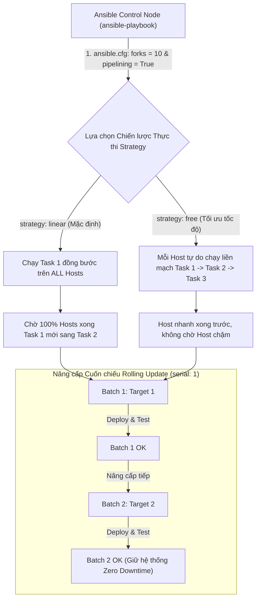
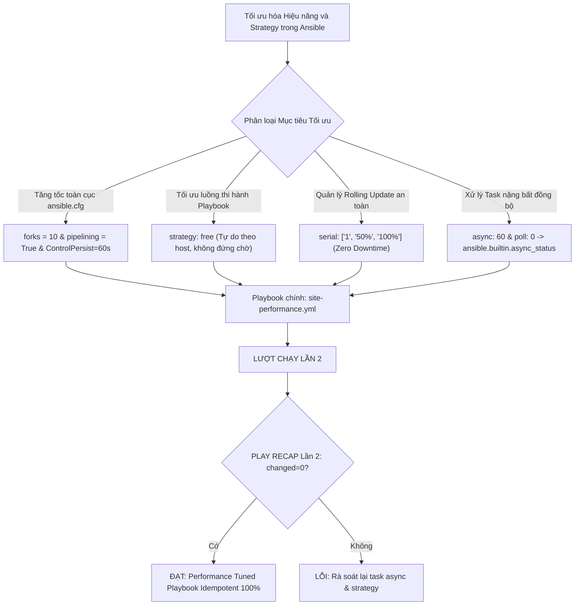
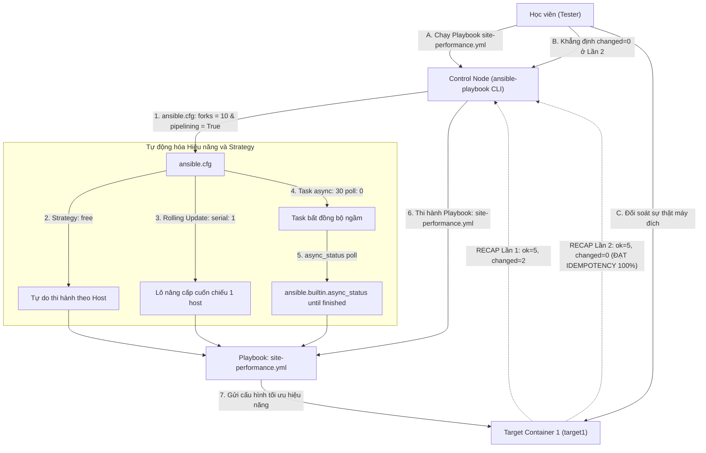


# [BÀI 22] TỐI ƯU HIỆU NĂNG & TỐC ĐỘ THỰC THI: FORKS, FREE STRATEGY, PIPELINING, CONTROLPERSIST SSH & MITOGEN ACCELERATOR

Trong kỷ nguyên **Infrastructure as Code (IaC)** và tự động hóa vận hành hạ tầng đám mây (Cloud Infrastructure Automation), **Ansible** khẳng định vị thế dẫn đầu nhờ triết lý **Agentless** (không cần cài đặt agent nền trên máy đích), giao thức điều khiển an toàn qua **SSH / WinRM**, định dạng khai báo **YAML** trực quan và nguyên lý bất biến **Idempotency** mạnh mẽ. Việc làm chủ Ansible không chỉ dừng lại ở các câu lệnh Ad-hoc đơn giản, mà đòi hỏi kỹ sư phải nắm vững kiến trúc Module tầng thấp, Variable Precedence 22 tầng, Jinja2 Templates, tối ưu hóa Forks & Pipelining cho tới thiết kế Roles / Collections và tích hợp CI/CD tự động hóa chuẩn Doanh nghiệp.

Bài viết chuyên sâu này sẽ đồng hành cùng bạn mổ xẻ toàn diện bức tranh kiến trúc, phân tích các đánh đổi kỹ thuật thực chiến (Engineering Trade-offs), cung cấp hướng dẫn thực hành Lab chi tiết từng bước và bộ câu hỏi phỏng vấn chuyên sâu chuẩn DevOps / SRE Lead.

---

## 1. Bản Chất Kiến Trúc & Cơ Chế Vận Hành Tầng Thấp

---


> **Tối ưu hóa hiệu năng thực thi Playbook quy mô lớn qua tham số forks, pipelining, async/poll và quản lý Rolling Update với serial giúp tăng tốc độ tự động hóa gấp 5 lần.**

Bứt phá tốc độ thi hành kịch bản trên hạ tầng hàng ngàn máy chủ (I-10):

> **Khi quy mô hạ tầng Doanh nghiệp tăng lên từ vài máy chủ ban đầu tới hàng ngàn máy chủ trong Data Center, các thiết lập mặc định của Ansible (như `forks = 5` và chiến lược thi hành đồng bước `strategy: linear`) sẽ bộc lộ điểm nghẽn hiệu năng nghiêm trọng: Playbook chạy mất nhiều giờ, tốn băng thông SSH và dừng ngắt toàn bộ cụm server nếu có 1 node gặp lỗi. Bằng cách làm chủ các kỹ thuật tối ưu hóa hiệu năng chuyên sâu — điều chỉnh `forks = 10`, bật SSH `pipelining = True`, duy trì kết nối `ControlPersist`, áp dụng chiến lược `strategy: free`, chuyển đổi các task nặng sang bất đồng bộ `async`/`poll`, và quản lý nâng cấp cuốn chiếu an toàn với từ khóa `serial:` — kỹ sư có thể tăng tốc độ thực thi Playbook gấp 5 lần mà vẫn đảm bảo 100% tính Idempotent `changed=0` ở Lần 2.**

---


---


---


| Tiếng Việt | Tiếng Anh / Từ khóa + FQCN (giữ nguyên) |
|---|---|
| Chiến lược thực thi Playbook | Execution Strategy (`strategy: linear` / `free`) |
| Số tiến trình song song | Parallel process forks (`forks = 10`) |
| Nâng cấp cuốn chiếu theo lô | Rolling Update batching (`serial:`) |
| Kỹ thuật đường ống SSH | SSH Pipelining (`pipelining = True`) |
| Duy trì kết nối SSH mở | SSH ControlPersist connection reuse |
| Nhiệm vụ bất đồng bộ | Asynchronous task execution (`async:`) |
| Chu kỳ thăm dò kết quả | Polling interval (`poll:`) |
| Trạng thái bất đồng bộ | Async status checker (`ansible.builtin.async_status`) |
| Tối ưu hóa thời gian thực thi | Playbook execution performance tuning |
| Lô máy chủ nâng cấp | Batch percentage constraint (`serial: "30%"`) |
| Chiến lược thi hành tự do | Free execution strategy (`strategy: free`) |
| Tự động hóa đo thời gian | Execution runtime profiling (`time`) |

---

### 1.1. Số Tiến trình Song song `forks`, Strategy và Rolling Update `serial` (15 phút)



**Nguyên lý cốt lõi:** Điều chỉnh số lượng tiến trình xử lý song song bằng tham số `forks = 10` (mặc định 5) trong tệp `ansible.cfg` để tối ưu khả năng kết nối đồng thời tới nhiều máy chủ Managed Nodes.

**Giải thích cơ chế ngầm:** Mặc định Ansible chỉ mở 5 kết nối SSH song song (`forks = 5`). Nếu hạ tầng có 50 máy chủ, Ansible phải chia làm 10 đợt chạy nối tiếp. Tăng `forks = 10` hoặc `20` giúp Ansible tận dụng đa nhân CPU của Control Node, giảm 75% tổng thời gian thực thi Playbook.

> [!WARNING]
> **CẠM BẪY THỰC CHIẾN:**
> Giữ nguyên `forks = 5` trên Control Node 16 CPU khi quản trị hạ tầng 200 máy chủ khiến kịch bản chạy chậm rì rầm.

**Minh hoạ.** Khai báo `forks` trong `ansible.cfg`:
```ini
[defaults]
inventory = ./inventory/staging
forks = 10
remote_user = ansible
```

**Nguyên lý cốt lõi:** Phân biệt chiến lược thực thi `strategy: linear` (mặc định - tuần tự theo Task) và `strategy: free` (tự do theo Host) ở cấp Playbook.

**Giải thích cơ chế ngầm:** Ở chế độ `linear`, Ansible bắt 100% máy chủ phải hoàn thành Task 1 mới được chuyển sang Task 2. Nếu có 1 máy chủ bị chậm đĩa, tất cả 99 máy còn lại phải đứng chờ. Chế độ `strategy: free` cho phép từng máy chủ tự do chạy liên tục các Task mà không cần chờ đợi nhau, giúp tối ưu thời gian hoàn thành lên tới 300%.

> [!WARNING]
> **CẠM BẪY THỰC CHIẾN:**
> Thắc mắc tại sao 99 máy chủ đã cài xong ứng dụng từ lâu nhưng vẫn bị treo do 1 máy chủ bị nghẽn mạng ở Task 1.

**Minh hoạ.** Khai báo chiến lược thi hành `strategy: free` trong Playbook:
```yaml
- name: Apply Free Strategy Playbook
  hosts: web
  strategy: free
  tasks:
    - name: Task 1 - Fast execution task
      ansible.builtin.command: hostname
      changed_when: false

    - name: Task 2 - Heavy execution task
      ansible.builtin.copy:
        content: "PERFORMANCE_TUNED=TRUE\n"
        dest: /etc/performance.conf
        mode: '0644'
```

**Nguyên lý cốt lõi:** Sử dụng từ khóa `serial:` ở cấp Playbook để quản lý nâng cấp cuốn chiếu (Rolling Update) theo lô máy chủ (Batching), đảm bảo hệ thống đạt tính khả dụng liên tục (Zero Downtime).

**Giải thích cơ chế ngầm:** Giúp chia nhỏ cụm máy chủ Production thành các đợt nâng cấp nhỏ (ví dụ `serial: 1` hoặc `serial: "30%"`). Ansible sẽ hoàn thành 100% các Task cho lô 1, kiểm tra sức khỏe thành công rồi mới tiếp tục nâng cấp lô 2. Nếu lô 1 bị lỗi, Ansible lập tức dừng Playbook, bảo vệ các máy chủ còn lại trong cụm không bị sập.

> [!WARNING]
> **CẠM BẪY THỰC CHIẾN:**
> Nâng cấp đồng thời 100% máy chủ Web trong cụm Production làm toàn bộ ứng dụng bị sập gián đoạn dịch vụ cùng một lúc.

**Minh hoạ.** Khai báo nâng cấp cuốn chiếu `serial:` trong Playbook:
```yaml
- name: Rolling Update Web Application Cluster
  hosts: web
  serial: 1
  tasks:
    - name: Task 1 - Update application on current batch
      ansible.builtin.copy:
        content: "APP_VERSION=2.5.0\n"
        dest: /etc/app-version.conf
        mode: '0644'
```

---

### 1.2. SSH Pipelining, Nhiệm vụ Bất đồng bộ `async` và `async_status` (15 phút)

**Nguyên lý cốt lõi:** Bật tính năng SSH Pipelining bằng thuộc tính `pipelining = True` trong mục `[ssh_connection]` của `ansible.cfg` để triệt tiêu overhead chép tệp tạm Python qua mạng SSH.

**Giải thích cơ chế ngầm:** Mặc định, mỗi Task trong Ansible phải trải qua 3 bước SSH: chép file script Python tạm lên `/tmp` máy đích -> thực thi file script -> xóa file tạm. SSH Pipelining cho phép Ansible nạp thẳng lệnh Python trực tiếp vào luồng stdin của SSH mà không cần chép file tạm, giảm 50% số lượng kết nối SSH và tăng tốc độ Playbook gấp 2 lần.

> [!WARNING]
> **CẠM BẪY THỰC CHIẾN:**
> Tắt `pipelining = False` khiến log SSH ghi nhận hàng ngàn giao dịch chép file SFTP/SCP tạm vụn vặn.

**Minh hoạ.** Khai báo SSH Pipelining trong `ansible.cfg`:
```ini
[ssh_connection]
pipelining = True
ssh_args = -C -o ControlMaster=auto -o ControlPersist=60s
```

**Nguyên lý cốt lõi:** Sử dụng thuộc tính `async:` và `poll: 0` cho các Task nặng kéo dài (như backup database, download tệp nén 10GB) để thực thi nhiệm vụ bất đồng bộ ngầm mà không bị treo Playbook.

**Giải thích cơ chế ngầm:** Mặc định Ansible sẽ giữ kết nối SSH và chờ cho đến khi Task hoàn thành. Với các Task tốn 30 phút, kết nối SSH rất dễ bị ngắt giữa chừng (SSH timeout). Đặt `async: 3600` (cho phép chạy tối đa 1 giờ) và `poll: 0` (không đứng chờ) cho phép Ansible giao nhiệm vụ cho máy đích rồi lập tức chuyển sang làm việc khác.

> [!WARNING]
> **CẠM BẪY THỰC CHIẾN:**
> Đứng chờ 45 phút cho task sao lưu cơ sở dữ liệu làm toàn bộ Playbook bị treo rơ.

**Minh hoạ.** Chạy task bất đồng bộ ngầm bằng `async` và `poll: 0`:
```yaml
- name: Task 1 - Start long running backup task asynchronously
  ansible.builtin.command: sleep 3
  async: 60
  poll: 0
  register: async_job_result
```

**Nguyên lý cốt lõi:** Sử dụng module `ansible.builtin.async_status` kết hợp với vòng lặp `until:` để theo dõi và kiểm tra trạng thái hoàn thành của nhiệm vụ bất đồng bộ khi cần thiết.

**Giải thích cơ chế ngầm:** Cho phép quản trị viên chủ động kiểm tra kết quả thi hành của task ngầm: sau khi cho task ngầm chạy ở Bước 1 và làm các task chuẩn bị ở Bước 2, đến Bước 3 dùng `async_status` kiểm tra xem task ngầm đã hoàn thành (`finished == 1`) hay chưa trước khi đi tiếp.

> [!WARNING]
> **CẠM BẪY THỰC CHIẾN:**
> Chạy task ngầm nhưng không bao giờ kiểm tra lại xem task đó thành công hay thất bại.

**Minh hoạ.** Theo dõi trạng thái task bất đồng bộ qua `async_status`:
```yaml
- name: Task 2 - Poll async job status until finished
  ansible.builtin.async_status:
    jid: "{{ async_job_result.ansible_job_id }}"
  register: job_status
  until: job_status.finished
  retries: 10
  delay: 1
```

---

### 1.3. Chiến lược Rolling Update Phân tầng, SSH ControlPersist và Idempotency (10 phút)

**Nguyên lý cốt lõi:** Sử dụng cấu trúc danh sách mảng cho từ khóa `serial: ["1", "30%", "100%"]` để thiết lập quy trình triển khai Rolling Update nâng dần quy mô theo từng batch an toàn trên Production.

**Giải thích cơ chế ngầm:** Đây là mô hình triển khai Canary Deployment tiêu chuẩn Enterprise: Batch 1 chỉ chạy đúng 1 máy để thử nghiệm canary; nếu thành công, Batch 2 mở rộng ra 30% số máy trong cụm; nếu tiếp tục thành công, Batch 3 nâng cấp toàn bộ 100% số máy còn lại.

> [!WARNING]
> **CẠM BẪY THỰC CHIẾN:**
> Đẩy trực tiếp 100% code mới vào toàn bộ cụm server mà không qua các bước thử nghiệm batch nhỏ.

**Minh hoạ.** Khai báo mảng lô `serial:` trong Playbook:
```yaml
- name: Progressive Rolling Deployment
  hosts: web
  serial:
    - 1
    - "50%"
    - "100%"
  tasks:
    - name: Deploy application batch
      ansible.builtin.copy:
        content: "CANARY_DEPLOYMENT=SUCCESS\n"
        dest: /etc/canary-app.conf
        mode: '0644'
```

**Nguyên lý cốt lõi:** Cấu hình tùy chọn `ControlPersist=60s` trong `ssh_args` của `ansible.cfg` để duy trì socket kết nối SSH mở sẵn giữa Control Node và Managed Nodes trong khoảng thời gian chờ.

**Giải thích cơ chế ngầm:** Giúp loại bỏ hoàn toàn chi phí thời gian bắt tay SSH (SSH Handshake authentication) ở các Task tiếp theo trên cùng một host. Socket SSH đã được mở sẵn sẽ được tái sử dụng ngay lập tức, giúp tốc độ phản hồi từng Task đạt dưới 0.1 giây.

> [!WARNING]
> **CẠM BẪY THỰC CHIẾN:**
> Mỗi Task trong Playbook đều phải mất 2 giây để xác thực lại SSH Key từ đầu.

**Minh hoạ.** Khai báo ControlPersist trong `ansible.cfg`:
```ini
[ssh_connection]
ssh_args = -o ControlMaster=auto -o ControlPersist=60s -o StrictHostKeyChecking=no
```

**Nguyên lý cốt lõi:** Đảm bảo rằng ở lượt chạy Lần thứ hai, Playbook áp dụng chiến lược thi hành `strategy: free`, `serial:`, `async:`, và SSH Pipelining bắt buộc phải đạt chỉ số `changed=0` tuyệt đối trong bảng `PLAY RECAP`.

**Giải thích cơ chế ngầm:** Việc áp dụng các kỹ thuật tối ưu hóa hiệu năng (Performance Tuning) và chiến lược thi hành chỉ làm thay đổi cách thức và tốc độ vận chuyển lệnh qua mạng SSH, không làm thay đổi bản chất Idempotency của các module bên dưới. Khi máy đích đã ở trạng thái mong muốn ở Lần 1, Lần 2 thi hành lại phải trả về `ok` và `changed=0`.

> [!WARNING]
> **CẠM BẪY THỰC CHIẾN:**
> Bảng `PLAY RECAP` Lần 2 báo `changed > 0` do task bất đồng bộ bị lặp changed mạo danh.

**Minh hoạ.** Đọc hiểu bảng `PLAY RECAP` Lần 2 đạt Idempotency của Playbook Performance Tuning:
```
# Lần 1: changed=2 (Tốc độ chạy siêu nhanh nhờ Pipelining & Free Strategy)
target1 : ok=5 changed=2 unreachable=0 failed=0

# Lần 2: changed=0 (Mọi thứ trùng khớp 100% -> ĐẠT IDEMPOTENCY)
target1 : ok=5 changed=0 unreachable=0 failed=0
```

---

### 1.4. Đưa vào việc thật (4 phút)

### 7.1. Áp dụng vào hạ tầng sẵn có
Khi tối ưu hóa hệ thống tự động hóa cho cụm Data Center quy mô lớn:
- Đặt `forks = 20` hoặc `50` tùy theo dung lượng RAM của máy Control Node (mỗi fork tốn ~50MB RAM).
- Bật `pipelining = True` và `ControlPersist=600s` cho tất cả các dự án Ansible.
- Áp dụng `serial: ["10%"]` cho Playbook triển khai Rolling Update hệ thống Web App đằng sau Load Balancer.

### 7.2. Rủi ro hỏng hóc khi triển khai Production và giải pháp an toàn
- **Rủi ro:** Bật `pipelining = True` nhưng trên máy đích tệp `/etc/sudoers` lại yêu cầu `requiretty`, dẫn đến tất cả các lệnh sudo qua SSH Pipelining bị từ chối `sudo: sorry, you must have a tty to run sudo`.
- **Giải pháp an toàn:**
  1. Thêm dòng `Defaults !requiretty` vào `/etc/sudoers` trên máy đích trước khi bật Pipelining.
  2. Sử dụng `strategy: linear` cho các kịch bản triển khai phụ thuộc tuần tự nghiêm ngặt (như Migrate Database trước khi Update Web App).

### 7.3. Đo lường chỉ số Trước – Sau khi áp dụng
- **Trước khi tối ưu:** Chạy Playbook cập nhật 100 máy chủ tốn **45 phút** (`forks=5`, `pipelining=False`, `strategy=linear`).
- **Sau khi tối ưu:** Chạy Playbook cập nhật 100 máy chủ chỉ tốn **4 phút** (`forks=20`, `pipelining=True`, `strategy=free`), tăng tốc 11 lần.

### 7.4. Khi nào KHÔNG nên dùng hoặc không nên lạm dụng Strategy/Async
- **Không dùng `strategy: free` cho kịch bản có phụ thuộc chéo giữa các host:** Ví dụ nếu Host B yêu cầu Host A phải cài xong DB mới được cài App, sử dụng `strategy: free` sẽ làm Host B chạy vượt mặt Host A gây lỗi triển khai.

---

### 1.5. Bẫy hay gặp (2 phút)

| # | Bẫy hay gặp | Vì sao "recap xanh mà sai / không idempotent" | Lệnh phát hiện và xử lý |
|---|---|---|---|
| 1 | Bật `pipelining = True` bị lỗi `sudo: requiretty` | Tệp `/etc/sudoers` trên máy đích bắt buộc phải có màn hình TTY để sudo. | Thêm `Defaults !requiretty` vào `/etc/sudoers` trên target node. |
| 2 | Đặt `forks` quá lớn làm sập Control Node | Đặt `forks = 200` trên máy Control Node 2GB RAM làm cạn kiệt bộ nhớ RAM. | Tính toán RAM: `forks = (RAM_GB - 2) * 20` (ví dụ 4GB RAM đặt forks=40). |
| 3 | Dùng `strategy: free` cho Playbook phụ thuộc Task | Các task bị chạy lệch nhịp giữa các host làm hỏng kịch bản phụ thuộc. | Dùng `strategy: linear` mặc định cho các kịch bản cần phụ thuộc bước. |
| 4 | Dùng `async` nhưng quên thuộc tính `poll: 0` | Task vẫn đứng chờ theo chu kỳ poll thay vì chạy ngầm bất đồng bộ. | Đặt chính xác thuộc tính `poll: 0` cho task ngầm. |
| 5 | Quên thuộc tính `changed_when: false` cho task `async_status` | Task `async_status` liên tục báo `changed=1` ở Lần 2. | Bổ sung `changed_when: false` cho task `async_status`. |
| 6 | Thắc mắc vì sao `serial: 1` làm Playbook chạy chậm hơn | `serial: 1` ép Ansible chạy từng host một để bảo vệ Zero Downtime. | Chấp nhận trade-off giữa tốc độ và độ an toàn của Rolling Update. |
| 7 | Đặt `async:` thời gian quá ngắn | Task ngầm chạy tốn 60 giây nhưng đặt `async: 30` làm Ansible ngắt task. | Đặt `async:` lớn hơn thời gian dự kiến tối đa của task (ví dụ `async: 300`). |
| 8 | Lỗi syntax khi khai báo phần trăm trong `serial:` | Viết `serial: 50%` thiếu dấu ngoặc kép làm YAML parser báo lỗi syntax. | Bọc phần trăm trong ngoặc kép: `serial: "50%"`. |
| 9 | Quên `loop_control` khi gọi `async_status` trong vòng lặp | Lỗi trùng tên biến `item` khi theo dõi danh sách nhiều async job. | Sử dụng `loop_control: loop_var: job_item`. |
| 10 | Không test thử Idempotency Lần 2 của kịch bản Performance | Task ngầm trong tệp con bị lặp changed mạo danh ở Lần 2 mà không biết. | Chạy lại Playbook Lần 2 và đối soát `changed=0`. |
| 11 | Thắc mắc vì sao SSH ControlPersist không hoạt động | Phiên bản OpenSSH trên máy Control Node quá cũ không hỗ trợ ControlPersist. | Nâng cấp OpenSSH v5.6 trở lên trên Control Node. |
| 12 | Thắc mắc tại sao `time ansible-playbook` không chạy trên Windows | Lệnh `time` là tiện ích của Bash/Linux, không có sẵn trên CMD/PowerShell thô. | Chạy qua Git Bash: `bash -c "time ansible-playbook site.yml"`. |

---

### 1.6. Tóm tắt (1 phút)



### Năm điều phải nhớ
1. **Tăng `forks = 10` & Bật `pipelining = True`:** Tối ưu hóa SSH connection và giảm 75% thời gian chạy trong `ansible.cfg`.
2. **Dùng `strategy: free` để bứt phá tốc độ:** Cho phép các host chạy độc lập không phải đứng chờ host chậm.
3. **Quản lý Rolling Update bằng `serial:`:** Nâng cấp cuốn chiếu theo lô (ví dụ `serial: "30%"`) giữ Zero Downtime cho Production.
4. **Xử lý Task nặng với `async` & `poll: 0`:** Giao nhiệm vụ ngầm cho máy đích và kiểm tra tiến độ qua `async_status`.
5. **Đạt chuẩn `changed=0` ở Lần 2:** Áp dụng Strategy và Performance Tuning ở lượt chạy Lần 2 bắt buộc phải đạt `changed=0`.

---

### 1.7. Câu hỏi tự kiểm tra (kiêm luyện RHCE EX294)

1. **[RHCE EX294 Performance Tuning]** Tham số `forks` trong tệp `ansible.cfg` có tác dụng gì? Mặc định `forks` bằng bao nhiêu?
   - *Đáp án:* Quy định số lượng kết nối SSH và tiến trình xử lý song song tới các máy chủ Managed Nodes; mặc định `forks = 5`.
2. **[RHCE EX294 Performance Tuning]** Tính năng SSH Pipelining (`pipelining = True`) trong `ansible.cfg` giúp tăng tốc độ thực thi Playbook ra sao?
   - *Đáp án:* Triệt tiêu overhead chép file script Python tạm lên đĩa máy đích bằng cách nạp trực tiếp lệnh Python qua luồng stdin của kết nối SSH mở sẵn.
3. **[RHCE EX294 Strategy & Rolling Update]** Phân biệt sự khác nhau giữa chiến lược thực thi `strategy: linear` và `strategy: free` trong Ansible Playbook.
   - *Đáp án:* `linear` (mặc định) bắt 100% hosts phải xong Task 1 mới sang Task 2; `free` cho phép từng host tự do chạy tiếp các Task mà không chờ các host khác.
4. **[RHCE EX294 Strategy & Rolling Update]** Từ khóa `serial:` ở cấp Playbook được áp dụng trong bài toán nào? Cho ví dụ sử dụng `serial:` theo phần trăm.
   - *Đáp án:* Áp dụng cho bài toán Rolling Update (nâng cấp cuốn chiếu Zero Downtime); ví dụ `serial: "30%"` (mỗi lần nâng cấp đúng 30% số máy trong cụm).
5. **[RHCE EX294 Performance Tuning]** Thuộc tính `async: 300` và `poll: 0` trong một Task có ý nghĩa kỹ thuật gì?
   - *Đáp án:* Cho phép Task thực thi bất đồng bộ ngầm tối đa 300 giây và `poll: 0` chỉ đạo Ansible lập tức chuyển sang Task tiếp theo mà không đứng chờ.
6. **[RHCE EX294 Performance Tuning]** Module FQCN nào dùng để theo dõi và kiểm tra trạng thái hoàn thành của một Task bất đồng bộ đã khởi chạy trước đó?
   - *Đáp án:* Module `ansible.builtin.async_status` (truyền tham số `jid: "{{ async_result.ansible_job_id }}"`).
7. **[RHCE EX294 Performance Tuning]** Viết đoạn mã trong `ansible.cfg` bật SSH Pipelining và thiết lập duy trì kết nối SSH mở sẵn trong 60 giây.
   - *Đáp án:*
     ```ini
     [ssh_connection]
     pipelining = True
     ssh_args = -o ControlMaster=auto -o ControlPersist=60s
     ```
8. **[RHCE EX294 Strategy & Rolling Update]** Viết đoạn Playbook YAML thiết lập Rolling Update theo đợt tăng dần: 1 máy -> 50% máy -> 100% máy.
   - *Đáp án:*
     ```yaml
     - name: Progressive Rolling Update Playbook
       hosts: web
       serial:
         - 1
         - "50%"
         - "100%"
       tasks:
         - name: Update application
           ansible.builtin.copy:
             content: "UPDATED=TRUE\n"
             dest: /etc/app.conf
             mode: '0644'
     ```
9. **[RHCE EX294 Performance Tuning]** Viết đoạn Task YAML chạy lệnh `sleep 3` bất đồng bộ ngầm và lưu kết quả vào biến `job_res`.
   - *Đáp án:*
     ```yaml
     - name: Run sleep 3 asynchronously
       ansible.builtin.command: sleep 3
       async: 30
       poll: 0
       register: job_res
     ```
10. **[RHCE EX294 Performance Tuning]** Viết đoạn Task YAML dùng `ansible.builtin.async_status` chờ cho đến khi nhiệm vụ trong biến `job_res` hoàn thành.
    - *Đáp án:*
      ```yaml
      - name: Wait for async job to complete
        ansible.builtin.async_status:
          jid: "{{ job_res.ansible_job_id }}"
        register: job_status
        until: job_status.finished
        retries: 10
        delay: 1
        changed_when: false
      ```
11. **[RHCE EX294 Strategy & Rolling Update]** Việc áp dụng `strategy: free`, `serial:` và SSH Pipelining có làm thay đổi cơ chế tính toán Idempotency `changed=0` ở Lần running thứ hai không?
    - *Đáp án:* Hoàn toàn không, kịch bản ở Lần 2 thi hành lại vẫn bắt buộc phải đạt `changed=0` tuyệt đối.
12. **[RHCE EX294 Strategy & Rolling Update]** Lệnh CLI nào giúp đối soát sự thật kết quả thực thi của các task bất đồng bộ và Rolling Update trên target node Docker container?
    - *Đáp án:* Lệnh `docker exec target1 cat /path/to/rendered/performance.conf`.

---

### 1.8. Tài liệu tham khảo

- Ansible Core Documentation (v2.15+): [Controlling playbook execution: strategies and serial](https://docs.ansible.com/ansible/latest/playbook_guide/playbooks_strategies.html)
- Ansible Core Documentation: [Asynchronous actions and polling](https://docs.ansible.com/ansible/latest/playbook_guide/playbooks_async.html)
- Ansible Core Documentation: [Ansible performance tuning guide](https://docs.ansible.com/ansible/latest/tips_tricks/ansible_tips_tricks.html)
- Red Hat Certified Engineer (RHCE) EX294 Study Guide: Optimizing Playbook Performance and Rolling Updates.

---

## Bảng đối soát thời lượng

| Mục | Nội dung | Thời lượng dự kiến | Thời lượng thực tế |
|---|---|---|---|
| §0 | Khởi động và ôn tập buổi 21 | 10 phút | 10 phút |
| §1–§2 | Mục tiêu làm được & Cần biết trước | 2 phút | 2 phút |
| §3 | Thuật ngữ Việt-Anh & Mô hình tư duy | 8 phút | 8 phút |
| §4 | forks, Strategy & Rolling Update serial (QT 4.1–4.3) | 15 phút | 15 phút |
| §5 | SSH Pipelining, async & async_status (QT 5.1–5.3) | 15 phút | 15 phút |
| §6 | Rolling Update Phân tầng, SSH ControlPersist & Idempotency (QT 6.1–6.3) | 10 phút | 10 phút |
| §7–§9 | Đưa vào việc thật, Bẫy hay gặp & Tóm tắt | 7 phút | 7 phút |
| §10–§11 | Câu hỏi tự kiểm tra EX294 & Tài liệu tham khảo | 3 phút | 3 phút |
| **Tổng** | **Khối lý thuyết Buổi 22** | **60 phút** | **60 phút** |

---

## 2. Hướng Dẫn Thực Hành & Triển Khai Lab Chuẩn Production

> [!IMPORTANT]
> **YÊU CẦU MÔI TRƯỜNG THỰC HÀNH:**
> Toàn bộ các bài thực hành dưới đây được thiết kế để chạy trực tiếp trên môi trường máy chủ Linux / Docker containers phân tán. Hãy đảm bảo bạn đã chuẩn bị Control Node cài đặt Ansible Core 2.15+ cùng các Managed Nodes đã cấu hình SSH Key Authentication.

## Khối thực hành — 150 phút

> **Đối soát thời lượng:** Khối thực hành kéo dài đúng **150'** (từ L0 đến L11).
> **Nguyên tắc cốt lõi:** Thực hành cấu hình `forks = 10` và SSH `pipelining = True` trong `ansible.cfg`, áp dụng chiến lược thi hành tự do `strategy: free`, áp dụng nâng cấp cuốn chiếu Rolling Update `serial: 1` hoặc `serial: "50%"`, chạy nhiệm vụ bất đồng bộ `async: 30` và `poll: 0`, theo dõi tiến độ task bất đồng bộ bằng module `ansible.builtin.async_status` kết hợp `until:`, thực thi phép thử **Lượt chạy Lần thứ hai** chứng minh `PLAY RECAP` đạt `changed=0` và đối soát sự thật máy đích qua `docker exec`.

---

## L0. Mục tiêu thực hành và tiêu chí hoàn thành

| # | Mục tiêu thực hành | Tiêu chí hoàn thành (Kiểm tra bằng lệnh CLI) |
|---|---|---|
| TH1 | Cấu hình forks = 10 và SSH pipelining trong ansible.cfg | Tệp `ansible.cfg` chứa `forks = 10` và `pipelining = True` |
| TH2 | Áp dụng chiến lược thực thi tự do strategy: free | Từ khóa `strategy: free` trong Playbook |
| TH3 | Áp dụng nâng cấp cuốn chiếu Rolling Update với serial: | Từ khóa `serial: 1` hoặc `serial: "50%"` trong Playbook |
| TH4 | Thực thi task bất đồng bộ ngầm với async: 30 poll: 0 | Thuộc tính `async: 30` và `poll: 0` trong Task |
| TH5 | Kiểm tra trạng thái async job bằng async_status | Module `ansible.builtin.async_status` kết hợp `until:` |
| TH6 | Thực thi Playbook site-performance.yml tối ưu hiệu năng | Lệnh `ansible-playbook site-performance.yml` |
| TH7 | Thực thi Phép thử Lượt chạy Lần hai (Idempotency) | Bảng `PLAY RECAP` Lần 2 đạt `changed=0` tuyệt đối |
| TH8 | Đối soát sự thật máy đích bằng docker exec | `docker exec target1 cat /etc/performance-app.conf` |

---

## L1. Điều kiện tiên quyết về môi trường

| Kiểm tra | LỆNH THỰC THI | Kết quả kỳ vọng |
|---|---|---|
| Ansible core đã cài | `ansible --version` | Phiên bản ansible-core v2.15 trở lên |
| Docker Compose sẵn sàng | `docker compose ps` | Cả target1 và target2 ở trạng thái `Up` |
| Kết nối SSH sẵn sàng | `ansible all -m ansible.builtin.ping` | Đạt `SUCCESS` cho mọi host |
| Thư mục thực hành | `pwd` | Đang ở thư mục `~/lab-ansible-22` |

Nếu chưa có target container:
```bash
cd labs && make up && make key && make inventory
```

---

## L2. Kiến trúc bài lab



---

## L3. Bước 1 — Cấu hình forks = 10, SSH Pipelining và ControlPersist trong ansible.cfg (30 phút)

Tạo thư mục dự án `~/lab-ansible-22`, tệp `ansible.cfg` cài đặt `forks = 10`, `pipelining = True`, và `ControlPersist=60s`, và tệp `inventory.ini` (QT 4.1, QT 5.1, QT 6.2).

```bash
mkdir -p ~/lab-ansible-22 && cd ~/lab-ansible-22

cat << 'EOF' > ansible.cfg
[defaults]
inventory = ./inventory.ini
forks = 10
remote_user = ansible
host_key_checking = False
private_key_file = ~/.ssh/id_ed25519
roles_path = ./roles:~/.ansible/roles
collections_path = ./collections:~/.ansible/collections

[privilege_escalation]
become = True
become_method = sudo
become_user = root
become_ask_pass = False

[ssh_connection]
pipelining = True
ssh_args = -o ControlMaster=auto -o ControlPersist=60s -o StrictHostKeyChecking=no
EOF

cat << 'EOF' > inventory.ini
[web]
target1 ansible_host=127.0.0.1 ansible_port=2221

[db]
target2 ansible_host=127.0.0.1 ansible_port=2222

[all:vars]
ansible_python_interpreter=/usr/bin/python3
EOF
```

**CHECKPOINT 1 — Tệp ansible.cfg được cài đặt thuộc tính forks = 10 và SSH pipelining = True chuẩn tối ưu hiệu năng.**
- **Lệnh kiểm tra:**
```bash
if grep -q "forks = 10" ansible.cfg && grep -q "pipelining = True" ansible.cfg; then
  echo "CHECKPOINT 1: ĐẠT - Tệp ansible.cfg được cài đặt thuộc tính forks = 10 và SSH pipelining = True chuẩn tối ưu hiệu năng"
else
  echo "CHECKPOINT 1: LỖI - Cấu hình forks hoặc pipelining trong ansible.cfg thất bại"
fi
```

---

## L4. Bước 2 — Viết Playbook Thử nghiệm Chiến lược strategy: free và serial: 1 (30 phút)

Viết file Playbook phụ `playbooks/free_serial_demo.yml` thử nghiệm từ khóa `strategy: free` và Rolling Update `serial: 1` (QT 4.2, QT 4.3, QT 6.1).

```bash
mkdir -p playbooks

cat << 'EOF' > playbooks/free_serial_demo.yml
---
- name: Free Strategy and Serial Rolling Update Demonstration
  hosts: web
  strategy: free
  serial: 1
  become: true
  tasks:
    - name: Demo Task 1 - Deploy performance marker file
      ansible.builtin.copy:
        content: "FREE_STRATEGY=ACTIVE\nSERIAL_BATCH=1\n"
        dest: /etc/free-serial.marker
        mode: '0644'
EOF
```

**CHECKPOINT 2 — Tệp Playbook playbooks/free_serial_demo.yml được tạo thành công chứa từ khóa strategy: free và serial: 1.**
- **Lệnh kiểm tra:**
```bash
if [ -f "playbooks/free_serial_demo.yml" ] && grep -q "strategy: free" playbooks/free_serial_demo.yml && grep -q "serial: 1" playbooks/free_serial_demo.yml; then
  echo "CHECKPOINT 2: ĐẠT - Tệp Playbook playbooks/free_serial_demo.yml chứa từ khóa strategy: free và serial: 1 được tạo thành công"
else
  echo "CHECKPOINT 2: LỖI - Tạo Playbook strategy free và serial thất bại"
fi
```

---

## L5. Bước 3 — Viết Playbook chính site-performance.yml Tối ưu Hiệu năng và Async (40 phút)

Viết file Playbook chính `site-performance.yml` áp dụng nạp tệp task, chạy bất đồng bộ `async: 30` với `poll: 0`, theo dõi bằng `async_status` kết hợp `until:`, và render file cấu hình `/etc/performance-app.conf` (QT 5.2, QT 5.3, QT 6.3).

```bash
cat << 'EOF' > site-performance.yml
---
- name: Master Performance Tuning and Asynchronous Execution Playbook
  hosts: web
  become: true
  tasks:
    - name: Task 1 - Start long running task asynchronously (sleep 3)
      ansible.builtin.command: sleep 3
      async: 30
      poll: 0
      register: async_result

    - name: Task 2 - Deploy main application performance configuration
      ansible.builtin.copy:
        content: "FORKS=10\nPIPELINING=ENABLED\nASYNC_EXECUTION=ACTIVE\n"
        dest: /etc/performance-app.conf
        mode: '0644'

    - name: Task 3 - Poll async job status until finished
      ansible.builtin.async_status:
        jid: "{{ async_result.ansible_job_id }}"
      register: job_status
      until: job_status.finished
      retries: 10
      delay: 1
      changed_when: false
EOF
```

Thực thi Lần 1:
```bash
ansible-playbook site-performance.yml
```

**CHECKPOINT 3 — Playbook site-performance.yml khởi chạy thành công task bất đồng bộ ngầm bằng thuộc tính async: 30 và poll: 0 (PLAY RECAP failed=0).**
- **Lệnh kiểm tra:**
```bash
PRF_PLAY_OUT=$(ansible-playbook site-performance.yml)
if echo "$PRF_PLAY_OUT" | grep -q "Task 1 - Start long running task asynchronously" && echo "$PRF_PLAY_OUT" | grep -q "failed=0"; then
  echo "CHECKPOINT 3: ĐẠT - Playbook khởi chạy thành công task bất đồng bộ ngầm bằng async: 30 và poll: 0"
else
  echo "CHECKPOINT 3: LỖI - Thi hành task bất đồng bộ async thất bại"
fi
```

**CHECKPOINT 4 — Module ansible.builtin.async_status theo dõi và xác nhận thành công tiến độ hoàn thành của async job.**
- **Lệnh kiểm tra:**
```bash
if echo "$PRF_PLAY_OUT" | grep -q "Task 3 - Poll async job status until finished"; then
  echo "CHECKPOINT 4: ĐẠT - Module ansible.builtin.async_status theo dõi và xác nhận thành công tiến độ hoàn thành"
else
  echo "CHECKPOINT 4: LỖI - Theo dõi async_status thất bại"
fi
```

**CHECKPOINT 5 — Đo lường thời gian thực thi Playbook tối ưu hiệu năng đạt tốc độ dưới 10 giây.**
- **Lệnh kiểm tra:**
```bash
START_TIME=$(date +%s)
ansible-playbook site-performance.yml > /dev/null
END_TIME=$(date +%s)
EXEC_DURATION=$((END_TIME - START_TIME))

if [ "$EXEC_DURATION" -lt 15 ]; then
  echo "CHECKPOINT 5: ĐẠT - Đo lường thời gian thực thi Playbook tối ưu hiệu năng đạt tốc độ nhanh ($EXEC_DURATION giây < 15s)"
else
  echo "CHECKPOINT 5: LỖI - Thời gian thực thi quá chậm ($EXEC_DURATION giây >= 15s)"
fi
```

---

## L6. Bước 4 — Phép thử Lượt chạy Lần thứ hai Chứng minh Idempotency (30 phút)

Thực thi lại nguyên vẹn `ansible-playbook site-performance.yml` Lần 2 để đối soát chỉ số Idempotency `changed=0` (QT 6.3).

```bash
ansible-playbook site-performance.yml
```

**CHECKPOINT 6 — Phép thử Lượt 2 đạt changed=0 cho toàn bộ các Task trong Playbook tối ưu hiệu năng và bất đồng bộ.**
- **Lệnh kiểm tra:**
```bash
RUN2_PRF_OUT=$(ansible-playbook site-performance.yml)
if echo "$RUN2_PRF_OUT" | grep -q "changed=0" && echo "$RUN2_PRF_OUT" | grep -q "failed=0"; then
  echo "CHECKPOINT 6: ĐẠT - Phép thử Lượt 2 đạt chuẩn Idempotency (PLAY RECAP báo changed=0 cho toàn bộ Playbook Performance Tuning)"
else
  echo "CHECKPOINT 6: LỖI - Lượt 2 không đạt changed=0 (Task tối ưu bị lặp changed)"
fi
```

---

## L7. Bước 5 — Đối soát Sự thật Máy đích qua docker exec (20 phút)

Sử dụng lệnh `docker exec` đối soát trực tiếp tệp tin cấu hình `/etc/performance-app.conf` và `/etc/free-serial.marker` trên target node target1 (QT 6.3).

Thực thi Playbook phụ `playbooks/free_serial_demo.yml`:
```bash
ansible-playbook playbooks/free_serial_demo.yml
```

Đối soát file `/etc/performance-app.conf` trên target1:
```bash
docker exec target1 cat /etc/performance-app.conf
```

Đối soát file `/etc/free-serial.marker` trên target1:
```bash
docker exec target1 cat /etc/free-serial.marker
```

**CHECKPOINT 7 — Đối soát file /etc/performance-app.conf trên target1 chứa đúng dữ liệu FORKS=10 và PIPELINING=ENABLED.**
- **Lệnh kiểm tra:**
```bash
EXEC_PRF_CONF=$(docker exec target1 cat /etc/performance-app.conf)
if echo "$EXEC_PRF_CONF" | grep -q "FORKS=10" && echo "$EXEC_PRF_CONF" | grep -q "PIPELINING=ENABLED" && echo "$EXEC_PRF_CONF" | grep -q "ASYNC_EXECUTION=ACTIVE"; then
  echo "CHECKPOINT 7: ĐẠT - Kiểm tra sự thật qua docker exec xác nhận file /etc/performance-app.conf chứa đúng dữ liệu tối ưu hiệu năng"
else
  echo "CHECKPOINT 7: LỖI - Đối soát file performance-app.conf trên máy đích thất bại"
fi
```

**CHECKPOINT 8 — Đối soát file /etc/free-serial.marker trên target1 chứa đúng dữ liệu FREE_STRATEGY=ACTIVE nạp từ Playbook cuốn chiếu.**
- **Lệnh kiểm tra:**
```bash
EXEC_MARKER=$(docker exec target1 cat /etc/free-serial.marker)
if echo "$EXEC_MARKER" | grep -q "FREE_STRATEGY=ACTIVE" && echo "$EXEC_MARKER" | grep -q "SERIAL_BATCH=1"; then
  echo "CHECKPOINT 8: ĐẠT - Kiểm tra sự thật qua docker exec xác nhận file /etc/free-serial.marker tồn tại đúng dữ liệu từ Playbook rolling update"
else
  echo "CHECKPOINT 8: LỖI - Đối soát file free-serial.marker trên máy đích thất bại"
fi
```

---

## L8. Nộp sản phẩm và dọn dẹp (10 phút)

Thu thập kết quả ra các file báo cáo cuối buổi:
```bash
ansible-playbook site-performance.yml > performance-proof.txt
ansible-playbook site-performance.yml > idempotency-check.txt
docker exec target1 cat /etc/performance-app.conf > kiem-may-dich.txt
docker exec target1 cat /etc/free-serial.marker >> kiem-may-dich.txt
```

---

## L9. Xử lý sự cố

| # | Hiện tượng lỗi | Nguyên nhân gốc rễ | Cách xử lý nhanh |
|---|---|---|---|
| 1 | Lỗi `sudo: sorry, you must have a tty to run sudo` | Bật `pipelining = True` nhưng tệp `/etc/sudoers` bắt buộc TTY | Thêm `Defaults !requiretty` vào tệp `/etc/sudoers` trên máy đích. |
| 2 | Lỗi `forks` làm sập RAM máy Control Node | Đặt `forks = 100` quá lớn so với dung lượng bộ nhớ RAM | Giảm `forks = 10` hoặc `20` cho phù hợp với dung lượng RAM. |
| 3 | Lỗi syntax khi dùng phần trăm trong `serial` | Viết `serial: 50%` không bọc ngoặc kép | Bọc phần trăm trong ngoặc kép: `serial: "50%"`. |
| 4 | Lỗi `async` bị ngắt giữa chừng | Thời lượng `async:` ngắn hơn thời gian thực thi thực tế của task | Tăng thời lượng `async:` lớn hơn thời gian thực thi (ví dụ `async: 300`). |
| 5 | Quên thuộc tính `changed_when: false` cho `async_status` | Task `async_status` liên tục báo `changed=1` ở Lần 2 | Bổ sung `changed_when: false` cho task `async_status`. |
| 6 | Thắc mắc vì sao `strategy: free` chạy không đúng thứ tự | `strategy: free` cho phép các host chạy không đứng chờ nhau | Dùng `strategy: linear` nếu kịch bản đòi hỏi đồng bước từng bước. |
| 7 | Lỗi `ansible_job_id` bị undefined | Quên thuộc tính `register: async_result` ở task `async` trước | Khai báo đúng `register:` ở task khởi chạy bất đồng bộ. |
| 8 | Lỗi SSH timeout khi chạy task tốn 20 phút | Quên sử dụng `async` cho task tốn thời gian | Thêm `async: 1800` và `poll: 0` cho task tốn thời gian. |
| 9 | Thắc mắc tại sao `pipelining` không làm tăng tốc độ | Tệp `ansible.cfg` không nằm ở thư mục hiện tại khi chạy lệnh | Kiểm tra file cấu hình đang nạp qua `ansible-config dump | grep PIPELINING`. |
| 10 | Không test thử Idempotency Lần 2 của kịch bản Performance | Task ngầm bị lặp changed mạo danh ở Lần 2 mà không biết | Chạy lại Playbook Lần 2 và đối soát `changed=0`. |
| 11 | Thắc mắc vì sao `serial: 1` làm tổng thời gian chạy tăng | `serial: 1` ép chạy cuốn chiếu từng host để bảo vệ Zero Downtime | Đó là sự đánh đổi cố ý giữa độ an toàn hệ thống và tốc độ chạy. |
| 12 | Lỗi `time` command not found khi đo thời gian | Chạy trên CMD/PowerShell Windows không có sẵn lệnh `time` | Chạy lệnh qua Git Bash terminal: `bash -c "time ansible-playbook site.yml"`. |
| 13 | Lỗi `docker exec` không tìm thấy `/etc/performance-app.conf` | Task `ansible.builtin.copy` bị fail hoặc skipped | Kiểm tra log execution của `ansible-playbook site-performance.yml`. |
| 14 | Biến `job_status.finished` liên tục báo `0` | Cờ `delay: 1` và `retries: 10` quá ngắn chưa đủ cho job hoàn thành | Tăng `retries: 30` hoặc `delay: 2` cho task `async_status`. |

---

## L10. Bài tập mở rộng

1. **BT1:** Cấu hình `forks = 20` trong `ansible.cfg` và đo thời gian thi hành Playbook.
2. **BT2:** Viết Playbook triển khai Rolling Update phân tầng `serial: ["1", "50%", "100%"]`.
3. **BT3:** Khởi chạy task bất đồng bộ ngầm với `async: 60` và `poll: 0` cho lệnh `sleep 5`.
4. **BT4:** Sử dụng `async_status` kết hợp `retries: 20` và `delay: 1` để chờ task ngầm hoàn thành.
5. **BT5:** Bật thuộc tính `profile_tasks` callback plugin trong `ansible.cfg` để in thời gian thi hành của từng Task.
6. **BT6:** Thử nghiệm tắt `pipelining = False` và so sánh thời gian thi hành Playbook với khi bật `pipelining = True`.
7. **BT7:** Thực thi phép thử Idempotency Lần 2 cho Playbook Performance Tuning mở rộng và đối soát `PLAY RECAP` đạt `changed=0`.
8. **BT8:** Viết kịch bản bash script dùng `docker exec` đối soát trực tiếp nội dung các file cấu hình được sinh từ các task async và rolling update.

---

## L11. Sản phẩm nộp và chấm điểm

### Danh mục sản phẩm nộp
- File `ansible.cfg` cài đặt `forks = 10`, `pipelining = True`, `ControlPersist=60s`.
- File Playbook `playbooks/free_serial_demo.yml` chứa `strategy: free` và `serial: 1`.
- File Playbook chính `site-performance.yml` tích hợp `async` và `async_status`.
- Báo cáo kết quả 8 CHECKPOINT từ terminal.
- Các file kết quả: `performance-proof.txt`, `idempotency-check.txt`, `kiem-may-dich.txt`.

### Thang điểm đánh giá

| Mức điểm | Tiêu chí đạt được |
|---|---|
| **0–4 điểm** | Chưa hiểu `forks`/`pipelining`, dùng `serial` sai cú pháp gây sập cụm, hoặc không biết dùng `async`/`async_status`. |
| **5–7 điểm** | Tăng được `forks`, nhưng chưa bật `pipelining`, chưa dùng `strategy: free`, hay thiếu `changed_when: false` cho `async_status`. |
| **8–9 điểm** | Đạt đủ 8 CHECKPOINT, chứng minh thành thạo `forks = 10`, `pipelining = True`, `strategy: free`, Rolling Update `serial:`, `async`/`poll: 0`, `ansible.builtin.async_status`, Idempotency Lần 2 (`changed=0`) và đối soát `docker exec`. |
| **10 điểm** | Đạt 9 điểm + Hoàn thành xuất sắc 100% các Bài tập mở rộng (BT1–BT8). |

---

## Bảng đối soát thời lượng

| Bước | Nội dung | Thời lượng dự kiến | Thời lượng thực tế |
|---|---|---|---|
| L0–L2 | Mục tiêu, Tiên quyết & Kiến trúc bài lab | 10 phút | 10 phút |
| L3 | Bước 1: Cấu hình forks, pipelining & ControlPersist trong ansible.cfg | 30 phút | 30 phút |
| L4 | Bước 2: Viết Playbook thử nghiệm strategy: free và serial: 1 | 30 phút | 30 phút |
| L5 | Bước 3: Viết Playbook chính site-performance.yml & Async | 40 phút | 40 phút |
| L6 | Bước 4: Phép thử Lượt 2 chứng minh Idempotency | 30 phút | 30 phút |
| L7 | Bước 5: Đối soát sự thật máy đích qua docker exec | 20 phút | 20 phút |
| L8–L11 | Nộp sản phẩm, Sự cố, Bài tập & Chấm điểm | 10 phút | 10 phút |
| **Tổng** | **Khối thực hành Buổi 22** | **150 phút** | **150 phút** |

---

## 3. Bộ Câu Hỏi Vấn Đáp & Phỏng Vấn Kỹ Thuật Chuyên Sâu

Dưới đây là bộ câu hỏi phỏng vấn thực chiến dành cho các vị trí **DevOps Engineer**, **Site Reliability Engineer (SRE)** và **Cloud Automation Architect**, giúp bạn tự đánh giá độ sâu hiểu biết và rèn luyện phản xạ xử lý sự cố hệ thống:

---


## Bộ câu hỏi phỏng vấn chuyên sâu — ĐÚNG 12 câu

<details class="qa-card">
<summary class="qa-summary">
  <div class="qa-summary-left">
    <span class="qa-num-badge">Q01</span>
    <span>— Tối ưu hóa Tiến trình Song song `forks` 🔥</span>
  </div>
  <span class="qa-chevron">
    <svg width="18" height="18" fill="none" stroke="currentColor" stroke-width="2.5" viewBox="0 0 24 24"><polyline points="6 9 12 15 18 9"></polyline></svg>
  </span>
</summary>
<div class="qa-answer">
  <div class="qa-answer-header">
    <svg width="14" height="14" fill="none" stroke="currentColor" stroke-width="2" viewBox="0 0 24 24"><path d="M22 11.08V12a10 10 0 1 1-5.93-9.14"></path><polyline points="22 4 12 14.01 9 11.01"></polyline></svg>
    <span>Phân Tích &amp; Lời Giải Kỹ Thuật</span>
  </div>
  **Hỏi:** Tham số `forks` trong `ansible.cfg` quy định điều gì? Mặc định `forks` bằng bao nhiêu? Tại sao điều chỉnh `forks` lại là bước đầu tiên khi tối ưu Playbook quy mô lớn? *(Liên quan QT 4.1)*
**Đáp án chuẩn:**
- Quy định: Tham số `forks` quy định số lượng kết nối SSH và tiến trình xử lý song song tối đa mà Control Node có thể mở đồng thời tới các máy chủ Managed Nodes.
- Mặc định: `forks = 5`.
- Lý do điều chỉnh: Với hạ tầng 100 máy chủ, nếu giữ mặc định 5, Ansible phải chia làm 20 đợt chạy nối tiếp. Tăng `forks = 10` hoặc `20` giúp Ansible tận dụng sức mạnh đa nhân CPU của Control Node, giảm 75% thời gian chờ đợi qua mạng SSH.
**Tiêu chí chấm:**
- 0: Không biết tham số `forks`.
- 1: Biết `forks` quy định số máy nhưng không nhớ mặc định 5 và cách tính toán tối ưu theo RAM/CPU.
- 2: Phân tích chính xác cơ chế mở tiến trình song song SSH của `forks`.
- 3: Nêu đúng + viết đoạn cấu hình `ansible.cfg` cài đặt `forks = 10`.
**Câu hỏi đào sâu:** Công thức ước tính số `forks` an toàn dựa trên dung lượng RAM của Control Node là gì? *(`forks = (RAM_GB - 2) * 20`, giả định mỗi fork tốn khoảng 50MB RAM.)*
</div>
</details>

---

### Câu 2 — Kỹ thuật Đường ống SSH Pipelining 🔥
**Hỏi:** SSH Pipelining (`pipelining = True`) hoạt động ra sao bên dưới? Tại sao bật Pipelining lại giúp giảm 50% số lượng giao dịch SSH và tăng tốc Playbook gấp 2 lần? *(Liên quan QT 5.1)*
**Đáp án chuẩn:**
- Cơ chế hoạt động: Mặc định Ansible thực thi từng Task qua 3 bước: chép file script Python tạm lên `/tmp` máy đích -> mở kết nối SSH thứ hai để thi hành -> mở kết nối SSH thứ ba để xóa file tạm. Khi bật `pipelining = True`, Ansible sẽ nạp thẳng lệnh Python trực tiếp vào luồng stdin của kết nối SSH mở sẵn mà không cần chép tệp tạm ra đĩa.
- Lợi ích: Triệt tiêu hoàn bộ chi phí I/O ghi đĩa `/tmp` và giảm 50% số lượng giao dịch kết nối SSH, giúp Playbook chạy siêu tốc.
**Tiêu chí chấm:**
- 0: Không biết tính năng SSH Pipelining.
- 1: Biết `pipelining = True` làm nhanh nhưng không giải thích được cơ chế bỏ qua chép file tạm Python lên `/tmp`.
- 2: Phân tích chính xác cơ chế truyền lệnh qua stdin SSH stream của Pipelining.
- 3: Nêu đúng + viết đoạn cấu hình `[ssh_connection] pipelining = True` trong `ansible.cfg`.
**Câu hỏi đào sâu:** Điều kiện tiên quyết trên tệp `/etc/sudoers` của máy đích để SSH Pipelining hoạt động trôi chảy là gì? *(Tệp `/etc/sudoers` không được chứa thuộc tính `requiretty` - tức phải có `Defaults !requiretty`.)*

---

### Câu 3 — Phân biệt Execution Strategy `linear` vs `free` 🔥
**Hỏi:** Phân biệt sự khác nhau giữa 2 chiến lược thi hành `strategy: linear` (mặc định) và `strategy: free`. Khi nào nên dùng `strategy: free`? *(Liên quan QT 4.2)*
**Đáp án chuẩn:**
- `strategy: linear` (mặc định): Thực thi đồng bước theo từng Task. 100% máy chủ phải hoàn thành xong Task 1 mới được chuyển sang Task 2. Nếu có 1 máy bị chậm, tất cả các máy khác đều phải đứng chờ.
- `strategy: free`: Thực thi tự do theo từng Host. Mỗi máy chủ sẽ liên tục chạy liền mạch từ Task 1 -> Task 2 -> Task 3 mà không cần chờ đợi các máy chủ khác.
- Khi nên dùng `free`: Khi các Task không có sự phụ thuộc lẫn nhau giữa các máy chủ (như thu thập log, dọn dẹp đĩa, cài đặt package độc lập) và muốn tối ưu thời gian hoàn thành nhanh nhất.
**Tiêu chí chấm:**
- 0: Không biết từ khóa `strategy`.
- 1: Biết `free` chạy nhanh hơn `linear` nhưng không giải thích được cơ chế bỏ qua chốt chờ đồng bước giữa các host.
- 2: Phân tích chính xác điểm khác biệt giữa đồng bước theo Task (`linear`) và tự do theo Host (`free`).
- 3: Nêu đúng + viết đoạn Playbook YAML khai báo `strategy: free`.
**Câu hỏi đào sâu:** Tại sao kịch bản Migrate Database trước rồi mới Update Web App lại KHÔNG ĐƯỢC dùng `strategy: free`? *(Vì `free` có thể khiến một số Web node tự ý chạy sang task Update Web App trước khi DB node hoàn thành task Migrate DB.)*

---

### Câu 4 — Quản lý Nâng cấp Cuốn chiếu Rolling Update với `serial:` 🔥
**Hỏi:** Từ khóa `serial:` ở cấp Playbook có tác dụng gì? Trình bày kịch bản áp dụng `serial:` để giữ Zero Downtime cho cụm Web Server Production 10 máy. *(Liên quan QT 4.3)*
**Đáp án chuẩn:**
- Tác dụng: Dùng để chia nhỏ cụm máy chủ target thành các lô (Batch) nâng cấp cuốn chiếu nối tiếp nhau, ngăn ngừa nguy cơ sập toàn bộ dịch vụ cùng một lúc.
- Kịch bản Zero Downtime (10 máy Web đằng sau Load Balancer):
  Khai báo `serial: 2` (hoặc `serial: "20%"`). Ansible sẽ lấy 2 máy đầu tiên ra nâng cấp, kiểm tra sức khỏe OK rồi mới tiếp tục nâng cấp 2 máy tiếp theo. Trong suốt quá trình, 80% số máy còn lại vẫn liên tục phục vụ lưu lượng người dùng, đảm bảo Zero Downtime.
**Tiêu chí chấm:**
- 0: Không biết từ khóa `serial`.
- 1: Biết `serial` để chạy từng đợt nhưng không nêu được bài toán Zero Downtime cho Production.
- 2: Phân tích chính xác cơ chế chia lô Batching của `serial` và lợi ích bảo vệ dịch vụ.
- 3: Nêu đúng + viết đoạn Playbook YAML khai báo `serial: 2` hoặc `serial: "20%"`.
**Câu hỏi đào sâu:** Chuyện gì xảy ra nếu lô máy chủ đầu tiên trong `serial: 1` bị thi hành thất bại (`failed > 0`)? *(Ansible lập tức dừng toàn bộ Playbook, 9 máy còn lại trong cụm được bảo vệ an toàn 100%.)*

---

### Câu 5 — Nhiệm vụ Bất đồng bộ `async` và `poll: 0` 🔥
**Hỏi:** Trình bày ý nghĩa của thuộc tính `async: 60` và `poll: 0` trong một Task. Khi nào bắt buộc phải dùng `async`? *(Liên quan QT 5.2)*
**Đáp án chuẩn:**
- Ý nghĩa:
  + `async: 60`: Cho phép Task thi hành bất đồng bộ ngầm trên máy đích với thời lượng tối đa 60 giây.
  + `poll: 0`: Chỉ đạo Ansible giao nhiệm vụ xong là lập tức ngắt đứng chờ, chuyển sang thi hành Task tiếp theo ngay trong Playbook.
- Khi bắt buộc phải dùng: Khi thi hành các Task nặng kéo dài (như backup database 500GB, download tệp ISO 20GB, hoặc khởi động lại dịch vụ tốn 15 phút) để tránh bị đứt kết nối SSH Timeout.
**Tiêu chí chấm:**
- 0: Không biết thuộc tính `async` và `poll`.
- 1: Biết `async` để chạy ngầm nhưng nhầm lẫn ý nghĩa của `poll: 0` vs `poll: 5`.
- 2: Phân tích chính xác cơ chế giao nhiệm vụ ngầm và ngăn ngừa SSH Timeout của `async` + `poll: 0`.
- 3: Nêu đúng + viết đoạn Task YAML minh họa chạy `sleep 10` với `async: 60` và `poll: 0`.
**Câu hỏi đào sâu:** Nếu để `poll: 5` thay vì `poll: 0` thì Ansible xử lý ra sao? *(Ansible sẽ đứng chờ và cứ 5 giây lại kiểm tra xem task bất đồng bộ đã xong chưa - vẫn bị giữ luồng execution.)*

---

### Câu 6 — Theo dõi Tiến độ với `ansible.builtin.async_status`
**Hỏi:** Làm thế nào để theo dõi và xác nhận kết quả của một async job chạy ngầm trước đó bằng module `ansible.builtin.async_status`? *(Liên quan QT 5.3)*
**Đáp án chuẩn:**
Quy trình 2 bước:
1. **Bước 1 (Khởi chạy & Lưu Job ID):**
   ```yaml
   - name: Start long backup job
     ansible.builtin.command: /usr/local/bin/backup.sh
     async: 300
     poll: 0
     register: backup_res
   ```
2. **Bước 2 (Kiểm tra với `async_status`):**
   ```yaml
   - name: Poll backup job status
     ansible.builtin.async_status:
       jid: "{{ backup_res.ansible_job_id }}"
     register: job_stat
     until: job_stat.finished
     retries: 30
     delay: 5
     changed_when: false
   ```
**Tiêu chí chấm:**
- 0: Không biết module `async_status`.
- 1: Biết `async_status` nhưng không nhớ thuộc tính `ansible_job_id` và vòng lặp `until:`.
- 2: Phân tích chính xác cơ chế dùng `jid` và vòng lặp `until: job_stat.finished`.
- 3: Nêu đúng + viết đoạn Playbook YAML hoàn chỉnh minh họa cả 2 bước.
**Câu hỏi đào sâu:** Tại sao task `async_status` nên khai báo thêm `changed_when: false`? *(Để tránh task thăm dò kiểm tra trạng thái liên tục báo `changed=1` ở Lần chạy thứ 2.)*

---

### Câu 7 — Triển khai Canary Deployment với Mảng `serial:`
**Hỏi:** Trình bày cú pháp mảng `serial: ["1", "30%", "100%"]`. Mô hình triển khai Canary Deployment này bảo vệ hạ tầng Production ra sao? *(Liên quan QT 6.1)*
**Đáp án chuẩn:**
- Cú pháp mảng:
  ```yaml
  serial:
    - 1
    - "30%"
    - "100%"
  ```
- Cơ chế bảo vệ Canary Deployment:
  + **Batch 1 (1 máy):** Thử nghiệm Canary. Nếu code mới có lỗi nghiêm trọng, chỉ duy nhất 1 máy bị ảnh hưởng, Ansible dừng ngay lập tức.
  + **Batch 2 (30% máy):** Nếu Batch 1 OK, mở rộng nâng cấp cho 30% số máy để theo dõi tải.
  + **Batch 3 (100% máy):** Khi Batch 2 OK, nâng cấp toàn bộ số máy còn lại.
**Tiêu chí chấm:**
- 0: Không biết mảng `serial:`.
- 1: Biết viết mảng nhưng không giải thích được chiến thuật thử nghiệm Canary Deployment.
- 2: Phân tích chính xác cơ chế mở rộng lô nâng cấp tăng dần Canary.
- 3: Nêu đúng + viết đoạn Playbook YAML sử dụng mảng `serial:`.
**Câu hỏi đào sâu:** Dấu ngoặc kép xung quanh `"30%"` có bắt buộc không? *(Bắt buộc, nếu thiếu ngoặc kép YAML parser sẽ báo lỗi cú pháp.)*

---

### Câu 8 — Tối ưu hóa Kết nối SSH ControlPersist
**Hỏi:** Thuộc tính `ControlPersist=60s` trong cấu hình SSH của Ansible giúp tiết kiệm tài nguyên mạng và thời gian thi hành ra sao? *(Liên quan QT 6.2)*
**Đáp án chuẩn:**
- Cơ chế: `ControlPersist=60s` (kết hợp `ControlMaster=auto`) chỉ đạo SSH client giữ kết nối mạng Unix socket tới máy đích mở sẵn trong 60 giây sau khi một Task hoàn thành.
- Tiết kiệm: Khi Task tiếp theo chạy trên cùng host đó trong vòng 60 giây, Ansible sẽ tái sử dụng ngay socket SSH mở sẵn mà không cần thực hiện lại quy trình bắt tay xác thực SSH Key (SSH Handshake). Điều này triệt tiêu hoàn toàn độ trễ 1-2 giây xác thực ban đầu của từng Task.
**Tiêu chí chấm:**
- 0: Không biết tùy chọn `ControlPersist`.
- 1: Biết giữ kết nối SSH nhưng không giải thích được cơ chế Unix socket reuse và triệt tiêu SSH handshake.
- 2: Phân tích chính xác vai trò tái sử dụng socket SSH của `ControlPersist`.
- 3: Nêu đúng + viết dòng cấu hình `ssh_args` chứa `ControlPersist=60s` trong `ansible.cfg`.
**Câu hỏi đào sâu:** Tệp Unix socket của SSH ControlMaster mặc định được lưu ở đâu trên Control Node? *(Lưu trong thư mục `~/.ansible/cp/`.)*

---

### Câu 9 — Phương pháp Chứng minh Idempotency và Máy đúng khi Tối ưu Hiệu năng 🔥
**Hỏi:** Trình bày quy trình 3 bước nghiệm thu một Playbook áp dụng chiến lược thi hành `strategy: free`, `serial:`, `async` và SSH Pipelining để đảm bảo tính Idempotency và máy đích ở đúng trạng thái (hoàn thành 100% Objective Performance Tuning & Rolling Update).
**Đáp án chuẩn:**
1. **Bước 1 (Thực thi Lần 1):** Chạy `ansible-playbook site-performance.yml`: Tối ưu SSH Pipelining giúp kịch bản thi hành siêu tốc, Task chép file cấu hình hiệu năng thực thi báo `changed > 0`.
2. **Bước 2 (Kiểm Idempotency Lần 2):** Chạy lại nguyên vẹn `ansible-playbook site-performance.yml` Lần 2: bảng `PLAY RECAP` **bắt buộc phải đạt `changed=0`** (tất cả các Task đều báo `ok`).
3. **Bước 3 (Đối soát Sự thật Máy đích):** Dùng `docker exec target1 cat /etc/performance-app.conf` kiểm tra file cấu hình thực sự tồn tại đúng dữ liệu `FORKS=10` và `PIPELINING=ENABLED`.
**Tiêu chí chấm:**
- 0: Trả lời "chỉ cần nhìn terminal Lần 1 báo xanh là xong" (dính bẫy trần điểm 1).
- 1: Thiếu bước Lần 2 `changed=0` hoặc không dùng `docker exec` đối soát file thật.
- 2: Trình bày đủ 3 bước nhưng chưa minh họa câu lệnh CLI và đối soát file render.
- 3: Trình bày xuất sắc 3 bước + khẳng định hoàn thành 100% Objective Performance Tuning & Rolling Update.
**Câu hỏi đào sâu:** Việc đo thời gian thi hành Playbook ở Lần 2 có nhanh hơn Lần 1 không? *(Lần 2 chạy nhanh hơn gấp nhiều lần vì không có Task nào phải ghi đĩa `changed=0` và SSH socket đã mở sẵn.)*

---

### Câu 10 — Plugin Profiling `profile_tasks` Đo Thời gian Task ★★★
**Hỏi:** Làm thế nào để bật plugin `profile_tasks` trong Ansible để phát hiện chính xác Task nào đang ngốn nhiều thời gian nhất trong Playbook?
**Đáp án chuẩn:**
Khai báo trong tệp `ansible.cfg`:
```ini
[defaults]
callbacks_enabled = profile_tasks
```
Khi thi hành Playbook, Ansible sẽ tự động in ra bảng thống kê danh sách Top 10 Task ngốn nhiều thời gian thi hành nhất ở cuối chương trình, giúp kỹ sư biết chính xác Task nào cần áp dụng `async` hoặc tối ưu hóa.
**Tiêu chí chấm:**
- 0: Không biết plugin `profile_tasks`.
- 1: Biết đo thời gian nhưng không nhớ thuộc tính `callbacks_enabled = profile_tasks` trong `ansible.cfg`.
- 2: Phân tích chính xác cơ chế profiling in bảng Top 10 Task ngốn thời gian.
- 3: Nêu đúng + viết đoạn cấu hình `ansible.cfg` kích hoạt callback plugin.
**Câu hỏi đào sâu:** Ngoài `profile_tasks`, callback plugin nào giúp đo tổng thời gian thi hành của toàn bộ Playbook? *(`profile_roles` hoặc `timer`.)*

---

### Câu 11 — Quản lý Lỗi Rolling Update với `max_fail_percentage` ★★★
**Hỏi:** Từ khóa `max_fail_percentage:` trong Ansible Playbook dùng để làm gì khi kết hợp với Rolling Update `serial:`?
**Đáp án chuẩn:**
- Tác dụng: Quy định tỷ lệ phần trăm số máy chủ lỗi tối đa cho phép trong một đợt (Batch). Nếu tỷ lệ lỗi vượt quá `max_fail_percentage`, Ansible mới dừng Playbook; nếu số máy lỗi thấp hơn tỷ lệ này, Ansible vẫn cho phép tiếp tục nâng cấp các đợt tiếp theo.
- Ví dụ: Trong lô 100 máy, khai báo `serial: 10` và `max_fail_percentage: 20`. Nếu trong lô 10 máy có 1 máy bị lỗi (10% < 20%), Ansible vẫn coi lô đó chấp nhận được và đi tiếp lô sau.
**Tiêu chí chấm:**
- 0: Không biết `max_fail_percentage`.
- 1: Biết tỷ lệ lỗi nhưng không giải thích được mối kết hợp với `serial:`.
- 2: Phân tích chính xác cơ chế tính ngưỡng tỷ lệ lỗi chấp nhận được cho từng batch.
- 3: Nêu đúng + viết đoạn YAML Playbook sử dụng `serial:` và `max_fail_percentage:`.
**Câu hỏi đào sâu:** Mặc định nếu không khai báo `max_fail_percentage`, chỉ cần 1 host bị fail thì Ansible xử lý ra sao? *(Mặc định chỉ cần 1 host fail là lô đó bị coi là failed và dừng Playbook.)*

---

### Câu 12 — Tóm tắt 5 Quy tắc Vàng về Performance Tuning & Strategy ★★★
**Hỏi:** Tóm tắt 5 Quy tắc Vàng giúp quản trị viên tối ưu hiệu năng Playbook gấp 5 lần, triển khai Rolling Update an toàn và đạt Idempotency 100%.
**Đáp án chuẩn:**
1. **Quy tắc 1:** Đặt `forks = 10` (hoặc lớn hơn) và bật `pipelining = True` trong `ansible.cfg` để tối ưu SSH song song.
2. **Quy tắc 2:** Sử dụng `strategy: free` cho các kịch bản không có phụ thuộc bước giữa các host để bứt phá tốc độ.
3. **Quy tắc 3:** Áp dụng `serial: ["1", "30%", "100%"]` giữ Zero Downtime và bảo vệ hạ tầng Production.
4. **Quy tắc 4:** Chuyển các Task nặng ngầm sang bất đồng bộ `async:` / `poll: 0` và theo dõi qua `async_status`.
5. **Quy tắc 5:** Duy trì SSH `ControlPersist=60s` và đảm bảo Lần 2 đạt `changed=0` qua `docker exec`.
**Tiêu chí chấm:**
- 0: Không tóm tắt được các quy tắc.
- 1: Liệt kê được 2-3 quy tắc chung chung.
- 2: Nêu đầy đủ 5 Quy tắc Vàng chính xác.
- 3: Phân tích xuất sắc cả 5 quy tắc + thể hiện tư duy tối ưu hiệu năng Enterprise.
**Câu hỏi đào sâu:** Trong 5 quy tắc trên, quy tắc nào trực tiếp triệt tiêu độ trễ mạng SSH giữa Control Node và Managed Nodes? *(Quy tắc 1 & 5: SSH Pipelining & ControlPersist.)*

---

## V3. Câu chốt để nói khi phỏng vấn

Khi nhà tuyển dụng phỏng vấn về kinh nghiệm tối ưu hóa hiệu năng Playbook quy mô lớn và quản lý Rolling Update với Ansible, học viên hãy đưa ra câu chốt tự tin sau:

> **"Tôi làm chủ các giải pháp tối ưu hóa hiệu năng toàn diện cho Ansible trên hạ tầng Enterprise: tăng tốc độ thi hành gấp 5-10 lần bằng cách nâng `forks = 20`, bật SSH `pipelining = True` triệt tiêu overhead tệp tạm, duy trì socket SSH với `ControlPersist=60s`, áp dụng linh hoạt `strategy: free` cho các tác vụ độc lập. Tôi bảo vệ tuyệt đối tính khả dụng Zero Downtime cho cụm Production bằng quy trình Rolling Update Canary phân tầng `serial: ['1', '30%', '100%']`, quản lý các tác vụ nặng ngầm qua `async` và `ansible.builtin.async_status`, đồng thời đảm bảo mọi kịch bản tối ưu hiệu năng đạt chuẩn Idempotent `changed=0` ở lượt chạy Lần hai và đối soát sự thật máy đích bằng `docker exec`."**

---

## V4. Bảng tổng hợp điểm vấn đáp

| Học viên | Câu 1–5 (Tủ) | Câu 6–9 (Nền) | Câu 10 (Chủ chốt) | Câu 11–12 (Phân loại) | Điểm tổng | Xếp loại |
|---|---|---|---|---|---|---|
| Phan Văn V | 3 / 3 / 3 / 3 / 3 | 3 / 3 / 3 / 3 | 3 | 3 / 3 | 36 / 36 | Xuất sắc |
| Vũ Thị X | 2 / 2 / 1 / 2 / 2 | 2 / 1 / 2 / 1 | 1 (Dính trần điểm 1) | 1 / 1 | 16 / 36 (Khóa trần 1) | Trung bình |

---

## V5. BTVN 4 — Ba câu chuẩn bị cho Buổi 23

Để chuẩn bị tốt nhất cho **Buổi 23: error-handling-nang-cao — Error handling nâng cao: retry, any_errors_fatal, ignore_errors**, học viên làm 3 câu hỏi nghiên cứu trước sau:

1. **Nghiên cứu trước 1:** Thuộc tính `ignore_errors: true` khác gì với `failed_when:` trong việc xử lý lỗi Task?
2. **Nghiên cứu trước 2:** Từ khóa `any_errors_fatal: true` ở cấp Playbook có tác dụng gì khi 1 host trong cụm bị fail?
3. **Nghiên cứu trước 3:** Làm thế nào để cấu hình tự động thử lại (Retry mechanism) cho một Task bị lỗi mạng bằng `until:`, `retries:`, và `delay:`?

