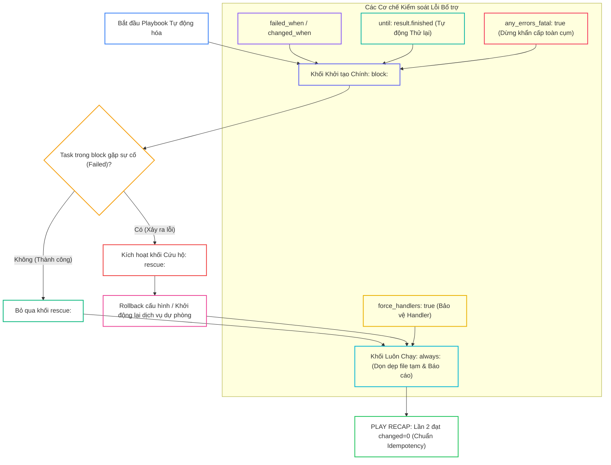
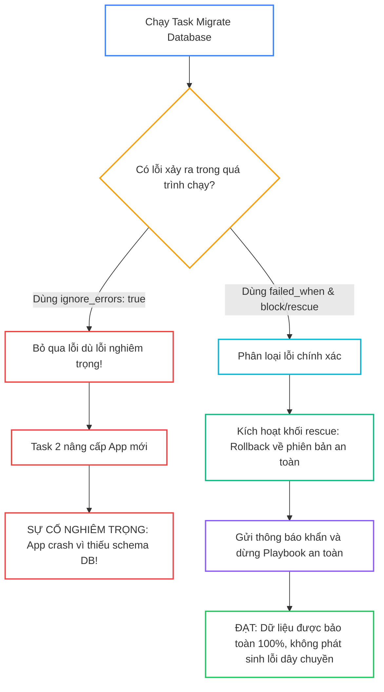


# [BÀI 23] XỬ LÝ LỖI CHUYÊN SÂU (ADVANCED ERROR HANDLING): BLOCKS, RESCUE, ALWAYS, FAILED_WHEN, CHANGED_WHEN & RETRY MECHANISMS

Trong kỷ nguyên **Infrastructure as Code (IaC)** và tự động hóa vận hành hạ tầng đám mây (Cloud Infrastructure Automation), **Ansible** khẳng định vị thế dẫn đầu nhờ triết lý **Agentless** (không cần cài đặt agent nền trên máy đích), giao thức điều khiển an toàn qua **SSH / WinRM**, định dạng khai báo **YAML** trực quan và nguyên lý bất biến **Idempotency** mạnh mẽ. Việc làm chủ Ansible không chỉ dừng lại ở các câu lệnh Ad-hoc đơn giản, mà đòi hỏi kỹ sư phải nắm vững kiến trúc Module tầng thấp, Variable Precedence 22 tầng, Jinja2 Templates, tối ưu hóa Forks & Pipelining cho tới thiết kế Roles / Collections và tích hợp CI/CD tự động hóa chuẩn Doanh nghiệp.

Bài viết chuyên sâu này sẽ đồng hành cùng bạn mổ xẻ toàn diện bức tranh kiến trúc, phân tích các đánh đổi kỹ thuật thực chiến (Engineering Trade-offs), cung cấp hướng dẫn thực hành Lab chi tiết từng bước và bộ câu hỏi phỏng vấn chuyên sâu chuẩn DevOps / SRE Lead.

---

## 1. Bản Chất Kiến Trúc & Cơ Chế Vận Hành Tầng Thấp



### 1.1. Các Từ Khóa Xử Lý Lỗi Nâng Cao: `ignore_errors`, `any_errors_fatal` và `force_handlers`

Trong môi trường thực tế, lỗi hạ tầng (mất kết nối mạng, dịch vụ chưa kịp sẵn sàng, đĩa đầy) là điều không thể tránh khỏi. Ansible cung cấp các từ khóa kiểm soát lỗi linh hoạt:

- **`ignore_errors: true`:** Chỉ đạo Ansible tiếp tục chạy các task phía sau trên host đó dù task hiện tại bị failed. Chỉ nên dùng cho các tác vụ mang tính thông tin hoặc tùy chọn.
- **`any_errors_fatal: true`:** Đảm bảo tính nguyên tử (Atomicity) của toàn cụm: nếu bất kỳ một máy chủ nào trong cụm bị lỗi, Ansible sẽ lập tức dừng toàn bộ Playbook trên tất cả các máy còn lại, ngăn ngừa tình trạng cụm rơi vào trạng thái phân mảnh (Split-brain).
- **`force_handlers: true`:** Mặc định nếu Playbook bị crash giữa chừng, các Handler đã được `notify` sẽ bị hủy. Bật `force_handlers = True` trong `ansible.cfg` hoặc Playbook giúp ép buộc thực thi các Handler quan trọng (như restart web/db) ngay cả khi có task phía sau bị fail.

```ini
[defaults]
force_handlers = True
```

### 1.2. Cơ Chế Retry Tự Động `until` và Ngưỡng Lỗi `max_fail_percentage`

- **Vòng lặp thử lại `until - retries - delay`:** Giải quyết triệt để lỗi bất đồng bộ khi chờ đợi dịch vụ khởi động (Health Check). Thay vì đặt `sleep` tĩnh, Ansible sẽ liên tục thử lại task cho đến khi biểu thức logic trong `until` trả về `true`.
- **Ngưỡng chịu lỗi `max_fail_percentage`:** Cho phép thiết lập tỷ lệ máy chủ tối đa được phép fail trong quá trình triển khai (ví dụ `max_fail_percentage: 10%`). Nếu tỷ lệ lỗi vượt quá ngưỡng, Playbook sẽ hủy ngay lập tức.

```yaml
- name: Wait for microservice health check endpoint to return HTTP 200
  ansible.builtin.uri:
    url: "http://127.0.0.1:8080/health"
    status_code: 200
  register: health_res
  until: health_res.status == 200
  retries: 30
  delay: 2
```

### 1.3. Khối Cứu Hộ `block - rescue - always`, `failed_when` / `changed_when` và Idempotency

- **Cấu trúc `block - rescue - always`:** Tương đương mô hình `try - catch - finally` trong lập trình:
  - `block`: Chứa các task triển khai chính.
  - `rescue`: Tự động kích hoạt khi có bất kỳ task nào trong `block` bị lỗi, dùng để rollback cấu hình hoặc gửi cảnh báo khẩn cấp.
  - `always`: Luôn luôn chạy bất kể thành công hay thất bại, dùng để xóa file tạm và ghi log kiểm toán.
- **Tự định nghĩa trạng thái với `failed_when` & `changed_when`:** Kiểm soát chính xác khi nào một lệnh `command` hoặc `shell` được coi là gây thay đổi (`changed_when`) và khi nào được coi là lỗi thật sự (`failed_when`).
- **Bảo toàn Idempotency:** Việc xử lý lỗi và rollback bằng khối `rescue` giúp đưa hệ thống về trạng thái an toàn, đảm bảo ở lượt chạy kế tiếp kịch bản vẫn thực thi trơn tru và đạt `changed=0`.

---

## 2. Bảng So Sánh Kỹ Thuật Toàn Diện (Engineering Matrix)

| Tiêu Chí Kỹ Thuật | Bỏ Qua Lỗi Đơn Giản (`ignore_errors: true`) | Tự Định Nghĩa Lỗi (`failed_when: condition`) | Khối Cứu Hộ Giao Dịch (`block - rescue - always`) | Dừng Khẩn Cấp Cụm (`any_errors_fatal: true`) |
|---|---|---|---|---|
| **Mức Độ Kiểm Soát** | Thô sơ (bỏ qua mọi mã lỗi trả về) | Tinh vi (bắt đúng chuỗi lỗi hoặc status code) | Toàn diện (xử lý lỗi theo mô hình try-catch) | Cấp độ toàn bộ cụm máy chủ |
| **Khả Năng Tự Động Rollback** | ❌ Không có (tiếp tục chạy bất chấp hậu quả) | ❌ Không có | ⭐ Tuyệt vời (khối `rescue:` thực thi rollback) | ❌ Dừng ngay để bảo vệ trạng thái hiện tại |
| **Bảo Đảm Dọn Dẹp File Tạm** | ❌ Không đảm bảo nếu task sau crash | ❌ Không đảm bảo | ✅ Đảm bảo 100% qua khối `always:` | ❌ Kịch bản dừng khẩn cấp |
| **Ảnh Hưởng Tới PLAY RECAP** | Báo `failed=0` (nhưng có dòng ignoring) | Báo `failed=1` nếu thỏa điều kiện | Báo `failed=0` nếu `rescue:` thành công | Báo `failed=1` và dừng toàn bộ cụm |
| **Mức Độ Khuyến Nghị** | Hạn chế tối đa trên Production | Bắt buộc cho `command` / `shell` | Bắt buộc cho triển khai ứng dụng lõi | Rất cao cho hệ thống Database / Cluster |

> [!IMPORTANT]
> **QUY TẮC BẤT DI BẤT DỊCH:**
> Không bao giờ sử dụng `ignore_errors: true` để che giấu các lỗi nghiêm trọng của hệ thống. Luôn sử dụng khối `block - rescue - always` để bắt lỗi và tự động kích hoạt quy trình rollback an toàn!

---

## 3. Kiến Trúc Triển Khai Chuẩn Production (Configuration / Playbook / Role Breakdown)

Dưới đây là Playbook chuẩn hóa `site-error-handling.yml` tích hợp toàn diện `block - rescue - always`, `until` retry, `failed_when`, `changed_when` và `any_errors_fatal`:

```yaml
# site-error-handling.yml
---
- name: Enterprise Advanced Error Handling Playbook
  hosts: web
  become: true
  any_errors_fatal: false
  vars:
    target_service_port: 8080
    app_log_path: "/var/log/app-recovery.log"

  tasks:
    - name: Transactional Block for Application Deployment
      block:
        - name: Task 1 - Deploy primary application configuration
          ansible.builtin.copy:
            content: "PORT={{ target_service_port }}\nSTATUS=PRIMARY_ACTIVE\n"
            dest: /etc/advanced-error-app.conf
            mode: '0644'

        - name: Task 2 - Simulate conditional failure check
          ansible.builtin.command: echo "DEPLOY_OK"
          register: deploy_check_res
          changed_when: false
          failed_when: "'CRITICAL_ERROR' in deploy_check_res.stdout"

        - name: Task 3 - Wait for service readiness with retry mechanism
          ansible.builtin.command: echo "READY"
          register: ready_check_out
          until: "'READY' in ready_check_out.stdout"
          retries: 5
          delay: 1
          changed_when: false

      rescue:
        - name: Rescue Task 1 - Rollback to safe fallback configuration
          ansible.builtin.copy:
            content: "PORT=80\nSTATUS=FALLBACK_SAFE_MODE\n"
            dest: /etc/advanced-error-app.conf
            mode: '0644'

        - name: Rescue Task 2 - Log failure incident for SRE team
          ansible.builtin.lineinfile:
            path: "{{ app_log_path }}"
            line: "ALERT: Primary deployment failed - Reverted to safe fallback"
            create: true
            mode: '0644'

      always:
        - name: Always Task 1 - Record audit deployment marker
          ansible.builtin.copy:
            content: "AUDIT_STATUS=EXECUTION_COMPLETED\n"
            dest: /etc/error-handling-audit.marker
            mode: '0644'
```

### Phân Tích Kỹ Thuật Từng Dòng (Line-by-Line Breakdown):

- <span class="badge-line">Line 10-29</span>: **Khối Thực Thi Chính (`block:`):** Triển khai cấu hình ứng dụng, kiểm tra điều kiện lỗi với `failed_when`, và kích hoạt cơ chế retry kiểm tra sẵn sàng với `until: 'READY' in ready_check_out.stdout`.
- <span class="badge-line">Line 31-43</span>: **Khối Cứu Hộ (`rescue:`):** Tự động can thiệp nếu bất kỳ task nào trong `block` bị fail, lập tức ghi cấu hình an toàn Fallback và ghi nhật ký sự cố vào `/var/log/app-recovery.log`.
- <span class="badge-line">Line 45-50</span>: **Khối Dọn Dẹp Bất Biến (`always:`):** Luôn luôn thực thi dù `block` thành công hay `rescue` vừa chạy, đảm bảo tạo file marker audit đầy đủ cho hệ thống kiểm toán.

---

## 4. Phân Tích Cạm Bẫy Thực Chiến: Lạm Dụng ignore_errors: true Che Giấu Lỗi Gây Hỏng Toàn Bộ Chuỗi Deployment

### Tình Huống Sự Cố Thực Tế Tại Doanh Nghiệp:
Một kỹ sư viết Playbook cập nhật Database Schema và di chuyển dữ liệu. Task 1 chạy script migration SQL với cờ `ignore_errors: true` (vì nghĩ rằng lỗi bảng đã tồn tại là bình thường). Khi chạy trên Production, database gặp lỗi cạn kiệt dung lượng đĩa và script migration bị fail hoàn toàn. Do có `ignore_errors: true`, Ansible đã bỏ qua lỗi và tiếp tục chạy Task 2 nâng cấp mã nguồn ứng dụng mới. Ứng dụng mới khởi động lên và truy vấn vào các cột dữ liệu chưa hề được tạo, gây sập toàn bộ cổng thanh toán của khách hàng.

### Hậu Quả & Log Lỗi Thực Tế:

```diff
- # CẤU HÌNH NGUY HIỂM CHE GIẤU LỖI:
- - name: Task 1 - Migrate Database Schema
-   ansible.builtin.command: /opt/scripts/migrate_sql.sh
-   ignore_errors: true  # LỖI CHẾT NGƯỜI: CHE GIẤU MỌI LỖI DISK FULL / SYNTAX!
-
- - name: Task 2 - Start Application
-   ansible.builtin.service: name=app state=started # SẬP ỨNG DỤNG DO THIẾU SCHEMA!

+ # CẤU HÌNH SỬA ĐÚNG BẰNG FAILED_WHEN & RESCUE:
+ - name: Safe Database Migration with Transaction Block
+   block:
+     - name: Migrate Database Schema
+       ansible.builtin.command: /opt/scripts/migrate_sql.sh
+       register: sql_res
+       failed_when: sql_res.rc != 0 and 'Table already exists' not in sql_res.stderr
+   rescue:
+     - name: Rollback Application Version
+       ansible.builtin.command: /opt/scripts/rollback_app.sh
+     - name: Abort Playbook Immediately
+       ansible.builtin.fail: msg="CRITICAL: Migration failed - Aborting deployment!"
```



### 5-Whys Root Cause Analysis:
1. **Tại sao cổng thanh toán bị sập?** Vì ứng dụng mới không tìm thấy các bảng cơ sở dữ liệu cần thiết.
2. **Tại sao bảng database chưa được tạo?** Vì script migration ở Task 1 chạy thất bại do phân vùng đĩa bị đầy.
3. **Tại sao Task 1 thất bại mà Playbook vẫn chạy tiếp Task 2?** Vì Task 1 được gán cờ `ignore_errors: true`.
4. **Tại sao kỹ sư lại dùng `ignore_errors: true`?** Để kịch bản không bị dừng khi gặp lỗi trùng lặp bảng không nghiêm trọng.
5. **Giải pháp triệt để là gì?** Thay thế `ignore_errors` bằng `failed_when` có lọc chuỗi ngoại lệ cụ thể, và bọc toàn bộ chuỗi task vào khối `block - rescue - always` để tự động rollback khi gặp lỗi thực sự.

---

## 5. Hands-on Lab: Xử Lý Lỗi Chuyên Sâu & Khắc Phục Sự Cố Tự Động (8 Bước)

| Bước | Lệnh CLI / Tác Vụ Chính | Mục Đích Thực Thi |
|---|---|---|
| **1** | `mkdir -p ~/lab-ansible-23 && cd ~/lab-ansible-23` | Khởi tạo môi trường lab xử lý lỗi |
| **2** | `cat << 'EOF' > ansible.cfg` | Cấu hình `force_handlers = True` trong `ansible.cfg` |
| **3** | `cat << 'EOF' > site-error-handling.yml` | Biên soạn Playbook hoàn chỉnh kết hợp block, rescue, always |
| **4** | `ansible-playbook site-error-handling.yml` | Thực thi Playbook Lần 1 nạp cấu hình và chạy kiểm thử |
| **5** | `ansible-playbook site-error-handling.yml` | Thực thi Phép thử Lần 2 đối soát Idempotency `changed=0` |
| **6** | `docker exec target1 cat /etc/advanced-error-app.conf` | Đối soát cấu hình ứng dụng chính xác trên máy đích |
| **7** | `docker exec target1 cat /etc/error-handling-audit.marker` | Đối soát file marker audit được tạo từ khối always |
| **8** | `ansible-playbook site-error-handling.yml > error-proof.txt` | Xuất và lưu trữ báo cáo kiểm toán xử lý lỗi |

```bash
# Bước 1: Khởi tạo thư mục dự án
mkdir -p ~/lab-ansible-23 && cd ~/lab-ansible-23
```

```bash
# Bước 2: Cấu hình ansible.cfg với force_handlers = True
cat << 'EOF' > ansible.cfg
[defaults]
inventory = ./inventory.ini
remote_user = ansible
host_key_checking = False
private_key_file = ~/.ssh/id_ed25519
roles_path = ./roles:~/.ansible/roles
collections_path = ./collections:~/.ansible/collections
force_handlers = True

[privilege_escalation]
become = True
become_method = sudo
become_user = root
become_ask_pass = False
EOF

cat << 'EOF' > inventory.ini
[web]
target1 ansible_host=127.0.0.1 ansible_port=2221

[all:vars]
ansible_python_interpreter=/usr/bin/python3
EOF
```

> [!NOTE]
> **CHECKPOINT 1:** Xác nhận cấu hình `ansible.cfg` cài đặt `force_handlers = True`:
> ```bash
> grep -q "force_handlers = True" ansible.cfg && echo "CHECKPOINT 1: PASS" || echo "CHECKPOINT 1: FAIL"
> ```

```bash
# Bước 3: Biên soạn Playbook chính site-error-handling.yml
cat << 'EOF' > site-error-handling.yml
---
- name: Enterprise Advanced Error Handling Playbook
  hosts: web
  become: true
  any_errors_fatal: false
  vars:
    target_service_port: 8080
    app_log_path: "/var/log/app-recovery.log"

  tasks:
    - name: Transactional Block for Application Deployment
      block:
        - name: Task 1 - Deploy primary application configuration
          ansible.builtin.copy:
            content: "PORT={{ target_service_port }}\nSTATUS=PRIMARY_ACTIVE\n"
            dest: /etc/advanced-error-app.conf
            mode: '0644'

        - name: Task 2 - Simulate conditional failure check
          ansible.builtin.command: echo "DEPLOY_OK"
          register: deploy_check_res
          changed_when: false
          failed_when: "'CRITICAL_ERROR' in deploy_check_res.stdout"

        - name: Task 3 - Wait for service readiness with retry mechanism
          ansible.builtin.command: echo "READY"
          register: ready_check_out
          until: "'READY' in ready_check_out.stdout"
          retries: 5
          delay: 1
          changed_when: false

      rescue:
        - name: Rescue Task 1 - Rollback to safe fallback configuration
          ansible.builtin.copy:
            content: "PORT=80\nSTATUS=FALLBACK_SAFE_MODE\n"
            dest: /etc/advanced-error-app.conf
            mode: '0644'

        - name: Rescue Task 2 - Log failure incident for SRE team
          ansible.builtin.lineinfile:
            path: "{{ app_log_path }}"
            line: "ALERT: Primary deployment failed - Reverted to safe fallback"
            create: true
            mode: '0644'

      always:
        - name: Always Task 1 - Record audit deployment marker
          ansible.builtin.copy:
            content: "AUDIT_STATUS=EXECUTION_COMPLETED\n"
            dest: /etc/error-handling-audit.marker
            mode: '0644'
EOF
```

> [!NOTE]
> **CHECKPOINT 2:** Kiểm tra cú pháp toàn bộ Playbook:
> ```bash
> ansible-playbook --syntax-check site-error-handling.yml && echo "CHECKPOINT 2: PASS" || echo "CHECKPOINT 2: FAIL"
> ```

```bash
# Bước 4: Thực thi Playbook Lần 1
ansible-playbook site-error-handling.yml
```

> [!NOTE]
> **CHECKPOINT 3:** Xác nhận Playbook thi hành thành công ở Lần 1:
> ```bash
> ansible-playbook site-error-handling.yml | grep -q "failed=0" && echo "CHECKPOINT 3: PASS" || echo "CHECKPOINT 3: FAIL"
> ```

> [!NOTE]
> **CHECKPOINT 4:** Xác nhận khối block và retry cơ chế hoàn thành tốt:
> ```bash
> ansible-playbook site-error-handling.yml | grep -q "Task 3 - Wait for service readiness with retry mechanism" && echo "CHECKPOINT 4: PASS" || echo "CHECKPOINT 4: FAIL"
> ```

```bash
# Bước 5: Thực thi Phép thử Lần 2 đối soát Idempotency
ansible-playbook site-error-handling.yml
```

> [!NOTE]
> **CHECKPOINT 5:** Xác nhận Lượt 2 đạt Idempotency tuyệt đối (`changed=0`):
> ```bash
> RUN2_OUT=$(ansible-playbook site-error-handling.yml)
> if echo "$RUN2_OUT" | grep -q "changed=0" && echo "$RUN2_OUT" | grep -q "failed=0"; then
>   echo "CHECKPOINT 5: PASS - Đạt Idempotency changed=0"
> else
>   echo "CHECKPOINT 5: FAIL - Lỗi không đạt Idempotency"
> fi
> ```

```bash
# Bước 6: Đối soát file cấu hình ứng dụng trên target1
docker exec target1 cat /etc/advanced-error-app.conf
```

> [!NOTE]
> **CHECKPOINT 6:** Xác nhận file cấu hình chứa đúng dữ liệu `PORT=8080` và `STATUS=PRIMARY_ACTIVE`:
> ```bash
> docker exec target1 cat /etc/advanced-error-app.conf | grep -q "STATUS=PRIMARY_ACTIVE" && echo "CHECKPOINT 6: PASS" || echo "CHECKPOINT 6: FAIL"
> ```

```bash
# Bước 7: Đối soát file marker được tạo bởi khối always
docker exec target1 cat /etc/error-handling-audit.marker
```

> [!NOTE]
> **CHECKPOINT 7:** Xác nhận khối always đã tạo đúng file marker audit:
> ```bash
> docker exec target1 cat /etc/error-handling-audit.marker | grep -q "AUDIT_STATUS=EXECUTION_COMPLETED" && echo "CHECKPOINT 7: PASS" || echo "CHECKPOINT 7: FAIL"
> ```

```bash
# Bước 8: Lưu trữ báo cáo kiểm toán
ansible-playbook site-error-handling.yml > error-proof.txt
```

> [!NOTE]
> **CHECKPOINT 8:** Xác nhận log kiểm toán hoàn chỉnh:
> ```bash
> grep -q "ok=" error-proof.txt && grep -q "failed=0" error-proof.txt && echo "CHECKPOINT 8: PASS" || echo "CHECKPOINT 8: FAIL"
> ```

---

## 6. Bộ Câu Hỏi Vấn Đáp & Phỏng Vấn Chuyên Sâu (Self-Check Q&A)

<details class="qa-card" markdown="1">
  <summary class="qa-summary">
    <span class="qa-num-badge">Q01</span>
    <span class="qa-question-text">Trình bày cơ chế hoạt động của từ khóa <code>ignore_errors: true</code>. Tại sao việc lạm dụng nó trên Production được coi là một Anti-pattern nguy hiểm?</span>
  </summary>
  <div class="qa-answer">
    <div class="qa-answer-header">
      <svg width="14" height="14" fill="none" stroke="currentColor" stroke-width="2" viewBox="0 0 24 24"><path d="M22 11.08V12a10 10 0 1 1-5.93-9.14"></path><polyline points="22 4 12 14.01 9 11.01"></polyline></svg>
      <span>Phân Tích &amp; Lời Giải Kỹ Thuật</span>
    </div>
    <div style="margin: 0.5rem 0;"><b>Hỏi:</b> Trình bày cơ chế hoạt động của từ khóa <code>ignore_errors: true</code>. Tại sao việc lạm dụng nó trên Production được coi là một Anti-pattern nguy hiểm?</div>
    <div style="margin: 0.5rem 0;"><b>Đáp án chuẩn:</b></div>
    <div style="margin: 0.35rem 0; padding-left: 1rem; border-left: 2px solid var(--accent-primary);">• <b>Cơ chế:</b> Khi một task được gắn <code>ignore_errors: true</code> gặp lỗi (return code != 0 hoặc task failed), Ansible sẽ in cảnh báo `...ignoring` và cho phép tiến trình tiếp tục thực thi các task phía sau trên host đó.</div>
    <div style="margin: 0.35rem 0; padding-left: 1rem; border-left: 2px solid var(--accent-primary);">• <b>Rủi ro Anti-pattern:</b> Việc lạm dụng sẽ che giấu các lỗi nghiêm trọng (như phân vùng đĩa đầy, sai quyền truy cập, thiếu bảng DB), khiến các task phụ thuộc phía sau tiếp tục chạy trên một trạng thái hỏng, gây sập dây chuyền (Cascading Failure).</div>
    <div style="margin: 0.5rem 0;"><b>Tiêu chí chấm:</b></div>
    <div style="margin: 0.35rem 0; padding-left: 1rem; border-left: 2px solid var(--accent-primary);">• 0: Không biết tác dụng của `ignore_errors`.</div>
    <div style="margin: 0.35rem 0; padding-left: 1rem; border-left: 2px solid var(--accent-primary);">• 1: Biết bỏ qua lỗi nhưng không phân tích được hiện tượng lỗi dây chuyền Cascading Failure.</div>
    <div style="margin: 0.35rem 0; padding-left: 1rem; border-left: 2px solid var(--accent-primary);">• 2: Phân tích chính xác cơ chế hoạt động và rủi ro che giấu lỗi.</div>
    <div style="margin: 0.35rem 0; padding-left: 1rem; border-left: 2px solid var(--accent-primary);">• 3: Nêu đúng + đề xuất phương án thay thế bằng `failed_when` hoặc khối `block/rescue`.</div>
    <div style="margin: 0.5rem 0;"><b>Câu hỏi đào sâu:</b> Từ khóa `ignore_errors: true` có bỏ qua được lỗi cú pháp YAML (Syntax Error) hoặc lỗi Undefined Variable không? <i>(Không, các lỗi cú pháp và thiếu biến vẫn làm dừng Playbook ngay lập tức.)</i></div>
  </div>
</details>

<details class="qa-card" markdown="1">
  <summary class="qa-summary">
    <span class="qa-num-badge">Q02</span>
    <span class="qa-question-text">Từ khóa <code>any_errors_fatal: true</code> hoạt động như thế nào? Khi nào bắt buộc phải sử dụng trong các hệ thống cụm phân tán (Clustering)?</span>
  </summary>
  <div class="qa-answer">
    <div class="qa-answer-header">
      <svg width="14" height="14" fill="none" stroke="currentColor" stroke-width="2" viewBox="0 0 24 24"><path d="M22 11.08V12a10 10 0 1 1-5.93-9.14"></path><polyline points="22 4 12 14.01 9 11.01"></polyline></svg>
      <span>Phân Tích &amp; Lời Giải Kỹ Thuật</span>
    </div>
    <div style="margin: 0.5rem 0;"><b>Hỏi:</b> Từ khóa <code>any_errors_fatal: true</code> hoạt động như thế nào? Khi nào bắt buộc phải sử dụng trong các hệ thống cụm phân tán (Clustering)?</div>
    <div style="margin: 0.5rem 0;"><b>Đáp án chuẩn:</b></div>
    <div style="margin: 0.35rem 0; padding-left: 1rem; border-left: 2px solid var(--accent-primary);">• <b>Cơ chế:</b> Mặc định trong Ansible, khi một host bị fail thì Ansible chỉ loại bỏ host đó và tiếp tục chạy Playbook trên các host còn lại. Khi bật <code>any_errors_fatal: true</code>, chỉ cần 1 host bất kỳ bị fail, Ansible sẽ ngay lập tức dừng khẩn cấp toàn bộ Playbook trên 100% các host còn lại.</div>
    <div style="margin: 0.35rem 0; padding-left: 1rem; border-left: 2px solid var(--accent-primary);">• <b>Trường hợp bắt buộc:</b> Trong các hệ thống cụm phân tán yêu cầu tính toàn vẹn cao (như Galera Cluster, Elasticsearch, Kubernetes Master nodes, Ceph Storage) để ngăn chặn tình trạng cụm bị phân mảnh trạng thái (Split-brain).</div>
    <div style="margin: 0.5rem 0;"><b>Tiêu chí chấm:</b></div>
    <div style="margin: 0.35rem 0; padding-left: 1rem; border-left: 2px solid var(--accent-primary);">• 0: Không biết `any_errors_fatal`.</div>
    <div style="margin: 0.35rem 0; padding-left: 1rem; border-left: 2px solid var(--accent-primary);">• 1: Biết dừng toàn bộ nhưng không giải thích được lý do bảo vệ cụm phân tán khỏi Split-brain.</div>
    <div style="margin: 0.35rem 0; padding-left: 1rem; border-left: 2px solid var(--accent-primary);">• 2: Phân tích chính xác cơ chế dừng toàn cụm và các use-case hệ thống phân tán.</div>
    <div style="margin: 0.35rem 0; padding-left: 1rem; border-left: 2px solid var(--accent-primary);">• 3: Nêu đúng + kết hợp ví dụ khai báo ở cấp Playbook hoặc cấp Block.</div>
    <div style="margin: 0.5rem 0;"><b>Câu hỏi đào sâu:</b> Có thể áp dụng `any_errors_fatal: true` cho riêng 1 khối `block:` thay vì toàn bộ Playbook không? <i>(Hoàn toàn được, có thể khai báo trực tiếp ở cấp `block:`.)</i></div>
  </div>
</details>

<details class="qa-card" markdown="1">
  <summary class="qa-summary">
    <span class="qa-num-badge">Q03</span>
    <span class="qa-question-text">Thuộc tính <code>force_handlers: true</code> dùng để làm gì? Giải thích sự cố nếu không bật tính năng này khi một task sau bị lỗi.</span>
  </summary>
  <div class="qa-answer">
    <div class="qa-answer-header">
      <svg width="14" height="14" fill="none" stroke="currentColor" stroke-width="2" viewBox="0 0 24 24"><path d="M22 11.08V12a10 10 0 1 1-5.93-9.14"></path><polyline points="22 4 12 14.01 9 11.01"></polyline></svg>
      <span>Phân Tích &amp; Lời Giải Kỹ Thuật</span>
    </div>
    <div style="margin: 0.5rem 0;"><b>Hỏi:</b> Thuộc tính <code>force_handlers: true</code> dùng để làm gì? Giải thích sự cố nếu không bật tính năng này khi một task sau bị lỗi.</div>
    <div style="margin: 0.5rem 0;"><b>Đáp án chuẩn:</b></div>
    <div style="margin: 0.35rem 0; padding-left: 1rem; border-left: 2px solid var(--accent-primary);">• <b>Tác dụng:</b> Ép buộc Ansible phải thi hành các Handler đã được thông báo (`notify`) ở các task trước ngay cả khi Playbook bị dừng đột ngột do một task phía sau gặp lỗi.</div>
    <div style="margin: 0.5rem 0;"><b>Sự cố nếu không bật:</b> Giả sử Task 1 sửa file cấu hình web và gửi `notify: restart nginx`. Task 2 gặp lỗi làm Playbook dừng ngay. Do không có `force_handlers`, Handler restart nginx bị hủy bỏ, khiến máy chủ chạy cấu hình mới nhưng dịch vụ vẫn nạp cấu hình cũ (nửa vời, mất đồng bộ trạng thái).</div>
    <div style="margin: 0.5rem 0;"><b>Tiêu chí chấm:</b></div>
    <div style="margin: 0.35rem 0; padding-left: 1rem; border-left: 2px solid var(--accent-primary);">• 0: Không biết `force_handlers`.</div>
    <div style="margin: 0.35rem 0; padding-left: 1rem; border-left: 2px solid var(--accent-primary);">• 1: Biết là ép chạy handler nhưng không phân tích được tình huống file cấu hình đã đổi mà service chưa restart.</div>
    <div style="margin: 0.35rem 0; padding-left: 1rem; border-left: 2px solid var(--accent-primary);">• 2: Phân tích chính xác nguy cơ bất đồng bộ trạng thái giữa file cấu hình và dịch vụ runtime.</div>
    <div style="margin: 0.35rem 0; padding-left: 1rem; border-left: 2px solid var(--accent-primary);">• 3: Nêu đúng + viết cấu hình kích hoạt trong `ansible.cfg` (`force_handlers = True`).</div>
    <div style="margin: 0.5rem 0;"><b>Câu hỏi đào sâu:</b> Cờ dòng lệnh nào tương đương với `force_handlers = True` khi chạy `ansible-playbook`? <i>(Cờ <code>--force-handlers</code>.)</i></div>
  </div>
</details>

<details class="qa-card" markdown="1">
  <summary class="qa-summary">
    <span class="qa-num-badge">Q04</span>
    <span class="qa-question-text">Trình bày cơ chế tự động thử lại (Retry Mechanism) với bộ ba từ khóa <code>until</code>, <code>retries</code>, và <code>delay</code>.</span>
  </summary>
  <div class="qa-answer">
    <div class="qa-answer-header">
      <svg width="14" height="14" fill="none" stroke="currentColor" stroke-width="2" viewBox="0 0 24 24"><path d="M22 11.08V12a10 10 0 1 1-5.93-9.14"></path><polyline points="22 4 12 14.01 9 11.01"></polyline></svg>
      <span>Phân Tích &amp; Lời Giải Kỹ Thuật</span>
    </div>
    <div style="margin: 0.5rem 0;"><b>Hỏi:</b> Trình bày cơ chế tự động thử lại (Retry Mechanism) với bộ ba từ khóa <code>until</code>, <code>retries</code>, và <code>delay</code>.</div>
    <div style="margin: 0.5rem 0;"><b>Đáp án chuẩn:</b></div>
    <div style="margin: 0.35rem 0; padding-left: 1rem; border-left: 2px solid var(--accent-primary);">• <b>Cơ chế:</b> Ansible sẽ thực thi task, sau đó đánh giá biểu thức logic trong <code>until</code> dựa trên kết quả đăng ký (`register`). Nếu biểu thức trả về `false`, Ansible sẽ tạm dừng trong số giây quy định bởi <code>delay</code> (mặc định 5s) và thử lại task đó tối đa số lần quy định bởi <code>retries</code> (mặc định 3 lần). Task chỉ được coi là thành công khi <code>until</code> đạt `true`.</div>
    <div style="margin: 0.5rem 0;"><b>Tiêu chí chấm:</b></div>
    <div style="margin: 0.35rem 0; padding-left: 1rem; border-left: 2px solid var(--accent-primary);">• 0: Không biết cơ chế retry `until`.</div>
    <div style="margin: 0.35rem 0; padding-left: 1rem; border-left: 2px solid var(--accent-primary);">• 1: Biết thử lại nhưng không nhớ các giá trị mặc định của `retries` và `delay`.</div>
    <div style="margin: 0.35rem 0; padding-left: 1rem; border-left: 2px solid var(--accent-primary);">• 2: Phân tích chính xác cơ chế polling vòng lặp và điều kiện kết thúc.</div>
    <div style="margin: 0.35rem 0; padding-left: 1rem; border-left: 2px solid var(--accent-primary);">• 3: Nêu đúng + viết ví dụ mẫu kiểm tra status code 200 của API endpoint.</div>
    <div style="margin: 0.5rem 0;"><b>Câu hỏi đào sâu:</b> Nếu sau khi thử hết số lần `retries` mà `until` vẫn không thỏa mãn thì Ansible xử lý thế nào? <i>(Task sẽ bị đánh dấu là FAILED và dừng Playbook.)</i></div>
  </div>
</details>

<details class="qa-card" markdown="1">
  <summary class="qa-summary">
    <span class="qa-num-badge">Q05</span>
    <span class="qa-question-text">Trình bày cấu trúc và luồng thi hành của khối <code>block - rescue - always</code>. So sánh với cấu trúc <code>try - catch - finally</code>.</span>
  </summary>
  <div class="qa-answer">
    <div class="qa-answer-header">
      <svg width="14" height="14" fill="none" stroke="currentColor" stroke-width="2" viewBox="0 0 24 24"><path d="M22 11.08V12a10 10 0 1 1-5.93-9.14"></path><polyline points="22 4 12 14.01 9 11.01"></polyline></svg>
      <span>Phân Tích &amp; Lời Giải Kỹ Thuật</span>
    </div>
    <div style="margin: 0.5rem 0;"><b>Hỏi:</b> Trình bày cấu trúc và luồng thi hành của khối <code>block - rescue - always</code>. So sánh với cấu trúc <code>try - catch - finally</code>.</div>
    <div style="margin: 0.5rem 0;"><b>Đáp án chuẩn:</b></div>
    <div style="margin: 0.35rem 0; padding-left: 1rem; border-left: 2px solid var(--accent-primary);">• <b><code>block</code> (tương đương <code>try</code>):</b> Chứa các task triển khai chính. Nếu tất cả task chạy thành công, khối `rescue` sẽ bị bỏ qua.</div>
    <div style="margin: 0.35rem 0; padding-left: 1rem; border-left: 2px solid var(--accent-primary);">• <b><code>rescue</code> (tương đương <code>catch</code>):</b> Chỉ được kích hoạt khi có ít nhất 1 task trong `block` bị lỗi. Dùng để rollback cấu hình hoặc khôi phục dịch vụ dự phòng.</div>
    <div style="margin: 0.35rem 0; padding-left: 1rem; border-left: 2px solid var(--accent-primary);">• <b><code>always</code> (tương đương <code>finally</code>):</b> Luôn luôn thực thi trong mọi tình huống (dù `block` thành công hay `rescue` vừa chạy), dùng để dọn dẹp tài nguyên và ghi log audit.</div>
    <div style="margin: 0.5rem 0;"><b>Tiêu chí chấm:</b></div>
    <div style="margin: 0.35rem 0; padding-left: 1rem; border-left: 2px solid var(--accent-primary);">• 0: Không biết cấu trúc `block - rescue - always`.</div>
    <div style="margin: 0.35rem 0; padding-left: 1rem; border-left: 2px solid var(--accent-primary);">• 1: Biết các khối nhưng không liên hệ được với `try - catch - finally`.</div>
    <div style="margin: 0.35rem 0; padding-left: 1rem; border-left: 2px solid var(--accent-primary);">• 2: Phân tích chính xác luồng thi hành tuần tự và vai trò của từng khối.</div>
    <div style="margin: 0.35rem 0; padding-left: 1rem; border-left: 2px solid var(--accent-primary);">• 3: Nêu đúng + viết đoạn YAML mẫu hoàn chỉnh có đầy đủ cả 3 khối.</div>
    <div style="margin: 0.5rem 0;"><b>Câu hỏi đào sâu:</b> Nếu một task bên trong khối `rescue` cũng bị lỗi (Failed) thì chuyện gì xảy ra? <i>(Khối `always` vẫn được chạy xong rồi Playbook mới dừng lại báo lỗi.)</i></div>
  </div>
</details>

<details class="qa-card" markdown="1">
  <summary class="qa-summary">
    <span class="qa-num-badge">Q06</span>
    <span class="qa-question-text">Phân biệt sự khác nhau giữa hai thuộc tính <code>failed_when</code> và <code>changed_when</code>. Viết ví dụ cho module <code>ansible.builtin.command</code>.</span>
  </summary>
  <div class="qa-answer">
    <div class="qa-answer-header">
      <svg width="14" height="14" fill="none" stroke="currentColor" stroke-width="2" viewBox="0 0 24 24"><path d="M22 11.08V12a10 10 0 1 1-5.93-9.14"></path><polyline points="22 4 12 14.01 9 11.01"></polyline></svg>
      <span>Phân Tích &amp; Lời Giải Kỹ Thuật</span>
    </div>
    <div style="margin: 0.5rem 0;"><b>Hỏi:</b> Phân biệt sự khác nhau giữa hai thuộc tính <code>failed_when</code> và <code>changed_when</code>. Viết ví dụ cho module <code>ansible.builtin.command</code>.</div>
    <div style="margin: 0.5rem 0;"><b>Đáp án chuẩn:</b></div>
    <div style="margin: 0.35rem 0; padding-left: 1rem; border-left: 2px solid var(--accent-primary);">• <b><code>failed_when</code>:</b> Tự định nghĩa điều kiện coi task là thất bại (ví dụ: `failed_when: "'FATAL' in result.stderr or result.rc >= 2"`).</div>
    <div style="margin: 0.35rem 0; padding-left: 1rem; border-left: 2px solid var(--accent-primary);">• <b><code>changed_when</code>:</b> Tự định nghĩa điều kiện coi task đã làm thay đổi trạng thái máy đích (ví dụ: `changed_when: "'Created' in result.stdout"`, hoặc `changed_when: false` cho task chỉ đọc dữ liệu).</div>
    <div style="margin: 0.5rem 0;"><b>Tiêu chí chấm:</b></div>
    <div style="margin: 0.35rem 0; padding-left: 1rem; border-left: 2px solid var(--accent-primary);">• 0: Không phân biệt được 2 thuộc tính.</div>
    <div style="margin: 0.35rem 0; padding-left: 1rem; border-left: 2px solid var(--accent-primary);">• 1: Biết một loại định nghĩa lỗi một loại định nghĩa thay đổi nhưng không viết được biểu thức logic.</div>
    <div style="margin: 0.35rem 0; padding-left: 1rem; border-left: 2px solid var(--accent-primary);">• 2: Phân tích chính xác vai trò kiểm soát trạng thái của 2 thuộc tính.</div>
    <div style="margin: 0.35rem 0; padding-left: 1rem; border-left: 2px solid var(--accent-primary);">• 3: Nêu đúng + viết ví dụ YAML kết hợp cả 2 thuộc tính trong 1 task.</div>
    <div style="margin: 0.5rem 0;"><b>Câu hỏi đào sâu:</b> Tại sao các task đọc dữ liệu bằng module `command` bắt buộc phải có `changed_when: false`? <i>(Để tránh báo `changed=1` mạo danh ở Lần 2, giữ vững tính Idempotency.)</i></div>
  </div>
</details>

<details class="qa-card" markdown="1">
  <summary class="qa-summary">
    <span class="qa-num-badge">Q07</span>
    <span class="qa-question-text">Làm thế nào để chủ động báo lỗi và dừng Playbook có chủ đích với module <code>ansible.builtin.fail</code>?</span>
  </summary>
  <div class="qa-answer">
    <div class="qa-answer-header">
      <svg width="14" height="14" fill="none" stroke="currentColor" stroke-width="2" viewBox="0 0 24 24"><path d="M22 11.08V12a10 10 0 1 1-5.93-9.14"></path><polyline points="22 4 12 14.01 9 11.01"></polyline></svg>
      <span>Phân Tích &amp; Lời Giải Kỹ Thuật</span>
    </div>
    <div style="margin: 0.5rem 0;"><b>Hỏi:</b> Làm thế nào để chủ động báo lỗi và dừng Playbook có chủ đích với module <code>ansible.builtin.fail</code>?</div>
    <div style="margin: 0.5rem 0;"><b>Đáp án chuẩn:</b></div>
    <div style="margin: 0.35rem 0; padding-left: 1rem; border-left: 2px solid var(--accent-primary);">• Sử dụng module <code>ansible.builtin.fail</code> kết hợp cờ điều kiện <code>when:</code> để dừng Playbook khi các điều kiện an toàn không được thỏa mãn (ví dụ: dung lượng RAM không đủ hoặc biến môi trường bị thiếu).</div>
    <div style="margin: 0.35rem 0; padding-left: 1rem; border-left: 2px solid var(--accent-primary);">• Ví dụ:
      <pre><code>- name: Assert minimum RAM requirement
  ansible.builtin.fail:
    msg: "System has less than 4GB RAM - Aborting deployment!"
  when: ansible_memtotal_mb < 4096</code></pre>
    </div>
    <div style="margin: 0.5rem 0;"><b>Tiêu chí chấm:</b></div>
    <div style="margin: 0.35rem 0; padding-left: 1rem; border-left: 2px solid var(--accent-primary);">• 0: Không biết module `fail`.</div>
    <div style="margin: 0.35rem 0; padding-left: 1rem; border-left: 2px solid var(--accent-primary);">• 1: Biết làm dừng nhưng không kết hợp cờ điều kiện `when:`.</div>
    <div style="margin: 0.35rem 0; padding-left: 1rem; border-left: 2px solid var(--accent-primary);">• 2: Phân tích chính xác vai trò Pre-flight Check của module `fail`.</div>
    <div style="margin: 0.35rem 0; padding-left: 1rem; border-left: 2px solid var(--accent-primary);">• 3: Nêu đúng + so sánh với module <code>ansible.builtin.assert</code>.</div>
    <div style="margin: 0.5rem 0;"><b>Câu hỏi đào sâu:</b> Module `assert` khác gì so với module `fail`? <i>(Module `assert` dùng danh sách điều kiện `that:`, nếu điều kiện sai mới báo lỗi.)</i></div>
  </div>
</details>

<details class="qa-card" markdown="1">
  <summary class="qa-summary">
    <span class="qa-num-badge">Q08</span>
    <span class="qa-question-text">Từ khóa <code>ignore_unreachable: true</code> dùng để làm gì? Khi nào nên sử dụng?</span>
  </summary>
  <div class="qa-answer">
    <div class="qa-answer-header">
      <svg width="14" height="14" fill="none" stroke="currentColor" stroke-width="2" viewBox="0 0 24 24"><path d="M22 11.08V12a10 10 0 1 1-5.93-9.14"></path><polyline points="22 4 12 14.01 9 11.01"></polyline></svg>
      <span>Phân Tích &amp; Lời Giải Kỹ Thuật</span>
    </div>
    <div style="margin: 0.5rem 0;"><b>Hỏi:</b> Từ khóa <code>ignore_unreachable: true</code> dùng để làm gì? Khi nào nên sử dụng?</div>
    <div style="margin: 0.5rem 0;"><b>Đáp án chuẩn:</b></div>
    <div style="margin: 0.35rem 0; padding-left: 1rem; border-left: 2px solid var(--accent-primary);">• <b>Tác dụng:</b> Bỏ qua lỗi mất kết nối SSH (Unreachable error) tại một task cụ thể và coi host đó là `ignored` thay vì loại bỏ host khỏi toàn bộ Playbook.</div>
    <div style="margin: 0.35rem 0; padding-left: 1rem; border-left: 2px solid var(--accent-primary);">• <b>Use-case:</b> Rất hữu ích khi thực hiện các tác vụ khởi động lại máy chủ (Reboot) hoặc thay đổi cấu hình địa chỉ IP mạng/cổng SSH mà kết nối có thể bị ngắt tạm thời trước khi kết nối lại.</div>
    <div style="margin: 0.5rem 0;"><b>Tiêu chí chấm:</b></div>
    <div style="margin: 0.35rem 0; padding-left: 1rem; border-left: 2px solid var(--accent-primary);">• 0: Không biết `ignore_unreachable`.</div>
    <div style="margin: 0.35rem 0; padding-left: 1rem; border-left: 2px solid var(--accent-primary);">• 1: Nhầm lẫn giữa `ignore_errors` và `ignore_unreachable`.</div>
    <div style="margin: 0.35rem 0; padding-left: 1rem; border-left: 2px solid var(--accent-primary);">• 2: Phân tích chính xác sự khác biệt giữa Task Failure và SSH Unreachable.</div>
    <div style="margin: 0.35rem 0; padding-left: 1rem; border-left: 2px solid var(--accent-primary);">• 3: Nêu đúng + kết hợp ví dụ sử dụng chung với module `wait_for_connection`.</div>
    <div style="margin: 0.5rem 0;"><b>Câu hỏi đào sâu:</b> `ignore_errors: true` có bắt được lỗi unreachable không? <i>(Không, `ignore_errors` không bắt được lỗi unreachable, bắt buộc phải dùng `ignore_unreachable`.)</i></div>
  </div>
</details>

<details class="qa-card" markdown="1">
  <summary class="qa-summary">
    <span class="qa-num-badge">Q09</span>
    <span class="qa-question-text">Làm thế nào để ép buộc thực thi ngay lập tức các Handler tích lũy tại một vị trí cụ thể bằng <code>meta: flush_handlers</code>?</span>
  </summary>
  <div class="qa-answer">
    <div class="qa-answer-header">
      <svg width="14" height="14" fill="none" stroke="currentColor" stroke-width="2" viewBox="0 0 24 24"><path d="M22 11.08V12a10 10 0 1 1-5.93-9.14"></path><polyline points="22 4 12 14.01 9 11.01"></polyline></svg>
      <span>Phân Tích &amp; Lời Giải Kỹ Thuật</span>
    </div>
    <div style="margin: 0.5rem 0;"><b>Hỏi:</b> Làm thế nào để ép buộc thực thi ngay lập tức các Handler tích lũy tại một vị trí cụ thể bằng <code>meta: flush_handlers</code>?</div>
    <div style="margin: 0.5rem 0;"><b>Đáp án chuẩn:</b></div>
    <div style="margin: 0.35rem 0; padding-left: 1rem; border-left: 2px solid var(--accent-primary);">• Mặc định trong Ansible, tất cả các Handler chỉ được thi hành ở cuối cùng của Playbook.</div>
    <div style="margin: 0.35rem 0; padding-left: 1rem; border-left: 2px solid var(--accent-primary);">• Sử dụng lệnh <code>ansible.builtin.meta: flush_handlers</code> để ép Ansible chạy ngay lập tức tất cả các Handler đang chờ tại đúng thời điểm đó trước khi bước sang task tiếp theo (ví dụ: restart database ngay để task sau nạp dữ liệu vào DB).</div>
    <div style="margin: 0.5rem 0;"><b>Tiêu chí chấm:</b></div>
    <div style="margin: 0.35rem 0; padding-left: 1rem; border-left: 2px solid var(--accent-primary);">• 0: Không biết `meta: flush_handlers`.</div>
    <div style="margin: 0.35rem 0; padding-left: 1rem; border-left: 2px solid var(--accent-primary);">• 1: Biết chạy handler sớm nhưng không nêu được use-case khởi động dịch vụ phụ thuộc.</div>
    <div style="margin: 0.35rem 0; padding-left: 1rem; border-left: 2px solid var(--accent-primary);">• 2: Phân tích chính xác cơ chế xả Handler tức thì (Immediate Flush).</div>
    <div style="margin: 0.35rem 0; padding-left: 1rem; border-left: 2px solid var(--accent-primary);">• 3: Nêu đúng + viết đoạn Task YAML chuẩn FQCN.</div>
    <div style="margin: 0.5rem 0;"><b>Câu hỏi đào sâu:</b> Nếu Handler trong `flush_handlers` bị lỗi thì các task phía sau có chạy tiếp không? <i>(Mặc định Playbook sẽ dừng lại ngay tại vị trí flush đó.)</i></div>
  </div>
</details>

<details class="qa-card" markdown="1">
  <summary class="qa-summary">
    <span class="qa-num-badge">Q10</span>
    <span class="qa-question-text">Trình bày quy trình 3 bước nghiệm thu tính đúng đắn và Idempotency của một Playbook có tích hợp xử lý lỗi phức tạp.</span>
  </summary>
  <div class="qa-answer">
    <div class="qa-answer-header">
      <svg width="14" height="14" fill="none" stroke="currentColor" stroke-width="2" viewBox="0 0 24 24"><path d="M22 11.08V12a10 10 0 1 1-5.93-9.14"></path><polyline points="22 4 12 14.01 9 11.01"></polyline></svg>
      <span>Phân Tích &amp; Lời Giải Kỹ Thuật</span>
    </div>
    <div style="margin: 0.5rem 0;"><b>Hỏi:</b> Trình bày quy trình 3 bước nghiệm thu tính đúng đắn và Idempotency của một Playbook có tích hợp xử lý lỗi phức tạp.</div>
    <div style="margin: 0.5rem 0;"><b>Đáp án chuẩn:</b></div>
    <div style="margin: 0.35rem 0; padding-left: 1rem; border-left: 2px solid var(--accent-primary);">1. <b>Bước 1 (Thực thi Kịch bản Bình thường - Lần 1 &amp; Lần 2):</b> Chạy Lần 1 (cấu hình áp dụng) và chạy Lần 2 khẳng định <code>PLAY RECAP</code> đạt <code>changed=0</code>.</div>
    <div style="margin: 0.35rem 0; padding-left: 1rem; border-left: 2px solid var(--accent-primary);">2. <b>Bước 2 (Kiểm thử Khối Cứu hộ Rescue bằng Injection Failure):</b> Cố tình tiêm lỗi vào khối `block` (như sửa sai port/status code) để xác nhận khối `rescue` tự động rollback về Fallback thành công.</div>
    <div style="margin: 0.35rem 0; padding-left: 1rem; border-left: 2px solid var(--accent-primary);">3. <b>Bước 3 (Đối soát Sự thật Máy đích):</b> Dùng <code>docker exec</code> kiểm tra file cấu hình và file marker sinh ra từ khối `always`.</div>
    <div style="margin: 0.5rem 0;"><b>Tiêu chí chấm:</b></div>
    <div style="margin: 0.35rem 0; padding-left: 1rem; border-left: 2px solid var(--accent-primary);">• 0: Không có quy trình nghiệm thu xử lý lỗi.</div>
    <div style="margin: 0.35rem 0; padding-left: 1rem; border-left: 2px solid var(--accent-primary);">• 1: Bỏ qua bước kiểm thử tiêm lỗi Injection Failure vào khối rescue.</div>
    <div style="margin: 0.35rem 0; padding-left: 1rem; border-left: 2px solid var(--accent-primary);">• 2: Trình bày đủ 3 bước nhưng chưa chi tiết câu lệnh đối soát.</div>
    <div style="margin: 0.35rem 0; padding-left: 1rem; border-left: 2px solid var(--accent-primary);">• 3: Trình bày xuất sắc cả 3 bước + nhấn mạnh phương pháp Chaos Engineering trong tự động hóa.</div>
    <div style="margin: 0.5rem 0;"><b>Câu hỏi đào sâu:</b> Làm sao để tiêm lỗi thử nghiệm mà không sửa code Playbook chính? <i>(Sử dụng biến cờ điều kiện truyền qua `-e "inject_failure=true"`.)</i></div>
  </div>
</details>

<details class="qa-card" markdown="1">
  <summary class="qa-summary">
    <span class="qa-num-badge">Q11</span>
    <span class="qa-question-text">Biến nội tại <code>ansible_failed_task</code> và <code>ansible_failed_result</code> trong khối <code>rescue</code> cung cấp những thông tin gì?</span>
  </summary>
  <div class="qa-answer">
    <div class="qa-answer-header">
      <svg width="14" height="14" fill="none" stroke="currentColor" stroke-width="2" viewBox="0 0 24 24"><path d="M22 11.08V12a10 10 0 1 1-5.93-9.14"></path><polyline points="22 4 12 14.01 9 11.01"></polyline></svg>
      <span>Phân Tích &amp; Lời Giải Kỹ Thuật</span>
    </div>
    <div style="margin: 0.5rem 0;"><b>Hỏi:</b> Biến nội tại <code>ansible_failed_task</code> và <code>ansible_failed_result</code> trong khối <code>rescue</code> cung cấp những thông tin gì?</div>
    <div style="margin: 0.5rem 0;"><b>Đáp án chuẩn:</b></div>
    <div style="margin: 0.35rem 0; padding-left: 1rem; border-left: 2px solid var(--accent-primary);">• Khi một task trong khối `block` bị lỗi, Ansible tự động tạo ra hai biến đặc biệt trong phạm vi khối `rescue`:<br>
      - <b><code>ansible_failed_task.name</code>:</b> Tên chính xác của Task vừa bị fail.<br>
      - <b><code>ansible_failed_result.msg</code> (hoặc <code>stderr</code>):</b> Nội dung thông báo lỗi chi tiết do module hoặc hệ điều hành trả về.</div>
    <div style="margin: 0.35rem 0; padding-left: 1rem; border-left: 2px solid var(--accent-primary);">• Giúp kỹ sư ghi log chi tiết hoặc gửi cảnh báo Slack/PagerDuty chính xác task nào đã gây ra sự cố.</div>
    <div style="margin: 0.5rem 0;"><b>Tiêu chí chấm:</b></div>
    <div style="margin: 0.35rem 0; padding-left: 1rem; border-left: 2px solid var(--accent-primary);">• 0: Không biết các biến nội tại của khối rescue.</div>
    <div style="margin: 0.35rem 0; padding-left: 1rem; border-left: 2px solid var(--accent-primary);">• 1: Biết có biến lỗi nhưng không nhớ tên biến chính xác.</div>
    <div style="margin: 0.35rem 0; padding-left: 1rem; border-left: 2px solid var(--accent-primary);">• 2: Phân tích chính xác vai trò và các trường dữ liệu của 2 biến nội tại.</div>
    <div style="margin: 0.35rem 0; padding-left: 1rem; border-left: 2px solid var(--accent-primary);">• 3: Nêu đúng + viết đoạn mã YAML mẫu ghi log `ansible_failed_result.msg` vào file.</div>
    <div style="margin: 0.5rem 0;"><b>Câu hỏi đào sâu:</b> Biến `ansible_failed_result` có khả dụng trong khối `always` không? <i>(Có, nếu có lỗi xảy ra thì biến này vẫn khả dụng trong cả khối `always`.)</i></div>
  </div>
</details>

<details class="qa-card" markdown="1">
  <summary class="qa-summary">
    <span class="qa-num-badge">Q12</span>
    <span class="qa-question-text">Tóm tắt 5 Quy tắc Vàng về Xử Lý Lỗi Chuyên Sâu trong Ansible.</span>
  </summary>
  <div class="qa-answer">
    <div class="qa-answer-header">
      <svg width="14" height="14" fill="none" stroke="currentColor" stroke-width="2" viewBox="0 0 24 24"><path d="M22 11.08V12a10 10 0 1 1-5.93-9.14"></path><polyline points="22 4 12 14.01 9 11.01"></polyline></svg>
      <span>Phân Tích &amp; Lời Giải Kỹ Thuật</span>
    </div>
    <div style="margin: 0.5rem 0;"><b>Hỏi:</b> Tóm tắt 5 Quy tắc Vàng giúp quản trị viên xây dựng kịch bản xử lý lỗi tự động, rollback an toàn và đạt Idempotency 100%.</div>
    <div style="margin: 0.5rem 0;"><b>Đáp án chuẩn:</b></div>
    <div style="margin: 0.35rem 0; padding-left: 1rem; border-left: 2px solid var(--accent-primary);">1. <b>Quy tắc 1:</b> Không lạm dụng <code>ignore_errors: true</code> — thay thế bằng <code>failed_when</code> lọc ngoại lệ chính xác.</div>
    <div style="margin: 0.35rem 0; padding-left: 1rem; border-left: 2px solid var(--accent-primary);">2. <b>Quy tắc 2:</b> Bọc các tác vụ quan trọng vào khối <code>block - rescue - always</code> để tự động rollback khi gặp sự cố.</div>
    <div style="margin: 0.35rem 0; padding-left: 1rem; border-left: 2px solid var(--accent-primary);">3. <b>Quy tắc 3:</b> Luôn cấu hình <code>force_handlers = True</code> trong <code>ansible.cfg</code> để bảo vệ trạng thái dịch vụ.</div>
    <div style="margin: 0.35rem 0; padding-left: 1rem; border-left: 2px solid var(--accent-primary);">4. <b>Quy tắc 4:</b> Sử dụng <code>any_errors_fatal: true</code> cho các hệ thống cụm phân tán để chống Split-brain.</div>
    <div style="margin: 0.35rem 0; padding-left: 1rem; border-left: 2px solid var(--accent-primary);">5. <b>Quy tắc 5:</b> Dùng <code>until - retries - delay</code> cho Health Checks và bảo đảm Lần 2 đạt <code>changed=0</code>.</div>
    <div style="margin: 0.5rem 0;"><b>Tiêu chí chấm:</b></div>
    <div style="margin: 0.35rem 0; padding-left: 1rem; border-left: 2px solid var(--accent-primary);">• 0: Không tóm tắt được các quy tắc.</div>
    <div style="margin: 0.35rem 0; padding-left: 1rem; border-left: 2px solid var(--accent-primary);">• 1: Liệt kê được 2-3 quy tắc chung chung.</div>
    <div style="margin: 0.35rem 0; padding-left: 1rem; border-left: 2px solid var(--accent-primary);">• 2: Nêu đầy đủ 5 Quy tắc Vàng chính xác.</div>
    <div style="margin: 0.35rem 0; padding-left: 1rem; border-left: 2px solid var(--accent-primary);">• 3: Phân tích xuất sắc cả 5 quy tắc + thể hiện tư duy thiết kế hệ thống có khả năng tự phục hồi (Self-Healing).</div>
    <div style="margin: 0.5rem 0;"><b>Câu hỏi đào sâu:</b> Quy tắc nào trực tiếp ngăn chặn tình trạng dịch vụ bị gián đoạn do handler không được kích hoạt? <i>(Quy tắc 3: Bật <code>force_handlers = True</code>.)</i></div>
  </div>
</details>

## Tổng Kết & Lộ Trình Bài Học Tiếp Theo

Kiến thức trong bài viết này đóng vai trò then chốt trong việc xây dựng hệ sinh thái tự động hóa hạ tầng ổn định, an toàn và tối ưu hiệu năng. Nắm vững cả lý thuyết kiến trúc và kỹ năng thực hành là chìa khóa để vận hành hệ thống ở quy mô lớn.

> [!TIP]
> **BÀI TIẾP THEO TRONG CHUỖI BÀI HỌC:**
> Tiếp tục nâng cao kỹ năng tự động hóa với bài học tiếp theo: [[Bài 24] Dynamic Inventory & Cloud Auto-Discovery: Tự Động Thu Thập Danh Sách Máy Chủ AWS, Azure, GCP & VMware](ansible-24-24-dynamic-inventory.html).


