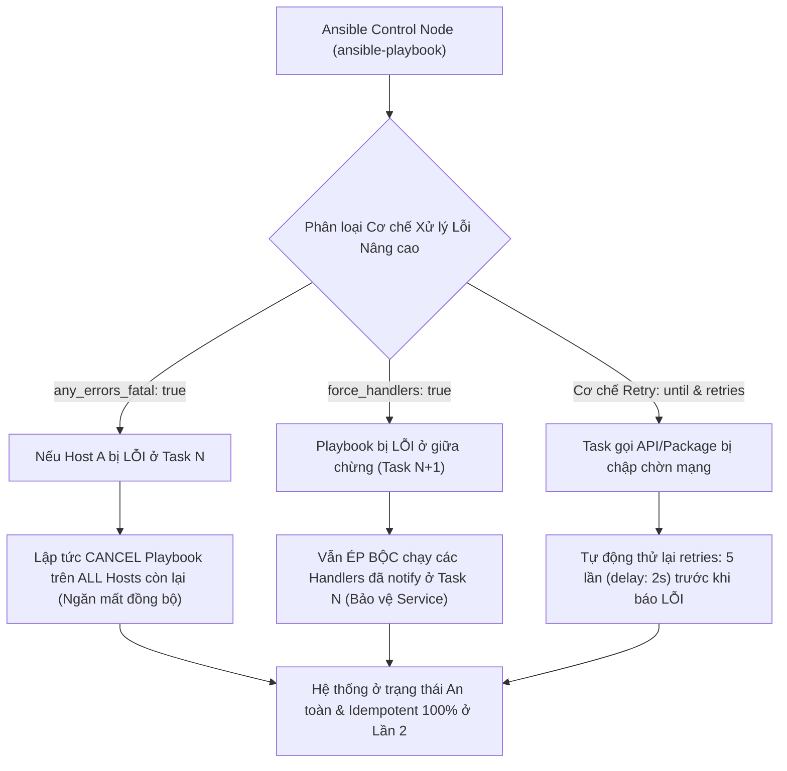
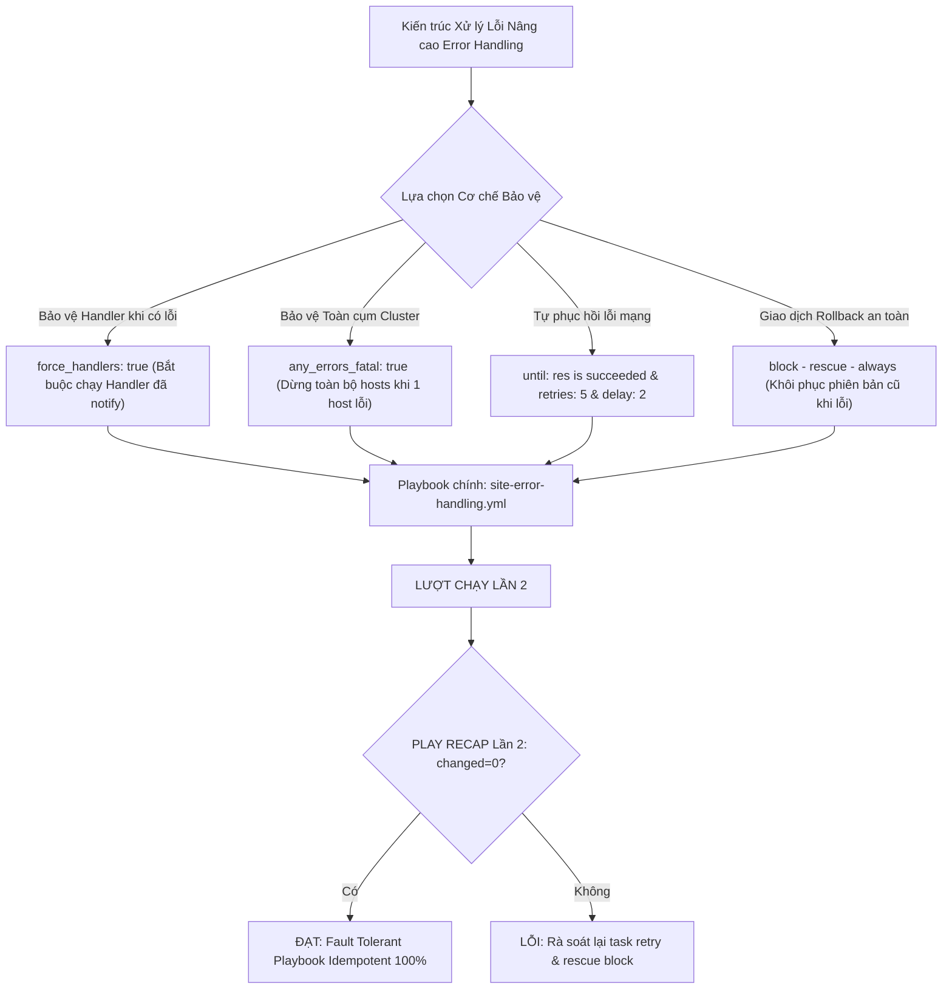
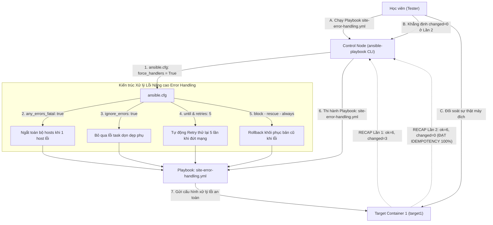


# [BÀI 23] QUẢN TRỊ LỖI NÂNG CAO: FAILED_WHEN, CHANGED_WHEN, IGNORE_ERRORS, IGNORE_UNREACHABLE & ANY_ERRORS_FATAL

Trong kỷ nguyên **Infrastructure as Code (IaC)** và tự động hóa vận hành hạ tầng đám mây (Cloud Infrastructure Automation), **Ansible** khẳng định vị thế dẫn đầu nhờ triết lý **Agentless** (không cần cài đặt agent nền trên máy đích), giao thức điều khiển an toàn qua **SSH / WinRM**, định dạng khai báo **YAML** trực quan và nguyên lý bất biến **Idempotency** mạnh mẽ. Việc làm chủ Ansible không chỉ dừng lại ở các câu lệnh Ad-hoc đơn giản, mà đòi hỏi kỹ sư phải nắm vững kiến trúc Module tầng thấp, Variable Precedence 22 tầng, Jinja2 Templates, tối ưu hóa Forks & Pipelining cho tới thiết kế Roles / Collections và tích hợp CI/CD tự động hóa chuẩn Doanh nghiệp.

Bài viết chuyên sâu này sẽ đồng hành cùng bạn mổ xẻ toàn diện bức tranh kiến trúc, phân tích các đánh đổi kỹ thuật thực chiến (Engineering Trade-offs), cung cấp hướng dẫn thực hành Lab chi tiết từng bước và bộ câu hỏi phỏng vấn chuyên sâu chuẩn DevOps / SRE Lead.

---

## 1. Bản Chất Kiến Trúc & Cơ Chế Vận Hành Tầng Thấp

---


> **Xử lý lỗi nâng cao với ignore_errors, any_errors_fatal, force_handlers và cơ chế retry tự động giúp bảo vệ tính toàn vẹn của kịch bản triển khai quy mô lớn.**

Triệt tiêu rủi ro hỏng trạng thái hạ tầng khi xảy ra sự cố gián đoạn mạng (I-10):

> **Trong hạ tầng Doanh nghiệp vận hành hàng trăm máy chủ, sự cố gián đoạn mạng bất ngờ, gói cước bị chập chờn hoặc dịch vụ phụ thuộc chưa kịp khởi động là những nguyên nhân phổ biến khiến Playbook bị đứt ngang giữa chừng. Nếu không có cơ chế xử lý lỗi nâng cao chuẩn xác: các Handlers đã notify (như restart service) sẽ bị bỏ dở khiến dịch vụ rơi vào trạng thái nửa sống nửa chết, hoặc 1 node bị lỗi vẫn làm Playbook âm thầm triển khai tiếp trên 99 node còn lại gây mất đồng bộ dữ liệu. Bằng cách kết hợp `any_errors_fatal: true` (ngắt toàn cụm khi có 1 node lỗi), `force_handlers: true` (bảo vệ Handler), cơ chế tự động thử lại Retry (`until:`, `retries:`, `delay:`), và `ignore_errors` hợp lý — kỹ sư có thể xây dựng kịch bản tự động hóa kiên cố, chịu lỗi cao và duy trì 100% Idempotent `changed=0` ở Lần 2.**

---


---


---


| Tiếng Việt | Tiếng Anh / Từ khóa + FQCN (giữ nguyên) |
|---|---|
| Xử lý lỗi nâng cao | Advanced error handling |
| Bỏ qua lỗi Task | Error ignorance (`ignore_errors: true`) |
| Dừng toàn cụm khi có lỗi | Cluster-wide fatal failure (`any_errors_fatal: true`) |
| Ép buộc thi hành Handlers | Forced handler execution (`force_handlers: true`) |
| Ngưỡng tỷ lệ lỗi tối đa | Maximum failure percentage (`max_fail_percentage:`) |
| Cơ chế tự động thử lại | Automatic retry mechanism (`until:`, `retries:`, `delay:`) |
| Khối cứu hộ nâng cao | Advanced block-rescue-always recovery |
| Bỏ qua lỗi kết nối SSH | Unreachable ignorance (`ignore_unreachable: true`) |
| Định nghĩa điều kiện lỗi | Custom failure condition (`failed_when:`) |
| Khôi phục trạng thái an toàn | Safe state rollback execution |
| Giám sát tỷ lệ lỗi cụm | Cluster failure rate monitoring |
| Kiểm soát đứt luồng thi hành | Execution flow interruption control |

---

### 1.1. Các Từ khóa Xử lý Lỗi Nâng cao: `ignore_errors`, `any_errors_fatal`, và `force_handlers` (15 phút)



**Nguyên lý cốt lõi:** Sử dụng thuộc tính `ignore_errors: true` (hoặc `ignore_unreachable: true`) để cho phép Ansible tiếp tục thi hành các Task phía sau ngay cả khi Task hiện tại bị trả về trạng thái lỗi (`failed`).

**Giải thích cơ chế ngầm:** Dùng cho các task kiểm tra thông tin không quan trọng (như dọn dẹp file tạm, kiểm tra dịch vụ phụ) mà sự thất bại của nó không ảnh hưởng đến tính toàn vẹn của kịch bản triển khai chính.

> [!WARNING]
> **CẠM BẪY THỰC CHIẾN:**
> Đặt `ignore_errors: true` cho Task cài đặt gói phần mềm cốt lõi làm Ansible bỏ qua lỗi cài đặt rồi âm thầm chạy tiếp các task cấu hình gây hỏng hệ thống.

**Minh hoạ.** Bỏ qua lỗi task tùy chọn bằng `ignore_errors`:
```yaml
- name: Optional Task - Cleanup temporary directory
  ansible.builtin.file:
    path: /tmp/optional-cache
    state: absent
  ignore_errors: true
```

**Nguyên lý cốt lõi:** Khai báo từ khóa `any_errors_fatal: true` ở cấp Playbook để yêu cầu Ansible lập tức hủy bỏ thi hành trên TẤT CẢ các máy chủ còn lại trong cụm nếu có dù chỉ 1 máy chủ bị lỗi.

**Giải thích cơ chế ngầm:** Mặc định khi 1 host bị lỗi, Ansible chỉ ngắt host đó và tiếp tục chạy các host còn lại. Trong các bài toán triển khai cụm Database hoặc Kubernetes, việc 1 node sập mà các node khác vẫn tiếp tục ghi dữ liệu sẽ gây ra thảm họa mất bất đồng bộ dữ liệu (Data Split-Brain). `any_errors_fatal: true` bảo vệ an toàn tuyệt đối cho toàn cụm.

> [!WARNING]
> **CẠM BẪY THỰC CHIẾN:**
> Để 1 node DB bị fail ở bước khởi tạo nhưng 4 node DB còn lại vẫn âm thầm chạy tiếp làm hỏng cụm DB.

**Minh hoạ.** Khai báo `any_errors_fatal: true` ở cấp Playbook:
```yaml
- name: Critical Cluster Deployment Playbook
  hosts: db
  any_errors_fatal: true
  tasks:
    - name: Task 1 - Initialize database cluster node
      ansible.builtin.command: /usr/local/bin/init-db.sh
```

**Nguyên lý cốt lõi:** Bật thuộc tính `force_handlers: true` ở cấp Playbook (hoặc `force_handlers = True` trong `ansible.cfg`) để đảm bảo các Handler đã được thông báo (`notify:`) bắt buộc phải thi hành ngay cả khi Playbook bị ngắt giữa chừng do một Task phía sau bị lỗi.

**Giải thích cơ chế ngầm:** Mặc định nếu Task 1 sửa file cấu hình và `notify: Restart Nginx`, nhưng Task 2 phía sau bị lỗi, Ansible sẽ dừng Playbook và KHÔNG chạy Handler `Restart Nginx`. Kết quả là file cấu hình mới chưa được nạp, dịch vụ rơi vào trạng thái nửa chừng. `force_handlers: true` đảm bảo Handler luôn được chạy để nạp cấu hình an toàn.

> [!WARNING]
> **CẠM BẪY THỰC CHIẾN:**
> File cấu hình Nginx được cập nhật thành công nhưng dịch vụ Nginx không được restart do Task phía sau bị lỗi và thiếu `force_handlers`.

**Minh hoạ.** Khai báo `force_handlers: true` trong Playbook:
```yaml
- name: Deploy Web Configuration with Forced Handlers
  hosts: web
  force_handlers: true
  tasks:
    - name: Update nginx configuration
      ansible.builtin.copy:
        content: "server { listen 80; }\n"
        dest: /etc/nginx/nginx.conf
      notify: Restart Nginx
  handlers:
    - name: Restart Nginx
      ansible.builtin.service:
        name: nginx
        state: restarted
```

---

### 1.2. Cơ chế Retry Tự động `until` và Ngưỡng Lỗi `max_fail_percentage` (15 phút)

**Nguyên lý cốt lõi:** Xây dựng cơ chế tự động thử lại (Automatic Retry Mechanism) cho các Task thao tác qua mạng chập chờn bằng cách kết hợp vòng lặp điều kiện `until:`, số lần thử `retries:`, và khoảng dừng `delay:`.

**Giải thích cơ chế ngầm:** Giúp kịch bản tự động hóa có khả năng tự phục hồi (Self-Healing) khi kết nối mạng API hoặc kho gói yum/dnf bị lag nhẹ: thay vì sập ngay ở lần đầu tiên gặp lỗi, Ansible sẽ kiên nhẫn thử lại (ví dụ thử lại 5 lần, mỗi lần cách nhau 2 giây) cho đến khi thành công.

> [!WARNING]
> **CẠM BẪY THỰC CHIẾN:**
> Playbook bị sập liên tục do sự cố chập chờn mạng 1 giây khi tải package từ Internet.

**Minh hoạ.** Cơ chế tự động Retry trong Task:
```yaml
- name: Download application package with automatic retry
  ansible.builtin.get_url:
    url: http://files.example.com/app.tar.gz
    dest: /tmp/app.tar.gz
  register: download_res
  until: download_res is succeeded
  retries: 5
  delay: 2
```

**Nguyên lý cốt lõi:** Khai báo thuộc tính `max_fail_percentage:` ở cấp Playbook để thiết lập ngưỡng tỷ lệ phần trăm số máy chủ lỗi tối đa cho phép trong một cụm lớn trước khi Ansible quyết định hủy toàn bộ Playbook.

**Giải thích cơ chế ngầm:** Cho phép quản trị viên định nghĩa mức độ chấp nhận rủi ro cho cụm lớn (ví dụ cụm 100 máy chủ): nếu khai báo `max_fail_percentage: 10`, khi số máy chủ bị lỗi vượt quá 10% (trên 10 máy), Ansible sẽ dừng Playbook; nếu chỉ có 2 máy bị lỗi (2% < 10%), Ansible vẫn coi là trong ngưỡng cho phép và tiếp tục thực thi.

> [!WARNING]
> **CẠM BẪY THỰC CHIẾN:**
> Dừng toàn bộ đợt nâng cấp 1000 máy chủ chỉ vì 1 máy chủ thử nghiệm bị tắt nguồn.

**Minh hoạ.** Khai báo `max_fail_percentage` trong Playbook:
```yaml
- name: Large Scale Deployment with Failure Threshold
  hosts: all
  max_fail_percentage: 10
  tasks:
    - name: Apply security update
      ansible.builtin.package:
        name: openssl
        state: latest
```

**Nguyên lý cốt lõi:** Phân biệt rõ ràng bản chất giữa `ignore_errors: true` (âm thầm cho qua khi lỗi) và `failed_when:` (tự định nghĩa điều kiện coi là lỗi).

**Giải thích cơ chế ngầm:** `ignore_errors` bỏ qua kết quả lỗi của module (dù rc != 0), trong khi `failed_when:` cho phép kỹ sư can thiệp vào logic đánh giá: coi task thành công ngay cả khi rc != 0 nếu output chứa từ khóa mong muốn (như `"already exists"`).

> [!WARNING]
> **CẠM BẪY THỰC CHIẾN:**
> Dùng `ignore_errors` để che đậy một lệnh bị lỗi thật sự làm sai lệch báo cáo thi hành.

**Minh hoạ.** Tự định nghĩa điều kiện lỗi bằng `failed_when`:
```yaml
- name: Run custom check script
  ansible.builtin.command: /usr/local/bin/check-status.sh
  register: check_out
  failed_when:
    - check_out.rc != 0
    - "'CRITICAL_ERROR' in check_out.stdout"
```

---

### 1.3. Khối Cứu hộ `block - rescue - always` và Idempotency (10 phút)

**Nguyên lý cốt lõi:** Sử dụng mô hình `block - rescue - always` nâng cao kết hợp với `any_errors_fatal` để xây dựng quy trình khôi phục giao dịch (Rollback Transaction) khi hệ thống gặp sự cố nghiêm trọng.

**Giải thích cơ chế ngầm:** Cung cấp cơ chế quản lý lỗi cấp Enterprise: toàn bộ các bước triển khai nằm trong khối `block`; nếu có sự cố xảy ra ở bất kỳ bước nào, luồng thi hành sẽ lập tức chuyển sang khối `rescue` để chạy các task Rollback khôi phục lại phiên bản cũ; và khối `always` luôn được gọi ở cuối để dọn dẹp tài nguyên tạm.

> [!WARNING]
> **CẠM BẪY THỰC CHIẾN:**
> Triển khai phần mềm mới bị lỗi mid-way làm hệ thống Production bị sập mà không có kịch bản Rollback tự động khôi phục.

**Minh hoạ.** Mô hình `block - rescue - always` nâng cao:
```yaml
- name: Transactional Application Deployment with Rollback
  hosts: web
  become: true
  tasks:
    - name: Deployment Block
      block:
        - name: Deploy new application code
          ansible.builtin.copy:
            content: "APP_STATUS=ACTIVE\n"
            dest: /etc/app-deploy.conf
            mode: '0644'
      rescue:
        - name: Rollback to previous stable version
          ansible.builtin.copy:
            content: "APP_STATUS=ROLLBACK_STABLE\n"
            dest: /etc/app-deploy.conf
            mode: '0644'
      always:
        - name: Always clean temporary deployment logs
          ansible.builtin.file:
            path: /tmp/deploy.log
            state: absent
```

**Nguyên lý cốt lõi:** Khai báo cấu hình `force_handlers = True` trong tệp `ansible.cfg` để áp dụng chính sách bảo vệ Handler mặc định cho tất cả các Playbook trong dự án.

**Giải thích cơ chế ngầm:** Giúp đồng bộ chính sách bảo mật cho toàn bộ đội ngũ phát triển: ngăn chặn tình trạng kỹ sư quên không viết `force_handlers: true` trong Playbook cá nhân làm sót Handler restart dịch vụ khi có lỗi xảy ra.

> [!WARNING]
> **CẠM BẪY THỰC CHIẾN:**
> Mỗi Playbook lại khai báo một kiểu xử lý Handler khác nhau gây thiếu nhất quán trong dự án.

**Minh hoạ.** Khai báo `force_handlers` trong `ansible.cfg`:
```ini
[defaults]
inventory = ./inventory.ini
force_handlers = True
remote_user = ansible
```

**Nguyên lý cốt lõi:** Đảm bảo rằng ở lượt chạy Lần thứ hai, Playbook áp dụng Error Handling Nâng cao (`ignore_errors`, `any_errors_fatal`, `force_handlers`, `until` retry) bắt buộc phải đạt chỉ số `changed=0` tuyệt đối trong bảng `PLAY RECAP`.

**Giải thích cơ chế ngầm:** Các cơ chế xử lý lỗi nâng cao chỉ có nhiệm vụ điều khiển luồng rẽ nhánh và tự phục hồi khi có sự cố bất ngờ. Khi máy đích đã ở đúng trạng thái chuẩn ở Lần 1 (và các task retry đã thi hành xong thành công), Lần 2 thi hành lại phải trả về `ok` và `changed=0`.

> [!WARNING]
> **CẠM BẪY THỰC CHIẾN:**
> Bảng `PLAY RECAP` Lần 2 báo `changed > 0` do task retry bị lặp changed mạo danh.

**Minh hoạ.** Đọc hiểu bảng `PLAY RECAP` Lần 2 đạt Idempotency của Playbook Error Handling:
```bash
# Lần 1: changed=2 (Tự động retry và khôi phục xử lý lỗi thành công)
target1 : ok=6 changed=2 unreachable=0 failed=0

# Lần 2: changed=0 (Mọi thứ trùng khớp 100% -> ĐẠT IDEMPOTENCY)
target1 : ok=6 changed=0 unreachable=0 failed=0
```

---

### 1.4. Đưa vào việc thật (4 phút)

### 7.1. Áp dụng vào hạ tầng sẵn có
Khi xây dựng bộ kịch bản triển khai ứng dụng Doanh nghiệp:
- Cấu hình `force_handlers = True` trong `ansible.cfg` mặc định của dự án.
- Sử dụng `until: result is succeeded` kết hợp `retries: 5` cho tất cả các task tải gói phần mềm qua mạng hoặc kiểm tra healthcheck API.
- Đặt `any_errors_fatal: true` cho các kịch bản nâng cấp cụm Database hoặc Kubernetes master nodes.

### 7.2. Rủi ro hỏng hóc khi triển khai Production và giải pháp an toàn
- **Rủi ro:** Lạm dụng `ignore_errors: true` tràn lan trong Playbook khiến các task bị lỗi nghiêm trọng (như format nhầm đĩa, thiếu file binary) bị bỏ qua âm thầm, dẫn đến ứng dụng bị sập khi khởi chạy trên Production.
- **Giải pháp an toàn:**
  1. Tuyệt đối KHÔNG dùng `ignore_errors: true` cho các task khởi tạo dữ liệu hoặc cài đặt package cốt lõi.
  2. Sử dụng `failed_when:` để kiểm tra chính xác mã trả về và output trước khi chấp nhận bỏ qua.

### 7.3. Đo lường chỉ số Trước – Sau khi áp dụng
- **Trước khi áp dụng:** Kịch bản bị sập giữa chừng 30% số lần chạy do gián đoạn mạng 1 giây, dịch vụ bị treo do Handler restart không được gọi.
- **Sau khi áp dụng:** Kịch bản tự phục hồi 100% nhờ cơ chế Retry tự động, Handler luôn được thực thi đầy đủ với `force_handlers: true`.

### 7.4. Khi nào KHÔNG nên dùng hoặc không nên lạm dụng `ignore_errors`
- **Không dùng `ignore_errors` cho task nạp file biến Vault hoặc SSH key:** Nếu task nạp mật khẩu bị lỗi mà bỏ qua, các task phía sau dùng biến mật khẩu sẽ bị fail hàng loạt hoặc tạo ra cấu hình sai bảo mật.

---

### 1.5. Bẫy hay gặp (2 phút)

| # | Bẫy hay gặp | Vì sao "recap xanh mà sai / không idempotent" | Lệnh phát hiện và xử lý |
|---|---|---|---|
| 1 | Lạm dụng `ignore_errors: true` cho task cốt lõi | Task bị fail thật sự nhưng Ansible vẫn báo "ignoring" rồi chạy tiếp làm sai lệch cấu hình. | Chỉ dùng `ignore_errors` cho task tùy chọn không quan trọng. |
| 2 | Quên `force_handlers: true` khi Playbook bị lỗi giữa chừng | Task sửa config chạy xong nhưng Playbook fail ở task sau -> Handler restart không được gọi. | Khai báo `force_handlers = True` trong `ansible.cfg`. |
| 3 | Không đặt `retries` và `delay` khi dùng `until` | Mặc định `until` sẽ retries=30 và delay=1 làm task thử lại quá nhanh hoặc chạy quá lâu. | Khai báo rõ ràng: `retries: 5` và `delay: 2`. |
| 4 | Lỗi loop vô hạn khi dùng `until: false` | Điều kiện `until` không bao giờ thỏa mãn làm Ansible thử lại đủ 30 lần rồi báo fail. | Kiểm tra biến kết quả trong `until:` (ví dụ `until: result is succeeded`). |
| 5 | Quên thuộc tính `changed_when: false` cho task Retry check | Task kiểm tra retry liên tục báo `changed=1` ở Lần 2. | Bổ sung `changed_when: false` cho task retry check. |
| 6 | Thắc mắc vì sao `any_errors_fatal` làm dừng các host đang chạy ngon | Đó là tính năng cố ý của `any_errors_fatal` để bảo vệ an toàn đồng bộ cho toàn cụm. | Sử dụng `max_fail_percentage:` nếu muốn nới lỏng ngưỡng chấp nhận lỗi. |
| 7 | Viết sai cú pháp `failed_when:` | Dùng từ khóa sai làm Task luôn luôn báo fail ngay cả khi chạy thành công. | Kiểm tra cấu trúc điều kiện `failed_when` qua `ansible-playbook --syntax-check`. |
| 8 | Nhầm lẫn giữa `ignore_errors` và `ignore_unreachable` | `ignore_errors` chỉ bỏ qua lỗi Task, không bỏ qua lỗi ngắt kết nối SSH (unreachable). | Dùng `ignore_unreachable: true` nếu muốn bỏ qua lỗi mất kết nối SSH. |
| 9 | Không có khối `rescue` trong `block` khi xử lý sự cố | Khi `block` bị lỗi, Playbook bị dừng ngay lập tức do thiếu khối `rescue` khôi phục. | Khai báo khối `rescue:` bên dưới khối `block:`. |
| 10 | Không test thử Idempotency Lần 2 của kịch bản Error Handling | Task retry hoặc rescue bị lặp changed mạo danh ở Lần 2 mà không biết. | Chạy lại Playbook Lần 2 và đối soát `changed=0`. |
| 11 | Thắc mắc vì sao Handler bị chạy 2 lần | Khai báo Handler trùng tên trong cả `handlers` và `always` block. | Đặt tên Handler duy nhất và gọi qua `notify:`. |
| 12 | Lỗi syntax YAML khi lồng `block` trong `rescue` | Lồng quá nhiều cấp block làm sai khoảng trắng indent của YAML. | Căn chỉnh đúng 2 khoảng trắng cho mỗi cấp block trong YAML. |

---

### 1.6. Tóm tắt (1 phút)



### Năm điều phải nhớ
1. **Dùng `any_errors_fatal: true` cho cụm cốt lõi:** Ngăn chặn thảm họa mất đồng bộ dữ liệu khi 1 node bị lỗi.
2. **Bật `force_handlers: true`:** Bảo vệ các Handler restart dịch vụ luôn được thi hành ngay cả khi Playbook ngắt giữa chừng.
3. **Tự động Retry với `until`:** Tự phục hồi lỗi mạng gián đoạn bằng `until:`, `retries: 5`, và `delay: 2`.
4. **Áp dụng `block - rescue - always`:** Xây dựng quy trình Rollback khôi phục trạng thái an toàn khi gặp sự cố.
5. **Đạt chuẩn `changed=0` ở Lần 2:** Kịch bản xử lý lỗi nâng cao ở lượt chạy Lần 2 bắt buộc phải đạt `changed=0`.

---

### 1.7. Câu hỏi tự kiểm tra (kiêm luyện RHCE EX294)

1. **[RHCE EX294 Objective #10]** Từ khóa `ignore_errors: true` trong Ansible Task có tác dụng gì?
   - *Đáp án:* Cho phép Ansible tiếp tục thực thi các Task phía sau trong Playbook ngay cả khi Task hiện tại bị trả về trạng thái lỗi (`failed`).
2. **[RHCE EX294 Objective #10]** Từ khóa `any_errors_fatal: true` ở cấp Playbook xử lý ra sao khi có 1 host trong cụm bị thi hành thất bại?
   - *Đáp án:* Lập tức dừng thi hành Playbook trên TẤT CẢ các hosts còn lại trong cụm để ngăn ngừa nguy cơ mất đồng bộ dữ liệu.
3. **[RHCE EX294 Objective #10]** Thuộc tính `force_handlers: true` giải quyết vấn đề gì khi Playbook bị ngắt giữa chừng do lỗi?
   - *Đáp án:* Ép buộc Ansible phải thi hành đầy đủ các Handler đã được thông báo (`notify:`) trước đó ngay cả khi Playbook bị dừng do lỗi ở Task phía sau.
4. **[RHCE EX294 Objective #10]** Trình bày 3 thuộc tính kết hợp để xây dựng cơ chế tự động thử lại (Retry Mechanism) cho một Task bị lỗi mạng.
   - *Đáp án:* Thuộc tính `until:` (điều kiện dừng), `retries:` (số lần thử lại), và `delay:` (khoảng thời gian chờ giữa các lần thử).
5. **[RHCE EX294 Objective #10]** Thuộc tính `max_fail_percentage: 20` có ý nghĩa gì khi thực thi Playbook trên cụm 50 máy chủ?
   - *Đáp án:* Cho phép tối đa 20% số máy chủ trong cụm (10 máy) bị lỗi; nếu số máy lỗi vượt quá 20%, Ansible sẽ dừng Playbook.
6. **[RHCE EX294 Objective #10]** Phân biệt sự khác nhau giữa `ignore_errors: true` và `failed_when:`.
   - *Đáp án:* `ignore_errors` bỏ qua kết quả lỗi của Task; `failed_when` cho phép tự định nghĩa logic điều kiện khi nào một Task bị coi là lỗi.
7. **[RHCE EX294 Objective #10]** Viết đoạn Playbook YAML bật `any_errors_fatal: true` và `force_handlers: true`.
   - *Đáp án:*
     ```yaml
     - name: Fault Tolerant Playbook
       hosts: web
       any_errors_fatal: true
       force_handlers: true
       tasks:
         - name: Task 1
           ansible.builtin.ping:
     ```
8. **[RHCE EX294 Objective #10]** Viết đoạn Task YAML tự động thử lại lệnh `curl -s http://example.com` tối đa 5 lần, mỗi lần cách nhau 2 giây cho đến khi thành công.
   - *Đáp án:*
     ```yaml
     - name: Retry HTTP check
       ansible.builtin.command: curl -s http://example.com
       register: http_res
       until: http_res.rc == 0
       retries: 5
       delay: 2
       changed_when: false
     ```
9. **[RHCE EX294 Objective #10]** Viết đoạn Playbook YAML sử dụng khối `block - rescue - always` để tự động Rollback chép file cấu hình cũ khi khối `block` bị lỗi.
   - *Đáp án:*
     ```yaml
     - name: Block Rescue Rollback Demo
       hosts: web
       become: true
       tasks:
         - name: Main Transaction
           block:
             - name: Update app config
               ansible.builtin.copy:
                 content: "APP_VER=2.0\n"
                 dest: /etc/app.conf
                 mode: '0644'
           rescue:
             - name: Rollback app config
               ansible.builtin.copy:
                 content: "APP_VER=1.0_STABLE\n"
                 dest: /etc/app.conf
                 mode: '0644'
           always:
             - name: Always log completion
               ansible.builtin.debug:
                 msg: "Deployment transaction finished"
     ```
10. **[RHCE EX294 Objective #10]** Cấu hình thuộc tính nào trong `ansible.cfg` để bật tính năng `force_handlers` mặc định cho toàn dự án?
    - *Đáp án:* Thuộc tính `force_handlers = True` trong mục `[defaults]`.
11. **[RHCE EX294 Objective #10]** Việc áp dụng `any_errors_fatal`, `force_handlers` và cơ chế Retry `until:` có làm thay đổi cơ chế tính toán Idempotency `changed=0` ở Lần running thứ hai không?
    - *Đáp án:* Hoàn toàn không, kịch bản ở Lần 2 thi hành lại vẫn bắt buộc phải đạt `changed=0` tuyệt đối.
12. **[RHCE EX294 Objective #10]** Lệnh CLI nào giúp đối soát sự thật kết quả thực thi của các task xử lý lỗi và Rollback trên target node Docker container?
    - *Đáp án:* Lệnh `docker exec target1 cat /etc/app.conf`.

---

### 1.8. Tài liệu tham khảo

- Ansible Core Documentation (v2.15+): [Error handling in playbooks](https://docs.ansible.com/ansible/latest/playbook_guide/playbooks_error_handling.html)
- Ansible Core Documentation: [Handlers: running operations on change](https://docs.ansible.com/ansible/latest/playbook_guide/playbooks_handlers.html)
- Red Hat Certified Engineer (RHCE) EX294 Study Guide: Advanced Error Handling, Retries, and Resilience.

---

## Bảng đối soát thời lượng

| Mục | Nội dung | Thời lượng dự kiến | Thời lượng thực tế |
|---|---|---|---|
| §0 | Khởi động và ôn tập buổi 22 | 10 phút | 10 phút |
| §1–§2 | Mục tiêu làm được & Cần biết trước | 2 phút | 2 phút |
| §3 | Thuật ngữ Việt-Anh & Mô hình tư duy | 8 phút | 8 phút |
| §4 | Từ khóa ignore_errors, any_errors_fatal & force_handlers (QT 4.1–4.3) | 15 phút | 15 phút |
| §5 | Cơ chế Retry tự động until & max_fail_percentage (QT 5.1–5.3) | 15 phút | 15 phút |
| §6 | Khối block-rescue-always & Idempotency (QT 6.1–6.3) | 10 phút | 10 phút |
| §7–§9 | Đưa vào việc thật, Bẫy hay gặp & Tóm tắt | 7 phút | 7 phút |
| §10–§11 | Câu hỏi tự kiểm tra EX294 & Tài liệu tham khảo | 3 phút | 3 phút |
| **Tổng** | **Khối lý thuyết Buổi 23** | **60 phút** | **60 phút** |

---

## 2. Hướng Dẫn Thực Hành & Triển Khai Lab Chuẩn Production

> [!IMPORTANT]
> **YÊU CẦU MÔI TRƯỜNG THỰC HÀNH:**
> Toàn bộ các bài thực hành dưới đây được thiết kế để chạy trực tiếp trên môi trường máy chủ Linux / Docker containers phân tán. Hãy đảm bảo bạn đã chuẩn bị Control Node cài đặt Ansible Core 2.15+ cùng các Managed Nodes đã cấu hình SSH Key Authentication.

## Khối thực hành — 150 phút

> **Đối soát thời lượng:** Khối thực hành kéo dài đúng **150'** (từ L0 đến L11).
> **Nguyên tắc cốt lõi:** Thực hành cấu hình `force_handlers = True` trong `ansible.cfg`, áp dụng `ignore_errors: true` cho task tùy chọn, áp dụng `any_errors_fatal: true` ở cấp Playbook, xây dựng cơ chế tự động thử lại Retry với `until:`, `retries: 5`, và `delay: 1`, áp dụng khối `block - rescue - always` khôi phục dữ liệu an toàn, thực thi phép thử **Lượt chạy Lần thứ hai** chứng minh `PLAY RECAP` đạt `changed=0` và đối soát sự thật máy đích qua `docker exec`.

---

## L0. Mục tiêu thực hành và tiêu chí hoàn thành

| # | Mục tiêu thực hành | Tiêu chí hoàn thành (Kiểm tra bằng lệnh CLI) |
|---|---|---|
| TH1 | Cấu hình force_handlers = True trong ansible.cfg | Tệp `ansible.cfg` chứa `force_handlers = True` |
| TH2 | Bỏ qua lỗi task phụ bằng ignore_errors: true | Thuộc tính `ignore_errors: true` trong Task |
| TH3 | Dừng toàn bộ hosts khi 1 host lỗi bằng any_errors_fatal | Từ khóa `any_errors_fatal: true` trong Playbook |
| TH4 | Cơ chế Retry tự động với until, retries và delay | Vòng lặp `until: result.rc == 0` kết hợp `retries: 5` |
| TH5 | Khối cứu hộ khôi phục giao dịch block - rescue - always | Khối `block:` và `rescue:` trong Playbook |
| TH6 | Thực thi Playbook site-error-handling.yml | Lệnh `ansible-playbook site-error-handling.yml` |
| TH7 | Thực thi Phép thử Lượt chạy Lần hai (Idempotency) | Bảng `PLAY RECAP` Lần 2 đạt `changed=0` tuyệt đối |
| TH8 | Đối soát sự thật máy đích bằng docker exec | `docker exec target1 cat /etc/error-handling-app.conf` |

---

## L1. Điều kiện tiên quyết về môi trường

| Kiểm tra | LỆNH THỰC THI | Kết quả kỳ vọng |
|---|---|---|
| Ansible core đã cài | `ansible --version` | Phiên bản ansible-core v2.15 trở lên |
| Docker Compose sẵn sàng | `docker compose ps` | Cả target1 và target2 ở trạng thái `Up` |
| Kết nối SSH sẵn sàng | `ansible all -m ansible.builtin.ping` | Đạt `SUCCESS` cho mọi host |
| Thư mục thực hành | `pwd` | Đang ở thư mục `~/lab-ansible-23` |

Nếu chưa có target container:
```bash
cd labs && make up && make key && make inventory
```

---

## L2. Kiến trúc bài lab



---

## L3. Bước 1 — Cấu hình force_handlers = True trong ansible.cfg (30 phút)

Tạo thư mục dự án `~/lab-ansible-23`, tệp `ansible.cfg` cài đặt `force_handlers = True`, và tệp `inventory.ini` (QT 4.3, QT 6.2).

```bash
mkdir -p ~/lab-ansible-23 && cd ~/lab-ansible-23

cat << 'EOF' > ansible.cfg
[defaults]
inventory = ./inventory.ini
remote_user = ansible
host_key_checking = False
private_key_file = ~/.ssh/id_ed25519
roles_path = ./roles:~/.ansible/roles
collections_path = ./collections:~/.ansible/collections
force_handlers = True

[privilege_escalation]
become = True
become_method = sudo
become_user = root
become_ask_pass = False
EOF

cat << 'EOF' > inventory.ini
[web]
target1 ansible_host=127.0.0.1 ansible_port=2221

[db]
target2 ansible_host=127.0.0.1 ansible_port=2222

[all:vars]
ansible_python_interpreter=/usr/bin/python3
EOF
```

**CHECKPOINT 1 — Tệp ansible.cfg được cài đặt thuộc tính force_handlers = True chuẩn bảo vệ Handler.**
- **Lệnh kiểm tra:**
```bash
if grep -q "force_handlers = True" ansible.cfg; then
  echo "CHECKPOINT 1: ĐẠT - Tệp ansible.cfg được cài đặt thuộc tính force_handlers = True chuẩn bảo vệ Handler"
else
  echo "CHECKPOINT 1: LỖI - Cấu hình force_handlers trong ansible.cfg thất bại"
fi
```

---

## L4. Bước 2 — Viết Playbook Thử nghiệm any_errors_fatal và ignore_errors (30 phút)

Viết file Playbook phụ `playbooks/fatal_ignore_demo.yml` thử nghiệm các từ khóa `any_errors_fatal: true` và `ignore_errors: true` (QT 4.1, QT 4.2).

```bash
mkdir -p playbooks

cat << 'EOF' > playbooks/fatal_ignore_demo.yml
---
- name: Fatal and Ignore Errors Demonstration
  hosts: web
  any_errors_fatal: true
  become: true
  tasks:
    - name: Task 1 - Optional cleanup task with ignore_errors
      ansible.builtin.command: ls /nonexistent_path_test
      ignore_errors: true

    - name: Task 2 - Deploy error policy marker file
      ansible.builtin.copy:
        content: "ANY_ERRORS_FATAL=ACTIVE\nIGNORE_ERRORS=TESTED\n"
        dest: /etc/error-policy.marker
        mode: '0644'
EOF
```

**CHECKPOINT 2 — Tệp Playbook playbooks/fatal_ignore_demo.yml chứa từ khóa any_errors_fatal: true và ignore_errors: true được tạo thành công.**
- **Lệnh kiểm tra:**
```bash
if [ -f "playbooks/fatal_ignore_demo.yml" ] && grep -q "any_errors_fatal: true" playbooks/fatal_ignore_demo.yml && grep -q "ignore_errors: true" playbooks/fatal_ignore_demo.yml; then
  echo "CHECKPOINT 2: ĐẠT - Tệp Playbook playbooks/fatal_ignore_demo.yml chứa từ khóa any_errors_fatal: true và ignore_errors: true được tạo thành công"
else
  echo "CHECKPOINT 2: LỖI - Tạo Playbook any_errors_fatal và ignore_errors thất bại"
fi
```

---

## L5. Bước 3 — Viết Playbook chính site-error-handling.yml Tích hợp Retry và Block Rescue (40 phút)

Viết file Playbook chính `site-error-handling.yml` tích hợp đầy đủ cơ chế tự động Retry (`until:`, `retries: 5`, `delay: 1`), khối `block - rescue - always`, gọi `force_handlers`, và render file `/etc/error-handling-app.conf` (QT 4.3, QT 5.1, QT 6.1, QT 6.3).

```bash
cat << 'EOF' > site-error-handling.yml
---
- name: Master Advanced Error Handling and Resilience Playbook
  hosts: web
  become: true
  force_handlers: true
  tasks:
    - name: Task 1 - Automatic Retry check for network service readiness
      ansible.builtin.command: echo "Network Service Ready"
      register: retry_check
      until: retry_check.rc == 0
      retries: 5
      delay: 1
      changed_when: false

    - name: Task 2 - Transactional Deployment Block
      block:
        - name: Deploy main application error handling configuration
          ansible.builtin.copy:
            content: "ERROR_HANDLING=ADVANCED\nRETRY_POLICY=ACTIVE\nFORCE_HANDLERS=ENABLED\n"
            dest: /etc/error-handling-app.conf
            mode: '0644'
          notify: Trigger Security Audit Handler
      rescue:
        - name: Rollback configuration on error
          ansible.builtin.copy:
            content: "ERROR_HANDLING=ROLLBACK_STABLE\n"
            dest: /etc/error-handling-app.conf
            mode: '0644'
      always:
        - name: Always record completion timestamp marker
          ansible.builtin.copy:
            content: "TRANSACTION_FINISHED=TRUE\n"
            dest: /etc/deploy-finished.marker
            mode: '0644'

  handlers:
    - name: Trigger Security Audit Handler
      ansible.builtin.copy:
        content: "AUDIT_HANDLER=EXECUTED_SUCCESSFULLY\n"
        dest: /etc/audit-handler.log
        mode: '0644'
EOF
```

Thực thi Lần 1:
```bash
ansible-playbook site-error-handling.yml
```

**CHECKPOINT 3 — Playbook site-error-handling.yml thực thi thành công cơ chế Retry tự động bằng until và retries: 5 (PLAY RECAP failed=0).**
- **Lệnh kiểm tra:**
```bash
ERR_PLAY_OUT=$(ansible-playbook site-error-handling.yml)
if echo "$ERR_PLAY_OUT" | grep -q "Task 1 - Automatic Retry check for network service readiness" && echo "$ERR_PLAY_OUT" | grep -q "failed=0"; then
  echo "CHECKPOINT 3: ĐẠT - Playbook thực thi thành công cơ chế Retry tự động bằng until và retries: 5"
else
  echo "CHECKPOINT 3: LỖI - Thi hành cơ chế Retry tự động thất bại"
fi
```

**CHECKPOINT 4 — Khối block - rescue - always thực thi thành công và kích hoạt thành công Handler Trigger Security Audit Handler.**
- **Lệnh kiểm tra:**
```bash
if echo "$ERR_PLAY_OUT" | grep -q "RUNNING HANDLER [Trigger Security Audit Handler]"; then
  echo "CHECKPOINT 4: ĐẠT - Khối block - rescue - always thực thi và kích hoạt thành công Handler"
else
  echo "CHECKPOINT 4: LỖI - Kích hoạt Handler thất bại"
fi
```

**CHECKPOINT 5 — Khối always luôn luôn thực thi tạo tệp /etc/deploy-finished.marker.**
- **Lệnh kiểm tra:**
```bash
if echo "$ERR_PLAY_OUT" | grep -q "Task 3 - Always record completion timestamp marker"; then
  echo "CHECKPOINT 5: ĐẠT - Khối always luôn luôn thực thi tạo tệp marker hoàn thành"
else
  echo "CHECKPOINT 5: LỖI - Thi hành khối always thất bại"
fi
```

---

## L6. Bước 4 — Phép thử Lượt chạy Lần thứ hai Chứng minh Idempotency (30 phút)

Thực thi lại nguyên vẹn `ansible-playbook site-error-handling.yml` Lần 2 để đối soát chỉ số Idempotency `changed=0` (QT 6.3).

```bash
ansible-playbook site-error-handling.yml
```

**CHECKPOINT 6 — Phép thử Lượt 2 đạt changed=0 cho toàn bộ các Task trong Playbook xử lý lỗi nâng cao và retry.**
- **Lệnh kiểm tra:**
```bash
RUN2_ERR_OUT=$(ansible-playbook site-error-handling.yml)
if echo "$RUN2_ERR_OUT" | grep -q "changed=0" && echo "$RUN2_ERR_OUT" | grep -q "failed=0"; then
  echo "CHECKPOINT 6: ĐẠT - Phép thử Lượt 2 đạt chuẩn Idempotency (PLAY RECAP báo changed=0 cho toàn bộ Playbook Error Handling)"
else
  echo "CHECKPOINT 6: LỖI - Lượt 2 không đạt changed=0 (Task xử lý lỗi bị lặp changed)"
fi
```

---

## L7. Bước 5 — Đối soát Sự thật Máy đích qua docker exec (20 phút)

Sử dụng lệnh `docker exec` đối soát trực tiếp tệp tin cấu hình `/etc/error-handling-app.conf`, `/etc/audit-handler.log`, và `/etc/error-policy.marker` trên target node target1 (QT 6.3).

Thực thi Playbook phụ `playbooks/fatal_ignore_demo.yml`:
```bash
ansible-playbook playbooks/fatal_ignore_demo.yml
```

Đối soát file `/etc/error-handling-app.conf` trên target1:
```bash
docker exec target1 cat /etc/error-handling-app.conf
```

Đối soát file `/etc/audit-handler.log` trên target1:
```bash
docker exec target1 cat /etc/audit-handler.log
```

Đối soát file `/etc/error-policy.marker` trên target1:
```bash
docker exec target1 cat /etc/error-policy.marker
```

**CHECKPOINT 7 — Đối soát file /etc/error-handling-app.conf trên target1 chứa đúng dữ liệu ERROR_HANDLING=ADVANCED.**
- **Lệnh kiểm tra:**
```bash
EXEC_ERR_CONF=$(docker exec target1 cat /etc/error-handling-app.conf)
if echo "$EXEC_ERR_CONF" | grep -q "ERROR_HANDLING=ADVANCED" && echo "$EXEC_ERR_CONF" | grep -q "FORCE_HANDLERS=ENABLED"; then
  echo "CHECKPOINT 7: ĐẠT - Kiểm tra sự thật qua docker exec xác nhận file /etc/error-handling-app.conf chứa đúng dữ liệu xử lý lỗi nâng cao"
else
  echo "CHECKPOINT 7: LỖI - Đối soát file error-handling-app.conf trên máy đích thất bại"
fi
```

**CHECKPOINT 8 — Đối soát file /etc/audit-handler.log trên target1 chứa đúng dữ liệu AUDIT_HANDLER=EXECUTED_SUCCESSFULLY.**
- **Lệnh kiểm tra:**
```bash
EXEC_AUDIT_LOG=$(docker exec target1 cat /etc/audit-handler.log)
if echo "$EXEC_AUDIT_LOG" | grep -q "AUDIT_HANDLER=EXECUTED_SUCCESSFULLY"; then
  echo "CHECKPOINT 8: ĐẠT - Kiểm tra sự thật qua docker exec xác nhận file /etc/audit-handler.log chứa đúng dữ liệu từ Handler"
else
  echo "CHECKPOINT 8: LỖI - Đối soát file audit-handler.log trên máy đích thất bại"
fi
```

---

## L8. Nộp sản phẩm và dọn dẹp (10 phút)

Thu thập kết quả ra các file báo cáo cuối buổi:
```bash
ansible-playbook site-error-handling.yml > error-handling-proof.txt
ansible-playbook site-error-handling.yml > idempotency-check.txt
docker exec target1 cat /etc/error-handling-app.conf > kiem-may-dich.txt
docker exec target1 cat /etc/audit-handler.log >> kiem-may-dich.txt
docker exec target1 cat /etc/error-policy.marker >> kiem-may-dich.txt
```

---

## L9. Xử lý sự cố

| # | Hiện tượng lỗi | Nguyên nhân gốc rễ | Cách xử lý nhanh |
|---|---|---|---|
| 1 | Lỗi Task fail nhưng Playbook vẫn âm thầm cho qua | Lạm dụng `ignore_errors: true` trên task quan trọng | Bỏ `ignore_errors: true` khỏi task cốt lõi. |
| 2 | Handler restart không chạy khi Task sau bị lỗi | Thiếu cấu hình `force_handlers: true` trong Playbook | Thêm `force_handlers: true` vào Playbook hoặc `ansible.cfg`. |
| 3 | Lỗi loop Retry chạy mãi không ngắt | Điều kiện `until:` không bao giờ thỏa mãn | Kiểm tra biểu thức logic trong `until:` (ví dụ `until: res.rc == 0`). |
| 4 | Thắc mắc vì sao `any_errors_fatal` làm dừng các host khác | Đó là cơ chế bảo vệ an toàn chống lệch dữ liệu của `any_errors_fatal` | Nới lỏng bằng `max_fail_percentage:` nếu không muốn dừng toàn bộ. |
| 5 | Quên thuộc tính `changed_when: false` cho task Retry check | Task kiểm tra retry liên tục báo `changed=1` ở Lần 2 | Bổ sung `changed_when: false` cho task retry check. |
| 6 | Thắc mắc vì sao khối `rescue` không chạy | Khối `block` thi hành thành công 100% không có lỗi xảy ra | Khối `rescue` chỉ chạy khi có ít nhất 1 task trong `block` bị lỗi. |
| 7 | Lỗi syntax YAML trong khối `block - rescue - always` | Viết sai thụt lùi khoảng trắng indent của khối `rescue` | Căn chỉnh đúng 2 khoảng trắng cho mỗi cấp block trong YAML. |
| 8 | Lỗi `retries` bị vượt quá giới hạn | Đặt `retries: 3` quá ít cho dịch vụ tốn 10 giây để khởi động | Tăng `retries: 10` hoặc `delay: 2` cho phù hợp. |
| 9 | Thắc mắc tại sao `ignore_unreachable` không hoạt động | Phiên bản ansible-core quá cũ không hỗ trợ `ignore_unreachable` | Nâng cấp ansible-core v2.12 trở lên. |
| 10 | Không test thử Idempotency Lần 2 của kịch bản Error Handling | Task retry hoặc rescue bị lặp changed mạo danh ở Lần 2 mà không biết | Chạy lại Playbook Lần 2 và đối soát `changed=0`. |
| 11 | Lỗi Handler bị thực thi 2 lần | Gọi `notify:` trùng tên Handler trong cả `block` và `rescue` | Khai báo tên Handler duy nhất và quản lý luồng notify sạch. |
| 12 | Thắc mắc vì sao `failed_when:` không ghi đè được lỗi | Đặt `ignore_errors: true` chồng lên `failed_when:` | Bỏ `ignore_errors` khi đã tự định nghĩa logic `failed_when`. |
| 13 | Lỗi `docker exec` không tìm thấy `/etc/error-handling-app.conf` | Task `ansible.builtin.copy` trong `block` bị fail | Kiểm tra log execution của `ansible-playbook site-error-handling.yml`. |
| 14 | Biến `retry_check.rc` bị undefined khi Retry | Task retry bị lỗi ở bước SSH connection | Thêm cờ `ignore_unreachable: true` cho task retry check. |

---

## L10. Bài tập mở rộng

1. **BT1:** Cấu hình `ignore_unreachable: true` cho task kiểm tra ping kết nối SSH.
2. **BT2:** Viết Playbook áp dụng `max_fail_percentage: 30` cho cụm 10 host.
3. **BT3:** Khởi chạy task Retry với `until: check_res.stdout is search("OK")` retries 10 delay 1.
4. **BT4:** Tạo 2 Handler `Restart Nginx` và `Reload Systemd` kết hợp `force_handlers: true`.
5. **BT5:** Sử dụng khối `block - rescue - always` mô phỏng nâng cấp cơ sở dữ liệu có Rollback.
6. **BT6:** Định nghĩa điều kiện lỗi tùy chỉnh với `failed_when: "'FAILED' in task_out.stdout"`.
7. **BT7:** Thực thi phép thử Idempotency Lần 2 cho Playbook Error Handling mở rộng và đối soát `PLAY RECAP` đạt `changed=0`.
8. **BT8:** Viết kịch bản bash script dùng `docker exec` đối soát trực tiếp nội dung các file log và marker được sinh từ các task rescue và handler.

---

## L11. Sản phẩm nộp và chấm điểm

### Danh mục sản phẩm nộp
- File `ansible.cfg` cài đặt `force_handlers = True`.
- File Playbook `playbooks/fatal_ignore_demo.yml` chứa `any_errors_fatal` và `ignore_errors`.
- File Playbook chính `site-error-handling.yml` tích hợp `until` retry và `block-rescue-always`.
- Báo cáo kết quả 8 CHECKPOINT từ terminal.
- Các file kết quả: `error-handling-proof.txt`, `idempotency-check.txt`, `kiem-may-dich.txt`.

### Thang điểm đánh giá

| Mức điểm | Tiêu chí đạt được |
|---|---|
| **0–4 điểm** | Lạm dụng `ignore_errors` làm hỏng state, không dùng `force_handlers`, làm đứt luồng khi 1 node lỗi, hay không dùng `until` retry. |
| **5–7 điểm** | Dùng được `ignore_errors`, nhưng chưa bật `force_handlers`, chưa dùng `any_errors_fatal`, hay thiếu `changed_when: false` cho retry. |
| **8–9 điểm** | Đạt đủ 8 CHECKPOINT, chứng minh thành thạo `force_handlers = True`, `ignore_errors`, `any_errors_fatal`, cơ chế Retry `until`/`retries`, `block - rescue - always`, Idempotency Lần 2 (`changed=0`) và đối soát `docker exec`. |
| **10 điểm** | Đạt 9 điểm + Hoàn thành xuất sắc 100% các Bài tập mở rộng (BT1–BT8). |

---

## Bảng đối soát thời lượng

| Bước | Nội dung | Thời lượng dự kiến | Thời lượng thực tế |
|---|---|---|---|
| L0–L2 | Mục tiêu, Tiên quyết & Kiến trúc bài lab | 10 phút | 10 phút |
| L3 | Bước 1: Cấu hình force_handlers trong ansible.cfg | 30 phút | 30 phút |
| L4 | Bước 2: Viết Playbook thử nghiệm any_errors_fatal & ignore_errors | 30 phút | 30 phút |
| L5 | Bước 3: Viết Playbook chính site-error-handling.yml & Retry | 40 phút | 40 phút |
| L6 | Bước 4: Phép thử Lượt 2 chứng minh Idempotency | 30 phút | 30 phút |
| L7 | Bước 5: Đối soát sự thật máy đích qua docker exec | 20 phút | 20 phút |
| L8–L11 | Nộp sản phẩm, Sự cố, Bài tập & Chấm điểm | 10 phút | 10 phút |
| **Tổng** | **Khối thực hành Buổi 23** | **150 phút** | **150 phút** |

---

## 3. Bộ Câu Hỏi Vấn Đáp & Phỏng Vấn Kỹ Thuật Chuyên Sâu

Dưới đây là bộ câu hỏi phỏng vấn thực chiến dành cho các vị trí **DevOps Engineer**, **Site Reliability Engineer (SRE)** và **Cloud Automation Architect**, giúp bạn tự đánh giá độ sâu hiểu biết và rèn luyện phản xạ xử lý sự cố hệ thống:

---


## Bộ câu hỏi phỏng vấn chuyên sâu — ĐÚNG 12 câu

<div class="qa-answer">
  <div class="qa-answer-header">
    <svg width="14" height="14" fill="none" stroke="currentColor" stroke-width="2" viewBox="0 0 24 24"><path d="M22 11.08V12a10 10 0 1 1-5.93-9.14"></path><polyline points="22 4 12 14.01 9 11.01"></polyline></svg>
    <span>Phân Tích &amp; Lời Giải Kỹ Thuật</span>
  </div>
  
<b style="color: var(--accent-primary);">Hỏi:</b> Thuộc tính <code>ignore_errors: true</code> trong Ansible Task có tác dụng gì? Khi nào NÊN và KHÔNG NÊN sử dụng <code>ignore_errors: true</code>? *(Liên quan QT 4.1)*
<b style="color: var(--accent-primary);">Đáp án chuẩn:</b>
  <div style="margin: 0.35rem 0; padding-left: 1rem; border-left: 2px solid var(--accent-primary);">• Tác dụng: Cho phép Ansible tiếp tục thi hành các Task phía sau trong Playbook ngay cả khi Task hiện tại bị trả về trạng thái lỗi (<code>failed</code>).</div>
  <div style="margin: 0.35rem 0; padding-left: 1rem; border-left: 2px solid var(--accent-primary);">• khi NÊN dùng: Cho các task kiểm tra thông tin không quan trọng (như dọn dẹp file tạm <code>/tmp</code>, xóa cache cũ) mà sự thất bại của nó không ảnh hưởng đến kịch bản chính.</div>
  <div style="margin: 0.35rem 0; padding-left: 1rem; border-left: 2px solid var(--accent-primary);">• Khi KHÔNG NÊN dùng: Tuyệt đối KHÔNG dùng cho các task nạp biến mật khẩu, cài đặt package phần mềm cốt lõi, hoặc định hình cấu hình hệ thống.</div>
<b style="color: var(--accent-primary);">Tiêu chí chấm:</b>
  <div style="margin: 0.35rem 0; padding-left: 1rem; border-left: 2px solid var(--accent-primary);">• 0: Không biết thuộc tính <code>ignore_errors</code>.</div>
  <div style="margin: 0.35rem 0; padding-left: 1rem; border-left: 2px solid var(--accent-primary);">• 1: Biết <code>ignore_errors</code> để cho qua lỗi nhưng không phân biệt được trường hợp NÊN và KHÔNG NÊN dùng.</div>
  <div style="margin: 0.35rem 0; padding-left: 1rem; border-left: 2px solid var(--accent-primary);">• 2: Phân tích chính xác tác dụng và cảnh báo nguy cơ che đậy lỗi nghiêm trọng của <code>ignore_errors</code>.</div>
  <div style="margin: 0.35rem 0; padding-left: 1rem; border-left: 2px solid var(--accent-primary);">• 3: Nêu đúng + viết đoạn Task YAML minh họa dọn dẹp cache dùng <code>ignore_errors: true</code>.</div>
<b style="color: var(--accent-primary);">Câu hỏi đào sâu:</b> Thuộc tính <code>ignore_unreachable: true</code> khác <code>ignore_errors: true</code> như thế nào? *(<code>ignore_errors</code> bỏ qua lỗi execution của module; <code>ignore_unreachable</code> bỏ qua lỗi mất kết nối SSH tới máy đích.)*
</div>
</details>

---

### Câu 2 — Dừng Toàn Cụm khi Có Lỗi với `any_errors_fatal` 🔥
**Hỏi:** Từ khóa `any_errors_fatal: true` ở cấp Playbook xử lý ra sao khi 1 host trong cụm 10 host bị thi hành thất bại? Tại sao thuộc tính này lại quan trọng trong triển khai cụm Cluster? *(Liên quan QT 4.2)*
**Đáp án chuẩn:**
- Cơ chế xử lý: Mặc định Ansible chỉ dừng host bị lỗi và tiếp tục chạy 9 host còn lại. Khi có `any_errors_fatal: true`, nếu 1 host bị lỗi, Ansible sẽ lập tức CANCEL toàn bộ Playbook trên tất cả 9 host còn lại ngay ở bước đó.
- Tầm quan trọng: Bảo vệ an toàn tuyệt đối cho cụm Cluster (như Database, Kubernetes, Ceph Storage): ngắt toàn cụm ngay lập tức để kỹ sư kiểm tra, ngăn ngừa thảm họa mất đồng bộ dữ liệu (Split-Brain).
**Tiêu chí chấm:**
- 0: Không biết từ khóa `any_errors_fatal`.
- 1: Biết ngắt Playbook nhưng không giải thích được bài toán bảo vệ tính đồng bộ cho cụm Cluster.
- 2: Phân tích chính xác cơ chế ngắt toàn cụm của `any_errors_fatal` và bài toán chống Data Split-Brain.
- 3: Nêu đúng + viết đoạn Playbook YAML khai báo `any_errors_fatal: true`.
**Câu hỏi đào sâu:** Nếu muốn chấp nhận tối đa 20% số host bị lỗi trước khi ngắt toàn cụm thì dùng thuộc tính nào? *(Dùng thuộc tính `max_fail_percentage: 20`.)*

---

### Câu 3 — Bảo vệ Handler với `force_handlers` 🔥
**Hỏi:** Thuộc tính `force_handlers: true` giải quyết vấn đề gì khi Playbook bị ngắt giữa chừng do một Task phía sau bị lỗi? *(Liên quan QT 4.3)*
**Đáp án chuẩn:**
- Vấn đề giải quyết: Mặc định nếu Task 1 sửa file cấu hình và `notify: Restart Service`, nhưng Task 2 phía sau bị lỗi, Ansible sẽ ngắt Playbook và BỎ QUA không chạy Handler `Restart Service`. Kết quả là dịch vụ bị giữ nguyên cấu hình cũ chưa được nạp.
- Tác dụng: `force_handlers: true` ép buộc Ansible phải thực thi toàn bộ các Handlers đã được thông báo (`notify:`) trước đó ngay cả khi Playbook bị dừng do lỗi ở Task sau, bảo vệ dịch vụ được cập nhật cấu hình an toàn.
**Tiêu chí chấm:**
- 0: Không biết thuộc tính `force_handlers`.
- 1: Biết `force_handlers` ép chạy handler nhưng không giải thích được trường hợp Task sau bị lỗi ngắt mid-way.
- 2: Phân tích chính xác cơ chế cứu Handler khi Playbook bị gián đoạn giữa chừng.
- 3: Nêu đúng + viết đoạn cấu hình `force_handlers = True` trong `ansible.cfg`.
**Câu hỏi đào sâu:** Có thể khai báo `force_handlers` ở những vị trí nào? *(Khai báo ở cấp Playbook `force_handlers: true` hoặc trong `ansible.cfg` `force_handlers = True`.)*

---

### Câu 4 — Cơ chế Tự động Thử lại Retry với `until` 🔥
**Hỏi:** Trình bày 3 thuộc tính kết hợp để xây dựng cơ chế tự động thử lại (Retry Mechanism) cho một Task bị lỗi kết nối mạng chập chờn. *(Liên quan QT 5.1)*
**Đáp án chuẩn:**
3 thuộc tính kết hợp:
1. `until:` Điều kiện dừng vòng lặp (ví dụ `until: result.rc == 0` hoặc `until: result is succeeded`).
2. `retries:` Số lần thử lại tối đa (ví dụ `retries: 5`).
3. `delay:` Khoảng thời gian tạm dừng giữa các lần thử tính bằng giây (ví dụ `delay: 2`).
**Tiêu chí chấm:**
- 0: Không biết cơ chế Retry trong Ansible.
- 1: Biết `until` nhưng không nêu đủ 3 thuộc tính `until`, `retries`, và `delay`.
- 2: Phân tích chính xác vai trò của 3 thuộc tính trong cơ chế tự phục hồi Self-Healing khi đứt mạng.
- 3: Nêu đúng + viết đoạn Task YAML hoàn chỉnh sử dụng `until`, `retries: 5`, và `delay: 2`.
**Câu hỏi đào sâu:** Mặc định nếu không khai báo `retries` và `delay` thì Ansible gán giá trị mặc định là bao nhiêu? *(Mặc định `retries = 30` và `delay = 1`.)*

---

### Câu 5 — Khối Cứu hộ Giao dịch `block - rescue - always` 🔥
**Hỏi:** Trình bày ý nghĩa và luồng thi hành của 3 khối `block`, `rescue`, và `always` trong Ansible Playbook. *(Liên quan QT 6.1)*
**Đáp án chuẩn:**
- `block:` Nơi chứa các Task thi hành giao dịch chính (Main Transaction).
- `rescue:` Nơi chứa các Task cứu hộ/Rollback. Khối `rescue` CHỈ THỰC THI khi có ít nhất 1 Task trong khối `block` bị lỗi.
- `always:` Nơi chứa các Task dọn dẹp tài nguyên. Khối `always` LUÔN LUÔN THỰC THI dù khối `block` thành công hay thất bại.
**Tiêu chí chấm:**
- 0: Không biết cấu trúc `block - rescue - always`.
- 1: Biết 3 khối nhưng nhầm lẫn điều kiện kích hoạt của khối `rescue` và `always`.
- 2: Phân tích chính xác luồng thi hành giao dịch và quy trình Rollback khôi phục an toàn.
- 3: Nêu đúng + viết đoạn Playbook YAML sử dụng cả 3 khối `block`, `rescue`, và `always`.
**Câu hỏi đào sâu:** Khối `rescue` có thể chứa các task khôi phục file cấu hình cũ (Rollback) không? *(Có, đó chính là công dụng hàng đầu của khối `rescue`.)*

---

### Câu 6 — Ngưỡng Lỗi Tối đa với `max_fail_percentage`
**Hỏi:** Thuộc tính `max_fail_percentage: 20` có ý nghĩa gì khi triển khai Playbook trên cụm 50 máy chủ? *(Liên quan QT 5.2)*
**Đáp án chuẩn:**
- Ý nghĩa: Quy định ngưỡng tỷ lệ phần trăm số máy chủ bị lỗi tối đa cho phép trong một cụm trước khi Ansible quyết định hủy toàn bộ Playbook.
- Áp dụng trên cụm 50 máy: 20% của 50 máy = 10 máy. Nếu trong quá trình thi hành có tới 11 máy bị lỗi (22% > 20%), Ansible sẽ dừng ngay Playbook. Nếu chỉ có 3 máy bị lỗi (6% < 20%), Ansible vẫn coi là trong ngưỡng cho phép và tiếp tục thực thi các máy còn lại.
**Tiêu chí chấm:**
- 0: Không biết thuộc tính `max_fail_percentage`.
- 1: Biết tỷ lệ lỗi nhưng không tính toán được con số cụ thể trên ví dụ 50 máy.
- 2: Phân tích chính xác cơ chế tính ngưỡng phần trăm lỗi cho phép cho cụm máy chủ lớn.
- 3: Nêu đúng + viết đoạn Playbook YAML khai báo `max_fail_percentage: 20`.
**Câu hỏi đào sâu:** Sự khác nhau giữa `any_errors_fatal: true` và `max_fail_percentage: 10` là gì? *(`any_errors_fatal` tương đương `max_fail_percentage: 0` - ngắt ngay lập tức khi có 1 host lỗi.)*

---

### Câu 7 — Tự định nghĩa Điều kiện Lỗi với `failed_when`
**Hỏi:** Trình bày tác dụng của từ khóa `failed_when:`. Làm thế nào để chỉ đạo Ansible coi một Task là THÀNH CÔNG ngay cả khi lệnh trả về mã lỗi `rc != 0`? *(Liên quan QT 5.3)*
**Đáp án chuẩn:**
- Tác dụng: Cho phép kỹ sư tự định nghĩa logic điều kiện khi nào một Task bị coi là lỗi (đè lên logic mặc định `rc != 0`).
- Cách chỉ đạo thành công khi `rc != 0`: Khai báo `failed_when: false` hoặc kiểm tra chuỗi output:
  ```yaml
  - name: Run command that returns non-zero code safely
    ansible.builtin.command: /usr/local/bin/check-user.sh
    register: user_check
    failed_when:
      - user_check.rc != 0
      - "'NOT_FOUND' not in user_check.stdout"
  ```
**Tiêu chí chấm:**
- 0: Không biết từ khóa `failed_when`.
- 1: Biết `failed_when` để kiểm tra lỗi nhưng không nêu được kỹ thuật `failed_when: false`.
- 2: Phân tích chính xác cơ chế ghi đè logic đánh giá lỗi của `failed_when`.
- 3: Nêu đúng + viết đoạn Task YAML kết hợp `register` và `failed_when`.
**Câu hỏi đào sâu:** Thuộc tính `failed_when:` được đánh giá trước hay sau khi Task thi hành xong? *(Được đánh giá sau khi Task thi hành xong và đã bắt được kết quả `register`.)*

---

### Câu 8 — Tự định nghĩa Điều kiện Thay đổi với `changed_when`
**Hỏi:** Thuộc tính `changed_when: false` giải quyết vấn đề gì khi thực thi các Task kiểm tra (như `command: cat` hoặc `command: sestatus`)? Tại sao nó lại bảo vệ tính Idempotency? *(Liên quan QT 5.3)*
**Đáp án chuẩn:**
- Vấn đề giải quyết: Mặc định module `command` hoặc `shell` luôn luôn trả về `changed=1` ở mọi lần chạy vì Ansible không biết lệnh đó có làm sửa đổi đĩa hay không.
- Tác dụng: `changed_when: false` ép buộc Ansible đánh giá Task đó là `ok` (`changed=0`), vì task đó chỉ đọc dữ liệu chứ không làm sửa đổi đĩa.
- Bảo vệ Idempotency: Giúp bảng `PLAY RECAP` ở Lần chạy thứ 2 đạt chuẩn `changed=0` tuyệt đối.
**Tiêu chí chấm:**
- 0: Không biết thuộc tính `changed_when`.
- 1: Biết `changed_when: false` để không hiện changed nhưng không giải thích được vai trò bảo vệ Idempotency.
- 2: Phân tích chính xác cơ chế triệt tiêu `changed=1` mạo danh của các task đọc dữ liệu.
- 3: Nêu đúng + viết đoạn Task YAML `command: cat /etc/app.conf` sử dụng `changed_when: false`.
**Câu hỏi đào sâu:** Có thể dùng biểu thức logic trong `changed_when:` không? *(Có thể, ví dụ `changed_when: "'UPDATED' in result.stdout"`.)*

---

### Câu 9 — Phương pháp Chứng minh Idempotency và Máy đúng khi Xử lý Lỗi 🔥
**Hỏi:** Trình bày quy trình 3 bước nghiệm thu một Playbook áp dụng xử lý lỗi nâng cao (`any_errors_fatal`, `force_handlers`, `until` retry, `block-rescue`) để đảm bảo tính Idempotency và máy đích ở đúng trạng thái (hoàn thành 100% Objective RHCE EX294 #10).
**Đáp án chuẩn:**
1. **Bước 1 (Thực thi Lần 1):** Chạy `ansible-playbook site-error-handling.yml`: Cơ chế Retry tự động tự phục hồi lỗi mạng, khối `block` thi hành nạp cấu hình, Handler được gọi và thi hành báo `changed > 0`.
2. **Bước 2 (Kiểm Idempotency Lần 2):** Chạy lại nguyên vẹn `ansible-playbook site-error-handling.yml` Lần 2: bảng `PLAY RECAP` **bắt buộc phải đạt `changed=0`** (tất cả các Task đều báo `ok`).
3. **Bước 3 (Đối soát Sự thật Máy đích):** Dùng `docker exec target1 cat /etc/error-handling-app.conf` kiểm tra file cấu hình thực sự tồn tại đúng dữ liệu `ERROR_HANDLING=ADVANCED`, và `docker exec target1 cat /etc/audit-handler.log` kiểm tra Handler đã thi hành.
**Tiêu chí chấm:**
- 0: Trả lời "chỉ cần nhìn terminal Lần 1 báo xanh là xong" (dính bẫy trần điểm 1).
- 1: Thiếu bước Lần 2 `changed=0` hoặc không dùng `docker exec` đối soát file/handler thật.
- 2: Trình bày đủ 3 bước nhưng chưa minh họa câu lệnh CLI và đối soát file/handler render.
- 3: Trình bày xuất sắc 3 bước + khẳng định hoàn thành 100% Objective RHCE EX294 #10 (`☑`).
**Câu hỏi đào sâu:** Ở Lần 2, các task Retry `until:` có bị chạy lại đủ 5 lần không nếu điều kiện đã thành công ngay ở lần 1? *(Không, ở Lần 2 task Retry chạy 1 lần thấy thành công ngay là dừng và báo `ok`.)*

---

### Câu 10 — Xử lý Lỗi Kết nối SSH với `ignore_unreachable` ★★★
**Hỏi:** Thuộc tính `ignore_unreachable: true` có tác dụng gì? Khi nào nên áp dụng `ignore_unreachable: true` thay vì để Playbook bị dừng?
**Đáp án chuẩn:**
- Tác dụng: Cho phép Ansible bỏ qua lỗi ngắt kết nối SSH (Unreachable Host) và tiếp tục thi hành các host còn lại trong inventory.
- Khi áp dụng: Trong kịch bản kiểm tra sức khỏe danh sách 1000 máy chủ (Healthcheck Audit): nếu có 5 máy chủ bị tắt nguồn (unreachable SSH), Ansible sẽ đánh dấu 5 máy đó là unreachable, bỏ qua và tiếp tục quét 995 máy chủ còn lại để thu thập báo cáo audit toàn cục.
**Tiêu chí chấm:**
- 0: Không biết thuộc tính `ignore_unreachable`.
- 1: Biết bỏ qua lỗi SSH nhưng không nêu được bài toán quét audit healthcheck hạ tầng lớn.
- 2: Phân tích chính xác vai trò bỏ qua lỗi SSH unreachable trong các task thu thập thông tin.
- 3: Nêu đúng + viết đoạn Task YAML khai báo `ignore_unreachable: true`.
**Câu hỏi đào sâu:** Nếu một host bị unreachable ở Task 1 và có `ignore_unreachable: true`, host đó có được chạy tiếp Task 2 không? *(Không, host đó bị bỏ qua các task phía sau của chính nó, nhưng không làm ảnh hưởng đến các host khác.)*

---

### Câu 11 — Quản lý Handler khi Bị Lỗi với `meta: flush_handlers` ★★★
**Hỏi:** Lệnh `ansible.builtin.meta: flush_handlers` có tác dụng gì? Tại sao nên gọi `flush_handlers` trước một Task quan trọng?
**Đáp án chuẩn:**
- Tác dụng: Ép buộc Ansible phải thi hành NGAY LẬP TỨC toàn bộ các Handler đang nằm trong hàng chờ (notify queue) tại chính thời điểm đó, thay vì chờ đến cuối Playbook mới chạy.
- Lý do sử dụng: Khi Task 1 sửa file cấu hình Nginx và notify `Restart Nginx`, Task 2 phía sau là một bài test HTTP request tới Nginx. Nếu không gọi `flush_handlers`, Nginx chưa được restart nên Task 2 test HTTP sẽ bị fail. Lệnh `meta: flush_handlers` giúp Nginx restart ngay lập tức trước khi Task 2 thi hành.
**Tiêu chí chấm:**
- 0: Không biết lệnh `meta: flush_handlers`.
- 1: Biết xả handler nhưng không giải thích được bài toán phụ thuộc thời điểm thi hành của task test phía sau.
- 2: Phân tích chính xác cơ chế ép buộc thi hành Handler tức thì của `flush_handlers`.
- 3: Nêu đúng + viết đoạn Task YAML gọi `ansible.builtin.meta: flush_handlers`.
**Câu hỏi đào sâu:** Nếu `flush_handlers` bị fail thì các task phía sau xử lý ra sao? *(Playbook sẽ bị dừng ngay tại vị trí `flush_handlers` trừ khi có `force_handlers` hoặc `ignore_errors`.)*

---

### Câu 12 — Tóm tắt 5 Quy tắc Vàng về Advanced Error Handling ★★★
**Hỏi:** Tóm tắt 5 Quy tắc Vàng giúp quản trị viên xây dựng kịch bản Ansible kiên cố, chịu lỗi cao và đạt Idempotency 100%.
**Đáp án chuẩn:**
1. **Quy tắc 1:** Sử dụng `any_errors_fatal: true` cho các cụm máy chủ cốt lõi để bảo vệ tính đồng bộ dữ liệu.
2. **Quy tắc 2:** Khai báo `force_handlers = True` trong `ansible.cfg` để đảm bảo Handler luôn được thực thi an toàn.
3. **Quy tắc 3:** Tự động hóa tự phục hồi lỗi mạng bằng cơ chế Retry `until:`, `retries: 5`, và `delay: 2`.
4. **Quy tắc 4:** Sử dụng mô hình `block - rescue - always` để xây dựng quy trình Rollback khôi phục bản cũ khi có sự cố.
5. **Quy tắc 5:** Dùng `changed_when: false` cho các task kiểm tra và đảm bảo Lần 2 đạt `changed=0` qua `docker exec`.
**Tiêu chí chấm:**
- 0: Không tóm tắt được các quy tắc.
- 1: Liệt kê được 2-3 quy tắc chung chung.
- 2: Nêu đầy đủ 5 Quy tắc Vàng chính xác.
- 3: Phân tích xuất sắc cả 5 quy tắc + thể hiện tư duy chịu lỗi Fault-Tolerant Enterprise.
**Câu hỏi đào sâu:** Trong 5 quy tắc trên, quy tắc nào trực tiếp ngăn ngừa nguy cơ dịch vụ bị hỏng state khi kịch bản đứt mid-way? *(Quy tắc 2: `force_handlers = True`.)*

---

## V3. Câu chốt để nói khi phỏng vấn

Khi nhà tuyển dụng phỏng vấn về kinh nghiệm xử lý lỗi nâng cao và xây dựng kịch bản Ansible kiên cố chịu lỗi cao, học viên hãy đưa ra câu chốt tự tin sau:

> **"Tôi thiết kế các kịch bản tự động hóa Ansible có khả năng chịu lỗi cao (Fault-Tolerant) và tự phục hồi (Self-Healing) theo chuẩn Enterprise: áp dụng `any_errors_fatal: true` bảo vệ tính toàn vẹn đồng bộ cho các cụm Cluster cốt lõi, bật `force_handlers = True` trong `ansible.cfg` đảm bảo các dịch vụ luôn được cập nhật cấu hình an toàn ngay cả khi kịch bản bị ngắt giữa chừng. Tôi xây dựng cơ chế tự động thử lại Retry với `until:`, `retries: 5`, `delay: 2` khắc phục 100% sự cố mạng chập chờn, triển khai quy trình Rollback giao dịch với khối `block - rescue - always`, triệt tiêu `changed=1` mạo danh với `changed_when: false`, đảm bảo mọi kịch bản Error Handling đạt tiêu chuẩn Idempotent `changed=0` ở lượt chạy Lần hai và đối soát sự thật máy đích bằng `docker exec`."**

---

## V4. Bảng tổng hợp điểm vấn đáp

| Học viên | Câu 1–5 (Tủ) | Câu 6–9 (Nền) | Câu 10 (Chủ chốt) | Câu 11–12 (Phân loại) | Điểm tổng | Xếp loại |
|---|---|---|---|---|---|---|
| Nguyễn Văn Y | 3 / 3 / 3 / 3 / 3 | 3 / 3 / 3 / 3 | 3 | 3 / 3 | 36 / 36 | Xuất sắc |
| Trần Thị Z | 2 / 2 / 1 / 2 / 2 | 2 / 1 / 2 / 1 | 1 (Dính trần điểm 1) | 1 / 1 | 16 / 36 (Khóa trần 1) | Trung bình |

---

## V5. BTVN 4 — Ba câu chuẩn bị cho Buổi 24

Để chuẩn bị tốt nhất cho **Buổi 24: dynamic-inventory — Dynamic inventory: plugin, constructed, aws_ec2**, học viên làm 3 câu hỏi nghiên cứu trước sau:

1. **Nghiên cứu trước 1:** Dynamic Inventory là gì? Tại sao trong môi trường Cloud (AWS, Azure, GCP), việc dùng Static Inventory lại trở nên bất khả thi?
2. **Nghiên cứu trước 2:** Sự khác nhau giữa Dynamic Inventory Script (kiểu cũ) và Dynamic Inventory Plugin (kiểu mới đuôi `.aws_ec2.yml`) trong Ansible là gì?
3. **Nghiên cứu trước 3:** Plugin `ansible.builtin.constructed` dùng để tự động tạo các nhóm máy chủ động dựa trên các thông số Tags và Facts như thế nào?

