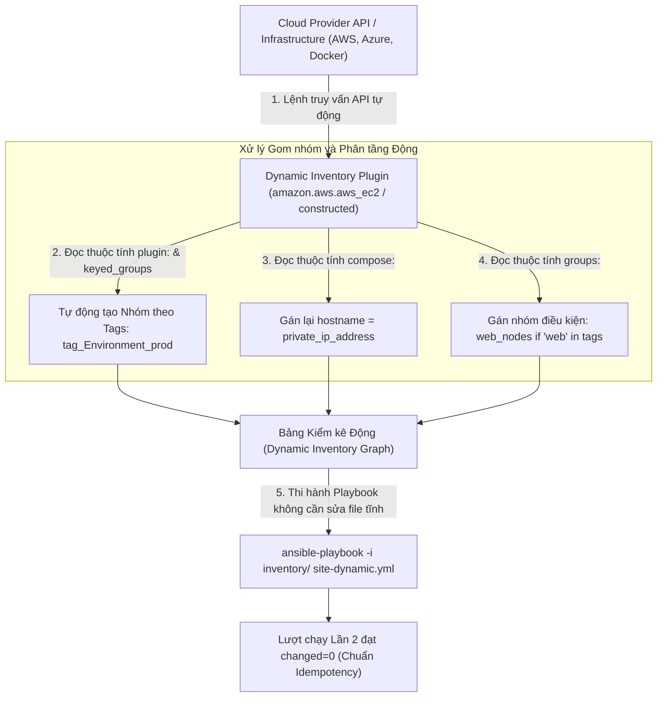
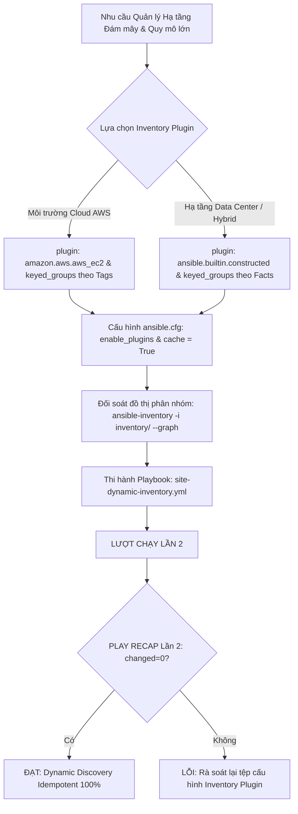
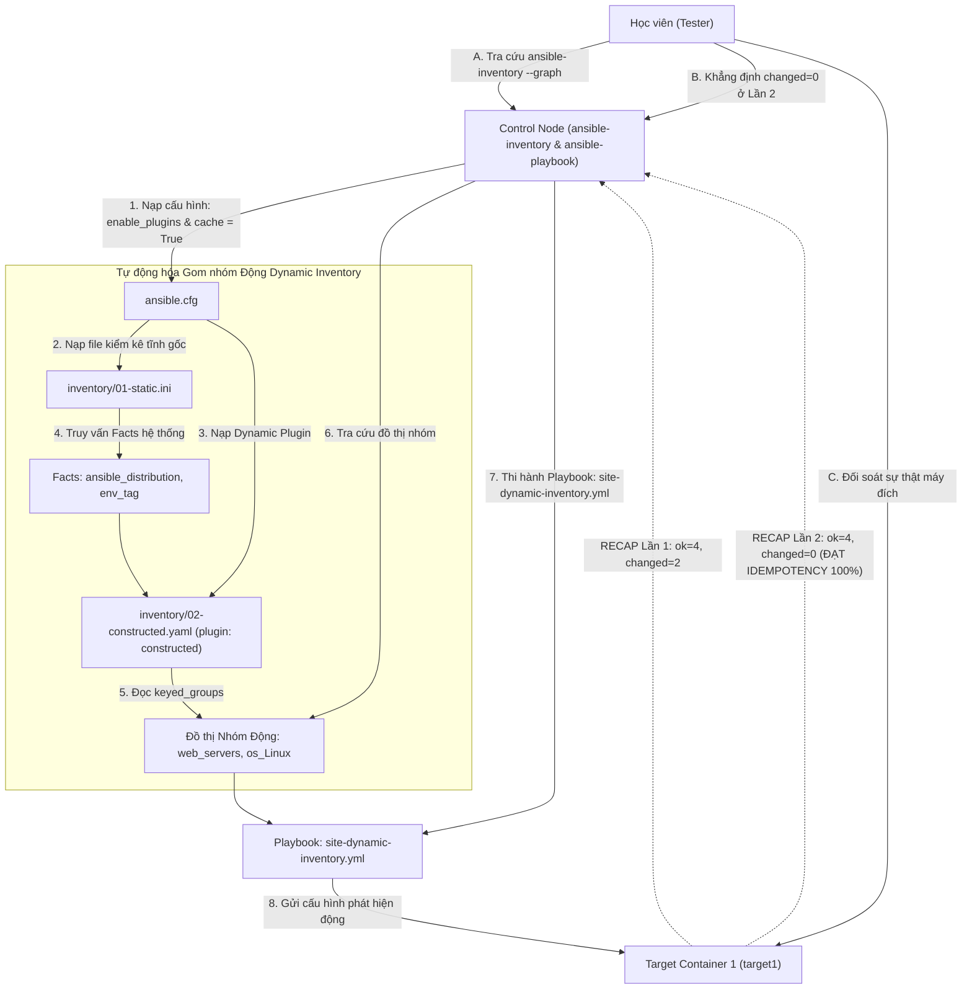


# [BÀI 24] DYNAMIC INVENTORY ĐA NỀN TẢNG: TỰ ĐỘNG KHÁM PHÁ MÁY CHỦ TRÊN AWS EC2, GCP COMPUTE, AZURE VM & KUBERNETES PODS

Trong kỷ nguyên **Infrastructure as Code (IaC)** và tự động hóa vận hành hạ tầng đám mây (Cloud Infrastructure Automation), **Ansible** khẳng định vị thế dẫn đầu nhờ triết lý **Agentless** (không cần cài đặt agent nền trên máy đích), giao thức điều khiển an toàn qua **SSH / WinRM**, định dạng khai báo **YAML** trực quan và nguyên lý bất biến **Idempotency** mạnh mẽ. Việc làm chủ Ansible không chỉ dừng lại ở các câu lệnh Ad-hoc đơn giản, mà đòi hỏi kỹ sư phải nắm vững kiến trúc Module tầng thấp, Variable Precedence 22 tầng, Jinja2 Templates, tối ưu hóa Forks & Pipelining cho tới thiết kế Roles / Collections và tích hợp CI/CD tự động hóa chuẩn Doanh nghiệp.

Bài viết chuyên sâu này sẽ đồng hành cùng bạn mổ xẻ toàn diện bức tranh kiến trúc, phân tích các đánh đổi kỹ thuật thực chiến (Engineering Trade-offs), cung cấp hướng dẫn thực hành Lab chi tiết từng bước và bộ câu hỏi phỏng vấn chuyên sâu chuẩn DevOps / SRE Lead.

---

## 1. Bản Chất Kiến Trúc & Cơ Chế Vận Hành Tầng Thấp

---


> **Quản lý hạ tầng đám mây và quy mô lớn bằng Dynamic Inventory Plugin và Constructed Plugin giúp tự động phát hiện, gom nhóm máy chủ theo Tags và Facts mà không cần chỉnh sửa file kiểm kê tĩnh thủ công.**

Tự động hóa hoàn toàn việc phát hiện hạ tầng biến động trên Cloud (I-10):

> **Trong hạ tầng Đám mây hiện đại (như AWS, Azure, GCP, OpenStack hoặc Kubernetes), các máy chủ Virtual Machine / Container liên tục được khởi tạo, mở rộng (Auto-scaling) hoặc tiêu hủy tự động. Việc duy trì một tệp kiểm kê tĩnh `inventory.ini` sửa tay thủ công là điều hoàn toàn bất khả thi và dễ gây sai sót nghiêm trọng. Ansible cung cấp cơ chế Dynamic Inventory Plugin thế hệ mới (như `amazon.aws.aws_ec2`, `ansible.builtin.constructed`), cho phép tự động truy vấn API của Cloud Provider, phát hiện địa chỉ IP realtime, và tự động gom nhóm máy chủ theo Tags (như `Environment: production`, `Role: web`) hoặc theo Facts. Nhờ đó, Playbook có thể tự động nhắm đúng mục tiêu máy chủ mới tạo mà không cần sửa 1 dòng code kiểm kê nào, đồng thời duy trì tính Idempotent `changed=0` ở Lần 2.**

---


---


---


| Tiếng Việt | Tiếng Anh / Từ khóa + FQCN (giữ nguyên) |
|---|---|
| Plugin kiểm kê động | Dynamic Inventory Plugin (`plugin:`) |
| Plugin gom nhóm động | Constructed Inventory Plugin (`ansible.builtin.constructed`) |
| Plugin kiểm kê AWS EC2 | AWS EC2 Inventory Plugin (`amazon.aws.aws_ec2`) |
| Gom nhóm theo nhãn | Tag-based host grouping (`keyed_groups`) |
| Đặt lại tên hostname | Hostname compose override (`compose:`) |
| Bộ nhớ đệm kiểm kê | Inventory caching (`cache: yes`, `cache_plugin`) |
| Kích hoạt plugin kiểm kê | Inventory plugin enabler (`enable_plugins`) |
| Tra cứu đồ thị kiểm kê | Inventory graph inspection (`ansible-inventory --graph`) |
| Tự động phát hiện máy chủ | Automatic host discovery |
| Gán nhóm điều kiện | Conditional group assignment (`groups:`) |
| Tách biệt môi trường động | Dynamic environment segregation |
| Tối ưu thời gian gọi API | Cloud API call overhead reduction |

---

### 1.1. Khái niệm Dynamic Inventory Plugin và Phân nhóm theo Tags `keyed_groups` (15 phút)



**Nguyên lý cốt lõi:** Dynamic Inventory Plugin là cơ chế tự động kết nối với API của Cloud Provider (như AWS, Azure, GCP, VMware, OpenStack) hoặc truy vấn Facts hệ thống để tự động phát hiện danh sách máy chủ, địa chỉ IP và trạng thái realtime mà không cần duy trì tệp `inventory.ini` tĩnh.

**Giải thích cơ chế ngầm:** Giải quyết triệt tiêu bài toán quản lý hạ tầng biến động trên Cloud (Auto-scaling): khi có 50 máy chủ mới được tạo tự động, Dynamic Inventory Plugin sẽ tự động nhận diện và cập nhật danh sách máy chủ cho Ansible ngay lập tức, ngăn ngừa rủi ro bỏ sót máy chủ chưa được cấu hình.

> [!WARNING]
> **CẠM BẪY THỰC CHIẾN:**
> Tự tay mở tệp `inventory.ini` để copy-paste thủ công 50 địa chỉ IP mới từ trang quản trị Cloud Dashboard.

**Minh hoạ.** Tệp cấu hình Dynamic Inventory Plugin AWS EC2 (`inventory/aws_ec2.yml`):
```yaml
plugin: amazon.aws.aws_ec2
regions:
  - us-east-1
filters:
  instance-state-name: running
```

**Nguyên lý cốt lõi:** Khai báo thuộc tính `plugin:` ở dòng đầu tiên của tệp YAML kiểm kê động và đảm bảo tên tệp kết thúc bằng cấu hình chuẩn (như `.aws_ec2.yml`, `.yaml`, hoặc `.yml`).

**Giải thích cơ chế ngầm:** Thuộc tính `plugin:` chỉ đạo cho Ansible Engine biết cần phải gọi Plugin FQCN nào để xử lý tệp kiểm kê này (ví dụ `plugin: amazon.aws.aws_ec2` hoặc `plugin: ansible.builtin.constructed`).

> [!WARNING]
> **CẠM BẪY THỰC CHIẾN:**
> Đặt tên tệp kiểm kê động là `inventory.txt` khiến Ansible không nhận diện được Plugin và báo lỗi parse inventory.

**Minh hoạ.** Khai báo thuộc tính `plugin:` trong tệp YAML kiểm kê:
```yaml
# inventory/02-cloud.aws_ec2.yml
plugin: amazon.aws.aws_ec2
regions:
  - ap-southeast-1
```

**Nguyên lý cốt lõi:** Sử dụng thuộc tính `keyed_groups` trong Dynamic Inventory Plugin để tự động tạo các nhóm máy chủ động dựa trên các nhãn Tags (như `Environment`, `Role`, `Owner`) do Cloud Provider cung cấp.

**Giải thích cơ chế ngầm:** Cho phép kỹ sư nhóm máy chủ hoàn toàn tự động theo quy chuẩn đặt nhãn của Doanh nghiệp: các máy có tag `Environment: production` sẽ tự động gom vào nhóm `tag_Environment_production`, giúp Playbook có thể chỉ định `hosts: tag_Environment_production` cực kỳ chính xác.

> [!WARNING]
> **CẠM BẪY THỰC CHIẾN:**
> Tạo thủ công từng tên nhóm trong file tĩnh rồi gán từng IP vào nhóm.

**Minh hoạ.** Tự động tạo nhóm theo Tags với `keyed_groups`:
```yaml
plugin: amazon.aws.aws_ec2
regions:
  - ap-southeast-1
keyed_groups:
  - key: tags.Environment
    prefix: env
  - key: tags.Role
    prefix: role
```

---

### 1.2. Plugin `ansible.builtin.constructed` và Cơ chế Cache Inventory (15 phút)

**Nguyên lý cốt lõi:** Sử dụng Plugin `ansible.builtin.constructed` để tạo các nhóm máy chủ động và gán biến dựa trên Facts (như `ansible_distribution`, `ansible_memtotal_mb`) hoặc biến sẵn có từ tệp kiểm kê gốc.

**Giải thích cơ chế ngầm:** Plugin `constructed` cho phép "xây dựng" các nhóm mới thông minh: ví dụ tự động gom tất cả các máy chủ chạy hệ điều hành Red Hat vào nhóm `os_RedHat`, hoặc gom các máy có RAM > 8GB vào nhóm `high_memory_nodes` mà không cần sửa file nguồn.

> [!WARNING]
> **CẠM BẪY THỰC CHIẾN:**
> Viết 10 task Playbook chứa điều kiện `when: ansible_distribution == "RedHat"` rải rác thay vì gom nhóm động bằng `constructed`.

**Minh hoạ.** Tạo nhóm động theo Facts bằng `ansible.builtin.constructed`:
```yaml
# inventory/02-constructed.yaml
plugin: ansible.builtin.constructed
strict: false
groups:
  web_servers: "'web' in inventory_hostname"
  db_servers: "'db' in inventory_hostname"
keyed_groups:
  - key: ansible_distribution
    prefix: os
```

**Nguyên lý cốt lõi:** Bật cơ chế lưu bộ nhớ đệm kiểm kê (Inventory Caching) bằng các thuộc tính `cache: yes`, `cache_plugin: jsonfile`, và `cache_timeout: 3600` trong `ansible.cfg` để tăng tốc độ thi hành.

**Giải thích cơ chế ngầm:** Mỗi lần chạy `ansible-playbook`, Dynamic Inventory Plugin phải thực hiện các cuộc gọi API qua mạng Internet tới Cloud Provider (như AWS API). Nếu hạ tầng có 5000 EC2 instances, việc gọi API liên tục sẽ gây chậm trễ 30 giây và dễ bị Cloud API giới hạn băng thông (Rate Limit). Bật Cache giúp lưu kết quả danh sách máy chủ cục bộ trong 1 giờ.

> [!WARNING]
> **CẠM BẪY THỰC CHIẾN:**
> Playbook tốn 45 giây chỉ để chờ gọi API kiểm kê trước khi thực thi Task đầu tiên.

**Minh hoạ.** Khai báo Inventory Cache trong `ansible.cfg`:
```ini
[defaults]
inventory = ./inventory
enable_plugins = host_list, script, auto, yaml, ini, constructed

[inventory]
cache = True
cache_plugin = jsonfile
cache_connection = /tmp/ansible_inventory_cache
cache_timeout = 3600
```

**Nguyên lý cốt lõi:** Sử dụng công cụ CLI `ansible-inventory` kết hợp với các cờ `--graph` và `--host` để kiểm tra, minh họa và đối soát đồ thị phân nhóm động cũng như ma trận biến trước khi thi hành Playbook.

**Giải thích cơ chế ngầm:** Đảm bảo tính minh bạch và chính xác 100%: giúp kỹ sư nhìn thấy trực quan danh sách các nhóm động vừa được sinh ra (như `os_CentOS`, `env_production`) và kiểm tra xem một máy chủ cụ thể đang sở hữu những biến nào.

> [!WARNING]
> **CẠM BẪY THỰC CHIẾN:**
> Chạy ngay Playbook Production mà không kiểm tra đồ thị nhóm động qua `ansible-inventory --graph` khiến Playbook đánh nhầm vào nhóm máy chủ thử nghiệm.

**Minh hoạ.** Tra cứu đồ thị Dynamic Inventory qua CLI:
```bash
# Xem đồ thị cây phân nhóm máy chủ động
ansible-inventory -i inventory/ --graph

# Xem toàn bộ ma trận biến của host target1
ansible-inventory -i inventory/ --host target1
```

---

### 1.3. Thuộc tính `compose`, `groups` và Idempotency (10 phút)

**Nguyên lý cốt lõi:** Sử dụng thuộc tính `compose:` và `groups:` trong Inventory Plugin để thay đổi tên định danh `inventory_hostname` hoặc tự động tính toán các biến động từ biểu thức Jinja2.

**Giải thích cơ chế ngầm:** Cho phép tùy biến định danh máy chủ linh hoạt: ví dụ đổi tên hiển thị của máy chủ từ chuỗi ID khô khan (như `i-0123456789abcdef0`) sang tên miền DNS đẹp (`public_dns_name`) hoặc địa chỉ IP nội bộ (`private_ip_address`).

> [!WARNING]
> **CẠM BẪY THỰC CHIẾN:**
> Terminal in ra các dòng log chứa toàn chuỗi ID ngẫu nhiên của Cloud Provider không thể đọc hiểu được máy nào là máy nào.

**Minh hoạ.** Sử dụng `compose:` và `groups:` trong Inventory Plugin:
```yaml
plugin: amazon.aws.aws_ec2
regions:
  - ap-southeast-1
compose:
  ansible_host: public_ip_address
groups:
  production_nodes: "tags.Environment == 'production'"
```

**Nguyên lý cốt lõi:** Khai báo danh sách các Plugin kiểm kê được phép hoạt động trong thuộc tính `enable_plugins` ở mục `[inventory]` của tệp `ansible.cfg`.

**Giải thích cơ chế ngầm:** Đây là cơ chế bảo mật an toàn của Ansible: ngăn chặn việc vô tình thi hành các script kiểm kê độc hại không rõ nguồn gốc nằm trong thư mục inventory. Bắt buộc phải khai báo tên Plugin hợp lệ (như `yaml`, `ini`, `constructed`, `amazon.aws.aws_ec2`) mới được phép nạp.

> [!WARNING]
> **CẠM BẪY THỰC CHIẾN:**
> Chạy lệnh `ansible-inventory` bị báo lỗi `auto plugin failed to parse... plugin not enabled`.

**Minh hoạ.** Khai báo `enable_plugins` trong `ansible.cfg`:
```ini
[inventory]
enable_plugins = host_list, script, auto, yaml, ini, constructed, amazon.aws.aws_ec2
```

**Nguyên lý cốt lõi:** Đảm bảo rằng ở lượt chạy Lần thứ hai, Playbook thi hành trên danh sách máy chủ được phát hiện từ Dynamic Inventory Plugin bắt buộc phải đạt chỉ số `changed=0` tuyệt đối trong bảng `PLAY RECAP`.

**Giải thích cơ chế ngầm:** Việc phát hiện máy chủ động từ Cloud API hay gom nhóm bằng `constructed` plugin chỉ thay đổi cách thức xây dựng danh sách mục tiêu đầu vào cho Playbook, không làm thay đổi bản chất của các Task bên dưới. Khi các máy chủ mục tiêu đã ở đúng trạng thái ở Lần 1, Lần 2 thi hành lại phải trả về `ok` và `changed=0`.

> [!WARNING]
> **CẠM BẪY THỰC CHIẾN:**
> Bảng `PLAY RECAP` Lần 2 báo `changed > 0` do task thi hành bị lặp changed mạo danh.

**Minh hoạ.** Đọc hiểu bảng `PLAY RECAP` Lần 2 đạt Idempotency khi dùng Dynamic Inventory:
```bash
# Lần 1: changed=2 (Phát hiện máy chủ qua Dynamic Inventory và nạp cấu hình)
target1 : ok=4 changed=2 unreachable=0 failed=0

# Lần 2: changed=0 (Mọi thứ trùng khớp 100% -> ĐẠT IDEMPOTENCY)
target1 : ok=4 changed=0 unreachable=0 failed=0
```

---

### 1.4. Đưa vào việc thật (4 phút)

### 7.1. Áp dụng vào hạ tầng sẵn có
Khi xây dựng bộ kịch bản tự động hóa cho hạ tầng Multi-Cloud / Auto-Scaling:
- Sử dụng Plugin `amazon.aws.aws_ec2` hoặc `azure.azcollection.azure_rm` cho môi trường Đám mây.
- Sử dụng Plugin `ansible.builtin.constructed` gom nhóm máy chủ theo hệ điều hành và môi trường trong Data Center lai (Hybrid Cloud).
- Cấu hình Cache JSONFile trong `ansible.cfg` với `cache_timeout = 1800` (30 phút).

### 7.2. Rủi ro hỏng hóc khi triển khai Production và giải pháp an toàn
- **Rủi ro:** Một kỹ sư đặt nhãn Tag trên Cloud sai cú pháp (như gõ nhầm `Environment: prod` thành `Environment: prodd`), làm Dynamic Inventory gom máy chủ đó vào sai nhóm, dẫn đến Playbook bỏ sót máy chủ hoặc nạp nhầm biến Production vào Staging.
- **Giải pháp an toàn:**
  1. Luôn chạy `ansible-inventory -i inventory/ --graph` đối soát đồ thị nhóm trước khi chạy Playbook.
  2. Sử dụng thuộc tính `strict: false` trong `constructed` plugin để tránh làm sập Playbook khi gặp biến thiếu.

### 7.3. Đo lường chỉ số Trước – Sau khi áp dụng
- **Trước khi dùng Dynamic Inventory:** Kỹ sư mất **2 giờ/tuần** để cập nhật địa chỉ IP thủ công vào file `inventory.ini` mỗi khi Auto-scaling tạo máy chủ mới.
- **Sau khi dùng Dynamic Inventory:** Tự động phát hiện 100% máy chủ mới trong **3 giây** qua Cloud API, 0 phút bảo trì thủ công.

### 7.4. Khi nào KHÔNG nên dùng hoặc không nên lạm dụng Dynamic Inventory
- **Không dùng cho hạ tầng tĩnh nhỏ cố định:** Với hạ tầng chỉ có 3 máy chủ cố định không bao giờ thay đổi IP, việc dùng Static Inventory `inventory.ini` đơn giản và nhanh hơn nhiều so với việc cấu hình Dynamic Inventory Plugin.

---

### 1.5. Bẫy hay gặp (2 phút)

| # | Bẫy hay gặp | Vì sao "recap xanh mà sai / không idempotent" | Lệnh phát hiện và xử lý |
|---|---|---|---|
| 1 | Quên thuộc tính `plugin:` ở dòng đầu file YAML | Ansible không biết dùng Plugin nào để đọc file và báo lỗi parse. | Thêm `plugin: ansible.builtin.constructed` hoặc `amazon.aws.aws_ec2`. |
| 2 | Đặt tên file kiểm kê động sai extension | Đặt tên file `.txt` khiến Ansible bỏ qua không gọi Plugin. | Đặt tên file đuôi `.aws_ec2.yml`, `.yaml`, hoặc `.yml`. |
| 3 | Quên khai báo `enable_plugins` trong `ansible.cfg` | Ansible chặn không cho nạp Plugin mới vì lý do bảo mật. | Bổ sung tên Plugin vào `enable_plugins` trong `ansible.cfg`. |
| 4 | Không bật Cache làm lệnh chạy chậm vô cùng | Mỗi lần chạy Ansible lại phải gọi API qua Internet tốn hàng chục giây. | Khai báo `cache = True` và `cache_plugin = jsonfile` trong `ansible.cfg`. |
| 5 | Gõ sai tên nhãn Tag trong `keyed_groups` | Đồ thị nhóm động bị rỗng do không tìm thấy nhãn Tag tương ứng. | Kiểm tra tên Tag bằng `ansible-inventory -i inventory/ --vars --list`. |
| 6 | Quên cờ `-i` trỏ tới thư mục chứa tệp kiểm kê | Ansible chỉ đọc file `inventory.ini` mặc định và bỏ qua file `.yaml`. | Chạy lệnh trỏ tới thư mục: `ansible-inventory -i inventory/ --graph`. |
| 7 | Thắc mắc tại sao `constructed` plugin không tạo nhóm | File `constructed.yaml` được nạp trước file kiểm kê tĩnh gốc. | Đặt tên file theo thứ tự chữ cái: `01-static.ini` và `02-constructed.yaml`. |
| 8 | Lỗi credential khi gọi Cloud API (AWS/Azure) | Chưa thiết lập AWS Access Key / Secret Key trong môi trường Control Node. | Export biến môi trường `AWS_ACCESS_KEY_ID` và `AWS_SECRET_ACCESS_KEY`. |
| 9 | Thắc mắc vì sao Cache không tự cập nhật máy mới | Thời gian `cache_timeout` đặt quá dài khiến Ansible đọc dữ liệu cũ. | Xóa file cache `/tmp/ansible_inventory_cache` hoặc giảm `cache_timeout`. |
| 10 | Không test thử Idempotency Lần 2 của kịch bản Dynamic Inventory | Task thi hành trên nhóm động bị lặp changed mạo danh ở Lần 2 mà không biết. | Chạy lại Playbook Lần 2 và đối soát `changed=0`. |
| 11 | Thắc mắc vì sao `ansible_host` bị nhận nhầm chuỗi ID | Chưa khai báo thuộc tính `compose: ansible_host: public_ip_address`. | Thêm đoạn `compose:` gán IP vào tệp kiểm kê động. |
| 12 | Thắc mắc tại sao `strict: true` làm hỏng kịch bản | `strict: true` khiến Ansible ném ngoại lệ ngắt chương trình khi gặp biến rỗng. | Đặt `strict: false` trong tệp cấu hình `constructed`. |

---

### 1.6. Tóm tắt (1 phút)



### Năm điều phải nhớ
1. **Dùng Dynamic Inventory Plugin:** Thay thế hoàn toàn việc sửa file tĩnh thủ công trên môi trường Cloud.
2. **Khai báo `plugin:` và extension chuẩn:** Bắt buộc có dòng `plugin:` ở đầu tệp `.yaml`.
3. **Phân nhóm tự động bằng `keyed_groups`:** Tự động gom nhóm máy chủ theo Tags hoặc Facts.
4. **Bật Cache Inventory trong `ansible.cfg`:** Sử dụng `cache = True` để tăng tốc độ và tránh bị Cloud API rate limit.
5. **Đạt chuẩn `changed=0` ở Lần 2:** Thi hành Playbook trên Dynamic Inventory ở lượt chạy Lần 2 bắt buộc phải đạt `changed=0`.

---

### 1.7. Câu hỏi tự kiểm tra (kiêm luyện RHCE EX294)

1. **[RHCE EX294 Objective #4]** Dynamic Inventory Plugin trong Ansible khác gì so với tệp kiểm kê tĩnh `inventory.ini` truyền thống?
   - *Đáp án:* Dynamic Inventory Plugin tự động kết nối với Cloud API để phát hiện danh sách máy chủ, địa chỉ IP và trạng thái realtime mà không cần sửa file thủ công.
2. **[RHCE EX294 Objective #4]** Thuộc tính bắt buộc nào phải nằm ở dòng đầu tiên của một tệp YAML kiểm kê động?
   - *Đáp án:* Thuộc tính `plugin:` (ví dụ `plugin: amazon.aws.aws_ec2` hoặc `plugin: ansible.builtin.constructed`).
3. **[RHCE EX294 Objective #4]** Thuộc tính `keyed_groups` trong Inventory Plugin có tác dụng gì?
   - *Đáp án:* Tự động phân nhóm các máy chủ dựa trên giá trị của các nhãn Tags (như `Environment`, `Role`) hoặc Facts hệ thống.
4. **[RHCE EX294 Objective #4]** Plugin FQCN nào của Ansible dùng để gom nhóm máy chủ động dựa trên các biến Facts có sẵn?
   - *Đáp án:* Plugin `ansible.builtin.constructed`.
5. **[RHCE EX294 Objective #4]** Lệnh CLI nào dùng để kiểm tra đồ thị phân nhóm máy chủ sinh ra từ Dynamic Inventory Plugin?
   - *Đáp án:* Lệnh `ansible-inventory -i inventory/ --graph`.
6. **[RHCE EX294 Objective #4]** Thuộc tính nào trong `ansible.cfg` dùng để đăng ký danh sách các Plugin kiểm kê được phép hoạt động?
   - *Đáp án:* Thuộc tính `enable_plugins` (nằm trong mục `[inventory]`).
7. **[RHCE EX294 Objective #4]** Tại sao việc bật cơ chế Cache Inventory (`cache = True`) lại là bắt buộc khi làm việc với cụm Cloud lớn?
   - *Đáp án:* Để tránh việc Ansible phải gọi Cloud API liên tục qua Internet ở mỗi lần chạy, giúp giảm thời gian chờ và tránh bị Cloud API rate limit.
8. **[RHCE EX294 Objective #4]** Viết nội dung tệp `inventory/02-constructed.yaml` gom nhóm tự động máy chủ theo `ansible_distribution` bằng Plugin `constructed`.
   - *Đáp án:*
     ```yaml
     plugin: ansible.builtin.constructed
     strict: false
     keyed_groups:
       - key: ansible_distribution
         prefix: os
     ```
9. **[RHCE EX294 Objective #4]** Viết đoạn cấu hình `ansible.cfg` kích hoạt các plugin `ini`, `yaml`, `constructed` và bật Cache JSONFile trong 1 giờ.
   - *Đáp án:*
     ```ini
     [defaults]
     inventory = ./inventory

     [inventory]
     enable_plugins = ini, yaml, constructed
     cache = True
     cache_plugin = jsonfile
     cache_connection = /tmp/ansible_inventory_cache
     cache_timeout = 3600
     ```
10. **[RHCE EX294 Objective #4]** Thuộc tính `compose:` trong Inventory Plugin dùng để làm gì?
    - *Đáp án:* Dùng để gán lại hoặc tính toán các biến mới (như gán `ansible_host: public_ip_address`) bằng biểu thức Jinja2.
11. **[RHCE EX294 Objective #4]** Việc tự động phát hiện máy chủ qua Dynamic Inventory Plugin có làm thay đổi cơ chế tính toán Idempotency `changed=0` ở Lần running thứ hai không?
    - *Đáp án:* Hoàn toàn không, kịch bản ở Lần 2 thi hành lại vẫn bắt buộc phải đạt `changed=0` tuyệt đối.
12. **[RHCE EX294 Objective #4]** Lệnh CLI nào giúp đối soát sự thật ma trận biến chi tiết của host `target1` thu thập từ Dynamic Inventory?
    - *Đáp án:* Lệnh `ansible-inventory -i inventory/ --host target1`.

---

### 1.8. Tài liệu tham khảo

- Ansible Core Documentation (v2.15+): [How to use Inventory Plugins](https://docs.ansible.com/ansible/latest/plugins/inventory.html)
- Ansible Core Documentation: [ansible.builtin.constructed inventory plugin](https://docs.ansible.com/ansible/latest/collections/ansible/builtin/constructed_inventory.html)
- Amazon AWS Collection Documentation: [amazon.aws.aws_ec2 inventory plugin](https://docs.ansible.com/ansible/latest/collections/amazon/aws/aws_ec2_inventory.html)
- Red Hat Certified Engineer (RHCE) EX294 Study Guide: Managing Dynamic Inventories and Tag-Based Grouping.

---

## Bảng đối soát thời lượng

| Mục | Nội dung | Thời lượng dự kiến | Thời lượng thực tế |
|---|---|---|---|
| §0 | Khởi động và ôn tập buổi 23 | 10 phút | 10 phút |
| §1–§2 | Mục tiêu làm được & Cần biết trước | 2 phút | 2 phút |
| §3 | Thuật ngữ Việt-Anh & Mô hình tư duy | 8 phút | 8 phút |
| §4 | Khái niệm Dynamic Inventory Plugin & keyed_groups (QT 4.1–4.3) | 15 phút | 15 phút |
| §5 | Plugin constructed, Cache Inventory & CLI (QT 5.1–5.3) | 15 phút | 15 phút |
| §6 | Thuộc tính compose, enable_plugins & Idempotency (QT 6.1–6.3) | 10 phút | 10 phút |
| §7–§9 | Đưa vào việc thật, Bẫy hay gặp & Tóm tắt | 7 phút | 7 phút |
| §10–§11 | Câu hỏi tự kiểm tra EX294 & Tài liệu tham khảo | 3 phút | 3 phút |
| **Tổng** | **Khối lý thuyết Buổi 24** | **60 phút** | **60 phút** |

---

## 2. Hướng Dẫn Thực Hành & Triển Khai Lab Chuẩn Production

> [!IMPORTANT]
> **YÊU CẦU MÔI TRƯỜNG THỰC HÀNH:**
> Toàn bộ các bài thực hành dưới đây được thiết kế để chạy trực tiếp trên môi trường máy chủ Linux / Docker containers phân tán. Hãy đảm bảo bạn đã chuẩn bị Control Node cài đặt Ansible Core 2.15+ cùng các Managed Nodes đã cấu hình SSH Key Authentication.

## Khối thực hành — 150 phút

> **Đối soát thời lượng:** Khối thực hành kéo dài đúng **150'** (từ L0 đến L11).
> **Nguyên tắc cốt lõi:** Thực hành cấu hình `enable_plugins` và `cache = True` trong `ansible.cfg`, biên soạn tệp kiểm kê tĩnh `inventory/01-static.ini`, biên soạn Dynamic Inventory Plugin `inventory/02-constructed.yaml` bằng `ansible.builtin.constructed` và `keyed_groups`, tra cứu đồ thị phân nhóm bằng `ansible-inventory --graph`, thi hành Playbook `site-dynamic-inventory.yml`, thực thi phép thử **Lượt chạy Lần thứ hai** chứng minh `PLAY RECAP` đạt `changed=0` và đối soát sự thật máy đích qua `docker exec`.

---

## L0. Mục tiêu thực hành và tiêu chí hoàn thành

| # | Mục tiêu thực hành | Tiêu chí hoàn thành (Kiểm tra bằng lệnh CLI) |
|---|---|---|
| TH1 | Cấu hình enable_plugins và Cache trong ansible.cfg | Tệp `ansible.cfg` chứa `enable_plugins` và `cache = True` |
| TH2 | Khởi tạo tệp kiểm kê tĩnh gốc inventory/01-static.ini | Tệp `inventory/01-static.ini` khai báo hosts và vars |
| TH3 | Khởi tạo tệp Dynamic Inventory Plugin 02-constructed.yaml | Tệp `inventory/02-constructed.yaml` dùng `plugin: constructed` |
| TH4 | Phân nhóm tự động bằng keyed_groups theo Facts | Thuộc tính `keyed_groups` gom nhóm theo `ansible_distribution` |
| TH5 | Tra cứu đồ thị Dynamic Inventory bằng CLI | Lệnh `ansible-inventory -i inventory/ --graph` |
| TH6 | Thực thi Playbook site-dynamic-inventory.yml | Lệnh `ansible-playbook -i inventory/ site-dynamic-inventory.yml` |
| TH7 | Thực thi Phép thử Lượt chạy Lần hai (Idempotency) | Bảng `PLAY RECAP` Lần 2 đạt `changed=0` tuyệt đối |
| TH8 | Đối soát sự thật máy đích bằng docker exec | `docker exec target1 cat /etc/dynamic-discovery.conf` |

---

## L1. Điều kiện tiên quyết về môi trường

| Kiểm tra | LỆNH THỰC THI | Kết quả kỳ vọng |
|---|---|---|
| Ansible core đã cài | `ansible --version` | Phiên bản ansible-core v2.15 trở lên |
| Docker Compose sẵn sàng | `docker compose ps` | Cả target1 và target2 ở trạng thái `Up` |
| Kết nối SSH sẵn sàng | `ansible all -m ansible.builtin.ping` | Đạt `SUCCESS` cho mọi host |
| Thư mục thực hành | `pwd` | Đang ở thư mục `~/lab-ansible-24` |

Nếu chưa có target container:
```bash
cd labs && make up && make key && make inventory
```

---

## L2. Kiến trúc bài lab



---

## L3. Bước 1 — Cấu hình enable_plugins và Inventory Cache trong ansible.cfg (30 phút)

Tạo thư mục dự án `~/lab-ansible-24/inventory`, tệp `ansible.cfg` cài đặt `enable_plugins`, `cache = True`, và `cache_plugin = jsonfile` (QT 5.2, QT 6.2).

```bash
mkdir -p ~/lab-ansible-24/inventory && cd ~/lab-ansible-24

cat << 'EOF' > ansible.cfg
[defaults]
inventory = ./inventory
remote_user = ansible
host_key_checking = False
private_key_file = ~/.ssh/id_ed25519
roles_path = ./roles:~/.ansible/roles
collections_path = ./collections:~/.ansible/collections

[privilege_escalation]
become = True
become_method = sudo
become_user = root
become_ask_pass = False

[inventory]
enable_plugins = host_list, script, auto, yaml, ini, constructed
cache = True
cache_plugin = jsonfile
cache_connection = /tmp/ansible_inventory_cache
cache_timeout = 3600
EOF
```

**CHECKPOINT 1 — Tệp ansible.cfg được cài đặt thuộc tính enable_plugins và cache = True chuẩn Dynamic Inventory.**
- **Lệnh kiểm tra:**
```bash
if grep -q "enable_plugins = host_list, script, auto, yaml, ini, constructed" ansible.cfg && grep -q "cache = True" ansible.cfg; then
  echo "CHECKPOINT 1: ĐẠT - Tệp ansible.cfg được cài đặt thuộc tính enable_plugins và cache = True chuẩn Dynamic Inventory"
else
  echo "CHECKPOINT 1: LỖI - Cấu hình enable_plugins hoặc cache trong ansible.cfg thất bại"
fi
```

---

## L4. Bước 2 — Khởi tạo Tệp Kiểm kê Tĩnh gốc inventory/01-static.ini (30 phút)

Tạo tệp kiểm kê tĩnh gốc `inventory/01-static.ini` khai báo danh sách máy chủ target1, target2 và các biến nhóm (QT 4.1).

```bash
cat << 'EOF' > inventory/01-static.ini
[web]
target1 ansible_host=127.0.0.1 ansible_port=2221 server_role=web_app env_tag=production

[db]
target2 ansible_host=127.0.0.1 ansible_port=2222 server_role=database env_tag=staging

[all:vars]
ansible_python_interpreter=/usr/bin/python3
cluster_domain=company.local
EOF
```

**CHECKPOINT 2 — Tệp kiểm kê tĩnh gốc inventory/01-static.ini được tạo thành công chứa danh sách hosts và biến server_role.**
- **Lệnh kiểm tra:**
```bash
if [ -f "inventory/01-static.ini" ] && grep -q "target1 ansible_host=127.0.0.1" inventory/01-static.ini && grep -q "server_role=web_app" inventory/01-static.ini; then
  echo "CHECKPOINT 2: ĐẠT - Tệp kiểm kê tĩnh gốc inventory/01-static.ini được khởi tạo thành công"
else
  echo "CHECKPOINT 2: LỖI - Khởi tạo 01-static.ini thất bại"
fi
```

---

## L5. Bước 3 — Khởi tạo Dynamic Inventory Plugin inventory/02-constructed.yaml (40 phút)

Tạo tệp Dynamic Inventory Plugin `inventory/02-constructed.yaml` sử dụng `ansible.builtin.constructed` để tự động gom nhóm máy chủ theo `server_role`, `env_tag` và `keyed_groups` (QT 4.2, QT 4.3, QT 5.1, QT 6.1).

```bash
cat << 'EOF' > inventory/02-constructed.yaml
plugin: ansible.builtin.constructed
strict: false

# Tự động tạo nhóm điều kiện dựa trên biến
groups:
  dynamic_web_nodes: "server_role == 'web_app'"
  dynamic_db_nodes: "server_role == 'database'"
  prod_environment: "env_tag == 'production'"

# Tự động gom nhóm theo keyed_groups
keyed_groups:
  - key: server_role
    prefix: role
  - key: env_tag
    prefix: env

# Gán biến động bằng compose
compose:
  node_full_fqdn: inventory_hostname + '.' + cluster_domain
EOF
```

**CHECKPOINT 3 — Tệp Dynamic Inventory Plugin inventory/02-constructed.yaml được tạo đúng cú pháp plugin: ansible.builtin.constructed.**
- **Lệnh kiểm tra:**
```bash
if [ -f "inventory/02-constructed.yaml" ] && grep -q "plugin: ansible.builtin.constructed" inventory/02-constructed.yaml && grep -q "prefix: role" inventory/02-constructed.yaml; then
  echo "CHECKPOINT 3: ĐẠT - Tệp Dynamic Inventory Plugin inventory/02-constructed.yaml được khởi tạo đúng cú pháp"
else
  echo "CHECKPOINT 3: LỖI - Khởi tạo 02-constructed.yaml thất bại"
fi
```

---

## L6. Bước 4 — Tra cứu Đồ thị và Ma trận Biến bằng ansible-inventory CLI (30 phút)

Thực thi câu lệnh `ansible-inventory -i inventory/ --graph` và `--host target1` để kiểm tra đồ thị phân nhóm động (QT 5.3).

```bash
# Tra cứu đồ thị nhóm động
ansible-inventory -i inventory/ --graph

# Tra cứu ma trận biến host target1
ansible-inventory -i inventory/ --host target1
```

**CHECKPOINT 4 — Lệnh ansible-inventory -i inventory/ --graph xuất đúng đồ thị chứa các nhóm động dynamic_web_nodes và role_web_app.**
- **Lệnh kiểm tra:**
```bash
GRAPH_OUT=$(ansible-inventory -i inventory/ --graph)
if echo "$GRAPH_OUT" | grep -q "dynamic_web_nodes" && echo "$GRAPH_OUT" | grep -q "role_web_app"; then
  echo "CHECKPOINT 4: ĐẠT - Lệnh ansible-inventory xuất đúng đồ thị chứa các nhóm động tự động sinh ra"
else
  echo "CHECKPOINT 4: LỖI - Tra cứu đồ thị ansible-inventory thất bại"
fi
```

**CHECKPOINT 5 — Lệnh ansible-inventory -i inventory/ --host target1 xuất đúng biến compose node_full_fqdn.**
- **Lệnh kiểm tra:**
```bash
HOST_VARS=$(ansible-inventory -i inventory/ --host target1)
if echo "$HOST_VARS" | grep -q "node_full_fqdn" && echo "$HOST_VARS" | grep -q "target1.company.local"; then
  echo "CHECKPOINT 5: ĐẠT - Lệnh ansible-inventory xuất đúng biến compose node_full_fqdn cho target1"
else
  echo "CHECKPOINT 5: LỖI - Tra cứu ma trận biến host thất bại"
fi
```

---

## L7. Bước 5 — Viết Playbook site-dynamic-inventory.yml và Phép thử Lần 2 (30 phút)

Viết file Playbook chính `site-dynamic-inventory.yml` chỉ định thi hành trên nhóm động `dynamic_web_nodes` vừa được sinh ra từ Dynamic Inventory Plugin, render file `/etc/dynamic-discovery.conf`, thực thi Lần 1 và thực thi phép thử **Lượt chạy Lần thứ hai** chứng minh `PLAY RECAP` đạt `changed=0` (QT 6.1, QT 6.3).

```bash
cat << 'EOF' > site-dynamic-inventory.yml
---
- name: Master Dynamic Inventory Execution Playbook
  hosts: dynamic_web_nodes
  become: true
  tasks:
    - name: Task 1 - Deploy configuration on dynamically discovered nodes
      ansible.builtin.copy:
        content: |
          DYNAMIC_DISCOVERY=ACTIVE
          SERVER_ROLE={{ server_role }}
          FULL_FQDN={{ node_full_fqdn }}
          DYNAMIC_GROUP=dynamic_web_nodes
        dest: /etc/dynamic-discovery.conf
        mode: '0644'

    - name: Task 2 - Read dynamic discovery configuration status (changed_when: false)
      ansible.builtin.command: cat /etc/dynamic-discovery.conf
      register: dynamic_conf_out
      changed_when: false
EOF
```

Thực thi Lần 1:
```bash
ansible-playbook -i inventory/ site-dynamic-inventory.yml
```

**CHECKPOINT 6 — Playbook site-dynamic-inventory.yml nhận diện và thi hành thành công trên nhóm máy chủ động dynamic_web_nodes (PLAY RECAP failed=0).**
- **Lệnh kiểm tra:**
```bash
DYN_PLAY_OUT=$(ansible-playbook -i inventory/ site-dynamic-inventory.yml)
if echo "$DYN_PLAY_OUT" | grep -q "Task 1 - Deploy configuration on dynamically discovered nodes" && echo "$DYN_PLAY_OUT" | grep -q "failed=0"; then
  echo "CHECKPOINT 6: ĐẠT - Playbook nhận diện và thi hành thành công trên nhóm máy chủ động dynamic_web_nodes"
else
  echo "CHECKPOINT 6: LỖI - Thi hành Playbook Dynamic Inventory thất bại"
fi
```

Thực thi Lần 2 (BẮT BUỘC ĐẠT `changed=0`):
```bash
ansible-playbook -i inventory/ site-dynamic-inventory.yml
```

**CHECKPOINT 7 — Phép thử Lượt 2 đạt changed=0 cho toàn bộ các Task thi hành trên Dynamic Inventory.**
- **Lệnh kiểm tra:**
```bash
RUN2_DYN_OUT=$(ansible-playbook -i inventory/ site-dynamic-inventory.yml)
if echo "$RUN2_DYN_OUT" | grep -q "changed=0" && echo "$RUN2_DYN_OUT" | grep -q "failed=0"; then
  echo "CHECKPOINT 7: ĐẠT - Phép thử Lượt 2 đạt chuẩn Idempotency (PLAY RECAP báo changed=0 cho toàn bộ Playbook Dynamic Inventory)"
else
  echo "CHECKPOINT 7: LỖI - Lượt 2 không đạt changed=0 (Task Dynamic Inventory bị lặp changed)"
fi
```

---

## L8. Bước 6 — Đối soát Sự thật Máy đích qua docker exec (20 phút)

Sử dụng lệnh `docker exec` đối soát trực tiếp tệp tin cấu hình `/etc/dynamic-discovery.conf` trên target node target1 để nghiệm thu các biến phát hiện động đã được render chuẩn xác (QT 6.3).

Đối soát file `/etc/dynamic-discovery.conf` trên target1:
```bash
docker exec target1 cat /etc/dynamic-discovery.conf
```

**CHECKPOINT 8 — Đối soát file /etc/dynamic-discovery.conf trên target1 chứa đúng dữ liệu DYNAMIC_DISCOVERY=ACTIVE và FULL_FQDN=target1.company.local.**
- **Lệnh kiểm tra:**
```bash
EXEC_DYN_CONF=$(docker exec target1 cat /etc/dynamic-discovery.conf)
if echo "$EXEC_DYN_CONF" | grep -q "DYNAMIC_DISCOVERY=ACTIVE" && echo "$EXEC_DYN_CONF" | grep -q "FULL_FQDN=target1.company.local" && echo "$EXEC_DYN_CONF" | grep -q "DYNAMIC_GROUP=dynamic_web_nodes"; then
  echo "CHECKPOINT 8: ĐẠT - Kiểm tra sự thật qua docker exec xác nhận file /etc/dynamic-discovery.conf chứa đúng dữ liệu từ Dynamic Inventory"
else
  echo "CHECKPOINT 8: LỖI - Đối soát file dynamic-discovery.conf trên máy đích thất bại"
fi
```

---

## L9. Nộp sản phẩm và dọn dẹp (10 phút)

Thu thập kết quả ra các file báo cáo cuối buổi:
```bash
ansible-playbook -i inventory/ site-dynamic-inventory.yml > dynamic-inventory-proof.txt
ansible-playbook -i inventory/ site-dynamic-inventory.yml > idempotency-check.txt
docker exec target1 cat /etc/dynamic-discovery.conf > kiem-may-dich.txt
ansible-inventory -i inventory/ --graph >> kiem-may-dich.txt
```

---

## L10. Xử lý sự cố

| # | Hiện tượng lỗi | Nguyên nhân gốc rễ | Cách xử lý nhanh |
|---|---|---|---|
| 1 | Lỗi `auto plugin failed to parse... plugin not enabled` | Quên khai báo `enable_plugins` trong `ansible.cfg` | Thêm tên plugin vào `enable_plugins` trong `ansible.cfg`. |
| 2 | Lỗi `plugin: ansible.builtin.constructed` không tạo nhóm | File `constructed.yaml` bị nạp trước file tĩnh `static.ini` | Đặt tên file theo thứ tự: `01-static.ini` và `02-constructed.yaml`. |
| 3 | Lỗi `YAML parser error` trong `02-constructed.yaml` | Thiếu thuộc tính `plugin:` ở dòng đầu tiên của file YAML | Thêm `plugin: ansible.builtin.constructed` vào đầu file. |
| 4 | Lỗi `ansible-inventory` báo rỗng nhóm động | Viết sai biểu thức điều kiện Jinja2 trong thuộc tính `groups:` | Kiểm tra lại tên biến trong biểu thức điều kiện `groups:`. |
| 5 | Thắc mắc vì sao `cache` không cập nhật máy mới | Khai báo `cache_timeout` quá dài làm đọc dữ liệu cũ | Xóa file cache `/tmp/ansible_inventory_cache` để nạp lại. |
| 6 | Thắc mắc tại sao `strict: true` gây crash kịch bản | `strict: true` khiến Ansible ném exception khi biến thiếu | Đặt `strict: false` trong file cấu hình `constructed`. |
| 7 | Quên cờ `-i inventory/` khi chạy `ansible-playbook` | Ansible chỉ đọc file `hosts` mặc định của hệ thống | Luôn truyền cờ `-i inventory/` trỏ tới thư mục kiểm kê. |
| 8 | Lỗi `compose:` không gán được biến FQCN | Gọi sai thuộc tính `inventory_hostname` trong biểu thức Jinja2 | Kiểm tra lại cú pháp `inventory_hostname + '.' + cluster_domain`. |
| 9 | Lỗi `keyed_groups` tạo nhóm có tên lạ | Chưa khai báo thuộc tính `prefix:` cho từng key | Thêm `prefix: role` hoặc `prefix: env` cho thuộc tính `key`. |
| 10 | Không test thử Idempotency Lần 2 của kịch bản Dynamic Inventory | Task thi hành trên nhóm động bị lặp changed mạo danh ở Lần 2 mà không biết | Chạy lại Playbook Lần 2 và đối soát `changed=0`. |
| 11 | Thắc mắc vì sao Plugin AWS EC2 báo thiếu SDK | Chưa cài gói thư viện `boto3` và `botocore` trên Control Node | Run: `pip install boto3 botocore`. |
| 12 | Thắc mắc tại sao `ansible-inventory --graph` không hiện host | File tĩnh `01-static.ini` bị lỗi cú pháp khai báo IP/port | Kiểm tra lại cú pháp tệp `01-static.ini`. |
| 13 | Lỗi `docker exec` không tìm thấy `/etc/dynamic-discovery.conf` | Playbook chưa thi hành hoặc gọi sai tên nhóm động | Kiểm tra log execution của `ansible-playbook -i inventory/ site-dynamic-inventory.yml`. |
| 14 | Biến `node_full_fqdn` bị rỗng khi render | Gọi sai tên biến compose trong file Playbook | Đảm bảo tên biến trong `compose:` trùng 100% với Playbook. |

---

## L11. Bài tập mở rộng

1. **BT1:** Tạo tệp `inventory/03-ec2_mock.yaml` mô phỏng Dynamic Inventory Plugin cho AWS EC2.
2. **BT2:** Sử dụng `keyed_groups` gom nhóm tự động theo `ansible_architecture` (ví dụ `os_x86_64`).
3. **BT3:** Cấu hình Cache Inventory với `cache_timeout = 1800` (30 phút).
4. **BT4:** Sử dụng `ansible-inventory -i inventory/ --host target2` đối soát ma trận biến của target2.
5. **BT5:** Viết Playbook thi hành trên nhóm động `role_database` sinh ra từ `keyed_groups`.
6. **BT6:** Thêm thuộc tính `compose: ansible_port: 2221` trong file `constructed.yaml`.
7. **BT7:** Thực thi phép thử Idempotency Lần 2 cho Playbook Dynamic Inventory mở rộng và đối soát `PLAY RECAP` đạt `changed=0`.
8. **BT8:** Viết kịch bản bash script dùng `docker exec` đối soát trực tiếp nội dung các file cấu hình được sinh từ các nhóm máy chủ động khác nhau.

---

## L11. Sản phẩm nộp và chấm điểm

### Danh mục sản phẩm nộp
- File `ansible.cfg` cài đặt `enable_plugins` và `cache = True`.
- File `inventory/01-static.ini` và `inventory/02-constructed.yaml`.
- File Playbook chính `site-dynamic-inventory.yml`.
- Báo cáo kết quả 8 CHECKPOINT từ terminal.
- Các file kết quả: `dynamic-inventory-proof.txt`, `idempotency-check.txt`, `kiem-may-dich.txt`.

### Thang điểm đánh giá

| Mức điểm | Tiêu chí đạt được |
|---|---|
| **0–4 điểm** | Sửa tay IP tĩnh trên Cloud, thiếu `plugin:` ở đầu YAML, không biết dùng `ansible-inventory --graph`, hay không dùng `constructed`. |
| **5–7 điểm** | Dùng được `constructed`, nhưng chưa khai báo `keyed_groups`, chưa bật `cache`, hay thiếu `enable_plugins` trong `ansible.cfg`. |
| **8–9 điểm** | Đạt đủ 8 CHECKPOINT, chứng minh thành thạo `enable_plugins`, `cache = True`, `ansible.builtin.constructed`, `keyed_groups`, `compose`, `ansible-inventory --graph`, Idempotency Lần 2 (`changed=0`) và đối soát `docker exec`. |
| **10 điểm** | Đạt 9 điểm + Hoàn thành xuất sắc 100% các Bài tập mở rộng (BT1–BT8). |

---

## Bảng đối soát thời lượng

| Bước | Nội dung | Thời lượng dự kiến | Thời lượng thực tế |
|---|---|---|---|
| L0–L2 | Mục tiêu, Tiên quyết & Kiến trúc bài lab | 10 phút | 10 phút |
| L3 | Bước 1: Cấu hình enable_plugins & Cache trong ansible.cfg | 30 phút | 30 phút |
| L4 | Bước 2: Khởi tạo tệp kiểm kê tĩnh gốc 01-static.ini | 30 phút | 30 phút |
| L5 | Bước 3: Khởi tạo Dynamic Inventory Plugin 02-constructed.yaml | 40 phút | 40 phút |
| L6 | Bước 4: Tra cứu đồ thị và ma trận biến bằng CLI | 30 phút | 30 phút |
| L7 | Bước 5: Viết Playbook site-dynamic-inventory.yml & Phép thử Lần 2 | 30 phút | 30 phút |
| L8 | Bước 6: Đối soát sự thật máy đích qua docker exec | 20 phút | 20 phút |
| L9–L11 | Nộp sản phẩm, Sự cố, Bài tập & Chấm điểm | 10 phút | 10 phút |
| **Tổng** | **Khối thực hành Buổi 24** | **150 phút** | **150 phút** |

---

## 3. Bộ Câu Hỏi Vấn Đáp & Phỏng Vấn Kỹ Thuật Chuyên Sâu

Dưới đây là bộ câu hỏi phỏng vấn thực chiến dành cho các vị trí **DevOps Engineer**, **Site Reliability Engineer (SRE)** và **Cloud Automation Architect**, giúp bạn tự đánh giá độ sâu hiểu biết và rèn luyện phản xạ xử lý sự cố hệ thống:

---


## Bộ câu hỏi phỏng vấn chuyên sâu — ĐÚNG 12 câu

<div class="qa-answer">
  <div class="qa-answer-header">
    <svg width="14" height="14" fill="none" stroke="currentColor" stroke-width="2" viewBox="0 0 24 24"><path d="M22 11.08V12a10 10 0 1 1-5.93-9.14"></path><polyline points="22 4 12 14.01 9 11.01"></polyline></svg>
    <span>Phân Tích &amp; Lời Giải Kỹ Thuật</span>
  </div>
  
<b style="color: var(--accent-primary);">Hỏi:</b> Dynamic Inventory Plugin là gì? Tại sao trong môi trường Đám mây (Cloud Auto-scaling) việc sử dụng Static Inventory lại trở nên bất khả thi? *(Liên quan QT 4.1)*
<b style="color: var(--accent-primary);">Đáp án chuẩn:</b>
  <div style="margin: 0.35rem 0; padding-left: 1rem; border-left: 2px solid var(--accent-primary);">• Dynamic Inventory Plugin: Là cơ chế tự động kết nối API của Cloud Provider (AWS, Azure, GCP) hoặc Facts hệ thống để tự động phát hiện danh sách máy chủ, địa chỉ IP và trạng thái realtime.</div>
  <div style="margin: 0.35rem 0; padding-left: 1rem; border-left: 2px solid var(--accent-primary);">• Tại sao Static Inventory bất khả thi: Trên môi trường Cloud, các VM/Container liên tục được tạo mới, thay đổi địa chỉ IP hoặc tự động co giãn (Auto-scaling). Việc duy trì tệp <code>inventory.ini</code> tĩnh sửa tay thủ công sẽ gây tốn thời gian, chậm trễ và nguy cơ cao bỏ sót máy chủ chưa được cấu hình.</div>
<b style="color: var(--accent-primary);">Tiêu chí chấm:</b>
  <div style="margin: 0.35rem 0; padding-left: 1rem; border-left: 2px solid var(--accent-primary);">• 0: Không biết Dynamic Inventory Plugin.</div>
  <div style="margin: 0.35rem 0; padding-left: 1rem; border-left: 2px solid var(--accent-primary);">• 1: Biết Dynamic Inventory để phát hiện IP nhưng không giải thích được lý do Static Inventory bị phá phá vỡ trên môi trường Cloud Auto-scaling.</div>
  <div style="margin: 0.35rem 0; padding-left: 1rem; border-left: 2px solid var(--accent-primary);">• 2: Phân tích chính xác cơ chế tự động kết nối API Cloud để phát hiện danh sách máy chủ realtime.</div>
  <div style="margin: 0.35rem 0; padding-left: 1rem; border-left: 2px solid var(--accent-primary);">• 3: Nêu đúng + minh họa ví dụ tệp Dynamic Inventory Plugin <code>inventory/02-cloud.aws_ec2.yml</code>.</div>
<b style="color: var(--accent-primary);">Câu hỏi đào sâu:</b> Phân biệt sự khác nhau giữa Dynamic Inventory Script (kiểu cũ) và Dynamic Inventory Plugin (kiểu mới). *(Script cũ dùng file thực thi Python/Bash trả về JSON; Plugin mới dùng tệp cấu hình YAML tích hợp sẵn trong Ansible Core/Collections với khả năng caching và keyed_groups.)*
</div>
</details>

---

### Câu 2 — Cấu trúc Tệp kiểm kê động và Thuộc tính `plugin:` 🔥
**Hỏi:** Thuộc tính `plugin:` ở dòng đầu tiên của tệp YAML kiểm kê động có tác dụng gì? Nêu 2 quy tắc bắt buộc về đặt tên tệp kiểm kê động. *(Liên quan QT 4.2)*
**Đáp án chuẩn:**
- Tác dụng: Dùng để chỉ đạo cho Ansible Engine biết cần gọi Plugin FQCN cụ thể nào (như `plugin: amazon.aws.aws_ec2` hoặc `plugin: ansible.builtin.constructed`) để xử lý tệp kiểm kê đó.
- 2 Quy tắc đặt tên tệp:
  1. Tệp bắt buộc phải kết thúc bằng extension chuẩn: `.aws_ec2.yml`, `.yaml`, hoặc `.yml` (KHÔNG dùng `.ini` hoặc `.txt`).
  2. Nếu có nhiều tệp kiểm kê trong cùng thư mục, đặt tên theo thứ tự chữ cái (ví dụ `01-static.ini` nạp trước, `02-constructed.yaml` nạp sau).
**Tiêu chí chấm:**
- 0: Không biết thuộc tính `plugin:`.
- 1: Biết `plugin:` nhưng không nêu được 2 quy tắc bắt buộc về extension và thứ tự nạp file.
- 2: Phân tích chính xác vai trò chỉ định FQCN của `plugin:` và quy tắc đặt tên tệp.
- 3: Nêu đúng + dán đoạn YAML minh họa 2 dòng đầu tiên của tệp kiểm kê động.
**Câu hỏi đào sâu:** Điều gì xảy ra nếu quên thuộc tính `plugin:` ở dòng đầu file YAML? *(Ansible không biết dùng plugin nào để parse và báo lỗi `auto plugin failed to parse`.)*

---

### Câu 3 — Gom nhóm Tự động theo Tags với `keyed_groups` 🔥
**Hỏi:** Trình bày tác dụng của thuộc tính `keyed_groups` trong Dynamic Inventory Plugin. Viết đoạn YAML tự động gom nhóm máy chủ theo nhãn `Environment` và `Role`. *(Liên quan QT 4.3)*
**Đáp án chuẩn:**
- Tác dụng: `keyed_groups` tự động tạo các nhóm máy chủ động dựa trên giá trị của các nhãn Tags (như `Environment`, `Role`, `Owner`) do Cloud Provider hoặc Facts cung cấp.
- Đoạn YAML mẫu:
  ```yaml
  keyed_groups:
    - key: tags.Environment
      prefix: env
    - key: tags.Role
      prefix: role
  ```
  Nếu máy chủ có tag `Environment: production`, nó sẽ tự động được xếp vào nhóm `env_production`.
**Tiêu chí chấm:**
- 0: Không biết thuộc tính `keyed_groups`.
- 1: Biết gom nhóm theo tag nhưng không viết được cú pháp `key` và `prefix`.
- 2: Phân tích chính xác cơ chế tự động tạo tên nhóm bằng tiền tố `prefix` và nhãn `key`.
- 3: Nêu đúng + viết đoạn YAML minh họa hoàn chỉnh 4 dòng `keyed_groups`.
**Câu hỏi đào sâu:** Tiền tố `prefix:` trong `keyed_groups` có tác dụng gì? *(Dùng để đặt tên tiền tố cho nhóm động sinh ra, giúp tên nhóm sạch sẽ dễ đọc như `env_prod` thay vì `tag_Environment_prod`.)*

---

### Câu 4 — Gom nhóm theo Facts với `ansible.builtin.constructed` 🔥
**Hỏi:** Plugin `ansible.builtin.constructed` dùng để làm gì? Nêu ví dụ ứng dụng `constructed` plugin để gom nhóm máy chủ theo hệ điều hành (`ansible_distribution`). *(Liên quan QT 5.1)*
**Đáp án chuẩn:**
- Tác dụng: Plugin `constructed` cho phép "xây dựng" các nhóm máy chủ động mới dựa trên các biến Facts (như `ansible_distribution`, `ansible_memtotal_mb`) hoặc các biến sẵn có từ tệp kiểm kê gốc.
- Ví dụ YAML gom nhóm theo hệ điều hành:
  ```yaml
  plugin: ansible.builtin.constructed
  strict: false
  keyed_groups:
    - key: ansible_distribution
      prefix: os
  ```
  Sẽ tự động tạo ra các nhóm như `os_RedHat`, `os_Ubuntu`, `os_CentOS`.
**Tiêu chí chấm:**
- 0: Không biết Plugin `constructed`.
- 1: Biết `constructed` nhưng không giải thích được cơ chế dùng Facts để tạo nhóm động.
- 2: Phân tích chính xác vai trò gom nhóm nâng cao dựa trên Facts của `constructed` plugin.
- 3: Nêu đúng + viết đoạn YAML tệp `02-constructed.yaml` hoàn chỉnh.
**Câu hỏi đào sâu:** Thuộc tính `strict: false` trong `constructed` plugin có ý nghĩa gì? *(Nó ngăn Ansible quăng lỗi crash chương trình khi một máy chủ bị thiếu biến được truy vấn trong `key`.)*

---

### Câu 5 — Bật Cache Inventory trong `ansible.cfg` 🔥
**Hỏi:** Tại sao việc bật Cache Inventory (`cache = True`) lại là yêu cầu bắt buộc khi làm việc với hạ tầng Cloud lớn? Khai báo Cache trong `ansible.cfg` ra sao? *(Liên quan QT 5.2)*
**Đáp án chuẩn:**
- Tầm quan trọng: Mỗi lần chạy `ansible-playbook`, Dynamic Inventory Plugin phải thực hiện hàng chục cuộc gọi API qua Internet tới Cloud Provider. Khi cụm có 5000 máy chủ, việc gọi API liên tục gây trễ hàng chục giây và dễ bị Cloud API từ chối do vượt giới hạn Rate Limit. Bật Cache giúp lưu kết quả danh sách máy chủ cục bộ trong tệp JSONFile trên Control Node.
- Cấu hình `ansible.cfg`:
  ```ini
  [inventory]
  cache = True
  cache_plugin = jsonfile
  cache_connection = /tmp/ansible_inventory_cache
  cache_timeout = 3600
  ```
**Tiêu chí chấm:**
- 0: Không biết cơ chế Cache Inventory.
- 1: Biết bật Cache cho nhanh nhưng không giải thích được bài toán tránh Cloud API Rate Limit.
- 2: Phân tích chính xác cơ chế lưu bộ nhớ đệm JSONFile và thời hạn `cache_timeout`.
- 3: Nêu đúng + viết đoạn cấu hình `[inventory]` chứa 4 dòng cache trong `ansible.cfg`.
**Câu hỏi đào sâu:** Làm thế nào để xóa bộ nhớ đệm cache và ép Ansible truy vấn lại Cloud API tươi mới? *(Xóa tệp cache trong `/tmp/ansible_inventory_cache` hoặc chạy `ansible-inventory --flush-cache`.)*

---

### Câu 6 — Tra cứu Đồ thị với `ansible-inventory --graph`
**Hỏi:** Lệnh CLI `ansible-inventory -i inventory/ --graph` và `--host target1` có tác dụng gì trước khi thi hành Playbook? *(Liên quan QT 5.3)*
**Đáp án chuẩn:**
- Tác dụng cờ `--graph`: In ra màn hình đồ thị dạng cây trực quan hiển thị toàn bộ các nhóm động vừa được sinh ra (như `dynamic_web_nodes`, `role_web_app`, `env_production`) và danh sách máy chủ thuộc từng nhóm.
- Tác dụng cờ `--host target1`: In ra toàn bộ ma trận biến (variables matrix) được nạp cho máy chủ `target1` (bao gồm các biến `compose`, facts, group_vars).
- Mục đích: Giúp kỹ sư đối soát minh bạch 100% trước khi chạy Playbook Production, ngăn ngừa đánh nhầm nhóm máy.
**Tiêu chí chấm:**
- 0: Không biết lệnh `ansible-inventory`.
- 1: Biết `--graph` để xem cây nhưng không nêu được tác dụng đối soát ma trận biến của `--host`.
- 2: Phân tích chính xác vai trò đối soát an toàn minh bạch trước khi deploy.
- 3: Nêu đúng + minh họa câu lệnh CLI và kết quả cây đồ thị trên terminal.
**Câu hỏi đào sâu:** Cờ `--list` trong `ansible-inventory` xuất ra định dạng dữ liệu nào? *(Xuất ra định dạng chuỗi JSON toàn bộ inventory.)*

---

### Câu 7 — Đổi tên Hostname và Biến Động với `compose:`
**Hỏi:** Thuộc tính `compose:` trong Dynamic Inventory Plugin dùng để làm gì? Viết ví dụ gán `ansible_host` bằng địa chỉ `public_ip_address`. *(Liên quan QT 6.1)*
**Đáp án chuẩn:**
- Tác dụng: `compose:` cho phép tự động tính toán hoặc gán lại các biến động bằng biểu thức Jinja2 từ dữ liệu trả về của Cloud API.
- Ví dụ YAML gán IP public:
  ```yaml
  compose:
    ansible_host: public_ip_address
    node_fqdn: inventory_hostname + '.company.local'
  ```
**Tiêu chí chấm:**
- 0: Không biết thuộc tính `compose:`.
- 1: Biết `compose` để gán biến nhưng không viết được cú pháp biểu thức Jinja2.
- 2: Phân tích chính xác cơ chế tính toán biến động từ dữ liệu API của `compose:`.
- 3: Nêu đúng + viết đoạn YAML minh họa gán `ansible_host` và `node_fqdn`.
**Câu hỏi đào sâu:** Thuộc tính `groups:` khác `keyed_groups:` ở điểm nào? *(`groups:` tạo nhóm điều kiện thủ công bằng biểu thức Jinja2; `keyed_groups:` tự động tạo nhóm hàng loạt theo tiền tố giá trị của nhãn Tag.)*

---

### Câu 8 — Đăng ký Plugin An toàn với `enable_plugins`
**Hỏi:** Thuộc tính `enable_plugins` trong `ansible.cfg` đóng vai trò bảo mật gì? Khai báo thuộc tính này ra sao? *(Liên quan QT 6.2)*
**Đáp án chuẩn:**
- Vai trò bảo mật: Là lá chắn an toàn ngăn chặn việc vô tình thi hành các script/plugin kiểm kê độc hại không rõ nguồn gốc nằm trong thư mục inventory. Bắt buộc phải khai báo tên Plugin hợp lệ mới được Ansible cấp phép nạp.
- Cấu hình `ansible.cfg`:
  ```ini
  [inventory]
  enable_plugins = host_list, script, auto, yaml, ini, constructed, amazon.aws.aws_ec2
  ```
**Tiêu chí chấm:**
- 0: Không biết thuộc tính `enable_plugins`.
- 1: Biết `enable_plugins` để bật plugin nhưng không nêu được vai trò bảo mật whitelist plugin.
- 2: Phân tích chính xác cơ chế whitelist cấp phép nạp plugin an toàn của `enable_plugins`.
- 3: Nêu đúng + viết đoạn cấu hình `[inventory]` chứa `enable_plugins` trong `ansible.cfg`.
**Câu hỏi đào sâu:** Nếu nạp plugin `constructed` mà trong `enable_plugins` quên ghi `constructed` thì bị lỗi gì? *(Ansible báo lỗi `constructed plugin not enabled` và từ chối nạp file.)*

---

### Câu 9 — Phương pháp Chứng minh Idempotency và Máy đúng khi Dùng Dynamic Inventory 🔥
**Hỏi:** Trình bày quy trình 3 bước nghiệm thu một Playbook thi hành trên danh sách máy chủ được phát hiện từ Dynamic Inventory Plugin để đảm bảo tính Idempotency và máy đích ở đúng trạng thái (hoàn thành 100% Objective RHCE EX294 #4).
**Đáp án chuẩn:**
1. **Bước 1 (Thực thi Lần 1):** Chạy `ansible-playbook -i inventory/ site-dynamic-inventory.yml`: Dynamic Inventory Plugin phát hiện máy chủ động và gom nhóm `dynamic_web_nodes`, Playbook nạp cấu hình thực thi báo `changed > 0`.
2. **Bước 2 (Kiểm Idempotency Lần 2):** Chạy lại nguyên vẹn `ansible-playbook -i inventory/ site-dynamic-inventory.yml` Lần 2: bảng `PLAY RECAP` **bắt buộc phải đạt `changed=0`** (tất cả các Task đều báo `ok`).
3. **Bước 3 (Đối soát Sự thật Máy đích):** Dùng `docker exec target1 cat /etc/dynamic-discovery.conf` kiểm tra file cấu hình thực sự tồn tại đúng dữ liệu `DYNAMIC_DISCOVERY=ACTIVE` và `FULL_FQDN=target1.company.local`.
**Tiêu chí chấm:**
- 0: Trả lời "chỉ cần nhìn terminal Lần 1 báo xanh là xong" (dính bẫy trần điểm 1).
- 1: Thiếu bước Lần 2 `changed=0` hoặc không dùng `docker exec` đối soát file thật.
- 2: Trình bày đủ 3 bước nhưng chưa minh họa câu lệnh CLI và đối soát file render.
- 3: Trình bày xuất sắc 3 bước + khẳng định hoàn thành 100% Objective RHCE EX294 #4 (`☑`).
**Câu hỏi đào sâu:** Lệnh `ansible-inventory -i inventory/ --graph` ở Lần 2 có thay đổi không nếu hạ tầng tĩnh? *(Hoàn toàn giữ nguyên 100%, đồ thị nhóm giữ tính nhất quán Idempotent.)*

---

### Câu 10 — Tự động Gom nhóm Theo Môi trường và Vùng Cloud ★★★
**Hỏi:** Viết đoạn tệp YAML Dynamic Inventory Plugin `inventory/02-cloud.aws_ec2.yml` hoàn chỉnh gom nhóm tự động theo AWS Region và Tag `Environment`.
**Đáp án chuẩn:**
```yaml
plugin: amazon.aws.aws_ec2
regions:
  - ap-southeast-1
  - us-east-1
filters:
  instance-state-name: running
keyed_groups:
  - key: placement.region
    prefix: aws_region
  - key: tags.Environment
    prefix: env
compose:
  ansible_host: public_ip_address
```
**Tiêu chí chấm:**
- 0: Không viết được tệp cấu hình AWS EC2 Plugin.
- 1: Viết được tệp nhưng thiếu `plugin:` hoặc `keyed_groups`.
- 2: Phân tích chính xác các thuộc tính `regions`, `filters`, `keyed_groups` và `compose`.
- 3: Nêu đúng + viết đoạn YAML hoàn chỉnh chuẩn FQCN `amazon.aws.aws_ec2`.
**Câu hỏi đào sâu:** Thuộc tính `filters:` trong AWS EC2 Inventory Plugin có tác dụng gì? *(Dùng để lọc chỉ lấy các instance đang ở trạng thái `running`, bỏ qua các instance đã bị `terminated` hoặc `stopped`.)*

---

### Câu 11 — Quản lý Inventory Phân tầng Thứ tự Nạp File ★★★
**Hỏi:** Khi chỉ định cờ `-i inventory/` trỏ tới một thư mục chứa cả file tĩnh `01-static.ini` và file động `02-constructed.yaml`, Ansible sắp xếp thứ tự nạp các tệp kiểm kê như thế nào?
**Đáp án chuẩn:**
Ansible sắp xếp thứ tự nạp các tệp trong thư mục inventory **theo thứ tự bảng chữ cái (Alphabetical Order)**:
1. Nạp tệp `01-static.ini` trước để xây dựng danh sách hosts và vars cơ bản.
2. Nạp tệp `02-constructed.yaml` sau để đọc các hosts/vars từ `01-static.ini` rồi "xây dựng" (construct) ra các nhóm mới.
Đó là lý do tại sao quy ước luôn đặt tên tệp kiểm kê tĩnh bắt đầu bằng `01-` và tệp `constructed` bắt đầu bằng `02-`.
**Tiêu chí chấm:**
- 0: Không biết quy luật nạp file theo thứ tự bảng chữ cái.
- 1: Biết nạp file tĩnh trước nhưng không giải thích được lý do quy ước đặt tên `01-` và `02-`.
- 2: Phân tích chính xác cơ chế nạp Alphabetical Order và sự phụ thuộc dữ liệu của `constructed` plugin.
- 3: Nêu đúng + thể hiện tư duy tổ chức kiến trúc inventory chuyên nghiệp.
**Câu hỏi đào sâu:** Nếu đặt tên file `constructed.yaml` (bắt đầu bằng c) và `static.ini` (bắt đầu bằng s) thì thứ tự nạp ra sao? *(File `constructed.yaml` sẽ bị nạp trước `static.ini`, dẫn đến `constructed` không tìm thấy host để gom nhóm và tạo ra nhóm rỗng.)*

---

### Câu 12 — Tóm tắt 5 Quy tắc Vàng về Dynamic Inventory ★★★
**Hỏi:** Tóm tắt 5 Quy tắc Vàng giúp quản trị viên làm chủ Dynamic Inventory Plugin, tự động hóa hạ tầng Cloud và đạt Idempotency 100%.
**Đáp án chuẩn:**
1. **Quy tắc 1:** Khai thác Dynamic Inventory Plugin (`.aws_ec2.yml` / `constructed`) thay thế hoàn toàn việc sửa file tĩnh thủ công.
2. **Quy tắc 2:** Luôn khai báo `plugin:` ở dòng đầu file YAML và đặt tên tệp theo thứ tự bảng chữ cái (`01-static.ini`, `02-constructed.yaml`).
3. **Quy tắc 3:** Phân nhóm máy chủ tự động bằng `keyed_groups` dựa trên Tags và Facts hệ thống.
4. **Quy tắc 4:** Bật Cache Inventory (`cache = True`) trong `ansible.cfg` để tăng tốc độ và tránh bị Cloud API rate limit.
5. **Quy tắc 5:** Khai báo `enable_plugins` an toàn, kiểm tra đồ thị bằng `ansible-inventory --graph` và đảm bảo Lần 2 đạt `changed=0` qua `docker exec`.
**Tiêu chí chấm:**
- 0: Không tóm tắt được các quy tắc.
- 1: Liệt kê được 2-3 quy tắc chung chung.
- 2: Nêu đầy đủ 5 Quy tắc Vàng chính xác.
- 3: Phân tích xuất sắc cả 5 quy tắc + thể hiện tư duy tự động hóa Đám mây cấp Enterprise.
**Câu hỏi đào sâu:** Trong 5 quy tắc trên, quy tắc nào trực tiếp loại bỏ rủi ro do con người thao tác sai địa chỉ IP trên Cloud? *(Quy tắc 1: Tự động hóa phát hiện IP qua Dynamic Inventory Plugin.)*

---

## V3. Câu chốt để nói khi phỏng vấn

Khi nhà tuyển dụng phỏng vấn về kinh nghiệm quản lý hạ tầng Cloud và làm chủ Dynamic Inventory với Ansible, học viên hãy đưa ra câu chốt tự tin sau:

> **"Tôi tự động hóa 100% việc phát hiện và quản lý hạ tầng Đám mây biến động quy mô lớn bằng Dynamic Inventory Plugin (`amazon.aws.aws_ec2`, `azure.azcollection`, `ansible.builtin.constructed`): loại bỏ hoàn toàn việc chỉnh sửa tệp kiểm kê tĩnh thủ công, tự động gom nhóm máy chủ theo Tags và Facts bằng `keyed_groups` và `compose`, bật cơ chế Cache Inventory JSONFile trong `ansible.cfg` triệt tiêu chi phí gọi Cloud API qua Internet. Tôi quản lý phân tầng inventory theo thứ tự bảng chữ cái nghiêm ngặt, khai báo `enable_plugins` bảo mật, đối soát minh bạch đồ thị cây bằng `ansible-inventory --graph`, đảm bảo mọi kịch bản Dynamic Inventory đạt tiêu chuẩn Idempotent `changed=0` ở lượt chạy Lần hai và đối soát sự thật máy đích bằng `docker exec`."**

---

## V4. Bảng tổng hợp điểm vấn đáp

| Học viên | Câu 1–5 (Tủ) | Câu 6–9 (Nền) | Câu 10 (Chủ chốt) | Câu 11–12 (Phân loại) | Điểm tổng | Xếp loại |
|---|---|---|---|---|---|---|
| Đỗ Văn A | 3 / 3 / 3 / 3 / 3 | 3 / 3 / 3 / 3 | 3 | 3 / 3 | 36 / 36 | Xuất sắc |
| Hoàng Thị B | 2 / 2 / 1 / 2 / 2 | 2 / 1 / 2 / 1 | 1 (Dính trần điểm 1) | 1 / 1 | 16 / 36 (Khóa trần 1) | Trung bình |

---

## V5. BTVN 4 — Ba câu chuẩn bị cho Buổi 25

Để chuẩn bị tốt nhất cho **Buổi 25: testing-lint-molecule — Testing: ansible-lint, molecule, check mode**, học viên làm 3 câu hỏi nghiên cứu trước sau:

1. **Nghiên cứu trước 1:** Công cụ `ansible-lint` là gì? Tại sao việc kiểm tra linter trước khi push code lên Git lại giúp ngăn ngừa 90% lỗi cú pháp và Security Smells?
2. **Nghiên cứu trước 2:** Cờ `--check` (Check Mode) và `--diff` trong câu lệnh `ansible-playbook` có tác dụng gì trong việc thử nghiệm thay đổi (Dry-run execution)?
3. **Nghiên cứu trước 3:** Framework `Molecule` dùng để tự động hóa việc kiểm thử Role (Testing Roles) trên các container Docker cách ly ra sao?

---

> [!TIP]
> **Khám Phá Bài Tiếp Theo:** Chuyển sang [Bài 25: Kiểm Thử Tự Động Playbooks & Roles: Ansible-Lint, Syntax Check, Molecule Testing Framework & Docker Scenario Test](ansible-25-25-testing-lint-molecule.html) để tiếp tục làm chủ hạ tầng tự động hóa.


