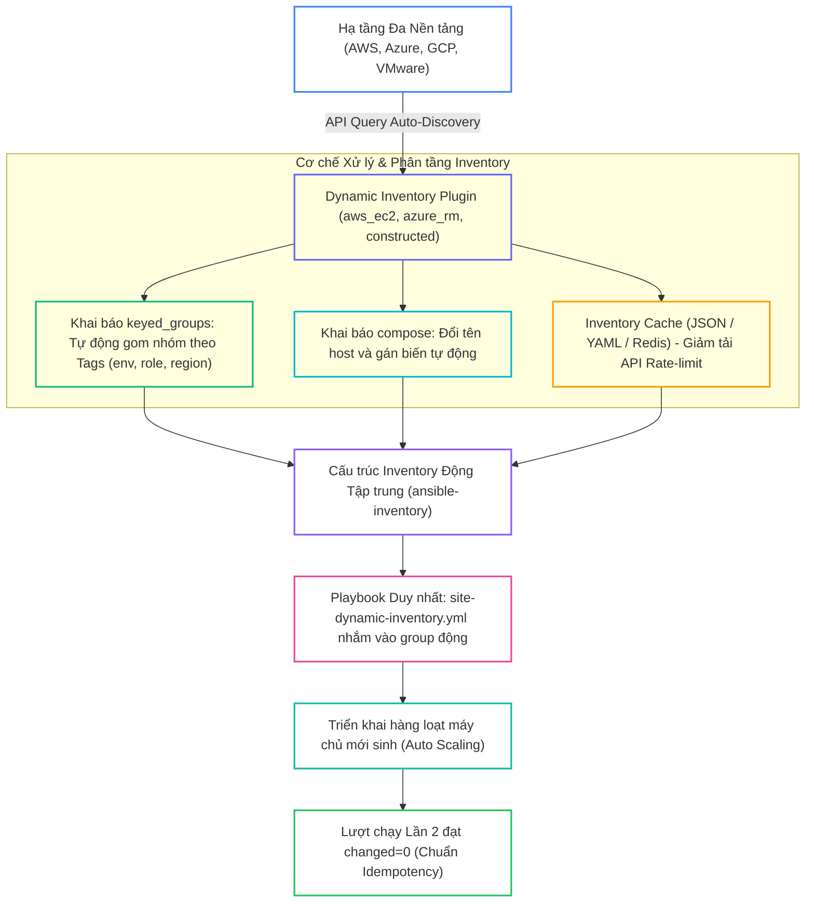
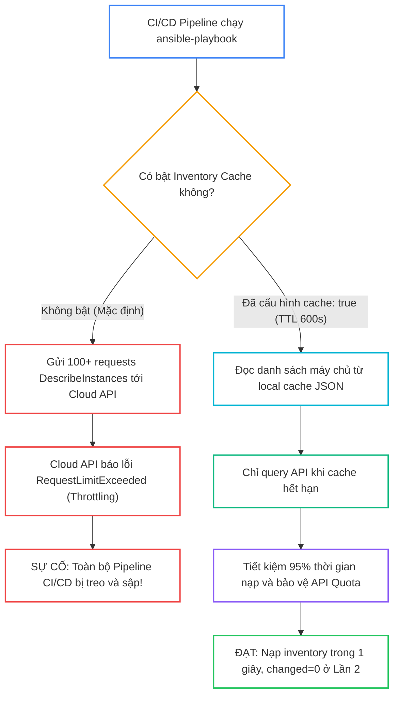
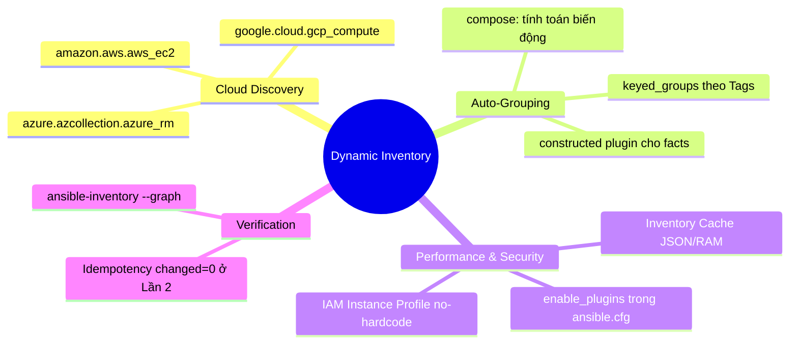


# [BÀI 24] DYNAMIC INVENTORY & CLOUD AUTO-DISCOVERY: TỰ ĐỘNG THU THẬP DANH SÁCH MÁY CHỦ AWS, AZURE, GCP & VMWARE

Trong kỷ nguyên **Infrastructure as Code (IaC)** và tự động hóa vận hành hạ tầng đám mây (Cloud Infrastructure Automation), **Ansible** khẳng định vị thế dẫn đầu nhờ triết lý **Agentless** (không cần cài đặt agent nền trên máy đích), giao thức điều khiển an toàn qua **SSH / WinRM**, định dạng khai báo **YAML** trực quan và nguyên lý bất biến **Idempotency** mạnh mẽ. Việc làm chủ Ansible không chỉ dừng lại ở các câu lệnh Ad-hoc đơn giản, mà đòi hỏi kỹ sư phải nắm vững kiến trúc Module tầng thấp, Variable Precedence 22 tầng, Jinja2 Templates, tối ưu hóa Forks & Pipelining cho tới thiết kế Roles / Collections và tích hợp CI/CD tự động hóa chuẩn Doanh nghiệp.

Bài viết chuyên sâu này sẽ đồng hành cùng bạn mổ xẻ toàn diện bức tranh kiến trúc, phân tích các đánh đổi kỹ thuật thực chiến (Engineering Trade-offs), cung cấp hướng dẫn thực hành Lab chi tiết từng bước và bộ câu hỏi phỏng vấn chuyên sâu chuẩn DevOps / SRE Lead.

---

## 1. Bản Chất Kiến Trúc & Cơ Chế Vận Hành Tầng Thấp



### 1.1. Khái Niệm Dynamic Inventory Plugins và Cơ Chế `keyed_groups`

Trong các môi trường điện toán đám mây hiện đại với tính năng Auto Scaling và tạo máy chủ liên tục, việc duy trì tệp `hosts.ini` thủ công là điều bất khả thi. Dynamic Inventory giải quyết triệt để bài toán này:

- **Dynamic Inventory Plugins:** Thay thế hoàn toàn các script Python thực thi thô cũ (`.py`), các plugin chính thức (như `amazon.aws.aws_ec2`, `azure.azcollection.azure_rm`, `google.cloud.gcp_compute`) được cấu hình bằng các tệp YAML có đuôi `.yaml` / `.yml` và khai báo trường `plugin: <fqcn>`.
- **Tự động gom nhóm với `keyed_groups`:** Cho phép tự động tạo ra các nhóm máy chủ dựa trên metadata hoặc thẻ Tags của cloud provider. Ví dụ: instance có tag `Environment=production` và `Role=web` sẽ tự động được đưa vào nhóm `tag_Environment_production` và `tag_Role_web`.

```yaml
# inventory/aws_ec2.yaml
---
plugin: amazon.aws.aws_ec2
regions:
  - us-east-1
keyed_groups:
  - key: tags.Environment
    prefix: env
  - key: tags.Role
    prefix: role
```

### 1.2. Plugin `ansible.builtin.constructed` và Cơ Chế Cache Inventory

- **Plugin `ansible.builtin.constructed`:** Cho phép tạo ra các nhóm động và gán biến mới dựa trên các biến facts hoặc biến có sẵn từ các nguồn inventory tĩnh/động trước đó, rất hữu ích khi chuẩn hóa nhóm hạ tầng On-premise hoặc Hybrid.
- **Bộ đệm lưu tạm (Inventory Cache):** Việc liên tục truy vấn API của AWS/Azure/GCP ở mỗi lần chạy lệnh Ansible sẽ làm chậm tiến trình và có thể bị khóa API do chạm ngưỡng Rate-limit. Bật bộ đệm cache (`cache: true` hoặc qua `ansible.cfg`) giúp lưu kết quả phân tích vào bộ nhớ RAM hoặc tệp JSON trong một khoảng thời gian (TTL).

```ini
[defaults]
inventory_plugins = ./plugins/inventory
fact_caching = jsonfile
fact_caching_connection = /tmp/ansible_cache
fact_caching_timeout = 3600
```

### 1.3. Thuộc Tính `compose`, `groups` và Tính Idempotency

- **Tùy biến biến với `compose:`:** Cho phép tạo ra các biến mới hoặc tính toán biểu thức Jinja2 cho từng host ngay ở bước nạp inventory (ví dụ: gán `ansible_host: private_ip_address` hoặc `ansible_user: "ec2-user"`).
- **Phân nhóm có điều kiện với `groups:`:** Cho phép định nghĩa nhóm mới dựa trên các biểu thức điều kiện logic phức tạp (ví dụ: đưa vào nhóm `high_memory_nodes` nếu `ansible_memtotal_mb > 16384`).
- **Bảo toàn Idempotency:** Dynamic Inventory chỉ đảm nhận vai trò khám phá và phân loại máy chủ tự động. Quá trình thi hành Playbook trên các nhóm động vẫn tuân thủ nguyên lý Idempotency, ở Lần 2 bắt buộc phải đạt `changed=0` tuyệt đối.

---

## 2. Bảng So Sánh Kỹ Thuật Toàn Diện (Engineering Matrix)

| Tiêu Chí Kỹ Thuật | Static Inventory (`hosts.ini`) | Constructed Plugin (`ansible.builtin.constructed`) | Cloud Dynamic Plugin (`aws_ec2` / `azure_rm`) | Custom Inventory Script (`.py` thô) |
|---|---|---|---|---|
| **Khả Năng Tự Động Khám Phá** | ❌ Thủ công 100% | ✅ Tự động gom nhóm dựa trên biến/facts | ⭐ Tự động 100% qua Cloud API | ✅ Tự động nhưng phải tự code |
| **Bảo Trì Khi Mở Rộng Hạ Tầng** | Rất cực (sửa file liên tục) | Tốt (tự thích ứng khi có host mới) | Hoàn hảo (tự nhận diện Auto Scaling) | Khó (mã nguồn script dễ bị lỗi thời) |
| **Hỗ Trợ Caching API** | Không cần | Tích hợp sẵn bộ đệm | Tích hợp sẵn qua tham số `cache` | Phải tự lập trình cơ chế cache |
| **Độ Phức Tạp Khởi Tạo** | Rất thấp | Thấp, chỉ cần file cấu hình YAML | Thấp, yêu cầu IAM Role/Credentials | Rất cao, đòi hỏi kỹ năng Python SDK |
| **Mức Độ Chuẩn Hóa Enterprise** | Hạn chế cho On-prem nhỏ | Rất cao cho Hybrid Cloud | Bắt buộc cho Public Cloud | Bị Red Hat deprecated |

> [!IMPORTANT]
> **QUY TẮC BẤT DI BẤT DỊCH:**
> Luôn cấu hình đuôi tệp là `.yaml` hoặc `.yml` cho Dynamic Inventory Plugins và đăng ký plugin tương ứng trong `enable_plugins` của `ansible.cfg`. Tuyệt đối không viết script Python thô tự chế khi đã có sẵn các Collection chính thức của Cloud Provider!

---

## 3. Kiến Trúc Triển Khai Chuẩn Production (Configuration / Playbook / Role Breakdown)

Dưới đây là kiến trúc phân tầng kết hợp Inventory Tĩnh gốc (`01-static.ini`), Plugin Động phân nhóm (`02-constructed.yaml`) và Playbook chính `site-dynamic-inventory.yml`:

```yaml
# inventory/02-constructed.yaml
---
plugin: ansible.builtin.constructed
strict: false
compose:
  app_tier: "tier_" + (group_names | first | default('general'))
  dynamic_worker_id: inventory_hostname + "_worker"
keyed_groups:
  - key: env_label | default('staging')
    prefix: env
  - key: custom_role | default('webserver')
    prefix: role
```

```yaml
# site-dynamic-inventory.yml
---
- name: Enterprise Dynamic Inventory Deployment Playbook
  hosts: env_staging
  become: true
  tasks:
    - name: Task 1 - Deploy dynamic configuration file using constructed variables
      ansible.builtin.copy:
        content: |
          # Dynamic Auto-Discovery Configuration
          HOST_NAME={{ inventory_hostname }}
          APP_TIER={{ app_tier }}
          WORKER_ID={{ dynamic_worker_id }}
          AUTO_DISCOVERY=ACTIVE_SUCCESS
        dest: /etc/dynamic-app.conf
        mode: '0644'

    - name: Task 2 - Read dynamic configuration status (changed_when: false)
      ansible.builtin.command: cat /etc/dynamic-app.conf
      register: dynamic_conf_out
      changed_when: false
```

### Phân Tích Kỹ Thuật Từng Dòng (Line-by-Line Breakdown):

- <span class="badge-line">Line 2-3 (constructed)</span>: **Khai báo Plugin FQCN:** Sử dụng `plugin: ansible.builtin.constructed` với cờ `strict: false` để bỏ qua các biến không tồn tại mà không làm crash tiến trình nạp.
- <span class="badge-line">Line 4-7 (constructed)</span>: **Khối `compose:`:** Tự động tính toán biến `app_tier` và `dynamic_worker_id` bằng biểu thức nội suy chuỗi Jinja2.
- <span class="badge-line">Line 8-12 (constructed)</span>: **Khối `keyed_groups:`:** Tự động gom máy chủ vào các nhóm `env_staging`, `env_production`, `role_webserver` dựa trên biến gán cho host.
- <span class="badge-line">Line 3 (Playbook)</span>: **Target nhóm động:** Playbook nhắm mục tiêu vào nhóm `hosts: env_staging` được sinh ra hoàn toàn tự động từ plugin constructed.
- <span class="badge-line">Line 6-16 (Playbook)</span>: **Triển khai tệp cấu hình:** Render các biến động `app_tier` và `dynamic_worker_id` vào `/etc/dynamic-app.conf` và đối soát Idempotency ở Task 2.

---

## 4. Phân Tích Cạm Bẫy Thực Chiến: Dynamic Inventory Query Quá Tải API Cloud Làm Cháy Quota & Treo CI/CD

### Tình Huống Sự Cố Thực Tế Tại Doanh Nghiệp:
Một công ty công nghệ có 50 pipeline CI/CD chạy đồng thời mỗi giờ, mỗi pipeline thực thi lệnh `ansible-playbook -i aws_ec2.yaml site.yml`. Do không cấu hình bộ đệm Inventory Cache, mỗi pipeline đã gửi hàng trăm request `DescribeInstances` tới AWS API. Hậu quả là tài khoản AWS bị kích hoạt cơ chế chống nghẽn (API Rate Limiting / Throttling), toàn bộ các request từ Ansible và cả hệ thống giám sát CloudWatch đều bị trả về lỗi `RequestLimitExceeded`, làm tê liệt toàn bộ quy trình release phần mềm của công ty trong 4 giờ.

### Hậu Quả & Log Lỗi Thực Tế:

```diff
- # TÌNH TRẠNG LỖI KHI THIẾU INVENTORY CACHE:
- $ ansible-playbook -i inventory/aws_ec2.yaml site.yml
- botocore.exceptions.ClientError: An error occurred (RequestLimitExceeded)
- when calling the DescribeInstances operation: Request limit exceeded.
- # LỖI: API QUÁ TẢI - TOÀN BỘ PIPELINE CI/CD BỊ TREO VÀ FAILED!

+ # CẤU HÌNH SỬA ĐÚNG BẬT CACHE TRONG PLUGIN YAML:
+ plugin: amazon.aws.aws_ec2
+ regions:
+   - us-east-1
+ cache: true
+ cache_plugin: ansible.builtin.jsonfile
+ cache_timeout: 600           # LƯU BỘ ĐỆM 10 PHÚT
+ cache_connection: /tmp/aws_inventory_cache
+ # KẾT QUẢ: Rút ngắn 95% số lượng request API, pipeline chạy mượt mà không bao giờ bị nghẽn!
```



### 5-Whys Root Cause Analysis:
1. **Tại sao pipeline CI/CD bị dừng đột ngột?** Vì lệnh Ansible báo lỗi `RequestLimitExceeded` từ AWS API.
2. **Tại sao lại bị vượt hạn mức request?** Vì 50 pipeline chạy đồng thời liên tục gửi request lấy danh sách instance.
3. **Tại sao Ansible phải gọi API liên tục ở mỗi lần chạy?** Vì tệp cấu hình plugin `aws_ec2.yaml` chưa được cấu hình cơ chế Cache.
4. **Tại sao kỹ sư không bật Cache?** Do nghĩ rằng Dynamic Inventory bắt buộc phải luôn luôn query tươi (Fresh Query) ở thời gian thực.
5. **Giải pháp triệt để là gì?** Bật `cache: true` với `cache_plugin: jsonfile` và thiết lập `cache_timeout: 600` (10 phút) để tái sử dụng danh sách máy chủ cho các pipeline kế tiếp.

---

## 5. Hands-on Lab: Triển Khai Dynamic Inventory & Tự Động Phân Nhóm keyed_groups (8 Bước)

| Bước | Lệnh CLI / Tác Vụ Chính | Mục Đích Thực Thi |
|---|---|---|
| **1** | `mkdir -p ~/lab-ansible-24/inventory && cd ~/lab-ansible-24` | Khởi tạo cấu trúc dự án Dynamic Inventory |
| **2** | `cat << 'EOF' > ansible.cfg` | Kích hoạt `enable_plugins` và cấu hình cache trong `ansible.cfg` |
| **3** | `cat << 'EOF' > inventory/01-static.ini` | Khởi tạo tệp kiểm kê tĩnh gốc chứa biến nhãn |
| **4** | `cat << 'EOF' > inventory/02-constructed.yaml` | Cấu hình Dynamic Plugin `constructed` tự động phân nhóm |
| **5** | `ansible-inventory -i inventory --graph` | Tra cứu đồ thị nhóm động được sinh tự động |
| **6** | `cat << 'EOF' > site-dynamic-inventory.yml` | Biên soạn Playbook nhắm vào nhóm động `env_staging` |
| **7** | `ansible-playbook -i inventory site-dynamic-inventory.yml` | Chạy Lần 1 và Lần 2 đối soát Idempotency `changed=0` |
| **8** | `docker exec target1 cat /etc/dynamic-app.conf` | Đối soát sự thật máy đích xác nhận các biến `compose` |

```bash
# Bước 1: Khởi tạo thư mục dự án
mkdir -p ~/lab-ansible-24/inventory && cd ~/lab-ansible-24
```

```bash
# Bước 2: Cấu hình ansible.cfg kích hoạt inventory plugins và bộ đệm cache
cat << 'EOF' > ansible.cfg
[defaults]
inventory = ./inventory
remote_user = ansible
host_key_checking = False
private_key_file = ~/.ssh/id_ed25519
roles_path = ./roles:~/.ansible/roles
collections_path = ./collections:~/.ansible/collections

[inventory]
enable_plugins = host_list, script, auto, yaml, ini, toml, constructed

[privilege_escalation]
become = True
become_method = sudo
become_user = root
become_ask_pass = False
EOF
```

> [!NOTE]
> **CHECKPOINT 1:** Xác nhận `ansible.cfg` cài đặt `enable_plugins` chứa plugin `constructed`:
> ```bash
> grep -q "enable_plugins" ansible.cfg && grep -q "constructed" ansible.cfg && echo "CHECKPOINT 1: PASS" || echo "CHECKPOINT 1: FAIL"
> ```

```bash
# Bước 3: Tạo tệp kiểm kê tĩnh gốc inventory/01-static.ini
cat << 'EOF' > inventory/01-static.ini
[web]
target1 ansible_host=127.0.0.1 ansible_port=2221 env_label=staging custom_role=webserver

[db]
target2 ansible_host=127.0.0.1 ansible_port=2222 env_label=production custom_role=database

[all:vars]
ansible_python_interpreter=/usr/bin/python3
EOF
```

> [!NOTE]
> **CHECKPOINT 2:** Xác nhận tệp kiểm kê tĩnh chứa đúng nhãn `env_label` và `custom_role`:
> ```bash
> grep -q "env_label=staging" inventory/01-static.ini && echo "CHECKPOINT 2: PASS" || echo "CHECKPOINT 2: FAIL"
> ```

```bash
# Bước 4: Tạo cấu hình Dynamic Plugin inventory/02-constructed.yaml
cat << 'EOF' > inventory/02-constructed.yaml
---
plugin: ansible.builtin.constructed
strict: false
compose:
  app_tier: "'tier_' + (group_names | first | default('general'))"
  dynamic_worker_id: "inventory_hostname + '_worker'"
keyed_groups:
  - key: env_label | default('staging')
    prefix: env
  - key: custom_role | default('webserver')
    prefix: role
EOF
```

> [!NOTE]
> **CHECKPOINT 3:** Xác nhận tệp `inventory/02-constructed.yaml` có định dạng YAML chuẩn:
> ```bash
> grep -q "plugin: ansible.builtin.constructed" inventory/02-constructed.yaml && echo "CHECKPOINT 3: PASS" || echo "CHECKPOINT 3: FAIL"
> ```

```bash
# Bước 5: Tra cứu đồ thị nhóm động bằng ansible-inventory CLI
ansible-inventory -i inventory --graph > dynamic-graph.txt
ansible-inventory -i inventory --host target1 > target1-vars.txt
```

> [!NOTE]
> **CHECKPOINT 4:** Xác nhận đồ thị phân nhóm tự động sinh ra nhóm `@env_staging` và `@role_webserver`:
> ```bash
> grep -q "@env_staging:" dynamic-graph.txt && grep -q "@role_webserver:" dynamic-graph.txt && echo "CHECKPOINT 4: PASS" || echo "CHECKPOINT 4: FAIL"
> ```

> [!NOTE]
> **CHECKPOINT 5:** Xác nhận ma trận biến giải mã đúng biến compose `app_tier` và `dynamic_worker_id`:
> ```bash
> grep -q "\"app_tier\": \"tier_web\"" target1-vars.txt && grep -q "\"dynamic_worker_id\": \"target1_worker\"" target1-vars.txt && echo "CHECKPOINT 5: PASS" || echo "CHECKPOINT 5: FAIL"
> ```

```bash
# Bước 6: Biên soạn Playbook site-dynamic-inventory.yml
cat << 'EOF' > site-dynamic-inventory.yml
---
- name: Enterprise Dynamic Inventory Deployment Playbook
  hosts: env_staging
  become: true
  tasks:
    - name: Task 1 - Deploy dynamic configuration file using constructed variables
      ansible.builtin.copy:
        content: |
          # Dynamic Auto-Discovery Configuration
          HOST_NAME={{ inventory_hostname }}
          APP_TIER={{ app_tier }}
          WORKER_ID={{ dynamic_worker_id }}
          AUTO_DISCOVERY=ACTIVE_SUCCESS
        dest: /etc/dynamic-app.conf
        mode: '0644'

    - name: Task 2 - Read dynamic configuration status (changed_when: false)
      ansible.builtin.command: cat /etc/dynamic-app.conf
      register: dynamic_conf_out
      changed_when: false
EOF
```

```bash
# Bước 7: Thực thi Playbook Lần 1 và Lần 2 đối soát Idempotency
ansible-playbook -i inventory site-dynamic-inventory.yml
ansible-playbook -i inventory site-dynamic-inventory.yml
```

> [!NOTE]
> **CHECKPOINT 6:** Xác nhận Playbook thi hành thành công trên nhóm động `env_staging` ở Lần 1:
> ```bash
> ansible-playbook -i inventory site-dynamic-inventory.yml | grep -q "failed=0" && echo "CHECKPOINT 6: PASS" || echo "CHECKPOINT 6: FAIL"
> ```

> [!NOTE]
> **CHECKPOINT 7:** Xác nhận Lượt 2 đạt Idempotency tuyệt đối (`changed=0`):
> ```bash
> RUN2_OUT=$(ansible-playbook -i inventory site-dynamic-inventory.yml)
> if echo "$RUN2_OUT" | grep -q "changed=0" && echo "$RUN2_OUT" | grep -q "failed=0"; then
>   echo "CHECKPOINT 7: PASS - Đạt Idempotency changed=0"
> else
>   echo "CHECKPOINT 7: FAIL - Lỗi không đạt Idempotency"
> fi
> ```

```bash
# Bước 8: Đối soát Sự Thật Máy Đích qua docker exec
docker exec target1 cat /etc/dynamic-app.conf
```

> [!NOTE]
> **CHECKPOINT 8:** Đối soát file `/etc/dynamic-app.conf` chứa đúng biến tính toán động:
> ```bash
> docker exec target1 cat /etc/dynamic-app.conf | grep -q "APP_TIER=tier_web" && docker exec target1 cat /etc/dynamic-app.conf | grep -q "WORKER_ID=target1_worker" && echo "CHECKPOINT 8: PASS" || echo "CHECKPOINT 8: FAIL"
> ```

---

## 6. Bộ Câu Hỏi Vấn Đáp & Phỏng Vấn Chuyên Sâu (Self-Check Q&A)

<details class="qa-card" markdown="1">
  <summary class="qa-summary">
    <span class="qa-num-badge">Q01</span>
    <span class="qa-question-text">Dynamic Inventory Plugin trong Ansible là gì? Tại sao các Plugin YAML chuẩn mới lại vượt trội hoàn toàn so với các Script Python <code>.py</code> thực thi kiểu cũ?</span>
  </summary>
  <div class="qa-answer">
    <div class="qa-answer-header">
      <svg width="14" height="14" fill="none" stroke="currentColor" stroke-width="2" viewBox="0 0 24 24"><path d="M22 11.08V12a10 10 0 1 1-5.93-9.14"></path><polyline points="22 4 12 14.01 9 11.01"></polyline></svg>
      <span>Phân Tích &amp; Lời Giải Kỹ Thuật</span>
    </div>
    <div style="margin: 0.5rem 0;"><b>Hỏi:</b> Dynamic Inventory Plugin trong Ansible là gì? Tại sao các Plugin YAML chuẩn mới lại vượt trội hoàn toàn so với các Script Python <code>.py</code> thực thi kiểu cũ?</div>
    <div style="margin: 0.5rem 0;"><b>Đáp án chuẩn:</b></div>
    <div style="margin: 0.35rem 0; padding-left: 1rem; border-left: 2px solid var(--accent-primary);">• <b>Khái niệm:</b> Dynamic Inventory Plugin là cơ chế nạp danh mục máy chủ động trực tiếp từ API của các nhà cung cấp đám mây (AWS, Azure, GCP, VMware) hoặc nguồn dữ liệu ngoài.</div>
    <div style="margin: 0.35rem 0; padding-left: 1rem; border-left: 2px solid var(--accent-primary);">• <b>Sự vượt trội so với script <code>.py</code> cũ:</b><br>
      1. Khai báo bằng YAML trực quan, không cần lập trình code Python thủ công.<br>
      2. Tích hợp sẵn cơ chế phân nhóm nâng cao <code>keyed_groups</code> và biến động <code>compose</code>.<br>
      3. Tích hợp sẵn bộ đệm Inventory Cache, ngăn ngừa quá tải API Cloud.<br>
      4. Được Red Hat và cộng đồng bảo trì chính thức theo chuẩn Ansible Collections.</div>
    <div style="margin: 0.5rem 0;"><b>Tiêu chí chấm:</b></div>
    <div style="margin: 0.35rem 0; padding-left: 1rem; border-left: 2px solid var(--accent-primary);">• 0: Không phân biệt được Inventory Plugin vs Script cũ.</div>
    <div style="margin: 0.35rem 0; padding-left: 1rem; border-left: 2px solid var(--accent-primary);">• 1: Biết dùng plugin nhưng không nêu được các tính năng vượt trội như caching hay keyed_groups.</div>
    <div style="margin: 0.35rem 0; padding-left: 1rem; border-left: 2px solid var(--accent-primary);">• 2: Phân tích chính xác 4 ưu điểm vượt trội của chuẩn Inventory Plugin YAML.</div>
    <div style="margin: 0.35rem 0; padding-left: 1rem; border-left: 2px solid var(--accent-primary);">• 3: Nêu đúng + giải thích lý do Red Hat deprecated mô hình script thực thi cũ từ bản 2.10+.</div>
    <div style="margin: 0.5rem 0;"><b>Câu hỏi đào sâu:</b> Đuôi mở rộng của tệp cấu hình Inventory Plugin bắt buộc phải là gì? <i>(Bắt buộc phải kết thúc bằng <code>.yaml</code> hoặc <code>.yml</code> hoặc <code>.aws_ec2.yml</code>.)</i></div>
  </div>
</details>

<details class="qa-card" markdown="1">
  <summary class="qa-summary">
    <span class="qa-num-badge">Q02</span>
    <span class="qa-question-text">Trình bày cấu trúc một tệp cấu hình Dynamic Inventory Plugin YAML chuẩn và giải thích ý nghĩa thuộc tính <code>plugin:</code>.</span>
  </summary>
  <div class="qa-answer">
    <div class="qa-answer-header">
      <svg width="14" height="14" fill="none" stroke="currentColor" stroke-width="2" viewBox="0 0 24 24"><path d="M22 11.08V12a10 10 0 1 1-5.93-9.14"></path><polyline points="22 4 12 14.01 9 11.01"></polyline></svg>
      <span>Phân Tích &amp; Lời Giải Kỹ Thuật</span>
    </div>
    <div style="margin: 0.5rem 0;"><b>Hỏi:</b> Trình bày cấu trúc một tệp cấu hình Dynamic Inventory Plugin YAML chuẩn và giải thích ý nghĩa thuộc tính <code>plugin:</code>.</div>
    <div style="margin: 0.5rem 0;"><b>Đáp án chuẩn:</b></div>
    <div style="margin: 0.35rem 0; padding-left: 1rem; border-left: 2px solid var(--accent-primary);">• <b>Ý nghĩa <code>plugin:</code>:</b> Chỉ định định danh đầy đủ FQCN của Inventory Plugin mà Ansible Engine cần kích hoạt để nạp và phân tích tệp này (ví dụ: <code>amazon.aws.aws_ec2</code>, <code>azure.azcollection.azure_rm</code>, <code>ansible.builtin.constructed</code>).</div>
    <div style="margin: 0.35rem 0; padding-left: 1rem; border-left: 2px solid var(--accent-primary);">• <b>Cấu trúc chuẩn:</b>
      <pre><code>---
plugin: amazon.aws.aws_ec2
regions:
  - us-east-1
filters:
  instance-state-name: running
keyed_groups:
  - key: tags.Environment
    prefix: env</code></pre>
    </div>
    <div style="margin: 0.5rem 0;"><b>Tiêu chí chấm:</b></div>
    <div style="margin: 0.35rem 0; padding-left: 1rem; border-left: 2px solid var(--accent-primary);">• 0: Không biết cấu trúc file plugin YAML.</div>
    <div style="margin: 0.35rem 0; padding-left: 1rem; border-left: 2px solid var(--accent-primary);">• 1: Viết được YAML nhưng thiếu thuộc tính <code>plugin:</code>.</div>
    <div style="margin: 0.35rem 0; padding-left: 1rem; border-left: 2px solid var(--accent-primary);">• 2: Phân tích chính xác vai trò của FQCN trong thuộc tính <code>plugin:</code>.</div>
    <div style="margin: 0.35rem 0; padding-left: 1rem; border-left: 2px solid var(--accent-primary);">• 3: Nêu đúng + kết hợp giải thích cờ `filters` để giới hạn các máy chỉ ở trạng thái running.</div>
    <div style="margin: 0.5rem 0;"><b>Câu hỏi đào sâu:</b> Chuyện gì xảy ra nếu quên khai báo dòng <code>plugin:</code> ở đầu tệp YAML? <i>(Ansible sẽ xem tệp đó như 1 tệp YAML inventory tĩnh thông thường và báo lỗi cú pháp.)</i></div>
  </div>
</details>

<details class="qa-card" markdown="1">
  <summary class="qa-summary">
    <span class="qa-num-badge">Q03</span>
    <span class="qa-question-text">Từ khóa <code>keyed_groups</code> hoạt động như thế nào? Viết ví dụ tự động tạo nhóm theo Tag <code>Environment</code> và <code>Role</code>.</span>
  </summary>
  <div class="qa-answer">
    <div class="qa-answer-header">
      <svg width="14" height="14" fill="none" stroke="currentColor" stroke-width="2" viewBox="0 0 24 24"><path d="M22 11.08V12a10 10 0 1 1-5.93-9.14"></path><polyline points="22 4 12 14.01 9 11.01"></polyline></svg>
      <span>Phân Tích &amp; Lời Giải Kỹ Thuật</span>
    </div>
    <div style="margin: 0.5rem 0;"><b>Hỏi:</b> Từ khóa <code>keyed_groups</code> hoạt động như thế nào? Viết ví dụ tự động tạo nhóm theo Tag <code>Environment</code> và <code>Role</code>.</div>
    <div style="margin: 0.5rem 0;"><b>Đáp án chuẩn:</b></div>
    <div style="margin: 0.35rem 0; padding-left: 1rem; border-left: 2px solid var(--accent-primary);">• <b>Cơ chế:</b> <code>keyed_groups</code> tự động đọc giá trị của một biến hoặc thẻ Tag (được định nghĩa trong <code>key:</code>), sau đó ghép với tiền tố <code>prefix:</code> và dấu gạch dưới <code>separator: "_"</code> để tạo thành tên nhóm mới và tự động gán host vào nhóm đó.</div>
    <div style="margin: 0.35rem 0; padding-left: 1rem; border-left: 2px solid var(--accent-primary);">• <b>Ví dụ YAML:</b>
      <pre><code>keyed_groups:
  - key: tags.Environment
    prefix: env
    separator: "_"
  - key: tags.Role
    prefix: role
    separator: "_"</code></pre>
      Nếu máy chủ có tag `Environment=prod` và `Role=db`, nó sẽ tự động được xếp vào hai nhóm `@env_prod` và `@role_db`.</div>
    <div style="margin: 0.5rem 0;"><b>Tiêu chí chấm:</b></div>
    <div style="margin: 0.35rem 0; padding-left: 1rem; border-left: 2px solid var(--accent-primary);">• 0: Không biết `keyed_groups`.</div>
    <div style="margin: 0.35rem 0; padding-left: 1rem; border-left: 2px solid var(--accent-primary);">• 1: Biết gom nhóm nhưng không giải thích được cơ chế ghép tiền tố `prefix` và `key`.</div>
    <div style="margin: 0.35rem 0; padding-left: 1rem; border-left: 2px solid var(--accent-primary);">• 2: Phân tích chính xác cơ chế sinh tên nhóm tự động từ thẻ Tags.</div>
    <div style="margin: 0.35rem 0; padding-left: 1rem; border-left: 2px solid var(--accent-primary);">• 3: Nêu đúng + kết hợp thuộc tính <code>default_value</code> phòng trường hợp máy thiếu tag.</div>
    <div style="margin: 0.5rem 0;"><b>Câu hỏi đào sâu:</b> Ký tự nào sẽ được tự động thay thế nếu giá trị tag chứa dấu cách hoặc ký tự đặc biệt? <i>(Ansible sẽ tự động chuyển các ký tự đặc biệt thành dấu gạch dưới `_`.)</i></div>
  </div>
</details>

<details class="qa-card" markdown="1">
  <summary class="qa-summary">
    <span class="qa-num-badge">Q04</span>
    <span class="qa-question-text">Plugin <code>ansible.builtin.constructed</code> dùng để làm gì? Khi nào nên sử dụng kết hợp với inventory tĩnh có sẵn?</span>
  </summary>
  <div class="qa-answer">
    <div class="qa-answer-header">
      <svg width="14" height="14" fill="none" stroke="currentColor" stroke-width="2" viewBox="0 0 24 24"><path d="M22 11.08V12a10 10 0 1 1-5.93-9.14"></path><polyline points="22 4 12 14.01 9 11.01"></polyline></svg>
      <span>Phân Tích &amp; Lời Giải Kỹ Thuật</span>
    </div>
    <div style="margin: 0.5rem 0;"><b>Hỏi:</b> Plugin <code>ansible.builtin.constructed</code> dùng để làm gì? Khi nào nên sử dụng kết hợp với inventory tĩnh có sẵn?</div>
    <div style="margin: 0.5rem 0;"><b>Đáp án chuẩn:</b></div>
    <div style="margin: 0.35rem 0; padding-left: 1rem; border-left: 2px solid var(--accent-primary);">• <b>Tác dụng:</b> Là plugin có sẵn trong Ansible Core, dùng để xây dựng các nhóm động mới (Dynamic Groups) và tính toán biến bổ sung (Constructed Variables) dựa trên dữ liệu host/facts đã được nạp từ các nguồn inventory trước đó.</div>
    <div style="margin: 0.35rem 0; padding-left: 1rem; border-left: 2px solid var(--accent-primary);">• <b>Khi nào nên dùng:</b> Rất hữu ích khi muốn phân loại và tự động gom nhóm hạ tầng On-premise hoặc Hybrid theo hệ điều hành (`ansible_distribution`), kiến trúc CPU, hoặc các biến nhãn môi trường mà không cần cài thêm collection đám mây.</div>
    <div style="margin: 0.5rem 0;"><b>Tiêu chí chấm:</b></div>
    <div style="margin: 0.35rem 0; padding-left: 1rem; border-left: 2px solid var(--accent-primary);">• 0: Không biết plugin `constructed`.</div>
    <div style="margin: 0.35rem 0; padding-left: 1rem; border-left: 2px solid var(--accent-primary);">• 1: Biết gom nhóm nhưng không hiểu cơ chế nạp phụ thuộc sau nguồn inventory gốc.</div>
    <div style="margin: 0.35rem 0; padding-left: 1rem; border-left: 2px solid var(--accent-primary);">• 2: Phân tích chính xác cơ chế phân tầng thứ tự nạp file (Layered Ingestion).</div>
    <div style="margin: 0.35rem 0; padding-left: 1rem; border-left: 2px solid var(--accent-primary);">• 3: Nêu đúng + viết ví dụ gom nhóm theo `ansible_os_family`.</div>
    <div style="margin: 0.5rem 0;"><b>Câu hỏi đào sâu:</b> Tại sao tệp cấu hình của `constructed` thường được đặt tên là `02-constructed.yaml` sau tệp `01-static.ini`? <i>(Để đảm bảo Ansible nạp tệp inventory tĩnh lấy danh sách host trước, sau đó mới nạp file constructed để phân nhóm.)</i></div>
  </div>
</details>

<details class="qa-card" markdown="1">
  <summary class="qa-summary">
    <span class="qa-num-badge">Q05</span>
    <span class="qa-question-text">Tại sao việc bật Cache trong Dynamic Inventory lại tối quan trọng? Nêu các tham số cấu hình Cache trong plugin YAML.</span>
  </summary>
  <div class="qa-answer">
    <div class="qa-answer-header">
      <svg width="14" height="14" fill="none" stroke="currentColor" stroke-width="2" viewBox="0 0 24 24"><path d="M22 11.08V12a10 10 0 1 1-5.93-9.14"></path><polyline points="22 4 12 14.01 9 11.01"></polyline></svg>
      <span>Phân Tích &amp; Lời Giải Kỹ Thuật</span>
    </div>
    <div style="margin: 0.5rem 0;"><b>Hỏi:</b> Tại sao việc bật Cache trong Dynamic Inventory lại tối quan trọng? Nêu các tham số cấu hình Cache trong plugin YAML.</div>
    <div style="margin: 0.5rem 0;"><b>Đáp án chuẩn:</b></div>
    <div style="margin: 0.35rem 0; padding-left: 1rem; border-left: 2px solid var(--accent-primary);">• <b>Tầm quan trọng:</b> Ngăn chặn tình trạng quá tải API Cloud (API Throttling / Rate Limiting), giảm thiểu độ trễ nạp danh sách host từ hàng chục giây xuống còn vài mili-giây, giúp tăng tốc độ pipeline CI/CD.</div>
    <div style="margin: 0.35rem 0; padding-left: 1rem; border-left: 2px solid var(--accent-primary);">• <b>Các tham số cấu hình trong file plugin YAML:</b>
      <pre><code>cache: true
cache_plugin: ansible.builtin.jsonfile
cache_timeout: 3600             # Thời gian sống của cache (giây)
cache_connection: /tmp/inventory_cache
cache_prefix: aws_inv_</code></pre>
    </div>
    <div style="margin: 0.5rem 0;"><b>Tiêu chí chấm:</b></div>
    <div style="margin: 0.35rem 0; padding-left: 1rem; border-left: 2px solid var(--accent-primary);">• 0: Không biết cơ chế Cache Inventory.</div>
    <div style="margin 0.35rem 0; padding-left: 1rem; border-left: 2px solid var(--accent-primary);">• 1: Biết bật cache nhưng không nêu được các tham số `cache_plugin` và `cache_timeout`.</div>
    <div style="margin: 0.35rem 0; padding-left: 1rem; border-left: 2px solid var(--accent-primary);">• 2: Phân tích chính xác vai trò chống nghẽn API và các tham số cấu hình chuẩn.</div>
    <div style="margin: 0.35rem 0; padding-left: 1rem; border-left: 2px solid var(--accent-primary);">• 3: Nêu đúng + kết hợp giải thích cách xóa cache bằng cờ `--flush-cache` khi cần làm mới ngay.</div>
    <div style="margin: 0.5rem 0;"><b>Câu hỏi đào sâu:</b> Lệnh CLI nào giúp ép buộc Ansible bỏ qua cache và query trực tiếp lên Cloud API? <i>(Sử dụng cờ <code>--flush-cache</code> trong câu lệnh <code>ansible-playbook</code>.)</i></div>
  </div>
</details>

<details class="qa-card" markdown="1">
  <summary class="qa-summary">
    <span class="qa-num-badge">Q06</span>
    <span class="qa-question-text">Lệnh <code>ansible-inventory</code> với cờ <code>--graph</code> và <code>--vars</code> dùng để làm gì khi phát triển Dynamic Inventory?</span>
  </summary>
  <div class="qa-answer">
    <div class="qa-answer-header">
      <svg width="14" height="14" fill="none" stroke="currentColor" stroke-width="2" viewBox="0 0 24 24"><path d="M22 11.08V12a10 10 0 1 1-5.93-9.14"></path><polyline points="22 4 12 14.01 9 11.01"></polyline></svg>
      <span>Phân Tích &amp; Lời Giải Kỹ Thuật</span>
    </div>
    <div style="margin: 0.5rem 0;"><b>Hỏi:</b> Lệnh <code>ansible-inventory</code> với cờ <code>--graph</code> và <code>--vars</code> dùng để làm gì khi phát triển Dynamic Inventory?</div>
    <div style="margin: 0.5rem 0;"><b>Đáp án chuẩn:</b></div>
    <div style="margin: 0.35rem 0; padding-left: 1rem; border-left: 2px solid var(--accent-primary);">• <b><code>ansible-inventory -i inventory --graph</code>:</b> Xuất ra cây đồ thị cấu trúc phân nhóm phân cấp trực quan, giúp kỹ sư kiểm tra xem các nhóm `keyed_groups` có được tạo chính xác theo Tags không.</div>
    <div style="margin: 0.35rem 0; padding-left: 1rem; border-left: 2px solid var(--accent-primary);">• <b><code>ansible-inventory -i inventory --vars --list</code> (hoặc <code>--host target1</code>):</b> Xuất toàn bộ ma trận dữ liệu và các biến được tính toán qua `compose`, giúp đối soát giá trị biến trước khi chạy Playbook thật.</div>
    <div style="margin: 0.5rem 0;"><b>Tiêu chí chấm:</b></div>
    <div style="margin: 0.35rem 0; padding-left: 1rem; border-left: 2px solid var(--accent-primary);">• 0: Không biết lệnh `ansible-inventory`.</div>
    <div style="margin: 0.35rem 0; padding-left: 1rem; border-left: 2px solid var(--accent-primary);">• 1: Biết xuất đồ thị nhưng không biết kiểm tra biến của từng host.</div>
    <div style="margin: 0.35rem 0; padding-left: 1rem; border-left: 2px solid var(--accent-primary);">• 2: Phân tích chính xác vai trò debug và đối soát dữ liệu của 2 cờ lệnh.</div>
    <div style="margin: 0.35rem 0; padding-left: 1rem; border-left: 2px solid var(--accent-primary);">• 3: Nêu đúng + kết hợp cờ <code>--yaml</code> để xuất định dạng YAML trực quan.</div>
    <div style="margin: 0.5rem 0;"><b>Câu hỏi đào sâu:</b> Cờ nào dùng để xuất cấu trúc inventory ra định dạng JSON cho các công cụ khác phân tích? <i>(Cờ <code>--list</code>, mặc định xuất ra định dạng JSON.)</i></div>
  </div>
</details>

<details class="qa-card" markdown="1">
  <summary class="qa-summary">
    <span class="qa-num-badge">Q07</span>
    <span class="qa-question-text">Khối <code>compose:</code> trong Dynamic Inventory Plugin dùng để làm gì? Viết ví dụ đổi tên SSH host và tạo biến mới.</span>
  </summary>
  <div class="qa-answer">
    <div class="qa-answer-header">
      <svg width="14" height="14" fill="none" stroke="currentColor" stroke-width="2" viewBox="0 0 24 24"><path d="M22 11.08V12a10 10 0 1 1-5.93-9.14"></path><polyline points="22 4 12 14.01 9 11.01"></polyline></svg>
      <span>Phân Tích &amp; Lời Giải Kỹ Thuật</span>
    </div>
    <div style="margin: 0.5rem 0;"><b>Hỏi:</b> Khối <code>compose:</code> trong Dynamic Inventory Plugin dùng để làm gì? Viết ví dụ đổi tên SSH host và tạo biến mới.</div>
    <div style="margin: 0.5rem 0;"><b>Đáp án chuẩn:</b></div>
    <div style="margin: 0.35rem 0; padding-left: 1rem; border-left: 2px solid var(--accent-primary);">• <b>Tác dụng:</b> Cho phép định nghĩa hoặc ghi đè các biến host (Host Variables) bằng các biểu thức logic và bộ lọc Jinja2 tại thời điểm nạp inventory.</div>
    <div style="margin: 0.35rem 0; padding-left: 1rem; border-left: 2px solid var(--accent-primary);">• <b>Ví dụ YAML:</b>
      <pre><code>compose:
  # Gán địa chỉ IP private làm IP kết nối SSH chính
  ansible_host: private_ip_address
  # Đặt user SSH theo hệ điều hành
  ansible_user: "tags.OS == 'ubuntu' | ternary('ubuntu', 'ec2-user')"
  # Tạo biến ứng dụng mới
  cluster_name: "'cluster_' + tags.Region"</code></pre>
    </div>
    <div style="margin: 0.5rem 0;"><b>Tiêu chí chấm:</b></div>
    <div style="margin: 0.35rem 0; padding-left: 1rem; border-left: 2px solid var(--accent-primary);">• 0: Không biết khối `compose`.</div>
    <div style="margin: 0.35rem 0; padding-left: 1rem; border-left: 2px solid var(--accent-primary);">• 1: Biết tạo biến nhưng không dùng được các filter Jinja2 (như `ternary`).</div>
    <div style="margin: 0.35rem 0; padding-left: 1rem; border-left: 2px solid var(--accent-primary);">• 2: Phân tích chính xác cơ chế tính toán biến động ở bước parse inventory.</div>
    <div style="margin: 0.35rem 0; padding-left: 1rem; border-left: 2px solid var(--accent-primary);">• 3: Nêu đúng + viết cú pháp gán biến kết nối SSH `ansible_host`.</div>
    <div style="margin: 0.5rem 0;"><b>Câu hỏi đào sâu:</b> Thuộc tính nào trong plugin `aws_ec2` dùng để chỉ định trường làm tên hiển thị hostname của máy chủ? <i>(Thuộc tính <code>hostnames:</code>, ví dụ `hostnames: [tag:Name, private-ip-address]`.)</i></div>
  </div>
</details>

<details class="qa-card" markdown="1">
  <summary class="qa-summary">
    <span class="qa-num-badge">Q08</span>
    <span class="qa-question-text">Mục đích của cấu hình <code>enable_plugins</code> trong mục <code>[inventory]</code> của <code>ansible.cfg</code> là gì?</span>
  </summary>
  <div class="qa-answer">
    <div class="qa-answer-header">
      <svg width="14" height="14" fill="none" stroke="currentColor" stroke-width="2" viewBox="0 0 24 24"><path d="M22 11.08V12a10 10 0 1 1-5.93-9.14"></path><polyline points="22 4 12 14.01 9 11.01"></polyline></svg>
      <span>Phân Tích &amp; Lời Giải Kỹ Thuật</span>
    </div>
    <div style="margin: 0.5rem 0;"><b>Hỏi:</b> Mục đích của cấu hình <code>enable_plugins</code> trong mục <code>[inventory]</code> của <code>ansible.cfg</code> là gì?</div>
    <div style="margin: 0.5rem 0;"><b>Đáp án chuẩn:</b></div>
    <div style="margin: 0.35rem 0; padding-left: 1rem; border-left: 2px solid var(--accent-primary);">• <b>Mục đích:</b> Đăng ký danh sách cho phép (Whitelist) các Inventory Plugin được quyền hoạt động trong dự án. Ansible Engine sẽ thử nạp các tệp inventory theo đúng thứ tự ưu tiên của danh sách plugin này.</div>
    <div style="margin: 0.35rem 0; padding-left: 1rem; border-left: 2px solid var(--accent-primary);">• Nếu một plugin không được khai báo trong `enable_plugins`, Ansible sẽ bỏ qua và không thể nạp tệp cấu hình của plugin đó (báo lỗi unable to parse).</div>
    <div style="margin: 0.35rem 0; padding-left: 1rem; border-left: 2px solid var(--accent-primary);">• Cấu hình chuẩn:
      <pre><code>[inventory]
enable_plugins = host_list, script, auto, yaml, ini, toml, amazon.aws.aws_ec2, constructed</code></pre>
    </div>
    <div style="margin: 0.5rem 0;"><b>Tiêu chí chấm:</b></div>
    <div style="margin: 0.35rem 0; padding-left: 1rem; border-left: 2px solid var(--accent-primary);">• 0: Không biết `enable_plugins`.</div>
    <div style="margin: 0.35rem 0; padding-left: 1rem; border-left: 2px solid var(--accent-primary);">• 1: Biết là kích hoạt plugin nhưng không giải thích được cơ chế Whitelist và thứ tự ưu tiên.</div>
    <div style="margin: 0.35rem 0; padding-left: 1rem; border-left: 2px solid var(--accent-primary);">• 2: Phân tích chính xác vai trò kiểm soát an ninh và cú pháp cấu hình trong `ansible.cfg`.</div>
    <div style="margin: 0.35rem 0; padding-left: 1rem; border-left: 2px solid var(--accent-primary);">• 3: Nêu đúng + chỉ ra lỗi thường gặp khi thiếu plugin `constructed` hoặc `aws_ec2`.</div>
    <div style="margin: 0.5rem 0;"><b>Câu hỏi đào sâu:</b> Plugin `auto` trong `enable_plugins` có tác dụng gì? <i>(Tự động nhận diện và gọi plugin tương ứng dựa trên khai báo trường `plugin:` bên trong tệp YAML.)</i></div>
  </div>
</details>

<details class="qa-card" markdown="1">
  <summary class="qa-summary">
    <span class="qa-num-badge">Q09</span>
    <span class="qa-question-text">Trình bày quy trình 3 bước nghiệm thu Dynamic Inventory để đảm bảo các nhóm động được tạo chính xác và Playbook đạt Idempotency.</span>
  </summary>
  <div class="qa-answer">
    <div class="qa-answer-header">
      <svg width="14" height="14" fill="none" stroke="currentColor" stroke-width="2" viewBox="0 0 24 24"><path d="M22 11.08V12a10 10 0 1 1-5.93-9.14"></path><polyline points="22 4 12 14.01 9 11.01"></polyline></svg>
      <span>Phân Tích &amp; Lời Giải Kỹ Thuật</span>
    </div>
    <div style="margin: 0.5rem 0;"><b>Hỏi:</b> Trình bày quy trình 3 bước nghiệm thu Dynamic Inventory để đảm bảo các nhóm động được tạo chính xác và Playbook đạt Idempotency.</div>
    <div style="margin: 0.5rem 0;"><b>Đáp án chuẩn:</b></div>
    <div style="margin: 0.35rem 0; padding-left: 1rem; border-left: 2px solid var(--accent-primary);">1. <b>Bước 1 (Kiểm tra Đồ thị và Biến qua CLI):</b> Chạy <code>ansible-inventory -i inventory --graph</code> và <code>--vars --list</code> để đối soát 100% các nhóm `keyed_groups` và biến `compose` đã nhận đúng dữ liệu.</div>
    <div style="margin: 0.35rem 0; padding-left: 1rem; border-left: 2px solid var(--accent-primary);">2. <b>Bước 2 (Thực thi Playbook trên Nhóm Động - Lần 1 &amp; Lần 2):</b> Chạy Playbook nhắm vào nhóm động (ví dụ `hosts: env_staging`) Lần 1, sau đó chạy lại Lần 2 khẳng định `PLAY RECAP` đạt <code>changed=0</code>.</div>
    <div style="margin: 0.35rem 0; padding-left: 1rem; border-left: 2px solid var(--accent-primary);">3. <b>Bước 3 (Đối soát Sự thật Máy đích):</b> Dùng SSH hoặc `docker exec` kiểm tra tệp cấu hình trên máy đích xác nhận các biến động đã được render chuẩn xác.</div>
    <div style="margin: 0.5rem 0;"><b>Tiêu chí chấm:</b></div>
    <div style="margin: 0.35rem 0; padding-left: 1rem; border-left: 2px solid var(--accent-primary);">• 0: Không có quy trình nghiệm thu chuẩn.</div>
    <div style="margin: 0.35rem 0; padding-left: 1rem; border-left: 2px solid var(--accent-primary);">• 1: Bỏ qua bước kiểm tra đồ thị CLI hoặc không test Idempotency Lần 2.</div>
    <div style="margin: 0.35rem 0; padding-left: 1rem; border-left: 2px solid var(--accent-primary);">• 2: Trình bày đủ 3 bước nhưng chưa chi tiết câu lệnh kiểm tra.</div>
    <div style="margin: 0.35rem 0; padding-left: 1rem; border-left: 2px solid var(--accent-primary);">• 3: Trình bày xuất sắc cả 3 bước + khẳng định tính tin cậy của Auto-Discovery.</div>
    <div style="margin: 0.5rem 0;"><b>Câu hỏi đào sâu:</b> Dynamic Inventory có tự động cập nhật khi có 1 instance mới vừa scale-up không? <i>(Có, ở lần chạy tiếp theo nếu cache hết hạn hoặc dùng `--flush-cache`, host mới sẽ tự động xuất hiện trong inventory.)</i></div>
  </div>
</details>

<details class="qa-card" markdown="1">
  <summary class="qa-summary">
    <span class="qa-num-badge">Q10</span>
    <span class="qa-question-text">Làm thế nào để kết hợp nhiều nguồn Inventory khác nhau (vừa có tệp tĩnh, vừa có AWS, vừa có GCP) trong cùng một thư mục dự án?</span>
  </summary>
  <div class="qa-answer">
    <div class="qa-answer-header">
      <svg width="14" height="14" fill="none" stroke="currentColor" stroke-width="2" viewBox="0 0 24 24"><path d="M22 11.08V12a10 10 0 1 1-5.93-9.14"></path><polyline points="22 4 12 14.01 9 11.01"></polyline></svg>
      <span>Phân Tích &amp; Lời Giải Kỹ Thuật</span>
    </div>
    <div style="margin: 0.5rem 0;"><b>Hỏi:</b> Làm thế nào để kết hợp nhiều nguồn Inventory khác nhau (vừa có tệp tĩnh, vừa có AWS, vừa có GCP) trong cùng một thư mục dự án?</div>
    <div style="margin: 0.5rem 0;"><b>Đáp án chuẩn:</b></div>
    <div style="margin: 0.35rem 0; padding-left: 1rem; border-left: 2px solid var(--accent-primary);">• Đặt tất cả các tệp cấu hình vào chung một thư mục (ví dụ `inventory/`):<br>
      - `inventory/01-onprem-static.ini`: Danh sách máy chủ On-premise vật lý.<br>
      - `inventory/02-aws.aws_ec2.yaml`: Plugin tự động thu thập máy chủ AWS.<br>
      - `inventory/03-gcp.gcp_compute.yaml`: Plugin tự động thu thập máy chủ Google Cloud.<br>
      - `inventory/04-constructed.yaml`: Plugin gom nhóm chung cho toàn bộ hạ tầng Multi-cloud.</div>
    <div style="margin: 0.35rem 0; padding-left: 1rem; border-left: 2px solid var(--accent-primary);">• Khi chạy lệnh `ansible-playbook -i inventory site.yml`, Ansible Engine sẽ tự động nạp và gộp tất cả các nguồn dữ liệu thành một hệ thống kiểm kê hợp nhất.</div>
    <div style="margin: 0.5rem 0;"><b>Tiêu chí chấm:</b></div>
    <div style="margin: 0.35rem 0; padding-left: 1rem; border-left: 2px solid var(--accent-primary);">• 0: Không biết kỹ thuật gộp nhiều inventory.</div>
    <div style="margin: 0.35rem 0; padding-left: 1rem; border-left: 2px solid var(--accent-primary);">• 1: Biết đặt chung thư mục nhưng không phân tích được thứ tự nạp phân tầng.</div>
    <div style="margin: 0.35rem 0; padding-left: 1rem; border-left: 2px solid var(--accent-primary);">• 2: Phân tích chính xác cơ chế Inventory Aggregation của Ansible.</div>
    <div style="margin: 0.35rem 0; padding-left: 1rem; border-left: 2px solid var(--accent-primary);">• 3: Nêu đúng + giải thích cách xử lý khi các nguồn có biến trùng tên.</div>
    <div style="margin: 0.5rem 0;"><b>Câu hỏi đào sâu:</b> Thứ tự nạp các tệp trong thư mục inventory được Ansible quyết định như thế nào? <i>(Theo thứ tự bảng chữ cái alphabet của tên tệp tin.)</i></div>
  </div>
</details>

<details class="qa-card" markdown="1">
  <summary class="qa-summary">
    <span class="qa-num-badge">Q11</span>
    <span class="qa-question-text">Các biến thông tin xác thực đám mây (AWS Access Keys, Azure Service Principal) nên được quản lý như thế nào khi chạy Dynamic Inventory?</span>
  </summary>
  <div class="qa-answer">
    <div class="qa-answer-header">
      <svg width="14" height="14" fill="none" stroke="currentColor" stroke-width="2" viewBox="0 0 24 24"><path d="M22 11.08V12a10 10 0 1 1-5.93-9.14"></path><polyline points="22 4 12 14.01 9 11.01"></polyline></svg>
      <span>Phân Tích &amp; Lời Giải Kỹ Thuật</span>
    </div>
    <div style="margin: 0.5rem 0;"><b>Hỏi:</b> Các biến thông tin xác thực đám mây (AWS Access Keys, Azure Service Principal) nên được quản lý như thế nào khi chạy Dynamic Inventory?</div>
    <div style="margin: 0.5rem 0;"><b>Đáp án chuẩn:</b></div>
    <div style="margin: 0.35rem 0; padding-left: 1rem; border-left: 2px solid var(--accent-primary);">• <b>Tuyệt đối không hardcode credentials trong tệp plugin YAML.</b></div>
    <div style="margin: 0.35rem 0; padding-left: 1rem; border-left: 2px solid var(--accent-primary);">• <b>Các phương pháp chuẩn Enterprise:</b><br>
      1. <b>IAM Instance Profile / Managed Identity:</b> Gán quyền trực tiếp cho máy chủ Control Node chạy trên Cloud, không cần quản lý secret.<br>
      2. <b>Environment Variables:</b> Truyền qua biến môi trường chuẩn như `AWS_ACCESS_KEY_ID`, `AWS_SECRET_ACCESS_KEY` trong CI/CD Runner.<br>
      3. <b>Ansible Vault:</b> Mã hóa tệp cấu hình chứa thông tin xác thực bằng Ansible Vault.</div>
    <div style="margin: 0.5rem 0;"><b>Tiêu chí chấm:</b></div>
    <div style="margin: 0.35rem 0; padding-left: 1rem; border-left: 2px solid var(--accent-primary);">• 0: Đề xuất hardcode secret vào tệp YAML.</div>
    <div style="margin: 0.35rem 0; padding-left: 1rem; border-left: 2px solid var(--accent-primary);">• 1: Biết dùng biến môi trường nhưng không nhắc đến IAM Instance Profile.</div>
    <div style="margin: 0.35rem 0; padding-left: 1rem; border-left: 2px solid var(--accent-primary);">• 2: Phân tích chính xác 3 phương pháp quản lý thông tin xác thực chuẩn SecOps.</div>
    <div style="margin: 0.35rem 0; padding-left: 1rem; border-left: 2px solid var(--accent-primary);">• 3: Nêu đúng + nhấn mạnh nguyên tắc Least Privilege (chỉ cấp quyền Read-only cho inventory).</div>
    <div style="margin: 0.5rem 0;"><b>Câu hỏi đào sâu:</b> Quyền IAM tối thiểu cần cấp cho AWS Dynamic Inventory là gì? <i>(Quyền `ec2:Describe*` ở chế độ Read-only.)</i></div>
  </div>
</details>

<details class="qa-card" markdown="1">
  <summary class="qa-summary">
    <span class="qa-num-badge">Q12</span>
    <span class="qa-question-text">Tóm tắt 5 Quy tắc Vàng về Dynamic Inventory & Auto-Discovery trong Ansible.</span>
  </summary>
  <div class="qa-answer">
    <div class="qa-answer-header">
      <svg width="14" height="14" fill="none" stroke="currentColor" stroke-width="2" viewBox="0 0 24 24"><path d="M22 11.08V12a10 10 0 1 1-5.93-9.14"></path><polyline points="22 4 12 14.01 9 11.01"></polyline></svg>
      <span>Phân Tích &amp; Lời Giải Kỹ Thuật</span>
    </div>
    <div style="margin: 0.5rem 0;"><b>Hỏi:</b> Tóm tắt 5 Quy tắc Vàng giúp quản trị viên xây dựng hệ thống kiểm kê máy chủ tự động, hiệu năng cao và bảo đảm Idempotency 100%.</div>
    <div style="margin: 0.5rem 0;"><b>Đáp án chuẩn:</b></div>
    <div style="margin: 0.35rem 0; padding-left: 1rem; border-left: 2px solid var(--accent-primary);">1. <b>Quy tắc 1:</b> Sử dụng Dynamic Inventory Plugins chính thức bằng tệp YAML, loại bỏ script Python thô cũ.</div>
    <div style="margin: 0.35rem 0; padding-left: 1rem; border-left: 2px solid var(--accent-primary);">2. <b>Quy tắc 2:</b> Tận dụng <code>keyed_groups</code> để tự động gom nhóm máy chủ theo Tags và metadata.</div>
    <div style="margin: 0.35rem 0; padding-left: 1rem; border-left: 2px solid var(--accent-primary);">3. <b>Quy tắc 3:</b> Luôn bật Inventory Caching (`cache: true`) để chống nghẽn và quá tải API Cloud.</div>
    <div style="margin: 0.35rem 0; padding-left: 1rem; border-left: 2px solid var(--accent-primary);">4. <b>Quy tắc 4:</b> Đăng ký đầy đủ plugin trong <code>enable_plugins</code> của <code>ansible.cfg</code> và không hardcode secret.</div>
    <div style="margin: 0.35rem 0; padding-left: 1rem; border-left: 2px solid var(--accent-primary);">5. <b>Quy tắc 5:</b> Dùng <code>ansible-inventory --graph</code> đối soát cây phân nhóm và bảo đảm Lần 2 đạt <code>changed=0</code>.</div>
    <div style="margin: 0.5rem 0;"><b>Tiêu chí chấm:</b></div>
    <div style="margin: 0.35rem 0; padding-left: 1rem; border-left: 2px solid var(--accent-primary);">• 0: Không tóm tắt được các quy tắc.</div>
    <div style="margin: 0.35rem 0; padding-left: 1rem; border-left: 2px solid var(--accent-primary);">• 1: Liệt kê được 2-3 quy tắc chung chung.</div>
    <div style="margin: 0.35rem 0; padding-left: 1rem; border-left: 2px solid var(--accent-primary);">• 2: Nêu đầy đủ 5 Quy tắc Vàng chính xác.</div>
    <div style="margin: 0.35rem 0; padding-left: 1rem; border-left: 2px solid var(--accent-primary);">• 3: Phân tích xuất sắc cả 5 quy tắc + thể hiện tư duy quản trị hạ tầng Cloud-Native quy mô lớn.</div>
    <div style="margin: 0.5rem 0;"><b>Câu hỏi đào sâu:</b> Quy tắc nào trực tiếp ngăn chặn sự cố treo pipeline CI/CD do chạm hạn mức API đám mây? <i>(Quy tắc 3: Bật Inventory Caching.)</i></div>
  </div>
</details>

---

## 7. Tổng Kết & Lộ Trình Bài Học Tiếp Theo

### 5 Điều Cốt Lõi Cần Ghi Nhớ:
1. **Sử dụng Plugin YAML chính thức:** Thay thế hoàn toàn script `.py` bằng các Dynamic Inventory Plugin FQCN.
2. **Gom nhóm tự động theo Tags:** Cấu hình `keyed_groups` để tự động phân loại máy chủ theo môi trường và vai trò.
3. **Bật Cache chống nghẽn API:** Luôn kích hoạt `cache: true` để bảo vệ API Rate-limit của Cloud Provider.
4. **Tính toán biến linh hoạt:** Sử dụng `compose` để gán `ansible_host` và các biến môi trường động chuẩn xác.
5. **Đạt chuẩn `changed=0` ở Lần 2:** Triển khai trên các nhóm động của Dynamic Inventory ở Lần 2 bắt buộc phải đạt `changed=0`.



> [!TIP]
> **BÀI HỌC TIẾP THEO:** [Bài 25: Kiểm Thử Tự Động Hóa Với Ansible-Lint, Yamllint & Molecule: Test-Driven Infrastructure (TDD)](ansible-25-25-testing-lint-molecule.html)


