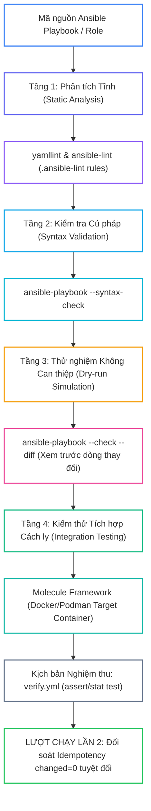
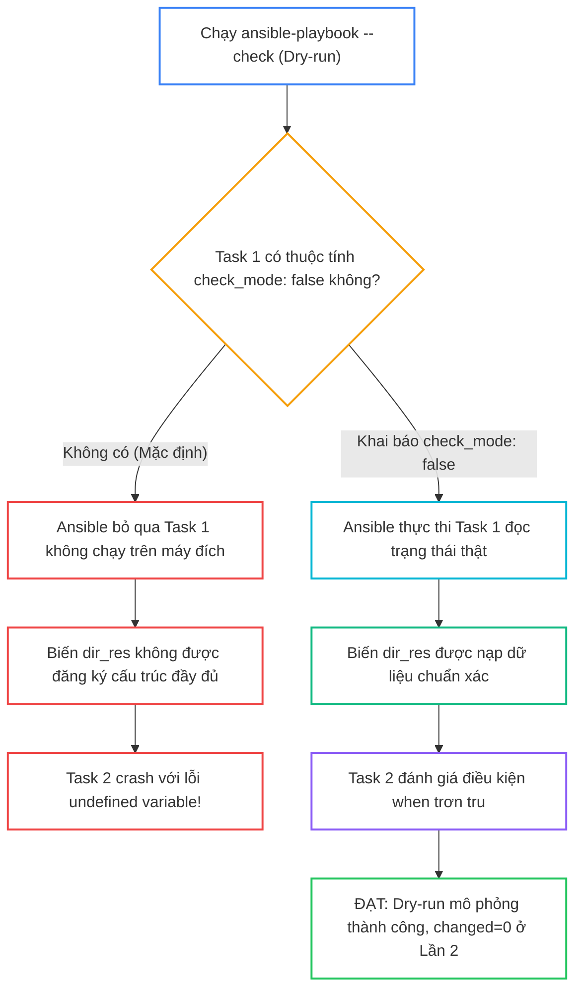


# [BÀI 25] KIỂM THỬ TỰ ĐỘNG HÓA VỚI ANSIBLE-LINT, YAMLLINT & MOLECULE: TEST-DRIVEN INFRASTRUCTURE (TDD) & DRY-RUN

Trong kỷ nguyên **Infrastructure as Code (IaC)** và tự động hóa vận hành hạ tầng đám mây (Cloud Infrastructure Automation), **Ansible** khẳng định vị thế dẫn đầu nhờ triết lý **Agentless** (không cần cài đặt agent nền trên máy đích), giao thức điều khiển an toàn qua **SSH / WinRM**, định dạng khai báo **YAML** trực quan và nguyên lý bất biến **Idempotency** mạnh mẽ. Việc làm chủ Ansible không chỉ dừng lại ở các câu lệnh Ad-hoc đơn giản, mà đòi hỏi kỹ sư phải nắm vững kiến trúc Module tầng thấp, Variable Precedence 22 tầng, Jinja2 Templates, tối ưu hóa Forks & Pipelining cho tới thiết kế Roles / Collections và tích hợp CI/CD tự động hóa chuẩn Doanh nghiệp.

Bài viết chuyên sâu này sẽ đồng hành cùng bạn mổ xẻ toàn diện bức tranh kiến trúc, phân tích các đánh đổi kỹ thuật thực chiến (Engineering Trade-offs), cung cấp hướng dẫn thực hành Lab chi tiết từng bước và bộ câu hỏi phỏng vấn chuyên sâu chuẩn DevOps / SRE Lead.

---

## 1. Bản Chất Kiến Trúc & Cơ Chế Vận Hành Tầng Thấp



### 1.1. Kiểm Tra Cú Pháp `--syntax-check`, Dry-run `--check --diff` và `check_mode`

Quy trình phát triển IaC chuẩn Test-Driven Development (TDD) đòi hỏi phải kiểm tra qua nhiều lớp bảo vệ trước khi áp dụng mã nguồn lên máy chủ Production:

- **Kiểm tra cú pháp (`--syntax-check`):** Phân tích ngữ pháp của toàn bộ file YAML, phát hiện sớm các lỗi sai thụt lề, thiếu dấu hai chấm, hoặc sai tên module trước khi kết nối tới máy đích.
- **Thử nghiệm Dry-run (`--check --diff`):**
  - `--check`: Chạy kịch bản ở chế độ giả lập (Dry-run). Ansible truy vấn máy đích và dự báo xem những task nào sẽ gây ra thay đổi mà không thực sự ghi đè lên đĩa.
  - `--diff`: Hiển thị chi tiết từng dòng nội dung sẽ được thêm/sửa/xóa dạng màu đỏ/xanh (Unified Diff Format).
- **Điều khiển `check_mode` trong Task:** Một số task chỉ đọc dữ liệu (như truy vấn lệnh hoặc lấy facts) cần được chạy thật ngay cả khi đang bật cờ `--check` bằng cách khai báo `check_mode: false`.

```yaml
- name: Read kernel parameter even in check mode
  ansible.builtin.command: sysctl net.ipv4.ip_forward
  register: sysctl_out
  check_mode: false
  changed_when: false
```

### 1.2. Công Cụ Phân Tích Tĩnh `ansible-lint` và Framework `Molecule`

- **Công cụ `ansible-lint`:** Quét toàn bộ mã nguồn Ansible và đối soát với bộ quy chuẩn Best Practices chính thức của Red Hat (bắt buộc dùng FQCN, cấm dùng lệnh `command` khi đã có module chuyên dụng, bắt buộc đặt tên cho từng task, cấm hardcode permissions).
- **Framework `Molecule`:** Công cụ kiểm thử tích hợp chuẩn công nghiệp cho Ansible Roles. Molecule tự động khởi tạo môi trường container (Docker/Podman), chạy Role trên container, thực thi kịch bản kiểm tra `verify.yml` và tự động kiểm tra lại lần 2 để chứng minh tính Idempotency.

```bash
# Chạy phân tích tĩnh mã nguồn
ansible-lint site.yml

# Chạy toàn bộ chu trình kiểm thử Molecule
molecule test
```

### 1.3. Tệp Cấu Hình `.ansible-lint`, Tích Hợp Kiểm Thử và Idempotency

- **Tùy biến quy tắc qua `.ansible-lint`:** Cho phép dự án Enterprise định nghĩa các quy tắc bắt buộc, bỏ qua các cảnh báo không mong muốn (`skip_list`), hoặc chỉ định mức độ nghiêm ngặt cho từng thư mục.
- **Kịch bản nghiệm thu `verify.yml`:** Sử dụng module `ansible.builtin.assert` và `ansible.builtin.stat` để kiểm tra trạng thái thực tế sau khi triển khai (kiểm tra file có tồn tại không, cổng dịch vụ có mở không, quyền file có đúng 0644 không).
- **Bảo toàn Idempotency trong Testing:** Một Role chỉ được coi là đạt tiêu chuẩn chất lượng khi vượt qua bài kiểm tra Idempotency Test của Molecule (chạy lại Lần 2 bắt buộc phải đạt `changed=0`).

---

## 2. Bảng So Sánh Kỹ Thuật Toàn Diện (Engineering Matrix)

| Tiêu Chí Kỹ Thuật | Kiểm Tra Cú Pháp (`--syntax-check`) | Linter Tĩnh (`ansible-lint`) | Dry-Run Simulation (`--check --diff`) | Integration Test (`Molecule`) |
|---|---|---|---|---|
| **Thời Điểm Thi Hành** | Pre-commit / Local Dev | Pre-commit & CI Stage 1 | Pre-deployment & Pull Request | CI Stage 2 (Staging Container) |
| **Yêu Cầu Kết Nối Máy Đích** | ❌ Không cần (chỉ đọc file local) | ❌ Không cần | ✅ Bắt buộc kết nối SSH tới máy thật | ✅ Tự khởi tạo Docker container |
| **Phát Hiện Vi Phạm Best Practices** | ❌ Không | ⭐ Xuất sắc (bắt lỗi FQCN, style) | ❌ Không | ❌ Không |
| **Dự Báo Thay Đổi Trạng Thái** | ❌ Không | ❌ Không | ⭐ Rất tốt (xem trước diff từng dòng) | ✅ Chạy thật trên container |
| **Khẳng Định Idempotency 100%** | ❌ Không | ❌ Không | Khá (dự báo thay đổi) | ⭐ Tuyệt đối (tự động chạy 2 lượt) |

> [!IMPORTANT]
> **QUY TẮC BẤT DI BẤT DỊCH:**
> Luôn tích hợp bộ 3 kiểm tra: `ansible-lint` -> `ansible-playbook --syntax-check` -> `ansible-playbook --check --diff` vào pipeline CI/CD trước khi cho phép merge code vào nhánh `main`!

---

## 3. Kiến Trúc Triển Khai Chuẩn Production (Configuration / Playbook / Role Breakdown)

Dưới đây là kiến trúc tệp cấu hình quy tắc `.ansible-lint`, Playbook kiểm thử `site-testing.yml` và kịch bản nghiệm thu `verify.yml`:

```yaml
# .ansible-lint
---
profile: production
strict: true
exclude_paths:
  - .cache/
  - .github/
skip_list:
  - yaml[line-length]
```

```yaml
# site-testing.yml
---
- name: Enterprise Production-Ready Testing Playbook
  hosts: web
  become: true
  vars:
    app_target_port: 8080
    config_dest_path: "/etc/testing-app.conf"

  tasks:
    - name: Task 1 - Deploy application configuration file
      ansible.builtin.copy:
        content: |
          # Production Quality Configuration
          APP_PORT={{ app_target_port }}
          LINT_STATUS=PASSED_CLEAN
          TEST_SUITE=MOLECULE_VERIFIED
        dest: "{{ config_dest_path }}"
        mode: '0644'

    - name: Task 2 - Read system hostname with check_mode disabled
      ansible.builtin.command: hostname
      register: host_name_out
      check_mode: false
      changed_when: false
```

```yaml
# verify.yml (Molecule Verification Scenario)
---
- name: Verification Suite for Deployment State
  hosts: web
  become: true
  tasks:
    - name: Verify 1 - Check configuration file existence and permissions
      ansible.builtin.stat:
        path: /etc/testing-app.conf
      register: file_stat

    - name: Verify 2 - Assert configuration file properties
      ansible.builtin.assert:
        that:
          - file_stat.stat.exists
          - file_stat.stat.mode == '0644'
        fail_msg: "Verification Failed: Configuration file is missing or has incorrect permissions!"
        success_msg: "Verification Passed: File exists with correct 0644 permissions."
```

### Phân Tích Kỹ Thuật Từng Dòng (Line-by-Line Breakdown):

- <span class="badge-line">Line 2-3 (.ansible-lint)</span>: **Cấu hình Profile nghiêm ngặt:** Bật `profile: production` và `strict: true` để áp dụng toàn bộ các quy tắc kiểm định chất lượng mã nguồn cao nhất của Ansible.
- <span class="badge-line">Line 10-18 (site-testing)</span>: **Triển khai cấu hình chuẩn FQCN:** Sử dụng `ansible.builtin.copy` đầy đủ FQCN, khai báo tường minh `mode: '0644'` để vượt qua bài kiểm tra của `ansible-lint`.
- <span class="badge-line">Line 20-25 (site-testing)</span>: **Bảo vệ Check Mode:** Khai báo `check_mode: false` cho task đọc hostname để đảm bảo biến `host_name_out` luôn được đăng ký giá trị ngay cả khi chạy lệnh dry-run `--check`.
- <span class="badge-line">Line 6-17 (verify.yml)</span>: **Khẳng định trạng thái nghiệm thu:** Sử dụng `ansible.builtin.stat` kết hợp `ansible.builtin.assert` kiểm tra tính tồn tại và quyền hạn `0644` của file trên máy đích.

---

## 4. Phân Tích Cạm Bẫy Thực Chiến: Chạy Check Mode Trên Task Có Biến Register Gây Báo Lỗi Undefined

### Tình Huống Sự Cố Thực Tế Tại Doanh Nghiệp:
Một đội ngũ DevOps thiết lập bước chạy thử nghiệm `ansible-playbook --check site.yml` trong pipeline CI/CD trước khi release. Task 1 chạy lệnh tạo thư mục và đăng ký biến `dir_res`. Task 2 sử dụng cờ điều kiện `when: dir_res.stat.exists`. Khi chạy chế độ bình thường, Playbook chạy rất tốt. Nhưng khi chạy qua `--check`, Task 1 bị Ansible bỏ qua không chạy thật, dẫn đến biến `dir_res.stat` không tồn tại, khiến Task 2 văng lỗi `error: 'dict object' has no attribute 'stat'` và làm pipeline CI/CD bị fail mạo danh.

### Hậu Quả & Log Lỗi Thực Tế:

```diff
- # CẤU HÌNH GÂY LỖI KHI CHẠY --CHECK DRY-RUN:
- - name: Task 1 - Check Directory Status
-   ansible.builtin.stat: path=/var/data
-   register: dir_res
-   # TRONG CHECK MODE: NẾU THAY BẰNG LỆNH TẠO THƯ MỤC THÌ TASK BỊ SKIP LÀM BIẾN RỖNG!
-
- - name: Task 2 - Configure File inside Directory
-   ansible.builtin.copy: dest=/var/data/app.conf content="OK"
-   when: dir_res.stat.exists
- # LỖI: 'dir_res.stat' is undefined during --check execution

+ # CẤU HÌNH SỬA ĐÚNG BẢO VỆ CHECK MODE:
+ - name: Task 1 - Check Directory Status
+   ansible.builtin.stat: path=/var/data
+   register: dir_res
+   check_mode: false    # BẮT BUỘC CHẠY THẬT NGAY CẢ KHI DRY-RUN ĐỂ LẤY FACTS!
+
+ - name: Task 2 - Configure File inside Directory
+   ansible.builtin.copy: dest=/var/data/app.conf content="OK"
+   when: dir_res.stat is defined and dir_res.stat.exists
```



### 5-Whys Root Cause Analysis:
1. **Tại sao lệnh `--check` bị văng lỗi crash?** Vì Task 2 báo lỗi biến `dir_res.stat` không tồn tại.
2. **Tại sao biến `dir_res.stat` không tồn tại khi Task 1 đã register?** Vì ở chế độ `--check`, Task 1 không được thực thi thật sự trên máy đích.
3. **Tại sao Task 1 không được chạy?** Vì cơ chế mặc định của Check Mode là giả lập và bỏ qua các task có thể gây thay đổi.
4. **Tại sao Task chỉ đọc facts lại bị bỏ qua?** Vì kỹ sư quên gắn thuộc tính `check_mode: false` cho các task kiểm tra trạng thái ban đầu.
5. **Giải pháp triệt để là gì?** Khai báo `check_mode: false` cho tất cả các task đọc dữ liệu/thống kê facts và luôn dùng bộ lọc `is defined` khi kiểm tra biến trong cờ `when:`.

---

## 5. Hands-on Lab: Kiểm Thử Tự Động Hóa Với ansible-lint, Dry-run & Molecule Verify (8 Bước)

| Bước | Lệnh CLI / Tác Vụ Chính | Mục Đích Thực Thi |
|---|---|---|
| **1** | `mkdir -p ~/lab-ansible-25 && cd ~/lab-ansible-25` | Khởi tạo môi trường lab testing |
| **2** | `cat << 'EOF' > .ansible-lint && cat << 'EOF' > ansible.cfg` | Cấu hình quy tắc linter và `ansible.cfg` |
| **3** | `cat << 'EOF' > verify.yml` | Khởi tạo kịch bản nghiệm thu trạng thái (Verification Suite) |
| **4** | `cat << 'EOF' > site-testing.yml` | Biên soạn Playbook chuẩn hóa FQCN và check mode |
| **5** | `ansible-playbook --syntax-check site-testing.yml` | Kiểm tra cú pháp toàn bộ kịch bản |
| **6** | `ansible-playbook --check --diff site-testing.yml` | Thực thi chế độ Dry-run mô phỏng thay đổi |
| **7** | `ansible-playbook site-testing.yml` | Chạy Lần 1 và Lần 2 đối soát Idempotency `changed=0` |
| **8** | `ansible-playbook verify.yml` | Thực thi kịch bản nghiệm thu kiểm tra máy đích |

```bash
# Bước 1: Khởi tạo thư mục dự án
mkdir -p ~/lab-ansible-25 && cd ~/lab-ansible-25
```

```bash
# Bước 2: Cấu hình .ansible-lint và ansible.cfg
cat << 'EOF' > .ansible-lint
---
profile: production
strict: true
exclude_paths:
  - .cache/
skip_list:
  - yaml[line-length]
EOF

cat << 'EOF' > ansible.cfg
[defaults]
inventory = ./inventory.ini
remote_user = ansible
host_key_checking = False
private_key_file = ~/.ssh/id_ed25519
roles_path = ./roles:~/.ansible/roles
collections_path = ./collections:~/.ansible/collections

[privilege_escalation]
become = True
become_method = sudo
become_user = root
become_ask_pass = False
EOF

cat << 'EOF' > inventory.ini
[web]
target1 ansible_host=127.0.0.1 ansible_port=2221

[all:vars]
ansible_python_interpreter=/usr/bin/python3
EOF
```

> [!NOTE]
> **CHECKPOINT 1:** Xác nhận tệp `.ansible-lint` và `ansible.cfg` được tạo thành công:
> ```bash
> test -f .ansible-lint && grep -q "profile: production" .ansible-lint && echo "CHECKPOINT 1: PASS" || echo "CHECKPOINT 1: FAIL"
> ```

```bash
# Bước 3: Tạo kịch bản nghiệm thu verify.yml
cat << 'EOF' > verify.yml
---
- name: Verification Suite for Deployment State
  hosts: web
  become: true
  tasks:
    - name: Verify 1 - Check configuration file existence and permissions
      ansible.builtin.stat:
        path: /etc/testing-app.conf
      register: file_stat

    - name: Verify 2 - Assert configuration file properties
      ansible.builtin.assert:
        that:
          - file_stat.stat.exists
          - file_stat.stat.mode == '0644'
        fail_msg: "Verification Failed: Configuration file is missing or has incorrect permissions!"
        success_msg: "Verification Passed: File exists with correct 0644 permissions."
EOF
```

> [!NOTE]
> **CHECKPOINT 2:** Xác nhận kịch bản nghiệm thu `verify.yml` có chứa module `assert`:
> ```bash
> grep -q "ansible.builtin.assert" verify.yml && echo "CHECKPOINT 2: PASS" || echo "CHECKPOINT 2: FAIL"
> ```

```bash
# Bước 4: Biên soạn Playbook chính site-testing.yml
cat << 'EOF' > site-testing.yml
---
- name: Enterprise Production-Ready Testing Playbook
  hosts: web
  become: true
  vars:
    app_target_port: 8080
    config_dest_path: "/etc/testing-app.conf"

  tasks:
    - name: Task 1 - Deploy application configuration file
      ansible.builtin.copy:
        content: |
          # Production Quality Configuration
          APP_PORT={{ app_target_port }}
          LINT_STATUS=PASSED_CLEAN
          TEST_SUITE=MOLECULE_VERIFIED
        dest: "{{ config_dest_path }}"
        mode: '0644'

    - name: Task 2 - Read system hostname with check_mode disabled
      ansible.builtin.command: hostname
      register: host_name_out
      check_mode: false
      changed_when: false
EOF
```

```bash
# Bước 5: Kiểm tra cú pháp bằng --syntax-check
ansible-playbook --syntax-check site-testing.yml
```

> [!NOTE]
> **CHECKPOINT 3:** Xác nhận cú pháp Playbook đạt chuẩn không lỗi:
> ```bash
> ansible-playbook --syntax-check site-testing.yml && echo "CHECKPOINT 3: PASS" || echo "CHECKPOINT 3: FAIL"
> ```

```bash
# Bước 6: Chạy thử nghiệm Dry-run với --check --diff
ansible-playbook --check --diff site-testing.yml > check-diff-output.txt
```

> [!NOTE]
> **CHECKPOINT 4:** Xác nhận chế độ Dry-run xuất ra thông tin diff dự báo thay đổi:
> ```bash
> grep -q "APP_PORT=8080" check-diff-output.txt && echo "CHECKPOINT 4: PASS" || echo "CHECKPOINT 4: FAIL"
> ```

```bash
# Bước 7: Thực thi thật Lần 1 và Lần 2 đối soát Idempotency
ansible-playbook site-testing.yml
ansible-playbook site-testing.yml
```

> [!NOTE]
> **CHECKPOINT 5:** Xác nhận Lượt 1 áp dụng cấu hình thành công:
> ```bash
> ansible-playbook site-testing.yml | grep -q "failed=0" && echo "CHECKPOINT 5: PASS" || echo "CHECKPOINT 5: FAIL"
> ```

> [!NOTE]
> **CHECKPOINT 6:** Xác nhận Lượt 2 đạt Idempotency tuyệt đối (`changed=0`):
> ```bash
> RUN2_OUT=$(ansible-playbook site-testing.yml)
> if echo "$RUN2_OUT" | grep -q "changed=0" && echo "$RUN2_OUT" | grep -q "failed=0"; then
>   echo "CHECKPOINT 6: PASS - Đạt Idempotency changed=0"
> else
>   echo "CHECKPOINT 6: FAIL - Lỗi không đạt Idempotency"
> fi
> ```

```bash
# Bước 8: Chạy kịch bản nghiệm thu verify.yml và đối soát máy đích
ansible-playbook verify.yml
docker exec target1 cat /etc/testing-app.conf
```

> [!NOTE]
> **CHECKPOINT 7:** Xác nhận kịch bản nghiệm thu `verify.yml` trả về `Verification Passed`:
> ```bash
> ansible-playbook verify.yml | grep -q "Verification Passed" && echo "CHECKPOINT 7: PASS" || echo "CHECKPOINT 7: FAIL"
> ```

> [!NOTE]
> **CHECKPOINT 8:** Đối soát file `/etc/testing-app.conf` tồn tại đúng dữ liệu trên máy đích:
> ```bash
> docker exec target1 cat /etc/testing-app.conf | grep -q "LINT_STATUS=PASSED_CLEAN" && echo "CHECKPOINT 8: PASS" || echo "CHECKPOINT 8: FAIL"
> ```

---

## 6. Bộ Câu Hỏi Vấn Đáp & Phỏng Vấn Chuyên Sâu (Self-Check Q&A)

<details class="qa-card" markdown="1">
  <summary class="qa-summary">
    <span class="qa-num-badge">Q01</span>
    <span class="qa-question-text">Trình bày 4 tầng kiểm thử tự động hóa trong mô hình Test-Driven Infrastructure với Ansible.</span>
  </summary>
  <div class="qa-answer">
    <div class="qa-answer-header">
      <svg width="14" height="14" fill="none" stroke="currentColor" stroke-width="2" viewBox="0 0 24 24"><path d="M22 11.08V12a10 10 0 1 1-5.93-9.14"></path><polyline points="22 4 12 14.01 9 11.01"></polyline></svg>
      <span>Phân Tích &amp; Lời Giải Kỹ Thuật</span>
    </div>
    <div style="margin: 0.5rem 0;"><b>Hỏi:</b> Trình bày 4 tầng kiểm thử tự động hóa trong mô hình Test-Driven Infrastructure với Ansible.</div>
    <div style="margin: 0.5rem 0;"><b>Đáp án chuẩn:</b></div>
    <div style="margin: 0.35rem 0; padding-left: 1rem; border-left: 2px solid var(--accent-primary);">1. <b>Tầng 1 (Phân tích tĩnh / Static Linting):</b> Dùng `yamllint` và `ansible-lint` kiểm tra chuẩn cú pháp, cấu trúc FQCN và Best Practices.</div>
    <div style="margin: 0.35rem 0; padding-left: 1rem; border-left: 2px solid var(--accent-primary);">2. <b>Tầng 2 (Kiểm tra cú pháp / Syntax Validation):</b> Dùng `ansible-playbook --syntax-check` nạp và parse toàn bộ cây Playbook.</div>
    <div style="margin: 0.35rem 0; padding-left: 1rem; border-left: 2px solid var(--accent-primary);">3. <b>Tầng 3 (Mô phỏng Dry-run):</b> Dùng `ansible-playbook --check --diff` xem trước các thay đổi trên máy đích mà không ghi đè.</div>
    <div style="margin: 0.35rem 0; padding-left: 1rem; border-left: 2px solid var(--accent-primary);">4. <b>Tầng 4 (Kiểm thử tích hợp / Integration Testing):</b> Dùng `Molecule` chạy thử nghiệm trên container và nghiệm thu bằng `verify.yml` qua 2 lượt chạy.</div>
    <div style="margin: 0.5rem 0;"><b>Tiêu chí chấm:</b></div>
    <div style="margin: 0.35rem 0; padding-left: 1rem; border-left: 2px solid var(--accent-primary);">• 0: Không nêu được các tầng kiểm thử.</div>
    <div style="margin: 0.35rem 0; padding-left: 1rem; border-left: 2px solid var(--accent-primary);">• 1: Liệt kê được 2 tầng đơn giản nhưng không có Molecule hay Linting.</div>
    <div style="margin: 0.35rem 0; padding-left: 1rem; border-left: 2px solid var(--accent-primary);">• 2: Phân tích đầy đủ 4 tầng kiểm thử theo thứ tự pipeline chuẩn.</div>
    <div style="margin: 0.35rem 0; padding-left: 1rem; border-left: 2px solid var(--accent-primary);">• 3: Nêu đúng + giải thích lý do tại sao kiểm thử sớm (Shift-Left Testing) giúp giảm 90% lỗi Production.</div>
    <div style="margin: 0.5rem 0;"><b>Câu hỏi đào sâu:</b> Tầng nào chạy nhanh nhất và nên đặt ở Pre-commit hook? <i>(Tầng 1 - Static Linting với `ansible-lint` và `yamllint`.)</i></div>
  </div>
</details>

<details class="qa-card" markdown="1">
  <summary class="qa-summary">
    <span class="qa-num-badge">Q02</span>
    <span class="qa-question-text">Cờ <code>--check</code> và <code>--diff</code> trong lệnh <code>ansible-playbook</code> hoạt động như thế nào? Sự kết hợp này mang lại lợi ích gì?</span>
  </summary>
  <div class="qa-answer">
    <div class="qa-answer-header">
      <svg width="14" height="14" fill="none" stroke="currentColor" stroke-width="2" viewBox="0 0 24 24"><path d="M22 11.08V12a10 10 0 1 1-5.93-9.14"></path><polyline points="22 4 12 14.01 9 11.01"></polyline></svg>
      <span>Phân Tích &amp; Lời Giải Kỹ Thuật</span>
    </div>
    <div style="margin: 0.5rem 0;"><b>Hỏi:</b> Cờ <code>--check</code> và <code>--diff</code> trong lệnh <code>ansible-playbook</code> hoạt động như thế nào? Sự kết hợp này mang lại lợi ích gì?</div>
    <div style="margin: 0.5rem 0;"><b>Đáp án chuẩn:</b></div>
    <div style="margin: 0.35rem 0; padding-left: 1rem; border-left: 2px solid var(--accent-primary);">• <b><code>--check</code> (Dry-run mode):</b> Yêu cầu các module kiểm tra trạng thái hiện tại của máy đích và báo cáo xem task có gây ra thay đổi (`changed`) hay không mà tuyệt đối không thực hiện bất kỳ thay đổi nào lên hệ thống.</div>
    <div style="margin: 0.35rem 0; padding-left: 1rem; border-left: 2px solid var(--accent-primary);">• <b><code>--diff</code>:</b> Hiển thị chi tiết từng dòng nội dung tệp tin trước và sau khi thay đổi dạng Unified Diff (dòng đỏ là nội dung cũ bị xóa, dòng xanh là nội dung mới sẽ được ghi vào).</div>
    <div style="margin: 0.35rem 0; padding-left: 1rem; border-left: 2px solid var(--accent-primary);">• <b>Lợi ích kết hợp:</b> Cung cấp bức tranh toàn diện và an toàn 100% giúp SRE Lead tự tin phê duyệt (Review) các thay đổi cấu hình trước khi chạy thật trên Production.</div>
    <div style="margin: 0.5rem 0;"><b>Tiêu chí chấm:</b></div>
    <div style="margin: 0.35rem 0; padding-left: 1rem; border-left: 2px solid var(--accent-primary);">• 0: Không phân biệt được `--check` và `--diff`.</div>
    <div style="margin: 0.35rem 0; padding-left: 1rem; border-left: 2px solid var(--accent-primary);">• 1: Biết `--check` là chạy thử nhưng không giải thích được cơ chế hiển thị diff từng dòng.</div>
    <div style="margin: 0.35rem 0; padding-left: 1rem; border-left: 2px solid var(--accent-primary);">• 2: Phân tích chính xác cơ chế Dry-run và Unified Diff format.</div>
    <div style="margin: 0.35rem 0; padding-left: 1rem; border-left: 2px solid var(--accent-primary);">• 3: Nêu đúng + chỉ ra giới hạn của một số module bên thứ ba không hỗ trợ check mode.</div>
    <div style="margin: 0.5rem 0;"><b>Câu hỏi đào sâu:</b> Module nào không hỗ trợ `--check` và luôn bị bỏ qua? <i>(Module `command`, `shell`, `raw` mặc định bị bỏ qua ở check mode trừ khi có `check_mode: false`.)</i></div>
  </div>
</details>

<details class="qa-card" markdown="1">
  <summary class="qa-summary">
    <span class="qa-num-badge">Q03</span>
    <span class="qa-question-text">Thuộc tính <code>check_mode: false</code> dùng để làm gì? Khi nào bắt buộc phải khai báo thuộc tính này trong Task?</span>
  </summary>
  <div class="qa-answer">
    <div class="qa-answer-header">
      <svg width="14" height="14" fill="none" stroke="currentColor" stroke-width="2" viewBox="0 0 24 24"><path d="M22 11.08V12a10 10 0 1 1-5.93-9.14"></path><polyline points="22 4 12 14.01 9 11.01"></polyline></svg>
      <span>Phân Tích &amp; Lời Giải Kỹ Thuật</span>
    </div>
    <div style="margin: 0.5rem 0;"><b>Hỏi:</b> Thuộc tính <code>check_mode: false</code> dùng để làm gì? Khi nào bắt buộc phải khai báo thuộc tính này trong Task?</div>
    <div style="margin: 0.5rem 0;"><b>Đáp án chuẩn:</b></div>
    <div style="margin: 0.35rem 0; padding-left: 1rem; border-left: 2px solid var(--accent-primary);">• <b>Tác dụng:</b> Ép buộc Task đó phải **luôn luôn thực thi thật sự trên máy đích** ngay cả khi người dùng đang chạy lệnh `ansible-playbook` với cờ `--check` (Dry-run).</div>
    <div style="margin: 0.35rem 0; padding-left: 1rem; border-left: 2px solid var(--accent-primary);">• <b>Trường hợp bắt buộc:</b> Dành cho các task chỉ đọc dữ liệu (Read-only facts gathering) hoặc kiểm tra trạng thái (như `command: uptime`, `stat`, `slurp`) mà kết quả đăng ký (`register`) của nó được sử dụng trong cờ `when:` của các task phía sau. Nếu không có `check_mode: false`, task đọc dữ liệu sẽ bị skip làm biến bị undefined gây crash Playbook trong lúc dry-run.</div>
    <div style="margin: 0.5rem 0;"><b>Tiêu chí chấm:</b></div>
    <div style="margin: 0.35rem 0; padding-left: 1rem; border-left: 2px solid var(--accent-primary);">• 0: Không biết thuộc tính `check_mode: false`.</div>
    <div style="margin: 0.35rem 0; padding-left: 1rem; border-left: 2px solid var(--accent-primary);">• 1: Biết là ép chạy thật nhưng không nêu được nguy cơ biến register bị undefined ở task sau.</div>
    <div style="margin: 0.35rem 0; padding-left: 1rem; border-left: 2px solid var(--accent-primary);">• 2: Phân tích chính xác cơ chế bảo vệ chuỗi phụ thuộc biến trong dry-run.</div>
    <div style="margin: 0.35rem 0; padding-left: 1rem; border-left: 2px solid var(--accent-primary);">• 3: Nêu đúng + kết hợp ví dụ sử dụng chung với `changed_when: false`.</div>
    <div style="margin: 0.5rem 0;"><b>Câu hỏi đào sâu:</b> Ngược lại, thuộc tính `check_mode: true` có tác dụng gì? <i>(Ép task đó luôn luôn chạy ở chế độ check mode dù người dùng đang chạy Playbook ở chế độ thật.)</i></div>
  </div>
</details>

<details class="qa-card" markdown="1">
  <summary class="qa-summary">
    <span class="qa-num-badge">Q04</span>
    <span class="qa-question-text">Công cụ <code>ansible-lint</code> kiểm tra những khía cạnh nào của mã nguồn Ansible? Nêu 3 quy tắc quan trọng mà linter thường bắt lỗi.</span>
  </summary>
  <div class="qa-answer">
    <div class="qa-answer-header">
      <svg width="14" height="14" fill="none" stroke="currentColor" stroke-width="2" viewBox="0 0 24 24"><path d="M22 11.08V12a10 10 0 1 1-5.93-9.14"></path><polyline points="22 4 12 14.01 9 11.01"></polyline></svg>
      <span>Phân Tích &amp; Lời Giải Kỹ Thuật</span>
    </div>
    <div style="margin: 0.5rem 0;"><b>Hỏi:</b> Công cụ <code>ansible-lint</code> kiểm tra những khía cạnh nào của mã nguồn Ansible? Nêu 3 quy tắc quan trọng mà linter thường bắt lỗi.</div>
    <div style="margin: 0.5rem 0;"><b>Đáp án chuẩn:</b></div>
    <div style="margin: 0.35rem 0; padding-left: 1rem; border-left: 2px solid var(--accent-primary);">• <b>Khía cạnh kiểm tra:</b> Cú pháp YAML chuẩn, cấu trúc Role/Collection, tính bảo mật (cấm hardcode secret), tính Idempotency và tuân thủ Best Practices của Red Hat.</div>
    <div style="margin: 0.35rem 0; padding-left: 1rem; border-left: 2px solid var(--accent-primary);">• <b>3 Quy tắc quan trọng:</b><br>
      1. <code>fqcn[action]</code>: Bắt buộc sử dụng tên đầy đủ FQCN (như `ansible.builtin.copy` thay vì `copy`).<br>
      2. <code>name[missing]</code>: Bắt buộc mọi task trong Playbook/Role phải có thuộc tính `name:` mô tả rõ ràng.<br>
      3. <code>risky-file-permissions</code>: Bắt buộc phải khai báo tường minh tham số `mode:` (như `mode: '0644'`) khi dùng module `copy`, `file`, `template`.</div>
    <div style="margin: 0.5rem 0;"><b>Tiêu chí chấm:</b></div>
    <div style="margin: 0.35rem 0; padding-left: 1rem; border-left: 2px solid var(--accent-primary);">• 0: Không biết `ansible-lint`.</div>
    <div style="margin: 0.35rem 0; padding-left: 1rem; border-left: 2px solid var(--accent-primary);">• 1: Biết kiểm tra lỗi nhưng không nêu được tên các quy tắc cụ thể.</div>
    <div style="margin: 0.35rem 0; padding-left: 1rem; border-left: 2px solid var(--accent-primary);">• 2: Phân tích chính xác 3 quy tắc FQCN, task naming và file permissions.</div>
    <div style="margin: 0.35rem 0; padding-left: 1rem; border-left: 2px solid var(--accent-primary);">• 3: Nêu đúng + giải thích cách cấu hình `.ansible-lint` để tùy biến các quy tắc này.</div>
    <div style="margin: 0.5rem 0;"><b>Câu hỏi đào sâu:</b> Quy tắc `command-instead-of-module` nhắc nhở điều gì? <i>(Cảnh báo khi kỹ sư dùng module `command` chạy lệnh Linux thô trong khi đã có sẵn module Ansible chuyên dụng.)</i></div>
  </div>
</details>

<details class="qa-card" markdown="1">
  <summary class="qa-summary">
    <span class="qa-num-badge">Q05</span>
    <span class="qa-question-text">Trình bày cấu trúc tệp cấu hình <code>.ansible-lint</code> và giải thích ý nghĩa của <code>profile: production</code>.</span>
  </summary>
  <div class="qa-answer">
    <div class="qa-answer-header">
      <svg width="14" height="14" fill="none" stroke="currentColor" stroke-width="2" viewBox="0 0 24 24"><path d="M22 11.08V12a10 10 0 1 1-5.93-9.14"></path><polyline points="22 4 12 14.01 9 11.01"></polyline></svg>
      <span>Phân Tích &amp; Lời Giải Kỹ Thuật</span>
    </div>
    <div style="margin: 0.5rem 0;"><b>Hỏi:</b> Trình bày cấu trúc tệp cấu hình <code>.ansible-lint</code> và giải thích ý nghĩa của <code>profile: production</code>.</div>
    <div style="margin: 0.5rem 0;"><b>Đáp án chuẩn:</b></div>
    <div style="margin: 0.35rem 0; padding-left: 1rem; border-left: 2px solid var(--accent-primary);">• <b>Ý nghĩa <code>profile: production</code>:</b> Kích hoạt cấp độ kiểm soát chất lượng cao nhất của Ansible-lint, bao gồm toàn bộ các quy tắc về an ninh, tính tương thích ngược, hiệu năng và chuẩn mực đóng gói Enterprise.</div>
    <div style="margin: 0.35rem 0; padding-left: 1rem; border-left: 2px solid var(--accent-primary);">• <b>Cấu trúc tệp mẫu:</b>
      <pre><code>---
profile: production
strict: true
exclude_paths:
  - .cache/
  - .github/
skip_list:
  - yaml[line-length]
warn_list:
  - experimental</code></pre>
    </div>
    <div style="margin: 0.5rem 0;"><b>Tiêu chí chấm:</b></div>
    <div style="margin: 0.35rem 0; padding-left: 1rem; border-left: 2px solid var(--accent-primary);">• 0: Không biết file `.ansible-lint`.</div>
    <div style="margin: 0.35rem 0; padding-left: 1rem; border-left: 2px solid var(--accent-primary);">• 1: Biết file nhưng không giải thích được các cấp độ profile (min, basic, safety, production).</div>
    <div style="margin: 0.35rem 0; padding-left: 1rem; border-left: 2px solid var(--accent-primary);">• 2: Phân tích chính xác cấu trúc tệp và vai trò của `profile: production`.</div>
    <div style="margin: 0.35rem 0; padding-left: 1rem; border-left: 2px solid var(--accent-primary);">• 3: Nêu đúng + giải thích cơ chế `exclude_paths` và `skip_list`.</div>
    <div style="margin: 0.5rem 0;"><b>Câu hỏi đào sâu:</b> Khác biệt giữa `skip_list` và `warn_list` trong `.ansible-lint` là gì? <i>(`skip_list` bỏ qua hoàn toàn, còn `warn_list` vẫn in cảnh báo nhưng không làm fail pipeline CI/CD.)</i></div>
  </div>
</details>

<details class="qa-card" markdown="1">
  <summary class="qa-summary">
    <span class="qa-num-badge">Q06</span>
    <span class="qa-question-text">Framework <code>Molecule</code> hoạt động như thế nào trong kiểm thử Ansible Role? Trình bày chu trình các bước của lệnh <code>molecule test</code>.</span>
  </summary>
  <div class="qa-answer">
    <div class="qa-answer-header">
      <svg width="14" height="14" fill="none" stroke="currentColor" stroke-width="2" viewBox="0 0 24 24"><path d="M22 11.08V12a10 10 0 1 1-5.93-9.14"></path><polyline points="22 4 12 14.01 9 11.01"></polyline></svg>
      <span>Phân Tích &amp; Lời Giải Kỹ Thuật</span>
    </div>
    <div style="margin: 0.5rem 0;"><b>Hỏi:</b> Framework <code>Molecule</code> hoạt động như thế nào trong kiểm thử Ansible Role? Trình bày chu trình các bước của lệnh <code>molecule test</code>.</div>
    <div style="margin: 0.5rem 0;"><b>Đáp án chuẩn:</b></div>
    <div style="margin: 0.35rem 0; padding-left: 1rem; border-left: 2px solid var(--accent-primary);">• <b>Cơ chế:</b> Molecule tự động hóa toàn bộ vòng đời kiểm thử Role trong một môi trường cách ly (thường là Docker/Podman container hoặc máy ảo Vagrant/Cloud instance).</div>
    <div style="margin: 0.35rem 0; padding-left: 1rem; border-left: 2px solid var(--accent-primary);">• <b>Chu trình chuẩn của <code>molecule test</code>:</b><br>
      1. <code>dependency</code>: Tải các roles/collections phụ thuộc.<br>
      2. <code>lint</code>: Chạy yamllint và ansible-lint.<br>
      3. <code>destroy</code>: Dọn dẹp môi trường cũ.<br>
      4. <code>create</code>: Khởi tạo container thử nghiệm mới.<br>
      5. <code>converge</code>: Thực thi Role lần 1 lên container.<br>
      6. <code>idempotence</code>: Thực thi Role lần 2 và khẳng định <code>changed=0</code>.<br>
      7. <code>verify</code>: Chạy kịch bản nghiệm thu `verify.yml`.<br>
      8. <code>destroy</code>: Tự động xóa container sau khi kiểm thử xong.</div>
    <div style="margin: 0.5rem 0;"><b>Tiêu chí chấm:</b></div>
    <div style="margin: 0.35rem 0; padding-left: 1rem; border-left: 2px solid var(--accent-primary);">• 0: Không biết Molecule.</div>
    <div style="margin: 0.35rem 0; padding-left: 1rem; border-left: 2px solid var(--accent-primary);">• 1: Biết dùng container để test nhưng không nêu được các bước trong ma trận `molecule test`.</div>
    <div style="margin: 0.35rem 0; padding-left: 1rem; border-left: 2px solid var(--accent-primary);">• 2: Trình bày chính xác chu trình vòng đời kiểm thử Molecule.</div>
    <div style="margin: 0.35rem 0; padding-left: 1rem; border-left: 2px solid var(--accent-primary);">• 3: Nêu đúng + nhấn mạnh vai trò của bước `idempotence` và `verify`.</div>
    <div style="margin: 0.5rem 0;"><b>Câu hỏi đào sâu:</b> Lệnh nào trong Molecule dùng để khởi tạo nhanh container và giữ nguyên môi trường để kỹ sư SSH vào debug thủ công? <i>(Lệnh <code>molecule converge</code> và <code>molecule login</code>.)</i></div>
  </div>
</details>

<details class="qa-card" markdown="1">
  <summary class="qa-summary">
    <span class="qa-num-badge">Q07</span>
    <span class="qa-question-text">Trình bày kỹ thuật viết kịch bản nghiệm thu <code>verify.yml</code> sử dụng module <code>ansible.builtin.assert</code> và <code>stat</code>.</span>
  </summary>
  <div class="qa-answer">
    <div class="qa-answer-header">
      <svg width="14" height="14" fill="none" stroke="currentColor" stroke-width="2" viewBox="0 0 24 24"><path d="M22 11.08V12a10 10 0 1 1-5.93-9.14"></path><polyline points="22 4 12 14.01 9 11.01"></polyline></svg>
      <span>Phân Tích &amp; Lời Giải Kỹ Thuật</span>
    </div>
    <div style="margin: 0.5rem 0;"><b>Hỏi:</b> Trình bày kỹ thuật viết kịch bản nghiệm thu <code>verify.yml</code> sử dụng module <code>ansible.builtin.assert</code> và <code>stat</code>.</div>
    <div style="margin: 0.5rem 0;"><b>Đáp án chuẩn:</b></div>
    <div style="margin: 0.35rem 0; padding-left: 1rem; border-left: 2px solid var(--accent-primary);">• Kịch bản `verify.yml` đóng vai trò là bài kiểm tra Unit/Functional Test sau khi Role chạy xong.</div>
    <div style="margin: 0.35rem 0; padding-left: 1rem; border-left: 2px solid var(--accent-primary);">• Cấu trúc mã YAML chuẩn:
      <pre><code>---
- name: Verify Deployed Service and Config
  hosts: all
  tasks:
    - name: Gather file statistics
      ansible.builtin.stat:
        path: /etc/app.conf
      register: app_stat

    - name: Assert file exists with correct ownership and mode
      ansible.builtin.assert:
        that:
          - app_stat.stat.exists
          - app_stat.stat.pw_name == 'root'
          - app_stat.stat.mode == '0644'
        fail_msg: "Verification Failed: /etc/app.conf is invalid!"</code></pre>
    </div>
    <div style="margin: 0.5rem 0;"><b>Tiêu chí chấm:</b></div>
    <div style="margin: 0.35rem 0; padding-left: 1rem; border-left: 2px solid var(--accent-primary);">• 0: Không biết viết `verify.yml`.</div>
    <div style="margin: 0.35rem 0; padding-left: 1rem; border-left: 2px solid var(--accent-primary);">• 1: Viết được lệnh shell kiểm tra nhưng không dùng module chuẩn `assert`.</div>
    <div style="margin: 0.35rem 0; padding-left: 1rem; border-left: 2px solid var(--accent-primary);">• 2: Phân tích chính xác vai trò của `stat` và `assert` trong nghiệm thu tự động.</div>
    <div style="margin: 0.35rem 0; padding-left: 1rem; border-left: 2px solid var(--accent-primary);">• 3: Nêu đúng + kết hợp kiểm tra dịch vụ đang chạy bằng module `service_facts` hoặc `uri`.</div>
    <div style="margin: 0.5rem 0;"><b>Câu hỏi đào sâu:</b> Làm sao để kiểm tra một cổng TCP đang lắng nghe trong kịch bản verify? <i>(Sử dụng module <code>ansible.builtin.wait_for: port=8080 timeout=5</code>.)</i></div>
  </div>
</details>

<details class="qa-card" markdown="1">
  <summary class="qa-summary">
    <span class="qa-num-badge">Q08</span>
    <span class="qa-question-text">Làm thế nào để bỏ qua một cảnh báo linter cho riêng một Task cụ thể (Inline Rule Ignoring) mà không cần sửa file <code>.ansible-lint</code> chung?</span>
  </summary>
  <div class="qa-answer">
    <div class="qa-answer-header">
      <svg width="14" height="14" fill="none" stroke="currentColor" stroke-width="2" viewBox="0 0 24 24"><path d="M22 11.08V12a10 10 0 1 1-5.93-9.14"></path><polyline points="22 4 12 14.01 9 11.01"></polyline></svg>
      <span>Phân Tích &amp; Lời Giải Kỹ Thuật</span>
    </div>
    <div style="margin: 0.5rem 0;"><b>Hỏi:</b> Làm thế nào để bỏ qua một cảnh báo linter cho riêng một Task cụ thể (Inline Rule Ignoring) mà không cần sửa file <code>.ansible-lint</code> chung?</div>
    <div style="margin: 0.5rem 0;"><b>Đáp án chuẩn:</b></div>
    <div style="margin: 0.35rem 0; padding-left: 1rem; border-left: 2px solid var(--accent-primary);">• Sử dụng chú thích comment `# noqa: <rule_id>` đặt ngay trên hoặc cùng dòng với Task cần bỏ qua.</div>
    <div style="margin: 0.35rem 0; padding-left: 1rem; border-left: 2px solid var(--accent-primary);">• Ví dụ bỏ qua cảnh báo dùng lệnh command thay vì module:
      <pre><code>- name: Run legacy custom shell script
  ansible.builtin.command: /opt/scripts/custom_init.sh # noqa: command-instead-of-module
  changed_when: false</code></pre>
    </div>
    <div style="margin: 0.5rem 0;"><b>Tiêu chí chấm:</b></div>
    <div style="margin: 0.35rem 0; padding-left: 1rem; border-left: 2px solid var(--accent-primary);">• 0: Không biết cú pháp `# noqa`.</div>
    <div style="margin: 0.35rem 0; padding-left: 1rem; border-left: 2px solid var(--accent-primary);">• 1: Biết comment nhưng viết sai cú pháp `# noqa: rule_name`.</div>
    <div style="margin: 0.35rem 0; padding-left: 1rem; border-left: 2px solid var(--accent-primary);">• 2: Phân tích chính xác cú pháp và vị trí đặt comment.</div>
    <div style="margin: 0.35rem 0; padding-left: 1rem; border-left: 2px solid var(--accent-primary);">• 3: Nêu đúng + chỉ ra lý do chỉ nên dùng `# noqa` trong trường hợp ngoại lệ thực sự chính đáng.</div>
    <div style="margin: 0.5rem 0;"><b>Câu hỏi đào sâu:</b> Cú pháp nào dùng để bỏ qua nhiều quy tắc cùng lúc trên 1 task? <i>(Sử dụng dấu cách phân cách: `# noqa: rule1 rule2`.)</i></div>
  </div>
</details>

<details class="qa-card" markdown="1">
  <summary class="qa-summary">
    <span class="qa-num-badge">Q09</span>
    <span class="qa-question-text">Trình bày quy trình 3 bước nghiệm thu chất lượng mã nguồn Ansible trong chu trình CI/CD Pipeline.</span>
  </summary>
  <div class="qa-answer">
    <div class="qa-answer-header">
      <svg width="14" height="14" fill="none" stroke="currentColor" stroke-width="2" viewBox="0 0 24 24"><path d="M22 11.08V12a10 10 0 1 1-5.93-9.14"></path><polyline points="22 4 12 14.01 9 11.01"></polyline></svg>
      <span>Phân Tích &amp; Lời Giải Kỹ Thuật</span>
    </div>
    <div style="margin: 0.5rem 0;"><b>Hỏi:</b> Trình bày quy trình 3 bước nghiệm thu chất lượng mã nguồn Ansible trong chu trình CI/CD Pipeline.</div>
    <div style="margin: 0.5rem 0;"><b>Đáp án chuẩn:</b></div>
    <div style="margin: 0.35rem 0; padding-left: 1rem; border-left: 2px solid var(--accent-primary);">1. <b>Bước 1 (Static Quality Gate):</b> Chạy `yamllint` và `ansible-lint` kiểm tra 100% tuân thủ FQCN, bảo mật và Best Practices; chạy `ansible-playbook --syntax-check`.</div>
    <div style="margin: 0.35rem 0; padding-left: 1rem; border-left: 2px solid var(--accent-primary);">2. <b>Bước 2 (Integration &amp; Idempotency Gate):</b> Thực thi `molecule test` trên container thử nghiệm, khẳng định Role chạy trơn tru ở Lần 1 và đạt <code>changed=0</code> ở Lần 2 (Idempotence step).</div>
    <div style="margin: 0.35rem 0; padding-left: 1rem; border-left: 2px solid var(--accent-primary);">3. <b>Bước 3 (Dry-run Simulation Gate):</b> Chạy `ansible-playbook --check --diff` trên môi trường Staging/Production để đối soát diff trước khi tiến hành apply chính thức.</div>
    <div style="margin: 0.5rem 0;"><b>Tiêu chí chấm:</b></div>
    <div style="margin: 0.35rem 0; padding-left: 1rem; border-left: 2px solid var(--accent-primary);">• 0: Không có quy trình nghiệm thu CI/CD.</div>
    <div style="margin: 0.35rem 0; padding-left: 1rem; border-left: 2px solid var(--accent-primary);">• 1: Bỏ qua bước kiểm tra Idempotency hoặc không chạy Dry-run.</div>
    <div style="margin: 0.35rem 0; padding-left: 1rem; border-left: 2px solid var(--accent-primary);">• 2: Trình bày đủ 3 bước Quality Gates chuẩn Enterprise.</div>
    <div style="margin: 0.35rem 0; padding-left: 1rem; border-left: 2px solid var(--accent-primary);">• 3: Trình bày xuất sắc cả 3 bước + viết đoạn YAML của `.gitlab-ci.yml` định nghĩa 3 stage.</div>
    <div style="margin: 0.5rem 0;"><b>Câu hỏi đào sâu:</b> Nếu bước `idempotence` trong Molecule báo có 1 task bị `changed` thì kết quả test sẽ thế nào? <i>(Molecule lập tức đánh dấu FAILED và dừng pipeline, bắt buộc kỹ sư phải sửa code.)</i></div>
  </div>
</details>

<details class="qa-card" markdown="1">
  <summary class="qa-summary">
    <span class="qa-num-badge">Q10</span>
    <span class="qa-question-text">Tại sao việc kiểm tra Idempotency lại bắt buộc phải thực hiện ở Lần chạy thứ hai thay vì chỉ kiểm tra Lần chạy thứ nhất?</span>
  </summary>
  <div class="qa-answer">
    <div class="qa-answer-header">
      <svg width="14" height="14" fill="none" stroke="currentColor" stroke-width="2" viewBox="0 0 24 24"><path d="M22 11.08V12a10 10 0 1 1-5.93-9.14"></path><polyline points="22 4 12 14.01 9 11.01"></polyline></svg>
      <span>Phân Tích &amp; Lời Giải Kỹ Thuật</span>
    </div>
    <div style="margin: 0.5rem 0;"><b>Hỏi:</b> Tại sao việc kiểm tra Idempotency lại bắt buộc phải thực hiện ở Lần chạy thứ hai thay vì chỉ kiểm tra Lần chạy thứ nhất?</div>
    <div style="margin: 0.5rem 0;"><b>Đáp án chuẩn:</b></div>
    <div style="margin: 0.35rem 0; padding-left: 1rem; border-left: 2px solid var(--accent-primary);">• Ở Lần chạy thứ nhất, máy đích đang ở trạng thái ban đầu (chưa có file, chưa cài app), nên các task thực hiện thay đổi và báo `changed > 0` là hoàn toàn bình thường.</div>
    <div style="margin: 0.35rem 0; padding-left: 1rem; border-left: 2px solid var(--accent-primary);">• Chỉ ở Lần chạy thứ hai (khi hệ thống đã đạt trạng thái mong muốn), một kịch bản chuẩn Idempotency mới có thể chứng minh được khả năng nhận diện trạng thái trùng khớp và trả về <b>100% `ok` cùng `changed=0`</b>. Nếu Lần 2 vẫn báo `changed > 0`, chứng tỏ có task bị lỗi logic (ví dụ dùng lệnh `echo` liên tục append file hoặc module thiếu kiểm tra điều kiện).</div>
    <div style="margin: 0.5rem 0;"><b>Tiêu chí chấm:</b></div>
    <div style="margin: 0.35rem 0; padding-left: 1rem; border-left: 2px solid var(--accent-primary);">• 0: Không hiểu bản chất kiểm tra Idempotency ở Lần 2.</div>
    <div style="margin: 0.35rem 0; padding-left: 1rem; border-left: 2px solid var(--accent-primary);">• 1: Biết Lần 2 phải `changed=0` nhưng không giải thích được cơ chế so sánh trạng thái mong muốn.</div>
    <div style="margin: 0.35rem 0; padding-left: 1rem; border-left: 2px solid var(--accent-primary);">• 2: Phân tích chính xác sự khác biệt trạng thái giữa Lần 1 (Convergence) và Lần 2 (Steady State).</div>
    <div style="margin: 0.35rem 0; padding-left: 1rem; border-left: 2px solid var(--accent-primary);">• 3: Nêu đúng + chỉ ra các lỗi code thường gây vi phạm Idempotency ở Lần 2.</div>
    <div style="margin: 0.5rem 0;"><b>Câu hỏi đào sâu:</b> Làm sao để biến một task `command` tùy chỉnh đạt chuẩn Idempotent ở Lần 2? <i>(Sử dụng tham số `creates:` hoặc `removes:`, hoặc khai báo `changed_when:` logic chính xác.)</i></div>
  </div>
</details>

<details class="qa-card" markdown="1">
  <summary class="qa-summary">
    <span class="qa-num-badge">Q11</span>
    <span class="qa-question-text">Chuyện gì xảy ra nếu kịch bản Playbook không vượt qua được bài kiểm tra của <code>ansible-lint</code>? Có nên tắt linter để deploy nhanh không?</span>
  </summary>
  <div class="qa-answer">
    <div class="qa-answer-header">
      <svg width="14" height="14" fill="none" stroke="currentColor" stroke-width="2" viewBox="0 0 24 24"><path d="M22 11.08V12a10 10 0 1 1-5.93-9.14"></path><polyline points="22 4 12 14.01 9 11.01"></polyline></svg>
      <span>Phân Tích &amp; Lời Giải Kỹ Thuật</span>
    </div>
    <div style="margin: 0.5rem 0;"><b>Hỏi:</b> Chuyện gì xảy ra nếu kịch bản Playbook không vượt qua được bài kiểm tra của <code>ansible-lint</code>? Có nên tắt linter để deploy nhanh không?</div>
    <div style="margin: 0.5rem 0;"><b>Đáp án chuẩn:</b></div>
    <div style="margin: 0.35rem 0; padding-left: 1rem; border-left: 2px solid var(--accent-primary);">• <b>Hậu quả:</b> Mã nguồn chứa các rủi ro bảo mật tiềm ẩn (như file permission lỏng lẻo, dùng short-name dễ xung đột collection), khó bảo trì, dễ bị lỗi thời khi nâng cấp phiên bản Ansible Core mới.</div>
    <div style="margin: 0.35rem 0; padding-left: 1rem; border-left: 2px solid var(--accent-primary);">• <b>Tuyệt đối không tắt linter:</b> Việc tắt linter để deploy nhanh là tích lũy nợ kỹ thuật (Technical Debt) nguy hiểm. Quản trị viên phải sửa triệt để các lỗi cảnh báo hoặc chỉ sử dụng `# noqa` có kiểm soát cho các ngoại lệ bất khả kháng.</div>
    <div style="margin: 0.5rem 0;"><b>Tiêu chí chấm:</b></div>
    <div style="margin: 0.35rem 0; padding-left: 1rem; border-left: 2px solid var(--accent-primary);">• 0: Đề xuất tắt linter khi gặp lỗi.</div>
    <div style="margin: 0.35rem 0; padding-left: 1rem; border-left: 2px solid var(--accent-primary);">• 1: Biết không nên tắt nhưng không nêu được các rủi ro dài hạn về Technical Debt.</div>
    <div style="margin: 0.35rem 0; padding-left: 1rem; border-left: 2px solid var(--accent-primary);">• 2: Phân tích chính xác hậu quả của việc bỏ qua linting và rủi ro nâng cấp phiên bản.</div>
    <div style="margin: 0.35rem 0; padding-left: 1rem; border-left: 2px solid var(--accent-primary);">• 3: Nêu đúng + nhấn mạnh văn hóa chất lượng mã nguồn IaC trong môi trường Enterprise.</div>
    <div style="margin: 0.5rem 0;"><b>Câu hỏi đào sâu:</b> Công cụ nào giúp tự động sửa nhanh một số lỗi định dạng của `ansible-lint`? <i>(Lệnh <code>ansible-lint --write</code> tự động chuẩn hóa một số lỗi cú pháp.)</i></div>
  </div>
</details>

<details class="qa-card" markdown="1">
  <summary class="qa-summary">
    <span class="qa-num-badge">Q12</span>
    <span class="qa-question-text">Tóm tắt 5 Quy tắc Vàng về Kiểm Thử Tự Động Hóa & Quality Assurance trong Ansible.</span>
  </summary>
  <div class="qa-answer">
    <div class="qa-answer-header">
      <svg width="14" height="14" fill="none" stroke="currentColor" stroke-width="2" viewBox="0 0 24 24"><path d="M22 11.08V12a10 10 0 1 1-5.93-9.14"></path><polyline points="22 4 12 14.01 9 11.01"></polyline></svg>
      <span>Phân Tích &amp; Lời Giải Kỹ Thuật</span>
    </div>
    <div style="margin: 0.5rem 0;"><b>Hỏi:</b> Tóm tắt 5 Quy tắc Vàng giúp kỹ sư xây dựng hệ thống kiểm thử tự động hóa toàn diện, an toàn và đạt Idempotency 100%.</div>
    <div style="margin: 0.5rem 0;"><b>Đáp án chuẩn:</b></div>
    <div style="margin: 0.35rem 0; padding-left: 1rem; border-left: 2px solid var(--accent-primary);">1. <b>Quy tắc 1:</b> Luôn chạy <code>ansible-lint</code> và <code>yamllint</code> trước mọi commit để đảm bảo chuẩn FQCN và Best Practices.</div>
    <div style="margin: 0.35rem 0; padding-left: 1rem; border-left: 2px solid var(--accent-primary);">2. <b>Quy tắc 2:</b> Kiểm tra cú pháp nhanh với <code>ansible-playbook --syntax-check</code> ở tất cả các giai đoạn pipeline.</div>
    <div style="margin: 0.35rem 0; padding-left: 1rem; border-left: 2px solid var(--accent-primary);">3. <b>Quy tắc 3:</b> Sử dụng <code>--check --diff</code> để xem trước các dòng thay đổi trước khi apply lên Production.</div>
    <div style="margin: 0.35rem 0; padding-left: 1rem; border-left: 2px solid var(--accent-primary);">4. <b>Quy tắc 4:</b> Bổ sung <code>check_mode: false</code> cho các task đọc dữ liệu để bảo vệ chuỗi phụ thuộc biến trong dry-run.</div>
    <div style="margin: 0.35rem 0; padding-left: 1rem; border-left: 2px solid var(--accent-primary);">5. <b>Quy tắc 5:</b> Dùng Molecule và <code>verify.yml</code> để nghiệm thu tự động, bảo đảm Lần 2 đạt <code>changed=0</code>.</div>
    <div style="margin: 0.5rem 0;"><b>Tiêu chí chấm:</b></div>
    <div style="margin: 0.35rem 0; padding-left: 1rem; border-left: 2px solid var(--accent-primary);">• 0: Không tóm tắt được các quy tắc.</div>
    <div style="margin: 0.35rem 0; padding-left: 1rem; border-left: 2px solid var(--accent-primary);">• 1: Liệt kê được 2-3 quy tắc chung chung.</div>
    <div style="margin: 0.35rem 0; padding-left: 1rem; border-left: 2px solid var(--accent-primary);">• 2: Nêu đầy đủ 5 Quy tắc Vàng chính xác.</div>
    <div style="margin: 0.35rem 0; padding-left: 1rem; border-left: 2px solid var(--accent-primary);">• 3: Phân tích xuất sắc cả 5 quy tắc + thể hiện tư duy kiến trúc sư Test-Driven Infrastructure.</div>
    <div style="margin: 0.5rem 0;"><b>Câu hỏi đào sâu:</b> Quy tắc nào trực tiếp ngăn chặn sự cố pipeline CI/CD bị crash giả mạo khi chạy dry-run? <i>(Quy tắc 4: Bổ sung <code>check_mode: false</code> cho task đọc facts.)</i></div>
  </div>
</details>

## Tổng Kết & Lộ Trình Bài Học Tiếp Theo

Kiến thức trong bài viết này đóng vai trò then chốt trong việc xây dựng hệ sinh thái tự động hóa hạ tầng ổn định, an toàn và tối ưu hiệu năng. Nắm vững cả lý thuyết kiến trúc và kỹ năng thực hành là chìa khóa để vận hành hệ thống ở quy mô lớn.

> [!TIP]
> **BÀI TIẾP THEO TRONG CHUỖI BÀI HỌC:**
> Tiếp tục nâng cao kỹ năng tự động hóa với bài học tiếp theo: [[Bài 26] Tích Hợp Ansible Trong CI/CD: GitLab CI, GitHub Actions, Jenkins Automation & Quản Lý SSH Private Keys Không Để Lộ](ansible-26-26-ansible-trong-cicd.html).


