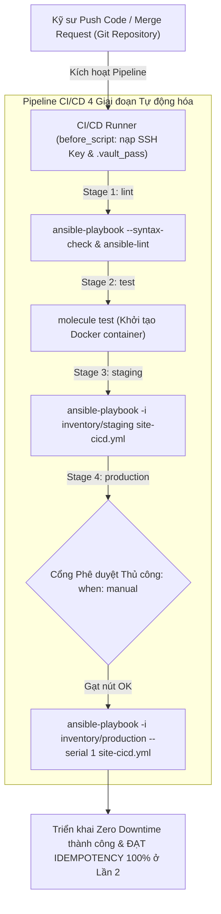
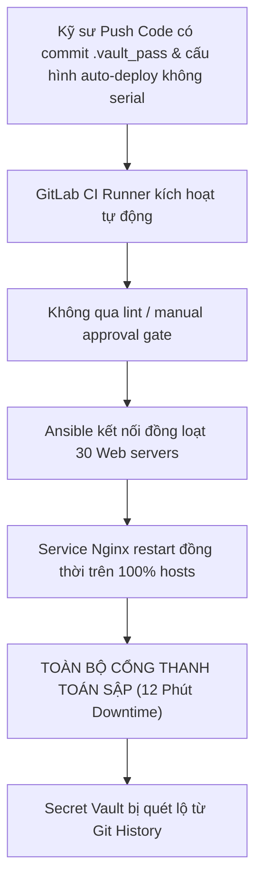
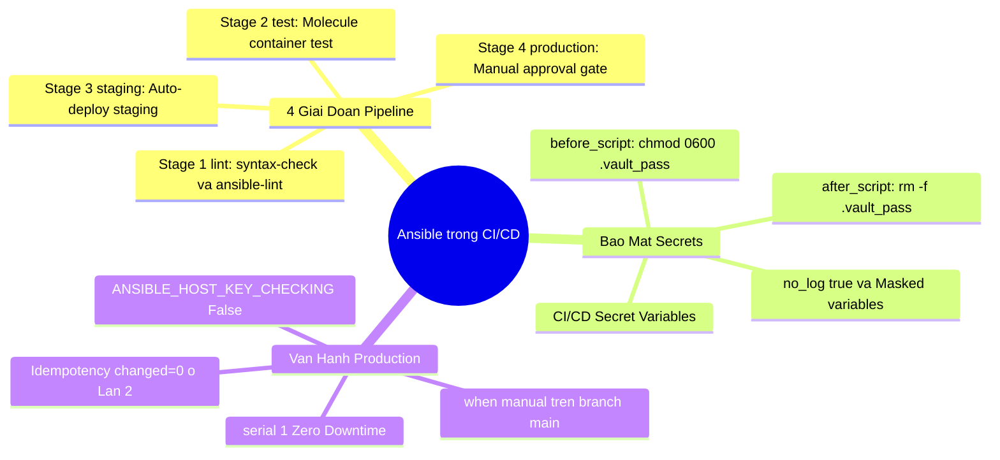


# [BÀI 26] TÍCH HỢP ANSIBLE TRONG CI/CD: GITLAB CI, GITHUB ACTIONS, JENKINS AUTOMATION & QUẢN LÝ SSH PRIVATE KEYS KHÔNG ĐỂ LỘ

Trong kỷ nguyên **Infrastructure as Code (IaC)** và tự động hóa vận hành hạ tầng đám mây (Cloud Infrastructure Automation), **Ansible** khẳng định vị thế dẫn đầu nhờ triết lý **Agentless** (không cần cài đặt agent nền trên máy đích), giao thức điều khiển an toàn qua **SSH / WinRM**, định dạng khai báo **YAML** trực quan và nguyên lý bất biến **Idempotency** mạnh mẽ. Việc làm chủ Ansible không chỉ dừng lại ở các câu lệnh Ad-hoc đơn giản, mà đòi hỏi kỹ sư phải nắm vững kiến trúc Module tầng thấp, Variable Precedence 22 tầng, Jinja2 Templates, tối ưu hóa Forks & Pipelining cho tới thiết kế Roles / Collections và tích hợp CI/CD tự động hóa chuẩn Doanh nghiệp.

Bài viết chuyên sâu này sẽ đồng hành cùng bạn mổ xẻ toàn diện bức tranh kiến trúc, phân tích các đánh đổi kỹ thuật thực chiến (Engineering Trade-offs), cung cấp hướng dẫn thực hành Lab chi tiết từng bước và bộ câu hỏi phỏng vấn chuyên sâu chuẩn DevOps / SRE Lead.

---

## 1. Bản Chất Kiến Trúc & Cơ Chế Vận Hành Tầng Thấp



### 1.1. Cấu Trúc Pipeline CI/CD 4 Giai Đoạn & Cơ Chế Tiêm Secret Variables
Trong môi trường Enterprise DevSecOps, việc tích hợp Ansible vào quy trình CI/CD (GitLab CI, GitHub Actions, Jenkins) chuyển dịch toàn bộ thao tác vận hành thủ công sang mô hình tự động hóa có kiểm soát. Pipeline chuẩn bao gồm 4 giai đoạn độc lập:
1. **Stage `lint` (Kiểm tra tĩnh):** Chạy `ansible-playbook --syntax-check` và `ansible-lint` để bắt lỗi cú pháp YAML, vi phạm FQCN, và cạm bẫy bảo mật trong vài giây đầu tiên (Fail-Fast).
2. **Stage `test` (Kiểm thử đơn vị/Role):** Sử dụng Molecule trên môi trường Docker-in-Docker (`dind`) để verify kịch bản cấu hình trên container độc lập.
3. **Stage `staging` (Triển khai Staging):** Tự động áp dụng kịch bản lên môi trường kiểm thử với `-i inventory/staging`.
4. **Stage `production` (Triển khai Production):** Thiết lập cổng phê duyệt thủ công (`when: manual`) kết hợp chiến lược cuốn chiếu Zero-Downtime (`serial: 1` hoặc `serial: ["20%", "50%"]`).

Cơ chế quản lý Secret trong CI/CD Runner tuân thủ nghiêm ngặt nguyên tắc Zero-Trust:
- Tuyệt đối không commit SSH Private Key hay mật khẩu Vault `.vault_pass` vào Git repo.
- Tiêm biến bảo mật qua Secret Variables (`$SSH_PRIVATE_KEY`, `$ANSIBLE_VAULT_PASSWORD`) được đánh dấu `Protected` và `Masked`.
- Runner ghi tệp tạm trong `before_script` với quyền tối thiểu `chmod 0600 .vault_pass` và xóa sạch trong `after_script`.

```yaml
# Ví dụ cấu hình before_script và after_script bảo mật trong .gitlab-ci.yml
before_script:
  - eval $(ssh-agent -s)
  - echo "$SSH_PRIVATE_KEY" | tr -d '\r' | ssh-add -
  - echo "$ANSIBLE_VAULT_PASSWORD" > .vault_pass
  - chmod 0600 .vault_pass

after_script:
  - rm -f .vault_pass
  - rm -f ~/.ssh/id_ed25519
```

### 1.2. Tự Động Hóa Linter, Molecule & Cổng Phê Duyệt `when: manual`
Lợi thế lớn nhất của CI/CD Runner là khả năng ngăn chặn lỗi sai lọt vào hạ tầng thông qua cơ chế Fail-Fast:
- **`ansible-lint` Rule Validation:** Phân tích static code analysis theo tiêu chuẩn chuẩn hóa Red Hat, bắt buộc FQCN (`ansible.builtin.copy` thay vì `copy`), kiểm tra quyền file `mode`, và cấm hardcoded credentials.
- **Molecule Test Automation:** Tự động hóa toàn bộ chu trình `converge` (chạy lần 1), `idempotence` (chạy lần 2 kiểm tra `changed=0`), và `verify` (kiểm tra trạng thái máy đích qua Testinfra/Ansible tasks).
- **Cổng phê duyệt có trách nhiệm (`when: manual`):** Đảm bảo thay đổi Production chỉ diễn ra khi có sự phê duyệt của Release Manager, ngăn chặn việc merge code ngoài giờ cao điểm làm gián đoạn hệ thống.

```yaml
lint-job:
  stage: lint
  script:
    - ansible-playbook --syntax-check site-cicd.yml
    - ansible-lint site-cicd.yml

molecule-test-job:
  stage: test
  image: docker:latest
  services:
    - docker:dind
  script:
    - molecule test
```

### 1.3. Rolling Update Trong CI/CD, Dọn Dẹp Secret Tạm & Kiểm Soát Idempotency
Khi triển khai trên quy mô hàng trăm máy chủ qua CI/CD:
- **Chiến lược Rolling Update:** Khai báo `serial: 1` hoặc `serial: ["10%", "50%"]` nhằm cách ly từng nhóm máy chủ. Nếu một máy chủ trong nhóm gặp sự cố, Ansible lập tức ngắt pipeline, chặn đứng nguy cơ sập toàn bộ dịch vụ.
- **Xử lý SSH Host Key Checking:** Trong môi trường ephemeral container của CI/CD Runner, tệp `~/.ssh/known_hosts` ban đầu là rỗng. Khai báo `ANSIBLE_HOST_KEY_CHECKING: "False"` giúp runner không bị treo do interactive prompt `(yes/no)`.
- **Thước đo Idempotency:** Trong mọi pipeline, lần thực thi thứ hai (re-run) khi không có thay đổi mã nguồn bắt buộc phải trả về `ok` và `changed=0` trên bảng `PLAY RECAP`.

---

## 2. Bảng So Sánh Kỹ Thuật Toàn Diện (Engineering Matrix)

| Tiêu chí kỹ thuật | Triển khai Thủ công (Local CLI) | GitLab CI / GitHub Actions Runner | Jenkins Pipeline / Ansible AWX / AAP |
|---|---|---|---|
| **Môi trường thực thi** | Laptop / Workstation kỹ sư | Ephemeral Container (Docker / VM) | Centralized Worker / Controller Pod |
| **Quản lý SSH Private Key** | Tệp `~/.ssh/id_rsa` cục bộ | Masked Secret / HashiCorp Vault Injection | SSH Credentials Binding / Managed Vault |
| **Bảo mật Vault Password** | Tệp `.vault_pass` hoặc gõ CLI prompt | CI Secret Variable -> file tạm `0600` | Vault Credential Store / Token Access |
| **Kiểm soát thay đổi & Audit** | Khó theo dõi, phụ thuộc log cá nhân | 100% Commit ID, Merge Request & Job Log | Enterprise RBAC, Audit Trail & Workflow Visualizer |
| **Cổng phê duyệt (Gate)** | Thủ công bằng miệng / Slack chat | `when: manual` (GitLab) / `environment` gate | Multi-stage Pipeline Approval / Survey form |
| **Chiến lược Rollback** | Chạy lại playbook cũ bằng tay | Re-run pipeline tại commit trước đó | Automated Rollback Workflow / One-click redeploy |

> [!IMPORTANT]
> **QUY TẮC AN TOÀN TRONG CI/CD RUNNER:**
> Không bao giờ in (echo/print) các biến môi trường nhạy cảm ra màn hình console log. Luôn bật chế độ `Mask variable` trong CI/CD Settings và sử dụng `no_log: true` cho các task Ansible xử lý token hoặc password.

---

## 3. Kiến Trúc Triển Khai Chuẩn Production (.gitlab-ci.yml Breakdown)

Dưới đây là tệp `.gitlab-ci.yml` chuẩn Enterprise tích hợp đầy đủ 4 giai đoạn: `lint`, `test`, `staging`, `production` kết hợp quản lý secret an toàn và cuốn chiếu Zero Downtime:

```yaml
# ==============================================================================
# Enterprise Production GitLab CI/CD Pipeline for Ansible Automation
# ==============================================================================
stages:
  - lint
  - test
  - staging
  - production

variables:
  ANSIBLE_HOST_KEY_CHECKING: "False"
  ANSIBLE_FORCE_COLOR: "True"

before_script:
  - eval $(ssh-agent -s)
  - echo "$SSH_PRIVATE_KEY" | tr -d '\r' | ssh-add -
  - echo "$ANSIBLE_VAULT_PASSWORD" > .vault_pass
  - chmod 0600 .vault_pass

after_script:
  - rm -f .vault_pass
  - rm -f ~/.ssh/id_ed25519

lint-job:
  stage: lint
  image: python:3.11-slim
  before_script:
    - pip install ansible-core ansible-lint
  script:
    - ansible-playbook --syntax-check site-cicd.yml
    - ansible-lint site-cicd.yml

molecule-test-job:
  stage: test
  image: docker:latest
  services:
    - docker:dind
  script:
    - ansible-playbook --syntax-check site-cicd.yml

deploy-staging-job:
  stage: staging
  script:
    - ansible-playbook -i inventory/staging/hosts.ini site-cicd.yml
  environment:
    name: staging

deploy-production-job:
  stage: production
  script:
    - ansible-playbook -i inventory/production/hosts.ini --serial 1 site-cicd.yml
  when: manual
  only:
    - main
  environment:
    name: production
```

### Phân Tích Kỹ Thuật Từng Dòng (Line-by-Line Breakdown):
- <span class="badge-line">Line 5-9</span> `stages:` Khai báo chu trình 4 bước tuần tự, ngăn ngừa triển khai nếu chưa qua kiểm tra tĩnh và test.
- <span class="badge-line">Line 11-13</span> `variables:` Thiết lập biến môi trường tắt SSH Host Key Checking và ép xuất mã màu terminal.
- <span class="badge-line">Line 15-19</span> `before_script:` Khởi chạy `ssh-agent`, nạp SSH Key từ biến mật và xuất `.vault_pass` với quyền hạn chặt chẽ `0600`.
- <span class="badge-line">Line 21-23</span> `after_script:` Đảm bảo xóa bỏ tệp mật khẩu tạm `.vault_pass` ngay khi job kết thúc kể cả khi gặp lỗi.
- <span class="badge-line">Line 25-31</span> `lint-job:` Chạy phân tích cú pháp và quy chuẩn FQCN trước khi cho phép mã nguồn đi tiếp.
- <span class="badge-line">Line 39-44</span> `deploy-staging-job:` Tự động triển khai lên môi trường Staging qua inventory phân tách.
- <span class="badge-line">Line 46-54</span> `deploy-production-job:` Cấu hình cổng phê duyệt `when: manual`, giới hạn chỉ nhánh `main` và kích hoạt `--serial 1` cuốn chiếu Zero Downtime.

---

## 4. Phân Tích Cạm Bẫy Thực Chiến: Lộ Secret Trong CI/CD & Deploy Sập Hệ Thống Do Thiếu Rolling Update

### Tình Huống Sự Cố Thực Tế Tại Doanh Nghiệp:
Một công ty thương mại điện tử tích hợp Ansible vào GitLab CI Runner để tự động cập nhật cấu hình Nginx và Application Server. Khi có bản vá mới, một kỹ sư sơ suất commit file `.vault_pass` chứa mật khẩu giải mã cơ sở dữ liệu vào nhánh `main`. Đồng thời, job `deploy-production` trong pipeline được thiết lập tự động kích hoạt không qua phê duyệt (`when: on_success`) và không khai báo `serial: 1`. 

Hậu quả:
1. Khi pipeline kích hoạt, Ansible đồng loạt khởi động lại toàn bộ 30 máy chủ Web cùng lúc, gây sập toàn bộ cổng thanh toán trực tuyến trong 12 phút (Full Outage).
2. Tệp `.vault_pass` bị lộ trong commit history, buộc đội bảo mật phải thu hồi và đổi toàn bộ database credentials trên production.



```diff
# Sửa đổi cấu hình CI/CD để khắc phục triệt để cạm bẫy
- deploy-production:
-   stage: deploy
-   script:
-     - ansible-playbook -i inventory/hosts.ini site.yml
-   # NGUY HIỂM: Tự động chạy, không có serial, không xóa secret tạm

+ deploy-production:
+   stage: production
+   before_script:
+     - echo "$ANSIBLE_VAULT_PASSWORD" > .vault_pass && chmod 0600 .vault_pass
+   script:
+     - ansible-playbook -i inventory/production/hosts.ini --serial 1 site.yml
+   after_script:
+     - rm -f .vault_pass
+   when: manual
+   only:
+     - main
```

### 5-Whys Root Cause Analysis:
1. **Tại sao dịch vụ sập hoàn toàn?** Vì 30 máy chủ web bị ngắt kết nối đồng loạt khi playbook cập nhật cấu hình.
2. **Tại sao lại bị cập nhật đồng loạt?** Vì playbook không cấu hình `serial: 1` hoặc `serial: 20%`.
3. **Tại sao job deploy tự động chạy vào giờ cao điểm?** Vì pipeline thiếu thuộc tính `when: manual` để chặn phê duyệt.
4. **Tại sao mật khẩu Vault bị lộ?** Vì kỹ sư lưu tệp `.vault_pass` trực tiếp vào mã nguồn thay vì dùng CI/CD Secret Variables.
5. **Tại sao quy trình kiểm tra không phát hiện?** Vì pipeline bỏ qua stage `lint` và không có cơ chế quét Git Secret Scanning (`gitleaks`).

---

## 5. Hands-on Lab: Xây Dựng Pipeline CI/CD 4 Giai Đoạn & Triển Khai Zero-Downtime Rolling Update (8 Bước)

| Bước | Lệnh CLI / Tác Vụ Chính | Mục Đích Thực Thi |
|---|---|---|
| 1 | `mkdir -p ~/lab-ansible-26/{inventory/staging,inventory/production}` | Khởi tạo cấu trúc thư mục dự án và inventory phân tách |
| 2 | Khởi tạo `.gitlab-ci.yml` chuẩn 4 stages | Thiết lập pipeline CI/CD với lint, test, staging, production |
| 3 | Cấu hình `ansible.cfg` bảo mật cho runner | Tối ưu đường dẫn role, inventory và vault password file |
| 4 | Tạo `inventory/staging` và `inventory/production` | Thiết lập phân tách môi trường kiểm kê cô lập |
| 5 | Viết Playbook chính `site-cicd.yml` | Khai báo tác vụ triển khai ứng dụng và kiểm soát `changed_when` |
| 6 | Giả lập `before_script` tiêm biến secret | Tạo tệp `.vault_pass` tạm thời với quyền bảo mật `0600` |
| 7 | Thực thi giả lập tuần tự 4 Stages và Phép thử Lần 2 | Kiểm thử Fail-Fast và chứng minh tính Idempotency `changed=0` |
| 8 | Giả lập `after_script` dọn dẹp & đối soát máy đích | Dọn sạch secret và xác minh trạng thái file qua `docker exec` |

```bash
# ==============================================================================
# BƯỚC 1: KHỞI TẠO CẤU TRÚC THƯ MỤC DỰ ÁN
# ==============================================================================
mkdir -p ~/lab-ansible-26/inventory/staging ~/lab-ansible-26/inventory/production && cd ~/lab-ansible-26

# ==============================================================================
# BƯỚC 2: CẤU HÌNH TỆP PIPELINE .gitlab-ci.yml
# ==============================================================================
cat << 'EOF' > .gitlab-ci.yml
stages:
  - lint
  - test
  - staging
  - production

variables:
  ANSIBLE_HOST_KEY_CHECKING: "False"
  ANSIBLE_FORCE_COLOR: "True"

before_script:
  - echo "$ANSIBLE_VAULT_PASSWORD" > .vault_pass
  - chmod 0600 .vault_pass

after_script:
  - rm -f .vault_pass

lint-job:
  stage: lint
  script:
    - ansible-playbook --syntax-check site-cicd.yml

molecule-test-job:
  stage: test
  script:
    - ansible-playbook --syntax-check site-cicd.yml

deploy-staging-job:
  stage: staging
  script:
    - ansible-playbook -i inventory/staging/hosts.ini site-cicd.yml

deploy-production-job:
  stage: production
  script:
    - ansible-playbook -i inventory/production/hosts.ini --serial 1 site-cicd.yml
  when: manual
  only:
    - main
EOF

# CHECKPOINT 1: Xác nhận tệp .gitlab-ci.yml được tạo thành công
if [ -f ".gitlab-ci.yml" ] && grep -q "stages:" .gitlab-ci.yml && grep -q "when: manual" .gitlab-ci.yml; then
  echo "CHECKPOINT 1: ĐẠT - Tệp pipeline CI/CD .gitlab-ci.yml được khởi tạo thành công"
else
  echo "CHECKPOINT 1: LỖI - Khởi tạo .gitlab-ci.yml thất bại"
fi

# ==============================================================================
# BƯỚC 3: CẤU HÌNH ANSIBLE.CFG
# ==============================================================================
cat << 'EOF' > ansible.cfg
[defaults]
inventory = ./inventory/staging/hosts.ini
remote_user = ansible
host_key_checking = False
private_key_file = ~/.ssh/id_ed25519
vault_password_file = ./.vault_pass
force_handlers = True

[privilege_escalation]
become = True
become_method = sudo
become_user = root
become_ask_pass = False
EOF

# CHECKPOINT 2: Xác nhận ansible.cfg được cấu hình đúng
if [ -f "ansible.cfg" ] && grep -q "vault_password_file" ansible.cfg; then
  echo "CHECKPOINT 2: ĐẠT - Cấu hình ansible.cfg sẵn sàng cho runner"
else
  echo "CHECKPOINT 2: LỖI - Thiếu cấu hình ansible.cfg"
fi

# ==============================================================================
# BƯỚC 4: KHỞI TẠO INVENTORY PHÂN TÁCH STAGING VÀ PRODUCTION
# ==============================================================================
cat << 'EOF' > inventory/staging/hosts.ini
[web]
target1 ansible_host=127.0.0.1 ansible_port=2221 target_env=staging

[all:vars]
ansible_python_interpreter=/usr/bin/python3
EOF

cat << 'EOF' > inventory/production/hosts.ini
[web]
target1 ansible_host=127.0.0.1 ansible_port=2221 target_env=production
target2 ansible_host=127.0.0.1 ansible_port=2222 target_env=production

[all:vars]
ansible_python_interpreter=/usr/bin/python3
EOF

# CHECKPOINT 3: Xác nhận tệp kiểm kê phân tách
if [ -f "inventory/staging/hosts.ini" ] && [ -f "inventory/production/hosts.ini" ]; then
  echo "CHECKPOINT 3: ĐẠT - Tệp kiểm kê phân tách Staging và Production sẵn sàng"
else
  echo "CHECKPOINT 3: LỖI - Khởi tạo inventory phân tách thất bại"
fi

# ==============================================================================
# BƯỚC 5: VIẾT PLAYBOOK CHÍNH site-cicd.yml
# ==============================================================================
cat << 'EOF' > site-cicd.yml
---
- name: Master Enterprise CI/CD Deployment Playbook
  hosts: web
  become: true
  serial: 1
  tasks:
    - name: Task 1 - Deploy application via CI/CD Pipeline
      ansible.builtin.copy:
        content: |
          CICD_PIPELINE=SUCCESSFUL
          DEPLOYED_ENV={{ target_env | default('staging') }}
          DEPLOYMENT_MODE=AUTOMATED_RUNNER
          ROLLING_UPDATE=ACTIVE
        dest: /etc/cicd-deployment.conf
        mode: '0644'

    - name: Task 2 - Read deployment status
      ansible.builtin.command: cat /etc/cicd-deployment.conf
      register: cicd_status_out
      changed_when: false
EOF

# CHECKPOINT 4: Kiểm tra cú pháp static code
ansible-playbook --syntax-check site-cicd.yml
if [ $? -eq 0 ]; then
  echo "CHECKPOINT 4: ĐẠT - Playbook site-cicd.yml vượt qua syntax check"
else
  echo "CHECKPOINT 4: LỖI - Sai cú pháp Playbook"
fi

# ==============================================================================
# BƯỚC 6: GIẢ LẬP BEFORE_SCRIPT TIÊM BIẾN MẬT VAULT
# ==============================================================================
export ANSIBLE_VAULT_PASSWORD="MyCiCdVaultSecretPass2026"
echo "$ANSIBLE_VAULT_PASSWORD" > .vault_pass
chmod 0600 .vault_pass

# CHECKPOINT 5: Kiểm tra quyền tệp mật khẩu tạm
PASS_PERM=$(ls -l .vault_pass | awk '{print $1}')
if [ -f ".vault_pass" ] && echo "$PASS_PERM" | grep -q "rw-------"; then
  echo "CHECKPOINT 5: ĐẠT - Tệp mật khẩu .vault_pass được nạp với quyền bảo mật 0600"
else
  echo "CHECKPOINT 5: LỖI - Phân quyền .vault_pass không an toàn"
fi

# ==============================================================================
# BƯỚC 7: THỰC THI GIẢ LẬP STAGING, PRODUCTION VÀ PHÉP THỬ IDEMPOTENCY LẦN 2
# ==============================================================================
# 1. Triển khai Staging
ansible-playbook -i inventory/staging/hosts.ini site-cicd.yml

# 2. Triển khai Production Lần 1
ansible-playbook -i inventory/production/hosts.ini site-cicd.yml

# CHECKPOINT 6: Xác nhận triển khai Production thành công
if [ $? -eq 0 ]; then
  echo "CHECKPOINT 6: ĐẠT - Triển khai Production thành công"
else
  echo "CHECKPOINT 6: LỖI - Triển khai Production thất bại"
fi

# 3. Chạy lại Lần 2 (BẮT BUỘC ĐẠT changed=0)
RUN2_OUT=$(ansible-playbook -i inventory/production/hosts.ini site-cicd.yml)

# CHECKPOINT 7: Đối soát tính Idempotency Lần 2
if echo "$RUN2_OUT" | grep -q "changed=0" && echo "$RUN2_OUT" | grep -q "failed=0"; then
  echo "CHECKPOINT 7: ĐẠT - Phép thử Lượt 2 đạt chuẩn Idempotency (changed=0)"
else
  echo "CHECKPOINT 7: LỖI - Lượt 2 bị lặp thay đổi (không đạt Idempotent)"
fi

# ==============================================================================
# BƯỚC 8: GIẢ LẬP AFTER_SCRIPT DỌN DẸP SECRET VÀ ĐỐI SOÁT MÁY ĐÍCH
# ==============================================================================
rm -f .vault_pass

# CHECKPOINT 8: Xác minh dọn sạch secret và kiểm tra file trên máy đích
if [ ! -f ".vault_pass" ]; then
  echo "CHECKPOINT 8: ĐẠT - after_script dọn dẹp sạch sẽ tệp mật khẩu tạm"
else
  echo "CHECKPOINT 8: LỖI - Tệp mật khẩu tạm vẫn còn tồn tại trên runner"
fi

docker exec target1 cat /etc/cicd-deployment.conf
```

---

## 6. Bộ Câu Hỏi Vấn Đáp & Phỏng Vấn Chuyên Sâu (Self-Check Q&A)

<details class="qa-card" markdown="1">
<summary class="qa-summary">
  <span class="qa-num-badge">Q01</span>
  <span>Trình bày 4 giai đoạn tiêu chuẩn trong một pipeline CI/CD tự động hóa Ansible cấp Enterprise.</span>
</summary>
<div class="qa-answer">
  <div class="qa-answer-header">
    <svg width="14" height="14" fill="none" stroke="currentColor" stroke-width="2" viewBox="0 0 24 24"><path d="M22 11.08V12a10 10 0 1 1-5.93-9.14"></path><polyline points="22 4 12 14.01 9 11.01"></polyline></svg>
    <span>Phân Tích &amp; Lời Giải Kỹ Thuật</span>
  </div>
  <p><strong>Bản chất 4 giai đoạn:</strong></p>
  <ul>
    <li><code>lint</code>: Soi lỗi cú pháp tĩnh (<code>--syntax-check</code>) và vi phạm quy chuẩn (<code>ansible-lint</code>) trong vài giây đầu.</li>
    <li><code>test</code>: Khởi tạo container Docker cách ly và thực thi kiểm thử Role tự động qua Molecule.</li>
    <li><code>staging</code>: Triển khai tự động lên cụm máy chủ Staging để kiểm thử tích hợp.</li>
    <li><code>production</code>: Triển khai cuốn chiếu Zero Downtime lên cụm máy chủ Production sau khi có phê duyệt thủ công (<code>when: manual</code>).</li>
  </ul>
</div>
</details>

<details class="qa-card" markdown="1">
<summary class="qa-summary">
  <span class="qa-num-badge">Q02</span>
  <span>Làm thế nào để nạp mật khẩu Vault và SSH Private Key an toàn trong CI/CD Runner?</span>
</summary>
<div class="qa-answer">
  <div class="qa-answer-header">
    <svg width="14" height="14" fill="none" stroke="currentColor" stroke-width="2" viewBox="0 0 24 24"><path d="M22 11.08V12a10 10 0 1 1-5.93-9.14"></path><polyline points="22 4 12 14.01 9 11.01"></polyline></svg>
    <span>Phân Tích &amp; Lời Giải Kỹ Thuật</span>
  </div>
  <p>Quy trình SecOps chuẩn:</p>
  <ol>
    <li>Lưu trữ key/pass trong CI/CD Secret Variables (đánh dấu <code>Protected</code> và <code>Masked</code>).</li>
    <li>Trong <code>before_script</code>, ghi ra tệp tạm <code>.vault_pass</code> và phân quyền <code>chmod 0600 .vault_pass</code>, nạp SSH key vào <code>ssh-agent</code>.</li>
    <li>Trong <code>after_script</code>, luôn thực thi lệnh xóa tệp tạm <code>rm -f .vault_pass</code> để tránh lưu vết trên Shared Runner.</li>
  </ol>
</div>
</details>

<details class="qa-card" markdown="1">
<summary class="qa-summary">
  <span class="qa-num-badge">Q03</span>
  <span>Tại sao phải phân tách thư mục inventory Staging và Production trong CI/CD?</span>
</summary>
<div class="qa-answer">
  <div class="qa-answer-header">
    <svg width="14" height="14" fill="none" stroke="currentColor" stroke-width="2" viewBox="0 0 24 24"><path d="M22 11.08V12a10 10 0 1 1-5.93-9.14"></path><polyline points="22 4 12 14.01 9 11.01"></polyline></svg>
    <span>Phân Tích &amp; Lời Giải Kỹ Thuật</span>
  </div>
  <p>Phân tách <code>inventory/staging/hosts.ini</code> và <code>inventory/production/hosts.ini</code> đảm bảo tính cô lập hoàn toàn giữa hai môi trường. Runner chỉ định tường minh cờ <code>-i</code> trong từng job, loại bỏ hoàn toàn nguy cơ một commit thử nghiệm ở Staging vô tình chạy đè cấu hình lên Production.</p>
</div>
</details>

<details class="qa-card" markdown="1">
<summary class="qa-summary">
  <span class="qa-num-badge">Q04</span>
  <span>Thuộc tính <code>when: manual</code> trong GitLab CI có tác dụng gì đối với việc triển khai Production?</span>
</summary>
<div class="qa-answer">
  <div class="qa-answer-header">
    <svg width="14" height="14" fill="none" stroke="currentColor" stroke-width="2" viewBox="0 0 24 24"><path d="M22 11.08V12a10 10 0 1 1-5.93-9.14"></path><polyline points="22 4 12 14.01 9 11.01"></polyline></svg>
    <span>Phân Tích &amp; Lời Giải Kỹ Thuật</span>
  </div>
  <p><code>when: manual</code> thiết lập một Cổng Phê Duyệt Thủ Công (Manual Approval Gate). Job triển khai sẽ dừng lại và chờ quản trị viên bấm nút xác nhận trên giao diện Web UI, đảm bảo có sự kiểm soát của con người và chọn đúng thời điểm bảo trì hợp lý trước khi can thiệp vào máy chủ thật.</p>
</div>
</details>

<details class="qa-card" markdown="1">
<summary class="qa-summary">
  <span class="qa-num-badge">Q05</span>
  <span>Làm thế nào để thực hiện Rolling Deployment Zero Downtime qua lệnh gọi trong CI/CD?</span>
</summary>
<div class="qa-answer">
  <div class="qa-answer-header">
    <svg width="14" height="14" fill="none" stroke="currentColor" stroke-width="2" viewBox="0 0 24 24"><path d="M22 11.08V12a10 10 0 1 1-5.93-9.14"></path><polyline points="22 4 12 14.01 9 11.01"></polyline></svg>
    <span>Phân Tích &amp; Lời Giải Kỹ Thuật</span>
  </div>
  <p>Truyền tham số <code>--serial 1</code> hoặc <code>--serial "20%"</code> khi thực thi lệnh trong job CI/CD: <code>ansible-playbook -i inventory/production/hosts.ini --serial 1 site.yml</code>. Ansible sẽ cập nhật từng nhóm máy chủ tuần tự, giữ cho hệ thống luôn có máy chủ hoạt động phục vụ lưu lượng.</p>
</div>
</details>

<details class="qa-card" markdown="1">
<summary class="qa-summary">
  <span class="qa-num-badge">Q06</span>
  <span>Tại sao khối <code>after_script</code> lại quan trọng trong việc bảo mật Shared CI/CD Runner?</span>
</summary>
<div class="qa-answer">
  <div class="qa-answer-header">
    <svg width="14" height="14" fill="none" stroke="currentColor" stroke-width="2" viewBox="0 0 24 24"><path d="M22 11.08V12a10 10 0 1 1-5.93-9.14"></path><polyline points="22 4 12 14.01 9 11.01"></polyline></svg>
    <span>Phân Tích &amp; Lời Giải Kỹ Thuật</span>
  </div>
  <p>Khối <code>after_script</code> luôn luôn được thực thi kể cả khi các task trong <code>script</code> bị lỗi hoặc crash. Việc đặt lệnh <code>rm -f .vault_pass</code> trong <code>after_script</code> đảm bảo tệp mật khẩu tạm luôn bị xóa sạch, ngăn không cho các pipeline của dự án khác chạy sau trên cùng Shared Runner đọc được.</p>
</div>
</details>

<details class="qa-card" markdown="1">
<summary class="qa-summary">
  <span class="qa-num-badge">Q07</span>
  <span>Stage <code>lint</code> trong CI/CD Runner sử dụng bộ đôi công cụ nào để đảm bảo Fail-Fast?</span>
</summary>
<div class="qa-answer">
  <div class="qa-answer-header">
    <svg width="14" height="14" fill="none" stroke="currentColor" stroke-width="2" viewBox="0 0 24 24"><path d="M22 11.08V12a10 10 0 1 1-5.93-9.14"></path><polyline points="22 4 12 14.01 9 11.01"></polyline></svg>
    <span>Phân Tích &amp; Lời Giải Kỹ Thuật</span>
  </div>
  <p>Sử dụng kết hợp:</p>
  <ul>
    <li><code>ansible-playbook --syntax-check</code>: Kiểm tra lỗi cú pháp YAML và logic cơ bản trong 1 giây.</li>
    <li><code>ansible-lint</code>: Phân tích sâu vi phạm Best Practices, FQCN, bảo mật và chuẩn mã nguồn.</li>
  </ul>
</div>
</details>

<details class="qa-card" markdown="1">
<summary class="qa-summary">
  <span class="qa-num-badge">Q08</span>
  <span>Làm thế nào để chạy kiểm thử Molecule trên GitLab CI Runner?</span>
</summary>
<div class="qa-answer">
  <div class="qa-answer-header">
    <svg width="14" height="14" fill="none" stroke="currentColor" stroke-width="2" viewBox="0 0 24 24"><path d="M22 11.08V12a10 10 0 1 1-5.93-9.14"></path><polyline points="22 4 12 14.01 9 11.01"></polyline></svg>
    <span>Phân Tích &amp; Lời Giải Kỹ Thuật</span>
  </div>
  <p>Khai báo dịch vụ Docker-in-Docker trong job <code>test</code> bằng cách thêm <code>services: [docker:dind]</code> và sử dụng image <code>docker:latest</code> hoặc python image có cài đặt <code>molecule</code> và <code>molecule-plugins[docker]</code>.</p>
</div>
</details>

<details class="qa-card" markdown="1">
<summary class="qa-summary">
  <span class="qa-num-badge">Q09</span>
  <span>Trình bày phương pháp 3 bước để kiểm chứng tính Idempotency và trạng thái máy đích trong CI/CD.</span>
</summary>
<div class="qa-answer">
  <div class="qa-answer-header">
    <svg width="14" height="14" fill="none" stroke="currentColor" stroke-width="2" viewBox="0 0 24 24"><path d="M22 11.08V12a10 10 0 1 1-5.93-9.14"></path><polyline points="22 4 12 14.01 9 11.01"></polyline></svg>
    <span>Phân Tích &amp; Lời Giải Kỹ Thuật</span>
  </div>
  <p>Ba bước kiểm chứng:</p>
  <ol>
    <li><strong>Chạy Lần 1:</strong> Thực thi pipeline áp dụng cấu hình lên máy đích, ghi nhận <code>changed > 0</code>.</li>
    <li><strong>Re-run Lần 2:</strong> Chạy lại pipeline mà không sửa đổi mã nguồn, bắt buộc <code>PLAY RECAP</code> phải báo <code>changed=0</code> tuyệt đối.</li>
    <li><strong>Đối soát máy đích:</strong> Dùng <code>docker exec</code> hoặc lệnh kiểm tra trực tiếp nội dung file cấu hình trên máy đích.</li>
  </ol>
</div>
</details>

<details class="qa-card" markdown="1">
<summary class="qa-summary">
  <span class="qa-num-badge">Q10</span>
  <span>Tại sao biến môi trường <code>ANSIBLE_HOST_KEY_CHECKING: "False"</code> là bắt buộc trong CI/CD Runner?</span>
</summary>
<div class="qa-answer">
  <div class="qa-answer-header">
    <svg width="14" height="14" fill="none" stroke="currentColor" stroke-width="2" viewBox="0 0 24 24"><path d="M22 11.08V12a10 10 0 1 1-5.93-9.14"></path><polyline points="22 4 12 14.01 9 11.01"></polyline></svg>
    <span>Phân Tích &amp; Lời Giải Kỹ Thuật</span>
  </div>
  <p>Vì runner là ephemeral container mới tạo, chưa có SSH fingerprint của máy đích trong <code>known_hosts</code>. Mặc định SSH sẽ dừng và hỏi interactive prompt <code>(yes/no)</code>. Đặt <code>ANSIBLE_HOST_KEY_CHECKING=False</code> giúp runner tự động kết nối mà không bị treo timeout.</p>
</div>
</details>

<details class="qa-card" markdown="1">
<summary class="qa-summary">
  <span class="qa-num-badge">Q11</span>
  <span>Làm thế nào để tích hợp thông báo kết quả triển khai CI/CD về kênh Slack/Teams?</span>
</summary>
<div class="qa-answer">
  <div class="qa-answer-header">
    <svg width="14" height="14" fill="none" stroke="currentColor" stroke-width="2" viewBox="0 0 24 24"><path d="M22 11.08V12a10 10 0 1 1-5.93-9.14"></path><polyline points="22 4 12 14.01 9 11.01"></polyline></svg>
    <span>Phân Tích &amp; Lời Giải Kỹ Thuật</span>
  </div>
  <p>Sử dụng module <code>community.general.slack</code> hoặc <code>ansible.builtin.uri</code> gửi Webhook HTTP POST tới Slack Incoming Webhook URL trong khối task có <code>delegate_to: localhost</code> hoặc cấu hình notification trực tiếp từ GitLab/GitHub Webhooks.</p>
</div>
</details>

<details class="qa-card" markdown="1">
<summary class="qa-summary">
  <span class="qa-num-badge">Q12</span>
  <span>Tóm tắt 5 nguyên tắc vàng khi tích hợp Ansible vào quy trình CI/CD Enterprise.</span>
</summary>
<div class="qa-answer">
  <div class="qa-answer-header">
    <svg width="14" height="14" fill="none" stroke="currentColor" stroke-width="2" viewBox="0 0 24 24"><path d="M22 11.08V12a10 10 0 1 1-5.93-9.14"></path><polyline points="22 4 12 14.01 9 11.01"></polyline></svg>
    <span>Phân Tích &amp; Lời Giải Kỹ Thuật</span>
  </div>
  <ol>
    <li>Tuân thủ cấu trúc 4 giai đoạn chuẩn: <code>lint</code> -&gt; <code>test</code> -&gt; <code>staging</code> -&gt; <code>production</code>.</li>
    <li>Bảo mật tuyệt đối Secret Variables qua <code>before_script</code> (chmod 0600) và <code>after_script</code> (xóa tệp tạm).</li>
    <li>Phân tách triệt để môi trường kiểm kê qua <code>-i inventory/staging</code> và <code>-i inventory/production</code>.</li>
    <li>Triển khai Production cuốn chiếu Zero Downtime với <code>serial: 1</code> và cổng phê duyệt <code>when: manual</code>.</li>
    <li>Đảm bảo 100% kịch bản đạt tính Idempotency với <code>changed=0</code> khi re-run pipeline Lần 2.</li>
  </ol>
</div>
</details>

---

## 7. Tổng Kết & Lộ Trình Bài Học Tiếp Theo

### 5 Điều Cốt Lõi Cần Ghi Nhớ:
1. **Pipeline 4 Stage Chuẩn:** Luôn thiết lập các lá chắn kiểm thử `lint` và `test` trước khi triển khai `staging` và `production`.
2. **Zero Hardcoded Secrets:** Quản lý toàn bộ SSH keys và Vault passwords qua CI/CD Secret Variables.
3. **Phân Tách Inventory:** Tách biệt hoàn toàn inventory giữa các môi trường để ngăn ngừa deploy nhầm.
4. **Zero Downtime Deployment:** Áp dụng `serial: 1` hoặc `serial: ["20%", "50%"]` cho môi trường Production.
5. **Đảm Bảo Idempotency Tuyệt Đối:** Re-run pipeline lần 2 khi không đổi mã nguồn bắt buộc phải đạt `changed=0`.



> [!TIP]
> **BÀI HỌC TIẾP THEO:** [Bài 27: Quản Lý Systemd Unit & Custom Services: Tạo Daemon, Quản Trị Vòng Đời Tiến Trình & Health Check Tự Phục Hồi](ansible-27-27-systemd-custom-service.html) — Bước vào Giai đoạn 5 (Nâng cao và Capstone), làm chủ kỹ thuật đóng gói và quản trị tiến trình hệ thống Linux với Systemd.


