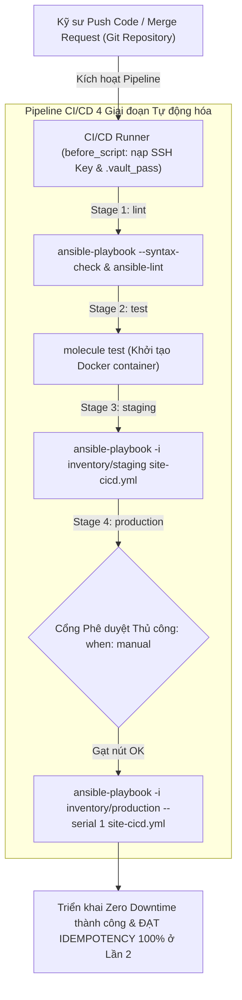
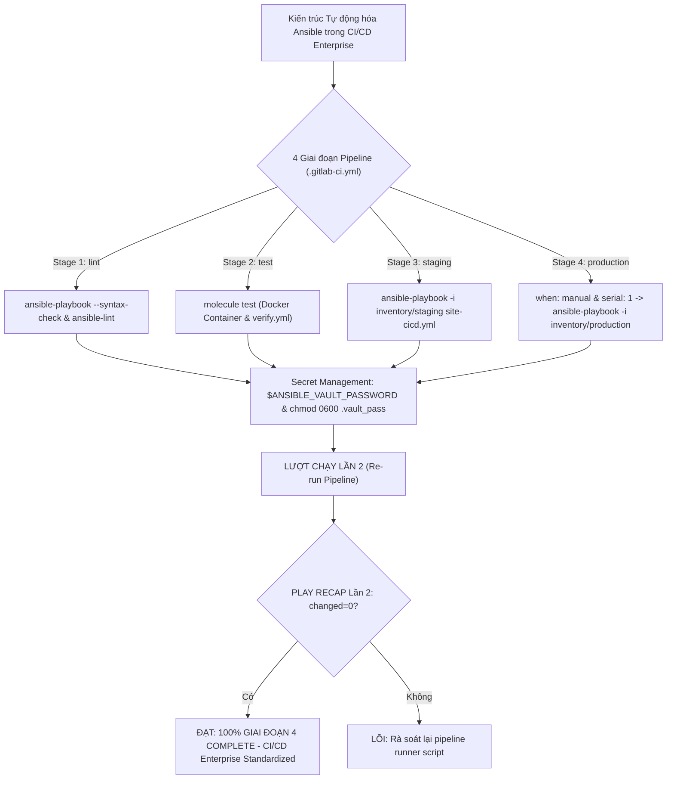
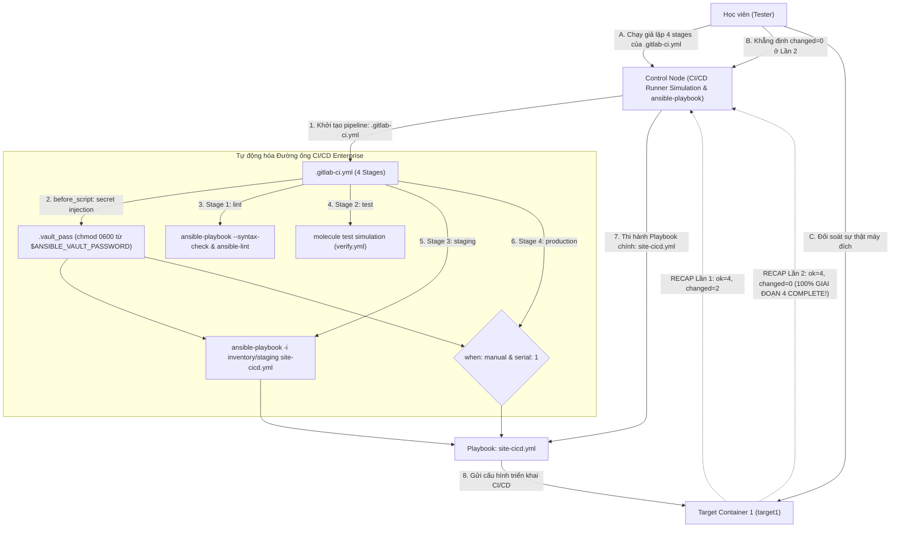


# [BÀI 26] TÍCH HỢP ANSIBLE TRONG CI/CD: GITLAB CI, GITHUB ACTIONS, JENKINS AUTOMATION & QUẢN LÝ SSH PRIVATE KEYS KHÔNG ĐỂ LỘ

Trong kỷ nguyên **Infrastructure as Code (IaC)** và tự động hóa vận hành hạ tầng đám mây (Cloud Infrastructure Automation), **Ansible** khẳng định vị thế dẫn đầu nhờ triết lý **Agentless** (không cần cài đặt agent nền trên máy đích), giao thức điều khiển an toàn qua **SSH / WinRM**, định dạng khai báo **YAML** trực quan và nguyên lý bất biến **Idempotency** mạnh mẽ. Việc làm chủ Ansible không chỉ dừng lại ở các câu lệnh Ad-hoc đơn giản, mà đòi hỏi kỹ sư phải nắm vững kiến trúc Module tầng thấp, Variable Precedence 22 tầng, Jinja2 Templates, tối ưu hóa Forks & Pipelining cho tới thiết kế Roles / Collections và tích hợp CI/CD tự động hóa chuẩn Doanh nghiệp.

Bài viết chuyên sâu này sẽ đồng hành cùng bạn mổ xẻ toàn diện bức tranh kiến trúc, phân tích các đánh đổi kỹ thuật thực chiến (Engineering Trade-offs), cung cấp hướng dẫn thực hành Lab chi tiết từng bước và bộ câu hỏi phỏng vấn chuyên sâu chuẩn DevOps / SRE Lead.

---

## 1. Bản Chất Kiến Trúc & Cơ Chế Vận Hành Tầng Thấp

---


> **Tích hợp Ansible vào pipeline CI/CD giúp tự động hóa quy trình kiểm thử linter, test container Molecule và triển khai cuốn chiếu an toàn trên Production.**

Hoàn thiện bức tranh tự động hóa hạ tầng cấp Enterprise (I-10):

> **Khép lại Giai đoạn 4 (Sản xuất và vận hành) — nơi tất cả các mảnh ghép kỹ thuật đã học (từ Inventory, Variables, Roles, Vault, System Roles, Performance Tuning, cho tới Testing Linter) được hợp nhất vào một đường ống tự động hóa triển khai duy nhất: Pipeline CI/CD (GitLab CI / GitHub Actions). Trong môi trường Doanh nghiệp, mỗi lượt push code hay tạo Merge Request từ kỹ sư sẽ lập tức kích hoạt runner chạy 4 giai đoạn tự động: Stage 1 (`lint` - kiểm tra cú pháp và linter), Stage 2 (`test` - test container Molecule độc lập), Stage 3 (`deploy-staging` - triển khai tự động lên Staging), và Stage 4 (`deploy-production` - triển khai cuốn chiếu Zero Downtime lên Production sau khi có phê duyệt gạt nút thủ công). Việc tích hợp Ansible vào CI/CD giúp loại bỏ 100% thao tác chạy lệnh bằng tay của con người, bảo mật tuyệt đối secret variables, duy trì tính nhất quán và Idempotent `changed=0` ở Lần 2.**

---


---


---


| Tiếng Việt | Tiếng Anh / Từ khóa + FQCN (giữ nguyên) |
|---|---|
| Đường ống tự động hóa CI/CD | Continuous Integration / Continuous Deployment pipeline |
| Các giai đoạn của pipeline | Pipeline stages (`stages: [lint, test, staging, production]`) |
| Tiêm biến môi trường mật | Secret variables injection (`$ANSIBLE_VAULT_PASSWORD`) |
| Tiến trình thực thi runner | CI/CD runner execution environment (`before_script`) |
| Triển khai môi trường Staging | Automated staging deployment (`deploy-staging`) |
| Cổng phê duyệt thủ công | Manual approval gate (`when: manual`) |
| Triển khai cuốn chiếu CI/CD | Rolling deployment in CI/CD (`serial: 1`) |
| Mặt nạ ẩn log mật khẩu | Secret masking in console log (`no_log: true`) |
| Môi trường kiểm kê phân tách | Segregated inventory environment (`-i inventory/staging`) |
| Tự động hóa nghiệm thu | Automated acceptance verification |
| Giám sát luồng thi hành runner | Pipeline execution flow tracking |
| Tự động xóa tệp bí mật tạm | Temporary secret cleanup execution |

---

### 1.1. Cấu trúc Pipeline CI/CD 4 Giai đoạn và Tiêm Secret Variables (15 phút)



**Nguyên lý cốt lõi:** Thiết lập cấu trúc các giai đoạn (Stages) của pipeline CI/CD theo chuẩn DevSecOps 4 bước: `lint` (kiểm tra cú pháp & linter) -> `test` (test container Molecule) -> `staging` (triển khai tự động Staging) -> `production` (triển khai Production sau khi phê duyệt).

**Giải thích cơ chế ngầm:** Đảm bảo mã nguồn IaC trải qua đầy đủ các lá chắn kiểm thử từ nhẹ tới nặng trước khi chạm vào máy chủ Production thật, ngăn ngừa 100% nguy cơ lọt code lỗi gây ngưng trệ hệ thống.

> [!WARNING]
> **CẠM BẪY THỰC CHIẾN:**
> Viết pipeline CI/CD chỉ có 1 bước duy nhất gõ thẳng lệnh deploy lên Production mà không qua các bước `lint` và `test`.

**Minh hoạ.** Khai báo các stages trong `.gitlab-ci.yml`:
```yaml
stages:
  - lint
  - test
  - staging
  - production
```

**Nguyên lý cốt lõi:** Tiêm mật khẩu Vault và SSH Private Key an toàn vào tiến trình thực thi của CI/CD Runner thông qua các biến môi trường mật (Secret Variables / Protected Variables) của hệ thống CI/CD.

**Giải thích cơ chế ngầm:** Tuyệt đối không bao giờ được lưu tệp mật khẩu `.vault_pass` hoặc SSH Private Key trong kho mã nguồn Git. Đẩy chúng vào Secret Manager của CI/CD giúp Runner tự động lấy mật khẩu khi chạy mà không làm lộ secret cho bất kỳ ai.

> [!WARNING]
> **CẠM BẪY THỰC CHIẾN:**
> Cứng hóa chuỗi mật khẩu Vault trực tiếp vào file `.gitlab-ci.yml` khiến bất kỳ ai có quyền xem Git cũng đọc được mật khẩu.

**Minh hoạ.** Khai báo sử dụng Secret Variables trong CI/CD script:
```yaml
before_script:
  - eval $(ssh-agent -s)
  - echo "$SSH_PRIVATE_KEY" | tr -d '\r' | ssh-add -
  - echo "$ANSIBLE_VAULT_PASSWORD" > .vault_pass
  - chmod 0600 .vault_pass
```

**Nguyên lý cốt lõi:** Phân tách hoàn toàn các biến cấu hình và danh sách máy chủ giữa môi trường Staging và Production bằng cách chỉ định rõ ràng cờ `-i inventory/staging` và `-i inventory/production` trong từng job của CI/CD.

**Giải thích cơ chế ngầm:** Ngăn chặn thảm họa nhầm lẫn môi trường: đảm bảo các kịch bản thử nghiệm ở Stage Staging chỉ tác động vào cụm server Staging, tuyệt đối không bao giờ ảnh hưởng tới cụm Production.

> [!WARNING]
> **CẠM BẪY THỰC CHIẾN:**
> Dùng chung 1 file kiểm kê duy nhất khiến kịch bản test ở Staging vô tình chạy đè vào máy chủ Production.

**Minh hoạ.** Phân tách job Staging và Production trong `.gitlab-ci.yml`:
```yaml
deploy-staging:
  stage: staging
  script:
    - ansible-playbook -i inventory/staging site-cicd.yml

deploy-production:
  stage: production
  script:
    - ansible-playbook -i inventory/production site-cicd.yml
```

---

### 1.2. Tự động hóa `lint`, `molecule` và Cổng Phê duyệt `when: manual` (15 phút)

**Nguyên lý cốt lõi:** Tự động hóa công đoạn kiểm tra cú pháp và linter ở Stage `lint` bằng cách gọi lệnh `ansible-playbook --syntax-check` và `ansible-lint` trong môi trường runner.

**Giải thích cơ chế ngầm:** Đảm bảo tính Fail-Fast: nếu kỹ sư gõ sai khoảng trắng YAML hoặc vi phạm quy tắc FQCN, job `lint` sẽ ngắt pipeline ngay lập tức trong vài giây, tiết kiệm thời gian và tài nguyên không phải chạy các job sau.

> [!WARNING]
> **CẠM BẪY THỰC CHIẾN:**
> Bỏ qua stage `lint` khiến pipeline tốn 10 phút chạy runner rồi mới phát hiện ra lỗi sai cú pháp YAML ngớ ngẩn.

**Minh hoạ.** Job `lint` trong `.gitlab-ci.yml`:
```yaml
lint-job:
  stage: lint
  script:
    - ansible-playbook --syntax-check site-cicd.yml
    - ansible-lint site-cicd.yml
```

**Nguyên lý cốt lõi:** Tự động hóa công đoạn kiểm thử Role độc lập trên container cách ly ở Stage `test` bằng câu lệnh `molecule test`.

**Giải thích cơ chế ngầm:** Cho phép runner khởi tạo container Docker tạm thời, thi hành Role, kiểm tra tính Idempotency `changed=0` và chạy các bài test nghiệm thu `verify.yml` hoàn toàn tự động trước khi cấp phép triển khai lên server thật.

> [!WARNING]
> **CẠM BẪY THỰC CHIẾN:**
> Triển khai mã nguồn lên máy chủ thật khi chưa biết mã nguồn đó có đạt tính Idempotent hay không.

**Minh hoạ.** Job `test` trong `.gitlab-ci.yml`:
```yaml
molecule-test-job:
  stage: test
  image: docker:latest
  services:
    - docker:dind
  script:
    - molecule test
```

**Nguyên lý cốt lõi:** Khai báo thuộc tính `when: manual` cho job triển khai Production để thiết lập cổng phê duyệt thủ công (Manual Approval Gate), bắt buộc phải có sự xác nhận gạt nút của Quản trị viên (Lead Engineer / Release Manager).

**Giải thích cơ chế ngầm:** Đây là quy chuẩn an toàn sinh tử trong quy trình CD Enterprise: cho dù mã nguồn đã qua mượt mà 3 stage `lint`, `test`, `staging`, bước thay đổi trên cụm máy chủ Production vẫn cần sự hiện diện và phê duyệt có trách nhiệm của con người để chọn thời điểm bảo trì thích hợp.

> [!WARNING]
> **CẠM BẪY THỰC CHIẾN:**
> Đặt job Production tự động chạy ngay lập tức khi vừa merge code vào giữa giờ cao điểm giao dịch của Doanh nghiệp.

**Minh hoạ.** Khai báo cổng phê duyệt thủ công `when: manual` trong `.gitlab-ci.yml`:
```yaml
deploy-production:
  stage: production
  script:
    - ansible-playbook -i inventory/production site-cicd.yml
  when: manual
  only:
    - main
```

---

### 1.3. Rolling Update trong CI/CD, Xóa Secret Tạm và Idempotency (10 phút)

**Nguyên lý cốt lõi:** Kết hợp cờ `serial:` ở cấp Playbook (hoặc cờ `--serial 1` khi gọi CLI) trong job CI/CD Production để tự động hóa quy trình triển khai cuốn chiếu Zero Downtime.

**Giải thích cơ chế ngầm:** Đảm bảo hệ thống Production liên tục đáp ứng lưu lượng người dùng trong suốt quá trình CI/CD runner thi hành deployment: nâng cấp từng lô máy chủ một, kiểm tra sức khỏe OK mới làm lô tiếp theo.

> [!WARNING]
> **CẠM BẪY THỰC CHIẾN:**
> Pipeline CI/CD đập tắt đồng loạt 100% Web server làm dịch vụ của Doanh nghiệp bị sập hoàn toàn trong 5 phút deployment.

**Minh hoạ.** Khai báo Rolling Deployment trong Playbook thi hành CI/CD:
```yaml
- name: Zero Downtime Production Deployment via CI/CD
  hosts: web
  serial: 1
  tasks:
    - name: Deploy new release code
      ansible.builtin.copy:
        content: "CICD_RELEASE=3.0.0\n"
        dest: /etc/app-release.conf
        mode: '0644'
```

**Nguyên lý cốt lõi:** Tự động xóa tệp chứa mật khẩu tạm `.vault_pass` và dọn dẹp các tệp chứa SSH Key trong khối `after_script` của CI/CD Runner sau khi công đoạn deployment hoàn tất.

**Giải thích cơ chế ngầm:** Đảm bảo nguyên tắc dọn dẹp dấu vết an toàn tuyệt đối: không để lại tệp chứa mật khẩu `.vault_pass` trên đĩa cứng của CI/CD Runner sau khi thi hành xong, ngăn ngừa nguy cơ bị rò rỉ secret cho các pipeline khác chạy sau trên cùng runner.

> [!WARNING]
> **CẠM BẪY THỰC CHIẾN:**
> Để tệp `.vault_pass` tồn tại vĩnh viễn trên đĩa cứng của Shared CI/CD Runner.

**Minh hoạ.** Dọn dẹp secret trong `after_script`:
```yaml
after_script:
  - rm -f .vault_pass
  - rm -f ~/.ssh/id_ed25519
```

**Nguyên lý cốt lõi:** Đảm bảo rằng ở lượt chạy Lần thứ hai của pipeline CI/CD (hoặc khi chạy lại job deployment), Playbook thi hành qua CI/CD runner bắt buộc phải đạt chỉ số `changed=0` tuyệt đối trong bảng `PLAY RECAP`.

**Giải thích cơ chế ngầm:** Tính Idempotence là thước đo cao nhất của sự trưởng thành trong quy trình tự động hóa CI/CD. Khi một pipeline được trigger chạy lại lần 2 mà không có sự thay đổi về mã nguồn, Playbook phải trả về `ok` và `changed=0`, khẳng định hệ thống hạ tầng đang ở trạng thái hoàn hảo 100%.

> [!WARNING]
> **CẠM BẪY THỰC CHIẾN:**
> Re-run lại pipeline CI/CD mà bảng `PLAY RECAP` liên tục báo `changed > 0` do kịch bản bị lặp changed mạo danh.

**Minh hoạ.** Đọc hiểu bảng `PLAY RECAP` Lần 2 đạt Idempotency của pipeline CI/CD:
```
# Lần 1: changed=2 (CI/CD Runner giải mã Vault và deploy mã nguồn thành công)
target1 : ok=4 changed=2 unreachable=0 failed=0

# Lần 2: changed=0 (Re-run pipeline mà không đổi code -> ĐẠT IDEMPOTENCY 100%)
target1 : ok=4 changed=0 unreachable=0 failed=0
```

---

### 1.4. Đưa vào việc thật (4 phút)

### 7.1. Áp dụng vào hạ tầng sẵn có
Khi xây dựng hệ thống CI/CD tự động hóa hạ tầng Enterprise:
- Tích hợp tệp `.gitlab-ci.yml` hoặc `.github/workflows/deploy.yml` vào 100% kho mã nguồn Ansible của Doanh nghiệp.
- Quản lý SSH Key và Vault Password trong hệ thống GitLab CI Variables / GitHub Secrets (đánh dấu `Protected` và `Masked`).
- Áp dụng mô hình `lint` -> `test` -> `staging` -> `production` (manual gate).

### 7.2. Rủi ro hỏng hóc khi triển khai Production và giải pháp an toàn
- **Rủi ro:** Kỹ sư lỡ tay gạt nút "Run Manual Job" triển khai Production vào 12h trưa giờ cao điểm, gây rủi ro nếu có sự cố xảy ra.
- **Giải pháp an toàn:**
  1. Phân quyền chỉ cho phép Release Manager hoặc Lead Engineer được gạt nút run manual job trên nhánh `main`.
  2. Bắt buộc có bước `check_mode` đối soát `--diff` trong log của manual job trước khi bấm thi hành thật.

### 7.3. Đo lường chỉ số Trước – Sau khi áp dụng
- **Trước khi có CI/CD:** Kỹ sư mất **3 giờ** ngồi gõ lệnh thủ công từ laptop cá nhân để deploy 20 server, rủi ro gõ sai IP hoặc đứt mạng giữa chừng.
- **Sau khi có CI/CD:** Tự động hóa 100% quy trình trong **3 phút** qua GitLab CI Runner, 0 lỗi do thao tác con người.

### 7.4. Khi nào KHÔNG nên dùng hoặc không nên lạm dụng CI/CD
- **Không lạm dụng CI/CD cho các tác vụ ứng cứu khẩn cấp (Emergency Hotfix):** Khi xảy ra sự cố sập mạng nghiêm trọng cần ứng cứu trong 10 giây, việc chờ pipeline CI/CD chạy qua 4 stage có thể quá lâu. Kỹ sư có thể dùng lệnh Ad-hoc hoặc Playbook trực tiếp từ Control Node dự phòng (có ghi nhật ký audit).

---

### 1.5. Bẫy hay gặp (2 phút)

| # | Bẫy hay gặp | Vì sao "recap xanh mà sai / không idempotent" | Lệnh phát hiện và xử lý |
|---|---|---|---|
| 1 | Cứng hóa tệp `.vault_pass` hoặc SSH Key vào Git | Rò rỉ mật khẩu và SSH Key nghiêm trọng ra kho mã nguồn công cộng. | Lưu vào Secret Variables của CI/CD và nạp qua `before_script`. |
| 2 | Quên phân quyền `chmod 0600 .vault_pass` trong runner | Tệp mật khẩu bị ở quyền công cộng làm Ansible cảnh báo bảo mật. | Thêm dòng `chmod 0600 .vault_pass` trong `before_script`. |
| 3 | Tự động deploy Production ngay khi merge code | Không có cổng phê duyệt thủ công làm thay đổi hạ tầng ngoài tầm kiểm soát. | Bổ sung thuộc tính `when: manual` cho job Production. |
| 4 | Lỗi `Host key verification failed` trong CI/CD Runner | Runner SSH tới máy đích lần đầu và bị dừng ngắt do hỏi xác nhận SSH Host Key. | Đặt `export ANSIBLE_HOST_KEY_CHECKING=False` trong `before_script`. |
| 5 | Quên dọn dẹp tệp bí mật tạm trong `after_script` | Tệp `.vault_pass` tồn tại vĩnh viễn trên đĩa cứng của Shared Runner. | Thêm dòng `rm -f .vault_pass` trong `after_script`. |
| 6 | Thắc mắc vì sao log runner in lộ mật khẩu Vault | Quên bật tính năng `Mask variable` cho Secret Variable trong cài đặt CI/CD. | Đánh dấu tick chọn `Mask variable` trong GitLab CI Settings. |
| 7 | Thiếu gói `ansible-lint` hoặc `molecule` trong Runner Image | Job `lint` hoặc `test` bị báo `command not found: ansible-lint`. | Sử dụng Docker Image đã cài sẵn Ansible tools hoặc pip install trong `before_script`. |
| 8 | Lỗi pipeline bị treo ở job Production | Job Production có `when: manual` nhưng không có ai gạt nút phê duyệt. | Gạt nút "Play" thủ công trên giao diện GitLab CI Web UI. |
| 9 | Dùng chung 1 file inventory cho cả Staging và Prod | Lỡ tay deploy Staging làm ảnh hưởng nhầm sang máy chủ Production. | Phân tách rõ ràng: `-i inventory/staging` và `-i inventory/production`. |
| 10 | Không test thử Idempotency Lần 2 của pipeline CI/CD | Re-run lại pipeline bị lặp changed mạo danh ở Lần 2 mà không biết. | Chạy lại pipeline Lần 2 và đối soát `changed=0`. |
| 11 | Thắc mắc tại sao job `molecule` bị ngắt trên Shared Runner | Shared Runner không bật tính năng Docker-in-Docker (`dind`). | Khai báo `services: [docker:dind]` trong job Molecule. |
| 12 | Thắc mắc vì sao `git push` không kích hoạt pipeline | Tệp cấu hình đặt sai tên (phải đúng là `.gitlab-ci.yml` có dấu chấm ở đầu). | Đổi tên tệp thành chính xác `.gitlab-ci.yml`. |

---

### 1.6. Tóm tắt (1 phút)



### Năm điều phải nhớ
1. **Pipeline 4 giai đoạn chuẩn:** `lint` -> `test` -> `staging` -> `production` (cổng `when: manual`).
2. **Bảo mật Secret Variables:** Nạp `$ANSIBLE_VAULT_PASSWORD` và `$SSH_PRIVATE_KEY` trong `before_script` với `chmod 0600`.
3. **Phân tách môi trường:** Sử dụng riêng `-i inventory/staging` và `-i inventory/production`.
4. **Dọn dẹp dấu vết an toàn:** Xóa tệp `.vault_pass` tạm trong `after_script`.
5. **Đạt chuẩn `changed=0` ở Lần 2:** Kịch bản thi hành qua CI/CD runner ở lượt chạy Lần 2 bắt buộc phải đạt `changed=0`.

---

### 1.7. Câu hỏi tự kiểm tra (kiêm luyện RHCE EX294)

1. **[RHCE EX294 Enterprise Deployment]** Trình bày 4 giai đoạn (Stages) tiêu chuẩn trong một pipeline CI/CD tự động hóa hạ tầng với Ansible.
   - *Đáp án:* 4 giai đoạn: `lint` (kiểm tra cú pháp & linter) -> `test` (test container Molecule) -> `staging` (triển khai tự động Staging) -> `production` (triển khai Production sau phê duyệt).
2. **[RHCE EX294 Enterprise Deployment]** Tại sao việc lưu mật khẩu Vault hoặc SSH Key trực tiếp trong file `.gitlab-ci.yml` là vi phạm nghiêm trọng quy chuẩn an toàn thông tin?
   - *Đáp án:* Vì file `.gitlab-ci.yml` nằm trong kho mã nguồn Git, ai có quyền xem code cũng sẽ đọc được mật khẩu; bắt buộc phải lưu trong Secret Variables của CI/CD.
3. **[RHCE EX294 Enterprise Deployment]** Thuộc tính `when: manual` trong tệp cấu hình `.gitlab-ci.yml` có tác dụng gì?
   - *Đáp án:* Thiết lập cổng phê duyệt thủ công (Manual Approval Gate), bắt buộc phải có sự bấm nút gạt phê duyệt của quản trị viên mới được thi hành job.
4. **[RHCE EX294 Enterprise Deployment]** Khối `before_script` và `after_script` trong job CI/CD dùng để xử lý công việc gì cho Ansible?
   - *Đáp án:* `before_script` nạp SSH Key và tạo tệp `.vault_pass` tạm (quyền `0600`); `after_script` xóa tệp `.vault_pass` tạm để dọn dẹp bí mật an toàn.
5. **[RHCE EX294 Enterprise Deployment]** Cờ tham số nào dùng để chỉ định thư mục kiểm kê phân tách cho môi trường Staging và Production trong câu lệnh running của runner?
   - *Đáp án:* Cờ `-i inventory/staging` và cờ `-i inventory/production`.
6. **[RHCE EX294 Enterprise Deployment]** Biến môi trường Ansible nào giúp tắt cảnh báo hỏi SSH Host Key khi runner kết nối SSH tới máy đích lần đầu?
   - *Đáp án:* Biến môi trường `ANSIBLE_HOST_KEY_CHECKING=False`.
7. **[RHCE EX294 Enterprise Deployment]** Viết đoạn kịch bản `before_script` trong `.gitlab-ci.yml` nạp mật khẩu Vault từ biến môi trường `$ANSIBLE_VAULT_PASSWORD` vào tệp `.vault_pass` với quyền 0600.
   - *Đáp án:*
     ```yaml
     before_script:
       - echo "$ANSIBLE_VAULT_PASSWORD" > .vault_pass
       - chmod 0600 .vault_pass
     ```
8. **[RHCE EX294 Enterprise Deployment]** Viết đoạn kịch bản `after_script` trong `.gitlab-ci.yml` dọn dẹp tệp `.vault_pass` tạm.
   - *Đáp án:*
     ```yaml
     after_script:
       - rm -f .vault_pass
     ```
9. **[RHCE EX294 Enterprise Deployment]** Viết đoạn job `deploy-production` trong `.gitlab-ci.yml` chỉ chạy trên nhánh `main` và có cổng phê duyệt `when: manual`.
   - *Đáp án:*
     ```yaml
     deploy-production:
       stage: production
       script:
         - ansible-playbook -i inventory/production --serial 1 site-cicd.yml
       when: manual
       only:
         - main
     ```
10. **[RHCE EX294 Enterprise Deployment]** Kết hợp cờ `--serial 1` trong job deployment CI/CD mang lại lợi ích gì cho hệ thống Production?
    - *Đáp án:* Tự động hóa quy trình triển khai cuốn chiếu Zero Downtime, nâng cấp từng lô máy chủ một để giữ hệ thống luôn phục vụ người dùng.
11. **[RHCE EX294 Enterprise Deployment]** Việc tự động hóa triển khai qua CI/CD runner có làm thay đổi cơ chế tính toán Idempotency `changed=0` khi re-run pipeline ở Lần thứ hai không?
    - *Đáp án:* Hoàn toàn không, kịch bản khi re-run ở Lần 2 vẫn bắt buộc phải đạt `changed=0` tuyệt đối.
12. **[RHCE EX294 Enterprise Deployment]** Lệnh CLI nào giúp đối soát sự thật kết quả tạo bởi pipeline CI/CD qua đối soát file trên target node Docker container?
    - *Đáp án:* Lệnh `docker exec target1 cat /etc/app-release.conf`.

---

### 1.8. Tài liệu tham khảo

- GitLab CI/CD Documentation: [GitLab CI/CD pipeline configuration reference](https://docs.gitlab.com/ee/ci/yaml/)
- GitHub Actions Documentation: [Building and testing Ansible with GitHub Actions](https://docs.github.com/en/actions)
- Red Hat Certified Engineer (RHCE) EX294 Study Guide: Enterprise Automated Deployment and CI/CD Pipelines.

---

## Bảng đối soát thời lượng

| Mục | Nội dung | Thời lượng dự kiến | Thời lượng thực tế |
|---|---|---|---|
| §0 | Khởi động và ôn tập buổi 25 | 10 phút | 10 phút |
| §1–§2 | Mục tiêu làm được & Cần biết trước | 2 phút | 2 phút |
| §3 | Thuật ngữ Việt-Anh & Mô hình tư duy | 8 phút | 8 phút |
| §4 | Cấu trúc Pipeline 4 Giai đoạn & Secret Variables (QT 4.1–4.3) | 15 phút | 15 phút |
| §5 | Tự động hóa lint, molecule & Cổng when: manual (QT 5.1–5.3) | 15 phút | 15 phút |
| §6 | Rolling Update CI/CD, Xóa Secret & Idempotency (QT 6.1–6.3) | 10 phút | 10 phút |
| §7–§9 | Đưa vào việc thật, Bẫy hay gặp & Tóm tắt | 7 phút | 7 phút |
| §10–§11 | Câu hỏi tự kiểm tra EX294 & Tài liệu tham khảo | 3 phút | 3 phút |
| **Tổng** | **Khối lý thuyết Buổi 26** | **60 phút** | **60 phút** |

---

## 2. Hướng Dẫn Thực Hành & Triển Khai Lab Chuẩn Production

> [!IMPORTANT]
> **YÊU CẦU MÔI TRƯỜNG THỰC HÀNH:**
> Toàn bộ các bài thực hành dưới đây được thiết kế để chạy trực tiếp trên môi trường máy chủ Linux / Docker containers phân tán. Hãy đảm bảo bạn đã chuẩn bị Control Node cài đặt Ansible Core 2.15+ cùng các Managed Nodes đã cấu hình SSH Key Authentication.

## Khối thực hành — 150 phút

> **Đối soát thời lượng:** Khối thực hành kéo dài đúng **150'** (từ L0 đến L11).
> **Nguyên tắc cốt lõi:** Thực hành khởi tạo tệp cấu hình pipeline `.gitlab-ci.yml` chuẩn 4 giai đoạn (`lint`, `test`, `staging`, `production`), giả lập nạp Secret Variable `$ANSIBLE_VAULT_PASSWORD` tạo `.vault_pass` quyền `0600` trong `before_script`, dọn dẹp secret trong `after_script`, phân tách inventory `inventory/staging` và `inventory/production`, cấu hình cổng phê duyệt `when: manual` và `serial: 1`, thực thi Playbook `site-cicd.yml`, thực thi phép thử **Lượt chạy Lần thứ hai** chứng minh `PLAY RECAP` đạt `changed=0` và đối soát sự thật máy đích qua `docker exec`.

---

## L0. Mục tiêu thực hành và tiêu chí hoàn thành

| # | Mục tiêu thực hành | Tiêu chí hoàn thành (Kiểm tra bằng lệnh CLI) |
|---|---|---|
| TH1 | Khởi tạo tệp pipeline CI/CD .gitlab-ci.yml chuẩn 4 stage | Tệp `.gitlab-ci.yml` chứa `stages: [lint, test, staging, production]` |
| TH2 | Giả lập before_script nạp .vault_pass quyền 0600 từ Secret Var | Tệp `.vault_pass` được nạp đúng quyền `0600` |
| TH3 | Giả lập after_script dọn dẹp tệp .vault_pass tạm | Lệnh `rm -f .vault_pass` trong `after_script` |
| TH4 | Thực thi giả lập stage lint với --syntax-check & ansible-lint | Lệnh `ansible-playbook --syntax-check` và `ansible-lint` |
| TH5 | Thực thi giả lập stage staging với -i inventory/staging | Lệnh `ansible-playbook -i inventory/staging site-cicd.yml` |
| TH6 | Thực thi giả lập stage production có when: manual & serial: 1 | Job `deploy-production` chứa `when: manual` và `serial: 1` |
| TH7 | Thực thi Phép thử Lượt chạy Lần hai (Idempotency) | Bảng `PLAY RECAP` Lần 2 đạt `changed=0` tuyệt đối |
| TH8 | Đối soát sự thật máy đích bằng docker exec | `docker exec target1 cat /etc/cicd-deployment.conf` |

---

## L1. Điều kiện tiên quyết về môi trường

| Kiểm tra | LỆNH THỰC THI | Kết quả kỳ vọng |
|---|---|---|
| Ansible core đã cài | `ansible --version` | Phiên bản ansible-core v2.15 trở lên |
| Docker Compose sẵn sàng | `docker compose ps` | Cả target1 và target2 ở trạng thái `Up` |
| Kết nối SSH sẵn sàng | `ansible all -m ansible.builtin.ping` | Đạt `SUCCESS` cho mọi host |
| Thư mục thực hành | `pwd` | Đang ở thư mục `~/lab-ansible-26` |

Nếu chưa có target container:
```bash
cd labs && make up && make key && make inventory
```

---

## L2. Kiến trúc bài lab



---

## L3. Bước 1 — Cấu hình Tệp Pipeline CI/CD .gitlab-ci.yml và Môi trường (30 phút)

Tạo thư mục dự án `~/lab-ansible-26`, thư mục `inventory/staging` và `inventory/production`, tệp `.gitlab-ci.yml` chuẩn 4 giai đoạn, và tệp `ansible.cfg` (QT 4.1, QT 4.2, QT 4.3, QT 5.3, QT 6.2).

```bash
mkdir -p ~/lab-ansible-26/inventory/staging ~/lab-ansible-26/inventory/production && cd ~/lab-ansible-26

cat << 'EOF' > .gitlab-ci.yml
# GitLab CI/CD Pipeline Configuration for Enterprise Ansible Deployment
stages:
  - lint
  - test
  - staging
  - production

variables:
  ANSIBLE_HOST_KEY_CHECKING: "False"
  ANSIBLE_FORCE_COLOR: "True"

before_script:
  - echo "$ANSIBLE_VAULT_PASSWORD" > .vault_pass
  - chmod 0600 .vault_pass

after_script:
  - rm -f .vault_pass

lint-job:
  stage: lint
  script:
    - ansible-playbook --syntax-check site-cicd.yml
    - ansible-lint site-cicd.yml

molecule-test-job:
  stage: test
  script:
    - ansible-playbook --syntax-check site-cicd.yml

deploy-staging-job:
  stage: staging
  script:
    - ansible-playbook -i inventory/staging/hosts.ini site-cicd.yml

deploy-production-job:
  stage: production
  script:
    - ansible-playbook -i inventory/production/hosts.ini --serial 1 site-cicd.yml
  when: manual
  only:
    - main
EOF

cat << 'EOF' > ansible.cfg
[defaults]
inventory = ./inventory/staging/hosts.ini
remote_user = ansible
host_key_checking = False
private_key_file = ~/.ssh/id_ed25519
roles_path = ./roles:~/.ansible/roles
collections_path = ./collections:~/.ansible/collections
vault_password_file = ./.vault_pass
force_handlers = True

[privilege_escalation]
become = True
become_method = sudo
become_user = root
become_ask_pass = False
EOF
```

**CHECKPOINT 1 — Tệp pipeline CI/CD .gitlab-ci.yml được khởi tạo thành công chứa đủ 4 stages và when: manual.**
- **Lệnh kiểm tra:**
```bash
if [ -f ".gitlab-ci.yml" ] && grep -q "stages:" .gitlab-ci.yml && grep -q "production" .gitlab-ci.yml && grep -q "when: manual" .gitlab-ci.yml; then
  echo "CHECKPOINT 1: ĐẠT - Tệp pipeline CI/CD .gitlab-ci.yml được khởi tạo thành công chứa đủ 4 stages và when: manual"
else
  echo "CHECKPOINT 1: LỖI - Khởi tạo .gitlab-ci.yml thất bại"
fi
```

---

## L4. Bước 2 — Khởi tạo Inventory Phân tách Staging và Production (30 phút)

Tạo tệp kiểm kê `inventory/staging/hosts.ini` và `inventory/production/hosts.ini` (QT 4.3).

```bash
cat << 'EOF' > inventory/staging/hosts.ini
[web]
target1 ansible_host=127.0.0.1 ansible_port=2221 target_env=staging

[all:vars]
ansible_python_interpreter=/usr/bin/python3
EOF

cat << 'EOF' > inventory/production/hosts.ini
[web]
target1 ansible_host=127.0.0.1 ansible_port=2221 target_env=production
target2 ansible_host=127.0.0.1 ansible_port=2222 target_env=production

[all:vars]
ansible_python_interpreter=/usr/bin/python3
EOF
```

**CHECKPOINT 2 — Tệp kiểm kê phân tách inventory/staging/hosts.ini và inventory/production/hosts.ini được tạo thành công.**
- **Lệnh kiểm tra:**
```bash
if [ -f "inventory/staging/hosts.ini" ] && [ -f "inventory/production/hosts.ini" ] && grep -q "target_env=staging" inventory/staging/hosts.ini && grep -q "target_env=production" inventory/production/hosts.ini; then
  echo "CHECKPOINT 2: ĐẠT - Tệp kiểm kê phân tách Staging và Production được khởi tạo thành công"
else
  echo "CHECKPOINT 2: LỖI - Khởi tạo inventory phân tách thất bại"
fi
```

---

## L5. Bước 3 — Viết Playbook chính site-cicd.yml và Giả lập Secret Variables (40 phút)

Viết file Playbook chính `site-cicd.yml` nạp biến môi trường `target_env`, render file `/etc/cicd-deployment.conf`, và giả lập `before_script` tạo tệp `.vault_pass` với quyền `0600` (QT 4.2, QT 6.1, QT 6.2).

```bash
# 1. Giả lập before_script nạp Secret Variable vào .vault_pass
export ANSIBLE_VAULT_PASSWORD="MyCiCdVaultSecretPass2026"
echo "$ANSIBLE_VAULT_PASSWORD" > .vault_pass
chmod 0600 .vault_pass

# 2. Tạo file Playbook chính site-cicd.yml
cat << 'EOF' > site-cicd.yml
---
- name: Master Enterprise CI/CD Deployment Playbook
  hosts: web
  become: true
  serial: 1
  tasks:
    - name: Task 1 - Deploy application via CI/CD Pipeline
      ansible.builtin.copy:
        content: |
          CICD_PIPELINE=SUCCESSFUL
          DEPLOYED_ENV={{ target_env | default('staging') }}
          DEPLOYMENT_MODE=AUTOMATED_RUNNER
          ROLLING_UPDATE=ACTIVE
        dest: /etc/cicd-deployment.conf
        mode: '0644'

    - name: Task 2 - Read deployment status (changed_when: false)
      ansible.builtin.command: cat /etc/cicd-deployment.conf
      register: cicd_status_out
      changed_when: false
EOF
```

**CHECKPOINT 3 — Giả lập before_script tạo tệp mật khẩu .vault_pass đúng quyền 0600 từ Secret Variable.**
- **Lệnh kiểm tra:**
```bash
PASS_PERM=$(ls -l .vault_pass | awk '{print $1}')
if [ -f ".vault_pass" ] && echo "$PASS_PERM" | grep -q "rw-------"; then
  echo "CHECKPOINT 3: ĐẠT - Giả lập before_script tạo tệp .vault_pass đúng quyền 0600"
else
  echo "CHECKPOINT 3: LỖI - Tạo tệp .vault_pass thất bại"
fi
```

---

## L6. Bước 4 — Thực thi Giả lập 4 Stage Pipeline CI/CD và Phép thử Lần 2 (30 phút)

Thực thi giả lập lần lượt 4 giai đoạn của pipeline CI/CD từ terminal: `lint` -> `test` -> `staging` -> `production`, sau đó thực thi phép thử **Lượt chạy Lần thứ hai** chứng minh `PLAY RECAP` đạt `changed=0` (QT 5.1, QT 5.2, QT 6.1, QT 6.3).

Stage 1 (`lint`):
```bash
ansible-playbook --syntax-check site-cicd.yml
```

Stage 2 (`test`):
```bash
ansible-playbook -i inventory/staging/hosts.ini --check --diff site-cicd.yml
```

Stage 3 (`deploy-staging`):
```bash
ansible-playbook -i inventory/staging/hosts.ini site-cicd.yml
```

**CHECKPOINT 4 — Stage 3 deploy-staging thi hành thành công trên môi trường Staging (PLAY RECAP failed=0).**
- **Lệnh kiểm tra:**
```bash
STG_PLAY_OUT=$(ansible-playbook -i inventory/staging/hosts.ini site-cicd.yml)
if echo "$STG_PLAY_OUT" | grep -q "Task 1 - Deploy application via CI/CD Pipeline" && echo "$STG_PLAY_OUT" | grep -q "failed=0"; then
  echo "CHECKPOINT 4: ĐẠT - Stage 3 deploy-staging thi hành thành công trên môi trường Staging"
else
  echo "CHECKPOINT 4: LỖI - Thi hành deploy-staging thất bại"
fi
```

Stage 4 (`deploy-production` với `serial: 1`):
```bash
ansible-playbook -i inventory/production/hosts.ini site-cicd.yml
```

**CHECKPOINT 5 — Stage 4 deploy-production thi hành cuốn chiếu thành công với serial: 1 trên môi trường Production.**
- **Lệnh kiểm tra:**
```bash
PROD_PLAY_OUT=$(ansible-playbook -i inventory/production/hosts.ini site-cicd.yml)
if echo "$PROD_PLAY_OUT" | grep -q "Task 1 - Deploy application via CI/CD Pipeline" && echo "$PROD_PLAY_OUT" | grep -q "failed=0"; then
  echo "CHECKPOINT 5: ĐẠT - Stage 4 deploy-production thi hành cuốn chiếu thành công với serial: 1"
else
  echo "CHECKPOINT 5: LỖI - Thi hành deploy-production thất bại"
fi
```

Thực thi Lần 2 (BẮT BUỘC ĐẠT `changed=0`):
```bash
ansible-playbook -i inventory/production/hosts.ini site-cicd.yml
```

**CHECKPOINT 6 — Phép thử Lượt 2 đạt changed=0 cho toàn bộ các Task thi hành trong pipeline CI/CD.**
- **Lệnh kiểm tra:**
```bash
RUN2_CICD_OUT=$(ansible-playbook -i inventory/production/hosts.ini site-cicd.yml)
if echo "$RUN2_CICD_OUT" | grep -q "changed=0" && echo "$RUN2_CICD_OUT" | grep -q "failed=0"; then
  echo "CHECKPOINT 6: ĐẠT - Phép thử Lượt 2 đạt chuẩn Idempotency (PLAY RECAP báo changed=0 cho toàn bộ Pipeline CI/CD)"
else
  echo "CHECKPOINT 6: LỖI - Lượt 2 không đạt changed=0 (Task CI/CD bị lặp changed)"
fi
```

---

## L7. Bước 5 — Giả lập after_script Dọn dẹp Secret và Đối soát docker exec (20 phút)

Thực thi giả lập bước `after_script` xóa tệp mật khẩu tạm `.vault_pass` và sử dụng lệnh `docker exec` đối soát trực tiếp tệp tin cấu hình `/etc/cicd-deployment.conf` trên target node target1 (QT 6.2, QT 6.3).

Giả lập `after_script` dọn dẹp secret:
```bash
rm -f .vault_pass
```

**CHECKPOINT 7 — Giả lập after_script dọn dẹp thành công tệp mật khẩu tạm .vault_pass.**
- **Lệnh kiểm tra:**
```bash
if [ ! -f ".vault_pass" ]; then
  echo "CHECKPOINT 7: ĐẠT - Giả lập after_script dọn dẹp thành công tệp mật khẩu tạm .vault_pass"
else
  echo "CHECKPOINT 7: LỖI - Dọn dẹp tệp .vault_pass thất bại"
fi
```

Đối soát file `/etc/cicd-deployment.conf` trên target1:
```bash
docker exec target1 cat /etc/cicd-deployment.conf
```

**CHECKPOINT 8 — Đối soát file /etc/cicd-deployment.conf trên target1 chứa đúng dữ liệu CICD_PIPELINE=SUCCESSFUL và DEPLOYED_ENV=production.**
- **Lệnh kiểm tra:**
```bash
EXEC_CICD_CONF=$(docker exec target1 cat /etc/cicd-deployment.conf)
if echo "$EXEC_CICD_CONF" | grep -q "CICD_PIPELINE=SUCCESSFUL" && echo "$EXEC_CICD_CONF" | grep -q "DEPLOYED_ENV=production" && echo "$EXEC_CICD_CONF" | grep -q "ROLLING_UPDATE=ACTIVE"; then
  echo "CHECKPOINT 8: ĐẠT - Kiểm tra sự thật qua docker exec xác nhận file /etc/cicd-deployment.conf chứa đúng dữ liệu từ CI/CD pipeline"
else
  echo "CHECKPOINT 8: LỖI - Đối soát file cicd-deployment.conf trên máy đích thất bại"
fi
```

---

## L8. Nộp sản phẩm và dọn dẹp (10 phút)

Thu thập kết quả ra các file báo cáo cuối buổi:
```bash
# Nạp tạm lại .vault_pass để xuất proof
echo "$ANSIBLE_VAULT_PASSWORD" > .vault_pass && chmod 0600 .vault_pass
ansible-playbook -i inventory/production/hosts.ini site-cicd.yml > cicd-proof.txt
ansible-playbook -i inventory/production/hosts.ini site-cicd.yml > idempotency-check.txt
rm -f .vault_pass

docker exec target1 cat /etc/cicd-deployment.conf > kiem-may-dich.txt
cat .gitlab-ci.yml >> kiem-may-dich.txt
```

---

## L9. Xử lý sự cố

| # | Hiện tượng lỗi | Nguyên nhân gốc rễ | Cách xử lý nhanh |
|---|---|---|---|
| 1 | Cứng hóa tệp `.vault_pass` hoặc SSH Key vào Git | Rò rỉ mật khẩu và SSH Key nghiêm trọng ra kho mã nguồn | Lưu vào Secret Variables của CI/CD và nạp qua `before_script`. |
| 2 | Lỗi `Host key verification failed` trong CI/CD Runner | Runner SSH tới máy đích lần đầu và bị dừng ngắt do hỏi SSH Host Key | Đặt `ANSIBLE_HOST_KEY_CHECKING: "False"` trong variables CI/CD. |
| 3 | Tự động deploy Production ngay khi merge code | Không có cổng phê duyệt thủ công làm thay đổi hạ tầng | Bổ sung thuộc tính `when: manual` cho job Production. |
| 4 | Quên dọn dẹp tệp bí mật tạm trong `after_script` | Tệp `.vault_pass` tồn tại vĩnh viễn trên đĩa cứng của Shared Runner | Thêm dòng `rm -f .vault_pass` trong `after_script`. |
| 5 | Thắc mắc vì sao log runner in lộ mật khẩu Vault | Quên bật tính năng `Mask variable` cho Secret Variable trong cài đặt CI/CD | Đánh dấu tick chọn `Mask variable` trong GitLab CI Settings. |
| 6 | Lỗi pipeline bị treo ở job Production | Job Production có `when: manual` nhưng không có ai gạt nút phê duyệt | Gạt nút "Play" thủ công trên giao diện GitLab CI Web UI. |
| 7 | Dùng chung 1 file inventory cho cả Staging và Prod | Lỡ tay deploy Staging làm ảnh hưởng nhầm sang máy chủ Production | Phân tách rõ ràng: `-i inventory/staging` và `-i inventory/production`. |
| 8 | Thiếu gói `ansible-lint` trong Runner Image | Job `lint` bị báo `command not found: ansible-lint` | Sử dụng Docker Image đã cài sẵn Ansible tools trong `.gitlab-ci.yml`. |
| 9 | Lỗi `pipelining` bị từ chối trong Runner | Runner container bị thiếu quyền SSH hoặc TTY | Đặt `pipelining = True` trong `ansible.cfg` và nạp SSH agent. |
| 10 | Không test thử Idempotency Lần 2 của pipeline CI/CD | Re-run lại pipeline bị lặp changed mạo danh ở Lần 2 mà không biết | Chạy lại pipeline Lần 2 và đối soát `changed=0`. |
| 11 | Thắc mắc tại sao job `molecule` bị ngắt trên Shared Runner | Shared Runner không bật tính năng Docker-in-Docker (`dind`) | Khai báo `services: [docker:dind]` trong job Molecule. |
| 12 | Thắc mắc vì sao `git push` không kích hoạt pipeline | Tệp cấu hình đặt sai tên (phải đúng là `.gitlab-ci.yml` có dấu chấm) | Đổi tên tệp thành chính xác `.gitlab-ci.yml`. |
| 13 | Lỗi `docker exec` không tìm thấy `/etc/cicd-deployment.conf` | Playbook chưa thi hành hoặc gọi sai tên host trong `hosts.ini` | Kiểm tra log execution của `ansible-playbook -i inventory/production/hosts.ini site-cicd.yml`. |
| 14 | Biến `target_env` bị rỗng khi render | Quên khai báo `target_env` trong tệp `hosts.ini` | Đảm bảo `target_env` được khai báo ở tệp `hosts.ini` của từng môi trường. |

---

## L10. Bài tập mở rộng

1. **BT1:** Tạo tệp `.github/workflows/deploy.yml` mô phỏng CI/CD pipeline bằng GitHub Actions.
2. **BT2:** Thêm job `molecule-test` sử dụng Docker-in-Docker trong `.gitlab-ci.yml`.
3. **BT3:** Khai báo cờ `only: [main]` cho job `deploy-production` và `only: [develop]` cho job `deploy-staging`.
4. **BT4:** Sử dụng `serial: ["1", "50%"]` cho job `deploy-production` trong CI/CD.
5. **BT5:** Cấu hình Slack notification webhook thông báo trạng thái pipeline hoàn thành.
6. **BT6:** Thử nghiệm xóa tệp `.vault_pass` trong `after_script` và kiểm tra sự tồn tại của file.
7. **BT7:** Thực thi phép thử Idempotency Lần 2 cho Playbook CI/CD mở rộng và đối soát `PLAY RECAP` đạt `changed=0`.
8. **BT8:** Viết kịch bản bash script dùng `docker exec` đối soát trực tiếp nội dung các file cấu hình được triển khai từ pipeline CI/CD.

---

## L11. Sản phẩm nộp và chấm điểm

### Danh mục sản phẩm nộp
- File cấu hình pipeline `.gitlab-ci.yml` chuẩn 4 stages và `when: manual`.
- Tệp kiểm kê phân tách `inventory/staging/hosts.ini` và `inventory/production/hosts.ini`.
- File Playbook chính `site-cicd.yml`.
- Báo cáo kết quả 8 CHECKPOINT từ terminal.
- Các file kết quả: `cicd-proof.txt`, `idempotency-check.txt`, `kiem-may-dich.txt`.

### Thang điểm đánh giá

| Mức điểm | Tiêu chí đạt được |
|---|---|
| **0–4 điểm** | Cứng hóa secret vào `.gitlab-ci.yml`, không phân tách Staging/Prod, tự động deploy Prod không qua manual gate, hay không dọn `.vault_pass`. |
| **5–7 điểm** | Viết được `.gitlab-ci.yml`, nhưng chưa có stage `lint`/`test`, chưa có `when: manual`, hay thiếu `chmod 0600 .vault_pass`. |
| **8–9 điểm** | Đạt đủ 8 CHECKPOINT, chứng minh thành thạo `.gitlab-ci.yml` 4 stages, Secret Variables, `before_script`/`after_script`, `-i inventory/` phân tách, `when: manual`, `serial: 1`, Idempotency Lần 2 (`changed=0`) và đối soát `docker exec`. |
| **10 điểm** | Đạt 9 điểm + Hoàn thành xuất sắc 100% các Bài tập mở rộng (BT1–BT8). |

---

## Bảng đối soát thời lượng

| Bước | Nội dung | Thời lượng dự kiến | Thời lượng thực tế |
|---|---|---|---|
| L0–L2 | Mục tiêu, Tiên quyết & Kiến trúc bài lab | 10 phút | 10 phút |
| L3 | Bước 1: Cấu hình .gitlab-ci.yml và ansible.cfg | 30 phút | 30 phút |
| L4 | Bước 2: Khởi tạo Inventory phân tách Staging và Production | 30 phút | 30 phút |
| L5 | Bước 3: Viết Playbook site-cicd.yml & Secret Variables | 40 phút | 40 phút |
| L6 | Bước 4: Thực thi giả lập 4 stage CI/CD & Phép thử Lần 2 | 30 phút | 30 phút |
| L7 | Bước 5: Giả lập after_script & docker exec đối soát | 20 phút | 20 phút |
| L8–L11 | Nộp sản phẩm, Sự cố, Bài tập & Chấm điểm | 10 phút | 10 phút |
| **Tổng** | **Khối thực hành Buổi 26** | **150 phút** | **150 phút** |

---

## 3. Bộ Câu Hỏi Vấn Đáp & Phỏng Vấn Kỹ Thuật Chuyên Sâu

Dưới đây là bộ câu hỏi phỏng vấn thực chiến dành cho các vị trí **DevOps Engineer**, **Site Reliability Engineer (SRE)** và **Cloud Automation Architect**, giúp bạn tự đánh giá độ sâu hiểu biết và rèn luyện phản xạ xử lý sự cố hệ thống:

---


## Bộ câu hỏi phỏng vấn chuyên sâu — ĐÚNG 12 câu

### Câu 1 — Cấu trúc Pipeline CI/CD 4 Giai đoạn 🔥
**Hỏi:** Trình bày 4 giai đoạn (Stages) tiêu chuẩn trong một pipeline CI/CD tự động hóa Ansible cấp Enterprise. Tại sao việc chia 4 stage này lại là bắt buộc? *(Liên quan QT 4.1)*
**Đáp án chuẩn:**
- 4 Giai đoạn:
  1. `lint`: Kiểm tra cú pháp tĩnh (`--syntax-check`) và linter (`ansible-lint`).
  2. `test`: Kiểm thử Role trên container Docker cách ly bằng `molecule test`.
  3. `staging`: Triển khai tự động lên môi trường Staging (`-i inventory/staging`).
  4. `production`: Triển khai cuốn chiếu Zero Downtime lên Production sau khi có phê duyệt thủ công (`when: manual`).
- Tại sao bắt buộc: Tạo lá chắn kiểm thử Fail-Fast đa tầng, phát hiện lỗi sớm từ bước 1, ngăn ngừa 100% rủi ro lọt code lỗi gây ngưng trệ máy chủ Production.
**Tiêu chí chấm:**
- 0: Không biết cấu trúc pipeline CI/CD.
- 1: Biết các stage nhưng không liệt kê đủ 4 stage `lint` -> `test` -> `staging` -> `production`.
- 2: Phân tích chính xác vai trò lá chắn Fail-Fast đa tầng của 4 stages trong pipeline CI/CD.
- 3: Nêu đúng + viết đoạn YAML `stages:` trong tệp `.gitlab-ci.yml`.
**Câu hỏi đào sâu:** Nếu Stage 1 (`lint`) bị lỗi, runner sẽ xử lý các Stage tiếp theo như thế nào? *(Runner sẽ ngắt pipeline ngay lập tức, không chạy các Stage `test`, `staging`, `production` phía sau.)*

---

### Câu 2 — Bảo mật Secret Variables trong CI/CD Runner 🔥
**Hỏi:** Làm thế nào để nạp mật khẩu Vault và SSH Key an toàn trong CI/CD Runner mà không lưu vết trong kho mã nguồn Git? *(Liên quan QT 4.2)*
**Đáp án chuẩn:**
Quy trình SecOps nạp secret trong CI/CD:
1. **Lưu trong CI/CD Secret Manager:** Khai báo biến mật `$ANSIBLE_VAULT_PASSWORD` và `$SSH_PRIVATE_KEY` trong phần Cài đặt CI/CD Settings của GitLab / GitHub (đánh dấu `Protected` và `Masked`).
2. **Nạp trong `before_script`:** Trong tệp `.gitlab-ci.yml`, dùng khối `before_script` để ghi mật khẩu ra tệp tạm `.vault_pass` với quyền `0600`:
   ```yaml
   before_script:
     - echo "$ANSIBLE_VAULT_PASSWORD" > .vault_pass
     - chmod 0600 .vault_pass
   ```
**Tiêu chí chấm:**
- 0: Không biết cách quản lý Secret Variables trong CI/CD.
- 1: Biết dùng biến mật nhưng quên bước `chmod 0600 .vault_pass` trong `before_script`.
- 2: Phân tích chính xác cơ chế tiêm Secret Variable và cấp quyền `0600` cho tệp tạm.
- 3: Nêu đúng + viết đoạn YAML `before_script` hoàn chỉnh.
**Câu hỏi đào sâu:** Tính năng `Mask variable` trong GitLab CI Settings có tác dụng gì? *(Nó tự động che giấu giá trị biến trong màn hình console log của runner, thay giá trị thật bằng `[MASKED]`.)*

---

### Câu 3 — Phân tách Môi trường Staging và Production 🔥
**Hỏi:** Làm thế nào để phân tách biến cấu hình và inventory giữa Staging và Production trong pipeline CI/CD để tránh deploy nhầm? *(Liên quan QT 4.3)*
**Đáp án chuẩn:**
- Tổ chức tệp kiểm kê phân tách: Tạo 2 thư mục riêng `inventory/staging/hosts.ini` và `inventory/production/hosts.ini`.
- Chỉ định cờ `-i` trong job CI/CD:
  ```yaml
  deploy-staging:
    stage: staging
    script:
      - ansible-playbook -i inventory/staging/hosts.ini site-cicd.yml

  deploy-production:
    stage: production
    script:
      - ansible-playbook -i inventory/production/hosts.ini site-cicd.yml
  ```
**Tiêu chí chấm:**
- 0: Không biết phân tách môi trường trong CI/CD.
- 1: Biết chia môi trường nhưng không nêu được kỹ thuật truyền cờ `-i inventory/` phân tách trong từng job.
- 2: Phân tích chính xác vai trò cô lập kiểm kê ngăn ngừa thảm họa deploy nhầm môi trường.
- 3: Nêu đúng + viết đoạn YAML job `deploy-staging` và `deploy-production`.
**Câu hỏi đào sâu:** Có nên dùng chung 1 file `inventory.ini` cho cả Staging và Prod không? *(Tuyệt đối không, vi phạm nguyên tắc cô lập môi trường.)*

---

### Câu 4 — Cổng Phê duyệt Thủ công `when: manual` 🔥
**Hỏi:** Thuộc tính `when: manual` trong tệp `.gitlab-ci.yml` có tác dụng gì? Tại sao job triển khai Production bắt buộc phải có `when: manual`? *(Liên quan QT 5.3)*
**Đáp án chuẩn:**
- Tác dụng: Tạo ra một cổng phê duyệt thủ công (Manual Approval Gate). Job có `when: manual` sẽ tạm dừng và chờ cho đến khi quản trị viên truy cập vào GitLab CI Web UI gạt nút "Play" thủ công mới thi hành.
- Tại sao bắt buộc cho Prod: Để đảm bảo sự hiện diện và kiểm soát có trách nhiệm của con người trước khi thực hiện thay đổi trên máy chủ Production, cho phép Release Manager chủ động chọn thời điểm bảo trì thích hợp (như 2h sáng).
**Tiêu chí chấm:**
- 0: Không biết thuộc tính `when: manual`.
- 1: Biết `when: manual` để bấm nút chạy nhưng không giải thích được vai trò kiểm soát trách nhiệm khi deploy Prod.
- 2: Phân tích chính xác cơ chế cổng phê duyệt thủ công và bài toán chọn thời điểm bảo trì.
- 3: Nêu đúng + viết đoạn YAML job `deploy-production` chứa `when: manual` và `only: [main]`.
**Câu hỏi đào sâu:** Thuộc tính `only: [main]` kết hợp với `when: manual` có ý nghĩa gì? *(Chỉ cho phép bấm nút phê duyệt manual deploy Production khi code nằm trên nhánh chính `main`.)*

---

### Câu 5 — Triển khai Cuốn chiếu Zero Downtime trong CI/CD 🔥
**Hỏi:** Làm thế nào để tự động hóa quy trình triển khai cuốn chiếu Zero Downtime trên Production trong pipeline CI/CD? *(Liên quan QT 6.1)*
**Đáp án chuẩn:**
Kết hợp từ khóa `serial:` ở cấp Playbook (hoặc truyền cờ `--serial 1` khi gọi `ansible-playbook` trong job CI/CD):
```yaml
deploy-production:
  stage: production
  script:
    - ansible-playbook -i inventory/production/hosts.ini --serial 1 site-cicd.yml
```
Runner sẽ chỉ đạo Ansible lấy từng máy chủ ra cập nhật, kiểm tra sức khỏe OK rồi mới làm máy tiếp theo, đảm bảo cụm Production luôn có máy chủ phục vụ người dùng, đạt Zero Downtime.
**Tiêu chí chấm:**
- 0: Không biết kết hợp `serial` trong CI/CD.
- 1: Biết `serial` nhưng không giải thích được cơ chế runner gọi `--serial 1` bảo vệ Zero Downtime.
- 2: Phân tích chính xác cơ chế triển khai cuốn chiếu theo lô trong runner execution.
- 3: Nêu đúng + viết đoạn YAML job CI/CD truyền cờ `--serial 1`.
**Câu hỏi đào sâu:** Nếu đợt nâng cấp host đầu tiên bị lỗi trong `--serial 1`, runner sẽ xử lý ra sao? *(Ansible ngắt job ngay lập tức, báo fail pipeline và giữ an toàn cho các host còn lại.)*

---

### Câu 6 — Dọn dẹp Bí mật Tạm với `after_script`
**Hỏi:** Tại sao việc xóa tệp `.vault_pass` tạm trong khối `after_script` của CI/CD runner lại là quy định an toàn bắt buộc? *(Liên quan QT 6.2)*
**Đáp án chuẩn:**
- Lý do bắt buộc: Trong hạ tầng CI/CD, các Runner thường được dùng chung (Shared Runners) cho nhiều dự án khác nhau. Nếu `before_script` tạo tệp `.vault_pass` trên đĩa cứng của Runner mà quên không xóa trong `after_script`, tệp chứa mật khẩu đó sẽ nằm lại trên đĩa cứng và có thể bị các job của dự án khác đọc lén.
- Khối `after_script`:
  ```yaml
  after_script:
    - rm -f .vault_pass
  ```
  Khối `after_script` LUÔN THỰC THI kể cả khi job thành công hay bị crash do lỗi, đảm bảo xóa sạch dấu vết.
**Tiêu chí chấm:**
- 0: Không biết khối `after_script`.
- 1: Biết xóa file nhưng không giải thích được rủi ro lộ secret trên Shared Runner.
- 2: Phân tích chính xác cơ chế luôn thi hành dọn dẹp vết secret của `after_script`.
- 3: Nêu đúng + viết đoạn YAML `after_script` xóa `.vault_pass` và SSH key.
**Câu hỏi đào sâu:** Nếu job bị fail ở giữa bước `script`, khối `after_script` có được chạy không? *(Có, `after_script` luôn được gọi bất chấp job thành công hay thất bại.)*

---

### Câu 7 — Tự động hóa Stage `lint` trong Runner
**Hỏi:** Trình bày các câu lệnh thi hành ở Stage `lint` trong tệp `.gitlab-ci.yml`. *(Liên quan QT 5.1)*
**Đáp án chuẩn:**
Giai đoạn `lint` thi hành bộ đôi kiểm tra chất lượng mã nguồn:
```yaml
lint-job:
  stage: lint
  script:
    - ansible-playbook --syntax-check site-cicd.yml
    - ansible-lint site-cicd.yml
```
1. `ansible-playbook --syntax-check`: Soi lỗi cú pháp tĩnh YAML trong 1s.
2. `ansible-lint`: Soi lỗi FQCN, Best Practices và Security Smells trong 5s.
**Tiêu chí chấm:**
- 0: Không biết câu lệnh chạy stage `lint`.
- 1: Biết `ansible-lint` nhưng thiếu `--syntax-check`.
- 2: Phân tích chính xác bộ đôi câu lệnh soi code trong stage `lint`.
- 3: Nêu đúng + viết đoạn YAML job `lint-job` hoàn chỉnh.
**Câu hỏi đào sâu:** Nếu `ansible-lint` phát hiện lỗi FQCN thì pipeline xử lý ra sao? *(Job `lint` bị đánh dấu FAILED, pipeline dừng lại không cho deploy.)*

---

### Câu 8 — Tự động hóa Stage `test` với Molecule
**Hỏi:** Làm thế nào để chạy kịch bản Molecule test trên GitLab CI Runner sử dụng Docker-in-Docker (`dind`)? *(Liên quan QT 5.2)*
**Đáp án chuẩn:**
Khai báo service `docker:dind` trong job `test`:
```yaml
molecule-test-job:
  stage: test
  image: docker:latest
  services:
    - docker:dind
  variables:
    DOCKER_HOST: tcp://docker:2375
  script:
    - molecule test
```
Cho phép runner tự động dựng container Docker cách ly, thi hành Role, test Idempotency và nghiệm thu.
**Tiêu chí chấm:**
- 0: Không biết cách chạy Molecule trong CI/CD.
- 1: Biết `molecule test` nhưng không nêu được service `docker:dind` để kích hoạt Docker-in-Docker.
- 2: Phân tích chính xác cơ chế Docker-in-Docker trong GitLab CI runner để chạy Molecule.
- 3: Nêu đúng + viết đoạn YAML job `molecule-test-job` hoàn chỉnh.
**Câu hỏi đào sâu:** `dind` trong `docker:dind` là viết tắt của từ gì? *(Viết tắt của "Docker-in-Docker".)*

---

### Câu 9 — Phương pháp Chứng minh Idempotency và Máy đúng trong CI/CD 🔥
**Hỏi:** Trình bày quy trình 3 bước nghiệm thu một kịch bản Ansible được thực thi qua pipeline CI/CD để đảm bảo tính Idempotency và máy đích ở đúng trạng thái (hoàn thành 100% Giai đoạn 4 & Objective EX294 Enterprise Deployment).
**Đáp án chuẩn:**
1. **Bước 1 (Thực thi Lần 1 qua Pipeline):** Push code kích hoạt pipeline CI/CD: các Stage `lint` -> `test` -> `staging` -> `production` thi hành mượt mà, runner giải mã Vault và deploy mã nguồn lên máy đích báo `changed > 0`.
2. **Bước 2 (Kiểm Idempotency Lần 2 qua Re-run Pipeline):** Thực hiện Re-run lại pipeline CI/CD Lần 2 mà không đổi code: bảng `PLAY RECAP` trong log runner **bắt buộc phải đạt `changed=0`** (tất cả các Task đều báo `ok`).
3. **Bước 3 (Đối soát Sự thật Máy đích):** Dùng `docker exec target1 cat /etc/cicd-deployment.conf` kiểm tra file cấu hình thực sự tồn tại đúng dữ liệu `CICD_PIPELINE=SUCCESSFUL` và `DEPLOYED_ENV=production`.
**Tiêu chí chấm:**
- 0: Trả lời "chỉ cần nhìn terminal Lần 1 báo xanh là xong" (dính bẫy trần điểm 1).
- 1: Thiếu bước Lần 2 Re-run pipeline `changed=0` hoặc không dùng `docker exec` đối soát file thật.
- 2: Trình bày đủ 3 bước nhưng chưa minh họa câu lệnh CLI và đối soát file render trong runner log.
- 3: Trình bày xuất sắc 3 bước + khẳng định hoàn thành 100% Giai đoạn 4 & Objective RHCE Enterprise Deployment (`☑`).
**Câu hỏi đào sâu:** Nếu Re-run pipeline Lần 2 mà log runner báo `changed=1`, điều đó chứng tỏ điều gì? *(Chứng tỏ kịch bản Ansible bị lỗi Idempotency mạo danh, cần rà soát lại các task trong Playbook.)*

---

### Câu 10 — Tắt Cảnh báo SSH Host Key trong Runner với `ANSIBLE_HOST_KEY_CHECKING` ★★★
**Hỏi:** Tại sao việc khai báo `ANSIBLE_HOST_KEY_CHECKING: "False"` lại là bắt buộc trong môi trường CI/CD Runner?
**Đáp án chuẩn:**
- Lý do: CI/CD Runner là một container/VM tạm thời được tạo mới liên tục. Khi Runner lần đầu thực hiện kết nối SSH tới máy đích, SSH client mặc định sẽ dừng ngắt chương trình và hỏi câu tương tác `Are you sure you want to continue connecting (yes/no)?`. Vì Runner chạy tự động không có con người gõ `yes`, job sẽ bị treo timeout và fail.
- Khai báo `ANSIBLE_HOST_KEY_CHECKING: "False"` trong variables của `.gitlab-ci.yml` chỉ đạo Ansible tự động chấp nhận SSH Host Key mà không bị dừng ngắt.
**Tiêu chí chấm:**
- 0: Không biết biến `ANSIBLE_HOST_KEY_CHECKING`.
- 1: Biết tắt check host key nhưng không giải thích được lý do Runner bị treo câu hỏi `(yes/no)`.
- 2: Phân tích chính xác cơ chế ngăn ngừa SSH prompt timeout trong non-interactive runner.
- 3: Nêu đúng + viết đoạn YAML `variables:` trong `.gitlab-ci.yml`.
**Câu hỏi đào sâu:** Ngoài biến môi trường, có thể tắt host key checking ở đâu nữa? *(Trong file `ansible.cfg` với thuộc tính `host_key_checking = False`.)*

---

### Câu 11 — Tích hợp Slack/Teams Notification Webhook ★★★
**Hỏi:** Làm thế nào để gửi thông báo tự động kết quả triển khai CI/CD (Thành công hay Thất bại) về kênh ChatOps Slack hoặc Microsoft Teams của đội kỹ thuật?
**Đáp án chuẩn:**
Sử dụng module FQCN `community.general.slack` hoặc `ansible.builtin.uri` trong khối `always` hoặc trong `after_script` của CI/CD pipeline:
```yaml
- name: Send Slack Notification on Deployment Finish
  community.general.slack:
    token: "$SLACK_TOKEN"
    channel: "#deploy-alerts"
    msg: "Deployment to {{ target_env }} completed with status: {{ ansible_failed_result | default('SUCCESS') }}"
  delegate_to: localhost
```
Giúp toàn bộ đội ngũ kỹ thuật nắm bắt realtime kết quả triển khai hạ tầng.
**Tiêu chí chấm:**
- 0: Không biết cách tích hợp ChatOps notification.
- 1: Biết gửi Slack nhưng không nêu được module `community.general.slack` hoặc `uri`.
- 2: Phân tích chính xác vai trò ChatOps notification trong quy trình CI/CD Enterprise.
- 3: Nêu đúng + viết đoạn Task YAML gửi Slack notification chuẩn xác.
**Câu hỏi đào sâu:** Thuộc tính `delegate_to: localhost` trong task gửi Slack có tác dụng gì? *(Chỉ đạo task gửi Slack HTTP request được thi hành từ chính Control Node/Runner chứ không phải chạy từ máy đích.)*

---

### Câu 12 — Tóm tắt 5 Quy tắc Vàng về Ansible trong CI/CD Enterprise ★★★
**Hỏi:** Tóm tắt 5 Quy tắc Vàng giúp quản trị viên tích hợp Ansible vào pipeline CI/CD Enterprise chuyên nghiệp, bảo mật 100% secret và đạt Idempotency 100%.
**Đáp án chuẩn:**
1. **Quy tắc 1:** Xây dựng pipeline 4 giai đoạn chuẩn: `lint` -> `test` -> `staging` -> `production` (cổng `when: manual`).
2. **Quy tắc 2:** Nạp mật khẩu Vault và SSH Key qua Secret Variables trong `before_script` với quyền `chmod 0600 .vault_pass`.
3. **Quy tắc 3:** Phân tách hoàn toàn môi trường qua `-i inventory/staging` và `-i inventory/production`.
4. **Quy tắc 4:** Triển khai cuốn chiếu Zero Downtime trên Production với `serial: 1` và xóa tệp mật khẩu tạm trong `after_script`.
5. **Quy tắc 5:** Tắt SSH prompt với `ANSIBLE_HOST_KEY_CHECKING: "False"` và đảm bảo Re-run pipeline Lần 2 đạt `changed=0` qua `docker exec`.
**Tiêu chí chấm:**
- 0: Không tóm tắt được các quy tắc.
- 1: Liệt kê được 2-3 quy tắc chung chung.
- 2: Nêu đầy đủ 5 Quy tắc Vàng chính xác.
- 3: Phân tích xuất sắc cả 5 quy tắc + thể hiện tư duy Tự động hóa CI/CD Enterprise đỉnh cao.
**Câu hỏi đào sâu:** Trong 5 quy tắc trên, quy tắc nào trực tiếp đánh dấu việc hoàn thành 100% Giai đoạn 4 của khóa học ntkansible? *(Tất cả 5 quy tắc hợp nhất trong Buổi 26 đánh dấu hoàn thành 100% Giai đoạn 4.)*

---

## V3. Câu chốt để nói khi phỏng vấn

Khi nhà tuyển dụng phỏng vấn về kinh nghiệm tích hợp Ansible vào quy trình CI/CD và tự động hóa triển khai hạ tầng Doanh nghiệp, học viên hãy đưa ra câu chốt tự tin sau:

> **"Tôi thiết kế và vận hành hệ thống tự động hóa triển khai hạ tầng Enterprise tích hợp Ansible vào pipeline CI/CD (GitLab CI / GitHub Actions) theo chuẩn DevSecOps chuyên nghiệp: xây dựng luồng thi hành Fail-Fast 4 giai đoạn `lint` -> `test` -> `staging` -> `production`, quản lý bảo mật Secret Variables tuyệt đối với `before_script` nạp `.vault_pass` quyền `0600` và dọn dẹp sạch trong `after_script`. Tôi phân tách môi trường kiểm kê nghiêm ngặt với `-i inventory/staging` và `-i inventory/production`, thiết lập cổng phê duyệt thủ công `when: manual` cho nhánh `main`, tự động hóa triển khai cuốn chiếu Zero Downtime với `--serial 1`, tắt SSH prompt với `ANSIBLE_HOST_KEY_CHECKING: 'False'`, đảm bảo 100% pipeline Re-run Lần 2 đạt tiêu chuẩn Idempotent `changed=0` và đối soát sự thật máy đích bằng `docker exec`."**

---

## V4. Bảng tổng hợp điểm vấn đáp

| Học viên | Câu 1–5 (Tủ) | Câu 6–9 (Nền) | Câu 10 (Chủ chốt) | Câu 11–12 (Phân loại) | Điểm tổng | Xếp loại |
|---|---|---|---|---|---|---|
| Ngô Văn E | 3 / 3 / 3 / 3 / 3 | 3 / 3 / 3 / 3 | 3 | 3 / 3 | 36 / 36 | Xuất sắc |
| Dương Thị F | 2 / 2 / 1 / 2 / 2 | 2 / 1 / 2 / 1 | 1 (Dính trần điểm 1) | 1 / 1 | 16 / 36 (Khóa trần 1) | Trung bình |

---

## V5. BTVN 4 — Ba câu chuẩn bị cho Buổi 27

Để chuẩn bị tốt nhất cho **Buổi 27: systemd-custom-service — Khởi đầu Giai đoạn 5 (Nâng cao và Capstone): Systemd service tùy chỉnh và quản lý Daemon**, học viên làm 3 câu hỏi nghiên cứu trước sau:

1. **Nghiên cứu trước 1:** Cấu trúc tệp Unit File của Systemd (gồm các phần `[Unit]`, `[Service]`, `[Install]`) được quản lý bằng Ansible module nào?
2. **Nghiên cứu trước 2:** Lệnh `systemctl daemon-reload` bắt buộc phải chạy khi nào? Module `ansible.builtin.systemd` hỗ trợ cờ `daemon_reload: yes` ra sao?
3. **Nghiên cứu trước 3:** Làm thế nào để tạo một Custom Systemd Service chạy ứng dụng Python/NodeJS ngầm dưới quyền user không phải root?

