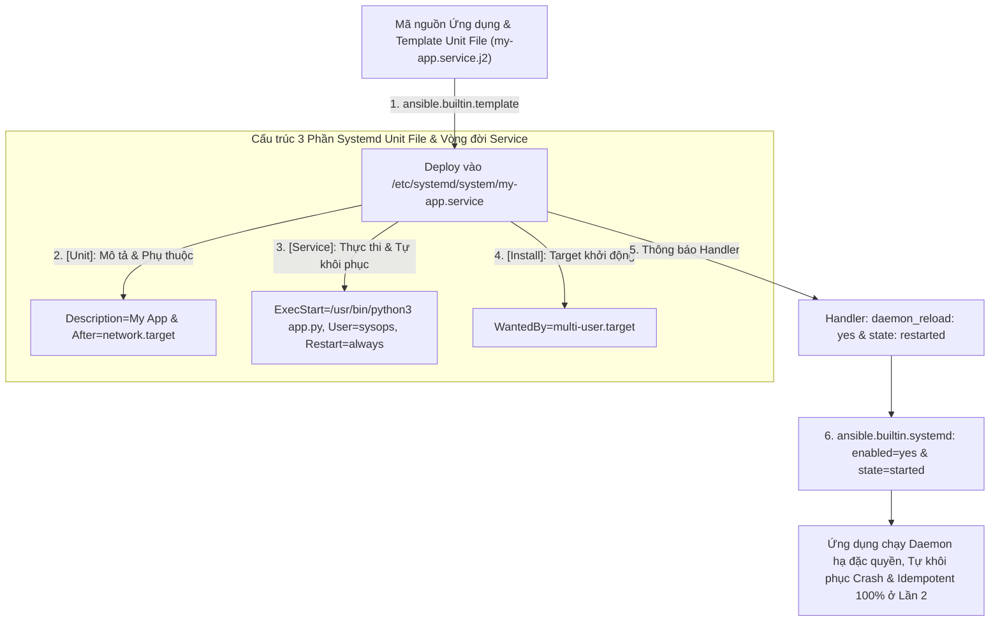
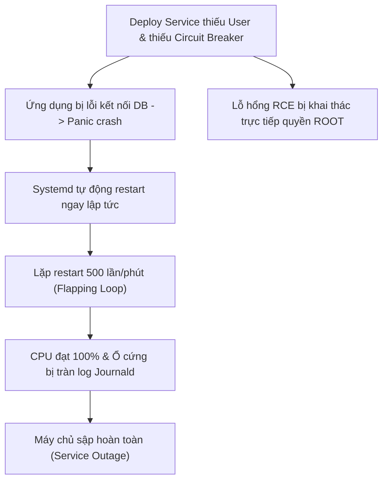
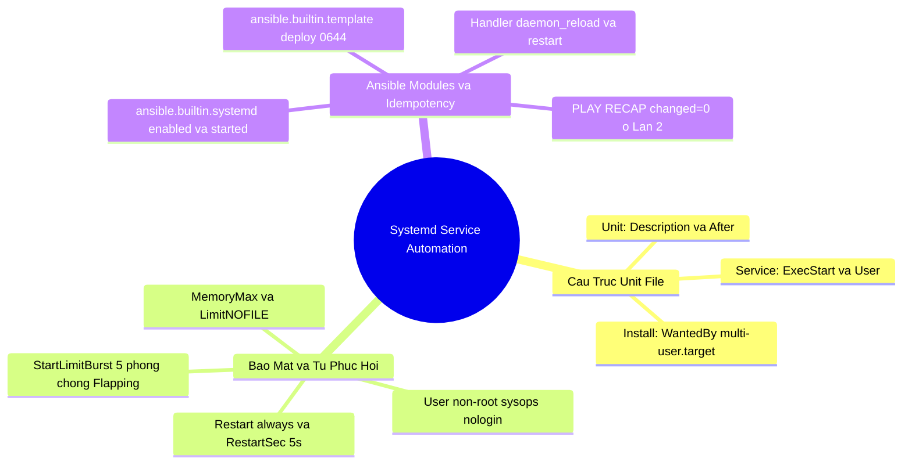


# [BÀI 27] QUẢN LÝ SYSTEMD UNIT & CUSTOM SERVICES: TẠO DAEMON, QUẢN TRỊ VÒNG ĐỜI TIẾN TRÌNH & HEALTH CHECK TỰ PHỤC HỒI

Trong kỷ nguyên **Infrastructure as Code (IaC)** và tự động hóa vận hành hạ tầng đám mây (Cloud Infrastructure Automation), **Ansible** khẳng định vị thế dẫn đầu nhờ triết lý **Agentless** (không cần cài đặt agent nền trên máy đích), giao thức điều khiển an toàn qua **SSH / WinRM**, định dạng khai báo **YAML** trực quan và nguyên lý bất biến **Idempotency** mạnh mẽ. Việc làm chủ Ansible không chỉ dừng lại ở các câu lệnh Ad-hoc đơn giản, mà đòi hỏi kỹ sư phải nắm vững kiến trúc Module tầng thấp, Variable Precedence 22 tầng, Jinja2 Templates, tối ưu hóa Forks & Pipelining cho tới thiết kế Roles / Collections và tích hợp CI/CD tự động hóa chuẩn Doanh nghiệp.

Bài viết chuyên sâu này sẽ đồng hành cùng bạn mổ xẻ toàn diện bức tranh kiến trúc, phân tích các đánh đổi kỹ thuật thực chiến (Engineering Trade-offs), cung cấp hướng dẫn thực hành Lab chi tiết từng bước và bộ câu hỏi phỏng vấn chuyên sâu chuẩn DevOps / SRE Lead.

---

## 1. Bản Chất Kiến Trúc & Cơ Chế Vận Hành Tầng Thấp



### 1.1. Cấu Trúc Systemd Unit File 3 Phần & Deploy Với Jinja2 Template
Trong quản trị Linux hiện đại, **Systemd** là hệ thống khởi tạo (init system) và quản lý tiến trình mặc định trên hầu hết các bản phân phối (RHEL, Ubuntu, Debian, Rocky Linux). Khi triển khai các ứng dụng tự phát triển (Python, Node.js, Golang daemon), chuẩn mực vận hành bắt buộc phải đóng gói dịch vụ dưới dạng **Systemd Service Unit File** đặt tại `/etc/systemd/system/*.service` thay vì chạy các lệnh tạm bợ qua `nohup` hay `screen`.

Một tệp Systemd Unit File tiêu chuẩn bao gồm 3 khối cấu hình cốt lõi:
1. **Khối `[Unit]`:** Khai báo thông tin mô tả (`Description=`), tài liệu tham chiếu (`Documentation=`), và các điều kiện ràng buộc phụ thuộc khởi động (`After=network.target`, `Requires=`).
2. **Khối `[Service]`:** Định nghĩa kiểu tiến trình (`Type=simple|forking|oneshot`), tài khoản thực thi (`User=sysops`, `Group=sysops`), đường dẫn thư mục làm việc (`WorkingDirectory=`), lệnh khởi chạy tuyệt đối (`ExecStart=`), và chính sách tự khôi phục (`Restart=always`, `RestartSec=5s`).
3. **Khối `[Install]`:** Xác định target hệ thống sẽ nạp dịch vụ khi máy chủ boot (`WantedBy=multi-user.target`), tương ứng với Runlevel 3/5 đa người dùng có mạng.

Ansible sử dụng module `ansible.builtin.template` để render file cấu hình `.service.j2` sang máy đích với quyền `mode: '0644'`, cho phép tham số hóa động các thông số như thư mục cài đặt, user chạy, và biến môi trường.

```ini
# Cấu trúc tệp templates/my-app.service.j2
[Unit]
Description={{ app_name }} Custom Systemd Service Daemon
After=network.target

[Service]
Type=simple
User={{ app_user }}
Group={{ app_group }}
WorkingDirectory={{ app_dir }}
ExecStart=/usr/bin/python3 {{ app_dir }}/app.py
Restart=always
RestartSec=5s

[Install]
WantedBy=multi-user.target
```

### 1.2. Cơ Chế Tự Khôi Phục `Restart=always` & Hạ Đặc Quyền Non-Root User
Việc cấu hình các tham số bảo vệ trong khối `[Service]` giải quyết hai bài toán sống còn trong hạ tầng Production:
- **Tự động phục hồi khi gặp sự cố (Self-Healing):** Khai báo `Restart=always` kết hợp `RestartSec=5s` chỉ đạo Systemd tự động giám sát PID của ứng dụng. Nếu tiến trình bị crash do unhandled exception hoặc bị kernel OOM-killer dập tắt, Systemd sẽ tự động khởi tạo lại tiến trình sau 5 giây mà không cần sự can thiệp của kỹ sư. Để chống tình trạng restart liên tục khi code bị lỗi logic nghiêm trọng (Flapping Crash Loop), quản trị viên kết hợp thêm `StartLimitIntervalSec=60s` và `StartLimitBurst=5` trong khối `[Unit]`.
- **Hạ đặc quyền thực thi (Principle of Least Privilege):** Ứng dụng nghiệp vụ tuyệt đối không được chạy dưới quyền `root`. Ansible khởi tạo một system account riêng biệt bằng `ansible.builtin.user` (`name: sysops`, `shell: /sbin/nologin`, `system: true`). Khi khai báo `User=sysops` trong unit file, nếu ứng dụng bị khai thác lỗ hổng Remote Code Execution (RCE), phạm vi ảnh hưởng chỉ bị cô lập trong quyền hạn của user `sysops`, ngăn chặn kẻ tấn công chiếm quyền điều khiển toàn bộ máy chủ.

### 1.3. Quản Lý Nhật Ký Journald, Handler Kích Hoạt & Kiểm Soát Idempotency
- **Tích hợp Nhật ký Tập trung qua Journald:** Toàn bộ dữ liệu xuất ra `stdout` và `stderr` của daemon sẽ được Systemd bắt và chuyển trực tiếp vào `systemd-journald`. Kỹ sư chỉ cần sử dụng lệnh `journalctl -u my-app.service -n 20 --no-pager` hoặc cờ theo dõi realtime `-f` để tra cứu log mà không lo bị tràn đĩa cứng do journald có sẵn cơ chế xoay vòng nhật ký (log rotation & size limit).
- **Cơ chế Handler & `daemon_reload: yes`:** Systemd lưu cache các unit file trong bộ nhớ RAM. Mỗi khi tệp `.service` trên đĩa bị sửa đổi, Systemd Manager bắt buộc phải nạp lại cấu hình qua `systemctl daemon-reload`. Trong Ansible, tác vụ `daemon_reload: true` và `state: restarted` được đặt vào trong Handler để đảm bảo **chỉ thực thi khi file template có sự thay đổi**, duy trì tính Idempotent `changed=0` tuyệt đối ở các lần chạy tiếp theo.

---

## 2. Bảng So Sánh Kỹ Thuật Toàn Diện (Engineering Matrix)

| Tiêu chí kỹ thuật | Chạy Script Thủ công (`nohup &`) | Quản lý Tiến trình qua Supervisor / PM2 | Quản lý Chuẩn hóa qua Systemd Unit File |
|---|---|---|---|
| **Cơ chế Khởi động cùng OS** | Phải viết thêm vào `/etc/rc.local` (dễ lỗi) | Phụ thuộc vào daemon Supervisor/PM2 khởi động trước | Tích hợp gốc vào Linux Init System (`multi-user.target`) |
| **Giám sát & Tự khôi phục Crash** | Không có (tiến trình chết là dừng hẳn) | Có cơ chế auto-restart của tool | Tích hợp sâu tầng kernel (`Restart=always`, `RestartSec`) |
| **Hạ đặc quyền User** | Phải gõ `su - user -c "command"` | Khai báo qua config tool | Chỉ thị trực tiếp trong Unit File (`User=`, `Group=`) |
| **Quản lý Giới hạn Tài nguyên** | Phải dùng lệnh `ulimit` thủ công | Cấu hình hạn chế trong config tool | Tích hợp Linux Cgroups (`MemoryMax=`, `CPUQuota=`) |
| **Thu thập Nhật ký (Logging)** | Ghi ra file log thô, dễ tràn đĩa | Ghi ra log directory của tool | Đánh chỉ mục tập trung qua `systemd-journald` |
| **Tự động hóa với Ansible** | Khó quản lý trạng thái, dễ mất Idempotency | Cần cài thêm package và role phức tạp | Module chính chủ `ansible.builtin.systemd` tích hợp sẵn |

> [!IMPORTANT]
> **QUY TẮC BẮT BUỘC KHI QUẢN LÝ SYSTEMD SERVICE:**
> Luôn đặt `daemon_reload: true` trong Handler và gắn `notify` vào task deploy template. Tuyệt đối không đặt `daemon_reload: true` ở một task độc lập không có điều kiện, vì điều này sẽ gây lặp trạng thái `changed` ở mọi lượt chạy playbook.

---

## 3. Kiến Trúc Triển Khai Chuẩn Production (Systemd Unit & Playbook Breakdown)

Dưới đây là kiến trúc mẫu hoàn chỉnh gồm tệp Jinja2 Template và Playbook Ansible quản lý vòng đời Custom Daemon theo tiêu chuẩn Production:

```ini
# ==============================================================================
# /templates/custom-app.service.j2
# ==============================================================================
[Unit]
Description={{ app_name }} Production Daemon Service
Documentation=https://docs.enterprise.internal/apps/{{ app_name }}
After=network.target remote-fs.target
StartLimitIntervalSec=60s
StartLimitBurst=5

[Service]
Type=simple
User={{ app_user }}
Group={{ app_group }}
WorkingDirectory={{ app_dir }}
ExecStart=/usr/bin/python3 {{ app_dir }}/app.py
Restart=always
RestartSec=5s
MemoryMax=512M
LimitNOFILE=65536
Environment="APP_ENV=production" "LOG_LEVEL=info"

[Install]
WantedBy=multi-user.target
```

```yaml
# ==============================================================================
# site-systemd.yml
# ==============================================================================
---
- name: Master Systemd Service and Daemon Management Playbook
  hosts: web
  become: true
  vars:
    app_name: "Enterprise Custom Daemon"
    app_user: "sysops"
    app_group: "sysops"
    app_dir: "/opt/myapp"

  tasks:
    - name: Task 1 - Create non-root dedicated system service user
      ansible.builtin.user:
        name: "{{ app_user }}"
        shell: /sbin/nologin
        system: true
        state: present

    - name: Task 2 - Create application directory with secure permissions
      ansible.builtin.file:
        path: "{{ app_dir }}"
        state: directory
        owner: "{{ app_user }}"
        group: "{{ app_group }}"
        mode: '0755'

    - name: Task 3 - Deploy application executable script
      ansible.builtin.copy:
        content: |
          import time
          print("Enterprise Systemd Custom Service is Running...")
          while True:
              time.sleep(10)
        dest: "{{ app_dir }}/app.py"
        owner: "{{ app_user }}"
        group: "{{ app_group }}"
        mode: '0755'

    - name: Task 4 - Deploy Systemd Custom Unit File
      ansible.builtin.template:
        src: templates/custom-app.service.j2
        dest: /etc/systemd/system/custom-app.service
        owner: root
        group: root
        mode: '0644'
      notify: Reload systemd daemon and restart service

    - name: Task 5 - Ensure custom service is enabled and started
      ansible.builtin.systemd:
        name: custom-app.service
        enabled: true
        state: started

  handlers:
    - name: Reload systemd daemon and restart service
      ansible.builtin.systemd:
        name: custom-app.service
        daemon_reload: true
        state: restarted
```

### Phân Tích Kỹ Thuật Từng Dòng (Line-by-Line Breakdown):
- <span class="badge-line">Unit File Line 5-7</span> `StartLimitIntervalSec=60s` và `StartLimitBurst=5`: Thiết lập mạch ngắt an toàn, nếu service crash quá 5 lần trong 1 phút sẽ chuyển sang trạng thái failed để bảo vệ tài nguyên máy chủ.
- <span class="badge-line">Unit File Line 10-11</span> `User=sysops` & `Group=sysops`: Ép tiến trình chạy hạ đặc quyền dưới user phi đặc quyền.
- <span class="badge-line">Unit File Line 14-15</span> `Restart=always` & `RestartSec=5s`: Kích hoạt cơ chế Self-healing tự phục hồi trong 5 giây.
- <span class="badge-line">Unit File Line 16-17</span> `MemoryMax=512M` & `LimitNOFILE=65536`: Giới hạn RAM tối đa qua Cgroups và tăng ngưỡng file descriptor.
- <span class="badge-line">Playbook Line 13-17</span> `ansible.builtin.user`: Tạo user hệ thống không có quyền đăng nhập SSH (`/sbin/nologin`).
- <span class="badge-line">Playbook Line 34-41</span> `ansible.builtin.template`: Render unit file vào `/etc/systemd/system/` và gửi tín hiệu `notify` tới Handler.
- <span class="badge-line">Playbook Line 43-47</span> `ansible.builtin.systemd`: Bật cờ `enabled: true` (khởi chạy cùng OS) và `state: started` (chạy ngay lập tức).
- <span class="badge-line">Playbook Line 49-54</span> `handlers`: Đảm bảo `daemon_reload: true` và `state: restarted` chỉ diễn ra khi tệp unit file thực sự bị thay đổi nội dung.

---

## 4. Phân Tích Cạm Bẫy Thực Chiến: Chạy Ứng Dụng Dưới Quyền Root & Lỗi Flapping Crash Loop

### Tình Huống Sự Cố Thực Tế Tại Doanh Nghiệp:
Một công ty tài chính tự động hóa việc triển khai microservice Golang xử lý giao dịch. Đội ngũ kỹ sư viết unit file sơ sài:
1. Không khai báo `User=`, khiến ứng dụng mặc định chạy dưới quyền tối cao `root`.
2. Khai báo `Restart=always` nhưng bỏ qua `StartLimitBurst`.
3. Cấu hình sai chuỗi kết nối cơ sở dữ liệu khiến ứng dụng bị panic và crash ngay lập tức sau 100ms khởi chạy.

Hậu quả: Systemd liên tục restart tiến trình hàng trăm lần mỗi phút (Flapping Loop), làm CPU máy chủ tăng vọt lên 100%, ghi đầy ổ cứng với hàng triệu dòng log trong Journald. Nghiêm trọng hơn, lỗ hổng RCE tồn tại trong mã nguồn ứng dụng đã bị hacker khai thác để lấy toàn quyền root máy chủ do daemon chạy dưới tài khoản `root`.



```diff
# Sửa đổi cấu hình Unit File để khắc phục triệt để cạm bẫy
  [Unit]
  Description=Payment Processing Service
  After=network.target
+ StartLimitIntervalSec=60s
+ StartLimitBurst=5

  [Service]
  Type=simple
- # NGUY HIỂM: Chạy dưới quyền root mặc định
+ User=sysops
+ Group=sysops
  WorkingDirectory=/opt/payment
  ExecStart=/opt/payment/bin/server
  Restart=always
- RestartSec=0s
+ RestartSec=5s
+ MemoryMax=1G
```

### 5-Whys Root Cause Analysis:
1. **Tại sao máy chủ bị treo và tràn tài nguyên?** Vì tiến trình restart liên tục hàng nghìn lần làm quá tải CPU và Journald.
2. **Tại sao tiến trình lại restart liên tục?** Vì ứng dụng dính lỗi panic nhưng Systemd được cấu hình `Restart=always` với `RestartSec=0s`.
3. **Tại sao Systemd không ngắt tiến trình lại?** Vì unit file thiếu cấu hình giới hạn số lần khởi động lại `StartLimitBurst`.
4. **Tại sao kẻ tấn công chiếm được toàn quyền hệ thống?** Vì daemon được khởi chạy dưới quyền `root`.
5. **Tại sao lại deploy cấu hình thiếu an toàn lên production?** Vì playbook Ansible không áp dụng template chuẩn hóa và bỏ qua bước review bảo mật.

---

## 5. Hands-on Lab: Đóng Gói Ứng Dụng Custom Systemd Service & Cấu Hình Self-Healing (8 Bước)

| Bước | Lệnh CLI / Tác Vụ Chính | Mục Đích Thực Thi |
|---|---|---|
| 1 | `mkdir -p ~/lab-ansible-27/templates` | Khởi tạo thư mục lab và cấu trúc templates |
| 2 | Tạo template `templates/my-app.service.j2` | Biên soạn Unit File 3 phần chuẩn hóa |
| 3 | Cấu hình `ansible.cfg` và `inventory.ini` | Thiết lập môi trường kết nối và biến quản trị |
| 4 | Viết Playbook chính `site-systemd.yml` | Khai báo tác vụ tạo user, copy app, render template và start service |
| 5 | Thực thi Playbook Lần 1 | Triển khai daemon và khởi chạy service lần đầu |
| 6 | Thực thi Phép thử Idempotency Lần 2 | Kiểm chứng tính Idempotency tuyệt đối (`changed=0`) |
| 7 | Kiểm tra Journald & Thử nghiệm Self-Healing | Gửi `pkill` giả lập crash và xác minh tự phục hồi qua `journalctl` |
| 8 | Đối soát sự thật máy đích qua `docker exec` | Kiểm tra unit file và tiến trình chạy dưới user `sysops` |

```bash
# ==============================================================================
# BƯỚC 1: KHỞI TẠO CẤU TRÚC THƯ MỤC LAB
# ==============================================================================
mkdir -p ~/lab-ansible-27/templates && cd ~/lab-ansible-27

# ==============================================================================
# BƯỚC 2: TẠO TEMPLATE JINJA2 CHO SYSTEMD UNIT FILE
# ==============================================================================
cat << 'EOF' > templates/my-app.service.j2
[Unit]
Description={{ app_name }} Custom Systemd Service Daemon
After=network.target
StartLimitIntervalSec=60s
StartLimitBurst=5

[Service]
Type=simple
User={{ app_user }}
Group={{ app_group }}
WorkingDirectory={{ app_dir }}
ExecStart=/usr/bin/python3 {{ app_dir }}/app.py
Restart=always
RestartSec=5s

[Install]
WantedBy=multi-user.target
EOF

# CHECKPOINT 1: Xác nhận tệp template Jinja2 được tạo thành công
if [ -f "templates/my-app.service.j2" ] && grep -q "\[Unit\]" templates/my-app.service.j2 && grep -q "Restart=always" templates/my-app.service.j2 && grep -q "\[Install\]" templates/my-app.service.j2; then
  echo "CHECKPOINT 1: ĐẠT - Tệp Template Jinja2 templates/my-app.service.j2 được khởi tạo thành công"
else
  echo "CHECKPOINT 1: LỖI - Khởi tạo my-app.service.j2 thất bại"
fi

# ==============================================================================
# BƯỚC 3: CẤU HÌNH ANSIBLE.CFG VÀ INVENTORY.INI
# ==============================================================================
cat << 'EOF' > ansible.cfg
[defaults]
inventory = ./inventory.ini
remote_user = ansible
host_key_checking = False
private_key_file = ~/.ssh/id_ed25519
force_handlers = True

[privilege_escalation]
become = True
become_method = sudo
become_user = root
become_ask_pass = False
EOF

cat << 'EOF' > inventory.ini
[web]
target1 ansible_host=127.0.0.1 ansible_port=2221

[db]
target2 ansible_host=127.0.0.1 ansible_port=2222

[all:vars]
ansible_python_interpreter=/usr/bin/python3
app_name="Enterprise Custom App"
app_user="sysops"
app_group="sysops"
app_dir="/opt/myapp"
EOF

# CHECKPOINT 2: Xác nhận tệp cấu hình và inventory
if [ -f "ansible.cfg" ] && [ -f "inventory.ini" ] && grep -q "app_user=\"sysops\"" inventory.ini; then
  echo "CHECKPOINT 2: ĐẠT - Cấu hình ansible.cfg và inventory.ini sẵn sàng"
else
  echo "CHECKPOINT 2: LỖI - Thiếu cấu hình hoặc inventory"
fi

# ==============================================================================
# BƯỚC 4: VIẾT PLAYBOOK CHÍNH site-systemd.yml
# ==============================================================================
cat << 'EOF' > site-systemd.yml
---
- name: Master Systemd Service and Daemon Management Playbook
  hosts: web
  become: true
  tasks:
    - name: Task 1 - Create non-root dedicated service user
      ansible.builtin.user:
        name: "{{ app_user }}"
        shell: /sbin/nologin
        system: true
        state: present

    - name: Task 2 - Create application working directory
      ansible.builtin.file:
        path: "{{ app_dir }}"
        state: directory
        owner: "{{ app_user }}"
        group: "{{ app_group }}"
        mode: '0755'

    - name: Task 3 - Deploy dummy Python application script
      ansible.builtin.copy:
        content: |
          import time
          print("Enterprise Systemd Custom Service is Running...")
          while True:
              time.sleep(10)
        dest: "{{ app_dir }}/app.py"
        owner: "{{ app_user }}"
        group: "{{ app_group }}"
        mode: '0755'

    - name: Task 4 - Deploy Systemd Custom Unit File
      ansible.builtin.template:
        src: templates/my-app.service.j2
        dest: /etc/systemd/system/my-app.service
        owner: root
        group: root
        mode: '0644'
      notify: Reload systemd daemon and restart service

    - name: Task 5 - Enable and start Systemd Custom Service
      ansible.builtin.systemd:
        name: my-app.service
        enabled: true
        state: started

  handlers:
    - name: Reload systemd daemon and restart service
      ansible.builtin.systemd:
        name: my-app.service
        daemon_reload: true
        state: restarted
EOF

# CHECKPOINT 3: Kiểm tra cú pháp Playbook
ansible-playbook --syntax-check site-systemd.yml
if [ $? -eq 0 ]; then
  echo "CHECKPOINT 3: ĐẠT - Playbook site-systemd.yml chuẩn cú pháp"
else
  echo "CHECKPOINT 3: LỖI - Cú pháp Playbook không hợp lệ"
fi

# ==============================================================================
# BƯỚC 5: THỰC THI PLAYBOOK LẦN 1
# ==============================================================================
ansible-playbook site-systemd.yml

# CHECKPOINT 4: Xác nhận chạy Lần 1 thành công
if [ $? -eq 0 ]; then
  echo "CHECKPOINT 4: ĐẠT - Triển khai Systemd Service Lần 1 thành công"
else
  echo "CHECKPOINT 4: LỖI - Triển khai Lần 1 thất bại"
fi

# ==============================================================================
# BƯỚC 6: THỰC THI PHÉP THỬ IDEMPOTENCY LẦN 2
# ==============================================================================
RUN2_OUT=$(ansible-playbook site-systemd.yml)

# CHECKPOINT 5: Đối soát tính Idempotency Lần 2 (changed=0)
if echo "$RUN2_OUT" | grep -q "changed=0" && echo "$RUN2_OUT" | grep -q "failed=0"; then
  echo "CHECKPOINT 5: ĐẠT - Phép thử Lượt 2 đạt chuẩn Idempotency (changed=0)"
else
  echo "CHECKPOINT 5: LỖI - Lượt 2 bị lặp thay đổi"
fi

# ==============================================================================
# BƯỚC 7: KIỂM TRA JOURNALD VÀ THỬ NGHIỆM SELF-HEALING KHI CRASH
# ==============================================================================
# 1. Xem nhật ký khởi động ban đầu
ansible web -m ansible.builtin.command -a "journalctl -u my-app.service -n 10 --no-pager"

# 2. Giả lập crash bằng cách kill tiến trình
ansible web -m ansible.builtin.shell -a "pkill -f 'app.py' || true"
sleep 6

# CHECKPOINT 6: Kiểm tra tính năng Restart=always tự phục hồi
REST_OUT=$(ansible web -m ansible.builtin.command -a "journalctl -u my-app.service -n 10 --no-pager")
if echo "$REST_OUT" | grep -q "Started" || echo "$REST_OUT" | grep -q "Enterprise Systemd Custom Service"; then
  echo "CHECKPOINT 6: ĐẠT - Tính năng Restart=always tự động khôi phục dịch vụ sau khi bị kill"
else
  echo "CHECKPOINT 6: LỖI - Tự khôi phục dịch vụ thất bại"
fi

# ==============================================================================
# BƯỚC 8: ĐỐI SOÁT SỰ THẬT MÁY ĐÍCH QUA DOCKER EXEC
# ==============================================================================
# 1. Kiểm tra nội dung Unit File
docker exec target1 cat /etc/systemd/system/my-app.service

# CHECKPOINT 7: Xác minh file unit file cấu hình trên máy đích
EXEC_UNIT=$(docker exec target1 cat /etc/systemd/system/my-app.service)
if echo "$EXEC_UNIT" | grep -q "User=sysops" && echo "$EXEC_UNIT" | grep -q "Restart=always"; then
  echo "CHECKPOINT 7: ĐẠT - Unit File trên máy đích cấu hình chính xác"
else
  echo "CHECKPOINT 7: LỖI - Cấu hình Unit File không chính xác"
fi

# 2. Kiểm tra tiến trình thực tế chạy dưới user sysops
EXEC_PS=$(docker exec target1 ps aux | grep app.py)

# CHECKPOINT 8: Xác minh tiến trình chạy hạ đặc quyền
if echo "$EXEC_PS" | grep -q "sysops"; then
  echo "CHECKPOINT 8: ĐẠT - Tiến trình app.py đang chạy dưới tài khoản hạ đặc quyền sysops"
else
  echo "CHECKPOINT 8: LỖI - Tiến trình không chạy dưới user sysops"
fi
```

---

## 6. Bộ Câu Hỏi Vấn Đáp & Phỏng Vấn Chuyên Sâu (Self-Check Q&A)

<details class="qa-card" markdown="1">
<summary class="qa-summary">
  <span class="qa-num-badge">Q01</span>
  <span>Trình bày cấu trúc 3 phần bắt buộc trong một tệp Systemd Unit File (.service).</span>
</summary>
<div class="qa-answer">
  <div class="qa-answer-header">
    <svg width="14" height="14" fill="none" stroke="currentColor" stroke-width="2" viewBox="0 0 24 24"><path d="M22 11.08V12a10 10 0 1 1-5.93-9.14"></path><polyline points="22 4 12 14.01 9 11.01"></polyline></svg>
    <span>Phân Tích &amp; Lời Giải Kỹ Thuật</span>
  </div>
  <p>Cấu trúc 3 phần:</p>
  <ul>
    <li><code>[Unit]</code>: Chứa thông tin mô tả dịch vụ (<code>Description=</code>) và điều kiện phụ thuộc khởi động (<code>After=network.target</code>).</li>
    <li><code>[Service]</code>: Chứa lệnh khởi chạy (<code>ExecStart=</code>), tài khoản thực thi (<code>User=sysops</code>), và chính sách tự phục hồi (<code>Restart=always</code>).</li>
    <li><code>[Install]</code>: Chứa target gắn kết dịch vụ khi máy chủ boot (<code>WantedBy=multi-user.target</code>).</li>
  </ul>
</div>
</details>

<details class="qa-card" markdown="1">
<summary class="qa-summary">
  <span class="qa-num-badge">Q02</span>
  <span>Thư mục chuẩn nào trên Linux dùng để lưu Custom Unit Files và module Ansible nào phù hợp để deploy?</span>
</summary>
<div class="qa-answer">
  <div class="qa-answer-header">
    <svg width="14" height="14" fill="none" stroke="currentColor" stroke-width="2" viewBox="0 0 24 24"><path d="M22 11.08V12a10 10 0 1 1-5.93-9.14"></path><polyline points="22 4 12 14.01 9 11.01"></polyline></svg>
    <span>Phân Tích &amp; Lời Giải Kỹ Thuật</span>
  </div>
  <p>Thư mục chuẩn là <code>/etc/systemd/system/</code> (có độ ưu tiên cao hơn thư mục hệ thống <code>/usr/lib/systemd/system/</code>). Module Ansible tối ưu là <code>ansible.builtin.template</code> kết hợp Jinja2 để biến đổi động các thông số với quyền hạn chuẩn <code>mode: '0644'</code>.</p>
</div>
</details>

<details class="qa-card" markdown="1">
<summary class="qa-summary">
  <span class="qa-num-badge">Q03</span>
  <span>Tại sao phải nạp lại daemon (<code>daemon_reload: yes</code>) khi sửa đổi Unit File?</span>
</summary>
<div class="qa-answer">
  <div class="qa-answer-header">
    <svg width="14" height="14" fill="none" stroke="currentColor" stroke-width="2" viewBox="0 0 24 24"><path d="M22 11.08V12a10 10 0 1 1-5.93-9.14"></path><polyline points="22 4 12 14.01 9 11.01"></polyline></svg>
    <span>Phân Tích &amp; Lời Giải Kỹ Thuật</span>
  </div>
  <p>Systemd lưu cấu hình unit file trong bộ nhớ đệm RAM. Nếu file trên đĩa bị thay đổi mà không chạy <code>systemctl daemon-reload</code> (hoặc <code>daemon_reload: true</code> trong Ansible), Systemd sẽ bỏ qua cấu hình mới và đưa ra cảnh báo <code>Warning: unit file changed on disk</code>.</p>
</div>
</details>

<details class="qa-card" markdown="1">
<summary class="qa-summary">
  <span class="qa-num-badge">Q04</span>
  <span>Cơ chế tự khôi phục với <code>Restart=always</code> và <code>RestartSec=5s</code> hoạt động ra sao?</span>
</summary>
<div class="qa-answer">
  <div class="qa-answer-header">
    <svg width="14" height="14" fill="none" stroke="currentColor" stroke-width="2" viewBox="0 0 24 24"><path d="M22 11.08V12a10 10 0 1 1-5.93-9.14"></path><polyline points="22 4 12 14.01 9 11.01"></polyline></svg>
    <span>Phân Tích &amp; Lời Giải Kỹ Thuật</span>
  </div>
  <p>Khi tiến trình daemon bị sập đột ngột (crash, exception, OOM-killer hoặc bị kill bằng <code>SIGKILL</code>), Systemd sẽ bắt tín hiệu, đợi đúng khoảng thời gian 5 giây (<code>RestartSec=5s</code>), và tự động khởi tạo lại tiến trình mà không cần sự can thiệp của con người.</p>
</div>
</details>

<details class="qa-card" markdown="1">
<summary class="qa-summary">
  <span class="qa-num-badge">Q05</span>
  <span>Tại sao bắt buộc phải cấu hình <code>User=sysops</code> trong Unit File của ứng dụng tùy chỉnh?</span>
</summary>
<div class="qa-answer">
  <div class="qa-answer-header">
    <svg width="14" height="14" fill="none" stroke="currentColor" stroke-width="2" viewBox="0 0 24 24"><path d="M22 11.08V12a10 10 0 1 1-5.93-9.14"></path><polyline points="22 4 12 14.01 9 11.01"></polyline></svg>
    <span>Phân Tích &amp; Lời Giải Kỹ Thuật</span>
  </div>
  <p>Tuân thủ nguyên tắc bảo mật tối thiểu (Least Privilege). Nếu ứng dụng chạy dưới quyền <code>root</code> bị dính lỗ hổng thực thi mã từ xa (RCE), kẻ tấn công sẽ kiểm soát toàn bộ hệ điều hành. Chạy dưới user <code>sysops</code> không có quyền đăng nhập shell (<code>/sbin/nologin</code>) giúp cô lập hoàn toàn thiệt hại.</p>
</div>
</details>

<details class="qa-card" markdown="1">
<summary class="qa-summary">
  <span class="qa-num-badge">Q06</span>
  <span>Phân biệt ý nghĩa của hai thuộc tính <code>enabled: true</code> và <code>state: started</code> trong module systemd.</span>
</summary>
<div class="qa-answer">
  <div class="qa-answer-header">
    <svg width="14" height="14" fill="none" stroke="currentColor" stroke-width="2" viewBox="0 0 24 24"><path d="M22 11.08V12a10 10 0 1 1-5.93-9.14"></path><polyline points="22 4 12 14.01 9 11.01"></polyline></svg>
    <span>Phân Tích &amp; Lời Giải Kỹ Thuật</span>
  </div>
  <p><code>enabled: true</code> tạo symlink để dịch vụ tự động khởi động cùng hệ điều hành khi máy chủ boot. <code>state: started</code> đảm bảo tiến trình dịch vụ đang hoạt động ngay tại thời điểm hiện tại. Cần kết hợp cả hai thuộc tính để đạt độ sẵn sàng tối đa.</p>
</div>
</details>

<details class="qa-card" markdown="1">
<summary class="qa-summary">
  <span class="qa-num-badge">Q07</span>
  <span>Làm thế nào để tra cứu nhật ký của Systemd Custom Service bằng <code>journalctl</code>?</span>
</summary>
<div class="qa-answer">
  <div class="qa-answer-header">
    <svg width="14" height="14" fill="none" stroke="currentColor" stroke-width="2" viewBox="0 0 24 24"><path d="M22 11.08V12a10 10 0 1 1-5.93-9.14"></path><polyline points="22 4 12 14.01 9 11.01"></polyline></svg>
    <span>Phân Tích &amp; Lời Giải Kỹ Thuật</span>
  </div>
  <p>Sử dụng lệnh: <code>journalctl -u my-app.service</code>. Có thể kết hợp cờ <code>-n 20</code> (hiển thị 20 dòng gần nhất), <code>-f</code> (theo dõi log realtime), và <code>--no-pager</code> (xuất thẳng ra terminal không phân trang).</p>
</div>
</details>

<details class="qa-card" markdown="1">
<summary class="qa-summary">
  <span class="qa-num-badge">Q08</span>
  <span>Tại sao nên đưa <code>daemon_reload: true</code> vào Handler thay vì một Task thông thường?</span>
</summary>
<div class="qa-answer">
  <div class="qa-answer-header">
    <svg width="14" height="14" fill="none" stroke="currentColor" stroke-width="2" viewBox="0 0 24 24"><path d="M22 11.08V12a10 10 0 1 1-5.93-9.14"></path><polyline points="22 4 12 14.01 9 11.01"></polyline></svg>
    <span>Phân Tích &amp; Lời Giải Kỹ Thuật</span>
  </div>
  <p>Để đảm bảo tính Idempotency và tránh lãng phí tài nguyên CPU của Systemd Manager. Khi đặt trong Handler có liên kết <code>notify</code> từ task template, lệnh reload và restart chỉ thực thi khi tệp unit file thực sự bị thay đổi nội dung trên đĩa.</p>
</div>
</details>

<details class="qa-card" markdown="1">
<summary class="qa-summary">
  <span class="qa-num-badge">Q09</span>
  <span>Trình bày 3 bước kiểm chứng tính Idempotency và trạng thái thực tế của Systemd Service.</span>
</summary>
<div class="qa-answer">
  <div class="qa-answer-header">
    <svg width="14" height="14" fill="none" stroke="currentColor" stroke-width="2" viewBox="0 0 24 24"><path d="M22 11.08V12a10 10 0 1 1-5.93-9.14"></path><polyline points="22 4 12 14.01 9 11.01"></polyline></svg>
    <span>Phân Tích &amp; Lời Giải Kỹ Thuật</span>
  </div>
  <ol>
    <li><strong>Chạy Lần 1:</strong> Thực thi playbook triển khai daemon, ghi nhận <code>changed > 0</code>.</li>
    <li><strong>Re-run Lần 2:</strong> Chạy lại toàn bộ playbook không đổi cấu hình, bảng <code>PLAY RECAP</code> phải báo <code>changed=0</code>.</li>
    <li><strong>Đối soát máy đích:</strong> Dùng <code>docker exec target1 ps aux | grep app.py</code> xác nhận tiến trình đang chạy dưới user <code>sysops</code>.</li>
  </ol>
</div>
</details>

<details class="qa-card" markdown="1">
<summary class="qa-summary">
  <span class="qa-num-badge">Q10</span>
  <span>Làm thế nào để giới hạn RAM và số lượng File Descriptor cho Systemd Service?</span>
</summary>
<div class="qa-answer">
  <div class="qa-answer-header">
    <svg width="14" height="14" fill="none" stroke="currentColor" stroke-width="2" viewBox="0 0 24 24"><path d="M22 11.08V12a10 10 0 1 1-5.93-9.14"></path><polyline points="22 4 12 14.01 9 11.01"></polyline></svg>
    <span>Phân Tích &amp; Lời Giải Kỹ Thuật</span>
  </div>
  <p>Khai báo trong khối <code>[Service]</code>: <code>MemoryMax=512M</code> (giới hạn dung lượng RAM tối đa qua Cgroups) và <code>LimitNOFILE=65536</code> (nâng giới hạn số file descriptor tối đa được mở đồng thời).</p>
</div>
</details>

<details class="qa-card" markdown="1">
<summary class="qa-summary">
  <span class="qa-num-badge">Q11</span>
  <span>Cặp chỉ thị nào trong khối <code>[Unit]</code> giúp ngăn chặn hiện tượng Flapping Crash Loop?</span>
</summary>
<div class="qa-answer">
  <div class="qa-answer-header">
    <svg width="14" height="14" fill="none" stroke="currentColor" stroke-width="2" viewBox="0 0 24 24"><path d="M22 11.08V12a10 10 0 1 1-5.93-9.14"></path><polyline points="22 4 12 14.01 9 11.01"></polyline></svg>
    <span>Phân Tích &amp; Lời Giải Kỹ Thuật</span>
  </div>
  <p>Sử dụng <code>StartLimitIntervalSec=60s</code> và <code>StartLimitBurst=5</code>. Nếu dịch vụ crash và restart quá 5 lần trong vòng 60 giây, Systemd sẽ chuyển trạng thái sang <code>failed</code> và ngắt chu kỳ restart để bảo vệ tài nguyên máy chủ.</p>
</div>
</details>

<details class="qa-card" markdown="1">
<summary class="qa-summary">
  <span class="qa-num-badge">Q12</span>
  <span>Tóm tắt 5 nguyên tắc vàng khi đóng gói và quản lý Systemd Service qua Ansible.</span>
</summary>
<div class="qa-answer">
  <div class="qa-answer-header">
    <svg width="14" height="14" fill="none" stroke="currentColor" stroke-width="2" viewBox="0 0 24 24"><path d="M22 11.08V12a10 10 0 1 1-5.93-9.14"></path><polyline points="22 4 12 14.01 9 11.01"></polyline></svg>
    <span>Phân Tích &amp; Lời Giải Kỹ Thuật</span>
  </div>
  <ol>
    <li>Soạn thảo Unit File 3 phần chuẩn hóa (<code>[Unit]</code>, <code>[Service]</code>, <code>[Install]</code>) bằng template đặt tại <code>/etc/systemd/system/</code>.</li>
    <li>Bật cơ chế Self-healing <code>Restart=always</code> và khoảng trễ <code>RestartSec=5s</code>.</li>
    <li>Hạ đặc quyền thực thi với dedicated non-root user (<code>User=sysops</code>).</li>
    <li>Quản lý trạng thái kép <code>enabled: true</code> và <code>state: started</code> cùng Handler <code>daemon_reload: true</code>.</li>
    <li>Kiểm soát nhật ký tập trung qua <code>journalctl</code> và chứng minh tính Idempotent <code>changed=0</code> ở Lần 2.</li>
  </ol>
</div>
</details>

---

## 7. Tổng Kết & Lộ Trình Bài Học Tiếp Theo

### 5 Điều Cốt Lõi Cần Ghi Nhớ:
1. **Đóng Gói Chuẩn Hóa:** Thay thế 100% các lệnh `nohup` bằng Systemd Unit File 3 phần đặt tại `/etc/systemd/system/`.
2. **Nguyên Tắc Least Privilege:** Không bao giờ chạy daemon dưới quyền `root`, luôn tạo user hệ thống hạ đặc quyền (`/sbin/nologin`).
3. **Cơ Chế Self-Healing:** Cấu hình `Restart=always` kết hợp `RestartSec=5s` và `StartLimitBurst=5` để chống crash loop.
4. **Tối Ưu Handler Daemon-Reload:** Chỉ thực thi `daemon-reload` khi file cấu hình có sự thay đổi nội dung trên đĩa.
5. **Đạt Idempotency Tuyệt Đối:** Mọi playbook quản lý Systemd ở lượt chạy thứ hai đều phải trả về `changed=0`.



> [!TIP]
> **BÀI HỌC TIẾP THEO:** [Bài 28: Tự Động Hóa An Ninh Mạng Với Firewalld & Iptables: Quản Lý Port, Rich Rules, IP Sets & Chặn IP Độc Hại Tự Động](ansible-28-28-firewalld-iptables-security.html) — Tiếp tục hành trình Giai đoạn 5, làm chủ kỹ thuật phòng thủ tường lửa và tự động hóa an ninh mạng Linux cấp Enterprise.


