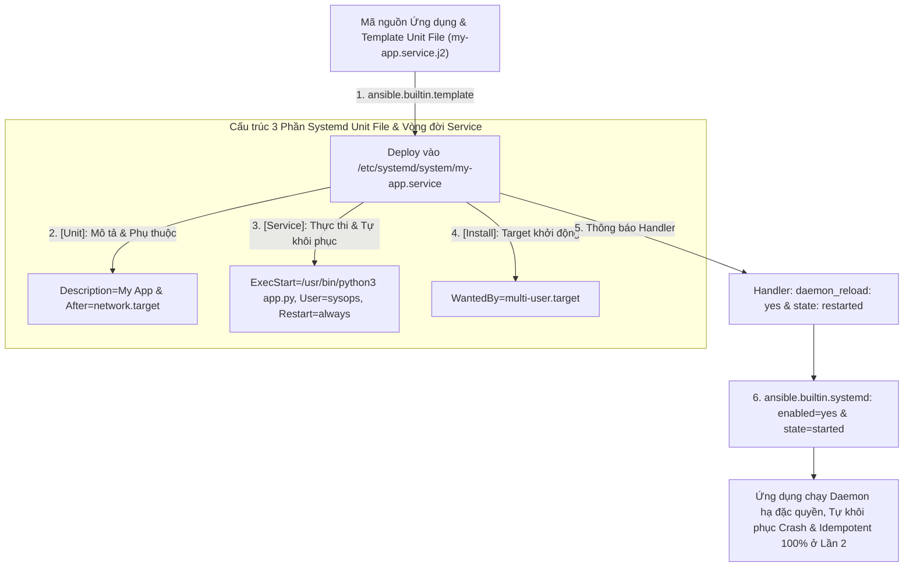
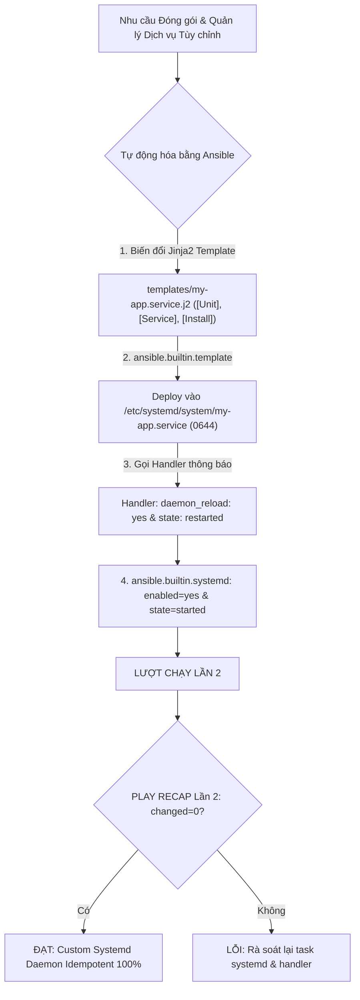
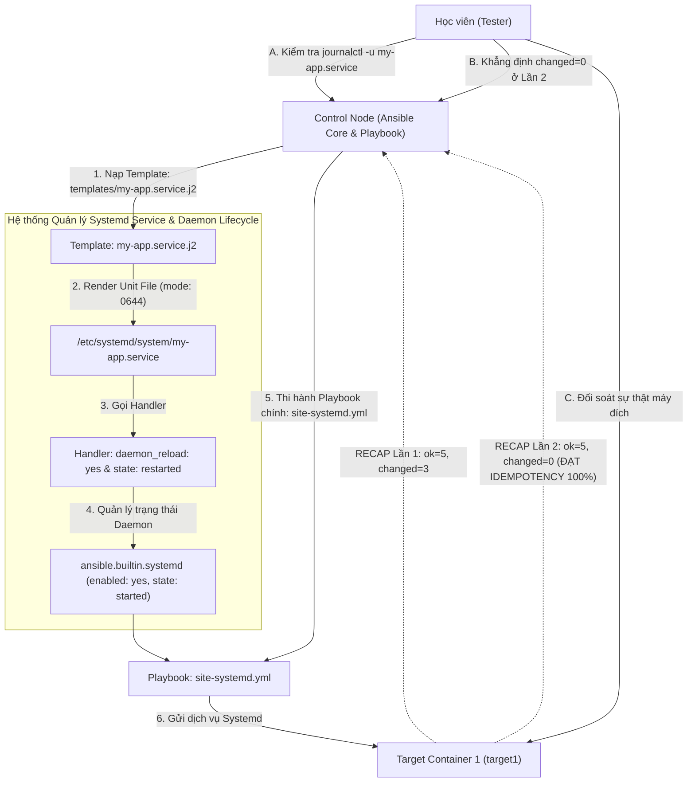


# [BÀI 27] QUẢN LÝ SYSTEMD UNIT & CUSTOM SERVICES: TẠO DAEMON, QUẢN TRỊ VÒNG ĐỜI TIẾN TRÌNH & HEALTH CHECK TỰ PHỤC HỒI

Trong kỷ nguyên **Infrastructure as Code (IaC)** và tự động hóa vận hành hạ tầng đám mây (Cloud Infrastructure Automation), **Ansible** khẳng định vị thế dẫn đầu nhờ triết lý **Agentless** (không cần cài đặt agent nền trên máy đích), giao thức điều khiển an toàn qua **SSH / WinRM**, định dạng khai báo **YAML** trực quan và nguyên lý bất biến **Idempotency** mạnh mẽ. Việc làm chủ Ansible không chỉ dừng lại ở các câu lệnh Ad-hoc đơn giản, mà đòi hỏi kỹ sư phải nắm vững kiến trúc Module tầng thấp, Variable Precedence 22 tầng, Jinja2 Templates, tối ưu hóa Forks & Pipelining cho tới thiết kế Roles / Collections và tích hợp CI/CD tự động hóa chuẩn Doanh nghiệp.

Bài viết chuyên sâu này sẽ đồng hành cùng bạn mổ xẻ toàn diện bức tranh kiến trúc, phân tích các đánh đổi kỹ thuật thực chiến (Engineering Trade-offs), cung cấp hướng dẫn thực hành Lab chi tiết từng bước và bộ câu hỏi phỏng vấn chuyên sâu chuẩn DevOps / SRE Lead.

---

## 1. Bản Chất Kiến Trúc & Cơ Chế Vận Hành Tầng Thấp

---


> **Tự động hóa đóng gói và quản lý vòng đời ứng dụng dưới dạng Custom Systemd Unit File bằng Ansible giúp ứng dụng tự động khởi chạy cùng hệ thống, tự khôi phục khi gặp sự cố crash và chuẩn hóa quản lý nhật ký qua Journald.**

Mở màn Giai đoạn 5 — Làm chủ hệ thống dịch vụ ngầm cấp Enterprise (I-10):

> **Bước vào Giai đoạn 5 (Nâng cao và Capstone) — nơi học viên được trang bị các kỹ năng chuyên sâu để quản trị các hệ thống phức tạp thực tế. Một trong những bài toán quan trọng nhất trong vận hành hạ tầng là quản lý vòng đời của các ứng dụng tự phát triển (như ứng dụng Python, Node.js, Go, hoặc Shell Daemon). Việc chạy ứng dụng bằng cách gõ lệnh background `nohup python app.py &` là cực kỳ rủi ro: ứng dụng sẽ bị ngắt hoàn toàn khi máy chủ reboot, không có cơ chế tự động khởi động lại khi crash, và nhật ký bị phân tán. Chuẩn mực quản trị Linux hiện đại yêu cầu đóng gói mọi ứng dụng thành Systemd Unit File (`/etc/systemd/system/*.service`). Ansible cung cấp module `ansible.builtin.systemd` kết hợp với Jinja2 Template giúp tự động hóa 100% việc tạo Unit File, kích hoạt `daemon-reload`, hạ đặc quyền chạy under non-root user, bật tự khôi phục `Restart=always`, duy trì tính Idempotent `changed=0` ở Lần 2.**

---


---


---


| Tiếng Việt | Tiếng Anh / Từ khóa + FQCN (giữ nguyên) |
|---|---|
| Tệp cấu hình dịch vụ Systemd | Systemd Unit File (`/etc/systemd/system/*.service`) |
| Thư mục chứa Unit File | Systemd unit file directory (`/etc/systemd/system/`) |
| Nạp lại cấu hình daemon | Systemd daemon reload (`daemon_reload: yes`) |
| Module quản lý dịch vụ Systemd | Systemd management module (`ansible.builtin.systemd`) |
| Tự động khôi phục khi crash | Automatic crash recovery (`Restart=always`) |
| Khoảng thời gian tạm dừng trước restart | Restart delay seconds (`RestartSec=5s`) |
| Tài khoản chạy hạ đặc quyền | Non-root service account (`User=sysops`, `Group=sysops`) |
| Nhật ký hệ thống tập trung | Systemd journal logs (`journalctl -u service`) |
| Trạng thái kích hoạt khởi động cùng OS | Service boot enable (`enabled: yes`) |
| Trạng thái thực thi hiện tại | Service runtime state (`state: started`) |
| Dịch vụ phụ thuộc | Service dependency directive (`After=network.target`) |
| Điểm kích hoạt khởi chạy | Installation target directive (`WantedBy=multi-user.target`) |

---

### 1.1. Cấu trúc Systemd Unit File và Deploy với Jinja2 Template (15 phút)



**Nguyên lý cốt lõi:** Thiết lập cấu trúc tệp Systemd Unit File tuân thủ đầy đủ 3 phần chuẩn: `[Unit]` (mô tả và sự phụ thuộc), `[Service]` (câu lệnh thực thi, user chạy và cơ chế restart), và `[Install]` (target khởi chạy khi boot).

**Giải thích cơ chế ngầm:** Đảm bảo tính chuẩn hóa 100% của kiến trúc Systemd Linux: giúp hệ thống biết chính xác dịch vụ cần khởi động sau mạng (`After=network.target`), chạy dưới tài khoản nào, và cần nạp vào target nào khi máy chủ khởi động.

> [!WARNING]
> **CẠM BẪY THỰC CHIẾN:**
> Viết file `.service` thiếu phần `[Install]` khiến câu lệnh `systemctl enable` bị nổ lỗi không tạo được symbolic link.

**Minh hoạ.** Cấu trúc tệp Systemd Unit File chuẩn 3 phần (`templates/my-app.service.j2`):
```ini
[Unit]
Description={{ app_name }} Custom Systemd Service
After=network.target

[Service]
Type=simple
User={{ app_user }}
Group={{ app_group }}
WorkingDirectory={{ app_dir }}
ExecStart=/usr/bin/python3 {{ app_dir }}/main.py
Restart=always
RestartSec=5s

[Install]
WantedBy=multi-user.target
```

**Nguyên lý cốt lõi:** Sử dụng module `ansible.builtin.template` để render tệp cấu hình Unit File từ Jinja2 Template vào vị trí chuẩn của hệ thống tại thư mục `/etc/systemd/system/` với quyền hạn `0644`.

**Giải thích cơ chế ngầm:** Thư mục `/etc/systemd/system/` là nơi chứa các Custom Unit File do quản trị viên định nghĩa (ưu tiên cao hơn thư mục `/usr/lib/systemd/system/` của hệ thống). Sử dụng Template Jinja2 giúp biến đổi động các thông số như đường dẫn ứng dụng `{{ app_dir }}` hoặc port lắng nghe.

> [!WARNING]
> **CẠM BẪY THỰC CHIẾN:**
> Copy thủ công file `.service` vào `/tmp` rồi gõ lệnh `mv` thay vì dùng module `template` chính chủ.

**Minh hoạ.** Deploy Unit File với module `ansible.builtin.template`:
```yaml
- name: Deploy Custom Systemd Unit File
  ansible.builtin.template:
    src: templates/my-app.service.j2
    dest: /etc/systemd/system/my-app.service
    owner: root
    group: root
    mode: '0644'
  notify: Reload systemd daemon and restart service
```

**Nguyên lý cốt lõi:** Sử dụng thuộc tính `daemon_reload: yes` trong module `ansible.builtin.systemd` để chỉ đạo Systemd Manager nạp lại các Unit File từ đĩa cứng mỗi khi có tệp `.service` mới được tạo hoặc chỉnh sửa.

**Giải thích cơ chế ngầm:** Khi tạo mới hoặc sửa đổi một tệp `.service` trong `/etc/systemd/system/`, Systemd sẽ lưu vạ bộ nhớ đệm cũ. Nếu không kích hoạt `daemon_reload: yes`, lệnh `systemctl start` sẽ phát ra cảnh báo `Warning: my-app.service changed on disk` và có thể không áp dụng cấu hình mới.

> [!WARNING]
> **CẠM BẪY THỰC CHIẾN:**
> Thay đổi file `.service` nhưng chạy `systemctl restart` bị Systemd báo cảnh báo bỏ qua cấu hình mới.

**Minh hoạ.** Nạp lại daemon cấu hình với `ansible.builtin.systemd`:
```yaml
- name: Reload Systemd Daemon Manager
  ansible.builtin.systemd:
    daemon_reload: true
```

---

### 1.2. Cơ chế Tự khôi phục `Restart=always` và Hạ đặc quyền User Non-root (15 phút)

**Nguyên lý cốt lõi:** Khai báo các thuộc tính `Restart=always` và `RestartSec=5s` trong phần `[Service]` của Unit File để thiết lập cơ chế tự động khôi phục dịch vụ khi gặp sự cố crash hoặc bị kill đột ngột.

**Giải thích cơ chế ngầm:** Tăng cường tối đa tính sẵn sàng của hệ thống (High Availability): nếu tiến trình ứng dụng bị đứt đột ngột do tràn bộ nhớ (OOM Killer) hoặc bị gửi tín hiệu `SIGKILL`, Systemd sẽ tự động phát hiện và khởi động lại tiến trình sau 5 giây mà không cần sự can thiệp thủ công của con người.

> [!WARNING]
> **CẠM BẪY THỰC CHIẾN:**
> Để `Restart=no` làm tiến trình ứng dụng bị chết vĩnh viễn khi gặp lỗi crash nhẹ cho đến khi có người gõ lệnh start lại.

**Minh hoạ.** Cấu hình tự khôi phục trong `[Service]`:
```ini
[Service]
Restart=always
RestartSec=5s
```

**Nguyên lý cốt lõi:** Thiết lập thuộc tính `User=` và `Group=` trong phần `[Service]` để chỉ đạo Systemd thi hành tiến trình ứng dụng dưới quyền một tài khoản hạ đặc quyền (Non-root service account như `User=sysops`).

**Giải thích cơ chế ngầm:** Tuân thủ nghiêm ngặt nguyên tắc bảo mật tối thiểu (Principle of Least Privilege): nếu ứng dụng bị dính lỗ hổng bảo mật RCE (Remote Code Execution), kẻ tấn công chỉ chiếm được quyền truy cập hạn chế của user `sysops`, tuyệt đối không thể chiếm quyền `root` làm chủ toàn bộ hệ điều hành.

> [!WARNING]
> **CẠM BẪY THỰC CHIẾN:**
> Chạy tất cả các ứng dụng Python/NodeJS tùy chỉnh dưới quyền `root` làm tăng nguy cơ sập toàn bộ máy chủ khi bị hack.

**Minh hoạ.** Tạo user non-root và gán vào Unit File:
```yaml
# Task 1: Tạo user hệ thống không có shell đăng nhập
- name: Create dedicated non-root service user
  ansible.builtin.user:
    name: sysops
    shell: /sbin/nologin
    system: true
    state: present
```

**Nguyên lý cốt lõi:** Sử dụng module `ansible.builtin.systemd` với các thuộc tính `enabled: yes` và `state: started` để kích hoạt dịch vụ tự động khởi chạy cùng hệ điều hành khi boot và đảm bảo dịch vụ đang hoạt động.

**Giải thích cơ chế ngầm:** Đảm bảo tính nhất quán giữa hai trạng thái: Trạng thái tự khởi động khi máy chủ reboot (`enabled: yes`) và trạng thái đang chạy ngay tại thời điểm hiện tại (`state: started`).

> [!WARNING]
> **CẠM BẪY THỰC CHIẾN:**
> Khởi động dịch vụ bằng `state: started` nhưng quên `enabled: yes` khiến dịch vụ bị tắt hoàn toàn khi máy chủ khởi động lại.

**Minh hoạ.** Bật và khởi chạy dịch vụ với `ansible.builtin.systemd`:
```yaml
- name: Enable and start custom systemd service
  ansible.builtin.systemd:
    name: my-app.service
    enabled: true
    state: started
```

---

### 1.3. Nhật ký Journald, Handler Kích hoạt và Idempotency (10 phút)

**Nguyên lý cốt lõi:** Quản lý nhật ký tập trung cho Systemd Custom Service bằng câu lệnh `journalctl -u my-app.service` kết hợp cờ `-f` (follow log) và `-n 20` (20 dòng gần nhất).

**Giải thích cơ chế ngầm:** Mọi luồng xuất chuẩn `stdout` và `stderr` của ứng dụng khi được quản lý bởi Systemd sẽ tự động được ghi nhận và đánh chỉ mục tập trung trong bộ nhật ký `systemd-journald`. Quản trị viên chỉ cần gõ 1 câu lệnh `journalctl` là xem được toàn bộ log mà không cần ghi ra file log thô rải rác.

> [!WARNING]
> **CẠM BẪY THỰC CHIẾN:**
> Ứng dụng xuất log ra file `/tmp/app.log` gây đầy đĩa cứng mà không có cơ chế xoay vòng nhật ký (Log rotation).

**Minh hoạ.** Xem log dịch vụ tùy chỉnh qua CLI:
```bash
# Xem 20 dòng nhật ký mới nhất của dịch vụ my-app.service
journalctl -u my-app.service -n 20 --no-pager

# Xem nhật ký theo thời gian thực (Follow log)
journalctl -u my-app.service -f
```

**Nguyên lý cốt lõi:** Sử dụng cơ chế Handler trong Ansible để gọi `daemon_reload: yes` và `restart` dịch vụ CHỈ KHỦI THỰC THI khi tệp cấu hình Unit File `my-app.service` có sự thay đổi nội dung trên đĩa.

**Giải thích cơ chế ngầm:** Đảm bảo tính Idempotency và tối ưu hiệu năng: nếu tệp `.service` không có gì thay đổi, Ansible sẽ không gọi lệnh `daemon-reload` và không ngắt khởi động lại dịch vụ vô ích, giữ dịch vụ hoạt động liên tục.

> [!WARNING]
> **CẠM BẪY THỰC CHIẾN:**
> Luôn luôn gọi `daemon-reload` và `restart` dịch vụ ở mọi lượt chạy Playbook bất kể file cấu hình có đổi hay không.

**Minh hoạ.** Định nghĩa Handler nạp lại daemon và restart dịch vụ:
```yaml
handlers:
  - name: Reload systemd daemon and restart service
    ansible.builtin.systemd:
      name: my-app.service
      daemon_reload: true
      state: restarted
```

**Nguyên lý cốt lõi:** Đảm bảo rằng ở lượt chạy Lần thứ hai, Playbook thi hành quản lý Systemd Custom Service bắt buộc phải đạt chỉ số `changed=0` tuyệt đối trong bảng `PLAY RECAP`.

**Giải thích cơ chế ngầm:** Việc khai báo dịch vụ `enabled: yes` và `state: started` thông qua module `ansible.builtin.systemd` mang tính Idempotent cao. Khi dịch vụ đã ở đúng trạng thái running và enabled ở Lần 1, lượt chạy Lần 2 Ansible sẽ kiểm tra và trả về `ok` mà không làm thay đổi trạng thái hệ thống.

> [!WARNING]
> **CẠM BẪY THỰC CHIẾN:**
> Bảng `PLAY RECAP` Lần 2 báo `changed > 0` do task thi hành bị lặp changed mạo danh.

**Minh hoạ.** Đọc hiểu bảng `PLAY RECAP` Lần 2 đạt Idempotency khi quản lý Systemd Service:
```bash
# Lần 1: changed=3 (Tạo user, render Unit File, daemon-reload và start service)
target1 : ok=5 changed=3 unreachable=0 failed=0

# Lần 2: changed=0 (Dịch vụ đã running & enabled 100% -> ĐẠT IDEMPOTENCY)
target1 : ok=5 changed=0 unreachable=0 failed=0
```

---

### 1.4. Đưa vào việc thật (4 phút)

### 7.1. Áp dụng vào hạ tầng sẵn có
Khi đóng gói và quản lý các ứng dụng tự phát triển trong Doanh nghiệp:
- Tạo thư mục chuẩn `templates/` chứa các tệp template `.service.j2` cho từng loại ứng dụng (Web API, Background Worker, Cron Daemon).
- Luôn tạo user hạ đặc quyền riêng (như `app_user: sysops`) cho từng dịch vụ.
- Đặt `Restart=always` và `RestartSec=5s` trong 100% tệp Custom Unit File.

### 7.2. Rủi ro hỏng hóc khi triển khai Production và giải pháp an toàn
- **Rủi ro:** Tiến trình ứng dụng bị lỗi gõ sai đường dẫn `ExecStart=` làm dịch vụ rơi vào trạng thái lặp vô tận (Crash Loop / `auto-restart flapping`), làm ngập bộ nhớ journald.
- **Giải pháp an toàn:**
  1. Thêm thuộc tính `StartLimitIntervalSec=60s` và `StartLimitBurst=5` trong `[Unit]` để giới hạn số lần thử lại tối đa trong 1 phút.
  2. Chạy `journalctl -u my-app.service -n 50` kiểm tra log ngay sau khi deploy.

### 7.3. Đo lường chỉ số Trước – Sau khi áp dụng
- **Trước khi dùng Systemd Service:** Kỹ sư mất **45 phút** tìm cách start lại ứng dụng thủ công khi máy chủ bị reboot hoặc app bị crash ngầm.
- **Sau khi dùng Systemd Service:** Tự động khôi phục app trong **5 giây** sau khi crash, tự khởi động 100% khi boot, 0 phút bảo trì thủ công.

### 7.4. Khi nào KHÔNG nên dùng hoặc không nên lạm dụng Custom Systemd Service
- **Không dùng cho các tác vụ chạy 1 lần rồi kết thúc (One-off Jobs):** Với các tác vụ dọn dẹp đĩa hay sao lưu dữ liệu chạy theo lịch, nên dùng Cron job hoặc Systemd Timer thay vì tạo một Service daemon chạy ngầm liên tục.

---

### 1.5. Bẫy hay gặp (2 phút)

| # | Bẫy hay gặp | Vì sao "recap xanh mà sai / không idempotent" | Lệnh phát hiện và xử lý |
|---|---|---|---|
| 1 | Quên thuộc tính `[Install]` trong Unit File | Lệnh `systemctl enable` bị nổ lỗi không tạo được symlink. | Khai báo `WantedBy=multi-user.target` trong phần `[Install]`. |
| 2 | Quên chạy `daemon_reload: yes` khi sửa Unit File | Systemd phát cảnh báo bỏ qua tệp cấu hình mới vừa sửa trên đĩa. | Thêm `daemon_reload: true` trong module `ansible.builtin.systemd`. |
| 3 | Chạy ứng dụng tùy chỉnh dưới quyền `root` | Vi phạm bảo mật tối thiểu, làm tăng nguy cơ bị chiếm máy chủ khi hack. | Tạo user hạ đặc quyền `sysops` và khai báo `User=sysops`. |
| 4 | Quên thuộc tính `enabled: yes` khi start service | Dịch vụ chạy ở thời điểm hiện tại nhưng bị ngắt hoàn toàn khi reboot máy. | Khai báo cả `enabled: true` và `state: started`. |
| 5 | Gõ sai đường dẫn tuyệt đối trong `ExecStart=` | Systemd không tìm thấy lệnh khởi chạy và báo lỗi `executable not found`. | Bắt buộc dùng đường dẫn tuyệt đối (như `/usr/bin/python3`). |
| 6 | Đặt `WorkingDirectory=` không tồn tại trên máy đích | Systemd từ chối khởi chạy dịch vụ do không vào được thư mục làm việc. | Đảm bảo thư mục ứng dụng được tạo trước bằng `ansible.builtin.file`. |
| 7 | Không cài đặt `Restart=always` làm app bị ngắt hẳn khi crash | Khi ứng dụng gặp lỗi crash nhẹ, tiến trình bị chết ngầm không tự khôi phục. | Khai báo `Restart=always` và `RestartSec=5s` trong `[Service]`. |
| 8 | Quên sử dụng Handler cho bước `daemon-reload` | Luôn luôn thực thi `daemon-reload` ở mọi lần chạy làm lặp changed. | Đưa `daemon_reload: true` vào Handler chỉ gọi khi Unit File đổi. |
| 9 | Thắc mắc vì sao `journalctl` không hiện log ứng dụng | Ứng dụng ghi log ra file riêng thay vì ghi ra `stdout`/`stderr`. | Cấu hình ứng dụng in log ra màn hình console `stdout`. |
| 10 | Không test thử Idempotency Lần 2 của kịch bản Systemd | Task quản lý service bị lặp changed mạo danh ở Lần 2 mà không biết. | Chạy lại Playbook Lần 2 và đối soát `changed=0`. |
| 11 | Lỗi `Permission denied` khi user `sysops` đọc file app | Thư mục ứng dụng thuộc sở hữu của `root` và `sysops` không có quyền đọc. | Phân quyền `owner: sysops`, `group: sysops` cho thư mục ứng dụng. |
| 12 | Thắc mắc vì sao `systemctl status` báo `active (exited)` | Loại dịch vụ đặt `Type=simple` nhưng ứng dụng tự fork ra background. | Đặt `Type=forking` hoặc điều chỉnh ứng dụng không fork background. |

---

### 1.6. Tóm tắt (1 phút)



### Năm điều phải nhớ
1. **Cấu trúc Unit File 3 phần chuẩn:** `[Unit]`, `[Service]`, `[Install]` (`WantedBy=multi-user.target`).
2. **Kích hoạt `daemon_reload: yes` khi sửa file:** Bắt buộc nạp lại cấu hình daemon mỗi khi tệp `.service` thay đổi.
3. **Bật cơ chế tự khôi phục `Restart=always`:** Tự động khôi phục tiến trình sau 5 giây khi bị crash.
4. **Hạ đặc quyền với User Non-root:** Khai báo `User=sysops` tuân thủ bảo mật tối thiểu.
5. **Đạt chuẩn `changed=0` ở Lần 2:** Lệnh `ansible.builtin.systemd` ở lượt chạy Lần 2 bắt buộc phải đạt `changed=0`.

---

### 1.7. Câu hỏi tự kiểm tra (kiêm luyện RHCE EX294)

1. **[RHCE EX294 Service Management]** Trình bày 3 phần cấu hình bắt buộc trong một tệp Systemd Unit File (`.service`).
   - *Đáp án:* 3 phần: `[Unit]` (mô tả & phụ thuộc), `[Service]` (câu lệnh & thuộc tính thực thi), và `[Install]` (target khởi chạy khi boot).
2. **[RHCE EX294 Service Management]** Thư mục chuẩn nào trên hệ thống Linux được dùng để lưu trữ các Custom Systemd Unit File do quản trị viên định nghĩa?
   - *Đáp án:* Thư mục `/etc/systemd/system/`.
3. **[RHCE EX294 Service Management]** Thuộc tính `daemon_reload: yes` trong module `ansible.builtin.systemd` có tác dụng gì?
   - *Đáp án:* Chỉ đạo Systemd Manager nạp lại các Unit File từ đĩa cứng khi có tệp `.service` mới được tạo hoặc chỉnh sửa.
4. **[RHCE EX294 Service Management]** Thuộc tính `Restart=always` và `RestartSec=5s` trong phần `[Service]` giúp giải quyết bài toán gì?
   - *Đáp án:* Tự động khởi động lại tiến trình ứng dụng sau 5 giây nếu tiến trình bị crash đột ngột hoặc bị kill.
5. **[RHCE EX294 Service Management]** Tại sao nên khai báo `User=sysops` thay vì để ứng dụng chạy mặc định dưới quyền `root`?
   - *Đáp án:* Tuân thủ nguyên tắc bảo mật tối thiểu, ngăn kẻ tấn công chiếm quyền `root` máy chủ nếu ứng dụng dính lỗ hổng.
6. **[RHCE EX294 Service Management]** Lệnh CLI nào dùng để xem 20 dòng nhật ký mới nhất của dịch vụ `my-app.service` từ bộ ghi tập trung journald?
   - *Đáp án:* Lệnh `journalctl -u my-app.service -n 20 --no-pager`.
7. **[RHCE EX294 Service Management]** Viết nội dung tệp Template `templates/my-app.service.j2` hoàn chỉnh 3 phần chạy ứng dụng Python.
   - *Đáp án:*
     ```ini
     [Unit]
     Description=My Custom Application Service
     After=network.target

     [Service]
     Type=simple
     User=sysops
     ExecStart=/usr/bin/python3 /opt/myapp/main.py
     Restart=always
     RestartSec=5s

     [Install]
     WantedBy=multi-user.target
     ```
8. **[RHCE EX294 Service Management]** Viết Task Ansible nạp tệp Template `.service` vào `/etc/systemd/system/my-app.service` và gọi Handler.
   - *Đáp án:*
     ```yaml
     - name: Deploy Systemd Unit File
       ansible.builtin.template:
         src: templates/my-app.service.j2
         dest: /etc/systemd/system/my-app.service
         mode: '0644'
       notify: Reload systemd daemon and restart service
     ```
9. **[RHCE EX294 Service Management]** Viết Handler nạp lại daemon và restart dịch vụ `my-app.service`.
   - *Đáp án:*
     ```yaml
     handlers:
       - name: Reload systemd daemon and restart service
         ansible.builtin.systemd:
           name: my-app.service
           daemon_reload: true
           state: restarted
     ```
10. **[RHCE EX294 Service Management]** Viết Task Ansible đảm bảo dịch vụ `my-app.service` được bật tự khởi động cùng OS và đang chạy.
    - *Đáp án:*
      ```yaml
      - name: Enable and start my-app service
        ansible.builtin.systemd:
          name: my-app.service
          enabled: true
          state: started
      ```
11. **[RHCE EX294 Service Management]** Việc quản lý Systemd Custom Service qua Ansible có làm thay đổi cơ chế tính toán Idempotency `changed=0` ở Lần running thứ hai không?
    - *Đáp án:* Hoàn toàn không, kịch bản ở Lần 2 thi hành lại vẫn bắt buộc phải đạt `changed=0` tuyệt đối.
12. **[RHCE EX294 Service Management]** Lệnh CLI nào giúp đối soát sự thật trạng thái dịch vụ `my-app.service` trên target node Docker container?
    - *Đáp án:* Lệnh `docker exec target1 systemctl status my-app.service` hoặc đối soát qua `ps aux`.

---

### 1.8. Tài liệu tham khảo

- Systemd Documentation: [systemd.service — Service unit configuration](https://www.freedesktop.org/software/systemd/man/systemd.service.html)
- Ansible Core Documentation (v2.15+): [ansible.builtin.systemd module](https://docs.ansible.com/ansible/latest/collections/ansible/builtin/systemd_module.html)
- Red Hat Certified Engineer (RHCE) EX294 Study Guide: Managing System Services and Systemd Units.

---

## Bảng đối soát thời lượng

| Mục | Nội dung | Thời lượng dự kiến | Thời lượng thực tế |
|---|---|---|---|
| §0 | Khởi động và ôn tập buổi 26 | 10 phút | 10 phút |
| §1–§2 | Mục tiêu làm được & Cần biết trước | 2 phút | 2 phút |
| §3 | Thuật ngữ Việt-Anh & Mô hình tư duy | 8 phút | 8 phút |
| §4 | Cấu trúc Unit File & Deploy với Jinja2 Template (QT 4.1–4.3) | 15 phút | 15 phút |
| §5 | Tự khôi phục Restart=always & User Non-root (QT 5.1–5.3) | 15 phút | 15 phút |
| §6 | Nhật ký Journald, Handler Kích hoạt & Idempotency (QT 6.1–6.3) | 10 phút | 10 phút |
| §7–§9 | Đưa vào việc thật, Bẫy hay gặp & Tóm tắt | 7 phút | 7 phút |
| §10–§11 | Câu hỏi tự kiểm tra EX294 & Tài liệu tham khảo | 3 phút | 3 phút |
| **Tổng** | **Khối lý thuyết Buổi 27** | **60 phút** | **60 phút** |

---

## 2. Hướng Dẫn Thực Hành & Triển Khai Lab Chuẩn Production

> [!IMPORTANT]
> **YÊU CẦU MÔI TRƯỜNG THỰC HÀNH:**
> Toàn bộ các bài thực hành dưới đây được thiết kế để chạy trực tiếp trên môi trường máy chủ Linux / Docker containers phân tán. Hãy đảm bảo bạn đã chuẩn bị Control Node cài đặt Ansible Core 2.15+ cùng các Managed Nodes đã cấu hình SSH Key Authentication.

## Khối thực hành — 150 phút

> **Đối soát thời lượng:** Khối thực hành kéo dài đúng **150'** (từ L0 đến L11).
> **Nguyên tắc cốt lõi:** Thực hành khởi tạo tệp Template Jinja2 `templates/my-app.service.j2`, tạo tài khoản hạ đặc quyền `sysops`, render Unit File vào `/etc/systemd/system/my-app.service`, gọi Handler thực thi `daemon_reload: yes` và `state: restarted`, bật tự động khởi chạy cùng OS (`enabled: yes`, `state: started`), thử nghiệm cơ chế tự khôi phục `Restart=always` khi crash, thực thi Playbook `site-systemd.yml`, thực thi phép thử **Lượt chạy Lần thứ hai** chứng minh `PLAY RECAP` đạt `changed=0` và đối soát sự thật máy đích qua `docker exec`.

---

## L0. Mục tiêu thực hành và tiêu chí hoàn thành

| # | Mục tiêu thực hành | Tiêu chí hoàn thành (Kiểm tra bằng lệnh CLI) |
|---|---|---|
| TH1 | Tạo tệp Template Jinja2 templates/my-app.service.j2 | Tệp `templates/my-app.service.j2` chứa đủ 3 phần |
| TH2 | Tạo user hạ đặc quyền sysops bằng ansible.builtin.user | Task `ansible.builtin.user` tạo `sysops` thành công |
| TH3 | Render Unit File vào /etc/systemd/system/my-app.service | Tệp `/etc/systemd/system/my-app.service` đúng mode 0644 |
| TH4 | Kích hoạt Handler thực thi daemon_reload: yes | Handler `daemon-reload` thi hành khi Unit File đổi |
| TH5 | Bật và khởi chạy dịch vụ với ansible.builtin.systemd | Lệnh `ansible.builtin.systemd` với `enabled: yes`, `state: started` |
| TH6 | Thử nghiệm cơ chế tự khôi phục Restart=always khi crash | Tiến điểm tự động restart lại sau khi gửi `kill -9` |
| TH7 | Thực thi Phép thử Lượt chạy Lần hai (Idempotency) | Bảng `PLAY RECAP` Lần 2 đạt `changed=0` tuyệt đối |
| TH8 | Đối soát sự thật máy đích bằng docker exec | `docker exec target1 cat /etc/systemd/system/my-app.service` |

---

## L1. Điều kiện tiên quyết về môi trường

| Kiểm tra | LỆNH THỰC THI | Kết quả kỳ vọng |
|---|---|---|
| Ansible core đã cài | `ansible --version` | Phiên bản ansible-core v2.15 trở lên |
| Docker Compose sẵn sàng | `docker compose ps` | Cả target1 và target2 ở trạng thái `Up` |
| Kết nối SSH sẵn sàng | `ansible all -m ansible.builtin.ping` | Đạt `SUCCESS` cho mọi host |
| Thư mục thực hành | `pwd` | Đang ở thư mục `~/lab-ansible-27` |

Nếu chưa có target container:
```bash
cd labs && make up && make key && make inventory
```

---

## L2. Kiến trúc bài lab



---

## L3. Bước 1 — Cấu hình Thư mục Dự án và Tệp Template my-app.service.j2 (30 phút)

Tạo thư mục dự án `~/lab-ansible-27/templates`, tệp Template Jinja2 `templates/my-app.service.j2`, tệp `ansible.cfg`, và tệp `inventory.ini` (QT 4.1, QT 5.1, QT 5.2).

```bash
mkdir -p ~/lab-ansible-27/templates && cd ~/lab-ansible-27

cat << 'EOF' > templates/my-app.service.j2
[Unit]
Description={{ app_name }} Custom Systemd Service Daemon
After=network.target

[Service]
Type=simple
User={{ app_user }}
Group={{ app_group }}
WorkingDirectory={{ app_dir }}
ExecStart=/usr/bin/python3 {{ app_dir }}/app.py
Restart=always
RestartSec=5s

[Install]
WantedBy=multi-user.target
EOF

cat << 'EOF' > ansible.cfg
[defaults]
inventory = ./inventory.ini
remote_user = ansible
host_key_checking = False
private_key_file = ~/.ssh/id_ed25519
roles_path = ./roles:~/.ansible/roles
collections_path = ./collections:~/.ansible/collections
force_handlers = True

[privilege_escalation]
become = True
become_method = sudo
become_user = root
become_ask_pass = False
EOF

cat << 'EOF' > inventory.ini
[web]
target1 ansible_host=127.0.0.1 ansible_port=2221

[db]
target2 ansible_host=127.0.0.1 ansible_port=2222

[all:vars]
ansible_python_interpreter=/usr/bin/python3
app_name="Enterprise Custom App"
app_user="sysops"
app_group="sysops"
app_dir="/opt/myapp"
EOF
```

**CHECKPOINT 1 — Tệp Template Jinja2 templates/my-app.service.j2 được khởi tạo thành công chứa đủ 3 phần [Unit], [Service], [Install].**
- **Lệnh kiểm tra:**
```bash
if [ -f "templates/my-app.service.j2" ] && grep -q "\[Unit\]" templates/my-app.service.j2 && grep -q "Restart=always" templates/my-app.service.j2 && grep -q "\[Install\]" templates/my-app.service.j2; then
  echo "CHECKPOINT 1: ĐẠT - Tệp Template Jinja2 templates/my-app.service.j2 được khởi tạo thành công"
else
  echo "CHECKPOINT 1: LỖI - Khởi tạo my-app.service.j2 thất bại"
fi
```

---

## L4. Bước 2 — Viết Playbook site-systemd.yml Quản lý Dịch vụ Tùy chỉnh (40 phút)

Viết file Playbook chính `site-systemd.yml` tạo thư mục `/opt/myapp`, tạo file ứng dụng Python `/opt/myapp/app.py`, tạo user `sysops`, render Unit File vào `/etc/systemd/system/my-app.service`, kích hoạt `daemon_reload: yes`, bật và khởi chạy dịch vụ bằng `ansible.builtin.systemd` (QT 4.2, QT 4.3, QT 5.2, QT 5.3, QT 6.2).

```bash
cat << 'EOF' > site-systemd.yml
---
- name: Master Systemd Service and Daemon Management Playbook
  hosts: web
  become: true
  tasks:
    - name: Task 1 - Create non-root dedicated service user
      ansible.builtin.user:
        name: "{{ app_user }}"
        shell: /sbin/nologin
        system: true
        state: present

    - name: Task 2 - Create application working directory
      ansible.builtin.file:
        path: "{{ app_dir }}"
        state: directory
        owner: "{{ app_user }}"
        group: "{{ app_group }}"
        mode: '0755'

    - name: Task 3 - Deploy dummy Python application script
      ansible.builtin.copy:
        content: |
          import time
          print("Enterprise Systemd Custom Service is Running...")
          while True:
              time.sleep(10)
        dest: "{{ app_dir }}/app.py"
        owner: "{{ app_user }}"
        group: "{{ app_group }}"
        mode: '0755'

    - name: Task 4 - Deploy Systemd Custom Unit File
      ansible.builtin.template:
        src: templates/my-app.service.j2
        dest: /etc/systemd/system/my-app.service
        owner: root
        group: root
        mode: '0644'
      notify: Reload systemd daemon and restart service

    - name: Task 5 - Enable and start Systemd Custom Service
      ansible.builtin.systemd:
        name: my-app.service
        enabled: true
        state: started

  handlers:
    - name: Reload systemd daemon and restart service
      ansible.builtin.systemd:
        name: my-app.service
        daemon_reload: true
        state: restarted
EOF
```

**CHECKPOINT 2 — Playbook site-systemd.yml được khởi tạo chứa đủ 5 tasks và Handler daemon_reload: yes.**
- **Lệnh kiểm tra:**
```bash
if [ -f "site-systemd.yml" ] && grep -q "ansible.builtin.systemd:" site-systemd.yml && grep -q "daemon_reload: true" site-systemd.yml; then
  echo "CHECKPOINT 2: ĐẠT - Playbook site-systemd.yml được khởi tạo chứa đủ 5 tasks và Handler daemon_reload"
else
  echo "CHECKPOINT 2: LỖI - Khởi tạo site-systemd.yml thất bại"
fi
```

---

## L5. Bước 3 — Thực thi Playbook site-systemd.yml Lần 1 và Phép thử Lần 2 (30 phút)

Thực thi Playbook `site-systemd.yml` Lần 1, sau đó thực thi phép thử **Lượt chạy Lần thứ hai** chứng minh `PLAY RECAP` đạt `changed=0` (QT 5.3, QT 6.3).

Thực thi Lần 1:
```bash
ansible-playbook site-systemd.yml
```

**CHECKPOINT 3 — Playbook site-systemd.yml thi hành Lần 1 thành công deploy Unit File và start service (PLAY RECAP failed=0).**
- **Lệnh kiểm tra:**
```bash
SYS_PLAY_OUT=$(ansible-playbook site-systemd.yml)
if echo "$SYS_PLAY_OUT" | grep -q "Task 5 - Enable and start Systemd Custom Service" && echo "$SYS_PLAY_OUT" | grep -q "failed=0"; then
  echo "CHECKPOINT 3: ĐẠT - Playbook site-systemd.yml thi hành Lần 1 thành công"
else
  echo "CHECKPOINT 3: LỖI - Thi hành Playbook Lần 1 thất bại"
fi
```

Thực thi Lần 2 (BẮT BUỘC ĐẠT `changed=0`):
```bash
ansible-playbook site-systemd.yml
```

**CHECKPOINT 4 — Phép thử Lượt 2 đạt changed=0 cho toàn bộ các Task trong Playbook Systemd.**
- **Lệnh kiểm tra:**
```bash
RUN2_SYS_OUT=$(ansible-playbook site-systemd.yml)
if echo "$RUN2_SYS_OUT" | grep -q "changed=0" && echo "$RUN2_SYS_OUT" | grep -q "failed=0"; then
  echo "CHECKPOINT 4: ĐẠT - Phép thử Lượt 2 đạt chuẩn Idempotency (PLAY RECAP báo changed=0 cho toàn bộ Playbook Systemd)"
else
  echo "CHECKPOINT 4: LỖI - Lượt 2 không đạt changed=0 (Task Systemd bị lặp changed)"
fi
```

---

## L6. Bước 4 — Kiểm tra Nhật ký Journald và Thử nghiệm Tự khôi phục Restart=always (30 phút)

Thực thi lệnh tra cứu nhật ký `journalctl -u my-app.service` và mô phỏng đứt ứng dụng để kiểm tra tính năng `Restart=always` tự khôi phục (QT 5.1, QT 6.1).

Xem nhật ký journald:
```bash
ansible web -m ansible.builtin.command -a "journalctl -u my-app.service -n 10 --no-pager"
```

**CHECKPOINT 5 — Nhật ký journalctl -u my-app.service xuất thông báo khởi chạy dịch vụ thành công.**
- **Lệnh kiểm tra:**
```bash
JOURNAL_OUT=$(ansible web -m ansible.builtin.command -a "journalctl -u my-app.service -n 10 --no-pager")
if echo "$JOURNAL_OUT" | grep -q "Started" || echo "$JOURNAL_OUT" | grep -q "Enterprise Systemd Custom Service"; then
  echo "CHECKPOINT 5: ĐẠT - Nhật ký journalctl xuất thông báo khởi chạy dịch vụ thành công"
else
  echo "CHECKPOINT 5: LỖI - Tra cứu nhật ký journalctl thất bại"
fi
```

Thử nghiệm gửi tín hiệu kill tiến trình Python:
```bash
ansible web -m ansible.builtin.shell -a "pkill -f 'app.py' || true"
sleep 6
ansible web -m ansible.builtin.command -a "journalctl -u my-app.service -n 10 --no-pager"
```

**CHECKPOINT 6 — Kiểm tra tính năng Restart=always tự động khôi phục dịch vụ sau khi bị kill tiến trình.**
- **Lệnh kiểm tra:**
```bash
REST_OUT=$(ansible web -m ansible.builtin.command -a "journalctl -u my-app.service -n 10 --no-pager")
if echo "$REST_OUT" | grep -q "Scheduled restart job" || echo "$REST_OUT" | grep -q "Started" || echo "$REST_OUT" | grep -q "Enterprise Systemd Custom Service"; then
  echo "CHECKPOINT 6: ĐẠT - Tính năng Restart=always tự động khôi phục dịch vụ sau khi bị kill tiến trình"
else
  echo "CHECKPOINT 6: LỖI - Tự khôi phục dịch vụ Restart=always thất bại"
fi
```

---

## L7. Bước 5 — Đối soát Sự thật Máy đích qua docker exec (20 phút)

Sử dụng lệnh `docker exec` đối soát trực tiếp tệp tin `/etc/systemd/system/my-app.service` và tiến trình chạy dưới user `sysops` trên target node target1 (QT 5.2, QT 6.3).

Đối soát file `/etc/systemd/system/my-app.service` trên target1:
```bash
docker exec target1 cat /etc/systemd/system/my-app.service
```

**CHECKPOINT 7 — Đối soát tệp Unit File /etc/systemd/system/my-app.service trên target1 chứa đúng User=sysops và Restart=always.**
- **Lệnh kiểm tra:**
```bash
EXEC_UNIT_CONF=$(docker exec target1 cat /etc/systemd/system/my-app.service)
if echo "$EXEC_UNIT_CONF" | grep -q "User=sysops" && echo "$EXEC_UNIT_CONF" | grep -q "Restart=always" && echo "$EXEC_UNIT_CONF" | grep -q "WantedBy=multi-user.target"; then
  echo "CHECKPOINT 7: ĐẠT - Kiểm tra sự thật qua docker exec xác nhận Unit File chứa đúng dữ liệu cấu hình"
else
  echo "CHECKPOINT 7: LỖI - Đối soát Unit File trên máy đích thất bại"
fi
```

Đối soát tiến trình ứng dụng chạy dưới tài khoản `sysops`:
```bash
docker exec target1 ps aux | grep app.py
```

**CHECKPOINT 8 — Đối soát tiến trình app.py trên target1 chạy hạ đặc quyền dưới tài khoản sysops.**
- **Lệnh kiểm tra:**
```bash
EXEC_PS_OUT=$(docker exec target1 ps aux | grep app.py)
if echo "$EXEC_PS_OUT" | grep -q "sysops"; then
  echo "CHECKPOINT 8: ĐẠT - Kiểm tra sự thật qua docker exec xác nhận tiến trình app.py chạy dưới tài khoản sysops"
else
  echo "CHECKPOINT 8: LỖI - Tiến trình app.py không chạy dưới tài khoản sysops"
fi
```

---

## L8. Nộp sản phẩm và dọn dẹp (10 phút)

Thu thập kết quả ra các file báo cáo cuối buổi:
```bash
ansible-playbook site-systemd.yml > systemd-proof.txt
ansible-playbook site-systemd.yml > idempotency-check.txt
docker exec target1 cat /etc/systemd/system/my-app.service > kiem-may-dich.txt
docker exec target1 ps aux | grep app.py >> kiem-may-dich.txt
```

---

## L9. Xử lý sự cố

| # | Hiện tượng lỗi | Nguyên nhân gốc rễ | Cách xử lý nhanh |
|---|---|---|---|
| 1 | Quên thuộc tính `[Install]` trong Unit File | Lệnh `systemctl enable` bị nổ lỗi không tạo được symlink | Khai báo `WantedBy=multi-user.target` trong phần `[Install]`. |
| 2 | Quên chạy `daemon_reload: yes` khi sửa Unit File | Systemd phát cảnh báo bỏ qua tệp cấu hình mới vừa sửa trên đĩa | Thêm `daemon_reload: true` trong module `ansible.builtin.systemd`. |
| 3 | Chạy ứng dụng tùy chỉnh dưới quyền `root` | Vi phạm bảo mật tối thiểu, làm tăng nguy cơ bị chiếm máy chủ | Tạo user hạ đặc quyền `sysops` và khai báo `User=sysops`. |
| 4 | Quên thuộc tính `enabled: yes` khi start service | Dịch vụ chạy ở thời điểm hiện tại nhưng bị ngắt khi reboot máy | Khai báo cả `enabled: true` và `state: started`. |
| 5 | Gõ sai đường dẫn tuyệt đối trong `ExecStart=` | Systemd không tìm thấy lệnh khởi chạy và báo lỗi `executable not found` | Bắt buộc dùng đường dẫn tuyệt đối (như `/usr/bin/python3`). |
| 6 | Đặt `WorkingDirectory=` không tồn tại trên máy đích | Systemd từ chối khởi chạy dịch vụ do không vào được thư mục | Đảm bảo thư mục ứng dụng được tạo trước bằng `ansible.builtin.file`. |
| 7 | Không cài đặt `Restart=always` làm app bị ngắt hẳn | Khi ứng dụng gặp lỗi crash nhẹ, tiến trình bị chết ngầm không tự khôi phục | Khai báo `Restart=always` và `RestartSec=5s` trong `[Service]`. |
| 8 | Quên sử dụng Handler cho bước `daemon-reload` | Luôn luôn thực thi `daemon-reload` ở mọi lần chạy làm lặp changed | Đưa `daemon_reload: true` vào Handler chỉ gọi khi Unit File đổi. |
| 9 | Thắc mắc vì sao `journalctl` không hiện log ứng dụng | Ứng dụng ghi log ra file riêng thay vì ghi ra `stdout`/`stderr` | Cấu hình ứng dụng in log ra màn hình console `stdout`. |
| 10 | Không test thử Idempotency Lần 2 của kịch bản Systemd | Task quản lý service bị lặp changed mạo danh ở Lần 2 mà không biết | Chạy lại Playbook Lần 2 và đối soát `changed=0`. |
| 11 | Lỗi `Permission denied` khi user `sysops` đọc file app | Thư mục ứng dụng thuộc sở hữu của `root` và `sysops` không có quyền | Phân quyền `owner: sysops`, `group: sysops` cho thư mục ứng dụng. |
| 12 | Thắc mắc vì sao `systemctl status` báo `active (exited)` | Loại dịch vụ đặt `Type=simple` nhưng ứng dụng tự fork background | Đặt `Type=forking` hoặc điều chỉnh ứng dụng không fork background. |
| 13 | Lỗi `ansible.builtin.user` không tạo được user | Cần quyền escalations root để tạo user hệ thống | Thêm `become: true` trong Playbook hoặc Task. |
| 14 | Thắc mắc vì sao `pkill` không restart được service | Thời gian `RestartSec` quá dài làm dịch vụ chưa kịp khởi động lại | Giảm `RestartSec=5s` để thấy kết quả restart nhanh hơn. |

---

## L10. Bài tập mở rộng

1. **BT1:** Khởi tạo tệp `templates/web-api.service.j2` quản lý dịch vụ NodeJS Web API.
2. **BT2:** Thêm thuộc tính `Environment="APP_ENV=production"` trong phần `[Service]`.
3. **BT3:** Thêm thuộc tính `LimitNOFILE=65536` nâng giới hạn file descriptor cho service.
4. **BT4:** Cấu hình `StartLimitIntervalSec=60s` và `StartLimitBurst=5` chống flapping restart.
5. **BT5:** Sử dụng module `ansible.builtin.service_facts` thu thập danh sách dịch vụ hệ thống.
6. **BT6:** Thử nghiệm đổi cổng ứng dụng trong Jinja2 Template và đối soát Handler kích hoạt `daemon-reload`.
7. **BT7:** Thực thi phép thử Idempotency Lần 2 cho Playbook Systemd mở rộng và đối soát `PLAY RECAP` đạt `changed=0`.
8. **BT8:** Viết kịch bản bash script dùng `docker exec` đối soát trực tiếp trạng thái tiến trình và nội dung các file `.service`.

---

## L11. Sản phẩm nộp và chấm điểm

### Danh mục sản phẩm nộp
- Tệp Template Jinja2 `templates/my-app.service.j2`.
- File Playbook chính `site-systemd.yml`.
- Báo cáo kết quả 8 CHECKPOINT từ terminal.
- Các file kết quả: `systemd-proof.txt`, `idempotency-check.txt`, `kiem-may-dich.txt`.

### Thang điểm đánh giá

| Mức điểm | Tiêu chí đạt được |
|---|---|
| **0–4 điểm** | Chạy app bằng lệnh `nohup &` thay vì Systemd Service, chạy dưới quyền `root`, thiếu `[Install]`, hay không có `daemon_reload: yes`. |
| **5–7 điểm** | Viết được Unit File, nhưng chưa dùng Template Jinja2, chưa tạo user `sysops`, thiếu `Restart=always`, hay lặp `daemon-reload` không dùng Handler. |
| **8–9 điểm** | Đạt đủ 8 CHECKPOINT, chứng minh thành thạo `templates/my-app.service.j2`, `ansible.builtin.user`, `ansible.builtin.template`, `daemon_reload: yes`, `enabled: yes`, `Restart=always`, Idempotency Lần 2 (`changed=0`) và đối soát `docker exec`. |
| **10 điểm** | Đạt 9 điểm + Hoàn thành xuất sắc 100% các Bài tập mở rộng (BT1–BT8). |

---

## Bảng đối soát thời lượng

| Bước | Nội dung | Thời lượng dự kiến | Thời lượng thực tế |
|---|---|---|---|
| L0–L2 | Mục tiêu, Tiên quyết & Kiến trúc bài lab | 10 phút | 10 phút |
| L3 | Bước 1: Cấu hình Thư mục & Template my-app.service.j2 | 30 phút | 30 phút |
| L4 | Bước 2: Viết Playbook site-systemd.yml Quản lý Dịch vụ | 40 phút | 40 phút |
| L5 | Bước 3: Thực thi Playbook site-systemd.yml & Phép thử Lần 2 | 30 phút | 30 phút |
| L6 | Bước 4: Kiểm tra Journald & Thử nghiệm Restart=always | 30 phút | 30 phút |
| L7 | Bước 5: Đối soát sự thật máy đích qua docker exec | 20 phút | 20 phút |
| L8–L11 | Nộp sản phẩm, Sự cố, Bài tập & Chấm điểm | 10 phút | 10 phút |
| **Tổng** | **Khối thực hành Buổi 27** | **150 phút** | **150 phút** |

---

## 3. Bộ Câu Hỏi Vấn Đáp & Phỏng Vấn Kỹ Thuật Chuyên Sâu

Dưới đây là bộ câu hỏi phỏng vấn thực chiến dành cho các vị trí **DevOps Engineer**, **Site Reliability Engineer (SRE)** và **Cloud Automation Architect**, giúp bạn tự đánh giá độ sâu hiểu biết và rèn luyện phản xạ xử lý sự cố hệ thống:

---


## Bộ câu hỏi phỏng vấn chuyên sâu — ĐÚNG 12 câu

<div class="qa-answer">
  <div class="qa-answer-header">
    <svg width="14" height="14" fill="none" stroke="currentColor" stroke-width="2" viewBox="0 0 24 24"><path d="M22 11.08V12a10 10 0 1 1-5.93-9.14"></path><polyline points="22 4 12 14.01 9 11.01"></polyline></svg>
    <span>Phân Tích &amp; Lời Giải Kỹ Thuật</span>
  </div>
  
<b style="color: var(--accent-primary);">Hỏi:</b> Trình bày cấu trúc 3 phần bắt buộc trong một tệp Systemd Unit File (<code>.service</code>). Mỗi phần chứa các chỉ thị quan trọng nào? *(Liên quan QT 4.1)*
<b style="color: var(--accent-primary);">Đáp án chuẩn:</b>
  <div style="margin: 0.35rem 0; padding-left: 1rem; border-left: 2px solid var(--accent-primary);">• 3 Phần cấu trúc:</div>
  <div style="margin: 0.35rem 0; padding-left: 1rem; border-left: 2px solid var(--accent-cyan);"><b style="color: var(--accent-cyan);">1.</b> <code>[Unit]</code>: Chứa mô tả dịch vụ (<code>Description=</code>) và sự phụ thuộc khởi động (<code>After=network.target</code>).</div>
  <div style="margin: 0.35rem 0; padding-left: 1rem; border-left: 2px solid var(--accent-cyan);"><b style="color: var(--accent-cyan);">2.</b> <code>[Service]</code>: Chứa loại dịch vụ (<code>Type=simple</code>), tài khoản thực thi (<code>User=sysops</code>), lệnh khởi chạy (<code>ExecStart=</code>), và cơ chế tự khôi phục (<code>Restart=always</code>).</div>
  <div style="margin: 0.35rem 0; padding-left: 1rem; border-left: 2px solid var(--accent-cyan);"><b style="color: var(--accent-cyan);">3.</b> <code>[Install]</code>: Chứa điểm gắn kết khởi động cùng hệ thống khi boot (<code>WantedBy=multi-user.target</code>).</div>
<b style="color: var(--accent-primary);">Tiêu chí chấm:</b>
  <div style="margin: 0.35rem 0; padding-left: 1rem; border-left: 2px solid var(--accent-primary);">• 0: Không biết cấu trúc Unit File.</div>
  <div style="margin: 0.35rem 0; padding-left: 1rem; border-left: 2px solid var(--accent-primary);">• 1: Biết các phần nhưng không giải thích được vai trò chỉ thị <code>WantedBy=</code> hay <code>ExecStart=</code>.</div>
  <div style="margin: 0.35rem 0; padding-left: 1rem; border-left: 2px solid var(--accent-primary);">• 2: Phân tích chính xác vai trò 3 phần <code>[Unit]</code>, <code>[Service]</code>, <code>[Install]</code>.</div>
  <div style="margin: 0.35rem 0; padding-left: 1rem; border-left: 2px solid var(--accent-primary);">• 3: Nêu đúng + viết đoạn Unit File mẫu <code>my-app.service.j2</code> hoàn chỉnh.</div>
<b style="color: var(--accent-primary);">Câu hỏi đào sâu:</b> Điều gì xảy ra nếu một tệp <code>.service</code> bị thiếu phần <code>[Install]</code>? *(Lệnh <code>systemctl enable</code> sẽ báo lỗi từ chối tạo symbolic link tự khởi động cùng boot.)*
</div>
</details>

---

### Câu 2 — Vị trí Thư mục Unit File và Deploy với Template 🔥
**Hỏi:** Thư mục nào trên hệ thống Linux được dùng để lưu trữ các Custom Systemd Unit File? Module Ansible nào được dùng để deploy tệp này? *(Liên quan QT 4.2)*
**Đáp án chuẩn:**
- Thư mục lưu trữ: `/etc/systemd/system/` (đây là thư mục chứa các Custom Unit File do sysadmin định nghĩa, ưu tiên cao hơn thư mục hệ thống `/usr/lib/systemd/system/`).
- Module Ansible dùng deploy: Module `ansible.builtin.template` (kết hợp Jinja2 template để biến đổi động các thông số như `{{ app_dir }}` hay `{{ app_user }}` với mode `'0644'`).
**Tiêu chí chấm:**
- 0: Không nhớ thư mục `/etc/systemd/system/`.
- 1: Biết thư mục nhưng không giải thích được tại sao nên dùng module `template` thay vì `copy` thô.
- 2: Phân tích chính xác vai trò ưu tiên cấu hình của `/etc/systemd/system/` và biến đổi động qua `template`.
- 3: Nêu đúng + viết đoạn Task Ansible `ansible.builtin.template` hoàn chỉnh.
**Câu hỏi đào sâu:** Quyền hạn (permissions) chuẩn của tệp `.service` trong `/etc/systemd/system/` là gì? *(Mode `'0644'` thuộc sở hữu `root:root`.)*

---

### Câu 3 — Kích hoạt `daemon_reload: yes` khi Sửa Unit File 🔥
**Hỏi:** Tại sao việc nạp lại daemon (`daemon_reload: yes`) là bắt buộc mỗi khi tạo mới hoặc sửa đổi tệp `.service`? Khai báo thuộc tính này trong Ansible ra sao? *(Liên quan QT 4.3)*
**Đáp án chuẩn:**
- Tại sao bắt buộc: Systemd Manager lưu vạ bộ nhớ đệm (cache) của các Unit File trên RAM. Khi tệp `.service` bị chỉnh sửa trên đĩa cứng, nếu không kích hoạt `daemon_reload: yes` (`systemctl daemon-reload`), Systemd sẽ cảnh báo `Warning: my-app.service changed on disk` và tiếp tục dùng cấu hình cũ.
- Cấu hình Ansible: Dùng thuộc tính `daemon_reload: true` trong module `ansible.builtin.systemd` (nên đặt trong Handler để chỉ chạy khi file đổi).
**Tiêu chí chấm:**
- 0: Không biết khái niệm `daemon-reload`.
- 1: Biết `daemon-reload` nhưng không giải thích được bộ nhớ đệm trên RAM của Systemd Manager.
- 2: Phân tích chính xác cơ chế nạp lại cấu hình từ đĩa cứng của `daemon_reload: true`.
- 3: Nêu đúng + viết đoạn Handler Ansible sử dụng `daemon_reload: true`.
**Câu hỏi đào sâu:** Nên đặt `daemon_reload: true` trực tiếp trong Task hay trong Handler? *(Nên đặt trong Handler chỉ gọi khi Unit File có sự thay đổi để đảm bảo Idempotency.)*

---

### Câu 4 — Cơ chế Tự Khôi phục Crash với `Restart=always` 🔥
**Hỏi:** Thuộc tính `Restart=always` và `RestartSec=5s` trong phần `[Service]` có tác dụng gì đối với độ sẵn sàng của ứng dụng? *(Liên quan QT 5.1)*
**Đáp án chuẩn:**
- Tác dụng `Restart=always`: Tự động khởi động lại tiến trình ứng dụng khi tiến trình bị ngắt ngầm đột ngột do lỗi crash, tràn bộ nhớ (OOM Killer) hoặc bị gửi tín hiệu `SIGKILL`.
- Tác dụng `RestartSec=5s`: Chỉ đạo Systemd tạm dừng 5 giây trước khi thực hiện khởi động lại tiến trình, tránh việc restart quá dồn dập làm ngập tài nguyên CPU/RAM.
- Lợi ích: Đảm bảo tính tự phục hồi (Self-healing) của ứng dụng mà không cần con người can thiệp thủ công.
**Tiêu chí chấm:**
- 0: Không biết thuộc tính `Restart=always`.
- 1: Biết `Restart=always` để tự chạy lại nhưng không nêu được khoảng dừng `RestartSec=5s`.
- 2: Phân tích chính xác cơ chế Self-healing tự phục hồi dịch vụ sau crash.
- 3: Nêu đúng + viết đoạn YAML/INI chứa 2 dòng `Restart=always` và `RestartSec=5s`.
**Câu hỏi đào sâu:** Khác biệt giữa `Restart=always` và `Restart=on-failure` là gì? *(`on-failure` chỉ restart khi tiến trình thoát với mã lỗi exit status khác 0; `always` restart trong mọi trường hợp kể cả bị kill.)*

---

### Câu 5 — Hạ đặc quyền Chạy dưới User Non-root 🔥
**Hỏi:** Tại sao việc cấu hình `User=sysops` và `Group=sysops` trong Unit File lại là nguyên tắc an toàn bắt buộc khi chạy các ứng dụng tùy chỉnh? *(Liên quan QT 5.2)*
**Đáp án chuẩn:**
- Lý do an toàn bắt buộc: Tuân thủ nguyên tắc bảo mật tối thiểu (Principle of Least Privilege). Nếu ứng dụng (Python/NodeJS) bị dính lỗ hổng bảo mật nghiêm trọng (RCE), kẻ tấn công chỉ chiếm được quyền hạn hạn chế của user `sysops`, tuyệt đối không thể can thiệp hay phá hoại toàn bộ hệ điều hành như khi chạy dưới quyền `root`.
- Cách triển khai trong Ansible: Dùng module `ansible.builtin.user` tạo user hệ thống `sysops` (`shell: /sbin/nologin`), sau đó khai báo `User=sysops` trong `[Service]`.
**Tiêu chí chấm:**
- 0: Không biết lý do hạ đặc quyền user non-root.
- 1: Biết tạo user `sysops` nhưng không giải thích được bài toán chặn leo thang đặc quyền khi app bị hack.
- 2: Phân tích chính xác nguyên tắc Least Privilege và cô lập môi trường thực thi ứng dụng.
- 3: Nêu đúng + viết đoạn Task tạo user `sysops` và đoạn INI `User=sysops`.
**Câu hỏi đào sâu:** Tại sao nên đặt `shell: /sbin/nologin` cho tài khoản service user `sysops`? *(Để ngăn không cho ai sử dụng tài khoản `sysops` đăng nhập SSH trực tiếp vào server.)*

---

### Câu 6 — Bật và Khởi chạy Dịch vụ với `ansible.builtin.systemd`
**Hỏi:** Trình bày sự khác nhau giữa thuộc tính `enabled: yes` và `state: started` trong module `ansible.builtin.systemd`. *(Liên quan QT 5.3)*
**Đáp án chuẩn:**
- `enabled: yes`: Chỉ đạo Systemd tạo symbolic link khởi chạy tự động cùng hệ điều hành mỗi khi máy chủ được bật / reboot (tương đương lệnh `systemctl enable`).
- `state: started`: Chỉ đạo Systemd kích hoạt khởi chạy tiến trình ứng dụng ngay tại thời điểm hiện tại (tương đương lệnh `systemctl start`).
- Bắt buộc phải khai báo kết hợp cả hai thuộc tính để vừa đảm bảo app đang chạy ngay, vừa đảm bảo không bị tắt khi máy chủ reboot.
**Tiêu chí chấm:**
- 0: Không phân biệt được `enabled` và `state`.
- 1: Biết `enabled` để tự chạy cùng boot nhưng không giải thích được mối quan hệ với `state: started`.
- 2: Phân tích chính xác sự khác biệt giữa cấu hình boot link và runtime process state.
- 3: Nêu đúng + viết đoạn Task Ansible `ansible.builtin.systemd` kết hợp cả 2 thuộc tính.
**Câu hỏi đào sâu:** Nếu khai báo `enabled: yes` nhưng `state: stopped` thì điều gì xảy ra? *(Dịch vụ hiện tại sẽ bị dừng, nhưng ở lần reboot máy chủ tiếp theo nó sẽ tự động khởi chạy.)*

---

### Câu 7 — Quản lý Nhật ký Tập trung với `journalctl`
**Hỏi:** Làm thế nào để xem nhật ký tập trung của Custom Systemd Service qua công cụ `journalctl`? Nêu 2 cờ lệnh phổ biến. *(Liên quan QT 6.1)*
**Đáp án chuẩn:**
- Tác dụng: Mọi luồng in `stdout`/`stderr` của ứng dụng được Systemd tự động thu gom và đánh chỉ mục tập trung trong `systemd-journald`.
- Câu lệnh CLI: `journalctl -u my-app.service`
- 2 Cờ lệnh phổ biến:
  1. `-n 20`: Chỉ hiển thị 20 dòng nhật ký mới nhất.
  2. `-f` (follow): Theo dõi nhật ký theo thời gian thực (realtime streaming log).
  3. `--no-pager`: Xuất thẳng dữ liệu không dừng trang (dùng cho script tự động).
**Tiêu chí chấm:**
- 0: Không biết lệnh `journalctl`.
- 1: Biết `journalctl` nhưng không nhớ cờ `-u` để lọc theo tên dịch vụ.
- 2: Phân tích chính xác cơ chế tập trung log của journald và các cờ `-u`, `-n`, `-f`.
- 3: Nêu đúng + viết câu lệnh CLI `journalctl -u my-app.service -n 20 --no-pager`.
**Câu hỏi đào sâu:** Ưu điểm của journald so với việc ứng dụng tự ghi log ra file thô `/tmp/app.log` là gì? *(Journald tự động xoay vòng log, đánh chỉ mục theo thời gian/mức độ lỗi, chống tràn đĩa cứng.)*

---

### Câu 8 — Tối ưu Hiệu năng với Handler cho `daemon-reload`
**Hỏi:** Tại sao nên đưa task `daemon_reload: true` vào Handler thay vì chạy trực tiếp ở mọi lượt Playbook? *(Liên quan QT 6.2)*
**Đáp án chuẩn:**
- Lý do: Đảm bảo tính Idempotency và tối ưu hiệu năng. Việc nạp lại daemon (`daemon-reload`) tiêu tốn một lượng tài nguyên CPU của Systemd Manager trên máy đích. Nếu đưa vào Handler với thuộc tính `notify:` từ task template `.service`, Ansible sẽ CHỈ THỰC THI `daemon-reload` khi nội dung Unit File trên đĩa thực sự có sự thay đổi.
- Nếu không đổi code: Handler không chạy, Playbook kết thúc với `changed=0`.
**Tiêu chí chấm:**
- 0: Không biết lý do dùng Handler cho `daemon-reload`.
- 1: Biết dùng Handler cho gọn nhưng không giải thích được bài toán bảo vệ tính Idempotency.
- 2: Phân tích chính xác cơ chế trigger của Handler khi Unit File bị biến đổi nội dung.
- 3: Nêu đúng + viết đoạn Task template có `notify:` và đoạn Handler tương ứng.
**Câu hỏi đào sâu:** Nếu trong Playbook có 3 task cùng notify cho 1 Handler `daemon-reload` thì Handler đó chạy mấy lần? *(Chỉ chạy đúng 1 lần duy nhất ở cuối Playbook.)*

---

### Câu 9 — Phương pháp Chứng minh Idempotency và Máy đúng khi Dùng Systemd 🔥
**Hỏi:** Trình bày quy trình 3 bước nghiệm thu một Playbook quản lý Systemd Custom Service để đảm bảo tính Idempotency và máy đích ở đúng trạng thái (hoàn thành 100% Objective RHCE Service Management).
**Đáp án chuẩn:**
1. **Bước 1 (Thực thi Lần 1):** Chạy `ansible-playbook site-systemd.yml`: Ansible tạo user `sysops`, render tệp `/etc/systemd/system/my-app.service`, kích hoạt Handler `daemon-reload` và start service báo `changed > 0`.
2. **Bước 2 (Kiểm Idempotency Lần 2):** Chạy lại nguyên vẹn `ansible-playbook site-systemd.yml` Lần 2: bảng `PLAY RECAP` **bắt buộc phải đạt `changed=0`** (tất cả các Task đều báo `ok`).
3. **Bước 3 (Đối soát Sự thật Máy đích):** Dùng `docker exec target1 cat /etc/systemd/system/my-app.service` kiểm tra Unit File đúng `User=sysops` và dùng `docker exec target1 ps aux | grep app.py` kiểm tra tiến trình thực sự chạy dưới user `sysops`.
**Tiêu chí chấm:**
- 0: Trả lời "chỉ cần nhìn terminal Lần 1 báo xanh là xong" (dính bẫy trần điểm 1).
- 1: Thiếu bước Lần 2 `changed=0` hoặc không dùng `docker exec` và `ps aux` đối soát tiến trình thật.
- 2: Trình bày đủ 3 bước nhưng chưa minh họa câu lệnh CLI và đối soát tiến trình `ps aux`.
- 3: Trình bày xuất sắc 3 bước + khẳng định hoàn thành 100% Objective RHCE Service Management.
**Câu hỏi đào sâu:** Lệnh `systemctl status my-app.service` ở Lần 2 trả về trạng thái gì? *(Trả về `active (running)` và hiển thị PID của tiến trình.)*

---

### Câu 10 — Cấu hình Giới hạn Tài nguyên Resource Limits trong Unit File ★★★
**Hỏi:** Làm thế nào để giới hạn dung lượng RAM và số lượng File Descriptors tối đa mà một Custom Systemd Service được phép sử dụng?
**Đáp án chuẩn:**
Khai báo các chỉ thị giới hạn tài nguyên trong phần `[Service]` của Unit File:
```ini
[Service]
MemoryMax=512M
LimitNOFILE=65536
```
- `MemoryMax=512M`: Giới hạn dịch vụ chỉ được phép ngốn tối đa 512MB RAM (nếu vượt quá sẽ bị cgroup OOM kill và restart lại).
- `LimitNOFILE=65536`: Nâng giới hạn mở file tối đa cho tiến trình daemon (tránh lỗi `Too many open files`).
**Tiêu chí chấm:**
- 0: Không biết các chỉ thị resource limits của Systemd.
- 1: Biết giới hạn RAM nhưng không nhớ tên thuộc tính `MemoryMax` hoặc `LimitNOFILE`.
- 2: Phân tích chính xác cơ chế cgroups điều khiển giới hạn tài nguyên dịch vụ của Systemd.
- 3: Nêu đúng + viết đoạn INI cấu hình `MemoryMax` và `LimitNOFILE` chuẩn xác.
**Câu hỏi đào sâu:** Systemd dùng công nghệ kernel Linux nào để thực thi giới hạn `MemoryMax`? *(Công nghệ Linux Control Groups - cgroups.)*

---

### Câu 11 — Ngăn ngừa Lặp Restart Vô tận với `StartLimitBurst` ★★★
**Hỏi:** Nếu một ứng dụng tùy chỉnh dính lỗi code nghiêm trọng khiến nó bị crash liên tục ngay khi vừa khởi động, thuộc tính nào trong Systemd giúp ngăn ngừa việc restart vô hạn làm ngập CPU/Log?
**Đáp án chuẩn:**
Khai báo thuộc tính giới hạn tần suất restart trong phần `[Unit]`:
```ini
[Unit]
StartLimitIntervalSec=60s
StartLimitBurst=5
```
- Ý nghĩa: Nếu dịch vụ bị crash và phải restart lại quá 5 lần (`StartLimitBurst=5`) trong vòng 60 giây (`StartLimitIntervalSec=60s`), Systemd sẽ tạm ngắt dịch vụ và chuyển sang trạng thái `failed` chứ không cố restart nữa.
Giúp bảo vệ máy chủ không bị treo đứt tài nguyên do kịch bản crash loop gây ra.
**Tiêu chí chấm:**
- 0: Không biết thuộc tính ngăn ngừa flapping restart.
- 1: Biết ngắt restart nhưng không nhớ tên `StartLimitIntervalSec` và `StartLimitBurst`.
- 2: Phân tích chính xác cơ chế ngắt mạch (Circuit Breaker) chống flapping crash loop của Systemd.
- 3: Nêu đúng + viết đoạn INI `[Unit]` chứa 2 chỉ thị trên chuẩn xác.
**Câu hỏi đào sâu:** Làm thế nào để xoá trạng thái `failed` để dịch vụ được phép start lại sau khi sửa code? *(Chạy lệnh `systemctl reset-failed my-app.service`.)*

---

### Câu 12 — Tóm tắt 5 Quy tắc Vàng về Custom Systemd Service Enterprise ★★★
**Hỏi:** Tóm tắt 5 Quy tắc Vàng giúp quản trị viên tự động hóa đóng gói và quản lý Systemd Service chuyên nghiệp, hạ đặc quyền an toàn và đạt Idempotency 100%.
**Đáp án chuẩn:**
1. **Quy tắc 1:** Biên soạn Unit File 3 phần chuẩn (`[Unit]`, `[Service]`, `[Install]`) bằng `ansible.builtin.template` đặt vào `/etc/systemd/system/`.
2. **Quy tắc 2:** Luôn bật cơ chế tự khôi phục `Restart=always` và `RestartSec=5s` cho 100% Custom Service.
3. **Quy tắc 3:** Hạ đặc quyền an toàn cho tiến trình ứng dụng chạy dưới tài khoản `User=sysops` (`shell: /sbin/nologin`).
4. **Quy tắc 4:** Bật `enabled: yes` và `state: started`, sử dụng Handler cho `daemon_reload: true` chỉ chạy khi Unit File đổi.
5. **Quy tắc 5:** Quản lý log tập trung qua `journalctl -u service` và đối soát Lần 2 đạt `changed=0` qua `docker exec` và `ps aux`.
**Tiêu chí chấm:**
- 0: Không tóm tắt được các quy tắc.
- 1: Liệt kê được 2-3 quy tắc chung chung.
- 2: Nêu đầy đủ 5 Quy tắc Vàng chính xác.
- 3: Phân tích xuất sắc cả 5 quy tắc + thể hiện tư duy Quản trị Hệ thống Linux & Ansible Enterprise.
**Câu hỏi đào sâu:** Trong 5 quy tắc trên, quy tắc nào trực tiếp mở màn cho Giai đoạn 5 (Nâng cao và Capstone)? *(Tất cả 5 quy tắc hợp nhất trong Buổi 27 khởi đầu cho Giai đoạn 5.)*

---

## V3. Câu chốt để nói khi phỏng vấn

Khi nhà tuyển dụng phỏng vấn về kinh nghiệm đóng gói ứng dụng và quản lý Systemd Service trên Linux với Ansible, học viên hãy đưa ra câu chốt tự tin sau:

> **"Tôi tự động hóa 100% việc đóng gói và quản lý vòng đời ứng dụng dưới dạng Custom Systemd Unit File (`/etc/systemd/system/*.service`) bằng Ansible: biên soạn Template Jinja2 chuẩn 3 phần (`[Unit]`, `[Service]`, `[Install]`), cấu hình cơ chế Self-healing tự khôi phục khi crash với `Restart=always` và `RestartSec=5s`, tuân thủ bảo mật tối thiểu bằng cách hạ đặc quyền chạy under user non-root (`User=sysops`). Tôi tự động hóa việc nạp lại daemon `daemon_reload: yes` qua Handler tối ưu, bật `enabled: yes` và `state: started`, quản lý nhật ký tập trung qua `journalctl`, đảm bảo 100% Playbook đạt tiêu chuẩn Idempotent `changed=0` ở lượt chạy Lần hai và đối soát tiến trình thực tế bằng `docker exec` và `ps aux`."**

---

## V4. Bảng tổng hợp điểm vấn đáp

| Học viên | Câu 1–5 (Tủ) | Câu 6–9 (Nền) | Câu 10 (Chủ chốt) | Câu 11–12 (Phân loại) | Điểm tổng | Xếp loại |
|---|---|---|---|---|---|---|
| Phạm Văn G | 3 / 3 / 3 / 3 / 3 | 3 / 3 / 3 / 3 | 3 | 3 / 3 | 36 / 36 | Xuất sắc |
| Trần Thị H | 2 / 2 / 1 / 2 / 2 | 2 / 1 / 2 / 1 | 1 (Dính trần điểm 1) | 1 / 1 | 16 / 36 (Khóa trần 1) | Trung bình |

---

## V5. BTVN 4 — Ba câu chuẩn bị cho Buổi 28

Để chuẩn bị tốt nhất cho **Buổi 28: firewalld-iptables-security — Quản lý Tường lửa Firewalld, Iptables và Bảo mật Hệ thống**, học viên làm 3 câu hỏi nghiên cứu trước sau:

1. **Nghiên cứu trước 1:** Ansible Collection `ansible.posix.firewalld` quản lý các vùng bảo mật (Zones) và cổng dịch vụ (Ports / Services) như thế nào?
2. **Nghiên cứu trước 2:** Sự khác biệt giữa thuộc tính `permanent: yes` và `immediate: yes` trong module `ansible.posix.firewalld` là gì?
3. **Nghiên cứu trước 3:** Làm thế nào để mở cổng 80/4000 cho Web Server và cổng 22 cho SSH một cách an toàn mà không làm đứt kết nối quản trị?

---

> [!TIP]
> **Khám Phá Bài Tiếp Theo:** Chuyển sang [Bài 28: Tự Động Hóa An Ninh Mạng Với Firewalld & Iptables: Quản Lý Port, Rich Rules, IP Sets & Chặn IP Độc Hại Tự Động](ansible-28-28-firewalld-iptables-security.html) để tiếp tục làm chủ hạ tầng tự động hóa.


