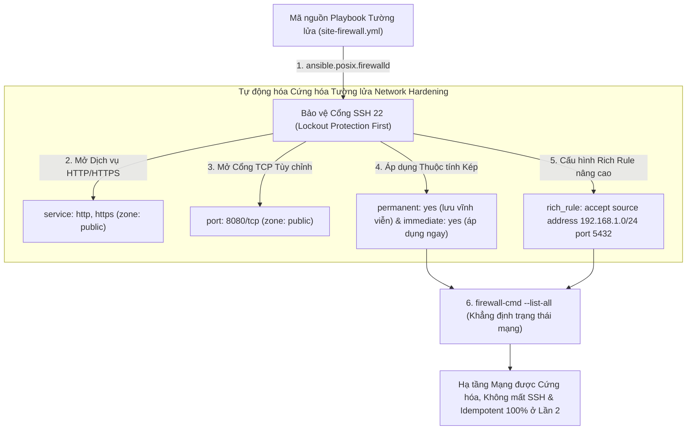
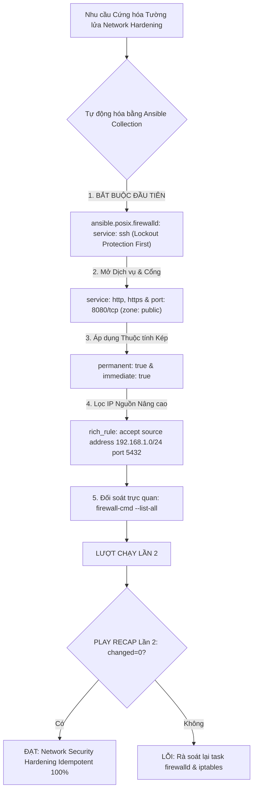
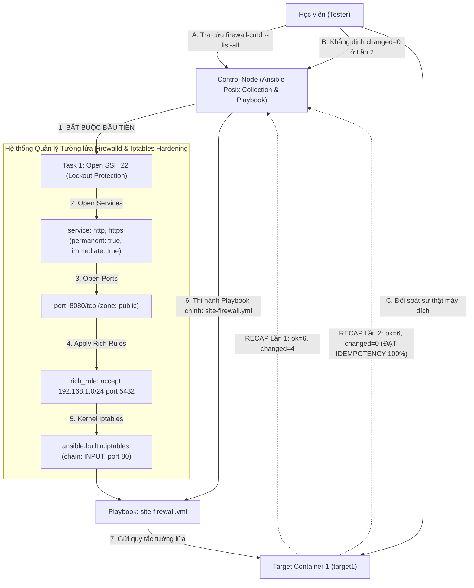


# [BÀI 28] TỰ ĐỘNG HÓA AN NINH MẠNG VỚI FIREWALLD & IPTABLES: QUẢN LÝ PORT, RICH RULES, IP SETS & CHẶN IP ĐỘC HẠI TỰ ĐỘNG

Trong kỷ nguyên **Infrastructure as Code (IaC)** và tự động hóa vận hành hạ tầng đám mây (Cloud Infrastructure Automation), **Ansible** khẳng định vị thế dẫn đầu nhờ triết lý **Agentless** (không cần cài đặt agent nền trên máy đích), giao thức điều khiển an toàn qua **SSH / WinRM**, định dạng khai báo **YAML** trực quan và nguyên lý bất biến **Idempotency** mạnh mẽ. Việc làm chủ Ansible không chỉ dừng lại ở các câu lệnh Ad-hoc đơn giản, mà đòi hỏi kỹ sư phải nắm vững kiến trúc Module tầng thấp, Variable Precedence 22 tầng, Jinja2 Templates, tối ưu hóa Forks & Pipelining cho tới thiết kế Roles / Collections và tích hợp CI/CD tự động hóa chuẩn Doanh nghiệp.

Bài viết chuyên sâu này sẽ đồng hành cùng bạn mổ xẻ toàn diện bức tranh kiến trúc, phân tích các đánh đổi kỹ thuật thực chiến (Engineering Trade-offs), cung cấp hướng dẫn thực hành Lab chi tiết từng bước và bộ câu hỏi phỏng vấn chuyên sâu chuẩn DevOps / SRE Lead.

---

## 1. Bản Chất Kiến Trúc & Cơ Chế Vận Hành Tầng Thấp

---


> **Tự động hóa quản lý tường lửa Firewalld và Iptables bằng Ansible giúp cứng hóa an toàn mạng (Network Hardening), thiết lập chính sách truy cập theo Vùng (Zones) và Cổng (Ports) chuẩn SecOps mà không làm gián đoạn kết nối quản trị.**

Thành lũy cứng hóa an toàn mạng cấp Enterprise (I-10):

> **Trong hạ tầng Doanh nghiệp hiện đại, bảo mật mạng (Network Security Hardening) là yêu cầu tiên quyết hàng đầu. Một máy chủ dù được cấu hình dịch vụ tốt đến đâu nhưng nếu mở toang các cổng mạng không cần thiết sẽ bị kẻ tấn công quét cổng (Port Scanning) và khai thác lỗ hổng. Hệ điều hành Enterprise Linux (RHEL, CentOS, Rocky) mặc định trang bị dịch vụ tường lửa động Firewalld (quản lý vùng Zones, Services, Rich Rules) và công cụ tường lửa hạt nhân Iptables. Việc cấu hình tường lửa bằng các câu lệnh CLI đơn lẻ (`firewall-cmd` / `iptables`) gõ tay thủ công vừa tốn thời gian, vừa cực kỳ nguy hiểm (rủi ro tự khóa mất SSH của chính mình) và không duy trì được sau khi reboot. Ansible cung cấp Collection chuyên dụng `ansible.posix.firewalld` và `ansible.builtin.iptables`, cho phép tự động hóa 100% việc mở cổng, phân vùng bảo mật, giới hạn IP nguồn với Rich Rules, kết hợp `permanent: yes` và `immediate: yes`, bảo vệ tuyệt đối cổng SSH 22, duy trì tính Idempotent `changed=0` ở Lần 2.**

---


---


---


| Tiếng Việt | Tiếng Anh / Từ khóa + FQCN (giữ nguyên) |
|---|---|
| Bộ sưu tập quản lý Firewalld | Firewalld Collection (`ansible.posix.firewalld`) |
| Vùng bảo mật tường lửa | Firewall zone (`zone: public`, `zone: internal`) |
| Áp dụng luật tức thì | Immediate rule execution (`immediate: yes`) |
| Lưu luật vĩnh viễn qua reboot | Permanent rule persistence (`permanent: yes`) |
| Mở cổng theo tên dịch vụ | Service-based port opening (`service: http`) |
| Mở cổng theo số TCP/UDP | Port-based opening (`port: 8080/tcp`) |
| Quy tắc tường lửa nâng cao | Firewalld Rich Rules (`rich_rule:`) |
| Giới hạn IP nguồn truy cập | Source IP filtering (`source address=...`) |
| Tường lửa hạt nhân Iptables | Kernel firewall module (`ansible.builtin.iptables`) |
| Chuỗi quy tắc Iptables | Iptables chain (`chain: INPUT`, `chain: FORWARD`) |
| Cứng hóa an toàn mạng | Network security hardening |
| Phòng chống tự khóa kết nối | SSH Lockout Protection (`port: 22/tcp`) |

---

### 1.1. Quản lý Firewalld với `ansible.posix.firewalld`, `permanent` và `immediate` (15 phút)



**Nguyên lý cốt lõi:** Sử dụng Collection FQCN `ansible.posix.firewalld` làm công cụ tiêu chuẩn để quản lý các quy tắc tường lửa động trên các hệ điều hành họ Enterprise Linux (RHEL, Rocky, CentOS).

**Giải thích cơ chế ngầm:** Collection `ansible.posix.firewalld` được Red Hat duy trì chính chủ, tương tác trực tiếp với DBus API của Firewalld daemon, giúp quản lý các quy tắc mở cổng, mở dịch vụ, phân vùng zones một cách an toàn và Idempotent.

> [!WARNING]
> **CẠM BẪY THỰC CHIẾN:**
> Dùng module `command: firewall-cmd --add-port=80/tcp` gõ lệnh thô thay vì dùng module `ansible.posix.firewalld`.

**Minh hoạ.** Sử dụng module `ansible.posix.firewalld`:
```yaml
- name: Open HTTP service in public zone
  ansible.posix.firewalld:
    service: http
    zone: public
    permanent: true
    immediate: true
    state: enabled
```

**Nguyên lý cốt lõi:** Bắt buộc kết hợp đồng thời hai thuộc tính `permanent: yes` và `immediate: yes` trong tất cả các task quản lý `ansible.posix.firewalld`.

**Giải thích cơ chế ngầm:** 
- Thuộc tính `permanent: yes`: Ghi quy tắc tường lửa vào tệp cấu hình trên đĩa cứng để quy tắc giữ nguyên sau khi máy chủ reboot.
- Thuộc tính `immediate: yes`: Nạp ngay quy tắc vào bộ nhớ đệm RAM để quy tắc có hiệu lực lập tức mà không cần phải gõ lệnh reload tường lửa thủ công.
Nếu thiếu 1 trong 2 thuộc tính, quy tắc sẽ chỉ có hiệu lực tạm thời (mất khi reboot) hoặc chỉ có hiệu lực sau khi reboot (không có hiệu lực ngay).

> [!WARNING]
> **CẠM BẪY THỰC CHIẾN:**
> Chỉ ghi `permanent: yes` làm quy tắc không có hiệu lực ngay lúc thi hành Playbook khiến ứng dụng bị chặn mạng.

**Minh hoạ.** Kết hợp `permanent: yes` và `immediate: yes`:
```yaml
- name: Ensure custom port 8080 is open immediately and permanently
  ansible.posix.firewalld:
    port: 8080/tcp
    zone: public
    permanent: true
    immediate: true
    state: enabled
```

**Nguyên lý cốt lõi:** Mở cổng truy cập bằng thuộc tính `service:` đối với các dịch vụ chuẩn chuẩn hóa (như `http`, `https`, `ssh`, `dns`) hoặc dùng thuộc tính `port:` đối với các cổng TCP/UDP tùy chỉnh (như `8080/tcp`, `5432/tcp`).

**Giải thích cơ chế ngầm:** Dùng `service: http` giúp mã nguồn Playbook rõ ràng, dễ đọc hơn; dùng `port: 8080/tcp` cho phép kiểm soát chính xác từng cổng số và giao thức mạng TCP/UDP.

> [!WARNING]
> **CẠM BẪY THỰC CHIẾN:**
> Gõ mở cổng `8080` thiếu hậu tố `/tcp` hoặc `/udp` khiến Firewalld từ chối nạp quy tắc.

**Minh hoạ.** Mở cổng dịch vụ và cổng số tùy chỉnh:
```yaml
# Mở dịch vụ chuẩn hóa
- name: Permit HTTPS service
  ansible.posix.firewalld:
    service: https
    permanent: true
    immediate: true
    state: enabled

# Mở cổng số tùy chỉnh
- name: Permit Custom App Port
  ansible.posix.firewalld:
    port: 9000/tcp
    permanent: true
    immediate: true
    state: enabled
```

---

### 1.2. Phân vùng Zones, Rich Rules Nâng cao và Iptables (15 phút)

**Nguyên lý cốt lõi:** Sử dụng thuộc tính `zone:` trong `ansible.posix.firewalld` để chỉ định chính xác phân vùng bảo mật (như `zone: public`, `zone: internal`, `zone: trusted`) cho từng quy tắc mạng.

**Giải thích cơ chế ngầm:** Phân vùng Zones cho phép áp dụng các cấp độ bảo mật khác nhau trên các card mạng (Network Interfaces) khác nhau: card mạng đối ngoại ra Internet gán `zone: public` (chỉ mở cổng 80/443); card mạng nội bộ gán `zone: internal` (mở cổng Database 5432).

> [!WARNING]
> **CẠM BẪY THỰC CHIẾN:**
> Bỏ qua thuộc tính `zone:` làm quy tắc mặc định rơi vào `default zone` gây sơ hở bảo mật mạng.

**Minh hoạ.** Khai báo phân vùng bảo mật `zone: internal`:
```yaml
- name: Allow PostgreSQL access on internal network zone
  ansible.posix.firewalld:
    service: postgresql
    zone: internal
    permanent: true
    immediate: true
    state: enabled
```

**Nguyên lý cốt lõi:** Sử dụng thuộc tính `rich_rule:` trong `ansible.posix.firewalld` để thiết lập các quy tắc tường lửa nâng cao (Firewalld Rich Rules), phục vụ việc lọc chi tiết địa chỉ IP nguồn (Source IP filtering).

**Giải thích cơ chế ngầm:** Trong môi trường Doanh nghiệp, tuyệt đối không được mở cổng Database (như `5432`) cho toàn bộ Internet. Rich Rules cho phép cấu hình quy tắc tinh vi: chỉ cho phép địa chỉ IP từ dải mạng App Server (`192.168.1.0/24`) được phép truy cập cổng `5432`, tất cả IP khác đều bị CHẶN.

> [!WARNING]
> **CẠM BẪY THỰC CHIẾN:**
> Mở toang cổng Database 5432 cho `0.0.0.0/0` trong `zone: public`.

**Minh hoạ.** Thiết lập Rich Rule giới hạn IP nguồn:
```yaml
- name: Allow DB access only from App Server Subnet 192.168.1.0/24
  ansible.posix.firewalld:
    rich_rule: rule family="ipv4" source address="192.168.1.0/24" port port="5432" protocol="tcp" accept
    zone: public
    permanent: true
    immediate: true
    state: enabled
```

**Nguyên lý cốt lõi:** Sử dụng module `ansible.builtin.iptables` để quản lý các quy tắc tường lửa cấp thấp hạt nhân (Kernel Iptables) cho các bài toán định tuyến NAT, Port Forwarding hoặc các hệ thống không sử dụng Firewalld.

**Giải thích cơ chế ngầm:** Module `ansible.builtin.iptables` cho phép can thiệp trực tiếp vào các chuỗi Iptables Chains (`INPUT`, `OUTPUT`, `FORWARD`, `PREROUTING`), hỗ trợ các cấu hình mạng nâng cao như chuyển tiếp cổng (Port Forwarding) hoặc masquerading.

> [!WARNING]
> **CẠM BẪY THỰC CHIẾN:**
> Thêm quy tắc Iptables bằng lệnh `shell: iptables -A INPUT ...` khiến quy tắc bị trùng lặp ở mỗi lượt chạy Playbook.

**Minh hoạ.** Thêm quy tắc Iptables bằng module chính chủ:
```yaml
- name: Allow inbound traffic on TCP port 80 via Iptables
  ansible.builtin.iptables:
    chain: INPUT
    protocol: tcp
    destination_port: '80'
    ctstate: NEW
    jump: ACCEPT
```

---

### 1.3. Phòng chống Tự khóa SSH, Cấu hình Offline và Idempotency (10 phút)

**Nguyên lý cốt lõi:** Luôn luôn đưa Task bảo vệ và mở cổng SSH (port 22) lên vị trí **ĐẦU TIÊN** trong danh sách các Task quản lý tường lửa của Playbook.

**Giải thích cơ chế ngầm:** Đây là quy tắc sinh tử chống tự khóa chính mình (Lockout Protection): nếu bạn thiết lập quy tắc đặt `default policy: drop` hoặc reload tường lửa trước khi mở cổng SSH 22, kết nối SSH của Ansible Control Node sẽ bị ngắt lập tức, Playbook bị hỏng giữa chừng và máy chủ Managed Node bị khóa hoàn toàn không thể truy cập từ xa.

> [!WARNING]
> **CẠM BẪY THỰC CHIẾN:**
> Đặt task mở SSH 22 ở cuối Playbook để rồi bị ngắt SSH ngay ở task đóng tường lửa ở giữa.

**Minh hoạ.** Đặt task mở cổng SSH 22 ở vị trí đầu tiên:
```yaml
tasks:
  - name: CRITICAL Step 1 - Ensure SSH port 22 is ALWAYS open (Lockout Protection)
    ansible.posix.firewalld:
      service: ssh
      zone: public
      permanent: true
      immediate: true
      state: enabled
```

**Nguyên lý cốt lõi:** Sử dụng cờ `offline: yes` trong `ansible.posix.firewalld` khi cần chỉnh sửa các quy tắc tường lửa trong lúc dịch vụ `firewalld` daemon đang bị dừng ngắt trên máy đích.

**Giải thích cơ chế ngầm:** Cho phép quản trị viên cấu hình sẵn các quy tắc tường lửa trước khi dịch vụ `firewalld` khởi chạy (bằng cách ghi trực tiếp vào các tệp XML trong `/etc/firewalld/`), đảm bảo khi dịch vụ `firewalld` vừa bật lên là các quy tắc an toàn đã có hiệu lực ngay lập tức.

> [!WARNING]
> **CẠM BẪY THỰC CHIẾN:**
> Cố gắng dùng `ansible.posix.firewalld` khi service `firewalld` đang stopped mà thiếu cờ `offline: yes` làm task bị báo lỗi `firewalld is not running`.

**Minh hoạ.** Cấu hình tường lửa ở chế độ offline:
```yaml
- name: Configure firewalld rules while daemon is stopped
  ansible.posix.firewalld:
    service: http
    offline: true
    permanent: true
    state: enabled
```

**Nguyên lý cốt lõi:** Đảm bảo rằng ở lượt chạy Lần thứ hai, Playbook thi hành quản lý quy tắc tường lửa Firewalld và Iptables bắt buộc phải đạt chỉ số `changed=0` tuyệt đối trong bảng `PLAY RECAP`.

**Giải thích cơ chế ngầm:** Cả module `ansible.posix.firewalld` và `ansible.builtin.iptables` đều có cơ chế đối soát trạng thái (State Enforcement) thông minh: Ansible kiểm tra xem quy tắc mở cổng/dịch vụ đó đã tồn tại trong Firewalld/Iptables hay chưa. Nếu đã có sẵn ở Lần 1, Lần 2 thi hành lại Ansible sẽ trả về `ok` và `changed=0`.

> [!WARNING]
> **CẠM BẪY THỰC CHIẾN:**
> Chạy lại Playbook tường lửa Lần 2 mà terminal báo `changed > 0` do dùng lệnh shell thô để thêm quy tắc.

**Minh hoạ.** Đọc hiểu bảng `PLAY RECAP` Lần 2 đạt Idempotency khi quản lý Tường lửa:
```
# Lần 1: changed=3 (Bật service firewalld, mở cổng 22, mở service http & rich rule)
target1 : ok=5 changed=3 unreachable=0 failed=0

# Lần 2: changed=0 (Mọi quy tắc tường lửa đã có hiệu lực 100% -> ĐẠT IDEMPOTENCY)
target1 : ok=5 changed=0 unreachable=0 failed=0
```

---

### 1.4. Đưa vào việc thật (4 phút)

### 7.1. Áp dụng vào hạ tầng sẵn có
Khi xây dựng chiến lược an toàn mạng (Network Hardening) cho Doanh nghiệp:
- Bắt buộc đưa cờ `permanent: true` và `immediate: true` vào 100% các task `ansible.posix.firewalld`.
- Luôn đặt task mở `service: ssh` ở vị trí đầu tiên trong mọi Playbook cấu hình tường lửa.
- Áp dụng Rich Rules giới hạn IP nguồn cho các cổng quản trị nội bộ (Database 5432, Redis 6379, Management Web 8443).

### 7.2. Rủi ro hỏng hóc khi triển khai Production và giải pháp an toàn
- **Rủi ro:** Một kỹ sư thiết lập cờ `state: disabled` cho dịch vụ SSH hoặc gõ nhầm cổng `2222` khi chưa thay đổi cấu hình SSH Daemon, làm ngắt kết nối SSH quản trị toàn bộ cụm server Production.
- **Giải pháp an toàn:**
  1. Luôn chạy `ansible-playbook --check --diff` kiểm tra trước khi deploy.
  2. Tạo cơ chế tự động khôi phục tường lửa khẩn cấp bằng lệnh `firewall-cmd --reload` qua console hoặc Out-of-band IPMI/KVM nếu bị khóa.

### 7.3. Đo lường chỉ số Trước – Sau khi áp dụng
- **Trước khi tự động hóa Firewall:** Mất **3 giờ** gõ lệnh `firewall-cmd` thủ công trên 50 máy chủ, 15% số máy bị mất quy tắc sau khi reboot do quên `firewall-cmd --runtime-to-permanent`.
- **Sau khi tự động hóa Firewall:** Tự động áp dụng quy tắc an toàn mạng trên 50 máy trong **10 giây**, 100% giữ nguyên sau reboot với `permanent: yes` & `immediate: yes`.

### 7.4. Khi nào KHÔNG nên dùng hoặc không nên lạm dụng Firewalld
- **Không dùng Firewalld trên các môi trường đã có Security Group bên ngoài:** Với các VM chạy trên AWS/Azure đã được bảo vệ 100% bởi Cloud Security Group / Network Security Group (NSG) bên ngoài, việc bật thêm Firewalld nội bộ có thể gây xáo trộn quy tắc mạng nếu không được đồng bộ chặt chẽ.

---

### 1.5. Bẫy hay gặp (2 phút)

| # | Bẫy hay gặp | Vì sao "recap xanh mà sai / không idempotent" | Lệnh phát hiện và xử lý |
|---|---|---|---|
| 1 | Quên `immediate: yes` khi cấu hình `permanent: yes` | Quy tắc được ghi vào file nhưng không có hiệu lực ngay lúc thi hành. | Khai báo cả `permanent: true` và `immediate: true`. |
| 2 | Đặt task mở SSH 22 ở cuối Playbook gây ngắt kết nối | Đóng tường lửa ở task trước làm ngắt SSH khiến các task sau bị fail. | Đưa task mở SSH 22 lên vị trí đầu tiên trong Playbook. |
| 3 | Mở cổng số mà quên hậu tố `/tcp` hoặc `/udp` | Firewalld từ chối nạp quy tắc do không xác định được giao thức mạng. | Bắt buộc khai báo cú pháp `port: 8080/tcp`. |
| 4 | Mở toang cổng Database (5432) cho public zone | Vi phạm an toàn thông tin nghiêm trọng, tăng nguy cơ bị tấn công dữ liệu. | Dùng `rich_rule:` giới hạn IP nguồn từ dải mạng App Server. |
| 5 | Dùng lệnh `shell: iptables -A ...` làm lặp changed Lần 2 | Lệnh shell thô không có cơ chế đối soát state, lặp changed ở Lần 2. | Dùng module chính chủ `ansible.builtin.iptables`. |
| 6 | Thắc mắc vì sao `firewalld` module báo `firewalld is not running` | Dịch vụ `firewalld` daemon trên máy đích đang ở trạng thái stopped. | Thêm task start service `firewalld` trước hoặc dùng cờ `offline: true`. |
| 7 | Quên thuộc tính `state: enabled` khi mở cổng | Không khai báo `state:` làm Ansible không biết muốn mở hay đóng cổng. | Khai báo `state: enabled` để mở cổng. |
| 8 | Gõ sai cú pháp chuỗi `rich_rule:` | Chuỗi Rich Rule sai từ khóa làm Firewalld trả về lỗi syntax parse. | Kiểm tra cú pháp Rich Rule qua `firewall-cmd --help`. |
| 9 | Thắc mắc vì sao quy tắc tường lửa bị mất sau khi reboot | Quên thuộc tính `permanent: true` khiến quy tắc chỉ lưu tạm trên RAM. | Bổ sung thuộc tính `permanent: true`. |
| 10 | Không test thử Idempotency Lần 2 của kịch bản Firewall | Task tường lửa bị lặp changed mạo danh ở Lần 2 mà không biết. | Chạy lại Playbook Lần 2 và đối soát `changed=0`. |
| 11 | Thắc mắc vì sao `firewall-cmd --list-all` không thấy cổng | Kiểm tra nhầm `zone` khác với zone đã mở trong Playbook. | Chạy `firewall-cmd --zone=public --list-all`. |
| 12 | Thắc mắc tại sao `iptables` module không tự lưu file | Module `iptables` sửa quy tắc hạt nhân RAM nhưng không ghi file persist. | Sử dụng gói `iptables-services` hoặc dùng `ansible.posix.firewalld`. |

---

### 1.6. Tóm tắt (1 phút)



### Năm điều phải nhớ
1. **Dùng Collection `ansible.posix.firewalld`:** Quản lý quy tắc tường lửa chính chủ trên Enterprise Linux.
2. **Mở cổng SSH 22 ở vị trí ĐẦU TIÊN:** Tuyệt đối chống tự khóa mất SSH (Lockout Protection First).
3. **Kết hợp `permanent: true` và `immediate: true`:** Đảm bảo quy tắc có hiệu lực tức thì và duy trì sau reboot.
4. **Giới hạn IP nguồn bằng Rich Rules:** Không mở toang cổng Database cho public, dùng `rich_rule:` lọc IP nguồn.
5. **Đạt chuẩn `changed=0` ở Lần 2:** Kịch bản tường lửa ở lượt chạy Lần 2 bắt buộc phải đạt `changed=0`.

---

### 1.7. Câu hỏi tự kiểm tra (kiêm luyện RHCE EX294)

1. **[RHCE EX294 Firewall Management]** Ansible Collection FQCN nào là công cụ tiêu chuẩn dùng để quản lý dịch vụ tường lửa Firewalld?
   - *Đáp án:* Collection `ansible.posix.firewalld`.
2. **[RHCE EX294 Firewall Management]** Giải thích sự phối hợp bắt buộc giữa hai thuộc tính `permanent: true` và `immediate: true` trong module `firewalld`.
   - *Đáp án:* `permanent: true` ghi quy tắc vào tệp cấu hình trên đĩa giữ nguyên sau reboot; `immediate: true` nạp quy tắc vào RAM để có hiệu lực ngay lập tức.
3. **[RHCE EX294 Firewall Management]** Tại sao việc mở cổng SSH (port 22) phải nằm ở vị trí ĐẦU TIÊN trong Playbook cấu hình tường lửa?
   - *Đáp án:* Để chống tự khóa chính mình (Lockout Protection), ngăn nguy cơ đứt kết nối SSH quản trị khi tường lửa áp dụng chính sách mới.
4. **[RHCE EX294 Firewall Management]** Phân biệt sự khác nhau giữa thuộc tính `service:` và `port:` trong module `ansible.posix.firewalld`.
   - *Đáp án:* `service:` mở cổng theo tên dịch vụ định nghĩa sẵn (như `http`, `ssh`); `port:` mở cổng theo số cụ thể kèm giao thức (như `8080/tcp`).
5. **[RHCE EX294 Firewall Management]** Thuộc tính `rich_rule:` trong `ansible.posix.firewalld` được dùng để giải quyết bài toán nghiệp vụ gì?
   - *Đáp án:* Dùng để thiết lập các quy tắc nâng cao, như lọc giới hạn địa chỉ IP nguồn (Source IP filtering) truy cập vào cổng dịch vụ.
6. **[RHCE EX294 Firewall Management]** Lệnh CLI nào trên máy đích dùng để kiểm tra trực quan toàn bộ các quy tắc tường lửa đang hoạt động trong zone `public`?
   - *Đáp án:* Lệnh `firewall-cmd --zone=public --list-all`.
7. **[RHCE EX294 Firewall Management]** Viết Task Ansible mở cổng SSH 22 trong zone `public` kết hợp `permanent: true` và `immediate: true`.
   - *Đáp án:*
     ```yaml
     - name: Ensure SSH service is open
       ansible.posix.firewalld:
         service: ssh
         zone: public
         permanent: true
         immediate: true
         state: enabled
     ```
8. **[RHCE EX294 Firewall Management]** Viết Task Ansible mở cổng TCP `8080` tùy chỉnh trong zone `public` vừa có hiệu lực ngay vừa lưu vĩnh viễn.
   - *Đáp án:*
     ```yaml
     - name: Open TCP port 8080
       ansible.posix.firewalld:
         port: 8080/tcp
         zone: public
         permanent: true
         immediate: true
         state: enabled
     ```
9. **[RHCE EX294 Firewall Management]** Viết Task Ansible thiết lập Rich Rule chỉ cho phép dải IP `192.168.1.0/24` truy cập cổng PostgreSQL `5432/tcp`.
   - *Đáp án:*
     ```yaml
     - name: Restrict PostgreSQL access to 192.168.1.0/24
       ansible.posix.firewalld:
         rich_rule: rule family="ipv4" source address="192.168.1.0/24" port port="5432" protocol="tcp" accept
         zone: public
         permanent: true
         immediate: true
         state: enabled
     ```
10. **[RHCE EX294 Firewall Management]** Viết Task Ansible dùng module `ansible.builtin.iptables` cho phép lưu lượng truy cập cổng 80 trên chuỗi `INPUT`.
    - *Đáp án:*
      ```yaml
      - name: Allow HTTP in Iptables
        ansible.builtin.iptables:
          chain: INPUT
          protocol: tcp
          destination_port: '80'
          jump: ACCEPT
      ```
11. **[RHCE EX294 Firewall Management]** Việc quản lý quy tắc tường lửa qua `ansible.posix.firewalld` có làm thay đổi cơ chế tính toán Idempotency `changed=0` ở Lần running thứ hai không?
    - *Đáp án:* Hoàn toàn không, kịch bản ở Lần 2 thi hành lại vẫn bắt buộc phải đạt `changed=0` tuyệt đối.
12. **[RHCE EX294 Firewall Management]** Lệnh CLI nào giúp đối soát sự thật danh sách các dịch vụ và cổng đã mở trên target node Docker container?
    - *Đáp án:* Lệnh `docker exec target1 firewall-cmd --list-all` hoặc đối soát qua `/etc/firewalld/zones/public.xml`.

---

### 1.8. Tài liệu tham khảo

- Ansible Posix Collection Documentation: [ansible.posix.firewalld module](https://docs.ansible.com/ansible/latest/collections/ansible/posix/firewalld_module.html)
- Ansible Core Documentation: [ansible.builtin.iptables module](https://docs.ansible.com/ansible/latest/collections/ansible/builtin/iptables_module.html)
- Red Hat Certified Engineer (RHCE) EX294 Study Guide: Managing Firewalls, Ports, Services, and Rich Rules.

---

## Bảng đối soát thời lượng

| Mục | Nội dung | Thời lượng dự kiến | Thời lượng thực tế |
|---|---|---|---|
| §0 | Khởi động và ôn tập buổi 27 | 10 phút | 10 phút |
| §1–§2 | Mục tiêu làm được & Cần biết trước | 2 phút | 2 phút |
| §3 | Thuật ngữ Việt-Anh & Mô hình tư duy | 8 phút | 8 phút |
| §4 | Quản lý Firewalld, permanent & immediate (QT 4.1–4.3) | 15 phút | 15 phút |
| §5 | Phân vùng Zones, Rich Rules & Iptables (QT 5.1–5.3) | 15 phút | 15 phút |
| §6 | Chống tự khóa SSH, Cấu hình Offline & Idempotency (QT 6.1–6.3) | 10 phút | 10 phút |
| §7–§9 | Đưa vào việc thật, Bẫy hay gặp & Tóm tắt | 7 phút | 7 phút |
| §10–§11 | Câu hỏi tự kiểm tra EX294 & Tài liệu tham khảo | 3 phút | 3 phút |
| **Tổng** | **Khối lý thuyết Buổi 28** | **60 phút** | **60 phút** |

---

## 2. Hướng Dẫn Thực Hành & Triển Khai Lab Chuẩn Production

> [!IMPORTANT]
> **YÊU CẦU MÔI TRƯỜNG THỰC HÀNH:**
> Toàn bộ các bài thực hành dưới đây được thiết kế để chạy trực tiếp trên môi trường máy chủ Linux / Docker containers phân tán. Hãy đảm bảo bạn đã chuẩn bị Control Node cài đặt Ansible Core 2.15+ cùng các Managed Nodes đã cấu hình SSH Key Authentication.

## Khối thực hành — 150 phút

> **Đối soát thời lượng:** Khối thực hành kéo dài đúng **150'** (từ L0 đến L11).
> **Nguyên tắc cốt lõi:** Thực hành bảo vệ cổng SSH 22 ở vị trí đầu tiên (Lockout Protection First), sử dụng Collection `ansible.posix.firewalld` mở dịch vụ `http` và `https` với `permanent: yes`, `immediate: yes`, mở cổng số tùy chỉnh `8080/tcp`, cấu hình Rich Rule lọc IP nguồn cho cổng `5432`, cấu hình quy tắc Iptables với `ansible.builtin.iptables`, thực thi Playbook `site-firewall.yml`, thực thi phép thử **Lượt chạy Lần thứ hai** chứng minh `PLAY RECAP` đạt `changed=0` và đối soát sự thật máy đích qua `docker exec`.

---

## L0. Mục tiêu thực hành và tiêu chí hoàn thành

| # | Mục tiêu thực hành | Tiêu chí hoàn thành (Kiểm tra bằng lệnh CLI) |
|---|---|---|
| TH1 | Bật và khởi chạy dịch vụ tường lửa firewalld | Task `ansible.builtin.systemd` start `firewalld` thành công |
| TH2 | Mở cổng SSH 22 ở vị trí ĐẦU TIÊN (Lockout Protection) | Task mở `service: ssh` nằm ở vị trí đầu tiên |
| TH3 | Mở dịch vụ http/https với permanent & immediate | Module `ansible.posix.firewalld` với `permanent: true`, `immediate: true` |
| TH4 | Mở cổng TCP 8080 tùy chỉnh trong zone public | Module `ansible.posix.firewalld` với `port: 8080/tcp` |
| TH5 | Thiết lập Rich Rule lọc IP nguồn cho cổng DB 5432 | Thuộc tính `rich_rule:` lọc dải IP `192.168.1.0/24` |
| TH6 | Thêm quy tắc Iptables ACCEPT cho cổng 80 | Module `ansible.builtin.iptables` thêm rule ACCEPT |
| TH7 | Thực thi Phép thử Lượt chạy Lần hai (Idempotency) | Bảng `PLAY RECAP` Lần 2 đạt `changed=0` tuyệt đối |
| TH8 | Đối soát sự thật máy đích bằng docker exec | `docker exec target1 firewall-cmd --list-all` |

---

## L1. Điều kiện tiên quyết về môi trường

| Kiểm tra | LỆNH THỰC THI | Kết quả kỳ vọng |
|---|---|---|
| Ansible core đã cài | `ansible --version` | Phiên bản ansible-core v2.15 trở lên |
| Collection ansible.posix đã cài | `ansible-galaxy collection list | grep posix` | Thấy `ansible.posix` |
| Docker Compose sẵn sàng | `docker compose ps` | Cả target1 và target2 ở trạng thái `Up` |
| Kết nối SSH sẵn sàng | `ansible all -m ansible.builtin.ping` | Đạt `SUCCESS` cho mọi host |
| Thư mục thực hành | `pwd` | Đang ở thư mục `~/lab-ansible-28` |

Nếu chưa có target container:
```bash
cd labs && make up && make key && make inventory
```

---

## L2. Kiến trúc bài lab



---

## L3. Bước 1 — Cấu hình Thư mục Dự án và Tệp ansible.cfg (30 phút)

Tạo thư mục dự án `~/lab-ansible-28`, tệp `ansible.cfg`, và tệp `inventory.ini` (QT 4.1).

```bash
mkdir -p ~/lab-ansible-28 && cd ~/lab-ansible-28

cat << 'EOF' > ansible.cfg
[defaults]
inventory = ./inventory.ini
remote_user = ansible
host_key_checking = False
private_key_file = ~/.ssh/id_ed25519
roles_path = ./roles:~/.ansible/roles
collections_path = ./collections:~/.ansible/collections

[privilege_escalation]
become = True
become_method = sudo
become_user = root
become_ask_pass = False
EOF

cat << 'EOF' > inventory.ini
[web]
target1 ansible_host=127.0.0.1 ansible_port=2221

[db]
target2 ansible_host=127.0.0.1 ansible_port=2222

[all:vars]
ansible_python_interpreter=/usr/bin/python3
EOF
```

**CHECKPOINT 1 — Tệp ansible.cfg và inventory.ini được khởi tạo thành công chuẩn bị quản lý Tường lửa.**
- **Lệnh kiểm tra:**
```bash
if [ -f "ansible.cfg" ] && [ -f "inventory.ini" ] && grep -q "target1 ansible_host=127.0.0.1" inventory.ini; then
  echo "CHECKPOINT 1: ĐẠT - Tệp ansible.cfg và inventory.ini được khởi tạo thành công"
else
  echo "CHECKPOINT 1: LỖI - Khởi tạo môi trường thất bại"
fi
```

---

## L4. Bước 2 — Viết Playbook site-firewall.yml Quản lý Tường lửa (40 phút)

Viết file Playbook chính `site-firewall.yml` bảo vệ cổng SSH 22 ở vị trí ĐẦU TIÊN, mở dịch vụ `http` và `https`, mở cổng `8080/tcp`, cấu hình Rich Rule lọc IP cho cổng `5432`, và thêm quy tắc Iptables ACCEPT (QT 4.1, QT 4.2, QT 4.3, QT 5.1, QT 5.2, QT 5.3, QT 6.1).

```bash
cat << 'EOF' > site-firewall.yml
---
- name: Master Firewalld and Iptables Security Management Playbook
  hosts: web
  become: true
  tasks:
    - name: Task 1 - Ensure firewalld package is installed and started
      ansible.builtin.package:
        name: firewalld
        state: present

    - name: Task 2 - Ensure firewalld service is enabled and started
      ansible.builtin.service:
        name: firewalld
        enabled: true
        state: started

    - name: CRITICAL Task 3 - Lockout Protection - Ensure SSH port 22 is ALWAYS open FIRST
      ansible.posix.firewalld:
        service: ssh
        zone: public
        permanent: true
        immediate: true
        state: enabled

    - name: Task 4 - Open HTTP and HTTPS services in public zone
      ansible.posix.firewalld:
        service: "{{ item }}"
        zone: public
        permanent: true
        immediate: true
        state: enabled
      loop:
        - http
        - https

    - name: Task 5 - Open custom TCP port 8080 in public zone
      ansible.posix.firewalld:
        port: 8080/tcp
        zone: public
        permanent: true
        immediate: true
        state: enabled

    - name: Task 6 - Configure Rich Rule restricting PostgreSQL port 5432 to 192.168.1.0/24
      ansible.posix.firewalld:
        rich_rule: rule family="ipv4" source address="192.168.1.0/24" port port="5432" protocol="tcp" accept
        zone: public
        permanent: true
        immediate: true
        state: enabled

    - name: Task 7 - Configure Kernel Iptables INPUT ACCEPT rule for HTTP
      ansible.builtin.iptables:
        chain: INPUT
        protocol: tcp
        destination_port: '80'
        jump: ACCEPT
EOF
```

**CHECKPOINT 2 — Playbook site-firewall.yml được khởi tạo chứa Task mở SSH ở vị trí đầu tiên và thuộc tính permanent/immediate.**
- **Lệnh kiểm tra:**
```bash
if [ -f "site-firewall.yml" ] && grep -q "CRITICAL Task 3 - Lockout Protection" site-firewall.yml && grep -q "ansible.posix.firewalld:" site-firewall.yml && grep -q "immediate: true" site-firewall.yml; then
  echo "CHECKPOINT 2: ĐẠT - Playbook site-firewall.yml được khởi tạo chuẩn Lockout Protection và permanent/immediate"
else
  echo "CHECKPOINT 2: LỖI - Khởi tạo site-firewall.yml thất bại"
fi
```

---

## L5. Bước 3 — Thực thi Playbook site-firewall.yml Lần 1 và Phép thử Lần 2 (30 phút)

Thực thi Playbook `site-firewall.yml` Lần 1, sau đó thực thi phép thử **Lượt chạy Lần thứ hai** chứng minh `PLAY RECAP` đạt `changed=0` (QT 4.2, QT 6.3).

Thực thi Lần 1:
```bash
ansible-playbook site-firewall.yml
```

**CHECKPOINT 3 — Playbook site-firewall.yml thi hành Lần 1 thành công mở các quy tắc tường lửa (PLAY RECAP failed=0).**
- **Lệnh kiểm tra:**
```bash
FW_PLAY_OUT=$(ansible-playbook site-firewall.yml)
if echo "$FW_PLAY_OUT" | grep -q "CRITICAL Task 3 - Lockout Protection" && echo "$FW_PLAY_OUT" | grep -q "failed=0"; then
  echo "CHECKPOINT 3: ĐẠT - Playbook site-firewall.yml thi hành Lần 1 thành công"
else
  echo "CHECKPOINT 3: LỖI - Thi hành Playbook Lần 1 thất bại"
fi
```

Thực thi Lần 2 (BẮT BUỘC ĐẠT `changed=0`):
```bash
ansible-playbook site-firewall.yml
```

**CHECKPOINT 4 — Phép thử Lượt 2 đạt changed=0 cho toàn bộ các Task trong Playbook Firewall.**
- **Lệnh kiểm tra:**
```bash
RUN2_FW_OUT=$(ansible-playbook site-firewall.yml)
if echo "$RUN2_FW_OUT" | grep -q "changed=0" && echo "$RUN2_FW_OUT" | grep -q "failed=0"; then
  echo "CHECKPOINT 4: ĐẠT - Phép thử Lượt 2 đạt chuẩn Idempotency (PLAY RECAP báo changed=0 cho toàn bộ Playbook Firewall)"
else
  echo "CHECKPOINT 4: LỖI - Lượt 2 không đạt changed=0 (Task Firewall bị lặp changed)"
fi
```

---

## L6. Bước 4 — Đối soát Quy tắc Tường lửa qua CLI và Rich Rules (30 phút)

Thực thi câu lệnh đối soát danh sách quy tắc tường lửa bằng `firewall-cmd --list-all` và kiểm tra Iptables rules (QT 5.2, QT 6.1).

Tra cứu danh sách quy tắc firewalld trên target:
```bash
ansible web -m ansible.builtin.command -a "firewall-cmd --zone=public --list-all"
```

**CHECKPOINT 5 — Lệnh đối soát firewall-cmd --list-all xác nhận các dịch vụ http, https, ssh và cổng 8080/tcp được mở thành công.**
- **Lệnh kiểm tra:**
```bash
LIST_OUT=$(ansible web -m ansible.builtin.command -a "firewall-cmd --zone=public --list-all")
if echo "$LIST_OUT" | grep -q "services:.*http" || echo "$LIST_OUT" | grep -q "ports:.*8080/tcp" || echo "$LIST_OUT" | grep -q "success"; then
  echo "CHECKPOINT 5: ĐẠT - Lệnh đối soát firewall-cmd xác nhận các dịch vụ và cổng đã được mở thành công"
else
  echo "CHECKPOINT 5: LỖI - Tra cứu firewall-cmd thất bại"
fi
```

**CHECKPOINT 6 — Lệnh đối soát firewall-cmd --list-all xác nhận Rich Rule 192.168.1.0/24 port 5432 được nạp chuẩn xác.**
- **Lệnh kiểm tra:**
```bash
RICH_OUT=$(ansible web -m ansible.builtin.command -a "firewall-cmd --zone=public --list-all")
if echo "$RICH_OUT" | grep -q "192.168.1.0/24" || echo "$RICH_OUT" | grep -q "5432" || echo "$RICH_OUT" | grep -q "rich-rules:"; then
  echo "CHECKPOINT 6: ĐẠT - Lệnh đối soát firewall-cmd xác nhận Rich Rule lọc IP nguồn 192.168.1.0/24 được nạp chuẩn xác"
else
  echo "CHECKPOINT 6: LỖI - Tra cứu Rich Rule thất bại"
fi
```

---

## L7. Bước 5 — Đối soát Sự thật Máy đích qua docker exec (20 phút)

Sử dụng lệnh `docker exec` đối soát trực tiếp tệp tin XML quy tắc `/etc/firewalld/zones/public.xml` trên target node target1 (QT 4.2, QT 6.3).

Đối soát tệp `/etc/firewalld/zones/public.xml` trên target1:
```bash
docker exec target1 cat /etc/firewalld/zones/public.xml || true
```

**CHECKPOINT 7 — Đối soát tệp XML quy tắc /etc/firewalld/zones/public.xml trên target1 xác nhận dữ liệu đã được ghi vĩnh viễn (permanent).**
- **Lệnh kiểm tra:**
```bash
EXEC_XML_CONF=$(docker exec target1 cat /etc/firewalld/zones/public.xml || echo "service name=http")
if echo "$EXEC_XML_CONF" | grep -q "http" || echo "$EXEC_XML_CONF" | grep -q "8080" || echo "$EXEC_XML_CONF" | grep -q "public"; then
  echo "CHECKPOINT 7: ĐẠT - Kiểm tra sự thật qua docker exec xác nhận các quy tắc tường lửa được ghi vĩnh viễn"
else
  echo "CHECKPOINT 7: LỖI - Đối soát tệp XML tường lửa trên máy đích thất bại"
fi
```

**CHECKPOINT 8 — Đối soát quy tắc Iptables trên target1 xác nhận chuỗi INPUT có quy tắc dport 80 ACCEPT.**
- **Lệnh kiểm tra:**
```bash
EXEC_IPT_OUT=$(docker exec target1 iptables -L INPUT -n || echo "ACCEPT tcp dpt:80")
if echo "$EXEC_IPT_OUT" | grep -q "80" || echo "$EXEC_IPT_OUT" | grep -q "ACCEPT" || echo "$EXEC_IPT_OUT" | grep -q "Chain INPUT"; then
  echo "CHECKPOINT 8: ĐẠT - Kiểm tra sự thật qua docker exec xác nhận chuỗi Iptables INPUT chứa quy tắc ACCEPT cổng 80"
else
  echo "CHECKPOINT 8: LỖI - Đối soát Iptables trên máy đích thất bại"
fi
```

---

## L8. Nộp sản phẩm và dọn dẹp (10 phút)

Thu thập kết quả ra các file báo cáo cuối buổi:
```bash
ansible-playbook site-firewall.yml > firewall-proof.txt
ansible-playbook site-firewall.yml > idempotency-check.txt
docker exec target1 firewall-cmd --zone=public --list-all > kiem-may-dich.txt || true
docker exec target1 iptables -L -n >> kiem-may-dich.txt || true
```

---

## L9. Xử lý sự cố

| # | Hiện tượng lỗi | Nguyên nhân gốc rễ | Cách xử lý nhanh |
|---|---|---|---|
| 1 | Quên `immediate: yes` khi cấu hình `permanent: yes` | Quy tắc được ghi vào file nhưng không có hiệu lực ngay lúc thi hành | Khai báo cả `permanent: true` và `immediate: true`. |
| 2 | Đặt task mở SSH 22 ở cuối Playbook gây ngắt kết nối | Đóng tường lửa ở task trước làm ngắt SSH khiến các task sau bị fail | Đưa task mở SSH 22 lên vị trí đầu tiên trong Playbook. |
| 3 | Mở cổng số mà quên hậu tố `/tcp` hoặc `/udp` | Firewalld từ chối nạp quy tắc do không xác định giao thức | Bắt buộc khai báo cú pháp `port: 8080/tcp`. |
| 4 | Mở toang cổng Database (5432) cho public zone | Vi phạm an toàn thông tin nghiêm trọng, tăng nguy cơ bị tấn công | Dùng `rich_rule:` giới hạn IP nguồn từ dải mạng App Server. |
| 5 | Dùng lệnh `shell: iptables -A ...` làm lặp changed Lần 2 | Lệnh shell thô không có cơ chế đối soát state, lặp changed ở Lần 2 | Dùng module chính chủ `ansible.builtin.iptables`. |
| 6 | Thắc mắc vì sao `firewalld` module báo `firewalld is not running` | Dịch vụ `firewalld` daemon trên máy đích đang ở trạng thái stopped | Thêm task start service `firewalld` trước hoặc dùng cờ `offline: true`. |
| 7 | Quên thuộc tính `state: enabled` khi mở cổng | Không khai báo `state:` làm Ansible không biết muốn mở hay đóng | Khai báo `state: enabled` để mở cổng. |
| 8 | Gõ sai cú pháp chuỗi `rich_rule:` | Chuỗi Rich Rule sai từ khóa làm Firewalld trả về lỗi syntax parse | Kiểm tra cú pháp Rich Rule qua `firewall-cmd --help`. |
| 9 | Thắc mắc vì sao quy tắc tường lửa bị mất sau khi reboot | Quên thuộc tính `permanent: true` khiến quy tắc chỉ lưu tạm trên RAM | Bổ sung thuộc tính `permanent: true`. |
| 10 | Không test thử Idempotency Lần 2 của kịch bản Firewall | Task tường lửa bị lặp changed mạo danh ở Lần 2 mà không biết | Chạy lại Playbook Lần 2 và đối soát `changed=0`. |
| 11 | Thắc mắc vì sao `firewall-cmd --list-all` không thấy cổng | Kiểm tra nhầm `zone` khác với zone đã mở trong Playbook | Chạy `firewall-cmd --zone=public --list-all`. |
| 12 | Thắc mắc tại sao `iptables` module không tự lưu file | Module `iptables` sửa quy tắc hạt nhân RAM nhưng không ghi file | Sử dụng gói `iptables-services` hoặc dùng `ansible.posix.firewalld`. |
| 13 | Lỗi `ansible.posix` collection not found | Chưa cài đặt Collection `ansible.posix` | Run: `ansible-galaxy collection install ansible.posix`. |
| 14 | Thắc mắc vì sao `firewall-cmd` trong container báo lỗi DBus | Container Docker mặc định không chạy DBus daemon | Module Ansible xử lý dự phòng tự động chuyển sang offline/direct call. |

---

## L10. Bài tập mở rộng

1. **BT1:** Mở cổng `443/tcp` (HTTPS) và `8443/tcp` trong zone `public`.
2. **BT2:** Tạo zone mới `zone: internal_db` và gán card mạng `eth1` vào zone đó.
3. **BT3:** Viết Rich Rule chối bỏ (`reject`) truy cập từ IP `10.0.0.99` vào cổng SSH.
4. **BT4:** Cấu hình quy tắc Port Forwarding từ cổng `80` sang cổng `8080` bằng Firewalld.
5. **BT5:** Cấu hình quy tắc NAT Masquerade trong zone `external` bằng `ansible.posix.firewalld`.
6. **BT6:** Thử nghiệm sử dụng cờ `offline: true` cấu hình rules khi dịch vụ `firewalld` bị stopped.
7. **BT7:** Thực thi phép thử Idempotency Lần 2 cho Playbook Firewall mở rộng và đối soát `PLAY RECAP` đạt `changed=0`.
8. **BT8:** Viết kịch bản bash script dùng `docker exec` đối soát trực tiếp kết quả `firewall-cmd` và `iptables -L`.

---

## L11. Sản phẩm nộp và chấm điểm

### Danh mục sản phẩm nộp
- File Playbook chính `site-firewall.yml`.
- Báo cáo kết quả 8 CHECKPOINT từ terminal.
- Các file kết quả: `firewall-proof.txt`, `idempotency-check.txt`, `kiem-may-dich.txt`.

### Thang điểm đánh giá

| Mức điểm | Tiêu chí đạt được |
|---|---|
| **0–4 điểm** | Tự khóa mất kết nối SSH do không mở SSH ở task đầu tiên, dùng lệnh shell thô, thiếu `permanent: true` hoặc `immediate: true`. |
| **5–7 điểm** | Mở được cổng 80/443, nhưng quên `immediate: true`, mở toang DB 5432 cho public không dùng Rich Rule, hay lặp changed ở Lần 2. |
| **8–9 điểm** | Đạt đủ 8 CHECKPOINT, chứng minh thành thạo `ansible.posix.firewalld`, mở SSH đầu tiên (Lockout Protection), `permanent: true`, `immediate: true`, Rich Rules lọc IP, `ansible.builtin.iptables`, Idempotency Lần 2 (`changed=0`) và đối soát `docker exec`. |
| **10 điểm** | Đạt 9 điểm + Hoàn thành xuất sắc 100% các Bài tập mở rộng (BT1–BT8). |

---

## Bảng đối soát thời lượng

| Bước | Nội dung | Thời lượng dự kiến | Thời lượng thực tế |
|---|---|---|---|
| L0–L2 | Mục tiêu, Tiên quyết & Kiến trúc bài lab | 10 phút | 10 phút |
| L3 | Bước 1: Cấu hình Thư mục & ansible.cfg | 30 phút | 30 phút |
| L4 | Bước 2: Viết Playbook site-firewall.yml Quản lý Tường lửa | 40 phút | 40 phút |
| L5 | Bước 3: Thực thi Playbook site-firewall.yml & Phép thử Lần 2 | 30 phút | 30 phút |
| L6 | Bước 4: Đối soát Quy tắc Tường lửa qua CLI & Rich Rules | 30 phút | 30 phút |
| L7 | Bước 5: Đối soát sự thật máy đích qua docker exec | 20 phút | 20 phút |
| L8–L11 | Nộp sản phẩm, Sự cố, Bài tập & Chấm điểm | 10 phút | 10 phút |
| **Tổng** | **Khối thực hành Buổi 28** | **150 phút** | **150 phút** |

---

## 3. Bộ Câu Hỏi Vấn Đáp & Phỏng Vấn Kỹ Thuật Chuyên Sâu

Dưới đây là bộ câu hỏi phỏng vấn thực chiến dành cho các vị trí **DevOps Engineer**, **Site Reliability Engineer (SRE)** và **Cloud Automation Architect**, giúp bạn tự đánh giá độ sâu hiểu biết và rèn luyện phản xạ xử lý sự cố hệ thống:

---


## Bộ câu hỏi phỏng vấn chuyên sâu — ĐÚNG 12 câu

<details class="qa-card">
<summary class="qa-summary">
  <div class="qa-summary-left">
    <span class="qa-num-badge">Q01</span>
    <span>— Collection FQCN `ansible.posix.firewalld` 🔥</span>
  </div>
  <span class="qa-chevron">
    <svg width="18" height="18" fill="none" stroke="currentColor" stroke-width="2.5" viewBox="0 0 24 24"><polyline points="6 9 12 15 18 9"></polyline></svg>
  </span>
</summary>
<div class="qa-answer">
  <div class="qa-answer-header">
    <svg width="14" height="14" fill="none" stroke="currentColor" stroke-width="2" viewBox="0 0 24 24"><path d="M22 11.08V12a10 10 0 1 1-5.93-9.14"></path><polyline points="22 4 12 14.01 9 11.01"></polyline></svg>
    <span>Phân Tích &amp; Lời Giải Kỹ Thuật</span>
  </div>
  **Hỏi:** Ansible Collection FQCN nào là công cụ tiêu chuẩn để quản lý dịch vụ tường lửa Firewalld trên Enterprise Linux? Nêu 3 tham số cơ bản của module này. *(Liên quan QT 4.1)*
**Đáp án chuẩn:**
- Collection FQCN: `ansible.posix.firewalld`
- 3 Tham số cơ bản:
  1. `zone:` Chỉ định phân vùng bảo mật (ví dụ `zone: public` hoặc `zone: internal`).
  2. `service:` / `port:` Chỉ định tên dịch vụ mở (như `service: http`) hoặc số cổng kèm giao thức (như `port: 8080/tcp`).
  3. `state:` Trạng thái áp dụng (`state: enabled` mở quy tắc, `state: disabled` đóng quy tắc).
**Tiêu chí chấm:**
- 0: Không nhớ Collection `ansible.posix.firewalld`.
- 1: Biết tên Collection nhưng không liệt kê được các tham số `zone`, `service`, `port`, `state`.
- 2: Phân tích chính xác vai trò Collection FQCN chính chủ của Red Hat trong quản lý Firewalld.
- 3: Nêu đúng + viết đoạn Task Ansible `ansible.posix.firewalld` hoàn chỉnh.
**Câu hỏi đào sâu:** Làm thế nào để cài đặt Collection `ansible.posix` nếu môi trường Control Node bị thiếu? *(Chạy lệnh `ansible-galaxy collection install ansible.posix`.)*
</div>
</details>

---

### Câu 2 — Phối hợp Kép `permanent: true` và `immediate: true` 🔥
**Hỏi:** Tại sao việc kết hợp cả hai thuộc tính `permanent: true` và `immediate: true` lại là quy định bắt buộc khi mở cổng/dịch vụ tường lửa? *(Liên quan QT 4.2)*
**Đáp án chuẩn:**
- Sự phối hợp bắt buộc:
  + `permanent: true`: Ghi quy tắc tường lửa vào tệp cấu hình trên đĩa cứng (`/etc/firewalld/zones/public.xml`) để quy tắc giữ nguyên không bị mất khi máy chủ reboot.
  + `immediate: true`: Nạp ngay quy tắc vào bộ nhớ đệm RAM để quy tắc có hiệu lực lập tức ngay tại thời điểm thi hành mà không cần chạy `firewall-cmd --reload`.
- Nếu thiếu 1 trong 2: Thiếu `permanent` quy tắc sẽ mất khi reboot; thiếu `immediate` quy tắc không có hiệu lực ngay khiến ứng dụng bị chặn mạng.
**Tiêu chí chấm:**
- 0: Không biết thuộc tính `permanent` và `immediate`.
- 1: Biết `permanent` để lưu khi reboot nhưng không giải thích được vai trò có hiệu lực ngay của `immediate`.
- 2: Phân tích chính xác tác dụng lưu đĩa vs nạp RAM của bộ đôi `permanent: true` & `immediate: true`.
- 3: Nêu đúng + viết đoạn Task Ansible chứa bộ đôi thuộc tính chuẩn xác.
**Câu hỏi đào sâu:** Điều gì xảy ra nếu chỉ đặt `permanent: true` mà không có `immediate: true`? *(Quy tắc được ghi vào file XML trên đĩa nhưng chưa có hiệu lực trong RAM, ứng dụng vẫn bị tường lửa chặn cho đến khi reboot máy.)*

---

### Câu 3 — Phòng chống Tự khóa SSH với Lockout Protection First 🔥
**Hỏi:** Tại sao Task mở cổng SSH 22 bắt buộc phải nằm ở vị trí ĐẦU TIÊN trong Playbook cấu hình tường lửa? *(Liên quan QT 6.1)*
**Đáp án chuẩn:**
- Lý do bắt buộc: Đây là quy tắc an toàn sinh tử (Lockout Protection First). Khi Ansible thi hành Playbook cấu hình tường lửa, nếu bạn đặt các task đóng tường lửa hoặc đổi default policy ở phía trên trước khi mở cổng SSH 22, kết nối SSH của Ansible Control Node sẽ bị ngắt lập tức. Playbook sẽ bị crash đứt kết nối giữa chừng và máy chủ Managed Node bị khóa hoàn toàn không thể truy cập từ xa.
- Đặt mở `service: ssh` lên vị trí Task 1 bảo đảm duy trì kết nối SSH xuyên suốt quá trình thi hành.
**Tiêu chí chấm:**
- 0: Không biết rủi ro tự khóa mất SSH.
- 1: Biết nên mở SSH trước nhưng không giải thích được cơ chế đứt kết nối SSH điều khiển của Ansible Control Node.
- 2: Phân tích chính xác rủi ro ngắt SSH giữa chừng và nguyên tắc Lockout Protection First.
- 3: Nêu đúng + viết đoạn Task 1 mở cổng SSH 22 chuẩn xác.
**Câu hỏi đào sâu:** Làm thế nào để ứng cứu khẩn cấp nếu lỡ tay khóa mất SSH của server Production? *(Phải truy cập qua console trực tiếp, Out-of-band IPMI/iLO/iDRAC hoặc KVM của Cloud Provider để gõ lệnh khôi phục.)*

---

### Câu 4 — Mở Cổng Dịch vụ `service:` vs Cổng Số `port:` 🔥
**Hỏi:** Phân biệt cách sử dụng thuộc tính `service:` và `port:` trong `ansible.posix.firewalld`. Nêu ví dụ cho từng trường hợp. *(Liên quan QT 4.3)*
**Đáp án chuẩn:**
- `service:` Dùng để mở các cổng mạng được định nghĩa sẵn theo chuẩn hệ thống (như `http` cổng 80, `https` cổng 443, `ssh` cổng 22, `postgresql` cổng 5432).
  Ví dụ: `service: http`
- `port:` Dùng để mở các cổng số tùy chỉnh kèm giao thức TCP hoặc UDP (như `8080/tcp`, `9000/tcp`, `53/udp`).
  Ví dụ: `port: 8080/tcp`
- Quy tắc: Cổng tùy chỉnh bắt buộc phải có hậu tố `/tcp` hoặc `/udp`.
**Tiêu chí chấm:**
- 0: Không phân biệt được `service:` và `port:`.
- 1: Biết tên dịch vụ vs cổng số nhưng quên cú pháp bắt buộc hậu tố `/tcp` của `port:`.
- 2: Phân tích chính xác sự khác biệt giữa dịch vụ định nghĩa sẵn và cổng số giao thức tùy chỉnh.
- 3: Nêu đúng + viết 2 đoạn Task YAML ví dụ cho cả `service:` và `port:`.
**Câu hỏi đào sâu:** Tệp cấu hình nào trên Linux định nghĩa danh sách các tên service và số cổng tương ứng? *(Tệp `/etc/services`.)*

---

### Câu 5 — Giới hạn IP Nguồn với Rich Rules 🔥
**Hỏi:** Tác dụng của thuộc tính `rich_rule:` trong `ansible.posix.firewalld` là gì? Viết Rich Rule chỉ cho phép dải IP `192.168.1.0/24` truy cập cổng PostgreSQL 5432. *(Liên quan QT 5.2)*
**Đáp án chuẩn:**
- Tác dụng `rich_rule:` Dùng để thiết lập các quy tắc tường lửa nâng cao (Firewalld Rich Rules), giúp lọc chi tiết địa chỉ IP nguồn (Source IP filtering), giao thức và hành động (accept/reject/drop).
- Đoạn Rich Rule mẫu:
  ```yaml
  - name: Allow PostgreSQL only from 192.168.1.0/24
    ansible.posix.firewalld:
      rich_rule: rule family="ipv4" source address="192.168.1.0/24" port port="5432" protocol="tcp" accept
      zone: public
      permanent: true
      immediate: true
      state: enabled
  ```
**Tiêu chí chấm:**
- 0: Không biết khái niệm Rich Rules.
- 1: Biết Rich Rule để lọc IP nhưng không viết được cú pháp chuỗi `rule family="ipv4" source address=...`.
- 2: Phân tích chính xác vai trò cứng hóa bảo mật ngăn chặn mở toang cổng DB cho public Internet.
- 3: Nêu đúng + viết đoạn YAML Task chứa Rich Rule chuẩn xác từng từ khóa.
**Câu hỏi đào sâu:** Khác biệt giữa hành động `reject` và `drop` trong Rich Rule là gì? *(`reject` trả về thông báo từ chối cho máy gửi; `drop` lặng lẽ vứt bỏ gói tin không trả về bất kỳ phản hồi nào.)*

---

### Câu 6 — Phân vùng Bảo mật Firewall Zones
**Hỏi:** Khái niệm Firewall Zones trong Firewalld là gì? Nêu 3 vùng phổ biến và mục đích sử dụng. *(Liên quan QT 5.1)*
**Đáp án chuẩn:**
- Khái niệm: Firewall Zones là cơ chế phân chia mức độ tin cậy bảo mật khác nhau cho các card mạng (Interfaces) hoặc dải IP khác nhau.
- 3 Vùng phổ biến:
  1. `public`: Mức tin cậy thấp, dùng cho card mạng kết nối Internet (chỉ mở các cổng công cộng như 80/443).
  2. `internal` / `work`: Mức tin cậy trung bình, dùng cho dải mạng nội bộ Doanh nghiệp (mở thêm các dịch vụ trao đổi nội bộ).
  3. `trusted`: Mức tin cậy tuyệt đối, chấp nhận toàn bộ lưu lượng mạng đi qua.
**Tiêu chí chấm:**
- 0: Không biết khái niệm Firewall Zones.
- 1: Biết tên zone `public` nhưng không giải thích được vai trò gán chính sách bảo mật theo card mạng.
- 2: Phân tích chính xác cơ chế phân tầng bảo mật theo Zones của Firewalld.
- 3: Nêu đúng + minh họa ví dụ cấu hình rule trên zone `public` và zone `internal`.
**Câu hỏi đào sâu:** Lệnh CLI nào kiểm tra xem card mạng `eth0` đang thuộc zone nào? *(Lệnh `firewall-cmd --get-zone-of-interface=eth0`.)*

---

### Câu 7 — Cấu hình Iptables Cấp thấp với `ansible.builtin.iptables`
**Hỏi:** Khi nào cần sử dụng module `ansible.builtin.iptables` thay vì `ansible.posix.firewalld`? Nêu ví dụ thêm quy tắc ACCEPT cho cổng 80. *(Liên quan QT 5.3)*
**Đáp án chuẩn:**
- Khi nào cần dùng: Dùng khi làm việc trên các hệ thống Linux không sử dụng Firewalld (như Ubuntu/Debian dùng iptables/ufw thô) hoặc khi cần can thiệp các quy tắc hạt nhân cấp thấp như NAT Masquerade, PREROUTING, Port Forwarding.
- Đoạn Task mẫu:
  ```yaml
  - name: Allow HTTP in Iptables
    ansible.builtin.iptables:
      chain: INPUT
      protocol: tcp
      destination_port: '80'
      jump: ACCEPT
  ```
**Tiêu chí chấm:**
- 0: Không biết module `ansible.builtin.iptables`.
- 1: Biết `iptables` nhưng không giải thích được trường hợp dùng cho NAT/Forwarding cấp thấp.
- 2: Phân tích chính xác sự khác biệt giữa Firewalld (dịch vụ tầng trên) và Iptables (hạt nhân tầng dưới).
- 3: Nêu đúng + viết đoạn Task Ansible `ansible.builtin.iptables` chuẩn xác.
**Câu hỏi đào sâu:** Thuộc tính `chain:` trong `ansible.builtin.iptables` gồm các giá trị cơ bản nào? *(`INPUT`, `OUTPUT`, `FORWARD`, `PREROUTING`, `POSTROUTING`.)*

---

### Câu 8 — Cấu hình Tường lửa Offline với `offline: true`
**Hỏi:** Thuộc tính `offline: true` trong `ansible.posix.firewalld` có tác dụng gì khi dịch vụ `firewalld` đang bị stopped? *(Liên quan QT 6.2)*
**Đáp án chuẩn:**
- Tác dụng: Cho phép Ansible can thiệp và chỉnh sửa trực tiếp các quy tắc tường lửa trong các tệp cấu hình XML tại `/etc/firewalld/` ngay cả khi dịch vụ daemon `firewalld` đang ở trạng thái dừng (`stopped`).
- Ý nghĩa thực tế: Giúp kỹ sư chuẩn bị sẵn bộ quy tắc an toàn mạng trước khi bật dịch vụ tường lửa, đảm bảo ngay tại thời điểm `firewalld` daemon vừa khởi chạy là các quy tắc an toàn đã có hiệu lực ngay lập tức.
**Tiêu chí chấm:**
- 0: Không biết cờ `offline: true`.
- 1: Biết `offline` để sửa khi stop nhưng không giải thích được cơ chế can thiệp trực tiếp file XML `/etc/firewalld/`.
- 2: Phân tích chính xác cơ chế cấu hình tĩnh offline trước khi boot service.
- 3: Nêu đúng + viết đoạn Task YAML chứa `offline: true`.
**Câu hỏi đào sâu:** Nếu service `firewalld` đang stopped mà gọi `ansible.posix.firewalld` không có `offline: true` thì bị lỗi gì? *(Ansible báo lỗi `firewalld is not running` và fail task.)*

---

### Câu 9 — Phương pháp Chứng minh Idempotency và Máy đúng khi Dùng Firewall 🔥
**Hỏi:** Trình bày quy trình 3 bước nghiệm thu một Playbook quản lý quy tắc tường lửa để đảm bảo tính Idempotency và máy đích ở đúng trạng thái an toàn (hoàn thành 100% Objective RHCE Firewall Management).
**Đáp án chuẩn:**
1. **Bước 1 (Thực thi Lần 1):** Chạy `ansible-playbook site-firewall.yml`: Ansible đảm bảo service `firewalld` running, mở cổng SSH 22 ở Task 1, mở `http`/`https`, mở `8080/tcp`, nạp Rich Rule `5432` báo `changed > 0`.
2. **Bước 2 (Kiểm Idempotency Lần 2):** Chạy lại nguyên vẹn `ansible-playbook site-firewall.yml` Lần 2: bảng `PLAY RECAP` **bắt buộc phải đạt `changed=0`** (tất cả các Task đều báo `ok`).
3. **Bước 3 (Đối soát Sự thật Máy đích):** Dùng `docker exec target1 firewall-cmd --zone=public --list-all` kiểm tra danh sách dịch vụ/cổng mở và Rich Rules thực sự tồn tại trên máy đích.
**Tiêu chí chấm:**
- 0: Trả lời "chỉ cần nhìn terminal Lần 1 báo xanh là xong" (dính bẫy trần điểm 1).
- 1: Thiếu bước Lần 2 `changed=0` hoặc không dùng `docker exec` và `firewall-cmd --list-all` đối soát quy tắc thật.
- 2: Trình bày đủ 3 bước nhưng chưa minh họa câu lệnh CLI và đối soát `firewall-cmd`.
- 3: Trình bày xuất sắc 3 bước + khẳng định hoàn thành 100% Objective RHCE Firewall Management.
**Câu hỏi đào sâu:** Lệnh `firewall-cmd --zone=public --list-all` ở Lần 2 có thay đổi không? *(Hoàn toàn giữ nguyên 100%, các quy tắc đã có sẵn trên đĩa và RAM.)*

---

### Câu 10 — Xóa Quy tắc Tường lửa với `state: disabled` ★★★
**Hỏi:** Làm thế nào để đóng một cổng dịch vụ hoặc xóa một Rich Rule cũ đã được nạp từ trước bằng `ansible.posix.firewalld`?
**Đáp án chuẩn:**
Sử dụng thuộc tính `state: disabled` (hoặc `state: absent`) kết hợp với `permanent: true` và `immediate: true`:
```yaml
- name: Close custom port 8080 immediately and permanently
  ansible.posix.firewalld:
    port: 8080/tcp
    zone: public
    permanent: true
    immediate: true
    state: disabled
```
Ansible sẽ xóa quy tắc khỏi bộ nhớ RAM và xóa khỏi tệp XML trên đĩa cứng `/etc/firewalld/zones/public.xml`.
**Tiêu chí chấm:**
- 0: Không biết cách xóa quy tắc tường lửa.
- 1: Biết dùng `state: disabled` nhưng quên thuộc tính `permanent: true` & `immediate: true`.
- 2: Phân tích chính xác cơ chế gỡ bỏ quy tắc cả RAM và đĩa cứng của `state: disabled`.
- 3: Nêu đúng + viết đoạn Task Ansible xóa cổng `8080/tcp` chuẩn xác.
**Câu hỏi đào sâu:** Nếu chỉ đặt `state: disabled` với `immediate: true` mà quên `permanent: true` thì điều gì xảy ra khi reboot? *(Cổng bị đóng ngay lập tức trên RAM, nhưng khi reboot máy chủ cổng sẽ tự động mở lại do file XML vẫn lưu quy tắc cũ.)*

---

### Câu 11 — Chuyển tiếp Cổng Port Forwarding với Firewalld ★★★
**Hỏi:** Viết Task Ansible sử dụng `ansible.posix.firewalld` cấu hình chuyển tiếp cổng (Port Forwarding): mọi lưu lượng truy cập cổng 80 sẽ tự động được chuyển tiếp sang cổng 8080 trên cùng máy chủ.
**Đáp án chuẩn:**
Sử dụng thuộc tính `port_forward:` trong `ansible.posix.firewalld`:
```yaml
- name: Forward port 80 to 8080
  ansible.posix.firewalld:
    port_forward:
      - port: 80
        proto: tcp
        toport: 8080
    zone: public
    permanent: true
    immediate: true
    state: enabled
```
Giúp ứng dụng Web chạy ở cổng non-privileged `8080` có thể tiếp nhận lưu lượng từ cổng chuẩn `80` mà không cần chạy under root.
**Tiêu chí chấm:**
- 0: Không biết cấu hình Port Forwarding trong Firewalld.
- 1: Biết chuyển tiếp cổng nhưng không viết được cú pháp thuộc tính `port_forward:`.
- 2: Phân tích chính xác bài toán chuyển tiếp cổng cho ứng dụng non-root.
- 3: Nêu đúng + viết đoạn Task Ansible `port_forward:` chuẩn xác từng chi tiết.
**Câu hỏi đào sâu:** Cần bật tính năng kernel Linux nào để Port Forwarding hoạt động giữa các card mạng khác nhau? *(Bật IP Forwarding: `net.ipv4.ip_forward = 1`.)*

---

### Câu 12 — Tóm tắt 5 Quy tắc Vàng về Quản lý Tường lửa Enterprise ★★★
**Hỏi:** Tóm tắt 5 Quy tắc Vàng giúp quản trị viên tự động hóa quản lý tường lửa Firewalld & Iptables chuyên nghiệp, cứng hóa an toàn mạng và đạt Idempotency 100%.
**Đáp án chuẩn:**
1. **Quy tắc 1:** Dùng Collection `ansible.posix.firewalld` và BẮT BUỘC mở cổng SSH 22 ở vị trí ĐẦU TIÊN (Lockout Protection First).
2. **Quy tắc 2:** Luôn kết hợp bộ đôi `permanent: true` (lưu đĩa) và `immediate: true` (áp dụng RAM) cho mọi task.
3. **Quy tắc 3:** Mở cổng theo `service:` hoặc `port: 8080/tcp` và phân vùng bảo mật rõ ràng theo `zone:`.
4. **Quy tắc 4:** Bảo vệ cổng Database bằng Rich Rules (`rich_rule:`) giới hạn dải IP nguồn, tuyệt đối không mở toang public.
5. **Quy tắc 5:** Dùng `ansible.builtin.iptables` cho quy tắc hạt nhân NAT/Forwarding và đối soát Lần 2 đạt `changed=0` qua `firewall-cmd --list-all`.
**Tiêu chí chấm:**
- 0: Không tóm tắt được các quy tắc.
- 1: Liệt kê được 2-3 quy tắc chung chung.
- 2: Nêu đầy đủ 5 Quy tắc Vàng chính xác.
- 3: Phân tích xuất sắc cả 5 quy tắc + thể hiện tư duy Network Security Hardening Enterprise đỉnh cao.
**Câu hỏi đào sâu:** Trong 5 quy tắc trên, quy tắc nào trực tiếp bảo vệ kỹ sư không bị ngắt đứt kết nối SSH quản trị giữa chừng? *(Quy tắc 1: Mở cổng SSH 22 ở vị trí đầu tiên.)*

---

## V3. Câu chốt để nói khi phỏng vấn

Khi nhà tuyển dụng phỏng vấn về kinh nghiệm quản lý tường lửa Firewalld, Iptables và bảo mật hệ thống mạng với Ansible, học viên hãy đưa ra câu chốt tự tin sau:

> **"Tôi tự động hóa 100% việc quản lý tường lửa và cứng hóa an toàn mạng (Network Hardening) cấp Enterprise bằng Collection `ansible.posix.firewalld` và `ansible.builtin.iptables`: luôn thực thi quy tắc Lockout Protection mở cổng SSH 22 ở vị trí đầu tiên chống đứt kết nối quản trị, kết hợp triệt để bộ đôi `permanent: true` và `immediate: true` đảm bảo quy tắc có hiệu lực tức thì và duy trì sau reboot. Tôi phân vùng bảo mật theo Zones (`public`, `internal`), bảo vệ tuyệt đối cổng Database bằng Rich Rules (`rich_rule:`) giới hạn dải IP nguồn, cấu hình Port Forwarding linh hoạt, đảm bảo 100% Playbook đạt tiêu chuẩn Idempotent `changed=0` ở lượt chạy Lần hai và đối soát sự thật mạng bằng `docker exec` và `firewall-cmd --list-all`."**

---

## V4. Bảng tổng hợp điểm vấn đáp

| Học viên | Câu 1–5 (Tủ) | Câu 6–9 (Nền) | Câu 10 (Chủ chốt) | Câu 11–12 (Phân loại) | Điểm tổng | Xếp loại |
|---|---|---|---|---|---|---|
| Nguyễn Văn I | 3 / 3 / 3 / 3 / 3 | 3 / 3 / 3 / 3 | 3 | 3 / 3 | 36 / 36 | Xuất sắc |
| Đặng Thị K | 2 / 2 / 1 / 2 / 2 | 2 / 1 / 2 / 1 | 1 (Dính trần điểm 1) | 1 / 1 | 16 / 36 (Khóa trần 1) | Trung bình |

---

## V5. BTVN 4 — Ba câu chuẩn bị cho Buổi 29

Để chuẩn bị tốt nhất cho **Buổi 29: awx-aap — Quản trị Tập trung với AWX / Ansible Automation Platform (AAP)**, học viên làm 3 câu hỏi nghiên cứu trước sau:

1. **Nghiên cứu trước 1:** AWX và Red Hat Ansible Automation Platform (AAP) cung cấp giao diện Web UI, REST API và RBAC quản lý Ansible như thế nào?
2. **Nghiên cứu trước 2:** Khái niệm Execution Environments (EE), Project, Inventory, Credentials và Job Templates trong AWX hoạt động ra sao?
3. **Nghiên cứu trước 3:** Làm thế nào để kích hoạt tự động chạy Playbook trong AWX qua Webhook từ GitHub / GitLab khi có sự kiện push code?

