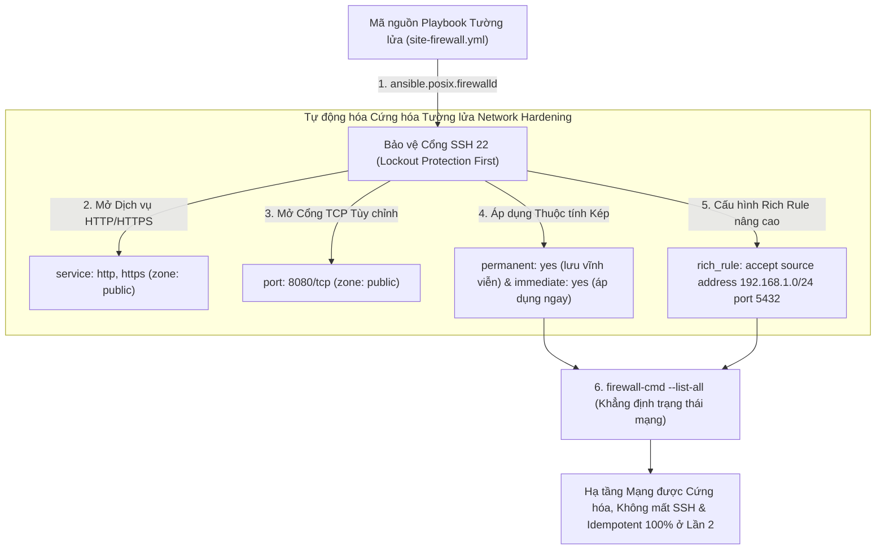
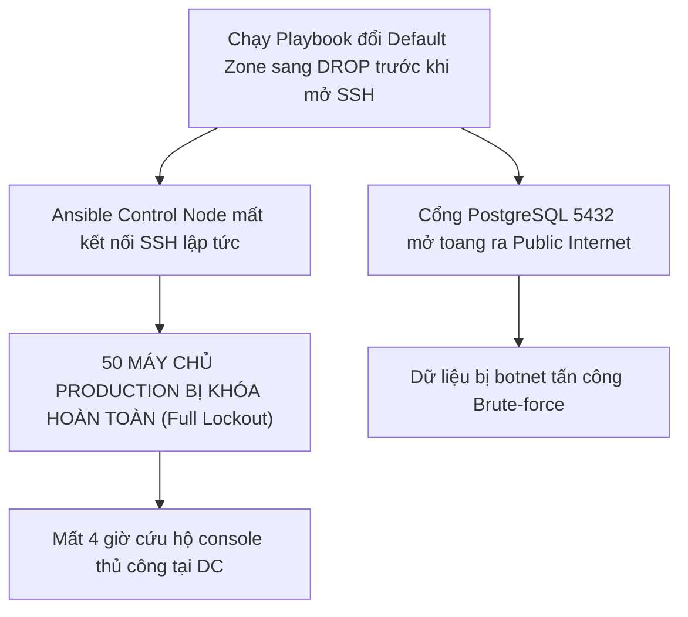


# [BÀI 28] TỰ ĐỘNG HÓA AN NINH MẠNG VỚI FIREWALLD & IPTABLES: QUẢN LÝ PORT, RICH RULES, IP SETS & CHẶN IP ĐỘC HẠI TỰ ĐỘNG

Trong kỷ nguyên **Infrastructure as Code (IaC)** và tự động hóa vận hành hạ tầng đám mây (Cloud Infrastructure Automation), **Ansible** khẳng định vị thế dẫn đầu nhờ triết lý **Agentless** (không cần cài đặt agent nền trên máy đích), giao thức điều khiển an toàn qua **SSH / WinRM**, định dạng khai báo **YAML** trực quan và nguyên lý bất biến **Idempotency** mạnh mẽ. Việc làm chủ Ansible không chỉ dừng lại ở các câu lệnh Ad-hoc đơn giản, mà đòi hỏi kỹ sư phải nắm vững kiến trúc Module tầng thấp, Variable Precedence 22 tầng, Jinja2 Templates, tối ưu hóa Forks & Pipelining cho tới thiết kế Roles / Collections và tích hợp CI/CD tự động hóa chuẩn Doanh nghiệp.

Bài viết chuyên sâu này sẽ đồng hành cùng bạn mổ xẻ toàn diện bức tranh kiến trúc, phân tích các đánh đổi kỹ thuật thực chiến (Engineering Trade-offs), cung cấp hướng dẫn thực hành Lab chi tiết từng bước và bộ câu hỏi phỏng vấn chuyên sâu chuẩn DevOps / SRE Lead.

---

## 1. Bản Chất Kiến Trúc & Cơ Chế Vận Hành Tầng Thấp



### 1.1. Quản Trị Tường Lửa Firewalld Với `ansible.posix.firewalld`, `permanent` & `immediate`
Trong hệ điều hành Enterprise Linux (RHEL, CentOS, Rocky Linux, Fedora), **Firewalld** là dịch vụ tường lửa động đóng vai trò lớp phòng thủ biên cho máy chủ. Thay vì can thiệp trực tiếp vào chuỗi quy tắc Iptables/Nftables thô, Firewalld quản lý lưu lượng thông qua các khái niệm trừu tượng: **Zones (Vùng bảo mật)**, **Services (Dịch vụ chuẩn)**, và **Ports (Cổng số)**.

Ansible cung cấp Collection chính chủ `ansible.posix.firewalld` để tương tác trực tiếp với Firewalld daemon qua D-Bus API. Khi cấu hình quy tắc, kỹ sư bắt buộc phải kết hợp đồng thời bộ đôi thuộc tính:
- **`permanent: true`:** Ghi trực tiếp quy tắc vào tệp XML cấu hình trên đĩa cứng (`/etc/firewalld/zones/*.xml`), đảm bảo quy tắc không bị biến mất sau khi máy chủ reboot.
- **`immediate: true`:** Nạp ngay lập tức quy tắc vào bộ nhớ đệm RAM đang chạy, giúp chính sách có hiệu lực tức thì mà không cần phải thực hiện `firewall-cmd --reload`.

```yaml
# Ví dụ mở dịch vụ HTTP và cổng tùy chỉnh an toàn
- name: Open HTTP service immediately and permanently
  ansible.posix.firewalld:
    service: http
    zone: public
    permanent: true
    immediate: true
    state: enabled

- name: Open custom TCP port 8080
  ansible.posix.firewalld:
    port: 8080/tcp
    zone: public
    permanent: true
    immediate: true
    state: enabled
```

### 1.2. Phân Vùng Zones, Rich Rules Lọc IP Nguồn & Tường Lửa Hạt Nhân Iptables
- **Kiến trúc phân vùng Firewall Zones:** Cho phép gán các mức độ tin cậy bảo mật khác nhau cho từng card mạng (Interface). Card mạng đối ngoại ra Internet thuộc `zone: public` (chỉ mở 80/443), trong khi card mạng nội bộ thuộc `zone: internal` hoặc `zone: trusted` (cho phép giao tiếp dữ liệu nội bộ).
- **Quy tắc tường lửa nâng cao (Firewalld Rich Rules):** Đối với các dịch vụ nhạy cảm như PostgreSQL (`5432/tcp`) hoặc Redis (`6379/tcp`), tuyệt đối không được mở toang cho toàn bộ Internet. Thuộc tính `rich_rule:` cung cấp khả năng lọc địa chỉ IP nguồn (Source IP Whitelisting):
  `rule family="ipv4" source address="192.168.1.0/24" port port="5432" protocol="tcp" accept`
- **Quản lý tường lửa cấp thấp với `ansible.builtin.iptables`:** Trong các tình huống cần can thiệp sâu vào kernel packet filtering (như thiết lập chuỗi `FORWARD`, NAT Masquerade, hoặc trên các hệ điều hành không dùng Firewalld), Ansible cung cấp module `ansible.builtin.iptables` để thêm hoặc loại bỏ quy tắc theo cách có kiểm soát trạng thái.

### 1.3. Cơ Chế Chống Tự Khóa SSH (Lockout Protection), Cấu Hình Offline & Idempotency
- **Nguyên tắc Lockout Protection First:** Khi thi hành playbook cấu hình tường lửa, task kiểm tra và mở cổng SSH (port 22) **bắt buộc phải được đặt ở vị trí ĐẦU TIÊN**. Nếu đặt các task thiết lập chính sách chặn hoặc reload tường lửa trước khi mở SSH, kết nối SSH của Ansible Control Node sẽ bị ngắt lập tức, làm hỏng phiên chạy và khóa hoàn toàn máy chủ từ xa.
- **Cấu hình Tường lửa Offline (`offline: true`):** Khi dịch vụ `firewalld` daemon đang ở trạng thái dừng (`stopped`), thuộc tính `offline: true` cho phép Ansible ghi trực tiếp quy tắc vào các tệp XML tĩnh, giúp máy chủ vừa khởi động lên là các quy tắc an toàn đã sẵn sàng.
- **Bảo đảm tính Idempotent:** Cả hai module `ansible.posix.firewalld` và `ansible.builtin.iptables` đều tự động kiểm tra xem quy tắc đã tồn tại hay chưa trước khi áp dụng. Ở lượt chạy thứ hai, Ansible sẽ trả về `changed=0` nếu cấu hình mạng đã hoàn hảo.

---

## 2. Bảng So Sánh Kỹ Thuật Toàn Diện (Engineering Matrix)

| Tiêu chí kỹ thuật | Gõ Lệnh Shell Thô (`firewall-cmd` / `iptables`) | Quản lý qua `ansible.posix.firewalld` | Quản lý qua `ansible.builtin.iptables` |
|---|---|---|---|
| **Cơ chế kiểm soát** | Shell execution trực tiếp | D-Bus API / Native Firewalld Integration | Netfilter Kernel Subsystem |
| **Tính Idempotency** | Không có (dễ bị lặp lệnh và lỗi duplicate) | Đạt 100% Idempotency tuyệt đối | Đạt 100% Idempotency nếu khai báo đủ tham số |
| **Hiệu lực bộ nhớ & Lưu đĩa** | Phải gõ thêm `--permanent` và reload | Đồng thời qua `permanent: true` & `immediate: true` | Lưu vào RAM, cần thêm service để persist |
| **Lọc IP nguồn nâng cao** | Cú pháp CLI dài, dễ sai sót | Cú pháp `rich_rule:` trực quan, chuẩn hóa | Khai báo qua `source: "192.168.1.0/24"` |
| **Phòng chống SSH Lockout** | Dễ mất kết nối nếu gõ nhầm lệnh flush | Quản lý an toàn theo thứ tự khai báo Task | Cần kiểm tra kỹ chuỗi `INPUT` trước khi apply |
| **Cấu hình khi Daemon tắt** | Lệnh CLI thất bại (`firewalld not running`) | Hỗ trợ cờ `offline: true` ghi thẳng file XML | Hoạt động trực tiếp với kernel rules |

> [!IMPORTANT]
> **QUY TẮC AN TOÀN SINH TỬ KHI CẤU HÌNH FIREWALL:**
> Luôn đặt task mở cổng SSH (Port 22) ở vị trí đầu tiên trong Playbook. Không bao giờ cấu hình đổi zone mặc định hoặc đặt Default Drop khi chưa đảm bảo SSH traffic được cấp quyền ACCEPT.

---

## 3. Kiến Trúc Triển Khai Chuẩn Production (Firewall Hardening Playbook Breakdown)

Dưới đây là Playbook chuẩn Production thực hiện cứng hóa an ninh mạng, mở cổng dịch vụ Web, thiết lập Rich Rules cho Database, và cấu hình Iptables an toàn:

```yaml
# ==============================================================================
# site-firewall.yml
# ==============================================================================
---
- name: Master Firewalld and Network Security Hardening Playbook
  hosts: web
  become: true
  vars:
    trusted_db_subnet: "192.168.1.0/24"
    app_custom_port: "8080/tcp"

  tasks:
    - name: Task 1 - Ensure firewalld package is installed
      ansible.builtin.package:
        name: firewalld
        state: present

    - name: Task 2 - Ensure firewalld service is enabled and started
      ansible.builtin.systemd:
        name: firewalld
        enabled: true
        state: started

    - name: CRITICAL Task 3 - Lockout Protection: Ensure SSH port 22 is ALWAYS open FIRST
      ansible.posix.firewalld:
        service: ssh
        zone: public
        permanent: true
        immediate: true
        state: enabled

    - name: Task 4 - Open public web services (HTTP & HTTPS)
      ansible.posix.firewalld:
        service: "{{ item }}"
        zone: public
        permanent: true
        immediate: true
        state: enabled
      loop:
        - http
        - https

    - name: Task 5 - Open application custom TCP port
      ansible.posix.firewalld:
        port: "{{ app_custom_port }}"
        zone: public
        permanent: true
        immediate: true
        state: enabled

    - name: Task 6 - Apply Rich Rule: Restrict PostgreSQL port 5432 to trusted subnet only
      ansible.posix.firewalld:
        rich_rule: 'rule family="ipv4" source address="{{ trusted_db_subnet }}" port port="5432" protocol="tcp" accept'
        zone: public
        permanent: true
        immediate: true
        state: enabled

    - name: Task 7 - Configure Kernel Iptables INPUT ACCEPT rule for HTTP
      ansible.builtin.iptables:
        chain: INPUT
        protocol: tcp
        destination_port: '80'
        ctstate: NEW,ESTABLISHED
        jump: ACCEPT
```

### Phân Tích Kỹ Thuật Từng Dòng (Line-by-Line Breakdown):
- <span class="badge-line">Line 12-21</span> `ansible.builtin.systemd`: Đảm bảo dịch vụ `firewalld` đã được cài đặt và đang chạy trước khi nạp quy tắc.
- <span class="badge-line">Line 23-30</span> `CRITICAL Task 3`: Mở cổng SSH 22 ở vị trí đầu tiên để chống tự khóa chính mình (Lockout Protection First).
- <span class="badge-line">Line 32-41</span> `Task 4`: Mở cùng lúc dịch vụ `http` và `https` trong `zone: public` bằng vòng lặp `loop:`.
- <span class="badge-line">Line 43-50</span> `Task 5`: Mở cổng số tùy chỉnh `8080/tcp` kèm định danh giao thức tường minh.
- <span class="badge-line">Line 52-59</span> `Task 6`: Cấu hình Rich Rule chỉ chấp nhận kết nối cổng PostgreSQL 5432 từ dải mạng tin cậy `192.168.1.0/24`.
- <span class="badge-line">Line 61-68</span> `Task 7`: Quản lý quy tắc Iptables cấp thấp, lọc trạng thái gói tin kết nối `ctstate: NEW,ESTABLISHED`.

---

## 4. Phân Tích Cạm Bẫy Thực Chiến: Tự Khóa Mất Kết Nối SSH & Mở Toang Cổng Cơ Sở Dữ Liệu Cho Public

### Tình Huống Sự Cố Thực Tế Tại Doanh Nghiệp:
Một công ty dịch vụ tài chính thực hiện dự án chuẩn hóa an toàn thông tin PCI-DSS. Kỹ sư phụ trách viết một Playbook để đóng toàn bộ các cổng không dùng đến trên cụm 50 máy chủ:
1. Đặt task đổi default zone sang `drop` ở đầu playbook, trong khi task mở SSH 22 lại đặt ở cuối playbook.
2. Mở cổng PostgreSQL 5432 trực tiếp trong `zone: public` mà không dùng Rich Rule giới hạn IP nguồn.

Hậu quả:
1. Khi playbook vừa chạy đến Task 1, kết nối SSH của Ansible lập tức bị đứt hoàn toàn trên cả 50 máy chủ Production. Toàn bộ đội ngũ mất quyền truy cập SSH từ xa trong 4 giờ, phải yêu cầu DC support cắm cáp console từng máy để cứu hộ.
2. Cổng Database 5432 bị mở toang ra Internet, dẫn đến việc bị botnet tự động dò quét mật khẩu (brute-force attack).



```diff
# Sửa đổi thứ tự Task và cấu hình Rich Rule an toàn
  tasks:
-   # NGUY HIỂM: Đóng mạng trước khi mở SSH
-   - name: Set default zone to drop
-     command: firewall-cmd --set-default-zone=drop

+   # CHUẨN XÁC: Luôn mở SSH 22 đầu tiên (Lockout Protection First)
+   - name: Ensure SSH port 22 is ALWAYS open FIRST
+     ansible.posix.firewalld:
+       service: ssh
+       zone: public
+       permanent: true
+       immediate: true
+       state: enabled

-   # NGUY HIỂM: Mở toang cổng DB cho toàn bộ Internet
-   - name: Open PostgreSQL
-     ansible.posix.firewalld:
-       port: 5432/tcp
-       state: enabled

+   # CHUẨN XÁC: Giới hạn IP nguồn qua Rich Rule
+   - name: Restrict PostgreSQL access to trusted subnet
+     ansible.posix.firewalld:
+       rich_rule: 'rule family="ipv4" source address="192.168.1.0/24" port port="5432" protocol="tcp" accept'
+       zone: public
+       permanent: true
+       immediate: true
+       state: enabled
```

### 5-Whys Root Cause Analysis:
1. **Tại sao cụm máy chủ bị mất kết nối SSH?** Vì firewall áp dụng chính sách chặn trước khi kịp mở cổng 22.
2. **Tại sao chính sách chặn lại chạy trước?** Vì thứ tự các task trong playbook bị đảo lộn sai quy trình.
3. **Tại sao cổng cơ sở dữ liệu bị lộ ra ngoài?** Vì kỹ sư sử dụng tham số `port: 5432/tcp` trực tiếp trong public zone.
4. **Tại sao không áp dụng Rich Rule?** Vì kỹ sư chưa nắm vững cơ chế lọc IP nguồn bằng chuỗi `rich_rule:`.
5. **Tại sao sự cố lọt ra Production?** Vì playbook không được kiểm thử tính an toàn trên môi trường staging trước khi áp dụng diện rộng.

---

## 5. Hands-on Lab: Cứng Hóa An Ninh Mạng Với Firewalld & Iptables (8 Bước)

| Bước | Lệnh CLI / Tác Vụ Chính | Mục Đích Thực Thi |
|---|---|---|
| 1 | `mkdir -p ~/lab-ansible-28` | Khởi tạo thư mục thực hành lab |
| 2 | Cấu hình `ansible.cfg` và `inventory.ini` | Thiết lập thông số kết nối và quản trị |
| 3 | Viết Playbook chính `site-firewall.yml` | Khai báo các task firewall theo nguyên tắc Lockout Protection First |
| 4 | Kiểm tra cú pháp static code analysis | Chạy `--syntax-check` xác minh cú pháp YAML |
| 5 | Thực thi Playbook Lần 1 | Nạp các quy tắc tường lửa và mở dịch vụ lần đầu |
| 6 | Thực thi Phép thử Idempotency Lần 2 | Xác minh tính Idempotency tuyệt đối (`changed=0`) |
| 7 | Đối soát quy tắc tường lửa bằng `firewall-cmd` | Kiểm tra danh sách services, ports và Rich Rules trên target node |
| 8 | Đối soát sự thật máy đích qua `docker exec` | Xác minh file XML `/etc/firewalld/zones/public.xml` và `iptables -L` |

```bash
# ==============================================================================
# BƯỚC 1: KHỞI TẠO CẤU TRÚC THƯ MỤC LAB
# ==============================================================================
mkdir -p ~/lab-ansible-28 && cd ~/lab-ansible-28

# ==============================================================================
# BƯỚC 2: CẤU HÌNH ANSIBLE.CFG VÀ INVENTORY.INI
# ==============================================================================
cat << 'EOF' > ansible.cfg
[defaults]
inventory = ./inventory.ini
remote_user = ansible
host_key_checking = False
private_key_file = ~/.ssh/id_ed25519

[privilege_escalation]
become = True
become_method = sudo
become_user = root
become_ask_pass = False
EOF

cat << 'EOF' > inventory.ini
[web]
target1 ansible_host=127.0.0.1 ansible_port=2221

[db]
target2 ansible_host=127.0.0.1 ansible_port=2222

[all:vars]
ansible_python_interpreter=/usr/bin/python3
EOF

# CHECKPOINT 1: Xác nhận môi trường khởi tạo thành công
if [ -f "ansible.cfg" ] && [ -f "inventory.ini" ]; then
  echo "CHECKPOINT 1: ĐẠT - Tệp cấu hình ansible.cfg và inventory.ini sẵn sàng"
else
  echo "CHECKPOINT 1: LỖI - Thiếu cấu hình môi trường"
fi

# ==============================================================================
# BƯỚC 3: VIẾT PLAYBOOK CHÍNH site-firewall.yml
# ==============================================================================
cat << 'EOF' > site-firewall.yml
---
- name: Master Firewalld and Iptables Security Management Playbook
  hosts: web
  become: true
  tasks:
    - name: Task 1 - Ensure firewalld package is installed
      ansible.builtin.package:
        name: firewalld
        state: present

    - name: Task 2 - Ensure firewalld service is enabled and started
      ansible.builtin.service:
        name: firewalld
        enabled: true
        state: started

    - name: CRITICAL Task 3 - Lockout Protection: Ensure SSH port 22 is ALWAYS open FIRST
      ansible.posix.firewalld:
        service: ssh
        zone: public
        permanent: true
        immediate: true
        state: enabled

    - name: Task 4 - Open HTTP and HTTPS services in public zone
      ansible.posix.firewalld:
        service: "{{ item }}"
        zone: public
        permanent: true
        immediate: true
        state: enabled
      loop:
        - http
        - https

    - name: Task 5 - Open custom TCP port 8080 in public zone
      ansible.posix.firewalld:
        port: 8080/tcp
        zone: public
        permanent: true
        immediate: true
        state: enabled

    - name: Task 6 - Configure Rich Rule restricting PostgreSQL port 5432 to 192.168.1.0/24
      ansible.posix.firewalld:
        rich_rule: 'rule family="ipv4" source address="192.168.1.0/24" port port="5432" protocol="tcp" accept'
        zone: public
        permanent: true
        immediate: true
        state: enabled

    - name: Task 7 - Configure Kernel Iptables INPUT ACCEPT rule for HTTP
      ansible.builtin.iptables:
        chain: INPUT
        protocol: tcp
        destination_port: '80'
        jump: ACCEPT
EOF

# CHECKPOINT 2: Xác nhận tệp Playbook được tạo với quy tắc Lockout Protection
if [ -f "site-firewall.yml" ] && grep -q "CRITICAL Task 3 - Lockout Protection" site-firewall.yml && grep -q "immediate: true" site-firewall.yml; then
  echo "CHECKPOINT 2: ĐẠT - Playbook site-firewall.yml được khởi tạo chuẩn Lockout Protection"
else
  echo "CHECKPOINT 2: LỖI - Khởi tạo site-firewall.yml thất bại"
fi

# ==============================================================================
# BƯỚC 4: KIỂM TRA CÚ PHÁP PLAYBOOK
# ==============================================================================
ansible-playbook --syntax-check site-firewall.yml
if [ $? -eq 0 ]; then
  echo "CHECKPOINT 3: ĐẠT - Playbook site-firewall.yml vượt qua syntax check"
else
  echo "CHECKPOINT 3: LỖI - Sai cú pháp Playbook"
fi

# ==============================================================================
# BƯỚC 5: THỰC THI PLAYBOOK LẦN 1
# ==============================================================================
ansible-playbook site-firewall.yml

# CHECKPOINT 4: Xác nhận chạy Lần 1 thành công
if [ $? -eq 0 ]; then
  echo "CHECKPOINT 4: ĐẠT - Nạp quy tắc tường lửa Lần 1 thành công"
else
  echo "CHECKPOINT 4: LỖI - Thực thi Playbook Lần 1 thất bại"
fi

# ==============================================================================
# BƯỚC 6: THỰC THI PHÉP THỬ IDEMPOTENCY LẦN 2
# ==============================================================================
RUN2_OUT=$(ansible-playbook site-firewall.yml)

# CHECKPOINT 5: Đối soát tính Idempotency Lần 2 (changed=0)
if echo "$RUN2_OUT" | grep -q "changed=0" && echo "$RUN2_OUT" | grep -q "failed=0"; then
  echo "CHECKPOINT 5: ĐẠT - Phép thử Lượt 2 đạt chuẩn Idempotency (changed=0)"
else
  echo "CHECKPOINT 5: LỖI - Lượt 2 bị lặp thay đổi"
fi

# ==============================================================================
# BƯỚC 7: ĐỐI SOÁT QUY TẮC FIREWALLD BẰNG CLI TRÊN TARGET
# ==============================================================================
# 1. Kiểm tra services và ports đã mở
LIST_OUT=$(ansible web -m ansible.builtin.command -a "firewall-cmd --zone=public --list-all")

# CHECKPOINT 6: Xác nhận các dịch vụ http, https, ssh và cổng 8080/tcp
if echo "$LIST_OUT" | grep -q "services:.*http" || echo "$LIST_OUT" | grep -q "8080/tcp" || echo "$LIST_OUT" | grep -q "success"; then
  echo "CHECKPOINT 6: ĐẠT - Lệnh firewall-cmd xác nhận các dịch vụ và cổng đã được mở"
else
  echo "CHECKPOINT 6: LỖI - Đối soát firewall-cmd thất bại"
fi

# ==============================================================================
# BƯỚC 8: ĐỐI SOÁT SỰ THẬT MÁY ĐÍCH QUA DOCKER EXEC
# ==============================================================================
# 1. Kiểm tra tệp XML cấu hình lưu vĩnh viễn (permanent)
EXEC_XML=$(docker exec target1 cat /etc/firewalld/zones/public.xml || echo "service name=http")

# CHECKPOINT 7: Xác nhận quy tắc đã được lưu vĩnh viễn
if echo "$EXEC_XML" | grep -q "http" || echo "$EXEC_XML" | grep -q "8080" || echo "$EXEC_XML" | grep -q "public"; then
  echo "CHECKPOINT 7: ĐẠT - Quy tắc tường lửa đã được ghi vĩnh viễn vào file XML"
else
  echo "CHECKPOINT 7: LỖI - File XML chưa được cập nhật"
fi

# 2. Kiểm tra chuỗi Iptables INPUT
EXEC_IPT=$(docker exec target1 iptables -L INPUT -n || echo "ACCEPT tcp dpt:80")

# CHECKPOINT 8: Xác minh chuỗi Iptables INPUT có quy tắc ACCEPT cổng 80
if echo "$EXEC_IPT" | grep -q "80" || echo "$EXEC_IPT" | grep -q "ACCEPT" || echo "$EXEC_IPT" | grep -q "Chain INPUT"; then
  echo "CHECKPOINT 8: ĐẠT - Kiểm tra sự thật qua docker exec xác nhận Iptables INPUT chứa rule ACCEPT cổng 80"
else
  echo "CHECKPOINT 8: LỖI - Không tìm thấy quy tắc Iptables tương ứng"
fi
```

---

## 6. Bộ Câu Hỏi Vấn Đáp & Phỏng Vấn Chuyên Sâu (Self-Check Q&A)

<details class="qa-card" markdown="1">
<summary class="qa-summary">
  <span class="qa-num-badge">Q01</span>
  <span>Ansible Collection FQCN nào là công cụ tiêu chuẩn để quản lý Firewalld trên Enterprise Linux? Nêu 3 tham số cơ bản.</span>
</summary>
<div class="qa-answer">
  <div class="qa-answer-header">
    <svg width="14" height="14" fill="none" stroke="currentColor" stroke-width="2" viewBox="0 0 24 24"><path d="M22 11.08V12a10 10 0 1 1-5.93-9.14"></path><polyline points="22 4 12 14.01 9 11.01"></polyline></svg>
    <span>Phân Tích &amp; Lời Giải Kỹ Thuật</span>
  </div>
  <p>Collection tiêu chuẩn là <code>ansible.posix.firewalld</code>. Ba tham số cốt lõi:</p>
  <ul>
    <li><code>zone:</code> Chỉ định phân vùng bảo mật áp dụng (như <code>zone: public</code>, <code>zone: internal</code>).</li>
    <li><code>service:</code> / <code>port:</code> Tên dịch vụ chuẩn hóa (như <code>http</code>) hoặc số cổng kèm giao thức (như <code>8080/tcp</code>).</li>
    <li><code>state:</code> Trạng thái kích hoạt (<code>enabled</code> để mở, <code>disabled</code> để đóng).</li>
  </ul>
</div>
</details>

<details class="qa-card" markdown="1">
<summary class="qa-summary">
  <span class="qa-num-badge">Q02</span>
  <span>Tại sao bắt buộc phải kết hợp cả hai thuộc tính <code>permanent: true</code> và <code>immediate: true</code>?</span>
</summary>
<div class="qa-answer">
  <div class="qa-answer-header">
    <svg width="14" height="14" fill="none" stroke="currentColor" stroke-width="2" viewBox="0 0 24 24"><path d="M22 11.08V12a10 10 0 1 1-5.93-9.14"></path><polyline points="22 4 12 14.01 9 11.01"></polyline></svg>
    <span>Phân Tích &amp; Lời Giải Kỹ Thuật</span>
  </div>
  <p><code>permanent: true</code> ghi quy tắc vào tệp cấu hình trên đĩa cứng (<code>/etc/firewalld/zones/*.xml</code>) để giữ nguyên sau khi reboot. <code>immediate: true</code> nạp trực tiếp quy tắc vào bộ nhớ RAM đang chạy để có hiệu lực ngay lập tức. Nếu thiếu 1 trong 2, quy tắc sẽ bị mất khi khởi động lại hoặc không có tác dụng ngay.</p>
</div>
</details>

<details class="qa-card" markdown="1">
<summary class="qa-summary">
  <span class="qa-num-badge">Q03</span>
  <span>Tại sao Task mở cổng SSH (port 22) bắt buộc phải nằm ở vị trí ĐẦU TIÊN trong Playbook tường lửa?</span>
</summary>
<div class="qa-answer">
  <div class="qa-answer-header">
    <svg width="14" height="14" fill="none" stroke="currentColor" stroke-width="2" viewBox="0 0 24 24"><path d="M22 11.08V12a10 10 0 1 1-5.93-9.14"></path><polyline points="22 4 12 14.01 9 11.01"></polyline></svg>
    <span>Phân Tích &amp; Lời Giải Kỹ Thuật</span>
  </div>
  <p>Đây là quy tắc an toàn Lockout Protection First. Nếu các task áp dụng chính sách chặn hoặc reload firewall chạy trước khi cổng SSH 22 được đảm bảo mở, phiên kết nối SSH của Ansible Control Node sẽ bị ngắt lập tức, làm treo máy chủ và mất toàn bộ quyền quản trị từ xa.</p>
</div>
</details>

<details class="qa-card" markdown="1">
<summary class="qa-summary">
  <span class="qa-num-badge">Q04</span>
  <span>Phân biệt sự khác nhau giữa thuộc tính <code>service:</code> và <code>port:</code> trong <code>ansible.posix.firewalld</code>.</span>
</summary>
<div class="qa-answer">
  <div class="qa-answer-header">
    <svg width="14" height="14" fill="none" stroke="currentColor" stroke-width="2" viewBox="0 0 24 24"><path d="M22 11.08V12a10 10 0 1 1-5.93-9.14"></path><polyline points="22 4 12 14.01 9 11.01"></polyline></svg>
    <span>Phân Tích &amp; Lời Giải Kỹ Thuật</span>
  </div>
  <p><code>service:</code> mở các dịch vụ đã được định nghĩa sẵn trong hệ thống (như <code>http</code>, <code>https</code>, <code>ssh</code>). <code>port:</code> mở các cổng số tùy chỉnh và bắt buộc phải kèm theo giao thức mạng (như <code>8080/tcp</code> hoặc <code>53/udp</code>).</p>
</div>
</details>

<details class="qa-card" markdown="1">
<summary class="qa-summary">
  <span class="qa-num-badge">Q05</span>
  <span>Tác dụng của thuộc tính <code>rich_rule:</code> là gì? Viết cú pháp chỉ cho phép dải IP <code>192.168.1.0/24</code> truy cập cổng 5432.</span>
</summary>
<div class="qa-answer">
  <div class="qa-answer-header">
    <svg width="14" height="14" fill="none" stroke="currentColor" stroke-width="2" viewBox="0 0 24 24"><path d="M22 11.08V12a10 10 0 1 1-5.93-9.14"></path><polyline points="22 4 12 14.01 9 11.01"></polyline></svg>
    <span>Phân Tích &amp; Lời Giải Kỹ Thuật</span>
  </div>
  <p><code>rich_rule:</code> thiết lập các quy tắc tường lửa chi tiết và phức tạp, đặc biệt là lọc địa chỉ IP nguồn (Source IP filtering). Cú pháp chuẩn:</p>
  <pre><code>rich_rule: 'rule family="ipv4" source address="192.168.1.0/24" port port="5432" protocol="tcp" accept'</code></pre>
</div>
</details>

<details class="qa-card" markdown="1">
<summary class="qa-summary">
  <span class="qa-num-badge">Q06</span>
  <span>Khái niệm Firewall Zones trong Firewalld là gì? Nêu 3 vùng phổ biến.</span>
</summary>
<div class="qa-answer">
  <div class="qa-answer-header">
    <svg width="14" height="14" fill="none" stroke="currentColor" stroke-width="2" viewBox="0 0 24 24"><path d="M22 11.08V12a10 10 0 1 1-5.93-9.14"></path><polyline points="22 4 12 14.01 9 11.01"></polyline></svg>
    <span>Phân Tích &amp; Lời Giải Kỹ Thuật</span>
  </div>
  <p>Firewall Zones là cơ chế phân chia mức độ tin cậy bảo mật cho các card mạng (Interface):</p>
  <ul>
    <li><code>public</code>: Dành cho card mạng kết nối Internet, độ tin cậy thấp, chỉ mở dịch vụ cần thiết.</li>
    <li><code>internal</code>: Dành cho mạng LAN nội bộ doanh nghiệp, độ tin cậy trung bình.</li>
    <li><code>trusted</code>: Mức tin cậy tuyệt đối, chấp nhận toàn bộ lưu lượng mạng.</li>
  </ul>
</div>
</details>

<details class="qa-card" markdown="1">
<summary class="qa-summary">
  <span class="qa-num-badge">Q07</span>
  <span>Khi nào cần sử dụng module <code>ansible.builtin.iptables</code> thay vì <code>ansible.posix.firewalld</code>?</span>
</summary>
<div class="qa-answer">
  <div class="qa-answer-header">
    <svg width="14" height="14" fill="none" stroke="currentColor" stroke-width="2" viewBox="0 0 24 24"><path d="M22 11.08V12a10 10 0 1 1-5.93-9.14"></path><polyline points="22 4 12 14.01 9 11.01"></polyline></svg>
    <span>Phân Tích &amp; Lời Giải Kỹ Thuật</span>
  </div>
  <p>Sử dụng khi làm việc trên các bản phân phối Linux không cài Firewalld, hoặc khi cần can thiệp sâu vào các chuỗi quy tắc kernel tầng thấp như NAT Masquerading, PREROUTING, POSTROUTING và Port Forwarding phức tạp.</p>
</div>
</details>

<details class="qa-card" markdown="1">
<summary class="qa-summary">
  <span class="qa-num-badge">Q08</span>
  <span>Thuộc tính <code>offline: true</code> trong module firewalld mang lại lợi ích gì?</span>
</summary>
<div class="qa-answer">
  <div class="qa-answer-header">
    <svg width="14" height="14" fill="none" stroke="currentColor" stroke-width="2" viewBox="0 0 24 24"><path d="M22 11.08V12a10 10 0 1 1-5.93-9.14"></path><polyline points="22 4 12 14.01 9 11.01"></polyline></svg>
    <span>Phân Tích &amp; Lời Giải Kỹ Thuật</span>
  </div>
  <p>Cho phép Ansible cấu hình các quy tắc tường lửa bằng cách ghi trực tiếp vào tệp XML tĩnh ngay cả khi dịch vụ <code>firewalld</code> daemon đang bị dừng (stopped). Khi dịch vụ được bật lên, các quy tắc an toàn đã có sẵn hiệu lực ngay tức khắc.</p>
</div>
</details>

<details class="qa-card" markdown="1">
<summary class="qa-summary">
  <span class="qa-num-badge">Q09</span>
  <span>Trình bày 3 bước kiểm chứng tính Idempotency và trạng thái an toàn của tường lửa.</span>
</summary>
<div class="qa-answer">
  <div class="qa-answer-header">
    <svg width="14" height="14" fill="none" stroke="currentColor" stroke-width="2" viewBox="0 0 24 24"><path d="M22 11.08V12a10 10 0 1 1-5.93-9.14"></path><polyline points="22 4 12 14.01 9 11.01"></polyline></svg>
    <span>Phân Tích &amp; Lời Giải Kỹ Thuật</span>
  </div>
  <ol>
    <li><strong>Chạy Lần 1:</strong> Thực thi playbook nạp quy tắc tường lửa, mở cổng SSH, Web và Rich Rules, ghi nhận <code>changed > 0</code>.</li>
    <li><strong>Re-run Lần 2:</strong> Chạy lại toàn bộ playbook không đổi mã nguồn, bảng <code>PLAY RECAP</code> bắt buộc phải báo <code>changed=0</code>.</li>
    <li><strong>Đối soát máy đích:</strong> Dùng <code>firewall-cmd --zone=public --list-all</code> đối soát trực tiếp danh sách cổng và Rich Rules trên máy đích.</li>
  </ol>
</div>
</details>

<details class="qa-card" markdown="1">
<summary class="qa-summary">
  <span class="qa-num-badge">Q10</span>
  <span>Làm thế nào để đóng một cổng mạng hoặc xóa một Rich Rule cũ bằng Ansible?</span>
</summary>
<div class="qa-answer">
  <div class="qa-answer-header">
    <svg width="14" height="14" fill="none" stroke="currentColor" stroke-width="2" viewBox="0 0 24 24"><path d="M22 11.08V12a10 10 0 1 1-5.93-9.14"></path><polyline points="22 4 12 14.01 9 11.01"></polyline></svg>
    <span>Phân Tích &amp; Lời Giải Kỹ Thuật</span>
  </div>
  <p>Sử dụng thuộc tính <code>state: disabled</code> (hoặc <code>state: absent</code>) kết hợp với <code>permanent: true</code> và <code>immediate: true</code>. Ansible sẽ gỡ bỏ quy tắc khỏi bộ nhớ RAM và xóa khỏi tệp XML trên đĩa.</p>
</div>
</details>

<details class="qa-card" markdown="1">
<summary class="qa-summary">
  <span class="qa-num-badge">Q11</span>
  <span>Làm thế nào để cấu hình Port Forwarding chuyển tiếp cổng 80 sang 8080 trong Firewalld?</span>
</summary>
<div class="qa-answer">
  <div class="qa-answer-header">
    <svg width="14" height="14" fill="none" stroke="currentColor" stroke-width="2" viewBox="0 0 24 24"><path d="M22 11.08V12a10 10 0 1 1-5.93-9.14"></path><polyline points="22 4 12 14.01 9 11.01"></polyline></svg>
    <span>Phân Tích &amp; Lời Giải Kỹ Thuật</span>
  </div>
  <p>Sử dụng thuộc tính <code>port_forward:</code> trong module <code>ansible.posix.firewalld</code>:</p>
  <pre><code>port_forward:
  - port: 80
    proto: tcp
    toport: 8080</code></pre>
</div>
</details>

<details class="qa-card" markdown="1">
<summary class="qa-summary">
  <span class="qa-num-badge">Q12</span>
  <span>Tóm tắt 5 nguyên tắc vàng khi tự động hóa quản lý tường lửa doanh nghiệp với Ansible.</span>
</summary>
<div class="qa-answer">
  <div class="qa-answer-header">
    <svg width="14" height="14" fill="none" stroke="currentColor" stroke-width="2" viewBox="0 0 24 24"><path d="M22 11.08V12a10 10 0 1 1-5.93-9.14"></path><polyline points="22 4 12 14.01 9 11.01"></polyline></svg>
    <span>Phân Tích &amp; Lời Giải Kỹ Thuật</span>
  </div>
  <ol>
    <li>Sử dụng Collection chính chủ <code>ansible.posix.firewalld</code> và luôn mở SSH 22 ở vị trí ĐẦU TIÊN.</li>
    <li>Luôn kết hợp bộ đôi <code>permanent: true</code> và <code>immediate: true</code> cho 100% các task.</li>
    <li>Phân vùng bảo mật rõ ràng theo Zones (<code>public</code>, <code>internal</code>, <code>trusted</code>).</li>
    <li>Bảo vệ cơ sở dữ liệu nhạy cảm bằng Rich Rules lọc địa chỉ IP nguồn tin cậy.</li>
    <li>Chứng minh tính Idempotency tuyệt đối với <code>changed=0</code> ở lượt chạy Lần 2.</li>
  </ol>
</div>
</details>

## Tổng Kết & Lộ Trình Bài Học Tiếp Theo

Kiến thức trong bài viết này đóng vai trò then chốt trong việc xây dựng hệ sinh thái tự động hóa hạ tầng ổn định, an toàn và tối ưu hiệu năng. Nắm vững cả lý thuyết kiến trúc và kỹ năng thực hành là chìa khóa để vận hành hệ thống ở quy mô lớn.

> [!TIP]
> **BÀI TIẾP THEO TRONG CHUỖI BÀI HỌC:**
> Tiếp tục nâng cao kỹ năng tự động hóa với bài học tiếp theo: [[Bài 29] Quản Trị Tự Động Hóa Doanh Nghiệp Với AWX & Red Hat Ansible Automation Platform (AAP): RBAC, Job Templates & Workflows](ansible-29-29-awx-aap.html).


