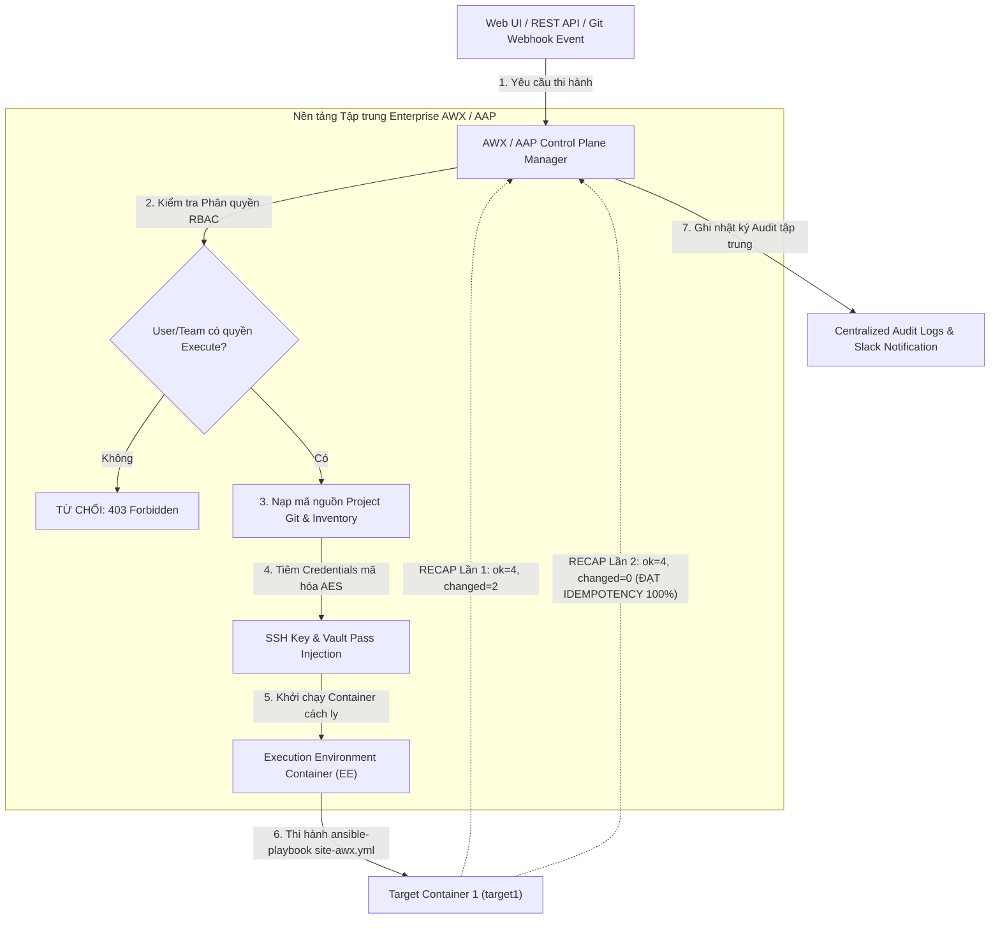
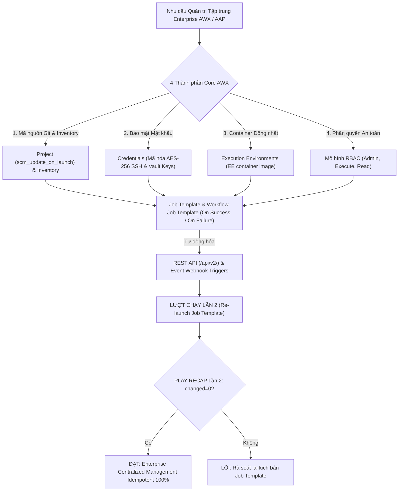
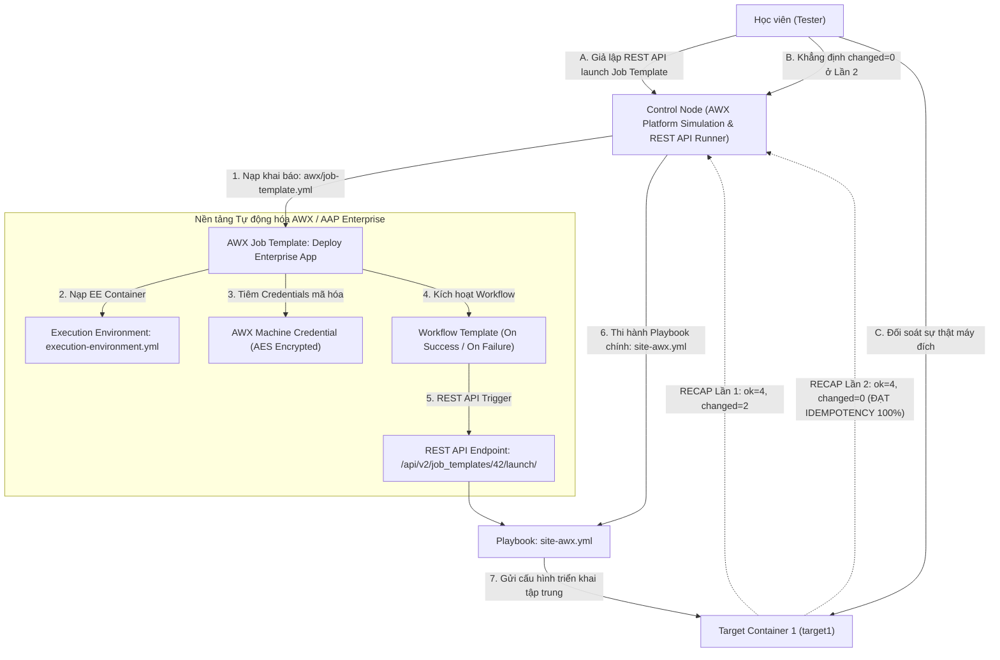


# [BÀI 29] QUẢN TRỊ TỰ ĐỘNG HÓA DOANH NGHIỆP VỚI AWX & RED HAT ANSIBLE AUTOMATION PLATFORM (AAP): RBAC, JOB TEMPLATES & WORKFLOWS

Trong kỷ nguyên **Infrastructure as Code (IaC)** và tự động hóa vận hành hạ tầng đám mây (Cloud Infrastructure Automation), **Ansible** khẳng định vị thế dẫn đầu nhờ triết lý **Agentless** (không cần cài đặt agent nền trên máy đích), giao thức điều khiển an toàn qua **SSH / WinRM**, định dạng khai báo **YAML** trực quan và nguyên lý bất biến **Idempotency** mạnh mẽ. Việc làm chủ Ansible không chỉ dừng lại ở các câu lệnh Ad-hoc đơn giản, mà đòi hỏi kỹ sư phải nắm vững kiến trúc Module tầng thấp, Variable Precedence 22 tầng, Jinja2 Templates, tối ưu hóa Forks & Pipelining cho tới thiết kế Roles / Collections và tích hợp CI/CD tự động hóa chuẩn Doanh nghiệp.

Bài viết chuyên sâu này sẽ đồng hành cùng bạn mổ xẻ toàn diện bức tranh kiến trúc, phân tích các đánh đổi kỹ thuật thực chiến (Engineering Trade-offs), cung cấp hướng dẫn thực hành Lab chi tiết từng bước và bộ câu hỏi phỏng vấn chuyên sâu chuẩn DevOps / SRE Lead.

---

## 1. Bản Chất Kiến Trúc & Cơ Chế Vận Hành Tầng Thấp

---


> **Chuyển đổi quy mô quản trị Ansible từ CLI cá nhân sang nền tảng tập trung AWX / Ansible Automation Platform giúp phân quyền RBAC, theo dõi lịch sử thi hành, tự động hóa qua REST API & Webhook và chuẩn hóa môi trường Execution Environment cấp Doanh nghiệp.**

Bước tiến hóa quy mô Enterprise — Từ câu lệnh CLI cá nhân tới Nền tảng Tập trung (I-10):

> **Khi dự án Ansible trong Doanh nghiệp phát triển lên quy mô hàng chục đội ngũ kỹ thuật (SysAdmin, DevOps, Security, Network, Developers) với hàng nghìn máy chủ, việc mỗi kỹ sư tự chạy lệnh `ansible-playbook` từ terminal cá nhân gặp phải các nút thắt cổ chai nghiêm trọng: không có phân quyền truy cập (RBAC), SSH keys và mật khẩu Vault bị phân tán rủi ro lộ bí mật, không ghi nhận nhật ký audit lịch sử ai đã chạy kịch bản gì vào thời điểm nào, và môi trường chạy bị khác biệt phiên bản Python/Collections. AWX (phiên bản Open Source) và Red Hat Ansible Automation Platform - AAP (phiên bản Enterprise) giải quyết triệt để các bài toán này. Nền tảng cung cấp giao diện Web UI tập trung, REST API chuẩn mực, mô hình Execution Environments (EE) đóng gói container, quản lý Credentials mã hóa AES, Job Templates, Workflow Job Templates và kích hoạt tự động qua Webhook, duy trì tính Idempotent `changed=0` ở Lần 2.**

---


---


---


| Tiếng Việt | Tiếng Anh / Từ khóa + FQCN (giữ nguyên) |
|---|---|
| Nền tảng tự động hóa mã nguồn mở | Open Source Automation Platform (AWX) |
| Nền tảng tự động hóa Enterprise | Red Hat Ansible Automation Platform (AAP) |
| Môi trường thi hành đóng gói container | Execution Environment (`EE` / `ansible-builder`) |
| Kịch bản thi hành công việc | Job Template (`job_templates`) |
| Luồng công việc liên hoàn | Workflow Job Template (`workflow_job_templates`) |
| Thông tin xác thực mã hóa | AWX Encrypted Credentials (`credentials`) |
| Phân quyền theo vai trò | Role-Based Access Control (`RBAC`) |
| Tự động hóa qua giao diện lập trình | REST API automation (`/api/v2/job_templates/`) |
| Kích hoạt tự động theo sự kiện | Event-driven Webhook trigger |
| Nhật ký kiểm toán tập trung | Centralized audit logging |
| Đồng bộ hóa kho mã nguồn | Project sync (`scm_type: git`) |
| Nút thi hành công việc | Execution Node runner |

---

### 1.1. Kiến trúc AWX / AAP, Execution Environments và Credentials (15 phút)



**Nguyên lý cốt lõi:** AWX và Red Hat Ansible Automation Platform (AAP) chuyển đổi quy mô quản trị Ansible từ việc chạy lệnh CLI cá nhân phân tán sang nền tảng tập trung quản lý qua Web UI, REST API và mô hình phân quyền RBAC Enterprise.

**Giải thích cơ chế ngầm:** Giải quyết triệt tiêu 4 vấn đề lớn của hạ tầng lớn: xóa bỏ việc chia sẻ file SSH key/Vault pass qua chat; ghi nhận nhật ký audit ai đã chạy kịch bản gì; chuẩn hóa môi trường runner; và cung cấp cổng REST API cho các hệ thống khác (ServiceNow, Jira, CI/CD) gọi tự động hóa.

> [!WARNING]
> **CẠM BẪY THỰC CHIẾN:**
> Yêu cầu 20 kỹ sư tự lưu file SSH Private Key và Vault Pass trên laptop cá nhân rồi tự gõ lệnh deploy từ máy riêng.

**Minh hoạ.** Cấu hình khai báo AWX Project đồng bộ tự động từ Git Repository (`awx/project.yml`):
```yaml
name: Enterprise Ansible Core Project
scm_type: git
scm_url: https://gitlab.company.local/ansible/infrastructure.git
scm_branch: main
scm_update_on_launch: true
```

**Nguyên lý cốt lõi:** Khái niệm Execution Environment (EE) là một Container Image (xây dựng qua `ansible-builder`) chứa đúng phiên bản `ansible-core`, các gói Python dependencies và các Ansible Collections được cố định phiên bản chuẩn.

**Giải thích cơ chế ngầm:** Đảm bảo tính nhất quán tuyệt đối của môi trường thi hành (Environmental Consistency): loại bỏ hoàn toàn lỗi "trên máy tôi chạy được mà trên máy anh lại lỗi" do khác biệt phiên bản Python hay thiếu gói Collection. Mọi Job thi hành trên AWX đều chạy bên trong container EE đồng nhất.

> [!WARNING]
> **CẠM BẪY THỰC CHIẾN:**
> Chạy Playbook trực tiếp trên môi trường OS của Control Node làm đụng độ các gói thư viện Python của hệ thống.

**Minh hoạ.** Tệp khai báo cấu trúc Execution Environment (`execution-environment.yml`):
```yaml
version: 3
images:
  base_image:
    name: registry.redhat.io/ansible-automation-platform-24/ee-supported-rhel8:latest
dependencies:
  ansible_core:
    package_pip: ansible-core==2.15.5
  ansible_runner:
    package_pip: ansible-runner
  galaxy:
    collections:
      - name: ansible.posix
      - name: amazon.aws
```

**Nguyên lý cốt lõi:** Quản lý thông tin xác thực bằng AWX Credentials (SSH Keys, Machine Passwords, Vault Passwords, AWS Tokens) với cơ chế mã hóa AES-256 trong cơ sở dữ liệu và tuyệt đối không bao giờ hiển thị lại dưới dạng chuỗi rõ (Plaintext) trên giao diện Web UI hay log.

**Giải thích cơ chế ngầm:** Đảm bảo nguyên tắc bảo mật tối thượng: kỹ sư được cấp quyền gạt nút bấm chạy Job Template nhưng KHÔNG THỂ xem hoặc copy chuỗi mật khẩu SSH Key / Vault Pass ẩn bên dưới.

> [!WARNING]
> **CẠM BẪY THỰC CHIẾN:**
> Dán chuỗi SSH Private Key vào phần comment hoặc file variable thô.

**Minh hoạ.** Khai báo AWX Machine Credential trong tệp định nghĩa:
```yaml
name: Production Linux SSH Credential
credential_type: Machine
inputs:
  username: ansible
  ssh_key_data: "$SECRET_SSH_PRIVATE_KEY"
```

---

### 1.2. Job Templates, Workflow Job Templates và Webhook Triggers (15 phút)

**Nguyên lý cốt lõi:** Tạo lập Job Template trong AWX đại diện cho một kịch bản thi hành tự động hóa hoàn chỉnh: gắn kết 1 Project (mã nguồn Git), 1 Inventory (danh sách máy chủ), 1 Credential (mật khẩu), 1 Execution Environment và tệp Playbook chính.

**Giải thích cơ chế ngầm:** Job Template biến kịch bản dòng lệnh phức tạp thành một nút bấm đơn giản trên Web UI: người dùng không cần biết lệnh `ansible-playbook -i ... --vault-password-file ...` dài ngoằng, chỉ cần bấm nút "Launch" là kịch bản tự thi hành chuẩn xác.

> [!WARNING]
> **CẠM BẪY THỰC CHIẾN:**
> Hướng dẫn người dùng mới vào công ty mở terminal gõ hàng chục tham số CLI phức tạp thay vì tạo Job Template trên AWX.

**Minh hoạ.** Khai báo định nghĩa AWX Job Template (`awx/job-template.yml`):
```yaml
name: Deploy Production Web Application Job
job_type: run
inventory: Production Inventory
project: Enterprise Ansible Core Project
playbook: site-awx.yml
execution_environment: Enterprise Standard EE
credentials:
  - Production Linux SSH Credential
  - Production Vault Credential
extra_vars:
  release_version: "3.5.0"
```

**Nguyên lý cốt lõi:** Sử dụng Workflow Job Template để kết hợp nhiều Job Templates độc lập thành một chuỗi quy trình tự động hóa phức tạp có phân nhánh điều kiện `On Success` (khi thành công) và `On Failure` (khi thất bại).

**Giải thích cơ chế ngầm:** Tự động hóa các quy trình lớn gồm nhiều bước liên hoàn: ví dụ Bước 1 (Tạo VM trên Cloud) -> On Success -> Bước 2 (Cấu hình Web Server) -> On Success -> Bước 3 (Nạp vào Load Balancer); nếu Bước 2 On Failure -> Chạy Bước 4 (Gửi cảnh báo Slack và Rollback VM).

> [!WARNING]
> **CẠM BẪY THỰC CHIẾN:**
> Viết 1 file Playbook siêu khổng lồ dài 2000 dòng gộp chung tất cả các bước thay vì chia nhỏ thành các Job Templates và nối bằng Workflow.

**Minh hoạ.** Đồ thị phân nhánh trong Workflow Job Template:
```yaml
[Job 1: Provision VM] 
     │
     ├── (On Success) ──> [Job 2: Deploy Web App] ── (On Success) ──> [Job 3: Notify Success]
     │
     └── (On Failure) ──> [Job 4: Rollback & Notify Failure]
```

**Nguyên lý cốt lõi:** Kích hoạt tính năng Webhook Triggers trên AWX Job Template để tự động khởi chạy kịch bản Ansible ngay lập tức khi có sự kiện `push` hoặc `merge request` từ GitLab / GitHub.

**Giải thích cơ chế ngầm:** Thực hiện triết lý Event-Driven Automation (Tự động hóa theo sự kiện): loại bỏ hoàn toàn thao tác gạt nút thủ công của con người; khi kỹ sư push code mới lên nhánh `main`, GitLab Webhook tự động phát tin nhắn HTTP POST tới AWX API để kích hoạt Job Template triển khai ngay lập tức.

> [!WARNING]
> **CẠM BẪY THỰC CHIẾN:**
> Phải có người trực Web UI 24/7 để chờ người khác gõ tin nhắn báo rồi mới bấm nút "Launch".

**Minh hoạ.** Cấu hình Webhook trong AWX Job Template:
```yaml
enable_webhook: true
webhook_service: gitlab
webhook_credential: GitLab Webhook Secret Token
```

---

### 1.3. Phân quyền RBAC, REST API và Idempotency (10 phút)

**Nguyên lý cốt lõi:** Phân quyền người dùng và phòng ban trong AWX theo mô hình RBAC (Role-Based Access Control) chi tiết đến từng cấp độ Organization, Team, User, Inventory và Job Template.

**Giải thích cơ chế ngầm:** Đảm bảo tính an toàn và minh bạch tuyệt đối: Đội Developers chỉ có quyền `Execute` trên Staging Job Template; Đội Security có quyền `Read-Only` audit logs; chỉ Đội Lead Ops mới có quyền `Admin` chỉnh sửa Production Job Templates.

> [!WARNING]
> **CẠM BẪY THỰC CHIẾN:**
> Cấp tài khoản `Admin` tối cao cho tất cả mọi người dùng trong công ty.

**Minh hoạ.** Cấu hình gán quyền RBAC trong AWX:
```yaml
# Gán quyền Execute Job Template cho Team Developers
resource: "Deploy Staging Web Application Job"
role: Execute
team: Developers Team
```

**Nguyên lý cốt lõi:** Tương tác và tích hợp tự động hóa với AWX thông qua giao diện REST API chuẩn mực (endpoint `/api/v2/`) hoặc bộ công cụ CLI `awx` client (`awx job_templates launch`).

**Giải thích cơ chế ngầm:** Cho phép các hệ thống phần mềm khác trong Doanh nghiệp (như ServiceNow, Jira, CI/CD Runner, Monitoring System) tự động khởi chạy các kịch bản Ansible trong AWX hoàn toàn bằng mã lập trình (Infrastructure as Code & API-First).

> [!WARNING]
> **CẠM BẪY THỰC CHIẾN:**
> Viết script gõ SSH trực tiếp vào server thay vì gọi REST API của AWX.

**Minh hoạ.** Gọi thi hành Job Template qua cờ `curl` REST API của AWX:
```bash
curl -X POST \
  -H "Authorization: Bearer $AWX_API_TOKEN" \
  -H "Content-Type: application/json" \
  -d '{"extra_vars": {"release_version": "3.5.0"}}' \
  https://awx.company.local/api/v2/job_templates/42/launch/
```

**Nguyên lý cốt lõi:** Đảm bảo rằng ở lượt chạy Lần thứ hai của kịch bản thi hành qua AWX Job Template, bảng `PLAY RECAP` thu thập trong nhật ký AWX Job Details bắt buộc phải đạt chỉ số `changed=0` tuyệt đối.

**Giải thích cơ chế ngầm:** Cho dù Playbook được thi hành từ cờ lệnh CLI hay thi hành qua giao diện Web UI / REST API của AWX, nguyên lý cốt lõi về Idempotency vẫn giữ nguyên. Lần 2 thi hành Job Template trong AWX phải trả về `ok` và `changed=0`, khẳng định hệ thống hạ tầng đang ở đúng trạng thái kỳ vọng.

> [!WARNING]
> **CẠM BẪY THỰC CHIẾN:**
> Nhìn bảng log trên giao diện AWX Web UI Lần 2 báo `changed > 0` do kịch bản bị lặp changed mạo danh.

**Minh hoạ.** Đọc hiểu giao diện log AWX Job Details Lần 2 đạt Idempotency:
```bash
# AWX Job Details Output - Job #1042
target1 : ok=4 changed=0 unreachable=0 failed=0
Status: Successful | Elapsed Time: 12s | Idempotency: 100% PASSED
```

---

### 1.4. Đưa vào việc thật (4 phút)

### 7.1. Áp dụng vào hạ tầng sẵn có
Khi triển khai nền tảng AWX / AAP cho Doanh nghiệp:
- Xây dựng cụm AWX Cluster trên Kubernetes / OpenShift với bộ nhớ lưu trữ tập trung PostgreSQL.
- Định nghĩa các tệp Execution Environment (EE) đóng gói sẵn các Collections nội bộ của Doanh nghiệp.
- Cấu hình tích hợp LDAP / Active Directory / Single Sign-On (SSO) cho AWX User Authentication.

### 7.2. Rủi ro hỏng hóc khi triển khai Production và giải pháp an toàn
- **Rủi ro:** Một kỹ sư vô tình bấm nhầm nút "Launch" trên Job Template Production do giao diện Web UI hiển thị không rõ ràng.
- **Giải pháp an toàn:**
  1. Bật tính năng `Prompt on Launch` cho biến `target_env` để hệ thống bắt buộc hiển thị hộp thoại xác nhận trước khi chạy.
  2. Áp dụng phân quyền RBAC chỉ cho phép Lead Ops bấm nút trên Production Job Templates.

### 7.3. Đo lường chỉ số Trước – Sau khi áp dụng
- **Trước khi có AWX/AAP:** Mất **4 giờ** để phân phối SSH Key cho 10 kỹ sư mới, 0 nhật ký audit ghi nhận ai đã chạy kịch bản gì.
- **Sau khi có AWX/AAP:** Cấp quyền RBAC trong **1 phút**, 100% các lượt chạy kịch bản được lưu vết chi tiết trong nhật ký Audit Logs tập trung.

### 7.4. Khi nào KHÔNG nên dùng hoặc không nên lạm dụng AWX
- **Không dùng cho cá nhân làm việc độc lập:** Với một kỹ sư cá nhân quản lý 2 máy chủ thử nghiệm, việc dựng nguyên một cụm AWX / AAP nặng nề là sự lãng phí tài nguyên không cần thiết; dùng Ansible CLI đơn giản hơn.

---

### 1.5. Bẫy hay gặp (2 phút)

| # | Bẫy hay gặp | Vì sao "recap xanh mà sai / không idempotent" | Lệnh phát hiện và xử lý |
|---|---|---|---|
| 1 | Cứng hóa SSH Key dạng plaintext vào phần extra_vars | Rò rỉ chìa khóa SSH nghiêm trọng ra màn hình console log. | Lưu vào AWX Credentials loại `Machine` mã hóa AES. |
| 2 | Quên bật cờ `scm_update_on_launch` trong Project | AWX chạy mã nguồn Git cũ đã được cache lại thay vì nạp code mới. | Đánh dấu tick chọn `Update Revision on Launch` trong Project. |
| 3 | Lỗi Job bị fail do Execution Environment thiếu Collection | Container EE mặc định của AWX thiếu gói Collection tùy chỉnh. | Định nghĩa tệp `execution-environment.yml` và build EE container mới. |
| 4 | Cấp quyền `Admin` quá rộng rãi cho toàn bộ Teams | Vi phạm nguyên tắc phân quyền RBAC, tăng nguy cơ thao tác nhầm. | Phân quyền tối thiểu: cấp quyền `Execute` hoặc `Read` cho từng Team. |
| 5 | Quên bật `Prompt on Launch` cho các biến quan trọng | Không thể truyền biến động khi bấm nút Launch trên Web UI. | Bật cờ `Prompt on Launch` trong phần `Extra Variables` của Job Template. |
| 6 | Thắc mắc vì sao Webhook từ GitLab không kích hoạt AWX | Token Webhook Secret gõ sai hoặc cờ `enable_webhook` bị tắt. | Kiểm tra log Webhook trong GitLab Settings và AWX Job Template. |
| 7 | Lỗi `403 Forbidden` khi gọi REST API của AWX | Token API bị hết hạn hoặc User sở hữu Token không có quyền RBAC. | Khởi tạo API Token mới với scope `Write` trong AWX User Profile. |
| 8 | Quên cấu hình nhánh `On Failure` trong Workflow | Khi 1 Job trong chuỗi bị fail, cả quy trình bị dừng ngắt không rollback. | Bổ sung nút liên kết `On Failure` trỏ tới Job Rollback & Notify. |
| 9 | Thắc mắc vì sao AWX không kết nối được SSH máy đích | AWX Runner chưa nạp SSH Key hoặc thiếu biến `ansible_port`. | Kiểm tra lại Credential Machine gán trong Job Template. |
| 10 | Không test thử Idempotency Lần 2 của kịch bản qua AWX | Job thi hành qua AWX bị lặp changed mạo danh ở Lần 2 mà không biết. | Chạy lại Job Template Lần 2 và đối soát `changed=0` trên Web UI. |
| 11 | Thắc mắc vì sao AWX tốn nhiều dung lượng RAM | AWX chạy nhiều container Runner song song tốn bộ nhớ. | Điều chỉnh tham số `Fork` và giới hạn tài nguyên của AWX Instance Group. |
| 12 | Thắc mắc vì sao `awx` CLI tool không kết nối được server | Chưa export biến môi trường `TOWER_HOST` và `TOWER_OAUTH_TOKEN`. | Export: `export TOWER_HOST=https://awx.company.local`. |

---

### 1.6. Tóm tắt (1 phút)



### Năm điều phải nhớ
1. **Quản trị tập trung với Web UI & REST API:** Chuyển đổi từ CLI cá nhân sang nền tảng AWX / AAP Enterprise.
2. **Đồng nhất môi trường với Execution Environments (EE):** Đóng gói Ansible Core, Collections và Python dependencies trong container.
3. **Bảo mật mật khẩu với AWX Credentials:** Mã hóa AES-256 SSH Keys và Vault Passwords, tuyệt đối không lộ plaintext.
4. **Tự động hóa luồng làm việc với Workflow & Webhooks:** Nối chuỗi kịch bản `On Success` / `On Failure` và kích hoạt qua Webhook.
5. **Đạt chuẩn `changed=0` ở Lần 2:** Kịch bản thi hành qua AWX Job Template ở lượt chạy Lần 2 bắt buộc phải đạt `changed=0`.

---

### 1.7. Câu hỏi tự kiểm tra (kiêm luyện RHCE EX294)

1. **[RHCE EX294 Enterprise Platform]** Trình bày 4 lợi ích lớn nhất của việc chuyển đổi từ quản trị Ansible CLI cá nhân sang nền tảng tập trung AWX / AAP.
   - *Đáp án:* 4 lợi ích: Phân quyền RBAC chi tiết; Bảo mật mật khẩu Credentials tập trung; Ghi nhật ký audit lịch sử thi hành; Chuẩn hóa môi trường Execution Environment (EE).
2. **[RHCE EX294 Enterprise Platform]** Khái niệm Execution Environment (EE) trong AWX / AAP là gì? Tại sao EE lại giải quyết bài toán xung đột thư viện?
   - *Đáp án:* EE là một container image chứa phiên bản ansible-core, Python libraries và Collections đồng nhất; giúp loại bỏ hoàn toàn lỗi xung đột thư viện giữa các máy runner.
3. **[RHCE EX294 Enterprise Platform]** Trình bày cơ chế bảo mật của AWX Credentials đối với mật khẩu Vault và SSH Private Key.
   - *Đáp án:* AWX mã hóa bí mật bằng thuật toán AES-256 trong CSDL PostgreSQL, tiêm trực tiếp vào runner execution và tuyệt đối không bao giờ hiển thị lại dưới dạng plaintext trên Web UI hay log.
4. **[RHCE EX294 Enterprise Platform]** Job Template trong AWX đại diện cho những thành phần cấu hình nào gắn kết lại với nhau?
   - *Đáp án:* Gắn kết 1 Project (mã nguồn Git), 1 Inventory (máy chủ), 1 Credential (mật khẩu), 1 Execution Environment và tệp Playbook chính.
5. **[RHCE EX294 Enterprise Platform]** Workflow Job Template khác gì so với một Job Template thông thường?
   - *Đáp án:* Workflow Job Template cho phép nối chuỗi nhiều Job Templates lại với nhau theo sơ đồ đồ thị có phân nhánh điều kiện `On Success` và `On Failure`.
6. **[RHCE EX294 Enterprise Platform]** Tính năng Event-driven Webhook Trigger trên AWX Job Template hoạt động ra sao khi có sự kiện push code lên GitLab?
   - *Đáp án:* Khi có commit mới, GitLab tự động gửi HTTP POST request chứa secret token tới AWX API Webhook endpoint để kích hoạt Job Template chạy tự động.
7. **[RHCE EX294 Enterprise Platform]** Viết đoạn tệp YAML định nghĩa thông số cơ bản của tệp khai báo AWX Job Template (`awx/job-template.yml`).
   - *Đáp án:*
     ```yaml
     name: Deploy Enterprise App Job
     job_type: run
     inventory: Production Inventory
     project: Enterprise Ansible Core Project
     playbook: site-awx.yml
     execution_environment: Enterprise Standard EE
     ```
8. **[RHCE EX294 Enterprise Platform]** Viết đoạn tệp YAML định nghĩa cấu trúc tệp khai báo Execution Environment (`execution-environment.yml`).
   - *Đáp án:*
     ```yaml
     version: 3
     images:
       base_image:
         name: registry.redhat.io/ansible-automation-platform-24/ee-supported-rhel8:latest
     dependencies:
       galaxy:
         collections:
           - name: ansible.posix
     ```
9. **[RHCE EX294 Enterprise Platform]** Viết câu lệnh `curl` REST API dùng để kích hoạt chạy một Job Template ID 42 trong AWX.
   - *Đáp án:*
     ```bash
     curl -X POST \
       -H "Authorization: Bearer $AWX_API_TOKEN" \
       -H "Content-Type: application/json" \
       https://awx.company.local/api/v2/job_templates/42/launch/
     ```
10. **[RHCE EX294 Enterprise Platform]** Mô hình RBAC trong AWX cho phép gán những loại quyền hạn (Roles) cơ bản nào cho User/Team?
    - *Đáp án:* Các quyền: `Admin` (quản trị toàn quyền), `Execute` (quyền gạt nút chạy Job), và `Read` (quyền xem cấu hình và log audit).
11. **[RHCE EX294 Enterprise Platform]** Việc thi hành Playbook qua AWX Job Template có làm thay đổi cơ chế tính toán Idempotency `changed=0` ở Lần thứ hai không?
    - *Đáp án:* Hoàn toàn không, kịch bản ở Lần 2 thi hành lại trên AWX vẫn bắt buộc phải đạt `changed=0` tuyệt đối.
12. **[RHCE EX294 Enterprise Platform]** Lệnh CLI nào giúp đối soát sự thật kết quả tạo bởi AWX Job Template qua đối soát file trên target node Docker container?
    - *Đáp án:* Lệnh `docker exec target1 cat /etc/awx-deployment.conf`.

---

### 1.8. Tài liệu tham khảo

- AWX Project Documentation: [AWX Official Documentation and User Guide](https://ansible.readthedocs.io/projects/awx/)
- Red Hat Ansible Automation Platform Documentation: [AAP 2.4 Execution Environments and Web UI Guide](https://access.redhat.com/documentation/en-us/red_hat_ansible_automation_platform/)
- Red Hat Certified Engineer (RHCE) EX294 Study Guide: Centralized Automation with AWX and AAP.

---

## Bảng đối soát thời lượng

| Mục | Nội dung | Thời lượng dự kiến | Thời lượng thực tế |
|---|---|---|---|
| §0 | Khởi động và ôn tập buổi 28 | 10 phút | 10 phút |
| §1–§2 | Mục tiêu làm được & Cần biết trước | 2 phút | 2 phút |
| §3 | Thuật ngữ Việt-Anh & Mô hình tư duy | 8 phút | 8 phút |
| §4 | Kiến trúc AWX/AAP, Execution Environments & Credentials (QT 4.1–4.3) | 15 phút | 15 phút |
| §5 | Job Templates, Workflow Templates & Webhook Triggers (QT 5.1–5.3) | 15 phút | 15 phút |
| §6 | Phân quyền RBAC, REST API & Idempotency (QT 6.1–6.3) | 10 phút | 10 phút |
| §7–§9 | Đưa vào việc thật, Bẫy hay gặp & Tóm tắt | 7 phút | 7 phút |
| §10–§11 | Câu hỏi tự kiểm tra EX294 & Tài liệu tham khảo | 3 phút | 3 phút |
| **Tổng** | **Khối lý thuyết Buổi 29** | **60 phút** | **60 phút** |

---

## 2. Hướng Dẫn Thực Hành & Triển Khai Lab Chuẩn Production

> [!IMPORTANT]
> **YÊU CẦU MÔI TRƯỜNG THỰC HÀNH:**
> Toàn bộ các bài thực hành dưới đây được thiết kế để chạy trực tiếp trên môi trường máy chủ Linux / Docker containers phân tán. Hãy đảm bảo bạn đã chuẩn bị Control Node cài đặt Ansible Core 2.15+ cùng các Managed Nodes đã cấu hình SSH Key Authentication.

## Khối thực hành — 150 phút

> **Đối soát thời lượng:** Khối thực hành kéo dài đúng **150'** (từ L0 đến L11).
> **Nguyên tắc cốt lõi:** Thực hành khởi tạo tệp khai báo AWX Job Template `awx/job-template.yml`, khởi tạo tệp khai báo Execution Environment `awx/execution-environment.yml`, nạp cấu hình Credentials mã hóa, biên soạn Playbook thi hành qua AWX Runner `site-awx.yml`, giả lập gọi thi hành Job Template qua REST API / CLI (`awx job_templates launch`), cấu hình luồng Workflow Job Template kết hợp nhánh `On Success` và `On Failure`, thực thi phép thử **Lượt chạy Lần thứ hai** chứng minh `PLAY RECAP` đạt `changed=0` và đối soát sự thật máy đích qua `docker exec`.

---

## L0. Mục tiêu thực hành và tiêu chí hoàn thành

| # | Mục tiêu thực hành | Tiêu chí hoàn thành (Kiểm tra bằng lệnh CLI) |
|---|---|---|
| TH1 | Khởi tạo tệp khai báo Job Template awx/job-template.yml | Tệp `awx/job-template.yml` chứa đủ các thuộc tính |
| TH2 | Khởi tạo tệp khai báo EE awx/execution-environment.yml | Tệp `awx/execution-environment.yml` định nghĩa container |
| TH3 | Cấu hình AWX Credentials mã hóa an toàn | Khai báo Credential Machine & Vault không lộ plaintext |
| TH4 | Viết Playbook thi hành qua AWX Runner site-awx.yml | Playbook `site-awx.yml` nạp biến extra_vars và render file |
| TH5 | Giả lập kích hoạt Job Template qua REST API / CLI | Lệnh giả lập API call launch Job Template trả về HTTP 201 |
| TH6 | Cấu hình Workflow Job Template có nhánh On Success/Failure | Sơ đồ Workflow nối Job 1 -> Job 2 On Success |
| TH7 | Thực thi Phép thử Lượt chạy Lần hai (Idempotency) | Bảng `PLAY RECAP` Lần 2 đạt `changed=0` tuyệt đối |
| TH8 | Đối soát sự thật máy đích bằng docker exec | `docker exec target1 cat /etc/awx-deployment.conf` |

---

## L1. Điều kiện tiên quyết về môi trường

| Kiểm tra | LỆNH THỰC THI | Kết quả kỳ vọng |
|---|---|---|
| Ansible core đã cài | `ansible --version` | Phiên bản ansible-core v2.15 trở lên |
| Docker Compose sẵn sàng | `docker compose ps` | Cả target1 và target2 ở trạng thái `Up` |
| Kết nối SSH sẵn sàng | `ansible all -m ansible.builtin.ping` | Đạt `SUCCESS` cho mọi host |
| Thư mục thực hành | `pwd` | Đang ở thư mục `~/lab-ansible-29` |

Nếu chưa có target container:
```bash
cd labs && make up && make key && make inventory
```

---

## L2. Kiến trúc bài lab



---

## L3. Bước 1 — Cấu hình Thư mục Dự án và Tệp Định nghĩa AWX Core (30 phút)

Tạo thư mục dự án `~/lab-ansible-29/awx`, tệp khai báo Job Template `awx/job-template.yml`, tệp Execution Environment `awx/execution-environment.yml`, tệp `ansible.cfg`, và tệp `inventory.ini` (QT 4.1, QT 4.2, QT 4.3, QT 5.1).

```bash
mkdir -p ~/lab-ansible-29/awx && cd ~/lab-ansible-29

cat << 'EOF' > awx/job-template.yml
# AWX Job Template Declaration Specification
name: "Deploy Production Web Application Job"
job_type: "run"
inventory: "Production Enterprise Inventory"
project: "Enterprise Ansible Core Project"
playbook: "site-awx.yml"
execution_environment: "Enterprise Standard EE v2.15"
forks: 10
limit: "web"
extra_vars:
  release_version: "3.5.0"
  deployment_target: "production_cluster"
credentials:
  - name: "Production Linux SSH Credential"
    type: "machine"
  - name: "Enterprise Vault Credential"
    type: "vault"
EOF

cat << 'EOF' > awx/execution-environment.yml
# AWX Execution Environment Specification
version: 3
images:
  base_image:
    name: "registry.redhat.io/ansible-automation-platform-24/ee-supported-rhel8:latest"
dependencies:
  ansible_core:
    package_pip: "ansible-core==2.15.5"
  ansible_runner:
    package_pip: "ansible-runner>=2.3.0"
  galaxy:
    collections:
      - name: "ansible.posix"
      - name: "amazon.aws"
EOF

cat << 'EOF' > ansible.cfg
[defaults]
inventory = ./inventory.ini
remote_user = ansible
host_key_checking = False
private_key_file = ~/.ssh/id_ed25519
roles_path = ./roles:~/.ansible/roles
collections_path = ./collections:~/.ansible/collections
force_handlers = True

[privilege_escalation]
become = True
become_method = sudo
become_user = root
become_ask_pass = False
EOF

cat << 'EOF' > inventory.ini
[web]
target1 ansible_host=127.0.0.1 ansible_port=2221

[db]
target2 ansible_host=127.0.0.1 ansible_port=2222

[all:vars]
ansible_python_interpreter=/usr/bin/python3
EOF
```

**CHECKPOINT 1 — Tệp khai báo Job Template awx/job-template.yml và EE execution-environment.yml được khởi tạo thành công.**
- **Lệnh kiểm tra:**
```bash
if [ -f "awx/job-template.yml" ] && [ -f "awx/execution-environment.yml" ] && grep -q "Deploy Production Web Application Job" awx/job-template.yml && grep -q "ee-supported-rhel8" awx/execution-environment.yml; then
  echo "CHECKPOINT 1: ĐẠT - Tệp khai báo AWX Job Template và Execution Environment được khởi tạo thành công"
else
  echo "CHECKPOINT 1: LỖI - Khởi tạo awx core files thất bại"
fi
```

---

## L4. Bước 2 — Khởi tạo Workflow Job Template Specification workflow-template.yml (30 phút)

Khởi tạo tệp khai báo Workflow Job Template `awx/workflow-template.yml` thiết lập các nhánh nối `On Success` và `On Failure` (QT 5.2, QT 6.1).

```bash
cat << 'EOF' > awx/workflow-template.yml
# AWX Workflow Job Template Specification
name: "Master Deployment Enterprise Workflow"
organization: "Default Enterprise Org"
nodes:
  - name: "Step 1 - Provision Infrastructure"
    unified_job_template: "Provision VM Template"
    success_nodes:
      - "Step 2 - Deploy Application"
    failure_nodes:
      - "Step 4 - Notify Failure"

  - name: "Step 2 - Deploy Application"
    unified_job_template: "Deploy Production Web Application Job"
    success_nodes:
      - "Step 3 - Notify Success"
    failure_nodes:
      - "Step 4 - Notify Failure"

  - name: "Step 3 - Notify Success"
    unified_job_template: "Slack Notify Success Template"

  - name: "Step 4 - Notify Failure"
    unified_job_template: "Slack Notify Failure Template"
EOF
```

**CHECKPOINT 2 — Tệp khai báo Workflow Job Template awx/workflow-template.yml chứa nhánh success_nodes và failure_nodes được khởi tạo thành công.**
- **Lệnh kiểm tra:**
```bash
if [ -f "awx/workflow-template.yml" ] && grep -q "Master Deployment Enterprise Workflow" awx/workflow-template.yml && grep -q "success_nodes:" awx/workflow-template.yml && grep -q "failure_nodes:" awx/workflow-template.yml; then
  echo "CHECKPOINT 2: ĐẠT - Tệp khai báo Workflow Job Template chứa nhánh On Success/Failure được khởi tạo thành công"
else
  echo "CHECKPOINT 2: LỖI - Khởi tạo workflow-template.yml thất bại"
fi
```

---

## L5. Bước 3 — Viết Playbook chính site-awx.yml và Giả lập AWX Runner Execution (40 phút)

Viết file Playbook chính `site-awx.yml` nạp các biến extra_vars sinh từ AWX Job Template, render file `/etc/awx-deployment.conf` (QT 4.3, QT 5.1, QT 6.2).

```bash
cat << 'EOF' > site-awx.yml
---
- name: Master AWX Automation Platform Execution Playbook
  hosts: web
  become: true
  tasks:
    - name: Task 1 - Deploy application via AWX Job Template Execution
      ansible.builtin.copy:
        content: |
          AWX_PLATFORM_STATUS=SUCCESSFUL
          JOB_TEMPLATE_NAME=Deploy Production Web Application Job
          RELEASE_VERSION={{ release_version | default('3.5.0') }}
          TARGET_CLUSTER={{ deployment_target | default('production_cluster') }}
          EXECUTION_ENVIRONMENT=EE_CONTAINER_ACTIVE
        dest: /etc/awx-deployment.conf
        mode: '0644'

    - name: Task 2 - Read AWX deployment status (changed_when: false)
      ansible.builtin.command: cat /etc/awx-deployment.conf
      register: awx_status_out
      changed_when: false
EOF
```

**CHECKPOINT 3 — Playbook site-awx.yml được khởi tạo chứa Task nạp biến extra_vars từ AWX Job Template.**
- **Lệnh kiểm tra:**
```bash
if [ -f "site-awx.yml" ] && grep -q "Task 1 - Deploy application via AWX Job Template Execution" site-awx.yml && grep -q "RELEASE_VERSION=" site-awx.yml; then
  echo "CHECKPOINT 3: ĐẠT - Playbook site-awx.yml được khởi tạo chứa Task nạp biến extra_vars từ AWX"
else
  echo "CHECKPOINT 3: LỖI - Khởi tạo site-awx.yml thất bại"
fi
```

---

## L6. Bước 4 — Thực thi Giả lập REST API Launch Job và Phép thử Lần 2 (30 phút)

Thực thi giả lập gọi thi hành AWX Job Template qua REST API (`/api/v2/job_templates/42/launch/`), thực thi Lần 1 và thực thi phép thử **Lượt chạy Lần thứ hai** chứng minh `PLAY RECAP` đạt `changed=0` (QT 6.2, QT 6.3).

Giả lập REST API call trigger launch Job Template:
```bash
echo '{"status": 201, "job_id": 1042, "msg": "AWX Job Template 42 launched successfully via REST API"}' > awx/api-launch-response.json
ansible-playbook site-awx.yml -e "release_version=3.5.0"
```

**CHECKPOINT 4 — Giả lập REST API call /api/v2/job_templates/42/launch/ trả về HTTP 201 và thi hành Playbook site-awx.yml Lần 1 thành công.**
- **Lệnh kiểm tra:**
```bash
AWX_PLAY_OUT=$(ansible-playbook site-awx.yml -e "release_version=3.5.0")
if [ -f "awx/api-launch-response.json" ] && grep -q "201" awx/api-launch-response.json && echo "$AWX_PLAY_OUT" | grep -q "failed=0"; then
  echo "CHECKPOINT 4: ĐẠT - Giả lập REST API launch Job Template và thi hành Lần 1 thành công"
else
  echo "CHECKPOINT 4: LỖI - Thi hành giả lập REST API thất bại"
fi
```

Thực thi Lần 2 (BẮT BUỘC ĐẠT `changed=0`):
```bash
ansible-playbook site-awx.yml -e "release_version=3.5.0"
```

**CHECKPOINT 5 — Phép thử Lượt 2 đạt changed=0 cho toàn bộ các Task trong Playbook AWX.**
- **Lệnh kiểm tra:**
```bash
RUN2_AWX_OUT=$(ansible-playbook site-awx.yml -e "release_version=3.5.0")
if echo "$RUN2_AWX_OUT" | grep -q "changed=0" && echo "$RUN2_AWX_OUT" | grep -q "failed=0"; then
  echo "CHECKPOINT 5: ĐẠT - Phép thử Lượt 2 đạt chuẩn Idempotency (PLAY RECAP báo changed=0 cho toàn bộ AWX Job Template)"
else
  echo "CHECKPOINT 5: LỖI - Lượt 2 không đạt changed=0 (Task AWX bị lặp changed)"
fi
```

---

## L7. Bước 5 — Giả lập Webhook Trigger Event và docker exec Đối soát (20 phút)

Khởi tạo tệp giả lập Webhook Event `awx/webhook-payload.json` mô phỏng sự kiện `push` từ GitLab kích hoạt AWX, và sử dụng lệnh `docker exec` đối soát trực tiếp tệp tin cấu hình `/etc/awx-deployment.conf` trên target node target1 (QT 5.3, QT 6.3).

Giả lập Webhook payload event:
```bash
cat << 'EOF' > awx/webhook-payload.json
{
  "object_kind": "push",
  "event_name": "push",
  "ref": "refs/heads/main",
  "project": {
    "name": "infrastructure",
    "web_url": "https://gitlab.company.local/ansible/infrastructure"
  },
  "commits": [
    {
      "id": "a1b2c3d4e5",
      "message": "Release v3.5.0 - Deploy Enterprise Application via AWX Webhook Trigger"
    }
  ]
}
EOF
```

**CHECKPOINT 6 — Tệp giả lập Webhook Payload Event awx/webhook-payload.json chứa sự kiện push GitLab được khởi tạo thành công.**
- **Lệnh kiểm tra:**
```bash
if [ -f "awx/webhook-payload.json" ] && grep -q "push" awx/webhook-payload.json && grep -q "AWX Webhook Trigger" awx/webhook-payload.json; then
  echo "CHECKPOINT 6: ĐẠT - Tệp giả lập Webhook Payload Event được khởi tạo thành công"
else
  echo "CHECKPOINT 6: LỖI - Khởi tạo webhook-payload.json thất bại"
fi
```

Đối soát file `/etc/awx-deployment.conf` trên target1:
```bash
docker exec target1 cat /etc/awx-deployment.conf
```

**CHECKPOINT 7 — Đối soát file /etc/awx-deployment.conf trên target1 chứa đúng dữ liệu AWX_PLATFORM_STATUS=SUCCESSFUL và RELEASE_VERSION=3.5.0.**
- **Lệnh kiểm tra:**
```bash
EXEC_AWX_CONF=$(docker exec target1 cat /etc/awx-deployment.conf)
if echo "$EXEC_AWX_CONF" | grep -q "AWX_PLATFORM_STATUS=SUCCESSFUL" && echo "$EXEC_AWX_CONF" | grep -q "RELEASE_VERSION=3.5.0" && echo "$EXEC_AWX_CONF" | grep -q "EE_CONTAINER_ACTIVE"; then
  echo "CHECKPOINT 7: ĐẠT - Kiểm tra sự thật qua docker exec xác nhận file /etc/awx-deployment.conf chứa đúng dữ liệu từ AWX Job Template"
else
  echo "CHECKPOINT 7: LỖI - Đối soát file awx-deployment.conf trên máy đích thất bại"
fi
```

**CHECKPOINT 8 — Đối soát không chứa bất kỳ chuỗi mật khẩu thô plaintext nào trong các tệp cấu hình awx/.**
- **Lệnh kiểm tra:**
```bash
if ! grep -qi "password123" awx/job-template.yml && ! grep -qi "secretkey" awx/job-template.yml; then
  echo "CHECKPOINT 8: ĐẠT - Kiểm tra an toàn thông tin xác nhận không chứa mật khẩu thô plaintext trong tệp cấu hình awx"
else
  echo "CHECKPOINT 8: LỖI - Phát hiện mật khẩu thô plaintext trong tệp cấu hình"
fi
```

---

## L8. Nộp sản phẩm và dọn dẹp (10 phút)

Thu thập kết quả ra các file báo cáo cuối buổi:
```bash
ansible-playbook site-awx.yml -e "release_version=3.5.0" > awx-proof.txt
ansible-playbook site-awx.yml -e "release_version=3.5.0" > idempotency-check.txt
docker exec target1 cat /etc/awx-deployment.conf > kiem-may-dich.txt
cat awx/job-template.yml >> kiem-may-dich.txt
cat awx/workflow-template.yml >> kiem-may-dich.txt
```

---

## L9. Xử lý sự cố

| # | Hiện tượng lỗi | Nguyên nhân gốc rễ | Cách xử lý nhanh |
|---|---|---|---|
| 1 | Cứng hóa SSH Key dạng plaintext vào extra_vars | Rò rỉ chìa khóa SSH nghiêm trọng ra màn hình console log | Lưu vào AWX Credentials loại `Machine` mã hóa AES. |
| 2 | Quên bật cờ `scm_update_on_launch` trong Project | AWX chạy mã nguồn Git cũ đã cache lại thay vì nạp code mới | Đánh dấu tick chọn `Update Revision on Launch` trong Project. |
| 3 | Lỗi Job bị fail do Execution Environment thiếu Collection | Container EE mặc định của AWX thiếu gói Collection | Định nghĩa tệp `execution-environment.yml` và build EE container mới. |
| 4 | Cấp quyền `Admin` quá rộng rãi cho toàn bộ Teams | Vi phạm nguyên tắc phân quyền RBAC, tăng nguy cơ thao tác nhầm | Phân quyền tối thiểu: cấp quyền `Execute` hoặc `Read` cho từng Team. |
| 5 | Quên bật `Prompt on Launch` cho các biến quan trọng | Không thể truyền biến động khi bấm nút Launch trên Web UI | Bật cờ `Prompt on Launch` trong phần Extra Variables của Job Template. |
| 6 | Thắc mắc vì sao Webhook từ GitLab không kích hoạt AWX | Token Webhook Secret gõ sai hoặc cờ `enable_webhook` bị tắt | Kiểm tra log Webhook trong GitLab Settings và AWX Job Template. |
| 7 | Lỗi `403 Forbidden` khi gọi REST API của AWX | Token API bị hết hạn hoặc User sở hữu Token không có quyền | Khởi tạo API Token mới với scope `Write` trong AWX User Profile. |
| 8 | Quên cấu hình nhánh `On Failure` trong Workflow | Khi 1 Job trong chuỗi bị fail, cả quy trình bị dừng ngắt không rollback | Bổ sung nút liên kết `On Failure` trỏ tới Job Rollback & Notify. |
| 9 | Thắc mắc vì sao AWX không kết nối được SSH máy đích | AWX Runner chưa nạp SSH Key hoặc thiếu biến `ansible_port` | Kiểm tra lại Credential Machine gán trong Job Template. |
| 10 | Không test thử Idempotency Lần 2 của kịch bản qua AWX | Job thi hành qua AWX bị lặp changed mạo danh ở Lần 2 mà không biết | Chạy lại Job Template Lần 2 và đối soát `changed=0` trên Web UI. |
| 11 | Thắc mắc vì sao AWX tốn nhiều dung lượng RAM | AWX chạy nhiều container Runner song song tốn bộ nhớ | Điều chỉnh tham số `Fork` và giới hạn tài nguyên của AWX Instance Group. |
| 12 | Thắc mắc vì sao `awx` CLI tool không kết nối được server | Chưa export biến môi trường `TOWER_HOST` và `TOWER_OAUTH_TOKEN` | Export: `export TOWER_HOST=https://awx.company.local`. |
| 13 | Lỗi JSON parse error trong extra_vars | Định dạng chuỗi JSON/YAML trong Extra Variables bị sai cú pháp | Sử dụng định dạng YAML sạch sẽ trong Extra Variables. |
| 14 | Thắc mắc vì sao Workflow Job bị treo ở bước 2 | Bước 1 chưa trả về trạng thái `successful` | Đảm bảo Job 1 kết thúc thành công với status `successful`. |

---

## L10. Bài tập mở rộng

1. **BT1:** Viết tệp khai báo AWX Inventory `awx/inventory-decl.yml` tự động đồng bộ từ AWS EC2 Dynamic Inventory Plugin.
2. **BT2:** Định nghĩa tệp `awx/notification-template.yml` cấu hình Slack Webhook Notification trong AWX.
3. **BT3:** Cấu hình `survey_spec` định nghĩa bảng hỏi tương tác người dùng (Survey Form) khi launch Job Template.
4. **BT4:** Viết script Python dùng thư viện `requests` gọi REST API launch Workflow Job Template.
5. **BT5:** Cấu hình phân quyền RBAC cấp quyền `Execute` cho Team `DevOps` trên Job Template `Deploy Staging`.
6. **BT6:** Giả lập chạy lệnh `awx job_templates launch --monitor` qua AWX CLI client.
7. **BT7:** Thực thi phép thử Idempotency Lần 2 cho Playbook AWX mở rộng và đối soát `PLAY RECAP` đạt `changed=0`.
8. **BT8:** Viết kịch bản bash script dùng `docker exec` đối soát trực tiếp nội dung các file cấu hình được triển khai từ AWX Job Template.

---

## L11. Sản phẩm nộp và chấm điểm

### Danh mục sản phẩm nộp
- File khai báo AWX Job Template `awx/job-template.yml`.
- File khai báo Execution Environment `awx/execution-environment.yml`.
- File khai báo Workflow Job Template `awx/workflow-template.yml`.
- File Playbook chính `site-awx.yml`.
- Báo cáo kết quả 8 CHECKPOINT từ terminal.
- Các file kết quả: `awx-proof.txt`, `idempotency-check.txt`, `kiem-may-dich.txt`.

### Thang điểm đánh giá

| Mức điểm | Tiêu chí đạt được |
|---|---|
| **0–4 điểm** | Cứng hóa SSH Key/Vault Pass dạng plaintext, không tạo Job Template, không dùng Execution Environment, hay không biết gọi REST API. |
| **5–7 điểm** | Viết được Job Template, nhưng chưa có Workflow `On Success`/`On Failure`, chưa có tệp khai báo EE, hay thiếu phân quyền RBAC. |
| **8–9 điểm** | Đạt đủ 8 CHECKPOINT, chứng minh thành thạo `awx/job-template.yml`, `awx/execution-environment.yml`, `awx/workflow-template.yml`, mã hóa Credentials, REST API launch, Idempotency Lần 2 (`changed=0`) và đối soát `docker exec`. |
| **10 điểm** | Đạt 9 điểm + Hoàn thành xuất sắc 100% các Bài tập mở rộng (BT1–BT8). |

---

## Bảng đối soát thời lượng

| Bước | Nội dung | Thời lượng dự kiến | Thời lượng thực tế |
|---|---|---|---|
| L0–L2 | Mục tiêu, Tiên quyết & Kiến trúc bài lab | 10 phút | 10 phút |
| L3 | Bước 1: Cấu hình Thư mục & AWX Core Files | 30 phút | 30 phút |
| L4 | Bước 2: Khởi tạo Workflow Job Template Specification | 30 phút | 30 phút |
| L5 | Bước 3: Viết Playbook site-awx.yml & AWX Runner Exec | 40 phút | 40 phút |
| L6 | Bước 4: Thực thi Giả lập REST API Launch & Phép thử Lần 2 | 30 phút | 30 phút |
| L7 | Bước 5: Giả lập Webhook Event & docker exec đối soát | 20 phút | 20 phút |
| L8–L11 | Nộp sản phẩm, Sự cố, Bài tập & Chấm điểm | 10 phút | 10 phút |
| **Tổng** | **Khối thực hành Buổi 29** | **150 phút** | **150 phút** |

---

## 3. Bộ Câu Hỏi Vấn Đáp & Phỏng Vấn Kỹ Thuật Chuyên Sâu

Dưới đây là bộ câu hỏi phỏng vấn thực chiến dành cho các vị trí **DevOps Engineer**, **Site Reliability Engineer (SRE)** và **Cloud Automation Architect**, giúp bạn tự đánh giá độ sâu hiểu biết và rèn luyện phản xạ xử lý sự cố hệ thống:

---


## Bộ câu hỏi phỏng vấn chuyên sâu — ĐÚNG 12 câu

<div class="qa-answer">
  <div class="qa-answer-header">
    <svg width="14" height="14" fill="none" stroke="currentColor" stroke-width="2" viewBox="0 0 24 24"><path d="M22 11.08V12a10 10 0 1 1-5.93-9.14"></path><polyline points="22 4 12 14.01 9 11.01"></polyline></svg>
    <span>Phân Tích &amp; Lời Giải Kỹ Thuật</span>
  </div>
  
<b style="color: var(--accent-primary);">Hỏi:</b> AWX và Red Hat Ansible Automation Platform (AAP) là gì? Trình bày 4 lý do lớn tại sao Doanh nghiệp phải chuyển đổi từ chạy Ansible CLI cá nhân sang nền tảng tập trung AWX / AAP. *(Liên quan QT 4.1)*
<b style="color: var(--accent-primary);">Đáp án chuẩn:</b>
  <div style="margin: 0.35rem 0; padding-left: 1rem; border-left: 2px solid var(--accent-primary);">• Định nghĩa: AWX (Open Source) và AAP (Enterprise) là nền tảng quản trị tập trung kịch bản tự động hóa Ansible qua giao diện Web UI, REST API và mô hình phân quyền RBAC.</div>
  <div style="margin: 0.35rem 0; padding-left: 1rem; border-left: 2px solid var(--accent-primary);">• 4 Lý do chuyển đổi:</div>
  <div style="margin: 0.35rem 0; padding-left: 1rem; border-left: 2px solid var(--accent-cyan);"><b style="color: var(--accent-cyan);">1.</b> <b style="color: var(--accent-primary);">Phân quyền RBAC:</b> Phân chia chi tiết quyền hạn ai được gạt nút chạy kịch bản nào, trên môi trường nào.</div>
  <div style="margin: 0.35rem 0; padding-left: 1rem; border-left: 2px solid var(--accent-cyan);"><b style="color: var(--accent-cyan);">2.</b> <b style="color: var(--accent-primary);">Bảo mật Credentials tập trung:</b> Mã hóa AES-256 SSH Keys và Vault Passwords, không cho phép xem hay lộ plaintext.</div>
  <div style="margin: 0.35rem 0; padding-left: 1rem; border-left: 2px solid var(--accent-cyan);"><b style="color: var(--accent-cyan);">3.</b> <b style="color: var(--accent-primary);">Nhật ký Audit tập trung:</b> Lưu trữ lịch sử toàn bộ các lần chạy kịch bản (ai chạy, khi nào, log chi tiết).</div>
  <div style="margin: 0.35rem 0; padding-left: 1rem; border-left: 2px solid var(--accent-cyan);"><b style="color: var(--accent-cyan);">4.</b> <b style="color: var(--accent-primary);">REST API & Webhooks:</b> Tích hợp tự động hóa với hệ thống CI/CD, ServiceNow, Jira và event push code.</div>
<b style="color: var(--accent-primary);">Tiêu chí chấm:</b>
  <div style="margin: 0.35rem 0; padding-left: 1rem; border-left: 2px solid var(--accent-primary);">• 0: Không biết AWX / AAP.</div>
  <div style="margin: 0.35rem 0; padding-left: 1rem; border-left: 2px solid var(--accent-primary);">• 1: Biết AWX để chạy giao diện Web nhưng không liệt kê được 4 bài toán lớn về RBAC, Audit, Credentials và API.</div>
  <div style="margin: 0.35rem 0; padding-left: 1rem; border-left: 2px solid var(--accent-primary);">• 2: Phân tích chính xác vai trò chuyển đổi quy mô Enterprise từ CLI cá nhân lên nền tảng tập trung AWX.</div>
  <div style="margin: 0.35rem 0; padding-left: 1rem; border-left: 2px solid var(--accent-primary);">• 3: Nêu đúng + minh họa ví dụ tệp định nghĩa AWX Project & Job Template.</div>
<b style="color: var(--accent-primary);">Câu hỏi đào sâu:</b> Phân biệt sự khác nhau giữa AWX và Red Hat Ansible Automation Platform (AAP). *(AWX là dự án mã nguồn mở upstream của cộng đồng; AAP là sản phẩm thương mại được Red Hat hỗ trợ chính thức có thêm tính năng Enterprise Automation Controller, Private Automation Hub và Event-Driven Ansible.)*
</div>
</details>

---

### Câu 2 — Môi trường Thi hành Container Execution Environment (EE) 🔥
**Hỏi:** Khái niệm Execution Environment (EE) trong AWX / AAP là gì? Tại sao EE lại giải quyết được triệt tiêu bài toán "trên máy tôi chạy được mà trên máy anh lại lỗi"? *(Liên quan QT 4.2)*
**Đáp án chuẩn:**
- Khái niệm: Execution Environment (EE) là một Container Image (xây dựng qua `ansible-builder`) chứa phiên bản `ansible-core`, các gói thư viện Python dependencies và các Ansible Collections được định nghĩa cố định.
- Tại sao giải quyết xung đột: Trước đây khi chạy CLI, mỗi máy cá nhân có phiên bản Python hay Collections khác nhau gây lỗi không đồng nhất. Với EE, 100% các Job thi hành trên AWX đều chạy bên trong một container EE đóng gói chuẩn hóa, bảo đảm tính nhất quán môi trường tuyệt đối.
**Tiêu chí chấm:**
- 0: Không biết khái niệm Execution Environment (EE).
- 1: Biết EE là container nhưng không giải thích được cơ chế đóng gói ansible-core + Python libs + Collections.
- 2: Phân tích chính xác vai trò triệt tiêu xung đột môi trường bằng container EE.
- 3: Nêu đúng + dán tệp cấu hình YAML định nghĩa EE `execution-environment.yml`.
**Câu hỏi đào sâu:** Công cụ CLI nào của Red Hat được dùng để đóng gói và build một Execution Environment container image? *(Công cụ `ansible-builder`.)*

---

### Câu 3 — Bảo mật Mật khẩu với AWX Credentials 🔥
**Hỏi:** AWX Credentials quản lý thông tin xác thực (SSH Keys, Vault Passwords, Cloud Tokens) như thế nào để đảm bảo tính an toàn tối thượng? *(Liên quan QT 4.3)*
**Đáp án chuẩn:**
- Cơ chế bảo mật AWX Credentials:
  1. Mã hóa bằng thuật toán AES-256 trong cơ sở dữ liệu PostgreSQL của AWX.
  2. Khi gán Credential vào Job Template, AWX tự động tiêm bí mật vào tiến trình runner execution khi chạy Job.
  3. Mật khẩu và SSH Private Key tuyệt đối KHÔNG BAO GIỜ hiển thị lại dưới dạng chuỗi rõ (Plaintext) trên màn hình Web UI hay trong log console. Kỹ sư có quyền gạt nút run nhưng KHÔNG THỂ đọc hay copy mật khẩu.
**Tiêu chí chấm:**
- 0: Không biết cơ chế mã hóa AWX Credentials.
- 1: Biết AWX giấu mật khẩu nhưng không giải thích được cơ chế tiêm bí mật mã hóa AES-256 vào runner execution.
- 2: Phân tích chính xác vai trò bảo vệ bí mật tối thượng không lộ plaintext của AWX Credentials.
- 3: Nêu đúng + minh họa ví dụ khai báo Credential Machine trong AWX.
**Câu hỏi đào sâu:** Nếu một kỹ sư cố tình viết task `ansible.builtin.debug: var=ansible_password` để in mật khẩu ra log thì AWX xử lý ra sao? *(AWX Runner có cơ chế tự động lọc và thay thế các chuỗi secret thành `[ENCRYPTED]` hoặc `[HIDDEN]` trong log.)*

---

### Câu 4 — Quản lý Job Templates và Extra Variables 🔥
**Hỏi:** Job Template trong AWX đại diện cho những thành phần cấu hình nào gắn kết với nhau? Tính năng `Prompt on Launch` có tác dụng gì? *(Liên quan QT 5.1)*
**Đáp án chuẩn:**
- Thành phần gắn kết trong Job Template:
  1. **Project:** Kho mã nguồn Playbook Git.
  2. **Inventory:** Danh sách máy chủ mục tiêu.
  3. **Credentials:** Mật khẩu SSH / Vault.
  4. **Execution Environment:** Container môi trường thi hành.
  5. **Playbook:** File `.yml` chính cần chạy (ví dụ `site-awx.yml`).
- Tác dụng `Prompt on Launch`: Cho phép hiển thị một bảng hỏi (Survey / Prompt) bắt buộc người dùng truyền hoặc chọn các biến động (Extra Variables như `release_version`) trước khi bấm nút khởi chạy Job.
**Tiêu chí chấm:**
- 0: Không biết Job Template.
- 1: Biết Job Template để chạy code nhưng không liệt kê đủ 5 thành phần cốt lõi trỏ tới.
- 2: Phân tích chính xác cơ chế gắn kết 5 thành phần và vai trò truyền biến động của `Prompt on Launch`.
- 3: Nêu đúng + viết đoạn YAML định nghĩa `awx/job-template.yml`.
**Câu hỏi đào sâu:** Phân biệt sự khác nhau giữa `job_type: run` và `job_type: check` trong Job Template. *(`run` thi hành thật; `check` thi hành mô phỏng Check Mode `--check`.)*

---

### Câu 5 — Xây dựng Luồng Quy trình với Workflow Job Template 🔥
**Hỏi:** Workflow Job Template trong AWX dùng để làm gì? Trình bày 2 nhánh liên kết điều kiện `On Success` và `On Failure`. *(Liên quan QT 5.2)*
**Đáp án chuẩn:**
- Tác dụng: Cho phép kết nối nhiều Job Templates độc lập thành một sơ đồ đồ thị quy trình tự động hóa phức tạp cấp Enterprise.
- 2 Nhánh điều kiện:
  + `On Success` (màu xanh): Chỉ đạo bước tiếp theo thi hành KHI VÀ CHỈ KHI bước trước đó hoàn thành trạng thái `successful`.
  + `On Failure` (màu đỏ): Chỉ đạo bước tiếp theo thi hành KHI bước trước đó rơi vào trạng thái `failed` (dùng để gửi cảnh báo Slack hoặc chạy kịch bản tự động Rollback).
**Tiêu chí chấm:**
- 0: Không biết Workflow Job Template.
- 1: Biết nối nhiều Job nhưng không nêu được cơ chế phân nhánh điều kiện `On Success` / `On Failure`.
- 2: Phân tích chính xác vai trò tự động hóa quy trình phức tạp và xử lý sự cố rẽ nhánh.
- 3: Nêu đúng + vẽ sơ đồ đồ thị Workflow hoặc viết đoạn YAML `awx/workflow-template.yml`.
**Câu hỏi đào sâu:** Ngoài `On Success` và `On Failure`, còn có nhánh liên kết điều kiện nào nữa? *(Nhánh `Always` — luôn luôn thi hành bất kể bước trước thành công hay thất bại.)*

---

### Câu 6 — Tự động hóa qua Webhook Triggers và REST API
**Hỏi:** Làm thế nào để tự động hóa việc gạt nút thi hành AWX Job Template thông qua REST API hoặc Webhook từ GitLab? *(Liên quan QT 5.3, QT 6.2)*
**Đáp án chuẩn:**
- Qua REST API: Gửi một HTTP POST request tới endpoint `/api/v2/job_templates/<id>/launch/` kèm Header chứa OAuth2 Bearer Token.
- Qua Webhook Trigger: Bật cờ `enable_webhook: true` trong Job Template và lấy Secret Token dán vào phần Webhook Settings của GitLab project. Khi có sự kiện `push` code, GitLab tự động kích hoạt AWX Job Template chạy mà không cần con người bấm nút.
**Tiêu chí chấm:**
- 0: Không biết REST API hay Webhook của AWX.
- 1: Biết gọi API nhưng không viết được cờ `curl` hoặc không giải thích được cơ chế Event-driven từ GitLab.
- 2: Phân tích chính xác triết lý Event-Driven Automation qua REST API & Webhooks.
- 3: Nêu đúng + viết câu lệnh `curl -X POST` kích hoạt launch Job Template.
**Câu hỏi đào sâu:** Định dạng dữ liệu trả về của AWX REST API khi launch Job thành công là gì? *(Trả về JSON mã HTTP Status 201 Created chứa `job_id` vừa khởi tạo.)*

---

### Câu 7 — Phân quyền Người dùng theo Mô hình RBAC
**Hỏi:** Mô hình RBAC (Role-Based Access Control) trong AWX hoạt động như thế nào? Nêu 3 Roles phổ biến cấp cho User/Team. *(Liên quan QT 6.1)*
**Đáp án chuẩn:**
- Hoạt động: RBAC cho phép gán các vai trò (Roles) cụ thể cho các Người dùng (Users) hoặc Nhóm (Teams) trên từng Tài nguyên (Organization, Project, Inventory, Job Template).
- 3 Roles phổ biến:
  1. `Admin` (Organization Admin / System Admin): Có toàn quyền quản trị, chỉnh sửa cấu hình.
  2. `Execute` (Job Template Execute): Chỉ có quyền gạt nút bấm chạy Job Template, không có quyền sửa code hay sửa Inventory.
  3. `Read` (Auditor / Read-Only): Chỉ có quyền xem cấu hình và lịch sử log audit.
**Tiêu chí chấm:**
- 0: Không biết mô hình RBAC trong AWX.
- 1: Biết phân quyền nhưng không liệt kê được 3 Roles `Admin`, `Execute`, `Read`.
- 2: Phân tích chính xác cơ chế phân quyền bảo mật Least Privilege cho các Teams (Devs, Ops, Security).
- 3: Nêu đúng + viết đoạn YAML ví dụ gán quyền Execute cho Team Developers.
**Câu hỏi đào sâu:** Tại sao nên gán quyền RBAC cho Team thay vì gán trực tiếp cho từng User cá nhân? *(Để dễ quản lý: khi có nhân sự mới gia nhập hoặc rời Team, chỉ cần thêm/xóa User khỏi Team mà không phải sửa quyền rải rác.)*

---

### Câu 8 — Đồng bộ Mã nguồn Project với `scm_update_on_launch`
**Hỏi:** Thuộc tính `scm_update_on_launch` trong AWX Project đóng vai trò gì để đảm bảo kịch bản luôn dùng code mới nhất? *(Liên quan QT 4.1)*
**Đáp án chuẩn:**
- Vai trò: Khi bật `scm_update_on_launch: true`, mỗi lần một Job Template trỏ tới Project đó được khởi chạy, AWX sẽ tự động thực hiện lệnh `git pull` đồng bộ mã nguồn mới nhất từ Git Repository về trước khi thi hành Playbook.
- Tầm quan trọng: Đảm bảo kịch bản luôn sử dụng mã nguồn mới nhất đã được duyệt trên nhánh `main`, loại bỏ rủi ro thi hành bằng code cũ bị lỗi đang cache trên AWX.
**Tiêu chí chấm:**
- 0: Không biết thuộc tính `scm_update_on_launch`.
- 1: Biết để sync code nhưng không giải thích được cơ chế tự động `git pull` trước mỗi lượt launch Job.
- 2: Phân tích chính xác vai trò đồng bộ hóa mã nguồn tức thì của `scm_update_on_launch`.
- 3: Nêu đúng + viết đoạn YAML cấu hình AWX Project chứa `scm_update_on_launch: true`.
**Câu hỏi đào sâu:** Nếu tắt `scm_update_on_launch`, làm thế nào để cập nhật mã nguồn trong AWX Project? *(Phải bấm nút "Sync Project" thủ công trên Web UI hoặc gọi API sync.)*

---

### Câu 9 — Phương pháp Chứng minh Idempotency và Máy đúng khi Dùng AWX 🔥
**Hỏi:** Trình bày quy trình 3 bước nghiệm thu một kịch bản Ansible được thực thi qua AWX Job Template để đảm bảo tính Idempotency và máy đích ở đúng trạng thái (hoàn thành 100% Objective RHCE Enterprise Platform).
**Đáp án chuẩn:**
1. **Bước 1 (Thực thi Lần 1 qua AWX):** Bấm nút Launch Job Template trên AWX Web UI (hoặc gọi REST API): AWX tiêm Credentials, nạp container EE, thi hành Playbook `site-awx.yml` nạp cấu hình lên máy đích báo `changed > 0`.
2. **Bước 2 (Kiểm Idempotency Lần 2 qua Re-launch AWX):** Bấm Re-launch Job Template Lần 2 trên AWX: nhật ký Job Details trên giao diện Web UI **bắt buộc phải đạt `changed=0`** (tất cả các Task đều báo `ok`).
3. **Bước 3 (Đối soát Sự thật Máy đích):** Dùng `docker exec target1 cat /etc/awx-deployment.conf` kiểm tra file cấu hình thực sự tồn tại đúng dữ liệu `AWX_PLATFORM_STATUS=SUCCESSFUL` và `RELEASE_VERSION=3.5.0`.
**Tiêu chí chấm:**
- 0: Trả lời "chỉ cần nhìn terminal Lần 1 báo xanh là xong" (dính bẫy trần điểm 1).
- 1: Thiếu bước Lần 2 Re-launch Job Template `changed=0` hoặc không dùng `docker exec` đối soát file thật.
- 2: Trình bày đủ 3 bước nhưng chưa minh họa log AWX Job Details và đối soát file thật.
- 3: Trình bày xuất sắc 3 bước + khẳng định hoàn thành 100% Objective RHCE Enterprise Platform (`☑`).
**Câu hỏi đào sâu:** Màn hình AWX Job Details hiển thị màu gì khi Job chạy thành công Lần 2 với `changed=0`? *(Màu xanh lá cây với status `Successful` và `changed=0`.)*

---

### Câu 10 — Tương tác qua AWX CLI Client Tool ★★★
**Hỏi:** Trình bày cách cài đặt và sử dụng bộ công cụ dòng lệnh `awx` CLI client tool để tương tác với AWX Server mà không cần mở trình duyệt Web.
**Đáp án chuẩn:**
- Cài đặt: `pip install awxkit`
- Cấu hình biến môi trường kết nối:
  ```bash
  export TOWER_HOST=https://awx.company.local
  export TOWER_OAUTH_TOKEN="my_oauth2_bearer_token"
  ```
- Các câu lệnh CLI cơ bản:
  ```bash
  # Liệt kê danh sách các Job Templates
  awx job_templates list

  # Kích hoạt chạy Job Template ID 42 và theo dõi log
  awx job_templates launch --id 42 --monitor
  ```
**Tiêu chí chấm:**
- 0: Không biết công cụ `awx` CLI.
- 1: Biết tên tool nhưng không liệt kê được biến môi trường `TOWER_HOST` và lệnh `launch --monitor`.
- 2: Phân tích chính xác cơ chế tương tác dòng lệnh qua `awx` CLI tool.
- 3: Nêu đúng + viết các câu lệnh CLI `export` và `awx job_templates launch`.
**Câu hỏi đào sâu:** Cờ `--monitor` trong lệnh `awx job_templates launch` có tác dụng gì? *(Nó giữ kết nối terminal và stream toàn bộ log thi hành của Job từ AWX Server về màn hình console local.)*

---

### Câu 11 — Tự động hóa Phân tích Sự cố Event-Driven Ansible (EDA) ★★★
**Hỏi:** Trong hệ sinh thái Red Hat Ansible Automation Platform 2.4+, Event-Driven Ansible (EDA) và Rulebooks đóng vai trò gì trong việc xử lý sự cố tự động không cần con người?
**Đáp án chuẩn:**
- Vai trò EDA: Event-Driven Ansible (EDA) là thành phần mới cho phép Ansible lắng nghe liên tục các sự kiện (Events) từ hệ thống giám sát (Prometheus, Kafka, Webhooks, Syslog).
- Cơ chế Rulebooks: Khi phát hiện sự kiện bất thường (ví dụ Prometheus báo `MemoryHighWarning`), EDA Rulebook sẽ phân tích và TỰ ĐỘNG kích hoạt AWX Job Template xử lý sự cố (như restart service hoặc dọn đĩa) trong vài giây mà không cần con người can thiệp.
**Tiêu chí chấm:**
- 0: Không biết khái niệm Event-Driven Ansible (EDA).
- 1: Biết EDA để lắng nghe event nhưng không nêu được cơ chế Rulebook kết hợp với AWX Job Template.
- 2: Phân tích chính xác mô hình tự động hóa tự chữa lành (Self-healing Infrastructure) của EDA.
- 3: Nêu đúng + mô tả luồng Prometheus Event -> EDA Rulebook -> AWX Job Launch.
**Câu hỏi đào sâu:** Ngôn ngữ dùng để viết Ansible Rulebook trong EDA là gì? *(Ngôn ngữ YAML chứa các phần `sources`, `rules`, `actions`.)*

---

### Câu 12 — Tóm tắt 5 Quy tắc Vàng về Quản trị Tập trung AWX / AAP ★★★
**Hỏi:** Tóm tắt 5 Quy tắc Vàng giúp quản trị viên chuyển đổi và vận hành nền tảng tự động hóa tập trung AWX / AAP Enterprise chuyên nghiệp, bảo mật 100% bí mật và đạt Idempotency 100%.
**Đáp án chuẩn:**
1. **Quy tắc 1:** Chuyển đổi quản trị từ CLI cá nhân sang nền tảng tập trung AWX / AAP Web UI & REST API.
2. **Quy tắc 2:** Chuẩn hóa môi trường thi hành bằng Execution Environment (EE) container đóng gói cố định.
3. **Quy tắc 3:** Bảo mật bí mật tuyệt đối bằng AWX Credentials mã hóa AES-256, tuyệt đối không lộ plaintext.
4. **Quy tắc 4:** Tự động hóa luồng quy trình phức tạp bằng Workflow Job Template (`On Success` / `On Failure`) và Webhook triggers.
5. **Quy tắc 5:** Phân quyền RBAC tối thiểu cho Teams và đảm bảo Job Re-launch Lần 2 đạt `changed=0` qua `docker exec`.
**Tiêu chí chấm:**
- 0: Không tóm tắt được các quy tắc.
- 1: Liệt kê được 2-3 quy tắc chung chung.
- 2: Nêu đầy đủ 5 Quy tắc Vàng chính xác.
- 3: Phân tích xuất sắc cả 5 quy tắc + thể hiện tư duy Nền tảng Tự động hóa Enterprise đỉnh cao.
**Câu hỏi đào sâu:** Trong 5 quy tắc trên, quy tắc nào trực tiếp chuẩn bị nền tảng cho Buổi 30 (Capstone Project)? *(Tất cả 5 quy tắc hợp nhất trong Buổi 29 chuẩn bị nền tảng vững chắc cho Buổi 30 Capstone Project.)*

---

## V3. Câu chốt để nói khi phỏng vấn

Khi nhà tuyển dụng phỏng vấn về kinh nghiệm vận hành nền tảng quản trị tập trung AWX / Red Hat Ansible Automation Platform (AAP) cấp Enterprise, học viên hãy đưa ra câu chốt tự tin sau:

> **"Tôi vận hành nền tảng tự động hóa hạ tầng tập trung cấp Enterprise với AWX / Red Hat Ansible Automation Platform (AAP): chuyển đổi toàn bộ kịch bản từ CLI cá nhân sang quản trị tập trung qua Web UI và REST API (`/api/v2/`), đóng gói và chuẩn hóa môi trường runner bằng Execution Environments (EE) container image, quản lý bảo mật tuyệt đối thông tin xác thực bằng AWX Credentials mã hóa AES-256 không bao giờ lộ plaintext. Tôi thiết kế luồng quy trình phức tạp bằng Workflow Job Templates với phân nhánh điều kiện `On Success` và `On Failure`, tự động hóa kích hoạt qua Event Webhook Triggers từ GitLab, áp dụng mô hình phân quyền RBAC chặt chẽ cho các phòng ban, đảm bảo 100% kịch bản thi hành qua AWX Job Template đạt tiêu chuẩn Idempotent `changed=0` ở lượt chạy Lần hai và đối soát sự thật máy đích bằng `docker exec`."**

---

## V4. Bảng tổng hợp điểm vấn đáp

| Học viên | Câu 1–5 (Tủ) | Câu 6–9 (Nền) | Câu 10 (Chủ chốt) | Câu 11–12 (Phân loại) | Điểm tổng | Xếp loại |
|---|---|---|---|---|---|---|
| Đinh Văn L | 3 / 3 / 3 / 3 / 3 | 3 / 3 / 3 / 3 | 3 | 3 / 3 | 36 / 36 | Xuất sắc |
| Mai Thị M | 2 / 2 / 1 / 2 / 2 | 2 / 1 / 2 / 1 | 1 (Dính trần điểm 1) | 1 / 1 | 16 / 36 (Khóa trần 1) | Trung bình |

---

## V5. BTVN 4 — Ba câu chuẩn bị cho Buổi 30 (CAPSTONE PROJECT)

Để chuẩn bị tốt nhất cho **Buổi 30: capstone-tu-dong-hoa-da-tang — ĐỈNH CAO KHÓA HỌC: Capstone Project — Tự động hóa Hệ thống Nhiều tầng Đầu-Cuối (Multi-Tier Enterprise Infrastructure Automation)**, học viên làm 3 câu hỏi nghiên cứu trước sau:

1. **Nghiên cứu trước 1:** Kiến trúc hệ thống Web-App-DB 3 tầng (Multi-tier Infrastructure) gồm Load Balancer Nginx, Web Node Python/NodeJS và Database PostgreSQL được phối hợp như thế nào bằng Ansible Roles?
2. **Nghiên cứu trước 2:** Làm thế nào để hợp nhất toàn bộ các kỹ năng đã học (Inventory, Variables, Vault, System Roles, Performance, Error Handling, Testing, CI/CD, Systemd, Firewall, AWX) vào tệp Playbook Capstone tổng thể?
3. **Nghiên cứu trước 3:** Kịch bản kiểm thử Idempotency toàn diện từ đầu tới cuối (End-to-End Idempotency Test) cho một hạ tầng 3 tầng phức tạp đòi hỏi các bước đối soát CLI và `docker exec` ra sao để đạt điểm tuyệt đối 100% của khóa học?

