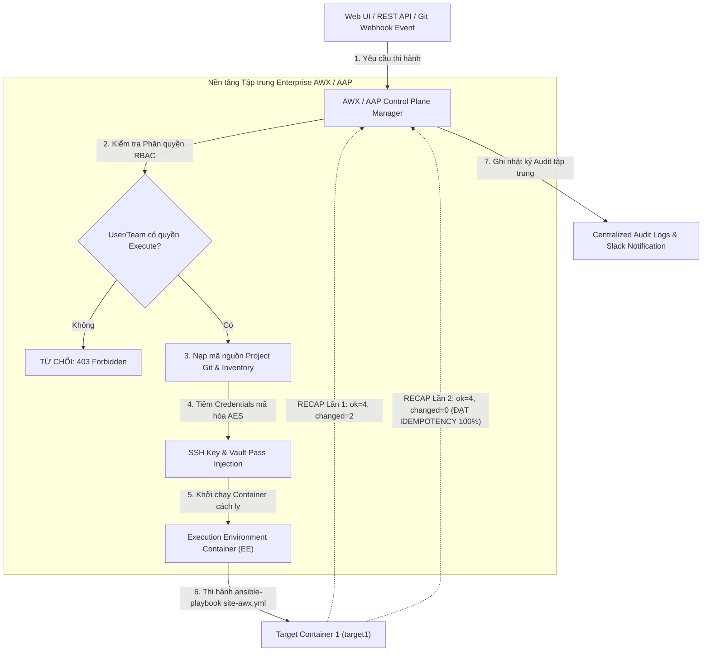
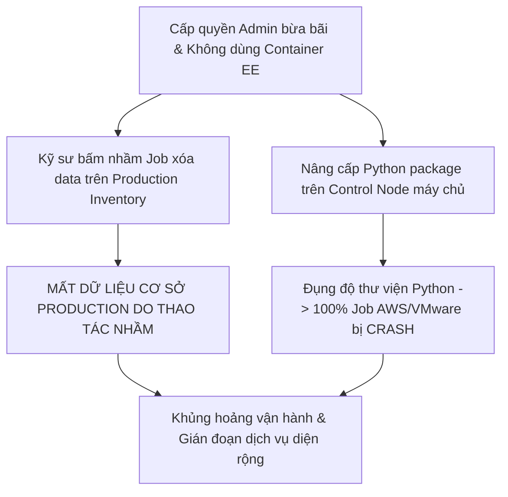


# [BÀI 29] QUẢN TRỊ TỰ ĐỘNG HÓA DOANH NGHIỆP VỚI AWX & RED HAT ANSIBLE AUTOMATION PLATFORM (AAP): RBAC, JOB TEMPLATES & WORKFLOWS

Trong kỷ nguyên **Infrastructure as Code (IaC)** và tự động hóa vận hành hạ tầng đám mây (Cloud Infrastructure Automation), **Ansible** khẳng định vị thế dẫn đầu nhờ triết lý **Agentless** (không cần cài đặt agent nền trên máy đích), giao thức điều khiển an toàn qua **SSH / WinRM**, định dạng khai báo **YAML** trực quan và nguyên lý bất biến **Idempotency** mạnh mẽ. Việc làm chủ Ansible không chỉ dừng lại ở các câu lệnh Ad-hoc đơn giản, mà đòi hỏi kỹ sư phải nắm vững kiến trúc Module tầng thấp, Variable Precedence 22 tầng, Jinja2 Templates, tối ưu hóa Forks & Pipelining cho tới thiết kế Roles / Collections và tích hợp CI/CD tự động hóa chuẩn Doanh nghiệp.

Bài viết chuyên sâu này sẽ đồng hành cùng bạn mổ xẻ toàn diện bức tranh kiến trúc, phân tích các đánh đổi kỹ thuật thực chiến (Engineering Trade-offs), cung cấp hướng dẫn thực hành Lab chi tiết từng bước và bộ câu hỏi phỏng vấn chuyên sâu chuẩn DevOps / SRE Lead.

---

## 1. Bản Chất Kiến Trúc & Cơ Chế Vận Hành Tầng Thấp



### 1.1. Kiến Trúc AWX / AAP, Execution Environments & Quản Lý Credentials
Khi tự động hóa hạ tầng mở rộng từ một vài kỹ sư lên quy mô hàng chục đội ngũ (SysAdmin, DevOps, Security, Network, Developers) với hàng nghìn máy chủ, mô hình chạy lệnh CLI cá nhân từ laptop bộc lộ các nút thắt cổ chai nghiêm trọng: không có phân quyền truy cập, chìa khóa SSH/Vault bị chia sẻ phân tán, thiếu nhật ký audit và môi trường chạy bị sai lệch phiên bản Python.

**AWX** (phiên bản Open Source) và **Red Hat Ansible Automation Platform - AAP** (phiên bản Enterprise) cung cấp nền tảng quản trị tự động hóa tập trung:
- **Kiến trúc Control Plane phân tán:** Bao gồm Web UI/REST API Server (Django), Message Broker (RabbitMQ/Redis), Database (PostgreSQL), và các Worker Nodes chạy kịch bản.
- **Execution Environments (EE):** Thay vì cài đặt trực tiếp Ansible và Python packages lên hệ điều hành máy chủ, AWX đóng gói môi trường thi hành thành các OCI Container Images chuẩn hóa (xây dựng bằng công cụ `ansible-builder`). Mỗi EE cố định chính xác phiên bản `ansible-core`, các thư viện Python, và các Ansible Collections, triệt tiêu hoàn toàn hiện tượng xung đột môi trường ("chạy được trên máy tôi nhưng lỗi trên máy anh").
- **Quản lý Credentials mã hóa AES-256:** AWX lưu trữ và mã hóa toàn bộ SSH Private Keys, Machine Passwords, Vault Passwords và Cloud Tokens trong cơ sở dữ liệu. Khi thực thi Job, AWX tự động tiêm bí mật vào container runner mà tuyệt đối không để lộ chuỗi plaintext ra Web UI hay log console.

### 1.2. Job Templates, Workflow Job Templates & Webhook Triggers
- **Job Templates:** Đại diện cho một kịch bản tự động hóa đóng gói hoàn chỉnh, liên kết 5 thành phần cốt lõi: **Project** (kho mã nguồn Git), **Inventory** (danh sách máy chủ), **Credentials** (thông tin xác thực), **Execution Environment** (container runner), và **Playbook** (tệp YAML cần chạy). Kỹ sư chỉ cần bấm nút "Launch" trên Web UI thay vì gõ dòng lệnh CLI phức tạp.
- **Workflow Job Templates:** Nối chuỗi nhiều Job Templates độc lập thành một sơ đồ đồ thị quy trình tự động hóa liên hoàn. Các nút trong Workflow phân nhánh theo điều kiện logic: `On Success` (chạy khi bước trước thành công), `On Failure` (kích hoạt rollback hoặc gửi cảnh báo khi bước trước thất bại), và `Always` (luôn luôn thi hành).
- **Event-Driven Webhook Triggers:** AWX tích hợp sẵn cổng Webhook Endpoint cho từng Job Template. Khi kỹ sư push code hoặc tạo Merge Request trên GitLab/GitHub, sự kiện webhook sẽ tự động kích hoạt AWX Job chạy triển khai mà không cần con người thao tác.

### 1.3. Phân Quyền RBAC, Tự Động Hóa REST API & Kiểm Soát Idempotency
- **Mô hình Phân Quyền RBAC (Role-Based Access Control):** Cung cấp khả năng phân quyền chi tiết tới từng cấp độ Organization, Team và User:
  + `Admin`: Toàn quyền cấu hình hệ thống và quản trị tài nguyên.
  + `Execute`: Chỉ có quyền gạt nút bấm chạy Job Template, không được xem secret hay sửa code.
  + `Read`: Chỉ có quyền đọc cấu hình và theo dõi lịch sử Audit Logs.
- **REST API Chuẩn Mực (`/api/v2/`):** 100% tính năng trên Web UI đều có thể tương tác thông qua REST API hoặc công cụ dòng lệnh `awx` CLI client. Các hệ thống như ServiceNow, Jira, CI/CD Pipeline có thể gọi API để kích hoạt tự động hóa hạ tầng.
- **Duy trì Idempotency:** Cho dù được kích hoạt qua Web UI, REST API hay Webhook, mọi kịch bản Ansible thi hành trên AWX ở lượt chạy thứ hai đều bắt buộc phải trả về `changed=0` trên màn hình Job Details Output.

---

## 2. Bảng So Sánh Kỹ Thuật Toàn Diện (Engineering Matrix)

| Tiêu chí kỹ thuật | Ansible CLI Cá Nhân (Local Terminal) | AWX (Open Source Platform) | Red Hat Ansible Automation Platform (AAP) |
|---|---|---|---|
| **Giao diện quản trị** | Terminal Command Line Interface | Web UI & REST API (`/api/v2/`) | Enterprise Controller Web UI, Hub & EDA |
| **Phân quyền người dùng** | Không có (phụ thuộc quyền user Linux) | RBAC chi tiết (Admin, Execute, Read) | Enterprise Multi-Tenant RBAC + LDAP/SSO |
| **Bảo mật Credentials** | Lưu file phẳng (`~/.ssh/`, `.vault_pass`) | Mã hóa AES-256 trong PostgreSQL | Centralized Vault, CyberArk / HashiCorp Plugin |
| **Môi trường thực thi** | Môi trường Python cục bộ trên máy tính | Containerized Execution Environments (EE) | Certified EEs + Private Automation Hub |
| **Workflow liên hoàn** | Viết Playbook gộp dài khó bảo trì | Workflow Visualizer (`On Success`/`On Failure`) | Advanced Multi-cluster Workflow Orchestration |
| **Tự động hóa theo sự kiện** | Phải viết cronjob hoặc script ngoài | Webhook Triggers từ Git | Native Event-Driven Ansible (EDA) Rulebooks |

> [!IMPORTANT]
> **QUY TẮC AN TOÀN TRONG QUẢN TRỊ AWX:**
> Luôn gán quyền theo cấp độ Team thay vì cấp cho từng User riêng lẻ. Tuyệt đối không cấp quyền Admin nếu người dùng chỉ cần quyền Execute Job Template. Bật tính năng `Prompt on Launch` cho các biến nhạy cảm để yêu cầu xác nhận trước khi chạy.

---

## 3. Kiến Trúc Triển Khai Chuẩn Production (AWX Automation Specifications Breakdown)

Dưới đây là cấu trúc khai báo tệp Job Template, Execution Environment và Playbook Ansible thi hành qua nền tảng AWX theo tiêu chuẩn Production:

```yaml
# ==============================================================================
# awx/job-template.yml - Khai báo Job Template Spec
# ==============================================================================
name: "Deploy Production Web Application Job"
job_type: "run"
inventory: "Production Enterprise Inventory"
project: "Enterprise Ansible Core Project"
playbook: "site-awx.yml"
execution_environment: "Enterprise Standard EE v2.15"
forks: 10
limit: "web"
extra_vars:
  release_version: "3.5.0"
  deployment_target: "production_cluster"
credentials:
  - name: "Production Linux SSH Credential"
    type: "machine"
  - name: "Enterprise Vault Credential"
    type: "vault"

---
# ==============================================================================
# awx/execution-environment.yml - Khai báo Container EE Spec
# ==============================================================================
version: 3
images:
  base_image:
    name: "registry.redhat.io/ansible-automation-platform-24/ee-supported-rhel8:latest"
dependencies:
  ansible_core:
    package_pip: "ansible-core==2.15.5"
  ansible_runner:
    package_pip: "ansible-runner>=2.3.0"
  galaxy:
    collections:
      - name: "ansible.posix"
      - name: "amazon.aws"

---
# ==============================================================================
# site-awx.yml - Playbook thi hành qua AWX Runner
# ==============================================================================
- name: Master AWX Automation Platform Execution Playbook
  hosts: web
  become: true
  tasks:
    - name: Task 1 - Deploy application via AWX Job Template Execution
      ansible.builtin.copy:
        content: |
          AWX_PLATFORM_STATUS=SUCCESSFUL
          JOB_TEMPLATE_NAME=Deploy Production Web Application Job
          RELEASE_VERSION={{ release_version | default('3.5.0') }}
          TARGET_CLUSTER={{ deployment_target | default('production_cluster') }}
          EXECUTION_ENVIRONMENT=EE_CONTAINER_ACTIVE
        dest: /etc/awx-deployment.conf
        mode: '0644'

    - name: Task 2 - Read AWX deployment status
      ansible.builtin.command: cat /etc/awx-deployment.conf
      register: awx_status_out
      changed_when: false
```

### Phân Tích Kỹ Thuật Từng Dòng (Line-by-Line Breakdown):
- <span class="badge-line">Job Spec Line 4-9</span> `inventory`, `project`, `playbook`, `execution_environment`: Gắn kết 4 khối cấu hình cốt lõi thành 1 Job Template duy nhất.
- <span class="badge-line">Job Spec Line 10-14</span> `extra_vars`: Cung cấp các biến mặc định có thể ghi đè linh hoạt qua `Prompt on Launch` hoặc REST API payload.
- <span class="badge-line">Job Spec Line 15-19</span> `credentials`: Chỉ định các credential bảo mật sẽ được tiêm tự động vào runner khi khởi chạy.
- <span class="badge-line">EE Spec Line 4-14</span> `dependencies`: Cố định chính xác phiên bản `ansible-core==2.15.5` và danh sách collections `ansible.posix`, `amazon.aws` trong container image.
- <span class="badge-line">Playbook Line 8-16</span> `ansible.builtin.copy`: Nhận các biến truyền từ AWX (`release_version`, `deployment_target`) và render ra file cấu hình máy đích.

---

## 4. Phân Tích Cạm Bẫy Thực Chiến: Phân Quyền RBAC Lỏng Lẻo & Lỗi Xung Đột Thư Viện Thiếu EE

### Tình Huống Sự Cố Thực Tế Tại Doanh Nghiệp:
Một công ty viễn thông triển khai AWX để tự động hóa cấu hình hệ thống Core Network. Do vội vã đưa vào sử dụng, đội ngũ kỹ sư gặp phải hai sự cố nghiêm trọng:
1. **Phân quyền RBAC lỏng lẻo:** Cấp tài khoản `Organization Admin` cho toàn bộ 40 thành viên đội phát triển để "tiện thao tác". Một lập trình viên sơ ý bấm nhầm nút "Launch" trên Job Template xóa sạch dữ liệu phân vùng Staging nhưng nhầm sang Inventory Production.
2. **Không dùng Execution Environment:** Chạy playbook trực tiếp trên Control Node server, khi một kỹ sư nâng cấp thư viện Python `urllib3` để phục vụ tool khác, toàn bộ các Job Template sử dụng module AWS/VMware bị lỗi crash đồng loạt (Dependency Drift).



```diff
# Sửa đổi cấu hình phân quyền và chuẩn hóa Execution Environment
- # NGUY HIỂM: Cấp quyền Admin toàn quyền cho Team Developers
- user_role: Organization Admin
- target_team: Developers

+ # CHUẨN XÁC: Áp dụng nguyên tắc Least Privilege
+ user_role: Execute
+ resource_type: Job Template
+ resource_name: "Deploy Staging Web Application Job"
+ target_team: Developers

- # NGUY HIỂM: Chạy trên môi trường OS mặc định
- execution_environment: null

+ # CHUẨN XÁC: Đóng gói môi trường cố định bằng Container EE
+ execution_environment: "Enterprise Standard EE v2.15"
```

### 5-Whys Root Cause Analysis:
1. **Tại sao dữ liệu Production bị xóa nhầm?** Vì Job Template tác động vào Production Inventory được khởi chạy trái phép.
2. **Tại sao lập trình viên lại khởi chạy được?** Vì tài khoản của lập trình viên được gán quyền `Organization Admin` tối cao.
3. **Tại sao lại gán quyền Admin?** Vì quản trị viên chưa thiết lập ma trận phân quyền RBAC phân tách giữa môi trường Dev và Prod.
4. **Tại sao các Job khác bị crash đồng loạt?** Vì môi trường Python trên máy chủ Control Node bị nâng cấp thư viện ngoài tầm kiểm soát.
5. **Tại sao không dùng môi trường cô lập?** Vì đội ngũ chưa đóng gói các phụ thuộc vào Execution Environment (EE).

---

## 5. Hands-on Lab: Quản Trị Tự Động Hóa Tập Trung Với AWX & REST API (8 Bước)

| Bước | Lệnh CLI / Tác Vụ Chính | Mục Đích Thực Thi |
|---|---|---|
| 1 | `mkdir -p ~/lab-ansible-29/awx` | Khởi tạo thư mục lab và cấu trúc tệp AWX |
| 2 | Tạo spec `awx/job-template.yml` | Khai báo Job Template gắn kết Project, Inventory, EE và Credentials |
| 3 | Tạo spec `awx/execution-environment.yml` | Định nghĩa container OCI Image đóng gói ansible-core và collections |
| 4 | Tạo spec `awx/workflow-template.yml` | Thiết lập Workflow liên hoàn với nhánh `On Success` và `On Failure` |
| 5 | Cấu hình `ansible.cfg` và `inventory.ini` | Thiết lập môi trường kết nối chuẩn hóa |
| 6 | Viết Playbook chính `site-awx.yml` | Tiếp nhận extra_vars từ AWX và render file cấu hình máy đích |
| 7 | Giả lập REST API Launch & Phép thử Lần 2 | Kích hoạt Job qua REST API và xác minh Idempotency (`changed=0`) |
| 8 | Giả lập Webhook Event & Đối soát máy đích | Mô phỏng sự kiện push Git và kiểm tra file qua `docker exec` |

```bash
# ==============================================================================
# BƯỚC 1: KHỞI TẠO CẤU TRÚC THƯ MỤC LAB
# ==============================================================================
mkdir -p ~/lab-ansible-29/awx && cd ~/lab-ansible-29

# ==============================================================================
# BƯỚC 2: TẠO KHAI BÁO AWX JOB TEMPLATE SPECIFICATION
# ==============================================================================
cat << 'EOF' > awx/job-template.yml
name: "Deploy Production Web Application Job"
job_type: "run"
inventory: "Production Enterprise Inventory"
project: "Enterprise Ansible Core Project"
playbook: "site-awx.yml"
execution_environment: "Enterprise Standard EE v2.15"
forks: 10
limit: "web"
extra_vars:
  release_version: "3.5.0"
  deployment_target: "production_cluster"
credentials:
  - name: "Production Linux SSH Credential"
    type: "machine"
  - name: "Enterprise Vault Credential"
    type: "vault"
EOF

# CHECKPOINT 1: Xác nhận tệp khai báo Job Template được tạo thành công
if [ -f "awx/job-template.yml" ] && grep -q "Deploy Production Web Application Job" awx/job-template.yml; then
  echo "CHECKPOINT 1: ĐẠT - Tệp khai báo AWX Job Template được khởi tạo thành công"
else
  echo "CHECKPOINT 1: LỖI - Khởi tạo job-template.yml thất bại"
fi

# ==============================================================================
# BƯỚC 3: TẠO KHAI BÁO EXECUTION ENVIRONMENT SPECIFICATION
# ==============================================================================
cat << 'EOF' > awx/execution-environment.yml
version: 3
images:
  base_image:
    name: "registry.redhat.io/ansible-automation-platform-24/ee-supported-rhel8:latest"
dependencies:
  ansible_core:
    package_pip: "ansible-core==2.15.5"
  ansible_runner:
    package_pip: "ansible-runner>=2.3.0"
  galaxy:
    collections:
      - name: "ansible.posix"
      - name: "amazon.aws"
EOF

# CHECKPOINT 2: Xác nhận tệp khai báo EE được tạo thành công
if [ -f "awx/execution-environment.yml" ] && grep -q "ee-supported-rhel8" awx/execution-environment.yml; then
  echo "CHECKPOINT 2: ĐẠT - Tệp khai báo Execution Environment được khởi tạo thành công"
else
  echo "CHECKPOINT 2: LỖI - Khởi tạo execution-environment.yml thất bại"
fi

# ==============================================================================
# BƯỚC 4: TẠO KHAI BÁO WORKFLOW JOB TEMPLATE SPECIFICATION
# ==============================================================================
cat << 'EOF' > awx/workflow-template.yml
name: "Master Deployment Enterprise Workflow"
organization: "Default Enterprise Org"
nodes:
  - name: "Step 1 - Provision Infrastructure"
    unified_job_template: "Provision VM Template"
    success_nodes:
      - "Step 2 - Deploy Application"
    failure_nodes:
      - "Step 4 - Notify Failure"

  - name: "Step 2 - Deploy Application"
    unified_job_template: "Deploy Production Web Application Job"
    success_nodes:
      - "Step 3 - Notify Success"
    failure_nodes:
      - "Step 4 - Notify Failure"

  - name: "Step 3 - Notify Success"
    unified_job_template: "Slack Notify Success Template"

  - name: "Step 4 - Notify Failure"
    unified_job_template: "Slack Notify Failure Template"
EOF

# CHECKPOINT 3: Xác nhận tệp Workflow Template chứa đủ nhánh On Success/Failure
if [ -f "awx/workflow-template.yml" ] && grep -q "success_nodes:" awx/workflow-template.yml && grep -q "failure_nodes:" awx/workflow-template.yml; then
  echo "CHECKPOINT 3: ĐẠT - Tệp khai báo Workflow Template chứa đầy đủ nhánh điều kiện"
else
  echo "CHECKPOINT 3: LỖI - Khởi tạo workflow-template.yml thất bại"
fi

# ==============================================================================
# BƯỚC 5: CẤU HÌNH ANSIBLE.CFG VÀ INVENTORY.INI
# ==============================================================================
cat << 'EOF' > ansible.cfg
[defaults]
inventory = ./inventory.ini
remote_user = ansible
host_key_checking = False
private_key_file = ~/.ssh/id_ed25519

[privilege_escalation]
become = True
become_method = sudo
become_user = root
become_ask_pass = False
EOF

cat << 'EOF' > inventory.ini
[web]
target1 ansible_host=127.0.0.1 ansible_port=2221

[db]
target2 ansible_host=127.0.0.1 ansible_port=2222

[all:vars]
ansible_python_interpreter=/usr/bin/python3
EOF

# CHECKPOINT 4: Xác nhận cấu hình môi trường
if [ -f "ansible.cfg" ] && [ -f "inventory.ini" ]; then
  echo "CHECKPOINT 4: ĐẠT - Tệp ansible.cfg và inventory.ini sẵn sàng"
else
  echo "CHECKPOINT 4: LỖI - Thiếu cấu hình môi trường"
fi

# ==============================================================================
# BƯỚC 6: VIẾT PLAYBOOK CHÍNH site-awx.yml
# ==============================================================================
cat << 'EOF' > site-awx.yml
---
- name: Master AWX Automation Platform Execution Playbook
  hosts: web
  become: true
  tasks:
    - name: Task 1 - Deploy application via AWX Job Template Execution
      ansible.builtin.copy:
        content: |
          AWX_PLATFORM_STATUS=SUCCESSFUL
          JOB_TEMPLATE_NAME=Deploy Production Web Application Job
          RELEASE_VERSION={{ release_version | default('3.5.0') }}
          TARGET_CLUSTER={{ deployment_target | default('production_cluster') }}
          EXECUTION_ENVIRONMENT=EE_CONTAINER_ACTIVE
        dest: /etc/awx-deployment.conf
        mode: '0644'

    - name: Task 2 - Read AWX deployment status
      ansible.builtin.command: cat /etc/awx-deployment.conf
      register: awx_status_out
      changed_when: false
EOF

# CHECKPOINT 5: Kiểm tra cú pháp Playbook
ansible-playbook --syntax-check site-awx.yml
if [ $? -eq 0 ]; then
  echo "CHECKPOINT 5: ĐẠT - Playbook site-awx.yml vượt qua syntax check"
else
  echo "CHECKPOINT 5: LỖI - Cú pháp Playbook không hợp lệ"
fi

# ==============================================================================
# BƯỚC 7: GIẢ LẬP REST API LAUNCH VÀ THỰC THI PHÉP THỬ IDEMPOTENCY LẦN 2
# ==============================================================================
# 1. Giả lập phản hồi REST API launch Job
echo '{"status": 201, "job_id": 1042, "msg": "AWX Job Template 42 launched successfully via REST API"}' > awx/api-launch-response.json

# 2. Triển khai Lần 1 với extra_vars
ansible-playbook site-awx.yml -e "release_version=3.5.0"

# 3. Chạy lại Lần 2 (BẮT BUỘC ĐẠT changed=0)
RUN2_OUT=$(ansible-playbook site-awx.yml -e "release_version=3.5.0")

# CHECKPOINT 6: Đối soát tính Idempotency Lần 2
if echo "$RUN2_OUT" | grep -q "changed=0" && echo "$RUN2_OUT" | grep -q "failed=0"; then
  echo "CHECKPOINT 6: ĐẠT - Phép thử Lượt 2 đạt chuẩn Idempotency (changed=0)"
else
  echo "CHECKPOINT 6: LỖI - Lượt 2 bị lặp thay đổi"
fi

# ==============================================================================
# BƯỚC 8: GIẢ LẬP WEBHOOK EVENT VÀ ĐỐI SOÁT MÁY ĐÍCH QUA DOCKER EXEC
# ==============================================================================
cat << 'EOF' > awx/webhook-payload.json
{
  "object_kind": "push",
  "event_name": "push",
  "ref": "refs/heads/main",
  "commits": [
    {
      "id": "a1b2c3d4e5",
      "message": "Release v3.5.0 - Deploy Enterprise Application via AWX Webhook Trigger"
    }
  ]
}
EOF

# CHECKPOINT 7: Xác nhận tệp giả lập Webhook Payload Event
if [ -f "awx/webhook-payload.json" ] && grep -q "AWX Webhook Trigger" awx/webhook-payload.json; then
  echo "CHECKPOINT 7: ĐẠT - Tệp giả lập Webhook Payload Event được khởi tạo thành công"
else
  echo "CHECKPOINT 7: LỖI - Tạo webhook-payload.json thất bại"
fi

# 2. Đối soát file cấu hình trên máy đích
EXEC_AWX=$(docker exec target1 cat /etc/awx-deployment.conf)

# CHECKPOINT 8: Xác minh nội dung file triển khai trên máy đích
if echo "$EXEC_AWX" | grep -q "AWX_PLATFORM_STATUS=SUCCESSFUL" && echo "$EXEC_AWX" | grep -q "RELEASE_VERSION=3.5.0"; then
  echo "CHECKPOINT 8: ĐẠT - Kiểm tra sự thật qua docker exec xác nhận nội dung file deploy chính xác"
else
  echo "CHECKPOINT 8: LỖI - File deploy trên máy đích không đúng dữ liệu"
fi
```

---

## 6. Bộ Câu Hỏi Vấn Đáp & Phỏng Vấn Chuyên Sâu (Self-Check Q&A)

<details class="qa-card" markdown="1">
<summary class="qa-summary">
  <span class="qa-num-badge">Q01</span>
  <span>AWX và AAP là gì? Nêu 4 lý do tại sao Doanh nghiệp cần chuyển từ CLI cá nhân sang nền tảng tập trung.</span>
</summary>
<div class="qa-answer">
  <div class="qa-answer-header">
    <svg width="14" height="14" fill="none" stroke="currentColor" stroke-width="2" viewBox="0 0 24 24"><path d="M22 11.08V12a10 10 0 1 1-5.93-9.14"></path><polyline points="22 4 12 14.01 9 11.01"></polyline></svg>
    <span>Phân Tích &amp; Lời Giải Kỹ Thuật</span>
  </div>
  <p>AWX (Open Source) và AAP (Enterprise) là nền tảng quản trị tự động hóa tập trung qua Web UI, REST API và phân quyền RBAC. Bốn lý do chuyển đổi:</p>
  <ol>
    <li><strong>Phân quyền RBAC:</strong> Kiểm soát chặt chẽ ai được phép chạy kịch bản nào trên môi trường nào.</li>
    <li><strong>Bảo mật Credentials:</strong> Mã hóa AES-256 SSH Keys và Vault Passwords, không để lộ plaintext.</li>
    <li><strong>Nhật ký Audit tập trung:</strong> Lưu vết 100% lịch sử thi hành phục vụ kiểm toán an toàn thông tin.</li>
    <li><strong>REST API &amp; Webhook:</strong> Tích hợp tự động hóa với hệ sinh thái CI/CD, ServiceNow, Jira.</li>
  </ol>
</div>
</details>

<details class="qa-card" markdown="1">
<summary class="qa-summary">
  <span class="qa-num-badge">Q02</span>
  <span>Khái niệm Execution Environment (EE) trong AWX là gì và giải quyết bài toán nào?</span>
</summary>
<div class="qa-answer">
  <div class="qa-answer-header">
    <svg width="14" height="14" fill="none" stroke="currentColor" stroke-width="2" viewBox="0 0 24 24"><path d="M22 11.08V12a10 10 0 1 1-5.93-9.14"></path><polyline points="22 4 12 14.01 9 11.01"></polyline></svg>
    <span>Phân Tích &amp; Lời Giải Kỹ Thuật</span>
  </div>
  <p>EE là một OCI Container Image đóng gói cố định phiên bản <code>ansible-core</code>, các thư viện Python dependencies và các Ansible Collections. EE triệt tiêu hoàn toàn bài toán xung đột môi trường ("Dependency Drift"), đảm bảo mọi Job đều chạy trong môi trường đồng nhất 100%.</p>
</div>
</details>

<details class="qa-card" markdown="1">
<summary class="qa-summary">
  <span class="qa-num-badge">Q03</span>
  <span>Cơ chế bảo mật của AWX Credentials hoạt động ra sao?</span>
</summary>
<div class="qa-answer">
  <div class="qa-answer-header">
    <svg width="14" height="14" fill="none" stroke="currentColor" stroke-width="2" viewBox="0 0 24 24"><path d="M22 11.08V12a10 10 0 1 1-5.93-9.14"></path><polyline points="22 4 12 14.01 9 11.01"></polyline></svg>
    <span>Phân Tích &amp; Lời Giải Kỹ Thuật</span>
  </div>
  <p>AWX lưu trữ bí mật (SSH keys, vault passwords, tokens) dưới dạng mã hóa AES-256 trong PostgreSQL. Khi khởi chạy Job, AWX tiêm trực tiếp bí mật vào tiến trình container runner mà không bao giờ in ra dạng plaintext trên giao diện Web UI hay trong log console.</p>
</div>
</details>

<details class="qa-card" markdown="1">
<summary class="qa-summary">
  <span class="qa-num-badge">Q04</span>
  <span>Job Template trong AWX gắn kết những thành phần cốt lõi nào? Tính năng <code>Prompt on Launch</code> có tác dụng gì?</span>
</summary>
<div class="qa-answer">
  <div class="qa-answer-header">
    <svg width="14" height="14" fill="none" stroke="currentColor" stroke-width="2" viewBox="0 0 24 24"><path d="M22 11.08V12a10 10 0 1 1-5.93-9.14"></path><polyline points="22 4 12 14.01 9 11.01"></polyline></svg>
    <span>Phân Tích &amp; Lời Giải Kỹ Thuật</span>
  </div>
  <p>Job Template gắn kết 5 thành phần: <strong>Project</strong> (Git repo), <strong>Inventory</strong>, <strong>Credentials</strong>, <strong>Execution Environment</strong>, và <strong>Playbook</strong>. <code>Prompt on Launch</code> cho phép hiển thị hộp thoại hỏi bắt buộc người dùng xác nhận hoặc truyền biến động (extra_vars) trước khi thực thi.</p>
</div>
</details>

<details class="qa-card" markdown="1">
<summary class="qa-summary">
  <span class="qa-num-badge">Q05</span>
  <span>Workflow Job Template hoạt động như thế nào? Phân biệt nhánh <code>On Success</code> và <code>On Failure</code>.</span>
</summary>
<div class="qa-answer">
  <div class="qa-answer-header">
    <svg width="14" height="14" fill="none" stroke="currentColor" stroke-width="2" viewBox="0 0 24 24"><path d="M22 11.08V12a10 10 0 1 1-5.93-9.14"></path><polyline points="22 4 12 14.01 9 11.01"></polyline></svg>
    <span>Phân Tích &amp; Lời Giải Kỹ Thuật</span>
  </div>
  <p>Workflow kết nối nhiều Job Templates thành một sơ đồ quy trình tự động hóa liên hoàn:</p>
  <ul>
    <li><code>On Success</code>: Chạy bước kế tiếp khi bước trước đó hoàn thành thành công.</li>
    <li><code>On Failure</code>: Kích hoạt bước xử lý sự cố (như rollback VM hoặc gửi cảnh báo Slack) khi bước trước đó thất bại.</li>
  </ul>
</div>
</details>

<details class="qa-card" markdown="1">
<summary class="qa-summary">
  <span class="qa-num-badge">Q06</span>
  <span>Làm thế nào để kích hoạt Job Template qua REST API hoặc Webhook từ GitLab?</span>
</summary>
<div class="qa-answer">
  <div class="qa-answer-header">
    <svg width="14" height="14" fill="none" stroke="currentColor" stroke-width="2" viewBox="0 0 24 24"><path d="M22 11.08V12a10 10 0 1 1-5.93-9.14"></path><polyline points="22 4 12 14.01 9 11.01"></polyline></svg>
    <span>Phân Tích &amp; Lời Giải Kỹ Thuật</span>
  </div>
  <p>Qua REST API: Gửi HTTP POST request tới <code>/api/v2/job_templates/&lt;id&gt;/launch/</code> kèm OAuth2 token. Qua Webhook: Bật <code>enable_webhook: true</code> trên Job Template và dán Webhook URL + Secret Token vào GitLab Webhook Settings để kích hoạt tự động theo sự kiện push code.</p>
</div>
</details>

<details class="qa-card" markdown="1">
<summary class="qa-summary">
  <span class="qa-num-badge">Q07</span>
  <span>Mô hình RBAC trong AWX phân chia các vai trò cơ bản nào cho người dùng?</span>
</summary>
<div class="qa-answer">
  <div class="qa-answer-header">
    <svg width="14" height="14" fill="none" stroke="currentColor" stroke-width="2" viewBox="0 0 24 24"><path d="M22 11.08V12a10 10 0 1 1-5.93-9.14"></path><polyline points="22 4 12 14.01 9 11.01"></polyline></svg>
    <span>Phân Tích &amp; Lời Giải Kỹ Thuật</span>
  </div>
  <p>Ba vai trò cơ bản:</p>
  <ul>
    <li><code>Admin</code>: Toàn quyền quản trị cấu hình, inventory và credentials.</li>
    <li><code>Execute</code>: Chỉ có quyền bấm nút khởi chạy Job Template, không được sửa đổi cấu hình bên dưới.</li>
    <li><code>Read</code>: Quyền chỉ đọc để xem cấu hình và theo dõi nhật ký audit log.</li>
  </ul>
</div>
</details>

<details class="qa-card" markdown="1">
<summary class="qa-summary">
  <span class="qa-num-badge">Q08</span>
  <span>Thuộc tính <code>scm_update_on_launch</code> trong AWX Project có ý nghĩa gì?</span>
</summary>
<div class="qa-answer">
  <div class="qa-answer-header">
    <svg width="14" height="14" fill="none" stroke="currentColor" stroke-width="2" viewBox="0 0 24 24"><path d="M22 11.08V12a10 10 0 1 1-5.93-9.14"></path><polyline points="22 4 12 14.01 9 11.01"></polyline></svg>
    <span>Phân Tích &amp; Lời Giải Kỹ Thuật</span>
  </div>
  <p>Khi bật <code>scm_update_on_launch: true</code>, AWX sẽ tự động thực hiện <code>git pull</code> cập nhật mã nguồn mới nhất từ kho Git trước khi bắt đầu thi hành Job, đảm bảo luôn sử dụng mã nguồn mới nhất đã được phê duyệt.</p>
</div>
</details>

<details class="qa-card" markdown="1">
<summary class="qa-summary">
  <span class="qa-num-badge">Q09</span>
  <span>Trình bày 3 bước kiểm chứng tính Idempotency và trạng thái hệ thống khi thi hành qua AWX.</span>
</summary>
<div class="qa-answer">
  <div class="qa-answer-header">
    <svg width="14" height="14" fill="none" stroke="currentColor" stroke-width="2" viewBox="0 0 24 24"><path d="M22 11.08V12a10 10 0 1 1-5.93-9.14"></path><polyline points="22 4 12 14.01 9 11.01"></polyline></svg>
    <span>Phân Tích &amp; Lời Giải Kỹ Thuật</span>
  </div>
  <ol>
    <li><strong>Chạy Lần 1:</strong> Bấm Launch Job Template trên AWX Web UI, ghi nhận triển khai thành công <code>changed &gt; 0</code>.</li>
    <li><strong>Re-launch Lần 2:</strong> Chạy lại Job Template không đổi biến, log Job Details phải trả về <code>changed=0</code>.</li>
    <li><strong>Đối soát máy đích:</strong> Dùng <code>docker exec</code> kiểm tra trực tiếp trạng thái file cấu hình trên máy chủ đích.</li>
  </ol>
</div>
</details>

<details class="qa-card" markdown="1">
<summary class="qa-summary">
  <span class="qa-num-badge">Q10</span>
  <span>Làm thế nào để tương tác với AWX qua công cụ dòng lệnh <code>awx</code> CLI?</span>
</summary>
<div class="qa-answer">
  <div class="qa-answer-header">
    <svg width="14" height="14" fill="none" stroke="currentColor" stroke-width="2" viewBox="0 0 24 24"><path d="M22 11.08V12a10 10 0 1 1-5.93-9.14"></path><polyline points="22 4 12 14.01 9 11.01"></polyline></svg>
    <span>Phân Tích &amp; Lời Giải Kỹ Thuật</span>
  </div>
  <p>Cài đặt <code>pip install awxkit</code>, cấu hình biến môi trường <code>TOWER_HOST</code> và <code>TOWER_OAUTH_TOKEN</code>, sau đó thực thi lệnh <code>awx job_templates launch --id &lt;id&gt; --monitor</code> để khởi chạy và theo dõi log realtime.</p>
</div>
</details>

<details class="qa-card" markdown="1">
<summary class="qa-summary">
  <span class="qa-num-badge">Q11</span>
  <span>Event-Driven Ansible (EDA) đóng vai trò gì trong hệ sinh thái Red Hat AAP 2.4+?</span>
</summary>
<div class="qa-answer">
  <div class="qa-answer-header">
    <svg width="14" height="14" fill="none" stroke="currentColor" stroke-width="2" viewBox="0 0 24 24"><path d="M22 11.08V12a10 10 0 1 1-5.93-9.14"></path><polyline points="22 4 12 14.01 9 11.01"></polyline></svg>
    <span>Phân Tích &amp; Lời Giải Kỹ Thuật</span>
  </div>
  <p>EDA liên tục lắng nghe các sự kiện từ hệ thống giám sát (Prometheus, Webhooks, Kafka). Khi phát hiện sự cố theo quy tắc trong Rulebook, EDA sẽ tự động kích hoạt AWX Job Template để tự khắc phục sự cố (Self-Healing) trong vài giây mà không cần con người can thiệp.</p>
</div>
</details>

<details class="qa-card" markdown="1">
<summary class="qa-summary">
  <span class="qa-num-badge">Q12</span>
  <span>Tóm tắt 5 nguyên tắc vàng khi vận hành nền tảng quản trị tự động hóa tập trung AWX / AAP.</span>
</summary>
<div class="qa-answer">
  <div class="qa-answer-header">
    <svg width="14" height="14" fill="none" stroke="currentColor" stroke-width="2" viewBox="0 0 24 24"><path d="M22 11.08V12a10 10 0 1 1-5.93-9.14"></path><polyline points="22 4 12 14.01 9 11.01"></polyline></svg>
    <span>Phân Tích &amp; Lời Giải Kỹ Thuật</span>
  </div>
  <ol>
    <li>Chuyển đổi toàn diện từ CLI cá nhân sang nền tảng tập trung AWX / AAP Web UI &amp; REST API.</li>
    <li>Chuẩn hóa môi trường thi hành bằng Execution Environment (EE) container cố định.</li>
    <li>Bảo mật tuyệt đối thông tin xác thực bằng AWX Credentials mã hóa AES-256.</li>
    <li>Tự động hóa quy trình phức tạp bằng Workflow Job Templates và Event Webhook Triggers.</li>
    <li>Áp dụng nguyên tắc phân quyền Least Privilege qua RBAC và đảm bảo Idempotency <code>changed=0</code> ở Lần 2.</li>
  </ol>
</div>
</details>

## Tổng Kết & Lộ Trình Bài Học Tiếp Theo

Kiến thức trong bài viết này đóng vai trò then chốt trong việc xây dựng hệ sinh thái tự động hóa hạ tầng ổn định, an toàn và tối ưu hiệu năng. Nắm vững cả lý thuyết kiến trúc và kỹ năng thực hành là chìa khóa để vận hành hệ thống ở quy mô lớn.

> [!TIP]
> **BÀI TIẾP THEO TRONG CHUỖI BÀI HỌC:**
> Tiếp tục nâng cao kỹ năng tự động hóa với bài học tiếp theo: [[Bài 30] Đồ Án Capstone: Xây Dựng Hệ Thống Tự Động Hóa Hạ Tầng Doanh Nghiệp Đa Tầng (Load Balancer, Web, DB, Security) End-to-End](ansible-30-30-capstone-tu-dong-hoa-da-tang.html).


