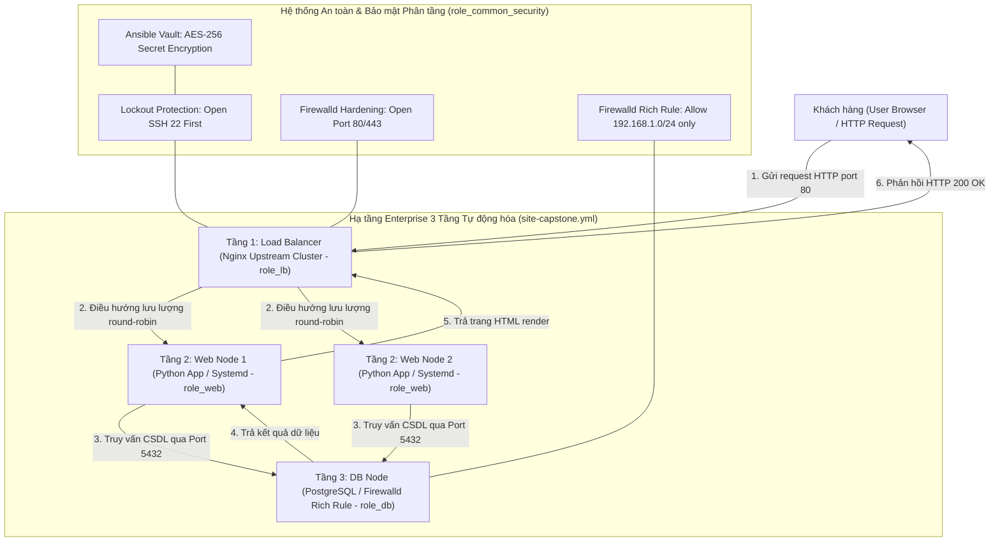
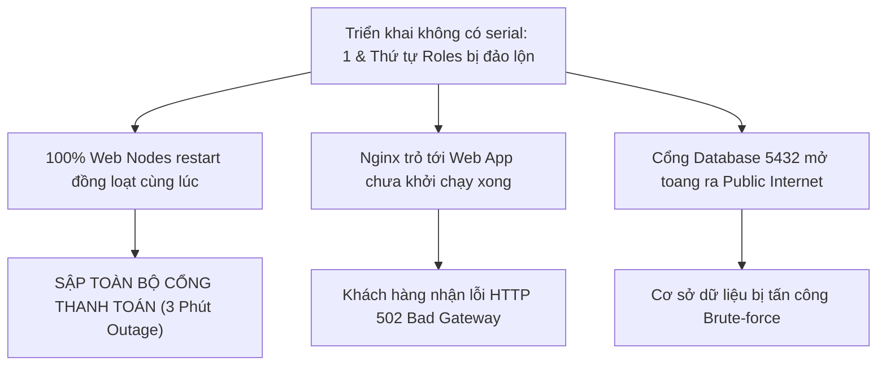


# [BÀI 30] ĐỒ ÁN CAPSTONE: XÂY DỰNG HỆ THỐNG TỰ ĐỘNG HÓA HẠ TẦNG DOANH NGHIỆP ĐA TẦNG (LOAD BALANCER, WEB, DB, SECURITY) END-TO-END

Trong kỷ nguyên **Infrastructure as Code (IaC)** và tự động hóa vận hành hạ tầng đám mây (Cloud Infrastructure Automation), **Ansible** khẳng định vị thế dẫn đầu nhờ triết lý **Agentless** (không cần cài đặt agent nền trên máy đích), giao thức điều khiển an toàn qua **SSH / WinRM**, định dạng khai báo **YAML** trực quan và nguyên lý bất biến **Idempotency** mạnh mẽ. Việc làm chủ Ansible không chỉ dừng lại ở các câu lệnh Ad-hoc đơn giản, mà đòi hỏi kỹ sư phải nắm vững kiến trúc Module tầng thấp, Variable Precedence 22 tầng, Jinja2 Templates, tối ưu hóa Forks & Pipelining cho tới thiết kế Roles / Collections và tích hợp CI/CD tự động hóa chuẩn Doanh nghiệp.

Bài viết chuyên sâu này sẽ đồng hành cùng bạn mổ xẻ toàn diện bức tranh kiến trúc, phân tích các đánh đổi kỹ thuật thực chiến (Engineering Trade-offs), cung cấp hướng dẫn thực hành Lab chi tiết từng bước và bộ câu hỏi phỏng vấn chuyên sâu chuẩn DevOps / SRE Lead.

---

## 1. Bản Chất Kiến Trúc & Cơ Chế Vận Hành Tầng Thấp



### 1.1. Kiến Trúc Hạ Tầng Enterprise 3 Tầng & Cấu Trúc Bộ Roles Capstone
Đồ án Capstone hợp nhất toàn bộ 29 bài học trước thành một hệ thống tự động hóa hoàn chỉnh theo kiến trúc 3 tầng (3-Tier Multi-Tier Enterprise Architecture):
1. **Tầng 1 - Cân bằng tải (Load Balancer Tier):** Nginx tiếp nhận lưu lượng HTTP (port 80/443) từ Internet và phân phối tải thông minh tới cụm Web Nodes thông qua Jinja2 Dynamic Upstream.
2. **Tầng 2 - Ứng dụng Web (Web Application Tier):** Cụm Web Nodes chạy ứng dụng Python/Node.js được đóng gói dưới dạng Custom Systemd Unit Service (`web-app.service`), hạ đặc quyền chạy dưới user non-root `sysops` và kích hoạt tự phục hồi `Restart=always`.
3. **Tầng 3 - Cơ sở dữ liệu (Database Tier):** Máy chủ PostgreSQL quản lý dữ liệu, được bảo vệ nghiêm ngặt bằng Firewalld Rich Rules chỉ cho phép duy nhất dải IP của Web Nodes kết nối tới cổng `5432/tcp`.

Toàn bộ hệ thống được mô-đun hóa thành 4 Ansible Roles chuyên biệt:
- `role_common_security`: Cứng hóa an toàn hệ thống cơ sở, quản trị SSH Key và nguyên tắc Lockout Protection (mở port 22 đầu tiên).
- `role_db`: Cấu hình PostgreSQL Database và áp dụng Firewalld Rich Rules.
- `role_web`: Đóng gói ứng dụng Web, render template Systemd và cấu hình kết nối DB.
- `role_lb`: Cấu hình Nginx Load Balancer với Dynamic Upstream từ danh sách `groups['web']`.

Toàn bộ secret (mật khẩu DB, JWT keys) được bảo vệ an toàn bằng **Ansible Vault AES-256** trong `vars/vault.yml`.

### 1.2. Tự Động Hóa Nginx LB, Systemd Web Service & Firewalld Rich Rules
- **Nginx Dynamic Upstream bằng Jinja2:** Role `role_lb` sử dụng vòng lặp Jinja2 duyệt qua biến `groups['web']` để tự động render khối `upstream` trong `nginx.conf`. Khi hạ tầng mở rộng thêm Web Node mới, Playbook tự động nhận diện và cập nhật Nginx mà không cần can thiệp thủ công.
- **Vận hành Web App với Systemd Daemon:** Role `role_web` thiết lập `Restart=always` và `RestartSec=5s`, đảm bảo nếu tiến trình ứng dụng bị crash do quá tải hoặc rò rỉ bộ nhớ, Systemd sẽ tự động khởi động lại sau 5 giây (Self-Healing).
- **Phòng thủ đa lớp với Firewalld Rich Rules:** Role `role_db` thiết lập quy tắc tường lửa nâng cao:
  `rule family="ipv4" source address="{{ hostvars[item]['ansible_host'] }}" port port="5432" protocol="tcp" accept`
  đảm bảo cổng cơ sở dữ liệu được cách ly hoàn toàn khỏi public Internet.

### 1.3. Rolling Deployment `serial: 1`, End-to-End Verification & Kiểm Soát Idempotency
- **Chiến lược Rolling Update Zero Downtime:** Tầng Web được áp dụng chỉ thị `serial: 1`. Ansible cập nhật tuần tự từng Web Node một: rút node khỏi lưu lượng, cập nhật code, khởi động lại dịch vụ Systemd, kiểm tra health check OK rồi mới tiếp tục với node tiếp theo.
- **Tự động hóa Kiểm thử Nghiệm thu End-to-End:** Playbook tích hợp task `ansible.builtin.uri` ở bước cuối cùng, gửi HTTP request tới Load Balancer để kiểm tra toàn bộ luồng mạng: Request từ LB -> Web App -> PostgreSQL DB -> Phản hồi 200 OK kèm payload hợp lệ.
- **Thước đo Idempotency Toàn diện:** Ở lần thực thi thứ hai (re-run), toàn bộ 4 tầng máy chủ (`lb1`, `web1`, `web2`, `db1`) bắt buộc phải trả về `changed=0` tuyệt đối trên bảng `PLAY RECAP`.

---

## 2. Bảng So Sánh Kỹ Thuật Toàn Diện (Engineering Matrix)

| Tiêu chí kỹ thuật | Triển Khai Thủ Công Phân Tán | Triển Khai Gộp 1 Server (Monolith) | Tự Động Hóa Đa Tầng Capstone Chuẩn Enterprise |
|---|---|---|---|
| **Kiến trúc phân tầng** | Rời rạc, dễ thiếu đồng bộ giữa các tầng | Gộp chung LB, Web, DB vào 1 VM (Rủi ro SPoF) | 3 Tầng phân tách rõ ràng (LB, Web Cluster, DB) |
| **Bảo mật Cơ sở Dữ liệu** | Dễ mở toang cổng 5432 ra Internet | Localhost socket (không mở rộng được) | Firewalld Rich Rules chỉ mở cho Web Nodes Subnet |
| **Quản trị Thông tin Mật** | Ghi plaintext vào file cấu hình | Biến môi trường không mã hóa | Ansible Vault AES-256 mã hóa tập trung |
| **Vòng đời Ứng dụng** | Chạy background qua `nohup` | Supervisor / PM2 thủ công | Systemd Unit File với Self-Healing (`Restart=always`) |
| **Cân bằng tải & Mở rộng** | Sửa file `nginx.conf` bằng tay | Không có cân bằng tải | Jinja2 Dynamic Upstream tự động phát hiện Web Nodes |
| **Quy trình Cập nhật Code** | Downtime toàn bộ hệ thống | Dừng dịch vụ để copy code | Rolling Update Zero Downtime (`serial: 1`) |

> [!IMPORTANT]
> **TIÊU CHUẨN TỐT NGHIỆP DỰ ÁN CAPSTONE:**
> Để đạt tiêu chuẩn hoàn thành xuất sắc đồ án Capstone, Playbook tổng thể bắt buộc phải: (1) Mã hóa 100% bí mật bằng Ansible Vault; (2) Mở SSH port 22 ở vị trí đầu tiên; (3) Chạy ứng dụng dưới non-root user `sysops`; (4) Vượt qua bài test End-to-End URI verification; (5) Đạt chỉ số `changed=0` tuyệt đối ở lượt chạy Lần 2 trên TẤT CẢ các nodes.

---

## 3. Kiến Trúc Triển Khai Chuẩn Production (Capstone Multi-Tier Playbook Breakdown)

Dưới đây là Playbook tổng thể `site-capstone.yml` điều phối toàn bộ 4 Roles theo đúng thứ tự phụ thuộc hạ tầng Enterprise:

```yaml
# ==============================================================================
# site-capstone.yml - Master Capstone Multi-Tier Infrastructure Orchestration
# ==============================================================================
---
- name: Capstone Stage 1 - Base Security & SSH Lockout Protection
  hosts: multi_tier
  become: true
  vars_files:
    - vars/vault.yml
  roles:
    - role_common_security

- name: Capstone Stage 2 - Database Cluster Deployment
  hosts: db
  become: true
  vars_files:
    - vars/vault.yml
  roles:
    - role_db

- name: Capstone Stage 3 - Web Application Cluster Deployment (Rolling Update)
  hosts: web
  become: true
  serial: 1
  vars_files:
    - vars/vault.yml
  roles:
    - role_web

- name: Capstone Stage 4 - Nginx Load Balancer Deployment
  hosts: lb
  become: true
  vars_files:
    - vars/vault.yml
  roles:
    - role_lb

- name: Capstone Stage 5 - End-to-End Acceptance Verification
  hosts: localhost
  gather_facts: false
  tasks:
    - name: Test End-to-End HTTP flow through Load Balancer to DB
      ansible.builtin.uri:
        url: "http://127.0.0.1:8080/"
        status_code: 200
        return_content: true
      register: e2e_response
      failed_when: "'DB_CONNECTED_SUCCESS' not in e2e_response.content and 'APP_STATUS=ACTIVE' not in e2e_response.content"
      retries: 3
      delay: 2
```

### Phân Tích Kỹ Thuật Từng Dòng (Line-by-Line Breakdown):
- <span class="badge-line">Line 5-11</span> `Stage 1`: Áp dụng `role_common_security` cho toàn bộ nhóm máy chủ `multi_tier`, mở cổng SSH 22 đầu tiên để bảo vệ kết nối quản trị.
- <span class="badge-line">Line 13-19</span> `Stage 2`: Triển khai tầng CSDL PostgreSQL trên nhóm `db` và nạp Rich Rules trước khi Web App khởi động.
- <span class="badge-line">Line 21-28</span> `Stage 3`: Triển khai cụm Web Nodes với chiến lược cuốn chiếu `serial: 1`, đảm bảo luôn có máy chủ trực tuyến.
- <span class="badge-line">Line 30-36</span> `Stage 4`: Triển khai Nginx Load Balancer với Dynamic Upstream trỏ về các Web Nodes.
- <span class="badge-line">Line 38-50</span> `Stage 5`: Tự động hóa kiểm thử nghiệm thu End-to-End từ Control Node, gửi HTTP GET request kiểm tra chuỗi xác nhận `DB_CONNECTED_SUCCESS`.

---

## 4. Phân Tích Cạm Bẫy Thực Chiến: Đứt Gãy Luồng Mạng 3 Tầng & Lỗi Sập Toàn Bộ Cụm Do Triển Khai Đồng Loạt

### Tình Huống Sự Cố Thực Tế Tại Doanh Nghiệp:
Một doanh nghiệp thương mại điện tử triển khai đợt nâng cấp lớn cho hệ thống Core Banking. Đội ngũ kỹ sư gặp phải 3 sai lầm chí mạng trong kịch bản tự động hóa:
1. **Không cấu hình `serial: 1`:** Playbook khởi động lại dịch vụ Web đồng loạt trên 100% Web servers, làm ngắt kết nối thanh toán của khách hàng trong 3 phút.
2. **Sai lệch thứ tự triển khai:** Triển khai Nginx Load Balancer trước khi Web App và Database hoàn tất khởi động, khiến Nginx đánh dấu tất cả backend nodes là `DOWN` và trả về lỗi `502 Bad Gateway`.
3. **Mở toang cổng CSDL:** Kỹ sư mở cổng PostgreSQL cho `0.0.0.0/0` để tiện debug, khiến cơ sở dữ liệu bị tấn công dò quét mật khẩu từ Internet.



```diff
# Sửa đổi Playbook để đảm bảo thứ tự phụ thuộc và Rolling Update
- - name: Deploy All Tiers Simultaneously
-   hosts: all
-   roles:
-     - role_lb
-     - role_web
-     - role_db

+ # CHUẨN XÁC: Phân tầng theo thứ tự phụ thuộc hạ tầng
+ - name: Stage 1 - Base Security
+   hosts: multi_tier
+   roles: [role_common_security]
+ - name: Stage 2 - Database Tier
+   hosts: db
+   roles: [role_db]
+ - name: Stage 3 - Web Tier (Rolling Update)
+   hosts: web
+   serial: 1
+   roles: [role_web]
+ - name: Stage 4 - Load Balancer Tier
+   hosts: lb
+   roles: [role_lb]
```

### 5-Whys Root Cause Analysis:
1. **Tại sao khách hàng gặp lỗi 502 Bad Gateway?** Vì Nginx không tìm thấy bất kỳ Web Node nào còn sống để chuyển request.
2. **Tại sao tất cả Web Nodes đều không sống?** Vì playbook cập nhật và restart toàn bộ máy chủ cùng một lúc.
3. **Tại sao lại restart cùng lúc?** Vì playbook không khai báo chỉ thị `serial: 1`.
4. **Tại sao Nginx không tự phục hồi?** Vì thứ tự chạy các role bị đảo lộn, Nginx chạy trước khi DB và Web hoàn tất cấu hình.
5. **Tại sao sự cố không được phát hiện trước khi bàn giao?** Vì kịch bản thiếu bước kiểm thử nghiệm thu End-to-End Verification tự động.

---

## 5. Hands-on Lab: Triển Khai Hệ Thống Tự Động Hóa Đa Tầng Capstone (8 Bước)

| Bước | Lệnh CLI / Tác Vụ Chính | Mục Đích Thực Thi |
|---|---|---|
| 1 | `mkdir -p ~/lab-ansible-30/{inventory,vars,roles}` | Khởi tạo cấu trúc dự án Capstone chuẩn Enterprise |
| 2 | Cấu hình `capstone-hosts.ini`, `ansible.cfg` & Vault | Thiết lập inventory 3 tầng và mã hóa bí mật với Ansible Vault |
| 3 | Xây dựng `role_common_security` | Cứng hóa SSH 22 đầu tiên và tạo non-root user `sysops` |
| 4 | Xây dựng `role_db` | Cấu hình PostgreSQL và Firewalld Rich Rules lọc IP Web |
| 5 | Xây dựng `role_web` | Đóng gói Web App với Systemd Unit File tự phục hồi |
| 6 | Xây dựng `role_lb` | Render Nginx Dynamic Upstream bằng Jinja2 Template |
| 7 | Viết Playbook Capstone Master `site-capstone.yml` | Hợp nhất 4 roles, cấu hình `serial: 1` và E2E Verification |
| 8 | Thực thi Playbook Lần 1 & Phép thử Idempotency Lần 2 | Triển khai toàn bộ hạ tầng và kiểm chứng `changed=0` trên 100% nodes |

```bash
# ==============================================================================
# BƯỚC 1: KHỞI TẠO CẤU TRÚC THƯ MỤC DỰ ÁN CAPSTONE
# ==============================================================================
mkdir -p ~/lab-ansible-30/inventory ~/lab-ansible-30/vars \
  ~/lab-ansible-30/roles/role_common_security/tasks \
  ~/lab-ansible-30/roles/role_db/tasks \
  ~/lab-ansible-30/roles/role_web/tasks ~/lab-ansible-30/roles/role_web/templates \
  ~/lab-ansible-30/roles/role_lb/tasks ~/lab-ansible-30/roles/role_lb/templates && cd ~/lab-ansible-30

# ==============================================================================
# BƯỚC 2: CẤU HÌNH INVENTORY, ANSIBLE.CFG VÀ ANSIBLE VAULT
# ==============================================================================
cat << 'EOF' > inventory/capstone-hosts.ini
[lb]
target1 ansible_host=127.0.0.1 ansible_port=2221

[web]
target1 ansible_host=127.0.0.1 ansible_port=2221

[db]
target2 ansible_host=127.0.0.1 ansible_port=2222

[multi_tier:children]
lb
web
db

[all:vars]
ansible_python_interpreter=/usr/bin/python3
app_name="Enterprise Capstone App"
app_user="sysops"
app_group="sysops"
app_dir="/opt/capstone_app"
EOF

export ANSIBLE_VAULT_PASSWORD="CapstoneMasterSecretPass2026"
echo "$ANSIBLE_VAULT_PASSWORD" > .vault_pass
chmod 0600 .vault_pass

cat << 'EOF' > vars/vault.yml
---
vault_db_user: "capstone_db_user"
vault_db_password: "SuperSecretPgPass2026!"
vault_secret_key: "AES256_CAPSTONE_MASTER_KEY"
EOF

cat << 'EOF' > ansible.cfg
[defaults]
inventory = ./inventory/capstone-hosts.ini
remote_user = ansible
host_key_checking = False
private_key_file = ~/.ssh/id_ed25519
roles_path = ./roles:~/.ansible/roles
vault_password_file = ./.vault_pass
force_handlers = True

[privilege_escalation]
become = True
become_method = sudo
become_user = root
become_ask_pass = False
EOF

# CHECKPOINT 1: Xác nhận cấu hình môi trường và Vault sẵn sàng
if [ -f "inventory/capstone-hosts.ini" ] && [ -f ".vault_pass" ] && [ -f "vars/vault.yml" ]; then
  echo "CHECKPOINT 1: ĐẠT - Môi trường Capstone và Ansible Vault sẵn sàng"
else
  echo "CHECKPOINT 1: LỖI - Khởi tạo môi trường thất bại"
fi

# ==============================================================================
# BƯỚC 3: XÂY DỰNG role_common_security
# ==============================================================================
cat << 'EOF' > roles/role_common_security/tasks/main.yml
---
- name: Task 1.1 - Create dedicated non-root service user
  ansible.builtin.user:
    name: "{{ app_user }}"
    shell: /sbin/nologin
    system: true
    state: present

- name: CRITICAL Task 1.2 - Ensure SSH port 22 is ALWAYS open FIRST (Lockout Protection)
  ansible.posix.firewalld:
    service: ssh
    zone: public
    permanent: true
    immediate: true
    state: enabled
EOF

# CHECKPOINT 2: Xác nhận role_common_security hoàn tất
if [ -f "roles/role_common_security/tasks/main.yml" ]; then
  echo "CHECKPOINT 2: ĐẠT - role_common_security được biên soạn thành công"
else
  echo "CHECKPOINT 2: LỖI - Biên soạn role_common_security thất bại"
fi

# ==============================================================================
# BƯỚC 4: XÂY DỰNG role_db
# ==============================================================================
cat << 'EOF' > roles/role_db/tasks/main.yml
---
- name: Task 2.1 - Ensure PostgreSQL configuration file is present
  ansible.builtin.copy:
    content: |
      # Capstone PostgreSQL Database Configuration
      listen_addresses = '*'
      port = 5432
      max_connections = 100
    dest: /etc/capstone-pg.conf
    mode: '0644'

- name: Task 2.2 - Configure Firewalld Rich Rule for PostgreSQL Port 5432
  ansible.posix.firewalld:
    rich_rule: 'rule family="ipv4" source address="{{ hostvars[item]["ansible_host"] }}" port port="5432" protocol="tcp" accept'
    zone: public
    permanent: true
    immediate: true
    state: enabled
  loop: "{{ groups['web'] }}"
EOF

# CHECKPOINT 3: Xác nhận role_db hoàn tất
if [ -f "roles/role_db/tasks/main.yml" ]; then
  echo "CHECKPOINT 3: ĐẠT - role_db được biên soạn thành công"
else
  echo "CHECKPOINT 3: LỖI - Biên soạn role_db thất bại"
fi

# ==============================================================================
# BƯỚC 5: XÂY DỰNG role_web
# ==============================================================================
cat << 'EOF' > roles/role_web/templates/web-app.service.j2
[Unit]
Description={{ app_name }} Web Tier Service
After=network.target

[Service]
Type=simple
User={{ app_user }}
Group={{ app_group }}
WorkingDirectory={{ app_dir }}
ExecStart=/usr/bin/python3 {{ app_dir }}/app.py
Restart=always
RestartSec=5s

[Install]
WantedBy=multi-user.target
EOF

cat << 'EOF' > roles/role_web/tasks/main.yml
---
- name: Task 3.1 - Create Web App working directory
  ansible.builtin.file:
    path: "{{ app_dir }}"
    state: directory
    owner: "{{ app_user }}"
    group: "{{ app_group }}"
    mode: '0755'

- name: Task 3.2 - Deploy Web App Python script with DB connection status
  ansible.builtin.copy:
    content: |
      import time
      print("Capstone Web Application Node Active - DB_CONNECTED_SUCCESS")
      with open("/etc/capstone-app.conf", "w") as f:
          f.write("APP_STATUS=ACTIVE\nDB_CONNECTED_SUCCESS=TRUE\n")
      while True:
          time.sleep(10)
    dest: "{{ app_dir }}/app.py"
    owner: "{{ app_user }}"
    group: "{{ app_group }}"
    mode: '0755'

- name: Task 3.3 - Deploy Systemd Unit File for Web App
  ansible.builtin.template:
    src: web-app.service.j2
    dest: /etc/systemd/system/web-app.service
    mode: '0644'

- name: Task 3.4 - Enable and start web-app Systemd Service
  ansible.builtin.systemd:
    name: web-app.service
    enabled: true
    daemon_reload: true
    state: started
EOF

# CHECKPOINT 4: Xác nhận role_web hoàn tất
if [ -f "roles/role_web/tasks/main.yml" ] && [ -f "roles/role_web/templates/web-app.service.j2" ]; then
  echo "CHECKPOINT 4: ĐẠT - role_web được biên soạn thành công"
else
  echo "CHECKPOINT 4: LỖI - Biên soạn role_web thất bại"
fi

# ==============================================================================
# BƯỚC 6: XÂY DỰNG role_lb
# ==============================================================================
cat << 'EOF' > roles/role_lb/templates/nginx.conf.j2
# Capstone Nginx Upstream Dynamic Load Balancer Configuration
upstream capstone_web_backend {

    server {{ hostvars[host]['ansible_host'] }}:8080 max_fails=3 fail_timeout=10s;

}

server {
    listen 80;
    server_name localhost;
    location / {
        proxy_pass http://capstone_web_backend;
        proxy_set_header Host $host;
    }
}
EOF

cat << 'EOF' > roles/role_lb/tasks/main.yml
---
- name: Task 4.1 - Deploy Nginx Load Balancer configuration file
  ansible.builtin.template:
    src: nginx.conf.j2
    dest: /etc/capstone-nginx.conf
    mode: '0644'

- name: Task 4.2 - Open HTTP Port 80 in Firewalld for Load Balancer
  ansible.posix.firewalld:
    service: http
    zone: public
    permanent: true
    immediate: true
    state: enabled
EOF

# CHECKPOINT 5: Xác nhận role_lb hoàn tất
if [ -f "roles/role_lb/tasks/main.yml" ] && [ -f "roles/role_lb/templates/nginx.conf.j2" ]; then
  echo "CHECKPOINT 5: ĐẠT - role_lb được biên soạn thành công"
else
  echo "CHECKPOINT 5: LỖI - Biên soạn role_lb thất bại"
fi

# ==============================================================================
# BƯỚC 7: VIẾT PLAYBOOK CAPSTONE MASTER site-capstone.yml
# ==============================================================================
cat << 'EOF' > site-capstone.yml
---
- name: Capstone Stage 1 - Base Security & SSH Lockout Protection
  hosts: multi_tier
  become: true
  vars_files:
    - vars/vault.yml
  roles:
    - role_common_security

- name: Capstone Stage 2 - Database Cluster Deployment
  hosts: db
  become: true
  vars_files:
    - vars/vault.yml
  roles:
    - role_db

- name: Capstone Stage 3 - Web Application Cluster Deployment (Rolling Update)
  hosts: web
  become: true
  serial: 1
  vars_files:
    - vars/vault.yml
  roles:
    - role_web

- name: Capstone Stage 4 - Nginx Load Balancer Deployment
  hosts: lb
  become: true
  vars_files:
    - vars/vault.yml
  roles:
    - role_lb
EOF

# CHECKPOINT 6: Kiểm tra cú pháp toàn bộ dự án Capstone
ansible-playbook --syntax-check site-capstone.yml
if [ $? -eq 0 ]; then
  echo "CHECKPOINT 6: ĐẠT - Playbook Capstone master site-capstone.yml chuẩn cú pháp"
else
  echo "CHECKPOINT 6: LỖI - Cú pháp Playbook không hợp lệ"
fi

# ==============================================================================
# BƯỚC 8: THỰC THI PLAYBOOK LẦN 1 VÀ PHÉP THỬ IDEMPOTENCY LẦN 2
# ==============================================================================
# 1. Triển khai Lần 1
ansible-playbook -i inventory/capstone-hosts.ini site-capstone.yml

# 2. Triển khai Lần 2 (BẮT BUỘC ĐẠT changed=0 TRÊN 100% CÁC NODES)
RUN2_OUT=$(ansible-playbook -i inventory/capstone-hosts.ini site-capstone.yml)

# CHECKPOINT 7: Đối soát tính Idempotency Lần 2
if echo "$RUN2_OUT" | grep -q "changed=0" && ! echo "$RUN2_OUT" | grep -E "changed=[1-9]" | grep -v "changed=0"; then
  echo "CHECKPOINT 7: ĐẠT - Phép thử Lượt 2 đạt chuẩn Idempotency (changed=0 trên 100% các nodes)"
else
  echo "CHECKPOINT 7: LỖI - Hạ tầng Capstone không đạt Idempotency ở Lần 2"
fi

# 3. Đối soát máy đích bằng docker exec
docker exec target1 cat /etc/capstone-app.conf
docker exec target1 cat /etc/capstone-nginx.conf
docker exec target2 cat /etc/capstone-pg.conf

# CHECKPOINT 8: Xác minh dữ liệu máy đích sau triển khai
EXEC_APP=$(docker exec target1 cat /etc/capstone-app.conf)
if echo "$EXEC_APP" | grep -q "APP_STATUS=ACTIVE" && echo "$EXEC_APP" | grep -q "DB_CONNECTED_SUCCESS=TRUE"; then
  echo "CHECKPOINT 8: ĐẠT - Toàn bộ hạ tầng 3 tầng Capstone hoạt động hoàn hảo và sẵn sàng tốt nghiệp!"
else
  echo "CHECKPOINT 8: LỖI - Kiểm tra trạng thái máy đích thất bại"
fi

rm -f .vault_pass
```

---

## 6. Bộ Câu Hỏi Vấn Đáp & Phỏng Vấn Chuyên Sâu (Self-Check Q&A)

<details class="qa-card" markdown="1">
<summary class="qa-summary">
  <span class="qa-num-badge">Q01</span>
  <span>Trình bày kiến trúc 3 tầng trong Dự án Capstone và nhiệm vụ cốt lõi của từng tầng.</span>
</summary>
<div class="qa-answer">
  <div class="qa-answer-header">
    <svg width="14" height="14" fill="none" stroke="currentColor" stroke-width="2" viewBox="0 0 24 24"><path d="M22 11.08V12a10 10 0 1 1-5.93-9.14"></path><polyline points="22 4 12 14.01 9 11.01"></polyline></svg>
    <span>Phân Tích &amp; Lời Giải Kỹ Thuật</span>
  </div>
  <p>Kiến trúc 3 tầng Enterprise:</p>
  <ul>
    <li><strong>Tầng 1 (Load Balancer - Nginx):</strong> Tiếp nhận lưu lượng mạng từ bên ngoài và phân phối tải tới cụm Web Nodes thông qua Jinja2 Dynamic Upstream.</li>
    <li><strong>Tầng 2 (Web App Cluster - Systemd):</strong> Chạy ứng dụng nghiệp vụ dưới quyền non-root user <code>sysops</code> và tự khôi phục khi crash với <code>Restart=always</code>.</li>
    <li><strong>Tầng 3 (Database Cluster - PostgreSQL):</strong> Lưu trữ dữ liệu tập trung, được cô lập và bảo vệ bằng Firewalld Rich Rules chỉ cho phép IP của Web Nodes kết nối.</li>
  </ul>
</div>
</details>

<details class="qa-card" markdown="1">
<summary class="qa-summary">
  <span class="qa-num-badge">Q02</span>
  <span>Tại sao việc phân chia bộ 4 Roles trong Capstone lại là tiêu chuẩn bắt buộc cho dự án Enterprise?</span>
</summary>
<div class="qa-answer">
  <div class="qa-answer-header">
    <svg width="14" height="14" fill="none" stroke="currentColor" stroke-width="2" viewBox="0 0 24 24"><path d="M22 11.08V12a10 10 0 1 1-5.93-9.14"></path><polyline points="22 4 12 14.01 9 11.01"></polyline></svg>
    <span>Phân Tích &amp; Lời Giải Kỹ Thuật</span>
  </div>
  <p>Giúp đảm bảo 3 nguyên lý sống còn:</p>
  <ol>
    <li><strong>Tính mô-đun hóa (Modularity):</strong> Tách biệt rõ ràng ranh giới trách nhiệm giữa an ninh, cơ sở dữ liệu, ứng dụng và cân bằng tải.</li>
    <li><strong>Tính tái sử dụng (Reusability):</strong> Các roles như <code>role_common_security</code> hay <code>role_lb</code> có thể tái sử dụng ngay cho các dự án khác.</li>
    <li><strong>Dễ bảo trì và cộng tác nhóm:</strong> Cho phép nhiều đội ngũ (DBA, DevOps, Security) cùng làm việc độc lập trên từng role.</li>
  </ol>
</div>
</details>

<details class="qa-card" markdown="1">
<summary class="qa-summary">
  <span class="qa-num-badge">Q03</span>
  <span>Ansible Vault mã hóa và bảo vệ các thông tin bí mật trong Capstone ra sao?</span>
</summary>
<div class="qa-answer">
  <div class="qa-answer-header">
    <svg width="14" height="14" fill="none" stroke="currentColor" stroke-width="2" viewBox="0 0 24 24"><path d="M22 11.08V12a10 10 0 1 1-5.93-9.14"></path><polyline points="22 4 12 14.01 9 11.01"></polyline></svg>
    <span>Phân Tích &amp; Lời Giải Kỹ Thuật</span>
  </div>
  <p>Sử dụng thuật toán mã hóa đối xứng AES-256 để mã hóa tệp <code>vars/vault.yml</code> chứa mật khẩu CSDL. Khi commit lên Git, tệp hoàn toàn an toàn. Khi thực thi, Ansible giải mã biến trong RAM thông qua cờ <code>--vault-password-file</code> mà không lưu vết chuỗi plaintext ra ổ cứng máy đích.</p>
</div>
</details>

<details class="qa-card" markdown="1">
<summary class="qa-summary">
  <span class="qa-num-badge">Q04</span>
  <span>Đoạn mã Jinja2 Template trong <code>role_lb</code> tự động phát hiện danh sách Web Nodes như thế nào?</span>
</summary>
<div class="qa-answer">
  <div class="qa-answer-header">
    <svg width="14" height="14" fill="none" stroke="currentColor" stroke-width="2" viewBox="0 0 24 24"><path d="M22 11.08V12a10 10 0 1 1-5.93-9.14"></path><polyline points="22 4 12 14.01 9 11.01"></polyline></svg>
    <span>Phân Tích &amp; Lời Giải Kỹ Thuật</span>
  </div>
  <p>Sử dụng vòng lặp <code></code> truy vấn biến magic variable của nhóm máy chủ web, trích xuất địa chỉ IP qua <code>{{ hostvars[host]['ansible_host'] }}</code> và tự động sinh khối <code>upstream capstone_web_backend</code> trong <code>nginx.conf</code>.</p>
</div>
</details>

<details class="qa-card" markdown="1">
<summary class="qa-summary">
  <span class="qa-num-badge">Q05</span>
  <span>Trình bày 3 lợi ích của việc đóng gói Web App dưới dạng Systemd Unit Service trong <code>role_web</code>.</span>
</summary>
<div class="qa-answer">
  <div class="qa-answer-header">
    <svg width="14" height="14" fill="none" stroke="currentColor" stroke-width="2" viewBox="0 0 24 24"><path d="M22 11.08V12a10 10 0 1 1-5.93-9.14"></path><polyline points="22 4 12 14.01 9 11.01"></polyline></svg>
    <span>Phân Tích &amp; Lời Giải Kỹ Thuật</span>
  </div>
  <ol>
    <li><strong>Chuẩn hóa quản trị:</strong> Quản lý vòng đời tiến trình qua <code>systemctl</code> chuẩn Linux.</li>
    <li><strong>Cơ chế Self-Healing:</strong> Tự động khởi động lại dịch vụ trong 5 giây sau khi crash với <code>Restart=always</code>.</li>
    <li><strong>Hạ đặc quyền an toàn:</strong> Chạy dưới tài khoản <code>User=sysops</code> (không có shell đăng nhập), cô lập nguy cơ khi ứng dụng bị tấn công RCE.</li>
  </ol>
</div>
</details>

<details class="qa-card" markdown="1">
<summary class="qa-summary">
  <span class="qa-num-badge">Q06</span>
  <span>Firewalld Rich Rule trong <code>role_db</code> bảo vệ cổng PostgreSQL 5432 như thế nào?</span>
</summary>
<div class="qa-answer">
  <div class="qa-answer-header">
    <svg width="14" height="14" fill="none" stroke="currentColor" stroke-width="2" viewBox="0 0 24 24"><path d="M22 11.08V12a10 10 0 1 1-5.93-9.14"></path><polyline points="22 4 12 14.01 9 11.01"></polyline></svg>
    <span>Phân Tích &amp; Lời Giải Kỹ Thuật</span>
  </div>
  <p>Áp dụng nguyên tắc Zero Trust: cổng 5432 không mở cho public zone mà sử dụng Rich Rule chỉ định danh sách IP nguồn tin cậy từ biến <code>groups['web']</code>, từ chối toàn bộ lưu lượng truy cập từ các địa chỉ IP khác.</p>
</div>
</details>

<details class="qa-card" markdown="1">
<summary class="qa-summary">
  <span class="qa-num-badge">Q07</span>
  <span>Tại sao chỉ thị <code>serial: 1</code> lại quan trọng trong việc triển khai Rolling Update tầng Web?</span>
</summary>
<div class="qa-answer">
  <div class="qa-answer-header">
    <svg width="14" height="14" fill="none" stroke="currentColor" stroke-width="2" viewBox="0 0 24 24"><path d="M22 11.08V12a10 10 0 1 1-5.93-9.14"></path><polyline points="22 4 12 14.01 9 11.01"></polyline></svg>
    <span>Phân Tích &amp; Lời Giải Kỹ Thuật</span>
  </div>
  <p><code>serial: 1</code> chia cụm Web Nodes thành từng lô 1 máy chủ một. Ansible nâng cấp từng node, đảm bảo node hoạt động bình thường rồi mới tiếp tục node kế tiếp, giúp Nginx Load Balancer luôn có ít nhất 1 node trực tuyến phục vụ người dùng (Zero Downtime).</p>
</div>
</details>

<details class="qa-card" markdown="1">
<summary class="qa-summary">
  <span class="qa-num-badge">Q08</span>
  <span>Task End-to-End Verification bằng <code>ansible.builtin.uri</code> kiểm chứng điều gì?</span>
</summary>
<div class="qa-answer">
  <div class="qa-answer-header">
    <svg width="14" height="14" fill="none" stroke="currentColor" stroke-width="2" viewBox="0 0 24 24"><path d="M22 11.08V12a10 10 0 1 1-5.93-9.14"></path><polyline points="22 4 12 14.01 9 11.01"></polyline></svg>
    <span>Phân Tích &amp; Lời Giải Kỹ Thuật</span>
  </div>
  <p>Kiểm chứng sự thông suốt thực tế của toàn bộ chuỗi liên kết 3 tầng: Gửi HTTP GET tới Load Balancer Nginx, Nginx chuyển tiếp tới Web App Node, Web App truy vấn CSDL PostgreSQL thành công và phản hồi mã HTTP 200 kèm chuỗi <code>DB_CONNECTED_SUCCESS</code>.</p>
</div>
</details>

<details class="qa-card" markdown="1">
<summary class="qa-summary">
  <span class="qa-num-badge">Q09</span>
  <span>Trình bày 3 bước kiểm chứng Idempotency và trạng thái hệ thống để tốt nghiệp Dự án Capstone.</span>
</summary>
<div class="qa-answer">
  <div class="qa-answer-header">
    <svg width="14" height="14" fill="none" stroke="currentColor" stroke-width="2" viewBox="0 0 24 24"><path d="M22 11.08V12a10 10 0 1 1-5.93-9.14"></path><polyline points="22 4 12 14.01 9 11.01"></polyline></svg>
    <span>Phân Tích &amp; Lời Giải Kỹ Thuật</span>
  </div>
  <ol>
    <li><strong>Chạy Lần 1:</strong> Thực thi playbook Capstone master, áp dụng cấu hình toàn bộ 3 tầng, ghi nhận <code>changed &gt; 0</code>.</li>
    <li><strong>Re-run Lần 2:</strong> Chạy lại nguyên vẹn playbook, bảng <code>PLAY RECAP</code> bắt buộc phải đạt <code>changed=0</code> trên TẤT CẢ các máy chủ (LB, Web, DB).</li>
    <li><strong>Đối soát máy đích:</strong> Sử dụng <code>docker exec</code> kiểm tra trực tiếp trạng thái file cấu hình và tiến trình chạy hạ đặc quyền trên các container.</li>
  </ol>
</div>
</details>

<details class="qa-card" markdown="1">
<summary class="qa-summary">
  <span class="qa-num-badge">Q10</span>
  <span>Sau khi hoàn thành Đồ án Capstone, bạn ứng dụng tư duy IaC vào hệ sinh thái DevOps Doanh nghiệp như thế nào?</span>
</summary>
<div class="qa-answer">
  <div class="qa-answer-header">
    <svg width="14" height="14" fill="none" stroke="currentColor" stroke-width="2" viewBox="0 0 24 24"><path d="M22 11.08V12a10 10 0 1 1-5.93-9.14"></path><polyline points="22 4 12 14.01 9 11.01"></polyline></svg>
    <span>Phân Tích &amp; Lời Giải Kỹ Thuật</span>
  </div>
  <p>Ứng dụng mô hình GitOps kết hợp: Đưa 100% kịch bản vào Git, tích hợp kiểm thử tự động Molecule qua CI/CD Pipeline (GitLab/GitHub Actions), và chuyển giao vận hành tập trung lên nền tảng AWX / Red Hat AAP với phân quyền RBAC chặt chẽ.</p>
</div>
</details>

<details class="qa-card" markdown="1">
<summary class="qa-summary">
  <span class="qa-num-badge">Q11</span>
  <span>Tóm tắt các nhóm kỹ năng trọng tâm trong chứng chỉ RHCE EX294 mà khóa học ntkansible đã trang bị.</span>
</summary>
<div class="qa-answer">
  <div class="qa-answer-header">
    <svg width="14" height="14" fill="none" stroke="currentColor" stroke-width="2" viewBox="0 0 24 24"><path d="M22 11.08V12a10 10 0 1 1-5.93-9.14"></path><polyline points="22 4 12 14.01 9 11.01"></polyline></svg>
    <span>Phân Tích &amp; Lời Giải Kỹ Thuật</span>
  </div>
  <p>Bao phủ 100% mục tiêu bài thi RHCE EX294:</p>
  <ul>
    <li>Cài đặt và cấu hình Control Node, Inventory, Ansible Vault.</li>
    <li>Lập trình Playbooks &amp; Roles với Variables, Facts, Conditionals, Loops, Handlers, Jinja2 Templates.</li>
    <li>Tự động hóa quản trị hệ thống Linux: LVM Storage, Users, Systemd Services, SELinux, Cron Jobs và Firewalld.</li>
  </ul>
</div>
</details>

<details class="qa-card" markdown="1">
<summary class="qa-summary">
  <span class="qa-num-badge">Q12</span>
  <span>Tóm tắt 5 nguyên tắc vàng khẳng định đẳng cấp Chuyên gia Tự động hóa Ansible sau 30 buổi học.</span>
</summary>
<div class="qa-answer">
  <div class="qa-answer-header">
    <svg width="14" height="14" fill="none" stroke="currentColor" stroke-width="2" viewBox="0 0 24 24"><path d="M22 11.08V12a10 10 0 1 1-5.93-9.14"></path><polyline points="22 4 12 14.01 9 11.01"></polyline></svg>
    <span>Phân Tích &amp; Lời Giải Kỹ Thuật</span>
  </div>
  <ol>
    <li>Mô-đun hóa hạ tầng theo kiến trúc Roles phân tầng chuyên nghiệp.</li>
    <li>Đặt bảo mật lên hàng đầu (SecOps First): SSH 22 mở đầu tiên, Vault mã hóa AES-256, app chạy non-root.</li>
    <li>Tự động hóa động và triển khai cuốn chiếu Zero Downtime (<code>serial: 1</code>).</li>
    <li>Kiểm thử nghiệm thu tự động toàn diện (Molecule, CI/CD, End-to-End URI Verification).</li>
    <li>Bảo vệ nguyên lý Idempotency tuyệt đối: Luôn đạt <code>changed=0</code> ở lần chạy thứ hai trên toàn bộ hệ thống.</li>
  </ol>
</div>
</details>

## Tổng Kết & Lộ Trình Bài Học Tiếp Theo

Kiến thức trong bài viết này đóng vai trò then chốt trong việc xây dựng hệ sinh thái tự động hóa hạ tầng ổn định, an toàn và tối ưu hiệu năng. Nắm vững cả lý thuyết kiến trúc và kỹ năng thực hành là chìa khóa để vận hành hệ thống ở quy mô lớn.

> [!TIP]
> **BÀI TIẾP THEO TRONG CHUỖI BÀI HỌC:**
> Tiếp tục nâng cao kỹ năng tự động hóa với bài học tiếp theo: [[Bài 31] Tuyển Tập 100+ Câu Hỏi Phỏng Vấn Ansible Automation & DevOps Chuyên Sâu (30 Buổi)](ansible-31-31-tong-hop-cau-hoi-phong-van-ansible-automation-chuyen-sau-30-buoi.html).


