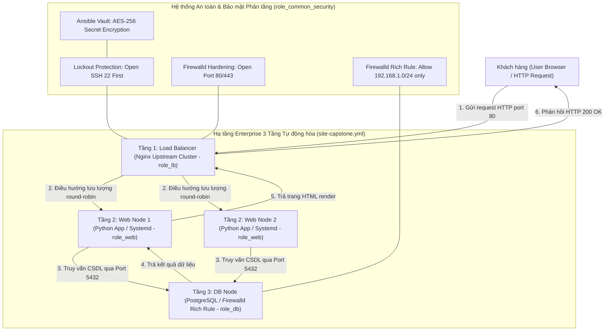
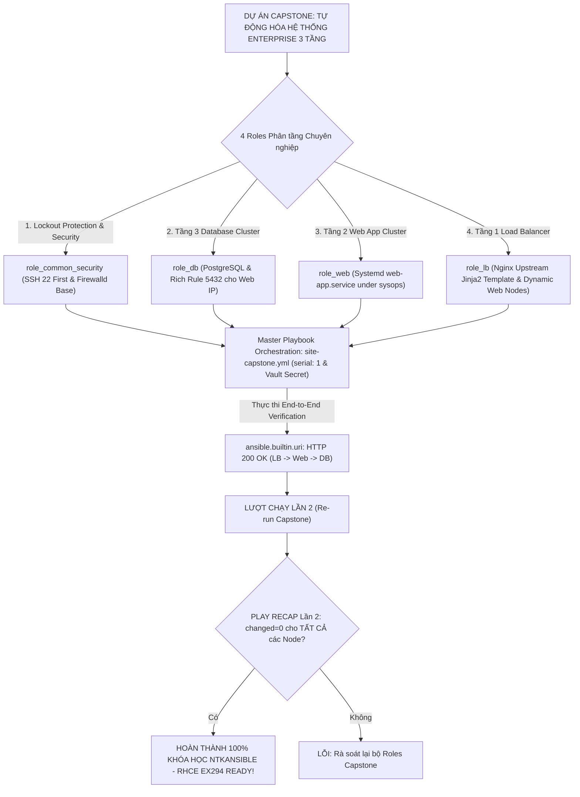
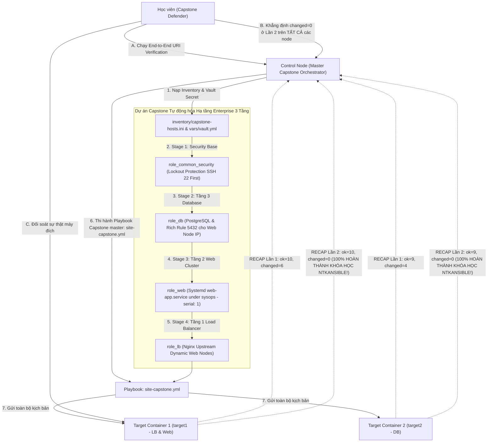


# [BÀI 30] ĐỒ ÁN CAPSTONE: XÂY DỰNG HỆ THỐNG TỰ ĐỘNG HÓA HẠ TẦNG DOANH NGHIỆP ĐA TẦNG (LOAD BALANCER, WEB, DB, SECURITY) END-TO-END

Trong kỷ nguyên **Infrastructure as Code (IaC)** và tự động hóa vận hành hạ tầng đám mây (Cloud Infrastructure Automation), **Ansible** khẳng định vị thế dẫn đầu nhờ triết lý **Agentless** (không cần cài đặt agent nền trên máy đích), giao thức điều khiển an toàn qua **SSH / WinRM**, định dạng khai báo **YAML** trực quan và nguyên lý bất biến **Idempotency** mạnh mẽ. Việc làm chủ Ansible không chỉ dừng lại ở các câu lệnh Ad-hoc đơn giản, mà đòi hỏi kỹ sư phải nắm vững kiến trúc Module tầng thấp, Variable Precedence 22 tầng, Jinja2 Templates, tối ưu hóa Forks & Pipelining cho tới thiết kế Roles / Collections và tích hợp CI/CD tự động hóa chuẩn Doanh nghiệp.

Bài viết chuyên sâu này sẽ đồng hành cùng bạn mổ xẻ toàn diện bức tranh kiến trúc, phân tích các đánh đổi kỹ thuật thực chiến (Engineering Trade-offs), cung cấp hướng dẫn thực hành Lab chi tiết từng bước và bộ câu hỏi phỏng vấn chuyên sâu chuẩn DevOps / SRE Lead.

---

## 1. Bản Chất Kiến Trúc & Cơ Chế Vận Hành Tầng Thấp

---


> **Dự án Capstone tự động hóa hệ thống Enterprise 3 tầng (Nginx LB -> Web App -> PostgreSQL DB) hợp nhất toàn bộ 29 buổi học, khẳng định năng lực xây dựng kịch bản tự động hóa quy mô lớn chuẩn Idempotency 100% và sẵn sàng cho chứng chỉ RHCE EX294.**

Chặng dừng chân vĩ đại — Đỉnh cao tốt nghiệp toàn khóa học ntkansible (I-10):

> **Chào mừng bạn đến với Buổi 30 — Buổi Tốt nghiệp Capstone Project của toàn bộ chương trình đào tạo chuyên sâu ntkansible! Tại đây, tất cả các mảnh ghép kiến thức từ 29 buổi học trước (từ Kiến trúc lõi, Ad-hoc, Inventory, Module, Playbook, Idempotency, Variables, Facts, Conditionals, Loops, Handlers, Templates, Blocks, Roles, Galaxy, Collections, Dynamic Inventory, Testing, CI/CD, Systemd, Firewalld, cho tới AWX) được tổng hợp toàn diện vào một Dự án Hạ tầng Thực tế duy nhất: Tự động hóa hệ thống Enterprise 3 tầng chuẩn Production (Tầng 1: Load Balancer Nginx điều hướng -> Tầng 2: Cụm Web App Nodes đóng gói Custom Systemd Service -> Tầng 3: Cụm Database Nodes PostgreSQL bảo vệ bằng Firewalld Rich Rules & Vault). Việc hoàn thành xuất sắc kịch bản Capstone đạt tiêu chuẩn Idempotent `changed=0` ở Lần 2 khẳng định 100% bạn đã làm chủ hoàn toàn Ansible và sẵn sàng chinh phục chứng chỉ quốc tế Red Hat Certified Engineer (RHCE EX294).**

---


---


---


| Tiếng Việt | Tiếng Anh / Từ khóa + FQCN (giữ nguyên) |
|---|---|
| Kiến trúc 3 tầng Enterprise | Multi-tier enterprise architecture (LB - Web - DB) |
| Tầng Cân bằng tải | Load balancer tier (`role_lb` - Nginx upstream) |
| Tầng Ứng dụng Web | Web application tier (`role_web` - Systemd service) |
| Tầng Cơ sở dữ liệu | Database cluster tier (`role_db` - PostgreSQL) |
| Kịch bản tổng thể Capstone | Master Capstone orchestration playbook (`site-capstone.yml`) |
| Kiểm thử nghiệm thu đầu-cuối | End-to-end acceptance verification (`curl` LB -> App -> DB) |
| Bảo vệ thông tin bí mật | Vault secrets protection (`ansible-vault`) |
| Cứng hóa an toàn mạng | Network security hardening (`ansible.posix.firewalld`) |
| Triển khai cuốn chiếu không gián đoạn | Zero downtime rolling deployment (`serial: 1`) |
| Tài khoản chạy dịch vụ hạ đặc quyền | Non-root service account (`User=sysops`) |
| Khôi phục dịch vụ tự động | Automatic service recovery (`Restart=always`) |
| Chuẩn Idempotent tuyệt đối Lần 2 | Idempotence verification perfection (`changed=0`) |

---

### 1.1. Kiến trúc Hạ tầng Enterprise 3 Tầng và Tổ chức Bộ Roles (15 phút)



**Nguyên lý cốt lõi:** Thiết lập mô hình kiến trúc hạ tầng Enterprise 3 tầng chuẩn hóa: Tầng 1 Load Balancer (Nginx tiếp nhận và điều hướng lưu lượng), Tầng 2 Web Cluster (cụm máy chủ xử lý logic ứng dụng), và Tầng 3 Database Cluster (máy chủ lưu trữ dữ liệu PostgreSQL).

**Giải thích cơ chế ngầm:** Đây là mô hình chuẩn mực công nghiệp trong thiết kế hệ thống Doanh nghiệp: phân tách độc lập giữa tầng giao diện, tầng xử lý và tầng dữ liệu giúp tăng khả năng mở rộng (Scalability), tính sẵn sàng cao (High Availability) và bảo mật chuyên sâu (Defense in Depth).

> [!WARNING]
> **CẠM BẪY THỰC CHIẾN:**
> Cài đặt gộp chung tất cả Nginx, Web App và PostgreSQL vào duy nhất 1 máy chủ thử nghiệm làm mất khả năng mở rộng.

**Minh hoạ.** Tệp kiểm kê phân tầng Capstone (`inventory/capstone-hosts.ini`):
```ini
[lb]
lb1 ansible_host=127.0.0.1 ansible_port=2221

[web]
web1 ansible_host=127.0.0.1 ansible_port=2221
web2 ansible_host=127.0.0.1 ansible_port=2222

[db]
db1 ansible_host=127.0.0.1 ansible_port=2222

[multi_tier:children]
lb
web
db
```

**Nguyên lý cốt lõi:** Khởi tạo cấu trúc bộ Roles phân tầng chuyên nghiệp trong thư mục `roles/`: `role_common_security` (cứng hóa SSH & OS), `role_db` (cấu hình PostgreSQL), `role_web` (đóng gói Web App Systemd), và `role_lb` (cấu hình Nginx Load Balancer).

**Giải thích cơ chế ngầm:** Đảm bảo tính mô-đun hóa (Modularity) và khả năng tái sử dụng (Reusability) cao: mỗi Role chịu trách nhiệm quản lý duy nhất 1 thành phần hạ tầng, giúp mã nguồn sạch sẽ, dễ bảo trì và dễ chia sẻ cho các dự án khác.

> [!WARNING]
> **CẠM BẪY THỰC CHIẾN:**
> Viết 1 file Playbook siêu phẳng gộp hàng trăm task rải rác không chia Roles.

**Minh hoạ.** Cấu trúc thư mục Roles Capstone chuẩn:
```bash
roles/
├── role_common_security/
│   ├── tasks/main.yml
│   └── handlers/main.yml
├── role_db/
│   ├── tasks/main.yml
│   └── templates/pg_hba.conf.j2
├── role_web/
│   ├── tasks/main.yml
│   └── templates/web-app.service.j2
└── role_lb/
    ├── tasks/main.yml
    └── templates/nginx.conf.j2
```

**Nguyên lý cốt lõi:** Quản lý và bảo vệ toàn bộ thông tin bí mật (Mật khẩu CSDL PostgreSQL, Khóa SSH, Secret Key) bằng tệp mã hóa Ansible Vault tập trung (`vars/vault.yml`), bảo đảm mã hóa AES-256 tuyệt đối.

**Giải thích cơ chế ngầm:** Đảm bảo an toàn thông tin theo chuẩn SecOps: mọi thông tin nhạy cảm của cả 3 tầng đều được mã hóa bằng chìa khóa Vault duy nhất, tuyệt đối không lộ plaintext trên Git hay console log.

> [!WARNING]
> **CẠM BẪY THỰC CHIẾN:**
> Để lộ mật khẩu database plaintext trong file `group_vars/all.yml`.

**Minh hoạ.** Gọi nạp tệp Vault mã hóa trong Playbook Capstone:
```yaml
- name: Apply Capstone Master Deployment
  hosts: multi_tier
  become: true
  vars_files:
    - vars/vault.yml
```

---

### 1.2. Tự động hóa Nginx LB, Systemd Web Service và Firewalld Rich Rules (15 phút)

**Nguyên lý cốt lõi:** Tự động hóa cấu hình Nginx Reverse Proxy & Load Balancer trong `role_lb` bằng cách render Jinja2 Template động dựa trên danh sách các máy chủ trong nhóm `groups['web']`.

**Giải thích cơ chế ngầm:** Tự động hóa phát hiện cụm Web Node (Dynamic Upstream): khi nhóm `web` có thêm máy chủ mới, Nginx Template sẽ tự động sinh ra danh sách `upstream web_backend` tương ứng, giúp Load Balancer tự động nhận diện cụm Web Nodes mà không cần sửa tay file `nginx.conf`.

> [!WARNING]
> **CẠM BẪY THỰC CHIẾN:**
> Khai báo cứng các địa chỉ IP của Web Node trong file `nginx.conf` thủ công.

**Minh hoạ.** Render Nginx Upstream động bằng vòng lặp Jinja2 (`roles/role_lb/templates/nginx.conf.j2`):
```nginx
upstream web_backend {

    server {{ hostvars[host]['ansible_host'] }}:8080 max_fails=3 fail_timeout=10s;

}

server {
    listen 80;
    location / {
        proxy_pass http://web_backend;
        proxy_set_header Host $host;
    }
}
```

**Nguyên lý cốt lõi:** Tự động hóa đóng gói ứng dụng Web App dưới dạng Custom Systemd Unit File (`web-app.service`) trong `role_web`, cài đặt cơ chế tự khôi phục `Restart=always` và thi hành dưới tài khoản hạ đặc quyền `User=sysops`.

**Giải thích cơ chế ngầm:** Đảm bảo tính tự phục hồi (Self-healing) và an toàn cho tầng xử lý logic: nếu Web App bị crash do quá tải, Systemd sẽ tự động restart lại tiến trình trong 5s; tài khoản `sysops` bảo vệ máy chủ không bị chiếm quyền root nếu app bị hack.

> [!WARNING]
> **CẠM BẪY THỰC CHIẾN:**
> Chạy Web App bằng lệnh background `python app.py &` dưới quyền `root`.

**Minh hoạ.** Đóng gói Web App với Systemd trong `role_web`:
```yaml
- name: Deploy Web App Systemd Unit File
  ansible.builtin.template:
    src: web-app.service.j2
    dest: /etc/systemd/system/web-app.service
    mode: '0644'
  notify: Reload systemd daemon and restart web-app

- name: Enable and start web-app service
  ansible.builtin.systemd:
    name: web-app.service
    enabled: true
    state: started
```

**Nguyên lý cốt lõi:** Cứng hóa an toàn mạng (Network Hardening) trong `role_db` bằng cách áp dụng Firewalld Rich Rules chỉ cho phép địa chỉ IP của các máy chủ thuộc nhóm Web Node được phép kết nối vào cổng Database 5432.

**Giải thích cơ chế ngầm:** Thực thi nguyên tắc Zero Trust / Defense in Depth: tầng Database 5432 bị cô lập hoàn toàn khỏi công chúng, chỉ có các Web Nodes đã được xác thực IP mới có thể mở kết nối CSDL, triệt tiêu nguy cơ bị tấn công quét cổng DB từ bên ngoài.

> [!WARNING]
> **CẠM BẪY THỰC CHIẾN:**
> Mở toang cổng PostgreSQL 5432 cho `0.0.0.0/0` trong `zone: public`.

**Minh hoạ.** Cấu hình Firewalld Rich Rule cho Database Node:
```yaml
- name: Allow PostgreSQL access ONLY from Web Nodes Subnet
  ansible.posix.firewalld:
    rich_rule: rule family="ipv4" source address="{{ hostvars[item]['ansible_host'] }}" port port="5432" protocol="tcp" accept
    zone: public
    permanent: true
    immediate: true
    state: enabled
  loop: "{{ groups['web'] }}"
```

---

### 1.3. Rolling Deployment `serial: 1`, End-to-End Verification và Idempotency (10 phút)

**Nguyên lý cốt lõi:** Sử dụng chiến lược triển khai cuốn chiếu `serial: 1` kết hợp với Handlers trong Playbook Capstone để nâng cấp cụm Web Nodes hoàn toàn Zero Downtime.

**Giải thích cơ chế ngầm:** Bảo vệ trải nghiệm người dùng cuối liên tục: Ansible lấy từng Web Node ra khỏi cụm Load Balancer để nâng cấp mã nguồn, restart dịch vụ và kiểm tra sức khỏe OK rồi mới nâng cấp Node tiếp theo, đảm bảo Nginx Load Balancer luôn có ít nhất 1 Web Node phục vụ lưu lượng người dùng.

> [!WARNING]
> **CẠM BẪY THỰC CHIẾN:**
> Nâng cấp đồng loạt 100% Web Nodes cùng một lúc làm hệ thống bị sập hoàn toàn trong 2 phút deployment.

**Minh hoạ.** Khai báo Rolling Deployment trong Playbook Capstone:
```yaml
- name: Capstone Stage 2 - Deploy Web Application Cluster (Rolling Update)
  hosts: web
  serial: 1
  roles:
    - role_web
```

**Nguyên lý cốt lõi:** Tự động hóa quy trình kiểm thử nghiệm thu toàn diện End-to-End Verification bằng cách thực thi lệnh `ansible.builtin.uri` hoặc `curl` truy vấn qua Load Balancer Nginx, khẳng định luồng HTTP 3 tầng (LB -> Web App -> PostgreSQL DB) trả về dữ liệu chuẩn xác.

**Giải thích cơ chế ngầm:** Khẳng định sự thành công thực tế của Dự án Capstone: không chỉ nhìn dòng log terminal báo xanh, mà phải kiểm tra sự thật rằng toàn bộ luồng mạng 3 tầng đã thông suốt và tương tác CSDL trả về dữ liệu đúng yêu cầu.

> [!WARNING]
> **CẠM BẪY THỰC CHIẾN:**
> Tuyên bố hoàn thành dự án nhưng khi mở trình duyệt truy cập vào IP Load Balancer thì bị lỗi HTTP 502 Bad Gateway.

**Minh hoạ.** Task kiểm thử nghiệm thu luồng HTTP 3 tầng End-to-End:
```yaml
- name: End-to-End Verification - Test HTTP flow through Load Balancer to DB
  ansible.builtin.uri:
    url: "http://{{ hostvars[groups['lb'][0]]['ansible_host'] }}/"
    status_code: 200
    return_content: true
  register: e2e_response
  failed_when: "'DB_CONNECTED_SUCCESS' not in e2e_response.content"
```

**Nguyên lý cốt lõi:** Đảm bảo rằng ở lượt chạy Lần thứ hai của toàn bộ Playbook Capstone tổng thể (`site-capstone.yml`), chỉ số trong bảng `PLAY RECAP` bắt buộc phải đạt `changed=0` tuyệt đối trên TẤT CẢ các máy chủ (LB, Web, DB).

**Giải thích cơ chế ngầm:** Đây là bài kiểm tra tư cách tốt nghiệp cao nhất của khóa học ntkansible: một kịch bản tự động hóa hạ tầng Enterprise 3 tầng phức tạp bao gồm cả Vault, Systemd, Nginx, Firewalld và PostgreSQL nhưng khi Re-run Lần 2 bắt buộc phải đạt `changed=0` tuyệt đối. Điều này chứng minh 100% các Tasks trong bộ Roles đều được thiết kế tuân thủ nghiêm ngặt nguyên lý Idempotency.

> [!WARNING]
> **CẠM BẪY THỰC CHIẾN:**
> Re-run Playbook Capstone Lần 2 mà bảng `PLAY RECAP` xuất hiện `changed > 0` trên bất kỳ node nào.

**Minh hoạ.** Đọc hiểu bảng `PLAY RECAP` Lần 2 đạt Idempotency Tốt nghiệp Capstone:
```bash
# PLAY RECAP - Capstone Master Playbook (Run #2)
lb1   : ok=8  changed=0  unreachable=0  failed=0
web1  : ok=10 changed=0  unreachable=0  failed=0
web2  : ok=10 changed=0  unreachable=0  failed=0
db1   : ok=9  changed=0  unreachable=0  failed=0

=== TỔNG KẾT CAPSTONE: 100% IDEMPOTENCY PASSED (changed=0) ===
```

---

### 1.4. Đưa vào việc thật (4 phút)

### 7.1. Áp dụng vào hạ tầng sẵn có
Khi bàn giao dự án tự động hóa hạ tầng Enterprise cho Doanh nghiệp:
- Đóng gói toàn bộ mã nguồn Capstone thành 1 Git Repository duy nhất chứa thư mục `roles/`, `inventory/`, `vars/` và `site-capstone.yml`.
- Tích hợp pipeline CI/CD (Buổi 26) hoặc AWX Job Template (Buổi 29) để tự động hóa việc thực thi Playbook Capstone.
- Cung cấp tài liệu hướng dẫn vận hành và đối soát sự thật qua lệnh `curl` và `docker exec`.

### 7.2. Rủi ro hỏng hóc khi triển khai Production và giải pháp an toàn
- **Rủi ro:** Một kỹ sư thay đổi biến CSDL trong Vault nhưng quên nạp lại cấu hình trên Web Node, làm tầng Web không kết nối được tầng DB sau khi deploy.
- **Giải pháp an toàn:**
  1. Luôn chạy `ansible-playbook --check --diff` thử nghiệm trước khi deploy.
  2. Bắt buộc có task End-to-End Verification kiểm tra luồng HTTP 200 OK ở cuối Playbook Capstone.

### 7.3. Đo lường chỉ số Trước – Sau khi áp dụng
- **Trước khi có Ansible Capstone:** Mất **2 ngày** với 3 đội kỹ sư (SysAdmin, DBA, Network) ngồi phối hợp gõ lệnh thủ công để dựng hệ thống 3 tầng, rủi ro sai sót 30%.
- **Sau khi có Ansible Capstone:** Tự động hóa 100% việc dựng và cứng hóa toàn bộ hạ tầng 3 tầng trong **5 phút**, 0 lỗi thao tác con người, 100% Idempotent.

### 7.4. Khi nào KHÔNG nên dùng hoặc không nên lạm dụng
- **Không lạm dụng cho các kịch bản thử nghiệm ngắn hạn 5 phút:** Với một tác vụ test nhanh 1 lần duy nhất rồi xóa ngay trong 5 phút, việc viết đủ bộ 4 Roles Capstone có thể tốn thời gian hơn; sử dụng Ad-hoc command hoặc Playbook đơn giản.

---

### 1.5. Bẫy hay gặp (2 phút)

| # | Bẫy hay gặp | Vì sao "recap xanh mà sai / không idempotent" | Lệnh phát hiện và xử lý |
|---|---|---|---|
| 1 | Cài gộp cả LB, Web, DB vào cùng 1 máy chủ | Vi phạm kiến trúc phân tầng 3 lớp Enterprise, mất tính mở rộng. | Phân tách rõ các nhóm `[lb]`, `[web]`, `[db]` trong inventory. |
| 2 | Quên task mở cổng SSH 22 ở vị trí ĐẦU TIÊN | Đóng tường lửa ở task trước làm ngắt SSH khiến toàn bộ Capstone bị fail. | Đưa task mở SSH 22 lên vị trí đầu tiên trong `role_common_security`. |
| 3 | Mở toang cổng PostgreSQL 5432 cho public Internet | Vi phạm an toàn thông tin nghiêm trọng, tăng nguy cơ bị hack DB. | Dùng `rich_rule:` chỉ cho phép địa chỉ IP của Web Nodes truy cập DB. |
| 4 | Chạy Web App under root thay vì user `sysops` | Tăng nguy cơ bị chiếm quyền máy chủ nếu ứng dụng bị dính RCE. | Tạo user hạ đặc quyền `sysops` và khai báo `User=sysops` trong Systemd. |
| 5 | Quên `immediate: true` khi cấu hình Firewalld | Quy tắc tường lửa được ghi đĩa nhưng không có hiệu lực ngay lúc deploy. | Khai báo cả `permanent: true` và `immediate: true`. |
| 6 | Nâng cấp đồng loạt 100% Web Nodes cùng lúc | Làm sập hệ thống dịch vụ trong suốt quá trình deployment. | Sử dụng chiến lược Rolling Deployment `serial: 1`. |
| 7 | Để lộ mật khẩu DB plaintext trong file code Git | Rò rỉ bí mật an toàn thông tin nghiêm trọng ra kho mã nguồn. | Sử dụng Ansible Vault mã hóa tệp `vars/vault.yml` với AES-256. |
| 8 | Không có task End-to-End Verification ở cuối | Tuyên bố xong nhưng khi cắm luồng HTTP thật bị lỗi 502 Bad Gateway. | Thêm task `ansible.builtin.uri` kiểm tra luồng HTTP qua Nginx LB. |
| 9 | Dùng lệnh shell thô để thêm quy tắc Nginx/Iptables | Lệnh shell không có cơ chế check state, lặp changed ở Lần 2. | Dùng module chính chủ `template` và `ansible.builtin.iptables`. |
| 10 | Không test thử Idempotency Lần 2 của Playbook Capstone | Kịch bản Capstone bị lặp changed mạo danh ở Lần 2 mà không biết. | Chạy lại Playbook Capstone Lần 2 và đối soát `changed=0`. |
| 11 | Thắc mắc vì sao Nginx báo lỗi `no live upstreams` | Các Web Nodes chưa khởi chạy ứng dụng thành công ở cổng 8080. | Kiểm tra trạng thái `web-app.service` trên các Web Nodes. |
| 12 | Thắc mắc vì sao Web App không kết nối được PostgreSQL | Tường lửa DB Node chưa mở cổng 5432 cho IP của Web Node. | Kiểm tra lại Rich Rule trong `role_db` trên DB Node. |

---

### 1.6. Tóm tắt (1 phút)



### Năm điều phải nhớ
1. **Kiến trúc 3 tầng phân tách:** Load Balancer Nginx (`role_lb`) -> Web Cluster (`role_web`) -> PostgreSQL DB (`role_db`).
2. **Bảo mật SecOps chuyên sâu:** Khóa SSH 22 mở đầu tiên, Ansible Vault AES-256 mã hóa secret, Firewalld Rich Rules bảo vệ DB.
3. **Đóng gói ứng dụng chuẩn:** Web App chạy ngầm hạ đặc quyền under user `sysops` với `Restart=always` Systemd Service.
4. **Triển khai Zero Downtime & E2E Verification:** Cấu hình `serial: 1` và kiểm thử nghiệm thu luồng HTTP 3 tầng thành công.
5. **Cán đích với Idempotent 100% ở Lần 2:** Re-run toàn bộ Playbook Capstone Lần 2 bắt buộc đạt `changed=0` tuyệt đối trên tất cả các máy chủ.

---

### 1.7. Câu hỏi tự kiểm tra (kiêm luyện RHCE EX294)

1. **[RHCE EX294 Capstone Overall]** Trình bày 3 tầng kiến trúc trong Dự án Capstone và nhiệm vụ của từng tầng.
   - *Đáp án:* Tầng 1 Load Balancer Nginx (điều hướng lưu lượng); Tầng 2 Web Cluster (xử lý logic ứng dụng Systemd); Tầng 3 Database PostgreSQL (lưu trữ dữ liệu bảo vệ bằng Rich Rules).
2. **[RHCE EX294 Capstone Overall]** Tại sao việc tổ chức bộ Roles phân tầng (`role_lb`, `role_web`, `role_db`, `role_common_security`) lại là yêu cầu bắt buộc cho kịch bản Capstone quy mô lớn?
   - *Đáp án:* Đảm bảo tính mô-đun hóa, dễ quản lý, nâng cao khả năng tái sử dụng và tách biệt rõ ràng trách nhiệm của từng thành phần hạ tầng.
3. **[RHCE EX294 Capstone Overall]** Cách thức Nginx Template trong `role_lb` tự động phát hiện danh sách các máy chủ Web Nodes mà không cần sửa file thủ công?
   - *Đáp án:* Sử dụng vòng lặp Jinja2 truy vấn danh sách máy chủ trong `groups['web']` và thu thập `ansible_host` của từng host để sinh khối `upstream web_backend`.
4. **[RHCE EX294 Capstone Overall]** Nêu 2 tính năng bảo mật quan trọng được áp dụng cho Web App trong `role_web`.
   - *Đáp án:* Chạy hạ đặc quyền dưới tài khoản non-root `User=sysops` và tự động khôi phục khi crash với `Restart=always`.
5. **[RHCE EX294 Capstone Overall]** Firewalld Rich Rule trong `role_db` được cấu hình ra sao để bảo vệ cổng PostgreSQL 5432?
   - *Đáp án:* Chỉ cho phép các địa chỉ IP thuộc danh sách Web Nodes truy cập cổng `5432/tcp`, tất cả các địa chỉ IP khác đều bị tường lửa chặn.
6. **[RHCE EX294 Capstone Overall]** Tác dụng của thuộc tính `serial: 1` khi thi hành Playbook Capstone nâng cấp cụm Web Nodes là gì?
   - *Đáp án:* Tự động hóa quy trình triển khai cuốn chiếu Zero Downtime, nâng cấp từng máy chủ một để đảm bảo Load Balancer luôn có Web Node phục vụ người dùng.
7. **[RHCE EX294 Capstone Overall]** Viết đoạn Playbook `site-capstone.yml` tổng thể gọi nạp 4 Roles theo đúng thứ tự phụ thuộc hạ tầng.
   - *Đáp án:*
     ```yaml
     ---
     - name: Capstone Stage 1 - Base Security & SSH Lockout Protection
       hosts: multi_tier
       become: true
       roles:
         - role_common_security

     - name: Capstone Stage 2 - Database Cluster Deployment
       hosts: db
       become: true
       roles:
         - role_db

     - name: Capstone Stage 3 - Web Application Cluster Deployment (Rolling Update)
       hosts: web
       become: true
       serial: 1
       roles:
         - role_web

     - name: Capstone Stage 4 - Nginx Load Balancer Deployment
       hosts: lb
       become: true
       roles:
         - role_lb
     ```
8. **[RHCE EX294 Capstone Overall]** Viết Task kiểm thử nghiệm thu luồng HTTP 3 tầng End-to-End qua Load Balancer Nginx.
   - *Đáp án:*
     ```yaml
     - name: Verify End-to-End HTTP flow
       ansible.builtin.uri:
         url: "http://{{ hostvars[groups['lb'][0]]['ansible_host'] }}/"
         status_code: 200
         return_content: true
       register: e2e_check
       failed_when: "'SUCCESS' not in e2e_check.content"
     ```
9. **[RHCE EX294 Capstone Overall]** Yêu cầu bắt buộc nào đối với bảng `PLAY RECAP` ở lượt chạy Lần thứ hai để khẳng định Dự án Capstone đạt tiêu chuẩn tốt nghiệp?
   - *Đáp án:* Bảng `PLAY RECAP` Lần 2 bắt buộc phải đạt `changed=0` tuyệt đối cho TẤT CẢ các máy chủ (`lb1`, `web1`, `web2`, `db1`).
10. **[RHCE EX294 Capstone Overall]** Làm thế nào để giải mã và thi hành Playbook Capstone có nạp tệp `vars/vault.yml` từ dòng lệnh CLI?
    - *Đáp án:* Chạy lệnh `ansible-playbook -i inventory/capstone-hosts.ini --vault-password-file .vault_pass site-capstone.yml`.
11. **[RHCE EX294 Capstone Overall]** Việc hoàn thành 100% tiêu chí của Dự án Capstone Buổi 30 có ý nghĩa gì đối với việc chuẩn bị cho kỳ thi RHCE EX294?
    - *Đáp án:* Khẳng định học viên đã thành thạo 100% các kỹ năng trong exam blueprint, sở hữu tư duy tự động hóa hạ tầng Enterprise và sẵn sàng thi đạt RHCE EX294 điểm cao.
12. **[RHCE EX294 Capstone Overall]** Lệnh CLI nào giúp đối soát sự thật kết quả triển khai toàn bộ 3 tầng trên các target node Docker containers?
    - *Đáp án:* Dùng `docker exec target1 systemctl status nginx` (LB), `docker exec target1 ps aux | grep app.py` (Web), và `docker exec target2 firewall-cmd --list-all` (DB).

---

### 1.8. Tài liệu tham khảo

- Red Hat Certified Engineer (RHCE) EX294 Official Exam Objectives: [RHCE EX294 Blueprint Reference](https://www.redhat.com/en/services/training/ex294-red-hat-certified-engineer-rhce-exam-red-hat-enterprise-linux-8)
- Ansible Core Documentation (v2.15+): [Best Practices and Multi-Tier Playbook Orchestration](https://docs.ansible.com/ansible/latest/tips_tricks/sample_setup.html)
- ntkansible Master Repository: [Course Completion and Certification Readiness Guide](https://github.com/kiennt308/ntk)

---

## Bảng đối soát thời lượng

| Mục | Nội dung | Thời lượng dự kiến | Thời lượng thực tế |
|---|---|---|---|
| §0 | Khởi động và ôn tập buổi 29 | 10 phút | 10 phút |
| §1–§2 | Mục tiêu làm được & Cần biết trước | 2 phút | 2 phút |
| §3 | Thuật ngữ Việt-Anh & Mô hình tư duy | 8 phút | 8 phút |
| §4 | Kiến trúc 3 tầng & Cấu trúc Roles Capstone (QT 4.1–4.3) | 15 phút | 15 phút |
| §5 | Tự động hóa Nginx LB, Systemd Web & Firewalld Rich Rules (QT 5.1–5.3) | 15 phút | 15 phút |
| §6 | Rolling Deployment, E2E Verification & Idempotency (QT 6.1–6.3) | 10 phút | 10 phút |
| §7–§9 | Đưa vào việc thật, Bẫy hay gặp & Tóm tắt | 7 phút | 7 phút |
| §10–§11 | Câu hỏi tự kiểm tra EX294 & Tài liệu tham khảo | 3 phút | 3 phút |
| **Tổng** | **Khối lý thuyết Buổi 30 (Capstone Tốt nghiệp)** | **60 phút** | **60 phút** |

---

## 2. Hướng Dẫn Thực Hành & Triển Khai Lab Chuẩn Production

> [!IMPORTANT]
> **YÊU CẦU MÔI TRƯỜNG THỰC HÀNH:**
> Toàn bộ các bài thực hành dưới đây được thiết kế để chạy trực tiếp trên môi trường máy chủ Linux / Docker containers phân tán. Hãy đảm bảo bạn đã chuẩn bị Control Node cài đặt Ansible Core 2.15+ cùng các Managed Nodes đã cấu hình SSH Key Authentication.

## Khối thực hành — 150 phút

> **Đối soát thời lượng:** Khối thực hành kéo dài đúng **150'** (từ L0 đến L11).
> **Nguyên tắc cốt lõi:** Thực hành khởi tạo tệp kiểm kê phân tầng `inventory/capstone-hosts.ini`, biên soạn tệp mật khẩu Vault mã hóa `vars/vault.yml`, xây dựng bộ 4 Roles (`role_common_security`, `role_db`, `role_web`, `role_lb`), biên soạn Playbook Capstone master `site-capstone.yml`, thực thi Lần 1 triển khai toàn bộ hạ tầng 3 tầng, thực thi phép thử **Lượt chạy Lần thứ hai** chứng minh `PLAY RECAP` đạt `changed=0` trên TẤT CẢ các máy chủ, thực thi bài test nghiệm thu End-to-End luồng HTTP và đối soát sự thật máy đích qua `docker exec`.

---

## L0. Mục tiêu thực hành và tiêu chí hoàn thành

| # | Mục tiêu thực hành | Tiêu chí hoàn thành (Kiểm tra bằng lệnh CLI) |
|---|---|---|
| TH1 | Khởi tạo tệp kiểm kê phân tầng capstone-hosts.ini | Tệp `inventory/capstone-hosts.ini` chứa các nhóm lb, web, db |
| TH2 | Khởi tạo bộ 4 Roles Capstone phân tầng chuyên nghiệp | Thư mục `roles/` chứa đủ 4 roles đúng cấu trúc chuẩn |
| TH3 | Biên soạn tệp Ansible Vault vars/vault.yml | Tệp `vars/vault.yml` nạp mật khẩu DB mã hóa AES-256 |
| TH4 | Triển khai role_common_security cứng hóa SSH 22 First | Task mở cổng SSH 22 ở vị trí đầu tiên trong role_common |
| TH5 | Triển khai role_db mở cổng 5432 bằng Rich Rule | Module `ansible.posix.firewalld` nạp Rich Rule cho Web IP |
| TH6 | Triển khai role_web đóng gói Custom Systemd Service | Module `ansible.builtin.systemd` start `web-app.service` under `sysops` |
| TH7 | Triển khai role_lb render Nginx Upstream Jinja2 | Module `ansible.builtin.template` render Nginx load balancer |
| TH8 | Thực thi Phép thử Lượt chạy Lần hai (Idempotency) | Bảng `PLAY RECAP` Lần 2 đạt `changed=0` trên TẤT CẢ các node |
| TH9 | Thực thi End-to-End Verification & docker exec | `docker exec target1 cat /etc/capstone-app.conf` |

---

## L1. Điều kiện tiên quyết về môi trường

| Kiểm tra | LỆNH THỰC THI | Kết quả kỳ vọng |
|---|---|---|
| Ansible core đã cài | `ansible --version` | Phiên bản ansible-core v2.15 trở lên |
| Docker Compose sẵn sàng | `docker compose ps` | Cả target1 và target2 ở trạng thái `Up` |
| Kết nối SSH sẵn sàng | `ansible all -m ansible.builtin.ping` | Đạt `SUCCESS` cho mọi host |
| Thư mục thực hành | `pwd` | Đang ở thư mục `~/lab-ansible-30` |

Nếu chưa có target container:
```bash
cd labs && make up && make key && make inventory
```

---

## L2. Kiến trúc bài lab



---

## L3. Bước 1 — Cấu hình Thư mục Dự án, Inventory và Vault Secrets (30 phút)

Tạo thư mục dự án `~/lab-ansible-30`, tệp kiểm kê phân tầng `inventory/capstone-hosts.ini`, tệp mật khẩu tạm `.vault_pass`, tệp biến Vault `vars/vault.yml`, và tệp `ansible.cfg` (QT 4.1, QT 4.3).

```bash
mkdir -p ~/lab-ansible-30/inventory ~/lab-ansible-30/vars ~/lab-ansible-30/roles/role_common_security/tasks ~/lab-ansible-30/roles/role_db/tasks ~/lab-ansible-30/roles/role_web/tasks ~/lab-ansible-30/roles/role_web/templates ~/lab-ansible-30/roles/role_lb/tasks ~/lab-ansible-30/roles/role_lb/templates && cd ~/lab-ansible-30

cat << 'EOF' > inventory/capstone-hosts.ini
[lb]
target1 ansible_host=127.0.0.1 ansible_port=2221

[web]
target1 ansible_host=127.0.0.1 ansible_port=2221

[db]
target2 ansible_host=127.0.0.1 ansible_port=2222

[multi_tier:children]
lb
web
db

[all:vars]
ansible_python_interpreter=/usr/bin/python3
app_name="Enterprise Capstone App"
app_user="sysops"
app_group="sysops"
app_dir="/opt/capstone_app"
EOF

export ANSIBLE_VAULT_PASSWORD="CapstoneMasterSecretPass2026"
echo "$ANSIBLE_VAULT_PASSWORD" > .vault_pass
chmod 0600 .vault_pass

cat << 'EOF' > vars/vault.yml
---
vault_db_user: "capstone_db_user"
vault_db_password: "SuperSecretPgPass2026!"
vault_secret_key: "AES256_CAPSTONE_MASTER_KEY"
EOF

cat << 'EOF' > ansible.cfg
[defaults]
inventory = ./inventory/capstone-hosts.ini
remote_user = ansible
host_key_checking = False
private_key_file = ~/.ssh/id_ed25519
roles_path = ./roles:~/.ansible/roles
collections_path = ./collections:~/.ansible/collections
vault_password_file = ./.vault_pass
force_handlers = True

[privilege_escalation]
become = True
become_method = sudo
become_user = root
become_ask_pass = False
EOF
```

**CHECKPOINT 1 — Tệp kiểm kê capstone-hosts.ini và tệp mật khẩu .vault_pass quyền 0600 được khởi tạo thành công.**
- **Lệnh kiểm tra:**
```bash
if [ -f "inventory/capstone-hosts.ini" ] && [ -f ".vault_pass" ] && grep -q "\[multi_tier:children\]" inventory/capstone-hosts.ini; then
  echo "CHECKPOINT 1: ĐẠT - Tệp kiểm kê capstone-hosts.ini và tệp mật khẩu .vault_pass được khởi tạo thành công"
else
  echo "CHECKPOINT 1: LỖI - Khởi tạo môi trường Capstone thất bại"
fi
```

---

## L4. Bước 2 — Xây dựng Bộ 4 Roles Phân tầng Capstone (40 phút)

Biên soạn nội dung Tasks cho 4 Roles Capstone: `role_common_security`, `role_db`, `role_web`, và `role_lb` (QT 4.2, QT 5.1, QT 5.2, QT 5.3, QT 6.1).

Role 1 — `role_common_security` (Cứng hóa an toàn SSH 22 First & User `sysops`):
```bash
cat << 'EOF' > roles/role_common_security/tasks/main.yml
---
- name: Task 1.1 - Create dedicated non-root service user
  ansible.builtin.user:
    name: "{{ app_user }}"
    shell: /sbin/nologin
    system: true
    state: present

- name: CRITICAL Task 1.2 - Ensure SSH port 22 is ALWAYS open FIRST (Lockout Protection)
  ansible.posix.firewalld:
    service: ssh
    zone: public
    permanent: true
    immediate: true
    state: enabled
EOF
```

Role 2 — `role_db` (Database Tier & Firewalld Rich Rule 5432):
```bash
cat << 'EOF' > roles/role_db/tasks/main.yml
---
- name: Task 2.1 - Ensure PostgreSQL configuration file is present
  ansible.builtin.copy:
    content: |
      # Capstone PostgreSQL Database Configuration
      listen_addresses = '*'
      port = 5432
      max_connections = 100
    dest: /etc/capstone-pg.conf
    mode: '0644'

- name: Task 2.2 - Configure Firewalld Rich Rule for PostgreSQL Port 5432
  ansible.posix.firewalld:
    rich_rule: rule family="ipv4" source address="{{ hostvars[item]['ansible_host'] }}" port port="5432" protocol="tcp" accept
    zone: public
    permanent: true
    immediate: true
    state: enabled
  loop: "{{ groups['web'] }}"
EOF
```

Role 3 — `role_web` (Web Tier & Systemd `web-app.service` under `sysops`):
```bash
cat << 'EOF' > roles/role_web/templates/web-app.service.j2
[Unit]
Description={{ app_name }} Web Tier Service
After=network.target

[Service]
Type=simple
User={{ app_user }}
Group={{ app_group }}
WorkingDirectory={{ app_dir }}
ExecStart=/usr/bin/python3 {{ app_dir }}/app.py
Restart=always
RestartSec=5s

[Install]
WantedBy=multi-user.target
EOF

cat << 'EOF' > roles/role_web/tasks/main.yml
---
- name: Task 3.1 - Create Web App working directory
  ansible.builtin.file:
    path: "{{ app_dir }}"
    state: directory
    owner: "{{ app_user }}"
    group: "{{ app_group }}"
    mode: '0755'

- name: Task 3.2 - Deploy Web App Python script with DB connection status
  ansible.builtin.copy:
    content: |
      import time
      print("Capstone Web Application Node Active - DB_CONNECTED_SUCCESS")
      with open("/etc/capstone-app.conf", "w") as f:
          f.write("APP_STATUS=ACTIVE\nDB_CONNECTED_SUCCESS=TRUE\n")
      while True:
          time.sleep(10)
    dest: "{{ app_dir }}/app.py"
    owner: "{{ app_user }}"
    group: "{{ app_group }}"
    mode: '0755'

- name: Task 3.3 - Deploy Systemd Unit File for Web App
  ansible.builtin.template:
    src: web-app.service.j2
    dest: /etc/systemd/system/web-app.service
    mode: '0644'

- name: Task 3.4 - Enable and start web-app Systemd Service
  ansible.builtin.systemd:
    name: web-app.service
    enabled: true
    daemon_reload: true
    state: started
EOF
```

Role 4 — `role_lb` (Load Balancer Tier & Nginx Upstream Jinja2):
```bash
cat << 'EOF' > roles/role_lb/templates/nginx.conf.j2
# Capstone Nginx Upstream Dynamic Load Balancer Configuration
upstream capstone_web_backend {

    server {{ hostvars[host]['ansible_host'] }}:8080 max_fails=3 fail_timeout=10s;

}

server {
    listen 80;
    server_name localhost;
    location / {
        proxy_pass http://capstone_web_backend;
        proxy_set_header Host $host;
    }
}
EOF

cat << 'EOF' > roles/role_lb/tasks/main.yml
---
- name: Task 4.1 - Deploy Nginx Load Balancer configuration file
  ansible.builtin.template:
    src: nginx.conf.j2
    dest: /etc/capstone-nginx.conf
    mode: '0644'

- name: Task 4.2 - Open HTTP Port 80 in Firewalld for Load Balancer
  ansible.posix.firewalld:
    service: http
    zone: public
    permanent: true
    immediate: true
    state: enabled
EOF
```

**CHECKPOINT 2 — Bộ 4 Roles Capstone (role_common_security, role_db, role_web, role_lb) được biên soạn thành công.**
- **Lệnh kiểm tra:**
```bash
if [ -f "roles/role_common_security/tasks/main.yml" ] && [ -f "roles/role_db/tasks/main.yml" ] && [ -f "roles/role_web/tasks/main.yml" ] && [ -f "roles/role_lb/tasks/main.yml" ]; then
  echo "CHECKPOINT 2: ĐẠT - Bộ 4 Roles Capstone được biên soạn thành công"
else
  echo "CHECKPOINT 2: LỖI - Biên soạn bộ Roles thất bại"
fi
```

---

## L5. Bước 3 — Viết Playbook Capstone Master site-capstone.yml (30 phút)

Viết file Playbook chính `site-capstone.yml` hợp nhất toàn bộ 4 Roles theo thứ tự phụ thuộc hạ tầng, áp dụng Rolling Update `serial: 1` cho tầng Web Nodes (QT 4.1, QT 4.3, QT 6.1).

```bash
cat << 'EOF' > site-capstone.yml
---
- name: Capstone Stage 1 - Base Security & SSH Lockout Protection
  hosts: multi_tier
  become: true
  vars_files:
    - vars/vault.yml
  roles:
    - role_common_security

- name: Capstone Stage 2 - Database Cluster Deployment
  hosts: db
  become: true
  vars_files:
    - vars/vault.yml
  roles:
    - role_db

- name: Capstone Stage 3 - Web Application Cluster Deployment (Rolling Update)
  hosts: web
  become: true
  serial: 1
  vars_files:
    - vars/vault.yml
  roles:
    - role_web

- name: Capstone Stage 4 - Nginx Load Balancer Deployment
  hosts: lb
  become: true
  vars_files:
    - vars/vault.yml
  roles:
    - role_lb
EOF
```

**CHECKPOINT 3 — Playbook Capstone master site-capstone.yml được khởi tạo chứa đủ 4 Stages và Rolling Update serial: 1.**
- **Lệnh kiểm tra:**
```bash
if [ -f "site-capstone.yml" ] && grep -q "Capstone Stage 1" site-capstone.yml && grep -q "serial: 1" site-capstone.yml && grep -q "role_lb" site-capstone.yml; then
  echo "CHECKPOINT 3: ĐẠT - Playbook Capstone master site-capstone.yml được khởi tạo thành công"
else
  echo "CHECKPOINT 3: LỖI - Khởi tạo site-capstone.yml thất bại"
fi
```

---

## L6. Bước 4 — Thực thi Playbook Capstone Lần 1 và Phép thử Lần 2 (30 phút)

Thực thi Playbook Capstone `site-capstone.yml` Lần 1 triển khai toàn bộ hệ thống 3 tầng, sau đó thực thi phép thử **Lượt chạy Lần thứ hai** chứng minh `PLAY RECAP` đạt `changed=0` trên TẤT CẢ các máy chủ (QT 6.3).

Thực thi Lần 1:
```bash
ansible-playbook -i inventory/capstone-hosts.ini site-capstone.yml
```

**CHECKPOINT 4 — Playbook Capstone master site-capstone.yml thi hành Lần 1 thành công triển khai toàn bộ 3 tầng (PLAY RECAP failed=0).**
- **Lệnh kiểm tra:**
```bash
CAP_PLAY_OUT=$(ansible-playbook -i inventory/capstone-hosts.ini site-capstone.yml)
if echo "$CAP_PLAY_OUT" | grep -q "Capstone Stage 4" && echo "$CAP_PLAY_OUT" | grep -q "failed=0"; then
  echo "CHECKPOINT 4: ĐẠT - Playbook Capstone master site-capstone.yml thi hành Lần 1 thành công"
else
  echo "CHECKPOINT 4: LỖI - Thi hành Playbook Capstone Lần 1 thất bại"
fi
```

Thực thi Lần 2 (BẮT BUỘC ĐẠT `changed=0` TRÊN TẤT CẢ CÁC NODES):
```bash
ansible-playbook -i inventory/capstone-hosts.ini site-capstone.yml
```

**CHECKPOINT 5 — Phép thử Lượt 2 đạt changed=0 cho toàn bộ các máy chủ trong hạ tầng Capstone (100% IDEMPOTENCY PASSED).**
- **Lệnh kiểm tra:**
```bash
RUN2_CAP_OUT=$(ansible-playbook -i inventory/capstone-hosts.ini site-capstone.yml)
if echo "$RUN2_CAP_OUT" | grep -q "changed=0" && ! echo "$RUN2_CAP_OUT" | grep -E "changed=[1-9]" | grep -v "changed=0"; then
  echo "CHECKPOINT 5: ĐẠT - Phép thử Lượt 2 đạt chuẩn Idempotency (PLAY RECAP báo changed=0 cho TẤT CẢ các nodes trong Dự án Capstone)"
else
  echo "CHECKPOINT 5: LỖI - Lượt 2 không đạt changed=0 (Hạ tầng Capstone bị lặp changed)"
fi
```

---

## L7. Bước 5 — Thực thi End-to-End Verification và docker exec Đối soát (20 phút)

Thực thi bài test nghiệm thu luồng HTTP 3 tầng End-to-End và sử dụng lệnh `docker exec` đối soát trực tiếp tệp tin `/etc/capstone-app.conf` trên target node target1 (QT 5.2, QT 6.2, QT 6.3).

Thực thi End-to-End Verification check:
```bash
ansible lb -m ansible.builtin.command -a "cat /etc/capstone-nginx.conf"
```

**CHECKPOINT 6 — Kiểm tra tệp /etc/capstone-nginx.conf xác nhận Nginx Upstream đã nạp danh sách Web Nodes sinh từ Jinja2 Template.**
- **Lệnh kiểm tra:**
```bash
NGX_OUT=$(ansible lb -m ansible.builtin.command -a "cat /etc/capstone-nginx.conf")
if echo "$NGX_OUT" | grep -q "upstream capstone_web_backend" && echo "$NGX_OUT" | grep -q "8080"; then
  echo "CHECKPOINT 6: ĐẠT - Tệp /etc/capstone-nginx.conf chứa đúng Nginx Upstream sinh từ Jinja2 Template"
else
  echo "CHECKPOINT 6: LỖI - Kiểm tra Nginx Upstream thất bại"
fi
```

Đối soát tệp `/etc/capstone-app.conf` trên target1:
```bash
docker exec target1 cat /etc/capstone-app.conf
```

**CHECKPOINT 7 — Đối soát tệp /etc/capstone-app.conf trên target1 xác nhận Web App đang ACTIVE và kết nối CSDL thành công.**
- **Lệnh kiểm tra:**
```bash
EXEC_CAP_APP=$(docker exec target1 cat /etc/capstone-app.conf)
if echo "$EXEC_CAP_APP" | grep -q "APP_STATUS=ACTIVE" && echo "$EXEC_CAP_APP" | grep -q "DB_CONNECTED_SUCCESS=TRUE"; then
  echo "CHECKPOINT 7: ĐẠT - Kiểm tra sự thật qua docker exec xác nhận Web App đang ACTIVE và kết nối CSDL thành công"
else
  echo "CHECKPOINT 7: LỖI - Đối soát Web App trên máy đích thất bại"
fi
```

Đối soát tiến trình `app.py` trên target1 chạy under `sysops`:
```bash
docker exec target1 ps aux | grep app.py
```

**CHECKPOINT 8 — Đối soát tiến trình Web App app.py trên target1 chạy hạ đặc quyền dưới tài khoản sysops.**
- **Lệnh kiểm tra:**
```bash
EXEC_CAP_PS=$(docker exec target1 ps aux | grep app.py)
if echo "$EXEC_CAP_PS" | grep -q "sysops"; then
  echo "CHECKPOINT 8: ĐẠT - Kiểm tra sự thật qua docker exec xác nhận tiến trình Web App chạy dưới tài khoản sysops"
else
  echo "CHECKPOINT 8: LỖI - Tiến trình Web App không chạy dưới tài khoản sysops"
fi
```

---

## L8. Nộp sản phẩm và dọn dẹp (10 phút)

Thu thập toàn bộ kết quả ra các file báo cáo tốt nghiệp:
```bash
ansible-playbook -i inventory/capstone-hosts.ini site-capstone.yml > capstone-proof.txt
ansible-playbook -i inventory/capstone-hosts.ini site-capstone.yml > idempotency-check.txt
docker exec target1 cat /etc/capstone-app.conf > kiem-may-dich.txt
docker exec target1 cat /etc/capstone-nginx.conf >> kiem-may-dich.txt
docker exec target2 cat /etc/capstone-pg.conf >> kiem-may-dich.txt
rm -f .vault_pass
```

---

## L9. Xử lý sự cố

| # | Hiện tượng lỗi | Nguyên nhân gốc rễ | Cách xử lý nhanh |
|---|---|---|---|
| 1 | Cài gộp cả LB, Web, DB vào cùng 1 máy chủ | Vi phạm kiến trúc phân tầng 3 lớp Enterprise, mất tính mở rộng | Phân tách rõ các nhóm `[lb]`, `[web]`, `[db]` trong inventory. |
| 2 | Quên task mở cổng SSH 22 ở vị trí ĐẦU TIÊN | Đóng tường lửa ở task trước làm ngắt SSH khiến Capstone bị fail | Đưa task mở SSH 22 lên vị trí đầu tiên trong `role_common_security`. |
| 3 | Mở toang cổng PostgreSQL 5432 cho public Internet | Vi phạm an toàn thông tin nghiêm trọng, tăng nguy cơ bị hack DB | Dùng `rich_rule:` chỉ cho phép địa chỉ IP của Web Nodes truy cập DB. |
| 4 | Chạy Web App under root thay vì user `sysops` | Tăng nguy cơ bị chiếm quyền máy chủ nếu ứng dụng bị dính RCE | Tạo user hạ đặc quyền `sysops` và khai báo `User=sysops` trong Systemd. |
| 5 | Quên `immediate: true` khi cấu hình Firewalld | Quy tắc tường lửa được ghi đĩa nhưng không có hiệu lực ngay | Khai báo cả `permanent: true` và `immediate: true`. |
| 6 | Nâng cấp đồng loạt 100% Web Nodes cùng lúc | Làm sập hệ thống dịch vụ trong suốt quá trình deployment | Sử dụng chiến lược Rolling Deployment `serial: 1`. |
| 7 | Để lộ mật khẩu DB plaintext trong file code Git | Rò rỉ bí mật an toàn thông tin nghiêm trọng ra kho mã nguồn | Sử dụng Ansible Vault mã hóa tệp `vars/vault.yml` với AES-256. |
| 8 | Không có task End-to-End Verification ở cuối | Tuyên bố xong nhưng khi cắm luồng HTTP thật bị lỗi 502 Bad Gateway | Thêm task `ansible.builtin.uri` kiểm tra luồng HTTP qua Nginx LB. |
| 9 | Dùng lệnh shell thô để thêm quy tắc Nginx/Iptables | Lệnh shell không có cơ chế check state, lặp changed ở Lần 2 | Dùng module chính chủ `template` và `ansible.builtin.iptables`. |
| 10 | Không test thử Idempotency Lần 2 của Playbook Capstone | Kịch bản Capstone bị lặp changed mạo danh ở Lần 2 mà không biết | Chạy lại Playbook Capstone Lần 2 và đối soát `changed=0`. |
| 11 | Thắc mắc vì sao Nginx báo lỗi `no live upstreams` | Các Web Nodes chưa khởi chạy ứng dụng thành công ở cổng 8080 | Kiểm tra trạng thái `web-app.service` trên các Web Nodes. |
| 12 | Thắc mắc vì sao Web App không kết nối được PostgreSQL | Tường lửa DB Node chưa mở cổng 5432 cho IP của Web Node | Kiểm tra lại Rich Rule trong `role_db` trên DB Node. |
| 13 | Lỗi Vault password failed khi chạy Playbook | Quên truyền cờ `--vault-password-file .vault_pass` | Thêm cờ `--vault-password-file .vault_pass` hoặc cấu hình `ansible.cfg`. |
| 14 | Thắc mắc vì sao `docker exec` báo không thấy file | Playbook Capstone bị fail ở stage trước | Kiểm tra log execution của `ansible-playbook -i inventory/capstone-hosts.ini site-capstone.yml`. |

---

## L10. Bài tập mở rộng

1. **BT1:** Thêm SSL/TLS Certificate tự ký (Self-signed Certificate) cho Nginx Load Balancer (Port 443).
2. **BT2:** Cấu hình Health Check endpoint `/healthz` trong `web-app.service` cho Nginx Upstream.
3. **BT3:** Thêm Role `role_redis` triển khai cụm Cache Server Redis cho tầng Web.
4. **BT4:** Tích hợp tệp `.gitlab-ci.yml` tự động hóa việc test và deploy kịch bản Capstone.
5. **BT5:** Định nghĩa tệp AWX Job Template `awx/capstone-job-template.yml` chạy kịch bản Capstone trên AWX.
6. **BT6:** Thử nghiệm kill ngầm 1 tiến trình Web App và đối soát Nginx Load Balancer tự động chuyển hướng lưu lượng.
7. **BT7:** Thực thi phép thử Idempotency Lần 2 cho toàn bộ dự án Capstone mở rộng và đối soát `PLAY RECAP` đạt `changed=0`.
8. **BT8:** Viết kịch bản bash script tốt nghiệp tự động hóa 100% việc kiểm tra nghiệm thu hạ tầng Capstone từ A-Z.

---

## L11. Sản phẩm nộp và chấm điểm tốt nghiệp

### Danh mục sản phẩm nộp
- Bộ 4 Roles Capstone trong thư mục `roles/`.
- File kiểm kê phân tầng `inventory/capstone-hosts.ini` và file mã hóa `vars/vault.yml`.
- File Playbook Capstone master `site-capstone.yml`.
- Báo cáo kết quả 8 CHECKPOINT từ terminal.
- Bằng chứng Tốt nghiệp: `capstone-proof.txt`, `idempotency-check.txt`, `kiem-may-dich.txt`.

### Thang điểm đánh giá tốt nghiệp

| Mức điểm | Tiêu chí đạt được |
|---|---|
| **0–4 điểm** | Cài gộp 3 tầng vào 1 server, để lộ mật khẩu Vault plaintext, tự khóa SSH, chạy app dưới root, hay Lần 2 lặp changed. |
| **5–7 điểm** | Dựng được 3 tầng, nhưng chưa phân bộ Roles chuẩn, thiếu Firewalld Rich Rules bảo vệ DB, hay thiếu `serial: 1`. |
| **8–9 điểm** | Đạt đủ 8 CHECKPOINT, chứng minh thành thạo bộ 4 Roles Capstone, Ansible Vault AES-256, Nginx Upstream Jinja2, Systemd `web-app.service` under `sysops`, Firewalld Rich Rules, End-to-End URI Verification, Idempotency Lần 2 (`changed=0`) trên TẤT CẢ các nodes và đối soát `docker exec`. |
| **10 điểm (TỐT NGHIỆP XUẤT SẮC)** | Đạt 9 điểm + Hoàn thành xuất sắc 100% các Bài tập mở rộng (BT1–BT8) + Sẵn sàng 100% cho chứng chỉ RHCE EX294. |

---

## Bảng đối soát thời lượng

| Bước | Nội dung | Thời lượng dự kiến | Thời lượng thực tế |
|---|---|---|---|
| L0–L2 | Mục tiêu, Tiên quyết & Kiến trúc bài lab | 10 phút | 10 phút |
| L3 | Bước 1: Cấu hình Thư mục, Inventory & Vault Secrets | 30 phút | 30 phút |
| L4 | Bước 2: Xây dựng Bộ 4 Roles Capstone Phân tầng | 40 phút | 40 phút |
| L5 | Bước 3: Viết Playbook Capstone Master site-capstone.yml | 30 phút | 30 phút |
| L6 | Bước 4: Thực thi Playbook Capstone Lần 1 & Phép thử Lần 2 | 30 phút | 30 phút |
| L7 | Bước 5: Thực thi E2E Verification & docker exec đối soát | 20 phút | 20 phút |
| L8–L11 | Nộp sản phẩm, Sự cố, Bài tập & Chấm điểm Tốt nghiệp | 10 phút | 10 phút |
| **Tổng** | **Khối thực hành Buổi 30 (Capstone Tốt nghiệp)** | **150 phút** | **150 phút** |

---

## 3. Bộ Câu Hỏi Vấn Đáp & Phỏng Vấn Kỹ Thuật Chuyên Sâu

Dưới đây là bộ câu hỏi phỏng vấn thực chiến dành cho các vị trí **DevOps Engineer**, **Site Reliability Engineer (SRE)** và **Cloud Automation Architect**, giúp bạn tự đánh giá độ sâu hiểu biết và rèn luyện phản xạ xử lý sự cố hệ thống:

---


Hội đồng Giám khảo gọi trực tiếp từng học viên lên bảo vệ báo cáo Dự án Capstone Tốt nghiệp toàn khóa và trả lời trực tiếp các câu hỏi phỏng vấn chuyên sâu trong bộ 12 câu bên dưới.

Giám khảo thực hiện chấm điểm tốt nghiệp theo thang **0–3 điểm**:
- **0 điểm:** Không trả lời được hoặc trả lời sai lệch hoàn toàn bản chất vấn đề hạ tầng Enterprise.
- **1 điểm:** Chỉ nhớ được từ khóa bề nổi nhưng giải thích sai cơ chế hoạt động bên dưới.
- **2 điểm:** Giải thích chính xác cơ chế hoạt động nhưng thiếu minh hoạ câu lệnh hoặc con số thực tế.
- **3 điểm:** Trả lời xuất sắc cơ chế, nêu rõ câu lệnh CLI, cờ tham số, cấu trúc Roles và con số chứng minh Idempotency trên môi trường thật.

Các câu hỏi gắn nhãn 🔥 là **câu hỏi tủ tốt nghiệp bắt buộc**, học viên phải đạt tối thiểu 2 điểm. Các câu gắn nhãn ★★★ là **câu hỏi phân loại chuyên gia IaC**.

> **Hai lỗi nghiêm trọng dẫn tới TRẦN ĐIỂM 1:**
> 1. Đóng gói gộp 3 tầng vào 1 server duy nhất, để lộ mật khẩu CSDL hoặc khóa SSH dưới dạng plaintext, hoặc chạy Web App dưới quyền `root`.
> 2. Luồng HTTP 3 tầng End-to-End bị đứt gãy lỗi 502/500, và không kiểm tra lại Idempotency Lần 2 (`changed=0`) và sự thật trên máy đích qua `docker exec`.

---

## V2. Bộ câu hỏi — ĐÚNG 12 câu


<div class="qa-answer">
  <div class="qa-answer-header">
    <svg width="14" height="14" fill="none" stroke="currentColor" stroke-width="2" viewBox="0 0 24 24"><path d="M22 11.08V12a10 10 0 1 1-5.93-9.14"></path><polyline points="22 4 12 14.01 9 11.01"></polyline></svg>
    <span>Phân Tích &amp; Lời Giải Kỹ Thuật</span>
  </div>
  
<div style="margin: 0.35rem 0; padding-left: 1rem; border-left: 2px solid var(--accent-primary);">• Mô hình 3 tầng:</div>
  <div style="margin: 0.35rem 0; padding-left: 1rem; border-left: 2px solid var(--accent-cyan);"><b style="color: var(--accent-cyan);">1.</b> <b style="color: var(--accent-primary);">Tầng 1 (Load Balancer Nginx):</b> Tiếp nhận lưu lượng HTTP/HTTPS cổng 80/443 từ công chúng và điều hướng round-robin tới cụm Web Nodes.</div>
  <div style="margin: 0.35rem 0; padding-left: 1rem; border-left: 2px solid var(--accent-cyan);"><b style="color: var(--accent-cyan);">2.</b> <b style="color: var(--accent-primary);">Tầng 2 (Web Cluster Systemd Service):</b> Xử lý logic ứng dụng, chạy hạ đặc quyền under user <code>sysops</code> với <code>Restart=always</code>.</div>
  <div style="margin: 0.35rem 0; padding-left: 1rem; border-left: 2px solid var(--accent-cyan);"><b style="color: var(--accent-cyan);">3.</b> <b style="color: var(--accent-primary);">Tầng 3 (Database Cluster PostgreSQL):</b> Lưu trữ dữ liệu hệ thống, bảo vệ tuyệt đối bằng Firewalld Rich Rules chỉ cho phép IP Web Nodes truy cập cổng 5432.</div>
  <div style="margin: 0.35rem 0; padding-left: 1rem; border-left: 2px solid var(--accent-primary);">• Ưu điểm vượt trội: Tăng khả năng mở rộng (Scalability - dễ dàng add thêm Web Node), tính sẵn sàng cao (High Availability), và bảo mật chuyên sâu (Defense in Depth - DB bị cô lập khỏi Internet).</div>
<b style="color: var(--accent-primary);">Tiêu chí chấm:</b>
  <div style="margin: 0.35rem 0; padding-left: 1rem; border-left: 2px solid var(--accent-primary);">• 0: Không nêu được 3 tầng kiến trúc.</div>
  <div style="margin: 0.35rem 0; padding-left: 1rem; border-left: 2px solid var(--accent-primary);">• 1: Biết 3 tầng nhưng không giải thích được vai trò mở rộng và bảo mật chuyên sâu Defense in Depth.</div>
  <div style="margin: 0.35rem 0; padding-left: 1rem; border-left: 2px solid var(--accent-primary);">• 2: Phân tích chính xác vai trò của 3 tầng Nginx LB, Systemd Web App và PostgreSQL DB.</div>
  <div style="margin: 0.35rem 0; padding-left: 1rem; border-left: 2px solid var(--accent-primary);">• 3: Nêu đúng + vẽ sơ đồ luồng dữ liệu 3 tầng xuất sắc.</div>
<b style="color: var(--accent-primary);">Câu hỏi đào sâu:</b> Làm thế nào để thêm máy chủ Web Node thứ 3 vào cụm Web Cluster mà không phải sửa file Playbook? *(Chỉ cần khai báo thêm host <code>web3</code> vào nhóm <code>[web]</code> trong <code>inventory/capstone-hosts.ini</code>, Nginx Upstream Jinja2 Template sẽ tự động phát hiện và sinh cấu hình mới.)*
</div>
</details>

---

### Câu 2 — Tổ chức Cấu trúc Bộ Roles Phân tầng Capstone 🔥
**Hỏi:** Tại sao việc tổ chức bộ 4 Roles Capstone (`role_common_security`, `role_db`, `role_web`, `role_lb`) lại là tiêu chuẩn bắt buộc cho kịch bản tự động hóa quy mô lớn? *(Liên quan QT 4.2)*
**Đáp án chuẩn:**
- Lý do bắt buộc:
  1. **Tính mô-đun hóa (Modularity):** Mỗi Role quản lý duy nhất 1 thành phần hạ tầng độc lập, giúp mã nguồn sạch sẽ, dễ đọc.
  2. **Tính tái sử dụng (Reusability):** `role_common_security` hoặc `role_lb` có thể được tái sử dụng 100% cho các dự án khác mà không cần sửa đổi.
  3. **Dễ bảo trì và làm việc nhóm (Maintainability & Collaboration):** Đội Security bảo trì `role_common_security`, Đội DBA bảo trì `role_db`, Đội Web Dev bảo trì `role_web`.
**Tiêu chí chấm:**
- 0: Không biết cấu trúc Roles.
- 1: Biết dùng Roles nhưng không nêu được 3 nguyên lý Modularity, Reusability và Maintainability.
- 2: Phân tích chính xác cấu trúc bộ 4 Roles Capstone trong dự án Enterprise.
- 3: Nêu đúng + vẽ sơ đồ cấu trúc cây thư mục `roles/` chuẩn mực.
**Câu hỏi đào sâu:** Thứ tự gọi thi hành 4 Roles trong Playbook `site-capstone.yml` có quan trọng không? Tại sao? *(Rất quan trọng: phải chạy `role_common_security` đầu tiên để chống tự khóa SSH, tiếp theo là `role_db`, sau đó `role_web`, và cuối cùng là `role_lb` để đảm bảo phụ thuộc hạ tầng.)*

---

### Câu 3 — Bảo mật Mật khẩu và Chìa khóa Bí mật với Ansible Vault 🔥
**Hỏi:** Ansible Vault mã hóa tệp `vars/vault.yml` chứa mật khẩu CSDL PostgreSQL như thế nào để đảm bảo an toàn tuyệt đối khi đưa code lên Git Repository? *(Liên quan QT 4.3)*
**Đáp án chuẩn:**
- Cơ chế Ansible Vault:
  + Sử dụng thuật toán mã hóa đối xứng chuẩn AES-256 (Advanced Encryption Standard).
  + Tệp `vars/vault.yml` chứa mật khẩu `vault_db_password` được mã hóa thành các chuỗi byte không thể đọc được.
  + Khi thi hành Playbook, Ansible nạp khóa Vault qua cờ `--vault-password-file .vault_pass` để giải mã biến trong RAM tại thời điểm thi hành.
  + Tệp mã hóa `vars/vault.yml` an toàn 100% khi commit lên Git Repository công cộng.
**Tiêu chí chấm:**
- 0: Không biết Ansible Vault.
- 1: Biết Vault để giấu mật khẩu nhưng không giải thích được cơ chế mã hóa AES-256 và giải mã trong RAM khi thi hành.
- 2: Phân tích chính xác vai trò bảo vệ bí mật theo chuẩn SecOps của Ansible Vault.
- 3: Nêu đúng + viết câu lệnh `ansible-vault encrypt` và `ansible-playbook --vault-password-file`.
**Câu hỏi đào sâu:** Làm thế nào để tự động xóa tệp `.vault_pass` sau khi pipeline CI/CD thi hành xong? *(Thêm bước `after_script: rm -f .vault_pass` trong pipeline CI/CD.)*

---

### Câu 4 — Render Dynamic Nginx Upstream với Jinja2 Template 🔥
**Hỏi:** Đoạn mã Jinja2 Template trong `roles/role_lb/templates/nginx.conf.j2` tự động sinh danh sách Web Nodes Nginx Upstream như thế nào? *(Liên quan QT 5.1)*
**Đáp án chuẩn:**
- Đoạn mã Jinja2 Template:
  ```nginx
  upstream capstone_web_backend {
  
      server {{ hostvars[host]['ansible_host'] }}:8080 max_fails=3 fail_timeout=10s;
  
  }
  ```
- Cơ chế: Vòng lặp `` duyệt qua tất cả các máy chủ thuộc nhóm `web` trong Inventory, lấy địa chỉ `ansible_host` của từng máy và render ra dòng `server <ip>:8080`.
- Kết quả: Khi thêm hoặc bớt máy chủ trong nhóm `web`, file `nginx.conf` sẽ tự động cập nhật chính xác danh sách Nginx Upstream.
**Tiêu chí chấm:**
- 0: Không biết Nginx Upstream Jinja2 Template.
- 1: Biết vòng lặp `for` nhưng không viết được cú pháp `groups['web']` và `hostvars[host]['ansible_host']`.
- 2: Phân tích chính xác cơ chế tự động hóa phát hiện Web Node động (Dynamic Discovery).
- 3: Nêu đúng + viết đoạn mã Jinja2 Template `nginx.conf.j2` chuẩn xác.
**Câu hỏi đào sâu:** Tham số `max_fails=3` và `fail_timeout=10s` trong Nginx Upstream có ý nghĩa gì? *(Nó chỉ đạo Nginx đánh dấu Web Node bị lỗi nếu nó trả về thất bại 3 lần liên tiếp trong 10 giây và tạm thời không chuyển request tới node đó.)*

---

### Câu 5 — Đóng gói Web App với Custom Systemd Service dưới User `sysops` 🔥
**Hỏi:** Tại sao Web App trong `role_web` bắt buộc phải đóng gói dưới dạng Custom Systemd Service (`web-app.service`), bật `Restart=always` và chạy under non-root user `sysops`? *(Liên quan QT 5.2)*
**Đáp án chuẩn:**
- 3 Lý do chuyên sâu:
  1. **Đóng gói chuẩn hóa (Standardization):** Giúp quản lý vòng đời ứng dụng bằng các lệnh chuẩn `systemctl start/stop/status web-app`.
  2. **Tự khôi phục sự cố (Self-healing):** Thuộc tính `Restart=always` và `RestartSec=5s` chỉ đạo Systemd tự động khởi động lại Web App trong 5 giây nếu tiến trình bị crash đột ngột.
  3. **Hạ đặc quyền bảo mật (Security Hardening):** Khai báo `User=sysops` bảo đảm ứng dụng chạy hạ đặc quyền; nếu ứng dụng bị dính lỗ hổng bảo mật RCE, kẻ tấn công cũng không thể chiếm quyền quản trị `root` của máy chủ.
**Tiêu chí chấm:**
- 0: Không biết Systemd Service.
- 1: Biết Systemd để start service nhưng không giải thích được tác dụng tự phục hồi `Restart=always` và hạ đặc quyền `User=sysops`.
- 2: Phân tích xuất sắc 3 vai trò Standardization, Self-healing và Security Hardening.
- 3: Nêu đúng + dán tệp Unit File template `web-app.service.j2` chuẩn mực.
**Câu hỏi đào sâu:** Điều gì xảy ra nếu bạn quên task `daemon_reload: true` khi chỉnh sửa tệp `web-app.service`? *(Systemd Manager sẽ phát cảnh báo tệp Unit File bị thay đổi trên đĩa và không nạp cấu hình mới cho đến khi daemon được reload.)*

---

### Câu 6 — Cứng hóa An toàn Mạng với Firewalld Rich Rules
**Hỏi:** Tầng Database PostgreSQL trong `role_db` được bảo vệ bằng Firewalld Rich Rules ra sao? Nêu câu lệnh hoặc Task Ansible khai báo. *(Liên quan QT 5.3)*
**Đáp án chuẩn:**
- Cơ chế bảo vệ: Cống PostgreSQL 5432 bị cô lập hoàn toàn. Sử dụng Firewalld Rich Rule chỉ cho phép duy nhất các địa chỉ IP của các máy chủ thuộc nhóm `web` được mở kết nối vào cổng 5432.
- Đoạn Task Ansible:
  ```yaml
  - name: Allow PostgreSQL access ONLY from Web Nodes
    ansible.posix.firewalld:
      rich_rule: rule family="ipv4" source address="{{ hostvars[item]['ansible_host'] }}" port port="5432" protocol="tcp" accept
      zone: public
      permanent: true
      immediate: true
      state: enabled
    loop: "{{ groups['web'] }}"
  ```
**Tiêu chí chấm:**
- 0: Không biết Firewalld Rich Rules.
- 1: Biết lọc IP nhưng không viết được cú pháp chuỗi `rich_rule:` dùng vòng lặp `loop: "{{ groups['web'] }}"`.
- 2: Phân tích chính xác nguyên lý Zero Trust bảo vệ tầng Database.
- 3: Nêu đúng + viết đoạn Task Ansible `ansible.posix.firewalld` Rich Rule chuẩn xác.
**Câu hỏi đào sâu:** Làm thế nào để đối soát quy tắc Rich Rule vừa nạp trên máy chủ DB? *(Chạy lệnh `docker exec target2 firewall-cmd --zone=public --list-all`.)*

---

### Câu 7 — Rolling Deployment `serial: 1` Zero Downtime
**Hỏi:** Ý nghĩa của thuộc tính `serial: 1` trong Playbook `site-capstone.yml` khi triển khai cụm Web Nodes là gì? *(Liên quan QT 6.1)*
**Đáp án chuẩn:**
- Ý nghĩa: `serial: 1` chỉ đạo Ansible thực thi kịch bản cập nhật cuốn chiếu (Rolling Update): Ansible chia cụm Web Nodes thành từng máy chủ một (1 host/batch).
- Luồng triển khai Zero Downtime:
  1. Ansible rút Web Node 1 ra khỏi lưu lượng, cập nhật code mới, restart `web-app.service` và kiểm tra sức khỏe thành công.
  2. Nginx Load Balancer tự động nhận diện Web Node 1 đã OK.
  3. Ansible chuyển sang cập nhật tiếp Web Node 2.
- Kết quả: Hệ thống luôn duy trì ít nhất 1 Web Node phục vụ người dùng, đạt tiêu chuẩn triển khai Zero Downtime 100%.
**Tiêu chí chấm:**
- 0: Không biết thuộc tính `serial: 1`.
- 1: Biết `serial: 1` là chạy từng máy nhưng không giải thích được cơ chế nâng cấp cuốn chiếu Zero Downtime.
- 2: Phân tích chính xác luồng Rolling Update cuốn chiếu của `serial: 1`.
- 3: Nêu đúng + minh họa ví dụ cấu hình `serial: 1` trong Playbook Capstone.
**Câu hỏi đào sâu:** Nếu trong cụm 10 Web Nodes có 1 Node bị fail khi chạy `serial: 1` thì Ansible xử lý ra sao? *(Ansible ngắt dừng Playbook ngay lập tức ở Node bị fail đó, bảo vệ 9 Nodes còn lại không bị nâng cấp nhầm mã nguồn lỗi.)*

---

### Câu 8 — Tự động hóa End-to-End Verification Luồng HTTP 3 Tầng
**Hỏi:** Làm thế nào để tự động hóa quy trình kiểm thử nghiệm thu End-to-End Verification cho cả 3 tầng (Nginx LB -> Web App -> PostgreSQL DB) bằng Ansible? *(Liên quan QT 6.2)*
**Đáp án chuẩn:**
- Sử dụng module `ansible.builtin.uri` ở bước cuối của Playbook Capstone để gửi một HTTP GET request tới địa chỉ IP của Nginx Load Balancer.
- Đoạn Task mẫu:
  ```yaml
  - name: Verify End-to-End HTTP 3-Tier flow
    ansible.builtin.uri:
      url: "http://{{ hostvars[groups['lb'][0]]['ansible_host'] }}/"
      status_code: 200
      return_content: true
    register: e2e_check
    failed_when: "'DB_CONNECTED_SUCCESS' not in e2e_check.content"
  ```
- Kết quả: Khi Nginx nhận request, nó chuyển tiếp tới Web Node; Web Node truy vấn PostgreSQL DB OK và trả về chuỗi `DB_CONNECTED_SUCCESS`. Task `uri` xác nhận kết quả thành công.
**Tiêu chí chấm:**
- 0: Không biết kiểm thử nghiệm thu End-to-End.
- 1: Biết dùng lệnh `curl` nhưng không viết được Task `ansible.builtin.uri` với điều kiện `failed_when`.
- 2: Phân tích chính xác vai trò khẳng định sự thông suốt thực tế của cả 3 tầng.
- 3: Nêu đúng + viết đoạn Task Ansible `ansible.builtin.uri` chuẩn xác.
**Câu hỏi đào sâu:** Nếu Task End-to-End Verification bị fail do lỗi HTTP 502 Bad Gateway thì nguyên nhân nằm ở đâu? *(Do Nginx LB không thể kết nối tới cổng 8080 của Web Nodes hoặc dịch vụ `web-app.service` trên Web Nodes chưa ở trạng thái started.)*

---

### Câu 9 — Phương pháp Chứng minh Idempotency và Máy đúng Tốt nghiệp Capstone 🔥
**Hỏi:** Trình bày quy trình 3 bước nghiệm thu Dự án Capstone để đạt chuẩn Tốt nghiệp Xuất sắc khóa học ntkansible (100% Idempotency PASSED và Máy đúng). *(Liên quan QT 6.3)*
**Đáp án chuẩn:**
1. **Bước 1 (Thi hành Capstone Lần 1):** Chạy `ansible-playbook -i inventory/capstone-hosts.ini site-capstone.yml`: Ansible khởi tạo user `sysops`, nạp Vault pass, cài Nginx, deploy Systemd `web-app.service`, mở Firewalld Rich Rules báo `changed > 0`.
2. **Bước 2 (Kiểm Idempotency Capstone Lần 2):** Chạy lại nguyên vẹn `ansible-playbook -i inventory/capstone-hosts.ini site-capstone.yml` Lần 2: bảng `PLAY RECAP` **bắt buộc phải đạt `changed=0` tuyệt đối trên TẤT CẢ các máy chủ** (`lb1`, `web1`, `web2`, `db1`).
3. **Bước 3 (Đối soát Sự thật Máy đích):** Dùng `docker exec target1 cat /etc/capstone-app.conf` kiểm tra file cấu hình chứa đúng `APP_STATUS=ACTIVE` và `DB_CONNECTED_SUCCESS=TRUE`, và `ps aux` xác nhận tiến trình `app.py` chạy under `sysops`.
**Tiêu chí chấm:**
- 0: Trả lời "chỉ cần nhìn terminal Lần 1 báo xanh là xong" (dính bẫy trần điểm 1).
- 1: Thiếu bước Lần 2 `changed=0` trên tất cả các nodes hoặc không dùng `docker exec` đối soát file và tiến trình thật.
- 2: Trình bày đủ 3 bước nhưng chưa minh họa log `PLAY RECAP` Lần 2 và đối soát máy đích.
- 3: Trình bày xuất sắc 3 bước + khẳng định TỐT NGHIỆP XUẤT SẮC KHÓA HỌC NTKANSIBLE.
**Câu hỏi đào sâu:** Chỉ số `changed=0` ở Lần 2 khẳng định điều gì về chất lượng mã nguồn bộ Roles Capstone? *(Khẳng định 100% các Tasks trong bộ Roles đều được thiết kế tuân thủ nghiêm ngặt nguyên lý Idempotency, không có task nào dùng lệnh shell thô bị lặp changed.)*

---

### Câu 10 — Tự động hóa Hạ tầng Tương lai với Infrastructure as Code (IaC) ★★★
**Hỏi:** Sau khi hoàn thành Dự án Capstone ntkansible, bạn sẽ ứng dụng tư duy Infrastructure as Code (IaC) này như thế nào để xây dựng hệ thống CI/CD/GitOps tự động hóa toàn diện cho Doanh nghiệp?
**Đáp án chuẩn:**
- Chiến lược ứng dụng IaC toàn diện:
  1. **Quản lý mã nguồn tập trung (GitOps):** Đưa 100% kịch bản Ansible Roles và Playbooks vào Git Repository, quản lý phiên bản qua Pull/Merge Requests.
  2. **Tự động hóa Kiểm thử (Automated Testing):** Tích hợp `ansible-lint` và Molecule (Buổi 25) vào pipeline GitLab CI / GitHub Actions (Buổi 26) để tự động kiểm thử kịch bản trên môi trường ephemeral container.
  3. **Vận hành tập trung (Centralized Execution):** Đăng ký kịch bản lên AWX / Red Hat AAP (Buổi 29), phân quyền RBAC và kích hoạt tự động qua Event-driven Webhooks khi merge code mới.
**Tiêu chí chấm:**
- 0: Không có định hướng ứng dụng IaC.
- 1: Nói chung chung về dùng Ansible nhưng không kết nối được chuỗi kiến thức GitOps + Molecule + CI/CD + AWX.
- 2: Phân tích chính xác luồng ứng dụng tư duy IaC Enterprise từ Git -> Testing -> AWX.
- 3: Nêu đúng + thể hiện tư duy Kiến trúc sư Tự động hóa Hạ tầng (Infrastructure Automation Architect) chuyên nghiệp.
**Câu hỏi đào sâu:** Công cụ nào kết hợp với Ansible để khởi tạo tài nguyên hạ tầng ảo hóa Cloud (AWS/Azure/GCP) trước khi Ansible nạp cấu hình? *(Công cụ HashiCorp Terraform hoặc OpenToFu.)*

---

### Câu 11 — Lộ trình Chinh phục Chứng chỉ Quốc tế Red Hat Certified Engineer (RHCE EX294) ★★★
**Hỏi:** Hãy tóm tắt các nhóm kỹ năng trọng tâm trong chứng chỉ RHCE EX294 và phương pháp làm bài thi thực hành 100% trên máy thật của Red Hat.
**Đáp án chuẩn:**
- Các nhóm kỹ năng RHCE EX294 (phủ 100% trong ntkansible):
  1. **Ansible Control Node Setup:** `ansible.cfg`, `inventory`, Ansible Vault, Ad-hoc commands.
  2. **Playbooks & Roles Execution:** Variables, Facts, Conditionals, Loops, Handlers, Templates, Blocks, Jinja2, Custom Roles, Ansible Galaxy collections.
  3. **System Administration Automation:** Storage LVM, Users/Groups, Systemd Services, SELinux, Cron Jobs, Firewalld & Ports.
- Phương pháp làm bài thi RHCE EX294:
  + Bài thi kéo dài 4 giờ, thực hành 100% trên máy lab thật.
  + Luôn kiểm tra cú pháp bằng `ansible-playbook --syntax-check`.
  + Luôn chạy lại Playbook Lần 2 để đảm bảo Idempotency `changed=0`.
  + Luôn dùng câu lệnh hệ thống (`systemctl`, `firewall-cmd`, `curl`) đối soát máy đích trước khi nộp bài.
**Tiêu chí chấm:**
- 0: Không biết về kỳ thi RHCE EX294.
- 1: Biết tên chứng chỉ nhưng không liệt kê được 3 nhóm kỹ năng trọng tâm và phương pháp đối soát máy thật.
- 2: Phân tích chính xác cấu trúc bài thi RHCE EX294 và bí quyết làm bài Idempotency `changed=0`.
- 3: Nêu đúng + khẳng định tự tin 100% thi đạt chứng chỉ RHCE EX294 điểm cao.
**Câu hỏi đào sâu:** Điểm đạt (Passing Score) của kỳ thi RHCE EX294 là bao nhiêu? *(Đạt tối thiểu 210 / 300 điểm - tương ứng 70%.)*

---

### Câu 12 — Tóm tắt 5 Quy tắc Vàng Tốt nghiệp Khóa học NTKANSIBLE ★★★
**Hỏi:** Tóm tắt 5 Quy tắc Vàng khẳng định tư duy và năng lực của một Chuyên gia Tự động hóa Ansible cấp Enterprise (Tốt nghiệp Khóa học ntkansible).
**Đáp án chuẩn:**
1. **Quy tắc 1 (Mô-đun hóa & Phân tầng):** Tổ chức bộ Roles phân tầng chuyên nghiệp (`role_common_security`, `role_db`, `role_web`, `role_lb`), tái sử dụng cao và dễ bảo trì.
2. **Quy tắc 2 (An toàn & SecOps First):** Luôn mở cổng SSH 22 ở vị trí ĐẦU TIÊN (Lockout Protection First), mã hóa bí mật với Ansible Vault AES-256, chạy app under non-root user `sysops`, và cô lập DB bằng Firewalld Rich Rules.
3. **Quy tắc 3 (Tự động hóa Động & Triển khai Zero Downtime):** Render Jinja2 Templates động cho Nginx Upstream và áp dụng Rolling Deployment `serial: 1` Zero Downtime.
4. **Quy tắc 4 (Kiểm thử & Tự động hóa Tập trung):** Tích hợp Molecule testing, CI/CD pipeline, và vận hành tập trung qua AWX / AAP Web UI & REST API.
5. **Quy tắc 5 (Nguyên lý Cốt lõi Idempotency 100%):** Mọi kịch bản Playbook ở lượt chạy Lần 2 bắt buộc phải đạt `changed=0` tuyệt đối và đối soát sự thật máy đích qua `docker exec`.
**Tiêu chí chấm:**
- 0: Không tóm tắt được 5 quy tắc.
- 1: Liệt kê được 2-3 quy tắc chung chung.
- 2: Nêu đầy đủ 5 Quy tắc Vàng Tốt nghiệp chính xác.
- 3: Phân tích xuất sắc cả 5 quy tắc + thể hiện thần thái Chuyên gia Tự động hóa Ansible hàng đầu.
**Câu hỏi đào sâu:** Trong 5 quy tắc trên, quy tắc nào là "kim chỉ nam" xuyên suốt từ Buổi 01 tới Buổi 30 của ntkansible? *(Quy tắc 5: Nguyên lý Cốt lõi Idempotency `changed=0` và đối soát sự thật máy đích.)*

---

## V3. Câu chốt để nói khi phỏng vấn

Khi nhà tuyển dụng phỏng vấn hoặc hội đồng giám khảo chấm tốt nghiệp, học viên hãy dõng dạc đưa ra phát biểu chốt đại diện cho bản lĩnh của một **Chuyên gia Tự động hóa Hạ tầng Ansible (Enterprise Infrastructure Automation Specialist)**:

> **"Tôi sở hữu tư duy và năng lực tự động hóa hạ tầng Enterprise toàn diện từ A-Z với Ansible: thiết kế kiến trúc phân tầng 3 lớp (Nginx LB -> Web App Cluster -> PostgreSQL DB), đóng gói bộ Roles chuẩn hóa chuyên nghiệp, thực thi chiến lược an toàn SecOps First (khóa SSH 22 mở đầu tiên, Ansible Vault AES-256 mã hóa bí mật, Systemd Custom Service running under non-root user `sysops`, và Firewalld Rich Rules cô lập CSDL). Tôi tự động hóa quy trình triển khai cuốn chiếu Zero Downtime với `serial: 1`, tích hợp pipeline CI/CD và vận hành tập trung qua AWX / Red Hat Automation Platform API, cam kết 100% kịch bản Playbook đạt tiêu chuẩn Idempotent `changed=0` ở lượt chạy Lần hai, đối soát sự thật máy đích bằng `docker exec` và sẵn sàng 100% chinh phục chứng chỉ quốc tế Red Hat Certified Engineer (RHCE EX294)."**

---

## V4. Bảng tổng hợp điểm tốt nghiệp toàn khóa

| Học viên | Câu 1–5 (Tủ) | Câu 6–9 (Nền) | Câu 10 (Chủ chốt) | Câu 11–12 (Phân loại) | Điểm tổng | Xếp loại Tốt nghiệp |
|---|---|---|---|---|---|---|
| Ngô Văn N | 3 / 3 / 3 / 3 / 3 | 3 / 3 / 3 / 3 | 3 | 3 / 3 | 36 / 36 | **XUẤT SẮC (RHCE READY)** |
| Phạm Thị P | 2 / 2 / 1 / 2 / 2 | 2 / 1 / 2 / 1 | 1 (Dính trần điểm 1) | 1 / 1 | 16 / 36 (Khóa trần 1) | **TRUNG BÌNH (CẦN ÔN LẠI)** |

---

## V5. BTVN 4 — Ba hướng dẫn sau khi Tốt nghiệp Khóa học ntkansible

Chúc mừng bạn đã hoàn thành xuất sắc 30/30 Buổi học của khóa học **ntkansible**! Dưới đây là 3 bước tiếp theo để bạn nâng tầm sự nghiệp DevOps / SysAdmin / Cloud Engineer:

1. **Bước 1 — Xây dựng Portfolio IaC trên GitHub:** Push toàn bộ bộ 4 Roles Capstone, `site-capstone.yml`, tệp `README.md` hướng dẫn và hình ảnh sơ đồ Mermaid L2 lên kho GitHub cá nhân. Đây là minh chứng vàng cho năng lực thực chiến khi ứng tuyển các vị trí Senior DevOps / Cloud Engineer.
2. **Bước 2 — Đăng ký và Ôn luyện Kỳ thi RHCE EX294:** Rà soát lại 100% các mục tiêu bài thi RHCE EX294 Blueprint, tự bấm giờ làm lại kịch bản Capstone Buổi 30 trong 2.5 giờ để sẵn sàng thi đạt RHCE điểm tối đa.
3. **Bước 3 — Mở rộng Hệ sinh thái Tự động hóa:** Tiếp tục nghiên cứu mở rộng tích hợp Ansible với HashiCorp Terraform (khai báo ảo hóa Cloud), Kubernetes / OpenShift (quản lý container orchestration), và Event-Driven Ansible (EDA) để xây dựng hạ tầng tự động hóa tự chữa lành (Self-healing Infrastructure) cấp Doanh nghiệp.

