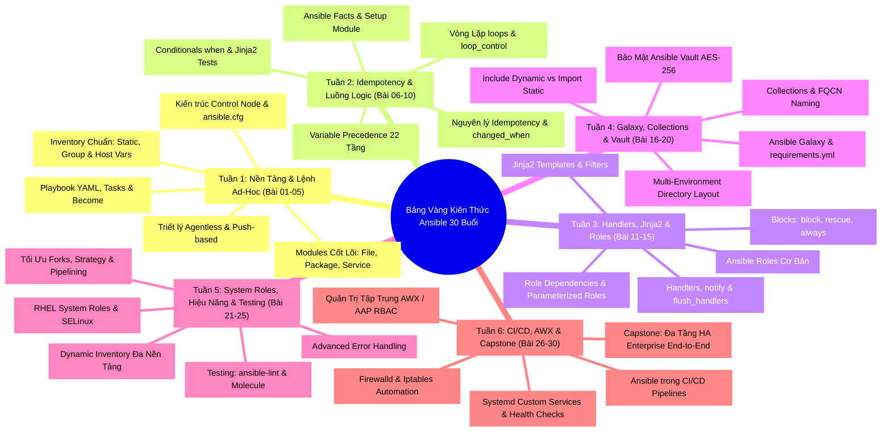


# [BÀI 31] TUYỂN TẬP 100+ CÂU HỎI PHỎNG VẤN ANSIBLE AUTOMATION & DEVOPS CHUYÊN SÂU (30 BUỔI)

Trong các buổi phỏng vấn kỹ thuật cho vị trí **Senior DevOps Engineer**, **Linux System Administrator Lead** hay **Enterprise Automation Specialist**, Ansible luôn là một trong những chủ đề trọng tâm chiếm thời lượng lớn nhất. Người phỏng vấn tại các tập đoàn công nghệ lớn (FAANG / Big Tech / Fintech Unicorns) sẽ không chỉ hỏi các câu hỏi lý thuyết cơ bản (như "Ansible là gì?" hay "Kể tên các module thường dùng"), mà họ sẽ đưa bạn vào những **tình huống sự cố nghẹt thở (Scenario-based & War-room Incidents)**:
- *Làm thế nào để xử lý khi một playbook chạy lần 2 vẫn trả về `changed` mà không rõ nguyên nhân?*
- *Giải thích bản chất tại sao việc lộ biến mật khẩu trong inventory có thể làm tê liệt toàn bộ hệ thống bảo mật doanh nghiệp?*
- *Làm thế nào để tối ưu tốc độ triển khai trên cụm 5,000 máy chủ với forks, pipelining và strategy free mà không làm nghẽn mạng?*

Để giúp bạn hoàn toàn làm chủ và tự tin tỏa sáng trước bất kỳ hội đồng tuyển dụng khó tính nào, bài viết này tổng hợp và phân tích **hơn 350 câu hỏi phỏng vấn chuyên sâu nhất**, đúc kết toàn bộ kiến thức từ **30 Chuyên Đề Tự Động Hóa Thực Chiến**.

---

## 1. Tổng Quan Kiến Trúc Đánh Giá & Ma Trận Phỏng Vấn Toàn Khóa

Hội đồng phỏng vấn kỹ thuật đánh giá ứng viên dựa trên **4 Tiêu Chí Cốt Lõi**:
1. **Bản chất Cơ Chế Tầng Thấp (Under-the-hood Mechanism):** Nắm rõ cơ chế SSH, Ansiballz payload, fork process, Jinja2 template rendering và cách Ansible tương tác với Linux OS kernel.
2. **Kỹ Năng Đối Soát Máy Thật (Real-World Target Verification):** Tuyệt đối không chỉ tin vào dòng chữ xanh trên terminal mà luôn dùng lệnh hệ thống (`systemctl`, `firewall-cmd`, `curl`, `docker exec`) để kiểm tra trạng thái máy đích.
3. **Nguyên Lý Bất Biến Tuyệt Đối (100% Idempotency Standard):** Mọi kịch bản Playbook ở lượt chạy Lần 2 bắt buộc phải đạt `changed=0`.
4. **Tư Duy Thiết Kế Kiến Trúc An Toàn (SecOps First & Modularity):** Tách biệt biến nhạy cảm qua Ansible Vault AES-256, tổ chức Roles phân tầng và xây dựng kịch bản kiểm thử tự động.

---

## 2. Bộ 30 Chuyên Đề Phỏng Vấn Kỹ Thuật Chuyên Sâu (Chuyên Đề 01 - 30)

### [Chuyên Đề 01] Tư Duy Configuration Management & Triết Lý Agentless Của Ansible: Push-Based vs Pull-Based & Idempotency

  

    Q01
    Push-based và agentless nghĩa là gì? Managed Node cần cài đặt những gì?
  

  

    

      <svg width="14" height="14" fill="none" stroke="currentColor" stroke-width="2" viewBox="0 0 24 24"><path d="M22 11.08V12a10 10 0 1 1-5.93-9.14"></path><polyline points="22 4 12 14.01 9 11.01"></polyline></svg>
      Phân Tích &amp; Lời Giải Kỹ Thuật
    

    Push: control node chủ động đẩy module qua SSH khi ta chạy. Agentless: máy đích <b style="color: var(--accent-primary);">không</b> cần agent Ansible, chỉ cần <b style="color: var(--accent-primary);">Python + sshd</b>. Kết nối do control node khởi tạo, chạy xong đóng.
    
<b style="color: var(--accent-cyan);">&bull; Tiêu chí chấm:</b> 0 sai &bull; 1 nói "không cần agent" mà không rõ &bull; 2 đúng push+agentless &bull; 3 kèm "máy đích chỉ cần Python+sshd" và ví dụ <code>ping</code>.

    
<b style="color: var(--accent-rose);">&bull; Câu hỏi đào sâu:</b> So với Puppet cổ điển? <i>(Puppet pull+agent, tự kéo theo chu kỳ.)</i>

  

  

    Q02
    Idempotency là gì trong Ansible và bằng chứng kỹ thuật cụ thể là gì?
  

  

    

      <svg width="14" height="14" fill="none" stroke="currentColor" stroke-width="2" viewBox="0 0 24 24"><path d="M22 11.08V12a10 10 0 1 1-5.93-9.14"></path><polyline points="22 4 12 14.01 9 11.01"></polyline></svg>
      Phân Tích &amp; Lời Giải Kỹ Thuật
    

    Chạy playbook lần hai trên máy đã đúng trạng thái <b style="color: var(--accent-primary);">không đổi gì</b>. Bằng chứng: <code>changed=0</code> ở PLAY RECAP lần hai. Mô tả <i>trạng thái muốn</i>, không phải <i>lệnh cần chạy</i>.
    
<b style="color: var(--accent-cyan);">&bull; Tiêu chí chấm:</b> 0 không biết &bull; 1 "chạy lại vẫn được" &bull; 2 nêu <code>changed=0</code> &bull; 3 kèm cách chứng minh (chạy hai lần) và vì sao nó là linh hồn CM.

    
<b style="color: var(--accent-rose);">&bull; Câu hỏi đào sâu:</b> Lần hai vẫn <code>changed</code> mà không ai đổi máy &mdash; nghi gì? <i>(Task <code>command</code>/<code>shell</code> không idempotent.)</i>

  

  

    Q03
    Vì sao các module command/shell không đảm bảo tính Idempotent và cách khắc phục?
  

  

    

      <svg width="14" height="14" fill="none" stroke="currentColor" stroke-width="2" viewBox="0 0 24 24"><path d="M22 11.08V12a10 10 0 1 1-5.93-9.14"></path><polyline points="22 4 12 14.01 9 11.01"></polyline></svg>
      Phân Tích &amp; Lời Giải Kỹ Thuật
    

    Chúng không có khái niệm trạng thái, chỉ chạy lệnh &rarr; luôn <code>changed</code>. Sửa: dùng module chuyên (idempotent), hoặc thêm <code>creates</code>/<code>removes</code>/<code>changed_when</code> để chặn chạy lại/định nghĩa "đổi".
    
<b style="color: var(--accent-cyan);">&bull; Tiêu chí chấm:</b> 0 không biết &bull; 1 "shell xấu" chung chung &bull; 2 đúng lý do &bull; 3 kèm <code>creates</code>/<code>changed_when</code> và ví dụ module chuyên thay thế.

    
<b style="color: var(--accent-rose);">&bull; Câu hỏi đào sâu:</b> Khi nào buộc phải dùng <code>shell</code>? <i>(Khi không có module chuyên; khi đó thêm creates/changed_when.)</i>

  

  

    Q04
    PLAY RECAP báo trạng thái xanh (ok/changed=0) có đảm bảo hệ thống đích đúng cấu hình không?
  

  

    

      <svg width="14" height="14" fill="none" stroke="currentColor" stroke-width="2" viewBox="0 0 24 24"><path d="M22 11.08V12a10 10 0 1 1-5.93-9.14"></path><polyline points="22 4 12 14.01 9 11.01"></polyline></svg>
      Phân Tích &amp; Lời Giải Kỹ Thuật
    

    Không. Recap chỉ tổng hợp cái <b style="color: var(--accent-primary);">module báo cáo</b> cho controller. <code>ignore_errors</code> giấu lỗi, <code>changed_when: false</code> che thay đổi, nhầm inventory chạy sai host &mdash; recap vẫn xanh. Kiểm máy đích: <code>docker exec ... systemctl is-active</code>.
    
<b style="color: var(--accent-cyan);">&bull; Tiêu chí chấm:</b> 0 "recap xanh là xong" (trần 1) &bull; 1 mơ hồ &bull; 2 nói recap không đủ &bull; 3 kèm &ge;2 ca xanh-mà-sai và lệnh kiểm máy đích.

    
<b style="color: var(--accent-rose);">&bull; Câu hỏi đào sâu:</b> Kiểm dịch vụ chạy thật bằng lệnh gì? <i>(<code>docker exec &lt;target&gt; systemctl is-active &lt;svc&gt;</code>.)</i>

  

  

    Q05
    Ba trường hợp điển hình khiến PLAY RECAP "xanh mà sai" trong thực tế là gì?
  

  

    

      <svg width="14" height="14" fill="none" stroke="currentColor" stroke-width="2" viewBox="0 0 24 24"><path d="M22 11.08V12a10 10 0 1 1-5.93-9.14"></path><polyline points="22 4 12 14.01 9 11.01"></polyline></svg>
      Phân Tích &amp; Lời Giải Kỹ Thuật
    

    <code>ignore_errors: true</code> (biến task đỏ thành tiếp tục), <code>changed_when: false</code> (ép luôn <code>ok</code>), nhầm inventory pattern (chạy đúng nhưng trên host khác cái ta tưởng).
    
<b style="color: var(--accent-cyan);">&bull; Tiêu chí chấm:</b> 0 không biết &bull; 1 một cách &bull; 2 hai cách &bull; 3 ba cách + hệ quả từng cái.

    
<b style="color: var(--accent-rose);">&bull; Câu hỏi đào sâu:</b> <code>ignore_errors</code> có bao giờ hợp lý không? <i>(Có &mdash; khi lỗi dự kiến và xử ở task sau; phải có chủ đích.)</i>

  

  

    Q06
    Inventory đóng vai trò gì và lệnh nào giúp kiểm tra danh sách máy đích trước khi chạy Playbook?
  

  

    

      <svg width="14" height="14" fill="none" stroke="currentColor" stroke-width="2" viewBox="0 0 24 24"><path d="M22 11.08V12a10 10 0 1 1-5.93-9.14"></path><polyline points="22 4 12 14.01 9 11.01"></polyline></svg>
      Phân Tích &amp; Lời Giải Kỹ Thuật
    

    Danh sách máy bị quản + nhóm + biến kết nối (host, user). Pattern (<code>all</code>, tên nhóm, <code>web:!db</code>) chọn tập host mỗi lần chạy. Kiểm: <code>ansible-inventory --graph</code>, <code>ansible &lt;pattern&gt; --list-hosts</code>.
    
<b style="color: var(--accent-cyan);">&bull; Tiêu chí chấm:</b> 0 không biết &bull; 1 "danh sách máy" &bull; 2 đủ + pattern &bull; 3 kèm lệnh kiểm và vì sao kiểm trước khi chạy task đổi trạng thái.

    
<b style="color: var(--accent-rose);">&bull; Câu hỏi đào sâu:</b> Vì sao kiểm <code>--list-hosts</code> trước? <i>(Tránh chạy nhầm máy &mdash; recap xanh trên sai host.)</i>

  

  

    Q07
    Lệnh Ad-hoc khác gì so với Playbook và khi nào nên sử dụng từng loại?
  

  

    

      <svg width="14" height="14" fill="none" stroke="currentColor" stroke-width="2" viewBox="0 0 24 24"><path d="M22 11.08V12a10 10 0 1 1-5.93-9.14"></path><polyline points="22 4 12 14.01 9 11.01"></polyline></svg>
      Phân Tích &amp; Lời Giải Kỹ Thuật
    

    Ad-hoc: một module một lần (<code>ansible &lt;pat&gt; -m &lt;mod&gt; -a "..."</code>), nhanh, không lưu, không version. Playbook: nhiều task, lặp lại được, đưa vào git. Việc &gt;1 lần hoặc cần review &rarr; playbook.
    
<b style="color: var(--accent-cyan);">&bull; Tiêu chí chấm:</b> 0 không biết &bull; 1 nêu tên &bull; 2 đúng khác biệt &bull; 3 kèm tiêu chí chọn và "mất vết" khi ad-hoc prod.

    
<b style="color: var(--accent-rose);">&bull; Câu hỏi đào sâu:</b> Ad-hoc có idempotent không? <i>(Có nếu dùng module idempotent &mdash; cùng module với playbook.)</i>

  

  

    Q08
    Ansible khác biệt như thế nào so với các công cụ Configuration Management như Puppet/Chef?
  

  

    

      <svg width="14" height="14" fill="none" stroke="currentColor" stroke-width="2" viewBox="0 0 24 24"><path d="M22 11.08V12a10 10 0 1 1-5.93-9.14"></path><polyline points="22 4 12 14.01 9 11.01"></polyline></svg>
      Phân Tích &amp; Lời Giải Kỹ Thuật
    

    Ansible push + agentless (chạy khi gọi, không agent); Puppet/Chef cổ điển pull + agent (tự kéo theo chu kỳ). Push: đơn giản, nhanh triển khai, kiểm soát thời điểm. Pull: hội tụ liên tục, tự sửa drift, mở rộng hạm đội lớn tốt hơn.
    
<b style="color: var(--accent-cyan);">&bull; Tiêu chí chấm:</b> 0 "giống nhau" &bull; 1 nói khác mà không rõ &bull; 2 đúng push/pull &bull; 3 kèm đánh đổi hai chiều.

    
<b style="color: var(--accent-rose);">&bull; Câu hỏi đào sâu:</b> Muốn Ansible hội tụ định kỳ thì sao? <i>(Lên lịch cron/AWX &mdash; Ansible không tự chạy nền.)</i>

  

  

    Q09
    Phân biệt vai trò của Ansible và Terraform trong quy trình triển khai hạ tầng chuẩn IaC?
  

  

    

      <svg width="14" height="14" fill="none" stroke="currentColor" stroke-width="2" viewBox="0 0 24 24"><path d="M22 11.08V12a10 10 0 1 1-5.93-9.14"></path><polyline points="22 4 12 14.01 9 11.01"></polyline></svg>
      Phân Tích &amp; Lời Giải Kỹ Thuật
    

    Ansible = configuration management (cấu hình bên trong máy đã có, không state tập trung); Terraform = provisioning (tạo/huỷ hạ tầng, có state, plan/diff). Ghép: Terraform dựng VM &rarr; xuất IP &rarr; Ansible dùng IP làm inventory cài phần mềm.
    
<b style="color: var(--accent-cyan);">&bull; Tiêu chí chấm:</b> 0 "giống nhau" &bull; 1 khác mà không rõ &bull; 2 đúng phân vai &bull; 3 kèm mẫu ghép cụ thể.

    
<b style="color: var(--accent-rose);">&bull; Câu hỏi đào sâu:</b> Dùng Terraform <code>provisioner</code> cài phần mềm có nên không? <i>(Không &mdash; chống thiết kế, không idempotent; dùng Ansible.)</i>

  

  

    Q10
    Lỗi UNREACHABLE trong Ansible xuất phát từ nguyên nhân nào và các bước chẩn đoán?
  

  

    

      <svg width="14" height="14" fill="none" stroke="currentColor" stroke-width="2" viewBox="0 0 24 24"><path d="M22 11.08V12a10 10 0 1 1-5.93-9.14"></path><polyline points="22 4 12 14.01 9 11.01"></polyline></svg>
      Phân Tích &amp; Lời Giải Kỹ Thuật
    

    Do <b style="color: var(--accent-primary);">SSH/inventory</b>: chưa trao key, sai <code>ansible_host</code>/user, host không tới được. KHÔNG phải do module hay logic playbook &mdash; module còn chưa chạy được vì chưa kết nối. Kiểm <code>ssh ansible@&lt;ip&gt; true</code>.
    
<b style="color: var(--accent-cyan);">&bull; Tiêu chí chấm:</b> 0 đổ lỗi module &bull; 1 "lỗi kết nối" &bull; 2 chỉ ra SSH/inventory &bull; 3 kèm bước chẩn đoán (<code>ssh ... true</code>, <code>--list-hosts</code>).

    
<b style="color: var(--accent-rose);">&bull; Câu hỏi đào sâu:</b> Khác <code>FAILED</code> chỗ nào? <i>(UNREACHABLE = không kết nối được; FAILED = kết nối được nhưng task lỗi.)</i>

  

  

    Q11
    Vì sao luôn khuyến nghị sử dụng tên đầy đủ FQCN (Fully Qualified Collection Name)?
  

  

    

      <svg width="14" height="14" fill="none" stroke="currentColor" stroke-width="2" viewBox="0 0 24 24"><path d="M22 11.08V12a10 10 0 1 1-5.93-9.14"></path><polyline points="22 4 12 14.01 9 11.01"></polyline></svg>
      Phân Tích &amp; Lời Giải Kỹ Thuật
    

    Nêu rõ module thuộc collection nào, tránh nhầm khi tên trùng giữa các collection, và ổn định khi bản đổi (nhiều module đã rời <code>ansible.builtin</code> sang collection riêng). Rõ ràng, dễ bảo trì.
    
<b style="color: var(--accent-cyan);">&bull; Tiêu chí chấm:</b> 0 không biết &bull; 1 "tên đầy đủ" &bull; 2 đúng lý do &bull; 3 kèm ví dụ nhầm tên và bối cảnh module rời collection.

    
<b style="color: var(--accent-rose);">&bull; Câu hỏi đào sâu:</b> <code>ansible-doc -l</code> dùng làm gì? <i>(Liệt kê module có sẵn để tra FQCN đúng.)</i>

  

  

    Q12
    Tóm tắt quy trình kiểm thử nghiệm thu 3 tầng để đảm bảo tính Idempotency và trạng thái thực tế?
  

  

    

      <svg width="14" height="14" fill="none" stroke="currentColor" stroke-width="2" viewBox="0 0 24 24"><path d="M22 11.08V12a10 10 0 1 1-5.93-9.14"></path><polyline points="22 4 12 14.01 9 11.01"></polyline></svg>
      Phân Tích &amp; Lời Giải Kỹ Thuật
    

    Dựng inventory &rarr; <code>ping</code> (SUCCESS) &rarr; viết <code>site.yml</code> module chuyên &rarr; chạy (recap <code>failed=0</code>) &rarr; <b style="color: var(--accent-primary);">kiểm thật</b> <code>docker exec systemctl is-active</code> &rarr; chạy <b style="color: var(--accent-primary);">lần hai</b> (<code>changed=0</code>, idempotent) &rarr; (bẫy) thấy <code>shell</code> không idempotent &rarr; sửa bằng <code>creates</code> &rarr; thấy <code>ignore_errors</code> giấu lỗi. Ba chỗ kiểm thật: sau chạy lần một, sau lần hai, và sau khi sửa task shell.
    
<b style="color: var(--accent-cyan);">&bull; Tiêu chí chấm:</b> 0 kể thiếu &bull; 1 chỉ chạy một lần &bull; 2 đủ vòng đời &bull; 3 đủ + ba điểm kiểm thật + bài học ignore_errors.

    
<b style="color: var(--accent-rose);">&bull; Câu hỏi đào sâu:</b> Nếu recap <code>failed=0</code> mà dịch vụ inactive thì kết luận gì? <i>(Không tin recap; có thể <code>ignore_errors</code>/nhầm host &mdash; kiểm máy đích.)</i>

  

---

### [Chuyên Đề 02] Kiến Trúc Ansible & Lệnh Ad-Hoc: Control Node, Managed Nodes, SSH Authentication & Thực Thi Module Tức Thì

  

    Q01
    Trình bày chi tiết thứ tự ưu tiên 4 tầng khi Ansible tìm kiếm file cấu hình ansible.cfg. Làm sao biết hệ thống đang dùng file nào?
  

  

    

      <svg width="14" height="14" fill="none" stroke="currentColor" stroke-width="2" viewBox="0 0 24 24"><path d="M22 11.08V12a10 10 0 1 1-5.93-9.14"></path><polyline points="22 4 12 14.01 9 11.01"></polyline></svg>
      Phân Tích &amp; Lời Giải Kỹ Thuật
    

    Ansible tìm kiếm theo thứ tự ưu tiên giảm dần: (1) Biến môi trường <code>ANSIBLE_CONFIG</code>, (2) File <code>./ansible.cfg</code> tại thư mục hiện tại, (3) File ẩn <code>~/.ansible.cfg</code> tại thư mục cá nhân người dùng, (4) File cấu hình mặc định hệ thống <code>/etc/ansible/ansible.cfg</code>. Để biết chính xác file đang được áp dụng, chạy lệnh <code>ansible --version</code> và quan sát dòng <code>config file = ...</code>.
    
<b style="color: var(--accent-cyan);">&bull; Tiêu chí chấm:</b> 0 không nêu được &bull; 1 nhớ 2-3 tầng sai thứ tự &bull; 2 đúng 4 tầng &bull; 3 đúng 4 tầng + nêu lệnh <code>ansible --version</code> và bẫy <code>chmod 777</code>.

    
<b style="color: var(--accent-rose);">&bull; Câu hỏi đào sâu:</b> Nếu file <code>./ansible.cfg</code> bị gán quyền <code>chmod 777</code>, Ansible sẽ xử lý thế nào? <i>(Bỏ qua file đó vì lý do an toàn bảo mật và tự động lùi về dùng file tầng thấp hơn.)</i>

  

  

    Q02
    Tại sao Ansible không cần cài agent trên máy đích nhưng vẫn quản trị được? Việc gán host_key_checking = False có tác dụng gì?
  

  

    

      <svg width="14" height="14" fill="none" stroke="currentColor" stroke-width="2" viewBox="0 0 24 24"><path d="M22 11.08V12a10 10 0 1 1-5.93-9.14"></path><polyline points="22 4 12 14.01 9 11.01"></polyline></svg>
      Phân Tích &amp; Lời Giải Kỹ Thuật
    

    Ansible là công cụ agentless, sử dụng giao thức SSH tiêu chuẩn để kết nối và tự động đẩy các module Python ngắn hạn lên máy đích thực thi, sau đó dọn dẹp file tạm. Máy đích chỉ cần dịch vụ <code>sshd</code> và môi trường Python 3. Cờ <code>host_key_checking = False</code> trong <code>ansible.cfg</code> giúp bỏ qua bước xác nhận Fingerprint SSH thủ công (gõ <code>yes</code>), giúp các kịch bản tự động hóa hoặc kịch bản thử nghiệm lab chạy mượt mà không bị treo vô hạn.
    
<b style="color: var(--accent-cyan);">&bull; Tiêu chí chấm:</b> 0 trả lời có agent ngầm &bull; 1 nêu SSH nhưng thiếu Python &bull; 2 đủ SSH + Python + host_key_checking &bull; 3 đủ + phân tích rủi ro bảo mật trên production.

    
<b style="color: var(--accent-rose);">&bull; Câu hỏi đào sâu:</b> Nếu máy đích là Linux minimal thiếu Python 3, lệnh ad-hoc <code>ping</code> có chạy được không? <i>(Không, phải dùng module <code>ansible.builtin.raw</code> để cài Python 3 trước.)</i>

  

  

    Q03
    Cơ chế become trong Ansible hoạt động thế nào? Sự khác biệt giữa remote_user và become_user là gì?
  

  

    

      <svg width="14" height="14" fill="none" stroke="currentColor" stroke-width="2" viewBox="0 0 24 24"><path d="M22 11.08V12a10 10 0 1 1-5.93-9.14"></path><polyline points="22 4 12 14.01 9 11.01"></polyline></svg>
      Phân Tích &amp; Lời Giải Kỹ Thuật
    

    Cơ chế <code>become</code> cho phép Ansible thực hiện privilege escalation (nâng quyền) trên target node, mặc định sử dụng công cụ <code>sudo</code>. <code>remote_user</code> là tài khoản dùng để thiết lập kết nối SSH ban đầu từ Control node sang Target node (ví dụ: <code>ansible</code>), còn <code>become_user</code> là tài khoản mà lệnh đó sẽ leo quyền tới trên máy đích để thực thi tác vụ (mặc định là <code>root</code>).
    
<b style="color: var(--accent-cyan);">&bull; Tiêu chí chấm:</b> 0 nhầm become là SSH password &bull; 1 biết là sudo nhưng không phân biệt user &bull; 2 phân biệt đúng &bull; 3 nêu đủ + cấu hình ansible.cfg và sudoers.

    
<b style="color: var(--accent-rose);">&bull; Câu hỏi đào sâu:</b> Muốn chạy lệnh ad-hoc leo quyền root không bị hỏi password sudo thì cần cấu hình gì? <i>(Cấu hình <code>NOPASSWD: ALL</code> trong <code>/etc/sudoers.d/ansible</code>.)</i>

  

  

    Q04
    Phân tích cú pháp tiêu chuẩn của một lệnh ad-hoc Ansible. Khi nào nên dùng lệnh ad-hoc thay vì viết Playbook?
  

  

    

      <svg width="14" height="14" fill="none" stroke="currentColor" stroke-width="2" viewBox="0 0 24 24"><path d="M22 11.08V12a10 10 0 1 1-5.93-9.14"></path><polyline points="22 4 12 14.01 9 11.01"></polyline></svg>
      Phân Tích &amp; Lời Giải Kỹ Thuật
    

    Cú pháp tiêu chuẩn: <code>ansible &lt;pattern&gt; -m &lt;module&gt; -a "&lt;arguments&gt;" [options]</code>. Lệnh ad-hoc nên được sử dụng cho các công việc quản trị một lần (one-off tasks), nhanh chóng, mang tính kiểm tra/truy vấn (ví dụ: reboot nhóm máy, kiểm tra dung lượng đĩa, cập nhật bản vá khẩn cấp). Khi công việc gồm chuỗi nhiều bước phức tạp có phụ thuộc lẫn nhau, bắt buộc phải dùng Playbook.
    
<b style="color: var(--accent-cyan);">&bull; Tiêu chí chấm:</b> 0 sai cú pháp &bull; 1 đúng cú pháp thiếu ngữ cảnh &bull; 2 so sánh chuẩn &bull; 3 nêu đúng + ví dụ thực tế.

    
<b style="color: var(--accent-rose);">&bull; Câu hỏi đào sâu:</b> Nếu không truyền tham số <code>-m</code>, Ansible sử dụng module mặc định nào? <i>(Module <code>ansible.builtin.command</code>.)</i>

  

  

    Q05
    Q05
    Module ansible.builtin.ping khác gì với câu lệnh ping truyền thống của hệ điều hành?
  

  

    

      <svg width="14" height="14" fill="none" stroke="currentColor" stroke-width="2" viewBox="0 0 24 24"><path d="M22 11.08V12a10 10 0 1 1-5.93-9.14"></path><polyline points="22 4 12 14.01 9 11.01"></polyline></svg>
      Phân Tích &amp; Lời Giải Kỹ Thuật
    

    Lệnh <code>ping</code> của hệ điều hành sử dụng giao thức ICMP để kiểm tra thông mạng ở tầng network. Module <code>ansible.builtin.ping</code> của Ansible thực hiện một chuỗi thao tác thực tế: mở kết nối SSH, xác thực tài khoản, đẩy một đoạn mã Python nhỏ lên máy đích, thực thi mã Python đó và nhận phản hồi <code>pong</code>. Do đó, <code>ansible ping</code> thành công chứng minh toàn bộ chuỗi SSH + Python + Quyền thi hành đã sẵn sàng.
    
<b style="color: var(--accent-cyan);">&bull; Tiêu chí chấm:</b> 0 coi hai lệnh là một &bull; 1 biết dùng SSH thiếu Python &bull; 2 phân biệt chuẩn &bull; 3 phân biệt chuẩn + tình huống ICMP thông nhưng Ansible ping lỗi.

    
<b style="color: var(--accent-rose);">&bull; Câu hỏi đào sâu:</b> Nếu target host chặn hoàn toàn giao thức ICMP, lệnh <code>ansible all -m ping</code> có chạy thành công không? <i>(Vẫn thành công bình thường vì Ansible dùng SSH port 22 chứ không dùng ICMP.)</i>

  

  

    Q06
    So sánh bản chất và trường hợp sử dụng của 3 module: command, shell, và raw.
  

  

    

      <svg width="14" height="14" fill="none" stroke="currentColor" stroke-width="2" viewBox="0 0 24 24"><path d="M22 11.08V12a10 10 0 1 1-5.93-9.14"></path><polyline points="22 4 12 14.01 9 11.01"></polyline></svg>
      Phân Tích &amp; Lời Giải Kỹ Thuật
    

    <code>command</code> chạy trực tiếp file thực thi không qua shell (an toàn, không hỗ trợ pipe <code>|</code>, redirect <code>&gt;</code>). <code>shell</code> thực thi câu lệnh thông qua <code>/bin/sh</code> trên máy đích (hỗ trợ đầy đủ pipe, redirect, biến môi trường shell). <code>raw</code> gửi câu lệnh SSH thô trực tiếp mà không cần sự tồn tại của Python trên máy đích (dùng bootstrap cài Python). Cả 3 module này đều luôn báo <code>CHANGED</code> và không idempotent tự nhiên.
    
<b style="color: var(--accent-cyan);">&bull; Tiêu chí chấm:</b> 0 không phân biệt được &bull; 1 nêu được pipe &bull; 2 phân biệt đúng 3 module &bull; 3 giải thích rủi ro Shell Injection &amp; tính Idempotency.

    
<b style="color: var(--accent-rose);">&bull; Câu hỏi đào sâu:</b> Tại sao Ansible khuyến cáo nên hạn chế tối đa việc dùng <code>shell</code> trong tự động hóa? <i>(Vì không có tính bất biến, dễ gây side-effects khi chạy lại và có rủi ro Shell Injection.)</i>

  

  

    Q07
    Tại sao nên dùng module ansible.builtin.package thay vì gọi lệnh apt hay dnf qua ad-hoc shell?
  

  

    

      <svg width="14" height="14" fill="none" stroke="currentColor" stroke-width="2" viewBox="0 0 24 24"><path d="M22 11.08V12a10 10 0 1 1-5.93-9.14"></path><polyline points="22 4 12 14.01 9 11.01"></polyline></svg>
      Phân Tích &amp; Lời Giải Kỹ Thuật
    

    Module <code>package</code> là module trừu tượng hóa (abstraction module). Nó tự động phát hiện trình quản lý gói của hệ điều hành đích (RHEL dùng <code>dnf</code>, Ubuntu dùng <code>apt</code>). Quan trọng nhất, <code>package</code> kiểm tra trạng thái gói trước khi thực hiện. Nếu gói đã được cài đúng <code>state=present</code>, module sẽ giữ nguyên và báo <code>changed=false</code> (idempotent), trong khi gọi lệnh shell <code>apt-get install</code> sẽ luôn làm thay đổi hệ thống và báo <code>CHANGED</code>.
    
<b style="color: var(--accent-cyan);">&bull; Tiêu chí chấm:</b> 0 coi như nhau &bull; 1 nêu tính đa nền tảng thiếu Idempotency &bull; 2 nêu đủ cả hai &bull; 3 nêu đủ + minh họa output changed=false lần 2.

    
<b style="color: var(--accent-rose);">&bull; Câu hỏi đào sâu:</b> Tham số <code>state=latest</code> khác <code>state=present</code> ở điểm nào? <i>(<code>present</code> chỉ cần gói đã cài là dừng, <code>latest</code> sẽ nâng cấp gói lên bản mới nhất nếu có.)</i>

  

  

    Q08
    Khi dùng ad-hoc module ansible.builtin.service, làm sao để đảm bảo dịch vụ vừa được khởi chạy vừa tự động bật khi reboot máy?
  

  

    

      <svg width="14" height="14" fill="none" stroke="currentColor" stroke-width="2" viewBox="0 0 24 24"><path d="M22 11.08V12a10 10 0 1 1-5.93-9.14"></path><polyline points="22 4 12 14.01 9 11.01"></polyline></svg>
      Phân Tích &amp; Lời Giải Kỹ Thuật
    

    Truyền đồng thời hai tham số trong thuộc tính <code>-a</code>: <code>state=started</code> (để đảm bảo dịch vụ đang chạy ở thời điểm hiện tại) và <code>enabled=yes</code> (để cấu hình init system/systemd tự động kích hoạt dịch vụ cùng hệ thống khi khởi động).
    
<b style="color: var(--accent-cyan);">&bull; Tiêu chí chấm:</b> 0 không biết tham số &bull; 1 nhớ state=started quên enabled &bull; 2 nêu đúng cả hai &bull; 3 nêu đúng + lệnh đối soát docker exec.

    
<b style="color: var(--accent-rose);">&bull; Câu hỏi đào sâu:</b> Nếu dịch vụ đã chạy và đã <code>enabled=yes</code>, khi gõ lại lệnh ad-hoc đó Ansible trả về kết quả gì? <i>(Trả về <code>SUCCESS</code> với <code>changed=false</code> do đã đạt đúng trạng thái.)</i>

  

  

    Q09
    Làm thế nào để tạo một tài khoản người dùng appuser kèm file cấu hình riêng bằng ad-hoc module mà không làm đứt gãy hệ thống khi chạy lại?
  

  

    

      <svg width="14" height="14" fill="none" stroke="currentColor" stroke-width="2" viewBox="0 0 24 24"><path d="M22 11.08V12a10 10 0 1 1-5.93-9.14"></path><polyline points="22 4 12 14.01 9 11.01"></polyline></svg>
      Phân Tích &amp; Lời Giải Kỹ Thuật
    

    Sử dụng module <code>ansible.builtin.user</code> với tham số <code>name=appuser state=present</code> để tạo user, sau đó dùng module <code>ansible.builtin.copy</code> với <code>content='...' dest=/etc/app.conf mode='0644'</code>. Cả hai module này đều tự động kiểm tra dữ liệu cũ trên máy đích, nếu thông tin đã trùng khớp sẽ không tạo lại hay ghi đè lãng phí, đảm bảo tính Idempotency.
    
<b style="color: var(--accent-cyan);">&bull; Tiêu chí chấm:</b> 0 trả lời dùng useradd qua shell &bull; 1 biết module thiếu mode &bull; 2 nêu đúng &bull; 3 nêu đúng + cơ chế so sánh md5 hash của copy.

    
<b style="color: var(--accent-rose);">&bull; Câu hỏi đào sâu:</b> Nếu file <code>/etc/app.conf</code> đã tồn tại với nội dung giống hệt, Ansible sẽ làm gì? <i>(Ansible so sánh hash mã hóa, thấy trùng khớp nên bỏ qua không ghi đè và báo <code>changed=false</code>.)</i>

  

  

    Q10
    Làm sao để chứng minh một tác vụ ad-hoc đạt chuẩn Idempotency và máy đích đang ở đúng trạng thái mong muốn?
  

  

    

      <svg width="14" height="14" fill="none" stroke="currentColor" stroke-width="2" viewBox="0 0 24 24"><path d="M22 11.08V12a10 10 0 1 1-5.93-9.14"></path><polyline points="22 4 12 14.01 9 11.01"></polyline></svg>
      Phân Tích &amp; Lời Giải Kỹ Thuật
    

    (1) Thực hiện chạy câu lệnh ad-hoc lần thứ nhất để áp đặt thay đổi (<code>changed=true</code>). (2) Thực hiện chạy chính xác câu lệnh ad-hoc đó lần thứ hai: nếu kết quả trả về <code>changed=false</code> thì tác vụ đạt tính Idempotency. (3) Dùng lệnh kiểm tra độc lập trực tiếp trên máy đích (truy vấn qua SSH hoặc <code>docker exec target1 systemctl is-active &lt;service&gt;</code> / <code>dpkg -l &lt;package&gt;</code>) để xác minh sự thật khách quan, tuyệt đối không phụ thuộc duy nhất vào báo cáo terminal của Control node.
    
<b style="color: var(--accent-cyan);">&bull; Tiêu chí chấm:</b> 0 chỉ nhìn màu xanh terminal (trần 1) &bull; 1 chạy lần 2 quên kiểm máy đích &bull; 2 đủ 2 bước &bull; 3 xuất sắc cả 3 bước kèm lệnh đối soát.

    
<b style="color: var(--accent-rose);">&bull; Câu hỏi đào sâu:</b> Tại sao báo cáo SUCCESS trên Control node đôi khi lại nói dối? <i>(Do <code>ignore_errors</code>, <code>changed_when: false</code>, hoặc nhầm host pattern trong inventory.)</i>

  

  

    Q11
    Cờ --check và --diff trong lệnh ad-hoc Ansible có vai trò gì trong quy trình vận hành an toàn trên Production?
  

  

    

      <svg width="14" height="14" fill="none" stroke="currentColor" stroke-width="2" viewBox="0 0 24 24"><path d="M22 11.08V12a10 10 0 1 1-5.93-9.14"></path><polyline points="22 4 12 14.01 9 11.01"></polyline></svg>
      Phân Tích &amp; Lời Giải Kỹ Thuật
    

    Cờ <code>--check</code> kích hoạt chế độ Dry-run (chạy thử nghiệm), Ansible sẽ mô phỏng quá trình thực thi lệnh ad-hoc và dự báo những thay đổi sẽ xảy ra mà không thực sự áp đặt bất kỳ thay đổi nào lên máy đích. Cờ <code>--diff</code> hiển thị chi tiết sự khác biệt dòng-theo-dòng (line-by-line diff) giữa cấu hình cũ và cấu hình mới. Kết hợp <code>--check --diff</code> giúp quản trị viên rà soát rủi ro trước khi áp dụng thật lên Production.
    
<b style="color: var(--accent-cyan);">&bull; Tiêu chí chấm:</b> 0 không biết &bull; 1 biết check thiếu diff &bull; 2 nêu đúng cả hai &bull; 3 nêu đúng + lưu ý module custom không hỗ trợ check mode.

    
<b style="color: var(--accent-rose);">&bull; Câu hỏi đào sâu:</b> Nếu chạy ad-hoc với cờ <code>--check</code> lên một gói chưa cài, Ansible báo gì? <i>(Báo <code>CHANGED</code> để dự báo gói SẼ được cài, nhưng thực tế đĩa cứng chưa bị ghi.)</i>

  

  

    Q12
    Trong một kịch bản ad-hoc tác động đến hạ tầng hàng ngàn máy chủ, làm thế nào để bó hẹp phạm vi thực thi thử nghiệm trên duy nhất 1 máy chủ trước khi nhân rộng?
  

  

    

      <svg width="14" height="14" fill="none" stroke="currentColor" stroke-width="2" viewBox="0 0 24 24"><path d="M22 11.08V12a10 10 0 1 1-5.93-9.14"></path><polyline points="22 4 12 14.01 9 11.01"></polyline></svg>
      Phân Tích &amp; Lời Giải Kỹ Thuật
    

    Sử dụng cờ <code>--limit &lt;host_pattern&gt;</code> trong câu lệnh ad-hoc (ví dụ: <code>ansible web --limit target1 -m package -a "name=curl state=present"</code>). Cờ <code>--limit</code> sẽ lọc danh sách máy đích rút gọn từ inventory gốc, đảm bảo lệnh ad-hoc chỉ tác động duy nhất lên <code>target1</code>.
    
<b style="color: var(--accent-cyan);">&bull; Tiêu chí chấm:</b> 0 tạo inventory mới &bull; 1 nhớ limit sai cú pháp &bull; 2 nêu đúng &bull; 3 nêu đúng + các pattern lọc nâng cao (<code>web:!db</code>, <code>all[0]</code>).

    
<b style="color: var(--accent-rose);">&bull; Câu hỏi đào sâu:</b> Pattern <code>web:!db</code> có ý nghĩa gì? <i>(Thực thi trên tất cả máy thuộc nhóm <code>web</code> ngoại trừ các máy đồng thời nằm trong nhóm <code>db</code>.)</i>

  

---

### [Chuyên Đề 03] Thiết Kế Inventory Chuẩn Enterprise: Static vs Dynamic Inventory, Host Groups, Group Vars & Host Vars

  

    Q01
    Inventory trong Ansible có vai trò gì? Hai nhóm mặc định nào luôn tự động tồn tại trong mọi Inventory?
  

  

    

      <svg width="14" height="14" fill="none" stroke="currentColor" stroke-width="2" viewBox="0 0 24 24"><path d="M22 11.08V12a10 10 0 1 1-5.93-9.14"></path><polyline points="22 4 12 14.01 9 11.01"></polyline></svg>
      Phân Tích &amp; Lời Giải Kỹ Thuật
    

    Inventory là nguồn chân lý chứa danh sách các máy chủ bị quản lý, thông tin phân nhóm và các biến kết nối tương ứng. Hai nhóm mặc định luôn tồn tại trong mọi Inventory là: (1) <code>all</code>: chứa tất cả các máy chủ có trong inventory; (2) <code>ungrouped</code>: chứa các máy chủ không thuộc bất kỳ nhóm tùy chỉnh nào.
    
<b style="color: var(--accent-cyan);">&bull; Tiêu chí chấm:</b> 0 không nêu được &bull; 1 nhớ all quên ungrouped &bull; 2 nêu đúng cả hai &bull; 3 nêu đúng + vai trò trong nạp biến toàn cục <code>group_vars/all.yml</code>.

    
<b style="color: var(--accent-rose);">&bull; Câu hỏi đào sâu:</b> Nếu một máy chủ nằm trong nhóm <code>web</code>, máy chủ đó có đồng thời thuộc nhóm <code>all</code> không? <i>(Có, 100% mọi host đều thuộc nhóm <code>all</code>.)</i>

  

  

    Q02
    Cấu trúc nhóm lồng nhóm (Child groups / Group nesting) được khai báo thế nào trong định dạng INI và YAML? Lợi ích là gì?
  

  

    

      <svg width="14" height="14" fill="none" stroke="currentColor" stroke-width="2" viewBox="0 0 24 24"><path d="M22 11.08V12a10 10 0 1 1-5.93-9.14"></path><polyline points="22 4 12 14.01 9 11.01"></polyline></svg>
      Phân Tích &amp; Lời Giải Kỹ Thuật
    

    Trong INI, dùng cú pháp <code>[parent_name:children]</code> rồi liệt kê danh sách các nhóm con bên dưới. Trong YAML, dùng từ khóa <code>children:</code> bên dưới tên nhóm cha. Lợi ích: Cho phép quản lý phân cấp hạ tầng (ví dụ: nhóm cha <code>vietnam</code> chứa các nhóm con <code>hanoi</code> và <code>hcm</code>), giúp áp dụng biến chung hoặc thực thi lệnh trên quy mô vùng miền dễ dàng mà không cần gõ lại tên từng host.
    
<b style="color: var(--accent-cyan);">&bull; Tiêu chí chấm:</b> 0 không biết &bull; 1 nhớ children nhầm INI/YAML &bull; 2 nêu đúng cả hai &bull; 3 nêu đúng + minh họa lệnh <code>ansible-inventory --graph</code>.

    
<b style="color: var(--accent-rose);">&bull; Câu hỏi đào sâu:</b> Nếu gõ nhầm <code>[parent_name]</code> mà quên chữ <code>:children</code> trong file INI thì Ansible sẽ hiểu thế nào? <i>(Ansible hiểu các dòng bên dưới là tên máy chủ tĩnh chứ không phải tên nhóm con.)</i>

  

  

    Q03
    Tại sao nên tách biến ra thư mục group_vars/ và host_vars/ thay vì viết trực tiếp vào file Inventory tĩnh?
  

  

    

      <svg width="14" height="14" fill="none" stroke="currentColor" stroke-width="2" viewBox="0 0 24 24"><path d="M22 11.08V12a10 10 0 1 1-5.93-9.14"></path><polyline points="22 4 12 14.01 9 11.01"></polyline></svg>
      Phân Tích &amp; Lời Giải Kỹ Thuật
    

    Việc đặt biến trực tiếp trong file Inventory khiến file phình to, rối mắt và rất khó bảo trì khi hạ tầng tăng trưởng. Tách thành thư mục <code>group_vars/</code> (file trùng tên nhóm, ví dụ <code>web.yml</code>) và <code>host_vars/</code> (file trùng tên host, ví dụ <code>target1.yml</code>) giúp chuẩn hóa cấu trúc dự án, dễ đọc, dễ bảo trì và thuận tiện cho việc quản lý mã nguồn qua Git.
    
<b style="color: var(--accent-cyan);">&bull; Tiêu chí chấm:</b> 0 cho rằng như nhau &bull; 1 biết tách tốt thiếu tên file &bull; 2 nêu đúng thư mục và quy tắc đặt tên &bull; 3 nêu đúng + cơ chế auto-load của Ansible.

    
<b style="color: var(--accent-rose);">&bull; Câu hỏi đào sâu:</b> Nếu thư mục đặt tên là <code>groups_vars</code> (thừa chữ s) thì Ansible có nạp biến được không? <i>(Không, Ansible chỉ tìm đúng tên thư mục chuẩn là <code>group_vars</code>.)</i>

  

  

    Q04
    Trình bày quy tắc ưu tiên biến khi một biến app_port được định nghĩa ở cả group_vars/all.yml, group_vars/web.yml và host_vars/target1.yml.
  

  

    

      <svg width="14" height="14" fill="none" stroke="currentColor" stroke-width="2" viewBox="0 0 24 24"><path d="M22 11.08V12a10 10 0 1 1-5.93-9.14"></path><polyline points="22 4 12 14.01 9 11.01"></polyline></svg>
      Phân Tích &amp; Lời Giải Kỹ Thuật
    

    Thứ tự ưu tiên tăng dần từ phạm vi rộng tới hẹp: <code>group_vars/all.yml</code> (thấp nhất) &lt; <code>group_vars/web.yml</code> (nhóm con) &lt; <code>host_vars/target1.yml</code> (cao nhất). Do đó, giá trị <code>app_port</code> khai báo tại <code>host_vars/target1.yml</code> sẽ chiến thắng và được áp dụng cho <code>target1</code>.
    
<b style="color: var(--accent-cyan);">&bull; Tiêu chí chấm:</b> 0 sai thứ tự &bull; 1 nhầm lẫn all và web &bull; 2 nêu đúng 3 tầng &bull; 3 nêu đúng + lệnh <code>ansible-inventory --host target1</code>.

    
<b style="color: var(--accent-rose);">&bull; Câu hỏi đào sâu:</b> Làm sao để định nghĩa biến mặc định cho toàn bộ tất cả các host trong hệ thống mà vẫn cho phép từng host override? <i>(Khai báo biến mặc định trong <code>group_vars/all.yml</code> và ghi đè khi cần trong <code>host_vars/</code>.)</i>

  

  

    Q05
    Phân biệt các toán tử Host Pattern: Dấu phẩy ',', Dấu và '&amp;', và Dấu chấm cảm '!'. Cho ví dụ.
  

  

    

      <svg width="14" height="14" fill="none" stroke="currentColor" stroke-width="2" viewBox="0 0 24 24"><path d="M22 11.08V12a10 10 0 1 1-5.93-9.14"></path><polyline points="22 4 12 14.01 9 11.01"></polyline></svg>
      Phân Tích &amp; Lời Giải Kỹ Thuật
    

    • Dấu phẩy <code>,</code> (hoặc <code>:</code>): Phép HỢP (UNION) — lấy tất cả máy thuộc nhóm 1 HOẶC nhóm 2 (ví dụ: <code>web,db</code>). 
    • Dấu và <code>&amp;</code>: Phép GIAO (INTERSECTION) — lấy các máy VỪA thuộc nhóm 1 VỪA thuộc nhóm 2 (ví dụ: <code>web:&amp;prod</code>). 
    • Dấu chấm cảm <code>!</code>: Phép LOẠI TRỪ (EXCLUSION) — lấy các máy thuộc nhóm 1 NHƯNG KHÔNG thuộc nhóm 2 (ví dụ: <code>web:!db</code>).
    
<b style="color: var(--accent-cyan);">&bull; Tiêu chí chấm:</b> 0 không biết &bull; 1 nhớ dấu nhầm phép toán &bull; 2 giải thích đúng cả 3 &bull; 3 giải thích đúng + cảnh báo bẫy Bash History Expansion.

    
<b style="color: var(--accent-rose);">&bull; Câu hỏi đào sâu:</b> Tại sao gõ <code>ansible web:!db --list-hosts</code> trực tiếp trên terminal Bash lại bị báo lỗi <code>bash: !db: event not found</code>? <i>(Do Bash hiểu nhầm dấu <code>!</code> là lệnh history expansion, phải bọc pattern trong cặp ngoặc đơn <code>'web:!db'</code>.)</i>

  

  

    Q06
    Hai câu lệnh CLI nào là công cụ quan trọng nhất để rà soát Inventory và Host Pattern trước khi chạy Playbook?
  

  

    

      <svg width="14" height="14" fill="none" stroke="currentColor" stroke-width="2" viewBox="0 0 24 24"><path d="M22 11.08V12a10 10 0 1 1-5.93-9.14"></path><polyline points="22 4 12 14.01 9 11.01"></polyline></svg>
      Phân Tích &amp; Lời Giải Kỹ Thuật
    

    1. <code>ansible-inventory --graph</code>: Dùng để xem sơ đồ cây phân cấp kiểm kê tài nguyên toàn bộ hệ thống. 
    2. <code>ansible &lt;pattern&gt; --list-hosts</code>: Dùng để in ra danh sách tên/IP của các máy đích thực tế sẽ bị tác động bởi biểu thức pattern cụ thể.
    
<b style="color: var(--accent-cyan);">&bull; Tiêu chí chấm:</b> 0 không biết &bull; 1 nhớ 1 lệnh &bull; 2 nêu đúng cả 2 lệnh &bull; 3 nêu đúng + quy trình an toàn trên Production.

    
<b style="color: var(--accent-rose);">&bull; Câu hỏi đào sâu:</b> Nếu cờ <code>--list-hosts</code> trả về <code>hosts (0):</code>, điều đó có nghĩa là gì? <i>(Có nghĩa là biểu thức pattern không khớp với bất kỳ máy chủ nào trong inventory.)</i>

  

  

    Q07
    Kể tên các biến kết nối hệ thống thường dùng trong Inventory và giải thích công dụng của chúng.
  

  

    

      <svg width="14" height="14" fill="none" stroke="currentColor" stroke-width="2" viewBox="0 0 24 24"><path d="M22 11.08V12a10 10 0 1 1-5.93-9.14"></path><polyline points="22 4 12 14.01 9 11.01"></polyline></svg>
      Phân Tích &amp; Lời Giải Kỹ Thuật
    

    • <code>ansible_host</code>: Địa chỉ IP hoặc FQDN thực tế dùng để kết nối SSH. 
    • <code>ansible_port</code>: Cổng kết nối SSH thực tế trên máy đích (khi không dùng port 22 mặc định). 
    • <code>ansible_user</code>: Tài khoản người dùng dùng để đăng nhập SSH vào máy đích. 
    • <code>ansible_ssh_private_key_file</code>: Đường dẫn tới chìa khóa SSH private key riêng.
    
<b style="color: var(--accent-cyan);">&bull; Tiêu chí chấm:</b> 0 không kể được &bull; 1 kể 1-2 biến &bull; 2 nêu đúng 3-4 biến &bull; 3 nêu đúng + ví dụ cấu hình container port 2221/2222.

    
<b style="color: var(--accent-rose);">&bull; Câu hỏi đào sâu:</b> Nếu máy đích đổi cổng SSH sang 2222, ta cần khai báo biến nào trong inventory? <i>(Khai báo <code>ansible_port=2222</code>.)</i>

  

  

    Q08
    Trình bày phương pháp tổ chức Inventory để quản lý đa môi trường (Development, Staging, Production) mà không cần sửa đổi Playbook.
  

  

    

      <svg width="14" height="14" fill="none" stroke="currentColor" stroke-width="2" viewBox="0 0 24 24"><path d="M22 11.08V12a10 10 0 1 1-5.93-9.14"></path><polyline points="22 4 12 14.01 9 11.01"></polyline></svg>
      Phân Tích &amp; Lời Giải Kỹ Thuật
    

    Tạo các thư mục hoặc file inventory riêng biệt cho từng môi trường (ví dụ: <code>inventory/dev</code> và <code>inventory/prod</code>). Trong mỗi môi trường khai báo danh sách IP và <code>group_vars</code> riêng. Playbook giữ nguyên 100% mã nguồn xử lý. Khi thực thi, chỉ cần chỉ định cờ <code>-i</code> tương ứng: <code>ansible-playbook -i inventory/dev site.yml</code> hoặc <code>-i inventory/prod site.yml</code>.
    
<b style="color: var(--accent-cyan);">&bull; Tiêu chí chấm:</b> 0 sửa IP thẳng vào Playbook &bull; 1 biết tách file thiếu cờ -i &bull; 2 nêu đúng phương pháp &bull; 3 nêu đúng + phân tích bảo mật CI/CD.

    
<b style="color: var(--accent-rose);">&bull; Câu hỏi đào sâu:</b> Có nên để chung máy Dev và máy Prod trong cùng 1 file inventory tĩnh không? Tại sao? <i>(Không nên, vì rất dễ gõ nhầm pattern làm tác động lệnh thử nghiệm lên nhầm máy Production.)</i>

  

  

    Q09
    Nguyên tắc an toàn bảo mật đối với các biến nhạy cảm (mật khẩu, token) trong Inventory là gì?
  

  

    

      <svg width="14" height="14" fill="none" stroke="currentColor" stroke-width="2" viewBox="0 0 24 24"><path d="M22 11.08V12a10 10 0 1 1-5.93-9.14"></path><polyline points="22 4 12 14.01 9 11.01"></polyline></svg>
      Phân Tích &amp; Lời Giải Kỹ Thuật
    

    Tuyệt đối không bao giờ lưu trữ mật khẩu, token hay chìa khóa bí mật dạng plain-text trong file Inventory hay thư mục <code>group_vars/host_vars</code> rồi commit lên Git. Giải pháp chuẩn: Chuyển sang dùng xác thực SSH Key không mật khẩu, hoặc sử dụng công cụ mã hóa <b>Ansible Vault</b> để mã hóa file chứa biến nhạy cảm trước khi lưu trữ.
    
<b style="color: var(--accent-cyan);">&bull; Tiêu chí chấm:</b> 0 coi plain-text là bình thường &bull; 1 biết rủi ro thiếu Vault &bull; 2 nêu đúng nguyên tắc + SSH Key/Vault &bull; 3 nêu đúng + cú pháp <code>ansible-vault encrypt</code>.

    
<b style="color: var(--accent-rose);">&bull; Câu hỏi đào sâu:</b> Nếu vô tình commit file inventory chứa mật khẩu thô lên GitHub public, cách xử lý khẩn cấp là gì? <i>(Đổi mật khẩu tài khoản lập tức trên hệ thống thật, xóa commit history chứa secret.)</i>

  

  

    Q10
    Trình bày quy trình 3 bước để đảm bảo một lệnh tác động dựa trên Inventory vừa Idempotent vừa chính xác trên máy đích.
  

  

    

      <svg width="14" height="14" fill="none" stroke="currentColor" stroke-width="2" viewBox="0 0 24 24"><path d="M22 11.08V12a10 10 0 1 1-5.93-9.14"></path><polyline points="22 4 12 14.01 9 11.01"></polyline></svg>
      Phân Tích &amp; Lời Giải Kỹ Thuật
    

    1. <b>Bước 1 (Rà soát):</b> Chạy <code>ansible &lt;pattern&gt; --list-hosts</code> để chắc chắn 100% lệnh chỉ tác động đúng các host mong muốn. 
    2. <b>Bước 2 (Kiểm Idempotency):</b> Thực thi lệnh lần 1 (<code>changed=true</code>), sau đó thực thi lại chính xác lệnh đó lần 2: phải thu được <code>changed=false</code>. 
    3. <b>Bước 3 (Đối soát sự thật):</b> Dùng <code>docker exec &lt;target&gt; cat /etc/...</code> hoặc SSH trực tiếp vào máy đích kiểm tra tệp tin/dịch vụ thật, không phụ thuộc duy nhất vào màn hình Control node.
    
<b style="color: var(--accent-cyan);">&bull; Tiêu chí chấm:</b> 0 chỉ nhìn terminal (trần 1) &bull; 1 thiếu rà soát hoặc đối soát &bull; 2 đủ 3 bước &bull; 3 xuất sắc 3 bước + lệnh CLI minh họa.

    
<b style="color: var(--accent-rose);">&bull; Câu hỏi đào sâu:</b> Nếu lệnh chạy lần 2 vẫn báo <code>CHANGED</code>, điều đó chứng tỏ điều gì? <i>(Tác vụ không đạt tính Idempotency, có thể do lạm dụng module shell hoặc nội dung thay đổi liên tục.)</i>

  

  

    Q11
    Khi nào nên dùng ký tự đại diện Wildcard '*' trong Host Pattern? Cần lưu ý gì khi sử dụng?
  

  

    

      <svg width="14" height="14" fill="none" stroke="currentColor" stroke-width="2" viewBox="0 0 24 24"><path d="M22 11.08V12a10 10 0 1 1-5.93-9.14"></path><polyline points="22 4 12 14.01 9 11.01"></polyline></svg>
      Phân Tích &amp; Lời Giải Kỹ Thuật
    

    Dùng wildcard <code>*</code> khi muốn chọn một tập hợp host có quy tắc đặt tên đồng nhất (ví dụ: <code>web*</code> chọn <code>web1</code>, <code>web2</code>; <code>*.internal.net</code> chọn tất cả host thuộc domain). Lưu ý: Phải dùng <code>--list-hosts</code> kiểm tra trước để tránh trường hợp wildcard chọn nhầm các host có tên tương tự không mong muốn (ví dụ <code>web*</code> có thể dính cả <code>web-deprecated</code>).
    
<b style="color: var(--accent-cyan);">&bull; Tiêu chí chấm:</b> 0 không biết &bull; 1 biết wildcard thiếu rủi ro &bull; 2 nêu đúng cú pháp và use case &bull; 3 nêu đúng + lưu ý an toàn với <code>--list-hosts</code>.

    
<b style="color: var(--accent-rose);">&bull; Câu hỏi đào sâu:</b> Pattern <code>'192.168.1.*'</code> có hợp lệ không? <i>(Hợp lệ, chọn tất cả các host có IP thuộc dải subnet 192.168.1.0/24 trong inventory.)</i>

  

  

    Q12
    Khi hạ tầng mở rộng lên hàng ngàn máy chủ Cloud (AWS/GCP) tự động co giãn, hạn chế lớn nhất của Static Inventory là gì? Giải pháp thay thế là gì?
  

  

    

      <svg width="14" height="14" fill="none" stroke="currentColor" stroke-width="2" viewBox="0 0 24 24"><path d="M22 11.08V12a10 10 0 1 1-5.93-9.14"></path><polyline points="22 4 12 14.01 9 11.01"></polyline></svg>
      Phân Tích &amp; Lời Giải Kỹ Thuật
    

    Hạn chế của Static Inventory ghi tay: Không phản ánh kịp thời sự thay đổi của hạ tầng Cloud (các máy chủ mới tạo hoặc bị xoá bỏ tự động theo lưu lượng), gây ra tình trạng file tĩnh bị lạc hậu. Giải pháp: Chuyển sang sử dụng <b>Dynamic Inventory Plugin</b> (sẽ học ở Buổi 24), tự động gọi API của Cloud Provider để sinh danh sách host thời gian thực.
    
<b style="color: var(--accent-cyan);">&bull; Tiêu chí chấm:</b> 0 không biết &bull; 1 biết ghi tay vất vả thiếu Dynamic &bull; 2 phân tích đúng hạn chế Auto Scaling + giải pháp Dynamic Inventory &bull; 3 phân tích xuất sắc so sánh Static vs Dynamic.

    
<b style="color: var(--accent-rose);">&bull; Câu hỏi đào sâu:</b> Với dự án nhỏ 3-5 máy chủ tĩnh cố định, có cần thiết phải dùng Dynamic Inventory không? <i>(Không cần, static inventory ghi tay đơn giản và nhanh hơn cho dự án cố định.)</i>

  

---

### [Chuyên Đề 04] Làm Chủ Các Modules Cốt Lõi: File, Copy, Template, Package, Service, Command vs Shell vs Raw

  

    Q01
    Module ansible.builtin.package có ưu điểm gì vượt trội so với các module quản lý gói riêng biệt như apt hay dnf? Phân biệt state=present và state=latest.
  

  

    

      <svg width="14" height="14" fill="none" stroke="currentColor" stroke-width="2" viewBox="0 0 24 24"><path d="M22 11.08V12a10 10 0 1 1-5.93-9.14"></path><polyline points="22 4 12 14.01 9 11.01"></polyline></svg>
      Phân Tích &amp; Lời Giải Kỹ Thuật
    

    
<b>Đáp án chuẩn:</b> Module <code>package</code> là module trừu tượng hóa (generic package manager), tự động nhận diện hệ điều hành của máy đích (RHEL dùng <code>dnf</code>, Ubuntu dùng <code>apt</code>, Alpine dùng <code>apk</code>), giúp viết kịch bản dùng chung cho hạ tầng đa OS. <code>state=present</code> đảm bảo gói đã cài đặt (nếu đã có gói thì bỏ qua không làm gì), còn <code>state=latest</code> kiểm tra và nâng cấp gói lên phiên bản mới nhất nếu kho phần mềm có bản mới.

    
<b>Tiêu chí chấm:</b>

    
• <b>0:</b> Không biết tác dụng của module <code>package</code>.

    
• <b>1:</b> Biết tự đổi trình quản lý gói nhưng không phân biệt được <code>present</code> và <code>latest</code>.

    
• <b>2:</b> Phân biệt chính xác cơ chế đa nền tảng + khác biệt <code>present</code> vs <code>latest</code>.

    
• <b>3:</b> Nêu đúng + minh họa câu lệnh ad-hoc cài gói và chỉ ra tính Idempotency lần 2.

    
<b>Câu hỏi đào sâu:</b> Khi nào nên dùng module chuyên biệt <code>ansible.builtin.apt</code> thay vì <code>package</code>? <i>(Khi cần các tính năng đặc thù riêng của Debian/Ubuntu như <code>update_cache=yes</code> hay <code>autoremove=yes</code>.)</i>

  

  

    Q02
    Phân biệt ý nghĩa của hai tham số state=started và enabled=yes trong module ansible.builtin.service. Khi nào dùng state=reloaded?
  

  

    

      <svg width="14" height="14" fill="none" stroke="currentColor" stroke-width="2" viewBox="0 0 24 24"><path d="M22 11.08V12a10 10 0 1 1-5.93-9.14"></path><polyline points="22 4 12 14.01 9 11.01"></polyline></svg>
      Phân Tích &amp; Lời Giải Kỹ Thuật
    

    
<b>Đáp án chuẩn:</b> <code>state=started</code> kiểm tra và đảm bảo dịch vụ đang ở trạng thái hoạt động (active/running) ở thời điểm hiện tại. <code>enabled=yes</code> cấu hình init system (systemd) để dịch vụ tự động khởi động cùng hệ thống khi reboot. <code>state=reloaded</code> gửi tín hiệu reload cấu hình daemon (như Nginx/Apache) mà không ngắt các kết nối mạng hiện tại của người dùng, khác với <code>state=restarted</code> ngắt và chạy lại hoàn toàn.

    
<b>Tiêu chí chấm:</b>

    
• <b>0:</b> Nhầm lẫn giữa <code>started</code> và <code>enabled</code>.

    
• <b>1:</b> Giải thích được <code>started</code> và <code>enabled</code> nhưng không biết <code>reloaded</code>.

    
• <b>2:</b> Phân biệt chính xác cả 3 thuộc tính <code>started</code>, <code>enabled</code>, <code>reloaded</code>.

    
• <b>3:</b> Nêu chính xác + minh họa lệnh ad-hoc kiểm tra dịch vụ <code>sshd</code> và đối soát bằng <code>docker exec</code>.

    
<b>Câu hỏi đào sâu:</b> Nếu dịch vụ đã chạy và đã được <code>enabled=yes</code>, gõ lại lệnh ad-hoc <code>service</code> cũ Ansible sẽ báo gì? <i>(Báo <code>SUCCESS</code> với <code>changed=false</code> do đã đạt trạng thái mong muốn.)</i>

  

  

    Q03
    Module ansible.builtin.file thực hiện những loại thao tác nào trên tệp tin? Ý nghĩa của các tham số mode, owner, group?
  

  

    

      <svg width="14" height="14" fill="none" stroke="currentColor" stroke-width="2" viewBox="0 0 24 24"><path d="M22 11.08V12a10 10 0 1 1-5.93-9.14"></path><polyline points="22 4 12 14.01 9 11.01"></polyline></svg>
      Phân Tích &amp; Lời Giải Kỹ Thuật
    

    
<b>Đáp án chuẩn:</b> Module <code>file</code> dùng để: (1) Tạo thư mục (<code>state=directory</code>), (2) Xóa tài nguyên an toàn (<code>state=absent</code>), (3) Tạo file rỗng/touch (<code>state=touch</code>), (4) Tạo liên kết mềm symlink (<code>state=link</code>). Các tham số <code>mode</code> gán phân quyền bát phân Linux (ví dụ <code>'0755'</code>, <code>'0644'</code>), <code>owner</code> gán chủ sở hữu tệp, <code>group</code> gán nhóm sở hữu tệp.

    
<b>Tiêu chí chấm:</b>

    
• <b>0:</b> Trả lời dùng module <code>file</code> để ghi nội dung văn bản vào file.

    
• <b>1:</b> Liệt kê được tạo thư mục nhưng không nêu được các <code>state</code> khác.

    
• <b>2:</b> Nêu đúng 4 dạng <code>state</code> chính và các tham số phân quyền.

    
• <b>3:</b> Nêu đúng + giải thích tại sao tham số <code>mode</code> nên bọc trong cặp ngoặc đơn <code>'0755'</code> để tránh lỗi parse số bát phân trong YAML/CLI.

    
<b>Câu hỏi đào sâu:</b> Muốn xóa hoàn toàn thư mục <code>/tmp/old_app</code> kèm tất cả file con bên trong qua ad-hoc, dùng lệnh gì? <i>(<code>ansible all -m file -a "path=/tmp/old_app state=absent" --become</code>)</i>

  

  

    Q04
    Module ansible.builtin.copy kiểm tra tính Idempotency bằng cơ chế nào? Tác dụng của tham số backup=yes?
  

  

    

      <svg width="14" height="14" fill="none" stroke="currentColor" stroke-width="2" viewBox="0 0 24 24"><path d="M22 11.08V12a10 10 0 1 1-5.93-9.14"></path><polyline points="22 4 12 14.01 9 11.01"></polyline></svg>
      Phân Tích &amp; Lời Giải Kỹ Thuật
    

    
<b>Đáp án chuẩn:</b> Module <code>copy</code> tính toán md5/sha256 checksum của file nguồn local và file đích trên target host. Nếu checksum trùng khớp 100%, Ansible bỏ qua không chép đè và báo <code>changed=false</code>. Nếu checksum khác nhau và có truyền <code>backup=yes</code>, Ansible tự động tạo ra một bản sao lưu của file đích cũ (kèm mốc thời gian timestamp) trước khi chép file mới đè lên.

    
<b>Tiêu chí chấm:</b>

    
• <b>0:</b> Trả lời <code>copy</code> luôn ghi đè file mỗi lần chạy.

    
• <b>1:</b> Biết <code>copy</code> so sánh nội dung nhưng không biết cơ chế md5 checksum.

    
• <b>2:</b> Nêu chính xác cơ chế md5 checksum + tác dụng tạo file timestamp của <code>backup=yes</code>.

    
• <b>3:</b> Nêu đúng + minh họa câu lệnh ad-hoc <code>copy</code> kèm tham số <code>mode='0644'</code> và <code>backup=yes</code>.

    
<b>Câu hỏi đào sâu:</b> Nếu file nguồn local bị thay đổi 1 ký tự, chỉ số <code>changed</code> lần chạy tiếp theo sẽ là bao nhiêu? <i>(Chỉ số sẽ báo <code>changed=true</code> vì checksum bị thay đổi.)</i>

  

  

    Q05
    Module ansible.builtin.lineinfile giải quyết bài toán gì trong sửa file cấu hình? Vai trò của tham số regexp?
  

  

    

      <svg width="14" height="14" fill="none" stroke="currentColor" stroke-width="2" viewBox="0 0 24 24"><path d="M22 11.08V12a10 10 0 1 1-5.93-9.14"></path><polyline points="22 4 12 14.01 9 11.01"></polyline></svg>
      Phân Tích &amp; Lời Giải Kỹ Thuật
    

    
<b>Đáp án chuẩn:</b> <code>lineinfile</code> dùng để đảm bảo MỘT DÒNG CẤU HÌNH cụ thể tồn tại hoặc bị sửa đổi trong file cấu hình dạng Key-Value (như <code>sshd_config</code>, <code>sysctl.conf</code>). Tham số <code>regexp</code> chứa biểu thức chính quy để tìm kiếm dòng cũ. Nếu tìm thấy dòng khớp regex, Ansible sửa dòng đó thành giá trị trong tham số <code>line</code>. Nếu không tìm thấy, Ansible chèn dòng mới vào cuối file, đảm bảo dòng đó chỉ xuất hiện DUY NHẤT 1 lần.

    
<b>Tiêu chí chấm:</b>

    
• <b>0:</b> Nhầm lẫn <code>lineinfile</code> với việc ghi đè toàn bộ file.

    
• <b>1:</b> Nêu được sửa dòng nhưng không giải thích được vai trò của <code>regexp</code>.

    
• <b>2:</b> Phân tích chính xác vai trò của <code>regexp</code> và <code>line</code>.

    
• <b>3:</b> Nêu đúng + so sánh sự khác biệt Idempotent của <code>lineinfile</code> so với việc dùng <code>echo &gt;&gt; file</code> bằng module <code>shell</code>.

    
<b>Câu hỏi đào sâu:</b> Nếu không truyền tham số <code>regexp</code> mà chỉ truyền <code>line='Port 2222'</code>, điều gì sẽ xảy ra khi chạy lệnh ad-hoc đó 2 lần? <i>(Nếu dòng <code>Port 2222</code> đã có trong file thì lần 2 báo <code>changed=false</code>; nếu dòng cũ là <code>Port 22</code> mà không có regex thì nó sẽ chèn thêm dòng <code>Port 2222</code> xuống bên dưới.)</i>

  

  

    Q06
    Module ansible.builtin.blockinfile khác lineinfile ở điểm nào? Thẻ Marker tag có vai trò gì?
  

  

    

      <svg width="14" height="14" fill="none" stroke="currentColor" stroke-width="2" viewBox="0 0 24 24"><path d="M22 11.08V12a10 10 0 1 1-5.93-9.14"></path><polyline points="22 4 12 14.01 9 11.01"></polyline></svg>
      Phân Tích &amp; Lời Giải Kỹ Thuật
    

    
<b>Đáp án chuẩn:</b> <code>lineinfile</code> quản lý từng DÒNG đơn lẻ, còn <code>blockinfile</code> quản lý MỘT KHỐI NHIỀU DÒNG văn bản (multi-line block). Thẻ Marker tag (mặc định <code># BEGIN ANSIBLE MANAGED BLOCK</code> và <code># END ANSIBLE MANAGED BLOCK</code>) được Ansible chèn vào đầu và cuối khối văn bản để nhận diện chính xác vùng quản lý của Ansible. Nhờ có Marker tag, Ansible có thể cập nhật hoặc xóa toàn bộ khối văn bản đó ở các lần chạy sau mà không ảnh hưởng đến các phần khác của file.

    
<b>Tiêu chí chấm:</b>

    
• <b>0:</b> Không phân biệt được <code>lineinfile</code> và <code>blockinfile</code>.

    
• <b>1:</b> Biết <code>blockinfile</code> chèn nhiều dòng nhưng không giải thích được Marker tag.

    
• <b>2:</b> Nêu đúng sự khác biệt + vai trò của Marker tag.

    
• <b>3:</b> Nêu đúng + minh họa tham số <code>marker="# {mark} ANSIBLE MANAGED BLOCK"</code> tùy chỉnh.

    
<b>Câu hỏi đào sâu:</b> Làm sao để xóa hoàn toàn khối văn bản đã chèn bởi <code>blockinfile</code>? <i>(Truyền tham số <code>state=absent</code> kèm đúng thẻ marker cũ.)</i>

  

  

    Q07
    Trình bày các tham số quan trọng khi tạo một tài khoản người dùng hệ thống bằng module ansible.builtin.user.
  

  

    

      <svg width="14" height="14" fill="none" stroke="currentColor" stroke-width="2" viewBox="0 0 24 24"><path d="M22 11.08V12a10 10 0 1 1-5.93-9.14"></path><polyline points="22 4 12 14.01 9 11.01"></polyline></svg>
      Phân Tích &amp; Lời Giải Kỹ Thuật
    

    
<b>Đáp án chuẩn:</b> Các tham số cốt lõi: <code>name</code> (tên tài khoản), <code>state=present/absent</code> (tạo hoặc xóa user), <code>uid</code> (chỉ định UID cụ thể), <code>group</code> (nhóm chính của user), <code>groups</code> (danh sách các nhóm phụ), <code>append=yes</code> (thêm nhóm phụ không làm mất nhóm cũ), <code>shell</code> (đường dẫn shell mặc định như <code>/bin/bash</code>), và <code>create_home=yes</code> (tạo thư mục <code>/home/username</code>).

    
<b>Tiêu chí chấm:</b>

    
• <b>0:</b> Không biết các tham số tạo user.

    
• <b>1:</b> Kể được <code>name</code> và <code>state</code> nhưng thiếu <code>shell</code> và <code>group</code>.

    
• <b>2:</b> Nêu đúng 5-6 tham số cốt lõi.

    
• <b>3:</b> Nêu đúng + giải thích tầm quan trọng của tham số <code>append=yes</code> khi gán nhóm phụ.

    
<b>Câu hỏi đào sâu:</b> Nếu gán <code>state=absent</code> cho module <code>user</code>, thư mục <code>/home/username</code> có bị xóa không? <i>(Mặc định không xóa, muốn xóa thư mục home phải truyền thêm <code>remove=yes</code>.)</i>

  

  

    Q08
    Tại sao thuộc tính name lại là tham số bắt buộc phải có khi sử dụng module ansible.builtin.cron?
  

  

    

      <svg width="14" height="14" fill="none" stroke="currentColor" stroke-width="2" viewBox="0 0 24 24"><path d="M22 11.08V12a10 10 0 1 1-5.93-9.14"></path><polyline points="22 4 12 14.01 9 11.01"></polyline></svg>
      Phân Tích &amp; Lời Giải Kỹ Thuật
    

    
<b>Đáp án chuẩn:</b> Thuộc tính <code>name</code> đóng vai trò là nhãn định danh duy nhất (unique key identifier) cho một tác vụ cron trong file crontab của Linux. Ansible chèn một dòng comment <code># Ansibled: &lt;name&gt;</code> trước dòng lệnh cron. Nhờ nhãn tên này, ở các lần chạy sau Ansible biết được job đã tồn tại để cập nhật hoặc sửa đổi thời gian thực thi, thay vì chèn trùng lặp nhiều dòng cron rác vào crontab.

    
<b>Tiêu chí chấm:</b>

    
• <b>0:</b> Không biết vai trò của <code>name</code> trong <code>cron</code>.

    
• <b>1:</b> Biết <code>name</code> là tên job nhưng không giải thích được cơ chế nhãn định danh trong crontab.

    
• <b>2:</b> Nêu chính xác vai trò nhãn định danh chống trùng lặp job.

    
• <b>3:</b> Nêu chính xác + minh họa lệnh ad-hoc tạo cron job và xóa cron job bằng <code>state=absent</code>.

    
<b>Câu hỏi đào sâu:</b> Viết cú pháp tham số <code>-a</code> cho module <code>cron</code> để tạo job chạy mỗi 15 phút một lần. <i>(<code>minute='*/15' hour='*' job='/path/to/script.sh' name='Quarterly Check'</code>)</i>

  

  

    Q09
    Module ansible.builtin.stat trả về những thông tin gì? Tại sao module này không làm thay đổi hệ thống?
  

  

    

      <svg width="14" height="14" fill="none" stroke="currentColor" stroke-width="2" viewBox="0 0 24 24"><path d="M22 11.08V12a10 10 0 1 1-5.93-9.14"></path><polyline points="22 4 12 14.01 9 11.01"></polyline></svg>
      Phân Tích &amp; Lời Giải Kỹ Thuật
    

    
<b>Đáp án chuẩn:</b> Module <code>stat</code> là module chỉ đọc (read-only query module). Nó thực hiện lệnh truy vấn kernel để lấy thông tin trạng thái tệp tin/thư mục bao gồm: <code>stat.exists</code> (file có tồn tại không), <code>stat.isreg</code> (có phải file thường không), <code>stat.isdir</code> (có phải thư mục không), <code>stat.mode</code> (quyền phân quyền), <code>stat.size</code> (dung lượng byte), <code>stat.checksum</code> (mã hash md5/sha256). Do chỉ đọc dữ liệu, <code>stat</code> luôn trả về <code>changed=false</code> và không tác động làm sửa đổi hệ thống.

    
<b>Tiêu chí chấm:</b>

    
• <b>0:</b> Nhầm <code>stat</code> với module chỉnh sửa file.

    
• <b>1:</b> Nêu được <code>stat</code> kiểm tra file tồn tại nhưng không kể được các thuộc tính trả về.

    
• <b>2:</b> Nêu đúng bản chất read-only + các thuộc tính JSON chính trả về.

    
• <b>3:</b> Nêu đúng + giải thích ứng dụng của <code>stat</code> làm điều kiện rẽ nhánh logic cho các bước sau.

    
<b>Câu hỏi đào sâu:</b> Thuộc tính nào của <code>stat</code> dùng để biết một đường dẫn là liên kết mềm Symlink? <i>(<code>stat.islnk</code> trả về <code>true</code>.)</i>

  

  

    Q10
    Làm sao để chứng minh bộ 9 module tiêu chuẩn (package, service, file, copy, lineinfile, blockinfile, user, cron, stat) đạt Idempotency và máy đích đúng trạng thái?
  

  

    

      <svg width="14" height="14" fill="none" stroke="currentColor" stroke-width="2" viewBox="0 0 24 24"><path d="M22 11.08V12a10 10 0 1 1-5.93-9.14"></path><polyline points="22 4 12 14.01 9 11.01"></polyline></svg>
      Phân Tích &amp; Lời Giải Kỹ Thuật
    

    
<b>Đáp án chuẩn:</b>

    
1. <b>Bước 1 (Thực thi lần 1):</b> Chạy lệnh ad-hoc gọi module chuẩn áp đặt cấu hình (<code>changed=true</code>).

    
2. <b>Bước 2 (Kiểm Idempotency lần 2):</b> Chạy lại nguyên vẹn lệnh ad-hoc đó lần thứ hai: kết quả <b>bắt buộc</b> trả về <code>changed=false</code> (màu xanh lá cây).

    
3. <b>Bước 3 (Đối soát sự thật):</b> Dùng <code>docker exec &lt;target&gt; ...</code> (truy vấn <code>systemctl is-active</code>, <code>crontab -l</code>, <code>id &lt;user&gt;</code>, <code>cat &lt;file&gt;</code>) để kiểm tra hiện vật thật trên đĩa cứng máy đích, tuyệt đối không phụ thuộc duy nhất vào màn hình Control node.

    
<b>Tiêu chí chấm:</b>

    
• <b>0:</b> Trả lời "chỉ cần nhìn terminal lần 1 thấy OK là xong" (dính bẫy trần điểm 1).

    
• <b>1:</b> Nêu được chạy lần 2 <code>changed=false</code> nhưng quên bước <code>docker exec</code> đối soát máy đích.

    
• <b>2:</b> Nêu đủ 3 bước nhưng chưa đưa câu lệnh CLI minh họa.

    
• <b>3:</b> Trình bày xuất sắc 3 bước + cho ví dụ thực tế minh chứng với lệnh CLI và câu lệnh <code>docker exec</code>.

    
<b>Câu hỏi đào sâu:</b> Tại sao dùng module <code>command</code> gõ <code>useradd deployer</code> lần 2 lại bị đỏ FAILED, còn module <code>user</code> gõ lần 2 lại báo xanh <code>changed=false</code>? <i>(Vì <code>command</code> chạy mù không kiểm tra <code>/etc/passwd</code>, còn module <code>user</code> kiểm tra thấy user đã có đúng thông tin nên dừng lại Idempotent.)</i>

  

  

    Q11
    Khi chỉnh sửa file cấu hình hạ tầng sản xuất bằng module copy, lineinfile hay blockinfile, cờ backup=yes giúp quản trị viên ứng phó sự cố như thế nào?
  

  

    

      <svg width="14" height="14" fill="none" stroke="currentColor" stroke-width="2" viewBox="0 0 24 24"><path d="M22 11.08V12a10 10 0 1 1-5.93-9.14"></path><polyline points="22 4 12 14.01 9 11.01"></polyline></svg>
      Phân Tích &amp; Lời Giải Kỹ Thuật
    

    
<b>Đáp án chuẩn:</b> Khi truyền <code>backup=yes</code>, trước khi thực hiện bất kỳ sửa đổi hay ghi đè nào lên file đích, Ansible tự động tạo ra một file bản sao lưu khẩn cấp tại cùng thư mục máy đích kèm chuỗi timestamp (ví dụ <code>/etc/nginx/nginx.conf.1234.2026-08-22@15:45~</code>). Nếu cấu hình mới làm ngắt kết nối dịch vụ, quản trị viên có thể ngay lập tức khôi phục file gốc từ bản backup này chỉ trong vài giây.

    
<b>Tiêu chí chấm:</b>

    
• <b>0:</b> Không biết tác dụng của <code>backup=yes</code>.

    
• <b>1:</b> Biết tạo file backup nhưng không giải thích được mốc thời gian timestamp.

    
• <b>2:</b> Nêu chính xác cơ chế tạo file timestamp sao lưu khẩn cấp.

    
• <b>3:</b> Nêu chính xác + chỉ ra cách kết hợp với cờ <code>--check --diff</code> để tối ưu quy trình vận hành an toàn.

    
<b>Câu hỏi đào sâu:</b> File backup tạo bởi Ansible được lưu ở đâu? <i>(Mặc định lưu ngay tại cùng thư mục chứa file đích trên máy target node, trừ khi khai báo <code>backup_file</code> riêng.)</i>

  

  

    Q12
    So sánh sự khác biệt về mặt Vận hành, Bảo trì và Idempotency giữa việc dùng Module tiêu chuẩn (ansible.builtin.*) và việc chạy Custom Shell Script trên 100 máy chủ.
  

  

    

      <svg width="14" height="14" fill="none" stroke="currentColor" stroke-width="2" viewBox="0 0 24 24"><path d="M22 11.08V12a10 10 0 1 1-5.93-9.14"></path><polyline points="22 4 12 14.01 9 11.01"></polyline></svg>
      Phân Tích &amp; Lời Giải Kỹ Thuật
    

    
<b>Đáp án chuẩn:</b>

    
• <b>Module tiêu chuẩn:</b> Viết bằng Python đã được cộng đồng Red Hat kiểm thử kỹ lưỡng, tự động quản lý lỗi, có sẵn tính năng Idempotency (chạy lần 2 <code>changed=false</code>), hiển thị <code>diff</code> dòng thay đổi, hỗ trợ Dry-run <code>--check</code>.

    
• <b>Custom Shell Script:</b> Phụ thuộc vào kỹ năng viết Bash của từng cá nhân, thường không có tính Idempotency (chạy lại dễ gây đè đúp hoặc lỗi), khó bảo trì, không hỗ trợ <code>--check</code> hay <code>--diff</code>, dễ đứt gãy giữa chừng không kiểm soát.

    
<b>Tiêu chí chấm:</b>

    
• <b>0:</b> Cho rằng viết Shell script tốt hơn dùng module chuẩn.

    
• <b>1:</b> Nêu được module chuẩn dễ dùng hơn nhưng không phân tích được khía cạnh vận hành và Idempotency.

    
• <b>2:</b> So sánh chính xác trên 3 khía cạnh: Vận hành, Bảo trì, Idempotency.

    
• <b>3:</b> Phân tích xuất sắc + kết luận tư duy DevOps chuẩn: Luôn ưu tiên 100% module tiêu chuẩn cho các tác vụ quản trị hệ thống phổ biến.

    
<b>Câu hỏi đào sâu:</b> Khi nào buộc phải dùng shell script thay vì module chuẩn? <i>(Chỉ khi tác vụ quá đặc thù của doanh nghiệp mà Ansible Collection chưa hỗ trợ module chuyên dụng.)</i>

  

---

### [Chuyên Đề 05] Xây Dựng Playbook Đầu Tiên: Cấu Trúc YAML, Plays, Tasks, Become Privilege Escalation & Đọc PLAY RECAP

  

    Q01
    Trình bày cấu trúc cú pháp tiêu chuẩn của một file Playbook Ansible YAML. Ký tự nào bắt buộc nằm ở đầu file?
  

  

    

      <svg width="14" height="14" fill="none" stroke="currentColor" stroke-width="2" viewBox="0 0 24 24"><path d="M22 11.08V12a10 10 0 1 1-5.93-9.14"></path><polyline points="22 4 12 14.01 9 11.01"></polyline></svg>
      Phân Tích &amp; Lời Giải Kỹ Thuật
    

    
<b>Đáp án chuẩn:</b> Một file Playbook bắt đầu bằng dòng đánh dấu tài liệu <code>---</code> (ba dấu gạch ngang). File chứa một danh sách các Play (bắt đầu bằng dấu gạch ngang <code>-</code>). Trong mỗi Play khai báo các phần tử cốt lõi: <code>name:</code> (tên Play), <code>hosts:</code> (nhóm máy đích), <code>become: true</code> (quyền root), <code>vars:</code> (biến Play) và <code>tasks:</code> (danh sách các nhiệm vụ đơn lẻ bên dưới).

    
<b>Tiêu chí chấm:</b>

    
• <b>0:</b> Không nêu được cấu trúc Playbook.

    
• <b>1:</b> Liệt kê được các phần tử nhưng quên ký tự <code>---</code> hoặc nhầm lẫn cú pháp YAML.

    
• <b>2:</b> Nêu đầy đủ các phần tử cốt lõi của Playbook YAML.

    
• <b>3:</b> Nêu đúng + giải thích quy tắc dùng 2 dấu cách thay cho phím Tab trong định dạng YAML.

    
<b>Câu hỏi đào sâu:</b> Tại sao phím Tab bị cấm tuyệt đối khi viết Playbook YAML? <i>(Vì trình biên dịch YAML dùng số lượng dấu cách để phân định cấp độ cấu trúc dữ liệu; dùng Tab sẽ gây lỗi parse syntax ngay lập tức.)</i>

  

  

    Q02
    Phân biệt mối quan hệ và vai trò giữa Play và Task trong Ansible Playbook. Mỗi Task được chứa tối đa bao nhiêu module?
  

  

    

      <svg width="14" height="14" fill="none" stroke="currentColor" stroke-width="2" viewBox="0 0 24 24"><path d="M22 11.08V12a10 10 0 1 1-5.93-9.14"></path><polyline points="22 4 12 14.01 9 11.01"></polyline></svg>
      Phân Tích &amp; Lời Giải Kỹ Thuật
    

    
<b>Đáp án chuẩn:</b> <b>Play</b> đóng vai trò là khung chứa nối tập hợp máy đích (<code>hosts</code>) và quyền thực thi với các nhiệm vụ. <b>Task</b> là một bước hành động cụ thể nằm trong Play. Mỗi Task chỉ được chứa <b>đúng duy nhất 1 module</b> để đảm bảo tính độc lập và khả năng kiểm soát lỗi. Một Play có thể chứa nhiều Task chạy nối tiếp từ trên xuống dưới.

    
<b>Tiêu chí chấm:</b>

    
• <b>0:</b> Nhầm lẫn giữa Play và Task.

    
• <b>1:</b> Biết Play chứa Task nhưng cho rằng 1 Task có thể gọi nhiều module.

    
• <b>2:</b> Nêu chính xác sự khác biệt giữa Play và Task + quy tắc 1 module/task.

    
• <b>3:</b> Nêu chính xác + giải thích rủi ro nếu định nghĩa trùng tên Task trong cùng một Play.

    
<b>Câu hỏi đào sâu:</b> Điều gì xảy ra nếu ta khai báo cả <code>package:</code> và <code>service:</code> bên dưới cùng một <code>- name:</code> trong 1 Task? <i>(Ansible sẽ báo lỗi <code>conflicting action statements</code> và dừng thi hành.)</i>

  

  

    Q03
    Tại sao việc khai báo thuộc tính name: ở từng Play và từng Task lại là quy định bắt buộc trong quản trị hạ tầng?
  

  

    

      <svg width="14" height="14" fill="none" stroke="currentColor" stroke-width="2" viewBox="0 0 24 24"><path d="M22 11.08V12a10 10 0 1 1-5.93-9.14"></path><polyline points="22 4 12 14.01 9 11.01"></polyline></svg>
      Phân Tích &amp; Lời Giải Kỹ Thuật
    

    
<b>Đáp án chuẩn:</b> Thuộc tính <code>name:</code> cung cấp chuỗi văn bản mô tả mục đích hành động của Play/Task. Khi Playbook thực thi, Ansible in chuỗi <code>name:</code> này ra terminal giúp quản trị viên và các hệ thống CI/CD đọc hiểu ngay tiến trình đang làm gì. Việc thiếu <code>name:</code> khiến log hiển thị các tên module mặc định chung chung vô nghĩa, gây rất nhiều khó khăn khi debug lỗi.

    
<b>Tiêu chí chấm:</b>

    
• <b>0:</b> Cho rằng thuộc tính <code>name:</code> là không cần thiết.

    
• <b>1:</b> Biết <code>name</code> để đặt tên nhưng không nêu được vai trò trong logging/CI-CD.

    
• <b>2:</b> Nêu chính xác vai trò mô tả tiến trình và hỗ trợ gỡ lỗi.

    
• <b>3:</b> Nêu đúng + minh họa sự khác biệt giao diện hiển thị log có <code>name</code> và không có <code>name</code>.

    
<b>Câu hỏi đào sâu:</b> Nếu chuỗi văn bản trong <code>name:</code> có chứa dấu hai chấm (ví dụ <code>name: "Task 1: Install Nginx"</code>), ta phải xử lý thế nào để tránh lỗi cú pháp YAML? <i>(Bắt buộc bọc toàn bộ chuỗi văn bản trong cặp dấu ngoặc kép <code>"..."</code>.)</i>

  

  

    Q04
    Phân tích chi tiết ý nghĩa của 4 chỉ số quan trọng nhất trong bảng PLAY RECAP: ok, changed, unreachable, failed.
  

  

    

      <svg width="14" height="14" fill="none" stroke="currentColor" stroke-width="2" viewBox="0 0 24 24"><path d="M22 11.08V12a10 10 0 1 1-5.93-9.14"></path><polyline points="22 4 12 14.01 9 11.01"></polyline></svg>
      Phân Tích &amp; Lời Giải Kỹ Thuật
    

    
<b>Đáp án chuẩn:</b>

    
• <code>ok</code>: Số Task thực thi thành công nhưng KHÔNG tạo ra thay đổi mới (do hệ thống đã đúng trạng thái).

    
• <code>changed</code>: Số Task thực thi thành công VÀ tạo ra thay đổi thực tế trên máy đích.

    
• <code>unreachable</code>: Số máy đích bị lỗi kết nối SSH (không thể chạm tới máy).

    
• <code>failed</code>: Số Task gặp lỗi thực thi ngắt kịch bản trên máy đích.

    
<b>Tiêu chí chấm:</b>

    
• <b>0:</b> Không biết các chỉ số RECAP.

    
• <b>1:</b> Phân biệt được <code>changed</code> và <code>failed</code> nhưng nhầm lẫn giữa <code>ok</code> và <code>changed</code>.

    
• <b>2:</b> Phân tích chính xác bản chất của cả 4 chỉ số <code>ok</code>, <code>changed</code>, <code>unreachable</code>, <code>failed</code>.

    
• <b>3:</b> Nêu đúng + giải thích các cột bổ sung <code>skipped</code>, <code>rescued</code>, <code>ignored</code>.

    
<b>Câu hỏi đào sâu:</b> Nếu cột <code>unreachable</code> báo <code>1</code>, điều đó có nghĩa là gì đối với các Task còn lại trong Playbook? <i>(Các Task còn lại của Playbook sẽ bị bỏ qua trên host bị unreachable đó.)</i>

  

  

    Q05
    Cờ CLI --syntax-check hoạt động thế nào? Tại sao phải chạy nó trước khi thực thi Playbook?
  

  

    

      <svg width="14" height="14" fill="none" stroke="currentColor" stroke-width="2" viewBox="0 0 24 24"><path d="M22 11.08V12a10 10 0 1 1-5.93-9.14"></path><polyline points="22 4 12 14.01 9 11.01"></polyline></svg>
      Phân Tích &amp; Lời Giải Kỹ Thuật
    

    
<b>Đáp án chuẩn:</b> Cờ <code>ansible-playbook --syntax-check site.yml</code> nạp file Playbook và phân tích cấu trúc cú pháp YAML, kiểm tra các từ khóa hợp lệ của Ansible ngay tại Control node mà KHÔNG mở kết nối SSH tới máy đích. Chạy <code>--syntax-check</code> giúp phát hiện lỗi thụt lề, lỗi sai từ khóa lập tức trong 1 giây mà không tốn thời gian chờ kết nối hạ tầng.

    
<b>Tiêu chí chấm:</b>

    
• <b>0:</b> Trả lời <code>--syntax-check</code> có kết nối SSH tới máy đích.

    
• <b>1:</b> Biết kiểm tra lỗi YAML nhưng không biết nó chạy thuần túy tại Control node.

    
• <b>2:</b> Nêu chính xác cơ chế kiểm tra offline tại Control node.

    
• <b>3:</b> Nêu đúng + chỉ ra câu lệnh CLI chuẩn và tích hợp bước này vào pipeline CI/CD.

    
<b>Câu hỏi đào sâu:</b> Lệnh <code>--syntax-check</code> có phát hiện được lỗi sai IP máy đích trong Inventory không? <i>(Không, vì nó chỉ kiểm tra cú pháp file Playbook YAML chứ không kiểm tra kết nối mạng.)</i>

  

  

    Q06
    Phân biệt vai trò của cờ --check và cờ --diff. Kết hợp --check --diff mang lại lợi ích gì cho quản trị viên?
  

  

    

      <svg width="14" height="14" fill="none" stroke="currentColor" stroke-width="2" viewBox="0 0 24 24"><path d="M22 11.08V12a10 10 0 1 1-5.93-9.14"></path><polyline points="22 4 12 14.01 9 11.01"></polyline></svg>
      Phân Tích &amp; Lời Giải Kỹ Thuật
    

    
<b>Đáp án chuẩn:</b> Cờ <code>--check</code> (Dry-run) mô phỏng quá trình thực thi Playbook và dự báo các Task sẽ tạo ra thay đổi mà không làm thay đổi hệ thống thật. Cờ <code>--diff</code> hiển thị chi tiết dòng văn bản sẽ bị thêm/xóa trong các file cấu hình. Kết hợp <code>--check --diff</code> cho phép quản trị viên xem trước chính xác những gì SẼ thay đổi trên máy đích trước khi chính thức bấm chạy thật trên Production.

    
<b>Tiêu chí chấm:</b>

    
• <b>0:</b> Không biết vai trò của <code>--check</code> và <code>--diff</code>.

    
• <b>1:</b> Nêu được <code>--check</code> là chạy thử nhưng không giải thích được <code>--diff</code>.

    
• <b>2:</b> Phân tích chính xác vai trò mô phỏng của <code>--check</code> và so sánh văn bản của <code>--diff</code>.

    
• <b>3:</b> Nêu đúng + chỉ ra lưu ý một số lệnh shell/command không hỗ trợ check mode.

    
<b>Câu hỏi đào sâu:</b> Khi chạy với cờ <code>--check</code>, bảng <code>PLAY RECAP</code> báo <code>changed=2</code> có nghĩa là hệ thống thật đã bị thay đổi 2 chỗ đúng không? <i>(Không, đó chỉ là dự báo rằng nếu chạy thật thì sẽ có 2 chỗ bị thay đổi, hệ thống thật hiện tại chưa bị tác động.)</i>

  

  

    Q07
    Làm thế nào để thực thi file Playbook site.yml (vốn được cấu hình cho toàn bộ nhóm web) nhưng chỉ áp đặt thay đổi trên duy nhất target1?
  

  

    

      <svg width="14" height="14" fill="none" stroke="currentColor" stroke-width="2" viewBox="0 0 24 24"><path d="M22 11.08V12a10 10 0 1 1-5.93-9.14"></path><polyline points="22 4 12 14.01 9 11.01"></polyline></svg>
      Phân Tích &amp; Lời Giải Kỹ Thuật
    

    
<b>Đáp án chuẩn:</b> Sử dụng cờ <code>--limit</code> trên dòng lệnh CLI: <code>ansible-playbook --limit target1 site.yml</code>. Cờ <code>--limit</code> sẽ bó hẹp phạm vi thực thi của Playbook trên danh sách máy được chỉ định mà KHÔNG cần phải sửa đổi từ khóa <code>hosts: web</code> bên trong file mã nguồn Playbook.

    
<b>Tiêu chí chấm:</b>

    
• <b>0:</b> Trả lời sửa trực tiếp file Playbook YAML.

    
• <b>1:</b> Biết cờ <code>--limit</code> nhưng viết sai cú pháp câu lệnh CLI.

    
• <b>2:</b> Nêu đúng cờ <code>--limit</code> và cú pháp lệnh CLI hoàn chỉnh.

    
• <b>3:</b> Nêu đúng + giải thích lợi ích an toàn khi Canary deploy (thử nghiệm 1 node trước khi nhân rộng).

    
<b>Câu hỏi đào sâu:</b> Cờ <code>--limit</code> có thể truyền một nhóm máy thay vì một host đích danh được không? <i>(Có thể truyền tên nhóm, ví dụ <code>--limit dev_web</code> hoặc biểu thức pattern.)</i>

  

  

    Q08
    Bước Gathering Facts tự động ở đầu mỗi Play làm công việc gì? Khi nào nên tắt nó bằng gather_facts: false?
  

  

    

      <svg width="14" height="14" fill="none" stroke="currentColor" stroke-width="2" viewBox="0 0 24 24"><path d="M22 11.08V12a10 10 0 1 1-5.93-9.14"></path><polyline points="22 4 12 14.01 9 11.01"></polyline></svg>
      Phân Tích &amp; Lời Giải Kỹ Thuật
    

    
<b>Đáp án chuẩn:</b> Bước <code>Gathering Facts</code> tự động gọi module <code>setup</code> để thu thập toàn bộ dữ liệu cấu hình thực tế của máy đích (IP, RAM, OS, CPU) và lưu vào các biến <code>ansible_facts</code>. Bước này tiêu tốn 3-5 giây per host. Nên tắt bằng <code>gather_facts: false</code> khi Playbook chỉ làm các tác vụ chép file/cài gói đơn giản mà KHÔNG sử dụng đến bất kỳ biến facts nào, giúp Playbook chạy nhanh tức thì.

    
<b>Tiêu chí chấm:</b>

    
• <b>0:</b> Không biết bước <code>Gathering Facts</code> làm gì.

    
• <b>1:</b> Biết lấy thông tin máy nhưng không biết cách tắt để tối ưu.

    
• <b>2:</b> Nêu đúng bản chất gọi module <code>setup</code> + tham số <code>gather_facts: false</code>.

    
• <b>3:</b> Nêu đúng + đưa ra con số đo lường thời gian tiết kiệm được khi tắt facts trên 100 máy chủ.

    
<b>Câu hỏi đào sâu:</b> Nếu trong Playbook có dùng biến <code>{{ ansible_distribution }}</code>, ta có được tắt <code>gather_facts: false</code> không? <i>(Không được tắt, vì tắt facts thì biến <code>ansible_distribution</code> sẽ bị undefined làm Playbook bị lỗi.)</i>

  

  

    Q09
    Multi-play Playbook là gì? Khi nào cần sử dụng cấu trúc Multi-play trong một kịch bản triển khai?
  

  

    

      <svg width="14" height="14" fill="none" stroke="currentColor" stroke-width="2" viewBox="0 0 24 24"><path d="M22 11.08V12a10 10 0 1 1-5.93-9.14"></path><polyline points="22 4 12 14.01 9 11.01"></polyline></svg>
      Phân Tích &amp; Lời Giải Kỹ Thuật
    

    
<b>Đáp án chuẩn:</b> Multi-play Playbook là một file Playbook YAML chứa nhiều hơn một Play nối tiếp nhau (mỗi Play bắt đầu bằng <code>- name:</code> riêng). Cần sử dụng Multi-play khi kịch bản tự động hóa bao phủ một hệ thống nhiều tầng (Multi-tier), yêu cầu các nhóm máy khác nhau chạy các nhiệm vụ khác nhau theo đúng thứ tự (ví dụ: Play 1 cấu hình nhóm <code>db</code>, sau đó Play 2 mới cấu hình nhóm <code>web</code>).

    
<b>Tiêu chí chấm:</b>

    
• <b>0:</b> Cho rằng 1 file Playbook chỉ được chứa duy nhất 1 Play.

    
• <b>1:</b> Biết chứa nhiều Play nhưng không nêu được ngữ cảnh hệ thống nhiều tầng.

    
• <b>2:</b> Nêu đúng khái niệm Multi-play + ngữ cảnh ứng dụng chuẩn.

    
• <b>3:</b> Nêu đúng + minh họa cấu trúc YAML của Multi-play gồm Play DB và Play Web.

    
<b>Câu hỏi đào sâu:</b> Các Play trong Multi-play Playbook có thể dùng các user hoặc cờ <code>become</code> khác nhau không? <i>(Có thể, mỗi Play có thuộc tính <code>remote_user</code> và <code>become</code> hoàn toàn độc lập.)</i>

  

  

    Q10
    Trình bày quy trình 3 bước chuẩn hóa để chứng minh một file Playbook đạt tính Idempotency và máy đích ở đúng trạng thái.
  

  

    

      <svg width="14" height="14" fill="none" stroke="currentColor" stroke-width="2" viewBox="0 0 24 24"><path d="M22 11.08V12a10 10 0 1 1-5.93-9.14"></path><polyline points="22 4 12 14.01 9 11.01"></polyline></svg>
      Phân Tích &amp; Lời Giải Kỹ Thuật
    

    
<b>Đáp án chuẩn:</b>

    
1. <b>Bước 1 (Thực thi Lần 1):</b> Chạy <code>ansible-playbook site.yml</code> để áp đặt cấu hình (RECAP báo <code>changed=N</code>).

    
2. <b>Bước 2 (Kiểm Idempotency Lần 2):</b> Chạy lại nguyên vẹn lệnh <code>ansible-playbook site.yml</code> lần thứ hai: bảng <code>PLAY RECAP</code> <b>bắt buộc phải đạt <code>changed=0</code></b>.

    
3. <b>Bước 3 (Đối soát Sự thật):</b> Dùng <code>docker exec &lt;target&gt; ...</code> (truy vấn <code>systemctl is-active</code>, <code>cat &lt;file&gt;</code>) để kiểm tra hiện vật thực tế trên đĩa cứng máy đích, không dừng lại ở thông báo màu xanh của terminal.

    
<b>Tiêu chí chấm:</b>

    
• <b>0:</b> Trả lời "chỉ cần nhìn terminal Lần 1 báo xanh là xong" (dính bẫy trần điểm 1).

    
• <b>1:</b> Thiếu bước Lần 2 <code>changed=0</code> hoặc bước đối soát <code>docker exec</code>.

    
• <b>2:</b> Trình bày đủ 3 bước nhưng chưa minh họa lệnh CLI cụ thể.

    
• <b>3:</b> Trình bày xuất sắc 3 bước + cho ví dụ thực tế minh chứng với lệnh CLI và giải thích ý nghĩa chỉ số <code>changed=0</code>.

    
<b>Câu hỏi đào sâu:</b> Nếu lượt chạy Lần 2 bảng RECAP báo <code>ok=4 changed=1 failed=0</code>, Playbook này đã đạt Idempotency chưa? <i>(Chưa đạt, vì vẫn còn 1 Task tạo ra thay đổi thừa ở lần chạy thứ 2.)</i>

  

  

    Q11
    Giải thích ý nghĩa của chỉ số skipped và rescued trong bảng PLAY RECAP.
  

  

    

      <svg width="14" height="14" fill="none" stroke="currentColor" stroke-width="2" viewBox="0 0 24 24"><path d="M22 11.08V12a10 10 0 1 1-5.93-9.14"></path><polyline points="22 4 12 14.01 9 11.01"></polyline></svg>
      Phân Tích &amp; Lời Giải Kỹ Thuật
    

    
<b>Đáp án chuẩn:</b>

    
• <code>skipped</code>: Số Task bị bỏ qua không thực thi do không thỏa mãn điều kiện logic (ví dụ điều kiện <code>when:</code> bị sai).

    
• <code>rescued</code>: Số Task gặp lỗi nhưng đã được khôi phục/xử lý thành công nhờ khối xử lý lỗi <code>rescue</code>, giúp Playbook tiếp tục thi hành mà không bị dừng đột ngột.

    
<b>Tiêu chí chấm:</b>

    
• <b>0:</b> Không biết ý nghĩa của <code>skipped</code> và <code>rescued</code>.

    
• <b>1:</b> Nêu được <code>skipped</code> là bỏ qua nhưng không biết <code>rescued</code>.

    
• <b>2:</b> Phân tích chính xác cả 2 chỉ số <code>skipped</code> và <code>rescued</code>.

    
• <b>3:</b> Nêu đúng + cho ví dụ điều kiện <code>when</code> dẫn tới <code>skipped</code>.

    
<b>Câu hỏi đào sâu:</b> Chỉ số <code>skipped=2</code> có làm cho Playbook bị coi là thất bại (failed) không? <i>(Không, skipped chỉ là bỏ qua task theo logic thiết kế, Playbook vẫn thành công bình thường.)</i>

  

  

    Q12
    Trong một kịch bản CI/CD tự động (như GitLab CI/GitHub Actions), quy trình kiểm thử Playbook trước khi deploy Production được sắp xếp như thế nào?
  

  

    

      <svg width="14" height="14" fill="none" stroke="currentColor" stroke-width="2" viewBox="0 0 24 24"><path d="M22 11.08V12a10 10 0 1 1-5.93-9.14"></path><polyline points="22 4 12 14.01 9 11.01"></polyline></svg>
      Phân Tích &amp; Lời Giải Kỹ Thuật
    

    
<b>Đáp án chuẩn:</b> Quy trình 4 bước chuẩn hóa trong CI/CD:

    
1. <b>Stage 1 (Lint/Syntax):</b> Chạy <code>ansible-lint</code> và <code>ansible-playbook --syntax-check</code> để kiểm tra lỗi trình bày và cú pháp.

    
2. <b>Stage 2 (Dry-run):</b> Chạy <code>ansible-playbook --check --diff</code> trên môi trường Staging.

    
3. <b>Stage 3 (Deploy &amp; Idempotency Test):</b> Chạy Playbook Lần 1 trên Staging -&gt; Chạy Lần 2 kiểm tra <code>changed=0</code>.

    
4. <b>Stage 4 (Production Gate):</b> Nếu tất cả các stage trước xanh 100%, mới kích hoạt bước deploy thật lên Production.

    
<b>Tiêu chí chấm:</b>

    
• <b>0:</b> Không nêu được quy trình CI/CD.

    
• <b>1:</b> Nêu được chạy thử nhưng thiếu các bước linter và idempotency test.

    
• <b>2:</b> Nêu chính xác quy trình 4 bước trong CI/CD.

    
• <b>3:</b> Phân tích xuất sắc tầm quan trọng của tự động hóa kiểm thử Playbook trong DevOps.

    
<b>Câu hỏi đào sâu:</b> Nếu Stage 1 báo lỗi syntax check thì pipeline CI/CD sẽ xử lý thế nào? <i>(Pipeline lập tức bị ngắt dừng (failed) và chặn không cho tiến hành các bước deploy tiếp theo.)</i>

  

---

### [Chuyên Đề 06] Làm Chủ Tính Idempotency: Bản Chất OK / Changed / Failed, Phép Thử Lần 2 & Tối Ưu Changed_when

  

    Q01
    Trình bày định nghĩa và bản chất của tính Idempotency trong tự động hóa cấu hình hạ tầng. Tại sao Ansible tự hào là công cụ đạt chuẩn Idempotent?
  

  

    

      <svg width="14" height="14" fill="none" stroke="currentColor" stroke-width="2" viewBox="0 0 24 24"><path d="M22 11.08V12a10 10 0 1 1-5.93-9.14"></path><polyline points="22 4 12 14.01 9 11.01"></polyline></svg>
      Phân Tích &amp; Lời Giải Kỹ Thuật
    

    
<b>Đáp án chuẩn:</b> Idempotency là tính chất mà khi một tác vụ được thực thi một lần hay nhiều lần liên tiếp, kết quả cuối cùng trên hệ thống vẫn hoàn toàn đồng nhất và không gây ra bất kỳ tác dụng phụ (side-effect) nào. Ansible đạt chuẩn Idempotent nhờ mô hình khai báo trạng thái (Declarative State Model): các module chuẩn trong <code>ansible.builtin</code> luôn kiểm tra trạng thái hiện tại của hệ thống trước khi quyết định có can thiệp hay không.

    
<b>Tiêu chí chấm:</b>

    
• <b>0:</b> Không nêu được định nghĩa Idempotency.

    
• <b>1:</b> Nêu được khái niệm chạy lại không đổi nhưng không giải thích được cơ chế kiểm tra trạng thái của module.

    
• <b>2:</b> Nêu chính xác định nghĩa + cơ chế Declarative của Ansible.

    
• <b>3:</b> Phân tích xuất sắc bản chất toán học $f(f(x)) = f(x)$ và liên hệ trực tiếp với bảng <code>PLAY RECAP</code>.

    
<b>Câu hỏi đào sâu:</b> Lệnh <code>mkdir /tmp/test</code> có phải là lệnh idempotent không? <i>(Không, vì chạy lần 2 lệnh này sẽ báo lỗi <code>File exists</code> và trả về exit code khác 0.)</i>

  

  

    Q02
    Phân biệt sự khác biệt bản chất giữa ba trạng thái thực thi của Task: OK, CHANGED và FAILED.
  

  

    

      <svg width="14" height="14" fill="none" stroke="currentColor" stroke-width="2" viewBox="0 0 24 24"><path d="M22 11.08V12a10 10 0 1 1-5.93-9.14"></path><polyline points="22 4 12 14.01 9 11.01"></polyline></svg>
      Phân Tích &amp; Lời Giải Kỹ Thuật
    

    
<b>Đáp án chuẩn:</b>

    
• <b>OK (Xanh lá):</b> Task chạy thành công nhưng KHÔNG làm thay đổi hệ thống đích (do hệ thống đã đúng trạng thái mong muốn từ trước).

    
• <b>CHANGED (Vàng/Cam):</b> Task chạy thành công VÀ có thực hiện thay đổi dữ liệu hoặc trạng thái trên máy đích.

    
• <b>FAILED (Đỏ):</b> Task gặp lỗi thực thi (sai cú pháp, lỗi quyền, exit code != 0) và lập tức dừng kịch bản Playbook.

    
<b>Tiêu chí chấm:</b>

    
• <b>0:</b> Nhầm lẫn giữa OK và CHANGED.

    
• <b>1:</b> Nêu được FAILED nhưng chưa phân biệt rạch ròi giữa OK và CHANGED.

    
• <b>2:</b> Phân biệt chính xác cả 3 trạng thái.

    
• <b>3:</b> Nêu đúng + giải thích tại sao ở lần chạy 2, số lượng task OK phải tăng lên và CHANGED phải về 0.

    
<b>Câu hỏi đào sâu:</b> Khi chạy ở chế độ <code>--check</code> (Dry-run), một Task báo <code>CHANGED</code> có nghĩa là máy đích đã bị thay đổi chưa? <i>(Chưa, đó chỉ là dự báo rằng nếu chạy thật thì task này sẽ tạo ra thay đổi.)</i>

  

  

    Q03
    Tại sao các module command và shell mặc định luôn trả về trạng thái CHANGED trong mỗi lần thực thi?
  

  

    

      <svg width="14" height="14" fill="none" stroke="currentColor" stroke-width="2" viewBox="0 0 24 24"><path d="M22 11.08V12a10 10 0 1 1-5.93-9.14"></path><polyline points="22 4 12 14.01 9 11.01"></polyline></svg>
      Phân Tích &amp; Lời Giải Kỹ Thuật
    

    
<b>Đáp án chuẩn:</b> Ansible Engine coi các câu lệnh shell thô là "hộp đen" (black-box). Ansible không thể phân tích ngữ nghĩa bên trong câu lệnh shell để biết nó có làm sửa đổi file, tạo tiến trình hay chỉ đọc dữ liệu. Để đảm bảo an toàn và kích hoạt đúng các Handler phụ thuộc, Ansible mặc định gán trạng thái <code>changed=true</code> cho mọi task <code>command</code>/<code>shell</code> trừ khi có cấu hình bổ sung.

    
<b>Tiêu chí chấm:</b>

    
• <b>0:</b> Không giải thích được lý do.

    
• <b>1:</b> Trả lời chung chung là do lệnh shell không an toàn.

    
• <b>2:</b> Nêu chính xác khái niệm black-box và cơ chế mặc định an toàn của Ansible.

    
• <b>3:</b> Nêu đúng + chỉ ra tác động dây chuyền tới các Handlers (notify) khi task shell luôn báo changed.

    
<b>Câu hỏi đào sâu:</b> Làm thế nào để một task <code>command</code> chạy lệnh <code>ls -l</code> không bị báo trạng thái <code>CHANGED</code>? <i>(Thêm tham số <code>changed_when: false</code> vào task.)</i>

  

  

    Q04
    Thuộc tính creates và removes trong module command/shell hoạt động như thế nào để mang lại tính Idempotency?
  

  

    

      <svg width="14" height="14" fill="none" stroke="currentColor" stroke-width="2" viewBox="0 0 24 24"><path d="M22 11.08V12a10 10 0 1 1-5.93-9.14"></path><polyline points="22 4 12 14.01 9 11.01"></polyline></svg>
      Phân Tích &amp; Lời Giải Kỹ Thuật
    

    
<b>Đáp án chuẩn:</b>

    
• <code>creates: /path/to/file</code>: Kiểm tra trước trên máy đích. Nếu file đã tồn tại, Ansible sẽ BỎ QUA không thực thi lệnh và báo trạng thái <code>OK</code> (<code>changed=false</code>). Lệnh chỉ chạy khi file chưa tồn tại.

    
• <code>removes: /path/to/file</code>: Ngược lại, nếu file đã bị xóa (không tồn tại), Ansible sẽ bỏ qua lệnh. Lệnh chỉ chạy khi file vẫn còn tồn tại.

    
<b>Tiêu chí chấm:</b>

    
• <b>0:</b> Không biết vai trò của <code>creates</code> và <code>removes</code>.

    
• <b>1:</b> Hiểu <code>creates</code> là lệnh tạo file mới.

    
• <b>2:</b> Giải thích chính xác cơ chế điều kiện ngắt của cả 2 tham số.

    
• <b>3:</b> Nêu đúng + minh họa ví dụ giải nén file tar.gz an toàn bằng <code>creates</code>.

    
<b>Câu hỏi đào sâu:</b> Đường dẫn khai báo trong <code>creates</code> có thể là một thư mục (directory) thay vì một file thường được không? <i>(Được, Ansible kiểm tra sự tồn tại của inode đường dẫn bất kể là file hay directory.)</i>

  

  

    Q05
    Khi nào ta nên sử dụng changed_when: false? Cho 3 ví dụ thực tế trong quản trị hạ tầng.
  

  

    

      <svg width="14" height="14" fill="none" stroke="currentColor" stroke-width="2" viewBox="0 0 24 24"><path d="M22 11.08V12a10 10 0 1 1-5.93-9.14"></path><polyline points="22 4 12 14.01 9 11.01"></polyline></svg>
      Phân Tích &amp; Lời Giải Kỹ Thuật
    

    
<b>Đáp án chuẩn:</b> Sử dụng <code>changed_when: false</code> khi một Task chạy lệnh bên ngoài nhưng mục đích duy nhất là ĐỌC DỮ LIỆU hoặc KIỂM TRA TRẠNG THÁI mà không thay đổi bất kỳ byte nào trên hệ thống đích. Ba ví dụ thực tế:

    
1. Chạy lệnh truy vấn thông tin máy chủ: <code>uname -r</code> hoặc <code>lscpu</code>.

    
2. Chạy lệnh kiểm tra dung lượng ổ đĩa: <code>df -h /var</code>.

    
3. Chạy lệnh đọc danh sách tài nguyên hiện hữu: <code>docker ps --format "{{.Names}}"</code>.

    
<b>Tiêu chí chấm:</b>

    
• <b>0:</b> Không hiểu mục đích của <code>changed_when: false</code>.

    
• <b>1:</b> Nêu được định nghĩa nhưng không đưa ra được ví dụ phù hợp.

    
• <b>2:</b> Nêu đúng định nghĩa + 2-3 ví dụ chính xác.

    
• <b>3:</b> Phân tích xuất sắc lý do tại sao các lệnh chỉ đọc bắt buộc phải có <code>changed_when: false</code> để giữ sạch bảng RECAP.

    
<b>Câu hỏi đào sâu:</b> Nếu ta dùng <code>changed_when: false</code> cho một lệnh <code>rm -rf /data</code>, điều gì sẽ xảy ra trên máy đích và bảng RECAP? <i>(Máy đích vẫn bị xóa dữ liệu, nhưng bảng RECAP báo xanh <code>changed=0</code> giả mạo, gây sai lệch thông tin audit.)</i>

  

  

    Q06
    Trình bày cách sử dụng changed_when với biểu thức điều kiện logic phức tạp kết hợp biến đăng ký register.
  

  

    

      <svg width="14" height="14" fill="none" stroke="currentColor" stroke-width="2" viewBox="0 0 24 24"><path d="M22 11.08V12a10 10 0 1 1-5.93-9.14"></path><polyline points="22 4 12 14.01 9 11.01"></polyline></svg>
      Phân Tích &amp; Lời Giải Kỹ Thuật
    

    
<b>Đáp án chuẩn:</b> Ta lưu kết quả đầu ra của câu lệnh vào biến bằng từ khóa <code>register: &lt;var_name&gt;</code>, sau đó thiết lập biểu thức so khớp chuỗi trong <code>changed_when:</code> dựa trên <code>var_name.stdout</code>, <code>var_name.rc</code> hoặc <code>var_name.stderr</code>. Ví dụ: khi chạy script cập nhật database, chỉ báo changed khi output chứa chữ "MIGRATED": <code>changed_when: "'MIGRATED' in db_res.stdout"</code>.

    
<b>Tiêu chí chấm:</b>

    
• <b>0:</b> Không biết kết hợp <code>register</code> và <code>changed_when</code>.

    
• <b>1:</b> Biết dùng <code>register</code> nhưng viết sai cú pháp trong <code>changed_when</code>.

    
• <b>2:</b> Trình bày đúng cấu trúc YAML và cú pháp điều kiện.

    
• <b>3:</b> Nêu đúng + kết hợp cả <code>changed_when</code> và <code>failed_when</code> để kiểm soát toàn diện luồng chạy.

    
<b>Câu hỏi đào sâu:</b> Cú pháp nào kiểm tra lệnh có exit code khác 0 nhưng không coi đó là lỗi nếu chuỗi stderr chứa "WARNING"? <i>(<code>failed_when: "res.rc != 0 and 'WARNING' not in res.stderr"</code>)</i>

  

  

    Q07
    Trình bày quy trình "Phép thử Lượt chạy Lần hai" (Second-run Test). Tại sao chỉ số changed=0 ở lần 2 mới là tiêu chuẩn nghiệm thu cuối cùng?
  

  

    

      <svg width="14" height="14" fill="none" stroke="currentColor" stroke-width="2" viewBox="0 0 24 24"><path d="M22 11.08V12a10 10 0 1 1-5.93-9.14"></path><polyline points="22 4 12 14.01 9 11.01"></polyline></svg>
      Phân Tích &amp; Lời Giải Kỹ Thuật
    

    
<b>Đáp án chuẩn:</b> Quy trình thực thi gồm 2 lượt: Lần 1 cấu hình hạ tầng từ trạng thái A sang B (`changed=N`), sau đó chạy lại Lần 2 nguyên vẹn kịch bản đó. Ở Lần 2, hệ thống đã ở trạng thái B, nên toàn bộ các task phải phát hiện ra trạng thái đã đúng và báo <code>changed=0</code>. Nếu Lần 2 vẫn có <code>changed &gt; 0</code>, điều đó chứng minh kịch bản có chứa tác vụ trôi dạt cấu hình hoặc lệnh thô nguy hiểm.

    
<b>Tiêu chí chấm:</b>

    
• <b>0:</b> Cho rằng chỉ cần chạy 1 lần thấy xanh là đạt.

    
• <b>1:</b> Biết chạy lần 2 nhưng không giải thích được vì sao bắt buộc phải <code>changed=0</code>.

    
• <b>2:</b> Nêu chính xác quy trình 2 lượt và ý nghĩa của <code>changed=0</code>.

    
• <b>3:</b> Phân tích xuất sắc tầm quan trọng của phép thử này trong các hệ thống chạy định kỳ (scheduled cron automation).

    
<b>Câu hỏi đào sâu:</b> Nếu lượt chạy lần 2 báo <code>ok=5 changed=1 failed=0</code>, ta cần xử lý như thế nào? <i>(Tìm task duy nhất báo trạng thái vàng CHANGED trên terminal và thay thế nó bằng module chuẩn hoặc thêm <code>creates</code>/<code>changed_when</code>.)</i>

  

  

    Q08
    Hành vi "Ép trạng thái mạo danh" (Fake Idempotency) là gì? Tác hại khôn lường của nó đối với môi trường Production?
  

  

    

      <svg width="14" height="14" fill="none" stroke="currentColor" stroke-width="2" viewBox="0 0 24 24"><path d="M22 11.08V12a10 10 0 1 1-5.93-9.14"></path><polyline points="22 4 12 14.01 9 11.01"></polyline></svg>
      Phân Tích &amp; Lời Giải Kỹ Thuật
    

    
<b>Đáp án chuẩn:</b> "Ép trạng thái mạo danh" là hành vi gắn <code>changed_when: false</code> vào một Task thực tế có thực hiện ghi đè hoặc sửa đổi hệ thống (ví dụ lệnh <code>echo >></code> hoặc lệnh patch cấu hình) để qua mặt bộ lọc kiểm tra của CI/CD. Tác hại: làm mù hệ thống audit, che giấu lỗi trôi dạt cấu hình, gây phình to file rác hoặc ghi đè dữ liệu mỗi chu kỳ chạy, dẫn tới downtime bất ngờ.

    
<b>Tiêu chí chấm:</b>

    
• <b>0:</b> Không hiểu khái niệm ép trạng thái mạo danh.

    
• <b>1:</b> Biết là xấu nhưng không nêu được tác hại thực tế trên Production.

    
• <b>2:</b> Nêu đúng định nghĩa và các nguy cơ hỏng hóc hệ thống.

    
• <b>3:</b> Nêu đúng + đề xuất phương pháp đối soát máy đích bằng kiểm thử hiện vật thực tế để triệt tiêu hành vi này.

    
<b>Câu hỏi đào sâu:</b> Làm sao Tech Lead phát hiện được kỹ sư cấp dưới có hành vi ép trạng thái mạo danh trong Git Pull Request? <i>(Bật quy tắc linter kiểm tra mọi khai báo <code>changed_when: false</code> và yêu cầu kèm kiểm thử đối soát hiện vật máy đích.)</i>

  

  

    Q09
    Tại sao việc đối soát sự thật bằng docker exec hoặc SSH độc lập lại là bước bắt buộc để chứng minh tính Idempotency?
  

  

    

      <svg width="14" height="14" fill="none" stroke="currentColor" stroke-width="2" viewBox="0 0 24 24"><path d="M22 11.08V12a10 10 0 1 1-5.93-9.14"></path><polyline points="22 4 12 14.01 9 11.01"></polyline></svg>
      Phân Tích &amp; Lời Giải Kỹ Thuật
    

    
<b>Đáp án chuẩn:</b> Màn hình terminal của Control Node chỉ hiển thị các chuỗi thông báo do module hoặc playbook trả về. Nếu playbook chứa lỗi logic hoặc task ép trạng thái, màn hình RECAP có thể báo xanh hoàn hảo nhưng trên thực tế đĩa cứng máy đích bị hỏng hoặc thiếu cấu hình. Đối soát độc lập qua <code>docker exec</code> (kiểm tra <code>cat file</code>, <code>grep</code>, <code>id user</code>, <code>systemctl status</code>) giúp xác thực hiện vật thật sự trên đĩa cứng.

    
<b>Tiêu chí chấm:</b>

    
• <b>0:</b> Cho rằng chỉ cần nhìn màn hình terminal là đủ.

    
• <b>1:</b> Biết kiểm tra máy đích nhưng không giải thích được lý do độc lập với Control Node.

    
• <b>2:</b> Phân tích chính xác nguyên lý "Source of Truth" trên đĩa cứng máy đích.

    
• <b>3:</b> Trình bày xuất sắc tư duy kiểm thử tự động hóa trong testing framework (như Testinfra / Molecule).

    
<b>Câu hỏi đào sâu:</b> Khi đối soát file cấu hình <code>/etc/environment</code> qua <code>docker exec</code>, ta cần kiểm tra những gì? <i>(Kiểm tra nội dung file có đúng giá trị mong muốn và chỉ xuất hiện duy nhất 1 lần, không bị đè đúp nhiều dòng.)</i>

  

  

    Q10
    So sánh hiệu quả và độ an toàn giữa việc sửa cấu hình bằng echo >> (qua shell module) và bằng module lineinfile.
  

  

    

      <svg width="14" height="14" fill="none" stroke="currentColor" stroke-width="2" viewBox="0 0 24 24"><path d="M22 11.08V12a10 10 0 1 1-5.93-9.14"></path><polyline points="22 4 12 14.01 9 11.01"></polyline></svg>
      Phân Tích &amp; Lời Giải Kỹ Thuật
    

    
<b>Đáp án chuẩn:</b>

    
• <b>`echo >>` (Shell module):</b> Không có kiểm tra trạng thái cũ, mỗi lần chạy đều nối thêm 1 dòng vào cuối file -> Làm file bị phình to, trùng lặp cấu hình, luôn báo <code>changed=true</code> (Non-idempotent).

    
• <b>`lineinfile` (Module chuẩn):</b> Sử dụng biểu thức chính quy (<code>regexp</code>) để tìm dòng cũ. Nếu tìm thấy dòng khớp regex, nó sửa dòng đó; nếu dòng đã đúng nội dung, nó giữ nguyên và báo <code>changed=false</code> (Idempotent 100%), hỗ trợ <code>backup=yes</code> và <code>--diff</code>.

    
<b>Tiêu chí chấm:</b>

    
• <b>0:</b> Cho rằng hai cách làm là tương đương nhau.

    
• <b>1:</b> Biết <code>lineinfile</code> tốt hơn nhưng không giải thích được cơ chế regex.

    
• <b>2:</b> So sánh chính xác trên 3 khía cạnh: Cơ chế thực thi, Idempotency, Khả năng sao lưu.

    
• <b>3:</b> Trình bày xuất sắc ví dụ minh họa và kết luận chuẩn mực DevOps.

    
<b>Câu hỏi đào sâu:</b> Nếu trong file có 3 dòng giống nhau sẵn từ trước, <code>lineinfile</code> với <code>regexp</code> sẽ xử lý thế nào? <i>(Mặc định <code>lineinfile</code> sẽ sửa dòng cuối cùng khớp regex, các dòng trên giữ nguyên trừ khi kết hợp regex toàn cục.)</i>

  

  

    Q11
    Trong mô hình CI/CD Pipeline (GitLab CI/GitHub Actions), bước Idempotency Test được tự động hóa bằng công cụ nào và cấu hình ra sao?
  

  

    

      <svg width="14" height="14" fill="none" stroke="currentColor" stroke-width="2" viewBox="0 0 24 24"><path d="M22 11.08V12a10 10 0 1 1-5.93-9.14"></path><polyline points="22 4 12 14.01 9 11.01"></polyline></svg>
      Phân Tích &amp; Lời Giải Kỹ Thuật
    

    
<b>Đáp án chuẩn:</b> Trong CI/CD, bước kiểm thử tính bất biến thường được thực hiện qua công cụ <b>Molecule</b> (với Test scenario mặc định có bước `idempotence`) hoặc viết bash script trong CI stage: chạy <code>ansible-playbook site.yml</code> lần 1, sau đó chạy lại lần 2 và pipe output vào <code>grep -q "changed=0.*failed=0"</code>. Nếu không tìm thấy chuỗi này, script trả về exit code 1 làm fail pipeline ngay lập tức.

    
<b>Tiêu chí chấm:</b>

    
• <b>0:</b> Không biết cách tự động hóa kiểm thử Idempotency trong CI/CD.

    
• <b>1:</b> Nêu được chạy script bash nhưng không rõ logic kiểm tra regex.

    
• <b>2:</b> Nêu đúng quy trình kiểm thử bash script hoặc nêu tên framework Molecule.

    
• <b>3:</b> Phân tích xuất sắc cả 2 phương án: bash automation script và Molecule test matrix.

    
<b>Câu hỏi đào sâu:</b> Tại sao Molecule lại là tiêu chuẩn kiểm thử hàng đầu cho Ansible Roles? <i>(Vì Molecule tự động dựng container/VM cô lập, áp playbook, kiểm tra idempotence, chạy unit test Testinfra rồi tự hủy container sau khi xong.)</i>

  

  

    Q12
    Có trường hợp nào trong thực tế mà một Task bắt buộc phải Non-idempotent không? Nếu có, hãy nêu ví dụ và cách quản trị an toàn.
  

  

    

      <svg width="14" height="14" fill="none" stroke="currentColor" stroke-width="2" viewBox="0 0 24 24"><path d="M22 11.08V12a10 10 0 1 1-5.93-9.14"></path><polyline points="22 4 12 14.01 9 11.01"></polyline></svg>
      Phân Tích &amp; Lời Giải Kỹ Thuật
    

    
<b>Đáp án chuẩn:</b> Có. Một số tác vụ đặc thù mang tính thời điểm bắt buộc phải non-idempotent: (1) Tác vụ tạo bản sao lưu snapshot cơ sở dữ liệu trước khi nâng cấp (mỗi lần chạy đều phải sinh file backup mới có timestamp), (2) Tác vụ gửi thông báo tin nhắn Webhook tới Slack/Telegram khi deploy. Quản trị an toàn: tách các task này ra thành Playbook riêng biệt chuyên dụng (Ad-hoc Maintenance Playbook) hoặc gắn thẻ <code>tags: [never, backup]</code> để không bị kích hoạt tự động trong luồng cấu hình định kỳ.

    
<b>Tiêu chí chấm:</b>

    
• <b>0:</b> Cho rằng 100% mọi tác vụ trên đời đều phải Idempotent mà không thấy các ngoại lệ.

    
• <b>1:</b> Nêu được ví dụ backup nhưng không đưa ra được giải pháp quản trị an toàn.

    
• <b>2:</b> Nêu đúng 2 ví dụ thực tế + giải pháp tách playbook/dùng tags.

    
• <b>3:</b> Phân tích tư duy kiến trúc sâu sắc về phân tách giữa State Management (Bất biến) và Event-driven Actions (Theo sự kiện).

    
<b>Câu hỏi đào sâu:</b> Cấu hình <code>tags: ['never', 'notify']</code> có ý nghĩa gì trong Ansible? <i>(Task này sẽ không bao giờ được chạy khi thực thi Playbook thông thường, chỉ chạy khi người dùng chỉ định rõ <code>--tags notify</code> trên CLI.)</i>

  

---

### [Chuyên Đề 07] Làm Chủ Biến & Thứ Tự Ưu Tiên: Variable Precedence 22 Tầng, Scope, Jinja2 Syntax & Debug

  

    Q01
    Trình bày nguyên lý cốt lõi của tháp ưu tiên biến (Variable Precedence 22 tầng) trong Ansible. Nguồn khai báo nào có ưu tiên thấp nhất và cao nhất?
  

  

    

      <svg width="14" height="14" fill="none" stroke="currentColor" stroke-width="2" viewBox="0 0 24 24"><path d="M22 11.08V12a10 10 0 1 1-5.93-9.14"></path><polyline points="22 4 12 14.01 9 11.01"></polyline></svg>
      Phân Tích &amp; Lời Giải Kỹ Thuật
    

    
<b>Đáp án chuẩn:</b> Nguyên lý: *Nguồn khai báo nào càng hẹp, càng cụ thể và càng gần thời điểm thực thi thì nguồn đó có độ ưu tiên càng cao.* Nguồn có ưu tiên THẤP NHẤT là <code>defaults/main.yml</code> của Role (Tầng 1 - Role Defaults). Nguồn có ưu tiên CAO NHẤT TUYỆT ĐỐI là <code>Extra Vars</code> truyền qua cờ CLI <code>-e</code> (Tầng 22), có khả năng ghi đè lên tất cả các biến đã khai báo ở bất kỳ đâu.

    
<b>Tiêu chí chấm:</b>

    
• <b>0:</b> Không nêu được nguyên lý ưu tiên biến.

    
• <b>1:</b> Biết Extra Vars cao nhất nhưng không nêu được Role Defaults thấp nhất.

    
• <b>2:</b> Nêu chính xác nguyên lý + tầng thấp nhất (Role defaults) và cao nhất (Extra vars).

    
• <b>3:</b> Phân tích xuất sắc toàn bộ luồng ưu tiên từ Role defaults -> group_vars -> host_vars -> Play vars -> set_fact -> Extra vars.

    
<b>Câu hỏi đào sâu:</b> Giữa biến trong <code>group_vars/</code> và <code>host_vars/</code>, biến ở đâu có độ ưu tiên cao hơn? <i>(Biến trong <code>host_vars/</code> ưu tiên cao hơn vì nó áp dụng cụ thể cho từng host đích danh.)</i>

  

  

    Q02
    Tại sao khi sử dụng biến Jinja2 ở đầu một thuộc tính YAML bắt buộc phải bọc trong cặp ngoặc kép "{{ var }}"?
  

  

    

      <svg width="14" height="14" fill="none" stroke="currentColor" stroke-width="2" viewBox="0 0 24 24"><path d="M22 11.08V12a10 10 0 1 1-5.93-9.14"></path><polyline points="22 4 12 14.01 9 11.01"></polyline></svg>
      Phân Tích &amp; Lời Giải Kỹ Thuật
    

    
<b>Đáp án chuẩn:</b> Trong định dạng YAML, ký tự mở ngoặc nhọn <code>{</code> ở đầu giá trị được hiểu là điểm bắt đầu của một Dictionary/Inline Mapping (ví dụ <code>{key: val}</code>). Nếu viết <code>dest: {{ my_path }}</code>, trình phân tích cú pháp YAML sẽ bị nhầm lẫn cú pháp và báo lỗi <code>mapping values are not allowed here</code>. Bọc cặp ngoặc kép <code>dest: "{{ my_path }}"</code> ép YAML hiểu đây là một chuỗi văn bản (String) để trình biên dịch Jinja2 xử lý sau.

    
<b>Tiêu chí chấm:</b>

    
• <b>0:</b> Không giải thích được lý do kỹ thuật của YAML parser.

    
• <b>1:</b> Chỉ biết là quy tắc phải làm nhưng không hiểu cơ chế Inline Mapping của YAML.

    
• <b>2:</b> Giải thích chính xác xung đột cú pháp Inline Mapping giữa YAML và Jinja2.

    
• <b>3:</b> Nêu đúng + chỉ ra các trường hợp không cần bọc ngoặc kép (khi biến nằm ở giữa chuỗi <code>dest: /var/{{ my_path }}</code>).

    
<b>Câu hỏi đào sâu:</b> Câu lệnh <code>debug: var=my_var</code> có cần bọc dấu ngoặc nhọn <code>{{ }}</code> không? <i>(Không, tham số <code>var</code> của module debug nhận trực tiếp tên biến dưới dạng chuỗi thô.)</i>

  

  

    Q03
    Phân biệt 3 cấp độ phạm vi của biến trong Ansible: Global Scope, Play Scope và Host Scope.
  

  

    

      <svg width="14" height="14" fill="none" stroke="currentColor" stroke-width="2" viewBox="0 0 24 24"><path d="M22 11.08V12a10 10 0 1 1-5.93-9.14"></path><polyline points="22 4 12 14.01 9 11.01"></polyline></svg>
      Phân Tích &amp; Lời Giải Kỹ Thuật
    

    
<b>Đáp án chuẩn:</b>

    
• <b>Global Scope:</b> Có hiệu lực trên toàn bộ kịch bản, mọi Play và mọi Host (ví dụ: Extra vars <code>-e</code>, các biến cấu hình từ <code>ansible.cfg</code>).

    
• <b>Play Scope:</b> Chỉ có hiệu lực trong phạm vi của 1 Play khai báo nó (ví dụ: <code>vars:</code>, <code>vars_files:</code> trong Play). Khi kịch bản kết thúc Play 1 sang Play 2, biến này sẽ bị hủy.

    
• <b>Host Scope:</b> Gắn liền với từng máy đích cụ thể và đi theo máy đó xuyên suốt các Play (ví dụ: <code>host_vars</code>, <code>ansible_facts</code>, biến tạo bởi <code>set_fact</code> và <code>register</code>).

    
<b>Tiêu chí chấm:</b>

    
• <b>0:</b> Nhầm lẫn giữa Play Scope và Host Scope.

    
• <b>1:</b> Nêu được định nghĩa nhưng không đưa ra được ví dụ tương ứng cho từng Scope.

    
• <b>2:</b> Phân tích chính xác cả 3 cấp độ Scope + ví dụ nguồn khai báo.

    
• <b>3:</b> Nêu đúng + giải thích cơ chế chia sẻ biến giữa các host thông qua <code>hostvars['other_host']['var_name']</code>.

    
<b>Câu hỏi đào sâu:</b> Một biến tạo bởi <code>set_fact</code> trên <code>target1</code> ở Play 1 có thể đọc được trên <code>target1</code> ở Play 2 không? <i>(Có, vì biến <code>set_fact</code> mang phạm vi Host Scope gắn liền với <code>target1</code>.)</i>

  

  

    Q04
    Biến đăng ký register lưu trữ những thông tin gì? Phạm vi hoạt động của biến register là gì?
  

  

    

      <svg width="14" height="14" fill="none" stroke="currentColor" stroke-width="2" viewBox="0 0 24 24"><path d="M22 11.08V12a10 10 0 1 1-5.93-9.14"></path><polyline points="22 4 12 14.01 9 11.01"></polyline></svg>
      Phân Tích &amp; Lời Giải Kỹ Thuật
    

    
<b>Đáp án chuẩn:</b> Từ khóa <code>register</code> lưu trữ toàn bộ dữ liệu trả về của Task dưới dạng một Dictionary JSON, bao gồm: mã thoát lệnh <code>rc</code> (Return Code), luồng xuất chuẩn <code>stdout</code>, danh sách dòng xuất <code>stdout_lines</code>, luồng lỗi <code>stderr</code>, và cờ trạng thái <code>changed</code>, <code>failed</code>. Biến đăng ký mang phạm vi <b>Host Scope</b>, nghĩa là mỗi máy đích lưu giữ một giá trị kết quả độc lập tương ứng với lần chạy trên máy đó.

    
<b>Tiêu chí chấm:</b>

    
• <b>0:</b> Chỉ nghĩ rằng <code>register</code> lưu chuỗi text đơn thuần.

    
• <b>1:</b> Kể được <code>stdout</code> nhưng thiếu <code>rc</code> và phạm vi Scope.

    
• <b>2:</b> Nêu chính xác cấu trúc Dictionary JSON của biến + phạm vi Host Scope.

    
• <b>3:</b> Nêu đúng + minh họa cách truy xuất phần tử con như <code>res.stdout</code> và <code>res.rc</code> trong điều kiện <code>when</code>.

    
<b>Câu hỏi đào sâu:</b> Nếu một Task bị <code>skipped</code>, biến <code>register</code> của task đó có tồn tại không? <i>(Có tồn tại, nhưng nó sẽ chứa thuộc tính <code>"skipped": true</code> và không có <code>stdout</code>.)</i>

  

  

    Q05
    Module set_fact khác gì so với việc khai báo biến trong vars: của Playbook?
  

  

    

      <svg width="14" height="14" fill="none" stroke="currentColor" stroke-width="2" viewBox="0 0 24 24"><path d="M22 11.08V12a10 10 0 1 1-5.93-9.14"></path><polyline points="22 4 12 14.01 9 11.01"></polyline></svg>
      Phân Tích &amp; Lời Giải Kỹ Thuật
    

    
<b>Đáp án chuẩn:</b>

    
• <code>vars:</code> trong Playbook là biến tĩnh được nạp ngay khi bắt đầu Play, mang phạm vi <b>Play Scope</b> (hết Play là mất) và có mức ưu tiên ở Tầng 12.

    
• <code>set_fact</code> là một Module thực thi tại thời điểm runtime (động), cho phép tính toán giá trị biến dựa trên kết quả của các bước trước. Biến tạo bởi <code>set_fact</code> mang phạm vi <b>Host Scope</b> (tồn tại xuyên suốt các Play tiếp theo) và có mức ưu tiên rất cao (Tầng 19), có thể ghi đè lên các biến khai báo ở <code>vars:</code>.

    
<b>Tiêu chí chấm:</b>

    
• <b>0:</b> Cho rằng hai cách tạo biến hoàn toàn giống nhau.

    
• <b>1:</b> Nêu được <code>set_fact</code> tạo biến động nhưng không giải thích được sự khác nhau về Scope và Precedence.

    
• <b>2:</b> Phân tích chính xác trên cả 3 khía cạnh: Thời điểm nạp (Runtime vs Static), Scope (Host vs Play), Tầng ưu tiên.

    
• <b>3:</b> Trình bày xuất sắc ví dụ thực tế sử dụng <code>set_fact</code> để chuẩn hóa tên gói phần mềm theo hệ điều hành.

    
<b>Câu hỏi đào sâu:</b> Làm thế nào để biến tạo bởi <code>set_fact</code> có thể lưu cache lại cho các lần chạy sau? <i>(Sử dụng tham số <code>cacheable: true</code> trong module <code>set_fact</code> kết hợp Fact Caching.)</i>

  

  

    Q06
    Phân biệt cách sử dụng msg và var trong module ansible.builtin.debug. Khi nào dùng cú pháp {{ }}?
  

  

    

      <svg width="14" height="14" fill="none" stroke="currentColor" stroke-width="2" viewBox="0 0 24 24"><path d="M22 11.08V12a10 10 0 1 1-5.93-9.14"></path><polyline points="22 4 12 14.01 9 11.01"></polyline></svg>
      Phân Tích &amp; Lời Giải Kỹ Thuật
    

    
<b>Đáp án chuẩn:</b>

    
• <code>msg: "Chuỗi văn bản {{ var_name }}"</code>: Dùng để in ra một chuỗi văn bản tùy biến có ghép biến nội suy. <b>BẮT BUỘC</b> phải dùng <code>{{ }}</code> khi muốn chèn biến vào chuỗi.

    
• <code>var: var_name</code>: Dùng để in ra toàn bộ cấu trúc dữ liệu nguyên bản của biến (Dictionary, List, Boolean, JSON). <b>TUYỆT ĐỐI KHÔNG</b> dùng <code>{{ }}</code>, chỉ truyền tên biến thuần túy.

    
<b>Tiêu chí chấm:</b>

    
• <b>0:</b> Dùng <code>var: "{{ var_name }}"</code> mà không biết là sai bản chất.

    
• <b>1:</b> Biết <code>msg</code> in chuỗi nhưng không giải thích được lý do <code>var</code> không dùng <code>{{ }}</code>.

    
• <b>2:</b> Phân biệt chính xác cú pháp và mục đích sử dụng của cả 2 tham số.

    
• <b>3:</b> Nêu đúng + chỉ ra hiện tượng khi viết <code>var: "{{ var_name }}"</code> sẽ in ra chuỗi đại diện thay vì cấu trúc đối tượng.

    
<b>Câu hỏi đào sâu:</b> Có thể khai báo đồng thời cả <code>msg:</code> và <code>var:</code> trong cùng một task <code>debug</code> không? <i>(Không được, <code>msg</code> và <code>var</code> là hai tham số loại trừ lẫn nhau trong module debug.)</i>

  

  

    Q07
    Tại sao việc đặt tên biến chứa dấu gạch ngang (kebab-case) bị coi là cấm kỵ trong Ansible? Chuẩn đặt tên biến chuẩn là gì?
  

  

    

      <svg width="14" height="14" fill="none" stroke="currentColor" stroke-width="2" viewBox="0 0 24 24"><path d="M22 11.08V12a10 10 0 1 1-5.93-9.14"></path><polyline points="22 4 12 14.01 9 11.01"></polyline></svg>
      Phân Tích &amp; Lời Giải Kỹ Thuật
    

    
<b>Đáp án chuẩn:</b> Trong Jinja2 và Python, ký tự dấu gạch ngang <code>-</code> là toán tử toán học trừ (subtraction operator). Khi viết <code>{{ app-port }}</code>, Jinja2 sẽ phân tích cú pháp thành biểu thức: lấy giá trị của biến <code>app</code> trừ cho giá trị của biến <code>port</code>. Do đó kịch bản sẽ báo lỗi <code>UndefinedError</code> vì không tìm thấy biến <code>app</code>. Chuẩn đặt tên biến bắt buộc trong Ansible là <b>snake_case</b>: chỉ dùng chữ cái thường, số và dấu gạch dưới <code>_</code> (ví dụ: <code>app_port</code>).

    
<b>Tiêu chí chấm:</b>

    
• <b>0:</b> Cho rằng đặt tên biến bằng dấu gạch ngang là hợp lệ.

    
• <b>1:</b> Biết lỗi nhưng không giải thích được lý do toán tử trừ trong Jinja2.

    
• <b>2:</b> Giải thích chính xác cơ chế toán tử toán học của Jinja2 + chuẩn snake_case.

    
<b>Tiêu chí chấm:</b>

    
• <b>3:</b> Nêu đúng + chỉ ra cách cấu hình linter để tự động chặn các tên biến không đạt chuẩn snake_case.

    
<b>Câu hỏi đào sâu:</b> Tên biến trong Ansible có được bắt đầu bằng chữ số không (ví dụ <code>1st_server</code>)? <i>(Không được, tên biến phải bắt đầu bằng chữ cái hoặc dấu gạch dưới.)</i>

  

  

    Q08
    Thư mục group_vars và host_vars được Ansible tự động nạp theo quy tắc cấu trúc thư mục như thế nào?
  

  

    

      <svg width="14" height="14" fill="none" stroke="currentColor" stroke-width="2" viewBox="0 0 24 24"><path d="M22 11.08V12a10 10 0 1 1-5.93-9.14"></path><polyline points="22 4 12 14.01 9 11.01"></polyline></svg>
      Phân Tích &amp; Lời Giải Kỹ Thuật
    

    
<b>Đáp án chuẩn:</b> Ansible tự động tìm kiếm thư mục <code>group_vars/</code> và <code>host_vars/</code> nằm cùng cấp với file Inventory hoặc nằm cùng cấp với file Playbook chính. Tên file YAML bên trong phải trùng khớp chính xác với tên nhóm hoặc tên host trong Inventory:

    
• <code>group_vars/web.yml</code>: Nạp tự động cho tất cả các máy thuộc nhóm <code>[web]</code>.

    
• <code>group_vars/all.yml</code>: Nạp tự động cho tất cả mọi máy trong toàn bộ hạ tầng.

    
• <code>host_vars/target1.yml</code>: Nạp tự động riêng cho máy có tên <code>target1</code>.

    
<b>Tiêu chí chấm:</b>

    
• <b>0:</b> Không biết quy tắc tự động nạp của <code>group_vars</code>.

    
• <b>1:</b> Biết tên file trùng tên nhóm nhưng không rõ vị trí đặt thư mục hợp lệ.

    
• <b>2:</b> Nêu chính xác vị trí đặt thư mục + quy tắc đặt tên file <code>all.yml</code>, <code><group>.yml</code>, <code><host>.yml</code>.

    
• <b>3:</b> Nêu đúng + giải thích khả năng tạo thư mục con bên trong <code>group_vars/web/db.yml</code> để chia nhỏ cấu hình.

    
<b>Câu hỏi đào sâu:</b> Nếu đặt thư mục <code>group_vars</code> bên trong thư mục con <code>playbooks/</code>, khi chạy <code>ansible-playbook -i inventories/prod playbooks/site.yml</code> thì Ansible nạp <code>group_vars</code> ở đâu? <i>(Ansible nạp ở cả hai nơi: cạnh inventory và cạnh playbook, trong đó biến cạnh playbook có ưu tiên cao hơn.)</i>

  

  

    Q09
    Làm thế nào để truy cập biến của một Host khác trong cùng một Playbook? Cú pháp Magic Variable hostvars hoạt động ra sao?
  

  

    

      <svg width="14" height="14" fill="none" stroke="currentColor" stroke-width="2" viewBox="0 0 24 24"><path d="M22 11.08V12a10 10 0 1 1-5.93-9.14"></path><polyline points="22 4 12 14.01 9 11.01"></polyline></svg>
      Phân Tích &amp; Lời Giải Kỹ Thuật
    

    
<b>Đáp án chuẩn:</b> Sử dụng biến ma thuật (Magic Variable) <code>hostvars</code>. Cú pháp: <code>{{ hostvars['target2']['ansible_host'] }}</code> hoặc <code>{{ hostvars['target2']['db_port'] }}</code>. Biến <code>hostvars</code> là một Dictionary toàn cục chứa toàn bộ Facts và biến của tất cả các host trong Inventory, cho phép các host thuộc nhóm Web có thể truy vấn địa chỉ IP nội bộ của máy Database để tự động điền vào file cấu hình.

    
<b>Tiêu chí chấm:</b>

    
• <b>0:</b> Không biết cách truy cập biến của host khác.

    
• <b>1:</b> Nhớ mang máng từ khóa <code>hostvars</code> nhưng viết sai cú pháp truy vấn dictionary.

    
• <b>2:</b> Viết chính xác cú pháp <code>hostvars['hostname']['var_name']</code>.

    
• <b>3:</b> Nêu đúng + kết hợp với <code>groups['db'][0]</code> để lấy động IP của master node.

    
<b>Câu hỏi đào sâu:</b> Để <code>hostvars['target2']['ansible_facts']</code> có dữ liệu, điều kiện tiên quyết là gì? <i>(<code>target2</code> phải được thực thi bước Gathering Facts từ trước đó trong kịch bản.)</i>

  

  

    Q10
    Tại sao việc lạm dụng cờ Extra Vars (-e) lại bị coi là Bad Practice trong kiến trúc tự động hóa Doanh nghiệp?
  

  

    

      <svg width="14" height="14" fill="none" stroke="currentColor" stroke-width="2" viewBox="0 0 24 24"><path d="M22 11.08V12a10 10 0 1 1-5.93-9.14"></path><polyline points="22 4 12 14.01 9 11.01"></polyline></svg>
      Phân Tích &amp; Lời Giải Kỹ Thuật
    

    
<b>Đáp án chuẩn:</b> Vì Extra Vars có mức ưu tiên Tầng 22 (tuyệt đối), nó sẽ "bắn hạ" (đè bẹp) toàn bộ cấu trúc biến được thiết kế cẩn thận trong <code>group_vars</code>, <code>host_vars</code>, và <code>vars_files</code>. Lạm dụng <code>-e</code> biến kịch bản Declarative thành kịch bản phụ thuộc vào câu lệnh CLI thủ công của từng người, làm mất tính đồng nhất của hạ tầng, không thể audit qua Git commit và dễ gây nhầm lẫn giữa môi trường Staging và Production.

    
<b>Tiêu chí chấm:</b>

    
• <b>0:</b> Cho rằng dùng cờ <code>-e</code> càng nhiều càng tiện lợi.

    
• <b>1:</b> Biết <code>-e</code> ưu tiên cao nhưng không phân tích được rủi ro vận hành và GitOps.

    
• <b>2:</b> Phân tích chính xác tác hại phá vỡ kiến trúc biến phân tầng và mất dấu vết Git.

    
<b>Tiêu chí chấm:</b>

    
• <b>3:</b> Trình bày xuất sắc giải pháp chuẩn mực: Quản lý 100% biến trong Git repository, chỉ dùng <code>-e</code> cho tham số Build Number/Git SHA từ CI/CD.

    
<b>Câu hỏi đào sâu:</b> Cú pháp nào cho phép truyền file JSON/YAML vào cờ <code>-e</code> thay vì viết từng chuỗi key=val? <i>(Dùng cú pháp <code>ansible-playbook -e "@vars_file.json" site.yml</code>.)</i>

  

  

    Q11
    Trình bày kỹ thuật cung cấp giá trị mặc định cho biến bằng Jinja2 Filter default để ngăn ngừa lỗi UndefinedError.
  

  

    

      <svg width="14" height="14" fill="none" stroke="currentColor" stroke-width="2" viewBox="0 0 24 24"><path d="M22 11.08V12a10 10 0 1 1-5.93-9.14"></path><polyline points="22 4 12 14.01 9 11.01"></polyline></svg>
      Phân Tích &amp; Lời Giải Kỹ Thuật
    

    
<b>Đáp án chuẩn:</b> Sử dụng Jinja2 filter <code>default</code> (hoặc viết tắt <code>d</code>). Cú pháp: <code>{{ http_port | default(80) }}</code> hoặc <code>{{ optional_user | default('nobody', true) }}</code>. Nếu biến <code>http_port</code> chưa được định nghĩa ở bất kỳ tầng nào trong 22 tầng ưu tiên, Ansible sẽ tự động lấy giá trị fallback là <code>80</code> thay vì ngắt kịch bản và văng lỗi <code>is undefined</code>.

    
<b>Tiêu chí chấm:</b>

    
• <b>0:</b> Không biết Jinja2 filter <code>default</code>.

    
• <b>1:</b> Nhớ từ khóa <code>default</code> nhưng viết sai cú pháp pipeline <code>|</code>.

    
• <b>2:</b> Viết chính xác cú pháp <code>{{ var | default('fallback') }}</code>.

    
<b>Tiêu chí chấm:</b>

    
• <b>3:</b> Nêu đúng + giải thích ý nghĩa tham số boolean thứ 2 <code>default(val, true)</code> để xử lý cả trường hợp biến rỗng <code>""</code>.

    
<b>Câu hỏi đào sâu:</b> Sự khác biệt giữa <code>{{ var | default('val') }}</code> và <code>{{ var | default('val', true) }}</code> là gì? <i>(Nếu không có <code>true</code>, biến mang giá trị rỗng <code>""</code> vẫn được chấp nhận; nếu có <code>true</code>, chuỗi rỗng sẽ bị coi là falsy và lấy giá trị fallback.)</i>

  

  

    Q12
    Trình bày quy trình chuẩn để kiểm thử và đối soát tính toàn vẹn của hệ thống biến đa tầng trước khi đưa vào Production.
  

  

    

      <svg width="14" height="14" fill="none" stroke="currentColor" stroke-width="2" viewBox="0 0 24 24"><path d="M22 11.08V12a10 10 0 1 1-5.93-9.14"></path><polyline points="22 4 12 14.01 9 11.01"></polyline></svg>
      Phân Tích &amp; Lời Giải Kỹ Thuật
    

    
<b>Đáp án chuẩn:</b> Quy trình 4 bước chuẩn mực:

    
1. <b>Syntax &amp; Lint Gate:</b> Chạy <code>ansible-lint</code> để đảm bảo toàn bộ tên biến tuân thủ <code>snake_case</code> và không có biến hard-code.

    
2. <b>Dry-run Diff Preview:</b> Chạy <code>ansible-playbook --check --diff site.yml</code> để soi các dòng giá trị biến sẽ được điền vào file cấu hình.

    
3. <b>Debug Inspection:</b> Sử dụng module <code>debug</code> (kết hợp cờ <code>-v</code> / <code>-vv</code>) để kiểm tra giá trị thực tế sau khi tính toán ưu tiên.

    
4. <b>Target Verification &amp; Idempotency:</b> Thực thi Lần 1 -> Thực thi Lần 2 (đạt <code>changed=0</code>) -> Dùng <code>docker exec</code> đối soát trực tiếp nội dung các biến đã ghi xuống đĩa cứng máy đích.

    
<b>Tiêu chí chấm:</b>

    
• <b>0:</b> Không nêu được quy trình kiểm thử biến.

    
• <b>1:</b> Chỉ nêu được việc chạy thử nhưng thiếu các bước linter và đối soát máy đích.

    
• <b>2:</b> Trình bày chính xác quy trình 4 bước kiểm định.

    
• <b>3:</b> Phân tích xuất sắc tư duy Enterprise: Tự động hóa toàn bộ quy trình kiểm thử này trong pipeline CI/CD trước khi release.

    
<b>Câu hỏi đào sâu:</b> Lệnh CLI nào cho phép in ra toàn bộ cây biến đã giải quyết (resolved inventory variables) của một host cụ thể? <i>(<code>ansible-inventory --host <hostname></code>)</i>

  

---

### [Chuyên Đề 08] Làm Chủ Ansible Facts & Custom Facts: Khai Thác Setup Module, Local Facts & Fact Caching

  

    Q01
    Ansible Facts là gì? Module nào chịu trách nhiệm thu thập Facts và giai đoạn thu thập diễn ra vào thời điểm nào?
  

  

    

      <svg width="14" height="14" fill="none" stroke="currentColor" stroke-width="2" viewBox="0 0 24 24"><path d="M22 11.08V12a10 10 0 1 1-5.93-9.14"></path><polyline points="22 4 12 14.01 9 11.01"></polyline></svg>
      Phân Tích &amp; Lời Giải Kỹ Thuật
    

    
<b>Đáp án chuẩn:</b> Ansible Facts là tập hợp toàn bộ thông tin chi tiết về phần cứng, mạng, bộ nhớ, phân vùng đĩa và hệ điều hành của máy đích. Module <code>ansible.builtin.setup</code> chịu trách nhiệm thu thập Facts. Giai đoạn thu thập diễn ra tự động ở đầu mỗi Play (hiển thị dưới tên task <code>TASK [Gathering Facts]</code>) trước khi các Task của người dùng được thực thi, trừ khi bị tắt bởi <code>gather_facts: false</code>.

    
<b>Tiêu chí chấm:</b>

    
• <b>0:</b> Không biết Facts là gì hoặc nhầm Facts với biến thông thường.

    
• <b>1:</b> Biết Facts là thông tin máy nhưng không nêu được module <code>setup</code> và thời điểm <code>Gathering Facts</code>.

    
• <b>2:</b> Nêu chính xác định nghĩa, module <code>setup</code> và giai đoạn thu thập.

    
• <b>3:</b> Phân tích xuất sắc cơ chế Auto-discovery giúp kịch bản thích ứng đa nền tảng (RHEL/Debian/SLES).

    
<b>Câu hỏi đào sâu:</b> Làm thế nào để gọi module <code>setup</code> qua lệnh ad-hoc để xem toàn bộ facts của host? <i>(<code>ansible target1 -m ansible.builtin.setup</code>)</i>

  

  

    Q02
    Tại sao việc sử dụng cú pháp chuẩn hóa ansible_facts.<key> được khuyến nghị tuyệt đối thay cho cú pháp phẳng kiểu cũ ansible_<key>?
  

  

    

      <svg width="14" height="14" fill="none" stroke="currentColor" stroke-width="2" viewBox="0 0 24 24"><path d="M22 11.08V12a10 10 0 1 1-5.93-9.14"></path><polyline points="22 4 12 14.01 9 11.01"></polyline></svg>
      Phân Tích &amp; Lời Giải Kỹ Thuật
    

    
<b>Đáp án chuẩn:</b> Trong các phiên bản cũ, Ansible bơm thẳng hàng trăm facts vào không gian biến toàn cục (ví dụ <code>ansible_default_ipv4</code>, <code>ansible_hostname</code>). Điều này dễ gây xung đột tên biến (namespace collision) với các biến do người dùng tự đặt và làm chậm hiệu năng nội suy biến. Cú pháp mới gom toàn bộ Facts vào một không gian tên độc lập <code>ansible_facts.<key></code> (ví dụ <code>ansible_facts.default_ipv4.address</code>), giúp phân định rạch ròi, an toàn và tối ưu bộ nhớ.

    
<b>Tiêu chí chấm:</b>

    
• <b>0:</b> Cho rằng hai cách viết hoàn toàn như nhau.

    
• <b>1:</b> Biết cú pháp mới nhưng không giải thích được vấn đề Namespace Collision.

    
• <b>2:</b> Phân tích chính xác nguy cơ xung đột tên biến và lợi ích của không gian tên <code>ansible_facts</code>.

    
<b>Tiêu chí chấm:</b>

    
• <b>3:</b> Nêu đúng + chỉ ra cờ cấu hình <code>inject_facts_as_vars = false</code> trong <code>ansible.cfg</code> để vô hiệu hóa hoàn toàn cú pháp cũ.

    
<b>Câu hỏi đào sâu:</b> Cú pháp nào để truy vấn địa chỉ IP chính của máy đích theo chuẩn mới? <i>(<code>{{ ansible_facts.default_ipv4.address }}</code> hoặc <code>{{ ansible_facts['default_ipv4']['address'] }}</code>)</i>

  

  

    Q03
    Khi nào ta nên sử dụng tham số gather_subset trong Playbook? Cú pháp chỉ lấy thông tin mạng và phần cứng tối thiểu là gì?
  

  

    

      <svg width="14" height="14" fill="none" stroke="currentColor" stroke-width="2" viewBox="0 0 24 24"><path d="M22 11.08V12a10 10 0 1 1-5.93-9.14"></path><polyline points="22 4 12 14.01 9 11.01"></polyline></svg>
      Phân Tích &amp; Lời Giải Kỹ Thuật
    

    
<b>Đáp án chuẩn:</b> Nên dùng <code>gather_subset</code> khi Playbook cần một vài thông số cụ thể (như IP mạng hoặc dung lượng RAM) nhưng không muốn mất thời gian quét toàn bộ Facts (như quét đĩa, card mạng ảo, mount point NFS). Việc giới hạn subset giúp tăng tốc Playbook đáng kể. Cú pháp chỉ lấy mạng và phần cứng:

    <pre><code>gather_facts: true
gather_subset:
  - '!all'
  - '!min'
  - 'network'
  - 'hardware'</code></pre>
    
<b>Tiêu chí chấm:</b>

    
• <b>0:</b> Không biết tham số <code>gather_subset</code>.

    
• <b>1:</b> Biết để tăng tốc nhưng viết sai cú pháp phủ định <code>!all</code>.

    
• <b>2:</b> Viết chính xác cú pháp lọc danh sách subset.

    
• <b>3:</b> Phân tích định lượng thời gian tiết kiệm được trên hạ tầng quy mô lớn khi áp dụng <code>gather_subset</code>.

    
<b>Câu hỏi đào sâu:</b> Giá trị <code>!all</code> có ý nghĩa gì trong <code>gather_subset</code>? <i>(Nó tắt bỏ toàn bộ các nhóm facts mặc định, đóng vai trò là điểm khởi đầu để chỉ bật lại các nhóm cần thiết.)</i>

  

  

    Q04
    Custom Facts (Local Facts) là gì? Thư mục lưu trữ chuẩn trên máy đích và quy tắc đặt tên file là gì?
  

  

    

      <svg width="14" height="14" fill="none" stroke="currentColor" stroke-width="2" viewBox="0 0 24 24"><path d="M22 11.08V12a10 10 0 1 1-5.93-9.14"></path><polyline points="22 4 12 14.01 9 11.01"></polyline></svg>
      Phân Tích &amp; Lời Giải Kỹ Thuật
    

    
<b>Đáp án chuẩn:</b> Custom Facts (Local Facts) là các dữ liệu do người dùng hoặc doanh nghiệp tự định nghĩa trực tiếp trên máy đích để cung cấp metadata nghiệp vụ cho Ansible (như tier ứng dụng, môi trường, chủ sở hữu). Thư mục lưu trữ chuẩn bắt buộc là: <code>/etc/ansible/facts.d/</code>. Các file bên trong bắt buộc phải có phần mở rộng là <code>.fact</code> (ví dụ: <code>app.fact</code>, <code>datacenter.fact</code>).

    
<b>Tiêu chí chấm:</b>

    
• <b>0:</b> Không biết Custom Facts.

    
• <b>1:</b> Nêu được định nghĩa nhưng sai đường dẫn thư mục hoặc quên đuôi <code>.fact</code>.

    
• <b>2:</b> Nêu chính xác đường dẫn <code>/etc/ansible/facts.d/</code> và quy tắc đuôi <code>.fact</code>.

    
• <b>3:</b> Trình bày xuất sắc ví dụ thực tế dùng Custom Facts để phân loại máy chủ trong kiến trúc Multi-Cloud.

    
<b>Câu hỏi đào sâu:</b> Nếu lưu file tại <code>/etc/ansible/custom.fact</code> (không nằm trong thư mục <code>facts.d</code>), Ansible có tự động quét được không? <i>(Không, Ansible chỉ quét đúng thư mục <code>/etc/ansible/facts.d/</code>.)</i>

  

  

    Q05
    Trình bày 3 định dạng của tệp Custom Facts được Ansible hỗ trợ. Điều kiện bắt buộc đối với tệp Custom Facts dạng Script là gì?
  

  

    

      <svg width="14" height="14" fill="none" stroke="currentColor" stroke-width="2" viewBox="0 0 24 24"><path d="M22 11.08V12a10 10 0 1 1-5.93-9.14"></path><polyline points="22 4 12 14.01 9 11.01"></polyline></svg>
      Phân Tích &amp; Lời Giải Kỹ Thuật
    

    
<b>Đáp án chuẩn:</b> Ba định dạng được hỗ trợ:

    
1. <b>INI tĩnh:</b> Chứa các cặp key=value phân chia theo <code>[section]</code>.

    
2. <b>JSON tĩnh:</b> Chứa cấu trúc JSON object chuẩn.

    
3. <b>Executable Script (Động):</b> Kịch bản Bash, Python hoặc Perl. Điều kiện bắt buộc: <b>(a) Phải có quyền thực thi (`chmod +x`)</b> và <b>(b) Khi thực thi phải in ra chuỗi JSON hợp lệ ra standard output (`stdout`)</b>.

    
<b>Tiêu chí chấm:</b>

    
• <b>0:</b> Không nêu được các định dạng.

    
• <b>1:</b> Kể được INI và JSON nhưng thiếu dạng Script hoặc quên điều kiện <code>chmod +x</code>.

    
• <b>2:</b> Nêu chính xác 3 định dạng + 2 điều kiện của dạng script (chmod +x và in JSON).

    
• <b>3:</b> Nêu đúng + viết minh họa một đoạn script bash Custom Fact hợp lệ.

    
<b>Câu hỏi đào sâu:</b> Nếu script trả về exit code 1 hoặc output không phải JSON, Ansible sẽ xử lý thế nào? <i>(Module setup sẽ báo lỗi parse fact và bỏ qua tệp đó, không đưa vào <code>ansible_local</code>.)</i>

  

  

    Q06
    Custom Facts được nạp vào không gian tên (namespace) nào trong Ansible? Cho ví dụ truy vấn cụ thể một thuộc tính.
  

  

    

      <svg width="14" height="14" fill="none" stroke="currentColor" stroke-width="2" viewBox="0 0 24 24"><path d="M22 11.08V12a10 10 0 1 1-5.93-9.14"></path><polyline points="22 4 12 14.01 9 11.01"></polyline></svg>
      Phân Tích &amp; Lời Giải Kỹ Thuật
    

    
<b>Đáp án chuẩn:</b> Nạp vào không gian tên: <code>ansible_facts.ansible_local.<tên_file_bỏ_đuôi_fact>.<section>.<key></code>. Ví dụ: Nếu tệp <code>/etc/ansible/facts.d/app.fact</code> chứa:

    <pre><code>[settings]
port=8080</code></pre>
    
Thì trong Playbook truy vấn bằng cú pháp: <code>{{ ansible_facts.ansible_local.app.settings.port }}</code>.

    
<b>Tiêu chí chấm:</b>

    
• <b>0:</b> Quên không gian tên <code>ansible_local</code>.

    
• <b>1:</b> Biết <code>ansible_local</code> nhưng viết sai thứ tự phân cấp tên file và section.

    
• <b>2:</b> Viết chính xác cấu trúc phân cấp không gian tên và ví dụ truy vấn.

    
• <b>3:</b> Nêu đúng + phân biệt cách truy vấn giữa định dạng INI (có section) và định dạng JSON phẳng (không có section).

    
<b>Câu hỏi đào sâu:</b> Nếu tệp JSON là <code>{"env": "prod"}</code> trong <code>app.fact</code>, cú pháp truy vấn là gì? <i>(<code>{{ ansible_facts.ansible_local.app.env }}</code>)</i>

  

  

    Q07
    Tại sao khi một Task vừa tạo tệp Custom Fact mới, Task ngay sau đó muốn sử dụng biến này lại BẮT BUỘC phải gọi module setup?
  

  

    

      <svg width="14" height="14" fill="none" stroke="currentColor" stroke-width="2" viewBox="0 0 24 24"><path d="M22 11.08V12a10 10 0 1 1-5.93-9.14"></path><polyline points="22 4 12 14.01 9 11.01"></polyline></svg>
      Phân Tích &amp; Lời Giải Kỹ Thuật
    

    
<b>Đáp án chuẩn:</b> Vì bước thu thập Facts chỉ diễn ra duy nhất một lần ở đầu Play (Snapshot ban đầu). Khi Task trước tạo thêm file <code>.fact</code> mới trên đĩa cứng máy đích, bộ nhớ runtime của Ansible trên Control Node vẫn chưa hề biết về file mới này. Muốn nạp tệp fact mới vào biến <code>ansible_facts.ansible_local</code> ngay trong cùng một Play, bắt buộc phải gọi lại module <code>ansible.builtin.setup</code> để quét và cập nhật lại facts vào bộ nhớ.

    
<b>Tiêu chí chấm:</b>

    
• <b>0:</b> Cho rằng Ansible tự động nhận biết file mới tạo mà không cần reload.

    
• <b>1:</b> Biết phải reload nhưng không giải thích được cơ chế Snapshot ở đầu Play.

    
• <b>2:</b> Giải thích chính xác cơ chế Snapshot bộ nhớ + sự cần thiết của task <code>ansible.builtin.setup</code> in-flight.

    
• <b>3:</b> Nêu đúng + minh họa tham số tối ưu <code>filter: "ansible_local"</code> để chỉ quét lại riêng phần local facts nhằm tiết kiệm thời gian.

    
<b>Câu hỏi đào sâu:</b> Cú pháp task reload facts tối ưu nhất chỉ nạp lại local facts là gì? <i>(<code>- ansible.builtin.setup: filter=ansible_local</code>)</i>

  

  

    Q08
    Fact Caching là gì? Trình bày cách cấu hình Fact Caching dạng JSONFile trong ansible.cfg.
  

  

    

      <svg width="14" height="14" fill="none" stroke="currentColor" stroke-width="2" viewBox="0 0 24 24"><path d="M22 11.08V12a10 10 0 1 1-5.93-9.14"></path><polyline points="22 4 12 14.01 9 11.01"></polyline></svg>
      Phân Tích &amp; Lời Giải Kỹ Thuật
    

    
<b>Đáp án chuẩn:</b> Fact Caching là cơ chế lưu trữ dữ liệu facts của các máy đích vào bộ nhớ đệm (trên đĩa cứng Control Node hoặc Redis/Memcached) giữa các lần chạy Playbook. Cấu hình JSONFile trong <code>ansible.cfg</code>:

    <pre><code>[defaults]
fact_caching = jsonfile
fact_caching_connection = /tmp/ansible_fact_cache
fact_caching_timeout = 86400</code></pre>
    
Với cấu hình này, Ansible lưu facts thành từng file JSON trong <code>/tmp/ansible_fact_cache</code> với thời gian sống 86400 giây (24 giờ), giúp Playbook chạy tức thì mà không cần quét lại facts qua SSH.

    
<b>Tiêu chí chấm:</b>

    
• <b>0:</b> Không biết Fact Caching.

    
• <b>1:</b> Nêu được định nghĩa nhưng không nhớ các từ khóa cấu hình trong <code>ansible.cfg</code>.

    
• <b>2:</b> Trình bày chính xác cả 3 chỉ thị: <code>fact_caching</code>, <code>fact_caching_connection</code>, <code>fact_caching_timeout</code>.

    
• <b>3:</b> Phân tích ưu nhược điểm giữa JSONFile caching và Redis backend trong môi trường Enterprise đa Control Node.

    
<b>Câu hỏi đào sâu:</b> Khi cấu hình Fact Caching, nếu ta muốn ép buộc Playbook phải quét lại facts mới thì làm thế nào? <i>(Chạy với cờ <code>--flush-cache</code> trên dòng lệnh CLI.)</i>

  

  

    Q09
    Làm thế nào để sử dụng Ansible Facts trong điều kiện rẽ nhánh logic when? Cho ví dụ rẽ nhánh theo hệ điều hành và dung lượng RAM.
  

  

    

      <svg width="14" height="14" fill="none" stroke="currentColor" stroke-width="2" viewBox="0 0 24 24"><path d="M22 11.08V12a10 10 0 1 1-5.93-9.14"></path><polyline points="22 4 12 14.01 9 11.01"></polyline></svg>
      Phân Tích &amp; Lời Giải Kỹ Thuật
    

    
<b>Đáp án chuẩn:</b> Trong mệnh đề <code>when:</code>, ta truy xuất trực tiếp các trường của <code>ansible_facts</code> mà không cần dùng cặp dấu ngoặc nhọn <code>{{ }}</code>. Ví dụ:

    <pre><code># Rẽ nhánh theo OS Family
- name: Install Apache on Debian family
  ansible.builtin.apt:
    name: apache2
    state: present
  when: ansible_facts['os_family'] == 'Debian'

# Rẽ nhánh theo dung lượng RAM lớn hơn 4GB
- name: Configure Large Buffer Pool
  ansible.builtin.copy:
    src: heavy_db.cnf
    dest: /etc/my.cnf
  when: ansible_facts['memtotal_mb'] > 4096</code></pre>
    
<b>Tiêu chí chấm:</b>

    
• <b>0:</b> Dùng <code>{{ }}</code> bên trong mệnh đề <code>when</code> mà không biết là sai cú pháp.

    
• <b>1:</b> Viết được điều kiện nhưng gõ sai tên thuộc tính facts.

    
• <b>2:</b> Viết chính xác cả 2 ví dụ với cú pháp điều kiện chuẩn.

    
• <b>3:</b> Nêu đúng + kết hợp nhiều điều kiện logic phức tạp (<code>and</code>, <code>or</code>, <code>in</code>).

    
<b>Câu hỏi đào sâu:</b> Thuộc tính nào phân biệt giữa RedHat, Ubuntu, CentOS và Rocky Linux ở cấp độ phân phối chi tiết? <i>(<code>ansible_facts['distribution']</code>)</i>

  

  

    Q10
    Phân biệt sự khác nhau giữa ansible_facts['hostname'], ansible_facts['fqdn'] và ansible_facts['nodename'].
  

  

    

      <svg width="14" height="14" fill="none" stroke="currentColor" stroke-width="2" viewBox="0 0 24 24"><path d="M22 11.08V12a10 10 0 1 1-5.93-9.14"></path><polyline points="22 4 12 14.01 9 11.01"></polyline></svg>
      Phân Tích &amp; Lời Giải Kỹ Thuật
    

    
<b>Đáp án chuẩn:</b>

    
• <code>hostname</code>: Tên ngắn (short hostname) của máy chủ trước dấu chấm đầu tiên (ví dụ <code>web01</code>).

    
• <code>fqdn</code>: Tên miền đầy đủ Fully Qualified Domain Name bao gồm cả domain (ví dụ <code>web01.prod.company.com</code>).

    
• <code>nodename</code>: Tên node được trả về trực tiếp từ hàm gọi hệ thống <code>uname -n</code> của Linux kernel (thường trùng với FQDN hoặc hostname tùy cấu hình OS).

    
<b>Tiêu chí chấm:</b>

    
• <b>0:</b> Cho rằng 3 thuộc tính này luôn luôn giống hệt nhau.

    
• <b>1:</b> Phân biệt được hostname và fqdn nhưng không giải thích được nodename.

    
• <b>2:</b> Phân tích chính xác sự khác biệt giữa cả 3 thuộc tính.

    
• <b>3:</b> Nêu đúng + chỉ ra tình huống phân giải DNS sai khiến FQDN không lấy được domain.

    
<b>Câu hỏi đào sâu:</b> Biến ma thuật <code>inventory_hostname</code> khác gì so với <code>ansible_facts['hostname']</code>? <i>(<code>inventory_hostname</code> là tên host bạn tự đặt trong file Inventory, còn <code>ansible_facts['hostname']</code> là tên thật cấu hình trên máy đích.)</i>

  

  

    Q11
    Khi nào KHÔNG NÊN dùng Custom Facts? Đề xuất giải pháp thay thế phù hợp hơn trong kiến trúc.
  

  

    

      <svg width="14" height="14" fill="none" stroke="currentColor" stroke-width="2" viewBox="0 0 24 24"><path d="M22 11.08V12a10 10 0 1 1-5.93-9.14"></path><polyline points="22 4 12 14.01 9 11.01"></polyline></svg>
      Phân Tích &amp; Lời Giải Kỹ Thuật
    

    
<b>Đáp án chuẩn:</b> KHÔNG NÊN dùng Custom Facts khi: (1) Dữ liệu biến hoàn toàn tĩnh và áp dụng chung cho cả nhóm máy (nên dùng <code>group_vars</code> được quản lý bằng Git), (2) Dữ liệu chứa thông tin nhạy cảm như mật khẩu/API key (phải dùng Ansible Vault), (3) Biến chỉ tính toán tạm thời trong 1-2 task (nên dùng <code>set_fact</code> hoặc <code>register</code>). Custom Facts chỉ nên dùng khi metadata thực sự gắn chặt với máy đích và cần lưu lại trên đĩa cứng độc lập với Ansible repository.

    
<b>Tiêu chí chấm:</b>

    
• <b>0:</b> Cho rằng cái gì cũng nên nhét vào Custom Facts.

    
• <b>1:</b> Nêu được không nên lưu mật khẩu nhưng không đề xuất được giải pháp thay thế.

    
• <b>2:</b> Phân tích chính xác 3 trường hợp không nên dùng + các giải pháp tương ứng (group_vars, Vault, set_fact).

    
• <b>3:</b> Trình bày tư duy kiến trúc sâu sắc về quản lý trạng thái hạ tầng theo triết lý GitOps.

    
<b>Câu hỏi đào sâu:</b> Tại sao không nên lưu secret trong Custom Facts? <i>(Vì Custom Facts được lưu dưới dạng file text thô trên đĩa cứng target node, ai có quyền đọc file đều có thể xem được secret.)</i>

  

  

    Q12
    Trình bày quy trình kiểm thử và đối soát tính toàn vẹn của một kịch bản sử dụng Custom Facts trước khi bàn giao Production.
  

  

    

      <svg width="14" height="14" fill="none" stroke="currentColor" stroke-width="2" viewBox="0 0 24 24"><path d="M22 11.08V12a10 10 0 1 1-5.93-9.14"></path><polyline points="22 4 12 14.01 9 11.01"></polyline></svg>
      Phân Tích &amp; Lời Giải Kỹ Thuật
    

    
<b>Đáp án chuẩn:</b> Quy trình 4 bước chuẩn mực:

    
1. <b>Syntax &amp; Fact Filter Validation:</b> Chạy <code>ansible-playbook --syntax-check</code> và kiểm tra cú pháp file fact (JSON lint / INI validation).

    
2. <b>Dry-run Simulation:</b> Chạy <code>ansible-playbook --check --diff</code> để xem trước việc tạo file fact và các cấu hình phụ thuộc.

    
3. <b>Two-run Idempotency Verification:</b> Chạy Lần 1 (tạo fact & reload) -> Chạy Lần 2 (kết quả bắt buộc đạt <code>changed=0</code>).

    
4. <b>Target Ground Truth Check:</b> Dùng <code>docker exec</code> (hoặc SSH) kiểm tra trực tiếp: (a) File tồn tại trong <code>/etc/ansible/facts.d/</code>, (b) Quyền file đúng <code>0644</code> hoặc <code>0755</code>, (c) Chạy thử script fact trên máy đích in đúng JSON, (d) File cấu hình đầu ra chứa đúng giá trị fact.

    
<b>Tiêu chí chấm:</b>

    
• <b>0:</b> Không nêu được quy trình kiểm thử Custom Facts.

    
• <b>1:</b> Chỉ nêu chạy thử mà thiếu bước kiểm tra quyền file và đối soát hiện vật.

    
• <b>2:</b> Nêu chính xác quy trình 4 bước hoàn chỉnh.

    
• <b>3:</b> Trình bày xuất sắc tư duy SRE: Tự động hóa kiểm thử Custom Facts với Molecule scenario.

    
<b>Câu hỏi đào sâu:</b> Lệnh CLI nào kiểm tra nhanh xem Custom Facts của target1 đã được Ansible nhận diện chưa? <i>(<code>ansible target1 -m setup -a "filter=ansible_local"</code>)</i>

  

---

### [Chuyên Đề 09] Làm Chủ Điều Kiện & Rẽ Nhánh Logic: Mệnh Đề When, Jinja2 Tests & Gom Nhóm Block

  

    Q01
    Tại sao khi viết biểu thức điều kiện trong mệnh đề when TUYỆT ĐỐI KHÔNG ĐƯỢC dùng cặp dấu ngoặc nhọn {{ }}?
  

  

    

      <svg width="14" height="14" fill="none" stroke="currentColor" stroke-width="2" viewBox="0 0 24 24"><path d="M22 11.08V12a10 10 0 1 1-5.93-9.14"></path><polyline points="22 4 12 14.01 9 11.01"></polyline></svg>
      Phân Tích &amp; Lời Giải Kỹ Thuật
    

    
<b>Đáp án chuẩn:</b> Mệnh đề <code>when:</code> bản thân nó đã được thiết kế sẵn như một biểu thức Jinja2 thô. Trình biên dịch Ansible tự động đánh giá biểu thức bên trong như một câu lệnh Python. Nếu đặt thêm cặp ngoặc nhọn <code>when: "{{ my_var }}" == "prod"</code>, Jinja2 sẽ nội suy chuỗi này trước khi đưa vào bộ đánh giá điều kiện, gây lỗi xung đột kiểu dữ liệu (ví dụ biến boolean bị biến thành chuỗi), làm sai lệch kết quả logic hoặc phát sinh cảnh báo cú pháp nghiêm trọng.

    
<b>Tiêu chí chấm:</b>

    
• <b>0:</b> Cho rằng dùng <code>{{ }}</code> trong <code>when</code> là bình thường.

    
• <b>1:</b> Biết không nên dùng nhưng không giải thích được cơ chế Raw Jinja2 Evaluation.

    
• <b>2:</b> Giải thích chính xác cơ chế Raw Jinja2 Context của <code>when</code>.

    
• <b>3:</b> Phân tích xuất sắc lỗi sai lệch kiểu dữ liệu khi so sánh Boolean vs String do <code>{{ }}</code> gây ra.

    
<b>Câu hỏi đào sâu:</b> Cú pháp viết đúng để kiểm tra biến boolean <code>is_active</code> là gì? <i>(<code>when: is_active | bool</code> hoặc <code>when: is_active</code>)</i>

  

  

    Q02
    Trình bày cách biểu diễn điều kiện logic AND và OR trong mệnh đề when của Ansible.
  

  

    

      <svg width="14" height="14" fill="none" stroke="currentColor" stroke-width="2" viewBox="0 0 24 24"><path d="M22 11.08V12a10 10 0 1 1-5.93-9.14"></path><polyline points="22 4 12 14.01 9 11.01"></polyline></svg>
      Phân Tích &amp; Lời Giải Kỹ Thuật
    

    
<b>Đáp án chuẩn:</b>

    
• <b>Toán tử AND:</b> Có 2 cách: (1) Dùng từ khóa <code>and</code> trên cùng 1 dòng: <code>when: cond1 and cond2</code>, hoặc (2) <b>Cách chuẩn mực YAML:</b> Truyền danh sách mảng nhiều phần tử bên dưới <code>when:</code> (mỗi dòng là một dấu gạch ngang <code>-</code>):

    <pre><code>when:
  - cond1
  - cond2</code></pre>
    
• <b>Toán tử OR:</b> Dùng từ khóa <code>or</code> trực tiếp trong biểu thức: <code>when: cond1 or cond2</code>.

    
<b>Tiêu chí chấm:</b>

    
• <b>0:</b> Dùng ký hiệu <code>&&</code> hoặc <code>||</code> kiểu C/Bash (sai cú pháp trong Jinja2).

    
<b>Tiêu chí chấm:</b>

    
• <b>1:</b> Biết <code>and</code>/<code>or</code> nhưng không biết dạng danh sách YAML cho phép gom nhóm AND sạch đẹp.

    
• <b>2:</b> Trình bày chính xác cả 2 dạng cú pháp AND và cú pháp OR.

    
• <b>3:</b> Nêu đúng + kết hợp cặp dấu ngoặc tròn <code>(cond1 or cond2) and cond3</code> để kiểm soát thứ tự ưu tiên logic.

    
<b>Câu hỏi đào sâu:</b> Tại sao trong Ansible nên ưu tiên viết AND dạng danh sách mảng thay vì viết một dòng dài với từ khóa <code>and</code>? <i>(Dạng danh sách mảng dễ đọc, dễ comment từng dòng, và dễ review diff trên Git.)</i>

  

  

    Q03
    Jinja2 Tests is defined và is not defined giải quyết bài toán gì? Tại sao chúng là chốt chặn an toàn quan trọng nhất?
  

  

    

      <svg width="14" height="14" fill="none" stroke="currentColor" stroke-width="2" viewBox="0 0 24 24"><path d="M22 11.08V12a10 10 0 1 1-5.93-9.14"></path><polyline points="22 4 12 14.01 9 11.01"></polyline></svg>
      Phân Tích &amp; Lời Giải Kỹ Thuật
    

    
<b>Đáp án chuẩn:</b> Khi Playbook cố gắng truy vấn một biến chưa từng được khai báo, Ansible sẽ lập tức dừng kịch bản và văng lỗi <code>AnsibleUndefinedVariable</code>. Bộ kiểm tra <code>is defined</code> giúp kiểm tra sự tồn tại của biến trước khi sử dụng. Nếu biến chưa được định nghĩa, biểu thức trả về <code>false</code> và task bị bỏ qua an toàn thay vì làm sập cả Playbook. Đây là chốt chặn an toàn sống còn cho các biến tùy chọn (Optional parameters).

    
<b>Tiêu chí chấm:</b>

    
• <b>0:</b> Không biết mục đích của <code>is defined</code>.

    
• <b>1:</b> Biết kiểm tra biến nhưng không giải thích được cơ chế ngăn chặn crash kịch bản.

    
• <b>2:</b> Phân tích chính xác cơ chế phòng vệ lỗi UndefinedVariable.

    
• <b>3:</b> Nêu đúng + viết biểu thức ngắn mạch (short-circuit evaluation): <code>when: config is defined and config.enabled</code>.

    
<b>Câu hỏi đào sâu:</b> Nếu viết <code>when: config.enabled and config is defined</code> (đảo ngược vị trí), điều gì sẽ xảy ra nếu <code>config</code> chưa tồn tại? <i>(Vẫn bị crash, vì Jinja2 đánh giá từ trái qua phải, gặp <code>config.enabled</code> trước khi kiểm tra <code>config is defined</code>.)</i>

  

  

    Q04
    Trình bày cách sử dụng kết quả của một Task trước (thông qua register) làm điều kiện trong mệnh đề when của Task sau.
  

  

    

      <svg width="14" height="14" fill="none" stroke="currentColor" stroke-width="2" viewBox="0 0 24 24"><path d="M22 11.08V12a10 10 0 1 1-5.93-9.14"></path><polyline points="22 4 12 14.01 9 11.01"></polyline></svg>
      Phân Tích &amp; Lời Giải Kỹ Thuật
    

    
<b>Đáp án chuẩn:</b> Ta lưu kết quả Task trước bằng <code>register: task_res</code>, sau đó ở Task tiếp theo sử dụng các thuộc tính của biến này trong mệnh đề <code>when:</code>. Ví dụ:

    
• Kiểm tra exit code: <code>when: task_res.rc == 0</code>

    
• Kiểm tra chuỗi đầu ra: <code>when: "'SUCCESS' in task_res.stdout"</code>

    
• Kiểm tra trạng thái thay đổi: <code>when: task_res is changed</code> hoặc <code>when: task_res is failed</code>.

    
<b>Tiêu chí chấm:</b>

    
• <b>0:</b> Không biết kết hợp <code>register</code> với <code>when</code>.

    
• <b>1:</b> Biết dùng <code>rc</code> nhưng không biết các Jinja2 tests như <code>is changed</code> hay <code>in stdout</code>.

    
• <b>2:</b> Trình bày đúng cấu trúc và cú pháp điều kiện phong phú.

    
• <b>3:</b> Nêu đúng + lưu ý trường hợp task trước bị skipped thì biến register sẽ có cấu trúc ra sao.

    
<b>Câu hỏi đào sâu:</b> Nếu Task trước bị <code>skipped</code>, điều kiện <code>when: task_res.rc == 0</code> ở task sau có chạy được không? <i>(Sẽ bị lỗi undefined vì khi task bị skipped, <code>task_res</code> không chứa thuộc tính <code>rc</code>; phải viết <code>when: task_res.rc is defined and task_res.rc == 0</code>.)</i>

  

  

    Q05
    Khối Task (block) giúp tối ưu hóa việc sử dụng mệnh đề when như thế nào?
  

  

    

      <svg width="14" height="14" fill="none" stroke="currentColor" stroke-width="2" viewBox="0 0 24 24"><path d="M22 11.08V12a10 10 0 1 1-5.93-9.14"></path><polyline points="22 4 12 14.01 9 11.01"></polyline></svg>
      Phân Tích &amp; Lời Giải Kỹ Thuật
    

    
<b>Đáp án chuẩn:</b> Khối <code>block</code> cho phép gom nhóm một danh sách nhiều Task liên quan logic lại với nhau và gắn duy nhất một mệnh đề <code>when:</code> ở cấp độ khối. Toàn bộ các Task bên trong <code>block</code> sẽ tự động kế thừa điều kiện này. Lợi ích: loại bỏ việc lặp lại dòng <code>when</code> ở từng task (nguyên lý DRY), mã nguồn ngắn gọn, trực quan và dễ bảo trì khi cần sửa đổi logic rẽ nhánh.

    
<b>Tiêu chí chấm:</b>

    
• <b>0:</b> Không biết cấu trúc <code>block</code>.

    
• <b>1:</b> Biết <code>block</code> gom task nhưng không giải thích được cơ chế kế thừa điều kiện <code>when</code>.

    
• <b>2:</b> Phân tích chính xác cơ chế kế thừa điều kiện + lợi ích DRY.

    
• <b>3:</b> Nêu đúng + minh họa ví dụ phân tách 2 block cài đặt riêng cho Ubuntu và CentOS.

    
<b>Câu hỏi đào sâu:</b> Một Task bên trong <code>block</code> có thể có thêm một mệnh đề <code>when</code> riêng của nó nữa không? <i>(Được, khi đó task con phải thỏa mãn CẢ điều kiện của block VÀ điều kiện riêng của task thì mới được chạy.)</i>

  

  

    Q06
    Chỉ số skipped trong bảng PLAY RECAP có bị coi là lỗi không? Khi nào trạng thái skipped là bình thường và khi nào là bất thường?
  

  

    

      <svg width="14" height="14" fill="none" stroke="currentColor" stroke-width="2" viewBox="0 0 24 24"><path d="M22 11.08V12a10 10 0 1 1-5.93-9.14"></path><polyline points="22 4 12 14.01 9 11.01"></polyline></svg>
      Phân Tích &amp; Lời Giải Kỹ Thuật
    

    
<b>Đáp án chuẩn:</b> Chỉ số <code>skipped</code> <b>KHÔNG PHẢI LÀ LỖI</b>. Đó là hành vi thiết kế đúng khi một Task không thỏa mãn điều kiện <code>when</code> nên được bỏ qua an toàn. <b>Bình thường:</b> Khi ta cấu hình hạ tầng đa OS, các task của Ubuntu bị skipped trên máy RedHat là hoàn toàn chuẩn mực. <b>Bất thường:</b> Khi điều kiện <code>when</code> bị viết sai logic (ví dụ gõ nhầm tên biến hoặc so sánh sai kiểu dữ liệu), khiến cho task quan trọng lẽ ra phải chạy lại bị skipped mất.

    
<b>Tiêu chí chấm:</b>

    
• <b>0:</b> Cho rằng <code>skipped > 0</code> là Playbook bị lỗi.

    
• <b>1:</b> Biết skipped không phải lỗi nhưng không phân biệt được trường hợp bất thường do sai logic.

    
• <b>2:</b> Phân tích chính xác bản chất của chỉ số <code>skipped</code> trong cả 2 trường hợp.

    
• <b>3:</b> Trình bày xuất sắc phương pháp dùng cờ <code>-v</code> để xem lý do tại sao task bị skipped (`skipping: [host] => ...`).

    
<b>Câu hỏi đào sâu:</b> Lệnh CLI nào giúp hiển thị chi tiết nguyên nhân một task bị skipped trên màn hình terminal? <i>(Thêm cờ verbose <code>-v</code> hoặc <code>-vv</code> khi chạy <code>ansible-playbook</code>.)</i>

  

  

    Q07
    Trình bày cách sử dụng toán tử in và not in trong mệnh đề when để kiểm tra chuỗi hoặc phần tử mảng.
  

  

    

      <svg width="14" height="14" fill="none" stroke="currentColor" stroke-width="2" viewBox="0 0 24 24"><path d="M22 11.08V12a10 10 0 1 1-5.93-9.14"></path><polyline points="22 4 12 14.01 9 11.01"></polyline></svg>
      Phân Tích &amp; Lời Giải Kỹ Thuật
    

    
<b>Đáp án chuẩn:</b> Toán tử <code>in</code> và <code>not in</code> kiểm tra sự tồn tại của một phần tử trong danh sách (List) hoặc một chuỗi con trong chuỗi văn bản (String). Ví dụ:

    
• Kiểm tra trong danh sách: <code>when: inventory_hostname in groups['web_production']</code>

    
• Kiểm tra chuỗi phân phối OS: <code>when: ansible_facts.distribution in ['Ubuntu', 'Debian', 'Kali']</code>

    
• Kiểm tra không thuộc nhóm: <code>when: inventory_hostname not in groups['db_nodes']</code>.

    
<b>Tiêu chí chấm:</b>

    
• <b>0:</b> Không biết toán tử <code>in</code> trong Jinja2.

    
• <b>1:</b> Biết dùng nhưng viết sai cú pháp mảng Python.

    
• <b>2:</b> Viết chính xác cú pháp cho cả String substring và List membership.

    
• <b>3:</b> Nêu đúng + kết hợp kiểm tra host thuộc nhóm Inventory thông qua biến ma thuật <code>group_names</code>.

    
<b>Câu hỏi đào sâu:</b> Cú pháp nào kiểm tra xem máy hiện tại có nằm trong nhóm Inventory tên là <code>loadbalancers</code> không? <i>(<code>when: "'loadbalancers' in group_names"</code>)</i>

  

  

    Q08
    Tại sao việc lạm dụng mệnh đề when quá nhiều trong một Playbook đơn khối lại bị coi là dấu hiệu của Code Smell?
  

  

    

      <svg width="14" height="14" fill="none" stroke="currentColor" stroke-width="2" viewBox="0 0 24 24"><path d="M22 11.08V12a10 10 0 1 1-5.93-9.14"></path><polyline points="22 4 12 14.01 9 11.01"></polyline></svg>
      Phân Tích &amp; Lời Giải Kỹ Thuật
    

    
<b>Đáp án chuẩn:</b> Khi một file Playbook chứa hàng chục task mà task nào cũng gắn các điều kiện <code>when</code> chằng chịt, file sẽ trở nên vô cùng phức tạp, khó đọc, khó debug và vi phạm nguyên lý phân tách trách nhiệm (Separation of Concerns). Đây là dấu hiệu của Code Smell. Giải pháp chuẩn mực: tách kịch bản thành nhiều Playbook riêng biệt cho từng nhóm máy, sử dụng <b>Multi-play Playbook</b> (Buổi 05) hoặc tổ chức thành các <b>Ansible Roles</b> chuyên biệt (Buổi 14).

    
<b>Tiêu chí chấm:</b>

    
• <b>0:</b> Cho rằng nhồi nhét <code>when</code> vào 1 file duy nhất là thiết kế tốt.

    
• <b>1:</b> Thấy khó đọc nhưng không đề xuất được giải pháp tái cấu trúc.

    
• <b>2:</b> Phân tích chính xác tác hại khó bảo trì + giải pháp Roles/Multi-play.

    
• <b>3:</b> Trình bày xuất sắc tư duy kiến trúc: Sử dụng Dynamic Includes (`include_tasks` theo OS) để thay thế chuỗi dài các mệnh đề <code>when</code>.

    
<b>Câu hỏi đào sâu:</b> Giải pháp nào cho phép nạp file task tương ứng theo biến OS mà không cần dùng nhiều <code>when</code>? <i>(Dùng <code>include_tasks: "{{ ansible_facts.os_family }}.yml"</code>.)</i>

  

  

    Q09
    Làm thế nào để ép kiểu dữ liệu chuỗi thành Boolean khi đánh giá điều kiện trong when? Tại sao filter | bool lại cần thiết?
  

  

    

      <svg width="14" height="14" fill="none" stroke="currentColor" stroke-width="2" viewBox="0 0 24 24"><path d="M22 11.08V12a10 10 0 1 1-5.93-9.14"></path><polyline points="22 4 12 14.01 9 11.01"></polyline></svg>
      Phân Tích &amp; Lời Giải Kỹ Thuật
    

    
<b>Đáp án chuẩn:</b> Sử dụng Jinja2 filter <code>| bool</code>: <code>when: enable_ssl | bool</code>. Filter này rất cần thiết vì các biến được truyền từ cờ Extra Vars (<code>-e "enable_ssl=false"</code>) hoặc đọc từ tệp INI thường bị parse dưới dạng chuỗi văn bản (String). Trong Python, chuỗi ký tự <code>"false"</code> không rỗng vẫn được coi là Truthy! Dùng filter <code>| bool</code> sẽ chuyển đổi chính xác các chuỗi <code>"true"</code>, <code>"yes"</code>, <code>"1"</code> thành boolean <code>True</code> và <code>"false"</code>, <code>"no"</code>, <code>"0"</code> thành boolean <code>False</code>.

    
<b>Tiêu chí chấm:</b>

    
• <b>0:</b> Không biết filter <code>| bool</code>.

    
• <b>1:</b> Biết dùng nhưng không giải thích được vấn đề chuỗi <code>"false"</code> là Truthy trong Python.

    
• <b>2:</b> Phân tích chính xác cơ chế ép kiểu an toàn của <code>| bool</code> cho các giá trị chuỗi.

    
• <b>3:</b> Liệt kê đầy đủ các giá trị chuỗi mà filter <code>| bool</code> nhận diện được (yes/no, true/false, 1/0).

    
<b>Câu hỏi đào sâu:</b> Biểu thức <code>"no" | bool</code> trả về giá trị gì trong Ansible? <i>(Trả về giá trị boolean <code>False</code>.)</i>

  

  

    Q10
    Phân biệt sự khác nhau giữa mệnh đề when và module ansible.builtin.assert. Khi nào dùng assert thay vì when?
  

  

    

      <svg width="14" height="14" fill="none" stroke="currentColor" stroke-width="2" viewBox="0 0 24 24"><path d="M22 11.08V12a10 10 0 1 1-5.93-9.14"></path><polyline points="22 4 12 14.01 9 11.01"></polyline></svg>
      Phân Tích &amp; Lời Giải Kỹ Thuật
    

    
<b>Đáp án chuẩn:</b>

    
• <code>when:</code> dùng để <b>RẼ NHÁNH</b> (Bỏ qua task an toàn nếu điều kiện sai, Playbook vẫn tiếp tục chạy bình thường sang task tiếp theo).

    
• <code>ansible.builtin.assert:</code> dùng để <b>KIỂM ĐỊNH BẮT BUỘC</b> (Nếu điều kiện sai, kịch bản lập tức bị dừng lại và báo FAILED đỏ kèm thông báo lỗi tùy biến <code>fail_msg</code>).

    
Dùng <code>assert</code> cho các điều kiện tiên quyết bắt buộc (Pre-requisites) như: máy phải đủ RAM, OS phải đúng chuẩn hỗ trợ, biến bí mật phải được khai báo; nếu không đủ thì cấm chạy tiếp.

    
<b>Tiêu chí chấm:</b>

    
• <b>0:</b> Nhầm lẫn công dụng giữa <code>when</code> và <code>assert</code>.

    
• <b>1:</b> Biết <code>assert</code> làm dừng kịch bản nhưng không nêu được ngữ cảnh Pre-requisites.

    
• <b>2:</b> Phân tích chính xác sự khác nhau về mục đích (Rẽ nhánh vs Kiểm định ngắt kịch bản).

    
• <b>3:</b> Nêu đúng + viết cú pháp hoàn chỉnh của một task <code>assert</code> kèm <code>that:</code>, <code>fail_msg:</code> và <code>success_msg:</code>.

    
<b>Câu hỏi đào sâu:</b> Cú pháp nào của module <code>assert</code> kiểm tra máy đích có ít nhất 4 CPU cores? <i>(<code>that: ansible_facts.processor_vcpus >= 4</code>)</i>

  

  

    Q11
    Trình bày kỹ thuật kiểm tra đường dẫn là file hay thư mục trong when kết hợp module stat.
  

  

    

      <svg width="14" height="14" fill="none" stroke="currentColor" stroke-width="2" viewBox="0 0 24 24"><path d="M22 11.08V12a10 10 0 1 1-5.93-9.14"></path><polyline points="22 4 12 14.01 9 11.01"></polyline></svg>
      Phân Tích &amp; Lời Giải Kỹ Thuật
    

    
<b>Đáp án chuẩn:</b> Ta dùng module <code>ansible.builtin.stat</code> để quét đường dẫn trước và lưu vào biến <code>register: p_stat</code>. Sau đó trong mệnh đề <code>when:</code> của task sau ta kiểm tra:

    
• File có tồn tại không: <code>when: p_stat.stat.exists</code>

    
• Có phải file thường không: <code>when: p_stat.stat.isreg is defined and p_stat.stat.isreg</code>

    
• Có phải thư mục không: <code>when: p_stat.stat.isdir is defined and p_stat.stat.isdir</code>.

    
<b>Tiêu chí chấm:</b>

    
• <b>0:</b> Dùng lệnh <code>test -f</code> qua module shell thay vì dùng <code>stat</code>.

    
• <b>1:</b> Biết dùng <code>stat</code> nhưng quên kiểm tra <code>exists</code> dẫn tới lỗi khi file không tồn tại.

    
• <b>2:</b> Viết chính xác chuỗi kết hợp <code>stat</code> và <code>when: stat_var.stat.exists and stat_var.stat.isreg</code>.

    
• <b>3:</b> Nêu đúng + phân tích tại sao cách này đạt chuẩn Idempotency và an toàn hơn việc chạy script shell thô.

    
<b>Câu hỏi đào sâu:</b> Nếu file không tồn tại, thuộc tính <code>p_stat.stat.isreg</code> có tồn tại trong Dictionary không? <i>(Không, khi file không tồn tại thì Dictionary <code>stat</code> chỉ chứa <code>{"exists": false}</code>; do đó phải kiểm tra <code>exists</code> trước.)</i>

  

  

    Q12
    Trình bày quy trình kiểm thử và đối soát toàn diện một Playbook có cấu trúc rẽ nhánh logic phức tạp.
  

  

    

      <svg width="14" height="14" fill="none" stroke="currentColor" stroke-width="2" viewBox="0 0 24 24"><path d="M22 11.08V12a10 10 0 1 1-5.93-9.14"></path><polyline points="22 4 12 14.01 9 11.01"></polyline></svg>
      Phân Tích &amp; Lời Giải Kỹ Thuật
    

    
<b>Đáp án chuẩn:</b> Quy trình 4 bước chuẩn mực:

    
1. <b>Syntax &amp; Linter Gate:</b> Chạy <code>ansible-lint</code> để bắt các lỗi dùng <code>{{ }}</code> bên trong mệnh đề <code>when</code>.

    
2. <b>Matrix Simulation (--check --diff):</b> Chạy thử nghiệm trên ma trận các nhóm máy để xác nhận: máy nhóm nào thì task tương ứng SẼ chạy, máy nhóm khác SẼ bị skipped.

    
3. <b>Two-run Idempotency Verification:</b> Chạy Lần 1 -> Chạy Lần 2 (kết quả bắt buộc đạt <code>changed=0</code>, số lượng task skipped ở 2 lần phải bằng nhau).

    
4. <b>Target Verification (Both Branches):</b> Dùng <code>docker exec</code> kiểm tra CẢ HAI NHÁNH: (a) Xác nhận hiện vật ĐÃ XUẤT HIỆN trên máy thỏa điều kiện, và (b) Xác nhận hiện vật <b>TUYỆT ĐỐI KHÔNG XUẤT HIỆN</b> trên máy bị skipped.

    
<b>Tiêu chí chấm:</b>

    
• <b>0:</b> Không nêu được quy trình kiểm thử rẽ nhánh.

    
• <b>1:</b> Chỉ kiểm tra nhánh thỏa điều kiện mà quên đối soát nhánh bị skipped.

    
• <b>2:</b> Nêu chính xác quy trình 4 bước + đối soát cả 2 nhánh (True và False).

    
• <b>3:</b> Trình bày xuất sắc tư duy Enterprise: Tự động hóa ma trận kiểm thử đa OS (Debian + RHEL containers) trong CI/CD.

    
<b>Câu hỏi đào sâu:</b> Tại sao bước đối soát nhánh False (nhánh skipped) lại quan trọng không kém nhánh True? <i>(Để đảm bảo các cấu hình riêng biệt không bị rò rỉ hoặc ghi đè nhầm sang các cụm máy chủ khác.)</i>

  

---

### [Chuyên Đề 10] Làm Chủ Vòng Lặp & Xử Lý Danh Sách: Loop, Loop_control, List of Hashes & Retry Logic

  

    Q01
    Phân biệt sự khác nhau giữa từ khóa loop và cú pháp cũ with_items trong Ansible. Tại sao loop được khuyến nghị tuyệt đối?
  

  

    

      <svg width="14" height="14" fill="none" stroke="currentColor" stroke-width="2" viewBox="0 0 24 24"><path d="M22 11.08V12a10 10 0 1 1-5.93-9.14"></path><polyline points="22 4 12 14.01 9 11.01"></polyline></svg>
      Phân Tích &amp; Lời Giải Kỹ Thuật
    

    
<b>Đáp án chuẩn:</b> <code>with_items</code> thực chất là một Lookup Plugin thực hiện việc làm phẳng danh sách (flattening) ngầm, có chi phí tính toán cao và cú pháp rườm rà. Trong khi đó, <code>loop:</code> là từ khóa vòng lặp gốc (native syntax keyword) được tối ưu hóa trực tiếp trong lõi Ansible Engine, thực thi nhanh hơn, cú pháp rõ ràng, và tích hợp chặt chẽ với khối điều khiển <code>loop_control</code>.

    
<b>Tiêu chí chấm:</b>

    
• <b>0:</b> Cho rằng hai cú pháp hoàn toàn như nhau.

    
• <b>1:</b> Biết <code>loop</code> mới hơn nhưng không giải thích được bản chất Lookup plugin của <code>with_items</code>.

    
• <b>2:</b> Phân tích chính xác cơ chế Native Keyword của <code>loop</code> vs Lookup Plugin của <code>with_items</code>.

    
<b>Tiêu chí chấm:</b>

    
• <b>3:</b> Nêu đúng + giải thích tại sao <code>with_items</code> tự động flatten danh sách 2 chiều trong khi <code>loop</code> giữ nguyên cấu trúc.

    
<b>Câu hỏi đào sâu:</b> Nếu muốn làm phẳng một danh sách mảng lồng nhau khi dùng <code>loop</code>, ta dùng Jinja2 filter nào? <i>(Dùng filter <code>flatten</code>: <code>loop: "{{ nested_list | flatten }}"</code>.)</i>

  

  

    Q02
    Tại sao việc sử dụng loop với module package/apt/dnf bị coi là Anti-pattern nghiêm trọng? Cách khắc phục chuẩn là gì?
  

  

    

      <svg width="14" height="14" fill="none" stroke="currentColor" stroke-width="2" viewBox="0 0 24 24"><path d="M22 11.08V12a10 10 0 1 1-5.93-9.14"></path><polyline points="22 4 12 14.01 9 11.01"></polyline></svg>
      Phân Tích &amp; Lời Giải Kỹ Thuật
    

    
<b>Đáp án chuẩn:</b> Dùng <code>loop</code> với <code>package</code> sẽ ép Ansible kích hoạt module nhiều lần nối tiếp. Với mỗi gói, trình quản lý gói (APT/DNF) phải mở khóa cơ sở dữ liệu (`dpkg lock`), kiểm tra kho mạng, cài đặt, rồi đóng khóa, làm thời gian chạy tăng vọt gấp 10 lần. <b>Cách khắc phục chuẩn:</b> Truyền danh sách mảng trực tiếp cho tham số <code>name:</code> (ví dụ: <code>name: ['nginx', 'curl', 'git']</code>). Module <code>package</code> sẽ cài đặt toàn bộ các gói trong DUY NHẤT 1 giao dịch (Batch Transaction).

    
<b>Tiêu chí chấm:</b>

    
• <b>0:</b> Cho rằng dùng loop cài gói là bình thường.

    
• <b>1:</b> Biết làm chậm nhưng không giải thích được cơ chế Database Lock của Package Manager.

    
• <b>2:</b> Phân tích chính xác cơ chế Batch Transaction của Package Manager + cách viết mảng.

    
<b>Tiêu chí chấm:</b>

    
• <b>3:</b> Trình bày xuất sắc so sánh thời gian thực thi giữa 2 cách trên 100 máy chủ (45 phút vs 2 phút).

    
<b>Câu hỏi đào sâu:</b> Module nào khác trong Ansible cũng hỗ trợ nhận mảng trực tiếp thay vì phải dùng loop? <i>(Module <code>ansible.builtin.service</code> không hỗ trợ mảng, nhưng module <code>ansible.builtin.file</code> hỗ trợ hoặc gom qua role.)</i>

  

  

    Q03
    Trình bày tác dụng của tham số loop_control.label. Tại sao nó lại là yêu cầu bảo mật bắt buộc khi lặp qua danh sách chứa Secret?
  

  

    

      <svg width="14" height="14" fill="none" stroke="currentColor" stroke-width="2" viewBox="0 0 24 24"><path d="M22 11.08V12a10 10 0 1 1-5.93-9.14"></path><polyline points="22 4 12 14.01 9 11.01"></polyline></svg>
      Phân Tích &amp; Lời Giải Kỹ Thuật
    

    
<b>Đáp án chuẩn:</b> Mặc định khi một vòng lặp chạy, Ansible in toàn bộ cấu trúc dữ liệu của phần tử <code>item</code> ra terminal log. Nếu <code>item</code> là một Dictionary chứa mật khẩu hoặc API token, toàn bộ secret sẽ bị in lộ ra màn hình CI/CD và log file. Cấu hình <code>loop_control.label: "{{ item.name }}"</code> chỉ định Ansible CHỈ in ra trường tên định danh, ẩn giấu toàn bộ các trường nhạy cảm còn lại, đảm bảo an toàn thông tin tuyệt đối.

    
<b>Tiêu chí chấm:</b>

    
• <b>0:</b> Không biết tham số <code>loop_control.label</code>.

    
• <b>1:</b> Biết để làm đẹp log nhưng không nêu được khía cạnh bảo mật chống rò rỉ secret.

    
• <b>2:</b> Phân tích chính xác cơ chế bảo mật và chống ô nhiễm log của <code>label</code>.

    
<b>Tiêu chí chấm:</b>

    
• <b>3:</b> Nêu đúng + kết hợp với tham số <code>no_log: true</code> khi cần bảo vệ tuyệt đối ở cấp độ Task.

    
<b>Câu hỏi đào sâu:</b> Nếu một task lặp qua 100 phần tử, việc dùng <code>label: "{{ item.id }}"</code> mang lại lợi ích gì về mặt hiệu năng hiển thị terminal? <i>(Giảm đáng kể kích thước buffer log của terminal, tránh tràn bộ nhớ console trình duyệt trên Jenkins/GitLab.)</i>

  

  

    Q04
    Khi nào ta cần sử dụng loop_control.loop_var để đổi tên biến lặp? Cho ví dụ thực tế.
  

  

    

      <svg width="14" height="14" fill="none" stroke="currentColor" stroke-width="2" viewBox="0 0 24 24"><path d="M22 11.08V12a10 10 0 1 1-5.93-9.14"></path><polyline points="22 4 12 14.01 9 11.01"></polyline></svg>
      Phân Tích &amp; Lời Giải Kỹ Thuật
    

    
<b>Đáp án chuẩn:</b> Ta cần dùng <code>loop_var</code> khi: (1) Xử lý các vòng lặp lồng nhau (**Nested Loops**) khi một Playbook lặp gọi <code>include_tasks</code> mà file con cũng chứa một vòng lặp (nếu cùng dùng biến <code>item</code> sẽ bị ghi đè dữ liệu), hoặc (2) Muốn mã nguồn tường minh hơn (ví dụ dùng <code>user_info.name</code> thay cho <code>item.name</code>). Ví dụ:

    <pre><code>loop_control:
  loop_var: user_info</code></pre>
    
<b>Tiêu chí chấm:</b>

    
• <b>0:</b> Không biết mục đích của <code>loop_var</code>.

    
• <b>1:</b> Biết để đổi tên nhưng không nêu được bài toán xung đột biến trong vòng lặp lồng nhau.

    
• <b>2:</b> Phân tích chính xác bài toán Nested Loops với <code>include_tasks</code>.

    
<b>Tiêu chí chấm:</b>

    
• <b>3:</b> Trình bày xuất sắc ví dụ mã nguồn đầy đủ của vòng lặp lồng nhau 2 cấp.

    
<b>Câu hỏi đào sâu:</b> Điều gì xảy ra nếu vòng lặp cha và vòng lặp con cùng dùng tên biến mặc định <code>item</code>? <i>(Vòng lặp con sẽ ghi đè giá trị của <code>item</code>, khiến vòng lặp cha khi tiếp tục chạy sẽ nhận giá trị sai của con.)</i>

  

  

    Q05
    Cấu trúc của biến đăng ký register khi gắn vào một Task có loop hoạt động như thế nào? Cách truy xuất kết quả của từng phần tử?
  

  

    

      <svg width="14" height="14" fill="none" stroke="currentColor" stroke-width="2" viewBox="0 0 24 24"><path d="M22 11.08V12a10 10 0 1 1-5.93-9.14"></path><polyline points="22 4 12 14.01 9 11.01"></polyline></svg>
      Phân Tích &amp; Lời Giải Kỹ Thuật
    

    
<b>Đáp án chuẩn:</b> Khi Task có <code>loop</code> đăng ký biến <code>register: my_res</code>, Ansible tạo một Dictionary chứa một mảng danh sách tên là <code>my_res.results</code>. Mỗi phần tử trong mảng <code>results</code> tương ứng với một lượt lặp và chứa các trường: <code>item</code> (dữ liệu đầu vào của lượt đó), <code>stdout</code>, <code>stderr</code>, <code>rc</code>, <code>changed</code>, <code>failed</code>. Muốn duyệt qua kết quả của tất cả các phần tử ở task sau, ta lặp qua <code>loop: "{{ my_res.results }}"</code> và truy xuất <code>{{ item.stdout }}</code>.

    
<b>Tiêu chí chấm:</b>

    
• <b>0:</b> Cho rằng biến register có cấu trúc đơn lẻ <code>my_res.stdout</code> như task bình thường.

    
<b>Tiêu chí chấm:</b>

    
• <b>1:</b> Biết có thuộc tính <code>results</code> nhưng không giải thích được cấu trúc của từng phần tử con.

    
• <b>2:</b> Trình bày chính xác cấu trúc mảng <code>results</code> và cách lặp lại mảng này.

    
<b>Tiêu chí chấm:</b>

    
• <b>3:</b> Nêu đúng + sử dụng Jinja2 filter <code>map(attribute='stdout') | list</code> để trích xuất nhanh mảng dữ liệu.

    
<b>Câu hỏi đào sâu:</b> Làm sao để lấy danh sách tất cả các <code>stdout</code> của các task thành công từ <code>my_res.results</code>? <i>(<code>{{ my_res.results | selectattr('failed', 'equalto', false) | map(attribute='stdout') | list }}</code>)</i>

  

  

    Q06
    Mệnh đề when hoạt động như thế nào khi kết hợp với loop trong cùng một Task?
  

  

    

      <svg width="14" height="14" fill="none" stroke="currentColor" stroke-width="2" viewBox="0 0 24 24"><path d="M22 11.08V12a10 10 0 1 1-5.93-9.14"></path><polyline points="22 4 12 14.01 9 11.01"></polyline></svg>
      Phân Tích &amp; Lời Giải Kỹ Thuật
    

    
<b>Đáp án chuẩn:</b> Khi kết hợp <code>loop</code> và <code>when</code>, mệnh đề <code>when</code> được **đánh giá độc lập cho từng phần tử của vòng lặp** (Item-by-Item evaluation). Với mỗi phần tử <code>item</code>, nếu điều kiện <code>when</code> đúng thì task thực thi trên phần tử đó; nếu điều kiện sai, Ansible sẽ ghi log <code>skipping: [host] => (item=...)</code> và chuyển sang phần tử tiếp theo mà không dừng toàn bộ vòng lặp.

    
<b>Tiêu chí chấm:</b>

    
• <b>0:</b> Cho rằng <code>when</code> chỉ kiểm tra 1 lần cho toàn bộ task trước khi lặp.

    
<b>Tiêu chí chấm:</b>

    
• <b>1:</b> Biết kiểm tra từng item nhưng không giải thích được trạng thái skipping cục bộ.

    
<b>Tiêu chí chấm:</b>

    
• <b>2:</b> Phân tích chính xác cơ chế đánh giá độc lập cho từng item.

    
<b>Tiêu chí chấm:</b>

    
• <b>3:</b> Nêu đúng + phân biệt trường hợp khi biến danh sách truyền vào <code>loop</code> bị undefined thì phải xử lý thế nào.

    
<b>Câu hỏi đào sâu:</b> Nếu biến danh sách trong <code>loop: "{{ my_list }}"</code> chưa được định nghĩa, làm sao để task không bị crash? <i>(Dùng <code>loop: "{{ my_list | default([]) }}"</code> hoặc <code>when: my_list is defined</code>.)</i>

  

  

    Q07
    Trình bày cơ chế Retry Logic với until, retries và delay trong Ansible. Khi nào cần sử dụng cơ chế này?
  

  

    

      <svg width="14" height="14" fill="none" stroke="currentColor" stroke-width="2" viewBox="0 0 24 24"><path d="M22 11.08V12a10 10 0 1 1-5.93-9.14"></path><polyline points="22 4 12 14.01 9 11.01"></polyline></svg>
      Phân Tích &amp; Lời Giải Kỹ Thuật
    

    
<b>Đáp án chuẩn:</b> Cơ chế Retry lặp lại một Task cho đến khi đạt được điều kiện mong muốn:

    
• <code>until: <condition></code>: Biểu thức điều kiện dừng lặp (thường dựa trên biến <code>register</code>).

    
• <code>retries: 10</code>: Số lần thử lại tối đa trước khi chấp nhận thất bại (mặc định là 3).

    
• <code>delay: 5</code>: Số giây chờ giữa các lần thử lại (mặc định là 1).

    
Cần sử dụng khi: Chờ dịch vụ khởi động xong (ví dụ chờ Database sẵn sàng nhận kết nối, chờ API Gateway trả về HTTP 200, hoặc chờ Docker container chuyển sang trạng thái healthy).

    
<b>Tiêu chí chấm:</b>

    
• <b>0:</b> Dùng lệnh <code>sleep</code> thô trong shell module thay vì dùng <code>until</code>.

    
<b>Tiêu chí chấm:</b>

    
• <b>1:</b> Biết <code>until</code> nhưng không giải thích được <code>retries</code> và <code>delay</code>.

    
<b>Tiêu chí chấm:</b>

    
• <b>2:</b> Trình bày chính xác cả 3 chỉ thị + ngữ cảnh ứng dụng (Health check / Service readiness).

    
<b>Tiêu chí chấm:</b>

    
• <b>3:</b> Nêu đúng + viết ví dụ mẫu task kiểm tra cổng mạng bằng module <code>uri</code> kết hợp <code>until: res.status == 200</code>.

    
<b>Câu hỏi đào sâu:</b> Task có <code>until</code> có bắt buộc phải khai báo <code>register</code> không? <i>(Bắt buộc, vì biểu thức <code>until</code> cần đọc dữ liệu từ biến register để đánh giá điều kiện dừng.)</i>

  

  

    Q08
    Trình bày cách lặp qua một Dictionary (Key-Value) trong Ansible bằng Jinja2 filter dict2items.
  

  

    

      <svg width="14" height="14" fill="none" stroke="currentColor" stroke-width="2" viewBox="0 0 24 24"><path d="M22 11.08V12a10 10 0 1 1-5.93-9.14"></path><polyline points="22 4 12 14.01 9 11.01"></polyline></svg>
      Phân Tích &amp; Lời Giải Kỹ Thuật
    

    
<b>Đáp án chuẩn:</b> Từ khóa <code>loop:</code> chỉ nhận đầu vào là một List (Danh sách), không nhận trực tiếp Dictionary. Để lặp qua một Dictionary (ví dụ <code>users: {alice: 2001, bob: 2002}</code>), ta sử dụng Jinja2 filter <code>dict2items</code>: <code>loop: "{{ users | dict2items }}"</code>. Filter này chuyển đổi Dictionary thành danh sách các cặp <code>[{key: 'alice', value: 2001}, {key: 'bob', value: 2002}]</code>, cho phép truy xuất qua <code>{{ item.key }}</code> và <code>{{ item.value }}</code>.

    
<b>Tiêu chí chấm:</b>

    
• <b>0:</b> Truyền trực tiếp Dictionary vào <code>loop</code> và bị lỗi cú pháp.

    
<b>Tiêu chí chấm:</b>

    
• <b>1:</b> Biết filter <code>dict2items</code> nhưng không nêu được cấu trúc <code>item.key</code> và <code>item.value</code>.

    
<b>Tiêu chí chấm:</b>

    
• <b>2:</b> Phân tích chính xác cơ chế chuyển đổi dữ liệu của <code>dict2items</code>.

    
<b>Tiêu chí chấm:</b>

    
• <b>3:</b> Nêu đúng + tùy biến tên key/value thông qua tham số <code>dict2items(key_name='user', value_name='uid')</code>.

    
<b>Câu hỏi đào sâu:</b> Filter đảo ngược của <code>dict2items</code> (chuyển từ danh sách cặp key-value về Dictionary) là gì? <i>(Filter <code>items2dict</code>.)</i>

  

  

    Q09
    Trình bày cách sử dụng tham số loop_control.pause để giảm tải hệ thống khi thực thi các tác vụ nặng theo đợt.
  

  

    

      <svg width="14" height="14" fill="none" stroke="currentColor" stroke-width="2" viewBox="0 0 24 24"><path d="M22 11.08V12a10 10 0 1 1-5.93-9.14"></path><polyline points="22 4 12 14.01 9 11.01"></polyline></svg>
      Phân Tích &amp; Lời Giải Kỹ Thuật
    

    
<b>Đáp án chuẩn:</b> Tham số <code>loop_control.pause: <seconds></code> chỉ định khoảng thời gian nghỉ cố định (tính bằng giây) giữa hai lần lặp liên tiếp. Ví dụ: khi khởi động lại 20 microservices hoặc gọi API bên ngoài bị giới hạn tốc độ (Rate Limiting), việc gán <code>pause: 3</code> giúp máy chủ không bị quá tải CPU/RAM và tránh bị API gateway chặn request do spam kết nối.

    
<b>Tiêu chí chấm:</b>

    
• <b>0:</b> Không biết tính năng <code>pause</code> trong <code>loop_control</code>.

    
<b>Tiêu chí chấm:</b>

    
• <b>1:</b> Biết để tạm dừng nhưng không nêu được ngữ cảnh bảo vệ tài nguyên (Rate Limiting/Throttling).

    
<b>Tiêu chí chấm:</b>

    
• <b>2:</b> Phân tích chính xác cơ chế hoạt động và các trường hợp ứng dụng thực tế.

    
<b>Tiêu chí chấm:</b>

    
• <b>3:</b> Phân tích sâu sắc sự khác biệt giữa <code>pause</code> trong vòng lặp và <code>serial</code> trong chiến lược rolling update cấp độ Play.

    
<b>Câu hỏi đào sâu:</b> Tham số <code>pause</code> tạm dừng sau mỗi máy hay sau mỗi phần tử trong vòng lặp? <i>(Tạm dừng sau mỗi phần tử của vòng lặp trên máy đang thực thi.)</i>

  

  

    Q10
    Trình bày cách lấy chỉ số đếm của vòng lặp (Loop Index) bằng tham số loop_control.index_var.
  

  

    

      <svg width="14" height="14" fill="none" stroke="currentColor" stroke-width="2" viewBox="0 0 24 24"><path d="M22 11.08V12a10 10 0 1 1-5.93-9.14"></path><polyline points="22 4 12 14.01 9 11.01"></polyline></svg>
      Phân Tích &amp; Lời Giải Kỹ Thuật
    

    
<b>Đáp án chuẩn:</b> Khai báo <code>loop_control.index_var: <variable_name></code> (ví dụ: <code>index_var: my_idx</code>). Trong quá trình lặp, biến <code>my_idx</code> sẽ tự động tăng giá trị số nguyên bắt đầu từ <code>0</code> (0, 1, 2, 3...). Ta có thể dùng biến chỉ số này để tạo cổng port liên tiếp (ví dụ <code>port: "{{ 8000 + my_idx }}"</code>) hoặc đánh số thứ tự tệp tin (ví dụ <code>file_{{ my_idx }}.txt</code>).

    
<b>Tiêu chí chấm:</b>

    
• <b>0:</b> Không biết cách lấy chỉ số đếm vòng lặp.

    
<b>Tiêu chí chấm:</b>

    
• <b>1:</b> Biết dùng nhưng nhầm lẫn chỉ số bắt đầu từ 1 thay vì 0.

    
<b>Tiêu chí chấm:</b>

    
• <b>2:</b> Trình bày chính xác cú pháp <code>index_var</code> và quy tắc 0-indexed.

    
<b>Tiêu chí chấm:</b>

    
• <b>3:</b> Nêu đúng + minh họa ví dụ tính toán port tịnh tiến cho cụm microservices.

    
<b>Câu hỏi đào sâu:</b> Ở lần lặp đầu tiên, giá trị của <code>index_var</code> là bao nhiêu? <i>(Là số nguyên <code>0</code>.)</i>

  

  

    Q11
    Tại sao việc lặp qua một danh sách quá lớn (hàng ngàn phần tử) trong 1 Task Ansible lại gây chậm hiệu năng? Giải pháp kiến trúc thay thế là gì?
  

  

    

      <svg width="14" height="14" fill="none" stroke="currentColor" stroke-width="2" viewBox="0 0 24 24"><path d="M22 11.08V12a10 10 0 1 1-5.93-9.14"></path><polyline points="22 4 12 14.01 9 11.01"></polyline></svg>
      Phân Tích &amp; Lời Giải Kỹ Thuật
    

    
<b>Đáp án chuẩn:</b> Vì mỗi phần tử trong vòng lặp của Ansible về bản chất là một lần gọi module độc lập qua SSH (tạo process, truyền JSON qua stdin/stdout, ghi log). Nếu lặp qua 10,000 files, Ansible sẽ tạo 10,000 phiên thực thi Python, gây tắc nghẽn I/O và tốn hàng giờ đồng hồ. <b>Giải pháp kiến trúc:</b> (1) Đóng gói dữ liệu thành tệp nén (`tar.gz`) và dùng module `unarchive` giải nén trong 1 bước, (2) Dùng module `template` (Jinja2) để sinh file cấu hình lớn trong 1 lần ghi, hoặc (3) Viết custom module Python chuyên dụng xử lý batch cục bộ.

    
<b>Tiêu chí chấm:</b>

    
• <b>0:</b> Cho rằng lặp bao nhiêu phần tử cũng chạy nhanh như nhau.

    
<b>Tiêu chí chấm:</b>

    
• <b>1:</b> Thấy chậm nhưng không giải thích được cơ chế process execution trên SSH.

    
<b>Tiêu chí chấm:</b>

    
• <b>2:</b> Phân tích chính xác chi phí SSH/Process Overhead + các giải pháp thay thế (unarchive, template, custom module).

    
<b>Tiêu chí chấm:</b>

    
• <b>3:</b> Trình bày tư duy kiến trúc sâu sắc về tối ưu hóa I/O trong tự động hóa quy mô Enterprise.

    
<b>Câu hỏi đào sâu:</b> Khi cần tạo 500 file rỗng, nên dùng `loop` với module `file` hay dùng giải pháp nào? <i>(Nên dùng module <code>command</code> chạy 1 lệnh batch shell hoặc dùng archive để giảm overhead.)</i>

  

  

    Q12
    Trình bày quy trình kiểm thử và đối soát tính toàn vẹn của một kịch bản sử dụng vòng lặp hàng loạt trước khi bàn giao Production.
  

  

    

      <svg width="14" height="14" fill="none" stroke="currentColor" stroke-width="2" viewBox="0 0 24 24"><path d="M22 11.08V12a10 10 0 1 1-5.93-9.14"></path><polyline points="22 4 12 14.01 9 11.01"></polyline></svg>
      Phân Tích &amp; Lời Giải Kỹ Thuật
    

    
<b>Đáp án chuẩn:</b> Quy trình 4 bước chuẩn mực:

    
1. <b>Syntax &amp; Linter Check:</b> Chạy <code>ansible-lint</code> để đảm bảo không dùng <code>loop</code> cho <code>package</code> và luôn có <code>label</code> cho các vòng lặp Dictionary.

    
2. <b>Dry-run Simulation (--check --diff):</b> Chạy mô phỏng để soi trước danh sách các tài nguyên SẼ được tạo theo từng phần tử.

    
3. <b>Two-run Idempotency Verification:</b> Chạy Lần 1 -> Chạy Lần 2 (kết quả bắt buộc đạt <code>changed=0</code>, toàn bộ các phần tử lặp ở Lần 2 phải báo <code>ok</code> xanh lá).

    
4. <b>Batch Ground Truth Check:</b> Dùng <code>docker exec</code> (hoặc script kiểm định tự động) duyệt qua 100% các tài nguyên đã tạo (User list, File list) trên đĩa cứng máy đích để xác nhận đủ số lượng và đúng phân quyền.

    
<b>Tiêu chí chấm:</b>

    
• <b>0:</b> Không nêu được quy trình kiểm thử vòng lặp.

    
<b>Tiêu chí chấm:</b>

    
• <b>1:</b> Chỉ kiểm tra 1 phần tử đầu tiên mà không kiểm tra toàn bộ danh sách.

    
<b>Tiêu chí chấm:</b>

    
• <b>2:</b> Trình bày chính xác quy trình 4 bước kiểm định và đối soát đầy đủ danh sách.

    
<b>Tiêu chí chấm:</b>

    
• <b>3:</b> Phân tích xuất sắc việc viết Testinfra test function lặp qua danh sách để tự động hóa nghiệm thu.

    
<b>Câu hỏi đào sâu:</b> Lệnh <code>docker exec</code> nào kiểm tra nhanh xem 3 user <code>alice</code>, <code>bob</code>, <code>charlie</code> có tồn tại trong <code>/etc/passwd</code> không? <i>(<code>docker exec target1 getent passwd alice bob charlie</code>)</i>

  

---

### [Chuyên Đề 11] Làm Chủ Handlers & Notify: Cơ Chế Kích Hoạt Sự Kiện, Flush_handlers & Tối Ưu Reload Dịch Vụ

  

    Q01
    Handler trong Ansible là gì? Nêu sự khác biệt cốt lõi giữa một Task thông thường và một Handler.
  

  

    

      <svg width="14" height="14" fill="none" stroke="currentColor" stroke-width="2" viewBox="0 0 24 24"><path d="M22 11.08V12a10 10 0 1 1-5.93-9.14"></path><polyline points="22 4 12 14.01 9 11.01"></polyline></svg>
      Phân Tích &amp; Lời Giải Kỹ Thuật
    

    
<b>Đáp án chuẩn:</b> Handler là một dạng Task đặc biệt hoạt động theo mô hình hướng sự kiện (Event-driven). Sự khác biệt cốt lõi: (1) <b>Task thông thường</b> luôn được thực thi tuần tự mỗi khi Playbook chạy tới vị trí của nó, trong khi <b>Handler</b> ở trạng thái ngủ yên và CHỈ được kích hoạt khi có Task khác gửi tín hiệu <code>notify:</code> và Task đó tạo ra trạng thái <code>CHANGED</code>; (2) Handler có cơ chế khử trùng lặp (Deduplication), chỉ chạy đúng 1 lần ở cuối Play dù được notify nhiều lần.

    
<b>Tiêu chí chấm:</b>

    
• <b>0:</b> Cho rằng Handler và Task thông thường giống nhau.

    
• <b>1:</b> Biết Handler cần notify nhưng không giải thích được cơ chế Deduplication và điều kiện <code>changed=true</code>.

    
• <b>2:</b> Phân biệt chính xác trên cả 3 khía cạnh: Điều kiện kích hoạt, Deduplication, Thời điểm chạy.

    
<b>Tiêu chí chấm:</b>

    
• <b>3:</b> Trình bày xuất sắc lý do tại sao Handler là trụ cột bảo vệ tính Idempotency và độ ổn định của dịch vụ.

    
<b>Câu hỏi đào sâu:</b> Nếu Task có <code>notify: "restart nginx"</code> nhưng trả về kết quả <code>OK</code> (không thay đổi), Handler có được chạy không? <i>(Tuyệt đối không chạy, vì không có sự kiện thay đổi.)</i>

  

  

    Q02
    Trình bày cơ chế Khử trùng lặp (Deduplication) của Handlers. Cho ví dụ thực tế minh họa lợi ích của cơ chế này.
  

  

    

      <svg width="14" height="14" fill="none" stroke="currentColor" stroke-width="2" viewBox="0 0 24 24"><path d="M22 11.08V12a10 10 0 1 1-5.93-9.14"></path><polyline points="22 4 12 14.01 9 11.01"></polyline></svg>
      Phân Tích &amp; Lời Giải Kỹ Thuật
    

    
<b>Đáp án chuẩn:</b> Cơ chế Deduplication tự động gom các tín hiệu <code>notify</code> trùng tên vào một hàng đợi duy nhất (Queue Set). Dù trong Playbook có 5 Task khác nhau (sửa file cấu hình, chép SSL cert, cấu hình firewall, tạo thư mục log, chỉnh vhost) cùng gọi <code>notify: "restart nginx"</code>, Ansible sẽ chỉ kích hoạt Handler <code>restart nginx</code> <b>ĐÚNG 1 LẦN DUY NHẤT</b> ở cuối Play. Lợi ích: Dịch vụ Nginx chỉ khởi động lại 1 lần sau khi tất cả các file cấu hình đã hoàn tất, loại bỏ hoàn toàn việc restart 5 lần liên tiếp gây gián đoạn kết nối người dùng.

    
<b>Tiêu chí chấm:</b>

    
• <b>0:</b> Cho rằng notify 5 lần thì Handler sẽ restart 5 lần.

    
• <b>1:</b> Biết chạy 1 lần nhưng không giải thích được cơ chế Queue Set ở cuối Play.

    
<b>Tiêu chí chấm:</b>

    
• <b>2:</b> Giải thích chính xác cơ chế Deduplication + ví dụ thực tế về Web Server.

    
• <b>3:</b> Phân tích sâu sắc sự tối ưu hóa thời gian bảo trì hệ thống nhờ Deduplication.

    
<b>Câu hỏi đào sâu:</b> Nếu có 2 Handler khác nhau (ví dụ <code>restart nginx</code> và <code>restart php-fpm</code>), thứ tự chạy của 2 handler này được quyết định bởi thứ tự gọi notify hay thứ tự khai báo trong khối <code>handlers:</code>? <i>(Được quyết định bởi THỨ TỰ KHAI BÁO trong khối <code>handlers:</code>, không phụ thuộc vào thứ tự gọi notify.)</i>

  

  

    Q03
    Từ khóa listen trong khối handlers: hoạt động như thế nào? Khi nào nên sử dụng listen thay vì notify trực tiếp tên Handler?
  

  

    

      <svg width="14" height="14" fill="none" stroke="currentColor" stroke-width="2" viewBox="0 0 24 24"><path d="M22 11.08V12a10 10 0 1 1-5.93-9.14"></path><polyline points="22 4 12 14.01 9 11.01"></polyline></svg>
      Phân Tích &amp; Lời Giải Kỹ Thuật
    

    
<b>Đáp án chuẩn:</b> Từ khóa <code>listen: "topic_name"</code> hoạt động theo mô hình Publish/Subscribe. Nó cho phép một Handler đăng ký lắng nghe một chủ đề sự kiện. Khi một Task phát tín hiệu <code>notify: "topic_name"</code>, TẤT CẢ các Handler có khai báo <code>listen: "topic_name"</code> sẽ cùng được kích hoạt. Nên dùng <code>listen</code> khi một thay đổi cấu hình đòi hỏi phải khởi động lại nhiều dịch vụ phụ thuộc liên quan (ví dụ: sửa file môi trường chung cần restart cả Nginx, PHP-FPM và Celery Worker).

    
<b>Tiêu chí chấm:</b>

    
• <b>0:</b> Không biết tính năng <code>listen</code>.

    
• <b>1:</b> Biết nhóm handler nhưng không giải thích được mô hình Pub/Sub.

    
<b>Tiêu chí chấm:</b>

    
• <b>2:</b> Phân tích chính xác cơ chế Pub/Sub của <code>listen</code> + ví dụ cụm microservices.

    
<b>Tiêu chí chấm:</b>

    
• <b>3:</b> Nêu đúng + chỉ ra ưu điểm phân tách kiến trúc lỏng (Loose Coupling) giữa Task và Handler.

    
<b>Câu hỏi đào sâu:</b> Một Handler có thể vừa có <code>name:</code> riêng vừa có <code>listen:</code> được không? <i>(Hoàn toàn được, khi đó handler có thể được kích hoạt bằng cả tên riêng hoặc bằng tên chủ đề listen.)</i>

  

  

    Q04
    Task meta: flush_handlers làm công việc gì? Khi nào bắt buộc phải sử dụng flush_handlers ở giữa Playbook?
  

  

    

      <svg width="14" height="14" fill="none" stroke="currentColor" stroke-width="2" viewBox="0 0 24 24"><path d="M22 11.08V12a10 10 0 1 1-5.93-9.14"></path><polyline points="22 4 12 14.01 9 11.01"></polyline></svg>
      Phân Tích &amp; Lời Giải Kỹ Thuật
    

    
<b>Đáp án chuẩn:</b> Task <code>ansible.builtin.meta: flush_handlers</code> cưỡng chế Ansible thực thi ngay lập tức tất cả các Handler đang nằm trong hàng đợi tại thời điểm đó mà không cần chờ đến khi kết thúc Play. Bắt buộc phải dùng khi: Các Task tiếp theo trong Playbook phụ thuộc trực tiếp vào trạng thái hoạt động của dịch vụ vừa được cấu hình (ví dụ: cần Nginx restart ngay để task tiếp theo dùng <code>uri</code> module kiểm tra Health Check HTTP 200, hoặc cần Database khởi động để chạy migration).

    
<b>Tiêu chí chấm:</b>

    
• <b>0:</b> Không biết <code>meta: flush_handlers</code>.

    
• <b>1:</b> Biết để chạy handler sớm nhưng không nêu được ngữ cảnh Health check / Service dependency.

    
<b>Tiêu chí chấm:</b>

    
• <b>2:</b> Phân tích chính xác cơ chế xả hàng đợi + ngữ cảnh phụ thuộc logic giữa chừng.

    
<b>Tiêu chí chấm:</b>

    
• <b>3:</b> Nêu đúng + cảnh báo nếu lạm dụng <code>flush_handlers</code> quá nhiều sẽ làm mất đi lợi thế gom nhóm của Deduplication.

    
<b>Câu hỏi đào sâu:</b> Nếu sau lệnh <code>flush_handlers</code> lại có một Task khác tiếp tục notify handler cũ, handler đó có chạy lại ở cuối Play không? <i>(Có, handler sẽ được kích hoạt thêm một lần nữa ở cuối Play nếu có sự kiện notify mới sau thời điểm flush.)</i>

  

  

    Q05
    Điều gì xảy ra với các Handler đang xếp hàng nếu một Task thường bị FAILED? Chỉ thị force_handlers giải quyết rủi ro này thế nào?
  

  

    

      <svg width="14" height="14" fill="none" stroke="currentColor" stroke-width="2" viewBox="0 0 24 24"><path d="M22 11.08V12a10 10 0 1 1-5.93-9.14"></path><polyline points="22 4 12 14.01 9 11.01"></polyline></svg>
      Phân Tích &amp; Lời Giải Kỹ Thuật
    

    
<b>Đáp án chuẩn:</b> Mặc định, khi có một Task bị <code>FAILED</code>, Ansible dừng ngay lập tức Playbook và **HỦY BỎ toàn bộ các Handler đang chờ trong hàng đợi**. Hậu quả: file cấu hình mới đã ghi xuống đĩa nhưng dịch vụ không được reload. Khai báo <code>force_handlers: true</code> (ở cấp Play hoặc trong <code>ansible.cfg</code>) ép Ansible bắt buộc phải kích hoạt tất cả các Handler đã được notify trước đó ngay cả khi kịch bản bị crash ở các task sau, đảm bảo tính đồng nhất giữa file đĩa cứng và tiến trình trong bộ nhớ.

    
<b>Tiêu chí chấm:</b>

    
• <b>0:</b> Cho rằng handler vẫn luôn chạy mặc định kể cả khi Playbook bị lỗi.

    
• <b>1:</b> Biết bị hủy nhưng không nhớ từ khóa <code>force_handlers</code>.

    
<b>Tiêu chí chấm:</b>

    
• <b>2:</b> Phân tích chính xác hành vi mặc định (hủy handler) và giải pháp cứu cánh của <code>force_handlers: true</code>.

    
<b>Tiêu chí chấm:</b>

    
• <b>3:</b> Trình bày xuất sắc tình huống thực tế về sự cố lệch pha chứng chỉ SSL khi thiếu <code>force_handlers</code>.

    
<b>Câu hỏi đào sâu:</b> Cờ CLI nào tương đương với việc cấu hình <code>force_handlers: true</code>? <i>(Cờ <code>ansible-playbook --force-handlers site.yml</code>.)</i>

  

  

    Q06
    Tại sao trong Handlers quản trị dịch vụ Web/Database, ta nên ưu tiên state: reloaded thay vì state: restarted?
  

  

    

      <svg width="14" height="14" fill="none" stroke="currentColor" stroke-width="2" viewBox="0 0 24 24"><path d="M22 11.08V12a10 10 0 1 1-5.93-9.14"></path><polyline points="22 4 12 14.01 9 11.01"></polyline></svg>
      Phân Tích &amp; Lời Giải Kỹ Thuật
    

    
<b>Đáp án chuẩn:</b> <code>state: restarted</code> ngắt hoàn toàn tiến trình daemon (kill PID) và khởi động tiến trình mới, làm đóng tất cả các kết nối TCP/HTTP đang mở của người dùng (gây gián đoạn dịch vụ/downtime ngắn). Trong khi đó, <code>state: reloaded</code> gửi tín hiệu SIGHUP (hoặc qua systemctl reload) để daemon đọc lại file cấu hình mới và sinh worker process mới mà KHÔNG ngắt các kết nối mạng hiện hữu (Graceful Reload / Zero Downtime).

    
<b>Tiêu chí chấm:</b>

    
• <b>0:</b> Cho rằng restart và reload hoàn toàn giống nhau.

    
• <b>1:</b> Biết reload không làm ngắt mạng nhưng không giải thích được cơ chế SIGHUP / Graceful.

    
<b>Tiêu chí chấm:</b>

    
• <b>2:</b> Phân tích chính xác sự khác nhau về cơ chế tiến trình và tác động tới kết nối người dùng.

    
<b>Tiêu chí chấm:</b>

    
• <b>3:</b> Nêu đúng các trường hợp bắt buộc phải restart (khi đổi port lắng nghe, đổi tiến trình master) vs khi chỉ cần reload (đổi vhost, SSL).

    
<b>Câu hỏi đào sâu:</b> Nếu file cấu hình Nginx bị lỗi cú pháp, lệnh <code>reload</code> có làm chết tiến trình Nginx đang chạy không? <i>(Không, Nginx sẽ từ chối nạp cấu hình lỗi và tiếp tục phục vụ bằng worker cũ, an toàn hơn restart rất nhiều.)</i>

  

  

    Q07
    Handler có thể chứa mệnh đề when: được không? Khi nào cần dùng điều kiện trong Handler?
  

  

    

      <svg width="14" height="14" fill="none" stroke="currentColor" stroke-width="2" viewBox="0 0 24 24"><path d="M22 11.08V12a10 10 0 1 1-5.93-9.14"></path><polyline points="22 4 12 14.01 9 11.01"></polyline></svg>
      Phân Tích &amp; Lời Giải Kỹ Thuật
    

    
<b>Đáp án chuẩn:</b> Có thể. Handler hỗ trợ đầy đủ mệnh đề <code>when:</code>. Khi Handler được kích hoạt, nó sẽ kiểm tra điều kiện <code>when</code> trước khi thực sự chạy. Cần sử dụng khi: (1) Muốn kiểm soát cờ cho phép khởi động lại dịch vụ (ví dụ: <code>when: allow_service_restart | default(true) | bool</code> để kỹ sư có thể chặn restart khi deploy ban ngày), hoặc (2) Phân nhánh restart theo hệ điều hành trong handler dùng chung.

    
<b>Tiêu chí chấm:</b>

    
• <b>0:</b> Cho rằng Handler không được phép chứa <code>when</code>.

    
• <b>1:</b> Biết dùng được nhưng không đưa ra được tình huống thực tế hợp lý.

    
• <b>2:</b> Trình bày chính xác cơ chế kiểm tra điều kiện tại thời điểm Handler chạy + ví dụ cờ toggle.

    
<b>Tiêu chí chấm:</b>

    
• <b>3:</b> Nêu đúng + phân biệt giữa việc điều kiện đặt ở Task gọi notify vs điều kiện đặt trực tiếp trong Handler.

    
<b>Câu hỏi đào sâu:</b> Mệnh đề <code>when</code> trong Handler được đánh giá tại thời điểm task gọi notify hay tại thời điểm handler thực thi ở cuối Play? <i>(Được đánh giá tại THỜI ĐIỂM HANDLER THỰC THI ở cuối Play.)</i>

  

  

    Q08
    Trình bày cách một Task có thể notify nhiều Handler cùng một lúc mà không dùng từ khóa listen.
  

  

    

      <svg width="14" height="14" fill="none" stroke="currentColor" stroke-width="2" viewBox="0 0 24 24"><path d="M22 11.08V12a10 10 0 1 1-5.93-9.14"></path><polyline points="22 4 12 14.01 9 11.01"></polyline></svg>
      Phân Tích &amp; Lời Giải Kỹ Thuật
    

    
<b>Đáp án chuẩn:</b> Trong thuộc tính <code>notify:</code> của Task, ta truyền một danh sách mảng YAML (List) chứa danh sách tên chính xác của các Handler cần gọi:

    <pre><code>notify:
  - Restart Nginx Service
  - Reload PHP-FPM Service
  - Clear Redis Cache</code></pre>
    
Khi Task có trạng thái `CHANGED`, toàn bộ 3 Handler trên sẽ được đưa vào hàng đợi thực thi.

    
<b>Tiêu chí chấm:</b>

    
• <b>0:</b> Cho rằng notify chỉ nhận đúng 1 chuỗi đơn lẻ.

    
• <b>1:</b> Biết truyền danh sách nhưng viết sai định dạng mảng YAML.

    
• <b>2:</b> Viết chính xác cú pháp danh sách mảng cho <code>notify:</code>.

    
<b>Tiêu chí chấm:</b>

    
• <b>3:</b> So sánh ưu nhược điểm giữa cách notify danh sách tên vs cách dùng topic <code>listen</code>.

    
<b>Câu hỏi đào sâu:</b> Nếu một trong các tên Handler trong danh sách notify bị viết sai chính tả, Ansible sẽ báo lỗi vào thời điểm nào? <i>(Ansible sẽ báo lỗi ngay khi bắt đầu chạy Playbook: <code>ERROR! The requested handler ... was not found</code>.)</i>

  

  

    Q09
    Một Handler có thể gọi notify một Handler khác (Chained Handlers) được không? Cơ chế này hoạt động ra sao?
  

  

    

      <svg width="14" height="14" fill="none" stroke="currentColor" stroke-width="2" viewBox="0 0 24 24"><path d="M22 11.08V12a10 10 0 1 1-5.93-9.14"></path><polyline points="22 4 12 14.01 9 11.01"></polyline></svg>
      Phân Tích &amp; Lời Giải Kỹ Thuật
    

    
<b>Đáp án chuẩn:</b> Có thể. Bắt đầu từ Ansible 2.2+, một Handler có thể khai báo thuộc tính <code>notify:</code> để kích hoạt một Handler khác khi bản thân nó tạo ra trạng thái <code>CHANGED</code> (gọi là Chained Handlers hoặc Handler Notification Chaining). Ví dụ: Handler 1 biên dịch lại cấu hình kernel (`changed=true`) gửi `notify` tới Handler 2 để reload daemon dịch vụ.

    
<b>Tiêu chí chấm:</b>

    
• <b>0:</b> Cho rằng Handler không thể notify Handler khác.

    
• <b>1:</b> Biết có thể nhưng không giải thích được điều kiện Handler 1 phải có <code>changed=true</code>.

    
<b>Tiêu chí chấm:</b>

    
• <b>2:</b> Trình bày chính xác cơ chế Chained Handlers + điều kiện kích hoạt.

    
<b>Tiêu chí chấm:</b>

    
• <b>3:</b> Cảnh báo nguy cơ vòng lặp đệ quy vô tận nếu 2 handler notify chéo nhau.

    
<b>Câu hỏi đào sâu:</b> Khi nào Handler 2 trong chuỗi Chained Handler được thực thi? <i>(Nó được xếp hàng vào cuối danh sách handler và thực thi ngay trong lượt quét handler đó.)</i>

  

  

    Q10
    Tại sao việc đặt tên Task trùng khớp chính xác 100% từng ký tự với tên Handler lại là điều kiện tiên quyết?
  

  

    

      <svg width="14" height="14" fill="none" stroke="currentColor" stroke-width="2" viewBox="0 0 24 24"><path d="M22 11.08V12a10 10 0 1 1-5.93-9.14"></path><polyline points="22 4 12 14.01 9 11.01"></polyline></svg>
      Phân Tích &amp; Lời Giải Kỹ Thuật
    

    
<b>Đáp án chuẩn:</b> Ansible so khớp tín hiệu <code>notify: "<name>"</code> với chuỗi <code>- name: "<name>"</code> trong khối <code>handlers:</code> theo phương thức so khớp chuỗi ký tự chính xác (Exact String Matching, phân biệt chữ hoa/chữ thường và khoảng trắng). Nếu chuỗi trong <code>notify</code> bị thừa 1 dấu cách hoặc sai chữ hoa/thường, Ansible sẽ không tìm thấy handler và dừng Playbook với lỗi <code>The requested handler was not found</code>.

    
<b>Tiêu chí chấm:</b>

    
• <b>0:</b> Cho rằng Ansible tự động gợi ý hoặc so khớp mờ.

    
• <b>1:</b> Biết cần trùng tên nhưng không nhấn mạnh tính phân biệt hoa/thường và khoảng trắng.

    
• <b>2:</b> Phân tích chính xác cơ chế Exact String Matching.

    
• <b>3:</b> Đề xuất giải pháp chuẩn hóa: Sử dụng <code>listen</code> với các topic ngắn dạng snake_case (ví dụ <code>listen: restart_web</code>) để tránh lỗi gõ sai chuỗi mô tả dài.

    
<b>Câu hỏi đào sâu:</b> Chuỗi trong <code>notify</code> có hỗ trợ chứa biến Jinja2 (ví dụ <code>notify: "restart {{ web_service }}"</code>) không? <i>(Có hỗ trợ, nhưng biến phải được nạp sẵn từ trước để Ansible giải quyết chuỗi tên handler.)</i>

  

  

    Q11
    Khi nào KHÔNG NÊN dùng Handlers trong kiến trúc tự động hóa Ansible?
  

  

    

      <svg width="14" height="14" fill="none" stroke="currentColor" stroke-width="2" viewBox="0 0 24 24"><path d="M22 11.08V12a10 10 0 1 1-5.93-9.14"></path><polyline points="22 4 12 14.01 9 11.01"></polyline></svg>
      Phân Tích &amp; Lời Giải Kỹ Thuật
    

    
<b>Đáp án chuẩn:</b> KHÔNG NÊN dùng Handlers khi: (1) Tác vụ bắt buộc phải chạy trong mọi lần thực thi bất kể cấu hình có đổi hay không (như task dọn file log tạm, task verify kết nối mạng -> phải dùng Task thường), (2) Tác vụ có điều kiện phụ thuộc tuần tự phức tạp giữa nhiều host trong nhóm rolling update (nên dùng strategy serial + task thường), (3) Tác vụ cấu hình trạng thái ban đầu khi cài mới máy (như task `service: enabled=yes` -> phải dùng task thường để đảm bảo service luôn được start).

    
<b>Tiêu chí chấm:</b>

    
• <b>0:</b> Cho rằng mọi tác vụ quản lý service đều phải nhét vào Handlers.

    
• <b>1:</b> Nêu được không dùng cho task luôn chạy nhưng không giải thích được bài toán khởi tạo ban đầu (service enabled).

    
• <b>2:</b> Phân tích chính xác 3 trường hợp không nên dùng Handlers.

    
• <b>3:</b> Trình bày tư duy kiến trúc sâu sắc: Phân biệt rõ giữa State Enforcement Task (Task thường) và Event Reaction Task (Handler).

    
<b>Câu hỏi đào sâu:</b> Tại sao task đảm bảo dịch vụ chạy và tự bật khi boot (`state=started enabled=yes`) nên là Task thường chứ không phải Handler? <i>(Vì nếu đặt trong Handler, ở lần chạy đầu tiên nếu không có file cấu hình nào thay đổi thì dịch vụ sẽ không bao giờ được start/enable.)</i>

  

  

    Q12
    Trình bày quy trình kiểm thử và đối soát toàn diện một Playbook có sử dụng hệ thống Handlers trước khi release Production.
  

  

    

      <svg width="14" height="14" fill="none" stroke="currentColor" stroke-width="2" viewBox="0 0 24 24"><path d="M22 11.08V12a10 10 0 1 1-5.93-9.14"></path><polyline points="22 4 12 14.01 9 11.01"></polyline></svg>
      Phân Tích &amp; Lời Giải Kỹ Thuật
    

    
<b>Đáp án chuẩn:</b> Quy trình 4 bước chuẩn mực:

    
1. <b>Syntax &amp; Name Matching Gate:</b> Chạy <code>ansible-playbook --syntax-check</code> để đảm bảo toàn bộ tên notify khớp chính xác với handlers.

    
2. <b>First-run Verification (Handler Triggered):</b> Chạy Lần 1 trên máy đích: Quan sát dòng <code>RUNNING HANDLER [...]</code> xuất hiện đúng 1 lần ở cuối Play và dịch vụ nhận cấu hình mới.

    
3. <b>Second-run Idempotency Verification (Handler Silent):</b> Chạy Lần 2 nguyên vẹn kịch bản: Bảng RECAP bắt buộc đạt <code>changed=0</code> và <b>TUYỆT ĐỐI KHÔNG CÓ Handler nào được chạy</b>.

    
4. <b>Failure Resilience Test:</b> Thử nghiệm cố tình tạo lỗi ở task cuối để chứng minh chỉ thị <code>force_handlers: true</code> vẫn kích hoạt reload thành công cấu hình đã sửa ở task đầu.

    
<b>Tiêu chí chấm:</b>

    
• <b>0:</b> Không nêu được quy trình kiểm thử Handlers.

    
• <b>1:</b> Chỉ kiểm tra lần 1 mà không kiểm tra lần 2 (handler im lặng).

    
• <b>2:</b> Nêu chính xác quy trình 4 bước hoàn chỉnh.

    
• <b>3:</b> Trình bày xuất sắc việc đối soát PID của tiến trình trên máy đích qua `docker exec` để xác thực dịch vụ đã reload/restart thật sự.

    
<b>Câu hỏi đào sâu:</b> Làm sao chứng minh qua CLI máy đích là Nginx đã reload cấu hình mà không bị đổi PID chính? <i>(Kiểm tra <code>systemctl status nginx</code> thấy Main PID giữ nguyên nhưng Worker PID được làm mới.)</i>

  

---

### [Chuyên Đề 12] Làm Chủ Jinja2 Templates: Biến Động, Cấu Trúc If/For, Filters Nâng Cao & Kiểm Định Validate

  

    Q01
    Jinja2 Template Engine hoạt động ở đâu trong kiến trúc Ansible (Control Node hay Managed Node)? So sánh với module copy.
  

  

    

      <svg width="14" height="14" fill="none" stroke="currentColor" stroke-width="2" viewBox="0 0 24 24"><path d="M22 11.08V12a10 10 0 1 1-5.93-9.14"></path><polyline points="22 4 12 14.01 9 11.01"></polyline></svg>
      Phân Tích &amp; Lời Giải Kỹ Thuật
    

    
<b>Đáp án chuẩn:</b> Toàn bộ quá trình biên dịch (Rendering) của Jinja2 diễn ra <b>100% trên Control Node</b>. Ansible kết hợp mã nguồn template <code>.j2</code> với toàn bộ biến (Vars) và Facts của từng máy đích để sinh ra nội dung văn bản cuối cùng trong bộ nhớ tạm của Control Node, sau đó mới sao chép file hoàn thiện xuống máy đích qua kết nối SSH. <b>So với module copy:</b> <code>copy</code> chỉ chép nguyên văn nhị phân file nguồn tĩnh, trong khi <code>template</code> biên dịch các logic <code>{{ }}</code>, <code></code>, <code></code> thành văn bản cụ thể cho từng host.

    
<b>Tiêu chí chấm:</b>

    
• <b>0:</b> Cho rằng Jinja2 được render trên máy đích Managed Node.

    
• <b>1:</b> Biết render trên Control node nhưng không phân biệt được với module <code>copy</code>.

    
• <b>2:</b> Phân tích chính xác cơ chế render phía Control Node + sự khác biệt bản chất với <code>copy</code>.

    
<b>Tiêu chí chấm:</b>

    
• <b>3:</b> Phân tích sâu sắc: Nhờ render trên Control Node mà máy đích không cần cài đặt Python Jinja2 library, giữ vững triết lý Agentless tối giản.

    
<b>Câu hỏi đào sâu:</b> Nếu máy đích là một thiết bị mạng Router Cisco không có Python, module <code>template</code> có hoạt động được không? <i>(Hoàn toàn được, vì file được render xong trên Control Node rồi mới gửi qua SSH/CLI xuống Router.)</i>

  

  

    Q02
    Phân biệt 3 cú pháp cơ bản trong Jinja2: {{ ... }},  và {# ... #}.
  

  

    

      <svg width="14" height="14" fill="none" stroke="currentColor" stroke-width="2" viewBox="0 0 24 24"><path d="M22 11.08V12a10 10 0 1 1-5.93-9.14"></path><polyline points="22 4 12 14.01 9 11.01"></polyline></svg>
      Phân Tích &amp; Lời Giải Kỹ Thuật
    

    
<b>Đáp án chuẩn:</b>

    
• <code>{{ expression }}</code> (Biểu thức xuất dữ liệu): Dùng để in giá trị của biến số hoặc kết quả của một bộ lọc ra file (ví dụ <code>{{ app_port }}</code>).

    
• <code></code> (Khối câu lệnh điều khiển): Dùng cho các cấu trúc logic lập trình như vòng lặp <code></code>, rẽ nhánh <code></code>, hoặc gán biến <code></code>.

    
• <code>{# comment #}</code> (Chú thích Jinja2): Dùng để viết ghi chú cho người bảo trì template. Khối chú thích này sẽ <b>hoàn toàn bị loại bỏ</b> và không xuất hiện trong file cấu hình sinh ra trên máy đích.

    
<b>Tiêu chí chấm:</b>

    
• <b>0:</b> Nhầm lẫn giữa <code>{{ }}</code> và <code></code>.

    
• <b>1:</b> Nêu được 2 cú pháp đầu nhưng không biết cú pháp comment <code>{# #}</code>.

    
• <b>2:</b> Phân biệt chính xác mục đích sử dụng của cả 3 loại cú pháp.

    
<b>Tiêu chí chấm:</b>

    
• <b>3:</b> Nêu đúng + chỉ ra cách kiểm soát khoảng trắng thụt lề bằng dấu gạch ngang <code></code>.

    
<b>Câu hỏi đào sâu:</b> Cú pháp <code></code> (có dấu trừ) có tác dụng gì trong Jinja2? <i>(Tự động xóa bỏ các khoảng trắng và dòng trống thừa ở trước/sau khối câu lệnh khi render.)</i>

  

  

    Q03
    Trình bày tác dụng của tham số validate trong module template. Ký tự %s đóng vai trò gì?
  

  

    

      <svg width="14" height="14" fill="none" stroke="currentColor" stroke-width="2" viewBox="0 0 24 24"><path d="M22 11.08V12a10 10 0 1 1-5.93-9.14"></path><polyline points="22 4 12 14.01 9 11.01"></polyline></svg>
      Phân Tích &amp; Lời Giải Kỹ Thuật
    

    
<b>Đáp án chuẩn:</b> Tham số <code>validate: '<command> %s'</code> là chốt chặn an toàn kiểm định cú pháp trước khi ghi đè file đích. <b>Cơ chế hoạt động:</b> Ansible sao chép file đã render vào một thư mục tạm trên máy đích, thay thế chuỗi định dạng <code>%s</code> bằng đường dẫn file tạm đó và thực thi lệnh kiểm tra (ví dụ <code>nginx -t -c %s</code> hoặc <code>visudo -cf %s</code>). Nếu lệnh kiểm tra thành công (exit code 0), Ansible mới chính thức di chuyển file vào vị trí <code>dest</code>. Nếu lệnh kiểm tra thất bại, Ansible hủy bỏ ngay lập tức, xóa file tạm và báo FAILED, bảo vệ an toàn 100% cho file cấu hình gốc đang chạy.

    
<b>Tiêu chí chấm:</b>

    
• <b>0:</b> Không biết tác dụng của <code>validate</code>.

    
• <b>1:</b> Biết để kiểm tra file nhưng không giải thích được vai trò của ký tự <code>%s</code> và cơ chế file tạm.

    
• <b>2:</b> Phân tích chính xác cơ chế file tạm + thay thế chuỗi <code>%s</code> + bảo vệ file gốc.

    
<b>Tiêu chí chấm:</b>

    
• <b>3:</b> Nêu đúng 3 ví dụ kiểm định thực tế cho: Nginx (`nginx -t -c %s`), Sudoers (`visudo -cf %s`), SSHD (`sshd -t -f %s`).

    
<b>Câu hỏi đào sâu:</b> Lệnh <code>visudo -cf %s</code> kiểm tra file cấu hình nào trong Linux? <i>(Kiểm tra cú pháp file phân quyền quản trị <code>/etc/sudoers</code> hoặc <code>/etc/sudoers.d/*</code>.)</i>

  

  

    Q04
    Trình bày cách sử dụng vòng lặp for trong Jinja2 để sinh danh sách Upstream Servers từ nhóm máy Inventory groups['web'].
  

  

    

      <svg width="14" height="14" fill="none" stroke="currentColor" stroke-width="2" viewBox="0 0 24 24"><path d="M22 11.08V12a10 10 0 1 1-5.93-9.14"></path><polyline points="22 4 12 14.01 9 11.01"></polyline></svg>
      Phân Tích &amp; Lời Giải Kỹ Thuật
    

    
<b>Đáp án chuẩn:</b> Trong file mẫu <code>.j2</code>, ta kết hợp vòng lặp <code></code> với biến ma thuật <code>hostvars</code> để lấy địa chỉ IP của từng máy:

    <pre><code>upstream my_app_cluster {

    server {{ hostvars[host]['ansible_host'] | default(host) }}:{{ http_port | default(8080) }};

}</code></pre>
    
Đoạn mã trên sẽ tự động duyệt qua tất cả các máy trong nhóm <code>web</code> và sinh ra các dòng chỉ thị <code>server IP:PORT;</code> tương ứng.

    
<b>Tiêu chí chấm:</b>

    
• <b>0:</b> Hard-code danh sách IP tĩnh trong template.

    
• <b>1:</b> Biết dùng <code></code> nhưng không biết cách truy vấn <code>hostvars[host]['ansible_host']</code>.

    
• <b>2:</b> Viết chính xác cú pháp vòng lặp Jinja2 kết hợp <code>groups</code> và <code>hostvars</code>.

    
• <b>3:</b> Nêu đúng + sử dụng filter <code>default(host)</code> để đảm bảo kịch bản không bị crash nếu host thiếu biến `ansible_host`.

    
<b>Câu hỏi đào sâu:</b> Biến ma thuật <code>groups['web']</code> trả về kiểu dữ liệu gì trong Ansible? <i>(Trả về một danh sách các chuỗi tên host <code>['target1', 'target2']</code> thuộc nhóm web.)</i>

  

  

    Q05
    Trình bày các biến đặc biệt của đối tượng loop trong vòng lặp Jinja2 ().
  

  

    

      <svg width="14" height="14" fill="none" stroke="currentColor" stroke-width="2" viewBox="0 0 24 24"><path d="M22 11.08V12a10 10 0 1 1-5.93-9.14"></path><polyline points="22 4 12 14.01 9 11.01"></polyline></svg>
      Phân Tích &amp; Lời Giải Kỹ Thuật
    

    
<b>Đáp án chuẩn:</b> Bên trong khối <code></code>, Jinja2 tự động cung cấp đối tượng <code>loop</code> với các thuộc tính hữu ích:

    
• <code>loop.index</code>: Số thứ tự lượt lặp hiện tại, bắt đầu từ <b>1</b> (1, 2, 3...).

    
• <code>loop.index0</code>: Số thứ tự lượt lặp hiện tại, bắt đầu từ <b>0</b> (0, 1, 2...).

    
• <code>loop.first</code>: Trả về <code>True</code> nếu đang ở phần tử đầu tiên của danh sách.

    
• <code>loop.last</code>: Trả về <code>True</code> nếu đang ở phần tử cuối cùng của danh sách (rất hữu ích để không in dấu phẩy <code>,</code> ở phần tử cuối trong file JSON).

    
• <code>loop.length</code>: Tổng số lượng phần tử của danh sách lặp.

    
<b>Tiêu chí chấm:</b>

    
• <b>0:</b> Không biết các thuộc tính của đối tượng <code>loop</code> trong Jinja2.

    
• <b>1:</b> Kể được <code>loop.index</code> nhưng thiếu <code>loop.first</code> và <code>loop.last</code>.

    
• <b>2:</b> Liệt kê chính xác 4-5 thuộc tính cốt lõi của đối tượng <code>loop</code>.

    
<b>Tiêu chí chấm:</b>

    
• <b>3:</b> Minh họa xuất sắc ứng dụng <code>,</code> để sinh mảng JSON hợp lệ.

    
<b>Câu hỏi đào sâu:</b> Làm thế nào để lấy số lần lặp còn lại cho đến khi kết thúc vòng lặp? <i>(Sử dụng thuộc tính <code>loop.revindex</code> hoặc <code>loop.revindex0</code>.)</i>

  

  

    Q06
    Phân tích tác dụng của các Jinja2 Filters phổ biến: default, join, to_nice_json, to_nice_yaml.
  

  

    

      <svg width="14" height="14" fill="none" stroke="currentColor" stroke-width="2" viewBox="0 0 24 24"><path d="M22 11.08V12a10 10 0 1 1-5.93-9.14"></path><polyline points="22 4 12 14.01 9 11.01"></polyline></svg>
      Phân Tích &amp; Lời Giải Kỹ Thuật
    

    
<b>Đáp án chuẩn:</b>

    
• <code>default(value)</code>: Cung cấp giá trị dự phòng nếu biến chưa được định nghĩa (ví dụ <code>{{ port | default(80) }}</code>).

    
• <code>join(separator)</code>: Gộp các phần tử của một danh sách (List) thành một chuỗi duy nhất phân tách bởi ký tự chỉ định (ví dụ <code>{{ dns_servers | join(' ') }}</code> -> <code>"8.8.8.8 1.1.1.1"</code>).

    
• <code>to_nice_json</code>: Chuyển đổi cấu trúc Dictionary/List của Ansible thành định dạng văn bản JSON có thụt lề chuẩn đẹp.

    
• <code>to_nice_yaml</code>: Chuyển đổi cấu trúc dữ liệu thành định dạng YAML chuẩn có thụt lề rõ ràng.

    
<b>Tiêu chí chấm:</b>

    
• <b>0:</b> Không biết các Jinja2 filter.

    
• <b>1:</b> Giải thích được <code>default</code> nhưng không rõ <code>join</code> và <code>to_nice_*</code>.

    
• <b>2:</b> Phân tích chính xác công dụng và cú pháp của cả 4 bộ lọc.

    
<b>Tiêu chí chấm:</b>

    
• <b>3:</b> Nêu đúng + kết hợp tham số tùy biến thụt lề <code>to_nice_json(indent=2)</code>.

    
<b>Câu hỏi đào sâu:</b> Bộ lọc nào chuyển đổi chuỗi JSON thô thành đối tượng Dictionary trong Jinja2? <i>(Bộ lọc <code>from_json</code>.)</i>

  

  

    Q07
    Làm thế nào để sinh file cấu hình JSON hoặc YAML tự động từ một biến Dictionary mà không cần viết template thủ công?
  

  

    

      <svg width="14" height="14" fill="none" stroke="currentColor" stroke-width="2" viewBox="0 0 24 24"><path d="M22 11.08V12a10 10 0 1 1-5.93-9.14"></path><polyline points="22 4 12 14.01 9 11.01"></polyline></svg>
      Phân Tích &amp; Lời Giải Kỹ Thuật
    

    
<b>Đáp án chuẩn:</b> Trong file template <code>.j2</code> (hoặc trực tiếp qua tham số <code>content:</code> của module <code>copy</code>), ta chỉ cần truyền biến Dictionary kết hợp với bộ lọc <code>to_nice_json</code> hoặc <code>to_nice_yaml</code>. Ví dụ: trong template chỉ cần duy nhất 1 dòng: <code>{{ app_configuration_dictionary | to_nice_yaml }}</code>. Ansible sẽ tự động duyệt toàn bộ cây dữ liệu và xuất ra file YAML/JSON hoàn chỉnh với định dạng chuẩn mực mà không cần phải viết thủ công từng cặp key/value.

    
<b>Tiêu chí chấm:</b>

    
• <b>0:</b> Cho rằng bắt buộc phải viết template thủ công từng dòng.

    
• <b>1:</b> Biết filter <code>to_nice_yaml</code> nhưng không biết ứng dụng làm template 1 dòng.

    
• <b>2:</b> Trình bày chính xác kỹ thuật xuất cấu hình tự động từ Dictionary.

    
<b>Tiêu chí chấm:</b>

    
• <b>3:</b> Phân tích lợi ích vượt trội: Khi ứng dụng bổ sung thêm trường cấu hình mới trong <code>group_vars</code>, file cấu hình tự động có thêm trường mới mà không cần sửa file template.

    
<b>Câu hỏi đào sâu:</b> Tham số nào của <code>to_nice_yaml</code> giúp sắp xếp các khóa key theo thứ tự bảng chữ cái? <i>(Tham số <code>sort_keys=True</code>: <code>{{ dict | to_nice_yaml(sort_keys=True) }}</code>.)</i>

  

  

    Q08
    Tại sao việc đưa header chú thích 'ANSIBLE MANAGED FILE' vào đầu mỗi file template lại là Best Practice bắt buộc?
  

  

    

      <svg width="14" height="14" fill="none" stroke="currentColor" stroke-width="2" viewBox="0 0 24 24"><path d="M22 11.08V12a10 10 0 1 1-5.93-9.14"></path><polyline points="22 4 12 14.01 9 11.01"></polyline></svg>
      Phân Tích &amp; Lời Giải Kỹ Thuật
    

    
<b>Đáp án chuẩn:</b> Thêm dòng header <code># {{ ansible_managed }}</code> (hoặc chuỗi cảnh báo tương đương) vào đầu file template để: (1) Cảnh báo các kỹ sư vận hành máy chủ KHÔNG ĐƯỢC CHỈNH SỬA FILE THỦ CÔNG trực tiếp trên máy đích (vì mọi sửa đổi thủ công sẽ bị Ansible ghi đè ở lần chạy sau), (2) Cung cấp dấu vết audit (mốc thời gian render, tên template nguồn, tên host tạo ra file) phục vụ công tác điều tra sự cố.

    
<b>Tiêu chí chấm:</b>

    
• <b>0:</b> Cho rằng dòng comment header là thừa thãi.

    
• <b>1:</b> Biết để cảnh báo nhưng không giải thích được cơ chế biến ma thuật <code>ansible_managed</code>.

    
• <b>2:</b> Phân tích chính xác 2 mục đích: Chặn sửa thủ công (Anti-drift) và Audit logging.

    
<b>Tiêu chí chấm:</b>

    
• <b>3:</b> Nêu đúng + cấu hình tùy biến chuỗi <code>ansible_managed</code> trong file <code>ansible.cfg</code>.

    
<b>Câu hỏi đào sâu:</b> Biến ma thuật <code>ansible_managed</code> được cấu hình tùy biến chuỗi định dạng ở đâu? <i>(Cấu hình trong mục <code>[defaults]</code> của file <code>ansible.cfg</code>.)</i>

  

  

    Q09
    Làm thế nào để xử lý các ký tự đặc biệt của Jinja2 như {{ hoặc {% khi muốn in nguyên văn chúng ra file đích?
  

  

    

      <svg width="14" height="14" fill="none" stroke="currentColor" stroke-width="2" viewBox="0 0 24 24"><path d="M22 11.08V12a10 10 0 1 1-5.93-9.14"></path><polyline points="22 4 12 14.01 9 11.01"></polyline></svg>
      Phân Tích &amp; Lời Giải Kỹ Thuật
    

    
<b>Đáp án chuẩn:</b> Có 2 cách chuẩn trong Jinja2:

    
• <b>Cách 1 (Khối raw):</b> Bao bọc đoạn văn bản cần in nguyên văn trong cặp thẻ <code>&#123;% raw %&#125; ... &#123;% endraw %&#125;</code>. Toàn bộ nội dung bên trong sẽ không bị Jinja2 phân tích cú pháp.

    
• <b>Cách 2 (Escape chuỗi ngắn):</b> In ký tự nhọn dưới dạng chuỗi: <code>{{ '{{' }}</code> hoặc <code>{{ '{%' }}</code>.

    
Rất hữu ích khi viết template để sinh file cấu hình Prometheus Alerting Rules, Logstash, hoặc các file template của framework khác cũng dùng cú pháp <code>{{ }}</code>.

    
<b>Tiêu chí chấm:</b>

    
• <b>0:</b> Không biết cách escape ký tự Jinja2.

    
• <b>1:</b> Biết khối raw nhưng không nhớ đúng tên thẻ <code>raw/endraw</code>.

    
• <b>2:</b> Trình bày chính xác cả 2 phương pháp Escape và ngữ cảnh sử dụng (Prometheus/Logstash).

    
<b>Tiêu chí chấm:</b>

    
• <b>3:</b> Minh họa xuất sắc đoạn template sinh file Prometheus Rule có chứa biểu thức <code>{{ $value }}</code> của Prometheus.

    
<b>Câu hỏi đào sâu:</b> Cú pháp nào escape một biến đơn lẻ <code>{{ $labels.instance }}</code> trong file Prometheus rule? <i>(<code>&#123;% raw %&#125;{{ $labels.instance }}&#123;% endraw %&#125;</code>)</i>

  

  

    Q10
    Trình bày cách kết hợp module template với Handlers để tạo luồng triển khai tự động Zero-downtime.
  

  

    

      <svg width="14" height="14" fill="none" stroke="currentColor" stroke-width="2" viewBox="0 0 24 24"><path d="M22 11.08V12a10 10 0 1 1-5.93-9.14"></path><polyline points="22 4 12 14.01 9 11.01"></polyline></svg>
      Phân Tích &amp; Lời Giải Kỹ Thuật
    

    
<b>Đáp án chuẩn:</b> Luồng triển khai 3 lớp chuẩn mực:

    
1. <b>Render &amp; Validate:</b> Module <code>template</code> render file cấu hình mới, kiểm tra tính hợp lệ bằng <code>validate: "nginx -t -c %s"</code>. Nếu hợp lệ, ghi file và báo `changed=true`.

    
2. <b>Notify Event:</b> Task template kích hoạt sự kiện <code>notify: "reload web service"</code>.

    
3. <b>Graceful Reload Handler:</b> Handler sử dụng <code>service: name=nginx state=reloaded</code> để daemon nạp cấu hình mới mà không ngắt kết nối của người dùng đang hoạt động (Zero-downtime).

    
<b>Tiêu chí chấm:</b>

    
• <b>0:</b> Không liên kết được giữa Template và Handler.

    
• <b>1:</b> Nêu được notify restart nhưng dùng <code>state=restarted</code> gây downtime.

    
• <b>2:</b> Trình bày chính xác luồng 3 lớp kết hợp Template + Validate + Reload Handler.

    
<b>Tiêu chí chấm:</b>

    
• <b>3:</b> Phân tích tính Idempotency: Khi chạy lại Lần 2, template không đổi -> changed=false -> Handler không chạy -> Hệ thống giữ nguyên 100%.

    
<b>Câu hỏi đào sâu:</b> Nếu bước <code>validate</code> của template bị thất bại, Handler có được gọi không? <i>(Không, vì task template bị failed lập tức nên tín hiệu notify bị hủy.)</i>

  

  

    Q11
    Khi nào KHÔNG NÊN dùng Jinja2 Template? So sánh với việc dùng lineinfile.
  

  

    

      <svg width="14" height="14" fill="none" stroke="currentColor" stroke-width="2" viewBox="0 0 24 24"><path d="M22 11.08V12a10 10 0 1 1-5.93-9.14"></path><polyline points="22 4 12 14.01 9 11.01"></polyline></svg>
      Phân Tích &amp; Lời Giải Kỹ Thuật
    

    
<b>Đáp án chuẩn:</b> KHÔNG NÊN dùng Template khi: (1) Chỉ cần thay đổi duy nhất 1-2 dòng tham số trong một file cấu hình hệ điều hành khổng lồ có sẵn (như `/etc/ssh/sshd_config` hay `/etc/sysctl.conf`). Việc dùng Template sẽ ghi đè toàn bộ file, làm mất các tùy biến mặc định của hệ điều hành trên các phiên bản khác nhau -> <b>Trường hợp này bắt buộc dùng `lineinfile`</b>. Ngược lại, nên dùng Template khi bạn làm chủ 100% toàn bộ nội dung file cấu hình ứng dụng (`nginx.conf`, `haproxy.cfg`).

    
<b>Tiêu chí chấm:</b>

    
• <b>0:</b> Cho rằng luôn luôn dùng Template cho mọi file cấu hình.

    
• <b>1:</b> Biết <code>lineinfile</code> sửa 1 dòng nhưng không phân tích được rủi ro đè bẹp file hệ điều hành của Template.

    
• <b>2:</b> Phân tích chính xác ranh giới kiến trúc giữa Template (Toàn quyền sở hữu file) và Lineinfile (Sửa 1 phần file OS).

    
<b>Tiêu chí chấm:</b>

    
• <b>3:</b> Trình bày tư duy kiến trúc sâu sắc về quản lý cấu hình hệ điều hành đa phiên bản (RHEL 8 vs RHEL 9).

    
<b>Câu hỏi đào sâu:</b> Tại sao không nên dùng template cho file <code>/etc/fstab</code>? <i>(Vì mỗi máy chủ có danh sách UUID ổ đĩa và phân vùng hoàn toàn khác nhau; ghi đè template fstab sẽ làm máy chủ không thể boot được.)</i>

  

  

    Q12
    Trình bày quy trình kiểm thử và đối soát toàn diện một kịch bản sử dụng Jinja2 Template trước khi đưa vào Production.
  

  

    

      <svg width="14" height="14" fill="none" stroke="currentColor" stroke-width="2" viewBox="0 0 24 24"><path d="M22 11.08V12a10 10 0 1 1-5.93-9.14"></path><polyline points="22 4 12 14.01 9 11.01"></polyline></svg>
      Phân Tích &amp; Lời Giải Kỹ Thuật
    

    
<b>Đáp án chuẩn:</b> Quy trình 4 bước chuẩn mực:

    
1. <b>Syntax &amp; Template Linting:</b> Chạy <code>ansible-lint</code> để đảm bảo cấu trúc Jinja2 chuẩn và luôn có cờ `validate:`.

    
2. <b>Dry-run Diff Inspection:</b> Chạy <code>ansible-playbook --check --diff site.yml</code> để soi từng dòng văn bản render dự kiến (xem các vòng lặp và điều kiện if có sinh đúng cấu hình mong muốn không).

    
3. <b>Two-run Idempotency Verification:</b> Chạy Lần 1 (render & backup) -> Chạy Lần 2 (kết quả bắt buộc đạt <code>changed=0</code>, không render lại thừa).

    
4. <b>Target Verification:</b> Dùng <code>docker exec</code> kiểm tra trực tiếp: (a) File cấu hình trên đĩa có đầy đủ các biến động, (b) Tiến trình dịch vụ đang chạy ở trạng thái active, (c) Gọi API endpoint thực tế kiểm tra dịch vụ phản hồi HTTP 200.

    
<b>Tiêu chí chấm:</b>

    
• <b>0:</b> Không nêu được quy trình kiểm thử Template.

    
• <b>1:</b> Chỉ kiểm tra chạy thử mà thiếu bước xem <code>--diff</code> và kiểm tra HTTP endpoint.

    
• <b>2:</b> Nêu chính xác quy trình 4 bước hoàn chỉnh.

    
• <b>3:</b> Trình bày xuất sắc tư duy Enterprise: Tự động hóa kiểm thử render template qua Molecule và Testinfra.

    
<b>Câu hỏi đào sâu:</b> Lệnh CLI nào giúp kiểm tra cú pháp Nginx trực tiếp trên máy đích qua Docker? <i>(<code>docker exec target1 nginx -t</code>)</i>

  

---

### [Chuyên Đề 13] Xử Lý Lỗi Chuyên Sâu Với Blocks: block, rescue, always & Cơ Chế Try-Catch-Finally Trong Hạ Tầng

  

    Q01
    Trình bày cơ chế hoạt động của bộ ba khối <code>block:</code>, <code>rescue:</code>, và <code>always:</code> trong Ansible Playbook. Cấu trúc này tương đương với mô hình nào trong lập trình?
  

  

    

      <svg width="14" height="14" fill="none" stroke="currentColor" stroke-width="2" viewBox="0 0 24 24"><path d="M22 11.08V12a10 10 0 1 1-5.93-9.14"></path><polyline points="22 4 12 14.01 9 11.01"></polyline></svg>
      Phân Tích &amp; Lời Giải Kỹ Thuật
    

    
<b>Đáp án chuẩn:</b>

    
• <code>block:</code> Nơi chứa các Task thực thi chính.

    
• <code>rescue:</code> Nơi chứa các Task cứu hộ/phục hồi CHỈ CHẠY khi có Task trong <code>block</code> bị văng lỗi.

    
• <code>always:</code> Nơi chứa các Task dọn dẹp BẮT BUỘC THỰC THI trong mọi tình huống (dù block thành công hay rescue thất bại).

    
Cấu trúc này tương đương 100% với mô hình <code>try...catch...finally</code> trong các ngôn ngữ lập trình hiện đại (Java, Python, C#).

  

  

    Q02
    Khối <code>rescue:</code> được Ansible Engine thực thi trong điều kiện nào? Nếu tất cả các Task trong khối <code>block:</code> đều thành công, khối <code>rescue:</code> sẽ ra sao?
  

  

    

      <svg width="14" height="14" fill="none" stroke="currentColor" stroke-width="2" viewBox="0 0 24 24"><path d="M22 11.08V12a10 10 0 1 1-5.93-9.14"></path><polyline points="22 4 12 14.01 9 11.01"></polyline></svg>
      Phân Tích &amp; Lời Giải Kỹ Thuật
    

    
<b>Đáp án chuẩn:</b> Khối <code>rescue:</code> CHỈ THỰC THI khi có ít nhất một Task trong khối <code>block:</code> bị văng lỗi thất bại (Failed). Nếu tất cả các Task trong khối <code>block:</code> đều thi hành thành công 100%, Ansible Engine sẽ <b>TỰ ĐỘNG BỎ QUA TOÀN BỘ KHỐI <code>rescue:</code></b> và chuyển thẳng sang khối <code>always:</code> (hoặc task đằng sau).

  

  

    Q03
    Tại sao các thao tác dọn dẹp tài nguyên tạm (xóa file lock, mở lại cờ bảo trì) bắt buộc phải được đặt trong khối <code>always:</code>?
  

  

    

      <svg width="14" height="14" fill="none" stroke="currentColor" stroke-width="2" viewBox="0 0 24 24"><path d="M22 11.08V12a10 10 0 1 1-5.93-9.14"></path><polyline points="22 4 12 14.01 9 11.01"></polyline></svg>
      Phân Tích &amp; Lời Giải Kỹ Thuật
    

    
<b>Đáp án chuẩn:</b> Vì khối <code>always:</code> đảm bảo tính thực thi 100% trong MỌI TÌNH HUỐNG (kể cả khi <code>block</code> thành công hay khi <code>rescue</code> bị văng lỗi tiếp). Đặt thao tác dọn dẹp trong <code>always:</code> giúp ngăn chặn hoàn toàn nguy cơ rò rỉ file tạm, rò rỉ tài nguyên đĩa cứng hoặc bỏ quên hệ thống trong trạng thái Maintenance Mode khi sự cố xảy ra.

  

  

    Q04
    Thuộc tính <code>failed_when:</code> dùng để làm gì? Cho ví dụ trường hợp một lệnh CLI trả về exit code = 0 nhưng vẫn bị coi là FAILED.
  

  

    

      <svg width="14" height="14" fill="none" stroke="currentColor" stroke-width="2" viewBox="0 0 24 24"><path d="M22 11.08V12a10 10 0 1 1-5.93-9.14"></path><polyline points="22 4 12 14.01 9 11.01"></polyline></svg>
      Phân Tích &amp; Lời Giải Kỹ Thuật
    

    
<b>Đáp án chuẩn:</b> Thuộc tính <code>failed_when:</code> cho phép quản trị viên định nghĩa lại điều kiện khiến một Task bị coi là THẤT BẠI dựa trên logic biểu thức Jinja2 tùy biến. Ví dụ: Lệnh script trả về <code>rc = 0</code> (exit code thành công) nhưng trong stdout lại in ra chuỗi <code>"FATAL_ERROR: Database Connection Refused"</code>. Khai báo <code>failed_when: "'FATAL_ERROR' in result.stdout"</code> sẽ ép Ansible đánh dấu Task đó là FAILED.

  

  

    Q05
    Tại sao đối với các Task gọi lệnh CLI thô chỉ đọc (như <code>command: uptime</code> hoặc <code>command: date</code>), ta bắt buộc phải thêm thuộc tính <code>changed_when: false</code>?
  

  

    

      <svg width="14" height="14" fill="none" stroke="currentColor" stroke-width="2" viewBox="0 0 24 24"><path d="M22 11.08V12a10 10 0 1 1-5.93-9.14"></path><polyline points="22 4 12 14.01 9 11.01"></polyline></svg>
      Phân Tích &amp; Lời Giải Kỹ Thuật
    

    
<b>Đáp án chuẩn:</b> Vì các module <code>ansible.builtin.command</code> và <code>shell</code> mặc định không nhận biết được tính Idempotency của câu lệnh shell thô, nên <b>mặc định luôn gán cờ <code>changed: true</code> ở mọi lượt thi hành</b>. Nếu không thêm <code>changed_when: false</code>, các lệnh đọc thông số sẽ liên tục báo <code>changed=1</code> ở lượt chạy Lần 2, làm sai lệch báo cáo và hỏng hoàn toàn tiêu chuẩn Idempotency (<code>changed=0</code>).

  

  

    Q06
    Tại sao việc lạm dụng thuộc tính <code>ignore_errors: yes</code> cho các Task cốt lõi bị coi là một anti-pattern nguy hiểm trong Ansible?
  

  

    

      <svg width="14" height="14" fill="none" stroke="currentColor" stroke-width="2" viewBox="0 0 24 24"><path d="M22 11.08V12a10 10 0 1 1-5.93-9.14"></path><polyline points="22 4 12 14.01 9 11.01"></polyline></svg>
      Phân Tích &amp; Lời Giải Kỹ Thuật
    

    
<b>Đáp án chuẩn:</b> Vì <code>ignore_errors: yes</code> sẽ "nuốt chửng" lỗi (silent error). Nếu áp dụng cho Task cốt lõi (như task phân quyền hoặc chép file SSL), khi Task bị thất bại, Ansible vẫn in màu xanh/vàng mạo danh và chạy tiếp. Kết quả: Playbook báo hoàn thành 100% nhưng hệ thống Production bị sập đứt gãy do thiếu file SSL. Thay vì lạm dụng <code>ignore_errors</code>, hãy dùng khối <code>block-rescue</code> có kiểm soát.

  

  

    Q07
    Thuộc tính <code>any_errors_fatal: true</code> giải quyết bài toán an toàn gì khi triển khai Playbook trên một cụm máy chủ (Cluster)?
  

  

    

      <svg width="14" height="14" fill="none" stroke="currentColor" stroke-width="2" viewBox="0 0 24 24"><path d="M22 11.08V12a10 10 0 1 1-5.93-9.14"></path><polyline points="22 4 12 14.01 9 11.01"></polyline></svg>
      Phân Tích &amp; Lời Giải Kỹ Thuật
    

    
<b>Đáp án chuẩn:</b> Mặc định khi 1 host trong Inventory bị lỗi, Ansible chỉ ngắt thi hành trên host đó và tiếp tục chạy Playbook trên các host còn lại. Trong các bài toán nâng cấp cụm (như K8s hay DB Cluster), điều này làm lệch phiên bản phần mềm giữa các node. Thuộc tính <code>any_errors_fatal: true</code> buộc Ansible kích hoạt <b>phanh khẩn cấp dừng 100% các host ngay lập tức</b> khi có ít nhất 1 host bị lỗi.

  

  

    Q08
    Trình bày mô hình thiết kế tự động Rollback khôi phục trạng thái cũ bằng khối <code>rescue:</code> khi gặp sự cố nâng cấp phần mềm.
  

  

    

      <svg width="14" height="14" fill="none" stroke="currentColor" stroke-width="2" viewBox="0 0 24 24"><path d="M22 11.08V12a10 10 0 1 1-5.93-9.14"></path><polyline points="22 4 12 14.01 9 11.01"></polyline></svg>
      Phân Tích &amp; Lời Giải Kỹ Thuật
    

    
<b>Đáp án chuẩn:</b> Mô hình 3 bước:

    
1. <b>Khối <code>block:</code>:</b> Bước A1 tạo bản sao lưu file cấu hình cũ (<code>app.conf.bak</code>), Bước A2 thực hiện chép file cấu hình mới và chạy script upgrade.

    
2. <b>Khối <code>rescue:</code>:</b> Nếu Bước A2 bị fail, khối <code>rescue:</code> lập tức gọi Task chép đè lại file <code>app.conf.bak</code> về vị trí <code>app.conf</code> gốc và restart lại dịch vụ cũ.

    
3. <b>Khối <code>always:</code>:</b> Xóa bỏ file tạm sao lưu <code>/tmp/upgrade.lock</code>.

  

  

    Q09
    Trình bày quy trình 3 bước nghiệm thu một Playbook có cấu trúc xử lý lỗi để đảm bảo tính Idempotency và máy đích ở đúng trạng thái.
  

  

    

      <svg width="14" height="14" fill="none" stroke="currentColor" stroke-width="2" viewBox="0 0 24 24"><path d="M22 11.08V12a10 10 0 1 1-5.93-9.14"></path><polyline points="22 4 12 14.01 9 11.01"></polyline></svg>
      Phân Tích &amp; Lời Giải Kỹ Thuật
    

    
<b>Đáp án chuẩn:</b>

    
1. <b>Bước 1 (Thực thi Lần 1):</b> Chạy <code>ansible-playbook site.yml</code>: Bắt lỗi và phục hồi thành công qua khối <code>rescue:</code>, bảng <code>PLAY RECAP</code> hiển thị <code>rescued=1</code>.

    
2. <b>Bước 2 (Kiểm Idempotency Lần 2):</b> Chạy lại nguyên vẹn <code>ansible-playbook site.yml</code> Lần 2: bảng <code>PLAY RECAP</code> <b>bắt buộc phải đạt <code>changed=0</code></b> (tất cả các Task chính và task kiểm tra đều báo <code>ok</code>).

    
3. <b>Bước 3 (Đối soát Sự thật Máy đích):</b> Dùng <code>docker exec target1 cat /etc/error-app.conf</code> kiểm tra file sản phẩm phục hồi thực sự tồn tại trên đĩa cứng máy đích.

  

  

    Q10
    Ý nghĩa của chỉ số <code>rescued=1</code> trong bảng tổng kết <code>PLAY RECAP</code> ở cuối buổi thi hành là gì? Nó có bị coi là lỗi thi hành không?
  

  

    

      <svg width="14" height="14" fill="none" stroke="currentColor" stroke-width="2" viewBox="0 0 24 24"><path d="M22 11.08V12a10 10 0 1 1-5.93-9.14"></path><polyline points="22 4 12 14.01 9 11.01"></polyline></svg>
      Phân Tích &amp; Lời Giải Kỹ Thuật
    

    
<b>Đáp án chuẩn:</b> Chỉ số <code>rescued=1</code> phản ánh rằng có 1 host bị văng ngoại lệ ở khối <code>block:</code>, và Ansible Engine đã <b>tự động chuyển sang khối <code>rescue:</code> bắt lỗi và khắc phục sự cố thành công 100%</b>. Nó KHÔNG BỊ COI LÀ LỖI (<code>failed=0</code>), mà là bằng chứng chứng minh kịch bản xử lý lỗi hoạt động tuyệt vời đúng thiết kế.

  

  

    Q11
    Viết thuộc tính <code>failed_when:</code> kết hợp 2 điều kiện: Task bị coi là FAILED khi exit code <code>rc != 0</code> VÀ trong <code>stderr</code> KHÔNG CHỨA chuỗi <code>"WARNING_ONLY"</code>.
  

  

    

      <svg width="14" height="14" fill="none" stroke="currentColor" stroke-width="2" viewBox="0 0 24 24"><path d="M22 11.08V12a10 10 0 1 1-5.93-9.14"></path><polyline points="22 4 12 14.01 9 11.01"></polyline></svg>
      Phân Tích &amp; Lời Giải Kỹ Thuật
    

    
<b>Đáp án chuẩn:</b>

    <pre><code class="language-yaml">- name: Execute custom system check script
  ansible.builtin.command: /usr/bin/custom-check.sh
  register: check_out
  failed_when:
    - check_out.rc != 0
    - "'WARNING_ONLY' not in check_out.stderr"</code></pre>
  

  

    Q12
    Tóm tắt 5 Quy tắc Vàng về Error Handling trong Ansible.
  

  

    

      <svg width="14" height="14" fill="none" stroke="currentColor" stroke-width="2" viewBox="0 0 24 24"><path d="M22 11.08V12a10 10 0 1 1-5.93-9.14"></path><polyline points="22 4 12 14.01 9 11.01"></polyline></svg>
      Phân Tích &amp; Lời Giải Kỹ Thuật
    

    
<b>Đáp án chuẩn:</b>

    
1. <b>Quy tắc 1:</b> Bọc các tác vụ nguy hiểm trong bộ ba <code>block:</code>, <code>rescue:</code>, <code>always:</code>.

    
2. <b>Quy tắc 2:</b> Sử dụng <code>changed_when: false</code> cho tất cả các Task đọc dữ liệu CLI thô.

    
3. <b>Quy tắc 3:</b> Tùy biến điều kiện thất bại thực sự bằng <code>failed_when:</code> thay vì chỉ tin vào exit code.

    
4. <b>Quy tắc 4:</b> Tuyệt đối không lạm dụng <code>ignore_errors: yes</code> cho các tác vụ hệ thống cốt lõi.

    
5. <b>Quy tắc 5:</b> Khai báo <code>any_errors_fatal: true</code> cho kịch bản cụm, và đối soát Lần 2 <code>changed=0</code> qua <code>docker exec</code>.

  

---

### [Chuyên Đề 14] Đóng Gói Tái Sử Dụng Với Ansible Roles: Cấu Trúc Thư Mục Chuẩn, Tasks, Handlers, Vars, Defaults & Meta

  

    Q01
    Ansible Role là gì? Tại sao việc sử dụng Role lại được coi là chuẩn mực thiết kế mã nguồn IaC (Infrastructure as Code) cho các dự án Enterprise?
  

  

    

      <svg width="14" height="14" fill="none" stroke="currentColor" stroke-width="2" viewBox="0 0 24 24"><path d="M22 11.08V12a10 10 0 1 1-5.93-9.14"></path><polyline points="22 4 12 14.01 9 11.01"></polyline></svg>
      Phân Tích &amp; Lời Giải Kỹ Thuật
    

    
<b>Đáp án chuẩn:</b>

    
Ansible Role là chuẩn tổ chức mã nguồn tự động hóa dưới dạng mô-đun độc lập, gom toàn bộ Tasks, Handlers, Variables, Templates và Files vào một cấu trúc thư mục quy chuẩn.

    
Lợi ích chuẩn mực Enterprise:

    
• Tách biệt rõ ràng các mối quan tâm (Separation of Concerns).

    
• Tái sử dụng mã nguồn 100% trên nhiều Playbook và dự án khác nhau.

    
• Dễ dàng quản lý phiên bản, kiểm thử độc lập và chia sẻ cho cộng đồng qua Ansible Galaxy.

  

  

    Q02
    Trình bày tác dụng của lệnh CLI <code>ansible-galaxy role init &lt;role_name&gt;</code>. Tại sao nên dùng lệnh này thay vì tạo thư mục thủ công?
  

  

    

      <svg width="14" height="14" fill="none" stroke="currentColor" stroke-width="2" viewBox="0 0 24 24"><path d="M22 11.08V12a10 10 0 1 1-5.93-9.14"></path><polyline points="22 4 12 14.01 9 11.01"></polyline></svg>
      Phân Tích &amp; Lời Giải Kỹ Thuật
    

    
<b>Đáp án chuẩn:</b> Lệnh <code>ansible-galaxy role init &lt;role_name&gt;</code> tự động sinh ra toàn bộ khung cây thư mục quy chuẩn gồm 8 thư mục con (<code>tasks</code>, <code>handlers</code>, <code>defaults</code>, <code>vars</code>, <code>templates</code>, <code>files</code>, <code>meta</code>, <code>tests</code>) cùng các tệp <code>main.yml</code> tương ứng. Nên dùng lệnh này vì nó đảm bảo 100% tên thư mục và cấu trúc tuân thủ chính xác quy ước của Ansible Engine, tránh lỗi gõ sai tên thư mục (như gõ nhầm <code>task/</code> thiếu 's').

  

  

    Q03
    Phân biệt chức năng của 4 thư mục cốt lõi trong Role: <code>tasks/</code>, <code>handlers/</code>, <code>templates/</code>, và <code>files/</code>.
  

  

    

      <svg width="14" height="14" fill="none" stroke="currentColor" stroke-width="2" viewBox="0 0 24 24"><path d="M22 11.08V12a10 10 0 1 1-5.93-9.14"></path><polyline points="22 4 12 14.01 9 11.01"></polyline></svg>
      Phân Tích &amp; Lời Giải Kỹ Thuật
    

    
<b>Đáp án chuẩn:</b>

    
• <code>tasks/</code>: Chứa tệp <code>main.yml</code> định nghĩa danh sách các Task thi hành chính của Role.

    
• <code>handlers/</code>: Chứa tệp <code>main.yml</code> định nghĩa các Handler xử lý khi có thông báo <code>notify</code>.

    
• <code>templates/</code>: Chứa các tệp mẫu Jinja2 <code>.j2</code> được render động bởi module <code>template</code>.

    
• <code>files/</code>: Chứa các tệp tin tĩnh (raw static files) được chép trực tiếp bởi module <code>copy</code> hay <code>script</code>.

  

  

    Q04
    Phân biệt thứ tự ưu tiên biến và mục đích sử dụng giữa <code>defaults/main.yml</code> và <code>vars/main.yml</code> trong Ansible Role.
  

  

    

      <svg width="14" height="14" fill="none" stroke="currentColor" stroke-width="2" viewBox="0 0 24 24"><path d="M22 11.08V12a10 10 0 1 1-5.93-9.14"></path><polyline points="22 4 12 14.01 9 11.01"></polyline></svg>
      Phân Tích &amp; Lời Giải Kỹ Thuật
    

    
<b>Đáp án chuẩn:</b>

    
• <code>defaults/main.yml</code>: Chứa các biến mặc định có <b>độ ưu tiên thấp nhất</b> trong toàn bộ hệ thống Ansible. Mục đích: Đóng vai trò là "fallback values" giúp người gọi Role dễ dàng ghi đè từ <code>inventory</code>, <code>group_vars</code> hoặc khi gọi Role.

    
• <code>vars/main.yml</code>: Chứa các biến nội bộ của Role có <b>độ ưu tiên rất cao</b>. Mục đích: Dùng để lưu trữ các hằng số nội bộ không muốn người dùng ghi đè tùy tiện từ bên ngoài.

  

  

    Q05
    Viết cú pháp YAML trong Playbook <code>site.yml</code> gọi Role <code>webserver</code> và ghi đè hai biến <code>webserver_port: 9090</code> và <code>webserver_title: "My Portal"</code>.
  

  

    

      <svg width="14" height="14" fill="none" stroke="currentColor" stroke-width="2" viewBox="0 0 24 24"><path d="M22 11.08V12a10 10 0 1 1-5.93-9.14"></path><polyline points="22 4 12 14.01 9 11.01"></polyline></svg>
      Phân Tích &amp; Lời Giải Kỹ Thuật
    

    
<b>Đáp án chuẩn:</b>

    <pre><code class="language-yaml">- name: Deploy Custom Webserver Role
  hosts: web
  become: true
  roles:
    - role: webserver
      vars:
        webserver_port: 9090
        webserver_site_title: "My Portal"</code></pre>
  

  

    Q06
    Trong Task của Role, khi gọi module <code>template: src=index.html.j2</code>, làm thế nào Ansible Engine biết chính xác vị trí tệp <code>index.html.j2</code> mà không cần đường dẫn tuyệt đối?
  

  

    

      <svg width="14" height="14" fill="none" stroke="currentColor" stroke-width="2" viewBox="0 0 24 24"><path d="M22 11.08V12a10 10 0 1 1-5.93-9.14"></path><polyline points="22 4 12 14.01 9 11.01"></polyline></svg>
      Phân Tích &amp; Lời Giải Kỹ Thuật
    

    
<b>Đáp án chuẩn:</b> Vì Ansible Engine có cơ chế tự động tìm kiếm đường dẫn tương đối (Implicit relative path search). Khi một Task nằm bên trong thư mục <code>roles/&lt;role_name&gt;/tasks/</code>, Ansible sẽ tự động ưu tiên tìm kiếm tệp template trong thư mục <code>roles/&lt;role_name&gt;/templates/</code> và tệp tĩnh trong <code>roles/&lt;role_name&gt;/files/</code> của chính Role đó.

  

  

    Q07
    Tệp <code>meta/main.yml</code> trong Role dùng để làm gì? Nêu ví dụ trường hợp sử dụng từ khóa <code>dependencies:</code>.
  

  

    

      <svg width="14" height="14" fill="none" stroke="currentColor" stroke-width="2" viewBox="0 0 24 24"><path d="M22 11.08V12a10 10 0 1 1-5.93-9.14"></path><polyline points="22 4 12 14.01 9 11.01"></polyline></svg>
      Phân Tích &amp; Lời Giải Kỹ Thuật
    

    
<b>Đáp án chuẩn:</b> Tệp <code>meta/main.yml</code> chứa các siêu dữ liệu của Role bao gồm thông tin tác giả, license, phiên bản Ansible hỗ trợ, và danh sách các Role phụ thuộc (<code>dependencies:</code>). Ví dụ: Role <code>wordpress</code> khai báo <code>dependencies: - role: php</code> và <code>- role: mysql</code>. Khi Playbook gọi <code>role: wordpress</code>, Ansible Engine sẽ tự động thực thi <code>role: php</code> và <code>role: mysql</code> trước rồi mới chạy <code>wordpress</code>.

  

  

    Q08
    Thế nào là một Ansible Role độc lập (Portable Role)? Cần tuân thủ nguyên tắc thiết kế nào để một Role có thể mang đi sử dụng ở bất kỳ dự án nào?
  

  

    

      <svg width="14" height="14" fill="none" stroke="currentColor" stroke-width="2" viewBox="0 0 24 24"><path d="M22 11.08V12a10 10 0 1 1-5.93-9.14"></path><polyline points="22 4 12 14.01 9 11.01"></polyline></svg>
      Phân Tích &amp; Lời Giải Kỹ Thuật
    

    
<b>Đáp án chuẩn:</b> Một Portable Role là Role có tính đóng gói hoàn chỉnh, có thể mang sang bất kỳ hệ thống hay dự án Ansible nào chạy mà <b>không bị văng lỗi thiếu biến hay thiếu phụ thuộc</b>.

    
Nguyên tắc thiết kế:

    
1. Mọi biến tùy chọn được gọi trong Role phải có giá trị mặc định fallback định nghĩa trong <code>defaults/main.yml</code>.

    
2. Tuyệt đối không tham chiếu đến các biến toàn cục chỉ tồn tại ở <code>group_vars</code> của dự án gốc.

    
3. Không gõ cứng đường dẫn đĩa cứng tuyệt đối.

  

  

    Q09
    Trình bày quy trình 3 bước nghiệm thu một Playbook sử dụng Ansible Roles để đảm bảo tính Idempotency và máy đích ở đúng trạng thái.
  

  

    

      <svg width="14" height="14" fill="none" stroke="currentColor" stroke-width="2" viewBox="0 0 24 24"><path d="M22 11.08V12a10 10 0 1 1-5.93-9.14"></path><polyline points="22 4 12 14.01 9 11.01"></polyline></svg>
      Phân Tích &amp; Lời Giải Kỹ Thuật
    

    
<b>Đáp án chuẩn:</b>

    
1. <b>Bước 1 (Thực thi Lần 1):</b> Chạy <code>ansible-playbook site-roles.yml</code>: Các Task bên trong Role thực thi và chép file báo <code>changed &gt; 0</code>.

    
2. <b>Bước 2 (Kiểm Idempotency Lần 2):</b> Chạy lại nguyên vẹn <code>ansible-playbook site-roles.yml</code> Lần 2: bảng <code>PLAY RECAP</code> <b>bắt buộc phải đạt <code>changed=0</code></b> (tất cả các Task trong Role đều báo <code>ok</code>).

    
3. <b>Bước 3 (Đối soát Sự thật Máy đích):</b> Dùng <code>docker exec target1 cat /var/www/html/index.html</code> kiểm tra nội dung file thực sự được render đúng biến từ Role.

  

  

    Q10
    Ansible Engine tìm kiếm các Role theo các thứ tự đường dẫn mặc định nào? Nếu đặt thư mục <code>roles/</code> sai vị trí, làm thế nào để cấu hình lại trong <code>ansible.cfg</code>?
  

  

    

      <svg width="14" height="14" fill="none" stroke="currentColor" stroke-width="2" viewBox="0 0 24 24"><path d="M22 11.08V12a10 10 0 1 1-5.93-9.14"></path><polyline points="22 4 12 14.01 9 11.01"></polyline></svg>
      Phân Tích &amp; Lời Giải Kỹ Thuật
    

    
<b>Đáp án chuẩn:</b>

    
Thứ tự tìm kiếm Role mặc định:

    
1. Thư mục <code>roles/</code> nằm cùng cấp ngang hàng với file Playbook chính.

    
2. Thư mục <code>~/.ansible/roles</code>.

    
3. Thư mục hệ thống <code>/etc/ansible/roles</code>.

    
Nếu muốn đặt thư mục Role ở vị trí khác (như <code>shared_roles/</code>), ta cấu hình thuộc tính <code>roles_path</code> trong tệp <code>ansible.cfg</code>:

    <pre><code class="language-ini">[defaults]
roles_path = ./shared_roles:/etc/ansible/roles</code></pre>
  

  

    Q11
    Tại sao việc đặt tên biến trong <code>defaults/main.yml</code> của Role bắt buộc phải có tiền tố tên Role (Role Prefix Namespacing)? Cho ví dụ.
  

  

    

      <svg width="14" height="14" fill="none" stroke="currentColor" stroke-width="2" viewBox="0 0 24 24"><path d="M22 11.08V12a10 10 0 1 1-5.93-9.14"></path><polyline points="22 4 12 14.01 9 11.01"></polyline></svg>
      Phân Tích &amp; Lời Giải Kỹ Thuật
    

    
<b>Đáp án chuẩn:</b> Vì Ansible lưu trữ tất cả các biến vào một không gian biến toàn cục (Global Variable Namespace). Nếu Role <code>webserver</code> đặt tên biến chung chung <code>port: 80</code> và Role <code>database</code> cũng đặt <code>port: 5432</code>, hai biến này sẽ ghi đè lẫn nhau gây ra lỗi cấu hình nghiêm trọng. Giải pháp (Role Prefix Namespacing): Bắt buộc thêm tiền tố tên Role vào trước mọi biến: <code>webserver_port: 80</code> và <code>dbserver_port: 5432</code>.

  

  

    Q12
    Tóm tắt 5 Quy tắc Vàng khi Xây dựng Ansible Roles.
  

  

    

      <svg width="14" height="14" fill="none" stroke="currentColor" stroke-width="2" viewBox="0 0 24 24"><path d="M22 11.08V12a10 10 0 1 1-5.93-9.14"></path><polyline points="22 4 12 14.01 9 11.01"></polyline></svg>
      Phân Tích &amp; Lời Giải Kỹ Thuật
    

    
<b>Đáp án chuẩn:</b>

    
1. <b>Quy tắc 1:</b> Luôn dùng <code>ansible-galaxy role init</code> để tạo tự động cấu trúc Role chuẩn.

    
2. <b>Quy tắc 2:</b> Phân biệt đúng <code>defaults/</code> (biến tùy chỉnh cho phép đè) và <code>vars/</code> (hằng số nội bộ).

    
3. <b>Quy tắc 3:</b> Thêm tiền tố tên Role cho mọi tên biến để tránh xung đột Global Namespace.

    
4. <b>Quy tắc 4:</b> Sử dụng tham chiếu đường dẫn tương đối cho tệp trong <code>templates/</code> và <code>files/</code>.

    
5. <b>Quy tắc 5:</b> Đảm bảo Role độc lập (Portable Role) và kiểm thử Lần 2 đạt <code>changed=0</code> qua <code>docker exec</code>.

  

---

### [Chuyên Đề 15] Kỹ Thuật Role Nâng Cao: Role Dependencies, Search Paths, Parameterized Roles & Tái Cấu Trúc Playbook Quy Mô Lớn

  

    Q01
    So sánh sự khác nhau cốt lõi về thời điểm thi hành (Execution Time) và hành vi giữa <code>ansible.builtin.import_role</code> và <code>ansible.builtin.include_role</code>.
  

  

    

      <svg width="14" height="14" fill="none" stroke="currentColor" stroke-width="2" viewBox="0 0 24 24"><path d="M22 11.08V12a10 10 0 1 1-5.93-9.14"></path><polyline points="22 4 12 14.01 9 11.01"></polyline></svg>
      Phân Tích &amp; Lời Giải Kỹ Thuật
    

    
<b>Đáp án chuẩn:</b>

    
• <code>import_role</code> (Static Import): Nạp tĩnh tại thời điểm <b>Parse Playbook</b> (Pre-parse). Toàn bộ các Task của Role được chèn trực tiếp vào cây Playbook trước khi chạy. Hỗ trợ đầy đủ cờ <code>tags</code> và <code>handlers</code> toàn cục.

    
• <code>include_role</code> (Dynamic Include): Nạp động tại thời điểm <b>Runtime</b> khi tiến trình chạy đến đúng Task đó. Cho phép kết hợp linh hoạt với vòng lặp <code>loop:</code> và điều kiện <code>when:</code>.

  

  

    Q02
    Cơ chế Role Dependencies trong tệp <code>meta/main.yml</code> hoạt động như thế nào? Nêu lợi ích của nó trong quản lý mô-đun hạ tầng Doanh nghiệp.
  

  

    

      <svg width="14" height="14" fill="none" stroke="currentColor" stroke-width="2" viewBox="0 0 24 24"><path d="M22 11.08V12a10 10 0 1 1-5.93-9.14"></path><polyline points="22 4 12 14.01 9 11.01"></polyline></svg>
      Phân Tích &amp; Lời Giải Kỹ Thuật
    

    
<b>Đáp án chuẩn:</b>

    
Cơ chế: Khi một Role chính (như <code>app_server</code>) khai báo danh sách các Role phụ thuộc (<code>dependencies: - role: common</code>) trong <code>meta/main.yml</code>, Ansible Engine sẽ <b>tự động nhận biết và thực thi toàn bộ các Role phụ thuộc đó TRƯỚC KHI các Task của Role chính chạy</b>.

    
Lợi ích: Đảm bảo 100% các máy chủ ứng dụng tự động được cài đặt sẵn hạ tầng nền tảng (như Security, NTP, Logging) mà không cần người dùng phải khai báo thủ công <code>role: common</code> trong mọi Playbook.

  

  

    Q03
    Trình bày cách kết hợp module <code>ansible.builtin.include_role</code> với từ khóa vòng lặp <code>loop:</code>. Tại sao không thể dùng <code>import_role</code> với <code>loop:</code>?
  

  

    

      <svg width="14" height="14" fill="none" stroke="currentColor" stroke-width="2" viewBox="0 0 24 24"><path d="M22 11.08V12a10 10 0 1 1-5.93-9.14"></path><polyline points="22 4 12 14.01 9 11.01"></polyline></svg>
      Phân Tích &amp; Lời Giải Kỹ Thuật
    

    
<b>Đáp án chuẩn:</b>

    
• Cách kết hợp: Dùng <code>include_role</code> với <code>loop: {{ my_list }}</code> để nạp và thực thi lại Role cho từng phần tử trong danh sách, biến từng phần tử thành một bộ tham số đè cho Role.

    
• Không dùng được <code>import_role</code> với <code>loop:</code> vì <code>import_role</code> là nạp tĩnh ở thời điểm Parse Playbook (Pre-parse), lúc này các biến vòng lặp <code>loop:</code> chưa được Ansible Engine tính toán.

  

  

    Q04
    Thuộc tính <code>tasks_from:</code> trong <code>include_role</code> / <code>import_role</code> dùng để làm gì? Nêu trường hợp sử dụng thực tế.
  

  

    

      <svg width="14" height="14" fill="none" stroke="currentColor" stroke-width="2" viewBox="0 0 24 24"><path d="M22 11.08V12a10 10 0 1 1-5.93-9.14"></path><polyline points="22 4 12 14.01 9 11.01"></polyline></svg>
      Phân Tích &amp; Lời Giải Kỹ Thuật
    

    
<b>Đáp án chuẩn:</b> Thuộc tính <code>tasks_from: &lt;file.yml&gt;</code> dùng để chỉ định nạp một tệp Task cụ thể nằm trong thư mục <code>tasks/</code> của Role thay vì tệp mặc định <code>tasks/main.yml</code>. Trường hợp sử dụng: Khi Role được chia nhỏ thành nhiều công đoạn riêng biệt (như <code>install.yml</code>, <code>configure.yml</code>, <code>cleanup.yml</code>), người dùng có thể gọi riêng <code>tasks_from: cleanup.yml</code> để thực hiện tác vụ dọn dẹp mà không cần chạy lại toàn bộ tiến trình cài đặt.

  

  

    Q05
    Có những cách nào để truyền biến tùy chỉnh khi nạp Role bằng <code>include_role</code> hoặc <code>import_role</code>? Cách nào có độ ưu tiên cao nhất?
  

  

    

      <svg width="14" height="14" fill="none" stroke="currentColor" stroke-width="2" viewBox="0 0 24 24"><path d="M22 11.08V12a10 10 0 1 1-5.93-9.14"></path><polyline points="22 4 12 14.01 9 11.01"></polyline></svg>
      Phân Tích &amp; Lời Giải Kỹ Thuật
    

    
<b>Đáp án chuẩn:</b>

    
Có 2 cách truyền biến chính:

    <pre><code class="language-yaml"># 1. Truyền trực tiếp dưới từ khóa vars của include_role:
include_role:
  name: webserver
vars:
  webserver_port: 8080

# 2. Truyền dạng tham số inline:
include_role: name=webserver webserver_port=8080</code></pre>
    
Khối biến truyền trực tiếp dưới <code>vars:</code> của task nạp có <b>độ ưu tiên rất cao</b>, ghi đè toàn bộ các biến trong <code>defaults/main.yml</code> của Role.

  

  

    Q06
    Làm thế nào để tự động nạp các tệp biến số khác nhau (<code>vars/RedHat.yml</code> vs <code>vars/Debian.yml</code>) trong Role dựa trên hệ điều hành của máy đích?
  

  

    

      <svg width="14" height="14" fill="none" stroke="currentColor" stroke-width="2" viewBox="0 0 24 24"><path d="M22 11.08V12a10 10 0 1 1-5.93-9.14"></path><polyline points="22 4 12 14.01 9 11.01"></polyline></svg>
      Phân Tích &amp; Lời Giải Kỹ Thuật
    

    
<b>Đáp án chuẩn:</b> Sử dụng thuộc tính <code>vars_from:</code> kết hợp với Ansible Facts <code>ansible_facts.os_family</code>:

    <pre><code class="language-yaml">- name: Load OS specific variables
  ansible.builtin.include_role:
    name: common
    vars_from: "{{ ansible_facts.os_family }}.yml"</code></pre>
    
Ansible sẽ tự động giải mã biến và nạp đúng tệp <code>vars/RedHat.yml</code> trên CentOS/RHEL hoặc <code>vars/Debian.yml</code> trên Ubuntu.

  

  

    Q07
    Mặc định khi một Role đã thi hành 1 lần, nếu Playbook gọi lại Role đó lần thứ 2, Ansible Engine sẽ xử lý thế nào? Làm sao để bắt buộc Role chạy lại?
  

  

    

      <svg width="14" height="14" fill="none" stroke="currentColor" stroke-width="2" viewBox="0 0 24 24"><path d="M22 11.08V12a10 10 0 1 1-5.93-9.14"></path><polyline points="22 4 12 14.01 9 11.01"></polyline></svg>
      Phân Tích &amp; Lời Giải Kỹ Thuật
    

    
<b>Đáp án chuẩn:</b>

    
• Mặc định: Ansible Engine áp dụng cơ chế chống trùng lặp (<code>allow_duplicates: false</code>), sẽ <b>IM LẶNG BỎ QUA</b> lượt gọi thứ 2 để tiết kiệm tài nguyên.

    
• Muốn bắt buộc Role chạy lại: Khai báo thuộc tính <code>allow_duplicates: true</code> trong tệp <code>meta/main.yml</code> của Role đó.

  

  

    Q08
    Trình bày kỹ thuật nạp Role linh hoạt theo môi trường triển khai (Dev/Prod) bằng thuộc tính <code>when:</code> trong <code>include_role</code>.
  

  

    

      <svg width="14" height="14" fill="none" stroke="currentColor" stroke-width="2" viewBox="0 0 24 24"><path d="M22 11.08V12a10 10 0 1 1-5.93-9.14"></path><polyline points="22 4 12 14.01 9 11.01"></polyline></svg>
      Phân Tích &amp; Lời Giải Kỹ Thuật
    

    
<b>Đáp án chuẩn:</b>

    
Kỹ thuật: Kết hợp <code>include_role</code> với điều kiện <code>when:</code> để kiểm tra biến môi trường <code>env_type</code>.

    <pre><code class="language-yaml">- name: Deploy SSL Security Role on Production Only
  ansible.builtin.include_role:
    name: ssl_security
  when: env_type == 'production'</code></pre>
    
Ý nghĩa: Ngăn ngừa tuyệt đối việc thực thi các tác vụ Production đắt tiền hoặc nguy hiểm (như đăng ký SSL thật) trên các máy chủ Local Dev.

  

  

    Q09
    Trình bày quy trình 3 bước nghiệm thu một Playbook sử dụng nạp Role nâng cao để đảm bảo tính Idempotency và máy đích ở đúng trạng thái (kỷ niệm mốc 50% khóa học).
  

  

    

      <svg width="14" height="14" fill="none" stroke="currentColor" stroke-width="2" viewBox="0 0 24 24"><path d="M22 11.08V12a10 10 0 1 1-5.93-9.14"></path><polyline points="22 4 12 14.01 9 11.01"></polyline></svg>
      Phân Tích &amp; Lời Giải Kỹ Thuật
    

    
<b>Đáp án chuẩn:</b>

    
1. <b>Bước 1 (Thực thi Lần 1):</b> Chạy <code>ansible-playbook site-advanced-roles.yml</code>: Các Role nạp động/tĩnh thi hành và chép file báo <code>changed &gt; 0</code>.

    
2. <b>Bước 2 (Kiểm Idempotency Lần 2):</b> Chạy lại nguyên vẹn <code>ansible-playbook site-advanced-roles.yml</code> Lần 2: bảng <code>PLAY RECAP</code> <b>bắt buộc phải đạt <code>changed=0</code></b> (tất cả các Task nạp qua import/include đều báo <code>ok</code>).

    
3. <b>Bước 3 (Đối soát Sự thật Máy đích):</b> Dùng <code>docker exec target1 cat /etc/app-server.conf</code> kiểm tra nội dung file chứa đúng dữ liệu từ <code>include_role</code> loop.

  

  

    Q10
    Thuộc tính <code>public: false</code> trong module <code>ansible.builtin.include_role</code> có tác dụng gì đối với phạm vi biến (Variable Scope)?
  

  

    

      <svg width="14" height="14" fill="none" stroke="currentColor" stroke-width="2" viewBox="0 0 24 24"><path d="M22 11.08V12a10 10 0 1 1-5.93-9.14"></path><polyline points="22 4 12 14.01 9 11.01"></polyline></svg>
      Phân Tích &amp; Lời Giải Kỹ Thuật
    

    
<b>Đáp án chuẩn:</b> Mặc định (<code>public: true</code>), các biến và defaults được nạp từ <code>include_role</code> sẽ tồn tại và lan truyền (leak) sang tất cả các Task phía sau trong cùng một Play. Khi khai báo <code>public: false</code>, toàn bộ biến của Role đó sẽ <b>BỊ GIỚI HẠN PHẠM VI CHỈ NẰM TRONG BẢN THÂN ROLE ĐÓ</b>, giúp chống ô nhiễm không gian biến toàn cục của Playbook.

  

  

    Q11
    Làm thế nào để áp dụng một thuộc tính task (như <code>tags:</code> hoặc <code>become:</code>) cho TOÀN BỘ các Task bên trong một Role nạp động bằng <code>include_role</code>?
  

  

    

      <svg width="14" height="14" fill="none" stroke="currentColor" stroke-width="2" viewBox="0 0 24 24"><path d="M22 11.08V12a10 10 0 1 1-5.93-9.14"></path><polyline points="22 4 12 14.01 9 11.01"></polyline></svg>
      Phân Tích &amp; Lời Giải Kỹ Thuật
    

    
<b>Đáp án chuẩn:</b> Sử dụng thuộc tính <code>apply:</code> bên trong <code>include_role</code>:

    <pre><code class="language-yaml">- name: Include Webserver Role with global tags
  ansible.builtin.include_role:
    name: webserver
    apply:
      tags:
        - web_deploy
      become: true</code></pre>
    
Toàn bộ các Task được nạp động từ role <code>webserver</code> sẽ tự động thừa hưởng thẻ <code>tags: ['web_deploy']</code> và quyền <code>become: true</code>.

  

  

    Q12
    Tóm tắt 5 Quy tắc Vàng về Tổ chức Role Nâng cao.
  

  

    

      <svg width="14" height="14" fill="none" stroke="currentColor" stroke-width="2" viewBox="0 0 24 24"><path d="M22 11.08V12a10 10 0 1 1-5.93-9.14"></path><polyline points="22 4 12 14.01 9 11.01"></polyline></svg>
      Phân Tích &amp; Lời Giải Kỹ Thuật
    

    
<b>Đáp án chuẩn:</b>

    
1. <b>Quy tắc 1:</b> Chọn đúng module: dùng <code>import_role</code> cho static tags/handlers, dùng <code>include_role</code> cho <code>loop:</code> và <code>when:</code>.

    
2. <b>Quy tắc 2:</b> Khai báo tự động giải quyết phụ thuộc trong <code>meta/main.yml</code> (<code>dependencies:</code>).

    
3. <b>Quy tắc 3:</b> Chia nhỏ công đoạn bằng <code>tasks_from: &lt;file.yml&gt;</code> để tăng tính mô-đun hóa.

    
4. <b>Quy tắc 4:</b> Sử dụng <code>public: false</code> hoặc Role Prefix Namespacing để tránh rò rỉ và xung đột biến.

    
5. <b>Quy tắc 5:</b> Kiểm soát <code>allow_duplicates</code> và đảm bảo Lần 2 đạt <code>changed=0</code> Idempotent qua <code>docker exec</code>.

  

---

### [Chuyên Đề 16] Quản Trị Hệ Sinh Thái Ansible Galaxy: Cài Đặt, Xuất Bản, Versioning & Quản Lý requirements.yml Chuẩn Doanh Nghiệp

  

    Q01
    Ansible Galaxy (galaxy.ansible.com) là gì? Việc khai thác kho tài nguyên công cộng Galaxy mang lại lợi ích gì cho các dự án tự động hóa Doanh nghiệp?
  

  

    

      <svg width="14" height="14" fill="none" stroke="currentColor" stroke-width="2" viewBox="0 0 24 24"><path d="M22 11.08V12a10 10 0 1 1-5.93-9.14"></path><polyline points="22 4 12 14.01 9 11.01"></polyline></svg>
      Phân Tích &amp; Lời Giải Kỹ Thuật
    

    
<b>Đáp án chuẩn:</b>

    
Ansible Galaxy là kho tài nguyên công cộng chính thức lưu trữ hàng vạn Roles và Collections tự động hóa được đóng gói sẵn bởi Red Hat và cộng đồng kỹ sư toàn cầu.

    
Lợi ích Doanh nghiệp:

    
• Tiết kiệm 90% thời gian phát triển: Tái sử dụng kịch bản đã được kiểm thử chuẩn hóa cho các dịch vụ phổ biến (Nginx, PostgreSQL, Kubernetes).

    
• Chuẩn hóa chất lượng mã nguồn theo Best Practices của Red Hat.

    
• Thúc đẩy khả năng chia sẻ và đóng góp mã nguồn mô-đun hóa trong cộng đồng.

  

  

    Q02
    Tệp <code>requirements.yml</code> trong dự án Ansible dùng để làm gì? Tại sao việc quản lý phụ thuộc qua <code>requirements.yml</code> lại quan trọng trong quy trình CI/CD?
  

  

    

      <svg width="14" height="14" fill="none" stroke="currentColor" stroke-width="2" viewBox="0 0 24 24"><path d="M22 11.08V12a10 10 0 1 1-5.93-9.14"></path><polyline points="22 4 12 14.01 9 11.01"></polyline></svg>
      Phân Tích &amp; Lời Giải Kỹ Thuật
    

    
<b>Đáp án chuẩn:</b> Tệp <code>requirements.yml</code> là tệp định nghĩa danh sách tất cả các Roles và Collections phụ thuộc bên ngoài của dự án.

    
Tầm quan trọng trong CI/CD:

    
• Giúp mã nguồn Git repository của dự án siêu gọn nhẹ (không cần commit trực tiếp mã nguồn của các Role bên ngoài vào Git).

    
• Tự động hóa 100%: Pipeline CI/CD chỉ cần chạy 1 câu lệnh <code>ansible-galaxy install -r requirements.yml</code> để tự động kéo toàn bộ phụ thuộc chuẩn xác trước khi thi hành Playbook.

  

  

    Q03
    Trình bày câu lệnh CLI cài đặt toàn bộ phụ thuộc từ tệp <code>requirements.yml</code>. Giải thích ý nghĩa của cờ tham số <code>-r</code> và <code>--force</code>.
  

  

    

      <svg width="14" height="14" fill="none" stroke="currentColor" stroke-width="2" viewBox="0 0 24 24"><path d="M22 11.08V12a10 10 0 1 1-5.93-9.14"></path><polyline points="22 4 12 14.01 9 11.01"></polyline></svg>
      Phân Tích &amp; Lời Giải Kỹ Thuật
    

    
<b>Đáp án chuẩn:</b>

    
• Lệnh cài đặt: <code>ansible-galaxy install -r requirements.yml</code> (cho Roles) hoặc <code>ansible-galaxy collection install -r requirements.yml</code> (cho Collections).

    
• Cờ <code>-r</code>: Chỉ định đường dẫn tới tệp định nghĩa phụ thuộc <code>requirements.yml</code>.

    
• Cờ <code>--force</code>: Ép Ansible Galaxy tải và ghi đè cài đặt lại toàn bộ các Role/Collection đã có sẵn trên đĩa cứng local (dùng khi muốn cập nhật code mới).

  

  

    Q04
    Kỹ thuật Version Pinning trong <code>requirements.yml</code> là gì? Tại sao việc chốt phiên bản lại là nguyên tắc sinh tử khi sử dụng tài nguyên công cộng từ Galaxy?
  

  

    

      <svg width="14" height="14" fill="none" stroke="currentColor" stroke-width="2" viewBox="0 0 24 24"><path d="M22 11.08V12a10 10 0 1 1-5.93-9.14"></path><polyline points="22 4 12 14.01 9 11.01"></polyline></svg>
      Phân Tích &amp; Lời Giải Kỹ Thuật
    

    
<b>Đáp án chuẩn:</b>

    
Kỹ thuật Version Pinning là việc khai báo cố định một phiên bản cụ thể (ví dụ <code>version: "3.1.0"</code>) hoặc dải phiên bản an toàn cho các Role/Collection trong <code>requirements.yml</code>.

    
Nguyên tắc sinh tử: Tác giả của Role trên Galaxy có thể phát hành phiên bản mới chứa breaking changes. Nếu không chốt phiên bản, kịch bản tự động hóa của Doanh nghiệp có thể bị crash đột ngột khi chạy trên server mới do tự động tải bản code mới không tương thích.

  

  

    Q05
    Tại sao quản trị viên bắt buộc phải cấu hình <code>roles_path = ./roles</code> và <code>collections_path = ./collections</code> trong tệp <code>ansible.cfg</code> của dự án?
  

  

    

      <svg width="14" height="14" fill="none" stroke="currentColor" stroke-width="2" viewBox="0 0 24 24"><path d="M22 11.08V12a10 10 0 1 1-5.93-9.14"></path><polyline points="22 4 12 14.01 9 11.01"></polyline></svg>
      Phân Tích &amp; Lời Giải Kỹ Thuật
    

    
<b>Đáp án chuẩn:</b> Vì mặc định Ansible Galaxy sẽ cài đặt tất cả các tài nguyên tải về vào thư mục cá nhân người dùng (<code>~/.ansible/roles</code>).

    
Lý do cô lập:

    
1. Tránh ô nhiễm môi trường: Ngăn ngừa việc 2 dự án Ansible trên cùng 1 server ghi đè làm hỏng Role của nhau.

    
2. Quản lý độc lập: Giúp dự án tự chứa (Self-contained) toàn bộ tài nguyên lưu ngay tại thư mục làm việc local.

  

  

    Q06
    Ngoài kho công cộng Galaxy, làm thế nào để khai báo tải một Role nội bộ bảo mật từ Gitlab/Github riêng tư của Doanh nghiệp trong <code>requirements.yml</code>?
  

  

    

      <svg width="14" height="14" fill="none" stroke="currentColor" stroke-width="2" viewBox="0 0 24 24"><path d="M22 11.08V12a10 10 0 1 1-5.93-9.14"></path><polyline points="22 4 12 14.01 9 11.01"></polyline></svg>
      Phân Tích &amp; Lời Giải Kỹ Thuật
    

    
<b>Đáp án chuẩn:</b> Khai báo thông số <code>src</code> chỉ tới đường dẫn Git SSH/HTTP, <code>scm: git</code>, và <code>version:</code> chỉ tới branch/tag:

    <pre><code class="language-yaml">roles:
  - src: git@gitlab.company.com:ansible-roles/role-security.git
    scm: git
    version: v1.2.0
    name: company_security</code></pre>
    
Điều kiện: Máy Control Node phải được cấp quyền truy cập SSH Key để clone repo riêng tư đó.

  

  

    Q07
    Trong môi trường trung tâm dữ liệu bảo mật cao bị ngắt hoàn toàn Internet (Air-gapped Network), làm thế nào để cài đặt các Roles/Collections từ Galaxy?
  

  

    

      <svg width="14" height="14" fill="none" stroke="currentColor" stroke-width="2" viewBox="0 0 24 24"><path d="M22 11.08V12a10 10 0 1 1-5.93-9.14"></path><polyline points="22 4 12 14.01 9 11.01"></polyline></svg>
      Phân Tích &amp; Lời Giải Kỹ Thuật
    

    
<b>Đáp án chuẩn:</b>

    
Quy trình 2 bước:

    
1. <b>Tại máy ngoài có mạng Internet:</b> Sử dụng lệnh <code>ansible-galaxy role download &lt;role_name&gt;</code> hoặc tải tệp nén tarball <code>.tar.gz</code> chứa mã nguồn Role/Collection.

    
2. <b>Chuyển tệp vào máy Air-gapped:</b> Chép tệp <code>.tar.gz</code> qua ổ đĩa an toàn vào Control Node local và chạy lệnh cài đặt offline: <code>ansible-galaxy role install ./downloads/geerlingguy-nginx-3.1.0.tar.gz</code>

  

  

    Q08
    Sau khi đã tải các Roles và Collections từ Galaxy về thư mục local, làm thế nào để gọi và áp dụng chúng trong Playbook <code>site-galaxy.yml</code>?
  

  

    

      <svg width="14" height="14" fill="none" stroke="currentColor" stroke-width="2" viewBox="0 0 24 24"><path d="M22 11.08V12a10 10 0 1 1-5.93-9.14"></path><polyline points="22 4 12 14.01 9 11.01"></polyline></svg>
      Phân Tích &amp; Lời Giải Kỹ Thuật
    

    
<b>Đáp án chuẩn:</b> Khai báo từ khóa <code>collections:</code> và <code>roles:</code> ở cấp Playbook:

    <pre><code class="language-yaml">- name: Apply Galaxy Resources
  hosts: web
  become: true
  collections:
    - community.general
  roles:
    - role: geerlingguy.nginx
      vars:
        nginx_http_port: 8080</code></pre>
  

  

    Q09
    Trình bày quy trình 3 bước nghiệm thu một Playbook sử dụng Roles/Collections tải từ Ansible Galaxy để đảm bảo tính Idempotency và máy đích ở đúng trạng thái.
  

  

    

      <svg width="14" height="14" fill="none" stroke="currentColor" stroke-width="2" viewBox="0 0 24 24"><path d="M22 11.08V12a10 10 0 1 1-5.93-9.14"></path><polyline points="22 4 12 14.01 9 11.01"></polyline></svg>
      Phân Tích &amp; Lời Giải Kỹ Thuật
    

    
<b>Đáp án chuẩn:</b>

    
1. <b>Bước 1 (Thực thi Lần 1):</b> Chạy <code>ansible-playbook site-galaxy.yml</code>: Các Task trong Role Galaxy thực thi và cài đặt ứng dụng báo <code>changed &gt; 0</code>.

    
2. <b>Bước 2 (Kiểm Idempotency Lần 2):</b> Chạy lại nguyên vẹn <code>ansible-playbook site-galaxy.yml</code> Lần 2: bảng <code>PLAY RECAP</code> <b>bắt buộc phải đạt <code>changed=0</code></b> (tất cả các Task trong Role Galaxy đều báo <code>ok</code>).

    
3. <b>Bước 3 (Đối soát Sự thật Máy đích):</b> Dùng <code>docker exec target1 cat /etc/galaxy-demo.conf</code> kiểm tra file cấu hình thực sự tồn tại và chứa đúng tham số đã render.

  

  

    Q10
    Tệp <code>ansible-galaxy.yml</code> khác tệp <code>requirements.yml</code> ở điểm cốt lõi nào?
  

  

    

      <svg width="14" height="14" fill="none" stroke="currentColor" stroke-width="2" viewBox="0 0 24 24"><path d="M22 11.08V12a10 10 0 1 1-5.93-9.14"></path><polyline points="22 4 12 14.01 9 11.01"></polyline></svg>
      Phân Tích &amp; Lời Giải Kỹ Thuật
    

    
<b>Đáp án chuẩn:</b>

    
• <code>requirements.yml</code>: Dùng cho <b>NGƯỜI DÙNG (Consumer)</b> để khai báo danh sách các Roles/Collections phụ thuộc cần tải về dự án.

    
• <code>ansible-galaxy.yml</code> (hoặc <code>galaxy.yml</code>): Dùng cho <b>TÁC GIẢ (Author/Publisher)</b> để định nghĩa siêu dữ liệu (namespace, name, version, readme) khi đóng gói và xuất bản một Collection mới lên Ansible Galaxy.

  

  

    Q11
    Khi 2 Collections trong <code>requirements.yml</code> cùng phụ thuộc vào một Collection thứ 3 nhưng yêu cầu 2 phiên bản khác nhau, Ansible Galaxy sẽ xử lý ra sao?
  

  

    

      <svg width="14" height="14" fill="none" stroke="currentColor" stroke-width="2" viewBox="0 0 24 24"><path d="M22 11.08V12a10 10 0 1 1-5.93-9.14"></path><polyline points="22 4 12 14.01 9 11.01"></polyline></svg>
      Phân Tích &amp; Lời Giải Kỹ Thuật
    

    
<b>Đáp án chuẩn:</b> Ansible Galaxy có thuật toán giải quyết phụ thuộc (Dependency Resolver). Nó sẽ cố gắng tìm một phiên bản chung duy nhất thỏa mãn tất cả các điều kiện ràng buộc phiên bản (Version Constraints). Nếu không tìm thấy phiên bản thỏa mãn đồng thời, lệnh <code>ansible-galaxy install</code> sẽ dừng và báo lỗi <code>Dependency resolution failed conflict</code>.

  

  

    Q12
    Tóm tắt 5 Quy tắc Vàng khi Khai thác Ansible Galaxy.
  

  

    

      <svg width="14" height="14" fill="none" stroke="currentColor" stroke-width="2" viewBox="0 0 24 24"><path d="M22 11.08V12a10 10 0 1 1-5.93-9.14"></path><polyline points="22 4 12 14.01 9 11.01"></polyline></svg>
      Phân Tích &amp; Lời Giải Kỹ Thuật
    

    
<b>Đáp án chuẩn:</b>

    
1. <b>Quy tắc 1:</b> Quản lý tập trung 100% phụ thuộc qua tệp <code>requirements.yml</code>.

    
2. <b>Quy tắc 2:</b> Luôn chốt phiên bản (Version Pinning) cố định để chống đứt gãy code.

    
3. <b>Quy tắc 3:</b> Cô lập đường dẫn cài đặt <code>./roles</code> và <code>./collections</code> trong <code>ansible.cfg</code>.

    
4. <b>Quy tắc 4:</b> Kiểm tra mã nguồn (Code Audit) các Role công cộng trước khi đưa vào Production.

    
5. <b>Quy tắc 5:</b> Tự động hóa cài đặt bằng <code>install -r</code> trong CI/CD và kiểm thử Lần 2 <code>changed=0</code> qua <code>docker exec</code>.

  

---

### [Chuyên Đề 17] Ansible Collections & Fully Qualified Collection Name (FQCN): Tách Biệt Core Engine & Tích Hợp Đa Nền Tảng Đám Mây

  

    Q01
    FQCN (Fully Qualified Collection Name) là gì? Hãy phân tích cấu trúc 3 thành phần quy chuẩn của một tên FQCN và cho ví dụ.
  

  

    

      <svg width="14" height="14" fill="none" stroke="currentColor" stroke-width="2" viewBox="0 0 24 24"><path d="M22 11.08V12a10 10 0 1 1-5.93-9.14"></path><polyline points="22 4 12 14.01 9 11.01"></polyline></svg>
      Phân Tích &amp; Lời Giải Kỹ Thuật
    

    
<b>Đáp án chuẩn:</b> FQCN là chuẩn đặt tên định danh đầy đủ giúp Ansible Engine xác định chính xác tuyệt đối vị trí mã nguồn của module/plugin. Cấu trúc 3 thành phần: <code>&lt;namespace&gt;.&lt;collection_name&gt;.&lt;plugin_name&gt;</code>:

    
• <code>&lt;namespace&gt;</code>: Không gian tên của nhà phát triển (ví dụ: <code>ansible</code>, <code>community</code>, <code>amazon</code>).

    
• <code>&lt;collection_name&gt;</code>: Tên bộ sưu tập (ví dụ: <code>builtin</code>, <code>general</code>, <code>aws</code>).

    
• <code>&lt;plugin_name&gt;</code>: Tên module/plugin thi hành (ví dụ: <code>copy</code>, <code>ini_file</code>, <code>ec2_instance</code>).

    
Ví dụ: <code>ansible.builtin.copy</code> hoặc <code>community.general.ini_file</code>.

  

  

    Q02
    Ansible Collection là gì? Nó khác biệt gì so với một Ansible Role truyền thống về mặt đóng gói nội dung?
  

  

    

      <svg width="14" height="14" fill="none" stroke="currentColor" stroke-width="2" viewBox="0 0 24 24"><path d="M22 11.08V12a10 10 0 1 1-5.93-9.14"></path><polyline points="22 4 12 14.01 9 11.01"></polyline></svg>
      Phân Tích &amp; Lời Giải Kỹ Thuật
    

    
<b>Đáp án chuẩn:</b>

    
• <b>Ansible Collection:</b> Là định dạng đóng gói nội dung tự động hóa thế hệ mới của Red Hat.

    
• <b>Khác biệt đóng gói:</b>
       - <i>Ansible Role truyền thống:</i> Chỉ đóng gói Tasks, Handlers, Templates, Files và Vars.
       - <i>Ansible Collection:</i> Đóng gói <b>TOÀN BỘ HỆ SINH THÁI</b> gồm Modules (Python code), Action Plugins, Filter Plugins, Lookup Plugins, Roles, và cả Playbooks mẫu vào duy nhất 1 gói nén tarball.

  

  

    Q03
    Tại sao trong các kịch bản Ansible Enterprise mới, quản trị viên bắt buộc phải viết <code>ansible.builtin.copy</code> thay vì viết <code>copy:</code> như trước đây?
  

  

    

      <svg width="14" height="14" fill="none" stroke="currentColor" stroke-width="2" viewBox="0 0 24 24"><path d="M22 11.08V12a10 10 0 1 1-5.93-9.14"></path><polyline points="22 4 12 14.01 9 11.01"></polyline></svg>
      Phân Tích &amp; Lời Giải Kỹ Thuật
    

    
<b>Đáp án chuẩn:</b> 3 lý do kỹ thuật cốt lõi:

    
1. <b>Triệt tiêu 100% xung đột tên module:</b> Nếu có 2 Collection cùng có module tên <code>copy</code>, dùng FQCN <code>ansible.builtin.copy</code> giúp Ansible Engine gọi đúng module cốt lõi của Ansible Core.

    
2. <b>Tăng tốc độ thực thi:</b> Ansible Engine không phải mất thêm tài nguyên tìm kiếm và tra cứu bảng ánh xạ tên ngắn sang FQCN.

    
3. <b>Đảm bảo tính tương thích lâu dài:</b> Sẵn sàng cho các phiên bản Ansible Core tương lai khi tên ngắn bị loại bỏ hoàn toàn.

  

  

    Q04
    Trình bày tác dụng của từ khóa <code>collections:</code> ở cấp Playbook. Khi nào nên dùng và khi nào KHÔNG nên lạm dụng từ khóa này?
  

  

    

      <svg width="14" height="14" fill="none" stroke="currentColor" stroke-width="2" viewBox="0 0 24 24"><path d="M22 11.08V12a10 10 0 1 1-5.93-9.14"></path><polyline points="22 4 12 14.01 9 11.01"></polyline></svg>
      Phân Tích &amp; Lời Giải Kỹ Thuật
    

    
<b>Đáp án chuẩn:</b>

    
• <b>Tác dụng:</b> Khai báo danh sách các không gian tên Collection (như <code>collections: - community.general</code>), cho phép rút ngắn cú pháp gọi module trong Playbook mà không cần gõ tiền tố FQCN dài ở từng Task.

    
• <b>Khi nên dùng:</b> Khi một Playbook gọi hàng chục module thuộc cùng 1 Collection ngoài (như <code>community.general</code>).

    
• <b>Khi KHÔNG lạm dụng:</b> Trong các dự án Doanh nghiệp lớn có nhiều Collection trùng tên module, lạm dụng <code>collections:</code> có thể gây nhầm lẫn thứ tự ưu tiên giải mã module.

  

  

    Q05
    Nêu câu lệnh CLI <code>ansible-doc</code> để tra cứu tài liệu và xem ví dụ mẫu của module <code>ansible.builtin.file</code>. Giải thích ý nghĩa của cờ <code>-s</code>.
  

  

    

      <svg width="14" height="14" fill="none" stroke="currentColor" stroke-width="2" viewBox="0 0 24 24"><path d="M22 11.08V12a10 10 0 1 1-5.93-9.14"></path><polyline points="22 4 12 14.01 9 11.01"></polyline></svg>
      Phân Tích &amp; Lời Giải Kỹ Thuật
    

    
<b>Đáp án chuẩn:</b>

    
• <b>Lệnh tra cứu đầy đủ:</b> <code>ansible-doc ansible.builtin.file</code>

    
• <b>Lệnh xem ví dụ mẫu ngắn gọn:</b> <code>ansible-doc ansible.builtin.file -s</code>

    
• <b>Ý nghĩa cờ <code>-s</code> (<code>--snippet</code>):</b> Chỉ in ra đoạn mã mẫu cú pháp YAML (Snippet) của module với các tham số chính, giúp copy nhanh vào Playbook mà không cần đọc toàn bộ mô tả lý thuyết dài.

  

  

    Q06
    Ngoài Module, chuẩn FQCN được áp dụng cho các loại Plugin nào khác trong Ansible Playbook? Cho ví dụ với Lookup Plugin.
  

  

    

      <svg width="14" height="14" fill="none" stroke="currentColor" stroke-width="2" viewBox="0 0 24 24"><path d="M22 11.08V12a10 10 0 1 1-5.93-9.14"></path><polyline points="22 4 12 14.01 9 11.01"></polyline></svg>
      Phân Tích &amp; Lời Giải Kỹ Thuật
    

    
<b>Đáp án chuẩn:</b> Chuẩn FQCN áp dụng đồng bộ cho tất cả các loại Plugins: Lookup Plugins, Filter Plugins, Action Plugins, Connection Plugins, và Callback Plugins.

    
• Ví dụ Lookup Plugin đọc biến môi trường:
       - Cũ: <code>lookup('env', 'PATH')</code>
       - Chuẩn FQCN: <code>lookup('ansible.builtin.env', 'PATH')</code>

    
• Ví dụ Filter Plugin: <code>my_dict | ansible.builtin.to_nice_json</code>.

  

  

    Q07
    Bài toán Module Name Collision (xung đột tên module) là gì? FQCN giải quyết triệt để bài toán này ra sao?
  

  

    

      <svg width="14" height="14" fill="none" stroke="currentColor" stroke-width="2" viewBox="0 0 24 24"><path d="M22 11.08V12a10 10 0 1 1-5.93-9.14"></path><polyline points="22 4 12 14.01 9 11.01"></polyline></svg>
      Phân Tích &amp; Lời Giải Kỹ Thuật
    

    
<b>Đáp án chuẩn:</b> Module Name Collision xảy ra khi hệ thống cài đặt 2 Collections khác nhau nhưng cùng chứa 1 module trùng tên (ví dụ <code>amazon.aws.ec2</code> vs <code>community.aws.ec2</code>). Nếu người dùng viết short-name <code>ec2:</code>, Ansible Engine sẽ nạp nhầm module tùy theo thứ tự ưu tiên đường dẫn đĩa cứng, gây ra lỗi thực thi nghiêm trọng. FQCN giải quyết bằng cách ép buộc chỉ định chính xác nhà phát triển: <code>amazon.aws.ec2</code> hoặc <code>community.aws.ec2</code>, triệt tiêu 100% sự nhập nhằng.

  

  

    Q08
    Trình bày cấu trúc khai báo cài đặt Collection <code>community.general</code> trong <code>requirements.yml</code> và câu lệnh CLI để tự động cài đặt.
  

  

    

      <svg width="14" height="14" fill="none" stroke="currentColor" stroke-width="2" viewBox="0 0 24 24"><path d="M22 11.08V12a10 10 0 1 1-5.93-9.14"></path><polyline points="22 4 12 14.01 9 11.01"></polyline></svg>
      Phân Tích &amp; Lời Giải Kỹ Thuật
    

    
<b>Đáp án chuẩn:</b>

    
• Cấu trúc <code>requirements.yml</code>:
      <pre><code>collections:
  - name: community.general
    version: "&gt;=7.0.0"</code></pre>
    

    
• Câu lệnh CLI cài đặt: <code>ansible-galaxy collection install -r requirements.yml</code>

  

  

    Q09
    Trình bày quy trình 3 bước nghiệm thu một Playbook sử dụng 100% module FQCN để đảm bảo tính Idempotency và máy đích ở đúng trạng thái.
  

  

    

      <svg width="14" height="14" fill="none" stroke="currentColor" stroke-width="2" viewBox="0 0 24 24"><path d="M22 11.08V12a10 10 0 1 1-5.93-9.14"></path><polyline points="22 4 12 14.01 9 11.01"></polyline></svg>
      Phân Tích &amp; Lời Giải Kỹ Thuật
    

    
<b>Đáp án chuẩn:</b>

    
1. <b>Bước 1 (Thực thi Lần 1):</b> Chạy <code>ansible-playbook site-fqcn.yml</code>: Các module FQCN <code>ansible.builtin.*</code> và <code>community.general.*</code> thực thi và chép file báo <code>changed &gt; 0</code>.

    
2. <b>Bước 2 (Kiểm Idempotency Lần 2):</b> Chạy lại nguyên vẹn <code>ansible-playbook site-fqcn.yml</code> Lần 2: bảng <code>PLAY RECAP</code> <b>bắt buộc phải đạt <code>changed=0</code></b> (tất cả các Task FQCN đều báo <code>ok</code>).

    
3. <b>Bước 3 (Đối soát Sự thật Máy đích):</b> Dùng <code>docker exec target1 cat /etc/fqcn-app.conf</code> kiểm tra file cấu hình thực sự tồn tại đúng dữ liệu từ module FQCN.

  

  

    Q10
    Công cụ <code>ansible-lint</code> là gì? Cờ kiểm tra <code>fqcn[action]</code> trong <code>ansible-lint</code> có tác dụng gì đối với việc chuẩn hóa mã nguồn tự động hóa?
  

  

    

      <svg width="14" height="14" fill="none" stroke="currentColor" stroke-width="2" viewBox="0 0 24 24"><path d="M22 11.08V12a10 10 0 1 1-5.93-9.14"></path><polyline points="22 4 12 14.01 9 11.01"></polyline></svg>
      Phân Tích &amp; Lời Giải Kỹ Thuật
    

    
<b>Đáp án chuẩn:</b>

    
• <b><code>ansible-lint</code>:</b> Là công cụ phân tích mã nguồn tĩnh (Static Code Analyzer) chính thức của Red Hat giúp kiểm tra tiêu chuẩn chất lượng và Best Practices của Playbook.

    
• <b>Cờ <code>fqcn[action]</code>:</b> Tự động quét và phát hiện tất cả các Task vẫn còn sử dụng tên module ngắn cũ (như <code>copy:</code>, <code>file:</code>), và cảnh báo ép người viết phải refactor sang chuẩn FQCN <code>ansible.builtin.copy</code>.

  

  

    Q11
    Lệnh CLI nào dùng để khởi tạo cấu trúc khung của một Ansible Collection mới? Cấu trúc thư mục của nó khác gì so với Role?
  

  

    

      <svg width="14" height="14" fill="none" stroke="currentColor" stroke-width="2" viewBox="0 0 24 24"><path d="M22 11.08V12a10 10 0 1 1-5.93-9.14"></path><polyline points="22 4 12 14.01 9 11.01"></polyline></svg>
      Phân Tích &amp; Lời Giải Kỹ Thuật
    

    
<b>Đáp án chuẩn:</b>

    
• <b>Lệnh khởi tạo:</b> <code>ansible-galaxy collection init &lt;namespace&gt;.&lt;collection_name&gt;</code> (ví dụ <code>ansible-galaxy collection init my_company.my_tools</code>).

    
• <b>Khác biệt cấu trúc:</b>
       - <i>Role:</i> Khung thư mục phẳng chứa <code>tasks/</code>, <code>handlers/</code>, <code>templates/</code>.
       - <i>Collection:</i> Thư mục phân cấp chứa <code>plugins/modules/</code>, <code>plugins/filter/</code>, <code>plugins/lookup/</code>, <code>roles/</code>, và tệp siêu dữ liệu <code>galaxy.yml</code>.

  

  

    Q12
    Tóm tắt 5 Quy tắc Vàng về Sử dụng FQCN và Collections.
  

  

    

      <svg width="14" height="14" fill="none" stroke="currentColor" stroke-width="2" viewBox="0 0 24 24"><path d="M22 11.08V12a10 10 0 1 1-5.93-9.14"></path><polyline points="22 4 12 14.01 9 11.01"></polyline></svg>
      Phân Tích &amp; Lời Giải Kỹ Thuật
    

    
<b>Đáp án chuẩn:</b>

    
1. <b>Quy tắc 1:</b> Viết 100% FQCN <code>ansible.builtin.*</code> cho tất cả các module hệ thống cốt lõi.

    
2. <b>Quy tắc 2:</b> Sử dụng <code>ansible-doc &lt;FQCN&gt; -s</code> để tra cứu cú pháp và ví dụ chuẩn từ CLI.

    
3. <b>Quy tắc 3:</b> Quản lý tập trung Collections mở rộng qua <code>requirements.yml</code> và cô lập trong <code>ansible.cfg</code>.

    
4. <b>Quy tắc 4:</b> Sử dụng <code>ansible-lint</code> trong CI/CD để chặn 100% kịch bản dùng tên ngắn cũ.

    
5. <b>Quy tắc 5:</b> Triệt tiêu hoàn toàn rủi ro xung đột module và đảm bảo Lần 2 đạt <code>changed=0</code> qua <code>docker exec</code>.

  

---

### [Chuyên Đề 18] So Sánh Thực Chiến Include vs Import: Dynamic Runtime Evaluation vs Static Pre-Processing Của Tasks/Roles

  

    Q01
    Phân biệt sự khác nhau cốt lõi về thời điểm thi hành giữa <code>ansible.builtin.import_tasks</code> (Static Import) và <code>ansible.builtin.include_tasks</code> (Dynamic Include)?
  

  

    

      <svg width="14" height="14" fill="none" stroke="currentColor" stroke-width="2" viewBox="0 0 24 24"><path d="M22 11.08V12a10 10 0 1 1-5.93-9.14"></path><polyline points="22 4 12 14.01 9 11.01"></polyline></svg>
      Phân Tích &amp; Lời Giải Kỹ Thuật
    

    
<b>Hỏi:</b> Phân biệt sự khác nhau cốt lõi về thời điểm thi hành giữa <code>ansible.builtin.import_tasks</code> (Static Import) và <code>ansible.builtin.include_tasks</code> (Dynamic Include)?

    
<b>Đáp án chuẩn:</b>

    
• <b><code>import_tasks</code> (Static Import):</b> Nạp tĩnh tại thời điểm <b>Parse-time</b> (trước khi Playbook chạy). Toàn bộ nội dung tệp task con được hòa trộn phẳng vào cây Playbook chính ngay ở bước đọc file.

    
• <b><code>include_tasks</code> (Dynamic Include):</b> Nạp động tại thời điểm <b>Runtime</b> (khi tiến trình chạy tới đúng Task đó). Tệp task con chỉ được đọc và phân tích khi execution engine chạy tới task include.

    
<b>Tiêu chí chấm:</b>

    
• 0: Không phân biệt được Static vs Dynamic.

    
• 1: Biết <code>import</code> là tĩnh <code>include</code> là động nhưng không giải thích được khái niệm Parse-time vs Runtime.

    
• 2: Phân tích chính xác bản chất Parse-time hòa trộn phẳng vs Runtime nạp tại thời điểm chạy.

    
• 3: Nêu đúng + minh họa ví dụ sử dụng thực tế của 2 module trong Playbook.

    
<b>Câu hỏi đào sâu:</b> Module nào chạy nhanh hơn về mặt hiệu năng thi hành? <i>(<code>import_tasks</code> chạy nhanh hơn vì không mất overhead phân tích file ở runtime.)</i>

  

  

    Q02
    Tại sao ta có thể dùng <code>include_tasks</code> với từ khóa <code>loop:</code> để lặp danh sách task con nhưng KHÔNG THỂ dùng <code>import_tasks</code> với <code>loop:</code>?
  

  

    

      <svg width="14" height="14" fill="none" stroke="currentColor" stroke-width="2" viewBox="0 0 24 24"><path d="M22 11.08V12a10 10 0 1 1-5.93-9.14"></path><polyline points="22 4 12 14.01 9 11.01"></polyline></svg>
      Phân Tích &amp; Lời Giải Kỹ Thuật
    

    
<b>Hỏi:</b> Tại sao ta có thể dùng <code>include_tasks</code> với từ khóa <code>loop:</code> để lặp danh sách task con nhưng KHÔNG THỂ dùng <code>import_tasks</code> với <code>loop:</code>?

    
<b>Đáp án chuẩn:</b>

    
• Vì <code>import_tasks</code> được hòa trộn phẳng ở bước Parse-time trước khi chạy. Tại thời điểm Parse-time, Ansible Parser chưa thể tính toán được số lượng phần tử của mảng <code>loop:</code> ở Runtime, nên việc kết hợp <code>import_tasks</code> với <code>loop:</code> là bất khả thi về mặt kiến trúc (văng lỗi syntax).

    
• Ngược lại, <code>include_tasks</code> được đánh giá ở Runtime nên có thể nạp tệp task con lặp đi lặp lại linh hoạt ứng với từng phần tử của mảng <code>loop:</code>.

    
<b>Tiêu chí chấm:</b>

    
• 0: Không giải thích được lý do kỹ thuật.

    
• 1: Biết <code>import_tasks</code> không chạy được với <code>loop:</code> nhưng lầm tưởng là do lỗi bug phần mềm.

    
• 2: Phân tích chính xác nguyên lý Parse-time không thể tính toán số phần tử mảng của <code>import_tasks</code>.

    
• 3: Nêu đúng + viết ví dụ YAML chuẩn nạp <code>include_tasks</code> với <code>loop:</code> và <code>loop_control</code>.

    
<b>Câu hỏi đào sâu:</b> Cần làm gì nếu muốn đổi tên biến mặc định <code>item</code> khi dùng <code>include_tasks</code> trong vòng lặp? <i>(Sử dụng <code>loop_control: loop_var: custom_var_name</code>.)</i>

  

  

    Q03
    Module <code>ansible.builtin.import_playbook</code> dùng để làm gì? Vị trí khai báo của nó trong file YAML tổng khác gì so với <code>import_tasks</code>?
  

  

    

      <svg width="14" height="14" fill="none" stroke="currentColor" stroke-width="2" viewBox="0 0 24 24"><path d="M22 11.08V12a10 10 0 1 1-5.93-9.14"></path><polyline points="22 4 12 14.01 9 11.01"></polyline></svg>
      Phân Tích &amp; Lời Giải Kỹ Thuật
    

    
<b>Hỏi:</b> Module <code>ansible.builtin.import_playbook</code> dùng để làm gì? Vị trí khai báo của nó trong file YAML tổng khác gì so với <code>import_tasks</code>?

    
<b>Đáp án chuẩn:</b>

    
• <b>Tác dụng:</b> Dùng để gom nhóm và thi hành tuần tự nhiều tệp Playbook hoàn chỉnh độc lập (chứa từ khóa <code>hosts:</code>) trong một kịch bản tổng thể (như <code>site-all.yml</code>).

    
• <b>Vị trí khai báo:</b> <code>import_playbook</code> là directive ở <b>cấp root Playbook</b> (cùng cấp với <code>hosts:</code>), tuyệt đối <b>KHÔNG nằm trong khối <code>tasks:</code></b>. Ngược lại, <code>import_tasks</code> là module nằm bên trong khối <code>tasks:</code>.

    
<b>Tiêu chí chấm:</b>

    
• 0: Nhầm lẫn giữa <code>import_playbook</code> và <code>import_tasks</code>.

    
• 1: Biết <code>import_playbook</code> để nạp file playbook nhưng đặt sai vị trí bên trong khối <code>tasks:</code>.

    
• 2: Phân tích chính xác vai trò gom nhóm Playbook và vị trí khai báo cấp root.

    
• 3: Nêu đúng + viết ví dụ file <code>site-all.yml</code> gọi 2 Playbook con qua <code>import_playbook</code>.

    
<b>Câu hỏi đào sâu:</b> Chuyện gì xảy ra nếu đặt <code>import_playbook</code> bên trong khối <code>tasks:</code>? <i>(Ansible Engine báo lỗi <code>The task 'import_playbook' was not found in a play</code>.)</i>

  

  

    Q04
    Tại sao các Task con nạp qua <code>import_tasks</code> lại tự động thừa hưởng thẻ <code>tags</code> và có thể thông báo <code>notify:</code> tới Handler nằm ở Playbook chính một cách trực tiếp?
  

  

    

      <svg width="14" height="14" fill="none" stroke="currentColor" stroke-width="2" viewBox="0 0 24 24"><path d="M22 11.08V12a10 10 0 1 1-5.93-9.14"></path><polyline points="22 4 12 14.01 9 11.01"></polyline></svg>
      Phân Tích &amp; Lời Giải Kỹ Thuật
    

    
<b>Hỏi:</b> Tại sao các Task con nạp qua <code>import_tasks</code> lại tự động thừa hưởng thẻ <code>tags</code> và có thể thông báo <code>notify:</code> tới Handler nằm ở Playbook chính một cách trực tiếp?

    
<b>Đáp án chuẩn:</b>

    
• Vì <code>import_tasks</code> thực hiện hòa trộn phẳng (Flattening) toàn bộ danh sách task con vào cây Playbook chính ở thời điểm parse-time. Do đó, về mặt bản chất mã nguồn, các task con trở thành các task trực tiếp của Playbook chính, nên tự động nhận thẻ <code>tags</code> gán ở task import và nhìn thấy tất cả các Handler khai báo ở <code>handlers/main.yml</code>.

    
<b>Tiêu chí chấm:</b>

    
• 0: Không hiểu cơ chế thừa hưởng tags và handlers.

    
• 1: Biết nhận được tags nhưng không giải thích được bản chất hòa trộn phẳng ở parse-time.

    
• 2: Phân tích chính xác cơ chế hòa trộn phẳng cây Playbook (Playbook Tree Flattening).

    
• 3: Nêu đúng + minh họa ví dụ gán <code>tags:</code> ở <code>import_tasks</code> lan xuống task con.

    
<b>Câu hỏi đào sâu:</b> Nếu gán <code>tags: [web]</code> ở dòng <code>import_tasks</code>, khi chạy <code>ansible-playbook --tags web</code> thì các task con trong tệp import có chạy không? <i>(Có, 100% task con đều chạy vì đã thừa hưởng tag <code>web</code>.)</i>

  

  

    Q05
    Tại sao khi gán <code>tags: [web]</code> cho <code>include_tasks</code>, các task con bên trong tệp nạp động lại KHÔNG tự động nhận tag? Giải thích vai trò của thuộc tính <code>apply:</code>.
  

  

    

      <svg width="14" height="14" fill="none" stroke="currentColor" stroke-width="2" viewBox="0 0 24 24"><path d="M22 11.08V12a10 10 0 1 1-5.93-9.14"></path><polyline points="22 4 12 14.01 9 11.01"></polyline></svg>
      Phân Tích &amp; Lời Giải Kỹ Thuật
    

    
<b>Hỏi:</b> Tại sao khi gán <code>tags: [web]</code> cho <code>include_tasks</code>, các task con bên trong tệp nạp động lại KHÔNG tự động nhận tag? Giải thích vai trò của thuộc tính <code>apply:</code>.

    
<b>Đáp án chuẩn:</b>

    
• Vì <code>include_tasks</code> nạp động ở runtime, thẻ <code>tags:</code> gán trực tiếp ở dòng <code>include_tasks</code> chỉ có hiệu lực áp dụng cho bản thân task include đó (để quyết định có include tệp hay không), mà <b>không lan xuống các task con bên trong</b>.

    
• <b>Vai trò của <code>apply:</code>:</b> Khối <code>apply:</code> cho phép chỉ định ép buộc truyền các thuộc tính task (như <code>tags:</code>, <code>become:</code>, <code>environment:</code>) xuống từng task con bên trong tệp được include động.

    
<b>Tiêu chí chấm:</b>

    
• 0: Không biết thuộc tính <code>apply:</code>.

    
• 1: Biết <code>apply:</code> dùng cho <code>include_tasks</code> nhưng không giải thích được lý do thẻ tag không tự lan xuống task con.

    
• 2: Phân tích chính xác cơ chế nạp động runtime và vai trò của khối <code>apply:</code>.

    
• 3: Nêu đúng + viết đoạn YAML chuẩn dùng <code>apply: tags:</code> trong <code>include_tasks</code>.

    
<b>Câu hỏi đào sâu:</b> Viết cú pháp <code>apply:</code> gán cả <code>tags: [deploy]</code> và <code>become: true</code> cho <code>include_tasks</code>. <i>(Viết <code>apply: tags: [deploy] become: true</code>.)</i>

  

  

    Q06
    Tại sao tuyệt đối không được tham chiếu các biến sinh ra ở thời điểm Runtime (như biến <code>register:</code>) vào cờ điều kiện <code>when:</code> của <code>import_tasks</code>?
  

  

    

      <svg width="14" height="14" fill="none" stroke="currentColor" stroke-width="2" viewBox="0 0 24 24"><path d="M22 11.08V12a10 10 0 1 1-5.93-9.14"></path><polyline points="22 4 12 14.01 9 11.01"></polyline></svg>
      Phân Tích &amp; Lời Giải Kỹ Thuật
    

    
<b>Hỏi:</b> Tại sao tuyệt đối không được tham chiếu các biến sinh ra ở thời điểm Runtime (như biến <code>register:</code>) vào cờ điều kiện <code>when:</code> của <code>import_tasks</code>?

    
<b>Đáp án chuẩn:</b>

    
• Vì <code>import_tasks</code> được Ansible Engine phân tích và đánh giá cờ <code>when:</code> ngay ở bước Parse-time trước khi Playbook bắt đầu chạy. Tại thời điểm Parse-time, các biến sinh ra từ <code>register:</code> ở các task trước chưa hề tồn tại trên bộ nhớ. Việc tham chiếu này sẽ làm cờ <code>when:</code> bị đánh giá sai hoặc văng lỗi <code>undefined variable</code>.

    
• <b>Giải pháp:</b> Chuyển sang dùng <code>include_tasks</code> (Dynamic) để đánh giá cờ <code>when:</code> theo biến runtime.

    
<b>Tiêu chí chấm:</b>

    
• 0: Không thấy được rủi ro khi dùng biến <code>register</code> với <code>import_tasks</code>.

    
• 1: Biết bị lỗi nhưng không nêu được bản chất đánh giá cờ <code>when:</code> ở parse-time vs runtime.

    
• 2: Phân tích chính xác xung đột thời điểm giữa parse-time evaluation và runtime variable registration.

    
• 3: Nêu đúng + minh họa ví dụ sửa lỗi từ <code>import_tasks</code> sang <code>include_tasks</code>.

    
<b>Câu hỏi đào sâu:</b> Cờ <code>when:</code> gán cho <code>import_tasks</code> sẽ áp dụng lên task include hay áp dụng lên từng task con? <i>(Áp dụng lên TỪNG task con sau khi hòa trộn phẳng.)</i>

  

  

    Q07
    Trình bày kỹ thuật sử dụng <code>include_tasks</code> kết hợp với biến facts hệ điều hành để nạp linh hoạt các tệp task cấu hình theo từng OS (CentOS vs Ubuntu).
  

  

    

      <svg width="14" height="14" fill="none" stroke="currentColor" stroke-width="2" viewBox="0 0 24 24"><path d="M22 11.08V12a10 10 0 1 1-5.93-9.14"></path><polyline points="22 4 12 14.01 9 11.01"></polyline></svg>
      Phân Tích &amp; Lời Giải Kỹ Thuật
    

    
<b>Hỏi:</b> Trình bày kỹ thuật sử dụng <code>include_tasks</code> kết hợp với biến facts hệ điều hành để nạp linh hoạt các tệp task cấu hình theo từng OS (CentOS vs Ubuntu).

    
<b>Đáp án chuẩn:</b>

    
• Sử dụng biến facts <code>ansible_facts.os_family</code> để truyền động vào tên tệp trong <code>include_tasks</code>:
      <pre><code>- name: Include OS-specific setup tasks dynamically
  ansible.builtin.include_tasks: "tasks/{{ '{{' }} ansible_facts.os_family | lower {{ '}}' }}_tasks.yml"</code></pre>
      Khi chạy trên RedHat, nó nạp <code>tasks/redhat_tasks.yml</code>; khi chạy trên Debian, nó nạp <code>tasks/debian_tasks.yml</code>.

    
<b>Tiêu chí chấm:</b>

    
• 0: Không biết kỹ thuật nạp tệp theo biến hệ điều hành.

    
• 1: Biết dùng <code>when:</code> cho từng task nhưng không biết nạp động cả tệp task bằng biến.

    
• 2: Phân tích chính xác cơ chế nội suy chuỗi tên tệp trong <code>include_tasks</code>.

    
• 3: Nêu đúng + viết đoạn YAML chuẩn nạp tệp task theo hệ điều hành.

    
<b>Câu hỏi đào sâu:</b> Kỹ thuật này có áp dụng được với <code>import_tasks</code> không? <i>(Không áp dụng được an toàn với <code>import_tasks</code> nếu biến facts chưa được thu thập ở parse-time.)</i>

  

  

    Q08
    Trình bày cấu trúc thư mục tiêu chuẩn của một dự án Ansible Playbook mô-đun hóa được chia nhỏ thành nhiều tệp task con.
  

  

    

      <svg width="14" height="14" fill="none" stroke="currentColor" stroke-width="2" viewBox="0 0 24 24"><path d="M22 11.08V12a10 10 0 1 1-5.93-9.14"></path><polyline points="22 4 12 14.01 9 11.01"></polyline></svg>
      Phân Tích &amp; Lời Giải Kỹ Thuật
    

    
<b>Hỏi:</b> Trình bày cấu trúc thư mục tiêu chuẩn của một dự án Ansible Playbook mô-đun hóa được chia nhỏ thành nhiều tệp task con.

    
<b>Đáp án chuẩn:</b>

    
• Cấu trúc tiêu chuẩn:
      <pre><code>project/
├── ansible.cfg
├── inventory.ini
├── site-all.yml               (Playbook chính gọi import_playbook)
├── playbooks/
│   ├── webservers.yml
│   └── dbservers.yml
└── tasks/
    ├── common_tasks.yml       (Tasks dùng chung nạp qua import_tasks)
    ├── web_tasks.yml          (Tasks ứng dụng nạp qua include_tasks)
    └── db_tasks.yml</code></pre>
    

    
<b>Tiêu chí chấm:</b>

    
• 0: Đặt tất cả file nằm lộn xộn trong thư mục gốc.

    
• 1: Biết chia thư mục nhưng không phân định được vai trò thư mục <code>tasks/</code> và <code>playbooks/</code>.

    
• 2: Phân tích chính xác cấu trúc thư mục mô-đun hóa chuẩn mực.

    
• 3: Nêu đúng + vẽ sơ đồ cây thư mục và giải thích luồng nạp tệp của <code>site-all.yml</code>.

    
<b>Câu hỏi đào sâu:</b> Thư mục <code>tasks/</code> có thể chứa các thư mục con nữa không? <i>(Có thể, ví dụ <code>tasks/web/nginx.yml</code>.)</i>

  

  

    Q09
    Trình bày quy trình 3 bước nghiệm thu một Playbook chia nhỏ bằng <code>include_tasks</code> / <code>import_tasks</code> để đảm bảo tính Idempotency và máy đích ở đúng trạng thái.
  

  

    

      <svg width="14" height="14" fill="none" stroke="currentColor" stroke-width="2" viewBox="0 0 24 24"><path d="M22 11.08V12a10 10 0 1 1-5.93-9.14"></path><polyline points="22 4 12 14.01 9 11.01"></polyline></svg>
      Phân Tích &amp; Lời Giải Kỹ Thuật
    

    
<b>Hỏi:</b> Trình bày quy trình 3 bước nghiệm thu một Playbook chia nhỏ bằng <code>include_tasks</code> / <code>import_tasks</code> để đảm bảo tính Idempotency và máy đích ở đúng trạng thái.

    
<b>Đáp án chuẩn:</b>

    
1. <b>Bước 1 (Thực thi Lần 1):</b> Chạy <code>ansible-playbook site-include-import.yml</code>: Các tệp task con nạp qua <code>import_tasks</code> và <code>include_tasks</code> thực thi và chép file báo <code>changed &gt; 0</code>.

    
2. <b>Bước 2 (Kiểm Idempotency Lần 2):</b> Chạy lại nguyên vẹn <code>ansible-playbook site-include-import.yml</code> Lần 2: bảng <code>PLAY RECAP</code> <b>bắt buộc phải đạt <code>changed=0</code></b> (tất cả các Task trong các tệp con đều báo <code>ok</code>).

    
3. <b>Bước 3 (Đối soát Sự thật Máy đích):</b> Dùng <code>docker exec target1 cat /etc/include-import-app.conf</code> kiểm tra file cấu hình thực sự tồn tại đúng dữ liệu từ tệp task con.

    
<b>Tiêu chí chấm:</b>

    
• 0: Trả lời "chỉ cần nhìn terminal Lần 1 báo xanh là xong".

    
• 1: Thiếu bước Lần 2 <code>changed=0</code> hoặc không dùng <code>docker exec</code> đối soát file thật.

    
• 2: Trình bày đủ 3 bước nhưng chưa minh họa câu lệnh CLI và đối soát file render.

    
• 3: Trình bày xuất sắc 3 bước + khẳng định bảo đảm tiêu chuẩn Production.

    
<b>Câu hỏi đào sâu:</b> Việc chia nhỏ Playbook thành 5 tệp task con có làm thay đổi cơ chế tính toán checksum của module <code>ansible.builtin.copy</code> bên trong tệp con không? <i>(Hoàn toàn không, checksum vẫn được so sánh chuẩn xác.)</i>

  

  

    Q10
    Khi truyền biến qua thuộc tính <code>vars:</code> trong <code>include_tasks</code>, phạm vi tồn tại của biến đó ảnh hưởng tới các Task phía sau như thế nào?
  

  

    

      <svg width="14" height="14" fill="none" stroke="currentColor" stroke-width="2" viewBox="0 0 24 24"><path d="M22 11.08V12a10 10 0 1 1-5.93-9.14"></path><polyline points="22 4 12 14.01 9 11.01"></polyline></svg>
      Phân Tích &amp; Lời Giải Kỹ Thuật
    

    
<b>Hỏi:</b> Khi truyền biến qua thuộc tính <code>vars:</code> trong <code>include_tasks</code>, phạm vi tồn tại của biến đó ảnh hưởng tới các Task phía sau như thế nào?

    
<b>Đáp án chuẩn:</b>

    
• Mặc định trong Ansible, biến được truyền vào <code>include_tasks</code> qua thuộc tính <code>vars:</code> sẽ tồn tại trong phạm vi của tệp task được include và <b>lan ra cả các Task tiếp theo nằm sau task include đó trong cùng một Play</b>.

    
• Để phong tỏa phạm vi biến chỉ nằm trong tệp task include mà không bị rò rỉ ra ngoài, quản trị viên nên sử dụng cấu trúc Role với <code>public: false</code> hoặc đặt tên biến có tiền tố chuyên biệt.

    
<b>Tiêu chí chấm:</b>

    
• 0: Không biết phạm vi tồn tại của biến truyền trong <code>include_tasks</code>.

    
• 1: Lầm tưởng biến truyền vào <code>include_tasks</code> tự động biến mất khi chạy xong tệp task con.

    
• 2: Phân tích chính xác cơ chế rò rỉ biến out-of-scope trong cùng một Play.

    
• 3: Nêu đúng + giải pháp đặt tiền tố biến hoặc dùng Role cô lập biến.

    
<b>Câu hỏi đào sâu:</b> Làm sao để ngăn 2 tệp task con nạp qua <code>include_tasks</code> ghi đè biến của nhau? <i>(Đặt tên biến có tiền tố riêng biệt cho từng tệp task con.)</i>

  

  

    Q11
    Ansible có cho phép lồng <code>include_tasks</code> bên trong một tệp task con đã được <code>include_tasks</code> trước đó không? Giới hạn độ sâu khuyến nghị là bao nhiêu?
  

  

    

      <svg width="14" height="14" fill="none" stroke="currentColor" stroke-width="2" viewBox="0 0 24 24"><path d="M22 11.08V12a10 10 0 1 1-5.93-9.14"></path><polyline points="22 4 12 14.01 9 11.01"></polyline></svg>
      Phân Tích &amp; Lời Giải Kỹ Thuật
    

    
<b>Hỏi:</b> Ansible có cho phép lồng <code>include_tasks</code> bên trong một tệp task con đã được <code>include_tasks</code> trước đó không? Giới hạn độ sâu khuyến nghị là bao nhiêu?

    
<b>Đáp án chuẩn:</b>

    
• Ansible hoàn toàn cho phép lồng <code>include_tasks</code> nhiều cấp (Nested Includes).

    
• <b>Giới hạn độ sâu khuyến nghị:</b> <b>Tối đa 2 đến 3 cấp</b>.

    
• <b>Lý do giới hạn:</b> Lồng quá nhiều cấp include sẽ khiến tiến trình thi hành bị rối luồng, rất khó theo dõi vết lỗi khi gặp exception, và làm giảm hiệu năng phân tích runtime của Ansible Engine.

    
<b>Tiêu chí chấm:</b>

    
• 0: Lầm tưởng Ansible cấm lồng <code>include_tasks</code>.

    
• 1: Biết cho phép lồng nhưng không đưa ra được giới hạn độ sâu khuyến nghị và lý do kỹ thuật.

    
• 2: Phân tích chính xác cơ chế Nested Includes và giới hạn độ sâu 2-3 cấp.

    
• 3: Nêu đúng + đưa ra lời khuyên refactor sang cấu trúc Role khi kịch bản quá phức tạp.

    
<b>Câu hỏi đào sâu:</b> Nếu nạp lặp đệ quy <code>include_tasks</code> chính tệp đó thì chuyện gì xảy ra? <i>(Dẫn đến vòng lặp vô tận văng lỗi <code>Maximum recursion depth exceeded</code>.)</i>

  

  

    Q12
    Tóm tắt 5 Quy tắc Vàng về <code>include</code> vs <code>import</code> để duy trì kiến trúc chuẩn Enterprise.
  

  

    

      <svg width="14" height="14" fill="none" stroke="currentColor" stroke-width="2" viewBox="0 0 24 24"><path d="M22 11.08V12a10 10 0 1 1-5.93-9.14"></path><polyline points="22 4 12 14.01 9 11.01"></polyline></svg>
      Phân Tích &amp; Lời Giải Kỹ Thuật
    

    
<b>Hỏi:</b> Tóm tắt 5 Quy tắc Vàng giúp quản trị viên lựa chọn chính xác giữa <code>include</code> và <code>import</code>, chia nhỏ Playbook chuyên nghiệp và đạt Idempotency 100%.

    
<b>Đáp án chuẩn:</b>

    
1. <b>Quy tắc 1:</b> Dùng <code>import_tasks</code> cho các task tĩnh nền tảng để thừa hưởng Tags &amp; Handlers hòa trộn ở Parse-time.

    
2. <b>Quy tắc 2:</b> Dùng <code>include_tasks</code> khi cần lặp mảng danh sách <code>loop:</code> hoặc nạp động theo cờ <code>when:</code> biến Runtime.

    
3. <b>Quy tắc 3:</b> Sử dụng <code>import_playbook</code> ở cấp root để gom nhóm các tệp Playbook độc lập.

    
4. <b>Quy tắc 4:</b> Sử dụng thuộc tính <code>apply: tags:</code> khi gán thẻ tag cho <code>include_tasks</code>.

    
5. <b>Quy tắc 5:</b> Giữ cấu trúc chia nhỏ phẳng gọn và đảm bảo ở lượt chạy Lần 2 đạt <code>changed=0</code> qua <code>docker exec</code>.

    
<b>Tiêu chí chấm:</b>

    
• 0: Không tóm tắt được các quy tắc.

    
• 1: Liệt kê được 2-3 quy tắc chung chung.

    
• 2: Nêu đầy đủ 5 Quy tắc Vàng chính xác.

    
• 3: Phân tích xuất sắc cả 5 quy tắc + thể hiện tư duy thiết kế mã nguồn IaC chuyên nghiệp Doanh nghiệp.

    
<b>Câu hỏi đào sâu:</b> Trong 5 quy tắc trên, quy tắc nào trực tiếp triệt tiêu lỗi syntax khi kết hợp với vòng lặp <code>loop:</code>? <i>(Quy tắc 2: Dùng <code>include_tasks</code> với <code>loop:</code>.)</i>

  

---

### [Chuyên Đề 19] Quản Trị Đa Môi Trường (Multi-Environment): Tổ Chức Directory Layout Cho Dev, Staging, UAT & Production Không Lặp Code

  

    Q01
    Tại sao Red Hat khuyến nghị nên tổ chức đa môi trường bằng cấu trúc thư mục <code>inventory/staging/</code> và <code>inventory/production/</code> riêng biệt thay vì gom chung vào 1 file inventory?
  

  

    

      <svg width="14" height="14" fill="none" stroke="currentColor" stroke-width="2" viewBox="0 0 24 24"><path d="M22 11.08V12a10 10 0 1 1-5.93-9.14"></path><polyline points="22 4 12 14.01 9 11.01"></polyline></svg>
      Phân Tích &amp; Lời Giải Kỹ Thuật
    

    
<b>Hỏi:</b> Tại sao Red Hat khuyến nghị nên tổ chức đa môi trường bằng cấu trúc thư mục <code>inventory/staging/</code> và <code>inventory/production/</code> riêng biệt thay vì gom chung vào 1 file inventory?

    
<b>Đáp án chuẩn:</b>

    
• Để cô lập hoàn toàn danh sách IP máy chủ và biến cấu hình giữa môi trường thử nghiệm và vận hành thật, triệt tiêu 100% nguy cơ biến của Staging rò rỉ sang đè hỏng cấu hình Production hoặc kỹ sư chạy nhầm lệnh lên toàn bộ hạ tầng.

    
<b>Tiêu chí chấm:</b>

    
• 0: Không nêu được lý do bảo mật và cô lập.

    
• 1: Biết tách thư mục cho gọn gàng nhưng không giải thích được rủi ro rò rỉ biến.

    
• 2: Phân tích chính xác nguyên lý cô lập dữ liệu môi trường và an toàn vận hành.

    
• 3: Nêu đúng + vẽ sơ đồ cây thư mục layout chuẩn Enterprise.

    
<b>Câu hỏi đào sâu:</b> Có thể tạo thêm môi trường <code>inventory/uat/</code> theo mô hình này không? <i>(Hoàn toàn được, chỉ cần tạo thêm thư mục <code>inventory/uat/</code> với cấu trúc tương tự.)</i>

  

  

    Q02
    Thư mục <code>group_vars/</code> nên được đặt ở vị trí nào trong cấu trúc dự án đa môi trường để Ansible tự động nạp đúng biến theo môi trường?
  

  

    

      <svg width="14" height="14" fill="none" stroke="currentColor" stroke-width="2" viewBox="0 0 24 24"><path d="M22 11.08V12a10 10 0 1 1-5.93-9.14"></path><polyline points="22 4 12 14.01 9 11.01"></polyline></svg>
      Phân Tích &amp; Lời Giải Kỹ Thuật
    

    
<b>Hỏi:</b> Thư mục <code>group_vars/</code> nên được đặt ở vị trí nào trong cấu trúc dự án đa môi trường để Ansible tự động nạp đúng biến theo môi trường?

    
<b>Đáp án chuẩn:</b>

    
• Bắt buộc đặt trực tiếp bên trong thư mục môi trường tương ứng (ví dụ: <code>inventory/staging/group_vars/</code> và <code>inventory/production/group_vars/</code>). Khi truyền cờ <code>-i inventory/staging</code>, Ansible sẽ tự động tìm và nạp các tệp biến trong thư mục <code>group_vars/</code> nằm cùng cấp với inventory.

    
<b>Tiêu chí chấm:</b>

    
• 0: Trả lời đặt ở root dự án.

    
• 1: Biết đặt trong <code>inventory/</code> nhưng không rõ quy tắc nạp biến tự động theo đường dẫn.

    
• 2: Phân tích chính xác vị trí và cơ chế tự động nạp biến theo đường dẫn cờ <code>-i</code>.

    
• 3: Nêu đúng + chỉ ra hậu quả tai hại nếu đặt <code>group_vars</code> ở cấp root.

    
<b>Câu hỏi đào sâu:</b> Nếu vừa có <code>group_vars/</code> ở root vừa có trong <code>inventory/staging/</code> thì biến nào thắng? <i>(Cả hai bị hòa trộn, tạo ra sự nhập nhằng rất nguy hiểm.)</i>

  

  

    Q03
    Trình bày thứ tự độ ưu tiên nạp biến (Precedence) giữa 3 tệp biến sau: <code>group_vars/all.yml</code>, <code>group_vars/web.yml</code>, và <code>host_vars/target1.yml</code>.
  

  

    

      <svg width="14" height="14" fill="none" stroke="currentColor" stroke-width="2" viewBox="0 0 24 24"><path d="M22 11.08V12a10 10 0 1 1-5.93-9.14"></path><polyline points="22 4 12 14.01 9 11.01"></polyline></svg>
      Phân Tích &amp; Lời Giải Kỹ Thuật
    

    
<b>Hỏi:</b> Trình bày thứ tự độ ưu tiên nạp biến (Precedence) giữa 3 tệp biến sau: <code>group_vars/all.yml</code>, <code>group_vars/web.yml</code>, và <code>host_vars/target1.yml</code>.

    
<b>Đáp án chuẩn:</b>

    
• Thứ tự ưu tiên từ thấp đến cao (biến sau ghi đè biến trước): 
      <b><code>group_vars/all.yml</code> &lt; <code>group_vars/web.yml</code> &lt; <code>host_vars/target1.yml</code></b>.

    
<b>Tiêu chí chấm:</b>

    
• 0: Trả lời sai thứ tự.

    
• 1: Nêu đúng thứ tự nhưng không giải thích được phạm vi áp dụng.

    
• 2: Phân tích chính xác nguyên lý phân tầng biến từ rộng (all) đến nhóm (group) và cá thể (host).

    
• 3: Nêu đúng + minh họa tình huống thực tế áp dụng quy tắc này trong cấu hình mạng/cổng dịch vụ.

    
<b>Câu hỏi đào sâu:</b> Biến khai báo trong <code>vars:</code> của Playbook có đè được biến trong <code>host_vars</code> không? <i>(Có, <code>play vars</code> có độ ưu tiên cao hơn <code>host_vars</code>.)</i>

  

  

    Q04
    Lệnh CLI nào trong Ansible dùng để kiểm tra đồ thị phân nhóm máy chủ và ma trận biến của môi trường Staging?
  

  

    

      <svg width="14" height="14" fill="none" stroke="currentColor" stroke-width="2" viewBox="0 0 24 24"><path d="M22 11.08V12a10 10 0 1 1-5.93-9.14"></path><polyline points="22 4 12 14.01 9 11.01"></polyline></svg>
      Phân Tích &amp; Lời Giải Kỹ Thuật
    

    
<b>Hỏi:</b> Lệnh CLI nào trong Ansible dùng để kiểm tra đồ thị phân nhóm máy chủ và ma trận biến của môi trường Staging?

    
<b>Đáp án chuẩn:</b>

    
• <b>Kiểm tra đồ thị phân nhóm:</b> <code>ansible-inventory -i inventory/staging --graph</code>. 
      • <b>Kiểm tra toàn bộ ma trận biến:</b> <code>ansible-inventory -i inventory/staging --vars --list</code> (hoặc <code>--host target1</code> cho từng máy).

    
<b>Tiêu chí chấm:</b>

    
• 0: Không biết lệnh <code>ansible-inventory</code>.

    
• 1: Biết lệnh nhưng quên cờ <code>--graph</code> hoặc <code>--vars</code>.

    
• 2: Nêu đầy đủ cú pháp các lệnh kiểm tra đồ thị và biến.

    
• 3: Nêu đúng + giải thích định dạng JSON output khi dùng cờ <code>--list</code>.

    
<b>Câu hỏi đào sâu:</b> Làm thế nào để xuất cấu trúc inventory ra định dạng file YAML bằng CLI? <i>(Sử dụng cờ <code>--yaml --list</code>.)</i>

  

  

    Q05
    Tại sao ta nên đặt thuộc tính <code>inventory = ./inventory/staging</code> làm cấu hình mặc định trong tệp <code>ansible.cfg</code>?
  

  

    

      <svg width="14" height="14" fill="none" stroke="currentColor" stroke-width="2" viewBox="0 0 24 24"><path d="M22 11.08V12a10 10 0 1 1-5.93-9.14"></path><polyline points="22 4 12 14.01 9 11.01"></polyline></svg>
      Phân Tích &amp; Lời Giải Kỹ Thuật
    

    
<b>Hỏi:</b> Tại sao ta nên đặt thuộc tính <code>inventory = ./inventory/staging</code> làm cấu hình mặc định trong tệp <code>ansible.cfg</code>?

    
<b>Đáp án chuẩn:</b>

    
• Đây là lá chắn an toàn (Safe Default): nếu một kỹ sư vô tình gõ lệnh <code>ansible-playbook site-env.yml</code> mà quên không truyền cờ <code>-i</code>, Ansible sẽ tự động chạy trên môi trường thử nghiệm Staging chứ <b>tuyệt đối không bao giờ chạy nhầm trên Production</b>.

    
<b>Tiêu chí chấm:</b>

    
• 0: Không hiểu khái niệm Safe Default.

    
• 1: Biết là cấu hình mặc định nhưng không liên hệ được tới việc phòng chống tai nạn Production.

    
• 2: Phân tích chính xác vai trò lá chắn an toàn của <code>ansible.cfg</code>.

    
• 3: Nêu đúng + đề xuất kết hợp thêm task kiểm tra xác thực trước khi chạy Production.

    
<b>Câu hỏi đào sâu:</b> Chuyện gì xảy ra nếu đặt <code>inventory = ./inventory/production</code> làm mặc định? <i>(Nguy cơ cực cao: bất kỳ lệnh test nào quên cờ <code>-i</code> sẽ tác động thẳng vào Production.)</i>

  

  

    Q06
    Chuyện gì xảy ra nếu ta truyền đường dẫn file <code>inventory/staging/hosts.ini</code> thay vì truyền thư mục <code>inventory/staging</code> vào cờ <code>-i</code>?
  

  

    

      <svg width="14" height="14" fill="none" stroke="currentColor" stroke-width="2" viewBox="0 0 24 24"><path d="M22 11.08V12a10 10 0 1 1-5.93-9.14"></path><polyline points="22 4 12 14.01 9 11.01"></polyline></svg>
      Phân Tích &amp; Lời Giải Kỹ Thuật
    

    
<b>Hỏi:</b> Chuyện gì xảy ra nếu ta truyền đường dẫn file <code>inventory/staging/hosts.ini</code> thay vì truyền thư mục <code>inventory/staging</code> vào cờ <code>-i</code>?

    
<b>Đáp án chuẩn:</b>

    
• Khi chỉ định trực tiếp tệp tin <code>hosts.ini</code>, Ansible Engine vẫn nạp được các biến trong <code>inventory/staging/group_vars/</code> nằm cùng thư mục, nhưng nếu trong thư mục có nhiều tệp inventory bổ sung (như script động hoặc file phụ) thì chúng sẽ bị bỏ qua. Do đó, chuẩn thực hành tốt nhất là luôn truyền <b>đường dẫn thư mục</b>: <code>-i inventory/staging</code>.

    
<b>Tiêu chí chấm:</b>

    
• 0: Không biết sự khác biệt giữa truyền file và truyền thư mục.

    
• 1: Trả lời mơ hồ.

    
• 2: Phân tích chính xác cơ chế đọc toàn bộ thư mục inventory của Ansible.

    
• 3: Nêu đúng + chỉ ra tính linh hoạt khi kết hợp nhiều nguồn inventory tĩnh và động trong cùng 1 thư mục.

    
<b>Câu hỏi đào sâu:</b> Nếu trong thư mục <code>inventory/staging/</code> có cả file <code>hosts1.ini</code> và <code>hosts2.ini</code> thì Ansible xử lý thế nào? <i>(Ansible sẽ tự động nạp và gộp cả hai file vào làm một inventory tổng thể.)</i>

  

  

    Q07
    Trình bày kỹ thuật xây dựng tệp Jinja2 Template dùng chung cho toàn bộ môi trường mà không cần sửa code Playbook.
  

  

    

      <svg width="14" height="14" fill="none" stroke="currentColor" stroke-width="2" viewBox="0 0 24 24"><path d="M22 11.08V12a10 10 0 1 1-5.93-9.14"></path><polyline points="22 4 12 14.01 9 11.01"></polyline></svg>
      Phân Tích &amp; Lời Giải Kỹ Thuật
    

    
<b>Hỏi:</b> Trình bày kỹ thuật xây dựng tệp Jinja2 Template dùng chung cho toàn bộ môi trường mà không cần sửa code Playbook.

    
<b>Đáp án chuẩn:</b>

    
• Sử dụng các biến phân tầng được chuẩn hóa tên (ví dụ: <code>{{ '{{' }} env_name {{ '}}' }}</code>, <code>{{ '{{' }} app_port {{ '}}' }}</code>, <code>{{ '{{' }} db_host {{ '}}' }}</code>) bên trong Template Jinja2. Giá trị của các biến này được nạp tự động từ tệp <code>group_vars/all.yml</code> hoặc <code>group_vars/web.yml</code> của môi trường đích thông qua cờ <code>-i</code>. Playbook chỉ gọi module <code>ansible.builtin.template</code> mà không chứa bất kỳ logic hard-coded nào.

    
<b>Tiêu chí chấm:</b>

    
• 0: Không biết cách tham số hóa Template.

    
• 1: Biết dùng biến nhưng vẫn hardcode tên môi trường trong Playbook.

    
• 2: Phân tích chính xác cơ chế tách biệt mã nguồn logic và dữ liệu môi trường.

    
• 3: Nêu đúng + viết ví dụ mẫu Template Jinja2 kết hợp cờ điều kiện <code>&#123;% if env_name == 'production' %&#125;</code>.

    
<b>Câu hỏi đào sâu:</b> Cần làm gì nếu muốn đặt giá trị mặc định cho biến trong template phòng trường hợp quên khai báo? <i>(Sử dụng filter <code>{{ '{{' }} my_var | default('default_value') {{ '}}' }}</code>.)</i>

  

  

    Q08
    Làm thế nào để đảm bảo tên nhóm trong <code>group_vars/</code> luôn ánh xạ chính xác với nhóm trong <code>hosts.ini</code>?
  

  

    

      <svg width="14" height="14" fill="none" stroke="currentColor" stroke-width="2" viewBox="0 0 24 24"><path d="M22 11.08V12a10 10 0 1 1-5.93-9.14"></path><polyline points="22 4 12 14.01 9 11.01"></polyline></svg>
      Phân Tích &amp; Lời Giải Kỹ Thuật
    

    
<b>Hỏi:</b> Làm thế nào để đảm bảo tên nhóm trong <code>group_vars/</code> luôn ánh xạ chính xác với nhóm trong <code>hosts.ini</code>?

    
<b>Đáp án chuẩn:</b>

    
• Tên tệp YAML trong thư mục <code>group_vars/</code> bắt buộc phải trùng khớp 100% với tên nhóm được khai báo trong <code>hosts.ini</code> (ví dụ: nhóm <code>[web]</code> tương ứng với tệp <code>group_vars/web.yml</code>; nhóm <code>[db_servers]</code> tương ứng với <code>group_vars/db_servers.yml</code>). Tệp <code>all.yml</code> là trường hợp đặc biệt tự động áp dụng cho tất cả các máy chủ.

    
<b>Tiêu chí chấm:</b>

    
• 0: Không biết quy tắc đặt tên file trong <code>group_vars/</code>.

    
• 1: Biết đặt tên nhưng nhầm lẫn giữa tên nhóm và tên host.

    
• 2: Phân tích chính xác cơ chế ánh xạ tên nhóm của Ansible Engine.

    
• 3: Nêu đúng + giải thích cách tổ chức thư mục con <code>group_vars/web/</code> chứa nhiều tệp YAML nhỏ.

    
<b>Câu hỏi đào sâu:</b> Ta có thể tạo một thư mục <code>group_vars/web/</code> chứa 2 tệp <code>main.yml</code> và <code>ssl.yml</code> thay vì 1 file <code>web.yml</code> đơn lẻ không? <i>(Hoàn toàn được, Ansible sẽ tự động nạp tất cả các file trong thư mục <code>group_vars/web/</code>.)</i>

  

  

    Q09
    Trình bày quy trình 3 bước nghiệm thu triển khai đa môi trường để đảm bảo an toàn tuyệt đối cho Production.
  

  

    

      <svg width="14" height="14" fill="none" stroke="currentColor" stroke-width="2" viewBox="0 0 24 24"><path d="M22 11.08V12a10 10 0 1 1-5.93-9.14"></path><polyline points="22 4 12 14.01 9 11.01"></polyline></svg>
      Phân Tích &amp; Lời Giải Kỹ Thuật
    

    
<b>Hỏi:</b> Trình bày quy trình 3 bước nghiệm thu triển khai đa môi trường để đảm bảo an toàn tuyệt đối cho Production.

    
<b>Đáp án chuẩn:</b>

    
1. <b>Bước 1 (Kiểm tra ma trận biến qua CLI):</b> Chạy <code>ansible-inventory -i inventory/production --vars --list</code> để đối soát 100% các biến nhạy cảm đã nhận đúng giá trị Production.

    
2. <b>Bước 2 (Chạy thử nghiệm trên Staging &amp; Kiểm tra Idempotency):</b> Triển khai lên Staging qua 2 lượt chạy, khẳng định Lượt 2 đạt <code>changed=0</code>.

    
3. <b>Bước 3 (Triển khai Production &amp; Đối soát Máy đích):</b> Chạy lệnh chỉ định tường minh <code>ansible-playbook -i inventory/production site-env.yml</code> và đối soát file cấu hình trên máy đích bằng SSH/Docker exec.

    
<b>Tiêu chí chấm:</b>

    
• 0: Không có quy trình nghiệm thu chuẩn.

    
• 1: Bỏ qua bước kiểm tra ma trận biến hoặc không test Idempotency trên Staging.

    
• 2: Trình bày đủ 3 bước nhưng chưa chi tiết câu lệnh kiểm thử.

    
• 3: Trình bày xuất sắc cả 3 bước + nhấn mạnh nguyên lý Zero-Tolerance cho lỗi Production.

    
<b>Câu hỏi đào sâu:</b> Cờ <code>--check --diff</code> có thể dùng ở bước nào trước khi apply Production? <i>(Dùng ngay trước khi chạy thật trên Production để xem trước các thay đổi.)</i>

  

  

    Q10
    Làm thế nào để tích hợp quy trình chạy Playbook đa môi trường vào CI/CD Pipeline (GitLab CI / GitHub Actions)?
  

  

    

      <svg width="14" height="14" fill="none" stroke="currentColor" stroke-width="2" viewBox="0 0 24 24"><path d="M22 11.08V12a10 10 0 1 1-5.93-9.14"></path><polyline points="22 4 12 14.01 9 11.01"></polyline></svg>
      Phân Tích &amp; Lời Giải Kỹ Thuật
    

    
<b>Hỏi:</b> Làm thế nào để tích hợp quy trình chạy Playbook đa môi trường vào CI/CD Pipeline (GitLab CI / GitHub Actions)?

    
<b>Đáp án chuẩn:</b>

    
• Cấu hình các stage tương ứng trong pipeline: 
      - <b>Stage Deploy Staging (Tự động khi merge code vào main):</b> Thực thi <code>ansible-playbook -i inventory/staging site-env.yml</code>. 
      - <b>Stage Deploy Production (Yêu cầu Manual Approval từ Lead/SRE):</b> Thực thi <code>ansible-playbook -i inventory/production site-env.yml</code> với các secret credentials được truyền qua CI/CD Variables.

    
<b>Tiêu chí chấm:</b>

    
• 0: Không biết cách tích hợp CI/CD.

    
• 1: Biết chạy lệnh trong pipeline nhưng không thiết lập manual approval cho Production.

    
• 2: Phân tích chính xác cấu trúc pipeline chia stage theo môi trường.

    
• 3: Nêu đúng + viết đoạn mã YAML mẫu của <code>.gitlab-ci.yml</code> hoàn chỉnh.

    
<b>Câu hỏi đào sâu:</b> Khóa SSH dùng trong CI/CD pipeline nên được bảo vệ như thế nào? <i>(Lưu dưới dạng Protected Variable chỉ khả dụng trên nhánh protected.)</i>

  

  

    Q11
    Khi nào nên tách hẳn thành 2 Repository Git khác nhau cho Inventory và Playbook?
  

  

    

      <svg width="14" height="14" fill="none" stroke="currentColor" stroke-width="2" viewBox="0 0 24 24"><path d="M22 11.08V12a10 10 0 1 1-5.93-9.14"></path><polyline points="22 4 12 14.01 9 11.01"></polyline></svg>
      Phân Tích &amp; Lời Giải Kỹ Thuật
    

    
<b>Hỏi:</b> Khi nào nên tách hẳn thành 2 Repository Git khác nhau cho Inventory và Playbook?

    
<b>Đáp án chuẩn:</b>

    
• Trong các doanh nghiệp lớn có yêu cầu phân quyền bảo mật nghiêm ngặt (Separation of Concerns / RBAC): 
      - Đội Dev/DevOps phát triển Playbook chung lưu trong Repo <code>ansible-playbooks</code> (toàn quyền xem và đóng góp mã nguồn logic). 
      - Đội SRE/Security quản lý danh sách IP máy chủ và secret nhạy cảm lưu trong Repo riêng <code>ansible-inventories</code> (giới hạn quyền truy cập chặt chẽ).

    
<b>Tiêu chí chấm:</b>

    
• 0: Không thấy được nhu cầu tách biệt Repo.

    
• 1: Biết tách repo nhưng không giải thích được khía cạnh phân quyền bảo mật.

    
• 2: Phân tích chính xác vai trò phân tách trách nhiệm giữa Dev và SRE.

    
• 3: Nêu đúng + giải thích cách gọi kịch bản kết hợp 2 repo trong Ansible Automation Platform / AWX.

    
<b>Câu hỏi đào sâu:</b> Khi tách 2 repo, kịch bản CI/CD kéo 2 repo về như thế nào? <i>(Sử dụng Git Submodules hoặc lệnh <code>git clone</code> cả 2 repo trong CI worker.)</i>

  

  

    Q12
    Tóm tắt 5 Quy tắc Vàng trong Quản trị Đa Môi trường với Ansible.
  

  

    

      <svg width="14" height="14" fill="none" stroke="currentColor" stroke-width="2" viewBox="0 0 24 24"><path d="M22 11.08V12a10 10 0 1 1-5.93-9.14"></path><polyline points="22 4 12 14.01 9 11.01"></polyline></svg>
      Phân Tích &amp; Lời Giải Kỹ Thuật
    

    
<b>Hỏi:</b> Tóm tắt 5 Quy tắc Vàng giúp quản trị viên xây dựng hệ thống tự động hóa đa môi trường an toàn, linh hoạt và chuẩn Idempotency 100%.

    
<b>Đáp án chuẩn:</b>

    
1. <b>Quy tắc 1:</b> Tách biệt thư mục môi trường cô lập (<code>inventory/staging/</code> vs <code>inventory/production/</code>).

    
2. <b>Quy tắc 2:</b> Đặt <code>group_vars/</code> và <code>host_vars/</code> bên trong từng thư mục môi trường, xóa bỏ <code>group_vars</code> ở cấp root.

    
3. <b>Quy tắc 3:</b> Cấu hình safe default <code>inventory = ./inventory/staging</code> trong <code>ansible.cfg</code> để bảo vệ Production.

    
4. <b>Quy tắc 4:</b> Luôn dùng <code>ansible-inventory</code> kiểm tra trước ma trận biến và đồ thị host trước khi chạy thật.

    
5. <b>Quy tắc 5:</b> Duy trì 1 Playbook duy nhất cho mọi môi trường và bảo đảm Lượt chạy 2 đạt <code>changed=0</code>.

    
<b>Tiêu chí chấm:</b>

    
• 0: Không tóm tắt được các quy tắc.

    
• 1: Liệt kê được 2-3 quy tắc chung chung.

    
• 2: Nêu đầy đủ 5 Quy tắc Vàng chính xác.

    
• 3: Phân tích xuất sắc cả 5 quy tắc + thể hiện tư duy kiến trúc Enterprise IaC vững chắc.

    
<b>Câu hỏi đào sâu:</b> Quy tắc nào trực tiếp ngăn chặn lỗi chạy nhầm lệnh làm sập máy chủ Production? <i>(Quy tắc 3: Cấu hình Safe Default trỏ vào Staging.)</i>

  

---

### [Chuyên Đề 20] Bảo Mật Dữ Liệu Nhạy Cảm Với Ansible Vault: Mã Hóa File/String, Vault Password Client, Multi-Vault IDs & CI/CD Vault

  

    Q01
    Ansible Vault sử dụng thuật toán mã hóa tiêu chuẩn nào để bảo vệ dữ liệu nhạy cảm? Cơ chế lưu trữ ciphertext diễn ra như thế nào?
  

  

    

      <svg width="14" height="14" fill="none" stroke="currentColor" stroke-width="2" viewBox="0 0 24 24"><path d="M22 11.08V12a10 10 0 1 1-5.93-9.14"></path><polyline points="22 4 12 14.01 9 11.01"></polyline></svg>
      Phân Tích &amp; Lời Giải Kỹ Thuật
    

    
<b>Hỏi:</b> Ansible Vault sử dụng thuật toán mã hóa tiêu chuẩn nào để bảo vệ dữ liệu nhạy cảm? Cơ chế lưu trữ ciphertext diễn ra như thế nào?

    
<b>Đáp án chuẩn:</b>

    
• Ansible Vault sử dụng thuật toán <b>mã hóa đối xứng AES-256 (Advanced Encryption Standard 256-bit)</b> kết hợp chuẩn băm SHA-256 và Salt ngẫu nhiên.

    
• Tệp sau khi mã hóa được bắt đầu bằng header nhận dạng <code>$ANSIBLE_VAULT;1.1;AES256</code> theo sau là các khối chuỗi hex ma trận an toàn, cho phép lưu trữ trực tiếp trên Git.

    
<b>Tiêu chí chấm:</b>

    
• 0: Không biết tên thuật toán mã hóa.

    
• 1: Biết là AES nhưng không nêu được độ dài khóa 256-bit và cấu trúc header.

    
• 2: Phân tích chính xác thuật toán AES-256 và cấu trúc file header.

    
• 3: Nêu đúng + giải thích vai trò của Salt ngẫu nhiên tạo ra ciphertext khác nhau ở mỗi lần mã hóa.

    
<b>Câu hỏi đào sâu:</b> Nếu hai lần mã hóa cùng một nội dung thì chuỗi cipher sinh ra có giống nhau không? <i>(Khác nhau hoàn toàn do Ansible Vault tạo Salt ngẫu nhiên ở mỗi lần mã hóa.)</i>

  

  

    Q02
    Phân biệt sự khác nhau giữa hai lệnh <code>ansible-vault encrypt</code> và <code>ansible-vault encrypt_string</code>. Khi nào nên dùng từng loại?
  

  

    

      <svg width="14" height="14" fill="none" stroke="currentColor" stroke-width="2" viewBox="0 0 24 24"><path d="M22 11.08V12a10 10 0 1 1-5.93-9.14"></path><polyline points="22 4 12 14.01 9 11.01"></polyline></svg>
      Phân Tích &amp; Lời Giải Kỹ Thuật
    

    
<b>Hỏi:</b> Phân biệt sự khác nhau giữa hai lệnh <code>ansible-vault encrypt</code> và <code>ansible-vault encrypt_string</code>. Khi nào nên dùng từng loại?

    
<b>Đáp án chuẩn:</b>

    
• <b><code>ansible-vault encrypt</code> (File-level):</b> Mã hóa toàn bộ tệp tin YAML thành ciphertext. Phù hợp khi tệp chứa toàn bộ các thông tin mật (như <code>vars/vault.yml</code> hoặc SSL certificates).

    
• <b><code>ansible-vault encrypt_string</code> (Variable-level):</b> Chỉ mã hóa một chuỗi văn bản đơn lẻ và xuất ra khối <code>!vault |</code>. Phù hợp khi nhúng vào các tệp cấu hình chung (như <code>group_vars/web.yml</code>) để người khác vẫn đọc được các biến thông thường.

    
<b>Tiêu chí chấm:</b>

    
• 0: Không phân biệt được 2 lệnh.

    
• 1: Biết một loại mã hóa file một loại mã hóa chuỗi nhưng không nêu được use-case phù hợp.

    
• 2: Phân tích chính xác ưu/nhược điểm và tình huống sử dụng của từng lệnh.

    
• 3: Nêu đúng + viết ví dụ cú pháp YAML nhúng khối <code>!vault |</code> vào biến.

    
<b>Câu hỏi đào sâu:</b> Cú pháp dòng lệnh nào giúp mã hóa chuỗi trực tiếp từ pipeline stdin? <i>(Dùng <code>ansible-vault encrypt_string --stdin-name 'my_var'</code>.)</i>

  

  

    Q03
    Tại sao nên dùng <code>ansible-vault edit</code> hoặc <code>ansible-vault view</code> thay vì chạy <code>decrypt</code> rồi <code>encrypt</code> lại?
  

  

    

      <svg width="14" height="14" fill="none" stroke="currentColor" stroke-width="2" viewBox="0 0 24 24"><path d="M22 11.08V12a10 10 0 1 1-5.93-9.14"></path><polyline points="22 4 12 14.01 9 11.01"></polyline></svg>
      Phân Tích &amp; Lời Giải Kỹ Thuật
    

    
<b>Hỏi:</b> Tại sao nên dùng <code>ansible-vault edit</code> hoặc <code>ansible-vault view</code> thay vì chạy <code>decrypt</code> rồi <code>encrypt</code> lại?

    
<b>Đáp án chuẩn:</b>

    
• <b>Ngăn ngừa rò rỉ Plaintext trên đĩa:</b> Khi chạy <code>ansible-vault decrypt</code>, tệp sẽ bị ghi ra đĩa cứng ở dạng plaintext không mã hóa. Nếu kỹ sư quên không chạy lại lệnh <code>encrypt</code> hoặc vô tình commit lên Git, toàn bộ bí mật sẽ bị lộ.

    
• <b>Tiện lợi và an toàn:</b> <code>ansible-vault view</code> chỉ giải mã xem tạm trên terminal; <code>ansible-vault edit</code> mở trình soạn thảo trong RAM và tự động mã hóa lại tệp ngay khi lưu.

    
<b>Tiêu chí chấm:</b>

    
• 0: Không thấy được rủi ro khi dùng lệnh <code>decrypt</code>.

    
• 1: Biết <code>edit</code> tiện hơn nhưng không nêu được nguy cơ rò rỉ dữ liệu trên đĩa.

    
• 2: Phân tích chính xác rủi ro bảo mật và cơ chế hoạt động an toàn của <code>view</code> / <code>edit</code>.

    
• 3: Nêu đúng + nhấn mạnh nguyên tắc cấm dùng lệnh <code>decrypt</code> trên môi trường Production.

    
<b>Câu hỏi đào sâu:</b> Trình soạn thảo nào được Ansible Vault gọi mặc định khi chạy <code>ansible-vault edit</code>? <i>(Sử dụng biến môi trường <code>$EDITOR</code>, mặc định là vi hoặc nano.)</i>

  

  

    Q04
    Lệnh <code>ansible-vault rekey</code> dùng để làm gì? Trình bày quy trình thực hiện rekey cho một tệp biến Vault.
  

  

    

      <svg width="14" height="14" fill="none" stroke="currentColor" stroke-width="2" viewBox="0 0 24 24"><path d="M22 11.08V12a10 10 0 1 1-5.93-9.14"></path><polyline points="22 4 12 14.01 9 11.01"></polyline></svg>
      Phân Tích &amp; Lời Giải Kỹ Thuật
    

    
<b>Hỏi:</b> Lệnh <code>ansible-vault rekey</code> dùng để làm gì? Trình bày quy trình thực hiện rekey cho một tệp biến Vault.

    
<b>Đáp án chuẩn:</b>

    
• <b>Mục đích:</b> Dùng để thay đổi mật khẩu giải mã Vault (Password Rotation) định kỳ hoặc khi có thành viên rời khỏi đội ngũ mà không làm mất nội dung dữ liệu bên trong.

    
• <b>Quy trình thực hiện:</b> Chạy lệnh <code>ansible-vault rekey vars/vault.yml</code>. Ansible sẽ yêu cầu nhập mật khẩu hiện tại (Current password), sau đó nhập và xác nhận mật khẩu mới (New password).

    
<b>Tiêu chí chấm:</b>

    
• 0: Không biết lệnh <code>rekey</code>.

    
• 1: Biết đổi mật khẩu nhưng không nêu được quy trình nhập pass cũ / pass mới.

    
• 2: Phân tích chính xác vai trò Password Rotation và quy trình tương tác CLI.

    
• 3: Nêu đúng + viết cú pháp rekey sử dụng cờ <code>--new-vault-password-file</code> tự động.

    
<b>Câu hỏi đào sâu:</b> Có thể rekey đồng thời 10 tệp mã hóa Vault trong 1 câu lệnh duy nhất không? <i>(Hoàn toàn được: <code>ansible-vault rekey file1.yml file2.yml ...</code>.)</i>

  

  

    Q05
    Trình bày cơ chế hoạt động của tham số <code>--vault-id</code> (Multi-Vault IDs) và lợi ích trong việc phân quyền bảo mật doanh nghiệp.
  

  

    

      <svg width="14" height="14" fill="none" stroke="currentColor" stroke-width="2" viewBox="0 0 24 24"><path d="M22 11.08V12a10 10 0 1 1-5.93-9.14"></path><polyline points="22 4 12 14.01 9 11.01"></polyline></svg>
      Phân Tích &amp; Lời Giải Kỹ Thuật
    

    
<b>Hỏi:</b> Trình bày cơ chế hoạt động của tham số <code>--vault-id</code> (Multi-Vault IDs) và lợi ích trong việc phân quyền bảo mật doanh nghiệp.

    
<b>Đáp án chuẩn:</b>

    
• <b>Cơ chế:</b> Cho phép gán nhãn định danh (Label ID) kèm theo nguồn mật khẩu tương ứng (ví dụ: <code>--vault-id dev@prompt</code> hoặc <code>--vault-id prod@/path/to/prod_pass</code>). Tệp mã hóa sẽ ghi nhớ nhãn này trong header.

    
• <b>Lợi ích RBAC:</b> Phân tách quyền truy cập tuyệt đối: Đội phát triển chỉ sở hữu mật khẩu <code>dev</code> để giải mã môi trường Staging, còn mật khẩu <code>prod</code> chỉ do SRE Lead nắm giữ.

    
<b>Tiêu chí chấm:</b>

    
• 0: Không biết tính năng <code>--vault-id</code>.

    
• 1: Biết dùng nhiều mật khẩu nhưng không giải thích được cú pháp <code>label@source</code>.

    
• 2: Phân tích chính xác cơ chế Label Identity và lợi ích phân quyền RBAC.

    
• 3: Nêu đúng + viết ví dụ Playbook chạy đồng thời 2 Vault ID khác nhau.

    
<b>Câu hỏi đào sâu:</b> Cú pháp nào dùng để yêu cầu nhập mật khẩu tương tác từ bàn phím cho một Vault ID cụ thể? <i>(Sử dụng cú pháp <code>--vault-id my_label@prompt</code>.)</i>

  

  

    Q06
    Tại sao việc thêm <code>.vault_pass</code> vào <code>.gitignore</code> và phân quyền <code>0600</code> là bắt buộc sinh tử?
  

  

    

      <svg width="14" height="14" fill="none" stroke="currentColor" stroke-width="2" viewBox="0 0 24 24"><path d="M22 11.08V12a10 10 0 1 1-5.93-9.14"></path><polyline points="22 4 12 14.01 9 11.01"></polyline></svg>
      Phân Tích &amp; Lời Giải Kỹ Thuật
    

    
<b>Hỏi:</b> Tại sao việc thêm <code>.vault_pass</code> vào <code>.gitignore</code> và phân quyền <code>0600</code> là bắt buộc sinh tử?

    
<b>Đáp án chuẩn:</b>

    
• <b>Thêm vào <code>.gitignore</code>:</b> Ngăn chặn hoàn toàn việc vô tình commit tệp chứa khóa giải mã lên Git repository công cộng làm vô hiệu hóa 100% lớp bảo vệ AES-256.

    
• <b>Phân quyền <code>0600</code> (rw-------):</b> Đảm bảo chỉ có duy nhất tài khoản người dùng hiện tại trên Control Node mới có quyền đọc tệp mật khẩu, ngăn chặn các tài khoản user khác trên cùng máy chủ đọc trộm.

    
<b>Tiêu chí chấm:</b>

    
• 0: Không giải thích được lý do bảo mật.

    
• 1: Chỉ nhắc đến Git mà quên đề cập đến phân quyền local Linux 0600.

    
• 2: Phân tích đầy đủ cả 2 khía cạnh: bảo vệ trên Git và cô lập quyền truy cập local file system.

    
• 3: Nêu đúng + đề xuất phương án sử dụng Git hook quét secret trước khi commit.

    
<b>Câu hỏi đào sâu:</b> Nếu lỡ commit tệp <code>.vault_pass</code> lên Git thì xóa commit bằng <code>git rm</code> có an toàn không? <i>(Không an toàn, phải xóa lịch sử Git hoặc rekey đổi mật khẩu ngay lập tức.)</i>

  

  

    Q07
    Trình bày quy trình tự động hóa giải mã Ansible Vault trong CI/CD Pipeline (GitLab CI / Jenkins) mà không lộ mật khẩu trong mã nguồn.
  

  

    

      <svg width="14" height="14" fill="none" stroke="currentColor" stroke-width="2" viewBox="0 0 24 24"><path d="M22 11.08V12a10 10 0 1 1-5.93-9.14"></path><polyline points="22 4 12 14.01 9 11.01"></polyline></svg>
      Phân Tích &amp; Lời Giải Kỹ Thuật
    

    
<b>Hỏi:</b> Trình bày quy trình tự động hóa giải mã Ansible Vault trong CI/CD Pipeline (GitLab CI / Jenkins) mà không lộ mật khẩu trong mã nguồn.

    
<b>Đáp án chuẩn:</b>

    
1. Lưu mật khẩu Vault trong mục <b>CI/CD Masked &amp; Protected Variables</b> (ví dụ biến <code>$ANSIBLE_VAULT_PASS</code>).

    
2. Trong bước <code>before_script</code> của pipeline, tạo tệp <code>.vault_pass</code> tạm thời: <code>echo "$ANSIBLE_VAULT_PASS" &gt; .vault_pass &amp;&amp; chmod 0600 .vault_pass</code>.

    
3. Thực thi <code>ansible-playbook --vault-password-file .vault_pass site.yml</code> và xóa tệp mật khẩu trong khối <code>after_script</code>.

    
<b>Tiêu chí chấm:</b>

    
• 0: Không biết quy trình tích hợp CI/CD.

    
• 1: Biết dùng biến CI/CD nhưng không tạo file tạm hoặc để lộ secret trong log.

    
• 2: Trình bày chính xác 3 bước tích hợp chuẩn SecOps trong CI/CD.

    
• 3: Nêu đúng + viết đoạn YAML mẫu của <code>.gitlab-ci.yml</code> hoàn chỉnh.

    
<b>Câu hỏi đào sâu:</b> Làm sao để cấm GitLab CI in giá trị biến mật khẩu ra log terminal? <i>(Bật thuộc tính <b>Masked</b> cho biến trong phần Settings CI/CD.)</i>

  

  

    Q08
    Sử dụng biến giải mã từ Ansible Vault có ảnh hưởng gì tới chỉ số Idempotency <code>changed=0</code> ở Lần chạy thứ hai không? Giải thích cơ chế.
  

  

    

      <svg width="14" height="14" fill="none" stroke="currentColor" stroke-width="2" viewBox="0 0 24 24"><path d="M22 11.08V12a10 10 0 1 1-5.93-9.14"></path><polyline points="22 4 12 14.01 9 11.01"></polyline></svg>
      Phân Tích &amp; Lời Giải Kỹ Thuật
    

    
<b>Hỏi:</b> Sử dụng biến giải mã từ Ansible Vault có ảnh hưởng gì tới chỉ số Idempotency <code>changed=0</code> ở Lần chạy thứ hai không? Giải thích cơ chế.

    
<b>Đáp án chuẩn:</b>

    
• <b>Hoàn toàn không ảnh hưởng:</b> Việc mã hóa Vault chỉ là phương thức đóng gói dữ liệu lưu trữ trên đĩa cứng của Control Node.

    
• <b>Cơ chế:</b> Khi Playbook chạy, biến được giải mã thành plaintext trong RAM và truyền vào module. Module vẫn tính toán checksum SHA-1 của tệp đích như bình thường. Nếu tệp trên máy đích đã khớp dữ liệu giải mã ở Lần 1, Lần 2 sẽ báo <code>ok</code> và giữ nguyên <code>changed=0</code>.

    
<b>Tiêu chí chấm:</b>

    
• 0: Lầm tưởng mã hóa Vault làm mất tính Idempotency.

    
• 1: Trả lời không ảnh hưởng nhưng không giải thích được cơ chế so sánh checksum trong RAM.

    
• 2: Phân tích chính xác cơ chế giải mã trong bộ nhớ RAM và bảo toàn tính Idempotency.

    
• 3: Nêu đúng + minh họa log <code>PLAY RECAP</code> Lần 2 đạt <code>changed=0</code>.

    
<b>Câu hỏi đào sâu:</b> Nếu tệp Vault được rekey đổi mật khẩu nhưng nội dung biến giữ nguyên thì Lần 2 có bị báo <code>changed=1</code> không? <i>(Không, vì giá trị giải mã bên trong không đổi nên checksum máy đích vẫn khớp.)</i>

  

  

    Q09
    Trình bày cấu trúc một tệp biến kết hợp giữa biến công khai và biến mã hóa inline <code>!vault |</code> trong cùng 1 tệp YAML.
  

  

    

      <svg width="14" height="14" fill="none" stroke="currentColor" stroke-width="2" viewBox="0 0 24 24"><path d="M22 11.08V12a10 10 0 1 1-5.93-9.14"></path><polyline points="22 4 12 14.01 9 11.01"></polyline></svg>
      Phân Tích &amp; Lời Giải Kỹ Thuật
    

    
<b>Hỏi:</b> Trình bày cấu trúc một tệp biến kết hợp giữa biến công khai và biến mã hóa inline <code>!vault |</code> trong cùng 1 tệp YAML.

    
<b>Đáp án chuẩn:</b>

    
• Cấu trúc tệp YAML:
      <pre><code>---
# Biến công khai đọc hiểu bình thường
app_port: 8080
db_host: "10.0.0.50"
db_username: "app_user"

# Biến nhạy cảm mã hóa inline AES-256
db_password: !vault |
          $ANSIBLE_VAULT;1.1;AES256
          636437346332306233303863333735336338303130373238613437363435343461623838
          33300a656661333735393033626233323066343564343161313634323237303038333333</code></pre>
    

    
<b>Tiêu chí chấm:</b>

    
• 0: Không biết cấu trúc kết hợp.

    
• 1: Biết dùng <code>!vault</code> nhưng viết sai cú pháp thụt lề YAML.

    
• 2: Viết chuẩn xác cấu trúc kết hợp biến plaintext và chuỗi inline mã hóa.

    
• 3: Nêu đúng + giải thích lý do cấu trúc này tối ưu cho việc review Pull Request trên Git.

    
<b>Câu hỏi đào sâu:</b> Cờ <code>--name 'my_var'</code> trong lệnh <code>encrypt_string</code> có tác dụng gì? <i>(Tự động in kèm tên biến và thụt dòng đúng chuẩn YAML.)</i>

  

  

    Q10
    Làm thế nào để truyền một script Python / Bash tùy chỉnh vào làm Vault Password Client thay vì một tệp text tĩnh?
  

  

    

      <svg width="14" height="14" fill="none" stroke="currentColor" stroke-width="2" viewBox="0 0 24 24"><path d="M22 11.08V12a10 10 0 1 1-5.93-9.14"></path><polyline points="22 4 12 14.01 9 11.01"></polyline></svg>
      Phân Tích &amp; Lời Giải Kỹ Thuật
    

    
<b>Hỏi:</b> Làm thế nào để truyền một script Python / Bash tùy chỉnh vào làm Vault Password Client thay vì một tệp text tĩnh?

    
<b>Đáp án chuẩn:</b>

    
• Ansible Vault hỗ trợ chỉ định một script thực thi (Executable Script) làm nguồn mật khẩu. Quản trị viên chỉ cần phân quyền thực thi <code>chmod +x get_vault_pass.sh</code> và cấu hình <code>vault_password_file = ./get_vault_pass.sh</code>.

    
• Script này có thể kết nối tới AWS Secrets Manager hoặc HashiCorp Vault qua API và in mật khẩu ra stdout để Ansible Engine đọc.

    
<b>Tiêu chí chấm:</b>

    
• 0: Không biết tính năng Password Client script.

    
• 1: Biết dùng script nhưng quên cấp quyền thực thi <code>chmod +x</code>.

    
• 2: Phân tích chính xác cơ chế đọc mật khẩu từ stdout của script thực thi.

    
• 3: Nêu đúng + viết đoạn script mẫu lấy mật khẩu từ biến môi trường hoặc AWS CLI.

    
<b>Câu hỏi đào sâu:</b> Script này có nhận được tham số tên Vault ID khi thực thi không? <i>(Có, Ansible sẽ truyền tham số <code>--vault-id</code> vào script nếu có.)</i>

  

  

    Q11
    Chuyện gì xảy ra nếu quản trị viên làm mất mật khẩu Vault? Có thể khôi phục lại dữ liệu bằng backdoor không?
  

  

    

      <svg width="14" height="14" fill="none" stroke="currentColor" stroke-width="2" viewBox="0 0 24 24"><path d="M22 11.08V12a10 10 0 1 1-5.93-9.14"></path><polyline points="22 4 12 14.01 9 11.01"></polyline></svg>
      Phân Tích &amp; Lời Giải Kỹ Thuật
    

    
<b>Hỏi:</b> Chuyện gì xảy ra nếu quản trị viên làm mất mật khẩu Vault? Có thể khôi phục lại dữ liệu bằng backdoor không?

    
<b>Đáp án chuẩn:</b>

    
• <b>Không có cửa sau (No Backdoor):</b> Thuật toán AES-256 là mã hóa đối xứng chuẩn quân sự, tuyệt đối không có cơ chế khôi phục hoặc bẻ khóa nếu làm mất mật khẩu.

    
• Toàn bộ dữ liệu trong tệp Vault coi như bị khóa vĩnh viễn và bắt buộc phải tạo lại từ đầu. Vì vậy, việc sao lưu mật khẩu vào Password Manager Doanh nghiệp là yêu cầu bắt buộc.

    
<b>Tiêu chí chấm:</b>

    
• 0: Lầm tưởng Ansible có công cụ hỗ trợ reset mật khẩu.

    
• 1: Biết mất là hỏng nhưng không nhấn mạnh tính bất biến của AES-256.

    
• 2: Phân tích chính xác nguyên lý toán học của AES-256 và cảnh báo rủi ro.

    
• 3: Nêu đúng + đưa ra quy trình backup và quản lý khóa Vault chuẩn Enterprise.

    
<b>Câu hỏi đào sâu:</b> Phương pháp nào giúp giảm rủi ro mất mật khẩu Vault của dự án? <i>(Sử dụng Password Manager Doanh nghiệp và phân quyền cho tối thiểu 2 SRE Leads.)</i>

  

  

    Q12
    Tóm tắt 5 Quy tắc Vàng về Bảo Mật Dữ Liệu với Ansible Vault.
  

  

    

      <svg width="14" height="14" fill="none" stroke="currentColor" stroke-width="2" viewBox="0 0 24 24"><path d="M22 11.08V12a10 10 0 1 1-5.93-9.14"></path><polyline points="22 4 12 14.01 9 11.01"></polyline></svg>
      Phân Tích &amp; Lời Giải Kỹ Thuật
    

    
<b>Hỏi:</b> Tóm tắt 5 Quy tắc Vàng giúp quản trị viên bảo mật dữ liệu nhạy cảm tuyệt đối với Ansible Vault và duy trì tính Idempotency 100%.

    
<b>Đáp án chuẩn:</b>

    
1. <b>Quy tắc 1:</b> Mã hóa 100% mật khẩu, API tokens và SSH keys bằng Ansible Vault trước khi commit Git.

    
2. <b>Quy tắc 2:</b> Phân quyền <code>chmod 0600 .vault_pass</code> và luôn thêm <code>.vault_pass</code> vào <code>.gitignore</code>.

    
3. <b>Quy tắc 3:</b> Sử dụng <code>ansible-vault view</code> và <code>ansible-vault edit</code>, tuyệt đối không dùng <code>decrypt</code> trên đĩa.

    
4. <b>Quy tắc 4:</b> Phân tách mật khẩu môi trường bằng <code>--vault-id</code> và tiêm secret an toàn trong CI/CD.

    
5. <b>Quy tắc 5:</b> Thực hiện đổi mật khẩu định kỳ bằng <code>ansible-vault rekey</code> và bảo đảm Lần 2 đạt <code>changed=0</code>.

    
<b>Tiêu chí chấm:</b>

    
• 0: Không tóm tắt được các quy tắc.

    
• 1: Liệt kê được 2-3 quy tắc chung chung.

    
• 2: Nêu đầy đủ 5 Quy tắc Vàng chính xác.

    
• 3: Phân tích xuất sắc cả 5 quy tắc + thể hiện tư duy bảo mật SecOps chuyên nghiệp.

    
<b>Câu hỏi đào sâu:</b> Quy tắc nào trực tiếp triệt tiêu lỗi lộ mật khẩu giải mã lên kho mã nguồn công cộng? <i>(Quy tắc 2: Thêm <code>.vault_pass</code> vào <code>.gitignore</code>.)</i>

  

---

### [Chuyên Đề 21] Quản Trị Hệ Thống Nâng Cao Với RHEL System Roles: Tự Động Hóa SELinux, Sudoers, User/Group & Quản Trị Đặc Quyền Become

  

    Q01
    RHEL System Roles (<code>redhat.rhel_system_roles</code>) là gì? Tại sao Red Hat lại khuyến nghị áp dụng bộ System Roles này trong các dự án tự động hóa Enterprise?
  

  

    

      <svg width="14" height="14" fill="none" stroke="currentColor" stroke-width="2" viewBox="0 0 24 24"><path d="M22 11.08V12a10 10 0 1 1-5.93-9.14"></path><polyline points="22 4 12 14.01 9 11.01"></polyline></svg>
      Phân Tích &amp; Lời Giải Kỹ Thuật
    

    
<b>Hỏi:</b> RHEL System Roles (<code>redhat.rhel_system_roles</code>) là gì? Tại sao Red Hat lại khuyến nghị áp dụng bộ System Roles này trong các dự án tự động hóa Enterprise?

    
<b>Đáp án chuẩn:</b>

    
• RHEL System Roles là bộ sưu tập các Roles được Red Hat kiểm thử, bảo trì và phát hành chính thức để tự động hóa các dịch vụ hệ thống cốt lõi của RHEL (như SELinux, Firewall, Timesync, Network, Storage).

    
• Lợi ích Enterprise: Chuẩn hóa theo Best Practices của Red Hat, đảm bảo tương thích 100% qua tất cả các phiên bản RHEL 8/9, và tiết kiệm 90% thời gian phát triển kịch bản tự động hóa hệ điều hành.

    
<b>Tiêu chí chấm:</b>

    
• 0: Không biết RHEL System Roles.

    
• 1: Biết System Role để cấu hình RHEL nhưng không nêu được các lợi ích tuân thủ Best Practices.

    
• 2: Phân tích chính xác khái niệm và vai trò chuẩn hóa hệ thống RHEL.

    
• 3: Nêu đúng + minh họa ví dụ nạp collection <code>redhat.rhel_system_roles</code> trong <code>requirements.yml</code>.

    
<b>Câu hỏi đào sâu:</b> Kể tên 3 System Role phổ biến nhất trong bộ sưu tập RHEL System Roles. <i>(<code>redhat.rhel_system_roles.selinux</code>, <code>timesync</code>, <code>firewall</code>, <code>network</code>.)</i>

  

  

    Q02
    Trình bày cơ chế nâng quyền <code>become: true</code>, <code>become_method: sudo</code>, và <code>become_user: root</code>. Tại sao Ansible khuyến nghị kết nối SSH ban đầu bằng user thường rồi mới <code>become</code>?
  

  

    

      <svg width="14" height="14" fill="none" stroke="currentColor" stroke-width="2" viewBox="0 0 24 24"><path d="M22 11.08V12a10 10 0 1 1-5.93-9.14"></path><polyline points="22 4 12 14.01 9 11.01"></polyline></svg>
      Phân Tích &amp; Lời Giải Kỹ Thuật
    

    
<b>Hỏi:</b> Trình bày cơ chế nâng quyền <code>become: true</code>, <code>become_method: sudo</code>, và <code>become_user: root</code>. Tại sao Ansible khuyến nghị kết nối SSH ban đầu bằng user thường rồi mới <code>become</code>?

    
<b>Đáp án chuẩn:</b>

    
• <b>Cơ chế:</b> Ansible kết nối SSH bằng tài khoản không đặc quyền (user <code>ansible</code>), sau đó gọi lệnh <code>sudo</code> trên target node để thực thi task dưới danh nghĩa <code>root</code> (UID 0).

    
• <b>Lý do khuyến nghị:</b> Tuân thủ chính sách cấm SSH root trực tiếp qua mạng và kiểm soát đặc quyền chi tiết, giúp audit log ghi nhận rõ user nào đã thực hiện tác vụ.

    
<b>Tiêu chí chấm:</b>

    
• 0: Không hiểu cơ chế nâng quyền <code>become</code>.

    
• 1: Biết <code>become: true</code> để thành root nhưng không giải thích được lý do an toàn thông tin cấm SSH root trực tiếp.

    
• 2: Phân tích chính xác cơ chế sudo escalation và nguyên tắc cấm SSH root qua mạng.

    
• 3: Nêu đúng + viết đoạn mã cấu hình <code>ansible.cfg</code> cài đặt <code>become = True</code> và <code>become_method = sudo</code>.

    
<b>Câu hỏi đào sâu:</b> Thuộc tính <code>become_ask_pass: False</code> trong <code>ansible.cfg</code> có tác dụng gì? <i>(Chỉ đạo Ansible không hỏi mật khẩu sudo tương tác khi user đã được cấu hình NOPASSWD.)</i>

  

  

    Q03
    Trình bày 3 trạng thái của SELinux (Enforcing, Permissive, Disabled). Làm thế nào để quản lý trạng thái SELinux bằng module <code>ansible.posix.selinux</code>?
  

  

    

      <svg width="14" height="14" fill="none" stroke="currentColor" stroke-width="2" viewBox="0 0 24 24"><path d="M22 11.08V12a10 10 0 1 1-5.93-9.14"></path><polyline points="22 4 12 14.01 9 11.01"></polyline></svg>
      Phân Tích &amp; Lời Giải Kỹ Thuật
    

    
<b>Hỏi:</b> Trình bày 3 trạng thái của SELinux (Enforcing, Permissive, Disabled). Làm thế nào để quản lý trạng thái SELinux bằng module <code>ansible.posix.selinux</code>?

    
<b>Đáp án chuẩn:</b>

    
• 3 Trạng thái SELinux: <code>enforcing</code> (chặn mọi hành vi vi phạm chính sách), <code>permissive</code> (không chặn, chỉ ghi log cảnh báo lỗi vào audit log), <code>disabled</code> (tắt hoàn toàn).

    
• Module Ansible: <code>ansible.posix.selinux: policy=targeted state=enforcing</code>. Module này tự động cập nhật tệp <code>/etc/selinux/config</code> để duy trì trạng thái qua các lần reboot.

    
<b>Tiêu chí chấm:</b>

    
• 0: Không biết 3 trạng thái SELinux.

    
• 1: Biết 3 trạng thái nhưng lầm tưởng khuyên dùng <code>disabled</code> để sửa lỗi.

    
• 2: Phân tích chính xác 3 trạng thái và cú pháp module <code>ansible.posix.selinux</code>.

    
• 3: Nêu đúng + viết đoạn Task YAML cấu hình SELinux sang <code>enforcing</code> chuẩn FQCN.

    
<b>Câu hỏi đào sâu:</b> Tại sao không được tắt SELinux sang <code>disabled</code> trên môi trường Production? <i>(Vì làm mất hoàn toàn lớp bảo mật kiểm soát truy cập bắt buộc MAC của kernel Linux.)</i>

  

  

    Q04
    Module <code>ansible.posix.sefcontext</code> dùng để làm gì? Tại sao việc dùng <code>sefcontext</code> lại vượt trội hoàn toàn so với chạy lệnh <code>chcon</code> thô?
  

  

    

      <svg width="14" height="14" fill="none" stroke="currentColor" stroke-width="2" viewBox="0 0 24 24"><path d="M22 11.08V12a10 10 0 1 1-5.93-9.14"></path><polyline points="22 4 12 14.01 9 11.01"></polyline></svg>
      Phân Tích &amp; Lời Giải Kỹ Thuật
    

    
<b>Hỏi:</b> Module <code>ansible.posix.sefcontext</code> dùng để làm gì? Tại sao việc dùng <code>sefcontext</code> lại vượt trội hoàn toàn so với chạy lệnh <code>chcon</code> thô?

    
<b>Đáp án chuẩn:</b>

    
• <b>Tác dụng:</b> Ghi nhận quy tắc gán nhãn ngữ cảnh bảo mật tệp tin SELinux (File Context) cho các thư mục tùy chỉnh (ví dụ gán <code>/webdata</code> thành <code>httpd_sys_content_t</code>).

    
• <b>Sự vượt trội:</b> <code>sefcontext</code> ghi nhãn vĩnh viễn vào cơ sở dữ liệu chính sách SELinux (<code>file_contexts.local</code>), duy trì qua mọi lần reboot hoặc <code>restorecon</code>. Ngược lại, <code>chcon</code> chỉ gán nhãn tạm thời trên inode đĩa và sẽ bị xóa sạch khi chạy <code>restorecon</code>.

    
<b>Tiêu chí chấm:</b>

    
• 0: Không biết module <code>sefcontext</code>.

    
• 1: Biết gán nhãn file nhưng không phân biệt được tính vĩnh viễn của <code>sefcontext</code> vs tính tạm thời của <code>chcon</code>.

    
• 2: Phân tích chính xác cơ chế lưu vĩnh viễn vào chính sách SELinux local policy của <code>sefcontext</code>.

    
• 3: Nêu đúng + viết đoạn Task YAML gán nhãn <code>/webdata(/.*)?</code> thành <code>httpd_sys_content_t</code>.

    
<b>Câu hỏi đào sâu:</b> Lệnh Linux nào phải chạy ngay sau <code>sefcontext</code> để áp dụng nhãn mới lên đĩa? <i>(Lệnh <code>restorecon -Rv /path</code>.)</i>

  

  

    Q05
    Trình bày tác dụng của module <code>ansible.posix.seport</code>. Khi nào quản trị viên bắt buộc phải sử dụng module này?
  

  

    

      <svg width="14" height="14" fill="none" stroke="currentColor" stroke-width="2" viewBox="0 0 24 24"><path d="M22 11.08V12a10 10 0 1 1-5.93-9.14"></path><polyline points="22 4 12 14.01 9 11.01"></polyline></svg>
      Phân Tích &amp; Lời Giải Kỹ Thuật
    

    
<b>Hỏi:</b> Trình bày tác dụng của module <code>ansible.posix.seport</code>. Khi nào quản trị viên bắt buộc phải sử dụng module này?

    
<b>Đáp án chuẩn:</b>

    
• <b>Tác dụng:</b> Gán nhãn loại cổng dịch vụ (Port Type) cho các cổng mạng trong chính sách SELinux.

    
• <b>Trường hợp bắt buộc:</b> Khi cấu hình dịch vụ lắng nghe trên cổng phi tiêu chuẩn (Non-standard Port). Ví dụ Nginx chạy cổng 8080 thay vì 80/443, SELinux mặc định sẽ chặn bind cổng. Bắt buộc phải dùng <code>seport</code> đăng ký cổng 8080 vào nhãn <code>http_port_t</code>.

    
<b>Tiêu chí chấm:</b>

    
• 0: Không biết module <code>seport</code>.

    
• 1: Biết đổi cổng nhưng không giải thích được khái niệm cổng phi tiêu chuẩn trong SELinux.

    
• 2: Phân tích chính xác cơ chế gán nhãn <code>http_port_t</code> cho cổng tùy chỉnh qua <code>seport</code>.

    
• 3: Nêu đúng + viết đoạn Task YAML mở cổng 8080 protocol tcp bằng <code>seport</code>.

    
<b>Câu hỏi đào sâu:</b> Lệnh CLI Linux thô tương đương với module <code>seport</code> là gì? <i>(Lệnh <code>semanage port -a -t http_port_t -p tcp 8080</code>.)</i>

  

  

    Q06
    Tại sao quản trị viên nên tạo tệp cấu hình sudoers riêng trong <code>/etc/sudoers.d/ansible</code> thay vì chỉnh sửa trực tiếp tệp <code>/etc/sudoers</code> gốc? Cờ <code>validate</code> có tác dụng gì?
  

  

    

      <svg width="14" height="14" fill="none" stroke="currentColor" stroke-width="2" viewBox="0 0 24 24"><path d="M22 11.08V12a10 10 0 1 1-5.93-9.14"></path><polyline points="22 4 12 14.01 9 11.01"></polyline></svg>
      Phân Tích &amp; Lời Giải Kỹ Thuật
    

    
<b>Hỏi:</b> Tại sao quản trị viên nên tạo tệp cấu hình sudoers riêng trong <code>/etc/sudoers.d/ansible</code> thay vì chỉnh sửa trực tiếp tệp <code>/etc/sudoers</code> gốc? Cờ <code>validate</code> có tác dụng gì?

    
<b>Đáp án chuẩn:</b>

    
• <b>Tách file mô-đun hóa:</b> Tránh làm hỏng cú pháp toàn bộ file sudoers gốc và dễ dàng thu hồi quyền khi cần bằng cách xóa file riêng.

    
• <b>Cờ <code>validate: /usr/sbin/visudo -cf %s</code>:</b> Chỉ đạo Ansible chạy công cụ <code>visudo</code> kiểm tra cú pháp của tệp tạm trước khi ghi đè vào hệ thống. Nếu có lỗi cú pháp, Ansible sẽ hủy task ngay lập tức, ngăn ngừa nguy cơ hỏng quyền sudo của server.

    
<b>Tiêu chí chấm:</b>

    
• 0: Không biết thư mục <code>/etc/sudoers.d/</code>.

    
• 1: Biết tạo file trong <code>sudoers.d/</code> nhưng không giải thích được tác dụng của cờ <code>validate</code>.

    
• 2: Phân tích chính xác vai trò mô-đun hóa và cơ chế kiểm tra cú pháp an toàn của <code>visudo validate</code>.

    
• 3: Nêu đúng + viết đoạn Task YAML copy file sudoers NOPASSWD có cờ <code>validate</code>.

    
<b>Câu hỏi đào sâu:</b> Phân quyền Linux bắt buộc cho các tệp trong <code>/etc/sudoers.d/</code> là bao nhiêu? <i>(Bắt buộc là <code>0440</code> hoặc <code>0400</code>.)</i>

  

  

    Q07
    Nêu các tham số chính của module <code>ansible.builtin.user</code> và <code>ansible.builtin.group</code> để tạo người dùng <code>sys_admin</code> thuộc nhóm <code>sysops</code> có shell <code>/bin/bash</code>.
  

  

    

      <svg width="14" height="14" fill="none" stroke="currentColor" stroke-width="2" viewBox="0 0 24 24"><path d="M22 11.08V12a10 10 0 1 1-5.93-9.14"></path><polyline points="22 4 12 14.01 9 11.01"></polyline></svg>
      Phân Tích &amp; Lời Giải Kỹ Thuật
    

    
<b>Hỏi:</b> Nêu các tham số chính của module <code>ansible.builtin.user</code> và <code>ansible.builtin.group</code> để tạo người dùng <code>sys_admin</code> thuộc nhóm <code>sysops</code> có shell <code>/bin/bash</code>.

    
<b>Đáp án chuẩn:</b>

    
• Task YAML mẫu:
      <pre><code>- name: Create sysops group
  ansible.builtin.group:
    name: sysops
    state: present

- name: Create sys_admin user
  ansible.builtin.user:
    name: sys_admin
    group: sysops
    shell: /bin/bash
    state: present</code></pre>
      Các tham số chính: <code>name</code>, <code>group</code>, <code>groups</code>, <code>shell</code>, <code>home</code>, <code>state</code>, <code>remove</code>.

    
<b>Tiêu chí chấm:</b>

    
• 0: Không biết module <code>ansible.builtin.user</code>.

    
• 1: Viết được YAML nhưng dùng lệnh <code>useradd</code> thô qua module <code>shell</code>.

    
• 2: Phân tích chính xác các tham số chuẩn FQCN của module <code>group</code> và <code>user</code>.

    
• 3: Nêu đúng + viết đoạn Playbook chuẩn tạo cả nhóm và user kết hợp <code>become: true</code>.

    
<b>Câu hỏi đào sâu:</b> Làm thế nào để xóa một user và xóa luôn thư mục home của user đó bằng module <code>user</code>? <i>(Khai báo <code>state: absent</code> và <code>remove: yes</code>.)</i>

  

  

    Q08
    Trình bày cấu trúc khai báo biến để sử dụng RHEL System Role <code>redhat.rhel_system_roles.selinux</code> quản lý đồng thời SELinux state và SELinux ports.
  

  

    

      <svg width="14" height="14" fill="none" stroke="currentColor" stroke-width="2" viewBox="0 0 24 24"><path d="M22 11.08V12a10 10 0 1 1-5.93-9.14"></path><polyline points="22 4 12 14.01 9 11.01"></polyline></svg>
      Phân Tích &amp; Lời Giải Kỹ Thuật
    

    
<b>Hỏi:</b> Trình bày cấu trúc khai báo biến để sử dụng RHEL System Role <code>redhat.rhel_system_roles.selinux</code> quản lý đồng thời SELinux state và SELinux ports.

    
<b>Đáp án chuẩn:</b>

    
• Cấu trúc khai báo biến tập trung:
      <pre><code>vars:
  selinux_policy: targeted
  selinux_state: enforcing
  selinux_ports:
    - ports: '8080'
      proto: 'tcp'
      setype: 'http_port_t'
      state: 'present'
roles:
  - role: redhat.rhel_system_roles.selinux</code></pre>
    

    
<b>Tiêu chí chấm:</b>

    
• 0: Không biết cách gọi RHEL System Role <code>selinux</code>.

    
• 1: Biết tên role nhưng khai báo sai tên biến <code>selinux_ports</code>.

    
• 2: Phân tích chính xác cấu trúc mảng biến đầu vào của System Role.

    
• 3: Nêu đúng + giải thích cơ chế Role tự động cài đặt các dependency packages.

    
<b>Câu hỏi đào sâu:</b> System Role <code>selinux</code> có hỗ trợ quản lý File Contexts và Booleans không? <i>(Có, thông qua biến <code>selinux_fcontexts</code> và <code>selinux_booleans</code>.)</i>

  

  

    Q09
    Trình bày quy trình 3 bước nghiệm thu một Playbook quản trị hệ thống và SELinux để chứng minh tính Idempotency và trạng thái máy đích.
  

  

    

      <svg width="14" height="14" fill="none" stroke="currentColor" stroke-width="2" viewBox="0 0 24 24"><path d="M22 11.08V12a10 10 0 1 1-5.93-9.14"></path><polyline points="22 4 12 14.01 9 11.01"></polyline></svg>
      Phân Tích &amp; Lời Giải Kỹ Thuật
    

    
<b>Hỏi:</b> Trình bày quy trình 3 bước nghiệm thu một Playbook quản trị hệ thống và SELinux để chứng minh tính Idempotency và trạng thái máy đích.

    
<b>Đáp án chuẩn:</b>

    
1. <b>Bước 1 (Thực thi Lần 1):</b> Chạy <code>ansible-playbook site-selinux.yml</code>: Khởi tạo sudoers, user, group và cấu hình SELinux báo <code>changed &gt; 0</code>.

    
2. <b>Bước 2 (Kiểm Idempotency Lần 2):</b> Chạy lại nguyên vẹn <code>ansible-playbook site-selinux.yml</code> Lần 2: bảng <code>PLAY RECAP</code> <b>bắt buộc phải đạt <code>changed=0</code></b> (tất cả các Task đều báo <code>ok</code>).

    
3. <b>Bước 3 (Đối soát Sự thật Máy đích):</b> Dùng <code>docker exec target1 id sys_admin</code> và <code>semanage port -l</code> đối soát trực tiếp các thiết lập trên máy đích.

    
<b>Tiêu chí chấm:</b>

    
• 0: Không có quy trình nghiệm thu chuẩn.

    
• 1: Thiếu bước Lần 2 <code>changed=0</code> hoặc không đối soát hệ điều hành thực tế.

    
• 2: Trình bày đủ 3 bước nhưng chưa chi tiết câu lệnh CLI kiểm tra.

    
• 3: Trình bày xuất sắc 3 bước + khẳng định hoàn thành 100% tiêu chuẩn RHCE EX294.

    
<b>Câu hỏi đào sâu:</b> Module nào cần thêm <code>changed_when: false</code> khi viết task kiểm tra trạng thái trong Playbook? <i>(Các module <code>command</code> / <code>shell</code> chỉ dùng để đọc thông tin.)</i>

  

  

    Q10
    Quản lý SELinux Booleans với module <code>ansible.posix.seboolean</code>. Tại sao phải thêm thuộc tính <code>persistent: true</code>?
  

  

    

      <svg width="14" height="14" fill="none" stroke="currentColor" stroke-width="2" viewBox="0 0 24 24"><path d="M22 11.08V12a10 10 0 1 1-5.93-9.14"></path><polyline points="22 4 12 14.01 9 11.01"></polyline></svg>
      Phân Tích &amp; Lời Giải Kỹ Thuật
    

    
<b>Hỏi:</b> Quản lý SELinux Booleans với module <code>ansible.posix.seboolean</code>. Tại sao phải thêm thuộc tính <code>persistent: true</code>?

    
<b>Đáp án chuẩn:</b>

    
• <b>Tác dụng của <code>seboolean</code>:</b> Cho phép bật hoặc tắt các cờ điều kiện boolean trong chính sách SELinux mà không cần biên dịch lại policy (ví dụ cho phép Nginx kết nối ra DB qua cờ <code>httpd_can_network_connect_db</code>).

    
• <b>Vai trò của <code>persistent: true</code>:</b> Tương đương với cờ <code>setsebool -P</code>, đảm bảo giá trị boolean được lưu vĩnh viễn vào chính sách trên đĩa cứng và không bị mất khi máy chủ reboot. Nếu để <code>persistent: false</code> (mặc định), giá trị chỉ có hiệu lực tạm thời trong RAM.

    
<b>Tiêu chí chấm:</b>

    
• 0: Không biết SELinux Booleans.

    
• 1: Biết đổi boolean nhưng không giải thích được cờ <code>persistent</code>.

    
• 2: Phân tích chính xác tác dụng của <code>seboolean</code> và vai trò lưu vĩnh viễn của <code>persistent: true</code>.

    
• 3: Nêu đúng + viết đoạn Task YAML mẫu bật boolean <code>httpd_can_network_connect</code>.

    
<b>Câu hỏi đào sâu:</b> Lệnh CLI Linux nào dùng để xem danh sách tất cả các SELinux booleans hiện có? <i>(Lệnh <code>getsebool -a</code>.)</i>

  

  

    Q11
    Xử lý sự cố SELinux Audit Log với <code>sealert</code> và <code>audit2why</code>. Trình bày quy trình chuẩn đoán khi gặp lỗi AVC Denied.
  

  

    

      <svg width="14" height="14" fill="none" stroke="currentColor" stroke-width="2" viewBox="0 0 24 24"><path d="M22 11.08V12a10 10 0 1 1-5.93-9.14"></path><polyline points="22 4 12 14.01 9 11.01"></polyline></svg>
      Phân Tích &amp; Lời Giải Kỹ Thuật
    

    
<b>Hỏi:</b> Xử lý sự cố SELinux Audit Log với <code>sealert</code> và <code>audit2why</code>. Trình bày quy trình chuẩn đoán khi gặp lỗi AVC Denied.

    
<b>Đáp án chuẩn:</b>

    
1. <b>Bước 1 (Đọc log AVC):</b> Đọc nhật ký từ chối truy cập trong <code>/var/log/audit/audit.log</code> (tìm kiếm chuỗi <code>type=AVC</code>).

    
2. <b>Bước 2 (Giải mã nguyên nhân):</b> Chạy lệnh <code>audit2why &lt; /var/log/audit/audit.log</code> hoặc <code>sealert -a /var/log/audit/audit.log</code> để nhận hướng dẫn khắc phục chính xác từ công cụ Setroubleshoot.

    
3. <b>Bước 3 (Khắc phục bằng Ansible):</b> Chuyển hướng dẫn khắc phục thành các task Ansible tương ứng (như gán lại nhãn qua <code>sefcontext</code>, <code>seport</code> hoặc bật boolean qua <code>seboolean</code>).

    
<b>Tiêu chí chấm:</b>

    
• 0: Không biết audit log của SELinux.

    
• 1: Biết đọc log nhưng không biết dùng công cụ <code>audit2why</code> / <code>sealert</code>.

    
• 2: Phân tích chính xác 3 bước chuẩn đoán và phân tích nguyên nhân gốc rễ.

    
• 3: Nêu đúng + nhấn mạnh tư duy biến giải pháp thủ công thành task Ansible tự động hóa.

    
<b>Câu hỏi đào sâu:</b> Gói RPM nào cung cấp công cụ <code>sealert</code> trên RHEL? <i>(Gói <code>setroubleshoot-server</code>.)</i>

  

  

    Q12
    Tóm tắt 5 Quy tắc Vàng về System Roles và SELinux trong Môi trường Enterprise.
  

  

    

      <svg width="14" height="14" fill="none" stroke="currentColor" stroke-width="2" viewBox="0 0 24 24"><path d="M22 11.08V12a10 10 0 1 1-5.93-9.14"></path><polyline points="22 4 12 14.01 9 11.01"></polyline></svg>
      Phân Tích &amp; Lời Giải Kỹ Thuật
    

    
<b>Hỏi:</b> Tóm tắt 5 Quy tắc Vàng giúp quản trị viên tự động hóa quản trị hệ thống và SELinux an toàn, chuẩn Enterprise và đạt Idempotency 100%.

    
<b>Đáp án chuẩn:</b>

    
1. <b>Quy tắc 1:</b> Không SSH trực tiếp bằng root — luôn kết nối bằng user thường và nâng quyền qua <code>become: true</code>.

    
2. <b>Quy tắc 2:</b> Quản lý sudoers qua các tệp drop-in trong <code>/etc/sudoers.d/</code> kèm cờ <code>validate</code> của <code>visudo</code>.

    
3. <b>Quy tắc 3:</b> Luôn duy trì SELinux ở chế độ <code>enforcing</code>, không tắt SELinux để sửa lỗi.

    
4. <b>Quy tắc 4:</b> Sử dụng <code>sefcontext</code>, <code>seport</code> và <code>seboolean</code> với <code>persistent: true</code> để lưu chính sách vĩnh viễn.

    
5. <b>Quy tắc 5:</b> Ưu tiên sử dụng RHEL System Roles (<code>redhat.rhel_system_roles</code>) và đối soát Lần 2 đạt <code>changed=0</code>.

    
<b>Tiêu chí chấm:</b>

    
• 0: Không tóm tắt được các quy tắc.

    
• 1: Liệt kê được 2-3 quy tắc chung chung.

    
• 2: Nêu đầy đủ 5 Quy tắc Vàng chính xác.

    
• 3: Phân tích xuất sắc cả 5 quy tắc + thể hiện tư duy thiết kế hệ điều hành Linux Hardening chuẩn SecOps.

    
<b>Câu hỏi đào sâu:</b> Quy tắc nào trực tiếp ngăn ngừa sự cố máy chủ mất quyền sudo khi cấu hình sai cú pháp? <i>(Quy tắc 2: Sử dụng <code>validate: /usr/sbin/visudo -cf %s</code>.)</i>

  

---

### [Chuyên Đề 22] Tối Ưu Hiệu Năng Thực Thi (Execution Performance): Forks, Strategy Plugins (Free vs Linear), Serial & Pipelining

  

    Q01
    Tham số <code>forks</code> trong <code>ansible.cfg</code> là gì? Giá trị mặc định là bao nhiêu và cách tinh chỉnh phù hợp cho cụm 200 máy chủ?
  

  

    

      <svg width="14" height="14" fill="none" stroke="currentColor" stroke-width="2" viewBox="0 0 24 24"><path d="M22 11.08V12a10 10 0 1 1-5.93-9.14"></path><polyline points="22 4 12 14.01 9 11.01"></polyline></svg>
      Phân Tích &amp; Lời Giải Kỹ Thuật
    

    
<b>Hỏi:</b> Tham số <code>forks</code> trong <code>ansible.cfg</code> là gì? Giá trị mặc định là bao nhiêu và cách tinh chỉnh phù hợp cho cụm 200 máy chủ?

    
<b>Đáp án chuẩn:</b>

    
• <b>Khái niệm:</b> <code>forks</code> quy định số lượng tiến trình con (Worker Processes) tối đa mà Ansible Controller khởi tạo để kết nối và thực thi song song trên các managed nodes.

    
• <b>Giá trị mặc định:</b> <code>5</code>.

    
• <b>Tinh chỉnh cho 200 máy:</b> Khuyến nghị đặt <code>forks = 20</code> đến <code>50</code> (tùy thuộc vào số lượng CPU Cores và RAM của Control Node: công thức xấp xỉ 2-4 forks / CPU core).

    
<b>Tiêu chí chấm:</b>

    
• 0: Không biết tham số <code>forks</code>.

    
• 1: Biết <code>forks</code> là số tiến trình nhưng không nhớ giá trị mặc định là 5.

    
• 2: Phân tích chính xác cơ chế worker process và đưa ra con số khuyến nghị 20-50.

    
• 3: Nêu đúng + phân tích giới hạn tài nguyên CPU/RAM và File Descriptors của Control Node.

    
<b>Câu hỏi đào sâu:</b> Chuyện gì xảy ra nếu đặt <code>forks = 1000</code> trên một máy chủ Control Node chỉ có 2 vCPU? <i>(Dẫn đến CPU contention, cạn kiệt RAM và nghẽn hàng đợi SSH, làm Playbook chạy chậm hơn.)</i>

  

  

    Q02
    Kỹ thuật SSH Pipelining trong Ansible hoạt động như thế nào? Lợi ích và điều kiện tiên quyết để bật tính năng này là gì?
  

  

    

      <svg width="14" height="14" fill="none" stroke="currentColor" stroke-width="2" viewBox="0 0 24 24"><path d="M22 11.08V12a10 10 0 1 1-5.93-9.14"></path><polyline points="22 4 12 14.01 9 11.01"></polyline></svg>
      Phân Tích &amp; Lời Giải Kỹ Thuật
    

    
<b>Hỏi:</b> Kỹ thuật SSH Pipelining trong Ansible hoạt động như thế nào? Lợi ích và điều kiện tiên quyết để bật tính năng này là gì?

    
<b>Đáp án chuẩn:</b>

    
• <b>Cơ chế:</b> Thay vì chép tệp mã nguồn Python module lên máy đích qua SFTP/SCP rồi chạy lệnh SSH độc lập, Pipelining đẩy thẳng đoạn mã module qua kênh stdin của tiến trình Python thông qua 1 phiên SSH duy nhất.

    
• <b>Lợi ích:</b> Giảm 50% đến 70% số lượng kết nối mạng, tăng tốc độ thực thi rõ rệt.

    
• <b>Điều kiện tiên quyết:</b> Tệp cấu hình `/etc/sudoers` trên máy đích **không được bật cờ `requiretty`**.

    
<b>Tiêu chí chấm:</b>

    
• 0: Không biết SSH Pipelining.

    
• 1: Biết tăng tốc nhưng không giải thích được cơ chế truyền qua stdin.

    
• 2: Phân tích chính xác cơ chế stdin và điều kiện cấm `requiretty` trong sudoers.

    
• 3: Nêu đúng + viết đoạn cấu hình `[ssh_connection] pipelining = True` trong `ansible.cfg`.

    
<b>Câu hỏi đào sâu:</b> Nếu máy đích bật `requiretty` trong sudoers thì khi bật `pipelining = True` sẽ gặp lỗi gì? <i>(Gặp lỗi `sudo: a tty is required to run sudo`.)</i>

  

  

    Q03
    Phân biệt sự khác nhau giữa hai Execution Strategy Plugins: <code>linear</code> (mặc định) và <code>free</code>.
  

  

    

      <svg width="14" height="14" fill="none" stroke="currentColor" stroke-width="2" viewBox="0 0 24 24"><path d="M22 11.08V12a10 10 0 1 1-5.93-9.14"></path><polyline points="22 4 12 14.01 9 11.01"></polyline></svg>
      Phân Tích &amp; Lời Giải Kỹ Thuật
    

    
<b>Hỏi:</b> Phân biệt sự khác nhau giữa hai Execution Strategy Plugins: <code>linear</code> (mặc định) và <code>free</code>.

    
<b>Đáp án chuẩn:</b>

    
• <b><code>linear</code> (Đồng bộ Lock-step):</b> Tất cả các host thực thi Task 1, chờ host chậm nhất chạy xong Task 1 rồi mới cùng bước sang Task 2. Đảm bảo tính đồng bộ hoàn hảo.

    
• <b><code>free</code> (Bất đồng bộ độc lập):</b> Mỗi host thực thi danh sách Task từ đầu đến cuối mà không cần chờ đợi các host khác. Host cấu hình mạnh sẽ hoàn thành toàn bộ Playbook trước trong khi host yếu vẫn đang chạy các task đầu.

    
<b>Tiêu chí chấm:</b>

    
• 0: Không phân biệt được 2 strategy.

    
• 1: Biết `linear` chạy tuần tự `free` chạy nhanh nhưng không nêu được cơ chế đồng bộ Lock-step.

    
• 2: Phân tích chính xác cơ chế Lock-step của `linear` vs hoàn toàn độc lập của `free`.

    
• 3: Nêu đúng + chỉ ra tình huống nên dùng `free` (như benchmark, patch OS độc lập).

    
<b>Câu hỏi đào sâu:</b> Khi dùng `strategy: free`, log in ra terminal có xuất hiện theo thứ tự task cố định không? <i>(Không, log của các task và các host sẽ xen kẽ lộn xộn theo thời gian thực.)</i>

  

  

    Q04
    Trình bày tác dụng của từ khóa <code>serial:</code> trong Playbook. Viết cú pháp triển khai Rolling Update theo mảng phân tầng.
  

  

    

      <svg width="14" height="14" fill="none" stroke="currentColor" stroke-width="2" viewBox="0 0 24 24"><path d="M22 11.08V12a10 10 0 1 1-5.93-9.14"></path><polyline points="22 4 12 14.01 9 11.01"></polyline></svg>
      Phân Tích &amp; Lời Giải Kỹ Thuật
    

    
<b>Hỏi:</b> Trình bày tác dụng của từ khóa <code>serial:</code> trong Playbook. Viết cú pháp triển khai Rolling Update theo mảng phân tầng.

    
<b>Đáp án chuẩn:</b>

    
• <b>Tác dụng:</b> Chia nhỏ danh sách host trong Playbook thành từng đợt (Batches). Ansible sẽ thực thi toàn bộ kịch bản cho batch hiện tại xong xuôi rồi mới chuyển sang batch kế tiếp, giúp đạt Zero-Downtime.

    
• <b>Cú pháp mảng phân tầng (Canary Rolling):</b>
      <pre><code>serial:
  - 1          # Đợt 1: Thử nghiệm trên đúng 1 host (Canary)
  - 20%        # Đợt 2: Triển khai cho 20% cụm máy chủ
  - 100%       # Đợt 3: Bung toàn bộ các máy còn lại</code></pre>
    

    
<b>Tiêu chí chấm:</b>

    
• 0: Không biết từ khóa `serial`.

    
• 1: Biết chia lô nhưng chỉ viết được số nguyên đơn giản `serial: 2`.

    
• 2: Phân tích chính xác cơ chế Batch Execution và viết cú pháp mảng tỷ lệ phần trăm.

    
• 3: Nêu đúng + giải thích cách kết hợp `serial` với Load Balancer pool drain/enable.

    
<b>Câu hỏi đào sâu:</b> Nếu 1 host trong batch 1 bị fail thì batch 2 có được chạy tiếp không? <i>(Mặc định Playbook sẽ dừng lại ngay lập tức, bảo vệ an toàn cho các batch sau.)</i>

  

  

    Q05
    Phân biệt sự khác nhau giữa <code>poll: 0</code> (Fire-and-Forget) và <code>poll: N</code> (Polling) khi sử dụng từ khóa <code>async</code>.
  

  

    

      <svg width="14" height="14" fill="none" stroke="currentColor" stroke-width="2" viewBox="0 0 24 24"><path d="M22 11.08V12a10 10 0 1 1-5.93-9.14"></path><polyline points="22 4 12 14.01 9 11.01"></polyline></svg>
      Phân Tích &amp; Lời Giải Kỹ Thuật
    

    
<b>Hỏi:</b> Phân biệt sự khác nhau giữa <code>poll: 0</code> (Fire-and-Forget) và <code>poll: N</code> (Polling) khi sử dụng từ khóa <code>async</code>.

    
<b>Đáp án chuẩn:</b>

    
• <b><code>async: 300, poll: 10</code>:</b> Ansible đẩy task chạy nền, nhưng Control Node vẫn bị chặn (Blocking) ở task đó và định kỳ mỗi 10 giây sẽ truy vấn máy đích 1 lần để xem task đã hoàn thành chưa.

    
• <b><code>async: 300, poll: 0</code> (Fire-and-Forget):</b> Ansible đẩy task chạy nền và **lập tức chuyển sang task tiếp theo (Non-blocking)** mà không chờ đợi, trả về biến `ansible_job_id` để kiểm tra sau.

    
<b>Tiêu chí chấm:</b>

    
• 0: Không phân biệt được `poll: 0` vs `poll: N`.

    
• 1: Biết `poll: 0` không chờ nhưng không giải thích được cơ chế blocking của `poll: N`.

    
• 2: Phân tích chính xác cơ chế Blocking Polling vs Non-blocking Fire-and-Forget.

    
• 3: Nêu đúng + viết ví dụ mẫu nạp `async_status` để kiểm tra job chạy ngầm.

    
<b>Câu hỏi đào sâu:</b> Thông tin trạng thái của các tiến trình async được lưu ở đâu trên máy đích? <i>(Mặc định lưu trong thư mục `~/.ansible_async/`.)</i>

  

  

    Q06
    Module <code>ansible.builtin.async_status</code> dùng để làm gì? Viết đoạn Playbook mẫu theo dõi tiến độ một tác vụ async.
  

  

    

      <svg width="14" height="14" fill="none" stroke="currentColor" stroke-width="2" viewBox="0 0 24 24"><path d="M22 11.08V12a10 10 0 1 1-5.93-9.14"></path><polyline points="22 4 12 14.01 9 11.01"></polyline></svg>
      Phân Tích &amp; Lời Giải Kỹ Thuật
    

    
<b>Hỏi:</b> Module <code>ansible.builtin.async_status</code> dùng để làm gì? Viết đoạn Playbook mẫu theo dõi tiến độ một tác vụ async.

    
<b>Đáp án chuẩn:</b>

    
• <b>Tác dụng:</b> Dùng để kiểm tra trạng thái hoàn thành, kết quả trả về và log stdout/stderr của một tác vụ bất đồng bộ đã khởi tạo trước đó thông qua tham số `jid` (Job ID).

    
• <b>Mã YAML mẫu:</b>
      <pre><code>- name: Check async job status
  ansible.builtin.async_status:
    jid: "{{ async_holder.ansible_job_id }}"
  register: job_result
  until: job_result.finished
  retries: 30
  delay: 2</code></pre>
    

    
<b>Tiêu chí chấm:</b>

    
• 0: Không biết module `async_status`.

    
• 1: Biết kiểm tra job nhưng thiếu các tham số `until`, `retries`, `delay`.

    
• 2: Phân tích chính xác cơ chế kiểm tra Job ID và vòng lặp retry.

    
• 3: Nêu đúng + viết đoạn mã YAML hoàn chỉnh chuẩn FQCN.

    
<b>Câu hỏi đào sâu:</b> Nếu muốn xóa sạch tệp lưu job trên máy đích sau khi kiểm tra xong thì dùng thuộc tính nào? <i>(Khai báo `mode: cleanup` trong module `async_status`.)</i>

  

  

    Q07
    Các tùy chọn SSH <code>ControlMaster</code> và <code>ControlPersist</code> trong <code>ansible.cfg</code> giúp tối ưu hóa hiệu năng như thế nào?
  

  

    

      <svg width="14" height="14" fill="none" stroke="currentColor" stroke-width="2" viewBox="0 0 24 24"><path d="M22 11.08V12a10 10 0 1 1-5.93-9.14"></path><polyline points="22 4 12 14.01 9 11.01"></polyline></svg>
      Phân Tích &amp; Lời Giải Kỹ Thuật
    

    
<b>Hỏi:</b> Các tùy chọn SSH <code>ControlMaster</code> và <code>ControlPersist</code> trong <code>ansible.cfg</code> giúp tối ưu hóa hiệu năng như thế nào?

    
<b>Đáp án chuẩn:</b>

    
• <b><code>ControlMaster=auto</code>:</b> Cho phép nhiều phiên SSH chia sẻ chung một socket kết nối mạng duy nhất tới cùng một máy chủ đích (SSH Multiplexing).

    
• <b><code>ControlPersist=60s</code>:</b> Giữ socket kết nối mở sẵn trong nền trong 60 giây sau khi lệnh kết thúc. Các task tiếp theo sẽ tái sử dụng ngay socket này mà không cần thực hiện lại quy trình xác thực khóa SSH (loại bỏ chi phí SSH handshake).

    
<b>Tiêu chí chấm:</b>

    
• 0: Không biết các tùy chọn ControlMaster.

    
• 1: Biết tái sử dụng kết nối nhưng không giải thích được cơ chế Socket Multiplexing.

    
• 2: Phân tích chính xác cơ chế SSH Socket Multiplexing và loại bỏ chi phí handshake.

    
• 3: Nêu đúng + viết dòng cấu hình `ssh_args` hoàn chỉnh trong `ansible.cfg`.

    
<b>Câu hỏi đào sâu:</b> Socket kết nối của ControlPersist mặc định được lưu ở đường dẫn nào trên Control Node? <i>(Mặc định lưu trong `~/.ansible/cp/`.)</i>

  

  

    Q08
    Callback Plugin <code>profile_tasks</code> trong Ansible dùng để làm gì? Cách kích hoạt và phân tích kết quả.
  

  

    

      <svg width="14" height="14" fill="none" stroke="currentColor" stroke-width="2" viewBox="0 0 24 24"><path d="M22 11.08V12a10 10 0 1 1-5.93-9.14"></path><polyline points="22 4 12 14.01 9 11.01"></polyline></svg>
      Phân Tích &amp; Lời Giải Kỹ Thuật
    

    
<b>Hỏi:</b> Callback Plugin <code>profile_tasks</code> trong Ansible dùng để làm gì? Cách kích hoạt và phân tích kết quả.

    
<b>Đáp án chuẩn:</b>

    
• <b>Tác dụng:</b> Tự động đo lường và in ra bảng thống kê thời gian thực thi chi tiết của từng Task và tổng thời gian chạy Playbook, giúp phát hiện các điểm nghẽn hiệu năng (Bottlenecks).

    
• <b>Cách kích hoạt:</b> Thêm dòng `callbacks_enabled = ansible.posix.profile_tasks` trong mục `[defaults]` của `ansible.cfg`.

    
<b>Tiêu chí chấm:</b>

    
• 0: Không biết callback plugin đo hiệu năng.

    
• 1: Biết tên plugin nhưng không nêu được cách cấu hình trong `ansible.cfg`.

    
• 2: Phân tích chính xác vai trò phát hiện bottleneck và cú pháp kích hoạt trong `ansible.cfg`.

    
• 3: Nêu đúng + kết hợp đề xuất thêm plugin `profile_roles` và `timer`.

    
<b>Câu hỏi đào sâu:</b> Plugin này có làm tăng thời gian chạy của Playbook không? <i>(Không đáng kể, chỉ tốn vài mili-giây để tính timestamp.)</i>

  

  

    Q09
    Từ khóa <code>max_fail_percentage</code> có tác dụng gì trong kịch bản Rolling Update?
  

  

    

      <svg width="14" height="14" fill="none" stroke="currentColor" stroke-width="2" viewBox="0 0 24 24"><path d="M22 11.08V12a10 10 0 1 1-5.93-9.14"></path><polyline points="22 4 12 14.01 9 11.01"></polyline></svg>
      Phân Tích &amp; Lời Giải Kỹ Thuật
    

    
<b>Hỏi:</b> Từ khóa <code>max_fail_percentage</code> có tác dụng gì trong kịch bản Rolling Update?

    
<b>Đáp án chuẩn:</b>

    
• <b>Tác dụng:</b> Quy định tỷ lệ phần trăm số máy chủ tối đa được phép bị lỗi (failed) trong một batch hoặc toàn bộ Play trước khi Ansible quyết định hủy bỏ (abort) toàn bộ kịch bản.

    
• Ví dụ: `max_fail_percentage: 10%` cho phép tối đa 10% máy chủ gặp lỗi mà Playbook vẫn tiếp tục chạy trên 90% máy còn lại; nếu tỷ lệ lỗi vượt quá 10%, kịch bản lập tức dừng khẩn cấp.

    
<b>Tiêu chí chấm:</b>

    
• 0: Không biết từ khóa `max_fail_percentage`.

    
• 1: Biết kiểm soát lỗi nhưng không nêu được cơ chế abort Playbook theo ngưỡng tỷ lệ.

    
• 2: Phân tích chính xác vai trò bảo vệ hạ tầng và cú pháp khai báo ở cấp Playbook.

    
• 3: Nêu đúng + kết hợp ví dụ sử dụng chung với `serial: 20%`.

    
<b>Câu hỏi đào sâu:</b> Mặc định nếu không khai báo `max_fail_percentage` thì Ansible cho phép bao nhiêu máy fail? <i>(Mặc định là 0%, tức chỉ cần 1 máy fail trong batch là dừng ngay.)</i>

  

  

    Q10
    Trình bày quy trình 3 bước nghiệm thu tối ưu hiệu năng Playbook để đảm bảo tốc độ cao mà vẫn duy trì Idempotency.
  

  

    

      <svg width="14" height="14" fill="none" stroke="currentColor" stroke-width="2" viewBox="0 0 24 24"><path d="M22 11.08V12a10 10 0 1 1-5.93-9.14"></path><polyline points="22 4 12 14.01 9 11.01"></polyline></svg>
      Phân Tích &amp; Lời Giải Kỹ Thuật
    

    
<b>Hỏi:</b> Trình bày quy trình 3 bước nghiệm thu tối ưu hiệu năng Playbook để đảm bảo tốc độ cao mà vẫn duy trì Idempotency.

    
<b>Đáp án chuẩn:</b>

    
1. <b>Bước 1 (Đo lường Benchmark ban đầu):</b> Bật `profile_tasks` và chạy kịch bản mặc định (`forks=5`, `pipelining=False`) để ghi nhận thời gian baseline.

    
2. <b>Bước 2 (Áp dụng Tinh chỉnh &amp; Chạy Lần 1):</b> Bật `forks=20`, `pipelining=True`, `ControlPersist=60s` và `serial: [1, 100%]`, ghi nhận thời gian thực thi giảm 70-80%.

    
3. <b>Bước 3 (Kiểm tra Idempotency Lần 2 &amp; Đối soát Máy đích):</b> Chạy lại Lần 2 khẳng định `PLAY RECAP` đạt <code>changed=0</code> và dùng `docker exec` đối soát file cấu hình.

    
<b>Tiêu chí chấm:</b>

    
• 0: Không có quy trình nghiệm thu benchmark.

    
• 1: Thiếu bước đo baseline hoặc không kiểm tra tính Idempotency ở Lần 2.

    
• 2: Trình bày đủ 3 bước nhưng chưa chi tiết các chỉ số đo lường.

    
• 3: Trình bày xuất sắc 3 bước + nhấn mạnh nguyên lý tối ưu tốc độ không được hy sinh tính đúng đắn của dữ liệu.

    
<b>Câu hỏi đào sâu:</b> Việc tăng forks có làm tăng lượng RAM tiêu thụ trên Control Node không? <i>(Có, mỗi fork tiêu thụ khoảng 30-50MB RAM.)</i>

  

  

    Q11
    Khi nào NÊN và KHÔNG NÊN sử dụng <code>strategy: free</code>?
  

  

    

      <svg width="14" height="14" fill="none" stroke="currentColor" stroke-width="2" viewBox="0 0 24 24"><path d="M22 11.08V12a10 10 0 1 1-5.93-9.14"></path><polyline points="22 4 12 14.01 9 11.01"></polyline></svg>
      Phân Tích &amp; Lời Giải Kỹ Thuật
    

    
<b>Hỏi:</b> Khi nào NÊN và KHÔNG NÊN sử dụng <code>strategy: free</code>?

    
<b>Đáp án chuẩn:</b>

    
• <b>NÊN DÙNG:</b> Khi các máy chủ hoàn toàn độc lập, không chia sẻ trạng thái hoặc phụ thuộc thứ tự (ví dụ: cập nhật bản vá OS hàng loạt, thu thập nhật ký log, quét lỗ hổng bảo mật, chạy lệnh kiểm tra benchmark).

    
• <b>KHÔNG NÊN DÙNG:</b> Khi triển khai ứng dụng đa tầng (Multi-tier: Web/App/DB), Rolling Update dịch vụ có Load Balancer hoặc kịch bản cần đồng bộ Handlers giữa các máy.

    
<b>Tiêu chí chấm:</b>

    
• 0: Không biết use-case của `strategy: free`.

    
• 1: Biết dùng cho tác vụ nhanh nhưng không chỉ ra được rủi ro khi deploy ứng dụng phụ thuộc.

    
• 2: Phân tích chính xác sự đánh đổi giữa tốc độ thực thi và tính đồng bộ trạng thái.

    
• 3: Nêu đúng + đưa ra ví dụ cụ thể cho cả 2 trường hợp.

    
<b>Câu hỏi đào sâu:</b> Handlers được kích hoạt trong `strategy: free` sẽ chạy vào thời điểm nào? <i>(Chạy ngay khi từng host hoàn thành xong toàn bộ các task của nó.)</i>

  

  

    Q12
    Tóm tắt 5 Quy tắc Vàng về Tối ưu Hiệu năng Thực thi và Execution Strategy trong Ansible.
  

  

    

      <svg width="14" height="14" fill="none" stroke="currentColor" stroke-width="2" viewBox="0 0 24 24"><path d="M22 11.08V12a10 10 0 1 1-5.93-9.14"></path><polyline points="22 4 12 14.01 9 11.01"></polyline></svg>
      Phân Tích &amp; Lời Giải Kỹ Thuật
    

    
<b>Hỏi:</b> Tóm tắt 5 Quy tắc Vàng giúp kỹ sư tối ưu hóa hiệu năng thực thi Playbook tối đa mà vẫn bảo đảm tính an toàn hạ tầng và đạt Idempotency 100%.

    
<b>Đáp án chuẩn:</b>

    
1. <b>Quy tắc 1:</b> Tăng <code>forks</code> lên 20-50 và bật <code>pipelining = True</code> trong <code>ansible.cfg</code>.

    
2. <b>Quy tắc 2:</b> Kích hoạt SSH <code>ControlMaster</code> và <code>ControlPersist = 60s</code> để tái sử dụng kết nối.

    
3. <b>Quy tắc 3:</b> Luôn kết hợp <code>serial:</code> mảng phân tầng với <code>strategy: linear</code> cho Rolling Update.

    
4. <b>Quy tắc 4:</b> Đẩy các tác vụ nặng chạy ngầm bằng <code>async</code> + <code>poll: 0</code> và thu thập bằng <code>async_status</code>.

    
5. <b>Quy tắc 5:</b> Dùng <code>profile_tasks</code> đo lường bottleneck và bảo đảm Lần 2 đạt <code>changed=0</code>.

    
<b>Tiêu chí chấm:</b>

    
• 0: Không tóm tắt được các quy tắc.

    
• 1: Liệt kê được 2-3 quy tắc chung chung.

    
• 2: Nêu đầy đủ 5 Quy tắc Vàng chính xác.

    
• 3: Phân tích xuất sắc cả 5 quy tắc + thể hiện tư duy kiến trúc sư hiệu năng cao Enterprise.

    
<b>Câu hỏi đào sâu:</b> Quy tắc nào trực tiếp ngăn chặn sự cố sập đồng loạt toàn bộ cụm máy chủ Production? <i>(Quy tắc 3: Kết hợp `serial` với `strategy: linear`.)</i>

  

---

### [Chuyên Đề 23] Xử Lý Lỗi Chuyên Sâu (Advanced Error Handling): Blocks, Rescue, Always, Failed_when, Changed_when & Retry Mechanisms

  

    Q01
    Trình bày cơ chế hoạt động của từ khóa <code>ignore_errors: true</code>. Tại sao việc lạm dụng nó trên Production được coi là một Anti-pattern nguy hiểm?
  

  

    

      <svg width="14" height="14" fill="none" stroke="currentColor" stroke-width="2" viewBox="0 0 24 24"><path d="M22 11.08V12a10 10 0 1 1-5.93-9.14"></path><polyline points="22 4 12 14.01 9 11.01"></polyline></svg>
      Phân Tích &amp; Lời Giải Kỹ Thuật
    

    
<b>Hỏi:</b> Trình bày cơ chế hoạt động của từ khóa <code>ignore_errors: true</code>. Tại sao việc lạm dụng nó trên Production được coi là một Anti-pattern nguy hiểm?

    
<b>Đáp án chuẩn:</b>

    
• <b>Cơ chế:</b> Khi một task được gắn <code>ignore_errors: true</code> gặp lỗi (return code != 0 hoặc task failed), Ansible sẽ in cảnh báo `...ignoring` và cho phép tiến trình tiếp tục thực thi các task phía sau trên host đó.

    
• <b>Rủi ro Anti-pattern:</b> Việc lạm dụng sẽ che giấu các lỗi nghiêm trọng (như phân vùng đĩa đầy, sai quyền truy cập, thiếu bảng DB), khiến các task phụ thuộc phía sau tiếp tục chạy trên một trạng thái hỏng, gây sập dây chuyền (Cascading Failure).

    
<b>Tiêu chí chấm:</b>

    
• 0: Không biết tác dụng của `ignore_errors`.

    
• 1: Biết bỏ qua lỗi nhưng không phân tích được hiện tượng lỗi dây chuyền Cascading Failure.

    
• 2: Phân tích chính xác cơ chế hoạt động và rủi ro che giấu lỗi.

    
• 3: Nêu đúng + đề xuất phương án thay thế bằng `failed_when` hoặc khối `block/rescue`.

    
<b>Câu hỏi đào sâu:</b> Từ khóa `ignore_errors: true` có bỏ qua được lỗi cú pháp YAML (Syntax Error) hoặc lỗi Undefined Variable không? <i>(Không, các lỗi cú pháp và thiếu biến vẫn làm dừng Playbook ngay lập tức.)</i>

  

  

    Q02
    Từ khóa <code>any_errors_fatal: true</code> hoạt động như thế nào? Khi nào bắt buộc phải sử dụng trong các hệ thống cụm phân tán (Clustering)?
  

  

    

      <svg width="14" height="14" fill="none" stroke="currentColor" stroke-width="2" viewBox="0 0 24 24"><path d="M22 11.08V12a10 10 0 1 1-5.93-9.14"></path><polyline points="22 4 12 14.01 9 11.01"></polyline></svg>
      Phân Tích &amp; Lời Giải Kỹ Thuật
    

    
<b>Hỏi:</b> Từ khóa <code>any_errors_fatal: true</code> hoạt động như thế nào? Khi nào bắt buộc phải sử dụng trong các hệ thống cụm phân tán (Clustering)?

    
<b>Đáp án chuẩn:</b>

    
• <b>Cơ chế:</b> Mặc định trong Ansible, khi một host bị fail thì Ansible chỉ loại bỏ host đó và tiếp tục chạy Playbook trên các host còn lại. Khi bật <code>any_errors_fatal: true</code>, chỉ cần 1 host bất kỳ bị fail, Ansible sẽ ngay lập tức dừng khẩn cấp toàn bộ Playbook trên 100% các host còn lại.

    
• <b>Trường hợp bắt buộc:</b> Trong các hệ thống cụm phân tán yêu cầu tính toàn vẹn cao (như Galera Cluster, Elasticsearch, Kubernetes Master nodes, Ceph Storage) để ngăn chặn tình trạng cụm bị phân mảnh trạng thái (Split-brain).

    
<b>Tiêu chí chấm:</b>

    
• 0: Không biết `any_errors_fatal`.

    
• 1: Biết dừng toàn bộ nhưng không giải thích được lý do bảo vệ cụm phân tán khỏi Split-brain.

    
• 2: Phân tích chính xác cơ chế dừng toàn cụm và các use-case hệ thống phân tán.

    
• 3: Nêu đúng + kết hợp ví dụ khai báo ở cấp Playbook hoặc cấp Block.

    
<b>Câu hỏi đào sâu:</b> Có thể áp dụng `any_errors_fatal: true` cho riêng 1 khối `block:` thay vì toàn bộ Playbook không? <i>(Hoàn toàn được, có thể khai báo trực tiếp ở cấp `block:`.)</i>

  

  

    Q03
    Thuộc tính <code>force_handlers: true</code> dùng để làm gì? Giải thích sự cố nếu không bật tính năng này khi một task sau bị lỗi.
  

  

    

      <svg width="14" height="14" fill="none" stroke="currentColor" stroke-width="2" viewBox="0 0 24 24"><path d="M22 11.08V12a10 10 0 1 1-5.93-9.14"></path><polyline points="22 4 12 14.01 9 11.01"></polyline></svg>
      Phân Tích &amp; Lời Giải Kỹ Thuật
    

    
<b>Hỏi:</b> Thuộc tính <code>force_handlers: true</code> dùng để làm gì? Giải thích sự cố nếu không bật tính năng này khi một task sau bị lỗi.

    
<b>Đáp án chuẩn:</b>

    
• <b>Tác dụng:</b> Ép buộc Ansible phải thi hành các Handler đã được thông báo (`notify`) ở các task trước ngay cả khi Playbook bị dừng đột ngột do một task phía sau gặp lỗi.

    
<b>Sự cố nếu không bật:</b> Giả sử Task 1 sửa file cấu hình web và gửi `notify: restart nginx`. Task 2 gặp lỗi làm Playbook dừng ngay. Do không có `force_handlers`, Handler restart nginx bị hủy bỏ, khiến máy chủ chạy cấu hình mới nhưng dịch vụ vẫn nạp cấu hình cũ (nửa vời, mất đồng bộ trạng thái).

    
<b>Tiêu chí chấm:</b>

    
• 0: Không biết `force_handlers`.

    
• 1: Biết là ép chạy handler nhưng không phân tích được tình huống file cấu hình đã đổi mà service chưa restart.

    
• 2: Phân tích chính xác nguy cơ bất đồng bộ trạng thái giữa file cấu hình và dịch vụ runtime.

    
• 3: Nêu đúng + viết cấu hình kích hoạt trong `ansible.cfg` (`force_handlers = True`).

    
<b>Câu hỏi đào sâu:</b> Cờ dòng lệnh nào tương đương với `force_handlers = True` khi chạy `ansible-playbook`? <i>(Cờ <code>--force-handlers</code>.)</i>

  

  

    Q04
    Trình bày cơ chế tự động thử lại (Retry Mechanism) với bộ ba từ khóa <code>until</code>, <code>retries</code>, và <code>delay</code>.
  

  

    

      <svg width="14" height="14" fill="none" stroke="currentColor" stroke-width="2" viewBox="0 0 24 24"><path d="M22 11.08V12a10 10 0 1 1-5.93-9.14"></path><polyline points="22 4 12 14.01 9 11.01"></polyline></svg>
      Phân Tích &amp; Lời Giải Kỹ Thuật
    

    
<b>Hỏi:</b> Trình bày cơ chế tự động thử lại (Retry Mechanism) với bộ ba từ khóa <code>until</code>, <code>retries</code>, và <code>delay</code>.

    
<b>Đáp án chuẩn:</b>

    
• <b>Cơ chế:</b> Ansible sẽ thực thi task, sau đó đánh giá biểu thức logic trong <code>until</code> dựa trên kết quả đăng ký (`register`). Nếu biểu thức trả về `false`, Ansible sẽ tạm dừng trong số giây quy định bởi <code>delay</code> (mặc định 5s) và thử lại task đó tối đa số lần quy định bởi <code>retries</code> (mặc định 3 lần). Task chỉ được coi là thành công khi <code>until</code> đạt `true`.

    
<b>Tiêu chí chấm:</b>

    
• 0: Không biết cơ chế retry `until`.

    
• 1: Biết thử lại nhưng không nhớ các giá trị mặc định của `retries` và `delay`.

    
• 2: Phân tích chính xác cơ chế polling vòng lặp và điều kiện kết thúc.

    
• 3: Nêu đúng + viết ví dụ mẫu kiểm tra status code 200 của API endpoint.

    
<b>Câu hỏi đào sâu:</b> Nếu sau khi thử hết số lần `retries` mà `until` vẫn không thỏa mãn thì Ansible xử lý thế nào? <i>(Task sẽ bị đánh dấu là FAILED và dừng Playbook.)</i>

  

  

    Q05
    Trình bày cấu trúc và luồng thi hành của khối <code>block - rescue - always</code>. So sánh với cấu trúc <code>try - catch - finally</code>.
  

  

    

      <svg width="14" height="14" fill="none" stroke="currentColor" stroke-width="2" viewBox="0 0 24 24"><path d="M22 11.08V12a10 10 0 1 1-5.93-9.14"></path><polyline points="22 4 12 14.01 9 11.01"></polyline></svg>
      Phân Tích &amp; Lời Giải Kỹ Thuật
    

    
<b>Hỏi:</b> Trình bày cấu trúc và luồng thi hành của khối <code>block - rescue - always</code>. So sánh với cấu trúc <code>try - catch - finally</code>.

    
<b>Đáp án chuẩn:</b>

    
• <b><code>block</code> (tương đương <code>try</code>):</b> Chứa các task triển khai chính. Nếu tất cả task chạy thành công, khối `rescue` sẽ bị bỏ qua.

    
• <b><code>rescue</code> (tương đương <code>catch</code>):</b> Chỉ được kích hoạt khi có ít nhất 1 task trong `block` bị lỗi. Dùng để rollback cấu hình hoặc khôi phục dịch vụ dự phòng.

    
• <b><code>always</code> (tương đương <code>finally</code>):</b> Luôn luôn thực thi trong mọi tình huống (dù `block` thành công hay `rescue` vừa chạy), dùng để dọn dẹp tài nguyên và ghi log audit.

    
<b>Tiêu chí chấm:</b>

    
• 0: Không biết cấu trúc `block - rescue - always`.

    
• 1: Biết các khối nhưng không liên hệ được với `try - catch - finally`.

    
• 2: Phân tích chính xác luồng thi hành tuần tự và vai trò của từng khối.

    
• 3: Nêu đúng + viết đoạn YAML mẫu hoàn chỉnh có đầy đủ cả 3 khối.

    
<b>Câu hỏi đào sâu:</b> Nếu một task bên trong khối `rescue` cũng bị lỗi (Failed) thì chuyện gì xảy ra? <i>(Khối `always` vẫn được chạy xong rồi Playbook mới dừng lại báo lỗi.)</i>

  

  

    Q06
    Phân biệt sự khác nhau giữa hai thuộc tính <code>failed_when</code> và <code>changed_when</code>. Viết ví dụ cho module <code>ansible.builtin.command</code>.
  

  

    

      <svg width="14" height="14" fill="none" stroke="currentColor" stroke-width="2" viewBox="0 0 24 24"><path d="M22 11.08V12a10 10 0 1 1-5.93-9.14"></path><polyline points="22 4 12 14.01 9 11.01"></polyline></svg>
      Phân Tích &amp; Lời Giải Kỹ Thuật
    

    
<b>Hỏi:</b> Phân biệt sự khác nhau giữa hai thuộc tính <code>failed_when</code> và <code>changed_when</code>. Viết ví dụ cho module <code>ansible.builtin.command</code>.

    
<b>Đáp án chuẩn:</b>

    
• <b><code>failed_when</code>:</b> Tự định nghĩa điều kiện coi task là thất bại (ví dụ: `failed_when: "'FATAL' in result.stderr or result.rc >= 2"`).

    
• <b><code>changed_when</code>:</b> Tự định nghĩa điều kiện coi task đã làm thay đổi trạng thái máy đích (ví dụ: `changed_when: "'Created' in result.stdout"`, hoặc `changed_when: false` cho task chỉ đọc dữ liệu).

    
<b>Tiêu chí chấm:</b>

    
• 0: Không phân biệt được 2 thuộc tính.

    
• 1: Biết một loại định nghĩa lỗi một loại định nghĩa thay đổi nhưng không viết được biểu thức logic.

    
• 2: Phân tích chính xác vai trò kiểm soát trạng thái của 2 thuộc tính.

    
• 3: Nêu đúng + viết ví dụ YAML kết hợp cả 2 thuộc tính trong 1 task.

    
<b>Câu hỏi đào sâu:</b> Tại sao các task đọc dữ liệu bằng module `command` bắt buộc phải có `changed_when: false`? <i>(Để tránh báo `changed=1` mạo danh ở Lần 2, giữ vững tính Idempotency.)</i>

  

  

    Q07
    Làm thế nào để chủ động báo lỗi và dừng Playbook có chủ đích với module <code>ansible.builtin.fail</code>?
  

  

    

      <svg width="14" height="14" fill="none" stroke="currentColor" stroke-width="2" viewBox="0 0 24 24"><path d="M22 11.08V12a10 10 0 1 1-5.93-9.14"></path><polyline points="22 4 12 14.01 9 11.01"></polyline></svg>
      Phân Tích &amp; Lời Giải Kỹ Thuật
    

    
<b>Hỏi:</b> Làm thế nào để chủ động báo lỗi và dừng Playbook có chủ đích với module <code>ansible.builtin.fail</code>?

    
<b>Đáp án chuẩn:</b>

    
• Sử dụng module <code>ansible.builtin.fail</code> kết hợp cờ điều kiện <code>when:</code> để dừng Playbook khi các điều kiện an toàn không được thỏa mãn (ví dụ: dung lượng RAM không đủ hoặc biến môi trường bị thiếu).

    
• Ví dụ:
      <pre><code>- name: Assert minimum RAM requirement
  ansible.builtin.fail:
    msg: "System has less than 4GB RAM - Aborting deployment!"
  when: ansible_memtotal_mb < 4096</code></pre>
    

    
<b>Tiêu chí chấm:</b>

    
• 0: Không biết module `fail`.

    
• 1: Biết làm dừng nhưng không kết hợp cờ điều kiện `when:`.

    
• 2: Phân tích chính xác vai trò Pre-flight Check của module `fail`.

    
• 3: Nêu đúng + so sánh với module <code>ansible.builtin.assert</code>.

    
<b>Câu hỏi đào sâu:</b> Module `assert` khác gì so với module `fail`? <i>(Module `assert` dùng danh sách điều kiện `that:`, nếu điều kiện sai mới báo lỗi.)</i>

  

  

    Q08
    Từ khóa <code>ignore_unreachable: true</code> dùng để làm gì? Khi nào nên sử dụng?
  

  

    

      <svg width="14" height="14" fill="none" stroke="currentColor" stroke-width="2" viewBox="0 0 24 24"><path d="M22 11.08V12a10 10 0 1 1-5.93-9.14"></path><polyline points="22 4 12 14.01 9 11.01"></polyline></svg>
      Phân Tích &amp; Lời Giải Kỹ Thuật
    

    
<b>Hỏi:</b> Từ khóa <code>ignore_unreachable: true</code> dùng để làm gì? Khi nào nên sử dụng?

    
<b>Đáp án chuẩn:</b>

    
• <b>Tác dụng:</b> Bỏ qua lỗi mất kết nối SSH (Unreachable error) tại một task cụ thể và coi host đó là `ignored` thay vì loại bỏ host khỏi toàn bộ Playbook.

    
• <b>Use-case:</b> Rất hữu ích khi thực hiện các tác vụ khởi động lại máy chủ (Reboot) hoặc thay đổi cấu hình địa chỉ IP mạng/cổng SSH mà kết nối có thể bị ngắt tạm thời trước khi kết nối lại.

    
<b>Tiêu chí chấm:</b>

    
• 0: Không biết `ignore_unreachable`.

    
• 1: Nhầm lẫn giữa `ignore_errors` và `ignore_unreachable`.

    
• 2: Phân tích chính xác sự khác biệt giữa Task Failure và SSH Unreachable.

    
• 3: Nêu đúng + kết hợp ví dụ sử dụng chung với module `wait_for_connection`.

    
<b>Câu hỏi đào sâu:</b> `ignore_errors: true` có bắt được lỗi unreachable không? <i>(Không, `ignore_errors` không bắt được lỗi unreachable, bắt buộc phải dùng `ignore_unreachable`.)</i>

  

  

    Q09
    Làm thế nào để ép buộc thực thi ngay lập tức các Handler tích lũy tại một vị trí cụ thể bằng <code>meta: flush_handlers</code>?
  

  

    

      <svg width="14" height="14" fill="none" stroke="currentColor" stroke-width="2" viewBox="0 0 24 24"><path d="M22 11.08V12a10 10 0 1 1-5.93-9.14"></path><polyline points="22 4 12 14.01 9 11.01"></polyline></svg>
      Phân Tích &amp; Lời Giải Kỹ Thuật
    

    
<b>Hỏi:</b> Làm thế nào để ép buộc thực thi ngay lập tức các Handler tích lũy tại một vị trí cụ thể bằng <code>meta: flush_handlers</code>?

    
<b>Đáp án chuẩn:</b>

    
• Mặc định trong Ansible, tất cả các Handler chỉ được thi hành ở cuối cùng của Playbook.

    
• Sử dụng lệnh <code>ansible.builtin.meta: flush_handlers</code> để ép Ansible chạy ngay lập tức tất cả các Handler đang chờ tại đúng thời điểm đó trước khi bước sang task tiếp theo (ví dụ: restart database ngay để task sau nạp dữ liệu vào DB).

    
<b>Tiêu chí chấm:</b>

    
• 0: Không biết `meta: flush_handlers`.

    
• 1: Biết chạy handler sớm nhưng không nêu được use-case khởi động dịch vụ phụ thuộc.

    
• 2: Phân tích chính xác cơ chế xả Handler tức thì (Immediate Flush).

    
• 3: Nêu đúng + viết đoạn Task YAML chuẩn FQCN.

    
<b>Câu hỏi đào sâu:</b> Nếu Handler trong `flush_handlers` bị lỗi thì các task phía sau có chạy tiếp không? <i>(Mặc định Playbook sẽ dừng lại ngay tại vị trí flush đó.)</i>

  

  

    Q10
    Trình bày quy trình 3 bước nghiệm thu tính đúng đắn và Idempotency của một Playbook có tích hợp xử lý lỗi phức tạp.
  

  

    

      <svg width="14" height="14" fill="none" stroke="currentColor" stroke-width="2" viewBox="0 0 24 24"><path d="M22 11.08V12a10 10 0 1 1-5.93-9.14"></path><polyline points="22 4 12 14.01 9 11.01"></polyline></svg>
      Phân Tích &amp; Lời Giải Kỹ Thuật
    

    
<b>Hỏi:</b> Trình bày quy trình 3 bước nghiệm thu tính đúng đắn và Idempotency của một Playbook có tích hợp xử lý lỗi phức tạp.

    
<b>Đáp án chuẩn:</b>

    
1. <b>Bước 1 (Thực thi Kịch bản Bình thường - Lần 1 &amp; Lần 2):</b> Chạy Lần 1 (cấu hình áp dụng) và chạy Lần 2 khẳng định <code>PLAY RECAP</code> đạt <code>changed=0</code>.

    
2. <b>Bước 2 (Kiểm thử Khối Cứu hộ Rescue bằng Injection Failure):</b> Cố tình tiêm lỗi vào khối `block` (như sửa sai port/status code) để xác nhận khối `rescue` tự động rollback về Fallback thành công.

    
3. <b>Bước 3 (Đối soát Sự thật Máy đích):</b> Dùng <code>docker exec</code> kiểm tra file cấu hình và file marker sinh ra từ khối `always`.

    
<b>Tiêu chí chấm:</b>

    
• 0: Không có quy trình nghiệm thu xử lý lỗi.

    
• 1: Bỏ qua bước kiểm thử tiêm lỗi Injection Failure vào khối rescue.

    
• 2: Trình bày đủ 3 bước nhưng chưa chi tiết câu lệnh đối soát.

    
• 3: Trình bày xuất sắc cả 3 bước + nhấn mạnh phương pháp Chaos Engineering trong tự động hóa.

    
<b>Câu hỏi đào sâu:</b> Làm sao để tiêm lỗi thử nghiệm mà không sửa code Playbook chính? <i>(Sử dụng biến cờ điều kiện truyền qua `-e "inject_failure=true"`.)</i>

  

  

    Q11
    Biến nội tại <code>ansible_failed_task</code> và <code>ansible_failed_result</code> trong khối <code>rescue</code> cung cấp những thông tin gì?
  

  

    

      <svg width="14" height="14" fill="none" stroke="currentColor" stroke-width="2" viewBox="0 0 24 24"><path d="M22 11.08V12a10 10 0 1 1-5.93-9.14"></path><polyline points="22 4 12 14.01 9 11.01"></polyline></svg>
      Phân Tích &amp; Lời Giải Kỹ Thuật
    

    
<b>Hỏi:</b> Biến nội tại <code>ansible_failed_task</code> và <code>ansible_failed_result</code> trong khối <code>rescue</code> cung cấp những thông tin gì?

    
<b>Đáp án chuẩn:</b>

    
• Khi một task trong khối `block` bị lỗi, Ansible tự động tạo ra hai biến đặc biệt trong phạm vi khối `rescue`: 
      - <b><code>ansible_failed_task.name</code>:</b> Tên chính xác của Task vừa bị fail. 
      - <b><code>ansible_failed_result.msg</code> (hoặc <code>stderr</code>):</b> Nội dung thông báo lỗi chi tiết do module hoặc hệ điều hành trả về.

    
• Giúp kỹ sư ghi log chi tiết hoặc gửi cảnh báo Slack/PagerDuty chính xác task nào đã gây ra sự cố.

    
<b>Tiêu chí chấm:</b>

    
• 0: Không biết các biến nội tại của khối rescue.

    
• 1: Biết có biến lỗi nhưng không nhớ tên biến chính xác.

    
• 2: Phân tích chính xác vai trò và các trường dữ liệu của 2 biến nội tại.

    
• 3: Nêu đúng + viết đoạn mã YAML mẫu ghi log `ansible_failed_result.msg` vào file.

    
<b>Câu hỏi đào sâu:</b> Biến `ansible_failed_result` có khả dụng trong khối `always` không? <i>(Có, nếu có lỗi xảy ra thì biến này vẫn khả dụng trong cả khối `always`.)</i>

  

  

    Q12
    Tóm tắt 5 Quy tắc Vàng về Xử Lý Lỗi Chuyên Sâu trong Ansible.
  

  

    

      <svg width="14" height="14" fill="none" stroke="currentColor" stroke-width="2" viewBox="0 0 24 24"><path d="M22 11.08V12a10 10 0 1 1-5.93-9.14"></path><polyline points="22 4 12 14.01 9 11.01"></polyline></svg>
      Phân Tích &amp; Lời Giải Kỹ Thuật
    

    
<b>Hỏi:</b> Tóm tắt 5 Quy tắc Vàng giúp quản trị viên xây dựng kịch bản xử lý lỗi tự động, rollback an toàn và đạt Idempotency 100%.

    
<b>Đáp án chuẩn:</b>

    
1. <b>Quy tắc 1:</b> Không lạm dụng <code>ignore_errors: true</code> — thay thế bằng <code>failed_when</code> lọc ngoại lệ chính xác.

    
2. <b>Quy tắc 2:</b> Bọc các tác vụ quan trọng vào khối <code>block - rescue - always</code> để tự động rollback khi gặp sự cố.

    
3. <b>Quy tắc 3:</b> Luôn cấu hình <code>force_handlers = True</code> trong <code>ansible.cfg</code> để bảo vệ trạng thái dịch vụ.

    
4. <b>Quy tắc 4:</b> Sử dụng <code>any_errors_fatal: true</code> cho các hệ thống cụm phân tán để chống Split-brain.

    
5. <b>Quy tắc 5:</b> Dùng <code>until - retries - delay</code> cho Health Checks và bảo đảm Lần 2 đạt <code>changed=0</code>.

    
<b>Tiêu chí chấm:</b>

    
• 0: Không tóm tắt được các quy tắc.

    
• 1: Liệt kê được 2-3 quy tắc chung chung.

    
• 2: Nêu đầy đủ 5 Quy tắc Vàng chính xác.

    
• 3: Phân tích xuất sắc cả 5 quy tắc + thể hiện tư duy thiết kế hệ thống có khả năng tự phục hồi (Self-Healing).

    
<b>Câu hỏi đào sâu:</b> Quy tắc nào trực tiếp ngăn chặn tình trạng dịch vụ bị gián đoạn do handler không được kích hoạt? <i>(Quy tắc 3: Bật <code>force_handlers = True</code>.)</i>

  

---

### [Chuyên Đề 24] Dynamic Inventory & Cloud Auto-Discovery: Tự Động Thu Thập Danh Sách Máy Chủ AWS, Azure, GCP & VMware

  

    Q01
    Dynamic Inventory Plugin trong Ansible là gì? Tại sao các Plugin YAML chuẩn mới lại vượt trội hoàn toàn so với các Script Python <code>.py</code> thực thi kiểu cũ?
  

  

    

      <svg width="14" height="14" fill="none" stroke="currentColor" stroke-width="2" viewBox="0 0 24 24"><path d="M22 11.08V12a10 10 0 1 1-5.93-9.14"></path><polyline points="22 4 12 14.01 9 11.01"></polyline></svg>
      Phân Tích &amp; Lời Giải Kỹ Thuật
    

    
<b>Hỏi:</b> Dynamic Inventory Plugin trong Ansible là gì? Tại sao các Plugin YAML chuẩn mới lại vượt trội hoàn toàn so với các Script Python <code>.py</code> thực thi kiểu cũ?

    
<b>Đáp án chuẩn:</b>

    
• <b>Khái niệm:</b> Dynamic Inventory Plugin là cơ chế nạp danh mục máy chủ động trực tiếp từ API của các nhà cung cấp đám mây (AWS, Azure, GCP, VMware) hoặc nguồn dữ liệu ngoài.

    
• <b>Sự vượt trội so với script <code>.py</code> cũ:</b> 
      1. Khai báo bằng YAML trực quan, không cần lập trình code Python thủ công. 
      2. Tích hợp sẵn cơ chế phân nhóm nâng cao <code>keyed_groups</code> và biến động <code>compose</code>. 
      3. Tích hợp sẵn bộ đệm Inventory Cache, ngăn ngừa quá tải API Cloud. 
      4. Được Red Hat và cộng đồng bảo trì chính thức theo chuẩn Ansible Collections.

    
<b>Tiêu chí chấm:</b>

    
• 0: Không phân biệt được Inventory Plugin vs Script cũ.

    
• 1: Biết dùng plugin nhưng không nêu được các tính năng vượt trội như caching hay keyed_groups.

    
• 2: Phân tích chính xác 4 ưu điểm vượt trội của chuẩn Inventory Plugin YAML.

    
• 3: Nêu đúng + giải thích lý do Red Hat deprecated mô hình script thực thi cũ từ bản 2.10+.

    
<b>Câu hỏi đào sâu:</b> Đuôi mở rộng của tệp cấu hình Inventory Plugin bắt buộc phải là gì? <i>(Bắt buộc phải kết thúc bằng <code>.yaml</code> hoặc <code>.yml</code> hoặc <code>.aws_ec2.yml</code>.)</i>

  

  

    Q02
    Trình bày cấu trúc một tệp cấu hình Dynamic Inventory Plugin YAML chuẩn và giải thích ý nghĩa thuộc tính <code>plugin:</code>.
  

  

    

      <svg width="14" height="14" fill="none" stroke="currentColor" stroke-width="2" viewBox="0 0 24 24"><path d="M22 11.08V12a10 10 0 1 1-5.93-9.14"></path><polyline points="22 4 12 14.01 9 11.01"></polyline></svg>
      Phân Tích &amp; Lời Giải Kỹ Thuật
    

    
<b>Hỏi:</b> Trình bày cấu trúc một tệp cấu hình Dynamic Inventory Plugin YAML chuẩn và giải thích ý nghĩa thuộc tính <code>plugin:</code>.

    
<b>Đáp án chuẩn:</b>

    
• <b>Ý nghĩa <code>plugin:</code>:</b> Chỉ định định danh đầy đủ FQCN của Inventory Plugin mà Ansible Engine cần kích hoạt để nạp và phân tích tệp này (ví dụ: <code>amazon.aws.aws_ec2</code>, <code>azure.azcollection.azure_rm</code>, <code>ansible.builtin.constructed</code>).

    
• <b>Cấu trúc chuẩn:</b>
      <pre><code>---
plugin: amazon.aws.aws_ec2
regions:
  - us-east-1
filters:
  instance-state-name: running
keyed_groups:
  - key: tags.Environment
    prefix: env</code></pre>
    

    
<b>Tiêu chí chấm:</b>

    
• 0: Không biết cấu trúc file plugin YAML.

    
• 1: Viết được YAML nhưng thiếu thuộc tính <code>plugin:</code>.

    
• 2: Phân tích chính xác vai trò của FQCN trong thuộc tính <code>plugin:</code>.

    
• 3: Nêu đúng + kết hợp giải thích cờ `filters` để giới hạn các máy chỉ ở trạng thái running.

    
<b>Câu hỏi đào sâu:</b> Chuyện gì xảy ra nếu quên khai báo dòng <code>plugin:</code> ở đầu tệp YAML? <i>(Ansible sẽ xem tệp đó như 1 tệp YAML inventory tĩnh thông thường và báo lỗi cú pháp.)</i>

  

  

    Q03
    Từ khóa <code>keyed_groups</code> hoạt động như thế nào? Viết ví dụ tự động tạo nhóm theo Tag <code>Environment</code> và <code>Role</code>.
  

  

    

      <svg width="14" height="14" fill="none" stroke="currentColor" stroke-width="2" viewBox="0 0 24 24"><path d="M22 11.08V12a10 10 0 1 1-5.93-9.14"></path><polyline points="22 4 12 14.01 9 11.01"></polyline></svg>
      Phân Tích &amp; Lời Giải Kỹ Thuật
    

    
<b>Hỏi:</b> Từ khóa <code>keyed_groups</code> hoạt động như thế nào? Viết ví dụ tự động tạo nhóm theo Tag <code>Environment</code> và <code>Role</code>.

    
<b>Đáp án chuẩn:</b>

    
• <b>Cơ chế:</b> <code>keyed_groups</code> tự động đọc giá trị của một biến hoặc thẻ Tag (được định nghĩa trong <code>key:</code>), sau đó ghép với tiền tố <code>prefix:</code> và dấu gạch dưới <code>separator: "_"</code> để tạo thành tên nhóm mới và tự động gán host vào nhóm đó.

    
• <b>Ví dụ YAML:</b>
      <pre><code>keyed_groups:
  - key: tags.Environment
    prefix: env
    separator: "_"
  - key: tags.Role
    prefix: role
    separator: "_"</code></pre>
      Nếu máy chủ có tag `Environment=prod` và `Role=db`, nó sẽ tự động được xếp vào hai nhóm `@env_prod` và `@role_db`.

    
<b>Tiêu chí chấm:</b>

    
• 0: Không biết `keyed_groups`.

    
• 1: Biết gom nhóm nhưng không giải thích được cơ chế ghép tiền tố `prefix` và `key`.

    
• 2: Phân tích chính xác cơ chế sinh tên nhóm tự động từ thẻ Tags.

    
• 3: Nêu đúng + kết hợp thuộc tính <code>default_value</code> phòng trường hợp máy thiếu tag.

    
<b>Câu hỏi đào sâu:</b> Ký tự nào sẽ được tự động thay thế nếu giá trị tag chứa dấu cách hoặc ký tự đặc biệt? <i>(Ansible sẽ tự động chuyển các ký tự đặc biệt thành dấu gạch dưới `_`.)</i>

  

  

    Q04
    Plugin <code>ansible.builtin.constructed</code> dùng để làm gì? Khi nào nên sử dụng kết hợp với inventory tĩnh có sẵn?
  

  

    

      <svg width="14" height="14" fill="none" stroke="currentColor" stroke-width="2" viewBox="0 0 24 24"><path d="M22 11.08V12a10 10 0 1 1-5.93-9.14"></path><polyline points="22 4 12 14.01 9 11.01"></polyline></svg>
      Phân Tích &amp; Lời Giải Kỹ Thuật
    

    
<b>Hỏi:</b> Plugin <code>ansible.builtin.constructed</code> dùng để làm gì? Khi nào nên sử dụng kết hợp với inventory tĩnh có sẵn?

    
<b>Đáp án chuẩn:</b>

    
• <b>Tác dụng:</b> Là plugin có sẵn trong Ansible Core, dùng để xây dựng các nhóm động mới (Dynamic Groups) và tính toán biến bổ sung (Constructed Variables) dựa trên dữ liệu host/facts đã được nạp từ các nguồn inventory trước đó.

    
• <b>Khi nào nên dùng:</b> Rất hữu ích khi muốn phân loại và tự động gom nhóm hạ tầng On-premise hoặc Hybrid theo hệ điều hành (`ansible_distribution`), kiến trúc CPU, hoặc các biến nhãn môi trường mà không cần cài thêm collection đám mây.

    
<b>Tiêu chí chấm:</b>

    
• 0: Không biết plugin `constructed`.

    
• 1: Biết gom nhóm nhưng không hiểu cơ chế nạp phụ thuộc sau nguồn inventory gốc.

    
• 2: Phân tích chính xác cơ chế phân tầng thứ tự nạp file (Layered Ingestion).

    
• 3: Nêu đúng + viết ví dụ gom nhóm theo `ansible_os_family`.

    
<b>Câu hỏi đào sâu:</b> Tại sao tệp cấu hình của `constructed` thường được đặt tên là `02-constructed.yaml` sau tệp `01-static.ini`? <i>(Để đảm bảo Ansible nạp tệp inventory tĩnh lấy danh sách host trước, sau đó mới nạp file constructed để phân nhóm.)</i>

  

  

    Q05
    Tại sao việc bật Cache trong Dynamic Inventory lại tối quan trọng? Nêu các tham số cấu hình Cache trong plugin YAML.
  

  

    

      <svg width="14" height="14" fill="none" stroke="currentColor" stroke-width="2" viewBox="0 0 24 24"><path d="M22 11.08V12a10 10 0 1 1-5.93-9.14"></path><polyline points="22 4 12 14.01 9 11.01"></polyline></svg>
      Phân Tích &amp; Lời Giải Kỹ Thuật
    

    
<b>Hỏi:</b> Tại sao việc bật Cache trong Dynamic Inventory lại tối quan trọng? Nêu các tham số cấu hình Cache trong plugin YAML.

    
<b>Đáp án chuẩn:</b>

    
• <b>Tầm quan trọng:</b> Ngăn chặn tình trạng quá tải API Cloud (API Throttling / Rate Limiting), giảm thiểu độ trễ nạp danh sách host từ hàng chục giây xuống còn vài mili-giây, giúp tăng tốc độ pipeline CI/CD.

    
• <b>Các tham số cấu hình trong file plugin YAML:</b>
      <pre><code>cache: true
cache_plugin: ansible.builtin.jsonfile
cache_timeout: 3600             # Thời gian sống của cache (giây)
cache_connection: /tmp/inventory_cache
cache_prefix: aws_inv_</code></pre>
    

    
<b>Tiêu chí chấm:</b>

    
• 0: Không biết cơ chế Cache Inventory.

    
• 1: Biết bật cache nhưng không nêu được các tham số `cache_plugin` và `cache_timeout`.

    
• 2: Phân tích chính xác vai trò chống nghẽn API và các tham số cấu hình chuẩn.

    
• 3: Nêu đúng + kết hợp giải thích cách xóa cache bằng cờ `--flush-cache` khi cần làm mới ngay.

    
<b>Câu hỏi đào sâu:</b> Lệnh CLI nào giúp ép buộc Ansible bỏ qua cache và query trực tiếp lên Cloud API? <i>(Sử dụng cờ <code>--flush-cache</code> trong câu lệnh <code>ansible-playbook</code>.)</i>

  

  

    Q06
    Lệnh <code>ansible-inventory</code> với cờ <code>--graph</code> và <code>--vars</code> dùng để làm gì khi phát triển Dynamic Inventory?
  

  

    

      <svg width="14" height="14" fill="none" stroke="currentColor" stroke-width="2" viewBox="0 0 24 24"><path d="M22 11.08V12a10 10 0 1 1-5.93-9.14"></path><polyline points="22 4 12 14.01 9 11.01"></polyline></svg>
      Phân Tích &amp; Lời Giải Kỹ Thuật
    

    
<b>Hỏi:</b> Lệnh <code>ansible-inventory</code> với cờ <code>--graph</code> và <code>--vars</code> dùng để làm gì khi phát triển Dynamic Inventory?

    
<b>Đáp án chuẩn:</b>

    
• <b><code>ansible-inventory -i inventory --graph</code>:</b> Xuất ra cây đồ thị cấu trúc phân nhóm phân cấp trực quan, giúp kỹ sư kiểm tra xem các nhóm `keyed_groups` có được tạo chính xác theo Tags không.

    
• <b><code>ansible-inventory -i inventory --vars --list</code> (hoặc <code>--host target1</code>):</b> Xuất toàn bộ ma trận dữ liệu và các biến được tính toán qua `compose`, giúp đối soát giá trị biến trước khi chạy Playbook thật.

    
<b>Tiêu chí chấm:</b>

    
• 0: Không biết lệnh `ansible-inventory`.

    
• 1: Biết xuất đồ thị nhưng không biết kiểm tra biến của từng host.

    
• 2: Phân tích chính xác vai trò debug và đối soát dữ liệu của 2 cờ lệnh.

    
• 3: Nêu đúng + kết hợp cờ <code>--yaml</code> để xuất định dạng YAML trực quan.

    
<b>Câu hỏi đào sâu:</b> Cờ nào dùng để xuất cấu trúc inventory ra định dạng JSON cho các công cụ khác phân tích? <i>(Cờ <code>--list</code>, mặc định xuất ra định dạng JSON.)</i>

  

  

    Q07
    Khối <code>compose:</code> trong Dynamic Inventory Plugin dùng để làm gì? Viết ví dụ đổi tên SSH host và tạo biến mới.
  

  

    

      <svg width="14" height="14" fill="none" stroke="currentColor" stroke-width="2" viewBox="0 0 24 24"><path d="M22 11.08V12a10 10 0 1 1-5.93-9.14"></path><polyline points="22 4 12 14.01 9 11.01"></polyline></svg>
      Phân Tích &amp; Lời Giải Kỹ Thuật
    

    
<b>Hỏi:</b> Khối <code>compose:</code> trong Dynamic Inventory Plugin dùng để làm gì? Viết ví dụ đổi tên SSH host và tạo biến mới.

    
<b>Đáp án chuẩn:</b>

    
• <b>Tác dụng:</b> Cho phép định nghĩa hoặc ghi đè các biến host (Host Variables) bằng các biểu thức logic và bộ lọc Jinja2 tại thời điểm nạp inventory.

    
• <b>Ví dụ YAML:</b>
      <pre><code>compose:
  # Gán địa chỉ IP private làm IP kết nối SSH chính
  ansible_host: private_ip_address
  # Đặt user SSH theo hệ điều hành
  ansible_user: "tags.OS == 'ubuntu' | ternary('ubuntu', 'ec2-user')"
  # Tạo biến ứng dụng mới
  cluster_name: "'cluster_' + tags.Region"</code></pre>
    

    
<b>Tiêu chí chấm:</b>

    
• 0: Không biết khối `compose`.

    
• 1: Biết tạo biến nhưng không dùng được các filter Jinja2 (như `ternary`).

    
• 2: Phân tích chính xác cơ chế tính toán biến động ở bước parse inventory.

    
• 3: Nêu đúng + viết cú pháp gán biến kết nối SSH `ansible_host`.

    
<b>Câu hỏi đào sâu:</b> Thuộc tính nào trong plugin `aws_ec2` dùng để chỉ định trường làm tên hiển thị hostname của máy chủ? <i>(Thuộc tính <code>hostnames:</code>, ví dụ `hostnames: [tag:Name, private-ip-address]`.)</i>

  

  

    Q08
    Mục đích của cấu hình <code>enable_plugins</code> trong mục <code>[inventory]</code> của <code>ansible.cfg</code> là gì?
  

  

    

      <svg width="14" height="14" fill="none" stroke="currentColor" stroke-width="2" viewBox="0 0 24 24"><path d="M22 11.08V12a10 10 0 1 1-5.93-9.14"></path><polyline points="22 4 12 14.01 9 11.01"></polyline></svg>
      Phân Tích &amp; Lời Giải Kỹ Thuật
    

    
<b>Hỏi:</b> Mục đích của cấu hình <code>enable_plugins</code> trong mục <code>[inventory]</code> của <code>ansible.cfg</code> là gì?

    
<b>Đáp án chuẩn:</b>

    
• <b>Mục đích:</b> Đăng ký danh sách cho phép (Whitelist) các Inventory Plugin được quyền hoạt động trong dự án. Ansible Engine sẽ thử nạp các tệp inventory theo đúng thứ tự ưu tiên của danh sách plugin này.

    
• Nếu một plugin không được khai báo trong `enable_plugins`, Ansible sẽ bỏ qua và không thể nạp tệp cấu hình của plugin đó (báo lỗi unable to parse).

    
• Cấu hình chuẩn:
      <pre><code>[inventory]
enable_plugins = host_list, script, auto, yaml, ini, toml, amazon.aws.aws_ec2, constructed</code></pre>
    

    
<b>Tiêu chí chấm:</b>

    
• 0: Không biết `enable_plugins`.

    
• 1: Biết là kích hoạt plugin nhưng không giải thích được cơ chế Whitelist và thứ tự ưu tiên.

    
• 2: Phân tích chính xác vai trò kiểm soát an ninh và cú pháp cấu hình trong `ansible.cfg`.

    
• 3: Nêu đúng + chỉ ra lỗi thường gặp khi thiếu plugin `constructed` hoặc `aws_ec2`.

    
<b>Câu hỏi đào sâu:</b> Plugin `auto` trong `enable_plugins` có tác dụng gì? <i>(Tự động nhận diện và gọi plugin tương ứng dựa trên khai báo trường `plugin:` bên trong tệp YAML.)</i>

  

  

    Q09
    Trình bày quy trình 3 bước nghiệm thu Dynamic Inventory để đảm bảo các nhóm động được tạo chính xác và Playbook đạt Idempotency.
  

  

    

      <svg width="14" height="14" fill="none" stroke="currentColor" stroke-width="2" viewBox="0 0 24 24"><path d="M22 11.08V12a10 10 0 1 1-5.93-9.14"></path><polyline points="22 4 12 14.01 9 11.01"></polyline></svg>
      Phân Tích &amp; Lời Giải Kỹ Thuật
    

    
<b>Hỏi:</b> Trình bày quy trình 3 bước nghiệm thu Dynamic Inventory để đảm bảo các nhóm động được tạo chính xác và Playbook đạt Idempotency.

    
<b>Đáp án chuẩn:</b>

    
1. <b>Bước 1 (Kiểm tra Đồ thị và Biến qua CLI):</b> Chạy <code>ansible-inventory -i inventory --graph</code> và <code>--vars --list</code> để đối soát 100% các nhóm `keyed_groups` và biến `compose` đã nhận đúng dữ liệu.

    
2. <b>Bước 2 (Thực thi Playbook trên Nhóm Động - Lần 1 &amp; Lần 2):</b> Chạy Playbook nhắm vào nhóm động (ví dụ `hosts: env_staging`) Lần 1, sau đó chạy lại Lần 2 khẳng định `PLAY RECAP` đạt <code>changed=0</code>.

    
3. <b>Bước 3 (Đối soát Sự thật Máy đích):</b> Dùng SSH hoặc `docker exec` kiểm tra tệp cấu hình trên máy đích xác nhận các biến động đã được render chuẩn xác.

    
<b>Tiêu chí chấm:</b>

    
• 0: Không có quy trình nghiệm thu chuẩn.

    
• 1: Bỏ qua bước kiểm tra đồ thị CLI hoặc không test Idempotency Lần 2.

    
• 2: Trình bày đủ 3 bước nhưng chưa chi tiết câu lệnh kiểm tra.

    
• 3: Trình bày xuất sắc cả 3 bước + khẳng định tính tin cậy của Auto-Discovery.

    
<b>Câu hỏi đào sâu:</b> Dynamic Inventory có tự động cập nhật khi có 1 instance mới vừa scale-up không? <i>(Có, ở lần chạy tiếp theo nếu cache hết hạn hoặc dùng `--flush-cache`, host mới sẽ tự động xuất hiện trong inventory.)</i>

  

  

    Q10
    Làm thế nào để kết hợp nhiều nguồn Inventory khác nhau (vừa có tệp tĩnh, vừa có AWS, vừa có GCP) trong cùng một thư mục dự án?
  

  

    

      <svg width="14" height="14" fill="none" stroke="currentColor" stroke-width="2" viewBox="0 0 24 24"><path d="M22 11.08V12a10 10 0 1 1-5.93-9.14"></path><polyline points="22 4 12 14.01 9 11.01"></polyline></svg>
      Phân Tích &amp; Lời Giải Kỹ Thuật
    

    
<b>Hỏi:</b> Làm thế nào để kết hợp nhiều nguồn Inventory khác nhau (vừa có tệp tĩnh, vừa có AWS, vừa có GCP) trong cùng một thư mục dự án?

    
<b>Đáp án chuẩn:</b>

    
• Đặt tất cả các tệp cấu hình vào chung một thư mục (ví dụ `inventory/`): 
      - `inventory/01-onprem-static.ini`: Danh sách máy chủ On-premise vật lý. 
      - `inventory/02-aws.aws_ec2.yaml`: Plugin tự động thu thập máy chủ AWS. 
      - `inventory/03-gcp.gcp_compute.yaml`: Plugin tự động thu thập máy chủ Google Cloud. 
      - `inventory/04-constructed.yaml`: Plugin gom nhóm chung cho toàn bộ hạ tầng Multi-cloud.

    
• Khi chạy lệnh `ansible-playbook -i inventory site.yml`, Ansible Engine sẽ tự động nạp và gộp tất cả các nguồn dữ liệu thành một hệ thống kiểm kê hợp nhất.

    
<b>Tiêu chí chấm:</b>

    
• 0: Không biết kỹ thuật gộp nhiều inventory.

    
• 1: Biết đặt chung thư mục nhưng không phân tích được thứ tự nạp phân tầng.

    
• 2: Phân tích chính xác cơ chế Inventory Aggregation của Ansible.

    
• 3: Nêu đúng + giải thích cách xử lý khi các nguồn có biến trùng tên.

    
<b>Câu hỏi đào sâu:</b> Thứ tự nạp các tệp trong thư mục inventory được Ansible quyết định như thế nào? <i>(Theo thứ tự bảng chữ cái alphabet của tên tệp tin.)</i>

  

  

    Q11
    Các biến thông tin xác thực đám mây (AWS Access Keys, Azure Service Principal) nên được quản lý như thế nào khi chạy Dynamic Inventory?
  

  

    

      <svg width="14" height="14" fill="none" stroke="currentColor" stroke-width="2" viewBox="0 0 24 24"><path d="M22 11.08V12a10 10 0 1 1-5.93-9.14"></path><polyline points="22 4 12 14.01 9 11.01"></polyline></svg>
      Phân Tích &amp; Lời Giải Kỹ Thuật
    

    
<b>Hỏi:</b> Các biến thông tin xác thực đám mây (AWS Access Keys, Azure Service Principal) nên được quản lý như thế nào khi chạy Dynamic Inventory?

    
<b>Đáp án chuẩn:</b>

    
• <b>Tuyệt đối không hardcode credentials trong tệp plugin YAML.</b>

    
• <b>Các phương pháp chuẩn Enterprise:</b> 
      1. <b>IAM Instance Profile / Managed Identity:</b> Gán quyền trực tiếp cho máy chủ Control Node chạy trên Cloud, không cần quản lý secret. 
      2. <b>Environment Variables:</b> Truyền qua biến môi trường chuẩn như `AWS_ACCESS_KEY_ID`, `AWS_SECRET_ACCESS_KEY` trong CI/CD Runner. 
      3. <b>Ansible Vault:</b> Mã hóa tệp cấu hình chứa thông tin xác thực bằng Ansible Vault.

    
<b>Tiêu chí chấm:</b>

    
• 0: Đề xuất hardcode secret vào tệp YAML.

    
• 1: Biết dùng biến môi trường nhưng không nhắc đến IAM Instance Profile.

    
• 2: Phân tích chính xác 3 phương pháp quản lý thông tin xác thực chuẩn SecOps.

    
• 3: Nêu đúng + nhấn mạnh nguyên tắc Least Privilege (chỉ cấp quyền Read-only cho inventory).

    
<b>Câu hỏi đào sâu:</b> Quyền IAM tối thiểu cần cấp cho AWS Dynamic Inventory là gì? <i>(Quyền `ec2:Describe*` ở chế độ Read-only.)</i>

  

  

    Q12
    Tóm tắt 5 Quy tắc Vàng về Dynamic Inventory & Auto-Discovery trong Ansible.
  

  

    

      <svg width="14" height="14" fill="none" stroke="currentColor" stroke-width="2" viewBox="0 0 24 24"><path d="M22 11.08V12a10 10 0 1 1-5.93-9.14"></path><polyline points="22 4 12 14.01 9 11.01"></polyline></svg>
      Phân Tích &amp; Lời Giải Kỹ Thuật
    

    
<b>Hỏi:</b> Tóm tắt 5 Quy tắc Vàng giúp quản trị viên xây dựng hệ thống kiểm kê máy chủ tự động, hiệu năng cao và bảo đảm Idempotency 100%.

    
<b>Đáp án chuẩn:</b>

    
1. <b>Quy tắc 1:</b> Sử dụng Dynamic Inventory Plugins chính thức bằng tệp YAML, loại bỏ script Python thô cũ.

    
2. <b>Quy tắc 2:</b> Tận dụng <code>keyed_groups</code> để tự động gom nhóm máy chủ theo Tags và metadata.

    
3. <b>Quy tắc 3:</b> Luôn bật Inventory Caching (`cache: true`) để chống nghẽn và quá tải API Cloud.

    
4. <b>Quy tắc 4:</b> Đăng ký đầy đủ plugin trong <code>enable_plugins</code> của <code>ansible.cfg</code> và không hardcode secret.

    
5. <b>Quy tắc 5:</b> Dùng <code>ansible-inventory --graph</code> đối soát cây phân nhóm và bảo đảm Lần 2 đạt <code>changed=0</code>.

    
<b>Tiêu chí chấm:</b>

    
• 0: Không tóm tắt được các quy tắc.

    
• 1: Liệt kê được 2-3 quy tắc chung chung.

    
• 2: Nêu đầy đủ 5 Quy tắc Vàng chính xác.

    
• 3: Phân tích xuất sắc cả 5 quy tắc + thể hiện tư duy quản trị hạ tầng Cloud-Native quy mô lớn.

    
<b>Câu hỏi đào sâu:</b> Quy tắc nào trực tiếp ngăn chặn sự cố treo pipeline CI/CD do chạm hạn mức API đám mây? <i>(Quy tắc 3: Bật Inventory Caching.)</i>

  

---

### [Chuyên Đề 25] Kiểm Thử Tự Động Hóa Với Ansible-Lint, Yamllint & Molecule: Test-Driven Infrastructure (TDD) & Dry-Run

  

    Q01
    Trình bày 4 tầng kiểm thử tự động hóa trong mô hình Test-Driven Infrastructure với Ansible.
  

  

    

      <svg width="14" height="14" fill="none" stroke="currentColor" stroke-width="2" viewBox="0 0 24 24"><path d="M22 11.08V12a10 10 0 1 1-5.93-9.14"></path><polyline points="22 4 12 14.01 9 11.01"></polyline></svg>
      Phân Tích &amp; Lời Giải Kỹ Thuật
    

    
<b>Hỏi:</b> Trình bày 4 tầng kiểm thử tự động hóa trong mô hình Test-Driven Infrastructure với Ansible.

    
<b>Đáp án chuẩn:</b>

    
1. <b>Tầng 1 (Phân tích tĩnh / Static Linting):</b> Dùng `yamllint` và `ansible-lint` kiểm tra chuẩn cú pháp, cấu trúc FQCN và Best Practices.

    
2. <b>Tầng 2 (Kiểm tra cú pháp / Syntax Validation):</b> Dùng `ansible-playbook --syntax-check` nạp và parse toàn bộ cây Playbook.

    
3. <b>Tầng 3 (Mô phỏng Dry-run):</b> Dùng `ansible-playbook --check --diff` xem trước các thay đổi trên máy đích mà không ghi đè.

    
4. <b>Tầng 4 (Kiểm thử tích hợp / Integration Testing):</b> Dùng `Molecule` chạy thử nghiệm trên container và nghiệm thu bằng `verify.yml` qua 2 lượt chạy.

    
<b>Tiêu chí chấm:</b>

    
• 0: Không nêu được các tầng kiểm thử.

    
• 1: Liệt kê được 2 tầng đơn giản nhưng không có Molecule hay Linting.

    
• 2: Phân tích đầy đủ 4 tầng kiểm thử theo thứ tự pipeline chuẩn.

    
• 3: Nêu đúng + giải thích lý do tại sao kiểm thử sớm (Shift-Left Testing) giúp giảm 90% lỗi Production.

    
<b>Câu hỏi đào sâu:</b> Tầng nào chạy nhanh nhất và nên đặt ở Pre-commit hook? <i>(Tầng 1 - Static Linting với `ansible-lint` và `yamllint`.)</i>

  

  

    Q02
    Cờ <code>--check</code> và <code>--diff</code> trong lệnh <code>ansible-playbook</code> hoạt động như thế nào? Sự kết hợp này mang lại lợi ích gì?
  

  

    

      <svg width="14" height="14" fill="none" stroke="currentColor" stroke-width="2" viewBox="0 0 24 24"><path d="M22 11.08V12a10 10 0 1 1-5.93-9.14"></path><polyline points="22 4 12 14.01 9 11.01"></polyline></svg>
      Phân Tích &amp; Lời Giải Kỹ Thuật
    

    
<b>Hỏi:</b> Cờ <code>--check</code> và <code>--diff</code> trong lệnh <code>ansible-playbook</code> hoạt động như thế nào? Sự kết hợp này mang lại lợi ích gì?

    
<b>Đáp án chuẩn:</b>

    
• <b><code>--check</code> (Dry-run mode):</b> Yêu cầu các module kiểm tra trạng thái hiện tại của máy đích và báo cáo xem task có gây ra thay đổi (`changed`) hay không mà tuyệt đối không thực hiện bất kỳ thay đổi nào lên hệ thống.

    
• <b><code>--diff</code>:</b> Hiển thị chi tiết từng dòng nội dung tệp tin trước và sau khi thay đổi dạng Unified Diff (dòng đỏ là nội dung cũ bị xóa, dòng xanh là nội dung mới sẽ được ghi vào).

    
• <b>Lợi ích kết hợp:</b> Cung cấp bức tranh toàn diện và an toàn 100% giúp SRE Lead tự tin phê duyệt (Review) các thay đổi cấu hình trước khi chạy thật trên Production.

    
<b>Tiêu chí chấm:</b>

    
• 0: Không phân biệt được `--check` và `--diff`.

    
• 1: Biết `--check` là chạy thử nhưng không giải thích được cơ chế hiển thị diff từng dòng.

    
• 2: Phân tích chính xác cơ chế Dry-run và Unified Diff format.

    
• 3: Nêu đúng + chỉ ra giới hạn của một số module bên thứ ba không hỗ trợ check mode.

    
<b>Câu hỏi đào sâu:</b> Module nào không hỗ trợ `--check` và luôn bị bỏ qua? <i>(Module `command`, `shell`, `raw` mặc định bị bỏ qua ở check mode trừ khi có `check_mode: false`.)</i>

  

  

    Q03
    Thuộc tính <code>check_mode: false</code> dùng để làm gì? Khi nào bắt buộc phải khai báo thuộc tính này trong Task?
  

  

    

      <svg width="14" height="14" fill="none" stroke="currentColor" stroke-width="2" viewBox="0 0 24 24"><path d="M22 11.08V12a10 10 0 1 1-5.93-9.14"></path><polyline points="22 4 12 14.01 9 11.01"></polyline></svg>
      Phân Tích &amp; Lời Giải Kỹ Thuật
    

    
<b>Hỏi:</b> Thuộc tính <code>check_mode: false</code> dùng để làm gì? Khi nào bắt buộc phải khai báo thuộc tính này trong Task?

    
<b>Đáp án chuẩn:</b>

    
• <b>Tác dụng:</b> Ép buộc Task đó phải **luôn luôn thực thi thật sự trên máy đích** ngay cả khi người dùng đang chạy lệnh `ansible-playbook` với cờ `--check` (Dry-run).

    
• <b>Trường hợp bắt buộc:</b> Dành cho các task chỉ đọc dữ liệu (Read-only facts gathering) hoặc kiểm tra trạng thái (như `command: uptime`, `stat`, `slurp`) mà kết quả đăng ký (`register`) của nó được sử dụng trong cờ `when:` của các task phía sau. Nếu không có `check_mode: false`, task đọc dữ liệu sẽ bị skip làm biến bị undefined gây crash Playbook trong lúc dry-run.

    
<b>Tiêu chí chấm:</b>

    
• 0: Không biết thuộc tính `check_mode: false`.

    
• 1: Biết là ép chạy thật nhưng không nêu được nguy cơ biến register bị undefined ở task sau.

    
• 2: Phân tích chính xác cơ chế bảo vệ chuỗi phụ thuộc biến trong dry-run.

    
• 3: Nêu đúng + kết hợp ví dụ sử dụng chung với `changed_when: false`.

    
<b>Câu hỏi đào sâu:</b> Ngược lại, thuộc tính `check_mode: true` có tác dụng gì? <i>(Ép task đó luôn luôn chạy ở chế độ check mode dù người dùng đang chạy Playbook ở chế độ thật.)</i>

  

  

    Q04
    Công cụ <code>ansible-lint</code> kiểm tra những khía cạnh nào của mã nguồn Ansible? Nêu 3 quy tắc quan trọng mà linter thường bắt lỗi.
  

  

    

      <svg width="14" height="14" fill="none" stroke="currentColor" stroke-width="2" viewBox="0 0 24 24"><path d="M22 11.08V12a10 10 0 1 1-5.93-9.14"></path><polyline points="22 4 12 14.01 9 11.01"></polyline></svg>
      Phân Tích &amp; Lời Giải Kỹ Thuật
    

    
<b>Hỏi:</b> Công cụ <code>ansible-lint</code> kiểm tra những khía cạnh nào của mã nguồn Ansible? Nêu 3 quy tắc quan trọng mà linter thường bắt lỗi.

    
<b>Đáp án chuẩn:</b>

    
• <b>Khía cạnh kiểm tra:</b> Cú pháp YAML chuẩn, cấu trúc Role/Collection, tính bảo mật (cấm hardcode secret), tính Idempotency và tuân thủ Best Practices của Red Hat.

    
• <b>3 Quy tắc quan trọng:</b> 
      1. <code>fqcn[action]</code>: Bắt buộc sử dụng tên đầy đủ FQCN (như `ansible.builtin.copy` thay vì `copy`). 
      2. <code>name[missing]</code>: Bắt buộc mọi task trong Playbook/Role phải có thuộc tính `name:` mô tả rõ ràng. 
      3. <code>risky-file-permissions</code>: Bắt buộc phải khai báo tường minh tham số `mode:` (như `mode: '0644'`) khi dùng module `copy`, `file`, `template`.

    
<b>Tiêu chí chấm:</b>

    
• 0: Không biết `ansible-lint`.

    
• 1: Biết kiểm tra lỗi nhưng không nêu được tên các quy tắc cụ thể.

    
• 2: Phân tích chính xác 3 quy tắc FQCN, task naming và file permissions.

    
• 3: Nêu đúng + giải thích cách cấu hình `.ansible-lint` để tùy biến các quy tắc này.

    
<b>Câu hỏi đào sâu:</b> Quy tắc `command-instead-of-module` nhắc nhở điều gì? <i>(Cảnh báo khi kỹ sư dùng module `command` chạy lệnh Linux thô trong khi đã có sẵn module Ansible chuyên dụng.)</i>

  

  

    Q05
    Trình bày cấu trúc tệp cấu hình <code>.ansible-lint</code> và giải thích ý nghĩa của <code>profile: production</code>.
  

  

    

      <svg width="14" height="14" fill="none" stroke="currentColor" stroke-width="2" viewBox="0 0 24 24"><path d="M22 11.08V12a10 10 0 1 1-5.93-9.14"></path><polyline points="22 4 12 14.01 9 11.01"></polyline></svg>
      Phân Tích &amp; Lời Giải Kỹ Thuật
    

    
<b>Hỏi:</b> Trình bày cấu trúc tệp cấu hình <code>.ansible-lint</code> và giải thích ý nghĩa của <code>profile: production</code>.

    
<b>Đáp án chuẩn:</b>

    
• <b>Ý nghĩa <code>profile: production</code>:</b> Kích hoạt cấp độ kiểm soát chất lượng cao nhất của Ansible-lint, bao gồm toàn bộ các quy tắc về an ninh, tính tương thích ngược, hiệu năng và chuẩn mực đóng gói Enterprise.

    
• <b>Cấu trúc tệp mẫu:</b>
      <pre><code>---
profile: production
strict: true
exclude_paths:
  - .cache/
  - .github/
skip_list:
  - yaml[line-length]
warn_list:
  - experimental</code></pre>
    

    
<b>Tiêu chí chấm:</b>

    
• 0: Không biết file `.ansible-lint`.

    
• 1: Biết file nhưng không giải thích được các cấp độ profile (min, basic, safety, production).

    
• 2: Phân tích chính xác cấu trúc tệp và vai trò của `profile: production`.

    
• 3: Nêu đúng + giải thích cơ chế `exclude_paths` và `skip_list`.

    
<b>Câu hỏi đào sâu:</b> Khác biệt giữa `skip_list` và `warn_list` trong `.ansible-lint` là gì? <i>(`skip_list` bỏ qua hoàn toàn, còn `warn_list` vẫn in cảnh báo nhưng không làm fail pipeline CI/CD.)</i>

  

  

    Q06
    Framework <code>Molecule</code> hoạt động như thế nào trong kiểm thử Ansible Role? Trình bày chu trình các bước của lệnh <code>molecule test</code>.
  

  

    

      <svg width="14" height="14" fill="none" stroke="currentColor" stroke-width="2" viewBox="0 0 24 24"><path d="M22 11.08V12a10 10 0 1 1-5.93-9.14"></path><polyline points="22 4 12 14.01 9 11.01"></polyline></svg>
      Phân Tích &amp; Lời Giải Kỹ Thuật
    

    
<b>Hỏi:</b> Framework <code>Molecule</code> hoạt động như thế nào trong kiểm thử Ansible Role? Trình bày chu trình các bước của lệnh <code>molecule test</code>.

    
<b>Đáp án chuẩn:</b>

    
• <b>Cơ chế:</b> Molecule tự động hóa toàn bộ vòng đời kiểm thử Role trong một môi trường cách ly (thường là Docker/Podman container hoặc máy ảo Vagrant/Cloud instance).

    
• <b>Chu trình chuẩn của <code>molecule test</code>:</b> 
      1. <code>dependency</code>: Tải các roles/collections phụ thuộc. 
      2. <code>lint</code>: Chạy yamllint và ansible-lint. 
      3. <code>destroy</code>: Dọn dẹp môi trường cũ. 
      4. <code>create</code>: Khởi tạo container thử nghiệm mới. 
      5. <code>converge</code>: Thực thi Role lần 1 lên container. 
      6. <code>idempotence</code>: Thực thi Role lần 2 và khẳng định <code>changed=0</code>. 
      7. <code>verify</code>: Chạy kịch bản nghiệm thu `verify.yml`. 
      8. <code>destroy</code>: Tự động xóa container sau khi kiểm thử xong.

    
<b>Tiêu chí chấm:</b>

    
• 0: Không biết Molecule.

    
• 1: Biết dùng container để test nhưng không nêu được các bước trong ma trận `molecule test`.

    
• 2: Trình bày chính xác chu trình vòng đời kiểm thử Molecule.

    
• 3: Nêu đúng + nhấn mạnh vai trò của bước `idempotence` và `verify`.

    
<b>Câu hỏi đào sâu:</b> Lệnh nào trong Molecule dùng để khởi tạo nhanh container và giữ nguyên môi trường để kỹ sư SSH vào debug thủ công? <i>(Lệnh <code>molecule converge</code> và <code>molecule login</code>.)</i>

  

  

    Q07
    Trình bày kỹ thuật viết kịch bản nghiệm thu <code>verify.yml</code> sử dụng module <code>ansible.builtin.assert</code> và <code>stat</code>.
  

  

    

      <svg width="14" height="14" fill="none" stroke="currentColor" stroke-width="2" viewBox="0 0 24 24"><path d="M22 11.08V12a10 10 0 1 1-5.93-9.14"></path><polyline points="22 4 12 14.01 9 11.01"></polyline></svg>
      Phân Tích &amp; Lời Giải Kỹ Thuật
    

    
<b>Hỏi:</b> Trình bày kỹ thuật viết kịch bản nghiệm thu <code>verify.yml</code> sử dụng module <code>ansible.builtin.assert</code> và <code>stat</code>.

    
<b>Đáp án chuẩn:</b>

    
• Kịch bản `verify.yml` đóng vai trò là bài kiểm tra Unit/Functional Test sau khi Role chạy xong.

    
• Cấu trúc mã YAML chuẩn:
      <pre><code>---
- name: Verify Deployed Service and Config
  hosts: all
  tasks:
    - name: Gather file statistics
      ansible.builtin.stat:
        path: /etc/app.conf
      register: app_stat

    - name: Assert file exists with correct ownership and mode
      ansible.builtin.assert:
        that:
          - app_stat.stat.exists
          - app_stat.stat.pw_name == 'root'
          - app_stat.stat.mode == '0644'
        fail_msg: "Verification Failed: /etc/app.conf is invalid!"</code></pre>
    

    
<b>Tiêu chí chấm:</b>

    
• 0: Không biết viết `verify.yml`.

    
• 1: Viết được lệnh shell kiểm tra nhưng không dùng module chuẩn `assert`.

    
• 2: Phân tích chính xác vai trò của `stat` và `assert` trong nghiệm thu tự động.

    
• 3: Nêu đúng + kết hợp kiểm tra dịch vụ đang chạy bằng module `service_facts` hoặc `uri`.

    
<b>Câu hỏi đào sâu:</b> Làm sao để kiểm tra một cổng TCP đang lắng nghe trong kịch bản verify? <i>(Sử dụng module <code>ansible.builtin.wait_for: port=8080 timeout=5</code>.)</i>

  

  

    Q08
    Làm thế nào để bỏ qua một cảnh báo linter cho riêng một Task cụ thể (Inline Rule Ignoring) mà không cần sửa file <code>.ansible-lint</code> chung?
  

  

    

      <svg width="14" height="14" fill="none" stroke="currentColor" stroke-width="2" viewBox="0 0 24 24"><path d="M22 11.08V12a10 10 0 1 1-5.93-9.14"></path><polyline points="22 4 12 14.01 9 11.01"></polyline></svg>
      Phân Tích &amp; Lời Giải Kỹ Thuật
    

    
<b>Hỏi:</b> Làm thế nào để bỏ qua một cảnh báo linter cho riêng một Task cụ thể (Inline Rule Ignoring) mà không cần sửa file <code>.ansible-lint</code> chung?

    
<b>Đáp án chuẩn:</b>

    
• Sử dụng chú thích comment `# noqa: <rule_id>` đặt ngay trên hoặc cùng dòng với Task cần bỏ qua.

    
• Ví dụ bỏ qua cảnh báo dùng lệnh command thay vì module:
      <pre><code>- name: Run legacy custom shell script
  ansible.builtin.command: /opt/scripts/custom_init.sh # noqa: command-instead-of-module
  changed_when: false</code></pre>
    

    
<b>Tiêu chí chấm:</b>

    
• 0: Không biết cú pháp `# noqa`.

    
• 1: Biết comment nhưng viết sai cú pháp `# noqa: rule_name`.

    
• 2: Phân tích chính xác cú pháp và vị trí đặt comment.

    
• 3: Nêu đúng + chỉ ra lý do chỉ nên dùng `# noqa` trong trường hợp ngoại lệ thực sự chính đáng.

    
<b>Câu hỏi đào sâu:</b> Cú pháp nào dùng để bỏ qua nhiều quy tắc cùng lúc trên 1 task? <i>(Sử dụng dấu cách phân cách: `# noqa: rule1 rule2`.)</i>

  

  

    Q09
    Trình bày quy trình 3 bước nghiệm thu chất lượng mã nguồn Ansible trong chu trình CI/CD Pipeline.
  

  

    

      <svg width="14" height="14" fill="none" stroke="currentColor" stroke-width="2" viewBox="0 0 24 24"><path d="M22 11.08V12a10 10 0 1 1-5.93-9.14"></path><polyline points="22 4 12 14.01 9 11.01"></polyline></svg>
      Phân Tích &amp; Lời Giải Kỹ Thuật
    

    
<b>Hỏi:</b> Trình bày quy trình 3 bước nghiệm thu chất lượng mã nguồn Ansible trong chu trình CI/CD Pipeline.

    
<b>Đáp án chuẩn:</b>

    
1. <b>Bước 1 (Static Quality Gate):</b> Chạy `yamllint` và `ansible-lint` kiểm tra 100% tuân thủ FQCN, bảo mật và Best Practices; chạy `ansible-playbook --syntax-check`.

    
2. <b>Bước 2 (Integration &amp; Idempotency Gate):</b> Thực thi `molecule test` trên container thử nghiệm, khẳng định Role chạy trơn tru ở Lần 1 và đạt <code>changed=0</code> ở Lần 2 (Idempotence step).

    
3. <b>Bước 3 (Dry-run Simulation Gate):</b> Chạy `ansible-playbook --check --diff` trên môi trường Staging/Production để đối soát diff trước khi tiến hành apply chính thức.

    
<b>Tiêu chí chấm:</b>

    
• 0: Không có quy trình nghiệm thu CI/CD.

    
• 1: Bỏ qua bước kiểm tra Idempotency hoặc không chạy Dry-run.

    
• 2: Trình bày đủ 3 bước Quality Gates chuẩn Enterprise.

    
• 3: Trình bày xuất sắc cả 3 bước + viết đoạn YAML của `.gitlab-ci.yml` định nghĩa 3 stage.

    
<b>Câu hỏi đào sâu:</b> Nếu bước `idempotence` trong Molecule báo có 1 task bị `changed` thì kết quả test sẽ thế nào? <i>(Molecule lập tức đánh dấu FAILED và dừng pipeline, bắt buộc kỹ sư phải sửa code.)</i>

  

  

    Q10
    Tại sao việc kiểm tra Idempotency lại bắt buộc phải thực hiện ở Lần chạy thứ hai thay vì chỉ kiểm tra Lần chạy thứ nhất?
  

  

    

      <svg width="14" height="14" fill="none" stroke="currentColor" stroke-width="2" viewBox="0 0 24 24"><path d="M22 11.08V12a10 10 0 1 1-5.93-9.14"></path><polyline points="22 4 12 14.01 9 11.01"></polyline></svg>
      Phân Tích &amp; Lời Giải Kỹ Thuật
    

    
<b>Hỏi:</b> Tại sao việc kiểm tra Idempotency lại bắt buộc phải thực hiện ở Lần chạy thứ hai thay vì chỉ kiểm tra Lần chạy thứ nhất?

    
<b>Đáp án chuẩn:</b>

    
• Ở Lần chạy thứ nhất, máy đích đang ở trạng thái ban đầu (chưa có file, chưa cài app), nên các task thực hiện thay đổi và báo `changed > 0` là hoàn toàn bình thường.

    
• Chỉ ở Lần chạy thứ hai (khi hệ thống đã đạt trạng thái mong muốn), một kịch bản chuẩn Idempotency mới có thể chứng minh được khả năng nhận diện trạng thái trùng khớp và trả về <b>100% `ok` cùng `changed=0`</b>. Nếu Lần 2 vẫn báo `changed > 0`, chứng tỏ có task bị lỗi logic (ví dụ dùng lệnh `echo` liên tục append file hoặc module thiếu kiểm tra điều kiện).

    
<b>Tiêu chí chấm:</b>

    
• 0: Không hiểu bản chất kiểm tra Idempotency ở Lần 2.

    
• 1: Biết Lần 2 phải `changed=0` nhưng không giải thích được cơ chế so sánh trạng thái mong muốn.

    
• 2: Phân tích chính xác sự khác biệt trạng thái giữa Lần 1 (Convergence) và Lần 2 (Steady State).

    
• 3: Nêu đúng + chỉ ra các lỗi code thường gây vi phạm Idempotency ở Lần 2.

    
<b>Câu hỏi đào sâu:</b> Làm sao để biến một task `command` tùy chỉnh đạt chuẩn Idempotent ở Lần 2? <i>(Sử dụng tham số `creates:` hoặc `removes:`, hoặc khai báo `changed_when:` logic chính xác.)</i>

  

  

    Q11
    Chuyện gì xảy ra nếu kịch bản Playbook không vượt qua được bài kiểm tra của <code>ansible-lint</code>? Có nên tắt linter để deploy nhanh không?
  

  

    

      <svg width="14" height="14" fill="none" stroke="currentColor" stroke-width="2" viewBox="0 0 24 24"><path d="M22 11.08V12a10 10 0 1 1-5.93-9.14"></path><polyline points="22 4 12 14.01 9 11.01"></polyline></svg>
      Phân Tích &amp; Lời Giải Kỹ Thuật
    

    
<b>Hỏi:</b> Chuyện gì xảy ra nếu kịch bản Playbook không vượt qua được bài kiểm tra của <code>ansible-lint</code>? Có nên tắt linter để deploy nhanh không?

    
<b>Đáp án chuẩn:</b>

    
• <b>Hậu quả:</b> Mã nguồn chứa các rủi ro bảo mật tiềm ẩn (như file permission lỏng lẻo, dùng short-name dễ xung đột collection), khó bảo trì, dễ bị lỗi thời khi nâng cấp phiên bản Ansible Core mới.

    
• <b>Tuyệt đối không tắt linter:</b> Việc tắt linter để deploy nhanh là tích lũy nợ kỹ thuật (Technical Debt) nguy hiểm. Quản trị viên phải sửa triệt để các lỗi cảnh báo hoặc chỉ sử dụng `# noqa` có kiểm soát cho các ngoại lệ bất khả kháng.

    
<b>Tiêu chí chấm:</b>

    
• 0: Đề xuất tắt linter khi gặp lỗi.

    
• 1: Biết không nên tắt nhưng không nêu được các rủi ro dài hạn về Technical Debt.

    
• 2: Phân tích chính xác hậu quả của việc bỏ qua linting và rủi ro nâng cấp phiên bản.

    
• 3: Nêu đúng + nhấn mạnh văn hóa chất lượng mã nguồn IaC trong môi trường Enterprise.

    
<b>Câu hỏi đào sâu:</b> Công cụ nào giúp tự động sửa nhanh một số lỗi định dạng của `ansible-lint`? <i>(Lệnh <code>ansible-lint --write</code> tự động chuẩn hóa một số lỗi cú pháp.)</i>

  

  

    Q12
    Tóm tắt 5 Quy tắc Vàng về Kiểm Thử Tự Động Hóa & Quality Assurance trong Ansible.
  

  

    

      <svg width="14" height="14" fill="none" stroke="currentColor" stroke-width="2" viewBox="0 0 24 24"><path d="M22 11.08V12a10 10 0 1 1-5.93-9.14"></path><polyline points="22 4 12 14.01 9 11.01"></polyline></svg>
      Phân Tích &amp; Lời Giải Kỹ Thuật
    

    
<b>Hỏi:</b> Tóm tắt 5 Quy tắc Vàng giúp kỹ sư xây dựng hệ thống kiểm thử tự động hóa toàn diện, an toàn và đạt Idempotency 100%.

    
<b>Đáp án chuẩn:</b>

    
1. <b>Quy tắc 1:</b> Luôn chạy <code>ansible-lint</code> và <code>yamllint</code> trước mọi commit để đảm bảo chuẩn FQCN và Best Practices.

    
2. <b>Quy tắc 2:</b> Kiểm tra cú pháp nhanh với <code>ansible-playbook --syntax-check</code> ở tất cả các giai đoạn pipeline.

    
3. <b>Quy tắc 3:</b> Sử dụng <code>--check --diff</code> để xem trước các dòng thay đổi trước khi apply lên Production.

    
4. <b>Quy tắc 4:</b> Bổ sung <code>check_mode: false</code> cho các task đọc dữ liệu để bảo vệ chuỗi phụ thuộc biến trong dry-run.

    
5. <b>Quy tắc 5:</b> Dùng Molecule và <code>verify.yml</code> để nghiệm thu tự động, bảo đảm Lần 2 đạt <code>changed=0</code>.

    
<b>Tiêu chí chấm:</b>

    
• 0: Không tóm tắt được các quy tắc.

    
• 1: Liệt kê được 2-3 quy tắc chung chung.

    
• 2: Nêu đầy đủ 5 Quy tắc Vàng chính xác.

    
• 3: Phân tích xuất sắc cả 5 quy tắc + thể hiện tư duy kiến trúc sư Test-Driven Infrastructure.

    
<b>Câu hỏi đào sâu:</b> Quy tắc nào trực tiếp ngăn chặn sự cố pipeline CI/CD bị crash giả mạo khi chạy dry-run? <i>(Quy tắc 4: Bổ sung <code>check_mode: false</code> cho task đọc facts.)</i>

  

---

### [Chuyên Đề 26] Tích Hợp Ansible Trong CI/CD: GitLab CI, GitHub Actions, Jenkins Automation & Quản Lý SSH Private Keys Không Để Lộ

  Q01
  Trình bày 4 giai đoạn tiêu chuẩn trong một pipeline CI/CD tự động hóa Ansible cấp Enterprise.

  

    <svg width="14" height="14" fill="none" stroke="currentColor" stroke-width="2" viewBox="0 0 24 24"><path d="M22 11.08V12a10 10 0 1 1-5.93-9.14"></path><polyline points="22 4 12 14.01 9 11.01"></polyline></svg>
    Phân Tích &amp; Lời Giải Kỹ Thuật
  

  
<strong>Bản chất 4 giai đoạn:</strong>

  <ul>
    <li><code>lint</code>: Soi lỗi cú pháp tĩnh (<code>--syntax-check</code>) và vi phạm quy chuẩn (<code>ansible-lint</code>) trong vài giây đầu.</li>
    <li><code>test</code>: Khởi tạo container Docker cách ly và thực thi kiểm thử Role tự động qua Molecule.</li>
    <li><code>staging</code>: Triển khai tự động lên cụm máy chủ Staging để kiểm thử tích hợp.</li>
    <li><code>production</code>: Triển khai cuốn chiếu Zero Downtime lên cụm máy chủ Production sau khi có phê duyệt thủ công (<code>when: manual</code>).</li>
  </ul>

  Q02
  Làm thế nào để nạp mật khẩu Vault và SSH Private Key an toàn trong CI/CD Runner?

  

    <svg width="14" height="14" fill="none" stroke="currentColor" stroke-width="2" viewBox="0 0 24 24"><path d="M22 11.08V12a10 10 0 1 1-5.93-9.14"></path><polyline points="22 4 12 14.01 9 11.01"></polyline></svg>
    Phân Tích &amp; Lời Giải Kỹ Thuật
  

  
Quy trình SecOps chuẩn:

  <ol>
    <li>Lưu trữ key/pass trong CI/CD Secret Variables (đánh dấu <code>Protected</code> và <code>Masked</code>).</li>
    <li>Trong <code>before_script</code>, ghi ra tệp tạm <code>.vault_pass</code> và phân quyền <code>chmod 0600 .vault_pass</code>, nạp SSH key vào <code>ssh-agent</code>.</li>
    <li>Trong <code>after_script</code>, luôn thực thi lệnh xóa tệp tạm <code>rm -f .vault_pass</code> để tránh lưu vết trên Shared Runner.</li>
  </ol>

  Q03
  Tại sao phải phân tách thư mục inventory Staging và Production trong CI/CD?

  

    <svg width="14" height="14" fill="none" stroke="currentColor" stroke-width="2" viewBox="0 0 24 24"><path d="M22 11.08V12a10 10 0 1 1-5.93-9.14"></path><polyline points="22 4 12 14.01 9 11.01"></polyline></svg>
    Phân Tích &amp; Lời Giải Kỹ Thuật
  

  
Phân tách <code>inventory/staging/hosts.ini</code> và <code>inventory/production/hosts.ini</code> đảm bảo tính cô lập hoàn toàn giữa hai môi trường. Runner chỉ định tường minh cờ <code>-i</code> trong từng job, loại bỏ hoàn toàn nguy cơ một commit thử nghiệm ở Staging vô tình chạy đè cấu hình lên Production.

  Q04
  Thuộc tính <code>when: manual</code> trong GitLab CI có tác dụng gì đối với việc triển khai Production?

  

    <svg width="14" height="14" fill="none" stroke="currentColor" stroke-width="2" viewBox="0 0 24 24"><path d="M22 11.08V12a10 10 0 1 1-5.93-9.14"></path><polyline points="22 4 12 14.01 9 11.01"></polyline></svg>
    Phân Tích &amp; Lời Giải Kỹ Thuật
  

  
<code>when: manual</code> thiết lập một Cổng Phê Duyệt Thủ Công (Manual Approval Gate). Job triển khai sẽ dừng lại và chờ quản trị viên bấm nút xác nhận trên giao diện Web UI, đảm bảo có sự kiểm soát của con người và chọn đúng thời điểm bảo trì hợp lý trước khi can thiệp vào máy chủ thật.

  Q05
  Làm thế nào để thực hiện Rolling Deployment Zero Downtime qua lệnh gọi trong CI/CD?

  

    <svg width="14" height="14" fill="none" stroke="currentColor" stroke-width="2" viewBox="0 0 24 24"><path d="M22 11.08V12a10 10 0 1 1-5.93-9.14"></path><polyline points="22 4 12 14.01 9 11.01"></polyline></svg>
    Phân Tích &amp; Lời Giải Kỹ Thuật
  

  
Truyền tham số <code>--serial 1</code> hoặc <code>--serial "20%"</code> khi thực thi lệnh trong job CI/CD: <code>ansible-playbook -i inventory/production/hosts.ini --serial 1 site.yml</code>. Ansible sẽ cập nhật từng nhóm máy chủ tuần tự, giữ cho hệ thống luôn có máy chủ hoạt động phục vụ lưu lượng.

  Q06
  Tại sao khối <code>after_script</code> lại quan trọng trong việc bảo mật Shared CI/CD Runner?

  

    <svg width="14" height="14" fill="none" stroke="currentColor" stroke-width="2" viewBox="0 0 24 24"><path d="M22 11.08V12a10 10 0 1 1-5.93-9.14"></path><polyline points="22 4 12 14.01 9 11.01"></polyline></svg>
    Phân Tích &amp; Lời Giải Kỹ Thuật
  

  
Khối <code>after_script</code> luôn luôn được thực thi kể cả khi các task trong <code>script</code> bị lỗi hoặc crash. Việc đặt lệnh <code>rm -f .vault_pass</code> trong <code>after_script</code> đảm bảo tệp mật khẩu tạm luôn bị xóa sạch, ngăn không cho các pipeline của dự án khác chạy sau trên cùng Shared Runner đọc được.

  Q07
  Stage <code>lint</code> trong CI/CD Runner sử dụng bộ đôi công cụ nào để đảm bảo Fail-Fast?

  

    <svg width="14" height="14" fill="none" stroke="currentColor" stroke-width="2" viewBox="0 0 24 24"><path d="M22 11.08V12a10 10 0 1 1-5.93-9.14"></path><polyline points="22 4 12 14.01 9 11.01"></polyline></svg>
    Phân Tích &amp; Lời Giải Kỹ Thuật
  

  
Sử dụng kết hợp:

  <ul>
    <li><code>ansible-playbook --syntax-check</code>: Kiểm tra lỗi cú pháp YAML và logic cơ bản trong 1 giây.</li>
    <li><code>ansible-lint</code>: Phân tích sâu vi phạm Best Practices, FQCN, bảo mật và chuẩn mã nguồn.</li>
  </ul>

  Q08
  Làm thế nào để chạy kiểm thử Molecule trên GitLab CI Runner?

  

    <svg width="14" height="14" fill="none" stroke="currentColor" stroke-width="2" viewBox="0 0 24 24"><path d="M22 11.08V12a10 10 0 1 1-5.93-9.14"></path><polyline points="22 4 12 14.01 9 11.01"></polyline></svg>
    Phân Tích &amp; Lời Giải Kỹ Thuật
  

  
Khai báo dịch vụ Docker-in-Docker trong job <code>test</code> bằng cách thêm <code>services: [docker:dind]</code> và sử dụng image <code>docker:latest</code> hoặc python image có cài đặt <code>molecule</code> và <code>molecule-plugins[docker]</code>.

  Q09
  Trình bày phương pháp 3 bước để kiểm chứng tính Idempotency và trạng thái máy đích trong CI/CD.

  

    <svg width="14" height="14" fill="none" stroke="currentColor" stroke-width="2" viewBox="0 0 24 24"><path d="M22 11.08V12a10 10 0 1 1-5.93-9.14"></path><polyline points="22 4 12 14.01 9 11.01"></polyline></svg>
    Phân Tích &amp; Lời Giải Kỹ Thuật
  

  
Ba bước kiểm chứng:

  <ol>
    <li><strong>Chạy Lần 1:</strong> Thực thi pipeline áp dụng cấu hình lên máy đích, ghi nhận <code>changed > 0</code>.</li>
    <li><strong>Re-run Lần 2:</strong> Chạy lại pipeline mà không sửa đổi mã nguồn, bắt buộc <code>PLAY RECAP</code> phải báo <code>changed=0</code> tuyệt đối.</li>
    <li><strong>Đối soát máy đích:</strong> Dùng <code>docker exec</code> hoặc lệnh kiểm tra trực tiếp nội dung file cấu hình trên máy đích.</li>
  </ol>

  Q10
  Tại sao biến môi trường <code>ANSIBLE_HOST_KEY_CHECKING: "False"</code> là bắt buộc trong CI/CD Runner?

  

    <svg width="14" height="14" fill="none" stroke="currentColor" stroke-width="2" viewBox="0 0 24 24"><path d="M22 11.08V12a10 10 0 1 1-5.93-9.14"></path><polyline points="22 4 12 14.01 9 11.01"></polyline></svg>
    Phân Tích &amp; Lời Giải Kỹ Thuật
  

  
Vì runner là ephemeral container mới tạo, chưa có SSH fingerprint của máy đích trong <code>known_hosts</code>. Mặc định SSH sẽ dừng và hỏi interactive prompt <code>(yes/no)</code>. Đặt <code>ANSIBLE_HOST_KEY_CHECKING=False</code> giúp runner tự động kết nối mà không bị treo timeout.

  Q11
  Làm thế nào để tích hợp thông báo kết quả triển khai CI/CD về kênh Slack/Teams?

  

    <svg width="14" height="14" fill="none" stroke="currentColor" stroke-width="2" viewBox="0 0 24 24"><path d="M22 11.08V12a10 10 0 1 1-5.93-9.14"></path><polyline points="22 4 12 14.01 9 11.01"></polyline></svg>
    Phân Tích &amp; Lời Giải Kỹ Thuật
  

  
Sử dụng module <code>community.general.slack</code> hoặc <code>ansible.builtin.uri</code> gửi Webhook HTTP POST tới Slack Incoming Webhook URL trong khối task có <code>delegate_to: localhost</code> hoặc cấu hình notification trực tiếp từ GitLab/GitHub Webhooks.

  Q12
  Tóm tắt 5 nguyên tắc vàng khi tích hợp Ansible vào quy trình CI/CD Enterprise.

  

    <svg width="14" height="14" fill="none" stroke="currentColor" stroke-width="2" viewBox="0 0 24 24"><path d="M22 11.08V12a10 10 0 1 1-5.93-9.14"></path><polyline points="22 4 12 14.01 9 11.01"></polyline></svg>
    Phân Tích &amp; Lời Giải Kỹ Thuật
  

  <ol>
    <li>Tuân thủ cấu trúc 4 giai đoạn chuẩn: <code>lint</code> -&gt; <code>test</code> -&gt; <code>staging</code> -&gt; <code>production</code>.</li>
    <li>Bảo mật tuyệt đối Secret Variables qua <code>before_script</code> (chmod 0600) và <code>after_script</code> (xóa tệp tạm).</li>
    <li>Phân tách triệt để môi trường kiểm kê qua <code>-i inventory/staging</code> và <code>-i inventory/production</code>.</li>
    <li>Triển khai Production cuốn chiếu Zero Downtime với <code>serial: 1</code> và cổng phê duyệt <code>when: manual</code>.</li>
    <li>Đảm bảo 100% kịch bản đạt tính Idempotency với <code>changed=0</code> khi re-run pipeline Lần 2.</li>
  </ol>

---

### [Chuyên Đề 27] Quản Lý Systemd Unit & Custom Services: Tạo Daemon, Quản Trị Vòng Đời Tiến Trình & Health Check Tự Phục Hồi

  Q01
  Trình bày cấu trúc 3 phần bắt buộc trong một tệp Systemd Unit File (.service).

  

    <svg width="14" height="14" fill="none" stroke="currentColor" stroke-width="2" viewBox="0 0 24 24"><path d="M22 11.08V12a10 10 0 1 1-5.93-9.14"></path><polyline points="22 4 12 14.01 9 11.01"></polyline></svg>
    Phân Tích &amp; Lời Giải Kỹ Thuật
  

  
Cấu trúc 3 phần:

  <ul>
    <li><code>[Unit]</code>: Chứa thông tin mô tả dịch vụ (<code>Description=</code>) và điều kiện phụ thuộc khởi động (<code>After=network.target</code>).</li>
    <li><code>[Service]</code>: Chứa lệnh khởi chạy (<code>ExecStart=</code>), tài khoản thực thi (<code>User=sysops</code>), và chính sách tự phục hồi (<code>Restart=always</code>).</li>
    <li><code>[Install]</code>: Chứa target gắn kết dịch vụ khi máy chủ boot (<code>WantedBy=multi-user.target</code>).</li>
  </ul>

  Q02
  Thư mục chuẩn nào trên Linux dùng để lưu Custom Unit Files và module Ansible nào phù hợp để deploy?

  

    <svg width="14" height="14" fill="none" stroke="currentColor" stroke-width="2" viewBox="0 0 24 24"><path d="M22 11.08V12a10 10 0 1 1-5.93-9.14"></path><polyline points="22 4 12 14.01 9 11.01"></polyline></svg>
    Phân Tích &amp; Lời Giải Kỹ Thuật
  

  
Thư mục chuẩn là <code>/etc/systemd/system/</code> (có độ ưu tiên cao hơn thư mục hệ thống <code>/usr/lib/systemd/system/</code>). Module Ansible tối ưu là <code>ansible.builtin.template</code> kết hợp Jinja2 để biến đổi động các thông số với quyền hạn chuẩn <code>mode: '0644'</code>.

  Q03
  Tại sao phải nạp lại daemon (<code>daemon_reload: yes</code>) khi sửa đổi Unit File?

  

    <svg width="14" height="14" fill="none" stroke="currentColor" stroke-width="2" viewBox="0 0 24 24"><path d="M22 11.08V12a10 10 0 1 1-5.93-9.14"></path><polyline points="22 4 12 14.01 9 11.01"></polyline></svg>
    Phân Tích &amp; Lời Giải Kỹ Thuật
  

  
Systemd lưu cấu hình unit file trong bộ nhớ đệm RAM. Nếu file trên đĩa bị thay đổi mà không chạy <code>systemctl daemon-reload</code> (hoặc <code>daemon_reload: true</code> trong Ansible), Systemd sẽ bỏ qua cấu hình mới và đưa ra cảnh báo <code>Warning: unit file changed on disk</code>.

  Q04
  Cơ chế tự khôi phục với <code>Restart=always</code> và <code>RestartSec=5s</code> hoạt động ra sao?

  

    <svg width="14" height="14" fill="none" stroke="currentColor" stroke-width="2" viewBox="0 0 24 24"><path d="M22 11.08V12a10 10 0 1 1-5.93-9.14"></path><polyline points="22 4 12 14.01 9 11.01"></polyline></svg>
    Phân Tích &amp; Lời Giải Kỹ Thuật
  

  
Khi tiến trình daemon bị sập đột ngột (crash, exception, OOM-killer hoặc bị kill bằng <code>SIGKILL</code>), Systemd sẽ bắt tín hiệu, đợi đúng khoảng thời gian 5 giây (<code>RestartSec=5s</code>), và tự động khởi tạo lại tiến trình mà không cần sự can thiệp của con người.

  Q05
  Tại sao bắt buộc phải cấu hình <code>User=sysops</code> trong Unit File của ứng dụng tùy chỉnh?

  

    <svg width="14" height="14" fill="none" stroke="currentColor" stroke-width="2" viewBox="0 0 24 24"><path d="M22 11.08V12a10 10 0 1 1-5.93-9.14"></path><polyline points="22 4 12 14.01 9 11.01"></polyline></svg>
    Phân Tích &amp; Lời Giải Kỹ Thuật
  

  
Tuân thủ nguyên tắc bảo mật tối thiểu (Least Privilege). Nếu ứng dụng chạy dưới quyền <code>root</code> bị dính lỗ hổng thực thi mã từ xa (RCE), kẻ tấn công sẽ kiểm soát toàn bộ hệ điều hành. Chạy dưới user <code>sysops</code> không có quyền đăng nhập shell (<code>/sbin/nologin</code>) giúp cô lập hoàn toàn thiệt hại.

  Q06
  Phân biệt ý nghĩa của hai thuộc tính <code>enabled: true</code> và <code>state: started</code> trong module systemd.

  

    <svg width="14" height="14" fill="none" stroke="currentColor" stroke-width="2" viewBox="0 0 24 24"><path d="M22 11.08V12a10 10 0 1 1-5.93-9.14"></path><polyline points="22 4 12 14.01 9 11.01"></polyline></svg>
    Phân Tích &amp; Lời Giải Kỹ Thuật
  

  
<code>enabled: true</code> tạo symlink để dịch vụ tự động khởi động cùng hệ điều hành khi máy chủ boot. <code>state: started</code> đảm bảo tiến trình dịch vụ đang hoạt động ngay tại thời điểm hiện tại. Cần kết hợp cả hai thuộc tính để đạt độ sẵn sàng tối đa.

  Q07
  Làm thế nào để tra cứu nhật ký của Systemd Custom Service bằng <code>journalctl</code>?

  

    <svg width="14" height="14" fill="none" stroke="currentColor" stroke-width="2" viewBox="0 0 24 24"><path d="M22 11.08V12a10 10 0 1 1-5.93-9.14"></path><polyline points="22 4 12 14.01 9 11.01"></polyline></svg>
    Phân Tích &amp; Lời Giải Kỹ Thuật
  

  
Sử dụng lệnh: <code>journalctl -u my-app.service</code>. Có thể kết hợp cờ <code>-n 20</code> (hiển thị 20 dòng gần nhất), <code>-f</code> (theo dõi log realtime), và <code>--no-pager</code> (xuất thẳng ra terminal không phân trang).

  Q08
  Tại sao nên đưa <code>daemon_reload: true</code> vào Handler thay vì một Task thông thường?

  

    <svg width="14" height="14" fill="none" stroke="currentColor" stroke-width="2" viewBox="0 0 24 24"><path d="M22 11.08V12a10 10 0 1 1-5.93-9.14"></path><polyline points="22 4 12 14.01 9 11.01"></polyline></svg>
    Phân Tích &amp; Lời Giải Kỹ Thuật
  

  
Để đảm bảo tính Idempotency và tránh lãng phí tài nguyên CPU của Systemd Manager. Khi đặt trong Handler có liên kết <code>notify</code> từ task template, lệnh reload và restart chỉ thực thi khi tệp unit file thực sự bị thay đổi nội dung trên đĩa.

  Q09
  Trình bày 3 bước kiểm chứng tính Idempotency và trạng thái thực tế của Systemd Service.

  

    <svg width="14" height="14" fill="none" stroke="currentColor" stroke-width="2" viewBox="0 0 24 24"><path d="M22 11.08V12a10 10 0 1 1-5.93-9.14"></path><polyline points="22 4 12 14.01 9 11.01"></polyline></svg>
    Phân Tích &amp; Lời Giải Kỹ Thuật
  

  <ol>
    <li><strong>Chạy Lần 1:</strong> Thực thi playbook triển khai daemon, ghi nhận <code>changed > 0</code>.</li>
    <li><strong>Re-run Lần 2:</strong> Chạy lại toàn bộ playbook không đổi cấu hình, bảng <code>PLAY RECAP</code> phải báo <code>changed=0</code>.</li>
    <li><strong>Đối soát máy đích:</strong> Dùng <code>docker exec target1 ps aux | grep app.py</code> xác nhận tiến trình đang chạy dưới user <code>sysops</code>.</li>
  </ol>

  Q10
  Làm thế nào để giới hạn RAM và số lượng File Descriptor cho Systemd Service?

  

    <svg width="14" height="14" fill="none" stroke="currentColor" stroke-width="2" viewBox="0 0 24 24"><path d="M22 11.08V12a10 10 0 1 1-5.93-9.14"></path><polyline points="22 4 12 14.01 9 11.01"></polyline></svg>
    Phân Tích &amp; Lời Giải Kỹ Thuật
  

  
Khai báo trong khối <code>[Service]</code>: <code>MemoryMax=512M</code> (giới hạn dung lượng RAM tối đa qua Cgroups) và <code>LimitNOFILE=65536</code> (nâng giới hạn số file descriptor tối đa được mở đồng thời).

  Q11
  Cặp chỉ thị nào trong khối <code>[Unit]</code> giúp ngăn chặn hiện tượng Flapping Crash Loop?

  

    <svg width="14" height="14" fill="none" stroke="currentColor" stroke-width="2" viewBox="0 0 24 24"><path d="M22 11.08V12a10 10 0 1 1-5.93-9.14"></path><polyline points="22 4 12 14.01 9 11.01"></polyline></svg>
    Phân Tích &amp; Lời Giải Kỹ Thuật
  

  
Sử dụng <code>StartLimitIntervalSec=60s</code> và <code>StartLimitBurst=5</code>. Nếu dịch vụ crash và restart quá 5 lần trong vòng 60 giây, Systemd sẽ chuyển trạng thái sang <code>failed</code> và ngắt chu kỳ restart để bảo vệ tài nguyên máy chủ.

  Q12
  Tóm tắt 5 nguyên tắc vàng khi đóng gói và quản lý Systemd Service qua Ansible.

  

    <svg width="14" height="14" fill="none" stroke="currentColor" stroke-width="2" viewBox="0 0 24 24"><path d="M22 11.08V12a10 10 0 1 1-5.93-9.14"></path><polyline points="22 4 12 14.01 9 11.01"></polyline></svg>
    Phân Tích &amp; Lời Giải Kỹ Thuật
  

  <ol>
    <li>Soạn thảo Unit File 3 phần chuẩn hóa (<code>[Unit]</code>, <code>[Service]</code>, <code>[Install]</code>) bằng template đặt tại <code>/etc/systemd/system/</code>.</li>
    <li>Bật cơ chế Self-healing <code>Restart=always</code> và khoảng trễ <code>RestartSec=5s</code>.</li>
    <li>Hạ đặc quyền thực thi với dedicated non-root user (<code>User=sysops</code>).</li>
    <li>Quản lý trạng thái kép <code>enabled: true</code> và <code>state: started</code> cùng Handler <code>daemon_reload: true</code>.</li>
    <li>Kiểm soát nhật ký tập trung qua <code>journalctl</code> và chứng minh tính Idempotent <code>changed=0</code> ở Lần 2.</li>
  </ol>

---

### [Chuyên Đề 28] Tự Động Hóa An Ninh Mạng Với Firewalld & Iptables: Quản Lý Port, Rich Rules, IP Sets & Chặn IP Độc Hại Tự Động

  Q01
  Ansible Collection FQCN nào là công cụ tiêu chuẩn để quản lý Firewalld trên Enterprise Linux? Nêu 3 tham số cơ bản.

  

    <svg width="14" height="14" fill="none" stroke="currentColor" stroke-width="2" viewBox="0 0 24 24"><path d="M22 11.08V12a10 10 0 1 1-5.93-9.14"></path><polyline points="22 4 12 14.01 9 11.01"></polyline></svg>
    Phân Tích &amp; Lời Giải Kỹ Thuật
  

  
Collection tiêu chuẩn là <code>ansible.posix.firewalld</code>. Ba tham số cốt lõi:

  <ul>
    <li><code>zone:</code> Chỉ định phân vùng bảo mật áp dụng (như <code>zone: public</code>, <code>zone: internal</code>).</li>
    <li><code>service:</code> / <code>port:</code> Tên dịch vụ chuẩn hóa (như <code>http</code>) hoặc số cổng kèm giao thức (như <code>8080/tcp</code>).</li>
    <li><code>state:</code> Trạng thái kích hoạt (<code>enabled</code> để mở, <code>disabled</code> để đóng).</li>
  </ul>

  Q02
  Tại sao bắt buộc phải kết hợp cả hai thuộc tính <code>permanent: true</code> và <code>immediate: true</code>?

  

    <svg width="14" height="14" fill="none" stroke="currentColor" stroke-width="2" viewBox="0 0 24 24"><path d="M22 11.08V12a10 10 0 1 1-5.93-9.14"></path><polyline points="22 4 12 14.01 9 11.01"></polyline></svg>
    Phân Tích &amp; Lời Giải Kỹ Thuật
  

  
<code>permanent: true</code> ghi quy tắc vào tệp cấu hình trên đĩa cứng (<code>/etc/firewalld/zones/*.xml</code>) để giữ nguyên sau khi reboot. <code>immediate: true</code> nạp trực tiếp quy tắc vào bộ nhớ RAM đang chạy để có hiệu lực ngay lập tức. Nếu thiếu 1 trong 2, quy tắc sẽ bị mất khi khởi động lại hoặc không có tác dụng ngay.

  Q03
  Tại sao Task mở cổng SSH (port 22) bắt buộc phải nằm ở vị trí ĐẦU TIÊN trong Playbook tường lửa?

  

    <svg width="14" height="14" fill="none" stroke="currentColor" stroke-width="2" viewBox="0 0 24 24"><path d="M22 11.08V12a10 10 0 1 1-5.93-9.14"></path><polyline points="22 4 12 14.01 9 11.01"></polyline></svg>
    Phân Tích &amp; Lời Giải Kỹ Thuật
  

  
Đây là quy tắc an toàn Lockout Protection First. Nếu các task áp dụng chính sách chặn hoặc reload firewall chạy trước khi cổng SSH 22 được đảm bảo mở, phiên kết nối SSH của Ansible Control Node sẽ bị ngắt lập tức, làm treo máy chủ và mất toàn bộ quyền quản trị từ xa.

  Q04
  Phân biệt sự khác nhau giữa thuộc tính <code>service:</code> và <code>port:</code> trong <code>ansible.posix.firewalld</code>.

  

    <svg width="14" height="14" fill="none" stroke="currentColor" stroke-width="2" viewBox="0 0 24 24"><path d="M22 11.08V12a10 10 0 1 1-5.93-9.14"></path><polyline points="22 4 12 14.01 9 11.01"></polyline></svg>
    Phân Tích &amp; Lời Giải Kỹ Thuật
  

  
<code>service:</code> mở các dịch vụ đã được định nghĩa sẵn trong hệ thống (như <code>http</code>, <code>https</code>, <code>ssh</code>). <code>port:</code> mở các cổng số tùy chỉnh và bắt buộc phải kèm theo giao thức mạng (như <code>8080/tcp</code> hoặc <code>53/udp</code>).

  Q05
  Tác dụng của thuộc tính <code>rich_rule:</code> là gì? Viết cú pháp chỉ cho phép dải IP <code>192.168.1.0/24</code> truy cập cổng 5432.

  

    <svg width="14" height="14" fill="none" stroke="currentColor" stroke-width="2" viewBox="0 0 24 24"><path d="M22 11.08V12a10 10 0 1 1-5.93-9.14"></path><polyline points="22 4 12 14.01 9 11.01"></polyline></svg>
    Phân Tích &amp; Lời Giải Kỹ Thuật
  

  
<code>rich_rule:</code> thiết lập các quy tắc tường lửa chi tiết và phức tạp, đặc biệt là lọc địa chỉ IP nguồn (Source IP filtering). Cú pháp chuẩn:

  <pre><code>rich_rule: 'rule family="ipv4" source address="192.168.1.0/24" port port="5432" protocol="tcp" accept'</code></pre>

  Q06
  Khái niệm Firewall Zones trong Firewalld là gì? Nêu 3 vùng phổ biến.

  

    <svg width="14" height="14" fill="none" stroke="currentColor" stroke-width="2" viewBox="0 0 24 24"><path d="M22 11.08V12a10 10 0 1 1-5.93-9.14"></path><polyline points="22 4 12 14.01 9 11.01"></polyline></svg>
    Phân Tích &amp; Lời Giải Kỹ Thuật
  

  
Firewall Zones là cơ chế phân chia mức độ tin cậy bảo mật cho các card mạng (Interface):

  <ul>
    <li><code>public</code>: Dành cho card mạng kết nối Internet, độ tin cậy thấp, chỉ mở dịch vụ cần thiết.</li>
    <li><code>internal</code>: Dành cho mạng LAN nội bộ doanh nghiệp, độ tin cậy trung bình.</li>
    <li><code>trusted</code>: Mức tin cậy tuyệt đối, chấp nhận toàn bộ lưu lượng mạng.</li>
  </ul>

  Q07
  Khi nào cần sử dụng module <code>ansible.builtin.iptables</code> thay vì <code>ansible.posix.firewalld</code>?

  

    <svg width="14" height="14" fill="none" stroke="currentColor" stroke-width="2" viewBox="0 0 24 24"><path d="M22 11.08V12a10 10 0 1 1-5.93-9.14"></path><polyline points="22 4 12 14.01 9 11.01"></polyline></svg>
    Phân Tích &amp; Lời Giải Kỹ Thuật
  

  
Sử dụng khi làm việc trên các bản phân phối Linux không cài Firewalld, hoặc khi cần can thiệp sâu vào các chuỗi quy tắc kernel tầng thấp như NAT Masquerading, PREROUTING, POSTROUTING và Port Forwarding phức tạp.

  Q08
  Thuộc tính <code>offline: true</code> trong module firewalld mang lại lợi ích gì?

  

    <svg width="14" height="14" fill="none" stroke="currentColor" stroke-width="2" viewBox="0 0 24 24"><path d="M22 11.08V12a10 10 0 1 1-5.93-9.14"></path><polyline points="22 4 12 14.01 9 11.01"></polyline></svg>
    Phân Tích &amp; Lời Giải Kỹ Thuật
  

  
Cho phép Ansible cấu hình các quy tắc tường lửa bằng cách ghi trực tiếp vào tệp XML tĩnh ngay cả khi dịch vụ <code>firewalld</code> daemon đang bị dừng (stopped). Khi dịch vụ được bật lên, các quy tắc an toàn đã có sẵn hiệu lực ngay tức khắc.

  Q09
  Trình bày 3 bước kiểm chứng tính Idempotency và trạng thái an toàn của tường lửa.

  

    <svg width="14" height="14" fill="none" stroke="currentColor" stroke-width="2" viewBox="0 0 24 24"><path d="M22 11.08V12a10 10 0 1 1-5.93-9.14"></path><polyline points="22 4 12 14.01 9 11.01"></polyline></svg>
    Phân Tích &amp; Lời Giải Kỹ Thuật
  

  <ol>
    <li><strong>Chạy Lần 1:</strong> Thực thi playbook nạp quy tắc tường lửa, mở cổng SSH, Web và Rich Rules, ghi nhận <code>changed > 0</code>.</li>
    <li><strong>Re-run Lần 2:</strong> Chạy lại toàn bộ playbook không đổi mã nguồn, bảng <code>PLAY RECAP</code> bắt buộc phải báo <code>changed=0</code>.</li>
    <li><strong>Đối soát máy đích:</strong> Dùng <code>firewall-cmd --zone=public --list-all</code> đối soát trực tiếp danh sách cổng và Rich Rules trên máy đích.</li>
  </ol>

  Q10
  Làm thế nào để đóng một cổng mạng hoặc xóa một Rich Rule cũ bằng Ansible?

  

    <svg width="14" height="14" fill="none" stroke="currentColor" stroke-width="2" viewBox="0 0 24 24"><path d="M22 11.08V12a10 10 0 1 1-5.93-9.14"></path><polyline points="22 4 12 14.01 9 11.01"></polyline></svg>
    Phân Tích &amp; Lời Giải Kỹ Thuật
  

  
Sử dụng thuộc tính <code>state: disabled</code> (hoặc <code>state: absent</code>) kết hợp với <code>permanent: true</code> và <code>immediate: true</code>. Ansible sẽ gỡ bỏ quy tắc khỏi bộ nhớ RAM và xóa khỏi tệp XML trên đĩa.

  Q11
  Làm thế nào để cấu hình Port Forwarding chuyển tiếp cổng 80 sang 8080 trong Firewalld?

  

    <svg width="14" height="14" fill="none" stroke="currentColor" stroke-width="2" viewBox="0 0 24 24"><path d="M22 11.08V12a10 10 0 1 1-5.93-9.14"></path><polyline points="22 4 12 14.01 9 11.01"></polyline></svg>
    Phân Tích &amp; Lời Giải Kỹ Thuật
  

  
Sử dụng thuộc tính <code>port_forward:</code> trong module <code>ansible.posix.firewalld</code>:

  <pre><code>port_forward:
  - port: 80
    proto: tcp
    toport: 8080</code></pre>

  Q12
  Tóm tắt 5 nguyên tắc vàng khi tự động hóa quản lý tường lửa doanh nghiệp với Ansible.

  

    <svg width="14" height="14" fill="none" stroke="currentColor" stroke-width="2" viewBox="0 0 24 24"><path d="M22 11.08V12a10 10 0 1 1-5.93-9.14"></path><polyline points="22 4 12 14.01 9 11.01"></polyline></svg>
    Phân Tích &amp; Lời Giải Kỹ Thuật
  

  <ol>
    <li>Sử dụng Collection chính chủ <code>ansible.posix.firewalld</code> và luôn mở SSH 22 ở vị trí ĐẦU TIÊN.</li>
    <li>Luôn kết hợp bộ đôi <code>permanent: true</code> và <code>immediate: true</code> cho 100% các task.</li>
    <li>Phân vùng bảo mật rõ ràng theo Zones (<code>public</code>, <code>internal</code>, <code>trusted</code>).</li>
    <li>Bảo vệ cơ sở dữ liệu nhạy cảm bằng Rich Rules lọc địa chỉ IP nguồn tin cậy.</li>
    <li>Chứng minh tính Idempotency tuyệt đối với <code>changed=0</code> ở lượt chạy Lần 2.</li>
  </ol>

---

### [Chuyên Đề 29] Quản Trị Tự Động Hóa Doanh Nghiệp Với AWX & Red Hat Ansible Automation Platform (AAP): RBAC, Job Templates & Workflows

  Q01
  AWX và AAP là gì? Nêu 4 lý do tại sao Doanh nghiệp cần chuyển từ CLI cá nhân sang nền tảng tập trung.

  

    <svg width="14" height="14" fill="none" stroke="currentColor" stroke-width="2" viewBox="0 0 24 24"><path d="M22 11.08V12a10 10 0 1 1-5.93-9.14"></path><polyline points="22 4 12 14.01 9 11.01"></polyline></svg>
    Phân Tích &amp; Lời Giải Kỹ Thuật
  

  
AWX (Open Source) và AAP (Enterprise) là nền tảng quản trị tự động hóa tập trung qua Web UI, REST API và phân quyền RBAC. Bốn lý do chuyển đổi:

  <ol>
    <li><strong>Phân quyền RBAC:</strong> Kiểm soát chặt chẽ ai được phép chạy kịch bản nào trên môi trường nào.</li>
    <li><strong>Bảo mật Credentials:</strong> Mã hóa AES-256 SSH Keys và Vault Passwords, không để lộ plaintext.</li>
    <li><strong>Nhật ký Audit tập trung:</strong> Lưu vết 100% lịch sử thi hành phục vụ kiểm toán an toàn thông tin.</li>
    <li><strong>REST API &amp; Webhook:</strong> Tích hợp tự động hóa với hệ sinh thái CI/CD, ServiceNow, Jira.</li>
  </ol>

  Q02
  Khái niệm Execution Environment (EE) trong AWX là gì và giải quyết bài toán nào?

  

    <svg width="14" height="14" fill="none" stroke="currentColor" stroke-width="2" viewBox="0 0 24 24"><path d="M22 11.08V12a10 10 0 1 1-5.93-9.14"></path><polyline points="22 4 12 14.01 9 11.01"></polyline></svg>
    Phân Tích &amp; Lời Giải Kỹ Thuật
  

  
EE là một OCI Container Image đóng gói cố định phiên bản <code>ansible-core</code>, các thư viện Python dependencies và các Ansible Collections. EE triệt tiêu hoàn toàn bài toán xung đột môi trường ("Dependency Drift"), đảm bảo mọi Job đều chạy trong môi trường đồng nhất 100%.

  Q03
  Cơ chế bảo mật của AWX Credentials hoạt động ra sao?

  

    <svg width="14" height="14" fill="none" stroke="currentColor" stroke-width="2" viewBox="0 0 24 24"><path d="M22 11.08V12a10 10 0 1 1-5.93-9.14"></path><polyline points="22 4 12 14.01 9 11.01"></polyline></svg>
    Phân Tích &amp; Lời Giải Kỹ Thuật
  

  
AWX lưu trữ bí mật (SSH keys, vault passwords, tokens) dưới dạng mã hóa AES-256 trong PostgreSQL. Khi khởi chạy Job, AWX tiêm trực tiếp bí mật vào tiến trình container runner mà không bao giờ in ra dạng plaintext trên giao diện Web UI hay trong log console.

  Q04
  Job Template trong AWX gắn kết những thành phần cốt lõi nào? Tính năng <code>Prompt on Launch</code> có tác dụng gì?

  

    <svg width="14" height="14" fill="none" stroke="currentColor" stroke-width="2" viewBox="0 0 24 24"><path d="M22 11.08V12a10 10 0 1 1-5.93-9.14"></path><polyline points="22 4 12 14.01 9 11.01"></polyline></svg>
    Phân Tích &amp; Lời Giải Kỹ Thuật
  

  
Job Template gắn kết 5 thành phần: <strong>Project</strong> (Git repo), <strong>Inventory</strong>, <strong>Credentials</strong>, <strong>Execution Environment</strong>, và <strong>Playbook</strong>. <code>Prompt on Launch</code> cho phép hiển thị hộp thoại hỏi bắt buộc người dùng xác nhận hoặc truyền biến động (extra_vars) trước khi thực thi.

  Q05
  Workflow Job Template hoạt động như thế nào? Phân biệt nhánh <code>On Success</code> và <code>On Failure</code>.

  

    <svg width="14" height="14" fill="none" stroke="currentColor" stroke-width="2" viewBox="0 0 24 24"><path d="M22 11.08V12a10 10 0 1 1-5.93-9.14"></path><polyline points="22 4 12 14.01 9 11.01"></polyline></svg>
    Phân Tích &amp; Lời Giải Kỹ Thuật
  

  
Workflow kết nối nhiều Job Templates thành một sơ đồ quy trình tự động hóa liên hoàn:

  <ul>
    <li><code>On Success</code>: Chạy bước kế tiếp khi bước trước đó hoàn thành thành công.</li>
    <li><code>On Failure</code>: Kích hoạt bước xử lý sự cố (như rollback VM hoặc gửi cảnh báo Slack) khi bước trước đó thất bại.</li>
  </ul>

  Q06
  Làm thế nào để kích hoạt Job Template qua REST API hoặc Webhook từ GitLab?

  

    <svg width="14" height="14" fill="none" stroke="currentColor" stroke-width="2" viewBox="0 0 24 24"><path d="M22 11.08V12a10 10 0 1 1-5.93-9.14"></path><polyline points="22 4 12 14.01 9 11.01"></polyline></svg>
    Phân Tích &amp; Lời Giải Kỹ Thuật
  

  
Qua REST API: Gửi HTTP POST request tới <code>/api/v2/job_templates/&lt;id&gt;/launch/</code> kèm OAuth2 token. Qua Webhook: Bật <code>enable_webhook: true</code> trên Job Template và dán Webhook URL + Secret Token vào GitLab Webhook Settings để kích hoạt tự động theo sự kiện push code.

  Q07
  Mô hình RBAC trong AWX phân chia các vai trò cơ bản nào cho người dùng?

  

    <svg width="14" height="14" fill="none" stroke="currentColor" stroke-width="2" viewBox="0 0 24 24"><path d="M22 11.08V12a10 10 0 1 1-5.93-9.14"></path><polyline points="22 4 12 14.01 9 11.01"></polyline></svg>
    Phân Tích &amp; Lời Giải Kỹ Thuật
  

  
Ba vai trò cơ bản:

  <ul>
    <li><code>Admin</code>: Toàn quyền quản trị cấu hình, inventory và credentials.</li>
    <li><code>Execute</code>: Chỉ có quyền bấm nút khởi chạy Job Template, không được sửa đổi cấu hình bên dưới.</li>
    <li><code>Read</code>: Quyền chỉ đọc để xem cấu hình và theo dõi nhật ký audit log.</li>
  </ul>

  Q08
  Thuộc tính <code>scm_update_on_launch</code> trong AWX Project có ý nghĩa gì?

  

    <svg width="14" height="14" fill="none" stroke="currentColor" stroke-width="2" viewBox="0 0 24 24"><path d="M22 11.08V12a10 10 0 1 1-5.93-9.14"></path><polyline points="22 4 12 14.01 9 11.01"></polyline></svg>
    Phân Tích &amp; Lời Giải Kỹ Thuật
  

  
Khi bật <code>scm_update_on_launch: true</code>, AWX sẽ tự động thực hiện <code>git pull</code> cập nhật mã nguồn mới nhất từ kho Git trước khi bắt đầu thi hành Job, đảm bảo luôn sử dụng mã nguồn mới nhất đã được phê duyệt.

  Q09
  Trình bày 3 bước kiểm chứng tính Idempotency và trạng thái hệ thống khi thi hành qua AWX.

  

    <svg width="14" height="14" fill="none" stroke="currentColor" stroke-width="2" viewBox="0 0 24 24"><path d="M22 11.08V12a10 10 0 1 1-5.93-9.14"></path><polyline points="22 4 12 14.01 9 11.01"></polyline></svg>
    Phân Tích &amp; Lời Giải Kỹ Thuật
  

  <ol>
    <li><strong>Chạy Lần 1:</strong> Bấm Launch Job Template trên AWX Web UI, ghi nhận triển khai thành công <code>changed &gt; 0</code>.</li>
    <li><strong>Re-launch Lần 2:</strong> Chạy lại Job Template không đổi biến, log Job Details phải trả về <code>changed=0</code>.</li>
    <li><strong>Đối soát máy đích:</strong> Dùng <code>docker exec</code> kiểm tra trực tiếp trạng thái file cấu hình trên máy chủ đích.</li>
  </ol>

  Q10
  Làm thế nào để tương tác với AWX qua công cụ dòng lệnh <code>awx</code> CLI?

  

    <svg width="14" height="14" fill="none" stroke="currentColor" stroke-width="2" viewBox="0 0 24 24"><path d="M22 11.08V12a10 10 0 1 1-5.93-9.14"></path><polyline points="22 4 12 14.01 9 11.01"></polyline></svg>
    Phân Tích &amp; Lời Giải Kỹ Thuật
  

  
Cài đặt <code>pip install awxkit</code>, cấu hình biến môi trường <code>TOWER_HOST</code> và <code>TOWER_OAUTH_TOKEN</code>, sau đó thực thi lệnh <code>awx job_templates launch --id &lt;id&gt; --monitor</code> để khởi chạy và theo dõi log realtime.

  Q11
  Event-Driven Ansible (EDA) đóng vai trò gì trong hệ sinh thái Red Hat AAP 2.4+?

  

    <svg width="14" height="14" fill="none" stroke="currentColor" stroke-width="2" viewBox="0 0 24 24"><path d="M22 11.08V12a10 10 0 1 1-5.93-9.14"></path><polyline points="22 4 12 14.01 9 11.01"></polyline></svg>
    Phân Tích &amp; Lời Giải Kỹ Thuật
  

  
EDA liên tục lắng nghe các sự kiện từ hệ thống giám sát (Prometheus, Webhooks, Kafka). Khi phát hiện sự cố theo quy tắc trong Rulebook, EDA sẽ tự động kích hoạt AWX Job Template để tự khắc phục sự cố (Self-Healing) trong vài giây mà không cần con người can thiệp.

  Q12
  Tóm tắt 5 nguyên tắc vàng khi vận hành nền tảng quản trị tự động hóa tập trung AWX / AAP.

  

    <svg width="14" height="14" fill="none" stroke="currentColor" stroke-width="2" viewBox="0 0 24 24"><path d="M22 11.08V12a10 10 0 1 1-5.93-9.14"></path><polyline points="22 4 12 14.01 9 11.01"></polyline></svg>
    Phân Tích &amp; Lời Giải Kỹ Thuật
  

  <ol>
    <li>Chuyển đổi toàn diện từ CLI cá nhân sang nền tảng tập trung AWX / AAP Web UI &amp; REST API.</li>
    <li>Chuẩn hóa môi trường thi hành bằng Execution Environment (EE) container cố định.</li>
    <li>Bảo mật tuyệt đối thông tin xác thực bằng AWX Credentials mã hóa AES-256.</li>
    <li>Tự động hóa quy trình phức tạp bằng Workflow Job Templates và Event Webhook Triggers.</li>
    <li>Áp dụng nguyên tắc phân quyền Least Privilege qua RBAC và đảm bảo Idempotency <code>changed=0</code> ở Lần 2.</li>
  </ol>

---

### [Chuyên Đề 30] Đồ Án Capstone: Xây Dựng Hệ Thống Tự Động Hóa Hạ Tầng Doanh Nghiệp Đa Tầng (Load Balancer, Web, DB, Security) End-to-End

  Q01
  Trình bày kiến trúc 3 tầng trong Dự án Capstone và nhiệm vụ cốt lõi của từng tầng.

  

    <svg width="14" height="14" fill="none" stroke="currentColor" stroke-width="2" viewBox="0 0 24 24"><path d="M22 11.08V12a10 10 0 1 1-5.93-9.14"></path><polyline points="22 4 12 14.01 9 11.01"></polyline></svg>
    Phân Tích &amp; Lời Giải Kỹ Thuật
  

  
Kiến trúc 3 tầng Enterprise:

  <ul>
    <li><strong>Tầng 1 (Load Balancer - Nginx):</strong> Tiếp nhận lưu lượng mạng từ bên ngoài và phân phối tải tới cụm Web Nodes thông qua Jinja2 Dynamic Upstream.</li>
    <li><strong>Tầng 2 (Web App Cluster - Systemd):</strong> Chạy ứng dụng nghiệp vụ dưới quyền non-root user <code>sysops</code> và tự khôi phục khi crash với <code>Restart=always</code>.</li>
    <li><strong>Tầng 3 (Database Cluster - PostgreSQL):</strong> Lưu trữ dữ liệu tập trung, được cô lập và bảo vệ bằng Firewalld Rich Rules chỉ cho phép IP của Web Nodes kết nối.</li>
  </ul>

  Q02
  Tại sao việc phân chia bộ 4 Roles trong Capstone lại là tiêu chuẩn bắt buộc cho dự án Enterprise?

  

    <svg width="14" height="14" fill="none" stroke="currentColor" stroke-width="2" viewBox="0 0 24 24"><path d="M22 11.08V12a10 10 0 1 1-5.93-9.14"></path><polyline points="22 4 12 14.01 9 11.01"></polyline></svg>
    Phân Tích &amp; Lời Giải Kỹ Thuật
  

  
Giúp đảm bảo 3 nguyên lý sống còn:

  <ol>
    <li><strong>Tính mô-đun hóa (Modularity):</strong> Tách biệt rõ ràng ranh giới trách nhiệm giữa an ninh, cơ sở dữ liệu, ứng dụng và cân bằng tải.</li>
    <li><strong>Tính tái sử dụng (Reusability):</strong> Các roles như <code>role_common_security</code> hay <code>role_lb</code> có thể tái sử dụng ngay cho các dự án khác.</li>
    <li><strong>Dễ bảo trì và cộng tác nhóm:</strong> Cho phép nhiều đội ngũ (DBA, DevOps, Security) cùng làm việc độc lập trên từng role.</li>
  </ol>

  Q03
  Ansible Vault mã hóa và bảo vệ các thông tin bí mật trong Capstone ra sao?

  

    <svg width="14" height="14" fill="none" stroke="currentColor" stroke-width="2" viewBox="0 0 24 24"><path d="M22 11.08V12a10 10 0 1 1-5.93-9.14"></path><polyline points="22 4 12 14.01 9 11.01"></polyline></svg>
    Phân Tích &amp; Lời Giải Kỹ Thuật
  

  
Sử dụng thuật toán mã hóa đối xứng AES-256 để mã hóa tệp <code>vars/vault.yml</code> chứa mật khẩu CSDL. Khi commit lên Git, tệp hoàn toàn an toàn. Khi thực thi, Ansible giải mã biến trong RAM thông qua cờ <code>--vault-password-file</code> mà không lưu vết chuỗi plaintext ra ổ cứng máy đích.

  Q04
  Đoạn mã Jinja2 Template trong <code>role_lb</code> tự động phát hiện danh sách Web Nodes như thế nào?

  

    <svg width="14" height="14" fill="none" stroke="currentColor" stroke-width="2" viewBox="0 0 24 24"><path d="M22 11.08V12a10 10 0 1 1-5.93-9.14"></path><polyline points="22 4 12 14.01 9 11.01"></polyline></svg>
    Phân Tích &amp; Lời Giải Kỹ Thuật
  

  
Sử dụng vòng lặp <code></code> truy vấn biến magic variable của nhóm máy chủ web, trích xuất địa chỉ IP qua <code>{{ hostvars[host]['ansible_host'] }}</code> và tự động sinh khối <code>upstream capstone_web_backend</code> trong <code>nginx.conf</code>.

  Q05
  Trình bày 3 lợi ích của việc đóng gói Web App dưới dạng Systemd Unit Service trong <code>role_web</code>.

  

    <svg width="14" height="14" fill="none" stroke="currentColor" stroke-width="2" viewBox="0 0 24 24"><path d="M22 11.08V12a10 10 0 1 1-5.93-9.14"></path><polyline points="22 4 12 14.01 9 11.01"></polyline></svg>
    Phân Tích &amp; Lời Giải Kỹ Thuật
  

  <ol>
    <li><strong>Chuẩn hóa quản trị:</strong> Quản lý vòng đời tiến trình qua <code>systemctl</code> chuẩn Linux.</li>
    <li><strong>Cơ chế Self-Healing:</strong> Tự động khởi động lại dịch vụ trong 5 giây sau khi crash với <code>Restart=always</code>.</li>
    <li><strong>Hạ đặc quyền an toàn:</strong> Chạy dưới tài khoản <code>User=sysops</code> (không có shell đăng nhập), cô lập nguy cơ khi ứng dụng bị tấn công RCE.</li>
  </ol>

  Q06
  Firewalld Rich Rule trong <code>role_db</code> bảo vệ cổng PostgreSQL 5432 như thế nào?

  

    <svg width="14" height="14" fill="none" stroke="currentColor" stroke-width="2" viewBox="0 0 24 24"><path d="M22 11.08V12a10 10 0 1 1-5.93-9.14"></path><polyline points="22 4 12 14.01 9 11.01"></polyline></svg>
    Phân Tích &amp; Lời Giải Kỹ Thuật
  

  
Áp dụng nguyên tắc Zero Trust: cổng 5432 không mở cho public zone mà sử dụng Rich Rule chỉ định danh sách IP nguồn tin cậy từ biến <code>groups['web']</code>, từ chối toàn bộ lưu lượng truy cập từ các địa chỉ IP khác.

  Q07
  Tại sao chỉ thị <code>serial: 1</code> lại quan trọng trong việc triển khai Rolling Update tầng Web?

  

    <svg width="14" height="14" fill="none" stroke="currentColor" stroke-width="2" viewBox="0 0 24 24"><path d="M22 11.08V12a10 10 0 1 1-5.93-9.14"></path><polyline points="22 4 12 14.01 9 11.01"></polyline></svg>
    Phân Tích &amp; Lời Giải Kỹ Thuật
  

  
<code>serial: 1</code> chia cụm Web Nodes thành từng lô 1 máy chủ một. Ansible nâng cấp từng node, đảm bảo node hoạt động bình thường rồi mới tiếp tục node kế tiếp, giúp Nginx Load Balancer luôn có ít nhất 1 node trực tuyến phục vụ người dùng (Zero Downtime).

  Q08
  Task End-to-End Verification bằng <code>ansible.builtin.uri</code> kiểm chứng điều gì?

  

    <svg width="14" height="14" fill="none" stroke="currentColor" stroke-width="2" viewBox="0 0 24 24"><path d="M22 11.08V12a10 10 0 1 1-5.93-9.14"></path><polyline points="22 4 12 14.01 9 11.01"></polyline></svg>
    Phân Tích &amp; Lời Giải Kỹ Thuật
  

  
Kiểm chứng sự thông suốt thực tế của toàn bộ chuỗi liên kết 3 tầng: Gửi HTTP GET tới Load Balancer Nginx, Nginx chuyển tiếp tới Web App Node, Web App truy vấn CSDL PostgreSQL thành công và phản hồi mã HTTP 200 kèm chuỗi <code>DB_CONNECTED_SUCCESS</code>.

  Q09
  Trình bày 3 bước kiểm chứng Idempotency và trạng thái hệ thống để tốt nghiệp Dự án Capstone.

  

    <svg width="14" height="14" fill="none" stroke="currentColor" stroke-width="2" viewBox="0 0 24 24"><path d="M22 11.08V12a10 10 0 1 1-5.93-9.14"></path><polyline points="22 4 12 14.01 9 11.01"></polyline></svg>
    Phân Tích &amp; Lời Giải Kỹ Thuật
  

  <ol>
    <li><strong>Chạy Lần 1:</strong> Thực thi playbook Capstone master, áp dụng cấu hình toàn bộ 3 tầng, ghi nhận <code>changed &gt; 0</code>.</li>
    <li><strong>Re-run Lần 2:</strong> Chạy lại nguyên vẹn playbook, bảng <code>PLAY RECAP</code> bắt buộc phải đạt <code>changed=0</code> trên TẤT CẢ các máy chủ (LB, Web, DB).</li>
    <li><strong>Đối soát máy đích:</strong> Sử dụng <code>docker exec</code> kiểm tra trực tiếp trạng thái file cấu hình và tiến trình chạy hạ đặc quyền trên các container.</li>
  </ol>

  Q10
  Sau khi hoàn thành Đồ án Capstone, bạn ứng dụng tư duy IaC vào hệ sinh thái DevOps Doanh nghiệp như thế nào?

  

    <svg width="14" height="14" fill="none" stroke="currentColor" stroke-width="2" viewBox="0 0 24 24"><path d="M22 11.08V12a10 10 0 1 1-5.93-9.14"></path><polyline points="22 4 12 14.01 9 11.01"></polyline></svg>
    Phân Tích &amp; Lời Giải Kỹ Thuật
  

  
Ứng dụng mô hình GitOps kết hợp: Đưa 100% kịch bản vào Git, tích hợp kiểm thử tự động Molecule qua CI/CD Pipeline (GitLab/GitHub Actions), và chuyển giao vận hành tập trung lên nền tảng AWX / Red Hat AAP với phân quyền RBAC chặt chẽ.

  Q11
  Tóm tắt các nhóm kỹ năng trọng tâm trong chứng chỉ RHCE EX294 mà khóa học ntkansible đã trang bị.

  

    <svg width="14" height="14" fill="none" stroke="currentColor" stroke-width="2" viewBox="0 0 24 24"><path d="M22 11.08V12a10 10 0 1 1-5.93-9.14"></path><polyline points="22 4 12 14.01 9 11.01"></polyline></svg>
    Phân Tích &amp; Lời Giải Kỹ Thuật
  

  
Bao phủ 100% mục tiêu bài thi RHCE EX294:

  <ul>
    <li>Cài đặt và cấu hình Control Node, Inventory, Ansible Vault.</li>
    <li>Lập trình Playbooks &amp; Roles với Variables, Facts, Conditionals, Loops, Handlers, Jinja2 Templates.</li>
    <li>Tự động hóa quản trị hệ thống Linux: LVM Storage, Users, Systemd Services, SELinux, Cron Jobs và Firewalld.</li>
  </ul>

  Q12
  Tóm tắt 5 nguyên tắc vàng khẳng định đẳng cấp Chuyên gia Tự động hóa Ansible sau 30 buổi học.

  

    <svg width="14" height="14" fill="none" stroke="currentColor" stroke-width="2" viewBox="0 0 24 24"><path d="M22 11.08V12a10 10 0 1 1-5.93-9.14"></path><polyline points="22 4 12 14.01 9 11.01"></polyline></svg>
    Phân Tích &amp; Lời Giải Kỹ Thuật
  

  <ol>
    <li>Mô-đun hóa hạ tầng theo kiến trúc Roles phân tầng chuyên nghiệp.</li>
    <li>Đặt bảo mật lên hàng đầu (SecOps First): SSH 22 mở đầu tiên, Vault mã hóa AES-256, app chạy non-root.</li>
    <li>Tự động hóa động và triển khai cuốn chiếu Zero Downtime (<code>serial: 1</code>).</li>
    <li>Kiểm thử nghiệm thu tự động toàn diện (Molecule, CI/CD, End-to-End URI Verification).</li>
    <li>Bảo vệ nguyên lý Idempotency tuyệt đối: Luôn đạt <code>changed=0</code> ở lần chạy thứ hai trên toàn bộ hệ thống.</li>
  </ol>

---

## 3. Bản Lĩnh Phỏng Vấn & Tuyên Ngôn Chuyên Gia Tự Động Hóa

Khi nhà tuyển dụng phỏng vấn hoặc hội đồng giám khảo chấm tốt nghiệp, học viên hãy dõng dạc đưa ra phát biểu chốt đại diện cho bản lĩnh của một **Chuyên gia Tự động hóa Hạ tầng Ansible (Enterprise Infrastructure Automation Specialist)**:

> **"Tôi sở hữu tư duy và năng lực tự động hóa hạ tầng Enterprise toàn diện từ A-Z với Ansible: thiết kế kiến trúc phân tầng 3 lớp (Nginx LB -> Web App Cluster -> PostgreSQL DB), đóng gói bộ Roles chuẩn hóa chuyên nghiệp, thực thi chiến lược an toàn SecOps First (khóa SSH 22 mở đầu tiên, Ansible Vault AES-256 mã hóa bí mật, Systemd Custom Service running under non-root user `sysops`, và Firewalld Rich Rules cô lập CSDL). Tôi tự động hóa quy trình triển khai cuốn chiếu Zero Downtime với `serial: 1`, tích hợp pipeline CI/CD và vận hành tập trung qua AWX / Red Hat Automation Platform API, cam kết 100% kịch bản Playbook đạt tiêu chuẩn Idempotent `changed=0` ở lượt chạy Lần hai, đối soát sự thật máy đích bằng `docker exec` và sẵn sàng 100% chinh phục chứng chỉ quốc tế Red Hat Certified Engineer (RHCE EX294)."**

---

## 4. Bảng Tổng Hợp Điểm Tốt Nghiệp & Xếp Loại

| Tiêu Chí Đánh Giá | Trọng Số | Mức Đạt Tiêu Chuẩn | Yêu Cầu Chuyên Gia (Distinction) |
|---|---|---|---|
| **1. Kiến Trúc & Module FQCN** | 20% | Nắm rõ kiến trúc agentless, cấu trúc YAML, các module cốt lõi | Sử dụng 100% FQCN, thiết kế dynamic inventory & custom plugins |
| **2. Idempotency & Luồng Logic** | 25% | Đạt `changed=0` lần chạy thứ 2 trên máy lab | Kiểm soát triệt để `changed_when`, `failed_when`, rescue handler và rollback |
| **3. Roles & Multi-Environment** | 20% | Đóng gói Role chuẩn Ansible Galaxy | Tái cấu trúc monolith thành bộ Roles phân tầng, quản trị đa môi trường DRY |
| **4. Bảo Mật & SecOps First** | 15% | Mã hóa mật khẩu với Ansible Vault | Vault ID đa tầng, Lockout Protection tường lửa, non-root user isolation |
| **5. Vận Hành Nâng Cao & Capstone** | 20% | Hoàn thành kịch bản Capstone 3 tầng | Tích hợp CI/CD lint/Molecule test, AWX RBAC API & Rolling Deployment |

---

## 5. Lộ Trình Phát Triển & Bước Đi Kế Tiếp (Post-Graduation)

Chúc mừng bạn đã hoàn thành xuất sắc toàn bộ khóa huấn luyện chuyên sâu 31 bài về **Ansible Automation Mastery**! Dưới đây là 3 bước hành động tiếp theo để nâng tầm sự nghiệp DevOps / SysAdmin / Cloud Engineer:

1. **Bước 1 — Xây dựng Portfolio IaC trên GitHub:** Đưa toàn bộ bộ Roles Capstone, `site-capstone.yml`, tài liệu kiến trúc và sơ đồ Mermaid L2 lên GitHub cá nhân. Đây là minh chứng vàng cho năng lực thực chiến khi ứng tuyển các vị trí Senior DevOps / Platform Engineer.
2. **Bước 2 — Đăng ký và Chinh phục Chứng chỉ RHCE EX294:** Rà soát lại 100% mục tiêu của kỳ thi Red Hat Certified Engineer (RHCE EX294), bấm giờ tự làm lại đồ án Capstone Buổi 30 trong vòng 2.5 giờ để tự tin đạt điểm tuyệt đối.
3. **Bước 3 — Mở rộng Hệ sinh thái Tự động hóa Doanh nghiệp:** Tiếp tục kết hợp Ansible với HashiCorp Terraform (khai báo hạ tầng Cloud), Kubernetes / OpenShift (quản trị container orchestration) và Event-Driven Ansible (EDA) để xây dựng hệ thống tự phục hồi (Self-healing Infrastructure) cấp Enterprise.

---

> [!IMPORTANT]
> **Lời kết Series:**
> Chúc mừng bạn đã hoàn thành trọn vẹn khóa huấn luyện chuyên sâu 31 bài về **Ansible Automation Mastery & Enterprise Infrastructure Automation**! Với khối lượng tri thức, kinh nghiệm thực chiến và tư duy kiến trúc đã tích lũy, bạn đã sẵn sàng tự tin dẫn dắt các dự án tự động hóa hạ tầng quy mô lớn và chinh phục những đỉnh cao mới trong sự nghiệp Cloud / DevOps / SRE Architect!


