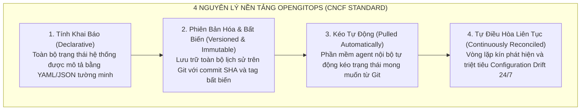
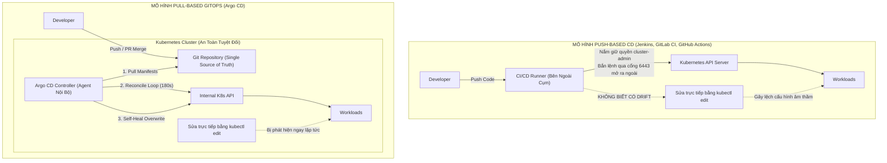
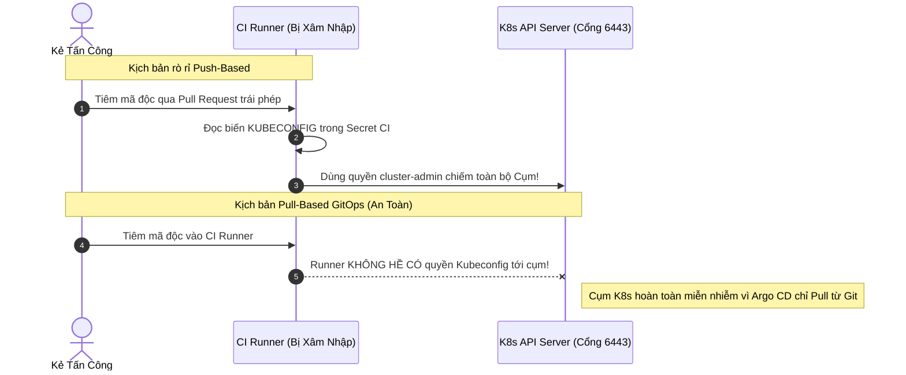
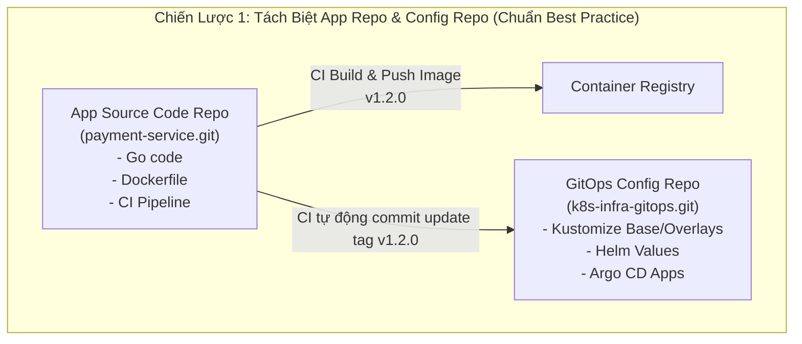
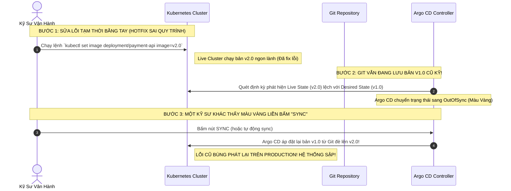


# GitOps Là Gì? Nguồn Chân Lý Git và So Sánh Toàn Diện Pull vs Push CD

Trong kỷ nguyên điện toán đám mây và kiến trúc Cloud Native, việc quản lý hàng trăm microservices trên nhiều cụm Kubernetes phân tán đã trở thành một bài toán sống còn đối với các tổ chức công nghệ. Các phương pháp CI/CD truyền thống dựa trên mô hình "Push" dần bộc lộ những giới hạn nghiêm trọng về bảo mật, khả năng kiểm toán và nguy cơ sai lệch cấu hình âm thầm (**Configuration Drift**).

**GitOps** ra đời như một sự tiến hóa tất yếu, đặt kho mã nguồn **Git làm Nguồn Chân Lý Duy Nhất (Single Source of Truth)** cho toàn bộ trạng thái mong muốn của hệ thống hạ tầng và ứng dụng. 

Bài viết này sẽ đưa bạn đi sâu vào bản chất kỹ thuật của GitOps, phân tích kiến trúc đối chiếu giữa Push-based CD và Pull-based GitOps, mổ xẻ các rủi ro bảo mật thực tế, so sánh chiến lược phân nhánh Git và vạch mặt cạm bẫy *"Synced nhưng sai"* kinh điển trong vận hành Production.

---

## 1. Bản Chất Của GitOps: 4 Nguyên Lý Cốt Lõi Của OpenGitOps

Thuật ngữ GitOps được Alexis Richardson (CEO của Weaveworks) đặt ra lần đầu vào năm 2017. Đến nay, tổ chức **OpenGitOps** (thuộc CNCF) đã chuẩn hóa GitOps thành 4 nguyên lý nền tảng bắt buộc:



### 1.1. Tính Khai Báo (Declarative Description)
Toàn bộ hệ thống (từ ứng dụng, Service, Ingress, NetworkPolicy, đến hạ tầng) phải được mô tả dưới dạng khai báo (**Declarative Specs** thay vì Imperative Commands).
- **Mệnh lệnh (Imperative - Không phải GitOps):** `kubectl create deployment web --image=nginx --replicas=3` $\rightarrow$ Khó tái lập, không lưu vết, dễ sai lệch khi chạy lại.
- **Khai báo (Declarative - Chuẩn GitOps):** File `deployment.yaml` chứa đầy đủ cấu hình mong muốn `spec.replicas: 3` và `image: nginx:1.25`.

### 1.2. Trạng Thái Lưu Trữ Phiên Bản Bất Biến (Versioned & Immutable)
Git đóng vai trò là cơ sở dữ liệu trạng thái. Mọi thay đổi hạ tầng bắt buộc phải thông qua Git Commit. Lịch sử commit cung cấp:
- Khả năng **Audit Trail** hoàn hảo: Biết chính xác ai đã đổi gì, vào lúc nào, với lý do gì (qua Pull Request và Commit Message).
- Khả năng **Rollback tức thì**: Chỉ cần `git revert` hoặc checkout lại commit SHA trước đó, hệ thống sẽ tự động quay về trạng thái ổn định trong vài giây.

### 1.3. Kéo Trạng Thái Tự Động (Pulled Automatically)
Thay vì để một công cụ bên ngoài dùng quyền lực cao đẩy lệnh vào cụm, một phần mềm Agent (như **Argo CD** hoặc **Flux**) chạy thường trú bên trong cụm sẽ chủ động theo dõi Git và kéo (Pull) manifest về.

### 1.4. Tự Động Điều Hòa & Tự Chữa Lành (Continuously Reconciled & Self-Healing)
Một vòng lặp điều hòa (**Reconciliation Loop**) liên tục chạy ngầm để so sánh giữa:
- **Desired State (Trạng thái mong muốn):** Định nghĩa trên Git.
- **Live State (Trạng thái thực tế):** Đang chạy trên Kubernetes cluster.

Nếu phát hiện sai lệch (Drift), hệ thống sẽ cảnh báo hoặc tự động đè lại cấu hình từ Git để đưa Live State về đúng chuẩn.

> [!IMPORTANT]
> **NGUYÊN TẮC BẤT DI BẤT DỊCH CỦA GITOPS:**
> Không bao giờ chạy lệnh `kubectl apply` hoặc `kubectl edit` trực tiếp trên môi trường Production. Mọi thay đổi bắt buộc phải đi qua Git Commit và Pull Request để duy trì tính toàn vẹn của Nguồn Chân Lý Duy Nhất.

> [!TIP]
> **KINH NGHIỆM THỰC CHIẾN:**
> Hãy cấu hình Git Branch Protection Rules trên nhánh `main` (yêu cầu ít nhất 2 approvals và pass toàn bộ CI checks) để ngăn chặn việc push code lỗi trực tiếp lên Production.

---

## 2. So Sánh Toàn Diện: Push-Based CD vs Pull-Based GitOps

Để hiểu tại sao các tập đoàn lớn chuyển đổi mạnh mẽ từ Jenkins/GitLab CI sang Argo CD, hãy đối chiếu hai mô hình kiến trúc qua sơ đồ và bảng phân tích chuyên sâu dưới đây:



### 2.1. Bảng So Sánh Chi Tiết Các Tiêu Chí Kỹ Thuật

| Tiêu Chí Kỹ Thuật | Mô Hình Push-Based CD (Jenkins, GitLab CI) | Mô Hình Pull-Based GitOps (Argo CD, Flux) |
| :--- | :--- | :--- |
| **Vị trí thực thi** | Bên ngoài cụm K8s (CI Server / Runner bên thứ ba) | Bên trong cụm K8s (Kubernetes Controller / Operator) |
| **Quản lý Kubeconfig** | Runner phải nắm giữ file `kubeconfig` có quyền cao (`cluster-admin`) | Kubeconfig không bao giờ rời khỏi cụm; Agent dùng RBAC ServiceAccount nội bộ |
| **Cổng mạng (Firewall)** | Phải mở Inbound Port 6443 trên Firewall để CI Runner gọi vào K8s API | Chỉ cần kết nối Outbound (Egress) 443 từ cụm ra Git Server (GitHub/GitLab) |
| **Phát hiện Drift** | **Không thể**: CI chỉ chạy 1 lần khi có commit, không biết cụm bị sửa lén sau đó | **Liên tục 24/7**: Vòng lặp Reconcile loop định kỳ 3 phút tự động quét và báo động |
| **Khả năng tự chữa lành**| Không có cơ chế tự động phục hồi nếu ai đó xóa Deployment | **Tự động khôi phục (Self-Healing)** trạng thái về đúng bản vẽ Git |
| **Khả năng Rollback** | Chạy lại pipeline cũ (chậm, phụ thuộc vào runner và build step) | `git revert` hoặc đổi target revision, Argo CD đồng bộ trong 2 giây |
| **Bảo mật Zero-Trust** | Nguy cơ rò rỉ Kubeconfig từ log CI hoặc server runner bị hack | Tuân thủ Zero Trust: K8s API được cô lập hoàn toàn sau mạng nội bộ VPC |

### 2.2. So Sánh Bộ Ba Công Cụ GitOps Phổ Biến: Argo CD vs Flux v2 vs Jenkins X

| Đặc Tính | Argo CD | Flux v2 | Jenkins X |
| :--- | :--- | :--- | :--- |
| **Kiến trúc** | Tập trung (Control Plane tập trung hỗ trợ Multi-Cluster) | Phân tán (Tập hợp các Go Controller độc lập) | Toàn diện (Bao gồm cả CI/CD pipeline, Preview Env) |
| **Giao diện trực quan (UI)** | **Web UI cực kỳ mạnh mẽ**, biểu đồ dạng cây, trực quan hóa Drift | Mặc định chỉ có CLI, Web UI là addon bên thứ 3 (Flamingo/Weave GitOps) | Không có UI chuyên dụng cho GitOps (dùng Jenkins UI cũ) |
| **Độ phổ biến & Hệ sinh thái**| Chiếm thị phần áp đảo trong doanh nghiệp, thuộc CNCF Graduated | Thuộc CNCF Graduated, nhẹ nhàng, tối ưu cho edge computing | Phức tạp, độ phổ biến suy giảm |
| **Hỗ trợ Multi-Cluster** | Xuất sắc thông qua tính năng Native Multi-Cluster & ApplicationSet | Quản lý qua nhiều CRD GitRepository & Kustomization phân tán | Cần cấu hình Helm phức tạp |

---

## 3. Kiến Trúc Zero-Trust Trong GitOps: Mối Nguy Lộ Quyền Cluster-Admin

Trong các đợt kiểm toán an toàn thông tin (SOC2, ISO 27001), một trong những phát hiện nghiêm trọng nhất là việc lưu trữ token `cluster-admin` trong các biến môi trường (Secrets) của GitHub Actions hoặc GitLab CI Runners.



> [!WARNING]
> **RỦI RO TỪ PUSH-BASED CD:**
> Nếu hacker chiếm quyền điều khiển của CI Runner, chúng lập tức có được chìa khóa vạn năng `cluster-admin` để xóa sạch toàn bộ namespace, đánh cắp cơ sở dữ liệu hoặc cài đặt phần mềm đào tiền ảo vào Kubernetes Cluster.

---

## 4. Chiến Lược Tổ Chức Git Repository: Monorepo vs Polyrepo & Quản Trị Môi Trường

Một câu hỏi hóc búa khi áp dụng GitOps: *Nên tổ chức cấu trúc Git như thế nào để vừa DRY (Don't Repeat Yourself), vừa an toàn giữa các môi trường Dev, Staging và Production?*



### 4.1. Cấu Trúc Thư Mục Chuẩn Với Kustomize (Directory-per-Environment)

Thay vì dùng nhánh (`branch-per-environment`) rất dễ bị "Git Merge Hell", chuẩn công nghiệp hiện nay là sử dụng **Directory-per-Environment** kết hợp với **Kustomize Overlays**:

```bash
gitops-manifests-repo/
├── apps/
│   └── payment-service/
│       ├── base/
│       │   ├── deployment.yaml
│       │   ├── service.yaml
│       │   └── kustomization.yaml
│       └── overlays/
│           ├── dev/
│           │   ├── kustomization.yaml
│           │   └── patches-replicas.yaml      # Replicas = 1, CPU = 100m
│           ├── staging/
│           │   ├── kustomization.yaml
│           │   └── patches-resources.yaml     # Replicas = 2, CPU = 500m
│           └── production/
│               ├── kustomization.yaml
│               ├── patches-replicas.yaml      # Replicas = 10, CPU = 2000m
│               └── patches-hpa.yaml           # Cấu hình HorizontalPodAutoscaler
```

### 4.2. Khảo Sát Chi Tiết File Manifest `base/deployment.yaml`

Dưới đây là manifest chuẩn mực mô tả tài nguyên microservice mẫu:

```yaml
# apps/payment-service/base/deployment.yaml
apiVersion: apps/v1
kind: Deployment
metadata:
  name: payment-service
  labels:
    app.kubernetes.io/name: payment-service
    app.kubernetes.io/part-of: payment-system
spec:
  replicas: 2
  revisionHistoryLimit: 5
  selector:
    matchLabels:
      app.kubernetes.io/name: payment-service
  template:
    metadata:
      labels:
        app.kubernetes.io/name: payment-service
    spec:
      containers:
        - name: payment-api
          image: ghcr.io/company/payment-service:v1.0.0
          imagePullPolicy: IfNotPresent
          ports:
            - name: http
              containerPort: 8080
              protocol: TCP
          livenessProbe:
            httpGet:
              path: /healthz
              port: 8080
            initialDelaySeconds: 15
            periodSeconds: 10
          readinessProbe:
            httpGet:
              path: /ready
              port: 8080
            initialDelaySeconds: 5
            periodSeconds: 5
          resources:
            requests:
              cpu: "250m"
              memory: "256Mi"
            limits:
              cpu: "1000m"
              memory: "1Gi"
```

---

## 5. Giải Mã Manifest Argo CD Application: Cầu Nối Giữa Git & Cụm

Dưới đây là tệp khai báo `Application` CRD của Argo CD, đóng vai trò kết nối giữa Git repository và Kubernetes cluster mục tiêu:

```yaml
# argo-apps/production-payment-service.yaml
apiVersion: argoproj.io/v1alpha1
kind: Application
metadata:
  name: production-payment-service
  namespace: argocd
  finalizers:
    # Đảm bảo xóa sạch tài nguyên trên K8s khi xóa Application này trên Argo CD
    - resources-finalizer.argocd.argoproj.io
spec:
  project: default
  source:
    # Đường dẫn tới GitOps repo chứa manifest
    repoURL: 'https://github.com/company/k8s-infra-gitops.git'
    targetRevision: main                      # Nhánh nguồn chân lý
    path: apps/payment-service/overlays/production
  destination:
    # Cụm Kubernetes mục tiêu và Namespace triển khai
    server: 'https://kubernetes.default.svc'  # Cụm In-Cluster
    namespace: payment-production
  syncPolicy:
    automated:
      prune: true      # Tự động xóa tài nguyên trên K8s nếu bị xóa khỏi Git
      selfHeal: true   # Tự động ghi đè nếu có ai sửa lén trực tiếp trên K8s
    syncOptions:
      - CreateNamespace=true                 # Tự tạo namespace nếu chưa tồn tại
      - ApplyOutOfSyncOnly=true              # Chỉ đồng bộ những tài nguyên bị lệch để tối ưu tốc độ
```

### 5.1. Phân Tích Từng Dòng Cấu Hình Bắt Buộc:

- **`metadata.finalizers`**: Kích hoạt `resources-finalizer`. Nếu không có cờ này, khi bạn xóa Application trên Argo CD, các Pods và Services bên dưới sẽ bị "mồ côi" (Orphaned) và tiếp tục chạy ngầm tiêu tốn tài nguyên.
- **`spec.source.targetRevision: main`**: Định danh nhánh hoặc Tag/Commit SHA mà Argo CD phải bám sát. Trong môi trường Production khắt khe, bạn có thể ghim cứng `targetRevision: "v2.1.0"` hoặc Commit Hash `a8f3b21` để đảm bảo tính bất biến tuyệt đối.
- **`spec.syncPolicy.automated.prune: true`**: Cho phép Argo CD thực hiện Garbage Collection. Nếu bạn xóa file `service.yaml` khỏi Git, Argo CD sẽ xóa Service tương ứng trên K8s.
- **`spec.syncPolicy.automated.selfHeal: true`**: Trọng tâm của cơ chế chống trôi cấu hình. Bất kỳ sự thay đổi nào bên ngoài Git đều sẽ bị khôi phục về trạng thái khai báo trong vòng chưa đầy vài giây.

---

## 6. Mổ Xẻ Cạm Bẫy Thực Tế: Thảm Họa "Synced Nhưng Sai"

Một trong những sự cố phổ biến nhất tại các doanh nghiệp mới chuyển đổi sang GitOps là hiện tượng **"Argo CD báo Synced màu xanh lá cây, nhưng dịch vụ Production lại gặp lỗi nghiêm trọng!"**



### 6.1. Phân Tích Nguyên Nhân Gốc Rễ (5-Whys Analysis)

1. <span class="badge badge--primary">Why 1</span> **Tại sao phiên bản mới v2.0 bị mất trên Production?** $\rightarrow$ Vì Argo CD đã ghi đè lại mã nguồn v1.0 từ Git.
2. <span class="badge badge--primary">Why 2</span> **Tại sao Argo CD lại ghi đè?** $\rightarrow$ Vì kỹ sư bấm nút "Sync" trong khi Git vẫn lưu v1.0.
3. <span class="badge badge--primary">Why 3</span> **Tại sao Git lại chỉ có v1.0?** $\rightarrow$ Vì kỹ sư sửa trực tiếp bằng lệnh `kubectl set image` thay vì tạo commit trên Git.
4. <span class="badge badge--primary">Why 4</span> **Tại sao kỹ sư lại sửa bằng kubectl?** $\rightarrow$ Do thói quen xử lý sự cố khẩn cấp (Hotfix) kiểu cũ mà không tuân thủ quy trình GitOps.
5. <span class="badge badge--emerald">Root Cause Remedy</span> **Biện pháp khắc phục chuẩn SRE:** Khóa quyền ghi `kubectl` trực tiếp trên Production; mọi thay đổi (kể cả Hotfix khẩn cấp) bắt buộc phải đi qua Git Commit để duy trì Nguồn Chân Lý Duy Nhất!

---

## 7. Hướng Dẫn Thực Hành CLI: Kiểm Chứng Cơ Chế Phát Hiện Drift

| Bước | Lệnh / Thao Tác | Mục Đích Kỹ Thuật |
| :---: | :--- | :--- |
| **Bước 1** | `argocd app get production-payment-service` | Kiểm tra trạng thái đồng bộ ban đầu của ứng dụng |
| **Bước 2** | `kubectl scale deployment payment-service --replicas=10` | Giả lập can thiệp thủ công sai lệch cấu hình trực tiếp trên cụm |
| **Bước 3** | `argocd app get production-payment-service --refresh` | Kích hoạt quét tức thì và kiểm tra trạng thái `OutOfSync` |
| **Bước 4** | `argocd app diff production-payment-service` | So sánh chi tiết phần sai lệch giữa Git và Live State |
| **Bước 5** | `kubectl get pods -n payment-production` | Xác thực cơ chế Self-Heal tự động đưa số Pod về đúng 2 Pods |
| **Bước 6** | `kubectl logs -n argocd ...` | Kiểm tra log của controller ghi nhận hành vi tự phục hồi |

```bash
# 1. Kiểm tra trạng thái ứng dụng hiện tại trên Argo CD
argocd app get production-payment-service

# 2. Giả lập một kỹ sư sửa lén số lượng Pods trực tiếp trên cụm bằng kubectl
kubectl scale deployment payment-service -n payment-production --replicas=10

# 3. Kiểm tra ngay lập tức trạng thái trên Argo CD CLI
# Bạn sẽ thấy Sync Status chuyển từ 'Synced' sang 'OutOfSync'
argocd app get production-payment-service --refresh

# 4. Xem chi tiết phần sai lệch (Diff) giữa Git và Live State
argocd app diff production-payment-service

# 5. Nếu bật Self-Heal, Argo CD sẽ tự động ép số Pod về lại con số khai báo trên Git (2 Pods)
# Kiểm tra lại số lượng Pod thực tế:
kubectl get pods -n payment-production -l app.kubernetes.io/name=payment-service

# 6. Kiểm tra log của controller ghi nhận hành động khôi phục
kubectl logs -n argocd -l app.kubernetes.io/name=argocd-application-controller --tail=30 | grep -i "self-heal"
```

---

## 8. Các Khuyến Nghị Thực Hành Tốt Nhất (GitOps Best Practices)

1. **Phân Tách Rõ Ràng Git Repositories:**
   - **App Code Repo:** Chứa mã nguồn ứng dụng (Go, Java, Python), Dockerfile và CI unit tests.
   - **Config GitOps Repo:** Chứa toàn bộ Kubernetes manifests (Kustomize/Helm), cấu hình môi trường (Dev, Staging, Prod).
2. **Khóa Quyền Truy Cập Cụm Trực Tiếp:** Thu hồi quyền `kubectl write` đối với con người trên môi trường Staging và Production. Toàn bộ thao tác phải đi qua Git Pull Request.
3. **Không Sử Dụng Tag `:latest`:** Luôn định danh image bằng Commit SHA hoặc SemVer (`v1.2.3`).
4. **Bật Tự Động Tự Chữa Lành (`selfHeal: true`):** Đảm bảo hệ thống luôn tự động dập tắt mọi can thiệp thủ công trái phép.
5. **Ký Chữ Ký GPG Cho Mọi Commit:** Đảm bảo tính xác thực của người tạo thay đổi trên Git.

---

## 9. Bộ Câu Hỏi Tự Kiểm Tra Chuyên Sâu (Self-Check Q&A)

<details class="qa-card">
<summary class="qa-summary">
  <div class="qa-summary-left">
    <span class="qa-num-badge">Q01</span>
    <span>Tại sao mô hình Khai báo (Declarative) lại là nền tảng bắt buộc của GitOps thay vì Mệnh lệnh (Imperative)?</span>
  </div>
  <span class="qa-chevron">
    <svg width="18" height="18" fill="none" stroke="currentColor" stroke-width="2.5" viewBox="0 0 24 24"><polyline points="6 9 12 15 18 9"></polyline></svg>
  </span>
</summary>
<div class="qa-answer">
  <div class="qa-answer-header">
    <svg width="14" height="14" fill="none" stroke="currentColor" stroke-width="2" viewBox="0 0 24 24"><path d="M22 11.08V12a10 10 0 1 1-5.93-9.14"></path><polyline points="22 4 12 14.01 9 11.01"></polyline></svg>
    <span>Phân Tích &amp; Lời Giải Kỹ Thuật</span>
  </div>
  <p style="margin: 0.4rem 0;">Vì mô hình Declarative mô tả <b style="color: var(--accent-primary);">kết quả mong muốn cuối cùng (Desired State)</b> độc lập với trạng thái hiện tại. Điều này cho phép hệ thống tự động tính toán khoảng cách (Diff) và hội tụ trạng thái mà không gây ra lỗi trùng lặp khi chạy lại nhiều lần (Idempotency).</p>
</div>
</details>

<details class="qa-card">
<summary class="qa-summary">
  <div class="qa-summary-left">
    <span class="qa-num-badge">Q02</span>
    <span>Nếu Git Server (GitHub/GitLab) bị sập hoàn toàn trong 2 giờ, các ứng dụng đang chạy trên Kubernetes Cluster có bị gián đoạn hoạt động không?</span>
  </div>
  <span class="qa-chevron">
    <svg width="18" height="18" fill="none" stroke="currentColor" stroke-width="2.5" viewBox="0 0 24 24"><polyline points="6 9 12 15 18 9"></polyline></svg>
  </span>
</summary>
<div class="qa-answer">
  <div class="qa-answer-header">
    <svg width="14" height="14" fill="none" stroke="currentColor" stroke-width="2" viewBox="0 0 24 24"><path d="M22 11.08V12a10 10 0 1 1-5.93-9.14"></path><polyline points="22 4 12 14.01 9 11.01"></polyline></svg>
    <span>Phân Tích &amp; Lời Giải Kỹ Thuật</span>
  </div>
  <p style="margin: 0.4rem 0;"><b style="color: var(--accent-emerald);">Không!</b> Các Pods và dịch vụ trên Kubernetes vẫn tiếp tục hoạt động bình thường. Trong thời gian Git sập, chỉ có tính năng đồng bộ phiên bản mới bị tạm ngưng; hệ thống hiện tại hoàn toàn không bị ảnh hưởng.</p>
</div>
</details>

<details class="qa-card">
<summary class="qa-summary">
  <div class="qa-summary-left">
    <span class="qa-num-badge">Q03</span>
    <span>Trong trường hợp xảy ra sự cố nghiêm trọng trên Production lúc nửa đêm cần khắc phục ngay (Hotfix), quy trình xử lý chuẩn GitOps diễn ra như thế nào?</span>
  </div>
  <span class="qa-chevron">
    <svg width="18" height="18" fill="none" stroke="currentColor" stroke-width="2.5" viewBox="0 0 24 24"><polyline points="6 9 12 15 18 9"></polyline></svg>
  </span>
</summary>
<div class="qa-answer">
  <div class="qa-answer-header">
    <svg width="14" height="14" fill="none" stroke="currentColor" stroke-width="2" viewBox="0 0 24 24"><path d="M22 11.08V12a10 10 0 1 1-5.93-9.14"></path><polyline points="22 4 12 14.01 9 11.01"></polyline></svg>
    <span>Phân Tích &amp; Lời Giải Kỹ Thuật</span>
  </div>
  <p style="margin: 0.4rem 0;">Kỹ sư tạo một nhánh hotfix trên Git, commit thay đổi $\rightarrow$ Tạo Pull Request $\rightarrow$ Duyệt khẩn cấp (Emergency Approval) $\rightarrow$ Merge vào nhánh chính $\rightarrow$ Argo CD tự động kéo mã nguồn mới về triển khai trong vài giây. Lịch sử sửa lỗi được lưu vết 100% trên Git.</p>
</div>
</details>

<details class="qa-card">
<summary class="qa-summary">
  <div class="qa-summary-left">
    <span class="qa-num-badge">Q04</span>
    <span>Điểm khác biệt cốt lõi nhất giữa Infrastructure as Code (IaC bằng Terraform) truyền thống và GitOps là gì?</span>
  </div>
  <span class="qa-chevron">
    <svg width="18" height="18" fill="none" stroke="currentColor" stroke-width="2.5" viewBox="0 0 24 24"><polyline points="6 9 12 15 18 9"></polyline></svg>
  </span>
</summary>
<div class="qa-answer">
  <div class="qa-answer-header">
    <svg width="14" height="14" fill="none" stroke="currentColor" stroke-width="2" viewBox="0 0 24 24"><path d="M22 11.08V12a10 10 0 1 1-5.93-9.14"></path><polyline points="22 4 12 14.01 9 11.01"></polyline></svg>
    <span>Phân Tích &amp; Lời Giải Kỹ Thuật</span>
  </div>
  <p style="margin: 0.4rem 0;">IaC (Terraform) thường chạy theo mô hình Push (khi kỹ sư chạy <code>terraform apply</code>). Nếu ai đó sửa thủ công trên Cloud Console sau đó, Terraform không tự sửa lại nếu không có ai chạy lại lệnh. GitOps bổ sung thêm <b style="color: var(--accent-primary);">Reconciliation Loop chạy liên tục 24/7</b> để tự động phát hiện và triệt tiêu sai lệch mà không cần sự can thiệp của con người.</p>
</div>
</details>

<details class="qa-card">
<summary class="qa-summary">
  <div class="qa-summary-left">
    <span class="qa-num-badge">Q05</span>
    <span>Làm thế nào để quản lý các dữ liệu nhạy cảm (Secrets, Passwords, API Keys) an toàn khi toàn bộ cấu hình đều được lưu trữ công khai trên Git?</span>
  </div>
  <span class="qa-chevron">
    <svg width="18" height="18" fill="none" stroke="currentColor" stroke-width="2.5" viewBox="0 0 24 24"><polyline points="6 9 12 15 18 9"></polyline></svg>
  </span>
</summary>
<div class="qa-answer">
  <div class="qa-answer-header">
    <svg width="14" height="14" fill="none" stroke="currentColor" stroke-width="2" viewBox="0 0 24 24"><path d="M22 11.08V12a10 10 0 1 1-5.93-9.14"></path><polyline points="22 4 12 14.01 9 11.01"></polyline></svg>
    <span>Phân Tích &amp; Lời Giải Kỹ Thuật</span>
  </div>
  <p style="margin: 0.4rem 0;">Tuyệt đối không lưu Plaintext Secret lên Git. Bắt buộc phải sử dụng các giải pháp mã hóa an toàn như <b style="color: var(--accent-primary);">Bitnami Sealed Secrets</b>, <b style="color: var(--accent-primary);">External Secrets Operator (kết nối HashiCorp Vault / AWS Secrets Manager)</b>, hoặc <b style="color: var(--accent-primary);">SOPS</b>.</p>
</div>
</details>

<details class="qa-card">
<summary class="qa-summary">
  <div class="qa-summary-left">
    <span class="qa-num-badge">Q06</span>
    <span>Tại sao GitOps lại được xem là mô hình lý tưởng để đáp ứng các tiêu chuẩn kiểm toán bảo mật khắt khe như SOC2 hay ISO 27001?</span>
  </div>
  <span class="qa-chevron">
    <svg width="18" height="18" fill="none" stroke="currentColor" stroke-width="2.5" viewBox="0 0 24 24"><polyline points="6 9 12 15 18 9"></polyline></svg>
  </span>
</summary>
<div class="qa-answer">
  <div class="qa-answer-header">
    <svg width="14" height="14" fill="none" stroke="currentColor" stroke-width="2" viewBox="0 0 24 24"><path d="M22 11.08V12a10 10 0 1 1-5.93-9.14"></path><polyline points="22 4 12 14.01 9 11.01"></polyline></svg>
    <span>Phân Tích &amp; Lời Giải Kỹ Thuật</span>
  </div>
  <p style="margin: 0.4rem 0;">Nghĩa là mọi cấu hình đang chạy trên thực tế đều bắt buộc phải có nguồn gốc từ một commit cụ thể trên Git. Kiểm toán viên chỉ cần kiểm tra lịch sử Git Commit và Pull Request là có thể xác minh 100% ai đã thay đổi gì, vào thời điểm nào và đã qua những bước phê duyệt nào.</p>
</div>
</details>

<details class="qa-card">
<summary class="qa-summary">
  <div class="qa-summary-left">
    <span class="qa-num-badge">Q07</span>
    <span>Nếu hai kỹ sư cùng lúc push hai thay đổi cấu hình xung đột nhau lên Git repository, GitOps sẽ xử lý tình huống này ra sao?</span>
  </div>
  <span class="qa-chevron">
    <svg width="18" height="18" fill="none" stroke="currentColor" stroke-width="2.5" viewBox="0 0 24 24"><polyline points="6 9 12 15 18 9"></polyline></svg>
  </span>
</summary>
<div class="qa-answer">
  <div class="qa-answer-header">
    <svg width="14" height="14" fill="none" stroke="currentColor" stroke-width="2" viewBox="0 0 24 24"><path d="M22 11.08V12a10 10 0 1 1-5.93-9.14"></path><polyline points="22 4 12 14.01 9 11.01"></polyline></svg>
    <span>Phân Tích &amp; Lời Giải Kỹ Thuật</span>
  </div>
  <p style="margin: 0.4rem 0;">Git sẽ sử dụng cơ chế xử lý xung đột phân nhánh (Merge Conflict Resolution). Người thứ hai bắt buộc phải rebase hoặc merge nhánh mới nhất trước khi Pull Request được chấp thuận, đảm bảo tính nhất quán tuyệt đối trước khi đưa xuống cụm.</p>
</div>
</details>

<details class="qa-card">
<summary class="qa-summary">
  <div class="qa-summary-left">
    <span class="qa-num-badge">Q08</span>
    <span>Tại sao việc tách biệt App Code Repository và Infrastructure Config Repository lại là một Best Practice quan trọng trong GitOps?</span>
  </div>
  <span class="qa-chevron">
    <svg width="18" height="18" fill="none" stroke="currentColor" stroke-width="2.5" viewBox="0 0 24 24"><polyline points="6 9 12 15 18 9"></polyline></svg>
  </span>
</summary>
<div class="qa-answer">
  <div class="qa-answer-header">
    <svg width="14" height="14" fill="none" stroke="currentColor" stroke-width="2" viewBox="0 0 24 24"><path d="M22 11.08V12a10 10 0 1 1-5.93-9.14"></path><polyline points="22 4 12 14.01 9 11.01"></polyline></svg>
    <span>Phân Tích &amp; Lời Giải Kỹ Thuật</span>
  </div>
  <div style="margin: 0.35rem 0; padding-left: 1rem; border-left: 2px solid var(--accent-primary);">• (1) Giúp giảm thiểu số lần kích hoạt CI không cần thiết khi chỉ sửa config.</div>
  <div style="margin: 0.35rem 0; padding-left: 1rem; border-left: 2px solid var(--accent-primary);">• (2) Cho phép phân quyền RBAC khác nhau (Developer có quyền push App Code nhưng chỉ có quyền tạo PR trên Config Repo).</div>
  <div style="margin: 0.35rem 0; padding-left: 1rem; border-left: 2px solid var(--accent-primary);">• (3) Ngăn chặn vòng lặp CI/CD vô tận khi CI commit image tag mới vào chính repo của nó.</div>
</div>
</details>

<details class="qa-card">
<summary class="qa-summary">
  <div class="qa-summary-left">
    <span class="qa-num-badge">Q09</span>
    <span>Rủi ro lớn nhất khi sử dụng chiến lược phân nhánh (Branch-per-Environment như dev, staging, main) trong GitOps là gì?</span>
  </div>
  <span class="qa-chevron">
    <svg width="18" height="18" fill="none" stroke="currentColor" stroke-width="2.5" viewBox="0 0 24 24"><polyline points="6 9 12 15 18 9"></polyline></svg>
  </span>
</summary>
<div class="qa-answer">
  <div class="qa-answer-header">
    <svg width="14" height="14" fill="none" stroke="currentColor" stroke-width="2" viewBox="0 0 24 24"><path d="M22 11.08V12a10 10 0 1 1-5.93-9.14"></path><polyline points="22 4 12 14.01 9 11.01"></polyline></svg>
    <span>Phân Tích &amp; Lời Giải Kỹ Thuật</span>
  </div>
  <p style="margin: 0.4rem 0;">Khi mỗi môi trường là một nhánh riêng (<code>dev</code>, <code>staging</code>, <code>prod</code>), các nhánh này theo thời gian sẽ có sự phân kỳ cấu hình (ví dụ nhánh dev thêm các biến debug nhưng không bao giờ đưa lên prod). Khi chạy <code>git merge</code> từ dev sang staging sang prod, các xung đột merge conflict sẽ xảy ra liên tục và làm tăng nguy cơ vô tình đưa cấu hình thử nghiệm lên Production.</p>
</div>
</details>

<details class="qa-card">
<summary class="qa-summary">
  <div class="qa-summary-left">
    <span class="qa-num-badge">Q10</span>
    <span>Làm thế nào để ngăn chặn một kẻ tấn công mạo danh commit mã độc vào Git repository và tự động triển khai xuống Production?</span>
  </div>
  <span class="qa-chevron">
    <svg width="18" height="18" fill="none" stroke="currentColor" stroke-width="2.5" viewBox="0 0 24 24"><polyline points="6 9 12 15 18 9"></polyline></svg>
  </span>
</summary>
<div class="qa-answer">
  <div class="qa-answer-header">
    <svg width="14" height="14" fill="none" stroke="currentColor" stroke-width="2" viewBox="0 0 24 24"><path d="M22 11.08V12a10 10 0 1 1-5.93-9.14"></path><polyline points="22 4 12 14.01 9 11.01"></polyline></svg>
    <span>Phân Tích &amp; Lời Giải Kỹ Thuật</span>
  </div>
  <p style="margin: 0.4rem 0;">Sử dụng <b style="color: var(--accent-primary);">Chữ ký số GPG (GPG Commit Signing)</b> kết hợp với cơ chế <b style="color: var(--accent-primary);">Signed Commits Enforcement</b> trên GitHub/GitLab. Argo CD có thể cấu hình tính năng <code>gpg.verification</code> để từ chối đồng bộ bất kỳ commit nào không có chữ ký GPG hợp lệ của các kỹ sư được ủy quyền.</p>
</div>
</details>

---

## 10. Tổng Kết

GitOps không chỉ là một công cụ, mà là một bước chuyển đổi tư duy sâu sắc trong kỹ nghệ phần mềm: biến Git thành trung tâm điều khiển của toàn bộ hạ tầng đám mây. Việc áp dụng mô hình Pull-based GitOps giúp triệt tiêu rủi ro lộ quyền quản trị, tự động hóa dập tắt Configuration Drift và nâng cao tính minh bạch cho toàn bộ hệ thống.

> [!TIP]
> **Bước tiếp theo:**
> Chuyển sang **[[Bài 02] Kiến Trúc Argo CD & Cơ Chế Reconciliation Loop Chuyên Sâu](argocd-02-02-kien-truc-argo-cd-va-co-che-reconciliation-loop-chuyen-sau.html)** để khám phá sâu các thành phần microservices và vòng lặp đồng bộ tự động 24/7!

