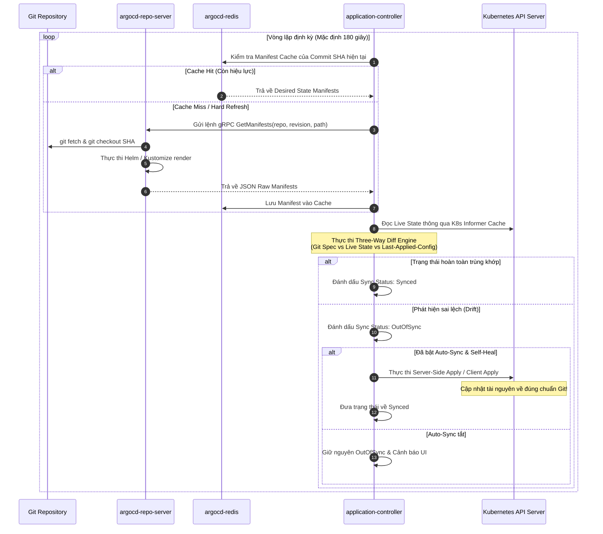
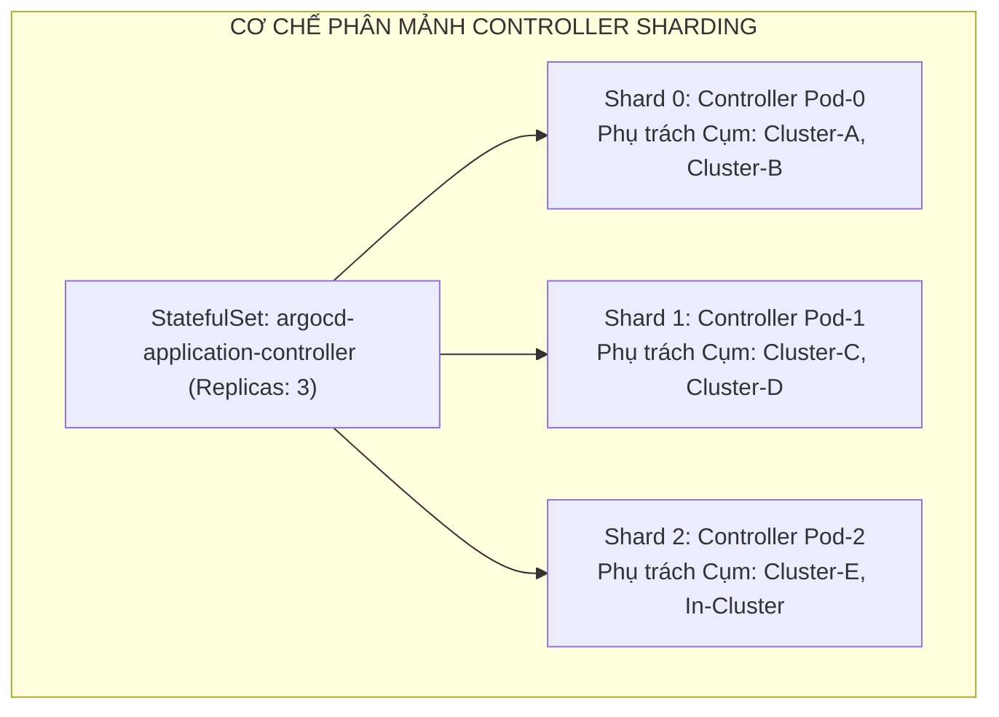
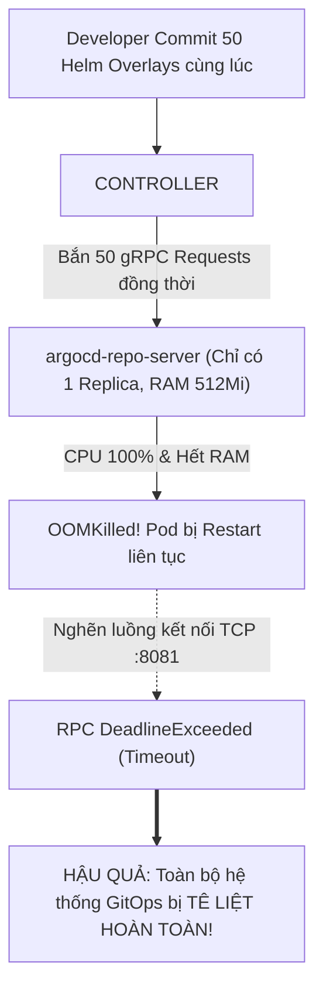


# Kiến Trúc Argo CD & Cơ Chế Vòng Lặp Điều Hòa Reconciliation Loop Chuyên Sâu

Để vận hành và làm chủ một nền tảng GitOps cấp doanh nghiệp, kỹ sư Platform và SRE không thể chỉ dừng lại ở việc xem Argo CD như một "hộp đen" (Black Box) chỉ để bấm nút Sync trên giao diện web. Khi hệ thống mở rộng lên quy mô hàng ngàn ứng dụng phân tán trên nhiều cụm Kubernetes, việc hiểu rõ các luồng giao tiếp nội bộ giữa các microservices và thuật toán điều hòa trạng thái là chìa khóa then chốt để tối ưu hóa hiệu năng, xử lý nghẽn mạng và gia cố an ninh.

Trong bài viết chuyên sâu này, chúng ta sẽ "giải phẫu" toàn bộ cấu trúc vi dịch vụ bên trong Argo CD Control Plane, phân tích chi tiết thuật toán **Reconciliation Loop**, tìm hiểu cơ chế **Three-way Merge Diff**, mở rộng kiến trúc **Controller Sharding** và giải mã cách Argo CD theo dõi các tài nguyên Kubernetes qua **Resource Tracking IDs**.

---

## 1. Sơ Đồ Toàn Cảnh Kiến Trúc Microservices Của Argo CD

Argo CD được thiết kế theo kiến trúc vi dịch vụ phân tán (**Distributed Microservices Architecture**) chạy hoàn toàn trên Kubernetes. Mỗi thành phần đảm nhiệm một vai trò chuyên biệt và giao tiếp với nhau qua giao thức hiệu năng cao **gRPC** và bộ nhớ đệm **Redis Cache**.

```mermaid
flowchart TD
    subgraph CLIENTS["LỚP NGƯỜI DÙNG & TÍCH HỢP NGOÀI"]
        CLI["Argo CD CLI"]
        WEB["Argo CD Web UI"]
        GIT["Git Repository (GitHub / GitLab / Gitea)"]
        HOOK["Git Webhook (Push Event)"]
    end

    subgraph ARGO_CONTROL_PLANE["ARGO CD CONTROL PLANE (Namespace: argocd)"]
        API_SERVER["1. argocd-server (API & Web Gateway)<br/>- Xác thực JWT / SSO Dex<br/>- Tiếp nhận Webhook<br/>- Expose gRPC & REST API"]
        
        REPO_SERVER["2. argocd-repo-server (Manifest Engine)<br/>- Clone & Cache Git Repo<br/>- Render Helm / Kustomize / CMP<br/>- Cung cấp gRPC Port 8081"]
        
        REDIS["3. argocd-redis (Distributed Cache)<br/>- Cache Git manifests & AST<br/>- Lưu trữ phiên đăng nhập Web<br/>- Cache Live Cluster State"]
        
        CONTROLLER["4. argocd-application-controller (Bộ Não GitOps)<br/>- Vòng lặp điều hòa (Reconciliation Loop)<br/>- Three-way Diff Calculation<br/>- Thực thi Sync / Prune / Self-Heal"]

        APPSET["5. argocd-applicationset-controller<br/>- Tự động sinh Applications từ Generators"]
        NOTIF["6. argocd-notifications-controller<br/>- Gửi cảnh báo Slack / Teams / Telegram"]
    end

    subgraph TARGET_CLUSTERS["CỤM KUBERNETES MỤC TIÊU (Local & Remote)"]
        K8S_API["Kubernetes API Server (Live State)"]
        WORKLOADS["Pods / Deployments / Services / CRDs"]
    end

    CLI -->|"HTTPS / gRPC"| API_SERVER
    WEB -->|"HTTPS / REST"| API_SERVER
    HOOK -->|"HTTP POST /api/webhook"| API_SERVER
    
    API_SERVER [--]|Session / Cache| REDIS
    API_SERVER -->|"gRPC Request"| CONTROLLER
    
    CONTROLLER [--]|Manifest Cache| REDIS
    CONTROLLER -->|"1. Request Render Manifests (gRPC :8081)"| REPO_SERVER
    REPO_SERVER -->|"Git Clone / Pull (Port 443)"| GIT
    
    CONTROLLER -->|"2. Watch Live State (Informer)"| K8S_API
    CONTROLLER ==>|"3. Three-way Diff & Apply"| K8S_API
    K8S_API --> WORKLOADS

    APPSET -->|"Sinh ra Application CRDs"| API_SERVER
    NOTIF -->|"Lắng nghe Application Events"| CONTROLLER


```

---

## 2. Phân Tích Chuyên Sâu Các Thành Phần Cốt Lõi

### 2.1. `argocd-server` (API Gateway & Giao Diện Người Dùng)
- **Chức năng:** Là cửa ngõ duy nhất tiếp nhận toàn bộ các yêu cầu từ bên ngoài (Web UI, CLI, REST API, Git Webhooks).
- **Cơ chế hoạt động:**
  - Xác thực người dùng thông qua Local User, API Tokens hoặc tích hợp Single Sign-On (**Dex OIDC / OAuth2**).
  - Kiểm tra quyền hạn theo ma trận **RBAC** (Casbin engine).
  - Tiếp nhận tín hiệu Git Webhook tại endpoint `/api/webhook`, kiểm tra chữ ký HMAC và gửi thông báo đánh thức Controller.
  - Expose cả hai chuẩn giao thức: **gRPC** (cho CLI tốc độ cao) và **REST/HTTP** (cho Web UI qua gRPC-Gateway).

### 2.2. `argocd-repo-server` (Động Cơ Biên Dịch Manifest)
- **Chức năng:** Chịu trách nhiệm toàn bộ các tác vụ tính toán nặng liên quan đến Git và Render manifest.
- **Cơ chế hoạt động:**
  - Clone và quản lý bản sao Git Repositories trong thư mục bộ nhớ tạm `/tmp`.
  - Thực thi các công cụ biên dịch mẫu: `kustomize build`, `helm template`, hoặc gọi các **Config Management Plugins (CMP)** sidecars.
  - Trả về danh sách các đối tượng Kubernetes dạng JSON thô (Raw Manifests) cho Controller thông qua cổng nội bộ **gRPC TCP `:8081`**.
  - Không bao giờ kết nối trực tiếp với Kubernetes API Server, giúp cách ly an toàn tuyệt đối.

> [!IMPORTANT]
> **CƠ CHẾ BẢO MẬT LEAST PRIVILEGE:**
> `argocd-repo-server` được thiết kế không có quyền kết nối tới Kubernetes API Server nhằm ngăn chặn rủi ro mã độc từ các Helm Chart hoặc Kustomize plugin chiếm quyền điều khiển cụm.

> [!TIP]
> **TỐI ƯU HIỆU NĂNG REPO SERVER:**
> Khi số lượng Application vượt quá 100, hãy tăng số lượng bản sao Replicas của `argocd-repo-server` lên 3 - 5 Pods và mount `emptyDir: { medium: Memory }` vào `/tmp` để tăng tốc độ render.

### 2.3. `argocd-application-controller` (Bộ Não Điều Hòa Trạng Thái)
- **Chức năng:** Trái tim của hệ thống GitOps — nơi thực thi vòng lặp **Reconciliation Loop** liên tục 24/7.
- **Cơ chế hoạt động:**
  - Sử dụng cơ chế Kubernetes **Informer / Watcher** để duy trì bản sao trạng thái thời gian thực (Live State Cache) của toàn bộ tài nguyên trên các cụm.
  - So sánh Target State (từ Repo Server) với Live State (từ K8s API).
  - Xác định trạng thái đồng bộ: `Synced` hay `OutOfSync`.
  - Xác định sức khỏe tài nguyên: `Healthy`, `Progressing`, `Degraded`, hoặc `Suspended`.
  - Thực thi các chính sách tự động: **Auto-Sync**, **Pruning**, và **Self-Healing**.

### 2.4. `argocd-redis` (Bộ Nhớ Đệm Hiệu Năng Cao)
- **Chức năng:** Lưu trữ bộ nhớ đệm phân tán để giảm tải cho Git Server và Kubernetes API Server.
- **Nội dung lưu trong Redis:**
  - Bản dịch manifest đã render của các Git Commit SHA.
  - Trạng thái cây tài nguyên của các cụm Kubernetes từ xa.
  - Phiên làm việc (User Sessions) của Web UI.

---

## 3. Cấu Hình Tối Ưu Hóa Production Cho `argocd-repo-server`

Trong môi trường lớn, `argocd-repo-server` là nơi dễ bị cạn kiệt tài nguyên nhất. Dưới đây là manifest Kustomize patch hoàn chỉnh để tối ưu hóa hiệu năng và độ ổn định cho Repo Server:

```yaml
# patches/repo-server-hardening.yaml
apiVersion: apps/v1
kind: Deployment
metadata:
  name: argocd-repo-server
  namespace: argocd
spec:
  replicas: 4
  strategy:
    type: RollingUpdate
    rollingUpdate:
      maxSurge: 1
      maxUnavailable: 0
  template:
    spec:
      containers:
        - name: argocd-repo-server
          resources:
            requests:
              cpu: "1000m"
              memory: "1Gi"
            limits:
              cpu: "4000m"
              memory: "4Gi"
          volumeMounts:
            - name: tmp
              mountPath: /tmp
          env:
            - name: ARGOCD_EXEC_TIMEOUT
              value: "180s"
            - name: ARGOCD_GIT_ATTEMPTS_COUNT
              value: "3"
          readinessProbe:
            tcpSocket:
              port: 8081
            initialDelaySeconds: 5
            periodSeconds: 10
          livenessProbe:
            tcpSocket:
              port: 8081
            initialDelaySeconds: 15
            periodSeconds: 20
      volumes:
        - name: tmp
          emptyDir:
            medium: Memory
            sizeLimit: 2Gi
```

### 3.1. Giải Thích Chi Tiết Từng Tham Số:
- **`spec.replicas: 4`**: Phân tải các yêu cầu biên dịch gRPC song song từ Application Controller.
- **`emptyDir.medium: Memory`**: Biến thư mục `/tmp` thành RAM-disk (tmpfs), giúp tốc độ `git clone` và `helm template` nhanh gấp 10 lần so với đọc ghi trên đĩa HDD/SSD thông thường.
- **`ARGOCD_EXEC_TIMEOUT: 180s`**: Tránh việc timeout khi biên dịch các Helm Chart đồ sộ có hàng trăm template phức tạp.

---

## 4. Giải Mã Thuật Toán Reconciliation Loop Chuyên Sâu

Vòng lặp điều hòa là cơ chế cốt lõi biến GitOps thành một hệ thống điều khiển phản hồi kín (**Closed-Loop Control System**).



### 4.1. Hai Cơ Chế Kích Hoạt Reconcile
1. **Polling Định Kỳ (Time-based Trigger):** Mặc định mỗi **180 giây (3 phút)**, Controller sẽ tự động quét lại toàn bộ Application để tìm kiếm thay đổi trên Git hoặc Live Cluster.
2. **Sự Kiện Đẩy Tức Thì (Event-driven Webhook Trigger):** Khi developer merge code lên Git, Webhook gửi tín hiệu POST tới `argocd-server`. Server sẽ lập tức đánh dấu cache của repository đó là *Invalidated*, khiến Controller thực hiện Reconcile ngay trong **dưới 1 giây**.

### 4.2. Thuật Toán Three-Way Diff Engine
Khi so sánh trạng thái, Argo CD không chỉ đơn thuần so sánh 2 điểm (Git vs Live) mà thực hiện so sánh 3 chiều:
1. **Manifest trên Git (Desired State):** Cấu hình mới mà developer muốn áp dụng.
2. **Live State trên Cụm:** Trạng thái thực tế hiện tại trên Kubernetes (có thể đã được Mutation Webhook của cụm chèn thêm các trường mặc định như `tolerations`, `serviceAccountName`).
3. **Last Applied Configuration:** Lịch sử cấu hình lần deploy gần nhất của Argo CD.

Nhờ thuật toán Three-way Diff, Argo CD thông minh bỏ qua các trường do Kubernetes Control Plane tự sinh ra, tránh việc liên tục báo OutOfSync giả tạo.

---

## 5. Kiến Trúc Mở Rộng Quy Mô Lớn: Controller Sharding & Dynamic Cluster Distribution

Khi số lượng cụm Kubernetes quản trị vượt qua con số 20 và số lượng Application vượt qua 2000, một Controller đơn lẻ sẽ bị nghẽn CPU và I/O mạng. Argo CD giải quyết bài toán này bằng cơ chế **Controller Sharding**:



### 5.1. Thuật Toán Phân Phối Shard
Argo CD sử dụng thuật toán băm nhất quán (Consistent Hashing) hoặc phân phối vòng tròn (Round-Robin) dựa trên `cluster.server` URL để gán cụm Kubernetes mục tiêu cho từng bản sao Pod của Controller:

$$\text{Shard Index} = \text{Hash}(\text{Cluster UID}) \pmod N$$

Trong đó $N$ là tổng số lượng Replicas của `argocd-application-controller` StatefulSet. Khi bạn tăng số lượng Shard, tải Informer Watcher trên API Server sẽ được phân tán đều.

---

## 6. Cơ Chế Resource Tracking ID Độc Quyền

Làm thế nào để Argo CD biết chính xác một Service hay Ingress cụ thể trên Kubernetes thuộc quyền sở hữu của Application nào để quản lý hoặc xóa dọn (Prune)?

Argo CD hỗ trợ 2 phương pháp Resource Tracking chính:

```yaml
# Ví dụ Annotation Tracking ID được Argo CD tự động gắn vào Deployment
apiVersion: apps/v1
kind: Deployment
metadata:
  name: order-service
  namespace: production
  annotations:
    # Cấu trúc: <app-name>:<group>/<kind>:<namespace>/<resource-name>
    argocd.argoproj.io/tracking-id: "ecommerce-root:apps/Deployment:production/order-service"
```

### Bảng So Sánh Hai Chiến Lược Tracking:

| Phương pháp Tracking | Cấu hình | Ưu điểm | Nhược điểm |
|---|---|---|---|
| **Label Tracking** | `app.kubernetes.io/instance: <app-name>` | Tương thích ngược với các phiên bản cũ, dễ đọc bằng `kubectl get -l` | Dễ bị xung đột nếu có 2 ứng dụng trùng tên ở các namespace khác nhau; Label bị giới hạn 63 ký tự |
| **Annotation Tracking (Khuyên dùng)** | `argocd.argoproj.io/tracking-id` | Chứa đầy đủ Group, Kind, Namespace, Name; Hỗ trợ ký tự dài; Không xung đột nhãn | Khó lọc tài nguyên bằng lệnh `kubectl -l` thông thường |

---

## 7. Phân Tích Cấu Hình Chi Tiết Tệp `argocd-cm` & `argocd-cmd-params-cm`

Hệ thống cấu hình của Argo CD phân tách giữa thiết lập hành vi nghiệp vụ (`argocd-cm`) và thiết lập cờ khởi động của tiến trình (`argocd-cmd-params-cm`):

### 7.1. Tệp `argocd-cm` (Nghiệp Vụ Nền Tảng)

```yaml
apiVersion: v1
kind: ConfigMap
metadata:
  name: argocd-cm
  namespace: argocd
  labels:
    app.kubernetes.io/name: argocd-cm
    app.kubernetes.io/part-of: argocd
data:
  # URL truy cập chính thức của hệ thống Argo CD
  url: "https://argocd.company.internal"

  # Tinh chỉnh chu kỳ quét Reconcile định kỳ (Mặc định 180s, giảm xuống 120s)
  timeout.reconciliation: "120s"

  # Giới hạn kích thước tối đa của tệp giá trị Helm values.yaml (2MB)
  helm.valuesFileMaxBytes: "2097152"

  # Bật tính năng Resource Tracking bằng Annotation chuẩn Enterprise
  application.resourceTrackingMethod: "annotation"

  # Danh sách tài nguyên nhạy cảm bị loại trừ khỏi phạm vi theo dõi (Tránh quá tải Informer)
  resource.exclusions: |
    - apiGroups:
        - "cilium.io"
      kinds:
        - "CiliumEndpoint"
        - "CiliumIdentity"
```

### 7.2. Tệp `argocd-cmd-params-cm` (Cờ Tiến Trình & Khởi Động)

```yaml
apiVersion: v1
kind: ConfigMap
metadata:
  name: argocd-cmd-params-cm
  namespace: argocd
data:
  # Chạy server ở chế độ không dùng TLS nội bộ (Khi TLS Termination đã xử lý ở Ingress Gateway)
  server.insecure: "true"
  
  # Số lượng worker đồng thời của controller xử lý hàng đợi
  controller.status.processors: "50"
  controller.operation.processors: "25"
  
  # Kích hoạt số lượng phân mảnh sharding cho Application Controller
  controller.sharding.replicas: "3"
  controller.repo.server.timeout.seconds: "90"
```

---

## 8. Cạm Bẫy Thực Chiến: "Repo-Server Bị Treo gRPC Khiến Toàn Bộ Ứng Dụng Kẹt Ở Trạng Thái Progressing"

### Hiện Tượng
Trên giao diện Web, toàn bộ hàng trăm ứng dụng đều hiển thị biểu tượng bánh răng xoay vòng màu vàng (**Progressing**) không bao giờ dừng. Khi bấm nút Sync thủ công, tiến trình bị treo vô hạn với thông báo `rpc error: code = DeadlineExceeded`.



### 8.1. Trích Xuất Nhật Ký Lỗi Thực Tế (Real-World Incident Logs)
Khi kiểm tra nhật ký của `argocd-application-controller`:

```text
time="2026-03-22T08:15:30Z" level=error msg="Failed to get git manifests for app 'payment-service': rpc error: code = Unavailable desc = connection error: desc = 'transport: Error while dialing dial tcp 10.244.2.45:8081: connect: connection refused'" app=payment-service
time="2026-03-22T08:16:00Z" level=warning msg="Reconciliation failed for 48 applications due to repository server unavailability"
```

### 8.2. Quy Trình Khắc Phục Chuẩn SRE
1. **Tăng cường số lượng Replicas cho `argocd-repo-server`:** Mở rộng từ 1 Pod lên 3 - 5 Pods để chia tải xử lý render.
2. **Tăng giới hạn bộ nhớ (Memory Limits):** Đặt `limits.memory: 2Gi` hoặc `4Gi` cho Repo Server.
3. **Tách biệt bộ nhớ đệm tạm thời:** Mount ổ đĩa nhanh `emptyDir: { medium: Memory }` vào thư mục `/tmp` của Repo Server.

---

## 9. Hướng Dẫn Thực Hành CLI: Giám Sát Và Tương Tác Trực Tiếp Với Control Plane

```bash
# 1. Kiểm tra trạng thái hoạt động của toàn bộ 4 vi dịch vụ Argo CD
kubectl get pods -n argocd -l app.kubernetes.io/part-of=argocd

# 2. Xem trực tiếp nhật ký điều hòa của Application Controller
kubectl logs -n argocd -l app.kubernetes.io/name=argocd-application-controller -f --tail=50

# 3. Ép buộc Controller xóa bỏ Cache cũ và thực hiện Hard Refresh ngay lập tức
argocd app get payment-api --hard-refresh

# 4. Kiểm tra các chỉ số hiệu năng gRPC và độ trễ Reconcile qua cổng Metrics :8082
kubectl exec -n argocd deploy/argocd-application-controller -- curl -s http://localhost:8082/metrics | grep -E "argocd_app_reconcile|argocd_git_request"

# 5. Kiểm tra kết nối gRPC trực tiếp từ Controller sang Repo Server bằng lệnh CLI
kubectl exec -n argocd deploy/argocd-application-controller -- nc -zv argocd-repo-server 8081
```

---

## 10. Bộ Câu Hỏi Tự Kiểm Tra Chuyên Sâu (Self-Check Q&A)


<div class="qa-answer">
  <div class="qa-answer-header">
    <svg width="14" height="14" fill="none" stroke="currentColor" stroke-width="2" viewBox="0 0 24 24"><path d="M22 11.08V12a10 10 0 1 1-5.93-9.14"></path><polyline points="22 4 12 14.01 9 11.01"></polyline></svg>
    <span>Phân Tích &amp; Lời Giải Kỹ Thuật</span>
  </div>
  
Đây là nguyên lý <b style="color: var(--accent-primary);">Least Privilege</b> trong kiến trúc an ninh. <code>repo-server</code> là nơi thực thi các công cụ render manifest bên ngoài (Helm, Kustomize, Plugins) có nguy cơ chứa mã độc hoặc lỗ hổng thực thi lệnh tùy ý (RCE). Việc cô lập hoàn toàn <code>repo-server</code> khỏi Kubernetes API ngăn chặn kẻ tấn công lợi dụng lỗ hổng render để chiếm quyền điều khiển cụm.
</div>
</details>

<div class="qa-answer">
  <div class="qa-answer-header">
    <svg width="14" height="14" fill="none" stroke="currentColor" stroke-width="2" viewBox="0 0 24 24"><path d="M22 11.08V12a10 10 0 1 1-5.93-9.14"></path><polyline points="22 4 12 14.01 9 11.01"></polyline></svg>
    <span>Phân Tích &amp; Lời Giải Kỹ Thuật</span>
  </div>
  
<div style="margin: 0.35rem 0; padding-left: 1rem; border-left: 2px solid var(--accent-primary);">• <code>--refresh</code> (Soft Refresh): Controller kiểm tra lại Git Revision trên remote server, nhưng vẫn có thể tái sử dụng manifest đã render trong Redis cache nếu Commit SHA không đổi.</div>
  <div style="margin: 0.35rem 0; padding-left: 1rem; border-left: 2px solid var(--accent-primary);">• <code>--hard-refresh</code>: Xóa bỏ hoàn toàn bộ nhớ đệm manifest trong Redis, ép buộc <code>repo-server</code> phải clone lại Git repo và render lại toàn bộ manifest từ đầu.</div>
</div>
</details>

<div class="qa-answer">
  <div class="qa-answer-header">
    <svg width="14" height="14" fill="none" stroke="currentColor" stroke-width="2" viewBox="0 0 24 24"><path d="M22 11.08V12a10 10 0 1 1-5.93-9.14"></path><polyline points="22 4 12 14.01 9 11.01"></polyline></svg>
    <span>Phân Tích &amp; Lời Giải Kỹ Thuật</span>
  </div>
  
Cấu hình <b style="color: var(--accent-primary);">Git Webhook</b> trên GitHub/GitLab trỏ về <code>/api/webhook</code> của Argo CD Server. Webhook hoạt động theo cơ chế Push-Notification Event, chỉ kích hoạt reconcile đúng ứng dụng có commit mới mà không cần hạ thấp tham số polling <code>timeout.reconciliation</code>.
</div>
</details>

<div class="qa-answer">
  <div class="qa-answer-header">
    <svg width="14" height="14" fill="none" stroke="currentColor" stroke-width="2" viewBox="0 0 24 24"><path d="M22 11.08V12a10 10 0 1 1-5.93-9.14"></path><polyline points="22 4 12 14.01 9 11.01"></polyline></svg>
    <span>Phân Tích &amp; Lời Giải Kỹ Thuật</span>
  </div>
  
Bắt buộc phải đổi sang <code>annotation</code> trong các môi trường doanh nghiệp có nhiều Application quản lý các tài nguyên trùng tên ở nhiều namespace khác nhau, hoặc khi tên Application dài vượt quá 63 ký tự (giới hạn của Kubernetes Label).
</div>
</details>

<div class="qa-answer">
  <div class="qa-answer-header">
    <svg width="14" height="14" fill="none" stroke="currentColor" stroke-width="2" viewBox="0 0 24 24"><path d="M22 11.08V12a10 10 0 1 1-5.93-9.14"></path><polyline points="22 4 12 14.01 9 11.01"></polyline></svg>
    <span>Phân Tích &amp; Lời Giải Kỹ Thuật</span>
  </div>
  
Phiên làm việc (Session Tokens) được lưu trong <code>argocd-redis</code>, còn quy tắc phân quyền RBAC được <code>argocd-server</code> đọc trực tiếp từ ConfigMap <code>argocd-rbac-cm</code> và nạp vào bộ nhớ qua thư viện Casbin.
</div>
</details>

<div class="qa-answer">
  <div class="qa-answer-header">
    <svg width="14" height="14" fill="none" stroke="currentColor" stroke-width="2" viewBox="0 0 24 24"><path d="M22 11.08V12a10 10 0 1 1-5.93-9.14"></path><polyline points="22 4 12 14.01 9 11.01"></polyline></svg>
    <span>Phân Tích &amp; Lời Giải Kỹ Thuật</span>
  </div>
  
Two-Way Diff chỉ so sánh trực tiếp Git Desired State và Live State, dễ dẫn đến xung đột khi Kubernetes API Server hoặc Admission Webhooks tự động bổ sung các trường mặc định (như <code>status</code>, <code>metadata.creationTimestamp</code>, <code>spec.template.spec.serviceAccount</code>). Three-Way Diff đối chiếu thêm <code>last-applied-configuration</code> để xác định chính xác trường nào do người dùng thực sự thay đổi trên Git.
</div>
</details>

<div class="qa-answer">
  <div class="qa-answer-header">
    <svg width="14" height="14" fill="none" stroke="currentColor" stroke-width="2" viewBox="0 0 24 24"><path d="M22 11.08V12a10 10 0 1 1-5.93-9.14"></path><polyline points="22 4 12 14.01 9 11.01"></polyline></svg>
    <span>Phân Tích &amp; Lời Giải Kỹ Thuật</span>
  </div>
  
Một Pod Controller duy nhất phải mở kết nối Informer Watcher tới từng cụm K8s. Khi số lượng cụm quá lớn, giới hạn I/O mạng, CPU và bộ nhớ của một Node sẽ bị quá tải. Sharding cho phép chia cụm Kubernetes mục tiêu cho nhiều Pod Controller phân tán xử lý song song.
</div>
</details>

<div class="qa-answer">
  <div class="qa-answer-header">
    <svg width="14" height="14" fill="none" stroke="currentColor" stroke-width="2" viewBox="0 0 24 24"><path d="M22 11.08V12a10 10 0 1 1-5.93-9.14"></path><polyline points="22 4 12 14.01 9 11.01"></polyline></svg>
    <span>Phân Tích &amp; Lời Giải Kỹ Thuật</span>
  </div>
  
<code>argocd-cm</code> quản lý các cấu hình nghiệp vụ cấp ứng dụng (như SSO, Resource Exclusion, URL, Theme, Tracking Method). Trong khi đó, <code>argocd-cmd-params-cm</code> dùng để truyền các tham số dòng lệnh khởi động tiến trình (Command-Line Flags) cho các container như số worker thread, timeout, insecure mode.
</div>
</details>

<div class="qa-answer">
  <div class="qa-answer-header">
    <svg width="14" height="14" fill="none" stroke="currentColor" stroke-width="2" viewBox="0 0 24 24"><path d="M22 11.08V12a10 10 0 1 1-5.93-9.14"></path><polyline points="22 4 12 14.01 9 11.01"></polyline></svg>
    <span>Phân Tích &amp; Lời Giải Kỹ Thuật</span>
  </div>
  
Khi Redis sập, người dùng sẽ bị đăng xuất khỏi Web UI và thời gian render manifest sẽ chậm lại do bị Cache Miss toàn bộ. Tuy nhiên, các ứng dụng đang chạy trên Kubernetes vẫn hoạt động bình thường và Controller sẽ tự phục hồi kết nối ngay khi Redis Pod được khởi động lại.
</div>
</details>

<div class="qa-answer">
  <div class="qa-answer-header">
    <svg width="14" height="14" fill="none" stroke="currentColor" stroke-width="2" viewBox="0 0 24 24"><path d="M22 11.08V12a10 10 0 1 1-5.93-9.14"></path><polyline points="22 4 12 14.01 9 11.01"></polyline></svg>
    <span>Phân Tích &amp; Lời Giải Kỹ Thuật</span>
  </div>
  
Khai báo cấu hình <code>resource.exclusions</code> trong ConfigMap <code>argocd-cm</code> với <code>apiGroups</code> và <code>kinds</code> tương ứng. Điều này ngăn Controller mở Watcher theo dõi các CRD biến động tần suất cao, giúp tiết kiệm bộ nhớ RAM đáng kể.
</div>
</details>

---

## Tổng Kết

Kiến trúc phân tán của Argo CD là một kiệt tác kỹ thuật trong thế giới Cloud Native: sự phân tách rạch ròi giữa cửa ngõ giao tiếp (`argocd-server`), động cơ biên dịch độc lập (`repo-server`), bộ nhớ đệm tốc độ cao (`redis`) và bộ não điều hòa trạng thái (`application-controller`).

Ở bài viết tiếp theo, chúng ta sẽ bắt tay vào **Cài Đặt Argo CD Trên Kubernetes: Mô Hình High Availability (HA), Cấu Hình CLI & Xác Thực An Toàn Chuẩn Doanh Nghiệp**!

