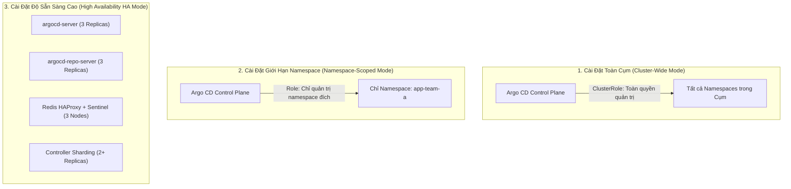
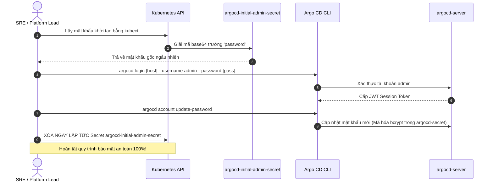
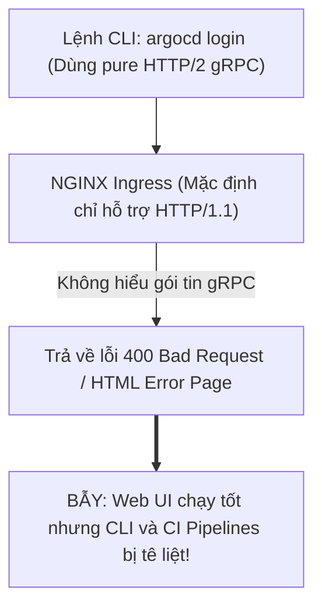


# Cài Đặt Argo CD Trên Kubernetes: Mô Hình HA, CLI & Xác Thực An Toàn

Việc cài đặt Argo CD trên môi trường thử nghiệm (Local Minikube/Kind) thường chỉ tốn một câu lệnh `kubectl apply -f install.yaml`. Tuy nhiên, khi bước vào môi trường Vận hành Doanh nghiệp (Production Enterprise), bài toán cài đặt đòi hỏi những tiêu chuẩn kỹ thuật khắt khe hơn rất nhiều: **Khả năng chịu lỗi và tính sẵn sàng cao (High Availability)**, **Bảo mật luồng mạng giao tiếp gRPC qua Ingress/TLS**, **Gia cố NetworkPolicy Zero-Trust**, **Quản lý cài đặt Argo CD bằng chính Kustomize GitOps**, và **Xác thực danh tính an toàn không lộ mật khẩu gốc**.

Trong bài viết chuyên sâu này, chúng ta sẽ so sánh chi tiết 3 mô hình kiến trúc cài đặt, hướng dẫn từng bước triển khai Argo CD HA với Redis Sentinel, bóc tách cấu hình NGINX Ingress hỗ trợ gRPC-Web, cấu hình NetworkPolicy cô lập và làm chủ công cụ dòng lệnh Argo CD CLI.

---

## 1. So Sánh Chi Tiết 3 Mô Hình Cài Đặt Argo CD

Trước khi đặt bút viết manifest, kỹ sư Platform cần lựa chọn mô hình triển khai phù hợp với quy mô và yêu cầu bảo mật của tổ chức:



### 1.1. Ma Trận Đánh Giá 3 Mô Hình Triển Khai

| Tiêu chí kỹ thuật | 1. Non-HA Cluster-Wide (`install.yaml`) | 2. Namespace-Scoped (`namespace-install.yaml`) | 3. High Availability HA (`ha/install.yaml`) |
|---|---|---|---|
| **Số lượng Replicas** | 1 Replica cho mỗi thành phần | 1 Replica cho mỗi thành phần | 2 – 3 Replicas + Redis Sentinel 3 nodes |
| **Quyền hạn Kubernetes** | `ClusterRole` (Toàn quyền trên toàn cụm) | `Role` (Chỉ giới hạn trong các namespace được gán) | `ClusterRole` hoặc `Role` kết hợp |
| **Bộ nhớ đệm Redis** | Redis Standalone (Không chịu lỗi) | Redis Standalone | Redis Failover tự động qua Sentinel + HAProxy |
| **Khả năng chịu lỗi (Fault Tolerance)** | Kém (Sập 1 Pod là dừng Reconcile) | Kém | **Tuyệt vời (Không có Single Point of Failure)** |
| **Môi trường phù hợp** | Lab, Thử nghiệm, Dev cá nhân | Multi-tenant chia tách nhóm nghiêm ngặt | **Production bắt buộc tại Doanh nghiệp** |

---

## 2. Triển Khai Mô Hình High Availability (HA) Trên Production

Để cài đặt phiên bản HA chính thức, ta áp dụng tệp manifest chuẩn từ kho mã nguồn Argo CD:

```bash
# Tạo namespace chuyên dụng cho Argo CD
kubectl create namespace argocd

# Áp dụng bộ cài đặt High Availability chính thức
kubectl apply -n argocd -f https://raw.githubusercontent.com/argoproj/argo-cd/stable/manifests/ha/install.yaml
```

### 2.1. Quản Lý Bộ Cài Đặt Argo CD Bằng Kustomize (GitOps-Driven Installation)

Thay vì áp dụng file URL trực tiếp, chuẩn mực tốt nhất là khai báo qua Kustomize để dễ dàng patch các cấu hình:

```yaml
# bootstrap/argocd/kustomization.yaml
apiVersion: kustomize.config.k8s.io/v1beta1
kind: Kustomization

namespace: argocd

resources:
  - https://raw.githubusercontent.com/argoproj/argo-cd/v2.10.4/manifests/ha/install.yaml
  - ingress.yaml
  - network-policies.yaml

patches:
  - target:
      kind: ConfigMap
      name: argocd-cm
    patch: |-
      - op: add
        path: /data/url
        value: "https://argocd.company.internal"
      - op: add
        path: /data/admin.enabled
        value: "true"
```

### 2.2. Cấu Trúc Khác Biệt Của Bộ Cài Đặt HA
1. **`argocd-redis-ha`:** Thay vì chạy 1 Pod Redis đơn lẻ, phiên bản HA triển khai một cụm gồm 3 Pods Redis (`StatefulSet`) được giám sát bởi 3 Pods Redis Sentinel, đứng trước bởi một bộ cân bằng tải nội bộ `argocd-redis-ha-haproxy`. Khi Master node bị sập, Sentinel sẽ tự động bầu cử Master mới trong 3 giây.
2. **`argocd-server` & `argocd-repo-server`:** Tự động cấu hình `replicas: 3` kết hợp với `podAntiAffinity` để phân tán các Pods sang các Worker Nodes khác nhau trong cụm.

> [!IMPORTANT]
> **BẮT BUỘC TRÊN PRODUCTION:**
> Không bao giờ sử dụng file `install.yaml` đơn lẻ trên môi trường Production. Luôn sử dụng bộ cài đặt `ha/install.yaml` để đảm bảo hệ thống không có điểm nghẽn chịu lỗi đơn lẻ (Single Point of Failure).

> [!WARNING]
> **BẢO MẬT MẬT KHẨU KHỞI TẠO:**
> Sau khi đổi mật khẩu tài khoản `admin`, hãy xóa ngay lập tức Secret `argocd-initial-admin-secret` để ngăn chặn nguy cơ rò rỉ credential gốc.

---

## 3. Cấu Hình NGINX Ingress Hỗ Trợ Cả Web UI & gRPC-Web

Một trong những trở ngại lớn nhất khi đưa Argo CD ra Internet là giao thức kết nối. Argo CD Server sử dụng đồng thời:
- **HTTPS thông thường (HTTP/1.1):** Cho giao diện người dùng Web Dashboard.
- **gRPC (HTTP/2):** Cho công cụ dòng lệnh Argo CD CLI thực thi nhanh và stream logs.

Nếu Ingress Controller không được cấu hình đúng, CLI sẽ bị lỗi `400 Bad Request` hoặc không stream được nhật ký Pods.

### 3.1. Manifest NGINX Ingress Chuẩn Enterprise Kết Hợp Cert-Manager

Dưới đây là manifest NGINX Ingress tiêu chuẩn hỗ trợ chế độ `--grpc-web` và tự động cấp chứng chỉ SSL qua Cert-Manager:

```yaml
# argocd-ingress.yaml
apiVersion: networking.k8s.io/v1
kind: Ingress
metadata:
  name: argocd-server-ingress
  namespace: argocd
  annotations:
    # Tự động yêu cầu chứng chỉ số TLS từ Cert-Manager ClusterIssuer
    cert-manager.io/cluster-issuer: "letsencrypt-production"
    # Bắt buộc chuyển hướng toàn bộ sang giao thức HTTPS an toàn
    nginx.ingress.kubernetes.io/ssl-redirect: "true"
    # Khai báo backend của Argo CD chạy HTTPS nội bộ
    nginx.ingress.kubernetes.io/backend-protocol: "HTTPS"
    # Tăng thời gian chờ cho các phiên đồng bộ lớn và stream log
    nginx.ingress.kubernetes.io/proxy-read-timeout: "1800"
    nginx.ingress.kubernetes.io/proxy-send-timeout: "1800"
    # Tinh chỉnh kích thước tối đa cho payload tải lên (Tránh lỗi 413)
    nginx.ingress.kubernetes.io/proxy-body-size: "64m"
spec:
  ingressClassName: nginx
  tls:
    - hosts:
        - argocd.company.internal
      secretName: argocd-tls-certificate
  rules:
    - host: argocd.company.internal
      http:
        paths:
          - path: /
            pathType: Prefix
            backend:
              service:
                name: argocd-server
                port:
                  number: 443
```

### 3.2. Cấu Hình Health Check Probes Cho Ingress Controller

Để đảm bảo Load Balancer không chuyển traffic vào các Pods đang khởi động, hãy cấu hình đường dẫn Health Check:
- **Liveness Probe Endpoint:** `https://argocd.company.internal/healthz` (trả về `200 OK` khi server còn sống).
- **Readiness Probe Endpoint:** `https://argocd.company.internal/healthz?full=true` (kiểm tra toàn diện kết nối tới Redis và Repo Server trước khi nhận traffic).

---

## 4. Gia Cố Bảo Mật Bằng Kubernetes NetworkPolicy (Zero-Trust)

Để ngăn chặn các Pods khác trong cụm tấn công trực tiếp vào cổng nội bộ gRPC 8081 của `argocd-repo-server` hoặc cổng Redis, chúng ta cần triển khai NetworkPolicy:

```yaml
# security/argocd-network-policy.yaml
apiVersion: networking.k8s.io/v1
kind: NetworkPolicy
metadata:
  name: argocd-repo-server-isolation
  namespace: argocd
spec:
  podSelector:
    matchLabels:
      app.kubernetes.io/name: argocd-repo-server
  policyTypes:
    - Ingress
    - Egress
  ingress:
    # Chỉ cho phép duy nhất Application Controller và Server kết nối đến cổng 8081
    - from:
        - podSelector:
            matchLabels:
              app.kubernetes.io/name: argocd-application-controller
        - podSelector:
            matchLabels:
              app.kubernetes.io/name: argocd-server
      ports:
        - protocol: TCP
          port: 8081
  egress:
    # Cho phép Repo Server kết nối ra ngoài Internet (Git Server port 443 và DNS port 53)
    - to:
        - ipBlock:
            cidr: 0.0.0.0/0
      ports:
        - protocol: TCP
          port: 443
        - protocol: UDP
          port: 53
```

---

## 5. Quản Lý Mật Khẩu Khởi Tạo & Xác Thực An Toàn

Khi vừa cài đặt xong, Argo CD tự động tạo một tài khoản mặc định `admin` và lưu mật khẩu ngẫu nhiên trong Secret `argocd-initial-admin-secret`.



### 5.1. Quy Trình Trích Xuất Và Đổi Mật Khẩu Bắt Buộc

```bash
# 1. Trích xuất mật khẩu khởi tạo của tài khoản admin
kubectl -n argocd get secret argocd-initial-admin-secret -o jsonpath="{.data.password}" | base64 -d
echo ""

# 2. Đăng nhập vào Argo CD qua CLI
argocd login argocd.company.internal --username admin --password <mat-khau-o-buoc-1> --grpc-web

# 3. Đổi mật khẩu tài khoản admin sang mật khẩu bảo mật của tổ chức
argocd account update-password

# 4. BƯỚC BẢO MẬT QUAN TRỌNG: Xóa vĩnh viễn tệp Secret khởi tạo để tránh bị lộ
kubectl -n argocd delete secret argocd-initial-admin-secret
```

---

## 6. Cấu Hình Tài Khoản Bot Không Dùng Mật Khẩu Cho CI/CD Automation

Thay vì dùng tài khoản cá nhân, chuẩn mực Enterprise yêu cầu tạo các Service Account riêng biệt cho CI Runner:

```yaml
# Tích hợp vào argocd-cm
apiVersion: v1
kind: ConfigMap
metadata:
  name: argocd-cm
  namespace: argocd
data:
  accounts.github-actions-bot: apiKey,login
```

```yaml
# Tích hợp vào argocd-rbac-cm
apiVersion: v1
kind: ConfigMap
metadata:
  name: argocd-rbac-cm
  namespace: argocd
data:
  policy.csv: |
    # Chỉ cho phép bot đồng bộ và đọc trạng thái ứng dụng trong nhóm payment
    p, role:ci-sync-bot, applications, get, payment/*, allow
    p, role:ci-sync-bot, applications, sync, payment/*, allow
    g, github-actions-bot, role:ci-sync-bot
```

Sinh API Token dài hạn cho bot bằng CLI:

```bash
# Cấp phát token có thời hạn 90 ngày (7776000 giây)
argocd account generate-token --account github-actions-bot --expires-in 7776000s
```

---

## 7. Làm Chủ Công Cụ Dòng Lệnh Argo CD CLI

Argo CD CLI là công cụ đắc lực nhất của các kỹ sư SRE để tự động hóa kịch bản, chẩn đoán lỗi và tương tác với hệ thống.

### 7.1. Bảng Tổng Hợp Lệnh CLI Cốt Lõi

| Lệnh CLI | Chức năng thực chiến | Trường hợp sử dụng |
|---|---|---|
| `argocd login <host> --grpc-web` | Đăng nhập và lưu session token vào `~/.argocd/config` | Khởi đầu phiên làm việc |
| `argocd app list` | Liệt kê toàn bộ ứng dụng cùng trạng thái Sync & Health | Báo cáo nhanh toàn cụm |
| `argocd app get <app-name>` | Xem cây tài nguyên chi tiết và lịch sử các đợt Sync | Chẩn đoán lỗi ứng dụng cụ thể |
| `argocd app sync <app-name> --prune` | Ép buộc đồng bộ và xóa tài nguyên rác | Kích hoạt deploy thủ công |
| `argocd app diff <app-name>` | So sánh sự khác biệt giữa Git và Live Cluster | Kiểm tra xem có bị Drift không |
| `argocd app logs <app-name> --follow` | Stream trực tiếp nhật ký Pods từ xa qua gRPC | Debug ứng dụng không cần quyền `kubectl` |

---

## 8. Cạm Bẫy Thực Chiến: "CLI Bị Treo Hoặc Trả Về Lỗi 400 Bad Request Khi Gọi Qua Ingress"

### Hiện Tượng
Lập trình viên mở Web UI trên trình duyệt `https://argocd.company.internal` thì hoạt động bình thường. Tuy nhiên, khi chạy lệnh đăng nhập trên terminal:
`argocd login argocd.company.internal`
Thì lệnh bị treo 30 giây rồi trả về lỗi:
`rpc error: code = Unavailable desc = transport: received the unexpected content-type "text/html; charset=utf-8"` hoặc `400 Bad Request`.



### 8.1. Nguyên Nhân Sâu Xa
Argo CD CLI mặc định sử dụng giao thức **HTTP/2 gRPC**. Nhiều Ingress Controller hoặc Cloud Load Balancer (AWS ALB, Cloudflare) ở chế độ mặc định chỉ chấp nhận kết nối HTTP/1.1 thông thường và sẽ từ chối hoặc làm hỏng gói tin gRPC.

### 8.2. Hai Cách Khắc Phục Chuẩn Doanh Nghiệp
- **Cách 1 (Nhanh nhất):** Luôn bổ sung cờ `--grpc-web` vào câu lệnh CLI:
  `argocd login argocd.company.internal --grpc-web`
  Cờ này đóng gói các cuộc gọi gRPC bên trong chuẩn giao thức HTTP/1.1 tương thích 100% với mọi Ingress.
- **Cách 2 (Căn bản):** Cấu hình Ingress chuyên biệt cho gRPC với annotation `nginx.ingress.kubernetes.io/backend-protocol: "GRPC"`.

---

## 9. Hướng Dẫn Thực Hành CLI: Tự Động Hóa Kiểm Tra & Khắc Phục Sự Cố Redis HA

```bash
# 1. Kiểm tra trạng thái sẵn sàng của cụm Redis HA và HAProxy
kubectl get statefulset,deploy -n argocd -l app.kubernetes.io/name=argocd-redis-ha

# 2. Kiểm tra thông tin Master hiện tại qua Redis Sentinel
kubectl exec -it -n argocd argocd-redis-ha-server-0 -c sentinel -- redis-cli -p 26379 sentinel get-master-addr-by-name mymaster

# 3. Kiểm tra danh sách Pods và phân bổ Nodes để đảm bảo Anti-Affinity hoạt động
kubectl get pods -n argocd -o wide

# 4. Tạo một Service Account Token tự động cho CI/CD pipeline (Không dùng mật khẩu người dùng)
argocd account generate-token --account github-actions-bot

# 5. Kiểm tra phiên làm việc hiện tại và quyền hạn
argocd account can-i sync applications 'payment/*'
```

---

## 10. Bộ Câu Hỏi Tự Kiểm Tra Chuyên Sâu (Self-Check Q&A)


<div class="qa-answer">
  <div class="qa-answer-header">
    <svg width="14" height="14" fill="none" stroke="currentColor" stroke-width="2" viewBox="0 0 24 24"><path d="M22 11.08V12a10 10 0 1 1-5.93-9.14"></path><polyline points="22 4 12 14.01 9 11.01"></polyline></svg>
    <span>Phân Tích &amp; Lời Giải Kỹ Thuật</span>
  </div>
  
Vì tệp Secret này chứa mật khẩu khởi tạo dạng thô (Cleartext). Nếu hacker xâm nhập được vào namespace <code>argocd</code> hoặc đọc được etcd backup, họ có thể giải mã lấy quyền <code>admin</code> tối cao. Xóa tệp này sau khi đổi mật khẩu là quy tắc bắt buộc của CIS Kubernetes Benchmark.
</div>
</details>

<div class="qa-answer">
  <div class="qa-answer-header">
    <svg width="14" height="14" fill="none" stroke="currentColor" stroke-width="2" viewBox="0 0 24 24"><path d="M22 11.08V12a10 10 0 1 1-5.93-9.14"></path><polyline points="22 4 12 14.01 9 11.01"></polyline></svg>
    <span>Phân Tích &amp; Lời Giải Kỹ Thuật</span>
  </div>
  
<b style="color: var(--accent-primary);">Không!</b> Vì trong kiến trúc HA, toàn bộ phiên làm việc (User Sessions) được lưu trữ tập trung trên cụm <b style="color: var(--accent-primary);">Redis Sentinel HA</b>, không lưu cục bộ trong bộ nhớ của Pod Server. Yêu cầu tiếp theo sẽ được chuyển sang Pod Server khác mà không làm gián đoạn phiên.
</div>
</details>

<div class="qa-answer">
  <div class="qa-answer-header">
    <svg width="14" height="14" fill="none" stroke="currentColor" stroke-width="2" viewBox="0 0 24 24"><path d="M22 11.08V12a10 10 0 1 1-5.93-9.14"></path><polyline points="22 4 12 14.01 9 11.01"></polyline></svg>
    <span>Phân Tích &amp; Lời Giải Kỹ Thuật</span>
  </div>
  
Thêm dòng <code>admin.enabled: "false"</code> vào ConfigMap <code>argocd-cm</code>. Sau khi cấu hình, tài khoản admin cục bộ sẽ bị khóa hoàn toàn, buộc 100% người dùng phải đăng nhập qua hệ thống Identity Provider của doanh nghiệp.
</div>
</details>

<div class="qa-answer">
  <div class="qa-answer-header">
    <svg width="14" height="14" fill="none" stroke="currentColor" stroke-width="2" viewBox="0 0 24 24"><path d="M22 11.08V12a10 10 0 1 1-5.93-9.14"></path><polyline points="22 4 12 14.01 9 11.01"></polyline></svg>
    <span>Phân Tích &amp; Lời Giải Kỹ Thuật</span>
  </div>
  
Cờ <code>--insecure</code> bỏ qua việc kiểm tra tính hợp lệ của chứng chỉ SSL/TLS (áp dụng khi dùng Self-signed Certificate trong môi trường lab). Trên Production, <b style="color: var(--accent-primary);">tuyệt đối không dùng</b> <code>--insecure</code> mà phải cấp phát chứng chỉ TLS hợp lệ (Let's Encrypt / Corporate CA) để chống tấn công Man-in-the-Middle (MitM).
</div>
</details>

<div class="qa-answer">
  <div class="qa-answer-header">
    <svg width="14" height="14" fill="none" stroke="currentColor" stroke-width="2" viewBox="0 0 24 24"><path d="M22 11.08V12a10 10 0 1 1-5.93-9.14"></path><polyline points="22 4 12 14.01 9 11.01"></polyline></svg>
    <span>Phân Tích &amp; Lời Giải Kỹ Thuật</span>
  </div>
  
<code>kubectl port-forward</code> chỉ là giải pháp tạm thời dùng cho cá nhân gỡ lỗi (Debug) cục bộ qua cổng localhost. Ingress là giải pháp định tuyến mạng chính thức, cung cấp định danh tên miền, chấm dứt SSL/TLS, xác thực chứng chỉ và chịu tải cho toàn bộ người dùng và hệ thống Webhook bên ngoài.
</div>
</details>

<div class="qa-answer">
  <div class="qa-answer-header">
    <svg width="14" height="14" fill="none" stroke="currentColor" stroke-width="2" viewBox="0 0 24 24"><path d="M22 11.08V12a10 10 0 1 1-5.93-9.14"></path><polyline points="22 4 12 14.01 9 11.01"></polyline></svg>
    <span>Phân Tích &amp; Lời Giải Kỹ Thuật</span>
  </div>
  
HAProxy đóng vai trò là reverse proxy đứng trước cụm Redis. Nó liên tục thăm dò Redis Sentinel để biết Pod Redis nào đang là Master hiện tại, và định tuyến toàn bộ kết nối ghi (Write) tới đúng Node Master đó, giúp các vi dịch vụ Argo CD không cần tự implement logic Sentinel failover.
</div>
</details>

<div class="qa-answer">
  <div class="qa-answer-header">
    <svg width="14" height="14" fill="none" stroke="currentColor" stroke-width="2" viewBox="0 0 24 24"><path d="M22 11.08V12a10 10 0 1 1-5.93-9.14"></path><polyline points="22 4 12 14.01 9 11.01"></polyline></svg>
    <span>Phân Tích &amp; Lời Giải Kỹ Thuật</span>
  </div>
  
Khi cụm Kubernetes được chia sẻ cho nhiều phòng ban độc lập (Multi-Tenant) và đội ngũ quản trị Kubernetes không cho phép cấp quyền <code>ClusterRole</code> cấp cụm cho Argo CD. Lúc này Argo CD chỉ được cấp <code>Role</code> để tự quản lý trong một namespace hạn định.
</div>
</details>

<div class="qa-answer">
  <div class="qa-answer-header">
    <svg width="14" height="14" fill="none" stroke="currentColor" stroke-width="2" viewBox="0 0 24 24"><path d="M22 11.08V12a10 10 0 1 1-5.93-9.14"></path><polyline points="22 4 12 14.01 9 11.01"></polyline></svg>
    <span>Phân Tích &amp; Lời Giải Kỹ Thuật</span>
  </div>
  
Vì <code>--grpc-web</code> đóng gói (encapsulate) các khung dữ liệu HTTP/2 gRPC nhị phân thành các gói HTTP/1.1 chuẩn (Base64 hoặc binary framing) mà bất kỳ reverse proxy, CDN (như Cloudflare), hay Ingress cũ nào cũng có thể định tuyến bình thường mà không cần hỗ trợ full HTTP/2 gRPC backend.
</div>
</details>

<div class="qa-answer">
  <div class="qa-answer-header">
    <svg width="14" height="14" fill="none" stroke="currentColor" stroke-width="2" viewBox="0 0 24 24"><path d="M22 11.08V12a10 10 0 1 1-5.93-9.14"></path><polyline points="22 4 12 14.01 9 11.01"></polyline></svg>
    <span>Phân Tích &amp; Lời Giải Kỹ Thuật</span>
  </div>
  
Trong <code>argocd-rbac-cm</code>, gán policy <code>p, role:ci-viewer, applications, get, *, allow</code> cho tài khoản bot và không cấp quyền <code>sync</code> hoặc <code>delete</code>.
</div>
</details>

<div class="qa-answer">
  <div class="qa-answer-header">
    <svg width="14" height="14" fill="none" stroke="currentColor" stroke-width="2" viewBox="0 0 24 24"><path d="M22 11.08V12a10 10 0 1 1-5.93-9.14"></path><polyline points="22 4 12 14.01 9 11.01"></polyline></svg>
    <span>Phân Tích &amp; Lời Giải Kỹ Thuật</span>
  </div>
  
<code>podAntiAffinity</code> ngăn cản Kubernetes Kubernetes Scheduler xếp các bản sao (Replicas) của cùng một dịch vụ (như 3 Pods <code>argocd-server</code>) lên cùng một Worker Node vật lý. Nhờ đó, nếu một Worker Node bị sập phần cứng, 2 bản sao còn lại trên các Node khác vẫn duy trì hệ thống hoạt động 100%.
</div>
</details>

---

## Tổng Kết

Cài đặt Argo CD đúng chuẩn High Availability và thiết lập kênh giao tiếp an toàn qua Ingress gRPC-Web là viên gạch nền móng vững chắc đầu tiên để xây dựng nền tảng GitOps cấp doanh nghiệp.

Ở bài tiếp theo, chúng ta sẽ bắt đầu giải mã **Application CRD Chuyên Sâu: Hợp Đồng Bộ Ba Source, Destination, Project & Cơ Chế Tracking ID Toàn Năng**!

