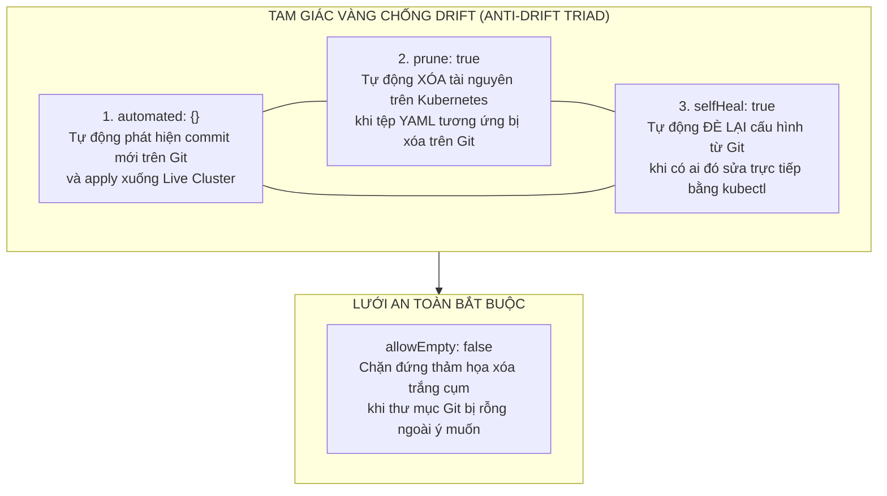
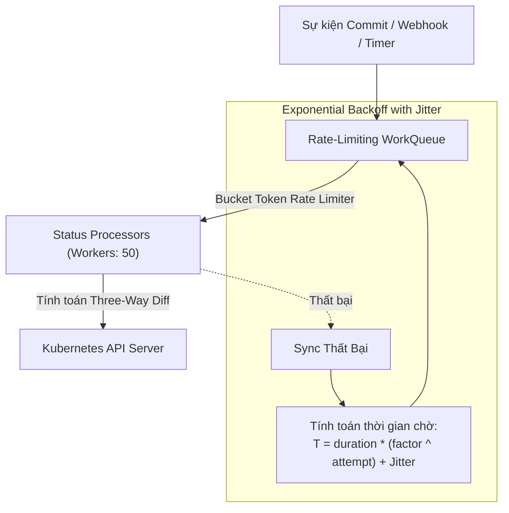
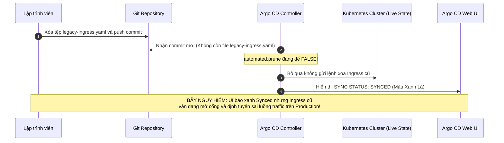
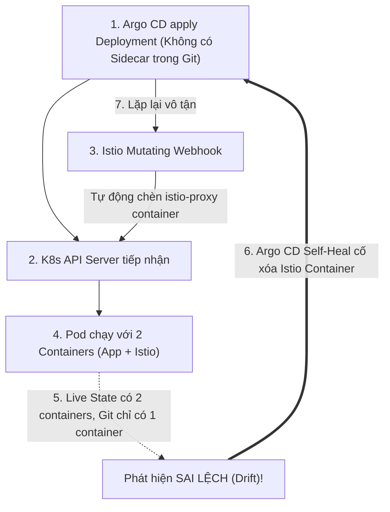


# Đồng Bộ Tự Động: Sync Policy, Prune, Self-Heal & Cạm Bẫy 'Synced Nhưng Sai'

Một trong những lời hứa hẹn hấp dẫn nhất của GitOps là khả năng tự động hóa hoàn toàn: bạn chỉ cần merge một Pull Request trên Git, hệ thống sẽ tự động triển khai, tự động dọn dẹp các tài nguyên cũ và tự động khôi phục nếu có ai đó vô tình hay cố ý sửa đổi trái phép trên cụm Kubernetes.

Tuy nhiên, nếu không hiểu rõ bản chất hoạt động của bộ ba **Automated Sync**, **Prune** và **Self-Heal**, đội ngũ vận hành sẽ rất dễ rơi vào những cạm bẫy "tử huyệt" — nơi giao diện Argo CD hiển thị trạng thái **`Synced` màu xanh lá** nhưng ứng dụng thực tế trên Production lại đang chạy sai logic, sót tài nguyên rác, Pod không nhận cấu hình mới hoặc bị xóa trắng dữ liệu ngoài ý muốn!

Bài viết này sẽ mổ xẻ toàn diện cơ chế điều khiển tự động của Argo CD, phân tích thuật toán chống dội lệnh, so sánh 4 cấp độ đồng bộ và hướng dẫn cách phòng tránh dứt điểm toàn bộ 5 biến thể của cạm bẫy kinh điển *"Synced nhưng sai"*.

---

## 1. Tam Giác Vàng Chống Drift (The Anti-Drift Triad)

Để biến Argo CD thành một hệ thống tự chữa lành chuẩn mực, `spec.syncPolicy.automated` cung cấp 3 thuộc tính cốt lõi tạo thành **Tam Giác Vàng Chống Sai Lệch Cấu Hình**:



### 1.1. `automated: {}` (Tự Động Đồng Bộ Khi Có Commit Mới)
Khi kích hoạt thuộc tính này, Argo CD không cần con người phải vào UI bấm nút "Sync". Ngay khi phát hiện Revision mới trên Git, Controller sẽ tự động đưa Application vào hàng đợi đồng bộ.

### 1.2. `prune: true` (Tự Động Dọn Dẹp Tài Nguyên Rác)
Mặc định nếu `prune: false`, khi bạn xóa tệp `ingress.yaml` hoặc `old-service.yaml` trên Git, Argo CD sẽ **KHÔNG xóa Ingress hay Service đó trên Kubernetes**. Chúng sẽ biến thành các tài nguyên "ma" (Ghost/Zombie Resources) trôi nổi trên cụm. Bật `prune: true` đảm bảo Live Cluster luôn phản ánh chính xác 100% cây tài nguyên trên Git.

### 1.3. `selfHeal: true` (Tự Động Khôi Phục Khi Bị Sửa Trực Tiếp)
Nếu một kỹ sư trực đêm dùng lệnh `kubectl edit deployment` để đổi biến môi trường hoặc sửa cấu hình trực tiếp trên cụm, Argo CD sẽ phát hiện sự sai lệch (Drift) và **lập tức ghi đè cấu hình chuẩn từ Git xuống cụm trong vòng vài giây**, triệt tiêu hoàn toàn nguy cơ cấu hình chui không lưu vết.

---

## 2. Bảng So Sánh 4 Cấp Độ Đồng Bộ Cấu Hình

Tùy thuộc vào mức độ trưởng thành của quy trình DevOps, doanh nghiệp có thể cấu hình 1 trong 4 cấp độ đồng bộ:

| Cấp Độ Đồng Bộ | Cấu Hình `syncPolicy` | Hành Vi Khi Có Git Commit | Hành Vi Khi Có Lệnh `kubectl edit` | Môi Trường Khuyên Dùng |
|---|---|---|---|---|
| **Cấp 1: Hoàn Toàn Thủ Công** | `automated: null` | Báo `OutOfSync` (vàng), chờ người bấm Sync | Báo `OutOfSync`, không tự sửa | Production khắt khe, Fintech |
| **Cấp 2: Tự Động Không Dọn Rác** | `automated: {}` | Tự động apply manifest mới | Giữ nguyên tài nguyên bị sửa | Staging, Môi trường kiểm thử |
| **Cấp 3: Tự Động Có Dọn Rác** | `automated: { prune: true }` | Tự động apply và xóa tài nguyên rác | Giữ nguyên tài nguyên bị sửa | Staging, UAT |
| **Cấp 4: Tự Chữa Lành Hoàn Toàn** | `automated: { prune: true, selfHeal: true }` | Tự động apply, tự dọn rác | **Ghi đè triệt tiêu Drift trong 3s** | **Chuẩn GitOps Production 10/10** |

---

## 3. Phân Tích Cấu Hình Chi Tiết Manifest `syncPolicy` (Line-by-Line Breakdown)

Dưới đây là manifest Application mẫu khai báo cấu hình tự động hóa toàn diện:

```yaml
apiVersion: argoproj.io/v1alpha1
kind: Application
metadata:
  name: order-processing-service
  namespace: argocd
spec:
  project: production-project
  source:
    repoURL: "https://github.com/company/ecommerce-gitops.git"
    targetRevision: "main"
    path: "services/order-service/production"
  destination:
    server: "https://kubernetes.default.svc"
    namespace: "order-prod"

  # KHỐI CẤU HÌNH ĐỒNG BỘ TỰ ĐỘNG CHUYÊN SÂU
  syncPolicy:
    automated:
      prune: true        # Tự động dọn dẹp tài nguyên bị xóa trên Git
      selfHeal: true     # Tự động triệt tiêu thay đổi trực tiếp bằng kubectl
      allowEmpty: false  # Tuyệt đối cấm xóa sạch cụm nếu Git repo bị rỗng
    
    # Chiến lược thử lại tự động khi gặp sự cố mạng hoặc kẹt tài nguyên
    retry:
      limit: 5           # Thử lại tối đa 5 lần
      backoff:
        duration: "10s"  # Chờ 10 giây ở lần thử đầu tiên
        factor: 2        # Nhân đôi thời gian chờ sau mỗi lần thất bại (10s -> 20s -> 40s -> 80s)
        maxDuration: "5m" # Thời gian chờ tối đa không vượt quá 5 phút

    syncOptions:
      - CreateNamespace=true
      - ServerSideApply=true
      - PruneLast=true   # Xóa tài nguyên cũ sau khi tài nguyên mới đã Healthy
      - RespectIgnoreDifferences=true # Bỏ qua Diff khi Sync nếu đã khai báo ignoreDifferences
```

---

## 4. Kiến Trúc Hàng Đợi Điều Hòa: Reconcile Rate-Limiting & Jitter

Để tránh việc gửi hàng chục nghìn request lên Kubernetes API Server khi có hàng trăm lập trình viên commit cùng lúc, Application Controller sử dụng hàng đợi **Rate-Limited Workqueue**:



### 4.1. Thuật Toán Chống Xung Đột Dội Lệnh (Debouncing)
Khi một repository nhận liên tiếp 10 commit trong vòng 2 giây, Controller sẽ gộp (Debounce) các sự kiện này lại và chỉ thực hiện một lần Reconcile duy nhất cho Commit SHA mới nhất, giúp tiết kiệm tới 80% tài nguyên CPU của hệ thống Control Plane.

---

## 5. Vạch Trần Toàn Bộ 5 Biến Thể Của Cạm Bẫy "Synced Nhưng Sai"

### Biến Thể 1: Xóa File YAML Trên Git Nhưng Tài Nguyên Vẫn Chạy Trên Cụm Do `prune: false`



- **Hậu quả:** Đội ngũ phát triển tưởng rằng cổng kết nối cũ đã bị đóng, nhưng thực tế `legacy-ingress` vẫn hoạt động và hứng traffic thật từ người dùng, gây xung đột định tuyến với Ingress mới!
- **Giải pháp triệt để:** Luôn bật `automated.prune: true` trong toàn bộ Application CRD.

---

### Biến Thể 2: Thảm Họa Xóa Trắng Cụm Do `allowEmpty: true`

- **Kịch bản:** Một kỹ sư vô tình cấu hình sai đường dẫn `spec.source.path` sang một thư mục rỗng, hoặc một script CI/CD gặp lỗi xóa nhầm toàn bộ các file YAML trong thư mục Git.
- **Nếu `allowEmpty: true`:** Argo CD sẽ hiểu rằng: *"Trạng thái mong muốn trên Git là 0 tài nguyên"*. Kết hợp với `prune: true`, Argo CD sẽ **lập tức xóa sạch toàn bộ 100% Deployments, Services, ConfigMaps, Secrets** trên namespace Production!
- **Nếu `allowEmpty: false` (Chuẩn mực):** Argo CD sẽ từ chối đồng bộ, chặn đứng tiến trình xóa và báo lỗi đỏ `Application source directory is empty`, bảo vệ toàn vẹn hệ thống!

---

### Biến Thể 3: Vòng Lặp Reconcile Vô Tận Do Xung Đột Với Mutation Webhook

Một số công cụ như **Istio Service Mesh**, **Linkerd**, hoặc **HashiCorp Vault Agent Injector** sử dụng Kubernetes Mutating Admission Webhook để tự động chèn thêm container sidecar hoặc annotations vào Pod khi được tạo.



#### Trích Xuất Nhật Ký Lỗi "Fighting Loop" Thực Tế:
```text
time="2026-03-25T03:14:02Z" level=info msg="Applying resource Deployment/payment-api in namespace order-prod"
time="2026-03-25T03:14:03Z" level=info msg="MutatingWebhook injected sidecar container 'istio-proxy' into Pod template"
time="2026-03-25T03:14:04Z" level=warning msg="Drift detected on Deployment/payment-api: field '/spec/template/spec/containers/1' is unexpected"
time="2026-03-25T03:14:05Z" level=info msg="Self-healing triggered. Re-applying spec from Git..."
```

- **Giải pháp:** Sử dụng `ServerSideApply=true` kết hợp với `ignoreDifferences` để bỏ qua các trường do Webhook tự chèn vào.

---

### Biến Thể 4: Tag Image `:latest` — Argo CD Báo Synced Nhưng Không Cập Nhật Code Mới

- **Kịch bản:** Developer cấu hình Deployment sử dụng image `backend-api:latest`. Khi có tính năng mới, CI build và đẩy đè lên tag `:latest` trên Docker Registry mà không đổi Git commit manifest.
- **Hiện tượng:** Argo CD kiểm tra Git thấy Commit SHA không đổi, hiển thị trạng thái `Synced` màu xanh lá. Tuy nhiên, các Pods trên Kubernetes vẫn đang chạy mã nguồn cũ từ tuần trước vì Kubernetes không kích hoạt RollingUpdate nếu image tag không đổi!
- **Giải pháp:** Tuyệt đối cấm sử dụng tag `:latest` trên Production. Bắt buộc dùng Immutable Tags (Commit SHA ngắn hoặc SemVer như `:v1.4.2`).

---

### Biến Thể 5: Cập Nhật ConfigMap/Secret Nhưng Pod Không Tự Restart

- **Kịch bản:** Developer sửa đổi biến môi trường trong `ConfigMap` trên Git và commit. Argo CD đồng bộ thành công, ConfigMap trên cụm đã nhận giá trị mới.
- **Hiện tượng:** Argo CD báo `Synced` và `Healthy` màu xanh lá. Tuy nhiên, Deployment không hề tạo ReplicaSet mới; các Pods đang chạy vẫn giữ nguyên giá trị biến môi trường cũ nạp lúc khởi động. Người dùng gặp lỗi vì ứng dụng chưa nhận config mới!

#### Giải Pháp Chuẩn 1: Kustomize ConfigMap & Secret Generator Với Hash Suffix

```yaml
# overlays/production/kustomization.yaml
apiVersion: kustomize.config.k8s.io/v1beta1
kind: Kustomization

configMapGenerator:
  - name: order-service-config
    files:
      - configs/application.properties
      - configs/features.json

secretGenerator:
  - name: order-db-credentials
    literals:
      - DB_USER=order_admin
      - DB_PASSWORD=SecurePassword2026!

generatorOptions:
  # Bắt buộc bật để tự động sinh hậu tố băm như: order-service-config-8f9c1b2d
  disableNameSuffixHash: false
```

#### Giải Pháp Chuẩn 2: Reloader Controller Tự Động Kích Hoạt RollingUpdate

```yaml
# deployment.yaml có tích hợp Reloader Annotation
apiVersion: apps/v1
kind: Deployment
metadata:
  name: order-processing-api
  namespace: order-prod
  annotations:
    # Tự động trigger RollingUpdate khi ConfigMap hoặc Secret thay đổi
    reloader.stakater.com/auto: "true"
spec:
  template:
    metadata:
      annotations:
        # Hoặc dùng mẹo nhúng SHA hash của config vào Pod Template
        checksum/config: "a8f9c2e1b4d8e7a6"
```

---

## 6. Xử Lý Xung Đột Trường Quyền Sở Hữu (Server-Side Apply Field Conflict)

Khi áp dụng `ServerSideApply=true`, bạn có thể gặp lỗi xung đột quyền sở hữu trường (Field Ownership Conflict) giữa Argo CD và HPA:

```text
Apply failed with 1 conflict: conflict with "kube-controller-manager" using apps/v1: .spec.replicas
```

### Nguyên Nhân & Cách Khắc Phục:
- **Nguyên nhân:** Kubernetes Controller Manager (HPA) đã tuyên bố quyền sở hữu trường `.spec.replicas`. Khi Argo CD apply một manifest có chứa `spec.replicas: 3`, API Server từ chối vì không muốn Argo CD vô tình ghi đè lên quyết định của HPA.
- **Khắc phục:** Thêm `ServerSideApply=true` cùng với cờ `--server-side-apply` và chỉ định `ignoreDifferences: [/spec/replicas]`, đồng thời xóa bỏ hẳn trường `spec.replicas` trong file YAML trên Git.

---

## 7. Bảo Vệ Tài Nguyên Nhạy Cảm Bằng Annotation Chống Xóa (`Prune=false`)

Nếu trong thư mục GitOps của bạn có chứa các tài nguyên nhạy cảm như `Namespace`, `PersistentVolumeClaim` hoặc `CRD` mà bạn không bao giờ muốn Argo CD vô tình xóa khi ai đó dọn dẹp Git, hãy gắn annotation bảo vệ:

```yaml
apiVersion: v1
kind: PersistentVolumeClaim
metadata:
  name: postgresql-data-pvc
  namespace: order-prod
  annotations:
    # Chặn đứng Argo CD không bao giờ được phép xóa tài nguyên này dù Git có bị xóa!
    argocd.argoproj.io/sync-options: Prune=false
spec:
  accessModes:
    - ReadWriteOnce
  resources:
    requests:
      storage: 100Gi
```

---

## 8. Hướng Dẫn Cấu Hình `ignoreDifferences` Chống Xung Đột

Để giải quyết triệt để xung đột giữa Argo CD Self-Heal và các công cụ tự động hóa nội bộ trên cụm:

```yaml
spec:
  ignoreDifferences:
    # 1. Bỏ qua trường replicas khi sử dụng Horizontal Pod Autoscaler (HPA)
    - group: apps
      kind: Deployment
      jsonPointers:
        - /spec/replicas

    # 2. Bỏ qua các Annotations tự sinh bởi HashiCorp Vault Injector
    - group: apps
      kind: Deployment
      jsonPointers:
        - /metadata/annotations/vault.hashicorp.com~1agent-inject-status

    # 3. Bỏ qua Container sidecar tự chèn bởi Istio
    - group: ""
      kind: Pod
      jsonPointers:
        - /spec/containers/1 # Bỏ qua container thứ 2 (istio-proxy)
```

> [!NOTE]
> **Quy Tắc JSON Pointer Escape:**
> Trong chuẩn JSON Pointer (RFC 6901), ký tự dấu gạch chéo `/` nằm trong tên của Annotation/Label bắt buộc phải được mã hóa thành **`~1`**. Ví dụ: `vault.hashicorp.com/status` $\rightarrow$ `vault.hashicorp.com~1status`.

---

## 9. Cấu Hình Cảnh Báo Khi Tần Suất Self-Healing Đột Biến (Drift Storm Alert)

Khi xuất hiện sự cố Fighting Loop giữa Self-Heal và Webhook, Controller sẽ liên tục phát ra Event `SelfHealSucceeded`. Hãy thiết lập cảnh báo Prometheus PromQL để phát hiện sớm:

```promql
# Báo động khi số lần Self-Heal của một Application vượt quá 10 lần trong 5 phút
increase(argocd_app_sync_total{phase="Succeeded", reason="SelfHeal"}[5m]) > 10
```

---

## 10. Hướng Dẫn Thực Hành CLI: Kiểm Chứng Vòng Lặp Self-Healing

```bash
# 1. Kiểm tra cấu hình Sync Policy của ứng dụng
argocd app get order-processing-service | grep -A 10 "Sync Policy"

# 2. Giả lập một thay đổi trái phép: Xóa một Deployment trực tiếp trên cụm
kubectl delete deployment order-processing-api -n order-prod

# 3. Quan sát Argo CD Self-Healing tự động tái tạo lại Deployment trong vòng 3 giây
kubectl get pods -n order-prod -w

# 4. Kiểm tra nhật ký của Controller để xác minh hành động Self-Heal
kubectl logs -n argocd -l app.kubernetes.io/name=argocd-application-controller --tail=50 | grep -i "self heal"

# 5. Kích hoạt đồng bộ ép buộc có gỡ bỏ các tài nguyên không mong muốn
argocd app sync order-processing-service --prune --force

# 6. Gán nhanh tùy chọn bảo vệ không Prune cho một tài nguyên bằng CLI
argocd app set order-processing-service --sync-option Prune=false
```

---

## 11. Bộ Câu Hỏi Tự Kiểm Tra Chuyên Sâu (Self-Check Q&A)


<div class="qa-answer">
  <div class="qa-answer-header">
    <svg width="14" height="14" fill="none" stroke="currentColor" stroke-width="2" viewBox="0 0 24 24"><path d="M22 11.08V12a10 10 0 1 1-5.93-9.14"></path><polyline points="22 4 12 14.01 9 11.01"></polyline></svg>
    <span>Phân Tích &amp; Lời Giải Kỹ Thuật</span>
  </div>
  
Vì nếu tắt Prune, Git không còn là "Nguồn Chân Lý Duy Nhất". Một tài nguyên đã bị xóa trên Git nhưng vẫn tồn tại trên Live Cluster tạo ra sự sai lệch ngầm, dẫn đến rủi ro bảo mật và lãng phí tài nguyên máy chủ.
</div>
</details>

<div class="qa-answer">
  <div class="qa-answer-header">
    <svg width="14" height="14" fill="none" stroke="currentColor" stroke-width="2" viewBox="0 0 24 24"><path d="M22 11.08V12a10 10 0 1 1-5.93-9.14"></path><polyline points="22 4 12 14.01 9 11.01"></polyline></svg>
    <span>Phân Tích &amp; Lời Giải Kỹ Thuật</span>
  </div>
  
Bảo vệ hệ thống khỏi thảm họa xóa sạch toàn bộ cụm khi: (1) Kỹ sư trỏ nhầm <code>path</code> sang thư mục rỗng, (2) Nhánh Git mới tạo chưa kịp copy manifests, hoặc (3) Lỗi script tự động hóa làm trắng thư mục Git.
</div>
</details>

<div class="qa-answer">
  <div class="qa-answer-header">
    <svg width="14" height="14" fill="none" stroke="currentColor" stroke-width="2" viewBox="0 0 24 24"><path d="M22 11.08V12a10 10 0 1 1-5.93-9.14"></path><polyline points="22 4 12 14.01 9 11.01"></polyline></svg>
    <span>Phân Tích &amp; Lời Giải Kỹ Thuật</span>
  </div>
  
Sử dụng <code>ignoreDifferences</code> với <code>jsonPointers: [/spec/replicas]</code> trên Deployment, đồng thời khuyến nghị xóa hẳn dòng <code>spec.replicas</code> trong file YAML trên Git để nhường toàn quyền điều khiển số lượng Pod cho Kubernetes HPA.
</div>
</details>

<div class="qa-answer">
  <div class="qa-answer-header">
    <svg width="14" height="14" fill="none" stroke="currentColor" stroke-width="2" viewBox="0 0 24 24"><path d="M22 11.08V12a10 10 0 1 1-5.93-9.14"></path><polyline points="22 4 12 14.01 9 11.01"></polyline></svg>
    <span>Phân Tích &amp; Lời Giải Kỹ Thuật</span>
  </div>
  
Nó điều phối thứ tự: Argo CD sẽ tạo và chờ toàn bộ các tài nguyên mới đạt trạng thái <code>Healthy</code> trước, sau đó mới thực hiện lệnh xóa các tài nguyên cũ cần prune. Điều này đảm bảo quá trình chuyển đổi dịch vụ diễn ra liền mạch không có thời gian chết (Zero-Downtime).
</div>
</details>

<div class="qa-answer">
  <div class="qa-answer-header">
    <svg width="14" height="14" fill="none" stroke="currentColor" stroke-width="2" viewBox="0 0 24 24"><path d="M22 11.08V12a10 10 0 1 1-5.93-9.14"></path><polyline points="22 4 12 14.01 9 11.01"></polyline></svg>
    <span>Phân Tích &amp; Lời Giải Kỹ Thuật</span>
  </div>
  
Controller sẽ kích hoạt thuật toán <b style="color: var(--accent-primary);">Exponential Backoff</b>: Thử lại sau các khoảng thời gian tăng dần (<code>duration: 10s</code>, <code>20s</code>, <code>40s</code>...) cho đến khi chạm ngưỡng <code>limit: 5</code>. Sau đó, nó sẽ dừng thử lại, đánh dấu trạng thái <code>Sync: Failed</code> và gửi cảnh báo tới hệ thống Notifications.
</div>
</details>

<div class="qa-answer">
  <div class="qa-answer-header">
    <svg width="14" height="14" fill="none" stroke="currentColor" stroke-width="2" viewBox="0 0 24 24"><path d="M22 11.08V12a10 10 0 1 1-5.93-9.14"></path><polyline points="22 4 12 14.01 9 11.01"></polyline></svg>
    <span>Phân Tích &amp; Lời Giải Kỹ Thuật</span>
  </div>
  
Vì Argo CD so sánh trạng thái dựa trên Git manifest. Nếu file YAML trên Git vẫn ghi <code>image: app:latest</code> không đổi, Argo CD sẽ coi như không có sự thay đổi nào và bỏ qua, dẫn đến việc Pods trên cụm không bao giờ được cập nhật lên phiên bản Docker image mới nhất.
</div>
</details>

<div class="qa-answer">
  <div class="qa-answer-header">
    <svg width="14" height="14" fill="none" stroke="currentColor" stroke-width="2" viewBox="0 0 24 24"><path d="M22 11.08V12a10 10 0 1 1-5.93-9.14"></path><polyline points="22 4 12 14.01 9 11.01"></polyline></svg>
    <span>Phân Tích &amp; Lời Giải Kỹ Thuật</span>
  </div>
  
Sử dụng Kustomize <code>configMapGenerator</code> để sinh ra tên ConfigMap có gắn hash đuôi (ví dụ <code>app-config-8f9c1b</code>). Khi nội dung đổi, tên ConfigMap đổi, khiến <code>spec.template</code> của Deployment thay đổi theo và kích hoạt Kubernetes RollingUpdate tự nhiên.
</div>
</details>

<div class="qa-answer">
  <div class="qa-answer-header">
    <svg width="14" height="14" fill="none" stroke="currentColor" stroke-width="2" viewBox="0 0 24 24"><path d="M22 11.08V12a10 10 0 1 1-5.93-9.14"></path><polyline points="22 4 12 14.01 9 11.01"></polyline></svg>
    <span>Phân Tích &amp; Lời Giải Kỹ Thuật</span>
  </div>
  
Kubernetes ReplicaSet chỉ tự phục hồi khi Pod bị chết hoặc bị xóa. Nếu có ai đó sửa cấu hình của chính Deployment (ví dụ sửa image, thêm biến môi trường), ReplicaSet không thể biết đó là đúng hay sai. <code>selfHeal: true</code> của Argo CD kiểm tra sự sai lệch của toàn bộ bản vẽ cấu hình và ghi đè lại cấu hình từ Git.
</div>
</details>

<div class="qa-answer">
  <div class="qa-answer-header">
    <svg width="14" height="14" fill="none" stroke="currentColor" stroke-width="2" viewBox="0 0 24 24"><path d="M22 11.08V12a10 10 0 1 1-5.93-9.14"></path><polyline points="22 4 12 14.01 9 11.01"></polyline></svg>
    <span>Phân Tích &amp; Lời Giải Kỹ Thuật</span>
  </div>
  
Sau khi bạn lưu file trong <code>kubectl edit</code>, Kubernetes API Server sẽ áp dụng thay đổi trong tích tắc. Nhưng chỉ 1-3 giây sau, Argo CD Controller phát hiện Drift và tự động gửi lệnh <code>kubectl apply</code> đè lại cấu hình trên Git, xóa bỏ toàn bộ chỉnh sửa thủ công của bạn.
</div>
</details>

<div class="qa-answer">
  <div class="qa-answer-header">
    <svg width="14" height="14" fill="none" stroke="currentColor" stroke-width="2" viewBox="0 0 24 24"><path d="M22 11.08V12a10 10 0 1 1-5.93-9.14"></path><polyline points="22 4 12 14.01 9 11.01"></polyline></svg>
    <span>Phân Tích &amp; Lời Giải Kỹ Thuật</span>
  </div>
  
Nó hoạt động như một lá bùa hộ mệnh (Safety Lock) gắn vào từng tài nguyên cụ thể. Ngay cả khi Application có bật <code>automated.prune: true</code> và file YAML của tài nguyên đó bị xóa khỏi Git, Argo CD vẫn sẽ bỏ qua không gửi lệnh xóa tài nguyên đó trên cụm Kubernetes.
</div>
</details>

---

## Tổng Kết

Làm chủ bộ ba **Automated Sync, Prune và Self-Heal** kết hợp với các chốt chặn an toàn (`allowEmpty: false`, `ignoreDifferences`, Immutable Tags, Reloader, `Prune=false`) giúp bạn khai phóng toàn bộ sức mạnh tự động hóa của GitOps mà vẫn duy trì sự an toàn tuyệt đối cho môi trường Production.

Chúc mừng bạn đã hoàn thành trọn vẹn **Giai Đoạn 1 (Nền Tảng & Bản Chất GitOps)**! 

Ở bài viết tiếp theo mở màn **Giai Đoạn 2**, chúng ta sẽ bước vào thế giới điều phối triển khai phức tạp với **Sync Waves & Resource Hooks: Quản Trị Thứ Tự Triển Khai Microservices & Database Migration Chuyên Sâu**!

