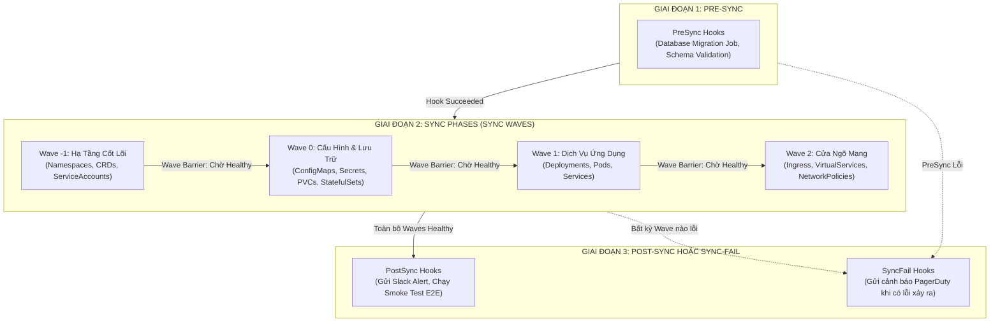
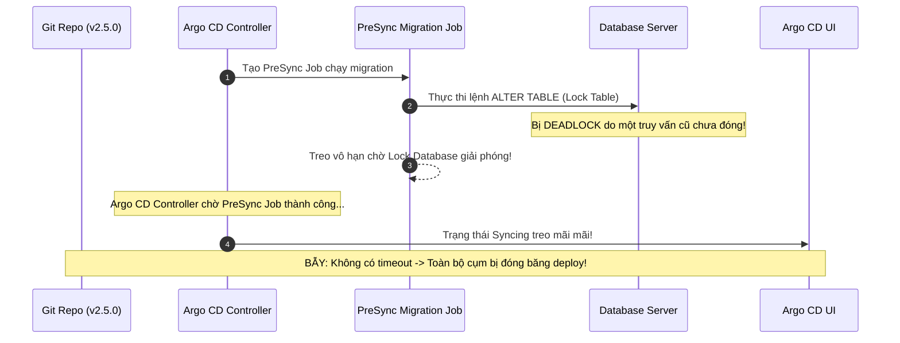


# Điều Phối Triển Khai Phức Tạp: Sync Waves, Resource Hooks & Quản Trị Vòng Đời

Trong môi trường phân tán microservices thực tế, hiếm khi một ứng dụng có thể triển khai thành công nếu tất cả tài nguyên được nạp đồng loạt cùng một lúc. Hãy tưởng tượng kịch bản: Kubernetes Pod ứng dụng backend khởi động trước khi cơ sở dữ liệu (Database) hoàn tất việc nâng cấp cấu trúc bảng (Schema Migration), hoặc ứng dụng cố gắng đọc một `Secret` từ Vault trước khi Namespace và ServiceAccount kịp tạo ra. Kết quả tất yếu là Pod sẽ rơi vào trạng thái `CrashLoopBackOff` và gây gián đoạn dịch vụ diện rộng.

Để giải quyết triệt để bài toán phụ thuộc thứ tự này, Argo CD cung cấp hai "vũ khí" điều phối tối thượng: **Sync Waves** (Đồng bộ theo làn sóng) và **Resource Hooks** (Móc nối vòng đời).

Bài viết này sẽ hướng dẫn bạn làm chủ cơ chế **Wave Barrier**, so sánh Argo Hooks với Helm Hooks, thiết kế luồng Database Migration chuẩn Enterprise và phân tích sâu các cạm bẫy treo đợt đồng bộ khi Hook gặp sự cố.

---

## 1. Bản Chất & Sơ Đồ Điều Phối Vòng Đời Triển Khai

Argo CD chia quá trình đồng bộ tài nguyên thành các giai đoạn tuần tự nghiêm ngặt:



---

## 2. Sync Waves: Cơ Chế Hoạt Động & Khái Niệm "Wave Barrier"

Sync Waves sử dụng một Annotation đơn giản gắn trực tiếp vào tài nguyên Kubernetes:
`argocd.argoproj.io/sync-wave: "<số nguyên>"`

### 2.1. Quy Tắc Vận Hành Của Wave Barrier (Rào Chắn Sóng)
1. **Thứ tự thực thi:** Argo CD sắp xếp toàn bộ tài nguyên theo thứ tự tăng dần của chỉ số Wave: `..., -2, -1, 0, 1, 2, ...` (Mặc định nếu không khai báo, tài nguyên có giá trị wave là `0`).
2. **Nguyên lý Rào Chắn (Barrier):** Argo CD sẽ apply toàn bộ tài nguyên trong Wave $N$. Sau đó, nó **DỪNG LẠI VÀ CHỜ ĐỢI** cho đến khi 100% tài nguyên trong Wave $N$ đạt trạng thái **`Healthy`** thì mới bắt đầu apply tài nguyên của Wave $N+1$.
3. **Nếu có tài nguyên bị Degraded:** Tiến trình đồng bộ sẽ lập tức dừng lại, không bao giờ bước sang Wave tiếp theo, bảo vệ hệ thống khỏi trạng thái đổ vỡ dây chuyền.

> [!IMPORTANT]
> **QUY TẮC WAVE BARRIER:**
> Wave sau chỉ được phép kích hoạt khi 100% tài nguyên ở Wave trước đạt trạng thái `Healthy`. Một Pod duy nhất bị `CrashLoopBackOff` ở Wave 1 sẽ chặn đứng toàn bộ quá trình deploy của Wave 2.

> [!TIP]
> **THIẾT KẾ DATABASE MIGRATION:**
> Luôn cấu hình `activeDeadlineSeconds` trên Kubernetes Job của PreSync Hook để ngăn chặn hiện tượng deadlock cơ sở dữ liệu làm treo vô hạn tiến trình deploy.

### 2.2. Bảng Phân Bổ Sync Waves Mẫu Cho Hệ Thống Chuẩn Doanh Nghiệp

| Chỉ số Sync Wave | Loại tài nguyên Kubernetes | Mục đích & Trạng thái chờ |
|---|---|---|
| **Wave -2** | `Namespace`, `CustomResourceDefinition (CRD)` | Khởi tạo không gian tên và định nghĩa tài nguyên tùy biến |
| **Wave -1** | `ServiceAccount`, `RBAC Role`, `ClusterRoleBinding` | Cấp phát quyền hạn bảo mật trước khi workload chạy |
| **Wave 0** | `Secret`, `ConfigMap`, `PersistentVolumeClaim` | Nạp sẵn cấu hình, chứng chỉ và ổ đĩa lưu trữ |
| **Wave 1** | `StatefulSet` (Database, Redis, Kafka) | Chờ Database khởi động xong và sẵn sàng nhận kết nối |
| **Wave 2** | `Deployment` (Backend API, Microservices) | Kết nối vào Database và khởi động dịch vụ ứng dụng |
| **Wave 3** | `Ingress`, `Route`, `NetworkPolicy` | Mở cổng đón traffic từ bên ngoài khi backend đã sẵn sàng |

---

## 3. Khảo Sát Manifest StatefulSet Ở Wave 1 Kết Hợp PVC

Để đảm bảo StatefulSet hoàn thành khởi tạo trước khi backend ở Wave 2 khởi chạy:

```yaml
# statefulset-wave1.yaml
apiVersion: apps/v1
kind: StatefulSet
metadata:
  name: redis-cluster
  namespace: payment-production
  annotations:
    argocd.argoproj.io/sync-wave: "1"
spec:
  serviceName: "redis-headless"
  replicas: 3
  selector:
    matchLabels:
      app: redis
  template:
    metadata:
      labels:
        app: redis
    spec:
      containers:
        - name: redis
          image: redis:7.2-alpine
          ports:
            - containerPort: 6379
              name: redis
          readinessProbe:
            exec:
              command: ["redis-cli", "ping"]
            initialDelaySeconds: 5
            periodSeconds: 5
```

---

## 4. So Sánh Argo CD Native Hooks vs Helm Hooks

Khi làm việc với các Helm Charts trong Argo CD, bạn có thể bắt gặp cả hai loại annotation hooks:

| Tiêu Chí So Sánh | Argo CD Native Hooks (`argocd.argoproj.io/hook`) | Helm Hooks (`helm.sh/hook`) |
|---|---|---|
| **Bộ điều khiển thực thi** | Do chính `argocd-application-controller` điều phối | Do Argo CD giả lập (Emulate) cơ chế của Helm |
| **Hỗ trợ Sync Waves** | **Tích hợp hoàn hảo** (Có thể gán wave cho từng Hook) | Giới hạn theo trọng số `helm.sh/hook-weight` |
| **Chính sách xóa** | Hỗ trợ linh hoạt: `BeforeHookCreation`, `HookSucceeded`, `HookFailed` | `before-hook-creation`, `hook-succeeded`, `hook-failed` |
| **Phạm vi áp dụng** | Mọi nguồn (Kustomize, Raw Manifests, Helm, CMP) | Chỉ hoạt động khi dùng Helm Chart nguồn |

---

## 5. Resource Hooks: 5 Loại Hook & Quản Lý Vòng Đời Tự Xóa

Resource Hooks thường là các **Kubernetes Jobs** hoặc **Pods** được thiết kế để thực thi một tác vụ ngắn hạn vào đúng thời điểm xác định trong vòng đời deploy.

### 5.1. Phân Loại 5 Loại Hook (`argocd.argoproj.io/hook`)

| Loại Hook | Thời điểm kích hoạt | Trường hợp ứng dụng thực tế |
|---|---|---|
| **`PreSync`** | Chạy TRƯỚC khi bất kỳ tài nguyên chính nào được apply | Database Migration (Flyway/Liquibase), Kiểm tra tính khả dụng của bên thứ 3 |
| **`Sync`** | Chạy ĐỒNG THỜI cùng lúc với các tài nguyên trong quá trình Sync | Tác vụ phụ trợ đồng bộ dữ liệu |
| **`PostSync`** | Chạy SAU KHI toàn bộ tài nguyên đã được apply và đạt `Healthy` | Chạy Integration Smoke Test, Xóa cache CDN, Gửi thông báo hoàn tất |
| **`SyncFail`** | Chạy KHI VÀ CHỈ KHI đợt đồng bộ bị thất bại | Dọn dẹp tài nguyên tạm, Gửi tin nhắn khẩn cấp tới PagerDuty/Telegram |
| **`Skip`** | Chỉ thị Argo CD bỏ qua không đồng bộ tài nguyên này | Tài nguyên chỉ dùng cho môi trường dev cục bộ |

### 5.2. Chính Sách Tự Động Xóa Hook (`hook-delete-policy`)
Nếu không cấu hình chính sách xóa, mỗi lần deploy sẽ để lại một Pod/Job rác trong namespace. Argo CD cung cấp 3 tùy chọn:
- **`HookSucceeded`:** Tự động xóa Job khi nó hoàn thành thành công (`exit code 0`).
- **`HookFailed`:** Tự động xóa Job khi nó chạy thất bại (Thường dùng cho các tác vụ nhạy cảm không muốn lưu log lỗi).
- **`BeforeHookCreation`:** Tự động xóa Job cũ của lần deploy trước TRƯỚC KHI tạo Job mới (Khuyên dùng để tránh lỗi trùng tên Job).

---

## 6. Kịch Bản Thực Chiến 1: Database Migration Chuẩn Enterprise (PreSync Hook)

Dưới đây là một manifest `PreSync` Job thực thi Database Migration bằng Liquibase/Flyway được cấu hình đầy đủ các tiêu chuẩn bảo mật và điều phối:

```yaml
# db-migration-presync-job.yaml
apiVersion: batch/v1
kind: Job
metadata:
  name: payment-db-schema-migration
  namespace: payment-production
  annotations:
    # 1. Khai báo đây là một PreSync Hook
    argocd.argoproj.io/hook: PreSync
    # 2. Xóa Job cũ trước khi tạo mới và xóa Job khi hoàn thành thành công
    argocd.argoproj.io/hook-delete-policy: BeforeHookCreation,HookSucceeded
    # 3. Gán wave âm để đảm bảo chạy trước các tài nguyên wave 0
    argocd.argoproj.io/sync-wave: "-1"
spec:
  # Tự động dọn dẹp Pod Job sau 300 giây hoàn thành
  ttlSecondsAfterFinished: 300
  # Giới hạn thời gian chạy tối đa 10 phút (Chống treo deadlock)
  activeDeadlineSeconds: 600
  # Không cho phép Job thử lại quá 3 lần nếu có lỗi SQL
  backoffLimit: 3
  template:
    metadata:
      labels:
        app.kubernetes.io/name: payment-db-migration
    spec:
      restartPolicy: Never
      securityContext:
        runAsNonRoot: true
        runAsUser: 10001
      containers:
        - name: schema-migrator
          image: company-registry.io/payment/db-migrator:v2.5.0
          command: ["/bin/sh", "-c"]
          args:
            - |
              echo "[$(date)] Bắt đầu tiến trình kiểm tra và nâng cấp Schema Database..."
              liquibase --url=$DB_URL --username=$DB_USER --password=$DB_PASSWORD update
              if [ $? -eq 0 ]; then
                echo "[$(date)] Nâng cấp Database thành công rực rỡ!"
                exit 0
              else
                echo "[$(date)] LỖI NGHIÊM TRỌNG: Migration thất bại!"
                exit 1
              fi
          env:
            - name: DB_URL
              value: "jdbc:postgresql://postgres-master.database.svc:5432/payment_db"
            - name: DB_USER
              valueFrom:
                secretKeyRef:
                  name: payment-db-credentials
                  key: username
            - name: DB_PASSWORD
              valueFrom:
                secretKeyRef:
                  name: payment-db-credentials
                  key: password
          resources:
            requests:
              cpu: 100m
              memory: 256Mi
            limits:
              cpu: 500m
              memory: 512Mi
```

---

## 7. Kịch Bản Thực Chiến 2: Smoke Test & Khẩn Nguy (PostSync & SyncFail Hooks)

### 7.1. PostSync Smoke Test Job
Sau khi toàn bộ microservices ở các Waves đã đạt trạng thái `Healthy`, PostSync Job được kích hoạt để kiểm tra endpoint thực tế:

```yaml
# smoketest-postsync-job.yaml
apiVersion: batch/v1
kind: Job
metadata:
  name: payment-api-smoke-test
  namespace: payment-production
  annotations:
    argocd.argoproj.io/hook: PostSync
    argocd.argoproj.io/hook-delete-policy: BeforeHookCreation,HookSucceeded
spec:
  template:
    spec:
      restartPolicy: Never
      containers:
        - name: tester
          image: curlimages/curl:8.5.0
          command: ["/bin/sh", "-c"]
          args:
            - |
              echo "Bắt đầu kiểm tra End-to-End API Health..."
              STATUS=$(curl -s -o /dev/null -w "%{http_code}" http://payment-service.payment-production.svc:8080/healthz)
              if [ "$STATUS" -eq 200 ]; then
                echo "Smoke Test Passed! HTTP Code: $STATUS"
                exit 0
              else
                echo "Smoke Test Failed! HTTP Code: $STATUS"
                exit 1
              fi
```

### 7.2. SyncFail Emergency Alert Job
Nếu bất kỳ Wave nào hoặc PreSync Job nào thất bại, Hook này sẽ lập tức phát đi cảnh báo đỏ tới phòng tác chiến SRE:

```yaml
# alert-syncfail-job.yaml
apiVersion: batch/v1
kind: Job
metadata:
  name: payment-sync-fail-alert
  namespace: payment-production
  annotations:
    argocd.argoproj.io/hook: SyncFail
    argocd.argoproj.io/hook-delete-policy: BeforeHookCreation,HookSucceeded
spec:
  template:
    spec:
      restartPolicy: Never
      containers:
        - name: notifier
          image: curlimages/curl:8.5.0
          command: ["/bin/sh", "-c"]
          args:
            - |
              curl -X POST -H 'Content-type: application/json' \
                --data '{"text":"🚨 [CRITICAL ALERT] Triển khai payment-service thất bại trên Production! Yêu cầu SRE kiểm tra khẩn cấp!"}' \
                https://hooks.slack.com/services/T00/B00/XXXXXX
```

---

## 8. Cạm Bẫy Thực Chiến: "PreSync Hook Bị Treo Khiến Toàn Bộ Quá Trình Deploy Bị Đóng Băng"

### Hiện Tượng Sự Cố
Kỹ sư commit mã nguồn mới lên Git. Trên giao diện Argo CD UI, đợt đồng bộ chuyển sang trạng thái **`Syncing...`** màu vàng và bị treo cứng trong 6 giờ liên tục. Toàn bộ các phiên bản mới của Microservices không thể triển khai được.



### 8.1. Phân Tích Nguyên Nhân Gốc Rễ
1. `PreSync Job` không được cấu hình `activeDeadlineSeconds` trong Kubernetes Job Spec.
2. Quá trình Migration gặp lỗi Deadlock trên Database và treo kết nối TCP vĩnh viễn.
3. Argo CD Controller theo đúng thiết kế sẽ **chờ PreSync Hook hoàn thành thành công** mới thực hiện Wave tiếp theo.
4. Hậu quả: Toàn bộ tiến trình deploy của toàn bộ Application bị tê liệt hoàn toàn!

### 8.2. Giải Pháp Khắc Phục Chuẩn SRE
1. **Luôn thiết lập `activeDeadlineSeconds` trên Kubernetes Job:**
   ```yaml
   spec:
     activeDeadlineSeconds: 600 # Tự động hủy Job và báo lỗi nếu chạy quá 10 phút
   ```
2. **Cấu hình `timeout.reconciliation` hợp lý trong Argo CD.**
3. **Cưỡng chế hủy đợt Sync bị treo qua CLI:**
   ```bash
   argocd app terminate-op payment-service
   ```

---

## 9. Hướng Dẫn Thực Hành CLI: Kiểm Chứng Cơ Chế Sync Waves

```bash
# 1. Triển khai một ứng dụng có cấu trúc nhiều Wave
argocd app sync ecommerce-platform

# 2. Quan sát trực tiếp từng Wave được apply tuần tự theo thời gian thực
argocd app get ecommerce-platform --watch

# 3. Xem danh sách các Hooks và trạng thái thực thi
kubectl get jobs -n payment-production -l app.kubernetes.io/name=payment-db-migration

# 4. Hủy khẩn cấp một tác vụ Sync đang bị kẹt do Hook lỗi
argocd app terminate-op ecommerce-platform
```

---

## 10. Bộ Câu Hỏi Tự Kiểm Tra Chuyên Sâu (Self-Check Q&A)


<div class="qa-answer">
  <div class="qa-answer-header">
    <svg width="14" height="14" fill="none" stroke="currentColor" stroke-width="2" viewBox="0 0 24 24"><path d="M22 11.08V12a10 10 0 1 1-5.93-9.14"></path><polyline points="22 4 12 14.01 9 11.01"></polyline></svg>
    <span>Phân Tích &amp; Lời Giải Kỹ Thuật</span>
  </div>
  
Sync Waves là cơ chế sắp xếp thứ tự đồng bộ giữa các <b style="color: var(--accent-primary);">tài nguyên Kubernetes dài hạn</b> (Persistent Resources như Namespace, Secret, Deployment) dựa trên rào chắn trạng thái <code>Healthy</code>. Resource Hooks là các <b style="color: var(--accent-primary);">tác vụ ngắn hạn</b> (thường là Job chạy một lần) được chèn vào các thời điểm cụ thể (<code>PreSync</code>, <code>PostSync</code>, <code>SyncFail</code>) để thực thi logic nghiệp vụ.
</div>
</details>

<div class="qa-answer">
  <div class="qa-answer-header">
    <svg width="14" height="14" fill="none" stroke="currentColor" stroke-width="2" viewBox="0 0 24 24"><path d="M22 11.08V12a10 10 0 1 1-5.93-9.14"></path><polyline points="22 4 12 14.01 9 11.01"></polyline></svg>
    <span>Phân Tích &amp; Lời Giải Kỹ Thuật</span>
  </div>
  
Quá trình đồng bộ sẽ bị <b style="color: var(--accent-primary);">dừng lại ngay lập tức tại rào chắn Wave 1</b>. Toàn bộ tài nguyên ở Wave 2 sẽ không bao giờ được apply xuống cụm, giúp ngăn chặn lỗi lan rộng.
</div>
</details>

<div class="qa-answer">
  <div class="qa-answer-header">
    <svg width="14" height="14" fill="none" stroke="currentColor" stroke-width="2" viewBox="0 0 24 24"><path d="M22 11.08V12a10 10 0 1 1-5.93-9.14"></path><polyline points="22 4 12 14.01 9 11.01"></polyline></svg>
    <span>Phân Tích &amp; Lời Giải Kỹ Thuật</span>
  </div>
  
Tạo một Kubernetes Job với annotation <code>argocd.argoproj.io/hook: SyncFail</code>. Job này chứa đoạn script curl gửi payload cảnh báo đến Webhook của Telegram/Slack kèm theo thông tin lỗi.
</div>
</details>

<div class="qa-answer">
  <div class="qa-answer-header">
    <svg width="14" height="14" fill="none" stroke="currentColor" stroke-width="2" viewBox="0 0 24 24"><path d="M22 11.08V12a10 10 0 1 1-5.93-9.14"></path><polyline points="22 4 12 14.01 9 11.01"></polyline></svg>
    <span>Phân Tích &amp; Lời Giải Kỹ Thuật</span>
  </div>
  
Kubernetes mặc định không cho phép tạo một Job mới nếu đã có một Job trùng tên đang tồn tại trong namespace. <code>BeforeHookCreation</code> chỉ thị Argo CD tự động xóa bản ghi Job của lần deploy trước TRƯỚC KHI tạo Job mới, tránh lỗi <code>Job already exists</code>.
</div>
</details>

<div class="qa-answer">
  <div class="qa-answer-header">
    <svg width="14" height="14" fill="none" stroke="currentColor" stroke-width="2" viewBox="0 0 24 24"><path d="M22 11.08V12a10 10 0 1 1-5.93-9.14"></path><polyline points="22 4 12 14.01 9 11.01"></polyline></svg>
    <span>Phân Tích &amp; Lời Giải Kỹ Thuật</span>
  </div>
  
<b style="color: var(--accent-primary);">Hoàn toàn được!</b> Sync Wave nhận mọi giá trị số nguyên. Các wave số âm (nhỏ hơn 0) được sử dụng cho các tài nguyên hạ tầng nền móng (Namespace, CRD, Secret) cần phải sẵn sàng trước các tài nguyên mặc định (Wave 0).
</div>
</details>

<div class="qa-answer">
  <div class="qa-answer-header">
    <svg width="14" height="14" fill="none" stroke="currentColor" stroke-width="2" viewBox="0 0 24 24"><path d="M22 11.08V12a10 10 0 1 1-5.93-9.14"></path><polyline points="22 4 12 14.01 9 11.01"></polyline></svg>
    <span>Phân Tích &amp; Lời Giải Kỹ Thuật</span>
  </div>
  
<b style="color: var(--accent-primary);">Hoàn toàn được!</b> Nếu bạn có 3 PreSync Hooks cần chạy theo thứ tự nghiêm ngặt (ví dụ: Hook 1 Backup DB $\rightarrow$ Hook 2 Schema Migration $\rightarrow$ Hook 3 Seed Data), bạn có thể gán <code>sync-wave: "1"</code>, <code>sync-wave: "2"</code>, <code>sync-wave: "3"</code> cho từng PreSync Job đó.
</div>
</details>

<div class="qa-answer">
  <div class="qa-answer-header">
    <svg width="14" height="14" fill="none" stroke="currentColor" stroke-width="2" viewBox="0 0 24 24"><path d="M22 11.08V12a10 10 0 1 1-5.93-9.14"></path><polyline points="22 4 12 14.01 9 11.01"></polyline></svg>
    <span>Phân Tích &amp; Lời Giải Kỹ Thuật</span>
  </div>
  
Mẫu thiết kế <b style="color: var(--accent-primary);">Expand and Contract Pattern (Non-breaking Database Changes)</b>. Luôn đảm bảo code phiên bản cũ và code phiên bản mới đều có thể chạy song song với cấu trúc Database mới trong quá trình RollingUpdate. Không bao giờ xóa hoặc đổi tên cột đang dùng ngay trong một bước migration.
</div>
</details>

<div class="qa-answer">
  <div class="qa-answer-header">
    <svg width="14" height="14" fill="none" stroke="currentColor" stroke-width="2" viewBox="0 0 24 24"><path d="M22 11.08V12a10 10 0 1 1-5.93-9.14"></path><polyline points="22 4 12 14.01 9 11.01"></polyline></svg>
    <span>Phân Tích &amp; Lời Giải Kỹ Thuật</span>
  </div>
  
Vì nếu không có timeout, một Hook Job bị treo (do deadlock database, kẹt I/O hoặc lỗi network) sẽ khiến tiến trình Sync của Argo CD bị khóa vô thời hạn, không thể tiếp tục deploy và cũng không kích hoạt <code>SyncFail</code> Hook.
</div>
</details>

<div class="qa-answer">
  <div class="qa-answer-header">
    <svg width="14" height="14" fill="none" stroke="currentColor" stroke-width="2" viewBox="0 0 24 24"><path d="M22 11.08V12a10 10 0 1 1-5.93-9.14"></path><polyline points="22 4 12 14.01 9 11.01"></polyline></svg>
    <span>Phân Tích &amp; Lời Giải Kỹ Thuật</span>
  </div>
  
Xóa Pod Job bằng tay chỉ khiến Kubernetes tạo Pod mới nếu Job chưa hết <code>backoffLimit</code>. Lệnh <code>argocd app terminate-op</code> phát tín hiệu hủy bỏ trực tiếp vào tầng điều phối của Argo CD Controller, lập tức kết thúc đợt Sync đang chạy và đưa trạng thái về <code>Failed</code>.
</div>
</details>

<div class="qa-answer">
  <div class="qa-answer-header">
    <svg width="14" height="14" fill="none" stroke="currentColor" stroke-width="2" viewBox="0 0 24 24"><path d="M22 11.08V12a10 10 0 1 1-5.93-9.14"></path><polyline points="22 4 12 14.01 9 11.01"></polyline></svg>
    <span>Phân Tích &amp; Lời Giải Kỹ Thuật</span>
  </div>
  
Được dùng để tạm thời bỏ qua một tài nguyên cụ thể trong thư mục Git mà không cần phải xóa file hoặc tạo commit mới trên Git, rất hữu ích khi gỡ lỗi hoặc khi một tài nguyên đang được bảo trì riêng biệt.
</div>
</details>

---

## Tổng Kết

Sync Waves và Resource Hooks là hai công cụ không thể thiếu để biến các kịch bản triển khai microservices phức tạp thành những quy trình tự động hóa mượt mà, tin cậy và có khả năng tự bảo vệ cao.

Ở bài tiếp theo, chúng ta sẽ khám phá **Kiểm Soát Sức Khỏe Tài Nguyên: Built-in Health Checks, Bẫy "Healthy Ảo" & Viết Custom Lua Scripts Cho Mọi Loại CRD**!

