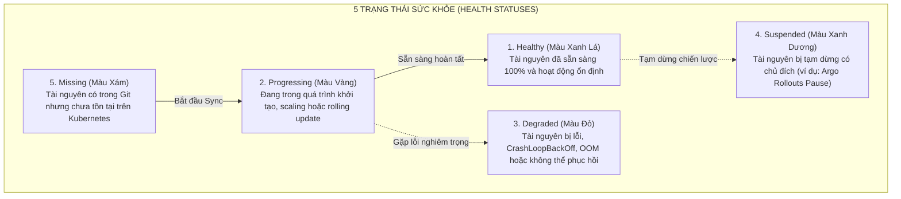
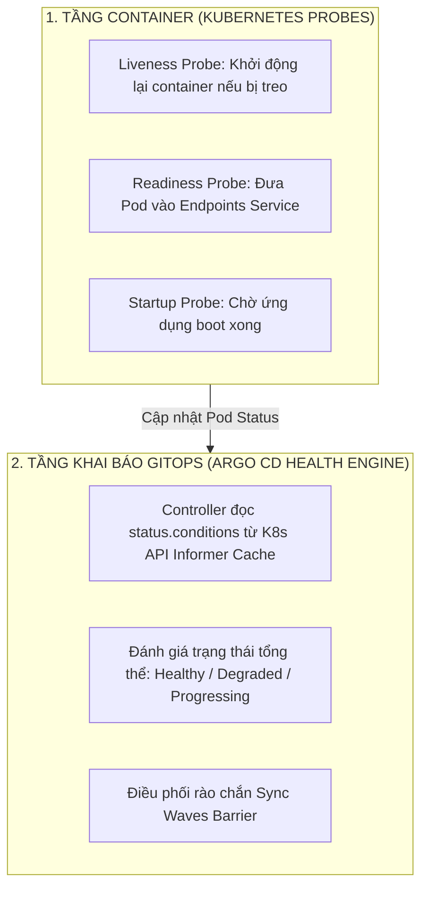
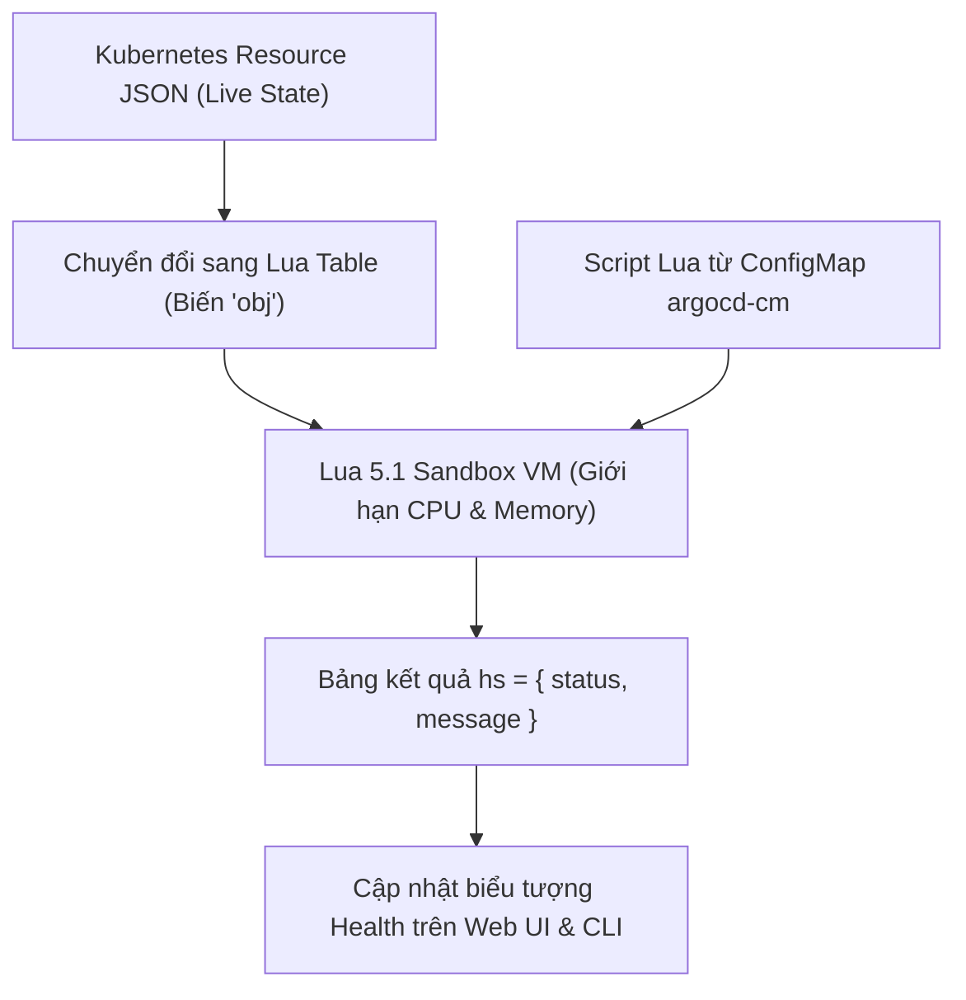
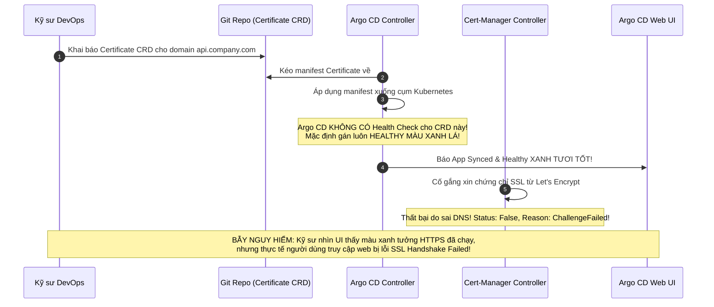


# Kiểm Soát Sức Khỏe Tài Nguyên: Health Checks & Custom Lua Scripts Cho Mọi CRD

Trong quy trình phân phối liên tục (GitOps Continuous Delivery), việc kiểm tra xem một tài nguyên đã được "Apply thành công" (`Sync Status: Synced`) chỉ mới là điều kiện cần. Điều kiện đủ và quan trọng nhất để bảo đảm hệ thống vận hành trơn tru là tài nguyên đó phải thực sự **khỏe mạnh** (**`Health Status: Healthy`**) — nghĩa là các Pods đã sẵn sàng nhận traffic, các kết nối cơ sở dữ liệu đã thông suốt, các Secrets đã được giải mã và chứng chỉ SSL/TLS đã được cấp phát hợp lệ.

Mặc định, Argo CD tích hợp sẵn các bộ kiểm tra sức khỏe (**Built-in Health Checks**) cho các tài nguyên Kubernetes tiêu chuẩn (Deployment, StatefulSet, Service, Ingress, PVC). Tuy nhiên, khi hệ thống sử dụng hàng chục loại **Custom Resource Definitions (CRD)** của bên thứ ba (như Cert-Manager `Certificate`, Bitnami `SealedSecret`, External Secrets Operator `ExternalSecret`, Prometheus `PrometheusRule`), Argo CD sẽ rơi vào trạng thái bối rối và tự động gán nhãn **`Healthy` xanh lá một cách mù quáng**, dù tài nguyên bên dưới đang bị lỗi nghiêm trọng!

Bài viết này sẽ hướng dẫn bạn bóc tách cơ chế Health Assessment của Argo CD, phân biệt giữa Pod Probes và Argo Health, tự tay lập trình các **Custom Lua Health Scripts** cho 6 loại CRD phổ biến nhất và xây dựng các nút bấm **Custom Actions** trên Web UI.

---

## 1. Năm Trạng Thái Sức Khỏe Cốt Lõi Trong Argo CD

Argo CD phân loại trạng thái sức khỏe của mọi tài nguyên thành 5 cấp độ rõ ràng:



### Bảng Ý Nghĩa Chi Tiết 5 Trạng Thái

| Trạng thái Health | Biểu tượng trên UI | Ý nghĩa kỹ thuật | Tác động tới Sync Waves |
|---|---|---|---|
| **`Healthy`** | Trái tim xanh lá | Toàn bộ Replicas đã `Ready`, Endpoint đã có Pod, PVC đã `Bound`. | **Cho phép** kích hoạt Wave tiếp theo |
| **`Progressing`** | Bánh răng xoay vàng | Pods đang pull image, Job đang chạy, Rollout đang chờ phân bổ. | **Dừng lại chờ** tại Wave hiện tại |
| **`Degraded`** | Trái tim vỡ màu đỏ | `ImagePullBackOff`, `CrashLoop`, PVC `Lost`, InitContainer sập. | **Hủy bỏ đợt Sync**, báo lỗi ngay |
| **`Suspended`** | Biểu tượng tạm dừng | Rollout Canary đang trong bước Pause chờ can thiệp thủ công. | Coi như đã hoàn thành wave |
| **`Missing`** | Chấm tròn rỗng màu xám | Tài nguyên chưa từng được tạo trên cụm. | Chờ Controller apply |

---

## 2. Phân Biệt: Kubernetes Probes vs Argo CD Resource Health

Nhiều kỹ sư mới tiếp cận GitOps thường nhầm lẫn giữa hai tầng kiểm tra sức khỏe:



- **Kubernetes Probes (Tầng thực thi):** Quyết định xem container có được nhận request hay cần bị kill và restart.
- **Argo CD Health Checks (Tầng điều phối):** Đọc trạng thái tổng hợp (`status`) từ Kubernetes API để quyết định xem một đợt deploy đã thành công hay chưa, và có được phép bước sang Sync Wave tiếp theo hay không.

---

## 3. Kiến Trúc Môi Trường Thực Thi Lua Sandbox

Khi Application Controller duyệt qua cây tài nguyên, nó chạy các script Lua trong một môi trường cô lập (**Lua Sandbox VM**):



### 3.1. Các Ràng Buộc Của Lua Sandbox
- Không có quyền truy cập hệ thống file nội bộ (I/O) hoặc mở kết nối mạng Socket.
- Giới hạn thời gian thực thi tối đa 100ms cho mỗi tài nguyên để tránh nghẽn luồng Reconcile.
- Biến toàn cục `obj` chứa toàn bộ cây JSON của tài nguyên (`obj.metadata`, `obj.spec`, `obj.status`).
- Tránh sử dụng bộ nhớ toàn cục (Global Variables) để ngăn chặn rò rỉ bộ nhớ (Memory Leak) trong tiến trình Go Controller.

---

## 4. Cơ Chế Built-in Health Checks Hoạt Động Ra Sao?

Đối với các tài nguyên chuẩn của Kubernetes, Argo CD nhúng sẵn các đoạn mã đánh giá logic:
- **Deployment:** `status.observedGeneration >= metadata.generation` VÀ `status.updatedReplicas == spec.replicas` VÀ `status.availableReplicas == spec.replicas`.
- **StatefulSet:** `status.currentRevision == status.updateRevision` VÀ `status.readyReplicas == spec.replicas`.
- **PersistentVolumeClaim (PVC):** `status.phase == "Bound"`.
- **Job:** `status.succeeded > 0` $\rightarrow$ `Healthy`; `status.failed > 0` và chạm `backoffLimit` $\rightarrow$ `Degraded`.
- **Ingress:** Kiểm tra `status.loadBalancer.ingress` đã được cấp địa chỉ IP hoặc Hostname chưa.

> [!WARNING]
> **CẠM BẪY HEALTHY ẢO TRÊN CRD:**
> Argo CD mặc định đánh giá `Healthy` cho bất kỳ CRD tùy biến nào nếu Kubernetes API lưu thành công đối tượng vào etcd, bỏ qua lỗi bên trong `status.conditions`. Bắt buộc phải viết Custom Lua Script để kiểm tra thực chất.

> [!TIP]
> **KIỂM THỬ SCRIPT LUA AN TOÀN:**
> Luôn sử dụng lệnh `argocd admin settings resource-overrides health` để kiểm thử logic script Lua với file YAML mẫu trước khi nạp vào ConfigMap `argocd-cm`.

---

## 5. Cạm Bẫy Thực Chiến: "Bẫy 'Healthy Ảo' Trên Các CRD Bên Thứ Ba"

Đây là một trong những cạm bẫy nguy hiểm nhất khi vận hành hệ thống GitOps hiện đại:



---

## 6. Lập Trình 6 Custom Lua Health Check Chuẩn Enterprise Trong `argocd-cm`

Để khắc phục triệt để bẫy "Healthy ảo", chúng ta cấu hình các đoạn script Lua trong ConfigMap `argocd-cm`:

### 6.1. Script 1: Cert-Manager `Certificate`

```yaml
# argocd-cm
apiVersion: v1
kind: ConfigMap
metadata:
  name: argocd-cm
  namespace: argocd
data:
  resource.customizations.health.cert-manager.io_Certificate: |
    hs = {}
    if obj.status ~= nil and obj.status.conditions ~= nil then
      for i, condition in ipairs(obj.status.conditions) do
        if condition.type == "Ready" and condition.status == "True" then
          hs.status = "Healthy"
          hs.message = "Chứng chỉ SSL/TLS đã được cấp phát thành công và hợp lệ!"
          return hs
        end
        if condition.type == "Ready" and condition.status == "False" then
          hs.status = "Degraded"
          hs.message = "LỖI CẤP CHỨNG CHỈ: " .. (condition.message or condition.reason or "Không rõ nguyên nhân")
          return hs
        end
      end
    end
    hs.status = "Progressing"
    hs.message = "Đang kết nối ACME Server để xác thực tên miền..."
    return hs
```

### 6.2. Script 2: Bitnami `SealedSecret`

```yaml
  resource.customizations.health.bitnami.com_SealedSecret: |
    hs = {}
    if obj.status ~= nil and obj.status.conditions ~= nil then
      for i, condition in ipairs(obj.status.conditions) do
        if condition.type == "Synced" and condition.status == "True" then
          hs.status = "Healthy"
          hs.message = "Secret đã được giải mã thành công thành Native Kube Secret!"
          return hs
        end
        if condition.type == "Synced" and condition.status == "False" then
          hs.status = "Degraded"
          hs.message = "LỖI GIẢI MÃ SECRET: " .. (condition.message or "Private Key không khớp!")
          return hs
        end
      end
    end
    hs.status = "Progressing"
    hs.message = "Đang chờ Sealed Secrets Controller giải mã..."
    return hs
```

### 6.3. Script 3: External Secrets Operator (`ExternalSecret`)

```yaml
  resource.customizations.health.external-secrets.io_ExternalSecret: |
    hs = {}
    if obj.status ~= nil and obj.status.conditions ~= nil then
      for i, condition in ipairs(obj.status.conditions) do
        if condition.type == "Ready" and condition.status == "True" then
          hs.status = "Healthy"
          hs.message = "Đã đồng bộ Secret thành công từ HashiCorp Vault / AWS Secrets Manager!"
          return hs
        end
        if condition.type == "Ready" and condition.status == "False" then
          hs.status = "Degraded"
          hs.message = "LỖI KẾT NỐI VAULT: " .. (condition.message or condition.reason or "Access Denied")
          return hs
        end
      end
    end
    hs.status = "Progressing"
    hs.message = "Đang kéo Secrets từ Vault Server..."
    return hs
```

### 6.4. Script 4: Argo Rollouts (`Rollout`)

```yaml
  resource.customizations.health.argoproj.io_Rollout: |
    hs = {}
    if obj.status ~= nil then
      if obj.status.phase == "Healthy" or (obj.status.readyReplicas == obj.spec.replicas and obj.status.availableReplicas == obj.spec.replicas) then
        hs.status = "Healthy"
        hs.message = "Rollout hoàn tất 100% Pods sẵn sàng"
        return hs
      end
      if obj.status.pauseConditions ~= nil and #obj.status.pauseConditions > 0 then
        hs.status = "Suspended"
        hs.message = "Rollout Canary đang TẠM DỪNG (Paused) ở bước phân bổ traffic"
        return hs
      end
      if obj.status.phase == "Degraded" then
        hs.status = "Degraded"
        hs.message = "Rollout gặp lỗi hoặc phân tích số liệu thất bại"
        return hs
      end
    end
    hs.status = "Progressing"
    hs.message = "Đang thực hiện Canary / Blue-Green Rollout..."
    return hs
```

### 6.5. Script 5: PrometheusRule (`monitoring.coreos.com_PrometheusRule`)

```yaml
  resource.customizations.health.monitoring.coreos.com_PrometheusRule: |
    hs = {}
    if obj.status ~= nil and obj.status.conditions ~= nil then
      for i, condition in ipairs(obj.status.conditions) do
        if condition.type == "Rejected" and condition.status == "True" then
          hs.status = "Degraded"
          hs.message = "Cú pháp PromQL bị từ chối: " .. (condition.message or "Syntax Error")
          return hs
        end
      end
    end
    hs.status = "Healthy"
    hs.message = "Quy tắc cảnh báo PrometheusRule hợp lệ"
    return hs
```

### 6.6. Script 6: CloudNative-PG PostgreSQL Cluster (`postgresql.cnpg.io_Cluster`)

```yaml
  resource.customizations.health.postgresql.cnpg.io_Cluster: |
    hs = {}
    if obj.status ~= nil then
      if obj.status.phase == "Cluster in healthy state" and obj.status.readyInstances == obj.spec.instances then
        hs.status = "Healthy"
        hs.message = "Cụm PostgreSQL hoạt động hoàn hảo (" .. obj.status.readyInstances .. "/" .. obj.spec.instances .. " nodes)"
        return hs
      end
      if obj.status.phase == "Setting up primary" or obj.status.phase == "Creating replica" then
        hs.status = "Progressing"
        hs.message = "Đang khởi tạo cụm PostgreSQL: " .. (obj.status.phase or "")
        return hs
      end
      if obj.status.phase == "Degraded" or (obj.status.readyInstances ~= nil and obj.status.readyInstances < 1) then
        hs.status = "Degraded"
        hs.message = "Cụm PostgreSQL bị sự cố mất Master node!"
        return hs
      end
    end
    hs.status = "Progressing"
    hs.message = "Đang kiểm tra trạng thái cụm database..."
    return hs
```

---

## 7. Mở Rộng: Tùy Biến Nút Bấm Thao Tác Trực Tiếp Bằng Custom Actions

Ngoài việc đánh giá sức khỏe, bạn còn có thể viết script Lua để thêm các nút bấm điều khiển (**Custom Actions**) ngay trên Web UI của Argo CD:

```yaml
# Thêm nút bấm 'Renew Certificate' trên UI cho Certificate CRD
data:
  resource.customizations.actions.cert-manager.io_Certificate: |
    action["renew"] = {
      name = "Yêu Cầu Cấp Lại Chứng Chỉ Ngay",
      action = function(obj)
        if obj.status == nil then
          obj.status = {}
        end
        -- Gắn annotation yêu cầu cert-manager re-issue
        if obj.metadata.annotations == nil then
          obj.metadata.annotations = {}
        end
        obj.metadata.annotations["cert-manager.io/re-issue-at"] = os.date("!%Y-%m-%dT%H:%M:%SZ")
        return obj
      end
    }
```

---

## 8. Hướng Dẫn Thực Hành CLI: Kiểm Thử Và Gỡ Lỗi Script Lua

Argo CD cung cấp công cụ CLI để bạn có thể kiểm thử đoạn mã Lua của mình với dữ liệu YAML thực tế trước khi nạp vào Production:

```bash
# 1. Trích xuất một tài nguyên CRD đang chạy trên cụm ra file YAML
kubectl get certificate api-company-tls -n production -o yaml > cert-sample.yaml

# 2. Tạo một script test Lua cục bộ
cat << 'EOF' > test-health.lua
hs = {}
if obj.status ~= nil and obj.status.conditions ~= nil then
  for i, condition in ipairs(obj.status.conditions) do
    if condition.type == "Ready" and condition.status == "True" then
      hs.status = "Healthy"
      hs.message = "Certificate valid"
      return hs
    end
  end
end
hs.status = "Degraded"
hs.message = "Certificate not ready"
return hs
EOF

# 3. Sử dụng lệnh argocd admin để chạy thử script Lua với file YAML
argocd admin settings resource-overrides health cert-sample.yaml --lua-script test-health.lua

# 4. Kiểm tra sức khỏe của toàn bộ tài nguyên trong một ứng dụng
argocd app get ecommerce-payment-api --output json | jq '.status.resources[] | {kind: .kind, name: .name, health: .health.status, message: .health.message}'
```

---

## 9. Bộ Câu Hỏi Tự Kiểm Tra Chuyên Sâu (Self-Check Q&A)


<div class="qa-answer">
  <div class="qa-answer-header">
    <svg width="14" height="14" fill="none" stroke="currentColor" stroke-width="2" viewBox="0 0 24 24"><path d="M22 11.08V12a10 10 0 1 1-5.93-9.14"></path><polyline points="22 4 12 14.01 9 11.01"></polyline></svg>
    <span>Phân Tích &amp; Lời Giải Kỹ Thuật</span>
  </div>
  
Vì <code>Sync Status: Synced</code> chỉ chứng minh rằng Kubernetes API Server đã tiếp nhận và ghi nhận khai báo manifest từ Git vào etcd. Ứng dụng sau đó có thể bị sập do sai cấu hình, không kéo được image (<code>ImagePullBackOff</code>), hoặc lỗi kết nối mạng nội bộ — những yếu tố này chỉ được phản ánh qua <b style="color: var(--accent-primary);"><code>Health Status</code></b>.
</div>
</details>

<div class="qa-answer">
  <div class="qa-answer-header">
    <svg width="14" height="14" fill="none" stroke="currentColor" stroke-width="2" viewBox="0 0 24 24"><path d="M22 11.08V12a10 10 0 1 1-5.93-9.14"></path><polyline points="22 4 12 14.01 9 11.01"></polyline></svg>
    <span>Phân Tích &amp; Lời Giải Kỹ Thuật</span>
  </div>
  
Biến <code>obj</code> là một Lua Table đại diện cho toàn bộ đối tượng tài nguyên Kubernetes thực tế đang chạy trên Live Cluster (chứa đầy đủ các trường <code>metadata</code>, <code>spec</code>, và quan trọng nhất là <code>status</code>).
</div>
</details>

<div class="qa-answer">
  <div class="qa-answer-header">
    <svg width="14" height="14" fill="none" stroke="currentColor" stroke-width="2" viewBox="0 0 24 24"><path d="M22 11.08V12a10 10 0 1 1-5.93-9.14"></path><polyline points="22 4 12 14.01 9 11.01"></polyline></svg>
    <span>Phân Tích &amp; Lời Giải Kỹ Thuật</span>
  </div>
  
Bắt buộc phải trả về một Table chứa 2 trường:
  <div style="margin: 0.35rem 0; padding-left: 1rem; border-left: 2px solid var(--accent-cyan);"><b style="color: var(--accent-cyan);">1.</b> <code>status</code>: Chuỗi ký tự nhận một trong các giá trị <code>"Healthy"</code>, <code>"Progressing"</code>, <code>"Degraded"</code>, hoặc <code>"Suspended"</code>.</div>
  <div style="margin: 0.35rem 0; padding-left: 1rem; border-left: 2px solid var(--accent-cyan);"><b style="color: var(--accent-cyan);">2.</b> <code>message</code>: Chuỗi thông báo giải thích lý do cụ thể hiển thị trên giao diện người dùng.</div>
</div>
</details>

<div class="qa-answer">
  <div class="qa-answer-header">
    <svg width="14" height="14" fill="none" stroke="currentColor" stroke-width="2" viewBox="0 0 24 24"><path d="M22 11.08V12a10 10 0 1 1-5.93-9.14"></path><polyline points="22 4 12 14.01 9 11.01"></polyline></svg>
    <span>Phân Tích &amp; Lời Giải Kỹ Thuật</span>
  </div>
  
Khi tài nguyên đang trong trạng thái tạm dừng có chủ đích theo logic nghiệp vụ, ví dụ: CronJob đang bị suspend (<code>spec.suspend: true</code>), hoặc một đợt triển khai <b style="color: var(--accent-primary);">Argo Rollouts Canary</b> đang dừng ở bước <code>pause: {}</code> để theo dõi số liệu hoặc chờ kỹ sư phê duyệt thủ công.
</div>
</details>

<div class="qa-answer">
  <div class="qa-answer-header">
    <svg width="14" height="14" fill="none" stroke="currentColor" stroke-width="2" viewBox="0 0 24 24"><path d="M22 11.08V12a10 10 0 1 1-5.93-9.14"></path><polyline points="22 4 12 14.01 9 11.01"></polyline></svg>
    <span>Phân Tích &amp; Lời Giải Kỹ Thuật</span>
  </div>
  
Đoạn mã Lua được thực thi liên tục bên trong vòng lặp Reconcile của Controller cho hàng ngàn tài nguyên. Do đó, mã Lua phải cực kỳ ngắn gọn, không dùng vòng lặp vô hạn, không gọi các hàm tính toán phức tạp và luôn kiểm tra điều kiện <code>nil</code> an toàn (<code>if obj.status ~= nil</code>) để tránh làm sập tiến trình Controller.
</div>
</details>

<div class="qa-answer">
  <div class="qa-answer-header">
    <svg width="14" height="14" fill="none" stroke="currentColor" stroke-width="2" viewBox="0 0 24 24"><path d="M22 11.08V12a10 10 0 1 1-5.93-9.14"></path><polyline points="22 4 12 14.01 9 11.01"></polyline></svg>
    <span>Phân Tích &amp; Lời Giải Kỹ Thuật</span>
  </div>
  
Argo CD Controller sẽ bắt ngoại lệ, ghi log lỗi error vào controller log và gán nhãn trạng thái Health của tài nguyên đó là <b style="color: var(--accent-primary);"><code>Unknown</code></b> kèm thông báo lỗi Lua script, tránh việc làm sập tiến trình Controller.
</div>
</details>

<div class="qa-answer">
  <div class="qa-answer-header">
    <svg width="14" height="14" fill="none" stroke="currentColor" stroke-width="2" viewBox="0 0 24 24"><path d="M22 11.08V12a10 10 0 1 1-5.93-9.14"></path><polyline points="22 4 12 14.01 9 11.01"></polyline></svg>
    <span>Phân Tích &amp; Lời Giải Kỹ Thuật</span>
  </div>
  
Kiểm tra trường <code>condition.reason</code> trong <code>status.conditions</code>. Nếu <code>reason == "SecretSyncedError"</code>, script Lua có thể trích xuất <code>condition.message</code> để hiển thị rõ nguyên nhân lỗi (như "permission denied" hoặc "vault server unreachable") trực tiếp trên UI của Argo CD.
</div>
</details>

<div class="qa-answer">
  <div class="qa-answer-header">
    <svg width="14" height="14" fill="none" stroke="currentColor" stroke-width="2" viewBox="0 0 24 24"><path d="M22 11.08V12a10 10 0 1 1-5.93-9.14"></path><polyline points="22 4 12 14.01 9 11.01"></polyline></svg>
    <span>Phân Tích &amp; Lời Giải Kỹ Thuật</span>
  </div>
  
Vì nếu script Lua trả về <code>Progressing</code>, Argo CD sẽ hiểu rằng tài nguyên đang trong tiến trình khởi tạo và kiên nhẫn chờ đợi tại rào chắn Wave hiện tại. Nếu script vội vã trả về <code>Healthy</code>, Argo CD sẽ kích hoạt Wave sau khi tài nguyên trước chưa thực sự sẵn sàng.
</div>
</details>

<div class="qa-answer">
  <div class="qa-answer-header">
    <svg width="14" height="14" fill="none" stroke="currentColor" stroke-width="2" viewBox="0 0 24 24"><path d="M22 11.08V12a10 10 0 1 1-5.93-9.14"></path><polyline points="22 4 12 14.01 9 11.01"></polyline></svg>
    <span>Phân Tích &amp; Lời Giải Kỹ Thuật</span>
  </div>
  
Đóng góp Pull Request trực tiếp vào thư mục <code>resource_customizations</code> trong kho mã nguồn chính thức <code>argoproj/argo-cd</code> trên GitHub. Khi được merge, script sẽ trở thành built-in trong các phiên bản phát hành tiếp theo.
</div>
</details>

<div class="qa-answer">
  <div class="qa-answer-header">
    <svg width="14" height="14" fill="none" stroke="currentColor" stroke-width="2" viewBox="0 0 24 24"><path d="M22 11.08V12a10 10 0 1 1-5.93-9.14"></path><polyline points="22 4 12 14.01 9 11.01"></polyline></svg>
    <span>Phân Tích &amp; Lời Giải Kỹ Thuật</span>
  </div>
  
Có thể thực hiện các thao tác mutate (chỉnh sửa) trực tiếp lên manifest Live State của tài nguyên, ví dụ: trigger restart deployment, re-issue certificate, resume rollout canary, trigger backup job mà không cần người dùng phải mở terminal chạy <code>kubectl</code>.
</div>
</details>

---

## Tổng Kết

Làm chủ cơ chế Health Checks và tùy biến các script Lua là bước chuyển mình quan trọng để biến Argo CD thành một người gác đền thông minh — có khả năng thấu hiểu chiều sâu của mọi loại tài nguyên và bảo vệ hệ thống khỏi các đợt phát hành lỗi âm thầm.

Ở bài tiếp theo, chúng ta sẽ đi sâu vào **Phát Hiện & Xử Lý Drift: Kỹ Thuật Bỏ Qua Sai Lệch Với `ignoreDifferences` & Chiếc Bẫy "Synced Ảo"**!

