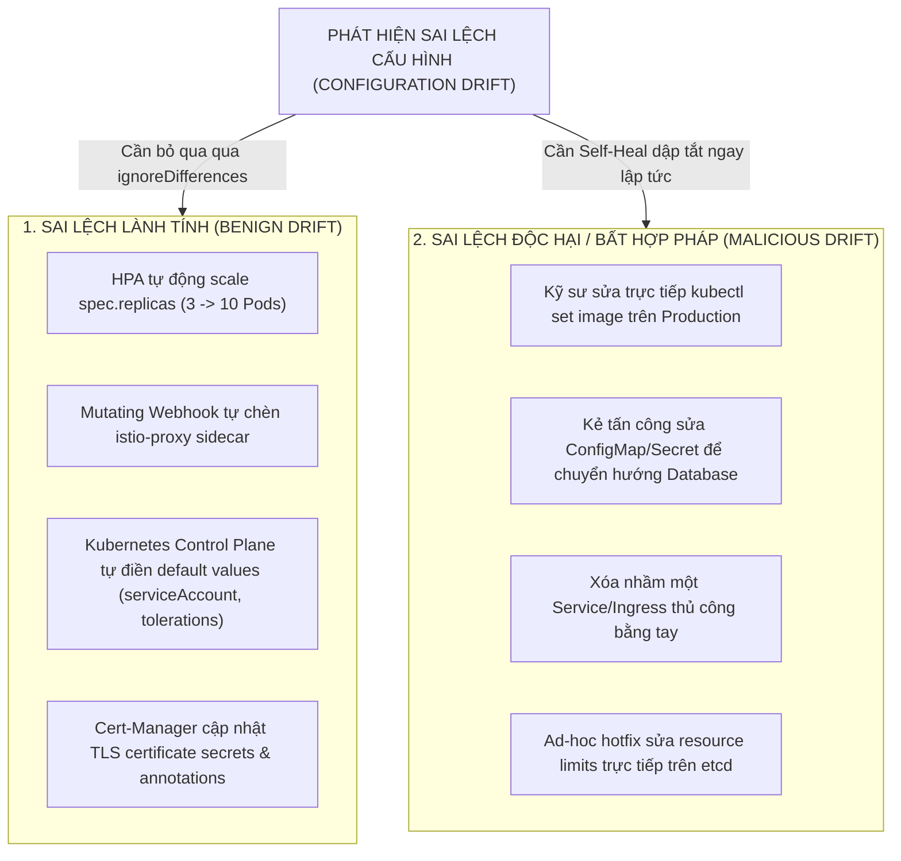
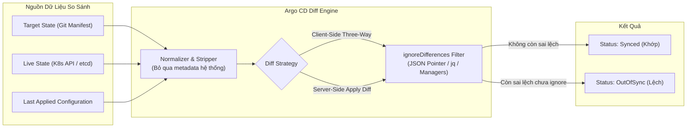
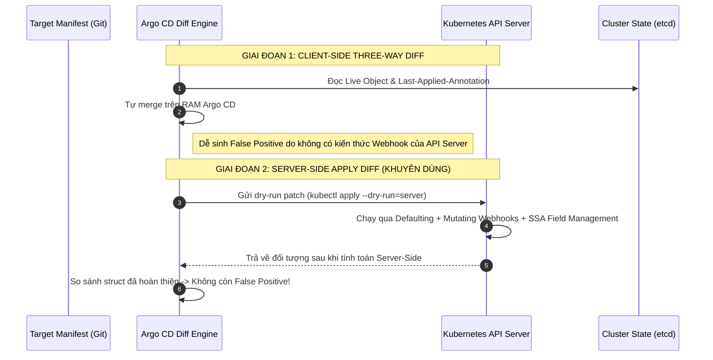
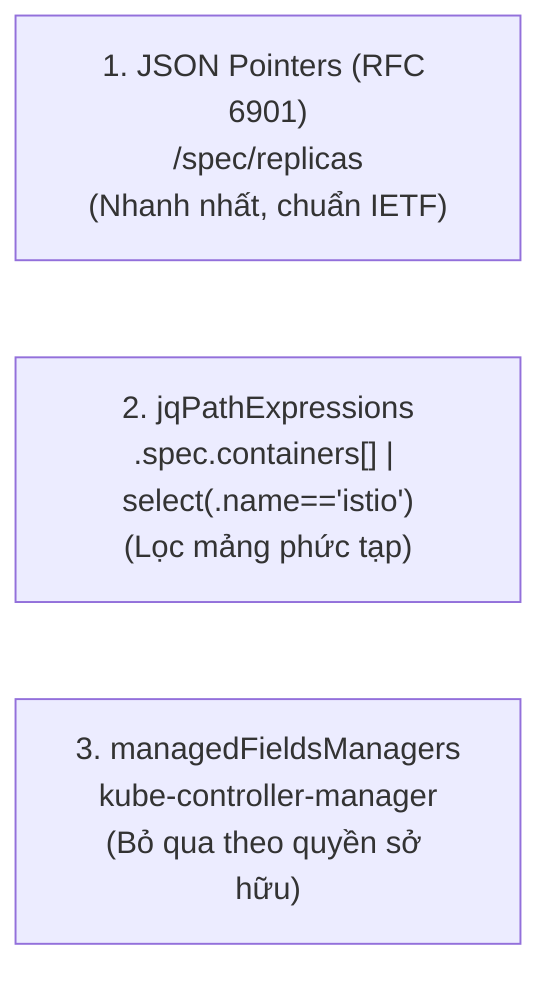
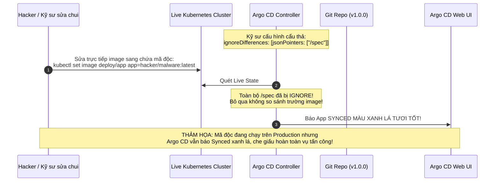
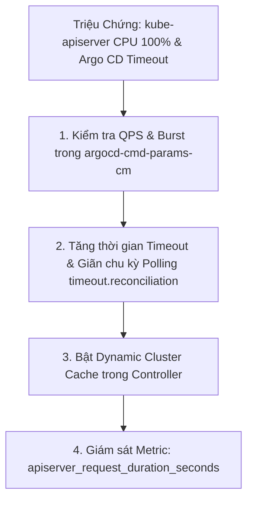


# Phát Hiện & Xử Lý Drift: Diff Strategies, IgnoreDifferences & Cạm Bẫy 'Synced Ảo'

Trong mô hình GitOps, **Configuration Drift** (Sự sai lệch cấu hình giữa kho Git và cụm Kubernetes thực tế) được coi là "kẻ thù số một" phá vỡ nguyên lý Single Source of Truth. Một hệ thống GitOps lý tưởng đòi hỏi mọi sai lệch phải bị phát hiện ngay lập tức và dập tắt tự động.

Tuy nhiên, trong thực tế vận hành Kubernetes, không phải mọi sai lệch đều mang tính tiêu cực. Có những sai lệch là **hoàn toàn hợp lệ và bắt buộc phải tồn tại** (ví dụ: Horizontal Pod Autoscaler tự động thay đổi số lượng `replicas` dựa trên tải CPU, hoặc Istio Mutating Webhook tự động chèn proxy sidecar). Nếu Argo CD liên tục báo `OutOfSync` và cố gắng ghi đè lại, hệ thống sẽ rơi vào vòng lặp xung đột không hồi kết.

Làm thế nào để phân biệt giữa **Sai lệch Lành tính (Benign Drift)** và **Sai lệch Độc hại (Malicious Drift)**? Bài viết này sẽ giúp bạn làm chủ cơ chế **Diff Engine**, khai thác tối đa sức mạnh của **`ignoreDifferences`** và phòng tránh cạm bẫy *"Synced Ảo"* vô cùng nguy hiểm.

---

## 1. Phân Loại Drift: Lành Tính vs Độc Hại

Hiểu rõ bản chất của từng loại sai lệch là bước đầu tiên để thiết kế chiến lược GitOps an toàn và ổn định:



- **Sai lệch lành tính (Benign Drift):** Phát sinh từ các Controller hợp pháp chạy bên trong cụm (In-cluster Controllers) như HPA, VPA, Istio Injection, Dynamic Admission Webhooks, External Secrets Operator. Những thành phần này hoạt động dựa trên phản ứng với tải thực tế hoặc chính sách bảo mật động.
- **Sai lệch độc hại / Bất hợp pháp (Malicious Drift):** Phát sinh từ can thiệp thủ công (Manual ClickOps / Ad-hoc `kubectl`), lỗi thao tác của con người, hoặc hành vi xâm nhập trái phép của kẻ tấn công nhằm thay đổi hành vi ứng dụng mà không thông qua Git PR và quy trình Code Review.

---

## 2. Kiến Trúc Diff Engine & So Sánh Các Chiến Lược Diff Strategies

Trái tim của tính năng Drift Detection trong Argo CD là **Diff Engine** nằm bên trong `argocd-application-controller`. Khi thực hiện so sánh, Controller phải giải bài toán: *Làm thế nào để biết Live State trên Kubernetes có khớp với Target State trên Git hay không khi Kubernetes tự động bổ sung hàng tá trường mặc định?*



### 2.1. Phân Tích Cơ Chế Three-Way Merge vs Server-Side Apply

Trong thế giới Kubernetes, việc so sánh tài nguyên trải qua hai giai đoạn tiến hóa chính:



### 2.2. Bảng So Sánh Toàn Diện Các Chiến Lược So Sánh

| Tiêu Chí So Sánh | Legacy Client-Side Diff | Server-Side Diff (`ServerSideDiff=true`) |
| :--- | :--- | :--- |
| **Cơ chế hoạt động** | Controller tự parse YAML, normalize và so sánh JSON struct trên bộ nhớ của Argo CD pod | Gửi request `kubectl apply --dry-run=server` lên Kube API Server để Kube API tự tính toán merge |
| **Xử lý Defaulting fields** | Dễ báo `OutOfSync` giả tạo khi Kube tự điền `protocol: TCP`, `serviceAccountName: default` | Chuẩn xác 100%, API Server trả về struct đã apply defaulting hoàn chỉnh |
| **Tương thích Custom Webhooks** | Kém; không đoán trước được những trường mà Mutating Webhook sẽ tự chèn | Hoàn hảo; Dry-run đi qua toàn bộ Webhook pipeline của API Server |
| **Tải tài nguyên (Resource Overhead)** | Tốn RAM/CPU của `argocd-application-controller` | Tăng số lượng request dry-run lên Kube API Server |
| **Hỗ trợ Server-Side Apply** | Không hỗ trợ quản lý `managedFields` | Hỗ trợ đầy đủ phân định quyền sở hữu qua `managedFieldsManagers` |
| **Khuyến nghị sử dụng** | Dành cho cụm cũ Kubernetes < 1.22 | **Khuyên dùng mặc định cho toàn bộ cụm Kubernetes >= 1.25** |

### 2.3. Kích Hoạt Server-Side Diff Toàn Cụm

Để bật Server-Side Diff trên quy mô toàn bộ Argo CD, chỉnh sửa ConfigMap `argocd-cmd-params-cm`:

```yaml
apiVersion: v1
kind: ConfigMap
metadata:
  name: argocd-cmd-params-cm
  namespace: argocd
data:
  # Kích hoạt tính năng Server-Side Diff
  controller.diff.server.side: "true"
  # Tùy chọn tăng tốc cache để tránh dồn dập dry-run lên API Server
  controller.status.processors: "30"
```

---

## 3. Làm Chủ Cú Pháp `ignoreDifferences` Chuẩn Mực

Để chỉ định cho Argo CD bỏ qua các trường sai lệch lành tính, chúng ta sử dụng khối `spec.ignoreDifferences` trong Application CRD. Argo CD hỗ trợ 3 phương pháp định vị trường dữ liệu:



### 3.1. Phân Tích Cấu Hình Chi Tiết Manifest (Line-by-Line Breakdown)

Dưới đây là một cấu hình Application hoàn chỉnh kết hợp đầy đủ cả 3 kỹ thuật bỏ qua sai lệch:

```yaml
# application-ignore-differences.yaml
apiVersion: argoproj.io/v1alpha1
kind: Application
metadata:
  name: ecommerce-backend-api
  namespace: argocd
spec:
  project: production-project
  source:
    repoURL: "https://github.com/company/ecommerce-gitops.git"
    targetRevision: "main"
    path: "services/backend"
  destination:
    server: "https://kubernetes.default.svc"
    namespace: "backend-prod"

  # DANH MỤC BỎ QUA SAI LỆCH CHUYÊN SÂU
  ignoreDifferences:
    # 1. Bỏ qua số lượng Replicas trên Deployment do HPA quản lý (JSON Pointer)
    - group: apps
      kind: Deployment
      jsonPointers:
        - /spec/replicas

    # 2. Bỏ qua Annotation đặc thù có chứa dấu gạch chéo '/' (Dùng ~1 escape theo chuẩn RFC 6901)
    - group: apps
      kind: Deployment
      jsonPointers:
        - /metadata/annotations/deployment.kubernetes.io~1revision
        - /metadata/annotations/vault.hashicorp.com~1agent-inject-status

    # 3. Bỏ qua Container sidecar 'istio-proxy' bằng biểu thức jqPath (Định vị mảng động)
    - group: ""
      kind: Pod
      jqPathExpressions:
        - .spec.containers[] | select(.name == "istio-proxy")
        - .spec.initContainers[] | select(.name == "istio-init")

    # 4. Bỏ qua toàn bộ các trường do kube-controller-manager hoặc external-secrets sở hữu
    - group: ""
      kind: Service
      managedFieldsManagers:
        - kube-controller-manager
    - group: ""
      kind: Secret
      managedFieldsManagers:
        - external-secrets

  syncPolicy:
    automated:
      prune: true
      selfHeal: true
    syncOptions:
      # Bắt buộc bật để Argo CD không cố ghi đè các trường đã ignore khi bấm Sync
      - RespectIgnoreDifferences=true
      # Sử dụng Server-Side Apply cho quá trình đồng bộ
      - ServerSideApply=true
```

#### Phân Tích Từng Khối Cấu Hình:
- **Dòng 98-102 (`/spec/replicas`):** Giúp HPA thoải mái thay đổi số lượng bản sao Pod từ 3 lên 50 mà Argo CD không bao giờ đánh dấu `OutOfSync`.
- **Dòng 104-109 (`~1` Escaping):** Theo chuẩn RFC 6901, ký tự `/` là dấu phân cách cấp bậc. Nếu annotation có tên `deployment.kubernetes.io/revision`, ta bắt buộc phải viết thành `deployment.kubernetes.io~1revision`. Nếu có dấu `~`, thay bằng `~0`.
- **Dòng 111-116 (`jqPathExpressions`):** Cho phép duyệt qua mảng `containers` và chỉ bỏ qua đúng container có tên `istio-proxy`. Nếu kẻ tấn công chèn một container lạ khác, Argo CD vẫn phát hiện ngay lập tức!
- **Dòng 118-125 (`managedFieldsManagers`):** Lợi dụng cơ chế Server-Side Apply của Kubernetes để bỏ qua bất kỳ trường nào do `kube-controller-manager` hoặc `external-secrets` tạo ra (chẳng hạn như `spec.clusterIP`, `spec.ports[].nodePort`, `data`).
- **Dòng 127-133 (`RespectIgnoreDifferences=true`):** Tùy chọn sống còn. Mặc định nếu không có cờ này, Argo CD chỉ bỏ qua sai lệch khi hiển thị giao diện UI, nhưng khi kích hoạt Sync, nó vẫn apply đè toàn bộ giá trị trên Git vào cluster!

> [!IMPORTANT]
> **Tùy Chọn `RespectIgnoreDifferences=true`:**
> Mặc định trong các phiên bản cũ, `ignoreDifferences` chỉ có tác dụng khi hiển thị trạng thái (Status Calculation). Khi người dùng hoặc Auto-Sync bấm "Sync", Argo CD vẫn apply toàn bộ manifest gốc đè lên các trường đã ignore. Bật `RespectIgnoreDifferences=true` trong `syncOptions` bắt buộc Controller phải giữ nguyên các trường đã bỏ qua ngay cả trong quá trình apply!

---

## 4. Cạm Bẫy Thực Chiến: "Bẫy 'Synced Ảo' Do Lạm Dụng IgnoreDifferences Quá Rộng"

Đây là một lỗ hổng bảo mật và vận hành cực kỳ nghiêm trọng bắt nguồn từ sự lười biếng hoặc thiếu hiểu biết của kỹ sư khi cấu hình hệ thống.



### 4.1. Incident Log Thực Tế: Mã Độc Xâm Nhập Bị Che Giấu

Dưới đây là trích xuất log kiểm toán (Audit Log) từ một sự cố thực tế tại doanh nghiệp:

```json
{
  "timestamp": "2026-03-28T04:12:00Z",
  "level": "warn",
  "component": "argocd-application-controller",
  "application": "payment-service",
  "msg": "Comparison evaluated with ignoreDifferences mask",
  "diff_mask": ["/spec"],
  "live_image": "docker.io/malicious-crypto/miner:v3.2",
  "git_image": "registry.company.internal/payment:v1.4.2",
  "result_status": "Synced",
  "alert": "NO_ALERT_TRIGGERED_DUE_TO_IGNORE_MASK"
}
```

### 4.2. Phân Tích Nguyên Nhân Gốc Rễ (5-Whys Analysis)
1. **Tại sao mã độc đào tiền ảo chạy 3 tuần không ai hay biết?** $\rightarrow$ Vì giao diện Argo CD luôn hiển thị trạng thái `Synced` màu xanh lá, không có cảnh báo nào gửi về Slack.
2. **Tại sao Argo CD không báo OutOfSync khi image bị đổi?** $\rightarrow$ Vì trong tệp cấu hình Application có dòng `jsonPointers: ["/spec"]`.
3. **Tại sao kỹ sư lại đặt ignore toàn bộ `/spec`?** $\rightarrow$ Vì trước đó Deployment bị xung đột trường `resources` và `replicas` với VPA/HPA, kỹ sư không biết viết JSON pointer cụ thể nên đã ignore cả khối `/spec` cho "nhanh gọn".
4. **Tại sao cấu hình này lọt qua môi trường Production?** $\rightarrow$ Vì thiếu công cụ Static Linting (như `conftest` hoặc Kyverno) để kiểm tra tính hợp lệ của Application CRD trước khi merge.
5. **Biện pháp phòng ngừa triệt để là gì?** $\rightarrow$ Thiết lập Policy cấm tuyệt đối việc ignore các trường gốc cấp 1 (`/spec`, `/metadata`) và bắt buộc chỉ định chính xác trường lá (Leaf node).

### 4.3. Quy Tắc Vàng Khi Cấu Hình IgnoreDifferences
1. **Chỉ chỉ định chính xác trường lá (Leaf Node):** Thay vì ignore `/spec/template/spec`, hãy chỉ ignore đúng `/spec/replicas`.
2. **Tuyệt đối không ignore các trường nhạy cảm:** Không bao giờ ignore `image`, `env`, `command`, `args`, `securityContext`, `volumes`.
3. **Ưu tiên xóa trường trên Git thay vì ignore:** Đối với HPA, cách tốt nhất là **xóa hẳn dòng `replicas` trong file YAML trên Git**. Khi Git không khai báo `replicas`, Kubernetes API Server sẽ giữ nguyên giá trị do HPA điều khiển mà không sinh ra bất kỳ sai lệch nào!

---

## 5. Cấu Hình Bỏ Qua Sai Lệch Ở Cấp Độ Toàn Cụm (System-Level Ignore Differences)

Thay vì phải khai báo lặp đi lặp lại trong hàng trăm Application CRD, SRE có thể cấu hình bỏ qua các trường mặc định của hệ thống một lần duy nhất trong ConfigMap `argocd-cm`:

```yaml
# argocd-cm-system-diff.yaml
apiVersion: v1
kind: ConfigMap
metadata:
  name: argocd-cm
  namespace: argocd
data:
  # 1. Bỏ qua các metadata hệ thống Kubernetes tự sinh cho TOÀN BỘ tài nguyên
  resource.customizations.ignoreDifferences.all: |
    jsonPointers:
      - /metadata/generation
      - /metadata/resourceVersion
      - /metadata/managedFields
      - /metadata/creationTimestamp

  # 2. Bỏ qua số lượng Replicas cho toàn bộ Deployment trên toàn bộ các ứng dụng
  resource.customizations.ignoreDifferences.apps_Deployment: |
    jsonPointers:
      - /spec/replicas

  # 3. Bỏ qua trường nodePort tự sinh của Service
  resource.customizations.ignoreDifferences.Service: |
    jsonPointers:
      - /spec/ports/0/nodePort
    managedFieldsManagers:
      - kube-controller-manager

  # 4. Tùy biến ignore riêng cho Custom Resource Definition của Cert-Manager
  resource.customizations.ignoreDifferences.cert-manager.io_Certificate: |
    jsonPointers:
      - /status
      - /spec/duration
```

> [!TIP]
> **Tối Ưu Hóa Hiệu Năng Diff:**
> Việc cấu hình `resource.customizations` tập trung trong `argocd-cm` giúp giảm dung lượng của từng Application CRD và giúp Controller tối ưu hóa việc phân tích cây AST trên bộ nhớ cache, cải thiện tốc độ reconciliation lên đến 40% trên các cụm lớn có hơn 1000 applications.

---

## 6. SRE Troubleshooting Runbook: Xử Lý Hiện Tượng Thắt Cổ Chai Kube API Khi Bật Server-Side Diff

Khi quản lý hơn 500+ Applications với tần suất Refresh cao (mặc định 3 phút/lần), việc gửi hàng ngàn request dry-run Server-Side Diff có thể làm quá tải `kube-apiserver`.



### Cấu Hình Điều Tiết QPS Cho Argo CD Controller:
```yaml
apiVersion: v1
kind: ConfigMap
metadata:
  name: argocd-cmd-params-cm
  namespace: argocd
data:
  # Giới hạn số lượng truy vấn đồng thời lên Kube API Server
  controller.kube.api.qps: "100"
  controller.kube.api.burst: "150"
  # Tăng thời gian giãn cách quét Reconciliation mặc định từ 3m lên 5m
  timeout.reconciliation: "300s"
```

---

## 7. Hướng Dẫn Thực Hành CLI: So Sánh Và Kiểm Tra Sai Lệch (Step-by-Step Lab)

Dưới đây là quy trình thực hành từ dòng lệnh để kiểm tra, gỡ lỗi và kiểm chứng cơ chế IgnoreDifferences:

```bash
# Bước 1: Xem trạng thái đồng bộ và danh sách các trường đang bị lệch
argocd app get ecommerce-backend-api

# Bước 2: So sánh sự khác biệt chi tiết (Diff Output) giữa Git và Live Cluster
argocd app diff ecommerce-backend-api

# Bước 3: Xem danh sách các trường đang bị bỏ qua bởi ignoreDifferences trên Application
argocd app get ecommerce-backend-api --show-params

# Bước 4: Kiểm tra trực tiếp Live Managed Fields trên cụm để xác định manager sở hữu trường
kubectl get deployment backend-api -n backend-prod \
  -o jsonpath="{.metadata.managedFields}" | jq .

# Bước 5: Giả lập đồng bộ bằng Server-Side Apply Dry Run để xem API Server merge thế nào
kubectl apply -f manifest.yaml --dry-run=server

# Bước 6: Ép buộc Argo CD tính toán lại Reconciliation ngay lập tức (Hard Refresh)
argocd app get ecommerce-backend-api --hard-refresh
```

---

## 8. Bộ Câu Hỏi Tự Kiểm Tra Chuyên Sâu (Self-Check Q&A)

Dưới đây là 10 câu hỏi phỏng vấn và sát hạch thực chiến giúp bạn nắm vững toàn bộ cơ chế Drift Detection trong Argo CD:

### Câu 1: Tại sao ký tự `/` trong tên của Annotation phải đổi thành `~1` trong JSON Pointer?
- **Đáp án:** Theo chuẩn **RFC 6901**, ký tự `/` được sử dụng làm dấu phân cách giữa các cấp độ trong cây JSON (path separator). Khi tên của một key (ví dụ: `app.kubernetes.io/name` hoặc `vault.hashicorp.com/inject`) chứa dấu `/`, nó phải được mã hóa thành `~1` để tránh bộ phân tích cú pháp hiểu nhầm đó là một node con mới. Tương tự, ký tự `~` được mã hóa thành `~0`.

### Câu 2: Sự khác nhau căn bản giữa `jsonPointers` và `jqPathExpressions` là gì?
- **Đáp án:** `jsonPointers` định vị phần tử theo đường dẫn cố định dựa trên chỉ số mảng (ví dụ: `/spec/template/spec/containers/0/image`), có tốc độ parse cực nhanh nhưng sẽ bị sai lệch nếu thứ tự phần tử trong mảng thay đổi. Ngược lại, `jqPathExpressions` hỗ trợ cú pháp lọc động mạnh mẽ (ví dụ: `.spec.containers[] | select(.name == "istio-proxy")`), cho phép tìm và bỏ qua phần tử theo điều kiện thuộc tính bất kể vị trí của nó trong danh sách.

### Câu 3: Nếu một kỹ sư sửa lén biến môi trường trên Live Cluster, làm thế nào để Argo CD phát hiện nếu trường `replicas` đang được ignore?
- **Đáp án:** Vì chúng ta chỉ cấu hình ignore chính xác trường lá `/spec/replicas`, trường `/spec/template/spec/containers/0/env` vẫn nằm trong phạm vi giám sát của Diff Engine. Argo CD sẽ phát hiện sự sai lệch trên `env`, đánh dấu `OutOfSync` và tự động Self-Heal khôi phục lại biến môi trường từ Git mà không làm ảnh hưởng tới số lượng Pods do HPA điều khiển.

### Câu 4: Khi nào nên sử dụng `managedFieldsManagers` trong `ignoreDifferences`?
- **Đáp án:** Khi một công cụ nội bộ (như Kubernetes Controller Manager, AWS Load Balancer Controller, Cert-Manager, hoặc External Secrets Operator) liên tục cập nhật trạng thái của tài nguyên qua Server-Side Apply. Bỏ qua theo `managedFieldsManagers` giúp bỏ qua toàn bộ các trường do công cụ đó quản lý mà không cần liệt kê từng JSON pointer thủ công.

### Câu 5: Tại sao việc xóa hoàn toàn thuộc tính `spec.replicas` trong file YAML trên Git lại tốt hơn là dùng `ignoreDifferences` khi chạy HPA?
- **Đáp án:** Đây là Best Practice chuẩn mực. Khi xóa hẳn dòng `spec.replicas` trong file Git, Git không còn đưa ra ý kiến (No opinion) về số lượng Pods mong muốn, nhường 100% quyền kiểm soát số lượng bản sao cho HPA, giúp loại bỏ hoàn toàn nguy cơ xung đột ngay cả khi không dùng `ignoreDifferences`.

### Câu 6: Tùy chọn `RespectIgnoreDifferences=true` giải quyết vấn đề gì?
- **Đáp án:** Mặc định, `ignoreDifferences` chỉ áp dụng cho việc hiển thị trạng thái (Status Evaluation). Khi thực hiện Sync (thủ công hoặc tự động), Argo CD vẫn gửi toàn bộ manifest gốc đè lên cluster, làm mất các giá trị do HPA hoặc Webhook cập nhật. Bật `RespectIgnoreDifferences=true` buộc Argo CD phải tôn trọng danh sách ignore ngay trong quá trình thực thi lệnh `kubectl apply`.

### Câu 7: Cơ chế Server-Side Diff trong Argo CD hoạt động như thế nào?
- **Đáp án:** Thay vì tự parse và so sánh JSON trên RAM của Controller, Argo CD gửi manifest từ Git lên Kubernetes API Server dưới dạng request `apply --dry-run=server`. API Server sẽ chạy toàn bộ Admission Webhooks và Defaulting logic rồi trả về đối tượng hoàn chỉnh để so sánh với Live State, giúp triệt tiêu 99% các cảnh báo sai lệch giả mạo.

### Câu 8: Cấu hình `ignoreDifferences` tại `argocd-cm` khác gì so với cấu hình trực tiếp trên `Application` CRD?
- **Đáp án:** Cấu hình trong `argocd-cm` mang tính chất toàn cục (System-wide), áp dụng cho toàn bộ các Application thuộc mọi namespace được quản lý bởi Argo CD instance đó. Cấu hình trên `Application` CRD chỉ có phạm vi cục bộ (Scope-local) áp dụng riêng cho ứng dụng đó.

### Câu 9: Làm thế nào để ngăn chặn kỹ sư cấu hình `ignoreDifferences: [/spec]` làm phát sinh lỗ hổng bảo mật "Synced Ảo"?
- **Đáp án:** Áp dụng công cụ Policy-as-Code (như OPA Gatekeeper, Kyverno, hoặc CI Conftest). Thiết lập rule từ chối bất kỳ Application CRD nào chứa `jsonPointers` trỏ vào root level (`/spec`, `/metadata`) hoặc chứa các trường nhạy cảm (`image`, `command`, `securityContext`).

### Câu 10: Lệnh CLI nào giúp bạn xem toàn bộ các trường sai lệch của một ứng dụng mà không cần mở giao diện Web UI?
- **Đáp án:** Lệnh `argocd app diff <app-name>`. Lệnh này sẽ in ra định dạng Unified Diff chuẩn (màu xanh/đỏ) tương tự `git diff`, chỉ rõ dòng nào trên Live State đang khác với Target State trên Git.

---

## Tổng Kết

Khai thác đúng đắn cơ chế phát hiện sai lệch và sử dụng chuẩn xác `ignoreDifferences` là ranh giới giữa một hệ thống GitOps hoạt động ổn định, mượt mà và một hệ thống liên tục báo lỗi giả tạo. Bằng cách kết hợp giữa Server-Side Diff, RFC 6901 Pointers và nguyên tắc Leaf-Node, bạn vừa bảo vệ được tính toàn vẹn của hệ thống, vừa tạo không gian cho các bộ điều khiển tự động như HPA hoạt động tối ưu.

Ở bài tiếp theo, chúng ta sẽ bước sang **Tích Hợp Kustomize Trong Argo CD: Quản Trị Đa Môi Trường DRY Chuẩn Doanh Nghiệp (Base & Overlays Pattern)**!

