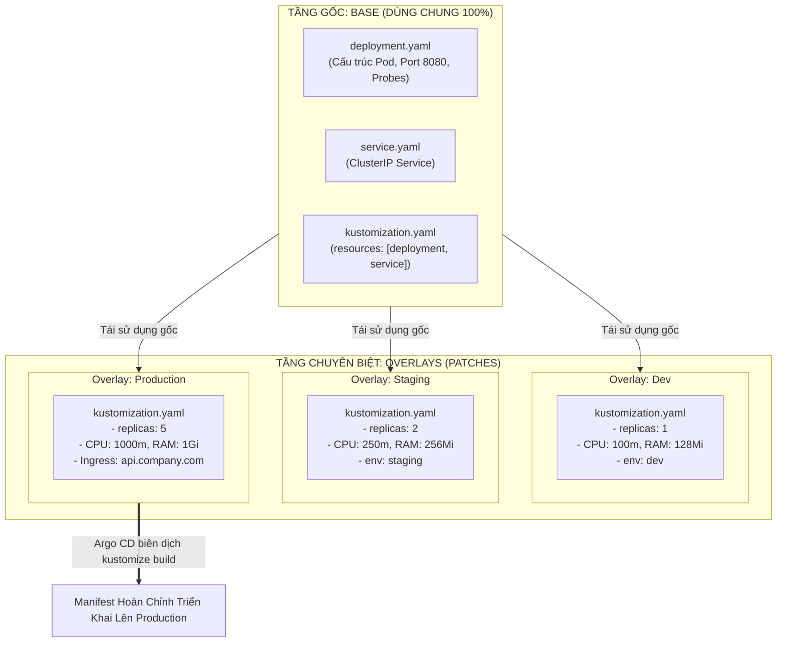
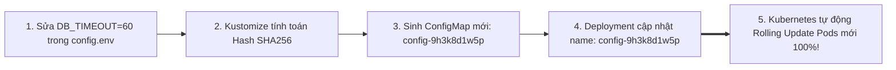
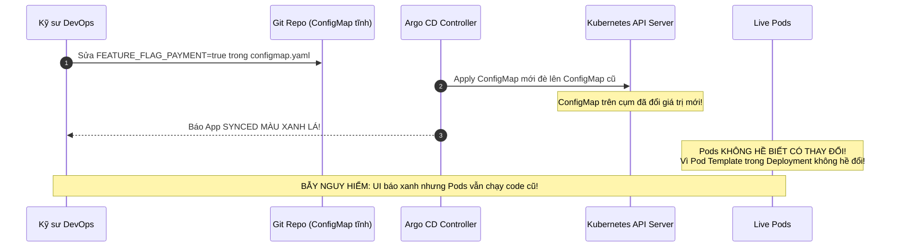


# Tích Hợp Kustomize Trong Argo CD: Quản Trị Đa Môi Trường DRY Chuẩn Enterprise

Trong thực tế phát triển phần mềm, một ứng dụng microservice không bao giờ chỉ chạy trên một môi trường duy nhất. Hệ thống bắt buộc phải đi qua chuỗi các môi trường: **Dev** (cho lập trình viên thử nghiệm), **Staging / UAT** (cho QA kiểm thử tải) và **Production** (phục vụ khách hàng thực tế).

Vấn đề đặt ra là: Làm thế nào để quản lý cấu hình cho hàng chục microservices chạy trên nhiều môi trường và cụm đám mây khác nhau mà không phải sao chép (Copy-Paste) tệp `deployment.yaml` thành hàng chục bản khác nhau? Nếu copy-paste, khi cần sửa một biến môi trường hoặc cập nhật security context chung, bạn sẽ phải sửa ở hàng chục nơi — tạo ra nguy cơ sai sót con người cực kỳ lớn!

**Kustomize** ra đời như một giải pháp cứu tinh với triết lý quản trị không dùng mẫu (**Template-Free Declarative Management**), cho phép tái sử dụng tối đa cấu hình gốc thông qua mô hình **Base & Overlays Pattern (DRY - Don't Repeat Yourself)**.

Bài viết này sẽ hướng dẫn bạn tích hợp Kustomize vào Argo CD, làm chủ các kỹ thuật vá cấu hình (Strategic Merge vs JSON 6902 Patch), khai thác tính năng tự động kích hoạt Rolling Update bằng **ConfigMapGenerator Content Hash**, kiến trúc Kustomize Components và vạch trần cạm bẫy *"ConfigMap đã Synced nhưng Pod vẫn chạy cấu hình cũ"*.

---

## 1. Kiến Trúc Base & Overlays Pattern (DRY Triệt Để)

Kustomize chia cấu hình thành 2 tầng phân tách trách nhiệm rõ rệt:
1. **Base (Tầng Nền Tảng):** Chứa 80-90% các khai báo chuẩn mực dùng chung cho mọi môi trường (cấu trúc Pod, Port, Liveness/Readiness Probes, Service, NetworkPolicy).
2. **Overlays (Tầng Chuyên Biệt):** Chỉ chứa các bản vá (Patches) đè lên Base để tinh chỉnh riêng cho từng môi trường (CPU/RAM, số Replicas, Ingress Hostname, Secrets, biến môi trường).



---

## 2. Kiến Trúc Đa Tầng Phân Cấp (Multi-Tier Hierarchy) & Kustomize Components

Trong các hệ thống Enterprise triển khai trên nhiều khu vực (Multi-Region) và nhiều nhà cung cấp đám mây (Multi-Cloud), mô hình 2 tầng đơn giản không đủ đáp ứng. Ta sử dụng mô hình **Đa Tầng Phân Cấp (Multi-Tier Overlays)** kết hợp **Kustomize Components**:

```mermaid
flowchart TD
    BASE["1. Base (Core App Manifests)"]
    
    subgraph CLOUD["2. Cloud Provider Layer (Overlays)"]
        AWS["aws-overlay<br/>(IRSA Annotations, ALB Ingress)"]
        GCP["gcp-overlay<br/>(Workload Identity, GKE Ingress)"]
    end
    
    subgraph COMP["Kustomize Components (Plug-and-Play Modules)"]
        C_TRACE["components/opentelemetry-tracing"]
        C_AUTH["components/oauth2-proxy-sidecar"]
        C_HPA["components/horizontal-autoscaler"]
    end

    subgraph REGION["3. Regional Production Overlays"]
        US_PROD["overlays/prod-us-east-1<br/>- Replicas: 10<br/>- Ingress: us-api.domain.com"]
        EU_PROD["overlays/prod-eu-west-1<br/>- Replicas: 8<br/>- Ingress: eu-api.domain.com"]
    end

    BASE --> AWS
    BASE --> GCP
    AWS --> US_PROD
    GCP --> EU_PROD
    C_TRACE -.->|components: [...]| US_PROD
    C_HPA -.->|components: [...]| US_PROD
    C_AUTH -.->|components: [...]| EU_PROD


```

- **Kustomize Components (`components:`):** Cho phép đóng gói các tính năng có thể tái sử dụng (như thêm sidecar log, cấu hình distributed tracing, hoặc cấu hình WAF rules) thành từng module độc lập và chỉ "cắm" (plug-in) vào môi trường nào thực sự cần thiết.

---

## 3. Phân Tích Cấu Trúc Thư Mục & Manifest Kustomize Chuẩn

Dưới đây là cấu trúc cây thư mục chuẩn mực trong kho GitOps quản trị microservice:

```
services/payment-service/
├── base/
│   ├── deployment.yaml
│   ├── service.yaml
│   └── kustomization.yaml
├── components/
│   └── tracing/
│       ├── kustomization.yaml
│       └── otel-agent-patch.yaml
└── overlays/
    ├── dev/
    │   ├── kustomization.yaml
    │   └── dev-patches.yaml
    ├── staging/
    │   ├── kustomization.yaml
    │   └── staging-patches.yaml
    └── production/
        ├── kustomization.yaml
        ├── replica-patch.yaml
        └── config.env
```

### 3.1. Cấu Hình Tệp `base/kustomization.yaml`

```yaml
apiVersion: kustomize.config.k8s.io/v1beta1
kind: Kustomization

resources:
  - deployment.yaml
  - service.yaml

commonLabels:
  app.kubernetes.io/name: payment-api
  app.kubernetes.io/part-of: ecommerce
```

### 3.2. Cấu Hình Tệp `overlays/production/kustomization.yaml` (Line-by-Line Breakdown)

```yaml
apiVersion: kustomize.config.k8s.io/v1beta1
kind: Kustomization

# 1. Kế thừa toàn bộ tài nguyên từ thư mục base
resources:
  - ../../base

# 2. Nhúng thêm module Kustomize Component (Tracing OpenTelemetry)
components:
  - ../../components/tracing

# 3. Tự động thêm tiền tố cho toàn bộ tài nguyên (ví dụ: prod-payment-api)
namePrefix: prod-

# 4. Tự động thêm Namespace cho toàn bộ tài nguyên
namespace: payment-production

# 5. Gắn thêm nhãn định danh môi trường
commonLabels:
  environment: production
  tier: backend

# 6. Tự động cập nhật Image Tag mà không cần sửa file deployment.yaml
images:
  - name: company-registry.io/payment-api
    newTag: "v2.5.0"

# 7. Tự động băm nội dung ConfigMap kích hoạt Zero-Downtime Rolling Update
configMapGenerator:
  - name: payment-config
    envs:
      - config.env
    options:
      disableNameSuffixHash: false

# 8. Áp dụng các bản vá (Patches) đè lên cấu hình Base
patches:
  - target:
      kind: Deployment
      name: payment-api
    patch: |-
      - op: replace
        path: /spec/replicas
        value: 5
      - op: add
        path: /spec/template/spec/containers/0/resources
        value:
          requests:
            cpu: 500m
            memory: 512Mi
          limits:
            cpu: 2000m
            memory: 2Gi
```

### 3.3. So Sánh Các Kỹ Thuật Patch Trong Kustomize

| Kỹ Thuật Patch | Cú Pháp Khai Báo | Trường Hợp Sử Dụng | Ưu Điểm | Nhược Điểm |
| :--- | :--- | :--- | :--- | :--- |
| **Strategic Merge Patch** | File YAML con chứa cấu trúc merge | Thêm biến môi trường, sửa label, đổi image | Dễ đọc, cú pháp tương tự Kubernetes manifest thông thường | Không thể xóa phần tử khỏi mảng một cách tường minh |
| **JSON Patch (RFC 6902)** | Mảng các operations: `add`, `remove`, `replace` | Xóa một container, sửa chính xác vị trí index trong mảng | Linh hoạt tuyệt đối, hỗ trợ xóa và thay thế chính xác | Khó đọc hơn, dễ sai nếu index mảng bị lệch |
| **Inline Patches (Kustomize v5)** | Khối `patches: [{target, patch}]` | Gộp chung cấu hình vá vào ngay trong `kustomization.yaml` | Gọn gàng, không cần tạo thêm nhiều file patch rác | File `kustomization.yaml` có thể bị dài nếu vá quá nhiều |

---

## 4. Sức Mạnh Của `configMapGenerator` & Tự Động Kích Hoạt Rolling Update

Một vấn đề "nhức nhối" trong Kubernetes là: **Khi bạn sửa nội dung một ConfigMap hoặc Secret, các Pods đang chạy sẽ KHÔNG tự động khởi động lại để nạp cấu hình mới**. Nếu kỹ sư không biết, ứng dụng sẽ tiếp tục chạy với cấu hình cũ lỗi thời dù manifest đã được đồng bộ.

### 4.1. Cơ Chế Băm Nội Dung (Content Hash Suffix) Của Kustomize

Khi sử dụng `configMapGenerator`, Kustomize tự động tính toán mã băm SHA256 của nội dung tệp `config.env` và gắn vào đuôi của tên ConfigMap:

```
Lần 1: payment-config-7b8f9g4k2m  (Nội dung: DB_TIMEOUT=30)
Lần 2: Sửa DB_TIMEOUT=60
  -> Kustomize tự sinh tên mới: payment-config-9h3k8d1w5p
  -> Deployment tự động đổi tham số trỏ sang ConfigMap mới
  -> Kubernetes PHÁT HIỆN THAY ĐỔI TRÊN POD TEMPLATE VÀ KÍCH HOẠT ROLLING UPDATE TỨC THÌ!
```



> [!IMPORTANT]
> **TỰ ĐỘNG ROLLING UPDATE VỚI CONFIGMAP:**
> Sửa ConfigMap tĩnh không làm Pod restart. Luôn sử dụng `configMapGenerator` của Kustomize để tự động băm mã Hash vào tên ConfigMap, ép Kubernetes kích hoạt Zero-Downtime Rolling Update.

---

## 5. Tùy Biến Cờ Kustomize Build Trong Argo CD (`argocd-cm`)

Mặc định, Kustomize chạy bên trong `argocd-repo-server` với các thiết lập bảo mật nghiêm ngặt. Khi cần kích hoạt các tính năng nâng cao như nhúng Helm Chart trong Kustomize hoặc nạp file ngoài thư mục gốc (`--load-restrictor LoadRestrictionsNone`), bạn có thể cấu hình thông qua ConfigMap `argocd-cm`:

```yaml
apiVersion: v1
kind: ConfigMap
metadata:
  name: argocd-cm
  namespace: argocd
data:
  # Cấu hình tùy chọn tham số build cho Kustomize engine
  kustomize.buildOptions: "--enable-helm --load-restrictor LoadRestrictionsNone"
```

---

## 6. Khai Báo Kustomize Trong Argo CD Application CRD

Argo CD tự động nhận diện Kustomize khi trong thư mục `spec.source.path` có chứa tệp `kustomization.yaml`:

```yaml
# application-kustomize-prod.yaml
apiVersion: argoproj.io/v1alpha1
kind: Application
metadata:
  name: payment-prod-kustomize
  namespace: argocd
spec:
  project: default
  source:
    repoURL: "https://github.com/company/ecommerce-gitops.git"
    targetRevision: "main"
    path: "services/payment-service/overlays/production"
    
    # Có thể override tham số trực tiếp từ Argo CD Application
    kustomize:
      namePrefix: "prod-"
      images:
        - "company-registry.io/payment-api:v2.5.0"
      commonLabels:
        managed-by: "argocd"
  destination:
    server: "https://kubernetes.default.svc"
    namespace: "payment-production"
  syncPolicy:
    automated:
      prune: true
      selfHeal: true
    syncOptions:
      - CreateNamespace=true
      - PruneLast=true
```

---

## 7. Cạm Bẫy Thực Chiến: "ConfigMap Đã Synced Nhưng Pods Vẫn Chạy Cấu Hình Cũ Do Không Dùng Hash Generator"

### Hiện Tượng Sự Cố & Log Trace
- Kỹ sư DevOps sửa một biến môi trường quan trọng `FEATURE_FLAG_PAYMENT=true` trong một ConfigMap tĩnh `configmap.yaml` trên Git.
- Argo CD phát hiện commit mới, thực hiện Sync thành công và báo **`Sync Status: Synced`** màu xanh lá.
- Tuy nhiên, người dùng trên Production vẫn không sử dụng được tính năng mới. Khách hàng phàn nàn và hệ thống vẫn xử lý theo logic cũ!



### 7.1. Phân Tích Nguyên Nhân Gốc Rễ (5-Whys)
1. **Tại sao người dùng không thấy tính năng mới?** $\rightarrow$ Vì Pods chưa nạp biến môi trường mới.
2. **Tại sao Pods không nạp?** $\rightarrow$ Vì Kubernetes không tự động restart Pod khi ConfigMap tĩnh bị sửa.
3. **Tại sao Kubernetes không restart Pod?** $\rightarrow$ Vì trường `spec.template` của Deployment không hề có bất kỳ thay đổi nào (generation không tăng).
4. **Tại sao kỹ sư dùng ConfigMap tĩnh thay vì Kustomize Generator?** $\rightarrow$ Do thói quen viết manifest Kubernetes thủ công trước đây mà chưa tận dụng tính năng hash của Kustomize.
5. **Giải pháp chuẩn hóa là gì?** $\rightarrow$ Quy định 100% ConfigMaps/Secrets phải được sinh qua `configMapGenerator` hoặc `secretGenerator` trong `kustomization.yaml`.

---

## 8. Hướng Dẫn Thực Hành CLI: Kiểm Thử Biên Dịch Kustomize Cục Bộ (Step-by-Step Lab)

Trước khi commit mã nguồn lên Git, hãy luôn kiểm tra kết quả biên dịch của Kustomize trên máy cá nhân:

```bash
# Bước 1: Di chuyển vào thư mục overlay production
cd services/payment-service/overlays/production

# Bước 2: Thực thi lệnh biên dịch để xem trước toàn bộ Kubernetes manifests đầu ra
kustomize build .

# Bước 3: Kiểm tra xem ConfigMap có được tự động gắn mã băm Hash Suffix không
kustomize build . | grep -A 8 "kind: ConfigMap"

# Bước 4: Kiểm tra xem các bản vá Patches (CPU/RAM/Replicas) đã được áp dụng đúng chưa
kustomize build . | grep -A 20 "kind: Deployment"

# Bước 5: Validate tính hợp lệ của manifest với kubeconform
kustomize build . | kubeconform -strict -summary

# Bước 6: So sánh sự khác biệt của Overlay Production so với Overlay Staging
diff <(kustomize build ../staging) <(kustomize build .)
```

---

## 9. Bộ Câu Hỏi Tự Kiểm Tra Chuyên Sâu (Self-Check Q&A)


<details class="qa-card">
<summary class="qa-summary">
  <div class="qa-summary-left">
    <span class="qa-num-badge">Q01</span>
    <span>Tại sao Kustomize được gọi là phương pháp quản lý "Template-Free" (Không dùng mẫu)?</span>
  </div>
  <span class="qa-chevron">
    <svg width="18" height="18" fill="none" stroke="currentColor" stroke-width="2.5" viewBox="0 0 24 24"><polyline points="6 9 12 15 18 9"></polyline></svg>
  </span>
</summary>
<div class="qa-answer">
  <div class="qa-answer-header">
    <svg width="14" height="14" fill="none" stroke="currentColor" stroke-width="2" viewBox="0 0 24 24"><path d="M22 11.08V12a10 10 0 1 1-5.93-9.14"></path><polyline points="22 4 12 14.01 9 11.01"></polyline></svg>
    <span>Phân Tích &amp; Lời Giải Kỹ Thuật</span>
  </div>
  Vì Kustomize không sử dụng cú pháp chèn mẫu như `{{ .Values.name }}` (như Helm). Toàn bộ các file trong Base và Overlays đều là các tệp **Kubernetes YAML hợp lệ 100%** và có thể `kubectl apply` độc lập. Kustomize chỉ thực hiện thao tác sáp nhập và vá cấu trúc JSON/YAML (Patching).
</div>
</details>

<details class="qa-card">
<summary class="qa-summary">
  <div class="qa-summary-left">
    <span class="qa-num-badge">Q02</span>
    <span>Lợi ích lớn nhất của `configMapGenerator` so với việc khai báo tệp `configmap.yaml` truyền thống là gì?</span>
  </div>
  <span class="qa-chevron">
    <svg width="18" height="18" fill="none" stroke="currentColor" stroke-width="2.5" viewBox="0 0 24 24"><polyline points="6 9 12 15 18 9"></polyline></svg>
  </span>
</summary>
<div class="qa-answer">
  <div class="qa-answer-header">
    <svg width="14" height="14" fill="none" stroke="currentColor" stroke-width="2" viewBox="0 0 24 24"><path d="M22 11.08V12a10 10 0 1 1-5.93-9.14"></path><polyline points="22 4 12 14.01 9 11.01"></polyline></svg>
    <span>Phân Tích &amp; Lời Giải Kỹ Thuật</span>
  </div>
  Là tính năng **Content Hash Suffix**. Mỗi khi nội dung cấu hình thay đổi, Kustomize tự động sinh ra một ConfigMap có tên mới (ví dụ `app-config-8f7d9a`) và cập nhật Deployment trỏ tới tên mới đó, giúp Kubernetes tự động kích hoạt Zero-Downtime Rolling Update mà không cần can thiệp thủ công.
</div>
</details>

<details class="qa-card">
<summary class="qa-summary">
  <div class="qa-summary-left">
    <span class="qa-num-badge">Q03</span>
    <span>Làm thế nào để thay đổi phiên bản Image trong Kustomize mà không cần viết file Patch?</span>
  </div>
  <span class="qa-chevron">
    <svg width="18" height="18" fill="none" stroke="currentColor" stroke-width="2.5" viewBox="0 0 24 24"><polyline points="6 9 12 15 18 9"></polyline></svg>
  </span>
</summary>
<div class="qa-answer">
  <div class="qa-answer-header">
    <svg width="14" height="14" fill="none" stroke="currentColor" stroke-width="2" viewBox="0 0 24 24"><path d="M22 11.08V12a10 10 0 1 1-5.93-9.14"></path><polyline points="22 4 12 14.01 9 11.01"></polyline></svg>
    <span>Phân Tích &amp; Lời Giải Kỹ Thuật</span>
  </div>
  Sử dụng khối `images:` trong `kustomization.yaml`:
  ```yaml
  images:
    - name: company/app
      newTag: "v2.0.0"
  ```
  Kustomize sẽ tự động quét toàn bộ các Deployment/StatefulSet có chứa image `company/app` và thay thế tag thành `v2.0.0`.
</div>
</details>

<details class="qa-card">
<summary class="qa-summary">
  <div class="qa-summary-left">
    <span class="qa-num-badge">Q04</span>
    <span>Có thể lồng nhiều tầng Overlays trong Kustomize (ví dụ: Base $\rightarrow$ Cloud Overlay $\rightarrow$ Region Overlay) không?</span>
  </div>
  <span class="qa-chevron">
    <svg width="18" height="18" fill="none" stroke="currentColor" stroke-width="2.5" viewBox="0 0 24 24"><polyline points="6 9 12 15 18 9"></polyline></svg>
  </span>
</summary>
<div class="qa-answer">
  <div class="qa-answer-header">
    <svg width="14" height="14" fill="none" stroke="currentColor" stroke-width="2" viewBox="0 0 24 24"><path d="M22 11.08V12a10 10 0 1 1-5.93-9.14"></path><polyline points="22 4 12 14.01 9 11.01"></polyline></svg>
    <span>Phân Tích &amp; Lời Giải Kỹ Thuật</span>
  </div>
  **Hoàn toàn được!** Kustomize hỗ trợ mô hình đa tầng phân cấp không giới hạn. Một thư mục `kustomization.yaml` có thể tham chiếu đến một thư mục cha khác thông qua trường `resources: [../path]`.
</div>
</details>

<details class="qa-card">
<summary class="qa-summary">
  <div class="qa-summary-left">
    <span class="qa-num-badge">Q05</span>
    <span>Khi tích hợp Kustomize vào Argo CD, ta cần trỏ `spec.source.path` vào thư mục Base hay thư mục Overlay?</span>
  </div>
  <span class="qa-chevron">
    <svg width="18" height="18" fill="none" stroke="currentColor" stroke-width="2.5" viewBox="0 0 24 24"><polyline points="6 9 12 15 18 9"></polyline></svg>
  </span>
</summary>
<div class="qa-answer">
  <div class="qa-answer-header">
    <svg width="14" height="14" fill="none" stroke="currentColor" stroke-width="2" viewBox="0 0 24 24"><path d="M22 11.08V12a10 10 0 1 1-5.93-9.14"></path><polyline points="22 4 12 14.01 9 11.01"></polyline></svg>
    <span>Phân Tích &amp; Lời Giải Kỹ Thuật</span>
  </div>
  Bắt buộc phải trỏ vào **thư mục Overlay tương ứng của môi trường đó** (ví dụ: `services/payment/overlays/production`). Thư mục Overlay sẽ tự động kéo thư mục Base về biên dịch thành bản manifest hoàn chỉnh cho môi trường đó.
</div>
</details>

<details class="qa-card">
<summary class="qa-summary">
  <div class="qa-summary-left">
    <span class="qa-num-badge">Q06</span>
    <span>`Kustomize Components` khác với việc kế thừa thư mục `Base` thông thường như thế nào?</span>
  </div>
  <span class="qa-chevron">
    <svg width="18" height="18" fill="none" stroke="currentColor" stroke-width="2.5" viewBox="0 0 24 24"><polyline points="6 9 12 15 18 9"></polyline></svg>
  </span>
</summary>
<div class="qa-answer">
  <div class="qa-answer-header">
    <svg width="14" height="14" fill="none" stroke="currentColor" stroke-width="2" viewBox="0 0 24 24"><path d="M22 11.08V12a10 10 0 1 1-5.93-9.14"></path><polyline points="22 4 12 14.01 9 11.01"></polyline></svg>
    <span>Phân Tích &amp; Lời Giải Kỹ Thuật</span>
  </div>
  Kế thừa Base là quan hệ "IS-A" (môi trường này là phiên bản mở rộng của Base). Trong khi đó, `Components` là quan hệ "HAS-A" (mô hình Plug-and-Play), cho phép nhiều Overlays khác nhau tùy ý nhúng hoặc không nhúng một module tính năng (như Tracing, Prometheus Exporter, TLS Ingress) mà không làm ô nhiễm cấu hình Base.
</div>
</details>

<details class="qa-card">
<summary class="qa-summary">
  <div class="qa-summary-left">
    <span class="qa-num-badge">Q07</span>
    <span>Khi nào nên sử dụng JSON Patch (RFC 6902) thay vì Strategic Merge Patch trong Kustomize?</span>
  </div>
  <span class="qa-chevron">
    <svg width="18" height="18" fill="none" stroke="currentColor" stroke-width="2.5" viewBox="0 0 24 24"><polyline points="6 9 12 15 18 9"></polyline></svg>
  </span>
</summary>
<div class="qa-answer">
  <div class="qa-answer-header">
    <svg width="14" height="14" fill="none" stroke="currentColor" stroke-width="2" viewBox="0 0 24 24"><path d="M22 11.08V12a10 10 0 1 1-5.93-9.14"></path><polyline points="22 4 12 14.01 9 11.01"></polyline></svg>
    <span>Phân Tích &amp; Lời Giải Kỹ Thuật</span>
  </div>
  Khi cần thực hiện các thao tác phức tạp trên mảng (Array) mà Strategic Merge không hỗ trợ, chẳng hạn như xóa hoàn toàn một phần tử cụ thể khỏi mảng, thay thế chính xác một biến môi trường ở vị trí index xác định, hoặc sửa trường trong CRD không có strategic merge schema.
</div>
</details>

<details class="qa-card">
<summary class="qa-summary">
  <div class="qa-summary-left">
    <span class="qa-num-badge">Q08</span>
    <span>Làm cách nào để tắt tính năng băm mã Hash của `configMapGenerator` nếu bắt buộc phải dùng tên cố định?</span>
  </div>
  <span class="qa-chevron">
    <svg width="18" height="18" fill="none" stroke="currentColor" stroke-width="2.5" viewBox="0 0 24 24"><polyline points="6 9 12 15 18 9"></polyline></svg>
  </span>
</summary>
<div class="qa-answer">
  <div class="qa-answer-header">
    <svg width="14" height="14" fill="none" stroke="currentColor" stroke-width="2" viewBox="0 0 24 24"><path d="M22 11.08V12a10 10 0 1 1-5.93-9.14"></path><polyline points="22 4 12 14.01 9 11.01"></polyline></svg>
    <span>Phân Tích &amp; Lời Giải Kỹ Thuật</span>
  </div>
  Thêm tùy chọn `options: { disableNameSuffixHash: true }` vào khối khai báo trong `kustomization.yaml`.
</div>
</details>

<details class="qa-card">
<summary class="qa-summary">
  <div class="qa-summary-left">
    <span class="qa-num-badge">Q09</span>
    <span>Lệnh nào giúp kiểm tra kết quả biên dịch Kustomize từ CLI mà không cần cài đặt công cụ Kustomize riêng biệt?</span>
  </div>
  <span class="qa-chevron">
    <svg width="18" height="18" fill="none" stroke="currentColor" stroke-width="2.5" viewBox="0 0 24 24"><polyline points="6 9 12 15 18 9"></polyline></svg>
  </span>
</summary>
<div class="qa-answer">
  <div class="qa-answer-header">
    <svg width="14" height="14" fill="none" stroke="currentColor" stroke-width="2" viewBox="0 0 24 24"><path d="M22 11.08V12a10 10 0 1 1-5.93-9.14"></path><polyline points="22 4 12 14.01 9 11.01"></polyline></svg>
    <span>Phân Tích &amp; Lời Giải Kỹ Thuật</span>
  </div>
  Sử dụng lệnh tích hợp sẵn trong Kubectl: `kubectl kustomize <đường_dẫn_thư_mục>`.
</div>
</details>

<details class="qa-card">
<summary class="qa-summary">
  <div class="qa-summary-left">
    <span class="qa-num-badge">Q10</span>
    <span>Khi dùng `commonLabels` trong Kustomize, nhãn này sẽ được gắn vào những đâu?</span>
  </div>
  <span class="qa-chevron">
    <svg width="18" height="18" fill="none" stroke="currentColor" stroke-width="2.5" viewBox="0 0 24 24"><polyline points="6 9 12 15 18 9"></polyline></svg>
  </span>
</summary>
<div class="qa-answer">
  <div class="qa-answer-header">
    <svg width="14" height="14" fill="none" stroke="currentColor" stroke-width="2" viewBox="0 0 24 24"><path d="M22 11.08V12a10 10 0 1 1-5.93-9.14"></path><polyline points="22 4 12 14.01 9 11.01"></polyline></svg>
    <span>Phân Tích &amp; Lời Giải Kỹ Thuật</span>
  </div>
  `commonLabels` sẽ được Kustomize gắn tự động vào cả hai nơi: `metadata.labels` của toàn bộ tài nguyên (Deployment, Service, Ingress) VÀ `spec.template.metadata.labels` cùng với `spec.selector.matchLabels` của Deployment/StatefulSet.
</div>
</details>

---

## Tổng Kết

Kustomize là chuẩn mực vàng để hiện thực hóa triết lý DRY trong quản trị cấu hình Kubernetes đa môi trường. Bằng việc kết hợp Base & Overlays, Kustomize Components và ConfigMapGenerator, đội ngũ kỹ thuật có thể quản lý hàng trăm ứng dụng một cách nhất quán, giảm thiểu sai sót và đảm bảo các bản cập nhật cấu hình luôn được kích hoạt mượt mà trên Production.

Ở bài tiếp theo, chúng ta sẽ khám phá **Quản Lý Helm Charts Với Argo CD & Kỹ Thuật Multiple Sources `$values` Nâng Cao**!

