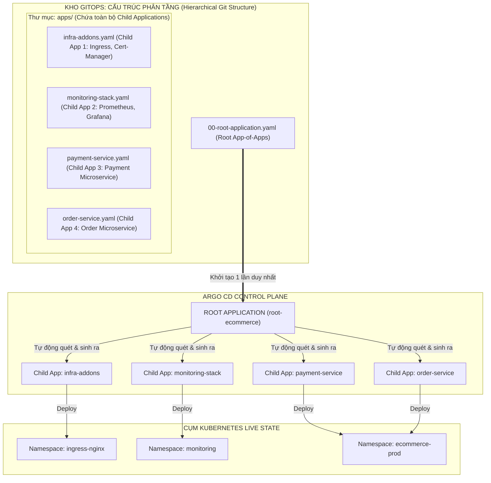
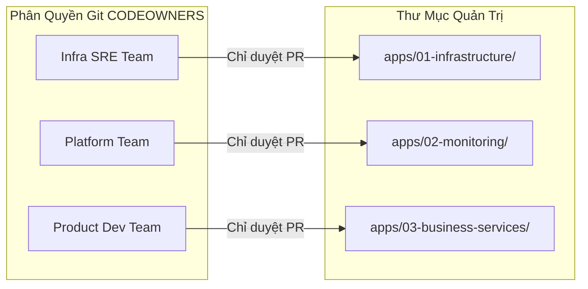
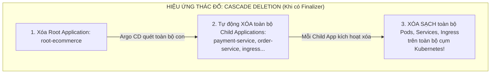
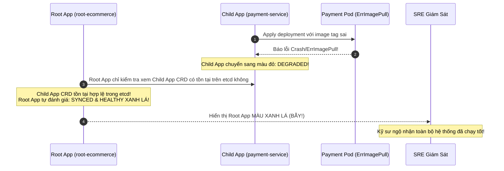


# Mô Hình Quản Trị Quy Mô: App-of-Apps Pattern Chuẩn Enterprise

Khi số lượng microservices trong doanh nghiệp vượt qua con số 20, 50 hoặc hàng trăm dịch vụ phân tán trên nhiều môi trường, việc kỹ sư phải dùng lệnh `kubectl apply` hoặc tạo thủ công từng đối tượng `Application CRD` trên giao diện web của Argo CD sẽ nhanh chóng biến thành một "cơn ác mộng" vận hành.

Làm thế nào để áp dụng triết lý GitOps cho chính bản thân Argo CD? Nghĩa là: **Toàn bộ danh mục các ứng dụng con (Applications) cũng phải được khai báo dưới dạng mã nguồn trên Git**, và khi một đội phát triển muốn bổ sung một microservice mới, họ chỉ cần tạo một Pull Request thêm tệp `app.yaml` vào kho GitOps?

Giải pháp kinh điển và chuẩn mực nhất được toàn bộ cộng đồng Cloud Native áp dụng chính là **Mô hình App-of-Apps Pattern** (Ứng dụng quản lý các ứng dụng). Bài viết này sẽ hướng dẫn bạn thiết kế cây phân cấp ứng dụng chuẩn Enterprise, cấu hình cơ chế lan truyền trạng thái sức khỏe bằng Lua Script, điều phối thứ tự khởi tạo Child Apps bằng Sync Waves, quản trị an toàn vòng đời Cascade Deletion và nhận diện cạm bẫy *"Root App Synced nhưng Child App nổ lỗi"*.

---

## 1. Bản Chất & Sơ Đồ Cây Phân Cấp App-of-Apps

Trong mô hình App-of-Apps, ta khởi tạo một đối tượng Application duy nhất gọi là **Root Application**. Nguồn (Source) của Root Application trỏ tới một thư mục Git chứa định nghĩa của các **Child Applications**:



---

## 2. So Sánh App-of-Apps vs ApplicationSet vs Đơn Ứng Dụng (Monolithic App)

Để lựa chọn đúng kiến trúc cho tổ chức, hãy xem xét bảng so sánh chi tiết dưới đây:

| Tiêu Chí Đánh Giá | Quản Trị Đơn Lẻ (Single App) | App-of-Apps Pattern | ApplicationSet Controller |
| :--- | :--- | :--- | :--- |
| **Mức độ phức tạp thiết lập** | Thấp (Tạo từng app thủ công) | Trung bình (Tổ chức Git cây thư mục) | Cao (Học thêm CRD & Generators) |
| **Khả năng mở rộng (Scalability)** | Kém (< 10 apps) | Tốt (10 - 200 apps) | Cực tốt (> 200 apps, đa cụm) |
| **Khả năng sinh tự động (Templating)** | Không hỗ trợ | Không (Mỗi app cần 1 file YAML tĩnh) | Tự động sinh hàng loạt qua dynamic params |
| **Phù hợp hạ tầng phân tầng** | Không phù hợp | **Xuất sắc (Phân tầng Hạ tầng -> Core -> Apps)** | Tốt nhưng cấu hình matrix phức tạp hơn |
| **Độ rõ ràng trên Git (Auditing)** | Rời rạc | **Rất cao (Thấy rõ từng file app.yaml trên Git)** | Gián tiếp (Sinh ra từ generator logic) |
| **Kiểm soát quyền AppProject** | Phân tán | Rất chặt chẽ theo từng Child App | Rất chặt chẽ theo AppSet template |

---

## 3. Thiết Kế Cấu Trúc Thư Mục & Phân Quyền Git Chuẩn Doanh Nghiệp

Cấu trúc thư mục được khuyến nghị cho các tổ chức quy mô lớn kết hợp phân quyền Git CODEOWNERS:

```bash
ecommerce-gitops/
├── 00-root-app.yaml                     # Manifest của Root Application (Platform Admin)
├── apps/                                # Danh mục toàn bộ Child Applications
│   ├── 01-infrastructure/               # Quản lý bởi Team Hạ Tầng (Infra SRE)
│   │   ├── ingress-nginx.yaml
│   │   ├── cert-manager.yaml
│   │   └── sealed-secrets.yaml
│   ├── 02-monitoring/                   # Quản lý bởi Team Nền Tảng (Platform Ops)
│   │   └── prometheus-stack.yaml
│   └── 03-business-services/           # Quản lý bởi các Đội Phát Triển (Dev Teams)
│       ├── payment-service.yaml
│       └── order-service.yaml
└── manifests/                           # Thư mục chứa mã nguồn Kubernetes thực tế
    ├── infrastructure/
    └── services/
```



---

## 4. Phân Tích Cấu Hình Chi Tiết Tệp Root App & Child Apps (Line-by-Line Breakdown)

### 4.1. Manifest Của Root Application (`00-root-app.yaml`)

```yaml
apiVersion: argoproj.io/v1alpha1
kind: Application
metadata:
  name: root-ecommerce-platform
  namespace: argocd
  # Finalizer quản lý việc xóa toàn bộ các Child Apps khi Root App bị xóa
  finalizers:
    - resources-finalizer.argocd.argoproj.io
spec:
  project: default
  source:
    repoURL: "https://github.com/company/ecommerce-gitops.git"
    targetRevision: "HEAD"
    # Trỏ vào thư mục chứa danh sách các Child Applications
    path: "apps"
    directory:
      recurse: true # Cho phép quét đệ quy toàn bộ thư mục con bên trong 'apps/'
  destination:
    server: "https://kubernetes.default.svc"
    namespace: "argocd" # Child Applications bắt buộc phải được tạo trong namespace 'argocd'
  syncPolicy:
    automated:
      prune: true     # Xóa Child App trên Argo CD khi file app.yaml bị xóa trên Git
      selfHeal: true  # Tự động tạo lại Child App nếu ai đó xóa nhầm bằng tay
    syncOptions:
      - CreateNamespace=true
      - ApplyOutOfSyncOnly=true
```

#### Phân Tích Từng Khối Cấu Hình Root:
- **Dòng 108-109 (`finalizers`):** Thiết lập `resources-finalizer`. Khi xóa Root App, Argo CD sẽ xóa đệ quy toàn bộ các Child Apps bên dưới.
- **Dòng 116-118 (`directory.recurse: true`):** Cho phép chia thư mục `apps/` thành nhiều cấp thư mục nhỏ (`01-infrastructure/`, `02-monitoring/`, `03-services/`) để dễ phân quyền Git CODEOWNERS.
- **Dòng 120-121 (`destination.namespace: argocd`):** Bắt buộc phải trỏ vào namespace `argocd` vì các đối tượng `Application` con phải nằm trong namespace này để Controller nhận diện.
- **Dòng 128 (`ApplyOutOfSyncOnly=true`):** Tối ưu hóa hiệu năng, chỉ apply lại những Child App nào có thay đổi thay vì apply lại toàn bộ hàng trăm app trong mỗi vòng reconcile.

### 4.2. Manifest Của Child App Hạ Tầng (`apps/01-infrastructure/cert-manager.yaml`)

Để đảm bảo hạ tầng được tạo trước khi các ứng dụng nghiệp vụ khởi chạy, ta gắn **Sync Wave** trực tiếp lên `Application` CRD:

```yaml
apiVersion: argoproj.io/v1alpha1
kind: Application
metadata:
  name: infra-cert-manager
  namespace: argocd
  annotations:
    argocd.argoproj.io/sync-wave: "1" # Wave 1: Khởi tạo hạ tầng chứng chỉ trước
  finalizers:
    - resources-finalizer.argocd.argoproj.io
spec:
  project: infrastructure-project
  source:
    repoURL: "https://charts.jetstack.io"
    chart: "cert-manager"
    targetRevision: "v1.14.4"
    helm:
      parameters:
        - name: "installCRDs"
          value: "true"
  destination:
    server: "https://kubernetes.default.svc"
    namespace: "cert-manager"
  syncPolicy:
    automated:
      prune: true
      selfHeal: true
    syncOptions:
      - CreateNamespace=true
```

### 4.3. Manifest Của Child App Nghiệp Vụ (`apps/03-business-services/payment-service.yaml`)

```yaml
apiVersion: argoproj.io/v1alpha1
kind: Application
metadata:
  name: payment-microservice
  namespace: argocd
  annotations:
    argocd.argoproj.io/sync-wave: "3" # Wave 3: Khởi chạy sau khi Hạ tầng và Monitoring đã Ready
  finalizers:
    - resources-finalizer.argocd.argoproj.io
spec:
  project: ecommerce-production
  source:
    repoURL: "https://github.com/company/ecommerce-gitops.git"
    targetRevision: "main"
    path: "manifests/services/payment-service/overlays/production"
  destination:
    server: "https://kubernetes.default.svc"
    namespace: "ecommerce-prod"
  syncPolicy:
    automated:
      prune: true
      selfHeal: true
    syncOptions:
      - CreateNamespace=true
      - ServerSideApply=true
```

---

## 5. Quản Lý Vòng Đời Cascade Deletion & Quy Trình Cứu Hộ Khẩn Cấp

Mối quan hệ giữa Root App và Child Apps được gắn kết chặt chẽ thông qua cơ chế **Tracking ID** và **Finalizers**:



### 5.1. Quy Trình Cứu Hộ Khẩn Cấp Khi Ai Đó Vô Tình Xóa Root App

Nếu Root App bị xóa nhầm nhưng bạn muốn cứu vãn các Child Workloads không bị xóa trên Kubernetes:

```bash
# 1. Gỡ bỏ ngay lập tức Finalizer trên Root Application để chặn lệnh Cascade Delete
kubectl patch app root-ecommerce-platform -n argocd \
  -p '{"metadata":{"finalizers":null}}' --type=merge

# 2. Gỡ bỏ Finalizer trên toàn bộ các Child Applications con đang bị kẹt Terminating
for app in $(kubectl get app -n argocd -o jsonpath='{.items[*].metadata.name}'); do
  kubectl patch app $app -n argocd -p '{"metadata":{"finalizers":null}}' --type=merge
done
```

> [!WARNING]
> **CẢNH BÁO AN TOÀN DOANH NGHIỆP:**
> Khi xóa một Root Application có gắn `resources-finalizer`, bạn đang ra lệnh xóa toàn bộ hàng trăm ứng dụng con và toàn bộ tài nguyên thực tế của chúng trên Kubernetes. Hãy luôn sử dụng cờ `--cascade=false` nếu chỉ muốn xóa bỏ cấu trúc quản lý Root App mà vẫn giữ nguyên các ứng dụng con đang chạy!

---

## 6. Cạm Bẫy Thực Chiến: "Root App Báo Synced Xanh Nhưng Child App Đang Bị Sập Đỏ (Degraded)"

### Hiện Tượng Sự Cố & Log Trace
- Kỹ sư trưởng nhìn lên màn hình giám sát Dashboard tổng quát của Argo CD: **`Root Application` hiển thị trạng thái `Sync Status: Synced` và `Health Status: Healthy` màu xanh lá tươi tốt**.
- Kỹ sư yên tâm bàn giao ca trực.
- 15 phút sau, Trung tâm chăm sóc khách hàng báo động: Cổng thanh toán tê liệt hoàn toàn!
- Khi kiểm tra sâu vào bên trong, `payment-microservice` (Child App) đang bị lỗi **`Degraded`** (do Image tag không tồn tại `ErrImagePull`), nhưng **Root App hoàn toàn không phản ánh lỗi này lên tầng trên**!



### 6.1. Phân Tích Nguyên Nhân Gốc Rễ (5-Whys)
1. **Tại sao Dashboard tổng quan xanh nhưng ứng dụng chết?** $\rightarrow$ Vì Root App báo Healthy.
2. **Tại sao Root App báo Healthy?** $\rightarrow$ Vì đối với Root App, "tài nguyên" cần quản lý chỉ là đối tượng `Application CRD` của Child App.
3. **Tại sao Child App CRD lại Healthy?** $\rightarrow$ Mặc định Argo CD coi đối tượng CRD là Healthy miễn là nó được tạo thành công trong etcd của Kubernetes.
4. **Tại sao trạng thái lỗi của Pods không nổi lên Root App?** $\rightarrow$ Vì thiếu Custom Lua Health Check cho tài nguyên `argoproj.io/Application`.
5. **Giải pháp triệt để là gì?** $\rightarrow$ Cấu hình Lua Health Check cho `Application` CRD trong `argocd-cm` để lan truyền trạng thái sức khỏe từ Child lên Root.

### 6.2. Cấu Hình Lua Health Check Lan Truyền Trạng Thái (Status Bubble-Up)

Thêm đoạn Lua script sau vào ConfigMap `argocd-cm`:

```yaml
apiVersion: v1
kind: ConfigMap
metadata:
  name: argocd-cm
  namespace: argocd
data:
  resource.customizations.health.argoproj.io_Application: |
    hs = {}
    hs.status = "Progressing"
    hs.message = ""
    if obj.status ~= nil then
      if obj.status.health ~= nil then
        hs.status = obj.status.health.status
        if obj.status.health.message ~= nil then
          hs.message = obj.status.health.message
        end
      end
    end
    return hs
```

Sau khi thêm script này, nếu bất kỳ Child App nào bị `Degraded`, Root App sẽ lập tức chuyển sang màu đỏ `Degraded`, giúp Dashboard giám sát phản ánh 100% tình trạng thực tế!

---

## 7. Hướng Dẫn Thực Hành CLI: Triển Khai Cây App-of-Apps Từ A-Z (Step-by-Step Lab)

Dưới đây là quy trình thực hành từ dòng lệnh để triển khai và quản trị cây ứng dụng phân cấp:

```bash
# Bước 1: Triển khai Root Application duy nhất để kích hoạt toàn bộ hệ thống
kubectl apply -f 00-root-app.yaml

# Bước 2: Quan sát danh sách toàn bộ các Child Applications được tự động sinh ra
argocd app list

# Bước 3: Ép buộc đồng bộ toàn bộ cây ứng dụng từ trên xuống dưới
argocd app sync root-ecommerce-platform

# Bước 4: Kiểm tra cây tài nguyên phân cấp của Root App
argocd app get root-ecommerce-platform --show-params

# Bước 5: Kiểm tra sức khỏe chi tiết của từng ứng dụng con
argocd app get payment-microservice

# Bước 6: Xóa an toàn Root App mà KHÔNG làm xóa các Child Applications (Non-cascade)
argocd app delete root-ecommerce-platform --cascade=false
```

---

## 8. Bộ Câu Hỏi Tự Kiểm Tra Chuyên Sâu (Self-Check Q&A)


<div class="qa-answer">
  <div class="qa-answer-header">
    <svg width="14" height="14" fill="none" stroke="currentColor" stroke-width="2" viewBox="0 0 24 24"><path d="M22 11.08V12a10 10 0 1 1-5.93-9.14"></path><polyline points="22 4 12 14.01 9 11.01"></polyline></svg>
    <span>Phân Tích &amp; Lời Giải Kỹ Thuật</span>
  </div>
  
Vì các đối tượng <code>Application CRD</code> con là tài nguyên nằm trong namespace quản trị của Argo CD (mặc định là namespace <code>argocd</code>). Root App cần tạo các Child App CRD vào đúng namespace này để Argo CD Controller nhận diện và quản lý.
</div>
</details>

<div class="qa-answer">
  <div class="qa-answer-header">
    <svg width="14" height="14" fill="none" stroke="currentColor" stroke-width="2" viewBox="0 0 24 24"><path d="M22 11.08V12a10 10 0 1 1-5.93-9.14"></path><polyline points="22 4 12 14.01 9 11.01"></polyline></svg>
    <span>Phân Tích &amp; Lời Giải Kỹ Thuật</span>
  </div>
  
Cho phép tổ chức cây thư mục <code>apps/</code> thành nhiều cấp thư mục con phân theo nhóm (ví dụ: <code>apps/01-infrastructure/</code>, <code>apps/02-monitoring/</code>, <code>apps/03-services/</code>). Root App sẽ tự động quét đệ quy qua toàn bộ các thư mục con để nạp mọi tệp manifest mà không cần khai báo từng thư mục thủ công.
</div>
</details>

<div class="qa-answer">
  <div class="qa-answer-header">
    <svg width="14" height="14" fill="none" stroke="currentColor" stroke-width="2" viewBox="0 0 24 24"><path d="M22 11.08V12a10 10 0 1 1-5.93-9.14"></path><polyline points="22 4 12 14.01 9 11.01"></polyline></svg>
    <span>Phân Tích &amp; Lời Giải Kỹ Thuật</span>
  </div>
  
Lập trình viên chỉ cần tạo một nhánh Git mới, tạo một tệp <code>new-service.yaml</code> bên trong thư mục <code>apps/</code> và tạo Pull Request. Khi PR được merge vào nhánh chính, Root App sẽ tự động phát hiện tệp mới trong chu kỳ Reconcile và khởi tạo Child Application tương ứng.
</div>
</details>

<div class="qa-answer">
  <div class="qa-answer-header">
    <svg width="14" height="14" fill="none" stroke="currentColor" stroke-width="2" viewBox="0 0 24 24"><path d="M22 11.08V12a10 10 0 1 1-5.93-9.14"></path><polyline points="22 4 12 14.01 9 11.01"></polyline></svg>
    <span>Phân Tích &amp; Lời Giải Kỹ Thuật</span>
  </div>
  
Root App sẽ tự động xóa đối tượng <code>Application</code> <code>payment-service</code> trên Argo CD. Nếu <code>payment-service</code> có gắn <code>resources-finalizer</code>, toàn bộ các Pods, Services của payment service trên cụm cũng sẽ được tự động dọn dẹp sạch sẽ.
</div>
</details>

<div class="qa-answer">
  <div class="qa-answer-header">
    <svg width="14" height="14" fill="none" stroke="currentColor" stroke-width="2" viewBox="0 0 24 24"><path d="M22 11.08V12a10 10 0 1 1-5.93-9.14"></path><polyline points="22 4 12 14.01 9 11.01"></polyline></svg>
    <span>Phân Tích &amp; Lời Giải Kỹ Thuật</span>
  </div>
  
App-of-Apps thuần túy vẫn đòi hỏi phải viết từng tệp YAML <code>Application</code> tĩnh cho mỗi microservice. Nó không có khả năng tự động tạo ứng dụng dựa trên khuôn mẫu (Templating) hoặc quét danh mục Cụm/Thư mục động như <b style="color: var(--accent-primary);">ApplicationSet Generator</b>.
</div>
</details>

<div class="qa-answer">
  <div class="qa-answer-header">
    <svg width="14" height="14" fill="none" stroke="currentColor" stroke-width="2" viewBox="0 0 24 24"><path d="M22 11.08V12a10 10 0 1 1-5.93-9.14"></path><polyline points="22 4 12 14.01 9 11.01"></polyline></svg>
    <span>Phân Tích &amp; Lời Giải Kỹ Thuật</span>
  </div>
  
Thêm Custom Lua Health Check cho Custom Resource <code>argoproj.io/Application</code> trong ConfigMap <code>argocd-cm</code> để ép buộc Controller đánh giá trạng thái sức khỏe của Root App dựa trên trạng thái <code>obj.status.health.status</code> của từng Child App.
</div>
</details>

<div class="qa-answer">
  <div class="qa-answer-header">
    <svg width="14" height="14" fill="none" stroke="currentColor" stroke-width="2" viewBox="0 0 24 24"><path d="M22 11.08V12a10 10 0 1 1-5.93-9.14"></path><polyline points="22 4 12 14.01 9 11.01"></polyline></svg>
    <span>Phân Tích &amp; Lời Giải Kỹ Thuật</span>
  </div>
  
Chạy lệnh <code>argocd app delete <root-app-name> --cascade=false</code> hoặc thực hiện gỡ bỏ <code>resources-finalizer.argocd.argoproj.io</code> khỏi <code>metadata.finalizers</code> của Root App trước khi xóa.
</div>
</details>

<div class="qa-answer">
  <div class="qa-answer-header">
    <svg width="14" height="14" fill="none" stroke="currentColor" stroke-width="2" viewBox="0 0 24 24"><path d="M22 11.08V12a10 10 0 1 1-5.93-9.14"></path><polyline points="22 4 12 14.01 9 11.01"></polyline></svg>
    <span>Phân Tích &amp; Lời Giải Kỹ Thuật</span>
  </div>
  
Tùy chọn này giúp tối ưu hóa đáng kể tốc độ Sync và giảm tải cho Kubernetes API Server. Khi Root App đồng bộ, Controller chỉ gửi request cập nhật các Child App nào thực sự bị <code>OutOfSync</code> thay vị apply lại toàn bộ hàng trăm Child Apps.
</div>
</details>

<div class="qa-answer">
  <div class="qa-answer-header">
    <svg width="14" height="14" fill="none" stroke="currentColor" stroke-width="2" viewBox="0 0 24 24"><path d="M22 11.08V12a10 10 0 1 1-5.93-9.14"></path><polyline points="22 4 12 14.01 9 11.01"></polyline></svg>
    <span>Phân Tích &amp; Lời Giải Kỹ Thuật</span>
  </div>
  
Giúp phân quyền kiểm soát chặt chẽ: Đội Hạ tầng chỉ được approve PR vào <code>01-infra</code>, đội Nền tảng phụ trách <code>02-monitoring</code>, và các đội Dev chỉ được tạo/sửa file trong <code>03-apps</code>, đảm bảo tính an toàn phân quyền trong doanh nghiệp.
</div>
</details>

<div class="qa-answer">
  <div class="qa-answer-header">
    <svg width="14" height="14" fill="none" stroke="currentColor" stroke-width="2" viewBox="0 0 24 24"><path d="M22 11.08V12a10 10 0 1 1-5.93-9.14"></path><polyline points="22 4 12 14.01 9 11.01"></polyline></svg>
    <span>Phân Tích &amp; Lời Giải Kỹ Thuật</span>
  </div>
  
Root App vẫn tạo được đối tượng <code>Application</code> con vào namespace <code>argocd</code>, nhưng Child App đó sẽ bị lỗi <code>ComparisonError</code> và không thể sync. Với Lua health check đã cấu hình, Root App sẽ phản ánh trạng thái lỗi này thành <code>Degraded</code>.
</div>
</details>

---

## Tổng Kết

Mô hình App-of-Apps là bước tiến vượt bậc đưa GitOps từ cấp độ quản trị từng ứng dụng đơn lẻ lên cấp độ quản trị toàn diện một hệ sinh thái phân tán phức tạp. Bằng cách kết hợp cấu trúc thư mục phân tầng, Finalizer an toàn và Lua Health Check lan truyền, doanh nghiệp có thể mở rộng quy mô lên hàng trăm dịch vụ một cách tự tin.

Ở bài tiếp theo, chúng ta sẽ nâng cấp lên cấp độ tự động hóa đỉnh cao với **ApplicationSet Engine: Tự Động Sinh Ứng Dụng Hàng Loạt Với List & Cluster Generators**!

